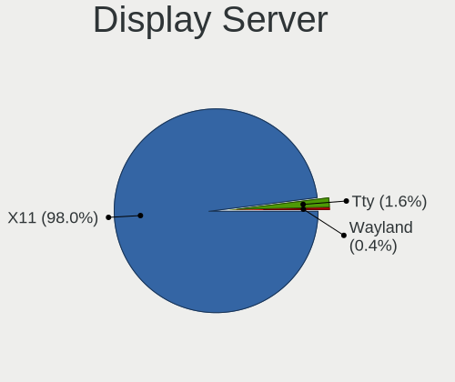
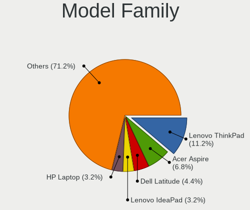
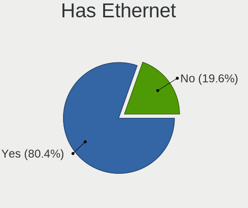
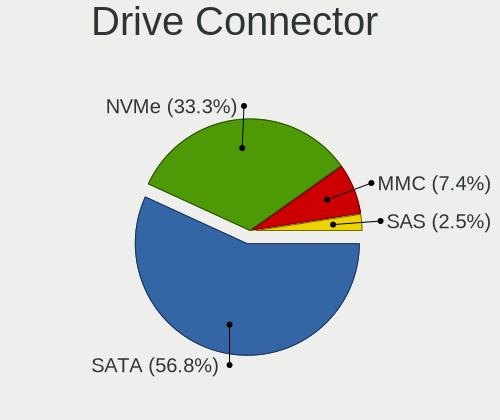
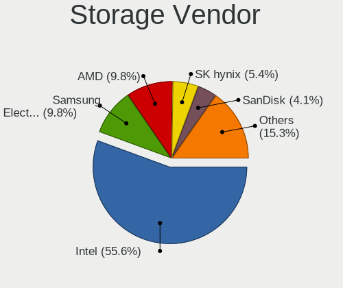
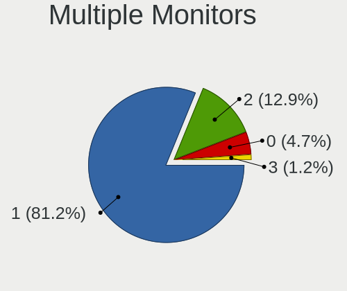
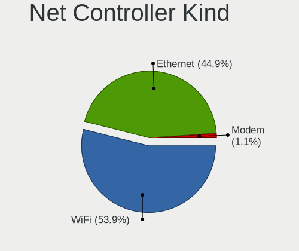

MX 21 - Tested Hardware & Statistics (Notebooks)
------------------------------------------------

A project to collect tested hardware configurations for MX 21.

Anyone can contribute to this report by the [hw-probe](https://github.com/linuxhw/hw-probe) tool:

    sudo -E hw-probe -all -upload

Please submit a probe of your configuration if it's not presented on the page or is rare.

Full-feature report is available here: https://linux-hardware.org/?view=trends

Contents
--------

* [ Test Cases ](#test-cases)

* [ System ](#system)
  - [ Kernel                   ](#kernel)
  - [ Kernel Family            ](#kernel-family)
  - [ Kernel Major Ver.        ](#kernel-major-ver)
  - [ Arch                     ](#arch)
  - [ DE                       ](#de)
  - [ Display Server           ](#display-server)
  - [ Display Manager          ](#display-manager)
  - [ OS Lang                  ](#os-lang)
  - [ Boot Mode                ](#boot-mode)
  - [ Filesystem               ](#filesystem)
  - [ Part. scheme             ](#part-scheme)
  - [ Dual Boot with Linux/BSD ](#dual-boot-with-linuxbsd)
  - [ Dual Boot (Win)          ](#dual-boot-win)

* [ Board ](#board)
  - [ Vendor                   ](#vendor)
  - [ Model                    ](#model)
  - [ Model Family             ](#model-family)
  - [ MFG Year                 ](#mfg-year)
  - [ Form Factor              ](#form-factor)
  - [ Secure Boot              ](#secure-boot)
  - [ Coreboot                 ](#coreboot)
  - [ RAM Size                 ](#ram-size)
  - [ RAM Used                 ](#ram-used)
  - [ Total Drives             ](#total-drives)
  - [ Has CD-ROM               ](#has-cd-rom)
  - [ Has Ethernet             ](#has-ethernet)
  - [ Has WiFi                 ](#has-wifi)
  - [ Has Bluetooth            ](#has-bluetooth)

* [ Location ](#location)
  - [ Country                  ](#country)
  - [ City                     ](#city)

* [ Drives ](#drives)
  - [ Drive Vendor             ](#drive-vendor)
  - [ Drive Model              ](#drive-model)
  - [ HDD Vendor               ](#hdd-vendor)
  - [ SSD Vendor               ](#ssd-vendor)
  - [ Drive Kind               ](#drive-kind)
  - [ Drive Connector          ](#drive-connector)
  - [ Drive Size               ](#drive-size)
  - [ Space Total              ](#space-total)
  - [ Space Used               ](#space-used)
  - [ Malfunc. Drives          ](#malfunc-drives)
  - [ Malfunc. Drive Vendor    ](#malfunc-drive-vendor)
  - [ Malfunc. HDD Vendor      ](#malfunc-hdd-vendor)
  - [ Malfunc. Drive Kind      ](#malfunc-drive-kind)
  - [ Failed Drives            ](#failed-drives)
  - [ Failed Drive Vendor      ](#failed-drive-vendor)
  - [ Drive Status             ](#drive-status)

* [ Storage controller ](#storage-controller)
  - [ Storage Vendor           ](#storage-vendor)
  - [ Storage Model            ](#storage-model)
  - [ Storage Kind             ](#storage-kind)

* [ Processor ](#processor)
  - [ CPU Vendor               ](#cpu-vendor)
  - [ CPU Model                ](#cpu-model)
  - [ CPU Model Family         ](#cpu-model-family)
  - [ CPU Cores                ](#cpu-cores)
  - [ CPU Sockets              ](#cpu-sockets)
  - [ CPU Threads              ](#cpu-threads)
  - [ CPU Op-Modes             ](#cpu-op-modes)
  - [ CPU Microcode            ](#cpu-microcode)
  - [ CPU Microarch            ](#cpu-microarch)

* [ Graphics ](#graphics)
  - [ GPU Vendor               ](#gpu-vendor)
  - [ GPU Model                ](#gpu-model)
  - [ GPU Combo                ](#gpu-combo)
  - [ GPU Driver               ](#gpu-driver)
  - [ GPU Memory               ](#gpu-memory)

* [ Monitor ](#monitor)
  - [ Monitor Vendor           ](#monitor-vendor)
  - [ Monitor Model            ](#monitor-model)
  - [ Monitor Resolution       ](#monitor-resolution)
  - [ Monitor Diagonal         ](#monitor-diagonal)
  - [ Monitor Width            ](#monitor-width)
  - [ Aspect Ratio             ](#aspect-ratio)
  - [ Monitor Area             ](#monitor-area)
  - [ Pixel Density            ](#pixel-density)
  - [ Multiple Monitors        ](#multiple-monitors)

* [ Network ](#network)
  - [ Net Controller Vendor    ](#net-controller-vendor)
  - [ Net Controller Model     ](#net-controller-model)
  - [ Wireless Vendor          ](#wireless-vendor)
  - [ Wireless Model           ](#wireless-model)
  - [ Ethernet Vendor          ](#ethernet-vendor)
  - [ Ethernet Model           ](#ethernet-model)
  - [ Net Controller Kind      ](#net-controller-kind)
  - [ Used Controller          ](#used-controller)
  - [ NICs                     ](#nics)
  - [ IPv6                     ](#ipv6)

* [ Bluetooth ](#bluetooth)
  - [ Bluetooth Vendor         ](#bluetooth-vendor)
  - [ Bluetooth Model          ](#bluetooth-model)

* [ Sound ](#sound)
  - [ Sound Vendor             ](#sound-vendor)
  - [ Sound Model              ](#sound-model)

* [ Memory ](#memory)
  - [ Memory Vendor            ](#memory-vendor)
  - [ Memory Model             ](#memory-model)
  - [ Memory Kind              ](#memory-kind)
  - [ Memory Form Factor       ](#memory-form-factor)
  - [ Memory Size              ](#memory-size)
  - [ Memory Speed             ](#memory-speed)

* [ Printers & scanners ](#printers--scanners)
  - [ Printer Vendor           ](#printer-vendor)
  - [ Printer Model            ](#printer-model)
  - [ Scanner Vendor           ](#scanner-vendor)
  - [ Scanner Model            ](#scanner-model)

* [ Camera ](#camera)
  - [ Camera Vendor            ](#camera-vendor)
  - [ Camera Model             ](#camera-model)

* [ Security ](#security)
  - [ Fingerprint Vendor       ](#fingerprint-vendor)
  - [ Fingerprint Model        ](#fingerprint-model)
  - [ Chipcard Vendor          ](#chipcard-vendor)
  - [ Chipcard Model           ](#chipcard-model)

* [ Unsupported ](#unsupported)
  - [ Unsupported Devices      ](#unsupported-devices)
  - [ Unsupported Device Types ](#unsupported-device-types)

Test Cases
----------

| Vendor        | Model                       | Probe                                                      | Date         |
|---------------|-----------------------------|------------------------------------------------------------|--------------|
| Dell          | Latitude 3190               | [2e81dc022b](https://linux-hardware.org/?probe=2e81dc022b) | Jan 31, 2022 |
| Dell          | Latitude 3190               | [9b8e8549fd](https://linux-hardware.org/?probe=9b8e8549fd) | Jan 24, 2022 |
| Lenovo        | ThinkPad W541 20EG0005MS    | [f89a7895fc](https://linux-hardware.org/?probe=f89a7895fc) | Jan 23, 2022 |
| Sony          | VPCEH2N1E                   | [17a4bc1847](https://linux-hardware.org/?probe=17a4bc1847) | Jan 22, 2022 |
| Fujitsu Si... | LIFEBOOK E8010              | [82d1bc5db0](https://linux-hardware.org/?probe=82d1bc5db0) | Jan 22, 2022 |
| MSI           | Alpha 15 B5EEK              | [882906d968](https://linux-hardware.org/?probe=882906d968) | Jan 17, 2022 |
| Alienware     | 13 R2                       | [65c1ae9026](https://linux-hardware.org/?probe=65c1ae9026) | Jan 14, 2022 |
| Dell          | Latitude 3190               | [3bb6a6428f](https://linux-hardware.org/?probe=3bb6a6428f) | Jan 10, 2022 |
| HP            | EliteBook 840 G3            | [58cff543b5](https://linux-hardware.org/?probe=58cff543b5) | Jan 06, 2022 |
| HP            | EliteBook 8440p             | [d0d2edf745](https://linux-hardware.org/?probe=d0d2edf745) | Jan 04, 2022 |
| Lenovo        | G400s VILG1                 | [1cd4b24f16](https://linux-hardware.org/?probe=1cd4b24f16) | Jan 04, 2022 |
| Dell          | Latitude 3190               | [2c483dc59d](https://linux-hardware.org/?probe=2c483dc59d) | Jan 03, 2022 |
| Gigabyte      | P15FV5                      | [164348e568](https://linux-hardware.org/?probe=164348e568) | Jan 03, 2022 |
| Dell          | Latitude 3190               | [67cba6d321](https://linux-hardware.org/?probe=67cba6d321) | Dec 27, 2021 |
| Lenovo        | IdeaPad Y700-15ISK 80NV     | [4fe24b4f44](https://linux-hardware.org/?probe=4fe24b4f44) | Dec 26, 2021 |
| ASUSTek       | X550CC                      | [b0cde813b9](https://linux-hardware.org/?probe=b0cde813b9) | Dec 23, 2021 |
| Dell          | Latitude 3190               | [1a96380872](https://linux-hardware.org/?probe=1a96380872) | Dec 20, 2021 |
| Samsung       | 340XAA/350XAA/550XAA        | [49692045a2](https://linux-hardware.org/?probe=49692045a2) | Dec 16, 2021 |
| Dell          | Latitude 3190               | [5321909b8c](https://linux-hardware.org/?probe=5321909b8c) | Dec 13, 2021 |
| Dell          | Latitude 3190               | [9c532278f1](https://linux-hardware.org/?probe=9c532278f1) | Dec 06, 2021 |
| ASUSTek       | ASUS TUF Gaming A15 FA50... | [21180cbdad](https://linux-hardware.org/?probe=21180cbdad) | Dec 04, 2021 |
| Lenovo        | B590 20208                  | [ed08d6bdd9](https://linux-hardware.org/?probe=ed08d6bdd9) | Nov 30, 2021 |
| Dell          | Latitude 3190               | [700dd2459e](https://linux-hardware.org/?probe=700dd2459e) | Nov 29, 2021 |
| Lenovo        | ThinkBook 13s-IWL 20R9      | [649434f9b8](https://linux-hardware.org/?probe=649434f9b8) | Nov 23, 2021 |
| Dell          | Latitude 3190               | [7f020f1d1f](https://linux-hardware.org/?probe=7f020f1d1f) | Nov 22, 2021 |
| ASUSTek       | N53SN                       | [67d66feb3e](https://linux-hardware.org/?probe=67d66feb3e) | Nov 20, 2021 |
| Dell          | Latitude 3190               | [f24ac635ba](https://linux-hardware.org/?probe=f24ac635ba) | Nov 15, 2021 |
| ASUSTek       | TUF Gaming FX505DT_FX505... | [791ae651bb](https://linux-hardware.org/?probe=791ae651bb) | Nov 14, 2021 |
| ASUSTek       | TUF Gaming FX505DT_FX505... | [b105aaabf5](https://linux-hardware.org/?probe=b105aaabf5) | Nov 14, 2021 |
| HP            | Compaq Presario CQ60        | [9d83baca33](https://linux-hardware.org/?probe=9d83baca33) | Nov 12, 2021 |
| Lenovo        | ThinkPad E15 Gen 3 20YG0... | [c277967769](https://linux-hardware.org/?probe=c277967769) | Nov 11, 2021 |
| Apple         | MacBook3,1                  | [25964b9256](https://linux-hardware.org/?probe=25964b9256) | Nov 08, 2021 |
| HP            | EliteBook 850 G3            | [cd26ab6e8f](https://linux-hardware.org/?probe=cd26ab6e8f) | Nov 05, 2021 |
| Dell          | Latitude 3190               | [592b613273](https://linux-hardware.org/?probe=592b613273) | Nov 01, 2021 |
| ASUSTek       | E402MA                      | [4c2453c6a2](https://linux-hardware.org/?probe=4c2453c6a2) | Oct 26, 2021 |
| Sony          | VPCEC3S1E                   | [2af79ba873](https://linux-hardware.org/?probe=2af79ba873) | Oct 25, 2021 |
| Fujitsu Si... | ESPRIMO Mobile D9500        | [ee6fdf4608](https://linux-hardware.org/?probe=ee6fdf4608) | Oct 18, 2021 |
| Chuwi         | GemiBook Pro                | [f8735054b4](https://linux-hardware.org/?probe=f8735054b4) | Sep 02, 2021 |
| Samsung       | 350V5C/351V5C/3540VC/344... | [c4ebb4c114](https://linux-hardware.org/?probe=c4ebb4c114) | Jun 04, 2021 |

System
------

Kernel
------

Version of the Linux kernel

| Version          | Notebooks | Percent |
|------------------|-----------|---------|
| 5.10.0-9-amd64   | 13        | 46.43%  |
| 5.14.0-4mx-amd64 | 6         | 21.43%  |
| 5.10.0-10-amd64  | 3         | 10.71%  |
| 5.10.0-8-amd64   | 2         | 7.14%   |
| 5.10.0-11-amd64  | 2         | 7.14%   |
| 5.10.0-5mx-amd64 | 1         | 3.57%   |
| 5.10.0-11-686    | 1         | 3.57%   |

Kernel Family
-------------

Linux kernel without a distro release

| Version | Notebooks | Percent |
|---------|-----------|---------|
| 5.10.0  | 21        | 77.78%  |
| 5.14.0  | 6         | 22.22%  |

Kernel Major Ver.
-----------------

Linux kernel major version

| Version | Notebooks | Percent |
|---------|-----------|---------|
| 5.10    | 21        | 77.78%  |
| 5.14    | 6         | 22.22%  |

Arch
----

OS architecture (x86_64, i586, etc.)

| Name   | Notebooks | Percent |
|--------|-----------|---------|
| x86_64 | 26        | 96.3%   |
| i686   | 1         | 3.7%    |

DE
--

Desktop Environment

| Name   | Notebooks | Percent |
|--------|-----------|---------|
| XFCE   | 17        | 62.96%  |
| KDE5   | 8         | 29.63%  |
| GNOME  | 1         | 3.7%    |
| Budgie | 1         | 3.7%    |

Display Server
--------------

X11 or Wayland

| Name | Notebooks | Percent |
|------|-----------|---------|
| X11  | 26        | 96.3%   |
| Tty  | 1         | 3.7%    |

Display Manager
---------------

SDDM, LightDM, etc.

| Name    | Notebooks | Percent |
|---------|-----------|---------|
| LightDM | 18        | 66.67%  |
| SDDM    | 8         | 29.63%  |
| Unknown | 1         | 3.7%    |

OS Lang
-------

Language

| Lang    | Notebooks | Percent |
|---------|-----------|---------|
| en_US   | 13        | 48.15%  |
| it_IT   | 3         | 11.11%  |
| pt_BR   | 2         | 7.41%   |
| Unknown | 2         | 7.41%   |
| sk_SK   | 1         | 3.7%    |
| ru_RU   | 1         | 3.7%    |
| fr_FR   | 1         | 3.7%    |
| es_ES   | 1         | 3.7%    |
| en_GB   | 1         | 3.7%    |
| de_DE   | 1         | 3.7%    |
| de_CH   | 1         | 3.7%    |

Boot Mode
---------

EFI or BIOS

| Mode | Notebooks | Percent |
|------|-----------|---------|
| EFI  | 19        | 70.37%  |
| BIOS | 8         | 29.63%  |

Filesystem
----------

Type of filesystem

| Type    | Notebooks | Percent |
|---------|-----------|---------|
| Ext4    | 21        | 77.78%  |
| Overlay | 4         | 14.81%  |
| F2fs    | 1         | 3.7%    |
| Btrfs   | 1         | 3.7%    |

Part. scheme
------------

Scheme of partitioning

| Type | Notebooks | Percent |
|------|-----------|---------|
| GPT  | 19        | 70.37%  |
| MBR  | 8         | 29.63%  |

Dual Boot with Linux/BSD
------------------------

Hosting more than one Linux/BSD

| Dual boot | Notebooks | Percent |
|-----------|-----------|---------|
| No        | 18        | 66.67%  |
| Yes       | 9         | 33.33%  |

Dual Boot (Win)
---------------

Hosting Linux and Windows

| Dual boot | Notebooks | Percent |
|-----------|-----------|---------|
| Yes       | 14        | 51.85%  |
| No        | 13        | 48.15%  |

Board
-----

Vendor
------

Motherboard manufacturer

| Name                | Notebooks | Percent |
|---------------------|-----------|---------|
| Lenovo              | 6         | 22.22%  |
| ASUSTek Computer    | 5         | 18.52%  |
| Hewlett-Packard     | 4         | 14.81%  |
| Sony                | 2         | 7.41%   |
| Samsung Electronics | 2         | 7.41%   |
| Fujitsu Siemens     | 2         | 7.41%   |
| MSI                 | 1         | 3.7%    |
| Gigabyte Technology | 1         | 3.7%    |
| Dell                | 1         | 3.7%    |
| Chuwi               | 1         | 3.7%    |
| Apple               | 1         | 3.7%    |
| Alienware           | 1         | 3.7%    |

Model
-----

Motherboard model

| Name                                      | Notebooks | Percent |
|-------------------------------------------|-----------|---------|
| Sony VPCEH2N1E                            | 1         | 3.7%    |
| Sony VPCEC3S1E                            | 1         | 3.7%    |
| Samsung 350V5C/351V5C/3540VC/3440VC       | 1         | 3.7%    |
| Samsung 340XAA/350XAA/550XAA              | 1         | 3.7%    |
| MSI Alpha 15 B5EEK                        | 1         | 3.7%    |
| Lenovo ThinkPad W541 20EG0005MS           | 1         | 3.7%    |
| Lenovo ThinkPad E15 Gen 3 20YG008CUS      | 1         | 3.7%    |
| Lenovo ThinkBook 13s-IWL 20R9             | 1         | 3.7%    |
| Lenovo IdeaPad Y700-15ISK 80NV            | 1         | 3.7%    |
| Lenovo G400s VILG1                        | 1         | 3.7%    |
| Lenovo B590 20208                         | 1         | 3.7%    |
| HP EliteBook 850 G3                       | 1         | 3.7%    |
| HP EliteBook 8440p                        | 1         | 3.7%    |
| HP EliteBook 840 G3                       | 1         | 3.7%    |
| HP Compaq Presario CQ60                   | 1         | 3.7%    |
| Gigabyte P15FV5                           | 1         | 3.7%    |
| Fujitsu Siemens LIFEBOOK E8010            | 1         | 3.7%    |
| Fujitsu Siemens ESPRIMO Mobile D9500      | 1         | 3.7%    |
| Dell Latitude 3190                        | 1         | 3.7%    |
| Chuwi GemiBook Pro                        | 1         | 3.7%    |
| ASUS X550CC                               | 1         | 3.7%    |
| ASUS TUF Gaming FX505DT_FX505DT           | 1         | 3.7%    |
| ASUS N53SN                                | 1         | 3.7%    |
| ASUS E402MA                               | 1         | 3.7%    |
| ASUS ASUS TUF Gaming A15 FA506QE_TUF506QE | 1         | 3.7%    |
| Apple MacBook3,1                          | 1         | 3.7%    |
| Alienware 13 R2                           | 1         | 3.7%    |

Model Family
------------

Motherboard model prefix

| Name                     | Notebooks | Percent |
|--------------------------|-----------|---------|
| HP EliteBook             | 3         | 11.11%  |
| Lenovo ThinkPad          | 2         | 7.41%   |
| Sony VPCEH2N1E           | 1         | 3.7%    |
| Sony VPCEC3S1E           | 1         | 3.7%    |
| Samsung 350V5C           | 1         | 3.7%    |
| Samsung 340XAA           | 1         | 3.7%    |
| MSI Alpha                | 1         | 3.7%    |
| Lenovo ThinkBook         | 1         | 3.7%    |
| Lenovo IdeaPad           | 1         | 3.7%    |
| Lenovo G400s             | 1         | 3.7%    |
| Lenovo B590              | 1         | 3.7%    |
| HP Compaq                | 1         | 3.7%    |
| Gigabyte P15FV5          | 1         | 3.7%    |
| Fujitsu Siemens LIFEBOOK | 1         | 3.7%    |
| Fujitsu Siemens ESPRIMO  | 1         | 3.7%    |
| Dell Latitude            | 1         | 3.7%    |
| Chuwi GemiBook           | 1         | 3.7%    |
| ASUS X550CC              | 1         | 3.7%    |
| ASUS TUF                 | 1         | 3.7%    |
| ASUS N53SN               | 1         | 3.7%    |
| ASUS E402MA              | 1         | 3.7%    |
| ASUS ASUS                | 1         | 3.7%    |
| Apple MacBook3           | 1         | 3.7%    |
| Alienware 13             | 1         | 3.7%    |

MFG Year
--------

Motherboard manufacture year

| Year    | Notebooks | Percent |
|---------|-----------|---------|
| 2015    | 5         | 18.52%  |
| 2021    | 4         | 14.81%  |
| 2013    | 3         | 11.11%  |
| 2019    | 2         | 7.41%   |
| 2016    | 2         | 7.41%   |
| 2011    | 2         | 7.41%   |
| 2010    | 2         | 7.41%   |
| 2008    | 2         | 7.41%   |
| 2018    | 1         | 3.7%    |
| 2012    | 1         | 3.7%    |
| 2007    | 1         | 3.7%    |
| 2005    | 1         | 3.7%    |
| Unknown | 1         | 3.7%    |

Form Factor
-----------

Physical design of the computer

| Name     | Notebooks | Percent |
|----------|-----------|---------|
| Notebook | 27        | 100%    |

Secure Boot
-----------

Enabled or disabled

| State    | Notebooks | Percent |
|----------|-----------|---------|
| Disabled | 27        | 100%    |

Coreboot
--------

Have coreboot on board

| Used | Notebooks | Percent |
|------|-----------|---------|
| No   | 27        | 100%    |

RAM Size
--------

Total RAM memory

| Size in GB | Notebooks | Percent |
|------------|-----------|---------|
| 4.01-8.0   | 12        | 44.44%  |
| 8.01-16.0  | 7         | 25.93%  |
| 3.01-4.0   | 3         | 11.11%  |
| 16.01-24.0 | 2         | 7.41%   |
| 24.01-32.0 | 1         | 3.7%    |
| 2.01-3.0   | 1         | 3.7%    |
| 1.01-2.0   | 1         | 3.7%    |

RAM Used
--------

Used RAM memory

| Used GB   | Notebooks | Percent |
|-----------|-----------|---------|
| 1.01-2.0  | 10        | 35.71%  |
| 2.01-3.0  | 8         | 28.57%  |
| 4.01-8.0  | 4         | 14.29%  |
| 3.01-4.0  | 3         | 10.71%  |
| 0.51-1.0  | 2         | 7.14%   |
| 8.01-16.0 | 1         | 3.57%   |

Total Drives
------------

Number of drives on board

| Drives | Notebooks | Percent |
|--------|-----------|---------|
| 1      | 18        | 66.67%  |
| 2      | 7         | 25.93%  |
| 3      | 1         | 3.7%    |
| 0      | 1         | 3.7%    |

Has CD-ROM
----------

Has CD-ROM on board

| Presented | Notebooks | Percent |
|-----------|-----------|---------|
| No        | 17        | 62.96%  |
| Yes       | 10        | 37.04%  |

Has Ethernet
------------

Has Ethernet on board

| Presented | Notebooks | Percent |
|-----------|-----------|---------|
| Yes       | 23        | 85.19%  |
| No        | 4         | 14.81%  |

Has WiFi
--------

Has WiFi module

| Presented | Notebooks | Percent |
|-----------|-----------|---------|
| Yes       | 25        | 92.59%  |
| No        | 2         | 7.41%   |

Has Bluetooth
-------------

Has Bluetooth module

| Presented | Notebooks | Percent |
|-----------|-----------|---------|
| Yes       | 21        | 77.78%  |
| No        | 6         | 22.22%  |

Location
--------

Country
-------

Geographic location (country)

| Country     | Notebooks | Percent |
|-------------|-----------|---------|
| USA         | 6         | 22.22%  |
| Italy       | 4         | 14.81%  |
| Germany     | 2         | 7.41%   |
| Canada      | 2         | 7.41%   |
| Brazil      | 2         | 7.41%   |
| Belgium     | 2         | 7.41%   |
| Switzerland | 1         | 3.7%    |
| Spain       | 1         | 3.7%    |
| Slovakia    | 1         | 3.7%    |
| Serbia      | 1         | 3.7%    |
| Russia      | 1         | 3.7%    |
| Poland      | 1         | 3.7%    |
| Netherlands | 1         | 3.7%    |
| France      | 1         | 3.7%    |
| Azerbaijan  | 1         | 3.7%    |

City
----

Geographic location (city)

| City           | Notebooks | Percent |
|----------------|-----------|---------|
| Zurich         | 1         | 3.7%    |
| Warsaw         | 1         | 3.7%    |
| Udine          | 1         | 3.7%    |
| St Petersburg  | 1         | 3.7%    |
| Saskatoon      | 1         | 3.7%    |
| Roseville      | 1         | 3.7%    |
| Powder Springs | 1         | 3.7%    |
| Portland       | 1         | 3.7%    |
| Ottawa         | 1         | 3.7%    |
| Osasco         | 1         | 3.7%    |
| Mussolente     | 1         | 3.7%    |
| Milan          | 1         | 3.7%    |
| Lannion        | 1         | 3.7%    |
| Kent           | 1         | 3.7%    |
| Huercal Overa  | 1         | 3.7%    |
| Glendale       | 1         | 3.7%    |
| Gilmer         | 1         | 3.7%    |
| Florence       | 1         | 3.7%    |
| Colfontaine    | 1         | 3.7%    |
| Brussels       | 1         | 3.7%    |
| Bratislava     | 1         | 3.7%    |
| Bindlach       | 1         | 3.7%    |
| Berlin         | 1         | 3.7%    |
| Belo Horizonte | 1         | 3.7%    |
| Belgrade       | 1         | 3.7%    |
| Baku           | 1         | 3.7%    |
| Amsterdam      | 1         | 3.7%    |

Drives
------

Drive Vendor
------------

Hard drive vendors

| Vendor              | Notebooks | Drives | Percent |
|---------------------|-----------|--------|---------|
| WDC                 | 5         | 5      | 14.29%  |
| Seagate             | 4         | 4      | 11.43%  |
| Samsung Electronics | 4         | 4      | 11.43%  |
| Kingston            | 4         | 4      | 11.43%  |
| Transcend           | 2         | 2      | 5.71%   |
| SK Hynix            | 2         | 2      | 5.71%   |
| LITEON              | 2         | 2      | 5.71%   |
| DOGFISH             | 2         | 2      | 5.71%   |
| Crucial             | 2         | 4      | 5.71%   |
| Unknown             | 1         | 1      | 2.86%   |
| Toshiba             | 1         | 1      | 2.86%   |
| SanDisk             | 1         | 1      | 2.86%   |
| PNY                 | 1         | 1      | 2.86%   |
| Netac               | 1         | 1      | 2.86%   |
| Intel               | 1         | 1      | 2.86%   |
| GeIL                | 1         | 1      | 2.86%   |
| Fujitsu             | 1         | 1      | 2.86%   |

Drive Model
-----------

Hard drive models

| Model                                | Notebooks | Percent |
|--------------------------------------|-----------|---------|
| Kingston SA400S37240G 240GB SSD      | 3         | 8.57%   |
| WDC WDS500G2B0B-00YS70 500GB SSD     | 1         | 2.86%   |
| WDC WD5000LPCX-22VHAT0 500GB         | 1         | 2.86%   |
| WDC WD1600BEVT-60ZCT1 160GB          | 1         | 2.86%   |
| WDC WD10JPVX-22JC3T0 1TB             | 1         | 2.86%   |
| WDC PC SN530 SDBPMPZ-512G-1001 512GB | 1         | 2.86%   |
| Unknown SDW32G  32GB                 | 1         | 2.86%   |
| Transcend TS256GSSD370S 256GB        | 1         | 2.86%   |
| Transcend TS128GMTS800 128GB SSD     | 1         | 2.86%   |
| Toshiba MQ01ABD075 752GB             | 1         | 2.86%   |
| SK Hynix HFM512GD3JX013N 512GB       | 1         | 2.86%   |
| SK Hynix HFM256GDJTNG-8310A 256GB    | 1         | 2.86%   |
| Seagate ST750LM022 HN-M750MBB 752GB  | 1         | 2.86%   |
| Seagate ST2000LM003 HN-M201RAD 2TB   | 1         | 2.86%   |
| Seagate ST1000LM035-1RK172 1TB       | 1         | 2.86%   |
| Seagate ST1000LM024 HN-M101MBB 1TB   | 1         | 2.86%   |
| SanDisk SD8SN8U-512G-1006 512GB SSD  | 1         | 2.86%   |
| Samsung SSD 970 EVO 1TB              | 1         | 2.86%   |
| Samsung SSD 860 EVO 1TB              | 1         | 2.86%   |
| Samsung SSD 840 PRO Series 256GB     | 1         | 2.86%   |
| Samsung HM500JI 500GB                | 1         | 2.86%   |
| PNY CS900 500GB SSD                  | 1         | 2.86%   |
| Netac SSD 256GB                      | 1         | 2.86%   |
| LITEON CV1-8B512-HP 512GB SSD        | 1         | 2.86%   |
| LITEON CV1-8B256 256GB SSD           | 1         | 2.86%   |
| Kingston OM8PCP3512F-AI1 512GB       | 1         | 2.86%   |
| Intel SSDSA2BW120G3H 120GB           | 1         | 2.86%   |
| GeIL R3_128GB SSD                    | 1         | 2.86%   |
| Fujitsu MHT2080AH 80GB               | 1         | 2.86%   |
| DOGFISH SSD 512GB                    | 1         | 2.86%   |
| Dogfish SSD 128GB                    | 1         | 2.86%   |
| Crucial CT1000MX500SSD4 1TB          | 1         | 2.86%   |
| Crucial CT1000MX500SSD1 1TB          | 1         | 2.86%   |

HDD Vendor
----------

Hard disk drive vendors

| Vendor              | Notebooks | Drives | Percent |
|---------------------|-----------|--------|---------|
| Seagate             | 4         | 4      | 40%     |
| WDC                 | 3         | 3      | 30%     |
| Toshiba             | 1         | 1      | 10%     |
| Samsung Electronics | 1         | 1      | 10%     |
| Fujitsu             | 1         | 1      | 10%     |

SSD Vendor
----------

Solid state drive vendors

| Vendor              | Notebooks | Drives | Percent |
|---------------------|-----------|--------|---------|
| Kingston            | 3         | 3      | 15.79%  |
| Transcend           | 2         | 2      | 10.53%  |
| Samsung Electronics | 2         | 2      | 10.53%  |
| LITEON              | 2         | 2      | 10.53%  |
| Dogfish             | 2         | 2      | 10.53%  |
| Crucial             | 2         | 4      | 10.53%  |
| WDC                 | 1         | 1      | 5.26%   |
| SanDisk             | 1         | 1      | 5.26%   |
| PNY                 | 1         | 1      | 5.26%   |
| Netac               | 1         | 1      | 5.26%   |
| Intel               | 1         | 1      | 5.26%   |
| GeIL                | 1         | 1      | 5.26%   |

Drive Kind
----------

HDD or SSD

| Kind | Notebooks | Drives | Percent |
|------|-----------|--------|---------|
| SSD  | 17        | 21     | 51.52%  |
| HDD  | 10        | 10     | 30.3%   |
| NVMe | 5         | 5      | 15.15%  |
| MMC  | 1         | 1      | 3.03%   |

Drive Connector
---------------

SATA, SAS, NVMe, etc.

| Type | Notebooks | Drives | Percent |
|------|-----------|--------|---------|
| SATA | 21        | 31     | 77.78%  |
| NVMe | 5         | 5      | 18.52%  |
| MMC  | 1         | 1      | 3.7%    |

Drive Size
----------

Size of hard drive

| Size in TB | Notebooks | Drives | Percent |
|------------|-----------|--------|---------|
| 0.01-0.5   | 15        | 17     | 57.69%  |
| 0.51-1.0   | 10        | 13     | 38.46%  |
| 1.01-2.0   | 1         | 1      | 3.85%   |

Space Total
-----------

Amount of disk space available on the file system

| Size in GB | Notebooks | Percent |
|------------|-----------|---------|
| 101-250    | 8         | 29.63%  |
| 251-500    | 6         | 22.22%  |
| 501-1000   | 4         | 14.81%  |
| 21-50      | 3         | 11.11%  |
| 51-100     | 3         | 11.11%  |
| 1-20       | 2         | 7.41%   |
| 2001-3000  | 1         | 3.7%    |

Space Used
----------

Amount of used disk space

| Used GB   | Notebooks | Percent |
|-----------|-----------|---------|
| 1-20      | 13        | 48.15%  |
| 21-50     | 4         | 14.81%  |
| 101-250   | 3         | 11.11%  |
| 51-100    | 3         | 11.11%  |
| 251-500   | 2         | 7.41%   |
| 1001-2000 | 1         | 3.7%    |
| 501-1000  | 1         | 3.7%    |

Malfunc. Drives
---------------

Drive models with a malfunction

| Model                                        | Notebooks | Drives | Percent |
|----------------------------------------------|-----------|--------|---------|
| Seagate ST750LM022 HN-M750MBB 752GB          | 1         | 1      | 50%     |
| Samsung Electronics SSD 840 PRO Series 256GB | 1         | 1      | 50%     |

Malfunc. Drive Vendor
---------------------

Vendors of faulty drives

| Vendor              | Notebooks | Drives | Percent |
|---------------------|-----------|--------|---------|
| Seagate             | 1         | 1      | 50%     |
| Samsung Electronics | 1         | 1      | 50%     |

Malfunc. HDD Vendor
-------------------

Vendors of faulty HDD drives

| Vendor  | Notebooks | Drives | Percent |
|---------|-----------|--------|---------|
| Seagate | 1         | 1      | 100%    |

Malfunc. Drive Kind
-------------------

Kinds of faulty drives

| Kind | Notebooks | Drives | Percent |
|------|-----------|--------|---------|
| SSD  | 1         | 1      | 50%     |
| HDD  | 1         | 1      | 50%     |

Failed Drives
-------------

Failed drive models

Zero info for selected period =(

Failed Drive Vendor
-------------------

Failed drive vendors

Zero info for selected period =(

Drive Status
------------

Number of failed and malfunc. drives

| Status   | Notebooks | Drives | Percent |
|----------|-----------|--------|---------|
| Works    | 26        | 34     | 89.66%  |
| Malfunc  | 2         | 2      | 6.9%    |
| Detected | 1         | 1      | 3.45%   |

Storage controller
------------------

Storage Vendor
--------------

Storage controller vendors

| Vendor                      | Notebooks | Percent |
|-----------------------------|-----------|---------|
| Intel                       | 21        | 77.78%  |
| SK Hynix                    | 2         | 7.41%   |
| Sandisk                     | 1         | 3.7%    |
| Samsung Electronics         | 1         | 3.7%    |
| Nvidia                      | 1         | 3.7%    |
| Kingston Technology Company | 1         | 3.7%    |

Storage Model
-------------

Storage controller models

| Model                                                                          | Notebooks | Percent |
|--------------------------------------------------------------------------------|-----------|---------|
| Intel 7 Series Chipset Family 6-port SATA Controller [AHCI mode]               | 4         | 13.33%  |
| Intel Sunrise Point-LP SATA Controller [AHCI mode]                             | 3         | 10%     |
| Intel HM170/QM170 Chipset SATA Controller [AHCI Mode]                          | 2         | 6.67%   |
| Intel Celeron/Pentium Silver Processor SATA Controller                         | 2         | 6.67%   |
| Intel 82801HM/HEM (ICH8M/ICH8M-E) SATA Controller [AHCI mode]                  | 2         | 6.67%   |
| Intel 82801HM/HEM (ICH8M/ICH8M-E) IDE Controller                               | 2         | 6.67%   |
| Intel 6 Series/C200 Series Chipset Family 6 port Mobile SATA AHCI Controller   | 2         | 6.67%   |
| SK Hynix Gold P31 SSD                                                          | 1         | 3.33%   |
| SK Hynix BC501 NVMe Solid State Drive                                          | 1         | 3.33%   |
| Sandisk Non-Volatile memory controller                                         | 1         | 3.33%   |
| Samsung NVMe SSD Controller SM981/PM981/PM983                                  | 1         | 3.33%   |
| Nvidia MCP78S [GeForce 8200] SATA Controller (non-AHCI mode)                   | 1         | 3.33%   |
| Nvidia MCP78S [GeForce 8200] IDE                                               | 1         | 3.33%   |
| Kingston Company Company Non-Volatile memory controller                        | 1         | 3.33%   |
| Intel Atom Processor E3800 Series SATA AHCI Controller                         | 1         | 3.33%   |
| Intel 82801DBM (ICH4-M) IDE Controller                                         | 1         | 3.33%   |
| Intel 82801 Mobile SATA Controller [RAID mode]                                 | 1         | 3.33%   |
| Intel 8 Series/C220 Series Chipset Family 6-port SATA Controller 1 [AHCI mode] | 1         | 3.33%   |
| Intel 5 Series/3400 Series Chipset 6 port SATA AHCI Controller                 | 1         | 3.33%   |
| Intel 5 Series/3400 Series Chipset 4 port SATA AHCI Controller                 | 1         | 3.33%   |

Storage Kind
------------

Kind of storage controller (IDE, SATA, NVMe, SAS, ...)

| Kind | Notebooks | Percent |
|------|-----------|---------|
| SATA | 19        | 65.52%  |
| NVMe | 5         | 17.24%  |
| IDE  | 4         | 13.79%  |
| RAID | 1         | 3.45%   |

Processor
---------

CPU Vendor
----------

Processor vendors

| Vendor | Notebooks | Percent |
|--------|-----------|---------|
| Intel  | 22        | 81.48%  |
| AMD    | 5         | 18.52%  |

CPU Model
---------

Processor models

| Model                                         | Notebooks | Percent |
|-----------------------------------------------|-----------|---------|
| Intel Core i7-6700HQ CPU @ 2.60GHz            | 2         | 7.41%   |
| Intel Core i5-6200U CPU @ 2.30GHz             | 2         | 7.41%   |
| AMD Ryzen 7 5800H with Radeon Graphics        | 2         | 7.41%   |
| Intel Pentium Silver N5000 CPU @ 1.10GHz      | 1         | 3.7%    |
| Intel Pentium M processor 1.80GHz             | 1         | 3.7%    |
| Intel Core i7-8565U CPU @ 1.80GHz             | 1         | 3.7%    |
| Intel Core i7-8550U CPU @ 1.80GHz             | 1         | 3.7%    |
| Intel Core i7-6500U CPU @ 2.50GHz             | 1         | 3.7%    |
| Intel Core i7-4810MQ CPU @ 2.80GHz            | 1         | 3.7%    |
| Intel Core i7-3630QM CPU @ 2.40GHz            | 1         | 3.7%    |
| Intel Core i7-2670QM CPU @ 2.20GHz            | 1         | 3.7%    |
| Intel Core i7 CPU M 620 @ 2.67GHz             | 1         | 3.7%    |
| Intel Core i5-3230M CPU @ 2.60GHz             | 1         | 3.7%    |
| Intel Core i5-2430M CPU @ 2.40GHz             | 1         | 3.7%    |
| Intel Core i5 CPU M 460 @ 2.53GHz             | 1         | 3.7%    |
| Intel Core i3-3217U CPU @ 1.80GHz             | 1         | 3.7%    |
| Intel Core i3-2328M CPU @ 2.20GHz             | 1         | 3.7%    |
| Intel Core 2 Duo CPU T7500 @ 2.20GHz          | 1         | 3.7%    |
| Intel Core 2 Duo CPU T5250 @ 1.50GHz          | 1         | 3.7%    |
| Intel Celeron J4125 CPU @ 2.00GHz             | 1         | 3.7%    |
| Intel Celeron CPU N2840 @ 2.16GHz             | 1         | 3.7%    |
| AMD Sempron SI-42                             | 1         | 3.7%    |
| AMD Ryzen 7 5700U with Radeon Graphics        | 1         | 3.7%    |
| AMD Ryzen 7 3750H with Radeon Vega Mobile Gfx | 1         | 3.7%    |

CPU Model Family
----------------

Processor model prefix

| Model                | Notebooks | Percent |
|----------------------|-----------|---------|
| Intel Core i7        | 9         | 33.33%  |
| Intel Core i5        | 5         | 18.52%  |
| AMD Ryzen 7          | 4         | 14.81%  |
| Intel Core i3        | 2         | 7.41%   |
| Intel Core 2 Duo     | 2         | 7.41%   |
| Intel Celeron        | 2         | 7.41%   |
| Intel Pentium Silver | 1         | 3.7%    |
| Intel Pentium M      | 1         | 3.7%    |
| AMD Sempron          | 1         | 3.7%    |

CPU Cores
---------

Number of processor cores

| Number | Notebooks | Percent |
|--------|-----------|---------|
| 2      | 12        | 44.44%  |
| 4      | 10        | 37.04%  |
| 8      | 3         | 11.11%  |
| 1      | 2         | 7.41%   |

CPU Sockets
-----------

Number of sockets

| Number | Notebooks | Percent |
|--------|-----------|---------|
| 1      | 27        | 100%    |

CPU Threads
-----------

Threads per core (Hyper-Threading)

| Number | Notebooks | Percent |
|--------|-----------|---------|
| 2      | 20        | 74.07%  |
| 1      | 7         | 25.93%  |

CPU Op-Modes
------------

CPU Operation Modes (32-bit, 64-bit)

| Op mode        | Notebooks | Percent |
|----------------|-----------|---------|
| 32-bit, 64-bit | 26        | 96.3%   |
| 32-bit         | 1         | 3.7%    |

CPU Microcode
-------------

Microcode number

| Number     | Notebooks | Percent |
|------------|-----------|---------|
| 0x406e3    | 3         | 11.11%  |
| 0x306a9    | 3         | 11.11%  |
| 0x506e3    | 2         | 7.41%   |
| 0x206a7    | 2         | 7.41%   |
| 0x0a50000c | 2         | 7.41%   |
| Unknown    | 2         | 7.41%   |
| 0x806eb    | 1         | 3.7%    |
| 0x806ea    | 1         | 3.7%    |
| 0x706a8    | 1         | 3.7%    |
| 0x706a1    | 1         | 3.7%    |
| 0x6fd      | 1         | 3.7%    |
| 0x6fb      | 1         | 3.7%    |
| 0x6d6      | 1         | 3.7%    |
| 0x306c3    | 1         | 3.7%    |
| 0x30678    | 1         | 3.7%    |
| 0x20655    | 1         | 3.7%    |
| 0x08608103 | 1         | 3.7%    |
| 0x08108102 | 1         | 3.7%    |
| 0x02000057 | 1         | 3.7%    |

CPU Microarch
-------------

Microarchitecture

| Name            | Notebooks | Percent |
|-----------------|-----------|---------|
| Skylake         | 5         | 18.52%  |
| SandyBridge     | 3         | 11.11%  |
| IvyBridge       | 3         | 11.11%  |
| Zen 3           | 2         | 7.41%   |
| Westmere        | 2         | 7.41%   |
| KabyLake        | 2         | 7.41%   |
| Goldmont plus   | 2         | 7.41%   |
| Core            | 2         | 7.41%   |
| Zen+            | 1         | 3.7%    |
| Silvermont      | 1         | 3.7%    |
| P6              | 1         | 3.7%    |
| K8 & K10 hybrid | 1         | 3.7%    |
| Haswell         | 1         | 3.7%    |
| Unknown         | 1         | 3.7%    |

Graphics
--------

GPU Vendor
----------

Vendors of graphics cards

| Vendor | Notebooks | Percent |
|--------|-----------|---------|
| Intel  | 20        | 54.05%  |
| Nvidia | 10        | 27.03%  |
| AMD    | 7         | 18.92%  |

GPU Model
---------

Graphics card models

| Model                                                                     | Notebooks | Percent |
|---------------------------------------------------------------------------|-----------|---------|
| Intel Skylake GT2 [HD Graphics 520]                                       | 3         | 7.5%    |
| Intel 3rd Gen Core processor Graphics Controller                          | 3         | 7.5%    |
| Intel 2nd Generation Core Processor Family Integrated Graphics Controller | 3         | 7.5%    |
| Nvidia GM107M [GeForce GTX 960M]                                          | 2         | 5%      |
| Intel Mobile GM965/GL960 Integrated Graphics Controller (secondary)       | 2         | 5%      |
| Intel Mobile GM965/GL960 Integrated Graphics Controller (primary)         | 2         | 5%      |
| Intel HD Graphics 530                                                     | 2         | 5%      |
| AMD Cezanne                                                               | 2         | 5%      |
| Nvidia TU117M [GeForce GTX 1650 Mobile / Max-Q]                           | 1         | 2.5%    |
| Nvidia GM108M [GeForce MX110]                                             | 1         | 2.5%    |
| Nvidia GM107M [GeForce GTX 950M]                                          | 1         | 2.5%    |
| Nvidia GK106GLM [Quadro K2100M]                                           | 1         | 2.5%    |
| Nvidia GF117M [GeForce 610M/710M/810M/820M / GT 620M/625M/630M/720M]      | 1         | 2.5%    |
| Nvidia GF108M [GeForce GT 550M]                                           | 1         | 2.5%    |
| Nvidia GA107M [GeForce RTX 3050 Ti Mobile]                                | 1         | 2.5%    |
| Nvidia C77 [GeForce 8200M G]                                              | 1         | 2.5%    |
| Intel WhiskeyLake-U GT2 [UHD Graphics 620]                                | 1         | 2.5%    |
| Intel UHD Graphics 620                                                    | 1         | 2.5%    |
| Intel GeminiLake [UHD Graphics 605]                                       | 1         | 2.5%    |
| Intel GeminiLake [UHD Graphics 600]                                       | 1         | 2.5%    |
| Intel Core Processor Integrated Graphics Controller                       | 1         | 2.5%    |
| Intel Atom Processor Z36xxx/Z37xxx Series Graphics & Display              | 1         | 2.5%    |
| Intel 4th Gen Core Processor Integrated Graphics Controller               | 1         | 2.5%    |
| AMD Thames [Radeon HD 7500M/7600M Series]                                 | 1         | 2.5%    |
| AMD RV350/M10 / RV360/M11 [Mobility Radeon 9600 (PRO) / 9700]             | 1         | 2.5%    |
| AMD Picasso/Raven 2 [Radeon Vega Series / Radeon Vega Mobile Series]      | 1         | 2.5%    |
| AMD Navi 23 [Radeon RX 6600/6600 XT/6600M]                                | 1         | 2.5%    |
| AMD Madison [Mobility Radeon HD 5650/5750 / 6530M/6550M]                  | 1         | 2.5%    |
| AMD Lucienne                                                              | 1         | 2.5%    |

GPU Combo
---------

Combinations of graphics cards

| Name           | Notebooks | Percent |
|----------------|-----------|---------|
| 1 x Intel      | 12        | 44.44%  |
| Intel + Nvidia | 7         | 25.93%  |
| 1 x AMD        | 3         | 11.11%  |
| AMD + Nvidia   | 2         | 7.41%   |
| 2 x AMD        | 1         | 3.7%    |
| 1 x Nvidia     | 1         | 3.7%    |
| Intel + AMD    | 1         | 3.7%    |

GPU Driver
----------

Free vs proprietary

| Driver      | Notebooks | Percent |
|-------------|-----------|---------|
| Free        | 23        | 85.19%  |
| Proprietary | 4         | 14.81%  |

GPU Memory
----------

Total video memory

| Size in GB | Notebooks | Percent |
|------------|-----------|---------|
| Unknown    | 20        | 74.07%  |
| 0.01-0.5   | 3         | 11.11%  |
| 0.51-1.0   | 2         | 7.41%   |
| 7.01-8.0   | 1         | 3.7%    |
| 3.01-4.0   | 1         | 3.7%    |

Monitor
-------

Monitor Vendor
--------------

Monitor vendors

| Vendor                  | Notebooks | Percent |
|-------------------------|-----------|---------|
| Chimei Innolux          | 6         | 18.18%  |
| AU Optronics            | 5         | 15.15%  |
| Samsung Electronics     | 4         | 12.12%  |
| LG Display              | 4         | 12.12%  |
| Chi Mei Optoelectronics | 2         | 6.06%   |
| BOE                     | 2         | 6.06%   |
| Ancor Communications    | 2         | 6.06%   |
| Sony                    | 1         | 3.03%   |
| Sharp                   | 1         | 3.03%   |
| Philips                 | 1         | 3.03%   |
| PANDA                   | 1         | 3.03%   |
| Panasonic               | 1         | 3.03%   |
| Lenovo                  | 1         | 3.03%   |
| Goldstar                | 1         | 3.03%   |
| Apple                   | 1         | 3.03%   |

Monitor Model
-------------

Monitor models

| Model                                                                    | Notebooks | Percent |
|--------------------------------------------------------------------------|-----------|---------|
| LG Display LCD Monitor LGD04A7 1920x1080 344x194mm 15.5-inch             | 2         | 6.06%   |
| Chimei Innolux LCD Monitor CMN1521 1920x1080 344x193mm 15.5-inch         | 2         | 6.06%   |
| Sony Nvidia Defaul t Flat Panel SNY06FA 1600x900 360x200mm 16.2-inch     | 1         | 3.03%   |
| Sharp LCD Monitor SHP1445 3840x2160 350x190mm 15.7-inch                  | 1         | 3.03%   |
| Samsung Electronics S23B300 SAM08AF 1920x1080 510x287mm 23.0-inch        | 1         | 3.03%   |
| Samsung Electronics LCD Monitor SEC4245 1280x800 331x207mm 15.4-inch     | 1         | 3.03%   |
| Samsung Electronics LCD Monitor SEC314C 1920x1080 344x194mm 15.5-inch    | 1         | 3.03%   |
| Samsung Electronics C27F390 SAM0D32 1920x1080 598x336mm 27.0-inch        | 1         | 3.03%   |
| Philips PHL 243V5 PHLC0D1 1920x1080 521x293mm 23.5-inch                  | 1         | 3.03%   |
| PANDA LCD Monitor NCP004D 1920x1080 344x194mm 15.5-inch                  | 1         | 3.03%   |
| Panasonic LCD Monitor MEI96A2 2880x1620 344x193mm 15.5-inch              | 1         | 3.03%   |
| LG Display LP156WH1-TLA3 LGD01C2 1366x768 344x194mm 15.5-inch            | 1         | 3.03%   |
| LG Display LCD Monitor LGD03DB 1366x768 345x194mm 15.6-inch              | 1         | 3.03%   |
| Lenovo LEN T2454pA LEN60C9 1920x1200 527x296mm 23.8-inch                 | 1         | 3.03%   |
| Goldstar HDR WFHD GSM7714 2560x1080 798x334mm 34.1-inch                  | 1         | 3.03%   |
| Chimei Innolux P140ZKA-BZ1 CMN8C03 2160x1440 296x197mm 14.0-inch         | 1         | 3.03%   |
| Chimei Innolux LCD Monitor CMN1493 1366x768 309x174mm 14.0-inch          | 1         | 3.03%   |
| Chimei Innolux LCD Monitor CMN1491 1366x768 309x174mm 14.0-inch          | 1         | 3.03%   |
| Chimei Innolux LCD Monitor CMN1132 1366x768 256x144mm 11.6-inch          | 1         | 3.03%   |
| Chi Mei Optoelectronics LCD Monitor CMO15A7 1366x768 344x193mm 15.5-inch | 1         | 3.03%   |
| Chi Mei Optoelectronics LCD Monitor CMO15A3 1366x768 344x193mm 15.5-inch | 1         | 3.03%   |
| BOE LCD Monitor BOE0714 1920x1080 344x193mm 15.5-inch                    | 1         | 3.03%   |
| BOE LCD Monitor BOE05DF 1366x768 293x165mm 13.2-inch                     | 1         | 3.03%   |
| AU Optronics LCD Monitor AUOE48D 1920x1080 344x194mm 15.5-inch           | 1         | 3.03%   |
| AU Optronics LCD Monitor AUO5A2D 1920x1080 293x165mm 13.2-inch           | 1         | 3.03%   |
| AU Optronics LCD Monitor AUO38ED 1920x1080 344x193mm 15.5-inch           | 1         | 3.03%   |
| AU Optronics LCD Monitor AUO21EC 1366x768 344x193mm 15.5-inch            | 1         | 3.03%   |
| AU Optronics LCD Monitor AUO123E 1600x900 309x174mm 14.0-inch            | 1         | 3.03%   |
| Apple LCD Monitor APP9C5F 1280x800 286x179mm 13.3-inch                   | 1         | 3.03%   |
| Ancor Communications VG248 ACI24E1 1920x1080 531x299mm 24.0-inch         | 1         | 3.03%   |
| Ancor Communications ASUS VW193S ACI19D4 1440x900 408x255mm 18.9-inch    | 1         | 3.03%   |

Monitor Resolution
------------------

Monitor screen resolution

| Resolution       | Notebooks | Percent |
|------------------|-----------|---------|
| 1920x1080 (FHD)  | 12        | 40%     |
| 1366x768 (WXGA)  | 9         | 30%     |
| 3840x2160 (4K)   | 2         | 6.67%   |
| 1600x900 (HD+)   | 2         | 6.67%   |
| 1280x800 (WXGA)  | 2         | 6.67%   |
| 2560x1080        | 1         | 3.33%   |
| 2160x1440        | 1         | 3.33%   |
| 1440x900 (WXGA+) | 1         | 3.33%   |

Monitor Diagonal
----------------

Diagonal size in inches

| Inches | Notebooks | Percent |
|--------|-----------|---------|
| 15     | 16        | 48.48%  |
| 14     | 4         | 12.12%  |
| 13     | 3         | 9.09%   |
| 24     | 2         | 6.06%   |
| 23     | 2         | 6.06%   |
| 17     | 2         | 6.06%   |
| 34     | 1         | 3.03%   |
| 27     | 1         | 3.03%   |
| 19     | 1         | 3.03%   |
| 11     | 1         | 3.03%   |

Monitor Width
-------------

Physical width

| Width in mm | Notebooks | Percent |
|-------------|-----------|---------|
| 301-350     | 18        | 54.55%  |
| 501-600     | 5         | 15.15%  |
| 201-300     | 5         | 15.15%  |
| 351-400     | 3         | 9.09%   |
| 701-800     | 1         | 3.03%   |
| 401-500     | 1         | 3.03%   |

Aspect Ratio
------------

Proportional relationship between the width and the height

| Ratio | Notebooks | Percent |
|-------|-----------|---------|
| 16/9  | 23        | 79.31%  |
| 16/10 | 4         | 13.79%  |
| 3/2   | 1         | 3.45%   |
| 21/9  | 1         | 3.45%   |

Monitor Area
------------

Area in inch

| Area in inch | Notebooks | Percent |
|----------------|-----------|---------|
| 101-110        | 16        | 48.48%  |
| 81-90          | 5         | 15.15%  |
| 201-250        | 3         | 9.09%   |
| 71-80          | 2         | 6.06%   |
| 121-130        | 2         | 6.06%   |
| 51-60          | 1         | 3.03%   |
| 351-500        | 1         | 3.03%   |
| 301-350        | 1         | 3.03%   |
| 251-300        | 1         | 3.03%   |
| 151-200        | 1         | 3.03%   |

Pixel Density
-------------

Pixels per inch

| Density       | Notebooks | Percent |
|---------------|-----------|---------|
| 121-160       | 10        | 32.26%  |
| 51-100        | 10        | 32.26%  |
| 101-120       | 7         | 22.58%  |
| More than 240 | 2         | 6.45%   |
| 161-240       | 2         | 6.45%   |

Multiple Monitors
-----------------

Total monitors connected

| Total | Notebooks | Percent |
|-------|-----------|---------|
| 1     | 18        | 66.67%  |
| 2     | 8         | 29.63%  |
| 3     | 1         | 3.7%    |

Network
-------

Net Controller Vendor
---------------------

Controller vendors

| Vendor                   | Notebooks | Percent |
|--------------------------|-----------|---------|
| Realtek Semiconductor    | 13        | 30.95%  |
| Intel                    | 13        | 30.95%  |
| Qualcomm Atheros         | 7         | 16.67%  |
| Marvell Technology Group | 3         | 7.14%   |
| TP-Link                  | 2         | 4.76%   |
| Ralink Technology        | 1         | 2.38%   |
| Nvidia                   | 1         | 2.38%   |
| MEDIATEK                 | 1         | 2.38%   |
| Broadcom                 | 1         | 2.38%   |

Net Controller Model
--------------------

Controller models

| Model                                                                          | Notebooks | Percent |
|--------------------------------------------------------------------------------|-----------|---------|
| Realtek RTL8111/8168/8411 PCI Express Gigabit Ethernet Controller              | 11        | 21.15%  |
| Intel Wireless 8260                                                            | 3         | 5.77%   |
| Intel Wi-Fi 6 AX200                                                            | 3         | 5.77%   |
| Realtek RTL8723BE PCIe Wireless Network Adapter                                | 2         | 3.85%   |
| Realtek RTL810xE PCI Express Fast Ethernet controller                          | 2         | 3.85%   |
| Qualcomm Atheros AR9485 Wireless Network Adapter                               | 2         | 3.85%   |
| Qualcomm Atheros AR9285 Wireless Network Adapter (PCI-Express)                 | 2         | 3.85%   |
| Intel Ethernet Connection I219-V                                               | 2         | 3.85%   |
| TP-Link UE300 10/100/1000 LAN (ethernet mode) [Realtek RTL8153]                | 1         | 1.92%   |
| TP-Link TL-WN722N v2/v3 [Realtek RTL8188EUS]                                   | 1         | 1.92%   |
| Realtek RTL8822CE 802.11ac PCIe Wireless Network Adapter                       | 1         | 1.92%   |
| Realtek RTL8153 Gigabit Ethernet Adapter                                       | 1         | 1.92%   |
| Ralink RT2070 Wireless Adapter                                                 | 1         | 1.92%   |
| Qualcomm Atheros QCA9377 802.11ac Wireless Network Adapter                     | 1         | 1.92%   |
| Qualcomm Atheros QCA6174 802.11ac Wireless Network Adapter                     | 1         | 1.92%   |
| Qualcomm Atheros Killer E2400 Gigabit Ethernet Controller                      | 1         | 1.92%   |
| Qualcomm Atheros AR8162 Fast Ethernet                                          | 1         | 1.92%   |
| Qualcomm Atheros AR242x / AR542x Wireless Network Adapter (PCI-Express)        | 1         | 1.92%   |
| Nvidia MCP77 Ethernet                                                          | 1         | 1.92%   |
| MEDIATEK MT7921 802.11ax PCI Express Wireless Network Adapter                  | 1         | 1.92%   |
| Marvell Group Yukon Optima 88E8059 [PCIe Gigabit Ethernet Controller with AVB] | 1         | 1.92%   |
| Marvell Group 88E8058 PCI-E Gigabit Ethernet Controller                        | 1         | 1.92%   |
| Marvell Group 88E8055 PCI-E Gigabit Ethernet Controller                        | 1         | 1.92%   |
| Intel Wireless 8265 / 8275                                                     | 1         | 1.92%   |
| Intel Wireless 7260                                                            | 1         | 1.92%   |
| Intel PRO/Wireless 3945ABG [Golan] Network Connection                          | 1         | 1.92%   |
| Intel PRO/Wireless 2200BG [Calexico2] Network Connection                       | 1         | 1.92%   |
| Intel Ethernet Connection I217-LM                                              | 1         | 1.92%   |
| Intel Centrino Wireless-N 1000 [Condor Peak]                                   | 1         | 1.92%   |
| Intel Centrino Advanced-N 6200                                                 | 1         | 1.92%   |
| Intel Cannon Point-LP CNVi [Wireless-AC]                                       | 1         | 1.92%   |
| Intel 82577LM Gigabit Network Connection                                       | 1         | 1.92%   |
| Broadcom BCM4321 802.11a/b/g/n                                                 | 1         | 1.92%   |

Wireless Vendor
---------------

Wireless vendors

| Vendor                | Notebooks | Percent |
|-----------------------|-----------|---------|
| Intel                 | 13        | 48.15%  |
| Qualcomm Atheros      | 7         | 25.93%  |
| Realtek Semiconductor | 3         | 11.11%  |
| TP-Link               | 1         | 3.7%    |
| Ralink Technology     | 1         | 3.7%    |
| MEDIATEK              | 1         | 3.7%    |
| Broadcom              | 1         | 3.7%    |

Wireless Model
--------------

Wireless models

| Model                                                                   | Notebooks | Percent |
|-------------------------------------------------------------------------|-----------|---------|
| Intel Wireless 8260                                                     | 3         | 11.11%  |
| Intel Wi-Fi 6 AX200                                                     | 3         | 11.11%  |
| Realtek RTL8723BE PCIe Wireless Network Adapter                         | 2         | 7.41%   |
| Qualcomm Atheros AR9485 Wireless Network Adapter                        | 2         | 7.41%   |
| Qualcomm Atheros AR9285 Wireless Network Adapter (PCI-Express)          | 2         | 7.41%   |
| TP-Link TL-WN722N v2/v3 [Realtek RTL8188EUS]                            | 1         | 3.7%    |
| Realtek RTL8822CE 802.11ac PCIe Wireless Network Adapter                | 1         | 3.7%    |
| Ralink RT2070 Wireless Adapter                                          | 1         | 3.7%    |
| Qualcomm Atheros QCA9377 802.11ac Wireless Network Adapter              | 1         | 3.7%    |
| Qualcomm Atheros QCA6174 802.11ac Wireless Network Adapter              | 1         | 3.7%    |
| Qualcomm Atheros AR242x / AR542x Wireless Network Adapter (PCI-Express) | 1         | 3.7%    |
| MEDIATEK MT7921 802.11ax PCI Express Wireless Network Adapter           | 1         | 3.7%    |
| Intel Wireless 8265 / 8275                                              | 1         | 3.7%    |
| Intel Wireless 7260                                                     | 1         | 3.7%    |
| Intel PRO/Wireless 3945ABG [Golan] Network Connection                   | 1         | 3.7%    |
| Intel PRO/Wireless 2200BG [Calexico2] Network Connection                | 1         | 3.7%    |
| Intel Centrino Wireless-N 1000 [Condor Peak]                            | 1         | 3.7%    |
| Intel Centrino Advanced-N 6200                                          | 1         | 3.7%    |
| Intel Cannon Point-LP CNVi [Wireless-AC]                                | 1         | 3.7%    |
| Broadcom BCM4321 802.11a/b/g/n                                          | 1         | 3.7%    |

Ethernet Vendor
---------------

Ethernet vendors

| Vendor                   | Notebooks | Percent |
|--------------------------|-----------|---------|
| Realtek Semiconductor    | 13        | 54.17%  |
| Intel                    | 4         | 16.67%  |
| Marvell Technology Group | 3         | 12.5%   |
| Qualcomm Atheros         | 2         | 8.33%   |
| TP-Link                  | 1         | 4.17%   |
| Nvidia                   | 1         | 4.17%   |

Ethernet Model
--------------

Ethernet models

| Model                                                                          | Notebooks | Percent |
|--------------------------------------------------------------------------------|-----------|---------|
| Realtek RTL8111/8168/8411 PCI Express Gigabit Ethernet Controller              | 11        | 44%     |
| Realtek RTL810xE PCI Express Fast Ethernet controller                          | 2         | 8%      |
| Intel Ethernet Connection I219-V                                               | 2         | 8%      |
| TP-Link UE300 10/100/1000 LAN (ethernet mode) [Realtek RTL8153]                | 1         | 4%      |
| Realtek RTL8153 Gigabit Ethernet Adapter                                       | 1         | 4%      |
| Qualcomm Atheros Killer E2400 Gigabit Ethernet Controller                      | 1         | 4%      |
| Qualcomm Atheros AR8162 Fast Ethernet                                          | 1         | 4%      |
| Nvidia MCP77 Ethernet                                                          | 1         | 4%      |
| Marvell Group Yukon Optima 88E8059 [PCIe Gigabit Ethernet Controller with AVB] | 1         | 4%      |
| Marvell Group 88E8058 PCI-E Gigabit Ethernet Controller                        | 1         | 4%      |
| Marvell Group 88E8055 PCI-E Gigabit Ethernet Controller                        | 1         | 4%      |
| Intel Ethernet Connection I217-LM                                              | 1         | 4%      |
| Intel 82577LM Gigabit Network Connection                                       | 1         | 4%      |

Net Controller Kind
-------------------

Ethernet, WiFi or modem

| Kind     | Notebooks | Percent |
|----------|-----------|---------|
| WiFi     | 25        | 52.08%  |
| Ethernet | 23        | 47.92%  |

Used Controller
---------------

Currently used network controller

| Kind     | Notebooks | Percent |
|----------|-----------|---------|
| WiFi     | 20        | 68.97%  |
| Ethernet | 9         | 31.03%  |

NICs
----

Total network controllers on board

| Total | Notebooks | Percent |
|-------|-----------|---------|
| 2     | 21        | 77.78%  |
| 1     | 6         | 22.22%  |

IPv6
----

IPv6 vs IPv4

| Used | Notebooks | Percent |
|------|-----------|---------|
| No   | 23        | 85.19%  |
| Yes  | 4         | 14.81%  |

Bluetooth
---------

Bluetooth Vendor
----------------

Controller vendors

| Vendor                          | Notebooks | Percent |
|---------------------------------|-----------|---------|
| Intel                           | 9         | 40.91%  |
| Qualcomm Atheros Communications | 4         | 18.18%  |
| Realtek Semiconductor           | 2         | 9.09%   |
| IMC Networks                    | 2         | 9.09%   |
| Cambridge Silicon Radio         | 2         | 9.09%   |
| Hewlett-Packard                 | 1         | 4.55%   |
| Foxconn / Hon Hai               | 1         | 4.55%   |
| Apple                           | 1         | 4.55%   |

Bluetooth Model
---------------

Controller models

| Model                                                                               | Notebooks | Percent |
|-------------------------------------------------------------------------------------|-----------|---------|
| Intel Bluetooth wireless interface                                                  | 4         | 18.18%  |
| Intel Bluetooth Device                                                              | 4         | 18.18%  |
| Realtek Bluetooth Radio                                                             | 2         | 9.09%   |
| Qualcomm Atheros  Bluetooth Device                                                  | 2         | 9.09%   |
| Cambridge Silicon Radio Bluetooth Dongle (HCI mode)                                 | 2         | 9.09%   |
| Qualcomm Atheros AR3012 Bluetooth 4.0                                               | 1         | 4.55%   |
| Qualcomm Atheros AR3011 Bluetooth                                                   | 1         | 4.55%   |
| Intel Bluetooth 9460/9560 Jefferson Peak (JfP)                                      | 1         | 4.55%   |
| IMC Networks Wireless_Device                                                        | 1         | 4.55%   |
| IMC Networks Bluetooth Radio                                                        | 1         | 4.55%   |
| HP Broadcom 2070 Bluetooth Combo                                                    | 1         | 4.55%   |
| Foxconn / Hon Hai Foxconn T77H114 BCM2070 [Single-Chip Bluetooth 2.1 + EDR Adapter] | 1         | 4.55%   |
| Apple Bluetooth HCI                                                                 | 1         | 4.55%   |

Sound
-----

Sound Vendor
------------

Sound card vendors

| Vendor              | Notebooks | Percent |
|---------------------|-----------|---------|
| Intel               | 22        | 61.11%  |
| Nvidia              | 6         | 16.67%  |
| AMD                 | 5         | 13.89%  |
| Plantronics         | 1         | 2.78%   |
| C-Media Electronics | 1         | 2.78%   |
| Unknown             | 1         | 2.78%   |

Sound Model
-----------

Sound card models

| Model                                                                      | Notebooks | Percent |
|----------------------------------------------------------------------------|-----------|---------|
| Intel Sunrise Point-LP HD Audio                                            | 4         | 9.76%   |
| Intel 7 Series/C216 Chipset Family High Definition Audio Controller        | 4         | 9.76%   |
| AMD Family 17h (Models 10h-1fh) HD Audio Controller                        | 4         | 9.76%   |
| AMD Renoir Radeon High Definition Audio Controller                         | 3         | 7.32%   |
| Intel Celeron/Pentium Silver Processor High Definition Audio               | 2         | 4.88%   |
| Intel 82801H (ICH8 Family) HD Audio Controller                             | 2         | 4.88%   |
| Intel 6 Series/C200 Series Chipset Family High Definition Audio Controller | 2         | 4.88%   |
| Intel 5 Series/3400 Series Chipset High Definition Audio                   | 2         | 4.88%   |
| Intel 100 Series/C230 Series Chipset Family HD Audio Controller            | 2         | 4.88%   |
| Plantronics BT600                                                          | 1         | 2.44%   |
| Nvidia TU107 GeForce GTX 1650 High Definition Audio Controller             | 1         | 2.44%   |
| Nvidia MCP72XE/MCP72P/MCP78U/MCP78S High Definition Audio                  | 1         | 2.44%   |
| Nvidia GM107 High Definition Audio Controller [GeForce 940MX]              | 1         | 2.44%   |
| Nvidia GK106 HDMI Audio Controller                                         | 1         | 2.44%   |
| Nvidia GF108 High Definition Audio Controller                              | 1         | 2.44%   |
| Nvidia Audio device                                                        | 1         | 2.44%   |
| Intel Xeon E3-1200 v3/4th Gen Core Processor HD Audio Controller           | 1         | 2.44%   |
| Intel Cannon Point-LP High Definition Audio Controller                     | 1         | 2.44%   |
| Intel Atom Processor Z36xxx/Z37xxx Series High Definition Audio Controller | 1         | 2.44%   |
| Intel 82801DB/DBL/DBM (ICH4/ICH4-L/ICH4-M) AC'97 Audio Controller          | 1         | 2.44%   |
| Intel 8 Series/C220 Series Chipset High Definition Audio Controller        | 1         | 2.44%   |
| C-Media Electronics USB Advanced Audio Device                              | 1         | 2.44%   |
| AMD Redwood HDMI Audio [Radeon HD 5000 Series]                             | 1         | 2.44%   |
| AMD Navi 21 HDMI Audio [Radeon RX 6800/6800 XT / 6900 XT]                  | 1         | 2.44%   |
| Unknown                                                                    | 1         | 2.44%   |

Memory
------

Memory Vendor
-------------

Memory module vendors

| Vendor              | Notebooks | Percent |
|---------------------|-----------|---------|
| SK Hynix            | 8         | 24.24%  |
| Samsung Electronics | 8         | 24.24%  |
| Unknown             | 6         | 18.18%  |
| Micron Technology   | 3         | 9.09%   |
| Smart               | 2         | 6.06%   |
| Kingston            | 2         | 6.06%   |
| Unknown (ABCD)      | 1         | 3.03%   |
| PNY                 | 1         | 3.03%   |
| Crucial             | 1         | 3.03%   |
| Unknown             | 1         | 3.03%   |

Memory Model
------------

Memory module models

| Model                                                            | Notebooks | Percent |
|------------------------------------------------------------------|-----------|---------|
| Unknown RAM Module 4GB SODIMM DDR3                               | 2         | 5.41%   |
| Samsung RAM Module 8GB SODIMM DDR4 2133MT/s                      | 2         | 5.41%   |
| Samsung RAM M471A1G44AB0-CWE 8192MB SODIMM DDR4 3200MT/s         | 2         | 5.41%   |
| Unknown RAM Module 2GB SODIMM DRAM 667MT/s                       | 1         | 2.7%    |
| Unknown RAM Module 2GB SODIMM DDR3 1333MT/s                      | 1         | 2.7%    |
| Unknown RAM Module 2048MB SODIMM DDR2 667MT/s                    | 1         | 2.7%    |
| Unknown RAM Module 1GB SODIMM DDR2 667MT/s                       | 1         | 2.7%    |
| Unknown (ABCD) RAM 123456789012345678 4GB SODIMM LPDDR3 2400MT/s | 1         | 2.7%    |
| Smart RAM SH564128FJ8NWRNSQG 4096MB SODIMM DDR3 1600MT/s         | 1         | 2.7%    |
| Smart RAM SF4641G8CK8IEGKSBG 8GB SODIMM DDR4 2400MT/s            | 1         | 2.7%    |
| SK Hynix RAM HMT425S6AFR6A-PB 2GB SODIMM DDR3 1600MT/s           | 1         | 2.7%    |
| SK Hynix RAM HMT41GS6BFR8A-PB 8192MB SODIMM DDR3 1600MT/s        | 1         | 2.7%    |
| SK Hynix RAM HMT351S6EFR8A 4096MB SODIMM DDR3 1600MT/s           | 1         | 2.7%    |
| SK Hynix RAM HMT351S6AFR8C-H9 4GB SODIMM DDR3 1333MT/s           | 1         | 2.7%    |
| SK Hynix RAM HMT325S6BFR8C-H9 2048MB SODIMM DDR3 1333MT/s        | 1         | 2.7%    |
| SK Hynix RAM HMT125S6BFR8C-H9 2GB SODIMM DDR3 1333MT/s           | 1         | 2.7%    |
| SK Hynix RAM HMAA1GS6CJR6N-XN 8192MB SODIMM DDR4 3200MT/s        | 1         | 2.7%    |
| SK Hynix RAM HMA81GS6JJR8N-VK 8192MB SODIMM DDR4 2667MT/s        | 1         | 2.7%    |
| SK Hynix RAM HMA451S6AFR8N-TF 4096MB SODIMM DDR4 2133MT/s        | 1         | 2.7%    |
| SK Hynix RAM 0000000000-00000 8GB SODIMM DDR4 2400MT/s           | 1         | 2.7%    |
| Samsung RAM Module 4GB SODIMM DDR2 667MT/s                       | 1         | 2.7%    |
| Samsung RAM M471B5773EB0-CK0 2048MB SODIMM DDR3 1600MT/s         | 1         | 2.7%    |
| Samsung RAM M471B5273EB0-CK0 4096MB SODIMM DDR3 4199MT/s         | 1         | 2.7%    |
| Samsung RAM M471A1K43DB1-CWE 8GB SODIMM DDR4 3200MT/s            | 1         | 2.7%    |
| Samsung RAM M471A1K43DB1-CTD 8GB SODIMM DDR4 2667MT/s            | 1         | 2.7%    |
| PNY RAM Module 8GB SODIMM DDR3 1333MT/s                          | 1         | 2.7%    |
| Micron RAM 16KTF51264HZ-1G6M1 4096MB SODIMM DDR3 1600MT/s        | 1         | 2.7%    |
| Micron RAM 16KTF1G64HZ-1G6E1 8192MB SODIMM DDR3 1600MT/s         | 1         | 2.7%    |
| Micron RAM 16JSF51264HZ-1G4D1 4GB SODIMM DDR3 1334MT/s           | 1         | 2.7%    |
| Kingston RAM HP594908-HR1-ELD 2GB SODIMM DDR3 1333MT/s           | 1         | 2.7%    |
| Kingston RAM 99U5428-063.A00LF 8GB SODIMM DDR3 1600MT/s          | 1         | 2.7%    |
| Kingston RAM 99U5428-041.A01LF 4GB SODIMM DDR3 1067MT/s          | 1         | 2.7%    |
| Crucial RAM CT102464BF160B.C16 8GB SODIMM DDR3 1600MT/s          | 1         | 2.7%    |
| Unknown                                                          | 1         | 2.7%    |

Memory Kind
-----------

Memory module kinds

| Kind   | Notebooks | Percent |
|--------|-----------|---------|
| DDR3   | 12        | 42.86%  |
| DDR4   | 10        | 35.71%  |
| DDR2   | 2         | 7.14%   |
| SDRAM  | 1         | 3.57%   |
| LPDDR4 | 1         | 3.57%   |
| DRAM   | 1         | 3.57%   |
| DDR    | 1         | 3.57%   |

Memory Form Factor
------------------

Physical design of the memory module

| Name   | Notebooks | Percent |
|--------|-----------|---------|
| SODIMM | 27        | 100%    |

Memory Size
-----------

Memory module size

| Size | Notebooks | Percent |
|------|-----------|---------|
| 8192 | 13        | 41.94%  |
| 4096 | 10        | 32.26%  |
| 2048 | 6         | 19.35%  |
| 1024 | 2         | 6.45%   |

Memory Speed
------------

Memory module speed

| Speed   | Notebooks | Percent |
|---------|-----------|---------|
| 1600    | 6         | 20%     |
| 1333    | 4         | 13.33%  |
| 3200    | 3         | 10%     |
| 2400    | 3         | 10%     |
| 2133    | 3         | 10%     |
| 667     | 3         | 10%     |
| 2667    | 2         | 6.67%   |
| Unknown | 2         | 6.67%   |
| 4199    | 1         | 3.33%   |
| 1334    | 1         | 3.33%   |
| 1067    | 1         | 3.33%   |
| 166     | 1         | 3.33%   |

Printers & scanners
-------------------

Printer Vendor
--------------

Printer device vendors

| Vendor          | Notebooks | Percent |
|-----------------|-----------|---------|
| Hewlett-Packard | 1         | 100%    |

Printer Model
-------------

Printer device models

| Model                    | Notebooks | Percent |
|--------------------------|-----------|---------|
| HP LaserJet P2055 series | 1         | 100%    |

Scanner Vendor
--------------

Scanner device vendors

Zero info for selected period =(

Scanner Model
-------------

Scanner device models

Zero info for selected period =(

Camera
------

Camera Vendor
-------------

Camera device vendors

| Vendor                        | Notebooks | Percent |
|-------------------------------|-----------|---------|
| Chicony Electronics           | 7         | 31.82%  |
| Realtek Semiconductor         | 3         | 13.64%  |
| Microdia                      | 3         | 13.64%  |
| Lite-On Technology            | 2         | 9.09%   |
| Z-Star Microelectronics       | 1         | 4.55%   |
| Sunplus Innovation Technology | 1         | 4.55%   |
| Silicon Motion                | 1         | 4.55%   |
| Logitech                      | 1         | 4.55%   |
| IMC Networks                  | 1         | 4.55%   |
| Goodong Industry              | 1         | 4.55%   |
| 8SSC20F27145V1SR19311WW       | 1         | 4.55%   |

Camera Model
------------

Camera device models

| Model                                     | Notebooks | Percent |
|-------------------------------------------|-----------|---------|
| Lite-On HP HD Camera                      | 2         | 9.09%   |
| Z-Star Venus USB2.0 Camera                | 1         | 4.55%   |
| Sunplus Integrated_Webcam_HD              | 1         | 4.55%   |
| Silicon Motion Web Camera                 | 1         | 4.55%   |
| Realtek USB Camera                        | 1         | 4.55%   |
| Realtek Lenovo EasyCamera                 | 1         | 4.55%   |
| Realtek Integrated Webcam                 | 1         | 4.55%   |
| Microdia Webcam Vitade AF                 | 1         | 4.55%   |
| Microdia WebCam SC-13HDL12639P            | 1         | 4.55%   |
| Microdia Webcam                           | 1         | 4.55%   |
| Logitech StreamCam                        | 1         | 4.55%   |
| IMC Networks USB2.0 HD UVC WebCam         | 1         | 4.55%   |
| Goodong Industry USB2.0 HD UVC WebCam     | 1         | 4.55%   |
| Chicony USB2.0 HD UVC WebCam              | 1         | 4.55%   |
| Chicony USB 2.0 Camera                    | 1         | 4.55%   |
| Chicony Sony Visual Communication Camera  | 1         | 4.55%   |
| Chicony Lenovo EasyCamera                 | 1         | 4.55%   |
| Chicony Integrated Camera                 | 1         | 4.55%   |
| Chicony HP Webcam [2 MP Macro]            | 1         | 4.55%   |
| Chicony 2.0M UVC WebCam                   | 1         | 4.55%   |
| 8SSC20F27145V1SR19311WW Integrated Camera | 1         | 4.55%   |

Security
--------

Fingerprint Vendor
------------------

Fingerprint sensor vendors

| Vendor                     | Notebooks | Percent |
|----------------------------|-----------|---------|
| Validity Sensors           | 2         | 50%     |
| Shenzhen Goodix Technology | 2         | 50%     |

Fingerprint Model
-----------------

Fingerprint sensor models

| Model                                        | Notebooks | Percent |
|----------------------------------------------|-----------|---------|
| Shenzhen Goodix  FingerPrint Device          | 2         | 50%     |
| Validity Sensors VFS495 Fingerprint Reader   | 1         | 25%     |
| Validity Sensors VFS 5011 fingerprint sensor | 1         | 25%     |

Chipcard Vendor
---------------

Chipcard module vendors

Zero info for selected period =(

Chipcard Model
--------------

Chipcard module models

Zero info for selected period =(

Unsupported
-----------

Unsupported Devices
-------------------

Total unsupported devices on board

| Total | Notebooks | Percent |
|-------|-----------|---------|
| 0     | 18        | 66.67%  |
| 1     | 7         | 25.93%  |
| 2     | 2         | 7.41%   |

Unsupported Device Types
------------------------

Types of unsupported devices

| Type               | Notebooks | Percent |
|--------------------|-----------|---------|
| Graphics card      | 6         | 60%     |
| Fingerprint reader | 4         | 40%     |

