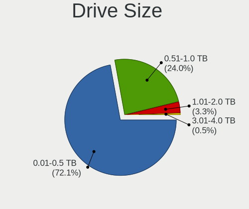
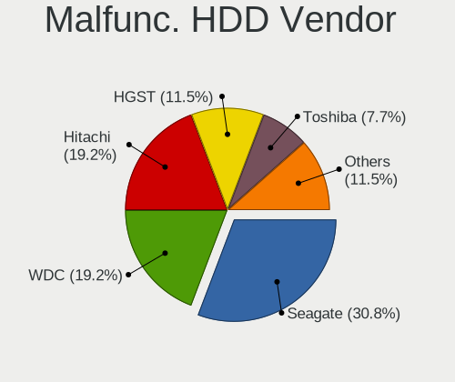
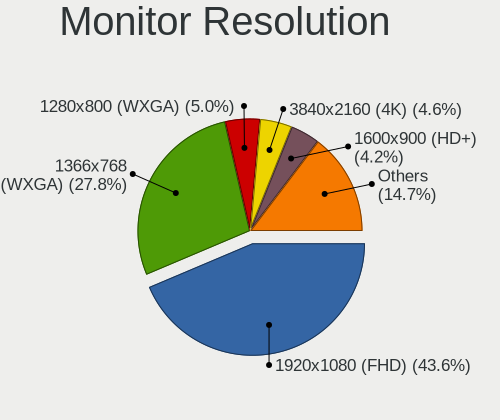

MX 21 - Tested Hardware & Statistics (Notebooks)
------------------------------------------------

A project to collect tested hardware configurations for MX 21.

Anyone can contribute to this report by the [hw-probe](https://github.com/linuxhw/hw-probe) tool:

    sudo -E hw-probe -all -upload

Please contribute! Especially if your hardware is rare.

Contents
--------

* [ Test Cases ](#test-cases)

* [ System ](#system)
  - [ Kernel                   ](#kernel)
  - [ Kernel Family            ](#kernel-family)
  - [ Kernel Major Ver.        ](#kernel-major-ver)
  - [ Arch                     ](#arch)
  - [ DE                       ](#de)
  - [ Display Server           ](#display-server)
  - [ Display Manager          ](#display-manager)
  - [ OS Lang                  ](#os-lang)
  - [ Boot Mode                ](#boot-mode)
  - [ Filesystem               ](#filesystem)
  - [ Part. scheme             ](#part-scheme)
  - [ Dual Boot with Linux/BSD ](#dual-boot-with-linuxbsd)
  - [ Dual Boot (Win)          ](#dual-boot-win)

* [ Board ](#board)
  - [ Vendor                   ](#vendor)
  - [ Model                    ](#model)
  - [ Model Family             ](#model-family)
  - [ MFG Year                 ](#mfg-year)
  - [ Form Factor              ](#form-factor)
  - [ Secure Boot              ](#secure-boot)
  - [ Coreboot                 ](#coreboot)
  - [ RAM Size                 ](#ram-size)
  - [ RAM Used                 ](#ram-used)
  - [ Total Drives             ](#total-drives)
  - [ Has CD-ROM               ](#has-cd-rom)
  - [ Has Ethernet             ](#has-ethernet)
  - [ Has WiFi                 ](#has-wifi)
  - [ Has Bluetooth            ](#has-bluetooth)

* [ Location ](#location)
  - [ Country                  ](#country)
  - [ City                     ](#city)

* [ Drives ](#drives)
  - [ Drive Vendor             ](#drive-vendor)
  - [ Drive Model              ](#drive-model)
  - [ HDD Vendor               ](#hdd-vendor)
  - [ SSD Vendor               ](#ssd-vendor)
  - [ Drive Kind               ](#drive-kind)
  - [ Drive Connector          ](#drive-connector)
  - [ Drive Size               ](#drive-size)
  - [ Space Total              ](#space-total)
  - [ Space Used               ](#space-used)
  - [ Malfunc. Drives          ](#malfunc-drives)
  - [ Malfunc. Drive Vendor    ](#malfunc-drive-vendor)
  - [ Malfunc. HDD Vendor      ](#malfunc-hdd-vendor)
  - [ Malfunc. Drive Kind      ](#malfunc-drive-kind)
  - [ Failed Drives            ](#failed-drives)
  - [ Failed Drive Vendor      ](#failed-drive-vendor)
  - [ Drive Status             ](#drive-status)

* [ Storage controller ](#storage-controller)
  - [ Storage Vendor           ](#storage-vendor)
  - [ Storage Model            ](#storage-model)
  - [ Storage Kind             ](#storage-kind)

* [ Processor ](#processor)
  - [ CPU Vendor               ](#cpu-vendor)
  - [ CPU Model                ](#cpu-model)
  - [ CPU Model Family         ](#cpu-model-family)
  - [ CPU Cores                ](#cpu-cores)
  - [ CPU Sockets              ](#cpu-sockets)
  - [ CPU Threads              ](#cpu-threads)
  - [ CPU Op-Modes             ](#cpu-op-modes)
  - [ CPU Microcode            ](#cpu-microcode)
  - [ CPU Microarch            ](#cpu-microarch)

* [ Graphics ](#graphics)
  - [ GPU Vendor               ](#gpu-vendor)
  - [ GPU Model                ](#gpu-model)
  - [ GPU Combo                ](#gpu-combo)
  - [ GPU Driver               ](#gpu-driver)
  - [ GPU Memory               ](#gpu-memory)

* [ Monitor ](#monitor)
  - [ Monitor Vendor           ](#monitor-vendor)
  - [ Monitor Model            ](#monitor-model)
  - [ Monitor Resolution       ](#monitor-resolution)
  - [ Monitor Diagonal         ](#monitor-diagonal)
  - [ Monitor Width            ](#monitor-width)
  - [ Aspect Ratio             ](#aspect-ratio)
  - [ Monitor Area             ](#monitor-area)
  - [ Pixel Density            ](#pixel-density)
  - [ Multiple Monitors        ](#multiple-monitors)

* [ Network ](#network)
  - [ Net Controller Vendor    ](#net-controller-vendor)
  - [ Net Controller Model     ](#net-controller-model)
  - [ Wireless Vendor          ](#wireless-vendor)
  - [ Wireless Model           ](#wireless-model)
  - [ Ethernet Vendor          ](#ethernet-vendor)
  - [ Ethernet Model           ](#ethernet-model)
  - [ Net Controller Kind      ](#net-controller-kind)
  - [ Used Controller          ](#used-controller)
  - [ NICs                     ](#nics)
  - [ IPv6                     ](#ipv6)

* [ Bluetooth ](#bluetooth)
  - [ Bluetooth Vendor         ](#bluetooth-vendor)
  - [ Bluetooth Model          ](#bluetooth-model)

* [ Sound ](#sound)
  - [ Sound Vendor             ](#sound-vendor)
  - [ Sound Model              ](#sound-model)

* [ Memory ](#memory)
  - [ Memory Vendor            ](#memory-vendor)
  - [ Memory Model             ](#memory-model)
  - [ Memory Kind              ](#memory-kind)
  - [ Memory Form Factor       ](#memory-form-factor)
  - [ Memory Size              ](#memory-size)
  - [ Memory Speed             ](#memory-speed)

* [ Printers & scanners ](#printers--scanners)
  - [ Printer Vendor           ](#printer-vendor)
  - [ Printer Model            ](#printer-model)
  - [ Scanner Vendor           ](#scanner-vendor)
  - [ Scanner Model            ](#scanner-model)

* [ Camera ](#camera)
  - [ Camera Vendor            ](#camera-vendor)
  - [ Camera Model             ](#camera-model)

* [ Security ](#security)
  - [ Fingerprint Vendor       ](#fingerprint-vendor)
  - [ Fingerprint Model        ](#fingerprint-model)
  - [ Chipcard Vendor          ](#chipcard-vendor)
  - [ Chipcard Model           ](#chipcard-model)

* [ Unsupported ](#unsupported)
  - [ Unsupported Devices      ](#unsupported-devices)
  - [ Unsupported Device Types ](#unsupported-device-types)

Test Cases
----------

Total: 58

| Vendor        | Model                       | Probe                                                      | Date         |
|---------------|-----------------------------|------------------------------------------------------------|--------------|
| Dell          | Latitude 3190               | [e43c62a67a](https://linux-hardware.org/?probe=e43c62a67a) | May 30, 2022 |
| ASUSTek       | K55A                        | [0eb5e9ea50](https://linux-hardware.org/?probe=0eb5e9ea50) | May 29, 2022 |
| Sony          | VPCSB1V9R                   | [e3b15e462d](https://linux-hardware.org/?probe=e3b15e462d) | May 16, 2022 |
| Sony          | VPCSB1V9R                   | [9dfafea956](https://linux-hardware.org/?probe=9dfafea956) | May 16, 2022 |
| Dell          | Latitude 3190               | [e80556f7d6](https://linux-hardware.org/?probe=e80556f7d6) | May 16, 2022 |
| Medion        | E14304                      | [8d1a922b7b](https://linux-hardware.org/?probe=8d1a922b7b) | May 15, 2022 |
| HP            | Stream Laptop 14-cb0XX      | [3b0408920d](https://linux-hardware.org/?probe=3b0408920d) | May 13, 2022 |
| Acer          | Aspire A515-56              | [b728fa5844](https://linux-hardware.org/?probe=b728fa5844) | May 01, 2022 |
| Acer          | Nitro AN515-55              | [04b51fe1cf](https://linux-hardware.org/?probe=04b51fe1cf) | Apr 25, 2022 |
| Alienware     | m15 R7                      | [77727a1731](https://linux-hardware.org/?probe=77727a1731) | Apr 24, 2022 |
| Lenovo        | Legion 5 15ACH6H 82JU       | [4e8b5f940a](https://linux-hardware.org/?probe=4e8b5f940a) | Apr 23, 2022 |
| HP            | ProBook 450 G4              | [77a6f92da0](https://linux-hardware.org/?probe=77a6f92da0) | Apr 22, 2022 |
| Gigabyte      | G5 KC                       | [fc21d0150f](https://linux-hardware.org/?probe=fc21d0150f) | Apr 10, 2022 |
| Acer          | Aspire A515-56              | [db6408f394](https://linux-hardware.org/?probe=db6408f394) | Apr 07, 2022 |
| MSI           | GV62 8RD                    | [2e43728adb](https://linux-hardware.org/?probe=2e43728adb) | Apr 06, 2022 |
| ASUSTek       | 1101HA                      | [c3d2458d59](https://linux-hardware.org/?probe=c3d2458d59) | Apr 04, 2022 |
| ASUSTek       | ROG Strix G712LU_G712LU     | [288629b95d](https://linux-hardware.org/?probe=288629b95d) | Apr 04, 2022 |
| Lenovo        | ThinkPad T430 23427YU       | [07ada1e358](https://linux-hardware.org/?probe=07ada1e358) | Apr 03, 2022 |
| ASUSTek       | ROG Strix G513QC_G513QC     | [697f820432](https://linux-hardware.org/?probe=697f820432) | Apr 02, 2022 |
| TUXEDO        | N7x0WU                      | [cf4f31fe3c](https://linux-hardware.org/?probe=cf4f31fe3c) | Mar 30, 2022 |
| Lenovo        | ThinkPad T440p 20AW002VB... | [e3ec03ac31](https://linux-hardware.org/?probe=e3ec03ac31) | Mar 29, 2022 |
| Framework     | Laptop                      | [a9f49dfe70](https://linux-hardware.org/?probe=a9f49dfe70) | Mar 24, 2022 |
| Dell          | Latitude 3190               | [964420352c](https://linux-hardware.org/?probe=964420352c) | Feb 28, 2022 |
| Dell          | XPS 17 9710                 | [7147fe2d5c](https://linux-hardware.org/?probe=7147fe2d5c) | Feb 26, 2022 |
| ASUSTek       | 1101HA                      | [b234cc741f](https://linux-hardware.org/?probe=b234cc741f) | Feb 22, 2022 |
| Dell          | XPS 17 9710                 | [851badde2e](https://linux-hardware.org/?probe=851badde2e) | Feb 20, 2022 |
| Sony          | VPCF119FX                   | [1e8448b824](https://linux-hardware.org/?probe=1e8448b824) | Feb 15, 2022 |
| Sony          | SVE1513Q1ESI                | [77e599ef9f](https://linux-hardware.org/?probe=77e599ef9f) | Feb 08, 2022 |
| Dell          | Latitude E4310              | [50190cb420](https://linux-hardware.org/?probe=50190cb420) | Feb 06, 2022 |
| efirstview    | v01099                      | [ed22d3c2b6](https://linux-hardware.org/?probe=ed22d3c2b6) | Feb 04, 2022 |
| Lenovo        | ThinkPad W541 20EG0005MS    | [f89a7895fc](https://linux-hardware.org/?probe=f89a7895fc) | Jan 23, 2022 |
| Sony          | VPCEH2N1E                   | [17a4bc1847](https://linux-hardware.org/?probe=17a4bc1847) | Jan 22, 2022 |
| Fujitsu Si... | LIFEBOOK E8010              | [82d1bc5db0](https://linux-hardware.org/?probe=82d1bc5db0) | Jan 22, 2022 |
| MSI           | Alpha 15 B5EEK              | [882906d968](https://linux-hardware.org/?probe=882906d968) | Jan 17, 2022 |
| Alienware     | 13 R2                       | [65c1ae9026](https://linux-hardware.org/?probe=65c1ae9026) | Jan 14, 2022 |
| HP            | EliteBook 840 G3            | [58cff543b5](https://linux-hardware.org/?probe=58cff543b5) | Jan 06, 2022 |
| HP            | EliteBook 8440p             | [d0d2edf745](https://linux-hardware.org/?probe=d0d2edf745) | Jan 04, 2022 |
| Lenovo        | G400s VILG1                 | [1cd4b24f16](https://linux-hardware.org/?probe=1cd4b24f16) | Jan 04, 2022 |
| Gigabyte      | P15FV5                      | [164348e568](https://linux-hardware.org/?probe=164348e568) | Jan 03, 2022 |
| Lenovo        | IdeaPad Y700-15ISK 80NV     | [4fe24b4f44](https://linux-hardware.org/?probe=4fe24b4f44) | Dec 26, 2021 |
| ASUSTek       | X550CC                      | [b0cde813b9](https://linux-hardware.org/?probe=b0cde813b9) | Dec 23, 2021 |
| Samsung       | 340XAA/350XAA/550XAA        | [49692045a2](https://linux-hardware.org/?probe=49692045a2) | Dec 16, 2021 |
| ASUSTek       | ASUS TUF Gaming A15 FA50... | [21180cbdad](https://linux-hardware.org/?probe=21180cbdad) | Dec 04, 2021 |
| Lenovo        | B590 20208                  | [ed08d6bdd9](https://linux-hardware.org/?probe=ed08d6bdd9) | Nov 30, 2021 |
| Lenovo        | ThinkBook 13s-IWL 20R9      | [649434f9b8](https://linux-hardware.org/?probe=649434f9b8) | Nov 23, 2021 |
| ASUSTek       | N53SN                       | [67d66feb3e](https://linux-hardware.org/?probe=67d66feb3e) | Nov 20, 2021 |
| ASUSTek       | TUF Gaming FX505DT_FX505... | [791ae651bb](https://linux-hardware.org/?probe=791ae651bb) | Nov 14, 2021 |
| ASUSTek       | TUF Gaming FX505DT_FX505... | [b105aaabf5](https://linux-hardware.org/?probe=b105aaabf5) | Nov 14, 2021 |
| HP            | Compaq Presario CQ60        | [9d83baca33](https://linux-hardware.org/?probe=9d83baca33) | Nov 12, 2021 |
| Lenovo        | ThinkPad E15 Gen 3 20YG0... | [c277967769](https://linux-hardware.org/?probe=c277967769) | Nov 11, 2021 |
| Apple         | MacBook3,1                  | [25964b9256](https://linux-hardware.org/?probe=25964b9256) | Nov 08, 2021 |
| HP            | EliteBook 850 G3            | [cd26ab6e8f](https://linux-hardware.org/?probe=cd26ab6e8f) | Nov 05, 2021 |
| Dell          | Latitude 3190               | [592b613273](https://linux-hardware.org/?probe=592b613273) | Nov 01, 2021 |
| ASUSTek       | E402MA                      | [4c2453c6a2](https://linux-hardware.org/?probe=4c2453c6a2) | Oct 26, 2021 |
| Sony          | VPCEC3S1E                   | [2af79ba873](https://linux-hardware.org/?probe=2af79ba873) | Oct 25, 2021 |
| Fujitsu Si... | ESPRIMO Mobile D9500        | [ee6fdf4608](https://linux-hardware.org/?probe=ee6fdf4608) | Oct 18, 2021 |
| Chuwi         | GemiBook Pro                | [f8735054b4](https://linux-hardware.org/?probe=f8735054b4) | Sep 02, 2021 |
| Samsung       | 350V5C/351V5C/3540VC/344... | [c4ebb4c114](https://linux-hardware.org/?probe=c4ebb4c114) | Jun 04, 2021 |

System
------

Kernel
------

Version of the Linux kernel

| Version                   | Notebooks | Percent |
|---------------------------|-----------|---------|
| 5.10.0-9-amd64            | 14        | 25.93%  |
| 5.10.0-13-amd64           | 9         | 16.67%  |
| 5.14.0-4mx-amd64          | 7         | 12.96%  |
| 5.10.0-11-amd64           | 6         | 11.11%  |
| 5.16.0-6mx-amd64          | 2         | 3.7%    |
| 5.10.0-8-amd64            | 2         | 3.7%    |
| 5.10.0-14-amd64           | 2         | 3.7%    |
| 5.10.0-11-686-pae         | 2         | 3.7%    |
| 5.10.0-10-amd64           | 2         | 3.7%    |
| 5.17.0-5.2-liquorix-amd64 | 1         | 1.85%   |
| 5.17.0-1-amd64            | 1         | 1.85%   |
| 5.16.0-5mx-amd64          | 1         | 1.85%   |
| 5.16.0-4mx-amd64          | 1         | 1.85%   |
| 5.15.0-3mx-amd64          | 1         | 1.85%   |
| 5.10.0-5mx-amd64          | 1         | 1.85%   |
| 5.10.0-13-686-pae         | 1         | 1.85%   |
| 5.10.0-11-686             | 1         | 1.85%   |

Kernel Family
-------------

Linux kernel without a distro release

| Version | Notebooks | Percent |
|---------|-----------|---------|
| 5.10.0  | 38        | 73.08%  |
| 5.14.0  | 7         | 13.46%  |
| 5.16.0  | 4         | 7.69%   |
| 5.17.0  | 2         | 3.85%   |
| 5.15.0  | 1         | 1.92%   |

Kernel Major Ver.
-----------------

Linux kernel major version

| Version | Notebooks | Percent |
|---------|-----------|---------|
| 5.10    | 38        | 73.08%  |
| 5.14    | 7         | 13.46%  |
| 5.16    | 4         | 7.69%   |
| 5.17    | 2         | 3.85%   |
| 5.15    | 1         | 1.92%   |

Arch
----

OS architecture (x86_64, i586, etc.)

| Name   | Notebooks | Percent |
|--------|-----------|---------|
| x86_64 | 47        | 94%     |
| i686   | 3         | 6%      |

DE
--

Desktop Environment

| Name    | Notebooks | Percent |
|---------|-----------|---------|
| XFCE    | 33        | 66%     |
| KDE5    | 13        | 26%     |
| GNOME   | 2         | 4%      |
| Budgie  | 1         | 2%      |
| Unknown | 1         | 2%      |

Display Server
--------------

X11 or Wayland

| Name | Notebooks | Percent |
|------|-----------|---------|
| X11  | 49        | 98%     |
| Tty  | 1         | 2%      |

Display Manager
---------------

SDDM, LightDM, etc.

| Name    | Notebooks | Percent |
|---------|-----------|---------|
| LightDM | 36        | 72%     |
| SDDM    | 13        | 26%     |
| Unknown | 1         | 2%      |

OS Lang
-------

Language

| Lang    | Notebooks | Percent |
|---------|-----------|---------|
| en_US   | 24        | 48%     |
| de_DE   | 8         | 16%     |
| ru_RU   | 3         | 6%      |
| it_IT   | 3         | 6%      |
| Unknown | 3         | 6%      |
| pt_BR   | 2         | 4%      |
| sk_SK   | 1         | 2%      |
| fr_FR   | 1         | 2%      |
| fi_FI   | 1         | 2%      |
| es_PE   | 1         | 2%      |
| es_ES   | 1         | 2%      |
| en_GB   | 1         | 2%      |
| de_CH   | 1         | 2%      |

Boot Mode
---------

EFI or BIOS

| Mode | Notebooks | Percent |
|------|-----------|---------|
| EFI  | 37        | 74%     |
| BIOS | 13        | 26%     |

Filesystem
----------

Type of filesystem

| Type    | Notebooks | Percent |
|---------|-----------|---------|
| Ext4    | 42        | 84%     |
| Overlay | 5         | 10%     |
| Btrfs   | 2         | 4%      |
| F2fs    | 1         | 2%      |

Part. scheme
------------

Scheme of partitioning

| Type | Notebooks | Percent |
|------|-----------|---------|
| GPT  | 38        | 76%     |
| MBR  | 12        | 24%     |

Dual Boot with Linux/BSD
------------------------

Hosting more than one Linux/BSD

| Dual boot | Notebooks | Percent |
|-----------|-----------|---------|
| No        | 33        | 66%     |
| Yes       | 17        | 34%     |

Dual Boot (Win)
---------------

Hosting Linux and Windows

| Dual boot | Notebooks | Percent |
|-----------|-----------|---------|
| Yes       | 26        | 52%     |
| No        | 24        | 48%     |

Board
-----

Vendor
------

Motherboard manufacturer

| Name                | Notebooks | Percent |
|---------------------|-----------|---------|
| Lenovo              | 9         | 18%     |
| ASUSTek Computer    | 9         | 18%     |
| Hewlett-Packard     | 6         | 12%     |
| Sony                | 5         | 10%     |
| Dell                | 3         | 6%      |
| Samsung Electronics | 2         | 4%      |
| MSI                 | 2         | 4%      |
| Gigabyte Technology | 2         | 4%      |
| Fujitsu Siemens     | 2         | 4%      |
| Alienware           | 2         | 4%      |
| Acer                | 2         | 4%      |
| TUXEDO              | 1         | 2%      |
| Medion              | 1         | 2%      |
| Framework           | 1         | 2%      |
| efirstview          | 1         | 2%      |
| Chuwi               | 1         | 2%      |
| Apple               | 1         | 2%      |

Model
-----

Motherboard model

| Name                                      | Notebooks | Percent |
|-------------------------------------------|-----------|---------|
| TUXEDO N7x0WU                             | 1         | 2%      |
| Sony VPCSB1V9R                            | 1         | 2%      |
| Sony VPCF119FX                            | 1         | 2%      |
| Sony VPCEH2N1E                            | 1         | 2%      |
| Sony VPCEC3S1E                            | 1         | 2%      |
| Sony SVE1513Q1ESI                         | 1         | 2%      |
| Samsung 350V5C/351V5C/3540VC/3440VC       | 1         | 2%      |
| Samsung 340XAA/350XAA/550XAA              | 1         | 2%      |
| MSI GV62 8RD                              | 1         | 2%      |
| MSI Alpha 15 B5EEK                        | 1         | 2%      |
| Medion E14304                             | 1         | 2%      |
| Lenovo ThinkPad W541 20EG0005MS           | 1         | 2%      |
| Lenovo ThinkPad T440p 20AW002VBR          | 1         | 2%      |
| Lenovo ThinkPad T430 23427YU              | 1         | 2%      |
| Lenovo ThinkPad E15 Gen 3 20YG008CUS      | 1         | 2%      |
| Lenovo ThinkBook 13s-IWL 20R9             | 1         | 2%      |
| Lenovo Legion 5 15ACH6H 82JU              | 1         | 2%      |
| Lenovo IdeaPad Y700-15ISK 80NV            | 1         | 2%      |
| Lenovo G400s VILG1                        | 1         | 2%      |
| Lenovo B590 20208                         | 1         | 2%      |
| HP Stream Laptop 14-cb0XX                 | 1         | 2%      |
| HP ProBook 450 G4                         | 1         | 2%      |
| HP EliteBook 850 G3                       | 1         | 2%      |
| HP EliteBook 8440p                        | 1         | 2%      |
| HP EliteBook 840 G3                       | 1         | 2%      |
| HP Compaq Presario CQ60                   | 1         | 2%      |
| Gigabyte P15FV5                           | 1         | 2%      |
| Gigabyte G5 KC                            | 1         | 2%      |
| Fujitsu Siemens LIFEBOOK E8010            | 1         | 2%      |
| Fujitsu Siemens ESPRIMO Mobile D9500      | 1         | 2%      |
| Framework Laptop                          | 1         | 2%      |
| efirstview v01099                         | 1         | 2%      |
| Dell XPS 17 9710                          | 1         | 2%      |
| Dell Latitude E4310                       | 1         | 2%      |
| Dell Latitude 3190                        | 1         | 2%      |
| Chuwi GemiBook Pro                        | 1         | 2%      |
| ASUS X550CC                               | 1         | 2%      |
| ASUS TUF Gaming FX505DT_FX505DT           | 1         | 2%      |
| ASUS ROG Strix G712LU_G712LU              | 1         | 2%      |
| ASUS ROG Strix G513QC_G513QC              | 1         | 2%      |
| ASUS N53SN                                | 1         | 2%      |
| ASUS K55A                                 | 1         | 2%      |
| ASUS E402MA                               | 1         | 2%      |
| ASUS ASUS TUF Gaming A15 FA506QE_TUF506QE | 1         | 2%      |
| ASUS 1101HA                               | 1         | 2%      |
| Apple MacBook3,1                          | 1         | 2%      |
| Alienware m15 R7                          | 1         | 2%      |
| Alienware 13 R2                           | 1         | 2%      |
| Acer Nitro AN515-55                       | 1         | 2%      |
| Acer Aspire A515-56                       | 1         | 2%      |

Model Family
------------

Motherboard model prefix

| Name                     | Notebooks | Percent |
|--------------------------|-----------|---------|
| Lenovo ThinkPad          | 4         | 8%      |
| HP EliteBook             | 3         | 6%      |
| Dell Latitude            | 2         | 4%      |
| ASUS ROG                 | 2         | 4%      |
| TUXEDO N7x0WU            | 1         | 2%      |
| Sony VPCSB1V9R           | 1         | 2%      |
| Sony VPCF119FX           | 1         | 2%      |
| Sony VPCEH2N1E           | 1         | 2%      |
| Sony VPCEC3S1E           | 1         | 2%      |
| Sony SVE1513Q1ESI        | 1         | 2%      |
| Samsung 350V5C           | 1         | 2%      |
| Samsung 340XAA           | 1         | 2%      |
| MSI GV62                 | 1         | 2%      |
| MSI Alpha                | 1         | 2%      |
| Medion E14304            | 1         | 2%      |
| Lenovo ThinkBook         | 1         | 2%      |
| Lenovo Legion            | 1         | 2%      |
| Lenovo IdeaPad           | 1         | 2%      |
| Lenovo G400s             | 1         | 2%      |
| Lenovo B590              | 1         | 2%      |
| HP Stream                | 1         | 2%      |
| HP ProBook               | 1         | 2%      |
| HP Compaq                | 1         | 2%      |
| Gigabyte P15FV5          | 1         | 2%      |
| Gigabyte G5              | 1         | 2%      |
| Fujitsu Siemens LIFEBOOK | 1         | 2%      |
| Fujitsu Siemens ESPRIMO  | 1         | 2%      |
| Framework Laptop         | 1         | 2%      |
| efirstview v01099        | 1         | 2%      |
| Dell XPS                 | 1         | 2%      |
| Chuwi GemiBook           | 1         | 2%      |
| ASUS X550CC              | 1         | 2%      |
| ASUS TUF                 | 1         | 2%      |
| ASUS N53SN               | 1         | 2%      |
| ASUS K55A                | 1         | 2%      |
| ASUS E402MA              | 1         | 2%      |
| ASUS ASUS                | 1         | 2%      |
| ASUS 1101HA              | 1         | 2%      |
| Apple MacBook3           | 1         | 2%      |
| Alienware m15            | 1         | 2%      |
| Alienware 13             | 1         | 2%      |
| Acer Nitro               | 1         | 2%      |
| Acer Aspire              | 1         | 2%      |

MFG Year
--------

Motherboard manufacture year

| Year    | Notebooks | Percent |
|---------|-----------|---------|
| 2021    | 11        | 22%     |
| 2015    | 5         | 10%     |
| 2016    | 4         | 8%      |
| 2013    | 4         | 8%      |
| 2010    | 4         | 8%      |
| 2018    | 3         | 6%      |
| 2012    | 3         | 6%      |
| 2011    | 3         | 6%      |
| 2020    | 2         | 4%      |
| 2019    | 2         | 4%      |
| 2008    | 2         | 4%      |
| 2022    | 1         | 2%      |
| 2017    | 1         | 2%      |
| 2014    | 1         | 2%      |
| 2009    | 1         | 2%      |
| 2007    | 1         | 2%      |
| 2005    | 1         | 2%      |
| Unknown | 1         | 2%      |

Form Factor
-----------

Physical design of the computer

| Name     | Notebooks | Percent |
|----------|-----------|---------|
| Notebook | 50        | 100%    |

Secure Boot
-----------

Enabled or disabled

| State    | Notebooks | Percent |
|----------|-----------|---------|
| Disabled | 50        | 100%    |

Coreboot
--------

Have coreboot on board

| Used | Notebooks | Percent |
|------|-----------|---------|
| No   | 50        | 100%    |

RAM Size
--------

Total RAM memory

| Size in GB  | Notebooks | Percent |
|-------------|-----------|---------|
| 4.01-8.0    | 18        | 36%     |
| 8.01-16.0   | 11        | 22%     |
| 16.01-24.0  | 10        | 20%     |
| 3.01-4.0    | 4         | 8%      |
| 2.01-3.0    | 2         | 4%      |
| 32.01-64.0  | 1         | 2%      |
| 24.01-32.0  | 1         | 2%      |
| 64.01-256.0 | 1         | 2%      |
| 1.01-2.0    | 1         | 2%      |
| 0.51-1.0    | 1         | 2%      |

RAM Used
--------

Used RAM memory

| Used GB   | Notebooks | Percent |
|-----------|-----------|---------|
| 2.01-3.0  | 17        | 32.08%  |
| 1.01-2.0  | 16        | 30.19%  |
| 3.01-4.0  | 8         | 15.09%  |
| 4.01-8.0  | 6         | 11.32%  |
| 0.51-1.0  | 5         | 9.43%   |
| 8.01-16.0 | 1         | 1.89%   |

Total Drives
------------

Number of drives on board

| Drives | Notebooks | Percent |
|--------|-----------|---------|
| 1      | 30        | 60%     |
| 2      | 12        | 24%     |
| 3      | 6         | 12%     |
| 4      | 1         | 2%      |
| 0      | 1         | 2%      |

Has CD-ROM
----------

Has CD-ROM on board

| Presented | Notebooks | Percent |
|-----------|-----------|---------|
| No        | 36        | 72%     |
| Yes       | 14        | 28%     |

Has Ethernet
------------

Has Ethernet on board

| Presented | Notebooks | Percent |
|-----------|-----------|---------|
| Yes       | 41        | 82%     |
| No        | 9         | 18%     |

Has WiFi
--------

Has WiFi module

| Presented | Notebooks | Percent |
|-----------|-----------|---------|
| Yes       | 47        | 94%     |
| No        | 3         | 6%      |

Has Bluetooth
-------------

Has Bluetooth module

| Presented | Notebooks | Percent |
|-----------|-----------|---------|
| Yes       | 40        | 80%     |
| No        | 10        | 20%     |

Location
--------

Country
-------

Geographic location (country)

| Country     | Notebooks | Percent |
|-------------|-----------|---------|
| USA         | 11        | 22%     |
| Germany     | 7         | 14%     |
| Italy       | 5         | 10%     |
| Canada      | 5         | 10%     |
| Brazil      | 3         | 6%      |
| Russia      | 2         | 4%      |
| Belgium     | 2         | 4%      |
| Austria     | 2         | 4%      |
| Switzerland | 1         | 2%      |
| Spain       | 1         | 2%      |
| Slovakia    | 1         | 2%      |
| Serbia      | 1         | 2%      |
| Poland      | 1         | 2%      |
| Peru        | 1         | 2%      |
| Netherlands | 1         | 2%      |
| Malaysia    | 1         | 2%      |
| France      | 1         | 2%      |
| Finland     | 1         | 2%      |
| Czechia     | 1         | 2%      |
| Belarus     | 1         | 2%      |
| Azerbaijan  | 1         | 2%      |

City
----

Geographic location (city)

| City                      | Notebooks | Percent |
|---------------------------|-----------|---------|
| Vienna                    | 2         | 3.92%   |
| Zurich                    | 1         | 1.96%   |
| Waycross                  | 1         | 1.96%   |
| Warsaw                    | 1         | 1.96%   |
| Vancouver                 | 1         | 1.96%   |
| Uelzen                    | 1         | 1.96%   |
| Taggia                    | 1         | 1.96%   |
| Tacoma                    | 1         | 1.96%   |
| Surprise                  | 1         | 1.96%   |
| St Petersburg             | 1         | 1.96%   |
| Schaarbeek                | 1         | 1.96%   |
| Saskatoon                 | 1         | 1.96%   |
| Saarlouis                 | 1         | 1.96%   |
| Roseville                 | 1         | 1.96%   |
| Rochester                 | 1         | 1.96%   |
| Reinbek                   | 1         | 1.96%   |
| Prague                    | 1         | 1.96%   |
| Powder Springs            | 1         | 1.96%   |
| Postbauer-Heng            | 1         | 1.96%   |
| Portland                  | 1         | 1.96%   |
| Ottawa                    | 1         | 1.96%   |
| Osasco                    | 1         | 1.96%   |
| Obourg                    | 1         | 1.96%   |
| Neumarkt in der Oberpfalz | 1         | 1.96%   |
| Munich                    | 1         | 1.96%   |
| Moscow                    | 1         | 1.96%   |
| Montreal                  | 1         | 1.96%   |
| Montebelluna              | 1         | 1.96%   |
| Minsk                     | 1         | 1.96%   |
| Mestre                    | 1         | 1.96%   |
| Lima                      | 1         | 1.96%   |
| Lannion                   | 1         | 1.96%   |
| Lahti                     | 1         | 1.96%   |
| Kitchener                 | 1         | 1.96%   |
| Huercal Overa             | 1         | 1.96%   |
| Graniteville              | 1         | 1.96%   |
| Florence                  | 1         | 1.96%   |
| Diana                     | 1         | 1.96%   |
| Cyberjaya                 | 1         | 1.96%   |
| Corsico                   | 1         | 1.96%   |
| Cambui                    | 1         | 1.96%   |
| Buffalo                   | 1         | 1.96%   |
| Bratislava                | 1         | 1.96%   |
| Berlin                    | 1         | 1.96%   |
| Benton                    | 1         | 1.96%   |
| Belo Horizonte            | 1         | 1.96%   |
| Belgrade                  | 1         | 1.96%   |
| Bayreuth                  | 1         | 1.96%   |
| Baku                      | 1         | 1.96%   |
| Amsterdam                 | 1         | 1.96%   |

Drives
------

Drive Vendor
------------

Hard drive vendors

| Vendor              | Notebooks | Drives | Percent |
|---------------------|-----------|--------|---------|
| Samsung Electronics | 12        | 13     | 16.22%  |
| WDC                 | 10        | 10     | 13.51%  |
| Seagate             | 7         | 8      | 9.46%   |
| Crucial             | 7         | 10     | 9.46%   |
| Kingston            | 6         | 6      | 8.11%   |
| Unknown             | 4         | 4      | 5.41%   |
| SK Hynix            | 4         | 5      | 5.41%   |
| Transcend           | 3         | 3      | 4.05%   |
| LITEON              | 3         | 3      | 4.05%   |
| Intel               | 3         | 3      | 4.05%   |
| Dogfish             | 3         | 3      | 4.05%   |
| SanDisk             | 2         | 2      | 2.7%    |
| Toshiba             | 1         | 1      | 1.35%   |
| SABRENT             | 1         | 1      | 1.35%   |
| PNY                 | 1         | 1      | 1.35%   |
| Phison              | 1         | 1      | 1.35%   |
| OCZ                 | 1         | 1      | 1.35%   |
| Netac               | 1         | 1      | 1.35%   |
| Gigabyte Technology | 1         | 1      | 1.35%   |
| GeIL                | 1         | 1      | 1.35%   |
| Fujitsu             | 1         | 1      | 1.35%   |
| Unknown             | 1         | 1      | 1.35%   |

Drive Model
-----------

Hard drive models

| Model                                | Notebooks | Percent |
|--------------------------------------|-----------|---------|
| Kingston SA400S37240G 240GB SSD      | 3         | 3.95%   |
| SK Hynix HFM512GDJTNI-82A0A 512GB    | 2         | 2.63%   |
| Samsung SSD 860 EVO 500GB            | 2         | 2.63%   |
| Dogfish SSD 128GB                    | 2         | 2.63%   |
| Crucial CT240BX500SSD1 240GB         | 2         | 2.63%   |
| WDC WDS500G2B0B-00YS70 500GB SSD     | 1         | 1.32%   |
| WDC WDS100T1X0E-00AFY0 1TB           | 1         | 1.32%   |
| WDC WD5000LPLX-08ZNTT0 500GB         | 1         | 1.32%   |
| WDC WD5000LPCX-22VHAT0 500GB         | 1         | 1.32%   |
| WDC WD1600BEVT-60ZCT1 160GB          | 1         | 1.32%   |
| WDC WD10JPVX-22JC3T0 1TB             | 1         | 1.32%   |
| WDC PC SN730 NVMe 1024GB             | 1         | 1.32%   |
| WDC PC SN530 SDBPNPZ-1T00-1032 1TB   | 1         | 1.32%   |
| WDC PC SN530 SDBPMPZ-512G-1101 512GB | 1         | 1.32%   |
| WDC PC SN530 SDBPMPZ-512G-1001 512GB | 1         | 1.32%   |
| Unknown SDW32G  32GB                 | 1         | 1.32%   |
| Unknown SD32G  32GB                  | 1         | 1.32%   |
| Unknown SD08G  8GB                   | 1         | 1.32%   |
| Unknown BJTD4R  32GB                 | 1         | 1.32%   |
| Transcend TS256GSSD370S 256GB        | 1         | 1.32%   |
| Transcend TS1GSDOM22V 1GB SSD        | 1         | 1.32%   |
| Transcend TS128GMTS800 128GB SSD     | 1         | 1.32%   |
| Toshiba MQ01ABD075 752GB             | 1         | 1.32%   |
| SK Hynix HFM512GD3JX013N 512GB       | 1         | 1.32%   |
| SK Hynix HFM256GDJTNG-8310A 256GB    | 1         | 1.32%   |
| Seagate ST9320421AS 320GB            | 1         | 1.32%   |
| Seagate ST750LM022 HN-M750MBB 752GB  | 1         | 1.32%   |
| Seagate ST500LM000-1EJ162 500GB      | 1         | 1.32%   |
| Seagate ST2000LM003 HN-M201RAD 2TB   | 1         | 1.32%   |
| Seagate ST1000LM048-2E7172 1TB       | 1         | 1.32%   |
| Seagate ST1000LM035-1RK172 1TB       | 1         | 1.32%   |
| Seagate ST1000LM024 HN-M101MBB 1TB   | 1         | 1.32%   |
| SanDisk SD8SNAT-256G-1006 256GB SSD  | 1         | 1.32%   |
| SanDisk SD8SN8U-512G-1006 512GB SSD  | 1         | 1.32%   |
| Samsung SSD 980 PRO 1TB              | 1         | 1.32%   |
| Samsung SSD 970 EVO 1TB              | 1         | 1.32%   |
| Samsung SSD 960 EVO 250GB            | 1         | 1.32%   |
| Samsung SSD 860 EVO M.2 250GB        | 1         | 1.32%   |
| Samsung SSD 860 EVO M.2 1TB          | 1         | 1.32%   |
| Samsung SSD 860 EVO 1TB              | 1         | 1.32%   |
| Samsung SSD 850 EVO 250GB            | 1         | 1.32%   |
| Samsung SSD 840 PRO Series 256GB     | 1         | 1.32%   |
| Samsung PM9A1 NVMe 512GB             | 1         | 1.32%   |
| Samsung MZNLN256HMHQ-00000 256GB SSD | 1         | 1.32%   |
| Samsung HM500JI 500GB                | 1         | 1.32%   |
| SABRENT Disk 240GB                   | 1         | 1.32%   |
| PNY CS900 500GB SSD                  | 1         | 1.32%   |
| Phison ESR512GTLCG-EAC-4 512GB       | 1         | 1.32%   |
| OCZ VECTOR 256GB SSD                 | 1         | 1.32%   |
| Netac SSD 256GB                      | 1         | 1.32%   |
| LITEON IT LST-16S9G 16GB SSD         | 1         | 1.32%   |
| LITEON CV1-8B512-HP 512GB SSD        | 1         | 1.32%   |
| LITEON CV1-8B256 256GB SSD           | 1         | 1.32%   |
| Kingston SKC2500M8250G 250GB         | 1         | 1.32%   |
| Kingston SA400S37480G 480GB SSD      | 1         | 1.32%   |
| Kingston OM8PCP3512F-AI1 512GB       | 1         | 1.32%   |
| Intel SSDSA2BW120G3H 120GB           | 1         | 1.32%   |
| Intel SSDPEKNW512G8 512GB            | 1         | 1.32%   |
| Intel SSDPEKNU512GZ 512GB            | 1         | 1.32%   |
| Gigabyte GP-GSTFS31256GTND 256GB     | 1         | 1.32%   |

HDD Vendor
----------

Hard disk drive vendors

| Vendor              | Notebooks | Drives | Percent |
|---------------------|-----------|--------|---------|
| Seagate             | 7         | 8      | 46.67%  |
| WDC                 | 4         | 4      | 26.67%  |
| Toshiba             | 1         | 1      | 6.67%   |
| Samsung Electronics | 1         | 1      | 6.67%   |
| SABRENT             | 1         | 1      | 6.67%   |
| Fujitsu             | 1         | 1      | 6.67%   |

SSD Vendor
----------

Solid state drive vendors

| Vendor              | Notebooks | Drives | Percent |
|---------------------|-----------|--------|---------|
| Samsung Electronics | 7         | 8      | 20%     |
| Crucial             | 6         | 8      | 17.14%  |
| Kingston            | 4         | 4      | 11.43%  |
| Transcend           | 3         | 3      | 8.57%   |
| LITEON              | 3         | 3      | 8.57%   |
| DOGFISH             | 3         | 3      | 8.57%   |
| SanDisk             | 2         | 2      | 5.71%   |
| WDC                 | 1         | 1      | 2.86%   |
| PNY                 | 1         | 1      | 2.86%   |
| OCZ                 | 1         | 1      | 2.86%   |
| Netac               | 1         | 1      | 2.86%   |
| Intel               | 1         | 1      | 2.86%   |
| Gigabyte Technology | 1         | 1      | 2.86%   |
| GeIL                | 1         | 1      | 2.86%   |

Drive Kind
----------

HDD or SSD

| Kind | Notebooks | Drives | Percent |
|------|-----------|--------|---------|
| SSD  | 28        | 38     | 44.44%  |
| NVMe | 15        | 21     | 23.81%  |
| HDD  | 15        | 16     | 23.81%  |
| MMC  | 5         | 5      | 7.94%   |

Drive Connector
---------------

SATA, SAS, NVMe, etc.

| Type | Notebooks | Drives | Percent |
|------|-----------|--------|---------|
| SATA | 34        | 53     | 61.82%  |
| NVMe | 15        | 21     | 27.27%  |
| MMC  | 5         | 5      | 9.09%   |
| SAS  | 1         | 1      | 1.82%   |

Drive Size
----------

Size of hard drive

| Size in TB | Notebooks | Drives | Percent |
|------------|-----------|--------|---------|
| 0.01-0.5   | 29        | 38     | 69.05%  |
| 0.51-1.0   | 12        | 15     | 28.57%  |
| 1.01-2.0   | 1         | 1      | 2.38%   |

Space Total
-----------

Amount of disk space available on the file system

| Size in GB     | Notebooks | Percent |
|----------------|-----------|---------|
| 101-250        | 13        | 26%     |
| 251-500        | 12        | 24%     |
| 501-1000       | 9         | 18%     |
| 21-50          | 5         | 10%     |
| 51-100         | 4         | 8%      |
| 1-20           | 3         | 6%      |
| 1001-2000      | 2         | 4%      |
| More than 3000 | 1         | 2%      |
| 2001-3000      | 1         | 2%      |

Space Used
----------

Amount of used disk space

| Used GB        | Notebooks | Percent |
|----------------|-----------|---------|
| 1-20           | 20        | 39.22%  |
| 21-50          | 13        | 25.49%  |
| 101-250        | 5         | 9.8%    |
| 51-100         | 5         | 9.8%    |
| 251-500        | 4         | 7.84%   |
| 501-1000       | 2         | 3.92%   |
| More than 3000 | 1         | 1.96%   |
| 1001-2000      | 1         | 1.96%   |

Malfunc. Drives
---------------

Drive models with a malfunction

| Model                                        | Notebooks | Drives | Percent |
|----------------------------------------------|-----------|--------|---------|
| Seagate ST9320421AS 320GB                    | 1         | 1      | 33.33%  |
| Seagate ST750LM022 HN-M750MBB 752GB          | 1         | 1      | 33.33%  |
| Samsung Electronics SSD 840 PRO Series 256GB | 1         | 1      | 33.33%  |

Malfunc. Drive Vendor
---------------------

Vendors of faulty drives

| Vendor              | Notebooks | Drives | Percent |
|---------------------|-----------|--------|---------|
| Seagate             | 2         | 2      | 66.67%  |
| Samsung Electronics | 1         | 1      | 33.33%  |

Malfunc. HDD Vendor
-------------------

Vendors of faulty HDD drives

| Vendor  | Notebooks | Drives | Percent |
|---------|-----------|--------|---------|
| Seagate | 2         | 2      | 100%    |

Malfunc. Drive Kind
-------------------

Kinds of faulty drives

| Kind | Notebooks | Drives | Percent |
|------|-----------|--------|---------|
| HDD  | 2         | 2      | 66.67%  |
| SSD  | 1         | 1      | 33.33%  |

Failed Drives
-------------

Failed drive models

Zero info for selected period =(

Failed Drive Vendor
-------------------

Failed drive vendors

Zero info for selected period =(

Drive Status
------------

Number of failed and malfunc. drives

| Status   | Notebooks | Drives | Percent |
|----------|-----------|--------|---------|
| Works    | 46        | 71     | 83.64%  |
| Detected | 6         | 6      | 10.91%  |
| Malfunc  | 3         | 3      | 5.45%   |

Storage controller
------------------

Storage Vendor
--------------

Storage controller vendors

| Vendor                      | Notebooks | Percent |
|-----------------------------|-----------|---------|
| Intel                       | 37        | 64.91%  |
| Sandisk                     | 5         | 8.77%   |
| SK Hynix                    | 4         | 7.02%   |
| Samsung Electronics         | 4         | 7.02%   |
| Kingston Technology Company | 2         | 3.51%   |
| Silicon Image               | 1         | 1.75%   |
| Phison Electronics          | 1         | 1.75%   |
| Nvidia                      | 1         | 1.75%   |
| Micron/Crucial Technology   | 1         | 1.75%   |
| AMD                         | 1         | 1.75%   |

Storage Model
-------------

Storage controller models

| Model                                                                          | Notebooks | Percent |
|--------------------------------------------------------------------------------|-----------|---------|
| Intel 7 Series Chipset Family 6-port SATA Controller [AHCI mode]               | 7         | 11.48%  |
| Intel Sunrise Point-LP SATA Controller [AHCI mode]                             | 5         | 8.2%    |
| Intel 6 Series/C200 Series Chipset Family 6 port Mobile SATA AHCI Controller   | 3         | 4.92%   |
| SK Hynix BC511                                                                 | 2         | 3.28%   |
| Sandisk Non-Volatile memory controller                                         | 2         | 3.28%   |
| Samsung NVMe SSD Controller PM9A1/PM9A3/980PRO                                 | 2         | 3.28%   |
| Intel HM170/QM170 Chipset SATA Controller [AHCI Mode]                          | 2         | 3.28%   |
| Intel Celeron/Pentium Silver Processor SATA Controller                         | 2         | 3.28%   |
| Intel 82801HM/HEM (ICH8M/ICH8M-E) SATA Controller [AHCI mode]                  | 2         | 3.28%   |
| Intel 82801HM/HEM (ICH8M/ICH8M-E) IDE Controller                               | 2         | 3.28%   |
| Intel 82801 Mobile SATA Controller [RAID mode]                                 | 2         | 3.28%   |
| Intel 8 Series/C220 Series Chipset Family 6-port SATA Controller 1 [AHCI mode] | 2         | 3.28%   |
| Intel 5 Series/3400 Series Chipset 6 port SATA AHCI Controller                 | 2         | 3.28%   |
| Intel 400 Series Chipset Family SATA AHCI Controller                           | 2         | 3.28%   |
| SK Hynix Gold P31 SSD                                                          | 1         | 1.64%   |
| SK Hynix BC501 NVMe Solid State Drive                                          | 1         | 1.64%   |
| Silicon Image SiI 3132 Serial ATA Raid II Controller                           | 1         | 1.64%   |
| Sandisk WD PC SN810 / Black SN850 NVMe SSD                                     | 1         | 1.64%   |
| Sandisk WD Blue SN550 NVMe SSD                                                 | 1         | 1.64%   |
| Sandisk WD Black SN750 / PC SN730 NVMe SSD                                     | 1         | 1.64%   |
| Samsung NVMe SSD Controller SM981/PM981/PM983                                  | 1         | 1.64%   |
| Samsung NVMe SSD Controller SM961/PM961/SM963                                  | 1         | 1.64%   |
| Phison E12 NVMe Controller                                                     | 1         | 1.64%   |
| Nvidia MCP78S [GeForce 8200] SATA Controller (non-AHCI mode)                   | 1         | 1.64%   |
| Nvidia MCP78S [GeForce 8200] IDE                                               | 1         | 1.64%   |
| Micron/Crucial P2 NVMe PCIe SSD                                                | 1         | 1.64%   |
| Kingston Company Company Non-Volatile memory controller                        | 1         | 1.64%   |
| Kingston Company KC2000 NVMe SSD                                               | 1         | 1.64%   |
| Intel Volume Management Device NVMe RAID Controller                            | 1         | 1.64%   |
| Intel US15W/US15X/US15L/UL11L SCH [Poulsbo] IDE Controller                     | 1         | 1.64%   |
| Intel Tiger Lake-LP SATA Controller [AHCI mode]                                | 1         | 1.64%   |
| Intel SSD 660P Series                                                          | 1         | 1.64%   |
| Intel Non-Volatile memory controller                                           | 1         | 1.64%   |
| Intel Cannon Lake Mobile PCH SATA AHCI Controller                              | 1         | 1.64%   |
| Intel Atom Processor E3800 Series SATA AHCI Controller                         | 1         | 1.64%   |
| Intel 82801DBM (ICH4-M) IDE Controller                                         | 1         | 1.64%   |
| Intel 5 Series/3400 Series Chipset 4 port SATA AHCI Controller                 | 1         | 1.64%   |
| AMD FCH SATA Controller [AHCI mode]                                            | 1         | 1.64%   |

Storage Kind
------------

Kind of storage controller (IDE, SATA, NVMe, SAS, ...)

| Kind | Notebooks | Percent |
|------|-----------|---------|
| SATA | 32        | 57.14%  |
| NVMe | 15        | 26.79%  |
| IDE  | 5         | 8.93%   |
| RAID | 4         | 7.14%   |

Processor
---------

CPU Vendor
----------

Processor vendors

| Vendor | Notebooks | Percent |
|--------|-----------|---------|
| Intel  | 42        | 84%     |
| AMD    | 8         | 16%     |

CPU Model
---------

Processor models

| Model                                         | Notebooks | Percent |
|-----------------------------------------------|-----------|---------|
| AMD Ryzen 7 5800H with Radeon Graphics        | 3         | 6%      |
| Intel Core i7-8550U CPU @ 1.80GHz             | 2         | 4%      |
| Intel Core i7-6700HQ CPU @ 2.60GHz            | 2         | 4%      |
| Intel Core i7-10750H CPU @ 2.60GHz            | 2         | 4%      |
| Intel Core i5-6200U CPU @ 2.30GHz             | 2         | 4%      |
| Intel Core i5-3230M CPU @ 2.60GHz             | 2         | 4%      |
| Intel Pentium Silver N5000 CPU @ 1.10GHz      | 1         | 2%      |
| Intel Pentium M processor 1.80GHz             | 1         | 2%      |
| Intel Core i7-8565U CPU @ 1.80GHz             | 1         | 2%      |
| Intel Core i7-7500U CPU @ 2.70GHz             | 1         | 2%      |
| Intel Core i7-6500U CPU @ 2.50GHz             | 1         | 2%      |
| Intel Core i7-4810MQ CPU @ 2.80GHz            | 1         | 2%      |
| Intel Core i7-3630QM CPU @ 2.40GHz            | 1         | 2%      |
| Intel Core i7-2670QM CPU @ 2.20GHz            | 1         | 2%      |
| Intel Core i7 CPU Q 720 @ 1.60GHz             | 1         | 2%      |
| Intel Core i7 CPU M 620 @ 2.67GHz             | 1         | 2%      |
| Intel Core i5-8300H CPU @ 2.30GHz             | 1         | 2%      |
| Intel Core i5-4300M CPU @ 2.60GHz             | 1         | 2%      |
| Intel Core i5-3320M CPU @ 2.60GHz             | 1         | 2%      |
| Intel Core i5-2450M CPU @ 2.50GHz             | 1         | 2%      |
| Intel Core i5-2430M CPU @ 2.40GHz             | 1         | 2%      |
| Intel Core i5-2410M CPU @ 2.30GHz             | 1         | 2%      |
| Intel Core i5-10500H CPU @ 2.50GHz            | 1         | 2%      |
| Intel Core i5 CPU M 520 @ 2.40GHz             | 1         | 2%      |
| Intel Core i5 CPU M 460 @ 2.53GHz             | 1         | 2%      |
| Intel Core i3-3217U CPU @ 1.80GHz             | 1         | 2%      |
| Intel Core i3-2328M CPU @ 2.20GHz             | 1         | 2%      |
| Intel Core 2 Duo CPU T7500 @ 2.20GHz          | 1         | 2%      |
| Intel Core 2 Duo CPU T5250 @ 1.50GHz          | 1         | 2%      |
| Intel Celeron J4125 CPU @ 2.00GHz             | 1         | 2%      |
| Intel Celeron CPU N3060 @ 1.60GHz             | 1         | 2%      |
| Intel Celeron CPU N2840 @ 2.16GHz             | 1         | 2%      |
| Intel Atom CPU Z520 @ 1.33GHz                 | 1         | 2%      |
| Intel Atom CPU Z3735G @ 1.33GHz               | 1         | 2%      |
| Intel 12th Gen Core i7-12700H                 | 1         | 2%      |
| Intel 11th Gen Core i9-11980HK @ 2.60GHz      | 1         | 2%      |
| Intel 11th Gen Core i7-1185G7 @ 3.00GHz       | 1         | 2%      |
| Intel 11th Gen Core i5-1135G7 @ 2.40GHz       | 1         | 2%      |
| AMD Sempron SI-42                             | 1         | 2%      |
| AMD Ryzen 9 5900HX with Radeon Graphics       | 1         | 2%      |
| AMD Ryzen 7 5700U with Radeon Graphics        | 1         | 2%      |
| AMD Ryzen 7 3750H with Radeon Vega Mobile Gfx | 1         | 2%      |
| AMD Ryzen 3 4300U with Radeon Graphics        | 1         | 2%      |

CPU Model Family
----------------

Processor model prefix

| Model                | Notebooks | Percent |
|----------------------|-----------|---------|
| Intel Core i7        | 14        | 28%     |
| Intel Core i5        | 13        | 26%     |
| AMD Ryzen 7          | 5         | 10%     |
| Other                | 4         | 8%      |
| Intel Celeron        | 3         | 6%      |
| Intel Core i3        | 2         | 4%      |
| Intel Core 2 Duo     | 2         | 4%      |
| Intel Atom           | 2         | 4%      |
| Intel Pentium Silver | 1         | 2%      |
| Intel Pentium M      | 1         | 2%      |
| AMD Sempron          | 1         | 2%      |
| AMD Ryzen 9          | 1         | 2%      |
| AMD Ryzen 3          | 1         | 2%      |

CPU Cores
---------

Number of processor cores

| Number | Notebooks | Percent |
|--------|-----------|---------|
| 2      | 20        | 40%     |
| 4      | 17        | 34%     |
| 8      | 6         | 12%     |
| 6      | 3         | 6%      |
| 1      | 3         | 6%      |
| 14     | 1         | 2%      |

CPU Sockets
-----------

Number of sockets

| Number | Notebooks | Percent |
|--------|-----------|---------|
| 1      | 50        | 100%    |

CPU Threads
-----------

Threads per core (Hyper-Threading)

| Number | Notebooks | Percent |
|--------|-----------|---------|
| 2      | 40        | 80%     |
| 1      | 10        | 20%     |

CPU Op-Modes
------------

CPU Operation Modes (32-bit, 64-bit)

| Op mode        | Notebooks | Percent |
|----------------|-----------|---------|
| 32-bit, 64-bit | 48        | 96%     |
| 32-bit         | 2         | 4%      |

CPU Microcode
-------------

Microcode number

| Number     | Notebooks | Percent |
|------------|-----------|---------|
| 0x306a9    | 5         | 10%     |
| 0x206a7    | 4         | 8%      |
| 0xa0652    | 3         | 6%      |
| 0x406e3    | 3         | 6%      |
| 0x0a50000c | 3         | 6%      |
| 0x806ea    | 2         | 4%      |
| 0x806c1    | 2         | 4%      |
| 0x506e3    | 2         | 4%      |
| 0x306c3    | 2         | 4%      |
| 0x30678    | 2         | 4%      |
| 0x20655    | 2         | 4%      |
| Unknown    | 2         | 4%      |
| 0x906ea    | 1         | 2%      |
| 0x906a3    | 1         | 2%      |
| 0x806eb    | 1         | 2%      |
| 0x806e9    | 1         | 2%      |
| 0x806d1    | 1         | 2%      |
| 0x706a8    | 1         | 2%      |
| 0x706a1    | 1         | 2%      |
| 0x6fd      | 1         | 2%      |
| 0x6fb      | 1         | 2%      |
| 0x6d6      | 1         | 2%      |
| 0x406c4    | 1         | 2%      |
| 0x106e5    | 1         | 2%      |
| 0x106c2    | 1         | 2%      |
| 0x0a50000b | 1         | 2%      |
| 0x08608103 | 1         | 2%      |
| 0x08600106 | 1         | 2%      |
| 0x08108102 | 1         | 2%      |
| 0x02000057 | 1         | 2%      |

CPU Microarch
-------------

Microarchitecture

| Name             | Notebooks | Percent |
|------------------|-----------|---------|
| Skylake          | 5         | 10%     |
| SandyBridge      | 5         | 10%     |
| KabyLake         | 5         | 10%     |
| IvyBridge        | 5         | 10%     |
| Zen 3            | 4         | 8%      |
| Westmere         | 3         | 6%      |
| Silvermont       | 3         | 6%      |
| CometLake        | 3         | 6%      |
| TigerLake        | 2         | 4%      |
| Haswell          | 2         | 4%      |
| Goldmont plus    | 2         | 4%      |
| Core             | 2         | 4%      |
| Zen+             | 1         | 2%      |
| Zen 2            | 1         | 2%      |
| P6               | 1         | 2%      |
| Nehalem          | 1         | 2%      |
| K8 & K10 hybrid  | 1         | 2%      |
| Icelake          | 1         | 2%      |
| Bonnell          | 1         | 2%      |
| Alderlake Hybrid | 1         | 2%      |
| Unknown          | 1         | 2%      |

Graphics
--------

GPU Vendor
----------

Vendors of graphics cards

| Vendor | Notebooks | Percent |
|--------|-----------|---------|
| Intel  | 39        | 57.35%  |
| Nvidia | 19        | 27.94%  |
| AMD    | 10        | 14.71%  |

GPU Model
---------

Graphics card models

| Model                                                                                    | Notebooks | Percent |
|------------------------------------------------------------------------------------------|-----------|---------|
| Intel 3rd Gen Core processor Graphics Controller                                         | 5         | 7.04%   |
| Intel 2nd Generation Core Processor Family Integrated Graphics Controller                | 5         | 7.04%   |
| Nvidia GA106M [GeForce RTX 3060 Mobile / Max-Q]                                          | 3         | 4.23%   |
| Intel Skylake GT2 [HD Graphics 520]                                                      | 3         | 4.23%   |
| Intel CometLake-H GT2 [UHD Graphics]                                                     | 3         | 4.23%   |
| AMD Cezanne                                                                              | 3         | 4.23%   |
| Nvidia GM107M [GeForce GTX 960M]                                                         | 2         | 2.82%   |
| Intel UHD Graphics 620                                                                   | 2         | 2.82%   |
| Intel TigerLake-LP GT2 [Iris Xe Graphics]                                                | 2         | 2.82%   |
| Intel Mobile GM965/GL960 Integrated Graphics Controller (secondary)                      | 2         | 2.82%   |
| Intel Mobile GM965/GL960 Integrated Graphics Controller (primary)                        | 2         | 2.82%   |
| Intel HD Graphics 530                                                                    | 2         | 2.82%   |
| Intel Core Processor Integrated Graphics Controller                                      | 2         | 2.82%   |
| Intel Atom Processor Z36xxx/Z37xxx Series Graphics & Display                             | 2         | 2.82%   |
| Intel 4th Gen Core Processor Integrated Graphics Controller                              | 2         | 2.82%   |
| Nvidia TU117M [GeForce GTX 1650 Mobile / Max-Q]                                          | 1         | 1.41%   |
| Nvidia TU117M                                                                            | 1         | 1.41%   |
| Nvidia TU116M [GeForce GTX 1660 Ti Mobile]                                               | 1         | 1.41%   |
| Nvidia GT216M [GeForce GT 330M]                                                          | 1         | 1.41%   |
| Nvidia GP107M [GeForce GTX 1050 Ti Mobile]                                               | 1         | 1.41%   |
| Nvidia GM108M [GeForce MX110]                                                            | 1         | 1.41%   |
| Nvidia GM107M [GeForce GTX 950M]                                                         | 1         | 1.41%   |
| Nvidia GK106GLM [Quadro K2100M]                                                          | 1         | 1.41%   |
| Nvidia GF117M [GeForce 610M/710M/810M/820M / GT 620M/625M/630M/720M]                     | 1         | 1.41%   |
| Nvidia GF108M [GeForce GT 550M]                                                          | 1         | 1.41%   |
| Nvidia GA107M [GeForce RTX 3050 Ti Mobile]                                               | 1         | 1.41%   |
| Nvidia GA107M [GeForce RTX 3050 Mobile]                                                  | 1         | 1.41%   |
| Nvidia GA107BM [GeForce RTX 3050 Ti Mobile]                                              | 1         | 1.41%   |
| Nvidia C77 [GeForce 8200M G]                                                             | 1         | 1.41%   |
| Intel WhiskeyLake-U GT2 [UHD Graphics 620]                                               | 1         | 1.41%   |
| Intel US15W/US15X SCH [Poulsbo] Graphics Controller                                      | 1         | 1.41%   |
| Intel TigerLake-H GT1 [UHD Graphics]                                                     | 1         | 1.41%   |
| Intel HD Graphics 620                                                                    | 1         | 1.41%   |
| Intel GeminiLake [UHD Graphics 605]                                                      | 1         | 1.41%   |
| Intel GeminiLake [UHD Graphics 600]                                                      | 1         | 1.41%   |
| Intel CoffeeLake-H GT2 [UHD Graphics 630]                                                | 1         | 1.41%   |
| Intel Atom/Celeron/Pentium Processor x5-E8000/J3xxx/N3xxx Integrated Graphics Controller | 1         | 1.41%   |
| Intel Alder Lake-P Integrated Graphics Controller                                        | 1         | 1.41%   |
| AMD Thames [Radeon HD 7500M/7600M Series]                                                | 1         | 1.41%   |
| AMD Seymour [Radeon HD 6400M/7400M Series]                                               | 1         | 1.41%   |
| AMD RV350/M10 / RV360/M11 [Mobility Radeon 9600 (PRO) / 9700]                            | 1         | 1.41%   |
| AMD Renoir                                                                               | 1         | 1.41%   |
| AMD Picasso/Raven 2 [Radeon Vega Series / Radeon Vega Mobile Series]                     | 1         | 1.41%   |
| AMD Navi 23 [Radeon RX 6600/6600 XT/6600M]                                               | 1         | 1.41%   |
| AMD Madison [Mobility Radeon HD 5650/5750 / 6530M/6550M]                                 | 1         | 1.41%   |
| AMD Lucienne                                                                             | 1         | 1.41%   |

GPU Combo
---------

Combinations of graphics cards

| Name           | Notebooks | Percent |
|----------------|-----------|---------|
| 1 x Intel      | 24        | 48%     |
| Intel + Nvidia | 13        | 26%     |
| 1 x AMD        | 4         | 8%      |
| 1 x Nvidia     | 3         | 6%      |
| AMD + Nvidia   | 3         | 6%      |
| Intel + AMD    | 2         | 4%      |
| 2 x AMD        | 1         | 2%      |

GPU Driver
----------

Free vs proprietary

| Driver      | Notebooks | Percent |
|-------------|-----------|---------|
| Free        | 39        | 78%     |
| Proprietary | 10        | 20%     |
| Unknown     | 1         | 2%      |

GPU Memory
----------

Total video memory

| Size in GB | Notebooks | Percent |
|------------|-----------|---------|
| Unknown    | 40        | 80%     |
| 0.01-0.5   | 5         | 10%     |
| 0.51-1.0   | 3         | 6%      |
| 7.01-8.0   | 1         | 2%      |
| 3.01-4.0   | 1         | 2%      |

Monitor
-------

Monitor Vendor
--------------

Monitor vendors

| Vendor                  | Notebooks | Percent |
|-------------------------|-----------|---------|
| Chimei Innolux          | 10        | 18.52%  |
| LG Display              | 7         | 12.96%  |
| AU Optronics            | 7         | 12.96%  |
| Samsung Electronics     | 5         | 9.26%   |
| PANDA                   | 4         | 7.41%   |
| BOE                     | 4         | 7.41%   |
| Sharp                   | 3         | 5.56%   |
| Sony                    | 2         | 3.7%    |
| Chi Mei Optoelectronics | 2         | 3.7%    |
| Ancor Communications    | 2         | 3.7%    |
| Philips                 | 1         | 1.85%   |
| Panasonic               | 1         | 1.85%   |
| Lenovo                  | 1         | 1.85%   |
| Hewlett-Packard         | 1         | 1.85%   |
| Goldstar                | 1         | 1.85%   |
| Dell                    | 1         | 1.85%   |
| CPT                     | 1         | 1.85%   |
| Apple                   | 1         | 1.85%   |

Monitor Model
-------------

Monitor models

| Model                                                                    | Notebooks | Percent |
|--------------------------------------------------------------------------|-----------|---------|
| PANDA LCD Monitor NCP004D 1920x1080 344x194mm 15.5-inch                  | 2         | 3.7%    |
| LG Display LCD Monitor LGD04A7 1920x1080 344x194mm 15.5-inch             | 2         | 3.7%    |
| Chimei Innolux LCD Monitor CMN1521 1920x1080 344x193mm 15.5-inch         | 2         | 3.7%    |
| Sony Nvidia Defaul t Flat Panel SNY06FA 1600x900 360x200mm 16.2-inch     | 1         | 1.85%   |
| Sony Nvidia Defaul t Flat Panel MS_0025 1920x1080 360x200mm 16.2-inch    | 1         | 1.85%   |
| Sharp LQ156M1JW03 SHP14C5 1920x1080 344x194mm 15.5-inch                  | 1         | 1.85%   |
| Sharp LCD Monitor SHP1517 3840x2400 366x229mm 17.0-inch                  | 1         | 1.85%   |
| Sharp LCD Monitor SHP1445 3840x2160 350x190mm 15.7-inch                  | 1         | 1.85%   |
| Samsung Electronics S23B300 SAM08AF 1920x1080 510x287mm 23.0-inch        | 1         | 1.85%   |
| Samsung Electronics LCD Monitor SEC4245 1280x800 331x207mm 15.4-inch     | 1         | 1.85%   |
| Samsung Electronics LCD Monitor SEC3541 1366x768 309x174mm 14.0-inch     | 1         | 1.85%   |
| Samsung Electronics LCD Monitor SEC314C 1920x1080 340x190mm 15.3-inch    | 1         | 1.85%   |
| Samsung Electronics C27F390 SAM0D32 1920x1080 598x336mm 27.0-inch        | 1         | 1.85%   |
| Philips PHL 243V5 PHLC0D1 1920x1080 521x293mm 23.5-inch                  | 1         | 1.85%   |
| PANDA LCD Monitor NCP0052 1920x1080 309x174mm 14.0-inch                  | 1         | 1.85%   |
| PANDA LCD Monitor NCP0036 1920x1080 344x194mm 15.5-inch                  | 1         | 1.85%   |
| Panasonic VVX16T029D00 MEI96A2 2880x1620 344x193mm 15.5-inch             | 1         | 1.85%   |
| LG Display LP156WH1-TLA3 LGD01C2 1366x768 344x194mm 15.5-inch            | 1         | 1.85%   |
| LG Display LCD Monitor LGD06E2 1920x1080 344x194mm 15.5-inch             | 1         | 1.85%   |
| LG Display LCD Monitor LGD0570 1920x1080 344x194mm 15.5-inch             | 1         | 1.85%   |
| LG Display LCD Monitor LGD03DB 1366x768 345x194mm 15.6-inch              | 1         | 1.85%   |
| LG Display LCD Monitor LGD024D 1366x768 294x166mm 13.3-inch              | 1         | 1.85%   |
| Lenovo LEN T2454pA LEN60C9 1920x1200 518x324mm 24.1-inch                 | 1         | 1.85%   |
| Hewlett-Packard LA2306 HWP294B 1920x1080 509x286mm 23.0-inch             | 1         | 1.85%   |
| Goldstar HDR WFHD GSM7714 2560x1080 798x334mm 34.1-inch                  | 1         | 1.85%   |
| Dell 1907FP DEL4014 1280x1024 376x301mm 19.0-inch                        | 1         | 1.85%   |
| CPT LCD Monitor CPT1C21 1366x768 256x144mm 11.6-inch                     | 1         | 1.85%   |
| Chimei Innolux P140ZKA-BZ1 CMN8C03 2160x1440 296x197mm 14.0-inch         | 1         | 1.85%   |
| Chimei Innolux LCD Monitor CMN15E7 1920x1080 344x193mm 15.5-inch         | 1         | 1.85%   |
| Chimei Innolux LCD Monitor CMN15D6 1920x1080 344x193mm 15.5-inch         | 1         | 1.85%   |
| Chimei Innolux LCD Monitor CMN15C4 1920x1080 344x193mm 15.5-inch         | 1         | 1.85%   |
| Chimei Innolux LCD Monitor CMN14C4 1366x768 309x173mm 13.9-inch          | 1         | 1.85%   |
| Chimei Innolux LCD Monitor CMN1493 1366x768 309x173mm 13.9-inch          | 1         | 1.85%   |
| Chimei Innolux LCD Monitor CMN1491 1366x768 309x174mm 14.0-inch          | 1         | 1.85%   |
| Chimei Innolux LCD Monitor CMN1132 1366x768 256x144mm 11.6-inch          | 1         | 1.85%   |
| Chi Mei Optoelectronics LCD Monitor CMO15A7 1366x768 344x193mm 15.5-inch | 1         | 1.85%   |
| Chi Mei Optoelectronics LCD Monitor CMO15A3 1366x768 344x193mm 15.5-inch | 1         | 1.85%   |
| BOE LCD Monitor BOE095F 2256x1504 285x190mm 13.5-inch                    | 1         | 1.85%   |
| BOE LCD Monitor BOE08BE 1920x1080 382x215mm 17.3-inch                    | 1         | 1.85%   |
| BOE LCD Monitor BOE0714 1920x1080 344x193mm 15.5-inch                    | 1         | 1.85%   |
| BOE LCD Monitor BOE05DF 1366x768 293x165mm 13.2-inch                     | 1         | 1.85%   |
| AU Optronics LCD Monitor AUOE48D 1920x1080 344x194mm 15.5-inch           | 1         | 1.85%   |
| AU Optronics LCD Monitor AUO5A2D 1920x1080 293x165mm 13.2-inch           | 1         | 1.85%   |
| AU Optronics LCD Monitor AUO38ED 1920x1080 344x193mm 15.5-inch           | 1         | 1.85%   |
| AU Optronics LCD Monitor AUO333C 1366x768 309x173mm 13.9-inch            | 1         | 1.85%   |
| AU Optronics LCD Monitor AUO313C 1366x768 309x173mm 13.9-inch            | 1         | 1.85%   |
| AU Optronics LCD Monitor AUO21EC 1366x768 344x193mm 15.5-inch            | 1         | 1.85%   |
| AU Optronics LCD Monitor AUO123E 1600x900 309x174mm 14.0-inch            | 1         | 1.85%   |
| Apple LCD Monitor APP9C5F 1280x800 286x179mm 13.3-inch                   | 1         | 1.85%   |
| Ancor Communications VG248 ACI24E1 1920x1080 531x299mm 24.0-inch         | 1         | 1.85%   |
| Ancor Communications ASUS VW193S ACI19D4 1440x900 408x255mm 18.9-inch    | 1         | 1.85%   |

Monitor Resolution
------------------

Monitor screen resolution

| Resolution       | Notebooks | Percent |
|------------------|-----------|---------|
| 1920x1080 (FHD)  | 23        | 46%     |
| 1366x768 (WXGA)  | 14        | 28%     |
| 3840x2160 (4K)   | 3         | 6%      |
| 1600x900 (HD+)   | 2         | 4%      |
| 1280x800 (WXGA)  | 2         | 4%      |
| 3840x2400        | 1         | 2%      |
| 2560x1080        | 1         | 2%      |
| 2256x1504        | 1         | 2%      |
| 2160x1440        | 1         | 2%      |
| 1440x900 (WXGA+) | 1         | 2%      |
| 1280x1024 (SXGA) | 1         | 2%      |

Monitor Diagonal
----------------

Diagonal size in inches

| Inches | Notebooks | Percent |
|--------|-----------|---------|
| 15     | 25        | 46.3%   |
| 13     | 7         | 12.96%  |
| 14     | 5         | 9.26%   |
| 17     | 4         | 7.41%   |
| 24     | 3         | 5.56%   |
| 23     | 3         | 5.56%   |
| 27     | 2         | 3.7%    |
| 19     | 2         | 3.7%    |
| 11     | 2         | 3.7%    |
| 34     | 1         | 1.85%   |

Monitor Width
-------------

Physical width

| Width in mm | Notebooks | Percent |
|-------------|-----------|---------|
| 301-350     | 31        | 57.41%  |
| 501-600     | 8         | 14.81%  |
| 201-300     | 7         | 12.96%  |
| 351-400     | 6         | 11.11%  |
| 701-800     | 1         | 1.85%   |
| 401-500     | 1         | 1.85%   |

Aspect Ratio
------------

Proportional relationship between the width and the height

| Ratio | Notebooks | Percent |
|-------|-----------|---------|
| 16/9  | 40        | 81.63%  |
| 16/10 | 5         | 10.2%   |
| 3/2   | 2         | 4.08%   |
| 5/4   | 1         | 2.04%   |
| 21/9  | 1         | 2.04%   |

Monitor Area
------------

Area in inch

| Area in inch | Notebooks | Percent |
|----------------|-----------|---------|
| 101-110        | 25        | 46.3%   |
| 81-90          | 10        | 18.52%  |
| 201-250        | 5         | 9.26%   |
| 121-130        | 4         | 7.41%   |
| 71-80          | 2         | 3.7%    |
| 51-60          | 2         | 3.7%    |
| 301-350        | 2         | 3.7%    |
| 151-200        | 2         | 3.7%    |
| 351-500        | 1         | 1.85%   |
| 251-300        | 1         | 1.85%   |

Pixel Density
-------------

Pixels per inch

| Density       | Notebooks | Percent |
|---------------|-----------|---------|
| 121-160       | 21        | 40.38%  |
| 51-100        | 13        | 25%     |
| 101-120       | 11        | 21.15%  |
| 161-240       | 4         | 7.69%   |
| More than 240 | 3         | 5.77%   |

Multiple Monitors
-----------------

Total monitors connected

| Total | Notebooks | Percent |
|-------|-----------|---------|
| 1     | 39        | 78%     |
| 2     | 9         | 18%     |
| 3     | 1         | 2%      |
| 0     | 1         | 2%      |

Network
-------

Net Controller Vendor
---------------------

Controller vendors

| Vendor                   | Notebooks | Percent |
|--------------------------|-----------|---------|
| Intel                    | 28        | 35%     |
| Realtek Semiconductor    | 26        | 32.5%   |
| Qualcomm Atheros         | 12        | 15%     |
| Marvell Technology Group | 4         | 5%      |
| MEDIATEK                 | 3         | 3.75%   |
| TP-Link                  | 2         | 2.5%    |
| Ralink Technology        | 1         | 1.25%   |
| Nvidia                   | 1         | 1.25%   |
| Dell                     | 1         | 1.25%   |
| Broadcom                 | 1         | 1.25%   |
| ASUSTek Computer         | 1         | 1.25%   |

Net Controller Model
--------------------

Controller models

| Model                                                                          | Notebooks | Percent |
|--------------------------------------------------------------------------------|-----------|---------|
| Realtek RTL8111/8168/8411 PCI Express Gigabit Ethernet Controller              | 22        | 23.16%  |
| Qualcomm Atheros AR9485 Wireless Network Adapter                               | 4         | 4.21%   |
| Intel Wi-Fi 6 AX200                                                            | 4         | 4.21%   |
| MEDIATEK MT7921 802.11ax PCI Express Wireless Network Adapter                  | 3         | 3.16%   |
| Intel Wireless 8260                                                            | 3         | 3.16%   |
| Intel Wireless 7260                                                            | 3         | 3.16%   |
| Realtek RTL8723BE PCIe Wireless Network Adapter                                | 2         | 2.11%   |
| Realtek RTL810xE PCI Express Fast Ethernet controller                          | 2         | 2.11%   |
| Qualcomm Atheros AR9285 Wireless Network Adapter (PCI-Express)                 | 2         | 2.11%   |
| Intel Wireless 8265 / 8275                                                     | 2         | 2.11%   |
| Intel Ethernet Connection I219-V                                               | 2         | 2.11%   |
| Intel Ethernet Connection I217-LM                                              | 2         | 2.11%   |
| Intel Comet Lake PCH CNVi WiFi                                                 | 2         | 2.11%   |
| Intel Centrino Advanced-N 6200                                                 | 2         | 2.11%   |
| Intel 82577LM Gigabit Network Connection                                       | 2         | 2.11%   |
| TP-Link USB 10/100/1000 LAN                                                    | 1         | 1.05%   |
| TP-Link TL-WN722N v2/v3 [Realtek RTL8188EUS]                                   | 1         | 1.05%   |
| Realtek RTL88x2bu [AC1200 Techkey]                                             | 1         | 1.05%   |
| Realtek RTL8852AE 802.11ax PCIe Wireless Network Adapter                       | 1         | 1.05%   |
| Realtek RTL8822CE 802.11ac PCIe Wireless Network Adapter                       | 1         | 1.05%   |
| Realtek RTL8822BE 802.11a/b/g/n/ac WiFi adapter                                | 1         | 1.05%   |
| Realtek RTL8153 Gigabit Ethernet Adapter                                       | 1         | 1.05%   |
| Realtek Killer E2600 Gigabit Ethernet Controller                               | 1         | 1.05%   |
| Ralink RT2070 Wireless Adapter                                                 | 1         | 1.05%   |
| Qualcomm Atheros QCA9377 802.11ac Wireless Network Adapter                     | 1         | 1.05%   |
| Qualcomm Atheros QCA8171 Gigabit Ethernet                                      | 1         | 1.05%   |
| Qualcomm Atheros QCA6174 802.11ac Wireless Network Adapter                     | 1         | 1.05%   |
| Qualcomm Atheros Killer E2400 Gigabit Ethernet Controller                      | 1         | 1.05%   |
| Qualcomm Atheros AR9287 Wireless Network Adapter (PCI-Express)                 | 1         | 1.05%   |
| Qualcomm Atheros AR8162 Fast Ethernet                                          | 1         | 1.05%   |
| Qualcomm Atheros AR8132 Fast Ethernet                                          | 1         | 1.05%   |
| Qualcomm Atheros AR242x / AR542x Wireless Network Adapter (PCI-Express)        | 1         | 1.05%   |
| Nvidia MCP77 Ethernet                                                          | 1         | 1.05%   |
| Marvell Group Yukon Optima 88E8059 [PCIe Gigabit Ethernet Controller with AVB] | 1         | 1.05%   |
| Marvell Group 88E8058 PCI-E Gigabit Ethernet Controller                        | 1         | 1.05%   |
| Marvell Group 88E8057 PCI-E Gigabit Ethernet Controller                        | 1         | 1.05%   |
| Marvell Group 88E8055 PCI-E Gigabit Ethernet Controller                        | 1         | 1.05%   |
| Intel Wireless 7265                                                            | 1         | 1.05%   |
| Intel Wireless 3165                                                            | 1         | 1.05%   |
| Intel Wi-Fi 6 AX210/AX211/AX411 160MHz                                         | 1         | 1.05%   |
| Intel Tiger Lake PCH CNVi WiFi                                                 | 1         | 1.05%   |
| Intel PRO/Wireless 3945ABG [Golan] Network Connection                          | 1         | 1.05%   |
| Intel PRO/Wireless 2200BG [Calexico2] Network Connection                       | 1         | 1.05%   |
| Intel Centrino Wireless-N 1000 [Condor Peak]                                   | 1         | 1.05%   |
| Intel Centrino Advanced-N 6235                                                 | 1         | 1.05%   |
| Intel Centrino Advanced-N 6205 [Taylor Peak]                                   | 1         | 1.05%   |
| Intel Cannon Point-LP CNVi [Wireless-AC]                                       | 1         | 1.05%   |
| Intel Cannon Lake PCH CNVi WiFi                                                | 1         | 1.05%   |
| Intel Alder Lake-P PCH CNVi WiFi                                               | 1         | 1.05%   |
| Intel 82579LM Gigabit Network Connection (Lewisville)                          | 1         | 1.05%   |
| Dell F3607gw v2 Mobile Broadband Module                                        | 1         | 1.05%   |
| Broadcom BCM4321 802.11a/b/g/n                                                 | 1         | 1.05%   |
| ASUS 802.11ac NIC                                                              | 1         | 1.05%   |

Wireless Vendor
---------------

Wireless vendors

| Vendor                | Notebooks | Percent |
|-----------------------|-----------|---------|
| Intel                 | 28        | 54.9%   |
| Qualcomm Atheros      | 10        | 19.61%  |
| Realtek Semiconductor | 6         | 11.76%  |
| MEDIATEK              | 3         | 5.88%   |
| TP-Link               | 1         | 1.96%   |
| Ralink Technology     | 1         | 1.96%   |
| Broadcom              | 1         | 1.96%   |
| ASUSTek Computer      | 1         | 1.96%   |

Wireless Model
--------------

Wireless models

| Model                                                                   | Notebooks | Percent |
|-------------------------------------------------------------------------|-----------|---------|
| Qualcomm Atheros AR9485 Wireless Network Adapter                        | 4         | 7.84%   |
| Intel Wi-Fi 6 AX200                                                     | 4         | 7.84%   |
| MEDIATEK MT7921 802.11ax PCI Express Wireless Network Adapter           | 3         | 5.88%   |
| Intel Wireless 8260                                                     | 3         | 5.88%   |
| Intel Wireless 7260                                                     | 3         | 5.88%   |
| Realtek RTL8723BE PCIe Wireless Network Adapter                         | 2         | 3.92%   |
| Qualcomm Atheros AR9285 Wireless Network Adapter (PCI-Express)          | 2         | 3.92%   |
| Intel Wireless 8265 / 8275                                              | 2         | 3.92%   |
| Intel Comet Lake PCH CNVi WiFi                                          | 2         | 3.92%   |
| Intel Centrino Advanced-N 6200                                          | 2         | 3.92%   |
| TP-Link TL-WN722N v2/v3 [Realtek RTL8188EUS]                            | 1         | 1.96%   |
| Realtek RTL88x2bu [AC1200 Techkey]                                      | 1         | 1.96%   |
| Realtek RTL8852AE 802.11ax PCIe Wireless Network Adapter                | 1         | 1.96%   |
| Realtek RTL8822CE 802.11ac PCIe Wireless Network Adapter                | 1         | 1.96%   |
| Realtek RTL8822BE 802.11a/b/g/n/ac WiFi adapter                         | 1         | 1.96%   |
| Ralink RT2070 Wireless Adapter                                          | 1         | 1.96%   |
| Qualcomm Atheros QCA9377 802.11ac Wireless Network Adapter              | 1         | 1.96%   |
| Qualcomm Atheros QCA6174 802.11ac Wireless Network Adapter              | 1         | 1.96%   |
| Qualcomm Atheros AR9287 Wireless Network Adapter (PCI-Express)          | 1         | 1.96%   |
| Qualcomm Atheros AR242x / AR542x Wireless Network Adapter (PCI-Express) | 1         | 1.96%   |
| Intel Wireless 7265                                                     | 1         | 1.96%   |
| Intel Wireless 3165                                                     | 1         | 1.96%   |
| Intel Wi-Fi 6 AX210/AX211/AX411 160MHz                                  | 1         | 1.96%   |
| Intel Tiger Lake PCH CNVi WiFi                                          | 1         | 1.96%   |
| Intel PRO/Wireless 3945ABG [Golan] Network Connection                   | 1         | 1.96%   |
| Intel PRO/Wireless 2200BG [Calexico2] Network Connection                | 1         | 1.96%   |
| Intel Centrino Wireless-N 1000 [Condor Peak]                            | 1         | 1.96%   |
| Intel Centrino Advanced-N 6235                                          | 1         | 1.96%   |
| Intel Centrino Advanced-N 6205 [Taylor Peak]                            | 1         | 1.96%   |
| Intel Cannon Point-LP CNVi [Wireless-AC]                                | 1         | 1.96%   |
| Intel Cannon Lake PCH CNVi WiFi                                         | 1         | 1.96%   |
| Intel Alder Lake-P PCH CNVi WiFi                                        | 1         | 1.96%   |
| Broadcom BCM4321 802.11a/b/g/n                                          | 1         | 1.96%   |
| ASUS 802.11ac NIC                                                       | 1         | 1.96%   |

Ethernet Vendor
---------------

Ethernet vendors

| Vendor                   | Notebooks | Percent |
|--------------------------|-----------|---------|
| Realtek Semiconductor    | 25        | 59.52%  |
| Intel                    | 7         | 16.67%  |
| Qualcomm Atheros         | 4         | 9.52%   |
| Marvell Technology Group | 4         | 9.52%   |
| TP-Link                  | 1         | 2.38%   |
| Nvidia                   | 1         | 2.38%   |

Ethernet Model
--------------

Ethernet models

| Model                                                                          | Notebooks | Percent |
|--------------------------------------------------------------------------------|-----------|---------|
| Realtek RTL8111/8168/8411 PCI Express Gigabit Ethernet Controller              | 22        | 51.16%  |
| Realtek RTL810xE PCI Express Fast Ethernet controller                          | 2         | 4.65%   |
| Intel Ethernet Connection I219-V                                               | 2         | 4.65%   |
| Intel Ethernet Connection I217-LM                                              | 2         | 4.65%   |
| Intel 82577LM Gigabit Network Connection                                       | 2         | 4.65%   |
| TP-Link USB 10/100/1000 LAN                                                    | 1         | 2.33%   |
| Realtek RTL8153 Gigabit Ethernet Adapter                                       | 1         | 2.33%   |
| Realtek Killer E2600 Gigabit Ethernet Controller                               | 1         | 2.33%   |
| Qualcomm Atheros QCA8171 Gigabit Ethernet                                      | 1         | 2.33%   |
| Qualcomm Atheros Killer E2400 Gigabit Ethernet Controller                      | 1         | 2.33%   |
| Qualcomm Atheros AR8162 Fast Ethernet                                          | 1         | 2.33%   |
| Qualcomm Atheros AR8132 Fast Ethernet                                          | 1         | 2.33%   |
| Nvidia MCP77 Ethernet                                                          | 1         | 2.33%   |
| Marvell Group Yukon Optima 88E8059 [PCIe Gigabit Ethernet Controller with AVB] | 1         | 2.33%   |
| Marvell Group 88E8058 PCI-E Gigabit Ethernet Controller                        | 1         | 2.33%   |
| Marvell Group 88E8057 PCI-E Gigabit Ethernet Controller                        | 1         | 2.33%   |
| Marvell Group 88E8055 PCI-E Gigabit Ethernet Controller                        | 1         | 2.33%   |
| Intel 82579LM Gigabit Network Connection (Lewisville)                          | 1         | 2.33%   |

Net Controller Kind
-------------------

Ethernet, WiFi or modem

| Kind     | Notebooks | Percent |
|----------|-----------|---------|
| WiFi     | 47        | 52.81%  |
| Ethernet | 41        | 46.07%  |
| Modem    | 1         | 1.12%   |

Used Controller
---------------

Currently used network controller

| Kind     | Notebooks | Percent |
|----------|-----------|---------|
| WiFi     | 38        | 70.37%  |
| Ethernet | 16        | 29.63%  |

NICs
----

Total network controllers on board

| Total | Notebooks | Percent |
|-------|-----------|---------|
| 2     | 39        | 78%     |
| 1     | 10        | 20%     |
| 0     | 1         | 2%      |

IPv6
----

IPv6 vs IPv4

| Used | Notebooks | Percent |
|------|-----------|---------|
| No   | 39        | 78%     |
| Yes  | 11        | 22%     |

Bluetooth
---------

Bluetooth Vendor
----------------

Controller vendors

| Vendor                          | Notebooks | Percent |
|---------------------------------|-----------|---------|
| Intel                           | 20        | 48.78%  |
| Realtek Semiconductor           | 4         | 9.76%   |
| Qualcomm Atheros Communications | 4         | 9.76%   |
| IMC Networks                    | 3         | 7.32%   |
| Foxconn / Hon Hai               | 3         | 7.32%   |
| Cambridge Silicon Radio         | 2         | 4.88%   |
| Lite-On Technology              | 1         | 2.44%   |
| Hewlett-Packard                 | 1         | 2.44%   |
| Dell                            | 1         | 2.44%   |
| ASUSTek Computer                | 1         | 2.44%   |
| Apple                           | 1         | 2.44%   |

Bluetooth Model
---------------

Controller models

| Model                                                                               | Notebooks | Percent |
|-------------------------------------------------------------------------------------|-----------|---------|
| Intel Bluetooth wireless interface                                                  | 9         | 21.95%  |
| Intel AX200 Bluetooth                                                               | 4         | 9.76%   |
| Realtek Bluetooth Radio                                                             | 3         | 7.32%   |
| Intel AX201 Bluetooth                                                               | 3         | 7.32%   |
| Qualcomm Atheros  Bluetooth Device                                                  | 2         | 4.88%   |
| Intel Bluetooth 9460/9560 Jefferson Peak (JfP)                                      | 2         | 4.88%   |
| IMC Networks Wireless_Device                                                        | 2         | 4.88%   |
| Foxconn / Hon Hai Foxconn T77H114 BCM2070 [Single-Chip Bluetooth 2.1 + EDR Adapter] | 2         | 4.88%   |
| Cambridge Silicon Radio Bluetooth Dongle (HCI mode)                                 | 2         | 4.88%   |
| Realtek  Bluetooth 4.2 Adapter                                                      | 1         | 2.44%   |
| Qualcomm Atheros AR3012 Bluetooth 4.0                                               | 1         | 2.44%   |
| Qualcomm Atheros AR3011 Bluetooth                                                   | 1         | 2.44%   |
| Lite-On Wireless_Device                                                             | 1         | 2.44%   |
| Intel Bluetooth Device                                                              | 1         | 2.44%   |
| Intel AX210 Bluetooth                                                               | 1         | 2.44%   |
| IMC Networks Bluetooth Radio                                                        | 1         | 2.44%   |
| HP Broadcom 2070 Bluetooth Combo                                                    | 1         | 2.44%   |
| Foxconn / Hon Hai Bluetooth USB Host Controller                                     | 1         | 2.44%   |
| Dell DW375 Bluetooth Module                                                         | 1         | 2.44%   |
| ASUS Broadcom Bluetooth 2.1                                                         | 1         | 2.44%   |
| Apple Bluetooth HCI                                                                 | 1         | 2.44%   |

Sound
-----

Sound Vendor
------------

Sound card vendors

| Vendor              | Notebooks | Percent |
|---------------------|-----------|---------|
| Intel               | 41        | 61.19%  |
| Nvidia              | 14        | 20.9%   |
| AMD                 | 8         | 11.94%  |
| Texas Instruments   | 1         | 1.49%   |
| Plantronics         | 1         | 1.49%   |
| C-Media Electronics | 1         | 1.49%   |
| Unknown             | 1         | 1.49%   |

Sound Model
-----------

Sound card models

| Model                                                                                             | Notebooks | Percent |
|---------------------------------------------------------------------------------------------------|-----------|---------|
| Intel 7 Series/C216 Chipset Family High Definition Audio Controller                               | 7         | 9.33%   |
| AMD Family 17h/19h HD Audio Controller                                                            | 7         | 9.33%   |
| Nvidia Audio device                                                                               | 6         | 8%      |
| Intel Sunrise Point-LP HD Audio                                                                   | 6         | 8%      |
| AMD Renoir Radeon High Definition Audio Controller                                                | 5         | 6.67%   |
| Intel 5 Series/3400 Series Chipset High Definition Audio                                          | 4         | 5.33%   |
| Intel Comet Lake PCH cAVS                                                                         | 3         | 4%      |
| Intel 6 Series/C200 Series Chipset Family High Definition Audio Controller                        | 3         | 4%      |
| Nvidia TU107 GeForce GTX 1650 High Definition Audio Controller                                    | 2         | 2.67%   |
| Intel Xeon E3-1200 v3/4th Gen Core Processor HD Audio Controller                                  | 2         | 2.67%   |
| Intel Tiger Lake-LP Smart Sound Technology Audio Controller                                       | 2         | 2.67%   |
| Intel Celeron/Pentium Silver Processor High Definition Audio                                      | 2         | 2.67%   |
| Intel 82801H (ICH8 Family) HD Audio Controller                                                    | 2         | 2.67%   |
| Intel 8 Series/C220 Series Chipset High Definition Audio Controller                               | 2         | 2.67%   |
| Intel 100 Series/C230 Series Chipset Family HD Audio Controller                                   | 2         | 2.67%   |
| Texas Instruments PCM2704 16-bit stereo audio DAC                                                 | 1         | 1.33%   |
| Plantronics BT600                                                                                 | 1         | 1.33%   |
| Nvidia TU116 High Definition Audio Controller                                                     | 1         | 1.33%   |
| Nvidia MCP72XE/MCP72P/MCP78U/MCP78S High Definition Audio                                         | 1         | 1.33%   |
| Nvidia GT216 HDMI Audio Controller                                                                | 1         | 1.33%   |
| Nvidia GM107 High Definition Audio Controller [GeForce 940MX]                                     | 1         | 1.33%   |
| Nvidia GK106 HDMI Audio Controller                                                                | 1         | 1.33%   |
| Nvidia GF108 High Definition Audio Controller                                                     | 1         | 1.33%   |
| Intel US15W/US15X/US15L/UL11L SCH [Poulsbo] HD Audio Controller                                   | 1         | 1.33%   |
| Intel Tiger Lake-H HD Audio Controller                                                            | 1         | 1.33%   |
| Intel Cannon Point-LP High Definition Audio Controller                                            | 1         | 1.33%   |
| Intel Cannon Lake PCH cAVS                                                                        | 1         | 1.33%   |
| Intel Atom/Celeron/Pentium Processor x5-E8000/J3xxx/N3xxx Series High Definition Audio Controller | 1         | 1.33%   |
| Intel Atom Processor Z36xxx/Z37xxx Series High Definition Audio Controller                        | 1         | 1.33%   |
| Intel Alder Lake PCH-P High Definition Audio Controller                                           | 1         | 1.33%   |
| Intel 82801DB/DBL/DBM (ICH4/ICH4-L/ICH4-M) AC'97 Audio Controller                                 | 1         | 1.33%   |
| C-Media Electronics USB Advanced Audio Device                                                     | 1         | 1.33%   |
| AMD Redwood HDMI Audio [Radeon HD 5000 Series]                                                    | 1         | 1.33%   |
| AMD Navi 21/23 HDMI/DP Audio Controller                                                           | 1         | 1.33%   |
| Unknown                                                                                           | 1         | 1.33%   |

Memory
------

Memory Vendor
-------------

Memory module vendors

| Vendor              | Notebooks | Percent |
|---------------------|-----------|---------|
| SK Hynix            | 14        | 23.73%  |
| Unknown             | 12        | 20.34%  |
| Samsung Electronics | 12        | 20.34%  |
| Micron Technology   | 5         | 8.47%   |
| Kingston            | 5         | 8.47%   |
| Crucial             | 4         | 6.78%   |
| Smart               | 2         | 3.39%   |
| Unknown (ABCD)      | 1         | 1.69%   |
| PNY                 | 1         | 1.69%   |
| Corsair             | 1         | 1.69%   |
| Avant               | 1         | 1.69%   |
| Unknown             | 1         | 1.69%   |

Memory Model
------------

Memory module models

| Model                                                          | Notebooks | Percent |
|----------------------------------------------------------------|-----------|---------|
| Unknown RAM Module 4GB SODIMM DDR3                             | 4         | 5.97%   |
| Samsung RAM M471A1G44AB0-CWE 8GB SODIMM DDR4 3200MT/s          | 3         | 4.48%   |
| Unknown RAM Module 8GB SODIMM DDR3                             | 2         | 2.99%   |
| Samsung RAM Module 8GB SODIMM DDR4 2133MT/s                    | 2         | 2.99%   |
| Samsung RAM M471A1K43DB1-CWE 8GB SODIMM DDR4 3200MT/s          | 2         | 2.99%   |
| Crucial RAM CT102464BF160B.C16 8192MB SODIMM DDR3 1600MT/s     | 2         | 2.99%   |
| Unknown RAM Module 8GB SODIMM DDR3 1600MT/s                    | 1         | 1.49%   |
| Unknown RAM Module 2GB SODIMM DRAM 667MT/s                     | 1         | 1.49%   |
| Unknown RAM Module 2GB SODIMM DDR3 1333MT/s                    | 1         | 1.49%   |
| Unknown RAM Module 2GB SODIMM DDR3                             | 1         | 1.49%   |
| Unknown RAM Module 2GB SODIMM DDR2                             | 1         | 1.49%   |
| Unknown RAM Module 2048MB SODIMM DDR2 667MT/s                  | 1         | 1.49%   |
| Unknown RAM Module 1GB SODIMM DDR3 1333MT/s                    | 1         | 1.49%   |
| Unknown RAM Module 1GB SODIMM DDR2 667MT/s                     | 1         | 1.49%   |
| Unknown (ABCD) RAM 123456789012345678 2GB SODIMM DDR4 2400MT/s | 1         | 1.49%   |
| Smart RAM SH564128FJ8NWRNSQG 4096MB SODIMM DDR3 1600MT/s       | 1         | 1.49%   |
| Smart RAM SF4641G8CK8IEGKSBG 8192MB SODIMM DDR4 2400MT/s       | 1         | 1.49%   |
| SK Hynix RAM Module 8GB SODIMM DDR4 2133MT/s                   | 1         | 1.49%   |
| SK Hynix RAM HMT425S6AFR6A-PB 2GB SODIMM DDR3 1600MT/s         | 1         | 1.49%   |
| SK Hynix RAM HMT41GS6BFR8A-PB 8GB SODIMM DDR3 1600MT/s         | 1         | 1.49%   |
| SK Hynix RAM HMT351S6EFR8A 4096MB SODIMM DDR3 1600MT/s         | 1         | 1.49%   |
| SK Hynix RAM HMT351S6CFR8C-PB 4GB SODIMM DDR3 1600MT/s         | 1         | 1.49%   |
| SK Hynix RAM HMT351S6AFR8C-H9 4GB SODIMM DDR3 1333MT/s         | 1         | 1.49%   |
| SK Hynix RAM HMT325S6CFR8C-PB 2GB SODIMM DDR3 1600MT/s         | 1         | 1.49%   |
| SK Hynix RAM HMT325S6BFR8C-H9 2048MB SODIMM DDR3 1333MT/s      | 1         | 1.49%   |
| SK Hynix RAM HMT125S6BFR8C-H9 2GB SODIMM DDR3 1333MT/s         | 1         | 1.49%   |
| SK Hynix RAM HMCG66MEBSA095N 8GB SODIMM 4800MT/s               | 1         | 1.49%   |
| SK Hynix RAM HMAA1GS6CJR6N-XN 8GB SODIMM DDR4 3200MT/s         | 1         | 1.49%   |
| SK Hynix RAM HMAA1GS6CJR6N-XN 8192MB SODIMM DDR4 3200MT/s      | 1         | 1.49%   |
| SK Hynix RAM HMA851S6DJR6N-XN 4GB SODIMM DDR4 3200MT/s         | 1         | 1.49%   |
| SK Hynix RAM HMA851S6CJR6N-VK 4GB SODIMM DDR4 2667MT/s         | 1         | 1.49%   |
| SK Hynix RAM HMA81GS6JJR8N-VK 8192MB SODIMM DDR4 2667MT/s      | 1         | 1.49%   |
| SK Hynix RAM HMA81GS6DJR8N-XN 8GB SODIMM DDR4 3200MT/s         | 1         | 1.49%   |
| SK Hynix RAM HMA451S6AFR8N-TF 4GB SODIMM DDR4 2133MT/s         | 1         | 1.49%   |
| SK Hynix RAM 0000000000-00000 8GB SODIMM DDR4 2400MT/s         | 1         | 1.49%   |
| Samsung RAM Module 4GB SODIMM DDR2 667MT/s                     | 1         | 1.49%   |
| Samsung RAM M471B5773EB0-CK0 2GB SODIMM DDR3 1600MT/s          | 1         | 1.49%   |
| Samsung RAM M471B5273EB0-CK0 4GB SODIMM DDR3 4199MT/s          | 1         | 1.49%   |
| Samsung RAM M471B5173BH0-CK0 4096MB SODIMM DDR3 1600MT/s       | 1         | 1.49%   |
| Samsung RAM M471A1K43DB1-CTD 8GB SODIMM DDR4 2667MT/s          | 1         | 1.49%   |
| Samsung RAM M471A1K43BB1-CRC 8GB SODIMM DDR4 2667MT/s          | 1         | 1.49%   |
| PNY RAM Module 8GB SODIMM DDR3 1333MT/s                        | 1         | 1.49%   |
| Micron RAM 8ATF1G64HZ-3G2J1 8GB SODIMM DDR4 3200MT/s           | 1         | 1.49%   |
| Micron RAM 4ATF51264HZ-3G2J1 4GB SODIMM DDR4 3200MT/s          | 1         | 1.49%   |
| Micron RAM 16KTF51264HZ-1G6M1 4GB SODIMM DDR3 1600MT/s         | 1         | 1.49%   |
| Micron RAM 16KTF1G64HZ-1G6E1 8192MB SODIMM DDR3 1600MT/s       | 1         | 1.49%   |
| Micron RAM 16JSF51264HZ-1G4D1 4GB SODIMM DDR3 1334MT/s         | 1         | 1.49%   |
| Kingston RAM HP594908-HR1-ELD 2GB SODIMM DDR3 1333MT/s         | 1         | 1.49%   |
| Kingston RAM HP16D3LS1KEGR/4G 4GB SODIMM DDR3 1600MT/s         | 1         | 1.49%   |
| Kingston RAM 99U5428-063.A00LF 8192MB SODIMM DDR3 1600MT/s     | 1         | 1.49%   |
| Kingston RAM 99U5428-041.A01LF 4GB SODIMM DDR3 1067MT/s        | 1         | 1.49%   |
| Kingston RAM 99U5428-018.A00LF 8GB SODIMM DDR3 1600MT/s        | 1         | 1.49%   |
| Kingston RAM 9905700-025.A00G 8GB SODIMM DDR4 2667MT/s         | 1         | 1.49%   |
| Crucial RAM CT8G4SFS824A.C8FR 8GB SODIMM DDR4 2133MT/s         | 1         | 1.49%   |
| Crucial RAM BLS8G4S240FSDK.8FBD 8GB SODIMM DDR4 2400MT/s       | 1         | 1.49%   |
| Corsair RAM CMSX32GX4M2A3200C22 16GB SODIMM DDR4 3200MT/s      | 1         | 1.49%   |
| Avant RAM J644GU44J2320NQ 32GB SODIMM DDR4 3200MT/s            | 1         | 1.49%   |
| Unknown                                                        | 1         | 1.49%   |

Memory Kind
-----------

Memory module kinds

| Kind    | Notebooks | Percent |
|---------|-----------|---------|
| DDR4    | 22        | 44%     |
| DDR3    | 20        | 40%     |
| DDR2    | 3         | 6%      |
| SDRAM   | 1         | 2%      |
| LPDDR4  | 1         | 2%      |
| DRAM    | 1         | 2%      |
| DDR     | 1         | 2%      |
| Unknown | 1         | 2%      |

Memory Form Factor
------------------

Physical design of the memory module

| Name   | Notebooks | Percent |
|--------|-----------|---------|
| SODIMM | 49        | 100%    |

Memory Size
-----------

Memory module size

| Size  | Notebooks | Percent |
|-------|-----------|---------|
| 8192  | 26        | 44.83%  |
| 4096  | 18        | 31.03%  |
| 2048  | 9         | 15.52%  |
| 1024  | 3         | 5.17%   |
| 32768 | 1         | 1.72%   |
| 16384 | 1         | 1.72%   |

Memory Speed
------------

Memory module speed

| Speed   | Notebooks | Percent |
|---------|-----------|---------|
| 3200    | 11        | 21.15%  |
| 1600    | 10        | 19.23%  |
| Unknown | 6         | 11.54%  |
| 1333    | 5         | 9.62%   |
| 2667    | 4         | 7.69%   |
| 2400    | 4         | 7.69%   |
| 2133    | 4         | 7.69%   |
| 667     | 3         | 5.77%   |
| 4800    | 1         | 1.92%   |
| 4199    | 1         | 1.92%   |
| 1334    | 1         | 1.92%   |
| 1067    | 1         | 1.92%   |
| 166     | 1         | 1.92%   |

Printers & scanners
-------------------

Printer Vendor
--------------

Printer device vendors

| Vendor          | Notebooks | Percent |
|-----------------|-----------|---------|
| Hewlett-Packard | 1         | 100%    |

Printer Model
-------------

Printer device models

| Model                    | Notebooks | Percent |
|--------------------------|-----------|---------|
| HP LaserJet P2055 series | 1         | 100%    |

Scanner Vendor
--------------

Scanner device vendors

| Vendor | Notebooks | Percent |
|--------|-----------|---------|
| Canon  | 1         | 100%    |

Scanner Model
-------------

Scanner device models

| Model                         | Notebooks | Percent |
|-------------------------------|-----------|---------|
| Canon CanoScan N1240U/LiDE 30 | 1         | 100%    |

Camera
------

Camera Vendor
-------------

Camera device vendors

| Vendor                                 | Notebooks | Percent |
|----------------------------------------|-----------|---------|
| Chicony Electronics                    | 9         | 23.08%  |
| Microdia                               | 4         | 10.26%  |
| Acer                                   | 4         | 10.26%  |
| Realtek Semiconductor                  | 3         | 7.69%   |
| IMC Networks                           | 3         | 7.69%   |
| Sunplus Innovation Technology          | 2         | 5.13%   |
| Lite-On Technology                     | 2         | 5.13%   |
| Cheng Uei Precision Industry (Foxlink) | 2         | 5.13%   |
| Z-Star Microelectronics                | 1         | 2.56%   |
| Y Media                                | 1         | 2.56%   |
| Suyin                                  | 1         | 2.56%   |
| Silicon Motion                         | 1         | 2.56%   |
| Ricoh                                  | 1         | 2.56%   |
| Quanta                                 | 1         | 2.56%   |
| Primax Electronics                     | 1         | 2.56%   |
| Luxvisions Innotech Limited            | 1         | 2.56%   |
| Logitech                               | 1         | 2.56%   |
| Goodong Industry                       | 1         | 2.56%   |

Camera Model
------------

Camera device models

| Model                                               | Notebooks | Percent |
|-----------------------------------------------------|-----------|---------|
| Sunplus Integrated_Webcam_HD                        | 2         | 5.13%   |
| Lite-On HP HD Camera                                | 2         | 5.13%   |
| Acer BisonCam, NB Pro                               | 2         | 5.13%   |
| Z-Star Venus USB2.0 Camera                          | 1         | 2.56%   |
| Y Media USB Camera                                  | 1         | 2.56%   |
| Suyin Sony Visual Communication Camera              | 1         | 2.56%   |
| Silicon Motion Web Camera                           | 1         | 2.56%   |
| Ricoh USB2.0 Camera                                 | 1         | 2.56%   |
| Realtek USB Camera                                  | 1         | 2.56%   |
| Realtek Lenovo EasyCamera                           | 1         | 2.56%   |
| Realtek Integrated Webcam                           | 1         | 2.56%   |
| Quanta HD User Facing                               | 1         | 2.56%   |
| Primax Dell Laptop Integrated Webcam 2Mpix          | 1         | 2.56%   |
| Microdia Webcam Vitade AF                           | 1         | 2.56%   |
| Microdia WebCam SC-13HDL12639P                      | 1         | 2.56%   |
| Microdia Webcam                                     | 1         | 2.56%   |
| Microdia USB 2.0 Camera                             | 1         | 2.56%   |
| Luxvisions Innotech Limited Integrated Camera       | 1         | 2.56%   |
| Logitech StreamCam                                  | 1         | 2.56%   |
| IMC Networks USB2.0 UVC 1.3M WebCam                 | 1         | 2.56%   |
| IMC Networks USB2.0 HD UVC WebCam                   | 1         | 2.56%   |
| IMC Networks Integrated Camera                      | 1         | 2.56%   |
| Goodong Industry USB2.0 HD UVC WebCam               | 1         | 2.56%   |
| Chicony USB2.0 HD UVC WebCam                        | 1         | 2.56%   |
| Chicony USB 2.0 Camera                              | 1         | 2.56%   |
| Chicony thinkpad t430s camera                       | 1         | 2.56%   |
| Chicony Sony Visual Communication Camera            | 1         | 2.56%   |
| Chicony Lenovo EasyCamera                           | 1         | 2.56%   |
| Chicony Integrated Camera                           | 1         | 2.56%   |
| Chicony HP Webcam [2 MP Macro]                      | 1         | 2.56%   |
| Chicony HD User Facing                              | 1         | 2.56%   |
| Chicony 2.0M UVC WebCam                             | 1         | 2.56%   |
| Cheng Uei Precision Industry (Foxlink) HP Webcam    | 1         | 2.56%   |
| Cheng Uei Precision Industry (Foxlink) HP HD Camera | 1         | 2.56%   |
| Acer SunplusIT INC. Integrated Camera               | 1         | 2.56%   |
| Acer BisonCam,NB Pro                                | 1         | 2.56%   |

Security
--------

Fingerprint Vendor
------------------

Fingerprint sensor vendors

| Vendor                     | Notebooks | Percent |
|----------------------------|-----------|---------|
| Validity Sensors           | 4         | 57.14%  |
| Shenzhen Goodix Technology | 2         | 28.57%  |
| AuthenTec                  | 1         | 14.29%  |

Fingerprint Model
-----------------

Fingerprint sensor models

| Model                                        | Notebooks | Percent |
|----------------------------------------------|-----------|---------|
| Validity Sensors VFS495 Fingerprint Reader   | 2         | 28.57%  |
| Validity Sensors VFS 5011 fingerprint sensor | 2         | 28.57%  |
| Shenzhen Goodix  FingerPrint Device          | 2         | 28.57%  |
| AuthenTec AES1660 Fingerprint Sensor         | 1         | 14.29%  |

Chipcard Vendor
---------------

Chipcard module vendors

| Vendor   | Notebooks | Percent |
|----------|-----------|---------|
| Broadcom | 1         | 100%    |

Chipcard Model
--------------

Chipcard module models

| Model                                          | Notebooks | Percent |
|------------------------------------------------|-----------|---------|
| Broadcom BCM5880 Secure Applications Processor | 1         | 100%    |

Unsupported
-----------

Unsupported Devices
-------------------

Total unsupported devices on board

| Total | Notebooks | Percent |
|-------|-----------|---------|
| 0     | 34        | 66.67%  |
| 1     | 14        | 27.45%  |
| 2     | 3         | 5.88%   |

Unsupported Device Types
------------------------

Types of unsupported devices

| Type               | Notebooks | Percent |
|--------------------|-----------|---------|
| Graphics card      | 10        | 55.56%  |
| Fingerprint reader | 7         | 38.89%  |
| Chipcard           | 1         | 5.56%   |

