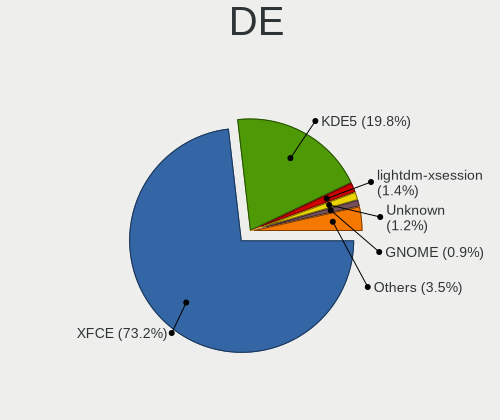
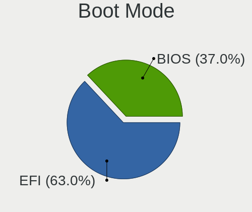
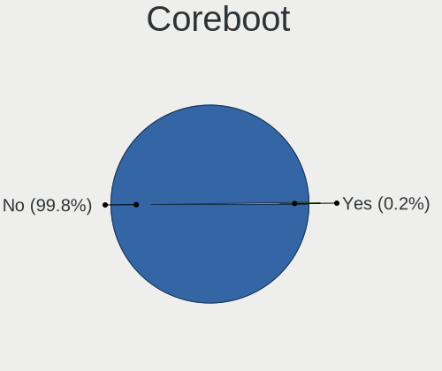
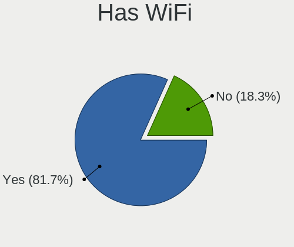
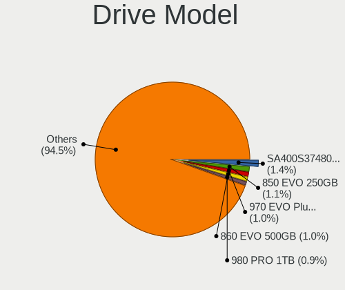
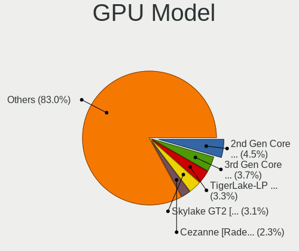
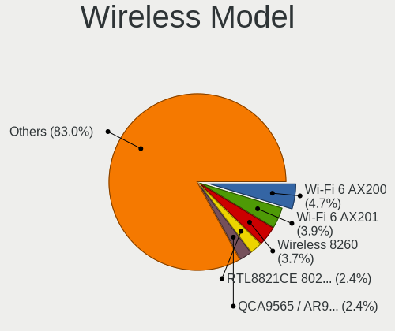

MX 21 - Tested Hardware & Statistics
------------------------------------

A project to collect tested hardware configurations for MX 21.

Anyone can contribute to this report by the [hw-probe](https://github.com/linuxhw/hw-probe) tool:

    sudo -E hw-probe -all -upload

Please contribute! Especially if your hardware is rare.

This is a report for all computer types. See also reports for [desktops](/Dist/MX_21/Desktop/README.md) and [notebooks](/Dist/MX_21/Notebook/README.md).

Contents
--------

* [ Test Cases ](#test-cases)

* [ System ](#system)
  - [ Kernel                   ](#kernel)
  - [ Kernel Family            ](#kernel-family)
  - [ Kernel Major Ver.        ](#kernel-major-ver)
  - [ Arch                     ](#arch)
  - [ DE                       ](#de)
  - [ Display Server           ](#display-server)
  - [ Display Manager          ](#display-manager)
  - [ OS Lang                  ](#os-lang)
  - [ Boot Mode                ](#boot-mode)
  - [ Filesystem               ](#filesystem)
  - [ Part. scheme             ](#part-scheme)
  - [ Dual Boot with Linux/BSD ](#dual-boot-with-linuxbsd)
  - [ Dual Boot (Win)          ](#dual-boot-win)

* [ Board ](#board)
  - [ Vendor                   ](#vendor)
  - [ Model                    ](#model)
  - [ Model Family             ](#model-family)
  - [ MFG Year                 ](#mfg-year)
  - [ Form Factor              ](#form-factor)
  - [ Secure Boot              ](#secure-boot)
  - [ Coreboot                 ](#coreboot)
  - [ RAM Size                 ](#ram-size)
  - [ RAM Used                 ](#ram-used)
  - [ Total Drives             ](#total-drives)
  - [ Has CD-ROM               ](#has-cd-rom)
  - [ Has Ethernet             ](#has-ethernet)
  - [ Has WiFi                 ](#has-wifi)
  - [ Has Bluetooth            ](#has-bluetooth)

* [ Location ](#location)
  - [ Country                  ](#country)
  - [ City                     ](#city)

* [ Drives ](#drives)
  - [ Drive Vendor             ](#drive-vendor)
  - [ Drive Model              ](#drive-model)
  - [ HDD Vendor               ](#hdd-vendor)
  - [ SSD Vendor               ](#ssd-vendor)
  - [ Drive Kind               ](#drive-kind)
  - [ Drive Connector          ](#drive-connector)
  - [ Drive Size               ](#drive-size)
  - [ Space Total              ](#space-total)
  - [ Space Used               ](#space-used)
  - [ Malfunc. Drives          ](#malfunc-drives)
  - [ Malfunc. Drive Vendor    ](#malfunc-drive-vendor)
  - [ Malfunc. HDD Vendor      ](#malfunc-hdd-vendor)
  - [ Malfunc. Drive Kind      ](#malfunc-drive-kind)
  - [ Failed Drives            ](#failed-drives)
  - [ Failed Drive Vendor      ](#failed-drive-vendor)
  - [ Drive Status             ](#drive-status)

* [ Storage controller ](#storage-controller)
  - [ Storage Vendor           ](#storage-vendor)
  - [ Storage Model            ](#storage-model)
  - [ Storage Kind             ](#storage-kind)

* [ Processor ](#processor)
  - [ CPU Vendor               ](#cpu-vendor)
  - [ CPU Model                ](#cpu-model)
  - [ CPU Model Family         ](#cpu-model-family)
  - [ CPU Cores                ](#cpu-cores)
  - [ CPU Sockets              ](#cpu-sockets)
  - [ CPU Threads              ](#cpu-threads)
  - [ CPU Op-Modes             ](#cpu-op-modes)
  - [ CPU Microcode            ](#cpu-microcode)
  - [ CPU Microarch            ](#cpu-microarch)

* [ Graphics ](#graphics)
  - [ GPU Vendor               ](#gpu-vendor)
  - [ GPU Model                ](#gpu-model)
  - [ GPU Combo                ](#gpu-combo)
  - [ GPU Driver               ](#gpu-driver)
  - [ GPU Memory               ](#gpu-memory)

* [ Monitor ](#monitor)
  - [ Monitor Vendor           ](#monitor-vendor)
  - [ Monitor Model            ](#monitor-model)
  - [ Monitor Resolution       ](#monitor-resolution)
  - [ Monitor Diagonal         ](#monitor-diagonal)
  - [ Monitor Width            ](#monitor-width)
  - [ Aspect Ratio             ](#aspect-ratio)
  - [ Monitor Area             ](#monitor-area)
  - [ Pixel Density            ](#pixel-density)
  - [ Multiple Monitors        ](#multiple-monitors)

* [ Network ](#network)
  - [ Net Controller Vendor    ](#net-controller-vendor)
  - [ Net Controller Model     ](#net-controller-model)
  - [ Wireless Vendor          ](#wireless-vendor)
  - [ Wireless Model           ](#wireless-model)
  - [ Ethernet Vendor          ](#ethernet-vendor)
  - [ Ethernet Model           ](#ethernet-model)
  - [ Net Controller Kind      ](#net-controller-kind)
  - [ Used Controller          ](#used-controller)
  - [ NICs                     ](#nics)
  - [ IPv6                     ](#ipv6)

* [ Bluetooth ](#bluetooth)
  - [ Bluetooth Vendor         ](#bluetooth-vendor)
  - [ Bluetooth Model          ](#bluetooth-model)

* [ Sound ](#sound)
  - [ Sound Vendor             ](#sound-vendor)
  - [ Sound Model              ](#sound-model)

* [ Memory ](#memory)
  - [ Memory Vendor            ](#memory-vendor)
  - [ Memory Model             ](#memory-model)
  - [ Memory Kind              ](#memory-kind)
  - [ Memory Form Factor       ](#memory-form-factor)
  - [ Memory Size              ](#memory-size)
  - [ Memory Speed             ](#memory-speed)

* [ Printers & scanners ](#printers--scanners)
  - [ Printer Vendor           ](#printer-vendor)
  - [ Printer Model            ](#printer-model)
  - [ Scanner Vendor           ](#scanner-vendor)
  - [ Scanner Model            ](#scanner-model)

* [ Camera ](#camera)
  - [ Camera Vendor            ](#camera-vendor)
  - [ Camera Model             ](#camera-model)

* [ Security ](#security)
  - [ Fingerprint Vendor       ](#fingerprint-vendor)
  - [ Fingerprint Model        ](#fingerprint-model)
  - [ Chipcard Vendor          ](#chipcard-vendor)
  - [ Chipcard Model           ](#chipcard-model)

* [ Unsupported ](#unsupported)
  - [ Unsupported Devices      ](#unsupported-devices)
  - [ Unsupported Device Types ](#unsupported-device-types)

Test Cases
----------

Total: 134

| Vendor        | Model                       | Form-Factor | Probe                                                      | Date         |
|---------------|-----------------------------|-------------|------------------------------------------------------------|--------------|
| Dell          | Latitude 3190               | Notebook    | [1f86e5fa57](https://linux-hardware.org/?probe=1f86e5fa57) | Aug 01, 2022 |
| Intel         | DH55TC AAE70932-303         | Desktop     | [f275229d83](https://linux-hardware.org/?probe=f275229d83) | Jul 31, 2022 |
| Dell          | Vostro 3550                 | Notebook    | [d67c93b534](https://linux-hardware.org/?probe=d67c93b534) | Jul 29, 2022 |
| Acer          | Aspire 5520                 | Notebook    | [d49c27a24a](https://linux-hardware.org/?probe=d49c27a24a) | Jul 29, 2022 |
| Apple         | MacBookAir7,2               | Notebook    | [5e7b9f2b14](https://linux-hardware.org/?probe=5e7b9f2b14) | Jul 26, 2022 |
| Dell          | Latitude 3190               | Notebook    | [2ec6ff1812](https://linux-hardware.org/?probe=2ec6ff1812) | Jul 25, 2022 |
| MP            | MS-7848                     | Desktop     | [f7696965e0](https://linux-hardware.org/?probe=f7696965e0) | Jul 22, 2022 |
| MSI           | MAG B550 TOMAHAWK           | Desktop     | [85782181c7](https://linux-hardware.org/?probe=85782181c7) | Jul 21, 2022 |
| ASUSTek       | P8H61/USB3 R2.0             | Desktop     | [1076f6d59a](https://linux-hardware.org/?probe=1076f6d59a) | Jul 19, 2022 |
| Dell          | Latitude 3190               | Notebook    | [4fa9fe26c1](https://linux-hardware.org/?probe=4fa9fe26c1) | Jul 18, 2022 |
| HP            | ProBook 450 G4              | Notebook    | [b2e75a35a2](https://linux-hardware.org/?probe=b2e75a35a2) | Jul 17, 2022 |
| Apple         | MacBookAir7,2               | Notebook    | [a1a565d211](https://linux-hardware.org/?probe=a1a565d211) | Jul 16, 2022 |
| AOpen         | D1009 A1A4                  | Desktop     | [d8edf66887](https://linux-hardware.org/?probe=d8edf66887) | Jul 13, 2022 |
| Dell          | Latitude 3190               | Notebook    | [b3c7283cdb](https://linux-hardware.org/?probe=b3c7283cdb) | Jul 11, 2022 |
| Acer          | Swift SF314-59              | Notebook    | [56424874b7](https://linux-hardware.org/?probe=56424874b7) | Jul 11, 2022 |
| Dell          | 0DR845                      | Desktop     | [4c4a530cc5](https://linux-hardware.org/?probe=4c4a530cc5) | Jul 06, 2022 |
| Alienware     | 13 R2                       | Notebook    | [ec877e9a2e](https://linux-hardware.org/?probe=ec877e9a2e) | Jul 06, 2022 |
| Alienware     | m15                         | Notebook    | [9578c619e6](https://linux-hardware.org/?probe=9578c619e6) | Jul 06, 2022 |
| Dell          | Latitude 3190               | Notebook    | [f5c0f0798a](https://linux-hardware.org/?probe=f5c0f0798a) | Jul 04, 2022 |
| ZOTAC         | ZBOX-ECM73070C/53060C       | Mini pc     | [77c632ea8e](https://linux-hardware.org/?probe=77c632ea8e) | Jul 01, 2022 |
| Dell          | Latitude 3190               | Notebook    | [3bf5b47ea1](https://linux-hardware.org/?probe=3bf5b47ea1) | Jun 27, 2022 |
| MSI           | B350 TOMAHAWK               | Desktop     | [5a66940742](https://linux-hardware.org/?probe=5a66940742) | Jun 23, 2022 |
| MSI           | Z77A-G41                    | Desktop     | [d0f55f3c0b](https://linux-hardware.org/?probe=d0f55f3c0b) | Jun 22, 2022 |
| Dell          | 0200DY A01                  | Desktop     | [bc8030c1d5](https://linux-hardware.org/?probe=bc8030c1d5) | Jun 22, 2022 |
| Dell          | 0DR845                      | Desktop     | [56b4af8d26](https://linux-hardware.org/?probe=56b4af8d26) | Jun 20, 2022 |
| Dell          | Latitude 3190               | Notebook    | [bb05f51a63](https://linux-hardware.org/?probe=bb05f51a63) | Jun 20, 2022 |
| Unknown       | Unknown                     | Notebook    | [3b7ffa4a35](https://linux-hardware.org/?probe=3b7ffa4a35) | Jun 18, 2022 |
| Dell          | Inspiron 15-3552            | Notebook    | [d89b7877a0](https://linux-hardware.org/?probe=d89b7877a0) | Jun 17, 2022 |
| Lenovo        | Unknown                     | Notebook    | [cd2f32d91c](https://linux-hardware.org/?probe=cd2f32d91c) | Jun 16, 2022 |
| HP            | ProBook 450 G1              | Notebook    | [623bb542e3](https://linux-hardware.org/?probe=623bb542e3) | Jun 15, 2022 |
| Apple         | MacBookAir7,2               | Notebook    | [fc34430f8d](https://linux-hardware.org/?probe=fc34430f8d) | Jun 15, 2022 |
| Dell          | Latitude 3190               | Notebook    | [fb55b815b6](https://linux-hardware.org/?probe=fb55b815b6) | Jun 13, 2022 |
| Toshiba       | Satellite C845              | Notebook    | [12d9cc2076](https://linux-hardware.org/?probe=12d9cc2076) | Jun 11, 2022 |
| Lenovo        | S130-11IGM 81J1             | Notebook    | [851d5469e5](https://linux-hardware.org/?probe=851d5469e5) | Jun 08, 2022 |
| Dell          | Latitude 3190               | Notebook    | [190816b333](https://linux-hardware.org/?probe=190816b333) | Jun 06, 2022 |
| HP            | ENVY x360 Convertible 15... | Convertible | [c21cd1f8f3](https://linux-hardware.org/?probe=c21cd1f8f3) | Jun 03, 2022 |
| Lenovo        | IdeaPad 3 15IIL05 81WE      | Notebook    | [b7ff235a14](https://linux-hardware.org/?probe=b7ff235a14) | Jun 03, 2022 |
| Gigabyte      | H410M S2H V3                | Desktop     | [b57b3a635c](https://linux-hardware.org/?probe=b57b3a635c) | Jun 02, 2022 |
| Dell          | Latitude D520               | Notebook    | [285ab7b873](https://linux-hardware.org/?probe=285ab7b873) | Jun 01, 2022 |
| Dell          | Latitude 3190               | Notebook    | [e43c62a67a](https://linux-hardware.org/?probe=e43c62a67a) | May 30, 2022 |
| ASUSTek       | K55A                        | Notebook    | [0eb5e9ea50](https://linux-hardware.org/?probe=0eb5e9ea50) | May 29, 2022 |
| AZW           | SER                         | Mini pc     | [9da3c6ca34](https://linux-hardware.org/?probe=9da3c6ca34) | May 18, 2022 |
| Sony          | VPCSB1V9R                   | Notebook    | [e3b15e462d](https://linux-hardware.org/?probe=e3b15e462d) | May 16, 2022 |
| Sony          | VPCSB1V9R                   | Notebook    | [9dfafea956](https://linux-hardware.org/?probe=9dfafea956) | May 16, 2022 |
| Dell          | Latitude 3190               | Notebook    | [e80556f7d6](https://linux-hardware.org/?probe=e80556f7d6) | May 16, 2022 |
| Medion        | E14304                      | Notebook    | [8d1a922b7b](https://linux-hardware.org/?probe=8d1a922b7b) | May 15, 2022 |
| HP            | Stream Laptop 14-cb0XX      | Notebook    | [3b0408920d](https://linux-hardware.org/?probe=3b0408920d) | May 13, 2022 |
| ASUSTek       | SABERTOOTH X99              | Desktop     | [b627953ad4](https://linux-hardware.org/?probe=b627953ad4) | May 11, 2022 |
| Acer          | Aspire A515-56              | Notebook    | [b728fa5844](https://linux-hardware.org/?probe=b728fa5844) | May 01, 2022 |
| Intel         | V1.3                        | Desktop     | [a01993f2fa](https://linux-hardware.org/?probe=a01993f2fa) | Apr 30, 2022 |
| Acer          | Nitro AN515-55              | Notebook    | [04b51fe1cf](https://linux-hardware.org/?probe=04b51fe1cf) | Apr 25, 2022 |
| Alienware     | m15 R7                      | Notebook    | [77727a1731](https://linux-hardware.org/?probe=77727a1731) | Apr 24, 2022 |
| Lenovo        | Legion 5 15ACH6H 82JU       | Notebook    | [4e8b5f940a](https://linux-hardware.org/?probe=4e8b5f940a) | Apr 23, 2022 |
| ASUSTek       | SABERTOOTH X99              | Desktop     | [51cc264c62](https://linux-hardware.org/?probe=51cc264c62) | Apr 22, 2022 |
| HP            | ProBook 450 G4              | Notebook    | [77a6f92da0](https://linux-hardware.org/?probe=77a6f92da0) | Apr 22, 2022 |
| Gigabyte      | B550M S2H                   | Desktop     | [208972e3b5](https://linux-hardware.org/?probe=208972e3b5) | Apr 19, 2022 |
| ASRock        | N3150M                      | Desktop     | [0ee71f6582](https://linux-hardware.org/?probe=0ee71f6582) | Apr 19, 2022 |
| Gigabyte      | B550M S2H                   | Desktop     | [1127f26185](https://linux-hardware.org/?probe=1127f26185) | Apr 17, 2022 |
| Sun Micros... | Sun Ultra 40 M2 Workstat... | Server      | [7cc89d3cba](https://linux-hardware.org/?probe=7cc89d3cba) | Apr 14, 2022 |
| Sun Micros... | Sun Ultra 40 M2 Workstat... | Server      | [5cd6adf199](https://linux-hardware.org/?probe=5cd6adf199) | Apr 14, 2022 |
| Gigabyte      | G5 KC                       | Notebook    | [fc21d0150f](https://linux-hardware.org/?probe=fc21d0150f) | Apr 10, 2022 |
| Acer          | Aspire A515-56              | Notebook    | [db6408f394](https://linux-hardware.org/?probe=db6408f394) | Apr 07, 2022 |
| MSI           | GV62 8RD                    | Notebook    | [2e43728adb](https://linux-hardware.org/?probe=2e43728adb) | Apr 06, 2022 |
| Microsoft     | Surface Pro 7               | Tablet      | [084e2350e9](https://linux-hardware.org/?probe=084e2350e9) | Apr 05, 2022 |
| ASUSTek       | 1101HA                      | Notebook    | [c3d2458d59](https://linux-hardware.org/?probe=c3d2458d59) | Apr 04, 2022 |
| ASUSTek       | ROG Strix G712LU_G712LU     | Notebook    | [288629b95d](https://linux-hardware.org/?probe=288629b95d) | Apr 04, 2022 |
| Dell          | 0YXT71 A01                  | Desktop     | [5de0fab8f2](https://linux-hardware.org/?probe=5de0fab8f2) | Apr 04, 2022 |
| Lenovo        | ThinkPad T430 23427YU       | Notebook    | [07ada1e358](https://linux-hardware.org/?probe=07ada1e358) | Apr 03, 2022 |
| ASUSTek       | ROG Strix G513QC_G513QC     | Notebook    | [697f820432](https://linux-hardware.org/?probe=697f820432) | Apr 02, 2022 |
| Apple         | Mac-F65AE981FFA204ED Mac... | Mini pc     | [83dab83528](https://linux-hardware.org/?probe=83dab83528) | Apr 01, 2022 |
| TUXEDO        | N7x0WU                      | Notebook    | [cf4f31fe3c](https://linux-hardware.org/?probe=cf4f31fe3c) | Mar 30, 2022 |
| Lenovo        | ThinkPad T440p 20AW002VB... | Notebook    | [e3ec03ac31](https://linux-hardware.org/?probe=e3ec03ac31) | Mar 29, 2022 |
| Framework     | Laptop                      | Notebook    | [a9f49dfe70](https://linux-hardware.org/?probe=a9f49dfe70) | Mar 24, 2022 |
| Lenovo        | 1046 NO DPK                 | Desktop     | [561b1c3324](https://linux-hardware.org/?probe=561b1c3324) | Mar 17, 2022 |
| Gigabyte      | Z390 UD                     | Desktop     | [d0b555e0ba](https://linux-hardware.org/?probe=d0b555e0ba) | Mar 17, 2022 |
| Apple         | Mac-F2238AC8                | All in one  | [c8c2d7bba3](https://linux-hardware.org/?probe=c8c2d7bba3) | Mar 14, 2022 |
| HP            | 3647h                       | Desktop     | [fd6766aabb](https://linux-hardware.org/?probe=fd6766aabb) | Mar 11, 2022 |
| ASUSTek       | P5GC-MX/MEDION/SI           | Desktop     | [772e020316](https://linux-hardware.org/?probe=772e020316) | Mar 09, 2022 |
| MSI           | MS-7091                     | Desktop     | [71aaa6a920](https://linux-hardware.org/?probe=71aaa6a920) | Mar 09, 2022 |
| MSI           | MS-7091                     | Desktop     | [b08ddd1115](https://linux-hardware.org/?probe=b08ddd1115) | Mar 09, 2022 |
| Dell          | Latitude 3190               | Notebook    | [964420352c](https://linux-hardware.org/?probe=964420352c) | Feb 28, 2022 |
| Dell          | XPS 17 9710                 | Notebook    | [7147fe2d5c](https://linux-hardware.org/?probe=7147fe2d5c) | Feb 26, 2022 |
| ASUSTek       | 1101HA                      | Notebook    | [b234cc741f](https://linux-hardware.org/?probe=b234cc741f) | Feb 22, 2022 |
| Dell          | XPS 17 9710                 | Notebook    | [851badde2e](https://linux-hardware.org/?probe=851badde2e) | Feb 20, 2022 |
| ASUSTek       | ROG Maximus XIII HERO       | Desktop     | [e58223cc60](https://linux-hardware.org/?probe=e58223cc60) | Feb 18, 2022 |
| Huanan        | X99-F8 V2.0                 | Desktop     | [23c722f6cf](https://linux-hardware.org/?probe=23c722f6cf) | Feb 18, 2022 |
| Huanan        | X99-F8 V2.0                 | Desktop     | [f4fec6a5be](https://linux-hardware.org/?probe=f4fec6a5be) | Feb 17, 2022 |
| Sony          | VPCF119FX                   | Notebook    | [1e8448b824](https://linux-hardware.org/?probe=1e8448b824) | Feb 15, 2022 |
| MSI           | Z97 GAMING 5                | Desktop     | [7c66c1b404](https://linux-hardware.org/?probe=7c66c1b404) | Feb 09, 2022 |
| Sony          | SVE1513Q1ESI                | Notebook    | [77e599ef9f](https://linux-hardware.org/?probe=77e599ef9f) | Feb 08, 2022 |
| Dell          | Latitude E4310              | Notebook    | [50190cb420](https://linux-hardware.org/?probe=50190cb420) | Feb 06, 2022 |
| efirstview    | v01099                      | Notebook    | [ed22d3c2b6](https://linux-hardware.org/?probe=ed22d3c2b6) | Feb 04, 2022 |
| ASUSTek       | X99-DELUXE                  | Desktop     | [4ffe151e7a](https://linux-hardware.org/?probe=4ffe151e7a) | Jan 29, 2022 |
| Lenovo        | ThinkPad W541 20EG0005MS    | Notebook    | [f89a7895fc](https://linux-hardware.org/?probe=f89a7895fc) | Jan 23, 2022 |
| Sony          | VPCEH2N1E                   | Notebook    | [17a4bc1847](https://linux-hardware.org/?probe=17a4bc1847) | Jan 22, 2022 |
| Fujitsu Si... | LIFEBOOK E8010              | Notebook    | [82d1bc5db0](https://linux-hardware.org/?probe=82d1bc5db0) | Jan 22, 2022 |
| MSI           | Alpha 15 B5EEK              | Notebook    | [882906d968](https://linux-hardware.org/?probe=882906d968) | Jan 17, 2022 |
| Alienware     | 13 R2                       | Notebook    | [65c1ae9026](https://linux-hardware.org/?probe=65c1ae9026) | Jan 14, 2022 |
| HP            | EliteBook 840 G3            | Notebook    | [58cff543b5](https://linux-hardware.org/?probe=58cff543b5) | Jan 06, 2022 |
| HP            | 0B4Ch D                     | Desktop     | [ecaec39529](https://linux-hardware.org/?probe=ecaec39529) | Jan 05, 2022 |
| HP            | EliteBook 8440p             | Notebook    | [d0d2edf745](https://linux-hardware.org/?probe=d0d2edf745) | Jan 04, 2022 |
| Lenovo        | G400s VILG1                 | Notebook    | [1cd4b24f16](https://linux-hardware.org/?probe=1cd4b24f16) | Jan 04, 2022 |
| Gigabyte      | P15FV5                      | Notebook    | [164348e568](https://linux-hardware.org/?probe=164348e568) | Jan 03, 2022 |
| HP            | Spectre x360 Convertible... | Convertible | [7cc374183b](https://linux-hardware.org/?probe=7cc374183b) | Dec 30, 2021 |
| Lenovo        | IdeaPad Y700-15ISK 80NV     | Notebook    | [4fe24b4f44](https://linux-hardware.org/?probe=4fe24b4f44) | Dec 26, 2021 |
| Intel         | NUC10i7FNB K61360-302       | Mini pc     | [9147191a67](https://linux-hardware.org/?probe=9147191a67) | Dec 24, 2021 |
| ASUSTek       | X550CC                      | Notebook    | [b0cde813b9](https://linux-hardware.org/?probe=b0cde813b9) | Dec 23, 2021 |
| Fujitsu       | D3221-A1 S26361-D3221-A1    | Desktop     | [78d4e04363](https://linux-hardware.org/?probe=78d4e04363) | Dec 16, 2021 |
| Samsung       | 340XAA/350XAA/550XAA        | Notebook    | [49692045a2](https://linux-hardware.org/?probe=49692045a2) | Dec 16, 2021 |
| ASUSTek       | ASUS TUF Gaming A15 FA50... | Notebook    | [21180cbdad](https://linux-hardware.org/?probe=21180cbdad) | Dec 04, 2021 |
| GALAX         | B550M                       | Desktop     | [a6866c8a45](https://linux-hardware.org/?probe=a6866c8a45) | Dec 04, 2021 |
| Lenovo        | Yoga 7 14ITL5 82BH          | Convertible | [bc8359d097](https://linux-hardware.org/?probe=bc8359d097) | Dec 01, 2021 |
| Lenovo        | B590 20208                  | Notebook    | [ed08d6bdd9](https://linux-hardware.org/?probe=ed08d6bdd9) | Nov 30, 2021 |
| Lenovo        | ThinkBook 13s-IWL 20R9      | Notebook    | [649434f9b8](https://linux-hardware.org/?probe=649434f9b8) | Nov 23, 2021 |
| Apple         | Mac-942B5BF58194151B        | All in one  | [bb58f4914e](https://linux-hardware.org/?probe=bb58f4914e) | Nov 21, 2021 |
| ASUSTek       | N53SN                       | Notebook    | [67d66feb3e](https://linux-hardware.org/?probe=67d66feb3e) | Nov 20, 2021 |
| ASUSTek       | TUF Gaming FX505DT_FX505... | Notebook    | [791ae651bb](https://linux-hardware.org/?probe=791ae651bb) | Nov 14, 2021 |
| ASUSTek       | TUF Gaming FX505DT_FX505... | Notebook    | [b105aaabf5](https://linux-hardware.org/?probe=b105aaabf5) | Nov 14, 2021 |
| Lenovo        | SHARKBAY NO DPK             | Desktop     | [fd5f409df8](https://linux-hardware.org/?probe=fd5f409df8) | Nov 14, 2021 |
| Lenovo        | SHARKBAY NO DPK             | Desktop     | [a85cc99f78](https://linux-hardware.org/?probe=a85cc99f78) | Nov 14, 2021 |
| HP            | Compaq Presario CQ60        | Notebook    | [9d83baca33](https://linux-hardware.org/?probe=9d83baca33) | Nov 12, 2021 |
| Lenovo        | ThinkPad E15 Gen 3 20YG0... | Notebook    | [c277967769](https://linux-hardware.org/?probe=c277967769) | Nov 11, 2021 |
| ASRock        | X570 Steel Legend           | Desktop     | [18391015f7](https://linux-hardware.org/?probe=18391015f7) | Nov 11, 2021 |
| Apple         | MacBook3,1                  | Notebook    | [25964b9256](https://linux-hardware.org/?probe=25964b9256) | Nov 08, 2021 |
| HP            | EliteBook 850 G3            | Notebook    | [cd26ab6e8f](https://linux-hardware.org/?probe=cd26ab6e8f) | Nov 05, 2021 |
| Dell          | Latitude 3190               | Notebook    | [592b613273](https://linux-hardware.org/?probe=592b613273) | Nov 01, 2021 |
| Gigabyte      | X570 AORUS PRO              | Desktop     | [fbd2076eee](https://linux-hardware.org/?probe=fbd2076eee) | Oct 28, 2021 |
| ASUSTek       | E402MA                      | Notebook    | [4c2453c6a2](https://linux-hardware.org/?probe=4c2453c6a2) | Oct 26, 2021 |
| Sony          | VPCEC3S1E                   | Notebook    | [2af79ba873](https://linux-hardware.org/?probe=2af79ba873) | Oct 25, 2021 |
| Gigabyte      | B550M DS3H                  | Desktop     | [ee6a141211](https://linux-hardware.org/?probe=ee6a141211) | Oct 19, 2021 |
| Fujitsu Si... | ESPRIMO Mobile D9500        | Notebook    | [ee6fdf4608](https://linux-hardware.org/?probe=ee6fdf4608) | Oct 18, 2021 |
| Chuwi         | GemiBook Pro                | Notebook    | [f8735054b4](https://linux-hardware.org/?probe=f8735054b4) | Sep 02, 2021 |
| Gigabyte      | A320M-S2H V2-CF             | Desktop     | [5d136cb09b](https://linux-hardware.org/?probe=5d136cb09b) | Aug 13, 2021 |
| Samsung       | 350V5C/351V5C/3540VC/344... | Notebook    | [c4ebb4c114](https://linux-hardware.org/?probe=c4ebb4c114) | Jun 04, 2021 |

System
------

Kernel
------

Version of the Linux kernel

| Version                    | Computers | Percent |
|----------------------------|-----------|---------|
| 5.10.0-9-amd64             | 18        | 16.22%  |
| 5.10.0-13-amd64            | 15        | 13.51%  |
| 5.14.0-4mx-amd64           | 12        | 10.81%  |
| 5.16.0-5mx-amd64           | 8         | 7.21%   |
| 5.10.0-11-amd64            | 8         | 7.21%   |
| 5.10.0-16-amd64            | 6         | 5.41%   |
| 5.10.0-15-amd64            | 6         | 5.41%   |
| 5.10.0-14-amd64            | 6         | 5.41%   |
| 5.10.0-10-amd64            | 4         | 3.6%    |
| 5.16.0-6mx-amd64           | 3         | 2.7%    |
| 5.16.0-4mx-amd64           | 2         | 1.8%    |
| 5.14.0-3mx-amd64           | 2         | 1.8%    |
| 5.10.0-8-amd64             | 2         | 1.8%    |
| 5.10.0-13-686-pae          | 2         | 1.8%    |
| 5.10.0-12-amd64            | 2         | 1.8%    |
| 5.10.0-11-686-pae          | 2         | 1.8%    |
| 5.17.0-5.2-liquorix-amd64  | 1         | 0.9%    |
| 5.17.0-1mx-amd64           | 1         | 0.9%    |
| 5.17.0-1-amd64             | 1         | 0.9%    |
| 5.16.0-rc5-hwmon-next+     | 1         | 0.9%    |
| 5.16.0-18.1-liquorix-amd64 | 1         | 0.9%    |
| 5.15.0-3mx-amd64           | 1         | 0.9%    |
| 5.15.0-2-amd64             | 1         | 0.9%    |
| 5.15.0-0.bpo.2-amd64       | 1         | 0.9%    |
| 5.14.0-2mx-amd64           | 1         | 0.9%    |
| 5.10.52-antix.1-amd64-smp  | 1         | 0.9%    |
| 5.10.111-tkg-cfs           | 1         | 0.9%    |
| 5.10.0-5mx-amd64           | 1         | 0.9%    |
| 5.10.0-11-686              | 1         | 0.9%    |

Kernel Family
-------------

Linux kernel without a distro release

| Version  | Computers | Percent |
|----------|-----------|---------|
| 5.10.0   | 69        | 64.49%  |
| 5.16.0   | 15        | 14.02%  |
| 5.14.0   | 15        | 14.02%  |
| 5.17.0   | 3         | 2.8%    |
| 5.15.0   | 3         | 2.8%    |
| 5.10.52  | 1         | 0.93%   |
| 5.10.111 | 1         | 0.93%   |

Kernel Major Ver.
-----------------

Linux kernel major version

| Version | Computers | Percent |
|---------|-----------|---------|
| 5.10    | 71        | 66.36%  |
| 5.16    | 15        | 14.02%  |
| 5.14    | 15        | 14.02%  |
| 5.17    | 3         | 2.8%    |
| 5.15    | 3         | 2.8%    |

Arch
----

OS architecture (x86_64, i586, etc.)

| Name   | Computers | Percent |
|--------|-----------|---------|
| x86_64 | 100       | 96.15%  |
| i686   | 4         | 3.85%   |

DE
--

Desktop Environment

| Name             | Computers | Percent |
|------------------|-----------|---------|
| XFCE             | 73        | 70.19%  |
| KDE5             | 24        | 23.08%  |
| lightdm-xsession | 2         | 1.92%   |
| GNOME            | 2         | 1.92%   |
| Unknown          | 2         | 1.92%   |
| Budgie           | 1         | 0.96%   |

Display Server
--------------

X11 or Wayland

| Name | Computers | Percent |
|------|-----------|---------|
| X11  | 102       | 98.08%  |
| Tty  | 2         | 1.92%   |

Display Manager
---------------

SDDM, LightDM, etc.

| Name    | Computers | Percent |
|---------|-----------|---------|
| LightDM | 79        | 75.96%  |
| SDDM    | 23        | 22.12%  |
| SLiM    | 1         | 0.96%   |
| Unknown | 1         | 0.96%   |

OS Lang
-------

Language

| Lang    | Computers | Percent |
|---------|-----------|---------|
| en_US   | 57        | 54.81%  |
| de_DE   | 17        | 16.35%  |
| en_GB   | 4         | 3.85%   |
| ru_RU   | 3         | 2.88%   |
| it_IT   | 3         | 2.88%   |
| de_CH   | 3         | 2.88%   |
| Unknown | 3         | 2.88%   |
| pt_BR   | 2         | 1.92%   |
| fr_FR   | 2         | 1.92%   |
| tr_TR   | 1         | 0.96%   |
| sv_SE   | 1         | 0.96%   |
| sk_SK   | 1         | 0.96%   |
| pl_PL   | 1         | 0.96%   |
| hu_HU   | 1         | 0.96%   |
| fi_FI   | 1         | 0.96%   |
| es_PE   | 1         | 0.96%   |
| es_MX   | 1         | 0.96%   |
| es_ES   | 1         | 0.96%   |
| en_AU   | 1         | 0.96%   |

Boot Mode
---------

EFI or BIOS

| Mode | Computers | Percent |
|------|-----------|---------|
| EFI  | 66        | 63.46%  |
| BIOS | 38        | 36.54%  |

Filesystem
----------

Type of filesystem

| Type     | Computers | Percent |
|----------|-----------|---------|
| Ext4     | 85        | 81.73%  |
| Overlay  | 12        | 11.54%  |
| Btrfs    | 4         | 3.85%   |
| Reiserfs | 1         | 0.96%   |
| F2fs     | 1         | 0.96%   |
| Ext3     | 1         | 0.96%   |

Part. scheme
------------

Scheme of partitioning

| Type    | Computers | Percent |
|---------|-----------|---------|
| GPT     | 77        | 74.04%  |
| MBR     | 26        | 25%     |
| Unknown | 1         | 0.96%   |

Dual Boot with Linux/BSD
------------------------

Hosting more than one Linux/BSD

| Dual boot | Computers | Percent |
|-----------|-----------|---------|
| No        | 66        | 63.46%  |
| Yes       | 38        | 36.54%  |

Dual Boot (Win)
---------------

Hosting Linux and Windows

| Dual boot | Computers | Percent |
|-----------|-----------|---------|
| Yes       | 55        | 52.38%  |
| No        | 50        | 47.62%  |

Board
-----

Vendor
------

Motherboard manufacturer

| Name                | Computers | Percent |
|---------------------|-----------|---------|
| Lenovo              | 15        | 14.42%  |
| ASUSTek Computer    | 14        | 13.46%  |
| Hewlett-Packard     | 11        | 10.58%  |
| Dell                | 10        | 9.62%   |
| Gigabyte Technology | 7         | 6.73%   |
| MSI                 | 6         | 5.77%   |
| Sony                | 5         | 4.81%   |
| Apple               | 5         | 4.81%   |
| Acer                | 4         | 3.85%   |
| Alienware           | 3         | 2.88%   |
| Samsung Electronics | 2         | 1.92%   |
| Intel               | 2         | 1.92%   |
| Fujitsu Siemens     | 2         | 1.92%   |
| ASRock              | 2         | 1.92%   |
| ZOTAC               | 1         | 0.96%   |
| TUXEDO              | 1         | 0.96%   |
| Toshiba             | 1         | 0.96%   |
| Sun Microsystems    | 1         | 0.96%   |
| MP                  | 1         | 0.96%   |
| Microsoft           | 1         | 0.96%   |
| Medion              | 1         | 0.96%   |
| Huanan              | 1         | 0.96%   |
| GALAX               | 1         | 0.96%   |
| Fujitsu             | 1         | 0.96%   |
| Framework           | 1         | 0.96%   |
| efirstview          | 1         | 0.96%   |
| Chuwi               | 1         | 0.96%   |
| AZW                 | 1         | 0.96%   |
| AOpen               | 1         | 0.96%   |
| Unknown             | 1         | 0.96%   |

Model
-----

Motherboard model

| Name                                         | Computers | Percent |
|----------------------------------------------|-----------|---------|
| Dell OptiPlex 755                            | 2         | 1.92%   |
| ASUS All Series                              | 2         | 1.92%   |
| Unknown                                      | 2         | 1.92%   |
| ZOTAC ZBOX-ECM73070C/53060C                  | 1         | 0.96%   |
| TUXEDO N7x0WU                                | 1         | 0.96%   |
| Toshiba Satellite C845                       | 1         | 0.96%   |
| Sun Microsystems Sun Ultra 40 M2 Workstation | 1         | 0.96%   |
| Sony VPCSB1V9R                               | 1         | 0.96%   |
| Sony VPCF119FX                               | 1         | 0.96%   |
| Sony VPCEH2N1E                               | 1         | 0.96%   |
| Sony VPCEC3S1E                               | 1         | 0.96%   |
| Sony SVE1513Q1ESI                            | 1         | 0.96%   |
| Samsung 350V5C/351V5C/3540VC/3440VC          | 1         | 0.96%   |
| Samsung 340XAA/350XAA/550XAA                 | 1         | 0.96%   |
| MSI MS-7C91                                  | 1         | 0.96%   |
| MSI MS-7A34                                  | 1         | 0.96%   |
| MSI MS-7917                                  | 1         | 0.96%   |
| MSI MS-7758                                  | 1         | 0.96%   |
| MSI GV62 8RD                                 | 1         | 0.96%   |
| MSI Alpha 15 B5EEK                           | 1         | 0.96%   |
| MP MS-7848                                   | 1         | 0.96%   |
| Microsoft Surface Pro 7                      | 1         | 0.96%   |
| Medion E14304                                | 1         | 0.96%   |
| Lenovo Yoga 7 14ITL5 82BH                    | 1         | 0.96%   |
| Lenovo ThinkStation P620 30E0CTO1WW          | 1         | 0.96%   |
| Lenovo ThinkPad W541 20EG0005MS              | 1         | 0.96%   |
| Lenovo ThinkPad T440p 20AW002VBR             | 1         | 0.96%   |
| Lenovo ThinkPad T430 23427YU                 | 1         | 0.96%   |
| Lenovo ThinkPad E15 Gen 3 20YG008CUS         | 1         | 0.96%   |
| Lenovo ThinkBook 13s-IWL 20R9                | 1         | 0.96%   |
| Lenovo S130-11IGM 81J1                       | 1         | 0.96%   |
| Lenovo Legion 5 15ACH6H 82JU                 | 1         | 0.96%   |
| Lenovo IdeaPad Y700-15ISK 80NV               | 1         | 0.96%   |
| Lenovo IdeaPad 3 15IIL05 81WE                | 1         | 0.96%   |
| Lenovo G400s VILG1                           | 1         | 0.96%   |
| Lenovo B590 20208                            | 1         | 0.96%   |
| Lenovo 10AAS1QB0B                            | 1         | 0.96%   |
| Intel V1.3                                   | 1         | 0.96%   |
| Intel DH55TC AAE70932-303                    | 1         | 0.96%   |
| Huanan X99-F8                                | 1         | 0.96%   |
| HP Z400 Workstation                          | 1         | 0.96%   |
| HP Stream Laptop 14-cb0XX                    | 1         | 0.96%   |
| HP Spectre x360 Convertible 15-df1xxx        | 1         | 0.96%   |
| HP ProBook 450 G4                            | 1         | 0.96%   |
| HP ProBook 450 G1                            | 1         | 0.96%   |
| HP ENVY x360 Convertible 15m-ee0xxx          | 1         | 0.96%   |
| HP EliteBook 850 G3                          | 1         | 0.96%   |
| HP EliteBook 8440p                           | 1         | 0.96%   |
| HP EliteBook 840 G3                          | 1         | 0.96%   |
| HP Compaq Presario CQ60                      | 1         | 0.96%   |
| HP Compaq 8000 Elite CMT PC                  | 1         | 0.96%   |
| Gigabyte Z390 UD                             | 1         | 0.96%   |
| Gigabyte X570 AORUS PRO                      | 1         | 0.96%   |
| Gigabyte P15FV5                              | 1         | 0.96%   |
| Gigabyte H410M S2H V3                        | 1         | 0.96%   |
| Gigabyte G5 KC                               | 1         | 0.96%   |
| Gigabyte B550M S2H                           | 1         | 0.96%   |
| Gigabyte B550M DS3H                          | 1         | 0.96%   |
| GALAX B550M                                  | 1         | 0.96%   |
| Fujitsu Siemens LIFEBOOK E8010               | 1         | 0.96%   |

Model Family
------------

Motherboard model prefix

| Name                     | Computers | Percent |
|--------------------------|-----------|---------|
| Lenovo ThinkPad          | 4         | 3.85%   |
| Dell OptiPlex            | 4         | 3.85%   |
| HP EliteBook             | 3         | 2.88%   |
| Dell Latitude            | 3         | 2.88%   |
| ASUS ROG                 | 3         | 2.88%   |
| Lenovo IdeaPad           | 2         | 1.92%   |
| HP ProBook               | 2         | 1.92%   |
| HP Compaq                | 2         | 1.92%   |
| Gigabyte B550M           | 2         | 1.92%   |
| ASUS All                 | 2         | 1.92%   |
| Alienware m15            | 2         | 1.92%   |
| Acer Aspire              | 2         | 1.92%   |
| Unknown                  | 2         | 1.92%   |
| ZOTAC ZBOX-ECM73070C     | 1         | 0.96%   |
| TUXEDO N7x0WU            | 1         | 0.96%   |
| Toshiba Satellite        | 1         | 0.96%   |
| Sun Microsystems Sun     | 1         | 0.96%   |
| Sony VPCSB1V9R           | 1         | 0.96%   |
| Sony VPCF119FX           | 1         | 0.96%   |
| Sony VPCEH2N1E           | 1         | 0.96%   |
| Sony VPCEC3S1E           | 1         | 0.96%   |
| Sony SVE1513Q1ESI        | 1         | 0.96%   |
| Samsung 350V5C           | 1         | 0.96%   |
| Samsung 340XAA           | 1         | 0.96%   |
| MSI MS-7C91              | 1         | 0.96%   |
| MSI MS-7A34              | 1         | 0.96%   |
| MSI MS-7917              | 1         | 0.96%   |
| MSI MS-7758              | 1         | 0.96%   |
| MSI GV62                 | 1         | 0.96%   |
| MSI Alpha                | 1         | 0.96%   |
| MP MS-7848               | 1         | 0.96%   |
| Microsoft Surface        | 1         | 0.96%   |
| Medion E14304            | 1         | 0.96%   |
| Lenovo Yoga              | 1         | 0.96%   |
| Lenovo ThinkStation      | 1         | 0.96%   |
| Lenovo ThinkBook         | 1         | 0.96%   |
| Lenovo S130-11IGM        | 1         | 0.96%   |
| Lenovo Legion            | 1         | 0.96%   |
| Lenovo G400s             | 1         | 0.96%   |
| Lenovo B590              | 1         | 0.96%   |
| Lenovo 10AAS1QB0B        | 1         | 0.96%   |
| Intel V1.3               | 1         | 0.96%   |
| Intel DH55TC             | 1         | 0.96%   |
| Huanan X99-F8            | 1         | 0.96%   |
| HP Z400                  | 1         | 0.96%   |
| HP Stream                | 1         | 0.96%   |
| HP Spectre               | 1         | 0.96%   |
| HP ENVY                  | 1         | 0.96%   |
| Gigabyte Z390            | 1         | 0.96%   |
| Gigabyte X570            | 1         | 0.96%   |
| Gigabyte P15FV5          | 1         | 0.96%   |
| Gigabyte H410M           | 1         | 0.96%   |
| Gigabyte G5              | 1         | 0.96%   |
| GALAX B550M              | 1         | 0.96%   |
| Fujitsu Siemens LIFEBOOK | 1         | 0.96%   |
| Fujitsu Siemens ESPRIMO  | 1         | 0.96%   |
| Fujitsu ESPRIMO          | 1         | 0.96%   |
| Framework Laptop         | 1         | 0.96%   |
| efirstview v01099        | 1         | 0.96%   |
| Dell XPS                 | 1         | 0.96%   |

MFG Year
--------

Motherboard manufacture year

| Year    | Computers | Percent |
|---------|-----------|---------|
| 2021    | 15        | 14.42%  |
| 2020    | 13        | 12.5%   |
| 2015    | 9         | 8.65%   |
| 2019    | 7         | 6.73%   |
| 2013    | 7         | 6.73%   |
| 2010    | 7         | 6.73%   |
| 2018    | 6         | 5.77%   |
| 2016    | 6         | 5.77%   |
| 2012    | 6         | 5.77%   |
| 2011    | 6         | 5.77%   |
| 2007    | 6         | 5.77%   |
| 2014    | 4         | 3.85%   |
| 2009    | 3         | 2.88%   |
| 2022    | 2         | 1.92%   |
| 2017    | 2         | 1.92%   |
| 2008    | 2         | 1.92%   |
| 2006    | 1         | 0.96%   |
| 2005    | 1         | 0.96%   |
| Unknown | 1         | 0.96%   |

Form Factor
-----------

Physical design of the computer

| Name        | Computers | Percent |
|-------------|-----------|---------|
| Notebook    | 63        | 60.58%  |
| Desktop     | 31        | 29.81%  |
| Convertible | 3         | 2.88%   |
| Mini pc     | 3         | 2.88%   |
| All in one  | 2         | 1.92%   |
| Tablet      | 1         | 0.96%   |
| Server      | 1         | 0.96%   |

Secure Boot
-----------

Enabled or disabled

| State    | Computers | Percent |
|----------|-----------|---------|
| Disabled | 103       | 99.04%  |
| Enabled  | 1         | 0.96%   |

Coreboot
--------

Have coreboot on board

| Used | Computers | Percent |
|------|-----------|---------|
| No   | 104       | 100%    |

RAM Size
--------

Total RAM memory

| Size in GB  | Computers | Percent |
|-------------|-----------|---------|
| 4.01-8.0    | 28        | 26.92%  |
| 8.01-16.0   | 24        | 23.08%  |
| 16.01-24.0  | 17        | 16.35%  |
| 3.01-4.0    | 15        | 14.42%  |
| 32.01-64.0  | 10        | 9.62%   |
| 2.01-3.0    | 4         | 3.85%   |
| 24.01-32.0  | 2         | 1.92%   |
| 64.01-256.0 | 2         | 1.92%   |
| 1.01-2.0    | 1         | 0.96%   |
| 0.51-1.0    | 1         | 0.96%   |

RAM Used
--------

Used RAM memory

| Used GB    | Computers | Percent |
|------------|-----------|---------|
| 1.01-2.0   | 41        | 37.61%  |
| 2.01-3.0   | 31        | 28.44%  |
| 3.01-4.0   | 14        | 12.84%  |
| 4.01-8.0   | 10        | 9.17%   |
| 8.01-16.0  | 6         | 5.5%    |
| 0.51-1.0   | 6         | 5.5%    |
| 16.01-24.0 | 1         | 0.92%   |

Total Drives
------------

Number of drives on board

| Drives | Computers | Percent |
|--------|-----------|---------|
| 1      | 54        | 51.43%  |
| 2      | 27        | 25.71%  |
| 3      | 16        | 15.24%  |
| 4      | 4         | 3.81%   |
| 5      | 2         | 1.9%    |
| 8      | 1         | 0.95%   |
| 0      | 1         | 0.95%   |

Has CD-ROM
----------

Has CD-ROM on board

| Presented | Computers | Percent |
|-----------|-----------|---------|
| No        | 66        | 63.46%  |
| Yes       | 38        | 36.54%  |

Has Ethernet
------------

Has Ethernet on board

| Presented | Computers | Percent |
|-----------|-----------|---------|
| Yes       | 87        | 83.65%  |
| No        | 17        | 16.35%  |

Has WiFi
--------

Has WiFi module

| Presented | Computers | Percent |
|-----------|-----------|---------|
| Yes       | 81        | 77.88%  |
| No        | 23        | 22.12%  |

Has Bluetooth
-------------

Has Bluetooth module

| Presented | Computers | Percent |
|-----------|-----------|---------|
| Yes       | 61        | 58.65%  |
| No        | 43        | 41.35%  |

Location
--------

Country
-------

Geographic location (country)

| Country     | Computers | Percent |
|-------------|-----------|---------|
| USA         | 33        | 31.43%  |
| Germany     | 14        | 13.33%  |
| Canada      | 6         | 5.71%   |
| Italy       | 5         | 4.76%   |
| Brazil      | 4         | 3.81%   |
| Switzerland | 3         | 2.86%   |
| Russia      | 3         | 2.86%   |
| Netherlands | 3         | 2.86%   |
| India       | 3         | 2.86%   |
| UK          | 2         | 1.9%    |
| Spain       | 2         | 1.9%    |
| Serbia      | 2         | 1.9%    |
| Poland      | 2         | 1.9%    |
| France      | 2         | 1.9%    |
| Finland     | 2         | 1.9%    |
| Belgium     | 2         | 1.9%    |
| Austria     | 2         | 1.9%    |
| Australia   | 2         | 1.9%    |
| Turkey      | 1         | 0.95%   |
| Sweden      | 1         | 0.95%   |
| Slovakia    | 1         | 0.95%   |
| Romania     | 1         | 0.95%   |
| Peru        | 1         | 0.95%   |
| Mexico      | 1         | 0.95%   |
| Malaysia    | 1         | 0.95%   |
| Hungary     | 1         | 0.95%   |
| Greece      | 1         | 0.95%   |
| Estonia     | 1         | 0.95%   |
| Czechia     | 1         | 0.95%   |
| Belarus     | 1         | 0.95%   |
| Azerbaijan  | 1         | 0.95%   |

City
----

Geographic location (city)

| City                      | Computers | Percent |
|---------------------------|-----------|---------|
| Vienna                    | 2         | 1.87%   |
| Vasco da Gama             | 2         | 1.87%   |
| St Petersburg             | 2         | 1.87%   |
| Portland                  | 2         | 1.87%   |
| Orange                    | 2         | 1.87%   |
| Montreal                  | 2         | 1.87%   |
| Ettingen                  | 2         | 1.87%   |
| Doesburg                  | 2         | 1.87%   |
| Berlin                    | 2         | 1.87%   |
| Zurich                    | 1         | 0.93%   |
| Waycross                  | 1         | 0.93%   |
| Warsaw                    | 1         | 0.93%   |
| Volos                     | 1         | 0.93%   |
| Vilhelmina                | 1         | 0.93%   |
| Vancouver                 | 1         | 0.93%   |
| Vaidasoo                  | 1         | 0.93%   |
| Uelzen                    | 1         | 0.93%   |
| Tupelo                    | 1         | 0.93%   |
| Taggia                    | 1         | 0.93%   |
| Tacoma                    | 1         | 0.93%   |
| Sydney                    | 1         | 0.93%   |
| Surprise                  | 1         | 0.93%   |
| Stevens Point             | 1         | 0.93%   |
| Seelbach                  | 1         | 0.93%   |
| Schaarbeek                | 1         | 0.93%   |
| Saskatoon                 | 1         | 0.93%   |
| San Diego                 | 1         | 0.93%   |
| Saarlouis                 | 1         | 0.93%   |
| Rosporden                 | 1         | 0.93%   |
| Roseville                 | 1         | 0.93%   |
| Rochester                 | 1         | 0.93%   |
| Reinbek                   | 1         | 0.93%   |
| Rathenow                  | 1         | 0.93%   |
| Puebla City               | 1         | 0.93%   |
| Prague                    | 1         | 0.93%   |
| Powder Springs            | 1         | 0.93%   |
| Postbauer-Heng            | 1         | 0.93%   |
| Pompano Beach             | 1         | 0.93%   |
| Pila                      | 1         | 0.93%   |
| Piedmont                  | 1         | 0.93%   |
| Ottawa                    | 1         | 0.93%   |
| Osasco                    | 1         | 0.93%   |
| Obourg                    | 1         | 0.93%   |
| Normal                    | 1         | 0.93%   |
| Neumarkt in der Oberpfalz | 1         | 0.93%   |
| Munich                    | 1         | 0.93%   |
| Moses Lake                | 1         | 0.93%   |
| Moscow                    | 1         | 0.93%   |
| Montebelluna              | 1         | 0.93%   |
| Minsk                     | 1         | 0.93%   |
| Minneapolis               | 1         | 0.93%   |
| Milwaukee                 | 1         | 0.93%   |
| Mestre                    | 1         | 0.93%   |
| Marion                    | 1         | 0.93%   |
| Lima                      | 1         | 0.93%   |
| Lannion                   | 1         | 0.93%   |
| Lahti                     | 1         | 0.93%   |
| Kitchener                 | 1         | 0.93%   |
| Kamiah                    | 1         | 0.93%   |
| Jagodina                  | 1         | 0.93%   |

Drives
------

Drive Vendor
------------

Hard drive vendors

| Vendor              | Computers | Drives | Percent |
|---------------------|-----------|--------|---------|
| Samsung Electronics | 28        | 42     | 17.28%  |
| WDC                 | 23        | 27     | 14.2%   |
| Seagate             | 22        | 26     | 13.58%  |
| Crucial             | 12        | 19     | 7.41%   |
| Kingston            | 11        | 11     | 6.79%   |
| Unknown             | 7         | 8      | 4.32%   |
| SK hynix            | 7         | 8      | 4.32%   |
| SanDisk             | 5         | 6      | 3.09%   |
| Transcend           | 4         | 4      | 2.47%   |
| Toshiba             | 4         | 4      | 2.47%   |
| PNY                 | 3         | 4      | 1.85%   |
| LITEON              | 3         | 3      | 1.85%   |
| Intel               | 3         | 3      | 1.85%   |
| Dogfish             | 3         | 3      | 1.85%   |
| SPCC                | 2         | 2      | 1.23%   |
| OCZ                 | 2         | 2      | 1.23%   |
| Netac               | 2         | 2      | 1.23%   |
| Micron Technology   | 2         | 2      | 1.23%   |
| Hitachi             | 2         | 2      | 1.23%   |
| Goodram             | 2         | 2      | 1.23%   |
| Corsair             | 2         | 2      | 1.23%   |
| Apple               | 2         | 4      | 1.23%   |
| Silicon Motion      | 1         | 1      | 0.62%   |
| SABRENT             | 1         | 1      | 0.62%   |
| Phison              | 1         | 1      | 0.62%   |
| Maxtor              | 1         | 1      | 0.62%   |
| Gigabyte Technology | 1         | 1      | 0.62%   |
| GeIL                | 1         | 1      | 0.62%   |
| Fujitsu             | 1         | 1      | 0.62%   |
| Avant               | 1         | 1      | 0.62%   |
| Acer                | 1         | 1      | 0.62%   |
| A-DATA Technology   | 1         | 1      | 0.62%   |
| Unknown             | 1         | 1      | 0.62%   |

Drive Model
-----------

Hard drive models

| Model                                     | Computers | Percent |
|-------------------------------------------|-----------|---------|
| Samsung SSD 850 EVO 250GB                 | 4         | 2.2%    |
| Kingston SA400S37480G 480GB SSD           | 4         | 2.2%    |
| Seagate ST2000DM008-2FR102 2TB            | 3         | 1.65%   |
| Samsung SSD 970 EVO Plus 1TB              | 3         | 1.65%   |
| Samsung SSD 860 EVO 500GB                 | 3         | 1.65%   |
| Kingston SA400S37240G 240GB SSD           | 3         | 1.65%   |
| Crucial CT120BX500SSD1 120GB              | 3         | 1.65%   |
| Unknown SD32G  32GB                       | 2         | 1.1%    |
| Toshiba DT01ACA100 1TB                    | 2         | 1.1%    |
| SK hynix HFM512GDJTNI-82A0A 512GB         | 2         | 1.1%    |
| Samsung SSD 980 PRO 1TB                   | 2         | 1.1%    |
| Samsung SSD 850 EVO 1TB                   | 2         | 1.1%    |
| Dogfish SSD 128GB                         | 2         | 1.1%    |
| Crucial CT500P2SSD8 500GB                 | 2         | 1.1%    |
| Crucial CT240BX500SSD1 240GB              | 2         | 1.1%    |
| Corsair MP400 2TB                         | 2         | 1.1%    |
| WDC WDS500G2B0C-00PXH0 500GB              | 1         | 0.55%   |
| WDC WDS500G2B0B-00YS70 500GB SSD          | 1         | 0.55%   |
| WDC WDS100T2B0A-00SM50 1TB SSD            | 1         | 0.55%   |
| WDC WDS100T1X0E-00AFY0 1TB                | 1         | 0.55%   |
| WDC WD60EZRZ-00RWYB1 6TB                  | 1         | 0.55%   |
| WDC WD60EFRX-68L0BN1 6TB                  | 1         | 0.55%   |
| WDC WD5002AALX-00J37A0 500GB              | 1         | 0.55%   |
| WDC WD5000LPVX-08V0TT5 500GB              | 1         | 0.55%   |
| WDC WD5000LPLX-08ZNTT0 500GB              | 1         | 0.55%   |
| WDC WD5000LPCX-22VHAT0 500GB              | 1         | 0.55%   |
| WDC WD5000AVCS-632DY1 500GB               | 1         | 0.55%   |
| WDC WD5000AAKS-40V6A0 500GB               | 1         | 0.55%   |
| WDC WD40EFRX-68WT0N0 4TB                  | 1         | 0.55%   |
| WDC WD3200BEVT-22ZCT0 320GB               | 1         | 0.55%   |
| WDC WD30EFRX-68AX9N0 3TB                  | 1         | 0.55%   |
| WDC WD1600BEVT-60ZCT1 160GB               | 1         | 0.55%   |
| WDC WD10JPVX-22JC3T0 1TB                  | 1         | 0.55%   |
| WDC WD10EZEX-08M2NA0 1TB                  | 1         | 0.55%   |
| WDC WD10EVDS-63U8B1 1TB                   | 1         | 0.55%   |
| WDC WD10EADS-98M2B0 1TB                   | 1         | 0.55%   |
| WDC WD10EADS-00M2B0 1TB                   | 1         | 0.55%   |
| WDC PC SN730 SDBPNTY-1T00-1101 1TB        | 1         | 0.55%   |
| WDC PC SN730 NVMe 1024GB                  | 1         | 0.55%   |
| WDC PC SN530 SDBPNPZ-1T00-1032 1TB        | 1         | 0.55%   |
| WDC PC SN530 SDBPMPZ-512G-1101 512GB      | 1         | 0.55%   |
| WDC PC SN530 SDBPMPZ-512G-1001 512GB      | 1         | 0.55%   |
| Unknown SDW32G  32GB                      | 1         | 0.55%   |
| Unknown SD08G  8GB                        | 1         | 0.55%   |
| Unknown SD/MMC/MS PRO 64GB                | 1         | 0.55%   |
| Unknown ISOCOM  64GB                      | 1         | 0.55%   |
| Unknown DA4064  64GB                      | 1         | 0.55%   |
| Unknown BJTD4R  32GB                      | 1         | 0.55%   |
| Transcend TS256GSSD370S 256GB             | 1         | 0.55%   |
| Transcend TS1GSDOM22V 1GB SSD             | 1         | 0.55%   |
| Transcend TS128GSSD370S 128GB             | 1         | 0.55%   |
| Transcend TS128GMTS800 128GB SSD          | 1         | 0.55%   |
| Toshiba MQ01ABD075 752GB                  | 1         | 0.55%   |
| Toshiba KBG40ZNT256G MEMORY 256GB         | 1         | 0.55%   |
| SPCC Solid State Disk 256GB               | 1         | 0.55%   |
| SPCC Solid State Disk 128GB               | 1         | 0.55%   |
| SK hynix SKHynix_HFM256GDHTNI-87A0B 256GB | 1         | 0.55%   |
| SK hynix PC601 NVMe 512GB                 | 1         | 0.55%   |
| SK hynix HFM512GD3JX013N 512GB            | 1         | 0.55%   |
| SK hynix HFM256GDJTNG-8310A 256GB         | 1         | 0.55%   |

HDD Vendor
----------

Hard disk drive vendors

| Vendor              | Computers | Drives | Percent |
|---------------------|-----------|--------|---------|
| Seagate             | 22        | 26     | 44%     |
| WDC                 | 14        | 18     | 28%     |
| Samsung Electronics | 4         | 4      | 8%      |
| Toshiba             | 3         | 3      | 6%      |
| Hitachi             | 2         | 2      | 4%      |
| Unknown             | 1         | 1      | 2%      |
| SABRENT             | 1         | 1      | 2%      |
| Maxtor              | 1         | 1      | 2%      |
| Fujitsu             | 1         | 1      | 2%      |
| Apple               | 1         | 1      | 2%      |

SSD Vendor
----------

Solid state drive vendors

| Vendor              | Computers | Drives | Percent |
|---------------------|-----------|--------|---------|
| Samsung Electronics | 18        | 23     | 24.66%  |
| Crucial             | 10        | 16     | 13.7%   |
| Kingston            | 9         | 9      | 12.33%  |
| SanDisk             | 5         | 6      | 6.85%   |
| Transcend           | 4         | 4      | 5.48%   |
| LITEON              | 3         | 3      | 4.11%   |
| Dogfish             | 3         | 3      | 4.11%   |
| WDC                 | 2         | 2      | 2.74%   |
| SPCC                | 2         | 2      | 2.74%   |
| PNY                 | 2         | 2      | 2.74%   |
| OCZ                 | 2         | 2      | 2.74%   |
| Netac               | 2         | 2      | 2.74%   |
| GOODRAM             | 2         | 2      | 2.74%   |
| Apple               | 2         | 3      | 2.74%   |
| Micron Technology   | 1         | 1      | 1.37%   |
| Intel               | 1         | 1      | 1.37%   |
| Gigabyte Technology | 1         | 1      | 1.37%   |
| GeIL                | 1         | 1      | 1.37%   |
| Avant               | 1         | 1      | 1.37%   |
| Acer                | 1         | 1      | 1.37%   |
| A-DATA Technology   | 1         | 1      | 1.37%   |

Drive Kind
----------

HDD or SSD

| Kind | Computers | Drives | Percent |
|------|-----------|--------|---------|
| SSD  | 58        | 86     | 39.46%  |
| HDD  | 46        | 58     | 31.29%  |
| NVMe | 36        | 45     | 24.49%  |
| MMC  | 7         | 8      | 4.76%   |

Drive Connector
---------------

SATA, SAS, NVMe, etc.

| Type | Computers | Drives | Percent |
|------|-----------|--------|---------|
| SATA | 78        | 139    | 62.9%   |
| NVMe | 36        | 45     | 29.03%  |
| MMC  | 7         | 8      | 5.65%   |
| SAS  | 3         | 5      | 2.42%   |

Drive Size
----------

Size of hard drive

| Size in TB | Computers | Drives | Percent |
|------------|-----------|--------|---------|
| 0.01-0.5   | 63        | 89     | 60.58%  |
| 0.51-1.0   | 29        | 38     | 27.88%  |
| 1.01-2.0   | 8         | 11     | 7.69%   |
| 3.01-4.0   | 2         | 2      | 1.92%   |
| 2.01-3.0   | 1         | 1      | 0.96%   |
| 4.01-10.0  | 1         | 3      | 0.96%   |

Space Total
-----------

Amount of disk space available on the file system

| Size in GB     | Computers | Percent |
|----------------|-----------|---------|
| 101-250        | 26        | 24.53%  |
| 251-500        | 23        | 21.7%   |
| 501-1000       | 17        | 16.04%  |
| More than 3000 | 8         | 7.55%   |
| 21-50          | 8         | 7.55%   |
| 1001-2000      | 7         | 6.6%    |
| 51-100         | 7         | 6.6%    |
| 1-20           | 6         | 5.66%   |
| 2001-3000      | 4         | 3.77%   |

Space Used
----------

Amount of used disk space

| Used GB        | Computers | Percent |
|----------------|-----------|---------|
| 1-20           | 37        | 33.94%  |
| 21-50          | 23        | 21.1%   |
| 101-250        | 15        | 13.76%  |
| 51-100         | 12        | 11.01%  |
| 251-500        | 8         | 7.34%   |
| 1001-2000      | 6         | 5.5%    |
| 501-1000       | 4         | 3.67%   |
| More than 3000 | 3         | 2.75%   |
| 2001-3000      | 1         | 0.92%   |

Malfunc. Drives
---------------

Drive models with a malfunction

| Model                                        | Computers | Drives | Percent |
|----------------------------------------------|-----------|--------|---------|
| WDC WDS100T2B0A-00SM50 1TB SSD               | 1         | 1      | 5.26%   |
| WDC WD5000AAKS-40V6A0 500GB                  | 1         | 1      | 5.26%   |
| WDC WD3200BEVT-22ZCT0 320GB                  | 1         | 1      | 5.26%   |
| WDC WD10EADS-98M2B0 1TB                      | 1         | 1      | 5.26%   |
| WDC WD10EADS-00M2B0 1TB                      | 1         | 1      | 5.26%   |
| Seagate ST9320421AS 320GB                    | 1         | 1      | 5.26%   |
| Seagate ST9160821AS 160GB                    | 1         | 1      | 5.26%   |
| Seagate ST750LM022 HN-M750MBB 752GB          | 1         | 1      | 5.26%   |
| Seagate ST500LM021-1KJ152 500GB              | 1         | 1      | 5.26%   |
| Seagate ST3500413AS 500GB                    | 1         | 1      | 5.26%   |
| Seagate ST3360320AS 360GB                    | 1         | 1      | 5.26%   |
| Seagate ST320LT020-9YG142 320GB              | 1         | 1      | 5.26%   |
| Seagate ST250DM000-1BD141 250GB              | 1         | 1      | 5.26%   |
| Samsung Electronics SSD 850 EVO 500GB        | 1         | 1      | 5.26%   |
| Samsung Electronics SSD 850 EVO 1TB          | 1         | 2      | 5.26%   |
| Samsung Electronics SSD 840 Series 120GB     | 1         | 1      | 5.26%   |
| Samsung Electronics SSD 840 PRO Series 256GB | 1         | 1      | 5.26%   |
| Maxtor 4K040H2 40GB                          | 1         | 1      | 5.26%   |
| Goodram SSDPR-CL100-480-G3 480GB             | 1         | 1      | 5.26%   |

Malfunc. Drive Vendor
---------------------

Vendors of faulty drives

| Vendor              | Computers | Drives | Percent |
|---------------------|-----------|--------|---------|
| Seagate             | 8         | 8      | 42.11%  |
| WDC                 | 5         | 5      | 26.32%  |
| Samsung Electronics | 4         | 5      | 21.05%  |
| Maxtor              | 1         | 1      | 5.26%   |
| Goodram             | 1         | 1      | 5.26%   |

Malfunc. HDD Vendor
-------------------

Vendors of faulty HDD drives

| Vendor  | Computers | Drives | Percent |
|---------|-----------|--------|---------|
| Seagate | 8         | 8      | 61.54%  |
| WDC     | 4         | 4      | 30.77%  |
| Maxtor  | 1         | 1      | 7.69%   |

Malfunc. Drive Kind
-------------------

Kinds of faulty drives

| Kind | Computers | Drives | Percent |
|------|-----------|--------|---------|
| HDD  | 12        | 13     | 66.67%  |
| SSD  | 6         | 7      | 33.33%  |

Failed Drives
-------------

Failed drive models

Zero info for selected period =(

Failed Drive Vendor
-------------------

Failed drive vendors

Zero info for selected period =(

Drive Status
------------

Number of failed and malfunc. drives

| Status   | Computers | Drives | Percent |
|----------|-----------|--------|---------|
| Works    | 89        | 162    | 75.42%  |
| Malfunc  | 18        | 20     | 15.25%  |
| Detected | 11        | 15     | 9.32%   |

Storage controller
------------------

Storage Vendor
--------------

Storage controller vendors

| Vendor                      | Computers | Percent |
|-----------------------------|-----------|---------|
| Intel                       | 75        | 56.39%  |
| Samsung Electronics         | 14        | 10.53%  |
| AMD                         | 11        | 8.27%   |
| SK hynix                    | 7         | 5.26%   |
| SanDisk                     | 7         | 5.26%   |
| Phison Electronics          | 4         | 3.01%   |
| Nvidia                      | 3         | 2.26%   |
| ASMedia Technology          | 3         | 2.26%   |
| Micron/Crucial Technology   | 2         | 1.5%    |
| Kingston Technology Company | 2         | 1.5%    |
| Silicon Motion              | 1         | 0.75%   |
| Silicon Image               | 1         | 0.75%   |
| Micron Technology           | 1         | 0.75%   |
| KIOXIA                      | 1         | 0.75%   |
| Broadcom / LSI              | 1         | 0.75%   |

Storage Model
-------------

Storage controller models

| Model                                                                            | Computers | Percent |
|----------------------------------------------------------------------------------|-----------|---------|
| Intel 7 Series Chipset Family 6-port SATA Controller [AHCI mode]                 | 9         | 5.88%   |
| AMD FCH SATA Controller [AHCI mode]                                              | 7         | 4.58%   |
| Intel 8 Series/C220 Series Chipset Family 6-port SATA Controller 1 [AHCI mode]   | 6         | 3.92%   |
| Samsung NVMe SSD Controller SM981/PM981/PM983                                    | 5         | 3.27%   |
| Intel Sunrise Point-LP SATA Controller [AHCI mode]                               | 5         | 3.27%   |
| Samsung NVMe SSD Controller PM9A1/PM9A3/980PRO                                   | 4         | 2.61%   |
| Phison E12 NVMe Controller                                                       | 4         | 2.61%   |
| Intel 6 Series/C200 Series Chipset Family 6 port Mobile SATA AHCI Controller     | 4         | 2.61%   |
| AMD 500 Series Chipset SATA Controller                                           | 4         | 2.61%   |
| SK hynix BC511                                                                   | 3         | 1.96%   |
| Samsung NVMe SSD Controller SM961/PM961/SM963                                    | 3         | 1.96%   |
| Intel Volume Management Device NVMe RAID Controller                              | 3         | 1.96%   |
| Intel Celeron/Pentium Silver Processor SATA Controller                           | 3         | 1.96%   |
| Intel C610/X99 series chipset sSATA Controller [AHCI mode]                       | 3         | 1.96%   |
| Intel C610/X99 series chipset 6-Port SATA Controller [AHCI mode]                 | 3         | 1.96%   |
| Intel 5 Series/3400 Series Chipset 6 port SATA AHCI Controller                   | 3         | 1.96%   |
| ASMedia ASM1062 Serial ATA Controller                                            | 3         | 1.96%   |
| SK hynix BC501 NVMe Solid State Drive                                            | 2         | 1.31%   |
| SanDisk WD Blue SN550 NVMe SSD                                                   | 2         | 1.31%   |
| SanDisk WD Black SN750 / PC SN730 NVMe SSD                                       | 2         | 1.31%   |
| SanDisk Non-Volatile memory controller                                           | 2         | 1.31%   |
| Samsung NVMe SSD Controller 980                                                  | 2         | 1.31%   |
| Micron/Crucial P2 NVMe PCIe SSD                                                  | 2         | 1.31%   |
| Intel SATA Controller [RAID mode]                                                | 2         | 1.31%   |
| Intel HM170/QM170 Chipset SATA Controller [AHCI Mode]                            | 2         | 1.31%   |
| Intel Cannon Lake Mobile PCH SATA AHCI Controller                                | 2         | 1.31%   |
| Intel Atom/Celeron/Pentium Processor x5-E8000/J3xxx/N3xxx Series SATA Controller | 2         | 1.31%   |
| Intel 82Q35 Express PT IDER Controller                                           | 2         | 1.31%   |
| Intel 82801IR/IO/IH (ICH9R/DO/DH) 6 port SATA Controller [AHCI mode]             | 2         | 1.31%   |
| Intel 82801HM/HEM (ICH8M/ICH8M-E) SATA Controller [AHCI mode]                    | 2         | 1.31%   |
| Intel 82801HM/HEM (ICH8M/ICH8M-E) IDE Controller                                 | 2         | 1.31%   |
| Intel 82801 Mobile SATA Controller [RAID mode]                                   | 2         | 1.31%   |
| Intel 7 Series/C210 Series Chipset Family 6-port SATA Controller [AHCI mode]     | 2         | 1.31%   |
| Intel 500 Series Chipset Family SATA AHCI Controller                             | 2         | 1.31%   |
| Intel 5 Series/3400 Series Chipset 4 port SATA IDE Controller                    | 2         | 1.31%   |
| Intel 5 Series/3400 Series Chipset 2 port SATA IDE Controller                    | 2         | 1.31%   |
| Intel 400 Series Chipset Family SATA AHCI Controller                             | 2         | 1.31%   |
| SK hynix Non-Volatile memory controller                                          | 1         | 0.65%   |
| SK hynix Gold P31 SSD                                                            | 1         | 0.65%   |
| Silicon Motion SM2263EN/SM2263XT SSD Controller                                  | 1         | 0.65%   |
| Silicon Image SiI 3132 Serial ATA Raid II Controller                             | 1         | 0.65%   |
| SanDisk WD PC SN810 / Black SN850 NVMe SSD                                       | 1         | 0.65%   |
| Samsung Electronics SATA controller                                              | 1         | 0.65%   |
| Nvidia MCP78S [GeForce 8200] SATA Controller (non-AHCI mode)                     | 1         | 0.65%   |
| Nvidia MCP78S [GeForce 8200] IDE                                                 | 1         | 0.65%   |
| Nvidia MCP67 IDE Controller                                                      | 1         | 0.65%   |
| Nvidia MCP67 AHCI Controller                                                     | 1         | 0.65%   |
| Nvidia MCP55 SATA Controller                                                     | 1         | 0.65%   |
| Nvidia MCP55 IDE                                                                 | 1         | 0.65%   |
| Micron Non-Volatile memory controller                                            | 1         | 0.65%   |
| KIOXIA NVMe SSD Controller BG4                                                   | 1         | 0.65%   |
| Kingston Company Company Non-Volatile memory controller                          | 1         | 0.65%   |
| Kingston Company KC2000 NVMe SSD                                                 | 1         | 0.65%   |
| Intel US15W/US15X/US15L/UL11L SCH [Poulsbo] IDE Controller                       | 1         | 0.65%   |
| Intel Tiger Lake-LP SATA Controller                                              | 1         | 0.65%   |
| Intel SSD 660P Series                                                            | 1         | 0.65%   |
| Intel Non-Volatile memory controller                                             | 1         | 0.65%   |
| Intel NM10/ICH7 Family SATA Controller [IDE mode]                                | 1         | 0.65%   |
| Intel Ice Lake-LP SATA Controller [AHCI mode]                                    | 1         | 0.65%   |
| Intel Comet Lake SATA AHCI Controller                                            | 1         | 0.65%   |

Storage Kind
------------

Kind of storage controller (IDE, SATA, NVMe, SAS, ...)

| Kind | Computers | Percent |
|------|-----------|---------|
| SATA | 71        | 53.79%  |
| NVMe | 36        | 27.27%  |
| IDE  | 16        | 12.12%  |
| RAID | 8         | 6.06%   |
| SCSI | 1         | 0.76%   |

Processor
---------

CPU Vendor
----------

Processor vendors

| Vendor | Computers | Percent |
|--------|-----------|---------|
| Intel  | 83        | 79.81%  |
| AMD    | 21        | 20.19%  |

CPU Model
---------

Processor models

| Model                                         | Computers | Percent |
|-----------------------------------------------|-----------|---------|
| Intel Core 2 Duo CPU E8400 @ 3.00GHz          | 3         | 2.88%   |
| AMD Ryzen 7 5800H with Radeon Graphics        | 3         | 2.88%   |
| Intel Core i7-8550U CPU @ 1.80GHz             | 2         | 1.92%   |
| Intel Core i7-6700HQ CPU @ 2.60GHz            | 2         | 1.92%   |
| Intel Core i7-5820K CPU @ 3.30GHz             | 2         | 1.92%   |
| Intel Core i7-10750H CPU @ 2.60GHz            | 2         | 1.92%   |
| Intel Core i5-6200U CPU @ 2.30GHz             | 2         | 1.92%   |
| Intel Core i5-3350P CPU @ 3.10GHz             | 2         | 1.92%   |
| Intel Core i5-3230M CPU @ 2.60GHz             | 2         | 1.92%   |
| Intel Core i5 CPU M 520 @ 2.40GHz             | 2         | 1.92%   |
| Intel Celeron CPU N3060 @ 1.60GHz             | 2         | 1.92%   |
| Intel 11th Gen Core i7-1165G7 @ 2.80GHz       | 2         | 1.92%   |
| AMD Ryzen 7 3750H with Radeon Vega Mobile Gfx | 2         | 1.92%   |
| Intel Xeon CPU W3565 @ 3.20GHz                | 1         | 0.96%   |
| Intel Xeon CPU E5-2678 v3 @ 2.50GHz           | 1         | 0.96%   |
| Intel Pentium Silver N5000 CPU @ 1.10GHz      | 1         | 0.96%   |
| Intel Pentium M processor 1.80GHz             | 1         | 0.96%   |
| Intel Genuine CPU T2300 @ 1.66GHz             | 1         | 0.96%   |
| Intel Core i9-10850K CPU @ 3.60GHz            | 1         | 0.96%   |
| Intel Core i7-9750H CPU @ 2.60GHz             | 1         | 0.96%   |
| Intel Core i7-8565U CPU @ 1.80GHz             | 1         | 0.96%   |
| Intel Core i7-7500U CPU @ 2.70GHz             | 1         | 0.96%   |
| Intel Core i7-6500U CPU @ 2.50GHz             | 1         | 0.96%   |
| Intel Core i7-4810MQ CPU @ 2.80GHz            | 1         | 0.96%   |
| Intel Core i7-3720QM CPU @ 2.60GHz            | 1         | 0.96%   |
| Intel Core i7-3630QM CPU @ 2.40GHz            | 1         | 0.96%   |
| Intel Core i7-2670QM CPU @ 2.20GHz            | 1         | 0.96%   |
| Intel Core i7-1065G7 CPU @ 1.30GHz            | 1         | 0.96%   |
| Intel Core i7-10510U CPU @ 1.80GHz            | 1         | 0.96%   |
| Intel Core i7 CPU Q 720 @ 1.60GHz             | 1         | 0.96%   |
| Intel Core i7 CPU M 620 @ 2.67GHz             | 1         | 0.96%   |
| Intel Core i5-9600K CPU @ 3.70GHz             | 1         | 0.96%   |
| Intel Core i5-8300H CPU @ 2.30GHz             | 1         | 0.96%   |
| Intel Core i5-5350U CPU @ 1.80GHz             | 1         | 0.96%   |
| Intel Core i5-4690K CPU @ 3.50GHz             | 1         | 0.96%   |
| Intel Core i5-4570T CPU @ 2.90GHz             | 1         | 0.96%   |
| Intel Core i5-4300M CPU @ 2.60GHz             | 1         | 0.96%   |
| Intel Core i5-3470 CPU @ 3.20GHz              | 1         | 0.96%   |
| Intel Core i5-3320M CPU @ 2.60GHz             | 1         | 0.96%   |
| Intel Core i5-2450M CPU @ 2.50GHz             | 1         | 0.96%   |
| Intel Core i5-2430M CPU @ 2.40GHz             | 1         | 0.96%   |
| Intel Core i5-2410M CPU @ 2.30GHz             | 1         | 0.96%   |
| Intel Core i5-2400S CPU @ 2.50GHz             | 1         | 0.96%   |
| Intel Core i5-10500H CPU @ 2.50GHz            | 1         | 0.96%   |
| Intel Core i5 CPU M 460 @ 2.53GHz             | 1         | 0.96%   |
| Intel Core i3-4160 CPU @ 3.60GHz              | 1         | 0.96%   |
| Intel Core i3-4130 CPU @ 3.40GHz              | 1         | 0.96%   |
| Intel Core i3-4000M CPU @ 2.40GHz             | 1         | 0.96%   |
| Intel Core i3-3217U CPU @ 1.80GHz             | 1         | 0.96%   |
| Intel Core i3-2350M CPU @ 2.30GHz             | 1         | 0.96%   |
| Intel Core i3-2330M CPU @ 2.20GHz             | 1         | 0.96%   |
| Intel Core i3-2328M CPU @ 2.20GHz             | 1         | 0.96%   |
| Intel Core i3-10100F CPU @ 3.60GHz            | 1         | 0.96%   |
| Intel Core i3-10100 CPU @ 3.60GHz             | 1         | 0.96%   |
| Intel Core i3-1005G1 CPU @ 1.20GHz            | 1         | 0.96%   |
| Intel Core i3 CPU 550 @ 3.20GHz               | 1         | 0.96%   |
| Intel Core i3 CPU 540 @ 3.07GHz               | 1         | 0.96%   |
| Intel Core 2 Duo CPU T7500 @ 2.20GHz          | 1         | 0.96%   |
| Intel Core 2 Duo CPU T5250 @ 1.50GHz          | 1         | 0.96%   |
| Intel Core 2 Duo CPU E7200 @ 2.53GHz          | 1         | 0.96%   |

CPU Model Family
----------------

Processor model prefix

| Model                   | Computers | Percent |
|-------------------------|-----------|---------|
| Intel Core i5           | 22        | 21.15%  |
| Intel Core i7           | 20        | 19.23%  |
| Intel Core i3           | 12        | 11.54%  |
| AMD Ryzen 7             | 9         | 8.65%   |
| Intel Celeron           | 8         | 7.69%   |
| Other                   | 7         | 6.73%   |
| Intel Core 2 Duo        | 7         | 6.73%   |
| AMD Ryzen 5             | 4         | 3.85%   |
| Intel Xeon              | 2         | 1.92%   |
| Intel Atom              | 2         | 1.92%   |
| AMD Ryzen 9             | 2         | 1.92%   |
| AMD Ryzen 3             | 2         | 1.92%   |
| Intel Pentium Silver    | 1         | 0.96%   |
| Intel Pentium M         | 1         | 0.96%   |
| Intel Genuine           | 1         | 0.96%   |
| Intel Core i9           | 1         | 0.96%   |
| AMD Turion 64 X2 Mobile | 1         | 0.96%   |
| AMD Sempron             | 1         | 0.96%   |
| AMD Ryzen Threadripper  | 1         | 0.96%   |

CPU Cores
---------

Number of processor cores

| Number | Computers | Percent |
|--------|-----------|---------|
| 2      | 41        | 39.42%  |
| 4      | 35        | 33.65%  |
| 8      | 10        | 9.62%   |
| 6      | 10        | 9.62%   |
| 12     | 3         | 2.88%   |
| 1      | 3         | 2.88%   |
| 14     | 1         | 0.96%   |
| 10     | 1         | 0.96%   |

CPU Sockets
-----------

Number of sockets

| Number | Computers | Percent |
|--------|-----------|---------|
| 1      | 103       | 99.04%  |
| 2      | 1         | 0.96%   |

CPU Threads
-----------

Threads per core (Hyper-Threading)

| Number | Computers | Percent |
|--------|-----------|---------|
| 2      | 72        | 69.23%  |
| 1      | 32        | 30.77%  |

CPU Op-Modes
------------

CPU Operation Modes (32-bit, 64-bit)

| Op mode        | Computers | Percent |
|----------------|-----------|---------|
| 32-bit, 64-bit | 101       | 97.12%  |
| 32-bit         | 3         | 2.88%   |

CPU Microcode
-------------

Microcode number

| Number     | Computers | Percent |
|------------|-----------|---------|
| Unknown    | 14        | 13.33%  |
| 0x306a9    | 9         | 8.57%   |
| 0x206a7    | 8         | 7.62%   |
| 0x306c3    | 5         | 4.76%   |
| 0x20655    | 5         | 4.76%   |
| 0xa0652    | 3         | 2.86%   |
| 0x806c1    | 3         | 2.86%   |
| 0x406e3    | 3         | 2.86%   |
| 0x1067a    | 3         | 2.86%   |
| 0x0a50000c | 3         | 2.86%   |
| 0xa0653    | 2         | 1.9%    |
| 0x906ea    | 2         | 1.9%    |
| 0x806ea    | 2         | 1.9%    |
| 0x706a1    | 2         | 1.9%    |
| 0x6fd      | 2         | 1.9%    |
| 0x506e3    | 2         | 1.9%    |
| 0x406c4    | 2         | 1.9%    |
| 0x306f2    | 2         | 1.9%    |
| 0x30678    | 2         | 1.9%    |
| 0x08701021 | 2         | 1.9%    |
| 0x08600106 | 2         | 1.9%    |
| 0x0800820d | 2         | 1.9%    |
| 0xa0655    | 1         | 0.95%   |
| 0x906ed    | 1         | 0.95%   |
| 0x906a3    | 1         | 0.95%   |
| 0x806ec    | 1         | 0.95%   |
| 0x806eb    | 1         | 0.95%   |
| 0x806e9    | 1         | 0.95%   |
| 0x806d1    | 1         | 0.95%   |
| 0x706e5    | 1         | 0.95%   |
| 0x706a8    | 1         | 0.95%   |
| 0x6fb      | 1         | 0.95%   |
| 0x6e8      | 1         | 0.95%   |
| 0x6d6      | 1         | 0.95%   |
| 0x506c9    | 1         | 0.95%   |
| 0x406c3    | 1         | 0.95%   |
| 0x106e5    | 1         | 0.95%   |
| 0x106c2    | 1         | 0.95%   |
| 0x10676    | 1         | 0.95%   |
| 0x0a50000b | 1         | 0.95%   |
| 0x0a201016 | 1         | 0.95%   |
| 0x0a201009 | 1         | 0.95%   |
| 0x08608103 | 1         | 0.95%   |
| 0x08301039 | 1         | 0.95%   |
| 0x08108109 | 1         | 0.95%   |
| 0x08108102 | 1         | 0.95%   |
| 0x02000057 | 1         | 0.95%   |

CPU Microarch
-------------

Microarchitecture

| Name             | Computers | Percent |
|------------------|-----------|---------|
| Haswell          | 10        | 9.62%   |
| SandyBridge      | 9         | 8.65%   |
| IvyBridge        | 9         | 8.65%   |
| KabyLake         | 8         | 7.69%   |
| Zen 3            | 7         | 6.73%   |
| Westmere         | 6         | 5.77%   |
| CometLake        | 6         | 5.77%   |
| Zen+             | 5         | 4.81%   |
| Zen 2            | 5         | 4.81%   |
| Skylake          | 5         | 4.81%   |
| Silvermont       | 5         | 4.81%   |
| TigerLake        | 4         | 3.85%   |
| Penryn           | 4         | 3.85%   |
| IceLake          | 3         | 2.88%   |
| Goldmont plus    | 3         | 2.88%   |
| Core             | 3         | 2.88%   |
| P6               | 2         | 1.92%   |
| Nehalem          | 2         | 1.92%   |
| K8 Hammer        | 2         | 1.92%   |
| K8 & K10 hybrid  | 1         | 0.96%   |
| Goldmont         | 1         | 0.96%   |
| Broadwell        | 1         | 0.96%   |
| Bonnell          | 1         | 0.96%   |
| Alderlake Hybrid | 1         | 0.96%   |
| Unknown          | 1         | 0.96%   |

Graphics
--------

GPU Vendor
----------

Vendors of graphics cards

| Vendor | Computers | Percent |
|--------|-----------|---------|
| Intel  | 67        | 51.94%  |
| Nvidia | 36        | 27.91%  |
| AMD    | 26        | 20.16%  |

GPU Model
---------

Graphics card models

| Model                                                                                    | Computers | Percent |
|------------------------------------------------------------------------------------------|-----------|---------|
| Intel 2nd Generation Core Processor Family Integrated Graphics Controller                | 9         | 6.77%   |
| Intel 3rd Gen Core processor Graphics Controller                                         | 6         | 4.51%   |
| Intel TigerLake-LP GT2 [Iris Xe Graphics]                                                | 4         | 3.01%   |
| Intel Core Processor Integrated Graphics Controller                                      | 4         | 3.01%   |
| AMD Cezanne                                                                              | 4         | 3.01%   |
| Nvidia GP104 [GeForce GTX 1080]                                                          | 3         | 2.26%   |
| Nvidia GA106M [GeForce RTX 3060 Mobile / Max-Q]                                          | 3         | 2.26%   |
| Intel Skylake GT2 [HD Graphics 520]                                                      | 3         | 2.26%   |
| Intel CometLake-H GT2 [UHD Graphics]                                                     | 3         | 2.26%   |
| Intel Atom/Celeron/Pentium Processor x5-E8000/J3xxx/N3xxx Integrated Graphics Controller | 3         | 2.26%   |
| Intel 4th Gen Core Processor Integrated Graphics Controller                              | 3         | 2.26%   |
| AMD Picasso/Raven 2 [Radeon Vega Series / Radeon Vega Mobile Series]                     | 3         | 2.26%   |
| Nvidia GP107 [GeForce GTX 1050 Ti]                                                       | 2         | 1.5%    |
| Nvidia GM107M [GeForce GTX 960M]                                                         | 2         | 1.5%    |
| Intel Xeon E3-1200 v3/4th Gen Core Processor Integrated Graphics Controller              | 2         | 1.5%    |
| Intel UHD Graphics 620                                                                   | 2         | 1.5%    |
| Intel Mobile GM965/GL960 Integrated Graphics Controller (secondary)                      | 2         | 1.5%    |
| Intel Mobile GM965/GL960 Integrated Graphics Controller (primary)                        | 2         | 1.5%    |
| Intel HD Graphics 530                                                                    | 2         | 1.5%    |
| Intel GeminiLake [UHD Graphics 600]                                                      | 2         | 1.5%    |
| Intel CoffeeLake-H GT2 [UHD Graphics 630]                                                | 2         | 1.5%    |
| Intel Atom Processor Z36xxx/Z37xxx Series Graphics & Display                             | 2         | 1.5%    |
| Intel 4th Generation Core Processor Family Integrated Graphics Controller                | 2         | 1.5%    |
| Intel 4 Series Chipset Integrated Graphics Controller                                    | 2         | 1.5%    |
| AMD Whistler [Radeon HD 6630M/6650M/6750M/7670M/7690M]                                   | 2         | 1.5%    |
| AMD Renoir                                                                               | 2         | 1.5%    |
| AMD Navi 22 [Radeon RX 6700/6700 XT/6750 XT / 6800M]                                     | 2         | 1.5%    |
| Nvidia TU117M [GeForce GTX 1650 Mobile / Max-Q]                                          | 1         | 0.75%   |
| Nvidia TU117M                                                                            | 1         | 0.75%   |
| Nvidia TU116M [GeForce GTX 1660 Ti Mobile]                                               | 1         | 0.75%   |
| Nvidia TU106M [GeForce RTX 2070 Mobile]                                                  | 1         | 0.75%   |
| Nvidia TU106 [GeForce RTX 2070]                                                          | 1         | 0.75%   |
| Nvidia TU104 [GeForce RTX 2070 SUPER]                                                    | 1         | 0.75%   |
| Nvidia GT216M [GeForce GT 330M]                                                          | 1         | 0.75%   |
| Nvidia GP108M [GeForce MX250]                                                            | 1         | 0.75%   |
| Nvidia GP107M [GeForce GTX 1050 Ti Mobile]                                               | 1         | 0.75%   |
| Nvidia GP104 [GeForce GTX 1070]                                                          | 1         | 0.75%   |
| Nvidia GM108M [GeForce MX110]                                                            | 1         | 0.75%   |
| Nvidia GM107M [GeForce GTX 950M]                                                         | 1         | 0.75%   |
| Nvidia GM107 [GeForce GTX 750 Ti]                                                        | 1         | 0.75%   |
| Nvidia GK208B [GeForce GT 710]                                                           | 1         | 0.75%   |
| Nvidia GK208 [GeForce GT 635]                                                            | 1         | 0.75%   |
| Nvidia GK106GLM [Quadro K2100M]                                                          | 1         | 0.75%   |
| Nvidia GF117M [GeForce 610M/710M/810M/820M / GT 620M/625M/630M/720M]                     | 1         | 0.75%   |
| Nvidia GF108M [GeForce GT 550M]                                                          | 1         | 0.75%   |
| Nvidia GA107M [GeForce RTX 3050 Ti Mobile]                                               | 1         | 0.75%   |
| Nvidia GA107M [GeForce RTX 3050 Mobile]                                                  | 1         | 0.75%   |
| Nvidia GA107BM [GeForce RTX 3050 Ti Mobile]                                              | 1         | 0.75%   |
| Nvidia G94GL [Quadro FX 1800]                                                            | 1         | 0.75%   |
| Nvidia G86 [GeForce 8500 GT]                                                             | 1         | 0.75%   |
| Nvidia G71GL [Quadro FX 3500]                                                            | 1         | 0.75%   |
| Nvidia C77 [GeForce 8200M G]                                                             | 1         | 0.75%   |
| Nvidia C67 [GeForce 7000M / nForce 610M]                                                 | 1         | 0.75%   |
| Intel Xeon E3-1200 v2/3rd Gen Core processor Graphics Controller                         | 1         | 0.75%   |
| Intel WhiskeyLake-U GT2 [UHD Graphics 620]                                               | 1         | 0.75%   |
| Intel US15W/US15X SCH [Poulsbo] Graphics Controller                                      | 1         | 0.75%   |
| Intel TigerLake-H GT1 [UHD Graphics]                                                     | 1         | 0.75%   |
| Intel Mobile 945GM/GMS/GME, 943/940GML Express Integrated Graphics Controller            | 1         | 0.75%   |
| Intel Mobile 945GM/GMS, 943/940GML Express Integrated Graphics Controller                | 1         | 0.75%   |
| Intel Iris Plus Graphics G7                                                              | 1         | 0.75%   |

GPU Combo
---------

Combinations of graphics cards

| Name           | Computers | Percent |
|----------------|-----------|---------|
| 1 x Intel      | 45        | 43.27%  |
| 1 x Nvidia     | 18        | 17.31%  |
| 1 x AMD        | 18        | 17.31%  |
| Intel + Nvidia | 15        | 14.42%  |
| Intel + AMD    | 4         | 3.85%   |
| AMD + Nvidia   | 3         | 2.88%   |
| 2 x AMD        | 1         | 0.96%   |

GPU Driver
----------

Free vs proprietary

| Driver      | Computers | Percent |
|-------------|-----------|---------|
| Free        | 79        | 75.24%  |
| Proprietary | 21        | 20%     |
| Unknown     | 5         | 4.76%   |

GPU Memory
----------

Total video memory

| Size in GB | Computers | Percent |
|------------|-----------|---------|
| Unknown    | 70        | 67.31%  |
| 0.01-0.5   | 9         | 8.65%   |
| 7.01-8.0   | 8         | 7.69%   |
| 3.01-4.0   | 6         | 5.77%   |
| 0.51-1.0   | 6         | 5.77%   |
| 1.01-2.0   | 3         | 2.88%   |
| 8.01-16.0  | 2         | 1.92%   |

Monitor
-------

Monitor Vendor
--------------

Monitor vendors

| Vendor                  | Computers | Percent |
|-------------------------|-----------|---------|
| Chimei Innolux          | 13        | 11.5%   |
| Samsung Electronics     | 12        | 10.62%  |
| AU Optronics            | 11        | 9.73%   |
| LG Display              | 10        | 8.85%   |
| Hewlett-Packard         | 5         | 4.42%   |
| Dell                    | 5         | 4.42%   |
| BOE                     | 5         | 4.42%   |
| PANDA                   | 4         | 3.54%   |
| Goldstar                | 4         | 3.54%   |
| Fujitsu Siemens         | 4         | 3.54%   |
| Ancor Communications    | 4         | 3.54%   |
| Acer                    | 4         | 3.54%   |
| Sharp                   | 3         | 2.65%   |
| Chi Mei Optoelectronics | 3         | 2.65%   |
| Apple                   | 3         | 2.65%   |
| Sony                    | 2         | 1.77%   |
| Philips                 | 2         | 1.77%   |
| Medion                  | 2         | 1.77%   |
| AOC                     | 2         | 1.77%   |
| Vizio                   | 1         | 0.88%   |
| Vestel Elektronik       | 1         | 0.88%   |
| Sunplus                 | 1         | 0.88%   |
| SAC                     | 1         | 0.88%   |
| Panasonic               | 1         | 0.88%   |
| NEC Computers           | 1         | 0.88%   |
| LTM                     | 1         | 0.88%   |
| Lenovo                  | 1         | 0.88%   |
| InfoVision              | 1         | 0.88%   |
| Iiyama                  | 1         | 0.88%   |
| Hitachi                 | 1         | 0.88%   |
| Grundig                 | 1         | 0.88%   |
| Gigabyte Technology     | 1         | 0.88%   |
| Eizo                    | 1         | 0.88%   |
| CPT                     | 1         | 0.88%   |

Monitor Model
-------------

Monitor models

| Model                                                                    | Computers | Percent |
|--------------------------------------------------------------------------|-----------|---------|
| PANDA LCD Monitor NCP004D 1920x1080 344x194mm 15.5-inch                  | 2         | 1.74%   |
| Medion MD22322 MEB8101 2560x1440 699x393mm 31.6-inch                     | 2         | 1.74%   |
| LG Display LCD Monitor LGD04A7 1920x1080 344x194mm 15.5-inch             | 2         | 1.74%   |
| Fujitsu Siemens B22W-7 LED FUS0838 1680x1050 474x296mm 22.0-inch         | 2         | 1.74%   |
| Chimei Innolux LCD Monitor CMN1521 1920x1080 344x193mm 15.5-inch         | 2         | 1.74%   |
| Chi Mei Optoelectronics LCD Monitor CMO15A3 1366x768 344x194mm 15.5-inch | 2         | 1.74%   |
| Vizio M220MV VIZ0062 1920x1080 480x270mm 21.7-inch                       | 1         | 0.87%   |
| Vestel Elektronik 39FHD_LCD_TV VES3700 1920x1080 1280x720mm 57.8-inch    | 1         | 0.87%   |
| Sunplus Monitor TV SPVFFFF 1920x1080 376x301mm 19.0-inch                 | 1         | 0.87%   |
| Sony LCD Monitor SNY06FA 1600x900 310x170mm 13.9-inch                    | 1         | 0.87%   |
| Sony LCD Monitor MS_0025 1920x1080 340x190mm 15.3-inch                   | 1         | 0.87%   |
| Sharp LQ156M1JW03 SHP14C5 1920x1080 344x194mm 15.5-inch                  | 1         | 0.87%   |
| Sharp LCD Monitor SHP1517 3840x2400 366x229mm 17.0-inch                  | 1         | 0.87%   |
| Sharp LCD Monitor SHP1445 3840x2160 350x190mm 15.7-inch                  | 1         | 0.87%   |
| Samsung Electronics SyncMaster SAM05CD 1920x1080                         | 1         | 0.87%   |
| Samsung Electronics SMB2030 SAM063C 1600x900 443x249mm 20.0-inch         | 1         | 0.87%   |
| Samsung Electronics S23B550 SAM0919 1920x1080 510x287mm 23.0-inch        | 1         | 0.87%   |
| Samsung Electronics S23B300 SAM08AF 1920x1080 510x287mm 23.0-inch        | 1         | 0.87%   |
| Samsung Electronics LCD Monitor SEC4650 1400x1050 304x228mm 15.0-inch    | 1         | 0.87%   |
| Samsung Electronics LCD Monitor SEC4245 1280x800 331x207mm 15.4-inch     | 1         | 0.87%   |
| Samsung Electronics LCD Monitor SEC3741 1366x768 309x174mm 14.0-inch     | 1         | 0.87%   |
| Samsung Electronics LCD Monitor SEC3541 1366x768 309x174mm 14.0-inch     | 1         | 0.87%   |
| Samsung Electronics LCD Monitor SEC314C 1920x1080 344x194mm 15.5-inch    | 1         | 0.87%   |
| Samsung Electronics LCD Monitor SAM7002 3840x2160 1872x1053mm 84.6-inch  | 1         | 0.87%   |
| Samsung Electronics C32JG5x SAM0FE0 2560x1440 700x390mm 31.5-inch        | 1         | 0.87%   |
| Samsung Electronics C27F390 SAM0D32 1920x1080 598x336mm 27.0-inch        | 1         | 0.87%   |
| SAC DP_FREESYNC SAC2700 2560x1440 597x336mm 27.0-inch                    | 1         | 0.87%   |
| Philips PHL 276E9Q PHLC17B 1920x1080 598x336mm 27.0-inch                 | 1         | 0.87%   |
| Philips PHL 243V5 PHLC0D1 1920x1080 521x293mm 23.5-inch                  | 1         | 0.87%   |
| PANDA LCD Monitor NCP0052 1920x1080 309x174mm 14.0-inch                  | 1         | 0.87%   |
| PANDA LCD Monitor NCP0036 1920x1080 344x194mm 15.5-inch                  | 1         | 0.87%   |
| Panasonic TDM13O56 MEI96A2 3000x2000 285x190mm 13.5-inch                 | 1         | 0.87%   |
| NEC Computers EA221WM NEC673D 1680x1050 474x296mm 22.0-inch              | 1         | 0.87%   |
| LTM LCD_VGA LTM0659 1920x1080 886x498mm 40.0-inch                        | 1         | 0.87%   |
| LG Display LP156WH1-TLA3 LGD01C2 1366x768 344x194mm 15.5-inch            | 1         | 0.87%   |
| LG Display LCD Monitor LGD06E2 1920x1080 344x194mm 15.5-inch             | 1         | 0.87%   |
| LG Display LCD Monitor LGD05E5 1920x1080 344x194mm 15.5-inch             | 1         | 0.87%   |
| LG Display LCD Monitor LGD0570 1920x1080 344x194mm 15.5-inch             | 1         | 0.87%   |
| LG Display LCD Monitor LGD0555 1536x1024 263x175mm 12.4-inch             | 1         | 0.87%   |
| LG Display LCD Monitor LGD03DB 1366x768 345x194mm 15.6-inch              | 1         | 0.87%   |
| LG Display LCD Monitor LGD03D9 1366x768 345x194mm 15.6-inch              | 1         | 0.87%   |
| LG Display LCD Monitor LGD024D 1366x768 294x166mm 13.3-inch              | 1         | 0.87%   |
| Lenovo LEN T2454pA LEN60C9 1920x1200 518x324mm 24.1-inch                 | 1         | 0.87%   |
| InfoVision LCD Monitor IVO048E 1366x768 256x144mm 11.6-inch              | 1         | 0.87%   |
| Iiyama PL2776HD IVM6605 1920x1080 598x336mm 27.0-inch                    | 1         | 0.87%   |
| Hitachi HISENSE HEC002F 3840x2160 1872x1053mm 84.6-inch                  | 1         | 0.87%   |
| Hewlett-Packard X27q HPN3725 2560x1440 600x340mm 27.2-inch               | 1         | 0.87%   |
| Hewlett-Packard X27q HPN3724 2560x1440 600x340mm 27.2-inch               | 1         | 0.87%   |
| Hewlett-Packard w2207 HWP26A8 1680x1050 473x296mm 22.0-inch              | 1         | 0.87%   |
| Hewlett-Packard w17e HWP26E0 1440x900 370x230mm 17.2-inch                | 1         | 0.87%   |
| Hewlett-Packard LA2306 HWP294B 1920x1080 509x286mm 23.0-inch             | 1         | 0.87%   |
| Hewlett-Packard 27es HWP3325 1920x1080 600x340mm 27.2-inch               | 1         | 0.87%   |
| Grundig WUXGA GRU4448 1920x1080 1210x680mm 54.6-inch                     | 1         | 0.87%   |
| Goldstar ULTRAWIDE GSM59F2 2560x1080 798x334mm 34.1-inch                 | 1         | 0.87%   |
| Goldstar UltraFine GSM5B74 3840x2160 600x340mm 27.2-inch                 | 1         | 0.87%   |
| Goldstar HDR WFHD GSM7714 2560x1080 798x334mm 34.1-inch                  | 1         | 0.87%   |
| Goldstar E2350 GSM578F 1920x1080 510x290mm 23.1-inch                     | 1         | 0.87%   |
| Gigabyte Technology G34WQC GBT3400 3440x1440 800x330mm 34.1-inch         | 1         | 0.87%   |
| Fujitsu Siemens L24W-2 FUS077A 1920x1200 518x324mm 24.1-inch             | 1         | 0.87%   |
| Fujitsu Siemens B22W-5 ECO FUS07C3 1680x1050 474x296mm 22.0-inch         | 1         | 0.87%   |

Monitor Resolution
------------------

Monitor screen resolution

| Resolution         | Computers | Percent |
|--------------------|-----------|---------|
| 1920x1080 (FHD)    | 44        | 41.12%  |
| 1366x768 (WXGA)    | 20        | 18.69%  |
| 3840x2160 (4K)     | 10        | 9.35%   |
| 2560x1440 (QHD)    | 6         | 5.61%   |
| 1680x1050 (WSXGA+) | 4         | 3.74%   |
| 1600x900 (HD+)     | 3         | 2.8%    |
| 1440x900 (WXGA+)   | 3         | 2.8%    |
| 1280x1024 (SXGA)   | 3         | 2.8%    |
| 3440x1440          | 2         | 1.87%   |
| 2560x1080          | 2         | 1.87%   |
| 1920x1200 (WUXGA)  | 2         | 1.87%   |
| 1280x800 (WXGA)    | 2         | 1.87%   |
| 3840x2400          | 1         | 0.93%   |
| 2736x1824          | 1         | 0.93%   |
| 2256x1504          | 1         | 0.93%   |
| 2160x1440          | 1         | 0.93%   |
| 1400x1050          | 1         | 0.93%   |
| 1360x768           | 1         | 0.93%   |

Monitor Diagonal
----------------

Diagonal size in inches

| Inches  | Computers | Percent |
|---------|-----------|---------|
| 15      | 34        | 30.63%  |
| 27      | 10        | 9.01%   |
| 13      | 10        | 9.01%   |
| 23      | 9         | 8.11%   |
| 14      | 6         | 5.41%   |
| 24      | 5         | 4.5%    |
| 17      | 5         | 4.5%    |
| 34      | 4         | 3.6%    |
| 31      | 4         | 3.6%    |
| 22      | 4         | 3.6%    |
| 19      | 4         | 3.6%    |
| 11      | 4         | 3.6%    |
| 84      | 3         | 2.7%    |
| 21      | 2         | 1.8%    |
| 54      | 1         | 0.9%    |
| 40      | 1         | 0.9%    |
| 26      | 1         | 0.9%    |
| 20      | 1         | 0.9%    |
| 18      | 1         | 0.9%    |
| 12      | 1         | 0.9%    |
| Unknown | 1         | 0.9%    |

Monitor Width
-------------

Physical width

| Width in mm | Computers | Percent |
|-------------|-----------|---------|
| 301-350     | 44        | 40%     |
| 501-600     | 24        | 21.82%  |
| 201-300     | 11        | 10%     |
| 401-500     | 9         | 8.18%   |
| 351-400     | 8         | 7.27%   |
| 701-800     | 4         | 3.64%   |
| 601-700     | 4         | 3.64%   |
| 1501-2000   | 3         | 2.73%   |
| 801-900     | 1         | 0.91%   |
| 1001-1500   | 1         | 0.91%   |
| Unknown     | 1         | 0.91%   |

Aspect Ratio
------------

Proportional relationship between the width and the height

| Ratio | Computers | Percent |
|-------|-----------|---------|
| 16/9  | 78        | 75%     |
| 16/10 | 14        | 13.46%  |
| 5/4   | 4         | 3.85%   |
| 21/9  | 4         | 3.85%   |
| 3/2   | 3         | 2.88%   |
| 4/3   | 1         | 0.96%   |

Monitor Area
------------

Area in inch

| Area in inch | Computers | Percent |
|----------------|-----------|---------|
| 101-110        | 34        | 30.63%  |
| 201-250        | 17        | 15.32%  |
| 81-90          | 14        | 12.61%  |
| 301-350        | 10        | 9.01%   |
| 351-500        | 8         | 7.21%   |
| 151-200        | 6         | 5.41%   |
| More than 1000 | 4         | 3.6%    |
| 51-60          | 4         | 3.6%    |
| 251-300        | 4         | 3.6%    |
| 121-130        | 4         | 3.6%    |
| 71-80          | 3         | 2.7%    |
| 141-150        | 1         | 0.9%    |
| 501-1000       | 1         | 0.9%    |
| Unknown        | 1         | 0.9%    |

Pixel Density
-------------

Pixels per inch

| Density       | Computers | Percent |
|---------------|-----------|---------|
| 51-100        | 43        | 40.57%  |
| 121-160       | 31        | 29.25%  |
| 101-120       | 21        | 19.81%  |
| 161-240       | 5         | 4.72%   |
| More than 240 | 4         | 3.77%   |
| 1-50          | 1         | 0.94%   |
| Unknown       | 1         | 0.94%   |

Multiple Monitors
-----------------

Total monitors connected

| Total | Computers | Percent |
|-------|-----------|---------|
| 1     | 79        | 75.24%  |
| 2     | 17        | 16.19%  |
| 0     | 5         | 4.76%   |
| 3     | 4         | 3.81%   |

Network
-------

Net Controller Vendor
---------------------

Controller vendors

| Vendor                   | Computers | Percent |
|--------------------------|-----------|---------|
| Intel                    | 54        | 33.75%  |
| Realtek Semiconductor    | 52        | 32.5%   |
| Qualcomm Atheros         | 20        | 12.5%   |
| Broadcom                 | 7         | 4.38%   |
| TP-Link                  | 4         | 2.5%    |
| Marvell Technology Group | 4         | 2.5%    |
| Ralink Technology        | 3         | 1.88%   |
| Nvidia                   | 3         | 1.88%   |
| MediaTek                 | 3         | 1.88%   |
| Broadcom Limited         | 3         | 1.88%   |
| Samsung Electronics      | 1         | 0.63%   |
| Microsoft                | 1         | 0.63%   |
| Edimax Technology        | 1         | 0.63%   |
| Dell                     | 1         | 0.63%   |
| AVM                      | 1         | 0.63%   |
| ASUSTek Computer         | 1         | 0.63%   |
| Aquantia                 | 1         | 0.63%   |

Net Controller Model
--------------------

Controller models

| Model                                                                   | Computers | Percent |
|-------------------------------------------------------------------------|-----------|---------|
| Realtek RTL8111/8168/8411 PCI Express Gigabit Ethernet Controller       | 38        | 20.88%  |
| Intel Wi-Fi 6 AX200                                                     | 7         | 3.85%   |
| Qualcomm Atheros AR9485 Wireless Network Adapter                        | 4         | 2.2%    |
| Intel Wireless 8260                                                     | 4         | 2.2%    |
| Realtek RTL8153 Gigabit Ethernet Adapter                                | 3         | 1.65%   |
| Realtek RTL810xE PCI Express Fast Ethernet controller                   | 3         | 1.65%   |
| MediaTek MT7921 802.11ax PCI Express Wireless Network Adapter           | 3         | 1.65%   |
| Intel Wireless 7260                                                     | 3         | 1.65%   |
| Intel I211 Gigabit Network Connection                                   | 3         | 1.65%   |
| Intel Ethernet Connection I217-LM                                       | 3         | 1.65%   |
| Intel 82579LM Gigabit Network Connection (Lewisville)                   | 3         | 1.65%   |
| TP-Link TL-WN722N v2/v3 [Realtek RTL8188EUS]                            | 2         | 1.1%    |
| Realtek RTL88x2bu [AC1200 Techkey]                                      | 2         | 1.1%    |
| Realtek RTL8822CE 802.11ac PCIe Wireless Network Adapter                | 2         | 1.1%    |
| Realtek RTL8723BE PCIe Wireless Network Adapter                         | 2         | 1.1%    |
| Qualcomm Atheros AR9285 Wireless Network Adapter (PCI-Express)          | 2         | 1.1%    |
| Qualcomm Atheros AR242x / AR542x Wireless Network Adapter (PCI-Express) | 2         | 1.1%    |
| Intel Wireless 8265 / 8275                                              | 2         | 1.1%    |
| Intel Wireless 7265                                                     | 2         | 1.1%    |
| Intel Wi-Fi 6 AX201                                                     | 2         | 1.1%    |
| Intel PRO/Wireless 3945ABG [Golan] Network Connection                   | 2         | 1.1%    |
| Intel Ice Lake-LP PCH CNVi WiFi                                         | 2         | 1.1%    |
| Intel Ethernet Connection I219-V                                        | 2         | 1.1%    |
| Intel Ethernet Connection (2) I218-V                                    | 2         | 1.1%    |
| Intel Comet Lake PCH CNVi WiFi                                          | 2         | 1.1%    |
| Intel Centrino Advanced-N 6200                                          | 2         | 1.1%    |
| Intel 82577LM Gigabit Network Connection                                | 2         | 1.1%    |
| Intel 82567LM-3 Gigabit Network Connection                              | 2         | 1.1%    |
| Intel 82566DM-2 Gigabit Network Connection                              | 2         | 1.1%    |
| Broadcom NetXtreme BCM5764M Gigabit Ethernet PCIe                       | 2         | 1.1%    |
| Broadcom Limited BCM4360 802.11ac Wireless Network Adapter              | 2         | 1.1%    |
| TP-Link UE300 10/100/1000 LAN (ethernet mode) [Realtek RTL8153]         | 1         | 0.55%   |
| TP-Link 802.11ac NIC                                                    | 1         | 0.55%   |
| Samsung Galaxy series, misc. (tethering mode)                           | 1         | 0.55%   |
| Realtek RTL8852AE 802.11ax PCIe Wireless Network Adapter                | 1         | 0.55%   |
| Realtek RTL8822BE 802.11a/b/g/n/ac WiFi adapter                         | 1         | 0.55%   |
| Realtek RTL8821CE 802.11ac PCIe Wireless Network Adapter                | 1         | 0.55%   |
| Realtek RTL8814AU 802.11a/b/g/n/ac Wireless Adapter                     | 1         | 0.55%   |
| Realtek RTL8811AU 802.11a/b/g/n/ac WLAN Adapter                         | 1         | 0.55%   |
| Realtek RTL8188FTV 802.11b/g/n 1T1R 2.4G WLAN Adapter                   | 1         | 0.55%   |
| Realtek RTL8188CE 802.11b/g/n WiFi Adapter                              | 1         | 0.55%   |
| Realtek RTL8125 2.5GbE Controller                                       | 1         | 0.55%   |
| Realtek Killer E3000 2.5GbE Controller                                  | 1         | 0.55%   |
| Realtek Killer E2600 Gigabit Ethernet Controller                        | 1         | 0.55%   |
| Realtek 802.11n WLAN Adapter                                            | 1         | 0.55%   |
| Realtek 802.11ac NIC                                                    | 1         | 0.55%   |
| Ralink RT2870/RT3070 Wireless Adapter                                   | 1         | 0.55%   |
| Ralink RT2070 Wireless Adapter                                          | 1         | 0.55%   |
| Ralink MT7601U Wireless Adapter                                         | 1         | 0.55%   |
| Qualcomm Atheros QCA9565 / AR9565 Wireless Network Adapter              | 1         | 0.55%   |
| Qualcomm Atheros QCA9377 802.11ac Wireless Network Adapter              | 1         | 0.55%   |
| Qualcomm Atheros QCA8171 Gigabit Ethernet                               | 1         | 0.55%   |
| Qualcomm Atheros QCA6174 802.11ac Wireless Network Adapter              | 1         | 0.55%   |
| Qualcomm Atheros Killer E2500 Gigabit Ethernet Controller               | 1         | 0.55%   |
| Qualcomm Atheros Killer E2400 Gigabit Ethernet Controller               | 1         | 0.55%   |
| Qualcomm Atheros Killer E220x Gigabit Ethernet Controller               | 1         | 0.55%   |
| Qualcomm Atheros Attansic L2 Fast Ethernet                              | 1         | 0.55%   |
| Qualcomm Atheros AR93xx Wireless Network Adapter                        | 1         | 0.55%   |
| Qualcomm Atheros AR928X Wireless Network Adapter (PCI-Express)          | 1         | 0.55%   |
| Qualcomm Atheros AR9287 Wireless Network Adapter (PCI-Express)          | 1         | 0.55%   |

Wireless Vendor
---------------

Wireless vendors

| Vendor                | Computers | Percent |
|-----------------------|-----------|---------|
| Intel                 | 40        | 45.98%  |
| Realtek Semiconductor | 15        | 17.24%  |
| Qualcomm Atheros      | 14        | 16.09%  |
| TP-Link               | 3         | 3.45%   |
| Ralink Technology     | 3         | 3.45%   |
| MediaTek              | 3         | 3.45%   |
| Broadcom Limited      | 3         | 3.45%   |
| Broadcom              | 3         | 3.45%   |
| Edimax Technology     | 1         | 1.15%   |
| AVM                   | 1         | 1.15%   |
| ASUSTek Computer      | 1         | 1.15%   |

Wireless Model
--------------

Wireless models

| Model                                                                   | Computers | Percent |
|-------------------------------------------------------------------------|-----------|---------|
| Intel Wi-Fi 6 AX200                                                     | 7         | 8.05%   |
| Qualcomm Atheros AR9485 Wireless Network Adapter                        | 4         | 4.6%    |
| Intel Wireless 8260                                                     | 4         | 4.6%    |
| MediaTek MT7921 802.11ax PCI Express Wireless Network Adapter           | 3         | 3.45%   |
| Intel Wireless 7260                                                     | 3         | 3.45%   |
| TP-Link TL-WN722N v2/v3 [Realtek RTL8188EUS]                            | 2         | 2.3%    |
| Realtek RTL88x2bu [AC1200 Techkey]                                      | 2         | 2.3%    |
| Realtek RTL8822CE 802.11ac PCIe Wireless Network Adapter                | 2         | 2.3%    |
| Realtek RTL8723BE PCIe Wireless Network Adapter                         | 2         | 2.3%    |
| Qualcomm Atheros AR9285 Wireless Network Adapter (PCI-Express)          | 2         | 2.3%    |
| Qualcomm Atheros AR242x / AR542x Wireless Network Adapter (PCI-Express) | 2         | 2.3%    |
| Intel Wireless 8265 / 8275                                              | 2         | 2.3%    |
| Intel Wireless 7265                                                     | 2         | 2.3%    |
| Intel Wi-Fi 6 AX201                                                     | 2         | 2.3%    |
| Intel PRO/Wireless 3945ABG [Golan] Network Connection                   | 2         | 2.3%    |
| Intel Ice Lake-LP PCH CNVi WiFi                                         | 2         | 2.3%    |
| Intel Comet Lake PCH CNVi WiFi                                          | 2         | 2.3%    |
| Intel Centrino Advanced-N 6200                                          | 2         | 2.3%    |
| Broadcom Limited BCM4360 802.11ac Wireless Network Adapter              | 2         | 2.3%    |
| TP-Link 802.11ac NIC                                                    | 1         | 1.15%   |
| Realtek RTL8852AE 802.11ax PCIe Wireless Network Adapter                | 1         | 1.15%   |
| Realtek RTL8822BE 802.11a/b/g/n/ac WiFi adapter                         | 1         | 1.15%   |
| Realtek RTL8821CE 802.11ac PCIe Wireless Network Adapter                | 1         | 1.15%   |
| Realtek RTL8814AU 802.11a/b/g/n/ac Wireless Adapter                     | 1         | 1.15%   |
| Realtek RTL8811AU 802.11a/b/g/n/ac WLAN Adapter                         | 1         | 1.15%   |
| Realtek RTL8188FTV 802.11b/g/n 1T1R 2.4G WLAN Adapter                   | 1         | 1.15%   |
| Realtek RTL8188CE 802.11b/g/n WiFi Adapter                              | 1         | 1.15%   |
| Realtek 802.11n WLAN Adapter                                            | 1         | 1.15%   |
| Realtek 802.11ac NIC                                                    | 1         | 1.15%   |
| Ralink RT2870/RT3070 Wireless Adapter                                   | 1         | 1.15%   |
| Ralink RT2070 Wireless Adapter                                          | 1         | 1.15%   |
| Ralink MT7601U Wireless Adapter                                         | 1         | 1.15%   |
| Qualcomm Atheros QCA9565 / AR9565 Wireless Network Adapter              | 1         | 1.15%   |
| Qualcomm Atheros QCA9377 802.11ac Wireless Network Adapter              | 1         | 1.15%   |
| Qualcomm Atheros QCA6174 802.11ac Wireless Network Adapter              | 1         | 1.15%   |
| Qualcomm Atheros AR93xx Wireless Network Adapter                        | 1         | 1.15%   |
| Qualcomm Atheros AR928X Wireless Network Adapter (PCI-Express)          | 1         | 1.15%   |
| Qualcomm Atheros AR9287 Wireless Network Adapter (PCI-Express)          | 1         | 1.15%   |
| Intel Wireless 3165                                                     | 1         | 1.15%   |
| Intel Wireless 3160                                                     | 1         | 1.15%   |
| Intel Wi-Fi 6 AX210/AX211/AX411 160MHz                                  | 1         | 1.15%   |
| Intel Tiger Lake PCH CNVi WiFi                                          | 1         | 1.15%   |
| Intel PRO/Wireless 2200BG [Calexico2] Network Connection                | 1         | 1.15%   |
| Intel Comet Lake PCH-LP CNVi WiFi                                       | 1         | 1.15%   |
| Intel Centrino Wireless-N 1000 [Condor Peak]                            | 1         | 1.15%   |
| Intel Centrino Advanced-N 6235                                          | 1         | 1.15%   |
| Intel Centrino Advanced-N 6205 [Taylor Peak]                            | 1         | 1.15%   |
| Intel Cannon Point-LP CNVi [Wireless-AC]                                | 1         | 1.15%   |
| Intel Cannon Lake PCH CNVi WiFi                                         | 1         | 1.15%   |
| Intel Alder Lake-P PCH CNVi WiFi                                        | 1         | 1.15%   |
| Edimax RTL8192S WLAN Adapter                                            | 1         | 1.15%   |
| Broadcom Limited BCM4313 802.11bgn Wireless Network Adapter             | 1         | 1.15%   |
| Broadcom BCM4360 802.11ac Wireless Network Adapter                      | 1         | 1.15%   |
| Broadcom BCM4331 802.11a/b/g/n                                          | 1         | 1.15%   |
| Broadcom BCM4321 802.11a/b/g/n                                          | 1         | 1.15%   |
| AVM FRITZ!WLAN AC 860                                                   | 1         | 1.15%   |
| ASUS 802.11ac NIC                                                       | 1         | 1.15%   |

Ethernet Vendor
---------------

Ethernet vendors

| Vendor                   | Computers | Percent |
|--------------------------|-----------|---------|
| Realtek Semiconductor    | 43        | 48.31%  |
| Intel                    | 22        | 24.72%  |
| Qualcomm Atheros         | 8         | 8.99%   |
| Broadcom                 | 5         | 5.62%   |
| Marvell Technology Group | 4         | 4.49%   |
| Nvidia                   | 3         | 3.37%   |
| TP-Link                  | 1         | 1.12%   |
| Samsung Electronics      | 1         | 1.12%   |
| Microsoft                | 1         | 1.12%   |
| Aquantia                 | 1         | 1.12%   |

Ethernet Model
--------------

Ethernet models

| Model                                                                          | Computers | Percent |
|--------------------------------------------------------------------------------|-----------|---------|
| Realtek RTL8111/8168/8411 PCI Express Gigabit Ethernet Controller              | 38        | 40.43%  |
| Realtek RTL8153 Gigabit Ethernet Adapter                                       | 3         | 3.19%   |
| Realtek RTL810xE PCI Express Fast Ethernet controller                          | 3         | 3.19%   |
| Intel I211 Gigabit Network Connection                                          | 3         | 3.19%   |
| Intel Ethernet Connection I217-LM                                              | 3         | 3.19%   |
| Intel 82579LM Gigabit Network Connection (Lewisville)                          | 3         | 3.19%   |
| Intel Ethernet Connection I219-V                                               | 2         | 2.13%   |
| Intel Ethernet Connection (2) I218-V                                           | 2         | 2.13%   |
| Intel 82577LM Gigabit Network Connection                                       | 2         | 2.13%   |
| Intel 82567LM-3 Gigabit Network Connection                                     | 2         | 2.13%   |
| Intel 82566DM-2 Gigabit Network Connection                                     | 2         | 2.13%   |
| Broadcom NetXtreme BCM5764M Gigabit Ethernet PCIe                              | 2         | 2.13%   |
| TP-Link UE300 10/100/1000 LAN (ethernet mode) [Realtek RTL8153]                | 1         | 1.06%   |
| Samsung Galaxy series, misc. (tethering mode)                                  | 1         | 1.06%   |
| Realtek RTL8125 2.5GbE Controller                                              | 1         | 1.06%   |
| Realtek Killer E3000 2.5GbE Controller                                         | 1         | 1.06%   |
| Realtek Killer E2600 Gigabit Ethernet Controller                               | 1         | 1.06%   |
| Qualcomm Atheros QCA8171 Gigabit Ethernet                                      | 1         | 1.06%   |
| Qualcomm Atheros Killer E2500 Gigabit Ethernet Controller                      | 1         | 1.06%   |
| Qualcomm Atheros Killer E2400 Gigabit Ethernet Controller                      | 1         | 1.06%   |
| Qualcomm Atheros Killer E220x Gigabit Ethernet Controller                      | 1         | 1.06%   |
| Qualcomm Atheros Attansic L2 Fast Ethernet                                     | 1         | 1.06%   |
| Qualcomm Atheros AR8162 Fast Ethernet                                          | 1         | 1.06%   |
| Qualcomm Atheros AR8152 v2.0 Fast Ethernet                                     | 1         | 1.06%   |
| Qualcomm Atheros AR8132 Fast Ethernet                                          | 1         | 1.06%   |
| Nvidia MCP77 Ethernet                                                          | 1         | 1.06%   |
| Nvidia MCP67 Ethernet                                                          | 1         | 1.06%   |
| Nvidia MCP55 Ethernet                                                          | 1         | 1.06%   |
| Microsoft RTL8153 GigE [Surface Ethernet Adapter]                              | 1         | 1.06%   |
| Marvell Group Yukon Optima 88E8059 [PCIe Gigabit Ethernet Controller with AVB] | 1         | 1.06%   |
| Marvell Group 88E8058 PCI-E Gigabit Ethernet Controller                        | 1         | 1.06%   |
| Marvell Group 88E8057 PCI-E Gigabit Ethernet Controller                        | 1         | 1.06%   |
| Marvell Group 88E8055 PCI-E Gigabit Ethernet Controller                        | 1         | 1.06%   |
| Intel Ethernet Controller I225-V                                               | 1         | 1.06%   |
| Intel Ethernet Connection I217-V                                               | 1         | 1.06%   |
| Intel Ethernet Connection (14) I219-V                                          | 1         | 1.06%   |
| Intel 82578DC Gigabit Network Connection                                       | 1         | 1.06%   |
| Broadcom NetXtreme BCM57766 Gigabit Ethernet PCIe                              | 1         | 1.06%   |
| Broadcom NetXtreme BCM57765 Gigabit Ethernet PCIe                              | 1         | 1.06%   |
| Broadcom BCM4401-B0 100Base-TX                                                 | 1         | 1.06%   |
| Aquantia AQC107 NBase-T/IEEE 802.3bz Ethernet Controller [AQtion]              | 1         | 1.06%   |

Net Controller Kind
-------------------

Ethernet, WiFi or modem

| Kind     | Computers | Percent |
|----------|-----------|---------|
| Ethernet | 87        | 51.48%  |
| WiFi     | 81        | 47.93%  |
| Modem    | 1         | 0.59%   |

Used Controller
---------------

Currently used network controller

| Kind     | Computers | Percent |
|----------|-----------|---------|
| WiFi     | 68        | 60.71%  |
| Ethernet | 44        | 39.29%  |

NICs
----

Total network controllers on board

| Total | Computers | Percent |
|-------|-----------|---------|
| 2     | 55        | 52.88%  |
| 1     | 45        | 43.27%  |
| 3     | 2         | 1.92%   |
| 0     | 2         | 1.92%   |

IPv6
----

IPv6 vs IPv4

| Used | Computers | Percent |
|------|-----------|---------|
| No   | 78        | 74.29%  |
| Yes  | 27        | 25.71%  |

Bluetooth
---------

Bluetooth Vendor
----------------

Controller vendors

| Vendor                          | Computers | Percent |
|---------------------------------|-----------|---------|
| Intel                           | 29        | 46.77%  |
| Apple                           | 6         | 9.68%   |
| Realtek Semiconductor           | 5         | 8.06%   |
| Qualcomm Atheros Communications | 5         | 8.06%   |
| Cambridge Silicon Radio         | 4         | 6.45%   |
| IMC Networks                    | 3         | 4.84%   |
| Foxconn / Hon Hai               | 3         | 4.84%   |
| ASUSTek Computer                | 3         | 4.84%   |
| Lite-On Technology              | 1         | 1.61%   |
| Hewlett-Packard                 | 1         | 1.61%   |
| Dell                            | 1         | 1.61%   |
| Broadcom                        | 1         | 1.61%   |

Bluetooth Model
---------------

Controller models

| Model                                                                               | Computers | Percent |
|-------------------------------------------------------------------------------------|-----------|---------|
| Intel Bluetooth wireless interface                                                  | 11        | 17.74%  |
| Intel AX200 Bluetooth                                                               | 7         | 11.29%  |
| Intel AX201 Bluetooth                                                               | 6         | 9.68%   |
| Realtek Bluetooth Radio                                                             | 4         | 6.45%   |
| Cambridge Silicon Radio Bluetooth Dongle (HCI mode)                                 | 4         | 6.45%   |
| Qualcomm Atheros  Bluetooth Device                                                  | 3         | 4.84%   |
| Intel Bluetooth 9460/9560 Jefferson Peak (JfP)                                      | 3         | 4.84%   |
| Apple Bluetooth USB Host Controller                                                 | 3         | 4.84%   |
| IMC Networks Wireless_Device                                                        | 2         | 3.23%   |
| Foxconn / Hon Hai Foxconn T77H114 BCM2070 [Single-Chip Bluetooth 2.1 + EDR Adapter] | 2         | 3.23%   |
| Apple Built-in Bluetooth 2.0+EDR HCI                                                | 2         | 3.23%   |
| Realtek  Bluetooth 4.2 Adapter                                                      | 1         | 1.61%   |
| Qualcomm Atheros AR3012 Bluetooth 4.0                                               | 1         | 1.61%   |
| Qualcomm Atheros AR3011 Bluetooth                                                   | 1         | 1.61%   |
| Lite-On Wireless_Device                                                             | 1         | 1.61%   |
| Intel Bluetooth Device                                                              | 1         | 1.61%   |
| Intel AX210 Bluetooth                                                               | 1         | 1.61%   |
| IMC Networks Bluetooth Radio                                                        | 1         | 1.61%   |
| HP Broadcom 2070 Bluetooth Combo                                                    | 1         | 1.61%   |
| Foxconn / Hon Hai Bluetooth USB Host Controller                                     | 1         | 1.61%   |
| Dell DW375 Bluetooth Module                                                         | 1         | 1.61%   |
| Broadcom BCM2070 Bluetooth 2.1 + EDR                                                | 1         | 1.61%   |
| ASUS Broadcom Bluetooth 2.1                                                         | 1         | 1.61%   |
| ASUS Broadcom BCM20702A0 Bluetooth                                                  | 1         | 1.61%   |
| ASUS Broadcom BCM20702 Single-Chip Bluetooth 4.0 + LE                               | 1         | 1.61%   |
| Apple Bluetooth HCI                                                                 | 1         | 1.61%   |

Sound
-----

Sound Vendor
------------

Sound card vendors

| Vendor                     | Computers | Percent |
|----------------------------|-----------|---------|
| Intel                      | 81        | 52.6%   |
| Nvidia                     | 28        | 18.18%  |
| AMD                        | 25        | 16.23%  |
| C-Media Electronics        | 4         | 2.6%    |
| ROCCAT                     | 2         | 1.3%    |
| Creative Labs              | 2         | 1.3%    |
| Unknown                    | 1         | 0.65%   |
| Texas Instruments          | 1         | 0.65%   |
| TerraTec Electronic        | 1         | 0.65%   |
| Shenzhen Riitek Technology | 1         | 0.65%   |
| Schiit Audio               | 1         | 0.65%   |
| Realtek Semiconductor      | 1         | 0.65%   |
| Razer USA                  | 1         | 0.65%   |
| Plantronics                | 1         | 0.65%   |
| LG Electronics             | 1         | 0.65%   |
| JMTek                      | 1         | 0.65%   |
| GN Netcom                  | 1         | 0.65%   |
| FIFINE 683 Microphone      | 1         | 0.65%   |

Sound Model
-----------

Sound card models

| Model                                                                                             | Computers | Percent |
|---------------------------------------------------------------------------------------------------|-----------|---------|
| Intel 7 Series/C216 Chipset Family High Definition Audio Controller                               | 11        | 6.25%   |
| AMD Family 17h/19h HD Audio Controller                                                            | 11        | 6.25%   |
| Intel Xeon E3-1200 v3/4th Gen Core Processor HD Audio Controller                                  | 7         | 3.98%   |
| Intel 6 Series/C200 Series Chipset Family High Definition Audio Controller                        | 7         | 3.98%   |
| Intel 5 Series/3400 Series Chipset High Definition Audio                                          | 7         | 3.98%   |
| AMD Renoir Radeon High Definition Audio Controller                                                | 7         | 3.98%   |
| Intel Sunrise Point-LP HD Audio                                                                   | 6         | 3.41%   |
| Intel 8 Series/C220 Series Chipset High Definition Audio Controller                               | 6         | 3.41%   |
| Nvidia GP104 High Definition Audio Controller                                                     | 4         | 2.27%   |
| Intel Tiger Lake-LP Smart Sound Technology Audio Controller                                       | 4         | 2.27%   |
| Intel Comet Lake PCH cAVS                                                                         | 4         | 2.27%   |
| AMD Starship/Matisse HD Audio Controller                                                          | 4         | 2.27%   |
| Nvidia GA106 High Definition Audio Controller                                                     | 3         | 1.7%    |
| Nvidia Audio device                                                                               | 3         | 1.7%    |
| Intel Celeron/Pentium Silver Processor High Definition Audio                                      | 3         | 1.7%    |
| Intel Cannon Lake PCH cAVS                                                                        | 3         | 1.7%    |
| Intel C610/X99 series chipset HD Audio Controller                                                 | 3         | 1.7%    |
| Intel Atom/Celeron/Pentium Processor x5-E8000/J3xxx/N3xxx Series High Definition Audio Controller | 3         | 1.7%    |
| AMD Navi 21/23 HDMI/DP Audio Controller                                                           | 3         | 1.7%    |
| ROCCAT Khan AIMO                                                                                  | 2         | 1.14%   |
| Nvidia TU107 GeForce GTX 1650 High Definition Audio Controller                                    | 2         | 1.14%   |
| Nvidia TU106 High Definition Audio Controller                                                     | 2         | 1.14%   |
| Nvidia GP107GL High Definition Audio Controller                                                   | 2         | 1.14%   |
| Nvidia GM107 High Definition Audio Controller [GeForce 940MX]                                     | 2         | 1.14%   |
| Nvidia GK208 HDMI/DP Audio Controller                                                             | 2         | 1.14%   |
| Intel NM10/ICH7 Family High Definition Audio Controller                                           | 2         | 1.14%   |
| Intel Ice Lake-LP Smart Sound Technology Audio Controller                                         | 2         | 1.14%   |
| Intel 82801JD/DO (ICH10 Family) HD Audio Controller                                               | 2         | 1.14%   |
| Intel 82801I (ICH9 Family) HD Audio Controller                                                    | 2         | 1.14%   |
| Intel 82801H (ICH8 Family) HD Audio Controller                                                    | 2         | 1.14%   |
| Intel 100 Series/C230 Series Chipset Family HD Audio Controller                                   | 2         | 1.14%   |
| Creative Labs Sound Core3D [Sound Blaster Recon3D / Z-Series]                                     | 2         | 1.14%   |
| AMD Raven/Raven2/Fenghuang HDMI/DP Audio Controller                                               | 2         | 1.14%   |
| AMD Family 17h (Models 00h-0fh) HD Audio Controller                                               | 2         | 1.14%   |
| AMD Cedar HDMI Audio [Radeon HD 5400/6300/7300 Series]                                            | 2         | 1.14%   |
| AMD Baffin HDMI/DP Audio [Radeon RX 550 640SP / RX 560/560X]                                      | 2         | 1.14%   |
| Unknown Realtek USB Audio Rear                                                                    | 1         | 0.57%   |
| Unknown Realtek USB Audio Front                                                                   | 1         | 0.57%   |
| Texas Instruments PCM2704 16-bit stereo audio DAC                                                 | 1         | 0.57%   |
| TerraTec Electronic Aureon Dual USB                                                               | 1         | 0.57%   |
| Shenzhen Riitek Technology Multimedia Air Mouse Keyboard                                          | 1         | 0.57%   |
| Schiit Audio I'm Fulla Schiit                                                                     | 1         | 0.57%   |
| Realtek Semiconductor USB Audio                                                                   | 1         | 0.57%   |
| Razer USA Kraken Tournament Edition                                                               | 1         | 0.57%   |
| Plantronics BT600                                                                                 | 1         | 0.57%   |
| Nvidia TU116 High Definition Audio Controller                                                     | 1         | 0.57%   |
| Nvidia TU104 HD Audio Controller                                                                  | 1         | 0.57%   |
| Nvidia MCP72XE/MCP72P/MCP78U/MCP78S High Definition Audio                                         | 1         | 0.57%   |
| Nvidia MCP67 High Definition Audio                                                                | 1         | 0.57%   |
| Nvidia MCP55 High Definition Audio                                                                | 1         | 0.57%   |
| Nvidia GT216 HDMI Audio Controller                                                                | 1         | 0.57%   |
| Nvidia GK106 HDMI Audio Controller                                                                | 1         | 0.57%   |
| Nvidia GF108 High Definition Audio Controller                                                     | 1         | 0.57%   |
| LG Electronics LG UltraFine Display Audio                                                         | 1         | 0.57%   |
| JMTek USB PnP Audio Device                                                                        | 1         | 0.57%   |
| Intel Wildcat Point-LP High Definition Audio Controller                                           | 1         | 0.57%   |
| Intel US15W/US15X/US15L/UL11L SCH [Poulsbo] HD Audio Controller                                   | 1         | 0.57%   |
| Intel Tiger Lake-H HD Audio Controller                                                            | 1         | 0.57%   |
| Intel Comet Lake PCH-LP cAVS                                                                      | 1         | 0.57%   |
| Intel Celeron N3350/Pentium N4200/Atom E3900 Series Audio Cluster                                 | 1         | 0.57%   |

Memory
------

Memory Vendor
-------------

Memory module vendors

| Vendor              | Computers | Percent |
|---------------------|-----------|---------|
| Samsung Electronics | 23        | 19.49%  |
| SK hynix            | 20        | 16.95%  |
| Unknown             | 16        | 13.56%  |
| Kingston            | 13        | 11.02%  |
| Micron Technology   | 10        | 8.47%   |
| Corsair             | 9         | 7.63%   |
| Crucial             | 6         | 5.08%   |
| G.Skill             | 5         | 4.24%   |
| Nanya Technology    | 3         | 2.54%   |
| Unknown             | 3         | 2.54%   |
| Unknown (ABCD)      | 2         | 1.69%   |
| Transcend           | 2         | 1.69%   |
| Smart               | 2         | 1.69%   |
| PNY                 | 1         | 0.85%   |
| Elpida              | 1         | 0.85%   |
| Avant               | 1         | 0.85%   |
| A-DATA Technology   | 1         | 0.85%   |

Memory Model
------------

Memory module models

| Model                                                            | Computers | Percent |
|------------------------------------------------------------------|-----------|---------|
| Unknown RAM Module 4GB SODIMM DDR3                               | 4         | 3.1%    |
| Samsung RAM M471A1G44AB0-CWE 8192MB SODIMM DDR4 3200MT/s         | 3         | 2.33%   |
| Unknown                                                          | 3         | 2.33%   |
| Unknown RAM Module 8GB SODIMM DDR3                               | 2         | 1.55%   |
| Unknown RAM Module 2GB SODIMM DDR2                               | 2         | 1.55%   |
| Unknown (ABCD) RAM 123456789012345678 4GB SODIMM LPDDR4 2400MT/s | 2         | 1.55%   |
| SK hynix RAM HMAA1GS6CJR6N-XN 8GB SODIMM DDR4 3200MT/s           | 2         | 1.55%   |
| SK hynix RAM HMA81GS6JJR8N-VK 8GB SODIMM DDR4 2667MT/s           | 2         | 1.55%   |
| Samsung RAM Module 8GB SODIMM DDR4 2133MT/s                      | 2         | 1.55%   |
| Samsung RAM Module 2GB SODIMM DDR3 1333MT/s                      | 2         | 1.55%   |
| Samsung RAM M471A5244CB0-CWE 4GB SODIMM DDR4 3200MT/s            | 2         | 1.55%   |
| Samsung RAM M471A1K43DB1-CWE 8GB SODIMM DDR4 3200MT/s            | 2         | 1.55%   |
| Crucial RAM CT102464BF160B.C16 8GB SODIMM DDR3 1600MT/s          | 2         | 1.55%   |
| Corsair RAM CMK32GX4M2B3200C16 16GB DIMM DDR4 3400MT/s           | 2         | 1.55%   |
| Corsair RAM CMK16GX4M2B3200C16 8GB DIMM DDR4 3600MT/s            | 2         | 1.55%   |
| Unknown RAM Module 8GB SODIMM DDR3 1600MT/s                      | 1         | 0.78%   |
| Unknown RAM Module 4GB DIMM SDRAM                                | 1         | 0.78%   |
| Unknown RAM Module 2GB SODIMM DRAM 667MT/s                       | 1         | 0.78%   |
| Unknown RAM Module 2GB SODIMM DDR3 1333MT/s                      | 1         | 0.78%   |
| Unknown RAM Module 2GB SODIMM DDR3                               | 1         | 0.78%   |
| Unknown RAM Module 2GB DIMM DDR3 1333MT/s                        | 1         | 0.78%   |
| Unknown RAM Module 2GB DIMM DDR2 333MT/s                         | 1         | 0.78%   |
| Unknown RAM Module 2048MB SODIMM DDR2 667MT/s                    | 1         | 0.78%   |
| Unknown RAM Module 1GB SODIMM DDR3 1333MT/s                      | 1         | 0.78%   |
| Unknown RAM Module 1GB SODIMM DDR2 667MT/s                       | 1         | 0.78%   |
| Transcend RAM TS128MSQ64V6J 1GB SODIMM DDR 667MT/s               | 1         | 0.78%   |
| Transcend RAM JM800QLU-2G 2GB DIMM DDR2 2048MT/s                 | 1         | 0.78%   |
| Smart RAM SH564128FJ8NWRNSQG 4GB SODIMM DDR3 1600MT/s            | 1         | 0.78%   |
| Smart RAM SF4641G8CK8IEGKSBG 8192MB SODIMM DDR4 2400MT/s         | 1         | 0.78%   |
| SK hynix RAM Module 8GB SODIMM DDR4 2133MT/s                     | 1         | 0.78%   |
| SK hynix RAM HMT451S6AFR8A-PB 4GB SODIMM DDR3 1600MT/s           | 1         | 0.78%   |
| SK hynix RAM HMT425S6AFR6A-PB 2GB SODIMM DDR3 1600MT/s           | 1         | 0.78%   |
| SK hynix RAM HMT41GS6BFR8A-PB 8GB SODIMM DDR3 1600MT/s           | 1         | 0.78%   |
| SK hynix RAM HMT351U6EFR8C-PB 4GB DIMM DDR3 1800MT/s             | 1         | 0.78%   |
| SK hynix RAM HMT351S6EFR8A 4096MB SODIMM DDR3 1600MT/s           | 1         | 0.78%   |
| SK hynix RAM HMT351S6CFR8C-PB 4GB SODIMM DDR3 1600MT/s           | 1         | 0.78%   |
| SK hynix RAM HMT351S6AFR8C-H9 4GB SODIMM DDR3 1333MT/s           | 1         | 0.78%   |
| SK hynix RAM HMT325S6CFR8C-PB 2048MB SODIMM DDR3 1600MT/s        | 1         | 0.78%   |
| SK hynix RAM HMT325S6BFR8C-H9 2GB SODIMM DDR3 1333MT/s           | 1         | 0.78%   |
| SK hynix RAM HMT125U6TFR8C-H9 2GB DIMM DDR3 1333MT/s             | 1         | 0.78%   |
| SK hynix RAM HMT125U6DFR8C-H9 2GB DIMM DDR3 1066MT/s             | 1         | 0.78%   |
| SK hynix RAM HMT125S6BFR8C-H9 2GB SODIMM DDR3 1333MT/s           | 1         | 0.78%   |
| SK hynix RAM HMCG66MEBSA095N 8GB SODIMM DDR5 4800MT/s            | 1         | 0.78%   |
| SK hynix RAM HMA851S6DJR6N-XN 4GB SODIMM DDR4 3200MT/s           | 1         | 0.78%   |
| SK hynix RAM HMA851S6CJR6N-VK 4GB SODIMM DDR4 2667MT/s           | 1         | 0.78%   |
| SK hynix RAM HMA81GS6DJR8N-XN 8GB SODIMM DDR4 3200MT/s           | 1         | 0.78%   |
| SK hynix RAM HMA451S6AFR8N-TF 4GB SODIMM DDR4 2133MT/s           | 1         | 0.78%   |
| SK hynix RAM HCNNNCPMBLHR-NEE 2GB Row Of Chips LPDDR4 4267MT/s   | 1         | 0.78%   |
| SK hynix RAM H9HCNNNCPNALHR-NEE 8GB Row Of Chips LPDDR4 3733MT/s | 1         | 0.78%   |
| SK hynix RAM 0000000000-00000 8GB SODIMM DDR4 2400MT/s           | 1         | 0.78%   |
| Samsung RAM Module 4GB SODIMM DDR2 667MT/s                       | 1         | 0.78%   |
| Samsung RAM M471B5773EB0-CK0 2GB SODIMM DDR3 1600MT/s            | 1         | 0.78%   |
| Samsung RAM M471B5273EB0-CK0 4GB SODIMM DDR3 4199MT/s            | 1         | 0.78%   |
| Samsung RAM M471B5173DB0-YK0 4GB SODIMM DDR3 1600MT/s            | 1         | 0.78%   |
| Samsung RAM M471B5173BH0-CK0 4GB SODIMM DDR3 1600MT/s            | 1         | 0.78%   |
| Samsung RAM M471B1G73DHO-CH9 8GB SODIMM DDR3 1333MT/s            | 1         | 0.78%   |
| Samsung RAM M471A5244CB0-CTD 4096MB Row Of Chips DDR4 2667MT/s   | 1         | 0.78%   |
| Samsung RAM M471A1K43DB1-CTD 8192MB SODIMM DDR4 2667MT/s         | 1         | 0.78%   |
| Samsung RAM M471A1K43CB1-CTD 8GB SODIMM DDR4 2667MT/s            | 1         | 0.78%   |
| Samsung RAM M471A1K43BB1-CRC 8GB SODIMM DDR4 2667MT/s            | 1         | 0.78%   |

Memory Kind
-----------

Memory module kinds

| Kind   | Computers | Percent |
|--------|-----------|---------|
| DDR4   | 43        | 41.75%  |
| DDR3   | 40        | 38.83%  |
| DDR2   | 9         | 8.74%   |
| LPDDR4 | 5         | 4.85%   |
| SDRAM  | 2         | 1.94%   |
| DDR    | 2         | 1.94%   |
| DRAM   | 1         | 0.97%   |
| DDR5   | 1         | 0.97%   |

Memory Form Factor
------------------

Physical design of the memory module

| Name         | Computers | Percent |
|--------------|-----------|---------|
| SODIMM       | 69        | 66.99%  |
| DIMM         | 29        | 28.16%  |
| Row Of Chips | 5         | 4.85%   |

Memory Size
-----------

Memory module size

| Size  | Computers | Percent |
|-------|-----------|---------|
| 8192  | 40        | 35.09%  |
| 4096  | 40        | 35.09%  |
| 2048  | 19        | 16.67%  |
| 16384 | 6         | 5.26%   |
| 1024  | 5         | 4.39%   |
| 32768 | 4         | 3.51%   |

Memory Speed
------------

Memory module speed

| Speed   | Computers | Percent |
|---------|-----------|---------|
| 1600    | 17        | 15.74%  |
| 3200    | 16        | 14.81%  |
| 1333    | 13        | 12.04%  |
| 2667    | 10        | 9.26%   |
| Unknown | 8         | 7.41%   |
| 2400    | 7         | 6.48%   |
| 2133    | 7         | 6.48%   |
| 3600    | 4         | 3.7%    |
| 667     | 4         | 3.7%    |
| 3400    | 2         | 1.85%   |
| 2048    | 2         | 1.85%   |
| 1334    | 2         | 1.85%   |
| 4800    | 1         | 0.93%   |
| 4267    | 1         | 0.93%   |
| 4199    | 1         | 0.93%   |
| 3733    | 1         | 0.93%   |
| 3466    | 1         | 0.93%   |
| 2933    | 1         | 0.93%   |
| 2666    | 1         | 0.93%   |
| 1866    | 1         | 0.93%   |
| 1800    | 1         | 0.93%   |
| 1639    | 1         | 0.93%   |
| 1400    | 1         | 0.93%   |
| 1067    | 1         | 0.93%   |
| 1066    | 1         | 0.93%   |
| 800     | 1         | 0.93%   |
| 333     | 1         | 0.93%   |
| 166     | 1         | 0.93%   |

Printers & scanners
-------------------

Printer Vendor
--------------

Printer device vendors

| Vendor          | Computers | Percent |
|-----------------|-----------|---------|
| Hewlett-Packard | 2         | 66.67%  |
| Canon           | 1         | 33.33%  |

Printer Model
-------------

Printer device models

| Model                    | Computers | Percent |
|--------------------------|-----------|---------|
| HP LaserJet P2055 series | 1         | 33.33%  |
| HP LaserJet 1022         | 1         | 33.33%  |
| Canon MF641C             | 1         | 33.33%  |

Scanner Vendor
--------------

Scanner device vendors

| Vendor | Computers | Percent |
|--------|-----------|---------|
| Canon  | 1         | 100%    |

Scanner Model
-------------

Scanner device models

| Model                         | Computers | Percent |
|-------------------------------|-----------|---------|
| Canon CanoScan N1240U/LiDE 30 | 1         | 100%    |

Camera
------

Camera Vendor
-------------

Camera device vendors

| Vendor                                 | Computers | Percent |
|----------------------------------------|-----------|---------|
| Chicony Electronics                    | 14        | 22.58%  |
| Realtek Semiconductor                  | 5         | 8.06%   |
| Logitech                               | 5         | 8.06%   |
| Acer                                   | 5         | 8.06%   |
| Microdia                               | 4         | 6.45%   |
| Sunplus Innovation Technology          | 3         | 4.84%   |
| IMC Networks                           | 3         | 4.84%   |
| Suyin                                  | 2         | 3.23%   |
| Ricoh                                  | 2         | 3.23%   |
| Quanta                                 | 2         | 3.23%   |
| Microsoft                              | 2         | 3.23%   |
| Lite-On Technology                     | 2         | 3.23%   |
| Cheng Uei Precision Industry (Foxlink) | 2         | 3.23%   |
| Apple                                  | 2         | 3.23%   |
| Z-Star Microelectronics                | 1         | 1.61%   |
| Y Media                                | 1         | 1.61%   |
| Silicon Motion                         | 1         | 1.61%   |
| Primax Electronics                     | 1         | 1.61%   |
| Luxvisions Innotech Limited            | 1         | 1.61%   |
| LG Electronics                         | 1         | 1.61%   |
| Goodong Industry                       | 1         | 1.61%   |
| Generalplus Technology                 | 1         | 1.61%   |
| Alcor Micro                            | 1         | 1.61%   |

Camera Model
------------

Camera device models

| Model                                               | Computers | Percent |
|-----------------------------------------------------|-----------|---------|
| Sunplus Integrated_Webcam_HD                        | 2         | 3.23%   |
| Quanta HD User Facing                               | 2         | 3.23%   |
| Microsoft LifeCam HD-3000                           | 2         | 3.23%   |
| Logitech Webcam C930e                               | 2         | 3.23%   |
| Logitech Webcam C270                                | 2         | 3.23%   |
| Lite-On HP HD Camera                                | 2         | 3.23%   |
| Chicony Integrated Camera                           | 2         | 3.23%   |
| Acer BisonCam, NB Pro                               | 2         | 3.23%   |
| Z-Star Venus USB2.0 Camera                          | 1         | 1.61%   |
| Y Media USB Camera                                  | 1         | 1.61%   |
| Suyin Sony Visual Communication Camera              | 1         | 1.61%   |
| Suyin Acer CrystalEye Webcam                        | 1         | 1.61%   |
| Sunplus Integrated_Webcam_FHD                       | 1         | 1.61%   |
| Silicon Motion Web Camera                           | 1         | 1.61%   |
| Ricoh USB2.0 Camera                                 | 1         | 1.61%   |
| Ricoh Integrated Webcam                             | 1         | 1.61%   |
| Realtek USB Camera                                  | 1         | 1.61%   |
| Realtek Lenovo EasyCamera                           | 1         | 1.61%   |
| Realtek Integrated_Webcam_HD                        | 1         | 1.61%   |
| Realtek Integrated Webcam                           | 1         | 1.61%   |
| Realtek EasyCamera                                  | 1         | 1.61%   |
| Primax Dell Laptop Integrated Webcam 2Mpix          | 1         | 1.61%   |
| Microdia WebCam SC-13HDL12639P                      | 1         | 1.61%   |
| Microdia Webcam                                     | 1         | 1.61%   |
| Microdia USB 2.0 Camera                             | 1         | 1.61%   |
| Microdia Amcrest AWC2198 USB Webcam                 | 1         | 1.61%   |
| Luxvisions Innotech Limited Integrated Camera       | 1         | 1.61%   |
| Logitech StreamCam                                  | 1         | 1.61%   |
| LG LG UltraFine Display Camera                      | 1         | 1.61%   |
| IMC Networks USB2.0 UVC 1.3M WebCam                 | 1         | 1.61%   |
| IMC Networks USB2.0 HD UVC WebCam                   | 1         | 1.61%   |
| IMC Networks Integrated Camera                      | 1         | 1.61%   |
| Goodong Industry USB2.0 HD UVC WebCam               | 1         | 1.61%   |
| Generalplus WEB CAM                                 | 1         | 1.61%   |
| Chicony USB2.0 HD UVC WebCam                        | 1         | 1.61%   |
| Chicony USB 2.0 Camera                              | 1         | 1.61%   |
| Chicony TOSHIBA Web Camera - HD                     | 1         | 1.61%   |
| Chicony thinkpad t430s camera                       | 1         | 1.61%   |
| Chicony Sony Visual Communication Camera            | 1         | 1.61%   |
| Chicony Lenovo EasyCamera                           | 1         | 1.61%   |
| Chicony HP Wide Vision HD Camera                    | 1         | 1.61%   |
| Chicony HP Wide Vision FHD Camera                   | 1         | 1.61%   |
| Chicony HP Webcam [2 MP Macro]                      | 1         | 1.61%   |
| Chicony HP HD Webcam                                | 1         | 1.61%   |
| Chicony HD User Facing                              | 1         | 1.61%   |
| Chicony 2.0M UVC WebCam                             | 1         | 1.61%   |
| Cheng Uei Precision Industry (Foxlink) HP Webcam    | 1         | 1.61%   |
| Cheng Uei Precision Industry (Foxlink) HP HD Camera | 1         | 1.61%   |
| Apple FaceTime HD Camera (Built-in)                 | 1         | 1.61%   |
| Apple Built-in iSight                               | 1         | 1.61%   |
| Alcor Micro USB 2.0 Camera                          | 1         | 1.61%   |
| Acer SunplusIT INC. Integrated Camera               | 1         | 1.61%   |
| Acer Integrated Camera                              | 1         | 1.61%   |
| Acer BisonCam,NB Pro                                | 1         | 1.61%   |

Security
--------

Fingerprint Vendor
------------------

Fingerprint sensor vendors

| Vendor                     | Computers | Percent |
|----------------------------|-----------|---------|
| Validity Sensors           | 4         | 44.44%  |
| Shenzhen Goodix Technology | 3         | 33.33%  |
| Synaptics                  | 1         | 11.11%  |
| AuthenTec                  | 1         | 11.11%  |

Fingerprint Model
-----------------

Fingerprint sensor models

| Model                                        | Computers | Percent |
|----------------------------------------------|-----------|---------|
| Validity Sensors VFS495 Fingerprint Reader   | 2         | 22.22%  |
| Validity Sensors VFS 5011 fingerprint sensor | 2         | 22.22%  |
| Shenzhen Goodix  FingerPrint Device          | 2         | 22.22%  |
| Shenzhen Goodix Fingerprint Reader           | 1         | 11.11%  |
| AuthenTec AES1660 Fingerprint Sensor         | 1         | 11.11%  |
| Unknown                                      | 1         | 11.11%  |

Chipcard Vendor
---------------

Chipcard module vendors

| Vendor                | Computers | Percent |
|-----------------------|-----------|---------|
| Broadcom              | 1         | 50%     |
| Advanced Card Systems | 1         | 50%     |

Chipcard Model
--------------

Chipcard module models

| Model                                          | Computers | Percent |
|------------------------------------------------|-----------|---------|
| Broadcom BCM5880 Secure Applications Processor | 1         | 50%     |
| Advanced Card Systems ACR122U                  | 1         | 50%     |

Unsupported
-----------

Unsupported Devices
-------------------

Total unsupported devices on board

| Total | Computers | Percent |
|-------|-----------|---------|
| 0     | 76        | 71.7%   |
| 1     | 25        | 23.58%  |
| 2     | 5         | 4.72%   |

Unsupported Device Types
------------------------

Types of unsupported devices

| Type                     | Computers | Percent |
|--------------------------|-----------|---------|
| Graphics card            | 17        | 51.52%  |
| Fingerprint reader       | 9         | 27.27%  |
| Unassigned class         | 3         | 9.09%   |
| Multimedia controller    | 2         | 6.06%   |
| Communication controller | 1         | 3.03%   |
| Chipcard                 | 1         | 3.03%   |

