MX 23 - Tested Hardware & Statistics (Desktops)
-----------------------------------------------

A project to collect tested hardware configurations for MX 23.

Anyone can contribute to this report by the [hw-probe](https://github.com/linuxhw/hw-probe) tool:

    sudo -E hw-probe -all -upload

Please contribute! Especially if your hardware is rare.

Contents
--------

* [ Test Cases ](#test-cases)

* [ System ](#system)
  - [ Kernel                   ](#kernel)
  - [ Kernel Family            ](#kernel-family)
  - [ Kernel Major Ver.        ](#kernel-major-ver)
  - [ Arch                     ](#arch)
  - [ DE                       ](#de)
  - [ Display Server           ](#display-server)
  - [ Display Manager          ](#display-manager)
  - [ OS Lang                  ](#os-lang)
  - [ Boot Mode                ](#boot-mode)
  - [ Filesystem               ](#filesystem)
  - [ Part. scheme             ](#part-scheme)
  - [ Dual Boot with Linux/BSD ](#dual-boot-with-linuxbsd)
  - [ Dual Boot (Win)          ](#dual-boot-win)

* [ Board ](#board)
  - [ Vendor                   ](#vendor)
  - [ Model                    ](#model)
  - [ Model Family             ](#model-family)
  - [ MFG Year                 ](#mfg-year)
  - [ Form Factor              ](#form-factor)
  - [ Secure Boot              ](#secure-boot)
  - [ Coreboot                 ](#coreboot)
  - [ RAM Size                 ](#ram-size)
  - [ RAM Used                 ](#ram-used)
  - [ Total Drives             ](#total-drives)
  - [ Has CD-ROM               ](#has-cd-rom)
  - [ Has Ethernet             ](#has-ethernet)
  - [ Has WiFi                 ](#has-wifi)
  - [ Has Bluetooth            ](#has-bluetooth)

* [ Location ](#location)
  - [ Country                  ](#country)
  - [ City                     ](#city)

* [ Drives ](#drives)
  - [ Drive Vendor             ](#drive-vendor)
  - [ Drive Model              ](#drive-model)
  - [ HDD Vendor               ](#hdd-vendor)
  - [ SSD Vendor               ](#ssd-vendor)
  - [ Drive Kind               ](#drive-kind)
  - [ Drive Connector          ](#drive-connector)
  - [ Drive Size               ](#drive-size)
  - [ Space Total              ](#space-total)
  - [ Space Used               ](#space-used)
  - [ Malfunc. Drives          ](#malfunc-drives)
  - [ Malfunc. Drive Vendor    ](#malfunc-drive-vendor)
  - [ Malfunc. HDD Vendor      ](#malfunc-hdd-vendor)
  - [ Malfunc. Drive Kind      ](#malfunc-drive-kind)
  - [ Failed Drives            ](#failed-drives)
  - [ Failed Drive Vendor      ](#failed-drive-vendor)
  - [ Drive Status             ](#drive-status)

* [ Storage controller ](#storage-controller)
  - [ Storage Vendor           ](#storage-vendor)
  - [ Storage Model            ](#storage-model)
  - [ Storage Kind             ](#storage-kind)

* [ Processor ](#processor)
  - [ CPU Vendor               ](#cpu-vendor)
  - [ CPU Model                ](#cpu-model)
  - [ CPU Model Family         ](#cpu-model-family)
  - [ CPU Cores                ](#cpu-cores)
  - [ CPU Sockets              ](#cpu-sockets)
  - [ CPU Threads              ](#cpu-threads)
  - [ CPU Op-Modes             ](#cpu-op-modes)
  - [ CPU Microcode            ](#cpu-microcode)
  - [ CPU Microarch            ](#cpu-microarch)

* [ Graphics ](#graphics)
  - [ GPU Vendor               ](#gpu-vendor)
  - [ GPU Model                ](#gpu-model)
  - [ GPU Combo                ](#gpu-combo)
  - [ GPU Driver               ](#gpu-driver)
  - [ GPU Memory               ](#gpu-memory)

* [ Monitor ](#monitor)
  - [ Monitor Vendor           ](#monitor-vendor)
  - [ Monitor Model            ](#monitor-model)
  - [ Monitor Resolution       ](#monitor-resolution)
  - [ Monitor Diagonal         ](#monitor-diagonal)
  - [ Monitor Width            ](#monitor-width)
  - [ Aspect Ratio             ](#aspect-ratio)
  - [ Monitor Area             ](#monitor-area)
  - [ Pixel Density            ](#pixel-density)
  - [ Multiple Monitors        ](#multiple-monitors)

* [ Network ](#network)
  - [ Net Controller Vendor    ](#net-controller-vendor)
  - [ Net Controller Model     ](#net-controller-model)
  - [ Wireless Vendor          ](#wireless-vendor)
  - [ Wireless Model           ](#wireless-model)
  - [ Ethernet Vendor          ](#ethernet-vendor)
  - [ Ethernet Model           ](#ethernet-model)
  - [ Net Controller Kind      ](#net-controller-kind)
  - [ Used Controller          ](#used-controller)
  - [ NICs                     ](#nics)
  - [ IPv6                     ](#ipv6)

* [ Bluetooth ](#bluetooth)
  - [ Bluetooth Vendor         ](#bluetooth-vendor)
  - [ Bluetooth Model          ](#bluetooth-model)

* [ Sound ](#sound)
  - [ Sound Vendor             ](#sound-vendor)
  - [ Sound Model              ](#sound-model)

* [ Memory ](#memory)
  - [ Memory Vendor            ](#memory-vendor)
  - [ Memory Model             ](#memory-model)
  - [ Memory Kind              ](#memory-kind)
  - [ Memory Form Factor       ](#memory-form-factor)
  - [ Memory Size              ](#memory-size)
  - [ Memory Speed             ](#memory-speed)

* [ Printers & scanners ](#printers--scanners)
  - [ Printer Vendor           ](#printer-vendor)
  - [ Printer Model            ](#printer-model)
  - [ Scanner Vendor           ](#scanner-vendor)
  - [ Scanner Model            ](#scanner-model)

* [ Camera ](#camera)
  - [ Camera Vendor            ](#camera-vendor)
  - [ Camera Model             ](#camera-model)

* [ Security ](#security)
  - [ Fingerprint Vendor       ](#fingerprint-vendor)
  - [ Fingerprint Model        ](#fingerprint-model)
  - [ Chipcard Vendor          ](#chipcard-vendor)
  - [ Chipcard Model           ](#chipcard-model)

* [ Unsupported ](#unsupported)
  - [ Unsupported Devices      ](#unsupported-devices)
  - [ Unsupported Device Types ](#unsupported-device-types)

Test Cases
----------

Total: 274

| Vendor        | Model                       | Probe                                                      | Date         |
|---------------|-----------------------------|------------------------------------------------------------|--------------|
| Lenovo        | ThinkCentre M57 6071ADU     | [08990918a9](https://linux-hardware.org/?probe=08990918a9) | Dec 29, 2025 |
| GMKtec        | NucBox K8 Plus              | [baff7be179](https://linux-hardware.org/?probe=baff7be179) | Dec 15, 2025 |
| Gigabyte      | A520M H                     | [0d1f8ef856](https://linux-hardware.org/?probe=0d1f8ef856) | Dec 09, 2025 |
| Gigabyte      | B460 HD3                    | [88e9427b13](https://linux-hardware.org/?probe=88e9427b13) | Dec 07, 2025 |
| Dell          | 0WMJ54 A01                  | [9265b6709d](https://linux-hardware.org/?probe=9265b6709d) | Nov 25, 2025 |
| Dell          | 03KWTV A00                  | [c16567816d](https://linux-hardware.org/?probe=c16567816d) | Nov 17, 2025 |
| Dell          | 0478VN A00                  | [d0416e02e4](https://linux-hardware.org/?probe=d0416e02e4) | Nov 14, 2025 |
| Dell          | 088DT1 A01                  | [b48e66c63c](https://linux-hardware.org/?probe=b48e66c63c) | Nov 14, 2025 |
| Dell          | 0GDG8Y A00                  | [9bbb18a6ce](https://linux-hardware.org/?probe=9bbb18a6ce) | Nov 13, 2025 |
| ASUSTek       | PRIME B550M-A WIFI II       | [dd70fdf93b](https://linux-hardware.org/?probe=dd70fdf93b) | Oct 21, 2025 |
| Gigabyte      | B450M DS3H WIFI-CF          | [e5e1c3eb94](https://linux-hardware.org/?probe=e5e1c3eb94) | Oct 20, 2025 |
| Unknown       | Unknown                     | [8dfb06ae56](https://linux-hardware.org/?probe=8dfb06ae56) | Oct 15, 2025 |
| ASUSTek       | Maximus VIII GENE           | [67bb684b06](https://linux-hardware.org/?probe=67bb684b06) | Oct 15, 2025 |
| Dell          | 0XCR8D A01                  | [5c64a80eb3](https://linux-hardware.org/?probe=5c64a80eb3) | Oct 14, 2025 |
| Dell          | 0XCR8D A01                  | [61a4c8e8b9](https://linux-hardware.org/?probe=61a4c8e8b9) | Oct 14, 2025 |
| Gigabyte      | GA-790FXTA-UD5              | [75993f5957](https://linux-hardware.org/?probe=75993f5957) | Oct 07, 2025 |
| American M... | K7S41GX                     | [53edf0f2d4](https://linux-hardware.org/?probe=53edf0f2d4) | Oct 05, 2025 |
| Gigabyte      | B560M DS3H V2               | [3f99eb19f4](https://linux-hardware.org/?probe=3f99eb19f4) | Oct 05, 2025 |
| Dell          | 0HD5W2 A00                  | [4a76959f28](https://linux-hardware.org/?probe=4a76959f28) | Oct 01, 2025 |
| Dell          | 0HD5W2 A00                  | [b1ce088521](https://linux-hardware.org/?probe=b1ce088521) | Oct 01, 2025 |
| ASUSTek       | TUF Gaming B450-PLUS II     | [eb13d054d5](https://linux-hardware.org/?probe=eb13d054d5) | Sep 29, 2025 |
| Unknown       | 1.0                         | [16637d807e](https://linux-hardware.org/?probe=16637d807e) | Sep 28, 2025 |
| Unknown       | K7VT6-C                     | [1ebf11a51e](https://linux-hardware.org/?probe=1ebf11a51e) | Sep 27, 2025 |
| Unknown       | K7VT6-C                     | [5acc199b06](https://linux-hardware.org/?probe=5acc199b06) | Sep 27, 2025 |
| ASUSTek       | TUF Gaming B450-PLUS II     | [c8a02404e8](https://linux-hardware.org/?probe=c8a02404e8) | Sep 26, 2025 |
| Gigabyte      | Z690 GAMING X DDR4 V2       | [8e8f810fcf](https://linux-hardware.org/?probe=8e8f810fcf) | Sep 26, 2025 |
| Dell          | 0NW6H5 A00                  | [bb3382d1b8](https://linux-hardware.org/?probe=bb3382d1b8) | Sep 21, 2025 |
| ASRock        | A300M-STX                   | [505139ae3b](https://linux-hardware.org/?probe=505139ae3b) | Sep 14, 2025 |
| Lenovo        | 3148 SDK0J40700 WIN 3258... | [ced811cdc0](https://linux-hardware.org/?probe=ced811cdc0) | Sep 10, 2025 |
| Lenovo        | 3148 SDK0J40700 WIN 3258... | [34d7d5986b](https://linux-hardware.org/?probe=34d7d5986b) | Sep 10, 2025 |
| Dell          | 0VG93V A00                  | [f938f4ce6a](https://linux-hardware.org/?probe=f938f4ce6a) | Sep 09, 2025 |
| Unknown       | Unknown                     | [86804b57a4](https://linux-hardware.org/?probe=86804b57a4) | Aug 31, 2025 |
| Lenovo        | 3148 SDK0J40700 WIN 3258... | [96eace97f0](https://linux-hardware.org/?probe=96eace97f0) | Aug 23, 2025 |
| Gigabyte      | B850 AORUS ELITE WIFI7 I... | [66b3deb7ce](https://linux-hardware.org/?probe=66b3deb7ce) | Aug 13, 2025 |
| ASUSTek       | PRIME B560-PLUS             | [3a07ec8362](https://linux-hardware.org/?probe=3a07ec8362) | Aug 13, 2025 |
| ASUSTek       | Q170M-C                     | [a13c14f3d4](https://linux-hardware.org/?probe=a13c14f3d4) | Aug 12, 2025 |
| HP            | 0B4Ch D                     | [19684fb424](https://linux-hardware.org/?probe=19684fb424) | Aug 12, 2025 |
| MSI           | Z170M MORTAR                | [15ef7008ac](https://linux-hardware.org/?probe=15ef7008ac) | Aug 11, 2025 |
| MSI           | Z170M MORTAR                | [5a8d247921](https://linux-hardware.org/?probe=5a8d247921) | Aug 11, 2025 |
| TianBei       | GOD88                       | [78f58ee6e2](https://linux-hardware.org/?probe=78f58ee6e2) | Aug 08, 2025 |
| ASUSTek       | PRIME B550M-A               | [e754f28930](https://linux-hardware.org/?probe=e754f28930) | Jul 25, 2025 |
| ASUSTek       | PRIME H470-PLUS             | [08f05cc5df](https://linux-hardware.org/?probe=08f05cc5df) | Jul 23, 2025 |
| ASUSTek       | PRIME H310M-R R2.0          | [dd28fb514f](https://linux-hardware.org/?probe=dd28fb514f) | Jul 18, 2025 |
| Toshiba       | STI 012887                  | [d9df19d48a](https://linux-hardware.org/?probe=d9df19d48a) | Jul 09, 2025 |
| Wortmann      | TERRA_PC                    | [41b1554dad](https://linux-hardware.org/?probe=41b1554dad) | Jun 28, 2025 |
| Wortmann      | TERRA_PC                    | [66faf9c677](https://linux-hardware.org/?probe=66faf9c677) | Jun 28, 2025 |
| Lenovo        | 36F7 SDK0J40700 WIN 3258... | [7f33350270](https://linux-hardware.org/?probe=7f33350270) | Jun 27, 2025 |
| ASUSTek       | P6T DELUXE V2               | [90bf1ec264](https://linux-hardware.org/?probe=90bf1ec264) | Jun 19, 2025 |
| ASUSTek       | P6T DELUXE V2               | [ffc8b739e3](https://linux-hardware.org/?probe=ffc8b739e3) | Jun 19, 2025 |
| Acer          | H610MHP-E                   | [ca0ccf0dc6](https://linux-hardware.org/?probe=ca0ccf0dc6) | Jun 19, 2025 |
| ASRock        | 980DE3/U3S3                 | [f35c3f0d97](https://linux-hardware.org/?probe=f35c3f0d97) | Jun 18, 2025 |
| MSI           | Z170A PC MATE               | [9f9f242399](https://linux-hardware.org/?probe=9f9f242399) | Jun 17, 2025 |
| Pegatron      | 2A73h                       | [0fda070d5b](https://linux-hardware.org/?probe=0fda070d5b) | Jun 15, 2025 |
| MSI           | Z170A PC MATE               | [29cb3a4f3a](https://linux-hardware.org/?probe=29cb3a4f3a) | Jun 13, 2025 |
| MSI           | B360M BAZOOKA               | [076c8b5a2f](https://linux-hardware.org/?probe=076c8b5a2f) | Jun 05, 2025 |
| Lenovo        | 317C SDK0J40700 WIN 3258... | [c4951d5137](https://linux-hardware.org/?probe=c4951d5137) | Jun 05, 2025 |
| Dell          | 0D441T A01                  | [0929612cd7](https://linux-hardware.org/?probe=0929612cd7) | Jun 04, 2025 |
| HP            | 8062                        | [14a0fffacf](https://linux-hardware.org/?probe=14a0fffacf) | Jun 01, 2025 |
| Lenovo        | Win8 Pro DPK TPG            | [4689020ecc](https://linux-hardware.org/?probe=4689020ecc) | May 24, 2025 |
| MSI           | Z170M MORTAR                | [2b4da03498](https://linux-hardware.org/?probe=2b4da03498) | May 22, 2025 |
| HP            | 212B                        | [ae68308b57](https://linux-hardware.org/?probe=ae68308b57) | May 19, 2025 |
| Lenovo        | MAHOBAY NOK                 | [c971e9e2e1](https://linux-hardware.org/?probe=c971e9e2e1) | May 17, 2025 |
| Gigabyte      | AB350-Gaming-CF             | [bb45bbd399](https://linux-hardware.org/?probe=bb45bbd399) | May 12, 2025 |
| Pegatron      | 2A73h                       | [8b12a95d66](https://linux-hardware.org/?probe=8b12a95d66) | May 11, 2025 |
| ASUSTek       | AM1M-A                      | [f2914ba8d5](https://linux-hardware.org/?probe=f2914ba8d5) | May 10, 2025 |
| GEEKOM        | Mini IT13                   | [4ec9643d63](https://linux-hardware.org/?probe=4ec9643d63) | May 07, 2025 |
| Unknown       | AB07C                       | [a99ad523fa](https://linux-hardware.org/?probe=a99ad523fa) | May 03, 2025 |
| ASUSTek       | PRIME A320M-K               | [5219e561b2](https://linux-hardware.org/?probe=5219e561b2) | May 03, 2025 |
| ECS           | JSLM-Q3D                    | [54d83cdee4](https://linux-hardware.org/?probe=54d83cdee4) | May 03, 2025 |
| Intel         | B75                         | [ea4c550813](https://linux-hardware.org/?probe=ea4c550813) | Apr 30, 2025 |
| MSI           | PRO Z790-P WIFI             | [6928ed0afd](https://linux-hardware.org/?probe=6928ed0afd) | Apr 26, 2025 |
| MSI           | MAG B550 TOMAHAWK           | [b36b9677ac](https://linux-hardware.org/?probe=b36b9677ac) | Apr 24, 2025 |
| Shenzhen M... | AHBNB OEM                   | [6947eaa50a](https://linux-hardware.org/?probe=6947eaa50a) | Apr 19, 2025 |
| Lenovo        | 3148 SDK0J40700 WIN 3258... | [9b91cc31e7](https://linux-hardware.org/?probe=9b91cc31e7) | Apr 10, 2025 |
| Dell          | 0HD5W2 A01                  | [149fec45ec](https://linux-hardware.org/?probe=149fec45ec) | Apr 10, 2025 |
| ASUSTek       | M2NPV-MX                    | [90f5be2e93](https://linux-hardware.org/?probe=90f5be2e93) | Mar 30, 2025 |
| Lenovo        | ThinkStation C20 4263BA7    | [3bfa147a0f](https://linux-hardware.org/?probe=3bfa147a0f) | Mar 27, 2025 |
| Shenzhen M... | AHBNB OEM                   | [5ccf766297](https://linux-hardware.org/?probe=5ccf766297) | Mar 26, 2025 |
| MSI           | B450 GAMING PLUS            | [c4dab6146d](https://linux-hardware.org/?probe=c4dab6146d) | Mar 24, 2025 |
| MSI           | B450 GAMING PLUS            | [1f74e0c8ba](https://linux-hardware.org/?probe=1f74e0c8ba) | Mar 24, 2025 |
| MSI           | MAG B760 TOMAHAWK WIFI D... | [cc9f5754a1](https://linux-hardware.org/?probe=cc9f5754a1) | Mar 20, 2025 |
| Fujitsu       | D2990-A1 S26361-D2990-A1    | [103d102f1e](https://linux-hardware.org/?probe=103d102f1e) | Mar 18, 2025 |
| Medion        | MS-7646                     | [0761a423f4](https://linux-hardware.org/?probe=0761a423f4) | Mar 16, 2025 |
| Foxconn       | 2AB1                        | [702838a49f](https://linux-hardware.org/?probe=702838a49f) | Mar 15, 2025 |
| Medion        | MS-7646                     | [18ab07fe68](https://linux-hardware.org/?probe=18ab07fe68) | Mar 15, 2025 |
| Foxconn       | 2AB1                        | [76336c64bc](https://linux-hardware.org/?probe=76336c64bc) | Mar 14, 2025 |
| AOpen         | D1001 C26361-D1001          | [d503542f14](https://linux-hardware.org/?probe=d503542f14) | Mar 11, 2025 |
| HP            | 18E5                        | [80a5f4f889](https://linux-hardware.org/?probe=80a5f4f889) | Mar 10, 2025 |
| ASUSTek       | P5G41T-M LX                 | [cfcb0472cc](https://linux-hardware.org/?probe=cfcb0472cc) | Feb 28, 2025 |
| MSI           | H270-A PRO                  | [71d5c84d53](https://linux-hardware.org/?probe=71d5c84d53) | Feb 27, 2025 |
| ASUSTek       | P6T DELUXE V2               | [1846658f0c](https://linux-hardware.org/?probe=1846658f0c) | Feb 22, 2025 |
| ASUSTek       | PRIME H610M-K D4            | [00d1da3042](https://linux-hardware.org/?probe=00d1da3042) | Feb 22, 2025 |
| Foxconn       | 2AB1                        | [9374b1af24](https://linux-hardware.org/?probe=9374b1af24) | Feb 22, 2025 |
| Pegatron      | E66                         | [638ddb76ea](https://linux-hardware.org/?probe=638ddb76ea) | Feb 21, 2025 |
| Intel         | DX58SO AAE29331-504         | [82a0e2a19f](https://linux-hardware.org/?probe=82a0e2a19f) | Feb 21, 2025 |
| Shenzhen D... | MP100                       | [cfa8b4b798](https://linux-hardware.org/?probe=cfa8b4b798) | Feb 15, 2025 |
| Shenzhen D... | MP100                       | [d725129d0f](https://linux-hardware.org/?probe=d725129d0f) | Feb 15, 2025 |
| ASUSTek       | PRIME B650-PLUS             | [48a13d7830](https://linux-hardware.org/?probe=48a13d7830) | Feb 14, 2025 |
| MSI           | V563610921-P5A-36964646-... | [0be5f69a3f](https://linux-hardware.org/?probe=0be5f69a3f) | Feb 02, 2025 |
| ASUSTek       | G16CHR                      | [951c844f51](https://linux-hardware.org/?probe=951c844f51) | Jan 31, 2025 |
| ASUSTek       | G16CHR                      | [d17f1249f5](https://linux-hardware.org/?probe=d17f1249f5) | Jan 31, 2025 |
| ASRock        | Z77 Pro3                    | [7ded8f457b](https://linux-hardware.org/?probe=7ded8f457b) | Jan 29, 2025 |
| Biostar       | H81MHV3                     | [7b83c9e94b](https://linux-hardware.org/?probe=7b83c9e94b) | Jan 25, 2025 |
| HP            | 339A                        | [415c6f86df](https://linux-hardware.org/?probe=415c6f86df) | Jan 18, 2025 |
| MSI           | PRO X670-P WIFI             | [89a9d7da3e](https://linux-hardware.org/?probe=89a9d7da3e) | Jan 17, 2025 |
| Biostar       | H81MHV3                     | [d03cc0092f](https://linux-hardware.org/?probe=d03cc0092f) | Jan 05, 2025 |
| MSI           | B250M BAZOOKA               | [30ef92bbfc](https://linux-hardware.org/?probe=30ef92bbfc) | Jan 05, 2025 |
| Gigabyte      | Z390 AORUS PRO-CF           | [315981955a](https://linux-hardware.org/?probe=315981955a) | Jan 03, 2025 |
| Gigabyte      | Z390 AORUS PRO-CF           | [118b96c4df](https://linux-hardware.org/?probe=118b96c4df) | Jan 03, 2025 |
| Lenovo        | 30D0 SDK0J40697 WIN 3305... | [9494acd014](https://linux-hardware.org/?probe=9494acd014) | Dec 31, 2024 |
| Shenzhen D... | MP100                       | [ed4c3517e1](https://linux-hardware.org/?probe=ed4c3517e1) | Dec 31, 2024 |
| ASUSTek       | Z170 PRO GAMING             | [4825814497](https://linux-hardware.org/?probe=4825814497) | Dec 28, 2024 |
| MSI           | H61M-P20                    | [f15424c030](https://linux-hardware.org/?probe=f15424c030) | Dec 19, 2024 |
| Gigabyte      | B560M DS3H V2               | [00c881af99](https://linux-hardware.org/?probe=00c881af99) | Dec 09, 2024 |
| ASRock        | Z390 Phantom Gaming 9       | [6573a24594](https://linux-hardware.org/?probe=6573a24594) | Dec 01, 2024 |
| Dell          | 0DR845                      | [1b6afa334f](https://linux-hardware.org/?probe=1b6afa334f) | Nov 29, 2024 |
| ASUSTek       | PRIME X670-P WIFI           | [b671dd7405](https://linux-hardware.org/?probe=b671dd7405) | Nov 26, 2024 |
| Lenovo        | 3148 SDK0J40700 WIN 3258... | [10abdf7972](https://linux-hardware.org/?probe=10abdf7972) | Nov 24, 2024 |
| Gigabyte      | B550 AORUS ELITE V2         | [065b59e739](https://linux-hardware.org/?probe=065b59e739) | Nov 18, 2024 |
| Dell          | 073MMW A03                  | [f7d046b276](https://linux-hardware.org/?probe=f7d046b276) | Nov 15, 2024 |
| ASRock        | A75M-HVS                    | [71e383d168](https://linux-hardware.org/?probe=71e383d168) | Nov 14, 2024 |
| SYS           | H310CH5-TI2                 | [8d26063a45](https://linux-hardware.org/?probe=8d26063a45) | Nov 13, 2024 |
| HP            | 829D                        | [bbd6f07955](https://linux-hardware.org/?probe=bbd6f07955) | Nov 08, 2024 |
| ASUSTek       | PRIME A320M-K               | [0f2501a96e](https://linux-hardware.org/?probe=0f2501a96e) | Nov 07, 2024 |
| HP            | 829D                        | [ce428beb45](https://linux-hardware.org/?probe=ce428beb45) | Nov 07, 2024 |
| HP            | 8265                        | [91d18e37fc](https://linux-hardware.org/?probe=91d18e37fc) | Nov 07, 2024 |
| Lenovo        | ThinkCentre M71e 3129B2G    | [0f3c377fbc](https://linux-hardware.org/?probe=0f3c377fbc) | Nov 03, 2024 |
| MSI           | MAG B550 TOMAHAWK           | [2aaad8cdd1](https://linux-hardware.org/?probe=2aaad8cdd1) | Nov 01, 2024 |
| Unknown       | Unknown                     | [b73f669319](https://linux-hardware.org/?probe=b73f669319) | Oct 31, 2024 |
| Unknown       | Unknown                     | [aabc0b8d5c](https://linux-hardware.org/?probe=aabc0b8d5c) | Oct 31, 2024 |
| Samsung       | DeskTop System              | [ca4fa68a45](https://linux-hardware.org/?probe=ca4fa68a45) | Oct 27, 2024 |
| Intel         | H61                         | [8460791859](https://linux-hardware.org/?probe=8460791859) | Oct 27, 2024 |
| Gigabyte      | P35-S3G                     | [c38dd7e7f6](https://linux-hardware.org/?probe=c38dd7e7f6) | Oct 24, 2024 |
| Gigabyte      | P35-S3G                     | [fc78d0d762](https://linux-hardware.org/?probe=fc78d0d762) | Oct 24, 2024 |
| Gigabyte      | B360 AORUS GAMING 3 WIFI... | [9644c911da](https://linux-hardware.org/?probe=9644c911da) | Oct 18, 2024 |
| ASRock        | Z370 Pro4                   | [768bfdaf9a](https://linux-hardware.org/?probe=768bfdaf9a) | Oct 17, 2024 |
| MSI           | H110M PRO-VD                | [cc09ec8aa4](https://linux-hardware.org/?probe=cc09ec8aa4) | Oct 16, 2024 |
| ASUSTek       | PRIME B450M-A II            | [bc9f2b478b](https://linux-hardware.org/?probe=bc9f2b478b) | Oct 14, 2024 |
| ASUSTek       | H110M-C/BR                  | [e0bf2cc58a](https://linux-hardware.org/?probe=e0bf2cc58a) | Oct 13, 2024 |
| ASUSTek       | PRIME B450M-A               | [4747b9f85b](https://linux-hardware.org/?probe=4747b9f85b) | Oct 10, 2024 |
| ASUSTek       | P8H61-M LX3 R2.0            | [8c8eabd7b6](https://linux-hardware.org/?probe=8c8eabd7b6) | Oct 10, 2024 |
| HP            | 0A5Ch                       | [c1d6e5486d](https://linux-hardware.org/?probe=c1d6e5486d) | Sep 29, 2024 |
| Intel         | H110D4-P1                   | [626cc0fd13](https://linux-hardware.org/?probe=626cc0fd13) | Sep 28, 2024 |
| Gigabyte      | B360M AORUS Gaming 3-CF     | [2b9c6f05fe](https://linux-hardware.org/?probe=2b9c6f05fe) | Sep 28, 2024 |
| ASUSTek       | TUF Gaming Z690-PLUS WIF... | [2591c32e72](https://linux-hardware.org/?probe=2591c32e72) | Sep 27, 2024 |
| Intel         | B75                         | [17dd91b6f2](https://linux-hardware.org/?probe=17dd91b6f2) | Sep 24, 2024 |
| Gigabyte      | B450M H                     | [be59e2f196](https://linux-hardware.org/?probe=be59e2f196) | Sep 20, 2024 |
| MSI           | A78-G41 PC Mate             | [941b873461](https://linux-hardware.org/?probe=941b873461) | Sep 16, 2024 |
| MSI           | A78-G41 PC Mate             | [5cb76e009d](https://linux-hardware.org/?probe=5cb76e009d) | Sep 16, 2024 |
| ASRock        | Z490 Steel Legend           | [ea538bf56c](https://linux-hardware.org/?probe=ea538bf56c) | Sep 12, 2024 |
| Acer          | RS880M05                    | [4998887624](https://linux-hardware.org/?probe=4998887624) | Sep 03, 2024 |
| Acer          | RS880M05                    | [e421cfccdf](https://linux-hardware.org/?probe=e421cfccdf) | Sep 03, 2024 |
| Gigabyte      | GB-BSi5-1135G7              | [24c103a266](https://linux-hardware.org/?probe=24c103a266) | Aug 31, 2024 |
| Dell          | 0RF703                      | [e82a1ff8e3](https://linux-hardware.org/?probe=e82a1ff8e3) | Aug 29, 2024 |
| HP            | 82F1                        | [5bd98b8749](https://linux-hardware.org/?probe=5bd98b8749) | Aug 25, 2024 |
| HP            | 82F1                        | [1dcd4be378](https://linux-hardware.org/?probe=1dcd4be378) | Aug 25, 2024 |
| ASRock        | B650E PG Riptide WiFi       | [fe852bd498](https://linux-hardware.org/?probe=fe852bd498) | Aug 22, 2024 |
| Gigabyte      | B650 AORUS ELITE AX V2      | [fe6038ad0d](https://linux-hardware.org/?probe=fe6038ad0d) | Aug 14, 2024 |
| ASUSTek       | ROG STRIX B450-F GAMING     | [f17d30bee1](https://linux-hardware.org/?probe=f17d30bee1) | Aug 10, 2024 |
| ASUSTek       | ROG STRIX B450-F GAMING     | [49d572df1d](https://linux-hardware.org/?probe=49d572df1d) | Aug 10, 2024 |
| Gigabyte      | B150M-D3H-CF                | [dc966fdca4](https://linux-hardware.org/?probe=dc966fdca4) | Aug 09, 2024 |
| HP            | 0A04h                       | [f476265afe](https://linux-hardware.org/?probe=f476265afe) | Aug 08, 2024 |
| ASUSTek       | P5Q-EM                      | [a4984bb698](https://linux-hardware.org/?probe=a4984bb698) | Aug 05, 2024 |
| GEEKOM        | Mini IT13                   | [23c5c50556](https://linux-hardware.org/?probe=23c5c50556) | Jul 27, 2024 |
| Acer          | H610MHP-E                   | [54e0a6ed60](https://linux-hardware.org/?probe=54e0a6ed60) | Jul 22, 2024 |
| HC Technol... | HCAR5000-MI                 | [0662223517](https://linux-hardware.org/?probe=0662223517) | Jul 22, 2024 |
| Lenovo        | SHARKBAY NOK                | [768145912a](https://linux-hardware.org/?probe=768145912a) | Jul 20, 2024 |
| Lenovo        | ThinkCentre A58 75227SG     | [e8606d105c](https://linux-hardware.org/?probe=e8606d105c) | Jul 18, 2024 |
| HP            | 8266                        | [be8a065a36](https://linux-hardware.org/?probe=be8a065a36) | Jul 14, 2024 |
| Medion        | MS-7748                     | [3e7c4e1d43](https://linux-hardware.org/?probe=3e7c4e1d43) | Jul 14, 2024 |
| HP            | 8643 SMVB                   | [6a90ef0cd0](https://linux-hardware.org/?probe=6a90ef0cd0) | Jul 06, 2024 |
| MSI           | B450M PRO-VDH MAX           | [7dcaf9e889](https://linux-hardware.org/?probe=7dcaf9e889) | Jul 06, 2024 |
| Dell          | 0T656F A01                  | [ecdd487673](https://linux-hardware.org/?probe=ecdd487673) | Jul 05, 2024 |
| ASUSTek       | M5A97 R2.0                  | [1f3c85da43](https://linux-hardware.org/?probe=1f3c85da43) | Jul 02, 2024 |
| ASUSTek       | NODUSM3                     | [4b8b2d0cb0](https://linux-hardware.org/?probe=4b8b2d0cb0) | Jun 25, 2024 |
| Fujitsu       | D3067-A1 S26361-D3067-A1    | [3ba33c7694](https://linux-hardware.org/?probe=3ba33c7694) | Jun 23, 2024 |
| Fujitsu       | D3067-A1 S26361-D3067-A1    | [d88a3ae668](https://linux-hardware.org/?probe=d88a3ae668) | Jun 23, 2024 |
| Foxconn       | 45GM/45CM/45CM-S            | [8acebd9a23](https://linux-hardware.org/?probe=8acebd9a23) | Jun 20, 2024 |
| Lenovo        | Remore CRB Win8 STD MM D... | [26694fdf4c](https://linux-hardware.org/?probe=26694fdf4c) | Jun 15, 2024 |
| Gigabyte      | A520M H                     | [4850d46dda](https://linux-hardware.org/?probe=4850d46dda) | Jun 11, 2024 |
| Gigabyte      | A520M H                     | [199f375169](https://linux-hardware.org/?probe=199f375169) | Jun 01, 2024 |
| ASUSTek       | PRIME B360M-C               | [56f7d22d21](https://linux-hardware.org/?probe=56f7d22d21) | May 31, 2024 |
| ASUSTek       | A88XM-A                     | [4b9f7e6b3c](https://linux-hardware.org/?probe=4b9f7e6b3c) | May 29, 2024 |
| Medion        | Z370H4-EM                   | [144540334c](https://linux-hardware.org/?probe=144540334c) | May 28, 2024 |
| Medion        | Z370H4-EM                   | [e833e99cd2](https://linux-hardware.org/?probe=e833e99cd2) | May 26, 2024 |
| Acer          | Nitro N50-620               | [35d81006b0](https://linux-hardware.org/?probe=35d81006b0) | May 25, 2024 |
| Dell          | 042P49 A01                  | [9ef1b2b561](https://linux-hardware.org/?probe=9ef1b2b561) | May 25, 2024 |
| Dell          | 0MGK50 A02                  | [bbcfd5d01e](https://linux-hardware.org/?probe=bbcfd5d01e) | May 16, 2024 |
| Dell          | 0MGK50 A02                  | [09ba1d9fb0](https://linux-hardware.org/?probe=09ba1d9fb0) | May 16, 2024 |
| Pegatron      | EVE                         | [ee182c046b](https://linux-hardware.org/?probe=ee182c046b) | May 15, 2024 |
| Lenovo        | SHARKBAY 0B98401 WIN        | [5a380a95a7](https://linux-hardware.org/?probe=5a380a95a7) | May 13, 2024 |
| ASRock        | X570 Phantom Gaming 4       | [b9519853cd](https://linux-hardware.org/?probe=b9519853cd) | May 05, 2024 |
| ASRock        | X570 Phantom Gaming 4       | [08cb15cda7](https://linux-hardware.org/?probe=08cb15cda7) | May 05, 2024 |
| ASUSTek       | M4A89GTD-PRO                | [d40738eda7](https://linux-hardware.org/?probe=d40738eda7) | Apr 28, 2024 |
| ASRock        | 980DE3/U3S3                 | [9ed5c55a61](https://linux-hardware.org/?probe=9ed5c55a61) | Apr 28, 2024 |
| ASUSTek       | TUF Gaming Z490-PLUS        | [c44f97261d](https://linux-hardware.org/?probe=c44f97261d) | Apr 24, 2024 |
| Dell          | 0K095G A02                  | [a5f4dd8567](https://linux-hardware.org/?probe=a5f4dd8567) | Apr 24, 2024 |
| Dell          | 0K095G A02                  | [0d7d9ad04d](https://linux-hardware.org/?probe=0d7d9ad04d) | Apr 24, 2024 |
| AMI           | Intel                       | [212fd4a0d8](https://linux-hardware.org/?probe=212fd4a0d8) | Apr 22, 2024 |
| AMI           | Intel                       | [2044003b5c](https://linux-hardware.org/?probe=2044003b5c) | Apr 22, 2024 |
| ASUSTek       | ROG STRIX B650-A GAMING ... | [980252a20c](https://linux-hardware.org/?probe=980252a20c) | Apr 18, 2024 |
| Gigabyte      | Z370P D3-CF                 | [70446389fb](https://linux-hardware.org/?probe=70446389fb) | Apr 13, 2024 |
| ASUSTek       | Z170-A                      | [30127a97b5](https://linux-hardware.org/?probe=30127a97b5) | Apr 06, 2024 |
| ASRock        | H77 Pro4-M                  | [4202019d78](https://linux-hardware.org/?probe=4202019d78) | Apr 03, 2024 |
| Gigabyte      | GA-78LMT-USB3               | [7f8a245399](https://linux-hardware.org/?probe=7f8a245399) | Mar 29, 2024 |
| Gigabyte      | GA-78LMT-USB3               | [7b17376565](https://linux-hardware.org/?probe=7b17376565) | Mar 29, 2024 |
| Gigabyte      | H81M-D2V                    | [6bc3e596e6](https://linux-hardware.org/?probe=6bc3e596e6) | Mar 28, 2024 |
| Gigabyte      | B550I AORUS PRO AX          | [e8233f1a8a](https://linux-hardware.org/?probe=e8233f1a8a) | Mar 26, 2024 |
| Dell          | 0HMX8D A01                  | [8cd1470fc0](https://linux-hardware.org/?probe=8cd1470fc0) | Mar 25, 2024 |
| Foxconn       | 2ABF                        | [2eb785461f](https://linux-hardware.org/?probe=2eb785461f) | Mar 23, 2024 |
| Foxconn       | 45GM/45CM/45CM-S            | [4ed069d496](https://linux-hardware.org/?probe=4ed069d496) | Mar 09, 2024 |
| HP            | 2B5A 011                    | [8eb2546f52](https://linux-hardware.org/?probe=8eb2546f52) | Mar 09, 2024 |
| ASUSTek       | TUF Gaming B650M-E WIFI     | [e4944abc1f](https://linux-hardware.org/?probe=e4944abc1f) | Mar 03, 2024 |
| Dell          | 0M863N A01                  | [1db77a3f14](https://linux-hardware.org/?probe=1db77a3f14) | Feb 27, 2024 |
| Gigabyte      | H310M S2H x.x               | [ce358b38bc](https://linux-hardware.org/?probe=ce358b38bc) | Feb 26, 2024 |
| ASUSTek       | SABERTOOTH 990FX R2.0       | [9b25d17d18](https://linux-hardware.org/?probe=9b25d17d18) | Feb 21, 2024 |
| Gigabyte      | X570 GAMING X               | [fab0b459e0](https://linux-hardware.org/?probe=fab0b459e0) | Feb 18, 2024 |
| ASRock        | B450M Pro4-F                | [a98775e16e](https://linux-hardware.org/?probe=a98775e16e) | Feb 13, 2024 |
| ASRock        | 970 Extreme4                | [973c66c65d](https://linux-hardware.org/?probe=973c66c65d) | Feb 07, 2024 |
| HP            | 09E8h                       | [413788d555](https://linux-hardware.org/?probe=413788d555) | Feb 02, 2024 |
| Dell          | 00VTMF A01                  | [3298485dd9](https://linux-hardware.org/?probe=3298485dd9) | Jan 31, 2024 |
| HP            | 304Ah                       | [5e40a8acee](https://linux-hardware.org/?probe=5e40a8acee) | Jan 24, 2024 |
| ASUSTek       | TUF Gaming B660-PLUS WIF... | [6ae01879d8](https://linux-hardware.org/?probe=6ae01879d8) | Jan 23, 2024 |
| HP            | 0A5Ch                       | [f886596563](https://linux-hardware.org/?probe=f886596563) | Jan 23, 2024 |
| Gigabyte      | B650I AORUS ULTRA           | [0da14a9376](https://linux-hardware.org/?probe=0da14a9376) | Jan 18, 2024 |
| HP            | 8750                        | [6dd29a1c24](https://linux-hardware.org/?probe=6dd29a1c24) | Jan 16, 2024 |
| Gigabyte      | B650I AORUS ULTRA           | [33216d3bf8](https://linux-hardware.org/?probe=33216d3bf8) | Jan 16, 2024 |
| Unknown       | GB01                        | [33016aa27b](https://linux-hardware.org/?probe=33016aa27b) | Jan 11, 2024 |
| Unknown       | GB01                        | [551b27fa9b](https://linux-hardware.org/?probe=551b27fa9b) | Jan 11, 2024 |
| Dell          | 0KV62T A00                  | [17aa442f24](https://linux-hardware.org/?probe=17aa442f24) | Jan 10, 2024 |
| HP            | 8265                        | [da63a4f9c1](https://linux-hardware.org/?probe=da63a4f9c1) | Jan 05, 2024 |
| HP            | 8265                        | [94344dbe98](https://linux-hardware.org/?probe=94344dbe98) | Dec 28, 2023 |
| Dell          | 033FF6 A00                  | [977367b99e](https://linux-hardware.org/?probe=977367b99e) | Dec 26, 2023 |
| Dell          | 033FF6 A00                  | [88cad415fb](https://linux-hardware.org/?probe=88cad415fb) | Dec 21, 2023 |
| ASUSTek       | TUF Gaming X570-PLUS        | [f912bcd96a](https://linux-hardware.org/?probe=f912bcd96a) | Dec 20, 2023 |
| HP            | 8265                        | [cc0b59e7f7](https://linux-hardware.org/?probe=cc0b59e7f7) | Dec 13, 2023 |
| Gigabyte      | MRHM7AP                     | [ba4400c919](https://linux-hardware.org/?probe=ba4400c919) | Dec 13, 2023 |
| ASRock        | A620M Pro RS WiFi           | [3bbc394b2e](https://linux-hardware.org/?probe=3bbc394b2e) | Dec 08, 2023 |
| Gigabyte      | G41M-ES2L                   | [442d7a2388](https://linux-hardware.org/?probe=442d7a2388) | Dec 03, 2023 |
| MSI           | A68HM-P33 V2                | [bee7ef1689](https://linux-hardware.org/?probe=bee7ef1689) | Nov 22, 2023 |
| HP            | 8265                        | [d798ead6f7](https://linux-hardware.org/?probe=d798ead6f7) | Nov 20, 2023 |
| Gigabyte      | B365M DS3H                  | [23196bda4d](https://linux-hardware.org/?probe=23196bda4d) | Nov 14, 2023 |
| HP            | 3397                        | [67e178009d](https://linux-hardware.org/?probe=67e178009d) | Nov 09, 2023 |
| Gigabyte      | B365M DS3H                  | [25ab11fca1](https://linux-hardware.org/?probe=25ab11fca1) | Nov 08, 2023 |
| HP            | 2B34                        | [52737869e2](https://linux-hardware.org/?probe=52737869e2) | Nov 06, 2023 |
| ASRock        | A320M Pro4-F                | [7dab52cd8c](https://linux-hardware.org/?probe=7dab52cd8c) | Nov 05, 2023 |
| ASUSTek       | STRIX H270F GAMING          | [e95902544f](https://linux-hardware.org/?probe=e95902544f) | Nov 03, 2023 |
| Gigabyte      | B365M DS3H                  | [0a5b6171b7](https://linux-hardware.org/?probe=0a5b6171b7) | Oct 30, 2023 |
| Intel         | H81                         | [2e37259d45](https://linux-hardware.org/?probe=2e37259d45) | Oct 29, 2023 |
| MSI           | B550M PRO-VDH WIFI          | [2cb1fb1ec9](https://linux-hardware.org/?probe=2cb1fb1ec9) | Oct 27, 2023 |
| HP            | 339A                        | [d0deadc097](https://linux-hardware.org/?probe=d0deadc097) | Oct 27, 2023 |
| Lenovo        | 376D SDK0T76465 WIN 3422... | [2a97bb6c00](https://linux-hardware.org/?probe=2a97bb6c00) | Oct 27, 2023 |
| AZW           | SER V1                      | [8c734a7dfc](https://linux-hardware.org/?probe=8c734a7dfc) | Oct 21, 2023 |
| Acer          | Aspire TC-1760              | [9e4ac23c4b](https://linux-hardware.org/?probe=9e4ac23c4b) | Oct 19, 2023 |
| Gigabyte      | Z690 UD AX DDR4             | [273e4a294a](https://linux-hardware.org/?probe=273e4a294a) | Oct 15, 2023 |
| ASUSTek       | PRIME H610M-A D4            | [665eba904c](https://linux-hardware.org/?probe=665eba904c) | Oct 14, 2023 |
| ASUSTek       | PRIME B350-PLUS             | [00fc33d73e](https://linux-hardware.org/?probe=00fc33d73e) | Oct 13, 2023 |
| ASUSTek       | PRIME H610M-A D4            | [6f4fb2dff4](https://linux-hardware.org/?probe=6f4fb2dff4) | Oct 10, 2023 |
| MSI           | G41M4                       | [0554e9757f](https://linux-hardware.org/?probe=0554e9757f) | Sep 26, 2023 |
| ASUSTek       | TUF Gaming X570-PLUS        | [4054ad9d77](https://linux-hardware.org/?probe=4054ad9d77) | Sep 26, 2023 |
| ASUSTek       | TUF Gaming X570-PLUS        | [76d936bb5b](https://linux-hardware.org/?probe=76d936bb5b) | Sep 26, 2023 |
| ASUSTek       | Z97-P                       | [d72c4b5cce](https://linux-hardware.org/?probe=d72c4b5cce) | Sep 06, 2023 |
| Foxconn       | 2ABF                        | [baad816533](https://linux-hardware.org/?probe=baad816533) | Sep 05, 2023 |
| Gigabyte      | PH67A-D3-B3                 | [a9fdf4f92b](https://linux-hardware.org/?probe=a9fdf4f92b) | Sep 03, 2023 |
| ASRock        | J4205-ITX                   | [8831793b97](https://linux-hardware.org/?probe=8831793b97) | Sep 03, 2023 |
| ASUSTek       | PRIME B550-PLUS             | [51ea627e30](https://linux-hardware.org/?probe=51ea627e30) | Aug 25, 2023 |
| ASUSTek       | PRIME B550-PLUS             | [c8e9f89359](https://linux-hardware.org/?probe=c8e9f89359) | Aug 25, 2023 |
| Pegatron      | 2AD5                        | [fcb0ac31fe](https://linux-hardware.org/?probe=fcb0ac31fe) | Aug 23, 2023 |
| Gigabyte      | MZGLKCP-00                  | [c6f294e543](https://linux-hardware.org/?probe=c6f294e543) | Aug 21, 2023 |
| Gigabyte      | MZGLKCP-00                  | [d6e0b89f34](https://linux-hardware.org/?probe=d6e0b89f34) | Aug 21, 2023 |
| Biostar       | H310MHC2                    | [12f3b0d269](https://linux-hardware.org/?probe=12f3b0d269) | Aug 20, 2023 |
| Gigabyte      | H510M S2H                   | [e5661bef5b](https://linux-hardware.org/?probe=e5661bef5b) | Aug 16, 2023 |
| ASUSTek       | Z170 PRO GAMING             | [a0270160ad](https://linux-hardware.org/?probe=a0270160ad) | Aug 02, 2023 |
| Gigabyte      | H61MA-D3V                   | [a37deef915](https://linux-hardware.org/?probe=a37deef915) | Apr 24, 2023 |

System
------

Kernel
------

Version of the Linux kernel

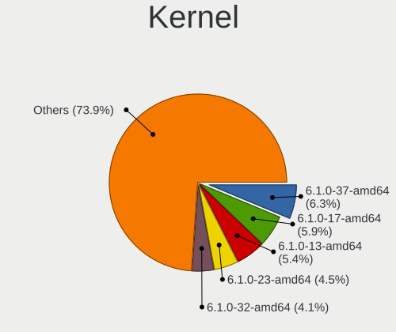

| Version                  | Desktops | Percent |
|--------------------------|----------|---------|
| 6.1.0-37-amd64           | 14       | 6.31%   |
| 6.1.0-17-amd64           | 13       | 5.86%   |
| 6.1.0-13-amd64           | 12       | 5.41%   |
| 6.1.0-23-amd64           | 10       | 4.5%    |
| 6.1.0-32-amd64           | 9        | 4.05%   |
| 6.1.0-10-amd64           | 9        | 4.05%   |
| 6.5.0-1mx-ahs-amd64      | 8        | 3.6%    |
| 6.1.0-34-amd64           | 8        | 3.6%    |
| 6.1.0-26-amd64           | 8        | 3.6%    |
| 6.1.0-25-amd64           | 8        | 3.6%    |
| 6.1.0-21-amd64           | 8        | 3.6%    |
| 6.1.0-40-amd64           | 7        | 3.15%   |
| 6.1.0-31-amd64           | 7        | 3.15%   |
| 6.4.0-1mx-ahs-amd64      | 5        | 2.25%   |
| 6.1.0-18-amd64           | 5        | 2.25%   |
| 6.6.11-amd64             | 4        | 1.8%    |
| 6.1.0-41-amd64           | 4        | 1.8%    |
| 6.1.0-29-amd64           | 4        | 1.8%    |
| 6.1.0-11-amd64           | 4        | 1.8%    |
| 6.7.12-1-liquorix-amd64  | 3        | 1.35%   |
| 6.3.9-1-liquorix-amd64   | 3        | 1.35%   |
| 6.15.11-1-liquorix-amd64 | 3        | 1.35%   |
| 6.1.0-39-amd64           | 3        | 1.35%   |
| 6.1.0-35-amd64           | 3        | 1.35%   |
| 6.1.0-28-amd64           | 3        | 1.35%   |
| 6.1.0-22-amd64           | 3        | 1.35%   |
| 6.4.15-2-liquorix-amd64  | 2        | 0.9%    |
| 6.13.7-1-liquorix-amd64  | 2        | 0.9%    |
| 6.10.11-amd64            | 2        | 0.9%    |
| 6.1.0-40-686-pae         | 2        | 0.9%    |
| 6.1.0-33-amd64           | 2        | 0.9%    |
| 6.1.0-30-amd64           | 2        | 0.9%    |
| 6.1.0-20-amd64           | 2        | 0.9%    |
| 6.9.7-1-liquorix-amd64   | 1        | 0.45%   |
| 6.8.9-5-liquorix-amd64   | 1        | 0.45%   |
| 6.7.11-1-liquorix-amd64  | 1        | 0.45%   |
| 6.6.7-x64v1-xanmod1      | 1        | 0.45%   |
| 6.6.3-1-liquorix-amd64   | 1        | 0.45%   |
| 6.5.5-2-liquorix-amd64   | 1        | 0.45%   |
| 6.5.11-1-liquorix-amd64  | 1        | 0.45%   |

Kernel Family
-------------

Linux kernel without a distro release

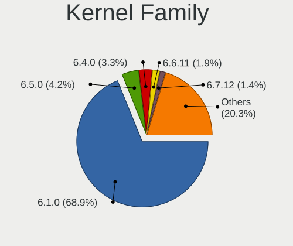

| Version  | Desktops | Percent |
|----------|----------|---------|
| 6.1.0    | 146      | 68.87%  |
| 6.5.0    | 9        | 4.25%   |
| 6.4.0    | 7        | 3.3%    |
| 6.6.11   | 4        | 1.89%   |
| 6.7.12   | 3        | 1.42%   |
| 6.3.9    | 3        | 1.42%   |
| 6.15.11  | 3        | 1.42%   |
| 6.10.11  | 3        | 1.42%   |
| 6.4.15   | 2        | 0.94%   |
| 6.14.10  | 2        | 0.94%   |
| 6.13.7   | 2        | 0.94%   |
| 6.9.7    | 1        | 0.47%   |
| 6.8.9    | 1        | 0.47%   |
| 6.7.11   | 1        | 0.47%   |
| 6.6.7    | 1        | 0.47%   |
| 6.6.3    | 1        | 0.47%   |
| 6.5.5    | 1        | 0.47%   |
| 6.5.11   | 1        | 0.47%   |
| 6.4.14   | 1        | 0.47%   |
| 6.2.14   | 1        | 0.47%   |
| 6.16.12  | 1        | 0.47%   |
| 6.14.3   | 1        | 0.47%   |
| 6.13.8   | 1        | 0.47%   |
| 6.13.2   | 1        | 0.47%   |
| 6.12.8   | 1        | 0.47%   |
| 6.12.7   | 1        | 0.47%   |
| 6.12.6   | 1        | 0.47%   |
| 6.12.17  | 1        | 0.47%   |
| 6.12.13  | 1        | 0.47%   |
| 6.12.11  | 1        | 0.47%   |
| 6.11.9   | 1        | 0.47%   |
| 6.11.7   | 1        | 0.47%   |
| 6.11.3   | 1        | 0.47%   |
| 6.11.10  | 1        | 0.47%   |
| 6.10.6   | 1        | 0.47%   |
| 6.10.10  | 1        | 0.47%   |
| 6.0.0    | 1        | 0.47%   |
| 5.10.197 | 1        | 0.47%   |
| 5.10.0   | 1        | 0.47%   |

Kernel Major Ver.
-----------------

Linux kernel major version

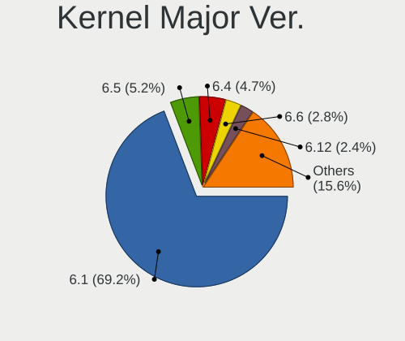

| Version | Desktops | Percent |
|---------|----------|---------|
| 6.1     | 146      | 69.19%  |
| 6.5     | 11       | 5.21%   |
| 6.4     | 10       | 4.74%   |
| 6.6     | 6        | 2.84%   |
| 6.12    | 5        | 2.37%   |
| 6.10    | 5        | 2.37%   |
| 6.7     | 4        | 1.9%    |
| 6.13    | 4        | 1.9%    |
| 6.11    | 4        | 1.9%    |
| 6.3     | 3        | 1.42%   |
| 6.15    | 3        | 1.42%   |
| 6.14    | 3        | 1.42%   |
| 5.10    | 2        | 0.95%   |
| 6.9     | 1        | 0.47%   |
| 6.8     | 1        | 0.47%   |
| 6.2     | 1        | 0.47%   |
| 6.16    | 1        | 0.47%   |
| 6.0     | 1        | 0.47%   |

Arch
----

OS architecture (x86_64, i586, etc.)

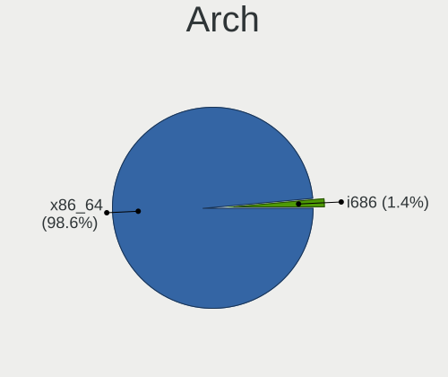

| Name   | Desktops | Percent |
|--------|----------|---------|
| x86_64 | 205      | 98.56%  |
| i686   | 3        | 1.44%   |

DE
--

Desktop Environment

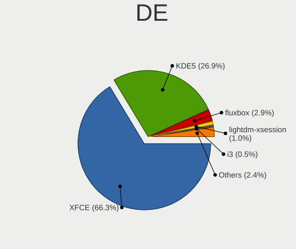

| Name             | Desktops | Percent |
|------------------|----------|---------|
| XFCE             | 138      | 66.35%  |
| KDE5             | 56       | 26.92%  |
| fluxbox          | 6        | 2.88%   |
| lightdm-xsession | 2        | 0.96%   |
| X-Cinnamon       | 1        | 0.48%   |
| MATE             | 1        | 0.48%   |
| LXQt             | 1        | 0.48%   |
| i3               | 1        | 0.48%   |
| Budgie           | 1        | 0.48%   |
| Unknown          | 1        | 0.48%   |

Display Server
--------------

X11 or Wayland

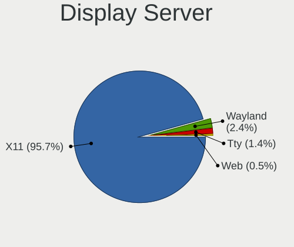

| Name    | Desktops | Percent |
|---------|----------|---------|
| X11     | 200      | 95.69%  |
| Wayland | 5        | 2.39%   |
| Tty     | 3        | 1.44%   |
| Web     | 1        | 0.48%   |

Display Manager
---------------

SDDM, LightDM, etc.

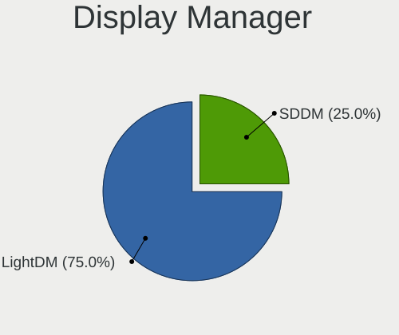

| Name    | Desktops | Percent |
|---------|----------|---------|
| LightDM | 156      | 75%     |
| SDDM    | 52       | 25%     |

OS Lang
-------

Language

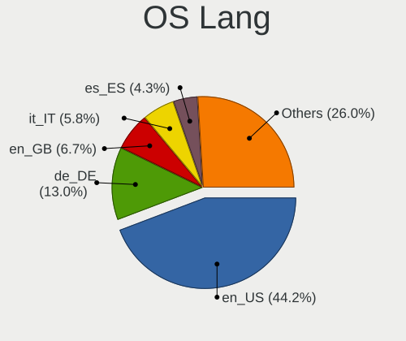

| Lang  | Desktops | Percent |
|-------|----------|---------|
| en_US | 92       | 44.23%  |
| de_DE | 27       | 12.98%  |
| en_GB | 14       | 6.73%   |
| it_IT | 12       | 5.77%   |
| es_ES | 9        | 4.33%   |
| ru_RU | 8        | 3.85%   |
| en_AU | 8        | 3.85%   |
| pl_PL | 4        | 1.92%   |
| fr_FR | 4        | 1.92%   |
| pt_BR | 3        | 1.44%   |
| en_NZ | 3        | 1.44%   |
| tr_TR | 2        | 0.96%   |
| sk_SK | 2        | 0.96%   |
| hr_HR | 2        | 0.96%   |
| fi_FI | 2        | 0.96%   |
| en_CA | 2        | 0.96%   |
| de_AT | 2        | 0.96%   |
| sv_SE | 1        | 0.48%   |
| nl_BE | 1        | 0.48%   |
| ko_KR | 1        | 0.48%   |
| fr_BE | 1        | 0.48%   |
| es_VE | 1        | 0.48%   |
| es_US | 1        | 0.48%   |
| es_PE | 1        | 0.48%   |
| es_NI | 1        | 0.48%   |
| es_MX | 1        | 0.48%   |
| es_AR | 1        | 0.48%   |
| en_IE | 1        | 0.48%   |
| da_DK | 1        | 0.48%   |

Boot Mode
---------

EFI or BIOS

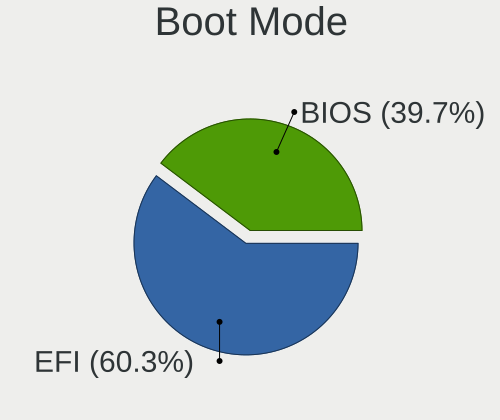

| Mode | Desktops | Percent |
|------|----------|---------|
| EFI  | 126      | 60.29%  |
| BIOS | 83       | 39.71%  |

Filesystem
----------

Type of filesystem

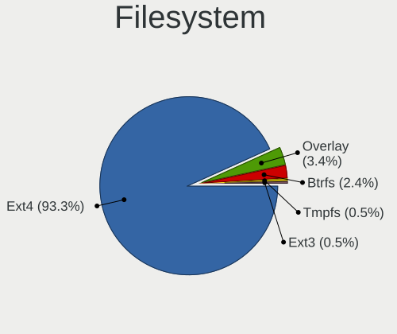

| Type    | Desktops | Percent |
|---------|----------|---------|
| Ext4    | 194      | 93.27%  |
| Overlay | 7        | 3.37%   |
| Btrfs   | 5        | 2.4%    |
| Tmpfs   | 1        | 0.48%   |
| Ext3    | 1        | 0.48%   |

Part. scheme
------------

Scheme of partitioning

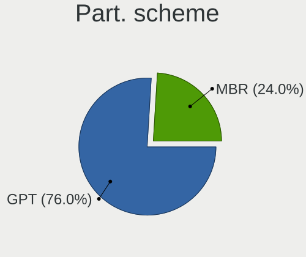

| Type | Desktops | Percent |
|------|----------|---------|
| GPT  | 158      | 75.96%  |
| MBR  | 50       | 24.04%  |

Dual Boot with Linux/BSD
------------------------

Hosting more than one Linux/BSD

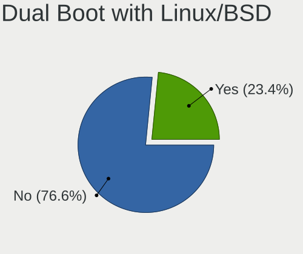

| Dual boot | Desktops | Percent |
|-----------|----------|---------|
| No        | 160      | 76.56%  |
| Yes       | 49       | 23.44%  |

Dual Boot (Win)
---------------

Hosting Linux and Windows

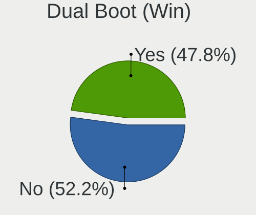

| Dual boot | Desktops | Percent |
|-----------|----------|---------|
| No        | 109      | 52.15%  |
| Yes       | 100      | 47.85%  |

Board
-----

Vendor
------

Motherboard manufacturer

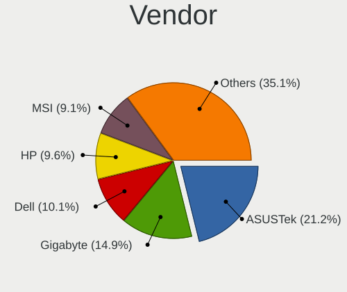

| Name                                 | Desktops | Percent |
|--------------------------------------|----------|---------|
| ASUSTek Computer                     | 44       | 21.15%  |
| Gigabyte Technology                  | 31       | 14.9%   |
| Dell                                 | 21       | 10.1%   |
| Hewlett-Packard                      | 20       | 9.62%   |
| MSI                                  | 19       | 9.13%   |
| Lenovo                               | 14       | 6.73%   |
| ASRock                               | 13       | 6.25%   |
| Unknown                              | 7        | 3.37%   |
| Intel                                | 6        | 2.88%   |
| Pegatron                             | 4        | 1.92%   |
| Foxconn                              | 4        | 1.92%   |
| Acer                                 | 4        | 1.92%   |
| Medion                               | 3        | 1.44%   |
| GEEKOM                               | 2        | 0.96%   |
| Fujitsu                              | 2        | 0.96%   |
| Wortmann AG                          | 1        | 0.48%   |
| TianBei                              | 1        | 0.48%   |
| SYS                                  | 1        | 0.48%   |
| Shenzhen Meigao Electronic Equipment | 1        | 0.48%   |
| Shenzhen DOKE electronic             | 1        | 0.48%   |
| Semp Toshiba                         | 1        | 0.48%   |
| Samsung Electronics                  | 1        | 0.48%   |
| HC Technology.                       | 1        | 0.48%   |
| ECS                                  | 1        | 0.48%   |
| Biostar                              | 1        | 0.48%   |
| AZW                                  | 1        | 0.48%   |
| AOpen                                | 1        | 0.48%   |
| AMI                                  | 1        | 0.48%   |
| American Megatrends                  | 1        | 0.48%   |

Model
-----

Motherboard model

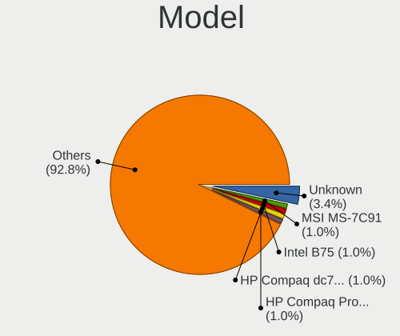

| Name                                              | Desktops | Percent |
|---------------------------------------------------|----------|---------|
| Unknown                                           | 7        | 3.37%   |
| MSI MS-7C91                                       | 2        | 0.96%   |
| Intel B75                                         | 2        | 0.96%   |
| HP Compaq Pro 6300 SFF                            | 2        | 0.96%   |
| HP Compaq dc7700p Ultra-slim Desktop              | 2        | 0.96%   |
| Gigabyte A520M H                                  | 2        | 0.96%   |
| GEEKOM Mini IT13                                  | 2        | 0.96%   |
| Foxconn Pro3500 Series                            | 2        | 0.96%   |
| Dell OptiPlex 7040                                | 2        | 0.96%   |
| ASUS Z170 PRO GAMING                              | 2        | 0.96%   |
| ASUS All Series                                   | 2        | 0.96%   |
| ASRock 980DE3/U3S3                                | 2        | 0.96%   |
| Wortmann AG TERRA_PC                              | 1        | 0.48%   |
| TianBei GOD88                                     | 1        | 0.48%   |
| SYS H310CH5-TI2                                   | 1        | 0.48%   |
| Shenzhen Meigao Electronic Equipment Venus series | 1        | 0.48%   |
| Shenzhen DOKE electronic MP100                    | 1        | 0.48%   |
| Semp Toshiba STI                                  | 1        | 0.48%   |
| Samsung DeskTop System                            | 1        | 0.48%   |
| Pegatron WC746AA-ABE 600-1140es                   | 1        | 0.48%   |
| Pegatron KQ436AAR-ABA IQ504                       | 1        | 0.48%   |
| Pegatron 2AD5                                     | 1        | 0.48%   |
| Pegatron 2A73h                                    | 1        | 0.48%   |
| MSI V563610921-P5A-36964646-XN32085               | 1        | 0.48%   |
| MSI MS-7E06                                       | 1        | 0.48%   |
| MSI MS-7D96                                       | 1        | 0.48%   |
| MSI MS-7D67                                       | 1        | 0.48%   |
| MSI MS-7C95                                       | 1        | 0.48%   |
| MSI MS-7B86                                       | 1        | 0.48%   |
| MSI MS-7B24                                       | 1        | 0.48%   |
| MSI MS-7A71                                       | 1        | 0.48%   |
| MSI MS-7A70                                       | 1        | 0.48%   |
| MSI MS-7A38                                       | 1        | 0.48%   |
| MSI MS-7996                                       | 1        | 0.48%   |
| MSI MS-7972                                       | 1        | 0.48%   |
| MSI MS-7971                                       | 1        | 0.48%   |
| MSI MS-7895                                       | 1        | 0.48%   |
| MSI MS-7793                                       | 1        | 0.48%   |
| MSI MS-7788                                       | 1        | 0.48%   |
| MSI MS-7592                                       | 1        | 0.48%   |

Model Family
------------

Motherboard model prefix

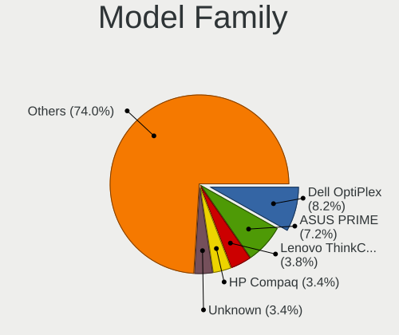

| Name                                       | Desktops | Percent |
|--------------------------------------------|----------|---------|
| Dell OptiPlex                              | 17       | 8.17%   |
| ASUS PRIME                                 | 15       | 7.21%   |
| Lenovo ThinkCentre                         | 8        | 3.85%   |
| HP Compaq                                  | 7        | 3.37%   |
| Unknown                                    | 7        | 3.37%   |
| ASUS TUF                                   | 5        | 2.4%    |
| Lenovo IdeaCentre                          | 4        | 1.92%   |
| HP EliteDesk                               | 3        | 1.44%   |
| Dell Inspiron                              | 3        | 1.44%   |
| ASUS ROG                                   | 3        | 1.44%   |
| MSI MS-7C91                                | 2        | 0.96%   |
| Intel B75                                  | 2        | 0.96%   |
| HP ProDesk                                 | 2        | 0.96%   |
| Gigabyte A520M                             | 2        | 0.96%   |
| GEEKOM Mini                                | 2        | 0.96%   |
| Foxconn Pro3500                            | 2        | 0.96%   |
| ASUS Z170                                  | 2        | 0.96%   |
| ASUS All                                   | 2        | 0.96%   |
| ASRock 980DE3                              | 2        | 0.96%   |
| Acer Veriton                               | 2        | 0.96%   |
| Wortmann AG TERRA                          | 1        | 0.48%   |
| TianBei GOD88                              | 1        | 0.48%   |
| SYS H310CH5-TI2                            | 1        | 0.48%   |
| Shenzhen Meigao Electronic Equipment Venus | 1        | 0.48%   |
| Shenzhen DOKE electronic MP100             | 1        | 0.48%   |
| Semp Toshiba STI                           | 1        | 0.48%   |
| Samsung DeskTop                            | 1        | 0.48%   |
| Pegatron WC746AA-ABE                       | 1        | 0.48%   |
| Pegatron KQ436AAR-ABA                      | 1        | 0.48%   |
| Pegatron 2AD5                              | 1        | 0.48%   |
| Pegatron 2A73h                             | 1        | 0.48%   |
| MSI V563610921-P5A-36964646-XN32085        | 1        | 0.48%   |
| MSI MS-7E06                                | 1        | 0.48%   |
| MSI MS-7D96                                | 1        | 0.48%   |
| MSI MS-7D67                                | 1        | 0.48%   |
| MSI MS-7C95                                | 1        | 0.48%   |
| MSI MS-7B86                                | 1        | 0.48%   |
| MSI MS-7B24                                | 1        | 0.48%   |
| MSI MS-7A71                                | 1        | 0.48%   |
| MSI MS-7A70                                | 1        | 0.48%   |

MFG Year
--------

Motherboard manufacture year

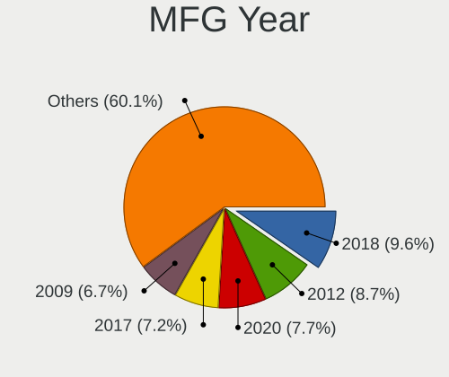

| Year | Desktops | Percent |
|------|----------|---------|
| 2018 | 20       | 9.62%   |
| 2012 | 18       | 8.65%   |
| 2020 | 16       | 7.69%   |
| 2017 | 15       | 7.21%   |
| 2009 | 14       | 6.73%   |
| 2023 | 13       | 6.25%   |
| 2022 | 13       | 6.25%   |
| 2021 | 13       | 6.25%   |
| 2013 | 12       | 5.77%   |
| 2011 | 11       | 5.29%   |
| 2019 | 10       | 4.81%   |
| 2015 | 9        | 4.33%   |
| 2024 | 7        | 3.37%   |
| 2016 | 7        | 3.37%   |
| 2014 | 7        | 3.37%   |
| 2010 | 6        | 2.88%   |
| 2006 | 6        | 2.88%   |
| 2007 | 5        | 2.4%    |
| 2025 | 2        | 0.96%   |
| 2008 | 2        | 0.96%   |
| 2005 | 1        | 0.48%   |
| 2004 | 1        | 0.48%   |

Form Factor
-----------

Physical design of the computer

| Name    | Desktops | Percent |
|---------|----------|---------|
| Desktop | 208      | 100%    |

Secure Boot
-----------

Enabled or disabled

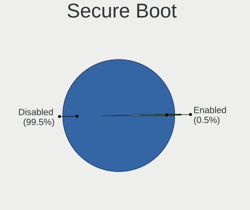

| State    | Desktops | Percent |
|----------|----------|---------|
| Disabled | 207      | 99.52%  |
| Enabled  | 1        | 0.48%   |

Coreboot
--------

Have coreboot on board

| Used | Desktops | Percent |
|------|----------|---------|
| No   | 208      | 100%    |

RAM Size
--------

Total RAM memory

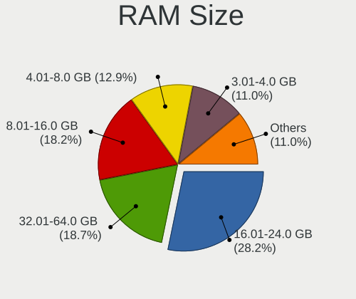

| Size in GB  | Desktops | Percent |
|-------------|----------|---------|
| 16.01-24.0  | 59       | 28.23%  |
| 32.01-64.0  | 39       | 18.66%  |
| 8.01-16.0   | 38       | 18.18%  |
| 4.01-8.0    | 27       | 12.92%  |
| 3.01-4.0    | 23       | 11%     |
| 24.01-32.0  | 7        | 3.35%   |
| 64.01-256.0 | 7        | 3.35%   |
| 2.01-3.0    | 4        | 1.91%   |
| 1.01-2.0    | 4        | 1.91%   |
| 0.51-1.0    | 1        | 0.48%   |

RAM Used
--------

Used RAM memory

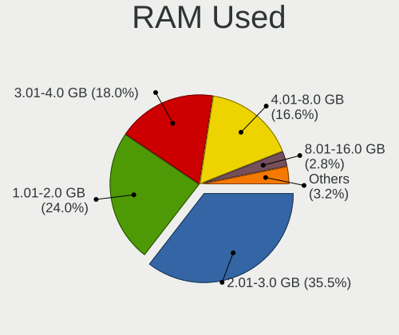

| Used GB    | Desktops | Percent |
|------------|----------|---------|
| 2.01-3.0   | 77       | 35.48%  |
| 1.01-2.0   | 52       | 23.96%  |
| 3.01-4.0   | 39       | 17.97%  |
| 4.01-8.0   | 36       | 16.59%  |
| 8.01-16.0  | 6        | 2.76%   |
| 0.51-1.0   | 5        | 2.3%    |
| 24.01-32.0 | 1        | 0.46%   |
| 16.01-24.0 | 1        | 0.46%   |

Total Drives
------------

Number of drives on board

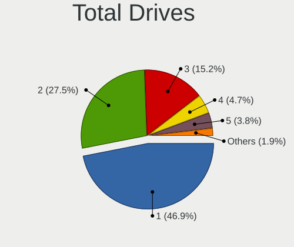

| Drives | Desktops | Percent |
|--------|----------|---------|
| 1      | 99       | 46.92%  |
| 2      | 58       | 27.49%  |
| 3      | 32       | 15.17%  |
| 4      | 10       | 4.74%   |
| 5      | 8        | 3.79%   |
| 6      | 2        | 0.95%   |
| 9      | 1        | 0.47%   |
| 7      | 1        | 0.47%   |

Has CD-ROM
----------

Has CD-ROM on board

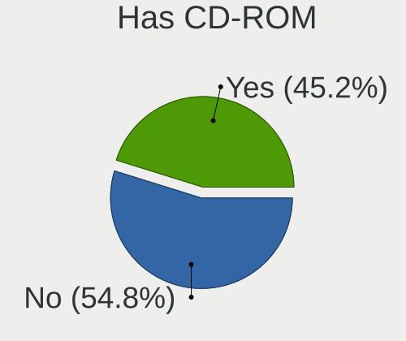

| Presented | Desktops | Percent |
|-----------|----------|---------|
| No        | 114      | 54.81%  |
| Yes       | 94       | 45.19%  |

Has Ethernet
------------

Has Ethernet on board

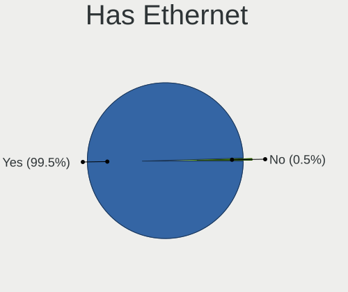

| Presented | Desktops | Percent |
|-----------|----------|---------|
| Yes       | 207      | 99.52%  |
| No        | 1        | 0.48%   |

Has WiFi
--------

Has WiFi module

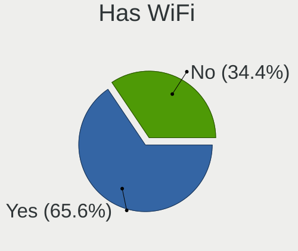

| Presented | Desktops | Percent |
|-----------|----------|---------|
| Yes       | 137      | 65.55%  |
| No        | 72       | 34.45%  |

Has Bluetooth
-------------

Has Bluetooth module

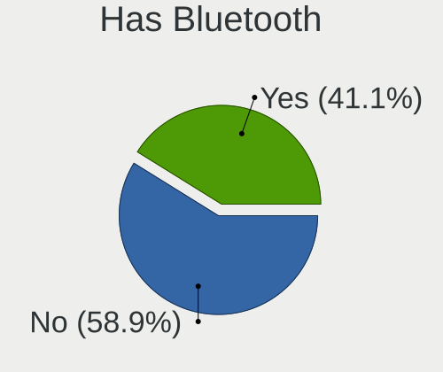

| Presented | Desktops | Percent |
|-----------|----------|---------|
| No        | 123      | 58.85%  |
| Yes       | 86       | 41.15%  |

Location
--------

Country
-------

Geographic location (country)

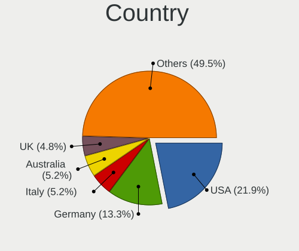

| Country                | Desktops | Percent |
|------------------------|----------|---------|
| USA                    | 46       | 21.9%   |
| Germany                | 28       | 13.33%  |
| Italy                  | 11       | 5.24%   |
| Australia              | 11       | 5.24%   |
| UK                     | 10       | 4.76%   |
| Spain                  | 10       | 4.76%   |
| India                  | 8        | 3.81%   |
| Russia                 | 7        | 3.33%   |
| France                 | 7        | 3.33%   |
| Canada                 | 5        | 2.38%   |
| Poland                 | 4        | 1.9%    |
| New Zealand            | 4        | 1.9%    |
| Brazil                 | 4        | 1.9%    |
| Belgium                | 4        | 1.9%    |
| Sweden                 | 3        | 1.43%   |
| Hungary                | 3        | 1.43%   |
| Austria                | 3        | 1.43%   |
| Venezuela              | 2        | 0.95%   |
| Ukraine                | 2        | 0.95%   |
| Turkey                 | 2        | 0.95%   |
| South Africa           | 2        | 0.95%   |
| Slovakia               | 2        | 0.95%   |
| Serbia                 | 2        | 0.95%   |
| Netherlands            | 2        | 0.95%   |
| Indonesia              | 2        | 0.95%   |
| Greece                 | 2        | 0.95%   |
| Finland                | 2        | 0.95%   |
| Chile                  | 2        | 0.95%   |
| Bosnia and Herzegovina | 2        | 0.95%   |
| UAE                    | 1        | 0.48%   |
| Sri Lanka              | 1        | 0.48%   |
| South Korea            | 1        | 0.48%   |
| Singapore              | 1        | 0.48%   |
| Norway                 | 1        | 0.48%   |
| Monaco                 | 1        | 0.48%   |
| Mexico                 | 1        | 0.48%   |
| Luxembourg             | 1        | 0.48%   |
| Ireland                | 1        | 0.48%   |
| Iraq                   | 1        | 0.48%   |
| Honduras               | 1        | 0.48%   |

City
----

Geographic location (city)

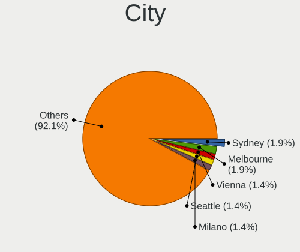

| City                 | Desktops | Percent |
|----------------------|----------|---------|
| Sydney               | 4        | 1.85%   |
| Melbourne            | 4        | 1.85%   |
| Vienna               | 3        | 1.39%   |
| Seattle              | 3        | 1.39%   |
| Milano               | 3        | 1.39%   |
| Cranston             | 3        | 1.39%   |
| Warsaw               | 2        | 0.93%   |
| Vaasa                | 2        | 0.93%   |
| St Petersburg        | 2        | 0.93%   |
| Mérida              | 2        | 0.93%   |
| Manching             | 2        | 0.93%   |
| León                | 2        | 0.93%   |
| Karori               | 2        | 0.93%   |
| Karlsruhe            | 2        | 0.93%   |
| Gothenburg           | 2        | 0.93%   |
| Debrecen             | 2        | 0.93%   |
| Dallas               | 2        | 0.93%   |
| Cincinnati           | 2        | 0.93%   |
| Charlotte            | 2        | 0.93%   |
| Cazin                | 2        | 0.93%   |
| Berlin               | 2        | 0.93%   |
| Athens               | 2        | 0.93%   |
| Zhytomyr             | 1        | 0.46%   |
| Zaragoza             | 1        | 0.46%   |
| Wuppertal            | 1        | 0.46%   |
| Wonju                | 1        | 0.46%   |
| Wichita Falls        | 1        | 0.46%   |
| Wandsworth           | 1        | 0.46%   |
| Vranje               | 1        | 0.46%   |
| Villeurbanne         | 1        | 0.46%   |
| Valparaíso          | 1        | 0.46%   |
| Uhldingen-Muhlhofen  | 1        | 0.46%   |
| Uckfield             | 1        | 0.46%   |
| Tramandai            | 1        | 0.46%   |
| Toronto              | 1        | 0.46%   |
| Tomsk                | 1        | 0.46%   |
| Tlajomulco de Zuniga | 1        | 0.46%   |
| Tirupur              | 1        | 0.46%   |
| Taunton              | 1        | 0.46%   |
| Tangerang            | 1        | 0.46%   |

Drives
------

Drive Vendor
------------

Hard drive vendors

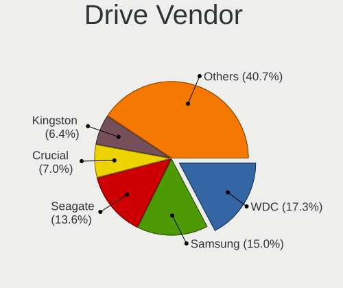

| Vendor              | Desktops | Drives | Percent |
|---------------------|----------|--------|---------|
| WDC                 | 62       | 80     | 17.27%  |
| Samsung Electronics | 54       | 81     | 15.04%  |
| Seagate             | 49       | 66     | 13.65%  |
| Crucial             | 25       | 29     | 6.96%   |
| Kingston            | 23       | 27     | 6.41%   |
| SanDisk             | 17       | 18     | 4.74%   |
| Toshiba             | 12       | 13     | 3.34%   |
| A-DATA Technology   | 11       | 14     | 3.06%   |
| SPCC                | 7        | 7      | 1.95%   |
| Hitachi             | 7        | 8      | 1.95%   |
| China               | 7        | 10     | 1.95%   |
| Unknown             | 6        | 7      | 1.67%   |
| Intel               | 5        | 6      | 1.39%   |
| Lexar               | 4        | 4      | 1.11%   |
| Intenso             | 4        | 4      | 1.11%   |
| Team                | 3        | 5      | 0.84%   |
| T-FORCE             | 3        | 3      | 0.84%   |
| SK hynix            | 3        | 3      | 0.84%   |
| Silicon Motion      | 3        | 3      | 0.84%   |
| Micron Technology   | 3        | 4      | 0.84%   |
| Apple               | 3        | 3      | 0.84%   |
| Apacer              | 3        | 3      | 0.84%   |
| Realtek             | 2        | 2      | 0.56%   |
| PNY                 | 2        | 2      | 0.56%   |
| Plextor             | 2        | 2      | 0.56%   |
| Patriot             | 2        | 3      | 0.56%   |
| Netac               | 2        | 3      | 0.56%   |
| Maxtor              | 2        | 2      | 0.56%   |
| LITEONIT            | 2        | 2      | 0.56%   |
| HS-SSD-C100         | 2        | 3      | 0.56%   |
| HGST                | 2        | 2      | 0.56%   |
| GOODRAM             | 2        | 2      | 0.56%   |
| Unknown             | 2        | 2      | 0.56%   |
| XPG                 | 1        | 1      | 0.28%   |
| Verbatim            | 1        | 1      | 0.28%   |
| UP                  | 1        | 1      | 0.28%   |
| SABRENT             | 1        | 3      | 0.28%   |
| Rayson              | 1        | 1      | 0.28%   |
| OCZ-VERTEX          | 1        | 1      | 0.28%   |
| OCZ                 | 1        | 1      | 0.28%   |

Drive Model
-----------

Hard drive models

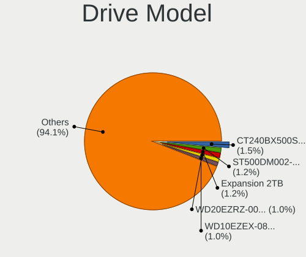

| Model                              | Desktops | Percent |
|------------------------------------|----------|---------|
| Crucial CT240BX500SSD1 240GB       | 6        | 1.47%   |
| Seagate ST500DM002-1BD142 500GB    | 5        | 1.23%   |
| Seagate Expansion 2TB              | 5        | 1.23%   |
| WDC WD20EZRZ-00Z5HB0 2TB           | 4        | 0.98%   |
| WDC WD10EZEX-08WN4A0 1TB           | 4        | 0.98%   |
| Samsung SSD 980 500GB              | 4        | 0.98%   |
| Kingston SA400S37480G 480GB SSD    | 4        | 0.98%   |
| Kingston SA400S37240G 240GB SSD    | 4        | 0.98%   |
| WDC WD10EZEX-00BN5A0 1TB           | 3        | 0.74%   |
| Unknown SD/MMC/MS PRO 2GB          | 3        | 0.74%   |
| Toshiba HDWD120 2TB                | 3        | 0.74%   |
| Toshiba DT01ACA100 1TB             | 3        | 0.74%   |
| Seagate ST4000DM004-2CV104 4TB     | 3        | 0.74%   |
| Seagate ST31000524AS 1TB           | 3        | 0.74%   |
| Seagate ST2000DM008-2FR102 2TB     | 3        | 0.74%   |
| Seagate ST1000DM003-1SB102 1TB     | 3        | 0.74%   |
| Samsung SSD 990 PRO 1TB            | 3        | 0.74%   |
| Samsung SSD 860 EVO 500GB          | 3        | 0.74%   |
| Samsung SSD 860 EVO 250GB          | 3        | 0.74%   |
| Samsung SSD 850 PRO 256GB          | 3        | 0.74%   |
| Kingston SV300S37A120G 120GB SSD   | 3        | 0.74%   |
| Kingston SA400S37120G 120GB SSD    | 3        | 0.74%   |
| WDC WD5000AAKX-75U6AA0 500GB       | 2        | 0.49%   |
| WDC WD5000AAKX-00ERMA0 500GB       | 2        | 0.49%   |
| WDC WD20EZAZ-00GGJB0 2TB           | 2        | 0.49%   |
| WDC WD10EZEX-75M2NA0 1TB           | 2        | 0.49%   |
| WDC WD10EZEX-60WN4A0 1TB           | 2        | 0.49%   |
| SPCC Solid State Disk 512GB        | 2        | 0.49%   |
| SPCC Solid State Disk 256GB        | 2        | 0.49%   |
| Seagate ST3500418AS 500GB          | 2        | 0.49%   |
| Seagate ST1500DL003-9VT16L 1TB     | 2        | 0.49%   |
| Seagate ST1000DM010-2EP102 1TB     | 2        | 0.49%   |
| Seagate ST1000DM003-1ER162 1TB     | 2        | 0.49%   |
| Seagate Expansion Desk 4TB         | 2        | 0.49%   |
| SanDisk SD6SB1M-032G-1006 32GB SSD | 2        | 0.49%   |
| SanDisk NVMe SSD Drive 500GB       | 2        | 0.49%   |
| SanDisk NVMe SSD Drive 1TB         | 2        | 0.49%   |
| Samsung SSD 970 EVO Plus 1TB       | 2        | 0.49%   |
| Samsung SSD 970 EVO 250GB          | 2        | 0.49%   |
| Samsung SSD 870 QVO 2TB            | 2        | 0.49%   |

HDD Vendor
----------

Hard disk drive vendors

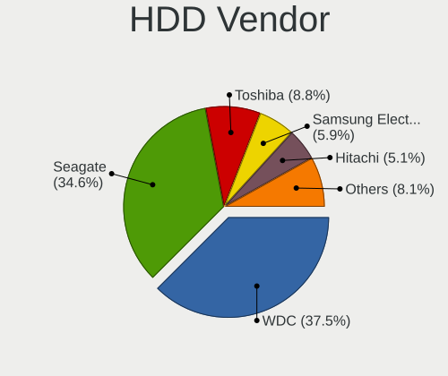

| Vendor              | Desktops | Drives | Percent |
|---------------------|----------|--------|---------|
| WDC                 | 51       | 66     | 37.5%   |
| Seagate             | 47       | 64     | 34.56%  |
| Toshiba             | 12       | 13     | 8.82%   |
| Samsung Electronics | 8        | 11     | 5.88%   |
| Hitachi             | 7        | 8      | 5.15%   |
| Unknown             | 4        | 4      | 2.94%   |
| Apple               | 3        | 3      | 2.21%   |
| Maxtor              | 2        | 2      | 1.47%   |
| HGST                | 2        | 2      | 1.47%   |

SSD Vendor
----------

Solid state drive vendors

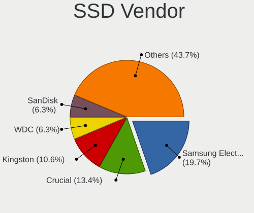

| Vendor              | Desktops | Drives | Percent |
|---------------------|----------|--------|---------|
| Samsung Electronics | 28       | 38     | 19.72%  |
| Crucial             | 19       | 23     | 13.38%  |
| Kingston            | 15       | 18     | 10.56%  |
| WDC                 | 9        | 10     | 6.34%   |
| SanDisk             | 9        | 9      | 6.34%   |
| China               | 7        | 10     | 4.93%   |
| A-DATA Technology   | 7        | 9      | 4.93%   |
| SPCC                | 4        | 4      | 2.82%   |
| Intenso             | 4        | 4      | 2.82%   |
| T-FORCE             | 3        | 3      | 2.11%   |
| Intel               | 3        | 4      | 2.11%   |
| Patriot             | 2        | 3      | 1.41%   |
| Micron Technology   | 2        | 3      | 1.41%   |
| LITEONIT            | 2        | 2      | 1.41%   |
| HS-SSD-C100         | 2        | 3      | 1.41%   |
| GOODRAM             | 2        | 2      | 1.41%   |
| Apacer              | 2        | 2      | 1.41%   |
| Verbatim            | 1        | 1      | 0.7%    |
| UP                  | 1        | 1      | 0.7%    |
| Unknown             | 1        | 1      | 0.7%    |
| Team                | 1        | 1      | 0.7%    |
| Seagate             | 1        | 1      | 0.7%    |
| SABRENT             | 1        | 3      | 0.7%    |
| PNY                 | 1        | 1      | 0.7%    |
| Plextor             | 1        | 1      | 0.7%    |
| OCZ-VERTEX          | 1        | 1      | 0.7%    |
| OCZ                 | 1        | 1      | 0.7%    |
| Mushkin             | 1        | 1      | 0.7%    |
| MCQUEST             | 1        | 1      | 0.7%    |
| Lexar               | 1        | 1      | 0.7%    |
| KingFast            | 1        | 2      | 0.7%    |
| FORESEE             | 1        | 1      | 0.7%    |
| FIKWOT              | 1        | 1      | 0.7%    |
| Emtec               | 1        | 2      | 0.7%    |
| Corsair             | 1        | 1      | 0.7%    |
| CONSISTENT          | 1        | 1      | 0.7%    |
| BIWIN               | 1        | 1      | 0.7%    |
| ASMT                | 1        | 1      | 0.7%    |
| AGI                 | 1        | 1      | 0.7%    |

Drive Kind
----------

HDD or SSD

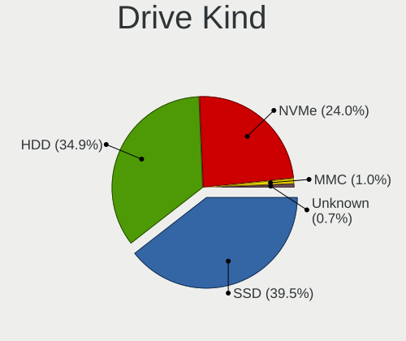

| Kind    | Desktops | Drives | Percent |
|---------|----------|--------|---------|
| SSD     | 120      | 173    | 39.47%  |
| HDD     | 106      | 173    | 34.87%  |
| NVMe    | 73       | 99     | 24.01%  |
| MMC     | 3        | 3      | 0.99%   |
| Unknown | 2        | 2      | 0.66%   |

Drive Connector
---------------

SATA, SAS, NVMe, etc.

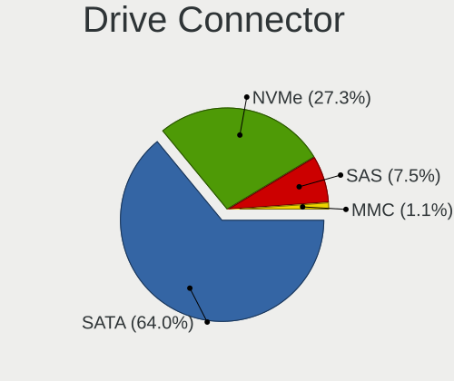

| Type | Desktops | Drives | Percent |
|------|----------|--------|---------|
| SATA | 171      | 326    | 64.04%  |
| NVMe | 73       | 97     | 27.34%  |
| SAS  | 20       | 24     | 7.49%   |
| MMC  | 3        | 3      | 1.12%   |

Drive Size
----------

Size of hard drive

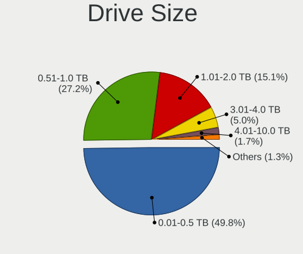

| Size in TB | Desktops | Drives | Percent |
|------------|----------|--------|---------|
| 0.01-0.5   | 119      | 174    | 49.79%  |
| 0.51-1.0   | 65       | 95     | 27.2%   |
| 1.01-2.0   | 36       | 48     | 15.06%  |
| 3.01-4.0   | 12       | 15     | 5.02%   |
| 4.01-10.0  | 4        | 10     | 1.67%   |
| 2.01-3.0   | 3        | 4      | 1.26%   |

Space Total
-----------

Amount of disk space available on the file system

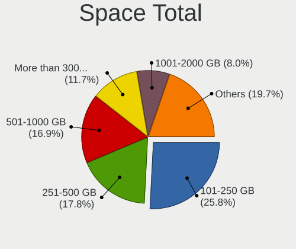

| Size in GB     | Desktops | Percent |
|----------------|----------|---------|
| 101-250        | 55       | 25.82%  |
| 251-500        | 38       | 17.84%  |
| 501-1000       | 36       | 16.9%   |
| More than 3000 | 25       | 11.74%  |
| 1001-2000      | 17       | 7.98%   |
| 2001-3000      | 14       | 6.57%   |
| 1-20           | 12       | 5.63%   |
| 51-100         | 11       | 5.16%   |
| 21-50          | 5        | 2.35%   |

Space Used
----------

Amount of used disk space

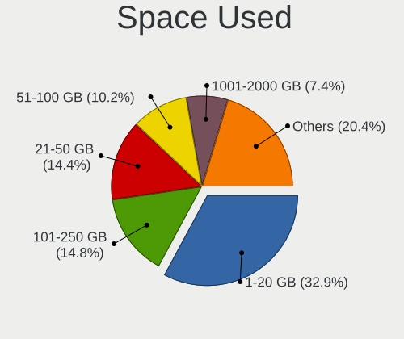

| Used GB        | Desktops | Percent |
|----------------|----------|---------|
| 1-20           | 71       | 32.87%  |
| 101-250        | 32       | 14.81%  |
| 21-50          | 31       | 14.35%  |
| 51-100         | 22       | 10.19%  |
| 1001-2000      | 16       | 7.41%   |
| 501-1000       | 16       | 7.41%   |
| 251-500        | 12       | 5.56%   |
| More than 3000 | 11       | 5.09%   |
| 2001-3000      | 5        | 2.31%   |

Malfunc. Drives
---------------

Drive models with a malfunction

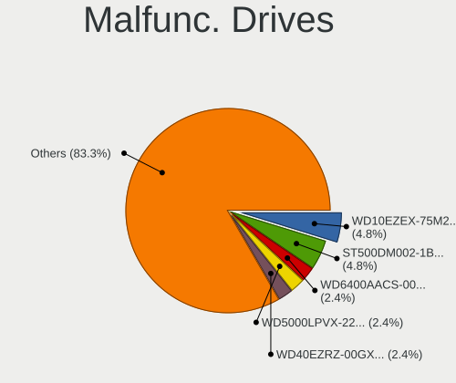

| Model                                                                         | Desktops | Drives | Percent |
|-------------------------------------------------------------------------------|----------|--------|---------|
| WDC WD10EZEX-75M2NA0 1TB                                                      | 2        | 2      | 4.76%   |
| Seagate ST500DM002-1BD142 500GB                                               | 2        | 2      | 4.76%   |
| WDC WD6400AACS-00G8B1 640GB                                                   | 1        | 1      | 2.38%   |
| WDC WD5000LPVX-22V0TT0 500GB                                                  | 1        | 1      | 2.38%   |
| WDC WD40EZRZ-00GXCB0 4TB                                                      | 1        | 1      | 2.38%   |
| WDC WD40EZRX-00SPEB0 4TB                                                      | 1        | 1      | 2.38%   |
| WDC WD2500AAJS-00B4A0 250GB                                                   | 1        | 2      | 2.38%   |
| WDC WD20EZRZ-00Z5HB0 2TB                                                      | 1        | 1      | 2.38%   |
| WDC WD20EFRX-68AX9N0 2TB                                                      | 1        | 1      | 2.38%   |
| WDC WD1600BEVT-00A23T0 160GB                                                  | 1        | 1      | 2.38%   |
| WDC WD10SPZX-60Z10T0 1TB                                                      | 1        | 1      | 2.38%   |
| WDC WD10EARS-00Y5B1 1TB                                                       | 1        | 1      | 2.38%   |
| WDC WD1002FAEX-00Z3A0 1TB                                                     | 1        | 1      | 2.38%   |
| Toshiba MQ01ABF032 320GB                                                      | 1        | 1      | 2.38%   |
| Toshiba MK3259GSXP 320GB                                                      | 1        | 1      | 2.38%   |
| Toshiba DT01ACA050 500GB                                                      | 1        | 1      | 2.38%   |
| Seagate ST9500325AS 500GB                                                     | 1        | 1      | 2.38%   |
| Seagate ST500DM002-1BC142 500GB                                               | 1        | 1      | 2.38%   |
| Seagate ST4000DM000-1F2168 4TB                                                | 1        | 1      | 2.38%   |
| Seagate ST3500418AS 500GB                                                     | 1        | 1      | 2.38%   |
| Seagate ST3250310AS 250GB                                                     | 1        | 1      | 2.38%   |
| Seagate ST31000528AS 1TB                                                      | 1        | 2      | 2.38%   |
| Seagate ST31000524AS 1TB                                                      | 1        | 1      | 2.38%   |
| Seagate ST2000DX001-1CM164 2TB                                                | 1        | 1      | 2.38%   |
| Seagate ST1000DM003-9YN162 1TB                                                | 1        | 1      | 2.38%   |
| Seagate ST1000DM003-1ER162 1TB                                                | 1        | 1      | 2.38%   |
| Samsung Electronics SSD 850 PRO 512GB                                         | 1        | 1      | 2.38%   |
| Samsung Electronics SP2504C 250GB                                             | 1        | 1      | 2.38%   |
| Samsung Electronics HM250HI 250GB                                             | 1        | 2      | 2.38%   |
| Samsung Electronics HD200HJ 200GB                                             | 1        | 1      | 2.38%   |
| Samsung Electronics HD105SI 1TB                                               | 1        | 1      | 2.38%   |
| Micron Technology MTFDDAK2T0TDL-1AW1ZABHA 2TB SSD                             | 1        | 1      | 2.38%   |
| Kingston SV300S37A120G 120GB SSD                                              | 1        | 1      | 2.38%   |
| Intel SSDSC2KF180H6L 180GB                                                    | 1        | 1      | 2.38%   |
| Intel SSDSC2BB480G7 480GB                                                     | 1        | 2      | 2.38%   |
| Hitachi HUA722020ALA331 2TB                                                   | 1        | 1      | 2.38%   |
| Hitachi HTS543225L9A300 250GB                                                 | 1        | 1      | 2.38%   |
| Hitachi HDS725050KLA360 500GB                                                 | 1        | 1      | 2.38%   |
| ADATA Technology XPG SX8200 Pro PCIe Gen3x4 M.2 2280 Solid State Drive 1024GB | 1        | 1      | 2.38%   |
| A-DATA Technology SU900 256GB SSD                                             | 1        | 2      | 2.38%   |

Malfunc. Drive Vendor
---------------------

Vendors of faulty drives

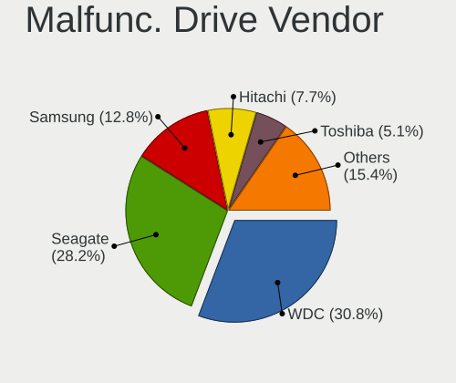

| Vendor              | Desktops | Drives | Percent |
|---------------------|----------|--------|---------|
| WDC                 | 12       | 14     | 30.77%  |
| Seagate             | 11       | 13     | 28.21%  |
| Samsung Electronics | 5        | 6      | 12.82%  |
| Hitachi             | 3        | 3      | 7.69%   |
| Toshiba             | 2        | 3      | 5.13%   |
| Intel               | 2        | 3      | 5.13%   |
| Micron Technology   | 1        | 1      | 2.56%   |
| Kingston            | 1        | 1      | 2.56%   |
| ADATA Technology    | 1        | 1      | 2.56%   |
| A-DATA Technology   | 1        | 2      | 2.56%   |

Malfunc. HDD Vendor
-------------------

Vendors of faulty HDD drives

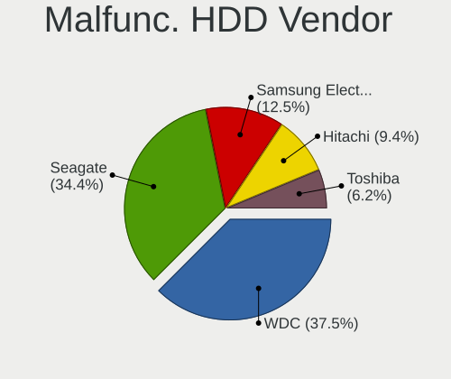

| Vendor              | Desktops | Drives | Percent |
|---------------------|----------|--------|---------|
| WDC                 | 12       | 14     | 37.5%   |
| Seagate             | 11       | 13     | 34.38%  |
| Samsung Electronics | 4        | 5      | 12.5%   |
| Hitachi             | 3        | 3      | 9.38%   |
| Toshiba             | 2        | 3      | 6.25%   |

Malfunc. Drive Kind
-------------------

Kinds of faulty drives

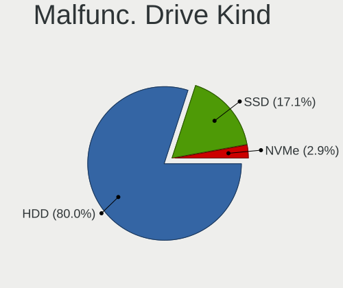

| Kind | Desktops | Drives | Percent |
|------|----------|--------|---------|
| HDD  | 28       | 38     | 80%     |
| SSD  | 6        | 8      | 17.14%  |
| NVMe | 1        | 1      | 2.86%   |

Failed Drives
-------------

Failed drive models

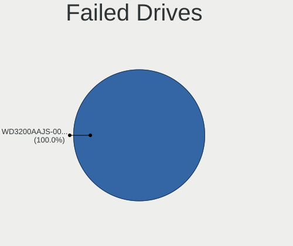

| Model                       | Desktops | Drives | Percent |
|-----------------------------|----------|--------|---------|
| WDC WD3200AAJS-00B4A0 320GB | 1        | 1      | 100%    |

Failed Drive Vendor
-------------------

Failed drive vendors

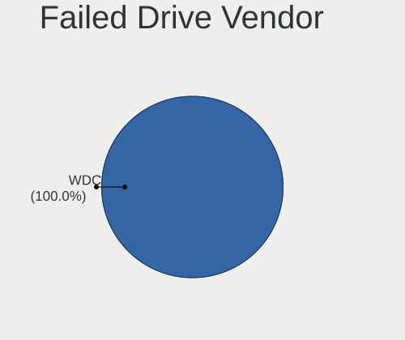

| Vendor | Desktops | Drives | Percent |
|--------|----------|--------|---------|
| WDC    | 1        | 1      | 100%    |

Drive Status
------------

Number of failed and malfunc. drives

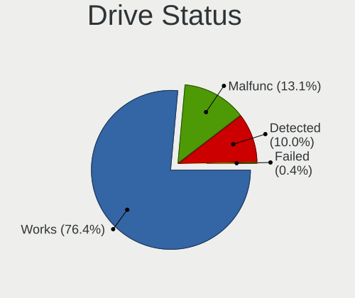

| Status   | Desktops | Drives | Percent |
|----------|----------|--------|---------|
| Works    | 198      | 368    | 76.45%  |
| Malfunc  | 34       | 47     | 13.13%  |
| Detected | 26       | 34     | 10.04%  |
| Failed   | 1        | 1      | 0.39%   |

Storage controller
------------------

Storage Vendor
--------------

Storage controller vendors

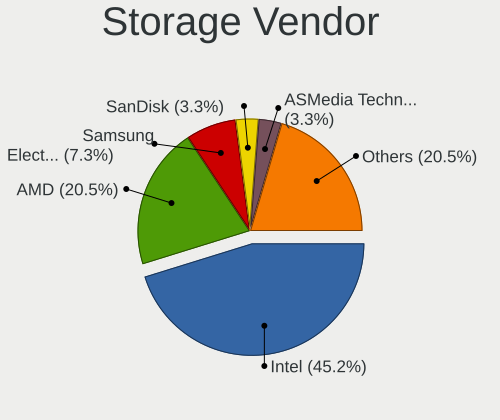

| Vendor                           | Desktops | Percent |
|----------------------------------|----------|---------|
| Intel                            | 137      | 45.21%  |
| AMD                              | 62       | 20.46%  |
| Samsung Electronics              | 22       | 7.26%   |
| SanDisk                          | 10       | 3.3%    |
| ASMedia Technology               | 10       | 3.3%    |
| Kingston Technology Company      | 9        | 2.97%   |
| Silicon Motion                   | 5        | 1.65%   |
| Marvell Technology Group         | 5        | 1.65%   |
| ADATA Technology                 | 5        | 1.65%   |
| Realtek Semiconductor            | 4        | 1.32%   |
| Phison Electronics               | 4        | 1.32%   |
| SK hynix                         | 3        | 0.99%   |
| Nvidia                           | 3        | 0.99%   |
| Micron/Crucial Technology        | 3        | 0.99%   |
| Micron Technology                | 3        | 0.99%   |
| JMicron Technology               | 3        | 0.99%   |
| Silicon Image                    | 2        | 0.66%   |
| Shenzhen Longsys Electronics     | 2        | 0.66%   |
| MAXIO Technology (Hangzhou)      | 2        | 0.66%   |
| KIOXIA                           | 2        | 0.66%   |
| VIA Technologies                 | 1        | 0.33%   |
| TenaFe                           | 1        | 0.33%   |
| Silicon Integrated Systems [SiS] | 1        | 0.33%   |
| LSI Logic / Symbios Logic        | 1        | 0.33%   |
| Lite-On Technology               | 1        | 0.33%   |
| Integrated Technology Express    | 1        | 0.33%   |
| Initio                           | 1        | 0.33%   |

Storage Model
-------------

Storage controller models

| Model                                                                                   | Desktops | Percent |
|-----------------------------------------------------------------------------------------|----------|---------|
| AMD FCH SATA Controller [AHCI mode]                                                     | 25       | 6.91%   |
| Intel Q170/Q150/B150/H170/H110/Z170/CM236 Chipset SATA Controller [AHCI Mode]           | 17       | 4.7%    |
| Intel 200 Series PCH SATA controller [AHCI mode]                                        | 12       | 3.31%   |
| Intel 7 Series/C210 Series Chipset Family 6-port SATA Controller [AHCI mode]            | 10       | 2.76%   |
| Intel 6 Series/C200 Series Chipset Family 6 port Desktop SATA AHCI Controller           | 10       | 2.76%   |
| AMD 500 Series Chipset SATA Controller                                                  | 10       | 2.76%   |
| AMD 400 Series Chipset SATA Controller                                                  | 10       | 2.76%   |
| ASMedia ASM1061/ASM1062 Serial ATA Controller                                           | 9        | 2.49%   |
| AMD 600 Series Chipset SATA Controller                                                  | 9        | 2.49%   |
| Intel Cannon Lake PCH SATA AHCI Controller                                              | 8        | 2.21%   |
| Intel 8 Series/C220 Series Chipset Family 6-port SATA Controller 1 [AHCI mode]          | 8        | 2.21%   |
| AMD SB7x0/SB8x0/SB9x0 SATA Controller [AHCI mode]                                       | 8        | 2.21%   |
| Samsung NVMe SSD Controller SM981/PM981/PM983                                           | 7        | 1.93%   |
| Intel NM10/ICH7 Family SATA Controller [IDE mode]                                       | 7        | 1.93%   |
| Intel Alder Lake-S PCH SATA Controller [AHCI Mode]                                      | 7        | 1.93%   |
| Samsung NVMe SSD Controller 980 (DRAM-less)                                             | 6        | 1.66%   |
| Intel Volume Management Device NVMe RAID Controller                                     | 6        | 1.66%   |
| Intel 82801G (ICH7 Family) IDE Controller                                               | 6        | 1.66%   |
| AMD SB7x0/SB8x0/SB9x0 IDE Controller                                                    | 6        | 1.66%   |
| Silicon Motion SM2263EN/SM2263XT (DRAM-less) NVMe SSD Controllers                       | 4        | 1.1%    |
| Samsung NVMe SSD Controller S4LV008[Pascal]                                             | 4        | 1.1%    |
| Intel SATA Controller [RAID mode]                                                       | 4        | 1.1%    |
| Intel Comet Lake SATA AHCI Controller                                                   | 4        | 1.1%    |
| Intel 6 Series/C200 Series Chipset Family Desktop SATA Controller (IDE mode, ports 4-5) | 4        | 1.1%    |
| Intel 6 Series/C200 Series Chipset Family Desktop SATA Controller (IDE mode, ports 0-3) | 4        | 1.1%    |
| Intel 500 Series Chipset Family SATA AHCI Controller                                    | 4        | 1.1%    |
| AMD 300 Series Chipset SATA Controller                                                  | 4        | 1.1%    |
| SanDisk WD SN560/SN740/SN770/SN5000 NVMe SSD                                            | 3        | 0.83%   |
| Micron/Crucial P2 [Nick P2] / P3 / P3 Plus NVMe PCIe SSD (DRAM-less)                    | 3        | 0.83%   |
| Kingston Company A2000 NVMe SSD [SM2263EN]                                              | 3        | 0.83%   |
| Intel Raptor Lake SATA AHCI Controller                                                  | 3        | 0.83%   |
| Intel Celeron N3350/Pentium N4200/Atom E3900 Series SATA AHCI Controller                | 3        | 0.83%   |
| Intel Alder Lake-P SATA AHCI Controller                                                 | 3        | 0.83%   |
| Intel 82801JI (ICH10 Family) SATA AHCI Controller                                       | 3        | 0.83%   |
| Intel 82801H (ICH8 Family) 4 port SATA Controller [IDE mode]                            | 3        | 0.83%   |
| AMD SB7x0/SB8x0/SB9x0 SATA Controller [IDE mode]                                        | 3        | 0.83%   |
| AMD A320 Chipset SATA Controller [AHCI mode]                                            | 3        | 0.83%   |
| ADATA XPG SX8200 Pro PCIe Gen3x4 M.2 2280 Solid State Drive                             | 3        | 0.83%   |
| Silicon Image SiI 3512 [SATALink/SATARaid] Serial ATA Controller                        | 2        | 0.55%   |
| Shenzhen Longsys Lexar NM790 / Patriot Viper VP4300 Lite NVMe SSD (DRAM-less)           | 2        | 0.55%   |

Storage Kind
------------

Kind of storage controller (IDE, SATA, NVMe, SAS, ...)

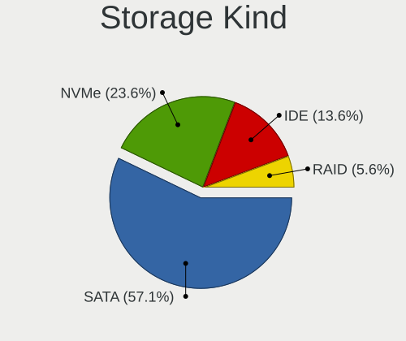

| Kind | Desktops | Percent |
|------|----------|---------|
| SATA | 172      | 57.14%  |
| NVMe | 71       | 23.59%  |
| IDE  | 41       | 13.62%  |
| RAID | 17       | 5.65%   |

Processor
---------

CPU Vendor
----------

Processor vendors

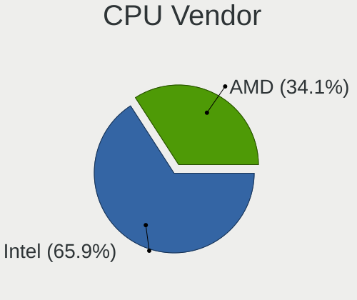

| Vendor | Desktops | Percent |
|--------|----------|---------|
| Intel  | 137      | 65.87%  |
| AMD    | 71       | 34.13%  |

CPU Model
---------

Processor models

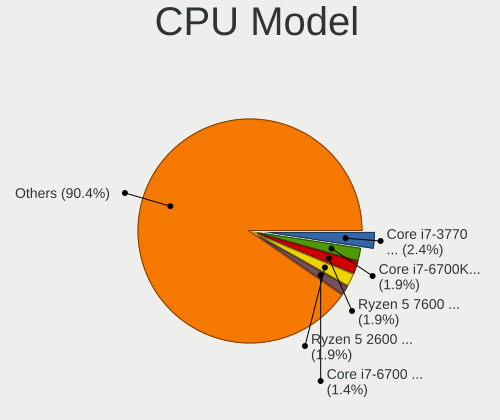

| Model                                       | Desktops | Percent |
|---------------------------------------------|----------|---------|
| Intel Core i7-3770 CPU @ 3.40GHz            | 5        | 2.4%    |
| Intel Core i7-6700K CPU @ 4.00GHz           | 4        | 1.92%   |
| AMD Ryzen 5 7600 6-Core Processor           | 4        | 1.92%   |
| AMD Ryzen 5 2600 Six-Core Processor         | 4        | 1.92%   |
| Intel Core i7-6700 CPU @ 3.40GHz            | 3        | 1.44%   |
| Intel Core i5-9600K CPU @ 3.70GHz           | 3        | 1.44%   |
| Intel Core i5-8400 CPU @ 2.80GHz            | 3        | 1.44%   |
| Intel Core i5-3470 CPU @ 3.20GHz            | 3        | 1.44%   |
| Intel Core i5-2400 CPU @ 3.10GHz            | 3        | 1.44%   |
| Intel Core 2 Duo CPU E7500 @ 2.93GHz        | 3        | 1.44%   |
| AMD Ryzen 5 3600 6-Core Processor           | 3        | 1.44%   |
| Intel Core i7-7700 CPU @ 3.60GHz            | 2        | 0.96%   |
| Intel Core i7-10700 CPU @ 2.90GHz           | 2        | 0.96%   |
| Intel Core i7 CPU 920 @ 2.67GHz             | 2        | 0.96%   |
| Intel Core i5-9400F CPU @ 2.90GHz           | 2        | 0.96%   |
| Intel Core i5-6600 CPU @ 3.30GHz            | 2        | 0.96%   |
| Intel Core i5-4570 CPU @ 3.20GHz            | 2        | 0.96%   |
| Intel Core i3-7100 CPU @ 3.90GHz            | 2        | 0.96%   |
| Intel Core i3-3220 CPU @ 3.30GHz            | 2        | 0.96%   |
| Intel Core i3-2100 CPU @ 3.10GHz            | 2        | 0.96%   |
| Intel Core 2 Quad CPU Q6600 @ 2.40GHz       | 2        | 0.96%   |
| Intel Core 2 Duo CPU E8400 @ 3.00GHz        | 2        | 0.96%   |
| Intel Core 2 CPU 6400 @ 2.13GHz             | 2        | 0.96%   |
| Intel 12th Gen Core i5-12400                | 2        | 0.96%   |
| Intel 12th Gen Core i3-12100F               | 2        | 0.96%   |
| Intel 11th Gen Core i5-11400 @ 2.60GHz      | 2        | 0.96%   |
| AMD Ryzen 7 7800X3D 8-Core Processor        | 2        | 0.96%   |
| AMD Ryzen 5 5600X 6-Core Processor          | 2        | 0.96%   |
| AMD Ryzen 5 5600H with Radeon Graphics      | 2        | 0.96%   |
| AMD Ryzen 5 5600G with Radeon Graphics      | 2        | 0.96%   |
| AMD Ryzen 5 4500 6-Core Processor           | 2        | 0.96%   |
| AMD Ryzen 5 3400G with Radeon Vega Graphics | 2        | 0.96%   |
| AMD Ryzen 5 1600 Six-Core Processor         | 2        | 0.96%   |
| AMD Phenom II X4 925 Processor              | 2        | 0.96%   |
| AMD FX-8350 Eight-Core Processor            | 2        | 0.96%   |
| AMD FX-6300 Six-Core Processor              | 2        | 0.96%   |
| Intel Xeon CPU X5675 @ 3.07GHz              | 1        | 0.48%   |
| Intel Xeon CPU X5650 @ 2.67GHz              | 1        | 0.48%   |
| Intel Xeon CPU X5550 @ 2.67GHz              | 1        | 0.48%   |
| Intel Xeon CPU E5345 @ 2.33GHz              | 1        | 0.48%   |

CPU Model Family
----------------

Processor model prefix

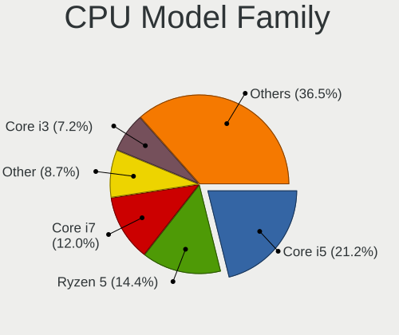

| Model                   | Desktops | Percent |
|-------------------------|----------|---------|
| Intel Core i5           | 44       | 21.15%  |
| AMD Ryzen 5             | 30       | 14.42%  |
| Intel Core i7           | 25       | 12.02%  |
| Other                   | 18       | 8.65%   |
| Intel Core i3           | 15       | 7.21%   |
| Intel Core 2 Duo        | 9        | 4.33%   |
| AMD Ryzen 7             | 9        | 4.33%   |
| Intel Celeron           | 7        | 3.37%   |
| Intel Xeon              | 6        | 2.88%   |
| AMD FX                  | 5        | 2.4%    |
| Intel Pentium Dual-Core | 4        | 1.92%   |
| AMD Ryzen 9             | 4        | 1.92%   |
| Intel Pentium           | 3        | 1.44%   |
| Intel Core 2            | 3        | 1.44%   |
| AMD A8                  | 3        | 1.44%   |
| Intel Core 2 Quad       | 2        | 0.96%   |
| AMD Phenom II X4        | 2        | 0.96%   |
| AMD Athlon 64 X2        | 2        | 0.96%   |
| AMD Athlon              | 2        | 0.96%   |
| Intel Pentium Silver    | 1        | 0.48%   |
| Intel Pentium Dual      | 1        | 0.48%   |
| Intel Pentium 4         | 1        | 0.48%   |
| AMD Sempron             | 1        | 0.48%   |
| AMD Ryzen 5 PRO         | 1        | 0.48%   |
| AMD Ryzen 3             | 1        | 0.48%   |
| AMD PRO A10             | 1        | 0.48%   |
| AMD Phenom II X6        | 1        | 0.48%   |
| AMD Opteron             | 1        | 0.48%   |
| AMD E                   | 1        | 0.48%   |
| AMD Athlon XP           | 1        | 0.48%   |
| AMD Athlon X4           | 1        | 0.48%   |
| AMD Athlon II X4        | 1        | 0.48%   |
| AMD Athlon II X2        | 1        | 0.48%   |
| AMD A6                  | 1        | 0.48%   |

CPU Cores
---------

Number of processor cores

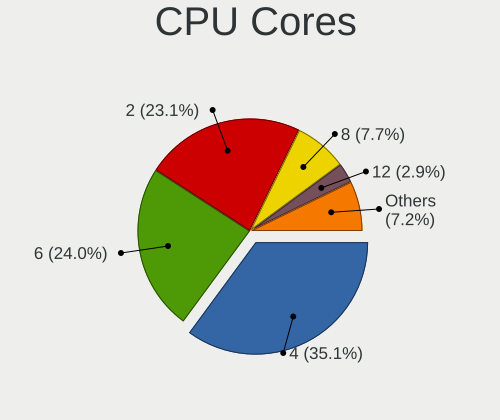

| Number | Desktops | Percent |
|--------|----------|---------|
| 4      | 73       | 35.1%   |
| 6      | 50       | 24.04%  |
| 2      | 48       | 23.08%  |
| 8      | 16       | 7.69%   |
| 12     | 6        | 2.88%   |
| 1      | 6        | 2.88%   |
| 14     | 3        | 1.44%   |
| 20     | 2        | 0.96%   |
| 16     | 2        | 0.96%   |
| 3      | 2        | 0.96%   |

CPU Sockets
-----------

Number of sockets

| Number | Desktops | Percent |
|--------|----------|---------|
| 1      | 206      | 99.04%  |
| 2      | 2        | 0.96%   |

CPU Threads
-----------

Threads per core (Hyper-Threading)

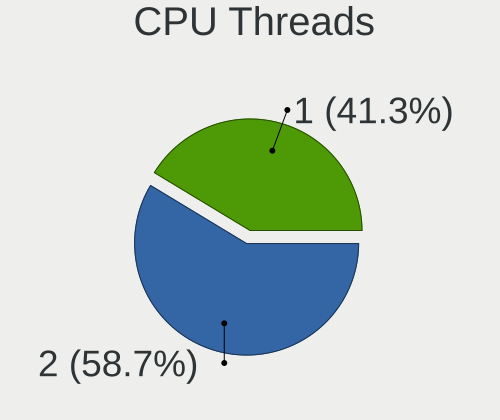

| Number | Desktops | Percent |
|--------|----------|---------|
| 2      | 122      | 58.65%  |
| 1      | 86       | 41.35%  |

CPU Op-Modes
------------

CPU Operation Modes (32-bit, 64-bit)

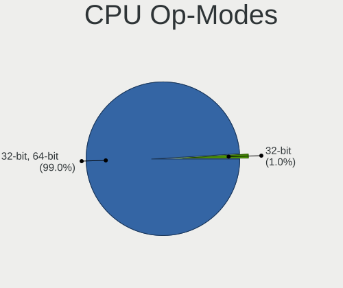

| Op mode        | Desktops | Percent |
|----------------|----------|---------|
| 32-bit, 64-bit | 206      | 99.04%  |
| 32-bit         | 2        | 0.96%   |

CPU Microcode
-------------

Microcode number

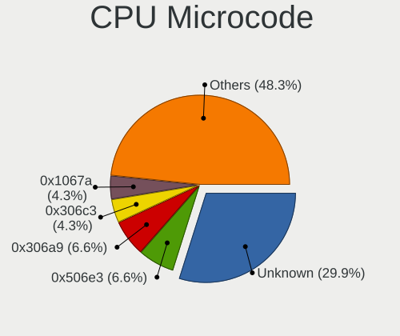

| Number     | Desktops | Percent |
|------------|----------|---------|
| Unknown    | 63       | 29.86%  |
| 0x506e3    | 14       | 6.64%   |
| 0x306a9    | 14       | 6.64%   |
| 0x306c3    | 9        | 4.27%   |
| 0x1067a    | 9        | 4.27%   |
| 0x206a7    | 7        | 3.32%   |
| 0x906ea    | 6        | 2.84%   |
| 0x906e9    | 5        | 2.37%   |
| 0x6fb      | 4        | 1.9%    |
| 0x0800820d | 4        | 1.9%    |
| 0xa0653    | 3        | 1.42%   |
| 0x08701021 | 3        | 1.42%   |
| 0x06000852 | 3        | 1.42%   |
| 0xa0671    | 2        | 0.95%   |
| 0xa0655    | 2        | 0.95%   |
| 0x906eb    | 2        | 0.95%   |
| 0x506c9    | 2        | 0.95%   |
| 0x106a4    | 2        | 0.95%   |
| 0x0a601206 | 2        | 0.95%   |
| 0x0a601203 | 2        | 0.95%   |
| 0x0a50000d | 2        | 0.95%   |
| 0x08600106 | 2        | 0.95%   |
| 0x08101016 | 2        | 0.95%   |
| 0x0600611a | 2        | 0.95%   |
| 0x06001119 | 2        | 0.95%   |
| 0x03000027 | 2        | 0.95%   |
| 0x010000c8 | 2        | 0.95%   |
| 0xb06a2    | 1        | 0.47%   |
| 0x906ed    | 1        | 0.47%   |
| 0x906c0    | 1        | 0.47%   |
| 0x906a3    | 1        | 0.47%   |
| 0x90675    | 1        | 0.47%   |
| 0x806c1    | 1        | 0.47%   |
| 0x706a1    | 1        | 0.47%   |
| 0x6fd      | 1        | 0.47%   |
| 0x6f6      | 1        | 0.47%   |
| 0x506ca    | 1        | 0.47%   |
| 0x406c3    | 1        | 0.47%   |
| 0x206c2    | 1        | 0.47%   |
| 0x20655    | 1        | 0.47%   |

CPU Microarch
-------------

Microarchitecture

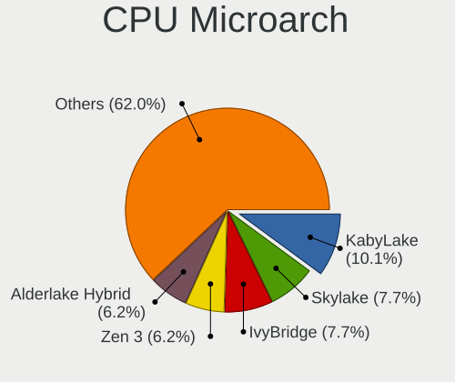

| Name             | Desktops | Percent |
|------------------|----------|---------|
| KabyLake         | 21       | 10.1%   |
| Skylake          | 16       | 7.69%   |
| IvyBridge        | 16       | 7.69%   |
| Zen 3            | 13       | 6.25%   |
| Alderlake Hybrid | 13       | 6.25%   |
| Haswell          | 11       | 5.29%   |
| Unknown          | 11       | 5.29%   |
| SandyBridge      | 10       | 4.81%   |
| Penryn           | 10       | 4.81%   |
| Core             | 10       | 4.81%   |
| Zen+             | 9        | 4.33%   |
| Zen 2            | 9        | 4.33%   |
| Piledriver       | 7        | 3.37%   |
| CometLake        | 7        | 3.37%   |
| K10              | 5        | 2.4%    |
| Icelake          | 5        | 2.4%    |
| Zen              | 4        | 1.92%   |
| Westmere         | 4        | 1.92%   |
| Nehalem          | 4        | 1.92%   |
| Goldmont         | 3        | 1.44%   |
| Excavator        | 3        | 1.44%   |
| Tremont          | 2        | 0.96%   |
| K8 Hammer        | 2        | 0.96%   |
| K6               | 2        | 0.96%   |
| K10 Llano        | 2        | 0.96%   |
| Goldmont plus    | 2        | 0.96%   |
| TigerLake        | 1        | 0.48%   |
| Steamroller      | 1        | 0.48%   |
| Silvermont       | 1        | 0.48%   |
| NetBurst         | 1        | 0.48%   |
| Jaguar           | 1        | 0.48%   |
| Bulldozer        | 1        | 0.48%   |
| Bobcat           | 1        | 0.48%   |

Graphics
--------

GPU Vendor
----------

Vendors of graphics cards

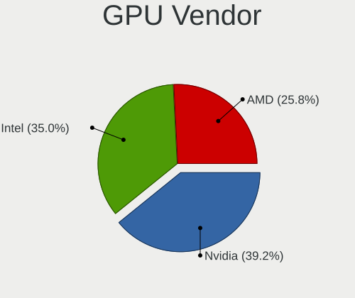

| Vendor | Desktops | Percent |
|--------|----------|---------|
| Nvidia | 85       | 39.17%  |
| Intel  | 76       | 35.02%  |
| AMD    | 56       | 25.81%  |

GPU Model
---------

Graphics card models

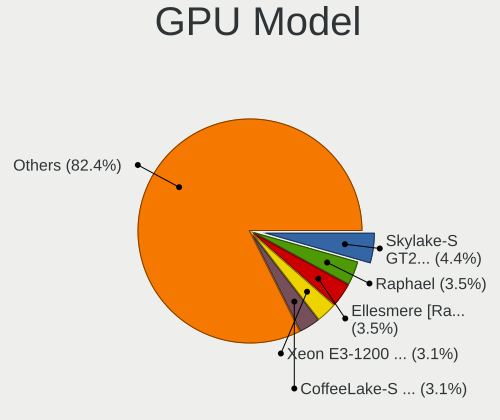

| Model                                                                       | Desktops | Percent |
|-----------------------------------------------------------------------------|----------|---------|
| Intel Skylake-S GT2 [HD Graphics 530]                                       | 10       | 4.41%   |
| AMD Raphael                                                                 | 8        | 3.52%   |
| AMD Ellesmere [Radeon RX 470/480/570/570X/580/580X/590]                     | 8        | 3.52%   |
| Intel Xeon E3-1200 v2/3rd Gen Core processor Graphics Controller            | 7        | 3.08%   |
| Intel CoffeeLake-S GT2 [UHD Graphics 630]                                   | 7        | 3.08%   |
| Nvidia GP108 [GeForce GT 1030]                                              | 6        | 2.64%   |
| Nvidia GP107 [GeForce GTX 1050]                                             | 5        | 2.2%    |
| Nvidia GP106 [GeForce GTX 1060 6GB]                                         | 5        | 2.2%    |
| Intel Xeon E3-1200 v3/4th Gen Core Processor Integrated Graphics Controller | 5        | 2.2%    |
| AMD Cezanne [Radeon Vega Series / Radeon Vega Mobile Series]                | 5        | 2.2%    |
| Nvidia TU117 [GeForce GTX 1650]                                             | 4        | 1.76%   |
| Intel CometLake-S GT2 [UHD Graphics 630]                                    | 4        | 1.76%   |
| AMD Navi 23 [Radeon RX 6600/6600 XT/6600M]                                  | 4        | 1.76%   |
| Nvidia GP107 [GeForce GTX 1050 Ti]                                          | 3        | 1.32%   |
| Nvidia GM206 [GeForce GTX 960]                                              | 3        | 1.32%   |
| Nvidia GA104 [GeForce RTX 3070]                                             | 3        | 1.32%   |
| Intel Kaby Lake-S GT2 [HD Graphics 630]                                     | 3        | 1.32%   |
| Intel 4 Series Chipset Integrated Graphics Controller                       | 3        | 1.32%   |
| Intel 2nd Generation Core Processor Family Integrated Graphics Controller   | 3        | 1.32%   |
| AMD Picasso/Raven 2 [Radeon Vega Series / Radeon Vega Mobile Series]        | 3        | 1.32%   |
| AMD Cedar [Radeon HD 5000/6000/7350/8350 Series]                            | 3        | 1.32%   |
| Nvidia TU106 [GeForce RTX 2070 Rev. A]                                      | 2        | 0.88%   |
| Nvidia NV18 [GeForce4 MX 440 AGP 8x]                                        | 2        | 0.88%   |
| Nvidia GT218 [GeForce 210]                                                  | 2        | 0.88%   |
| Nvidia GP106 [GeForce GTX 1060 3GB]                                         | 2        | 0.88%   |
| Nvidia GM204 [GeForce GTX 970]                                              | 2        | 0.88%   |
| Nvidia GK208B [GeForce GT 730]                                              | 2        | 0.88%   |
| Nvidia GK110 [GeForce GTX 780]                                              | 2        | 0.88%   |
| Nvidia GF119 [GeForce GT 610]                                               | 2        | 0.88%   |
| Nvidia GF108 [GeForce GT 630]                                               | 2        | 0.88%   |
| Nvidia GF106 [GeForce GTS 450]                                              | 2        | 0.88%   |
| Nvidia AD104 [GeForce RTX 4070]                                             | 2        | 0.88%   |
| Intel RocketLake-S GT1 [UHD Graphics 730]                                   | 2        | 0.88%   |
| Intel Raptor Lake-P [Iris Xe Graphics]                                      | 2        | 0.88%   |
| Intel JasperLake [UHD Graphics]                                             | 2        | 0.88%   |
| Intel GeminiLake [UHD Graphics 600]                                         | 2        | 0.88%   |
| Intel Apollo Lake GT1 [HD Graphics 500]                                     | 2        | 0.88%   |
| Intel Alder Lake-S GT1 [UHD Graphics 770]                                   | 2        | 0.88%   |
| Intel Alder Lake-S GT1 [UHD Graphics 730]                                   | 2        | 0.88%   |
| Intel 82Q963/Q965 Integrated Graphics Controller                            | 2        | 0.88%   |

GPU Combo
---------

Combinations of graphics cards

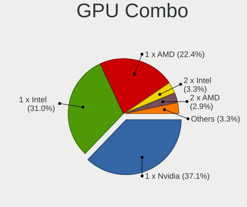

| Name           | Desktops | Percent |
|----------------|----------|---------|
| 1 x Nvidia     | 78       | 37.14%  |
| 1 x Intel      | 65       | 30.95%  |
| 1 x AMD        | 47       | 22.38%  |
| 2 x Intel      | 7        | 3.33%   |
| 2 x AMD        | 6        | 2.86%   |
| AMD + Nvidia   | 4        | 1.9%    |
| Intel + Nvidia | 3        | 1.43%   |

GPU Driver
----------

Free vs proprietary

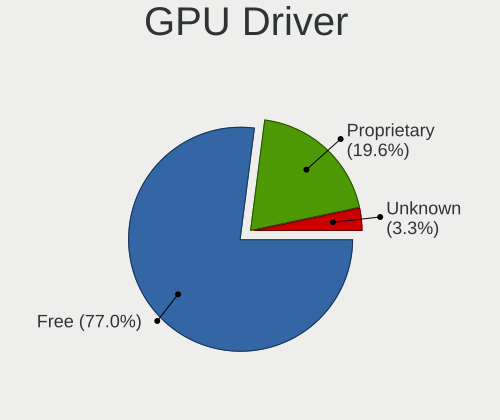

| Driver      | Desktops | Percent |
|-------------|----------|---------|
| Free        | 161      | 77.03%  |
| Proprietary | 41       | 19.62%  |
| Unknown     | 7        | 3.35%   |

GPU Memory
----------

Total video memory

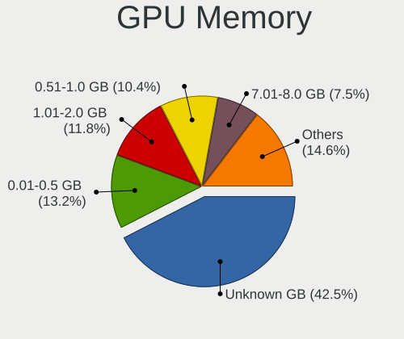

| Size in GB | Desktops | Percent |
|------------|----------|---------|
| Unknown    | 90       | 42.45%  |
| 0.01-0.5   | 28       | 13.21%  |
| 1.01-2.0   | 25       | 11.79%  |
| 0.51-1.0   | 22       | 10.38%  |
| 7.01-8.0   | 16       | 7.55%   |
| 3.01-4.0   | 12       | 5.66%   |
| 5.01-6.0   | 7        | 3.3%    |
| 2.01-3.0   | 5        | 2.36%   |
| 8.01-16.0  | 5        | 2.36%   |
| 4.01-5.0   | 1        | 0.47%   |
| 16.01-24.0 | 1        | 0.47%   |

Monitor
-------

Monitor Vendor
--------------

Monitor vendors

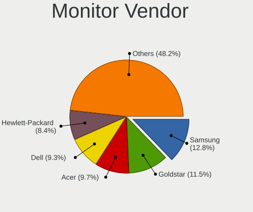

| Vendor               | Desktops | Percent |
|----------------------|----------|---------|
| Samsung Electronics  | 29       | 12.83%  |
| Goldstar             | 26       | 11.5%   |
| Acer                 | 22       | 9.73%   |
| Dell                 | 21       | 9.29%   |
| Hewlett-Packard      | 19       | 8.41%   |
| BenQ                 | 17       | 7.52%   |
| AOC                  | 10       | 4.42%   |
| Ancor Communications | 9        | 3.98%   |
| Philips              | 8        | 3.54%   |
| ViewSonic            | 4        | 1.77%   |
| Sony                 | 4        | 1.77%   |
| Sceptre Tech         | 4        | 1.77%   |
| Lenovo               | 3        | 1.33%   |
| Eizo                 | 3        | 1.33%   |
| ASUSTek Computer     | 3        | 1.33%   |
| Vizio                | 2        | 0.88%   |
| MSI                  | 2        | 0.88%   |
| Hitachi              | 2        | 0.88%   |
| HannStar             | 2        | 0.88%   |
| Fujitsu Siemens      | 2        | 0.88%   |
| DENON                | 2        | 0.88%   |
| CHD                  | 2        | 0.88%   |
| Yeyian               | 1        | 0.44%   |
| Wacom                | 1        | 0.44%   |
| VIE                  | 1        | 0.44%   |
| UTV                  | 1        | 0.44%   |
| Unknown (ADE)        | 1        | 0.44%   |
| Unknown              | 1        | 0.44%   |
| Toshiba              | 1        | 0.44%   |
| TCL                  | 1        | 0.44%   |
| Targa Visionary      | 1        | 0.44%   |
| SKG                  | 1        | 0.44%   |
| RGT                  | 1        | 0.44%   |
| Plain Tree Systems   | 1        | 0.44%   |
| Packard Bell         | 1        | 0.44%   |
| NECCI                | 1        | 0.44%   |
| NEC Computers        | 1        | 0.44%   |
| Mi                   | 1        | 0.44%   |
| Medion               | 1        | 0.44%   |
| LG Electronics       | 1        | 0.44%   |

Monitor Model
-------------

Monitor models

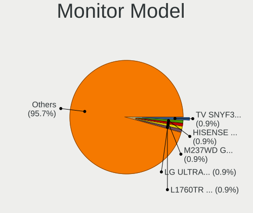

| Model                                                                 | Desktops | Percent |
|-----------------------------------------------------------------------|----------|---------|
| Sony TV SNYF301 1920x1080                                             | 2        | 0.86%   |
| Hitachi HISENSE HEC002F 3840x2160 1872x1053mm 84.6-inch               | 2        | 0.86%   |
| Goldstar M237WD GSM56EB 1920x1080 509x286mm 23.0-inch                 | 2        | 0.86%   |
| Goldstar LG ULTRAWIDE GSM59F1 2560x1080 670x280mm 28.6-inch           | 2        | 0.86%   |
| Goldstar L1760TR GSM445D 1280x1024 338x270mm 17.0-inch                | 2        | 0.86%   |
| Goldstar HD GSM5ACD 1366x768 410x230mm 18.5-inch                      | 2        | 0.86%   |
| Goldstar FULL HD GSM5B55 1920x1080 480x270mm 21.7-inch                | 2        | 0.86%   |
| Goldstar FULL HD GSM5B54 1920x1080 480x270mm 21.7-inch                | 2        | 0.86%   |
| Dell 2208WFP DEL403C 1680x1050 473x296mm 22.0-inch                    | 2        | 0.86%   |
| BenQ GL2480 BNQ78ED 1920x1080 531x298mm 24.0-inch                     | 2        | 0.86%   |
| BenQ GL2460 BNQ78CE 1920x1080 531x299mm 24.0-inch                     | 2        | 0.86%   |
| AOC 24G2W1G3- AOC2402 1920x1080 530x300mm 24.0-inch                   | 2        | 0.86%   |
| AOC 24G2W1G3 AOC2402 1920x1080 527x296mm 23.8-inch                    | 2        | 0.86%   |
| Ancor Communications VS248 ACI2498 1920x1080 531x299mm 24.0-inch      | 2        | 0.86%   |
| Ancor Communications ASUS VC239 ACI23C4 1920x1080 509x286mm 23.0-inch | 2        | 0.86%   |
| Acer X213W ACR002A 1680x1050 473x296mm 22.0-inch                      | 2        | 0.86%   |
| Acer R271 ACR0496 1920x1080 598x336mm 27.0-inch                       | 2        | 0.86%   |
| Acer KA220HQ ACR0467 1920x1080 477x268mm 21.5-inch                    | 2        | 0.86%   |
| Yeyian YMG-4K27-01 YEY2700 3840x2160 600x330mm 27.0-inch              | 1        | 0.43%   |
| Wacom One 13 WAC1070 1920x1080 294x166mm 13.3-inch                    | 1        | 0.43%   |
| Vizio VA26LHDTV10T VIZ0035 1920x1080 580x320mm 26.1-inch              | 1        | 0.43%   |
| Vizio E500i-B1 VIZ1004 1920x1080 1095x616mm 49.5-inch                 | 1        | 0.43%   |
| ViewSonic VX2452 Series VSCDE2E 1920x1080 521x293mm 23.5-inch         | 1        | 0.43%   |
| ViewSonic VP2780 SERIES VSC9C30 3840x2160 597x336mm 27.0-inch         | 1        | 0.43%   |
| ViewSonic VG2748 VSC7936 1920x1080 598x336mm 27.0-inch                | 1        | 0.43%   |
| ViewSonic VA2709M VSC2040 1920x1080 598x336mm 27.0-inch               | 1        | 0.43%   |
| VIE D-GM215 VIEE003 1920x1080 480x260mm 21.5-inch                     | 1        | 0.43%   |
| UTV MONITOR UTV0030 1920x1080 580x330mm 26.3-inch                     | 1        | 0.43%   |
| Unknown LCD Monitor Dell DEL 1908FPBLK 1280x1024                      | 1        | 0.43%   |
| Unknown (ADE) TSLED22D ADEB22D 1920x1080 477x268mm 21.5-inch          | 1        | 0.43%   |
| Toshiba TV TSB0206 1920x1080                                          | 1        | 0.43%   |
| TCL Fire TV TCL9026 3840x2160 800x450mm 36.1-inch                     | 1        | 0.43%   |
| Targa Visionary LCD Monitor TAR0C35 1280x1024                         | 1        | 0.43%   |
| Sony TV SNY2C02 1920x1080 886x498mm 40.0-inch                         | 1        | 0.43%   |
| Sony TV *00 SNY6A05 3840x2160                                         | 1        | 0.43%   |
| SKG PMO G241-FFK SKG2409 1920x1080 600x330mm 27.0-inch                | 1        | 0.43%   |
| Sceptre Tech Sceptre M25 SPT0A05 1920x1080 597x336mm 27.0-inch        | 1        | 0.43%   |
| Sceptre Tech Sceptre J20 SPT080D 1600x900 435x237mm 19.5-inch         | 1        | 0.43%   |
| Sceptre Tech Sceptre F24 SPT09AB 1920x1080 530x290mm 23.8-inch        | 1        | 0.43%   |
| Sceptre Tech Sceptre E22 SPT08D5 1920x1080 470x300mm 22.0-inch        | 1        | 0.43%   |

Monitor Resolution
------------------

Monitor screen resolution

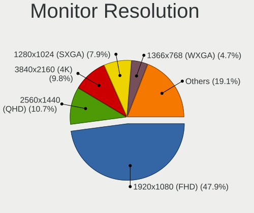

| Resolution         | Desktops | Percent |
|--------------------|----------|---------|
| 1920x1080 (FHD)    | 103      | 47.91%  |
| 2560x1440 (QHD)    | 23       | 10.7%   |
| 3840x2160 (4K)     | 21       | 9.77%   |
| 1280x1024 (SXGA)   | 17       | 7.91%   |
| 1366x768 (WXGA)    | 10       | 4.65%   |
| 1600x900 (HD+)     | 9        | 4.19%   |
| 1920x1200 (WUXGA)  | 7        | 3.26%   |
| 1680x1050 (WSXGA+) | 6        | 2.79%   |
| 1440x900 (WXGA+)   | 4        | 1.86%   |
| 3840x1080          | 3        | 1.4%    |
| 2560x1080          | 3        | 1.4%    |
| 1600x1200          | 3        | 1.4%    |
| 3440x1440          | 2        | 0.93%   |
| Unknown            | 2        | 0.93%   |
| 1360x768           | 1        | 0.47%   |
| 1024x768 (XGA)     | 1        | 0.47%   |

Monitor Diagonal
----------------

Diagonal size in inches

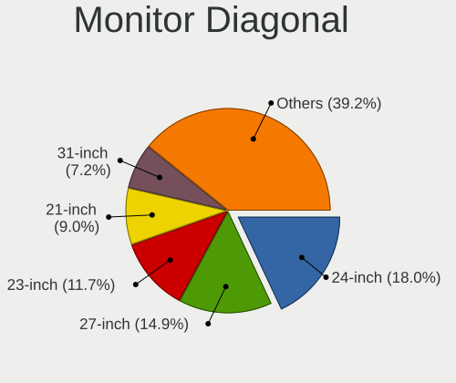

| Inches  | Desktops | Percent |
|---------|----------|---------|
| 24      | 40       | 18.02%  |
| 27      | 33       | 14.86%  |
| 23      | 26       | 11.71%  |
| 21      | 20       | 9.01%   |
| 31      | 16       | 7.21%   |
| 19      | 12       | 5.41%   |
| 18      | 9        | 4.05%   |
| 17      | 9        | 4.05%   |
| 20      | 7        | 3.15%   |
| 84      | 6        | 2.7%    |
| 22      | 6        | 2.7%    |
| Unknown | 6        | 2.7%    |
| 34      | 5        | 2.25%   |
| 54      | 4        | 1.8%    |
| 25      | 3        | 1.35%   |
| 72      | 2        | 0.9%    |
| 49      | 2        | 0.9%    |
| 36      | 2        | 0.9%    |
| 15      | 2        | 0.9%    |
| 74      | 1        | 0.45%   |
| 65      | 1        | 0.45%   |
| 64      | 1        | 0.45%   |
| 61      | 1        | 0.45%   |
| 57      | 1        | 0.45%   |
| 55      | 1        | 0.45%   |
| 40      | 1        | 0.45%   |
| 39      | 1        | 0.45%   |
| 32      | 1        | 0.45%   |
| 28      | 1        | 0.45%   |
| 26      | 1        | 0.45%   |
| 13      | 1        | 0.45%   |

Monitor Width
-------------

Physical width

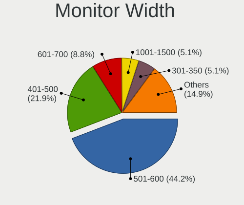

| Width in mm | Desktops | Percent |
|-------------|----------|---------|
| 501-600     | 95       | 44.19%  |
| 401-500     | 47       | 21.86%  |
| 601-700     | 19       | 8.84%   |
| 301-350     | 11       | 5.12%   |
| 1001-1500   | 11       | 5.12%   |
| 1501-2000   | 9        | 4.19%   |
| 701-800     | 8        | 3.72%   |
| 351-400     | 6        | 2.79%   |
| Unknown     | 6        | 2.79%   |
| 801-900     | 2        | 0.93%   |
| 201-300     | 1        | 0.47%   |

Aspect Ratio
------------

Proportional relationship between the width and the height

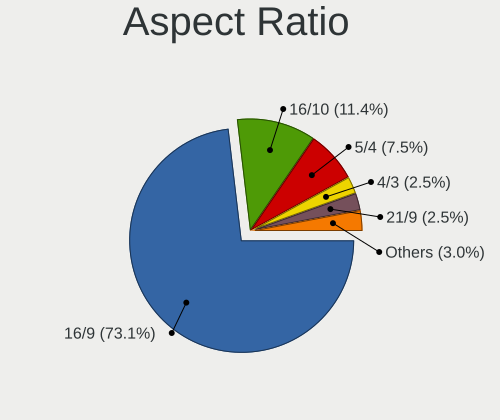

| Ratio   | Desktops | Percent |
|---------|----------|---------|
| 16/9    | 147      | 73.13%  |
| 16/10   | 23       | 11.44%  |
| 5/4     | 15       | 7.46%   |
| 4/3     | 5        | 2.49%   |
| 21/9    | 5        | 2.49%   |
| Unknown | 3        | 1.49%   |
| 32/9    | 2        | 1%      |
| 3/2     | 1        | 0.5%    |

Monitor Area
------------

Area in inch²

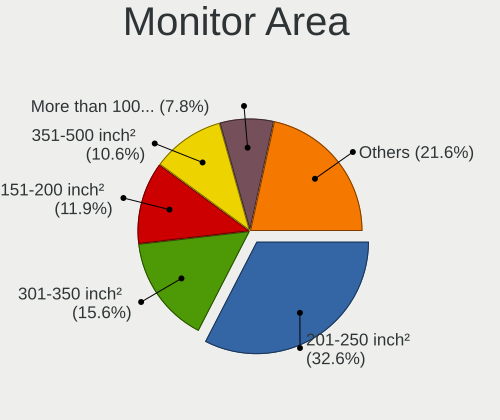

| Area in inch² | Desktops | Percent |
|----------------|----------|---------|
| 201-250        | 71       | 32.57%  |
| 301-350        | 34       | 15.6%   |
| 151-200        | 26       | 11.93%  |
| 351-500        | 23       | 10.55%  |
| More than 1000 | 17       | 7.8%    |
| 141-150        | 17       | 7.8%    |
| 251-300        | 15       | 6.88%   |
| 501-1000       | 6        | 2.75%   |
| Unknown        | 6        | 2.75%   |
| 71-80          | 1        | 0.46%   |
| 111-120        | 1        | 0.46%   |
| 101-110        | 1        | 0.46%   |

Pixel Density
-------------

Pixels per inch

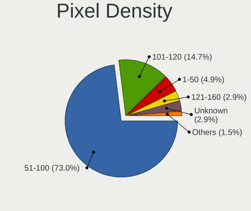

| Density | Desktops | Percent |
|---------|----------|---------|
| 51-100  | 149      | 73.04%  |
| 101-120 | 30       | 14.71%  |
| 1-50    | 10       | 4.9%    |
| 121-160 | 6        | 2.94%   |
| Unknown | 6        | 2.94%   |
| 161-240 | 3        | 1.47%   |

Multiple Monitors
-----------------

Total monitors connected

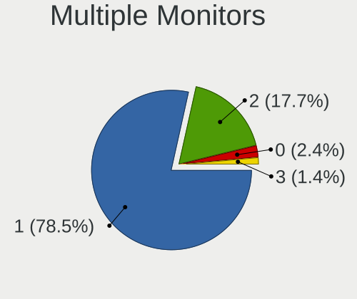

| Total | Desktops | Percent |
|-------|----------|---------|
| 1     | 164      | 78.47%  |
| 2     | 37       | 17.7%   |
| 0     | 5        | 2.39%   |
| 3     | 3        | 1.44%   |

Network
-------

Net Controller Vendor
---------------------

Controller vendors

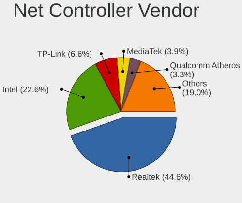

| Vendor                                 | Desktops | Percent |
|----------------------------------------|----------|---------|
| Realtek Semiconductor                  | 148      | 44.58%  |
| Intel                                  | 75       | 22.59%  |
| TP-Link                                | 22       | 6.63%   |
| MediaTek                               | 13       | 3.92%   |
| Qualcomm Atheros                       | 11       | 3.31%   |
| Broadcom                               | 9        | 2.71%   |
| Samsung Electronics                    | 5        | 1.51%   |
| Ralink Technology                      | 5        | 1.51%   |
| Qualcomm Atheros Communications        | 5        | 1.51%   |
| Xiaomi                                 | 4        | 1.2%    |
| Broadcom Limited                       | 4        | 1.2%    |
| Ralink                                 | 3        | 0.9%    |
| Google                                 | 3        | 0.9%    |
| Edimax Technology                      | 3        | 0.9%    |
| Nvidia                                 | 2        | 0.6%    |
| Marvell Technology Group               | 2        | 0.6%    |
| IMC Networks                           | 2        | 0.6%    |
| Belkin Components                      | 2        | 0.6%    |
| VIA Technologies                       | 1        | 0.3%    |
| Tenda                                  | 1        | 0.3%    |
| Sony Ericsson Mobile Communications AB | 1        | 0.3%    |
| Silicon Integrated Systems [SiS]       | 1        | 0.3%    |
| Realtek                                | 1        | 0.3%    |
| QinHeng Electronics                    | 1        | 0.3%    |
| OPPO Electronics                       | 1        | 0.3%    |
| Microsoft                              | 1        | 0.3%    |
| Linksys                                | 1        | 0.3%    |
| Huawei Technologies                    | 1        | 0.3%    |
| D-Link System                          | 1        | 0.3%    |
| D-Link                                 | 1        | 0.3%    |
| ASUSTek Computer                       | 1        | 0.3%    |
| Arduino SA                             | 1        | 0.3%    |

Net Controller Model
--------------------

Controller models

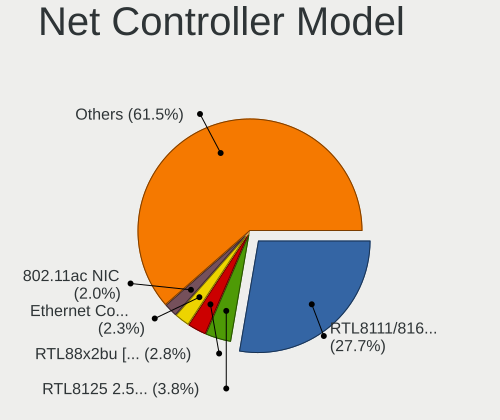

| Model                                                                         | Desktops | Percent |
|-------------------------------------------------------------------------------|----------|---------|
| Realtek RTL8111/8168/8211/8411 PCI Express Gigabit Ethernet Controller        | 110      | 27.71%  |
| Realtek RTL8125 2.5GbE Controller                                             | 15       | 3.78%   |
| Realtek RTL88x2bu [AC1200 Techkey]                                            | 11       | 2.77%   |
| Intel Ethernet Controller I225-V                                              | 9        | 2.27%   |
| Realtek 802.11ac NIC                                                          | 8        | 2.02%   |
| Realtek RTL8188EUS 802.11n Wireless Network Adapter                           | 7        | 1.76%   |
| Realtek RTL8852BE PCIe 802.11ax Wireless Network Controller                   | 6        | 1.51%   |
| Realtek RTL810xE PCI Express Fast Ethernet controller                         | 6        | 1.51%   |
| Intel Ethernet Connection (2) I219-V                                          | 6        | 1.51%   |
| Intel 82579LM Gigabit Network Connection (Lewisville)                         | 6        | 1.51%   |
| Xiaomi Mi/Redmi series (RNDIS)                                                | 4        | 1.01%   |
| TP-Link Archer T2U PLUS [RTL8821AU]                                           | 4        | 1.01%   |
| Samsung Galaxy series, misc. (tethering mode)                                 | 4        | 1.01%   |
| Realtek RTL8812AU 802.11a/b/g/n/ac 2T2R DB WLAN Adapter                       | 4        | 1.01%   |
| Realtek RTL8188FTV 802.11b/g/n 1T1R 2.4G WLAN Adapter                         | 4        | 1.01%   |
| MediaTek MT7922 802.11ax PCI Express Wireless Network Adapter                 | 4        | 1.01%   |
| Intel Wi-Fi 6 AX200                                                           | 4        | 1.01%   |
| Intel Ethernet Controller I226-V                                              | 4        | 1.01%   |
| Intel Ethernet Connection (7) I219-V                                          | 4        | 1.01%   |
| Intel Ethernet Connection (2) I219-LM                                         | 4        | 1.01%   |
| TP-Link TL-WN823N v2/v3 [Realtek RTL8192EU]                                   | 3        | 0.76%   |
| TP-Link Archer T3U [Realtek RTL8812BU]                                        | 3        | 0.76%   |
| TP-Link AC600 wireless Realtek RTL8811AU [Archer T2U Nano]                    | 3        | 0.76%   |
| TP-Link 802.11ac WLAN Adapter                                                 | 3        | 0.76%   |
| Realtek RTL8821CE 802.11ac PCIe Wireless Network Adapter                      | 3        | 0.76%   |
| Ralink MT7601U Wireless Adapter                                               | 3        | 0.76%   |
| Qualcomm Atheros AR9271 802.11n                                               | 3        | 0.76%   |
| MediaTek MT7902 802.11ax PCIe Wireless Network Adapter [Filogic 310]          | 3        | 0.76%   |
| Intel Wireless 8260                                                           | 3        | 0.76%   |
| Intel Wi-Fi 5(802.11ac) Wireless-AC 9x6x [Thunder Peak]                       | 3        | 0.76%   |
| Intel Ethernet Connection I217-LM                                             | 3        | 0.76%   |
| Intel 700 Series Chipset CNVi WiFi                                            | 3        | 0.76%   |
| TP-Link TL-WN821N v5/v6 [RTL8192EU]                                           | 2        | 0.5%    |
| TP-Link 802.11ac NIC                                                          | 2        | 0.5%    |
| Realtek RTL8822CE 802.11ac PCIe Wireless Network Adapter                      | 2        | 0.5%    |
| Realtek RTL8192EE PCIe Wireless Network Adapter                               | 2        | 0.5%    |
| Realtek RTL8188CE 802.11b/g/n WiFi Adapter                                    | 2        | 0.5%    |
| Realtek 802.11n WLAN Adapter                                                  | 2        | 0.5%    |
| Ralink RT2870/RT3070 Wireless Adapter                                         | 2        | 0.5%    |
| Qualcomm Atheros TP-Link TL-WN322G v3 / TL-WN422G v2 802.11g [Atheros AR9271] | 2        | 0.5%    |

Wireless Vendor
---------------

Wireless vendors

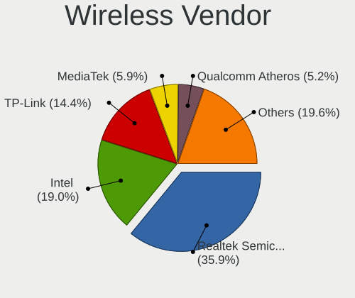

| Vendor                          | Desktops | Percent |
|---------------------------------|----------|---------|
| Realtek Semiconductor           | 55       | 35.95%  |
| Intel                           | 29       | 18.95%  |
| TP-Link                         | 22       | 14.38%  |
| MediaTek                        | 9        | 5.88%   |
| Qualcomm Atheros                | 8        | 5.23%   |
| Ralink Technology               | 5        | 3.27%   |
| Qualcomm Atheros Communications | 5        | 3.27%   |
| Ralink                          | 3        | 1.96%   |
| Edimax Technology               | 3        | 1.96%   |
| IMC Networks                    | 2        | 1.31%   |
| Broadcom Limited                | 2        | 1.31%   |
| Broadcom                        | 2        | 1.31%   |
| Belkin Components               | 2        | 1.31%   |
| Tenda                           | 1        | 0.65%   |
| Realtek                         | 1        | 0.65%   |
| Microsoft                       | 1        | 0.65%   |
| Linksys                         | 1        | 0.65%   |
| D-Link                          | 1        | 0.65%   |
| ASUSTek Computer                | 1        | 0.65%   |

Wireless Model
--------------

Wireless models

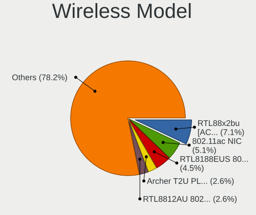

| Model                                                                         | Desktops | Percent |
|-------------------------------------------------------------------------------|----------|---------|
| Realtek RTL88x2bu [AC1200 Techkey]                                            | 11       | 7.05%   |
| Realtek 802.11ac NIC                                                          | 8        | 5.13%   |
| Realtek RTL8188EUS 802.11n Wireless Network Adapter                           | 7        | 4.49%   |
| TP-Link Archer T2U PLUS [RTL8821AU]                                           | 4        | 2.56%   |
| Realtek RTL8812AU 802.11a/b/g/n/ac 2T2R DB WLAN Adapter                       | 4        | 2.56%   |
| Realtek RTL8188FTV 802.11b/g/n 1T1R 2.4G WLAN Adapter                         | 4        | 2.56%   |
| Intel Wi-Fi 6 AX200                                                           | 4        | 2.56%   |
| TP-Link TL-WN823N v2/v3 [Realtek RTL8192EU]                                   | 3        | 1.92%   |
| TP-Link Archer T3U [Realtek RTL8812BU]                                        | 3        | 1.92%   |
| TP-Link AC600 wireless Realtek RTL8811AU [Archer T2U Nano]                    | 3        | 1.92%   |
| TP-Link 802.11ac WLAN Adapter                                                 | 3        | 1.92%   |
| Realtek RTL8852BE PCIe 802.11ax Wireless Network Controller                   | 3        | 1.92%   |
| Realtek RTL8821CE 802.11ac PCIe Wireless Network Adapter                      | 3        | 1.92%   |
| Ralink MT7601U Wireless Adapter                                               | 3        | 1.92%   |
| Qualcomm Atheros AR9271 802.11n                                               | 3        | 1.92%   |
| MediaTek MT7902 802.11ax PCIe Wireless Network Adapter [Filogic 310]          | 3        | 1.92%   |
| Intel Wireless 8260                                                           | 3        | 1.92%   |
| Intel Wi-Fi 5(802.11ac) Wireless-AC 9x6x [Thunder Peak]                       | 3        | 1.92%   |
| Intel 700 Series Chipset CNVi WiFi                                            | 3        | 1.92%   |
| TP-Link TL-WN821N v5/v6 [RTL8192EU]                                           | 2        | 1.28%   |
| TP-Link 802.11ac NIC                                                          | 2        | 1.28%   |
| Realtek RTL8822CE 802.11ac PCIe Wireless Network Adapter                      | 2        | 1.28%   |
| Realtek RTL8192EE PCIe Wireless Network Adapter                               | 2        | 1.28%   |
| Realtek RTL8188CE 802.11b/g/n WiFi Adapter                                    | 2        | 1.28%   |
| Realtek 802.11n WLAN Adapter                                                  | 2        | 1.28%   |
| Ralink RT2870/RT3070 Wireless Adapter                                         | 2        | 1.28%   |
| Qualcomm Atheros TP-Link TL-WN322G v3 / TL-WN422G v2 802.11g [Atheros AR9271] | 2        | 1.28%   |
| Qualcomm Atheros AR9485 Wireless Network Adapter                              | 2        | 1.28%   |
| MediaTek MT7922 802.11ax PCI Express Wireless Network Adapter                 | 2        | 1.28%   |
| MediaTek MT7921K (RZ608) Wi-Fi 6E 80MHz                                       | 2        | 1.28%   |
| Intel Wireless 7265                                                           | 2        | 1.28%   |
| Intel Wireless 3165                                                           | 2        | 1.28%   |
| Intel Wi-Fi 6E(802.11ax) AX210/AX1675* 2x2 [Typhoon Peak]                     | 2        | 1.28%   |
| Intel Dual Band Wireless-AC 3168NGW [Stone Peak]                              | 2        | 1.28%   |
| Intel Cannon Lake PCH CNVi WiFi                                               | 2        | 1.28%   |
| IMC Networks Mediao 802.11n WLAN [Realtek RTL8191SU]                          | 2        | 1.28%   |
| Edimax Edimax AC600 USB                                                       | 2        | 1.28%   |
| TP-Link RTL8812AU Archer T4U 802.11ac                                         | 1        | 0.64%   |
| TP-Link Archer T4U ver.3                                                      | 1        | 0.64%   |
| Tenda U12                                                                     | 1        | 0.64%   |

Ethernet Vendor
---------------

Ethernet vendors

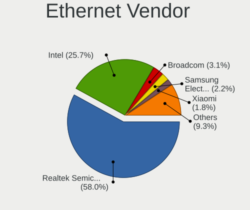

| Vendor                           | Desktops | Percent |
|----------------------------------|----------|---------|
| Realtek Semiconductor            | 131      | 57.96%  |
| Intel                            | 58       | 25.66%  |
| Broadcom                         | 7        | 3.1%    |
| Samsung Electronics              | 5        | 2.21%   |
| Xiaomi                           | 4        | 1.77%   |
| MediaTek                         | 4        | 1.77%   |
| Qualcomm Atheros                 | 3        | 1.33%   |
| Google                           | 3        | 1.33%   |
| Nvidia                           | 2        | 0.88%   |
| Marvell Technology Group         | 2        | 0.88%   |
| Broadcom Limited                 | 2        | 0.88%   |
| VIA Technologies                 | 1        | 0.44%   |
| Silicon Integrated Systems [SiS] | 1        | 0.44%   |
| OPPO Electronics                 | 1        | 0.44%   |
| Huawei Technologies              | 1        | 0.44%   |
| D-Link System                    | 1        | 0.44%   |

Ethernet Model
--------------

Ethernet models

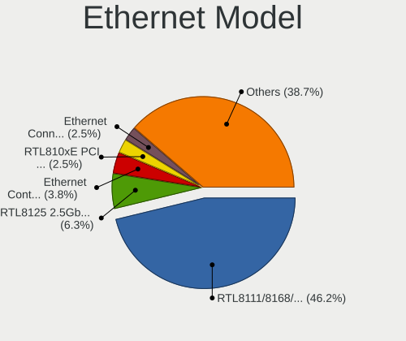

| Model                                                                  | Desktops | Percent |
|------------------------------------------------------------------------|----------|---------|
| Realtek RTL8111/8168/8211/8411 PCI Express Gigabit Ethernet Controller | 110      | 46.22%  |
| Realtek RTL8125 2.5GbE Controller                                      | 15       | 6.3%    |
| Intel Ethernet Controller I225-V                                       | 9        | 3.78%   |
| Realtek RTL810xE PCI Express Fast Ethernet controller                  | 6        | 2.52%   |
| Intel Ethernet Connection (2) I219-V                                   | 6        | 2.52%   |
| Intel 82579LM Gigabit Network Connection (Lewisville)                  | 6        | 2.52%   |
| Xiaomi Mi/Redmi series (RNDIS)                                         | 4        | 1.68%   |
| Samsung Galaxy series, misc. (tethering mode)                          | 4        | 1.68%   |
| Intel Ethernet Controller I226-V                                       | 4        | 1.68%   |
| Intel Ethernet Connection (7) I219-V                                   | 4        | 1.68%   |
| Intel Ethernet Connection (2) I219-LM                                  | 4        | 1.68%   |
| Realtek RTL8852BE PCIe 802.11ax Wireless Network Controller            | 3        | 1.26%   |
| Intel Ethernet Connection I217-LM                                      | 3        | 1.26%   |
| Nvidia MCP51 Ethernet Controller                                       | 2        | 0.84%   |
| MediaTek MT7922 802.11ax PCI Express Wireless Network Adapter          | 2        | 0.84%   |
| MediaTek Infinix HOT 50i                                               | 2        | 0.84%   |
| Intel I211 Gigabit Network Connection                                  | 2        | 0.84%   |
| Intel Ethernet Connection (5) I219-LM                                  | 2        | 0.84%   |
| Intel Ethernet Connection (17) I219-V                                  | 2        | 0.84%   |
| Intel Ethernet Connection (11) I219-LM                                 | 2        | 0.84%   |
| Intel 82578DM Gigabit Network Connection                               | 2        | 0.84%   |
| Intel 82566DM-2 Gigabit Network Connection                             | 2        | 0.84%   |
| Intel 82566DM Gigabit Network Connection                               | 2        | 0.84%   |
| Google Pixel 9a                                                        | 2        | 0.84%   |
| Broadcom NetXtreme BCM5762 Gigabit Ethernet PCIe                       | 2        | 0.84%   |
| VIA VT6102/VT6103 [Rhine-II]                                           | 1        | 0.42%   |
| Silicon Integrated Systems [SiS] SiS900 PCI Fast Ethernet              | 1        | 0.42%   |
| Samsung GT-I9070 (network tethering, USB debugging enabled)            | 1        | 0.42%   |
| Realtek RTL8922AE 802.11be PCIe Wireless Network Adapter               | 1        | 0.42%   |
| Realtek RTL8153 Gigabit Ethernet Adapter                               | 1        | 0.42%   |
| Realtek RTL8152 Fast Ethernet Adapter                                  | 1        | 0.42%   |
| Realtek RTL-8100/8101L/8139 PCI Fast Ethernet Adapter                  | 1        | 0.42%   |
| Realtek Killer E3000 2.5GbE Controller                                 | 1        | 0.42%   |
| Qualcomm Atheros AR8161 Gigabit Ethernet                               | 1        | 0.42%   |
| Qualcomm Atheros AR8151 v2.0 Gigabit Ethernet                          | 1        | 0.42%   |
| Qualcomm Atheros AR8131 Gigabit Ethernet                               | 1        | 0.42%   |
| OPPO Ace 3V                                                            | 1        | 0.42%   |
| Marvell Group 88E8057 PCI-E Gigabit Ethernet Controller                | 1        | 0.42%   |
| Marvell Group 88E8056 PCI-E Gigabit Ethernet Controller                | 1        | 0.42%   |
| Intel Ethernet Connection I217-V                                       | 1        | 0.42%   |

Net Controller Kind
-------------------

Ethernet, WiFi or modem

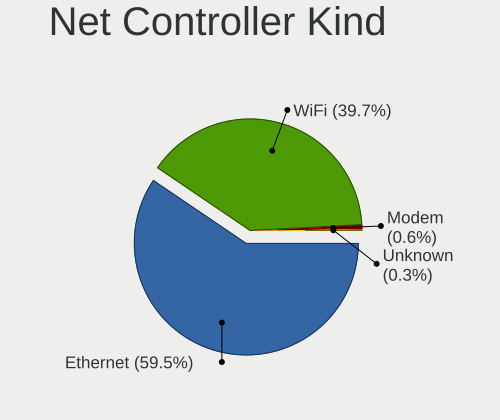

| Kind     | Desktops | Percent |
|----------|----------|---------|
| Ethernet | 207      | 59.48%  |
| WiFi     | 138      | 39.66%  |
| Modem    | 2        | 0.57%   |
| Unknown  | 1        | 0.29%   |

Used Controller
---------------

Currently used network controller

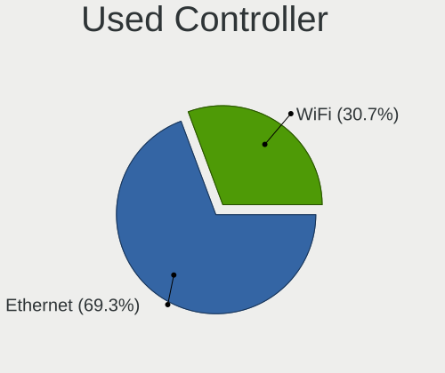

| Kind     | Desktops | Percent |
|----------|----------|---------|
| Ethernet | 147      | 69.34%  |
| WiFi     | 65       | 30.66%  |

NICs
----

Total network controllers on board

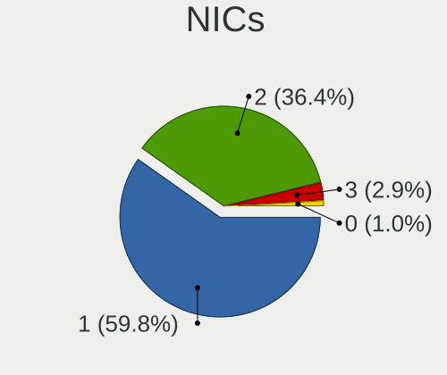

| Total | Desktops | Percent |
|-------|----------|---------|
| 1     | 125      | 59.81%  |
| 2     | 76       | 36.36%  |
| 3     | 6        | 2.87%   |
| 0     | 2        | 0.96%   |

IPv6
----

IPv6 vs IPv4

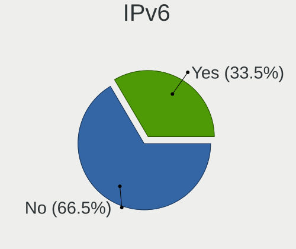

| Used | Desktops | Percent |
|------|----------|---------|
| No   | 139      | 66.51%  |
| Yes  | 70       | 33.49%  |

Bluetooth
---------

Bluetooth Vendor
----------------

Controller vendors

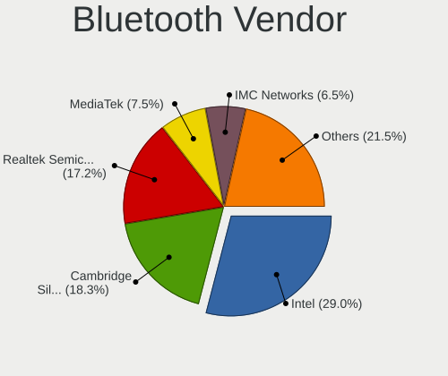

| Vendor                          | Desktops | Percent |
|---------------------------------|----------|---------|
| Intel                           | 27       | 29.03%  |
| Cambridge Silicon Radio         | 17       | 18.28%  |
| Realtek Semiconductor           | 16       | 17.2%   |
| MediaTek                        | 7        | 7.53%   |
| IMC Networks                    | 6        | 6.45%   |
| TP-Link                         | 5        | 5.38%   |
| Broadcom                        | 5        | 5.38%   |
| Foxconn / Hon Hai               | 3        | 3.23%   |
| Realtek                         | 1        | 1.08%   |
| Qualcomm Atheros Communications | 1        | 1.08%   |
| Lite-On Technology              | 1        | 1.08%   |
| Hewlett-Packard                 | 1        | 1.08%   |
| Creative Technology             | 1        | 1.08%   |
| ASUSTek Computer                | 1        | 1.08%   |
| Actions                         | 1        | 1.08%   |

Bluetooth Model
---------------

Controller models

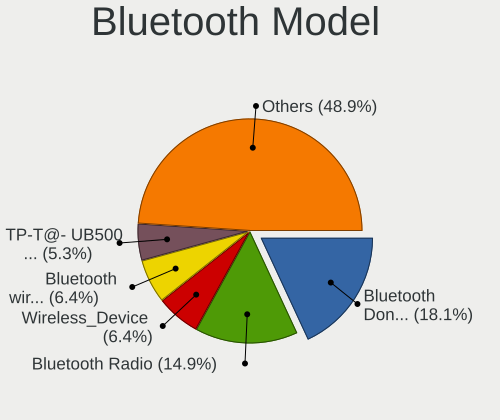

| Model                                                                                                     | Desktops | Percent |
|-----------------------------------------------------------------------------------------------------------|----------|---------|
| Cambridge Silicon Radio Bluetooth Dongle (HCI mode)                                                       | 17       | 18.09%  |
| Realtek Bluetooth Radio                                                                                   | 14       | 14.89%  |
| MediaTek Wireless_Device                                                                                  | 6        | 6.38%   |
| Intel Bluetooth wireless interface                                                                        | 6        | 6.38%   |
| TP-Link TP-T@- UB500 Adapter                                                                              | 5        | 5.32%   |
| Intel Bluetooth Device                                                                                    | 5        | 5.32%   |
| IMC Networks Bluetooth Radio                                                                              | 4        | 4.26%   |
| Intel Wireless-AC 9260 Bluetooth Adapter                                                                  | 3        | 3.19%   |
| Intel Bluetooth 9460/9560 Jefferson Peak (JfP)                                                            | 3        | 3.19%   |
| Intel AX201 Bluetooth                                                                                     | 3        | 3.19%   |
| Intel AX200 Bluetooth                                                                                     | 3        | 3.19%   |
| Broadcom BCM20702A0 Bluetooth 4.0                                                                         | 3        | 3.19%   |
| Intel Wireless-AC 3168 Bluetooth                                                                          | 2        | 2.13%   |
| Intel AX210 Bluetooth                                                                                     | 2        | 2.13%   |
| IMC Networks Wireless_Device                                                                              | 2        | 2.13%   |
| Foxconn / Hon Hai Wireless_Device                                                                         | 2        | 2.13%   |
| Realtek  Bluetooth 4.2 Adapter                                                                            | 1        | 1.06%   |
| Realtek Bluetooth 5.4 Radio                                                                               | 1        | 1.06%   |
| Realtek Bluetooth 5.3 Radio                                                                               | 1        | 1.06%   |
| Realtek Bluetooth Radio                                                                                   | 1        | 1.06%   |
| Qualcomm Atheros AR9462 Bluetooth                                                                         | 1        | 1.06%   |
| MediaTek MT7668 2x2 Dual Band Dual Concurrent 802.11a/b/g/n/ac WiFi with MU-MIMO and Bluetooth 5.0 Radios | 1        | 1.06%   |
| Lite-On Qualcomm Atheros QCA9377 Bluetooth                                                                | 1        | 1.06%   |
| HP Bluetooth 2.0 Interface [Broadcom BCM2045]                                                             | 1        | 1.06%   |
| Foxconn / Hon Hai MediaTek Bluetooth Adapter                                                              | 1        | 1.06%   |
| Creative Bluetooth Audio W2                                                                               | 1        | 1.06%   |
| Broadcom HP Bluetooth Module                                                                              | 1        | 1.06%   |
| Broadcom Bluetooth Controller                                                                             | 1        | 1.06%   |
| ASUS ASUS USB-BT500                                                                                       | 1        | 1.06%   |
| Actions general adapter                                                                                   | 1        | 1.06%   |

Sound
-----

Sound Vendor
------------

Sound card vendors

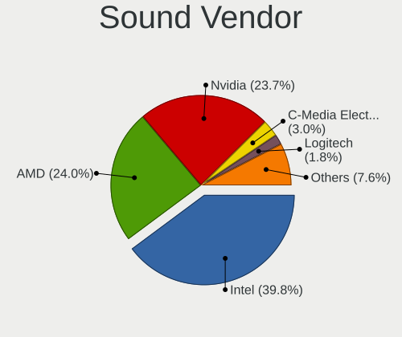

| Vendor                                       | Desktops | Percent |
|----------------------------------------------|----------|---------|
| Intel                                        | 131      | 39.82%  |
| AMD                                          | 79       | 24.01%  |
| Nvidia                                       | 78       | 23.71%  |
| C-Media Electronics                          | 10       | 3.04%   |
| Logitech                                     | 6        | 1.82%   |
| Creative Labs                                | 5        | 1.52%   |
| Texas Instruments                            | 2        | 0.61%   |
| Zoran Co. Personal Media Division (Nogatech) | 1        | 0.3%    |
| SteelSeries ApS                              | 1        | 0.3%    |
| Sony                                         | 1        | 0.3%    |
| Silicon Integrated Systems [SiS]             | 1        | 0.3%    |
| RODE Microphones                             | 1        | 0.3%    |
| MV-SILICON                                   | 1        | 0.3%    |
| Micro Star International                     | 1        | 0.3%    |
| Linux Foundation                             | 1        | 0.3%    |
| JMTek                                        | 1        | 0.3%    |
| Jieli Technology                             | 1        | 0.3%    |
| iConnectivity                                | 1        | 0.3%    |
| Hewlett-Packard                              | 1        | 0.3%    |
| Giga-Byte Technology                         | 1        | 0.3%    |
| Fortemedia                                   | 1        | 0.3%    |
| Focusrite-Novation                           | 1        | 0.3%    |
| Emotiva                                      | 1        | 0.3%    |
| Corsair                                      | 1        | 0.3%    |
| ASUSTek Computer                             | 1        | 0.3%    |

Sound Model
-----------

Sound card models

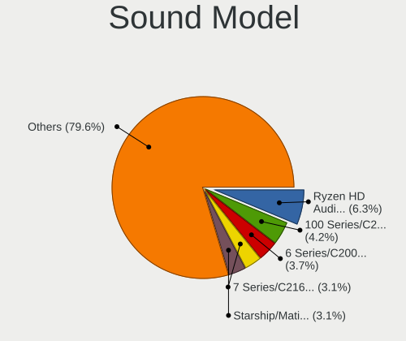

| Model                                                                      | Desktops | Percent |
|----------------------------------------------------------------------------|----------|---------|
| AMD Ryzen HD Audio Controller                                              | 24       | 6.28%   |
| Intel 100 Series/C230 Series Chipset Family HD Audio Controller            | 16       | 4.19%   |
| Intel 6 Series/C200 Series Chipset Family High Definition Audio Controller | 14       | 3.66%   |
| Intel 7 Series/C216 Chipset Family High Definition Audio Controller        | 12       | 3.14%   |
| AMD Starship/Matisse HD Audio Controller                                   | 12       | 3.14%   |
| Intel 200 Series PCH HD Audio                                              | 11       | 2.88%   |
| AMD Radeon High Definition Audio Controller                                | 11       | 2.88%   |
| AMD Renoir/Cezanne HDMI/DP Audio Controller                                | 10       | 2.62%   |
| Intel 8 Series/C220 Series Chipset High Definition Audio Controller        | 9        | 2.36%   |
| AMD SBx00 Azalia (Intel HDA)                                               | 9        | 2.36%   |
| Nvidia GP107GL High Definition Audio Controller                            | 8        | 2.09%   |
| Nvidia GP106 High Definition Audio Controller                              | 8        | 2.09%   |
| Intel Cannon Lake PCH cAVS                                                 | 8        | 2.09%   |
| AMD Family 17h (Models 00h-0fh) HD Audio Controller                        | 8        | 2.09%   |
| AMD Ellesmere HDMI Audio [Radeon RX 470/480 / 570/580/590]                 | 8        | 2.09%   |
| Intel NM10/ICH7 Family High Definition Audio Controller                    | 7        | 1.83%   |
| Intel Alder Lake-S HD Audio Controller                                     | 7        | 1.83%   |
| AMD FCH Azalia Controller                                                  | 7        | 1.83%   |
| Nvidia GP108 High Definition Audio Controller                              | 6        | 1.57%   |
| AMD Oland/Hainan/Cape Verde/Pitcairn HDMI Audio [Radeon HD 7000 Series]    | 6        | 1.57%   |
| Nvidia GA104 High Definition Audio Controller                              | 5        | 1.31%   |
| Intel Xeon E3-1200 v3/4th Gen Core Processor HD Audio Controller           | 5        | 1.31%   |
| Intel 82801JI (ICH10 Family) HD Audio Controller                           | 5        | 1.31%   |
| Intel 82801I (ICH9 Family) HD Audio Controller                             | 5        | 1.31%   |
| AMD Navi 21/23 HDMI/DP Audio Controller                                    | 5        | 1.31%   |
| Nvidia TU107 GeForce GTX 1650 High Definition Audio Controller             | 4        | 1.05%   |
| Nvidia High Definition Audio Controller                                    | 4        | 1.05%   |
| Nvidia GM206 High Definition Audio Controller                              | 4        | 1.05%   |
| Nvidia GK208 HDMI/DP Audio Controller                                      | 4        | 1.05%   |
| Intel Comet Lake PCH cAVS                                                  | 4        | 1.05%   |
| Intel 82801H (ICH8 Family) HD Audio Controller                             | 4        | 1.05%   |
| C-Media Electronics Audio Adapter (Unitek Y-247A)                          | 4        | 1.05%   |
| AMD Raven/Raven2/Fenghuang HDMI/DP Audio Controller                        | 4        | 1.05%   |
| Nvidia TU106 High Definition Audio Controller                              | 3        | 0.79%   |
| Nvidia GF119 HDMI Audio Controller                                         | 3        | 0.79%   |
| Nvidia GF108 High Definition Audio Controller                              | 3        | 0.79%   |
| Nvidia GF106 High Definition Audio Controller                              | 3        | 0.79%   |
| Nvidia AD104 High Definition Audio Controller                              | 3        | 0.79%   |
| Intel Tiger Lake-H HD Audio Controller                                     | 3        | 0.79%   |
| Intel Raptor Lake High Definition Audio Controller                         | 3        | 0.79%   |

Memory
------

Memory Vendor
-------------

Memory module vendors

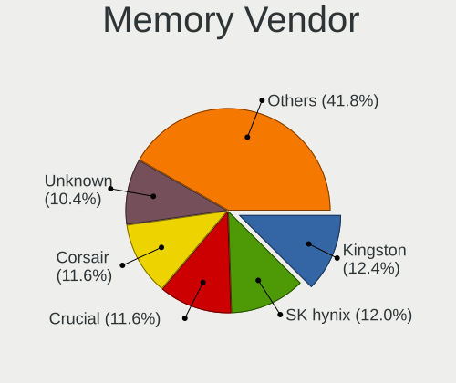

| Vendor                                  | Desktops | Percent |
|-----------------------------------------|----------|---------|
| Kingston                                | 31       | 12.45%  |
| SK hynix                                | 30       | 12.05%  |
| Crucial                                 | 29       | 11.65%  |
| Corsair                                 | 29       | 11.65%  |
| Unknown                                 | 26       | 10.44%  |
| Samsung Electronics                     | 25       | 10.04%  |
| G.Skill                                 | 17       | 6.83%   |
| Micron Technology                       | 15       | 6.02%   |
| Team                                    | 6        | 2.41%   |
| Unknown                                 | 6        | 2.41%   |
| Nanya Technology                        | 5        | 2.01%   |
| A-DATA Technology                       | 5        | 2.01%   |
| Unknown (ABCD)                          | 3        | 1.2%    |
| Unknown (0x0B45)                        | 2        | 0.8%    |
| Timetec                                 | 2        | 0.8%    |
| Silicon Power Computer & Communications | 2        | 0.8%    |
| Ramaxel Technology                      | 2        | 0.8%    |
| Elpida                                  | 2        | 0.8%    |
| V-GeN                                   | 1        | 0.4%    |
| Unknown (0x0CAB)                        | 1        | 0.4%    |
| Qumo                                    | 1        | 0.4%    |
| Qimonda                                 | 1        | 0.4%    |
| Patriot                                 | 1        | 0.4%    |
| OM Nanotech                             | 1        | 0.4%    |
| Multilaser                              | 1        | 0.4%    |
| Lexar Co Limited                        | 1        | 0.4%    |
| Lexar                                   | 1        | 0.4%    |
| Apacer                                  | 1        | 0.4%    |
| 2C0C0803D720D6BA                        | 1        | 0.4%    |
| 2C0C0803D720D614                        | 1        | 0.4%    |

Memory Model
------------

Memory module models

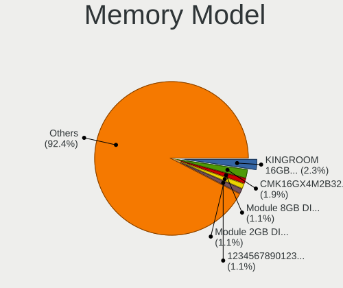

| Model                                                          | Desktops | Percent |
|----------------------------------------------------------------|----------|---------|
| Unknown                                                        | 6        | 2.28%   |
| Corsair RAM CMK16GX4M2B3200C16 8GB DIMM DDR4 3600MT/s          | 5        | 1.9%    |
| Unknown RAM Module 8GB DIMM DDR3 1600MT/s                      | 3        | 1.14%   |
| Unknown RAM Module 2GB DIMM 800MT/s                            | 3        | 1.14%   |
| Unknown (ABCD) RAM 123456789012345678 2GB DIMM LPDDR4 2133MT/s | 3        | 1.14%   |
| SK hynix RAM HMT451U6BFR8C-PB 4GB DIMM DDR3 1600MT/s           | 3        | 1.14%   |
| Samsung RAM M378B5273DH0-CH9 4GB DIMM DDR3 2133MT/s            | 3        | 1.14%   |
| Samsung RAM M3 78T2863QZS-CF7 1GB DIMM DDR2 800MT/s            | 3        | 1.14%   |
| G.Skill RAM F4-3200C16-8GVKB 8GB DIMM DDR4 4000MT/s            | 3        | 1.14%   |
| Unknown RAM Module 8GB DIMM DDR4 2667MT/s                      | 2        | 0.76%   |
| Unknown RAM Module 2GB DIMM DDR2 667MT/s                       | 2        | 0.76%   |
| Unknown RAM Module 2GB DIMM DDR2                               | 2        | 0.76%   |
| Unknown RAM Module 1GB DIMM DDR2 667MT/s                       | 2        | 0.76%   |
| SK hynix RAM HMT351U6EFR8C-PB 4GB DIMM DDR3 1600MT/s           | 2        | 0.76%   |
| SK hynix RAM HMA451U6AFR8N-TF 4GB DIMM DDR4 2133MT/s           | 2        | 0.76%   |
| Samsung RAM M378B5173QH0-CK0 4GB DIMM DDR3                     | 2        | 0.76%   |
| Samsung RAM M378A1K43CB2-CRC 8GB DIMM DDR4 3500MT/s            | 2        | 0.76%   |
| Micron RAM 8ATF1G64AZ-2G6E1 8GB DIMM DDR4 2667MT/s             | 2        | 0.76%   |
| Kingston RAM KHX2666C16/16G 16GB DIMM DDR4 3200MT/s            | 2        | 0.76%   |
| Kingston RAM KHX2400C15D4/4G 4GB DIMM DDR4 3151MT/s            | 2        | 0.76%   |
| Kingston RAM KHX2400C15/8G 8GB DIMM DDR4 3400MT/s              | 2        | 0.76%   |
| Crucial RAM CT51264BD160BJ.M8F 4GB DIMM DDR3 1600MT/s          | 2        | 0.76%   |
| Crucial RAM CT16G4DFRA32A.M16FE 16GB DIMM DDR4 3200MT/s        | 2        | 0.76%   |
| Corsair RAM CMK32GX4M2B3200C16 16GB DIMM DDR4 3800MT/s         | 2        | 0.76%   |
| Corsair RAM CMK16GX4M2E3200C16 8GB DIMM DDR4 3466MT/s          | 2        | 0.76%   |
| Corsair RAM CMK16GX4M2B3000C15 8GB DIMM DDR4 3600MT/s          | 2        | 0.76%   |
| V-GeN RAM D4H4GL26A8TS5 4GB DIMM DDR4 2400MT/s                 | 1        | 0.38%   |
| Unknown RAM Module 8GB DIMM DDR4 3200MT/s                      | 1        | 0.38%   |
| Unknown RAM Module 4GB DIMM DDR3 1600MT/s                      | 1        | 0.38%   |
| Unknown RAM Module 4GB DIMM DDR3 1333MT/s                      | 1        | 0.38%   |
| Unknown RAM Module 4GB DIMM DDR3                               | 1        | 0.38%   |
| Unknown RAM Module 4GB DIMM 1333MT/s                           | 1        | 0.38%   |
| Unknown RAM Module 4GB DIMM                                    | 1        | 0.38%   |
| Unknown RAM Module 2GB DIMM SDRAM 800MT/s                      | 1        | 0.38%   |
| Unknown RAM Module 2GB DIMM SDRAM 667MT/s                      | 1        | 0.38%   |
| Unknown RAM Module 2GB DIMM SDRAM                              | 1        | 0.38%   |
| Unknown RAM Module 2GB DIMM DDR3 1333MT/s                      | 1        | 0.38%   |
| Unknown RAM Module 2GB DIMM DDR2 800MT/s                       | 1        | 0.38%   |
| Unknown RAM Module 2GB DIMM 1333MT/s                           | 1        | 0.38%   |
| Unknown RAM Module 2GB DIMM 1066MT/s                           | 1        | 0.38%   |

Memory Kind
-----------

Memory module kinds

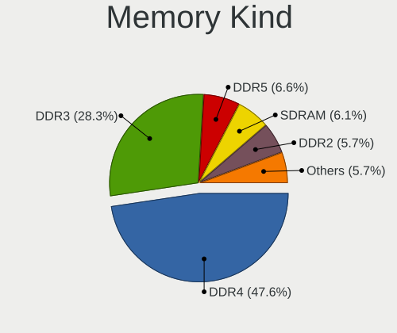

| Kind    | Desktops | Percent |
|---------|----------|---------|
| DDR4    | 101      | 47.64%  |
| DDR3    | 60       | 28.3%   |
| DDR5    | 14       | 6.6%    |
| SDRAM   | 13       | 6.13%   |
| DDR2    | 12       | 5.66%   |
| Unknown | 8        | 3.77%   |
| LPDDR4  | 4        | 1.89%   |

Memory Form Factor
------------------

Physical design of the memory module

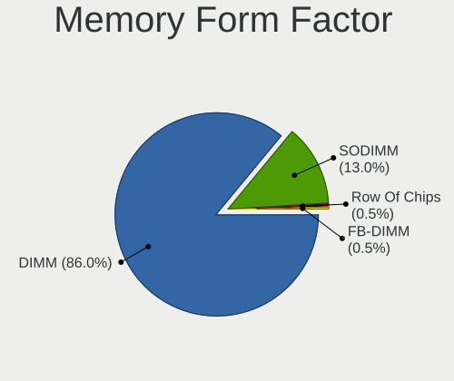

| Name         | Desktops | Percent |
|--------------|----------|---------|
| DIMM         | 178      | 85.99%  |
| SODIMM       | 27       | 13.04%  |
| Row Of Chips | 1        | 0.48%   |
| FB-DIMM      | 1        | 0.48%   |

Memory Size
-----------

Memory module size

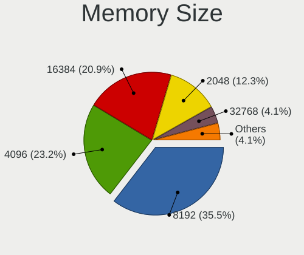

| Size  | Desktops | Percent |
|-------|----------|---------|
| 8192  | 78       | 35.45%  |
| 4096  | 51       | 23.18%  |
| 16384 | 46       | 20.91%  |
| 2048  | 27       | 12.27%  |
| 32768 | 9        | 4.09%   |
| 1024  | 7        | 3.18%   |
| 65536 | 1        | 0.45%   |
| 512   | 1        | 0.45%   |

Memory Speed
------------

Memory module speed

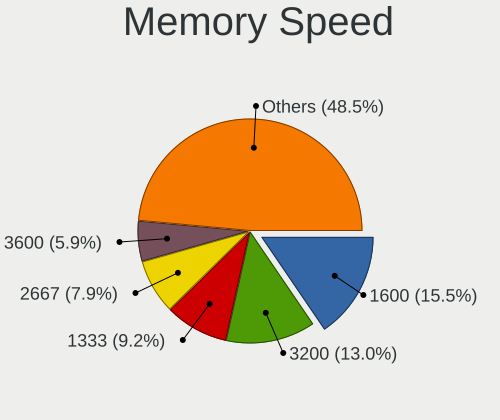

| Speed   | Desktops | Percent |
|---------|----------|---------|
| 1600    | 37       | 15.48%  |
| 3200    | 31       | 12.97%  |
| 1333    | 22       | 9.21%   |
| 2667    | 19       | 7.95%   |
| 3600    | 14       | 5.86%   |
| 2400    | 12       | 5.02%   |
| 2133    | 12       | 5.02%   |
| 800     | 9        | 3.77%   |
| 6000    | 7        | 2.93%   |
| 667     | 6        | 2.51%   |
| Unknown | 6        | 2.51%   |
| 1866    | 5        | 2.09%   |
| 4000    | 4        | 1.67%   |
| 1800    | 4        | 1.67%   |
| 3400    | 3        | 1.26%   |
| 2666    | 3        | 1.26%   |
| 1067    | 3        | 1.26%   |
| 5600    | 2        | 0.84%   |
| 4800    | 2        | 0.84%   |
| 3800    | 2        | 0.84%   |
| 3733    | 2        | 0.84%   |
| 3500    | 2        | 0.84%   |
| 3466    | 2        | 0.84%   |
| 3151    | 2        | 0.84%   |
| 3000    | 2        | 0.84%   |
| 2933    | 2        | 0.84%   |
| 2800    | 2        | 0.84%   |
| 2048    | 2        | 0.84%   |
| 1867    | 2        | 0.84%   |
| 12800   | 1        | 0.42%   |
| 6200    | 1        | 0.42%   |
| 5200    | 1        | 0.42%   |
| 4333    | 1        | 0.42%   |
| 4267    | 1        | 0.42%   |
| 3933    | 1        | 0.42%   |
| 3334    | 1        | 0.42%   |
| 3266    | 1        | 0.42%   |
| 3066    | 1        | 0.42%   |
| 2733    | 1        | 0.42%   |
| 2700    | 1        | 0.42%   |

Printers & scanners
-------------------

Printer Vendor
--------------

Printer device vendors

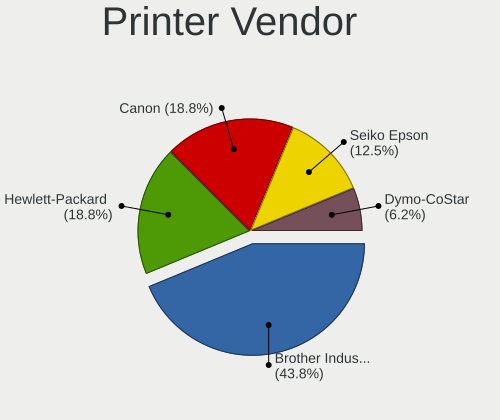

| Vendor             | Desktops | Percent |
|--------------------|----------|---------|
| Brother Industries | 7        | 43.75%  |
| Hewlett-Packard    | 3        | 18.75%  |
| Canon              | 3        | 18.75%  |
| Seiko Epson        | 2        | 12.5%   |
| Dymo-CoStar        | 1        | 6.25%   |

Printer Model
-------------

Printer device models

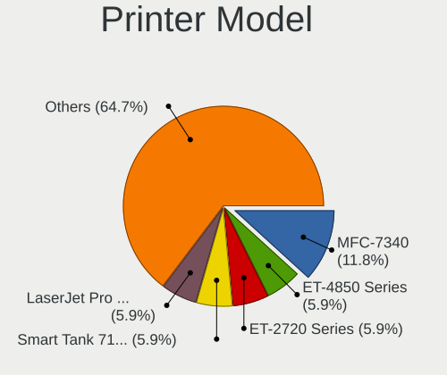

| Model                        | Desktops | Percent |
|------------------------------|----------|---------|
| Brother MFC-7340             | 2        | 11.76%  |
| Seiko Epson ET-4850 Series   | 1        | 5.88%   |
| Seiko Epson ET-2720 Series   | 1        | 5.88%   |
| HP Smart Tank 710-720 series | 1        | 5.88%   |
| HP LaserJet Pro M148-M149    | 1        | 5.88%   |
| HP Deskjet 3510 series       | 1        | 5.88%   |
| Dymo-CoStar LabelWriter 450  | 1        | 5.88%   |
| Canon PIXMA MG5600 Series    | 1        | 5.88%   |
| Canon PIXMA MG2500 Series    | 1        | 5.88%   |
| Canon PIXMA iP4000           | 1        | 5.88%   |
| Brother MFC-7360N            | 1        | 5.88%   |
| Brother HL-L2400DWE          | 1        | 5.88%   |
| Brother HL-L2380DW           | 1        | 5.88%   |
| Brother HL-L2350DW series    | 1        | 5.88%   |
| Brother HL-52x0 series       | 1        | 5.88%   |
| Brother DCP-L2500D           | 1        | 5.88%   |

Scanner Vendor
--------------

Scanner device vendors

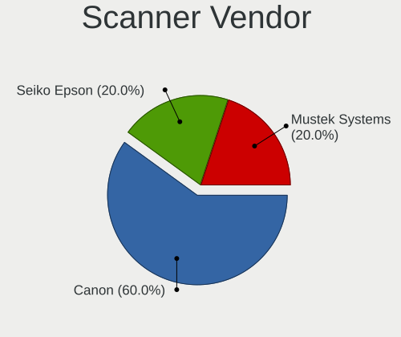

| Vendor         | Desktops | Percent |
|----------------|----------|---------|
| Canon          | 3        | 60%     |
| Seiko Epson    | 1        | 20%     |
| Mustek Systems | 1        | 20%     |

Scanner Model
-------------

Scanner device models

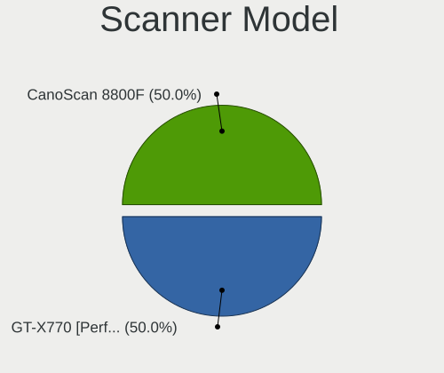

| Model                                 | Desktops | Percent |
|---------------------------------------|----------|---------|
| Seiko Epson GT-X770 [Perfection V500] | 1        | 20%     |
| Mustek Systems BearPaw 1200 CU Plus   | 1        | 20%     |
| Canon CanoScan LiDE 700F              | 1        | 20%     |
| Canon CanoScan LiDE 210               | 1        | 20%     |
| Canon CanoScan 8800F                  | 1        | 20%     |

Camera
------

Camera Vendor
-------------

Camera device vendors

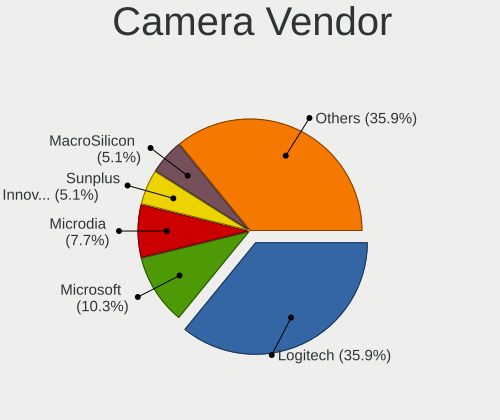

| Vendor                                 | Desktops | Percent |
|----------------------------------------|----------|---------|
| Logitech                               | 14       | 35.9%   |
| Microsoft                              | 4        | 10.26%  |
| Microdia                               | 3        | 7.69%   |
| Sunplus Innovation Technology          | 2        | 5.13%   |
| MacroSilicon                           | 2        | 5.13%   |
| Generalplus Technology                 | 2        | 5.13%   |
| Z-Star Microelectronics                | 1        | 2.56%   |
| YGTek                                  | 1        | 2.56%   |
| USB Cam Manufacturer                   | 1        | 2.56%   |
| Sonix Technology                       | 1        | 2.56%   |
| Lenovo                                 | 1        | 2.56%   |
| Hewlett-Packard                        | 1        | 2.56%   |
| Chicony Electronics                    | 1        | 2.56%   |
| Cheng Uei Precision Industry (Foxlink) | 1        | 2.56%   |
| Aveo Technology                        | 1        | 2.56%   |
| ARC International                      | 1        | 2.56%   |
| Alcor Micro                            | 1        | 2.56%   |
| Unknown                                | 1        | 2.56%   |

Camera Model
------------

Camera device models

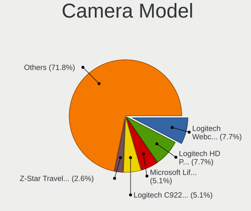

| Model                                                       | Desktops | Percent |
|-------------------------------------------------------------|----------|---------|
| Logitech Webcam C270                                        | 3        | 7.69%   |
| Logitech HD Pro Webcam C920                                 | 3        | 7.69%   |
| Microsoft LifeCam HD-3000                                   | 2        | 5.13%   |
| Logitech C922 Pro Stream Webcam                             | 2        | 5.13%   |
| Z-Star Traveler TV 6500 SF Dia-scanner                      | 1        | 2.56%   |
| YGTek Webcam                                                | 1        | 2.56%   |
| USB Cam Manufacturer HDMI USB Camera                        | 1        | 2.56%   |
| Sunplus web camera                                          | 1        | 2.56%   |
| Sunplus SPCA2281 Web Camera                                 | 1        | 2.56%   |
| Sonix GENERAL WEBCAM                                        | 1        | 2.56%   |
| Microsoft LifeCam VX-800                                    | 1        | 2.56%   |
| Microsoft LifeCam VX-5000                                   | 1        | 2.56%   |
| Microdia Webcam Vitade AF                                   | 1        | 2.56%   |
| Microdia Sonix USB 2.0 Camera                               | 1        | 2.56%   |
| Microdia CyberTrack H7                                      | 1        | 2.56%   |
| MacroSilicon USB Video                                      | 1        | 2.56%   |
| MacroSilicon MS210x Video Grabber [EasierCAP]               | 1        | 2.56%   |
| Logitech QuickCam Communicate MP/S5500                      | 1        | 2.56%   |
| Logitech Portable Webcam C905                               | 1        | 2.56%   |
| Logitech HD Webcam C910                                     | 1        | 2.56%   |
| Logitech HD Webcam C615                                     | 1        | 2.56%   |
| Logitech C920 PRO HD Webcam                                 | 1        | 2.56%   |
| Logitech BRIO Ultra HD Webcam                               | 1        | 2.56%   |
| Lenovo Lenovo FHD Webcam Audio                              | 1        | 2.56%   |
| HP Webcam HD 2300                                           | 1        | 2.56%   |
| Generalplus GENERAL WEBCAM                                  | 1        | 2.56%   |
| Generalplus 808 Camera #9 (web-cam mode)                    | 1        | 2.56%   |
| Chicony CNF8050 Webcam                                      | 1        | 2.56%   |
| Cheng Uei Precision Industry (Foxlink) HP Integrated Webcam | 1        | 2.56%   |
| Aveo Camera                                                 | 1        | 2.56%   |
| ARC International Camera                                    | 1        | 2.56%   |
| Alcor Micro USB 2.0 Camera                                  | 1        | 2.56%   |
| Unknown                                                     | 1        | 2.56%   |

Security
--------

Fingerprint Vendor
------------------

Fingerprint sensor vendors

Zero info for selected period =(

Fingerprint Model
-----------------

Fingerprint sensor models

Zero info for selected period =(

Chipcard Vendor
---------------

Chipcard module vendors

| Vendor              | Desktops | Percent |
|---------------------|----------|---------|
| Chicony Electronics | 2        | 100%    |

Chipcard Model
--------------

Chipcard module models

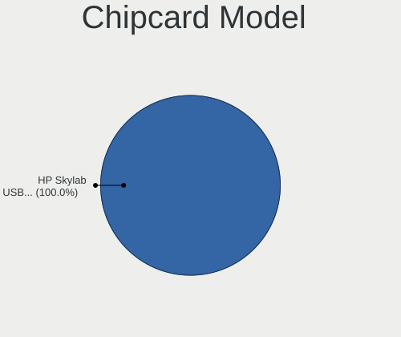

| Model                                                | Desktops | Percent |
|------------------------------------------------------|----------|---------|
| Chicony Electronics HP Skylab USB Smartcard Keyboard | 2        | 100%    |

Unsupported
-----------

Unsupported Devices
-------------------

Total unsupported devices on board

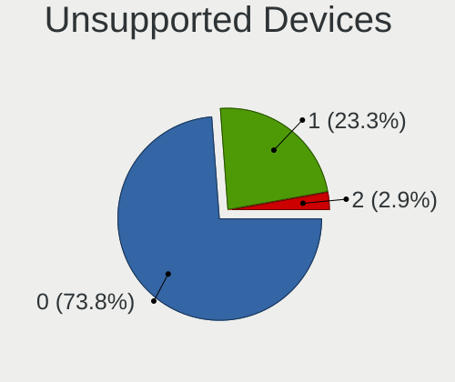

| Total | Desktops | Percent |
|-------|----------|---------|
| 0     | 155      | 73.81%  |
| 1     | 49       | 23.33%  |
| 2     | 6        | 2.86%   |

Unsupported Device Types
------------------------

Types of unsupported devices

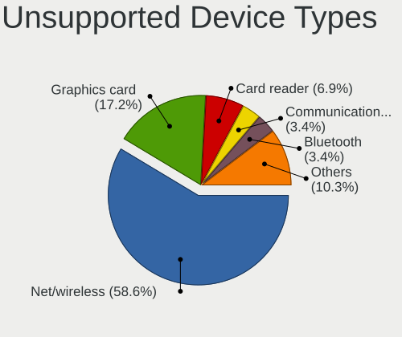

| Type                     | Desktops | Percent |
|--------------------------|----------|---------|
| Net/wireless             | 34       | 58.62%  |
| Graphics card            | 10       | 17.24%  |
| Card reader              | 4        | 6.9%    |
| Communication controller | 2        | 3.45%   |
| Bluetooth                | 2        | 3.45%   |
| Unassigned class         | 1        | 1.72%   |
| Storage/raid             | 1        | 1.72%   |
| Storage/ata              | 1        | 1.72%   |
| Network                  | 1        | 1.72%   |
| Multimedia controller    | 1        | 1.72%   |
| Chipcard                 | 1        | 1.72%   |

