MX 23 - Tested Hardware & Statistics (Desktops)
-----------------------------------------------

A project to collect tested hardware configurations for MX 23.

Anyone can contribute to this report by the [hw-probe](https://github.com/linuxhw/hw-probe) tool:

    sudo -E hw-probe -all -upload

Please contribute! Especially if your hardware is rare.

Contents
--------

* [ Test Cases ](#test-cases)

* [ System ](#system)
  - [ Kernel                   ](#kernel)
  - [ Kernel Family            ](#kernel-family)
  - [ Kernel Major Ver.        ](#kernel-major-ver)
  - [ Arch                     ](#arch)
  - [ DE                       ](#de)
  - [ Display Server           ](#display-server)
  - [ Display Manager          ](#display-manager)
  - [ OS Lang                  ](#os-lang)
  - [ Boot Mode                ](#boot-mode)
  - [ Filesystem               ](#filesystem)
  - [ Part. scheme             ](#part-scheme)
  - [ Dual Boot with Linux/BSD ](#dual-boot-with-linuxbsd)
  - [ Dual Boot (Win)          ](#dual-boot-win)

* [ Board ](#board)
  - [ Vendor                   ](#vendor)
  - [ Model                    ](#model)
  - [ Model Family             ](#model-family)
  - [ MFG Year                 ](#mfg-year)
  - [ Form Factor              ](#form-factor)
  - [ Secure Boot              ](#secure-boot)
  - [ Coreboot                 ](#coreboot)
  - [ RAM Size                 ](#ram-size)
  - [ RAM Used                 ](#ram-used)
  - [ Total Drives             ](#total-drives)
  - [ Has CD-ROM               ](#has-cd-rom)
  - [ Has Ethernet             ](#has-ethernet)
  - [ Has WiFi                 ](#has-wifi)
  - [ Has Bluetooth            ](#has-bluetooth)

* [ Location ](#location)
  - [ Country                  ](#country)
  - [ City                     ](#city)

* [ Drives ](#drives)
  - [ Drive Vendor             ](#drive-vendor)
  - [ Drive Model              ](#drive-model)
  - [ HDD Vendor               ](#hdd-vendor)
  - [ SSD Vendor               ](#ssd-vendor)
  - [ Drive Kind               ](#drive-kind)
  - [ Drive Connector          ](#drive-connector)
  - [ Drive Size               ](#drive-size)
  - [ Space Total              ](#space-total)
  - [ Space Used               ](#space-used)
  - [ Malfunc. Drives          ](#malfunc-drives)
  - [ Malfunc. Drive Vendor    ](#malfunc-drive-vendor)
  - [ Malfunc. HDD Vendor      ](#malfunc-hdd-vendor)
  - [ Malfunc. Drive Kind      ](#malfunc-drive-kind)
  - [ Failed Drives            ](#failed-drives)
  - [ Failed Drive Vendor      ](#failed-drive-vendor)
  - [ Drive Status             ](#drive-status)

* [ Storage controller ](#storage-controller)
  - [ Storage Vendor           ](#storage-vendor)
  - [ Storage Model            ](#storage-model)
  - [ Storage Kind             ](#storage-kind)

* [ Processor ](#processor)
  - [ CPU Vendor               ](#cpu-vendor)
  - [ CPU Model                ](#cpu-model)
  - [ CPU Model Family         ](#cpu-model-family)
  - [ CPU Cores                ](#cpu-cores)
  - [ CPU Sockets              ](#cpu-sockets)
  - [ CPU Threads              ](#cpu-threads)
  - [ CPU Op-Modes             ](#cpu-op-modes)
  - [ CPU Microcode            ](#cpu-microcode)
  - [ CPU Microarch            ](#cpu-microarch)

* [ Graphics ](#graphics)
  - [ GPU Vendor               ](#gpu-vendor)
  - [ GPU Model                ](#gpu-model)
  - [ GPU Combo                ](#gpu-combo)
  - [ GPU Driver               ](#gpu-driver)
  - [ GPU Memory               ](#gpu-memory)

* [ Monitor ](#monitor)
  - [ Monitor Vendor           ](#monitor-vendor)
  - [ Monitor Model            ](#monitor-model)
  - [ Monitor Resolution       ](#monitor-resolution)
  - [ Monitor Diagonal         ](#monitor-diagonal)
  - [ Monitor Width            ](#monitor-width)
  - [ Aspect Ratio             ](#aspect-ratio)
  - [ Monitor Area             ](#monitor-area)
  - [ Pixel Density            ](#pixel-density)
  - [ Multiple Monitors        ](#multiple-monitors)

* [ Network ](#network)
  - [ Net Controller Vendor    ](#net-controller-vendor)
  - [ Net Controller Model     ](#net-controller-model)
  - [ Wireless Vendor          ](#wireless-vendor)
  - [ Wireless Model           ](#wireless-model)
  - [ Ethernet Vendor          ](#ethernet-vendor)
  - [ Ethernet Model           ](#ethernet-model)
  - [ Net Controller Kind      ](#net-controller-kind)
  - [ Used Controller          ](#used-controller)
  - [ NICs                     ](#nics)
  - [ IPv6                     ](#ipv6)

* [ Bluetooth ](#bluetooth)
  - [ Bluetooth Vendor         ](#bluetooth-vendor)
  - [ Bluetooth Model          ](#bluetooth-model)

* [ Sound ](#sound)
  - [ Sound Vendor             ](#sound-vendor)
  - [ Sound Model              ](#sound-model)

* [ Memory ](#memory)
  - [ Memory Vendor            ](#memory-vendor)
  - [ Memory Model             ](#memory-model)
  - [ Memory Kind              ](#memory-kind)
  - [ Memory Form Factor       ](#memory-form-factor)
  - [ Memory Size              ](#memory-size)
  - [ Memory Speed             ](#memory-speed)

* [ Printers & scanners ](#printers--scanners)
  - [ Printer Vendor           ](#printer-vendor)
  - [ Printer Model            ](#printer-model)
  - [ Scanner Vendor           ](#scanner-vendor)
  - [ Scanner Model            ](#scanner-model)

* [ Camera ](#camera)
  - [ Camera Vendor            ](#camera-vendor)
  - [ Camera Model             ](#camera-model)

* [ Security ](#security)
  - [ Fingerprint Vendor       ](#fingerprint-vendor)
  - [ Fingerprint Model        ](#fingerprint-model)
  - [ Chipcard Vendor          ](#chipcard-vendor)
  - [ Chipcard Model           ](#chipcard-model)

* [ Unsupported ](#unsupported)
  - [ Unsupported Devices      ](#unsupported-devices)
  - [ Unsupported Device Types ](#unsupported-device-types)

Test Cases
----------

Total: 83

| Vendor   | Model                       | Probe                                                      | Date         |
|----------|-----------------------------|------------------------------------------------------------|--------------|
| ASRock   | X570 Phantom Gaming 4       | [b9519853cd](https://linux-hardware.org/?probe=b9519853cd) | May 05, 2024 |
| ASRock   | X570 Phantom Gaming 4       | [08cb15cda7](https://linux-hardware.org/?probe=08cb15cda7) | May 05, 2024 |
| ASUSTek  | M4A89GTD-PRO                | [d40738eda7](https://linux-hardware.org/?probe=d40738eda7) | Apr 28, 2024 |
| ASRock   | 980DE3/U3S3                 | [9ed5c55a61](https://linux-hardware.org/?probe=9ed5c55a61) | Apr 28, 2024 |
| ASUSTek  | TUF Gaming Z490-PLUS        | [c44f97261d](https://linux-hardware.org/?probe=c44f97261d) | Apr 24, 2024 |
| Dell     | 0K095G A02                  | [a5f4dd8567](https://linux-hardware.org/?probe=a5f4dd8567) | Apr 24, 2024 |
| Dell     | 0K095G A02                  | [0d7d9ad04d](https://linux-hardware.org/?probe=0d7d9ad04d) | Apr 24, 2024 |
| AMI      | Intel                       | [212fd4a0d8](https://linux-hardware.org/?probe=212fd4a0d8) | Apr 22, 2024 |
| AMI      | Intel                       | [2044003b5c](https://linux-hardware.org/?probe=2044003b5c) | Apr 22, 2024 |
| ASUSTek  | ROG STRIX B650-A GAMING ... | [980252a20c](https://linux-hardware.org/?probe=980252a20c) | Apr 18, 2024 |
| Gigabyte | Z370P D3-CF                 | [70446389fb](https://linux-hardware.org/?probe=70446389fb) | Apr 13, 2024 |
| ASUSTek  | Z170-A                      | [30127a97b5](https://linux-hardware.org/?probe=30127a97b5) | Apr 06, 2024 |
| ASRock   | H77 Pro4-M                  | [4202019d78](https://linux-hardware.org/?probe=4202019d78) | Apr 03, 2024 |
| Gigabyte | GA-78LMT-USB3               | [7f8a245399](https://linux-hardware.org/?probe=7f8a245399) | Mar 29, 2024 |
| Gigabyte | GA-78LMT-USB3               | [7b17376565](https://linux-hardware.org/?probe=7b17376565) | Mar 29, 2024 |
| Gigabyte | H81M-D2V                    | [6bc3e596e6](https://linux-hardware.org/?probe=6bc3e596e6) | Mar 28, 2024 |
| Gigabyte | B550I AORUS PRO AX          | [e8233f1a8a](https://linux-hardware.org/?probe=e8233f1a8a) | Mar 26, 2024 |
| Dell     | 0HMX8D A01                  | [8cd1470fc0](https://linux-hardware.org/?probe=8cd1470fc0) | Mar 25, 2024 |
| Foxconn  | 2ABF                        | [2eb785461f](https://linux-hardware.org/?probe=2eb785461f) | Mar 23, 2024 |
| Foxconn  | 45GM/45CM/45CM-S            | [4ed069d496](https://linux-hardware.org/?probe=4ed069d496) | Mar 09, 2024 |
| HP       | 2B5A 011                    | [8eb2546f52](https://linux-hardware.org/?probe=8eb2546f52) | Mar 09, 2024 |
| ASUSTek  | TUF Gaming B650M-E WIFI     | [e4944abc1f](https://linux-hardware.org/?probe=e4944abc1f) | Mar 03, 2024 |
| Dell     | 0M863N A01                  | [1db77a3f14](https://linux-hardware.org/?probe=1db77a3f14) | Feb 27, 2024 |
| Gigabyte | H310M S2H x.x               | [ce358b38bc](https://linux-hardware.org/?probe=ce358b38bc) | Feb 26, 2024 |
| ASUSTek  | SABERTOOTH 990FX R2.0       | [9b25d17d18](https://linux-hardware.org/?probe=9b25d17d18) | Feb 21, 2024 |
| Gigabyte | X570 GAMING X               | [fab0b459e0](https://linux-hardware.org/?probe=fab0b459e0) | Feb 18, 2024 |
| ASRock   | B450M Pro4-F                | [a98775e16e](https://linux-hardware.org/?probe=a98775e16e) | Feb 13, 2024 |
| ASRock   | 970 Extreme4                | [973c66c65d](https://linux-hardware.org/?probe=973c66c65d) | Feb 07, 2024 |
| HP       | 09E8h                       | [413788d555](https://linux-hardware.org/?probe=413788d555) | Feb 02, 2024 |
| Dell     | 00VTMF A01                  | [3298485dd9](https://linux-hardware.org/?probe=3298485dd9) | Jan 31, 2024 |
| HP       | 304Ah                       | [5e40a8acee](https://linux-hardware.org/?probe=5e40a8acee) | Jan 24, 2024 |
| ASUSTek  | TUF Gaming B660-PLUS WIF... | [6ae01879d8](https://linux-hardware.org/?probe=6ae01879d8) | Jan 23, 2024 |
| HP       | 0A5Ch                       | [f886596563](https://linux-hardware.org/?probe=f886596563) | Jan 23, 2024 |
| Gigabyte | B650I AORUS ULTRA           | [0da14a9376](https://linux-hardware.org/?probe=0da14a9376) | Jan 18, 2024 |
| HP       | 8750                        | [6dd29a1c24](https://linux-hardware.org/?probe=6dd29a1c24) | Jan 16, 2024 |
| Gigabyte | B650I AORUS ULTRA           | [33216d3bf8](https://linux-hardware.org/?probe=33216d3bf8) | Jan 16, 2024 |
| Unknown  | GB01                        | [33016aa27b](https://linux-hardware.org/?probe=33016aa27b) | Jan 11, 2024 |
| Unknown  | GB01                        | [551b27fa9b](https://linux-hardware.org/?probe=551b27fa9b) | Jan 11, 2024 |
| Dell     | 0KV62T A00                  | [17aa442f24](https://linux-hardware.org/?probe=17aa442f24) | Jan 10, 2024 |
| HP       | 8265                        | [da63a4f9c1](https://linux-hardware.org/?probe=da63a4f9c1) | Jan 05, 2024 |
| HP       | 8265                        | [94344dbe98](https://linux-hardware.org/?probe=94344dbe98) | Dec 28, 2023 |
| Dell     | 033FF6 A00                  | [977367b99e](https://linux-hardware.org/?probe=977367b99e) | Dec 26, 2023 |
| Dell     | 033FF6 A00                  | [88cad415fb](https://linux-hardware.org/?probe=88cad415fb) | Dec 21, 2023 |
| ASUSTek  | TUF Gaming X570-PLUS        | [f912bcd96a](https://linux-hardware.org/?probe=f912bcd96a) | Dec 20, 2023 |
| HP       | 8265                        | [cc0b59e7f7](https://linux-hardware.org/?probe=cc0b59e7f7) | Dec 13, 2023 |
| Gigabyte | MRHM7AP                     | [ba4400c919](https://linux-hardware.org/?probe=ba4400c919) | Dec 13, 2023 |
| ASRock   | A620M Pro RS WiFi           | [3bbc394b2e](https://linux-hardware.org/?probe=3bbc394b2e) | Dec 08, 2023 |
| Gigabyte | G41M-ES2L                   | [442d7a2388](https://linux-hardware.org/?probe=442d7a2388) | Dec 03, 2023 |
| MSI      | A68HM-P33 V2                | [bee7ef1689](https://linux-hardware.org/?probe=bee7ef1689) | Nov 22, 2023 |
| HP       | 8265                        | [d798ead6f7](https://linux-hardware.org/?probe=d798ead6f7) | Nov 20, 2023 |
| Gigabyte | B365M DS3H                  | [23196bda4d](https://linux-hardware.org/?probe=23196bda4d) | Nov 14, 2023 |
| HP       | 3397                        | [67e178009d](https://linux-hardware.org/?probe=67e178009d) | Nov 09, 2023 |
| Gigabyte | B365M DS3H                  | [25ab11fca1](https://linux-hardware.org/?probe=25ab11fca1) | Nov 08, 2023 |
| HP       | 2B34                        | [52737869e2](https://linux-hardware.org/?probe=52737869e2) | Nov 06, 2023 |
| ASRock   | A320M Pro4-F                | [7dab52cd8c](https://linux-hardware.org/?probe=7dab52cd8c) | Nov 05, 2023 |
| ASUSTek  | STRIX H270F GAMING          | [e95902544f](https://linux-hardware.org/?probe=e95902544f) | Nov 03, 2023 |
| Gigabyte | B365M DS3H                  | [0a5b6171b7](https://linux-hardware.org/?probe=0a5b6171b7) | Oct 30, 2023 |
| Intel    | H81                         | [2e37259d45](https://linux-hardware.org/?probe=2e37259d45) | Oct 29, 2023 |
| MSI      | B550M PRO-VDH WIFI          | [2cb1fb1ec9](https://linux-hardware.org/?probe=2cb1fb1ec9) | Oct 27, 2023 |
| HP       | 339A                        | [d0deadc097](https://linux-hardware.org/?probe=d0deadc097) | Oct 27, 2023 |
| Lenovo   | 376D SDK0T76465 WIN 3422... | [2a97bb6c00](https://linux-hardware.org/?probe=2a97bb6c00) | Oct 27, 2023 |
| AZW      | SER V1                      | [8c734a7dfc](https://linux-hardware.org/?probe=8c734a7dfc) | Oct 21, 2023 |
| Acer     | Aspire TC-1760              | [9e4ac23c4b](https://linux-hardware.org/?probe=9e4ac23c4b) | Oct 19, 2023 |
| Gigabyte | Z690 UD AX DDR4             | [273e4a294a](https://linux-hardware.org/?probe=273e4a294a) | Oct 15, 2023 |
| ASUSTek  | PRIME H610M-A D4            | [665eba904c](https://linux-hardware.org/?probe=665eba904c) | Oct 14, 2023 |
| ASUSTek  | PRIME B350-PLUS             | [00fc33d73e](https://linux-hardware.org/?probe=00fc33d73e) | Oct 13, 2023 |
| ASUSTek  | PRIME H610M-A D4            | [6f4fb2dff4](https://linux-hardware.org/?probe=6f4fb2dff4) | Oct 10, 2023 |
| MSI      | G41M4                       | [0554e9757f](https://linux-hardware.org/?probe=0554e9757f) | Sep 26, 2023 |
| ASUSTek  | TUF Gaming X570-PLUS        | [4054ad9d77](https://linux-hardware.org/?probe=4054ad9d77) | Sep 26, 2023 |
| ASUSTek  | TUF Gaming X570-PLUS        | [76d936bb5b](https://linux-hardware.org/?probe=76d936bb5b) | Sep 26, 2023 |
| ASUSTek  | Z97-P                       | [d72c4b5cce](https://linux-hardware.org/?probe=d72c4b5cce) | Sep 06, 2023 |
| Foxconn  | 2ABF                        | [baad816533](https://linux-hardware.org/?probe=baad816533) | Sep 05, 2023 |
| Gigabyte | PH67A-D3-B3                 | [a9fdf4f92b](https://linux-hardware.org/?probe=a9fdf4f92b) | Sep 03, 2023 |
| ASRock   | J4205-ITX                   | [8831793b97](https://linux-hardware.org/?probe=8831793b97) | Sep 03, 2023 |
| ASUSTek  | PRIME B550-PLUS             | [51ea627e30](https://linux-hardware.org/?probe=51ea627e30) | Aug 25, 2023 |
| ASUSTek  | PRIME B550-PLUS             | [c8e9f89359](https://linux-hardware.org/?probe=c8e9f89359) | Aug 25, 2023 |
| Pegatron | 2AD5                        | [fcb0ac31fe](https://linux-hardware.org/?probe=fcb0ac31fe) | Aug 23, 2023 |
| Gigabyte | MZGLKCP-00                  | [c6f294e543](https://linux-hardware.org/?probe=c6f294e543) | Aug 21, 2023 |
| Gigabyte | MZGLKCP-00                  | [d6e0b89f34](https://linux-hardware.org/?probe=d6e0b89f34) | Aug 21, 2023 |
| Biostar  | H310MHC2                    | [12f3b0d269](https://linux-hardware.org/?probe=12f3b0d269) | Aug 20, 2023 |
| Gigabyte | H510M S2H                   | [e5661bef5b](https://linux-hardware.org/?probe=e5661bef5b) | Aug 16, 2023 |
| ASUSTek  | Z170 PRO GAMING             | [a0270160ad](https://linux-hardware.org/?probe=a0270160ad) | Aug 02, 2023 |
| Gigabyte | H61MA-D3V                   | [a37deef915](https://linux-hardware.org/?probe=a37deef915) | Apr 24, 2023 |

System
------

Kernel
------

Version of the Linux kernel

| Version                    | Desktops | Percent |
|----------------------------|----------|---------|
| 6.1.0-17-amd64             | 10       | 15.15%  |
| 6.1.0-13-amd64             | 10       | 15.15%  |
| 6.1.0-10-amd64             | 7        | 10.61%  |
| 6.5.0-1mx-ahs-amd64        | 5        | 7.58%   |
| 6.1.0-18-amd64             | 5        | 7.58%   |
| 6.4.0-1mx-ahs-amd64        | 4        | 6.06%   |
| 6.1.0-11-amd64             | 4        | 6.06%   |
| 6.7.12-1-liquorix-amd64    | 3        | 4.55%   |
| 6.6.11-amd64               | 2        | 3.03%   |
| 6.4.15-2-liquorix-amd64    | 2        | 3.03%   |
| 6.1.0-20-amd64             | 2        | 3.03%   |
| 6.6.7-x64v1-xanmod1        | 1        | 1.52%   |
| 6.5.5-2-liquorix-amd64     | 1        | 1.52%   |
| 6.5.11-1-liquorix-amd64    | 1        | 1.52%   |
| 6.5.0-2-amd64              | 1        | 1.52%   |
| 6.4.14-1-liquorix-amd64    | 1        | 1.52%   |
| 6.4.0-3mx-ahs-amd64        | 1        | 1.52%   |
| 6.3.9-1-liquorix-amd64     | 1        | 1.52%   |
| 6.1.0-16-amd64             | 1        | 1.52%   |
| 6.1.0-15-amd64             | 1        | 1.52%   |
| 6.1.0-13-686-pae           | 1        | 1.52%   |
| 5.10.197-antix.1-amd64-smp | 1        | 1.52%   |
| 5.10.0-21-amd64            | 1        | 1.52%   |

Kernel Family
-------------

Linux kernel without a distro release

| Version  | Desktops | Percent |
|----------|----------|---------|
| 6.1.0    | 39       | 60.94%  |
| 6.5.0    | 6        | 9.38%   |
| 6.4.0    | 5        | 7.81%   |
| 6.7.12   | 3        | 4.69%   |
| 6.6.11   | 2        | 3.13%   |
| 6.4.15   | 2        | 3.13%   |
| 6.6.7    | 1        | 1.56%   |
| 6.5.5    | 1        | 1.56%   |
| 6.5.11   | 1        | 1.56%   |
| 6.4.14   | 1        | 1.56%   |
| 6.3.9    | 1        | 1.56%   |
| 5.10.197 | 1        | 1.56%   |
| 5.10.0   | 1        | 1.56%   |

Kernel Major Ver.
-----------------

Linux kernel major version

| Version | Desktops | Percent |
|---------|----------|---------|
| 6.1     | 39       | 60.94%  |
| 6.5     | 8        | 12.5%   |
| 6.4     | 8        | 12.5%   |
| 6.7     | 3        | 4.69%   |
| 6.6     | 3        | 4.69%   |
| 5.10    | 2        | 3.13%   |
| 6.3     | 1        | 1.56%   |

Arch
----

OS architecture (x86_64, i586, etc.)

| Name   | Desktops | Percent |
|--------|----------|---------|
| x86_64 | 61       | 98.39%  |
| i686   | 1        | 1.61%   |

DE
--

Desktop Environment

| Name             | Desktops | Percent |
|------------------|----------|---------|
| XFCE             | 39       | 62.9%   |
| KDE5             | 19       | 30.65%  |
| MATE             | 1        | 1.61%   |
| LXQt             | 1        | 1.61%   |
| lightdm-xsession | 1        | 1.61%   |
| Unknown          | 1        | 1.61%   |

Display Server
--------------

X11 or Wayland

| Name | Desktops | Percent |
|------|----------|---------|
| X11  | 60       | 96.77%  |
| Web  | 1        | 1.61%   |
| Tty  | 1        | 1.61%   |

Display Manager
---------------

SDDM, LightDM, etc.

| Name    | Desktops | Percent |
|---------|----------|---------|
| LightDM | 42       | 67.74%  |
| SDDM    | 20       | 32.26%  |

OS Lang
-------

Language

| Lang  | Desktops | Percent |
|-------|----------|---------|
| en_US | 27       | 43.55%  |
| ru_RU | 4        | 6.45%   |
| es_ES | 4        | 6.45%   |
| en_GB | 4        | 6.45%   |
| de_DE | 4        | 6.45%   |
| it_IT | 3        | 4.84%   |
| fr_FR | 3        | 4.84%   |
| pl_PL | 2        | 3.23%   |
| hr_HR | 2        | 3.23%   |
| en_AU | 2        | 3.23%   |
| pt_BR | 1        | 1.61%   |
| ko_KR | 1        | 1.61%   |
| es_VE | 1        | 1.61%   |
| es_US | 1        | 1.61%   |
| es_MX | 1        | 1.61%   |
| en_IE | 1        | 1.61%   |
| de_AT | 1        | 1.61%   |

Boot Mode
---------

EFI or BIOS

| Mode | Desktops | Percent |
|------|----------|---------|
| EFI  | 39       | 61.9%   |
| BIOS | 24       | 38.1%   |

Filesystem
----------

Type of filesystem

| Type    | Desktops | Percent |
|---------|----------|---------|
| Ext4    | 55       | 88.71%  |
| Overlay | 4        | 6.45%   |
| Btrfs   | 2        | 3.23%   |
| Tmpfs   | 1        | 1.61%   |

Part. scheme
------------

Scheme of partitioning

| Type | Desktops | Percent |
|------|----------|---------|
| GPT  | 48       | 77.42%  |
| MBR  | 14       | 22.58%  |

Dual Boot with Linux/BSD
------------------------

Hosting more than one Linux/BSD

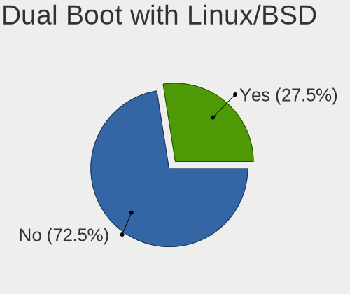

| Dual boot | Desktops | Percent |
|-----------|----------|---------|
| No        | 47       | 74.6%   |
| Yes       | 16       | 25.4%   |

Dual Boot (Win)
---------------

Hosting Linux and Windows

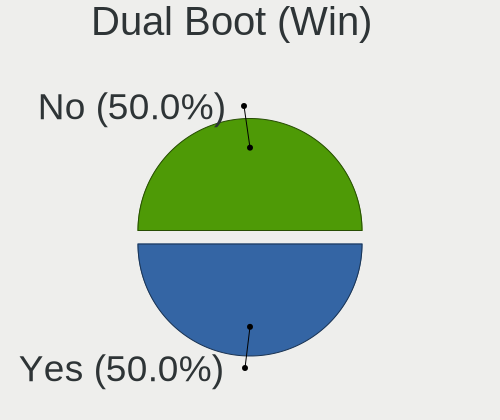

| Dual boot | Desktops | Percent |
|-----------|----------|---------|
| Yes       | 33       | 53.23%  |
| No        | 29       | 46.77%  |

Board
-----

Vendor
------

Motherboard manufacturer

| Name                | Desktops | Percent |
|---------------------|----------|---------|
| Gigabyte Technology | 14       | 22.58%  |
| ASUSTek Computer    | 14       | 22.58%  |
| Hewlett-Packard     | 9        | 14.52%  |
| ASRock              | 6        | 9.68%   |
| Dell                | 5        | 8.06%   |
| MSI                 | 3        | 4.84%   |
| Foxconn             | 3        | 4.84%   |
| Pegatron            | 1        | 1.61%   |
| Lenovo              | 1        | 1.61%   |
| Intel               | 1        | 1.61%   |
| Biostar             | 1        | 1.61%   |
| AZW                 | 1        | 1.61%   |
| AMI                 | 1        | 1.61%   |
| Acer                | 1        | 1.61%   |
| Unknown             | 1        | 1.61%   |

Model
-----

Motherboard model

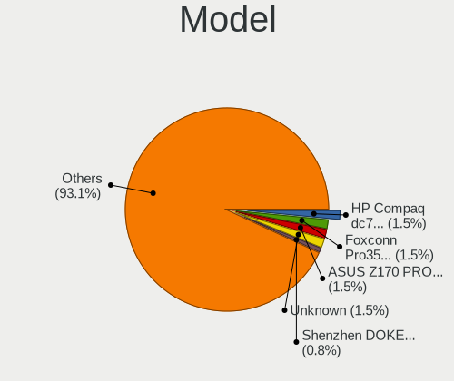

| Name                                  | Desktops | Percent |
|---------------------------------------|----------|---------|
| Foxconn Pro3500 Series                | 2        | 3.23%   |
| Pegatron 2AD5                         | 1        | 1.61%   |
| MSI MS-7C95                           | 1        | 1.61%   |
| MSI MS-7895                           | 1        | 1.61%   |
| MSI MS-7592                           | 1        | 1.61%   |
| Lenovo IdeaCentre 3 07ACH7 90U9001SIX | 1        | 1.61%   |
| Intel H81                             | 1        | 1.61%   |
| HP Z2 Tower G5 Workstation            | 1        | 1.61%   |
| HP EliteDesk 705 G3 MT                | 1        | 1.61%   |
| HP Compaq Pro 6300 SFF                | 1        | 1.61%   |
| HP Compaq Elite 8300 SFF              | 1        | 1.61%   |
| HP Compaq dc7700p Ultra-slim Desktop  | 1        | 1.61%   |
| HP Compaq dc5100 SFF(AG144AW)         | 1        | 1.61%   |
| HP Compaq 8100 Elite SFF PC           | 1        | 1.61%   |
| HP 280 G1 MT                          | 1        | 1.61%   |
| HP 20-e014                            | 1        | 1.61%   |
| Gigabyte Z370P D3                     | 1        | 1.61%   |
| Gigabyte X570 GAMING X                | 1        | 1.61%   |
| Gigabyte PH67A-D3-B3                  | 1        | 1.61%   |
| Gigabyte MZGLKCP-00                   | 1        | 1.61%   |
| Gigabyte MRHM7AP                      | 1        | 1.61%   |
| Gigabyte H81M-D2V                     | 1        | 1.61%   |
| Gigabyte H61MA-D3V                    | 1        | 1.61%   |
| Gigabyte H510M S2H                    | 1        | 1.61%   |
| Gigabyte H310M S2H 2.0                | 1        | 1.61%   |
| Gigabyte GA-78LMT-USB3                | 1        | 1.61%   |
| Gigabyte G41M-ES2L                    | 1        | 1.61%   |
| Gigabyte B650I AORUS ULTRA            | 1        | 1.61%   |
| Gigabyte B550I AORUS PRO AX           | 1        | 1.61%   |
| Gigabyte B365M DS3H                   | 1        | 1.61%   |
| Foxconn 45GM/45CM/45CM-S              | 1        | 1.61%   |
| Dell Precision WorkStation T3500      | 1        | 1.61%   |
| Dell OptiPlex 9010                    | 1        | 1.61%   |
| Dell OptiPlex 760                     | 1        | 1.61%   |
| Dell OptiPlex 5080                    | 1        | 1.61%   |
| Dell OptiPlex 3070                    | 1        | 1.61%   |
| Biostar H310MHC2                      | 1        | 1.61%   |
| AZW SER                               | 1        | 1.61%   |
| ASUS Z170-A                           | 1        | 1.61%   |
| ASUS Z170 PRO GAMING                  | 1        | 1.61%   |

Model Family
------------

Motherboard model prefix

| Name                   | Desktops | Percent |
|------------------------|----------|---------|
| HP Compaq              | 5        | 8.06%   |
| Dell OptiPlex          | 4        | 6.45%   |
| ASUS TUF               | 4        | 6.45%   |
| ASUS PRIME             | 3        | 4.84%   |
| Foxconn Pro3500        | 2        | 3.23%   |
| Pegatron 2AD5          | 1        | 1.61%   |
| MSI MS-7C95            | 1        | 1.61%   |
| MSI MS-7895            | 1        | 1.61%   |
| MSI MS-7592            | 1        | 1.61%   |
| Lenovo IdeaCentre      | 1        | 1.61%   |
| Intel H81              | 1        | 1.61%   |
| HP Z2                  | 1        | 1.61%   |
| HP EliteDesk           | 1        | 1.61%   |
| HP 280                 | 1        | 1.61%   |
| HP 20-e014             | 1        | 1.61%   |
| Gigabyte Z370P         | 1        | 1.61%   |
| Gigabyte X570          | 1        | 1.61%   |
| Gigabyte PH67A-D3-B3   | 1        | 1.61%   |
| Gigabyte MZGLKCP-00    | 1        | 1.61%   |
| Gigabyte MRHM7AP       | 1        | 1.61%   |
| Gigabyte H81M-D2V      | 1        | 1.61%   |
| Gigabyte H61MA-D3V     | 1        | 1.61%   |
| Gigabyte H510M         | 1        | 1.61%   |
| Gigabyte H310M         | 1        | 1.61%   |
| Gigabyte GA-78LMT-USB3 | 1        | 1.61%   |
| Gigabyte G41M-ES2L     | 1        | 1.61%   |
| Gigabyte B650I         | 1        | 1.61%   |
| Gigabyte B550I         | 1        | 1.61%   |
| Gigabyte B365M         | 1        | 1.61%   |
| Foxconn 45GM           | 1        | 1.61%   |
| Dell Precision         | 1        | 1.61%   |
| Biostar H310MHC2       | 1        | 1.61%   |
| AZW SER                | 1        | 1.61%   |
| ASUS Z170-A            | 1        | 1.61%   |
| ASUS Z170              | 1        | 1.61%   |
| ASUS STRIX             | 1        | 1.61%   |
| ASUS SABERTOOTH        | 1        | 1.61%   |
| ASUS ROG               | 1        | 1.61%   |
| ASUS M4A89GTD-PRO      | 1        | 1.61%   |
| ASUS All               | 1        | 1.61%   |

MFG Year
--------

Motherboard manufacture year

| Year | Desktops | Percent |
|------|----------|---------|
| 2019 | 7        | 11.29%  |
| 2021 | 6        | 9.68%   |
| 2013 | 6        | 9.68%   |
| 2012 | 6        | 9.68%   |
| 2022 | 5        | 8.06%   |
| 2020 | 4        | 6.45%   |
| 2017 | 4        | 6.45%   |
| 2015 | 4        | 6.45%   |
| 2009 | 4        | 6.45%   |
| 2023 | 3        | 4.84%   |
| 2011 | 3        | 4.84%   |
| 2018 | 2        | 3.23%   |
| 2016 | 2        | 3.23%   |
| 2014 | 2        | 3.23%   |
| 2010 | 1        | 1.61%   |
| 2007 | 1        | 1.61%   |
| 2006 | 1        | 1.61%   |
| 2005 | 1        | 1.61%   |

Form Factor
-----------

Physical design of the computer

| Name    | Desktops | Percent |
|---------|----------|---------|
| Desktop | 62       | 100%    |

Secure Boot
-----------

Enabled or disabled

| State    | Desktops | Percent |
|----------|----------|---------|
| Disabled | 62       | 100%    |

Coreboot
--------

Have coreboot on board

| Used | Desktops | Percent |
|------|----------|---------|
| No   | 62       | 100%    |

RAM Size
--------

Total RAM memory

| Size in GB  | Desktops | Percent |
|-------------|----------|---------|
| 16.01-24.0  | 22       | 35.48%  |
| 32.01-64.0  | 12       | 19.35%  |
| 8.01-16.0   | 9        | 14.52%  |
| 4.01-8.0    | 7        | 11.29%  |
| 3.01-4.0    | 7        | 11.29%  |
| 24.01-32.0  | 2        | 3.23%   |
| 2.01-3.0    | 1        | 1.61%   |
| 64.01-256.0 | 1        | 1.61%   |
| 1.01-2.0    | 1        | 1.61%   |

RAM Used
--------

Used RAM memory

| Used GB  | Desktops | Percent |
|----------|----------|---------|
| 2.01-3.0 | 27       | 41.54%  |
| 1.01-2.0 | 14       | 21.54%  |
| 4.01-8.0 | 12       | 18.46%  |
| 3.01-4.0 | 12       | 18.46%  |

Total Drives
------------

Number of drives on board

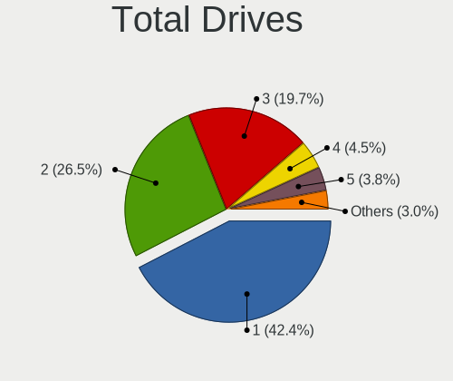

| Drives | Desktops | Percent |
|--------|----------|---------|
| 1      | 27       | 42.86%  |
| 2      | 16       | 25.4%   |
| 3      | 14       | 22.22%  |
| 5      | 2        | 3.17%   |
| 4      | 2        | 3.17%   |
| 7      | 1        | 1.59%   |
| 6      | 1        | 1.59%   |

Has CD-ROM
----------

Has CD-ROM on board

| Presented | Desktops | Percent |
|-----------|----------|---------|
| No        | 35       | 56.45%  |
| Yes       | 27       | 43.55%  |

Has Ethernet
------------

Has Ethernet on board

| Presented | Desktops | Percent |
|-----------|----------|---------|
| Yes       | 62       | 100%    |

Has WiFi
--------

Has WiFi module

| Presented | Desktops | Percent |
|-----------|----------|---------|
| Yes       | 46       | 74.19%  |
| No        | 16       | 25.81%  |

Has Bluetooth
-------------

Has Bluetooth module

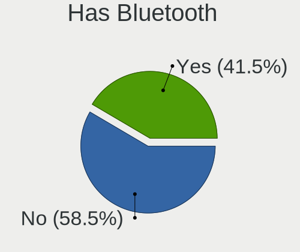

| Presented | Desktops | Percent |
|-----------|----------|---------|
| No        | 38       | 61.29%  |
| Yes       | 24       | 38.71%  |

Location
--------

Country
-------

Geographic location (country)

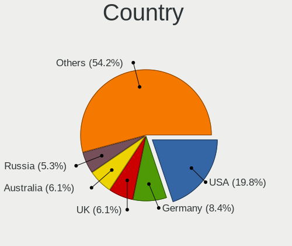

| Country                | Desktops | Percent |
|------------------------|----------|---------|
| USA                    | 14       | 22.22%  |
| UK                     | 5        | 7.94%   |
| Russia                 | 5        | 7.94%   |
| Germany                | 4        | 6.35%   |
| France                 | 4        | 6.35%   |
| Spain                  | 3        | 4.76%   |
| Italy                  | 3        | 4.76%   |
| Australia              | 3        | 4.76%   |
| Poland                 | 2        | 3.17%   |
| India                  | 2        | 3.17%   |
| Bosnia and Herzegovina | 2        | 3.17%   |
| Venezuela              | 1        | 1.59%   |
| Sweden                 | 1        | 1.59%   |
| South Korea            | 1        | 1.59%   |
| South Africa           | 1        | 1.59%   |
| Singapore              | 1        | 1.59%   |
| Serbia                 | 1        | 1.59%   |
| New Zealand            | 1        | 1.59%   |
| Netherlands            | 1        | 1.59%   |
| Mexico                 | 1        | 1.59%   |
| Dominican Republic     | 1        | 1.59%   |
| Chile                  | 1        | 1.59%   |
| Bulgaria               | 1        | 1.59%   |
| Brazil                 | 1        | 1.59%   |
| Belgium                | 1        | 1.59%   |
| Austria                | 1        | 1.59%   |
| Algeria                | 1        | 1.59%   |

City
----

Geographic location (city)

| City                 | Desktops | Percent |
|----------------------|----------|---------|
| Melbourne            | 3        | 4.62%   |
| Seattle              | 2        | 3.08%   |
| Cazin                | 2        | 3.08%   |
| Zaragoza             | 1        | 1.54%   |
| Wonju                | 1        | 1.54%   |
| Warsaw               | 1        | 1.54%   |
| Wandsworth           | 1        | 1.54%   |
| Vranje               | 1        | 1.54%   |
| Villeurbanne         | 1        | 1.54%   |
| Vienna               | 1        | 1.54%   |
| Tomsk                | 1        | 1.54%   |
| Tlajomulco de Zuniga | 1        | 1.54%   |
| Sydney               | 1        | 1.54%   |
| Stuttgart            | 1        | 1.54%   |
| St Petersburg        | 1        | 1.54%   |
| Sofia                | 1        | 1.54%   |
| Singapore            | 1        | 1.54%   |
| Santo Domingo Este   | 1        | 1.54%   |
| Santa Fe             | 1        | 1.54%   |
| Santa Clara          | 1        | 1.54%   |
| Saint Andrews Quay   | 1        | 1.54%   |
| Reggio Calabria      | 1        | 1.54%   |
| Rajkot               | 1        | 1.54%   |
| Quilicura            | 1        | 1.54%   |
| Parma                | 1        | 1.54%   |
| Palma                | 1        | 1.54%   |
| Otwock               | 1        | 1.54%   |
| Northeim             | 1        | 1.54%   |
| North Ridgeville     | 1        | 1.54%   |
| Nîmes               | 1        | 1.54%   |
| Nashville            | 1        | 1.54%   |
| Moscow               | 1        | 1.54%   |
| Milano               | 1        | 1.54%   |
| Lewiston             | 1        | 1.54%   |
| León                | 1        | 1.54%   |
| League City          | 1        | 1.54%   |
| La Colombe           | 1        | 1.54%   |
| Krasnodar            | 1        | 1.54%   |
| Johannesburg         | 1        | 1.54%   |
| Jacksonville         | 1        | 1.54%   |

Drives
------

Drive Vendor
------------

Hard drive vendors

| Vendor                      | Desktops | Drives | Percent |
|-----------------------------|----------|--------|---------|
| WDC                         | 22       | 30     | 19.82%  |
| Samsung Electronics         | 16       | 27     | 14.41%  |
| Seagate                     | 13       | 17     | 11.71%  |
| Kingston                    | 8        | 9      | 7.21%   |
| Toshiba                     | 6        | 6      | 5.41%   |
| Crucial                     | 5        | 7      | 4.5%    |
| China                       | 5        | 8      | 4.5%    |
| A-DATA Technology           | 4        | 5      | 3.6%    |
| Intel                       | 3        | 3      | 2.7%    |
| Apacer                      | 3        | 3      | 2.7%    |
| Unknown                     | 2        | 2      | 1.8%    |
| Team                        | 2        | 2      | 1.8%    |
| SanDisk                     | 2        | 2      | 1.8%    |
| Micron Technology           | 2        | 3      | 1.8%    |
| Intenso                     | 2        | 2      | 1.8%    |
| Hitachi                     | 2        | 3      | 1.8%    |
| SPCC                        | 1        | 1      | 0.9%    |
| Silicon Motion              | 1        | 1      | 0.9%    |
| SABRENT                     | 1        | 3      | 0.9%    |
| PNY                         | 1        | 1      | 0.9%    |
| Plextor                     | 1        | 1      | 0.9%    |
| Patriot                     | 1        | 1      | 0.9%    |
| Netac                       | 1        | 2      | 0.9%    |
| Mushkin                     | 1        | 1      | 0.9%    |
| MAXIO Technology (Hangzhou) | 1        | 1      | 0.9%    |
| Lexar                       | 1        | 1      | 0.9%    |
| HS-SSD-C100                 | 1        | 1      | 0.9%    |
| HGST                        | 1        | 1      | 0.9%    |
| Corsair                     | 1        | 1      | 0.9%    |
| Apple                       | 1        | 1      | 0.9%    |

Drive Model
-----------

Hard drive models

| Model                              | Desktops | Percent |
|------------------------------------|----------|---------|
| Toshiba HDWD120 2TB                | 3        | 2.29%   |
| Samsung SSD 980 500GB              | 3        | 2.29%   |
| Samsung SSD 860 EVO 250GB          | 3        | 2.29%   |
| WDC WD5000AAKX-00ERMA0 500GB       | 2        | 1.53%   |
| WDC WD10EZEX-60WN4A0 1TB           | 2        | 1.53%   |
| WDC WD10EZEX-00BN5A0 1TB           | 2        | 1.53%   |
| Seagate ST500DM002-1BD142 500GB    | 2        | 1.53%   |
| Seagate ST1000DM010-2EP102 1TB     | 2        | 1.53%   |
| Samsung SSD 860 EVO 1TB            | 2        | 1.53%   |
| Kingston SA400S37480G 480GB SSD    | 2        | 1.53%   |
| Apacer AS350 128GB SSD             | 2        | 1.53%   |
| A-DATA SU650 120GB SSD             | 2        | 1.53%   |
| WDC WDS240G2G0B-00EPW0 240GB SSD   | 1        | 0.76%   |
| WDC WDS240G2G0A-00JH30 240GB SSD   | 1        | 0.76%   |
| WDC WDS120G2G0B-00EPW0 120GB SSD   | 1        | 0.76%   |
| WDC WDBRPG0010BNC-WRSN 1TB         | 1        | 0.76%   |
| WDC WD800JD-75MSA3 80GB            | 1        | 0.76%   |
| WDC WD5000LPVX-22V0TT0 500GB       | 1        | 0.76%   |
| WDC WD5000AAKX-60U6AA0 500GB       | 1        | 0.76%   |
| WDC WD5000AAKX-001CA0 500GB        | 1        | 0.76%   |
| WDC WD5000AAKS-00D2B0 500GB        | 1        | 0.76%   |
| WDC WD40EZRX-00SPEB0 4TB           | 1        | 0.76%   |
| WDC WD3200AAJS-60Z0A0 320GB        | 1        | 0.76%   |
| WDC WD30EZRZ-00Z5HB0 3TB           | 1        | 0.76%   |
| WDC WD30EZRZ-00GXCB0 3TB           | 1        | 0.76%   |
| WDC WD30EZRS-11J99B1 3TB           | 1        | 0.76%   |
| WDC WD2500BEVT-22A23T0 250GB       | 1        | 0.76%   |
| WDC WD2500AAJS-00B4A0 250GB        | 1        | 0.76%   |
| WDC WD20EZRZ-00Z5HB0 2TB           | 1        | 0.76%   |
| WDC WD20EZBX-00AYRA0 2TB           | 1        | 0.76%   |
| WDC WD10EZEX-75WN4A1 1TB           | 1        | 0.76%   |
| WDC WD10EZEX-60ZF5A0 1TB           | 1        | 0.76%   |
| WDC WD10EAVS-00D7B0 1TB            | 1        | 0.76%   |
| WDC WD10EARS-00Y5B1 1TB            | 1        | 0.76%   |
| WDC WD Blue SA510 M.2 2280 2TB SSD | 1        | 0.76%   |
| Unknown SD/MMC/MS PRO 128GB        | 1        | 0.76%   |
| Unknown 256GB PCS 2.5" S SSD       | 1        | 0.76%   |
| Toshiba HDWE160 6TB                | 1        | 0.76%   |
| Toshiba HDWD220 2TB                | 1        | 0.76%   |
| Toshiba DT01ACA050 500GB           | 1        | 0.76%   |

HDD Vendor
----------

Hard disk drive vendors

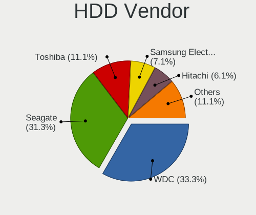

| Vendor  | Desktops | Drives | Percent |
|---------|----------|--------|---------|
| WDC     | 17       | 25     | 40.48%  |
| Seagate | 13       | 17     | 30.95%  |
| Toshiba | 6        | 6      | 14.29%  |
| Hitachi | 2        | 3      | 4.76%   |
| Unknown | 1        | 1      | 2.38%   |
| SABRENT | 1        | 3      | 2.38%   |
| HGST    | 1        | 1      | 2.38%   |
| Apple   | 1        | 1      | 2.38%   |

SSD Vendor
----------

Solid state drive vendors

| Vendor              | Desktops | Drives | Percent |
|---------------------|----------|--------|---------|
| Samsung Electronics | 12       | 18     | 23.53%  |
| Kingston            | 6        | 7      | 11.76%  |
| China               | 5        | 8      | 9.8%    |
| WDC                 | 4        | 4      | 7.84%   |
| Crucial             | 4        | 6      | 7.84%   |
| A-DATA Technology   | 4        | 5      | 7.84%   |
| Micron Technology   | 2        | 3      | 3.92%   |
| Intenso             | 2        | 2      | 3.92%   |
| Apacer              | 2        | 2      | 3.92%   |
| Unknown             | 1        | 1      | 1.96%   |
| Team                | 1        | 1      | 1.96%   |
| SPCC                | 1        | 1      | 1.96%   |
| PNY                 | 1        | 1      | 1.96%   |
| Plextor             | 1        | 1      | 1.96%   |
| Patriot             | 1        | 1      | 1.96%   |
| Mushkin             | 1        | 1      | 1.96%   |
| Intel               | 1        | 1      | 1.96%   |
| HS-SSD-C100         | 1        | 1      | 1.96%   |
| Corsair             | 1        | 1      | 1.96%   |

Drive Kind
----------

HDD or SSD

| Kind | Desktops | Drives | Percent |
|------|----------|--------|---------|
| SSD  | 41       | 65     | 43.16%  |
| HDD  | 34       | 57     | 35.79%  |
| NVMe | 20       | 24     | 21.05%  |

Drive Connector
---------------

SATA, SAS, NVMe, etc.

| Type | Desktops | Drives | Percent |
|------|----------|--------|---------|
| SATA | 55       | 117    | 70.51%  |
| NVMe | 20       | 24     | 25.64%  |
| SAS  | 3        | 5      | 3.85%   |

Drive Size
----------

Size of hard drive

| Size in TB | Desktops | Drives | Percent |
|------------|----------|--------|---------|
| 0.01-0.5   | 43       | 60     | 51.19%  |
| 0.51-1.0   | 21       | 33     | 25%     |
| 1.01-2.0   | 14       | 20     | 16.67%  |
| 2.01-3.0   | 3        | 4      | 3.57%   |
| 3.01-4.0   | 2        | 3      | 2.38%   |
| 4.01-10.0  | 1        | 2      | 1.19%   |

Space Total
-----------

Amount of disk space available on the file system

| Size in GB     | Desktops | Percent |
|----------------|----------|---------|
| 101-250        | 15       | 23.08%  |
| 251-500        | 11       | 16.92%  |
| 501-1000       | 9        | 13.85%  |
| More than 3000 | 7        | 10.77%  |
| 2001-3000      | 7        | 10.77%  |
| 1001-2000      | 7        | 10.77%  |
| 1-20           | 6        | 9.23%   |
| 51-100         | 3        | 4.62%   |

Space Used
----------

Amount of used disk space

| Used GB        | Desktops | Percent |
|----------------|----------|---------|
| 1-20           | 18       | 28.13%  |
| 101-250        | 11       | 17.19%  |
| 21-50          | 9        | 14.06%  |
| 51-100         | 9        | 14.06%  |
| 1001-2000      | 5        | 7.81%   |
| 251-500        | 4        | 6.25%   |
| More than 3000 | 3        | 4.69%   |
| 2001-3000      | 3        | 4.69%   |
| 501-1000       | 2        | 3.13%   |

Malfunc. Drives
---------------

Drive models with a malfunction

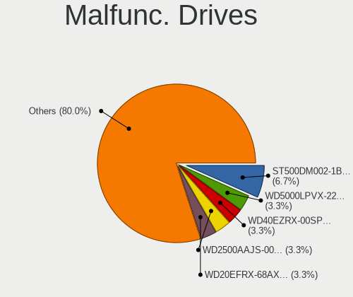

| Model                                             | Desktops | Drives | Percent |
|---------------------------------------------------|----------|--------|---------|
| WDC WD5000LPVX-22V0TT0 500GB                      | 1        | 1      | 7.69%   |
| WDC WD40EZRX-00SPEB0 4TB                          | 1        | 1      | 7.69%   |
| WDC WD2500AAJS-00B4A0 250GB                       | 1        | 2      | 7.69%   |
| WDC WD10EARS-00Y5B1 1TB                           | 1        | 1      | 7.69%   |
| Toshiba DT01ACA050 500GB                          | 1        | 1      | 7.69%   |
| Seagate ST500DM002-1BD142 500GB                   | 1        | 1      | 7.69%   |
| Seagate ST500DM002-1BC142 500GB                   | 1        | 1      | 7.69%   |
| Samsung Electronics SSD 850 PRO 512GB             | 1        | 1      | 7.69%   |
| Micron Technology MTFDDAK2T0TDL-1AW1ZABHA 2TB SSD | 1        | 1      | 7.69%   |
| Kingston SV300S37A120G 120GB SSD                  | 1        | 1      | 7.69%   |
| Intel SSDSC2KF180H6L 180GB                        | 1        | 1      | 7.69%   |
| Hitachi HUA722020ALA331 2TB                       | 1        | 1      | 7.69%   |
| A-DATA Technology SU900 256GB SSD                 | 1        | 2      | 7.69%   |

Malfunc. Drive Vendor
---------------------

Vendors of faulty drives

| Vendor              | Desktops | Drives | Percent |
|---------------------|----------|--------|---------|
| WDC                 | 3        | 5      | 25%     |
| Seagate             | 2        | 2      | 16.67%  |
| Toshiba             | 1        | 1      | 8.33%   |
| Samsung Electronics | 1        | 1      | 8.33%   |
| Micron Technology   | 1        | 1      | 8.33%   |
| Kingston            | 1        | 1      | 8.33%   |
| Intel               | 1        | 1      | 8.33%   |
| Hitachi             | 1        | 1      | 8.33%   |
| A-DATA Technology   | 1        | 2      | 8.33%   |

Malfunc. HDD Vendor
-------------------

Vendors of faulty HDD drives

| Vendor  | Desktops | Drives | Percent |
|---------|----------|--------|---------|
| WDC     | 3        | 5      | 42.86%  |
| Seagate | 2        | 2      | 28.57%  |
| Toshiba | 1        | 1      | 14.29%  |
| Hitachi | 1        | 1      | 14.29%  |

Malfunc. Drive Kind
-------------------

Kinds of faulty drives

| Kind | Desktops | Drives | Percent |
|------|----------|--------|---------|
| HDD  | 6        | 9      | 54.55%  |
| SSD  | 5        | 6      | 45.45%  |

Failed Drives
-------------

Failed drive models

Zero info for selected period =(

Failed Drive Vendor
-------------------

Failed drive vendors

Zero info for selected period =(

Drive Status
------------

Number of failed and malfunc. drives

| Status   | Desktops | Drives | Percent |
|----------|----------|--------|---------|
| Works    | 61       | 120    | 79.22%  |
| Malfunc  | 11       | 15     | 14.29%  |
| Detected | 5        | 11     | 6.49%   |

Storage controller
------------------

Storage Vendor
--------------

Storage controller vendors

| Vendor                      | Desktops | Percent |
|-----------------------------|----------|---------|
| Intel                       | 42       | 48.84%  |
| AMD                         | 20       | 23.26%  |
| Samsung Electronics         | 7        | 8.14%   |
| ASMedia Technology          | 3        | 3.49%   |
| Silicon Motion              | 2        | 2.33%   |
| SanDisk                     | 2        | 2.33%   |
| MAXIO Technology (Hangzhou) | 2        | 2.33%   |
| Marvell Technology Group    | 2        | 2.33%   |
| Kingston Technology Company | 2        | 2.33%   |
| TenaFe                      | 1        | 1.16%   |
| Micron/Crucial Technology   | 1        | 1.16%   |
| LSI Logic / Symbios Logic   | 1        | 1.16%   |
| JMicron Technology          | 1        | 1.16%   |

Storage Model
-------------

Storage controller models

| Model                                                                          | Desktops | Percent |
|--------------------------------------------------------------------------------|----------|---------|
| AMD FCH SATA Controller [AHCI mode]                                            | 8        | 7.77%   |
| Intel 200 Series PCH SATA controller [AHCI mode]                               | 5        | 4.85%   |
| Intel 7 Series/C210 Series Chipset Family 6-port SATA Controller [AHCI mode]   | 4        | 3.88%   |
| Samsung NVMe SSD Controller 980 (DRAM-less)                                    | 3        | 2.91%   |
| Intel Volume Management Device NVMe RAID Controller                            | 3        | 2.91%   |
| Intel NM10/ICH7 Family SATA Controller [IDE mode]                              | 3        | 2.91%   |
| Intel Alder Lake-S PCH SATA Controller [AHCI Mode]                             | 3        | 2.91%   |
| Intel 8 Series/C220 Series Chipset Family 6-port SATA Controller 1 [AHCI mode] | 3        | 2.91%   |
| Intel 6 Series/C200 Series Chipset Family 6 port Desktop SATA AHCI Controller  | 3        | 2.91%   |
| ASMedia ASM1061/ASM1062 Serial ATA Controller                                  | 3        | 2.91%   |
| AMD SB7x0/SB8x0/SB9x0 SATA Controller [AHCI mode]                              | 3        | 2.91%   |
| AMD SB7x0/SB8x0/SB9x0 IDE Controller                                           | 3        | 2.91%   |
| AMD 600 Series Chipset SATA Controller                                         | 3        | 2.91%   |
| AMD 500 Series Chipset SATA Controller                                         | 3        | 2.91%   |
| Samsung NVMe SSD Controller PM9A1/PM9A3/980PRO                                 | 2        | 1.94%   |
| MAXIO (Hangzhou) NVMe SSD Controller MAP1202 (DRAM-less)                       | 2        | 1.94%   |
| Intel Q170/Q150/B150/H170/H110/Z170/CM236 Chipset SATA Controller [AHCI Mode]  | 2        | 1.94%   |
| Intel Comet Lake SATA AHCI Controller                                          | 2        | 1.94%   |
| Intel Celeron/Pentium Silver Processor SATA Controller                         | 2        | 1.94%   |
| Intel 82801G (ICH7 Family) IDE Controller                                      | 2        | 1.94%   |
| AMD SB7x0/SB8x0/SB9x0 SATA Controller [IDE mode]                               | 2        | 1.94%   |
| AMD 300 Series Chipset SATA Controller                                         | 2        | 1.94%   |
| TenaFe TC2200/TC2201 NVMe Controller (DRAM-less)                               | 1        | 0.97%   |
| Silicon Motion SM2263EN/SM2263XT (DRAM-less) NVMe SSD Controllers              | 1        | 0.97%   |
| Silicon Motion SM2262/SM2262EN SSD Controller                                  | 1        | 0.97%   |
| SanDisk Extreme Pro / WD Black SN750 / PC SN730 / Red SN700 NVMe SSD           | 1        | 0.97%   |
| SanDisk Extreme Pro / WD Black 2018/SN750/PC SN720 NVMe SSD                    | 1        | 0.97%   |
| Samsung NVMe SSD Controller SM981/PM981/PM983                                  | 1        | 0.97%   |
| Samsung NVMe SSD Controller SM961/PM961/SM963                                  | 1        | 0.97%   |
| Micron/Crucial P2 [Nick P2] / P3 / P3 Plus NVMe PCIe SSD (DRAM-less)           | 1        | 0.97%   |
| Marvell Group 88SE9230 PCIe 2.0 x2 4-port SATA 6 Gb/s RAID Controller          | 1        | 0.97%   |
| Marvell Group 88SE9172 SATA 6Gb/s Controller                                   | 1        | 0.97%   |
| Marvell Group 88SE9128 PCIe SATA 6 Gb/s RAID controller                        | 1        | 0.97%   |
| LSI Logic / Symbios Logic MegaRAID SAS 2008 [Falcon]                           | 1        | 0.97%   |
| Kingston Company NV2 NVMe SSD E21T (DRAM-less)                                 | 1        | 0.97%   |
| Kingston Company A2000 NVMe SSD SM2263EN                                       | 1        | 0.97%   |
| JMicron JMB361 AHCI/IDE                                                        | 1        | 0.97%   |
| Intel SSD 670p Series [Keystone Harbor]                                        | 1        | 0.97%   |
| Intel Jasper Lake SATA AHCI Controller                                         | 1        | 0.97%   |
| Intel Comet Lake PCH-H RAID                                                    | 1        | 0.97%   |

Storage Kind
------------

Kind of storage controller (IDE, SATA, NVMe, SAS, ...)

| Kind | Desktops | Percent |
|------|----------|---------|
| SATA | 53       | 60.23%  |
| NVMe | 18       | 20.45%  |
| IDE  | 12       | 13.64%  |
| RAID | 5        | 5.68%   |

Processor
---------

CPU Vendor
----------

Processor vendors

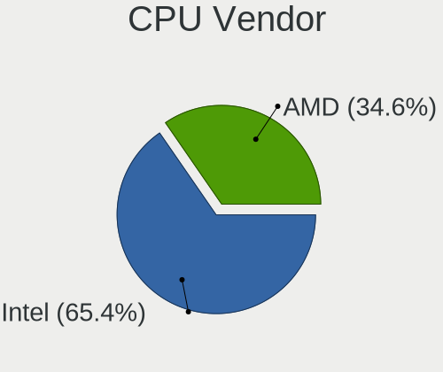

| Vendor | Desktops | Percent |
|--------|----------|---------|
| Intel  | 41       | 66.13%  |
| AMD    | 21       | 33.87%  |

CPU Model
---------

Processor models

| Model                                  | Desktops | Percent |
|----------------------------------------|----------|---------|
| Intel Core i7-3770 CPU @ 3.40GHz       | 3        | 4.84%   |
| Intel Core 2 Quad CPU Q6600 @ 2.40GHz  | 2        | 3.23%   |
| Intel 11th Gen Core i5-11400 @ 2.60GHz | 2        | 3.23%   |
| AMD Ryzen 5 7600 6-Core Processor      | 2        | 3.23%   |
| AMD Ryzen 5 2600 Six-Core Processor    | 2        | 3.23%   |
| AMD FX-6300 Six-Core Processor         | 2        | 3.23%   |
| Intel Xeon CPU X5650 @ 2.67GHz         | 1        | 1.61%   |
| Intel Pentium Dual CPU E2140 @ 1.60GHz | 1        | 1.61%   |
| Intel Pentium CPU J4205 @ 1.50GHz      | 1        | 1.61%   |
| Intel Pentium 4 CPU 3.20GHz            | 1        | 1.61%   |
| Intel Core i7-7700K CPU @ 4.20GHz      | 1        | 1.61%   |
| Intel Core i7-6700K CPU @ 4.00GHz      | 1        | 1.61%   |
| Intel Core i7-2600 CPU @ 3.40GHz       | 1        | 1.61%   |
| Intel Core i7-10700 CPU @ 2.90GHz      | 1        | 1.61%   |
| Intel Core i5-9600K CPU @ 3.70GHz      | 1        | 1.61%   |
| Intel Core i5-9400 CPU @ 2.90GHz       | 1        | 1.61%   |
| Intel Core i5-8600K CPU @ 3.60GHz      | 1        | 1.61%   |
| Intel Core i5-8400 CPU @ 2.80GHz       | 1        | 1.61%   |
| Intel Core i5-6600K CPU @ 3.50GHz      | 1        | 1.61%   |
| Intel Core i5-4590S CPU @ 3.00GHz      | 1        | 1.61%   |
| Intel Core i5-4590 CPU @ 3.30GHz       | 1        | 1.61%   |
| Intel Core i5-4460 CPU @ 3.20GHz       | 1        | 1.61%   |
| Intel Core i5-3470 CPU @ 3.20GHz       | 1        | 1.61%   |
| Intel Core i5-3337U CPU @ 1.80GHz      | 1        | 1.61%   |
| Intel Core i5-2400 CPU @ 3.10GHz       | 1        | 1.61%   |
| Intel Core i5-10400F CPU @ 2.90GHz     | 1        | 1.61%   |
| Intel Core i5 CPU 650 @ 3.20GHz        | 1        | 1.61%   |
| Intel Core i3-9100 CPU @ 3.60GHz       | 1        | 1.61%   |
| Intel Core i3-4130 CPU @ 3.40GHz       | 1        | 1.61%   |
| Intel Core i3-3240 CPU @ 3.40GHz       | 1        | 1.61%   |
| Intel Core i3-3220 CPU @ 3.30GHz       | 1        | 1.61%   |
| Intel Core 2 Duo CPU E8400 @ 3.00GHz   | 1        | 1.61%   |
| Intel Core 2 CPU 6400 @ 2.13GHz        | 1        | 1.61%   |
| Intel Celeron N5095A @ 2.00GHz         | 1        | 1.61%   |
| Intel Celeron N4100 CPU @ 1.10GHz      | 1        | 1.61%   |
| Intel Celeron N4000 CPU @ 1.10GHz      | 1        | 1.61%   |
| Intel Celeron CPU N3050 @ 1.60GHz      | 1        | 1.61%   |
| Intel 12th Gen Core i5-12500           | 1        | 1.61%   |
| Intel 12th Gen Core i5-12400           | 1        | 1.61%   |
| Intel 12th Gen Core i3-12100F          | 1        | 1.61%   |

CPU Model Family
----------------

Processor model prefix

| Model              | Desktops | Percent |
|--------------------|----------|---------|
| Intel Core i5      | 13       | 20.97%  |
| AMD Ryzen 5        | 11       | 17.74%  |
| Intel Core i7      | 7        | 11.29%  |
| Other              | 6        | 9.68%   |
| Intel Core i3      | 4        | 6.45%   |
| Intel Celeron      | 4        | 6.45%   |
| AMD Ryzen 7        | 3        | 4.84%   |
| AMD FX             | 3        | 4.84%   |
| Intel Core 2 Quad  | 2        | 3.23%   |
| Intel Xeon         | 1        | 1.61%   |
| Intel Pentium Dual | 1        | 1.61%   |
| Intel Pentium 4    | 1        | 1.61%   |
| Intel Pentium      | 1        | 1.61%   |
| Intel Core 2 Duo   | 1        | 1.61%   |
| Intel Core 2       | 1        | 1.61%   |
| AMD Opteron        | 1        | 1.61%   |
| AMD Athlon X4      | 1        | 1.61%   |
| AMD Athlon II X2   | 1        | 1.61%   |

CPU Cores
---------

Number of processor cores

| Number | Desktops | Percent |
|--------|----------|---------|
| 6      | 21       | 33.87%  |
| 4      | 20       | 32.26%  |
| 2      | 13       | 20.97%  |
| 8      | 4        | 6.45%   |
| 3      | 2        | 3.23%   |
| 1      | 2        | 3.23%   |

CPU Sockets
-----------

Number of sockets

| Number | Desktops | Percent |
|--------|----------|---------|
| 1      | 62       | 100%    |

CPU Threads
-----------

Threads per core (Hyper-Threading)

| Number | Desktops | Percent |
|--------|----------|---------|
| 2      | 39       | 62.9%   |
| 1      | 23       | 37.1%   |

CPU Op-Modes
------------

CPU Operation Modes (32-bit, 64-bit)

| Op mode        | Desktops | Percent |
|----------------|----------|---------|
| 32-bit, 64-bit | 62       | 100%    |

CPU Microcode
-------------

Microcode number

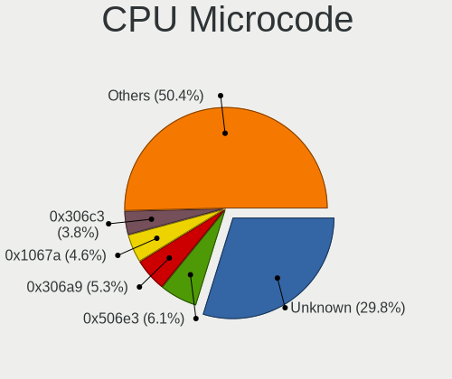

| Number     | Desktops | Percent |
|------------|----------|---------|
| Unknown    | 19       | 30.65%  |
| 0x306a9    | 5        | 8.06%   |
| 0x306c3    | 3        | 4.84%   |
| 0x906ea    | 2        | 3.23%   |
| 0x6fb      | 2        | 3.23%   |
| 0x206a7    | 2        | 3.23%   |
| 0x0a601206 | 2        | 3.23%   |
| 0xa0671    | 1        | 1.61%   |
| 0xa0655    | 1        | 1.61%   |
| 0x906ed    | 1        | 1.61%   |
| 0x906eb    | 1        | 1.61%   |
| 0x906e9    | 1        | 1.61%   |
| 0x706a1    | 1        | 1.61%   |
| 0x6fd      | 1        | 1.61%   |
| 0x506e3    | 1        | 1.61%   |
| 0x506c9    | 1        | 1.61%   |
| 0x406c3    | 1        | 1.61%   |
| 0x206c2    | 1        | 1.61%   |
| 0x20655    | 1        | 1.61%   |
| 0x1067a    | 1        | 1.61%   |
| 0x0a601203 | 1        | 1.61%   |
| 0x0a50000d | 1        | 1.61%   |
| 0x0a50000c | 1        | 1.61%   |
| 0x0a404102 | 1        | 1.61%   |
| 0x0a20120a | 1        | 1.61%   |
| 0x0a201016 | 1        | 1.61%   |
| 0x08701021 | 1        | 1.61%   |
| 0x08701013 | 1        | 1.61%   |
| 0x0800820d | 1        | 1.61%   |
| 0x0600611a | 1        | 1.61%   |
| 0x06003106 | 1        | 1.61%   |
| 0x06000852 | 1        | 1.61%   |
| 0x06000817 | 1        | 1.61%   |
| 0x010000c8 | 1        | 1.61%   |

CPU Microarch
-------------

Microarchitecture

| Name             | Desktops | Percent |
|------------------|----------|---------|
| IvyBridge        | 7        | 11.29%  |
| KabyLake         | 6        | 9.68%   |
| Zen 3            | 4        | 6.45%   |
| Haswell          | 4        | 6.45%   |
| Core             | 4        | 6.45%   |
| Unknown          | 4        | 6.45%   |
| Zen+             | 3        | 4.84%   |
| Zen 2            | 3        | 4.84%   |
| Piledriver       | 3        | 4.84%   |
| Alderlake Hybrid | 3        | 4.84%   |
| Westmere         | 2        | 3.23%   |
| Skylake          | 2        | 3.23%   |
| SandyBridge      | 2        | 3.23%   |
| Icelake          | 2        | 3.23%   |
| Goldmont plus    | 2        | 3.23%   |
| CometLake        | 2        | 3.23%   |
| Tremont          | 1        | 1.61%   |
| Steamroller      | 1        | 1.61%   |
| Silvermont       | 1        | 1.61%   |
| Penryn           | 1        | 1.61%   |
| NetBurst         | 1        | 1.61%   |
| K10              | 1        | 1.61%   |
| Goldmont         | 1        | 1.61%   |
| Excavator        | 1        | 1.61%   |
| Bulldozer        | 1        | 1.61%   |

Graphics
--------

GPU Vendor
----------

Vendors of graphics cards

| Vendor | Desktops | Percent |
|--------|----------|---------|
| Nvidia | 28       | 42.42%  |
| Intel  | 25       | 37.88%  |
| AMD    | 13       | 19.7%   |

GPU Model
---------

Graphics card models

| Model                                                                                    | Desktops | Percent |
|------------------------------------------------------------------------------------------|----------|---------|
| Intel CoffeeLake-S GT2 [UHD Graphics 630]                                                | 4        | 5.88%   |
| AMD Ellesmere [Radeon RX 470/480/570/570X/580/580X/590]                                  | 4        | 5.88%   |
| Nvidia GP107 [GeForce GTX 1050]                                                          | 3        | 4.41%   |
| AMD Raphael                                                                              | 3        | 4.41%   |
| Nvidia TU106 [GeForce RTX 2070 Rev. A]                                                   | 2        | 2.94%   |
| Nvidia GP108 [GeForce GT 1030]                                                           | 2        | 2.94%   |
| Nvidia GK110 [GeForce GTX 780]                                                           | 2        | 2.94%   |
| Nvidia GF119 [GeForce GT 610]                                                            | 2        | 2.94%   |
| Nvidia GA104 [GeForce RTX 3070]                                                          | 2        | 2.94%   |
| Intel Xeon E3-1200 v3/4th Gen Core Processor Integrated Graphics Controller              | 2        | 2.94%   |
| Intel Xeon E3-1200 v2/3rd Gen Core processor Graphics Controller                         | 2        | 2.94%   |
| Intel RocketLake-S GT1 [UHD Graphics 730]                                                | 2        | 2.94%   |
| Intel GeminiLake [UHD Graphics 600]                                                      | 2        | 2.94%   |
| AMD Cezanne [Radeon Vega Series / Radeon Vega Mobile Series]                             | 2        | 2.94%   |
| Nvidia TU117 [GeForce GTX 1650]                                                          | 1        | 1.47%   |
| Nvidia GT218 [GeForce 8400 GS Rev. 3]                                                    | 1        | 1.47%   |
| Nvidia GP106GL [Quadro P2200]                                                            | 1        | 1.47%   |
| Nvidia GP106 [GeForce GTX 1060 6GB]                                                      | 1        | 1.47%   |
| Nvidia GP104 [GeForce GTX 1070]                                                          | 1        | 1.47%   |
| Nvidia GP102 [TITAN Xp]                                                                  | 1        | 1.47%   |
| Nvidia GP102 [GeForce GTX 1080 Ti]                                                       | 1        | 1.47%   |
| Nvidia GM206 [GeForce GTX 960]                                                           | 1        | 1.47%   |
| Nvidia GM107 [GeForce GTX 750 Ti]                                                        | 1        | 1.47%   |
| Nvidia GK208B [GeForce GT 730]                                                           | 1        | 1.47%   |
| Nvidia GF116 [GeForce GT 640 OEM]                                                        | 1        | 1.47%   |
| Nvidia GF114 [GeForce GTX 560 Ti]                                                        | 1        | 1.47%   |
| Nvidia GF108 [GeForce GT 730]                                                            | 1        | 1.47%   |
| Nvidia GA104 [GeForce RTX 3070 Lite Hash Rate]                                           | 1        | 1.47%   |
| Nvidia G84 [GeForce 8600 GT]                                                             | 1        | 1.47%   |
| Intel JasperLake [UHD Graphics]                                                          | 1        | 1.47%   |
| Intel HD Graphics 630                                                                    | 1        | 1.47%   |
| Intel CometLake-S GT2 [UHD Graphics 630]                                                 | 1        | 1.47%   |
| Intel Atom/Celeron/Pentium Processor x5-E8000/J3xxx/N3xxx Integrated Graphics Controller | 1        | 1.47%   |
| Intel Apollo Lake [HD Graphics 505]                                                      | 1        | 1.47%   |
| Intel Alder Lake-S GT1 [UHD Graphics 770]                                                | 1        | 1.47%   |
| Intel Alder Lake-S GT1 [UHD Graphics 730]                                                | 1        | 1.47%   |
| Intel 82Q963/Q965 Integrated Graphics Controller                                         | 1        | 1.47%   |
| Intel 82945G/GZ Integrated Graphics Controller                                           | 1        | 1.47%   |
| Intel 82915G/GV/910GL Integrated Graphics Controller                                     | 1        | 1.47%   |
| Intel 4th Generation Core Processor Family Integrated Graphics Controller                | 1        | 1.47%   |

GPU Combo
---------

Combinations of graphics cards

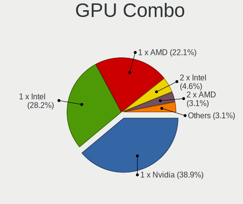

| Name           | Desktops | Percent |
|----------------|----------|---------|
| 1 x Nvidia     | 25       | 39.68%  |
| 1 x Intel      | 21       | 33.33%  |
| 1 x AMD        | 12       | 19.05%  |
| Intel + Nvidia | 2        | 3.17%   |
| 2 x Intel      | 1        | 1.59%   |
| 2 x AMD        | 1        | 1.59%   |
| AMD + Nvidia   | 1        | 1.59%   |

GPU Driver
----------

Free vs proprietary

| Driver      | Desktops | Percent |
|-------------|----------|---------|
| Free        | 45       | 72.58%  |
| Proprietary | 16       | 25.81%  |
| Unknown     | 1        | 1.61%   |

GPU Memory
----------

Total video memory

| Size in GB | Desktops | Percent |
|------------|----------|---------|
| Unknown    | 26       | 40.63%  |
| 1.01-2.0   | 9        | 14.06%  |
| 0.01-0.5   | 8        | 12.5%   |
| 7.01-8.0   | 6        | 9.38%   |
| 0.51-1.0   | 6        | 9.38%   |
| 3.01-4.0   | 3        | 4.69%   |
| 2.01-3.0   | 3        | 4.69%   |
| 5.01-6.0   | 1        | 1.56%   |
| 4.01-5.0   | 1        | 1.56%   |
| 8.01-16.0  | 1        | 1.56%   |

Monitor
-------

Monitor Vendor
--------------

Monitor vendors

| Vendor               | Desktops | Percent |
|----------------------|----------|---------|
| Samsung Electronics  | 8        | 11.27%  |
| Goldstar             | 8        | 11.27%  |
| Dell                 | 7        | 9.86%   |
| Acer                 | 6        | 8.45%   |
| Hewlett-Packard      | 5        | 7.04%   |
| AOC                  | 4        | 5.63%   |
| Philips              | 3        | 4.23%   |
| Ancor Communications | 3        | 4.23%   |
| ViewSonic            | 2        | 2.82%   |
| CHD                  | 2        | 2.82%   |
| BenQ                 | 2        | 2.82%   |
| ASUSTek Computer     | 2        | 2.82%   |
| Yeyian               | 1        | 1.41%   |
| Unknown (ADE)        | 1        | 1.41%   |
| Toshiba              | 1        | 1.41%   |
| Sony                 | 1        | 1.41%   |
| SKG                  | 1        | 1.41%   |
| Sceptre Tech         | 1        | 1.41%   |
| Packard Bell         | 1        | 1.41%   |
| NECCI                | 1        | 1.41%   |
| Mi                   | 1        | 1.41%   |
| LG Electronics       | 1        | 1.41%   |
| Lenovo               | 1        | 1.41%   |
| JRY                  | 1        | 1.41%   |
| Insignia             | 1        | 1.41%   |
| Gigabyte Technology  | 1        | 1.41%   |
| Gericom              | 1        | 1.41%   |
| Fujitsu Siemens      | 1        | 1.41%   |
| Eizo                 | 1        | 1.41%   |
| DENON                | 1        | 1.41%   |
| CTV                  | 1        | 1.41%   |

Monitor Model
-------------

Monitor models

| Model                                                                 | Desktops | Percent |
|-----------------------------------------------------------------------|----------|---------|
| Goldstar HD GSM5ACD 1366x768 410x230mm 18.5-inch                      | 2        | 2.7%    |
| Acer KA220HQ ACR0467 1920x1080 477x268mm 21.5-inch                    | 2        | 2.7%    |
| Yeyian YMG-4K27-01 YEY2700 3840x2160 600x330mm 27.0-inch              | 1        | 1.35%   |
| ViewSonic VX2452 Series VSCDE2E 1920x1080 521x293mm 23.5-inch         | 1        | 1.35%   |
| ViewSonic VP2780 SERIES VSC9C30 3840x2160 597x336mm 27.0-inch         | 1        | 1.35%   |
| Unknown (ADE) TSLED22D ADEB22D 1920x1080 477x268mm 21.5-inch          | 1        | 1.35%   |
| Toshiba TV TSB0206 1920x1080                                          | 1        | 1.35%   |
| Sony TV SNY2C02 1920x1080 886x498mm 40.0-inch                         | 1        | 1.35%   |
| SKG AF24H1 SKG2409 1920x1080 530x300mm 24.0-inch                      | 1        | 1.35%   |
| Sceptre Tech Sceptre F24 SPT09AB 1920x1080 530x290mm 23.8-inch        | 1        | 1.35%   |
| Samsung Electronics SyncMaster SAM0117 1280x1024 312x234mm 15.4-inch  | 1        | 1.35%   |
| Samsung Electronics SMS19A100 SAM0867 1366x768 410x230mm 18.5-inch    | 1        | 1.35%   |
| Samsung Electronics S24D330 SAM0D93 1920x1080 531x299mm 24.0-inch     | 1        | 1.35%   |
| Samsung Electronics LU28R55 SAM1017 3840x2160 632x360mm 28.6-inch     | 1        | 1.35%   |
| Samsung Electronics LS24AG32x SAM71D9 1920x1080 527x296mm 23.8-inch   | 1        | 1.35%   |
| Samsung Electronics LCD Monitor SAM0C39 1920x1080 885x498mm 40.0-inch | 1        | 1.35%   |
| Samsung Electronics LCD Monitor SAM0900 1366x768 700x390mm 31.5-inch  | 1        | 1.35%   |
| Samsung Electronics LC32T55 SAM7024 1920x1080 699x393mm 31.6-inch     | 1        | 1.35%   |
| Philips PHL BDM4065 PHL08E1 3840x2160 878x485mm 39.5-inch             | 1        | 1.35%   |
| Philips PHL 276E9Q PHLC17B 1920x1080 600x340mm 27.2-inch              | 1        | 1.35%   |
| Philips PHL 275E2F PHLC23A 2560x1440 600x340mm 27.2-inch              | 1        | 1.35%   |
| Philips 170C PHL0848 1280x1024 338x270mm 17.0-inch                    | 1        | 1.35%   |
| Packard Bell Viseo 190 W PKB00B9 1366x768 410x230mm 18.5-inch         | 1        | 1.35%   |
| NECCI NEC LV17m NCI4017 1280x1024 337x270mm 17.0-inch                 | 1        | 1.35%   |
| Mi 27 NFGL XMIB004 1920x1080 598x336mm 27.0-inch                      | 1        | 1.35%   |
| LG Electronics LCD Monitor LG HDR 4K                                  | 1        | 1.35%   |
| Lenovo T24i-2L LEN62B0 1920x1080 527x296mm 23.8-inch                  | 1        | 1.35%   |
| JRY Analog JRY1950 1600x900 368x207mm 16.6-inch                       | 1        | 1.35%   |
| Insignia NS-22E400NA14 BBY0042 1920x1080 544x306mm 24.6-inch          | 1        | 1.35%   |
| Hewlett-Packard W2072a HWP299F 1600x900 443x249mm 20.0-inch           | 1        | 1.35%   |
| Hewlett-Packard LV2011 HWP299A 1600x900 443x249mm 20.0-inch           | 1        | 1.35%   |
| Hewlett-Packard LV1911 HWP3005 1366x768 410x230mm 18.5-inch           | 1        | 1.35%   |
| Hewlett-Packard LCD Monitor Inc. HP E24u G4                           | 1        | 1.35%   |
| Hewlett-Packard ALL-in-One HWP4245 1600x900 434x236mm 19.4-inch       | 1        | 1.35%   |
| Hewlett-Packard 27ec HPN3389 1920x1080 598x336mm 27.0-inch            | 1        | 1.35%   |
| Goldstar W2253 GSM56DC 1920x1080 510x290mm 23.1-inch                  | 1        | 1.35%   |
| Goldstar ULTRAWIDE GSM76F9 2560x1080 531x298mm 24.0-inch              | 1        | 1.35%   |
| Goldstar M237WD GSM56EB 1920x1080 509x286mm 23.0-inch                 | 1        | 1.35%   |
| Goldstar FULL HD GSM5AB9 1920x1080 480x270mm 21.7-inch                | 1        | 1.35%   |
| Goldstar FHD GSM5C64 1920x1080 530x300mm 24.0-inch                    | 1        | 1.35%   |

Monitor Resolution
------------------

Monitor screen resolution

| Resolution        | Desktops | Percent |
|-------------------|----------|---------|
| 1920x1080 (FHD)   | 34       | 48.57%  |
| 1366x768 (WXGA)   | 9        | 12.86%  |
| 2560x1440 (QHD)   | 8        | 11.43%  |
| 3840x2160 (4K)    | 7        | 10%     |
| 1600x900 (HD+)    | 4        | 5.71%   |
| 1280x1024 (SXGA)  | 3        | 4.29%   |
| 1920x1200 (WUXGA) | 2        | 2.86%   |
| 2560x1080         | 1        | 1.43%   |
| 1440x900 (WXGA+)  | 1        | 1.43%   |
| Unknown           | 1        | 1.43%   |

Monitor Diagonal
----------------

Diagonal size in inches

| Inches  | Desktops | Percent |
|---------|----------|---------|
| 27      | 11       | 15.28%  |
| 24      | 11       | 15.28%  |
| 23      | 9        | 12.5%   |
| 21      | 8        | 11.11%  |
| 18      | 8        | 11.11%  |
| 31      | 6        | 8.33%   |
| 20      | 2        | 2.78%   |
| 19      | 2        | 2.78%   |
| 17      | 2        | 2.78%   |
| 74      | 1        | 1.39%   |
| 65      | 1        | 1.39%   |
| 61      | 1        | 1.39%   |
| 55      | 1        | 1.39%   |
| 54      | 1        | 1.39%   |
| 49      | 1        | 1.39%   |
| 39      | 1        | 1.39%   |
| 34      | 1        | 1.39%   |
| 32      | 1        | 1.39%   |
| 28      | 1        | 1.39%   |
| 25      | 1        | 1.39%   |
| 15      | 1        | 1.39%   |
| Unknown | 1        | 1.39%   |

Monitor Width
-------------

Physical width

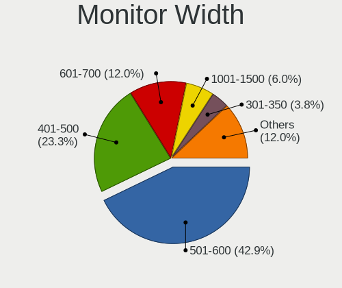

| Width in mm | Desktops | Percent |
|-------------|----------|---------|
| 501-600     | 28       | 41.18%  |
| 401-500     | 19       | 27.94%  |
| 601-700     | 8        | 11.76%  |
| 1001-1500   | 5        | 7.35%   |
| 301-350     | 3        | 4.41%   |
| 701-800     | 2        | 2.94%   |
| 801-900     | 1        | 1.47%   |
| 1501-2000   | 1        | 1.47%   |
| Unknown     | 1        | 1.47%   |

Aspect Ratio
------------

Proportional relationship between the width and the height

| Ratio   | Desktops | Percent |
|---------|----------|---------|
| 16/9    | 53       | 84.13%  |
| 16/10   | 5        | 7.94%   |
| 5/4     | 2        | 3.17%   |
| 4/3     | 1        | 1.59%   |
| 21/9    | 1        | 1.59%   |
| Unknown | 1        | 1.59%   |

Monitor Area
------------

Area in inch²

| Area in inch² | Desktops | Percent |
|----------------|----------|---------|
| 201-250        | 20       | 29.41%  |
| 301-350        | 11       | 16.18%  |
| 351-500        | 9        | 13.24%  |
| 141-150        | 9        | 13.24%  |
| 151-200        | 7        | 10.29%  |
| More than 1000 | 5        | 7.35%   |
| 251-300        | 4        | 5.88%   |
| 111-120        | 1        | 1.47%   |
| 501-1000       | 1        | 1.47%   |
| Unknown        | 1        | 1.47%   |

Pixel Density
-------------

Pixels per inch

| Density | Desktops | Percent |
|---------|----------|---------|
| 51-100  | 43       | 66.15%  |
| 101-120 | 11       | 16.92%  |
| 1-50    | 5        | 7.69%   |
| 121-160 | 4        | 6.15%   |
| 161-240 | 1        | 1.54%   |
| Unknown | 1        | 1.54%   |

Multiple Monitors
-----------------

Total monitors connected

| Total | Desktops | Percent |
|-------|----------|---------|
| 1     | 47       | 75.81%  |
| 2     | 14       | 22.58%  |
| 0     | 1        | 1.61%   |

Network
-------

Net Controller Vendor
---------------------

Controller vendors

| Vendor                          | Desktops | Percent |
|---------------------------------|----------|---------|
| Realtek Semiconductor           | 43       | 40.19%  |
| Intel                           | 25       | 23.36%  |
| TP-Link                         | 11       | 10.28%  |
| Qualcomm Atheros                | 4        | 3.74%   |
| MediaTek                        | 4        | 3.74%   |
| Qualcomm Atheros Communications | 3        | 2.8%    |
| Broadcom                        | 3        | 2.8%    |
| Samsung Electronics             | 2        | 1.87%   |
| Ralink Technology               | 2        | 1.87%   |
| Xiaomi                          | 1        | 0.93%   |
| Tenda                           | 1        | 0.93%   |
| Ralink                          | 1        | 0.93%   |
| OPPO Electronics                | 1        | 0.93%   |
| Microsoft                       | 1        | 0.93%   |
| Linksys                         | 1        | 0.93%   |
| Edimax Technology               | 1        | 0.93%   |
| D-Link System                   | 1        | 0.93%   |
| Broadcom Limited                | 1        | 0.93%   |
| ASUSTek Computer                | 1        | 0.93%   |

Net Controller Model
--------------------

Controller models

| Model                                                                         | Desktops | Percent |
|-------------------------------------------------------------------------------|----------|---------|
| Realtek RTL8111/8168/8211/8411 PCI Express Gigabit Ethernet Controller        | 34       | 27.64%  |
| Intel Ethernet Controller I225-V                                              | 5        | 4.07%   |
| TP-Link AC600 wireless Realtek RTL8811AU [Archer T2U Nano]                    | 3        | 2.44%   |
| Realtek RTL88x2bu [AC1200 Techkey]                                            | 3        | 2.44%   |
| Realtek 802.11ac NIC                                                          | 3        | 2.44%   |
| Intel Ethernet Connection (2) I219-V                                          | 3        | 2.44%   |
| Intel 82579LM Gigabit Network Connection (Lewisville)                         | 3        | 2.44%   |
| TP-Link Archer T3U [Realtek RTL8812BU]                                        | 2        | 1.63%   |
| Realtek RTL8812AU 802.11a/b/g/n/ac 2T2R DB WLAN Adapter                       | 2        | 1.63%   |
| Realtek RTL8125 2.5GbE Controller                                             | 2        | 1.63%   |
| Realtek RTL810xE PCI Express Fast Ethernet controller                         | 2        | 1.63%   |
| Realtek 802.11n WLAN Adapter                                                  | 2        | 1.63%   |
| Qualcomm Atheros AR9271 802.11n                                               | 2        | 1.63%   |
| MediaTek MT7922 802.11ax PCI Express Wireless Network Adapter                 | 2        | 1.63%   |
| Intel Wi-Fi 6E(802.11ax) AX210/AX1675* 2x2 [Typhoon Peak]                     | 2        | 1.63%   |
| Intel Wi-Fi 6 AX200                                                           | 2        | 1.63%   |
| Intel Wi-Fi 5(802.11ac) Wireless-AC 9x6x [Thunder Peak]                       | 2        | 1.63%   |
| Intel Ethernet Connection (11) I219-LM                                        | 2        | 1.63%   |
| Xiaomi Mi/Redmi series (RNDIS)                                                | 1        | 0.81%   |
| TP-Link TL-WN823N v2/v3 [Realtek RTL8192EU]                                   | 1        | 0.81%   |
| TP-Link RTL8812AU Archer T4U 802.11ac                                         | 1        | 0.81%   |
| TP-Link Archer T4U ver.3                                                      | 1        | 0.81%   |
| TP-Link Archer T2U PLUS [RTL8821AU]                                           | 1        | 0.81%   |
| TP-Link 802.11ac WLAN Adapter                                                 | 1        | 0.81%   |
| TP-Link 802.11ac NIC                                                          | 1        | 0.81%   |
| Tenda U12                                                                     | 1        | 0.81%   |
| Samsung GT-I9070 (network tethering, USB debugging enabled)                   | 1        | 0.81%   |
| Samsung Galaxy series, misc. (tethering mode)                                 | 1        | 0.81%   |
| Realtek RTL8852BE PCIe 802.11ax Wireless Network Controller                   | 1        | 0.81%   |
| Realtek RTL8821CE 802.11ac PCIe Wireless Network Adapter                      | 1        | 0.81%   |
| Realtek RTL8188EUS 802.11n Wireless Network Adapter                           | 1        | 0.81%   |
| Realtek RTL8188CE 802.11b/g/n WiFi Adapter                                    | 1        | 0.81%   |
| Realtek RTL-8100/8101L/8139 PCI Fast Ethernet Adapter                         | 1        | 0.81%   |
| Ralink RT5572 Wireless Adapter                                                | 1        | 0.81%   |
| Ralink RT2870/RT3070 Wireless Adapter                                         | 1        | 0.81%   |
| Ralink MT7601U Wireless Adapter                                               | 1        | 0.81%   |
| Ralink RT2790 Wireless 802.11n 1T/2R PCIe                                     | 1        | 0.81%   |
| Qualcomm Atheros QCA9377 802.11ac Wireless Network Adapter                    | 1        | 0.81%   |
| Qualcomm Atheros TP-Link TL-WN322G v3 / TL-WN422G v2 802.11g [Atheros AR9271] | 1        | 0.81%   |
| Qualcomm Atheros AR93xx Wireless Network Adapter                              | 1        | 0.81%   |

Wireless Vendor
---------------

Wireless vendors

| Vendor                          | Desktops | Percent |
|---------------------------------|----------|---------|
| Realtek Semiconductor           | 14       | 25.45%  |
| TP-Link                         | 11       | 20%     |
| Intel                           | 11       | 20%     |
| MediaTek                        | 4        | 7.27%   |
| Qualcomm Atheros Communications | 3        | 5.45%   |
| Qualcomm Atheros                | 3        | 5.45%   |
| Ralink Technology               | 2        | 3.64%   |
| Tenda                           | 1        | 1.82%   |
| Ralink                          | 1        | 1.82%   |
| Microsoft                       | 1        | 1.82%   |
| Linksys                         | 1        | 1.82%   |
| Edimax Technology               | 1        | 1.82%   |
| Broadcom                        | 1        | 1.82%   |
| ASUSTek Computer                | 1        | 1.82%   |

Wireless Model
--------------

Wireless models

| Model                                                                         | Desktops | Percent |
|-------------------------------------------------------------------------------|----------|---------|
| TP-Link AC600 wireless Realtek RTL8811AU [Archer T2U Nano]                    | 3        | 5.36%   |
| Realtek RTL88x2bu [AC1200 Techkey]                                            | 3        | 5.36%   |
| Realtek 802.11ac NIC                                                          | 3        | 5.36%   |
| TP-Link Archer T3U [Realtek RTL8812BU]                                        | 2        | 3.57%   |
| Realtek RTL8812AU 802.11a/b/g/n/ac 2T2R DB WLAN Adapter                       | 2        | 3.57%   |
| Realtek 802.11n WLAN Adapter                                                  | 2        | 3.57%   |
| Qualcomm Atheros AR9271 802.11n                                               | 2        | 3.57%   |
| MediaTek MT7922 802.11ax PCI Express Wireless Network Adapter                 | 2        | 3.57%   |
| Intel Wi-Fi 6E(802.11ax) AX210/AX1675* 2x2 [Typhoon Peak]                     | 2        | 3.57%   |
| Intel Wi-Fi 6 AX200                                                           | 2        | 3.57%   |
| Intel Wi-Fi 5(802.11ac) Wireless-AC 9x6x [Thunder Peak]                       | 2        | 3.57%   |
| TP-Link TL-WN823N v2/v3 [Realtek RTL8192EU]                                   | 1        | 1.79%   |
| TP-Link RTL8812AU Archer T4U 802.11ac                                         | 1        | 1.79%   |
| TP-Link Archer T4U ver.3                                                      | 1        | 1.79%   |
| TP-Link Archer T2U PLUS [RTL8821AU]                                           | 1        | 1.79%   |
| TP-Link 802.11ac WLAN Adapter                                                 | 1        | 1.79%   |
| TP-Link 802.11ac NIC                                                          | 1        | 1.79%   |
| Tenda U12                                                                     | 1        | 1.79%   |
| Realtek RTL8852BE PCIe 802.11ax Wireless Network Controller                   | 1        | 1.79%   |
| Realtek RTL8821CE 802.11ac PCIe Wireless Network Adapter                      | 1        | 1.79%   |
| Realtek RTL8188EUS 802.11n Wireless Network Adapter                           | 1        | 1.79%   |
| Realtek RTL8188CE 802.11b/g/n WiFi Adapter                                    | 1        | 1.79%   |
| Ralink RT5572 Wireless Adapter                                                | 1        | 1.79%   |
| Ralink RT2870/RT3070 Wireless Adapter                                         | 1        | 1.79%   |
| Ralink MT7601U Wireless Adapter                                               | 1        | 1.79%   |
| Ralink RT2790 Wireless 802.11n 1T/2R PCIe                                     | 1        | 1.79%   |
| Qualcomm Atheros QCA9377 802.11ac Wireless Network Adapter                    | 1        | 1.79%   |
| Qualcomm Atheros TP-Link TL-WN322G v3 / TL-WN422G v2 802.11g [Atheros AR9271] | 1        | 1.79%   |
| Qualcomm Atheros AR93xx Wireless Network Adapter                              | 1        | 1.79%   |
| Qualcomm Atheros AR2413/AR2414 Wireless Network Adapter [AR5005G(S) 802.11bg] | 1        | 1.79%   |
| Microsoft XBOX ACC                                                            | 1        | 1.79%   |
| MediaTek Wi-Fi 6E MT7902 Wireless Network Adapter                             | 1        | 1.79%   |
| MediaTek MT7921K (RZ608) Wi-Fi 6E 80MHz                                       | 1        | 1.79%   |
| Linksys AE2500 802.11abgn Wireless Adapter [Broadcom BCM43236]                | 1        | 1.79%   |
| Intel Wireless 7265                                                           | 1        | 1.79%   |
| Intel Gemini Lake PCH CNVi WiFi                                               | 1        | 1.79%   |
| Intel Dual Band Wireless-AC 3168NGW [Stone Peak]                              | 1        | 1.79%   |
| Intel Comet Lake PCH CNVi WiFi                                                | 1        | 1.79%   |
| Intel Alder Lake-S PCH CNVi WiFi                                              | 1        | 1.79%   |
| Edimax AC600 USB                                                              | 1        | 1.79%   |

Ethernet Vendor
---------------

Ethernet vendors

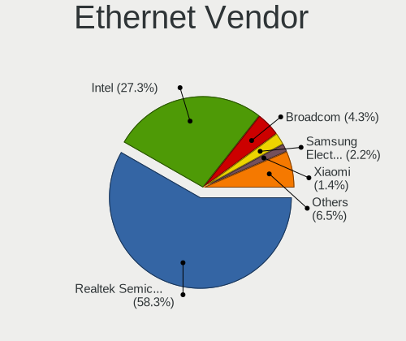

| Vendor                | Desktops | Percent |
|-----------------------|----------|---------|
| Realtek Semiconductor | 39       | 58.21%  |
| Intel                 | 19       | 28.36%  |
| Samsung Electronics   | 2        | 2.99%   |
| Broadcom              | 2        | 2.99%   |
| Xiaomi                | 1        | 1.49%   |
| Qualcomm Atheros      | 1        | 1.49%   |
| OPPO Electronics      | 1        | 1.49%   |
| D-Link System         | 1        | 1.49%   |
| Broadcom Limited      | 1        | 1.49%   |

Ethernet Model
--------------

Ethernet models

| Model                                                                  | Desktops | Percent |
|------------------------------------------------------------------------|----------|---------|
| Realtek RTL8111/8168/8211/8411 PCI Express Gigabit Ethernet Controller | 34       | 50.75%  |
| Intel Ethernet Controller I225-V                                       | 5        | 7.46%   |
| Intel Ethernet Connection (2) I219-V                                   | 3        | 4.48%   |
| Intel 82579LM Gigabit Network Connection (Lewisville)                  | 3        | 4.48%   |
| Realtek RTL8125 2.5GbE Controller                                      | 2        | 2.99%   |
| Realtek RTL810xE PCI Express Fast Ethernet controller                  | 2        | 2.99%   |
| Intel Ethernet Connection (11) I219-LM                                 | 2        | 2.99%   |
| Xiaomi Mi/Redmi series (RNDIS)                                         | 1        | 1.49%   |
| Samsung GT-I9070 (network tethering, USB debugging enabled)            | 1        | 1.49%   |
| Samsung Galaxy series, misc. (tethering mode)                          | 1        | 1.49%   |
| Realtek RTL-8100/8101L/8139 PCI Fast Ethernet Adapter                  | 1        | 1.49%   |
| Qualcomm Atheros AR8161 Gigabit Ethernet                               | 1        | 1.49%   |
| OPPO SM8350-MTP _SN:9338D66C                                           | 1        | 1.49%   |
| Intel I211 Gigabit Network Connection                                  | 1        | 1.49%   |
| Intel Ethernet Connection (17) I219-V                                  | 1        | 1.49%   |
| Intel Ethernet Connection (11) I219-V                                  | 1        | 1.49%   |
| Intel 82578DM Gigabit Network Connection                               | 1        | 1.49%   |
| Intel 82567LM-3 Gigabit Network Connection                             | 1        | 1.49%   |
| Intel 82566DM Gigabit Network Connection                               | 1        | 1.49%   |
| D-Link System DGE-528T Gigabit Ethernet Adapter                        | 1        | 1.49%   |
| Broadcom NetXtreme BCM5762 Gigabit Ethernet PCIe                       | 1        | 1.49%   |
| Broadcom NetXtreme BCM5761 Gigabit Ethernet PCIe                       | 1        | 1.49%   |
| Broadcom Limited NetXtreme BCM5751 Gigabit Ethernet PCI Express        | 1        | 1.49%   |

Net Controller Kind
-------------------

Ethernet, WiFi or modem

| Kind     | Desktops | Percent |
|----------|----------|---------|
| Ethernet | 62       | 56.88%  |
| WiFi     | 47       | 43.12%  |

Used Controller
---------------

Currently used network controller

| Kind     | Desktops | Percent |
|----------|----------|---------|
| Ethernet | 42       | 61.76%  |
| WiFi     | 26       | 38.24%  |

NICs
----

Total network controllers on board

| Total | Desktops | Percent |
|-------|----------|---------|
| 1     | 38       | 61.29%  |
| 2     | 24       | 38.71%  |

IPv6
----

IPv6 vs IPv4

| Used | Desktops | Percent |
|------|----------|---------|
| No   | 44       | 70.97%  |
| Yes  | 18       | 29.03%  |

Bluetooth
---------

Bluetooth Vendor
----------------

Controller vendors

| Vendor                  | Desktops | Percent |
|-------------------------|----------|---------|
| Intel                   | 10       | 34.48%  |
| Cambridge Silicon Radio | 6        | 20.69%  |
| MediaTek                | 3        | 10.34%  |
| Broadcom                | 3        | 10.34%  |
| Realtek Semiconductor   | 2        | 6.9%    |
| TP-Link                 | 1        | 3.45%   |
| Lite-On Technology      | 1        | 3.45%   |
| IMC Networks            | 1        | 3.45%   |
| Foxconn / Hon Hai       | 1        | 3.45%   |
| Creative Technology     | 1        | 3.45%   |

Bluetooth Model
---------------

Controller models

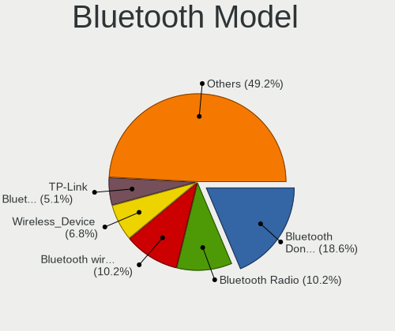

| Model                                               | Desktops | Percent |
|-----------------------------------------------------|----------|---------|
| Cambridge Silicon Radio Bluetooth Dongle (HCI mode) | 6        | 20.69%  |
| MediaTek Wireless_Device                            | 3        | 10.34%  |
| Realtek Bluetooth Radio                             | 2        | 6.9%    |
| Intel Wireless-AC 9260 Bluetooth Adapter            | 2        | 6.9%    |
| Intel AX210 Bluetooth                               | 2        | 6.9%    |
| Intel AX201 Bluetooth                               | 2        | 6.9%    |
| Broadcom BCM20702A0 Bluetooth 4.0                   | 2        | 6.9%    |
| TP-Link UB500 Adapter                               | 1        | 3.45%   |
| Lite-On Qualcomm Atheros QCA9377 Bluetooth          | 1        | 3.45%   |
| Intel Wireless-AC 3168 Bluetooth                    | 1        | 3.45%   |
| Intel Bluetooth wireless interface                  | 1        | 3.45%   |
| Intel Bluetooth 9460/9560 Jefferson Peak (JfP)      | 1        | 3.45%   |
| Intel AX200 Bluetooth                               | 1        | 3.45%   |
| IMC Networks Wireless_Device                        | 1        | 3.45%   |
| Foxconn / Hon Hai Wireless_Device                   | 1        | 3.45%   |
| Creative Bluetooth Audio W2                         | 1        | 3.45%   |
| Broadcom Bluetooth Controller                       | 1        | 3.45%   |

Sound
-----

Sound Vendor
------------

Sound card vendors

| Vendor               | Desktops | Percent |
|----------------------|----------|---------|
| Intel                | 39       | 38.61%  |
| Nvidia               | 27       | 26.73%  |
| AMD                  | 22       | 21.78%  |
| Creative Labs        | 3        | 2.97%   |
| C-Media Electronics  | 3        | 2.97%   |
| Logitech             | 1        | 0.99%   |
| iConnectivity        | 1        | 0.99%   |
| Giga-Byte Technology | 1        | 0.99%   |
| Focusrite-Novation   | 1        | 0.99%   |
| Emotiva              | 1        | 0.99%   |
| Corsair              | 1        | 0.99%   |
| ASUSTek Computer     | 1        | 0.99%   |

Sound Model
-----------

Sound card models

| Model                                                                                             | Desktops | Percent |
|---------------------------------------------------------------------------------------------------|----------|---------|
| Intel 7 Series/C216 Chipset Family High Definition Audio Controller                               | 5        | 4.39%   |
| AMD Starship/Matisse HD Audio Controller                                                          | 5        | 4.39%   |
| AMD Family 17h/19h HD Audio Controller                                                            | 5        | 4.39%   |
| Intel 6 Series/C200 Series Chipset Family High Definition Audio Controller                        | 4        | 3.51%   |
| Intel 200 Series PCH HD Audio                                                                     | 4        | 3.51%   |
| AMD SBx00 Azalia (Intel HDA)                                                                      | 4        | 3.51%   |
| AMD Rembrandt Radeon High Definition Audio Controller                                             | 4        | 3.51%   |
| AMD Ellesmere HDMI Audio [Radeon RX 470/480 / 570/580/590]                                        | 4        | 3.51%   |
| Nvidia GP107GL High Definition Audio Controller                                                   | 3        | 2.63%   |
| Nvidia GF119 HDMI Audio Controller                                                                | 3        | 2.63%   |
| Nvidia GA104 High Definition Audio Controller                                                     | 3        | 2.63%   |
| Intel NM10/ICH7 Family High Definition Audio Controller                                           | 3        | 2.63%   |
| Intel Alder Lake-S HD Audio Controller                                                            | 3        | 2.63%   |
| Intel 8 Series/C220 Series Chipset High Definition Audio Controller                               | 3        | 2.63%   |
| AMD Family 17h (Models 00h-0fh) HD Audio Controller                                               | 3        | 2.63%   |
| Nvidia TU106 High Definition Audio Controller                                                     | 2        | 1.75%   |
| Nvidia GP108 High Definition Audio Controller                                                     | 2        | 1.75%   |
| Nvidia GP106 High Definition Audio Controller                                                     | 2        | 1.75%   |
| Nvidia GP102 HDMI Audio Controller                                                                | 2        | 1.75%   |
| Nvidia GK110 High Definition Audio Controller                                                     | 2        | 1.75%   |
| Intel Xeon E3-1200 v3/4th Gen Core Processor HD Audio Controller                                  | 2        | 1.75%   |
| Intel Comet Lake PCH cAVS                                                                         | 2        | 1.75%   |
| Intel Celeron/Pentium Silver Processor High Definition Audio                                      | 2        | 1.75%   |
| AMD Renoir Radeon High Definition Audio Controller                                                | 2        | 1.75%   |
| Nvidia TU107 GeForce GTX 1650 High Definition Audio Controller                                    | 1        | 0.88%   |
| Nvidia High Definition Audio Controller                                                           | 1        | 0.88%   |
| Nvidia GP104 High Definition Audio Controller                                                     | 1        | 0.88%   |
| Nvidia GM206 High Definition Audio Controller                                                     | 1        | 0.88%   |
| Nvidia GM107 High Definition Audio Controller [GeForce 940MX]                                     | 1        | 0.88%   |
| Nvidia GK208 HDMI/DP Audio Controller                                                             | 1        | 0.88%   |
| Nvidia GF116 High Definition Audio Controller                                                     | 1        | 0.88%   |
| Nvidia GF114 HDMI Audio Controller                                                                | 1        | 0.88%   |
| Logitech Blue Microphones                                                                         | 1        | 0.88%   |
| Intel Tiger Lake-H HD Audio Controller                                                            | 1        | 0.88%   |
| Intel Jasper Lake HD Audio                                                                        | 1        | 0.88%   |
| Intel HD Graphics SGPC                                                                            | 1        | 0.88%   |
| Intel Celeron N3350/Pentium N4200/Atom E3900 Series Audio Cluster                                 | 1        | 0.88%   |
| Intel Cannon Lake PCH cAVS                                                                        | 1        | 0.88%   |
| Intel Atom/Celeron/Pentium Processor x5-E8000/J3xxx/N3xxx Series High Definition Audio Controller | 1        | 0.88%   |
| Intel 9 Series Chipset Family HD Audio Controller                                                 | 1        | 0.88%   |

Memory
------

Memory Vendor
-------------

Memory module vendors

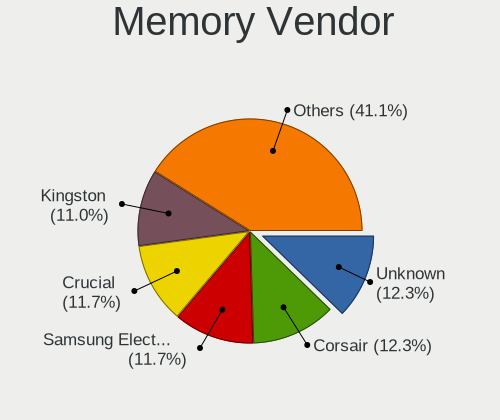

| Vendor                                  | Desktops | Percent |
|-----------------------------------------|----------|---------|
| Samsung Electronics                     | 11       | 14.1%   |
| Kingston                                | 11       | 14.1%   |
| Crucial                                 | 10       | 12.82%  |
| Unknown                                 | 9        | 11.54%  |
| Corsair                                 | 8        | 10.26%  |
| G.Skill                                 | 6        | 7.69%   |
| SK hynix                                | 5        | 6.41%   |
| Micron Technology                       | 5        | 6.41%   |
| A-DATA Technology                       | 3        | 3.85%   |
| Team                                    | 2        | 2.56%   |
| Unknown (ABCD)                          | 1        | 1.28%   |
| Timetec                                 | 1        | 1.28%   |
| Silicon Power Computer & Communications | 1        | 1.28%   |
| Ramaxel Technology                      | 1        | 1.28%   |
| Qumo                                    | 1        | 1.28%   |
| Nanya Technology                        | 1        | 1.28%   |
| Elpida                                  | 1        | 1.28%   |
| Apacer                                  | 1        | 1.28%   |

Memory Model
------------

Memory module models

| Model                                                        | Desktops | Percent |
|--------------------------------------------------------------|----------|---------|
| Corsair RAM CMK16GX4M2B3200C16 8GB DIMM DDR4 3600MT/s        | 3        | 3.57%   |
| Unknown RAM Module 8GB DIMM DDR3 1600MT/s                    | 2        | 2.38%   |
| Samsung RAM M378B5173QH0-CK0 4GB DIMM DDR3 1600MT/s          | 2        | 2.38%   |
| Unknown RAM Module 8GB DIMM DDR4 2667MT/s                    | 1        | 1.19%   |
| Unknown RAM Module 4GB DIMM 1333MT/s                         | 1        | 1.19%   |
| Unknown RAM Module 2GB DIMM SDRAM 667MT/s                    | 1        | 1.19%   |
| Unknown RAM Module 2GB DIMM DDR2                             | 1        | 1.19%   |
| Unknown RAM Module 2GB DIMM 800MT/s                          | 1        | 1.19%   |
| Unknown RAM Module 2GB DIMM 1333MT/s                         | 1        | 1.19%   |
| Unknown RAM DDR4 NB 8G 2666 8GB SODIMM DDR4 2667MT/s         | 1        | 1.19%   |
| Unknown (ABCD) RAM 123456789012345678 4GB DIMM DDR4 2400MT/s | 1        | 1.19%   |
| Timetec RAM SD4-2133 4GB SODIMM DDR4 2133MT/s                | 1        | 1.19%   |
| Team RAM Vulcan-1600 8GB DIMM DDR3 1333MT/s                  | 1        | 1.19%   |
| Team RAM UD5-6000 16GB DIMM DDR5 6000MT/s                    | 1        | 1.19%   |
| SK hynix RAM Module 16GB DIMM DDR4 3200MT/s                  | 1        | 1.19%   |
| SK hynix RAM HMT451U6BFR8C-PB 4GB DIMM DDR3 1600MT/s         | 1        | 1.19%   |
| SK hynix RAM HMT351U6CFR8C-PB 4GB DIMM DDR3 1800MT/s         | 1        | 1.19%   |
| SK hynix RAM HMT351U6CFR8C-PB 4GB DIMM DDR3 1600MT/s         | 1        | 1.19%   |
| SK hynix RAM HMT125U7TFR8C-H9 2GB DIMM DDR3 1333MT/s         | 1        | 1.19%   |
| Silicon Power & RAM Module 16GB DIMM DDR4 3200MT/s           | 1        | 1.19%   |
| Samsung RAM M471B5173QH0-YK0 4GB DIMM DDR3 1600MT/s          | 1        | 1.19%   |
| Samsung RAM M391B5673DZ1-CF8 2GB DIMM DDR3 1067MT/s          | 1        | 1.19%   |
| Samsung RAM M378B5273DH0-CH9 4096MB DIMM DDR3 2133MT/s       | 1        | 1.19%   |
| Samsung RAM M378B5273CH0-CH9 4GB DIMM DDR3 1867MT/s          | 1        | 1.19%   |
| Samsung RAM M378B5173QH0-YK0 4GB DIMM DDR3 1600MT/s          | 1        | 1.19%   |
| Samsung RAM M378B5173EB0-YK0 4GB DIMM DDR3 1600MT/s          | 1        | 1.19%   |
| Samsung RAM M378A5244CB0-CTD 4GB DIMM DDR4 3334MT/s          | 1        | 1.19%   |
| Samsung RAM M3 78T6553BZ0-KCC 512MB DIMM DDR2 400MT/s        | 1        | 1.19%   |
| Samsung RAM M3 78T5663EH3-CF7 2GB DIMM DDR2 800MT/s          | 1        | 1.19%   |
| Samsung RAM M3 78T2863RZS-CF7 1GB DIMM DDR2 800MT/s          | 1        | 1.19%   |
| Samsung RAM M3 78T2863QZS-CF7 1GB DIMM DDR 800MT/s           | 1        | 1.19%   |
| Ramaxel RAM RMR5040ED58E9W1600 4GB DIMM DDR3 1600MT/s        | 1        | 1.19%   |
| Qumo RAM QUM4U-8G2133P15 8GB DIMM DDR4 2133MT/s              | 1        | 1.19%   |
| Nanya RAM NT512T64U88A0F-5A 512MB DIMM DDR2 400MT/s          | 1        | 1.19%   |
| Micron RAM 8JTF51264AZ-1G6E1 4GB DIMM DDR3 1600MT/s          | 1        | 1.19%   |
| Micron RAM 8JTF25664AZ-1G4M1 2GB DIMM DDR3 1333MT/s          | 1        | 1.19%   |
| Micron RAM 8HTF6464AY-53ED7 512MB DIMM DDR2 533MT/s          | 1        | 1.19%   |
| Micron RAM 18KSF1G72AZ-1G6P1 8GB DIMM DDR3 1600MT/s          | 1        | 1.19%   |
| Micron RAM 16JTF51264AZ-1G4M 4GB DIMM DDR3 1333MT/s          | 1        | 1.19%   |
| Kingston RAM Module 8GB DIMM DDR4 3200MT/s                   | 1        | 1.19%   |

Memory Kind
-----------

Memory module kinds

| Kind    | Desktops | Percent |
|---------|----------|---------|
| DDR4    | 28       | 44.44%  |
| DDR3    | 21       | 33.33%  |
| DDR5    | 4        | 6.35%   |
| SDRAM   | 3        | 4.76%   |
| DDR2    | 3        | 4.76%   |
| Unknown | 3        | 4.76%   |
| LPDDR4  | 1        | 1.59%   |

Memory Form Factor
------------------

Physical design of the memory module

| Name   | Desktops | Percent |
|--------|----------|---------|
| DIMM   | 56       | 90.32%  |
| SODIMM | 6        | 9.68%   |

Memory Size
-----------

Memory module size

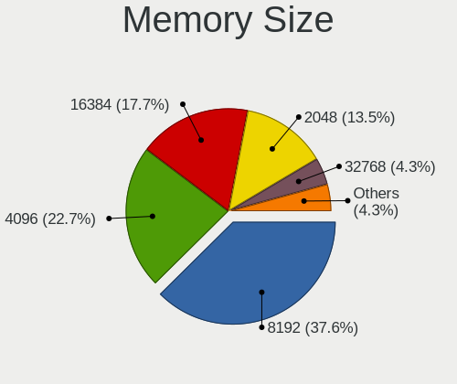

| Size  | Desktops | Percent |
|-------|----------|---------|
| 8192  | 25       | 38.46%  |
| 4096  | 15       | 23.08%  |
| 16384 | 13       | 20%     |
| 2048  | 8        | 12.31%  |
| 32768 | 2        | 3.08%   |
| 1024  | 1        | 1.54%   |
| 512   | 1        | 1.54%   |

Memory Speed
------------

Memory module speed

| Speed   | Desktops | Percent |
|---------|----------|---------|
| 1600    | 14       | 18.92%  |
| 3200    | 9        | 12.16%  |
| 1333    | 8        | 10.81%  |
| 3600    | 6        | 8.11%   |
| 2667    | 5        | 6.76%   |
| 2400    | 4        | 5.41%   |
| 2133    | 3        | 4.05%   |
| 6000    | 2        | 2.7%    |
| 1867    | 2        | 2.7%    |
| 1866    | 2        | 2.7%    |
| 1800    | 2        | 2.7%    |
| 800     | 2        | 2.7%    |
| 6400    | 1        | 1.35%   |
| 4800    | 1        | 1.35%   |
| 4000    | 1        | 1.35%   |
| 3400    | 1        | 1.35%   |
| 3334    | 1        | 1.35%   |
| 3066    | 1        | 1.35%   |
| 2933    | 1        | 1.35%   |
| 2666    | 1        | 1.35%   |
| 2048    | 1        | 1.35%   |
| 1334    | 1        | 1.35%   |
| 1067    | 1        | 1.35%   |
| 667     | 1        | 1.35%   |
| 533     | 1        | 1.35%   |
| 400     | 1        | 1.35%   |
| Unknown | 1        | 1.35%   |

Printers & scanners
-------------------

Printer Vendor
--------------

Printer device vendors

| Vendor             | Desktops | Percent |
|--------------------|----------|---------|
| Canon              | 2        | 66.67%  |
| Brother Industries | 1        | 33.33%  |

Printer Model
-------------

Printer device models

| Model                     | Desktops | Percent |
|---------------------------|----------|---------|
| Canon PIXMA MG5600 Series | 1        | 33.33%  |
| Canon PIXMA MG2500 Series | 1        | 33.33%  |
| Brother HL-L2350DW series | 1        | 33.33%  |

Scanner Vendor
--------------

Scanner device vendors

| Vendor      | Desktops | Percent |
|-------------|----------|---------|
| Seiko Epson | 1        | 50%     |
| Canon       | 1        | 50%     |

Scanner Model
-------------

Scanner device models

| Model                                 | Desktops | Percent |
|---------------------------------------|----------|---------|
| Seiko Epson GT-X770 [Perfection V500] | 1        | 50%     |
| Canon CanoScan 8800F                  | 1        | 50%     |

Camera
------

Camera Vendor
-------------

Camera device vendors

| Vendor                                 | Desktops | Percent |
|----------------------------------------|----------|---------|
| Logitech                               | 4        | 44.44%  |
| Z-Star Microelectronics                | 1        | 11.11%  |
| Hewlett-Packard                        | 1        | 11.11%  |
| Cheng Uei Precision Industry (Foxlink) | 1        | 11.11%  |
| Aveo Technology                        | 1        | 11.11%  |
| ARC International                      | 1        | 11.11%  |

Camera Model
------------

Camera device models

| Model                                                       | Desktops | Percent |
|-------------------------------------------------------------|----------|---------|
| Logitech C922 Pro Stream Webcam                             | 2        | 22.22%  |
| Z-Star Traveler TV 6500 SF Dia-scanner                      | 1        | 11.11%  |
| Logitech Portable Webcam C905                               | 1        | 11.11%  |
| Logitech HD Webcam C910                                     | 1        | 11.11%  |
| HP Webcam HD 2300                                           | 1        | 11.11%  |
| Cheng Uei Precision Industry (Foxlink) HP Integrated Webcam | 1        | 11.11%  |
| Aveo Camera                                                 | 1        | 11.11%  |
| ARC International Camera                                    | 1        | 11.11%  |

Security
--------

Fingerprint Vendor
------------------

Fingerprint sensor vendors

Zero info for selected period =(

Fingerprint Model
-----------------

Fingerprint sensor models

Zero info for selected period =(

Chipcard Vendor
---------------

Chipcard module vendors

| Vendor              | Desktops | Percent |
|---------------------|----------|---------|
| Chicony Electronics | 1        | 100%    |

Chipcard Model
--------------

Chipcard module models

| Model                                                | Desktops | Percent |
|------------------------------------------------------|----------|---------|
| Chicony Electronics HP Skylab USB Smartcard Keyboard | 1        | 100%    |

Unsupported
-----------

Unsupported Devices
-------------------

Total unsupported devices on board

| Total | Desktops | Percent |
|-------|----------|---------|
| 0     | 46       | 73.02%  |
| 1     | 16       | 25.4%   |
| 2     | 1        | 1.59%   |

Unsupported Device Types
------------------------

Types of unsupported devices

| Type                     | Desktops | Percent |
|--------------------------|----------|---------|
| Net/wireless             | 10       | 58.82%  |
| Card reader              | 2        | 11.76%  |
| Network                  | 1        | 5.88%   |
| Graphics card            | 1        | 5.88%   |
| Communication controller | 1        | 5.88%   |
| Chipcard                 | 1        | 5.88%   |
| Bluetooth                | 1        | 5.88%   |

