MX 23 - Tested Hardware & Statistics (Desktops)
-----------------------------------------------

A project to collect tested hardware configurations for MX 23.

Anyone can contribute to this report by the [hw-probe](https://github.com/linuxhw/hw-probe) tool:

    sudo -E hw-probe -all -upload

Please contribute! Especially if your hardware is rare.

Contents
--------

* [ Test Cases ](#test-cases)

* [ System ](#system)
  - [ Kernel                   ](#kernel)
  - [ Kernel Family            ](#kernel-family)
  - [ Kernel Major Ver.        ](#kernel-major-ver)
  - [ Arch                     ](#arch)
  - [ DE                       ](#de)
  - [ Display Server           ](#display-server)
  - [ Display Manager          ](#display-manager)
  - [ OS Lang                  ](#os-lang)
  - [ Boot Mode                ](#boot-mode)
  - [ Filesystem               ](#filesystem)
  - [ Part. scheme             ](#part-scheme)
  - [ Dual Boot with Linux/BSD ](#dual-boot-with-linuxbsd)
  - [ Dual Boot (Win)          ](#dual-boot-win)

* [ Board ](#board)
  - [ Vendor                   ](#vendor)
  - [ Model                    ](#model)
  - [ Model Family             ](#model-family)
  - [ MFG Year                 ](#mfg-year)
  - [ Form Factor              ](#form-factor)
  - [ Secure Boot              ](#secure-boot)
  - [ Coreboot                 ](#coreboot)
  - [ RAM Size                 ](#ram-size)
  - [ RAM Used                 ](#ram-used)
  - [ Total Drives             ](#total-drives)
  - [ Has CD-ROM               ](#has-cd-rom)
  - [ Has Ethernet             ](#has-ethernet)
  - [ Has WiFi                 ](#has-wifi)
  - [ Has Bluetooth            ](#has-bluetooth)

* [ Location ](#location)
  - [ Country                  ](#country)
  - [ City                     ](#city)

* [ Drives ](#drives)
  - [ Drive Vendor             ](#drive-vendor)
  - [ Drive Model              ](#drive-model)
  - [ HDD Vendor               ](#hdd-vendor)
  - [ SSD Vendor               ](#ssd-vendor)
  - [ Drive Kind               ](#drive-kind)
  - [ Drive Connector          ](#drive-connector)
  - [ Drive Size               ](#drive-size)
  - [ Space Total              ](#space-total)
  - [ Space Used               ](#space-used)
  - [ Malfunc. Drives          ](#malfunc-drives)
  - [ Malfunc. Drive Vendor    ](#malfunc-drive-vendor)
  - [ Malfunc. HDD Vendor      ](#malfunc-hdd-vendor)
  - [ Malfunc. Drive Kind      ](#malfunc-drive-kind)
  - [ Failed Drives            ](#failed-drives)
  - [ Failed Drive Vendor      ](#failed-drive-vendor)
  - [ Drive Status             ](#drive-status)

* [ Storage controller ](#storage-controller)
  - [ Storage Vendor           ](#storage-vendor)
  - [ Storage Model            ](#storage-model)
  - [ Storage Kind             ](#storage-kind)

* [ Processor ](#processor)
  - [ CPU Vendor               ](#cpu-vendor)
  - [ CPU Model                ](#cpu-model)
  - [ CPU Model Family         ](#cpu-model-family)
  - [ CPU Cores                ](#cpu-cores)
  - [ CPU Sockets              ](#cpu-sockets)
  - [ CPU Threads              ](#cpu-threads)
  - [ CPU Op-Modes             ](#cpu-op-modes)
  - [ CPU Microcode            ](#cpu-microcode)
  - [ CPU Microarch            ](#cpu-microarch)

* [ Graphics ](#graphics)
  - [ GPU Vendor               ](#gpu-vendor)
  - [ GPU Model                ](#gpu-model)
  - [ GPU Combo                ](#gpu-combo)
  - [ GPU Driver               ](#gpu-driver)
  - [ GPU Memory               ](#gpu-memory)

* [ Monitor ](#monitor)
  - [ Monitor Vendor           ](#monitor-vendor)
  - [ Monitor Model            ](#monitor-model)
  - [ Monitor Resolution       ](#monitor-resolution)
  - [ Monitor Diagonal         ](#monitor-diagonal)
  - [ Monitor Width            ](#monitor-width)
  - [ Aspect Ratio             ](#aspect-ratio)
  - [ Monitor Area             ](#monitor-area)
  - [ Pixel Density            ](#pixel-density)
  - [ Multiple Monitors        ](#multiple-monitors)

* [ Network ](#network)
  - [ Net Controller Vendor    ](#net-controller-vendor)
  - [ Net Controller Model     ](#net-controller-model)
  - [ Wireless Vendor          ](#wireless-vendor)
  - [ Wireless Model           ](#wireless-model)
  - [ Ethernet Vendor          ](#ethernet-vendor)
  - [ Ethernet Model           ](#ethernet-model)
  - [ Net Controller Kind      ](#net-controller-kind)
  - [ Used Controller          ](#used-controller)
  - [ NICs                     ](#nics)
  - [ IPv6                     ](#ipv6)

* [ Bluetooth ](#bluetooth)
  - [ Bluetooth Vendor         ](#bluetooth-vendor)
  - [ Bluetooth Model          ](#bluetooth-model)

* [ Sound ](#sound)
  - [ Sound Vendor             ](#sound-vendor)
  - [ Sound Model              ](#sound-model)

* [ Memory ](#memory)
  - [ Memory Vendor            ](#memory-vendor)
  - [ Memory Model             ](#memory-model)
  - [ Memory Kind              ](#memory-kind)
  - [ Memory Form Factor       ](#memory-form-factor)
  - [ Memory Size              ](#memory-size)
  - [ Memory Speed             ](#memory-speed)

* [ Printers & scanners ](#printers--scanners)
  - [ Printer Vendor           ](#printer-vendor)
  - [ Printer Model            ](#printer-model)
  - [ Scanner Vendor           ](#scanner-vendor)
  - [ Scanner Model            ](#scanner-model)

* [ Camera ](#camera)
  - [ Camera Vendor            ](#camera-vendor)
  - [ Camera Model             ](#camera-model)

* [ Security ](#security)
  - [ Fingerprint Vendor       ](#fingerprint-vendor)
  - [ Fingerprint Model        ](#fingerprint-model)
  - [ Chipcard Vendor          ](#chipcard-vendor)
  - [ Chipcard Model           ](#chipcard-model)

* [ Unsupported ](#unsupported)
  - [ Unsupported Devices      ](#unsupported-devices)
  - [ Unsupported Device Types ](#unsupported-device-types)

Test Cases
----------

Total: 169

| Vendor        | Model                       | Probe                                                      | Date         |
|---------------|-----------------------------|------------------------------------------------------------|--------------|
| Biostar       | H81MHV3                     | [d03cc0092f](https://linux-hardware.org/?probe=d03cc0092f) | Jan 05, 2025 |
| MSI           | B250M BAZOOKA               | [30ef92bbfc](https://linux-hardware.org/?probe=30ef92bbfc) | Jan 05, 2025 |
| Gigabyte      | Z390 AORUS PRO-CF           | [315981955a](https://linux-hardware.org/?probe=315981955a) | Jan 03, 2025 |
| Gigabyte      | Z390 AORUS PRO-CF           | [118b96c4df](https://linux-hardware.org/?probe=118b96c4df) | Jan 03, 2025 |
| Lenovo        | 30D0 SDK0J40697 WIN 3305... | [9494acd014](https://linux-hardware.org/?probe=9494acd014) | Dec 31, 2024 |
| Shenzhen D... | MP100                       | [ed4c3517e1](https://linux-hardware.org/?probe=ed4c3517e1) | Dec 31, 2024 |
| ASUSTek       | Z170 PRO GAMING             | [4825814497](https://linux-hardware.org/?probe=4825814497) | Dec 28, 2024 |
| MSI           | H61M-P20                    | [f15424c030](https://linux-hardware.org/?probe=f15424c030) | Dec 19, 2024 |
| Gigabyte      | B560M DS3H V2               | [00c881af99](https://linux-hardware.org/?probe=00c881af99) | Dec 09, 2024 |
| ASRock        | Z390 Phantom Gaming 9       | [6573a24594](https://linux-hardware.org/?probe=6573a24594) | Dec 01, 2024 |
| Dell          | 0DR845                      | [1b6afa334f](https://linux-hardware.org/?probe=1b6afa334f) | Nov 29, 2024 |
| ASUSTek       | PRIME X670-P WIFI           | [b671dd7405](https://linux-hardware.org/?probe=b671dd7405) | Nov 26, 2024 |
| Lenovo        | 3148 SDK0J40700 WIN 3258... | [10abdf7972](https://linux-hardware.org/?probe=10abdf7972) | Nov 24, 2024 |
| Gigabyte      | B550 AORUS ELITE V2         | [065b59e739](https://linux-hardware.org/?probe=065b59e739) | Nov 18, 2024 |
| Dell          | 073MMW A03                  | [f7d046b276](https://linux-hardware.org/?probe=f7d046b276) | Nov 15, 2024 |
| ASRock        | A75M-HVS                    | [71e383d168](https://linux-hardware.org/?probe=71e383d168) | Nov 14, 2024 |
| SYS           | H310CH5-TI2                 | [8d26063a45](https://linux-hardware.org/?probe=8d26063a45) | Nov 13, 2024 |
| HP            | 829D                        | [bbd6f07955](https://linux-hardware.org/?probe=bbd6f07955) | Nov 08, 2024 |
| ASUSTek       | PRIME A320M-K               | [0f2501a96e](https://linux-hardware.org/?probe=0f2501a96e) | Nov 07, 2024 |
| HP            | 829D                        | [ce428beb45](https://linux-hardware.org/?probe=ce428beb45) | Nov 07, 2024 |
| HP            | 8265                        | [91d18e37fc](https://linux-hardware.org/?probe=91d18e37fc) | Nov 07, 2024 |
| Lenovo        | ThinkCentre M71e 3129B2G    | [0f3c377fbc](https://linux-hardware.org/?probe=0f3c377fbc) | Nov 03, 2024 |
| MSI           | MAG B550 TOMAHAWK           | [2aaad8cdd1](https://linux-hardware.org/?probe=2aaad8cdd1) | Nov 01, 2024 |
| Unknown       | Unknown                     | [b73f669319](https://linux-hardware.org/?probe=b73f669319) | Oct 31, 2024 |
| Unknown       | Unknown                     | [aabc0b8d5c](https://linux-hardware.org/?probe=aabc0b8d5c) | Oct 31, 2024 |
| Samsung       | DeskTop System              | [ca4fa68a45](https://linux-hardware.org/?probe=ca4fa68a45) | Oct 27, 2024 |
| Intel         | H61                         | [8460791859](https://linux-hardware.org/?probe=8460791859) | Oct 27, 2024 |
| Gigabyte      | P35-S3G                     | [c38dd7e7f6](https://linux-hardware.org/?probe=c38dd7e7f6) | Oct 24, 2024 |
| Gigabyte      | P35-S3G                     | [fc78d0d762](https://linux-hardware.org/?probe=fc78d0d762) | Oct 24, 2024 |
| Gigabyte      | B360 AORUS GAMING 3 WIFI... | [9644c911da](https://linux-hardware.org/?probe=9644c911da) | Oct 18, 2024 |
| ASRock        | Z370 Pro4                   | [768bfdaf9a](https://linux-hardware.org/?probe=768bfdaf9a) | Oct 17, 2024 |
| MSI           | H110M PRO-VD                | [cc09ec8aa4](https://linux-hardware.org/?probe=cc09ec8aa4) | Oct 16, 2024 |
| ASUSTek       | PRIME B450M-A II            | [bc9f2b478b](https://linux-hardware.org/?probe=bc9f2b478b) | Oct 14, 2024 |
| ASUSTek       | H110M-C/BR                  | [e0bf2cc58a](https://linux-hardware.org/?probe=e0bf2cc58a) | Oct 13, 2024 |
| ASUSTek       | PRIME B450M-A               | [4747b9f85b](https://linux-hardware.org/?probe=4747b9f85b) | Oct 10, 2024 |
| ASUSTek       | P8H61-M LX3 R2.0            | [8c8eabd7b6](https://linux-hardware.org/?probe=8c8eabd7b6) | Oct 10, 2024 |
| HP            | 0A5Ch                       | [c1d6e5486d](https://linux-hardware.org/?probe=c1d6e5486d) | Sep 29, 2024 |
| Intel         | H110D4-P1                   | [626cc0fd13](https://linux-hardware.org/?probe=626cc0fd13) | Sep 28, 2024 |
| Gigabyte      | B360M AORUS Gaming 3-CF     | [2b9c6f05fe](https://linux-hardware.org/?probe=2b9c6f05fe) | Sep 28, 2024 |
| ASUSTek       | TUF Gaming Z690-PLUS WIF... | [2591c32e72](https://linux-hardware.org/?probe=2591c32e72) | Sep 27, 2024 |
| Intel         | B75                         | [17dd91b6f2](https://linux-hardware.org/?probe=17dd91b6f2) | Sep 24, 2024 |
| Gigabyte      | B450M H                     | [be59e2f196](https://linux-hardware.org/?probe=be59e2f196) | Sep 20, 2024 |
| MSI           | A78-G41 PC Mate             | [941b873461](https://linux-hardware.org/?probe=941b873461) | Sep 16, 2024 |
| MSI           | A78-G41 PC Mate             | [5cb76e009d](https://linux-hardware.org/?probe=5cb76e009d) | Sep 16, 2024 |
| ASRock        | Z490 Steel Legend           | [ea538bf56c](https://linux-hardware.org/?probe=ea538bf56c) | Sep 12, 2024 |
| Acer          | RS880M05                    | [4998887624](https://linux-hardware.org/?probe=4998887624) | Sep 03, 2024 |
| Acer          | RS880M05                    | [e421cfccdf](https://linux-hardware.org/?probe=e421cfccdf) | Sep 03, 2024 |
| Gigabyte      | GB-BSi5-1135G7              | [24c103a266](https://linux-hardware.org/?probe=24c103a266) | Aug 31, 2024 |
| Dell          | 0RF703                      | [e82a1ff8e3](https://linux-hardware.org/?probe=e82a1ff8e3) | Aug 29, 2024 |
| HP            | 82F1                        | [5bd98b8749](https://linux-hardware.org/?probe=5bd98b8749) | Aug 25, 2024 |
| HP            | 82F1                        | [1dcd4be378](https://linux-hardware.org/?probe=1dcd4be378) | Aug 25, 2024 |
| ASRock        | B650E PG Riptide WiFi       | [fe852bd498](https://linux-hardware.org/?probe=fe852bd498) | Aug 22, 2024 |
| Gigabyte      | B650 AORUS ELITE AX V2      | [fe6038ad0d](https://linux-hardware.org/?probe=fe6038ad0d) | Aug 14, 2024 |
| ASUSTek       | ROG STRIX B450-F GAMING     | [f17d30bee1](https://linux-hardware.org/?probe=f17d30bee1) | Aug 10, 2024 |
| ASUSTek       | ROG STRIX B450-F GAMING     | [49d572df1d](https://linux-hardware.org/?probe=49d572df1d) | Aug 10, 2024 |
| Gigabyte      | B150M-D3H-CF                | [dc966fdca4](https://linux-hardware.org/?probe=dc966fdca4) | Aug 09, 2024 |
| HP            | 0A04h                       | [f476265afe](https://linux-hardware.org/?probe=f476265afe) | Aug 08, 2024 |
| ASUSTek       | P5Q-EM                      | [a4984bb698](https://linux-hardware.org/?probe=a4984bb698) | Aug 05, 2024 |
| GEEKOM        | Mini IT13                   | [23c5c50556](https://linux-hardware.org/?probe=23c5c50556) | Jul 27, 2024 |
| Acer          | H610MHP-E                   | [54e0a6ed60](https://linux-hardware.org/?probe=54e0a6ed60) | Jul 22, 2024 |
| HC Technol... | HCAR5000-MI                 | [0662223517](https://linux-hardware.org/?probe=0662223517) | Jul 22, 2024 |
| Lenovo        | SHARKBAY NOK                | [768145912a](https://linux-hardware.org/?probe=768145912a) | Jul 20, 2024 |
| Lenovo        | ThinkCentre A58 75227SG     | [e8606d105c](https://linux-hardware.org/?probe=e8606d105c) | Jul 18, 2024 |
| HP            | 8266                        | [be8a065a36](https://linux-hardware.org/?probe=be8a065a36) | Jul 14, 2024 |
| Medion        | MS-7748                     | [3e7c4e1d43](https://linux-hardware.org/?probe=3e7c4e1d43) | Jul 14, 2024 |
| HP            | 8643 SMVB                   | [6a90ef0cd0](https://linux-hardware.org/?probe=6a90ef0cd0) | Jul 06, 2024 |
| MSI           | B450M PRO-VDH MAX           | [7dcaf9e889](https://linux-hardware.org/?probe=7dcaf9e889) | Jul 06, 2024 |
| Dell          | 0T656F A01                  | [ecdd487673](https://linux-hardware.org/?probe=ecdd487673) | Jul 05, 2024 |
| ASUSTek       | M5A97 R2.0                  | [1f3c85da43](https://linux-hardware.org/?probe=1f3c85da43) | Jul 02, 2024 |
| ASUSTek       | NODUSM3                     | [4b8b2d0cb0](https://linux-hardware.org/?probe=4b8b2d0cb0) | Jun 25, 2024 |
| Fujitsu       | D3067-A1 S26361-D3067-A1    | [3ba33c7694](https://linux-hardware.org/?probe=3ba33c7694) | Jun 23, 2024 |
| Fujitsu       | D3067-A1 S26361-D3067-A1    | [d88a3ae668](https://linux-hardware.org/?probe=d88a3ae668) | Jun 23, 2024 |
| Foxconn       | 45GM/45CM/45CM-S            | [8acebd9a23](https://linux-hardware.org/?probe=8acebd9a23) | Jun 20, 2024 |
| Lenovo        | Remore CRB Win8 STD MM D... | [26694fdf4c](https://linux-hardware.org/?probe=26694fdf4c) | Jun 15, 2024 |
| Gigabyte      | A520M H                     | [4850d46dda](https://linux-hardware.org/?probe=4850d46dda) | Jun 11, 2024 |
| Gigabyte      | A520M H                     | [199f375169](https://linux-hardware.org/?probe=199f375169) | Jun 01, 2024 |
| ASUSTek       | PRIME B360M-C               | [56f7d22d21](https://linux-hardware.org/?probe=56f7d22d21) | May 31, 2024 |
| ASUSTek       | A88XM-A                     | [4b9f7e6b3c](https://linux-hardware.org/?probe=4b9f7e6b3c) | May 29, 2024 |
| Medion        | Z370H4-EM                   | [144540334c](https://linux-hardware.org/?probe=144540334c) | May 28, 2024 |
| Medion        | Z370H4-EM                   | [e833e99cd2](https://linux-hardware.org/?probe=e833e99cd2) | May 26, 2024 |
| Acer          | Nitro N50-620               | [35d81006b0](https://linux-hardware.org/?probe=35d81006b0) | May 25, 2024 |
| Dell          | 042P49 A01                  | [9ef1b2b561](https://linux-hardware.org/?probe=9ef1b2b561) | May 25, 2024 |
| Dell          | 0MGK50 A02                  | [bbcfd5d01e](https://linux-hardware.org/?probe=bbcfd5d01e) | May 16, 2024 |
| Dell          | 0MGK50 A02                  | [09ba1d9fb0](https://linux-hardware.org/?probe=09ba1d9fb0) | May 16, 2024 |
| Pegatron      | EVE                         | [ee182c046b](https://linux-hardware.org/?probe=ee182c046b) | May 15, 2024 |
| Lenovo        | SHARKBAY 0B98401 WIN        | [5a380a95a7](https://linux-hardware.org/?probe=5a380a95a7) | May 13, 2024 |
| ASRock        | X570 Phantom Gaming 4       | [b9519853cd](https://linux-hardware.org/?probe=b9519853cd) | May 05, 2024 |
| ASRock        | X570 Phantom Gaming 4       | [08cb15cda7](https://linux-hardware.org/?probe=08cb15cda7) | May 05, 2024 |
| ASUSTek       | M4A89GTD-PRO                | [d40738eda7](https://linux-hardware.org/?probe=d40738eda7) | Apr 28, 2024 |
| ASRock        | 980DE3/U3S3                 | [9ed5c55a61](https://linux-hardware.org/?probe=9ed5c55a61) | Apr 28, 2024 |
| ASUSTek       | TUF Gaming Z490-PLUS        | [c44f97261d](https://linux-hardware.org/?probe=c44f97261d) | Apr 24, 2024 |
| Dell          | 0K095G A02                  | [a5f4dd8567](https://linux-hardware.org/?probe=a5f4dd8567) | Apr 24, 2024 |
| Dell          | 0K095G A02                  | [0d7d9ad04d](https://linux-hardware.org/?probe=0d7d9ad04d) | Apr 24, 2024 |
| AMI           | Intel                       | [212fd4a0d8](https://linux-hardware.org/?probe=212fd4a0d8) | Apr 22, 2024 |
| AMI           | Intel                       | [2044003b5c](https://linux-hardware.org/?probe=2044003b5c) | Apr 22, 2024 |
| ASUSTek       | ROG STRIX B650-A GAMING ... | [980252a20c](https://linux-hardware.org/?probe=980252a20c) | Apr 18, 2024 |
| Gigabyte      | Z370P D3-CF                 | [70446389fb](https://linux-hardware.org/?probe=70446389fb) | Apr 13, 2024 |
| ASUSTek       | Z170-A                      | [30127a97b5](https://linux-hardware.org/?probe=30127a97b5) | Apr 06, 2024 |
| ASRock        | H77 Pro4-M                  | [4202019d78](https://linux-hardware.org/?probe=4202019d78) | Apr 03, 2024 |
| Gigabyte      | GA-78LMT-USB3               | [7f8a245399](https://linux-hardware.org/?probe=7f8a245399) | Mar 29, 2024 |
| Gigabyte      | GA-78LMT-USB3               | [7b17376565](https://linux-hardware.org/?probe=7b17376565) | Mar 29, 2024 |
| Gigabyte      | H81M-D2V                    | [6bc3e596e6](https://linux-hardware.org/?probe=6bc3e596e6) | Mar 28, 2024 |
| Gigabyte      | B550I AORUS PRO AX          | [e8233f1a8a](https://linux-hardware.org/?probe=e8233f1a8a) | Mar 26, 2024 |
| Dell          | 0HMX8D A01                  | [8cd1470fc0](https://linux-hardware.org/?probe=8cd1470fc0) | Mar 25, 2024 |
| Foxconn       | 2ABF                        | [2eb785461f](https://linux-hardware.org/?probe=2eb785461f) | Mar 23, 2024 |
| Foxconn       | 45GM/45CM/45CM-S            | [4ed069d496](https://linux-hardware.org/?probe=4ed069d496) | Mar 09, 2024 |
| HP            | 2B5A 011                    | [8eb2546f52](https://linux-hardware.org/?probe=8eb2546f52) | Mar 09, 2024 |
| ASUSTek       | TUF Gaming B650M-E WIFI     | [e4944abc1f](https://linux-hardware.org/?probe=e4944abc1f) | Mar 03, 2024 |
| Dell          | 0M863N A01                  | [1db77a3f14](https://linux-hardware.org/?probe=1db77a3f14) | Feb 27, 2024 |
| Gigabyte      | H310M S2H x.x               | [ce358b38bc](https://linux-hardware.org/?probe=ce358b38bc) | Feb 26, 2024 |
| ASUSTek       | SABERTOOTH 990FX R2.0       | [9b25d17d18](https://linux-hardware.org/?probe=9b25d17d18) | Feb 21, 2024 |
| Gigabyte      | X570 GAMING X               | [fab0b459e0](https://linux-hardware.org/?probe=fab0b459e0) | Feb 18, 2024 |
| ASRock        | B450M Pro4-F                | [a98775e16e](https://linux-hardware.org/?probe=a98775e16e) | Feb 13, 2024 |
| ASRock        | 970 Extreme4                | [973c66c65d](https://linux-hardware.org/?probe=973c66c65d) | Feb 07, 2024 |
| HP            | 09E8h                       | [413788d555](https://linux-hardware.org/?probe=413788d555) | Feb 02, 2024 |
| Dell          | 00VTMF A01                  | [3298485dd9](https://linux-hardware.org/?probe=3298485dd9) | Jan 31, 2024 |
| HP            | 304Ah                       | [5e40a8acee](https://linux-hardware.org/?probe=5e40a8acee) | Jan 24, 2024 |
| ASUSTek       | TUF Gaming B660-PLUS WIF... | [6ae01879d8](https://linux-hardware.org/?probe=6ae01879d8) | Jan 23, 2024 |
| HP            | 0A5Ch                       | [f886596563](https://linux-hardware.org/?probe=f886596563) | Jan 23, 2024 |
| Gigabyte      | B650I AORUS ULTRA           | [0da14a9376](https://linux-hardware.org/?probe=0da14a9376) | Jan 18, 2024 |
| HP            | 8750                        | [6dd29a1c24](https://linux-hardware.org/?probe=6dd29a1c24) | Jan 16, 2024 |
| Gigabyte      | B650I AORUS ULTRA           | [33216d3bf8](https://linux-hardware.org/?probe=33216d3bf8) | Jan 16, 2024 |
| Unknown       | GB01                        | [33016aa27b](https://linux-hardware.org/?probe=33016aa27b) | Jan 11, 2024 |
| Unknown       | GB01                        | [551b27fa9b](https://linux-hardware.org/?probe=551b27fa9b) | Jan 11, 2024 |
| Dell          | 0KV62T A00                  | [17aa442f24](https://linux-hardware.org/?probe=17aa442f24) | Jan 10, 2024 |
| HP            | 8265                        | [da63a4f9c1](https://linux-hardware.org/?probe=da63a4f9c1) | Jan 05, 2024 |
| HP            | 8265                        | [94344dbe98](https://linux-hardware.org/?probe=94344dbe98) | Dec 28, 2023 |
| Dell          | 033FF6 A00                  | [977367b99e](https://linux-hardware.org/?probe=977367b99e) | Dec 26, 2023 |
| Dell          | 033FF6 A00                  | [88cad415fb](https://linux-hardware.org/?probe=88cad415fb) | Dec 21, 2023 |
| ASUSTek       | TUF Gaming X570-PLUS        | [f912bcd96a](https://linux-hardware.org/?probe=f912bcd96a) | Dec 20, 2023 |
| HP            | 8265                        | [cc0b59e7f7](https://linux-hardware.org/?probe=cc0b59e7f7) | Dec 13, 2023 |
| Gigabyte      | MRHM7AP                     | [ba4400c919](https://linux-hardware.org/?probe=ba4400c919) | Dec 13, 2023 |
| ASRock        | A620M Pro RS WiFi           | [3bbc394b2e](https://linux-hardware.org/?probe=3bbc394b2e) | Dec 08, 2023 |
| Gigabyte      | G41M-ES2L                   | [442d7a2388](https://linux-hardware.org/?probe=442d7a2388) | Dec 03, 2023 |
| MSI           | A68HM-P33 V2                | [bee7ef1689](https://linux-hardware.org/?probe=bee7ef1689) | Nov 22, 2023 |
| HP            | 8265                        | [d798ead6f7](https://linux-hardware.org/?probe=d798ead6f7) | Nov 20, 2023 |
| Gigabyte      | B365M DS3H                  | [23196bda4d](https://linux-hardware.org/?probe=23196bda4d) | Nov 14, 2023 |
| HP            | 3397                        | [67e178009d](https://linux-hardware.org/?probe=67e178009d) | Nov 09, 2023 |
| Gigabyte      | B365M DS3H                  | [25ab11fca1](https://linux-hardware.org/?probe=25ab11fca1) | Nov 08, 2023 |
| HP            | 2B34                        | [52737869e2](https://linux-hardware.org/?probe=52737869e2) | Nov 06, 2023 |
| ASRock        | A320M Pro4-F                | [7dab52cd8c](https://linux-hardware.org/?probe=7dab52cd8c) | Nov 05, 2023 |
| ASUSTek       | STRIX H270F GAMING          | [e95902544f](https://linux-hardware.org/?probe=e95902544f) | Nov 03, 2023 |
| Gigabyte      | B365M DS3H                  | [0a5b6171b7](https://linux-hardware.org/?probe=0a5b6171b7) | Oct 30, 2023 |
| Intel         | H81                         | [2e37259d45](https://linux-hardware.org/?probe=2e37259d45) | Oct 29, 2023 |
| MSI           | B550M PRO-VDH WIFI          | [2cb1fb1ec9](https://linux-hardware.org/?probe=2cb1fb1ec9) | Oct 27, 2023 |
| HP            | 339A                        | [d0deadc097](https://linux-hardware.org/?probe=d0deadc097) | Oct 27, 2023 |
| Lenovo        | 376D SDK0T76465 WIN 3422... | [2a97bb6c00](https://linux-hardware.org/?probe=2a97bb6c00) | Oct 27, 2023 |
| AZW           | SER V1                      | [8c734a7dfc](https://linux-hardware.org/?probe=8c734a7dfc) | Oct 21, 2023 |
| Acer          | Aspire TC-1760              | [9e4ac23c4b](https://linux-hardware.org/?probe=9e4ac23c4b) | Oct 19, 2023 |
| Gigabyte      | Z690 UD AX DDR4             | [273e4a294a](https://linux-hardware.org/?probe=273e4a294a) | Oct 15, 2023 |
| ASUSTek       | PRIME H610M-A D4            | [665eba904c](https://linux-hardware.org/?probe=665eba904c) | Oct 14, 2023 |
| ASUSTek       | PRIME B350-PLUS             | [00fc33d73e](https://linux-hardware.org/?probe=00fc33d73e) | Oct 13, 2023 |
| ASUSTek       | PRIME H610M-A D4            | [6f4fb2dff4](https://linux-hardware.org/?probe=6f4fb2dff4) | Oct 10, 2023 |
| MSI           | G41M4                       | [0554e9757f](https://linux-hardware.org/?probe=0554e9757f) | Sep 26, 2023 |
| ASUSTek       | TUF Gaming X570-PLUS        | [4054ad9d77](https://linux-hardware.org/?probe=4054ad9d77) | Sep 26, 2023 |
| ASUSTek       | TUF Gaming X570-PLUS        | [76d936bb5b](https://linux-hardware.org/?probe=76d936bb5b) | Sep 26, 2023 |
| ASUSTek       | Z97-P                       | [d72c4b5cce](https://linux-hardware.org/?probe=d72c4b5cce) | Sep 06, 2023 |
| Foxconn       | 2ABF                        | [baad816533](https://linux-hardware.org/?probe=baad816533) | Sep 05, 2023 |
| Gigabyte      | PH67A-D3-B3                 | [a9fdf4f92b](https://linux-hardware.org/?probe=a9fdf4f92b) | Sep 03, 2023 |
| ASRock        | J4205-ITX                   | [8831793b97](https://linux-hardware.org/?probe=8831793b97) | Sep 03, 2023 |
| ASUSTek       | PRIME B550-PLUS             | [51ea627e30](https://linux-hardware.org/?probe=51ea627e30) | Aug 25, 2023 |
| ASUSTek       | PRIME B550-PLUS             | [c8e9f89359](https://linux-hardware.org/?probe=c8e9f89359) | Aug 25, 2023 |
| Pegatron      | 2AD5                        | [fcb0ac31fe](https://linux-hardware.org/?probe=fcb0ac31fe) | Aug 23, 2023 |
| Gigabyte      | MZGLKCP-00                  | [c6f294e543](https://linux-hardware.org/?probe=c6f294e543) | Aug 21, 2023 |
| Gigabyte      | MZGLKCP-00                  | [d6e0b89f34](https://linux-hardware.org/?probe=d6e0b89f34) | Aug 21, 2023 |
| Biostar       | H310MHC2                    | [12f3b0d269](https://linux-hardware.org/?probe=12f3b0d269) | Aug 20, 2023 |
| Gigabyte      | H510M S2H                   | [e5661bef5b](https://linux-hardware.org/?probe=e5661bef5b) | Aug 16, 2023 |
| ASUSTek       | Z170 PRO GAMING             | [a0270160ad](https://linux-hardware.org/?probe=a0270160ad) | Aug 02, 2023 |
| Gigabyte      | H61MA-D3V                   | [a37deef915](https://linux-hardware.org/?probe=a37deef915) | Apr 24, 2023 |

System
------

Kernel
------

Version of the Linux kernel

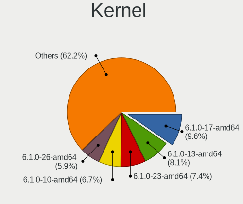

| Version                  | Desktops | Percent |
|--------------------------|----------|---------|
| 6.1.0-17-amd64           | 13       | 9.63%   |
| 6.1.0-13-amd64           | 11       | 8.15%   |
| 6.1.0-23-amd64           | 10       | 7.41%   |
| 6.1.0-10-amd64           | 9        | 6.67%   |
| 6.1.0-26-amd64           | 8        | 5.93%   |
| 6.1.0-25-amd64           | 8        | 5.93%   |
| 6.1.0-21-amd64           | 8        | 5.93%   |
| 6.5.0-1mx-ahs-amd64      | 7        | 5.19%   |
| 6.4.0-1mx-ahs-amd64      | 5        | 3.7%    |
| 6.1.0-18-amd64           | 5        | 3.7%    |
| 6.1.0-11-amd64           | 4        | 2.96%   |
| 6.7.12-1-liquorix-amd64  | 3        | 2.22%   |
| 6.6.11-amd64             | 3        | 2.22%   |
| 6.3.9-1-liquorix-amd64   | 3        | 2.22%   |
| 6.1.0-28-amd64           | 3        | 2.22%   |
| 6.1.0-22-amd64           | 3        | 2.22%   |
| 6.4.15-2-liquorix-amd64  | 2        | 1.48%   |
| 6.1.0-20-amd64           | 2        | 1.48%   |
| 6.9.7-1-liquorix-amd64   | 1        | 0.74%   |
| 6.8.9-5-liquorix-amd64   | 1        | 0.74%   |
| 6.7.11-1-liquorix-amd64  | 1        | 0.74%   |
| 6.6.7-x64v1-xanmod1      | 1        | 0.74%   |
| 6.6.3-1-liquorix-amd64   | 1        | 0.74%   |
| 6.5.5-2-liquorix-amd64   | 1        | 0.74%   |
| 6.5.11-1-liquorix-amd64  | 1        | 0.74%   |
| 6.5.0-2-amd64            | 1        | 0.74%   |
| 6.4.14-1-liquorix-amd64  | 1        | 0.74%   |
| 6.4.0-3mx-ahs-amd64      | 1        | 0.74%   |
| 6.2.14-1-liquorix-amd64  | 1        | 0.74%   |
| 6.12.7-2-liquorix-amd64  | 1        | 0.74%   |
| 6.12.6-1-liquorix-amd64  | 1        | 0.74%   |
| 6.11.9-1-liquorix-amd64  | 1        | 0.74%   |
| 6.11.7-1-liquorix-amd64  | 1        | 0.74%   |
| 6.11.3-3-liquorix-amd64  | 1        | 0.74%   |
| 6.10.11-amd64            | 1        | 0.74%   |
| 6.10.11-2-liquorix-amd64 | 1        | 0.74%   |
| 6.10.10-1-liquorix-amd64 | 1        | 0.74%   |
| 6.1.0-27-amd64           | 1        | 0.74%   |
| 6.1.0-21-rt-amd64        | 1        | 0.74%   |
| 6.1.0-16-amd64           | 1        | 0.74%   |

Kernel Family
-------------

Linux kernel without a distro release

| Version  | Desktops | Percent |
|----------|----------|---------|
| 6.1.0    | 87       | 65.91%  |
| 6.5.0    | 8        | 6.06%   |
| 6.4.0    | 6        | 4.55%   |
| 6.7.12   | 3        | 2.27%   |
| 6.6.11   | 3        | 2.27%   |
| 6.3.9    | 3        | 2.27%   |
| 6.4.15   | 2        | 1.52%   |
| 6.10.11  | 2        | 1.52%   |
| 6.9.7    | 1        | 0.76%   |
| 6.8.9    | 1        | 0.76%   |
| 6.7.11   | 1        | 0.76%   |
| 6.6.7    | 1        | 0.76%   |
| 6.6.3    | 1        | 0.76%   |
| 6.5.5    | 1        | 0.76%   |
| 6.5.11   | 1        | 0.76%   |
| 6.4.14   | 1        | 0.76%   |
| 6.2.14   | 1        | 0.76%   |
| 6.12.7   | 1        | 0.76%   |
| 6.12.6   | 1        | 0.76%   |
| 6.11.9   | 1        | 0.76%   |
| 6.11.7   | 1        | 0.76%   |
| 6.11.3   | 1        | 0.76%   |
| 6.10.10  | 1        | 0.76%   |
| 6.0.0    | 1        | 0.76%   |
| 5.10.197 | 1        | 0.76%   |
| 5.10.0   | 1        | 0.76%   |

Kernel Major Ver.
-----------------

Linux kernel major version

| Version | Desktops | Percent |
|---------|----------|---------|
| 6.1     | 87       | 65.91%  |
| 6.5     | 10       | 7.58%   |
| 6.4     | 9        | 6.82%   |
| 6.6     | 5        | 3.79%   |
| 6.7     | 4        | 3.03%   |
| 6.3     | 3        | 2.27%   |
| 6.11    | 3        | 2.27%   |
| 6.10    | 3        | 2.27%   |
| 6.12    | 2        | 1.52%   |
| 5.10    | 2        | 1.52%   |
| 6.9     | 1        | 0.76%   |
| 6.8     | 1        | 0.76%   |
| 6.2     | 1        | 0.76%   |
| 6.0     | 1        | 0.76%   |

Arch
----

OS architecture (x86_64, i586, etc.)

| Name   | Desktops | Percent |
|--------|----------|---------|
| x86_64 | 129      | 99.23%  |
| i686   | 1        | 0.77%   |

DE
--

Desktop Environment

| Name             | Desktops | Percent |
|------------------|----------|---------|
| XFCE             | 85       | 65.38%  |
| KDE5             | 38       | 29.23%  |
| lightdm-xsession | 2        | 1.54%   |
| X-Cinnamon       | 1        | 0.77%   |
| MATE             | 1        | 0.77%   |
| LXQt             | 1        | 0.77%   |
| fluxbox          | 1        | 0.77%   |
| Unknown          | 1        | 0.77%   |

Display Server
--------------

X11 or Wayland

| Name    | Desktops | Percent |
|---------|----------|---------|
| X11     | 126      | 96.92%  |
| Tty     | 2        | 1.54%   |
| Web     | 1        | 0.77%   |
| Wayland | 1        | 0.77%   |

Display Manager
---------------

SDDM, LightDM, etc.

| Name    | Desktops | Percent |
|---------|----------|---------|
| LightDM | 96       | 73.85%  |
| SDDM    | 34       | 26.15%  |

OS Lang
-------

Language

| Lang  | Desktops | Percent |
|-------|----------|---------|
| en_US | 56       | 43.08%  |
| de_DE | 12       | 9.23%   |
| en_GB | 10       | 7.69%   |
| ru_RU | 7        | 5.38%   |
| it_IT | 7        | 5.38%   |
| es_ES | 6        | 4.62%   |
| en_AU | 6        | 4.62%   |
| fr_FR | 4        | 3.08%   |
| pt_BR | 3        | 2.31%   |
| pl_PL | 2        | 1.54%   |
| hr_HR | 2        | 1.54%   |
| fi_FI | 2        | 1.54%   |
| sk_SK | 1        | 0.77%   |
| nl_BE | 1        | 0.77%   |
| ko_KR | 1        | 0.77%   |
| fr_BE | 1        | 0.77%   |
| es_VE | 1        | 0.77%   |
| es_US | 1        | 0.77%   |
| es_NI | 1        | 0.77%   |
| es_MX | 1        | 0.77%   |
| es_AR | 1        | 0.77%   |
| en_NZ | 1        | 0.77%   |
| en_IE | 1        | 0.77%   |
| en_CA | 1        | 0.77%   |
| de_AT | 1        | 0.77%   |

Boot Mode
---------

EFI or BIOS

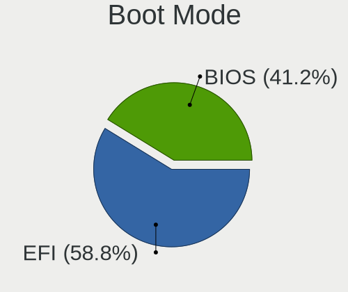

| Mode | Desktops | Percent |
|------|----------|---------|
| EFI  | 77       | 58.78%  |
| BIOS | 54       | 41.22%  |

Filesystem
----------

Type of filesystem

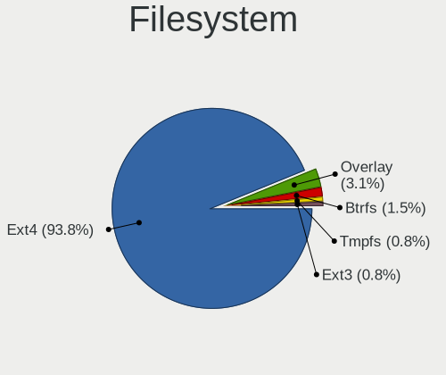

| Type    | Desktops | Percent |
|---------|----------|---------|
| Ext4    | 122      | 93.85%  |
| Overlay | 4        | 3.08%   |
| Btrfs   | 2        | 1.54%   |
| Tmpfs   | 1        | 0.77%   |
| Ext3    | 1        | 0.77%   |

Part. scheme
------------

Scheme of partitioning

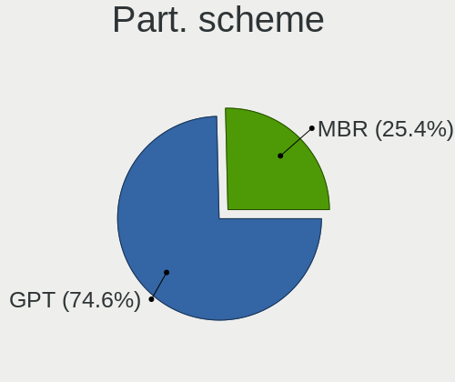

| Type | Desktops | Percent |
|------|----------|---------|
| GPT  | 97       | 74.62%  |
| MBR  | 33       | 25.38%  |

Dual Boot with Linux/BSD
------------------------

Hosting more than one Linux/BSD

| Dual boot | Desktops | Percent |
|-----------|----------|---------|
| No        | 95       | 72.52%  |
| Yes       | 36       | 27.48%  |

Dual Boot (Win)
---------------

Hosting Linux and Windows

| Dual boot | Desktops | Percent |
|-----------|----------|---------|
| Yes       | 65       | 50%     |
| No        | 65       | 50%     |

Board
-----

Vendor
------

Motherboard manufacturer

| Name                     | Desktops | Percent |
|--------------------------|----------|---------|
| ASUSTek Computer         | 28       | 21.54%  |
| Gigabyte Technology      | 24       | 18.46%  |
| Hewlett-Packard          | 15       | 11.54%  |
| Dell                     | 10       | 7.69%   |
| ASRock                   | 10       | 7.69%   |
| MSI                      | 9        | 6.92%   |
| Lenovo                   | 8        | 6.15%   |
| Intel                    | 4        | 3.08%   |
| Acer                     | 4        | 3.08%   |
| Foxconn                  | 3        | 2.31%   |
| Pegatron                 | 2        | 1.54%   |
| Medion                   | 2        | 1.54%   |
| Unknown                  | 2        | 1.54%   |
| SYS                      | 1        | 0.77%   |
| Shenzhen DOKE electronic | 1        | 0.77%   |
| Samsung Electronics      | 1        | 0.77%   |
| HC Technology.           | 1        | 0.77%   |
| GEEKOM                   | 1        | 0.77%   |
| Fujitsu                  | 1        | 0.77%   |
| Biostar                  | 1        | 0.77%   |
| AZW                      | 1        | 0.77%   |
| AMI                      | 1        | 0.77%   |

Model
-----

Motherboard model

| Name                                      | Desktops | Percent |
|-------------------------------------------|----------|---------|
| HP Compaq dc7700p Ultra-slim Desktop      | 2        | 1.54%   |
| Foxconn Pro3500 Series                    | 2        | 1.54%   |
| ASUS Z170 PRO GAMING                      | 2        | 1.54%   |
| Unknown                                   | 2        | 1.54%   |
| SYS H310CH5-TI2                           | 1        | 0.77%   |
| Shenzhen DOKE electronic MP100            | 1        | 0.77%   |
| Samsung DeskTop System                    | 1        | 0.77%   |
| Pegatron KQ436AAR-ABA IQ504               | 1        | 0.77%   |
| Pegatron 2AD5                             | 1        | 0.77%   |
| MSI MS-7C95                               | 1        | 0.77%   |
| MSI MS-7C91                               | 1        | 0.77%   |
| MSI MS-7A70                               | 1        | 0.77%   |
| MSI MS-7A38                               | 1        | 0.77%   |
| MSI MS-7996                               | 1        | 0.77%   |
| MSI MS-7895                               | 1        | 0.77%   |
| MSI MS-7793                               | 1        | 0.77%   |
| MSI MS-7788                               | 1        | 0.77%   |
| MSI MS-7592                               | 1        | 0.77%   |
| Medion MS-7748                            | 1        | 0.77%   |
| Medion MD34178/C723                       | 1        | 0.77%   |
| Lenovo ThinkCentre M93p 10A6S0W703        | 1        | 0.77%   |
| Lenovo ThinkCentre M900 10FLS2XC00        | 1        | 0.77%   |
| Lenovo ThinkCentre M73 10AXS06K00         | 1        | 0.77%   |
| Lenovo ThinkCentre M71e 3129B2G           | 1        | 0.77%   |
| Lenovo ThinkCentre A58 75227SG            | 1        | 0.77%   |
| Lenovo IdeaCentre T540-15AMA G 90L5002GGE | 1        | 0.77%   |
| Lenovo IdeaCentre 3 07ACH7 90U9001SIX     | 1        | 0.77%   |
| Lenovo H505S 10107                        | 1        | 0.77%   |
| Intel H81                                 | 1        | 0.77%   |
| Intel H61                                 | 1        | 0.77%   |
| Intel H110D4-P1                           | 1        | 0.77%   |
| Intel B75                                 | 1        | 0.77%   |
| HP Z2 Tower G5 Workstation                | 1        | 0.77%   |
| HP xw6400 Workstation                     | 1        | 0.77%   |
| HP ProDesk 600 G3 MT                      | 1        | 0.77%   |
| HP EliteDesk 705 G3 MT                    | 1        | 0.77%   |
| HP EliteDesk 705 G3 Desktop Mini          | 1        | 0.77%   |
| HP Compaq Pro 6300 SFF                    | 1        | 0.77%   |
| HP Compaq Elite 8300 SFF                  | 1        | 0.77%   |
| HP Compaq dc5100 SFF(AG144AW)             | 1        | 0.77%   |

Model Family
------------

Motherboard model prefix

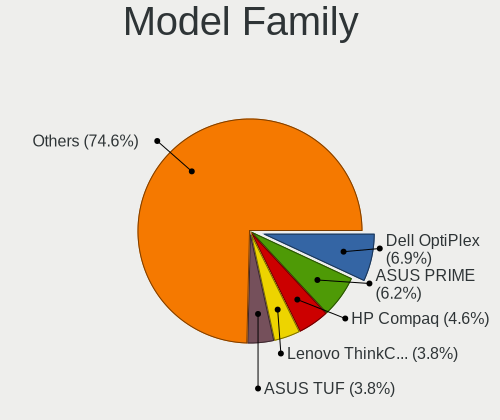

| Name                           | Desktops | Percent |
|--------------------------------|----------|---------|
| Dell OptiPlex                  | 9        | 6.92%   |
| ASUS PRIME                     | 8        | 6.15%   |
| HP Compaq                      | 6        | 4.62%   |
| Lenovo ThinkCentre             | 5        | 3.85%   |
| ASUS TUF                       | 5        | 3.85%   |
| Lenovo IdeaCentre              | 2        | 1.54%   |
| HP EliteDesk                   | 2        | 1.54%   |
| Foxconn Pro3500                | 2        | 1.54%   |
| ASUS Z170                      | 2        | 1.54%   |
| ASUS ROG                       | 2        | 1.54%   |
| Acer Veriton                   | 2        | 1.54%   |
| Unknown                        | 2        | 1.54%   |
| SYS H310CH5-TI2                | 1        | 0.77%   |
| Shenzhen DOKE electronic MP100 | 1        | 0.77%   |
| Samsung DeskTop                | 1        | 0.77%   |
| Pegatron KQ436AAR-ABA          | 1        | 0.77%   |
| Pegatron 2AD5                  | 1        | 0.77%   |
| MSI MS-7C95                    | 1        | 0.77%   |
| MSI MS-7C91                    | 1        | 0.77%   |
| MSI MS-7A70                    | 1        | 0.77%   |
| MSI MS-7A38                    | 1        | 0.77%   |
| MSI MS-7996                    | 1        | 0.77%   |
| MSI MS-7895                    | 1        | 0.77%   |
| MSI MS-7793                    | 1        | 0.77%   |
| MSI MS-7788                    | 1        | 0.77%   |
| MSI MS-7592                    | 1        | 0.77%   |
| Medion MS-7748                 | 1        | 0.77%   |
| Medion MD34178                 | 1        | 0.77%   |
| Lenovo H505S                   | 1        | 0.77%   |
| Intel H81                      | 1        | 0.77%   |
| Intel H61                      | 1        | 0.77%   |
| Intel H110D4-P1                | 1        | 0.77%   |
| Intel B75                      | 1        | 0.77%   |
| HP Z2                          | 1        | 0.77%   |
| HP xw6400                      | 1        | 0.77%   |
| HP ProDesk                     | 1        | 0.77%   |
| HP 8643                        | 1        | 0.77%   |
| HP 750-524                     | 1        | 0.77%   |
| HP 280                         | 1        | 0.77%   |
| HP 20-e014                     | 1        | 0.77%   |

MFG Year
--------

Motherboard manufacture year

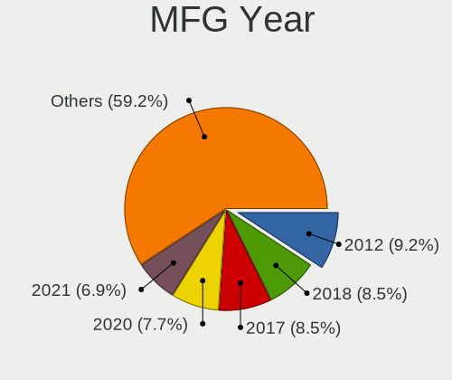

| Year | Desktops | Percent |
|------|----------|---------|
| 2012 | 12       | 9.23%   |
| 2018 | 11       | 8.46%   |
| 2017 | 11       | 8.46%   |
| 2020 | 10       | 7.69%   |
| 2021 | 9        | 6.92%   |
| 2019 | 9        | 6.92%   |
| 2023 | 8        | 6.15%   |
| 2022 | 8        | 6.15%   |
| 2013 | 8        | 6.15%   |
| 2009 | 8        | 6.15%   |
| 2015 | 7        | 5.38%   |
| 2011 | 7        | 5.38%   |
| 2016 | 4        | 3.08%   |
| 2014 | 4        | 3.08%   |
| 2007 | 4        | 3.08%   |
| 2006 | 4        | 3.08%   |
| 2024 | 2        | 1.54%   |
| 2010 | 2        | 1.54%   |
| 2008 | 1        | 0.77%   |
| 2005 | 1        | 0.77%   |

Form Factor
-----------

Physical design of the computer

| Name    | Desktops | Percent |
|---------|----------|---------|
| Desktop | 130      | 100%    |

Secure Boot
-----------

Enabled or disabled

| State    | Desktops | Percent |
|----------|----------|---------|
| Disabled | 130      | 100%    |

Coreboot
--------

Have coreboot on board

| Used | Desktops | Percent |
|------|----------|---------|
| No   | 130      | 100%    |

RAM Size
--------

Total RAM memory

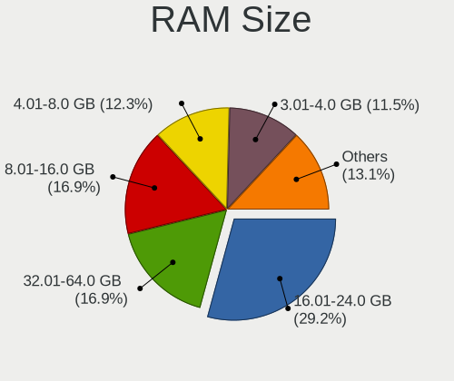

| Size in GB  | Desktops | Percent |
|-------------|----------|---------|
| 16.01-24.0  | 38       | 29.23%  |
| 32.01-64.0  | 22       | 16.92%  |
| 8.01-16.0   | 22       | 16.92%  |
| 4.01-8.0    | 16       | 12.31%  |
| 3.01-4.0    | 15       | 11.54%  |
| 24.01-32.0  | 5        | 3.85%   |
| 64.01-256.0 | 5        | 3.85%   |
| 1.01-2.0    | 4        | 3.08%   |
| 2.01-3.0    | 3        | 2.31%   |

RAM Used
--------

Used RAM memory

| Used GB    | Desktops | Percent |
|------------|----------|---------|
| 2.01-3.0   | 54       | 40.3%   |
| 1.01-2.0   | 29       | 21.64%  |
| 3.01-4.0   | 23       | 17.16%  |
| 4.01-8.0   | 22       | 16.42%  |
| 8.01-16.0  | 3        | 2.24%   |
| 0.51-1.0   | 2        | 1.49%   |
| 16.01-24.0 | 1        | 0.75%   |

Total Drives
------------

Number of drives on board

| Drives | Desktops | Percent |
|--------|----------|---------|
| 1      | 56       | 42.42%  |
| 2      | 35       | 26.52%  |
| 3      | 26       | 19.7%   |
| 4      | 6        | 4.55%   |
| 5      | 5        | 3.79%   |
| 6      | 2        | 1.52%   |
| 9      | 1        | 0.76%   |
| 7      | 1        | 0.76%   |

Has CD-ROM
----------

Has CD-ROM on board

| Presented | Desktops | Percent |
|-----------|----------|---------|
| No        | 73       | 56.15%  |
| Yes       | 57       | 43.85%  |

Has Ethernet
------------

Has Ethernet on board

| Presented | Desktops | Percent |
|-----------|----------|---------|
| Yes       | 129      | 99.23%  |
| No        | 1        | 0.77%   |

Has WiFi
--------

Has WiFi module

| Presented | Desktops | Percent |
|-----------|----------|---------|
| Yes       | 90       | 69.23%  |
| No        | 40       | 30.77%  |

Has Bluetooth
-------------

Has Bluetooth module

| Presented | Desktops | Percent |
|-----------|----------|---------|
| No        | 76       | 58.46%  |
| Yes       | 54       | 41.54%  |

Location
--------

Country
-------

Geographic location (country)

| Country                | Desktops | Percent |
|------------------------|----------|---------|
| USA                    | 26       | 19.85%  |
| Germany                | 11       | 8.4%    |
| UK                     | 8        | 6.11%   |
| Australia              | 8        | 6.11%   |
| Russia                 | 7        | 5.34%   |
| Spain                  | 6        | 4.58%   |
| Italy                  | 6        | 4.58%   |
| India                  | 6        | 4.58%   |
| France                 | 6        | 4.58%   |
| Belgium                | 4        | 3.05%   |
| Brazil                 | 3        | 2.29%   |
| Venezuela              | 2        | 1.53%   |
| Sweden                 | 2        | 1.53%   |
| Serbia                 | 2        | 1.53%   |
| Poland                 | 2        | 1.53%   |
| New Zealand            | 2        | 1.53%   |
| Indonesia              | 2        | 1.53%   |
| Hungary                | 2        | 1.53%   |
| Finland                | 2        | 1.53%   |
| Canada                 | 2        | 1.53%   |
| Bosnia and Herzegovina | 2        | 1.53%   |
| Austria                | 2        | 1.53%   |
| UAE                    | 1        | 0.76%   |
| Sri Lanka              | 1        | 0.76%   |
| South Korea            | 1        | 0.76%   |
| South Africa           | 1        | 0.76%   |
| Slovakia               | 1        | 0.76%   |
| Singapore              | 1        | 0.76%   |
| Norway                 | 1        | 0.76%   |
| Netherlands            | 1        | 0.76%   |
| Monaco                 | 1        | 0.76%   |
| Mexico                 | 1        | 0.76%   |
| Iraq                   | 1        | 0.76%   |
| Honduras               | 1        | 0.76%   |
| Dominican Republic     | 1        | 0.76%   |
| Chile                  | 1        | 0.76%   |
| Bulgaria               | 1        | 0.76%   |
| Belarus                | 1        | 0.76%   |
| Argentina              | 1        | 0.76%   |
| Algeria                | 1        | 0.76%   |

City
----

Geographic location (city)

| City                 | Desktops | Percent |
|----------------------|----------|---------|
| Sydney               | 3        | 2.24%   |
| Melbourne            | 3        | 2.24%   |
| Vienna               | 2        | 1.49%   |
| Vaasa                | 2        | 1.49%   |
| St Petersburg        | 2        | 1.49%   |
| Seattle              | 2        | 1.49%   |
| Milano               | 2        | 1.49%   |
| Mérida              | 2        | 1.49%   |
| León                | 2        | 1.49%   |
| Gothenburg           | 2        | 1.49%   |
| Dallas               | 2        | 1.49%   |
| Cazin                | 2        | 1.49%   |
| Berlin               | 2        | 1.49%   |
| Zaragoza             | 1        | 0.75%   |
| Wonju                | 1        | 0.75%   |
| Wichita Falls        | 1        | 0.75%   |
| Warsaw               | 1        | 0.75%   |
| Wandsworth           | 1        | 0.75%   |
| Vranje               | 1        | 0.75%   |
| Villeurbanne         | 1        | 0.75%   |
| Uckfield             | 1        | 0.75%   |
| Tramandai            | 1        | 0.75%   |
| Toronto              | 1        | 0.75%   |
| Tomsk                | 1        | 0.75%   |
| Tlajomulco de Zuniga | 1        | 0.75%   |
| Tirupur              | 1        | 0.75%   |
| Tangerang            | 1        | 0.75%   |
| Stuttgart            | 1        | 0.75%   |
| Stuhr                | 1        | 0.75%   |
| Sofia                | 1        | 0.75%   |
| Singapore            | 1        | 0.75%   |
| Sebastian            | 1        | 0.75%   |
| Santo Domingo Este   | 1        | 0.75%   |
| Santa Fe             | 1        | 0.75%   |
| Santa Clara          | 1        | 0.75%   |
| San Pedro Sula       | 1        | 0.75%   |
| Saint Andrews Quay   | 1        | 0.75%   |
| Reggio Calabria      | 1        | 0.75%   |
| Rajkot               | 1        | 0.75%   |
| Quilicura            | 1        | 0.75%   |

Drives
------

Drive Vendor
------------

Hard drive vendors

| Vendor                      | Desktops | Drives | Percent |
|-----------------------------|----------|--------|---------|
| WDC                         | 43       | 53     | 18.45%  |
| Samsung Electronics         | 37       | 55     | 15.88%  |
| Seagate                     | 33       | 49     | 14.16%  |
| Kingston                    | 15       | 16     | 6.44%   |
| Toshiba                     | 11       | 12     | 4.72%   |
| Crucial                     | 11       | 14     | 4.72%   |
| SanDisk                     | 9        | 9      | 3.86%   |
| A-DATA Technology           | 9        | 11     | 3.86%   |
| Hitachi                     | 6        | 7      | 2.58%   |
| China                       | 6        | 9      | 2.58%   |
| Unknown                     | 4        | 5      | 1.72%   |
| Intel                       | 4        | 4      | 1.72%   |
| Team                        | 3        | 5      | 1.29%   |
| SPCC                        | 3        | 3      | 1.29%   |
| Intenso                     | 3        | 3      | 1.29%   |
| Apple                       | 3        | 3      | 1.29%   |
| Apacer                      | 3        | 3      | 1.29%   |
| Silicon Motion              | 2        | 2      | 0.86%   |
| Netac                       | 2        | 3      | 0.86%   |
| Micron Technology           | 2        | 3      | 0.86%   |
| Maxtor                      | 2        | 2      | 0.86%   |
| Lexar                       | 2        | 2      | 0.86%   |
| XPG                         | 1        | 1      | 0.43%   |
| Verbatim                    | 1        | 1      | 0.43%   |
| UP                          | 1        | 1      | 0.43%   |
| SABRENT                     | 1        | 3      | 0.43%   |
| Realtek                     | 1        | 1      | 0.43%   |
| PNY                         | 1        | 1      | 0.43%   |
| Plextor                     | 1        | 1      | 0.43%   |
| Patriot                     | 1        | 2      | 0.43%   |
| Mushkin                     | 1        | 1      | 0.43%   |
| MCQUEST                     | 1        | 1      | 0.43%   |
| MAXIO Technology (Hangzhou) | 1        | 1      | 0.43%   |
| KIOXIA-EXCERIA              | 1        | 1      | 0.43%   |
| KingFast                    | 1        | 2      | 0.43%   |
| HS-SSD-C100                 | 1        | 1      | 0.43%   |
| HGST                        | 1        | 1      | 0.43%   |
| FORESEE                     | 1        | 1      | 0.43%   |
| Corsair                     | 1        | 1      | 0.43%   |
| CONSISTENT                  | 1        | 1      | 0.43%   |

Drive Model
-----------

Hard drive models

| Model                              | Desktops | Percent |
|------------------------------------|----------|---------|
| Samsung SSD 980 500GB              | 4        | 1.48%   |
| WDC WD10EZEX-00BN5A0 1TB           | 3        | 1.11%   |
| Unknown SD/MMC/MS PRO 128GB        | 3        | 1.11%   |
| Toshiba HDWD120 2TB                | 3        | 1.11%   |
| Seagate ST500DM002-1BD142 500GB    | 3        | 1.11%   |
| Seagate ST31000524AS 1TB           | 3        | 1.11%   |
| Samsung SSD 860 EVO 250GB          | 3        | 1.11%   |
| Kingston SA400S37480G 480GB SSD    | 3        | 1.11%   |
| WDC WD5000AAKX-00ERMA0 500GB       | 2        | 0.74%   |
| WDC WD20EZRZ-00Z5HB0 2TB           | 2        | 0.74%   |
| WDC WD20EZAZ-00GGJB0 2TB           | 2        | 0.74%   |
| WDC WD10EZEX-60WN4A0 1TB           | 2        | 0.74%   |
| Toshiba DT01ACA100 1TB             | 2        | 0.74%   |
| SPCC Solid State Disk 256GB        | 2        | 0.74%   |
| Seagate ST4000DM004-2CV104 4TB     | 2        | 0.74%   |
| Seagate ST3500418AS 500GB          | 2        | 0.74%   |
| Seagate ST1500DL003-9VT16L 1TB     | 2        | 0.74%   |
| Seagate ST1000DM010-2EP102 1TB     | 2        | 0.74%   |
| Seagate Expansion 1TB              | 2        | 0.74%   |
| SanDisk SD6SB1M-032G-1006 32GB SSD | 2        | 0.74%   |
| SanDisk NVMe SSD Drive 500GB       | 2        | 0.74%   |
| Samsung SSD 970 EVO Plus 1TB       | 2        | 0.74%   |
| Samsung SSD 970 EVO 250GB          | 2        | 0.74%   |
| Samsung SSD 870 EVO 1TB            | 2        | 0.74%   |
| Samsung SSD 860 EVO 1TB            | 2        | 0.74%   |
| Samsung SSD 850 EVO 250GB          | 2        | 0.74%   |
| Netac NVMe SSD 500GB               | 2        | 0.74%   |
| Kingston SA400S37240G 240GB SSD    | 2        | 0.74%   |
| Kingston SA400S37120G 120GB SSD    | 2        | 0.74%   |
| Apple HDD HTS545050A7E362 500GB    | 2        | 0.74%   |
| Apacer AS350 128GB SSD             | 2        | 0.74%   |
| A-DATA SU650 120GB SSD             | 2        | 0.74%   |
| XPG GAMMIX S11 Pro 512GB           | 1        | 0.37%   |
| WDC WDS500G2B0A-00SM50 500GB SSD   | 1        | 0.37%   |
| WDC WDS240G2G0B-00EPW0 240GB SSD   | 1        | 0.37%   |
| WDC WDS240G2G0A-00JH30 240GB SSD   | 1        | 0.37%   |
| WDC WDS120G2G0B-00EPW0 120GB SSD   | 1        | 0.37%   |
| WDC WDS120G2G0A-00JH30 120GB SSD   | 1        | 0.37%   |
| WDC WDS100T2B0A-00SM50 1TB SSD     | 1        | 0.37%   |
| WDC WDS100T2B0A 1TB SSD            | 1        | 0.37%   |

HDD Vendor
----------

Hard disk drive vendors

| Vendor              | Desktops | Drives | Percent |
|---------------------|----------|--------|---------|
| WDC                 | 33       | 41     | 33.33%  |
| Seagate             | 31       | 47     | 31.31%  |
| Toshiba             | 11       | 12     | 11.11%  |
| Samsung Electronics | 7        | 9      | 7.07%   |
| Hitachi             | 6        | 7      | 6.06%   |
| Unknown             | 3        | 3      | 3.03%   |
| Apple               | 3        | 3      | 3.03%   |
| Maxtor              | 2        | 2      | 2.02%   |
| SABRENT             | 1        | 3      | 1.01%   |
| HGST                | 1        | 1      | 1.01%   |
| ASMT                | 1        | 1      | 1.01%   |

SSD Vendor
----------

Solid state drive vendors

| Vendor              | Desktops | Drives | Percent |
|---------------------|----------|--------|---------|
| Samsung Electronics | 19       | 28     | 20.88%  |
| Kingston            | 10       | 11     | 10.99%  |
| WDC                 | 9        | 10     | 9.89%   |
| Crucial             | 9        | 12     | 9.89%   |
| China               | 6        | 9      | 6.59%   |
| A-DATA Technology   | 6        | 7      | 6.59%   |
| SanDisk             | 4        | 4      | 4.4%    |
| SPCC                | 3        | 3      | 3.3%    |
| Intenso             | 3        | 3      | 3.3%    |
| Micron Technology   | 2        | 3      | 2.2%    |
| Intel               | 2        | 2      | 2.2%    |
| Apacer              | 2        | 2      | 2.2%    |
| Verbatim            | 1        | 1      | 1.1%    |
| UP                  | 1        | 1      | 1.1%    |
| Unknown             | 1        | 1      | 1.1%    |
| Team                | 1        | 1      | 1.1%    |
| Seagate             | 1        | 1      | 1.1%    |
| PNY                 | 1        | 1      | 1.1%    |
| Plextor             | 1        | 1      | 1.1%    |
| Patriot             | 1        | 2      | 1.1%    |
| Mushkin             | 1        | 1      | 1.1%    |
| MCQUEST             | 1        | 1      | 1.1%    |
| KingFast            | 1        | 2      | 1.1%    |
| HS-SSD-C100         | 1        | 1      | 1.1%    |
| FORESEE             | 1        | 1      | 1.1%    |
| Corsair             | 1        | 1      | 1.1%    |
| CONSISTENT          | 1        | 1      | 1.1%    |
| AGI                 | 1        | 1      | 1.1%    |

Drive Kind
----------

HDD or SSD

| Kind    | Desktops | Drives | Percent |
|---------|----------|--------|---------|
| SSD     | 78       | 112    | 39.59%  |
| HDD     | 73       | 129    | 37.06%  |
| NVMe    | 44       | 54     | 22.34%  |
| Unknown | 2        | 2      | 1.02%   |

Drive Connector
---------------

SATA, SAS, NVMe, etc.

| Type | Desktops | Drives | Percent |
|------|----------|--------|---------|
| SATA | 110      | 226    | 65.48%  |
| NVMe | 44       | 53     | 26.19%  |
| SAS  | 14       | 18     | 8.33%   |

Drive Size
----------

Size of hard drive

| Size in TB | Desktops | Drives | Percent |
|------------|----------|--------|---------|
| 0.01-0.5   | 81       | 121    | 49.69%  |
| 0.51-1.0   | 43       | 64     | 26.38%  |
| 1.01-2.0   | 24       | 34     | 14.72%  |
| 3.01-4.0   | 8        | 9      | 4.91%   |
| 4.01-10.0  | 4        | 9      | 2.45%   |
| 2.01-3.0   | 3        | 4      | 1.84%   |

Space Total
-----------

Amount of disk space available on the file system

| Size in GB     | Desktops | Percent |
|----------------|----------|---------|
| 101-250        | 30       | 22.56%  |
| 251-500        | 27       | 20.3%   |
| 501-1000       | 19       | 14.29%  |
| More than 3000 | 15       | 11.28%  |
| 1001-2000      | 15       | 11.28%  |
| 2001-3000      | 8        | 6.02%   |
| 1-20           | 8        | 6.02%   |
| 51-100         | 8        | 6.02%   |
| 21-50          | 3        | 2.26%   |

Space Used
----------

Amount of used disk space

| Used GB        | Desktops | Percent |
|----------------|----------|---------|
| 1-20           | 37       | 27.61%  |
| 21-50          | 22       | 16.42%  |
| 101-250        | 19       | 14.18%  |
| 51-100         | 17       | 12.69%  |
| 1001-2000      | 11       | 8.21%   |
| 501-1000       | 10       | 7.46%   |
| 251-500        | 8        | 5.97%   |
| More than 3000 | 7        | 5.22%   |
| 2001-3000      | 3        | 2.24%   |

Malfunc. Drives
---------------

Drive models with a malfunction

| Model                                             | Desktops | Drives | Percent |
|---------------------------------------------------|----------|--------|---------|
| Seagate ST500DM002-1BD142 500GB                   | 2        | 2      | 6.67%   |
| WDC WD5000LPVX-22V0TT0 500GB                      | 1        | 1      | 3.33%   |
| WDC WD40EZRX-00SPEB0 4TB                          | 1        | 1      | 3.33%   |
| WDC WD2500AAJS-00B4A0 250GB                       | 1        | 2      | 3.33%   |
| WDC WD20EFRX-68AX9N0 2TB                          | 1        | 1      | 3.33%   |
| WDC WD10EARS-00Y5B1 1TB                           | 1        | 1      | 3.33%   |
| Toshiba MQ01ABF032 320GB                          | 1        | 1      | 3.33%   |
| Toshiba MK3259GSXP 320GB                          | 1        | 1      | 3.33%   |
| Toshiba DT01ACA050 500GB                          | 1        | 1      | 3.33%   |
| Seagate ST9500325AS 500GB                         | 1        | 1      | 3.33%   |
| Seagate ST500DM002-1BC142 500GB                   | 1        | 1      | 3.33%   |
| Seagate ST4000DM000-1F2168 4TB                    | 1        | 1      | 3.33%   |
| Seagate ST3500418AS 500GB                         | 1        | 1      | 3.33%   |
| Seagate ST3250310AS 250GB                         | 1        | 1      | 3.33%   |
| Seagate ST31000524AS 1TB                          | 1        | 1      | 3.33%   |
| Seagate ST2000DX001-1CM164 2TB                    | 1        | 1      | 3.33%   |
| Seagate ST1000DM003-9YN162 1TB                    | 1        | 1      | 3.33%   |
| Seagate ST1000DM003-1ER162 1TB                    | 1        | 1      | 3.33%   |
| Samsung Electronics SSD 850 PRO 512GB             | 1        | 1      | 3.33%   |
| Samsung Electronics SP2504C 250GB                 | 1        | 1      | 3.33%   |
| Samsung Electronics HD200HJ 200GB                 | 1        | 1      | 3.33%   |
| Samsung Electronics HD105SI 1TB                   | 1        | 1      | 3.33%   |
| Micron Technology MTFDDAK2T0TDL-1AW1ZABHA 2TB SSD | 1        | 1      | 3.33%   |
| Kingston SV300S37A120G 120GB SSD                  | 1        | 1      | 3.33%   |
| Intel SSDSC2KF180H6L 180GB                        | 1        | 1      | 3.33%   |
| Hitachi HUA722020ALA331 2TB                       | 1        | 1      | 3.33%   |
| Hitachi HTS543225L9A300 250GB                     | 1        | 1      | 3.33%   |
| Hitachi HDS725050KLA360 500GB                     | 1        | 1      | 3.33%   |
| A-DATA Technology SU900 256GB SSD                 | 1        | 2      | 3.33%   |

Malfunc. Drive Vendor
---------------------

Vendors of faulty drives

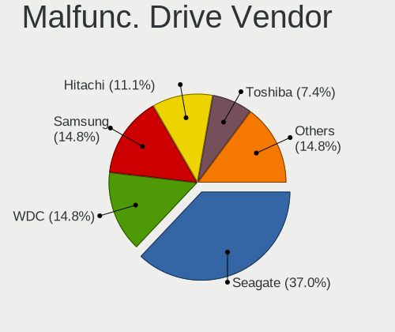

| Vendor              | Desktops | Drives | Percent |
|---------------------|----------|--------|---------|
| Seagate             | 10       | 11     | 37.04%  |
| WDC                 | 4        | 6      | 14.81%  |
| Samsung Electronics | 4        | 4      | 14.81%  |
| Hitachi             | 3        | 3      | 11.11%  |
| Toshiba             | 2        | 3      | 7.41%   |
| Micron Technology   | 1        | 1      | 3.7%    |
| Kingston            | 1        | 1      | 3.7%    |
| Intel               | 1        | 1      | 3.7%    |
| A-DATA Technology   | 1        | 2      | 3.7%    |

Malfunc. HDD Vendor
-------------------

Vendors of faulty HDD drives

| Vendor              | Desktops | Drives | Percent |
|---------------------|----------|--------|---------|
| Seagate             | 10       | 11     | 45.45%  |
| WDC                 | 4        | 6      | 18.18%  |
| Samsung Electronics | 3        | 3      | 13.64%  |
| Hitachi             | 3        | 3      | 13.64%  |
| Toshiba             | 2        | 3      | 9.09%   |

Malfunc. Drive Kind
-------------------

Kinds of faulty drives

| Kind | Desktops | Drives | Percent |
|------|----------|--------|---------|
| HDD  | 19       | 26     | 79.17%  |
| SSD  | 5        | 6      | 20.83%  |

Failed Drives
-------------

Failed drive models

| Model                       | Desktops | Drives | Percent |
|-----------------------------|----------|--------|---------|
| WDC WD3200AAJS-00B4A0 320GB | 1        | 1      | 100%    |

Failed Drive Vendor
-------------------

Failed drive vendors

| Vendor | Desktops | Drives | Percent |
|--------|----------|--------|---------|
| WDC    | 1        | 1      | 100%    |

Drive Status
------------

Number of failed and malfunc. drives

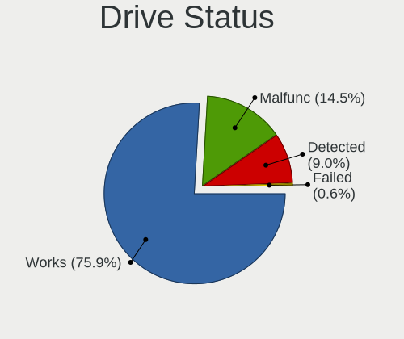

| Status   | Desktops | Drives | Percent |
|----------|----------|--------|---------|
| Works    | 126      | 242    | 75.9%   |
| Malfunc  | 24       | 32     | 14.46%  |
| Detected | 15       | 22     | 9.04%   |
| Failed   | 1        | 1      | 0.6%    |

Storage controller
------------------

Storage Vendor
--------------

Storage controller vendors

| Vendor                        | Desktops | Percent |
|-------------------------------|----------|---------|
| Intel                         | 85       | 45.95%  |
| AMD                           | 42       | 22.7%   |
| Samsung Electronics           | 15       | 8.11%   |
| ASMedia Technology            | 7        | 3.78%   |
| SanDisk                       | 6        | 3.24%   |
| Kingston Technology Company   | 5        | 2.7%    |
| Silicon Motion                | 4        | 2.16%   |
| ADATA Technology              | 3        | 1.62%   |
| Realtek Semiconductor         | 2        | 1.08%   |
| Nvidia                        | 2        | 1.08%   |
| Micron/Crucial Technology     | 2        | 1.08%   |
| MAXIO Technology (Hangzhou)   | 2        | 1.08%   |
| Marvell Technology Group      | 2        | 1.08%   |
| JMicron Technology            | 2        | 1.08%   |
| TenaFe                        | 1        | 0.54%   |
| Shenzhen Longsys Electronics  | 1        | 0.54%   |
| Phison Electronics            | 1        | 0.54%   |
| LSI Logic / Symbios Logic     | 1        | 0.54%   |
| KIOXIA                        | 1        | 0.54%   |
| Integrated Technology Express | 1        | 0.54%   |

Storage Model
-------------

Storage controller models

| Model                                                                                   | Desktops | Percent |
|-----------------------------------------------------------------------------------------|----------|---------|
| AMD FCH SATA Controller [AHCI mode]                                                     | 20       | 8.89%   |
| Intel Q170/Q150/B150/H170/H110/Z170/CM236 Chipset SATA Controller [AHCI Mode]           | 10       | 4.44%   |
| Intel 200 Series PCH SATA controller [AHCI mode]                                        | 9        | 4%      |
| Intel 6 Series/C200 Series Chipset Family 6 port Desktop SATA AHCI Controller           | 7        | 3.11%   |
| AMD 400 Series Chipset SATA Controller                                                  | 7        | 3.11%   |
| Intel NM10/ICH7 Family SATA Controller [IDE mode]                                       | 6        | 2.67%   |
| Intel Cannon Lake PCH SATA AHCI Controller                                              | 6        | 2.67%   |
| ASMedia ASM1061/ASM1062 Serial ATA Controller                                           | 6        | 2.67%   |
| AMD 600 Series Chipset SATA Controller                                                  | 6        | 2.67%   |
| AMD 500 Series Chipset SATA Controller                                                  | 6        | 2.67%   |
| Samsung NVMe SSD Controller SM981/PM981/PM983                                           | 5        | 2.22%   |
| Samsung NVMe SSD Controller 980 (DRAM-less)                                             | 5        | 2.22%   |
| Intel Volume Management Device NVMe RAID Controller                                     | 5        | 2.22%   |
| Intel Alder Lake-S PCH SATA Controller [AHCI Mode]                                      | 5        | 2.22%   |
| Intel 82801G (ICH7 Family) IDE Controller                                               | 5        | 2.22%   |
| Intel 8 Series/C220 Series Chipset Family 6-port SATA Controller 1 [AHCI mode]          | 5        | 2.22%   |
| Intel 7 Series/C210 Series Chipset Family 6-port SATA Controller [AHCI mode]            | 5        | 2.22%   |
| AMD SB7x0/SB8x0/SB9x0 SATA Controller [AHCI mode]                                       | 5        | 2.22%   |
| Silicon Motion SM2263EN/SM2263XT (DRAM-less) NVMe SSD Controllers                       | 3        | 1.33%   |
| Intel Comet Lake SATA AHCI Controller                                                   | 3        | 1.33%   |
| Intel 82801H (ICH8 Family) 4 port SATA Controller [IDE mode]                            | 3        | 1.33%   |
| Intel 6 Series/C200 Series Chipset Family Desktop SATA Controller (IDE mode, ports 4-5) | 3        | 1.33%   |
| Intel 6 Series/C200 Series Chipset Family Desktop SATA Controller (IDE mode, ports 0-3) | 3        | 1.33%   |
| AMD SB7x0/SB8x0/SB9x0 IDE Controller                                                    | 3        | 1.33%   |
| SanDisk WD Black SN770 / PC SN740 256GB / PC SN560 (DRAM-less) NVMe SSD                 | 2        | 0.89%   |
| Samsung NVMe SSD Controller PM9A1/PM9A3/980PRO                                          | 2        | 0.89%   |
| Micron/Crucial P2 [Nick P2] / P3 / P3 Plus NVMe PCIe SSD (DRAM-less)                    | 2        | 0.89%   |
| MAXIO (Hangzhou) NVMe SSD Controller MAP1202 (DRAM-less)                                | 2        | 0.89%   |
| Intel Celeron/Pentium Silver Processor SATA Controller                                  | 2        | 0.89%   |
| Intel 82Q963/Q965 PT IDER Controller                                                    | 2        | 0.89%   |
| Intel 500 Series Chipset Family SATA AHCI Controller                                    | 2        | 0.89%   |
| AMD SB7x0/SB8x0/SB9x0 SATA Controller [IDE mode]                                        | 2        | 0.89%   |
| AMD FCH IDE Controller                                                                  | 2        | 0.89%   |
| AMD A320 Chipset SATA Controller [AHCI mode]                                            | 2        | 0.89%   |
| AMD 300 Series Chipset SATA Controller                                                  | 2        | 0.89%   |
| ADATA XPG SX8200 Pro PCIe Gen3x4 M.2 2280 Solid State Drive                             | 2        | 0.89%   |
| TenaFe TC2200/TC2201 NVMe Controller (DRAM-less)                                        | 1        | 0.44%   |
| Silicon Motion SM2262/SM2262EN SSD Controller                                           | 1        | 0.44%   |
| Shenzhen Longsys Lexar NM790 NVME SSD (DRAM-less)                                       | 1        | 0.44%   |
| SanDisk WD Green SN350 240GB (DRAM-less) / SN560E NVMe SSD                              | 1        | 0.44%   |

Storage Kind
------------

Kind of storage controller (IDE, SATA, NVMe, SAS, ...)

| Kind | Desktops | Percent |
|------|----------|---------|
| SATA | 106      | 56.68%  |
| NVMe | 43       | 22.99%  |
| IDE  | 28       | 14.97%  |
| RAID | 9        | 4.81%   |
| SAS  | 1        | 0.53%   |

Processor
---------

CPU Vendor
----------

Processor vendors

| Vendor | Desktops | Percent |
|--------|----------|---------|
| Intel  | 85       | 65.38%  |
| AMD    | 45       | 34.62%  |

CPU Model
---------

Processor models

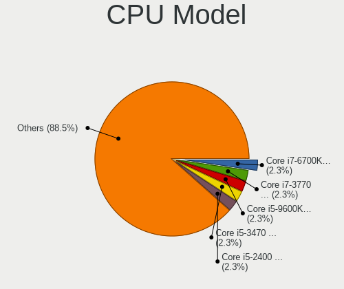

| Model                                       | Desktops | Percent |
|---------------------------------------------|----------|---------|
| Intel Core i7-6700K CPU @ 4.00GHz           | 3        | 2.31%   |
| Intel Core i7-3770 CPU @ 3.40GHz            | 3        | 2.31%   |
| Intel Core i5-9600K CPU @ 3.70GHz           | 3        | 2.31%   |
| Intel Core i5-3470 CPU @ 3.20GHz            | 3        | 2.31%   |
| Intel Core i5-2400 CPU @ 3.10GHz            | 3        | 2.31%   |
| Intel Core 2 Duo CPU E7500 @ 2.93GHz        | 3        | 2.31%   |
| AMD Ryzen 5 7600 6-Core Processor           | 3        | 2.31%   |
| AMD Ryzen 5 2600 Six-Core Processor         | 3        | 2.31%   |
| Intel Core i7-10700 CPU @ 2.90GHz           | 2        | 1.54%   |
| Intel Core i5-9400F CPU @ 2.90GHz           | 2        | 1.54%   |
| Intel Core i5-8400 CPU @ 2.80GHz            | 2        | 1.54%   |
| Intel Core 2 Quad CPU Q6600 @ 2.40GHz       | 2        | 1.54%   |
| Intel Core 2 Duo CPU E8400 @ 3.00GHz        | 2        | 1.54%   |
| Intel Core 2 CPU 6400 @ 2.13GHz             | 2        | 1.54%   |
| Intel 12th Gen Core i5-12400                | 2        | 1.54%   |
| Intel 11th Gen Core i5-11400 @ 2.60GHz      | 2        | 1.54%   |
| AMD Ryzen 5 5600X 6-Core Processor          | 2        | 1.54%   |
| AMD Ryzen 5 5600G with Radeon Graphics      | 2        | 1.54%   |
| AMD Ryzen 5 3600 6-Core Processor           | 2        | 1.54%   |
| AMD FX-6300 Six-Core Processor              | 2        | 1.54%   |
| Intel Xeon CPU X5650 @ 2.67GHz              | 1        | 0.77%   |
| Intel Xeon CPU E5345 @ 2.33GHz              | 1        | 0.77%   |
| Intel Xeon CPU E31230 @ 3.20GHz             | 1        | 0.77%   |
| Intel Pentium Dual-Core CPU E5400 @ 2.70GHz | 1        | 0.77%   |
| Intel Pentium Dual-Core CPU E5200 @ 2.50GHz | 1        | 0.77%   |
| Intel Pentium Dual CPU E2140 @ 1.60GHz      | 1        | 0.77%   |
| Intel Pentium CPU J4205 @ 1.50GHz           | 1        | 0.77%   |
| Intel Pentium CPU G4600 @ 3.60GHz           | 1        | 0.77%   |
| Intel Pentium 4 CPU 3.20GHz                 | 1        | 0.77%   |
| Intel Core i7-9700K CPU @ 3.60GHz           | 1        | 0.77%   |
| Intel Core i7-7700K CPU @ 4.20GHz           | 1        | 0.77%   |
| Intel Core i7-7700 CPU @ 3.60GHz            | 1        | 0.77%   |
| Intel Core i7-6700 CPU @ 3.40GHz            | 1        | 0.77%   |
| Intel Core i7-2600 CPU @ 3.40GHz            | 1        | 0.77%   |
| Intel Core i5-9400 CPU @ 2.90GHz            | 1        | 0.77%   |
| Intel Core i5-8600K CPU @ 3.60GHz           | 1        | 0.77%   |
| Intel Core i5-6600K CPU @ 3.50GHz           | 1        | 0.77%   |
| Intel Core i5-6600 CPU @ 3.30GHz            | 1        | 0.77%   |
| Intel Core i5-6500T CPU @ 2.50GHz           | 1        | 0.77%   |
| Intel Core i5-6400T CPU @ 2.20GHz           | 1        | 0.77%   |

CPU Model Family
----------------

Processor model prefix

| Model                   | Desktops | Percent |
|-------------------------|----------|---------|
| Intel Core i5           | 28       | 21.54%  |
| AMD Ryzen 5             | 21       | 16.15%  |
| Intel Core i7           | 13       | 10%     |
| Other                   | 12       | 9.23%   |
| Intel Core i3           | 8        | 6.15%   |
| Intel Core 2 Duo        | 7        | 5.38%   |
| AMD Ryzen 7             | 5        | 3.85%   |
| Intel Celeron           | 4        | 3.08%   |
| AMD FX                  | 4        | 3.08%   |
| Intel Xeon              | 3        | 2.31%   |
| Intel Core 2            | 3        | 2.31%   |
| AMD A8                  | 3        | 2.31%   |
| Intel Pentium Dual-Core | 2        | 1.54%   |
| Intel Pentium           | 2        | 1.54%   |
| Intel Core 2 Quad       | 2        | 1.54%   |
| AMD Ryzen 9             | 2        | 1.54%   |
| Intel Pentium Dual      | 1        | 0.77%   |
| Intel Pentium 4         | 1        | 0.77%   |
| AMD Ryzen 3             | 1        | 0.77%   |
| AMD PRO A10             | 1        | 0.77%   |
| AMD Phenom II X6        | 1        | 0.77%   |
| AMD Opteron             | 1        | 0.77%   |
| AMD E                   | 1        | 0.77%   |
| AMD Athlon X4           | 1        | 0.77%   |
| AMD Athlon II X2        | 1        | 0.77%   |
| AMD Athlon 64 X2        | 1        | 0.77%   |
| AMD A6                  | 1        | 0.77%   |

CPU Cores
---------

Number of processor cores

| Number | Desktops | Percent |
|--------|----------|---------|
| 4      | 42       | 32.31%  |
| 6      | 37       | 28.46%  |
| 2      | 31       | 23.85%  |
| 8      | 10       | 7.69%   |
| 1      | 4        | 3.08%   |
| 12     | 2        | 1.54%   |
| 3      | 2        | 1.54%   |
| 16     | 1        | 0.77%   |
| 14     | 1        | 0.77%   |

CPU Sockets
-----------

Number of sockets

| Number | Desktops | Percent |
|--------|----------|---------|
| 1      | 129      | 99.23%  |
| 2      | 1        | 0.77%   |

CPU Threads
-----------

Threads per core (Hyper-Threading)

| Number | Desktops | Percent |
|--------|----------|---------|
| 2      | 74       | 56.92%  |
| 1      | 56       | 43.08%  |

CPU Op-Modes
------------

CPU Operation Modes (32-bit, 64-bit)

| Op mode        | Desktops | Percent |
|----------------|----------|---------|
| 32-bit, 64-bit | 130      | 100%    |

CPU Microcode
-------------

Microcode number

| Number     | Desktops | Percent |
|------------|----------|---------|
| Unknown    | 39       | 29.77%  |
| 0x506e3    | 8        | 6.11%   |
| 0x306a9    | 7        | 5.34%   |
| 0x1067a    | 6        | 4.58%   |
| 0x306c3    | 5        | 3.82%   |
| 0x206a7    | 5        | 3.82%   |
| 0x906ea    | 4        | 3.05%   |
| 0x906e9    | 4        | 3.05%   |
| 0x6fb      | 3        | 2.29%   |
| 0x08701021 | 3        | 2.29%   |
| 0x0800820d | 3        | 2.29%   |
| 0xa0671    | 2        | 1.53%   |
| 0x0a601206 | 2        | 1.53%   |
| 0x0a601203 | 2        | 1.53%   |
| 0x0a50000d | 2        | 1.53%   |
| 0x0600611a | 2        | 1.53%   |
| 0x06001119 | 2        | 1.53%   |
| 0x06000852 | 2        | 1.53%   |
| 0x03000027 | 2        | 1.53%   |
| 0xb06a2    | 1        | 0.76%   |
| 0xa0655    | 1        | 0.76%   |
| 0x906ed    | 1        | 0.76%   |
| 0x906eb    | 1        | 0.76%   |
| 0x90675    | 1        | 0.76%   |
| 0x806c1    | 1        | 0.76%   |
| 0x706a1    | 1        | 0.76%   |
| 0x6fd      | 1        | 0.76%   |
| 0x6f6      | 1        | 0.76%   |
| 0x506c9    | 1        | 0.76%   |
| 0x406c3    | 1        | 0.76%   |
| 0x206c2    | 1        | 0.76%   |
| 0x20655    | 1        | 0.76%   |
| 0x0a705203 | 1        | 0.76%   |
| 0x0a50000c | 1        | 0.76%   |
| 0x0a404102 | 1        | 0.76%   |
| 0x0a20120a | 1        | 0.76%   |
| 0x0a201016 | 1        | 0.76%   |
| 0x0a201009 | 1        | 0.76%   |
| 0x08701013 | 1        | 0.76%   |
| 0x08600106 | 1        | 0.76%   |

CPU Microarch
-------------

Microarchitecture

| Name             | Desktops | Percent |
|------------------|----------|---------|
| KabyLake         | 16       | 12.31%  |
| Skylake          | 9        | 6.92%   |
| IvyBridge        | 9        | 6.92%   |
| Core             | 9        | 6.92%   |
| Zen 3            | 8        | 6.15%   |
| Zen+             | 7        | 5.38%   |
| SandyBridge      | 7        | 5.38%   |
| Penryn           | 7        | 5.38%   |
| Unknown          | 7        | 5.38%   |
| Zen 2            | 6        | 4.62%   |
| Piledriver       | 6        | 4.62%   |
| Haswell          | 6        | 4.62%   |
| Alderlake Hybrid | 6        | 4.62%   |
| Icelake          | 4        | 3.08%   |
| CometLake        | 3        | 2.31%   |
| Westmere         | 2        | 1.54%   |
| K10 Llano        | 2        | 1.54%   |
| K10              | 2        | 1.54%   |
| Goldmont plus    | 2        | 1.54%   |
| Excavator        | 2        | 1.54%   |
| Zen              | 1        | 0.77%   |
| Tremont          | 1        | 0.77%   |
| TigerLake        | 1        | 0.77%   |
| Steamroller      | 1        | 0.77%   |
| Silvermont       | 1        | 0.77%   |
| NetBurst         | 1        | 0.77%   |
| K8 Hammer        | 1        | 0.77%   |
| Goldmont         | 1        | 0.77%   |
| Bulldozer        | 1        | 0.77%   |
| Bobcat           | 1        | 0.77%   |

Graphics
--------

GPU Vendor
----------

Vendors of graphics cards

| Vendor | Desktops | Percent |
|--------|----------|---------|
| Nvidia | 55       | 40.74%  |
| Intel  | 46       | 34.07%  |
| AMD    | 34       | 25.19%  |

GPU Model
---------

Graphics card models

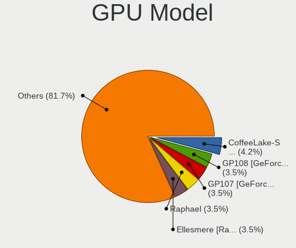

| Model                                                                       | Desktops | Percent |
|-----------------------------------------------------------------------------|----------|---------|
| Intel CoffeeLake-S GT2 [UHD Graphics 630]                                   | 6        | 4.23%   |
| Nvidia GP108 [GeForce GT 1030]                                              | 5        | 3.52%   |
| Nvidia GP107 [GeForce GTX 1050]                                             | 5        | 3.52%   |
| AMD Raphael                                                                 | 5        | 3.52%   |
| AMD Ellesmere [Radeon RX 470/480/570/570X/580/580X/590]                     | 5        | 3.52%   |
| Intel HD Graphics 530                                                       | 4        | 2.82%   |
| AMD Cezanne [Radeon Vega Series / Radeon Vega Mobile Series]                | 4        | 2.82%   |
| Nvidia TU117 [GeForce GTX 1650]                                             | 3        | 2.11%   |
| Nvidia GP106 [GeForce GTX 1060 6GB]                                         | 3        | 2.11%   |
| Intel Xeon E3-1200 v3/4th Gen Core Processor Integrated Graphics Controller | 3        | 2.11%   |
| Intel Xeon E3-1200 v2/3rd Gen Core processor Graphics Controller            | 3        | 2.11%   |
| Intel 4 Series Chipset Integrated Graphics Controller                       | 3        | 2.11%   |
| Nvidia TU106 [GeForce RTX 2070 Rev. A]                                      | 2        | 1.41%   |
| Nvidia GM204 [GeForce GTX 970]                                              | 2        | 1.41%   |
| Nvidia GK110 [GeForce GTX 780]                                              | 2        | 1.41%   |
| Nvidia GF119 [GeForce GT 610]                                               | 2        | 1.41%   |
| Nvidia GA104 [GeForce RTX 3070]                                             | 2        | 1.41%   |
| Intel RocketLake-S GT1 [UHD Graphics 730]                                   | 2        | 1.41%   |
| Intel HD Graphics 630                                                       | 2        | 1.41%   |
| Intel GeminiLake [UHD Graphics 600]                                         | 2        | 1.41%   |
| Intel Alder Lake-S GT1 [UHD Graphics 730]                                   | 2        | 1.41%   |
| Intel 82Q963/Q965 Integrated Graphics Controller                            | 2        | 1.41%   |
| Intel 82945G/GZ Integrated Graphics Controller                              | 2        | 1.41%   |
| Intel 2nd Generation Core Processor Family Integrated Graphics Controller   | 2        | 1.41%   |
| AMD Wani [Radeon R5/R6/R7 Graphics]                                         | 2        | 1.41%   |
| AMD Picasso/Raven 2 [Radeon Vega Series / Radeon Vega Mobile Series]        | 2        | 1.41%   |
| AMD Navi 23 [Radeon RX 6600/6600 XT/6600M]                                  | 2        | 1.41%   |
| AMD Curacao XT / Trinidad XT [Radeon R7 370 / R9 270X/370X]                 | 2        | 1.41%   |
| AMD Cedar [Radeon HD 5000/6000/7350/8350 Series]                            | 2        | 1.41%   |
| Nvidia TU106 [GeForce RTX 2060 Rev. A]                                      | 1        | 0.7%    |
| Nvidia TU102 [GeForce RTX 2080 Ti Rev. A]                                   | 1        | 0.7%    |
| Nvidia GT218 [GeForce 8400 GS Rev. 3]                                       | 1        | 0.7%    |
| Nvidia GT218 [GeForce 210]                                                  | 1        | 0.7%    |
| Nvidia GP107 [GeForce GTX 1050 Ti]                                          | 1        | 0.7%    |
| Nvidia GP106GL [Quadro P2200]                                               | 1        | 0.7%    |
| Nvidia GP106 [GeForce GTX 1060 3GB]                                         | 1        | 0.7%    |
| Nvidia GP104 [GeForce GTX 1070]                                             | 1        | 0.7%    |
| Nvidia GP102 [TITAN Xp]                                                     | 1        | 0.7%    |
| Nvidia GP102 [GeForce GTX 1080 Ti]                                          | 1        | 0.7%    |
| Nvidia GM206 [GeForce GTX 960]                                              | 1        | 0.7%    |

GPU Combo
---------

Combinations of graphics cards

| Name           | Desktops | Percent |
|----------------|----------|---------|
| 1 x Nvidia     | 51       | 38.93%  |
| 1 x Intel      | 37       | 28.24%  |
| 1 x AMD        | 29       | 22.14%  |
| 2 x Intel      | 6        | 4.58%   |
| 2 x AMD        | 4        | 3.05%   |
| Intel + Nvidia | 2        | 1.53%   |
| AMD + Nvidia   | 2        | 1.53%   |

GPU Driver
----------

Free vs proprietary

| Driver      | Desktops | Percent |
|-------------|----------|---------|
| Free        | 95       | 73.08%  |
| Proprietary | 32       | 24.62%  |
| Unknown     | 3        | 2.31%   |

GPU Memory
----------

Total video memory

| Size in GB | Desktops | Percent |
|------------|----------|---------|
| Unknown    | 53       | 39.85%  |
| 1.01-2.0   | 18       | 13.53%  |
| 0.01-0.5   | 16       | 12.03%  |
| 0.51-1.0   | 14       | 10.53%  |
| 7.01-8.0   | 11       | 8.27%   |
| 3.01-4.0   | 8        | 6.02%   |
| 5.01-6.0   | 4        | 3.01%   |
| 2.01-3.0   | 4        | 3.01%   |
| 8.01-16.0  | 4        | 3.01%   |
| 4.01-5.0   | 1        | 0.75%   |

Monitor
-------

Monitor Vendor
--------------

Monitor vendors

| Vendor                  | Desktops | Percent |
|-------------------------|----------|---------|
| Samsung Electronics     | 19       | 13.77%  |
| Goldstar                | 17       | 12.32%  |
| Dell                    | 15       | 10.87%  |
| Acer                    | 13       | 9.42%   |
| BenQ                    | 10       | 7.25%   |
| Hewlett-Packard         | 9        | 6.52%   |
| AOC                     | 7        | 5.07%   |
| Ancor Communications    | 6        | 4.35%   |
| Philips                 | 5        | 3.62%   |
| Sceptre Tech            | 3        | 2.17%   |
| ViewSonic               | 2        | 1.45%   |
| Lenovo                  | 2        | 1.45%   |
| CHD                     | 2        | 1.45%   |
| ASUSTek Computer        | 2        | 1.45%   |
| Yeyian                  | 1        | 0.72%   |
| Wacom                   | 1        | 0.72%   |
| UTV                     | 1        | 0.72%   |
| Unknown (ADE)           | 1        | 0.72%   |
| Unknown                 | 1        | 0.72%   |
| Toshiba                 | 1        | 0.72%   |
| Targa Visionary         | 1        | 0.72%   |
| Sony                    | 1        | 0.72%   |
| SKG                     | 1        | 0.72%   |
| RGT                     | 1        | 0.72%   |
| Packard Bell            | 1        | 0.72%   |
| NECCI                   | 1        | 0.72%   |
| Mi                      | 1        | 0.72%   |
| Medion                  | 1        | 0.72%   |
| LG Electronics          | 1        | 0.72%   |
| JRY                     | 1        | 0.72%   |
| Insignia                | 1        | 0.72%   |
| HCG                     | 1        | 0.72%   |
| Gigabyte Technology     | 1        | 0.72%   |
| Gericom                 | 1        | 0.72%   |
| Fujitsu Siemens         | 1        | 0.72%   |
| Eizo                    | 1        | 0.72%   |
| DENON                   | 1        | 0.72%   |
| CTV                     | 1        | 0.72%   |
| CHR                     | 1        | 0.72%   |
| Chi Mei Optoelectronics | 1        | 0.72%   |

Monitor Model
-------------

Monitor models

| Model                                                                    | Desktops | Percent |
|--------------------------------------------------------------------------|----------|---------|
| Goldstar M237WD GSM56EB 1920x1080 509x286mm 23.0-inch                    | 2        | 1.41%   |
| Goldstar HD GSM5ACD 1366x768 410x230mm 18.5-inch                         | 2        | 1.41%   |
| BenQ GL2480 BNQ78ED 1920x1080 531x298mm 24.0-inch                        | 2        | 1.41%   |
| AOC 24G2W1G4 AOC2402 1920x1080 530x300mm 24.0-inch                       | 2        | 1.41%   |
| Ancor Communications VS248 ACI2498 1920x1080 531x299mm 24.0-inch         | 2        | 1.41%   |
| Acer KA220HQ ACR0467 1920x1080 477x268mm 21.5-inch                       | 2        | 1.41%   |
| Yeyian MG2701 YEY2700 1920x1080 698x393mm 31.5-inch                      | 1        | 0.7%    |
| Wacom One 13 WAC1070 1920x1080 290x170mm 13.2-inch                       | 1        | 0.7%    |
| ViewSonic VX2452 Series VSCDE2E 1920x1080 521x293mm 23.5-inch            | 1        | 0.7%    |
| ViewSonic VP2780 SERIES VSC9C30 3840x2160 597x336mm 27.0-inch            | 1        | 0.7%    |
| UTV MONITOR UTV0030 1920x1080 580x330mm 26.3-inch                        | 1        | 0.7%    |
| Unknown LCD Monitor Dell DEL 1908FPBLK 1280x1024                         | 1        | 0.7%    |
| Unknown (ADE) TSLED22D ADEB22D 1920x1080 477x268mm 21.5-inch             | 1        | 0.7%    |
| Toshiba TV TSB0206 1920x1080 1600x1000mm 74.3-inch                       | 1        | 0.7%    |
| Targa Visionary LCD Monitor TAR0C35 1280x1024 380x300mm 19.1-inch        | 1        | 0.7%    |
| Sony TV SNY2C02 1920x1080 886x498mm 40.0-inch                            | 1        | 0.7%    |
| SKG AF24H1 SKG2409 1920x1080 600x330mm 27.0-inch                         | 1        | 0.7%    |
| Sceptre Tech Sceptre M25 SPT0A05 1920x1080 698x393mm 31.5-inch           | 1        | 0.7%    |
| Sceptre Tech Sceptre F24 SPT09AB 1920x1080 526x296mm 23.8-inch           | 1        | 0.7%    |
| Sceptre Tech E22 SPT08D5 1920x1080 470x300mm 22.0-inch                   | 1        | 0.7%    |
| Samsung Electronics SyncMaster SAM058C 1600x900 443x249mm 20.0-inch      | 1        | 0.7%    |
| Samsung Electronics SyncMaster SAM0587 1920x1200 518x324mm 24.1-inch     | 1        | 0.7%    |
| Samsung Electronics SyncMaster SAM0586 1920x1200 518x324mm 24.1-inch     | 1        | 0.7%    |
| Samsung Electronics SyncMaster SAM0572 1280x1024 376x301mm 19.0-inch     | 1        | 0.7%    |
| Samsung Electronics SyncMaster SAM036E 1280x1024 376x301mm 19.0-inch     | 1        | 0.7%    |
| Samsung Electronics SyncMaster SAM0117 1280x1024 312x234mm 15.4-inch     | 1        | 0.7%    |
| Samsung Electronics SyncMaster SAM0017 1024x768 304x228mm 15.0-inch      | 1        | 0.7%    |
| Samsung Electronics SMS19A100 SAM0867 1366x768 410x230mm 18.5-inch       | 1        | 0.7%    |
| Samsung Electronics S24D330 SAM0D93 1920x1080 531x299mm 24.0-inch        | 1        | 0.7%    |
| Samsung Electronics Odyssey G95NC SAM7476 3840x1080 1400x400mm 57.3-inch | 1        | 0.7%    |
| Samsung Electronics LU28R55 SAM1017 3840x2160 632x360mm 28.6-inch        | 1        | 0.7%    |
| Samsung Electronics LS24AG32x SAM71D9 1920x1080 527x296mm 23.8-inch      | 1        | 0.7%    |
| Samsung Electronics LCD Monitor SAM0C39 1920x1080 885x498mm 40.0-inch    | 1        | 0.7%    |
| Samsung Electronics LCD Monitor SAM0902 1920x1080 700x390mm 31.5-inch    | 1        | 0.7%    |
| Samsung Electronics LCD Monitor SAM0900 1366x768 700x390mm 31.5-inch     | 1        | 0.7%    |
| Samsung Electronics LC32T55 SAM7024 1920x1080 700x400mm 31.7-inch        | 1        | 0.7%    |
| Samsung Electronics C32R50x SAM7000 1920x1080 698x393mm 31.5-inch        | 1        | 0.7%    |
| Samsung Electronics C32F391 SAM0D34 1920x1080 698x393mm 31.5-inch        | 1        | 0.7%    |
| Samsung Electronics C27F390 SAM0D32 1920x1080 600x340mm 27.2-inch        | 1        | 0.7%    |
| RGT LCD Monitor RGT1352 1920x1080 480x270mm 21.7-inch                    | 1        | 0.7%    |

Monitor Resolution
------------------

Monitor screen resolution

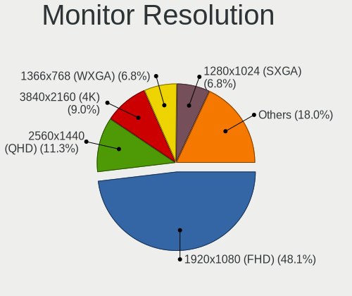

| Resolution         | Desktops | Percent |
|--------------------|----------|---------|
| 1920x1080 (FHD)    | 64       | 48.12%  |
| 2560x1440 (QHD)    | 15       | 11.28%  |
| 3840x2160 (4K)     | 12       | 9.02%   |
| 1366x768 (WXGA)    | 9        | 6.77%   |
| 1280x1024 (SXGA)   | 9        | 6.77%   |
| 1600x900 (HD+)     | 6        | 4.51%   |
| 1920x1200 (WUXGA)  | 5        | 3.76%   |
| 1440x900 (WXGA+)   | 4        | 3.01%   |
| 2560x1080          | 2        | 1.5%    |
| 1680x1050 (WSXGA+) | 2        | 1.5%    |
| 3840x1080          | 1        | 0.75%   |
| 3440x1440          | 1        | 0.75%   |
| 1360x768           | 1        | 0.75%   |
| 1024x768 (XGA)     | 1        | 0.75%   |
| Unknown            | 1        | 0.75%   |

Monitor Diagonal
----------------

Diagonal size in inches

| Inches  | Desktops | Percent |
|---------|----------|---------|
| 24      | 29       | 21.17%  |
| 27      | 16       | 11.68%  |
| 23      | 15       | 10.95%  |
| 31      | 14       | 10.22%  |
| 21      | 12       | 8.76%   |
| 19      | 9        | 6.57%   |
| 18      | 9        | 6.57%   |
| 20      | 4        | 2.92%   |
| 34      | 3        | 2.19%   |
| 17      | 3        | 2.19%   |
| Unknown | 3        | 2.19%   |
| 54      | 2        | 1.46%   |
| 22      | 2        | 1.46%   |
| 15      | 2        | 1.46%   |
| 84      | 1        | 0.73%   |
| 74      | 1        | 0.73%   |
| 65      | 1        | 0.73%   |
| 64      | 1        | 0.73%   |
| 61      | 1        | 0.73%   |
| 57      | 1        | 0.73%   |
| 55      | 1        | 0.73%   |
| 49      | 1        | 0.73%   |
| 40      | 1        | 0.73%   |
| 39      | 1        | 0.73%   |
| 32      | 1        | 0.73%   |
| 28      | 1        | 0.73%   |
| 25      | 1        | 0.73%   |
| 13      | 1        | 0.73%   |

Monitor Width
-------------

Physical width

| Width in mm | Desktops | Percent |
|-------------|----------|---------|
| 501-600     | 57       | 42.86%  |
| 401-500     | 31       | 23.31%  |
| 601-700     | 16       | 12.03%  |
| 1001-1500   | 8        | 6.02%   |
| 301-350     | 5        | 3.76%   |
| 701-800     | 4        | 3.01%   |
| 351-400     | 4        | 3.01%   |
| Unknown     | 3        | 2.26%   |
| 801-900     | 2        | 1.5%    |
| 1501-2000   | 2        | 1.5%    |
| 201-300     | 1        | 0.75%   |

Aspect Ratio
------------

Proportional relationship between the width and the height

| Ratio   | Desktops | Percent |
|---------|----------|---------|
| 16/9    | 95       | 76%     |
| 16/10   | 15       | 12%     |
| 5/4     | 7        | 5.6%    |
| 21/9    | 3        | 2.4%    |
| 4/3     | 2        | 1.6%    |
| Unknown | 2        | 1.6%    |
| 32/9    | 1        | 0.8%    |

Monitor Area
------------

Area in inch²

| Area in inch² | Desktops | Percent |
|----------------|----------|---------|
| 201-250        | 43       | 32.33%  |
| 351-500        | 19       | 14.29%  |
| 151-200        | 17       | 12.78%  |
| 301-350        | 16       | 12.03%  |
| 141-150        | 11       | 8.27%   |
| 251-300        | 10       | 7.52%   |
| More than 1000 | 8        | 6.02%   |
| 501-1000       | 3        | 2.26%   |
| Unknown        | 3        | 2.26%   |
| 71-80          | 1        | 0.75%   |
| 111-120        | 1        | 0.75%   |
| 101-110        | 1        | 0.75%   |

Pixel Density
-------------

Pixels per inch

| Density | Desktops | Percent |
|---------|----------|---------|
| 51-100  | 92       | 74.19%  |
| 101-120 | 17       | 13.71%  |
| 1-50    | 6        | 4.84%   |
| 121-160 | 4        | 3.23%   |
| Unknown | 3        | 2.42%   |
| 161-240 | 2        | 1.61%   |

Multiple Monitors
-----------------

Total monitors connected

| Total | Desktops | Percent |
|-------|----------|---------|
| 1     | 103      | 79.23%  |
| 2     | 23       | 17.69%  |
| 0     | 3        | 2.31%   |
| 3     | 1        | 0.77%   |

Network
-------

Net Controller Vendor
---------------------

Controller vendors

| Vendor                                 | Desktops | Percent |
|----------------------------------------|----------|---------|
| Realtek Semiconductor                  | 93       | 44.71%  |
| Intel                                  | 50       | 24.04%  |
| TP-Link                                | 16       | 7.69%   |
| MediaTek                               | 7        | 3.37%   |
| Broadcom                               | 7        | 3.37%   |
| Qualcomm Atheros                       | 6        | 2.88%   |
| Samsung Electronics                    | 4        | 1.92%   |
| Ralink Technology                      | 4        | 1.92%   |
| Qualcomm Atheros Communications        | 4        | 1.92%   |
| Xiaomi                                 | 2        | 0.96%   |
| Broadcom Limited                       | 2        | 0.96%   |
| Tenda                                  | 1        | 0.48%   |
| Sony Ericsson Mobile Communications AB | 1        | 0.48%   |
| Ralink                                 | 1        | 0.48%   |
| OPPO Electronics                       | 1        | 0.48%   |
| Nvidia                                 | 1        | 0.48%   |
| Microsoft                              | 1        | 0.48%   |
| Marvell Technology Group               | 1        | 0.48%   |
| Linksys                                | 1        | 0.48%   |
| IMC Networks                           | 1        | 0.48%   |
| Huawei Technologies                    | 1        | 0.48%   |
| Edimax Technology                      | 1        | 0.48%   |
| D-Link System                          | 1        | 0.48%   |
| ASUSTek Computer                       | 1        | 0.48%   |

Net Controller Model
--------------------

Controller models

| Model                                                                  | Desktops | Percent |
|------------------------------------------------------------------------|----------|---------|
| Realtek RTL8111/8168/8211/8411 PCI Express Gigabit Ethernet Controller | 67       | 27.02%  |
| Realtek RTL88x2bu [AC1200 Techkey]                                     | 8        | 3.23%   |
| Realtek RTL8125 2.5GbE Controller                                      | 8        | 3.23%   |
| Intel Ethernet Controller I225-V                                       | 8        | 3.23%   |
| Realtek RTL8188EUS 802.11n Wireless Network Adapter                    | 5        | 2.02%   |
| Realtek RTL810xE PCI Express Fast Ethernet controller                  | 5        | 2.02%   |
| Realtek 802.11ac NIC                                                   | 5        | 2.02%   |
| Intel Ethernet Connection (2) I219-V                                   | 5        | 2.02%   |
| Realtek RTL8852BE PCIe 802.11ax Wireless Network Controller            | 4        | 1.61%   |
| Intel Ethernet Connection (7) I219-V                                   | 4        | 1.61%   |
| Intel 82579LM Gigabit Network Connection (Lewisville)                  | 4        | 1.61%   |
| TP-Link Archer T3U [Realtek RTL8812BU]                                 | 3        | 1.21%   |
| TP-Link AC600 wireless Realtek RTL8811AU [Archer T2U Nano]             | 3        | 1.21%   |
| TP-Link 802.11ac WLAN Adapter                                          | 3        | 1.21%   |
| Samsung Galaxy series, misc. (tethering mode)                          | 3        | 1.21%   |
| Qualcomm Atheros AR9271 802.11n                                        | 3        | 1.21%   |
| MediaTek MT7922 802.11ax PCI Express Wireless Network Adapter          | 3        | 1.21%   |
| Intel Wi-Fi 5(802.11ac) Wireless-AC 9x6x [Thunder Peak]                | 3        | 1.21%   |
| Xiaomi Mi/Redmi series (RNDIS)                                         | 2        | 0.81%   |
| TP-Link Archer T2U PLUS [RTL8821AU]                                    | 2        | 0.81%   |
| Realtek RTL8821CE 802.11ac PCIe Wireless Network Adapter               | 2        | 0.81%   |
| Realtek RTL8812AU 802.11a/b/g/n/ac 2T2R DB WLAN Adapter                | 2        | 0.81%   |
| Realtek RTL8188FTV 802.11b/g/n 1T1R 2.4G WLAN Adapter                  | 2        | 0.81%   |
| Realtek 802.11n WLAN Adapter                                           | 2        | 0.81%   |
| Ralink RT2870/RT3070 Wireless Adapter                                  | 2        | 0.81%   |
| Ralink MT7601U Wireless Adapter                                        | 2        | 0.81%   |
| MediaTek MT7921K (RZ608) Wi-Fi 6E 80MHz                                | 2        | 0.81%   |
| Intel Wireless 8260                                                    | 2        | 0.81%   |
| Intel Wireless 7265                                                    | 2        | 0.81%   |
| Intel Wireless 3165                                                    | 2        | 0.81%   |
| Intel Wi-Fi 6E(802.11ax) AX210/AX1675* 2x2 [Typhoon Peak]              | 2        | 0.81%   |
| Intel Wi-Fi 6 AX200                                                    | 2        | 0.81%   |
| Intel I211 Gigabit Network Connection                                  | 2        | 0.81%   |
| Intel Ethernet Connection (17) I219-V                                  | 2        | 0.81%   |
| Intel Ethernet Connection (11) I219-LM                                 | 2        | 0.81%   |
| Intel Alder Lake-S PCH CNVi WiFi                                       | 2        | 0.81%   |
| Intel 82566DM Gigabit Network Connection                               | 2        | 0.81%   |
| Broadcom NetXtreme BCM5762 Gigabit Ethernet PCIe                       | 2        | 0.81%   |
| TP-Link TL-WN823N v2/v3 [Realtek RTL8192EU]                            | 1        | 0.4%    |
| TP-Link TL-WN821N v5/v6 [RTL8192EU]                                    | 1        | 0.4%    |

Wireless Vendor
---------------

Wireless vendors

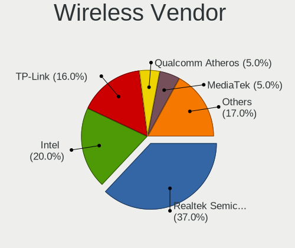

| Vendor                          | Desktops | Percent |
|---------------------------------|----------|---------|
| Realtek Semiconductor           | 37       | 37%     |
| Intel                           | 20       | 20%     |
| TP-Link                         | 16       | 16%     |
| Qualcomm Atheros                | 5        | 5%      |
| MediaTek                        | 5        | 5%      |
| Ralink Technology               | 4        | 4%      |
| Qualcomm Atheros Communications | 4        | 4%      |
| Tenda                           | 1        | 1%      |
| Ralink                          | 1        | 1%      |
| Microsoft                       | 1        | 1%      |
| Linksys                         | 1        | 1%      |
| IMC Networks                    | 1        | 1%      |
| Edimax Technology               | 1        | 1%      |
| Broadcom Limited                | 1        | 1%      |
| Broadcom                        | 1        | 1%      |
| ASUSTek Computer                | 1        | 1%      |

Wireless Model
--------------

Wireless models

| Model                                                         | Desktops | Percent |
|---------------------------------------------------------------|----------|---------|
| Realtek RTL88x2bu [AC1200 Techkey]                            | 8        | 7.84%   |
| Realtek RTL8188EUS 802.11n Wireless Network Adapter           | 5        | 4.9%    |
| Realtek 802.11ac NIC                                          | 5        | 4.9%    |
| TP-Link Archer T3U [Realtek RTL8812BU]                        | 3        | 2.94%   |
| TP-Link AC600 wireless Realtek RTL8811AU [Archer T2U Nano]    | 3        | 2.94%   |
| TP-Link 802.11ac WLAN Adapter                                 | 3        | 2.94%   |
| Realtek RTL8852BE PCIe 802.11ax Wireless Network Controller   | 3        | 2.94%   |
| Qualcomm Atheros AR9271 802.11n                               | 3        | 2.94%   |
| Intel Wi-Fi 5(802.11ac) Wireless-AC 9x6x [Thunder Peak]       | 3        | 2.94%   |
| TP-Link Archer T2U PLUS [RTL8821AU]                           | 2        | 1.96%   |
| Realtek RTL8821CE 802.11ac PCIe Wireless Network Adapter      | 2        | 1.96%   |
| Realtek RTL8812AU 802.11a/b/g/n/ac 2T2R DB WLAN Adapter       | 2        | 1.96%   |
| Realtek RTL8188FTV 802.11b/g/n 1T1R 2.4G WLAN Adapter         | 2        | 1.96%   |
| Realtek 802.11n WLAN Adapter                                  | 2        | 1.96%   |
| Ralink RT2870/RT3070 Wireless Adapter                         | 2        | 1.96%   |
| Ralink MT7601U Wireless Adapter                               | 2        | 1.96%   |
| MediaTek MT7922 802.11ax PCI Express Wireless Network Adapter | 2        | 1.96%   |
| MediaTek MT7921K (RZ608) Wi-Fi 6E 80MHz                       | 2        | 1.96%   |
| Intel Wireless 8260                                           | 2        | 1.96%   |
| Intel Wireless 7265                                           | 2        | 1.96%   |
| Intel Wireless 3165                                           | 2        | 1.96%   |
| Intel Wi-Fi 6E(802.11ax) AX210/AX1675* 2x2 [Typhoon Peak]     | 2        | 1.96%   |
| Intel Wi-Fi 6 AX200                                           | 2        | 1.96%   |
| Intel Alder Lake-S PCH CNVi WiFi                              | 2        | 1.96%   |
| TP-Link TL-WN823N v2/v3 [Realtek RTL8192EU]                   | 1        | 0.98%   |
| TP-Link TL-WN821N v5/v6 [RTL8192EU]                           | 1        | 0.98%   |
| TP-Link RTL8812AU Archer T4U 802.11ac                         | 1        | 0.98%   |
| TP-Link Archer T4U ver.3                                      | 1        | 0.98%   |
| TP-Link 802.11ac NIC                                          | 1        | 0.98%   |
| Tenda U12                                                     | 1        | 0.98%   |
| Realtek RTL8852CE PCIe 802.11ax Wireless Network Controller   | 1        | 0.98%   |
| Realtek RTL8822CE 802.11ac PCIe Wireless Network Adapter      | 1        | 0.98%   |
| Realtek RTL8812AE 802.11ac PCIe Wireless Network Adapter      | 1        | 0.98%   |
| Realtek RTL8723BE PCIe Wireless Network Adapter               | 1        | 0.98%   |
| Realtek RTL8192EU 802.11b/g/n WLAN Adapter                    | 1        | 0.98%   |
| Realtek RTL8192EE PCIe Wireless Network Adapter               | 1        | 0.98%   |
| Realtek RTL8191SU 802.11n WLAN Adapter                        | 1        | 0.98%   |
| Realtek RTL8188CUS 802.11n WLAN Adapter                       | 1        | 0.98%   |
| Realtek RTL8188CE 802.11b/g/n WiFi Adapter                    | 1        | 0.98%   |
| Ralink RT5572 Wireless Adapter                                | 1        | 0.98%   |

Ethernet Vendor
---------------

Ethernet vendors

| Vendor                   | Desktops | Percent |
|--------------------------|----------|---------|
| Realtek Semiconductor    | 81       | 58.27%  |
| Intel                    | 38       | 27.34%  |
| Broadcom                 | 6        | 4.32%   |
| Samsung Electronics      | 3        | 2.16%   |
| Xiaomi                   | 2        | 1.44%   |
| MediaTek                 | 2        | 1.44%   |
| Qualcomm Atheros         | 1        | 0.72%   |
| OPPO Electronics         | 1        | 0.72%   |
| Nvidia                   | 1        | 0.72%   |
| Marvell Technology Group | 1        | 0.72%   |
| Huawei Technologies      | 1        | 0.72%   |
| D-Link System            | 1        | 0.72%   |
| Broadcom Limited         | 1        | 0.72%   |

Ethernet Model
--------------

Ethernet models

| Model                                                                  | Desktops | Percent |
|------------------------------------------------------------------------|----------|---------|
| Realtek RTL8111/8168/8211/8411 PCI Express Gigabit Ethernet Controller | 67       | 46.53%  |
| Realtek RTL8125 2.5GbE Controller                                      | 8        | 5.56%   |
| Intel Ethernet Controller I225-V                                       | 8        | 5.56%   |
| Realtek RTL810xE PCI Express Fast Ethernet controller                  | 5        | 3.47%   |
| Intel Ethernet Connection (2) I219-V                                   | 5        | 3.47%   |
| Intel Ethernet Connection (7) I219-V                                   | 4        | 2.78%   |
| Intel 82579LM Gigabit Network Connection (Lewisville)                  | 4        | 2.78%   |
| Samsung Galaxy series, misc. (tethering mode)                          | 3        | 2.08%   |
| Xiaomi Mi/Redmi series (RNDIS)                                         | 2        | 1.39%   |
| Intel I211 Gigabit Network Connection                                  | 2        | 1.39%   |
| Intel Ethernet Connection (17) I219-V                                  | 2        | 1.39%   |
| Intel Ethernet Connection (11) I219-LM                                 | 2        | 1.39%   |
| Intel 82566DM Gigabit Network Connection                               | 2        | 1.39%   |
| Broadcom NetXtreme BCM5762 Gigabit Ethernet PCIe                       | 2        | 1.39%   |
| Realtek RTL8852BE PCIe 802.11ax Wireless Network Controller            | 1        | 0.69%   |
| Realtek RTL8152 Fast Ethernet Adapter                                  | 1        | 0.69%   |
| Realtek RTL-8100/8101L/8139 PCI Fast Ethernet Adapter                  | 1        | 0.69%   |
| Realtek Killer E3000 2.5GbE Controller                                 | 1        | 0.69%   |
| Qualcomm Atheros AR8161 Gigabit Ethernet                               | 1        | 0.69%   |
| OPPO OnePlus Nord 4                                                    | 1        | 0.69%   |
| Nvidia MCP51 Ethernet Controller                                       | 1        | 0.69%   |
| MediaTek MT7922 802.11ax PCI Express Wireless Network Adapter          | 1        | 0.69%   |
| MediaTek Infinix SMART 5                                               | 1        | 0.69%   |
| Marvell Group 88E8057 PCI-E Gigabit Ethernet Controller                | 1        | 0.69%   |
| Intel Ethernet Controller I226-V                                       | 1        | 0.69%   |
| Intel Ethernet Connection I217-V                                       | 1        | 0.69%   |
| Intel Ethernet Connection I217-LM                                      | 1        | 0.69%   |
| Intel Ethernet Connection (5) I219-LM                                  | 1        | 0.69%   |
| Intel Ethernet Connection (2) I219-LM                                  | 1        | 0.69%   |
| Intel Ethernet Connection (13) I219-V                                  | 1        | 0.69%   |
| Intel Ethernet Connection (11) I219-V                                  | 1        | 0.69%   |
| Intel 82578DM Gigabit Network Connection                               | 1        | 0.69%   |
| Intel 82576 Gigabit Network Connection                                 | 1        | 0.69%   |
| Intel 82567LM-3 Gigabit Network Connection                             | 1        | 0.69%   |
| Intel 82566DM-2 Gigabit Network Connection                             | 1        | 0.69%   |
| Huawei FOA-LX9                                                         | 1        | 0.69%   |
| D-Link System DGE-528T Gigabit Ethernet Adapter                        | 1        | 0.69%   |
| Broadcom NetXtreme BCM5761 Gigabit Ethernet PCIe                       | 1        | 0.69%   |
| Broadcom NetXtreme BCM5754 Gigabit Ethernet PCI Express                | 1        | 0.69%   |
| Broadcom NetXtreme BCM5752 Gigabit Ethernet PCI Express                | 1        | 0.69%   |

Net Controller Kind
-------------------

Ethernet, WiFi or modem

| Kind     | Desktops | Percent |
|----------|----------|---------|
| Ethernet | 129      | 58.11%  |
| WiFi     | 91       | 40.99%  |
| Modem    | 1        | 0.45%   |
| Unknown  | 1        | 0.45%   |

Used Controller
---------------

Currently used network controller

| Kind     | Desktops | Percent |
|----------|----------|---------|
| Ethernet | 92       | 68.15%  |
| WiFi     | 42       | 31.11%  |
| Modem    | 1        | 0.74%   |

NICs
----

Total network controllers on board

| Total | Desktops | Percent |
|-------|----------|---------|
| 1     | 78       | 60%     |
| 2     | 48       | 36.92%  |
| 3     | 2        | 1.54%   |
| 0     | 2        | 1.54%   |

IPv6
----

IPv6 vs IPv4

| Used | Desktops | Percent |
|------|----------|---------|
| No   | 94       | 72.31%  |
| Yes  | 36       | 27.69%  |

Bluetooth
---------

Bluetooth Vendor
----------------

Controller vendors

| Vendor                  | Desktops | Percent |
|-------------------------|----------|---------|
| Intel                   | 19       | 32.2%   |
| Cambridge Silicon Radio | 11       | 18.64%  |
| Realtek Semiconductor   | 8        | 13.56%  |
| MediaTek                | 5        | 8.47%   |
| IMC Networks            | 4        | 6.78%   |
| TP-Link                 | 3        | 5.08%   |
| Broadcom                | 3        | 5.08%   |
| Lite-On Technology      | 1        | 1.69%   |
| Hewlett-Packard         | 1        | 1.69%   |
| Foxconn / Hon Hai       | 1        | 1.69%   |
| Creative Technology     | 1        | 1.69%   |
| ASUSTek Computer        | 1        | 1.69%   |
| Actions                 | 1        | 1.69%   |

Bluetooth Model
---------------

Controller models

| Model                                                                                                     | Desktops | Percent |
|-----------------------------------------------------------------------------------------------------------|----------|---------|
| Cambridge Silicon Radio Bluetooth Dongle (HCI mode)                                                       | 11       | 18.64%  |
| Realtek Bluetooth Radio                                                                                   | 6        | 10.17%  |
| Intel Bluetooth wireless interface                                                                        | 6        | 10.17%  |
| MediaTek Wireless_Device                                                                                  | 4        | 6.78%   |
| TP-Link TP-Link Bluetooth USB Adapter                                                                     | 3        | 5.08%   |
| Intel Wireless-AC 9260 Bluetooth Adapter                                                                  | 3        | 5.08%   |
| Intel AX201 Bluetooth                                                                                     | 3        | 5.08%   |
| Intel Bluetooth 9460/9560 Jefferson Peak (JfP)                                                            | 2        | 3.39%   |
| Intel AX210 Bluetooth                                                                                     | 2        | 3.39%   |
| IMC Networks Wireless_Device                                                                              | 2        | 3.39%   |
| IMC Networks Bluetooth Radio                                                                              | 2        | 3.39%   |
| Broadcom BCM20702A0 Bluetooth 4.0                                                                         | 2        | 3.39%   |
| Realtek  Bluetooth 4.2 Adapter                                                                            | 1        | 1.69%   |
| Realtek 802.11ac WLAN Adapter                                                                             | 1        | 1.69%   |
| MediaTek MT7668 2x2 Dual Band Dual Concurrent 802.11a/b/g/n/ac WiFi with MU-MIMO and Bluetooth 5.0 Radios | 1        | 1.69%   |
| Lite-On Qualcomm Atheros QCA9377 Bluetooth                                                                | 1        | 1.69%   |
| Intel Wireless-AC 3168 Bluetooth                                                                          | 1        | 1.69%   |
| Intel AX211 Bluetooth                                                                                     | 1        | 1.69%   |
| Intel AX200 Bluetooth                                                                                     | 1        | 1.69%   |
| HP Bluetooth 2.0 Interface [Broadcom BCM2045]                                                             | 1        | 1.69%   |
| Foxconn / Hon Hai Wireless_Device                                                                         | 1        | 1.69%   |
| Creative Bluetooth Audio W2                                                                               | 1        | 1.69%   |
| Broadcom Bluetooth Controller                                                                             | 1        | 1.69%   |
| ASUS ASUS USB-BT500                                                                                       | 1        | 1.69%   |
| Actions general adapter                                                                                   | 1        | 1.69%   |

Sound
-----

Sound Vendor
------------

Sound card vendors

| Vendor               | Desktops | Percent |
|----------------------|----------|---------|
| Intel                | 81       | 38.94%  |
| Nvidia               | 53       | 25.48%  |
| AMD                  | 50       | 24.04%  |
| C-Media Electronics  | 7        | 3.37%   |
| Logitech             | 3        | 1.44%   |
| Creative Labs        | 3        | 1.44%   |
| Texas Instruments    | 1        | 0.48%   |
| SteelSeries ApS      | 1        | 0.48%   |
| RODE Microphones     | 1        | 0.48%   |
| MV-SILICON           | 1        | 0.48%   |
| JMTek                | 1        | 0.48%   |
| iConnectivity        | 1        | 0.48%   |
| Giga-Byte Technology | 1        | 0.48%   |
| Focusrite-Novation   | 1        | 0.48%   |
| Emotiva              | 1        | 0.48%   |
| Corsair              | 1        | 0.48%   |
| ASUSTek Computer     | 1        | 0.48%   |

Sound Model
-----------

Sound card models

| Model                                                                      | Desktops | Percent |
|----------------------------------------------------------------------------|----------|---------|
| AMD Family 17h/19h/1ah HD Audio Controller                                 | 13       | 5.46%   |
| Intel 6 Series/C200 Series Chipset Family High Definition Audio Controller | 10       | 4.2%    |
| Intel 100 Series/C230 Series Chipset Family HD Audio Controller            | 9        | 3.78%   |
| Intel 200 Series PCH HD Audio                                              | 8        | 3.36%   |
| AMD Starship/Matisse HD Audio Controller                                   | 8        | 3.36%   |
| AMD Rembrandt Radeon High Definition Audio Controller                      | 7        | 2.94%   |
| Nvidia GP107GL High Definition Audio Controller                            | 6        | 2.52%   |
| Intel NM10/ICH7 Family High Definition Audio Controller                    | 6        | 2.52%   |
| Intel Cannon Lake PCH cAVS                                                 | 6        | 2.52%   |
| Intel 7 Series/C216 Chipset Family High Definition Audio Controller        | 6        | 2.52%   |
| AMD Renoir Radeon High Definition Audio Controller                         | 6        | 2.52%   |
| AMD FCH Azalia Controller                                                  | 6        | 2.52%   |
| AMD Family 17h (Models 00h-0fh) HD Audio Controller                        | 6        | 2.52%   |
| Nvidia GP108 High Definition Audio Controller                              | 5        | 2.1%    |
| Nvidia GP106 High Definition Audio Controller                              | 5        | 2.1%    |
| Intel Alder Lake-S HD Audio Controller                                     | 5        | 2.1%    |
| Intel 8 Series/C220 Series Chipset High Definition Audio Controller        | 5        | 2.1%    |
| AMD SBx00 Azalia (Intel HDA)                                               | 5        | 2.1%    |
| AMD Ellesmere HDMI Audio [Radeon RX 470/480 / 570/580/590]                 | 5        | 2.1%    |
| Nvidia GA104 High Definition Audio Controller                              | 4        | 1.68%   |
| Intel 82801H (ICH8 Family) HD Audio Controller                             | 4        | 1.68%   |
| AMD Oland/Hainan/Cape Verde/Pitcairn HDMI Audio [Radeon HD 7000 Series]    | 4        | 1.68%   |
| Nvidia TU107 GeForce GTX 1650 High Definition Audio Controller             | 3        | 1.26%   |
| Nvidia TU106 High Definition Audio Controller                              | 3        | 1.26%   |
| Nvidia GK208 HDMI/DP Audio Controller                                      | 3        | 1.26%   |
| Nvidia GF119 HDMI Audio Controller                                         | 3        | 1.26%   |
| Intel Xeon E3-1200 v3/4th Gen Core Processor HD Audio Controller           | 3        | 1.26%   |
| Intel Comet Lake PCH cAVS                                                  | 3        | 1.26%   |
| AMD Navi 21/23 HDMI/DP Audio Controller                                    | 3        | 1.26%   |
| Nvidia High Definition Audio Controller                                    | 2        | 0.84%   |
| Nvidia GP102 HDMI Audio Controller                                         | 2        | 0.84%   |
| Nvidia GM204 High Definition Audio Controller                              | 2        | 0.84%   |
| Nvidia GK110 High Definition Audio Controller                              | 2        | 0.84%   |
| Nvidia GF106 High Definition Audio Controller                              | 2        | 0.84%   |
| Nvidia GA106 High Definition Audio Controller                              | 2        | 0.84%   |
| Intel Tiger Lake-H HD Audio Controller                                     | 2        | 0.84%   |
| Intel Celeron/Pentium Silver Processor High Definition Audio               | 2        | 0.84%   |
| Intel 82801JI (ICH10 Family) HD Audio Controller                           | 2        | 0.84%   |
| Intel 82801I (ICH9 Family) HD Audio Controller                             | 2        | 0.84%   |
| C-Media Electronics Audio Adapter (Unitek Y-247A)                          | 2        | 0.84%   |

Memory
------

Memory Vendor
-------------

Memory module vendors

| Vendor                                  | Desktops | Percent |
|-----------------------------------------|----------|---------|
| Unknown                                 | 20       | 12.27%  |
| Corsair                                 | 20       | 12.27%  |
| Samsung Electronics                     | 19       | 11.66%  |
| Crucial                                 | 19       | 11.66%  |
| Kingston                                | 18       | 11.04%  |
| SK hynix                                | 15       | 9.2%    |
| G.Skill                                 | 12       | 7.36%   |
| Micron Technology                       | 11       | 6.75%   |
| Team                                    | 4        | 2.45%   |
| A-DATA Technology                       | 4        | 2.45%   |
| Nanya Technology                        | 3        | 1.84%   |
| V-GeN                                   | 1        | 0.61%   |
| Unknown (ABCD)                          | 1        | 0.61%   |
| Unknown (0x0CAB)                        | 1        | 0.61%   |
| Unknown (0x0B45)                        | 1        | 0.61%   |
| Timetec                                 | 1        | 0.61%   |
| Silicon Power Computer & Communications | 1        | 0.61%   |
| Ramaxel Technology                      | 1        | 0.61%   |
| Qumo                                    | 1        | 0.61%   |
| Qimonda                                 | 1        | 0.61%   |
| Patriot                                 | 1        | 0.61%   |
| OM Nanotech                             | 1        | 0.61%   |
| Multilaser                              | 1        | 0.61%   |
| Lexar                                   | 1        | 0.61%   |
| Elpida                                  | 1        | 0.61%   |
| Apacer                                  | 1        | 0.61%   |
| 2C0C0803D720D6BA                        | 1        | 0.61%   |
| 2C0C0803D720D614                        | 1        | 0.61%   |
| Unknown                                 | 1        | 0.61%   |

Memory Model
------------

Memory module models

| Model                                                            | Desktops | Percent |
|------------------------------------------------------------------|----------|---------|
| Unknown RAM Module 8GB DIMM DDR3 1600MT/s                        | 3        | 1.74%   |
| Corsair RAM CMK16GX4M2B3200C16 8GB DIMM DDR4 3600MT/s            | 3        | 1.74%   |
| Unknown RAM Module 8GB DIMM DDR4 2667MT/s                        | 2        | 1.16%   |
| Unknown RAM Module 2GB DIMM DDR2                                 | 2        | 1.16%   |
| Unknown RAM Module 2GB DIMM 800MT/s                              | 2        | 1.16%   |
| Samsung RAM M378B5273DH0-CH9 4GB DIMM DDR3 2133MT/s              | 2        | 1.16%   |
| Samsung RAM M378B5173QH0-CK0 4GB DIMM DDR3 1600MT/s              | 2        | 1.16%   |
| Samsung RAM M378A1K43CB2-CRC 8GB DIMM DDR4 3500MT/s              | 2        | 1.16%   |
| Samsung RAM M3 78T2863QZS-CF7 1GB DIMM DDR2 800MT/s              | 2        | 1.16%   |
| Kingston RAM KHX2400C15D4/4G 4GB DIMM DDR4 3151MT/s              | 2        | 1.16%   |
| Kingston RAM KHX2400C15/8G 8GB DIMM DDR4 3400MT/s                | 2        | 1.16%   |
| G.Skill RAM F4-3200C16-8GVKB 8GB DIMM DDR4 4000MT/s              | 2        | 1.16%   |
| Corsair RAM CMK32GX4M2B3200C16 16GB DIMM DDR4 3800MT/s           | 2        | 1.16%   |
| V-GeN RAM D4H4GL26A8TS5 4GB DIMM DDR4 2400MT/s                   | 1        | 0.58%   |
| Unknown RAM Module 4GB DIMM DDR3 1600MT/s                        | 1        | 0.58%   |
| Unknown RAM Module 4GB DIMM DDR3 1333MT/s                        | 1        | 0.58%   |
| Unknown RAM Module 4GB DIMM 1333MT/s                             | 1        | 0.58%   |
| Unknown RAM Module 2GB DIMM SDRAM 800MT/s                        | 1        | 0.58%   |
| Unknown RAM Module 2GB DIMM SDRAM 667MT/s                        | 1        | 0.58%   |
| Unknown RAM Module 2GB DIMM SDRAM                                | 1        | 0.58%   |
| Unknown RAM Module 2GB DIMM DDR3 1333MT/s                        | 1        | 0.58%   |
| Unknown RAM Module 2GB DIMM DDR2 800MT/s                         | 1        | 0.58%   |
| Unknown RAM Module 2GB DIMM DDR2 667MT/s                         | 1        | 0.58%   |
| Unknown RAM Module 2GB DIMM 1333MT/s                             | 1        | 0.58%   |
| Unknown RAM Module 1GB DIMM DDR2 667MT/s                         | 1        | 0.58%   |
| Unknown RAM DDR4 NB 8G 2666 8GB SODIMM DDR4 2667MT/s             | 1        | 0.58%   |
| Unknown (ABCD) RAM 123456789012345678 2GB DIMM DDR3 2400MT/s     | 1        | 0.58%   |
| Unknown (0x0CAB) RAM B44AU8G53222B-TJ16 8GB DIMM DDR4 3200MT/s   | 1        | 0.58%   |
| Unknown (0x0B45) RAM WPBH32D408SWM-16G 16GB SODIMM DDR4 3200MT/s | 1        | 0.58%   |
| Timetec RAM SD4-2133 4GB SODIMM DDR4 2133MT/s                    | 1        | 0.58%   |
| Team RAM Vulcan-1600 8GB DIMM DDR3 1333MT/s                      | 1        | 0.58%   |
| Team RAM UD5-6000 32GB DIMM DDR5 6000MT/s                        | 1        | 0.58%   |
| Team RAM TEAMGROUP-UD3-1600 8GB DIMM DDR3 1600MT/s               | 1        | 0.58%   |
| Team RAM TEAMGROUP-SD4-2666 16GB SODIMM DDR4 2667MT/s            | 1        | 0.58%   |
| SK hynix RAM Module 8GB DIMM DDR4 2133MT/s                       | 1        | 0.58%   |
| SK hynix RAM Module 16GB DIMM DDR4 3200MT/s                      | 1        | 0.58%   |
| SK hynix RAM HYMP351F72AMP4D2Y5 4GB FB-DIMM DDR2 667MT/s         | 1        | 0.58%   |
| SK hynix RAM HYMP112U64CP8-Y5 1GB DIMM DDR2 1639MT/s             | 1        | 0.58%   |
| SK hynix RAM HMT451U6BFR8C-PB 4GB DIMM DDR3 1600MT/s             | 1        | 0.58%   |
| SK hynix RAM HMT451U6BFR8A-PB 4GB DIMM DDR3 1600MT/s             | 1        | 0.58%   |

Memory Kind
-----------

Memory module kinds

| Kind    | Desktops | Percent |
|---------|----------|---------|
| DDR4    | 64       | 48.12%  |
| DDR3    | 39       | 29.32%  |
| DDR2    | 10       | 7.52%   |
| DDR5    | 8        | 6.02%   |
| SDRAM   | 7        | 5.26%   |
| Unknown | 4        | 3.01%   |
| LPDDR4  | 1        | 0.75%   |

Memory Form Factor
------------------

Physical design of the memory module

| Name    | Desktops | Percent |
|---------|----------|---------|
| DIMM    | 114      | 86.36%  |
| SODIMM  | 17       | 12.88%  |
| FB-DIMM | 1        | 0.76%   |

Memory Size
-----------

Memory module size

| Size  | Desktops | Percent |
|-------|----------|---------|
| 8192  | 53       | 37.59%  |
| 4096  | 32       | 22.7%   |
| 16384 | 25       | 17.73%  |
| 2048  | 19       | 13.48%  |
| 32768 | 6        | 4.26%   |
| 1024  | 5        | 3.55%   |
| 512   | 1        | 0.71%   |

Memory Speed
------------

Memory module speed

| Speed   | Desktops | Percent |
|---------|----------|---------|
| 1600    | 24       | 15.69%  |
| 3200    | 22       | 14.38%  |
| 1333    | 15       | 9.8%    |
| 2667    | 11       | 7.19%   |
| 2400    | 10       | 6.54%   |
| 2133    | 7        | 4.58%   |
| 3600    | 6        | 3.92%   |
| 800     | 6        | 3.92%   |
| 6000    | 5        | 3.27%   |
| 667     | 5        | 3.27%   |
| 1800    | 4        | 2.61%   |
| Unknown | 4        | 2.61%   |
| 4000    | 3        | 1.96%   |
| 3800    | 2        | 1.31%   |
| 3500    | 2        | 1.31%   |
| 3400    | 2        | 1.31%   |
| 3151    | 2        | 1.31%   |
| 2800    | 2        | 1.31%   |
| 2048    | 2        | 1.31%   |
| 1867    | 2        | 1.31%   |
| 1866    | 2        | 1.31%   |
| 12800   | 1        | 0.65%   |
| 6200    | 1        | 0.65%   |
| 4800    | 1        | 0.65%   |
| 4333    | 1        | 0.65%   |
| 3466    | 1        | 0.65%   |
| 3334    | 1        | 0.65%   |
| 3066    | 1        | 0.65%   |
| 3000    | 1        | 0.65%   |
| 2933    | 1        | 0.65%   |
| 2666    | 1        | 0.65%   |
| 1639    | 1        | 0.65%   |
| 1334    | 1        | 0.65%   |
| 1067    | 1        | 0.65%   |
| 533     | 1        | 0.65%   |
| 400     | 1        | 0.65%   |

Printers & scanners
-------------------

Printer Vendor
--------------

Printer device vendors

| Vendor             | Desktops | Percent |
|--------------------|----------|---------|
| Canon              | 3        | 50%     |
| Brother Industries | 2        | 33.33%  |
| Hewlett-Packard    | 1        | 16.67%  |

Printer Model
-------------

Printer device models

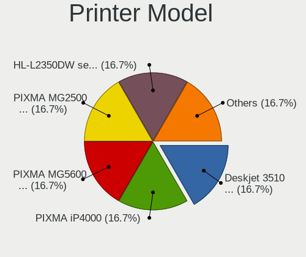

| Model                     | Desktops | Percent |
|---------------------------|----------|---------|
| HP Deskjet 3510 series    | 1        | 16.67%  |
| Canon PIXMA MG5600 Series | 1        | 16.67%  |
| Canon PIXMA MG2500 Series | 1        | 16.67%  |
| Canon PIXMA iP4000        | 1        | 16.67%  |
| Brother HL-L2350DW series | 1        | 16.67%  |
| Brother HL-52x0 series    | 1        | 16.67%  |

Scanner Vendor
--------------

Scanner device vendors

| Vendor         | Desktops | Percent |
|----------------|----------|---------|
| Canon          | 3        | 60%     |
| Seiko Epson    | 1        | 20%     |
| Mustek Systems | 1        | 20%     |

Scanner Model
-------------

Scanner device models

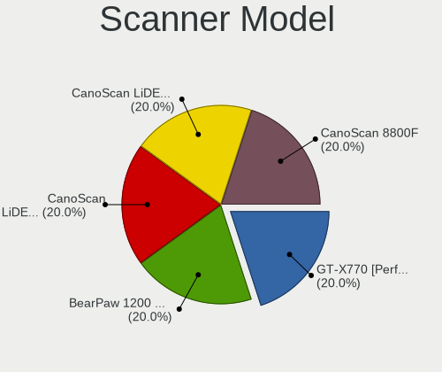

| Model                                 | Desktops | Percent |
|---------------------------------------|----------|---------|
| Seiko Epson GT-X770 [Perfection V500] | 1        | 20%     |
| Mustek Systems BearPaw 1200 CU Plus   | 1        | 20%     |
| Canon CanoScan LiDE 700F              | 1        | 20%     |
| Canon CanoScan LiDE 210               | 1        | 20%     |
| Canon CanoScan 8800F                  | 1        | 20%     |

Camera
------

Camera Vendor
-------------

Camera device vendors

| Vendor                                 | Desktops | Percent |
|----------------------------------------|----------|---------|
| Logitech                               | 8        | 33.33%  |
| Microsoft                              | 3        | 12.5%   |
| Sunplus Innovation Technology          | 2        | 8.33%   |
| Z-Star Microelectronics                | 1        | 4.17%   |
| Sonix Technology                       | 1        | 4.17%   |
| Microdia                               | 1        | 4.17%   |
| MacroSilicon                           | 1        | 4.17%   |
| Lenovo                                 | 1        | 4.17%   |
| Hewlett-Packard                        | 1        | 4.17%   |
| Generalplus Technology                 | 1        | 4.17%   |
| Cheng Uei Precision Industry (Foxlink) | 1        | 4.17%   |
| Aveo Technology                        | 1        | 4.17%   |
| ARC International                      | 1        | 4.17%   |
| Alcor Micro                            | 1        | 4.17%   |

Camera Model
------------

Camera device models

| Model                                                       | Desktops | Percent |
|-------------------------------------------------------------|----------|---------|
| Logitech C922 Pro Stream Webcam                             | 2        | 8.33%   |
| Z-Star Traveler TV 6500 SF Dia-scanner                      | 1        | 4.17%   |
| Sunplus web camera                                          | 1        | 4.17%   |
| Sunplus SPCA2281 Web Camera                                 | 1        | 4.17%   |
| Sonix ZZ3                                                   | 1        | 4.17%   |
| Microsoft LifeCam VX-800                                    | 1        | 4.17%   |
| Microsoft LifeCam VX-5000                                   | 1        | 4.17%   |
| Microsoft LifeCam HD-3000                                   | 1        | 4.17%   |
| Microdia Streaming Camera W8GS                              | 1        | 4.17%   |
| MacroSilicon USB Video                                      | 1        | 4.17%   |
| Logitech Webcam C270                                        | 1        | 4.17%   |
| Logitech QuickCam Communicate MP/S5500                      | 1        | 4.17%   |
| Logitech Portable Webcam C905                               | 1        | 4.17%   |
| Logitech HD Webcam C910                                     | 1        | 4.17%   |
| Logitech HD Webcam C615                                     | 1        | 4.17%   |
| Logitech HD Pro Webcam C920                                 | 1        | 4.17%   |
| Lenovo Lenovo FHD Webcam Audio                              | 1        | 4.17%   |
| HP HP Webcam HD 2300                                        | 1        | 4.17%   |
| Generalplus 808 Camera #9 (web-cam mode)                    | 1        | 4.17%   |
| Cheng Uei Precision Industry (Foxlink) HP Integrated Webcam | 1        | 4.17%   |
| Aveo Camera                                                 | 1        | 4.17%   |
| ARC International Camera                                    | 1        | 4.17%   |
| Alcor Micro USB 2.0 Camera                                  | 1        | 4.17%   |

Security
--------

Fingerprint Vendor
------------------

Fingerprint sensor vendors

Zero info for selected period =(

Fingerprint Model
-----------------

Fingerprint sensor models

Zero info for selected period =(

Chipcard Vendor
---------------

Chipcard module vendors

| Vendor              | Desktops | Percent |
|---------------------|----------|---------|
| Chicony Electronics | 1        | 100%    |

Chipcard Model
--------------

Chipcard module models

| Model                                                | Desktops | Percent |
|------------------------------------------------------|----------|---------|
| Chicony Electronics HP Skylab USB Smartcard Keyboard | 1        | 100%    |

Unsupported
-----------

Unsupported Devices
-------------------

Total unsupported devices on board

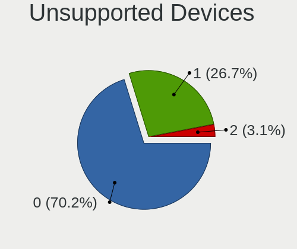

| Total | Desktops | Percent |
|-------|----------|---------|
| 0     | 92       | 70.23%  |
| 1     | 35       | 26.72%  |
| 2     | 4        | 3.05%   |

Unsupported Device Types
------------------------

Types of unsupported devices

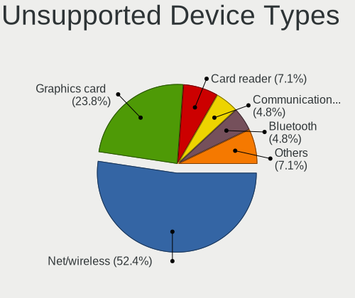

| Type                     | Desktops | Percent |
|--------------------------|----------|---------|
| Net/wireless             | 22       | 52.38%  |
| Graphics card            | 10       | 23.81%  |
| Card reader              | 3        | 7.14%   |
| Communication controller | 2        | 4.76%   |
| Bluetooth                | 2        | 4.76%   |
| Storage/raid             | 1        | 2.38%   |
| Network                  | 1        | 2.38%   |
| Chipcard                 | 1        | 2.38%   |

