MX 23 - Tested Hardware & Statistics (Desktops)
-----------------------------------------------

A project to collect tested hardware configurations for MX 23.

Anyone can contribute to this report by the [hw-probe](https://github.com/linuxhw/hw-probe) tool:

    sudo -E hw-probe -all -upload

Please contribute! Especially if your hardware is rare.

Contents
--------

* [ Test Cases ](#test-cases)

* [ System ](#system)
  - [ Kernel                   ](#kernel)
  - [ Kernel Family            ](#kernel-family)
  - [ Kernel Major Ver.        ](#kernel-major-ver)
  - [ Arch                     ](#arch)
  - [ DE                       ](#de)
  - [ Display Server           ](#display-server)
  - [ Display Manager          ](#display-manager)
  - [ OS Lang                  ](#os-lang)
  - [ Boot Mode                ](#boot-mode)
  - [ Filesystem               ](#filesystem)
  - [ Part. scheme             ](#part-scheme)
  - [ Dual Boot with Linux/BSD ](#dual-boot-with-linuxbsd)
  - [ Dual Boot (Win)          ](#dual-boot-win)

* [ Board ](#board)
  - [ Vendor                   ](#vendor)
  - [ Model                    ](#model)
  - [ Model Family             ](#model-family)
  - [ MFG Year                 ](#mfg-year)
  - [ Form Factor              ](#form-factor)
  - [ Secure Boot              ](#secure-boot)
  - [ Coreboot                 ](#coreboot)
  - [ RAM Size                 ](#ram-size)
  - [ RAM Used                 ](#ram-used)
  - [ Total Drives             ](#total-drives)
  - [ Has CD-ROM               ](#has-cd-rom)
  - [ Has Ethernet             ](#has-ethernet)
  - [ Has WiFi                 ](#has-wifi)
  - [ Has Bluetooth            ](#has-bluetooth)

* [ Location ](#location)
  - [ Country                  ](#country)
  - [ City                     ](#city)

* [ Drives ](#drives)
  - [ Drive Vendor             ](#drive-vendor)
  - [ Drive Model              ](#drive-model)
  - [ HDD Vendor               ](#hdd-vendor)
  - [ SSD Vendor               ](#ssd-vendor)
  - [ Drive Kind               ](#drive-kind)
  - [ Drive Connector          ](#drive-connector)
  - [ Drive Size               ](#drive-size)
  - [ Space Total              ](#space-total)
  - [ Space Used               ](#space-used)
  - [ Malfunc. Drives          ](#malfunc-drives)
  - [ Malfunc. Drive Vendor    ](#malfunc-drive-vendor)
  - [ Malfunc. HDD Vendor      ](#malfunc-hdd-vendor)
  - [ Malfunc. Drive Kind      ](#malfunc-drive-kind)
  - [ Failed Drives            ](#failed-drives)
  - [ Failed Drive Vendor      ](#failed-drive-vendor)
  - [ Drive Status             ](#drive-status)

* [ Storage controller ](#storage-controller)
  - [ Storage Vendor           ](#storage-vendor)
  - [ Storage Model            ](#storage-model)
  - [ Storage Kind             ](#storage-kind)

* [ Processor ](#processor)
  - [ CPU Vendor               ](#cpu-vendor)
  - [ CPU Model                ](#cpu-model)
  - [ CPU Model Family         ](#cpu-model-family)
  - [ CPU Cores                ](#cpu-cores)
  - [ CPU Sockets              ](#cpu-sockets)
  - [ CPU Threads              ](#cpu-threads)
  - [ CPU Op-Modes             ](#cpu-op-modes)
  - [ CPU Microcode            ](#cpu-microcode)
  - [ CPU Microarch            ](#cpu-microarch)

* [ Graphics ](#graphics)
  - [ GPU Vendor               ](#gpu-vendor)
  - [ GPU Model                ](#gpu-model)
  - [ GPU Combo                ](#gpu-combo)
  - [ GPU Driver               ](#gpu-driver)
  - [ GPU Memory               ](#gpu-memory)

* [ Monitor ](#monitor)
  - [ Monitor Vendor           ](#monitor-vendor)
  - [ Monitor Model            ](#monitor-model)
  - [ Monitor Resolution       ](#monitor-resolution)
  - [ Monitor Diagonal         ](#monitor-diagonal)
  - [ Monitor Width            ](#monitor-width)
  - [ Aspect Ratio             ](#aspect-ratio)
  - [ Monitor Area             ](#monitor-area)
  - [ Pixel Density            ](#pixel-density)
  - [ Multiple Monitors        ](#multiple-monitors)

* [ Network ](#network)
  - [ Net Controller Vendor    ](#net-controller-vendor)
  - [ Net Controller Model     ](#net-controller-model)
  - [ Wireless Vendor          ](#wireless-vendor)
  - [ Wireless Model           ](#wireless-model)
  - [ Ethernet Vendor          ](#ethernet-vendor)
  - [ Ethernet Model           ](#ethernet-model)
  - [ Net Controller Kind      ](#net-controller-kind)
  - [ Used Controller          ](#used-controller)
  - [ NICs                     ](#nics)
  - [ IPv6                     ](#ipv6)

* [ Bluetooth ](#bluetooth)
  - [ Bluetooth Vendor         ](#bluetooth-vendor)
  - [ Bluetooth Model          ](#bluetooth-model)

* [ Sound ](#sound)
  - [ Sound Vendor             ](#sound-vendor)
  - [ Sound Model              ](#sound-model)

* [ Memory ](#memory)
  - [ Memory Vendor            ](#memory-vendor)
  - [ Memory Model             ](#memory-model)
  - [ Memory Kind              ](#memory-kind)
  - [ Memory Form Factor       ](#memory-form-factor)
  - [ Memory Size              ](#memory-size)
  - [ Memory Speed             ](#memory-speed)

* [ Printers & scanners ](#printers--scanners)
  - [ Printer Vendor           ](#printer-vendor)
  - [ Printer Model            ](#printer-model)
  - [ Scanner Vendor           ](#scanner-vendor)
  - [ Scanner Model            ](#scanner-model)

* [ Camera ](#camera)
  - [ Camera Vendor            ](#camera-vendor)
  - [ Camera Model             ](#camera-model)

* [ Security ](#security)
  - [ Fingerprint Vendor       ](#fingerprint-vendor)
  - [ Fingerprint Model        ](#fingerprint-model)
  - [ Chipcard Vendor          ](#chipcard-vendor)
  - [ Chipcard Model           ](#chipcard-model)

* [ Unsupported ](#unsupported)
  - [ Unsupported Devices      ](#unsupported-devices)
  - [ Unsupported Device Types ](#unsupported-device-types)

Test Cases
----------

Total: 55

| Vendor   | Model                       | Probe                                                      | Date         |
|----------|-----------------------------|------------------------------------------------------------|--------------|
| HP       | 09E8h                       | [413788d555](https://linux-hardware.org/?probe=413788d555) | Feb 02, 2024 |
| Dell     | 00VTMF A01                  | [3298485dd9](https://linux-hardware.org/?probe=3298485dd9) | Jan 31, 2024 |
| HP       | 304Ah                       | [5e40a8acee](https://linux-hardware.org/?probe=5e40a8acee) | Jan 24, 2024 |
| ASUSTek  | TUF Gaming B660-PLUS WIF... | [6ae01879d8](https://linux-hardware.org/?probe=6ae01879d8) | Jan 23, 2024 |
| HP       | 0A5Ch                       | [f886596563](https://linux-hardware.org/?probe=f886596563) | Jan 23, 2024 |
| Gigabyte | B650I AORUS ULTRA           | [0da14a9376](https://linux-hardware.org/?probe=0da14a9376) | Jan 18, 2024 |
| HP       | 8750                        | [6dd29a1c24](https://linux-hardware.org/?probe=6dd29a1c24) | Jan 16, 2024 |
| Gigabyte | B650I AORUS ULTRA           | [33216d3bf8](https://linux-hardware.org/?probe=33216d3bf8) | Jan 16, 2024 |
| Unknown  | GB01                        | [33016aa27b](https://linux-hardware.org/?probe=33016aa27b) | Jan 11, 2024 |
| Unknown  | GB01                        | [551b27fa9b](https://linux-hardware.org/?probe=551b27fa9b) | Jan 11, 2024 |
| Dell     | 0KV62T A00                  | [17aa442f24](https://linux-hardware.org/?probe=17aa442f24) | Jan 10, 2024 |
| HP       | 8265                        | [da63a4f9c1](https://linux-hardware.org/?probe=da63a4f9c1) | Jan 05, 2024 |
| HP       | 8265                        | [94344dbe98](https://linux-hardware.org/?probe=94344dbe98) | Dec 28, 2023 |
| Dell     | 033FF6 A00                  | [977367b99e](https://linux-hardware.org/?probe=977367b99e) | Dec 26, 2023 |
| Dell     | 033FF6 A00                  | [88cad415fb](https://linux-hardware.org/?probe=88cad415fb) | Dec 21, 2023 |
| ASUSTek  | TUF Gaming X570-PLUS        | [f912bcd96a](https://linux-hardware.org/?probe=f912bcd96a) | Dec 20, 2023 |
| HP       | 8265                        | [cc0b59e7f7](https://linux-hardware.org/?probe=cc0b59e7f7) | Dec 13, 2023 |
| Gigabyte | MRHM7AP                     | [ba4400c919](https://linux-hardware.org/?probe=ba4400c919) | Dec 13, 2023 |
| ASRock   | A620M Pro RS WiFi           | [3bbc394b2e](https://linux-hardware.org/?probe=3bbc394b2e) | Dec 08, 2023 |
| Gigabyte | G41M-ES2L                   | [442d7a2388](https://linux-hardware.org/?probe=442d7a2388) | Dec 03, 2023 |
| MSI      | A68HM-P33 V2                | [bee7ef1689](https://linux-hardware.org/?probe=bee7ef1689) | Nov 22, 2023 |
| HP       | 8265                        | [d798ead6f7](https://linux-hardware.org/?probe=d798ead6f7) | Nov 20, 2023 |
| Gigabyte | B365M DS3H                  | [23196bda4d](https://linux-hardware.org/?probe=23196bda4d) | Nov 14, 2023 |
| HP       | 3397                        | [67e178009d](https://linux-hardware.org/?probe=67e178009d) | Nov 09, 2023 |
| Gigabyte | B365M DS3H                  | [25ab11fca1](https://linux-hardware.org/?probe=25ab11fca1) | Nov 08, 2023 |
| HP       | 2B34                        | [52737869e2](https://linux-hardware.org/?probe=52737869e2) | Nov 06, 2023 |
| ASRock   | A320M Pro4-F                | [7dab52cd8c](https://linux-hardware.org/?probe=7dab52cd8c) | Nov 05, 2023 |
| ASUSTek  | STRIX H270F GAMING          | [e95902544f](https://linux-hardware.org/?probe=e95902544f) | Nov 03, 2023 |
| Gigabyte | B365M DS3H                  | [0a5b6171b7](https://linux-hardware.org/?probe=0a5b6171b7) | Oct 30, 2023 |
| Intel    | H81                         | [2e37259d45](https://linux-hardware.org/?probe=2e37259d45) | Oct 29, 2023 |
| MSI      | B550M PRO-VDH WIFI          | [2cb1fb1ec9](https://linux-hardware.org/?probe=2cb1fb1ec9) | Oct 27, 2023 |
| HP       | 339A                        | [d0deadc097](https://linux-hardware.org/?probe=d0deadc097) | Oct 27, 2023 |
| Lenovo   | 376D SDK0T76465 WIN 3422... | [2a97bb6c00](https://linux-hardware.org/?probe=2a97bb6c00) | Oct 27, 2023 |
| AZW      | SER V1                      | [8c734a7dfc](https://linux-hardware.org/?probe=8c734a7dfc) | Oct 21, 2023 |
| Acer     | Aspire TC-1760              | [9e4ac23c4b](https://linux-hardware.org/?probe=9e4ac23c4b) | Oct 19, 2023 |
| Gigabyte | Z690 UD AX DDR4             | [273e4a294a](https://linux-hardware.org/?probe=273e4a294a) | Oct 15, 2023 |
| ASUSTek  | PRIME H610M-A D4            | [665eba904c](https://linux-hardware.org/?probe=665eba904c) | Oct 14, 2023 |
| ASUSTek  | PRIME B350-PLUS             | [00fc33d73e](https://linux-hardware.org/?probe=00fc33d73e) | Oct 13, 2023 |
| ASUSTek  | PRIME H610M-A D4            | [6f4fb2dff4](https://linux-hardware.org/?probe=6f4fb2dff4) | Oct 10, 2023 |
| MSI      | G41M4                       | [0554e9757f](https://linux-hardware.org/?probe=0554e9757f) | Sep 26, 2023 |
| ASUSTek  | TUF Gaming X570-PLUS        | [4054ad9d77](https://linux-hardware.org/?probe=4054ad9d77) | Sep 26, 2023 |
| ASUSTek  | TUF Gaming X570-PLUS        | [76d936bb5b](https://linux-hardware.org/?probe=76d936bb5b) | Sep 26, 2023 |
| ASUSTek  | Z97-P                       | [d72c4b5cce](https://linux-hardware.org/?probe=d72c4b5cce) | Sep 06, 2023 |
| Foxconn  | 2ABF                        | [baad816533](https://linux-hardware.org/?probe=baad816533) | Sep 05, 2023 |
| Gigabyte | PH67A-D3-B3                 | [a9fdf4f92b](https://linux-hardware.org/?probe=a9fdf4f92b) | Sep 03, 2023 |
| ASRock   | J4205-ITX                   | [8831793b97](https://linux-hardware.org/?probe=8831793b97) | Sep 03, 2023 |
| ASUSTek  | PRIME B550-PLUS             | [51ea627e30](https://linux-hardware.org/?probe=51ea627e30) | Aug 25, 2023 |
| ASUSTek  | PRIME B550-PLUS             | [c8e9f89359](https://linux-hardware.org/?probe=c8e9f89359) | Aug 25, 2023 |
| Pegatron | 2AD5                        | [fcb0ac31fe](https://linux-hardware.org/?probe=fcb0ac31fe) | Aug 23, 2023 |
| Gigabyte | MZGLKCP-00                  | [c6f294e543](https://linux-hardware.org/?probe=c6f294e543) | Aug 21, 2023 |
| Gigabyte | MZGLKCP-00                  | [d6e0b89f34](https://linux-hardware.org/?probe=d6e0b89f34) | Aug 21, 2023 |
| Biostar  | H310MHC2                    | [12f3b0d269](https://linux-hardware.org/?probe=12f3b0d269) | Aug 20, 2023 |
| Gigabyte | H510M S2H                   | [e5661bef5b](https://linux-hardware.org/?probe=e5661bef5b) | Aug 16, 2023 |
| ASUSTek  | Z170 PRO GAMING             | [a0270160ad](https://linux-hardware.org/?probe=a0270160ad) | Aug 02, 2023 |
| Gigabyte | H61MA-D3V                   | [a37deef915](https://linux-hardware.org/?probe=a37deef915) | Apr 24, 2023 |

System
------

Kernel
------

Version of the Linux kernel

| Version                    | Desktops | Percent |
|----------------------------|----------|---------|
| 6.1.0-13-amd64             | 10       | 23.26%  |
| 6.1.0-10-amd64             | 6        | 13.95%  |
| 6.5.0-1mx-ahs-amd64        | 4        | 9.3%    |
| 6.4.0-1mx-ahs-amd64        | 4        | 9.3%    |
| 6.1.0-11-amd64             | 4        | 9.3%    |
| 6.4.15-2-liquorix-amd64    | 2        | 4.65%   |
| 6.1.0-17-amd64             | 2        | 4.65%   |
| 6.6.11-amd64               | 1        | 2.33%   |
| 6.5.5-2-liquorix-amd64     | 1        | 2.33%   |
| 6.5.11-1-liquorix-amd64    | 1        | 2.33%   |
| 6.5.0-2-amd64              | 1        | 2.33%   |
| 6.4.14-1-liquorix-amd64    | 1        | 2.33%   |
| 6.4.0-3mx-ahs-amd64        | 1        | 2.33%   |
| 6.3.9-1-liquorix-amd64     | 1        | 2.33%   |
| 6.1.0-15-amd64             | 1        | 2.33%   |
| 6.1.0-13-686-pae           | 1        | 2.33%   |
| 5.10.197-antix.1-amd64-smp | 1        | 2.33%   |
| 5.10.0-21-amd64            | 1        | 2.33%   |

Kernel Family
-------------

Linux kernel without a distro release

| Version  | Desktops | Percent |
|----------|----------|---------|
| 6.1.0    | 22       | 53.66%  |
| 6.5.0    | 5        | 12.2%   |
| 6.4.0    | 5        | 12.2%   |
| 6.4.15   | 2        | 4.88%   |
| 6.6.11   | 1        | 2.44%   |
| 6.5.5    | 1        | 2.44%   |
| 6.5.11   | 1        | 2.44%   |
| 6.4.14   | 1        | 2.44%   |
| 6.3.9    | 1        | 2.44%   |
| 5.10.197 | 1        | 2.44%   |
| 5.10.0   | 1        | 2.44%   |

Kernel Major Ver.
-----------------

Linux kernel major version

| Version | Desktops | Percent |
|---------|----------|---------|
| 6.1     | 22       | 53.66%  |
| 6.4     | 8        | 19.51%  |
| 6.5     | 7        | 17.07%  |
| 5.10    | 2        | 4.88%   |
| 6.6     | 1        | 2.44%   |
| 6.3     | 1        | 2.44%   |

Arch
----

OS architecture (x86_64, i586, etc.)

| Name   | Desktops | Percent |
|--------|----------|---------|
| x86_64 | 38       | 97.44%  |
| i686   | 1        | 2.56%   |

DE
--

Desktop Environment

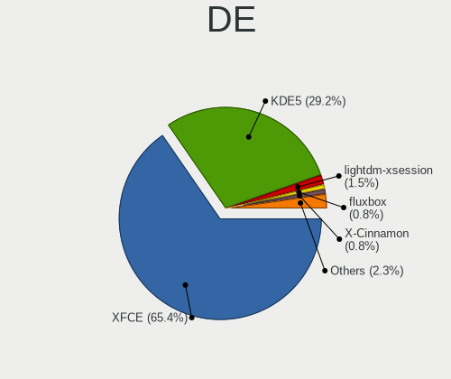

| Name             | Desktops | Percent |
|------------------|----------|---------|
| XFCE             | 24       | 61.54%  |
| KDE5             | 12       | 30.77%  |
| MATE             | 1        | 2.56%   |
| LXQt             | 1        | 2.56%   |
| lightdm-xsession | 1        | 2.56%   |

Display Server
--------------

X11 or Wayland

| Name | Desktops | Percent |
|------|----------|---------|
| X11  | 38       | 97.44%  |
| Web  | 1        | 2.56%   |

Display Manager
---------------

SDDM, LightDM, etc.

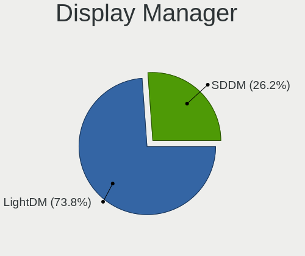

| Name    | Desktops | Percent |
|---------|----------|---------|
| LightDM | 26       | 66.67%  |
| SDDM    | 13       | 33.33%  |

OS Lang
-------

Language

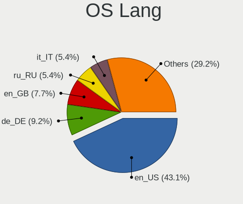

| Lang  | Desktops | Percent |
|-------|----------|---------|
| en_US | 15       | 38.46%  |
| ru_RU | 4        | 10.26%  |
| es_ES | 4        | 10.26%  |
| it_IT | 2        | 5.13%   |
| hr_HR | 2        | 5.13%   |
| fr_FR | 2        | 5.13%   |
| en_GB | 2        | 5.13%   |
| de_DE | 2        | 5.13%   |
| pl_PL | 1        | 2.56%   |
| es_US | 1        | 2.56%   |
| es_MX | 1        | 2.56%   |
| en_IE | 1        | 2.56%   |
| en_AU | 1        | 2.56%   |
| de_AT | 1        | 2.56%   |

Boot Mode
---------

EFI or BIOS

| Mode | Desktops | Percent |
|------|----------|---------|
| EFI  | 27       | 67.5%   |
| BIOS | 13       | 32.5%   |

Filesystem
----------

Type of filesystem

| Type    | Desktops | Percent |
|---------|----------|---------|
| Ext4    | 36       | 92.31%  |
| Tmpfs   | 1        | 2.56%   |
| Overlay | 1        | 2.56%   |
| Btrfs   | 1        | 2.56%   |

Part. scheme
------------

Scheme of partitioning

| Type | Desktops | Percent |
|------|----------|---------|
| GPT  | 30       | 76.92%  |
| MBR  | 9        | 23.08%  |

Dual Boot with Linux/BSD
------------------------

Hosting more than one Linux/BSD

| Dual boot | Desktops | Percent |
|-----------|----------|---------|
| No        | 33       | 82.5%   |
| Yes       | 7        | 17.5%   |

Dual Boot (Win)
---------------

Hosting Linux and Windows

| Dual boot | Desktops | Percent |
|-----------|----------|---------|
| Yes       | 25       | 64.1%   |
| No        | 14       | 35.9%   |

Board
-----

Vendor
------

Motherboard manufacturer

| Name                | Desktops | Percent |
|---------------------|----------|---------|
| Hewlett-Packard     | 8        | 20.51%  |
| Gigabyte Technology | 8        | 20.51%  |
| ASUSTek Computer    | 8        | 20.51%  |
| MSI                 | 3        | 7.69%   |
| Dell                | 2        | 5.13%   |
| ASRock              | 2        | 5.13%   |
| Pegatron            | 1        | 2.56%   |
| Lenovo              | 1        | 2.56%   |
| Intel               | 1        | 2.56%   |
| Foxconn             | 1        | 2.56%   |
| Biostar             | 1        | 2.56%   |
| AZW                 | 1        | 2.56%   |
| Acer                | 1        | 2.56%   |
| Unknown             | 1        | 2.56%   |

Model
-----

Motherboard model

| Name                                  | Desktops | Percent |
|---------------------------------------|----------|---------|
| Pegatron 2AD5                         | 1        | 2.56%   |
| MSI MS-7C95                           | 1        | 2.56%   |
| MSI MS-7895                           | 1        | 2.56%   |
| MSI MS-7592                           | 1        | 2.56%   |
| Lenovo IdeaCentre 3 07ACH7 90U9001SIX | 1        | 2.56%   |
| Intel H81                             | 1        | 2.56%   |
| HP Z2 Tower G5 Workstation            | 1        | 2.56%   |
| HP EliteDesk 705 G3 MT                | 1        | 2.56%   |
| HP Compaq Pro 6300 SFF                | 1        | 2.56%   |
| HP Compaq Elite 8300 SFF              | 1        | 2.56%   |
| HP Compaq dc7700p Ultra-slim Desktop  | 1        | 2.56%   |
| HP Compaq dc5100 SFF(AG144AW)         | 1        | 2.56%   |
| HP Compaq 8100 Elite SFF PC           | 1        | 2.56%   |
| HP 280 G1 MT                          | 1        | 2.56%   |
| Gigabyte PH67A-D3-B3                  | 1        | 2.56%   |
| Gigabyte MZGLKCP-00                   | 1        | 2.56%   |
| Gigabyte MRHM7AP                      | 1        | 2.56%   |
| Gigabyte H61MA-D3V                    | 1        | 2.56%   |
| Gigabyte H510M S2H                    | 1        | 2.56%   |
| Gigabyte G41M-ES2L                    | 1        | 2.56%   |
| Gigabyte B650I AORUS ULTRA            | 1        | 2.56%   |
| Gigabyte B365M DS3H                   | 1        | 2.56%   |
| Foxconn Pro3500 Series                | 1        | 2.56%   |
| Dell OptiPlex 9010                    | 1        | 2.56%   |
| Dell OptiPlex 5080                    | 1        | 2.56%   |
| Biostar H310MHC2                      | 1        | 2.56%   |
| AZW SER                               | 1        | 2.56%   |
| ASUS Z170 PRO GAMING                  | 1        | 2.56%   |
| ASUS TUF Gaming X570-PLUS             | 1        | 2.56%   |
| ASUS TUF Gaming B660-PLUS WIFI D4     | 1        | 2.56%   |
| ASUS STRIX H270F GAMING               | 1        | 2.56%   |
| ASUS PRIME H610M-A D4                 | 1        | 2.56%   |
| ASUS PRIME B550-PLUS                  | 1        | 2.56%   |
| ASUS PRIME B350-PLUS                  | 1        | 2.56%   |
| ASUS All Series                       | 1        | 2.56%   |
| ASRock J4205-ITX                      | 1        | 2.56%   |
| ASRock A320M Pro4-F                   | 1        | 2.56%   |
| Acer Aspire TC-1760                   | 1        | 2.56%   |
| Unknown                               | 1        | 2.56%   |

Model Family
------------

Motherboard model prefix

| Name                 | Desktops | Percent |
|----------------------|----------|---------|
| HP Compaq            | 5        | 12.82%  |
| ASUS PRIME           | 3        | 7.69%   |
| Dell OptiPlex        | 2        | 5.13%   |
| ASUS TUF             | 2        | 5.13%   |
| Pegatron 2AD5        | 1        | 2.56%   |
| MSI MS-7C95          | 1        | 2.56%   |
| MSI MS-7895          | 1        | 2.56%   |
| MSI MS-7592          | 1        | 2.56%   |
| Lenovo IdeaCentre    | 1        | 2.56%   |
| Intel H81            | 1        | 2.56%   |
| HP Z2                | 1        | 2.56%   |
| HP EliteDesk         | 1        | 2.56%   |
| HP 280               | 1        | 2.56%   |
| Gigabyte PH67A-D3-B3 | 1        | 2.56%   |
| Gigabyte MZGLKCP-00  | 1        | 2.56%   |
| Gigabyte MRHM7AP     | 1        | 2.56%   |
| Gigabyte H61MA-D3V   | 1        | 2.56%   |
| Gigabyte H510M       | 1        | 2.56%   |
| Gigabyte G41M-ES2L   | 1        | 2.56%   |
| Gigabyte B650I       | 1        | 2.56%   |
| Gigabyte B365M       | 1        | 2.56%   |
| Foxconn Pro3500      | 1        | 2.56%   |
| Biostar H310MHC2     | 1        | 2.56%   |
| AZW SER              | 1        | 2.56%   |
| ASUS Z170            | 1        | 2.56%   |
| ASUS STRIX           | 1        | 2.56%   |
| ASUS All             | 1        | 2.56%   |
| ASRock J4205-ITX     | 1        | 2.56%   |
| ASRock A320M         | 1        | 2.56%   |
| Acer Aspire          | 1        | 2.56%   |
| Unknown              | 1        | 2.56%   |

MFG Year
--------

Motherboard manufacture year

| Year | Desktops | Percent |
|------|----------|---------|
| 2021 | 6        | 15.38%  |
| 2019 | 4        | 10.26%  |
| 2017 | 4        | 10.26%  |
| 2012 | 4        | 10.26%  |
| 2022 | 3        | 7.69%   |
| 2009 | 3        | 7.69%   |
| 2020 | 2        | 5.13%   |
| 2016 | 2        | 5.13%   |
| 2015 | 2        | 5.13%   |
| 2014 | 2        | 5.13%   |
| 2013 | 2        | 5.13%   |
| 2023 | 1        | 2.56%   |
| 2018 | 1        | 2.56%   |
| 2011 | 1        | 2.56%   |
| 2006 | 1        | 2.56%   |
| 2005 | 1        | 2.56%   |

Form Factor
-----------

Physical design of the computer

| Name    | Desktops | Percent |
|---------|----------|---------|
| Desktop | 39       | 100%    |

Secure Boot
-----------

Enabled or disabled

| State    | Desktops | Percent |
|----------|----------|---------|
| Disabled | 39       | 100%    |

Coreboot
--------

Have coreboot on board

| Used | Desktops | Percent |
|------|----------|---------|
| No   | 39       | 100%    |

RAM Size
--------

Total RAM memory

| Size in GB  | Desktops | Percent |
|-------------|----------|---------|
| 16.01-24.0  | 14       | 35.9%   |
| 8.01-16.0   | 7        | 17.95%  |
| 32.01-64.0  | 6        | 15.38%  |
| 4.01-8.0    | 4        | 10.26%  |
| 3.01-4.0    | 4        | 10.26%  |
| 24.01-32.0  | 1        | 2.56%   |
| 2.01-3.0    | 1        | 2.56%   |
| 64.01-256.0 | 1        | 2.56%   |
| 1.01-2.0    | 1        | 2.56%   |

RAM Used
--------

Used RAM memory

| Used GB  | Desktops | Percent |
|----------|----------|---------|
| 2.01-3.0 | 20       | 47.62%  |
| 4.01-8.0 | 9        | 21.43%  |
| 1.01-2.0 | 8        | 19.05%  |
| 3.01-4.0 | 5        | 11.9%   |

Total Drives
------------

Number of drives on board

| Drives | Desktops | Percent |
|--------|----------|---------|
| 1      | 17       | 42.5%   |
| 2      | 11       | 27.5%   |
| 3      | 9        | 22.5%   |
| 5      | 2        | 5%      |
| 4      | 1        | 2.5%    |

Has CD-ROM
----------

Has CD-ROM on board

| Presented | Desktops | Percent |
|-----------|----------|---------|
| No        | 24       | 61.54%  |
| Yes       | 15       | 38.46%  |

Has Ethernet
------------

Has Ethernet on board

| Presented | Desktops | Percent |
|-----------|----------|---------|
| Yes       | 39       | 100%    |

Has WiFi
--------

Has WiFi module

| Presented | Desktops | Percent |
|-----------|----------|---------|
| Yes       | 29       | 74.36%  |
| No        | 10       | 25.64%  |

Has Bluetooth
-------------

Has Bluetooth module

| Presented | Desktops | Percent |
|-----------|----------|---------|
| No        | 21       | 53.85%  |
| Yes       | 18       | 46.15%  |

Location
--------

Country
-------

Geographic location (country)

| Country                | Desktops | Percent |
|------------------------|----------|---------|
| USA                    | 8        | 20%     |
| Russia                 | 5        | 12.5%   |
| UK                     | 3        | 7.5%    |
| Spain                  | 3        | 7.5%    |
| Italy                  | 2        | 5%      |
| India                  | 2        | 5%      |
| France                 | 2        | 5%      |
| Bosnia and Herzegovina | 2        | 5%      |
| Sweden                 | 1        | 2.5%    |
| South Africa           | 1        | 2.5%    |
| Singapore              | 1        | 2.5%    |
| Poland                 | 1        | 2.5%    |
| Mexico                 | 1        | 2.5%    |
| Germany                | 1        | 2.5%    |
| Dominican Republic     | 1        | 2.5%    |
| Chile                  | 1        | 2.5%    |
| Bulgaria               | 1        | 2.5%    |
| Belgium                | 1        | 2.5%    |
| Austria                | 1        | 2.5%    |
| Australia              | 1        | 2.5%    |
| Algeria                | 1        | 2.5%    |

City
----

Geographic location (city)

| City                 | Desktops | Percent |
|----------------------|----------|---------|
| Melbourne            | 2        | 4.76%   |
| Cazin                | 2        | 4.76%   |
| Zaragoza             | 1        | 2.38%   |
| Wandsworth           | 1        | 2.38%   |
| Villeurbanne         | 1        | 2.38%   |
| Vienna               | 1        | 2.38%   |
| Tomsk                | 1        | 2.38%   |
| Tlajomulco de Zuniga | 1        | 2.38%   |
| St Petersburg        | 1        | 2.38%   |
| Sofia                | 1        | 2.38%   |
| Singapore            | 1        | 2.38%   |
| Seattle              | 1        | 2.38%   |
| Santo Domingo Este   | 1        | 2.38%   |
| Santa Fe             | 1        | 2.38%   |
| Santa Clara          | 1        | 2.38%   |
| Reggio Calabria      | 1        | 2.38%   |
| Rajkot               | 1        | 2.38%   |
| Quilicura            | 1        | 2.38%   |
| Parma                | 1        | 2.38%   |
| Palma                | 1        | 2.38%   |
| Otwock               | 1        | 2.38%   |
| Moscow               | 1        | 2.38%   |
| León                | 1        | 2.38%   |
| League City          | 1        | 2.38%   |
| Krasnodar            | 1        | 2.38%   |
| Johannesburg         | 1        | 2.38%   |
| Indore               | 1        | 2.38%   |
| Huy                  | 1        | 2.38%   |
| Hopkins              | 1        | 2.38%   |
| Hayes                | 1        | 2.38%   |
| Gukovo               | 1        | 2.38%   |
| Gothenburg           | 1        | 2.38%   |
| Euskirchen           | 1        | 2.38%   |
| Davenport            | 1        | 2.38%   |
| Dallas               | 1        | 2.38%   |
| Chester              | 1        | 2.38%   |
| Caen                 | 1        | 2.38%   |
| Bonner Springs       | 1        | 2.38%   |
| Birmingham           | 1        | 2.38%   |
| Belcourt             | 1        | 2.38%   |

Drives
------

Drive Vendor
------------

Hard drive vendors

| Vendor                      | Desktops | Drives | Percent |
|-----------------------------|----------|--------|---------|
| WDC                         | 13       | 19     | 19.12%  |
| Samsung Electronics         | 10       | 19     | 14.71%  |
| Seagate                     | 6        | 7      | 8.82%   |
| Toshiba                     | 4        | 4      | 5.88%   |
| Kingston                    | 4        | 4      | 5.88%   |
| Crucial                     | 3        | 5      | 4.41%   |
| China                       | 3        | 6      | 4.41%   |
| Apacer                      | 3        | 3      | 4.41%   |
| A-DATA Technology           | 3        | 4      | 4.41%   |
| Unknown                     | 2        | 2      | 2.94%   |
| SanDisk                     | 2        | 2      | 2.94%   |
| Intel                       | 2        | 2      | 2.94%   |
| Team                        | 1        | 1      | 1.47%   |
| SPCC                        | 1        | 1      | 1.47%   |
| Silicon Motion              | 1        | 1      | 1.47%   |
| SABRENT                     | 1        | 3      | 1.47%   |
| PNY                         | 1        | 1      | 1.47%   |
| Plextor                     | 1        | 1      | 1.47%   |
| Netac                       | 1        | 2      | 1.47%   |
| Micron Technology           | 1        | 1      | 1.47%   |
| MAXIO Technology (Hangzhou) | 1        | 1      | 1.47%   |
| Lexar                       | 1        | 1      | 1.47%   |
| Intenso                     | 1        | 1      | 1.47%   |
| HS-SSD-C100                 | 1        | 1      | 1.47%   |
| Hitachi                     | 1        | 2      | 1.47%   |

Drive Model
-----------

Hard drive models

| Model                                            | Desktops | Percent |
|--------------------------------------------------|----------|---------|
| WDC WD10EZEX-60WN4A0 1TB                         | 2        | 2.5%    |
| WDC WD10EZEX-00BN5A0 1TB                         | 2        | 2.5%    |
| Toshiba HDWD120 2TB                              | 2        | 2.5%    |
| Samsung SSD 980 500GB                            | 2        | 2.5%    |
| Samsung SSD 860 EVO 250GB                        | 2        | 2.5%    |
| Samsung SSD 860 EVO 1TB                          | 2        | 2.5%    |
| Kingston SA400S37480G 480GB SSD                  | 2        | 2.5%    |
| Apacer AS350 128GB SSD                           | 2        | 2.5%    |
| A-DATA SU650 120GB SSD                           | 2        | 2.5%    |
| WDC WDS120G2G0B-00EPW0 120GB SSD                 | 1        | 1.25%   |
| WDC WDBRPG0010BNC-WRSN 1TB                       | 1        | 1.25%   |
| WDC WD800JD-75MSA3 80GB                          | 1        | 1.25%   |
| WDC WD5000AAKX-60U6AA0 500GB                     | 1        | 1.25%   |
| WDC WD5000AAKX-00ERMA0 500GB                     | 1        | 1.25%   |
| WDC WD40EZRX-00SPEB0 4TB                         | 1        | 1.25%   |
| WDC WD30EZRZ-00Z5HB0 3TB                         | 1        | 1.25%   |
| WDC WD30EZRS-11J99B1 3TB                         | 1        | 1.25%   |
| WDC WD2500BEVT-22A23T0 250GB                     | 1        | 1.25%   |
| WDC WD2500AAJS-00B4A0 250GB                      | 1        | 1.25%   |
| WDC WD20EZRZ-00Z5HB0 2TB                         | 1        | 1.25%   |
| WDC WD20EZBX-00AYRA0 2TB                         | 1        | 1.25%   |
| WDC WD10EZEX-60ZF5A0 1TB                         | 1        | 1.25%   |
| WDC WD10EAVS-00D7B0 1TB                          | 1        | 1.25%   |
| Unknown SD/MMC/MS PRO 256GB                      | 1        | 1.25%   |
| Unknown 256GB PCS 2.5" S SSD                     | 1        | 1.25%   |
| Toshiba HDWD220 2TB                              | 1        | 1.25%   |
| Toshiba DT01ACA050 500GB                         | 1        | 1.25%   |
| Team T2531TB 1024GB SSD                          | 1        | 1.25%   |
| SPCC Solid State Disk 256GB                      | 1        | 1.25%   |
| Silicon Motion SSD_M.2_PCI_NVME_1TB_InnovationIT | 1        | 1.25%   |
| Seagate ST500DM002-1BC142 500GB                  | 1        | 1.25%   |
| Seagate ST3500830AS 500GB                        | 1        | 1.25%   |
| Seagate ST33000651AS 3TB                         | 1        | 1.25%   |
| Seagate ST2000DM008-2FR102 2TB                   | 1        | 1.25%   |
| Seagate ST1500DL003-9VT16L 1TB                   | 1        | 1.25%   |
| Seagate ST1000DM010-2EP102 1TB                   | 1        | 1.25%   |
| SanDisk NVMe SSD Drive 500GB                     | 1        | 1.25%   |
| SanDisk Extreme Pro 500GB                        | 1        | 1.25%   |
| Samsung SSD 980 PRO with Heatsink 2TB            | 1        | 1.25%   |
| Samsung SSD 980 PRO 1TB                          | 1        | 1.25%   |

HDD Vendor
----------

Hard disk drive vendors

| Vendor  | Desktops | Drives | Percent |
|---------|----------|--------|---------|
| WDC     | 11       | 17     | 47.83%  |
| Seagate | 6        | 7      | 26.09%  |
| Toshiba | 4        | 4      | 17.39%  |
| Unknown | 1        | 1      | 4.35%   |
| Hitachi | 1        | 2      | 4.35%   |

SSD Vendor
----------

Solid state drive vendors

| Vendor              | Desktops | Drives | Percent |
|---------------------|----------|--------|---------|
| Samsung Electronics | 8        | 12     | 25%     |
| Kingston            | 4        | 4      | 12.5%   |
| China               | 3        | 6      | 9.38%   |
| A-DATA Technology   | 3        | 4      | 9.38%   |
| Crucial             | 2        | 4      | 6.25%   |
| Apacer              | 2        | 2      | 6.25%   |
| WDC                 | 1        | 1      | 3.13%   |
| Unknown             | 1        | 1      | 3.13%   |
| Team                | 1        | 1      | 3.13%   |
| SPCC                | 1        | 1      | 3.13%   |
| SABRENT             | 1        | 3      | 3.13%   |
| PNY                 | 1        | 1      | 3.13%   |
| Plextor             | 1        | 1      | 3.13%   |
| Micron Technology   | 1        | 1      | 3.13%   |
| Intenso             | 1        | 1      | 3.13%   |
| HS-SSD-C100         | 1        | 1      | 3.13%   |

Drive Kind
----------

HDD or SSD

| Kind | Desktops | Drives | Percent |
|------|----------|--------|---------|
| SSD  | 28       | 44     | 45.16%  |
| HDD  | 20       | 31     | 32.26%  |
| NVMe | 14       | 19     | 22.58%  |

Drive Connector
---------------

SATA, SAS, NVMe, etc.

| Type | Desktops | Drives | Percent |
|------|----------|--------|---------|
| SATA | 35       | 71     | 67.31%  |
| NVMe | 14       | 18     | 26.92%  |
| SAS  | 3        | 5      | 5.77%   |

Drive Size
----------

Size of hard drive

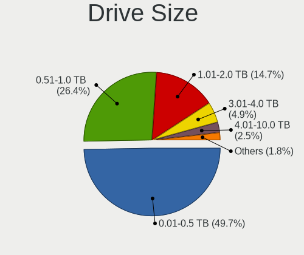

| Size in TB | Desktops | Drives | Percent |
|------------|----------|--------|---------|
| 0.01-0.5   | 28       | 40     | 52.83%  |
| 1.01-2.0   | 11       | 15     | 20.75%  |
| 0.51-1.0   | 11       | 16     | 20.75%  |
| 2.01-3.0   | 2        | 3      | 3.77%   |
| 3.01-4.0   | 1        | 1      | 1.89%   |

Space Total
-----------

Amount of disk space available on the file system

| Size in GB     | Desktops | Percent |
|----------------|----------|---------|
| 101-250        | 10       | 23.81%  |
| 2001-3000      | 7        | 16.67%  |
| 501-1000       | 7        | 16.67%  |
| 251-500        | 6        | 14.29%  |
| 1001-2000      | 4        | 9.52%   |
| More than 3000 | 3        | 7.14%   |
| 51-100         | 3        | 7.14%   |
| 1-20           | 2        | 4.76%   |

Space Used
----------

Amount of used disk space

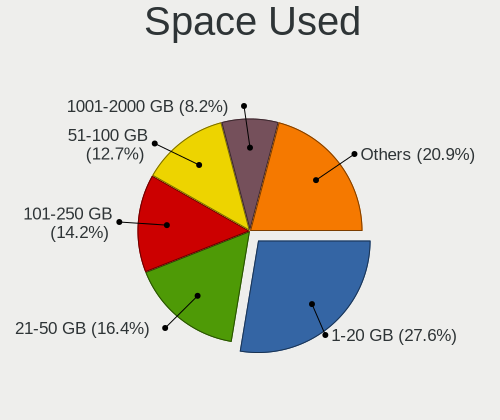

| Used GB   | Desktops | Percent |
|-----------|----------|---------|
| 101-250   | 8        | 19.51%  |
| 1-20      | 8        | 19.51%  |
| 21-50     | 7        | 17.07%  |
| 51-100    | 7        | 17.07%  |
| 1001-2000 | 4        | 9.76%   |
| 251-500   | 3        | 7.32%   |
| 2001-3000 | 2        | 4.88%   |
| 501-1000  | 2        | 4.88%   |

Malfunc. Drives
---------------

Drive models with a malfunction

| Model                                             | Desktops | Drives | Percent |
|---------------------------------------------------|----------|--------|---------|
| WDC WD40EZRX-00SPEB0 4TB                          | 1        | 1      | 12.5%   |
| WDC WD2500AAJS-00B4A0 250GB                       | 1        | 2      | 12.5%   |
| Toshiba DT01ACA050 500GB                          | 1        | 1      | 12.5%   |
| Seagate ST500DM002-1BC142 500GB                   | 1        | 1      | 12.5%   |
| Micron Technology MTFDDAK2T0TDL-1AW1ZABHA 2TB SSD | 1        | 1      | 12.5%   |
| Kingston SV300S37A120G 120GB SSD                  | 1        | 1      | 12.5%   |
| Hitachi HUA722020ALA331 2TB                       | 1        | 1      | 12.5%   |
| A-DATA Technology SU900 256GB SSD                 | 1        | 2      | 12.5%   |

Malfunc. Drive Vendor
---------------------

Vendors of faulty drives

| Vendor            | Desktops | Drives | Percent |
|-------------------|----------|--------|---------|
| WDC               | 2        | 3      | 25%     |
| Toshiba           | 1        | 1      | 12.5%   |
| Seagate           | 1        | 1      | 12.5%   |
| Micron Technology | 1        | 1      | 12.5%   |
| Kingston          | 1        | 1      | 12.5%   |
| Hitachi           | 1        | 1      | 12.5%   |
| A-DATA Technology | 1        | 2      | 12.5%   |

Malfunc. HDD Vendor
-------------------

Vendors of faulty HDD drives

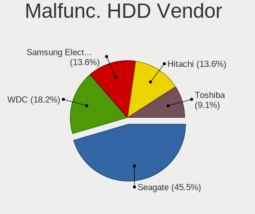

| Vendor  | Desktops | Drives | Percent |
|---------|----------|--------|---------|
| WDC     | 2        | 3      | 40%     |
| Toshiba | 1        | 1      | 20%     |
| Seagate | 1        | 1      | 20%     |
| Hitachi | 1        | 1      | 20%     |

Malfunc. Drive Kind
-------------------

Kinds of faulty drives

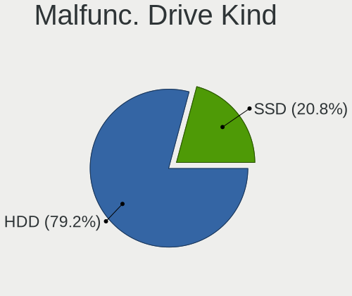

| Kind | Desktops | Drives | Percent |
|------|----------|--------|---------|
| HDD  | 4        | 6      | 57.14%  |
| SSD  | 3        | 4      | 42.86%  |

Failed Drives
-------------

Failed drive models

Zero info for selected period =(

Failed Drive Vendor
-------------------

Failed drive vendors

Zero info for selected period =(

Drive Status
------------

Number of failed and malfunc. drives

| Status   | Desktops | Drives | Percent |
|----------|----------|--------|---------|
| Works    | 38       | 73     | 76%     |
| Malfunc  | 7        | 10     | 14%     |
| Detected | 5        | 11     | 10%     |

Storage controller
------------------

Storage Vendor
--------------

Storage controller vendors

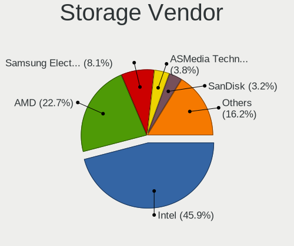

| Vendor                      | Desktops | Percent |
|-----------------------------|----------|---------|
| Intel                       | 30       | 58.82%  |
| AMD                         | 9        | 17.65%  |
| Samsung Electronics         | 4        | 7.84%   |
| Silicon Motion              | 2        | 3.92%   |
| SanDisk                     | 2        | 3.92%   |
| MAXIO Technology (Hangzhou) | 2        | 3.92%   |
| Micron/Crucial Technology   | 1        | 1.96%   |
| Marvell Technology Group    | 1        | 1.96%   |

Storage Model
-------------

Storage controller models

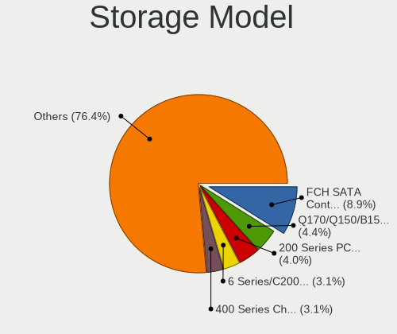

| Model                                                                                   | Desktops | Percent |
|-----------------------------------------------------------------------------------------|----------|---------|
| AMD FCH SATA Controller [AHCI mode]                                                     | 6        | 9.68%   |
| Intel 7 Series/C210 Series Chipset Family 6-port SATA Controller [AHCI mode]            | 4        | 6.45%   |
| Intel Volume Management Device NVMe RAID Controller                                     | 3        | 4.84%   |
| Intel Alder Lake-S PCH SATA Controller [AHCI Mode]                                      | 3        | 4.84%   |
| Intel 200 Series PCH SATA controller [AHCI mode]                                        | 3        | 4.84%   |
| Samsung NVMe SSD Controller 980 (DRAM-less)                                             | 2        | 3.23%   |
| MAXIO (Hangzhou) NVMe SSD Controller MAP1202 (DRAM-less)                                | 2        | 3.23%   |
| Intel NM10/ICH7 Family SATA Controller [IDE mode]                                       | 2        | 3.23%   |
| Intel Celeron/Pentium Silver Processor SATA Controller                                  | 2        | 3.23%   |
| Intel 8 Series/C220 Series Chipset Family 6-port SATA Controller 1 [AHCI mode]          | 2        | 3.23%   |
| Intel 6 Series/C200 Series Chipset Family 6 port Desktop SATA AHCI Controller           | 2        | 3.23%   |
| AMD 500 Series Chipset SATA Controller                                                  | 2        | 3.23%   |
| AMD 300 Series Chipset SATA Controller                                                  | 2        | 3.23%   |
| Silicon Motion SM2263EN/SM2263XT (DRAM-less) NVMe SSD Controllers                       | 1        | 1.61%   |
| Silicon Motion SM2262/SM2262EN SSD Controller                                           | 1        | 1.61%   |
| SanDisk Extreme Pro / WD Black SN750 / PC SN730 / Red SN700 NVMe SSD                    | 1        | 1.61%   |
| SanDisk Extreme Pro / WD Black 2018/SN750/PC SN720 NVMe SSD                             | 1        | 1.61%   |
| Samsung NVMe SSD Controller SM981/PM981/PM983                                           | 1        | 1.61%   |
| Samsung NVMe SSD Controller PM9A1/PM9A3/980PRO                                          | 1        | 1.61%   |
| Micron/Crucial P2 [Nick P2] / P3 / P3 Plus NVMe PCIe SSD (DRAM-less)                    | 1        | 1.61%   |
| Marvell Group 88SE9172 SATA 6Gb/s Controller                                            | 1        | 1.61%   |
| Intel SSD 670p Series [Keystone Harbor]                                                 | 1        | 1.61%   |
| Intel Q170/Q150/B150/H170/H110/Z170/CM236 Chipset SATA Controller [AHCI Mode]           | 1        | 1.61%   |
| Intel Comet Lake SATA AHCI Controller                                                   | 1        | 1.61%   |
| Intel Comet Lake PCH-H RAID                                                             | 1        | 1.61%   |
| Intel Celeron N3350/Pentium N4200/Atom E3900 Series SATA AHCI Controller                | 1        | 1.61%   |
| Intel 9 Series Chipset Family SATA Controller [AHCI Mode]                               | 1        | 1.61%   |
| Intel 82Q963/Q965 PT IDER Controller                                                    | 1        | 1.61%   |
| Intel 82801H (ICH8 Family) 4 port SATA Controller [IDE mode]                            | 1        | 1.61%   |
| Intel 82801G (ICH7 Family) IDE Controller                                               | 1        | 1.61%   |
| Intel 82801FB/FW (ICH6/ICH6W) SATA Controller                                           | 1        | 1.61%   |
| Intel 82801FB/FBM/FR/FW/FRW (ICH6 Family) IDE Controller                                | 1        | 1.61%   |
| Intel 7 Series Chipset Family 6-port SATA Controller [AHCI mode]                        | 1        | 1.61%   |
| Intel 6 Series/C200 Series Chipset Family Desktop SATA Controller (IDE mode, ports 4-5) | 1        | 1.61%   |
| Intel 6 Series/C200 Series Chipset Family Desktop SATA Controller (IDE mode, ports 0-3) | 1        | 1.61%   |
| Intel 500 Series Chipset Family SATA AHCI Controller                                    | 1        | 1.61%   |
| Intel 5 Series/3400 Series Chipset 4 port SATA IDE Controller                           | 1        | 1.61%   |
| Intel 5 Series/3400 Series Chipset 2 port SATA IDE Controller                           | 1        | 1.61%   |
| AMD FCH SATA Controller D                                                               | 1        | 1.61%   |
| AMD 600 Series Chipset SATA Controller                                                  | 1        | 1.61%   |

Storage Kind
------------

Kind of storage controller (IDE, SATA, NVMe, SAS, ...)

| Kind | Desktops | Percent |
|------|----------|---------|
| SATA | 31       | 58.49%  |
| NVMe | 12       | 22.64%  |
| IDE  | 6        | 11.32%  |
| RAID | 4        | 7.55%   |

Processor
---------

CPU Vendor
----------

Processor vendors

| Vendor | Desktops | Percent |
|--------|----------|---------|
| Intel  | 29       | 74.36%  |
| AMD    | 10       | 25.64%  |

CPU Model
---------

Processor models

| Model                                     | Desktops | Percent |
|-------------------------------------------|----------|---------|
| Intel Core i7-3770 CPU @ 3.40GHz          | 3        | 7.69%   |
| Intel Core 2 Quad CPU Q6600 @ 2.40GHz     | 2        | 5.13%   |
| AMD Ryzen 5 2600 Six-Core Processor       | 2        | 5.13%   |
| Intel Pentium CPU J4205 @ 1.50GHz         | 1        | 2.56%   |
| Intel Pentium 4 CPU 3.20GHz               | 1        | 2.56%   |
| Intel Core i7-7700K CPU @ 4.20GHz         | 1        | 2.56%   |
| Intel Core i7-2600 CPU @ 3.40GHz          | 1        | 2.56%   |
| Intel Core i7-10700 CPU @ 2.90GHz         | 1        | 2.56%   |
| Intel Core i5-9600K CPU @ 3.70GHz         | 1        | 2.56%   |
| Intel Core i5-8400 CPU @ 2.80GHz          | 1        | 2.56%   |
| Intel Core i5-6600K CPU @ 3.50GHz         | 1        | 2.56%   |
| Intel Core i5-4590S CPU @ 3.00GHz         | 1        | 2.56%   |
| Intel Core i5-4460 CPU @ 3.20GHz          | 1        | 2.56%   |
| Intel Core i5-3470 CPU @ 3.20GHz          | 1        | 2.56%   |
| Intel Core i5-3337U CPU @ 1.80GHz         | 1        | 2.56%   |
| Intel Core i5-2400 CPU @ 3.10GHz          | 1        | 2.56%   |
| Intel Core i5-10400F CPU @ 2.90GHz        | 1        | 2.56%   |
| Intel Core i5 CPU 650 @ 3.20GHz           | 1        | 2.56%   |
| Intel Core i3-4130 CPU @ 3.40GHz          | 1        | 2.56%   |
| Intel Core i3-3220 CPU @ 3.30GHz          | 1        | 2.56%   |
| Intel Core 2 CPU 6400 @ 2.13GHz           | 1        | 2.56%   |
| Intel Celeron N4100 CPU @ 1.10GHz         | 1        | 2.56%   |
| Intel Celeron N4000 CPU @ 1.10GHz         | 1        | 2.56%   |
| Intel 12th Gen Core i5-12500              | 1        | 2.56%   |
| Intel 12th Gen Core i5-12400              | 1        | 2.56%   |
| Intel 12th Gen Core i3-12100F             | 1        | 2.56%   |
| Intel 11th Gen Core i5-11400 @ 2.60GHz    | 1        | 2.56%   |
| AMD Ryzen 7 7800X3D 8-Core Processor      | 1        | 2.56%   |
| AMD Ryzen 7 7735HS with Radeon Graphics   | 1        | 2.56%   |
| AMD Ryzen 5 5600H with Radeon Graphics    | 1        | 2.56%   |
| AMD Ryzen 5 5600G with Radeon Graphics    | 1        | 2.56%   |
| AMD Ryzen 5 3500X 6-Core Processor        | 1        | 2.56%   |
| AMD Ryzen 5 1600 Six-Core Processor       | 1        | 2.56%   |
| AMD PRO A6-8570 R5, 8 COMPUTE CORES 2C+6G | 1        | 2.56%   |
| AMD Athlon X4 840 Quad Core Processor     | 1        | 2.56%   |

CPU Model Family
----------------

Processor model prefix

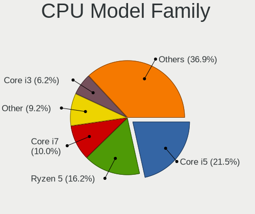

| Model             | Desktops | Percent |
|-------------------|----------|---------|
| Intel Core i5     | 10       | 25.64%  |
| Intel Core i7     | 6        | 15.38%  |
| AMD Ryzen 5       | 6        | 15.38%  |
| Other             | 5        | 12.82%  |
| Intel Core i3     | 2        | 5.13%   |
| Intel Core 2 Quad | 2        | 5.13%   |
| Intel Celeron     | 2        | 5.13%   |
| AMD Ryzen 7       | 2        | 5.13%   |
| Intel Pentium 4   | 1        | 2.56%   |
| Intel Pentium     | 1        | 2.56%   |
| Intel Core 2      | 1        | 2.56%   |
| AMD Athlon X4     | 1        | 2.56%   |

CPU Cores
---------

Number of processor cores

| Number | Desktops | Percent |
|--------|----------|---------|
| 4      | 15       | 38.46%  |
| 6      | 12       | 30.77%  |
| 2      | 7        | 17.95%  |
| 8      | 3        | 7.69%   |
| 1      | 2        | 5.13%   |

CPU Sockets
-----------

Number of sockets

| Number | Desktops | Percent |
|--------|----------|---------|
| 1      | 39       | 100%    |

CPU Threads
-----------

Threads per core (Hyper-Threading)

| Number | Desktops | Percent |
|--------|----------|---------|
| 2      | 25       | 64.1%   |
| 1      | 14       | 35.9%   |

CPU Op-Modes
------------

CPU Operation Modes (32-bit, 64-bit)

| Op mode        | Desktops | Percent |
|----------------|----------|---------|
| 32-bit, 64-bit | 39       | 100%    |

CPU Microcode
-------------

Microcode number

| Number     | Desktops | Percent |
|------------|----------|---------|
| Unknown    | 14       | 35.9%   |
| 0x306a9    | 4        | 10.26%  |
| 0x6fb      | 2        | 5.13%   |
| 0x306c3    | 2        | 5.13%   |
| 0x206a7    | 2        | 5.13%   |
| 0xa0671    | 1        | 2.56%   |
| 0xa0655    | 1        | 2.56%   |
| 0x906ea    | 1        | 2.56%   |
| 0x906e9    | 1        | 2.56%   |
| 0x706a1    | 1        | 2.56%   |
| 0x506e3    | 1        | 2.56%   |
| 0x506c9    | 1        | 2.56%   |
| 0x20655    | 1        | 2.56%   |
| 0x0a601206 | 1        | 2.56%   |
| 0x0a50000d | 1        | 2.56%   |
| 0x0a50000c | 1        | 2.56%   |
| 0x0a404102 | 1        | 2.56%   |
| 0x0800820d | 1        | 2.56%   |
| 0x0600611a | 1        | 2.56%   |
| 0x06003106 | 1        | 2.56%   |

CPU Microarch
-------------

Microarchitecture

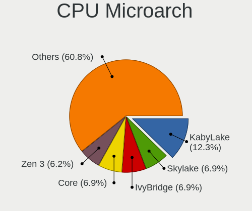

| Name             | Desktops | Percent |
|------------------|----------|---------|
| IvyBridge        | 6        | 15.38%  |
| Zen+             | 3        | 7.69%   |
| KabyLake         | 3        | 7.69%   |
| Haswell          | 3        | 7.69%   |
| Core             | 3        | 7.69%   |
| Alderlake Hybrid | 3        | 7.69%   |
| Zen 3            | 2        | 5.13%   |
| SandyBridge      | 2        | 5.13%   |
| Goldmont plus    | 2        | 5.13%   |
| CometLake        | 2        | 5.13%   |
| Unknown          | 2        | 5.13%   |
| Zen 2            | 1        | 2.56%   |
| Westmere         | 1        | 2.56%   |
| Steamroller      | 1        | 2.56%   |
| Skylake          | 1        | 2.56%   |
| NetBurst         | 1        | 2.56%   |
| Icelake          | 1        | 2.56%   |
| Goldmont         | 1        | 2.56%   |
| Excavator        | 1        | 2.56%   |

Graphics
--------

GPU Vendor
----------

Vendors of graphics cards

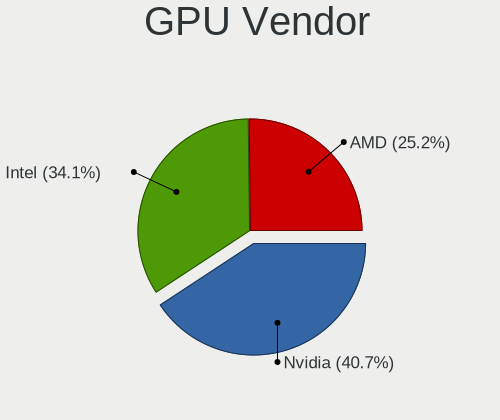

| Vendor | Desktops | Percent |
|--------|----------|---------|
| Nvidia | 20       | 46.51%  |
| Intel  | 16       | 37.21%  |
| AMD    | 7        | 16.28%  |

GPU Model
---------

Graphics card models

| Model                                                                       | Desktops | Percent |
|-----------------------------------------------------------------------------|----------|---------|
| Nvidia TU106 [GeForce RTX 2070 Rev. A]                                      | 2        | 4.44%   |
| Nvidia GP108 [GeForce GT 1030]                                              | 2        | 4.44%   |
| Nvidia GK110 [GeForce GTX 780]                                              | 2        | 4.44%   |
| Nvidia GF119 [GeForce GT 610]                                               | 2        | 4.44%   |
| Intel GeminiLake [UHD Graphics 600]                                         | 2        | 4.44%   |
| Intel CoffeeLake-S GT2 [UHD Graphics 630]                                   | 2        | 4.44%   |
| AMD Ellesmere [Radeon RX 470/480/570/570X/580/580X/590]                     | 2        | 4.44%   |
| AMD Cezanne [Radeon Vega Series / Radeon Vega Mobile Series]                | 2        | 4.44%   |
| Nvidia TU117 [GeForce GTX 1650]                                             | 1        | 2.22%   |
| Nvidia GT218 [GeForce 8400 GS Rev. 3]                                       | 1        | 2.22%   |
| Nvidia GP107 [GeForce GTX 1050]                                             | 1        | 2.22%   |
| Nvidia GP106GL [Quadro P2200]                                               | 1        | 2.22%   |
| Nvidia GP104 [GeForce GTX 1070]                                             | 1        | 2.22%   |
| Nvidia GP102 [GeForce GTX 1080 Ti]                                          | 1        | 2.22%   |
| Nvidia GK208B [GeForce GT 730]                                              | 1        | 2.22%   |
| Nvidia GF116 [GeForce GT 640 OEM]                                           | 1        | 2.22%   |
| Nvidia GF114 [GeForce GTX 560 Ti]                                           | 1        | 2.22%   |
| Nvidia GF108 [GeForce GT 730]                                               | 1        | 2.22%   |
| Nvidia GA104 [GeForce RTX 3070]                                             | 1        | 2.22%   |
| Nvidia G84 [GeForce 8600 GT]                                                | 1        | 2.22%   |
| Intel Xeon E3-1200 v3/4th Gen Core Processor Integrated Graphics Controller | 1        | 2.22%   |
| Intel Xeon E3-1200 v2/3rd Gen Core processor Graphics Controller            | 1        | 2.22%   |
| Intel RocketLake-S GT1 [UHD Graphics 730]                                   | 1        | 2.22%   |
| Intel HD Graphics 630                                                       | 1        | 2.22%   |
| Intel CometLake-S GT2 [UHD Graphics 630]                                    | 1        | 2.22%   |
| Intel Apollo Lake [HD Graphics 505]                                         | 1        | 2.22%   |
| Intel Alder Lake-S GT1 [UHD Graphics 770]                                   | 1        | 2.22%   |
| Intel Alder Lake-S GT1 [UHD Graphics 730]                                   | 1        | 2.22%   |
| Intel 82Q963/Q965 Integrated Graphics Controller                            | 1        | 2.22%   |
| Intel 82915G/GV/910GL Integrated Graphics Controller                        | 1        | 2.22%   |
| Intel 4th Generation Core Processor Family Integrated Graphics Controller   | 1        | 2.22%   |
| Intel 3rd Gen Core processor Graphics Controller                            | 1        | 2.22%   |
| AMD Wani [Radeon R5/R6/R7 Graphics]                                         | 1        | 2.22%   |
| AMD Rembrandt [Radeon 680M]                                                 | 1        | 2.22%   |
| AMD Raphael                                                                 | 1        | 2.22%   |
| AMD Cedar [Radeon HD 5000/6000/7350/8350 Series]                            | 1        | 2.22%   |
| AMD Baffin [Radeon RX 460/560D / Pro 450/455/460/555/555X/560/560X]         | 1        | 2.22%   |

GPU Combo
---------

Combinations of graphics cards

| Name           | Desktops | Percent |
|----------------|----------|---------|
| 1 x Nvidia     | 17       | 42.5%   |
| 1 x Intel      | 13       | 32.5%   |
| 1 x AMD        | 6        | 15%     |
| Intel + Nvidia | 2        | 5%      |
| 2 x AMD        | 1        | 2.5%    |
| AMD + Nvidia   | 1        | 2.5%    |

GPU Driver
----------

Free vs proprietary

| Driver      | Desktops | Percent |
|-------------|----------|---------|
| Free        | 26       | 66.67%  |
| Proprietary | 12       | 30.77%  |
| Unknown     | 1        | 2.56%   |

GPU Memory
----------

Total video memory

| Size in GB | Desktops | Percent |
|------------|----------|---------|
| Unknown    | 16       | 39.02%  |
| 0.01-0.5   | 6        | 14.63%  |
| 1.01-2.0   | 5        | 12.2%   |
| 0.51-1.0   | 4        | 9.76%   |
| 3.01-4.0   | 3        | 7.32%   |
| 2.01-3.0   | 3        | 7.32%   |
| 7.01-8.0   | 2        | 4.88%   |
| 4.01-5.0   | 1        | 2.44%   |
| 8.01-16.0  | 1        | 2.44%   |

Monitor
-------

Monitor Vendor
--------------

Monitor vendors

| Vendor               | Desktops | Percent |
|----------------------|----------|---------|
| Samsung Electronics  | 6        | 13.64%  |
| Goldstar             | 4        | 9.09%   |
| Acer                 | 4        | 9.09%   |
| Hewlett-Packard      | 2        | 4.55%   |
| Dell                 | 2        | 4.55%   |
| BenQ                 | 2        | 4.55%   |
| ASUSTek Computer     | 2        | 4.55%   |
| AOC                  | 2        | 4.55%   |
| Ancor Communications | 2        | 4.55%   |
| Yeyian               | 1        | 2.27%   |
| ViewSonic            | 1        | 2.27%   |
| Toshiba              | 1        | 2.27%   |
| Sony                 | 1        | 2.27%   |
| SKG                  | 1        | 2.27%   |
| Sceptre Tech         | 1        | 2.27%   |
| Philips              | 1        | 2.27%   |
| NECCI                | 1        | 2.27%   |
| Mi                   | 1        | 2.27%   |
| LG Electronics       | 1        | 2.27%   |
| JRY                  | 1        | 2.27%   |
| Insignia             | 1        | 2.27%   |
| Gigabyte Technology  | 1        | 2.27%   |
| Gericom              | 1        | 2.27%   |
| Fujitsu Siemens      | 1        | 2.27%   |
| DENON                | 1        | 2.27%   |
| CTV                  | 1        | 2.27%   |
| CHD                  | 1        | 2.27%   |

Monitor Model
-------------

Monitor models

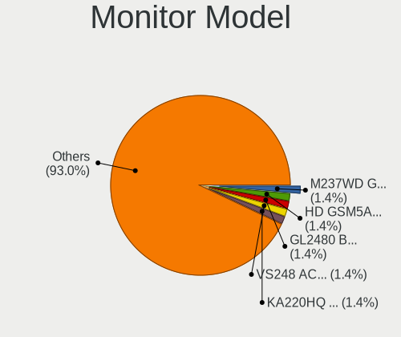

| Model                                                                 | Desktops | Percent |
|-----------------------------------------------------------------------|----------|---------|
| Acer KA220HQ ACR0467 1920x1080 477x268mm 21.5-inch                    | 2        | 4.35%   |
| Yeyian YMG-4K27-01 YEY2700 3840x2160 600x330mm 27.0-inch              | 1        | 2.17%   |
| ViewSonic VX2452 Series VSCDE2E 1920x1080 521x293mm 23.5-inch         | 1        | 2.17%   |
| Toshiba TV TSB0206 1920x1080                                          | 1        | 2.17%   |
| Sony TV SNY2C02 1920x1080 708x398mm 32.0-inch                         | 1        | 2.17%   |
| SKG AF24H1 SKG2409 1920x1080 600x330mm 27.0-inch                      | 1        | 2.17%   |
| Sceptre Tech Sceptre F24 SPT09AB 1920x1080 530x290mm 23.8-inch        | 1        | 2.17%   |
| Samsung Electronics SMS19A100 SAM0867 1366x768 410x230mm 18.5-inch    | 1        | 2.17%   |
| Samsung Electronics LU28R55 SAM1017 3840x2160 632x360mm 28.6-inch     | 1        | 2.17%   |
| Samsung Electronics LS24AG32x SAM71D9 1920x1080 530x300mm 24.0-inch   | 1        | 2.17%   |
| Samsung Electronics LCD Monitor SAM0C39 1920x1080 885x498mm 40.0-inch | 1        | 2.17%   |
| Samsung Electronics LCD Monitor SAM0900 1366x768 700x390mm 31.5-inch  | 1        | 2.17%   |
| Samsung Electronics LC32T55 SAM7024 1920x1080 699x393mm 31.6-inch     | 1        | 2.17%   |
| Philips 170C PHL0848 1280x1024 338x270mm 17.0-inch                    | 1        | 2.17%   |
| NECCI NEC LV17m NCI4017 1280x1024 337x270mm 17.0-inch                 | 1        | 2.17%   |
| Mi 27 NFGL XMIB004 1920x1080 598x336mm 27.0-inch                      | 1        | 2.17%   |
| LG Electronics LCD Monitor LG HDR 4K                                  | 1        | 2.17%   |
| JRY Analog JRY1950 1600x900 368x207mm 16.6-inch                       | 1        | 2.17%   |
| Insignia NS-22E400NA14 BBY0042 1920x1080 544x306mm 24.6-inch          | 1        | 2.17%   |
| Hewlett-Packard W2072a HWP299F 1600x900 443x249mm 20.0-inch           | 1        | 2.17%   |
| Hewlett-Packard LV2011 HWP299A 1600x900 443x249mm 20.0-inch           | 1        | 2.17%   |
| Hewlett-Packard LCD Monitor Inc. HP E24u G4                           | 1        | 2.17%   |
| Goldstar M237WD GSM56EB 1920x1080 509x286mm 23.0-inch                 | 1        | 2.17%   |
| Goldstar FULL HD GSM5AB9 1920x1080 480x270mm 21.7-inch                | 1        | 2.17%   |
| Goldstar FHD GSM5C64 1920x1080 530x300mm 24.0-inch                    | 1        | 2.17%   |
| Goldstar 20M45 GSM4EF0 1600x900 443x249mm 20.0-inch                   | 1        | 2.17%   |
| Gigabyte Technology G27QC GBT270B 2560x1440 597x336mm 27.0-inch       | 1        | 2.17%   |
| Gericom Vision L22FHD QMX2472 1920x1080 478x269mm 21.6-inch           | 1        | 2.17%   |
| Fujitsu Siemens SL3260W FUS07CC 1920x1200 550x344mm 25.5-inch         | 1        | 2.17%   |
| DENON AVR DON0074 1920x1080                                           | 1        | 2.17%   |
| Dell ST2320L DELF024 1920x1080 509x286mm 23.0-inch                    | 1        | 2.17%   |
| Dell S2417DG DELA0E7 2560x1440 527x296mm 23.8-inch                    | 1        | 2.17%   |
| Dell E2417H DELA0E2 1920x1080 527x296mm 23.8-inch                     | 1        | 2.17%   |
| CTV WD39HB2108 CTV6683 1440x900 1365x768mm 61.7-inch                  | 1        | 2.17%   |
| CHD PMG32C900FG CHD0320 1920x1080 698x392mm 31.5-inch                 | 1        | 2.17%   |
| BenQ GL2480 BNQ78ED 1920x1080 531x298mm 24.0-inch                     | 1        | 2.17%   |
| BenQ G922HDA BNQ783C 1366x768 410x230mm 18.5-inch                     | 1        | 2.17%   |
| ASUSTek Computer VG27A AUS2722 2560x1440 597x336mm 27.0-inch          | 1        | 2.17%   |
| ASUSTek Computer ROG PG278QR AUS27B1 2560x1440 598x336mm 27.0-inch    | 1        | 2.17%   |
| AOC 2470W AOC2470 1920x1080 520x290mm 23.4-inch                       | 1        | 2.17%   |

Monitor Resolution
------------------

Monitor screen resolution

| Resolution       | Desktops | Percent |
|------------------|----------|---------|
| 1920x1080 (FHD)  | 25       | 58.14%  |
| 2560x1440 (QHD)  | 5        | 11.63%  |
| 1366x768 (WXGA)  | 4        | 9.3%    |
| 3840x2160 (4K)   | 3        | 6.98%   |
| 1600x900 (HD+)   | 3        | 6.98%   |
| 1280x1024 (SXGA) | 2        | 4.65%   |
| Unknown          | 1        | 2.33%   |

Monitor Diagonal
----------------

Diagonal size in inches

| Inches  | Desktops | Percent |
|---------|----------|---------|
| 27      | 6        | 13.64%  |
| 24      | 6        | 13.64%  |
| 21      | 6        | 13.64%  |
| 23      | 5        | 11.36%  |
| 31      | 4        | 9.09%   |
| 20      | 2        | 4.55%   |
| 18      | 2        | 4.55%   |
| 17      | 2        | 4.55%   |
| 74      | 1        | 2.27%   |
| 65      | 1        | 2.27%   |
| 61      | 1        | 2.27%   |
| 55      | 1        | 2.27%   |
| 54      | 1        | 2.27%   |
| 49      | 1        | 2.27%   |
| 32      | 1        | 2.27%   |
| 28      | 1        | 2.27%   |
| 25      | 1        | 2.27%   |
| 19      | 1        | 2.27%   |
| Unknown | 1        | 2.27%   |

Monitor Width
-------------

Physical width

| Width in mm | Desktops | Percent |
|-------------|----------|---------|
| 501-600     | 17       | 39.53%  |
| 401-500     | 11       | 25.58%  |
| 601-700     | 5        | 11.63%  |
| 1001-1500   | 5        | 11.63%  |
| 301-350     | 2        | 4.65%   |
| 701-800     | 1        | 2.33%   |
| 1501-2000   | 1        | 2.33%   |
| Unknown     | 1        | 2.33%   |

Aspect Ratio
------------

Proportional relationship between the width and the height

| Ratio   | Desktops | Percent |
|---------|----------|---------|
| 16/9    | 34       | 87.18%  |
| 5/4     | 2        | 5.13%   |
| 16/10   | 2        | 5.13%   |
| Unknown | 1        | 2.56%   |

Monitor Area
------------

Area in inch²

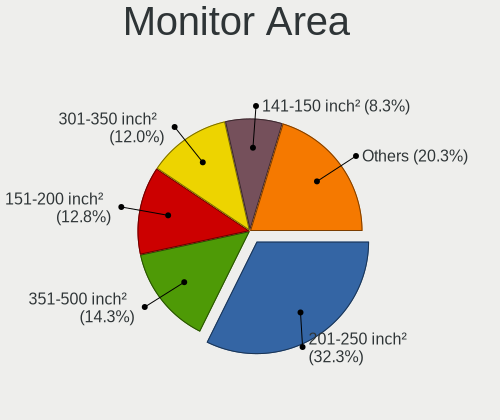

| Area in inch² | Desktops | Percent |
|----------------|----------|---------|
| 201-250        | 15       | 35.71%  |
| 351-500        | 6        | 14.29%  |
| 301-350        | 6        | 14.29%  |
| More than 1000 | 5        | 11.9%   |
| 151-200        | 4        | 9.52%   |
| 141-150        | 4        | 9.52%   |
| 251-300        | 1        | 2.38%   |
| Unknown        | 1        | 2.38%   |

Pixel Density
-------------

Pixels per inch

| Density | Desktops | Percent |
|---------|----------|---------|
| 51-100  | 26       | 63.41%  |
| 101-120 | 7        | 17.07%  |
| 1-50    | 5        | 12.2%   |
| 121-160 | 2        | 4.88%   |
| Unknown | 1        | 2.44%   |

Multiple Monitors
-----------------

Total monitors connected

| Total | Desktops | Percent |
|-------|----------|---------|
| 1     | 30       | 76.92%  |
| 2     | 8        | 20.51%  |
| 0     | 1        | 2.56%   |

Network
-------

Net Controller Vendor
---------------------

Controller vendors

| Vendor                          | Desktops | Percent |
|---------------------------------|----------|---------|
| Realtek Semiconductor           | 25       | 37.31%  |
| Intel                           | 19       | 28.36%  |
| TP-Link                         | 5        | 7.46%   |
| Qualcomm Atheros                | 3        | 4.48%   |
| Qualcomm Atheros Communications | 2        | 2.99%   |
| MediaTek                        | 2        | 2.99%   |
| Broadcom                        | 2        | 2.99%   |
| Xiaomi                          | 1        | 1.49%   |
| Tenda                           | 1        | 1.49%   |
| Samsung Electronics             | 1        | 1.49%   |
| Ralink                          | 1        | 1.49%   |
| OPPO Electronics                | 1        | 1.49%   |
| Linksys                         | 1        | 1.49%   |
| D-Link System                   | 1        | 1.49%   |
| Broadcom Limited                | 1        | 1.49%   |
| ASUSTek Computer                | 1        | 1.49%   |

Net Controller Model
--------------------

Controller models

| Model                                                                  | Desktops | Percent |
|------------------------------------------------------------------------|----------|---------|
| Realtek RTL8111/8168/8211/8411 PCI Express Gigabit Ethernet Controller | 21       | 27.63%  |
| Intel Ethernet Controller I225-V                                       | 4        | 5.26%   |
| Realtek 802.11ac NIC                                                   | 3        | 3.95%   |
| Intel 82579LM Gigabit Network Connection (Lewisville)                  | 3        | 3.95%   |
| Qualcomm Atheros AR9271 802.11n                                        | 2        | 2.63%   |
| Intel Wi-Fi 6E(802.11ax) AX210/AX1675* 2x2 [Typhoon Peak]              | 2        | 2.63%   |
| Intel Wi-Fi 5(802.11ac) Wireless-AC 9x6x [Thunder Peak]                | 2        | 2.63%   |
| Intel Ethernet Connection (2) I219-V                                   | 2        | 2.63%   |
| Intel Ethernet Connection (11) I219-LM                                 | 2        | 2.63%   |
| Xiaomi Mi/Redmi series (RNDIS)                                         | 1        | 1.32%   |
| TP-Link RTL8812AU Archer T4U 802.11ac                                  | 1        | 1.32%   |
| TP-Link Archer T3U [Realtek RTL8812BU]                                 | 1        | 1.32%   |
| TP-Link AC600 wireless Realtek RTL8811AU [Archer T2U Nano]             | 1        | 1.32%   |
| TP-Link 802.11ac WLAN Adapter                                          | 1        | 1.32%   |
| TP-Link 802.11ac NIC                                                   | 1        | 1.32%   |
| Tenda U12                                                              | 1        | 1.32%   |
| Samsung Galaxy series, misc. (tethering mode)                          | 1        | 1.32%   |
| Realtek RTL88x2bu [AC1200 Techkey]                                     | 1        | 1.32%   |
| Realtek RTL8852BE PCIe 802.11ax Wireless Network Controller            | 1        | 1.32%   |
| Realtek RTL8188EUS 802.11n Wireless Network Adapter                    | 1        | 1.32%   |
| Realtek RTL8188CE 802.11b/g/n WiFi Adapter                             | 1        | 1.32%   |
| Realtek RTL810xE PCI Express Fast Ethernet controller                  | 1        | 1.32%   |
| Realtek 802.11n WLAN Adapter                                           | 1        | 1.32%   |
| Ralink RT2790 Wireless 802.11n 1T/2R PCIe                              | 1        | 1.32%   |
| Qualcomm Atheros QCA9377 802.11ac Wireless Network Adapter             | 1        | 1.32%   |
| Qualcomm Atheros AR93xx Wireless Network Adapter                       | 1        | 1.32%   |
| Qualcomm Atheros AR8161 Gigabit Ethernet                               | 1        | 1.32%   |
| OPPO SM8350-IDP _SN:361A1B3C                                           | 1        | 1.32%   |
| MediaTek MT7922 802.11ax PCI Express Wireless Network Adapter          | 1        | 1.32%   |
| MediaTek MT7921K (RZ608) Wi-Fi 6E 80MHz                                | 1        | 1.32%   |
| Linksys AE2500 802.11abgn Wireless Adapter [Broadcom BCM43236]         | 1        | 1.32%   |
| Intel Wi-Fi 6 AX200                                                    | 1        | 1.32%   |
| Intel Gemini Lake PCH CNVi WiFi                                        | 1        | 1.32%   |
| Intel Ethernet Connection (17) I219-V                                  | 1        | 1.32%   |
| Intel Dual Band Wireless-AC 3168NGW [Stone Peak]                       | 1        | 1.32%   |
| Intel Comet Lake PCH CNVi WiFi                                         | 1        | 1.32%   |
| Intel Alder Lake-S PCH CNVi WiFi                                       | 1        | 1.32%   |
| Intel 82578DM Gigabit Network Connection                               | 1        | 1.32%   |
| Intel 82566DM Gigabit Network Connection                               | 1        | 1.32%   |
| D-Link System DGE-528T Gigabit Ethernet Adapter                        | 1        | 1.32%   |

Wireless Vendor
---------------

Wireless vendors

| Vendor                          | Desktops | Percent |
|---------------------------------|----------|---------|
| Intel                           | 9        | 27.27%  |
| Realtek Semiconductor           | 8        | 24.24%  |
| TP-Link                         | 5        | 15.15%  |
| Qualcomm Atheros Communications | 2        | 6.06%   |
| Qualcomm Atheros                | 2        | 6.06%   |
| MediaTek                        | 2        | 6.06%   |
| Tenda                           | 1        | 3.03%   |
| Ralink                          | 1        | 3.03%   |
| Linksys                         | 1        | 3.03%   |
| Broadcom                        | 1        | 3.03%   |
| ASUSTek Computer                | 1        | 3.03%   |

Wireless Model
--------------

Wireless models

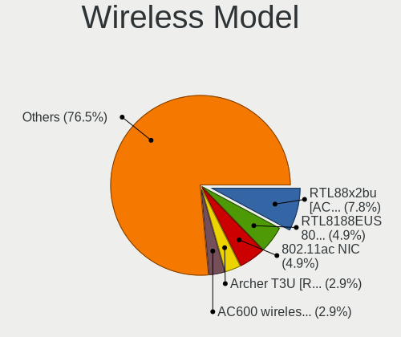

| Model                                                          | Desktops | Percent |
|----------------------------------------------------------------|----------|---------|
| Realtek 802.11ac NIC                                           | 3        | 9.09%   |
| Qualcomm Atheros AR9271 802.11n                                | 2        | 6.06%   |
| Intel Wi-Fi 6E(802.11ax) AX210/AX1675* 2x2 [Typhoon Peak]      | 2        | 6.06%   |
| Intel Wi-Fi 5(802.11ac) Wireless-AC 9x6x [Thunder Peak]        | 2        | 6.06%   |
| TP-Link RTL8812AU Archer T4U 802.11ac                          | 1        | 3.03%   |
| TP-Link Archer T3U [Realtek RTL8812BU]                         | 1        | 3.03%   |
| TP-Link AC600 wireless Realtek RTL8811AU [Archer T2U Nano]     | 1        | 3.03%   |
| TP-Link 802.11ac WLAN Adapter                                  | 1        | 3.03%   |
| TP-Link 802.11ac NIC                                           | 1        | 3.03%   |
| Tenda U12                                                      | 1        | 3.03%   |
| Realtek RTL88x2bu [AC1200 Techkey]                             | 1        | 3.03%   |
| Realtek RTL8852BE PCIe 802.11ax Wireless Network Controller    | 1        | 3.03%   |
| Realtek RTL8188EUS 802.11n Wireless Network Adapter            | 1        | 3.03%   |
| Realtek RTL8188CE 802.11b/g/n WiFi Adapter                     | 1        | 3.03%   |
| Realtek 802.11n WLAN Adapter                                   | 1        | 3.03%   |
| Ralink RT2790 Wireless 802.11n 1T/2R PCIe                      | 1        | 3.03%   |
| Qualcomm Atheros QCA9377 802.11ac Wireless Network Adapter     | 1        | 3.03%   |
| Qualcomm Atheros AR93xx Wireless Network Adapter               | 1        | 3.03%   |
| MediaTek MT7922 802.11ax PCI Express Wireless Network Adapter  | 1        | 3.03%   |
| MediaTek MT7921K (RZ608) Wi-Fi 6E 80MHz                        | 1        | 3.03%   |
| Linksys AE2500 802.11abgn Wireless Adapter [Broadcom BCM43236] | 1        | 3.03%   |
| Intel Wi-Fi 6 AX200                                            | 1        | 3.03%   |
| Intel Gemini Lake PCH CNVi WiFi                                | 1        | 3.03%   |
| Intel Dual Band Wireless-AC 3168NGW [Stone Peak]               | 1        | 3.03%   |
| Intel Comet Lake PCH CNVi WiFi                                 | 1        | 3.03%   |
| Intel Alder Lake-S PCH CNVi WiFi                               | 1        | 3.03%   |
| Broadcom Network controller                                    | 1        | 3.03%   |
| ASUS 802.11ax WLAN Adapter                                     | 1        | 3.03%   |

Ethernet Vendor
---------------

Ethernet vendors

| Vendor                | Desktops | Percent |
|-----------------------|----------|---------|
| Realtek Semiconductor | 22       | 51.16%  |
| Intel                 | 14       | 32.56%  |
| Xiaomi                | 1        | 2.33%   |
| Samsung Electronics   | 1        | 2.33%   |
| Qualcomm Atheros      | 1        | 2.33%   |
| OPPO Electronics      | 1        | 2.33%   |
| D-Link System         | 1        | 2.33%   |
| Broadcom Limited      | 1        | 2.33%   |
| Broadcom              | 1        | 2.33%   |

Ethernet Model
--------------

Ethernet models

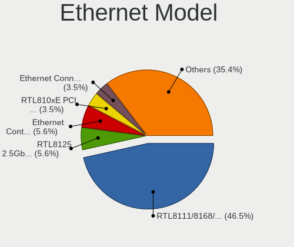

| Model                                                                  | Desktops | Percent |
|------------------------------------------------------------------------|----------|---------|
| Realtek RTL8111/8168/8211/8411 PCI Express Gigabit Ethernet Controller | 21       | 48.84%  |
| Intel Ethernet Controller I225-V                                       | 4        | 9.3%    |
| Intel 82579LM Gigabit Network Connection (Lewisville)                  | 3        | 6.98%   |
| Intel Ethernet Connection (2) I219-V                                   | 2        | 4.65%   |
| Intel Ethernet Connection (11) I219-LM                                 | 2        | 4.65%   |
| Xiaomi Mi/Redmi series (RNDIS)                                         | 1        | 2.33%   |
| Samsung Galaxy series, misc. (tethering mode)                          | 1        | 2.33%   |
| Realtek RTL810xE PCI Express Fast Ethernet controller                  | 1        | 2.33%   |
| Qualcomm Atheros AR8161 Gigabit Ethernet                               | 1        | 2.33%   |
| OPPO SM8350-IDP _SN:361A1B3C                                           | 1        | 2.33%   |
| Intel Ethernet Connection (17) I219-V                                  | 1        | 2.33%   |
| Intel 82578DM Gigabit Network Connection                               | 1        | 2.33%   |
| Intel 82566DM Gigabit Network Connection                               | 1        | 2.33%   |
| D-Link System DGE-528T Gigabit Ethernet Adapter                        | 1        | 2.33%   |
| Broadcom NetXtreme BCM5762 Gigabit Ethernet PCIe                       | 1        | 2.33%   |
| Broadcom Limited NetXtreme BCM5751 Gigabit Ethernet PCI Express        | 1        | 2.33%   |

Net Controller Kind
-------------------

Ethernet, WiFi or modem

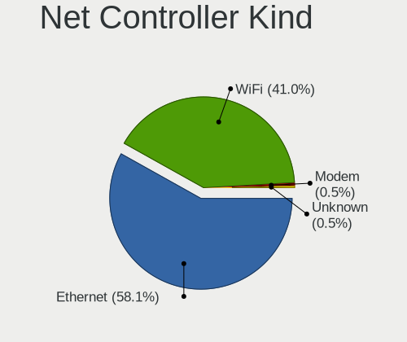

| Kind     | Desktops | Percent |
|----------|----------|---------|
| Ethernet | 39       | 57.35%  |
| WiFi     | 29       | 42.65%  |

Used Controller
---------------

Currently used network controller

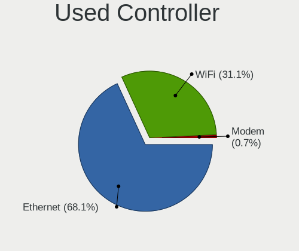

| Kind     | Desktops | Percent |
|----------|----------|---------|
| Ethernet | 27       | 64.29%  |
| WiFi     | 15       | 35.71%  |

NICs
----

Total network controllers on board

| Total | Desktops | Percent |
|-------|----------|---------|
| 1     | 22       | 56.41%  |
| 2     | 17       | 43.59%  |

IPv6
----

IPv6 vs IPv4

| Used | Desktops | Percent |
|------|----------|---------|
| No   | 29       | 74.36%  |
| Yes  | 10       | 25.64%  |

Bluetooth
---------

Bluetooth Vendor
----------------

Controller vendors

| Vendor                  | Desktops | Percent |
|-------------------------|----------|---------|
| Intel                   | 9        | 42.86%  |
| Cambridge Silicon Radio | 4        | 19.05%  |
| MediaTek                | 3        | 14.29%  |
| Broadcom                | 2        | 9.52%   |
| TP-Link                 | 1        | 4.76%   |
| Realtek Semiconductor   | 1        | 4.76%   |
| Lite-On Technology      | 1        | 4.76%   |

Bluetooth Model
---------------

Controller models

| Model                                               | Desktops | Percent |
|-----------------------------------------------------|----------|---------|
| Cambridge Silicon Radio Bluetooth Dongle (HCI mode) | 4        | 19.05%  |
| MediaTek Wireless_Device                            | 3        | 14.29%  |
| Intel Wireless-AC 9260 Bluetooth Adapter            | 2        | 9.52%   |
| Intel AX210 Bluetooth                               | 2        | 9.52%   |
| Intel AX201 Bluetooth                               | 2        | 9.52%   |
| Broadcom BCM20702A0 Bluetooth 4.0                   | 2        | 9.52%   |
| TP-Link UB500 Adapter                               | 1        | 4.76%   |
| Realtek Bluetooth Radio                             | 1        | 4.76%   |
| Lite-On Qualcomm Atheros QCA9377 Bluetooth          | 1        | 4.76%   |
| Intel Wireless-AC 3168 Bluetooth                    | 1        | 4.76%   |
| Intel Bluetooth 9460/9560 Jefferson Peak (JfP)      | 1        | 4.76%   |
| Intel AX200 Bluetooth                               | 1        | 4.76%   |

Sound
-----

Sound Vendor
------------

Sound card vendors

| Vendor               | Desktops | Percent |
|----------------------|----------|---------|
| Intel                | 28       | 43.75%  |
| Nvidia               | 19       | 29.69%  |
| AMD                  | 11       | 17.19%  |
| Creative Labs        | 2        | 3.13%   |
| C-Media Electronics  | 2        | 3.13%   |
| Giga-Byte Technology | 1        | 1.56%   |
| Emotiva              | 1        | 1.56%   |

Sound Model
-----------

Sound card models

| Model                                                                                           | Desktops | Percent |
|-------------------------------------------------------------------------------------------------|----------|---------|
| Intel 7 Series/C216 Chipset Family High Definition Audio Controller                             | 5        | 6.85%   |
| AMD Family 17h/19h HD Audio Controller                                                          | 4        | 5.48%   |
| Nvidia GF119 HDMI Audio Controller                                                              | 3        | 4.11%   |
| Intel Alder Lake-S HD Audio Controller                                                          | 3        | 4.11%   |
| Intel 6 Series/C200 Series Chipset Family High Definition Audio Controller                      | 3        | 4.11%   |
| AMD Family 17h (Models 00h-0fh) HD Audio Controller                                             | 3        | 4.11%   |
| Nvidia TU106 High Definition Audio Controller                                                   | 2        | 2.74%   |
| Nvidia GP108 High Definition Audio Controller                                                   | 2        | 2.74%   |
| Nvidia GK110 High Definition Audio Controller                                                   | 2        | 2.74%   |
| Intel NM10/ICH7 Family High Definition Audio Controller                                         | 2        | 2.74%   |
| Intel Comet Lake PCH cAVS                                                                       | 2        | 2.74%   |
| Intel Celeron/Pentium Silver Processor High Definition Audio                                    | 2        | 2.74%   |
| Intel 8 Series/C220 Series Chipset High Definition Audio Controller                             | 2        | 2.74%   |
| Intel 200 Series PCH HD Audio                                                                   | 2        | 2.74%   |
| AMD Renoir Radeon High Definition Audio Controller                                              | 2        | 2.74%   |
| AMD Rembrandt Radeon High Definition Audio Controller                                           | 2        | 2.74%   |
| AMD Ellesmere HDMI Audio [Radeon RX 470/480 / 570/580/590]                                      | 2        | 2.74%   |
| Nvidia TU107 GeForce GTX 1650 High Definition Audio Controller                                  | 1        | 1.37%   |
| Nvidia High Definition Audio Controller                                                         | 1        | 1.37%   |
| Nvidia GP107GL High Definition Audio Controller                                                 | 1        | 1.37%   |
| Nvidia GP106 High Definition Audio Controller                                                   | 1        | 1.37%   |
| Nvidia GP104 High Definition Audio Controller                                                   | 1        | 1.37%   |
| Nvidia GP102 HDMI Audio Controller                                                              | 1        | 1.37%   |
| Nvidia GK208 HDMI/DP Audio Controller                                                           | 1        | 1.37%   |
| Nvidia GF116 High Definition Audio Controller                                                   | 1        | 1.37%   |
| Nvidia GF114 HDMI Audio Controller                                                              | 1        | 1.37%   |
| Nvidia GA104 High Definition Audio Controller                                                   | 1        | 1.37%   |
| Intel Xeon E3-1200 v3/4th Gen Core Processor HD Audio Controller                                | 1        | 1.37%   |
| Intel Tiger Lake-H HD Audio Controller                                                          | 1        | 1.37%   |
| Intel Celeron N3350/Pentium N4200/Atom E3900 Series Audio Cluster                               | 1        | 1.37%   |
| Intel 9 Series Chipset Family HD Audio Controller                                               | 1        | 1.37%   |
| Intel 82801H (ICH8 Family) HD Audio Controller                                                  | 1        | 1.37%   |
| Intel 82801FB/FBM/FR/FW/FRW (ICH6 Family) AC'97 Audio Controller                                | 1        | 1.37%   |
| Intel 5 Series/3400 Series Chipset High Definition Audio                                        | 1        | 1.37%   |
| Intel 100 Series/C230 Series Chipset Family HD Audio Controller                                 | 1        | 1.37%   |
| Giga-Byte Technology USB Audio                                                                  | 1        | 1.37%   |
| Emotiva Big Ego                                                                                 | 1        | 1.37%   |
| Creative Labs CA0132 Sound Core3D [Sound Blaster Recon3D / Z-Series / Sound BlasterX AE-5 Plus] | 1        | 1.37%   |
| Creative Labs CA0106/CA0111 [SB Live!/Audigy/X-Fi Series]                                       | 1        | 1.37%   |
| C-Media Electronics CM8888 [Oxygen Express]                                                     | 1        | 1.37%   |

Memory
------

Memory Vendor
-------------

Memory module vendors

| Vendor                                  | Desktops | Percent |
|-----------------------------------------|----------|---------|
| Samsung Electronics                     | 6        | 11.54%  |
| Kingston                                | 6        | 11.54%  |
| G.Skill                                 | 6        | 11.54%  |
| Corsair                                 | 6        | 11.54%  |
| Unknown                                 | 5        | 9.62%   |
| Crucial                                 | 5        | 9.62%   |
| SK hynix                                | 4        | 7.69%   |
| Micron Technology                       | 4        | 7.69%   |
| A-DATA Technology                       | 2        | 3.85%   |
| Unknown (ABCD)                          | 1        | 1.92%   |
| Timetec                                 | 1        | 1.92%   |
| Silicon Power Computer & Communications | 1        | 1.92%   |
| Ramaxel Technology                      | 1        | 1.92%   |
| Qumo                                    | 1        | 1.92%   |
| Nanya Technology                        | 1        | 1.92%   |
| Elpida                                  | 1        | 1.92%   |
| Apacer                                  | 1        | 1.92%   |

Memory Model
------------

Memory module models

| Model                                                          | Desktops | Percent |
|----------------------------------------------------------------|----------|---------|
| Unknown RAM Module 8GB DIMM DDR3 1600MT/s                      | 2        | 3.51%   |
| Corsair RAM CMK16GX4M2B3200C16 8GB DIMM DDR4 3600MT/s          | 2        | 3.51%   |
| Unknown RAM Module 2GB DIMM SDRAM 667MT/s                      | 1        | 1.75%   |
| Unknown RAM Module 2GB DIMM 800MT/s                            | 1        | 1.75%   |
| Unknown RAM Module 2GB DIMM 1333MT/s                           | 1        | 1.75%   |
| Unknown (ABCD) RAM 123456789012345678 2GB DIMM LPDDR4 2400MT/s | 1        | 1.75%   |
| Timetec RAM SD4-2133 4GB SODIMM DDR4 2133MT/s                  | 1        | 1.75%   |
| SK hynix RAM Module 16GB DIMM DDR4 3200MT/s                    | 1        | 1.75%   |
| SK hynix RAM HMT451U6BFR8C-PB 4GB DIMM DDR3 1600MT/s           | 1        | 1.75%   |
| SK hynix RAM HMT351U6CFR8C-PB 4GB DIMM DDR3 1800MT/s           | 1        | 1.75%   |
| SK hynix RAM HMT351U6CFR8C-PB 4GB DIMM DDR3 1600MT/s           | 1        | 1.75%   |
| Silicon Power & RAM Module 16GB DIMM DDR4 3200MT/s             | 1        | 1.75%   |
| Samsung RAM M378B5273DH0-CH9 4096MB DIMM DDR2 2133MT/s         | 1        | 1.75%   |
| Samsung RAM M378B5273CH0-CH9 4GB DIMM DDR2 1867MT/s            | 1        | 1.75%   |
| Samsung RAM M378B5173QH0-CK0 4GB DIMM DDR3 1600MT/s            | 1        | 1.75%   |
| Samsung RAM M378B5173EB0-YK0 4GB DIMM DDR3 1600MT/s            | 1        | 1.75%   |
| Samsung RAM M3 78T6553BZ0-KCC 512MB DIMM DDR2 400MT/s          | 1        | 1.75%   |
| Samsung RAM M3 78T2863RZS-CF7 1GB DIMM DDR2 800MT/s            | 1        | 1.75%   |
| Samsung RAM M3 78T2863QZS-CF7 1GB DIMM DDR2 800MT/s            | 1        | 1.75%   |
| Ramaxel RAM RMR5040ED58E9W1600 4GB DIMM DDR3 1600MT/s          | 1        | 1.75%   |
| Qumo RAM QUM4U-8G2133P15 8GB DIMM DDR4 2133MT/s                | 1        | 1.75%   |
| Nanya RAM NT512T64U88A0F-5A 512MB DIMM DDR2 400MT/s            | 1        | 1.75%   |
| Micron RAM 8JTF51264AZ-1G6E1 4GB DIMM DDR3 1600MT/s            | 1        | 1.75%   |
| Micron RAM 8JTF25664AZ-1G4M1 2GB DIMM DDR3 1333MT/s            | 1        | 1.75%   |
| Micron RAM 8HTF6464AY-53ED7 512MB DIMM DDR2 533MT/s            | 1        | 1.75%   |
| Micron RAM 16JTF51264AZ-1G4M 4GB DIMM DDR3 1333MT/s            | 1        | 1.75%   |
| Kingston RAM Module 8GB DIMM DDR4 3200MT/s                     | 1        | 1.75%   |
| Kingston RAM KHX2666C15S4/8G 8GB SODIMM DDR4 2667MT/s          | 1        | 1.75%   |
| Kingston RAM ACR256X64D3S13C9G 2GB SODIMM DDR3 1334MT/s        | 1        | 1.75%   |
| Kingston RAM 99U5474-028.A00LF 4GB DIMM DDR3 1333MT/s          | 1        | 1.75%   |
| Kingston RAM 99U5474-026.A00LF 4GB DIMM DDR3 1333MT/s          | 1        | 1.75%   |
| Kingston RAM 99U5474-016.A00LF 4GB DIMM DDR3 1600MT/s          | 1        | 1.75%   |
| Kingston RAM 9905734-019.A00G 16GB DIMM DDR4 2400MT/s          | 1        | 1.75%   |
| Kingston RAM 9905625-075.A00G 16GB DIMM DDR4 2400MT/s          | 1        | 1.75%   |
| Kingston RAM 9905625-074.A00G 16GB DIMM DDR4 2400MT/s          | 1        | 1.75%   |
| Kingston RAM 9905474-040.A00LF 4GB DIMM DDR3 1600MT/s          | 1        | 1.75%   |
| G.Skill RAM F4-3200C16-16GVK 16GB DIMM DDR4 3600MT/s           | 1        | 1.75%   |
| G.Skill RAM F4-3200C14-8GTZR 8GB DIMM DDR4 4000MT/s            | 1        | 1.75%   |
| G.Skill RAM F4-3000C16-8GISB 8192MB DIMM DDR4 3200MT/s         | 1        | 1.75%   |
| G.Skill RAM F4-2666C19-8GVR 8GB DIMM DDR4 2667MT/s             | 1        | 1.75%   |

Memory Kind
-----------

Memory module kinds

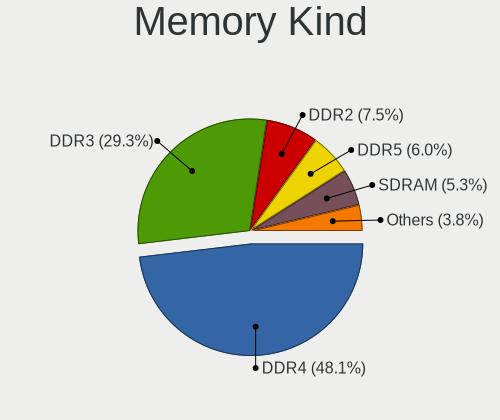

| Kind    | Desktops | Percent |
|---------|----------|---------|
| DDR4    | 18       | 45%     |
| DDR3    | 13       | 32.5%   |
| SDRAM   | 2        | 5%      |
| DDR5    | 2        | 5%      |
| DDR2    | 2        | 5%      |
| Unknown | 2        | 5%      |
| LPDDR4  | 1        | 2.5%    |

Memory Form Factor
------------------

Physical design of the memory module

| Name   | Desktops | Percent |
|--------|----------|---------|
| DIMM   | 34       | 87.18%  |
| SODIMM | 5        | 12.82%  |

Memory Size
-----------

Memory module size

| Size  | Desktops | Percent |
|-------|----------|---------|
| 8192  | 15       | 36.59%  |
| 4096  | 10       | 24.39%  |
| 16384 | 9        | 21.95%  |
| 2048  | 5        | 12.2%   |
| 1024  | 1        | 2.44%   |
| 512   | 1        | 2.44%   |

Memory Speed
------------

Memory module speed

| Speed | Desktops | Percent |
|-------|----------|---------|
| 1600  | 8        | 17.02%  |
| 3200  | 7        | 14.89%  |
| 1333  | 5        | 10.64%  |
| 3600  | 4        | 8.51%   |
| 2400  | 3        | 6.38%   |
| 2133  | 3        | 6.38%   |
| 2667  | 2        | 4.26%   |
| 1867  | 2        | 4.26%   |
| 800   | 2        | 4.26%   |
| 6000  | 1        | 2.13%   |
| 4800  | 1        | 2.13%   |
| 4000  | 1        | 2.13%   |
| 3066  | 1        | 2.13%   |
| 2933  | 1        | 2.13%   |
| 1866  | 1        | 2.13%   |
| 1800  | 1        | 2.13%   |
| 1334  | 1        | 2.13%   |
| 667   | 1        | 2.13%   |
| 533   | 1        | 2.13%   |
| 400   | 1        | 2.13%   |

Printers & scanners
-------------------

Printer Vendor
--------------

Printer device vendors

| Vendor             | Desktops | Percent |
|--------------------|----------|---------|
| Canon              | 1        | 50%     |
| Brother Industries | 1        | 50%     |

Printer Model
-------------

Printer device models

| Model                     | Desktops | Percent |
|---------------------------|----------|---------|
| Canon PIXMA MG5600 Series | 1        | 50%     |
| Brother HL-L2350DW series | 1        | 50%     |

Scanner Vendor
--------------

Scanner device vendors

| Vendor      | Desktops | Percent |
|-------------|----------|---------|
| Seiko Epson | 1        | 50%     |
| Canon       | 1        | 50%     |

Scanner Model
-------------

Scanner device models

| Model                                 | Desktops | Percent |
|---------------------------------------|----------|---------|
| Seiko Epson GT-X770 [Perfection V500] | 1        | 50%     |
| Canon CanoScan 8800F                  | 1        | 50%     |

Camera
------

Camera Vendor
-------------

Camera device vendors

| Vendor                  | Desktops | Percent |
|-------------------------|----------|---------|
| Z-Star Microelectronics | 1        | 33.33%  |
| Hewlett-Packard         | 1        | 33.33%  |
| Aveo Technology         | 1        | 33.33%  |

Camera Model
------------

Camera device models

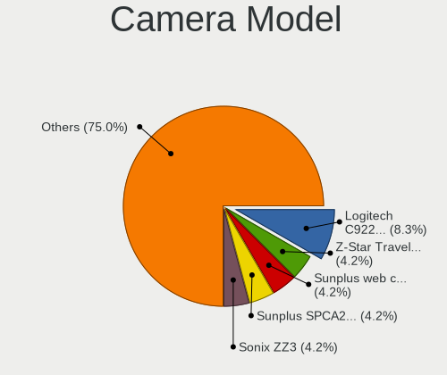

| Model                                  | Desktops | Percent |
|----------------------------------------|----------|---------|
| Z-Star Traveler TV 6500 SF Dia-scanner | 1        | 33.33%  |
| HP Webcam HD 2300                      | 1        | 33.33%  |
| Aveo Camera                            | 1        | 33.33%  |

Security
--------

Fingerprint Vendor
------------------

Fingerprint sensor vendors

Zero info for selected period =(

Fingerprint Model
-----------------

Fingerprint sensor models

Zero info for selected period =(

Chipcard Vendor
---------------

Chipcard module vendors

| Vendor              | Desktops | Percent |
|---------------------|----------|---------|
| Chicony Electronics | 1        | 100%    |

Chipcard Model
--------------

Chipcard module models

| Model                                                | Desktops | Percent |
|------------------------------------------------------|----------|---------|
| Chicony Electronics HP Skylab USB Smartcard Keyboard | 1        | 100%    |

Unsupported
-----------

Unsupported Devices
-------------------

Total unsupported devices on board

| Total | Desktops | Percent |
|-------|----------|---------|
| 0     | 29       | 72.5%   |
| 1     | 11       | 27.5%   |

Unsupported Device Types
------------------------

Types of unsupported devices

| Type                     | Desktops | Percent |
|--------------------------|----------|---------|
| Net/wireless             | 5        | 45.45%  |
| Network                  | 1        | 9.09%   |
| Graphics card            | 1        | 9.09%   |
| Communication controller | 1        | 9.09%   |
| Chipcard                 | 1        | 9.09%   |
| Card reader              | 1        | 9.09%   |
| Bluetooth                | 1        | 9.09%   |

