MX 23 - Tested Hardware & Statistics (Notebooks)
------------------------------------------------

A project to collect tested hardware configurations for MX 23.

Anyone can contribute to this report by the [hw-probe](https://github.com/linuxhw/hw-probe) tool:

    sudo -E hw-probe -all -upload

Please contribute! Especially if your hardware is rare.

Contents
--------

* [ Test Cases ](#test-cases)

* [ System ](#system)
  - [ Kernel                   ](#kernel)
  - [ Kernel Family            ](#kernel-family)
  - [ Kernel Major Ver.        ](#kernel-major-ver)
  - [ Arch                     ](#arch)
  - [ DE                       ](#de)
  - [ Display Server           ](#display-server)
  - [ Display Manager          ](#display-manager)
  - [ OS Lang                  ](#os-lang)
  - [ Boot Mode                ](#boot-mode)
  - [ Filesystem               ](#filesystem)
  - [ Part. scheme             ](#part-scheme)
  - [ Dual Boot with Linux/BSD ](#dual-boot-with-linuxbsd)
  - [ Dual Boot (Win)          ](#dual-boot-win)

* [ Board ](#board)
  - [ Vendor                   ](#vendor)
  - [ Model                    ](#model)
  - [ Model Family             ](#model-family)
  - [ MFG Year                 ](#mfg-year)
  - [ Form Factor              ](#form-factor)
  - [ Secure Boot              ](#secure-boot)
  - [ Coreboot                 ](#coreboot)
  - [ RAM Size                 ](#ram-size)
  - [ RAM Used                 ](#ram-used)
  - [ Total Drives             ](#total-drives)
  - [ Has CD-ROM               ](#has-cd-rom)
  - [ Has Ethernet             ](#has-ethernet)
  - [ Has WiFi                 ](#has-wifi)
  - [ Has Bluetooth            ](#has-bluetooth)

* [ Location ](#location)
  - [ Country                  ](#country)
  - [ City                     ](#city)

* [ Drives ](#drives)
  - [ Drive Vendor             ](#drive-vendor)
  - [ Drive Model              ](#drive-model)
  - [ HDD Vendor               ](#hdd-vendor)
  - [ SSD Vendor               ](#ssd-vendor)
  - [ Drive Kind               ](#drive-kind)
  - [ Drive Connector          ](#drive-connector)
  - [ Drive Size               ](#drive-size)
  - [ Space Total              ](#space-total)
  - [ Space Used               ](#space-used)
  - [ Malfunc. Drives          ](#malfunc-drives)
  - [ Malfunc. Drive Vendor    ](#malfunc-drive-vendor)
  - [ Malfunc. HDD Vendor      ](#malfunc-hdd-vendor)
  - [ Malfunc. Drive Kind      ](#malfunc-drive-kind)
  - [ Failed Drives            ](#failed-drives)
  - [ Failed Drive Vendor      ](#failed-drive-vendor)
  - [ Drive Status             ](#drive-status)

* [ Storage controller ](#storage-controller)
  - [ Storage Vendor           ](#storage-vendor)
  - [ Storage Model            ](#storage-model)
  - [ Storage Kind             ](#storage-kind)

* [ Processor ](#processor)
  - [ CPU Vendor               ](#cpu-vendor)
  - [ CPU Model                ](#cpu-model)
  - [ CPU Model Family         ](#cpu-model-family)
  - [ CPU Cores                ](#cpu-cores)
  - [ CPU Sockets              ](#cpu-sockets)
  - [ CPU Threads              ](#cpu-threads)
  - [ CPU Op-Modes             ](#cpu-op-modes)
  - [ CPU Microcode            ](#cpu-microcode)
  - [ CPU Microarch            ](#cpu-microarch)

* [ Graphics ](#graphics)
  - [ GPU Vendor               ](#gpu-vendor)
  - [ GPU Model                ](#gpu-model)
  - [ GPU Combo                ](#gpu-combo)
  - [ GPU Driver               ](#gpu-driver)
  - [ GPU Memory               ](#gpu-memory)

* [ Monitor ](#monitor)
  - [ Monitor Vendor           ](#monitor-vendor)
  - [ Monitor Model            ](#monitor-model)
  - [ Monitor Resolution       ](#monitor-resolution)
  - [ Monitor Diagonal         ](#monitor-diagonal)
  - [ Monitor Width            ](#monitor-width)
  - [ Aspect Ratio             ](#aspect-ratio)
  - [ Monitor Area             ](#monitor-area)
  - [ Pixel Density            ](#pixel-density)
  - [ Multiple Monitors        ](#multiple-monitors)

* [ Network ](#network)
  - [ Net Controller Vendor    ](#net-controller-vendor)
  - [ Net Controller Model     ](#net-controller-model)
  - [ Wireless Vendor          ](#wireless-vendor)
  - [ Wireless Model           ](#wireless-model)
  - [ Ethernet Vendor          ](#ethernet-vendor)
  - [ Ethernet Model           ](#ethernet-model)
  - [ Net Controller Kind      ](#net-controller-kind)
  - [ Used Controller          ](#used-controller)
  - [ NICs                     ](#nics)
  - [ IPv6                     ](#ipv6)

* [ Bluetooth ](#bluetooth)
  - [ Bluetooth Vendor         ](#bluetooth-vendor)
  - [ Bluetooth Model          ](#bluetooth-model)

* [ Sound ](#sound)
  - [ Sound Vendor             ](#sound-vendor)
  - [ Sound Model              ](#sound-model)

* [ Memory ](#memory)
  - [ Memory Vendor            ](#memory-vendor)
  - [ Memory Model             ](#memory-model)
  - [ Memory Kind              ](#memory-kind)
  - [ Memory Form Factor       ](#memory-form-factor)
  - [ Memory Size              ](#memory-size)
  - [ Memory Speed             ](#memory-speed)

* [ Printers & scanners ](#printers--scanners)
  - [ Printer Vendor           ](#printer-vendor)
  - [ Printer Model            ](#printer-model)
  - [ Scanner Vendor           ](#scanner-vendor)
  - [ Scanner Model            ](#scanner-model)

* [ Camera ](#camera)
  - [ Camera Vendor            ](#camera-vendor)
  - [ Camera Model             ](#camera-model)

* [ Security ](#security)
  - [ Fingerprint Vendor       ](#fingerprint-vendor)
  - [ Fingerprint Model        ](#fingerprint-model)
  - [ Chipcard Vendor          ](#chipcard-vendor)
  - [ Chipcard Model           ](#chipcard-model)

* [ Unsupported ](#unsupported)
  - [ Unsupported Devices      ](#unsupported-devices)
  - [ Unsupported Device Types ](#unsupported-device-types)

Test Cases
----------

Total: 539

| Vendor        | Model                       | Probe                                                      | Date         |
|---------------|-----------------------------|------------------------------------------------------------|--------------|
| Acer          | Aspire A114-33              | [1773222e3d](https://linux-hardware.org/?probe=1773222e3d) | Dec 21, 2025 |
| ASUSTek       | 1000HE                      | [aea8a66e54](https://linux-hardware.org/?probe=aea8a66e54) | Dec 20, 2025 |
| Dell          | Latitude 5410               | [5dd93b27b0](https://linux-hardware.org/?probe=5dd93b27b0) | Dec 13, 2025 |
| Apple         | MacBookPro14,1              | [1ca15aa6cd](https://linux-hardware.org/?probe=1ca15aa6cd) | Dec 10, 2025 |
| Medion        | NPxxRNA                     | [e9344c9092](https://linux-hardware.org/?probe=e9344c9092) | Dec 09, 2025 |
| Daten Tecn... | DVRN-4                      | [2146dd4395](https://linux-hardware.org/?probe=2146dd4395) | Nov 21, 2025 |
| Apple         | MacBookAir7,2               | [fadd3c1658](https://linux-hardware.org/?probe=fadd3c1658) | Nov 16, 2025 |
| HP            | 2000                        | [a87e9d5e79](https://linux-hardware.org/?probe=a87e9d5e79) | Nov 14, 2025 |
| Sony          | VPCEB4M1E                   | [85d85991d2](https://linux-hardware.org/?probe=85d85991d2) | Nov 12, 2025 |
| Sony          | VPCEB4M1E                   | [e4afefa75f](https://linux-hardware.org/?probe=e4afefa75f) | Nov 12, 2025 |
| Toshiba       | Satellite L510              | [9c228175c9](https://linux-hardware.org/?probe=9c228175c9) | Nov 12, 2025 |
| Dell          | Inspiron 16 5645            | [7f29a20d7d](https://linux-hardware.org/?probe=7f29a20d7d) | Nov 05, 2025 |
| HP            | 2000                        | [df6a6894b0](https://linux-hardware.org/?probe=df6a6894b0) | Nov 04, 2025 |
| ASUSTek       | UX303UA                     | [5e97e42d1f](https://linux-hardware.org/?probe=5e97e42d1f) | Nov 02, 2025 |
| ASUSTek       | UX430UNR                    | [99d51c0dba](https://linux-hardware.org/?probe=99d51c0dba) | Nov 01, 2025 |
| Medion        | Crawler E30e                | [cad65708be](https://linux-hardware.org/?probe=cad65708be) | Nov 01, 2025 |
| Lenovo        | ThinkPad X200 74553XG       | [f26926f29c](https://linux-hardware.org/?probe=f26926f29c) | Oct 29, 2025 |
| Fujitsu Si... | AMILO Pi 2540               | [33db8bddec](https://linux-hardware.org/?probe=33db8bddec) | Oct 23, 2025 |
| HP            | Stream Notebook PC 11       | [d4d64a6d08](https://linux-hardware.org/?probe=d4d64a6d08) | Oct 23, 2025 |
| Dell          | Inspiron 5567               | [2f13ec3188](https://linux-hardware.org/?probe=2f13ec3188) | Oct 21, 2025 |
| Dell          | Inspiron 5567               | [e9f9adf8ef](https://linux-hardware.org/?probe=e9f9adf8ef) | Oct 21, 2025 |
| Toshiba       | Satellite L510              | [3f681fe057](https://linux-hardware.org/?probe=3f681fe057) | Oct 20, 2025 |
| Dell          | Latitude E5540              | [4c8afbabca](https://linux-hardware.org/?probe=4c8afbabca) | Oct 19, 2025 |
| Acer          | Aspire AG15-51P             | [1b96a53761](https://linux-hardware.org/?probe=1b96a53761) | Oct 16, 2025 |
| Dell          | Inspiron N4020              | [45dd2629b5](https://linux-hardware.org/?probe=45dd2629b5) | Oct 10, 2025 |
| ASUSTek       | VivoBook_ASUSLaptop M150... | [6e27bedba7](https://linux-hardware.org/?probe=6e27bedba7) | Oct 07, 2025 |
| Wortmann      | 1220663_1470189             | [8be31b3cbc](https://linux-hardware.org/?probe=8be31b3cbc) | Oct 06, 2025 |
| ASUSTek       | UX410UQK                    | [ebb2f63d3b](https://linux-hardware.org/?probe=ebb2f63d3b) | Oct 06, 2025 |
| Samsung       | 305E4A/305E5A/305E7A        | [81d1a3e7a8](https://linux-hardware.org/?probe=81d1a3e7a8) | Oct 06, 2025 |
| Google        | Treeya                      | [4d63a8557b](https://linux-hardware.org/?probe=4d63a8557b) | Oct 06, 2025 |
| Lenovo        | G50-70 20351                | [408a86830b](https://linux-hardware.org/?probe=408a86830b) | Oct 05, 2025 |
| Lenovo        | G50-70 20351                | [74fdf4158c](https://linux-hardware.org/?probe=74fdf4158c) | Oct 05, 2025 |
| HP            | Pavilion Laptop 15z-eh00... | [2518904235](https://linux-hardware.org/?probe=2518904235) | Oct 05, 2025 |
| Apple         | MacBookAir7,1               | [688a16bfec](https://linux-hardware.org/?probe=688a16bfec) | Sep 28, 2025 |
| HP            | EliteBook 645 14 inch G1... | [da0ebf373b](https://linux-hardware.org/?probe=da0ebf373b) | Sep 27, 2025 |
| HP            | Pavilion Laptop 15z-eh00... | [25f8f8f056](https://linux-hardware.org/?probe=25f8f8f056) | Sep 24, 2025 |
| Dell          | Inspiron N7010              | [75c303ee55](https://linux-hardware.org/?probe=75c303ee55) | Sep 21, 2025 |
| Lenovo        | Flex 2-14 20404             | [fde585ff82](https://linux-hardware.org/?probe=fde585ff82) | Sep 20, 2025 |
| HP            | ProBook 440 G7              | [792c15eeb7](https://linux-hardware.org/?probe=792c15eeb7) | Sep 20, 2025 |
| Acer          | AO722                       | [f1a6eab88d](https://linux-hardware.org/?probe=f1a6eab88d) | Sep 19, 2025 |
| Apple         | MacBookAir6,2               | [e36fc51285](https://linux-hardware.org/?probe=e36fc51285) | Sep 15, 2025 |
| Apple         | MacBookAir6,2               | [d38939253e](https://linux-hardware.org/?probe=d38939253e) | Sep 15, 2025 |
| Dell          | Inspiron 16 5645            | [4a93f8b0d1](https://linux-hardware.org/?probe=4a93f8b0d1) | Sep 15, 2025 |
| Medion        | E15223                      | [c062b348d1](https://linux-hardware.org/?probe=c062b348d1) | Sep 15, 2025 |
| Apple         | MacBookAir6,2               | [3618f3c44d](https://linux-hardware.org/?probe=3618f3c44d) | Sep 14, 2025 |
| Toshiba       | PORTEGE R30-A               | [c8da642ab9](https://linux-hardware.org/?probe=c8da642ab9) | Sep 13, 2025 |
| Dell          | Inspiron 16 5645            | [abcdd54c4d](https://linux-hardware.org/?probe=abcdd54c4d) | Sep 12, 2025 |
| PCBOX         | PCB-GLW2                    | [0d2fd19d0e](https://linux-hardware.org/?probe=0d2fd19d0e) | Sep 10, 2025 |
| Apple         | MacBookAir6,2               | [8fed6df5bb](https://linux-hardware.org/?probe=8fed6df5bb) | Sep 07, 2025 |
| Acer          | TravelMate B311-31          | [20e8fc805c](https://linux-hardware.org/?probe=20e8fc805c) | Sep 03, 2025 |
| Unknown       | AX16PRO                     | [3a42432fe5](https://linux-hardware.org/?probe=3a42432fe5) | Aug 28, 2025 |
| Fujitsu Si... | AMILO Pro Edition V3505     | [ce15c49d7f](https://linux-hardware.org/?probe=ce15c49d7f) | Aug 26, 2025 |
| ASUSTek       | VivoBook_ASUSLaptop X140... | [defcf8d9c2](https://linux-hardware.org/?probe=defcf8d9c2) | Aug 22, 2025 |
| HP            | 255 15.6 inch G9 Noteboo... | [307b882e42](https://linux-hardware.org/?probe=307b882e42) | Aug 20, 2025 |
| MSI           | GE62 2QF                    | [d7f7fecb75](https://linux-hardware.org/?probe=d7f7fecb75) | Aug 17, 2025 |
| Lenovo        | IdeaPad 320-17ABR 80YN      | [8a410a9c2c](https://linux-hardware.org/?probe=8a410a9c2c) | Aug 16, 2025 |
| HP            | Pavilion 15                 | [8bc227fe80](https://linux-hardware.org/?probe=8bc227fe80) | Aug 10, 2025 |
| Google        | Treeya                      | [57c5dfda3f](https://linux-hardware.org/?probe=57c5dfda3f) | Aug 09, 2025 |
| ASUSTek       | X202E                       | [224f9800a0](https://linux-hardware.org/?probe=224f9800a0) | Aug 09, 2025 |
| ASUSTek       | X202E                       | [54719df93e](https://linux-hardware.org/?probe=54719df93e) | Aug 09, 2025 |
| Dell          | Studio XPS 1640             | [af14bd2dea](https://linux-hardware.org/?probe=af14bd2dea) | Aug 07, 2025 |
| Dell          | Latitude 9510               | [f898a3708e](https://linux-hardware.org/?probe=f898a3708e) | Aug 05, 2025 |
| ASUSTek       | ZenBook UX325SA_UM325SA     | [52f9d3da90](https://linux-hardware.org/?probe=52f9d3da90) | Aug 03, 2025 |
| MSI           | Modern 14 A10M              | [b3323d296c](https://linux-hardware.org/?probe=b3323d296c) | Aug 01, 2025 |
| Acer          | TravelMate P215-53          | [6f2159a6ff](https://linux-hardware.org/?probe=6f2159a6ff) | Jul 31, 2025 |
| Acer          | Aspire one 1-431            | [8c04b9267a](https://linux-hardware.org/?probe=8c04b9267a) | Jul 31, 2025 |
| Unknown       | Unknown                     | [458d6debf1](https://linux-hardware.org/?probe=458d6debf1) | Jul 30, 2025 |
| Dell          | Latitude 5400               | [5be654e778](https://linux-hardware.org/?probe=5be654e778) | Jul 30, 2025 |
| Dell          | Vostro 3500                 | [c2d479c2e8](https://linux-hardware.org/?probe=c2d479c2e8) | Jul 30, 2025 |
| Apple         | MacBookPro9,2               | [e3b80533b2](https://linux-hardware.org/?probe=e3b80533b2) | Jul 28, 2025 |
| Packard Be... | EasyNote TS44HR             | [75d8a5514e](https://linux-hardware.org/?probe=75d8a5514e) | Jul 27, 2025 |
| Apple         | MacBookAir2,1               | [20f1fb531e](https://linux-hardware.org/?probe=20f1fb531e) | Jul 23, 2025 |
| Apple         | MacBookAir1,1               | [633472e541](https://linux-hardware.org/?probe=633472e541) | Jul 22, 2025 |
| Apple         | MacBookPro7,1               | [78bf64aa11](https://linux-hardware.org/?probe=78bf64aa11) | Jul 22, 2025 |
| HP            | Laptop                      | [6e1a0ff0fa](https://linux-hardware.org/?probe=6e1a0ff0fa) | Jul 21, 2025 |
| Acer          | Aspire 5750G                | [3c42e357d1](https://linux-hardware.org/?probe=3c42e357d1) | Jul 16, 2025 |
| Apple         | MacBookPro7,1               | [647e63d412](https://linux-hardware.org/?probe=647e63d412) | Jul 15, 2025 |
| Acer          | Predator PH18-72            | [795524aef0](https://linux-hardware.org/?probe=795524aef0) | Jul 14, 2025 |
| Lenovo        | Yoga Pro 7 14ARP8 83AU      | [82fb91ab48](https://linux-hardware.org/?probe=82fb91ab48) | Jul 05, 2025 |
| Lenovo        | Yoga Pro 7 14ARP8 83AU      | [7b1303b585](https://linux-hardware.org/?probe=7b1303b585) | Jul 05, 2025 |
| Toshiba       | Satellite C70D-B            | [35f24ff6b4](https://linux-hardware.org/?probe=35f24ff6b4) | Jul 01, 2025 |
| Infinix       | GL613                       | [0a7f9146e1](https://linux-hardware.org/?probe=0a7f9146e1) | Jun 30, 2025 |
| ATARI         | VCS 800 Onyx                | [6d9422b126](https://linux-hardware.org/?probe=6d9422b126) | Jun 27, 2025 |
| ASUSTek       | F3Sg                        | [acc043daec](https://linux-hardware.org/?probe=acc043daec) | Jun 26, 2025 |
| ASUSTek       | VivoBook_ASUSLaptop X170... | [1d719b744d](https://linux-hardware.org/?probe=1d719b744d) | Jun 24, 2025 |
| Intel         | powered classmate PC        | [e41e762d92](https://linux-hardware.org/?probe=e41e762d92) | Jun 23, 2025 |
| Acer          | Aspire A315-41G             | [89e44ec862](https://linux-hardware.org/?probe=89e44ec862) | Jun 21, 2025 |
| Intel         | powered classmate PC        | [73e28609cc](https://linux-hardware.org/?probe=73e28609cc) | Jun 16, 2025 |
| Intel         | powered classmate PC        | [ba84a1c954](https://linux-hardware.org/?probe=ba84a1c954) | Jun 16, 2025 |
| Intel         | powered classmate PC        | [de05adf4be](https://linux-hardware.org/?probe=de05adf4be) | Jun 16, 2025 |
| HP            | Presario CQ57               | [abfed818bb](https://linux-hardware.org/?probe=abfed818bb) | Jun 15, 2025 |
| Intel         | powered classmate PC        | [cb98fcf7b0](https://linux-hardware.org/?probe=cb98fcf7b0) | Jun 13, 2025 |
| ASUSTek       | VivoBook_ASUSLaptop X515... | [4e48864c36](https://linux-hardware.org/?probe=4e48864c36) | Jun 13, 2025 |
| Intel         | powered classmate PC        | [5ed3743c9f](https://linux-hardware.org/?probe=5ed3743c9f) | Jun 11, 2025 |
| Intel         | powered classmate PC        | [1ef141a39b](https://linux-hardware.org/?probe=1ef141a39b) | Jun 11, 2025 |
| Apple         | MacBookPro7,1               | [f246b5c8ee](https://linux-hardware.org/?probe=f246b5c8ee) | Jun 11, 2025 |
| Intel         | powered classmate PC        | [cdcfcc2077](https://linux-hardware.org/?probe=cdcfcc2077) | Jun 10, 2025 |
| HP            | Notebook                    | [d1fbc3acd3](https://linux-hardware.org/?probe=d1fbc3acd3) | Jun 08, 2025 |
| HP            | Notebook                    | [8e678c782d](https://linux-hardware.org/?probe=8e678c782d) | Jun 08, 2025 |
| Lenovo        | IdeaPad 3 15ALC6 82KU       | [55ba6e9314](https://linux-hardware.org/?probe=55ba6e9314) | Jun 05, 2025 |
| Daten Tecn... | DVRN-4                      | [4369bd8486](https://linux-hardware.org/?probe=4369bd8486) | Jun 02, 2025 |
| Dell          | System Inspiron N411Z       | [333a275c1e](https://linux-hardware.org/?probe=333a275c1e) | Jun 01, 2025 |
| HP            | Pavilion Notebook           | [372f4efe68](https://linux-hardware.org/?probe=372f4efe68) | May 24, 2025 |
| Dell          | Inspiron 3542               | [da660b8818](https://linux-hardware.org/?probe=da660b8818) | May 24, 2025 |
| Apple         | MacBookAir1,1               | [ad5dcf0a77](https://linux-hardware.org/?probe=ad5dcf0a77) | May 22, 2025 |
| Acer          | Aspire AV16-51P             | [6e14a97260](https://linux-hardware.org/?probe=6e14a97260) | May 21, 2025 |
| Unknown       | Unknown                     | [db9efb83b5](https://linux-hardware.org/?probe=db9efb83b5) | May 19, 2025 |
| HP            | Laptop 14-em0xxx            | [35532415da](https://linux-hardware.org/?probe=35532415da) | May 17, 2025 |
| HP            | Laptop 14-em0xxx            | [cc3799f7b4](https://linux-hardware.org/?probe=cc3799f7b4) | May 17, 2025 |
| HP            | Pavilion dv7                | [90c8da4c22](https://linux-hardware.org/?probe=90c8da4c22) | May 17, 2025 |
| Acer          | Aspire A315-41              | [839b8194be](https://linux-hardware.org/?probe=839b8194be) | May 14, 2025 |
| HP            | ProBook 445 G8 Notebook ... | [d68381eaa0](https://linux-hardware.org/?probe=d68381eaa0) | May 14, 2025 |
| HP            | Pavilion x2 Detachable P... | [4810457ca4](https://linux-hardware.org/?probe=4810457ca4) | May 11, 2025 |
| Dell          | Inspiron 14-3467            | [bf2355ffc1](https://linux-hardware.org/?probe=bf2355ffc1) | May 05, 2025 |
| Toshiba       | Satellite A300              | [fbc016a6c1](https://linux-hardware.org/?probe=fbc016a6c1) | May 04, 2025 |
| HP            | ENVY 15 x360 PC             | [bbf9f60a98](https://linux-hardware.org/?probe=bbf9f60a98) | May 04, 2025 |
| Toshiba       | Satellite A300              | [9b925ffdf3](https://linux-hardware.org/?probe=9b925ffdf3) | May 04, 2025 |
| Apple         | MacBookPro7,1               | [891baab7c7](https://linux-hardware.org/?probe=891baab7c7) | May 02, 2025 |
| Dell          | Inspiron 14-3467            | [070c57d0ef](https://linux-hardware.org/?probe=070c57d0ef) | Apr 30, 2025 |
| Dell          | Precision 3530              | [73f7113ffb](https://linux-hardware.org/?probe=73f7113ffb) | Apr 29, 2025 |
| Dell          | Latitude E6400              | [56e60c04c9](https://linux-hardware.org/?probe=56e60c04c9) | Apr 27, 2025 |
| Dell          | Latitude E6400              | [f9d2b3e6d9](https://linux-hardware.org/?probe=f9d2b3e6d9) | Apr 27, 2025 |
| Acer          | Aspire 7750                 | [7290031e9e](https://linux-hardware.org/?probe=7290031e9e) | Apr 26, 2025 |
| Lenovo        | G50-45 80E3                 | [b888f58f60](https://linux-hardware.org/?probe=b888f58f60) | Apr 26, 2025 |
| ASUSTek       | P552LA                      | [8c9c5975a0](https://linux-hardware.org/?probe=8c9c5975a0) | Apr 25, 2025 |
| Fujitsu Si... | AMILO Li1705                | [f3e8946a13](https://linux-hardware.org/?probe=f3e8946a13) | Apr 24, 2025 |
| Lenovo        | IdeaPad 330-15AST 81D6      | [703bd9063a](https://linux-hardware.org/?probe=703bd9063a) | Apr 24, 2025 |
| Samsung       | N150/N210/N220              | [60a16df78d](https://linux-hardware.org/?probe=60a16df78d) | Apr 21, 2025 |
| HP            | Pavilion dv7                | [bc8ee714aa](https://linux-hardware.org/?probe=bc8ee714aa) | Apr 13, 2025 |
| Dell          | Latitude E5500              | [8c5aad5e48](https://linux-hardware.org/?probe=8c5aad5e48) | Apr 12, 2025 |
| Apple         | MacBookPro8,2               | [cd7b47ea0a](https://linux-hardware.org/?probe=cd7b47ea0a) | Apr 10, 2025 |
| Dell          | G15 5515                    | [6ef6273956](https://linux-hardware.org/?probe=6ef6273956) | Apr 09, 2025 |
| HP            | ENVY 15 x360 PC             | [9ba27ba280](https://linux-hardware.org/?probe=9ba27ba280) | Apr 08, 2025 |
| HP            | OMEN Gaming Laptop 17-db... | [cf02aa8670](https://linux-hardware.org/?probe=cf02aa8670) | Apr 07, 2025 |
| Dell          | Latitude E6410              | [fd3fac39ae](https://linux-hardware.org/?probe=fd3fac39ae) | Apr 04, 2025 |
| MSI           | U90/U100                    | [5006e02c05](https://linux-hardware.org/?probe=5006e02c05) | Apr 03, 2025 |
| Medion        | S17405                      | [38a1f6ced0](https://linux-hardware.org/?probe=38a1f6ced0) | Apr 03, 2025 |
| HP            | ProBook 455 G3              | [1b2d9a76f8](https://linux-hardware.org/?probe=1b2d9a76f8) | Apr 02, 2025 |
| ASUSTek       | 1000HE                      | [e857ea0047](https://linux-hardware.org/?probe=e857ea0047) | Mar 30, 2025 |
| Acer          | AO725                       | [8fa858fde1](https://linux-hardware.org/?probe=8fa858fde1) | Mar 25, 2025 |
| HP            | ProBook 450 G8 Notebook ... | [1cd4bf968d](https://linux-hardware.org/?probe=1cd4bf968d) | Mar 19, 2025 |
| Lenovo        | ThinkPad L512 44444XG       | [c3086a05f4](https://linux-hardware.org/?probe=c3086a05f4) | Mar 18, 2025 |
| Fujitsu       | LIFEBOOK U7411              | [ee280b693e](https://linux-hardware.org/?probe=ee280b693e) | Mar 16, 2025 |
| Dell          | Latitude E6540              | [8486d9062e](https://linux-hardware.org/?probe=8486d9062e) | Mar 14, 2025 |
| Dell          | Latitude E6440              | [59f2291974](https://linux-hardware.org/?probe=59f2291974) | Mar 13, 2025 |
| ASUSTek       | 1000H                       | [6921f09d8b](https://linux-hardware.org/?probe=6921f09d8b) | Mar 13, 2025 |
| HP            | ZBook 17 G3                 | [cb8bd65307](https://linux-hardware.org/?probe=cb8bd65307) | Mar 07, 2025 |
| ASUSTek       | 901                         | [fdafcbf1ec](https://linux-hardware.org/?probe=fdafcbf1ec) | Mar 05, 2025 |
| Acer          | TravelMate 7730G            | [664a0068ce](https://linux-hardware.org/?probe=664a0068ce) | Mar 04, 2025 |
| ASUSTek       | VivoBook 15_ASUS Laptop ... | [0c5131b0cc](https://linux-hardware.org/?probe=0c5131b0cc) | Mar 02, 2025 |
| Toshiba       | Satellite C55D-B            | [23dc9bb800](https://linux-hardware.org/?probe=23dc9bb800) | Feb 28, 2025 |
| ASUSTek       | VivoBook_ASUSLaptop X160... | [70e7510bd3](https://linux-hardware.org/?probe=70e7510bd3) | Feb 28, 2025 |
| ASUSTek       | Vivobook Go E1504FA_E150... | [b476447887](https://linux-hardware.org/?probe=b476447887) | Feb 23, 2025 |
| Lenovo        | IdeaPad 330-14IGM 81D0      | [933a486ebf](https://linux-hardware.org/?probe=933a486ebf) | Feb 21, 2025 |
| Lenovo        | IdeaPad 330-14IGM 81D0      | [9226357bd6](https://linux-hardware.org/?probe=9226357bd6) | Feb 21, 2025 |
| Lenovo        | ThinkPad T420 4180A32       | [3fe648af90](https://linux-hardware.org/?probe=3fe648af90) | Feb 19, 2025 |
| Dell          | Inspiron 5558               | [ac45242025](https://linux-hardware.org/?probe=ac45242025) | Feb 17, 2025 |
| Panasonic     | CFSV1-2                     | [962d1504f0](https://linux-hardware.org/?probe=962d1504f0) | Feb 16, 2025 |
| Acer          | Aspire E1-731               | [d84936954c](https://linux-hardware.org/?probe=d84936954c) | Feb 14, 2025 |
| Dell          | Latitude D630               | [8a27773bce](https://linux-hardware.org/?probe=8a27773bce) | Feb 13, 2025 |
| Dell          | Latitude E6400              | [857964a35f](https://linux-hardware.org/?probe=857964a35f) | Feb 10, 2025 |
| Google        | Phaser360                   | [b261235d72](https://linux-hardware.org/?probe=b261235d72) | Feb 09, 2025 |
| Dell          | Latitude 5420               | [6a6ade61a2](https://linux-hardware.org/?probe=6a6ade61a2) | Feb 08, 2025 |
| HP            | Victus by Gaming Laptop ... | [3db8c7f29d](https://linux-hardware.org/?probe=3db8c7f29d) | Feb 07, 2025 |
| Lenovo        | IdeaPad 1 15AMN7 82VG       | [58b815cbda](https://linux-hardware.org/?probe=58b815cbda) | Feb 05, 2025 |
| Dell          | Inspiron MP061              | [b995685a87](https://linux-hardware.org/?probe=b995685a87) | Feb 03, 2025 |
| Dell          | Inspiron MP061              | [ff7bdb9ff5](https://linux-hardware.org/?probe=ff7bdb9ff5) | Feb 03, 2025 |
| MSI           | Katana 15 B13VFK            | [f63c2b237e](https://linux-hardware.org/?probe=f63c2b237e) | Feb 03, 2025 |
| Toshiba       | Satellite P500              | [b0a9517f32](https://linux-hardware.org/?probe=b0a9517f32) | Feb 03, 2025 |
| Dell          | Latitude E6540              | [b0066afe40](https://linux-hardware.org/?probe=b0066afe40) | Jan 28, 2025 |
| Dell          | Latitude E6540              | [24e4f652f2](https://linux-hardware.org/?probe=24e4f652f2) | Jan 28, 2025 |
| Dell          | Latitude E6540              | [6abfa647ce](https://linux-hardware.org/?probe=6abfa647ce) | Jan 28, 2025 |
| Dell          | Precision 5540              | [51f95532d7](https://linux-hardware.org/?probe=51f95532d7) | Jan 26, 2025 |
| Lenovo        | ThinkPad X1 Carbon 4th 2... | [e48900314b](https://linux-hardware.org/?probe=e48900314b) | Jan 26, 2025 |
| Lenovo        | ThinkPad X1 Carbon 4th 2... | [8d0c94654d](https://linux-hardware.org/?probe=8d0c94654d) | Jan 26, 2025 |
| Lenovo        | ThinkBook 16 G7 IML 21MS    | [05534db00b](https://linux-hardware.org/?probe=05534db00b) | Jan 24, 2025 |
| Lenovo        | ThinkBook 16 G7 IML 21MS    | [5d9ad551c5](https://linux-hardware.org/?probe=5d9ad551c5) | Jan 24, 2025 |
| HP            | 255 G8 Notebook PC          | [fb7ea03b75](https://linux-hardware.org/?probe=fb7ea03b75) | Jan 23, 2025 |
| HP            | Compaq nc6320 (RU397EA#A... | [d55491d0da](https://linux-hardware.org/?probe=d55491d0da) | Jan 21, 2025 |
| Dell          | Studio 1555                 | [07d75f559e](https://linux-hardware.org/?probe=07d75f559e) | Jan 21, 2025 |
| Dell          | Studio 1555                 | [e54000b052](https://linux-hardware.org/?probe=e54000b052) | Jan 20, 2025 |
| Dell          | Latitude 5520               | [0a05270d35](https://linux-hardware.org/?probe=0a05270d35) | Jan 19, 2025 |
| Medion        | Akoya S2218 MD99590         | [d880b99a80](https://linux-hardware.org/?probe=d880b99a80) | Jan 16, 2025 |
| Medion        | E15223                      | [664bb6cdac](https://linux-hardware.org/?probe=664bb6cdac) | Jan 15, 2025 |
| Lenovo        | ThinkPad X131e 3374A14      | [6d9233d064](https://linux-hardware.org/?probe=6d9233d064) | Jan 13, 2025 |
| Dell          | Inspiron 7537               | [c26bacf658](https://linux-hardware.org/?probe=c26bacf658) | Jan 09, 2025 |
| Dell          | Inspiron 7537               | [02a7b74d49](https://linux-hardware.org/?probe=02a7b74d49) | Jan 09, 2025 |
| HP            | HDX18                       | [5036eb4ddb](https://linux-hardware.org/?probe=5036eb4ddb) | Jan 09, 2025 |
| Dell          | XPS 15 9570                 | [66adacf460](https://linux-hardware.org/?probe=66adacf460) | Jan 07, 2025 |
| Dell          | XPS 15 9570                 | [1faaaf8a62](https://linux-hardware.org/?probe=1faaaf8a62) | Jan 06, 2025 |
| Dell          | Latitude 5590               | [ac8442c3af](https://linux-hardware.org/?probe=ac8442c3af) | Jan 01, 2025 |
| ASUSTek       | VivoBook_ASUSLaptop X140... | [cb43939fff](https://linux-hardware.org/?probe=cb43939fff) | Jan 01, 2025 |
| Sony          | VGN-FZ11M                   | [25ec238dec](https://linux-hardware.org/?probe=25ec238dec) | Dec 31, 2024 |
| Lenovo        | ThinkPad E570 20H5S0CF00    | [1b1018c49e](https://linux-hardware.org/?probe=1b1018c49e) | Dec 30, 2024 |
| Dell          | Latitude E7450              | [6677188d5d](https://linux-hardware.org/?probe=6677188d5d) | Dec 27, 2024 |
| Toshiba       | Satellite P870              | [a0e62c769c](https://linux-hardware.org/?probe=a0e62c769c) | Dec 24, 2024 |
| Toshiba       | Satellite P870              | [17c3c89a60](https://linux-hardware.org/?probe=17c3c89a60) | Dec 23, 2024 |
| Acer          | Aspire A315-510P            | [2bb943950c](https://linux-hardware.org/?probe=2bb943950c) | Dec 23, 2024 |
| Dell          | Latitude E6440              | [8ef2131731](https://linux-hardware.org/?probe=8ef2131731) | Dec 23, 2024 |
| ASUSTek       | Vivobook Go E1404FA_E140... | [117beaf6ca](https://linux-hardware.org/?probe=117beaf6ca) | Dec 22, 2024 |
| Apple         | MacBookPro12,1              | [80af2d46c0](https://linux-hardware.org/?probe=80af2d46c0) | Dec 21, 2024 |
| HP            | EliteBook 840 G3            | [dc74fc85f6](https://linux-hardware.org/?probe=dc74fc85f6) | Dec 14, 2024 |
| youyeetoo     | X1 SBC                      | [1abafad3a5](https://linux-hardware.org/?probe=1abafad3a5) | Dec 12, 2024 |
| HP            | Pavilion dv6700             | [1a8a388009](https://linux-hardware.org/?probe=1a8a388009) | Dec 11, 2024 |
| ASUSTek       | F5V                         | [fc57564f87](https://linux-hardware.org/?probe=fc57564f87) | Dec 09, 2024 |
| HP            | 255 15.6 inch G9 Noteboo... | [b5d4c3caa9](https://linux-hardware.org/?probe=b5d4c3caa9) | Dec 02, 2024 |
| ASUSTek       | VivoBook_ASUSLaptop M150... | [32ae181590](https://linux-hardware.org/?probe=32ae181590) | Dec 01, 2024 |
| Lenovo        | ThinkPad T14 Gen 5 21MMS... | [cf0dcbdaff](https://linux-hardware.org/?probe=cf0dcbdaff) | Nov 30, 2024 |
| HP            | 255 G1                      | [0dd46cadda](https://linux-hardware.org/?probe=0dd46cadda) | Nov 29, 2024 |
| Lenovo        | ThinkPad T440p 20AWA0N5R... | [af6d253f42](https://linux-hardware.org/?probe=af6d253f42) | Nov 25, 2024 |
| Lenovo        | ThinkPad Z61m 94529JG       | [2b158c1a28](https://linux-hardware.org/?probe=2b158c1a28) | Nov 19, 2024 |
| Lenovo        | IdeaPad 100S-11IBY 80R2     | [4b5de9a37a](https://linux-hardware.org/?probe=4b5de9a37a) | Nov 19, 2024 |
| Toshiba       | Satellite C55D-B            | [7c3fb96c09](https://linux-hardware.org/?probe=7c3fb96c09) | Nov 18, 2024 |
| Lenovo        | 3000 N200 0769BLG           | [d58726bb7b](https://linux-hardware.org/?probe=d58726bb7b) | Nov 18, 2024 |
| Insyde        | M1106BAP                    | [cad9f73269](https://linux-hardware.org/?probe=cad9f73269) | Nov 18, 2024 |
| Acer          | Aspire A515-54G             | [3b287d26d3](https://linux-hardware.org/?probe=3b287d26d3) | Nov 17, 2024 |
| Lenovo        | 3000 N200 0769BLG           | [60ef264f93](https://linux-hardware.org/?probe=60ef264f93) | Nov 16, 2024 |
| HP            | ENVY m7 Notebook            | [d38f15b4c6](https://linux-hardware.org/?probe=d38f15b4c6) | Nov 13, 2024 |
| Acer          | Aspire 5750G                | [554b0591cd](https://linux-hardware.org/?probe=554b0591cd) | Nov 05, 2024 |
| Dell          | Latitude E6440              | [04241680ab](https://linux-hardware.org/?probe=04241680ab) | Nov 03, 2024 |
| Dell          | Latitude E6440              | [651d5b49ad](https://linux-hardware.org/?probe=651d5b49ad) | Nov 03, 2024 |
| HP            | ProBook 645 G2              | [07452965ae](https://linux-hardware.org/?probe=07452965ae) | Nov 01, 2024 |
| HP            | ProBook 645 G2              | [9f82b3c340](https://linux-hardware.org/?probe=9f82b3c340) | Oct 31, 2024 |
| Acer          | Aspire Lite AL15-52         | [fe9498f7a0](https://linux-hardware.org/?probe=fe9498f7a0) | Oct 29, 2024 |
| HP            | Casablanca H710             | [f80673dbdc](https://linux-hardware.org/?probe=f80673dbdc) | Oct 28, 2024 |
| Apple         | MacBookAir1,1               | [3cf79323fc](https://linux-hardware.org/?probe=3cf79323fc) | Oct 28, 2024 |
| Toshiba       | PORTEGE X30-E               | [8171ac365f](https://linux-hardware.org/?probe=8171ac365f) | Oct 27, 2024 |
| Lenovo        | ThinkPad E470 20H1002FLM    | [7f9f628051](https://linux-hardware.org/?probe=7f9f628051) | Oct 25, 2024 |
| HP            | Pavilion g6                 | [b9c9cc3f65](https://linux-hardware.org/?probe=b9c9cc3f65) | Oct 25, 2024 |
| HP            | Pavilion g6                 | [76ff4ae74d](https://linux-hardware.org/?probe=76ff4ae74d) | Oct 25, 2024 |
| HP            | Laptop 15-dy5xxx            | [c030729a0e](https://linux-hardware.org/?probe=c030729a0e) | Oct 24, 2024 |
| HP            | Laptop 14-fq1xxx            | [4232854445](https://linux-hardware.org/?probe=4232854445) | Oct 23, 2024 |
| ASUSTek       | X551MA                      | [26585357e5](https://linux-hardware.org/?probe=26585357e5) | Oct 21, 2024 |
| Lenovo        | ThinkPad E16 Gen 1 21JT0... | [7ae8bf79b4](https://linux-hardware.org/?probe=7ae8bf79b4) | Oct 21, 2024 |
| HP            | Pavilion dv6700             | [082fa9dd81](https://linux-hardware.org/?probe=082fa9dd81) | Oct 17, 2024 |
| HP            | EliteBook 8440p             | [f977e8a7ce](https://linux-hardware.org/?probe=f977e8a7ce) | Oct 16, 2024 |
| ASUSTek       | VivoBook_ASUSLaptop X409... | [423cf5f3bd](https://linux-hardware.org/?probe=423cf5f3bd) | Oct 16, 2024 |
| HP            | 655                         | [44bcea3de2](https://linux-hardware.org/?probe=44bcea3de2) | Oct 14, 2024 |
| Dell          | Latitude E6430              | [bdebcd33a6](https://linux-hardware.org/?probe=bdebcd33a6) | Oct 12, 2024 |
| Framework     | Laptop                      | [ba5a1a5bfc](https://linux-hardware.org/?probe=ba5a1a5bfc) | Oct 11, 2024 |
| Apple         | MacBookPro7,1               | [292332c812](https://linux-hardware.org/?probe=292332c812) | Oct 08, 2024 |
| Acer          | Aspire 5738                 | [946c78abb8](https://linux-hardware.org/?probe=946c78abb8) | Oct 07, 2024 |
| Apple         | MacBookPro11,4              | [b373b972bf](https://linux-hardware.org/?probe=b373b972bf) | Oct 03, 2024 |
| HP            | ProBook 645 G2              | [07e2717694](https://linux-hardware.org/?probe=07e2717694) | Oct 02, 2024 |
| Medion        | E2215T MD60285              | [a3f12e9645](https://linux-hardware.org/?probe=a3f12e9645) | Oct 01, 2024 |
| MSI           | Prestige 16 AI Evo B1MG     | [e44bc0da2c](https://linux-hardware.org/?probe=e44bc0da2c) | Oct 01, 2024 |
| Lenovo        | ThinkPad T410 2522E34       | [22aef19581](https://linux-hardware.org/?probe=22aef19581) | Sep 30, 2024 |
| HP            | 255 15.6 inch G9 Noteboo... | [6526213a5a](https://linux-hardware.org/?probe=6526213a5a) | Sep 30, 2024 |
| ASUSTek       | VivoBook_ASUSLaptop M160... | [1c28596af0](https://linux-hardware.org/?probe=1c28596af0) | Sep 28, 2024 |
| TECNO Mobi... | MEGABOOK T14TA              | [f42a3c6797](https://linux-hardware.org/?probe=f42a3c6797) | Sep 28, 2024 |
| Dell          | Latitude 7490               | [4fc1fc2d86](https://linux-hardware.org/?probe=4fc1fc2d86) | Sep 27, 2024 |
| Samsung       | 730U3E/740U3E               | [82cb5ef24c](https://linux-hardware.org/?probe=82cb5ef24c) | Sep 25, 2024 |
| Lenovo        | LOQ 15IRH8 82XV             | [a8db3428c3](https://linux-hardware.org/?probe=a8db3428c3) | Sep 25, 2024 |
| HP            | Pavilion g6                 | [e4085b23eb](https://linux-hardware.org/?probe=e4085b23eb) | Sep 24, 2024 |
| HP            | Pavilion 17                 | [6d532316c9](https://linux-hardware.org/?probe=6d532316c9) | Sep 22, 2024 |
| ASUSTek       | VivoBook_ASUSLaptop M360... | [ae73de44a9](https://linux-hardware.org/?probe=ae73de44a9) | Sep 22, 2024 |
| Dell          | System XPS L702X            | [d2662fe6a6](https://linux-hardware.org/?probe=d2662fe6a6) | Sep 20, 2024 |
| Acer          | Aspire A515-47              | [bf14576006](https://linux-hardware.org/?probe=bf14576006) | Sep 16, 2024 |
| Lenovo        | ThinkPad T410 2522G18       | [1165597d26](https://linux-hardware.org/?probe=1165597d26) | Sep 16, 2024 |
| System76      | Serval WS                   | [0da8d49168](https://linux-hardware.org/?probe=0da8d49168) | Sep 14, 2024 |
| ASUSTek       | VivoBook_ASUSLaptop X409... | [b105d16e70](https://linux-hardware.org/?probe=b105d16e70) | Sep 13, 2024 |
| HP            | EliteBook 840 G1            | [f8dd4f91b9](https://linux-hardware.org/?probe=f8dd4f91b9) | Sep 12, 2024 |
| Inter Sale... | NID-11125DE                 | [5f0390c58c](https://linux-hardware.org/?probe=5f0390c58c) | Sep 12, 2024 |
| HP            | Pavilion dv7                | [871aaa0215](https://linux-hardware.org/?probe=871aaa0215) | Sep 11, 2024 |
| HP            | Pavilion dv7                | [af8ba6a16b](https://linux-hardware.org/?probe=af8ba6a16b) | Sep 11, 2024 |
| Dell          | Latitude 7300               | [e7bf6cf5d8](https://linux-hardware.org/?probe=e7bf6cf5d8) | Sep 06, 2024 |
| HP            | Notebook                    | [4074a83837](https://linux-hardware.org/?probe=4074a83837) | Sep 01, 2024 |
| Dell          | System XPS 15Z              | [64925b60e9](https://linux-hardware.org/?probe=64925b60e9) | Aug 29, 2024 |
| Apple         | MacBookPro8,2               | [23e6c52258](https://linux-hardware.org/?probe=23e6c52258) | Aug 29, 2024 |
| ASUSTek       | ROG Zephyrus G15 GA503QR... | [02c479ee0f](https://linux-hardware.org/?probe=02c479ee0f) | Aug 27, 2024 |
| ASUSTek       | ROG Zephyrus G15 GA503QR... | [d4b46af5cb](https://linux-hardware.org/?probe=d4b46af5cb) | Aug 27, 2024 |
| Unknown       | AX16Pro                     | [091e76b6ed](https://linux-hardware.org/?probe=091e76b6ed) | Aug 27, 2024 |
| Lenovo        | B550 20053                  | [d7a362e8ae](https://linux-hardware.org/?probe=d7a362e8ae) | Aug 25, 2024 |
| HP            | Notebook                    | [51aefbbe02](https://linux-hardware.org/?probe=51aefbbe02) | Aug 24, 2024 |
| Dell          | Inspiron 15 3511            | [e9389eeab0](https://linux-hardware.org/?probe=e9389eeab0) | Aug 24, 2024 |
| HP            | ProBook 455 G8 Notebook ... | [5dd0130b6b](https://linux-hardware.org/?probe=5dd0130b6b) | Aug 21, 2024 |
| Dell          | XPS 15 9570                 | [561ce191e0](https://linux-hardware.org/?probe=561ce191e0) | Aug 19, 2024 |
| Dell          | XPS 15 9570                 | [6011f4954b](https://linux-hardware.org/?probe=6011f4954b) | Aug 19, 2024 |
| MSI           | Vector 16 HX A14VHG         | [00d080c251](https://linux-hardware.org/?probe=00d080c251) | Aug 17, 2024 |
| Dell          | Latitude D430               | [4346500f96](https://linux-hardware.org/?probe=4346500f96) | Aug 16, 2024 |
| Lenovo        | IdeaPad 5 15IAL7 82SF       | [9153a53950](https://linux-hardware.org/?probe=9153a53950) | Aug 16, 2024 |
| Lenovo        | V17 G3 IAP 82U1             | [1b19bfdd9a](https://linux-hardware.org/?probe=1b19bfdd9a) | Aug 15, 2024 |
| Dell          | XPS 16 9640                 | [4c6475c28e](https://linux-hardware.org/?probe=4c6475c28e) | Aug 12, 2024 |
| Acer          | TP-SW5-012P-18FQ            | [95f5359eb5](https://linux-hardware.org/?probe=95f5359eb5) | Aug 10, 2024 |
| Unknown       | E142                        | [9944efec2a](https://linux-hardware.org/?probe=9944efec2a) | Aug 07, 2024 |
| Lenovo        | ThinkPad L14 Gen 1 20U6S... | [a4f8eaf4bc](https://linux-hardware.org/?probe=a4f8eaf4bc) | Aug 07, 2024 |
| ASUSTek       | T100TA                      | [087ac815ec](https://linux-hardware.org/?probe=087ac815ec) | Aug 06, 2024 |
| Lenovo        | ThinkPad T14s Gen 2i 20W... | [1771fdc95b](https://linux-hardware.org/?probe=1771fdc95b) | Aug 06, 2024 |
| Acer          | Aspire A515-47              | [7e28f24801](https://linux-hardware.org/?probe=7e28f24801) | Jul 30, 2024 |
| Acer          | Aspire A315-510P            | [49a9d6c2e4](https://linux-hardware.org/?probe=49a9d6c2e4) | Jul 30, 2024 |
| Acer          | TP-SW5-012P-18FQ            | [0cd53c394b](https://linux-hardware.org/?probe=0cd53c394b) | Jul 26, 2024 |
| HP            | Compaq 6730s                | [2c89ca2d0d](https://linux-hardware.org/?probe=2c89ca2d0d) | Jul 25, 2024 |
| HP            | Compaq 6730s                | [5724e952f7](https://linux-hardware.org/?probe=5724e952f7) | Jul 25, 2024 |
| ASUSTek       | PU301LA                     | [4f9c3ff09f](https://linux-hardware.org/?probe=4f9c3ff09f) | Jul 23, 2024 |
| HP            | ProBook 455 G2              | [6e9b0d9256](https://linux-hardware.org/?probe=6e9b0d9256) | Jul 22, 2024 |
| HP            | ENVY m7 Notebook            | [b9f143068f](https://linux-hardware.org/?probe=b9f143068f) | Jul 21, 2024 |
| Lenovo        | ThinkPad L480 20LS001AGE    | [797eae789c](https://linux-hardware.org/?probe=797eae789c) | Jul 21, 2024 |
| Apple         | MacBookPro5,4               | [44267b835a](https://linux-hardware.org/?probe=44267b835a) | Jul 16, 2024 |
| Lenovo        | ThinkPad T500 20552CU       | [587f2d66e0](https://linux-hardware.org/?probe=587f2d66e0) | Jul 12, 2024 |
| Lenovo        | ThinkPad E16 Gen 1 21JT0... | [dd1cfc0693](https://linux-hardware.org/?probe=dd1cfc0693) | Jul 11, 2024 |
| Acer          | Aspire 5538                 | [209e123c1e](https://linux-hardware.org/?probe=209e123c1e) | Jul 08, 2024 |
| HP            | ProBook 455 15.6 inch G9... | [75ce86bf8e](https://linux-hardware.org/?probe=75ce86bf8e) | Jul 05, 2024 |
| Dell          | Latitude E5420              | [a140673eb6](https://linux-hardware.org/?probe=a140673eb6) | Jul 01, 2024 |
| ASUSTek       | VivoBook_ASUSLaptop X421... | [17c5c8cb74](https://linux-hardware.org/?probe=17c5c8cb74) | Jun 28, 2024 |
| Lenovo        | ThinkPad P50 20ENCTO1WW     | [64ca53d3d0](https://linux-hardware.org/?probe=64ca53d3d0) | Jun 27, 2024 |
| Razer         | Blade 18 - RZ09-0509        | [d0e4380367](https://linux-hardware.org/?probe=d0e4380367) | Jun 23, 2024 |
| ASUSTek       | VivoBook_ASUSLaptop X712... | [c6bee0ad67](https://linux-hardware.org/?probe=c6bee0ad67) | Jun 23, 2024 |
| Lenovo        | ThinkPad T580 20LAS4KG0Q    | [9e222818ab](https://linux-hardware.org/?probe=9e222818ab) | Jun 22, 2024 |
| Lenovo        | ThinkPad T580 20LAS4KG0Q    | [d20044a0fc](https://linux-hardware.org/?probe=d20044a0fc) | Jun 22, 2024 |
| Acer          | Aspire ES1-572              | [3ed5118890](https://linux-hardware.org/?probe=3ed5118890) | Jun 21, 2024 |
| Dell          | XPS 14 9440                 | [b32c71b845](https://linux-hardware.org/?probe=b32c71b845) | Jun 14, 2024 |
| Lenovo        | IdeaPad Gaming 3 15ACH6 ... | [386adc3726](https://linux-hardware.org/?probe=386adc3726) | Jun 13, 2024 |
| Lenovo        | IdeaPad 3 15ADA05 81W1      | [8c44fcfe24](https://linux-hardware.org/?probe=8c44fcfe24) | Jun 08, 2024 |
| Dell          | Latitude 3190               | [931a3406c1](https://linux-hardware.org/?probe=931a3406c1) | Jun 06, 2024 |
| HP            | Compaq 6715s (KE068ET#AB... | [c823161b4d](https://linux-hardware.org/?probe=c823161b4d) | Jun 05, 2024 |
| HP            | Compaq 6715s (KE068ET#AB... | [bd5daadc8e](https://linux-hardware.org/?probe=bd5daadc8e) | Jun 05, 2024 |
| ASUSTek       | ASUS TUF Gaming A17 FA70... | [8e15f36c9e](https://linux-hardware.org/?probe=8e15f36c9e) | Jun 02, 2024 |
| HP            | 255 G7 Notebook PC          | [a22a7ed64a](https://linux-hardware.org/?probe=a22a7ed64a) | May 30, 2024 |
| HP            | Laptop 15-dw1xxx            | [b1b2d6a841](https://linux-hardware.org/?probe=b1b2d6a841) | May 30, 2024 |
| Acer          | Aspire ES1-533              | [f308e9468f](https://linux-hardware.org/?probe=f308e9468f) | May 29, 2024 |
| Lenovo        | IdeaPad 3 15ADA05 81W1      | [5d9d51e2c4](https://linux-hardware.org/?probe=5d9d51e2c4) | May 28, 2024 |
| HP            | ENVY Notebook               | [525b25d9db](https://linux-hardware.org/?probe=525b25d9db) | May 28, 2024 |
| Acer          | Aspire 8730                 | [9633277543](https://linux-hardware.org/?probe=9633277543) | May 27, 2024 |
| Dell          | Studio XPS 1645             | [e9eb7685bd](https://linux-hardware.org/?probe=e9eb7685bd) | May 27, 2024 |
| Dell          | Studio XPS 1645             | [d4926c0589](https://linux-hardware.org/?probe=d4926c0589) | May 26, 2024 |
| ASUSTek       | Vivobook Go E1504FA_E150... | [599aca7ecd](https://linux-hardware.org/?probe=599aca7ecd) | May 23, 2024 |
| Fujitsu Si... | AMILO Li 2727               | [730034178b](https://linux-hardware.org/?probe=730034178b) | May 22, 2024 |
| Dell          | Latitude 3190               | [744cbd30d7](https://linux-hardware.org/?probe=744cbd30d7) | May 21, 2024 |
| HP            | ProBook 455 G8 Notebook ... | [f7b6c908b5](https://linux-hardware.org/?probe=f7b6c908b5) | May 20, 2024 |
| HP            | 650                         | [4e91cb9494](https://linux-hardware.org/?probe=4e91cb9494) | May 19, 2024 |
| Lenovo        | B590 37613FG                | [34097ce34b](https://linux-hardware.org/?probe=34097ce34b) | May 16, 2024 |
| Lenovo        | ThinkPad T410s 2912BY8      | [6d19133fbd](https://linux-hardware.org/?probe=6d19133fbd) | May 16, 2024 |
| Dell          | Vostro 15 3515              | [a936d845d9](https://linux-hardware.org/?probe=a936d845d9) | May 14, 2024 |
| Lenovo        | ThinkPad T410s 2912BY8      | [ef78e9b672](https://linux-hardware.org/?probe=ef78e9b672) | May 13, 2024 |
| GFAST         | N-140                       | [5f9ab6d37e](https://linux-hardware.org/?probe=5f9ab6d37e) | May 13, 2024 |
| Lenovo        | IdeaPad 3 15ALC6 82KU       | [ccf9b15f46](https://linux-hardware.org/?probe=ccf9b15f46) | May 13, 2024 |
| Toshiba       | Satellite C55D-B            | [916a3269bb](https://linux-hardware.org/?probe=916a3269bb) | May 11, 2024 |
| HP            | 250 G1                      | [d2f30faf8c](https://linux-hardware.org/?probe=d2f30faf8c) | May 11, 2024 |
| HP            | Laptop 14-bs0xx             | [67c81e68d4](https://linux-hardware.org/?probe=67c81e68d4) | May 09, 2024 |
| Lenovo        | IdeaPad 3 15ALC6 82MF       | [413b207df0](https://linux-hardware.org/?probe=413b207df0) | May 09, 2024 |
| Dell          | Latitude 3190               | [102011a182](https://linux-hardware.org/?probe=102011a182) | May 07, 2024 |
| Toshiba       | Satellite C50-B             | [4037de5266](https://linux-hardware.org/?probe=4037de5266) | May 06, 2024 |
| Lenovo        | Yoga Slim 7-14ARE05 82A2    | [c931a1a446](https://linux-hardware.org/?probe=c931a1a446) | May 05, 2024 |
| Lenovo        | Legion Y540-17IRH 81Q4      | [41e3014295](https://linux-hardware.org/?probe=41e3014295) | May 04, 2024 |
| Lenovo        | IdeaPad 1 15ALC7 82R4       | [cbd3101c16](https://linux-hardware.org/?probe=cbd3101c16) | May 01, 2024 |
| Lenovo        | IdeaPad 1 15ALC7 82R4       | [6aca55ce35](https://linux-hardware.org/?probe=6aca55ce35) | May 01, 2024 |
| Lenovo        | Yoga 710-11IKB 80V6         | [bac49afb7f](https://linux-hardware.org/?probe=bac49afb7f) | Apr 30, 2024 |
| Apple         | MacBookPro5,5               | [d1fbf194df](https://linux-hardware.org/?probe=d1fbf194df) | Apr 25, 2024 |
| Dell          | XPS 13 9305                 | [62621a436b](https://linux-hardware.org/?probe=62621a436b) | Apr 25, 2024 |
| Lenovo        | G505s 20255                 | [b7d2ec7d4d](https://linux-hardware.org/?probe=b7d2ec7d4d) | Apr 24, 2024 |
| Acer          | Aspire A515-47              | [dc0e4e49bb](https://linux-hardware.org/?probe=dc0e4e49bb) | Apr 24, 2024 |
| Acer          | Aspire A515-47              | [feba2802f3](https://linux-hardware.org/?probe=feba2802f3) | Apr 22, 2024 |
| Samsung       | N150/N210/N220              | [73f5edc5e5](https://linux-hardware.org/?probe=73f5edc5e5) | Apr 22, 2024 |
| SGIN          | M15                         | [68c2d94db7](https://linux-hardware.org/?probe=68c2d94db7) | Apr 20, 2024 |
| ASUSTek       | VivoBook_ASUSLaptop K360... | [9e43e9df38](https://linux-hardware.org/?probe=9e43e9df38) | Apr 19, 2024 |
| HP            | Pavilion Aero Laptop 13-... | [b3e2fd82b1](https://linux-hardware.org/?probe=b3e2fd82b1) | Apr 18, 2024 |
| GPU Compan... | GWTN116-3                   | [30fba12411](https://linux-hardware.org/?probe=30fba12411) | Apr 18, 2024 |
| GPU Compan... | GWTN116-3                   | [a11ace542b](https://linux-hardware.org/?probe=a11ace542b) | Apr 18, 2024 |
| Toshiba       | Satellite C55D-B            | [0d2ecb9207](https://linux-hardware.org/?probe=0d2ecb9207) | Apr 17, 2024 |
| Acer          | Aspire E1-572               | [a91f9fc37a](https://linux-hardware.org/?probe=a91f9fc37a) | Apr 15, 2024 |
| Lenovo        | ThinkPad E16 Gen 1 21JT0... | [e717cc9856](https://linux-hardware.org/?probe=e717cc9856) | Apr 13, 2024 |
| Google        | Cyan                        | [46c86ddfe0](https://linux-hardware.org/?probe=46c86ddfe0) | Apr 12, 2024 |
| Google        | Cyan                        | [e2c458d3a7](https://linux-hardware.org/?probe=e2c458d3a7) | Apr 11, 2024 |
| Acer          | AO756                       | [79847ca0b1](https://linux-hardware.org/?probe=79847ca0b1) | Apr 11, 2024 |
| Dell          | Latitude 3190               | [4f2b2351b3](https://linux-hardware.org/?probe=4f2b2351b3) | Apr 09, 2024 |
| HP            | Notebook                    | [414230182b](https://linux-hardware.org/?probe=414230182b) | Apr 06, 2024 |
| Google        | Magolor                     | [36145fc673](https://linux-hardware.org/?probe=36145fc673) | Apr 06, 2024 |
| Lenovo        | IdeaPad 1 15IJL7 82LX       | [0852701d67](https://linux-hardware.org/?probe=0852701d67) | Apr 05, 2024 |
| Dell          | Latitude 3190               | [c15e7df670](https://linux-hardware.org/?probe=c15e7df670) | Apr 02, 2024 |
| Dell          | Inspiron 3185               | [80090c69a3](https://linux-hardware.org/?probe=80090c69a3) | Mar 31, 2024 |
| Lenovo        | ThinkPad X280 20KES6M100    | [07c23b72ec](https://linux-hardware.org/?probe=07c23b72ec) | Mar 25, 2024 |
| HP            | 250 G1                      | [1061b55594](https://linux-hardware.org/?probe=1061b55594) | Mar 25, 2024 |
| Apple         | MacBookPro7,1               | [bbfdefb7ef](https://linux-hardware.org/?probe=bbfdefb7ef) | Mar 25, 2024 |
| Lenovo        | ThinkPad E16 Gen 1 21JT0... | [cc230156f7](https://linux-hardware.org/?probe=cc230156f7) | Mar 19, 2024 |
| Lenovo        | IdeaPad Slim 5 16ABR8 82... | [16070af93d](https://linux-hardware.org/?probe=16070af93d) | Mar 17, 2024 |
| Toshiba       | dynabook T552/36GB          | [9da00148f4](https://linux-hardware.org/?probe=9da00148f4) | Mar 14, 2024 |
| Medion        | Defender P30                | [34a9a3fde8](https://linux-hardware.org/?probe=34a9a3fde8) | Mar 13, 2024 |
| Medion        | Defender P30                | [459ac8cc46](https://linux-hardware.org/?probe=459ac8cc46) | Mar 13, 2024 |
| Lenovo        | Legion Pro 5 16ARX8 82WM    | [91114bc213](https://linux-hardware.org/?probe=91114bc213) | Mar 13, 2024 |
| Toshiba       | Satellite P875              | [e1b998e44b](https://linux-hardware.org/?probe=e1b998e44b) | Mar 09, 2024 |
| Lenovo        | G50-30 80G0                 | [be5e190ea5](https://linux-hardware.org/?probe=be5e190ea5) | Mar 08, 2024 |
| ASUSTek       | T100TA                      | [d723bb2900](https://linux-hardware.org/?probe=d723bb2900) | Mar 07, 2024 |
| HP            | EliteBook 840 G6            | [e61abe174c](https://linux-hardware.org/?probe=e61abe174c) | Mar 04, 2024 |
| Google        | Magolor                     | [bf456da608](https://linux-hardware.org/?probe=bf456da608) | Mar 04, 2024 |
| HP            | Pavilion g6                 | [fd797ba3af](https://linux-hardware.org/?probe=fd797ba3af) | Mar 04, 2024 |
| Alienware     | 18                          | [b7402f0c82](https://linux-hardware.org/?probe=b7402f0c82) | Mar 03, 2024 |
| HP            | Pavilion g6                 | [7e4412a097](https://linux-hardware.org/?probe=7e4412a097) | Mar 03, 2024 |
| HP            | Pavilion dv6                | [14e50b9c6c](https://linux-hardware.org/?probe=14e50b9c6c) | Mar 01, 2024 |
| PC Special... | Lafite Pro III 17           | [41f1e90fb9](https://linux-hardware.org/?probe=41f1e90fb9) | Feb 29, 2024 |
| HP            | 250 15.6 inch G9 Noteboo... | [c6209a30c6](https://linux-hardware.org/?probe=c6209a30c6) | Feb 28, 2024 |
| HP            | 250 15.6 inch G9 Noteboo... | [3d502260aa](https://linux-hardware.org/?probe=3d502260aa) | Feb 28, 2024 |
| Toshiba       | IS 1413G                    | [0f39b4b446](https://linux-hardware.org/?probe=0f39b4b446) | Feb 27, 2024 |
| Toshiba       | Satellite C55-A             | [9d0cd280a9](https://linux-hardware.org/?probe=9d0cd280a9) | Feb 27, 2024 |
| ASUSTek       | VivoBook_ASUSLaptop X513... | [527feb458b](https://linux-hardware.org/?probe=527feb458b) | Feb 26, 2024 |
| HP            | OMEN by Gaming Laptop 16... | [f31eac8a5d](https://linux-hardware.org/?probe=f31eac8a5d) | Feb 24, 2024 |
| Apple         | MacBookPro5,2               | [f34e05e096](https://linux-hardware.org/?probe=f34e05e096) | Feb 23, 2024 |
| Lenovo        | ThinkPad X1 Carbon 6th 2... | [bb563ea8ac](https://linux-hardware.org/?probe=bb563ea8ac) | Feb 23, 2024 |
| Lenovo        | ThinkPad X1 Carbon 6th 2... | [2c9ffa4b20](https://linux-hardware.org/?probe=2c9ffa4b20) | Feb 23, 2024 |
| Toshiba       | IS 1413G                    | [c88a0acd8e](https://linux-hardware.org/?probe=c88a0acd8e) | Feb 22, 2024 |
| Dell          | Vostro 1014                 | [5fcabcc564](https://linux-hardware.org/?probe=5fcabcc564) | Feb 22, 2024 |
| Dell          | Latitude 3190               | [1396b535bf](https://linux-hardware.org/?probe=1396b535bf) | Feb 20, 2024 |
| I-life        | ZEDNOTE                     | [172d63ec33](https://linux-hardware.org/?probe=172d63ec33) | Feb 19, 2024 |
| Dell          | Vostro 15-3568              | [75d09cfc27](https://linux-hardware.org/?probe=75d09cfc27) | Feb 18, 2024 |
| ASUSTek       | VivoBook_ASUSLaptop X160... | [96859b01b7](https://linux-hardware.org/?probe=96859b01b7) | Feb 17, 2024 |
| HP            | Laptop 14-dk0xxx            | [9e494a90c5](https://linux-hardware.org/?probe=9e494a90c5) | Feb 17, 2024 |
| HP            | OMEN by Gaming Laptop 16... | [39da02c65d](https://linux-hardware.org/?probe=39da02c65d) | Feb 16, 2024 |
| Dell          | Inspiron 7566               | [9d3c279e4c](https://linux-hardware.org/?probe=9d3c279e4c) | Feb 16, 2024 |
| Lenovo        | ThinkPad P14s Gen 2i 20V... | [70a8707a5c](https://linux-hardware.org/?probe=70a8707a5c) | Feb 15, 2024 |
| Dell          | Latitude 3190               | [2f96d064fd](https://linux-hardware.org/?probe=2f96d064fd) | Feb 13, 2024 |
| ASUSTek       | VivoBook_ASUSLaptop X512... | [a7f40a3ffe](https://linux-hardware.org/?probe=a7f40a3ffe) | Feb 11, 2024 |
| Fujitsu Si... | AMILO Li 1818               | [1703fc6a96](https://linux-hardware.org/?probe=1703fc6a96) | Feb 11, 2024 |
| ASUSTek       | T100TAM                     | [2b6b08ce6c](https://linux-hardware.org/?probe=2b6b08ce6c) | Feb 10, 2024 |
| Lenovo        | IdeaPad 330-15ARR 81D2      | [de7b828cc8](https://linux-hardware.org/?probe=de7b828cc8) | Feb 10, 2024 |
| Dell          | XPS 13 9350                 | [24d22f38e9](https://linux-hardware.org/?probe=24d22f38e9) | Feb 08, 2024 |
| Dell          | Latitude 3190               | [f597a4ca06](https://linux-hardware.org/?probe=f597a4ca06) | Feb 06, 2024 |
| MSI           | GE63 Raider RGB 9SE         | [044863dd64](https://linux-hardware.org/?probe=044863dd64) | Feb 05, 2024 |
| Dell          | Latitude 120L               | [e5707dd6cb](https://linux-hardware.org/?probe=e5707dd6cb) | Feb 04, 2024 |
| Samsung       | 750XDA                      | [a7dd0472ed](https://linux-hardware.org/?probe=a7dd0472ed) | Feb 03, 2024 |
| VIT           | P3400                       | [036ee57838](https://linux-hardware.org/?probe=036ee57838) | Feb 02, 2024 |
| VIT           | P3400                       | [6b03e6574f](https://linux-hardware.org/?probe=6b03e6574f) | Feb 01, 2024 |
| Lenovo        | ThinkPad E14 Gen 2 20TA0... | [653f9c5fa5](https://linux-hardware.org/?probe=653f9c5fa5) | Feb 01, 2024 |
| Dell          | Latitude 3190               | [16f86af47d](https://linux-hardware.org/?probe=16f86af47d) | Jan 30, 2024 |
| Dell          | Latitude E6410              | [1b7b83010f](https://linux-hardware.org/?probe=1b7b83010f) | Jan 24, 2024 |
| Apple         | MacBookAir6,2               | [6eb8876e79](https://linux-hardware.org/?probe=6eb8876e79) | Jan 24, 2024 |
| HP            | EliteBook 840 G8 Noteboo... | [e03dc88f3e](https://linux-hardware.org/?probe=e03dc88f3e) | Jan 20, 2024 |
| HP            | Notebook                    | [0f5f8dd38d](https://linux-hardware.org/?probe=0f5f8dd38d) | Jan 17, 2024 |
| Google        | Barla                       | [f053c5164a](https://linux-hardware.org/?probe=f053c5164a) | Jan 16, 2024 |
| Lenovo        | LOQ 15APH8 82XT             | [d0af07b360](https://linux-hardware.org/?probe=d0af07b360) | Jan 15, 2024 |
| Apple         | MacBookPro14,3              | [3b0c274172](https://linux-hardware.org/?probe=3b0c274172) | Jan 12, 2024 |
| Lenovo        | ThinkPad T470s W10DG 20J... | [f782b74751](https://linux-hardware.org/?probe=f782b74751) | Jan 12, 2024 |
| Dell          | Latitude 3190               | [afdd5a1dbe](https://linux-hardware.org/?probe=afdd5a1dbe) | Jan 09, 2024 |
| HP            | Pavilion dv2700             | [957ec4cc30](https://linux-hardware.org/?probe=957ec4cc30) | Jan 09, 2024 |
| Sony          | SVF1521H1EW                 | [1939183179](https://linux-hardware.org/?probe=1939183179) | Jan 07, 2024 |
| Lenovo        | ThinkPad X1 Carbon 3rd 2... | [71d03730b7](https://linux-hardware.org/?probe=71d03730b7) | Jan 03, 2024 |
| Dell          | Latitude 5400               | [9e318e9b78](https://linux-hardware.org/?probe=9e318e9b78) | Jan 03, 2024 |
| Dell          | Latitude 5400               | [59a90bd726](https://linux-hardware.org/?probe=59a90bd726) | Jan 03, 2024 |
| Google        | Barla                       | [585887bc42](https://linux-hardware.org/?probe=585887bc42) | Dec 30, 2023 |
| ASUSTek       | VivoBook_ASUSLaptop X150... | [8f3ab867ea](https://linux-hardware.org/?probe=8f3ab867ea) | Dec 30, 2023 |
| HP            | Pavilion dv6                | [39515c70db](https://linux-hardware.org/?probe=39515c70db) | Dec 27, 2023 |
| HP            | Pavilion dv6                | [c29956a752](https://linux-hardware.org/?probe=c29956a752) | Dec 27, 2023 |
| HONOR         | NMH-WCX9                    | [5647df79c0](https://linux-hardware.org/?probe=5647df79c0) | Dec 26, 2023 |
| Dell          | Latitude 3190               | [e0da711bcb](https://linux-hardware.org/?probe=e0da711bcb) | Dec 26, 2023 |
| Acer          | Aspire A315-24P             | [eade6242b7](https://linux-hardware.org/?probe=eade6242b7) | Dec 25, 2023 |
| HP            | 250 15.6 inch G9 Noteboo... | [ab0b99f2f2](https://linux-hardware.org/?probe=ab0b99f2f2) | Dec 25, 2023 |
| HP            | 250 15.6 inch G9 Noteboo... | [0da41c3e3b](https://linux-hardware.org/?probe=0da41c3e3b) | Dec 25, 2023 |
| Google        | Bobba                       | [c0e8038184](https://linux-hardware.org/?probe=c0e8038184) | Dec 22, 2023 |
| Google        | Bobba                       | [c03b219f2e](https://linux-hardware.org/?probe=c03b219f2e) | Dec 22, 2023 |
| ASUSTek       | X553MA                      | [bc7fc2be74](https://linux-hardware.org/?probe=bc7fc2be74) | Dec 20, 2023 |
| ASUSTek       | X553MA                      | [11f3b9c9d6](https://linux-hardware.org/?probe=11f3b9c9d6) | Dec 20, 2023 |
| Dell          | Latitude 3190               | [a7e488632e](https://linux-hardware.org/?probe=a7e488632e) | Dec 19, 2023 |
| HP            | Notebook                    | [d25691af9b](https://linux-hardware.org/?probe=d25691af9b) | Dec 13, 2023 |
| Dell          | Latitude 3190               | [faf8105e3c](https://linux-hardware.org/?probe=faf8105e3c) | Dec 12, 2023 |
| GPU Compan... | GWTC116-2                   | [10e35dbb2a](https://linux-hardware.org/?probe=10e35dbb2a) | Dec 12, 2023 |
| Dell          | Vostro 1320                 | [cf44765cd0](https://linux-hardware.org/?probe=cf44765cd0) | Dec 11, 2023 |
| Lenovo        | ThinkPad X201 3626GWG       | [023f7dd390](https://linux-hardware.org/?probe=023f7dd390) | Dec 11, 2023 |
| Lenovo        | IdeaPad 3 15ITL6 82H8       | [6c558ca3cf](https://linux-hardware.org/?probe=6c558ca3cf) | Dec 06, 2023 |
| Apple         | MacBook3,1                  | [d536392d03](https://linux-hardware.org/?probe=d536392d03) | Nov 30, 2023 |
| Apple         | MacBook3,1                  | [bfe263dfe0](https://linux-hardware.org/?probe=bfe263dfe0) | Nov 30, 2023 |
| Lenovo        | ThinkBook 15 G3 ACL 21A4    | [339e20f716](https://linux-hardware.org/?probe=339e20f716) | Nov 24, 2023 |
| Mediacom      | FlexBook edge11 - M-FBE1... | [9b0835e62d](https://linux-hardware.org/?probe=9b0835e62d) | Nov 21, 2023 |
| Dell          | Latitude 3190               | [3c5b8541c7](https://linux-hardware.org/?probe=3c5b8541c7) | Nov 21, 2023 |
| Acer          | Extensa 215-55              | [e1a2307332](https://linux-hardware.org/?probe=e1a2307332) | Nov 18, 2023 |
| Dell          | Precision 5570              | [7cb435d2dc](https://linux-hardware.org/?probe=7cb435d2dc) | Nov 16, 2023 |
| Gateway       | NV57H                       | [e5f084f72c](https://linux-hardware.org/?probe=e5f084f72c) | Nov 11, 2023 |
| Dell          | Latitude 3190               | [309f968d10](https://linux-hardware.org/?probe=309f968d10) | Nov 07, 2023 |
| HP            | ProBook 6470b               | [50c1d43281](https://linux-hardware.org/?probe=50c1d43281) | Nov 05, 2023 |
| AMI           | Unknown                     | [2512404fd7](https://linux-hardware.org/?probe=2512404fd7) | Nov 05, 2023 |
| Dell          | Latitude 5490               | [fcee866d9a](https://linux-hardware.org/?probe=fcee866d9a) | Oct 31, 2023 |
| Dell          | Latitude 3190               | [dc68dc55c9](https://linux-hardware.org/?probe=dc68dc55c9) | Oct 31, 2023 |
| HONOR         | BMH-WDX9                    | [a1962fef8a](https://linux-hardware.org/?probe=a1962fef8a) | Oct 31, 2023 |
| HP            | EliteBook 840 G6            | [52786d6efa](https://linux-hardware.org/?probe=52786d6efa) | Oct 30, 2023 |
| Dell          | Latitude 3190               | [a26f69cb33](https://linux-hardware.org/?probe=a26f69cb33) | Oct 24, 2023 |
| Dell          | Inspiron 16 7610            | [36eb2472ca](https://linux-hardware.org/?probe=36eb2472ca) | Oct 20, 2023 |
| HP            | ZBook 17 G2                 | [6c7d912754](https://linux-hardware.org/?probe=6c7d912754) | Oct 20, 2023 |
| Sony          | SVF1521A6EW                 | [dada2b85e8](https://linux-hardware.org/?probe=dada2b85e8) | Oct 17, 2023 |
| Dell          | Inspiron 5448               | [5901b49079](https://linux-hardware.org/?probe=5901b49079) | Oct 17, 2023 |
| Dell          | Latitude 3190               | [6524dff50f](https://linux-hardware.org/?probe=6524dff50f) | Oct 17, 2023 |
| Apple         | MacBookPro5,3               | [60e2d65ac4](https://linux-hardware.org/?probe=60e2d65ac4) | Oct 16, 2023 |
| Apple         | MacBookPro8,1               | [df7395bd63](https://linux-hardware.org/?probe=df7395bd63) | Oct 16, 2023 |
| Google        | Celes                       | [914ad131fd](https://linux-hardware.org/?probe=914ad131fd) | Oct 13, 2023 |
| Dell          | Latitude E6410              | [d6db17e35f](https://linux-hardware.org/?probe=d6db17e35f) | Oct 06, 2023 |
| Dell          | Latitude 3190               | [21aac15234](https://linux-hardware.org/?probe=21aac15234) | Oct 03, 2023 |
| Lenovo        | ThinkPad P52 20M9CTO1WW     | [4b46fb8e6a](https://linux-hardware.org/?probe=4b46fb8e6a) | Oct 02, 2023 |
| Lenovo        | IdeaPad Pro 5 16APH8 83A... | [ee6e1996b9](https://linux-hardware.org/?probe=ee6e1996b9) | Sep 29, 2023 |
| Dell          | XPS 15 7590                 | [3c87964524](https://linux-hardware.org/?probe=3c87964524) | Sep 28, 2023 |
| Lenovo        | ThinkPad X240 20AMS1JQ11    | [2b7f074e47](https://linux-hardware.org/?probe=2b7f074e47) | Sep 27, 2023 |
| Dell          | Latitude 3190               | [8ebd8669f2](https://linux-hardware.org/?probe=8ebd8669f2) | Sep 26, 2023 |
| Apple         | MacBookAir5,2               | [55dec782e7](https://linux-hardware.org/?probe=55dec782e7) | Sep 25, 2023 |
| Apple         | MacBookPro8,1               | [0c1f872edb](https://linux-hardware.org/?probe=0c1f872edb) | Sep 23, 2023 |
| Dell          | Precision 5570              | [27b003d343](https://linux-hardware.org/?probe=27b003d343) | Sep 22, 2023 |
| HP            | EliteBook 735 G6            | [0ad032f320](https://linux-hardware.org/?probe=0ad032f320) | Sep 19, 2023 |
| Dell          | Latitude 3190               | [0a698044d8](https://linux-hardware.org/?probe=0a698044d8) | Sep 19, 2023 |
| Lenovo        | IdeaPad 520-15IKB 81BF      | [9e9652809d](https://linux-hardware.org/?probe=9e9652809d) | Sep 18, 2023 |
| HP            | Laptop 15-da0xxx            | [d66a3d9329](https://linux-hardware.org/?probe=d66a3d9329) | Sep 18, 2023 |
| Dell          | Latitude D620               | [65d2f56829](https://linux-hardware.org/?probe=65d2f56829) | Sep 18, 2023 |
| HP            | Pavilion dv2                | [ee227b3d35](https://linux-hardware.org/?probe=ee227b3d35) | Sep 16, 2023 |
| ASUSTek       | K55VJ                       | [82cae5303a](https://linux-hardware.org/?probe=82cae5303a) | Sep 16, 2023 |
| ASUSTek       | K55VJ                       | [db874f0737](https://linux-hardware.org/?probe=db874f0737) | Sep 16, 2023 |
| ASUSTek       | K54L                        | [4b62e4c882](https://linux-hardware.org/?probe=4b62e4c882) | Sep 15, 2023 |
| Dell          | Latitude 3190               | [a03ec42023](https://linux-hardware.org/?probe=a03ec42023) | Sep 12, 2023 |
| Dell          | XPS 17 9700                 | [e83ef4efd8](https://linux-hardware.org/?probe=e83ef4efd8) | Sep 11, 2023 |
| Lenovo        | ThinkPad L580 20LW000VFR    | [a7dfc5e0f5](https://linux-hardware.org/?probe=a7dfc5e0f5) | Sep 09, 2023 |
| Lenovo        | ThinkPad L580 20LW000VFR    | [e224a5dc53](https://linux-hardware.org/?probe=e224a5dc53) | Sep 09, 2023 |
| Lenovo        | V15 G3 ABA 82TV             | [b906e23303](https://linux-hardware.org/?probe=b906e23303) | Sep 08, 2023 |
| HP            | ProBook 640 G2              | [318f1010b6](https://linux-hardware.org/?probe=318f1010b6) | Sep 08, 2023 |
| Dell          | Latitude 3190               | [7be68f9c9a](https://linux-hardware.org/?probe=7be68f9c9a) | Sep 06, 2023 |
| Apple         | MacBookPro8,1               | [2e3c70287a](https://linux-hardware.org/?probe=2e3c70287a) | Aug 30, 2023 |
| Dell          | Latitude 3190               | [6e16da127a](https://linux-hardware.org/?probe=6e16da127a) | Aug 29, 2023 |
| Dell          | Latitude 3190               | [61ddf042df](https://linux-hardware.org/?probe=61ddf042df) | Aug 22, 2023 |
| Dell          | Latitude E6430              | [27d598d911](https://linux-hardware.org/?probe=27d598d911) | Aug 18, 2023 |
| Samsung       | RF511/RF411/RF711           | [b9134a5ee3](https://linux-hardware.org/?probe=b9134a5ee3) | Aug 16, 2023 |
| Beelink       | Gemini X                    | [d5c4e54794](https://linux-hardware.org/?probe=d5c4e54794) | Aug 14, 2023 |
| Dell          | Vostro 15-3568              | [b422d7c8cc](https://linux-hardware.org/?probe=b422d7c8cc) | Aug 12, 2023 |
| Toshiba       | Satellite T110              | [8180105119](https://linux-hardware.org/?probe=8180105119) | Aug 11, 2023 |
| Dell          | Inspiron 5415               | [69123aa283](https://linux-hardware.org/?probe=69123aa283) | Aug 10, 2023 |
| Dell          | Inspiron 5415               | [9c28979b9d](https://linux-hardware.org/?probe=9c28979b9d) | Aug 10, 2023 |
| Dell          | Latitude E6540              | [758d587fbb](https://linux-hardware.org/?probe=758d587fbb) | Aug 10, 2023 |
| ASUSTek       | UL30A                       | [11f3b9cfad](https://linux-hardware.org/?probe=11f3b9cfad) | Aug 08, 2023 |
| Samsung       | 305E4A/305E5A/305E7A        | [f30c6c7bb5](https://linux-hardware.org/?probe=f30c6c7bb5) | Aug 08, 2023 |
| HP            | Laptop 15-dy2xxx            | [5777798e8f](https://linux-hardware.org/?probe=5777798e8f) | Aug 07, 2023 |
| ASUSTek       | ProArt StudioBook W5600Q... | [96211a5c87](https://linux-hardware.org/?probe=96211a5c87) | Aug 05, 2023 |
| Dell          | Latitude E6320              | [9b42be4945](https://linux-hardware.org/?probe=9b42be4945) | Aug 02, 2023 |
| Dell          | Latitude 3190               | [c88a2ad597](https://linux-hardware.org/?probe=c88a2ad597) | Aug 01, 2023 |
| Lenovo        | 3000 C100 07612GU           | [3941ecc4f2](https://linux-hardware.org/?probe=3941ecc4f2) | Aug 01, 2023 |
| HP            | Pavilion Laptop 15-eh1xx... | [095890a440](https://linux-hardware.org/?probe=095890a440) | Jul 31, 2023 |
| Dell          | Latitude 5340               | [5ab5c25167](https://linux-hardware.org/?probe=5ab5c25167) | Jul 28, 2023 |
| Dell          | Inspiron 3583               | [e235fb3a23](https://linux-hardware.org/?probe=e235fb3a23) | Jul 26, 2023 |
| Dell          | Latitude 3190               | [b1730d834d](https://linux-hardware.org/?probe=b1730d834d) | Jul 25, 2023 |
| Dell          | Latitude 3510               | [e1eb8b885c](https://linux-hardware.org/?probe=e1eb8b885c) | Jul 21, 2023 |
| Dell          | Latitude 5530               | [235731a6f1](https://linux-hardware.org/?probe=235731a6f1) | Jul 20, 2023 |
| Dell          | Latitude 5310               | [5b81040709](https://linux-hardware.org/?probe=5b81040709) | Jul 20, 2023 |
| Dell          | Precision 5510              | [ff4ea6ba94](https://linux-hardware.org/?probe=ff4ea6ba94) | Jul 17, 2023 |
| Sony          | VGN-S3HP                    | [6e2c92c447](https://linux-hardware.org/?probe=6e2c92c447) | Jul 17, 2023 |
| Dell          | Latitude 5530               | [37681b3327](https://linux-hardware.org/?probe=37681b3327) | Jul 17, 2023 |
| Dell          | Precision 3571              | [2123567cb0](https://linux-hardware.org/?probe=2123567cb0) | Jul 16, 2023 |
| Dell          | Latitude 3190               | [f067ca0dbf](https://linux-hardware.org/?probe=f067ca0dbf) | Jul 11, 2023 |
| Dell          | Latitude 3190               | [b895b6dced](https://linux-hardware.org/?probe=b895b6dced) | Jul 04, 2023 |
| Dell          | Latitude 3190               | [5f68b5235f](https://linux-hardware.org/?probe=5f68b5235f) | Jun 27, 2023 |
| ASUSTek       | N56VB                       | [f47c68a2a7](https://linux-hardware.org/?probe=f47c68a2a7) | Jun 04, 2023 |

...

See full list of test cases in the file [Test_Cases.md](</Dist/MX_23/Notebook/Test_Cases.md>).

System
------

Kernel
------

Version of the Linux kernel

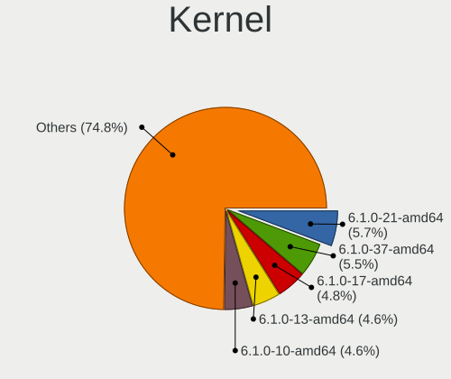

| Version                  | Notebooks | Percent |
|--------------------------|-----------|---------|
| 6.1.0-21-amd64           | 25        | 5.73%   |
| 6.1.0-37-amd64           | 24        | 5.5%    |
| 6.1.0-17-amd64           | 21        | 4.82%   |
| 6.1.0-13-amd64           | 20        | 4.59%   |
| 6.1.0-10-amd64           | 20        | 4.59%   |
| 6.1.0-25-amd64           | 19        | 4.36%   |
| 6.1.0-33-amd64           | 16        | 3.67%   |
| 6.1.0-26-amd64           | 15        | 3.44%   |
| 6.5.0-1mx-ahs-amd64      | 14        | 3.21%   |
| 6.4.0-1mx-ahs-amd64      | 14        | 3.21%   |
| 6.1.0-23-amd64           | 13        | 2.98%   |
| 6.6.12-1-liquorix-amd64  | 9         | 2.06%   |
| 6.1.0-32-amd64           | 9         | 2.06%   |
| 6.1.0-31-amd64           | 9         | 2.06%   |
| 6.1.0-29-amd64           | 9         | 2.06%   |
| 6.1.0-28-amd64           | 9         | 2.06%   |
| 6.1.0-18-amd64           | 9         | 2.06%   |
| 6.1.0-9-amd64            | 8         | 1.83%   |
| 6.1.0-40-amd64           | 8         | 1.83%   |
| 6.1.0-30-amd64           | 7         | 1.61%   |
| 6.1.0-20-amd64           | 7         | 1.61%   |
| 6.1.0-17-686-pae         | 6         | 1.38%   |
| 6.8.9-3-liquorix-amd64   | 5         | 1.15%   |
| 6.1.0-35-amd64           | 5         | 1.15%   |
| 6.1.0-12-amd64           | 5         | 1.15%   |
| 6.14.2-1-liquorix-amd64  | 4         | 0.92%   |
| 6.10.10-1-liquorix-amd64 | 4         | 0.92%   |
| 6.1.0-39-amd64           | 4         | 0.92%   |
| 6.1.0-38-amd64           | 4         | 0.92%   |
| 6.1.0-34-amd64           | 4         | 0.92%   |
| 6.1.0-27-amd64           | 4         | 0.92%   |
| 6.1.0-22-amd64           | 4         | 0.92%   |
| 6.1.0-15-amd64           | 4         | 0.92%   |
| 6.15.11-1-liquorix-amd64 | 3         | 0.69%   |
| 6.14.10-2-liquorix-amd64 | 3         | 0.69%   |
| 6.11.10-1-liquorix-amd64 | 3         | 0.69%   |
| 6.1.0-31-686-pae         | 3         | 0.69%   |
| 6.1.0-16-amd64           | 3         | 0.69%   |
| 6.1.0-11-amd64           | 3         | 0.69%   |
| 6.9.12-2-liquorix-amd64  | 2         | 0.46%   |

Kernel Family
-------------

Linux kernel without a distro release

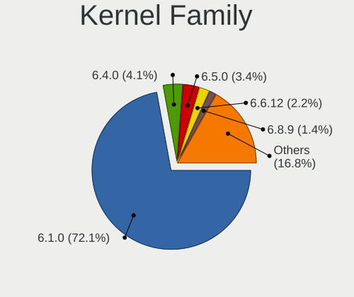

| Version | Notebooks | Percent |
|---------|-----------|---------|
| 6.1.0   | 300       | 72.12%  |
| 6.4.0   | 17        | 4.09%   |
| 6.5.0   | 14        | 3.37%   |
| 6.6.12  | 9         | 2.16%   |
| 6.8.9   | 6         | 1.44%   |
| 6.14.2  | 4         | 0.96%   |
| 6.10.10 | 4         | 0.96%   |
| 6.9.12  | 3         | 0.72%   |
| 6.15.11 | 3         | 0.72%   |
| 6.14.10 | 3         | 0.72%   |
| 6.12.6  | 3         | 0.72%   |
| 6.11.10 | 3         | 0.72%   |
| 6.9.7   | 2         | 0.48%   |
| 6.7.5   | 2         | 0.48%   |
| 6.6.9   | 2         | 0.48%   |
| 6.6.11  | 2         | 0.48%   |
| 6.4.9   | 2         | 0.48%   |
| 6.3.0   | 2         | 0.48%   |
| 6.16.12 | 2         | 0.48%   |
| 6.14.9  | 2         | 0.48%   |
| 6.13.8  | 2         | 0.48%   |
| 6.13.7  | 2         | 0.48%   |
| 6.12.8  | 2         | 0.48%   |
| 6.12.11 | 2         | 0.48%   |
| 6.8.10  | 1         | 0.24%   |
| 6.7.6   | 1         | 0.24%   |
| 6.7.12  | 1         | 0.24%   |
| 6.7.11  | 1         | 0.24%   |
| 6.5.10  | 1         | 0.24%   |
| 6.2.14  | 1         | 0.24%   |
| 6.14.6  | 1         | 0.24%   |
| 6.14.4  | 1         | 0.24%   |
| 6.14.1  | 1         | 0.24%   |
| 6.12.9  | 1         | 0.24%   |
| 6.12.16 | 1         | 0.24%   |
| 6.12.12 | 1         | 0.24%   |
| 6.12.10 | 1         | 0.24%   |
| 6.11.9  | 1         | 0.24%   |
| 6.11.8  | 1         | 0.24%   |
| 6.11.7  | 1         | 0.24%   |

Kernel Major Ver.
-----------------

Linux kernel major version

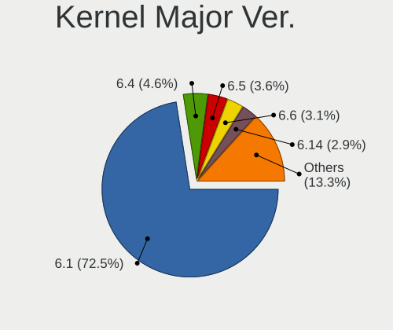

| Version | Notebooks | Percent |
|---------|-----------|---------|
| 6.1     | 301       | 72.53%  |
| 6.4     | 19        | 4.58%   |
| 6.5     | 15        | 3.61%   |
| 6.6     | 13        | 3.13%   |
| 6.14    | 12        | 2.89%   |
| 6.12    | 11        | 2.65%   |
| 6.11    | 8         | 1.93%   |
| 6.8     | 7         | 1.69%   |
| 6.10    | 6         | 1.45%   |
| 6.9     | 5         | 1.2%    |
| 6.7     | 4         | 0.96%   |
| 6.13    | 4         | 0.96%   |
| 6.15    | 3         | 0.72%   |
| 6.3     | 2         | 0.48%   |
| 6.16    | 2         | 0.48%   |
| 5.10    | 2         | 0.48%   |
| 6.2     | 1         | 0.24%   |

Arch
----

OS architecture (x86_64, i586, etc.)

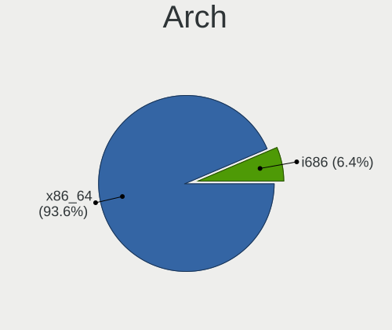

| Name   | Notebooks | Percent |
|--------|-----------|---------|
| x86_64 | 381       | 93.61%  |
| i686   | 26        | 6.39%   |

DE
--

Desktop Environment

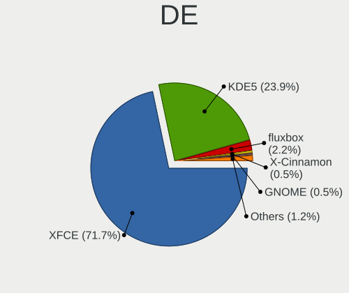

| Name             | Notebooks | Percent |
|------------------|-----------|---------|
| XFCE             | 294       | 71.71%  |
| KDE5             | 98        | 23.9%   |
| fluxbox          | 9         | 2.2%    |
| X-Cinnamon       | 2         | 0.49%   |
| GNOME            | 2         | 0.49%   |
| LXQt             | 1         | 0.24%   |
| lightdm-xsession | 1         | 0.24%   |
| i3               | 1         | 0.24%   |
| GNOME Flashback  | 1         | 0.24%   |
| Unknown          | 1         | 0.24%   |

Display Server
--------------

X11 or Wayland

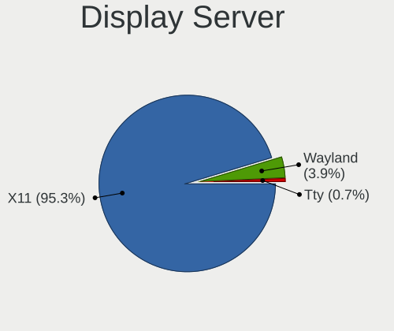

| Name    | Notebooks | Percent |
|---------|-----------|---------|
| X11     | 388       | 95.33%  |
| Wayland | 16        | 3.93%   |
| Tty     | 3         | 0.74%   |

Display Manager
---------------

SDDM, LightDM, etc.

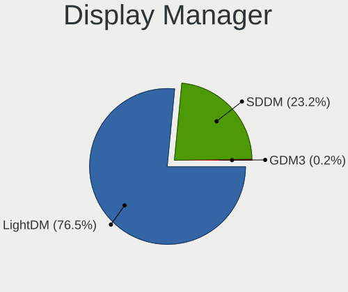

| Name    | Notebooks | Percent |
|---------|-----------|---------|
| LightDM | 313       | 76.53%  |
| SDDM    | 95        | 23.23%  |
| GDM3    | 1         | 0.24%   |

OS Lang
-------

Language

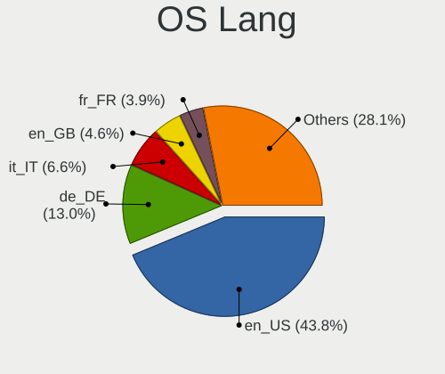

| Lang  | Notebooks | Percent |
|-------|-----------|---------|
| en_US | 179       | 43.77%  |
| de_DE | 53        | 12.96%  |
| it_IT | 27        | 6.6%    |
| en_GB | 19        | 4.65%   |
| fr_FR | 16        | 3.91%   |
| pl_PL | 15        | 3.67%   |
| ru_RU | 8         | 1.96%   |
| en_CA | 8         | 1.96%   |
| pt_BR | 7         | 1.71%   |
| en_AU | 7         | 1.71%   |
| hu_HU | 6         | 1.47%   |
| es_BO | 6         | 1.47%   |
| nl_NL | 4         | 0.98%   |
| es_ES | 4         | 0.98%   |
| es_AR | 4         | 0.98%   |
| de_AT | 4         | 0.98%   |
| tr_TR | 3         | 0.73%   |
| nl_BE | 3         | 0.73%   |
| en_NZ | 3         | 0.73%   |
| en_IE | 3         | 0.73%   |
| el_GR | 3         | 0.73%   |
| C     | 3         | 0.73%   |
| zh_TW | 2         | 0.49%   |
| fr_CH | 2         | 0.49%   |
| es_VE | 2         | 0.49%   |
| es_MX | 2         | 0.49%   |
| zh_CN | 1         | 0.24%   |
| uk_UA | 1         | 0.24%   |
| sk_SK | 1         | 0.24%   |
| pt_PT | 1         | 0.24%   |
| nb_NO | 1         | 0.24%   |
| ja_JP | 1         | 0.24%   |
| hr_HR | 1         | 0.24%   |
| fr_CA | 1         | 0.24%   |
| fi_FI | 1         | 0.24%   |
| es_US | 1         | 0.24%   |
| es_PE | 1         | 0.24%   |
| es_CO | 1         | 0.24%   |
| en_IL | 1         | 0.24%   |
| de_CH | 1         | 0.24%   |

Boot Mode
---------

EFI or BIOS

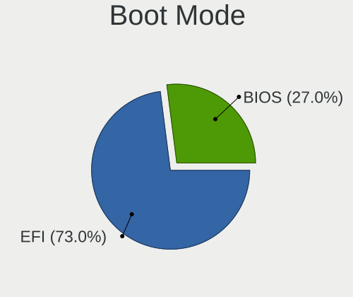

| Mode | Notebooks | Percent |
|------|-----------|---------|
| EFI  | 297       | 72.97%  |
| BIOS | 110       | 27.03%  |

Filesystem
----------

Type of filesystem

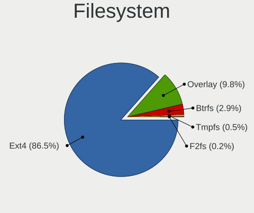

| Type    | Notebooks | Percent |
|---------|-----------|---------|
| Ext4    | 353       | 86.52%  |
| Overlay | 40        | 9.8%    |
| Btrfs   | 12        | 2.94%   |
| Tmpfs   | 2         | 0.49%   |
| F2fs    | 1         | 0.25%   |

Part. scheme
------------

Scheme of partitioning

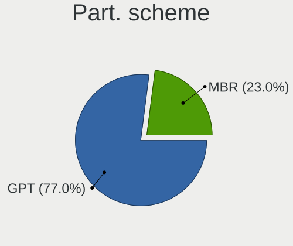

| Type | Notebooks | Percent |
|------|-----------|---------|
| GPT  | 315       | 77.02%  |
| MBR  | 94        | 22.98%  |

Dual Boot with Linux/BSD
------------------------

Hosting more than one Linux/BSD

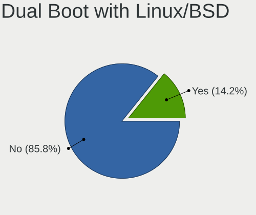

| Dual boot | Notebooks | Percent |
|-----------|-----------|---------|
| No        | 350       | 85.78%  |
| Yes       | 58        | 14.22%  |

Dual Boot (Win)
---------------

Hosting Linux and Windows

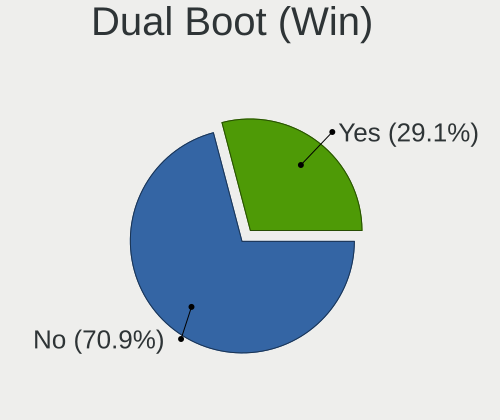

| Dual boot | Notebooks | Percent |
|-----------|-----------|---------|
| No        | 290       | 70.9%   |
| Yes       | 119       | 29.1%   |

Board
-----

Vendor
------

Motherboard manufacturer

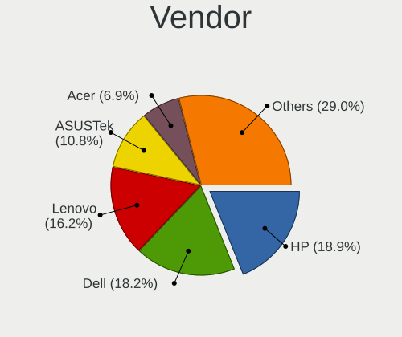

| Name                 | Notebooks | Percent |
|----------------------|-----------|---------|
| Hewlett-Packard      | 77        | 18.92%  |
| Dell                 | 74        | 18.18%  |
| Lenovo               | 66        | 16.22%  |
| ASUSTek Computer     | 44        | 10.81%  |
| Acer                 | 28        | 6.88%   |
| Apple                | 27        | 6.63%   |
| Toshiba              | 12        | 2.95%   |
| Google               | 8         | 1.97%   |
| Samsung Electronics  | 7         | 1.72%   |
| MSI                  | 7         | 1.72%   |
| Medion               | 6         | 1.47%   |
| Intel                | 6         | 1.47%   |
| Sony                 | 5         | 1.23%   |
| Fujitsu Siemens      | 5         | 1.23%   |
| Unknown              | 5         | 1.23%   |
| HONOR                | 2         | 0.49%   |
| GPU Company          | 2         | 0.49%   |
| Daten Tecnologia     | 2         | 0.49%   |
| youyeetoo            | 1         | 0.25%   |
| Wortmann AG          | 1         | 0.25%   |
| VIT                  | 1         | 0.25%   |
| TECNO Mobile Limited | 1         | 0.25%   |
| System76             | 1         | 0.25%   |
| SGIN                 | 1         | 0.25%   |
| Semp Toshiba         | 1         | 0.25%   |
| Razer                | 1         | 0.25%   |
| PCBOX                | 1         | 0.25%   |
| PC Specialist        | 1         | 0.25%   |
| Panasonic            | 1         | 0.25%   |
| Packard Bell         | 1         | 0.25%   |
| Mediacom             | 1         | 0.25%   |
| Inter Sales A/S      | 1         | 0.25%   |
| Insyde               | 1         | 0.25%   |
| Infinix              | 1         | 0.25%   |
| I-life               | 1         | 0.25%   |
| Gateway              | 1         | 0.25%   |
| Fujitsu              | 1         | 0.25%   |
| Framework            | 1         | 0.25%   |
| Beelink              | 1         | 0.25%   |
| ATARI                | 1         | 0.25%   |

Model
-----

Motherboard model

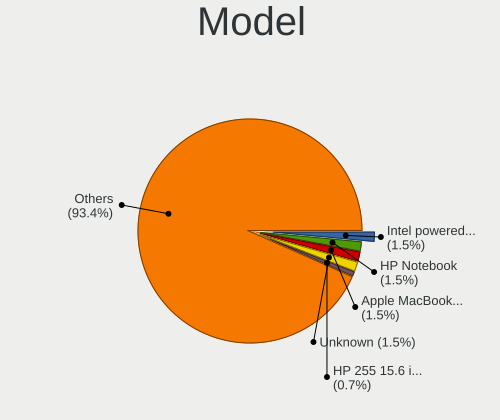

| Name                                     | Notebooks | Percent |
|------------------------------------------|-----------|---------|
| Intel powered classmate PC               | 6         | 1.47%   |
| HP Notebook                              | 6         | 1.47%   |
| Apple MacBookPro7,1                      | 6         | 1.47%   |
| Unknown                                  | 6         | 1.47%   |
| HP 255 15.6 inch G9 Notebook PC          | 3         | 0.74%   |
| Dell Latitude E6540                      | 3         | 0.74%   |
| Apple MacBookAir6,2                      | 3         | 0.74%   |
| Apple MacBookAir1,1                      | 3         | 0.74%   |
| Samsung N150/N210/N220                   | 2         | 0.49%   |
| Samsung 305E4A/305E5A/305E7A             | 2         | 0.49%   |
| Lenovo IdeaPad 3 15ALC6 82KU             | 2         | 0.49%   |
| HP ProBook 455 G8 Notebook PC            | 2         | 0.49%   |
| HP Pavilion g6                           | 2         | 0.49%   |
| HP Pavilion dv7                          | 2         | 0.49%   |
| HP Pavilion dv6                          | 2         | 0.49%   |
| HP EliteBook 840 G6                      | 2         | 0.49%   |
| HP 250 G1                                | 2         | 0.49%   |
| HP 250 15.6 inch G9 Notebook PC          | 2         | 0.49%   |
| Google Treeya                            | 2         | 0.49%   |
| Dell Latitude E6440                      | 2         | 0.49%   |
| Dell Latitude E6430                      | 2         | 0.49%   |
| Dell Latitude E6410                      | 2         | 0.49%   |
| Dell Latitude E6400                      | 2         | 0.49%   |
| Dell Latitude 5530                       | 2         | 0.49%   |
| Dell Latitude 5400                       | 2         | 0.49%   |
| Daten Tecnologia DVRN-4                  | 2         | 0.49%   |
| ASUS VivoBook_ASUSLaptop X1605VA_X1605VA | 2         | 0.49%   |
| ASUS Vivobook Go E1504FA_E1504FA         | 2         | 0.49%   |
| ASUS T100TA                              | 2         | 0.49%   |
| ASUS 1000HE                              | 2         | 0.49%   |
| Apple MacBookPro8,2                      | 2         | 0.49%   |
| Acer Aspire A315-510P                    | 2         | 0.49%   |
| youyeetoo X1 SBC                         | 1         | 0.25%   |
| Wortmann AG 1220663_1470189              | 1         | 0.25%   |
| VIT P3400                                | 1         | 0.25%   |
| Toshiba Satellite P875                   | 1         | 0.25%   |
| Toshiba Satellite P870                   | 1         | 0.25%   |
| Toshiba Satellite P500                   | 1         | 0.25%   |
| Toshiba Satellite L510                   | 1         | 0.25%   |
| Toshiba Satellite C70D-B                 | 1         | 0.25%   |

Model Family
------------

Motherboard model prefix

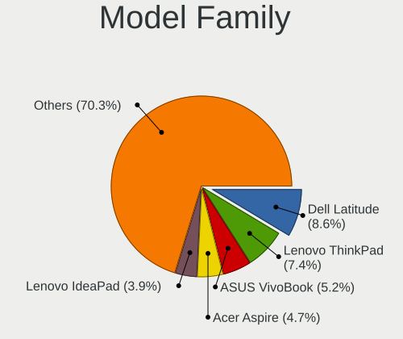

| Name                  | Notebooks | Percent |
|-----------------------|-----------|---------|
| Dell Latitude         | 35        | 8.6%    |
| Lenovo ThinkPad       | 30        | 7.37%   |
| ASUS VivoBook         | 21        | 5.16%   |
| Acer Aspire           | 19        | 4.67%   |
| Lenovo IdeaPad        | 16        | 3.93%   |
| HP Pavilion           | 16        | 3.93%   |
| Dell Inspiron         | 15        | 3.69%   |
| HP ProBook            | 11        | 2.7%    |
| Toshiba Satellite     | 9         | 2.21%   |
| HP Laptop             | 9         | 2.21%   |
| HP EliteBook          | 8         | 1.97%   |
| Dell XPS              | 7         | 1.72%   |
| Intel powered         | 6         | 1.47%   |
| HP Notebook           | 6         | 1.47%   |
| HP 255                | 6         | 1.47%   |
| Apple MacBookPro7     | 6         | 1.47%   |
| Unknown               | 6         | 1.47%   |
| Fujitsu Siemens AMILO | 5         | 1.23%   |
| Dell Vostro           | 5         | 1.23%   |
| Dell Precision        | 5         | 1.23%   |
| HP 250                | 4         | 0.98%   |
| Apple MacBookPro5     | 4         | 0.98%   |
| Lenovo Yoga           | 3         | 0.74%   |
| HP ENVY               | 3         | 0.74%   |
| HP Compaq             | 3         | 0.74%   |
| Dell System           | 3         | 0.74%   |
| Dell Studio           | 3         | 0.74%   |
| Apple MacBookPro8     | 3         | 0.74%   |
| Apple MacBookAir6     | 3         | 0.74%   |
| Apple MacBookAir1     | 3         | 0.74%   |
| Acer TravelMate       | 3         | 0.74%   |
| Toshiba PORTEGE       | 2         | 0.49%   |
| Samsung N150          | 2         | 0.49%   |
| Samsung 305E4A        | 2         | 0.49%   |
| Lenovo ThinkBook      | 2         | 0.49%   |
| Lenovo LOQ            | 2         | 0.49%   |
| Lenovo Legion         | 2         | 0.49%   |
| Lenovo 3000           | 2         | 0.49%   |
| HP ZBook              | 2         | 0.49%   |
| HP OMEN               | 2         | 0.49%   |

MFG Year
--------

Motherboard manufacture year

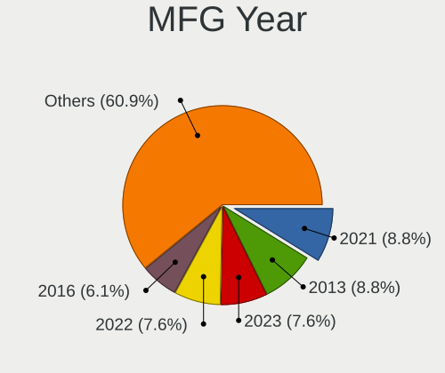

| Year | Notebooks | Percent |
|------|-----------|---------|
| 2021 | 36        | 8.85%   |
| 2013 | 36        | 8.85%   |
| 2023 | 31        | 7.62%   |
| 2022 | 31        | 7.62%   |
| 2016 | 25        | 6.14%   |
| 2008 | 24        | 5.9%    |
| 2019 | 23        | 5.65%   |
| 2018 | 21        | 5.16%   |
| 2011 | 21        | 5.16%   |
| 2009 | 21        | 5.16%   |
| 2020 | 20        | 4.91%   |
| 2024 | 19        | 4.67%   |
| 2012 | 19        | 4.67%   |
| 2015 | 18        | 4.42%   |
| 2010 | 17        | 4.18%   |
| 2014 | 13        | 3.19%   |
| 2017 | 10        | 2.46%   |
| 2007 | 10        | 2.46%   |
| 2006 | 6         | 1.47%   |
| 2025 | 4         | 0.98%   |
| 2005 | 2         | 0.49%   |

Form Factor
-----------

Physical design of the computer

| Name     | Notebooks | Percent |
|----------|-----------|---------|
| Notebook | 407       | 100%    |

Secure Boot
-----------

Enabled or disabled

| State    | Notebooks | Percent |
|----------|-----------|---------|
| Disabled | 398       | 97.79%  |
| Enabled  | 9         | 2.21%   |

Coreboot
--------

Have coreboot on board

| Used | Notebooks | Percent |
|------|-----------|---------|
| No   | 398       | 97.79%  |
| Yes  | 9         | 2.21%   |

RAM Size
--------

Total RAM memory

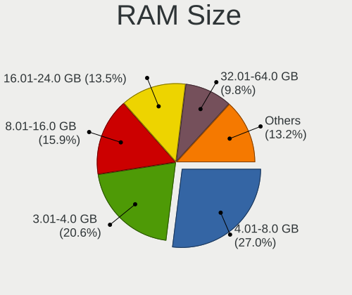

| Size in GB  | Notebooks | Percent |
|-------------|-----------|---------|
| 4.01-8.0    | 110       | 26.96%  |
| 3.01-4.0    | 84        | 20.59%  |
| 8.01-16.0   | 65        | 15.93%  |
| 16.01-24.0  | 55        | 13.48%  |
| 32.01-64.0  | 40        | 9.8%    |
| 1.01-2.0    | 25        | 6.13%   |
| 2.01-3.0    | 16        | 3.92%   |
| 24.01-32.0  | 5         | 1.23%   |
| 64.01-256.0 | 5         | 1.23%   |
| 0.51-1.0    | 3         | 0.74%   |

RAM Used
--------

Used RAM memory

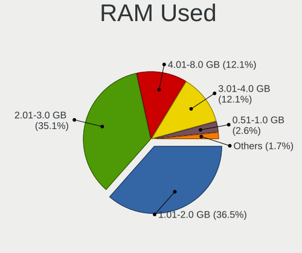

| Used GB    | Notebooks | Percent |
|------------|-----------|---------|
| 1.01-2.0   | 154       | 36.49%  |
| 2.01-3.0   | 148       | 35.07%  |
| 4.01-8.0   | 51        | 12.09%  |
| 3.01-4.0   | 51        | 12.09%  |
| 0.51-1.0   | 11        | 2.61%   |
| 8.01-16.0  | 6         | 1.42%   |
| 16.01-24.0 | 1         | 0.24%   |

Total Drives
------------

Number of drives on board

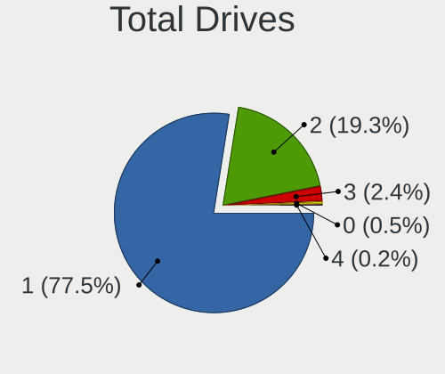

| Drives | Notebooks | Percent |
|--------|-----------|---------|
| 1      | 317       | 77.51%  |
| 2      | 79        | 19.32%  |
| 3      | 10        | 2.44%   |
| 0      | 2         | 0.49%   |
| 4      | 1         | 0.24%   |

Has CD-ROM
----------

Has CD-ROM on board

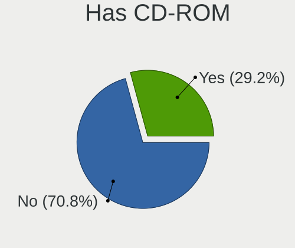

| Presented | Notebooks | Percent |
|-----------|-----------|---------|
| No        | 288       | 70.76%  |
| Yes       | 119       | 29.24%  |

Has Ethernet
------------

Has Ethernet on board

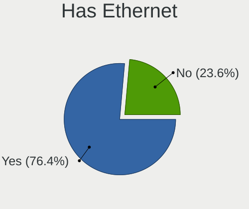

| Presented | Notebooks | Percent |
|-----------|-----------|---------|
| Yes       | 311       | 76.41%  |
| No        | 96        | 23.59%  |

Has WiFi
--------

Has WiFi module

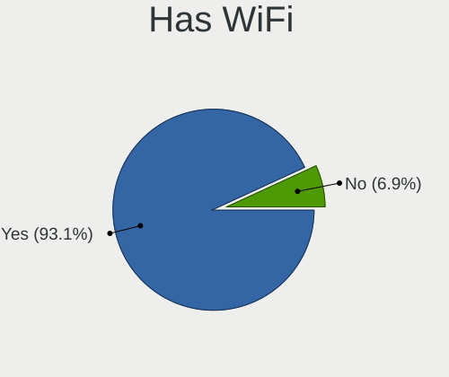

| Presented | Notebooks | Percent |
|-----------|-----------|---------|
| Yes       | 380       | 93.14%  |
| No        | 28        | 6.86%   |

Has Bluetooth
-------------

Has Bluetooth module

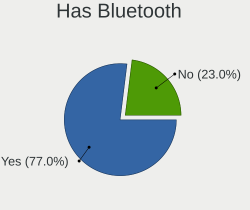

| Presented | Notebooks | Percent |
|-----------|-----------|---------|
| Yes       | 314       | 76.96%  |
| No        | 94        | 23.04%  |

Location
--------

Country
-------

Geographic location (country)

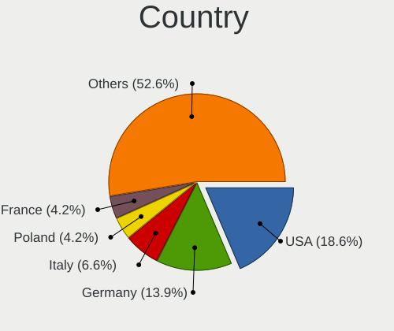

| Country     | Notebooks | Percent |
|-------------|-----------|---------|
| USA         | 76        | 18.58%  |
| Germany     | 57        | 13.94%  |
| Italy       | 27        | 6.6%    |
| Poland      | 17        | 4.16%   |
| France      | 17        | 4.16%   |
| Greece      | 16        | 3.91%   |
| UK          | 15        | 3.67%   |
| Canada      | 14        | 3.42%   |
| Brazil      | 14        | 3.42%   |
| Russia      | 13        | 3.18%   |
| India       | 8         | 1.96%   |
| Australia   | 8         | 1.96%   |
| Serbia      | 7         | 1.71%   |
| Netherlands | 7         | 1.71%   |
| Bolivia     | 6         | 1.47%   |
| Argentina   | 6         | 1.47%   |
| Turkey      | 5         | 1.22%   |
| Mexico      | 5         | 1.22%   |
| Hungary     | 5         | 1.22%   |
| Belgium     | 5         | 1.22%   |
| Austria     | 5         | 1.22%   |
| Spain       | 4         | 0.98%   |
| Egypt       | 4         | 0.98%   |
| Switzerland | 3         | 0.73%   |
| Sweden      | 3         | 0.73%   |
| Romania     | 3         | 0.73%   |
| Portugal    | 3         | 0.73%   |
| Norway      | 3         | 0.73%   |
| New Zealand | 3         | 0.73%   |
| Israel      | 3         | 0.73%   |
| Ireland     | 3         | 0.73%   |
| Venezuela   | 2         | 0.49%   |
| Thailand    | 2         | 0.49%   |
| Taiwan      | 2         | 0.49%   |
| Japan       | 2         | 0.49%   |
| Indonesia   | 2         | 0.49%   |
| Finland     | 2         | 0.49%   |
| Colombia    | 2         | 0.49%   |
| Algeria     | 2         | 0.49%   |
| Ukraine     | 1         | 0.24%   |

City
----

Geographic location (city)

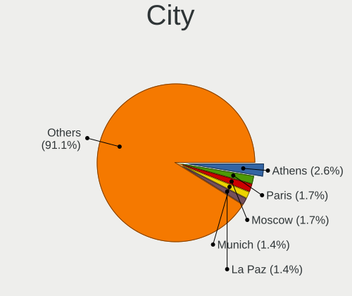

| City                | Notebooks | Percent |
|---------------------|-----------|---------|
| Athens              | 11        | 2.64%   |
| Paris               | 7         | 1.68%   |
| Moscow              | 7         | 1.68%   |
| Munich              | 6         | 1.44%   |
| La Paz              | 6         | 1.44%   |
| Warsaw              | 4         | 0.96%   |
| Vienna              | 4         | 0.96%   |
| Sydney              | 4         | 0.96%   |
| Rio de Janeiro      | 4         | 0.96%   |
| Milan               | 4         | 0.96%   |
| Krakow              | 4         | 0.96%   |
| St Petersburg       | 3         | 0.72%   |
| Seattle             | 3         | 0.72%   |
| San Diego           | 3         | 0.72%   |
| Rome                | 3         | 0.72%   |
| Pessac-sur-Dordogne | 3         | 0.72%   |
| Otwock              | 3         | 0.72%   |
| Hamburg             | 3         | 0.72%   |
| Florence            | 3         | 0.72%   |
| Budapest            | 3         | 0.72%   |
| Belgrade            | 3         | 0.72%   |
| Turin               | 2         | 0.48%   |
| Stuttgart           | 2         | 0.48%   |
| Salt Lake City      | 2         | 0.48%   |
| Salamina            | 2         | 0.48%   |
| Ravensburg          | 2         | 0.48%   |
| Phoenix             | 2         | 0.48%   |
| Oslo                | 2         | 0.48%   |
| Niš                | 2         | 0.48%   |
| Mexico City         | 2         | 0.48%   |
| Los Angeles         | 2         | 0.48%   |
| London              | 2         | 0.48%   |
| Le Haillan          | 2         | 0.48%   |
| Edgware             | 2         | 0.48%   |
| Dublin              | 2         | 0.48%   |
| Dortmund            | 2         | 0.48%   |
| Cairo               | 2         | 0.48%   |
| Berlin              | 2         | 0.48%   |
| Bengaluru           | 2         | 0.48%   |
| Bangkok             | 2         | 0.48%   |

Drives
------

Drive Vendor
------------

Hard drive vendors

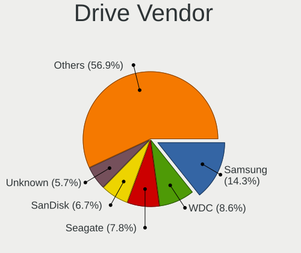

| Vendor                      | Notebooks | Drives | Percent |
|-----------------------------|-----------|--------|---------|
| Samsung Electronics         | 70        | 75     | 14.29%  |
| WDC                         | 42        | 48     | 8.57%   |
| Seagate                     | 38        | 41     | 7.76%   |
| SanDisk                     | 33        | 36     | 6.73%   |
| Unknown                     | 28        | 33     | 5.71%   |
| SK hynix                    | 25        | 25     | 5.1%    |
| Toshiba                     | 22        | 23     | 4.49%   |
| Crucial                     | 22        | 36     | 4.49%   |
| Kingston                    | 21        | 22     | 4.29%   |
| Unknown                     | 16        | 16     | 3.27%   |
| Intel                       | 14        | 17     | 2.86%   |
| Micron Technology           | 13        | 14     | 2.65%   |
| KIOXIA                      | 12        | 14     | 2.45%   |
| Hitachi                     | 9         | 10     | 1.84%   |
| China                       | 9         | 11     | 1.84%   |
| Apple                       | 9         | 9      | 1.84%   |
| Intenso                     | 8         | 8      | 1.63%   |
| HGST                        | 8         | 11     | 1.63%   |
| SPCC                        | 5         | 5      | 1.02%   |
| PNY                         | 4         | 4      | 0.82%   |
| Patriot                     | 4         | 4      | 0.82%   |
| Fujitsu                     | 4         | 4      | 0.82%   |
| FORESEE                     | 4         | 4      | 0.82%   |
| A-DATA Technology           | 4         | 5      | 0.82%   |
| Verbatim                    | 3         | 3      | 0.61%   |
| Transcend                   | 3         | 3      | 0.61%   |
| Phison Electronics          | 3         | 3      | 0.61%   |
| Phison                      | 3         | 4      | 0.61%   |
| Netac                       | 3         | 3      | 0.61%   |
| LITEONIT                    | 3         | 3      | 0.61%   |
| Fanxiang                    | 3         | 4      | 0.61%   |
| XPG                         | 2         | 2      | 0.41%   |
| UMIS                        | 2         | 2      | 0.41%   |
| Team                        | 2         | 2      | 0.41%   |
| Kingston Technology Company | 2         | 2      | 0.41%   |
| BIWIN                       | 2         | 3      | 0.41%   |
| YANSEN                      | 1         | 1      | 0.2%    |
| WALRAM                      | 1         | 1      | 0.2%    |
| V-GeN                       | 1         | 1      | 0.2%    |
| Timetec                     | 1         | 1      | 0.2%    |

Drive Model
-----------

Hard drive models

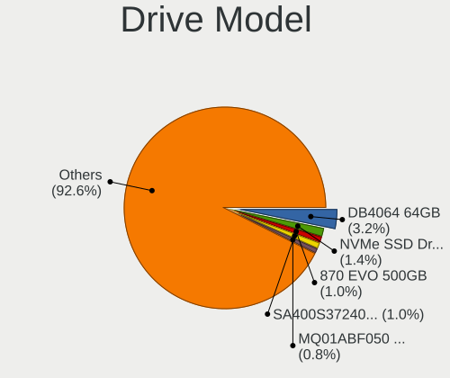

| Model                                  | Notebooks | Percent |
|----------------------------------------|-----------|---------|
| Unknown                                | 16        | 3.2%    |
| SanDisk NVMe SSD Drive 512GB           | 7         | 1.4%    |
| Samsung SSD 870 EVO 500GB              | 5         | 1%      |
| Kingston SA400S37240G 240GB SSD        | 5         | 1%      |
| Toshiba MQ01ABF050 500GB               | 4         | 0.8%    |
| Toshiba MQ01ABD100 1TB                 | 4         | 0.8%    |
| SK hynix HBG4e  32GB                   | 4         | 0.8%    |
| Seagate ST320LT012-1DG14C 320GB        | 4         | 0.8%    |
| Samsung SSD 850 EVO 500GB              | 4         | 0.8%    |
| SK hynix HCG8e  64GB                   | 3         | 0.6%    |
| Seagate ST9500325AS 500GB              | 3         | 0.6%    |
| Seagate ST500LM012 HN-M500MBB 500GB    | 3         | 0.6%    |
| Seagate ST1000LM035-1RK172 1TB         | 3         | 0.6%    |
| SanDisk NVMe SSD Drive 1TB             | 3         | 0.6%    |
| Samsung SSD 850 EVO 250GB              | 3         | 0.6%    |
| Samsung MZVL4512HBLU-00BTW 512GB       | 3         | 0.6%    |
| Samsung MZALQ512HBLU-00BL2 512GB       | 3         | 0.6%    |
| KIOXIA KBG40ZNS256G NVMe 256GB         | 3         | 0.6%    |
| Kingston SV300S37A120G 120GB SSD       | 3         | 0.6%    |
| Intel SSDPEKNU512GZ 512GB              | 3         | 0.6%    |
| HGST HTS545050A7E680 500GB             | 3         | 0.6%    |
| Crucial CT1000P3PSSD8 1TB              | 3         | 0.6%    |
| XPG GAMMIX S70 BLADE 1TB               | 2         | 0.4%    |
| WDC WDS250G2B0A-00SM50 250GB SSD       | 2         | 0.4%    |
| WDC WD3200BPVT-22JJ5T0 320GB           | 2         | 0.4%    |
| WDC WD10JPVX-60JC3T0 1TB               | 2         | 0.4%    |
| WDC WD Green 2.5 240GB                 | 2         | 0.4%    |
| WDC PC SN810 NVMe 1024GB               | 2         | 0.4%    |
| WDC PC SN530 SDBPNPZ-512G-1006 512GB   | 2         | 0.4%    |
| Unknown SU16G  16GB                    | 2         | 0.4%    |
| Unknown DA4064  64GB                   | 2         | 0.4%    |
| Unknown DA4032  32GB                   | 2         | 0.4%    |
| Unknown Biwin  64GB                    | 2         | 0.4%    |
| SK hynix SKHynix_HFS512GEJ9X115N 512GB | 2         | 0.4%    |
| SK hynix BC711 NVMe 256GB              | 2         | 0.4%    |
| Seagate ST9160310AS 160GB              | 2         | 0.4%    |
| Seagate ST500LM000-1EJ162 500GB        | 2         | 0.4%    |
| Seagate ST320LT012-9WS14C 320GB        | 2         | 0.4%    |
| Seagate ST1000LM024 HN-M101MBB 1TB     | 2         | 0.4%    |
| SanDisk SSD PLUS 1000GB                | 2         | 0.4%    |

HDD Vendor
----------

Hard disk drive vendors

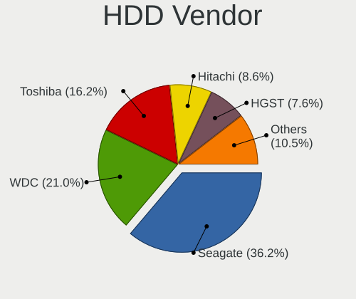

| Vendor              | Notebooks | Drives | Percent |
|---------------------|-----------|--------|---------|
| Seagate             | 38        | 40     | 36.19%  |
| WDC                 | 22        | 25     | 20.95%  |
| Toshiba             | 17        | 18     | 16.19%  |
| Hitachi             | 9         | 10     | 8.57%   |
| HGST                | 8         | 11     | 7.62%   |
| Samsung Electronics | 4         | 4      | 3.81%   |
| Fujitsu             | 4         | 4      | 3.81%   |
| Intenso             | 1         | 1      | 0.95%   |
| External            | 1         | 1      | 0.95%   |
| Unknown             | 1         | 1      | 0.95%   |

SSD Vendor
----------

Solid state drive vendors

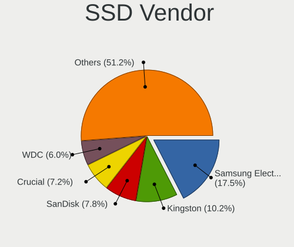

| Vendor              | Notebooks | Drives | Percent |
|---------------------|-----------|--------|---------|
| Samsung Electronics | 29        | 31     | 17.47%  |
| Kingston            | 17        | 18     | 10.24%  |
| SanDisk             | 13        | 13     | 7.83%   |
| Crucial             | 12        | 25     | 7.23%   |
| WDC                 | 10        | 10     | 6.02%   |
| China               | 9         | 11     | 5.42%   |
| Apple               | 8         | 8      | 4.82%   |
| Intenso             | 6         | 6      | 3.61%   |
| SPCC                | 4         | 4      | 2.41%   |
| Micron Technology   | 4         | 5      | 2.41%   |
| Intel               | 4         | 5      | 2.41%   |
| Verbatim            | 3         | 3      | 1.81%   |
| Transcend           | 3         | 3      | 1.81%   |
| PNY                 | 3         | 3      | 1.81%   |
| Patriot             | 3         | 3      | 1.81%   |
| LITEONIT            | 3         | 3      | 1.81%   |
| A-DATA Technology   | 3         | 4      | 1.81%   |
| Unknown             | 3         | 3      | 1.81%   |
| Netac               | 2         | 2      | 1.2%    |
| Fanxiang            | 2         | 2      | 1.2%    |
| YANSEN              | 1         | 1      | 0.6%    |
| WALRAM              | 1         | 1      | 0.6%    |
| Toshiba             | 1         | 1      | 0.6%    |
| Team                | 1         | 1      | 0.6%    |
| Super Talent        | 1         | 1      | 0.6%    |
| SK hynix            | 1         | 1      | 0.6%    |
| Seagate             | 1         | 1      | 0.6%    |
| OWC                 | 1         | 1      | 0.6%    |
| OCZ                 | 1         | 1      | 0.6%    |
| NT-4TB              | 1         | 1      | 0.6%    |
| MG                  | 1         | 1      | 0.6%    |
| LITEON              | 1         | 1      | 0.6%    |
| KingSpec            | 1         | 1      | 0.6%    |
| GLOWAY              | 1         | 1      | 0.6%    |
| Gigabyte Technology | 1         | 1      | 0.6%    |
| GeIL                | 1         | 1      | 0.6%    |
| FORESEE             | 1         | 1      | 0.6%    |
| Emtec               | 1         | 1      | 0.6%    |
| CF400               | 1         | 1      | 0.6%    |
| BIWIN               | 1         | 2      | 0.6%    |

Drive Kind
----------

HDD or SSD

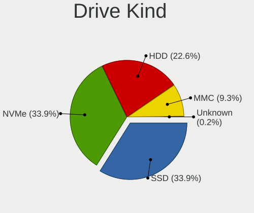

| Kind    | Notebooks | Drives | Percent |
|---------|-----------|--------|---------|
| NVMe    | 156       | 187    | 33.91%  |
| SSD     | 156       | 188    | 33.91%  |
| HDD     | 104       | 115    | 22.61%  |
| MMC     | 43        | 53     | 9.35%   |
| Unknown | 1         | 1      | 0.22%   |

Drive Connector
---------------

SATA, SAS, NVMe, etc.

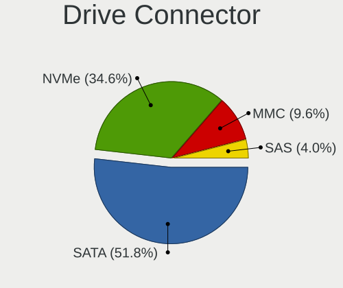

| Type | Notebooks | Drives | Percent |
|------|-----------|--------|---------|
| SATA | 232       | 286    | 51.79%  |
| NVMe | 155       | 184    | 34.6%   |
| MMC  | 43        | 53     | 9.6%    |
| SAS  | 18        | 21     | 4.02%   |

Drive Size
----------

Size of hard drive

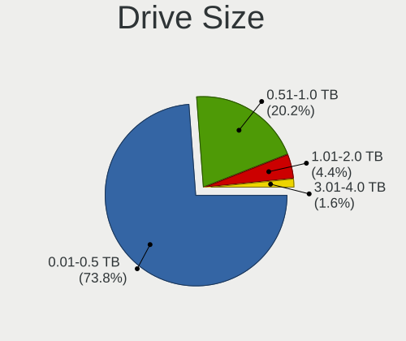

| Size in TB | Notebooks | Drives | Percent |
|------------|-----------|--------|---------|
| 0.01-0.5   | 186       | 216    | 73.81%  |
| 0.51-1.0   | 51        | 71     | 20.24%  |
| 1.01-2.0   | 11        | 12     | 4.37%   |
| 3.01-4.0   | 4         | 4      | 1.59%   |

Space Total
-----------

Amount of disk space available on the file system

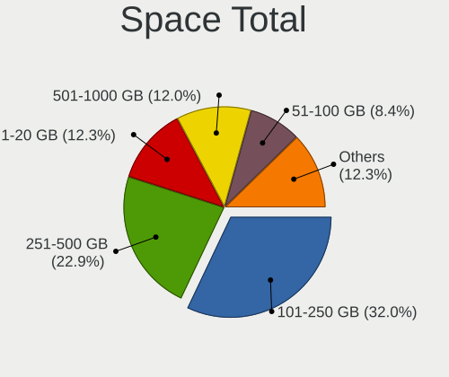

| Size in GB     | Notebooks | Percent |
|----------------|-----------|---------|
| 101-250        | 133       | 32.05%  |
| 251-500        | 95        | 22.89%  |
| 1-20           | 51        | 12.29%  |
| 501-1000       | 50        | 12.05%  |
| 51-100         | 35        | 8.43%   |
| 21-50          | 29        | 6.99%   |
| 1001-2000      | 11        | 2.65%   |
| More than 3000 | 6         | 1.45%   |
| 2001-3000      | 4         | 0.96%   |
| Unknown        | 1         | 0.24%   |

Space Used
----------

Amount of used disk space

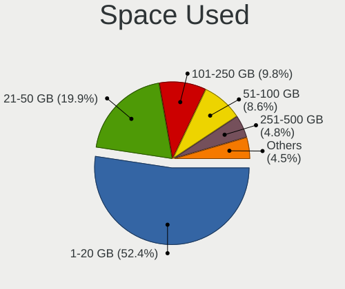

| Used GB        | Notebooks | Percent |
|----------------|-----------|---------|
| 1-20           | 219       | 52.39%  |
| 21-50          | 83        | 19.86%  |
| 101-250        | 41        | 9.81%   |
| 51-100         | 36        | 8.61%   |
| 251-500        | 20        | 4.78%   |
| 501-1000       | 9         | 2.15%   |
| 1001-2000      | 7         | 1.67%   |
| More than 3000 | 2         | 0.48%   |
| Unknown        | 1         | 0.24%   |

Malfunc. Drives
---------------

Drive models with a malfunction

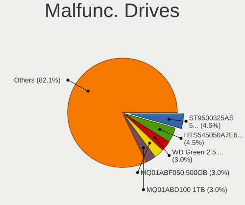

| Model                                 | Notebooks | Drives | Percent |
|---------------------------------------|-----------|--------|---------|
| Seagate ST9500325AS 500GB             | 3         | 3      | 4.48%   |
| HGST HTS545050A7E680 500GB            | 3         | 3      | 4.48%   |
| WDC WD Green 2.5 240GB                | 2         | 2      | 2.99%   |
| Toshiba MQ01ABF050 500GB              | 2         | 2      | 2.99%   |
| Toshiba MQ01ABD100 1TB                | 2         | 2      | 2.99%   |
| Seagate ST500LM000-1EJ162 500GB       | 2         | 2      | 2.99%   |
| Seagate ST1000LM024 HN-M101MBB 1TB    | 2         | 2      | 2.99%   |
| SanDisk SSD PLUS 1000GB               | 2         | 2      | 2.99%   |
| YANSEN YSZF18-128 128GB SSD           | 1         | 1      | 1.49%   |
| WDC WDS100T2G0A-00JH30 1TB SSD        | 1         | 1      | 1.49%   |
| WDC WD32 00BEKT-75PVMT0 320GB         | 1         | 1      | 1.49%   |
| WDC WD2500BEVT-75A23T0 250GB          | 1         | 1      | 1.49%   |
| WDC WD1600BEKT-75PVMT0 160GB          | 1         | 2      | 1.49%   |
| Toshiba MQ01ABD050 500GB              | 1         | 1      | 1.49%   |
| Toshiba MK8009GAH 80GB                | 1         | 1      | 1.49%   |
| Toshiba MK5055GSX 500GB               | 1         | 1      | 1.49%   |
| Toshiba MK1652GSX 160GB               | 1         | 1      | 1.49%   |
| SK hynix HFS256G32MND-2200A 256GB SSD | 1         | 1      | 1.49%   |
| SK hynix BC711 HFM512GD3JX013N 512GB  | 1         | 1      | 1.49%   |
| Seagate ST980811AS 80GB               | 1         | 1      | 1.49%   |
| Seagate ST9320423AS 320GB             | 1         | 1      | 1.49%   |
| Seagate ST9320325AS 320GB             | 1         | 1      | 1.49%   |
| Seagate ST9320320AS 320GB             | 1         | 1      | 1.49%   |
| Seagate ST9160412AS 160GB             | 1         | 1      | 1.49%   |
| Seagate ST9160310AS 160GB             | 1         | 1      | 1.49%   |
| Seagate ST500LM021-1KJ152 500GB       | 1         | 1      | 1.49%   |
| Seagate ST500LM012 HN-M500MBB 500GB   | 1         | 1      | 1.49%   |
| Seagate ST320LT012-9WS14C 320GB       | 1         | 1      | 1.49%   |
| Seagate ST320LT009-9WC142 320GB       | 1         | 1      | 1.49%   |
| SanDisk SSD PLUS 480GB                | 1         | 1      | 1.49%   |
| Samsung Electronics SSD 970 EVO 500GB | 1         | 1      | 1.49%   |
| Samsung Electronics SSD 870 EVO 250GB | 1         | 2      | 1.49%   |
| Samsung Electronics HM321HI 320GB     | 1         | 1      | 1.49%   |
| Samsung Electronics HM250HI 250GB     | 1         | 1      | 1.49%   |
| Phison Sabrent SB-RKT4P-2TB           | 1         | 1      | 1.49%   |
| Netac SSD 512GB                       | 1         | 1      | 1.49%   |
| Netac SSD 240GB                       | 1         | 1      | 1.49%   |
| LITEONIT L8T-256L6G-HP 256GB SSD      | 1         | 1      | 1.49%   |
| Intel SSDSC2BF180A4H 180GB            | 1         | 2      | 1.49%   |
| Intel SSDSA1M160G2LE 160GB            | 1         | 1      | 1.49%   |

Malfunc. Drive Vendor
---------------------

Vendors of faulty drives

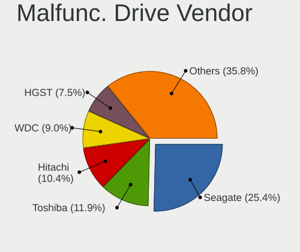

| Vendor              | Notebooks | Drives | Percent |
|---------------------|-----------|--------|---------|
| Seagate             | 17        | 17     | 25.37%  |
| Toshiba             | 8         | 8      | 11.94%  |
| Hitachi             | 7         | 7      | 10.45%  |
| WDC                 | 6         | 7      | 8.96%   |
| HGST                | 5         | 8      | 7.46%   |
| Samsung Electronics | 4         | 5      | 5.97%   |
| SanDisk             | 3         | 3      | 4.48%   |
| SK hynix            | 2         | 2      | 2.99%   |
| Netac               | 2         | 2      | 2.99%   |
| Intel               | 2         | 3      | 2.99%   |
| Fujitsu             | 2         | 2      | 2.99%   |
| Crucial             | 2         | 13     | 2.99%   |
| China               | 2         | 2      | 2.99%   |
| YANSEN              | 1         | 1      | 1.49%   |
| Phison              | 1         | 1      | 1.49%   |
| LITEONIT            | 1         | 1      | 1.49%   |
| Apple               | 1         | 1      | 1.49%   |
| Unknown             | 1         | 1      | 1.49%   |

Malfunc. HDD Vendor
-------------------

Vendors of faulty HDD drives

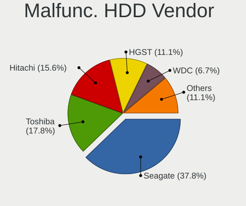

| Vendor              | Notebooks | Drives | Percent |
|---------------------|-----------|--------|---------|
| Seagate             | 17        | 17     | 37.78%  |
| Toshiba             | 8         | 8      | 17.78%  |
| Hitachi             | 7         | 7      | 15.56%  |
| HGST                | 5         | 8      | 11.11%  |
| WDC                 | 3         | 4      | 6.67%   |
| Samsung Electronics | 2         | 2      | 4.44%   |
| Fujitsu             | 2         | 2      | 4.44%   |
| Unknown             | 1         | 1      | 2.22%   |

Malfunc. Drive Kind
-------------------

Kinds of faulty drives

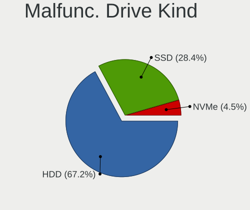

| Kind | Notebooks | Drives | Percent |
|------|-----------|--------|---------|
| HDD  | 45        | 49     | 67.16%  |
| SSD  | 19        | 32     | 28.36%  |
| NVMe | 3         | 3      | 4.48%   |

Failed Drives
-------------

Failed drive models

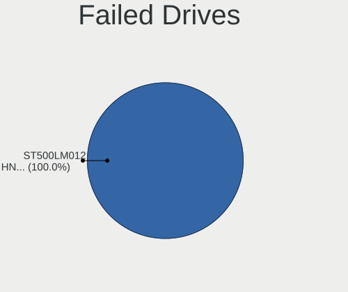

| Model                               | Notebooks | Drives | Percent |
|-------------------------------------|-----------|--------|---------|
| Seagate ST500LM012 HN-M500MBB 500GB | 1         | 1      | 100%    |

Failed Drive Vendor
-------------------

Failed drive vendors

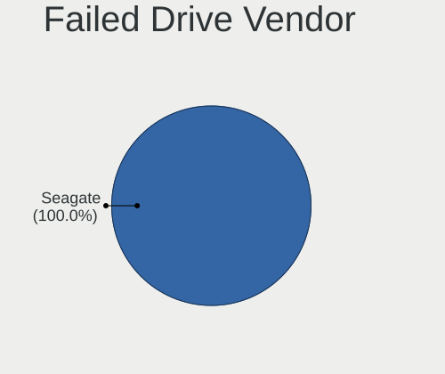

| Vendor  | Notebooks | Drives | Percent |
|---------|-----------|--------|---------|
| Seagate | 1         | 1      | 100%    |

Drive Status
------------

Number of failed and malfunc. drives

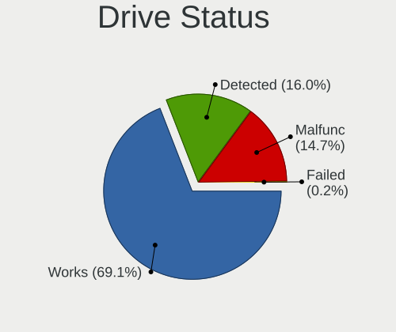

| Status   | Notebooks | Drives | Percent |
|----------|-----------|--------|---------|
| Works    | 311       | 365    | 69.11%  |
| Detected | 72        | 94     | 16%     |
| Malfunc  | 66        | 84     | 14.67%  |
| Failed   | 1         | 1      | 0.22%   |

Storage controller
------------------

Storage Vendor
--------------

Storage controller vendors

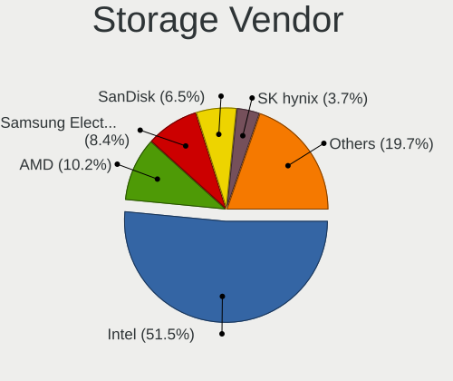

| Vendor                           | Notebooks | Percent |
|----------------------------------|-----------|---------|
| Intel                            | 238       | 51.52%  |
| AMD                              | 47        | 10.17%  |
| Samsung Electronics              | 39        | 8.44%   |
| SanDisk                          | 30        | 6.49%   |
| SK hynix                         | 17        | 3.68%   |
| Micron Technology                | 13        | 2.81%   |
| Nvidia                           | 12        | 2.6%    |
| KIOXIA                           | 12        | 2.6%    |
| Phison Electronics               | 8         | 1.73%   |
| Micron/Crucial Technology        | 7         | 1.52%   |
| Kingston Technology Company      | 6         | 1.3%    |
| Silicon Motion                   | 5         | 1.08%   |
| Toshiba America Info Systems     | 4         | 0.87%   |
| Shenzhen Longsys Electronics     | 4         | 0.87%   |
| MAXIO Technology (Hangzhou)      | 4         | 0.87%   |
| ADATA Technology                 | 3         | 0.65%   |
| Union Memory (Shenzhen)          | 2         | 0.43%   |
| Marvell Technology Group         | 2         | 0.43%   |
| VIA Technologies                 | 1         | 0.22%   |
| Solidigm                         | 1         | 0.22%   |
| Solid State Storage Technology   | 1         | 0.22%   |
| Silicon Integrated Systems [SiS] | 1         | 0.22%   |
| Realtek Semiconductor            | 1         | 0.22%   |
| Nextorage                        | 1         | 0.22%   |
| Netac Technology                 | 1         | 0.22%   |
| Biwin Storage Technology         | 1         | 0.22%   |
| Unknown                          | 1         | 0.22%   |

Storage Model
-------------

Storage controller models

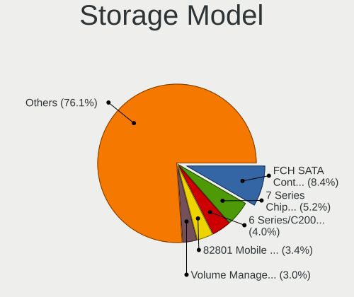

| Model                                                                          | Notebooks | Percent |
|--------------------------------------------------------------------------------|-----------|---------|
| AMD FCH SATA Controller [AHCI mode]                                            | 42        | 8.37%   |
| Intel 7 Series Chipset Family 6-port SATA Controller [AHCI mode]               | 26        | 5.18%   |
| Intel 6 Series/C200 Series Chipset Family 6 port Mobile SATA AHCI Controller   | 20        | 3.98%   |
| Intel 82801 Mobile SATA Controller [RAID mode]                                 | 17        | 3.39%   |
| Intel Volume Management Device NVMe RAID Controller                            | 15        | 2.99%   |
| Intel 82801IBM/IEM (ICH9M/ICH9M-E) 4 port SATA Controller [AHCI mode]          | 14        | 2.79%   |
| Intel Sunrise Point-LP SATA Controller [AHCI mode]                             | 13        | 2.59%   |
| Samsung NVMe SSD Controller SM981/PM981/PM983                                  | 12        | 2.39%   |
| Intel 82801HM/HEM (ICH8M/ICH8M-E) IDE Controller                               | 12        | 2.39%   |
| SanDisk WD SN560/SN740/SN770/SN5000 NVMe SSD                                   | 11        | 2.19%   |
| Intel 82801HM/HEM (ICH8M/ICH8M-E) SATA Controller [AHCI mode]                  | 10        | 1.99%   |
| SK hynix Gold P31/BC711/PC711 NVMe Solid State Drive                           | 9         | 1.79%   |
| Intel Celeron/Pentium Silver Processor SATA Controller                         | 9         | 1.79%   |
| Intel 5 Series/3400 Series Chipset 6 port SATA AHCI Controller                 | 9         | 1.79%   |
| SanDisk Ultra 3D / WD PC SN530, IX SN530, Blue SN550 NVMe SSD (DRAM-less)      | 8         | 1.59%   |
| Samsung NVMe SSD Controller PM9B1 (DRAM-less)                                  | 8         | 1.59%   |
| Samsung NVMe SSD Controller 980 (DRAM-less)                                    | 7         | 1.39%   |
| Intel Wildcat Point-LP SATA Controller [AHCI Mode]                             | 7         | 1.39%   |
| Intel Tiger Lake-LP SATA Controller                                            | 7         | 1.39%   |
| Intel RST Volume Management Device Controller                                  | 7         | 1.39%   |
| Intel Cannon Lake Mobile PCH SATA AHCI Controller                              | 7         | 1.39%   |
| Intel Alder Lake-P SATA AHCI Controller                                        | 7         | 1.39%   |
| Intel 8 Series SATA Controller 1 [AHCI mode]                                   | 7         | 1.39%   |
| Nvidia MCP89 SATA Controller (AHCI mode)                                       | 6         | 1.2%    |
| Micron 2450 NVMe SSD [HendrixV] (DRAM-less)                                    | 6         | 1.2%    |
| KIOXIA NVMe SSD Controller BG4 (DRAM-less)                                     | 6         | 1.2%    |
| Intel Celeron N3350/Pentium N4200/Atom E3900 Series SATA AHCI Controller       | 6         | 1.2%    |
| Silicon Motion SM2263EN/SM2263XT (DRAM-less) NVMe SSD Controllers              | 5         | 1%      |
| Nvidia MCP79 AHCI Controller                                                   | 5         | 1%      |
| Intel Cannon Point-LP SATA Controller [AHCI Mode]                              | 5         | 1%      |
| Intel 82801GBM/GHM (ICH7-M Family) SATA Controller [IDE mode]                  | 5         | 1%      |
| Intel 82801GBM/GHM (ICH7-M Family) SATA Controller [AHCI mode]                 | 5         | 1%      |
| Intel 82801G (ICH7 Family) IDE Controller                                      | 5         | 1%      |
| Intel 8 Series/C220 Series Chipset Family 6-port SATA Controller 1 [AHCI mode] | 5         | 1%      |
| SK hynix BC901 NVMe Solid State Drive (DRAM-less)                              | 4         | 0.8%    |
| Micron/Crucial P2 [Nick P2] / P3 / P3 Plus NVMe PCIe SSD (DRAM-less)           | 4         | 0.8%    |
| Micron 2550 NVMe SSD (DRAM-less)                                               | 4         | 0.8%    |
| Intel Volume Management Device NVMe RAID Controller Intel Corporation          | 4         | 0.8%    |
| Intel SSD 670p Series [Keystone Harbor]                                        | 4         | 0.8%    |
| Intel SSD 660P Series                                                          | 4         | 0.8%    |

Storage Kind
------------

Kind of storage controller (IDE, SATA, NVMe, SAS, ...)

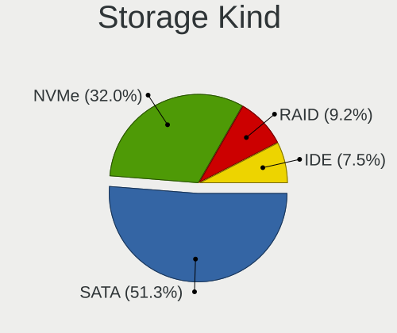

| Kind | Notebooks | Percent |
|------|-----------|---------|
| SATA | 245       | 51.26%  |
| NVMe | 153       | 32.01%  |
| RAID | 44        | 9.21%   |
| IDE  | 36        | 7.53%   |

Processor
---------

CPU Vendor
----------

Processor vendors

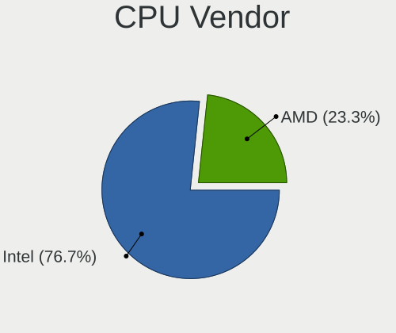

| Vendor | Notebooks | Percent |
|--------|-----------|---------|
| Intel  | 312       | 76.66%  |
| AMD    | 95        | 23.34%  |

CPU Model
---------

Processor models

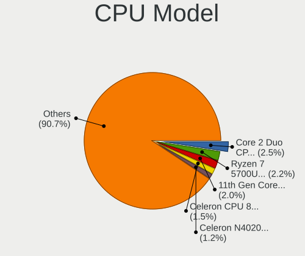

| Model                                         | Notebooks | Percent |
|-----------------------------------------------|-----------|---------|
| Intel Core 2 Duo CPU P8600 @ 2.40GHz          | 10        | 2.46%   |
| AMD Ryzen 7 5700U with Radeon Graphics        | 9         | 2.21%   |
| Intel 11th Gen Core i5-1135G7 @ 2.40GHz       | 8         | 1.97%   |
| Intel Celeron CPU 847 @ 1.10GHz               | 6         | 1.47%   |
| Intel Celeron N4020 CPU @ 1.10GHz             | 5         | 1.23%   |
| Intel 12th Gen Core i5-12450H                 | 5         | 1.23%   |
| Intel 12th Gen Core i5-1235U                  | 5         | 1.23%   |
| Intel 11th Gen Core i7-1165G7 @ 2.80GHz       | 5         | 1.23%   |
| Intel Core Ultra 7 155H                       | 4         | 0.98%   |
| Intel Core i9-14900HX                         | 4         | 0.98%   |
| Intel Core i7-9750H CPU @ 2.60GHz             | 4         | 0.98%   |
| Intel Core i7-6500U CPU @ 2.50GHz             | 4         | 0.98%   |
| Intel Core i5-8365U CPU @ 1.60GHz             | 4         | 0.98%   |
| Intel Core i5-8350U CPU @ 1.70GHz             | 4         | 0.98%   |
| Intel Core i5-8250U CPU @ 1.60GHz             | 4         | 0.98%   |
| Intel Core i5-7200U CPU @ 2.50GHz             | 4         | 0.98%   |
| Intel Core i5-2520M CPU @ 2.50GHz             | 4         | 0.98%   |
| Intel Core i5-10210U CPU @ 1.60GHz            | 4         | 0.98%   |
| Intel Core i5 CPU M 560 @ 2.67GHz             | 4         | 0.98%   |
| Intel Atom CPU Z3735F @ 1.33GHz               | 4         | 0.98%   |
| AMD Ryzen 5 5500U with Radeon Graphics        | 4         | 0.98%   |
| Intel Core i7-3630QM CPU @ 2.40GHz            | 3         | 0.74%   |
| Intel Core i3-2330M CPU @ 2.20GHz             | 3         | 0.74%   |
| Intel Celeron CPU N3350 @ 1.10GHz             | 3         | 0.74%   |
| Intel 12th Gen Core i3-1215U                  | 3         | 0.74%   |
| Intel 11th Gen Core i3-1115G4 @ 3.00GHz       | 3         | 0.74%   |
| AMD Ryzen 7 8845HS w/ Radeon 780M Graphics    | 3         | 0.74%   |
| AMD Ryzen 7 5825U with Radeon Graphics        | 3         | 0.74%   |
| AMD Ryzen 5 7520U with Radeon Graphics        | 3         | 0.74%   |
| AMD Ryzen 5 5625U with Radeon Graphics        | 3         | 0.74%   |
| AMD Ryzen 5 5600U with Radeon Graphics        | 3         | 0.74%   |
| AMD Ryzen 3 7320U with Radeon Graphics        | 3         | 0.74%   |
| AMD A9-9425 RADEON R5, 5 COMPUTE CORES 2C+3G  | 3         | 0.74%   |
| AMD A4-9120C RADEON R4, 5 COMPUTE CORES 2C+3G | 3         | 0.74%   |
| Intel Pentium Silver N5000 CPU @ 1.10GHz      | 2         | 0.49%   |
| Intel Pentium Dual CPU T2330 @ 1.60GHz        | 2         | 0.49%   |
| Intel Pentium CPU N3710 @ 1.60GHz             | 2         | 0.49%   |
| Intel Pentium CPU 2020M @ 2.40GHz             | 2         | 0.49%   |
| Intel Core i7-8750H CPU @ 2.20GHz             | 2         | 0.49%   |
| Intel Core i7-8650U CPU @ 1.90GHz             | 2         | 0.49%   |

CPU Model Family
----------------

Processor model prefix

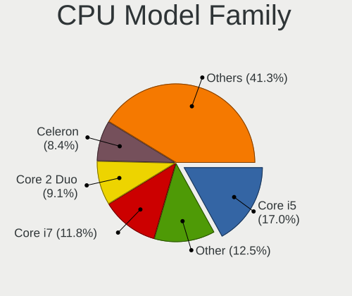

| Model                   | Notebooks | Percent |
|-------------------------|-----------|---------|
| Intel Core i5           | 69        | 16.95%  |
| Other                   | 51        | 12.53%  |
| Intel Core i7           | 48        | 11.79%  |
| Intel Core 2 Duo        | 37        | 9.09%   |
| Intel Celeron           | 34        | 8.35%   |
| AMD Ryzen 7             | 28        | 6.88%   |
| Intel Core i3           | 18        | 4.42%   |
| AMD Ryzen 5             | 18        | 4.42%   |
| Intel Atom              | 17        | 4.18%   |
| Intel Pentium           | 10        | 2.46%   |
| AMD Ryzen 3             | 7         | 1.72%   |
| Intel Core              | 6         | 1.47%   |
| AMD A8                  | 6         | 1.47%   |
| AMD Ryzen 9             | 5         | 1.23%   |
| AMD A4                  | 5         | 1.23%   |
| Intel Genuine           | 4         | 0.98%   |
| Intel Core i9           | 4         | 0.98%   |
| Intel Core 2            | 4         | 0.98%   |
| AMD A10                 | 4         | 0.98%   |
| Intel Pentium Silver    | 3         | 0.74%   |
| Intel Pentium Dual      | 3         | 0.74%   |
| AMD E2                  | 3         | 0.74%   |
| Intel Pentium Dual-Core | 2         | 0.49%   |
| Intel Celeron M         | 2         | 0.49%   |
| AMD Ryzen 3 PRO         | 2         | 0.49%   |
| AMD C-60                | 2         | 0.49%   |
| AMD Athlon              | 2         | 0.49%   |
| AMD A6                  | 2         | 0.49%   |
| Intel Xeon              | 1         | 0.25%   |
| Intel Pentium M         | 1         | 0.25%   |
| Intel Pentium Gold      | 1         | 0.25%   |
| Intel Core Duo          | 1         | 0.25%   |
| AMD Turion Neo X2       | 1         | 0.25%   |
| AMD Turion 64 X2 Mobile | 1         | 0.25%   |
| AMD Turion 64 X2        | 1         | 0.25%   |
| AMD Ryzen Embedded      | 1         | 0.25%   |
| AMD PRO A8              | 1         | 0.25%   |
| AMD E                   | 1         | 0.25%   |
| AMD A12                 | 1         | 0.25%   |

CPU Cores
---------

Number of processor cores

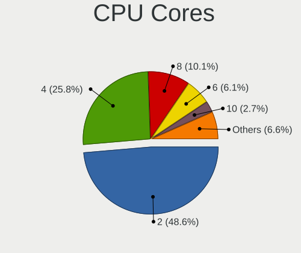

| Number | Notebooks | Percent |
|--------|-----------|---------|
| 2      | 198       | 48.65%  |
| 4      | 105       | 25.8%   |
| 8      | 41        | 10.07%  |
| 6      | 25        | 6.14%   |
| 10     | 11        | 2.7%    |
| 1      | 10        | 2.46%   |
| 16     | 5         | 1.23%   |
| 24     | 4         | 0.98%   |
| 14     | 4         | 0.98%   |
| 12     | 3         | 0.74%   |
| 5      | 1         | 0.25%   |

CPU Sockets
-----------

Number of sockets

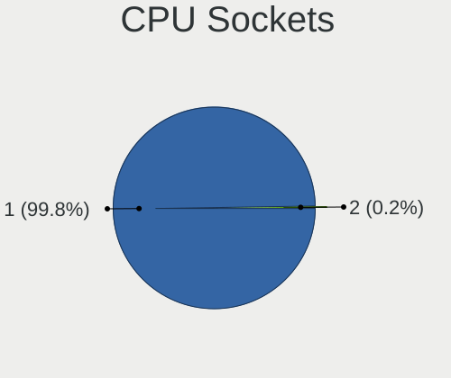

| Number | Notebooks | Percent |
|--------|-----------|---------|
| 1      | 406       | 99.75%  |
| 2      | 1         | 0.25%   |

CPU Threads
-----------

Threads per core (Hyper-Threading)

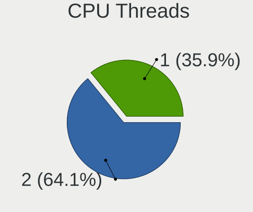

| Number | Notebooks | Percent |
|--------|-----------|---------|
| 2      | 261       | 64.13%  |
| 1      | 146       | 35.87%  |

CPU Op-Modes
------------

CPU Operation Modes (32-bit, 64-bit)

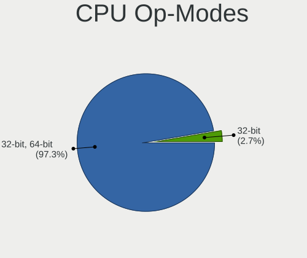

| Op mode        | Notebooks | Percent |
|----------------|-----------|---------|
| 32-bit, 64-bit | 396       | 97.3%   |
| 32-bit         | 11        | 2.7%    |

CPU Microcode
-------------

Microcode number

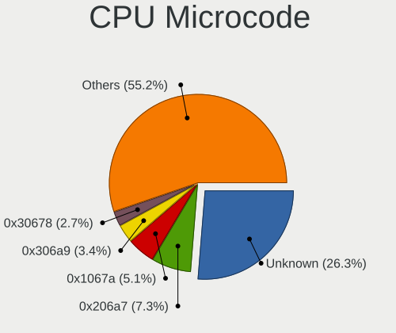

| Number     | Notebooks | Percent |
|------------|-----------|---------|
| Unknown    | 108       | 26.28%  |
| 0x206a7    | 30        | 7.3%    |
| 0x1067a    | 21        | 5.11%   |
| 0x306a9    | 14        | 3.41%   |
| 0x30678    | 11        | 2.68%   |
| 0x6fd      | 10        | 2.43%   |
| 0x40651    | 10        | 2.43%   |
| 0x806ec    | 9         | 2.19%   |
| 0x306d4    | 9         | 2.19%   |
| 0x20655    | 9         | 2.19%   |
| 0x806c1    | 8         | 1.95%   |
| 0x906a4    | 7         | 1.7%    |
| 0x306c3    | 7         | 1.7%    |
| 0x08608103 | 7         | 1.7%    |
| 0x706a8    | 6         | 1.46%   |
| 0x406c4    | 6         | 1.46%   |
| 0x706a1    | 5         | 1.22%   |
| 0x506c9    | 5         | 1.22%   |
| 0x406e3    | 5         | 1.22%   |
| 0x10676    | 5         | 1.22%   |
| 0x0a50000c | 5         | 1.22%   |
| 0x08108109 | 5         | 1.22%   |
| 0xb0671    | 4         | 0.97%   |
| 0x906ea    | 4         | 0.97%   |
| 0x906a3    | 4         | 0.97%   |
| 0x806ea    | 4         | 0.97%   |
| 0x806e9    | 4         | 0.97%   |
| 0x6fb      | 4         | 0.97%   |
| 0x506e3    | 4         | 0.97%   |
| 0x106c2    | 4         | 0.97%   |
| 0x0a50000f | 4         | 0.97%   |
| 0x0600611a | 4         | 0.97%   |
| 0xb06a3    | 3         | 0.73%   |
| 0x806c2    | 3         | 0.73%   |
| 0x6e8      | 3         | 0.73%   |
| 0x6d8      | 3         | 0.73%   |
| 0x20652    | 3         | 0.73%   |
| 0x07030105 | 3         | 0.73%   |
| 0x05000119 | 3         | 0.73%   |
| 0xb06e0    | 2         | 0.49%   |

CPU Microarch
-------------

Microarchitecture

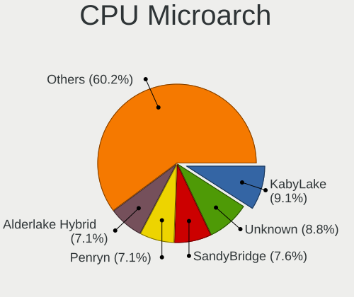

| Name              | Notebooks | Percent |
|-------------------|-----------|---------|
| KabyLake          | 37        | 9.09%   |
| Unknown           | 36        | 8.85%   |
| SandyBridge       | 31        | 7.62%   |
| Penryn            | 29        | 7.13%   |
| Alderlake Hybrid  | 29        | 7.13%   |
| Haswell           | 23        | 5.65%   |
| TigerLake         | 21        | 5.16%   |
| Silvermont        | 21        | 5.16%   |
| Zen 3             | 18        | 4.42%   |
| IvyBridge         | 18        | 4.42%   |
| Core              | 18        | 4.42%   |
| Skylake           | 13        | 3.19%   |
| Westmere          | 12        | 2.95%   |
| Goldmont plus     | 12        | 2.95%   |
| Excavator         | 12        | 2.95%   |
| Broadwell         | 10        | 2.46%   |
| P6                | 7         | 1.72%   |
| Zen+              | 6         | 1.47%   |
| Goldmont          | 6         | 1.47%   |
| Bonnell           | 6         | 1.47%   |
| Bobcat            | 6         | 1.47%   |
| Puma              | 5         | 1.23%   |
| Meteorlake Hybrid | 5         | 1.23%   |
| K8 Hammer         | 4         | 0.98%   |
| Zen 2             | 3         | 0.74%   |
| Gracemont         | 3         | 0.74%   |
| CometLake         | 3         | 0.74%   |
| Zen               | 2         | 0.49%   |
| Tremont           | 2         | 0.49%   |
| Piledriver        | 2         | 0.49%   |
| K10 Llano         | 2         | 0.49%   |
| IceLake           | 2         | 0.49%   |
| Steamroller       | 1         | 0.25%   |
| Nehalem           | 1         | 0.25%   |
| Jaguar            | 1         | 0.25%   |

Graphics
--------

GPU Vendor
----------

Vendors of graphics cards

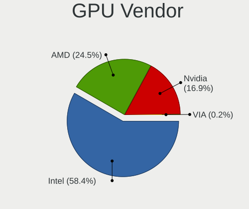

| Vendor           | Notebooks | Percent |
|------------------|-----------|---------|
| Intel            | 276       | 58.35%  |
| AMD              | 116       | 24.52%  |
| Nvidia           | 80        | 16.91%  |
| VIA Technologies | 1         | 0.21%   |

GPU Model
---------

Graphics card models

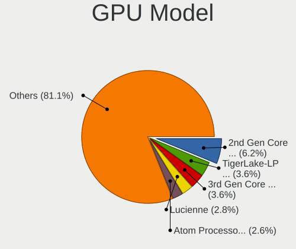

| Model                                                                                    | Notebooks | Percent |
|------------------------------------------------------------------------------------------|-----------|---------|
| Intel 2nd Generation Core Processor Family Integrated Graphics Controller                | 31        | 6.22%   |
| Intel TigerLake-LP GT2 [Iris Xe Graphics]                                                | 18        | 3.61%   |
| Intel 3rd Gen Core processor Graphics Controller                                         | 18        | 3.61%   |
| AMD Lucienne                                                                             | 14        | 2.81%   |
| Intel Atom Processor Z36xxx/Z37xxx Series Graphics & Display                             | 13        | 2.61%   |
| Intel Mobile 4 Series Chipset Integrated Graphics Controller                             | 12        | 2.41%   |
| Intel Haswell-ULT Integrated Graphics Controller                                         | 12        | 2.41%   |
| Intel Kaby Lake-R GT2 [UHD Graphics 620]                                                 | 10        | 2.01%   |
| Intel GeminiLake [UHD Graphics 600]                                                      | 10        | 2.01%   |
| Intel 4th Gen Core Processor Integrated Graphics Controller                              | 9         | 1.81%   |
| AMD Cezanne [Radeon Vega Series / Radeon Vega Mobile Series]                             | 9         | 1.81%   |
| AMD Barcelo                                                                              | 9         | 1.81%   |
| Intel Skylake-U GT2 [HD Graphics 520]                                                    | 8         | 1.61%   |
| Intel Mobile GM965/GL960 Integrated Graphics Controller (secondary)                      | 8         | 1.61%   |
| Intel Mobile GM965/GL960 Integrated Graphics Controller (primary)                        | 8         | 1.61%   |
| Intel Mobile 945GM/GMS/GME, 943/940GML Express Integrated Graphics Controller            | 8         | 1.61%   |
| Intel Core Processor Integrated Graphics Controller                                      | 8         | 1.61%   |
| Intel Atom/Celeron/Pentium Processor x5-E8000/J3xxx/N3xxx Integrated Graphics Controller | 8         | 1.61%   |
| AMD Stoney [Radeon R2/R3/R4/R5 Graphics]                                                 | 8         | 1.61%   |
| Intel Kaby Lake-U GT2 [HD Graphics 620]                                                  | 7         | 1.41%   |
| Nvidia MCP89 [GeForce 320M]                                                              | 6         | 1.2%    |
| Nvidia AD107M [GeForce RTX 4060 Max-Q / Mobile]                                          | 6         | 1.2%    |
| Intel WhiskeyLake-U GT2 [UHD Graphics 620]                                               | 6         | 1.2%    |
| Intel CometLake-U GT2 [UHD Graphics]                                                     | 6         | 1.2%    |
| Intel Broadwell-U GT2 [HD Graphics 5500]                                                 | 6         | 1.2%    |
| AMD Picasso/Raven 2 [Radeon Vega Series / Radeon Vega Mobile Series]                     | 6         | 1.2%    |
| AMD Mendocino [Radeon 610M]                                                              | 6         | 1.2%    |
| Nvidia C79 [GeForce 9400M]                                                               | 5         | 1%      |
| Intel Raptor Lake-S UHD Graphics                                                         | 5         | 1%      |
| Intel Raptor Lake-P [Iris Xe Graphics]                                                   | 5         | 1%      |
| Intel CoffeeLake-H GT2 [UHD Graphics 630]                                                | 5         | 1%      |
| Intel Apollo Lake GT1 [HD Graphics 500]                                                  | 5         | 1%      |
| Intel Alder Lake-P GT1 [UHD Graphics]                                                    | 5         | 1%      |
| Intel Skylake-H GT2 [HD Graphics 530]                                                    | 4         | 0.8%    |
| Intel Mobile 945GSE Express Integrated Graphics Controller                               | 4         | 0.8%    |
| Intel Mobile 945GM/GMS, 943/940GML Express Integrated Graphics Controller                | 4         | 0.8%    |
| Intel Meteor Lake-P [Intel Arc Graphics]                                                 | 4         | 0.8%    |
| Intel Alder Lake-UP3 GT1 [UHD Graphics]                                                  | 4         | 0.8%    |
| AMD Wani [Radeon R5/R6/R7 Graphics]                                                      | 4         | 0.8%    |
| AMD Topaz XT [Radeon R7 M260/M265 / M340/M360 / M440/M445 / 530/535 / 620/625 Mobile]    | 4         | 0.8%    |

GPU Combo
---------

Combinations of graphics cards

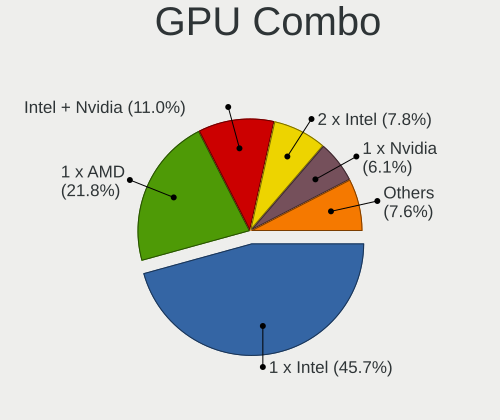

| Name               | Notebooks | Percent |
|--------------------|-----------|---------|
| 1 x Intel          | 187       | 45.72%  |
| 1 x AMD            | 89        | 21.76%  |
| Intel + Nvidia     | 45        | 11%     |
| 2 x Intel          | 32        | 7.82%   |
| 1 x Nvidia         | 25        | 6.11%   |
| Intel + AMD        | 13        | 3.18%   |
| AMD + Nvidia       | 8         | 1.96%   |
| 2 x AMD            | 6         | 1.47%   |
| 2 x Nvidia         | 2         | 0.49%   |
| 1 x VIA            | 1         | 0.24%   |
| Intel + 2 x Nvidia | 1         | 0.24%   |

GPU Driver
----------

Free vs proprietary

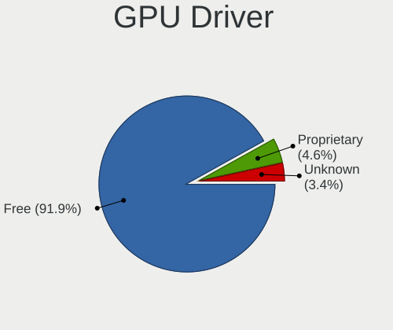

| Driver      | Notebooks | Percent |
|-------------|-----------|---------|
| Free        | 376       | 91.93%  |
| Proprietary | 19        | 4.65%   |
| Unknown     | 14        | 3.42%   |

GPU Memory
----------

Total video memory

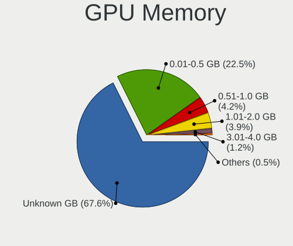

| Size in GB | Notebooks | Percent |
|------------|-----------|---------|
| Unknown    | 276       | 67.65%  |
| 0.01-0.5   | 92        | 22.55%  |
| 0.51-1.0   | 17        | 4.17%   |
| 1.01-2.0   | 16        | 3.92%   |
| 3.01-4.0   | 5         | 1.23%   |
| 7.01-8.0   | 1         | 0.25%   |
| 5.01-6.0   | 1         | 0.25%   |

Monitor
-------

Monitor Vendor
--------------

Monitor vendors

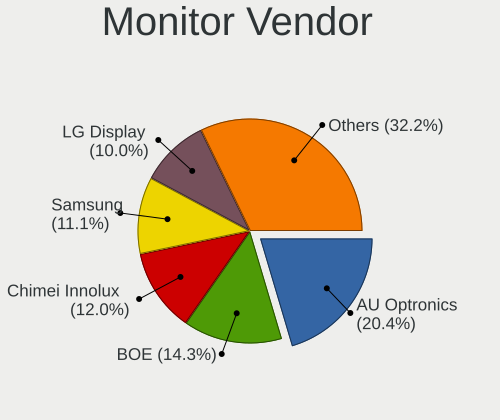

| Vendor                  | Notebooks | Percent |
|-------------------------|-----------|---------|
| AU Optronics            | 90        | 20.41%  |
| BOE                     | 63        | 14.29%  |
| Chimei Innolux          | 53        | 12.02%  |
| Samsung Electronics     | 49        | 11.11%  |
| LG Display              | 44        | 9.98%   |
| Apple                   | 26        | 5.9%    |
| Chi Mei Optoelectronics | 11        | 2.49%   |
| InfoVision              | 10        | 2.27%   |
| Lenovo                  | 9         | 2.04%   |
| Sharp                   | 8         | 1.81%   |
| LG Philips              | 7         | 1.59%   |
| Goldstar                | 7         | 1.59%   |
| Dell                    | 6         | 1.36%   |
| BenQ                    | 6         | 1.36%   |
| HKC                     | 4         | 0.91%   |
| Hewlett-Packard         | 4         | 0.91%   |
| Quanta Display          | 3         | 0.68%   |
| InnoLux Display         | 3         | 0.68%   |
| HannStar                | 3         | 0.68%   |
| AOC                     | 3         | 0.68%   |
| Ancor Communications    | 3         | 0.68%   |
| ViewSonic               | 2         | 0.45%   |
| Unknown (XXX)           | 2         | 0.45%   |
| NEC Computers           | 2         | 0.45%   |
| IBM                     | 2         | 0.45%   |
| CSW                     | 2         | 0.45%   |
| ASUSTek Computer        | 2         | 0.45%   |
| Vizio                   | 1         | 0.23%   |
| TRU                     | 1         | 0.23%   |
| Sony                    | 1         | 0.23%   |
| RTK                     | 1         | 0.23%   |
| Philips                 | 1         | 0.23%   |
| PANDA                   | 1         | 0.23%   |
| Nvidia                  | 1         | 0.23%   |
| KDC                     | 1         | 0.23%   |
| JDZ                     | 1         | 0.23%   |
| InnoView                | 1         | 0.23%   |
| Iiyama                  | 1         | 0.23%   |
| HJW                     | 1         | 0.23%   |
| HGC                     | 1         | 0.23%   |

Monitor Model
-------------

Monitor models

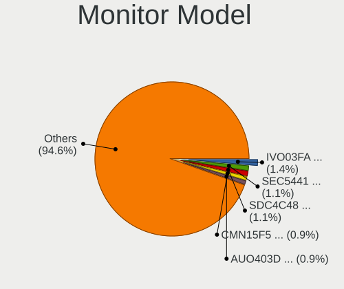

| Model                                                                    | Notebooks | Percent |
|--------------------------------------------------------------------------|-----------|---------|
| InfoVision LCD Monitor IVO03FA 1366x768 223x125mm 10.1-inch              | 6         | 1.36%   |
| Samsung Electronics LCD Monitor SEC5441 1280x800 331x207mm 15.4-inch     | 5         | 1.13%   |
| Samsung Electronics LCD Monitor SDC4C48 1920x1080 293x165mm 13.2-inch    | 5         | 1.13%   |
| Chimei Innolux LCD Monitor CMN15F5 1920x1080 344x193mm 15.5-inch         | 4         | 0.9%    |
| AU Optronics LCD Monitor AUO403D 1920x1080 309x174mm 14.0-inch           | 4         | 0.9%    |
| Samsung Electronics LCD Monitor SEC4251 1366x768 344x194mm 15.5-inch     | 3         | 0.68%   |
| Samsung Electronics LCD Monitor SEC325A 1366x768 344x194mm 15.5-inch     | 3         | 0.68%   |
| HannStar LCD Monitor HSD03E9 1024x600 220x129mm 10.0-inch                | 3         | 0.68%   |
| Chimei Innolux LCD Monitor CMN1618 1920x1200 344x215mm 16.0-inch         | 3         | 0.68%   |
| Chimei Innolux LCD Monitor CMN1132 1366x768 256x144mm 11.6-inch          | 3         | 0.68%   |
| Chi Mei Optoelectronics LCD Monitor CMO15A7 1366x768 344x193mm 15.5-inch | 3         | 0.68%   |
| BOE LCD Monitor BOE084E 1920x1080 382x215mm 17.3-inch                    | 3         | 0.68%   |
| Apple LCD Monitor APP9CC5 1280x800 286x179mm 13.3-inch                   | 3         | 0.68%   |
| Apple Color LCD APP9CF0 1440x900 290x180mm 13.4-inch                     | 3         | 0.68%   |
| Apple Color LCD APP9CC7 1280x800 286x179mm 13.3-inch                     | 3         | 0.68%   |
| Unknown (XXX) Beyond TV XXX2851 3840x2160 1209x680mm 54.6-inch           | 2         | 0.45%   |
| Sharp LCD Monitor SHP14BA 1920x1080 344x194mm 15.5-inch                  | 2         | 0.45%   |
| Samsung Electronics LCD Monitor SEC3847 1440x900 367x230mm 17.1-inch     | 2         | 0.45%   |
| Samsung Electronics LCD Monitor SEC324A 1366x768 344x194mm 15.5-inch     | 2         | 0.45%   |
| Samsung Electronics LCD Monitor SDC4347 1366x768 344x193mm 15.5-inch     | 2         | 0.45%   |
| LG Display LCD Monitor LGD0709 1920x1080 344x194mm 15.5-inch             | 2         | 0.45%   |
| LG Display LCD Monitor LGD0590 1920x1080 344x194mm 15.5-inch             | 2         | 0.45%   |
| LG Display LCD Monitor LGD046D 1920x1080 309x174mm 14.0-inch             | 2         | 0.45%   |
| LG Display LCD Monitor LGD027A 1600x900 382x215mm 17.3-inch              | 2         | 0.45%   |
| Lenovo LCD Monitor LEN4036 1440x900 303x190mm 14.1-inch                  | 2         | 0.45%   |
| IBM LCD Monitor IBM2887 1680x1050 331x207mm 15.4-inch                    | 2         | 0.45%   |
| Goldstar FULL HD GSM5ABB 1920x1080 480x270mm 21.7-inch                   | 2         | 0.45%   |
| CSW MNE007ZA3-2 CSW1431 2880x1800 301x188mm 14.0-inch                    | 2         | 0.45%   |
| Chimei Innolux LCD Monitor CMN15E5 1920x1080 344x193mm 15.5-inch         | 2         | 0.45%   |
| Chimei Innolux LCD Monitor CMN15CA 1366x768 344x193mm 15.5-inch          | 2         | 0.45%   |
| Chimei Innolux LCD Monitor CMN14E5 1920x1080 309x173mm 13.9-inch         | 2         | 0.45%   |
| Chi Mei Optoelectronics LCD Monitor CMO15AB 1366x768 340x190mm 15.3-inch | 2         | 0.45%   |
| BOE LCD Monitor BOE0B2B 1920x1200 345x215mm 16.0-inch                    | 2         | 0.45%   |
| BOE LCD Monitor BOE08C2 1920x1080 344x194mm 15.5-inch                    | 2         | 0.45%   |
| BOE LCD Monitor BOE06A4 1366x768 344x194mm 15.5-inch                     | 2         | 0.45%   |
| BOE LCD Monitor BOE0697 1366x768 309x173mm 13.9-inch                     | 2         | 0.45%   |
| BOE LCD Monitor BOE0672 1366x768 344x194mm 15.5-inch                     | 2         | 0.45%   |
| AU Optronics LCD Monitor AUO61ED 1920x1080 344x194mm 15.5-inch           | 2         | 0.45%   |
| AU Optronics LCD Monitor AUO615C 1366x768 256x144mm 11.6-inch            | 2         | 0.45%   |
| AU Optronics LCD Monitor AUO405C 1366x768 256x144mm 11.6-inch            | 2         | 0.45%   |

Monitor Resolution
------------------

Monitor screen resolution

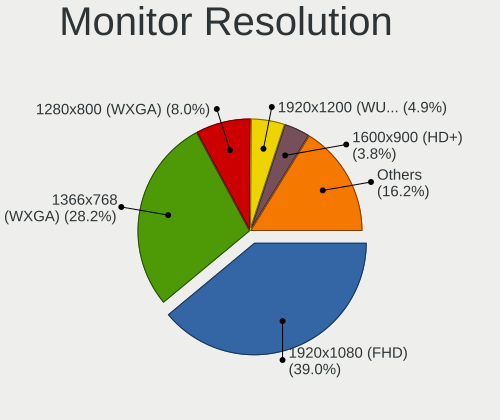

| Resolution         | Notebooks | Percent |
|--------------------|-----------|---------|
| 1920x1080 (FHD)    | 166       | 38.97%  |
| 1366x768 (WXGA)    | 120       | 28.17%  |
| 1280x800 (WXGA)    | 34        | 7.98%   |
| 1920x1200 (WUXGA)  | 21        | 4.93%   |
| 1600x900 (HD+)     | 16        | 3.76%   |
| 1440x900 (WXGA+)   | 15        | 3.52%   |
| 3840x2160 (4K)     | 13        | 3.05%   |
| 2560x1440 (QHD)    | 10        | 2.35%   |
| 2560x1600          | 8         | 1.88%   |
| 1680x1050 (WSXGA+) | 5         | 1.17%   |
| 1024x600           | 4         | 0.94%   |
| 2880x1800          | 3         | 0.7%    |
| 3840x2400          | 2         | 0.47%   |
| 1024x768 (XGA)     | 2         | 0.47%   |
| 3440x1440          | 1         | 0.23%   |
| 3200x1800 (QHD+)   | 1         | 0.23%   |
| 3072x1920          | 1         | 0.23%   |
| 2256x1504          | 1         | 0.23%   |
| 1680x945           | 1         | 0.23%   |
| 1360x768           | 1         | 0.23%   |
| 1280x1024 (SXGA)   | 1         | 0.23%   |

Monitor Diagonal
----------------

Diagonal size in inches

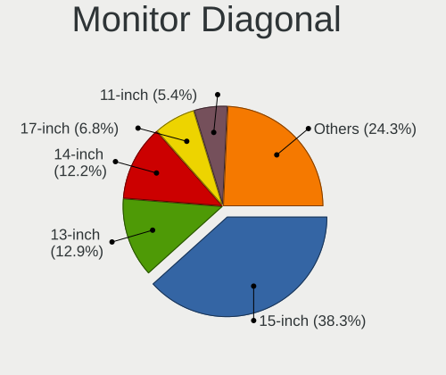

| Inches | Notebooks | Percent |
|--------|-----------|---------|
| 15     | 169       | 38.32%  |
| 13     | 57        | 12.93%  |
| 14     | 54        | 12.24%  |
| 17     | 30        | 6.8%    |
| 11     | 24        | 5.44%   |
| 16     | 21        | 4.76%   |
| 24     | 14        | 3.17%   |
| 18     | 12        | 2.72%   |
| 27     | 10        | 2.27%   |
| 10     | 10        | 2.27%   |
| 21     | 8         | 1.81%   |
| 12     | 7         | 1.59%   |
| 23     | 6         | 1.36%   |
| 54     | 5         | 1.13%   |
| 31     | 3         | 0.68%   |
| 63     | 2         | 0.45%   |
| 22     | 2         | 0.45%   |
| 19     | 2         | 0.45%   |
| 72     | 1         | 0.23%   |
| 57     | 1         | 0.23%   |
| 34     | 1         | 0.23%   |
| 32     | 1         | 0.23%   |
| 20     | 1         | 0.23%   |

Monitor Width
-------------

Physical width

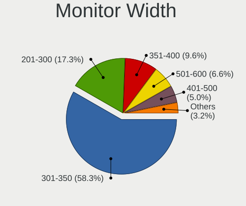

| Width in mm | Notebooks | Percent |
|-------------|-----------|---------|
| 301-350     | 256       | 58.31%  |
| 201-300     | 76        | 17.31%  |
| 351-400     | 42        | 9.57%   |
| 501-600     | 29        | 6.61%   |
| 401-500     | 22        | 5.01%   |
| 1001-1500   | 7         | 1.59%   |
| 701-800     | 3         | 0.68%   |
| 601-700     | 3         | 0.68%   |
| 1501-2000   | 1         | 0.23%   |

Aspect Ratio
------------

Proportional relationship between the width and the height

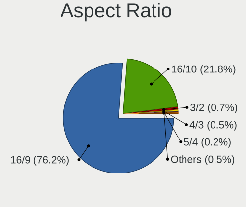

| Ratio | Notebooks | Percent |
|-------|-----------|---------|
| 16/9  | 307       | 76.18%  |
| 16/10 | 88        | 21.84%  |
| 3/2   | 3         | 0.74%   |
| 4/3   | 2         | 0.5%    |
| 5/4   | 1         | 0.25%   |
| 21/9  | 1         | 0.25%   |
| 0.56  | 1         | 0.25%   |

Monitor Area
------------

Area in inch²

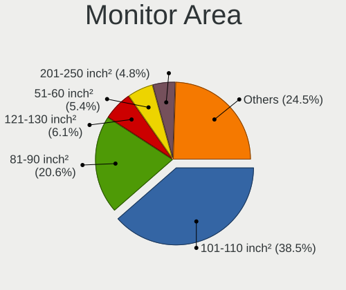

| Area in inch² | Notebooks | Percent |
|----------------|-----------|---------|
| 101-110        | 170       | 38.55%  |
| 81-90          | 91        | 20.63%  |
| 121-130        | 27        | 6.12%   |
| 51-60          | 24        | 5.44%   |
| 201-250        | 21        | 4.76%   |
| 71-80          | 18        | 4.08%   |
| 111-120        | 17        | 3.85%   |
| 141-150        | 12        | 2.72%   |
| 41-50          | 10        | 2.27%   |
| 301-350        | 10        | 2.27%   |
| More than 1000 | 9         | 2.04%   |
| 61-70          | 7         | 1.59%   |
| 251-300        | 6         | 1.36%   |
| 151-200        | 6         | 1.36%   |
| 351-500        | 5         | 1.13%   |
| 131-140        | 4         | 0.91%   |
| 91-100         | 4         | 0.91%   |

Pixel Density
-------------

Pixels per inch

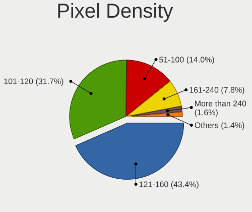

| Density       | Notebooks | Percent |
|---------------|-----------|---------|
| 121-160       | 189       | 43.45%  |
| 101-120       | 138       | 31.72%  |
| 51-100        | 61        | 14.02%  |
| 161-240       | 34        | 7.82%   |
| More than 240 | 7         | 1.61%   |
| 1-50          | 6         | 1.38%   |

Multiple Monitors
-----------------

Total monitors connected

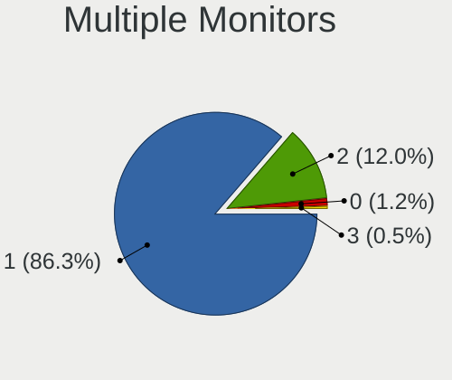

| Total | Notebooks | Percent |
|-------|-----------|---------|
| 1     | 354       | 86.34%  |
| 2     | 49        | 11.95%  |
| 0     | 5         | 1.22%   |
| 3     | 2         | 0.49%   |

Network
-------

Net Controller Vendor
---------------------

Controller vendors

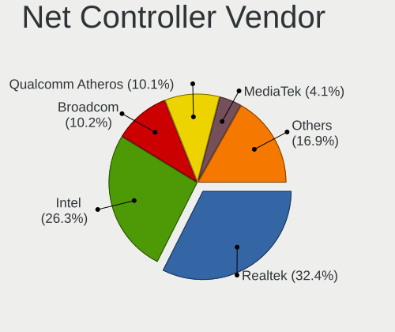

| Vendor                                 | Notebooks | Percent |
|----------------------------------------|-----------|---------|
| Realtek Semiconductor                  | 206       | 32.44%  |
| Intel                                  | 167       | 26.3%   |
| Broadcom                               | 65        | 10.24%  |
| Qualcomm Atheros                       | 64        | 10.08%  |
| MediaTek                               | 26        | 4.09%   |
| Broadcom Limited                       | 18        | 2.83%   |
| Ralink                                 | 12        | 1.89%   |
| Marvell Technology Group               | 7         | 1.1%    |
| TP-Link                                | 6         | 0.94%   |
| ASIX Electronics                       | 6         | 0.94%   |
| OPPO Electronics                       | 5         | 0.79%   |
| Nvidia                                 | 5         | 0.79%   |
| Dell                                   | 4         | 0.63%   |
| Xiaomi                                 | 3         | 0.47%   |
| Samsung Electronics                    | 3         | 0.47%   |
| Motorola PCS                           | 3         | 0.47%   |
| Suzhou Motorcomm Electronic Technology | 2         | 0.31%   |
| Sierra Wireless                        | 2         | 0.31%   |
| Shenzhen Goodix Technology             | 2         | 0.31%   |
| Ralink Technology                      | 2         | 0.31%   |
| Qualcomm Atheros Communications        | 2         | 0.31%   |
| Qualcomm                               | 2         | 0.31%   |
| NetGear                                | 2         | 0.31%   |
| Huawei Technologies                    | 2         | 0.31%   |
| D-Link                                 | 2         | 0.31%   |
| Belkin Components                      | 2         | 0.31%   |
| ASUSTek Computer                       | 2         | 0.31%   |
| ZyDAS                                  | 1         | 0.16%   |
| VIA Technologies                       | 1         | 0.16%   |
| Spreadtrum Communications              | 1         | 0.16%   |
| SEGGER                                 | 1         | 0.16%   |
| QinHeng Electronics                    | 1         | 0.16%   |
| OnePlus Technology (Shenzhen)          | 1         | 0.16%   |
| Linksys                                | 1         | 0.16%   |
| Lenovo                                 | 1         | 0.16%   |
| Hewlett-Packard                        | 1         | 0.16%   |
| Google                                 | 1         | 0.16%   |
| Fujitsu Siemens Computers              | 1         | 0.16%   |
| Edimax Technology                      | 1         | 0.16%   |
| DisplayLink                            | 1         | 0.16%   |

Net Controller Model
--------------------

Controller models

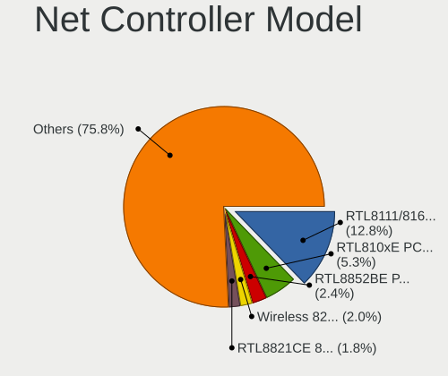

| Model                                                                  | Notebooks | Percent |
|------------------------------------------------------------------------|-----------|---------|
| Realtek RTL8111/8168/8211/8411 PCI Express Gigabit Ethernet Controller | 97        | 12.78%  |
| Realtek RTL810xE PCI Express Fast Ethernet controller                  | 40        | 5.27%   |
| Realtek RTL8852BE PCIe 802.11ax Wireless Network Controller            | 18        | 2.37%   |
| Intel Wireless 8265 / 8275                                             | 15        | 1.98%   |
| Realtek RTL8821CE 802.11ac PCIe Wireless Network Adapter               | 14        | 1.84%   |
| Realtek RTL8153 Gigabit Ethernet Adapter                               | 14        | 1.84%   |
| Intel Wi-Fi 6 AX201                                                    | 13        | 1.71%   |
| MediaTek MT7902 802.11ax PCIe Wireless Network Adapter [Filogic 310]   | 12        | 1.58%   |
| Broadcom BCM4322 802.11a/b/g/n Wireless LAN Controller                 | 12        | 1.58%   |
| Intel Wireless 7265                                                    | 10        | 1.32%   |
| Intel Wi-Fi 6 AX200                                                    | 10        | 1.32%   |
| Realtek RTL8822CE 802.11ac PCIe Wireless Network Adapter               | 9         | 1.19%   |
| Qualcomm Atheros QCA9565 / AR9565 Wireless Network Adapter             | 9         | 1.19%   |
| Intel Alder Lake-P PCH CNVi WiFi                                       | 9         | 1.19%   |
| Ralink RT3290 Wireless 802.11n 1T/1R PCIe                              | 8         | 1.05%   |
| Qualcomm Atheros QCA6174 802.11ac Wireless Network Adapter             | 8         | 1.05%   |
| Qualcomm Atheros AR9485 Wireless Network Adapter                       | 8         | 1.05%   |
| Intel Wireless 7260                                                    | 8         | 1.05%   |
| Broadcom NetXtreme BCM5764M Gigabit Ethernet PCIe                      | 8         | 1.05%   |
| Broadcom BCM43142 802.11b/g/n                                          | 8         | 1.05%   |
| Broadcom BCM4313 802.11bgn Wireless Network Adapter                    | 8         | 1.05%   |
| Realtek 802.11ac NIC                                                   | 7         | 0.92%   |
| Qualcomm Atheros QCA9377 802.11ac Wireless Network Adapter             | 7         | 0.92%   |
| MediaTek MT7921 802.11ax PCIe Wireless Network Adapter [Filogic 330]   | 7         | 0.92%   |
| Intel Wireless 8260                                                    | 7         | 0.92%   |
| Intel PRO/Wireless 3945ABG [Golan] Network Connection                  | 7         | 0.92%   |
| Intel Ethernet Connection I217-LM                                      | 7         | 0.92%   |
| Intel 82577LM Gigabit Network Connection                               | 7         | 0.92%   |
| Realtek 802.11n WLAN Adapter                                           | 6         | 0.79%   |
| Qualcomm Atheros AR9285 Wireless Network Adapter (PCI-Express)         | 6         | 0.79%   |
| MediaTek MT7922 802.11ax PCI Express Wireless Network Adapter          | 6         | 0.79%   |
| Intel Wi-Fi 7(802.11be) AX1775*/AX1790*/BE20*/BE401/BE1750* 2x2        | 6         | 0.79%   |
| Realtek RTL8723BE PCIe Wireless Network Adapter                        | 5         | 0.66%   |
| Intel Wireless 3165                                                    | 5         | 0.66%   |
| Intel Raptor Lake PCH CNVi WiFi                                        | 5         | 0.66%   |
| Intel Ethernet Connection (4) I219-LM                                  | 5         | 0.66%   |
| Intel Comet Lake PCH-LP CNVi WiFi                                      | 5         | 0.66%   |
| ASIX AX88179 Gigabit Ethernet                                          | 5         | 0.66%   |
| Realtek RTL8852CE PCIe 802.11ax Wireless Network Controller            | 4         | 0.53%   |
| Realtek RTL8188EUS 802.11n Wireless Network Adapter                    | 4         | 0.53%   |

Wireless Vendor
---------------

Wireless vendors

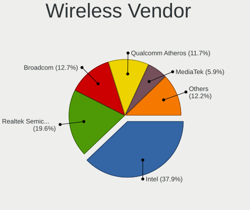

| Vendor                          | Notebooks | Percent |
|---------------------------------|-----------|---------|
| Intel                           | 155       | 37.9%   |
| Realtek Semiconductor           | 80        | 19.56%  |
| Broadcom                        | 52        | 12.71%  |
| Qualcomm Atheros                | 48        | 11.74%  |
| MediaTek                        | 24        | 5.87%   |
| Ralink                          | 12        | 2.93%   |
| Broadcom Limited                | 12        | 2.93%   |
| TP-Link                         | 5         | 1.22%   |
| Sierra Wireless                 | 2         | 0.49%   |
| Ralink Technology               | 2         | 0.49%   |
| Qualcomm Atheros Communications | 2         | 0.49%   |
| NetGear                         | 2         | 0.49%   |
| Dell                            | 2         | 0.49%   |
| D-Link                          | 2         | 0.49%   |
| Belkin Components               | 2         | 0.49%   |
| ASUSTek Computer                | 2         | 0.49%   |
| ZyDAS                           | 1         | 0.24%   |
| Qualcomm                        | 1         | 0.24%   |
| Linksys                         | 1         | 0.24%   |
| Fujitsu Siemens Computers       | 1         | 0.24%   |
| Edimax Technology               | 1         | 0.24%   |

Wireless Model
--------------

Wireless models

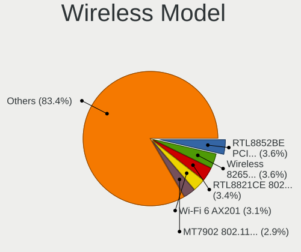

| Model                                                                | Notebooks | Percent |
|----------------------------------------------------------------------|-----------|---------|
| Realtek RTL8852BE PCIe 802.11ax Wireless Network Controller          | 15        | 3.61%   |
| Intel Wireless 8265 / 8275                                           | 15        | 3.61%   |
| Realtek RTL8821CE 802.11ac PCIe Wireless Network Adapter             | 14        | 3.37%   |
| Intel Wi-Fi 6 AX201                                                  | 13        | 3.13%   |
| MediaTek MT7902 802.11ax PCIe Wireless Network Adapter [Filogic 310] | 12        | 2.89%   |
| Broadcom BCM4322 802.11a/b/g/n Wireless LAN Controller               | 12        | 2.89%   |
| Intel Wireless 7265                                                  | 10        | 2.41%   |
| Intel Wi-Fi 6 AX200                                                  | 10        | 2.41%   |
| Realtek RTL8822CE 802.11ac PCIe Wireless Network Adapter             | 9         | 2.17%   |
| Qualcomm Atheros QCA9565 / AR9565 Wireless Network Adapter           | 9         | 2.17%   |
| Ralink RT3290 Wireless 802.11n 1T/1R PCIe                            | 8         | 1.93%   |
| Qualcomm Atheros QCA6174 802.11ac Wireless Network Adapter           | 8         | 1.93%   |
| Qualcomm Atheros AR9485 Wireless Network Adapter                     | 8         | 1.93%   |
| Intel Wireless 7260                                                  | 8         | 1.93%   |
| Intel Alder Lake-P PCH CNVi WiFi                                     | 8         | 1.93%   |
| Broadcom BCM43142 802.11b/g/n                                        | 8         | 1.93%   |
| Broadcom BCM4313 802.11bgn Wireless Network Adapter                  | 8         | 1.93%   |
| Realtek 802.11ac NIC                                                 | 7         | 1.69%   |
| Qualcomm Atheros QCA9377 802.11ac Wireless Network Adapter           | 7         | 1.69%   |
| MediaTek MT7921 802.11ax PCIe Wireless Network Adapter [Filogic 330] | 7         | 1.69%   |
| Intel Wireless 8260                                                  | 7         | 1.69%   |
| Intel PRO/Wireless 3945ABG [Golan] Network Connection                | 7         | 1.69%   |
| Realtek 802.11n WLAN Adapter                                         | 6         | 1.45%   |
| Qualcomm Atheros AR9285 Wireless Network Adapter (PCI-Express)       | 6         | 1.45%   |
| Realtek RTL8723BE PCIe Wireless Network Adapter                      | 5         | 1.2%    |
| Intel Wireless 3165                                                  | 5         | 1.2%    |
| Intel Raptor Lake PCH CNVi WiFi                                      | 5         | 1.2%    |
| Intel Comet Lake PCH-LP CNVi WiFi                                    | 5         | 1.2%    |
| Realtek RTL8188EUS 802.11n Wireless Network Adapter                  | 4         | 0.96%   |
| MediaTek MT7922 802.11ax PCI Express Wireless Network Adapter        | 4         | 0.96%   |
| Intel WiFi Link 5100                                                 | 4         | 0.96%   |
| Intel Wi-Fi 7(802.11be) AX1775*/AX1790*/BE20*/BE401/BE1750* 2x2      | 4         | 0.96%   |
| Intel Wi-Fi 5(802.11ac) Wireless-AC 9x6x [Thunder Peak]              | 4         | 0.96%   |
| Intel PRO/Wireless 5100 AGN [Shiloh] Network Connection              | 4         | 0.96%   |
| Intel Meteor Lake PCH CNVi WiFi                                      | 4         | 0.96%   |
| Intel Centrino Advanced-N 6235                                       | 4         | 0.96%   |
| Intel Cannon Lake PCH CNVi WiFi                                      | 4         | 0.96%   |
| Broadcom Limited BCM4360 802.11ac Dual Band Wireless Network Adapter | 4         | 0.96%   |
| Broadcom BCM4331 802.11a/b/g/n                                       | 4         | 0.96%   |
| Realtek RTL88x2bu [AC1200 Techkey]                                   | 3         | 0.72%   |

Ethernet Vendor
---------------

Ethernet vendors

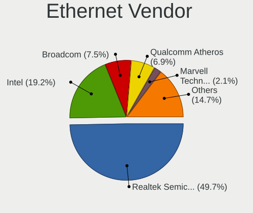

| Vendor                                 | Notebooks | Percent |
|----------------------------------------|-----------|---------|
| Realtek Semiconductor                  | 166       | 49.7%   |
| Intel                                  | 64        | 19.16%  |
| Broadcom                               | 25        | 7.49%   |
| Qualcomm Atheros                       | 23        | 6.89%   |
| Marvell Technology Group               | 7         | 2.1%    |
| Broadcom Limited                       | 7         | 2.1%    |
| ASIX Electronics                       | 6         | 1.8%    |
| OPPO Electronics                       | 5         | 1.5%    |
| Nvidia                                 | 5         | 1.5%    |
| Xiaomi                                 | 3         | 0.9%    |
| Samsung Electronics                    | 3         | 0.9%    |
| Motorola PCS                           | 3         | 0.9%    |
| TP-Link                                | 2         | 0.6%    |
| Suzhou Motorcomm Electronic Technology | 2         | 0.6%    |
| MediaTek                               | 2         | 0.6%    |
| Huawei Technologies                    | 2         | 0.6%    |
| VIA Technologies                       | 1         | 0.3%    |
| Spreadtrum Communications              | 1         | 0.3%    |
| Qualcomm                               | 1         | 0.3%    |
| QinHeng Electronics                    | 1         | 0.3%    |
| OnePlus Technology (Shenzhen)          | 1         | 0.3%    |
| Lenovo                                 | 1         | 0.3%    |
| Hewlett-Packard                        | 1         | 0.3%    |
| Google                                 | 1         | 0.3%    |
| DisplayLink                            | 1         | 0.3%    |

Ethernet Model
--------------

Ethernet models

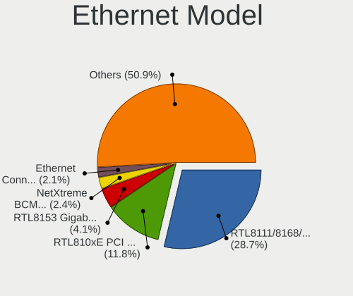

| Model                                                                  | Notebooks | Percent |
|------------------------------------------------------------------------|-----------|---------|
| Realtek RTL8111/8168/8211/8411 PCI Express Gigabit Ethernet Controller | 97        | 28.7%   |
| Realtek RTL810xE PCI Express Fast Ethernet controller                  | 40        | 11.83%  |
| Realtek RTL8153 Gigabit Ethernet Adapter                               | 14        | 4.14%   |
| Broadcom NetXtreme BCM5764M Gigabit Ethernet PCIe                      | 8         | 2.37%   |
| Intel Ethernet Connection I217-LM                                      | 7         | 2.07%   |
| Intel 82577LM Gigabit Network Connection                               | 7         | 2.07%   |
| Intel Ethernet Connection (4) I219-LM                                  | 5         | 1.48%   |
| ASIX AX88179 Gigabit Ethernet                                          | 5         | 1.48%   |
| Realtek RTL8125 2.5GbE Controller                                      | 4         | 1.18%   |
| Qualcomm Atheros AR8162 Fast Ethernet                                  | 4         | 1.18%   |
| OPPO Ace 3V                                                            | 4         | 1.18%   |
| Nvidia MCP79 Ethernet                                                  | 4         | 1.18%   |
| Intel Ethernet Connection (13) I219-LM                                 | 4         | 1.18%   |
| Intel 82579LM Gigabit Network Connection (Lewisville)                  | 4         | 1.18%   |
| Intel 82567LM Gigabit Network Connection                               | 4         | 1.18%   |
| Broadcom NetXtreme BCM57765 Gigabit Ethernet PCIe                      | 4         | 1.18%   |
| Broadcom NetLink BCM57785 Gigabit Ethernet PCIe                        | 4         | 1.18%   |
| Xiaomi Mi/Redmi series (RNDIS)                                         | 3         | 0.89%   |
| Realtek RTL8852CE PCIe 802.11ax Wireless Network Controller            | 3         | 0.89%   |
| Realtek RTL8852BE PCIe 802.11ax Wireless Network Controller            | 3         | 0.89%   |
| Realtek RTL8152 Fast Ethernet Adapter                                  | 3         | 0.89%   |
| Realtek RTL-8100/8101L/8139 PCI Fast Ethernet Adapter                  | 3         | 0.89%   |
| Qualcomm Atheros AR8151 v2.0 Gigabit Ethernet                          | 3         | 0.89%   |
| Qualcomm Atheros AR8121/AR8113/AR8114 Gigabit or Fast Ethernet         | 3         | 0.89%   |
| Motorola PCS motorola one 5G ace                                       | 3         | 0.89%   |
| Intel Ethernet Connection I219-LM                                      | 3         | 0.89%   |
| Intel Ethernet Connection I218-LM                                      | 3         | 0.89%   |
| Intel Ethernet Connection (6) I219-LM                                  | 3         | 0.89%   |
| Intel Ethernet Connection (16) I219-LM                                 | 3         | 0.89%   |
| Broadcom NetLink BCM5784M Gigabit Ethernet PCIe                        | 3         | 0.89%   |
| TP-Link UE300 10/100/1000 LAN (ethernet mode) [Realtek RTL8153]        | 2         | 0.59%   |
| Suzhou Motorcomm Electronic YT6801 Gigabit Ethernet Controller         | 2         | 0.59%   |
| Samsung Galaxy series, misc. (tethering mode)                          | 2         | 0.59%   |
| Qualcomm Atheros Killer E220x Gigabit Ethernet Controller              | 2         | 0.59%   |
| Qualcomm Atheros AR8161 Gigabit Ethernet                               | 2         | 0.59%   |
| Qualcomm Atheros AR8152 v2.0 Fast Ethernet                             | 2         | 0.59%   |
| MediaTek MT7922 802.11ax PCI Express Wireless Network Adapter          | 2         | 0.59%   |
| Marvell Group 88E8040 PCI-E Fast Ethernet Controller                   | 2         | 0.59%   |
| Intel Wi-Fi 7(802.11be) AX1775*/AX1790*/BE20*/BE401/BE1750* 2x2        | 2         | 0.59%   |
| Intel Ethernet Connection (4) I219-V                                   | 2         | 0.59%   |

Net Controller Kind
-------------------

Ethernet, WiFi or modem

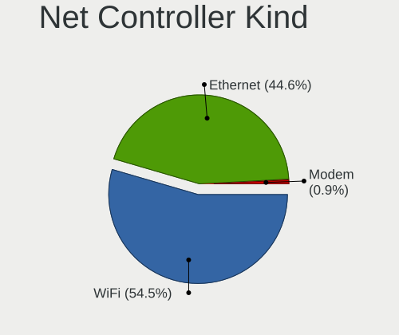

| Kind     | Notebooks | Percent |
|----------|-----------|---------|
| WiFi     | 380       | 54.52%  |
| Ethernet | 311       | 44.62%  |
| Modem    | 6         | 0.86%   |

Used Controller
---------------

Currently used network controller

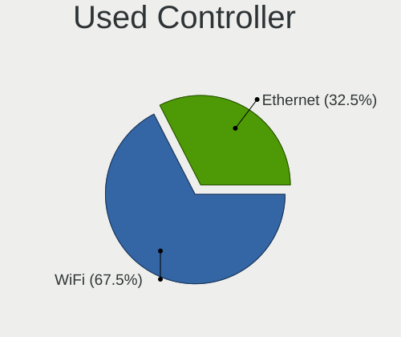

| Kind     | Notebooks | Percent |
|----------|-----------|---------|
| WiFi     | 286       | 67.45%  |
| Ethernet | 138       | 32.55%  |

NICs
----

Total network controllers on board

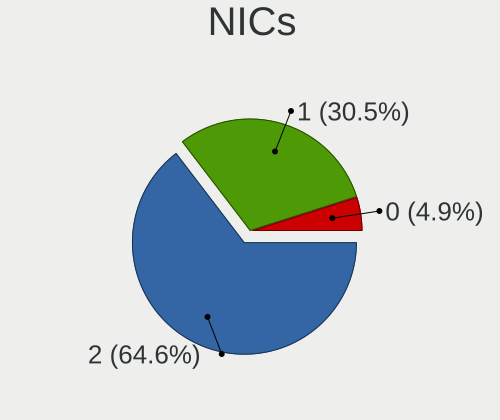

| Total | Notebooks | Percent |
|-------|-----------|---------|
| 2     | 263       | 64.62%  |
| 1     | 124       | 30.47%  |
| 0     | 20        | 4.91%   |

IPv6
----

IPv6 vs IPv4

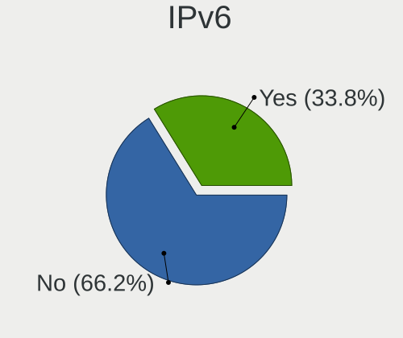

| Used | Notebooks | Percent |
|------|-----------|---------|
| No   | 270       | 66.18%  |
| Yes  | 138       | 33.82%  |

Bluetooth
---------

Bluetooth Vendor
----------------

Controller vendors

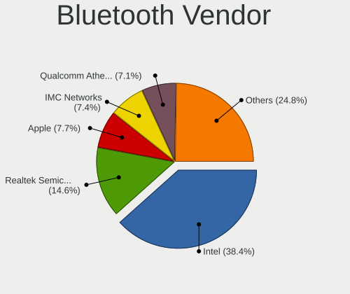

| Vendor                          | Notebooks | Percent |
|---------------------------------|-----------|---------|
| Intel                           | 124       | 38.39%  |
| Realtek Semiconductor           | 47        | 14.55%  |
| Apple                           | 25        | 7.74%   |
| IMC Networks                    | 24        | 7.43%   |
| Qualcomm Atheros Communications | 23        | 7.12%   |
| Broadcom                        | 15        | 4.64%   |
| Dell                            | 11        | 3.41%   |
| Foxconn / Hon Hai               | 9         | 2.79%   |
| Ralink                          | 8         | 2.48%   |
| Lite-On Technology              | 8         | 2.48%   |
| Cambridge Silicon Radio         | 6         | 1.86%   |
| Toshiba                         | 5         | 1.55%   |
| ASUSTek Computer                | 5         | 1.55%   |
| Hewlett-Packard                 | 4         | 1.24%   |
| MediaTek                        | 2         | 0.62%   |
| Alps Electric                   | 2         | 0.62%   |
| Realtek                         | 1         | 0.31%   |
| Plugable                        | 1         | 0.31%   |
| Micro Star International        | 1         | 0.31%   |
| Foxconn International           | 1         | 0.31%   |
| Edimax Technology               | 1         | 0.31%   |

Bluetooth Model
---------------

Controller models

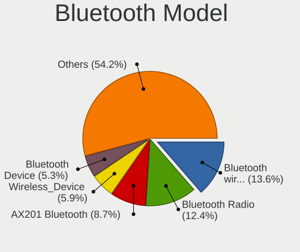

| Model                                               | Notebooks | Percent |
|-----------------------------------------------------|-----------|---------|
| Intel Bluetooth wireless interface                  | 44        | 13.62%  |
| Realtek Bluetooth Radio                             | 40        | 12.38%  |
| Intel AX201 Bluetooth                               | 28        | 8.67%   |
| IMC Networks Wireless_Device                        | 19        | 5.88%   |
| Intel Bluetooth Device                              | 17        | 5.26%   |
| Apple Bluetooth Host Controller                     | 14        | 4.33%   |
| Qualcomm Atheros  Bluetooth Device                  | 11        | 3.41%   |
| Intel Bluetooth 9460/9560 Jefferson Peak (JfP)      | 10        | 3.1%    |
| Intel AX200 Bluetooth                               | 10        | 3.1%    |
| Apple Bluetooth USB Host Controller                 | 9         | 2.79%   |
| Ralink RT3290 Bluetooth                             | 8         | 2.48%   |
| Cambridge Silicon Radio Bluetooth Dongle (HCI mode) | 6         | 1.86%   |
| Qualcomm Atheros QCA61x4 Bluetooth 4.0              | 5         | 1.55%   |
| Qualcomm Atheros AR3012 Bluetooth 4.0               | 4         | 1.24%   |
| Intel Centrino Bluetooth Wireless Transceiver       | 4         | 1.24%   |
| Realtek  Bluetooth 4.2 Adapter                      | 3         | 0.93%   |
| Intel Wireless-AC 9260 Bluetooth Adapter            | 3         | 0.93%   |
| Intel Centrino Advanced-N 6230 Bluetooth adapter    | 3         | 0.93%   |
| Intel AX210 Bluetooth                               | 3         | 0.93%   |
| HP Bluetooth 2.0 Interface [Broadcom BCM2045]       | 3         | 0.93%   |
| Foxconn / Hon Hai Wireless_Device                   | 3         | 0.93%   |
| Dell Wireless 370 Bluetooth Mini-card               | 3         | 0.93%   |
| Dell DW375 Bluetooth Module                         | 3         | 0.93%   |
| ASUS Broadcom Bluetooth 2.1                         | 3         | 0.93%   |
| Toshiba BCM43142A0                                  | 2         | 0.62%   |
| Realtek RTL8723B Bluetooth                          | 2         | 0.62%   |
| MediaTek Wireless_Device                            | 2         | 0.62%   |
| Lite-On Bluetooth Radio                             | 2         | 0.62%   |
| Intel Wireless-AC 3168 Bluetooth                    | 2         | 0.62%   |
| IMC Networks Bluetooth Radio                        | 2         | 0.62%   |
| Foxconn / Hon Hai MediaTek Bluetooth Adapter        | 2         | 0.62%   |
| Broadcom BCM43142A0 Bluetooth 4.0                   | 2         | 0.62%   |
| Broadcom BCM2070 Bluetooth 2.1 + EDR                | 2         | 0.62%   |
| Broadcom BCM2045B (BDC-2.1)                         | 2         | 0.62%   |
| Broadcom BCM2045 Bluetooth                          | 2         | 0.62%   |
| Toshiba RT Bluetooth Radio                          | 1         | 0.31%   |
| Toshiba Bluetooth Device                            | 1         | 0.31%   |
| Toshiba Askey for Toshiba                           | 1         | 0.31%   |
| Realtek RTL8821A Bluetooth                          | 1         | 0.31%   |
| Realtek Bluetooth 5.4 Radio                         | 1         | 0.31%   |

Sound
-----

Sound Vendor
------------

Sound card vendors

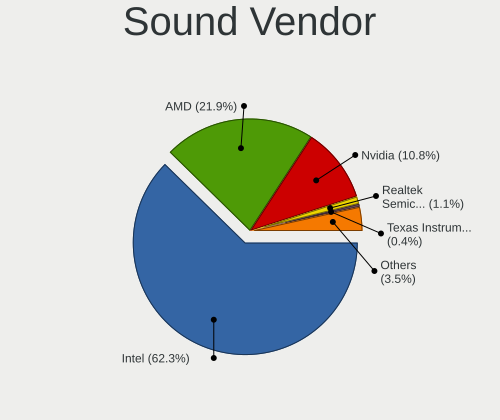

| Vendor                           | Notebooks | Percent |
|----------------------------------|-----------|---------|
| Intel                            | 288       | 62.34%  |
| AMD                              | 101       | 21.86%  |
| Nvidia                           | 50        | 10.82%  |
| Realtek Semiconductor            | 5         | 1.08%   |
| Texas Instruments                | 2         | 0.43%   |
| Philips (or NXP)                 | 2         | 0.43%   |
| GN Netcom                        | 2         | 0.43%   |
| VIA Technologies                 | 1         | 0.22%   |
| Silicon Integrated Systems [SiS] | 1         | 0.22%   |
| Nordic Semiconductor ASA         | 1         | 0.22%   |
| Lenovo                           | 1         | 0.22%   |
| JMTek                            | 1         | 0.22%   |
| Jieli Technology                 | 1         | 0.22%   |
| DSEA A/S                         | 1         | 0.22%   |
| Dell                             | 1         | 0.22%   |
| C-Media Electronics              | 1         | 0.22%   |
| BEHRINGER International          | 1         | 0.22%   |
| AKAI Professional M.I.           | 1         | 0.22%   |
| Actions Semiconductor            | 1         | 0.22%   |

Sound Model
-----------

Sound card models

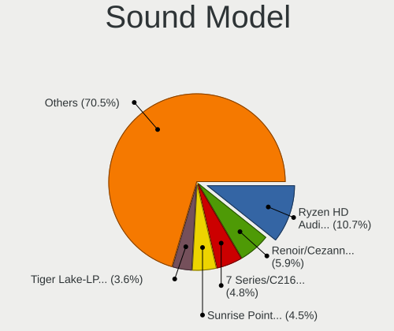

| Model                                                                                             | Notebooks | Percent |
|---------------------------------------------------------------------------------------------------|-----------|---------|
| AMD Ryzen HD Audio Controller                                                                     | 62        | 10.71%  |
| AMD Renoir/Cezanne HDMI/DP Audio Controller                                                       | 34        | 5.87%   |
| Intel 7 Series/C216 Chipset Family High Definition Audio Controller                               | 28        | 4.84%   |
| Intel Sunrise Point-LP HD Audio                                                                   | 26        | 4.49%   |
| Intel Tiger Lake-LP Smart Sound Technology Audio Controller                                       | 21        | 3.63%   |
| Intel 6 Series/C200 Series Chipset Family High Definition Audio Controller                        | 21        | 3.63%   |
| Intel 82801I (ICH9 Family) HD Audio Controller                                                    | 19        | 3.28%   |
| Intel Alder Lake PCH-P High Definition Audio Controller                                           | 17        | 2.94%   |
| AMD Radeon High Definition Audio Controller                                                       | 17        | 2.94%   |
| AMD FCH Azalia Controller                                                                         | 15        | 2.59%   |
| Intel NM10/ICH7 Family High Definition Audio Controller                                           | 13        | 2.25%   |
| Intel 5 Series/3400 Series Chipset High Definition Audio                                          | 13        | 2.25%   |
| Intel Haswell-ULT HD Audio Controller                                                             | 12        | 2.07%   |
| Intel Celeron/Pentium Silver Processor High Definition Audio                                      | 12        | 2.07%   |
| Intel 82801H (ICH8 Family) HD Audio Controller                                                    | 12        | 2.07%   |
| Intel 8 Series HD Audio Controller                                                                | 12        | 2.07%   |
| Intel 8 Series/C220 Series Chipset High Definition Audio Controller                               | 11        | 1.9%    |
| Intel Wildcat Point-LP High Definition Audio Controller                                           | 10        | 1.73%   |
| Intel Broadwell-U Audio Controller                                                                | 10        | 1.73%   |
| AMD Kabini HDMI/DP Audio                                                                          | 10        | 1.73%   |
| AMD Family 15h (Models 60h-6fh) Audio Controller                                                  | 9         | 1.55%   |
| Intel Xeon E3-1200 v3/4th Gen Core Processor HD Audio Controller                                  | 8         | 1.38%   |
| Intel Raptor Lake-P/U/H cAVS                                                                      | 8         | 1.38%   |
| Intel Comet Lake PCH-LP cAVS                                                                      | 8         | 1.38%   |
| AMD Raven/Raven2/Fenghuang HDMI/DP Audio Controller                                               | 8         | 1.38%   |
| AMD High Definition Audio Controller                                                              | 8         | 1.38%   |
| Nvidia GF108 High Definition Audio Controller                                                     | 7         | 1.21%   |
| Intel Cannon Lake PCH cAVS                                                                        | 7         | 1.21%   |
| Nvidia MCP89 High Definition Audio                                                                | 6         | 1.04%   |
| Nvidia AD107 High Definition Audio Controller                                                     | 6         | 1.04%   |
| Intel Meteor Lake-P HD Audio Controller                                                           | 6         | 1.04%   |
| Intel Celeron N3350/Pentium N4200/Atom E3900 Series Audio Cluster                                 | 6         | 1.04%   |
| Intel Cannon Point-LP High Definition Audio Controller                                            | 6         | 1.04%   |
| Intel Atom/Celeron/Pentium Processor x5-E8000/J3xxx/N3xxx Series High Definition Audio Controller | 6         | 1.04%   |
| Nvidia MCP79 High Definition Audio                                                                | 5         | 0.86%   |
| Nvidia GA107 High Definition Audio Controller                                                     | 5         | 0.86%   |
| Intel Raptor Lake High Definition Audio Controller                                                | 5         | 0.86%   |
| Intel 100 Series/C230 Series Chipset Family HD Audio Controller                                   | 5         | 0.86%   |
| AMD Wrestler HDMI Audio                                                                           | 5         | 0.86%   |
| AMD SBx00 Azalia (Intel HDA)                                                                      | 5         | 0.86%   |

Memory
------

Memory Vendor
-------------

Memory module vendors

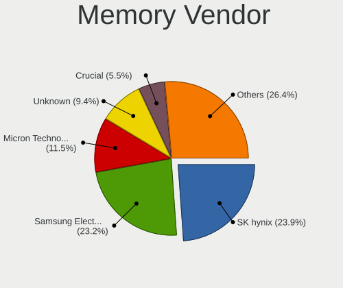

| Vendor              | Notebooks | Percent |
|---------------------|-----------|---------|
| SK hynix            | 112       | 23.88%  |
| Samsung Electronics | 109       | 23.24%  |
| Micron Technology   | 54        | 11.51%  |
| Unknown             | 44        | 9.38%   |
| Crucial             | 26        | 5.54%   |
| Kingston            | 25        | 5.33%   |
| Unknown             | 13        | 2.77%   |
| Elpida              | 12        | 2.56%   |
| A-DATA Technology   | 12        | 2.56%   |
| Unknown (ABCD)      | 10        | 2.13%   |
| Ramaxel Technology  | 10        | 2.13%   |
| Team                | 7         | 1.49%   |
| Corsair             | 5         | 1.07%   |
| Nanya Technology    | 4         | 0.85%   |
| G.Skill             | 4         | 0.85%   |
| Smart               | 3         | 0.64%   |
| Apacer              | 3         | 0.64%   |
| Patriot             | 2         | 0.43%   |
| 4ea5                | 2         | 0.43%   |
| 48spaces            | 2         | 0.43%   |
| Unknown (8A02)      | 1         | 0.21%   |
| Unifosa             | 1         | 0.21%   |
| Transcend           | 1         | 0.21%   |
| Qimonda             | 1         | 0.21%   |
| Netlist             | 1         | 0.21%   |
| Lexar               | 1         | 0.21%   |
| ff                  | 1         | 0.21%   |
| CSX                 | 1         | 0.21%   |
| ACPI Digital        | 1         | 0.21%   |
| 8054000080CE        | 1         | 0.21%   |

Memory Model
------------

Memory module models

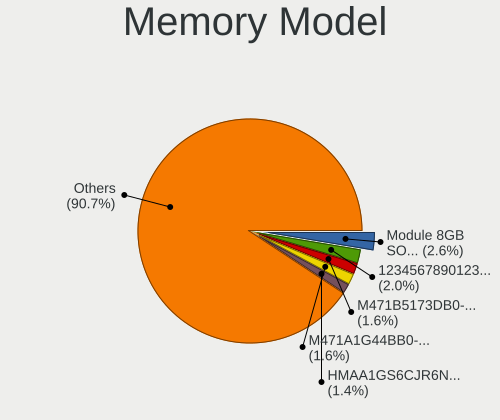

| Model                                                            | Notebooks | Percent |
|------------------------------------------------------------------|-----------|---------|
| Unknown                                                          | 13        | 2.63%   |
| Unknown (ABCD) RAM 123456789012345678 2GB SODIMM LPDDR4 2400MT/s | 10        | 2.02%   |
| Samsung RAM M471B5173DB0-YK0 4GB SODIMM DDR3 1600MT/s            | 8         | 1.62%   |
| Samsung RAM M471A1G44BB0-CWE 8GB SODIMM DDR4 3200MT/s            | 8         | 1.62%   |
| SK hynix RAM HMAA1GS6CJR6N-XN 8GB SODIMM DDR4 3200MT/s           | 7         | 1.41%   |
| SK hynix RAM HMA81GS6AFR8N-UH 8GB SODIMM DDR4 2667MT/s           | 7         | 1.41%   |
| Samsung RAM M471B5273DH0-CH9 4GB SODIMM DDR3 1600MT/s            | 6         | 1.21%   |
| Unknown RAM Module 1GB SODIMM DDR2 667MT/s                       | 5         | 1.01%   |
| SK hynix RAM HMA81GS6DJR8N-XN 8GB SODIMM DDR4 3200MT/s           | 5         | 1.01%   |
| Samsung RAM M471B5273CH0-CH9 4GB SODIMM DDR3 1334MT/s            | 5         | 1.01%   |
| Samsung RAM M471A1K43EB1-CWE 8GB SODIMM DDR4 3200MT/s            | 5         | 1.01%   |
| Unknown RAM Module 2GB SODIMM SDRAM                              | 4         | 0.81%   |
| Unknown RAM Module 2GB SODIMM DDR3 1333MT/s                      | 4         | 0.81%   |
| Unknown RAM Module 1GB SODIMM DDR2                               | 4         | 0.81%   |
| Team RAM TEAMGROUP-SD4-3200 16GB SODIMM DDR4 3200MT/s            | 4         | 0.81%   |
| SK hynix RAM HMT451S6BFR8A-PB 4GB SODIMM DDR3 1600MT/s           | 4         | 0.81%   |
| Samsung RAM M471B5173QH0-YK0 4GB SODIMM DDR3 1600MT/s            | 4         | 0.81%   |
| Samsung RAM M471B1G73QH0-YK0 8GB SODIMM DDR3 1600MT/s            | 4         | 0.81%   |
| Samsung RAM M471B1G73DB0-YK0 8GB SODIMM DDR3 1600MT/s            | 4         | 0.81%   |
| Micron RAM 4ATF1G64HZ-3G2F1 8GB SODIMM DDR4 3200MT/s             | 4         | 0.81%   |
| Crucial RAM CT51264BF160BJ.C8F 4GB SODIMM DDR3 1600MT/s          | 4         | 0.81%   |
| Unknown RAM Module 4GB SODIMM DDR3 1333MT/s                      | 3         | 0.61%   |
| Unknown RAM Module 2GB SODIMM DDR2 667MT/s                       | 3         | 0.61%   |
| Unknown RAM Module 1GB SODIMM DDR3 1066MT/s                      | 3         | 0.61%   |
| SK hynix RAM Module 16GB SODIMM DDR4 3200MT/s                    | 3         | 0.61%   |
| SK hynix RAM HYMP125S64CP8-S6 2GB SODIMM DDR2 975MT/s            | 3         | 0.61%   |
| SK hynix RAM HMAA2GS6CJR8N-XN 16GB SODIMM DDR4 3200MT/s          | 3         | 0.61%   |
| SK hynix RAM HMA82GS6JJR8N-VK 16GB SODIMM DDR4 2667MT/s          | 3         | 0.61%   |
| SK hynix RAM HMA82GS6DJR8N-VK 16GB SODIMM DDR4 2667MT/s          | 3         | 0.61%   |
| Samsung RAM M471B1G73EB0-YK0 8192MB SODIMM DDR3 1600MT/s         | 3         | 0.61%   |
| Samsung RAM M471A5244CB0-CTD 4GB SODIMM DDR4 3266MT/s            | 3         | 0.61%   |
| Samsung RAM M471A1K43CB1-CRC 8GB SODIMM DDR4 8400MT/s            | 3         | 0.61%   |
| Samsung RAM M471A1G44CB0-CWE 8GB SODIMM DDR4 3200MT/s            | 3         | 0.61%   |
| Samsung RAM M4 70T5663QZ3-CF7 2GB SODIMM DDR2 2048MT/s           | 3         | 0.61%   |
| Elpida RAM EBE21UE8AFSA-8G-F 2GB SODIMM DDR2 2048MT/s            | 3         | 0.61%   |
| Crucial RAM CT51264BF160BJ.T8 4GB SODIMM DDR3 1600MT/s           | 3         | 0.61%   |
| Unknown RAM Module 4GB SODIMM DDR3 1067MT/s                      | 2         | 0.4%    |
| Unknown RAM Module 4GB SODIMM DDR3                               | 2         | 0.4%    |
| Unknown RAM Module 2GB SODIMM DDR2                               | 2         | 0.4%    |
| SK hynix RAM Module 4GB SODIMM DDR3 1600MT/s                     | 2         | 0.4%    |

Memory Kind
-----------

Memory module kinds

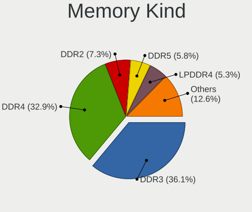

| Kind    | Notebooks | Percent |
|---------|-----------|---------|
| DDR3    | 149       | 36.08%  |
| DDR4    | 136       | 32.93%  |
| DDR2    | 30        | 7.26%   |
| DDR5    | 24        | 5.81%   |
| LPDDR4  | 22        | 5.33%   |
| LPDDR5  | 18        | 4.36%   |
| SDRAM   | 17        | 4.12%   |
| LPDDR3  | 8         | 1.94%   |
| DDR     | 6         | 1.45%   |
| Unknown | 3         | 0.73%   |

Memory Form Factor
------------------

Physical design of the memory module

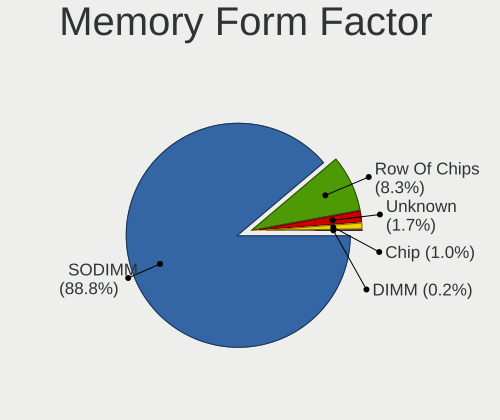

| Name         | Notebooks | Percent |
|--------------|-----------|---------|
| SODIMM       | 366       | 88.83%  |
| Row Of Chips | 34        | 8.25%   |
| Unknown      | 7         | 1.7%    |
| Chip         | 4         | 0.97%   |
| DIMM         | 1         | 0.24%   |

Memory Size
-----------

Memory module size

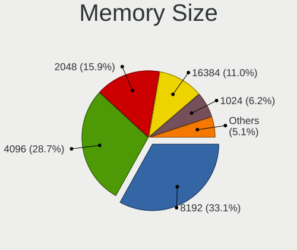

| Size  | Notebooks | Percent |
|-------|-----------|---------|
| 8192  | 144       | 33.1%   |
| 4096  | 125       | 28.74%  |
| 2048  | 69        | 15.86%  |
| 16384 | 48        | 11.03%  |
| 1024  | 27        | 6.21%   |
| 32768 | 19        | 4.37%   |
| 512   | 3         | 0.69%   |

Memory Speed
------------

Memory module speed

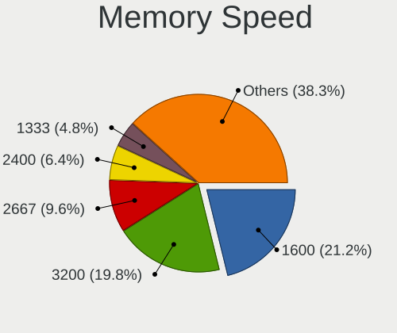

| Speed   | Notebooks | Percent |
|---------|-----------|---------|
| 1600    | 93        | 21.18%  |
| 3200    | 87        | 19.82%  |
| 2667    | 42        | 9.57%   |
| 2400    | 28        | 6.38%   |
| 1333    | 21        | 4.78%   |
| 1067    | 16        | 3.64%   |
| 667     | 15        | 3.42%   |
| 5600    | 14        | 3.19%   |
| 1334    | 12        | 2.73%   |
| Unknown | 12        | 2.73%   |
| 6400    | 11        | 2.51%   |
| 800     | 11        | 2.51%   |
| 4800    | 9         | 2.05%   |
| 2133    | 9         | 2.05%   |
| 2048    | 8         | 1.82%   |
| 4267    | 6         | 1.37%   |
| 975     | 6         | 1.37%   |
| 1867    | 5         | 1.14%   |
| 1066    | 5         | 1.14%   |
| 4199    | 4         | 0.91%   |
| 533     | 4         | 0.91%   |
| 8400    | 3         | 0.68%   |
| 7467    | 3         | 0.68%   |
| 3266    | 3         | 0.68%   |
| 7500    | 2         | 0.46%   |
| 5500    | 2         | 0.46%   |
| 3733    | 2         | 0.46%   |
| 5200    | 1         | 0.23%   |
| 4266    | 1         | 0.23%   |
| 2933    | 1         | 0.23%   |
| 1639    | 1         | 0.23%   |
| 400     | 1         | 0.23%   |
| 100     | 1         | 0.23%   |

Printers & scanners
-------------------

Printer Vendor
--------------

Printer device vendors

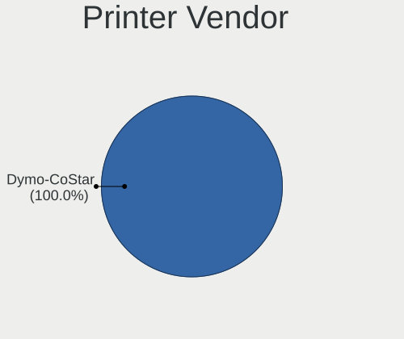

| Vendor          | Notebooks | Percent |
|-----------------|-----------|---------|
| Hewlett-Packard | 1         | 50%     |
| Dymo-CoStar     | 1         | 50%     |

Printer Model
-------------

Printer device models

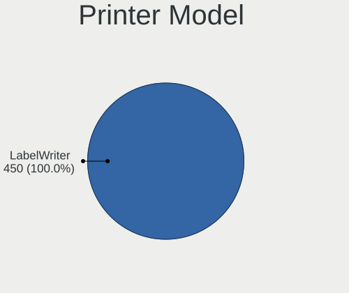

| Model                       | Notebooks | Percent |
|-----------------------------|-----------|---------|
| HP LaserJet P1006           | 1         | 50%     |
| Dymo-CoStar LabelWriter 450 | 1         | 50%     |

Scanner Vendor
--------------

Scanner device vendors

Zero info for selected period =(

Scanner Model
-------------

Scanner device models

Zero info for selected period =(

Camera
------

Camera Vendor
-------------

Camera device vendors

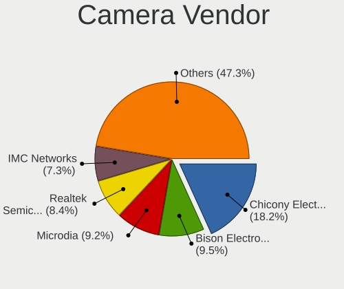

| Vendor                                 | Notebooks | Percent |
|----------------------------------------|-----------|---------|
| Chicony Electronics                    | 65        | 18.21%  |
| Bison Electronics                      | 34        | 9.52%   |
| Microdia                               | 33        | 9.24%   |
| Realtek Semiconductor                  | 30        | 8.4%    |
| IMC Networks                           | 26        | 7.28%   |
| Quanta                                 | 23        | 6.44%   |
| Apple                                  | 21        | 5.88%   |
| Luxvisions Innotech Limited            | 15        | 4.2%    |
| Sunplus Innovation Technology          | 13        | 3.64%   |
| Suyin                                  | 12        | 3.36%   |
| Cheng Uei Precision Industry (Foxlink) | 12        | 3.36%   |
| Lite-On Technology                     | 11        | 3.08%   |
| Alcor Micro                            | 9         | 2.52%   |
| Syntek                                 | 8         | 2.24%   |
| Sonix Technology                       | 5         | 1.4%    |
| Silicon Motion                         | 5         | 1.4%    |
| Lenovo                                 | 5         | 1.4%    |
| Ricoh                                  | 4         | 1.12%   |
| Importek                               | 4         | 1.12%   |
| icSpring                               | 3         | 0.84%   |
| Z-Star Microelectronics                | 2         | 0.56%   |
| Samsung Electronics                    | 2         | 0.56%   |
| Logitech                               | 2         | 0.56%   |
| kingcome                               | 2         | 0.56%   |
| Intel                                  | 2         | 0.56%   |
| SunplusIT                              | 1         | 0.28%   |
| ShineTech                              | 1         | 0.28%   |
| Microsoft                              | 1         | 0.28%   |
| KYT-240222-A                           | 1         | 0.28%   |
| HYGD-240403-A                          | 1         | 0.28%   |
| Genesys Logic                          | 1         | 0.28%   |
| Cubeternet                             | 1         | 0.28%   |
| BillionPixels                          | 1         | 0.28%   |
| ALi                                    | 1         | 0.28%   |

Camera Model
------------

Camera device models

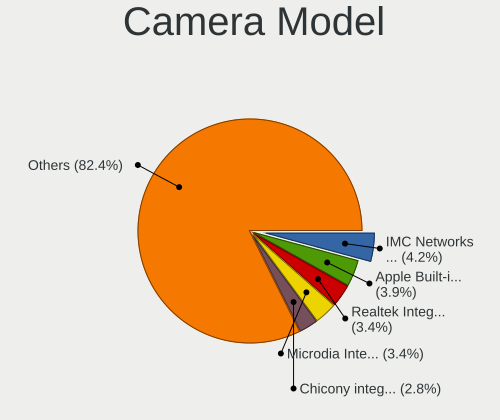

| Model                                               | Notebooks | Percent |
|-----------------------------------------------------|-----------|---------|
| IMC Networks USB2.0 HD UVC WebCam                   | 15        | 4.2%    |
| Apple Built-in iSight                               | 14        | 3.92%   |
| Realtek Integrated_Webcam_HD                        | 12        | 3.36%   |
| Microdia Integrated_Webcam_HD                       | 12        | 3.36%   |
| Chicony integrated camera                           | 10        | 2.8%    |
| Bison USB HD Webcam                                 | 8         | 2.24%   |
| Syntek Integrated Camera                            | 5         | 1.4%    |
| Luxvisions Innotech Limited HP TrueVision HD Camera | 5         | 1.4%    |
| Chicony TOSHIBA Web Camera - HD                     | 5         | 1.4%    |
| Suyin HP Truevision HD                              | 4         | 1.12%   |
| Sunplus Integrated_Webcam_HD                        | 4         | 1.12%   |
| Luxvisions Innotech Limited Integrated Camera       | 4         | 1.12%   |
| Lite-On Integrated Camera                           | 4         | 1.12%   |
| Importek TOSHIBA Web Camera - HD                    | 4         | 1.12%   |
| IMC Networks Integrated Camera                      | 4         | 1.12%   |
| Chicony HP Truevision HD                            | 4         | 1.12%   |
| Chicony Chicony USB2.0 Camera                       | 4         | 1.12%   |
| Bison Lenovo EasyCamera                             | 4         | 1.12%   |
| Bison Integrated RGB Camera                         | 4         | 1.12%   |
| Bison Integrated Camera                             | 4         | 1.12%   |
| Apple FaceTime HD Camera                            | 4         | 1.12%   |
| Suyin HP TrueVision HD Integrated Webcam            | 3         | 0.84%   |
| Realtek Integrated Webcam                           | 3         | 0.84%   |
| Realtek Bluetooth Radio                             | 3         | 0.84%   |
| Quanta HP TrueVision HD Camera                      | 3         | 0.84%   |
| Quanta HP HD Camera                                 | 3         | 0.84%   |
| Quanta HD User Facing                               | 3         | 0.84%   |
| Microdia Laptop_Integrated_Webcam_2M                | 3         | 0.84%   |
| Microdia Integrated_Webcam_FHD                      | 3         | 0.84%   |
| Microdia Integrated Webcam                          | 3         | 0.84%   |
| Lite-On HP HD Camera                                | 3         | 0.84%   |
| Lenovo Integrated Webcam [R5U877]                   | 3         | 0.84%   |
| IMC Networks USB2.0 VGA UVC WebCam                  | 3         | 0.84%   |
| icSpring camera                                     | 3         | 0.84%   |
| Chicony HP HD Camera                                | 3         | 0.84%   |
| Chicony HD WebCam                                   | 3         | 0.84%   |
| Chicony ACER HD User Facing                         | 3         | 0.84%   |
| Bison HD Webcam                                     | 3         | 0.84%   |
| Alcor Micro HP Webcam-101                           | 3         | 0.84%   |
| Z-Star Webcam                                       | 2         | 0.56%   |

Security
--------

Fingerprint Vendor
------------------

Fingerprint sensor vendors

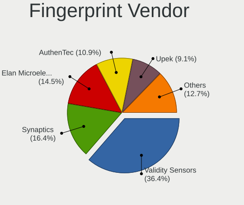

| Vendor                     | Notebooks | Percent |
|----------------------------|-----------|---------|
| Validity Sensors           | 20        | 36.36%  |
| Synaptics                  | 9         | 16.36%  |
| Elan Microelectronics      | 8         | 14.55%  |
| AuthenTec                  | 6         | 10.91%  |
| Upek                       | 5         | 9.09%   |
| Shenzhen Goodix Technology | 5         | 9.09%   |
| STMicroelectronics         | 2         | 3.64%   |

Fingerprint Model
-----------------

Fingerprint sensor models

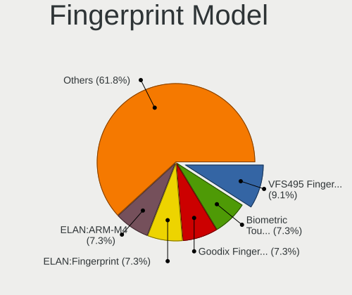

| Model                                                    | Notebooks | Percent |
|----------------------------------------------------------|-----------|---------|
| Validity Sensors VFS495 Fingerprint Reader               | 5         | 9.09%   |
| Upek Biometric Touchchip/Touchstrip Fingerprint Sensor   | 4         | 7.27%   |
| Shenzhen Goodix  Fingerprint Device                      | 4         | 7.27%   |
| Elan ELAN:Fingerprint                                    | 4         | 7.27%   |
| Elan ELAN:ARM-M4                                         | 4         | 7.27%   |
| Validity Sensors Fingerprint scanner                     | 3         | 5.45%   |
| Synaptics Metallica MIS Touch Fingerprint Reader         | 3         | 5.45%   |
| AuthenTec AES2501 Fingerprint Sensor                     | 3         | 5.45%   |
| Validity Sensors VFS5011 Fingerprint Reader              | 2         | 3.64%   |
| Validity Sensors VFS Fingerprint sensor                  | 2         | 3.64%   |
| Synaptics UWP WBDI Device                                | 2         | 3.64%   |
| STMicroelectronics Fingerprint Reader                    | 2         | 3.64%   |
| AuthenTec AES2810                                        | 2         | 3.64%   |
| Validity Sensors VFS7500 Touch Fingerprint Sensor        | 1         | 1.82%   |
| Validity Sensors VFS491                                  | 1         | 1.82%   |
| Validity Sensors VFS451 Fingerprint Reader               | 1         | 1.82%   |
| Validity Sensors VFS300 Fingerprint Reader               | 1         | 1.82%   |
| Validity Sensors VFS101 Fingerprint Reader               | 1         | 1.82%   |
| Validity Sensors VFS 5011 fingerprint sensor             | 1         | 1.82%   |
| Validity Sensors Synaptics WBDI                          | 1         | 1.82%   |
| Validity Sensors Swipe Fingerprint Sensor                | 1         | 1.82%   |
| Upek TCS5B Fingerprint sensor                            | 1         | 1.82%   |
| Synaptics  WBDI                                          | 1         | 1.82%   |
| Synaptics Prometheus MIS Touch Fingerprint Reader        | 1         | 1.82%   |
| Synaptics FS7604 Touch Fingerprint Sensor with PurePrint | 1         | 1.82%   |
| Synaptics Fingerprint reader [HP G6]                     | 1         | 1.82%   |
| Shenzhen Goodix FingerPrint                              | 1         | 1.82%   |
| AuthenTec AES1600                                        | 1         | 1.82%   |

Chipcard Vendor
---------------

Chipcard module vendors

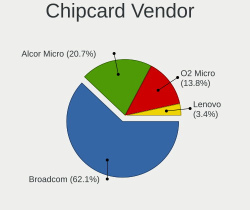

| Vendor      | Notebooks | Percent |
|-------------|-----------|---------|
| Broadcom    | 18        | 62.07%  |
| Alcor Micro | 6         | 20.69%  |
| O2 Micro    | 4         | 13.79%  |
| Lenovo      | 1         | 3.45%   |

Chipcard Model
--------------

Chipcard module models

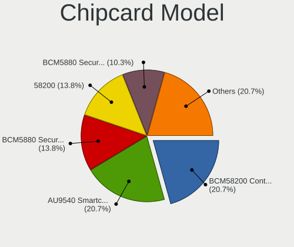

| Model                                                                        | Notebooks | Percent |
|------------------------------------------------------------------------------|-----------|---------|
| Broadcom BCM58200 ControlVault 3 (FingerPrint sensor + Contacted SmartCard)  | 6         | 20.69%  |
| Alcor Micro AU9540 Smartcard Reader                                          | 6         | 20.69%  |
| Broadcom BCM5880 Secure Applications Processor                               | 4         | 13.79%  |
| Broadcom 58200                                                               | 4         | 13.79%  |
| Broadcom BCM5880 Secure Applications Processor with fingerprint swipe sensor | 3         | 10.34%  |
| O2 Micro Oz776 SmartCard Reader                                              | 2         | 6.9%    |
| O2 Micro OZ776 CCID Smartcard Reader                                         | 2         | 6.9%    |
| Lenovo Integrated Smart Card Reader                                          | 1         | 3.45%   |
| Broadcom 5880                                                                | 1         | 3.45%   |

Unsupported
-----------

Unsupported Devices
-------------------

Total unsupported devices on board

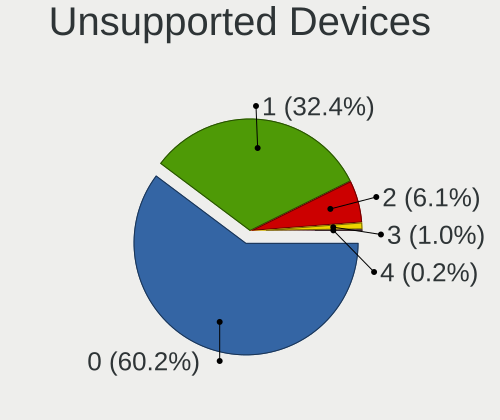

| Total | Notebooks | Percent |
|-------|-----------|---------|
| 0     | 247       | 60.24%  |
| 1     | 133       | 32.44%  |
| 2     | 25        | 6.1%    |
| 3     | 4         | 0.98%   |
| 4     | 1         | 0.24%   |

Unsupported Device Types
------------------------

Types of unsupported devices

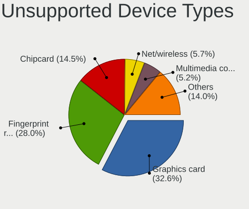

| Type                     | Notebooks | Percent |
|--------------------------|-----------|---------|
| Graphics card            | 63        | 32.64%  |
| Fingerprint reader       | 54        | 27.98%  |
| Chipcard                 | 28        | 14.51%  |
| Net/wireless             | 11        | 5.7%    |
| Multimedia controller    | 10        | 5.18%   |
| Camera                   | 8         | 4.15%   |
| Bluetooth                | 8         | 4.15%   |
| Storage                  | 3         | 1.55%   |
| Flash memory             | 2         | 1.04%   |
| Wireless                 | 1         | 0.52%   |
| Sound                    | 1         | 0.52%   |
| Network                  | 1         | 0.52%   |
| Net/ethernet             | 1         | 0.52%   |
| Communication controller | 1         | 0.52%   |
| Card reader              | 1         | 0.52%   |

