MX 23 - Tested Hardware & Statistics (Notebooks)
------------------------------------------------

A project to collect tested hardware configurations for MX 23.

Anyone can contribute to this report by the [hw-probe](https://github.com/linuxhw/hw-probe) tool:

    sudo -E hw-probe -all -upload

Please contribute! Especially if your hardware is rare.

Contents
--------

* [ Test Cases ](#test-cases)

* [ System ](#system)
  - [ Kernel                   ](#kernel)
  - [ Kernel Family            ](#kernel-family)
  - [ Kernel Major Ver.        ](#kernel-major-ver)
  - [ Arch                     ](#arch)
  - [ DE                       ](#de)
  - [ Display Server           ](#display-server)
  - [ Display Manager          ](#display-manager)
  - [ OS Lang                  ](#os-lang)
  - [ Boot Mode                ](#boot-mode)
  - [ Filesystem               ](#filesystem)
  - [ Part. scheme             ](#part-scheme)
  - [ Dual Boot with Linux/BSD ](#dual-boot-with-linuxbsd)
  - [ Dual Boot (Win)          ](#dual-boot-win)

* [ Board ](#board)
  - [ Vendor                   ](#vendor)
  - [ Model                    ](#model)
  - [ Model Family             ](#model-family)
  - [ MFG Year                 ](#mfg-year)
  - [ Form Factor              ](#form-factor)
  - [ Secure Boot              ](#secure-boot)
  - [ Coreboot                 ](#coreboot)
  - [ RAM Size                 ](#ram-size)
  - [ RAM Used                 ](#ram-used)
  - [ Total Drives             ](#total-drives)
  - [ Has CD-ROM               ](#has-cd-rom)
  - [ Has Ethernet             ](#has-ethernet)
  - [ Has WiFi                 ](#has-wifi)
  - [ Has Bluetooth            ](#has-bluetooth)

* [ Location ](#location)
  - [ Country                  ](#country)
  - [ City                     ](#city)

* [ Drives ](#drives)
  - [ Drive Vendor             ](#drive-vendor)
  - [ Drive Model              ](#drive-model)
  - [ HDD Vendor               ](#hdd-vendor)
  - [ SSD Vendor               ](#ssd-vendor)
  - [ Drive Kind               ](#drive-kind)
  - [ Drive Connector          ](#drive-connector)
  - [ Drive Size               ](#drive-size)
  - [ Space Total              ](#space-total)
  - [ Space Used               ](#space-used)
  - [ Malfunc. Drives          ](#malfunc-drives)
  - [ Malfunc. Drive Vendor    ](#malfunc-drive-vendor)
  - [ Malfunc. HDD Vendor      ](#malfunc-hdd-vendor)
  - [ Malfunc. Drive Kind      ](#malfunc-drive-kind)
  - [ Failed Drives            ](#failed-drives)
  - [ Failed Drive Vendor      ](#failed-drive-vendor)
  - [ Drive Status             ](#drive-status)

* [ Storage controller ](#storage-controller)
  - [ Storage Vendor           ](#storage-vendor)
  - [ Storage Model            ](#storage-model)
  - [ Storage Kind             ](#storage-kind)

* [ Processor ](#processor)
  - [ CPU Vendor               ](#cpu-vendor)
  - [ CPU Model                ](#cpu-model)
  - [ CPU Model Family         ](#cpu-model-family)
  - [ CPU Cores                ](#cpu-cores)
  - [ CPU Sockets              ](#cpu-sockets)
  - [ CPU Threads              ](#cpu-threads)
  - [ CPU Op-Modes             ](#cpu-op-modes)
  - [ CPU Microcode            ](#cpu-microcode)
  - [ CPU Microarch            ](#cpu-microarch)

* [ Graphics ](#graphics)
  - [ GPU Vendor               ](#gpu-vendor)
  - [ GPU Model                ](#gpu-model)
  - [ GPU Combo                ](#gpu-combo)
  - [ GPU Driver               ](#gpu-driver)
  - [ GPU Memory               ](#gpu-memory)

* [ Monitor ](#monitor)
  - [ Monitor Vendor           ](#monitor-vendor)
  - [ Monitor Model            ](#monitor-model)
  - [ Monitor Resolution       ](#monitor-resolution)
  - [ Monitor Diagonal         ](#monitor-diagonal)
  - [ Monitor Width            ](#monitor-width)
  - [ Aspect Ratio             ](#aspect-ratio)
  - [ Monitor Area             ](#monitor-area)
  - [ Pixel Density            ](#pixel-density)
  - [ Multiple Monitors        ](#multiple-monitors)

* [ Network ](#network)
  - [ Net Controller Vendor    ](#net-controller-vendor)
  - [ Net Controller Model     ](#net-controller-model)
  - [ Wireless Vendor          ](#wireless-vendor)
  - [ Wireless Model           ](#wireless-model)
  - [ Ethernet Vendor          ](#ethernet-vendor)
  - [ Ethernet Model           ](#ethernet-model)
  - [ Net Controller Kind      ](#net-controller-kind)
  - [ Used Controller          ](#used-controller)
  - [ NICs                     ](#nics)
  - [ IPv6                     ](#ipv6)

* [ Bluetooth ](#bluetooth)
  - [ Bluetooth Vendor         ](#bluetooth-vendor)
  - [ Bluetooth Model          ](#bluetooth-model)

* [ Sound ](#sound)
  - [ Sound Vendor             ](#sound-vendor)
  - [ Sound Model              ](#sound-model)

* [ Memory ](#memory)
  - [ Memory Vendor            ](#memory-vendor)
  - [ Memory Model             ](#memory-model)
  - [ Memory Kind              ](#memory-kind)
  - [ Memory Form Factor       ](#memory-form-factor)
  - [ Memory Size              ](#memory-size)
  - [ Memory Speed             ](#memory-speed)

* [ Printers & scanners ](#printers--scanners)
  - [ Printer Vendor           ](#printer-vendor)
  - [ Printer Model            ](#printer-model)
  - [ Scanner Vendor           ](#scanner-vendor)
  - [ Scanner Model            ](#scanner-model)

* [ Camera ](#camera)
  - [ Camera Vendor            ](#camera-vendor)
  - [ Camera Model             ](#camera-model)

* [ Security ](#security)
  - [ Fingerprint Vendor       ](#fingerprint-vendor)
  - [ Fingerprint Model        ](#fingerprint-model)
  - [ Chipcard Vendor          ](#chipcard-vendor)
  - [ Chipcard Model           ](#chipcard-model)

* [ Unsupported ](#unsupported)
  - [ Unsupported Devices      ](#unsupported-devices)
  - [ Unsupported Device Types ](#unsupported-device-types)

Test Cases
----------

Total: 121

| Vendor        | Model                       | Probe                                                      | Date         |
|---------------|-----------------------------|------------------------------------------------------------|--------------|
| VIT           | P3400                       | [036ee57838](https://linux-hardware.org/?probe=036ee57838) | Feb 02, 2024 |
| VIT           | P3400                       | [6b03e6574f](https://linux-hardware.org/?probe=6b03e6574f) | Feb 01, 2024 |
| Lenovo        | ThinkPad E14 Gen 2 20TA0... | [653f9c5fa5](https://linux-hardware.org/?probe=653f9c5fa5) | Feb 01, 2024 |
| Dell          | Latitude 3190               | [16f86af47d](https://linux-hardware.org/?probe=16f86af47d) | Jan 30, 2024 |
| Dell          | Latitude E6410              | [1b7b83010f](https://linux-hardware.org/?probe=1b7b83010f) | Jan 24, 2024 |
| Apple         | MacBookAir6,2               | [6eb8876e79](https://linux-hardware.org/?probe=6eb8876e79) | Jan 24, 2024 |
| HP            | EliteBook 840 G8 Noteboo... | [e03dc88f3e](https://linux-hardware.org/?probe=e03dc88f3e) | Jan 20, 2024 |
| HP            | Notebook                    | [0f5f8dd38d](https://linux-hardware.org/?probe=0f5f8dd38d) | Jan 17, 2024 |
| Google        | Barla                       | [f053c5164a](https://linux-hardware.org/?probe=f053c5164a) | Jan 16, 2024 |
| Lenovo        | LOQ 15APH8 82XT             | [d0af07b360](https://linux-hardware.org/?probe=d0af07b360) | Jan 15, 2024 |
| Apple         | MacBookPro14,3              | [3b0c274172](https://linux-hardware.org/?probe=3b0c274172) | Jan 12, 2024 |
| Lenovo        | ThinkPad T470s W10DG 20J... | [f782b74751](https://linux-hardware.org/?probe=f782b74751) | Jan 12, 2024 |
| Dell          | Latitude 3190               | [afdd5a1dbe](https://linux-hardware.org/?probe=afdd5a1dbe) | Jan 09, 2024 |
| HP            | Pavilion dv2700             | [957ec4cc30](https://linux-hardware.org/?probe=957ec4cc30) | Jan 09, 2024 |
| Sony          | SVF1521H1EW                 | [1939183179](https://linux-hardware.org/?probe=1939183179) | Jan 07, 2024 |
| Lenovo        | ThinkPad X1 Carbon 3rd 2... | [71d03730b7](https://linux-hardware.org/?probe=71d03730b7) | Jan 03, 2024 |
| Dell          | Latitude 5400               | [9e318e9b78](https://linux-hardware.org/?probe=9e318e9b78) | Jan 03, 2024 |
| Dell          | Latitude 5400               | [59a90bd726](https://linux-hardware.org/?probe=59a90bd726) | Jan 03, 2024 |
| Google        | Barla                       | [585887bc42](https://linux-hardware.org/?probe=585887bc42) | Dec 30, 2023 |
| ASUSTek       | VivoBook_ASUSLaptop X150... | [8f3ab867ea](https://linux-hardware.org/?probe=8f3ab867ea) | Dec 30, 2023 |
| HP            | Pavilion dv6                | [39515c70db](https://linux-hardware.org/?probe=39515c70db) | Dec 27, 2023 |
| HP            | Pavilion dv6                | [c29956a752](https://linux-hardware.org/?probe=c29956a752) | Dec 27, 2023 |
| HONOR         | NMH-WCX9                    | [5647df79c0](https://linux-hardware.org/?probe=5647df79c0) | Dec 26, 2023 |
| Dell          | Latitude 3190               | [e0da711bcb](https://linux-hardware.org/?probe=e0da711bcb) | Dec 26, 2023 |
| Acer          | Aspire A315-24P             | [eade6242b7](https://linux-hardware.org/?probe=eade6242b7) | Dec 25, 2023 |
| HP            | 250 15.6 inch G9 Noteboo... | [ab0b99f2f2](https://linux-hardware.org/?probe=ab0b99f2f2) | Dec 25, 2023 |
| HP            | 250 15.6 inch G9 Noteboo... | [0da41c3e3b](https://linux-hardware.org/?probe=0da41c3e3b) | Dec 25, 2023 |
| Google        | Bobba                       | [c0e8038184](https://linux-hardware.org/?probe=c0e8038184) | Dec 22, 2023 |
| Google        | Bobba                       | [c03b219f2e](https://linux-hardware.org/?probe=c03b219f2e) | Dec 22, 2023 |
| ASUSTek       | X553MA                      | [bc7fc2be74](https://linux-hardware.org/?probe=bc7fc2be74) | Dec 20, 2023 |
| ASUSTek       | X553MA                      | [11f3b9c9d6](https://linux-hardware.org/?probe=11f3b9c9d6) | Dec 20, 2023 |
| Dell          | Latitude 3190               | [a7e488632e](https://linux-hardware.org/?probe=a7e488632e) | Dec 19, 2023 |
| HP            | Notebook                    | [d25691af9b](https://linux-hardware.org/?probe=d25691af9b) | Dec 13, 2023 |
| Dell          | Latitude 3190               | [faf8105e3c](https://linux-hardware.org/?probe=faf8105e3c) | Dec 12, 2023 |
| GPU Compan... | GWTC116-2                   | [10e35dbb2a](https://linux-hardware.org/?probe=10e35dbb2a) | Dec 12, 2023 |
| Dell          | Vostro 1320                 | [cf44765cd0](https://linux-hardware.org/?probe=cf44765cd0) | Dec 11, 2023 |
| Lenovo        | ThinkPad X201 3626GWG       | [023f7dd390](https://linux-hardware.org/?probe=023f7dd390) | Dec 11, 2023 |
| Lenovo        | IdeaPad 3 15ITL6 82H8       | [6c558ca3cf](https://linux-hardware.org/?probe=6c558ca3cf) | Dec 06, 2023 |
| Apple         | MacBook3,1                  | [d536392d03](https://linux-hardware.org/?probe=d536392d03) | Nov 30, 2023 |
| Apple         | MacBook3,1                  | [bfe263dfe0](https://linux-hardware.org/?probe=bfe263dfe0) | Nov 30, 2023 |
| Lenovo        | ThinkBook 15 G3 ACL 21A4    | [339e20f716](https://linux-hardware.org/?probe=339e20f716) | Nov 24, 2023 |
| Mediacom      | FlexBook edge11 - M-FBE1... | [9b0835e62d](https://linux-hardware.org/?probe=9b0835e62d) | Nov 21, 2023 |
| Dell          | Latitude 3190               | [3c5b8541c7](https://linux-hardware.org/?probe=3c5b8541c7) | Nov 21, 2023 |
| Acer          | Extensa 215-55              | [e1a2307332](https://linux-hardware.org/?probe=e1a2307332) | Nov 18, 2023 |
| Dell          | Precision 5570              | [7cb435d2dc](https://linux-hardware.org/?probe=7cb435d2dc) | Nov 16, 2023 |
| Gateway       | NV57H                       | [e5f084f72c](https://linux-hardware.org/?probe=e5f084f72c) | Nov 11, 2023 |
| Dell          | Latitude 3190               | [309f968d10](https://linux-hardware.org/?probe=309f968d10) | Nov 07, 2023 |
| HP            | ProBook 6470b               | [50c1d43281](https://linux-hardware.org/?probe=50c1d43281) | Nov 05, 2023 |
| AMI           | Unknown                     | [2512404fd7](https://linux-hardware.org/?probe=2512404fd7) | Nov 05, 2023 |
| Dell          | Latitude 5490               | [fcee866d9a](https://linux-hardware.org/?probe=fcee866d9a) | Oct 31, 2023 |
| Dell          | Latitude 3190               | [dc68dc55c9](https://linux-hardware.org/?probe=dc68dc55c9) | Oct 31, 2023 |
| HONOR         | BMH-WDX9                    | [a1962fef8a](https://linux-hardware.org/?probe=a1962fef8a) | Oct 31, 2023 |
| HP            | EliteBook 840 G6            | [52786d6efa](https://linux-hardware.org/?probe=52786d6efa) | Oct 30, 2023 |
| Dell          | Latitude 3190               | [a26f69cb33](https://linux-hardware.org/?probe=a26f69cb33) | Oct 24, 2023 |
| Dell          | Inspiron 16 7610            | [36eb2472ca](https://linux-hardware.org/?probe=36eb2472ca) | Oct 20, 2023 |
| HP            | ZBook 17 G2                 | [6c7d912754](https://linux-hardware.org/?probe=6c7d912754) | Oct 20, 2023 |
| Sony          | SVF1521A6EW                 | [dada2b85e8](https://linux-hardware.org/?probe=dada2b85e8) | Oct 17, 2023 |
| Dell          | Inspiron 5448               | [5901b49079](https://linux-hardware.org/?probe=5901b49079) | Oct 17, 2023 |
| Dell          | Latitude 3190               | [6524dff50f](https://linux-hardware.org/?probe=6524dff50f) | Oct 17, 2023 |
| Apple         | MacBookPro5,3               | [60e2d65ac4](https://linux-hardware.org/?probe=60e2d65ac4) | Oct 16, 2023 |
| Apple         | MacBookPro8,1               | [df7395bd63](https://linux-hardware.org/?probe=df7395bd63) | Oct 16, 2023 |
| Google        | Celes                       | [914ad131fd](https://linux-hardware.org/?probe=914ad131fd) | Oct 13, 2023 |
| Dell          | Latitude E6410              | [d6db17e35f](https://linux-hardware.org/?probe=d6db17e35f) | Oct 06, 2023 |
| Dell          | Latitude 3190               | [21aac15234](https://linux-hardware.org/?probe=21aac15234) | Oct 03, 2023 |
| Lenovo        | ThinkPad P52 20M9CTO1WW     | [4b46fb8e6a](https://linux-hardware.org/?probe=4b46fb8e6a) | Oct 02, 2023 |
| Lenovo        | IdeaPad Pro 5 16APH8 83A... | [ee6e1996b9](https://linux-hardware.org/?probe=ee6e1996b9) | Sep 29, 2023 |
| Dell          | XPS 15 7590                 | [3c87964524](https://linux-hardware.org/?probe=3c87964524) | Sep 28, 2023 |
| Lenovo        | ThinkPad X240 20AMS1JQ11    | [2b7f074e47](https://linux-hardware.org/?probe=2b7f074e47) | Sep 27, 2023 |
| Dell          | Latitude 3190               | [8ebd8669f2](https://linux-hardware.org/?probe=8ebd8669f2) | Sep 26, 2023 |
| Apple         | MacBookAir5,2               | [55dec782e7](https://linux-hardware.org/?probe=55dec782e7) | Sep 25, 2023 |
| Apple         | MacBookPro8,1               | [0c1f872edb](https://linux-hardware.org/?probe=0c1f872edb) | Sep 23, 2023 |
| Dell          | Precision 5570              | [27b003d343](https://linux-hardware.org/?probe=27b003d343) | Sep 22, 2023 |
| HP            | EliteBook 735 G6            | [0ad032f320](https://linux-hardware.org/?probe=0ad032f320) | Sep 19, 2023 |
| Dell          | Latitude 3190               | [0a698044d8](https://linux-hardware.org/?probe=0a698044d8) | Sep 19, 2023 |
| Lenovo        | IdeaPad 520-15IKB 81BF      | [9e9652809d](https://linux-hardware.org/?probe=9e9652809d) | Sep 18, 2023 |
| HP            | Laptop 15-da0xxx            | [d66a3d9329](https://linux-hardware.org/?probe=d66a3d9329) | Sep 18, 2023 |
| Dell          | Latitude D620               | [65d2f56829](https://linux-hardware.org/?probe=65d2f56829) | Sep 18, 2023 |
| HP            | Pavilion dv2                | [ee227b3d35](https://linux-hardware.org/?probe=ee227b3d35) | Sep 16, 2023 |
| ASUSTek       | K55VJ                       | [82cae5303a](https://linux-hardware.org/?probe=82cae5303a) | Sep 16, 2023 |
| ASUSTek       | K55VJ                       | [db874f0737](https://linux-hardware.org/?probe=db874f0737) | Sep 16, 2023 |
| ASUSTek       | K54L                        | [4b62e4c882](https://linux-hardware.org/?probe=4b62e4c882) | Sep 15, 2023 |
| Dell          | Latitude 3190               | [a03ec42023](https://linux-hardware.org/?probe=a03ec42023) | Sep 12, 2023 |
| Dell          | XPS 17 9700                 | [e83ef4efd8](https://linux-hardware.org/?probe=e83ef4efd8) | Sep 11, 2023 |
| Lenovo        | ThinkPad L580 20LW000VFR    | [a7dfc5e0f5](https://linux-hardware.org/?probe=a7dfc5e0f5) | Sep 09, 2023 |
| Lenovo        | ThinkPad L580 20LW000VFR    | [e224a5dc53](https://linux-hardware.org/?probe=e224a5dc53) | Sep 09, 2023 |
| Lenovo        | V15 G3 ABA 82TV             | [b906e23303](https://linux-hardware.org/?probe=b906e23303) | Sep 08, 2023 |
| HP            | ProBook 640 G2              | [318f1010b6](https://linux-hardware.org/?probe=318f1010b6) | Sep 08, 2023 |
| Dell          | Latitude 3190               | [7be68f9c9a](https://linux-hardware.org/?probe=7be68f9c9a) | Sep 06, 2023 |
| Apple         | MacBookPro8,1               | [2e3c70287a](https://linux-hardware.org/?probe=2e3c70287a) | Aug 30, 2023 |
| Dell          | Latitude 3190               | [6e16da127a](https://linux-hardware.org/?probe=6e16da127a) | Aug 29, 2023 |
| Dell          | Latitude 3190               | [61ddf042df](https://linux-hardware.org/?probe=61ddf042df) | Aug 22, 2023 |
| Dell          | Latitude E6430              | [27d598d911](https://linux-hardware.org/?probe=27d598d911) | Aug 18, 2023 |
| Samsung       | RF511/RF411/RF711           | [b9134a5ee3](https://linux-hardware.org/?probe=b9134a5ee3) | Aug 16, 2023 |
| Beelink       | Gemini X                    | [d5c4e54794](https://linux-hardware.org/?probe=d5c4e54794) | Aug 14, 2023 |
| Dell          | Vostro 15-3568              | [b422d7c8cc](https://linux-hardware.org/?probe=b422d7c8cc) | Aug 12, 2023 |
| Toshiba       | Satellite T110              | [8180105119](https://linux-hardware.org/?probe=8180105119) | Aug 11, 2023 |
| Dell          | Inspiron 5415               | [69123aa283](https://linux-hardware.org/?probe=69123aa283) | Aug 10, 2023 |
| Dell          | Inspiron 5415               | [9c28979b9d](https://linux-hardware.org/?probe=9c28979b9d) | Aug 10, 2023 |
| Dell          | Latitude E6540              | [758d587fbb](https://linux-hardware.org/?probe=758d587fbb) | Aug 10, 2023 |
| ASUSTek       | UL30A                       | [11f3b9cfad](https://linux-hardware.org/?probe=11f3b9cfad) | Aug 08, 2023 |
| Samsung       | 305E4A/305E5A/305E7A        | [f30c6c7bb5](https://linux-hardware.org/?probe=f30c6c7bb5) | Aug 08, 2023 |
| HP            | Laptop 15-dy2xxx            | [5777798e8f](https://linux-hardware.org/?probe=5777798e8f) | Aug 07, 2023 |
| ASUSTek       | ProArt StudioBook W5600Q... | [96211a5c87](https://linux-hardware.org/?probe=96211a5c87) | Aug 05, 2023 |
| Dell          | Latitude E6320              | [9b42be4945](https://linux-hardware.org/?probe=9b42be4945) | Aug 02, 2023 |
| Dell          | Latitude 3190               | [c88a2ad597](https://linux-hardware.org/?probe=c88a2ad597) | Aug 01, 2023 |
| Lenovo        | 3000 C100 07612GU           | [3941ecc4f2](https://linux-hardware.org/?probe=3941ecc4f2) | Aug 01, 2023 |
| HP            | Pavilion Laptop 15-eh1xx... | [095890a440](https://linux-hardware.org/?probe=095890a440) | Jul 31, 2023 |
| Dell          | Latitude 5340               | [5ab5c25167](https://linux-hardware.org/?probe=5ab5c25167) | Jul 28, 2023 |
| Dell          | Inspiron 3583               | [e235fb3a23](https://linux-hardware.org/?probe=e235fb3a23) | Jul 26, 2023 |
| Dell          | Latitude 3190               | [b1730d834d](https://linux-hardware.org/?probe=b1730d834d) | Jul 25, 2023 |
| Dell          | Latitude 3510               | [e1eb8b885c](https://linux-hardware.org/?probe=e1eb8b885c) | Jul 21, 2023 |
| Dell          | Latitude 5530               | [235731a6f1](https://linux-hardware.org/?probe=235731a6f1) | Jul 20, 2023 |
| Dell          | Latitude 5310               | [5b81040709](https://linux-hardware.org/?probe=5b81040709) | Jul 20, 2023 |
| Dell          | Precision 5510              | [ff4ea6ba94](https://linux-hardware.org/?probe=ff4ea6ba94) | Jul 17, 2023 |
| Sony          | VGN-S3HP                    | [6e2c92c447](https://linux-hardware.org/?probe=6e2c92c447) | Jul 17, 2023 |
| Dell          | Latitude 5530               | [37681b3327](https://linux-hardware.org/?probe=37681b3327) | Jul 17, 2023 |
| Dell          | Precision 3571              | [2123567cb0](https://linux-hardware.org/?probe=2123567cb0) | Jul 16, 2023 |
| Dell          | Latitude 3190               | [f067ca0dbf](https://linux-hardware.org/?probe=f067ca0dbf) | Jul 11, 2023 |
| Dell          | Latitude 3190               | [b895b6dced](https://linux-hardware.org/?probe=b895b6dced) | Jul 04, 2023 |
| Dell          | Latitude 3190               | [5f68b5235f](https://linux-hardware.org/?probe=5f68b5235f) | Jun 27, 2023 |
| ASUSTek       | N56VB                       | [f47c68a2a7](https://linux-hardware.org/?probe=f47c68a2a7) | Jun 04, 2023 |

System
------

Kernel
------

Version of the Linux kernel

| Version                    | Notebooks | Percent |
|----------------------------|-----------|---------|
| 6.1.0-10-amd64             | 16        | 17.39%  |
| 6.1.0-13-amd64             | 15        | 16.3%   |
| 6.4.0-1mx-ahs-amd64        | 11        | 11.96%  |
| 6.5.0-1mx-ahs-amd64        | 9         | 9.78%   |
| 6.1.0-9-amd64              | 8         | 8.7%    |
| 6.1.0-12-amd64             | 5         | 5.43%   |
| 6.1.0-17-amd64             | 3         | 3.26%   |
| 6.1.0-16-amd64             | 3         | 3.26%   |
| 6.1.0-15-amd64             | 3         | 3.26%   |
| 6.1.0-11-amd64             | 3         | 3.26%   |
| 6.4.9-1-liquorix-amd64     | 2         | 2.17%   |
| 6.1.0-10-686-pae           | 2         | 2.17%   |
| 6.6.9-1-liquorix-amd64     | 1         | 1.09%   |
| 6.6.12-1-liquorix-amd64    | 1         | 1.09%   |
| 6.4.0-4mx-ahs-amd64        | 1         | 1.09%   |
| 6.4.0-2mx-ahs-amd64        | 1         | 1.09%   |
| 6.3.0-2mx-ahs-amd64        | 1         | 1.09%   |
| 6.2.14-1-liquorix-amd64    | 1         | 1.09%   |
| 6.1.0-17-686-pae           | 1         | 1.09%   |
| 6.1.0-14-amd64             | 1         | 1.09%   |
| 6.1.0-13-rt-amd64          | 1         | 1.09%   |
| 6.1.0-13-686-pae           | 1         | 1.09%   |
| 6.1.0-12-686-pae           | 1         | 1.09%   |
| 5.10.197-antix.1-amd64-smp | 1         | 1.09%   |

Kernel Family
-------------

Linux kernel without a distro release

| Version  | Notebooks | Percent |
|----------|-----------|---------|
| 6.1.0    | 56        | 65.88%  |
| 6.4.0    | 13        | 15.29%  |
| 6.5.0    | 9         | 10.59%  |
| 6.4.9    | 2         | 2.35%   |
| 6.6.9    | 1         | 1.18%   |
| 6.6.12   | 1         | 1.18%   |
| 6.3.0    | 1         | 1.18%   |
| 6.2.14   | 1         | 1.18%   |
| 5.10.197 | 1         | 1.18%   |

Kernel Major Ver.
-----------------

Linux kernel major version

| Version | Notebooks | Percent |
|---------|-----------|---------|
| 6.1     | 56        | 65.88%  |
| 6.4     | 15        | 17.65%  |
| 6.5     | 9         | 10.59%  |
| 6.6     | 2         | 2.35%   |
| 6.3     | 1         | 1.18%   |
| 6.2     | 1         | 1.18%   |
| 5.10    | 1         | 1.18%   |

Arch
----

OS architecture (x86_64, i586, etc.)

| Name   | Notebooks | Percent |
|--------|-----------|---------|
| x86_64 | 79        | 94.05%  |
| i686   | 5         | 5.95%   |

DE
--

Desktop Environment

| Name            | Notebooks | Percent |
|-----------------|-----------|---------|
| XFCE            | 66        | 78.57%  |
| KDE5            | 14        | 16.67%  |
| fluxbox         | 2         | 2.38%   |
| X-Cinnamon      | 1         | 1.19%   |
| GNOME Flashback | 1         | 1.19%   |

Display Server
--------------

X11 or Wayland

| Name | Notebooks | Percent |
|------|-----------|---------|
| X11  | 84        | 100%    |

Display Manager
---------------

SDDM, LightDM, etc.

| Name    | Notebooks | Percent |
|---------|-----------|---------|
| LightDM | 71        | 84.52%  |
| SDDM    | 13        | 15.48%  |

OS Lang
-------

Language

| Lang    | Notebooks | Percent |
|---------|-----------|---------|
| en_US   | 44        | 51.16%  |
| de_DE   | 11        | 12.79%  |
| pl_PL   | 5         | 5.81%   |
| en_GB   | 4         | 4.65%   |
| en_CA   | 4         | 4.65%   |
| it_IT   | 3         | 3.49%   |
| en_AU   | 3         | 3.49%   |
| fr_FR   | 2         | 2.33%   |
| C       | 2         | 2.33%   |
| ru_RU   | 1         | 1.16%   |
| nl_NL   | 1         | 1.16%   |
| ja_JP   | 1         | 1.16%   |
| es_VE   | 1         | 1.16%   |
| es_MX   | 1         | 1.16%   |
| es_ES   | 1         | 1.16%   |
| en_IL   | 1         | 1.16%   |
| Unknown | 1         | 1.16%   |

Boot Mode
---------

EFI or BIOS

| Mode | Notebooks | Percent |
|------|-----------|---------|
| EFI  | 61        | 72.62%  |
| BIOS | 23        | 27.38%  |

Filesystem
----------

Type of filesystem

| Type    | Notebooks | Percent |
|---------|-----------|---------|
| Ext4    | 66        | 78.57%  |
| Overlay | 13        | 15.48%  |
| Btrfs   | 4         | 4.76%   |
| F2fs    | 1         | 1.19%   |

Part. scheme
------------

Scheme of partitioning

| Type | Notebooks | Percent |
|------|-----------|---------|
| GPT  | 60        | 71.43%  |
| MBR  | 24        | 28.57%  |

Dual Boot with Linux/BSD
------------------------

Hosting more than one Linux/BSD

| Dual boot | Notebooks | Percent |
|-----------|-----------|---------|
| No        | 74        | 88.1%   |
| Yes       | 10        | 11.9%   |

Dual Boot (Win)
---------------

Hosting Linux and Windows

| Dual boot | Notebooks | Percent |
|-----------|-----------|---------|
| No        | 55        | 63.95%  |
| Yes       | 31        | 36.05%  |

Board
-----

Vendor
------

Motherboard manufacturer

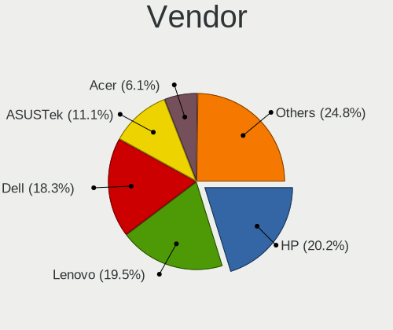

| Name                | Notebooks | Percent |
|---------------------|-----------|---------|
| Dell                | 25        | 29.76%  |
| Hewlett-Packard     | 15        | 17.86%  |
| Lenovo              | 14        | 16.67%  |
| ASUSTek Computer    | 7         | 8.33%   |
| Apple               | 5         | 5.95%   |
| Sony                | 3         | 3.57%   |
| Google              | 3         | 3.57%   |
| Samsung Electronics | 2         | 2.38%   |
| HONOR               | 2         | 2.38%   |
| Acer                | 2         | 2.38%   |
| VIT                 | 1         | 1.19%   |
| Mediacom            | 1         | 1.19%   |
| GPU Company         | 1         | 1.19%   |
| Gateway             | 1         | 1.19%   |
| Beelink             | 1         | 1.19%   |
| AMI                 | 1         | 1.19%   |

Model
-----

Motherboard model

| Name                                     | Notebooks | Percent |
|------------------------------------------|-----------|---------|
| HP Notebook                              | 2         | 2.38%   |
| Dell Latitude E6410                      | 2         | 2.38%   |
| Dell Latitude 5530                       | 2         | 2.38%   |
| VIT P3400                                | 1         | 1.19%   |
| Sony VGN-S3HP                            | 1         | 1.19%   |
| Sony SVF1521H1EW                         | 1         | 1.19%   |
| Sony SVF1521A6EW                         | 1         | 1.19%   |
| Samsung RF511/RF411/RF711                | 1         | 1.19%   |
| Samsung 305E4A/305E5A/305E7A             | 1         | 1.19%   |
| Mediacom FlexBook edge11 - M-FBE11       | 1         | 1.19%   |
| Lenovo V15 G3 ABA 82TV                   | 1         | 1.19%   |
| Lenovo ThinkPad X240 20AMS1JQ11          | 1         | 1.19%   |
| Lenovo ThinkPad X201 3626GWG             | 1         | 1.19%   |
| Lenovo ThinkPad X1 Carbon 3rd 20BTS03Y06 | 1         | 1.19%   |
| Lenovo ThinkPad T470s W10DG 20JTS0SP29   | 1         | 1.19%   |
| Lenovo ThinkPad P52 20M9CTO1WW           | 1         | 1.19%   |
| Lenovo ThinkPad L580 20LW000VFR          | 1         | 1.19%   |
| Lenovo ThinkPad E14 Gen 2 20TA00MLSG     | 1         | 1.19%   |
| Lenovo ThinkBook 15 G3 ACL 21A4          | 1         | 1.19%   |
| Lenovo LOQ 15APH8 82XT                   | 1         | 1.19%   |
| Lenovo IdeaPad Pro 5 16APH8 83AR         | 1         | 1.19%   |
| Lenovo IdeaPad 520-15IKB 81BF            | 1         | 1.19%   |
| Lenovo IdeaPad 3 15ITL6 82H8             | 1         | 1.19%   |
| Lenovo 3000 C100 07612GU                 | 1         | 1.19%   |
| HONOR NMH-WCX9                           | 1         | 1.19%   |
| HONOR BMH-WDX9                           | 1         | 1.19%   |
| HP ZBook 17 G2                           | 1         | 1.19%   |
| HP ProBook 6470b                         | 1         | 1.19%   |
| HP ProBook 640 G2                        | 1         | 1.19%   |
| HP Pavilion Laptop 15-eh1xxx             | 1         | 1.19%   |
| HP Pavilion dv6                          | 1         | 1.19%   |
| HP Pavilion dv2700                       | 1         | 1.19%   |
| HP Pavilion dv2                          | 1         | 1.19%   |
| HP Laptop 15-dy2xxx                      | 1         | 1.19%   |
| HP Laptop 15-da0xxx                      | 1         | 1.19%   |
| HP EliteBook 840 G8 Notebook PC          | 1         | 1.19%   |
| HP EliteBook 840 G6                      | 1         | 1.19%   |
| HP EliteBook 735 G6                      | 1         | 1.19%   |
| HP 250 15.6 inch G9 Notebook PC          | 1         | 1.19%   |
| GPU Company GWTC116-2                    | 1         | 1.19%   |

Model Family
------------

Motherboard model prefix

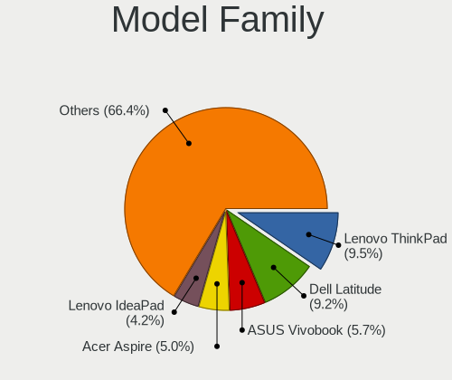

| Name                  | Notebooks | Percent |
|-----------------------|-----------|---------|
| Dell Latitude         | 14        | 16.67%  |
| Lenovo ThinkPad       | 7         | 8.33%   |
| HP Pavilion           | 4         | 4.76%   |
| Dell Inspiron         | 4         | 4.76%   |
| Lenovo IdeaPad        | 3         | 3.57%   |
| HP EliteBook          | 3         | 3.57%   |
| Dell Precision        | 3         | 3.57%   |
| HP ProBook            | 2         | 2.38%   |
| HP Notebook           | 2         | 2.38%   |
| HP Laptop             | 2         | 2.38%   |
| Dell XPS              | 2         | 2.38%   |
| Dell Vostro           | 2         | 2.38%   |
| VIT P3400             | 1         | 1.19%   |
| Sony VGN-S3HP         | 1         | 1.19%   |
| Sony SVF1521H1EW      | 1         | 1.19%   |
| Sony SVF1521A6EW      | 1         | 1.19%   |
| Samsung RF511         | 1         | 1.19%   |
| Samsung 305E4A        | 1         | 1.19%   |
| Mediacom FlexBook     | 1         | 1.19%   |
| Lenovo V15            | 1         | 1.19%   |
| Lenovo ThinkBook      | 1         | 1.19%   |
| Lenovo LOQ            | 1         | 1.19%   |
| Lenovo 3000           | 1         | 1.19%   |
| HONOR NMH-WCX9        | 1         | 1.19%   |
| HONOR BMH-WDX9        | 1         | 1.19%   |
| HP ZBook              | 1         | 1.19%   |
| HP 250                | 1         | 1.19%   |
| GPU Company GWTC116-2 | 1         | 1.19%   |
| Google Celes          | 1         | 1.19%   |
| Google Bobba          | 1         | 1.19%   |
| Google Barla          | 1         | 1.19%   |
| Gateway NV57H         | 1         | 1.19%   |
| Beelink Gemini        | 1         | 1.19%   |
| ASUS X553MA           | 1         | 1.19%   |
| ASUS VivoBook         | 1         | 1.19%   |
| ASUS UL30A            | 1         | 1.19%   |
| ASUS ProArt           | 1         | 1.19%   |
| ASUS N56VB            | 1         | 1.19%   |
| ASUS K55VJ            | 1         | 1.19%   |
| ASUS K54L             | 1         | 1.19%   |

MFG Year
--------

Motherboard manufacture year

| Year | Notebooks | Percent |
|------|-----------|---------|
| 2022 | 10        | 11.9%   |
| 2021 | 7         | 8.33%   |
| 2019 | 7         | 8.33%   |
| 2013 | 7         | 8.33%   |
| 2023 | 6         | 7.14%   |
| 2020 | 6         | 7.14%   |
| 2018 | 6         | 7.14%   |
| 2011 | 6         | 7.14%   |
| 2012 | 5         | 5.95%   |
| 2016 | 4         | 4.76%   |
| 2009 | 4         | 4.76%   |
| 2017 | 3         | 3.57%   |
| 2010 | 3         | 3.57%   |
| 2015 | 2         | 2.38%   |
| 2014 | 2         | 2.38%   |
| 2008 | 2         | 2.38%   |
| 2006 | 2         | 2.38%   |
| 2007 | 1         | 1.19%   |
| 2005 | 1         | 1.19%   |

Form Factor
-----------

Physical design of the computer

| Name     | Notebooks | Percent |
|----------|-----------|---------|
| Notebook | 84        | 100%    |

Secure Boot
-----------

Enabled or disabled

| State    | Notebooks | Percent |
|----------|-----------|---------|
| Disabled | 77        | 91.67%  |
| Enabled  | 7         | 8.33%   |

Coreboot
--------

Have coreboot on board

| Used | Notebooks | Percent |
|------|-----------|---------|
| No   | 81        | 96.43%  |
| Yes  | 3         | 3.57%   |

RAM Size
--------

Total RAM memory

| Size in GB  | Notebooks | Percent |
|-------------|-----------|---------|
| 4.01-8.0    | 25        | 29.76%  |
| 3.01-4.0    | 21        | 25%     |
| 16.01-24.0  | 12        | 14.29%  |
| 32.01-64.0  | 11        | 13.1%   |
| 8.01-16.0   | 9         | 10.71%  |
| 24.01-32.0  | 2         | 2.38%   |
| 64.01-256.0 | 2         | 2.38%   |
| 1.01-2.0    | 2         | 2.38%   |

RAM Used
--------

Used RAM memory

| Used GB    | Notebooks | Percent |
|------------|-----------|---------|
| 2.01-3.0   | 36        | 41.86%  |
| 1.01-2.0   | 29        | 33.72%  |
| 3.01-4.0   | 11        | 12.79%  |
| 4.01-8.0   | 7         | 8.14%   |
| 0.51-1.0   | 2         | 2.33%   |
| 16.01-24.0 | 1         | 1.16%   |

Total Drives
------------

Number of drives on board

| Drives | Notebooks | Percent |
|--------|-----------|---------|
| 1      | 69        | 82.14%  |
| 2      | 12        | 14.29%  |
| 3      | 3         | 3.57%   |

Has CD-ROM
----------

Has CD-ROM on board

| Presented | Notebooks | Percent |
|-----------|-----------|---------|
| No        | 60        | 71.43%  |
| Yes       | 24        | 28.57%  |

Has Ethernet
------------

Has Ethernet on board

| Presented | Notebooks | Percent |
|-----------|-----------|---------|
| Yes       | 65        | 77.38%  |
| No        | 19        | 22.62%  |

Has WiFi
--------

Has WiFi module

| Presented | Notebooks | Percent |
|-----------|-----------|---------|
| Yes       | 83        | 98.81%  |
| No        | 1         | 1.19%   |

Has Bluetooth
-------------

Has Bluetooth module

| Presented | Notebooks | Percent |
|-----------|-----------|---------|
| Yes       | 70        | 83.33%  |
| No        | 14        | 16.67%  |

Location
--------

Country
-------

Geographic location (country)

| Country     | Notebooks | Percent |
|-------------|-----------|---------|
| USA         | 15        | 17.44%  |
| Germany     | 12        | 13.95%  |
| Greece      | 11        | 12.79%  |
| Canada      | 7         | 8.14%   |
| Poland      | 6         | 6.98%   |
| UK          | 4         | 4.65%   |
| Australia   | 4         | 4.65%   |
| Russia      | 3         | 3.49%   |
| Romania     | 2         | 2.33%   |
| Netherlands | 2         | 2.33%   |
| Italy       | 2         | 2.33%   |
| France      | 2         | 2.33%   |
| Brazil      | 2         | 2.33%   |
| Venezuela   | 1         | 1.16%   |
| Turkey      | 1         | 1.16%   |
| Sweden      | 1         | 1.16%   |
| Spain       | 1         | 1.16%   |
| Singapore   | 1         | 1.16%   |
| Serbia      | 1         | 1.16%   |
| Portugal    | 1         | 1.16%   |
| Mexico      | 1         | 1.16%   |
| Lithuania   | 1         | 1.16%   |
| Japan       | 1         | 1.16%   |
| Israel      | 1         | 1.16%   |
| Belarus     | 1         | 1.16%   |
| Bangladesh  | 1         | 1.16%   |
| Algeria     | 1         | 1.16%   |

City
----

Geographic location (city)

| City             | Notebooks | Percent |
|------------------|-----------|---------|
| Athens           | 8         | 9.2%    |
| Salamina         | 2         | 2.3%    |
| Yokohama         | 1         | 1.15%   |
| Yeovil           | 1         | 1.15%   |
| Yekaterinburg    | 1         | 1.15%   |
| Woodbridge       | 1         | 1.15%   |
| Winston-Salem    | 1         | 1.15%   |
| Willoughby       | 1         | 1.15%   |
| Warsaw           | 1         | 1.15%   |
| Wandsworth       | 1         | 1.15%   |
| Vitebsk          | 1         | 1.15%   |
| Vigia            | 1         | 1.15%   |
| Vallentuna       | 1         | 1.15%   |
| Uslar            | 1         | 1.15%   |
| Upper Marlboro   | 1         | 1.15%   |
| Turnu Magurele   | 1         | 1.15%   |
| Tsor`a           | 1         | 1.15%   |
| Trentola-Ducenta | 1         | 1.15%   |
| Tissemsilt       | 1         | 1.15%   |
| Thessaloniki     | 1         | 1.15%   |
| Sydney           | 1         | 1.15%   |
| Stuttgart        | 1         | 1.15%   |
| Singapore        | 1         | 1.15%   |
| Seattle          | 1         | 1.15%   |
| Scarborough      | 1         | 1.15%   |
| San Francisco    | 1         | 1.15%   |
| Riverside        | 1         | 1.15%   |
| Rio de Janeiro   | 1         | 1.15%   |
| Ravensburg       | 1         | 1.15%   |
| Québec          | 1         | 1.15%   |
| Preston          | 1         | 1.15%   |
| Porto            | 1         | 1.15%   |
| Ploieşti        | 1         | 1.15%   |
| Pforzheim        | 1         | 1.15%   |
| Otwock           | 1         | 1.15%   |
| Naumburg         | 1         | 1.15%   |
| Nadarzyn         | 1         | 1.15%   |
| Myslenice        | 1         | 1.15%   |
| Muret            | 1         | 1.15%   |
| Moscow           | 1         | 1.15%   |

Drives
------

Drive Vendor
------------

Hard drive vendors

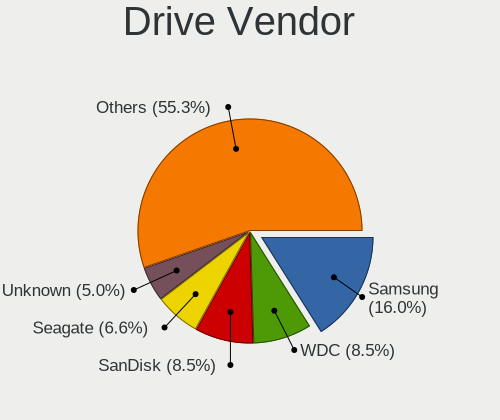

| Vendor              | Notebooks | Drives | Percent |
|---------------------|-----------|--------|---------|
| Samsung Electronics | 11        | 12     | 10.89%  |
| WDC                 | 8         | 9      | 7.92%   |
| Toshiba             | 6         | 6      | 5.94%   |
| Sandisk             | 6         | 6      | 5.94%   |
| Unknown             | 5         | 6      | 4.95%   |
| Seagate             | 5         | 5      | 4.95%   |
| Micron Technology   | 5         | 5      | 4.95%   |
| KIOXIA              | 5         | 6      | 4.95%   |
| Crucial             | 5         | 12     | 4.95%   |
| SK hynix            | 4         | 4      | 3.96%   |
| Kingston            | 4         | 4      | 3.96%   |
| Hitachi             | 4         | 4      | 3.96%   |
| SPCC                | 3         | 3      | 2.97%   |
| Apple               | 3         | 3      | 2.97%   |
| Unknown             | 3         | 3      | 2.97%   |
| LITEONIT            | 2         | 2      | 1.98%   |
| Intel               | 2         | 2      | 1.98%   |
| HGST                | 2         | 2      | 1.98%   |
| Fujitsu             | 2         | 2      | 1.98%   |
| China               | 2         | 2      | 1.98%   |
| A-DATA Technology   | 2         | 2      | 1.98%   |
| WALRAM              | 1         | 1      | 0.99%   |
| UMIS                | 1         | 1      | 0.99%   |
| Timetec             | 1         | 1      | 0.99%   |
| Realtek             | 1         | 1      | 0.99%   |
| Netac               | 1         | 1      | 0.99%   |
| LITEON              | 1         | 1      | 0.99%   |
| FORESEE             | 1         | 1      | 0.99%   |
| Fanxiang            | 1         | 1      | 0.99%   |
| Emtec               | 1         | 1      | 0.99%   |
| ASMT109x            | 1         | 1      | 0.99%   |
| Apacer              | 1         | 1      | 0.99%   |
| AMD                 | 1         | 1      | 0.99%   |

Drive Model
-----------

Hard drive models

| Model                                       | Notebooks | Percent |
|---------------------------------------------|-----------|---------|
| Toshiba MQ01ABF050 500GB                    | 3         | 2.94%   |
| Unknown                                     | 3         | 2.94%   |
| SanDisk NVMe SSD Drive 2TB                  | 2         | 1.96%   |
| Micron MTFDKCD512TFK 512GB                  | 2         | 1.96%   |
| HGST HTS545050A7E680 500GB                  | 2         | 1.96%   |
| WDC WDS240G2G0B-00EPW0 240GB SSD            | 1         | 0.98%   |
| WDC WDS100T1R0A-68A4W0 1TB SSD              | 1         | 0.98%   |
| WDC WD1600BEKT-75PVMT0 160GB                | 1         | 0.98%   |
| WDC WD10SPZX-24Z10T0 1TB                    | 1         | 0.98%   |
| WDC PC SN810 NVMe 1024GB                    | 1         | 0.98%   |
| WDC PC SN730 SDBPNTY-1T00-1102 1TB          | 1         | 0.98%   |
| WDC PC SN530 SDBPNPZ-512G-1036 512GB        | 1         | 0.98%   |
| WDC PC SN530 SDBPNPZ-256G-1027 256GB        | 1         | 0.98%   |
| WDC PC SN530 NVMe 512GB                     | 1         | 0.98%   |
| WALRAM SSD 512GB                            | 1         | 0.98%   |
| Unknown USDU1  128GB                        | 1         | 0.98%   |
| Unknown SA16G  16GB                         | 1         | 0.98%   |
| Unknown SA08G  8GB                          | 1         | 0.98%   |
| Unknown hA8aP  16GB                         | 1         | 0.98%   |
| Unknown DJNB4R  128GB                       | 1         | 0.98%   |
| UMIS RPFTJ128PDD2EWX 128GB                  | 1         | 0.98%   |
| Toshiba THNSN51T02DU7 NVMe 1024GB           | 1         | 0.98%   |
| Toshiba MQ01ABD0 320GB                      | 1         | 0.98%   |
| Toshiba KBG40ZNS256G NVMe 256GB             | 1         | 0.98%   |
| Timetec MS10 1TB                            | 1         | 0.98%   |
| SPCC Solid State Disk 512GB                 | 1         | 0.98%   |
| SPCC Solid State Disk 1TB                   | 1         | 0.98%   |
| SPCC M.2 PCIe SSD 1TB                       | 1         | 0.98%   |
| SK hynix SKHynix_HFS256GEJ4X112N 256GB      | 1         | 0.98%   |
| SK hynix SKHynix_HFM512GD3HX015N 512GB      | 1         | 0.98%   |
| SK hynix BC901 NVMe 512GB                   | 1         | 0.98%   |
| SK hynix BC711 NVMe 256GB                   | 1         | 0.98%   |
| Seagate ST9500325ASG 500GB                  | 1         | 0.98%   |
| Seagate ST9500325AS 500GB                   | 1         | 0.98%   |
| Seagate ST9320423AS 320GB                   | 1         | 0.98%   |
| Seagate ST320LT012-9WS14C 320GB             | 1         | 0.98%   |
| Seagate ST320LT009-9WC142 320GB             | 1         | 0.98%   |
| Sandisk WD PC SN740 SDDQNQD-256G-1014 256GB | 1         | 0.98%   |
| SanDisk SSD PLUS 480GB                      | 1         | 0.98%   |
| SanDisk NVMe SSD Drive 512GB                | 1         | 0.98%   |

HDD Vendor
----------

Hard disk drive vendors

| Vendor  | Notebooks | Drives | Percent |
|---------|-----------|--------|---------|
| Seagate | 5         | 5      | 26.32%  |
| Toshiba | 4         | 4      | 21.05%  |
| Hitachi | 4         | 4      | 21.05%  |
| WDC     | 2         | 2      | 10.53%  |
| HGST    | 2         | 2      | 10.53%  |
| Fujitsu | 2         | 2      | 10.53%  |

SSD Vendor
----------

Solid state drive vendors

| Vendor              | Notebooks | Drives | Percent |
|---------------------|-----------|--------|---------|
| Samsung Electronics | 7         | 8      | 21.21%  |
| Kingston            | 3         | 3      | 9.09%   |
| WDC                 | 2         | 2      | 6.06%   |
| SPCC                | 2         | 2      | 6.06%   |
| LITEONIT            | 2         | 2      | 6.06%   |
| Crucial             | 2         | 9      | 6.06%   |
| China               | 2         | 2      | 6.06%   |
| Apple               | 2         | 2      | 6.06%   |
| A-DATA Technology   | 2         | 2      | 6.06%   |
| WALRAM              | 1         | 1      | 3.03%   |
| SanDisk             | 1         | 1      | 3.03%   |
| Netac               | 1         | 1      | 3.03%   |
| Micron Technology   | 1         | 1      | 3.03%   |
| LITEON              | 1         | 1      | 3.03%   |
| FORESEE             | 1         | 1      | 3.03%   |
| Fanxiang            | 1         | 1      | 3.03%   |
| Emtec               | 1         | 1      | 3.03%   |
| ASMT109x            | 1         | 1      | 3.03%   |

Drive Kind
----------

HDD or SSD

| Kind | Notebooks | Drives | Percent |
|------|-----------|--------|---------|
| NVMe | 36        | 42     | 38.71%  |
| SSD  | 30        | 41     | 32.26%  |
| HDD  | 19        | 19     | 20.43%  |
| MMC  | 8         | 10     | 8.6%    |

Drive Connector
---------------

SATA, SAS, NVMe, etc.

| Type | Notebooks | Drives | Percent |
|------|-----------|--------|---------|
| SATA | 46        | 60     | 51.11%  |
| NVMe | 35        | 41     | 38.89%  |
| MMC  | 8         | 10     | 8.89%   |
| SAS  | 1         | 1      | 1.11%   |

Drive Size
----------

Size of hard drive

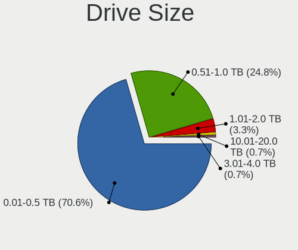

| Size in TB | Notebooks | Drives | Percent |
|------------|-----------|--------|---------|
| 0.01-0.5   | 35        | 40     | 74.47%  |
| 0.51-1.0   | 10        | 18     | 21.28%  |
| 1.01-2.0   | 2         | 2      | 4.26%   |

Space Total
-----------

Amount of disk space available on the file system

| Size in GB | Notebooks | Percent |
|------------|-----------|---------|
| 101-250    | 23        | 26.74%  |
| 251-500    | 19        | 22.09%  |
| 1-20       | 13        | 15.12%  |
| 51-100     | 11        | 12.79%  |
| 501-1000   | 10        | 11.63%  |
| 21-50      | 7         | 8.14%   |
| 1001-2000  | 3         | 3.49%   |

Space Used
----------

Amount of used disk space

| Used GB   | Notebooks | Percent |
|-----------|-----------|---------|
| 1-20      | 49        | 56.98%  |
| 21-50     | 17        | 19.77%  |
| 101-250   | 8         | 9.3%    |
| 51-100    | 8         | 9.3%    |
| 1001-2000 | 2         | 2.33%   |
| 251-500   | 1         | 1.16%   |
| 501-1000  | 1         | 1.16%   |

Malfunc. Drives
---------------

Drive models with a malfunction

| Model                                 | Notebooks | Drives | Percent |
|---------------------------------------|-----------|--------|---------|
| HGST HTS545050A7E680 500GB            | 2         | 2      | 11.76%  |
| WDC WD1600BEKT-75PVMT0 160GB          | 1         | 1      | 5.88%   |
| Toshiba MQ01ABF050 500GB              | 1         | 1      | 5.88%   |
| Seagate ST9500325AS 500GB             | 1         | 1      | 5.88%   |
| Seagate ST9320423AS 320GB             | 1         | 1      | 5.88%   |
| Seagate ST320LT012-9WS14C 320GB       | 1         | 1      | 5.88%   |
| Seagate ST320LT009-9WC142 320GB       | 1         | 1      | 5.88%   |
| SanDisk SSD PLUS 480GB                | 1         | 1      | 5.88%   |
| Samsung Electronics SSD 870 EVO 250GB | 1         | 2      | 5.88%   |
| Netac SSD 240GB                       | 1         | 1      | 5.88%   |
| LITEONIT L8T-256L6G-HP 256GB SSD      | 1         | 1      | 5.88%   |
| Hitachi HTS545050A7E380 500GB         | 1         | 1      | 5.88%   |
| Hitachi HTS542525K9SA00 250GB         | 1         | 1      | 5.88%   |
| Hitachi HTS541080G9AT00 80GB          | 1         | 1      | 5.88%   |
| Fujitsu MHW2120BJ G2 120GB            | 1         | 1      | 5.88%   |
| Crucial CT1000MX500SSD4 1TB           | 1         | 8      | 5.88%   |

Malfunc. Drive Vendor
---------------------

Vendors of faulty drives

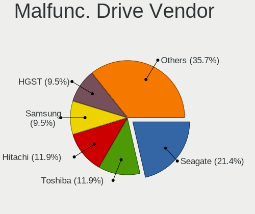

| Vendor              | Notebooks | Drives | Percent |
|---------------------|-----------|--------|---------|
| Seagate             | 4         | 4      | 23.53%  |
| Hitachi             | 3         | 3      | 17.65%  |
| HGST                | 2         | 2      | 11.76%  |
| WDC                 | 1         | 1      | 5.88%   |
| Toshiba             | 1         | 1      | 5.88%   |
| SanDisk             | 1         | 1      | 5.88%   |
| Samsung Electronics | 1         | 2      | 5.88%   |
| Netac               | 1         | 1      | 5.88%   |
| LITEONIT            | 1         | 1      | 5.88%   |
| Fujitsu             | 1         | 1      | 5.88%   |
| Crucial             | 1         | 8      | 5.88%   |

Malfunc. HDD Vendor
-------------------

Vendors of faulty HDD drives

| Vendor  | Notebooks | Drives | Percent |
|---------|-----------|--------|---------|
| Seagate | 4         | 4      | 33.33%  |
| Hitachi | 3         | 3      | 25%     |
| HGST    | 2         | 2      | 16.67%  |
| WDC     | 1         | 1      | 8.33%   |
| Toshiba | 1         | 1      | 8.33%   |
| Fujitsu | 1         | 1      | 8.33%   |

Malfunc. Drive Kind
-------------------

Kinds of faulty drives

| Kind | Notebooks | Drives | Percent |
|------|-----------|--------|---------|
| HDD  | 12        | 12     | 70.59%  |
| SSD  | 5         | 13     | 29.41%  |

Failed Drives
-------------

Failed drive models

Zero info for selected period =(

Failed Drive Vendor
-------------------

Failed drive vendors

Zero info for selected period =(

Drive Status
------------

Number of failed and malfunc. drives

| Status   | Notebooks | Drives | Percent |
|----------|-----------|--------|---------|
| Works    | 62        | 73     | 68.13%  |
| Malfunc  | 17        | 25     | 18.68%  |
| Detected | 12        | 14     | 13.19%  |

Storage controller
------------------

Storage Vendor
--------------

Storage controller vendors

| Vendor                       | Notebooks | Percent |
|------------------------------|-----------|---------|
| Intel                        | 55        | 55%     |
| SanDisk                      | 8         | 8%      |
| AMD                          | 7         | 7%      |
| Samsung Electronics          | 5         | 5%      |
| KIOXIA                       | 5         | 5%      |
| SK hynix                     | 4         | 4%      |
| Micron Technology            | 4         | 4%      |
| Micron/Crucial Technology    | 3         | 3%      |
| Toshiba America Info Systems | 2         | 2%      |
| Silicon Motion               | 2         | 2%      |
| Nvidia                       | 2         | 2%      |
| Union Memory (Shenzhen)      | 1         | 1%      |
| Realtek Semiconductor        | 1         | 1%      |
| Kingston Technology Company  | 1         | 1%      |

Storage Model
-------------

Storage controller models

| Model                                                                          | Notebooks | Percent |
|--------------------------------------------------------------------------------|-----------|---------|
| Intel 7 Series Chipset Family 6-port SATA Controller [AHCI mode]               | 7         | 6.42%   |
| AMD FCH SATA Controller [AHCI mode]                                            | 6         | 5.5%    |
| Intel Volume Management Device NVMe RAID Controller                            | 5         | 4.59%   |
| Intel 6 Series/C200 Series Chipset Family 6 port Mobile SATA AHCI Controller   | 5         | 4.59%   |
| SanDisk WD Black SN770 / PC SN740 256GB / PC SN560 (DRAM-less) NVMe SSD        | 4         | 3.67%   |
| Micron 2450 NVMe SSD [HendrixV] (DRAM-less)                                    | 4         | 3.67%   |
| Intel Celeron/Pentium Silver Processor SATA Controller                         | 4         | 3.67%   |
| Intel 82801 Mobile SATA Controller [RAID mode]                                 | 4         | 3.67%   |
| Micron/Crucial P2 [Nick P2] / P3 / P3 Plus NVMe PCIe SSD (DRAM-less)           | 3         | 2.75%   |
| KIOXIA NVMe SSD Controller BG4 (DRAM-less)                                     | 3         | 2.75%   |
| Intel Cannon Point-LP SATA Controller [AHCI Mode]                              | 3         | 2.75%   |
| Intel Alder Lake-P SATA AHCI Controller                                        | 3         | 2.75%   |
| SK hynix Gold P31/BC711/PC711 NVMe Solid State Drive                           | 2         | 1.83%   |
| SK hynix BC901 NVMe Solid State Drive (DRAM-less)                              | 2         | 1.83%   |
| Silicon Motion SM2263EN/SM2263XT (DRAM-less) NVMe SSD Controllers              | 2         | 1.83%   |
| SanDisk Ultra 3D / WD Blue SN550 NVMe SSD                                      | 2         | 1.83%   |
| Samsung NVMe SSD Controller SM981/PM981/PM983                                  | 2         | 1.83%   |
| Intel Wildcat Point-LP SATA Controller [AHCI Mode]                             | 2         | 1.83%   |
| Intel Sunrise Point-LP SATA Controller [AHCI mode]                             | 2         | 1.83%   |
| Intel SSD 660P Series                                                          | 2         | 1.83%   |
| Intel Cannon Lake Mobile PCH SATA AHCI Controller                              | 2         | 1.83%   |
| Intel 82801IBM/IEM (ICH9M/ICH9M-E) 4 port SATA Controller [AHCI mode]          | 2         | 1.83%   |
| Intel 82801FB/FBM/FR/FW/FRW (ICH6 Family) IDE Controller                       | 2         | 1.83%   |
| Intel 8 Series/C220 Series Chipset Family 6-port SATA Controller 1 [AHCI mode] | 2         | 1.83%   |
| Intel 5 Series/3400 Series Chipset 6 port SATA AHCI Controller                 | 2         | 1.83%   |
| Union Memory (Shenzhen) AM610 PCIe 3.0 x2 NVMe SSD 128GB, 256GB                | 1         | 0.92%   |
| Toshiba America Info Systems XG6 NVMe SSD Controller                           | 1         | 0.92%   |
| Toshiba America Info Systems XG3 NVMe SSD Controller                           | 1         | 0.92%   |
| SanDisk WD PC SN810 / Black SN850 NVMe SSD                                     | 1         | 0.92%   |
| SanDisk IX SN530 NVMe SSD (DRAM-less)                                          | 1         | 0.92%   |
| Samsung S4LN053X01 AHCI SSD Controller(Apple slot)                             | 1         | 0.92%   |
| Samsung NVMe SSD Controller PM9B1 (DRAM-less)                                  | 1         | 0.92%   |
| Samsung NVMe SSD Controller 980 (DRAM-less)                                    | 1         | 0.92%   |
| Realtek RTS5765DL NVMe SSD Controller (DRAM-less)                              | 1         | 0.92%   |
| Nvidia MCP79 AHCI Controller                                                   | 1         | 0.92%   |
| Nvidia MCP67 IDE Controller                                                    | 1         | 0.92%   |
| Nvidia MCP67 AHCI Controller                                                   | 1         | 0.92%   |
| KIOXIA NVMe SSD Controller XG7                                                 | 1         | 0.92%   |
| KIOXIA NVMe SSD Controller BG5 (DRAM-less)                                     | 1         | 0.92%   |
| Kingston Company KC3000/FURY Renegade NVMe SSD E18                             | 1         | 0.92%   |

Storage Kind
------------

Kind of storage controller (IDE, SATA, NVMe, SAS, ...)

| Kind | Notebooks | Percent |
|------|-----------|---------|
| SATA | 50        | 49.5%   |
| NVMe | 34        | 33.66%  |
| RAID | 10        | 9.9%    |
| IDE  | 7         | 6.93%   |

Processor
---------

CPU Vendor
----------

Processor vendors

| Vendor | Notebooks | Percent |
|--------|-----------|---------|
| Intel  | 68        | 80.95%  |
| AMD    | 16        | 19.05%  |

CPU Model
---------

Processor models

| Model                                    | Notebooks | Percent |
|------------------------------------------|-----------|---------|
| Intel 12th Gen Core i5-1235U             | 5         | 5.95%   |
| Intel Pentium Silver N5000 CPU @ 1.10GHz | 2         | 2.38%   |
| Intel Core i7-4810MQ CPU @ 2.80GHz       | 2         | 2.38%   |
| Intel Core i5-8250U CPU @ 1.60GHz        | 2         | 2.38%   |
| Intel Core i5 CPU M 560 @ 2.67GHz        | 2         | 2.38%   |
| Intel Celeron N4020 CPU @ 1.10GHz        | 2         | 2.38%   |
| Intel 11th Gen Core i3-1115G4 @ 3.00GHz  | 2         | 2.38%   |
| AMD Ryzen 7 5700U with Radeon Graphics   | 2         | 2.38%   |
| AMD Ryzen 5 5500U with Radeon Graphics   | 2         | 2.38%   |
| Intel Pentium M processor 1.60GHz        | 1         | 1.19%   |
| Intel Pentium CPU N3710 @ 1.60GHz        | 1         | 1.19%   |
| Intel Pentium CPU N3540 @ 2.16GHz        | 1         | 1.19%   |
| Intel Pentium CPU B950 @ 2.10GHz         | 1         | 1.19%   |
| Intel Pentium CPU 2117U @ 1.80GHz        | 1         | 1.19%   |
| Intel Genuine CPU U7300 @ 1.30GHz        | 1         | 1.19%   |
| Intel Genuine CPU T2600 @ 2.16GHz        | 1         | 1.19%   |
| Intel Core i7-9750H CPU @ 2.60GHz        | 1         | 1.19%   |
| Intel Core i7-8750H CPU @ 2.20GHz        | 1         | 1.19%   |
| Intel Core i7-6820HQ CPU @ 2.70GHz       | 1         | 1.19%   |
| Intel Core i7-6600U CPU @ 2.60GHz        | 1         | 1.19%   |
| Intel Core i7-5600U CPU @ 2.60GHz        | 1         | 1.19%   |
| Intel Core i7-5500U CPU @ 2.40GHz        | 1         | 1.19%   |
| Intel Core i7-3630QM CPU @ 2.40GHz       | 1         | 1.19%   |
| Intel Core i7-3537U CPU @ 2.00GHz        | 1         | 1.19%   |
| Intel Core i7-3520M CPU @ 2.90GHz        | 1         | 1.19%   |
| Intel Core i7-2670QM CPU @ 2.20GHz       | 1         | 1.19%   |
| Intel Core i7-2630QM CPU @ 2.00GHz       | 1         | 1.19%   |
| Intel Core i7-10875H CPU @ 2.30GHz       | 1         | 1.19%   |
| Intel Core i7-10510U CPU @ 1.80GHz       | 1         | 1.19%   |
| Intel Core i5-8365U CPU @ 1.60GHz        | 1         | 1.19%   |
| Intel Core i5-8350U CPU @ 1.70GHz        | 1         | 1.19%   |
| Intel Core i5-8265U CPU @ 1.60GHz        | 1         | 1.19%   |
| Intel Core i5-6300U CPU @ 2.40GHz        | 1         | 1.19%   |
| Intel Core i5-4300U CPU @ 1.90GHz        | 1         | 1.19%   |
| Intel Core i5-4250U CPU @ 1.30GHz        | 1         | 1.19%   |
| Intel Core i5-3427U CPU @ 1.80GHz        | 1         | 1.19%   |
| Intel Core i5-3230M CPU @ 2.60GHz        | 1         | 1.19%   |
| Intel Core i5-3210M CPU @ 2.50GHz        | 1         | 1.19%   |
| Intel Core i5-2520M CPU @ 2.50GHz        | 1         | 1.19%   |
| Intel Core i5-2435M CPU @ 2.40GHz        | 1         | 1.19%   |

CPU Model Family
----------------

Processor model prefix

| Model                | Notebooks | Percent |
|----------------------|-----------|---------|
| Intel Core i5        | 18        | 21.43%  |
| Intel Core i7        | 15        | 17.86%  |
| Other                | 13        | 15.48%  |
| Intel Celeron        | 5         | 5.95%   |
| AMD Ryzen 7          | 5         | 5.95%   |
| Intel Pentium        | 4         | 4.76%   |
| Intel Core i3        | 3         | 3.57%   |
| Intel Core 2 Duo     | 3         | 3.57%   |
| Intel Pentium Silver | 2         | 2.38%   |
| Intel Genuine        | 2         | 2.38%   |
| AMD Ryzen 5          | 2         | 2.38%   |
| AMD Ryzen 3          | 2         | 2.38%   |
| Intel Pentium M      | 1         | 1.19%   |
| Intel Celeron M      | 1         | 1.19%   |
| Intel Atom           | 1         | 1.19%   |
| AMD Turion Neo X2    | 1         | 1.19%   |
| AMD Turion 64 X2     | 1         | 1.19%   |
| AMD Ryzen 9          | 1         | 1.19%   |
| AMD Ryzen 3 PRO      | 1         | 1.19%   |
| AMD A6               | 1         | 1.19%   |
| AMD A4               | 1         | 1.19%   |
| AMD A10              | 1         | 1.19%   |

CPU Cores
---------

Number of processor cores

| Number | Notebooks | Percent |
|--------|-----------|---------|
| 2      | 37        | 44.05%  |
| 4      | 25        | 29.76%  |
| 8      | 7         | 8.33%   |
| 10     | 6         | 7.14%   |
| 6      | 5         | 5.95%   |
| 14     | 2         | 2.38%   |
| 1      | 2         | 2.38%   |

CPU Sockets
-----------

Number of sockets

| Number | Notebooks | Percent |
|--------|-----------|---------|
| 1      | 84        | 100%    |

CPU Threads
-----------

Threads per core (Hyper-Threading)

| Number | Notebooks | Percent |
|--------|-----------|---------|
| 2      | 60        | 71.43%  |
| 1      | 24        | 28.57%  |

CPU Op-Modes
------------

CPU Operation Modes (32-bit, 64-bit)

| Op mode        | Notebooks | Percent |
|----------------|-----------|---------|
| 32-bit, 64-bit | 81        | 96.43%  |
| 32-bit         | 3         | 3.57%   |

CPU Microcode
-------------

Microcode number

| Number     | Notebooks | Percent |
|------------|-----------|---------|
| Unknown    | 25        | 29.41%  |
| 0x206a7    | 6         | 7.06%   |
| 0x806ec    | 4         | 4.71%   |
| 0x306a9    | 4         | 4.71%   |
| 0x906a4    | 3         | 3.53%   |
| 0x706a1    | 3         | 3.53%   |
| 0x906a3    | 2         | 2.35%   |
| 0x806c2    | 2         | 2.35%   |
| 0x6d8      | 2         | 2.35%   |
| 0x406c4    | 2         | 2.35%   |
| 0x306d4    | 2         | 2.35%   |
| 0x306c3    | 2         | 2.35%   |
| 0x20655    | 2         | 2.35%   |
| 0x1067a    | 2         | 2.35%   |
| 0x0a50000c | 2         | 2.35%   |
| 0x08608103 | 2         | 2.35%   |
| 0xb06a3    | 1         | 1.18%   |
| 0x906ea    | 1         | 1.18%   |
| 0x806ea    | 1         | 1.18%   |
| 0x706a8    | 1         | 1.18%   |
| 0x6fb      | 1         | 1.18%   |
| 0x6e8      | 1         | 1.18%   |
| 0x506e3    | 1         | 1.18%   |
| 0x506c9    | 1         | 1.18%   |
| 0x406e3    | 1         | 1.18%   |
| 0x406c3    | 1         | 1.18%   |
| 0x40651    | 1         | 1.18%   |
| 0x30678    | 1         | 1.18%   |
| 0x0a704103 | 1         | 1.18%   |
| 0x0a704101 | 1         | 1.18%   |
| 0x08a00006 | 1         | 1.18%   |
| 0x08608104 | 1         | 1.18%   |
| 0x08108109 | 1         | 1.18%   |
| 0x06006704 | 1         | 1.18%   |
| 0x0600611a | 1         | 1.18%   |
| 0x03000027 | 1         | 1.18%   |

CPU Microarch
-------------

Microarchitecture

| Name             | Notebooks | Percent |
|------------------|-----------|---------|
| KabyLake         | 10        | 11.9%   |
| IvyBridge        | 8         | 9.52%   |
| Alderlake Hybrid | 8         | 9.52%   |
| Unknown          | 8         | 9.52%   |
| SandyBridge      | 6         | 7.14%   |
| Goldmont plus    | 5         | 5.95%   |
| TigerLake        | 4         | 4.76%   |
| Skylake          | 4         | 4.76%   |
| Silvermont       | 4         | 4.76%   |
| Haswell          | 4         | 4.76%   |
| Westmere         | 3         | 3.57%   |
| Penryn           | 3         | 3.57%   |
| P6               | 3         | 3.57%   |
| Zen 3            | 2         | 2.38%   |
| K8 Hammer        | 2         | 2.38%   |
| Excavator        | 2         | 2.38%   |
| Broadwell        | 2         | 2.38%   |
| Zen+             | 1         | 1.19%   |
| K10 Llano        | 1         | 1.19%   |
| Icelake          | 1         | 1.19%   |
| Goldmont         | 1         | 1.19%   |
| Core             | 1         | 1.19%   |
| CometLake        | 1         | 1.19%   |

Graphics
--------

GPU Vendor
----------

Vendors of graphics cards

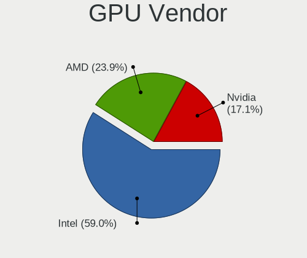

| Vendor | Notebooks | Percent |
|--------|-----------|---------|
| Intel  | 64        | 62.75%  |
| Nvidia | 19        | 18.63%  |
| AMD    | 19        | 18.63%  |

GPU Model
---------

Graphics card models

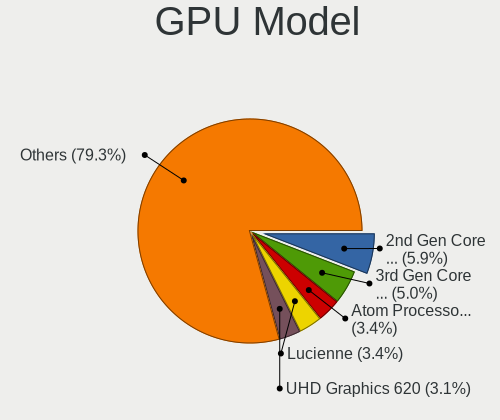

| Model                                                                                    | Notebooks | Percent |
|------------------------------------------------------------------------------------------|-----------|---------|
| Intel 3rd Gen Core processor Graphics Controller                                         | 8         | 7.69%   |
| Intel 2nd Generation Core Processor Family Integrated Graphics Controller                | 6         | 5.77%   |
| AMD Lucienne                                                                             | 5         | 4.81%   |
| Intel WhiskeyLake-U GT2 [UHD Graphics 620]                                               | 3         | 2.88%   |
| Intel UHD Graphics 620                                                                   | 3         | 2.88%   |
| Intel Skylake GT2 [HD Graphics 520]                                                      | 3         | 2.88%   |
| Intel GeminiLake [UHD Graphics 600]                                                      | 3         | 2.88%   |
| Intel Core Processor Integrated Graphics Controller                                      | 3         | 2.88%   |
| Intel Atom/Celeron/Pentium Processor x5-E8000/J3xxx/N3xxx Integrated Graphics Controller | 3         | 2.88%   |
| Intel Alder Lake-UP3 GT2 [Iris Xe Graphics]                                              | 3         | 2.88%   |
| Intel TigerLake-LP GT2 [Iris Xe Graphics]                                                | 2         | 1.92%   |
| Intel Tiger Lake-LP GT2 [UHD Graphics G4]                                                | 2         | 1.92%   |
| Intel Mobile 4 Series Chipset Integrated Graphics Controller                             | 2         | 1.92%   |
| Intel HD Graphics 5500                                                                   | 2         | 1.92%   |
| Intel Haswell-ULT Integrated Graphics Controller                                         | 2         | 1.92%   |
| Intel GeminiLake [UHD Graphics 605]                                                      | 2         | 1.92%   |
| Intel CometLake-U GT2 [UHD Graphics]                                                     | 2         | 1.92%   |
| Intel Alder Lake-UP3 GT2 [UHD Graphics]                                                  | 2         | 1.92%   |
| Intel 4th Gen Core Processor Integrated Graphics Controller                              | 2         | 1.92%   |
| AMD Phoenix1                                                                             | 2         | 1.92%   |
| Nvidia TU117M [GeForce GTX 1650 Mobile / Max-Q]                                          | 1         | 0.96%   |
| Nvidia TU117GLM [T600 Laptop GPU]                                                        | 1         | 0.96%   |
| Nvidia TU106M [GeForce RTX 2060 Max-Q]                                                   | 1         | 0.96%   |
| Nvidia NV44M [GeForce Go 6200]                                                           | 1         | 0.96%   |
| Nvidia GP108M [GeForce MX230]                                                            | 1         | 0.96%   |
| Nvidia GP107GLM [Quadro P1000 Mobile]                                                    | 1         | 0.96%   |
| Nvidia GM107GLM [Quadro M1000M]                                                          | 1         | 0.96%   |
| Nvidia GK208M [GeForce GT 740M]                                                          | 1         | 0.96%   |
| Nvidia GK107M [GeForce GT 740M]                                                          | 1         | 0.96%   |
| Nvidia GK104GLM [Quadro K3100M]                                                          | 1         | 0.96%   |
| Nvidia GF108M [GeForce GT 635M]                                                          | 1         | 0.96%   |
| Nvidia GF108M [GeForce GT 620M/630M/635M/640M LE]                                        | 1         | 0.96%   |
| Nvidia GF108M [GeForce GT 540M]                                                          | 1         | 0.96%   |
| Nvidia GA107GLM [RTX A2000 Mobile]                                                       | 1         | 0.96%   |
| Nvidia GA107GLM [RTX A2000 8GB Laptop GPU]                                               | 1         | 0.96%   |
| Nvidia G96CM [GeForce 9600M GT]                                                          | 1         | 0.96%   |
| Nvidia G72M [Quadro NVS 110M/GeForce Go 7300]                                            | 1         | 0.96%   |
| Nvidia C79 [GeForce 9400M]                                                               | 1         | 0.96%   |
| Nvidia C67 [GeForce 7150M / nForce 630M]                                                 | 1         | 0.96%   |
| Nvidia AD107M [GeForce RTX 4050 Max-Q / Mobile]                                          | 1         | 0.96%   |

GPU Combo
---------

Combinations of graphics cards

| Name           | Notebooks | Percent |
|----------------|-----------|---------|
| 1 x Intel      | 44        | 52.38%  |
| 1 x AMD        | 13        | 15.48%  |
| Intel + Nvidia | 12        | 14.29%  |
| 2 x Intel      | 4         | 4.76%   |
| 1 x Nvidia     | 4         | 4.76%   |
| Intel + AMD    | 4         | 4.76%   |
| AMD + Nvidia   | 2         | 2.38%   |
| 2 x Nvidia     | 1         | 1.19%   |

GPU Driver
----------

Free vs proprietary

| Driver      | Notebooks | Percent |
|-------------|-----------|---------|
| Free        | 82        | 97.62%  |
| Proprietary | 2         | 2.38%   |

GPU Memory
----------

Total video memory

| Size in GB | Notebooks | Percent |
|------------|-----------|---------|
| Unknown    | 61        | 72.62%  |
| 0.01-0.5   | 15        | 17.86%  |
| 1.01-2.0   | 6         | 7.14%   |
| 3.01-4.0   | 2         | 2.38%   |

Monitor
-------

Monitor Vendor
--------------

Monitor vendors

| Vendor                  | Notebooks | Percent |
|-------------------------|-----------|---------|
| AU Optronics            | 16        | 17.58%  |
| LG Display              | 12        | 13.19%  |
| BOE                     | 12        | 13.19%  |
| Samsung Electronics     | 11        | 12.09%  |
| Chimei Innolux          | 8         | 8.79%   |
| Chi Mei Optoelectronics | 6         | 6.59%   |
| Apple                   | 5         | 5.49%   |
| Sharp                   | 4         | 4.4%    |
| Lenovo                  | 2         | 2.2%    |
| InfoVision              | 2         | 2.2%    |
| Goldstar                | 2         | 2.2%    |
| Dell                    | 2         | 2.2%    |
| BenQ                    | 2         | 2.2%    |
| Vizio                   | 1         | 1.1%    |
| ViewSonic               | 1         | 1.1%    |
| Quanta Display          | 1         | 1.1%    |
| PANDA                   | 1         | 1.1%    |
| LG Philips              | 1         | 1.1%    |
| Hewlett-Packard         | 1         | 1.1%    |
| Ancor Communications    | 1         | 1.1%    |

Monitor Model
-------------

Monitor models

| Model                                                                    | Notebooks | Percent |
|--------------------------------------------------------------------------|-----------|---------|
| Samsung Electronics LCD Monitor SEC5441 1366x768 344x194mm 15.5-inch     | 2         | 2.2%    |
| Samsung Electronics LCD Monitor SEC324A 1366x768 344x194mm 15.5-inch     | 2         | 2.2%    |
| LG Display LCD Monitor LGD0709 1920x1080 344x194mm 15.5-inch             | 2         | 2.2%    |
| Chi Mei Optoelectronics LCD Monitor CMO15A7 1366x768 344x193mm 15.5-inch | 2         | 2.2%    |
| Vizio E32-C1 VIZ1004 1920x1080 698x392mm 31.5-inch                       | 1         | 1.1%    |
| ViewSonic VX3276-UHD VSC5138 3840x2160 697x392mm 31.5-inch               | 1         | 1.1%    |
| Sharp LCD Monitor SHP1515 1920x1200 336x210mm 15.6-inch                  | 1         | 1.1%    |
| Sharp LCD Monitor SHP14D6 3840x2400 366x229mm 17.0-inch                  | 1         | 1.1%    |
| Sharp LCD Monitor SHP14BA 1920x1080 344x194mm 15.5-inch                  | 1         | 1.1%    |
| Sharp LCD Monitor SHP1453 1920x1080 346x194mm 15.6-inch                  | 1         | 1.1%    |
| Samsung Electronics SyncMaster SAM0609 1920x1080 510x290mm 23.1-inch     | 1         | 1.1%    |
| Samsung Electronics S22E450 SAM0C98 1680x1050 473x291mm 21.9-inch        | 1         | 1.1%    |
| Samsung Electronics LCD Monitor SEC4251 1366x768 344x194mm 15.5-inch     | 1         | 1.1%    |
| Samsung Electronics LCD Monitor SEC364A 1366x768 344x194mm 15.5-inch     | 1         | 1.1%    |
| Samsung Electronics LCD Monitor SEC314C 1920x1080 344x194mm 15.5-inch    | 1         | 1.1%    |
| Samsung Electronics LCD Monitor SDC4C48 1920x1080 344x194mm 15.5-inch    | 1         | 1.1%    |
| Samsung Electronics LCD Monitor SDC415D 3840x2400 344x215mm 16.0-inch    | 1         | 1.1%    |
| Quanta Display LCD Monitor QDS0047 1280x800 304x190mm 14.1-inch          | 1         | 1.1%    |
| PANDA LCD Monitor NCP004F 1920x1080 309x174mm 14.0-inch                  | 1         | 1.1%    |
| LG Philips LCD Monitor LPL1201 1280x800 304x190mm 14.1-inch              | 1         | 1.1%    |
| LG Display LCD Monitor LGD06E8 1920x1080 344x194mm 15.5-inch             | 1         | 1.1%    |
| LG Display LCD Monitor LGD05F2 1920x1080 344x194mm 15.5-inch             | 1         | 1.1%    |
| LG Display LCD Monitor LGD05DB 1920x1080 294x165mm 13.3-inch             | 1         | 1.1%    |
| LG Display LCD Monitor LGD05D1 1920x1080 344x194mm 15.5-inch             | 1         | 1.1%    |
| LG Display LCD Monitor LGD059D 1920x1080 309x174mm 14.0-inch             | 1         | 1.1%    |
| LG Display LCD Monitor LGD0590 1920x1080 344x194mm 15.5-inch             | 1         | 1.1%    |
| LG Display LCD Monitor LGD0503 1366x768 344x194mm 15.5-inch              | 1         | 1.1%    |
| LG Display LCD Monitor LGD0419 2560x1440 310x174mm 14.0-inch             | 1         | 1.1%    |
| LG Display LCD Monitor LGD039F 1366x768 345x194mm 15.6-inch              | 1         | 1.1%    |
| LG Display LCD Monitor LGD0386 1366x768 309x174mm 14.0-inch              | 1         | 1.1%    |
| Lenovo LCD Monitor LEN4011 1280x800 261x163mm 12.1-inch                  | 1         | 1.1%    |
| Lenovo E24-10 LEN61B7 1920x1080 476x267mm 21.5-inch                      | 1         | 1.1%    |
| InfoVision LCD Monitor IVO057D 1920x1080 309x174mm 14.0-inch             | 1         | 1.1%    |
| InfoVision LCD Monitor IVO0579 1366x768 310x170mm 13.9-inch              | 1         | 1.1%    |
| Hewlett-Packard Z27 HPN3535 3840x2160 597x336mm 27.0-inch                | 1         | 1.1%    |
| Goldstar FULL HD GSM5ABB 1920x1080 480x270mm 21.7-inch                   | 1         | 1.1%    |
| Goldstar E2350 GSM5791 1920x1080 510x290mm 23.1-inch                     | 1         | 1.1%    |
| Dell U2311H DELA05F 1920x1080 509x286mm 23.0-inch                        | 1         | 1.1%    |
| Dell P2422HE DELA1C8 1920x1080 527x296mm 23.8-inch                       | 1         | 1.1%    |
| Chimei Innolux LCD Monitor CMN15F5 1920x1080 344x193mm 15.5-inch         | 1         | 1.1%    |

Monitor Resolution
------------------

Monitor screen resolution

| Resolution         | Notebooks | Percent |
|--------------------|-----------|---------|
| 1920x1080 (FHD)    | 39        | 43.82%  |
| 1366x768 (WXGA)    | 28        | 31.46%  |
| 1280x800 (WXGA)    | 7         | 7.87%   |
| 1440x900 (WXGA+)   | 3         | 3.37%   |
| 3840x2400          | 2         | 2.25%   |
| 3840x2160 (4K)     | 2         | 2.25%   |
| 2560x1440 (QHD)    | 2         | 2.25%   |
| 3072x1920          | 1         | 1.12%   |
| 2560x1600          | 1         | 1.12%   |
| 1920x1200 (WUXGA)  | 1         | 1.12%   |
| 1680x1050 (WSXGA+) | 1         | 1.12%   |
| 1600x900 (HD+)     | 1         | 1.12%   |
| 1024x768 (XGA)     | 1         | 1.12%   |

Monitor Diagonal
----------------

Diagonal size in inches

| Inches | Notebooks | Percent |
|--------|-----------|---------|
| 15     | 40        | 43.96%  |
| 14     | 14        | 15.38%  |
| 13     | 11        | 12.09%  |
| 23     | 4         | 4.4%    |
| 16     | 4         | 4.4%    |
| 21     | 3         | 3.3%    |
| 12     | 3         | 3.3%    |
| 11     | 3         | 3.3%    |
| 27     | 2         | 2.2%    |
| 18     | 2         | 2.2%    |
| 17     | 2         | 2.2%    |
| 54     | 1         | 1.1%    |
| 31     | 1         | 1.1%    |
| 24     | 1         | 1.1%    |

Monitor Width
-------------

Physical width

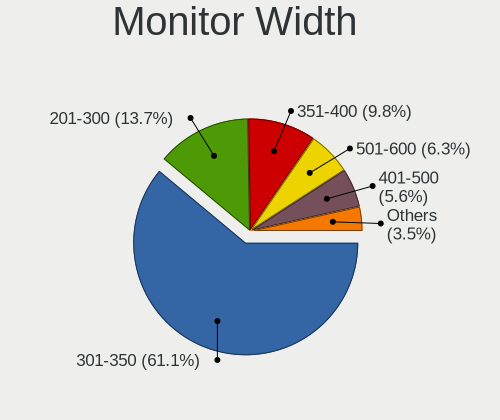

| Width in mm | Notebooks | Percent |
|-------------|-----------|---------|
| 301-350     | 58        | 63.74%  |
| 201-300     | 14        | 15.38%  |
| 501-600     | 7         | 7.69%   |
| 401-500     | 5         | 5.49%   |
| 351-400     | 5         | 5.49%   |
| 601-700     | 1         | 1.1%    |
| 1001-1500   | 1         | 1.1%    |

Aspect Ratio
------------

Proportional relationship between the width and the height

| Ratio | Notebooks | Percent |
|-------|-----------|---------|
| 16/9  | 65        | 79.27%  |
| 16/10 | 14        | 17.07%  |
| 3/2   | 2         | 2.44%   |
| 4/3   | 1         | 1.22%   |

Monitor Area
------------

Area in inch²

| Area in inch² | Notebooks | Percent |
|----------------|-----------|---------|
| 101-110        | 39        | 42.86%  |
| 81-90          | 20        | 21.98%  |
| 201-250        | 7         | 7.69%   |
| 71-80          | 5         | 5.49%   |
| 111-120        | 4         | 4.4%    |
| 61-70          | 3         | 3.3%    |
| 51-60          | 3         | 3.3%    |
| 301-350        | 2         | 2.2%    |
| 141-150        | 2         | 2.2%    |
| 121-130        | 2         | 2.2%    |
| More than 1000 | 1         | 1.1%    |
| 351-500        | 1         | 1.1%    |
| 151-200        | 1         | 1.1%    |
| 131-140        | 1         | 1.1%    |

Pixel Density
-------------

Pixels per inch

| Density       | Notebooks | Percent |
|---------------|-----------|---------|
| 121-160       | 38        | 42.22%  |
| 101-120       | 28        | 31.11%  |
| 51-100        | 14        | 15.56%  |
| 161-240       | 7         | 7.78%   |
| More than 240 | 2         | 2.22%   |
| 1-50          | 1         | 1.11%   |

Multiple Monitors
-----------------

Total monitors connected

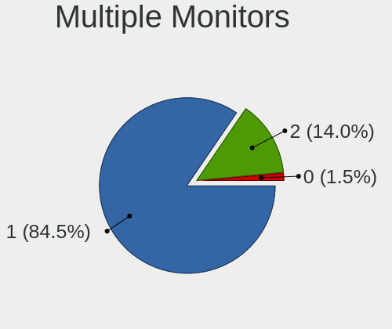

| Total | Notebooks | Percent |
|-------|-----------|---------|
| 1     | 74        | 87.06%  |
| 2     | 11        | 12.94%  |

Network
-------

Net Controller Vendor
---------------------

Controller vendors

| Vendor                   | Notebooks | Percent |
|--------------------------|-----------|---------|
| Intel                    | 41        | 31.3%   |
| Realtek Semiconductor    | 36        | 27.48%  |
| Broadcom                 | 20        | 15.27%  |
| Qualcomm Atheros         | 13        | 9.92%   |
| MediaTek                 | 5         | 3.82%   |
| Nvidia                   | 2         | 1.53%   |
| ASIX Electronics         | 2         | 1.53%   |
| ZyDAS                    | 1         | 0.76%   |
| TP-Link                  | 1         | 0.76%   |
| Ralink Technology        | 1         | 0.76%   |
| Qualcomm                 | 1         | 0.76%   |
| OPPO Electronics         | 1         | 0.76%   |
| NetGear                  | 1         | 0.76%   |
| Motorola PCS             | 1         | 0.76%   |
| Marvell Technology Group | 1         | 0.76%   |
| Huawei Technologies      | 1         | 0.76%   |
| Dell                     | 1         | 0.76%   |
| D-Link                   | 1         | 0.76%   |
| Broadcom Limited         | 1         | 0.76%   |

Net Controller Model
--------------------

Controller models

| Model                                                                  | Notebooks | Percent |
|------------------------------------------------------------------------|-----------|---------|
| Realtek RTL8111/8168/8211/8411 PCI Express Gigabit Ethernet Controller | 21        | 13.38%  |
| Realtek RTL810xE PCI Express Fast Ethernet controller                  | 6         | 3.82%   |
| Realtek RTL8153 Gigabit Ethernet Adapter                               | 4         | 2.55%   |
| Qualcomm Atheros QCA9377 802.11ac Wireless Network Adapter             | 4         | 2.55%   |
| Intel Wi-Fi 6 AX200                                                    | 4         | 2.55%   |
| Intel Alder Lake-P PCH CNVi WiFi                                       | 4         | 2.55%   |
| Realtek RTL8852BE PCIe 802.11ax Wireless Network Controller            | 3         | 1.91%   |
| Qualcomm Atheros QCA6174 802.11ac Wireless Network Adapter             | 3         | 1.91%   |
| Qualcomm Atheros AR9285 Wireless Network Adapter (PCI-Express)         | 3         | 1.91%   |
| MediaTek Wi-Fi 6E MT7902 Wireless Network Adapter                      | 3         | 1.91%   |
| Intel Wireless 8265 / 8275                                             | 3         | 1.91%   |
| Intel Wireless 7265                                                    | 3         | 1.91%   |
| Intel Wi-Fi 5(802.11ac) Wireless-AC 9x6x [Thunder Peak]                | 3         | 1.91%   |
| Intel Ethernet Connection (16) I219-LM                                 | 3         | 1.91%   |
| Intel 82577LM Gigabit Network Connection                               | 3         | 1.91%   |
| Broadcom BCM4322 802.11a/b/g/n Wireless LAN Controller                 | 3         | 1.91%   |
| Broadcom BCM43142 802.11b/g/n                                          | 3         | 1.91%   |
| Broadcom BCM4313 802.11bgn Wireless Network Adapter                    | 3         | 1.91%   |
| Realtek RTL8821CE 802.11ac PCIe Wireless Network Adapter               | 2         | 1.27%   |
| Qualcomm Atheros AR9485 Wireless Network Adapter                       | 2         | 1.27%   |
| Intel Wireless 8260                                                    | 2         | 1.27%   |
| Intel Wireless 7260                                                    | 2         | 1.27%   |
| Intel Wi-Fi 6 AX201                                                    | 2         | 1.27%   |
| Intel Ethernet Connection I219-LM                                      | 2         | 1.27%   |
| Intel Ethernet Connection I217-LM                                      | 2         | 1.27%   |
| Intel Centrino Ultimate-N 6300                                         | 2         | 1.27%   |
| Intel 82579LM Gigabit Network Connection (Lewisville)                  | 2         | 1.27%   |
| Broadcom BCM43228 802.11a/b/g/n                                        | 2         | 1.27%   |
| Broadcom BCM43224 802.11a/b/g/n                                        | 2         | 1.27%   |
| ZyDAS ZD1211 802.11g                                                   | 1         | 0.64%   |
| TP-Link UE300 10/100/1000 LAN (ethernet mode) [Realtek RTL8153]        | 1         | 0.64%   |
| Realtek RTL8822CE 802.11ac PCIe Wireless Network Adapter               | 1         | 0.64%   |
| Realtek RTL8723BU 802.11b/g/n WLAN Adapter                             | 1         | 0.64%   |
| Realtek RTL-8100/8101L/8139 PCI Fast Ethernet Adapter                  | 1         | 0.64%   |
| Realtek 802.11n WLAN Adapter                                           | 1         | 0.64%   |
| Realtek 802.11ac NIC                                                   | 1         | 0.64%   |
| Ralink MT7601U Wireless Adapter                                        | 1         | 0.64%   |
| Qualcomm QCNFA765 Wireless Network Adapter                             | 1         | 0.64%   |
| Qualcomm Atheros AR8161 Gigabit Ethernet                               | 1         | 0.64%   |
| Qualcomm Atheros AR8151 v2.0 Gigabit Ethernet                          | 1         | 0.64%   |

Wireless Vendor
---------------

Wireless vendors

| Vendor                | Notebooks | Percent |
|-----------------------|-----------|---------|
| Intel                 | 35        | 40.7%   |
| Broadcom              | 19        | 22.09%  |
| Qualcomm Atheros      | 12        | 13.95%  |
| Realtek Semiconductor | 9         | 10.47%  |
| MediaTek              | 5         | 5.81%   |
| ZyDAS                 | 1         | 1.16%   |
| Ralink Technology     | 1         | 1.16%   |
| Qualcomm              | 1         | 1.16%   |
| NetGear               | 1         | 1.16%   |
| D-Link                | 1         | 1.16%   |
| Broadcom Limited      | 1         | 1.16%   |

Wireless Model
--------------

Wireless models

| Model                                                          | Notebooks | Percent |
|----------------------------------------------------------------|-----------|---------|
| Qualcomm Atheros QCA9377 802.11ac Wireless Network Adapter     | 4         | 4.65%   |
| Intel Wi-Fi 6 AX200                                            | 4         | 4.65%   |
| Intel Alder Lake-P PCH CNVi WiFi                               | 4         | 4.65%   |
| Realtek RTL8852BE PCIe 802.11ax Wireless Network Controller    | 3         | 3.49%   |
| Qualcomm Atheros QCA6174 802.11ac Wireless Network Adapter     | 3         | 3.49%   |
| Qualcomm Atheros AR9285 Wireless Network Adapter (PCI-Express) | 3         | 3.49%   |
| MediaTek Wi-Fi 6E MT7902 Wireless Network Adapter              | 3         | 3.49%   |
| Intel Wireless 8265 / 8275                                     | 3         | 3.49%   |
| Intel Wireless 7265                                            | 3         | 3.49%   |
| Intel Wi-Fi 5(802.11ac) Wireless-AC 9x6x [Thunder Peak]        | 3         | 3.49%   |
| Broadcom BCM4322 802.11a/b/g/n Wireless LAN Controller         | 3         | 3.49%   |
| Broadcom BCM43142 802.11b/g/n                                  | 3         | 3.49%   |
| Broadcom BCM4313 802.11bgn Wireless Network Adapter            | 3         | 3.49%   |
| Realtek RTL8821CE 802.11ac PCIe Wireless Network Adapter       | 2         | 2.33%   |
| Qualcomm Atheros AR9485 Wireless Network Adapter               | 2         | 2.33%   |
| Intel Wireless 8260                                            | 2         | 2.33%   |
| Intel Wireless 7260                                            | 2         | 2.33%   |
| Intel Wi-Fi 6 AX201                                            | 2         | 2.33%   |
| Intel Centrino Ultimate-N 6300                                 | 2         | 2.33%   |
| Broadcom BCM43228 802.11a/b/g/n                                | 2         | 2.33%   |
| Broadcom BCM43224 802.11a/b/g/n                                | 2         | 2.33%   |
| ZyDAS ZD1211 802.11g                                           | 1         | 1.16%   |
| Realtek RTL8822CE 802.11ac PCIe Wireless Network Adapter       | 1         | 1.16%   |
| Realtek RTL8723BU 802.11b/g/n WLAN Adapter                     | 1         | 1.16%   |
| Realtek 802.11n WLAN Adapter                                   | 1         | 1.16%   |
| Realtek 802.11ac NIC                                           | 1         | 1.16%   |
| Ralink MT7601U Wireless Adapter                                | 1         | 1.16%   |
| Qualcomm QCNFA765 Wireless Network Adapter                     | 1         | 1.16%   |
| NetGear A6100 AC600 DB Wireless Adapter [Realtek RTL8811AU]    | 1         | 1.16%   |
| MediaTek MT7922 802.11ax PCI Express Wireless Network Adapter  | 1         | 1.16%   |
| MediaTek MT7921 802.11ax PCI Express Wireless Network Adapter  | 1         | 1.16%   |
| Intel Tiger Lake PCH CNVi WiFi                                 | 1         | 1.16%   |
| Intel Raptor Lake PCH CNVi WiFi                                | 1         | 1.16%   |
| Intel PRO/Wireless 2200BG [Calexico2] Network Connection       | 1         | 1.16%   |
| Intel Gemini Lake PCH CNVi WiFi                                | 1         | 1.16%   |
| Intel Comet Lake PCH-LP CNVi WiFi                              | 1         | 1.16%   |
| Intel Comet Lake PCH CNVi WiFi                                 | 1         | 1.16%   |
| Intel Centrino Wireless-N 2230                                 | 1         | 1.16%   |
| Intel Centrino Wireless-N 1030 [Rainbow Peak]                  | 1         | 1.16%   |
| Intel Cannon Point-LP CNVi [Wireless-AC]                       | 1         | 1.16%   |

Ethernet Vendor
---------------

Ethernet vendors

| Vendor                   | Notebooks | Percent |
|--------------------------|-----------|---------|
| Realtek Semiconductor    | 32        | 46.38%  |
| Intel                    | 22        | 31.88%  |
| Qualcomm Atheros         | 3         | 4.35%   |
| Broadcom                 | 3         | 4.35%   |
| Nvidia                   | 2         | 2.9%    |
| ASIX Electronics         | 2         | 2.9%    |
| TP-Link                  | 1         | 1.45%   |
| OPPO Electronics         | 1         | 1.45%   |
| Motorola PCS             | 1         | 1.45%   |
| Marvell Technology Group | 1         | 1.45%   |
| Huawei Technologies      | 1         | 1.45%   |

Ethernet Model
--------------

Ethernet models

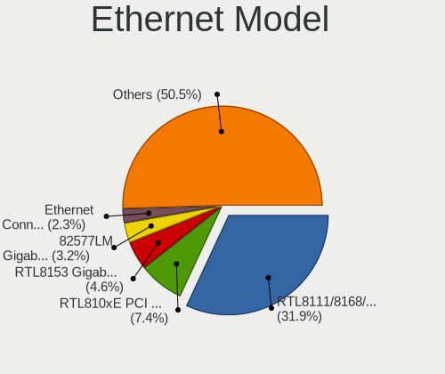

| Model                                                                  | Notebooks | Percent |
|------------------------------------------------------------------------|-----------|---------|
| Realtek RTL8111/8168/8211/8411 PCI Express Gigabit Ethernet Controller | 21        | 30.43%  |
| Realtek RTL810xE PCI Express Fast Ethernet controller                  | 6         | 8.7%    |
| Realtek RTL8153 Gigabit Ethernet Adapter                               | 4         | 5.8%    |
| Intel Ethernet Connection (16) I219-LM                                 | 3         | 4.35%   |
| Intel 82577LM Gigabit Network Connection                               | 3         | 4.35%   |
| Intel Ethernet Connection I219-LM                                      | 2         | 2.9%    |
| Intel Ethernet Connection I217-LM                                      | 2         | 2.9%    |
| Intel 82579LM Gigabit Network Connection (Lewisville)                  | 2         | 2.9%    |
| TP-Link UE300 10/100/1000 LAN (ethernet mode) [Realtek RTL8153]        | 1         | 1.45%   |
| Realtek RTL-8100/8101L/8139 PCI Fast Ethernet Adapter                  | 1         | 1.45%   |
| Qualcomm Atheros AR8161 Gigabit Ethernet                               | 1         | 1.45%   |
| Qualcomm Atheros AR8151 v2.0 Gigabit Ethernet                          | 1         | 1.45%   |
| Qualcomm Atheros AR8132 Fast Ethernet                                  | 1         | 1.45%   |
| OPPO SM8350-IDP _SN:361A1B3C                                           | 1         | 1.45%   |
| Nvidia MCP79 Ethernet                                                  | 1         | 1.45%   |
| Nvidia MCP67 Ethernet                                                  | 1         | 1.45%   |
| Motorola PCS moto g52                                                  | 1         | 1.45%   |
| Marvell Group 88E8058 PCI-E Gigabit Ethernet Controller                | 1         | 1.45%   |
| Intel Ethernet Connection I218-LM                                      | 1         | 1.45%   |
| Intel Ethernet Connection (7) I219-V                                   | 1         | 1.45%   |
| Intel Ethernet Connection (6) I219-V                                   | 1         | 1.45%   |
| Intel Ethernet Connection (6) I219-LM                                  | 1         | 1.45%   |
| Intel Ethernet Connection (4) I219-V                                   | 1         | 1.45%   |
| Intel Ethernet Connection (4) I219-LM                                  | 1         | 1.45%   |
| Intel Ethernet Connection (3) I218-LM                                  | 1         | 1.45%   |
| Intel Ethernet Connection (10) I219-V                                  | 1         | 1.45%   |
| Intel 82579V Gigabit Network Connection                                | 1         | 1.45%   |
| Intel 82562ET/EZ/GT/GZ - PRO/100 VE (LOM) Ethernet Controller Mobile   | 1         | 1.45%   |
| Huawei E353/E3131                                                      | 1         | 1.45%   |
| Broadcom NetXtreme BCM57765 Gigabit Ethernet PCIe                      | 1         | 1.45%   |
| Broadcom NetXtreme BCM5752 Gigabit Ethernet PCI Express                | 1         | 1.45%   |
| Broadcom NetLink BCM57785 Gigabit Ethernet PCIe                        | 1         | 1.45%   |
| ASIX AX88772B                                                          | 1         | 1.45%   |
| ASIX AX88179 Gigabit Ethernet                                          | 1         | 1.45%   |

Net Controller Kind
-------------------

Ethernet, WiFi or modem

| Kind     | Notebooks | Percent |
|----------|-----------|---------|
| WiFi     | 83        | 55.33%  |
| Ethernet | 65        | 43.33%  |
| Modem    | 2         | 1.33%   |

Used Controller
---------------

Currently used network controller

| Kind     | Notebooks | Percent |
|----------|-----------|---------|
| WiFi     | 65        | 73.86%  |
| Ethernet | 23        | 26.14%  |

NICs
----

Total network controllers on board

| Total | Notebooks | Percent |
|-------|-----------|---------|
| 2     | 56        | 66.67%  |
| 1     | 26        | 30.95%  |
| 0     | 2         | 2.38%   |

IPv6
----

IPv6 vs IPv4

| Used | Notebooks | Percent |
|------|-----------|---------|
| No   | 62        | 73.81%  |
| Yes  | 22        | 26.19%  |

Bluetooth
---------

Bluetooth Vendor
----------------

Controller vendors

| Vendor                          | Notebooks | Percent |
|---------------------------------|-----------|---------|
| Intel                           | 30        | 42.25%  |
| Qualcomm Atheros Communications | 9         | 12.68%  |
| Realtek Semiconductor           | 6         | 8.45%   |
| IMC Networks                    | 5         | 7.04%   |
| Apple                           | 5         | 7.04%   |
| Dell                            | 4         | 5.63%   |
| Broadcom                        | 4         | 5.63%   |
| Foxconn / Hon Hai               | 3         | 4.23%   |
| Cambridge Silicon Radio         | 2         | 2.82%   |
| Toshiba                         | 1         | 1.41%   |
| ASUSTek Computer                | 1         | 1.41%   |
| Alps Electric                   | 1         | 1.41%   |

Bluetooth Model
---------------

Controller models

| Model                                               | Notebooks | Percent |
|-----------------------------------------------------|-----------|---------|
| Intel Bluetooth wireless interface                  | 9         | 12.68%  |
| Realtek Bluetooth Radio                             | 5         | 7.04%   |
| Qualcomm Atheros  Bluetooth Device                  | 5         | 7.04%   |
| Intel Bluetooth Device                              | 5         | 7.04%   |
| Intel AX201 Bluetooth                               | 5         | 7.04%   |
| Intel AX200 Bluetooth                               | 4         | 5.63%   |
| IMC Networks Wireless_Device                        | 4         | 5.63%   |
| Intel Wireless-AC 9260 Bluetooth Adapter            | 3         | 4.23%   |
| Intel Bluetooth 9460/9560 Jefferson Peak (JfP)      | 3         | 4.23%   |
| Qualcomm Atheros QCA61x4 Bluetooth 4.0              | 2         | 2.82%   |
| Dell DW375 Bluetooth Module                         | 2         | 2.82%   |
| Cambridge Silicon Radio Bluetooth Dongle (HCI mode) | 2         | 2.82%   |
| Apple Bluetooth Host Controller                     | 2         | 2.82%   |
| Toshiba Askey for                                   | 1         | 1.41%   |
| Realtek  Bluetooth 4.2 Adapter                      | 1         | 1.41%   |
| Qualcomm Atheros AR3012 Bluetooth 4.0               | 1         | 1.41%   |
| Qualcomm Atheros AR3011 Bluetooth                   | 1         | 1.41%   |
| Intel Centrino Bluetooth Wireless Transceiver       | 1         | 1.41%   |
| IMC Networks Atheros AR3012 Bluetooth 4.0 Adapter   | 1         | 1.41%   |
| Foxconn / Hon Hai Wireless_Device                   | 1         | 1.41%   |
| Foxconn / Hon Hai Bluetooth USB Host Controller     | 1         | 1.41%   |
| Foxconn / Hon Hai Bluetooth Device                  | 1         | 1.41%   |
| Dell Wireless 350 Bluetooth                         | 1         | 1.41%   |
| Dell BCM20702A0 Bluetooth Module                    | 1         | 1.41%   |
| Broadcom BCM43142A0 Bluetooth 4.0                   | 1         | 1.41%   |
| Broadcom BCM2070 Bluetooth Device                   | 1         | 1.41%   |
| Broadcom BCM2070 Bluetooth 2.1 + EDR                | 1         | 1.41%   |
| Broadcom BCM2045B (BDC-2.1)                         | 1         | 1.41%   |
| ASUS BT-253 Bluetooth Adapter                       | 1         | 1.41%   |
| Apple Built-in Bluetooth 2.0+EDR HCI                | 1         | 1.41%   |
| Apple Bluetooth USB Host Controller                 | 1         | 1.41%   |
| Apple Bluetooth HCI                                 | 1         | 1.41%   |
| Alps Electric Bluetooth Controller (ALPS/UGX)       | 1         | 1.41%   |

Sound
-----

Sound Vendor
------------

Sound card vendors

| Vendor                  | Notebooks | Percent |
|-------------------------|-----------|---------|
| Intel                   | 66        | 65.35%  |
| AMD                     | 15        | 14.85%  |
| Nvidia                  | 11        | 10.89%  |
| Texas Instruments       | 2         | 1.98%   |
| Realtek Semiconductor   | 2         | 1.98%   |
| Philips (or NXP)        | 1         | 0.99%   |
| GN Netcom               | 1         | 0.99%   |
| BR23                    | 1         | 0.99%   |
| BEHRINGER International | 1         | 0.99%   |
| AKAI Professional M.I.  | 1         | 0.99%   |

Sound Model
-----------

Sound card models

| Model                                                                                             | Notebooks | Percent |
|---------------------------------------------------------------------------------------------------|-----------|---------|
| AMD Family 17h/19h HD Audio Controller                                                            | 11        | 9.32%   |
| Intel 7 Series/C216 Chipset Family High Definition Audio Controller                               | 8         | 6.78%   |
| Intel Alder Lake PCH-P High Definition Audio Controller                                           | 7         | 5.93%   |
| Intel Sunrise Point-LP HD Audio                                                                   | 6         | 5.08%   |
| Intel 6 Series/C200 Series Chipset Family High Definition Audio Controller                        | 6         | 5.08%   |
| AMD Renoir Radeon High Definition Audio Controller                                                | 6         | 5.08%   |
| Intel Celeron/Pentium Silver Processor High Definition Audio                                      | 5         | 4.24%   |
| Intel Tiger Lake-LP Smart Sound Technology Audio Controller                                       | 4         | 3.39%   |
| Nvidia GF108 High Definition Audio Controller                                                     | 3         | 2.54%   |
| Intel Cannon Point-LP High Definition Audio Controller                                            | 3         | 2.54%   |
| Intel 5 Series/3400 Series Chipset High Definition Audio                                          | 3         | 2.54%   |
| Texas Instruments PCM2704 16-bit stereo audio DAC                                                 | 2         | 1.69%   |
| Realtek Semiconductor USB Audio                                                                   | 2         | 1.69%   |
| Nvidia Audio device                                                                               | 2         | 1.69%   |
| Intel Wildcat Point-LP High Definition Audio Controller                                           | 2         | 1.69%   |
| Intel Haswell-ULT HD Audio Controller                                                             | 2         | 1.69%   |
| Intel Comet Lake PCH-LP cAVS                                                                      | 2         | 1.69%   |
| Intel Cannon Lake PCH cAVS                                                                        | 2         | 1.69%   |
| Intel Broadwell-U Audio Controller                                                                | 2         | 1.69%   |
| Intel Atom/Celeron/Pentium Processor x5-E8000/J3xxx/N3xxx Series High Definition Audio Controller | 2         | 1.69%   |
| Intel 82801I (ICH9 Family) HD Audio Controller                                                    | 2         | 1.69%   |
| Intel 8 Series/C220 Series Chipset High Definition Audio Controller                               | 2         | 1.69%   |
| Intel 8 Series HD Audio Controller                                                                | 2         | 1.69%   |
| AMD Rembrandt Radeon High Definition Audio Controller                                             | 2         | 1.69%   |
| Philips (or NXP) DSS330 Digital Speaker System [uda1321]                                          | 1         | 0.85%   |
| Nvidia TU106 High Definition Audio Controller                                                     | 1         | 0.85%   |
| Nvidia MCP79 High Definition Audio                                                                | 1         | 0.85%   |
| Nvidia MCP67 High Definition Audio                                                                | 1         | 0.85%   |
| Nvidia GP107GL High Definition Audio Controller                                                   | 1         | 0.85%   |
| Nvidia GK107 HDMI Audio Controller                                                                | 1         | 0.85%   |
| Nvidia GK104 HDMI Audio Controller                                                                | 1         | 0.85%   |
| Intel Xeon E3-1200 v3/4th Gen Core Processor HD Audio Controller                                  | 1         | 0.85%   |
| Intel Tiger Lake-H HD Audio Controller                                                            | 1         | 0.85%   |
| Intel Raptor Lake-P/U/H cAVS                                                                      | 1         | 0.85%   |
| Intel NM10/ICH7 Family High Definition Audio Controller                                           | 1         | 0.85%   |
| Intel Comet Lake PCH cAVS                                                                         | 1         | 0.85%   |
| Intel Celeron N3350/Pentium N4200/Atom E3900 Series Audio Cluster                                 | 1         | 0.85%   |
| Intel Atom Processor Z36xxx/Z37xxx Series High Definition Audio Controller                        | 1         | 0.85%   |
| Intel 82801H (ICH8 Family) HD Audio Controller                                                    | 1         | 0.85%   |
| Intel 82801FB/FBM/FR/FW/FRW (ICH6 Family) High Definition Audio Controller                        | 1         | 0.85%   |

Memory
------

Memory Vendor
-------------

Memory module vendors

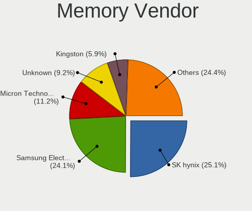

| Vendor              | Notebooks | Percent |
|---------------------|-----------|---------|
| SK hynix            | 27        | 28.72%  |
| Samsung Electronics | 19        | 20.21%  |
| Micron Technology   | 14        | 14.89%  |
| Unknown             | 10        | 10.64%  |
| Kingston            | 5         | 5.32%   |
| Crucial             | 4         | 4.26%   |
| Unknown             | 4         | 4.26%   |
| Unknown (ABCD)      | 3         | 3.19%   |
| G.Skill             | 2         | 2.13%   |
| Elpida              | 2         | 2.13%   |
| Ramaxel Technology  | 1         | 1.06%   |
| Netlist             | 1         | 1.06%   |
| ff                  | 1         | 1.06%   |
| 4ea5                | 1         | 1.06%   |

Memory Model
------------

Memory module models

| Model                                                               | Notebooks | Percent |
|---------------------------------------------------------------------|-----------|---------|
| Unknown                                                             | 4         | 3.96%   |
| Unknown (ABCD) RAM 123456789012345678 2048MB SODIMM LPDDR4 2400MT/s | 3         | 2.97%   |
| Samsung RAM M471A1G44BB0-CWE 8GB SODIMM DDR4 3200MT/s               | 3         | 2.97%   |
| Unknown RAM Module 4GB SODIMM DDR3 1333MT/s                         | 2         | 1.98%   |
| Unknown RAM Module 4GB SODIMM DDR3                                  | 2         | 1.98%   |
| SK hynix RAM HMAA1GS6CJR6N-XN 8GB SODIMM DDR4 3200MT/s              | 2         | 1.98%   |
| SK hynix RAM HMA82GS6DJR8N-XN 16GB SODIMM DDR4 3200MT/s             | 2         | 1.98%   |
| SK hynix RAM HMA82GS6DJR8N-VK 16GB SODIMM DDR4 2667MT/s             | 2         | 1.98%   |
| SK hynix RAM HMA81GS6DJR8N-XN 8GB SODIMM DDR4 3200MT/s              | 2         | 1.98%   |
| SK hynix RAM HMA81GS6AFR8N-UH 8GB SODIMM DDR4 2667MT/s              | 2         | 1.98%   |
| SK hynix RAM HMA41GS6AFR8N-TF 8GB SODIMM DDR4 2667MT/s              | 2         | 1.98%   |
| Samsung RAM M471B5273DH0-CH9 4GB SODIMM DDR3 1334MT/s               | 2         | 1.98%   |
| Samsung RAM M471A5244BB0-CRC 4GB SODIMM DDR4 2667MT/s               | 2         | 1.98%   |
| Unknown RAM Module 512MB SODIMM DDR 400MT/s                         | 1         | 0.99%   |
| Unknown RAM Module 512MB SODIMM DDR 100MT/s                         | 1         | 0.99%   |
| Unknown RAM Module 4GB SODIMM DDR3 1067MT/s                         | 1         | 0.99%   |
| Unknown RAM Module 2GB SODIMM DDR 800MT/s                           | 1         | 0.99%   |
| Unknown RAM Module 2GB SODIMM 800MT/s                               | 1         | 0.99%   |
| Unknown RAM DDR3 1600 8G 8GB SODIMM DDR3 1333MT/s                   | 1         | 0.99%   |
| SK hynix RAM Module 8GB SODIMM DDR3 1333MT/s                        | 1         | 0.99%   |
| SK hynix RAM Module 4GB SODIMM DDR3 1600MT/s                        | 1         | 0.99%   |
| SK hynix RAM Module 4GB DIMM DDR3 1066MT/s                          | 1         | 0.99%   |
| SK hynix RAM Module 16GB SODIMM DDR4 3200MT/s                       | 1         | 0.99%   |
| SK hynix RAM HYMP125S64CP8-Y5 2048MB SODIMM DDR2 667MT/s            | 1         | 0.99%   |
| SK hynix RAM HYMP125S64CP8-S6 2048MB SODIMM DDR 975MT/s             | 1         | 0.99%   |
| SK hynix RAM HMT451S6BFR8A-PB 4GB SODIMM DDR3 1600MT/s              | 1         | 0.99%   |
| SK hynix RAM HMT41GS6BFR8A-PB 8GB SODIMM DDR3 1600MT/s              | 1         | 0.99%   |
| SK hynix RAM HMT351S6CFR8C-PB 4GB SODIMM DDR3 1600MT/s              | 1         | 0.99%   |
| SK hynix RAM HMT351S6CFR8C-H9 4GB SODIMM DDR3 1333MT/s              | 1         | 0.99%   |
| SK hynix RAM HMP351S6AFR8C-S6 4GB SODIMM DDR2 800MT/s               | 1         | 0.99%   |
| SK hynix RAM HMCG78MEBSA092N 16GB SODIMM DDR5 4800MT/s              | 1         | 0.99%   |
| SK hynix RAM HMAA2GS6CJR8N-XN 16GB SODIMM DDR4 3200MT/s             | 1         | 0.99%   |
| SK hynix RAM HMAA1GS6CJR6N-XN 8GB Row Of Chips DDR4 3200MT/s        | 1         | 0.99%   |
| SK hynix RAM HMA82GS6JJR8N-VK 16GB SODIMM DDR4 2667MT/s             | 1         | 0.99%   |
| SK hynix RAM HMA82GS6AFR8N-UH 16GB SODIMM DDR4 2667MT/s             | 1         | 0.99%   |
| SK hynix RAM HMA81GS6JJR8N-VK 8GB SODIMM DDR4 2667MT/s              | 1         | 0.99%   |
| SK hynix RAM H58G66BK7BX067 8GB Row Of Chips LPDDR5 6400MT/s        | 1         | 0.99%   |
| SK hynix RAM 0000000000-00000 8GB SODIMM DDR4 2400MT/s              | 1         | 0.99%   |
| Samsung RAM M471B5773DH0-CH9 2GB SODIMM DDR3 1600MT/s               | 1         | 0.99%   |
| Samsung RAM M471B5674-M0-YK0 4GB Chip DDR3 1600MT/s                 | 1         | 0.99%   |

Memory Kind
-----------

Memory module kinds

| Kind    | Notebooks | Percent |
|---------|-----------|---------|
| DDR4    | 36        | 42.86%  |
| DDR3    | 28        | 33.33%  |
| LPDDR4  | 4         | 4.76%   |
| DDR2    | 4         | 4.76%   |
| LPDDR5  | 3         | 3.57%   |
| DDR5    | 3         | 3.57%   |
| DDR     | 3         | 3.57%   |
| LPDDR3  | 2         | 2.38%   |
| Unknown | 1         | 1.19%   |

Memory Form Factor
------------------

Physical design of the memory module

| Name         | Notebooks | Percent |
|--------------|-----------|---------|
| SODIMM       | 75        | 88.24%  |
| Row Of Chips | 6         | 7.06%   |
| Unknown      | 2         | 2.35%   |
| DIMM         | 1         | 1.18%   |
| Chip         | 1         | 1.18%   |

Memory Size
-----------

Memory module size

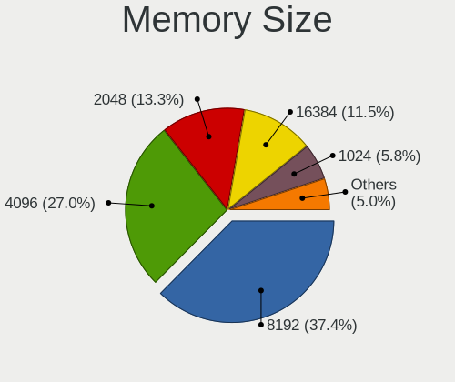

| Size  | Notebooks | Percent |
|-------|-----------|---------|
| 8192  | 34        | 38.2%   |
| 4096  | 23        | 25.84%  |
| 16384 | 13        | 14.61%  |
| 2048  | 10        | 11.24%  |
| 32768 | 4         | 4.49%   |
| 1024  | 3         | 3.37%   |
| 512   | 2         | 2.25%   |

Memory Speed
------------

Memory module speed

| Speed   | Notebooks | Percent |
|---------|-----------|---------|
| 3200    | 22        | 25%     |
| 1600    | 17        | 19.32%  |
| 2667    | 11        | 12.5%   |
| 2400    | 7         | 7.95%   |
| 1333    | 5         | 5.68%   |
| 1334    | 4         | 4.55%   |
| 4800    | 3         | 3.41%   |
| 2133    | 3         | 3.41%   |
| 800     | 3         | 3.41%   |
| 6400    | 2         | 2.27%   |
| 667     | 2         | 2.27%   |
| Unknown | 2         | 2.27%   |
| 5500    | 1         | 1.14%   |
| 1867    | 1         | 1.14%   |
| 1067    | 1         | 1.14%   |
| 1066    | 1         | 1.14%   |
| 975     | 1         | 1.14%   |
| 400     | 1         | 1.14%   |
| 100     | 1         | 1.14%   |

Printers & scanners
-------------------

Printer Vendor
--------------

Printer device vendors

| Vendor      | Notebooks | Percent |
|-------------|-----------|---------|
| Dymo-CoStar | 1         | 100%    |

Printer Model
-------------

Printer device models

| Model                       | Notebooks | Percent |
|-----------------------------|-----------|---------|
| Dymo-CoStar LabelWriter 450 | 1         | 100%    |

Scanner Vendor
--------------

Scanner device vendors

Zero info for selected period =(

Scanner Model
-------------

Scanner device models

Zero info for selected period =(

Camera
------

Camera Vendor
-------------

Camera device vendors

| Vendor                                 | Notebooks | Percent |
|----------------------------------------|-----------|---------|
| Microdia                               | 12        | 16.44%  |
| Chicony Electronics                    | 11        | 15.07%  |
| Realtek Semiconductor                  | 9         | 12.33%  |
| Cheng Uei Precision Industry (Foxlink) | 5         | 6.85%   |
| Sunplus Innovation Technology          | 4         | 5.48%   |
| Bison Electronics                      | 4         | 5.48%   |
| Apple                                  | 4         | 5.48%   |
| Quanta                                 | 3         | 4.11%   |
| Luxvisions Innotech Limited            | 3         | 4.11%   |
| Alcor Micro                            | 3         | 4.11%   |
| Suyin                                  | 2         | 2.74%   |
| Silicon Motion                         | 2         | 2.74%   |
| Ricoh                                  | 2         | 2.74%   |
| Lite-On Technology                     | 2         | 2.74%   |
| IMC Networks                           | 2         | 2.74%   |
| Acer                                   | 2         | 2.74%   |
| Syntek                                 | 1         | 1.37%   |
| Logitech                               | 1         | 1.37%   |
| Lenovo                                 | 1         | 1.37%   |

Camera Model
------------

Camera device models

| Model                                                                      | Notebooks | Percent |
|----------------------------------------------------------------------------|-----------|---------|
| Realtek Integrated_Webcam_HD                                               | 6         | 8.22%   |
| Microdia Integrated_Webcam_HD                                              | 6         | 8.22%   |
| Microdia Integrated_Webcam_FHD                                             | 3         | 4.11%   |
| Chicony Integrated Camera                                                  | 3         | 4.11%   |
| Ricoh HD Webcam                                                            | 2         | 2.74%   |
| Quanta ov9734_techfront_camera                                             | 2         | 2.74%   |
| Lite-On Integrated Camera                                                  | 2         | 2.74%   |
| IMC Networks USB2.0 HD UVC WebCam                                          | 2         | 2.74%   |
| Cheng Uei Precision Industry (Foxlink) HP Wide Vision HD Integrated Webcam | 2         | 2.74%   |
| Bison Front Camera                                                         | 2         | 2.74%   |
| Syntek Integrated Camera                                                   | 1         | 1.37%   |
| Suyin HP TrueVision HD                                                     | 1         | 1.37%   |
| Suyin Asus Integrated Webcam [CN031B]                                      | 1         | 1.37%   |
| Sunplus Integrated_Webcam_HD                                               | 1         | 1.37%   |
| Sunplus Integrated_Webcam_FHD                                              | 1         | 1.37%   |
| Sunplus HP HD Webcam [Fixed]                                               | 1         | 1.37%   |
| Sunplus Asus Webcam                                                        | 1         | 1.37%   |
| Silicon Motion WebCam SCB-1100N                                            | 1         | 1.37%   |
| Silicon Motion WebCam SC-0311139N                                          | 1         | 1.37%   |
| Realtek USB Camera                                                         | 1         | 1.37%   |
| Realtek Integrated Webcam                                                  | 1         | 1.37%   |
| Realtek EasyCamera                                                         | 1         | 1.37%   |
| Quanta ACER HD User Facing                                                 | 1         | 1.37%   |
| Microdia USB 2.0 Camera                                                    | 1         | 1.37%   |
| Microdia Sonix USB 2.0 Camera                                              | 1         | 1.37%   |
| Microdia Integrated Webcam                                                 | 1         | 1.37%   |
| Luxvisions Innotech Limited HP Wide Vision HD Camera                       | 1         | 1.37%   |
| Luxvisions Innotech Limited HP TrueVision HD Camera                        | 1         | 1.37%   |
| Luxvisions Innotech Limited HP HD Camera                                   | 1         | 1.37%   |
| Logitech Webcam C930e                                                      | 1         | 1.37%   |
| Lenovo Integrated Webcam                                                   | 1         | 1.37%   |
| Chicony VGA 30fps UVC Webcam                                               | 1         | 1.37%   |
| Chicony UVC 1.00 device HD UVC WebCam                                      | 1         | 1.37%   |
| Chicony Integrated Camera (1280x720@30)                                    | 1         | 1.37%   |
| Chicony HP Webcam                                                          | 1         | 1.37%   |
| Chicony HP TrueVision HD                                                   | 1         | 1.37%   |
| Chicony HP HD Webcam                                                       | 1         | 1.37%   |
| Chicony HD User Facing                                                     | 1         | 1.37%   |
| Chicony ACER HD User Facing                                                | 1         | 1.37%   |
| Cheng Uei Precision Industry (Foxlink) HP TrueVision HD Camera             | 1         | 1.37%   |

Security
--------

Fingerprint Vendor
------------------

Fingerprint sensor vendors

| Vendor                     | Notebooks | Percent |
|----------------------------|-----------|---------|
| Validity Sensors           | 4         | 26.67%  |
| Synaptics                  | 4         | 26.67%  |
| Shenzhen Goodix Technology | 4         | 26.67%  |
| Upek                       | 1         | 6.67%   |
| STMicroelectronics         | 1         | 6.67%   |
| AuthenTec                  | 1         | 6.67%   |

Fingerprint Model
-----------------

Fingerprint sensor models

| Model                                                  | Notebooks | Percent |
|--------------------------------------------------------|-----------|---------|
| Shenzhen Goodix  FingerPrint Device                    | 3         | 20%     |
| Synaptics Metallica MIS Touch Fingerprint Reader       | 2         | 13.33%  |
| Validity Sensors VFS495 Fingerprint Reader             | 1         | 6.67%   |
| Validity Sensors VFS491                                | 1         | 6.67%   |
| Validity Sensors Synaptics WBDI                        | 1         | 6.67%   |
| Validity Sensors Fingerprint scanner                   | 1         | 6.67%   |
| Upek Biometric Touchchip/Touchstrip Fingerprint Sensor | 1         | 6.67%   |
| Synaptics  WBDI                                        | 1         | 6.67%   |
| Synaptics Fingerprint reader [HP G6]                   | 1         | 6.67%   |
| STMicroelectronics Fingerprint Reader                  | 1         | 6.67%   |
| Shenzhen Goodix FingerPrint                            | 1         | 6.67%   |
| AuthenTec AES2501 Fingerprint Sensor                   | 1         | 6.67%   |

Chipcard Vendor
---------------

Chipcard module vendors

| Vendor      | Notebooks | Percent |
|-------------|-----------|---------|
| Broadcom    | 9         | 81.82%  |
| O2 Micro    | 1         | 9.09%   |
| Alcor Micro | 1         | 9.09%   |

Chipcard Model
--------------

Chipcard module models

| Model                                                                        | Notebooks | Percent |
|------------------------------------------------------------------------------|-----------|---------|
| Broadcom 58200                                                               | 6         | 54.55%  |
| Broadcom BCM5880 Secure Applications Processor with fingerprint swipe sensor | 2         | 18.18%  |
| O2 Micro Oz776 SmartCard Reader                                              | 1         | 9.09%   |
| Broadcom BCM5880 Secure Applications Processor                               | 1         | 9.09%   |
| Alcor Micro AU9540 Smartcard Reader                                          | 1         | 9.09%   |

Unsupported
-----------

Unsupported Devices
-------------------

Total unsupported devices on board

| Total | Notebooks | Percent |
|-------|-----------|---------|
| 0     | 40        | 47.62%  |
| 1     | 33        | 39.29%  |
| 2     | 11        | 13.1%   |

Unsupported Device Types
------------------------

Types of unsupported devices

| Type                  | Notebooks | Percent |
|-----------------------|-----------|---------|
| Graphics card         | 16        | 30.19%  |
| Fingerprint reader    | 15        | 28.3%   |
| Chipcard              | 11        | 20.75%  |
| Camera                | 5         | 9.43%   |
| Net/wireless          | 2         | 3.77%   |
| Storage               | 1         | 1.89%   |
| Network               | 1         | 1.89%   |
| Multimedia controller | 1         | 1.89%   |
| Flash memory          | 1         | 1.89%   |

