MX 23 - Tested Hardware & Statistics (Notebooks)
------------------------------------------------

A project to collect tested hardware configurations for MX 23.

Anyone can contribute to this report by the [hw-probe](https://github.com/linuxhw/hw-probe) tool:

    sudo -E hw-probe -all -upload

Please contribute! Especially if your hardware is rare.

Contents
--------

* [ Test Cases ](#test-cases)

* [ System ](#system)
  - [ Kernel                   ](#kernel)
  - [ Kernel Family            ](#kernel-family)
  - [ Kernel Major Ver.        ](#kernel-major-ver)
  - [ Arch                     ](#arch)
  - [ DE                       ](#de)
  - [ Display Server           ](#display-server)
  - [ Display Manager          ](#display-manager)
  - [ OS Lang                  ](#os-lang)
  - [ Boot Mode                ](#boot-mode)
  - [ Filesystem               ](#filesystem)
  - [ Part. scheme             ](#part-scheme)
  - [ Dual Boot with Linux/BSD ](#dual-boot-with-linuxbsd)
  - [ Dual Boot (Win)          ](#dual-boot-win)

* [ Board ](#board)
  - [ Vendor                   ](#vendor)
  - [ Model                    ](#model)
  - [ Model Family             ](#model-family)
  - [ MFG Year                 ](#mfg-year)
  - [ Form Factor              ](#form-factor)
  - [ Secure Boot              ](#secure-boot)
  - [ Coreboot                 ](#coreboot)
  - [ RAM Size                 ](#ram-size)
  - [ RAM Used                 ](#ram-used)
  - [ Total Drives             ](#total-drives)
  - [ Has CD-ROM               ](#has-cd-rom)
  - [ Has Ethernet             ](#has-ethernet)
  - [ Has WiFi                 ](#has-wifi)
  - [ Has Bluetooth            ](#has-bluetooth)

* [ Location ](#location)
  - [ Country                  ](#country)
  - [ City                     ](#city)

* [ Drives ](#drives)
  - [ Drive Vendor             ](#drive-vendor)
  - [ Drive Model              ](#drive-model)
  - [ HDD Vendor               ](#hdd-vendor)
  - [ SSD Vendor               ](#ssd-vendor)
  - [ Drive Kind               ](#drive-kind)
  - [ Drive Connector          ](#drive-connector)
  - [ Drive Size               ](#drive-size)
  - [ Space Total              ](#space-total)
  - [ Space Used               ](#space-used)
  - [ Malfunc. Drives          ](#malfunc-drives)
  - [ Malfunc. Drive Vendor    ](#malfunc-drive-vendor)
  - [ Malfunc. HDD Vendor      ](#malfunc-hdd-vendor)
  - [ Malfunc. Drive Kind      ](#malfunc-drive-kind)
  - [ Failed Drives            ](#failed-drives)
  - [ Failed Drive Vendor      ](#failed-drive-vendor)
  - [ Drive Status             ](#drive-status)

* [ Storage controller ](#storage-controller)
  - [ Storage Vendor           ](#storage-vendor)
  - [ Storage Model            ](#storage-model)
  - [ Storage Kind             ](#storage-kind)

* [ Processor ](#processor)
  - [ CPU Vendor               ](#cpu-vendor)
  - [ CPU Model                ](#cpu-model)
  - [ CPU Model Family         ](#cpu-model-family)
  - [ CPU Cores                ](#cpu-cores)
  - [ CPU Sockets              ](#cpu-sockets)
  - [ CPU Threads              ](#cpu-threads)
  - [ CPU Op-Modes             ](#cpu-op-modes)
  - [ CPU Microcode            ](#cpu-microcode)
  - [ CPU Microarch            ](#cpu-microarch)

* [ Graphics ](#graphics)
  - [ GPU Vendor               ](#gpu-vendor)
  - [ GPU Model                ](#gpu-model)
  - [ GPU Combo                ](#gpu-combo)
  - [ GPU Driver               ](#gpu-driver)
  - [ GPU Memory               ](#gpu-memory)

* [ Monitor ](#monitor)
  - [ Monitor Vendor           ](#monitor-vendor)
  - [ Monitor Model            ](#monitor-model)
  - [ Monitor Resolution       ](#monitor-resolution)
  - [ Monitor Diagonal         ](#monitor-diagonal)
  - [ Monitor Width            ](#monitor-width)
  - [ Aspect Ratio             ](#aspect-ratio)
  - [ Monitor Area             ](#monitor-area)
  - [ Pixel Density            ](#pixel-density)
  - [ Multiple Monitors        ](#multiple-monitors)

* [ Network ](#network)
  - [ Net Controller Vendor    ](#net-controller-vendor)
  - [ Net Controller Model     ](#net-controller-model)
  - [ Wireless Vendor          ](#wireless-vendor)
  - [ Wireless Model           ](#wireless-model)
  - [ Ethernet Vendor          ](#ethernet-vendor)
  - [ Ethernet Model           ](#ethernet-model)
  - [ Net Controller Kind      ](#net-controller-kind)
  - [ Used Controller          ](#used-controller)
  - [ NICs                     ](#nics)
  - [ IPv6                     ](#ipv6)

* [ Bluetooth ](#bluetooth)
  - [ Bluetooth Vendor         ](#bluetooth-vendor)
  - [ Bluetooth Model          ](#bluetooth-model)

* [ Sound ](#sound)
  - [ Sound Vendor             ](#sound-vendor)
  - [ Sound Model              ](#sound-model)

* [ Memory ](#memory)
  - [ Memory Vendor            ](#memory-vendor)
  - [ Memory Model             ](#memory-model)
  - [ Memory Kind              ](#memory-kind)
  - [ Memory Form Factor       ](#memory-form-factor)
  - [ Memory Size              ](#memory-size)
  - [ Memory Speed             ](#memory-speed)

* [ Printers & scanners ](#printers--scanners)
  - [ Printer Vendor           ](#printer-vendor)
  - [ Printer Model            ](#printer-model)
  - [ Scanner Vendor           ](#scanner-vendor)
  - [ Scanner Model            ](#scanner-model)

* [ Camera ](#camera)
  - [ Camera Vendor            ](#camera-vendor)
  - [ Camera Model             ](#camera-model)

* [ Security ](#security)
  - [ Fingerprint Vendor       ](#fingerprint-vendor)
  - [ Fingerprint Model        ](#fingerprint-model)
  - [ Chipcard Vendor          ](#chipcard-vendor)
  - [ Chipcard Model           ](#chipcard-model)

* [ Unsupported ](#unsupported)
  - [ Unsupported Devices      ](#unsupported-devices)
  - [ Unsupported Device Types ](#unsupported-device-types)

Test Cases
----------

Total: 200

| Vendor        | Model                       | Probe                                                      | Date         |
|---------------|-----------------------------|------------------------------------------------------------|--------------|
| Lenovo        | IdeaPad 3 15ALC6 82MF       | [413b207df0](https://linux-hardware.org/?probe=413b207df0) | May 09, 2024 |
| Dell          | Latitude 3190               | [102011a182](https://linux-hardware.org/?probe=102011a182) | May 07, 2024 |
| Toshiba       | Satellite C50-B             | [4037de5266](https://linux-hardware.org/?probe=4037de5266) | May 06, 2024 |
| Lenovo        | Yoga Slim 7-14ARE05 82A2    | [c931a1a446](https://linux-hardware.org/?probe=c931a1a446) | May 05, 2024 |
| Lenovo        | Legion Y540-17IRH 81Q4      | [41e3014295](https://linux-hardware.org/?probe=41e3014295) | May 04, 2024 |
| Lenovo        | IdeaPad 1 15ALC7 82R4       | [cbd3101c16](https://linux-hardware.org/?probe=cbd3101c16) | May 01, 2024 |
| Lenovo        | IdeaPad 1 15ALC7 82R4       | [6aca55ce35](https://linux-hardware.org/?probe=6aca55ce35) | May 01, 2024 |
| Lenovo        | Yoga 710-11IKB 80V6         | [bac49afb7f](https://linux-hardware.org/?probe=bac49afb7f) | Apr 30, 2024 |
| Apple         | MacBookPro5,5               | [d1fbf194df](https://linux-hardware.org/?probe=d1fbf194df) | Apr 25, 2024 |
| Dell          | XPS 13 9305                 | [62621a436b](https://linux-hardware.org/?probe=62621a436b) | Apr 25, 2024 |
| Lenovo        | G505s 20255                 | [b7d2ec7d4d](https://linux-hardware.org/?probe=b7d2ec7d4d) | Apr 24, 2024 |
| Acer          | Aspire A515-47              | [dc0e4e49bb](https://linux-hardware.org/?probe=dc0e4e49bb) | Apr 24, 2024 |
| Acer          | Aspire A515-47              | [feba2802f3](https://linux-hardware.org/?probe=feba2802f3) | Apr 22, 2024 |
| Samsung       | N150/N210/N220              | [73f5edc5e5](https://linux-hardware.org/?probe=73f5edc5e5) | Apr 22, 2024 |
| SGIN          | M15                         | [68c2d94db7](https://linux-hardware.org/?probe=68c2d94db7) | Apr 20, 2024 |
| ASUSTek       | VivoBook_ASUSLaptop K360... | [9e43e9df38](https://linux-hardware.org/?probe=9e43e9df38) | Apr 19, 2024 |
| HP            | Pavilion Aero Laptop 13-... | [b3e2fd82b1](https://linux-hardware.org/?probe=b3e2fd82b1) | Apr 18, 2024 |
| GPU Compan... | GWTN116-3                   | [30fba12411](https://linux-hardware.org/?probe=30fba12411) | Apr 18, 2024 |
| GPU Compan... | GWTN116-3                   | [a11ace542b](https://linux-hardware.org/?probe=a11ace542b) | Apr 18, 2024 |
| Toshiba       | Satellite C55D-B            | [0d2ecb9207](https://linux-hardware.org/?probe=0d2ecb9207) | Apr 17, 2024 |
| Acer          | Aspire E1-572               | [a91f9fc37a](https://linux-hardware.org/?probe=a91f9fc37a) | Apr 15, 2024 |
| Lenovo        | ThinkPad E16 Gen 1 21JT0... | [e717cc9856](https://linux-hardware.org/?probe=e717cc9856) | Apr 13, 2024 |
| Google        | Cyan                        | [46c86ddfe0](https://linux-hardware.org/?probe=46c86ddfe0) | Apr 12, 2024 |
| Google        | Cyan                        | [e2c458d3a7](https://linux-hardware.org/?probe=e2c458d3a7) | Apr 11, 2024 |
| Acer          | AO756                       | [79847ca0b1](https://linux-hardware.org/?probe=79847ca0b1) | Apr 11, 2024 |
| Dell          | Latitude 3190               | [4f2b2351b3](https://linux-hardware.org/?probe=4f2b2351b3) | Apr 09, 2024 |
| HP            | Notebook                    | [414230182b](https://linux-hardware.org/?probe=414230182b) | Apr 06, 2024 |
| Google        | Magolor                     | [36145fc673](https://linux-hardware.org/?probe=36145fc673) | Apr 06, 2024 |
| Lenovo        | IdeaPad 1 15IJL7 82LX       | [0852701d67](https://linux-hardware.org/?probe=0852701d67) | Apr 05, 2024 |
| Dell          | Latitude 3190               | [c15e7df670](https://linux-hardware.org/?probe=c15e7df670) | Apr 02, 2024 |
| Dell          | Inspiron 3185               | [80090c69a3](https://linux-hardware.org/?probe=80090c69a3) | Mar 31, 2024 |
| Lenovo        | ThinkPad X280 20KES6M100    | [07c23b72ec](https://linux-hardware.org/?probe=07c23b72ec) | Mar 25, 2024 |
| HP            | 250 G1                      | [1061b55594](https://linux-hardware.org/?probe=1061b55594) | Mar 25, 2024 |
| Apple         | MacBookPro7,1               | [bbfdefb7ef](https://linux-hardware.org/?probe=bbfdefb7ef) | Mar 25, 2024 |
| Lenovo        | ThinkPad E16 Gen 1 21JT0... | [cc230156f7](https://linux-hardware.org/?probe=cc230156f7) | Mar 19, 2024 |
| Lenovo        | IdeaPad Slim 5 16ABR8 82... | [16070af93d](https://linux-hardware.org/?probe=16070af93d) | Mar 17, 2024 |
| Toshiba       | dynabook T552/36GB          | [9da00148f4](https://linux-hardware.org/?probe=9da00148f4) | Mar 14, 2024 |
| Medion        | Defender P30                | [34a9a3fde8](https://linux-hardware.org/?probe=34a9a3fde8) | Mar 13, 2024 |
| Medion        | Defender P30                | [459ac8cc46](https://linux-hardware.org/?probe=459ac8cc46) | Mar 13, 2024 |
| Lenovo        | Legion Pro 5 16ARX8 82WM    | [91114bc213](https://linux-hardware.org/?probe=91114bc213) | Mar 13, 2024 |
| Toshiba       | Satellite P875              | [e1b998e44b](https://linux-hardware.org/?probe=e1b998e44b) | Mar 09, 2024 |
| Lenovo        | G50-30 80G0                 | [be5e190ea5](https://linux-hardware.org/?probe=be5e190ea5) | Mar 08, 2024 |
| ASUSTek       | T100TA                      | [d723bb2900](https://linux-hardware.org/?probe=d723bb2900) | Mar 07, 2024 |
| HP            | EliteBook 840 G6            | [e61abe174c](https://linux-hardware.org/?probe=e61abe174c) | Mar 04, 2024 |
| Google        | Magolor                     | [bf456da608](https://linux-hardware.org/?probe=bf456da608) | Mar 04, 2024 |
| HP            | Pavilion g6                 | [fd797ba3af](https://linux-hardware.org/?probe=fd797ba3af) | Mar 04, 2024 |
| Alienware     | 18                          | [b7402f0c82](https://linux-hardware.org/?probe=b7402f0c82) | Mar 03, 2024 |
| HP            | Pavilion g6                 | [7e4412a097](https://linux-hardware.org/?probe=7e4412a097) | Mar 03, 2024 |
| HP            | Pavilion dv6                | [14e50b9c6c](https://linux-hardware.org/?probe=14e50b9c6c) | Mar 01, 2024 |
| PC Special... | Lafite Pro III 17           | [41f1e90fb9](https://linux-hardware.org/?probe=41f1e90fb9) | Feb 29, 2024 |
| HP            | 250 15.6 inch G9 Noteboo... | [c6209a30c6](https://linux-hardware.org/?probe=c6209a30c6) | Feb 28, 2024 |
| HP            | 250 15.6 inch G9 Noteboo... | [3d502260aa](https://linux-hardware.org/?probe=3d502260aa) | Feb 28, 2024 |
| Toshiba       | IS 1413G                    | [0f39b4b446](https://linux-hardware.org/?probe=0f39b4b446) | Feb 27, 2024 |
| Toshiba       | Satellite C55-A             | [9d0cd280a9](https://linux-hardware.org/?probe=9d0cd280a9) | Feb 27, 2024 |
| ASUSTek       | VivoBook_ASUSLaptop X513... | [527feb458b](https://linux-hardware.org/?probe=527feb458b) | Feb 26, 2024 |
| HP            | OMEN by Gaming Laptop 16... | [f31eac8a5d](https://linux-hardware.org/?probe=f31eac8a5d) | Feb 24, 2024 |
| Apple         | MacBookPro5,2               | [f34e05e096](https://linux-hardware.org/?probe=f34e05e096) | Feb 23, 2024 |
| Lenovo        | ThinkPad X1 Carbon 6th 2... | [bb563ea8ac](https://linux-hardware.org/?probe=bb563ea8ac) | Feb 23, 2024 |
| Lenovo        | ThinkPad X1 Carbon 6th 2... | [2c9ffa4b20](https://linux-hardware.org/?probe=2c9ffa4b20) | Feb 23, 2024 |
| Toshiba       | IS 1413G                    | [c88a0acd8e](https://linux-hardware.org/?probe=c88a0acd8e) | Feb 22, 2024 |
| Dell          | Vostro 1014                 | [5fcabcc564](https://linux-hardware.org/?probe=5fcabcc564) | Feb 22, 2024 |
| Dell          | Latitude 3190               | [1396b535bf](https://linux-hardware.org/?probe=1396b535bf) | Feb 20, 2024 |
| I-life        | ZEDNOTE                     | [172d63ec33](https://linux-hardware.org/?probe=172d63ec33) | Feb 19, 2024 |
| Dell          | Vostro 15-3568              | [75d09cfc27](https://linux-hardware.org/?probe=75d09cfc27) | Feb 18, 2024 |
| ASUSTek       | VivoBook_ASUSLaptop X160... | [96859b01b7](https://linux-hardware.org/?probe=96859b01b7) | Feb 17, 2024 |
| HP            | Laptop 14-dk0xxx            | [9e494a90c5](https://linux-hardware.org/?probe=9e494a90c5) | Feb 17, 2024 |
| HP            | OMEN by Gaming Laptop 16... | [39da02c65d](https://linux-hardware.org/?probe=39da02c65d) | Feb 16, 2024 |
| Dell          | Inspiron 7566               | [9d3c279e4c](https://linux-hardware.org/?probe=9d3c279e4c) | Feb 16, 2024 |
| Lenovo        | ThinkPad P14s Gen 2i 20V... | [70a8707a5c](https://linux-hardware.org/?probe=70a8707a5c) | Feb 15, 2024 |
| Dell          | Latitude 3190               | [2f96d064fd](https://linux-hardware.org/?probe=2f96d064fd) | Feb 13, 2024 |
| ASUSTek       | VivoBook_ASUSLaptop X512... | [a7f40a3ffe](https://linux-hardware.org/?probe=a7f40a3ffe) | Feb 11, 2024 |
| Fujitsu Si... | AMILO Li 1818               | [1703fc6a96](https://linux-hardware.org/?probe=1703fc6a96) | Feb 11, 2024 |
| ASUSTek       | T100TAM                     | [2b6b08ce6c](https://linux-hardware.org/?probe=2b6b08ce6c) | Feb 10, 2024 |
| Lenovo        | IdeaPad 330-15ARR 81D2      | [de7b828cc8](https://linux-hardware.org/?probe=de7b828cc8) | Feb 10, 2024 |
| Dell          | XPS 13 9350                 | [24d22f38e9](https://linux-hardware.org/?probe=24d22f38e9) | Feb 08, 2024 |
| Dell          | Latitude 3190               | [f597a4ca06](https://linux-hardware.org/?probe=f597a4ca06) | Feb 06, 2024 |
| MSI           | GE63 Raider RGB 9SE         | [044863dd64](https://linux-hardware.org/?probe=044863dd64) | Feb 05, 2024 |
| Dell          | Latitude 120L               | [e5707dd6cb](https://linux-hardware.org/?probe=e5707dd6cb) | Feb 04, 2024 |
| Samsung       | 750XDA                      | [a7dd0472ed](https://linux-hardware.org/?probe=a7dd0472ed) | Feb 03, 2024 |
| VIT           | P3400                       | [036ee57838](https://linux-hardware.org/?probe=036ee57838) | Feb 02, 2024 |
| VIT           | P3400                       | [6b03e6574f](https://linux-hardware.org/?probe=6b03e6574f) | Feb 01, 2024 |
| Lenovo        | ThinkPad E14 Gen 2 20TA0... | [653f9c5fa5](https://linux-hardware.org/?probe=653f9c5fa5) | Feb 01, 2024 |
| Dell          | Latitude 3190               | [16f86af47d](https://linux-hardware.org/?probe=16f86af47d) | Jan 30, 2024 |
| Dell          | Latitude E6410              | [1b7b83010f](https://linux-hardware.org/?probe=1b7b83010f) | Jan 24, 2024 |
| Apple         | MacBookAir6,2               | [6eb8876e79](https://linux-hardware.org/?probe=6eb8876e79) | Jan 24, 2024 |
| HP            | EliteBook 840 G8 Noteboo... | [e03dc88f3e](https://linux-hardware.org/?probe=e03dc88f3e) | Jan 20, 2024 |
| HP            | Notebook                    | [0f5f8dd38d](https://linux-hardware.org/?probe=0f5f8dd38d) | Jan 17, 2024 |
| Google        | Barla                       | [f053c5164a](https://linux-hardware.org/?probe=f053c5164a) | Jan 16, 2024 |
| Lenovo        | LOQ 15APH8 82XT             | [d0af07b360](https://linux-hardware.org/?probe=d0af07b360) | Jan 15, 2024 |
| Apple         | MacBookPro14,3              | [3b0c274172](https://linux-hardware.org/?probe=3b0c274172) | Jan 12, 2024 |
| Lenovo        | ThinkPad T470s W10DG 20J... | [f782b74751](https://linux-hardware.org/?probe=f782b74751) | Jan 12, 2024 |
| Dell          | Latitude 3190               | [afdd5a1dbe](https://linux-hardware.org/?probe=afdd5a1dbe) | Jan 09, 2024 |
| HP            | Pavilion dv2700             | [957ec4cc30](https://linux-hardware.org/?probe=957ec4cc30) | Jan 09, 2024 |
| Sony          | SVF1521H1EW                 | [1939183179](https://linux-hardware.org/?probe=1939183179) | Jan 07, 2024 |
| Lenovo        | ThinkPad X1 Carbon 3rd 2... | [71d03730b7](https://linux-hardware.org/?probe=71d03730b7) | Jan 03, 2024 |
| Dell          | Latitude 5400               | [9e318e9b78](https://linux-hardware.org/?probe=9e318e9b78) | Jan 03, 2024 |
| Dell          | Latitude 5400               | [59a90bd726](https://linux-hardware.org/?probe=59a90bd726) | Jan 03, 2024 |
| Google        | Barla                       | [585887bc42](https://linux-hardware.org/?probe=585887bc42) | Dec 30, 2023 |
| ASUSTek       | VivoBook_ASUSLaptop X150... | [8f3ab867ea](https://linux-hardware.org/?probe=8f3ab867ea) | Dec 30, 2023 |
| HP            | Pavilion dv6                | [39515c70db](https://linux-hardware.org/?probe=39515c70db) | Dec 27, 2023 |
| HP            | Pavilion dv6                | [c29956a752](https://linux-hardware.org/?probe=c29956a752) | Dec 27, 2023 |
| HONOR         | NMH-WCX9                    | [5647df79c0](https://linux-hardware.org/?probe=5647df79c0) | Dec 26, 2023 |
| Dell          | Latitude 3190               | [e0da711bcb](https://linux-hardware.org/?probe=e0da711bcb) | Dec 26, 2023 |
| Acer          | Aspire A315-24P             | [eade6242b7](https://linux-hardware.org/?probe=eade6242b7) | Dec 25, 2023 |
| HP            | 250 15.6 inch G9 Noteboo... | [ab0b99f2f2](https://linux-hardware.org/?probe=ab0b99f2f2) | Dec 25, 2023 |
| HP            | 250 15.6 inch G9 Noteboo... | [0da41c3e3b](https://linux-hardware.org/?probe=0da41c3e3b) | Dec 25, 2023 |
| Google        | Bobba                       | [c0e8038184](https://linux-hardware.org/?probe=c0e8038184) | Dec 22, 2023 |
| Google        | Bobba                       | [c03b219f2e](https://linux-hardware.org/?probe=c03b219f2e) | Dec 22, 2023 |
| ASUSTek       | X553MA                      | [bc7fc2be74](https://linux-hardware.org/?probe=bc7fc2be74) | Dec 20, 2023 |
| ASUSTek       | X553MA                      | [11f3b9c9d6](https://linux-hardware.org/?probe=11f3b9c9d6) | Dec 20, 2023 |
| Dell          | Latitude 3190               | [a7e488632e](https://linux-hardware.org/?probe=a7e488632e) | Dec 19, 2023 |
| HP            | Notebook                    | [d25691af9b](https://linux-hardware.org/?probe=d25691af9b) | Dec 13, 2023 |
| Dell          | Latitude 3190               | [faf8105e3c](https://linux-hardware.org/?probe=faf8105e3c) | Dec 12, 2023 |
| GPU Compan... | GWTC116-2                   | [10e35dbb2a](https://linux-hardware.org/?probe=10e35dbb2a) | Dec 12, 2023 |
| Dell          | Vostro 1320                 | [cf44765cd0](https://linux-hardware.org/?probe=cf44765cd0) | Dec 11, 2023 |
| Lenovo        | ThinkPad X201 3626GWG       | [023f7dd390](https://linux-hardware.org/?probe=023f7dd390) | Dec 11, 2023 |
| Lenovo        | IdeaPad 3 15ITL6 82H8       | [6c558ca3cf](https://linux-hardware.org/?probe=6c558ca3cf) | Dec 06, 2023 |
| Apple         | MacBook3,1                  | [d536392d03](https://linux-hardware.org/?probe=d536392d03) | Nov 30, 2023 |
| Apple         | MacBook3,1                  | [bfe263dfe0](https://linux-hardware.org/?probe=bfe263dfe0) | Nov 30, 2023 |
| Lenovo        | ThinkBook 15 G3 ACL 21A4    | [339e20f716](https://linux-hardware.org/?probe=339e20f716) | Nov 24, 2023 |
| Mediacom      | FlexBook edge11 - M-FBE1... | [9b0835e62d](https://linux-hardware.org/?probe=9b0835e62d) | Nov 21, 2023 |
| Dell          | Latitude 3190               | [3c5b8541c7](https://linux-hardware.org/?probe=3c5b8541c7) | Nov 21, 2023 |
| Acer          | Extensa 215-55              | [e1a2307332](https://linux-hardware.org/?probe=e1a2307332) | Nov 18, 2023 |
| Dell          | Precision 5570              | [7cb435d2dc](https://linux-hardware.org/?probe=7cb435d2dc) | Nov 16, 2023 |
| Gateway       | NV57H                       | [e5f084f72c](https://linux-hardware.org/?probe=e5f084f72c) | Nov 11, 2023 |
| Dell          | Latitude 3190               | [309f968d10](https://linux-hardware.org/?probe=309f968d10) | Nov 07, 2023 |
| HP            | ProBook 6470b               | [50c1d43281](https://linux-hardware.org/?probe=50c1d43281) | Nov 05, 2023 |
| AMI           | Unknown                     | [2512404fd7](https://linux-hardware.org/?probe=2512404fd7) | Nov 05, 2023 |
| Dell          | Latitude 5490               | [fcee866d9a](https://linux-hardware.org/?probe=fcee866d9a) | Oct 31, 2023 |
| Dell          | Latitude 3190               | [dc68dc55c9](https://linux-hardware.org/?probe=dc68dc55c9) | Oct 31, 2023 |
| HONOR         | BMH-WDX9                    | [a1962fef8a](https://linux-hardware.org/?probe=a1962fef8a) | Oct 31, 2023 |
| HP            | EliteBook 840 G6            | [52786d6efa](https://linux-hardware.org/?probe=52786d6efa) | Oct 30, 2023 |
| Dell          | Latitude 3190               | [a26f69cb33](https://linux-hardware.org/?probe=a26f69cb33) | Oct 24, 2023 |
| Dell          | Inspiron 16 7610            | [36eb2472ca](https://linux-hardware.org/?probe=36eb2472ca) | Oct 20, 2023 |
| HP            | ZBook 17 G2                 | [6c7d912754](https://linux-hardware.org/?probe=6c7d912754) | Oct 20, 2023 |
| Sony          | SVF1521A6EW                 | [dada2b85e8](https://linux-hardware.org/?probe=dada2b85e8) | Oct 17, 2023 |
| Dell          | Inspiron 5448               | [5901b49079](https://linux-hardware.org/?probe=5901b49079) | Oct 17, 2023 |
| Dell          | Latitude 3190               | [6524dff50f](https://linux-hardware.org/?probe=6524dff50f) | Oct 17, 2023 |
| Apple         | MacBookPro5,3               | [60e2d65ac4](https://linux-hardware.org/?probe=60e2d65ac4) | Oct 16, 2023 |
| Apple         | MacBookPro8,1               | [df7395bd63](https://linux-hardware.org/?probe=df7395bd63) | Oct 16, 2023 |
| Google        | Celes                       | [914ad131fd](https://linux-hardware.org/?probe=914ad131fd) | Oct 13, 2023 |
| Dell          | Latitude E6410              | [d6db17e35f](https://linux-hardware.org/?probe=d6db17e35f) | Oct 06, 2023 |
| Dell          | Latitude 3190               | [21aac15234](https://linux-hardware.org/?probe=21aac15234) | Oct 03, 2023 |
| Lenovo        | ThinkPad P52 20M9CTO1WW     | [4b46fb8e6a](https://linux-hardware.org/?probe=4b46fb8e6a) | Oct 02, 2023 |
| Lenovo        | IdeaPad Pro 5 16APH8 83A... | [ee6e1996b9](https://linux-hardware.org/?probe=ee6e1996b9) | Sep 29, 2023 |
| Dell          | XPS 15 7590                 | [3c87964524](https://linux-hardware.org/?probe=3c87964524) | Sep 28, 2023 |
| Lenovo        | ThinkPad X240 20AMS1JQ11    | [2b7f074e47](https://linux-hardware.org/?probe=2b7f074e47) | Sep 27, 2023 |
| Dell          | Latitude 3190               | [8ebd8669f2](https://linux-hardware.org/?probe=8ebd8669f2) | Sep 26, 2023 |
| Apple         | MacBookAir5,2               | [55dec782e7](https://linux-hardware.org/?probe=55dec782e7) | Sep 25, 2023 |
| Apple         | MacBookPro8,1               | [0c1f872edb](https://linux-hardware.org/?probe=0c1f872edb) | Sep 23, 2023 |
| Dell          | Precision 5570              | [27b003d343](https://linux-hardware.org/?probe=27b003d343) | Sep 22, 2023 |
| HP            | EliteBook 735 G6            | [0ad032f320](https://linux-hardware.org/?probe=0ad032f320) | Sep 19, 2023 |
| Dell          | Latitude 3190               | [0a698044d8](https://linux-hardware.org/?probe=0a698044d8) | Sep 19, 2023 |
| Lenovo        | IdeaPad 520-15IKB 81BF      | [9e9652809d](https://linux-hardware.org/?probe=9e9652809d) | Sep 18, 2023 |
| HP            | Laptop 15-da0xxx            | [d66a3d9329](https://linux-hardware.org/?probe=d66a3d9329) | Sep 18, 2023 |
| Dell          | Latitude D620               | [65d2f56829](https://linux-hardware.org/?probe=65d2f56829) | Sep 18, 2023 |
| HP            | Pavilion dv2                | [ee227b3d35](https://linux-hardware.org/?probe=ee227b3d35) | Sep 16, 2023 |
| ASUSTek       | K55VJ                       | [82cae5303a](https://linux-hardware.org/?probe=82cae5303a) | Sep 16, 2023 |
| ASUSTek       | K55VJ                       | [db874f0737](https://linux-hardware.org/?probe=db874f0737) | Sep 16, 2023 |
| ASUSTek       | K54L                        | [4b62e4c882](https://linux-hardware.org/?probe=4b62e4c882) | Sep 15, 2023 |
| Dell          | Latitude 3190               | [a03ec42023](https://linux-hardware.org/?probe=a03ec42023) | Sep 12, 2023 |
| Dell          | XPS 17 9700                 | [e83ef4efd8](https://linux-hardware.org/?probe=e83ef4efd8) | Sep 11, 2023 |
| Lenovo        | ThinkPad L580 20LW000VFR    | [a7dfc5e0f5](https://linux-hardware.org/?probe=a7dfc5e0f5) | Sep 09, 2023 |
| Lenovo        | ThinkPad L580 20LW000VFR    | [e224a5dc53](https://linux-hardware.org/?probe=e224a5dc53) | Sep 09, 2023 |
| Lenovo        | V15 G3 ABA 82TV             | [b906e23303](https://linux-hardware.org/?probe=b906e23303) | Sep 08, 2023 |
| HP            | ProBook 640 G2              | [318f1010b6](https://linux-hardware.org/?probe=318f1010b6) | Sep 08, 2023 |
| Dell          | Latitude 3190               | [7be68f9c9a](https://linux-hardware.org/?probe=7be68f9c9a) | Sep 06, 2023 |
| Apple         | MacBookPro8,1               | [2e3c70287a](https://linux-hardware.org/?probe=2e3c70287a) | Aug 30, 2023 |
| Dell          | Latitude 3190               | [6e16da127a](https://linux-hardware.org/?probe=6e16da127a) | Aug 29, 2023 |
| Dell          | Latitude 3190               | [61ddf042df](https://linux-hardware.org/?probe=61ddf042df) | Aug 22, 2023 |
| Dell          | Latitude E6430              | [27d598d911](https://linux-hardware.org/?probe=27d598d911) | Aug 18, 2023 |
| Samsung       | RF511/RF411/RF711           | [b9134a5ee3](https://linux-hardware.org/?probe=b9134a5ee3) | Aug 16, 2023 |
| Beelink       | Gemini X                    | [d5c4e54794](https://linux-hardware.org/?probe=d5c4e54794) | Aug 14, 2023 |
| Dell          | Vostro 15-3568              | [b422d7c8cc](https://linux-hardware.org/?probe=b422d7c8cc) | Aug 12, 2023 |
| Toshiba       | Satellite T110              | [8180105119](https://linux-hardware.org/?probe=8180105119) | Aug 11, 2023 |
| Dell          | Inspiron 5415               | [69123aa283](https://linux-hardware.org/?probe=69123aa283) | Aug 10, 2023 |
| Dell          | Inspiron 5415               | [9c28979b9d](https://linux-hardware.org/?probe=9c28979b9d) | Aug 10, 2023 |
| Dell          | Latitude E6540              | [758d587fbb](https://linux-hardware.org/?probe=758d587fbb) | Aug 10, 2023 |
| ASUSTek       | UL30A                       | [11f3b9cfad](https://linux-hardware.org/?probe=11f3b9cfad) | Aug 08, 2023 |
| Samsung       | 305E4A/305E5A/305E7A        | [f30c6c7bb5](https://linux-hardware.org/?probe=f30c6c7bb5) | Aug 08, 2023 |
| HP            | Laptop 15-dy2xxx            | [5777798e8f](https://linux-hardware.org/?probe=5777798e8f) | Aug 07, 2023 |
| ASUSTek       | ProArt StudioBook W5600Q... | [96211a5c87](https://linux-hardware.org/?probe=96211a5c87) | Aug 05, 2023 |
| Dell          | Latitude E6320              | [9b42be4945](https://linux-hardware.org/?probe=9b42be4945) | Aug 02, 2023 |
| Dell          | Latitude 3190               | [c88a2ad597](https://linux-hardware.org/?probe=c88a2ad597) | Aug 01, 2023 |
| Lenovo        | 3000 C100 07612GU           | [3941ecc4f2](https://linux-hardware.org/?probe=3941ecc4f2) | Aug 01, 2023 |
| HP            | Pavilion Laptop 15-eh1xx... | [095890a440](https://linux-hardware.org/?probe=095890a440) | Jul 31, 2023 |
| Dell          | Latitude 5340               | [5ab5c25167](https://linux-hardware.org/?probe=5ab5c25167) | Jul 28, 2023 |
| Dell          | Inspiron 3583               | [e235fb3a23](https://linux-hardware.org/?probe=e235fb3a23) | Jul 26, 2023 |
| Dell          | Latitude 3190               | [b1730d834d](https://linux-hardware.org/?probe=b1730d834d) | Jul 25, 2023 |
| Dell          | Latitude 3510               | [e1eb8b885c](https://linux-hardware.org/?probe=e1eb8b885c) | Jul 21, 2023 |
| Dell          | Latitude 5530               | [235731a6f1](https://linux-hardware.org/?probe=235731a6f1) | Jul 20, 2023 |
| Dell          | Latitude 5310               | [5b81040709](https://linux-hardware.org/?probe=5b81040709) | Jul 20, 2023 |
| Dell          | Precision 5510              | [ff4ea6ba94](https://linux-hardware.org/?probe=ff4ea6ba94) | Jul 17, 2023 |
| Sony          | VGN-S3HP                    | [6e2c92c447](https://linux-hardware.org/?probe=6e2c92c447) | Jul 17, 2023 |
| Dell          | Latitude 5530               | [37681b3327](https://linux-hardware.org/?probe=37681b3327) | Jul 17, 2023 |
| Dell          | Precision 3571              | [2123567cb0](https://linux-hardware.org/?probe=2123567cb0) | Jul 16, 2023 |
| Dell          | Latitude 3190               | [f067ca0dbf](https://linux-hardware.org/?probe=f067ca0dbf) | Jul 11, 2023 |
| Dell          | Latitude 3190               | [b895b6dced](https://linux-hardware.org/?probe=b895b6dced) | Jul 04, 2023 |
| Dell          | Latitude 3190               | [5f68b5235f](https://linux-hardware.org/?probe=5f68b5235f) | Jun 27, 2023 |
| ASUSTek       | N56VB                       | [f47c68a2a7](https://linux-hardware.org/?probe=f47c68a2a7) | Jun 04, 2023 |

System
------

Kernel
------

Version of the Linux kernel

| Version                    | Notebooks | Percent |
|----------------------------|-----------|---------|
| 6.1.0-13-amd64             | 19        | 12.34%  |
| 6.1.0-17-amd64             | 18        | 11.69%  |
| 6.1.0-10-amd64             | 18        | 11.69%  |
| 6.4.0-1mx-ahs-amd64        | 13        | 8.44%   |
| 6.5.0-1mx-ahs-amd64        | 12        | 7.79%   |
| 6.1.0-18-amd64             | 9         | 5.84%   |
| 6.6.12-1-liquorix-amd64    | 8         | 5.19%   |
| 6.1.0-9-amd64              | 8         | 5.19%   |
| 6.1.0-20-amd64             | 6         | 3.9%    |
| 6.1.0-17-686-pae           | 5         | 3.25%   |
| 6.1.0-12-amd64             | 5         | 3.25%   |
| 6.1.0-16-amd64             | 3         | 1.95%   |
| 6.1.0-15-amd64             | 3         | 1.95%   |
| 6.1.0-11-amd64             | 3         | 1.95%   |
| 6.7.5-1-liquorix-amd64     | 2         | 1.3%    |
| 6.6.9-1-liquorix-amd64     | 2         | 1.3%    |
| 6.4.9-1-liquorix-amd64     | 2         | 1.3%    |
| 6.1.0-10-686-pae           | 2         | 1.3%    |
| 6.7.6-1-liquorix-amd64     | 1         | 0.65%   |
| 6.7.12-1-liquorix-amd64    | 1         | 0.65%   |
| 6.7.11-1-liquorix-amd64    | 1         | 0.65%   |
| 6.5.10-1-liquorix-amd64    | 1         | 0.65%   |
| 6.4.0-4mx-ahs-amd64        | 1         | 0.65%   |
| 6.4.0-2mx-ahs-amd64        | 1         | 0.65%   |
| 6.3.0-2mx-ahs-amd64        | 1         | 0.65%   |
| 6.2.14-1-liquorix-amd64    | 1         | 0.65%   |
| 6.1.77-x64v2-xanmod1       | 1         | 0.65%   |
| 6.1.0-20-rt-amd64          | 1         | 0.65%   |
| 6.1.0-18-rt-amd64          | 1         | 0.65%   |
| 6.1.0-14-amd64             | 1         | 0.65%   |
| 6.1.0-13-rt-amd64          | 1         | 0.65%   |
| 6.1.0-13-686-pae           | 1         | 0.65%   |
| 6.1.0-12-686-pae           | 1         | 0.65%   |
| 5.10.197-antix.1-amd64-smp | 1         | 0.65%   |

Kernel Family
-------------

Linux kernel without a distro release

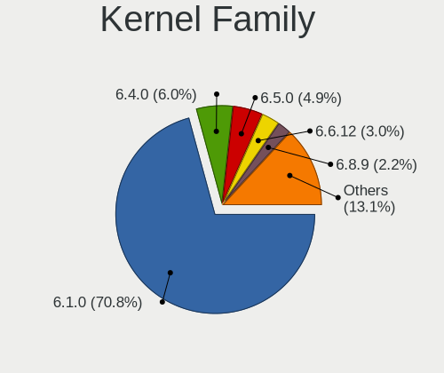

| Version  | Notebooks | Percent |
|----------|-----------|---------|
| 6.1.0    | 96        | 66.21%  |
| 6.4.0    | 15        | 10.34%  |
| 6.5.0    | 12        | 8.28%   |
| 6.6.12   | 8         | 5.52%   |
| 6.7.5    | 2         | 1.38%   |
| 6.6.9    | 2         | 1.38%   |
| 6.4.9    | 2         | 1.38%   |
| 6.7.6    | 1         | 0.69%   |
| 6.7.12   | 1         | 0.69%   |
| 6.7.11   | 1         | 0.69%   |
| 6.5.10   | 1         | 0.69%   |
| 6.3.0    | 1         | 0.69%   |
| 6.2.14   | 1         | 0.69%   |
| 6.1.77   | 1         | 0.69%   |
| 5.10.197 | 1         | 0.69%   |

Kernel Major Ver.
-----------------

Linux kernel major version

| Version | Notebooks | Percent |
|---------|-----------|---------|
| 6.1     | 97        | 67.36%  |
| 6.4     | 17        | 11.81%  |
| 6.5     | 13        | 9.03%   |
| 6.6     | 10        | 6.94%   |
| 6.7     | 4         | 2.78%   |
| 6.3     | 1         | 0.69%   |
| 6.2     | 1         | 0.69%   |
| 5.10    | 1         | 0.69%   |

Arch
----

OS architecture (x86_64, i586, etc.)

| Name   | Notebooks | Percent |
|--------|-----------|---------|
| x86_64 | 134       | 93.71%  |
| i686   | 9         | 6.29%   |

DE
--

Desktop Environment

| Name            | Notebooks | Percent |
|-----------------|-----------|---------|
| XFCE            | 105       | 73.43%  |
| KDE5            | 32        | 22.38%  |
| X-Cinnamon      | 2         | 1.4%    |
| fluxbox         | 2         | 1.4%    |
| LXQt            | 1         | 0.7%    |
| GNOME Flashback | 1         | 0.7%    |

Display Server
--------------

X11 or Wayland

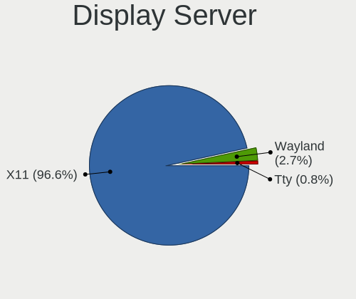

| Name | Notebooks | Percent |
|------|-----------|---------|
| X11  | 142       | 99.3%   |
| Tty  | 1         | 0.7%    |

Display Manager
---------------

SDDM, LightDM, etc.

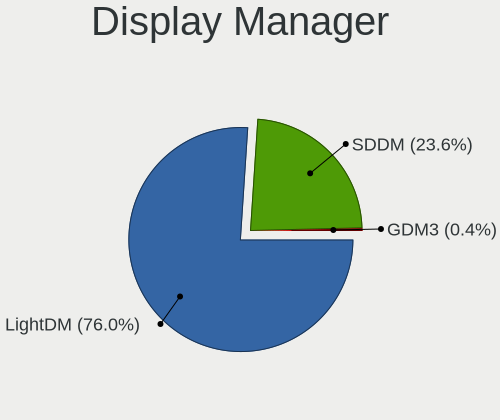

| Name    | Notebooks | Percent |
|---------|-----------|---------|
| LightDM | 112       | 78.32%  |
| SDDM    | 31        | 21.68%  |

OS Lang
-------

Language

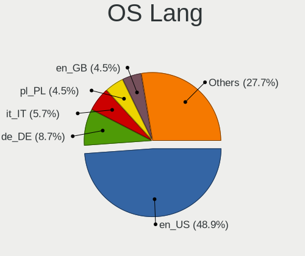

| Lang    | Notebooks | Percent |
|---------|-----------|---------|
| en_US   | 73        | 50.34%  |
| de_DE   | 12        | 8.28%   |
| fr_FR   | 8         | 5.52%   |
| en_GB   | 8         | 5.52%   |
| pl_PL   | 7         | 4.83%   |
| it_IT   | 6         | 4.14%   |
| en_CA   | 4         | 2.76%   |
| en_AU   | 4         | 2.76%   |
| ru_RU   | 3         | 2.07%   |
| pt_BR   | 2         | 1.38%   |
| el_GR   | 2         | 1.38%   |
| C       | 2         | 1.38%   |
| uk_UA   | 1         | 0.69%   |
| tr_TR   | 1         | 0.69%   |
| sk_SK   | 1         | 0.69%   |
| nl_NL   | 1         | 0.69%   |
| ja_JP   | 1         | 0.69%   |
| hu_HU   | 1         | 0.69%   |
| es_VE   | 1         | 0.69%   |
| es_US   | 1         | 0.69%   |
| es_MX   | 1         | 0.69%   |
| es_ES   | 1         | 0.69%   |
| en_NZ   | 1         | 0.69%   |
| en_IL   | 1         | 0.69%   |
| en_IE   | 1         | 0.69%   |
| Unknown | 1         | 0.69%   |

Boot Mode
---------

EFI or BIOS

| Mode | Notebooks | Percent |
|------|-----------|---------|
| EFI  | 106       | 74.13%  |
| BIOS | 37        | 25.87%  |

Filesystem
----------

Type of filesystem

| Type    | Notebooks | Percent |
|---------|-----------|---------|
| Ext4    | 112       | 78.32%  |
| Overlay | 22        | 15.38%  |
| Btrfs   | 7         | 4.9%    |
| Tmpfs   | 1         | 0.7%    |
| F2fs    | 1         | 0.7%    |

Part. scheme
------------

Scheme of partitioning

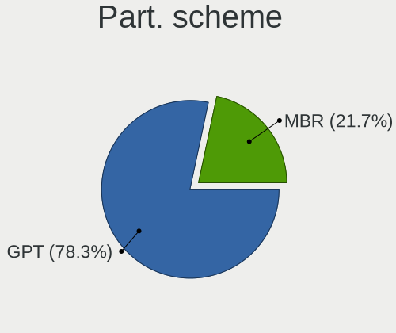

| Type | Notebooks | Percent |
|------|-----------|---------|
| GPT  | 106       | 74.13%  |
| MBR  | 37        | 25.87%  |

Dual Boot with Linux/BSD
------------------------

Hosting more than one Linux/BSD

| Dual boot | Notebooks | Percent |
|-----------|-----------|---------|
| No        | 118       | 82.52%  |
| Yes       | 25        | 17.48%  |

Dual Boot (Win)
---------------

Hosting Linux and Windows

| Dual boot | Notebooks | Percent |
|-----------|-----------|---------|
| No        | 96        | 66.21%  |
| Yes       | 49        | 33.79%  |

Board
-----

Vendor
------

Motherboard manufacturer

| Name                | Notebooks | Percent |
|---------------------|-----------|---------|
| Dell                | 31        | 21.68%  |
| Lenovo              | 28        | 19.58%  |
| Hewlett-Packard     | 24        | 16.78%  |
| ASUSTek Computer    | 13        | 9.09%   |
| Apple               | 8         | 5.59%   |
| Toshiba             | 5         | 3.5%    |
| Google              | 5         | 3.5%    |
| Acer                | 5         | 3.5%    |
| Samsung Electronics | 4         | 2.8%    |
| Sony                | 3         | 2.1%    |
| HONOR               | 2         | 1.4%    |
| GPU Company         | 2         | 1.4%    |
| VIT                 | 1         | 0.7%    |
| SGIN                | 1         | 0.7%    |
| Semp Toshiba        | 1         | 0.7%    |
| PC Specialist       | 1         | 0.7%    |
| MSI                 | 1         | 0.7%    |
| Medion              | 1         | 0.7%    |
| Mediacom            | 1         | 0.7%    |
| I-life              | 1         | 0.7%    |
| Gateway             | 1         | 0.7%    |
| Fujitsu Siemens     | 1         | 0.7%    |
| Beelink             | 1         | 0.7%    |
| AMI                 | 1         | 0.7%    |
| Alienware           | 1         | 0.7%    |

Model
-----

Motherboard model

| Name                                     | Notebooks | Percent |
|------------------------------------------|-----------|---------|
| HP Notebook                              | 3         | 2.1%    |
| HP Pavilion dv6                          | 2         | 1.4%    |
| HP EliteBook 840 G6                      | 2         | 1.4%    |
| HP 250 15.6 inch G9 Notebook PC          | 2         | 1.4%    |
| Dell Latitude E6410                      | 2         | 1.4%    |
| Dell Latitude 5530                       | 2         | 1.4%    |
| VIT P3400                                | 1         | 0.7%    |
| Toshiba Satellite P875                   | 1         | 0.7%    |
| Toshiba Satellite C55D-B                 | 1         | 0.7%    |
| Toshiba Satellite C55-A                  | 1         | 0.7%    |
| Toshiba Satellite C50-B                  | 1         | 0.7%    |
| Toshiba dynabook T552/36GB               | 1         | 0.7%    |
| Sony VGN-S3HP                            | 1         | 0.7%    |
| Sony SVF1521H1EW                         | 1         | 0.7%    |
| Sony SVF1521A6EW                         | 1         | 0.7%    |
| SGIN M15                                 | 1         | 0.7%    |
| Semp Toshiba IS 1413G                    | 1         | 0.7%    |
| Samsung RF511/RF411/RF711                | 1         | 0.7%    |
| Samsung N150/N210/N220                   | 1         | 0.7%    |
| Samsung 750XDA                           | 1         | 0.7%    |
| Samsung 305E4A/305E5A/305E7A             | 1         | 0.7%    |
| PC Specialist Lafite Pro III 17          | 1         | 0.7%    |
| MSI GE63 Raider RGB 9SE                  | 1         | 0.7%    |
| Medion Defender P30                      | 1         | 0.7%    |
| Mediacom FlexBook edge11 - M-FBE11       | 1         | 0.7%    |
| Lenovo Yoga Slim 7-14ARE05 82A2          | 1         | 0.7%    |
| Lenovo Yoga 710-11IKB 80V6               | 1         | 0.7%    |
| Lenovo V15 G3 ABA 82TV                   | 1         | 0.7%    |
| Lenovo ThinkPad X280 20KES6M100          | 1         | 0.7%    |
| Lenovo ThinkPad X240 20AMS1JQ11          | 1         | 0.7%    |
| Lenovo ThinkPad X201 3626GWG             | 1         | 0.7%    |
| Lenovo ThinkPad X1 Carbon 6th 20KGS68500 | 1         | 0.7%    |
| Lenovo ThinkPad X1 Carbon 3rd 20BTS03Y06 | 1         | 0.7%    |
| Lenovo ThinkPad T470s W10DG 20JTS0SP29   | 1         | 0.7%    |
| Lenovo ThinkPad P52 20M9CTO1WW           | 1         | 0.7%    |
| Lenovo ThinkPad P14s Gen 2i 20VX00GXFR   | 1         | 0.7%    |
| Lenovo ThinkPad L580 20LW000VFR          | 1         | 0.7%    |
| Lenovo ThinkPad E16 Gen 1 21JT001FAU     | 1         | 0.7%    |
| Lenovo ThinkPad E14 Gen 2 20TA00MLSG     | 1         | 0.7%    |
| Lenovo ThinkBook 15 G3 ACL 21A4          | 1         | 0.7%    |

Model Family
------------

Motherboard model prefix

| Name                 | Notebooks | Percent |
|----------------------|-----------|---------|
| Dell Latitude        | 15        | 10.49%  |
| Lenovo ThinkPad      | 11        | 7.69%   |
| Lenovo IdeaPad       | 7         | 4.9%    |
| HP Pavilion          | 7         | 4.9%    |
| Dell Inspiron        | 6         | 4.2%    |
| ASUS VivoBook        | 5         | 3.5%    |
| Toshiba Satellite    | 4         | 2.8%    |
| HP EliteBook         | 4         | 2.8%    |
| Dell XPS             | 4         | 2.8%    |
| HP Notebook          | 3         | 2.1%    |
| HP Laptop            | 3         | 2.1%    |
| HP 250               | 3         | 2.1%    |
| Dell Vostro          | 3         | 2.1%    |
| Dell Precision       | 3         | 2.1%    |
| Apple MacBookPro5    | 3         | 2.1%    |
| Acer Aspire          | 3         | 2.1%    |
| Lenovo Yoga          | 2         | 1.4%    |
| Lenovo Legion        | 2         | 1.4%    |
| HP ProBook           | 2         | 1.4%    |
| VIT P3400            | 1         | 0.7%    |
| Toshiba dynabook     | 1         | 0.7%    |
| Sony VGN-S3HP        | 1         | 0.7%    |
| Sony SVF1521H1EW     | 1         | 0.7%    |
| Sony SVF1521A6EW     | 1         | 0.7%    |
| SGIN M15             | 1         | 0.7%    |
| Semp Toshiba IS      | 1         | 0.7%    |
| Samsung RF511        | 1         | 0.7%    |
| Samsung N150         | 1         | 0.7%    |
| Samsung 750XDA       | 1         | 0.7%    |
| Samsung 305E4A       | 1         | 0.7%    |
| PC Specialist Lafite | 1         | 0.7%    |
| MSI GE63             | 1         | 0.7%    |
| Medion Defender      | 1         | 0.7%    |
| Mediacom FlexBook    | 1         | 0.7%    |
| Lenovo V15           | 1         | 0.7%    |
| Lenovo ThinkBook     | 1         | 0.7%    |
| Lenovo LOQ           | 1         | 0.7%    |
| Lenovo G505s         | 1         | 0.7%    |
| Lenovo G50-30        | 1         | 0.7%    |
| Lenovo 3000          | 1         | 0.7%    |

MFG Year
--------

Motherboard manufacture year

| Year | Notebooks | Percent |
|------|-----------|---------|
| 2022 | 19        | 13.29%  |
| 2013 | 14        | 9.79%   |
| 2023 | 13        | 9.09%   |
| 2021 | 13        | 9.09%   |
| 2019 | 13        | 9.09%   |
| 2018 | 10        | 6.99%   |
| 2009 | 8         | 5.59%   |
| 2016 | 7         | 4.9%    |
| 2012 | 7         | 4.9%    |
| 2011 | 7         | 4.9%    |
| 2020 | 6         | 4.2%    |
| 2014 | 6         | 4.2%    |
| 2010 | 5         | 3.5%    |
| 2017 | 3         | 2.1%    |
| 2015 | 3         | 2.1%    |
| 2008 | 3         | 2.1%    |
| 2006 | 3         | 2.1%    |
| 2007 | 2         | 1.4%    |
| 2005 | 1         | 0.7%    |

Form Factor
-----------

Physical design of the computer

| Name     | Notebooks | Percent |
|----------|-----------|---------|
| Notebook | 143       | 100%    |

Secure Boot
-----------

Enabled or disabled

| State    | Notebooks | Percent |
|----------|-----------|---------|
| Disabled | 135       | 94.41%  |
| Enabled  | 8         | 5.59%   |

Coreboot
--------

Have coreboot on board

| Used | Notebooks | Percent |
|------|-----------|---------|
| No   | 138       | 96.5%   |
| Yes  | 5         | 3.5%    |

RAM Size
--------

Total RAM memory

| Size in GB  | Notebooks | Percent |
|-------------|-----------|---------|
| 4.01-8.0    | 41        | 28.67%  |
| 3.01-4.0    | 31        | 21.68%  |
| 8.01-16.0   | 21        | 14.69%  |
| 16.01-24.0  | 20        | 13.99%  |
| 32.01-64.0  | 15        | 10.49%  |
| 1.01-2.0    | 8         | 5.59%   |
| 24.01-32.0  | 3         | 2.1%    |
| 64.01-256.0 | 3         | 2.1%    |
| 2.01-3.0    | 1         | 0.7%    |

RAM Used
--------

Used RAM memory

| Used GB    | Notebooks | Percent |
|------------|-----------|---------|
| 2.01-3.0   | 61        | 41.5%   |
| 1.01-2.0   | 52        | 35.37%  |
| 4.01-8.0   | 15        | 10.2%   |
| 3.01-4.0   | 15        | 10.2%   |
| 0.51-1.0   | 2         | 1.36%   |
| 16.01-24.0 | 1         | 0.68%   |
| 8.01-16.0  | 1         | 0.68%   |

Total Drives
------------

Number of drives on board

| Drives | Notebooks | Percent |
|--------|-----------|---------|
| 1      | 114       | 79.72%  |
| 2      | 24        | 16.78%  |
| 3      | 4         | 2.8%    |
| 4      | 1         | 0.7%    |

Has CD-ROM
----------

Has CD-ROM on board

| Presented | Notebooks | Percent |
|-----------|-----------|---------|
| No        | 104       | 72.73%  |
| Yes       | 39        | 27.27%  |

Has Ethernet
------------

Has Ethernet on board

| Presented | Notebooks | Percent |
|-----------|-----------|---------|
| Yes       | 106       | 74.13%  |
| No        | 37        | 25.87%  |

Has WiFi
--------

Has WiFi module

| Presented | Notebooks | Percent |
|-----------|-----------|---------|
| Yes       | 138       | 96.5%   |
| No        | 5         | 3.5%    |

Has Bluetooth
-------------

Has Bluetooth module

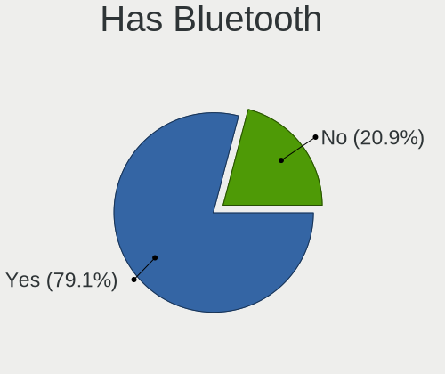

| Presented | Notebooks | Percent |
|-----------|-----------|---------|
| Yes       | 116       | 81.12%  |
| No        | 27        | 18.88%  |

Location
--------

Country
-------

Geographic location (country)

| Country       | Notebooks | Percent |
|---------------|-----------|---------|
| USA           | 27        | 18.62%  |
| Greece        | 14        | 9.66%   |
| Germany       | 14        | 9.66%   |
| UK            | 8         | 5.52%   |
| Poland        | 8         | 5.52%   |
| France        | 8         | 5.52%   |
| Canada        | 7         | 4.83%   |
| Italy         | 5         | 3.45%   |
| Brazil        | 5         | 3.45%   |
| Australia     | 5         | 3.45%   |
| Turkey        | 3         | 2.07%   |
| Russia        | 3         | 2.07%   |
| Sweden        | 2         | 1.38%   |
| Serbia        | 2         | 1.38%   |
| Romania       | 2         | 1.38%   |
| Portugal      | 2         | 1.38%   |
| Netherlands   | 2         | 1.38%   |
| Mexico        | 2         | 1.38%   |
| Japan         | 2         | 1.38%   |
| India         | 2         | 1.38%   |
| Egypt         | 2         | 1.38%   |
| Algeria       | 2         | 1.38%   |
| Venezuela     | 1         | 0.69%   |
| Thailand      | 1         | 0.69%   |
| Spain         | 1         | 0.69%   |
| Slovakia      | 1         | 0.69%   |
| Singapore     | 1         | 0.69%   |
| Norway        | 1         | 0.69%   |
| New Zealand   | 1         | 0.69%   |
| Lithuania     | 1         | 0.69%   |
| Kazakhstan    | 1         | 0.69%   |
| Israel        | 1         | 0.69%   |
| Ireland       | 1         | 0.69%   |
| Indonesia     | 1         | 0.69%   |
| Hungary       | 1         | 0.69%   |
| French Guiana | 1         | 0.69%   |
| Cuba          | 1         | 0.69%   |
| Belarus       | 1         | 0.69%   |
| Bangladesh    | 1         | 0.69%   |
| Argentina     | 1         | 0.69%   |

City
----

Geographic location (city)

| City             | Notebooks | Percent |
|------------------|-----------|---------|
| Athens           | 10        | 6.8%    |
| Paris            | 4         | 2.72%   |
| Warsaw           | 2         | 1.36%   |
| Sydney           | 2         | 1.36%   |
| Salamina         | 2         | 1.36%   |
| Rio de Janeiro   | 2         | 1.36%   |
| Ravensburg       | 2         | 1.36%   |
| Otwock           | 2         | 1.36%   |
| Milan            | 2         | 1.36%   |
| London           | 2         | 1.36%   |
| Le Haillan       | 2         | 1.36%   |
| Cairo            | 2         | 1.36%   |
| Bengaluru        | 2         | 1.36%   |
| Yokohama         | 1         | 0.68%   |
| Yeovil           | 1         | 0.68%   |
| Yekaterinburg    | 1         | 0.68%   |
| Woodbridge       | 1         | 0.68%   |
| Winston-Salem    | 1         | 0.68%   |
| Willoughby       | 1         | 0.68%   |
| Westminster      | 1         | 0.68%   |
| Wandsworth       | 1         | 0.68%   |
| Vranje           | 1         | 0.68%   |
| Vitebsk          | 1         | 0.68%   |
| Vigia            | 1         | 0.68%   |
| Vallentuna       | 1         | 0.68%   |
| Uslar            | 1         | 0.68%   |
| Upper Marlboro   | 1         | 0.68%   |
| Turnu Magurele   | 1         | 0.68%   |
| Tsor`a           | 1         | 0.68%   |
| Trentola-Ducenta | 1         | 0.68%   |
| Tokyo            | 1         | 0.68%   |
| Tizi Ouzou       | 1         | 0.68%   |
| Tissemsilt       | 1         | 0.68%   |
| Thessaloniki     | 1         | 0.68%   |
| Stuttgart        | 1         | 0.68%   |
| Stockholm        | 1         | 0.68%   |
| Singapore        | 1         | 0.68%   |
| Seattle          | 1         | 0.68%   |
| Scarborough      | 1         | 0.68%   |
| Santa Clara      | 1         | 0.68%   |

Drives
------

Drive Vendor
------------

Hard drive vendors

| Vendor                      | Notebooks | Drives | Percent |
|-----------------------------|-----------|--------|---------|
| Samsung Electronics         | 23        | 26     | 13.29%  |
| WDC                         | 14        | 15     | 8.09%   |
| SanDisk                     | 14        | 15     | 8.09%   |
| Seagate                     | 13        | 14     | 7.51%   |
| SK hynix                    | 10        | 10     | 5.78%   |
| Unknown                     | 9         | 10     | 5.2%    |
| Toshiba                     | 9         | 9      | 5.2%    |
| Crucial                     | 7         | 17     | 4.05%   |
| Micron Technology           | 6         | 6      | 3.47%   |
| Unknown                     | 6         | 6      | 3.47%   |
| KIOXIA                      | 5         | 6      | 2.89%   |
| Kingston                    | 5         | 5      | 2.89%   |
| Intel                       | 4         | 4      | 2.31%   |
| Hitachi                     | 4         | 4      | 2.31%   |
| China                       | 4         | 5      | 2.31%   |
| SPCC                        | 3         | 3      | 1.73%   |
| LITEONIT                    | 3         | 3      | 1.73%   |
| HGST                        | 3         | 3      | 1.73%   |
| Fujitsu                     | 3         | 3      | 1.73%   |
| Apple                       | 3         | 3      | 1.73%   |
| Netac                       | 2         | 2      | 1.16%   |
| Kingston Technology Company | 2         | 2      | 1.16%   |
| A-DATA Technology           | 2         | 2      | 1.16%   |
| WALRAM                      | 1         | 1      | 0.58%   |
| UMIS                        | 1         | 1      | 0.58%   |
| Timetec                     | 1         | 1      | 0.58%   |
| Team                        | 1         | 1      | 0.58%   |
| Realtek                     | 1         | 1      | 0.58%   |
| PNY                         | 1         | 1      | 0.58%   |
| Phison Electronics          | 1         | 1      | 0.58%   |
| Patriot                     | 1         | 1      | 0.58%   |
| LITEON                      | 1         | 1      | 0.58%   |
| Intenso                     | 1         | 1      | 0.58%   |
| Gigabyte Technology         | 1         | 1      | 0.58%   |
| GeIL                        | 1         | 1      | 0.58%   |
| FORESEE                     | 1         | 1      | 0.58%   |
| Fanxiang                    | 1         | 1      | 0.58%   |
| Emtec                       | 1         | 1      | 0.58%   |
| CF400                       | 1         | 1      | 0.58%   |
| ASMT109x                    | 1         | 1      | 0.58%   |

Drive Model
-----------

Hard drive models

| Model                                | Notebooks | Percent |
|--------------------------------------|-----------|---------|
| Unknown                              | 6         | 3.39%   |
| SanDisk NVMe SSD Drive 512GB         | 5         | 2.82%   |
| Toshiba MQ01ABF050 500GB             | 4         | 2.26%   |
| Seagate ST320LT012-9WS14C 320GB      | 2         | 1.13%   |
| Seagate ST1000LM035-1RK172 1TB       | 2         | 1.13%   |
| SanDisk NVMe SSD Drive 2TB           | 2         | 1.13%   |
| Samsung MZVLB256HBHQ-000L2 256GB     | 2         | 1.13%   |
| Micron MTFDKCD512TFK 512GB           | 2         | 1.13%   |
| Intel SSDPEKNU512GZ 512GB            | 2         | 1.13%   |
| HGST HTS545050A7E680 500GB           | 2         | 1.13%   |
| WDC WDS240G2G0B-00EPW0 240GB SSD     | 1         | 0.56%   |
| WDC WDS100T1R0A-68A4W0 1TB SSD       | 1         | 0.56%   |
| WDC WD5000LPVX-22V0TT0 500GB         | 1         | 0.56%   |
| WDC WD5000LPCX-75VHAT0 500GB         | 1         | 0.56%   |
| WDC WD3200BEKT-00F3T0 320GB          | 1         | 0.56%   |
| WDC WD1600BEKT-75PVMT0 160GB         | 1         | 0.56%   |
| WDC WD10SPZX-24Z10T0 1TB             | 1         | 0.56%   |
| WDC WD Green 2.5 240GB               | 1         | 0.56%   |
| WDC PC SN810 NVMe 1024GB             | 1         | 0.56%   |
| WDC PC SN730 SDBPNTY-1T00-1102 1TB   | 1         | 0.56%   |
| WDC PC SN720 SDAQNTW-512G-1001 512GB | 1         | 0.56%   |
| WDC PC SN530 SDBPNPZ-512G-1036 512GB | 1         | 0.56%   |
| WDC PC SN530 SDBPNPZ-256G-1027 256GB | 1         | 0.56%   |
| WDC PC SN530 NVMe 512GB              | 1         | 0.56%   |
| WDC PC SN520 SDAPNUW-128G-1006 128GB | 1         | 0.56%   |
| WALRAM SSD 512GB                     | 1         | 0.56%   |
| Unknown USDU1  128GB                 | 1         | 0.56%   |
| Unknown SA16G  16GB                  | 1         | 0.56%   |
| Unknown SA08G  8GB                   | 1         | 0.56%   |
| Unknown NCard  32GB                  | 1         | 0.56%   |
| Unknown MMC128  128GB                | 1         | 0.56%   |
| Unknown HBG4a2  32GB                 | 1         | 0.56%   |
| Unknown hA8aP  16GB                  | 1         | 0.56%   |
| Unknown DJNB4R  128GB                | 1         | 0.56%   |
| Unknown DA4064  64GB                 | 1         | 0.56%   |
| UMIS RPFTJ128PDD2EWX 128GB           | 1         | 0.56%   |
| Toshiba THNSN51T02DU7 NVMe 1024GB    | 1         | 0.56%   |
| Toshiba MQ01ABD100 1TB               | 1         | 0.56%   |
| Toshiba MQ01ABD0 320GB               | 1         | 0.56%   |
| Toshiba MK6475GSX 640GB              | 1         | 0.56%   |

HDD Vendor
----------

Hard disk drive vendors

| Vendor              | Notebooks | Drives | Percent |
|---------------------|-----------|--------|---------|
| Seagate             | 13        | 13     | 36.11%  |
| Toshiba             | 7         | 7      | 19.44%  |
| WDC                 | 5         | 5      | 13.89%  |
| Hitachi             | 4         | 4      | 11.11%  |
| HGST                | 3         | 3      | 8.33%   |
| Fujitsu             | 3         | 3      | 8.33%   |
| Samsung Electronics | 1         | 1      | 2.78%   |

SSD Vendor
----------

Solid state drive vendors

| Vendor              | Notebooks | Drives | Percent |
|---------------------|-----------|--------|---------|
| Samsung Electronics | 11        | 12     | 20.75%  |
| SanDisk             | 4         | 4      | 7.55%   |
| China               | 4         | 5      | 7.55%   |
| WDC                 | 3         | 3      | 5.66%   |
| LITEONIT            | 3         | 3      | 5.66%   |
| Kingston            | 3         | 3      | 5.66%   |
| Crucial             | 3         | 13     | 5.66%   |
| SPCC                | 2         | 2      | 3.77%   |
| Netac               | 2         | 2      | 3.77%   |
| Apple               | 2         | 2      | 3.77%   |
| A-DATA Technology   | 2         | 2      | 3.77%   |
| WALRAM              | 1         | 1      | 1.89%   |
| Seagate             | 1         | 1      | 1.89%   |
| PNY                 | 1         | 1      | 1.89%   |
| Patriot             | 1         | 1      | 1.89%   |
| Micron Technology   | 1         | 1      | 1.89%   |
| LITEON              | 1         | 1      | 1.89%   |
| Intenso             | 1         | 1      | 1.89%   |
| Gigabyte Technology | 1         | 1      | 1.89%   |
| GeIL                | 1         | 1      | 1.89%   |
| FORESEE             | 1         | 1      | 1.89%   |
| Fanxiang            | 1         | 1      | 1.89%   |
| Emtec               | 1         | 1      | 1.89%   |
| CF400               | 1         | 1      | 1.89%   |
| ASMT109x            | 1         | 1      | 1.89%   |

Drive Kind
----------

HDD or SSD

| Kind | Notebooks | Drives | Percent |
|------|-----------|--------|---------|
| NVMe | 61        | 72     | 37.89%  |
| SSD  | 48        | 65     | 29.81%  |
| HDD  | 36        | 36     | 22.36%  |
| MMC  | 16        | 19     | 9.94%   |

Drive Connector
---------------

SATA, SAS, NVMe, etc.

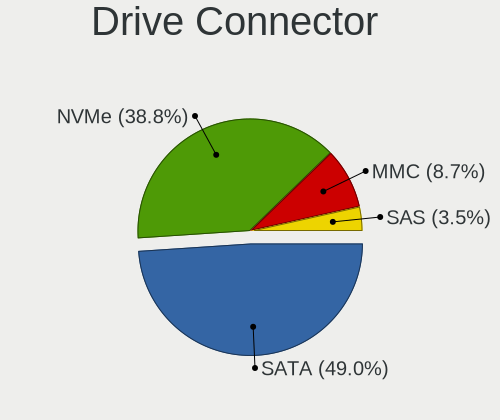

| Type | Notebooks | Drives | Percent |
|------|-----------|--------|---------|
| SATA | 77        | 99     | 49.36%  |
| NVMe | 60        | 71     | 38.46%  |
| MMC  | 16        | 19     | 10.26%  |
| SAS  | 3         | 3      | 1.92%   |

Drive Size
----------

Size of hard drive

| Size in TB | Notebooks | Drives | Percent |
|------------|-----------|--------|---------|
| 0.01-0.5   | 57        | 64     | 69.51%  |
| 0.51-1.0   | 21        | 33     | 25.61%  |
| 1.01-2.0   | 4         | 4      | 4.88%   |

Space Total
-----------

Amount of disk space available on the file system

| Size in GB     | Notebooks | Percent |
|----------------|-----------|---------|
| 101-250        | 41        | 28.28%  |
| 251-500        | 26        | 17.93%  |
| 1-20           | 25        | 17.24%  |
| 501-1000       | 17        | 11.72%  |
| 51-100         | 16        | 11.03%  |
| 21-50          | 13        | 8.97%   |
| 1001-2000      | 6         | 4.14%   |
| More than 3000 | 1         | 0.69%   |

Space Used
----------

Amount of used disk space

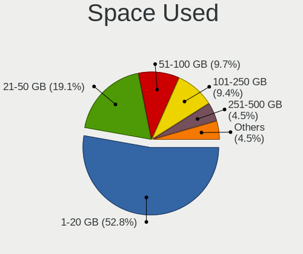

| Used GB   | Notebooks | Percent |
|-----------|-----------|---------|
| 1-20      | 82        | 56.55%  |
| 21-50     | 27        | 18.62%  |
| 101-250   | 14        | 9.66%   |
| 51-100    | 11        | 7.59%   |
| 251-500   | 4         | 2.76%   |
| 1001-2000 | 4         | 2.76%   |
| 501-1000  | 3         | 2.07%   |

Malfunc. Drives
---------------

Drive models with a malfunction

| Model                                 | Notebooks | Drives | Percent |
|---------------------------------------|-----------|--------|---------|
| Toshiba MQ01ABF050 500GB              | 2         | 2      | 8.7%    |
| HGST HTS545050A7E680 500GB            | 2         | 2      | 8.7%    |
| WDC WD1600BEKT-75PVMT0 160GB          | 1         | 1      | 4.35%   |
| WDC WD Green 2.5 240GB                | 1         | 1      | 4.35%   |
| Seagate ST9500325AS 500GB             | 1         | 1      | 4.35%   |
| Seagate ST9320423AS 320GB             | 1         | 1      | 4.35%   |
| Seagate ST320LT012-9WS14C 320GB       | 1         | 1      | 4.35%   |
| Seagate ST320LT009-9WC142 320GB       | 1         | 1      | 4.35%   |
| Seagate ST1000LM024 HN-M101MBB 1TB    | 1         | 1      | 4.35%   |
| SanDisk SSD PLUS 480GB                | 1         | 1      | 4.35%   |
| SanDisk SSD PLUS 1000GB               | 1         | 1      | 4.35%   |
| Samsung Electronics SSD 870 EVO 250GB | 1         | 2      | 4.35%   |
| Netac SSD 512GB                       | 1         | 1      | 4.35%   |
| Netac SSD 240GB                       | 1         | 1      | 4.35%   |
| LITEONIT L8T-256L6G-HP 256GB SSD      | 1         | 1      | 4.35%   |
| Hitachi HTS545050A7E380 500GB         | 1         | 1      | 4.35%   |
| Hitachi HTS542525K9SA00 250GB         | 1         | 1      | 4.35%   |
| Hitachi HTS541080G9AT00 80GB          | 1         | 1      | 4.35%   |
| HGST HTS545050A7E380 500GB            | 1         | 1      | 4.35%   |
| Fujitsu MHW2120BJ G2 120GB            | 1         | 1      | 4.35%   |
| Crucial CT1000MX500SSD4 1TB           | 1         | 11     | 4.35%   |

Malfunc. Drive Vendor
---------------------

Vendors of faulty drives

| Vendor              | Notebooks | Drives | Percent |
|---------------------|-----------|--------|---------|
| Seagate             | 5         | 5      | 21.74%  |
| Hitachi             | 3         | 3      | 13.04%  |
| HGST                | 3         | 3      | 13.04%  |
| WDC                 | 2         | 2      | 8.7%    |
| Toshiba             | 2         | 2      | 8.7%    |
| SanDisk             | 2         | 2      | 8.7%    |
| Netac               | 2         | 2      | 8.7%    |
| Samsung Electronics | 1         | 2      | 4.35%   |
| LITEONIT            | 1         | 1      | 4.35%   |
| Fujitsu             | 1         | 1      | 4.35%   |
| Crucial             | 1         | 11     | 4.35%   |

Malfunc. HDD Vendor
-------------------

Vendors of faulty HDD drives

| Vendor  | Notebooks | Drives | Percent |
|---------|-----------|--------|---------|
| Seagate | 5         | 5      | 33.33%  |
| Hitachi | 3         | 3      | 20%     |
| HGST    | 3         | 3      | 20%     |
| Toshiba | 2         | 2      | 13.33%  |
| WDC     | 1         | 1      | 6.67%   |
| Fujitsu | 1         | 1      | 6.67%   |

Malfunc. Drive Kind
-------------------

Kinds of faulty drives

| Kind | Notebooks | Drives | Percent |
|------|-----------|--------|---------|
| HDD  | 15        | 15     | 65.22%  |
| SSD  | 8         | 19     | 34.78%  |

Failed Drives
-------------

Failed drive models

Zero info for selected period =(

Failed Drive Vendor
-------------------

Failed drive vendors

Zero info for selected period =(

Drive Status
------------

Number of failed and malfunc. drives

| Status   | Notebooks | Drives | Percent |
|----------|-----------|--------|---------|
| Works    | 105       | 124    | 67.74%  |
| Detected | 27        | 34     | 17.42%  |
| Malfunc  | 23        | 34     | 14.84%  |

Storage controller
------------------

Storage Vendor
--------------

Storage controller vendors

| Vendor                       | Notebooks | Percent |
|------------------------------|-----------|---------|
| Intel                        | 85        | 50.6%   |
| AMD                          | 17        | 10.12%  |
| SanDisk                      | 15        | 8.93%   |
| Samsung Electronics          | 12        | 7.14%   |
| SK hynix                     | 8         | 4.76%   |
| Nvidia                       | 5         | 2.98%   |
| Micron Technology            | 5         | 2.98%   |
| KIOXIA                       | 5         | 2.98%   |
| Micron/Crucial Technology    | 4         | 2.38%   |
| Kingston Technology Company  | 4         | 2.38%   |
| Toshiba America Info Systems | 2         | 1.19%   |
| Silicon Motion               | 2         | 1.19%   |
| Phison Electronics           | 2         | 1.19%   |
| Union Memory (Shenzhen)      | 1         | 0.6%    |
| Realtek Semiconductor        | 1         | 0.6%    |

Storage Model
-------------

Storage controller models

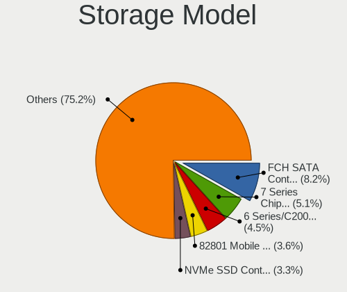

| Model                                                                          | Notebooks | Percent |
|--------------------------------------------------------------------------------|-----------|---------|
| AMD FCH SATA Controller [AHCI mode]                                            | 16        | 8.79%   |
| Intel 7 Series Chipset Family 6-port SATA Controller [AHCI mode]               | 12        | 6.59%   |
| Intel Volume Management Device NVMe RAID Controller                            | 8         | 4.4%    |
| Intel 6 Series/C200 Series Chipset Family 6 port Mobile SATA AHCI Controller   | 7         | 3.85%   |
| Samsung NVMe SSD Controller SM981/PM981/PM983                                  | 6         | 3.3%    |
| Intel Celeron/Pentium Silver Processor SATA Controller                         | 6         | 3.3%    |
| Intel 82801 Mobile SATA Controller [RAID mode]                                 | 6         | 3.3%    |
| SanDisk WD Black SN770 / PC SN740 256GB / PC SN560 (DRAM-less) NVMe SSD        | 5         | 2.75%   |
| Intel Alder Lake-P SATA AHCI Controller                                        | 5         | 2.75%   |
| SK hynix Gold P31/BC711/PC711 NVMe Solid State Drive                           | 4         | 2.2%    |
| Micron 2450 NVMe SSD [HendrixV] (DRAM-less)                                    | 4         | 2.2%    |
| Intel Cannon Point-LP SATA Controller [AHCI Mode]                              | 4         | 2.2%    |
| Intel Cannon Lake Mobile PCH SATA AHCI Controller                              | 4         | 2.2%    |
| SK hynix BC901 NVMe Solid State Drive (DRAM-less)                              | 3         | 1.65%   |
| Sandisk WD PC SN740 NVMe SSD 512GB (DRAM-less)                                 | 3         | 1.65%   |
| SanDisk Ultra 3D / WD Blue SN550 NVMe SSD                                      | 3         | 1.65%   |
| Samsung NVMe SSD Controller 980 (DRAM-less)                                    | 3         | 1.65%   |
| Nvidia MCP79 AHCI Controller                                                   | 3         | 1.65%   |
| Micron/Crucial P2 [Nick P2] / P3 / P3 Plus NVMe PCIe SSD (DRAM-less)           | 3         | 1.65%   |
| KIOXIA NVMe SSD Controller BG4 (DRAM-less)                                     | 3         | 1.65%   |
| Intel Sunrise Point-LP SATA Controller [AHCI mode]                             | 3         | 1.65%   |
| Intel Atom Processor E3800 Series SATA AHCI Controller                         | 3         | 1.65%   |
| Intel 82801IBM/IEM (ICH9M/ICH9M-E) 4 port SATA Controller [AHCI mode]          | 3         | 1.65%   |
| Intel 82801FB/FBM/FR/FW/FRW (ICH6 Family) IDE Controller                       | 3         | 1.65%   |
| Silicon Motion SM2263EN/SM2263XT (DRAM-less) NVMe SSD Controllers              | 2         | 1.1%    |
| Intel Wildcat Point-LP SATA Controller [AHCI Mode]                             | 2         | 1.1%    |
| Intel Tiger Lake-LP SATA Controller                                            | 2         | 1.1%    |
| Intel SSD 670p Series [Keystone Harbor]                                        | 2         | 1.1%    |
| Intel SSD 660P Series                                                          | 2         | 1.1%    |
| Intel 8 Series/C220 Series Chipset Family 6-port SATA Controller 1 [AHCI mode] | 2         | 1.1%    |
| Intel 8 Series SATA Controller 1 [AHCI mode]                                   | 2         | 1.1%    |
| Intel 5 Series/3400 Series Chipset 6 port SATA AHCI Controller                 | 2         | 1.1%    |
| Union Memory (Shenzhen) AM610 PCIe 3.0 x2 NVMe SSD 128GB, 256GB                | 1         | 0.55%   |
| Toshiba America Info Systems XG6 NVMe SSD Controller                           | 1         | 0.55%   |
| Toshiba America Info Systems XG3 NVMe SSD Controller                           | 1         | 0.55%   |
| SK hynix Platinum P41/PC801 NVMe Solid State Drive                             | 1         | 0.55%   |
| SanDisk WD PC SN810 / Black SN850 NVMe SSD                                     | 1         | 0.55%   |
| SanDisk WD Blue SN500 / PC SN520 x2 M.2 2280 NVMe SSD                          | 1         | 0.55%   |
| SanDisk IX SN530 NVMe SSD (DRAM-less)                                          | 1         | 0.55%   |
| SanDisk Extreme Pro / WD Black 2018/SN750/PC SN720 NVMe SSD                    | 1         | 0.55%   |

Storage Kind
------------

Kind of storage controller (IDE, SATA, NVMe, SAS, ...)

| Kind | Notebooks | Percent |
|------|-----------|---------|
| SATA | 86        | 50.29%  |
| NVMe | 59        | 34.5%   |
| RAID | 16        | 9.36%   |
| IDE  | 10        | 5.85%   |

Processor
---------

CPU Vendor
----------

Processor vendors

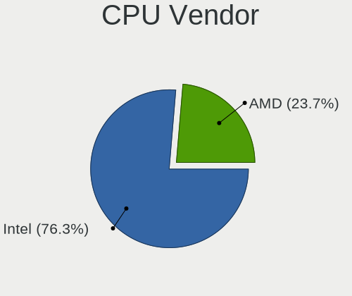

| Vendor | Notebooks | Percent |
|--------|-----------|---------|
| Intel  | 111       | 77.62%  |
| AMD    | 32        | 22.38%  |

CPU Model
---------

Processor models

| Model                                    | Notebooks | Percent |
|------------------------------------------|-----------|---------|
| Intel 12th Gen Core i5-1235U             | 5         | 3.5%    |
| AMD Ryzen 7 5700U with Radeon Graphics   | 4         | 2.8%    |
| Intel Core i7-9750H CPU @ 2.60GHz        | 3         | 2.1%    |
| Intel Core i5-8350U CPU @ 1.70GHz        | 3         | 2.1%    |
| Intel Celeron N4020 CPU @ 1.10GHz        | 3         | 2.1%    |
| Intel 11th Gen Core i3-1115G4 @ 3.00GHz  | 3         | 2.1%    |
| Intel Pentium Silver N5000 CPU @ 1.10GHz | 2         | 1.4%    |
| Intel Core i7-4810MQ CPU @ 2.80GHz       | 2         | 1.4%    |
| Intel Core i7-3630QM CPU @ 2.40GHz       | 2         | 1.4%    |
| Intel Core i5-8365U CPU @ 1.60GHz        | 2         | 1.4%    |
| Intel Core i5-8250U CPU @ 1.60GHz        | 2         | 1.4%    |
| Intel Core i5 CPU M 560 @ 2.67GHz        | 2         | 1.4%    |
| Intel Core 2 Duo CPU P8600 @ 2.40GHz     | 2         | 1.4%    |
| Intel Celeron M processor 1.50GHz        | 2         | 1.4%    |
| Intel Celeron J4105 CPU @ 1.50GHz        | 2         | 1.4%    |
| Intel 12th Gen Core i5-12450H            | 2         | 1.4%    |
| Intel 11th Gen Core i7-1165G7 @ 2.80GHz  | 2         | 1.4%    |
| Intel 11th Gen Core i5-1135G7 @ 2.40GHz  | 2         | 1.4%    |
| AMD Ryzen 7 5825U with Radeon Graphics   | 2         | 1.4%    |
| AMD Ryzen 5 5500U with Radeon Graphics   | 2         | 1.4%    |
| Intel Pentium Silver N6000 @ 1.10GHz     | 1         | 0.7%    |
| Intel Pentium M processor 1.60GHz        | 1         | 0.7%    |
| Intel Pentium CPU N3710 @ 1.60GHz        | 1         | 0.7%    |
| Intel Pentium CPU N3540 @ 2.16GHz        | 1         | 0.7%    |
| Intel Pentium CPU B950 @ 2.10GHz         | 1         | 0.7%    |
| Intel Pentium CPU 2117U @ 1.80GHz        | 1         | 0.7%    |
| Intel Genuine CPU U7300 @ 1.30GHz        | 1         | 0.7%    |
| Intel Genuine CPU T2600 @ 2.16GHz        | 1         | 0.7%    |
| Intel Core i7-8750H CPU @ 2.20GHz        | 1         | 0.7%    |
| Intel Core i7-6820HQ CPU @ 2.70GHz       | 1         | 0.7%    |
| Intel Core i7-6700HQ CPU @ 2.60GHz       | 1         | 0.7%    |
| Intel Core i7-6600U CPU @ 2.60GHz        | 1         | 0.7%    |
| Intel Core i7-6500U CPU @ 2.50GHz        | 1         | 0.7%    |
| Intel Core i7-5600U CPU @ 2.60GHz        | 1         | 0.7%    |
| Intel Core i7-5500U CPU @ 2.40GHz        | 1         | 0.7%    |
| Intel Core i7-4700MQ CPU @ 2.40GHz       | 1         | 0.7%    |
| Intel Core i7-3537U CPU @ 2.00GHz        | 1         | 0.7%    |
| Intel Core i7-3520M CPU @ 2.90GHz        | 1         | 0.7%    |
| Intel Core i7-2670QM CPU @ 2.20GHz       | 1         | 0.7%    |
| Intel Core i7-2630QM CPU @ 2.00GHz       | 1         | 0.7%    |

CPU Model Family
----------------

Processor model prefix

| Model                | Notebooks | Percent |
|----------------------|-----------|---------|
| Intel Core i5        | 25        | 17.48%  |
| Other                | 24        | 16.78%  |
| Intel Core i7        | 21        | 14.69%  |
| Intel Celeron        | 13        | 9.09%   |
| AMD Ryzen 7          | 10        | 6.99%   |
| Intel Core 2 Duo     | 8         | 5.59%   |
| Intel Atom           | 5         | 3.5%    |
| AMD Ryzen 5          | 5         | 3.5%    |
| Intel Pentium        | 4         | 2.8%    |
| Intel Core i3        | 4         | 2.8%    |
| AMD Ryzen 3          | 4         | 2.8%    |
| Intel Pentium Silver | 3         | 2.1%    |
| Intel Genuine        | 2         | 1.4%    |
| Intel Celeron M      | 2         | 1.4%    |
| AMD Ryzen 9          | 2         | 1.4%    |
| AMD A8               | 2         | 1.4%    |
| AMD A6               | 2         | 1.4%    |
| Intel Pentium M      | 1         | 0.7%    |
| Intel Core 2         | 1         | 0.7%    |
| AMD Turion Neo X2    | 1         | 0.7%    |
| AMD Turion 64 X2     | 1         | 0.7%    |
| AMD Ryzen 3 PRO      | 1         | 0.7%    |
| AMD A4               | 1         | 0.7%    |
| AMD A10              | 1         | 0.7%    |

CPU Cores
---------

Number of processor cores

| Number | Notebooks | Percent |
|--------|-----------|---------|
| 2      | 61        | 42.66%  |
| 4      | 42        | 29.37%  |
| 8      | 15        | 10.49%  |
| 6      | 10        | 6.99%   |
| 10     | 7         | 4.9%    |
| 1      | 4         | 2.8%    |
| 14     | 2         | 1.4%    |
| 12     | 2         | 1.4%    |

CPU Sockets
-----------

Number of sockets

| Number | Notebooks | Percent |
|--------|-----------|---------|
| 1      | 143       | 100%    |

CPU Threads
-----------

Threads per core (Hyper-Threading)

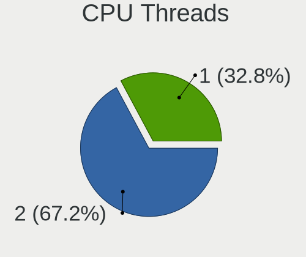

| Number | Notebooks | Percent |
|--------|-----------|---------|
| 2      | 94        | 65.73%  |
| 1      | 49        | 34.27%  |

CPU Op-Modes
------------

CPU Operation Modes (32-bit, 64-bit)

| Op mode        | Notebooks | Percent |
|----------------|-----------|---------|
| 32-bit, 64-bit | 139       | 97.2%   |
| 32-bit         | 4         | 2.8%    |

CPU Microcode
-------------

Microcode number

| Number     | Notebooks | Percent |
|------------|-----------|---------|
| Unknown    | 39        | 27.08%  |
| 0x206a7    | 10        | 6.94%   |
| 0x306a9    | 7         | 4.86%   |
| 0x1067a    | 6         | 4.17%   |
| 0x30678    | 5         | 3.47%   |
| 0x906a4    | 4         | 2.78%   |
| 0x806ec    | 4         | 2.78%   |
| 0x706a1    | 4         | 2.78%   |
| 0x08608103 | 4         | 2.78%   |
| 0x6d8      | 3         | 2.08%   |
| 0x406c4    | 3         | 2.08%   |
| 0x306c3    | 3         | 2.08%   |
| 0x0a50000c | 3         | 2.08%   |
| 0x906a3    | 2         | 1.39%   |
| 0x806ea    | 2         | 1.39%   |
| 0x806c2    | 2         | 1.39%   |
| 0x706a8    | 2         | 1.39%   |
| 0x506e3    | 2         | 1.39%   |
| 0x40651    | 2         | 1.39%   |
| 0x306d4    | 2         | 1.39%   |
| 0x20655    | 2         | 1.39%   |
| 0x0a404105 | 2         | 1.39%   |
| 0x08108109 | 2         | 1.39%   |
| 0x06006704 | 2         | 1.39%   |
| 0xb06a3    | 1         | 0.69%   |
| 0x906ea    | 1         | 0.69%   |
| 0x806e9    | 1         | 0.69%   |
| 0x806c1    | 1         | 0.69%   |
| 0x6fd      | 1         | 0.69%   |
| 0x6fb      | 1         | 0.69%   |
| 0x6f2      | 1         | 0.69%   |
| 0x6e8      | 1         | 0.69%   |
| 0x506c9    | 1         | 0.69%   |
| 0x406e3    | 1         | 0.69%   |
| 0x406c3    | 1         | 0.69%   |
| 0x30673    | 1         | 0.69%   |
| 0x106ca    | 1         | 0.69%   |
| 0x0a704103 | 1         | 0.69%   |
| 0x0a704101 | 1         | 0.69%   |
| 0x0a601206 | 1         | 0.69%   |

CPU Microarch
-------------

Microarchitecture

| Name             | Notebooks | Percent |
|------------------|-----------|---------|
| KabyLake         | 16        | 11.19%  |
| Unknown          | 14        | 9.79%   |
| Alderlake Hybrid | 13        | 9.09%   |
| IvyBridge        | 11        | 7.69%   |
| Silvermont       | 10        | 6.99%   |
| SandyBridge      | 10        | 6.99%   |
| TigerLake        | 8         | 5.59%   |
| Penryn           | 7         | 4.9%    |
| Goldmont plus    | 7         | 4.9%    |
| Skylake          | 6         | 4.2%    |
| Haswell          | 6         | 4.2%    |
| Zen 3            | 5         | 3.5%    |
| P6               | 4         | 2.8%    |
| Excavator        | 4         | 2.8%    |
| Westmere         | 3         | 2.1%    |
| Core             | 3         | 2.1%    |
| Zen+             | 2         | 1.4%    |
| K8 Hammer        | 2         | 1.4%    |
| Broadwell        | 2         | 1.4%    |
| Zen 2            | 1         | 0.7%    |
| Zen              | 1         | 0.7%    |
| Puma             | 1         | 0.7%    |
| Piledriver       | 1         | 0.7%    |
| K10 Llano        | 1         | 0.7%    |
| Jaguar           | 1         | 0.7%    |
| Icelake          | 1         | 0.7%    |
| Goldmont         | 1         | 0.7%    |
| CometLake        | 1         | 0.7%    |
| Bonnell          | 1         | 0.7%    |

Graphics
--------

GPU Vendor
----------

Vendors of graphics cards

| Vendor | Notebooks | Percent |
|--------|-----------|---------|
| Intel  | 102       | 60%     |
| AMD    | 36        | 21.18%  |
| Nvidia | 32        | 18.82%  |

GPU Model
---------

Graphics card models

| Model                                                                                    | Notebooks | Percent |
|------------------------------------------------------------------------------------------|-----------|---------|
| Intel 3rd Gen Core processor Graphics Controller                                         | 11        | 6.29%   |
| Intel 2nd Generation Core Processor Family Integrated Graphics Controller                | 10        | 5.71%   |
| AMD Lucienne                                                                             | 7         | 4%      |
| Intel Atom Processor Z36xxx/Z37xxx Series Graphics & Display                             | 6         | 3.43%   |
| Intel UHD Graphics 620                                                                   | 5         | 2.86%   |
| Intel TigerLake-LP GT2 [Iris Xe Graphics]                                                | 5         | 2.86%   |
| Intel GeminiLake [UHD Graphics 600]                                                      | 5         | 2.86%   |
| Intel WhiskeyLake-U GT2 [UHD Graphics 620]                                               | 4         | 2.29%   |
| Intel Skylake GT2 [HD Graphics 520]                                                      | 4         | 2.29%   |
| Intel Mobile 4 Series Chipset Integrated Graphics Controller                             | 4         | 2.29%   |
| Intel Atom/Celeron/Pentium Processor x5-E8000/J3xxx/N3xxx Integrated Graphics Controller | 4         | 2.29%   |
| AMD Barcelo                                                                              | 4         | 2.29%   |
| Nvidia C79 [GeForce 9400M]                                                               | 3         | 1.71%   |
| Intel Tiger Lake-LP GT2 [UHD Graphics G4]                                                | 3         | 1.71%   |
| Intel Haswell-ULT Integrated Graphics Controller                                         | 3         | 1.71%   |
| Intel Core Processor Integrated Graphics Controller                                      | 3         | 1.71%   |
| Intel Alder Lake-UP3 GT2 [UHD Graphics]                                                  | 3         | 1.71%   |
| Intel Alder Lake-UP3 GT2 [Iris Xe Graphics]                                              | 3         | 1.71%   |
| AMD Stoney [Radeon R2/R3/R4/R5 Graphics]                                                 | 3         | 1.71%   |
| Nvidia G96CM [GeForce 9600M GT]                                                          | 2         | 1.14%   |
| Nvidia AD107M [GeForce RTX 4060 Max-Q / Mobile]                                          | 2         | 1.14%   |
| Intel Raptor Lake-P [Iris Xe Graphics]                                                   | 2         | 1.14%   |
| Intel Mobile 915GM/GMS/910GML Express Graphics Controller                                | 2         | 1.14%   |
| Intel HD Graphics 5500                                                                   | 2         | 1.14%   |
| Intel HD Graphics 530                                                                    | 2         | 1.14%   |
| Intel GeminiLake [UHD Graphics 605]                                                      | 2         | 1.14%   |
| Intel CometLake-U GT2 [UHD Graphics]                                                     | 2         | 1.14%   |
| Intel CoffeeLake-H GT2 [UHD Graphics 630]                                                | 2         | 1.14%   |
| Intel Alder Lake-P GT1 [UHD Graphics]                                                    | 2         | 1.14%   |
| Intel 4th Gen Core Processor Integrated Graphics Controller                              | 2         | 1.14%   |
| AMD Seymour [Radeon HD 6400M/7400M Series]                                               | 2         | 1.14%   |
| AMD Rembrandt [Radeon 680M]                                                              | 2         | 1.14%   |
| AMD Picasso/Raven 2 [Radeon Vega Series / Radeon Vega Mobile Series]                     | 2         | 1.14%   |
| AMD Phoenix1                                                                             | 2         | 1.14%   |
| Nvidia TU117M [GeForce GTX 1650 Mobile / Max-Q]                                          | 1         | 0.57%   |
| Nvidia TU117GLM [T600 Laptop GPU]                                                        | 1         | 0.57%   |
| Nvidia TU117GLM [Quadro T500 Mobile]                                                     | 1         | 0.57%   |
| Nvidia TU116M [GeForce GTX 1660 Ti Mobile]                                               | 1         | 0.57%   |
| Nvidia TU106M [GeForce RTX 2060 Mobile]                                                  | 1         | 0.57%   |
| Nvidia TU106M [GeForce RTX 2060 Max-Q]                                                   | 1         | 0.57%   |

GPU Combo
---------

Combinations of graphics cards

| Name           | Notebooks | Percent |
|----------------|-----------|---------|
| 1 x Intel      | 69        | 48.25%  |
| 1 x AMD        | 26        | 18.18%  |
| Intel + Nvidia | 18        | 12.59%  |
| 2 x Intel      | 9         | 6.29%   |
| 1 x Nvidia     | 9         | 6.29%   |
| Intel + AMD    | 6         | 4.2%    |
| AMD + Nvidia   | 3         | 2.1%    |
| 2 x Nvidia     | 2         | 1.4%    |
| 2 x AMD        | 1         | 0.7%    |

GPU Driver
----------

Free vs proprietary

| Driver      | Notebooks | Percent |
|-------------|-----------|---------|
| Free        | 137       | 95.8%   |
| Proprietary | 5         | 3.5%    |
| Unknown     | 1         | 0.7%    |

GPU Memory
----------

Total video memory

| Size in GB | Notebooks | Percent |
|------------|-----------|---------|
| Unknown    | 100       | 69.93%  |
| 0.01-0.5   | 25        | 17.48%  |
| 1.01-2.0   | 9         | 6.29%   |
| 0.51-1.0   | 5         | 3.5%    |
| 3.01-4.0   | 2         | 1.4%    |
| 7.01-8.0   | 1         | 0.7%    |
| 5.01-6.0   | 1         | 0.7%    |

Monitor
-------

Monitor Vendor
--------------

Monitor vendors

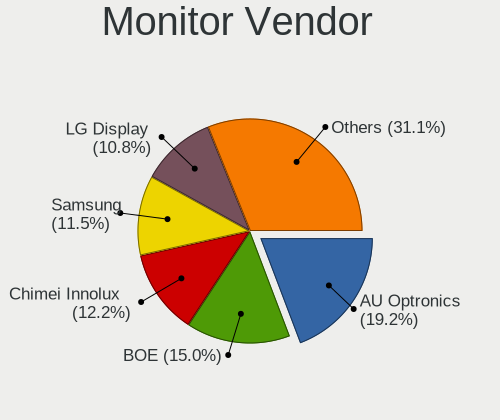

| Vendor                  | Notebooks | Percent |
|-------------------------|-----------|---------|
| AU Optronics            | 30        | 19.35%  |
| Samsung Electronics     | 23        | 14.84%  |
| BOE                     | 23        | 14.84%  |
| Chimei Innolux          | 17        | 10.97%  |
| LG Display              | 15        | 9.68%   |
| Apple                   | 8         | 5.16%   |
| Chi Mei Optoelectronics | 7         | 4.52%   |
| Sharp                   | 5         | 3.23%   |
| InfoVision              | 4         | 2.58%   |
| Lenovo                  | 3         | 1.94%   |
| Goldstar                | 3         | 1.94%   |
| ViewSonic               | 2         | 1.29%   |
| LG Philips              | 2         | 1.29%   |
| Hewlett-Packard         | 2         | 1.29%   |
| Dell                    | 2         | 1.29%   |
| BenQ                    | 2         | 1.29%   |
| Vizio                   | 1         | 0.65%   |
| Unknown (XXX)           | 1         | 0.65%   |
| Quanta Display          | 1         | 0.65%   |
| Philips                 | 1         | 0.65%   |
| PANDA                   | 1         | 0.65%   |
| CSO                     | 1         | 0.65%   |
| Ancor Communications    | 1         | 0.65%   |

Monitor Model
-------------

Monitor models

| Model                                                                    | Notebooks | Percent |
|--------------------------------------------------------------------------|-----------|---------|
| Samsung Electronics LCD Monitor SEC5441 1366x768 344x194mm 15.5-inch     | 3         | 1.94%   |
| Samsung Electronics LCD Monitor SEC4251 1366x768 344x194mm 15.5-inch     | 2         | 1.29%   |
| Samsung Electronics LCD Monitor SEC324A 1366x768 344x194mm 15.5-inch     | 2         | 1.29%   |
| Samsung Electronics LCD Monitor SDC4C48 1920x1080 344x194mm 15.5-inch    | 2         | 1.29%   |
| Samsung Electronics LCD Monitor SDC4347 1366x768 344x193mm 15.5-inch     | 2         | 1.29%   |
| LG Display LCD Monitor LGD0709 1920x1080 344x194mm 15.5-inch             | 2         | 1.29%   |
| Chimei Innolux LCD Monitor CMN1132 1366x768 256x144mm 11.6-inch          | 2         | 1.29%   |
| Chi Mei Optoelectronics LCD Monitor CMO15AB 1366x768 340x190mm 15.3-inch | 2         | 1.29%   |
| Chi Mei Optoelectronics LCD Monitor CMO15A7 1366x768 344x193mm 15.5-inch | 2         | 1.29%   |
| BOE LCD Monitor BOE08C2 1920x1080 344x194mm 15.5-inch                    | 2         | 1.29%   |
| AU Optronics LCD Monitor AUO403D 1920x1080 309x174mm 14.0-inch           | 2         | 1.29%   |
| Vizio E500i-A1 VIZ1004 1920x1080 1095x616mm 49.5-inch                    | 1         | 0.65%   |
| ViewSonic VX3276-UHD VSC5138 3840x2160 700x390mm 31.5-inch               | 1         | 0.65%   |
| ViewSonic VG2228 SERIES VSCEE29 1920x1080 477x268mm 21.5-inch            | 1         | 0.65%   |
| Unknown (XXX) Beyond TV XXX2851 3840x2160 1209x680mm 54.6-inch           | 1         | 0.65%   |
| Sharp LCD Monitor SHP1515 1920x1200 336x210mm 15.6-inch                  | 1         | 0.65%   |
| Sharp LCD Monitor SHP14D6 3840x2400 366x229mm 17.0-inch                  | 1         | 0.65%   |
| Sharp LCD Monitor SHP14BA 1920x1080 344x194mm 15.5-inch                  | 1         | 0.65%   |
| Sharp LCD Monitor SHP1453 1920x1080 346x194mm 15.6-inch                  | 1         | 0.65%   |
| Sharp LCD Monitor SHP144A 3200x1800 294x165mm 13.3-inch                  | 1         | 0.65%   |
| Samsung Electronics SyncMaster SAM0609 1920x1080 510x290mm 23.1-inch     | 1         | 0.65%   |
| Samsung Electronics S34J55x SAM0F72 3440x1440 797x333mm 34.0-inch        | 1         | 0.65%   |
| Samsung Electronics S22E450 SAM0C98 1680x1050 473x291mm 21.9-inch        | 1         | 0.65%   |
| Samsung Electronics LCD Monitor SEC3847 1440x900 367x230mm 17.1-inch     | 1         | 0.65%   |
| Samsung Electronics LCD Monitor SEC364A 1366x768 344x194mm 15.5-inch     | 1         | 0.65%   |
| Samsung Electronics LCD Monitor SEC325A 1366x768 344x194mm 15.5-inch     | 1         | 0.65%   |
| Samsung Electronics LCD Monitor SEC3150 1366x768 344x193mm 15.5-inch     | 1         | 0.65%   |
| Samsung Electronics LCD Monitor SEC314C 1920x1080 344x194mm 15.5-inch    | 1         | 0.65%   |
| Samsung Electronics LCD Monitor SEC3052 1024x600 223x125mm 10.1-inch     | 1         | 0.65%   |
| Samsung Electronics LCD Monitor SDC415D 3840x2400 344x215mm 16.0-inch    | 1         | 0.65%   |
| Samsung Electronics LCD Monitor SAM094E 1920x1080 890x500mm 40.2-inch    | 1         | 0.65%   |
| Samsung Electronics LCD Monitor SAM0902 1920x1080 890x500mm 40.2-inch    | 1         | 0.65%   |
| Quanta Display LCD Monitor QDS0047 1280x800 304x190mm 14.1-inch          | 1         | 0.65%   |
| Philips PHL 222V8 PHLC251 1920x1080 479x260mm 21.5-inch                  | 1         | 0.65%   |
| PANDA LCD Monitor NCP004F 1920x1080 309x174mm 14.0-inch                  | 1         | 0.65%   |
| LG Philips LCD Monitor LPL5000 1280x800 331x207mm 15.4-inch              | 1         | 0.65%   |
| LG Philips LCD Monitor LPL1201 1280x800 304x190mm 14.1-inch              | 1         | 0.65%   |
| LG Display LCD Monitor LGD0714 1920x1200 286x179mm 13.3-inch             | 1         | 0.65%   |
| LG Display LCD Monitor LGD06E8 1920x1080 344x194mm 15.5-inch             | 1         | 0.65%   |
| LG Display LCD Monitor LGD0611 1920x1080 382x215mm 17.3-inch             | 1         | 0.65%   |

Monitor Resolution
------------------

Monitor screen resolution

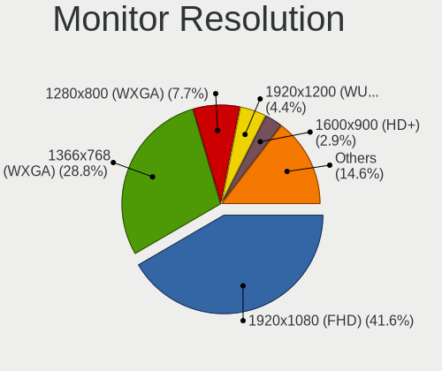

| Resolution         | Notebooks | Percent |
|--------------------|-----------|---------|
| 1920x1080 (FHD)    | 64        | 42.67%  |
| 1366x768 (WXGA)    | 47        | 31.33%  |
| 1280x800 (WXGA)    | 11        | 7.33%   |
| 1920x1200 (WUXGA)  | 8         | 5.33%   |
| 1440x900 (WXGA+)   | 4         | 2.67%   |
| 3840x2160 (4K)     | 3         | 2%      |
| 2560x1440 (QHD)    | 3         | 2%      |
| 3840x2400          | 2         | 1.33%   |
| 3440x1440          | 1         | 0.67%   |
| 3200x1800 (QHD+)   | 1         | 0.67%   |
| 3072x1920          | 1         | 0.67%   |
| 2560x1600          | 1         | 0.67%   |
| 1680x1050 (WSXGA+) | 1         | 0.67%   |
| 1600x900 (HD+)     | 1         | 0.67%   |
| 1360x768           | 1         | 0.67%   |
| 1024x768 (XGA)     | 1         | 0.67%   |

Monitor Diagonal
----------------

Diagonal size in inches

| Inches | Notebooks | Percent |
|--------|-----------|---------|
| 15     | 64        | 41.29%  |
| 13     | 19        | 12.26%  |
| 14     | 17        | 10.97%  |
| 17     | 9         | 5.81%   |
| 16     | 9         | 5.81%   |
| 11     | 9         | 5.81%   |
| 21     | 6         | 3.87%   |
| 23     | 5         | 3.23%   |
| 54     | 4         | 2.58%   |
| 12     | 4         | 2.58%   |
| 27     | 3         | 1.94%   |
| 18     | 3         | 1.94%   |
| 34     | 1         | 0.65%   |
| 31     | 1         | 0.65%   |
| 24     | 1         | 0.65%   |

Monitor Width
-------------

Physical width

| Width in mm | Notebooks | Percent |
|-------------|-----------|---------|
| 301-350     | 91        | 58.71%  |
| 201-300     | 26        | 16.77%  |
| 351-400     | 14        | 9.03%   |
| 501-600     | 9         | 5.81%   |
| 401-500     | 9         | 5.81%   |
| 1001-1500   | 4         | 2.58%   |
| 701-800     | 1         | 0.65%   |
| 601-700     | 1         | 0.65%   |

Aspect Ratio
------------

Proportional relationship between the width and the height

| Ratio | Notebooks | Percent |
|-------|-----------|---------|
| 16/9  | 111       | 79.29%  |
| 16/10 | 25        | 17.86%  |
| 3/2   | 2         | 1.43%   |
| 4/3   | 1         | 0.71%   |
| 21/9  | 1         | 0.71%   |

Monitor Area
------------

Area in inch

| Area in inch | Notebooks | Percent |
|----------------|-----------|---------|
| 101-110        | 64        | 41.29%  |
| 81-90          | 27        | 17.42%  |
| 71-80          | 9         | 5.81%   |
| 51-60          | 9         | 5.81%   |
| 201-250        | 9         | 5.81%   |
| 111-120        | 8         | 5.16%   |
| 121-130        | 7         | 4.52%   |
| More than 1000 | 4         | 2.58%   |
| 61-70          | 4         | 2.58%   |
| 301-350        | 3         | 1.94%   |
| 151-200        | 3         | 1.94%   |
| 141-150        | 3         | 1.94%   |
| 131-140        | 3         | 1.94%   |
| 351-500        | 2         | 1.29%   |

Pixel Density
-------------

Pixels per inch

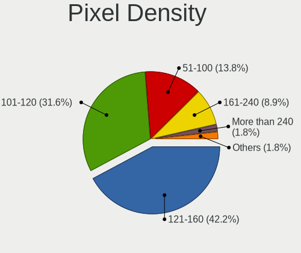

| Density       | Notebooks | Percent |
|---------------|-----------|---------|
| 121-160       | 66        | 42.86%  |
| 101-120       | 49        | 31.82%  |
| 51-100        | 21        | 13.64%  |
| 161-240       | 12        | 7.79%   |
| More than 240 | 3         | 1.95%   |
| 1-50          | 3         | 1.95%   |

Multiple Monitors
-----------------

Total monitors connected

| Total | Notebooks | Percent |
|-------|-----------|---------|
| 1     | 123       | 85.42%  |
| 2     | 20        | 13.89%  |
| 0     | 1         | 0.69%   |

Network
-------

Net Controller Vendor
---------------------

Controller vendors

| Vendor                    | Notebooks | Percent |
|---------------------------|-----------|---------|
| Realtek Semiconductor     | 66        | 30%     |
| Intel                     | 58        | 26.36%  |
| Broadcom                  | 30        | 13.64%  |
| Qualcomm Atheros          | 26        | 11.82%  |
| MediaTek                  | 10        | 4.55%   |
| Nvidia                    | 4         | 1.82%   |
| TP-Link                   | 2         | 0.91%   |
| Ralink Technology         | 2         | 0.91%   |
| Qualcomm                  | 2         | 0.91%   |
| OPPO Electronics          | 2         | 0.91%   |
| Marvell Technology Group  | 2         | 0.91%   |
| Huawei Technologies       | 2         | 0.91%   |
| D-Link                    | 2         | 0.91%   |
| Broadcom Limited          | 2         | 0.91%   |
| ASIX Electronics          | 2         | 0.91%   |
| ZyDAS                     | 1         | 0.45%   |
| Xiaomi                    | 1         | 0.45%   |
| Samsung Electronics       | 1         | 0.45%   |
| NetGear                   | 1         | 0.45%   |
| Motorola PCS              | 1         | 0.45%   |
| Fujitsu Siemens Computers | 1         | 0.45%   |
| DisplayLink               | 1         | 0.45%   |
| Dell                      | 1         | 0.45%   |

Net Controller Model
--------------------

Controller models

| Model                                                                  | Notebooks | Percent |
|------------------------------------------------------------------------|-----------|---------|
| Realtek RTL8111/8168/8211/8411 PCI Express Gigabit Ethernet Controller | 36        | 13.9%   |
| Realtek RTL810xE PCI Express Fast Ethernet controller                  | 10        | 3.86%   |
| Realtek RTL8852BE PCIe 802.11ax Wireless Network Controller            | 6         | 2.32%   |
| Realtek RTL8153 Gigabit Ethernet Adapter                               | 6         | 2.32%   |
| Intel Wireless 8265 / 8275                                             | 6         | 2.32%   |
| Intel Wi-Fi 6 AX200                                                    | 6         | 2.32%   |
| Broadcom BCM4322 802.11a/b/g/n Wireless LAN Controller                 | 6         | 2.32%   |
| Qualcomm Atheros QCA9565 / AR9565 Wireless Network Adapter             | 5         | 1.93%   |
| MediaTek Wi-Fi 6E MT7902 Wireless Network Adapter                      | 5         | 1.93%   |
| Intel Wi-Fi 6 AX201                                                    | 5         | 1.93%   |
| Intel Alder Lake-P PCH CNVi WiFi                                       | 5         | 1.93%   |
| Broadcom BCM4313 802.11bgn Wireless Network Adapter                    | 5         | 1.93%   |
| Realtek 802.11ac NIC                                                   | 4         | 1.54%   |
| Qualcomm Atheros QCA9377 802.11ac Wireless Network Adapter             | 4         | 1.54%   |
| Qualcomm Atheros QCA6174 802.11ac Wireless Network Adapter             | 4         | 1.54%   |
| Qualcomm Atheros AR9285 Wireless Network Adapter (PCI-Express)         | 4         | 1.54%   |
| Intel Wireless 7265                                                    | 4         | 1.54%   |
| Broadcom BCM43142 802.11b/g/n                                          | 4         | 1.54%   |
| Realtek RTL8821CE 802.11ac PCIe Wireless Network Adapter               | 3         | 1.16%   |
| Qualcomm Atheros AR9485 Wireless Network Adapter                       | 3         | 1.16%   |
| Qualcomm Atheros AR8162 Fast Ethernet                                  | 3         | 1.16%   |
| Nvidia MCP79 Ethernet                                                  | 3         | 1.16%   |
| MediaTek MT7921 802.11ax PCI Express Wireless Network Adapter          | 3         | 1.16%   |
| Intel Wi-Fi 5(802.11ac) Wireless-AC 9x6x [Thunder Peak]                | 3         | 1.16%   |
| Intel Ethernet Connection (4) I219-LM                                  | 3         | 1.16%   |
| Intel Ethernet Connection (16) I219-LM                                 | 3         | 1.16%   |
| Intel Cannon Lake PCH CNVi WiFi                                        | 3         | 1.16%   |
| Intel 82577LM Gigabit Network Connection                               | 3         | 1.16%   |
| Realtek RTL8852CE PCIe 802.11ax Wireless Network Controller            | 2         | 0.77%   |
| Realtek RTL8822CE 802.11ac PCIe Wireless Network Adapter               | 2         | 0.77%   |
| Realtek RTL-8100/8101L/8139 PCI Fast Ethernet Adapter                  | 2         | 0.77%   |
| Realtek 802.11n WLAN Adapter                                           | 2         | 0.77%   |
| Ralink MT7601U Wireless Adapter                                        | 2         | 0.77%   |
| MediaTek MT7922 802.11ax PCI Express Wireless Network Adapter          | 2         | 0.77%   |
| Intel Wireless 8260                                                    | 2         | 0.77%   |
| Intel Wireless 7260                                                    | 2         | 0.77%   |
| Intel Wireless 3165                                                    | 2         | 0.77%   |
| Intel Ethernet Connection I219-LM                                      | 2         | 0.77%   |
| Intel Ethernet Connection I217-LM                                      | 2         | 0.77%   |
| Intel Ethernet Connection (6) I219-LM                                  | 2         | 0.77%   |

Wireless Vendor
---------------

Wireless vendors

| Vendor                    | Notebooks | Percent |
|---------------------------|-----------|---------|
| Intel                     | 52        | 36.62%  |
| Broadcom                  | 26        | 18.31%  |
| Realtek Semiconductor     | 23        | 16.2%   |
| Qualcomm Atheros          | 20        | 14.08%  |
| MediaTek                  | 10        | 7.04%   |
| Ralink Technology         | 2         | 1.41%   |
| D-Link                    | 2         | 1.41%   |
| Broadcom Limited          | 2         | 1.41%   |
| ZyDAS                     | 1         | 0.7%    |
| TP-Link                   | 1         | 0.7%    |
| Qualcomm                  | 1         | 0.7%    |
| NetGear                   | 1         | 0.7%    |
| Fujitsu Siemens Computers | 1         | 0.7%    |

Wireless Model
--------------

Wireless models

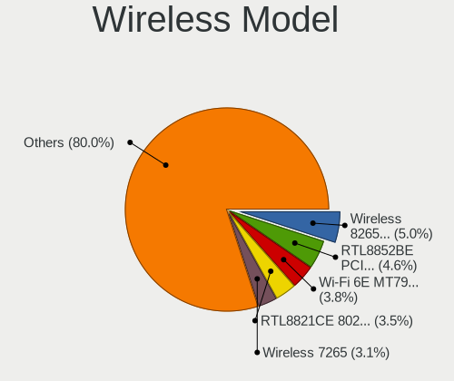

| Model                                                          | Notebooks | Percent |
|----------------------------------------------------------------|-----------|---------|
| Realtek RTL8852BE PCIe 802.11ax Wireless Network Controller    | 6         | 4.2%    |
| Intel Wireless 8265 / 8275                                     | 6         | 4.2%    |
| Intel Wi-Fi 6 AX200                                            | 6         | 4.2%    |
| Broadcom BCM4322 802.11a/b/g/n Wireless LAN Controller         | 6         | 4.2%    |
| Qualcomm Atheros QCA9565 / AR9565 Wireless Network Adapter     | 5         | 3.5%    |
| MediaTek Wi-Fi 6E MT7902 Wireless Network Adapter              | 5         | 3.5%    |
| Intel Wi-Fi 6 AX201                                            | 5         | 3.5%    |
| Intel Alder Lake-P PCH CNVi WiFi                               | 5         | 3.5%    |
| Broadcom BCM4313 802.11bgn Wireless Network Adapter            | 5         | 3.5%    |
| Realtek 802.11ac NIC                                           | 4         | 2.8%    |
| Qualcomm Atheros QCA9377 802.11ac Wireless Network Adapter     | 4         | 2.8%    |
| Qualcomm Atheros QCA6174 802.11ac Wireless Network Adapter     | 4         | 2.8%    |
| Qualcomm Atheros AR9285 Wireless Network Adapter (PCI-Express) | 4         | 2.8%    |
| Intel Wireless 7265                                            | 4         | 2.8%    |
| Broadcom BCM43142 802.11b/g/n                                  | 4         | 2.8%    |
| Realtek RTL8821CE 802.11ac PCIe Wireless Network Adapter       | 3         | 2.1%    |
| Qualcomm Atheros AR9485 Wireless Network Adapter               | 3         | 2.1%    |
| MediaTek MT7921 802.11ax PCI Express Wireless Network Adapter  | 3         | 2.1%    |
| Intel Wi-Fi 5(802.11ac) Wireless-AC 9x6x [Thunder Peak]        | 3         | 2.1%    |
| Intel Cannon Lake PCH CNVi WiFi                                | 3         | 2.1%    |
| Realtek RTL8852CE PCIe 802.11ax Wireless Network Controller    | 2         | 1.4%    |
| Realtek RTL8822CE 802.11ac PCIe Wireless Network Adapter       | 2         | 1.4%    |
| Realtek 802.11n WLAN Adapter                                   | 2         | 1.4%    |
| Ralink MT7601U Wireless Adapter                                | 2         | 1.4%    |
| MediaTek MT7922 802.11ax PCI Express Wireless Network Adapter  | 2         | 1.4%    |
| Intel Wireless 8260                                            | 2         | 1.4%    |
| Intel Wireless 7260                                            | 2         | 1.4%    |
| Intel Wireless 3165                                            | 2         | 1.4%    |
| Intel Centrino Ultimate-N 6300                                 | 2         | 1.4%    |
| Broadcom BCM43228 802.11a/b/g/n                                | 2         | 1.4%    |
| Broadcom BCM43224 802.11a/b/g/n                                | 2         | 1.4%    |
| ZyDAS ZD1211 802.11g                                           | 1         | 0.7%    |
| TP-Link TL-WN822N Version 4 RTL8192EU                          | 1         | 0.7%    |
| Realtek RTL8723DE Wireless Network Adapter                     | 1         | 0.7%    |
| Realtek RTL8723BU 802.11b/g/n WLAN Adapter                     | 1         | 0.7%    |
| Realtek RTL8191SEvA Wireless LAN Controller                    | 1         | 0.7%    |
| Realtek RTL8188EE Wireless Network Adapter                     | 1         | 0.7%    |
| Realtek RTL8188CE 802.11b/g/n WiFi Adapter                     | 1         | 0.7%    |
| Qualcomm QCNFA765 Wireless Network Adapter                     | 1         | 0.7%    |
| NetGear A6100 AC600 DB Wireless Adapter [Realtek RTL8811AU]    | 1         | 0.7%    |

Ethernet Vendor
---------------

Ethernet vendors

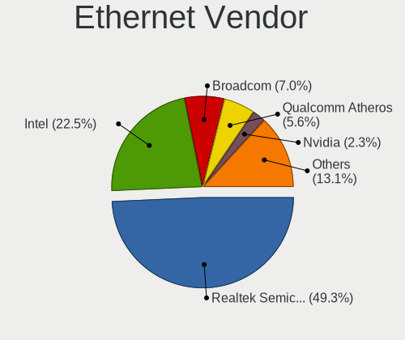

| Vendor                   | Notebooks | Percent |
|--------------------------|-----------|---------|
| Realtek Semiconductor    | 54        | 47.37%  |
| Intel                    | 26        | 22.81%  |
| Qualcomm Atheros         | 9         | 7.89%   |
| Broadcom                 | 7         | 6.14%   |
| Nvidia                   | 4         | 3.51%   |
| OPPO Electronics         | 2         | 1.75%   |
| Marvell Technology Group | 2         | 1.75%   |
| Huawei Technologies      | 2         | 1.75%   |
| ASIX Electronics         | 2         | 1.75%   |
| Xiaomi                   | 1         | 0.88%   |
| TP-Link                  | 1         | 0.88%   |
| Samsung Electronics      | 1         | 0.88%   |
| Qualcomm                 | 1         | 0.88%   |
| Motorola PCS             | 1         | 0.88%   |
| DisplayLink              | 1         | 0.88%   |

Ethernet Model
--------------

Ethernet models

| Model                                                                  | Notebooks | Percent |
|------------------------------------------------------------------------|-----------|---------|
| Realtek RTL8111/8168/8211/8411 PCI Express Gigabit Ethernet Controller | 36        | 31.58%  |
| Realtek RTL810xE PCI Express Fast Ethernet controller                  | 10        | 8.77%   |
| Realtek RTL8153 Gigabit Ethernet Adapter                               | 6         | 5.26%   |
| Qualcomm Atheros AR8162 Fast Ethernet                                  | 3         | 2.63%   |
| Nvidia MCP79 Ethernet                                                  | 3         | 2.63%   |
| Intel Ethernet Connection (4) I219-LM                                  | 3         | 2.63%   |
| Intel Ethernet Connection (16) I219-LM                                 | 3         | 2.63%   |
| Intel 82577LM Gigabit Network Connection                               | 3         | 2.63%   |
| Realtek RTL-8100/8101L/8139 PCI Fast Ethernet Adapter                  | 2         | 1.75%   |
| Intel Ethernet Connection I219-LM                                      | 2         | 1.75%   |
| Intel Ethernet Connection I217-LM                                      | 2         | 1.75%   |
| Intel Ethernet Connection (6) I219-LM                                  | 2         | 1.75%   |
| Intel 82579LM Gigabit Network Connection (Lewisville)                  | 2         | 1.75%   |
| Broadcom NetLink BCM57785 Gigabit Ethernet PCIe                        | 2         | 1.75%   |
| Xiaomi Mi/Redmi series (RNDIS)                                         | 1         | 0.88%   |
| TP-Link UE300 10/100/1000 LAN (ethernet mode) [Realtek RTL8153]        | 1         | 0.88%   |
| Samsung GT-I9070 (network tethering, USB debugging enabled)            | 1         | 0.88%   |
| Qualcomm SAMSUNG_Android                                               | 1         | 0.88%   |
| Qualcomm Atheros QCA8172 Fast Ethernet                                 | 1         | 0.88%   |
| Qualcomm Atheros Killer E2500 Gigabit Ethernet Controller              | 1         | 0.88%   |
| Qualcomm Atheros Killer E220x Gigabit Ethernet Controller              | 1         | 0.88%   |
| Qualcomm Atheros AR8161 Gigabit Ethernet                               | 1         | 0.88%   |
| Qualcomm Atheros AR8151 v2.0 Gigabit Ethernet                          | 1         | 0.88%   |
| Qualcomm Atheros AR8132 Fast Ethernet                                  | 1         | 0.88%   |
| OPPO SM8350-MTP _SN:9338D66C                                           | 1         | 0.88%   |
| OPPO CPH2591                                                           | 1         | 0.88%   |
| Nvidia MCP67 Ethernet                                                  | 1         | 0.88%   |
| Motorola PCS moto g(7) power                                           | 1         | 0.88%   |
| Marvell Group 88E8058 PCI-E Gigabit Ethernet Controller                | 1         | 0.88%   |
| Marvell Group 88E8040 PCI-E Fast Ethernet Controller                   | 1         | 0.88%   |
| Intel Ethernet Connection I218-LM                                      | 1         | 0.88%   |
| Intel Ethernet Connection (7) I219-V                                   | 1         | 0.88%   |
| Intel Ethernet Connection (6) I219-V                                   | 1         | 0.88%   |
| Intel Ethernet Connection (4) I219-V                                   | 1         | 0.88%   |
| Intel Ethernet Connection (3) I218-LM                                  | 1         | 0.88%   |
| Intel Ethernet Connection (23) I219-V                                  | 1         | 0.88%   |
| Intel Ethernet Connection (10) I219-V                                  | 1         | 0.88%   |
| Intel 82579V Gigabit Network Connection                                | 1         | 0.88%   |
| Intel 82562ET/EZ/GT/GZ - PRO/100 VE (LOM) Ethernet Controller Mobile   | 1         | 0.88%   |
| Huawei VTR-L09                                                         | 1         | 0.88%   |

Net Controller Kind
-------------------

Ethernet, WiFi or modem

| Kind     | Notebooks | Percent |
|----------|-----------|---------|
| WiFi     | 138       | 56.1%   |
| Ethernet | 106       | 43.09%  |
| Modem    | 2         | 0.81%   |

Used Controller
---------------

Currently used network controller

| Kind     | Notebooks | Percent |
|----------|-----------|---------|
| WiFi     | 107       | 73.79%  |
| Ethernet | 38        | 26.21%  |

NICs
----

Total network controllers on board

| Total | Notebooks | Percent |
|-------|-----------|---------|
| 2     | 89        | 62.24%  |
| 1     | 46        | 32.17%  |
| 0     | 8         | 5.59%   |

IPv6
----

IPv6 vs IPv4

| Used | Notebooks | Percent |
|------|-----------|---------|
| No   | 102       | 70.83%  |
| Yes  | 42        | 29.17%  |

Bluetooth
---------

Bluetooth Vendor
----------------

Controller vendors

| Vendor                          | Notebooks | Percent |
|---------------------------------|-----------|---------|
| Intel                           | 46        | 38.66%  |
| Realtek Semiconductor           | 13        | 10.92%  |
| Qualcomm Atheros Communications | 13        | 10.92%  |
| IMC Networks                    | 9         | 7.56%   |
| Broadcom                        | 8         | 6.72%   |
| Apple                           | 8         | 6.72%   |
| Foxconn / Hon Hai               | 5         | 4.2%    |
| Dell                            | 5         | 4.2%    |
| Cambridge Silicon Radio         | 5         | 4.2%    |
| Toshiba                         | 3         | 2.52%   |
| Lite-On Technology              | 1         | 0.84%   |
| Edimax Technology               | 1         | 0.84%   |
| ASUSTek Computer                | 1         | 0.84%   |
| Alps Electric                   | 1         | 0.84%   |

Bluetooth Model
---------------

Controller models

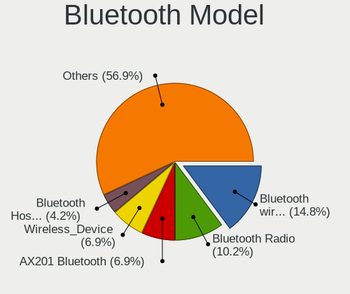

| Model                                               | Notebooks | Percent |
|-----------------------------------------------------|-----------|---------|
| Realtek Bluetooth Radio                             | 11        | 9.24%   |
| Intel AX201 Bluetooth                               | 9         | 7.56%   |
| Intel Bluetooth wireless interface                  | 8         | 6.72%   |
| Intel Bluetooth Device                              | 7         | 5.88%   |
| IMC Networks Wireless_Device                        | 7         | 5.88%   |
| Qualcomm Atheros  Bluetooth Device                  | 6         | 5.04%   |
| Intel AX211 Bluetooth                               | 6         | 5.04%   |
| Intel AX200 Bluetooth                               | 6         | 5.04%   |
| Intel Bluetooth 9460/9560 Jefferson Peak (JfP)      | 5         | 4.2%    |
| Cambridge Silicon Radio Bluetooth Dongle (HCI mode) | 5         | 4.2%    |
| Apple Bluetooth Host Controller                     | 4         | 3.36%   |
| Qualcomm Atheros QCA61x4 Bluetooth 4.0              | 3         | 2.52%   |
| Qualcomm Atheros AR3012 Bluetooth 4.0               | 3         | 2.52%   |
| Intel Wireless-AC 9260 Bluetooth Adapter            | 3         | 2.52%   |
| Realtek  Bluetooth 4.2 Adapter                      | 2         | 1.68%   |
| Foxconn / Hon Hai Wireless_Device                   | 2         | 1.68%   |
| Dell DW375 Bluetooth Module                         | 2         | 1.68%   |
| Broadcom BCM2070 Bluetooth 2.1 + EDR                | 2         | 1.68%   |
| Apple Bluetooth USB Host Controller                 | 2         | 1.68%   |
| Toshiba Bluetooth Device                            | 1         | 0.84%   |
| Toshiba BCM43142A0                                  | 1         | 0.84%   |
| Toshiba Askey for                                   | 1         | 0.84%   |
| Qualcomm Atheros AR3011 Bluetooth                   | 1         | 0.84%   |
| Lite-On Atheros AR3012 Bluetooth                    | 1         | 0.84%   |
| Intel Centrino Bluetooth Wireless Transceiver       | 1         | 0.84%   |
| Intel AX210 Bluetooth                               | 1         | 0.84%   |
| IMC Networks BCM20702A0                             | 1         | 0.84%   |
| IMC Networks Atheros AR3012 Bluetooth 4.0 Adapter   | 1         | 0.84%   |
| Foxconn / Hon Hai MediaTek Bluetooth Adapter        | 1         | 0.84%   |
| Foxconn / Hon Hai Bluetooth USB Host Controller     | 1         | 0.84%   |
| Foxconn / Hon Hai Bluetooth Device                  | 1         | 0.84%   |
| Edimax Edimax Bluetooth Adapter                     | 1         | 0.84%   |
| Dell Wireless 355 Bluetooth                         | 1         | 0.84%   |
| Dell Wireless 350 Bluetooth                         | 1         | 0.84%   |
| Dell BCM20702A0 Bluetooth Module                    | 1         | 0.84%   |
| Broadcom HP Portable Valentine                      | 1         | 0.84%   |
| Broadcom Bluetooth 2.1 Device                       | 1         | 0.84%   |
| Broadcom BCM43142A0 Bluetooth 4.0                   | 1         | 0.84%   |
| Broadcom BCM2070 Bluetooth Device                   | 1         | 0.84%   |
| Broadcom BCM2045B (BDC-2.1)                         | 1         | 0.84%   |

Sound
-----

Sound Vendor
------------

Sound card vendors

| Vendor                  | Notebooks | Percent |
|-------------------------|-----------|---------|
| Intel                   | 103       | 62.42%  |
| AMD                     | 31        | 18.79%  |
| Nvidia                  | 20        | 12.12%  |
| Texas Instruments       | 2         | 1.21%   |
| Realtek Semiconductor   | 2         | 1.21%   |
| Philips (or NXP)        | 1         | 0.61%   |
| Lenovo                  | 1         | 0.61%   |
| GN Netcom               | 1         | 0.61%   |
| BR25                    | 1         | 0.61%   |
| BEHRINGER International | 1         | 0.61%   |
| AKAI Professional M.I.  | 1         | 0.61%   |
| Actions Semiconductor   | 1         | 0.61%   |

Sound Model
-----------

Sound card models

| Model                                                                                             | Notebooks | Percent |
|---------------------------------------------------------------------------------------------------|-----------|---------|
| AMD Family 17h/19h HD Audio Controller                                                            | 22        | 11.11%  |
| Intel 7 Series/C216 Chipset Family High Definition Audio Controller                               | 13        | 6.57%   |
| AMD Renoir Radeon High Definition Audio Controller                                                | 12        | 6.06%   |
| Intel Sunrise Point-LP HD Audio                                                                   | 10        | 5.05%   |
| Intel Alder Lake PCH-P High Definition Audio Controller                                           | 10        | 5.05%   |
| Intel Tiger Lake-LP Smart Sound Technology Audio Controller                                       | 8         | 4.04%   |
| Intel 6 Series/C200 Series Chipset Family High Definition Audio Controller                        | 8         | 4.04%   |
| Intel Celeron/Pentium Silver Processor High Definition Audio                                      | 7         | 3.54%   |
| Nvidia Audio device                                                                               | 4         | 2.02%   |
| Intel Cannon Point-LP High Definition Audio Controller                                            | 4         | 2.02%   |
| Intel Cannon Lake PCH cAVS                                                                        | 4         | 2.02%   |
| Intel 82801I (ICH9 Family) HD Audio Controller                                                    | 4         | 2.02%   |
| AMD Rembrandt Radeon High Definition Audio Controller                                             | 4         | 2.02%   |
| AMD FCH Azalia Controller                                                                         | 4         | 2.02%   |
| Nvidia MCP79 High Definition Audio                                                                | 3         | 1.52%   |
| Nvidia GF108 High Definition Audio Controller                                                     | 3         | 1.52%   |
| Intel Raptor Lake-P/U/H cAVS                                                                      | 3         | 1.52%   |
| Intel NM10/ICH7 Family High Definition Audio Controller                                           | 3         | 1.52%   |
| Intel Haswell-ULT HD Audio Controller                                                             | 3         | 1.52%   |
| Intel Atom/Celeron/Pentium Processor x5-E8000/J3xxx/N3xxx Series High Definition Audio Controller | 3         | 1.52%   |
| Intel Atom Processor Z36xxx/Z37xxx Series High Definition Audio Controller                        | 3         | 1.52%   |
| Intel 8 Series/C220 Series Chipset High Definition Audio Controller                               | 3         | 1.52%   |
| Intel 8 Series HD Audio Controller                                                                | 3         | 1.52%   |
| Intel 5 Series/3400 Series Chipset High Definition Audio                                          | 3         | 1.52%   |
| AMD Raven/Raven2/Fenghuang HDMI/DP Audio Controller                                               | 3         | 1.52%   |
| AMD Kabini HDMI/DP Audio                                                                          | 3         | 1.52%   |
| AMD High Definition Audio Controller                                                              | 3         | 1.52%   |
| AMD Family 15h (Models 60h-6fh) Audio Controller                                                  | 3         | 1.52%   |
| Texas Instruments PCM2704 16-bit stereo audio DAC                                                 | 2         | 1.01%   |
| Realtek Semiconductor USB Audio                                                                   | 2         | 1.01%   |
| Nvidia TU106 High Definition Audio Controller                                                     | 2         | 1.01%   |
| Intel Wildcat Point-LP High Definition Audio Controller                                           | 2         | 1.01%   |
| Intel Comet Lake PCH-LP cAVS                                                                      | 2         | 1.01%   |
| Intel Broadwell-U Audio Controller                                                                | 2         | 1.01%   |
| Intel 82801FB/FBM/FR/FW/FRW (ICH6 Family) High Definition Audio Controller                        | 2         | 1.01%   |
| Intel 100 Series/C230 Series Chipset Family HD Audio Controller                                   | 2         | 1.01%   |
| Philips (or NXP) DSS330 Digital Speaker System [uda1321]                                          | 1         | 0.51%   |
| Nvidia TU116 High Definition Audio Controller                                                     | 1         | 0.51%   |
| Nvidia MCP89 High Definition Audio                                                                | 1         | 0.51%   |
| Nvidia MCP67 High Definition Audio                                                                | 1         | 0.51%   |

Memory
------

Memory Vendor
-------------

Memory module vendors

| Vendor              | Notebooks | Percent |
|---------------------|-----------|---------|
| SK hynix            | 42        | 25.61%  |
| Samsung Electronics | 41        | 25%     |
| Micron Technology   | 17        | 10.37%  |
| Unknown             | 16        | 9.76%   |
| Kingston            | 10        | 6.1%    |
| Unknown (ABCD)      | 5         | 3.05%   |
| Crucial             | 5         | 3.05%   |
| A-DATA Technology   | 5         | 3.05%   |
| Unknown             | 4         | 2.44%   |
| G.Skill             | 3         | 1.83%   |
| Elpida              | 3         | 1.83%   |
| Corsair             | 3         | 1.83%   |
| Ramaxel Technology  | 2         | 1.22%   |
| Team                | 1         | 0.61%   |
| Smart               | 1         | 0.61%   |
| Qimonda             | 1         | 0.61%   |
| Netlist             | 1         | 0.61%   |
| Nanya Technology    | 1         | 0.61%   |
| ff                  | 1         | 0.61%   |
| 4ea5                | 1         | 0.61%   |
| 48spaces            | 1         | 0.61%   |

Memory Model
------------

Memory module models

| Model                                                            | Notebooks | Percent |
|------------------------------------------------------------------|-----------|---------|
| Samsung RAM M471A1G44BB0-CWE 8GB SODIMM DDR4 3200MT/s            | 6         | 3.47%   |
| Unknown (ABCD) RAM 123456789012345678 2GB SODIMM LPDDR4 2400MT/s | 5         | 2.89%   |
| Unknown                                                          | 4         | 2.31%   |
| SK hynix RAM HMAA1GS6CJR6N-XN 8GB SODIMM DDR4 3200MT/s           | 3         | 1.73%   |
| SK hynix RAM HMA81GS6AFR8N-UH 8GB SODIMM DDR4 2667MT/s           | 3         | 1.73%   |
| Samsung RAM M471B5273CH0-CH9 4GB SODIMM DDR3 1334MT/s            | 3         | 1.73%   |
| Unknown RAM Module 4GB SODIMM DDR3 1333MT/s                      | 2         | 1.16%   |
| Unknown RAM Module 4GB SODIMM DDR3                               | 2         | 1.16%   |
| Unknown RAM Module 1GB SODIMM DDR3 1066MT/s                      | 2         | 1.16%   |
| SK hynix RAM HYMP125S64CP8-S6 2GB SODIMM DDR2 975MT/s            | 2         | 1.16%   |
| SK hynix RAM HMT41GS6BFR8A-PB 8GB SODIMM DDR3 1600MT/s           | 2         | 1.16%   |
| SK hynix RAM HMCG78MEBSA092N 16GB SODIMM DDR5 4800MT/s           | 2         | 1.16%   |
| SK hynix RAM HMA82GS6DJR8N-XN 16GB SODIMM DDR4 3200MT/s          | 2         | 1.16%   |
| SK hynix RAM HMA82GS6DJR8N-VK 16GB SODIMM DDR4 2667MT/s          | 2         | 1.16%   |
| SK hynix RAM HMA81GS6DJR8N-XN 8192MB SODIMM DDR4 3200MT/s        | 2         | 1.16%   |
| SK hynix RAM HMA41GS6AFR8N-TF 8GB SODIMM DDR4 2667MT/s           | 2         | 1.16%   |
| Samsung RAM M471B5273DH0-CH9 4GB SODIMM DDR3 1334MT/s            | 2         | 1.16%   |
| Samsung RAM M471B5173DB0-YK0 4GB SODIMM DDR3 1600MT/s            | 2         | 1.16%   |
| Samsung RAM M471A5244BB0-CRC 4GB SODIMM DDR4 2667MT/s            | 2         | 1.16%   |
| Samsung RAM M471A1G44CB0-CWE 8GB Row Of Chips DDR4 3200MT/s      | 2         | 1.16%   |
| Samsung RAM M471A1G44AB0-CWE 8192MB SODIMM DDR4 3200MT/s         | 2         | 1.16%   |
| Micron RAM 4ATF1G64HZ-3G2F1 8GB SODIMM DDR4 3200MT/s             | 2         | 1.16%   |
| Unknown RAM Module 8GB SODIMM DDR4 2400MT/s                      | 1         | 0.58%   |
| Unknown RAM Module 512MB SODIMM DDR 400MT/s                      | 1         | 0.58%   |
| Unknown RAM Module 512MB SODIMM DDR 100MT/s                      | 1         | 0.58%   |
| Unknown RAM Module 4GB SODIMM DDR3 1067MT/s                      | 1         | 0.58%   |
| Unknown RAM Module 2GB SODIMM DDR3 1333MT/s                      | 1         | 0.58%   |
| Unknown RAM Module 2GB SODIMM DDR 800MT/s                        | 1         | 0.58%   |
| Unknown RAM Module 2GB SODIMM 800MT/s                            | 1         | 0.58%   |
| Unknown RAM Module 2GB Row Of Chips LPDDR4 4267MT/s              | 1         | 0.58%   |
| Unknown RAM Module 1GB SODIMM DDR2                               | 1         | 0.58%   |
| Unknown RAM DDR3 1600 8G 8GB SODIMM DDR3 1333MT/s                | 1         | 0.58%   |
| Team RAM TEAMGROUP-SD4-3200 16384MB SODIMM DDR4 3200MT/s         | 1         | 0.58%   |
| Smart RAM SG564568FG8NWKFSQR 2GB SODIMM DDR2 800MT/s             | 1         | 0.58%   |
| SK hynix RAM Module 8GB SODIMM DDR3 1333MT/s                     | 1         | 0.58%   |
| SK hynix RAM Module 4GB SODIMM DDR3 1600MT/s                     | 1         | 0.58%   |
| SK hynix RAM Module 4GB DIMM DDR3 1066MT/s                       | 1         | 0.58%   |
| SK hynix RAM Module 16GB SODIMM DDR4 3200MT/s                    | 1         | 0.58%   |
| SK hynix RAM Module 16GB SODIMM DDR4 2400MT/s                    | 1         | 0.58%   |
| SK hynix RAM HYMP125S64CP8-Y5 2GB SODIMM DDR2 667MT/s            | 1         | 0.58%   |

Memory Kind
-----------

Memory module kinds

| Kind    | Notebooks | Percent |
|---------|-----------|---------|
| DDR4    | 54        | 37.76%  |
| DDR3    | 48        | 33.57%  |
| LPDDR4  | 10        | 6.99%   |
| DDR5    | 7         | 4.9%    |
| DDR2    | 7         | 4.9%    |
| LPDDR3  | 5         | 3.5%    |
| LPDDR5  | 4         | 2.8%    |
| DDR     | 4         | 2.8%    |
| SDRAM   | 3         | 2.1%    |
| Unknown | 1         | 0.7%    |

Memory Form Factor
------------------

Physical design of the memory module

| Name         | Notebooks | Percent |
|--------------|-----------|---------|
| SODIMM       | 122       | 84.72%  |
| Row Of Chips | 15        | 10.42%  |
| Unknown      | 4         | 2.78%   |
| Chip         | 2         | 1.39%   |
| DIMM         | 1         | 0.69%   |

Memory Size
-----------

Memory module size

| Size  | Notebooks | Percent |
|-------|-----------|---------|
| 8192  | 53        | 35.81%  |
| 4096  | 43        | 29.05%  |
| 2048  | 19        | 12.84%  |
| 16384 | 18        | 12.16%  |
| 1024  | 7         | 4.73%   |
| 32768 | 6         | 4.05%   |
| 512   | 2         | 1.35%   |

Memory Speed
------------

Memory module speed

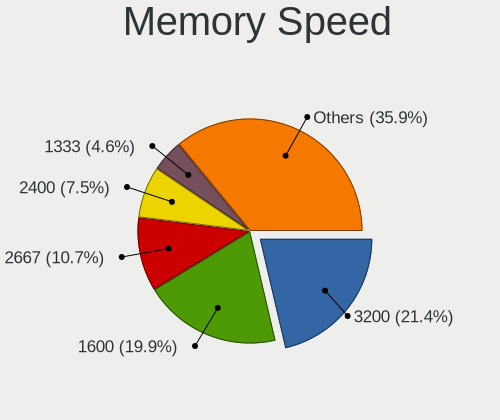

| Speed   | Notebooks | Percent |
|---------|-----------|---------|
| 3200    | 34        | 22.22%  |
| 1600    | 29        | 18.95%  |
| 2667    | 15        | 9.8%    |
| 2400    | 13        | 8.5%    |
| 1334    | 7         | 4.58%   |
| 1333    | 7         | 4.58%   |
| 4800    | 6         | 3.92%   |
| 2133    | 4         | 2.61%   |
| 1067    | 4         | 2.61%   |
| 800     | 4         | 2.61%   |
| 667     | 4         | 2.61%   |
| 4267    | 3         | 1.96%   |
| 1867    | 3         | 1.96%   |
| 1066    | 3         | 1.96%   |
| Unknown | 3         | 1.96%   |
| 6400    | 2         | 1.31%   |
| 4199    | 2         | 1.31%   |
| 975     | 2         | 1.31%   |
| 7500    | 1         | 0.65%   |
| 5600    | 1         | 0.65%   |
| 5500    | 1         | 0.65%   |
| 3266    | 1         | 0.65%   |
| 2933    | 1         | 0.65%   |
| 2048    | 1         | 0.65%   |
| 400     | 1         | 0.65%   |
| 100     | 1         | 0.65%   |

Printers & scanners
-------------------

Printer Vendor
--------------

Printer device vendors

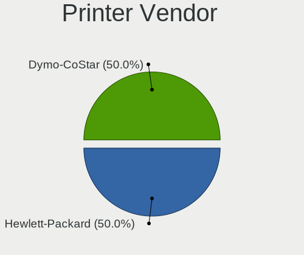

| Vendor      | Notebooks | Percent |
|-------------|-----------|---------|
| Dymo-CoStar | 1         | 100%    |

Printer Model
-------------

Printer device models

| Model                       | Notebooks | Percent |
|-----------------------------|-----------|---------|
| Dymo-CoStar LabelWriter 450 | 1         | 100%    |

Scanner Vendor
--------------

Scanner device vendors

Zero info for selected period =(

Scanner Model
-------------

Scanner device models

Zero info for selected period =(

Camera
------

Camera Vendor
-------------

Camera device vendors

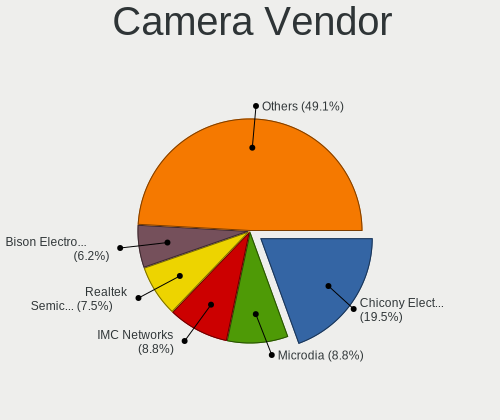

| Vendor                                 | Notebooks | Percent |
|----------------------------------------|-----------|---------|
| Chicony Electronics                    | 22        | 16.79%  |
| Realtek Semiconductor                  | 14        | 10.69%  |
| Microdia                               | 14        | 10.69%  |
| IMC Networks                           | 10        | 7.63%   |
| Cheng Uei Precision Industry (Foxlink) | 8         | 6.11%   |
| Apple                                  | 7         | 5.34%   |
| Quanta                                 | 6         | 4.58%   |
| Sunplus Innovation Technology          | 5         | 3.82%   |
| Luxvisions Innotech Limited            | 5         | 3.82%   |
| Lite-On Technology                     | 5         | 3.82%   |
| Bison Electronics                      | 5         | 3.82%   |
| Syntek                                 | 4         | 3.05%   |
| Suyin                                  | 4         | 3.05%   |
| Alcor Micro                            | 4         | 3.05%   |
| Acer                                   | 4         | 3.05%   |
| Importek                               | 3         | 2.29%   |
| Silicon Motion                         | 2         | 1.53%   |
| Ricoh                                  | 2         | 1.53%   |
| Z-Star Microelectronics                | 1         | 0.76%   |
| SunplusIT                              | 1         | 0.76%   |
| Samsung Electronics                    | 1         | 0.76%   |
| Logitech                               | 1         | 0.76%   |
| Lenovo                                 | 1         | 0.76%   |
| KYT-230807-A                           | 1         | 0.76%   |
| icSpring                               | 1         | 0.76%   |

Camera Model
------------

Camera device models

| Model                                                                      | Notebooks | Percent |
|----------------------------------------------------------------------------|-----------|---------|
| Realtek Integrated_Webcam_HD                                               | 8         | 6.11%   |
| Microdia Integrated_Webcam_HD                                              | 8         | 6.11%   |
| IMC Networks USB2.0 HD UVC WebCam                                          | 5         | 3.82%   |
| Lite-On Integrated Camera                                                  | 4         | 3.05%   |
| Chicony Integrated Camera                                                  | 4         | 3.05%   |
| Apple Built-in iSight                                                      | 4         | 3.05%   |
| Syntek Integrated Camera                                                   | 3         | 2.29%   |
| Microdia Integrated_Webcam_FHD                                             | 3         | 2.29%   |
| Importek TOSHIBA Web Camera - HD                                           | 3         | 2.29%   |
| IMC Networks Integrated Camera                                             | 3         | 2.29%   |
| Suyin HP Truevision HD                                                     | 2         | 1.53%   |
| Ricoh HD Webcam                                                            | 2         | 1.53%   |
| Realtek Bluetooth Radio                                                    | 2         | 1.53%   |
| Quanta ov9734_techfront_camera                                             | 2         | 1.53%   |
| Quanta ACER HD User Facing                                                 | 2         | 1.53%   |
| Luxvisions Innotech Limited HP TrueVision HD Camera                        | 2         | 1.53%   |
| IMC Networks EasyCamera                                                    | 2         | 1.53%   |
| Chicony USB2.0 Camera                                                      | 2         | 1.53%   |
| Chicony TOSHIBA Web Camera - HD                                            | 2         | 1.53%   |
| Chicony HP Truevision HD                                                   | 2         | 1.53%   |
| Chicony HD WebCam                                                          | 2         | 1.53%   |
| Cheng Uei Precision Industry (Foxlink) HP Wide Vision HD Integrated Webcam | 2         | 1.53%   |
| Cheng Uei Precision Industry (Foxlink) HP TrueVision HD Camera             | 2         | 1.53%   |
| Bison Integrated RGB Camera                                                | 2         | 1.53%   |
| Alcor Micro USB 2.0 PC Camera                                              | 2         | 1.53%   |
| Acer Front Camera                                                          | 2         | 1.53%   |
| Z-Star Webcam                                                              | 1         | 0.76%   |
| Syntek Lenovo EasyCamera                                                   | 1         | 0.76%   |
| Suyin HP TrueVision HD Integrated Webcam                                   | 1         | 0.76%   |
| Suyin Asus Integrated Webcam [CN031B]                                      | 1         | 0.76%   |
| SunplusIT 720p HD Camera                                                   | 1         | 0.76%   |
| Sunplus Laptop Integrated Webcam FHD                                       | 1         | 0.76%   |
| Sunplus Integrated_Webcam_HD                                               | 1         | 0.76%   |
| Sunplus Integrated_Webcam_FHD                                              | 1         | 0.76%   |
| Sunplus HP HD Webcam [Fixed]                                               | 1         | 0.76%   |
| Sunplus Asus Webcam                                                        | 1         | 0.76%   |
| Silicon Motion WebCam SCB-1100N                                            | 1         | 0.76%   |
| Silicon Motion WebCam SC-0311139N                                          | 1         | 0.76%   |
| Samsung Galaxy series, misc. (MTP mode)                                    | 1         | 0.76%   |
| Realtek USB Camera                                                         | 1         | 0.76%   |

Security
--------

Fingerprint Vendor
------------------

Fingerprint sensor vendors

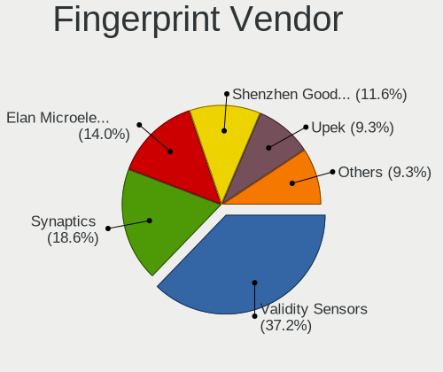

| Vendor                     | Notebooks | Percent |
|----------------------------|-----------|---------|
| Synaptics                  | 6         | 28.57%  |
| Validity Sensors           | 5         | 23.81%  |
| Shenzhen Goodix Technology | 5         | 23.81%  |
| Elan Microelectronics      | 2         | 9.52%   |
| Upek                       | 1         | 4.76%   |
| STMicroelectronics         | 1         | 4.76%   |
| AuthenTec                  | 1         | 4.76%   |

Fingerprint Model
-----------------

Fingerprint sensor models

| Model                                                  | Notebooks | Percent |
|--------------------------------------------------------|-----------|---------|
| Shenzhen Goodix  Fingerprint Device                    | 4         | 19.05%  |
| Synaptics Metallica MIS Touch Fingerprint Reader       | 3         | 14.29%  |
| Validity Sensors Fingerprint scanner                   | 2         | 9.52%   |
| Validity Sensors VFS495 Fingerprint Reader             | 1         | 4.76%   |
| Validity Sensors VFS491                                | 1         | 4.76%   |
| Validity Sensors Synaptics WBDI                        | 1         | 4.76%   |
| Upek Biometric Touchchip/Touchstrip Fingerprint Sensor | 1         | 4.76%   |
| Synaptics  WBDI                                        | 1         | 4.76%   |
| Synaptics Prometheus MIS Touch Fingerprint Reader      | 1         | 4.76%   |
| Synaptics Fingerprint reader [HP G6]                   | 1         | 4.76%   |
| STMicroelectronics Fingerprint Reader                  | 1         | 4.76%   |
| Shenzhen Goodix FingerPrint                            | 1         | 4.76%   |
| Elan ELAN:Fingerprint                                  | 1         | 4.76%   |
| Elan ELAN:ARM-M4                                       | 1         | 4.76%   |
| AuthenTec AES2501 Fingerprint Sensor                   | 1         | 4.76%   |

Chipcard Vendor
---------------

Chipcard module vendors

| Vendor      | Notebooks | Percent |
|-------------|-----------|---------|
| Broadcom    | 9         | 69.23%  |
| Alcor Micro | 3         | 23.08%  |
| O2 Micro    | 1         | 7.69%   |

Chipcard Model
--------------

Chipcard module models

| Model                                                                        | Notebooks | Percent |
|------------------------------------------------------------------------------|-----------|---------|
| Broadcom 58200                                                               | 6         | 46.15%  |
| Alcor Micro AU9540 Smartcard Reader                                          | 3         | 23.08%  |
| Broadcom BCM5880 Secure Applications Processor with fingerprint swipe sensor | 2         | 15.38%  |
| O2 Micro Oz776 SmartCard Reader                                              | 1         | 7.69%   |
| Broadcom BCM5880 Secure Applications Processor                               | 1         | 7.69%   |

Unsupported
-----------

Unsupported Devices
-------------------

Total unsupported devices on board

| Total | Notebooks | Percent |
|-------|-----------|---------|
| 0     | 81        | 56.64%  |
| 1     | 47        | 32.87%  |
| 2     | 13        | 9.09%   |
| 3     | 2         | 1.4%    |

Unsupported Device Types
------------------------

Types of unsupported devices

| Type                  | Notebooks | Percent |
|-----------------------|-----------|---------|
| Graphics card         | 26        | 33.77%  |
| Fingerprint reader    | 20        | 25.97%  |
| Chipcard              | 13        | 16.88%  |
| Camera                | 7         | 9.09%   |
| Net/wireless          | 4         | 5.19%   |
| Multimedia controller | 2         | 2.6%    |
| Wireless              | 1         | 1.3%    |
| Storage               | 1         | 1.3%    |
| Network               | 1         | 1.3%    |
| Flash memory          | 1         | 1.3%    |
| Card reader           | 1         | 1.3%    |

