MX 23 - Tested Hardware & Statistics
------------------------------------

A project to collect tested hardware configurations for MX 23.

Anyone can contribute to this report by the [hw-probe](https://github.com/linuxhw/hw-probe) tool:

    sudo -E hw-probe -all -upload

Please contribute! Especially if your hardware is rare.

This is a report for all computer types. See also reports for [desktops](/Dist/MX_23/Desktop/README.md) and [notebooks](/Dist/MX_23/Notebook/README.md).

Contents
--------

* [ Test Cases ](#test-cases)

* [ System ](#system)
  - [ Kernel                   ](#kernel)
  - [ Kernel Family            ](#kernel-family)
  - [ Kernel Major Ver.        ](#kernel-major-ver)
  - [ Arch                     ](#arch)
  - [ DE                       ](#de)
  - [ Display Server           ](#display-server)
  - [ Display Manager          ](#display-manager)
  - [ OS Lang                  ](#os-lang)
  - [ Boot Mode                ](#boot-mode)
  - [ Filesystem               ](#filesystem)
  - [ Part. scheme             ](#part-scheme)
  - [ Dual Boot with Linux/BSD ](#dual-boot-with-linuxbsd)
  - [ Dual Boot (Win)          ](#dual-boot-win)

* [ Board ](#board)
  - [ Vendor                   ](#vendor)
  - [ Model                    ](#model)
  - [ Model Family             ](#model-family)
  - [ MFG Year                 ](#mfg-year)
  - [ Form Factor              ](#form-factor)
  - [ Secure Boot              ](#secure-boot)
  - [ Coreboot                 ](#coreboot)
  - [ RAM Size                 ](#ram-size)
  - [ RAM Used                 ](#ram-used)
  - [ Total Drives             ](#total-drives)
  - [ Has CD-ROM               ](#has-cd-rom)
  - [ Has Ethernet             ](#has-ethernet)
  - [ Has WiFi                 ](#has-wifi)
  - [ Has Bluetooth            ](#has-bluetooth)

* [ Location ](#location)
  - [ Country                  ](#country)
  - [ City                     ](#city)

* [ Drives ](#drives)
  - [ Drive Vendor             ](#drive-vendor)
  - [ Drive Model              ](#drive-model)
  - [ HDD Vendor               ](#hdd-vendor)
  - [ SSD Vendor               ](#ssd-vendor)
  - [ Drive Kind               ](#drive-kind)
  - [ Drive Connector          ](#drive-connector)
  - [ Drive Size               ](#drive-size)
  - [ Space Total              ](#space-total)
  - [ Space Used               ](#space-used)
  - [ Malfunc. Drives          ](#malfunc-drives)
  - [ Malfunc. Drive Vendor    ](#malfunc-drive-vendor)
  - [ Malfunc. HDD Vendor      ](#malfunc-hdd-vendor)
  - [ Malfunc. Drive Kind      ](#malfunc-drive-kind)
  - [ Failed Drives            ](#failed-drives)
  - [ Failed Drive Vendor      ](#failed-drive-vendor)
  - [ Drive Status             ](#drive-status)

* [ Storage controller ](#storage-controller)
  - [ Storage Vendor           ](#storage-vendor)
  - [ Storage Model            ](#storage-model)
  - [ Storage Kind             ](#storage-kind)

* [ Processor ](#processor)
  - [ CPU Vendor               ](#cpu-vendor)
  - [ CPU Model                ](#cpu-model)
  - [ CPU Model Family         ](#cpu-model-family)
  - [ CPU Cores                ](#cpu-cores)
  - [ CPU Sockets              ](#cpu-sockets)
  - [ CPU Threads              ](#cpu-threads)
  - [ CPU Op-Modes             ](#cpu-op-modes)
  - [ CPU Microcode            ](#cpu-microcode)
  - [ CPU Microarch            ](#cpu-microarch)

* [ Graphics ](#graphics)
  - [ GPU Vendor               ](#gpu-vendor)
  - [ GPU Model                ](#gpu-model)
  - [ GPU Combo                ](#gpu-combo)
  - [ GPU Driver               ](#gpu-driver)
  - [ GPU Memory               ](#gpu-memory)

* [ Monitor ](#monitor)
  - [ Monitor Vendor           ](#monitor-vendor)
  - [ Monitor Model            ](#monitor-model)
  - [ Monitor Resolution       ](#monitor-resolution)
  - [ Monitor Diagonal         ](#monitor-diagonal)
  - [ Monitor Width            ](#monitor-width)
  - [ Aspect Ratio             ](#aspect-ratio)
  - [ Monitor Area             ](#monitor-area)
  - [ Pixel Density            ](#pixel-density)
  - [ Multiple Monitors        ](#multiple-monitors)

* [ Network ](#network)
  - [ Net Controller Vendor    ](#net-controller-vendor)
  - [ Net Controller Model     ](#net-controller-model)
  - [ Wireless Vendor          ](#wireless-vendor)
  - [ Wireless Model           ](#wireless-model)
  - [ Ethernet Vendor          ](#ethernet-vendor)
  - [ Ethernet Model           ](#ethernet-model)
  - [ Net Controller Kind      ](#net-controller-kind)
  - [ Used Controller          ](#used-controller)
  - [ NICs                     ](#nics)
  - [ IPv6                     ](#ipv6)

* [ Bluetooth ](#bluetooth)
  - [ Bluetooth Vendor         ](#bluetooth-vendor)
  - [ Bluetooth Model          ](#bluetooth-model)

* [ Sound ](#sound)
  - [ Sound Vendor             ](#sound-vendor)
  - [ Sound Model              ](#sound-model)

* [ Memory ](#memory)
  - [ Memory Vendor            ](#memory-vendor)
  - [ Memory Model             ](#memory-model)
  - [ Memory Kind              ](#memory-kind)
  - [ Memory Form Factor       ](#memory-form-factor)
  - [ Memory Size              ](#memory-size)
  - [ Memory Speed             ](#memory-speed)

* [ Printers & scanners ](#printers--scanners)
  - [ Printer Vendor           ](#printer-vendor)
  - [ Printer Model            ](#printer-model)
  - [ Scanner Vendor           ](#scanner-vendor)
  - [ Scanner Model            ](#scanner-model)

* [ Camera ](#camera)
  - [ Camera Vendor            ](#camera-vendor)
  - [ Camera Model             ](#camera-model)

* [ Security ](#security)
  - [ Fingerprint Vendor       ](#fingerprint-vendor)
  - [ Fingerprint Model        ](#fingerprint-model)
  - [ Chipcard Vendor          ](#chipcard-vendor)
  - [ Chipcard Model           ](#chipcard-model)

* [ Unsupported ](#unsupported)
  - [ Unsupported Devices      ](#unsupported-devices)
  - [ Unsupported Device Types ](#unsupported-device-types)

Test Cases
----------

Total: 901

| Vendor        | Model                       | Form-Factor | Probe                                                      | Date         |
|---------------|-----------------------------|-------------|------------------------------------------------------------|--------------|
| Lenovo        | ThinkCentre M57 6071ADU     | Desktop     | [08990918a9](https://linux-hardware.org/?probe=08990918a9) | Dec 29, 2025 |
| Acer          | Aspire A114-33              | Notebook    | [1773222e3d](https://linux-hardware.org/?probe=1773222e3d) | Dec 21, 2025 |
| ASUSTek       | 1000HE                      | Notebook    | [aea8a66e54](https://linux-hardware.org/?probe=aea8a66e54) | Dec 20, 2025 |
| GMKtec        | NucBox K8 Plus              | Desktop     | [baff7be179](https://linux-hardware.org/?probe=baff7be179) | Dec 15, 2025 |
| Dell          | Latitude 5410               | Notebook    | [5dd93b27b0](https://linux-hardware.org/?probe=5dd93b27b0) | Dec 13, 2025 |
| Apple         | MacBookPro14,1              | Notebook    | [1ca15aa6cd](https://linux-hardware.org/?probe=1ca15aa6cd) | Dec 10, 2025 |
| Medion        | NPxxRNA                     | Notebook    | [e9344c9092](https://linux-hardware.org/?probe=e9344c9092) | Dec 09, 2025 |
| Gigabyte      | A520M H                     | Desktop     | [0d1f8ef856](https://linux-hardware.org/?probe=0d1f8ef856) | Dec 09, 2025 |
| Gigabyte      | B460 HD3                    | Desktop     | [88e9427b13](https://linux-hardware.org/?probe=88e9427b13) | Dec 07, 2025 |
| Star Labs     | StarLite                    | Tablet      | [5cd612e6a3](https://linux-hardware.org/?probe=5cd612e6a3) | Dec 03, 2025 |
| Dell          | 0WMJ54 A01                  | Desktop     | [9265b6709d](https://linux-hardware.org/?probe=9265b6709d) | Nov 25, 2025 |
| Daten Tecn... | DVRN-4                      | Notebook    | [2146dd4395](https://linux-hardware.org/?probe=2146dd4395) | Nov 21, 2025 |
| Dell          | 03KWTV A00                  | Desktop     | [c16567816d](https://linux-hardware.org/?probe=c16567816d) | Nov 17, 2025 |
| Apple         | MacBookAir7,2               | Notebook    | [fadd3c1658](https://linux-hardware.org/?probe=fadd3c1658) | Nov 16, 2025 |
| Dell          | 0478VN A00                  | Desktop     | [d0416e02e4](https://linux-hardware.org/?probe=d0416e02e4) | Nov 14, 2025 |
| HP            | 2000                        | Notebook    | [a87e9d5e79](https://linux-hardware.org/?probe=a87e9d5e79) | Nov 14, 2025 |
| Dell          | 088DT1 A01                  | Desktop     | [b48e66c63c](https://linux-hardware.org/?probe=b48e66c63c) | Nov 14, 2025 |
| Dell          | 0GDG8Y A00                  | Desktop     | [9bbb18a6ce](https://linux-hardware.org/?probe=9bbb18a6ce) | Nov 13, 2025 |
| Sony          | VPCEB4M1E                   | Notebook    | [85d85991d2](https://linux-hardware.org/?probe=85d85991d2) | Nov 12, 2025 |
| Sony          | VPCEB4M1E                   | Notebook    | [e4afefa75f](https://linux-hardware.org/?probe=e4afefa75f) | Nov 12, 2025 |
| Toshiba       | Satellite L510              | Notebook    | [9c228175c9](https://linux-hardware.org/?probe=9c228175c9) | Nov 12, 2025 |
| Lenovo        | MIIX 3-1030 80HV            | Tablet      | [e7956c7a25](https://linux-hardware.org/?probe=e7956c7a25) | Nov 06, 2025 |
| Dell          | Inspiron 16 5645            | Notebook    | [7f29a20d7d](https://linux-hardware.org/?probe=7f29a20d7d) | Nov 05, 2025 |
| AMI           | Cherry Trail CR             | Mini pc     | [a3486f9c70](https://linux-hardware.org/?probe=a3486f9c70) | Nov 04, 2025 |
| HP            | 2000                        | Notebook    | [df6a6894b0](https://linux-hardware.org/?probe=df6a6894b0) | Nov 04, 2025 |
| ASUSTek       | UX303UA                     | Notebook    | [5e97e42d1f](https://linux-hardware.org/?probe=5e97e42d1f) | Nov 02, 2025 |
| ASUSTek       | UX430UNR                    | Notebook    | [99d51c0dba](https://linux-hardware.org/?probe=99d51c0dba) | Nov 01, 2025 |
| Medion        | Crawler E30e                | Notebook    | [cad65708be](https://linux-hardware.org/?probe=cad65708be) | Nov 01, 2025 |
| Fujitsu       | FARV04001Z                  | Tablet      | [b9f7f0433a](https://linux-hardware.org/?probe=b9f7f0433a) | Oct 29, 2025 |
| Lenovo        | ThinkPad X200 74553XG       | Notebook    | [f26926f29c](https://linux-hardware.org/?probe=f26926f29c) | Oct 29, 2025 |
| Fujitsu Si... | AMILO Pi 2540               | Notebook    | [33db8bddec](https://linux-hardware.org/?probe=33db8bddec) | Oct 23, 2025 |
| HP            | Stream Notebook PC 11       | Notebook    | [d4d64a6d08](https://linux-hardware.org/?probe=d4d64a6d08) | Oct 23, 2025 |
| Unknown       | Unknown                     | Mini pc     | [a802e1cd41](https://linux-hardware.org/?probe=a802e1cd41) | Oct 23, 2025 |
| ASUSTek       | PRIME B550M-A WIFI II       | Desktop     | [dd70fdf93b](https://linux-hardware.org/?probe=dd70fdf93b) | Oct 21, 2025 |
| Dell          | Inspiron 5567               | Notebook    | [2f13ec3188](https://linux-hardware.org/?probe=2f13ec3188) | Oct 21, 2025 |
| Dell          | Inspiron 5567               | Notebook    | [e9f9adf8ef](https://linux-hardware.org/?probe=e9f9adf8ef) | Oct 21, 2025 |
| Gigabyte      | B450M DS3H WIFI-CF          | Desktop     | [e5e1c3eb94](https://linux-hardware.org/?probe=e5e1c3eb94) | Oct 20, 2025 |
| Toshiba       | Satellite L510              | Notebook    | [3f681fe057](https://linux-hardware.org/?probe=3f681fe057) | Oct 20, 2025 |
| Dell          | Latitude E5540              | Notebook    | [4c8afbabca](https://linux-hardware.org/?probe=4c8afbabca) | Oct 19, 2025 |
| Acer          | Aspire AG15-51P             | Notebook    | [1b96a53761](https://linux-hardware.org/?probe=1b96a53761) | Oct 16, 2025 |
| Unknown       | Unknown                     | Desktop     | [8dfb06ae56](https://linux-hardware.org/?probe=8dfb06ae56) | Oct 15, 2025 |
| ASUSTek       | Maximus VIII GENE           | Desktop     | [67bb684b06](https://linux-hardware.org/?probe=67bb684b06) | Oct 15, 2025 |
| Dell          | 0XCR8D A01                  | Desktop     | [5c64a80eb3](https://linux-hardware.org/?probe=5c64a80eb3) | Oct 14, 2025 |
| Dell          | 0XCR8D A01                  | Desktop     | [61a4c8e8b9](https://linux-hardware.org/?probe=61a4c8e8b9) | Oct 14, 2025 |
| Dell          | Inspiron N4020              | Notebook    | [45dd2629b5](https://linux-hardware.org/?probe=45dd2629b5) | Oct 10, 2025 |
| ASUSTek       | VivoBook_ASUSLaptop M150... | Notebook    | [6e27bedba7](https://linux-hardware.org/?probe=6e27bedba7) | Oct 07, 2025 |
| Gigabyte      | GA-790FXTA-UD5              | Desktop     | [75993f5957](https://linux-hardware.org/?probe=75993f5957) | Oct 07, 2025 |
| Wortmann      | 1220663_1470189             | Notebook    | [8be31b3cbc](https://linux-hardware.org/?probe=8be31b3cbc) | Oct 06, 2025 |
| ASUSTek       | UX410UQK                    | Notebook    | [ebb2f63d3b](https://linux-hardware.org/?probe=ebb2f63d3b) | Oct 06, 2025 |
| Samsung       | 305E4A/305E5A/305E7A        | Notebook    | [81d1a3e7a8](https://linux-hardware.org/?probe=81d1a3e7a8) | Oct 06, 2025 |
| Google        | Treeya                      | Notebook    | [4d63a8557b](https://linux-hardware.org/?probe=4d63a8557b) | Oct 06, 2025 |
| Lenovo        | G50-70 20351                | Notebook    | [408a86830b](https://linux-hardware.org/?probe=408a86830b) | Oct 05, 2025 |
| Lenovo        | G50-70 20351                | Notebook    | [74fdf4158c](https://linux-hardware.org/?probe=74fdf4158c) | Oct 05, 2025 |
| American M... | K7S41GX                     | Desktop     | [53edf0f2d4](https://linux-hardware.org/?probe=53edf0f2d4) | Oct 05, 2025 |
| Gigabyte      | B560M DS3H V2               | Desktop     | [3f99eb19f4](https://linux-hardware.org/?probe=3f99eb19f4) | Oct 05, 2025 |
| HP            | Pavilion Laptop 15z-eh00... | Notebook    | [2518904235](https://linux-hardware.org/?probe=2518904235) | Oct 05, 2025 |
| ZOTAC         | ZBOX-MI/CI625/645/665NAN... | Mini pc     | [180dca4c87](https://linux-hardware.org/?probe=180dca4c87) | Oct 04, 2025 |
| ZOTAC         | ZBOX-MI/CI625/645/665NAN... | Mini pc     | [003412db2b](https://linux-hardware.org/?probe=003412db2b) | Oct 04, 2025 |
| GMKtec        | NucBox K10                  | Mini pc     | [81cb41ece6](https://linux-hardware.org/?probe=81cb41ece6) | Oct 02, 2025 |
| Dell          | 0HD5W2 A00                  | Desktop     | [4a76959f28](https://linux-hardware.org/?probe=4a76959f28) | Oct 01, 2025 |
| Dell          | 0HD5W2 A00                  | Desktop     | [b1ce088521](https://linux-hardware.org/?probe=b1ce088521) | Oct 01, 2025 |
| ASUSTek       | TUF Gaming B450-PLUS II     | Desktop     | [eb13d054d5](https://linux-hardware.org/?probe=eb13d054d5) | Sep 29, 2025 |
| Unknown       | 1.0                         | Desktop     | [16637d807e](https://linux-hardware.org/?probe=16637d807e) | Sep 28, 2025 |
| Apple         | MacBookAir7,1               | Notebook    | [688a16bfec](https://linux-hardware.org/?probe=688a16bfec) | Sep 28, 2025 |
| HP            | EliteBook 645 14 inch G1... | Notebook    | [da0ebf373b](https://linux-hardware.org/?probe=da0ebf373b) | Sep 27, 2025 |
| Unknown       | K7VT6-C                     | Desktop     | [1ebf11a51e](https://linux-hardware.org/?probe=1ebf11a51e) | Sep 27, 2025 |
| Unknown       | K7VT6-C                     | Desktop     | [5acc199b06](https://linux-hardware.org/?probe=5acc199b06) | Sep 27, 2025 |
| ASUSTek       | TUF Gaming B450-PLUS II     | Desktop     | [c8a02404e8](https://linux-hardware.org/?probe=c8a02404e8) | Sep 26, 2025 |
| Gigabyte      | Z690 GAMING X DDR4 V2       | Desktop     | [8e8f810fcf](https://linux-hardware.org/?probe=8e8f810fcf) | Sep 26, 2025 |
| HP            | Pavilion Laptop 15z-eh00... | Notebook    | [25f8f8f056](https://linux-hardware.org/?probe=25f8f8f056) | Sep 24, 2025 |
| ONERugged     | P10J                        | Tablet      | [6c7d053405](https://linux-hardware.org/?probe=6c7d053405) | Sep 22, 2025 |
| Dell          | 0NW6H5 A00                  | Desktop     | [bb3382d1b8](https://linux-hardware.org/?probe=bb3382d1b8) | Sep 21, 2025 |
| Dell          | Inspiron N7010              | Notebook    | [75c303ee55](https://linux-hardware.org/?probe=75c303ee55) | Sep 21, 2025 |
| Lenovo        | Flex 2-14 20404             | Notebook    | [fde585ff82](https://linux-hardware.org/?probe=fde585ff82) | Sep 20, 2025 |
| HP            | ProBook 440 G7              | Notebook    | [792c15eeb7](https://linux-hardware.org/?probe=792c15eeb7) | Sep 20, 2025 |
| Acer          | AO722                       | Notebook    | [f1a6eab88d](https://linux-hardware.org/?probe=f1a6eab88d) | Sep 19, 2025 |
| Apple         | MacBookAir6,2               | Notebook    | [e36fc51285](https://linux-hardware.org/?probe=e36fc51285) | Sep 15, 2025 |
| Apple         | MacBookAir6,2               | Notebook    | [d38939253e](https://linux-hardware.org/?probe=d38939253e) | Sep 15, 2025 |
| Dell          | Inspiron 16 5645            | Notebook    | [4a93f8b0d1](https://linux-hardware.org/?probe=4a93f8b0d1) | Sep 15, 2025 |
| Medion        | E15223                      | Notebook    | [c062b348d1](https://linux-hardware.org/?probe=c062b348d1) | Sep 15, 2025 |
| Apple         | MacBookAir6,2               | Notebook    | [3618f3c44d](https://linux-hardware.org/?probe=3618f3c44d) | Sep 14, 2025 |
| ASRock        | A300M-STX                   | Desktop     | [505139ae3b](https://linux-hardware.org/?probe=505139ae3b) | Sep 14, 2025 |
| Toshiba       | PORTEGE R30-A               | Notebook    | [c8da642ab9](https://linux-hardware.org/?probe=c8da642ab9) | Sep 13, 2025 |
| Dell          | Inspiron 16 5645            | Notebook    | [abcdd54c4d](https://linux-hardware.org/?probe=abcdd54c4d) | Sep 12, 2025 |
| Lenovo        | 3148 SDK0J40700 WIN 3258... | Desktop     | [ced811cdc0](https://linux-hardware.org/?probe=ced811cdc0) | Sep 10, 2025 |
| Lenovo        | 3148 SDK0J40700 WIN 3258... | Desktop     | [34d7d5986b](https://linux-hardware.org/?probe=34d7d5986b) | Sep 10, 2025 |
| PCBOX         | PCB-GLW2                    | Notebook    | [0d2fd19d0e](https://linux-hardware.org/?probe=0d2fd19d0e) | Sep 10, 2025 |
| Dell          | 0VG93V A00                  | Desktop     | [f938f4ce6a](https://linux-hardware.org/?probe=f938f4ce6a) | Sep 09, 2025 |
| Apple         | MacBookAir6,2               | Notebook    | [8fed6df5bb](https://linux-hardware.org/?probe=8fed6df5bb) | Sep 07, 2025 |
| Acer          | TravelMate B311-31          | Notebook    | [20e8fc805c](https://linux-hardware.org/?probe=20e8fc805c) | Sep 03, 2025 |
| Unknown       | Unknown                     | Desktop     | [86804b57a4](https://linux-hardware.org/?probe=86804b57a4) | Aug 31, 2025 |
| Unknown       | AX16PRO                     | Notebook    | [3a42432fe5](https://linux-hardware.org/?probe=3a42432fe5) | Aug 28, 2025 |
| GMKtec        | NucBox K10                  | Mini pc     | [2a9421a6fb](https://linux-hardware.org/?probe=2a9421a6fb) | Aug 26, 2025 |
| Fujitsu Si... | AMILO Pro Edition V3505     | Notebook    | [ce15c49d7f](https://linux-hardware.org/?probe=ce15c49d7f) | Aug 26, 2025 |
| Lenovo        | 3148 SDK0J40700 WIN 3258... | Desktop     | [96eace97f0](https://linux-hardware.org/?probe=96eace97f0) | Aug 23, 2025 |
| ASUSTek       | VivoBook_ASUSLaptop X140... | Notebook    | [defcf8d9c2](https://linux-hardware.org/?probe=defcf8d9c2) | Aug 22, 2025 |
| GMKtec        | NucBox K10                  | Mini pc     | [d67ab48115](https://linux-hardware.org/?probe=d67ab48115) | Aug 20, 2025 |
| HP            | 255 15.6 inch G9 Noteboo... | Notebook    | [307b882e42](https://linux-hardware.org/?probe=307b882e42) | Aug 20, 2025 |
| Dell          | 0CRWCR A01                  | All in one  | [b5c49ac337](https://linux-hardware.org/?probe=b5c49ac337) | Aug 18, 2025 |
| MSI           | GE62 2QF                    | Notebook    | [d7f7fecb75](https://linux-hardware.org/?probe=d7f7fecb75) | Aug 17, 2025 |
| Lenovo        | IdeaPad 320-17ABR 80YN      | Notebook    | [8a410a9c2c](https://linux-hardware.org/?probe=8a410a9c2c) | Aug 16, 2025 |
| Gigabyte      | B850 AORUS ELITE WIFI7 I... | Desktop     | [66b3deb7ce](https://linux-hardware.org/?probe=66b3deb7ce) | Aug 13, 2025 |
| ASUSTek       | PRIME B560-PLUS             | Desktop     | [3a07ec8362](https://linux-hardware.org/?probe=3a07ec8362) | Aug 13, 2025 |
| ASUSTek       | Q170M-C                     | Desktop     | [a13c14f3d4](https://linux-hardware.org/?probe=a13c14f3d4) | Aug 12, 2025 |
| HP            | 0B4Ch D                     | Desktop     | [19684fb424](https://linux-hardware.org/?probe=19684fb424) | Aug 12, 2025 |
| MSI           | Z170M MORTAR                | Desktop     | [15ef7008ac](https://linux-hardware.org/?probe=15ef7008ac) | Aug 11, 2025 |
| MSI           | Z170M MORTAR                | Desktop     | [5a8d247921](https://linux-hardware.org/?probe=5a8d247921) | Aug 11, 2025 |
| HP            | Pavilion 15                 | Notebook    | [8bc227fe80](https://linux-hardware.org/?probe=8bc227fe80) | Aug 10, 2025 |
| Google        | Treeya                      | Notebook    | [57c5dfda3f](https://linux-hardware.org/?probe=57c5dfda3f) | Aug 09, 2025 |
| ASUSTek       | X202E                       | Notebook    | [224f9800a0](https://linux-hardware.org/?probe=224f9800a0) | Aug 09, 2025 |
| ASUSTek       | X202E                       | Notebook    | [54719df93e](https://linux-hardware.org/?probe=54719df93e) | Aug 09, 2025 |
| TianBei       | GOD88                       | Desktop     | [78f58ee6e2](https://linux-hardware.org/?probe=78f58ee6e2) | Aug 08, 2025 |
| Dell          | Studio XPS 1640             | Notebook    | [af14bd2dea](https://linux-hardware.org/?probe=af14bd2dea) | Aug 07, 2025 |
| Lenovo        | ThinkPad X380 Yoga 20LJS... | Convertible | [59b5c22a28](https://linux-hardware.org/?probe=59b5c22a28) | Aug 05, 2025 |
| Dell          | Latitude 9510               | Notebook    | [f898a3708e](https://linux-hardware.org/?probe=f898a3708e) | Aug 05, 2025 |
| ASUSTek       | ZenBook UX325SA_UM325SA     | Notebook    | [52f9d3da90](https://linux-hardware.org/?probe=52f9d3da90) | Aug 03, 2025 |
| MSI           | Modern 14 A10M              | Notebook    | [b3323d296c](https://linux-hardware.org/?probe=b3323d296c) | Aug 01, 2025 |
| Acer          | TravelMate P215-53          | Notebook    | [6f2159a6ff](https://linux-hardware.org/?probe=6f2159a6ff) | Jul 31, 2025 |
| Acer          | Aspire one 1-431            | Notebook    | [8c04b9267a](https://linux-hardware.org/?probe=8c04b9267a) | Jul 31, 2025 |
| Unknown       | Unknown                     | Notebook    | [458d6debf1](https://linux-hardware.org/?probe=458d6debf1) | Jul 30, 2025 |
| Dell          | Latitude 5400               | Notebook    | [5be654e778](https://linux-hardware.org/?probe=5be654e778) | Jul 30, 2025 |
| Dell          | Vostro 3500                 | Notebook    | [c2d479c2e8](https://linux-hardware.org/?probe=c2d479c2e8) | Jul 30, 2025 |
| Apple         | MacBookPro9,2               | Notebook    | [e3b80533b2](https://linux-hardware.org/?probe=e3b80533b2) | Jul 28, 2025 |
| Packard Be... | EasyNote TS44HR             | Notebook    | [75d8a5514e](https://linux-hardware.org/?probe=75d8a5514e) | Jul 27, 2025 |
| ASUSTek       | PRIME B550M-A               | Desktop     | [e754f28930](https://linux-hardware.org/?probe=e754f28930) | Jul 25, 2025 |
| Apple         | MacBookAir2,1               | Notebook    | [20f1fb531e](https://linux-hardware.org/?probe=20f1fb531e) | Jul 23, 2025 |
| ASUSTek       | PRIME H470-PLUS             | Desktop     | [08f05cc5df](https://linux-hardware.org/?probe=08f05cc5df) | Jul 23, 2025 |
| Apple         | MacBookAir1,1               | Notebook    | [633472e541](https://linux-hardware.org/?probe=633472e541) | Jul 22, 2025 |
| Apple         | MacBookPro7,1               | Notebook    | [78bf64aa11](https://linux-hardware.org/?probe=78bf64aa11) | Jul 22, 2025 |
| HP            | Laptop                      | Notebook    | [6e1a0ff0fa](https://linux-hardware.org/?probe=6e1a0ff0fa) | Jul 21, 2025 |
| ASUSTek       | PRIME H310M-R R2.0          | Desktop     | [dd28fb514f](https://linux-hardware.org/?probe=dd28fb514f) | Jul 18, 2025 |
| Acer          | Aspire 5750G                | Notebook    | [3c42e357d1](https://linux-hardware.org/?probe=3c42e357d1) | Jul 16, 2025 |
| Apple         | MacBookPro7,1               | Notebook    | [647e63d412](https://linux-hardware.org/?probe=647e63d412) | Jul 15, 2025 |
| Acer          | Predator PH18-72            | Notebook    | [795524aef0](https://linux-hardware.org/?probe=795524aef0) | Jul 14, 2025 |
| Toshiba       | STI 012887                  | Desktop     | [d9df19d48a](https://linux-hardware.org/?probe=d9df19d48a) | Jul 09, 2025 |
| Lenovo        | Yoga Pro 7 14ARP8 83AU      | Notebook    | [82fb91ab48](https://linux-hardware.org/?probe=82fb91ab48) | Jul 05, 2025 |
| Lenovo        | Yoga Pro 7 14ARP8 83AU      | Notebook    | [7b1303b585](https://linux-hardware.org/?probe=7b1303b585) | Jul 05, 2025 |
| Toshiba       | Satellite C70D-B            | Notebook    | [35f24ff6b4](https://linux-hardware.org/?probe=35f24ff6b4) | Jul 01, 2025 |
| Infinix       | GL613                       | Notebook    | [0a7f9146e1](https://linux-hardware.org/?probe=0a7f9146e1) | Jun 30, 2025 |
| Wortmann      | TERRA_PC                    | Desktop     | [41b1554dad](https://linux-hardware.org/?probe=41b1554dad) | Jun 28, 2025 |
| Wortmann      | TERRA_PC                    | Desktop     | [66faf9c677](https://linux-hardware.org/?probe=66faf9c677) | Jun 28, 2025 |
| Lenovo        | 36F7 SDK0J40700 WIN 3258... | Desktop     | [7f33350270](https://linux-hardware.org/?probe=7f33350270) | Jun 27, 2025 |
| ATARI         | VCS 800 Onyx                | Notebook    | [6d9422b126](https://linux-hardware.org/?probe=6d9422b126) | Jun 27, 2025 |
| ASUSTek       | F3Sg                        | Notebook    | [acc043daec](https://linux-hardware.org/?probe=acc043daec) | Jun 26, 2025 |
| ASUSTek       | VivoBook_ASUSLaptop X170... | Notebook    | [1d719b744d](https://linux-hardware.org/?probe=1d719b744d) | Jun 24, 2025 |
| Intel         | powered classmate PC        | Notebook    | [e41e762d92](https://linux-hardware.org/?probe=e41e762d92) | Jun 23, 2025 |
| Acer          | Aspire A315-41G             | Notebook    | [89e44ec862](https://linux-hardware.org/?probe=89e44ec862) | Jun 21, 2025 |
| Acer          | One S1003P                  | Tablet      | [2f17341bdc](https://linux-hardware.org/?probe=2f17341bdc) | Jun 20, 2025 |
| Acer          | One S1003P                  | Tablet      | [2991add303](https://linux-hardware.org/?probe=2991add303) | Jun 20, 2025 |
| ASUSTek       | P6T DELUXE V2               | Desktop     | [90bf1ec264](https://linux-hardware.org/?probe=90bf1ec264) | Jun 19, 2025 |
| ASUSTek       | P6T DELUXE V2               | Desktop     | [ffc8b739e3](https://linux-hardware.org/?probe=ffc8b739e3) | Jun 19, 2025 |
| Acer          | H610MHP-E                   | Desktop     | [ca0ccf0dc6](https://linux-hardware.org/?probe=ca0ccf0dc6) | Jun 19, 2025 |
| ASRock        | 980DE3/U3S3                 | Desktop     | [f35c3f0d97](https://linux-hardware.org/?probe=f35c3f0d97) | Jun 18, 2025 |
| MSI           | Z170A PC MATE               | Desktop     | [9f9f242399](https://linux-hardware.org/?probe=9f9f242399) | Jun 17, 2025 |
| Intel         | powered classmate PC        | Notebook    | [73e28609cc](https://linux-hardware.org/?probe=73e28609cc) | Jun 16, 2025 |
| Intel         | powered classmate PC        | Notebook    | [ba84a1c954](https://linux-hardware.org/?probe=ba84a1c954) | Jun 16, 2025 |
| Intel         | powered classmate PC        | Notebook    | [de05adf4be](https://linux-hardware.org/?probe=de05adf4be) | Jun 16, 2025 |
| Pegatron      | 2A73h                       | Desktop     | [0fda070d5b](https://linux-hardware.org/?probe=0fda070d5b) | Jun 15, 2025 |
| HP            | Presario CQ57               | Notebook    | [abfed818bb](https://linux-hardware.org/?probe=abfed818bb) | Jun 15, 2025 |
| Intel         | powered classmate PC        | Notebook    | [cb98fcf7b0](https://linux-hardware.org/?probe=cb98fcf7b0) | Jun 13, 2025 |
| ASUSTek       | VivoBook_ASUSLaptop X515... | Notebook    | [4e48864c36](https://linux-hardware.org/?probe=4e48864c36) | Jun 13, 2025 |
| MSI           | Z170A PC MATE               | Desktop     | [29cb3a4f3a](https://linux-hardware.org/?probe=29cb3a4f3a) | Jun 13, 2025 |
| Intel         | powered classmate PC        | Notebook    | [5ed3743c9f](https://linux-hardware.org/?probe=5ed3743c9f) | Jun 11, 2025 |
| Intel         | powered classmate PC        | Notebook    | [1ef141a39b](https://linux-hardware.org/?probe=1ef141a39b) | Jun 11, 2025 |
| Apple         | MacBookPro7,1               | Notebook    | [f246b5c8ee](https://linux-hardware.org/?probe=f246b5c8ee) | Jun 11, 2025 |
| Intel         | powered classmate PC        | Notebook    | [cdcfcc2077](https://linux-hardware.org/?probe=cdcfcc2077) | Jun 10, 2025 |
| HP            | Notebook                    | Notebook    | [d1fbc3acd3](https://linux-hardware.org/?probe=d1fbc3acd3) | Jun 08, 2025 |
| HP            | Notebook                    | Notebook    | [8e678c782d](https://linux-hardware.org/?probe=8e678c782d) | Jun 08, 2025 |
| MSI           | B360M BAZOOKA               | Desktop     | [076c8b5a2f](https://linux-hardware.org/?probe=076c8b5a2f) | Jun 05, 2025 |
| Lenovo        | IdeaPad 3 15ALC6 82KU       | Notebook    | [55ba6e9314](https://linux-hardware.org/?probe=55ba6e9314) | Jun 05, 2025 |
| Lenovo        | 317C SDK0J40700 WIN 3258... | Desktop     | [c4951d5137](https://linux-hardware.org/?probe=c4951d5137) | Jun 05, 2025 |
| Dell          | 0D441T A01                  | Desktop     | [0929612cd7](https://linux-hardware.org/?probe=0929612cd7) | Jun 04, 2025 |
| Daten Tecn... | DVRN-4                      | Notebook    | [4369bd8486](https://linux-hardware.org/?probe=4369bd8486) | Jun 02, 2025 |
| HP            | 8062                        | Desktop     | [14a0fffacf](https://linux-hardware.org/?probe=14a0fffacf) | Jun 01, 2025 |
| Dell          | System Inspiron N411Z       | Notebook    | [333a275c1e](https://linux-hardware.org/?probe=333a275c1e) | Jun 01, 2025 |
| Microsoft     | Surface Pro 3               | Tablet      | [bf30400518](https://linux-hardware.org/?probe=bf30400518) | May 27, 2025 |
| HP            | Pavilion Notebook           | Notebook    | [372f4efe68](https://linux-hardware.org/?probe=372f4efe68) | May 24, 2025 |
| Dell          | Inspiron 3542               | Notebook    | [da660b8818](https://linux-hardware.org/?probe=da660b8818) | May 24, 2025 |
| Lenovo        | Win8 Pro DPK TPG            | Desktop     | [4689020ecc](https://linux-hardware.org/?probe=4689020ecc) | May 24, 2025 |
| Apple         | Mac-F2218EA9                | All in one  | [88be8c5ee8](https://linux-hardware.org/?probe=88be8c5ee8) | May 24, 2025 |
| Microsoft     | Surface Pro 3               | Tablet      | [508ccbd8bd](https://linux-hardware.org/?probe=508ccbd8bd) | May 23, 2025 |
| Apple         | MacBookAir1,1               | Notebook    | [ad5dcf0a77](https://linux-hardware.org/?probe=ad5dcf0a77) | May 22, 2025 |
| MSI           | Z170M MORTAR                | Desktop     | [2b4da03498](https://linux-hardware.org/?probe=2b4da03498) | May 22, 2025 |
| Acer          | Aspire AV16-51P             | Notebook    | [6e14a97260](https://linux-hardware.org/?probe=6e14a97260) | May 21, 2025 |
| HP            | 212B                        | Desktop     | [ae68308b57](https://linux-hardware.org/?probe=ae68308b57) | May 19, 2025 |
| Unknown       | Unknown                     | Notebook    | [db9efb83b5](https://linux-hardware.org/?probe=db9efb83b5) | May 19, 2025 |
| HP            | Laptop 14-em0xxx            | Notebook    | [35532415da](https://linux-hardware.org/?probe=35532415da) | May 17, 2025 |
| HP            | Laptop 14-em0xxx            | Notebook    | [cc3799f7b4](https://linux-hardware.org/?probe=cc3799f7b4) | May 17, 2025 |
| Lenovo        | MAHOBAY NOK                 | Desktop     | [c971e9e2e1](https://linux-hardware.org/?probe=c971e9e2e1) | May 17, 2025 |
| HP            | Pavilion dv7                | Notebook    | [90c8da4c22](https://linux-hardware.org/?probe=90c8da4c22) | May 17, 2025 |
| Apple         | Mac-F22C86C8                | Mini pc     | [c7332c10e4](https://linux-hardware.org/?probe=c7332c10e4) | May 15, 2025 |
| Acer          | Aspire A315-41              | Notebook    | [839b8194be](https://linux-hardware.org/?probe=839b8194be) | May 14, 2025 |
| HP            | ProBook 445 G8 Notebook ... | Notebook    | [d68381eaa0](https://linux-hardware.org/?probe=d68381eaa0) | May 14, 2025 |
| Gigabyte      | AB350-Gaming-CF             | Desktop     | [bb45bbd399](https://linux-hardware.org/?probe=bb45bbd399) | May 12, 2025 |
| HP            | Pavilion x2 Detachable P... | Notebook    | [4810457ca4](https://linux-hardware.org/?probe=4810457ca4) | May 11, 2025 |
| Pegatron      | 2A73h                       | Desktop     | [8b12a95d66](https://linux-hardware.org/?probe=8b12a95d66) | May 11, 2025 |
| ASUSTek       | AM1M-A                      | Desktop     | [f2914ba8d5](https://linux-hardware.org/?probe=f2914ba8d5) | May 10, 2025 |
| GEEKOM        | Mini IT13                   | Desktop     | [4ec9643d63](https://linux-hardware.org/?probe=4ec9643d63) | May 07, 2025 |
| Dell          | Inspiron 14-3467            | Notebook    | [bf2355ffc1](https://linux-hardware.org/?probe=bf2355ffc1) | May 05, 2025 |
| Toshiba       | Satellite A300              | Notebook    | [fbc016a6c1](https://linux-hardware.org/?probe=fbc016a6c1) | May 04, 2025 |
| HP            | ENVY 15 x360 PC             | Notebook    | [bbf9f60a98](https://linux-hardware.org/?probe=bbf9f60a98) | May 04, 2025 |
| Toshiba       | Satellite A300              | Notebook    | [9b925ffdf3](https://linux-hardware.org/?probe=9b925ffdf3) | May 04, 2025 |
| Unknown       | AB07C                       | Desktop     | [a99ad523fa](https://linux-hardware.org/?probe=a99ad523fa) | May 03, 2025 |
| ASUSTek       | PRIME A320M-K               | Desktop     | [5219e561b2](https://linux-hardware.org/?probe=5219e561b2) | May 03, 2025 |
| ECS           | JSLM-Q3D                    | Desktop     | [54d83cdee4](https://linux-hardware.org/?probe=54d83cdee4) | May 03, 2025 |
| Apple         | MacBookPro7,1               | Notebook    | [891baab7c7](https://linux-hardware.org/?probe=891baab7c7) | May 02, 2025 |
| Dell          | Inspiron 14-3467            | Notebook    | [070c57d0ef](https://linux-hardware.org/?probe=070c57d0ef) | Apr 30, 2025 |
| Intel         | B75                         | Desktop     | [ea4c550813](https://linux-hardware.org/?probe=ea4c550813) | Apr 30, 2025 |
| Dell          | Precision 3530              | Notebook    | [73f7113ffb](https://linux-hardware.org/?probe=73f7113ffb) | Apr 29, 2025 |
| ZOTAC         | ZBOX-EN1070/1060,EN1070K... | Mini pc     | [6e493e3bd8](https://linux-hardware.org/?probe=6e493e3bd8) | Apr 28, 2025 |
| Dell          | Latitude E6400              | Notebook    | [56e60c04c9](https://linux-hardware.org/?probe=56e60c04c9) | Apr 27, 2025 |
| Dell          | Latitude E6400              | Notebook    | [f9d2b3e6d9](https://linux-hardware.org/?probe=f9d2b3e6d9) | Apr 27, 2025 |
| Acer          | Aspire 7750                 | Notebook    | [7290031e9e](https://linux-hardware.org/?probe=7290031e9e) | Apr 26, 2025 |
| MSI           | PRO Z790-P WIFI             | Desktop     | [6928ed0afd](https://linux-hardware.org/?probe=6928ed0afd) | Apr 26, 2025 |
| Lenovo        | G50-45 80E3                 | Notebook    | [b888f58f60](https://linux-hardware.org/?probe=b888f58f60) | Apr 26, 2025 |
| ASUSTek       | P552LA                      | Notebook    | [8c9c5975a0](https://linux-hardware.org/?probe=8c9c5975a0) | Apr 25, 2025 |
| Fujitsu Si... | AMILO Li1705                | Notebook    | [f3e8946a13](https://linux-hardware.org/?probe=f3e8946a13) | Apr 24, 2025 |
| MSI           | MAG B550 TOMAHAWK           | Desktop     | [b36b9677ac](https://linux-hardware.org/?probe=b36b9677ac) | Apr 24, 2025 |
| Lenovo        | IdeaPad 330-15AST 81D6      | Notebook    | [703bd9063a](https://linux-hardware.org/?probe=703bd9063a) | Apr 24, 2025 |
| Samsung       | N150/N210/N220              | Notebook    | [60a16df78d](https://linux-hardware.org/?probe=60a16df78d) | Apr 21, 2025 |
| Shenzhen M... | AHBNB OEM                   | Desktop     | [6947eaa50a](https://linux-hardware.org/?probe=6947eaa50a) | Apr 19, 2025 |
| Intel         | NUC10i5FNB M38063-307       | Mini pc     | [0fb34fd396](https://linux-hardware.org/?probe=0fb34fd396) | Apr 18, 2025 |
| HP            | Pavilion dv7                | Notebook    | [bc8ee714aa](https://linux-hardware.org/?probe=bc8ee714aa) | Apr 13, 2025 |
| Dell          | Latitude E5500              | Notebook    | [8c5aad5e48](https://linux-hardware.org/?probe=8c5aad5e48) | Apr 12, 2025 |
| Lenovo        | 3148 SDK0J40700 WIN 3258... | Desktop     | [9b91cc31e7](https://linux-hardware.org/?probe=9b91cc31e7) | Apr 10, 2025 |
| Dell          | 0HD5W2 A01                  | Desktop     | [149fec45ec](https://linux-hardware.org/?probe=149fec45ec) | Apr 10, 2025 |
| Apple         | MacBookPro8,2               | Notebook    | [cd7b47ea0a](https://linux-hardware.org/?probe=cd7b47ea0a) | Apr 10, 2025 |
| Dell          | G15 5515                    | Notebook    | [6ef6273956](https://linux-hardware.org/?probe=6ef6273956) | Apr 09, 2025 |
| HP            | ENVY 15 x360 PC             | Notebook    | [9ba27ba280](https://linux-hardware.org/?probe=9ba27ba280) | Apr 08, 2025 |
| HP            | OMEN Gaming Laptop 17-db... | Notebook    | [cf02aa8670](https://linux-hardware.org/?probe=cf02aa8670) | Apr 07, 2025 |
| HP            | Pavilion x2 Detachable      | Tablet      | [4388068dd5](https://linux-hardware.org/?probe=4388068dd5) | Apr 05, 2025 |
| Dell          | Latitude E6410              | Notebook    | [fd3fac39ae](https://linux-hardware.org/?probe=fd3fac39ae) | Apr 04, 2025 |
| MSI           | U90/U100                    | Notebook    | [5006e02c05](https://linux-hardware.org/?probe=5006e02c05) | Apr 03, 2025 |
| Medion        | S17405                      | Notebook    | [38a1f6ced0](https://linux-hardware.org/?probe=38a1f6ced0) | Apr 03, 2025 |
| HP            | ProBook 455 G3              | Notebook    | [1b2d9a76f8](https://linux-hardware.org/?probe=1b2d9a76f8) | Apr 02, 2025 |
| ASUSTek       | 1000HE                      | Notebook    | [e857ea0047](https://linux-hardware.org/?probe=e857ea0047) | Mar 30, 2025 |
| ASUSTek       | M2NPV-MX                    | Desktop     | [90f5be2e93](https://linux-hardware.org/?probe=90f5be2e93) | Mar 30, 2025 |
| Lenovo        | ThinkStation C20 4263BA7    | Desktop     | [3bfa147a0f](https://linux-hardware.org/?probe=3bfa147a0f) | Mar 27, 2025 |
| Shenzhen M... | AHBNB OEM                   | Desktop     | [5ccf766297](https://linux-hardware.org/?probe=5ccf766297) | Mar 26, 2025 |
| Acer          | AO725                       | Notebook    | [8fa858fde1](https://linux-hardware.org/?probe=8fa858fde1) | Mar 25, 2025 |
| MSI           | B450 GAMING PLUS            | Desktop     | [c4dab6146d](https://linux-hardware.org/?probe=c4dab6146d) | Mar 24, 2025 |
| MSI           | B450 GAMING PLUS            | Desktop     | [1f74e0c8ba](https://linux-hardware.org/?probe=1f74e0c8ba) | Mar 24, 2025 |
| MSI           | MAG B760 TOMAHAWK WIFI D... | Desktop     | [cc9f5754a1](https://linux-hardware.org/?probe=cc9f5754a1) | Mar 20, 2025 |
| HP            | ProBook 450 G8 Notebook ... | Notebook    | [1cd4bf968d](https://linux-hardware.org/?probe=1cd4bf968d) | Mar 19, 2025 |
| Fujitsu       | D2990-A1 S26361-D2990-A1    | Desktop     | [103d102f1e](https://linux-hardware.org/?probe=103d102f1e) | Mar 18, 2025 |
| Lenovo        | ThinkPad L512 44444XG       | Notebook    | [c3086a05f4](https://linux-hardware.org/?probe=c3086a05f4) | Mar 18, 2025 |
| Medion        | MS-7646                     | Desktop     | [0761a423f4](https://linux-hardware.org/?probe=0761a423f4) | Mar 16, 2025 |
| Fujitsu       | LIFEBOOK U7411              | Notebook    | [ee280b693e](https://linux-hardware.org/?probe=ee280b693e) | Mar 16, 2025 |
| Foxconn       | 2AB1                        | Desktop     | [702838a49f](https://linux-hardware.org/?probe=702838a49f) | Mar 15, 2025 |
| Medion        | MS-7646                     | Desktop     | [18ab07fe68](https://linux-hardware.org/?probe=18ab07fe68) | Mar 15, 2025 |
| Foxconn       | 2AB1                        | Desktop     | [76336c64bc](https://linux-hardware.org/?probe=76336c64bc) | Mar 14, 2025 |
| Dell          | Latitude E6540              | Notebook    | [8486d9062e](https://linux-hardware.org/?probe=8486d9062e) | Mar 14, 2025 |
| Dell          | Latitude E6440              | Notebook    | [59f2291974](https://linux-hardware.org/?probe=59f2291974) | Mar 13, 2025 |
| ASUSTek       | 1000H                       | Notebook    | [6921f09d8b](https://linux-hardware.org/?probe=6921f09d8b) | Mar 13, 2025 |
| AOpen         | D1001 C26361-D1001          | Desktop     | [d503542f14](https://linux-hardware.org/?probe=d503542f14) | Mar 11, 2025 |
| HP            | 18E5                        | Desktop     | [80a5f4f889](https://linux-hardware.org/?probe=80a5f4f889) | Mar 10, 2025 |
| HP            | ZBook 17 G3                 | Notebook    | [cb8bd65307](https://linux-hardware.org/?probe=cb8bd65307) | Mar 07, 2025 |
| ASUSTek       | 901                         | Notebook    | [fdafcbf1ec](https://linux-hardware.org/?probe=fdafcbf1ec) | Mar 05, 2025 |
| Acer          | TravelMate 7730G            | Notebook    | [664a0068ce](https://linux-hardware.org/?probe=664a0068ce) | Mar 04, 2025 |
| ASUSTek       | VivoBook 15_ASUS Laptop ... | Notebook    | [0c5131b0cc](https://linux-hardware.org/?probe=0c5131b0cc) | Mar 02, 2025 |
| Toshiba       | Satellite C55D-B            | Notebook    | [23dc9bb800](https://linux-hardware.org/?probe=23dc9bb800) | Feb 28, 2025 |
| ASUSTek       | P5G41T-M LX                 | Desktop     | [cfcb0472cc](https://linux-hardware.org/?probe=cfcb0472cc) | Feb 28, 2025 |
| ASUSTek       | VivoBook_ASUSLaptop X160... | Notebook    | [70e7510bd3](https://linux-hardware.org/?probe=70e7510bd3) | Feb 28, 2025 |
| MSI           | H270-A PRO                  | Desktop     | [71d5c84d53](https://linux-hardware.org/?probe=71d5c84d53) | Feb 27, 2025 |
| Apple         | Mac-8ED6AF5B48C039E1 Mac... | Mini pc     | [962b747fcb](https://linux-hardware.org/?probe=962b747fcb) | Feb 26, 2025 |
| Apple         | Mac-F4228EC8 DVT            | All in one  | [6762a384d2](https://linux-hardware.org/?probe=6762a384d2) | Feb 24, 2025 |
| ASUSTek       | Vivobook Go E1504FA_E150... | Notebook    | [b476447887](https://linux-hardware.org/?probe=b476447887) | Feb 23, 2025 |
| ASUSTek       | P6T DELUXE V2               | Desktop     | [1846658f0c](https://linux-hardware.org/?probe=1846658f0c) | Feb 22, 2025 |
| ASUSTek       | PRIME H610M-K D4            | Desktop     | [00d1da3042](https://linux-hardware.org/?probe=00d1da3042) | Feb 22, 2025 |
| Foxconn       | 2AB1                        | Desktop     | [9374b1af24](https://linux-hardware.org/?probe=9374b1af24) | Feb 22, 2025 |
| Pegatron      | E66                         | Desktop     | [638ddb76ea](https://linux-hardware.org/?probe=638ddb76ea) | Feb 21, 2025 |
| Lenovo        | IdeaPad 330-14IGM 81D0      | Notebook    | [933a486ebf](https://linux-hardware.org/?probe=933a486ebf) | Feb 21, 2025 |
| Lenovo        | IdeaPad 330-14IGM 81D0      | Notebook    | [9226357bd6](https://linux-hardware.org/?probe=9226357bd6) | Feb 21, 2025 |
| Intel         | DX58SO AAE29331-504         | Desktop     | [82a0e2a19f](https://linux-hardware.org/?probe=82a0e2a19f) | Feb 21, 2025 |
| Lenovo        | ThinkPad T420 4180A32       | Notebook    | [3fe648af90](https://linux-hardware.org/?probe=3fe648af90) | Feb 19, 2025 |
| Dell          | Inspiron 5558               | Notebook    | [ac45242025](https://linux-hardware.org/?probe=ac45242025) | Feb 17, 2025 |
| Panasonic     | CFSV1-2                     | Notebook    | [962d1504f0](https://linux-hardware.org/?probe=962d1504f0) | Feb 16, 2025 |
| Shenzhen D... | MP100                       | Desktop     | [cfa8b4b798](https://linux-hardware.org/?probe=cfa8b4b798) | Feb 15, 2025 |
| Shenzhen D... | MP100                       | Desktop     | [d725129d0f](https://linux-hardware.org/?probe=d725129d0f) | Feb 15, 2025 |
| Acer          | Aspire E1-731               | Notebook    | [d84936954c](https://linux-hardware.org/?probe=d84936954c) | Feb 14, 2025 |
| ASUSTek       | PRIME B650-PLUS             | Desktop     | [48a13d7830](https://linux-hardware.org/?probe=48a13d7830) | Feb 14, 2025 |
| Dell          | Latitude D630               | Notebook    | [8a27773bce](https://linux-hardware.org/?probe=8a27773bce) | Feb 13, 2025 |
| Dell          | Latitude E6400              | Notebook    | [857964a35f](https://linux-hardware.org/?probe=857964a35f) | Feb 10, 2025 |
| Google        | Phaser360                   | Notebook    | [b261235d72](https://linux-hardware.org/?probe=b261235d72) | Feb 09, 2025 |
| Dell          | Latitude 5420               | Notebook    | [6a6ade61a2](https://linux-hardware.org/?probe=6a6ade61a2) | Feb 08, 2025 |
| HP            | Victus by Gaming Laptop ... | Notebook    | [3db8c7f29d](https://linux-hardware.org/?probe=3db8c7f29d) | Feb 07, 2025 |
| Lenovo        | IdeaPad 1 15AMN7 82VG       | Notebook    | [58b815cbda](https://linux-hardware.org/?probe=58b815cbda) | Feb 05, 2025 |
| Dell          | Inspiron MP061              | Notebook    | [b995685a87](https://linux-hardware.org/?probe=b995685a87) | Feb 03, 2025 |
| Dell          | Inspiron MP061              | Notebook    | [ff7bdb9ff5](https://linux-hardware.org/?probe=ff7bdb9ff5) | Feb 03, 2025 |
| MSI           | Katana 15 B13VFK            | Notebook    | [f63c2b237e](https://linux-hardware.org/?probe=f63c2b237e) | Feb 03, 2025 |
| Toshiba       | Satellite P500              | Notebook    | [b0a9517f32](https://linux-hardware.org/?probe=b0a9517f32) | Feb 03, 2025 |
| MSI           | V563610921-P5A-36964646-... | Desktop     | [0be5f69a3f](https://linux-hardware.org/?probe=0be5f69a3f) | Feb 02, 2025 |
| ASUSTek       | G16CHR                      | Desktop     | [951c844f51](https://linux-hardware.org/?probe=951c844f51) | Jan 31, 2025 |
| ASUSTek       | G16CHR                      | Desktop     | [d17f1249f5](https://linux-hardware.org/?probe=d17f1249f5) | Jan 31, 2025 |
| ASRock        | Z77 Pro3                    | Desktop     | [7ded8f457b](https://linux-hardware.org/?probe=7ded8f457b) | Jan 29, 2025 |
| Dell          | Latitude E6540              | Notebook    | [b0066afe40](https://linux-hardware.org/?probe=b0066afe40) | Jan 28, 2025 |
| Dell          | Latitude E6540              | Notebook    | [24e4f652f2](https://linux-hardware.org/?probe=24e4f652f2) | Jan 28, 2025 |
| Dell          | Latitude E6540              | Notebook    | [6abfa647ce](https://linux-hardware.org/?probe=6abfa647ce) | Jan 28, 2025 |
| Dell          | Precision 5540              | Notebook    | [51f95532d7](https://linux-hardware.org/?probe=51f95532d7) | Jan 26, 2025 |
| Lenovo        | ThinkPad X1 Carbon 4th 2... | Notebook    | [e48900314b](https://linux-hardware.org/?probe=e48900314b) | Jan 26, 2025 |
| HP            | Stream x360 Convertible ... | Convertible | [e6dfeb5659](https://linux-hardware.org/?probe=e6dfeb5659) | Jan 26, 2025 |
| Lenovo        | ThinkPad X1 Carbon 4th 2... | Notebook    | [8d0c94654d](https://linux-hardware.org/?probe=8d0c94654d) | Jan 26, 2025 |
| Biostar       | H81MHV3                     | Desktop     | [7b83c9e94b](https://linux-hardware.org/?probe=7b83c9e94b) | Jan 25, 2025 |
| Lenovo        | ThinkBook 16 G7 IML 21MS    | Notebook    | [05534db00b](https://linux-hardware.org/?probe=05534db00b) | Jan 24, 2025 |
| Lenovo        | ThinkBook 16 G7 IML 21MS    | Notebook    | [5d9ad551c5](https://linux-hardware.org/?probe=5d9ad551c5) | Jan 24, 2025 |
| HP            | 255 G8 Notebook PC          | Notebook    | [fb7ea03b75](https://linux-hardware.org/?probe=fb7ea03b75) | Jan 23, 2025 |
| HP            | Compaq nc6320 (RU397EA#A... | Notebook    | [d55491d0da](https://linux-hardware.org/?probe=d55491d0da) | Jan 21, 2025 |
| Dell          | Studio 1555                 | Notebook    | [07d75f559e](https://linux-hardware.org/?probe=07d75f559e) | Jan 21, 2025 |
| Dell          | Studio 1555                 | Notebook    | [e54000b052](https://linux-hardware.org/?probe=e54000b052) | Jan 20, 2025 |
| Dell          | Latitude 5520               | Notebook    | [0a05270d35](https://linux-hardware.org/?probe=0a05270d35) | Jan 19, 2025 |
| HP            | 339A                        | Desktop     | [415c6f86df](https://linux-hardware.org/?probe=415c6f86df) | Jan 18, 2025 |
| MSI           | PRO X670-P WIFI             | Desktop     | [89a9d7da3e](https://linux-hardware.org/?probe=89a9d7da3e) | Jan 17, 2025 |
| Medion        | Akoya S2218 MD99590         | Notebook    | [d880b99a80](https://linux-hardware.org/?probe=d880b99a80) | Jan 16, 2025 |
| GRT           | H90                         | Mini pc     | [71c5d07ace](https://linux-hardware.org/?probe=71c5d07ace) | Jan 16, 2025 |
| Medion        | E15223                      | Notebook    | [664bb6cdac](https://linux-hardware.org/?probe=664bb6cdac) | Jan 15, 2025 |
| Lenovo        | ThinkPad X131e 3374A14      | Notebook    | [6d9233d064](https://linux-hardware.org/?probe=6d9233d064) | Jan 13, 2025 |
| BESSTAR Te... | Cherry Trail CR             | Mini pc     | [ebb71a3732](https://linux-hardware.org/?probe=ebb71a3732) | Jan 13, 2025 |
| AZW           | GTi14 V1.0                  | Mini pc     | [63d7c0e280](https://linux-hardware.org/?probe=63d7c0e280) | Jan 10, 2025 |
| Dell          | Inspiron 7537               | Notebook    | [c26bacf658](https://linux-hardware.org/?probe=c26bacf658) | Jan 09, 2025 |
| Dell          | Inspiron 7537               | Notebook    | [02a7b74d49](https://linux-hardware.org/?probe=02a7b74d49) | Jan 09, 2025 |
| HP            | HDX18                       | Notebook    | [5036eb4ddb](https://linux-hardware.org/?probe=5036eb4ddb) | Jan 09, 2025 |
| Acer          | One S1003                   | Tablet      | [f69caecc6f](https://linux-hardware.org/?probe=f69caecc6f) | Jan 09, 2025 |
| Dell          | Inspiron 7586               | Convertible | [3576ce0827](https://linux-hardware.org/?probe=3576ce0827) | Jan 08, 2025 |
| Unknown       | V00                         | Mini pc     | [0e6b34abd0](https://linux-hardware.org/?probe=0e6b34abd0) | Jan 08, 2025 |
| Unknown       | V00                         | Mini pc     | [6aff6f04b7](https://linux-hardware.org/?probe=6aff6f04b7) | Jan 07, 2025 |
| Dell          | XPS 15 9570                 | Notebook    | [66adacf460](https://linux-hardware.org/?probe=66adacf460) | Jan 07, 2025 |
| Dell          | XPS 15 9570                 | Notebook    | [1faaaf8a62](https://linux-hardware.org/?probe=1faaaf8a62) | Jan 06, 2025 |
| Biostar       | H81MHV3                     | Desktop     | [d03cc0092f](https://linux-hardware.org/?probe=d03cc0092f) | Jan 05, 2025 |
| MSI           | B250M BAZOOKA               | Desktop     | [30ef92bbfc](https://linux-hardware.org/?probe=30ef92bbfc) | Jan 05, 2025 |
| Gigabyte      | Z390 AORUS PRO-CF           | Desktop     | [315981955a](https://linux-hardware.org/?probe=315981955a) | Jan 03, 2025 |
| Gigabyte      | Z390 AORUS PRO-CF           | Desktop     | [118b96c4df](https://linux-hardware.org/?probe=118b96c4df) | Jan 03, 2025 |
| Dell          | Latitude 5590               | Notebook    | [ac8442c3af](https://linux-hardware.org/?probe=ac8442c3af) | Jan 01, 2025 |
| ASUSTek       | VivoBook_ASUSLaptop X140... | Notebook    | [cb43939fff](https://linux-hardware.org/?probe=cb43939fff) | Jan 01, 2025 |
| Sony          | VGN-FZ11M                   | Notebook    | [25ec238dec](https://linux-hardware.org/?probe=25ec238dec) | Dec 31, 2024 |
| Lenovo        | 30D0 SDK0J40697 WIN 3305... | Desktop     | [9494acd014](https://linux-hardware.org/?probe=9494acd014) | Dec 31, 2024 |
| Shenzhen D... | MP100                       | Desktop     | [ed4c3517e1](https://linux-hardware.org/?probe=ed4c3517e1) | Dec 31, 2024 |
| Apple         | Mac-031AEE4D24BFF0B1 Mac... | Mini pc     | [b71ec4b1e6](https://linux-hardware.org/?probe=b71ec4b1e6) | Dec 31, 2024 |
| Lenovo        | ThinkPad E570 20H5S0CF00    | Notebook    | [1b1018c49e](https://linux-hardware.org/?probe=1b1018c49e) | Dec 30, 2024 |
| ASUSTek       | Z170 PRO GAMING             | Desktop     | [4825814497](https://linux-hardware.org/?probe=4825814497) | Dec 28, 2024 |
| Dell          | Latitude E7450              | Notebook    | [6677188d5d](https://linux-hardware.org/?probe=6677188d5d) | Dec 27, 2024 |
| Toshiba       | Satellite P870              | Notebook    | [a0e62c769c](https://linux-hardware.org/?probe=a0e62c769c) | Dec 24, 2024 |
| Toshiba       | Satellite P870              | Notebook    | [17c3c89a60](https://linux-hardware.org/?probe=17c3c89a60) | Dec 23, 2024 |
| Acer          | Aspire A315-510P            | Notebook    | [2bb943950c](https://linux-hardware.org/?probe=2bb943950c) | Dec 23, 2024 |
| Dell          | Latitude E6440              | Notebook    | [8ef2131731](https://linux-hardware.org/?probe=8ef2131731) | Dec 23, 2024 |
| ASUSTek       | Vivobook Go E1404FA_E140... | Notebook    | [117beaf6ca](https://linux-hardware.org/?probe=117beaf6ca) | Dec 22, 2024 |
| Apple         | MacBookPro12,1              | Notebook    | [80af2d46c0](https://linux-hardware.org/?probe=80af2d46c0) | Dec 21, 2024 |
| Dell          | 0P4T42 A01                  | All in one  | [aad8987195](https://linux-hardware.org/?probe=aad8987195) | Dec 19, 2024 |
| MSI           | H61M-P20                    | Desktop     | [f15424c030](https://linux-hardware.org/?probe=f15424c030) | Dec 19, 2024 |
| Dell          | Inspiron 7786               | Convertible | [5fac427a17](https://linux-hardware.org/?probe=5fac427a17) | Dec 16, 2024 |
| Shenzhen M... | F7BSC                       | Mini pc     | [57042541c4](https://linux-hardware.org/?probe=57042541c4) | Dec 15, 2024 |
| HP            | EliteBook 840 G3            | Notebook    | [dc74fc85f6](https://linux-hardware.org/?probe=dc74fc85f6) | Dec 14, 2024 |
| AZW           | GTi14 V1.0                  | Mini pc     | [28e079a0db](https://linux-hardware.org/?probe=28e079a0db) | Dec 12, 2024 |
| youyeetoo     | X1 SBC                      | Notebook    | [1abafad3a5](https://linux-hardware.org/?probe=1abafad3a5) | Dec 12, 2024 |
| HP            | Pavilion dv6700             | Notebook    | [1a8a388009](https://linux-hardware.org/?probe=1a8a388009) | Dec 11, 2024 |
| GRT           | H90                         | Mini pc     | [6f862e4d32](https://linux-hardware.org/?probe=6f862e4d32) | Dec 11, 2024 |
| AZW           | GTi14 V1.0                  | Mini pc     | [62bb9a9c3b](https://linux-hardware.org/?probe=62bb9a9c3b) | Dec 10, 2024 |
| ASUSTek       | F5V                         | Notebook    | [fc57564f87](https://linux-hardware.org/?probe=fc57564f87) | Dec 09, 2024 |
| Gigabyte      | B560M DS3H V2               | Desktop     | [00c881af99](https://linux-hardware.org/?probe=00c881af99) | Dec 09, 2024 |
| HP            | Spectre x360 2-in-1 Lapt... | Convertible | [a669b03a47](https://linux-hardware.org/?probe=a669b03a47) | Dec 08, 2024 |
| HP            | 255 15.6 inch G9 Noteboo... | Notebook    | [b5d4c3caa9](https://linux-hardware.org/?probe=b5d4c3caa9) | Dec 02, 2024 |
| Dell          | 0G17RR A00                  | All in one  | [384d13d228](https://linux-hardware.org/?probe=384d13d228) | Dec 01, 2024 |
| Dell          | 0G17RR A00                  | All in one  | [01ec6d486a](https://linux-hardware.org/?probe=01ec6d486a) | Dec 01, 2024 |
| ASRock        | Z390 Phantom Gaming 9       | Desktop     | [6573a24594](https://linux-hardware.org/?probe=6573a24594) | Dec 01, 2024 |
| ASUSTek       | VivoBook_ASUSLaptop M150... | Notebook    | [32ae181590](https://linux-hardware.org/?probe=32ae181590) | Dec 01, 2024 |
| Lenovo        | ThinkPad T14 Gen 5 21MMS... | Notebook    | [cf0dcbdaff](https://linux-hardware.org/?probe=cf0dcbdaff) | Nov 30, 2024 |
| HP            | 255 G1                      | Notebook    | [0dd46cadda](https://linux-hardware.org/?probe=0dd46cadda) | Nov 29, 2024 |
| Dell          | 0DR845                      | Desktop     | [1b6afa334f](https://linux-hardware.org/?probe=1b6afa334f) | Nov 29, 2024 |
| GRT           | H90                         | Mini pc     | [074a205d8a](https://linux-hardware.org/?probe=074a205d8a) | Nov 29, 2024 |
| ASUSTek       | PRIME X670-P WIFI           | Desktop     | [b671dd7405](https://linux-hardware.org/?probe=b671dd7405) | Nov 26, 2024 |
| Lenovo        | ThinkPad T440p 20AWA0N5R... | Notebook    | [af6d253f42](https://linux-hardware.org/?probe=af6d253f42) | Nov 25, 2024 |
| Lenovo        | 3148 SDK0J40700 WIN 3258... | Desktop     | [10abdf7972](https://linux-hardware.org/?probe=10abdf7972) | Nov 24, 2024 |
| Lenovo        | ThinkPad Z61m 94529JG       | Notebook    | [2b158c1a28](https://linux-hardware.org/?probe=2b158c1a28) | Nov 19, 2024 |
| Lenovo        | IdeaPad 100S-11IBY 80R2     | Notebook    | [4b5de9a37a](https://linux-hardware.org/?probe=4b5de9a37a) | Nov 19, 2024 |
| Gigabyte      | B550 AORUS ELITE V2         | Desktop     | [065b59e739](https://linux-hardware.org/?probe=065b59e739) | Nov 18, 2024 |
| Toshiba       | Satellite C55D-B            | Notebook    | [7c3fb96c09](https://linux-hardware.org/?probe=7c3fb96c09) | Nov 18, 2024 |
| Lenovo        | 3000 N200 0769BLG           | Notebook    | [d58726bb7b](https://linux-hardware.org/?probe=d58726bb7b) | Nov 18, 2024 |
| Insyde        | M1106BAP                    | Notebook    | [cad9f73269](https://linux-hardware.org/?probe=cad9f73269) | Nov 18, 2024 |
| Acer          | Aspire A515-54G             | Notebook    | [3b287d26d3](https://linux-hardware.org/?probe=3b287d26d3) | Nov 17, 2024 |
| Raspberry ... | Raspberry Pi 5 Model B R... | Soc         | [190740e091](https://linux-hardware.org/?probe=190740e091) | Nov 16, 2024 |
| Raspberry ... | Raspberry Pi 5 Model B R... | Soc         | [8cf19c813b](https://linux-hardware.org/?probe=8cf19c813b) | Nov 16, 2024 |
| Lenovo        | 3000 N200 0769BLG           | Notebook    | [60ef264f93](https://linux-hardware.org/?probe=60ef264f93) | Nov 16, 2024 |
| Dell          | 073MMW A03                  | Desktop     | [f7d046b276](https://linux-hardware.org/?probe=f7d046b276) | Nov 15, 2024 |
| ASRock        | A75M-HVS                    | Desktop     | [71e383d168](https://linux-hardware.org/?probe=71e383d168) | Nov 14, 2024 |
| SYS           | H310CH5-TI2                 | Desktop     | [8d26063a45](https://linux-hardware.org/?probe=8d26063a45) | Nov 13, 2024 |
| HP            | ENVY m7 Notebook            | Notebook    | [d38f15b4c6](https://linux-hardware.org/?probe=d38f15b4c6) | Nov 13, 2024 |
| HP            | 829D                        | Desktop     | [bbd6f07955](https://linux-hardware.org/?probe=bbd6f07955) | Nov 08, 2024 |
| ASUSTek       | PRIME A320M-K               | Desktop     | [0f2501a96e](https://linux-hardware.org/?probe=0f2501a96e) | Nov 07, 2024 |
| HP            | 829D                        | Desktop     | [ce428beb45](https://linux-hardware.org/?probe=ce428beb45) | Nov 07, 2024 |
| HP            | 8265                        | Desktop     | [91d18e37fc](https://linux-hardware.org/?probe=91d18e37fc) | Nov 07, 2024 |
| Samsung       | 935QDC                      | Convertible | [d6a39bed87](https://linux-hardware.org/?probe=d6a39bed87) | Nov 05, 2024 |
| Acer          | Aspire 5750G                | Notebook    | [554b0591cd](https://linux-hardware.org/?probe=554b0591cd) | Nov 05, 2024 |
| Lenovo        | ThinkCentre M71e 3129B2G    | Desktop     | [0f3c377fbc](https://linux-hardware.org/?probe=0f3c377fbc) | Nov 03, 2024 |
| Dell          | Latitude E6440              | Notebook    | [04241680ab](https://linux-hardware.org/?probe=04241680ab) | Nov 03, 2024 |
| Dell          | Latitude E6440              | Notebook    | [651d5b49ad](https://linux-hardware.org/?probe=651d5b49ad) | Nov 03, 2024 |
| HP            | ProBook 645 G2              | Notebook    | [07452965ae](https://linux-hardware.org/?probe=07452965ae) | Nov 01, 2024 |
| Gateway       | ZX4351                      | All in one  | [c98e028454](https://linux-hardware.org/?probe=c98e028454) | Nov 01, 2024 |
| MSI           | MAG B550 TOMAHAWK           | Desktop     | [2aaad8cdd1](https://linux-hardware.org/?probe=2aaad8cdd1) | Nov 01, 2024 |
| HP            | ProBook 645 G2              | Notebook    | [9f82b3c340](https://linux-hardware.org/?probe=9f82b3c340) | Oct 31, 2024 |
| Unknown       | Unknown                     | Desktop     | [b73f669319](https://linux-hardware.org/?probe=b73f669319) | Oct 31, 2024 |
| Unknown       | Unknown                     | Desktop     | [aabc0b8d5c](https://linux-hardware.org/?probe=aabc0b8d5c) | Oct 31, 2024 |
| Acer          | Aspire Lite AL15-52         | Notebook    | [fe9498f7a0](https://linux-hardware.org/?probe=fe9498f7a0) | Oct 29, 2024 |
| HP            | Casablanca H710             | Notebook    | [f80673dbdc](https://linux-hardware.org/?probe=f80673dbdc) | Oct 28, 2024 |
| Apple         | MacBookAir1,1               | Notebook    | [3cf79323fc](https://linux-hardware.org/?probe=3cf79323fc) | Oct 28, 2024 |
| Samsung       | DeskTop System              | Desktop     | [ca4fa68a45](https://linux-hardware.org/?probe=ca4fa68a45) | Oct 27, 2024 |
| Toshiba       | PORTEGE X30-E               | Notebook    | [8171ac365f](https://linux-hardware.org/?probe=8171ac365f) | Oct 27, 2024 |
| Intel         | H61                         | Desktop     | [8460791859](https://linux-hardware.org/?probe=8460791859) | Oct 27, 2024 |
| Lenovo        | ThinkPad E470 20H1002FLM    | Notebook    | [7f9f628051](https://linux-hardware.org/?probe=7f9f628051) | Oct 25, 2024 |
| HP            | Pavilion g6                 | Notebook    | [b9c9cc3f65](https://linux-hardware.org/?probe=b9c9cc3f65) | Oct 25, 2024 |
| HP            | Pavilion g6                 | Notebook    | [76ff4ae74d](https://linux-hardware.org/?probe=76ff4ae74d) | Oct 25, 2024 |
| Gigabyte      | P35-S3G                     | Desktop     | [c38dd7e7f6](https://linux-hardware.org/?probe=c38dd7e7f6) | Oct 24, 2024 |
| Gigabyte      | P35-S3G                     | Desktop     | [fc78d0d762](https://linux-hardware.org/?probe=fc78d0d762) | Oct 24, 2024 |
| HP            | Laptop 15-dy5xxx            | Notebook    | [c030729a0e](https://linux-hardware.org/?probe=c030729a0e) | Oct 24, 2024 |
| HP            | Laptop 14-fq1xxx            | Notebook    | [4232854445](https://linux-hardware.org/?probe=4232854445) | Oct 23, 2024 |
| ASUSTek       | X551MA                      | Notebook    | [26585357e5](https://linux-hardware.org/?probe=26585357e5) | Oct 21, 2024 |
| Lenovo        | ThinkPad E16 Gen 1 21JT0... | Notebook    | [7ae8bf79b4](https://linux-hardware.org/?probe=7ae8bf79b4) | Oct 21, 2024 |
| Gigabyte      | B360 AORUS GAMING 3 WIFI... | Desktop     | [9644c911da](https://linux-hardware.org/?probe=9644c911da) | Oct 18, 2024 |
| HP            | Pavilion dv6700             | Notebook    | [082fa9dd81](https://linux-hardware.org/?probe=082fa9dd81) | Oct 17, 2024 |
| ASRock        | Z370 Pro4                   | Desktop     | [768bfdaf9a](https://linux-hardware.org/?probe=768bfdaf9a) | Oct 17, 2024 |
| HP            | EliteBook 8440p             | Notebook    | [f977e8a7ce](https://linux-hardware.org/?probe=f977e8a7ce) | Oct 16, 2024 |
| ASUSTek       | VivoBook_ASUSLaptop X409... | Notebook    | [423cf5f3bd](https://linux-hardware.org/?probe=423cf5f3bd) | Oct 16, 2024 |
| MSI           | H110M PRO-VD                | Desktop     | [cc09ec8aa4](https://linux-hardware.org/?probe=cc09ec8aa4) | Oct 16, 2024 |
| ASUSTek       | PRIME B450M-A II            | Desktop     | [bc9f2b478b](https://linux-hardware.org/?probe=bc9f2b478b) | Oct 14, 2024 |
| HP            | 655                         | Notebook    | [44bcea3de2](https://linux-hardware.org/?probe=44bcea3de2) | Oct 14, 2024 |
| ASUSTek       | H110M-C/BR                  | Desktop     | [e0bf2cc58a](https://linux-hardware.org/?probe=e0bf2cc58a) | Oct 13, 2024 |
| Dell          | Latitude E6430              | Notebook    | [bdebcd33a6](https://linux-hardware.org/?probe=bdebcd33a6) | Oct 12, 2024 |
| Framework     | Laptop                      | Notebook    | [ba5a1a5bfc](https://linux-hardware.org/?probe=ba5a1a5bfc) | Oct 11, 2024 |
| ASUSTek       | PRIME B450M-A               | Desktop     | [4747b9f85b](https://linux-hardware.org/?probe=4747b9f85b) | Oct 10, 2024 |
| ASUSTek       | P8H61-M LX3 R2.0            | Desktop     | [8c8eabd7b6](https://linux-hardware.org/?probe=8c8eabd7b6) | Oct 10, 2024 |
| Apple         | MacBookPro7,1               | Notebook    | [292332c812](https://linux-hardware.org/?probe=292332c812) | Oct 08, 2024 |
| Acer          | Aspire 5738                 | Notebook    | [946c78abb8](https://linux-hardware.org/?probe=946c78abb8) | Oct 07, 2024 |
| HP            | 86EE                        | All in one  | [b60cb3ba3d](https://linux-hardware.org/?probe=b60cb3ba3d) | Oct 07, 2024 |
| Apple         | MacBookPro11,4              | Notebook    | [b373b972bf](https://linux-hardware.org/?probe=b373b972bf) | Oct 03, 2024 |
| HP            | ProBook 645 G2              | Notebook    | [07e2717694](https://linux-hardware.org/?probe=07e2717694) | Oct 02, 2024 |
| Medion        | E2215T MD60285              | Notebook    | [a3f12e9645](https://linux-hardware.org/?probe=a3f12e9645) | Oct 01, 2024 |
| MSI           | Prestige 16 AI Evo B1MG     | Notebook    | [e44bc0da2c](https://linux-hardware.org/?probe=e44bc0da2c) | Oct 01, 2024 |
| Lenovo        | ThinkPad T410 2522E34       | Notebook    | [22aef19581](https://linux-hardware.org/?probe=22aef19581) | Sep 30, 2024 |
| HP            | 255 15.6 inch G9 Noteboo... | Notebook    | [6526213a5a](https://linux-hardware.org/?probe=6526213a5a) | Sep 30, 2024 |
| HP            | 0A5Ch                       | Desktop     | [c1d6e5486d](https://linux-hardware.org/?probe=c1d6e5486d) | Sep 29, 2024 |
| Intel         | H110D4-P1                   | Desktop     | [626cc0fd13](https://linux-hardware.org/?probe=626cc0fd13) | Sep 28, 2024 |
| ASUSTek       | VivoBook_ASUSLaptop M160... | Notebook    | [1c28596af0](https://linux-hardware.org/?probe=1c28596af0) | Sep 28, 2024 |
| TECNO Mobi... | MEGABOOK T14TA              | Notebook    | [f42a3c6797](https://linux-hardware.org/?probe=f42a3c6797) | Sep 28, 2024 |
| Gigabyte      | B360M AORUS Gaming 3-CF     | Desktop     | [2b9c6f05fe](https://linux-hardware.org/?probe=2b9c6f05fe) | Sep 28, 2024 |
| ASUSTek       | TUF Gaming Z690-PLUS WIF... | Desktop     | [2591c32e72](https://linux-hardware.org/?probe=2591c32e72) | Sep 27, 2024 |
| Unknown       | Unknown                     | Mini pc     | [10786fdad1](https://linux-hardware.org/?probe=10786fdad1) | Sep 27, 2024 |
| Dell          | Latitude 7490               | Notebook    | [4fc1fc2d86](https://linux-hardware.org/?probe=4fc1fc2d86) | Sep 27, 2024 |
| Samsung       | 730U3E/740U3E               | Notebook    | [82cb5ef24c](https://linux-hardware.org/?probe=82cb5ef24c) | Sep 25, 2024 |
| Lenovo        | LOQ 15IRH8 82XV             | Notebook    | [a8db3428c3](https://linux-hardware.org/?probe=a8db3428c3) | Sep 25, 2024 |
| HP            | Pavilion g6                 | Notebook    | [e4085b23eb](https://linux-hardware.org/?probe=e4085b23eb) | Sep 24, 2024 |
| Intel         | B75                         | Desktop     | [17dd91b6f2](https://linux-hardware.org/?probe=17dd91b6f2) | Sep 24, 2024 |
| HP            | Pavilion 17                 | Notebook    | [6d532316c9](https://linux-hardware.org/?probe=6d532316c9) | Sep 22, 2024 |
| ASUSTek       | VivoBook_ASUSLaptop M360... | Notebook    | [ae73de44a9](https://linux-hardware.org/?probe=ae73de44a9) | Sep 22, 2024 |
| Dell          | System XPS L702X            | Notebook    | [d2662fe6a6](https://linux-hardware.org/?probe=d2662fe6a6) | Sep 20, 2024 |
| Gigabyte      | B450M H                     | Desktop     | [be59e2f196](https://linux-hardware.org/?probe=be59e2f196) | Sep 20, 2024 |
| Raspberry ... | Raspberry Pi 5 Model B R... | Soc         | [2d03646368](https://linux-hardware.org/?probe=2d03646368) | Sep 17, 2024 |
| MSI           | A78-G41 PC Mate             | Desktop     | [941b873461](https://linux-hardware.org/?probe=941b873461) | Sep 16, 2024 |
| MSI           | A78-G41 PC Mate             | Desktop     | [5cb76e009d](https://linux-hardware.org/?probe=5cb76e009d) | Sep 16, 2024 |
| Acer          | Aspire A515-47              | Notebook    | [bf14576006](https://linux-hardware.org/?probe=bf14576006) | Sep 16, 2024 |
| Lenovo        | ThinkPad T410 2522G18       | Notebook    | [1165597d26](https://linux-hardware.org/?probe=1165597d26) | Sep 16, 2024 |
| System76      | Serval WS                   | Notebook    | [0da8d49168](https://linux-hardware.org/?probe=0da8d49168) | Sep 14, 2024 |
| ASUSTek       | VivoBook_ASUSLaptop X409... | Notebook    | [b105d16e70](https://linux-hardware.org/?probe=b105d16e70) | Sep 13, 2024 |
| HP            | EliteBook 840 G1            | Notebook    | [f8dd4f91b9](https://linux-hardware.org/?probe=f8dd4f91b9) | Sep 12, 2024 |
| ASRock        | Z490 Steel Legend           | Desktop     | [ea538bf56c](https://linux-hardware.org/?probe=ea538bf56c) | Sep 12, 2024 |
| Inter Sale... | NID-11125DE                 | Notebook    | [5f0390c58c](https://linux-hardware.org/?probe=5f0390c58c) | Sep 12, 2024 |
| Dell          | 0JYH5J A00                  | All in one  | [b1a24dcb7c](https://linux-hardware.org/?probe=b1a24dcb7c) | Sep 11, 2024 |
| HP            | Pavilion dv7                | Notebook    | [871aaa0215](https://linux-hardware.org/?probe=871aaa0215) | Sep 11, 2024 |
| HP            | Pavilion dv7                | Notebook    | [af8ba6a16b](https://linux-hardware.org/?probe=af8ba6a16b) | Sep 11, 2024 |
| Dell          | Latitude 7300               | Notebook    | [e7bf6cf5d8](https://linux-hardware.org/?probe=e7bf6cf5d8) | Sep 06, 2024 |
| Acer          | RS880M05                    | Desktop     | [4998887624](https://linux-hardware.org/?probe=4998887624) | Sep 03, 2024 |
| Acer          | RS880M05                    | Desktop     | [e421cfccdf](https://linux-hardware.org/?probe=e421cfccdf) | Sep 03, 2024 |
| HP            | Notebook                    | Notebook    | [4074a83837](https://linux-hardware.org/?probe=4074a83837) | Sep 01, 2024 |
| Gigabyte      | GB-BSi5-1135G7              | Desktop     | [24c103a266](https://linux-hardware.org/?probe=24c103a266) | Aug 31, 2024 |
| Dell          | 0RF703                      | Desktop     | [e82a1ff8e3](https://linux-hardware.org/?probe=e82a1ff8e3) | Aug 29, 2024 |
| Dell          | System XPS 15Z              | Notebook    | [64925b60e9](https://linux-hardware.org/?probe=64925b60e9) | Aug 29, 2024 |
| Apple         | MacBookPro8,2               | Notebook    | [23e6c52258](https://linux-hardware.org/?probe=23e6c52258) | Aug 29, 2024 |
| ASUSTek       | ROG Zephyrus G15 GA503QR... | Notebook    | [02c479ee0f](https://linux-hardware.org/?probe=02c479ee0f) | Aug 27, 2024 |
| ASUSTek       | ROG Zephyrus G15 GA503QR... | Notebook    | [d4b46af5cb](https://linux-hardware.org/?probe=d4b46af5cb) | Aug 27, 2024 |
| Unknown       | AX16Pro                     | Notebook    | [091e76b6ed](https://linux-hardware.org/?probe=091e76b6ed) | Aug 27, 2024 |
| Apple         | Mac-031B6874CF7F642A iMa... | All in one  | [c539073766](https://linux-hardware.org/?probe=c539073766) | Aug 25, 2024 |
| Lenovo        | B550 20053                  | Notebook    | [d7a362e8ae](https://linux-hardware.org/?probe=d7a362e8ae) | Aug 25, 2024 |
| HP            | 82F1                        | Desktop     | [5bd98b8749](https://linux-hardware.org/?probe=5bd98b8749) | Aug 25, 2024 |
| HP            | 82F1                        | Desktop     | [1dcd4be378](https://linux-hardware.org/?probe=1dcd4be378) | Aug 25, 2024 |
| HP            | Notebook                    | Notebook    | [51aefbbe02](https://linux-hardware.org/?probe=51aefbbe02) | Aug 24, 2024 |
| Dell          | Inspiron 15 3511            | Notebook    | [e9389eeab0](https://linux-hardware.org/?probe=e9389eeab0) | Aug 24, 2024 |
| ASRock        | B650E PG Riptide WiFi       | Desktop     | [fe852bd498](https://linux-hardware.org/?probe=fe852bd498) | Aug 22, 2024 |
| HP            | ProBook 455 G8 Notebook ... | Notebook    | [5dd0130b6b](https://linux-hardware.org/?probe=5dd0130b6b) | Aug 21, 2024 |
| AZW           | EQ13                        | Mini pc     | [1f081f6ae3](https://linux-hardware.org/?probe=1f081f6ae3) | Aug 20, 2024 |
| Dell          | XPS 15 9570                 | Notebook    | [561ce191e0](https://linux-hardware.org/?probe=561ce191e0) | Aug 19, 2024 |
| Dell          | XPS 15 9570                 | Notebook    | [6011f4954b](https://linux-hardware.org/?probe=6011f4954b) | Aug 19, 2024 |
| MSI           | Vector 16 HX A14VHG         | Notebook    | [00d080c251](https://linux-hardware.org/?probe=00d080c251) | Aug 17, 2024 |
| Dell          | Latitude D430               | Notebook    | [4346500f96](https://linux-hardware.org/?probe=4346500f96) | Aug 16, 2024 |
| Lenovo        | IdeaPad 5 15IAL7 82SF       | Notebook    | [9153a53950](https://linux-hardware.org/?probe=9153a53950) | Aug 16, 2024 |
| Apple         | Mac-F226BEC8 PVT            | All in one  | [a34d40daeb](https://linux-hardware.org/?probe=a34d40daeb) | Aug 16, 2024 |
| Lenovo        | V17 G3 IAP 82U1             | Notebook    | [1b19bfdd9a](https://linux-hardware.org/?probe=1b19bfdd9a) | Aug 15, 2024 |
| Gigabyte      | B650 AORUS ELITE AX V2      | Desktop     | [fe6038ad0d](https://linux-hardware.org/?probe=fe6038ad0d) | Aug 14, 2024 |
| Dell          | XPS 16 9640                 | Notebook    | [4c6475c28e](https://linux-hardware.org/?probe=4c6475c28e) | Aug 12, 2024 |
| ASUSTek       | ROG STRIX B450-F GAMING     | Desktop     | [f17d30bee1](https://linux-hardware.org/?probe=f17d30bee1) | Aug 10, 2024 |
| ASUSTek       | ROG STRIX B450-F GAMING     | Desktop     | [49d572df1d](https://linux-hardware.org/?probe=49d572df1d) | Aug 10, 2024 |
| Acer          | TP-SW5-012P-18FQ            | Notebook    | [95f5359eb5](https://linux-hardware.org/?probe=95f5359eb5) | Aug 10, 2024 |
| Gigabyte      | B150M-D3H-CF                | Desktop     | [dc966fdca4](https://linux-hardware.org/?probe=dc966fdca4) | Aug 09, 2024 |
| HP            | 0A04h                       | Desktop     | [f476265afe](https://linux-hardware.org/?probe=f476265afe) | Aug 08, 2024 |
| Unknown       | E142                        | Notebook    | [9944efec2a](https://linux-hardware.org/?probe=9944efec2a) | Aug 07, 2024 |
| Lenovo        | ThinkPad L14 Gen 1 20U6S... | Notebook    | [a4f8eaf4bc](https://linux-hardware.org/?probe=a4f8eaf4bc) | Aug 07, 2024 |
| ASUSTek       | T100TA                      | Notebook    | [087ac815ec](https://linux-hardware.org/?probe=087ac815ec) | Aug 06, 2024 |
| Lenovo        | ThinkPad T14s Gen 2i 20W... | Notebook    | [1771fdc95b](https://linux-hardware.org/?probe=1771fdc95b) | Aug 06, 2024 |
| ASUSTek       | P5Q-EM                      | Desktop     | [a4984bb698](https://linux-hardware.org/?probe=a4984bb698) | Aug 05, 2024 |
| ASUSTek       | ROG Flow X13 GV302XU_GV3... | Convertible | [3d75c97eb7](https://linux-hardware.org/?probe=3d75c97eb7) | Aug 04, 2024 |
| Microsoft     | Surface Pro 9               | Tablet      | [ddc89e68c4](https://linux-hardware.org/?probe=ddc89e68c4) | Aug 02, 2024 |
| Raspberry ... | Raspberry Pi 4 Model B R... | Soc         | [6903ed9a06](https://linux-hardware.org/?probe=6903ed9a06) | Aug 02, 2024 |
| Acer          | Aspire A515-47              | Notebook    | [7e28f24801](https://linux-hardware.org/?probe=7e28f24801) | Jul 30, 2024 |
| Acer          | Aspire A315-510P            | Notebook    | [49a9d6c2e4](https://linux-hardware.org/?probe=49a9d6c2e4) | Jul 30, 2024 |
| GEEKOM        | Mini IT13                   | Desktop     | [23c5c50556](https://linux-hardware.org/?probe=23c5c50556) | Jul 27, 2024 |
| Lenovo        | 334A NOK                    | Mini pc     | [9e68c66366](https://linux-hardware.org/?probe=9e68c66366) | Jul 26, 2024 |
| Acer          | TP-SW5-012P-18FQ            | Notebook    | [0cd53c394b](https://linux-hardware.org/?probe=0cd53c394b) | Jul 26, 2024 |
| HP            | Compaq 6730s                | Notebook    | [2c89ca2d0d](https://linux-hardware.org/?probe=2c89ca2d0d) | Jul 25, 2024 |
| HP            | Compaq 6730s                | Notebook    | [5724e952f7](https://linux-hardware.org/?probe=5724e952f7) | Jul 25, 2024 |
| ASUSTek       | PU301LA                     | Notebook    | [4f9c3ff09f](https://linux-hardware.org/?probe=4f9c3ff09f) | Jul 23, 2024 |
| HP            | ProBook 455 G2              | Notebook    | [6e9b0d9256](https://linux-hardware.org/?probe=6e9b0d9256) | Jul 22, 2024 |
| Acer          | H610MHP-E                   | Desktop     | [54e0a6ed60](https://linux-hardware.org/?probe=54e0a6ed60) | Jul 22, 2024 |
| HC Technol... | HCAR5000-MI                 | Desktop     | [0662223517](https://linux-hardware.org/?probe=0662223517) | Jul 22, 2024 |
| HP            | ENVY m7 Notebook            | Notebook    | [b9f143068f](https://linux-hardware.org/?probe=b9f143068f) | Jul 21, 2024 |
| Lenovo        | ThinkPad L480 20LS001AGE    | Notebook    | [797eae789c](https://linux-hardware.org/?probe=797eae789c) | Jul 21, 2024 |
| Lenovo        | SHARKBAY NOK                | Desktop     | [768145912a](https://linux-hardware.org/?probe=768145912a) | Jul 20, 2024 |
| Lenovo        | ThinkCentre A58 75227SG     | Desktop     | [e8606d105c](https://linux-hardware.org/?probe=e8606d105c) | Jul 18, 2024 |
| Apple         | MacBookPro5,4               | Notebook    | [44267b835a](https://linux-hardware.org/?probe=44267b835a) | Jul 16, 2024 |
| HP            | 8266                        | Desktop     | [be8a065a36](https://linux-hardware.org/?probe=be8a065a36) | Jul 14, 2024 |
| Medion        | MS-7748                     | Desktop     | [3e7c4e1d43](https://linux-hardware.org/?probe=3e7c4e1d43) | Jul 14, 2024 |
| Lenovo        | ThinkPad T500 20552CU       | Notebook    | [587f2d66e0](https://linux-hardware.org/?probe=587f2d66e0) | Jul 12, 2024 |
| Lenovo        | ThinkPad E16 Gen 1 21JT0... | Notebook    | [dd1cfc0693](https://linux-hardware.org/?probe=dd1cfc0693) | Jul 11, 2024 |
| Acer          | Aspire 5538                 | Notebook    | [209e123c1e](https://linux-hardware.org/?probe=209e123c1e) | Jul 08, 2024 |
| HP            | 8643 SMVB                   | Desktop     | [6a90ef0cd0](https://linux-hardware.org/?probe=6a90ef0cd0) | Jul 06, 2024 |
| MSI           | B450M PRO-VDH MAX           | Desktop     | [7dcaf9e889](https://linux-hardware.org/?probe=7dcaf9e889) | Jul 06, 2024 |
| HP            | ProBook 455 15.6 inch G9... | Notebook    | [75ce86bf8e](https://linux-hardware.org/?probe=75ce86bf8e) | Jul 05, 2024 |
| Dell          | 0T656F A01                  | Desktop     | [ecdd487673](https://linux-hardware.org/?probe=ecdd487673) | Jul 05, 2024 |
| ASUSTek       | M5A97 R2.0                  | Desktop     | [1f3c85da43](https://linux-hardware.org/?probe=1f3c85da43) | Jul 02, 2024 |
| Dell          | Latitude E5420              | Notebook    | [a140673eb6](https://linux-hardware.org/?probe=a140673eb6) | Jul 01, 2024 |
| ASUSTek       | VivoBook_ASUSLaptop X421... | Notebook    | [17c5c8cb74](https://linux-hardware.org/?probe=17c5c8cb74) | Jun 28, 2024 |
| Dell          | 0YY62T A00                  | Mini pc     | [e46328f6d3](https://linux-hardware.org/?probe=e46328f6d3) | Jun 27, 2024 |
| Lenovo        | ThinkPad P50 20ENCTO1WW     | Notebook    | [64ca53d3d0](https://linux-hardware.org/?probe=64ca53d3d0) | Jun 27, 2024 |
| Lenovo        | 312D SDK0J40697 WIN 3305... | Mini pc     | [a86fc2b197](https://linux-hardware.org/?probe=a86fc2b197) | Jun 27, 2024 |
| Samsung       | 960QGK                      | Convertible | [d7e98771ef](https://linux-hardware.org/?probe=d7e98771ef) | Jun 26, 2024 |
| ASUSTek       | NODUSM3                     | Desktop     | [4b8b2d0cb0](https://linux-hardware.org/?probe=4b8b2d0cb0) | Jun 25, 2024 |
| Razer         | Blade 18 - RZ09-0509        | Notebook    | [d0e4380367](https://linux-hardware.org/?probe=d0e4380367) | Jun 23, 2024 |
| Fujitsu       | D3067-A1 S26361-D3067-A1    | Desktop     | [3ba33c7694](https://linux-hardware.org/?probe=3ba33c7694) | Jun 23, 2024 |
| Fujitsu       | D3067-A1 S26361-D3067-A1    | Desktop     | [d88a3ae668](https://linux-hardware.org/?probe=d88a3ae668) | Jun 23, 2024 |
| ASUSTek       | VivoBook_ASUSLaptop X712... | Notebook    | [c6bee0ad67](https://linux-hardware.org/?probe=c6bee0ad67) | Jun 23, 2024 |
| Lenovo        | ThinkPad T580 20LAS4KG0Q    | Notebook    | [9e222818ab](https://linux-hardware.org/?probe=9e222818ab) | Jun 22, 2024 |
| Lenovo        | ThinkPad T580 20LAS4KG0Q    | Notebook    | [d20044a0fc](https://linux-hardware.org/?probe=d20044a0fc) | Jun 22, 2024 |
| Acer          | Aspire ES1-572              | Notebook    | [3ed5118890](https://linux-hardware.org/?probe=3ed5118890) | Jun 21, 2024 |
| Foxconn       | 45GM/45CM/45CM-S            | Desktop     | [8acebd9a23](https://linux-hardware.org/?probe=8acebd9a23) | Jun 20, 2024 |
| Lenovo        | Remore CRB Win8 STD MM D... | Desktop     | [26694fdf4c](https://linux-hardware.org/?probe=26694fdf4c) | Jun 15, 2024 |
| Dell          | XPS 14 9440                 | Notebook    | [b32c71b845](https://linux-hardware.org/?probe=b32c71b845) | Jun 14, 2024 |
| Lenovo        | IdeaPad Gaming 3 15ACH6 ... | Notebook    | [386adc3726](https://linux-hardware.org/?probe=386adc3726) | Jun 13, 2024 |
| Gigabyte      | A520M H                     | Desktop     | [4850d46dda](https://linux-hardware.org/?probe=4850d46dda) | Jun 11, 2024 |
| Lenovo        | IdeaPad 3 15ADA05 81W1      | Notebook    | [8c44fcfe24](https://linux-hardware.org/?probe=8c44fcfe24) | Jun 08, 2024 |
| Dell          | Latitude 3190               | Notebook    | [931a3406c1](https://linux-hardware.org/?probe=931a3406c1) | Jun 06, 2024 |
| HP            | Compaq 6715s (KE068ET#AB... | Notebook    | [c823161b4d](https://linux-hardware.org/?probe=c823161b4d) | Jun 05, 2024 |
| HP            | Compaq 6715s (KE068ET#AB... | Notebook    | [bd5daadc8e](https://linux-hardware.org/?probe=bd5daadc8e) | Jun 05, 2024 |
| ASUSTek       | ASUS TUF Gaming A17 FA70... | Notebook    | [8e15f36c9e](https://linux-hardware.org/?probe=8e15f36c9e) | Jun 02, 2024 |
| Gigabyte      | A520M H                     | Desktop     | [199f375169](https://linux-hardware.org/?probe=199f375169) | Jun 01, 2024 |
| ASUSTek       | PRIME B360M-C               | Desktop     | [56f7d22d21](https://linux-hardware.org/?probe=56f7d22d21) | May 31, 2024 |
| HP            | 255 G7 Notebook PC          | Notebook    | [a22a7ed64a](https://linux-hardware.org/?probe=a22a7ed64a) | May 30, 2024 |
| HP            | Laptop 15-dw1xxx            | Notebook    | [b1b2d6a841](https://linux-hardware.org/?probe=b1b2d6a841) | May 30, 2024 |
| ASUSTek       | A88XM-A                     | Desktop     | [4b9f7e6b3c](https://linux-hardware.org/?probe=4b9f7e6b3c) | May 29, 2024 |
| Acer          | Aspire ES1-533              | Notebook    | [f308e9468f](https://linux-hardware.org/?probe=f308e9468f) | May 29, 2024 |
| Lenovo        | IdeaPad 3 15ADA05 81W1      | Notebook    | [5d9d51e2c4](https://linux-hardware.org/?probe=5d9d51e2c4) | May 28, 2024 |
| Medion        | Z370H4-EM                   | Desktop     | [144540334c](https://linux-hardware.org/?probe=144540334c) | May 28, 2024 |
| HP            | ENVY Notebook               | Notebook    | [525b25d9db](https://linux-hardware.org/?probe=525b25d9db) | May 28, 2024 |
| Acer          | Aspire 8730                 | Notebook    | [9633277543](https://linux-hardware.org/?probe=9633277543) | May 27, 2024 |
| Dell          | Studio XPS 1645             | Notebook    | [e9eb7685bd](https://linux-hardware.org/?probe=e9eb7685bd) | May 27, 2024 |
| Medion        | Z370H4-EM                   | Desktop     | [e833e99cd2](https://linux-hardware.org/?probe=e833e99cd2) | May 26, 2024 |
| Dell          | Studio XPS 1645             | Notebook    | [d4926c0589](https://linux-hardware.org/?probe=d4926c0589) | May 26, 2024 |
| Acer          | Nitro N50-620               | Desktop     | [35d81006b0](https://linux-hardware.org/?probe=35d81006b0) | May 25, 2024 |
| Dell          | 042P49 A01                  | Desktop     | [9ef1b2b561](https://linux-hardware.org/?probe=9ef1b2b561) | May 25, 2024 |
| ASUSTek       | Vivobook Go E1504FA_E150... | Notebook    | [599aca7ecd](https://linux-hardware.org/?probe=599aca7ecd) | May 23, 2024 |
| Fujitsu Si... | AMILO Li 2727               | Notebook    | [730034178b](https://linux-hardware.org/?probe=730034178b) | May 22, 2024 |
| ASUSTek       | ROG Flow X13 GV302XU_GV3... | Convertible | [356cb5a3e4](https://linux-hardware.org/?probe=356cb5a3e4) | May 21, 2024 |
| Dell          | Latitude 3190               | Notebook    | [744cbd30d7](https://linux-hardware.org/?probe=744cbd30d7) | May 21, 2024 |
| HP            | ProBook 455 G8 Notebook ... | Notebook    | [f7b6c908b5](https://linux-hardware.org/?probe=f7b6c908b5) | May 20, 2024 |
| HP            | 650                         | Notebook    | [4e91cb9494](https://linux-hardware.org/?probe=4e91cb9494) | May 19, 2024 |
| Lenovo        | B590 37613FG                | Notebook    | [34097ce34b](https://linux-hardware.org/?probe=34097ce34b) | May 16, 2024 |
| Lenovo        | ThinkPad T410s 2912BY8      | Notebook    | [6d19133fbd](https://linux-hardware.org/?probe=6d19133fbd) | May 16, 2024 |
| Dell          | 0MGK50 A02                  | Desktop     | [bbcfd5d01e](https://linux-hardware.org/?probe=bbcfd5d01e) | May 16, 2024 |
| Dell          | 0MGK50 A02                  | Desktop     | [09ba1d9fb0](https://linux-hardware.org/?probe=09ba1d9fb0) | May 16, 2024 |
| Pegatron      | EVE                         | Desktop     | [ee182c046b](https://linux-hardware.org/?probe=ee182c046b) | May 15, 2024 |
| Microsoft     | Surface Laptop Go           | Tablet      | [fc99aed1f8](https://linux-hardware.org/?probe=fc99aed1f8) | May 15, 2024 |
| Dell          | Vostro 15 3515              | Notebook    | [a936d845d9](https://linux-hardware.org/?probe=a936d845d9) | May 14, 2024 |
| Lenovo        | SHARKBAY 0B98401 WIN        | Desktop     | [5a380a95a7](https://linux-hardware.org/?probe=5a380a95a7) | May 13, 2024 |
| Lenovo        | ThinkPad T410s 2912BY8      | Notebook    | [ef78e9b672](https://linux-hardware.org/?probe=ef78e9b672) | May 13, 2024 |
| GFAST         | N-140                       | Notebook    | [5f9ab6d37e](https://linux-hardware.org/?probe=5f9ab6d37e) | May 13, 2024 |
| Lenovo        | IdeaPad 3 15ALC6 82KU       | Notebook    | [ccf9b15f46](https://linux-hardware.org/?probe=ccf9b15f46) | May 13, 2024 |
| Toshiba       | Satellite C55D-B            | Notebook    | [916a3269bb](https://linux-hardware.org/?probe=916a3269bb) | May 11, 2024 |
| HP            | 250 G1                      | Notebook    | [d2f30faf8c](https://linux-hardware.org/?probe=d2f30faf8c) | May 11, 2024 |
| HP            | Laptop 14-bs0xx             | Notebook    | [67c81e68d4](https://linux-hardware.org/?probe=67c81e68d4) | May 09, 2024 |
| Lenovo        | IdeaPad 3 15ALC6 82MF       | Notebook    | [413b207df0](https://linux-hardware.org/?probe=413b207df0) | May 09, 2024 |
| Dell          | Latitude 3190               | Notebook    | [102011a182](https://linux-hardware.org/?probe=102011a182) | May 07, 2024 |
| Toshiba       | Satellite C50-B             | Notebook    | [4037de5266](https://linux-hardware.org/?probe=4037de5266) | May 06, 2024 |
| Lenovo        | Yoga Slim 7-14ARE05 82A2    | Notebook    | [c931a1a446](https://linux-hardware.org/?probe=c931a1a446) | May 05, 2024 |
| ASRock        | X570 Phantom Gaming 4       | Desktop     | [b9519853cd](https://linux-hardware.org/?probe=b9519853cd) | May 05, 2024 |
| ASRock        | X570 Phantom Gaming 4       | Desktop     | [08cb15cda7](https://linux-hardware.org/?probe=08cb15cda7) | May 05, 2024 |
| Lenovo        | Legion Y540-17IRH 81Q4      | Notebook    | [41e3014295](https://linux-hardware.org/?probe=41e3014295) | May 04, 2024 |
| Lenovo        | IdeaPad 1 15ALC7 82R4       | Notebook    | [cbd3101c16](https://linux-hardware.org/?probe=cbd3101c16) | May 01, 2024 |
| Lenovo        | IdeaPad 1 15ALC7 82R4       | Notebook    | [6aca55ce35](https://linux-hardware.org/?probe=6aca55ce35) | May 01, 2024 |
| Lenovo        | Yoga 710-11IKB 80V6         | Notebook    | [bac49afb7f](https://linux-hardware.org/?probe=bac49afb7f) | Apr 30, 2024 |
| ASUSTek       | M4A89GTD-PRO                | Desktop     | [d40738eda7](https://linux-hardware.org/?probe=d40738eda7) | Apr 28, 2024 |
| ASRock        | 980DE3/U3S3                 | Desktop     | [9ed5c55a61](https://linux-hardware.org/?probe=9ed5c55a61) | Apr 28, 2024 |
| Intel         | AB2L .A001                  | Mini pc     | [c83deebaf0](https://linux-hardware.org/?probe=c83deebaf0) | Apr 28, 2024 |
| Apple         | MacBookPro5,5               | Notebook    | [d1fbf194df](https://linux-hardware.org/?probe=d1fbf194df) | Apr 25, 2024 |
| Dell          | XPS 13 9305                 | Notebook    | [62621a436b](https://linux-hardware.org/?probe=62621a436b) | Apr 25, 2024 |
| ASUSTek       | TUF Gaming Z490-PLUS        | Desktop     | [c44f97261d](https://linux-hardware.org/?probe=c44f97261d) | Apr 24, 2024 |
| Dell          | 0K095G A02                  | Desktop     | [a5f4dd8567](https://linux-hardware.org/?probe=a5f4dd8567) | Apr 24, 2024 |
| Dell          | 0K095G A02                  | Desktop     | [0d7d9ad04d](https://linux-hardware.org/?probe=0d7d9ad04d) | Apr 24, 2024 |
| Lenovo        | G505s 20255                 | Notebook    | [b7d2ec7d4d](https://linux-hardware.org/?probe=b7d2ec7d4d) | Apr 24, 2024 |
| Acer          | Aspire A515-47              | Notebook    | [dc0e4e49bb](https://linux-hardware.org/?probe=dc0e4e49bb) | Apr 24, 2024 |
| Acer          | Aspire A515-47              | Notebook    | [feba2802f3](https://linux-hardware.org/?probe=feba2802f3) | Apr 22, 2024 |
| Samsung       | N150/N210/N220              | Notebook    | [73f5edc5e5](https://linux-hardware.org/?probe=73f5edc5e5) | Apr 22, 2024 |
| AMI           | Intel                       | Desktop     | [212fd4a0d8](https://linux-hardware.org/?probe=212fd4a0d8) | Apr 22, 2024 |
| AMI           | Intel                       | Desktop     | [2044003b5c](https://linux-hardware.org/?probe=2044003b5c) | Apr 22, 2024 |
| SGIN          | M15                         | Notebook    | [68c2d94db7](https://linux-hardware.org/?probe=68c2d94db7) | Apr 20, 2024 |
| ASUSTek       | VivoBook_ASUSLaptop K360... | Notebook    | [9e43e9df38](https://linux-hardware.org/?probe=9e43e9df38) | Apr 19, 2024 |
| HP            | Pavilion Aero Laptop 13-... | Notebook    | [b3e2fd82b1](https://linux-hardware.org/?probe=b3e2fd82b1) | Apr 18, 2024 |
| ASUSTek       | ROG STRIX B650-A GAMING ... | Desktop     | [980252a20c](https://linux-hardware.org/?probe=980252a20c) | Apr 18, 2024 |
| GPU Compan... | GWTN116-3                   | Notebook    | [30fba12411](https://linux-hardware.org/?probe=30fba12411) | Apr 18, 2024 |
| GPU Compan... | GWTN116-3                   | Notebook    | [a11ace542b](https://linux-hardware.org/?probe=a11ace542b) | Apr 18, 2024 |
| Toshiba       | Satellite C55D-B            | Notebook    | [0d2ecb9207](https://linux-hardware.org/?probe=0d2ecb9207) | Apr 17, 2024 |
| Acer          | Aspire E1-572               | Notebook    | [a91f9fc37a](https://linux-hardware.org/?probe=a91f9fc37a) | Apr 15, 2024 |
| Gigabyte      | Z370P D3-CF                 | Desktop     | [70446389fb](https://linux-hardware.org/?probe=70446389fb) | Apr 13, 2024 |
| Lenovo        | ThinkPad E16 Gen 1 21JT0... | Notebook    | [e717cc9856](https://linux-hardware.org/?probe=e717cc9856) | Apr 13, 2024 |
| Google        | Cyan                        | Notebook    | [46c86ddfe0](https://linux-hardware.org/?probe=46c86ddfe0) | Apr 12, 2024 |
| Google        | Cyan                        | Notebook    | [e2c458d3a7](https://linux-hardware.org/?probe=e2c458d3a7) | Apr 11, 2024 |
| Acer          | AO756                       | Notebook    | [79847ca0b1](https://linux-hardware.org/?probe=79847ca0b1) | Apr 11, 2024 |
| Dell          | Latitude 3190               | Notebook    | [4f2b2351b3](https://linux-hardware.org/?probe=4f2b2351b3) | Apr 09, 2024 |
| HP            | Notebook                    | Notebook    | [414230182b](https://linux-hardware.org/?probe=414230182b) | Apr 06, 2024 |
| ASUSTek       | Z170-A                      | Desktop     | [30127a97b5](https://linux-hardware.org/?probe=30127a97b5) | Apr 06, 2024 |
| Google        | Magolor                     | Notebook    | [36145fc673](https://linux-hardware.org/?probe=36145fc673) | Apr 06, 2024 |
| Lenovo        | IdeaPad 1 15IJL7 82LX       | Notebook    | [0852701d67](https://linux-hardware.org/?probe=0852701d67) | Apr 05, 2024 |
| ASRock        | H77 Pro4-M                  | Desktop     | [4202019d78](https://linux-hardware.org/?probe=4202019d78) | Apr 03, 2024 |
| Dell          | Latitude 3190               | Notebook    | [c15e7df670](https://linux-hardware.org/?probe=c15e7df670) | Apr 02, 2024 |
| Dell          | Inspiron 3185               | Notebook    | [80090c69a3](https://linux-hardware.org/?probe=80090c69a3) | Mar 31, 2024 |
| Apple         | Mac-F4238CC8 PVT            | All in one  | [115bac67be](https://linux-hardware.org/?probe=115bac67be) | Mar 30, 2024 |
| Gigabyte      | GA-78LMT-USB3               | Desktop     | [7f8a245399](https://linux-hardware.org/?probe=7f8a245399) | Mar 29, 2024 |
| Gigabyte      | GA-78LMT-USB3               | Desktop     | [7b17376565](https://linux-hardware.org/?probe=7b17376565) | Mar 29, 2024 |
| Fujitsu       | LIFEBOOK T938               | Convertible | [791a897f07](https://linux-hardware.org/?probe=791a897f07) | Mar 28, 2024 |
| Gigabyte      | H81M-D2V                    | Desktop     | [6bc3e596e6](https://linux-hardware.org/?probe=6bc3e596e6) | Mar 28, 2024 |
| Gigabyte      | B550I AORUS PRO AX          | Desktop     | [e8233f1a8a](https://linux-hardware.org/?probe=e8233f1a8a) | Mar 26, 2024 |
| Lenovo        | ThinkPad X280 20KES6M100    | Notebook    | [07c23b72ec](https://linux-hardware.org/?probe=07c23b72ec) | Mar 25, 2024 |
| HP            | 250 G1                      | Notebook    | [1061b55594](https://linux-hardware.org/?probe=1061b55594) | Mar 25, 2024 |
| Dell          | 0HMX8D A01                  | Desktop     | [8cd1470fc0](https://linux-hardware.org/?probe=8cd1470fc0) | Mar 25, 2024 |
| Apple         | MacBookPro7,1               | Notebook    | [bbfdefb7ef](https://linux-hardware.org/?probe=bbfdefb7ef) | Mar 25, 2024 |
| Foxconn       | 2ABF                        | Desktop     | [2eb785461f](https://linux-hardware.org/?probe=2eb785461f) | Mar 23, 2024 |
| Raspberry ... | Raspberry Pi 4 Model B R... | Soc         | [8099dc4885](https://linux-hardware.org/?probe=8099dc4885) | Mar 22, 2024 |
| Lenovo        | ThinkPad E16 Gen 1 21JT0... | Notebook    | [cc230156f7](https://linux-hardware.org/?probe=cc230156f7) | Mar 19, 2024 |
| Lenovo        | IdeaPad Slim 5 16ABR8 82... | Notebook    | [16070af93d](https://linux-hardware.org/?probe=16070af93d) | Mar 17, 2024 |
| Toshiba       | dynabook T552/36GB          | Notebook    | [9da00148f4](https://linux-hardware.org/?probe=9da00148f4) | Mar 14, 2024 |
| Medion        | Defender P30                | Notebook    | [34a9a3fde8](https://linux-hardware.org/?probe=34a9a3fde8) | Mar 13, 2024 |
| Medion        | Defender P30                | Notebook    | [459ac8cc46](https://linux-hardware.org/?probe=459ac8cc46) | Mar 13, 2024 |
| Lenovo        | Legion Pro 5 16ARX8 82WM    | Notebook    | [91114bc213](https://linux-hardware.org/?probe=91114bc213) | Mar 13, 2024 |
| Apple         | Mac-F2268CC8                | All in one  | [fccb125880](https://linux-hardware.org/?probe=fccb125880) | Mar 12, 2024 |
| AMI           | Aptio CRB                   | Mini pc     | [771c9373e9](https://linux-hardware.org/?probe=771c9373e9) | Mar 11, 2024 |
| AZW           | SER V1.0                    | Mini pc     | [df839d09a2](https://linux-hardware.org/?probe=df839d09a2) | Mar 11, 2024 |
| Foxconn       | 45GM/45CM/45CM-S            | Desktop     | [4ed069d496](https://linux-hardware.org/?probe=4ed069d496) | Mar 09, 2024 |
| HP            | 2B5A 011                    | Desktop     | [8eb2546f52](https://linux-hardware.org/?probe=8eb2546f52) | Mar 09, 2024 |
| Toshiba       | Satellite P875              | Notebook    | [e1b998e44b](https://linux-hardware.org/?probe=e1b998e44b) | Mar 09, 2024 |
| Lenovo        | G50-30 80G0                 | Notebook    | [be5e190ea5](https://linux-hardware.org/?probe=be5e190ea5) | Mar 08, 2024 |
| ASUSTek       | T100TA                      | Notebook    | [d723bb2900](https://linux-hardware.org/?probe=d723bb2900) | Mar 07, 2024 |
| HP            | EliteBook 840 G6            | Notebook    | [e61abe174c](https://linux-hardware.org/?probe=e61abe174c) | Mar 04, 2024 |
| Google        | Magolor                     | Notebook    | [bf456da608](https://linux-hardware.org/?probe=bf456da608) | Mar 04, 2024 |
| HP            | Pavilion g6                 | Notebook    | [fd797ba3af](https://linux-hardware.org/?probe=fd797ba3af) | Mar 04, 2024 |
| ASUSTek       | TUF Gaming B650M-E WIFI     | Desktop     | [e4944abc1f](https://linux-hardware.org/?probe=e4944abc1f) | Mar 03, 2024 |
| Alienware     | 18                          | Notebook    | [b7402f0c82](https://linux-hardware.org/?probe=b7402f0c82) | Mar 03, 2024 |
| HP            | Pavilion g6                 | Notebook    | [7e4412a097](https://linux-hardware.org/?probe=7e4412a097) | Mar 03, 2024 |
| HP            | Pavilion dv6                | Notebook    | [14e50b9c6c](https://linux-hardware.org/?probe=14e50b9c6c) | Mar 01, 2024 |
| PC Special... | Lafite Pro III 17           | Notebook    | [41f1e90fb9](https://linux-hardware.org/?probe=41f1e90fb9) | Feb 29, 2024 |
| HP            | 250 15.6 inch G9 Noteboo... | Notebook    | [c6209a30c6](https://linux-hardware.org/?probe=c6209a30c6) | Feb 28, 2024 |
| HP            | 250 15.6 inch G9 Noteboo... | Notebook    | [3d502260aa](https://linux-hardware.org/?probe=3d502260aa) | Feb 28, 2024 |
| Dell          | 0M863N A01                  | Desktop     | [1db77a3f14](https://linux-hardware.org/?probe=1db77a3f14) | Feb 27, 2024 |
| Toshiba       | IS 1413G                    | Notebook    | [0f39b4b446](https://linux-hardware.org/?probe=0f39b4b446) | Feb 27, 2024 |
| Toshiba       | Satellite C55-A             | Notebook    | [9d0cd280a9](https://linux-hardware.org/?probe=9d0cd280a9) | Feb 27, 2024 |
| ASUSTek       | VivoBook_ASUSLaptop X513... | Notebook    | [527feb458b](https://linux-hardware.org/?probe=527feb458b) | Feb 26, 2024 |
| Gigabyte      | H310M S2H x.x               | Desktop     | [ce358b38bc](https://linux-hardware.org/?probe=ce358b38bc) | Feb 26, 2024 |
| HP            | OMEN by Gaming Laptop 16... | Notebook    | [f31eac8a5d](https://linux-hardware.org/?probe=f31eac8a5d) | Feb 24, 2024 |
| Apple         | MacBookPro5,2               | Notebook    | [f34e05e096](https://linux-hardware.org/?probe=f34e05e096) | Feb 23, 2024 |
| Lenovo        | ThinkPad X1 Carbon 6th 2... | Notebook    | [bb563ea8ac](https://linux-hardware.org/?probe=bb563ea8ac) | Feb 23, 2024 |
| Lenovo        | ThinkPad X1 Carbon 6th 2... | Notebook    | [2c9ffa4b20](https://linux-hardware.org/?probe=2c9ffa4b20) | Feb 23, 2024 |
| Toshiba       | IS 1413G                    | Notebook    | [c88a0acd8e](https://linux-hardware.org/?probe=c88a0acd8e) | Feb 22, 2024 |
| Dell          | Vostro 1014                 | Notebook    | [5fcabcc564](https://linux-hardware.org/?probe=5fcabcc564) | Feb 22, 2024 |
| ASUSTek       | SABERTOOTH 990FX R2.0       | Desktop     | [9b25d17d18](https://linux-hardware.org/?probe=9b25d17d18) | Feb 21, 2024 |
| Dell          | Latitude 3190               | Notebook    | [1396b535bf](https://linux-hardware.org/?probe=1396b535bf) | Feb 20, 2024 |
| I-life        | ZEDNOTE                     | Notebook    | [172d63ec33](https://linux-hardware.org/?probe=172d63ec33) | Feb 19, 2024 |
| Gigabyte      | X570 GAMING X               | Desktop     | [fab0b459e0](https://linux-hardware.org/?probe=fab0b459e0) | Feb 18, 2024 |
| Dell          | Vostro 15-3568              | Notebook    | [75d09cfc27](https://linux-hardware.org/?probe=75d09cfc27) | Feb 18, 2024 |
| ASUSTek       | VivoBook_ASUSLaptop X160... | Notebook    | [96859b01b7](https://linux-hardware.org/?probe=96859b01b7) | Feb 17, 2024 |
| HP            | Laptop 14-dk0xxx            | Notebook    | [9e494a90c5](https://linux-hardware.org/?probe=9e494a90c5) | Feb 17, 2024 |
| HP            | OMEN by Gaming Laptop 16... | Notebook    | [39da02c65d](https://linux-hardware.org/?probe=39da02c65d) | Feb 16, 2024 |
| Dell          | Inspiron 7566               | Notebook    | [9d3c279e4c](https://linux-hardware.org/?probe=9d3c279e4c) | Feb 16, 2024 |
| Lenovo        | ThinkPad P14s Gen 2i 20V... | Notebook    | [70a8707a5c](https://linux-hardware.org/?probe=70a8707a5c) | Feb 15, 2024 |
| ASRock        | B450M Pro4-F                | Desktop     | [a98775e16e](https://linux-hardware.org/?probe=a98775e16e) | Feb 13, 2024 |
| Dell          | Latitude 3190               | Notebook    | [2f96d064fd](https://linux-hardware.org/?probe=2f96d064fd) | Feb 13, 2024 |
| ASUSTek       | VivoBook_ASUSLaptop X512... | Notebook    | [a7f40a3ffe](https://linux-hardware.org/?probe=a7f40a3ffe) | Feb 11, 2024 |
| Fujitsu Si... | AMILO Li 1818               | Notebook    | [1703fc6a96](https://linux-hardware.org/?probe=1703fc6a96) | Feb 11, 2024 |
| ASUSTek       | T100TAM                     | Notebook    | [2b6b08ce6c](https://linux-hardware.org/?probe=2b6b08ce6c) | Feb 10, 2024 |
| Lenovo        | IdeaPad 330-15ARR 81D2      | Notebook    | [de7b828cc8](https://linux-hardware.org/?probe=de7b828cc8) | Feb 10, 2024 |
| Dell          | XPS 13 9350                 | Notebook    | [24d22f38e9](https://linux-hardware.org/?probe=24d22f38e9) | Feb 08, 2024 |
| ASRock        | 970 Extreme4                | Desktop     | [973c66c65d](https://linux-hardware.org/?probe=973c66c65d) | Feb 07, 2024 |
| Dell          | Latitude 3190               | Notebook    | [f597a4ca06](https://linux-hardware.org/?probe=f597a4ca06) | Feb 06, 2024 |
| MSI           | GE63 Raider RGB 9SE         | Notebook    | [044863dd64](https://linux-hardware.org/?probe=044863dd64) | Feb 05, 2024 |
| Dell          | Latitude 120L               | Notebook    | [e5707dd6cb](https://linux-hardware.org/?probe=e5707dd6cb) | Feb 04, 2024 |
| Samsung       | 750XDA                      | Notebook    | [a7dd0472ed](https://linux-hardware.org/?probe=a7dd0472ed) | Feb 03, 2024 |
| Acidanther... | Mac-F221DCC8                | All in one  | [973ce60ef5](https://linux-hardware.org/?probe=973ce60ef5) | Feb 03, 2024 |
| Acidanther... | Mac-F221DCC8                | All in one  | [f610379068](https://linux-hardware.org/?probe=f610379068) | Feb 03, 2024 |
| VIT           | P3400                       | Notebook    | [036ee57838](https://linux-hardware.org/?probe=036ee57838) | Feb 02, 2024 |
| HP            | 09E8h                       | Desktop     | [413788d555](https://linux-hardware.org/?probe=413788d555) | Feb 02, 2024 |
| VIT           | P3400                       | Notebook    | [6b03e6574f](https://linux-hardware.org/?probe=6b03e6574f) | Feb 01, 2024 |
| Lenovo        | ThinkPad E14 Gen 2 20TA0... | Notebook    | [653f9c5fa5](https://linux-hardware.org/?probe=653f9c5fa5) | Feb 01, 2024 |
| Dell          | 00VTMF A01                  | Desktop     | [3298485dd9](https://linux-hardware.org/?probe=3298485dd9) | Jan 31, 2024 |
| Dell          | Latitude 3190               | Notebook    | [16f86af47d](https://linux-hardware.org/?probe=16f86af47d) | Jan 30, 2024 |
| HP            | Spectre x360 Convertible... | Convertible | [35aa462f74](https://linux-hardware.org/?probe=35aa462f74) | Jan 30, 2024 |
| Apple         | Mac-F4238CC8 PVT            | All in one  | [3f817efef4](https://linux-hardware.org/?probe=3f817efef4) | Jan 26, 2024 |
| HP            | 304Ah                       | Desktop     | [5e40a8acee](https://linux-hardware.org/?probe=5e40a8acee) | Jan 24, 2024 |
| Dell          | Latitude E6410              | Notebook    | [1b7b83010f](https://linux-hardware.org/?probe=1b7b83010f) | Jan 24, 2024 |
| Apple         | MacBookAir6,2               | Notebook    | [6eb8876e79](https://linux-hardware.org/?probe=6eb8876e79) | Jan 24, 2024 |
| ASUSTek       | TUF Gaming B660-PLUS WIF... | Desktop     | [6ae01879d8](https://linux-hardware.org/?probe=6ae01879d8) | Jan 23, 2024 |
| HP            | 0A5Ch                       | Desktop     | [f886596563](https://linux-hardware.org/?probe=f886596563) | Jan 23, 2024 |
| HP            | EliteBook 840 G8 Noteboo... | Notebook    | [e03dc88f3e](https://linux-hardware.org/?probe=e03dc88f3e) | Jan 20, 2024 |
| Gigabyte      | B650I AORUS ULTRA           | Desktop     | [0da14a9376](https://linux-hardware.org/?probe=0da14a9376) | Jan 18, 2024 |
| HP            | Notebook                    | Notebook    | [0f5f8dd38d](https://linux-hardware.org/?probe=0f5f8dd38d) | Jan 17, 2024 |
| Google        | Barla                       | Notebook    | [f053c5164a](https://linux-hardware.org/?probe=f053c5164a) | Jan 16, 2024 |
| HP            | 8750                        | Desktop     | [6dd29a1c24](https://linux-hardware.org/?probe=6dd29a1c24) | Jan 16, 2024 |
| Gigabyte      | B650I AORUS ULTRA           | Desktop     | [33216d3bf8](https://linux-hardware.org/?probe=33216d3bf8) | Jan 16, 2024 |
| Lenovo        | LOQ 15APH8 82XT             | Notebook    | [d0af07b360](https://linux-hardware.org/?probe=d0af07b360) | Jan 15, 2024 |
| Apple         | MacBookPro14,3              | Notebook    | [3b0c274172](https://linux-hardware.org/?probe=3b0c274172) | Jan 12, 2024 |
| Lenovo        | ThinkPad T470s W10DG 20J... | Notebook    | [f782b74751](https://linux-hardware.org/?probe=f782b74751) | Jan 12, 2024 |
| Unknown       | GB01                        | Desktop     | [33016aa27b](https://linux-hardware.org/?probe=33016aa27b) | Jan 11, 2024 |
| Unknown       | GB01                        | Desktop     | [551b27fa9b](https://linux-hardware.org/?probe=551b27fa9b) | Jan 11, 2024 |
| Dell          | 0KV62T A00                  | Desktop     | [17aa442f24](https://linux-hardware.org/?probe=17aa442f24) | Jan 10, 2024 |
| Dell          | Latitude 3190               | Notebook    | [afdd5a1dbe](https://linux-hardware.org/?probe=afdd5a1dbe) | Jan 09, 2024 |
| HP            | Pavilion dv2700             | Notebook    | [957ec4cc30](https://linux-hardware.org/?probe=957ec4cc30) | Jan 09, 2024 |
| KEIAN         | KI8-BK                      | Tablet      | [aaf299df58](https://linux-hardware.org/?probe=aaf299df58) | Jan 08, 2024 |
| Sony          | SVF1521H1EW                 | Notebook    | [1939183179](https://linux-hardware.org/?probe=1939183179) | Jan 07, 2024 |
| ASUSTek       | PN52                        | Mini pc     | [5c770765da](https://linux-hardware.org/?probe=5c770765da) | Jan 05, 2024 |
| HP            | 8265                        | Desktop     | [da63a4f9c1](https://linux-hardware.org/?probe=da63a4f9c1) | Jan 05, 2024 |
| Lenovo        | ThinkPad X1 Carbon 3rd 2... | Notebook    | [71d03730b7](https://linux-hardware.org/?probe=71d03730b7) | Jan 03, 2024 |
| Dell          | Latitude 5400               | Notebook    | [9e318e9b78](https://linux-hardware.org/?probe=9e318e9b78) | Jan 03, 2024 |
| Dell          | Latitude 5400               | Notebook    | [59a90bd726](https://linux-hardware.org/?probe=59a90bd726) | Jan 03, 2024 |
| Google        | Barla                       | Notebook    | [585887bc42](https://linux-hardware.org/?probe=585887bc42) | Dec 30, 2023 |
| ASUSTek       | VivoBook_ASUSLaptop X150... | Notebook    | [8f3ab867ea](https://linux-hardware.org/?probe=8f3ab867ea) | Dec 30, 2023 |
| HP            | 8265                        | Desktop     | [94344dbe98](https://linux-hardware.org/?probe=94344dbe98) | Dec 28, 2023 |
| HP            | Pavilion dv6                | Notebook    | [39515c70db](https://linux-hardware.org/?probe=39515c70db) | Dec 27, 2023 |
| HP            | Pavilion dv6                | Notebook    | [c29956a752](https://linux-hardware.org/?probe=c29956a752) | Dec 27, 2023 |
| HONOR         | NMH-WCX9                    | Notebook    | [5647df79c0](https://linux-hardware.org/?probe=5647df79c0) | Dec 26, 2023 |
| Dell          | Latitude 3190               | Notebook    | [e0da711bcb](https://linux-hardware.org/?probe=e0da711bcb) | Dec 26, 2023 |
| Dell          | 033FF6 A00                  | Desktop     | [977367b99e](https://linux-hardware.org/?probe=977367b99e) | Dec 26, 2023 |
| Acer          | Aspire A315-24P             | Notebook    | [eade6242b7](https://linux-hardware.org/?probe=eade6242b7) | Dec 25, 2023 |
| HP            | 250 15.6 inch G9 Noteboo... | Notebook    | [ab0b99f2f2](https://linux-hardware.org/?probe=ab0b99f2f2) | Dec 25, 2023 |
| HP            | 250 15.6 inch G9 Noteboo... | Notebook    | [0da41c3e3b](https://linux-hardware.org/?probe=0da41c3e3b) | Dec 25, 2023 |
| Google        | Bobba                       | Notebook    | [c0e8038184](https://linux-hardware.org/?probe=c0e8038184) | Dec 22, 2023 |
| Google        | Bobba                       | Notebook    | [c03b219f2e](https://linux-hardware.org/?probe=c03b219f2e) | Dec 22, 2023 |
| Lenovo        | MIIX 300-10IBY 80NR         | Tablet      | [456c5b7613](https://linux-hardware.org/?probe=456c5b7613) | Dec 21, 2023 |
| Dell          | 033FF6 A00                  | Desktop     | [88cad415fb](https://linux-hardware.org/?probe=88cad415fb) | Dec 21, 2023 |
| ASUSTek       | X553MA                      | Notebook    | [bc7fc2be74](https://linux-hardware.org/?probe=bc7fc2be74) | Dec 20, 2023 |
| ASUSTek       | X553MA                      | Notebook    | [11f3b9c9d6](https://linux-hardware.org/?probe=11f3b9c9d6) | Dec 20, 2023 |
| ASUSTek       | TUF Gaming X570-PLUS        | Desktop     | [f912bcd96a](https://linux-hardware.org/?probe=f912bcd96a) | Dec 20, 2023 |
| Dell          | Latitude 3190               | Notebook    | [a7e488632e](https://linux-hardware.org/?probe=a7e488632e) | Dec 19, 2023 |
| Apple         | Mac-942B5BF58194151B        | All in one  | [97e3b8d570](https://linux-hardware.org/?probe=97e3b8d570) | Dec 18, 2023 |
| Apple         | Mac-942B5BF58194151B        | All in one  | [a6d28b0e6a](https://linux-hardware.org/?probe=a6d28b0e6a) | Dec 18, 2023 |
| HP            | 8265                        | Desktop     | [cc0b59e7f7](https://linux-hardware.org/?probe=cc0b59e7f7) | Dec 13, 2023 |
| HP            | Notebook                    | Notebook    | [d25691af9b](https://linux-hardware.org/?probe=d25691af9b) | Dec 13, 2023 |
| Gigabyte      | MRHM7AP                     | Desktop     | [ba4400c919](https://linux-hardware.org/?probe=ba4400c919) | Dec 13, 2023 |
| Dell          | Latitude 3190               | Notebook    | [faf8105e3c](https://linux-hardware.org/?probe=faf8105e3c) | Dec 12, 2023 |
| GPU Compan... | GWTC116-2                   | Notebook    | [10e35dbb2a](https://linux-hardware.org/?probe=10e35dbb2a) | Dec 12, 2023 |
| Dell          | Vostro 1320                 | Notebook    | [cf44765cd0](https://linux-hardware.org/?probe=cf44765cd0) | Dec 11, 2023 |
| Lenovo        | 3111 SDK0J40697 WIN 3305... | Mini pc     | [8fc19fa86c](https://linux-hardware.org/?probe=8fc19fa86c) | Dec 11, 2023 |
| Lenovo        | ThinkPad X201 3626GWG       | Notebook    | [023f7dd390](https://linux-hardware.org/?probe=023f7dd390) | Dec 11, 2023 |
| ASRock        | A620M Pro RS WiFi           | Desktop     | [3bbc394b2e](https://linux-hardware.org/?probe=3bbc394b2e) | Dec 08, 2023 |
| Lenovo        | IdeaPad 3 15ITL6 82H8       | Notebook    | [6c558ca3cf](https://linux-hardware.org/?probe=6c558ca3cf) | Dec 06, 2023 |
| Gigabyte      | G41M-ES2L                   | Desktop     | [442d7a2388](https://linux-hardware.org/?probe=442d7a2388) | Dec 03, 2023 |
| Apple         | MacBook3,1                  | Notebook    | [d536392d03](https://linux-hardware.org/?probe=d536392d03) | Nov 30, 2023 |
| Apple         | MacBook3,1                  | Notebook    | [bfe263dfe0](https://linux-hardware.org/?probe=bfe263dfe0) | Nov 30, 2023 |
| Lenovo        | ThinkBook 15 G3 ACL 21A4    | Notebook    | [339e20f716](https://linux-hardware.org/?probe=339e20f716) | Nov 24, 2023 |
| MSI           | A68HM-P33 V2                | Desktop     | [bee7ef1689](https://linux-hardware.org/?probe=bee7ef1689) | Nov 22, 2023 |
| Mediacom      | FlexBook edge11 - M-FBE1... | Notebook    | [9b0835e62d](https://linux-hardware.org/?probe=9b0835e62d) | Nov 21, 2023 |
| Dell          | Latitude 3190               | Notebook    | [3c5b8541c7](https://linux-hardware.org/?probe=3c5b8541c7) | Nov 21, 2023 |
| HP            | 8265                        | Desktop     | [d798ead6f7](https://linux-hardware.org/?probe=d798ead6f7) | Nov 20, 2023 |
| Acer          | Extensa 215-55              | Notebook    | [e1a2307332](https://linux-hardware.org/?probe=e1a2307332) | Nov 18, 2023 |
| Dell          | Precision 5570              | Notebook    | [7cb435d2dc](https://linux-hardware.org/?probe=7cb435d2dc) | Nov 16, 2023 |
| HP            | ProLiant DL380 G5           | Server      | [55414de640](https://linux-hardware.org/?probe=55414de640) | Nov 14, 2023 |
| Gigabyte      | B365M DS3H                  | Desktop     | [23196bda4d](https://linux-hardware.org/?probe=23196bda4d) | Nov 14, 2023 |
| Gateway       | NV57H                       | Notebook    | [e5f084f72c](https://linux-hardware.org/?probe=e5f084f72c) | Nov 11, 2023 |
| HP            | 3397                        | Desktop     | [67e178009d](https://linux-hardware.org/?probe=67e178009d) | Nov 09, 2023 |
| Apple         | Mac-F226BEC8 PVT            | All in one  | [751f4b0d96](https://linux-hardware.org/?probe=751f4b0d96) | Nov 08, 2023 |
| Intel         | NUC7JYB J67967-406          | Mini pc     | [600002b4a9](https://linux-hardware.org/?probe=600002b4a9) | Nov 08, 2023 |
| Gigabyte      | B365M DS3H                  | Desktop     | [25ab11fca1](https://linux-hardware.org/?probe=25ab11fca1) | Nov 08, 2023 |
| Dell          | Latitude 3190               | Notebook    | [309f968d10](https://linux-hardware.org/?probe=309f968d10) | Nov 07, 2023 |
| HP            | 2B34                        | Desktop     | [52737869e2](https://linux-hardware.org/?probe=52737869e2) | Nov 06, 2023 |
| HP            | ProBook 6470b               | Notebook    | [50c1d43281](https://linux-hardware.org/?probe=50c1d43281) | Nov 05, 2023 |
| AMI           | Unknown                     | Notebook    | [2512404fd7](https://linux-hardware.org/?probe=2512404fd7) | Nov 05, 2023 |
| ASRock        | A320M Pro4-F                | Desktop     | [7dab52cd8c](https://linux-hardware.org/?probe=7dab52cd8c) | Nov 05, 2023 |
| ASUSTek       | STRIX H270F GAMING          | Desktop     | [e95902544f](https://linux-hardware.org/?probe=e95902544f) | Nov 03, 2023 |
| Dell          | Latitude 5490               | Notebook    | [fcee866d9a](https://linux-hardware.org/?probe=fcee866d9a) | Oct 31, 2023 |
| Dell          | Latitude 3190               | Notebook    | [dc68dc55c9](https://linux-hardware.org/?probe=dc68dc55c9) | Oct 31, 2023 |
| HONOR         | BMH-WDX9                    | Notebook    | [a1962fef8a](https://linux-hardware.org/?probe=a1962fef8a) | Oct 31, 2023 |
| Gigabyte      | B365M DS3H                  | Desktop     | [0a5b6171b7](https://linux-hardware.org/?probe=0a5b6171b7) | Oct 30, 2023 |
| HP            | EliteBook 840 G6            | Notebook    | [52786d6efa](https://linux-hardware.org/?probe=52786d6efa) | Oct 30, 2023 |
| Intel         | H81                         | Desktop     | [2e37259d45](https://linux-hardware.org/?probe=2e37259d45) | Oct 29, 2023 |
| MSI           | B550M PRO-VDH WIFI          | Desktop     | [2cb1fb1ec9](https://linux-hardware.org/?probe=2cb1fb1ec9) | Oct 27, 2023 |
| HP            | 339A                        | Desktop     | [d0deadc097](https://linux-hardware.org/?probe=d0deadc097) | Oct 27, 2023 |
| Lenovo        | 376D SDK0T76465 WIN 3422... | Desktop     | [2a97bb6c00](https://linux-hardware.org/?probe=2a97bb6c00) | Oct 27, 2023 |
| Dell          | Latitude 3190               | Notebook    | [a26f69cb33](https://linux-hardware.org/?probe=a26f69cb33) | Oct 24, 2023 |
| AZW           | SER V1                      | Desktop     | [8c734a7dfc](https://linux-hardware.org/?probe=8c734a7dfc) | Oct 21, 2023 |
| Dell          | Inspiron 16 7610            | Notebook    | [36eb2472ca](https://linux-hardware.org/?probe=36eb2472ca) | Oct 20, 2023 |
| HP            | ZBook 17 G2                 | Notebook    | [6c7d912754](https://linux-hardware.org/?probe=6c7d912754) | Oct 20, 2023 |
| Acer          | Aspire TC-1760              | Desktop     | [9e4ac23c4b](https://linux-hardware.org/?probe=9e4ac23c4b) | Oct 19, 2023 |
| Sony          | SVF1521A6EW                 | Notebook    | [dada2b85e8](https://linux-hardware.org/?probe=dada2b85e8) | Oct 17, 2023 |
| Dell          | Inspiron 5448               | Notebook    | [5901b49079](https://linux-hardware.org/?probe=5901b49079) | Oct 17, 2023 |
| Dell          | Latitude 3190               | Notebook    | [6524dff50f](https://linux-hardware.org/?probe=6524dff50f) | Oct 17, 2023 |
| Apple         | MacBookPro5,3               | Notebook    | [60e2d65ac4](https://linux-hardware.org/?probe=60e2d65ac4) | Oct 16, 2023 |
| Apple         | MacBookPro8,1               | Notebook    | [df7395bd63](https://linux-hardware.org/?probe=df7395bd63) | Oct 16, 2023 |
| Gigabyte      | Z690 UD AX DDR4             | Desktop     | [273e4a294a](https://linux-hardware.org/?probe=273e4a294a) | Oct 15, 2023 |
| ASUSTek       | PRIME H610M-A D4            | Desktop     | [665eba904c](https://linux-hardware.org/?probe=665eba904c) | Oct 14, 2023 |
| Google        | Celes                       | Notebook    | [914ad131fd](https://linux-hardware.org/?probe=914ad131fd) | Oct 13, 2023 |
| ASUSTek       | PRIME B350-PLUS             | Desktop     | [00fc33d73e](https://linux-hardware.org/?probe=00fc33d73e) | Oct 13, 2023 |
| ASUSTek       | PRIME H610M-A D4            | Desktop     | [6f4fb2dff4](https://linux-hardware.org/?probe=6f4fb2dff4) | Oct 10, 2023 |
| Dell          | Latitude E6410              | Notebook    | [d6db17e35f](https://linux-hardware.org/?probe=d6db17e35f) | Oct 06, 2023 |
| Dell          | Latitude 3190               | Notebook    | [21aac15234](https://linux-hardware.org/?probe=21aac15234) | Oct 03, 2023 |
| Lenovo        | ThinkPad P52 20M9CTO1WW     | Notebook    | [4b46fb8e6a](https://linux-hardware.org/?probe=4b46fb8e6a) | Oct 02, 2023 |
| ASUSTek       | VivoBook_ASUSLaptop TP42... | Convertible | [4a6090c2f4](https://linux-hardware.org/?probe=4a6090c2f4) | Sep 29, 2023 |
| Lenovo        | IdeaPad Pro 5 16APH8 83A... | Notebook    | [ee6e1996b9](https://linux-hardware.org/?probe=ee6e1996b9) | Sep 29, 2023 |
| Dell          | XPS 15 7590                 | Notebook    | [3c87964524](https://linux-hardware.org/?probe=3c87964524) | Sep 28, 2023 |
| Lenovo        | ThinkPad X240 20AMS1JQ11    | Notebook    | [2b7f074e47](https://linux-hardware.org/?probe=2b7f074e47) | Sep 27, 2023 |
| Dell          | Latitude 3190               | Notebook    | [8ebd8669f2](https://linux-hardware.org/?probe=8ebd8669f2) | Sep 26, 2023 |
| MSI           | G41M4                       | Desktop     | [0554e9757f](https://linux-hardware.org/?probe=0554e9757f) | Sep 26, 2023 |
| ASUSTek       | TUF Gaming X570-PLUS        | Desktop     | [4054ad9d77](https://linux-hardware.org/?probe=4054ad9d77) | Sep 26, 2023 |
| ASUSTek       | TUF Gaming X570-PLUS        | Desktop     | [76d936bb5b](https://linux-hardware.org/?probe=76d936bb5b) | Sep 26, 2023 |
| Apple         | MacBookAir5,2               | Notebook    | [55dec782e7](https://linux-hardware.org/?probe=55dec782e7) | Sep 25, 2023 |
| Apple         | MacBookPro8,1               | Notebook    | [0c1f872edb](https://linux-hardware.org/?probe=0c1f872edb) | Sep 23, 2023 |
| Dell          | Precision 5570              | Notebook    | [27b003d343](https://linux-hardware.org/?probe=27b003d343) | Sep 22, 2023 |
| HP            | EliteBook 735 G6            | Notebook    | [0ad032f320](https://linux-hardware.org/?probe=0ad032f320) | Sep 19, 2023 |
| Dell          | Latitude 3190               | Notebook    | [0a698044d8](https://linux-hardware.org/?probe=0a698044d8) | Sep 19, 2023 |
| Lenovo        | IdeaPad 520-15IKB 81BF      | Notebook    | [9e9652809d](https://linux-hardware.org/?probe=9e9652809d) | Sep 18, 2023 |
| HP            | Laptop 15-da0xxx            | Notebook    | [d66a3d9329](https://linux-hardware.org/?probe=d66a3d9329) | Sep 18, 2023 |
| Dell          | Latitude D620               | Notebook    | [65d2f56829](https://linux-hardware.org/?probe=65d2f56829) | Sep 18, 2023 |
| HP            | Pavilion dv2                | Notebook    | [ee227b3d35](https://linux-hardware.org/?probe=ee227b3d35) | Sep 16, 2023 |
| ASUSTek       | K55VJ                       | Notebook    | [82cae5303a](https://linux-hardware.org/?probe=82cae5303a) | Sep 16, 2023 |
| ASUSTek       | K55VJ                       | Notebook    | [db874f0737](https://linux-hardware.org/?probe=db874f0737) | Sep 16, 2023 |
| ASUSTek       | K54L                        | Notebook    | [4b62e4c882](https://linux-hardware.org/?probe=4b62e4c882) | Sep 15, 2023 |
| IP3 Tech      | PCBA-IP3_ACB20015           | Mini pc     | [fcfde3095d](https://linux-hardware.org/?probe=fcfde3095d) | Sep 12, 2023 |
| Dell          | Latitude 3190               | Notebook    | [a03ec42023](https://linux-hardware.org/?probe=a03ec42023) | Sep 12, 2023 |
| Dell          | XPS 17 9700                 | Notebook    | [e83ef4efd8](https://linux-hardware.org/?probe=e83ef4efd8) | Sep 11, 2023 |
| Lenovo        | ThinkPad L580 20LW000VFR    | Notebook    | [a7dfc5e0f5](https://linux-hardware.org/?probe=a7dfc5e0f5) | Sep 09, 2023 |
| Lenovo        | ThinkPad L580 20LW000VFR    | Notebook    | [e224a5dc53](https://linux-hardware.org/?probe=e224a5dc53) | Sep 09, 2023 |
| Lenovo        | V15 G3 ABA 82TV             | Notebook    | [b906e23303](https://linux-hardware.org/?probe=b906e23303) | Sep 08, 2023 |
| HP            | ProBook 640 G2              | Notebook    | [318f1010b6](https://linux-hardware.org/?probe=318f1010b6) | Sep 08, 2023 |
| ASUSTek       | Z97-P                       | Desktop     | [d72c4b5cce](https://linux-hardware.org/?probe=d72c4b5cce) | Sep 06, 2023 |
| Dell          | Latitude 3190               | Notebook    | [7be68f9c9a](https://linux-hardware.org/?probe=7be68f9c9a) | Sep 06, 2023 |
| Foxconn       | 2ABF                        | Desktop     | [baad816533](https://linux-hardware.org/?probe=baad816533) | Sep 05, 2023 |
| Gigabyte      | PH67A-D3-B3                 | Desktop     | [a9fdf4f92b](https://linux-hardware.org/?probe=a9fdf4f92b) | Sep 03, 2023 |
| ASRock        | J4205-ITX                   | Desktop     | [8831793b97](https://linux-hardware.org/?probe=8831793b97) | Sep 03, 2023 |
| HP            | ENVY x360 2-in-1 Laptop ... | Convertible | [9d8f7c345f](https://linux-hardware.org/?probe=9d8f7c345f) | Sep 01, 2023 |
| Apple         | MacBookPro8,1               | Notebook    | [2e3c70287a](https://linux-hardware.org/?probe=2e3c70287a) | Aug 30, 2023 |
| Dell          | Latitude 3190               | Notebook    | [6e16da127a](https://linux-hardware.org/?probe=6e16da127a) | Aug 29, 2023 |
| ASUSTek       | PRIME B550-PLUS             | Desktop     | [51ea627e30](https://linux-hardware.org/?probe=51ea627e30) | Aug 25, 2023 |
| ASUSTek       | PRIME B550-PLUS             | Desktop     | [c8e9f89359](https://linux-hardware.org/?probe=c8e9f89359) | Aug 25, 2023 |
| Pegatron      | 2AD5                        | Desktop     | [fcb0ac31fe](https://linux-hardware.org/?probe=fcb0ac31fe) | Aug 23, 2023 |
| Dell          | Latitude 3190               | Notebook    | [61ddf042df](https://linux-hardware.org/?probe=61ddf042df) | Aug 22, 2023 |
| Gigabyte      | MZGLKCP-00                  | Desktop     | [c6f294e543](https://linux-hardware.org/?probe=c6f294e543) | Aug 21, 2023 |
| Gigabyte      | MZGLKCP-00                  | Desktop     | [d6e0b89f34](https://linux-hardware.org/?probe=d6e0b89f34) | Aug 21, 2023 |
| Biostar       | H310MHC2                    | Desktop     | [12f3b0d269](https://linux-hardware.org/?probe=12f3b0d269) | Aug 20, 2023 |
| Dell          | Latitude E6430              | Notebook    | [27d598d911](https://linux-hardware.org/?probe=27d598d911) | Aug 18, 2023 |
| Samsung       | RF511/RF411/RF711           | Notebook    | [b9134a5ee3](https://linux-hardware.org/?probe=b9134a5ee3) | Aug 16, 2023 |
| Gigabyte      | H510M S2H                   | Desktop     | [e5661bef5b](https://linux-hardware.org/?probe=e5661bef5b) | Aug 16, 2023 |
| Beelink       | Gemini X                    | Notebook    | [d5c4e54794](https://linux-hardware.org/?probe=d5c4e54794) | Aug 14, 2023 |
| Dell          | Vostro 15-3568              | Notebook    | [b422d7c8cc](https://linux-hardware.org/?probe=b422d7c8cc) | Aug 12, 2023 |
| Toshiba       | Satellite T110              | Notebook    | [8180105119](https://linux-hardware.org/?probe=8180105119) | Aug 11, 2023 |
| Dell          | Inspiron 5415               | Notebook    | [69123aa283](https://linux-hardware.org/?probe=69123aa283) | Aug 10, 2023 |
| Dell          | Inspiron 5415               | Notebook    | [9c28979b9d](https://linux-hardware.org/?probe=9c28979b9d) | Aug 10, 2023 |
| Dell          | Latitude E6540              | Notebook    | [758d587fbb](https://linux-hardware.org/?probe=758d587fbb) | Aug 10, 2023 |
| ASUSTek       | UL30A                       | Notebook    | [11f3b9cfad](https://linux-hardware.org/?probe=11f3b9cfad) | Aug 08, 2023 |
| Samsung       | 305E4A/305E5A/305E7A        | Notebook    | [f30c6c7bb5](https://linux-hardware.org/?probe=f30c6c7bb5) | Aug 08, 2023 |
| Dell          | Inspiron 7391 2n1           | Convertible | [c7a3dd2647](https://linux-hardware.org/?probe=c7a3dd2647) | Aug 07, 2023 |
| Dell          | Inspiron 7391 2n1           | Convertible | [ed6fdbd235](https://linux-hardware.org/?probe=ed6fdbd235) | Aug 07, 2023 |
| HP            | Laptop 15-dy2xxx            | Notebook    | [5777798e8f](https://linux-hardware.org/?probe=5777798e8f) | Aug 07, 2023 |
| ASUSTek       | ProArt StudioBook W5600Q... | Notebook    | [96211a5c87](https://linux-hardware.org/?probe=96211a5c87) | Aug 05, 2023 |
| Dell          | Latitude E6320              | Notebook    | [9b42be4945](https://linux-hardware.org/?probe=9b42be4945) | Aug 02, 2023 |
| ASUSTek       | Z170 PRO GAMING             | Desktop     | [a0270160ad](https://linux-hardware.org/?probe=a0270160ad) | Aug 02, 2023 |
| Dell          | Latitude 3190               | Notebook    | [c88a2ad597](https://linux-hardware.org/?probe=c88a2ad597) | Aug 01, 2023 |
| Lenovo        | 3000 C100 07612GU           | Notebook    | [3941ecc4f2](https://linux-hardware.org/?probe=3941ecc4f2) | Aug 01, 2023 |
| HP            | Pavilion Laptop 15-eh1xx... | Notebook    | [095890a440](https://linux-hardware.org/?probe=095890a440) | Jul 31, 2023 |
| Dell          | Latitude 5340               | Notebook    | [5ab5c25167](https://linux-hardware.org/?probe=5ab5c25167) | Jul 28, 2023 |
| Dell          | Inspiron 3583               | Notebook    | [e235fb3a23](https://linux-hardware.org/?probe=e235fb3a23) | Jul 26, 2023 |
| Dell          | Latitude 3190               | Notebook    | [b1730d834d](https://linux-hardware.org/?probe=b1730d834d) | Jul 25, 2023 |
| Dell          | Latitude 3510               | Notebook    | [e1eb8b885c](https://linux-hardware.org/?probe=e1eb8b885c) | Jul 21, 2023 |
| Dell          | Latitude 5530               | Notebook    | [235731a6f1](https://linux-hardware.org/?probe=235731a6f1) | Jul 20, 2023 |
| Dell          | Latitude 5310               | Notebook    | [5b81040709](https://linux-hardware.org/?probe=5b81040709) | Jul 20, 2023 |
| Dell          | Precision 5510              | Notebook    | [ff4ea6ba94](https://linux-hardware.org/?probe=ff4ea6ba94) | Jul 17, 2023 |
| Sony          | VGN-S3HP                    | Notebook    | [6e2c92c447](https://linux-hardware.org/?probe=6e2c92c447) | Jul 17, 2023 |
| Dell          | Latitude 5530               | Notebook    | [37681b3327](https://linux-hardware.org/?probe=37681b3327) | Jul 17, 2023 |
| Dell          | Precision 3571              | Notebook    | [2123567cb0](https://linux-hardware.org/?probe=2123567cb0) | Jul 16, 2023 |
| Dell          | Latitude 3190               | Notebook    | [f067ca0dbf](https://linux-hardware.org/?probe=f067ca0dbf) | Jul 11, 2023 |
| Dell          | Latitude 3190               | Notebook    | [b895b6dced](https://linux-hardware.org/?probe=b895b6dced) | Jul 04, 2023 |
| Dell          | Latitude 3190               | Notebook    | [5f68b5235f](https://linux-hardware.org/?probe=5f68b5235f) | Jun 27, 2023 |
| ASUSTek       | N56VB                       | Notebook    | [f47c68a2a7](https://linux-hardware.org/?probe=f47c68a2a7) | Jun 04, 2023 |
| Gigabyte      | H61MA-D3V                   | Desktop     | [a37deef915](https://linux-hardware.org/?probe=a37deef915) | Apr 24, 2023 |

...

See full list of test cases in the file [Test_Cases.md](</Dist/MX_23/All/Test_Cases.md>).

System
------

Kernel
------

Version of the Linux kernel

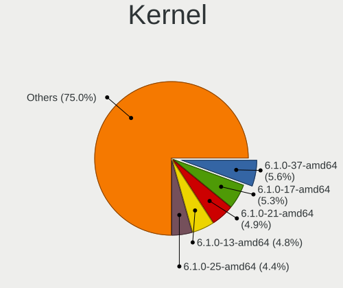

| Version                  | Computers | Percent |
|--------------------------|-----------|---------|
| 6.1.0-37-amd64           | 41        | 5.6%    |
| 6.1.0-17-amd64           | 39        | 5.33%   |
| 6.1.0-21-amd64           | 36        | 4.92%   |
| 6.1.0-13-amd64           | 35        | 4.78%   |
| 6.1.0-25-amd64           | 32        | 4.37%   |
| 6.1.0-10-amd64           | 32        | 4.37%   |
| 6.1.0-26-amd64           | 25        | 3.42%   |
| 6.1.0-23-amd64           | 24        | 3.28%   |
| 6.5.0-1mx-ahs-amd64      | 23        | 3.14%   |
| 6.4.0-1mx-ahs-amd64      | 21        | 2.87%   |
| 6.1.0-33-amd64           | 20        | 2.73%   |
| 6.1.0-40-amd64           | 18        | 2.46%   |
| 6.1.0-32-amd64           | 18        | 2.46%   |
| 6.1.0-31-amd64           | 18        | 2.46%   |
| 6.1.0-18-amd64           | 17        | 2.32%   |
| 6.1.0-29-amd64           | 14        | 1.91%   |
| 6.1.0-28-amd64           | 14        | 1.91%   |
| 6.1.0-34-amd64           | 13        | 1.78%   |
| 6.1.0-35-amd64           | 10        | 1.37%   |
| 6.1.0-20-amd64           | 10        | 1.37%   |
| 6.6.12-1-liquorix-amd64  | 9         | 1.23%   |
| 6.1.0-30-amd64           | 9         | 1.23%   |
| 6.1.0-9-amd64            | 8         | 1.09%   |
| 6.1.0-11-amd64           | 8         | 1.09%   |
| 6.15.11-1-liquorix-amd64 | 7         | 0.96%   |
| 6.1.0-39-amd64           | 7         | 0.96%   |
| 6.1.0-22-amd64           | 7         | 0.96%   |
| 6.6.11-amd64             | 6         | 0.82%   |
| 6.11.10-1-liquorix-amd64 | 6         | 0.82%   |
| 6.1.0-41-amd64           | 6         | 0.82%   |
| 6.1.0-27-amd64           | 6         | 0.82%   |
| 6.1.0-17-686-pae         | 6         | 0.82%   |
| 6.1.0-15-amd64           | 6         | 0.82%   |
| 6.1.0-12-amd64           | 6         | 0.82%   |
| 6.8.9-3-liquorix-amd64   | 5         | 0.68%   |
| 6.14.10-2-liquorix-amd64 | 5         | 0.68%   |
| 6.10.10-1-liquorix-amd64 | 5         | 0.68%   |
| 6.1.0-38-amd64           | 5         | 0.68%   |
| 6.7.12-1-liquorix-amd64  | 4         | 0.55%   |
| 6.14.2-1-liquorix-amd64  | 4         | 0.55%   |

Kernel Family
-------------

Linux kernel without a distro release

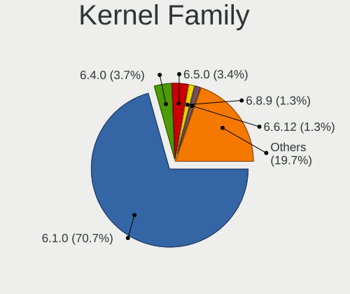

| Version  | Computers | Percent |
|----------|-----------|---------|
| 6.1.0    | 496       | 70.66%  |
| 6.4.0    | 26        | 3.7%    |
| 6.5.0    | 24        | 3.42%   |
| 6.8.9    | 9         | 1.28%   |
| 6.6.12   | 9         | 1.28%   |
| 6.15.11  | 7         | 1%      |
| 6.6.11   | 6         | 0.85%   |
| 6.14.10  | 6         | 0.85%   |
| 6.11.10  | 6         | 0.85%   |
| 6.10.10  | 5         | 0.71%   |
| 6.7.12   | 4         | 0.57%   |
| 6.14.2   | 4         | 0.57%   |
| 6.13.7   | 4         | 0.57%   |
| 6.12.6   | 4         | 0.57%   |
| 6.10.11  | 4         | 0.57%   |
| 6.9.7    | 3         | 0.43%   |
| 6.9.12   | 3         | 0.43%   |
| 6.6.9    | 3         | 0.43%   |
| 6.3.9    | 3         | 0.43%   |
| 6.16.12  | 3         | 0.43%   |
| 6.13.8   | 3         | 0.43%   |
| 6.12.8   | 3         | 0.43%   |
| 6.12.11  | 3         | 0.43%   |
| 6.11.9   | 3         | 0.43%   |
| 6.7.5    | 2         | 0.28%   |
| 6.7.11   | 2         | 0.28%   |
| 6.5.11   | 2         | 0.28%   |
| 6.4.9    | 2         | 0.28%   |
| 6.4.15   | 2         | 0.28%   |
| 6.3.0    | 2         | 0.28%   |
| 6.2.14   | 2         | 0.28%   |
| 6.14.9   | 2         | 0.28%   |
| 6.11.7   | 2         | 0.28%   |
| 6.10.6   | 2         | 0.28%   |
| 5.10.197 | 2         | 0.28%   |
| 5.10.0   | 2         | 0.28%   |
| 6.9.6    | 1         | 0.14%   |
| 6.9.3    | 1         | 0.14%   |
| 6.9.11   | 1         | 0.14%   |
| 6.8.8    | 1         | 0.14%   |

Kernel Major Ver.
-----------------

Linux kernel major version

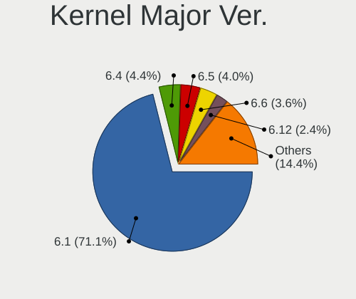

| Version | Computers | Percent |
|---------|-----------|---------|
| 6.1     | 497       | 71.1%   |
| 6.4     | 31        | 4.43%   |
| 6.5     | 28        | 4.01%   |
| 6.6     | 25        | 3.58%   |
| 6.12    | 17        | 2.43%   |
| 6.14    | 16        | 2.29%   |
| 6.11    | 14        | 2%      |
| 6.8     | 12        | 1.72%   |
| 6.10    | 11        | 1.57%   |
| 6.9     | 9         | 1.29%   |
| 6.7     | 9         | 1.29%   |
| 6.13    | 8         | 1.14%   |
| 6.15    | 7         | 1%      |
| 6.3     | 5         | 0.72%   |
| 5.10    | 4         | 0.57%   |
| 6.16    | 3         | 0.43%   |
| 6.2     | 2         | 0.29%   |
| 6.0     | 1         | 0.14%   |

Arch
----

OS architecture (x86_64, i586, etc.)

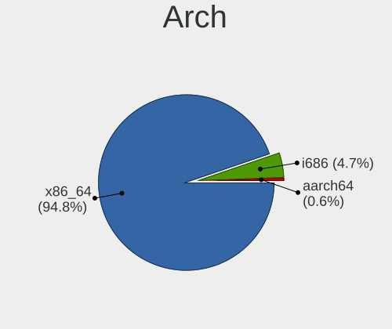

| Name    | Computers | Percent |
|---------|-----------|---------|
| x86_64  | 651       | 94.76%  |
| i686    | 32        | 4.66%   |
| aarch64 | 4         | 0.58%   |

DE
--

Desktop Environment

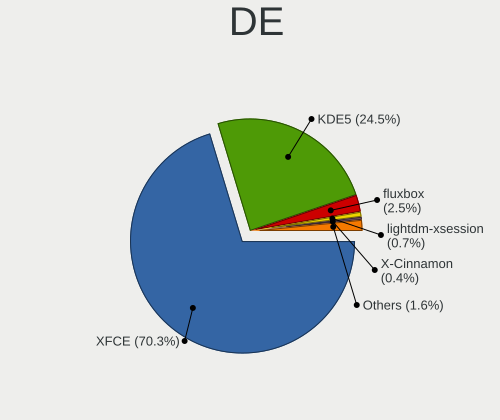

| Name             | Computers | Percent |
|------------------|-----------|---------|
| XFCE             | 486       | 70.33%  |
| KDE5             | 169       | 24.46%  |
| fluxbox          | 17        | 2.46%   |
| lightdm-xsession | 5         | 0.72%   |
| X-Cinnamon       | 3         | 0.43%   |
| LXQt             | 2         | 0.29%   |
| i3               | 2         | 0.29%   |
| GNOME            | 2         | 0.29%   |
| Unknown          | 2         | 0.29%   |
| MATE             | 1         | 0.14%   |
| GNOME Flashback  | 1         | 0.14%   |
| Budgie           | 1         | 0.14%   |

Display Server
--------------

X11 or Wayland

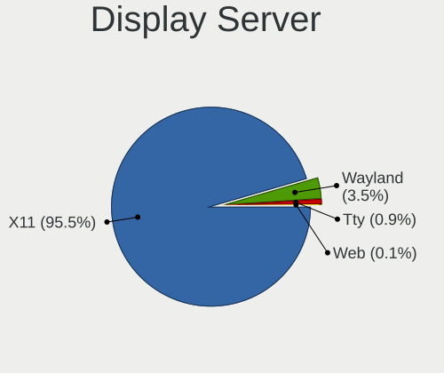

| Name    | Computers | Percent |
|---------|-----------|---------|
| X11     | 658       | 95.5%   |
| Wayland | 24        | 3.48%   |
| Tty     | 6         | 0.87%   |
| Web     | 1         | 0.15%   |

Display Manager
---------------

SDDM, LightDM, etc.

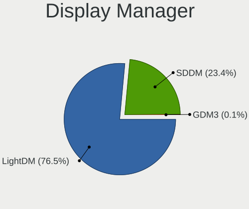

| Name    | Computers | Percent |
|---------|-----------|---------|
| LightDM | 527       | 76.49%  |
| SDDM    | 161       | 23.37%  |
| GDM3    | 1         | 0.15%   |

OS Lang
-------

Language

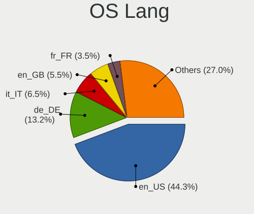

| Lang  | Computers | Percent |
|-------|-----------|---------|
| en_US | 305       | 44.27%  |
| de_DE | 91        | 13.21%  |
| it_IT | 45        | 6.53%   |
| en_GB | 38        | 5.52%   |
| fr_FR | 24        | 3.48%   |
| pl_PL | 20        | 2.9%    |
| ru_RU | 18        | 2.61%   |
| en_AU | 16        | 2.32%   |
| es_ES | 14        | 2.03%   |
| pt_BR | 10        | 1.45%   |
| en_CA | 10        | 1.45%   |
| de_AT | 7         | 1.02%   |
| hu_HU | 6         | 0.87%   |
| es_BO | 6         | 0.87%   |
| en_NZ | 6         | 0.87%   |
| tr_TR | 5         | 0.73%   |
| nl_NL | 5         | 0.73%   |
| es_AR | 5         | 0.73%   |
| sk_SK | 4         | 0.58%   |
| nl_BE | 4         | 0.58%   |
| fi_FI | 4         | 0.58%   |
| en_IE | 4         | 0.58%   |
| C     | 4         | 0.58%   |
| hr_HR | 3         | 0.44%   |
| es_VE | 3         | 0.44%   |
| es_MX | 3         | 0.44%   |
| el_GR | 3         | 0.44%   |
| zh_TW | 2         | 0.29%   |
| ja_JP | 2         | 0.29%   |
| fr_CH | 2         | 0.29%   |
| es_US | 2         | 0.29%   |
| es_PE | 2         | 0.29%   |
| zh_CN | 1         | 0.15%   |
| uk_UA | 1         | 0.15%   |
| sv_SE | 1         | 0.15%   |
| pt_PT | 1         | 0.15%   |
| nb_NO | 1         | 0.15%   |
| ko_KR | 1         | 0.15%   |
| fr_CA | 1         | 0.15%   |
| fr_BE | 1         | 0.15%   |

Boot Mode
---------

EFI or BIOS

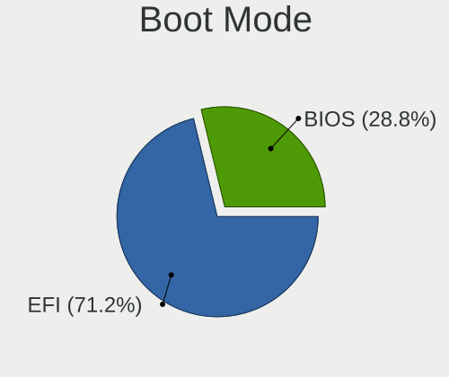

| Mode | Computers | Percent |
|------|-----------|---------|
| EFI  | 490       | 71.22%  |
| BIOS | 198       | 28.78%  |

Filesystem
----------

Type of filesystem

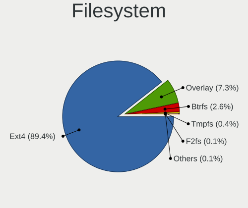

| Type    | Computers | Percent |
|---------|-----------|---------|
| Ext4    | 615       | 89.39%  |
| Overlay | 50        | 7.27%   |
| Btrfs   | 18        | 2.62%   |
| Tmpfs   | 3         | 0.44%   |
| F2fs    | 1         | 0.15%   |
| Ext3    | 1         | 0.15%   |

Part. scheme
------------

Scheme of partitioning

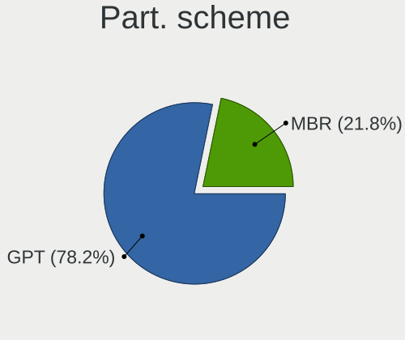

| Type | Computers | Percent |
|------|-----------|---------|
| GPT  | 539       | 78.23%  |
| MBR  | 150       | 21.77%  |

Dual Boot with Linux/BSD
------------------------

Hosting more than one Linux/BSD

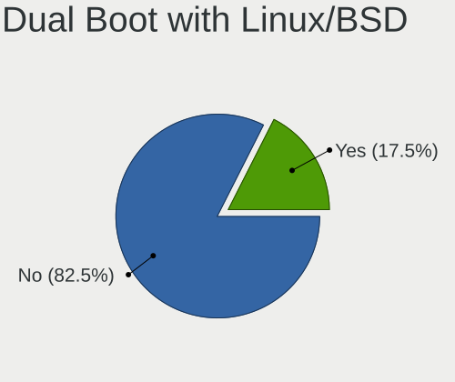

| Dual boot | Computers | Percent |
|-----------|-----------|---------|
| No        | 569       | 82.46%  |
| Yes       | 121       | 17.54%  |

Dual Boot (Win)
---------------

Hosting Linux and Windows

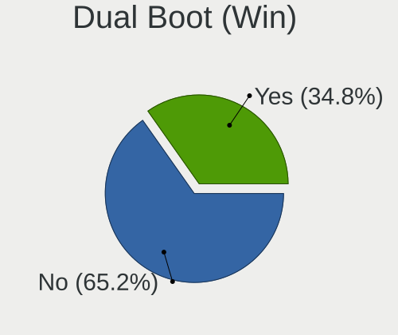

| Dual boot | Computers | Percent |
|-----------|-----------|---------|
| No        | 450       | 65.22%  |
| Yes       | 240       | 34.78%  |

Board
-----

Vendor
------

Motherboard manufacturer

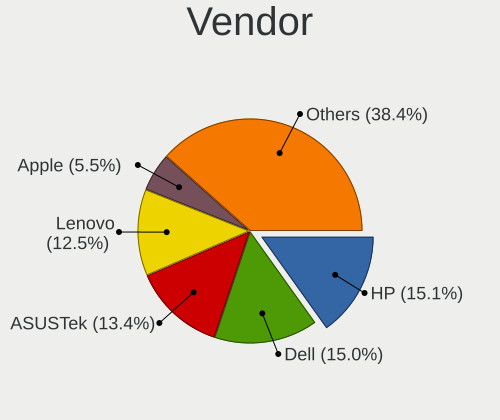

| Name                                 | Computers | Percent |
|--------------------------------------|-----------|---------|
| Hewlett-Packard                      | 104       | 15.14%  |
| Dell                                 | 103       | 14.99%  |
| ASUSTek Computer                     | 92        | 13.39%  |
| Lenovo                               | 86        | 12.52%  |
| Apple                                | 38        | 5.53%   |
| Acer                                 | 34        | 4.95%   |
| Gigabyte Technology                  | 31        | 4.51%   |
| MSI                                  | 26        | 3.78%   |
| Intel                                | 15        | 2.18%   |
| Unknown                              | 15        | 2.18%   |
| ASRock                               | 13        | 1.89%   |
| Toshiba                              | 12        | 1.75%   |
| Samsung Electronics                  | 10        | 1.46%   |
| Medion                               | 9         | 1.31%   |
| Google                               | 8         | 1.16%   |
| Sony                                 | 5         | 0.73%   |
| Fujitsu Siemens                      | 5         | 0.73%   |
| Fujitsu                              | 5         | 0.73%   |
| Raspberry Pi Foundation              | 4         | 0.58%   |
| Pegatron                             | 4         | 0.58%   |
| Microsoft                            | 4         | 0.58%   |
| Foxconn                              | 4         | 0.58%   |
| AZW                                  | 4         | 0.58%   |
| AMI                                  | 4         | 0.58%   |
| ZOTAC                                | 2         | 0.29%   |
| Wortmann AG                          | 2         | 0.29%   |
| Shenzhen Meigao Electronic Equipment | 2         | 0.29%   |
| Semp Toshiba                         | 2         | 0.29%   |
| HONOR                                | 2         | 0.29%   |
| GPU Company                          | 2         | 0.29%   |
| GEEKOM                               | 2         | 0.29%   |
| Gateway                              | 2         | 0.29%   |
| Daten Tecnologia                     | 2         | 0.29%   |
| youyeetoo                            | 1         | 0.15%   |
| VIT                                  | 1         | 0.15%   |
| TianBei                              | 1         | 0.15%   |
| TECNO Mobile Limited                 | 1         | 0.15%   |
| System76                             | 1         | 0.15%   |
| SYS                                  | 1         | 0.15%   |
| Star Labs                            | 1         | 0.15%   |

Model
-----

Motherboard model

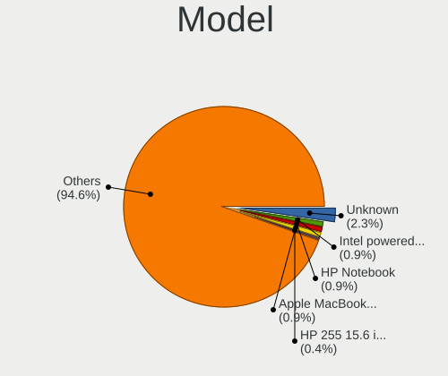

| Name                                              | Computers | Percent |
|---------------------------------------------------|-----------|---------|
| Unknown                                           | 16        | 2.33%   |
| Intel powered classmate PC                        | 6         | 0.87%   |
| HP Notebook                                       | 6         | 0.87%   |
| Apple MacBookPro7,1                               | 6         | 0.87%   |
| HP 255 15.6 inch G9 Notebook PC                   | 3         | 0.44%   |
| Dell Latitude E6540                               | 3         | 0.44%   |
| Apple MacBookAir6,2                               | 3         | 0.44%   |
| Apple MacBookAir1,1                               | 3         | 0.44%   |
| Shenzhen Meigao Electronic Equipment Venus series | 2         | 0.29%   |
| Samsung N150/N210/N220                            | 2         | 0.29%   |
| Samsung 305E4A/305E5A/305E7A                      | 2         | 0.29%   |
| RPi Raspberry Pi 5 Model B Rev 1.0                | 2         | 0.29%   |
| MSI MS-7C91                                       | 2         | 0.29%   |
| Microsoft Surface Pro 3                           | 2         | 0.29%   |
| Lenovo IdeaPad 3 15ALC6 82KU                      | 2         | 0.29%   |
| Intel B75                                         | 2         | 0.29%   |
| HP ProBook 455 G8 Notebook PC                     | 2         | 0.29%   |
| HP Pavilion g6                                    | 2         | 0.29%   |
| HP Pavilion dv7                                   | 2         | 0.29%   |
| HP Pavilion dv6                                   | 2         | 0.29%   |
| HP EliteBook 840 G6                               | 2         | 0.29%   |
| HP Compaq Pro 6300 SFF                            | 2         | 0.29%   |
| HP Compaq dc7700p Ultra-slim Desktop              | 2         | 0.29%   |
| HP 250 G1                                         | 2         | 0.29%   |
| HP 250 15.6 inch G9 Notebook PC                   | 2         | 0.29%   |
| Google Treeya                                     | 2         | 0.29%   |
| Gigabyte A520M H                                  | 2         | 0.29%   |
| GEEKOM Mini IT13                                  | 2         | 0.29%   |
| Foxconn Pro3500 Series                            | 2         | 0.29%   |
| Dell OptiPlex 7040                                | 2         | 0.29%   |
| Dell Latitude E6440                               | 2         | 0.29%   |
| Dell Latitude E6430                               | 2         | 0.29%   |
| Dell Latitude E6410                               | 2         | 0.29%   |
| Dell Latitude E6400                               | 2         | 0.29%   |
| Dell Latitude 5530                                | 2         | 0.29%   |
| Dell Latitude 5400                                | 2         | 0.29%   |
| Daten Tecnologia DVRN-4                           | 2         | 0.29%   |
| AZW SER                                           | 2         | 0.29%   |
| ASUS Z170 PRO GAMING                              | 2         | 0.29%   |
| ASUS VivoBook_ASUSLaptop X1605VA_X1605VA          | 2         | 0.29%   |

Model Family
------------

Motherboard model prefix

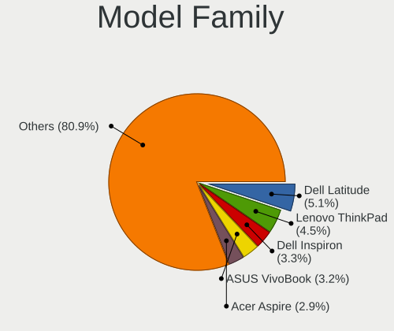

| Name                  | Computers | Percent |
|-----------------------|-----------|---------|
| Dell Latitude         | 35        | 5.09%   |
| Lenovo ThinkPad       | 31        | 4.51%   |
| Dell Inspiron         | 23        | 3.35%   |
| ASUS VivoBook         | 22        | 3.2%    |
| Acer Aspire           | 20        | 2.91%   |
| HP Pavilion           | 18        | 2.62%   |
| Dell OptiPlex         | 18        | 2.62%   |
| Lenovo IdeaPad        | 16        | 2.33%   |
| Unknown               | 16        | 2.33%   |
| ASUS PRIME            | 15        | 2.18%   |
| Lenovo ThinkCentre    | 11        | 1.6%    |
| HP ProBook            | 11        | 1.6%    |
| HP Compaq             | 10        | 1.46%   |
| Toshiba Satellite     | 9         | 1.31%   |
| HP Laptop             | 9         | 1.31%   |
| HP EliteBook          | 8         | 1.16%   |
| Dell XPS              | 8         | 1.16%   |
| Intel powered         | 6         | 0.87%   |
| HP Notebook           | 6         | 0.87%   |
| HP 255                | 6         | 0.87%   |
| Dell Precision        | 6         | 0.87%   |
| ASUS ROG              | 6         | 0.87%   |
| Apple MacBookPro7     | 6         | 0.87%   |
| Fujitsu Siemens AMILO | 5         | 0.73%   |
| Dell Vostro           | 5         | 0.73%   |
| ASUS TUF              | 5         | 0.73%   |
| RPi Raspberry         | 4         | 0.58%   |
| Microsoft Surface     | 4         | 0.58%   |
| Lenovo IdeaCentre     | 4         | 0.58%   |
| HP ENVY               | 4         | 0.58%   |
| HP 250                | 4         | 0.58%   |
| Apple MacBookPro5     | 4         | 0.58%   |
| Lenovo Yoga           | 3         | 0.44%   |
| HP EliteDesk          | 3         | 0.44%   |
| Dell System           | 3         | 0.44%   |
| Dell Studio           | 3         | 0.44%   |
| Apple MacBookPro8     | 3         | 0.44%   |
| Apple MacBookAir6     | 3         | 0.44%   |
| Apple MacBookAir1     | 3         | 0.44%   |
| Acer TravelMate       | 3         | 0.44%   |

MFG Year
--------

Motherboard manufacture year

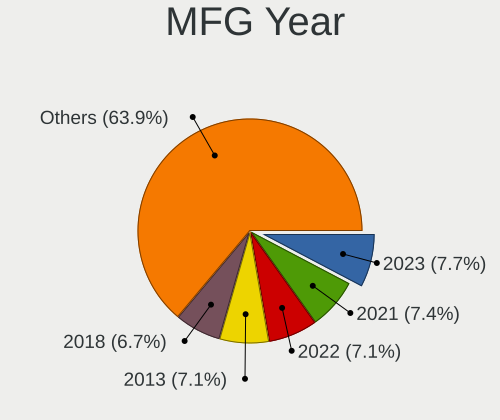

| Year    | Computers | Percent |
|---------|-----------|---------|
| 2023    | 53        | 7.71%   |
| 2021    | 51        | 7.42%   |
| 2022    | 49        | 7.13%   |
| 2013    | 49        | 7.13%   |
| 2018    | 46        | 6.7%    |
| 2020    | 41        | 5.97%   |
| 2012    | 40        | 5.82%   |
| 2019    | 39        | 5.68%   |
| 2009    | 37        | 5.39%   |
| 2024    | 35        | 5.09%   |
| 2016    | 35        | 5.09%   |
| 2011    | 34        | 4.95%   |
| 2015    | 31        | 4.51%   |
| 2008    | 29        | 4.22%   |
| 2017    | 27        | 3.93%   |
| 2014    | 23        | 3.35%   |
| 2010    | 23        | 3.35%   |
| 2007    | 18        | 2.62%   |
| 2006    | 12        | 1.75%   |
| 2025    | 8         | 1.16%   |
| 2005    | 3         | 0.44%   |
| Unknown | 3         | 0.44%   |
| 2004    | 1         | 0.15%   |

Form Factor
-----------

Physical design of the computer

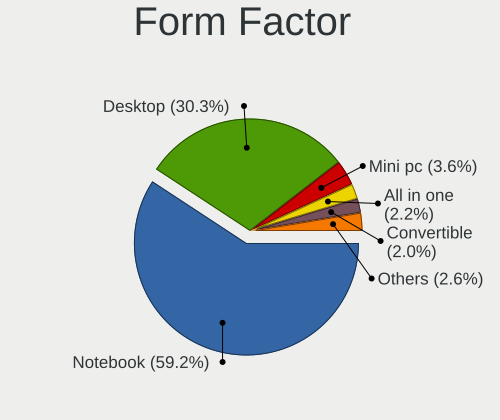

| Name           | Computers | Percent |
|----------------|-----------|---------|
| Notebook       | 407       | 59.24%  |
| Desktop        | 208       | 30.28%  |
| Mini pc        | 25        | 3.64%   |
| All in one     | 15        | 2.18%   |
| Convertible    | 14        | 2.04%   |
| Tablet         | 13        | 1.89%   |
| System on chip | 4         | 0.58%   |
| Server         | 1         | 0.15%   |

Secure Boot
-----------

Enabled or disabled

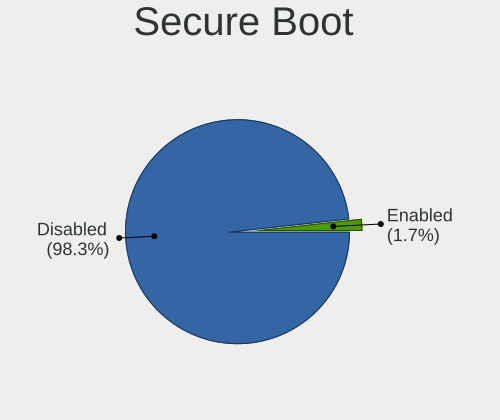

| State    | Computers | Percent |
|----------|-----------|---------|
| Disabled | 675       | 98.25%  |
| Enabled  | 12        | 1.75%   |

Coreboot
--------

Have coreboot on board

| Used | Computers | Percent |
|------|-----------|---------|
| No   | 677       | 98.54%  |
| Yes  | 10        | 1.46%   |

RAM Size
--------

Total RAM memory

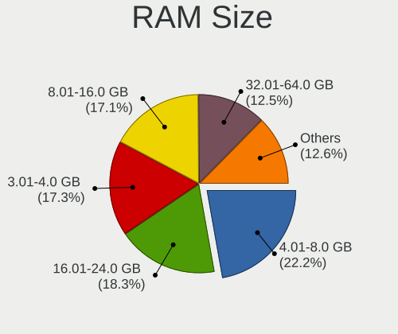

| Size in GB  | Computers | Percent |
|-------------|-----------|---------|
| 4.01-8.0    | 153       | 22.21%  |
| 16.01-24.0  | 126       | 18.29%  |
| 3.01-4.0    | 119       | 17.27%  |
| 8.01-16.0   | 118       | 17.13%  |
| 32.01-64.0  | 86        | 12.48%  |
| 1.01-2.0    | 36        | 5.22%   |
| 2.01-3.0    | 21        | 3.05%   |
| 24.01-32.0  | 13        | 1.89%   |
| 64.01-256.0 | 13        | 1.89%   |
| 0.51-1.0    | 4         | 0.58%   |

RAM Used
--------

Used RAM memory

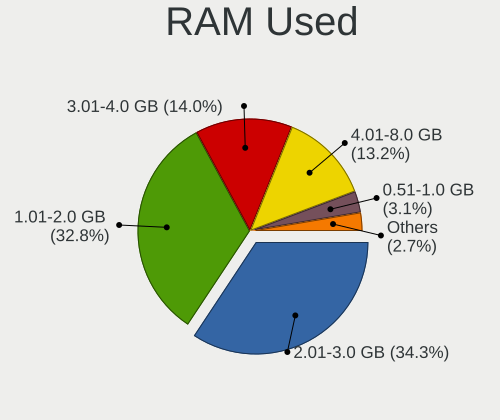

| Used GB    | Computers | Percent |
|------------|-----------|---------|
| 2.01-3.0   | 245       | 34.31%  |
| 1.01-2.0   | 234       | 32.77%  |
| 3.01-4.0   | 100       | 14.01%  |
| 4.01-8.0   | 94        | 13.17%  |
| 0.51-1.0   | 22        | 3.08%   |
| 8.01-16.0  | 16        | 2.24%   |
| 16.01-24.0 | 2         | 0.28%   |
| 24.01-32.0 | 1         | 0.14%   |

Total Drives
------------

Number of drives on board

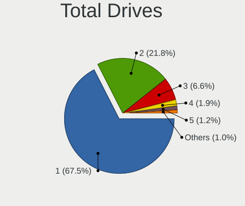

| Drives | Computers | Percent |
|--------|-----------|---------|
| 1      | 467       | 67.49%  |
| 2      | 151       | 21.82%  |
| 3      | 46        | 6.65%   |
| 4      | 13        | 1.88%   |
| 5      | 8         | 1.16%   |
| 7      | 2         | 0.29%   |
| 6      | 2         | 0.29%   |
| 0      | 2         | 0.29%   |
| 9      | 1         | 0.14%   |

Has CD-ROM
----------

Has CD-ROM on board

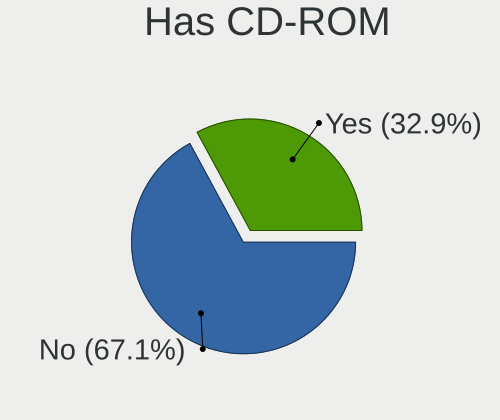

| Presented | Computers | Percent |
|-----------|-----------|---------|
| No        | 461       | 67.1%   |
| Yes       | 226       | 32.9%   |

Has Ethernet
------------

Has Ethernet on board

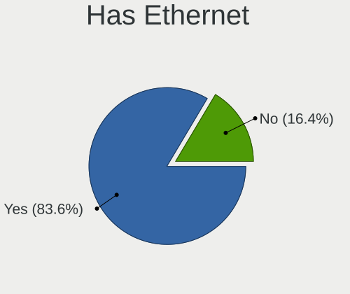

| Presented | Computers | Percent |
|-----------|-----------|---------|
| Yes       | 574       | 83.55%  |
| No        | 113       | 16.45%  |

Has WiFi
--------

Has WiFi module

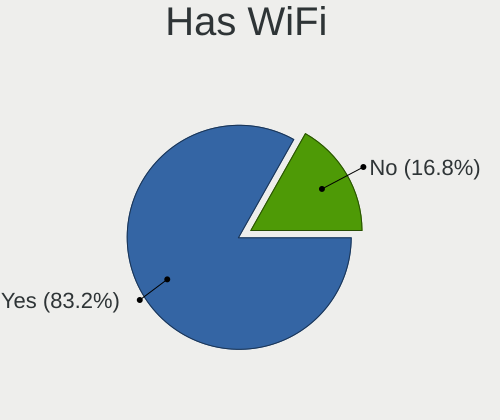

| Presented | Computers | Percent |
|-----------|-----------|---------|
| Yes       | 573       | 83.16%  |
| No        | 116       | 16.84%  |

Has Bluetooth
-------------

Has Bluetooth module

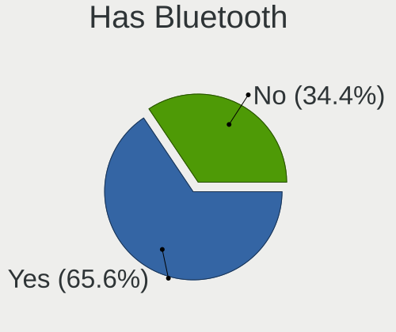

| Presented | Computers | Percent |
|-----------|-----------|---------|
| Yes       | 452       | 65.6%   |
| No        | 237       | 34.4%   |

Location
--------

Country
-------

Geographic location (country)

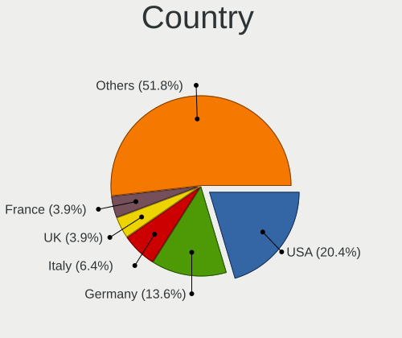

| Country      | Computers | Percent |
|--------------|-----------|---------|
| USA          | 141       | 20.41%  |
| Germany      | 94        | 13.6%   |
| Italy        | 44        | 6.37%   |
| UK           | 27        | 3.91%   |
| France       | 27        | 3.91%   |
| Canada       | 23        | 3.33%   |
| Russia       | 22        | 3.18%   |
| Poland       | 22        | 3.18%   |
| Australia    | 21        | 3.04%   |
| Greece       | 19        | 2.75%   |
| Brazil       | 19        | 2.75%   |
| Spain        | 16        | 2.32%   |
| India        | 16        | 2.32%   |
| Netherlands  | 11        | 1.59%   |
| Austria      | 10        | 1.45%   |
| Serbia       | 9         | 1.3%    |
| Belgium      | 9         | 1.3%    |
| Hungary      | 8         | 1.16%   |
| Turkey       | 7         | 1.01%   |
| Sweden       | 7         | 1.01%   |
| New Zealand  | 7         | 1.01%   |
| Bolivia      | 7         | 1.01%   |
| Argentina    | 7         | 1.01%   |
| Mexico       | 6         | 0.87%   |
| Indonesia    | 6         | 0.87%   |
| Finland      | 6         | 0.87%   |
| Norway       | 5         | 0.72%   |
| Venezuela    | 4         | 0.58%   |
| Slovakia     | 4         | 0.58%   |
| Singapore    | 4         | 0.58%   |
| Portugal     | 4         | 0.58%   |
| Ireland      | 4         | 0.58%   |
| Egypt        | 4         | 0.58%   |
| Chile        | 4         | 0.58%   |
| Ukraine      | 3         | 0.43%   |
| Switzerland  | 3         | 0.43%   |
| South Africa | 3         | 0.43%   |
| Romania      | 3         | 0.43%   |
| Japan        | 3         | 0.43%   |
| Israel       | 3         | 0.43%   |

City
----

Geographic location (city)

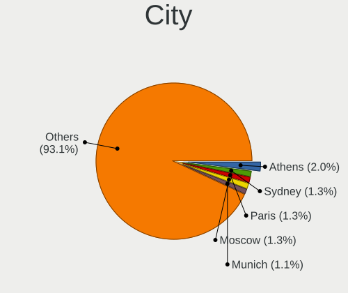

| City                | Computers | Percent |
|---------------------|-----------|---------|
| Athens              | 14        | 1.98%   |
| Sydney              | 9         | 1.27%   |
| Paris               | 9         | 1.27%   |
| Moscow              | 9         | 1.27%   |
| Munich              | 8         | 1.13%   |
| Vienna              | 7         | 0.99%   |
| Seattle             | 7         | 0.99%   |
| La Paz              | 7         | 0.99%   |
| Warsaw              | 6         | 0.85%   |
| Melbourne           | 6         | 0.85%   |
| Berlin              | 6         | 0.85%   |
| St Petersburg       | 5         | 0.71%   |
| Milan               | 5         | 0.71%   |
| Hamburg             | 5         | 0.71%   |
| Singapore           | 4         | 0.56%   |
| Rio de Janeiro      | 4         | 0.56%   |
| Otwock              | 4         | 0.56%   |
| Krakow              | 4         | 0.56%   |
| Florence            | 4         | 0.56%   |
| Cranston            | 4         | 0.56%   |
| Budapest            | 4         | 0.56%   |
| Stuttgart           | 3         | 0.42%   |
| San Diego           | 3         | 0.42%   |
| Rome                | 3         | 0.42%   |
| Pessac-sur-Dordogne | 3         | 0.42%   |
| Niš                | 3         | 0.42%   |
| Montreal            | 3         | 0.42%   |
| Milano              | 3         | 0.42%   |
| Jacksonville        | 3         | 0.42%   |
| Gothenburg          | 3         | 0.42%   |
| Eureka              | 3         | 0.42%   |
| Dublin              | 3         | 0.42%   |
| Debrecen            | 3         | 0.42%   |
| Dallas              | 3         | 0.42%   |
| Charlotte           | 3         | 0.42%   |
| Bengaluru           | 3         | 0.42%   |
| Belgrade            | 3         | 0.42%   |
| Auckland            | 3         | 0.42%   |
| Zagreb              | 2         | 0.28%   |
| Wandsworth          | 2         | 0.28%   |

Drives
------

Drive Vendor
------------

Hard drive vendors

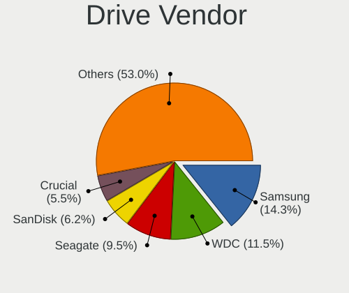

| Vendor                      | Computers | Drives | Percent |
|-----------------------------|-----------|--------|---------|
| Samsung Electronics         | 135       | 167    | 14.27%  |
| WDC                         | 109       | 133    | 11.52%  |
| Seagate                     | 90        | 110    | 9.51%   |
| SanDisk                     | 59        | 64     | 6.24%   |
| Crucial                     | 52        | 74     | 5.5%    |
| Kingston                    | 47        | 52     | 4.97%   |
| Unknown                     | 46        | 53     | 4.86%   |
| Toshiba                     | 36        | 38     | 3.81%   |
| SK hynix                    | 33        | 33     | 3.49%   |
| Unknown                     | 23        | 23     | 2.43%   |
| Intel                       | 20        | 25     | 2.11%   |
| Hitachi                     | 19        | 21     | 2.01%   |
| China                       | 19        | 24     | 2.01%   |
| Micron Technology           | 17        | 19     | 1.8%    |
| KIOXIA                      | 15        | 17     | 1.59%   |
| A-DATA Technology           | 15        | 19     | 1.59%   |
| SPCC                        | 14        | 14     | 1.48%   |
| Intenso                     | 12        | 12     | 1.27%   |
| Apple                       | 12        | 12     | 1.27%   |
| HGST                        | 10        | 13     | 1.06%   |
| PNY                         | 8         | 8      | 0.85%   |
| Silicon Motion              | 6         | 7      | 0.63%   |
| Patriot                     | 6         | 7      | 0.63%   |
| Lexar                       | 6         | 7      | 0.63%   |
| FORESEE                     | 6         | 6      | 0.63%   |
| Team                        | 5         | 7      | 0.53%   |
| Netac                       | 5         | 6      | 0.53%   |
| LITEONIT                    | 5         | 5      | 0.53%   |
| Verbatim                    | 4         | 4      | 0.42%   |
| Transcend                   | 4         | 4      | 0.42%   |
| Phison Electronics          | 4         | 4      | 0.42%   |
| Kingston Technology Company | 4         | 4      | 0.42%   |
| Fujitsu                     | 4         | 4      | 0.42%   |
| BIWIN                       | 4         | 5      | 0.42%   |
| Apacer                      | 4         | 4      | 0.42%   |
| XPG                         | 3         | 3      | 0.32%   |
| T-FORCE                     | 3         | 3      | 0.32%   |
| Realtek                     | 3         | 3      | 0.32%   |
| Phison                      | 3         | 4      | 0.32%   |
| Fanxiang                    | 3         | 4      | 0.32%   |

Drive Model
-----------

Hard drive models

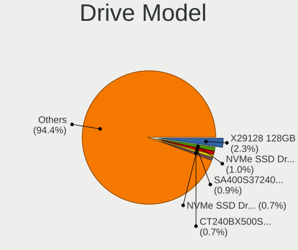

| Model                            | Computers | Percent |
|----------------------------------|-----------|---------|
| Unknown                          | 23        | 2.28%   |
| SanDisk NVMe SSD Drive 1TB       | 10        | 0.99%   |
| Kingston SA400S37240G 240GB SSD  | 9         | 0.89%   |
| SanDisk NVMe SSD Drive 512GB     | 7         | 0.7%    |
| Crucial CT240BX500SSD1 240GB     | 7         | 0.7%    |
| Samsung SSD 850 EVO 500GB        | 6         | 0.6%    |
| Kingston SV300S37A120G 120GB SSD | 6         | 0.6%    |
| Crucial CT1000P3PSSD8 1TB        | 6         | 0.6%    |
| Unknown SD/MMC/MS PRO 2GB        | 5         | 0.5%    |
| Toshiba MQ01ABD100 1TB           | 5         | 0.5%    |
| SK hynix HBG4e  32GB             | 5         | 0.5%    |
| Seagate ST500DM002-1BD142 500GB  | 5         | 0.5%    |
| Seagate Expansion 2TB            | 5         | 0.5%    |
| Samsung SSD 980 500GB            | 5         | 0.5%    |
| Samsung SSD 870 EVO 500GB        | 5         | 0.5%    |
| Samsung SSD 870 EVO 1TB          | 5         | 0.5%    |
| Samsung SSD 860 EVO 500GB        | 5         | 0.5%    |
| Samsung SSD 860 EVO 250GB        | 5         | 0.5%    |
| Samsung SSD 850 PRO 256GB        | 5         | 0.5%    |
| Samsung SSD 850 EVO 250GB        | 5         | 0.5%    |
| WDC WD20EZRZ-00Z5HB0 2TB         | 4         | 0.4%    |
| WDC WD10EZEX-08WN4A0 1TB         | 4         | 0.4%    |
| Toshiba MQ01ABF050 500GB         | 4         | 0.4%    |
| SK hynix HCG8e  64GB             | 4         | 0.4%    |
| Seagate ST9500325AS 500GB        | 4         | 0.4%    |
| Seagate ST320LT012-1DG14C 320GB  | 4         | 0.4%    |
| Seagate ST1000LM035-1RK172 1TB   | 4         | 0.4%    |
| Seagate ST1000DM003-1SB102 1TB   | 4         | 0.4%    |
| Samsung SSD 990 PRO 1TB          | 4         | 0.4%    |
| Samsung SSD 970 EVO Plus 1TB     | 4         | 0.4%    |
| Kingston SA400S37480G 480GB SSD  | 4         | 0.4%    |
| Kingston SA400S37120G 120GB SSD  | 4         | 0.4%    |
| Crucial CT2000MX500SSD1 2TB      | 4         | 0.4%    |
| Crucial CT1000MX500SSD1 1TB      | 4         | 0.4%    |
| Crucial CT1000BX500SSD1 1TB      | 4         | 0.4%    |
| China SSD 256GB                  | 4         | 0.4%    |
| WDC WD10EZEX-00BN5A0 1TB         | 3         | 0.3%    |
| WDC WD Green 2.5 240GB           | 3         | 0.3%    |
| Toshiba HDWD120 2TB              | 3         | 0.3%    |
| Toshiba DT01ACA100 1TB           | 3         | 0.3%    |

HDD Vendor
----------

Hard disk drive vendors

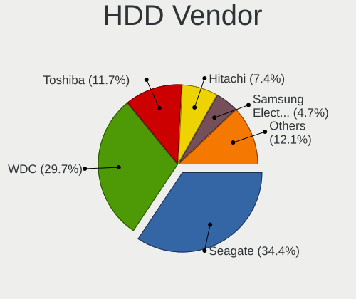

| Vendor              | Computers | Drives | Percent |
|---------------------|-----------|--------|---------|
| Seagate             | 88        | 107    | 34.38%  |
| WDC                 | 76        | 94     | 29.69%  |
| Toshiba             | 30        | 32     | 11.72%  |
| Hitachi             | 19        | 21     | 7.42%   |
| Samsung Electronics | 12        | 15     | 4.69%   |
| HGST                | 10        | 13     | 3.91%   |
| Unknown             | 6         | 6      | 2.34%   |
| Fujitsu             | 4         | 4      | 1.56%   |
| Apple               | 3         | 3      | 1.17%   |
| Maxtor              | 2         | 2      | 0.78%   |
| External            | 2         | 2      | 0.78%   |
| Space ke            | 1         | 2      | 0.39%   |
| Intenso             | 1         | 1      | 0.39%   |
| Hewlett-Packard     | 1         | 5      | 0.39%   |
| Unknown             | 1         | 1      | 0.39%   |

SSD Vendor
----------

Solid state drive vendors

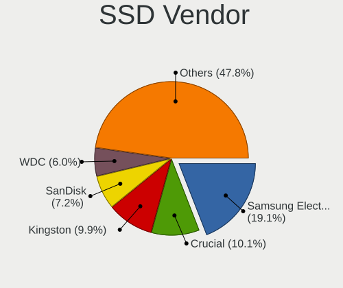

| Vendor              | Computers | Drives | Percent |
|---------------------|-----------|--------|---------|
| Samsung Electronics | 64        | 76     | 19.1%   |
| Crucial             | 34        | 53     | 10.15%  |
| Kingston            | 33        | 37     | 9.85%   |
| SanDisk             | 24        | 24     | 7.16%   |
| WDC                 | 20        | 21     | 5.97%   |
| China               | 17        | 22     | 5.07%   |
| Intenso             | 10        | 10     | 2.99%   |
| A-DATA Technology   | 10        | 13     | 2.99%   |
| SPCC                | 9         | 9      | 2.69%   |
| Apple               | 8         | 8      | 2.39%   |
| Micron Technology   | 7         | 9      | 2.09%   |
| Intel               | 7         | 9      | 2.09%   |
| PNY                 | 6         | 6      | 1.79%   |
| Patriot             | 5         | 6      | 1.49%   |
| LITEONIT            | 5         | 5      | 1.49%   |
| Verbatim            | 4         | 4      | 1.19%   |
| Transcend           | 4         | 4      | 1.19%   |
| T-FORCE             | 3         | 3      | 0.9%    |
| FORESEE             | 3         | 3      | 0.9%    |
| BIWIN               | 3         | 4      | 0.9%    |
| Unknown             | 3         | 3      | 0.9%    |
| Team                | 2         | 2      | 0.6%    |
| SK hynix            | 2         | 2      | 0.6%    |
| Seagate             | 2         | 2      | 0.6%    |
| SABRENT             | 2         | 5      | 0.6%    |
| OWC                 | 2         | 2      | 0.6%    |
| OCZ                 | 2         | 2      | 0.6%    |
| Netac               | 2         | 2      | 0.6%    |
| Lexar               | 2         | 2      | 0.6%    |
| HS-SSD-C100         | 2         | 3      | 0.6%    |
| GOODRAM             | 2         | 2      | 0.6%    |
| Fanxiang            | 2         | 2      | 0.6%    |
| Emtec               | 2         | 3      | 0.6%    |
| Apacer              | 2         | 2      | 0.6%    |
| YANSEN              | 1         | 1      | 0.3%    |
| X12                 | 1         | 1      | 0.3%    |
| WALRAM              | 1         | 1      | 0.3%    |
| UP                  | 1         | 1      | 0.3%    |
| Unknown             | 1         | 1      | 0.3%    |
| Toshiba             | 1         | 1      | 0.3%    |

Drive Kind
----------

HDD or SSD

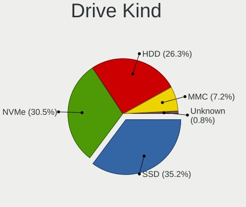

| Kind    | Computers | Drives | Percent |
|---------|-----------|--------|---------|
| SSD     | 302       | 391    | 35.24%  |
| NVMe    | 261       | 327    | 30.46%  |
| HDD     | 225       | 308    | 26.25%  |
| MMC     | 62        | 73     | 7.23%   |
| Unknown | 7         | 7      | 0.82%   |

Drive Connector
---------------

SATA, SAS, NVMe, etc.

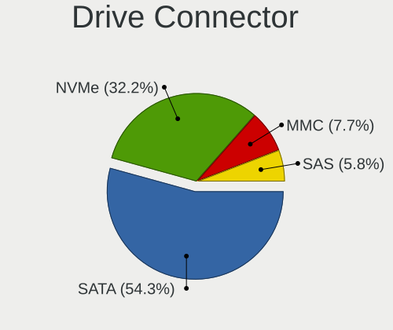

| Type | Computers | Drives | Percent |
|------|-----------|--------|---------|
| SATA | 438       | 654    | 54.28%  |
| NVMe | 260       | 322    | 32.22%  |
| MMC  | 62        | 73     | 7.68%   |
| SAS  | 47        | 57     | 5.82%   |

Drive Size
----------

Size of hard drive

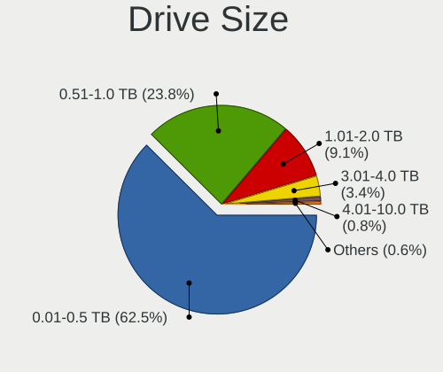

| Size in TB | Computers | Drives | Percent |
|------------|-----------|--------|---------|
| 0.01-0.5   | 331       | 426    | 62.45%  |
| 0.51-1.0   | 126       | 176    | 23.77%  |
| 1.01-2.0   | 48        | 61     | 9.06%   |
| 3.01-4.0   | 18        | 22     | 3.4%    |
| 4.01-10.0  | 4         | 10     | 0.75%   |
| 2.01-3.0   | 3         | 4      | 0.57%   |

Space Total
-----------

Amount of disk space available on the file system

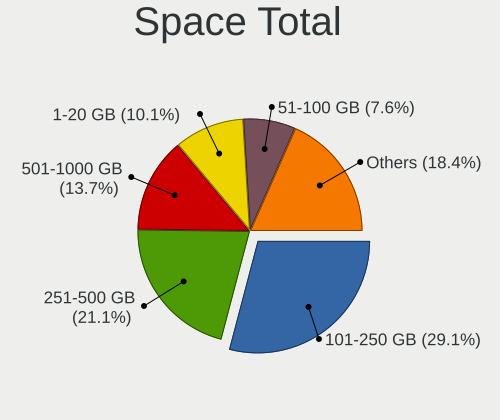

| Size in GB     | Computers | Percent |
|----------------|-----------|---------|
| 101-250        | 204       | 29.1%   |
| 251-500        | 148       | 21.11%  |
| 501-1000       | 96        | 13.69%  |
| 1-20           | 71        | 10.13%  |
| 51-100         | 53        | 7.56%   |
| 21-50          | 44        | 6.28%   |
| More than 3000 | 33        | 4.71%   |
| 1001-2000      | 33        | 4.71%   |
| 2001-3000      | 18        | 2.57%   |
| Unknown        | 1         | 0.14%   |

Space Used
----------

Amount of used disk space

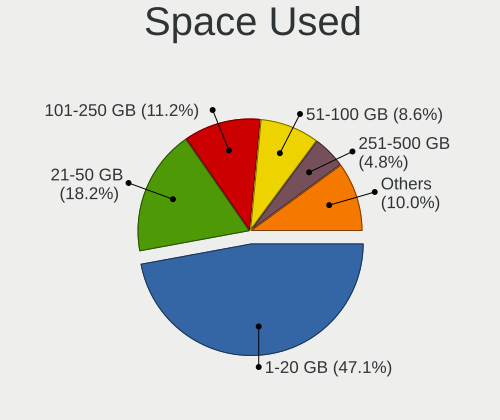

| Used GB        | Computers | Percent |
|----------------|-----------|---------|
| 1-20           | 333       | 47.1%   |
| 21-50          | 129       | 18.25%  |
| 101-250        | 79        | 11.17%  |
| 51-100         | 61        | 8.63%   |
| 251-500        | 34        | 4.81%   |
| 501-1000       | 28        | 3.96%   |
| 1001-2000      | 23        | 3.25%   |
| More than 3000 | 14        | 1.98%   |
| 2001-3000      | 5         | 0.71%   |
| Unknown        | 1         | 0.14%   |

Malfunc. Drives
---------------

Drive models with a malfunction

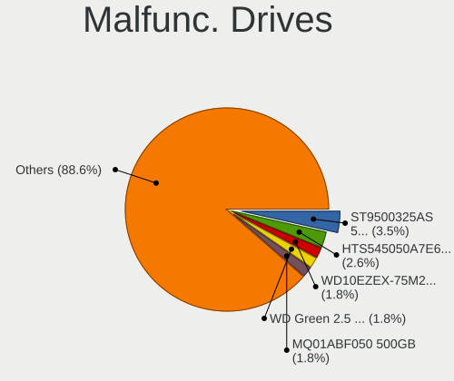

| Model                                 | Computers | Drives | Percent |
|---------------------------------------|-----------|--------|---------|
| Seagate ST9500325AS 500GB             | 4         | 4      | 3.51%   |
| HGST HTS545050A7E680 500GB            | 3         | 3      | 2.63%   |
| WDC WD10EZEX-75M2NA0 1TB              | 2         | 2      | 1.75%   |
| WDC WD Green 2.5 240GB                | 2         | 2      | 1.75%   |
| Toshiba MQ01ABF050 500GB              | 2         | 2      | 1.75%   |
| Toshiba MQ01ABD100 1TB                | 2         | 2      | 1.75%   |
| Seagate ST500LM000-1EJ162 500GB       | 2         | 2      | 1.75%   |
| Seagate ST500DM002-1BD142 500GB       | 2         | 2      | 1.75%   |
| Seagate ST1000LM024 HN-M101MBB 1TB    | 2         | 2      | 1.75%   |
| SanDisk SSD PLUS 1000GB               | 2         | 2      | 1.75%   |
| Samsung Electronics HM250HI 250GB     | 2         | 3      | 1.75%   |
| Hitachi HTS543225L9A300 250GB         | 2         | 2      | 1.75%   |
| YANSEN YSZF18-128 128GB SSD           | 1         | 1      | 0.88%   |
| WDC WDS100T2G0A-00JH30 1TB SSD        | 1         | 1      | 0.88%   |
| WDC WD6400AACS-00G8B1 640GB           | 1         | 1      | 0.88%   |
| WDC WD5000LPVX-22V0TT0 500GB          | 1         | 1      | 0.88%   |
| WDC WD40EZRZ-00GXCB0 4TB              | 1         | 1      | 0.88%   |
| WDC WD40EZRX-00SPEB0 4TB              | 1         | 1      | 0.88%   |
| WDC WD32 00BEKT-75PVMT0 320GB         | 1         | 1      | 0.88%   |
| WDC WD2500BEVT-75A23T0 250GB          | 1         | 1      | 0.88%   |
| WDC WD2500AAJS-00B4A0 250GB           | 1         | 2      | 0.88%   |
| WDC WD20EZRZ-00Z5HB0 2TB              | 1         | 1      | 0.88%   |
| WDC WD20EFRX-68AX9N0 2TB              | 1         | 1      | 0.88%   |
| WDC WD1600BEVT-00A23T0 160GB          | 1         | 1      | 0.88%   |
| WDC WD1600BEKT-75PVMT0 160GB          | 1         | 2      | 0.88%   |
| WDC WD10SPZX-60Z10T0 1TB              | 1         | 1      | 0.88%   |
| WDC WD10EARS-00Y5B1 1TB               | 1         | 1      | 0.88%   |
| WDC WD1002FAEX-00Z3A0 1TB             | 1         | 1      | 0.88%   |
| WDC WD Blue SA510 2.5 500GB           | 1         | 1      | 0.88%   |
| Toshiba MQ01ABF032 320GB              | 1         | 1      | 0.88%   |
| Toshiba MQ01ABD050 500GB              | 1         | 1      | 0.88%   |
| Toshiba MK8009GAH 80GB                | 1         | 1      | 0.88%   |
| Toshiba MK5055GSX 500GB               | 1         | 1      | 0.88%   |
| Toshiba MK3259GSXP 320GB              | 1         | 1      | 0.88%   |
| Toshiba MK1652GSX 160GB               | 1         | 1      | 0.88%   |
| Toshiba DT01ACA050 500GB              | 1         | 1      | 0.88%   |
| SK hynix HFS256G32MND-2200A 256GB SSD | 1         | 1      | 0.88%   |
| SK hynix HFS064G3AMNB-2200A 64GB SSD  | 1         | 1      | 0.88%   |
| SK hynix BC711 HFM512GD3JX013N 512GB  | 1         | 1      | 0.88%   |
| Seagate ST980811AS 80GB               | 1         | 1      | 0.88%   |

Malfunc. Drive Vendor
---------------------

Vendors of faulty drives

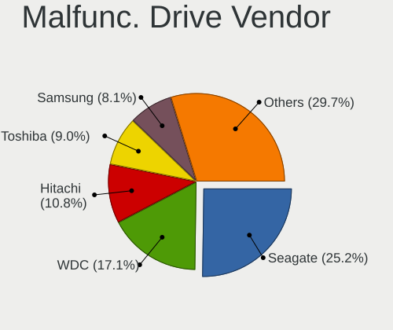

| Vendor              | Computers | Drives | Percent |
|---------------------|-----------|--------|---------|
| Seagate             | 28        | 30     | 25.23%  |
| WDC                 | 19        | 22     | 17.12%  |
| Hitachi             | 12        | 12     | 10.81%  |
| Toshiba             | 10        | 11     | 9.01%   |
| Samsung Electronics | 9         | 11     | 8.11%   |
| HGST                | 5         | 8      | 4.5%    |
| Intel               | 4         | 6      | 3.6%    |
| SK hynix            | 3         | 3      | 2.7%    |
| SanDisk             | 3         | 3      | 2.7%    |
| Netac               | 2         | 2      | 1.8%    |
| Fujitsu             | 2         | 2      | 1.8%    |
| Crucial             | 2         | 13     | 1.8%    |
| China               | 2         | 2      | 1.8%    |
| YANSEN              | 1         | 1      | 0.9%    |
| Phison              | 1         | 1      | 0.9%    |
| Micron Technology   | 1         | 1      | 0.9%    |
| LITEONIT            | 1         | 1      | 0.9%    |
| Lenovo              | 1         | 1      | 0.9%    |
| Kingston            | 1         | 1      | 0.9%    |
| Apple               | 1         | 1      | 0.9%    |
| ADATA Technology    | 1         | 1      | 0.9%    |
| A-DATA Technology   | 1         | 2      | 0.9%    |
| Unknown             | 1         | 1      | 0.9%    |

Malfunc. HDD Vendor
-------------------

Vendors of faulty HDD drives

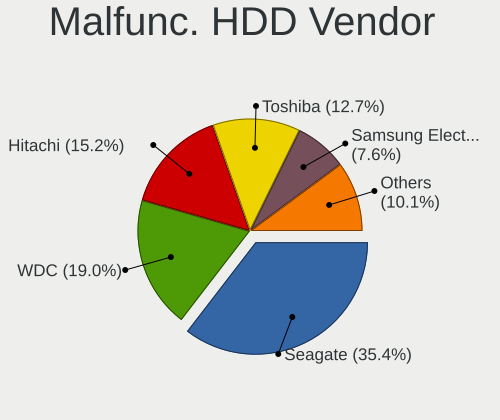

| Vendor              | Computers | Drives | Percent |
|---------------------|-----------|--------|---------|
| Seagate             | 28        | 30     | 35.44%  |
| WDC                 | 15        | 18     | 18.99%  |
| Hitachi             | 12        | 12     | 15.19%  |
| Toshiba             | 10        | 11     | 12.66%  |
| Samsung Electronics | 6         | 7      | 7.59%   |
| HGST                | 5         | 8      | 6.33%   |
| Fujitsu             | 2         | 2      | 2.53%   |
| Unknown             | 1         | 1      | 1.27%   |

Malfunc. Drive Kind
-------------------

Kinds of faulty drives

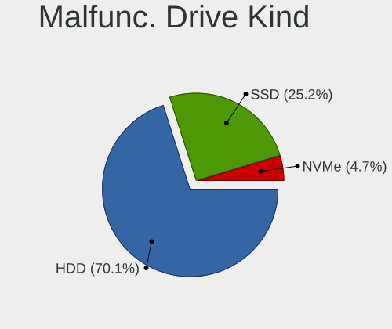

| Kind | Computers | Drives | Percent |
|------|-----------|--------|---------|
| HDD  | 75        | 89     | 70.09%  |
| SSD  | 27        | 42     | 25.23%  |
| NVMe | 5         | 5      | 4.67%   |

Failed Drives
-------------

Failed drive models

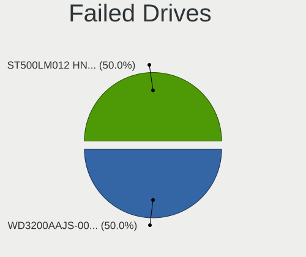

| Model                               | Computers | Drives | Percent |
|-------------------------------------|-----------|--------|---------|
| WDC WD3200AAJS-00B4A0 320GB         | 1         | 1      | 50%     |
| Seagate ST500LM012 HN-M500MBB 500GB | 1         | 1      | 50%     |

Failed Drive Vendor
-------------------

Failed drive vendors

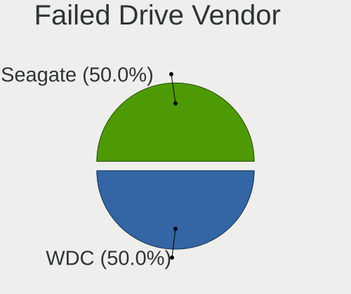

| Vendor  | Computers | Drives | Percent |
|---------|-----------|--------|---------|
| WDC     | 1         | 1      | 50%     |
| Seagate | 1         | 1      | 50%     |

Drive Status
------------

Number of failed and malfunc. drives

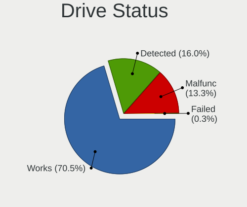

| Status   | Computers | Drives | Percent |
|----------|-----------|--------|---------|
| Works    | 558       | 803    | 70.45%  |
| Detected | 127       | 165    | 16.04%  |
| Malfunc  | 105       | 136    | 13.26%  |
| Failed   | 2         | 2      | 0.25%   |

Storage controller
------------------

Storage Vendor
--------------

Storage controller vendors

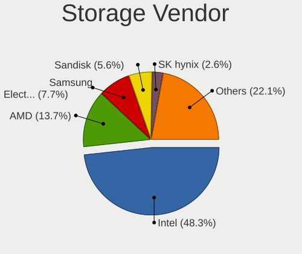

| Vendor                           | Computers | Percent |
|----------------------------------|-----------|---------|
| Intel                            | 406       | 48.28%  |
| AMD                              | 115       | 13.67%  |
| Samsung Electronics              | 65        | 7.73%   |
| Sandisk                          | 47        | 5.59%   |
| SK hynix                         | 22        | 2.62%   |
| Nvidia                           | 20        | 2.38%   |
| Kingston Technology Company      | 18        | 2.14%   |
| Micron Technology                | 17        | 2.02%   |
| KIOXIA                           | 15        | 1.78%   |
| Phison Electronics               | 13        | 1.55%   |
| Silicon Motion                   | 12        | 1.43%   |
| Micron/Crucial Technology        | 11        | 1.31%   |
| ASMedia Technology               | 10        | 1.19%   |
| Shenzhen Longsys Electronics     | 8         | 0.95%   |
| Realtek Semiconductor            | 8         | 0.95%   |
| ADATA Technology                 | 8         | 0.95%   |
| Marvell Technology Group         | 7         | 0.83%   |
| Toshiba America Info Systems     | 6         | 0.71%   |
| MAXIO Technology (Hangzhou)      | 6         | 0.71%   |
| JMicron Technology               | 3         | 0.36%   |
| Unknown                          | 3         | 0.36%   |
| VIA Technologies                 | 2         | 0.24%   |
| Union Memory (Shenzhen)          | 2         | 0.24%   |
| Silicon Integrated Systems [SiS] | 2         | 0.24%   |
| Silicon Image                    | 2         | 0.24%   |
| TenaFe                           | 1         | 0.12%   |
| Solidigm                         | 1         | 0.12%   |
| Solid State Storage Technology   | 1         | 0.12%   |
| O2 Micro                         | 1         | 0.12%   |
| Nextorage                        | 1         | 0.12%   |
| Netac Technology                 | 1         | 0.12%   |
| LSI Logic / Symbios Logic        | 1         | 0.12%   |
| Lite-On Technology               | 1         | 0.12%   |
| Lenovo                           | 1         | 0.12%   |
| Integrated Technology Express    | 1         | 0.12%   |
| Initio                           | 1         | 0.12%   |
| Hewlett-Packard                  | 1         | 0.12%   |
| Biwin Storage Technology         | 1         | 0.12%   |

Storage Model
-------------

Storage controller models

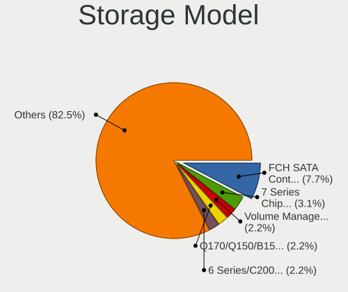

| Model                                                                          | Computers | Percent |
|--------------------------------------------------------------------------------|-----------|---------|
| AMD FCH SATA Controller [AHCI mode]                                            | 73        | 7.72%   |
| Intel 7 Series Chipset Family 6-port SATA Controller [AHCI mode]               | 29        | 3.07%   |
| Intel Volume Management Device NVMe RAID Controller                            | 21        | 2.22%   |
| Intel Q170/Q150/B150/H170/H110/Z170/CM236 Chipset SATA Controller [AHCI Mode]  | 21        | 2.22%   |
| Intel 6 Series/C200 Series Chipset Family 6 port Mobile SATA AHCI Controller   | 21        | 2.22%   |
| Samsung NVMe SSD Controller SM981/PM981/PM983                                  | 20        | 2.12%   |
| Intel 82801 Mobile SATA Controller [RAID mode]                                 | 19        | 2.01%   |
| Intel 82801HM/HEM (ICH8M/ICH8M-E) IDE Controller                               | 16        | 1.69%   |
| SanDisk WD SN560/SN740/SN770/SN5000 NVMe SSD                                   | 15        | 1.59%   |
| Intel Sunrise Point-LP SATA Controller [AHCI mode]                             | 15        | 1.59%   |
| Intel 82801IBM/IEM (ICH9M/ICH9M-E) 4 port SATA Controller [AHCI mode]          | 15        | 1.59%   |
| Intel 8 Series/C220 Series Chipset Family 6-port SATA Controller 1 [AHCI mode] | 15        | 1.59%   |
| Samsung NVMe SSD Controller 980 (DRAM-less)                                    | 14        | 1.48%   |
| Intel 82801HM/HEM (ICH8M/ICH8M-E) SATA Controller [AHCI mode]                  | 14        | 1.48%   |
| Intel Celeron/Pentium Silver Processor SATA Controller                         | 13        | 1.38%   |
| Intel 200 Series PCH SATA controller [AHCI mode]                               | 13        | 1.38%   |
| Intel 82801G (ICH7 Family) IDE Controller                                      | 12        | 1.27%   |
| Intel 7 Series/C210 Series Chipset Family 6-port SATA Controller [AHCI mode]   | 12        | 1.27%   |
| Silicon Motion SM2263EN/SM2263XT (DRAM-less) NVMe SSD Controllers              | 11        | 1.16%   |
| Intel Alder Lake-P SATA AHCI Controller                                        | 11        | 1.16%   |
| Intel 6 Series/C200 Series Chipset Family 6 port Desktop SATA AHCI Controller  | 11        | 1.16%   |
| AMD SB7x0/SB8x0/SB9x0 SATA Controller [AHCI mode]                              | 11        | 1.16%   |
| SK hynix Gold P31/BC711/PC711 NVMe Solid State Drive                           | 10        | 1.06%   |
| Intel Comet Lake SATA AHCI Controller                                          | 10        | 1.06%   |
| Intel Celeron N3350/Pentium N4200/Atom E3900 Series SATA AHCI Controller       | 10        | 1.06%   |
| Intel 5 Series/3400 Series Chipset 6 port SATA AHCI Controller                 | 10        | 1.06%   |
| AMD 500 Series Chipset SATA Controller                                         | 10        | 1.06%   |
| AMD 400 Series Chipset SATA Controller                                         | 10        | 1.06%   |
| SanDisk Ultra 3D / WD PC SN530, IX SN530, Blue SN550 NVMe SSD (DRAM-less)      | 9         | 0.95%   |
| Nvidia MCP79 AHCI Controller                                                   | 9         | 0.95%   |
| Intel Tiger Lake-LP SATA Controller                                            | 9         | 0.95%   |
| Intel 8 Series SATA Controller 1 [AHCI mode]                                   | 9         | 0.95%   |
| ASMedia ASM1061/ASM1062 Serial ATA Controller                                  | 9         | 0.95%   |
| AMD 600 Series Chipset SATA Controller                                         | 9         | 0.95%   |
| Samsung NVMe SSD Controller PM9B1 (DRAM-less)                                  | 8         | 0.85%   |
| Intel RST Volume Management Device Controller                                  | 8         | 0.85%   |
| Intel Cannon Lake PCH SATA AHCI Controller                                     | 8         | 0.85%   |
| Samsung NVMe SSD Controller S4LV008[Pascal]                                    | 7         | 0.74%   |
| Micron/Crucial P2 [Nick P2] / P3 / P3 Plus NVMe PCIe SSD (DRAM-less)           | 7         | 0.74%   |
| Micron 2550 NVMe SSD (DRAM-less)                                               | 7         | 0.74%   |

Storage Kind
------------

Kind of storage controller (IDE, SATA, NVMe, SAS, ...)

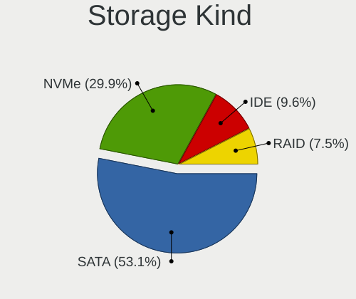

| Kind | Computers | Percent |
|------|-----------|---------|
| SATA | 455       | 53.09%  |
| NVMe | 256       | 29.87%  |
| IDE  | 82        | 9.57%   |
| RAID | 64        | 7.47%   |

Processor
---------

CPU Vendor
----------

Processor vendors

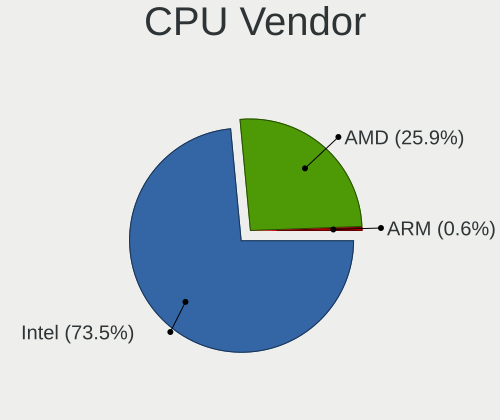

| Vendor | Computers | Percent |
|--------|-----------|---------|
| Intel  | 505       | 73.51%  |
| AMD    | 178       | 25.91%  |
| ARM    | 4         | 0.58%   |

CPU Model
---------

Processor models

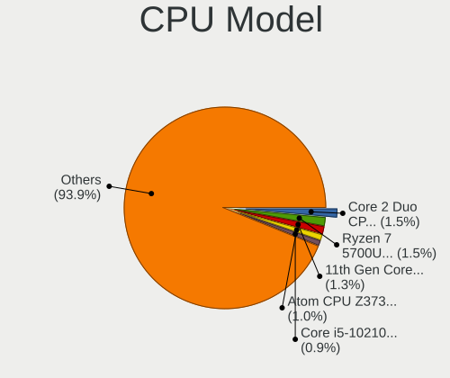

| Model                                        | Computers | Percent |
|----------------------------------------------|-----------|---------|
| Intel Core 2 Duo CPU P8600 @ 2.40GHz         | 10        | 1.46%   |
| AMD Ryzen 7 5700U with Radeon Graphics       | 10        | 1.46%   |
| Intel 11th Gen Core i5-1135G7 @ 2.40GHz      | 9         | 1.31%   |
| Intel Atom CPU Z3735F @ 1.33GHz              | 7         | 1.02%   |
| Intel Core Ultra 7 155H                      | 6         | 0.87%   |
| Intel Core i5-10210U CPU @ 1.60GHz           | 6         | 0.87%   |
| Intel Celeron CPU 847 @ 1.10GHz              | 6         | 0.87%   |
| Intel 11th Gen Core i7-1165G7 @ 2.80GHz      | 6         | 0.87%   |
| Intel Core i7-3770 CPU @ 3.40GHz             | 5         | 0.73%   |
| Intel Core i5-8350U CPU @ 1.70GHz            | 5         | 0.73%   |
| Intel Core i5-8250U CPU @ 1.60GHz            | 5         | 0.73%   |
| Intel Core i5-7200U CPU @ 2.50GHz            | 5         | 0.73%   |
| Intel Celeron N4020 CPU @ 1.10GHz            | 5         | 0.73%   |
| Intel Celeron CPU N3350 @ 1.10GHz            | 5         | 0.73%   |
| Intel Atom x5-Z8350 CPU @ 1.44GHz            | 5         | 0.73%   |
| Intel 12th Gen Core i5-12450H                | 5         | 0.73%   |
| Intel 12th Gen Core i5-1235U                 | 5         | 0.73%   |
| AMD Ryzen 9 7940HS w/ Radeon 780M Graphics   | 5         | 0.73%   |
| Intel Core i9-14900HX                        | 4         | 0.58%   |
| Intel Core i7-9750H CPU @ 2.60GHz            | 4         | 0.58%   |
| Intel Core i7-6700K CPU @ 4.00GHz            | 4         | 0.58%   |
| Intel Core i7-6500U CPU @ 2.50GHz            | 4         | 0.58%   |
| Intel Core i5-8365U CPU @ 1.60GHz            | 4         | 0.58%   |
| Intel Core i5-2520M CPU @ 2.50GHz            | 4         | 0.58%   |
| Intel Core i5 CPU M 560 @ 2.67GHz            | 4         | 0.58%   |
| ARM Processor                                | 4         | 0.58%   |
| AMD Ryzen 7 8845HS w/ Radeon 780M Graphics   | 4         | 0.58%   |
| AMD Ryzen 7 5825U with Radeon Graphics       | 4         | 0.58%   |
| AMD Ryzen 5 7600 6-Core Processor            | 4         | 0.58%   |
| AMD Ryzen 5 5600U with Radeon Graphics       | 4         | 0.58%   |
| AMD Ryzen 5 5600H with Radeon Graphics       | 4         | 0.58%   |
| AMD Ryzen 5 5500U with Radeon Graphics       | 4         | 0.58%   |
| AMD Ryzen 5 2600 Six-Core Processor          | 4         | 0.58%   |
| AMD A9-9425 RADEON R5, 5 COMPUTE CORES 2C+3G | 4         | 0.58%   |
| Intel Core i7-6700 CPU @ 3.40GHz             | 3         | 0.44%   |
| Intel Core i7-3630QM CPU @ 2.40GHz           | 3         | 0.44%   |
| Intel Core i7-10510U CPU @ 1.80GHz           | 3         | 0.44%   |
| Intel Core i5-9600K CPU @ 3.70GHz            | 3         | 0.44%   |
| Intel Core i5-8400 CPU @ 2.80GHz             | 3         | 0.44%   |
| Intel Core i5-4300U CPU @ 1.90GHz            | 3         | 0.44%   |

CPU Model Family
----------------

Processor model prefix

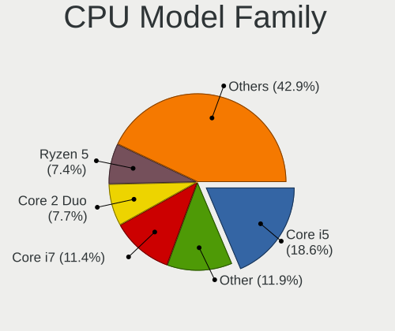

| Model                   | Computers | Percent |
|-------------------------|-----------|---------|
| Intel Core i5           | 128       | 18.63%  |
| Other                   | 82        | 11.94%  |
| Intel Core i7           | 78        | 11.35%  |
| Intel Core 2 Duo        | 53        | 7.71%   |
| AMD Ryzen 5             | 51        | 7.42%   |
| Intel Celeron           | 45        | 6.55%   |
| AMD Ryzen 7             | 39        | 5.68%   |
| Intel Core i3           | 34        | 4.95%   |
| Intel Atom              | 25        | 3.64%   |
| Intel Pentium           | 13        | 1.89%   |
| AMD Ryzen 9             | 12        | 1.75%   |
| AMD Ryzen 3             | 11        | 1.6%    |
| Intel Core              | 9         | 1.31%   |
| AMD A8                  | 9         | 1.31%   |
| Intel Xeon              | 8         | 1.16%   |
| Intel Core 2            | 8         | 1.16%   |
| Intel Pentium Dual-Core | 6         | 0.87%   |
| Intel Pentium Silver    | 5         | 0.73%   |
| AMD FX                  | 5         | 0.73%   |
| AMD A4                  | 5         | 0.73%   |
| Intel Pentium Dual      | 4         | 0.58%   |
| Intel Genuine           | 4         | 0.58%   |
| Intel Core i9           | 4         | 0.58%   |
| AMD Athlon              | 4         | 0.58%   |
| AMD A10                 | 4         | 0.58%   |
| AMD E2                  | 3         | 0.44%   |
| AMD A6                  | 3         | 0.44%   |
| Intel Core 2 Quad       | 2         | 0.29%   |
| Intel Celeron M         | 2         | 0.29%   |
| AMD Ryzen 3 PRO         | 2         | 0.29%   |
| AMD Phenom II X4        | 2         | 0.29%   |
| AMD E                   | 2         | 0.29%   |
| AMD C-60                | 2         | 0.29%   |
| AMD Athlon II X4        | 2         | 0.29%   |
| AMD Athlon 64 X2        | 2         | 0.29%   |
| Intel Pentium M         | 1         | 0.15%   |
| Intel Pentium Gold      | 1         | 0.15%   |
| Intel Pentium 4         | 1         | 0.15%   |
| Intel Core m3           | 1         | 0.15%   |
| Intel Core Duo          | 1         | 0.15%   |

CPU Cores
---------

Number of processor cores

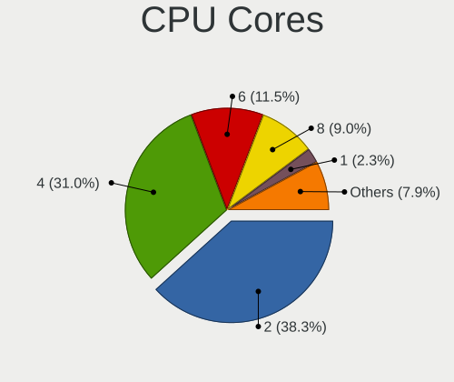

| Number  | Computers | Percent |
|---------|-----------|---------|
| 2       | 263       | 38.28%  |
| 4       | 213       | 31%     |
| 6       | 79        | 11.5%   |
| 8       | 62        | 9.02%   |
| 1       | 16        | 2.33%   |
| 10      | 14        | 2.04%   |
| 16      | 10        | 1.46%   |
| 12      | 9         | 1.31%   |
| 14      | 8         | 1.16%   |
| 24      | 4         | 0.58%   |
| Unknown | 4         | 0.58%   |
| 20      | 2         | 0.29%   |
| 3       | 2         | 0.29%   |
| 5       | 1         | 0.15%   |

CPU Sockets
-----------

Number of sockets

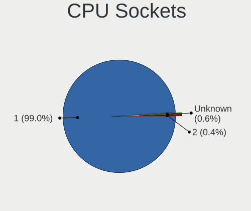

| Number  | Computers | Percent |
|---------|-----------|---------|
| 1       | 680       | 98.98%  |
| Unknown | 4         | 0.58%   |
| 2       | 3         | 0.44%   |

CPU Threads
-----------

Threads per core (Hyper-Threading)

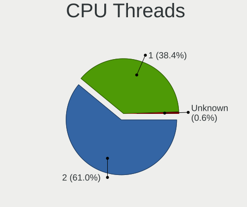

| Number  | Computers | Percent |
|---------|-----------|---------|
| 2       | 419       | 60.99%  |
| 1       | 264       | 38.43%  |
| Unknown | 4         | 0.58%   |

CPU Op-Modes
------------

CPU Operation Modes (32-bit, 64-bit)

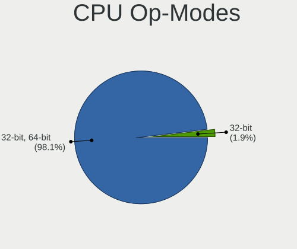

| Op mode        | Computers | Percent |
|----------------|-----------|---------|
| 32-bit, 64-bit | 674       | 98.11%  |
| 32-bit         | 13        | 1.89%   |

CPU Microcode
-------------

Microcode number

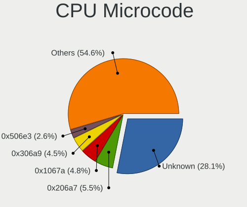

| Number     | Computers | Percent |
|------------|-----------|---------|
| Unknown    | 195       | 28.1%   |
| 0x206a7    | 38        | 5.48%   |
| 0x1067a    | 33        | 4.76%   |
| 0x306a9    | 31        | 4.47%   |
| 0x506e3    | 18        | 2.59%   |
| 0x306c3    | 17        | 2.45%   |
| 0x30678    | 16        | 2.31%   |
| 0x40651    | 12        | 1.73%   |
| 0x906ea    | 11        | 1.59%   |
| 0x806ec    | 11        | 1.59%   |
| 0x806c1    | 11        | 1.59%   |
| 0x6fd      | 11        | 1.59%   |
| 0x406c4    | 10        | 1.44%   |
| 0x20655    | 10        | 1.44%   |
| 0x306d4    | 9         | 1.3%    |
| 0x6fb      | 8         | 1.15%   |
| 0x506c9    | 8         | 1.15%   |
| 0x0a50000c | 8         | 1.15%   |
| 0x08608103 | 8         | 1.15%   |
| 0x906e9    | 7         | 1.01%   |
| 0x906a4    | 7         | 1.01%   |
| 0x706a1    | 7         | 1.01%   |
| 0x906a3    | 6         | 0.86%   |
| 0x806ea    | 6         | 0.86%   |
| 0x806e9    | 6         | 0.86%   |
| 0x706a8    | 6         | 0.86%   |
| 0x10676    | 6         | 0.86%   |
| 0x08108109 | 6         | 0.86%   |
| 0x0600611a | 6         | 0.86%   |
| 0x406e3    | 5         | 0.72%   |
| 0xb06a3    | 4         | 0.58%   |
| 0xb0671    | 4         | 0.58%   |
| 0x806c2    | 4         | 0.58%   |
| 0x6f6      | 4         | 0.58%   |
| 0x20652    | 4         | 0.58%   |
| 0x106c2    | 4         | 0.58%   |
| 0x0a50000f | 4         | 0.58%   |
| 0x0800820d | 4         | 0.58%   |
| 0x05000119 | 4         | 0.58%   |
| 0x03000027 | 4         | 0.58%   |

CPU Microarch
-------------

Microarchitecture

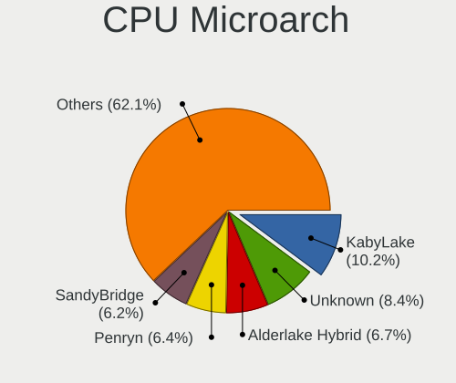

| Name              | Computers | Percent |
|-------------------|-----------|---------|
| KabyLake          | 70        | 10.17%  |
| Unknown           | 58        | 8.43%   |
| Alderlake Hybrid  | 46        | 6.69%   |
| Penryn            | 44        | 6.4%    |
| SandyBridge       | 43        | 6.25%   |
| Haswell           | 38        | 5.52%   |
| IvyBridge         | 37        | 5.38%   |
| Zen 3             | 34        | 4.94%   |
| Core              | 32        | 4.65%   |
| Silvermont        | 31        | 4.51%   |
| Skylake           | 29        | 4.22%   |
| TigerLake         | 25        | 3.63%   |
| Westmere          | 16        | 2.33%   |
| Goldmont plus     | 16        | 2.33%   |
| Zen+              | 15        | 2.18%   |
| Excavator         | 15        | 2.18%   |
| Zen 2             | 14        | 2.03%   |
| Goldmont          | 10        | 1.45%   |
| CometLake         | 10        | 1.45%   |
| Broadwell         | 10        | 1.45%   |
| Piledriver        | 9         | 1.31%   |
| Meteorlake Hybrid | 8         | 1.16%   |
| Icelake           | 8         | 1.16%   |
| P6                | 7         | 1.02%   |
| Bobcat            | 7         | 1.02%   |
| Zen               | 6         | 0.87%   |
| K8 Hammer         | 6         | 0.87%   |
| K10               | 6         | 0.87%   |
| Bonnell           | 6         | 0.87%   |
| Tremont           | 5         | 0.73%   |
| Puma              | 5         | 0.73%   |
| Nehalem           | 5         | 0.73%   |
| Gracemont         | 5         | 0.73%   |
| K10 Llano         | 4         | 0.58%   |
| Steamroller       | 2         | 0.29%   |
| K6                | 2         | 0.29%   |
| Jaguar            | 2         | 0.29%   |
| NetBurst          | 1         | 0.15%   |
| Bulldozer         | 1         | 0.15%   |

Graphics
--------

GPU Vendor
----------

Vendors of graphics cards

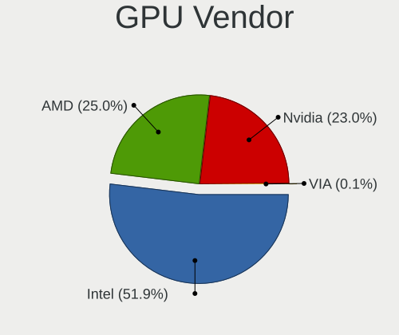

| Vendor           | Computers | Percent |
|------------------|-----------|---------|
| Intel            | 397       | 51.9%   |
| AMD              | 191       | 24.97%  |
| Nvidia           | 176       | 23.01%  |
| VIA Technologies | 1         | 0.13%   |

GPU Model
---------

Graphics card models

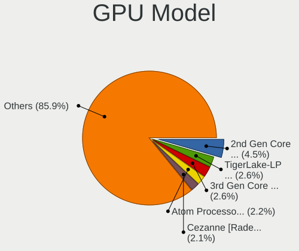

| Model                                                                                    | Computers | Percent |
|------------------------------------------------------------------------------------------|-----------|---------|
| Intel 2nd Generation Core Processor Family Integrated Graphics Controller                | 36        | 4.5%    |
| Intel TigerLake-LP GT2 [Iris Xe Graphics]                                                | 21        | 2.63%   |
| Intel 3rd Gen Core processor Graphics Controller                                         | 21        | 2.63%   |
| Intel Atom Processor Z36xxx/Z37xxx Series Graphics & Display                             | 18        | 2.25%   |
| AMD Cezanne [Radeon Vega Series / Radeon Vega Mobile Series]                             | 17        | 2.13%   |
| AMD Lucienne                                                                             | 15        | 1.88%   |
| Intel Mobile 4 Series Chipset Integrated Graphics Controller                             | 13        | 1.63%   |
| Intel Haswell-ULT Integrated Graphics Controller                                         | 13        | 1.63%   |
| Intel GeminiLake [UHD Graphics 600]                                                      | 13        | 1.63%   |
| Intel Atom/Celeron/Pentium Processor x5-E8000/J3xxx/N3xxx Integrated Graphics Controller | 13        | 1.63%   |
| Intel Kaby Lake-R GT2 [UHD Graphics 620]                                                 | 12        | 1.5%    |
| Intel Skylake-S GT2 [HD Graphics 530]                                                    | 10        | 1.25%   |
| Intel 4th Gen Core Processor Integrated Graphics Controller                              | 10        | 1.25%   |
| AMD Barcelo                                                                              | 10        | 1.25%   |
| Intel Raptor Lake-P [Iris Xe Graphics]                                                   | 9         | 1.13%   |
| Intel Mobile GM965/GL960 Integrated Graphics Controller (secondary)                      | 9         | 1.13%   |
| Intel Mobile GM965/GL960 Integrated Graphics Controller (primary)                        | 9         | 1.13%   |
| Intel CometLake-U GT2 [UHD Graphics]                                                     | 9         | 1.13%   |
| AMD Stoney [Radeon R2/R3/R4/R5 Graphics]                                                 | 9         | 1.13%   |
| AMD Picasso/Raven 2 [Radeon Vega Series / Radeon Vega Mobile Series]                     | 9         | 1.13%   |
| Intel Xeon E3-1200 v2/3rd Gen Core processor Graphics Controller                         | 8         | 1%      |
| Intel WhiskeyLake-U GT2 [UHD Graphics 620]                                               | 8         | 1%      |
| Intel Skylake-U GT2 [HD Graphics 520]                                                    | 8         | 1%      |
| Intel Mobile 945GM/GMS/GME, 943/940GML Express Integrated Graphics Controller            | 8         | 1%      |
| Intel Kaby Lake-U GT2 [HD Graphics 620]                                                  | 8         | 1%      |
| Intel Core Processor Integrated Graphics Controller                                      | 8         | 1%      |
| Intel CoffeeLake-S GT2 [UHD Graphics 630]                                                | 8         | 1%      |
| Intel Apollo Lake GT1 [HD Graphics 500]                                                  | 8         | 1%      |
| AMD Raphael                                                                              | 8         | 1%      |
| AMD Ellesmere [Radeon RX 470/480/570/570X/580/580X/590]                                  | 8         | 1%      |
| AMD Phoenix1                                                                             | 7         | 0.88%   |
| Nvidia MCP89 [GeForce 320M]                                                              | 6         | 0.75%   |
| Nvidia GP108 [GeForce GT 1030]                                                           | 6         | 0.75%   |
| Nvidia AD107M [GeForce RTX 4060 Max-Q / Mobile]                                          | 6         | 0.75%   |
| Intel Meteor Lake-P [Intel Arc Graphics]                                                 | 6         | 0.75%   |
| Intel JasperLake [UHD Graphics]                                                          | 6         | 0.75%   |
| Intel Broadwell-U GT2 [HD Graphics 5500]                                                 | 6         | 0.75%   |
| Intel Alder Lake-P GT1 [UHD Graphics]                                                    | 6         | 0.75%   |
| AMD Wani [Radeon R5/R6/R7 Graphics]                                                      | 6         | 0.75%   |
| AMD Renoir [Radeon Vega Series / Radeon Vega Mobile Series]                              | 6         | 0.75%   |

GPU Combo
---------

Combinations of graphics cards

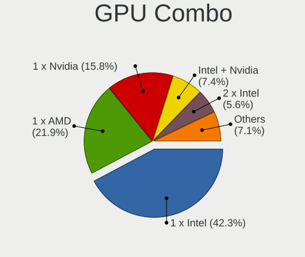

| Name               | Computers | Percent |
|--------------------|-----------|---------|
| 1 x Intel          | 292       | 42.26%  |
| 1 x AMD            | 151       | 21.85%  |
| 1 x Nvidia         | 109       | 15.77%  |
| Intel + Nvidia     | 51        | 7.38%   |
| 2 x Intel          | 39        | 5.64%   |
| Intel + AMD        | 15        | 2.17%   |
| AMD + Nvidia       | 14        | 2.03%   |
| 2 x AMD            | 12        | 1.74%   |
| Other              | 4         | 0.58%   |
| 2 x Nvidia         | 2         | 0.29%   |
| 1 x VIA            | 1         | 0.14%   |
| Intel + 2 x Nvidia | 1         | 0.14%   |

GPU Driver
----------

Free vs proprietary

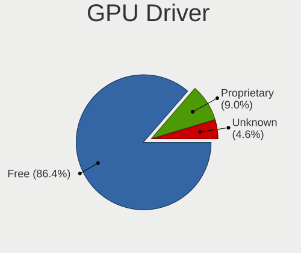

| Driver      | Computers | Percent |
|-------------|-----------|---------|
| Free        | 596       | 86.38%  |
| Proprietary | 62        | 8.99%   |
| Unknown     | 32        | 4.64%   |

GPU Memory
----------

Total video memory

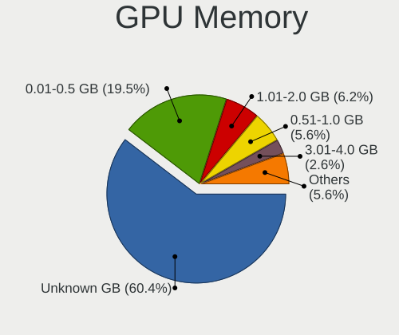

| Size in GB | Computers | Percent |
|------------|-----------|---------|
| Unknown    | 418       | 60.4%   |
| 0.01-0.5   | 135       | 19.51%  |
| 1.01-2.0   | 43        | 6.21%   |
| 0.51-1.0   | 39        | 5.64%   |
| 3.01-4.0   | 18        | 2.6%    |
| 7.01-8.0   | 17        | 2.46%   |
| 5.01-6.0   | 8         | 1.16%   |
| 2.01-3.0   | 6         | 0.87%   |
| 8.01-16.0  | 6         | 0.87%   |
| 4.01-5.0   | 1         | 0.14%   |
| 16.01-24.0 | 1         | 0.14%   |

Monitor
-------

Monitor Vendor
--------------

Monitor vendors

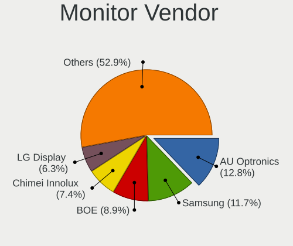

| Vendor                  | Computers | Percent |
|-------------------------|-----------|---------|
| AU Optronics            | 94        | 12.82%  |
| Samsung Electronics     | 86        | 11.73%  |
| BOE                     | 65        | 8.87%   |
| Chimei Innolux          | 54        | 7.37%   |
| LG Display              | 46        | 6.28%   |
| Goldstar                | 36        | 4.91%   |
| Dell                    | 34        | 4.64%   |
| Apple                   | 34        | 4.64%   |
| BenQ                    | 26        | 3.55%   |
| Acer                    | 25        | 3.41%   |
| Hewlett-Packard         | 24        | 3.27%   |
| AOC                     | 17        | 2.32%   |
| Lenovo                  | 15        | 2.05%   |
| InfoVision              | 12        | 1.64%   |
| Chi Mei Optoelectronics | 12        | 1.64%   |
| Ancor Communications    | 12        | 1.64%   |
| Sharp                   | 10        | 1.36%   |
| Philips                 | 10        | 1.36%   |
| Sony                    | 7         | 0.95%   |
| LG Philips              | 7         | 0.95%   |
| ViewSonic               | 6         | 0.82%   |
| ASUSTek Computer        | 6         | 0.82%   |
| HannStar                | 5         | 0.68%   |
| Sceptre Tech            | 4         | 0.55%   |
| HKC                     | 4         | 0.55%   |
| Vizio                   | 3         | 0.41%   |
| Quanta Display          | 3         | 0.41%   |
| NEC Computers           | 3         | 0.41%   |
| InnoLux Display         | 3         | 0.41%   |
| Iiyama                  | 3         | 0.41%   |
| Eizo                    | 3         | 0.41%   |
| Unknown (XXX)           | 2         | 0.27%   |
| SGT                     | 2         | 0.27%   |
| RTK                     | 2         | 0.27%   |
| MSI                     | 2         | 0.27%   |
| IBM                     | 2         | 0.27%   |
| HUAWEI                  | 2         | 0.27%   |
| Hitachi                 | 2         | 0.27%   |
| Fujitsu Siemens         | 2         | 0.27%   |
| DENON                   | 2         | 0.27%   |

Monitor Model
-------------

Monitor models

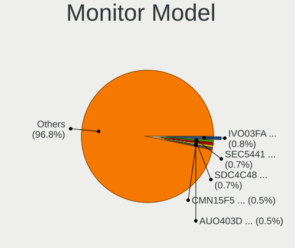

| Model                                                                    | Computers | Percent |
|--------------------------------------------------------------------------|-----------|---------|
| InfoVision LCD Monitor IVO03FA 1366x768 223x125mm 10.1-inch              | 6         | 0.81%   |
| Samsung Electronics LCD Monitor SEC5441 1280x800 331x207mm 15.4-inch     | 5         | 0.67%   |
| Samsung Electronics LCD Monitor SDC4C48 1920x1080 293x165mm 13.2-inch    | 5         | 0.67%   |
| Chimei Innolux LCD Monitor CMN15F5 1920x1080 344x193mm 15.5-inch         | 4         | 0.54%   |
| AU Optronics LCD Monitor AUO403D 1920x1080 309x174mm 14.0-inch           | 4         | 0.54%   |
| Samsung Electronics LCD Monitor SEC4251 1366x768 344x194mm 15.5-inch     | 3         | 0.4%    |
| Samsung Electronics LCD Monitor SEC325A 1366x768 344x194mm 15.5-inch     | 3         | 0.4%    |
| HannStar LCD Monitor HSD03E9 1024x600 220x129mm 10.0-inch                | 3         | 0.4%    |
| Chimei Innolux LCD Monitor CMN1618 1920x1200 344x215mm 16.0-inch         | 3         | 0.4%    |
| Chimei Innolux LCD Monitor CMN1132 1366x768 256x144mm 11.6-inch          | 3         | 0.4%    |
| Chi Mei Optoelectronics LCD Monitor CMO15A7 1366x768 344x193mm 15.5-inch | 3         | 0.4%    |
| BOE LCD Monitor BOE084E 1920x1080 382x215mm 17.3-inch                    | 3         | 0.4%    |
| Apple LCD Monitor APP9CC5 1280x800 286x179mm 13.3-inch                   | 3         | 0.4%    |
| Apple Color LCD APP9CF0 1440x900 290x180mm 13.4-inch                     | 3         | 0.4%    |
| Apple Color LCD APP9CC7 1280x800 286x179mm 13.3-inch                     | 3         | 0.4%    |
| Apple Color LCD APP9C6B 1680x1050 433x270mm 20.1-inch                    | 3         | 0.4%    |
| AOC 27G2G4 AOC2702 1920x1080 598x336mm 27.0-inch                         | 3         | 0.4%    |
| AOC 24G2W1G3 AOC2402 1920x1080 527x296mm 23.8-inch                       | 3         | 0.4%    |
| Vizio E500i-B1 VIZ1004 1920x1080 1095x616mm 49.5-inch                    | 2         | 0.27%   |
| Unknown (XXX) Beyond TV XXX2851 3840x2160 1209x680mm 54.6-inch           | 2         | 0.27%   |
| Sony TV SNYF301 1920x1080                                                | 2         | 0.27%   |
| Sharp LCD Monitor SHP14BA 1920x1080 344x194mm 15.5-inch                  | 2         | 0.27%   |
| Samsung Electronics LCD Monitor SEC3847 1440x900 367x230mm 17.1-inch     | 2         | 0.27%   |
| Samsung Electronics LCD Monitor SEC3542 2160x1440 254x169mm 12.0-inch    | 2         | 0.27%   |
| Samsung Electronics LCD Monitor SEC324A 1366x768 344x194mm 15.5-inch     | 2         | 0.27%   |
| Samsung Electronics LCD Monitor SDC4347 1366x768 344x193mm 15.5-inch     | 2         | 0.27%   |
| Samsung Electronics LCD Monitor SAM094E 1920x1080 1020x570mm 46.0-inch   | 2         | 0.27%   |
| Samsung Electronics LCD Monitor SAM0902 1920x1080 890x500mm 40.2-inch    | 2         | 0.27%   |
| RTK XP-PEN RTK2A3B 1920x1080 531x299mm 24.0-inch                         | 2         | 0.27%   |
| LG Display LCD Monitor LGD0709 1920x1080 344x194mm 15.5-inch             | 2         | 0.27%   |
| LG Display LCD Monitor LGD0590 1920x1080 344x194mm 15.5-inch             | 2         | 0.27%   |
| LG Display LCD Monitor LGD046D 1920x1080 309x174mm 14.0-inch             | 2         | 0.27%   |
| LG Display LCD Monitor LGD027A 1600x900 382x215mm 17.3-inch              | 2         | 0.27%   |
| Lenovo LCD Monitor LEN4036 1440x900 303x190mm 14.1-inch                  | 2         | 0.27%   |
| InfoVision LCD Monitor IVO0536 1920x1080 294x165mm 13.3-inch             | 2         | 0.27%   |
| IBM LCD Monitor IBM2887 1680x1050 331x207mm 15.4-inch                    | 2         | 0.27%   |
| Hitachi HISENSE HEC002F 3840x2160 1872x1053mm 84.6-inch                  | 2         | 0.27%   |
| Goldstar M237WD GSM56EB 1920x1080 509x286mm 23.0-inch                    | 2         | 0.27%   |
| Goldstar LG ULTRAWIDE GSM59F1 2560x1080 670x280mm 28.6-inch              | 2         | 0.27%   |
| Goldstar L1760TR GSM445D 1280x1024 338x270mm 17.0-inch                   | 2         | 0.27%   |

Monitor Resolution
------------------

Monitor screen resolution

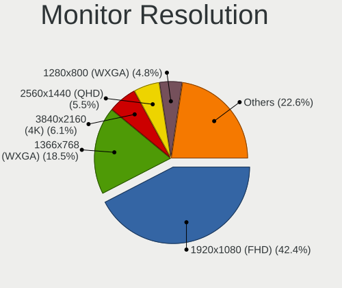

| Resolution         | Computers | Percent |
|--------------------|-----------|---------|
| 1920x1080 (FHD)    | 300       | 42.43%  |
| 1366x768 (WXGA)    | 131       | 18.53%  |
| 3840x2160 (4K)     | 43        | 6.08%   |
| 2560x1440 (QHD)    | 39        | 5.52%   |
| 1280x800 (WXGA)    | 34        | 4.81%   |
| 1920x1200 (WUXGA)  | 30        | 4.24%   |
| 1600x900 (HD+)     | 25        | 3.54%   |
| 1440x900 (WXGA+)   | 20        | 2.83%   |
| 1280x1024 (SXGA)   | 18        | 2.55%   |
| 1680x1050 (WSXGA+) | 17        | 2.4%    |
| 2560x1600          | 8         | 1.13%   |
| 2880x1800          | 5         | 0.71%   |
| 1024x600           | 4         | 0.57%   |
| 3840x1080          | 3         | 0.42%   |
| 3440x1440          | 3         | 0.42%   |
| 2560x1080          | 3         | 0.42%   |
| 2160x1440          | 3         | 0.42%   |
| 1600x1200          | 3         | 0.42%   |
| 1360x768           | 3         | 0.42%   |
| 1024x768 (XGA)     | 3         | 0.42%   |
| 3840x2400          | 2         | 0.28%   |
| 2880x1920          | 2         | 0.28%   |
| Unknown            | 2         | 0.28%   |
| 3840x2560          | 1         | 0.14%   |
| 3200x1800 (QHD+)   | 1         | 0.14%   |
| 3072x1920          | 1         | 0.14%   |
| 2256x1504          | 1         | 0.14%   |
| 1920x1280          | 1         | 0.14%   |
| 1680x945           | 1         | 0.14%   |

Monitor Diagonal
----------------

Diagonal size in inches

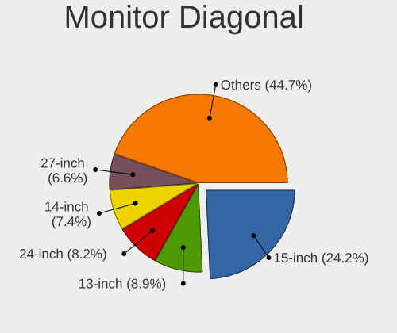

| Inches  | Computers | Percent |
|---------|-----------|---------|
| 15      | 177       | 24.25%  |
| 13      | 65        | 8.9%    |
| 24      | 60        | 8.22%   |
| 14      | 54        | 7.4%    |
| 27      | 48        | 6.58%   |
| 23      | 43        | 5.89%   |
| 17      | 40        | 5.48%   |
| 21      | 35        | 4.79%   |
| 11      | 25        | 3.42%   |
| 16      | 24        | 3.29%   |
| 31      | 23        | 3.15%   |
| 18      | 21        | 2.88%   |
| 19      | 15        | 2.05%   |
| 20      | 13        | 1.78%   |
| 10      | 10        | 1.37%   |
| 54      | 9         | 1.23%   |
| 22      | 9         | 1.23%   |
| 12      | 9         | 1.23%   |
| 84      | 7         | 0.96%   |
| 34      | 6         | 0.82%   |
| Unknown | 6         | 0.82%   |
| 72      | 4         | 0.55%   |
| 57      | 3         | 0.41%   |
| 32      | 3         | 0.41%   |
| 25      | 3         | 0.41%   |
| 63      | 2         | 0.27%   |
| 49      | 2         | 0.27%   |
| 36      | 2         | 0.27%   |
| 28      | 2         | 0.27%   |
| 74      | 1         | 0.14%   |
| 65      | 1         | 0.14%   |
| 64      | 1         | 0.14%   |
| 61      | 1         | 0.14%   |
| 55      | 1         | 0.14%   |
| 46      | 1         | 0.14%   |
| 42      | 1         | 0.14%   |
| 40      | 1         | 0.14%   |
| 39      | 1         | 0.14%   |
| 26      | 1         | 0.14%   |

Monitor Width
-------------

Physical width

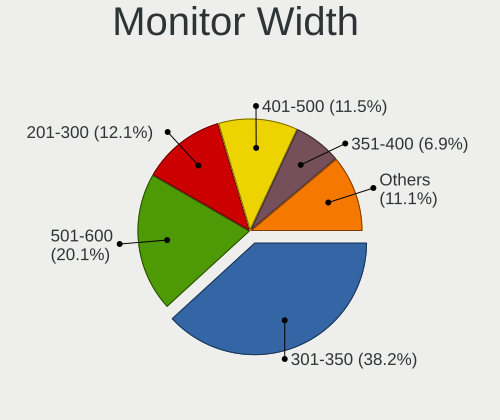

| Width in mm | Computers | Percent |
|-------------|-----------|---------|
| 301-350     | 275       | 38.19%  |
| 501-600     | 145       | 20.14%  |
| 201-300     | 87        | 12.08%  |
| 401-500     | 83        | 11.53%  |
| 351-400     | 50        | 6.94%   |
| 601-700     | 27        | 3.75%   |
| 1001-1500   | 19        | 2.64%   |
| 701-800     | 13        | 1.81%   |
| 1501-2000   | 12        | 1.67%   |
| Unknown     | 6         | 0.83%   |
| 801-900     | 2         | 0.28%   |
| 901-1000    | 1         | 0.14%   |

Aspect Ratio
------------

Proportional relationship between the width and the height

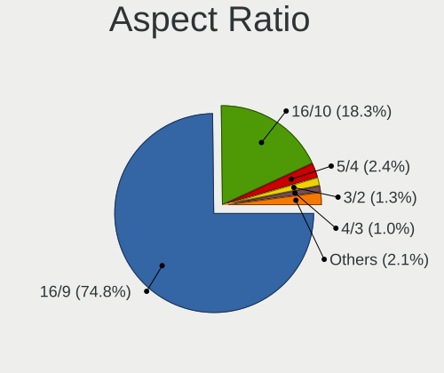

| Ratio   | Computers | Percent |
|---------|-----------|---------|
| 16/9    | 499       | 74.81%  |
| 16/10   | 122       | 18.29%  |
| 5/4     | 16        | 2.4%    |
| 3/2     | 9         | 1.35%   |
| 4/3     | 7         | 1.05%   |
| 21/9    | 6         | 0.9%    |
| Unknown | 3         | 0.45%   |
| 32/9    | 2         | 0.3%    |
| 0.56    | 2         | 0.3%    |
| 6/5     | 1         | 0.15%   |

Monitor Area
------------

Area in inch²

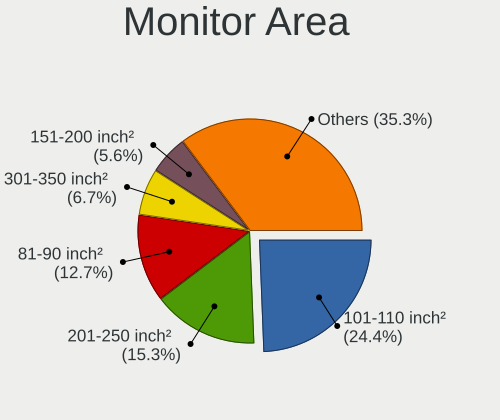

| Area in inch² | Computers | Percent |
|----------------|-----------|---------|
| 101-110        | 177       | 24.38%  |
| 201-250        | 111       | 15.29%  |
| 81-90          | 92        | 12.67%  |
| 301-350        | 49        | 6.75%   |
| 151-200        | 41        | 5.65%   |
| 351-500        | 34        | 4.68%   |
| More than 1000 | 29        | 3.99%   |
| 141-150        | 29        | 3.99%   |
| 121-130        | 29        | 3.99%   |
| 71-80          | 26        | 3.58%   |
| 51-60          | 25        | 3.44%   |
| 251-300        | 24        | 3.31%   |
| 111-120        | 20        | 2.75%   |
| 41-50          | 10        | 1.38%   |
| 61-70          | 8         | 1.1%    |
| 501-1000       | 8         | 1.1%    |
| Unknown        | 6         | 0.83%   |
| 131-140        | 4         | 0.55%   |
| 91-100         | 4         | 0.55%   |

Pixel Density
-------------

Pixels per inch

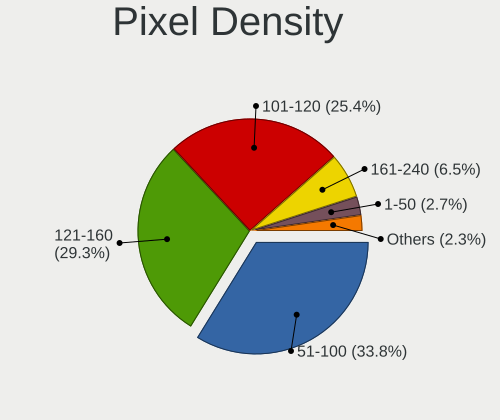

| Density       | Computers | Percent |
|---------------|-----------|---------|
| 51-100        | 238       | 33.81%  |
| 121-160       | 206       | 29.26%  |
| 101-120       | 179       | 25.43%  |
| 161-240       | 46        | 6.53%   |
| 1-50          | 19        | 2.7%    |
| More than 240 | 10        | 1.42%   |
| Unknown       | 6         | 0.85%   |

Multiple Monitors
-----------------

Total monitors connected

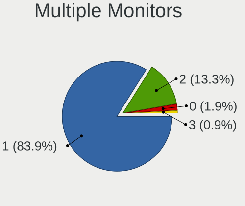

| Total | Computers | Percent |
|-------|-----------|---------|
| 1     | 580       | 83.94%  |
| 2     | 92        | 13.31%  |
| 0     | 13        | 1.88%   |
| 3     | 6         | 0.87%   |

Network
-------

Net Controller Vendor
---------------------

Controller vendors

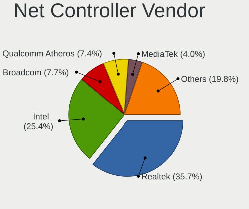

| Vendor                                 | Computers | Percent |
|----------------------------------------|-----------|---------|
| Realtek Semiconductor                  | 384       | 35.69%  |
| Intel                                  | 273       | 25.37%  |
| Broadcom                               | 83        | 7.71%   |
| Qualcomm Atheros                       | 80        | 7.43%   |
| MediaTek                               | 43        | 4%      |
| TP-Link                                | 31        | 2.88%   |
| Broadcom Limited                       | 26        | 2.42%   |
| Ralink                                 | 15        | 1.39%   |
| Marvell Technology Group               | 14        | 1.3%    |
| Nvidia                                 | 12        | 1.12%   |
| Samsung Electronics                    | 9         | 0.84%   |
| Ralink Technology                      | 9         | 0.84%   |
| Xiaomi                                 | 7         | 0.65%   |
| Qualcomm Atheros Communications        | 7         | 0.65%   |
| OPPO Electronics                       | 7         | 0.65%   |
| ASIX Electronics                       | 6         | 0.56%   |
| Motorola PCS                           | 4         | 0.37%   |
| Google                                 | 4         | 0.37%   |
| Edimax Technology                      | 4         | 0.37%   |
| Dell                                   | 4         | 0.37%   |
| Belkin Components                      | 4         | 0.37%   |
| Sierra Wireless                        | 3         | 0.28%   |
| NetGear                                | 3         | 0.28%   |
| Microsoft                              | 3         | 0.28%   |
| Huawei Technologies                    | 3         | 0.28%   |
| D-Link                                 | 3         | 0.28%   |
| ASUSTek Computer                       | 3         | 0.28%   |
| VIA Technologies                       | 2         | 0.19%   |
| Suzhou Motorcomm Electronic Technology | 2         | 0.19%   |
| Shenzhen Goodix Technology             | 2         | 0.19%   |
| Raspberry Pi                           | 2         | 0.19%   |
| Qualcomm                               | 2         | 0.19%   |
| QinHeng Electronics                    | 2         | 0.19%   |
| Linksys                                | 2         | 0.19%   |
| IMC Networks                           | 2         | 0.19%   |
| ZyDAS                                  | 1         | 0.09%   |
| Tenda                                  | 1         | 0.09%   |
| T & A Mobile Phones                    | 1         | 0.09%   |
| Spreadtrum Communications              | 1         | 0.09%   |
| Sony Ericsson Mobile Communications AB | 1         | 0.09%   |

Net Controller Model
--------------------

Controller models

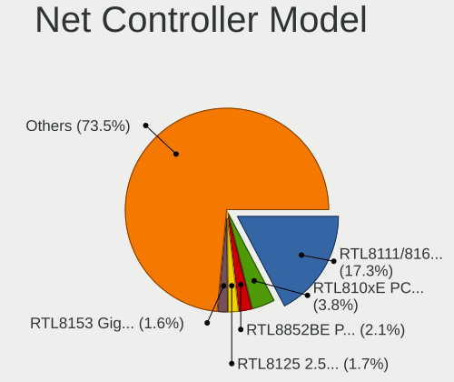

| Model                                                                  | Computers | Percent |
|------------------------------------------------------------------------|-----------|---------|
| Realtek RTL8111/8168/8211/8411 PCI Express Gigabit Ethernet Controller | 221       | 17.28%  |
| Realtek RTL810xE PCI Express Fast Ethernet controller                  | 48        | 3.75%   |
| Realtek RTL8852BE PCIe 802.11ax Wireless Network Controller            | 27        | 2.11%   |
| Realtek RTL8125 2.5GbE Controller                                      | 22        | 1.72%   |
| Realtek RTL8153 Gigabit Ethernet Adapter                               | 21        | 1.64%   |
| Realtek RTL8821CE 802.11ac PCIe Wireless Network Adapter               | 18        | 1.41%   |
| Intel Wireless 8265 / 8275                                             | 18        | 1.41%   |
| Realtek 802.11ac NIC                                                   | 16        | 1.25%   |
| Intel Wi-Fi 6 AX200                                                    | 16        | 1.25%   |
| MediaTek MT7902 802.11ax PCIe Wireless Network Adapter [Filogic 310]   | 15        | 1.17%   |
| Intel Wi-Fi 6 AX201                                                    | 15        | 1.17%   |
| Realtek RTL88x2bu [AC1200 Techkey]                                     | 14        | 1.09%   |
| Realtek RTL8822CE 802.11ac PCIe Wireless Network Adapter               | 13        | 1.02%   |
| MediaTek MT7922 802.11ax PCI Express Wireless Network Adapter          | 13        | 1.02%   |
| Broadcom BCM4322 802.11a/b/g/n Wireless LAN Controller                 | 13        | 1.02%   |
| Realtek RTL8188EUS 802.11n Wireless Network Adapter                    | 12        | 0.94%   |
| Intel Wireless 7265                                                    | 12        | 0.94%   |
| Qualcomm Atheros QCA9565 / AR9565 Wireless Network Adapter             | 11        | 0.86%   |
| Qualcomm Atheros AR9485 Wireless Network Adapter                       | 11        | 0.86%   |
| Intel Ethernet Controller I225-V                                       | 11        | 0.86%   |
| Intel 82579LM Gigabit Network Connection (Lewisville)                  | 11        | 0.86%   |
| Intel Wireless 8260                                                    | 10        | 0.78%   |
| Intel Ethernet Connection I217-LM                                      | 10        | 0.78%   |
| Intel Alder Lake-P PCH CNVi WiFi                                       | 10        | 0.78%   |
| Intel Wireless 7260                                                    | 9         | 0.7%    |
| Intel Wireless 3165                                                    | 9         | 0.7%    |
| Broadcom NetXtreme BCM5764M Gigabit Ethernet PCIe                      | 9         | 0.7%    |
| Broadcom BCM43142 802.11b/g/n                                          | 9         | 0.7%    |
| Broadcom BCM4313 802.11bgn Wireless Network Adapter                    | 9         | 0.7%    |
| Realtek 802.11n WLAN Adapter                                           | 8         | 0.63%   |
| Ralink RT3290 Wireless 802.11n 1T/1R PCIe                              | 8         | 0.63%   |
| Qualcomm Atheros QCA9377 802.11ac Wireless Network Adapter             | 8         | 0.63%   |
| Qualcomm Atheros QCA6174 802.11ac Wireless Network Adapter             | 8         | 0.63%   |
| Nvidia MCP79 Ethernet                                                  | 8         | 0.63%   |
| MediaTek MT7921 802.11ax PCIe Wireless Network Adapter [Filogic 330]   | 8         | 0.63%   |
| Intel Wi-Fi 7(802.11be) AX1775*/AX1790*/BE20*/BE401/BE1750* 2x2        | 8         | 0.63%   |
| Intel Raptor Lake PCH CNVi WiFi                                        | 8         | 0.63%   |
| Intel Comet Lake PCH-LP CNVi WiFi                                      | 8         | 0.63%   |
| Xiaomi Mi/Redmi series (RNDIS)                                         | 7         | 0.55%   |
| Samsung Galaxy series, misc. (tethering mode)                          | 7         | 0.55%   |

Wireless Vendor
---------------

Wireless vendors

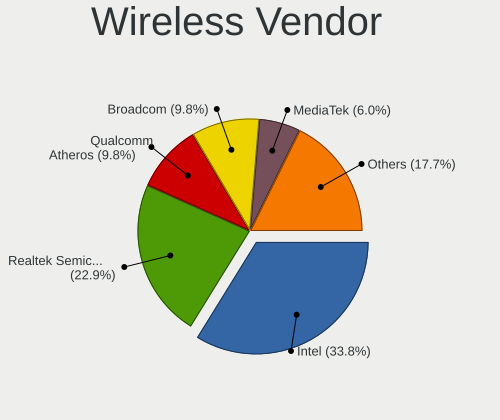

| Vendor                          | Computers | Percent |
|---------------------------------|-----------|---------|
| Intel                           | 210       | 33.82%  |
| Realtek Semiconductor           | 142       | 22.87%  |
| Qualcomm Atheros                | 61        | 9.82%   |
| Broadcom                        | 61        | 9.82%   |
| MediaTek                        | 37        | 5.96%   |
| TP-Link                         | 29        | 4.67%   |
| Broadcom Limited                | 17        | 2.74%   |
| Ralink                          | 15        | 2.42%   |
| Ralink Technology               | 9         | 1.45%   |
| Qualcomm Atheros Communications | 7         | 1.13%   |
| Edimax Technology               | 4         | 0.64%   |
| Belkin Components               | 4         | 0.64%   |
| Sierra Wireless                 | 3         | 0.48%   |
| NetGear                         | 3         | 0.48%   |
| D-Link                          | 3         | 0.48%   |
| ASUSTek Computer                | 3         | 0.48%   |
| Linksys                         | 2         | 0.32%   |
| IMC Networks                    | 2         | 0.32%   |
| Dell                            | 2         | 0.32%   |
| ZyDAS                           | 1         | 0.16%   |
| Tenda                           | 1         | 0.16%   |
| Realtek                         | 1         | 0.16%   |
| Qualcomm                        | 1         | 0.16%   |
| Microsoft                       | 1         | 0.16%   |
| Marvell Technology Group        | 1         | 0.16%   |
| Fujitsu Siemens Computers       | 1         | 0.16%   |

Wireless Model
--------------

Wireless models

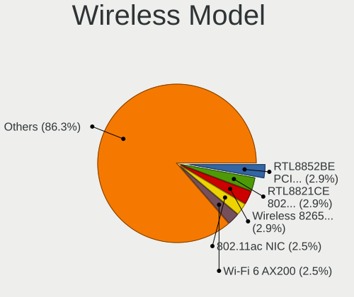

| Model                                                                | Computers | Percent |
|----------------------------------------------------------------------|-----------|---------|
| Realtek RTL8852BE PCIe 802.11ax Wireless Network Controller          | 18        | 2.86%   |
| Realtek RTL8821CE 802.11ac PCIe Wireless Network Adapter             | 18        | 2.86%   |
| Intel Wireless 8265 / 8275                                           | 18        | 2.86%   |
| Realtek 802.11ac NIC                                                 | 16        | 2.54%   |
| Intel Wi-Fi 6 AX200                                                  | 16        | 2.54%   |
| MediaTek MT7902 802.11ax PCIe Wireless Network Adapter [Filogic 310] | 15        | 2.38%   |
| Intel Wi-Fi 6 AX201                                                  | 15        | 2.38%   |
| Realtek RTL88x2bu [AC1200 Techkey]                                   | 14        | 2.22%   |
| Realtek RTL8822CE 802.11ac PCIe Wireless Network Adapter             | 13        | 2.06%   |
| Broadcom BCM4322 802.11a/b/g/n Wireless LAN Controller               | 13        | 2.06%   |
| Realtek RTL8188EUS 802.11n Wireless Network Adapter                  | 12        | 1.9%    |
| Intel Wireless 7265                                                  | 12        | 1.9%    |
| Qualcomm Atheros QCA9565 / AR9565 Wireless Network Adapter           | 11        | 1.75%   |
| Qualcomm Atheros AR9485 Wireless Network Adapter                     | 11        | 1.75%   |
| Intel Wireless 8260                                                  | 10        | 1.59%   |
| MediaTek MT7922 802.11ax PCI Express Wireless Network Adapter        | 9         | 1.43%   |
| Intel Wireless 7260                                                  | 9         | 1.43%   |
| Intel Wireless 3165                                                  | 9         | 1.43%   |
| Intel Alder Lake-P PCH CNVi WiFi                                     | 9         | 1.43%   |
| Broadcom BCM43142 802.11b/g/n                                        | 9         | 1.43%   |
| Broadcom BCM4313 802.11bgn Wireless Network Adapter                  | 9         | 1.43%   |
| Realtek 802.11n WLAN Adapter                                         | 8         | 1.27%   |
| Ralink RT3290 Wireless 802.11n 1T/1R PCIe                            | 8         | 1.27%   |
| Qualcomm Atheros QCA9377 802.11ac Wireless Network Adapter           | 8         | 1.27%   |
| Qualcomm Atheros QCA6174 802.11ac Wireless Network Adapter           | 8         | 1.27%   |
| MediaTek MT7921 802.11ax PCIe Wireless Network Adapter [Filogic 330] | 8         | 1.27%   |
| Intel Raptor Lake PCH CNVi WiFi                                      | 8         | 1.27%   |
| Intel Comet Lake PCH-LP CNVi WiFi                                    | 8         | 1.27%   |
| Intel Wi-Fi 5(802.11ac) Wireless-AC 9x6x [Thunder Peak]              | 7         | 1.11%   |
| Intel PRO/Wireless 3945ABG [Golan] Network Connection                | 7         | 1.11%   |
| Realtek RTL8723BE PCIe Wireless Network Adapter                      | 6         | 0.95%   |
| Qualcomm Atheros AR928X Wireless Network Adapter (PCI-Express)       | 6         | 0.95%   |
| Qualcomm Atheros AR9285 Wireless Network Adapter (PCI-Express)       | 6         | 0.95%   |
| Intel Wi-Fi 7(802.11be) AX1775*/AX1790*/BE20*/BE401/BE1750* 2x2      | 6         | 0.95%   |
| Intel Wi-Fi 6E(802.11ax) AX210/AX1675* 2x2 [Typhoon Peak]            | 6         | 0.95%   |
| Intel Cannon Lake PCH CNVi WiFi                                      | 6         | 0.95%   |
| Broadcom BCM4321 802.11a/b/g/n                                       | 6         | 0.95%   |
| TP-Link Archer T3U [Realtek RTL8812BU]                               | 5         | 0.79%   |
| TP-Link Archer T2U PLUS [RTL8821AU]                                  | 5         | 0.79%   |
| Ralink MT7601U Wireless Adapter                                      | 5         | 0.79%   |

Ethernet Vendor
---------------

Ethernet vendors

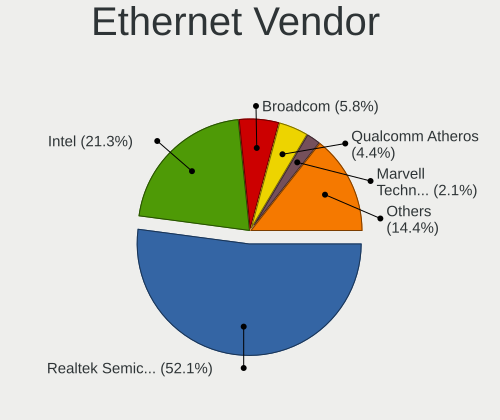

| Vendor                                 | Computers | Percent |
|----------------------------------------|-----------|---------|
| Realtek Semiconductor                  | 323       | 52.1%   |
| Intel                                  | 132       | 21.29%  |
| Broadcom                               | 36        | 5.81%   |
| Qualcomm Atheros                       | 27        | 4.35%   |
| Marvell Technology Group               | 13        | 2.1%    |
| Nvidia                                 | 12        | 1.94%   |
| Broadcom Limited                       | 10        | 1.61%   |
| Samsung Electronics                    | 9         | 1.45%   |
| Xiaomi                                 | 7         | 1.13%   |
| OPPO Electronics                       | 7         | 1.13%   |
| MediaTek                               | 6         | 0.97%   |
| ASIX Electronics                       | 6         | 0.97%   |
| Motorola PCS                           | 4         | 0.65%   |
| Google                                 | 4         | 0.65%   |
| TP-Link                                | 3         | 0.48%   |
| Huawei Technologies                    | 3         | 0.48%   |
| VIA Technologies                       | 2         | 0.32%   |
| Suzhou Motorcomm Electronic Technology | 2         | 0.32%   |
| Raspberry Pi                           | 2         | 0.32%   |
| Microsoft                              | 2         | 0.32%   |
| T & A Mobile Phones                    | 1         | 0.16%   |
| Spreadtrum Communications              | 1         | 0.16%   |
| Silicon Integrated Systems [SiS]       | 1         | 0.16%   |
| Qualcomm                               | 1         | 0.16%   |
| QinHeng Electronics                    | 1         | 0.16%   |
| OnePlus Technology (Shenzhen)          | 1         | 0.16%   |
| Lenovo                                 | 1         | 0.16%   |
| Hewlett-Packard                        | 1         | 0.16%   |
| DisplayLink                            | 1         | 0.16%   |
| D-Link System                          | 1         | 0.16%   |

Ethernet Model
--------------

Ethernet models

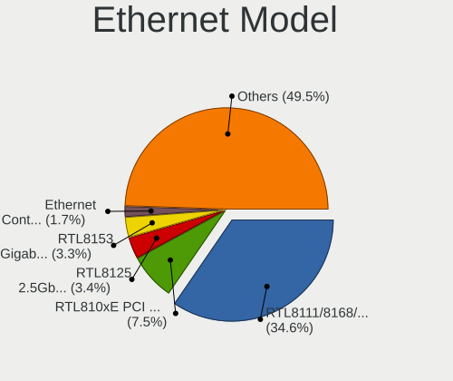

| Model                                                                  | Computers | Percent |
|------------------------------------------------------------------------|-----------|---------|
| Realtek RTL8111/8168/8211/8411 PCI Express Gigabit Ethernet Controller | 221       | 34.59%  |
| Realtek RTL810xE PCI Express Fast Ethernet controller                  | 48        | 7.51%   |
| Realtek RTL8125 2.5GbE Controller                                      | 22        | 3.44%   |
| Realtek RTL8153 Gigabit Ethernet Adapter                               | 21        | 3.29%   |
| Intel Ethernet Controller I225-V                                       | 11        | 1.72%   |
| Intel 82579LM Gigabit Network Connection (Lewisville)                  | 11        | 1.72%   |
| Intel Ethernet Connection I217-LM                                      | 10        | 1.56%   |
| Realtek RTL8852BE PCIe 802.11ax Wireless Network Controller            | 9         | 1.41%   |
| Broadcom NetXtreme BCM5764M Gigabit Ethernet PCIe                      | 9         | 1.41%   |
| Nvidia MCP79 Ethernet                                                  | 8         | 1.25%   |
| Xiaomi Mi/Redmi series (RNDIS)                                         | 7         | 1.1%    |
| Samsung Galaxy series, misc. (tethering mode)                          | 7         | 1.1%    |
| Intel Ethernet Connection (4) I219-LM                                  | 7         | 1.1%    |
| Intel Ethernet Connection (2) I219-V                                   | 7         | 1.1%    |
| Intel 82577LM Gigabit Network Connection                               | 7         | 1.1%    |
| OPPO Ace 3V                                                            | 6         | 0.94%   |
| Intel Ethernet Connection (7) I219-V                                   | 6         | 0.94%   |
| Intel Ethernet Connection (2) I219-LM                                  | 6         | 0.94%   |
| Broadcom NetXtreme BCM57765 Gigabit Ethernet PCIe                      | 6         | 0.94%   |
| Realtek RTL8152 Fast Ethernet Adapter                                  | 5         | 0.78%   |
| Intel Ethernet Controller I226-V                                       | 5         | 0.78%   |
| ASIX AX88179 Gigabit Ethernet                                          | 5         | 0.78%   |
| Realtek RTL-8100/8101L/8139 PCI Fast Ethernet Adapter                  | 4         | 0.63%   |
| Qualcomm Atheros AR8162 Fast Ethernet                                  | 4         | 0.63%   |
| Qualcomm Atheros AR8161 Gigabit Ethernet                               | 4         | 0.63%   |
| Qualcomm Atheros AR8151 v2.0 Gigabit Ethernet                          | 4         | 0.63%   |
| Motorola PCS motorola one 5G ace                                       | 4         | 0.63%   |
| MediaTek MT7922 802.11ax PCI Express Wireless Network Adapter          | 4         | 0.63%   |
| Marvell Group 88E8058 PCI-E Gigabit Ethernet Controller                | 4         | 0.63%   |
| Intel Ethernet Connection (13) I219-LM                                 | 4         | 0.63%   |
| Intel 82567LM Gigabit Network Connection                               | 4         | 0.63%   |
| Broadcom NetLink BCM5784M Gigabit Ethernet PCIe                        | 4         | 0.63%   |
| Broadcom NetLink BCM57785 Gigabit Ethernet PCIe                        | 4         | 0.63%   |
| Realtek RTL8852CE PCIe 802.11ax Wireless Network Controller            | 3         | 0.47%   |
| Qualcomm Atheros AR8121/AR8113/AR8114 Gigabit or Fast Ethernet         | 3         | 0.47%   |
| Intel Ethernet Connection I219-LM                                      | 3         | 0.47%   |
| Intel Ethernet Connection I218-LM                                      | 3         | 0.47%   |
| Intel Ethernet Connection (6) I219-LM                                  | 3         | 0.47%   |
| Intel Ethernet Connection (16) I219-LM                                 | 3         | 0.47%   |
| Intel Ethernet Connection (13) I219-V                                  | 3         | 0.47%   |

Net Controller Kind
-------------------

Ethernet, WiFi or modem

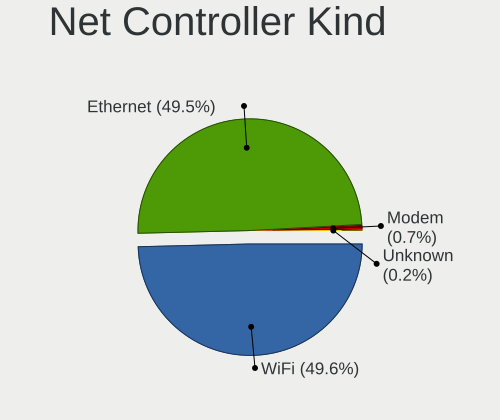

| Kind     | Computers | Percent |
|----------|-----------|---------|
| WiFi     | 574       | 49.61%  |
| Ethernet | 573       | 49.52%  |
| Modem    | 8         | 0.69%   |
| Unknown  | 2         | 0.17%   |

Used Controller
---------------

Currently used network controller

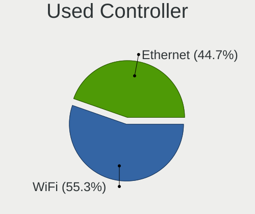

| Kind     | Computers | Percent |
|----------|-----------|---------|
| WiFi     | 388       | 55.35%  |
| Ethernet | 313       | 44.65%  |

NICs
----

Total network controllers on board

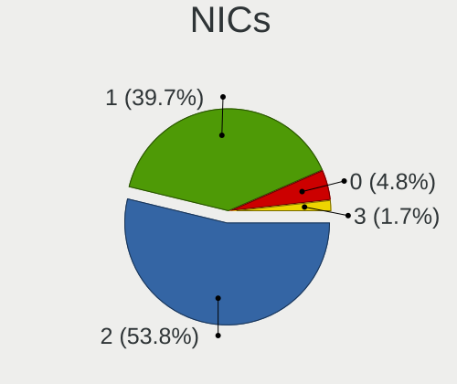

| Total | Computers | Percent |
|-------|-----------|---------|
| 2     | 370       | 53.78%  |
| 1     | 273       | 39.68%  |
| 0     | 33        | 4.8%    |
| 3     | 12        | 1.74%   |

IPv6
----

IPv6 vs IPv4

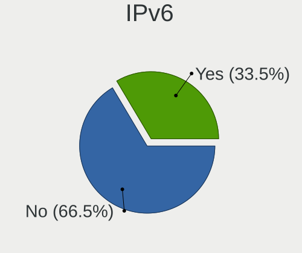

| Used | Computers | Percent |
|------|-----------|---------|
| No   | 458       | 66.47%  |
| Yes  | 231       | 33.53%  |

Bluetooth
---------

Bluetooth Vendor
----------------

Controller vendors

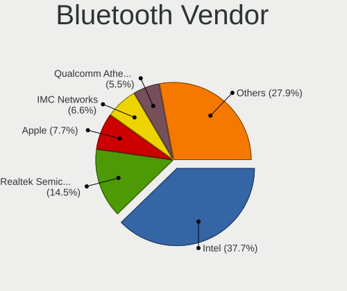

| Vendor                          | Computers | Percent |
|---------------------------------|-----------|---------|
| Intel                           | 177       | 37.74%  |
| Realtek Semiconductor           | 68        | 14.5%   |
| Apple                           | 36        | 7.68%   |
| IMC Networks                    | 31        | 6.61%   |
| Qualcomm Atheros Communications | 26        | 5.54%   |
| Cambridge Silicon Radio         | 24        | 5.12%   |
| Broadcom                        | 21        | 4.48%   |
| Foxconn / Hon Hai               | 15        | 3.2%    |
| Dell                            | 11        | 2.35%   |
| MediaTek                        | 9         | 1.92%   |
| Lite-On Technology              | 9         | 1.92%   |
| Ralink                          | 8         | 1.71%   |
| TP-Link                         | 6         | 1.28%   |
| ASUSTek Computer                | 6         | 1.28%   |
| Toshiba                         | 5         | 1.07%   |
| Hewlett-Packard                 | 5         | 1.07%   |
| Realtek                         | 2         | 0.43%   |
| Alps Electric                   | 2         | 0.43%   |
| Plugable                        | 1         | 0.21%   |
| Micro Star International        | 1         | 0.21%   |
| Marvell Semiconductor           | 1         | 0.21%   |
| Foxconn International           | 1         | 0.21%   |
| Edimax Technology               | 1         | 0.21%   |
| Creative Technology             | 1         | 0.21%   |
| Actions                         | 1         | 0.21%   |
| Unknown                         | 1         | 0.21%   |

Bluetooth Model
---------------

Controller models

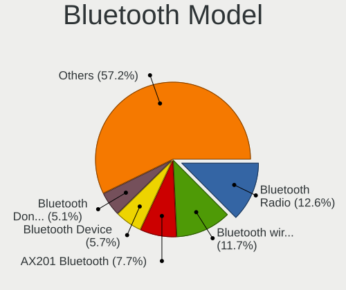

| Model                                               | Computers | Percent |
|-----------------------------------------------------|-----------|---------|
| Realtek Bluetooth Radio                             | 59        | 12.55%  |
| Intel Bluetooth wireless interface                  | 55        | 11.7%   |
| Intel AX201 Bluetooth                               | 36        | 7.66%   |
| Intel Bluetooth Device                              | 27        | 5.74%   |
| Cambridge Silicon Radio Bluetooth Dongle (HCI mode) | 24        | 5.11%   |
| IMC Networks Wireless_Device                        | 21        | 4.47%   |
| Intel Bluetooth 9460/9560 Jefferson Peak (JfP)      | 20        | 4.26%   |
| Apple Bluetooth Host Controller                     | 16        | 3.4%    |
| Intel AX200 Bluetooth                               | 15        | 3.19%   |
| Qualcomm Atheros  Bluetooth Device                  | 11        | 2.34%   |
| Apple Bluetooth USB Host Controller                 | 11        | 2.34%   |
| Ralink RT3290 Bluetooth                             | 8         | 1.7%    |
| MediaTek Wireless_Device                            | 8         | 1.7%    |
| Foxconn / Hon Hai Wireless_Device                   | 8         | 1.7%    |
| Intel AX210 Bluetooth                               | 7         | 1.49%   |
| IMC Networks Bluetooth Radio                        | 7         | 1.49%   |
| TP-Link TP-T@- UB500 Adapter                        | 6         | 1.28%   |
| Intel Wireless-AC 9260 Bluetooth Adapter            | 6         | 1.28%   |
| Qualcomm Atheros QCA61x4 Bluetooth 4.0              | 5         | 1.06%   |
| Apple Bluetooth HCI                                 | 5         | 1.06%   |
| Realtek  Bluetooth 4.2 Adapter                      | 4         | 0.85%   |
| Qualcomm Atheros AR3012 Bluetooth 4.0               | 4         | 0.85%   |
| Intel Wireless-AC 3168 Bluetooth                    | 4         | 0.85%   |
| Intel Centrino Bluetooth Wireless Transceiver       | 4         | 0.85%   |
| HP Bluetooth 2.0 Interface [Broadcom BCM2045]       | 4         | 0.85%   |
| Broadcom BCM20702A0 Bluetooth 4.0                   | 4         | 0.85%   |
| Apple Built-in Bluetooth 2.0+EDR HCI                | 4         | 0.85%   |
| Qualcomm Atheros AR9462 Bluetooth                   | 3         | 0.64%   |
| Intel Centrino Advanced-N 6230 Bluetooth adapter    | 3         | 0.64%   |
| Foxconn / Hon Hai MediaTek Bluetooth Adapter        | 3         | 0.64%   |
| Dell Wireless 370 Bluetooth Mini-card               | 3         | 0.64%   |
| Dell DW375 Bluetooth Module                         | 3         | 0.64%   |
| ASUS Broadcom Bluetooth 2.1                         | 3         | 0.64%   |
| Toshiba BCM43142A0                                  | 2         | 0.43%   |
| Realtek RTL8723B Bluetooth                          | 2         | 0.43%   |
| Realtek Bluetooth 5.4 Radio                         | 2         | 0.43%   |
| Realtek Bluetooth Radio                             | 2         | 0.43%   |
| Lite-On Qualcomm Atheros QCA9377 Bluetooth          | 2         | 0.43%   |
| Lite-On Bluetooth Radio                             | 2         | 0.43%   |
| Broadcom BCM43142A0 Bluetooth 4.0                   | 2         | 0.43%   |

Sound
-----

Sound Vendor
------------

Sound card vendors

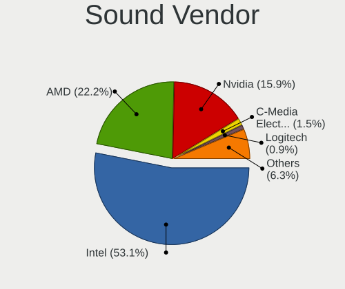

| Vendor                                       | Computers | Percent |
|----------------------------------------------|-----------|---------|
| Intel                                        | 461       | 53.11%  |
| AMD                                          | 193       | 22.24%  |
| Nvidia                                       | 138       | 15.9%   |
| C-Media Electronics                          | 13        | 1.5%    |
| Logitech                                     | 8         | 0.92%   |
| Realtek Semiconductor                        | 5         | 0.58%   |
| Creative Labs                                | 5         | 0.58%   |
| Texas Instruments                            | 4         | 0.46%   |
| Zoran Co. Personal Media Division (Nogatech) | 2         | 0.23%   |
| Sony                                         | 2         | 0.23%   |
| Silicon Integrated Systems [SiS]             | 2         | 0.23%   |
| Philips (or NXP)                             | 2         | 0.23%   |
| Linux Foundation                             | 2         | 0.23%   |
| JMTek                                        | 2         | 0.23%   |
| Jieli Technology                             | 2         | 0.23%   |
| Hewlett-Packard                              | 2         | 0.23%   |
| GN Netcom                                    | 2         | 0.23%   |
| Walmart                                      | 1         | 0.12%   |
| VIA Technologies                             | 1         | 0.12%   |
| SteelSeries ApS                              | 1         | 0.12%   |
| RODE Microphones                             | 1         | 0.12%   |
| Nordic Semiconductor ASA                     | 1         | 0.12%   |
| MV-SILICON                                   | 1         | 0.12%   |
| Microsoft                                    | 1         | 0.12%   |
| Micro Star International                     | 1         | 0.12%   |
| Lenovo                                       | 1         | 0.12%   |
| iConnectivity                                | 1         | 0.12%   |
| Giga-Byte Technology                         | 1         | 0.12%   |
| Fortemedia                                   | 1         | 0.12%   |
| Focusrite-Novation                           | 1         | 0.12%   |
| ESS Technology                               | 1         | 0.12%   |
| Emotiva                                      | 1         | 0.12%   |
| DSEA A/S                                     | 1         | 0.12%   |
| Dell                                         | 1         | 0.12%   |
| Creative Technology                          | 1         | 0.12%   |
| Corsair                                      | 1         | 0.12%   |
| BEHRINGER International                      | 1         | 0.12%   |
| ASUSTek Computer                             | 1         | 0.12%   |
| AKAI Professional M.I.                       | 1         | 0.12%   |
| Actions Semiconductor                        | 1         | 0.12%   |

Sound Model
-----------

Sound card models

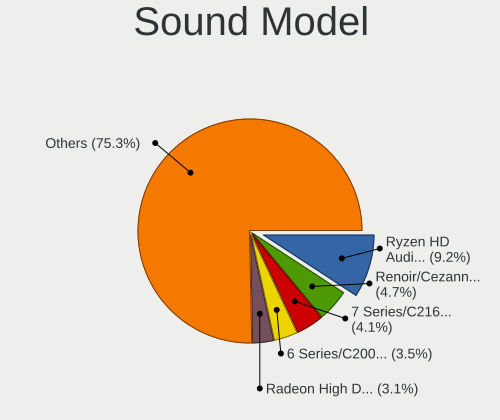

| Model                                                                      | Computers | Percent |
|----------------------------------------------------------------------------|-----------|---------|
| AMD Ryzen HD Audio Controller                                              | 97        | 9.21%   |
| AMD Renoir/Cezanne HDMI/DP Audio Controller                                | 50        | 4.75%   |
| Intel 7 Series/C216 Chipset Family High Definition Audio Controller        | 43        | 4.08%   |
| Intel 6 Series/C200 Series Chipset Family High Definition Audio Controller | 37        | 3.51%   |
| AMD Radeon High Definition Audio Controller                                | 33        | 3.13%   |
| Intel Sunrise Point-LP HD Audio                                            | 30        | 2.85%   |
| Intel Tiger Lake-LP Smart Sound Technology Audio Controller                | 25        | 2.37%   |
| Intel 82801I (ICH9 Family) HD Audio Controller                             | 24        | 2.28%   |
| Intel 8 Series/C220 Series Chipset High Definition Audio Controller        | 22        | 2.09%   |
| Intel 100 Series/C230 Series Chipset Family HD Audio Controller            | 22        | 2.09%   |
| AMD FCH Azalia Controller                                                  | 22        | 2.09%   |
| Intel NM10/ICH7 Family High Definition Audio Controller                    | 21        | 1.99%   |
| Intel Alder Lake PCH-P High Definition Audio Controller                    | 20        | 1.9%    |
| Intel 82801H (ICH8 Family) HD Audio Controller                             | 19        | 1.8%    |
| Intel Celeron/Pentium Silver Processor High Definition Audio               | 16        | 1.52%   |
| Intel Cannon Lake PCH cAVS                                                 | 15        | 1.42%   |
| Intel 5 Series/3400 Series Chipset High Definition Audio                   | 15        | 1.42%   |
| Intel Xeon E3-1200 v3/4th Gen Core Processor HD Audio Controller           | 14        | 1.33%   |
| Intel Haswell-ULT HD Audio Controller                                      | 14        | 1.33%   |
| Intel 8 Series HD Audio Controller                                         | 14        | 1.33%   |
| AMD SBx00 Azalia (Intel HDA)                                               | 14        | 1.33%   |
| AMD Kabini HDMI/DP Audio                                                   | 13        | 1.23%   |
| Intel Raptor Lake-P/U/H cAVS                                               | 12        | 1.14%   |
| Intel 200 Series PCH HD Audio                                              | 12        | 1.14%   |
| AMD Starship/Matisse HD Audio Controller                                   | 12        | 1.14%   |
| AMD Raven/Raven2/Fenghuang HDMI/DP Audio Controller                        | 12        | 1.14%   |
| Intel Comet Lake PCH-LP cAVS                                               | 11        | 1.04%   |
| AMD Family 15h (Models 60h-6fh) Audio Controller                           | 11        | 1.04%   |
| Nvidia GP107GL High Definition Audio Controller                            | 10        | 0.95%   |
| Nvidia GF108 High Definition Audio Controller                              | 10        | 0.95%   |
| Intel Wildcat Point-LP High Definition Audio Controller                    | 10        | 0.95%   |
| Intel Celeron N3350/Pentium N4200/Atom E3900 Series Audio Cluster          | 10        | 0.95%   |
| Intel Broadwell-U Audio Controller                                         | 10        | 0.95%   |
| Nvidia MCP79 High Definition Audio                                         | 9         | 0.85%   |
| Nvidia AD107 High Definition Audio Controller                              | 9         | 0.85%   |
| Intel Meteor Lake-P HD Audio Controller                                    | 9         | 0.85%   |
| AMD High Definition Audio Controller                                       | 9         | 0.85%   |
| Nvidia GP106 High Definition Audio Controller                              | 8         | 0.76%   |
| Intel Raptor Lake High Definition Audio Controller                         | 8         | 0.76%   |
| Intel Cannon Point-LP High Definition Audio Controller                     | 8         | 0.76%   |

Memory
------

Memory Vendor
-------------

Memory module vendors

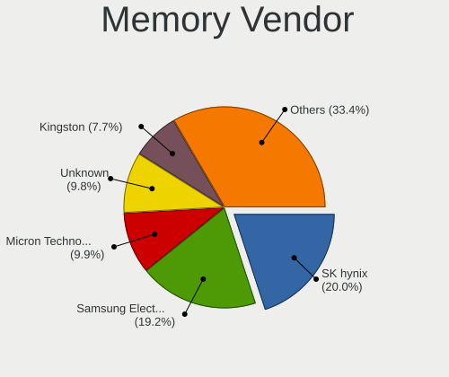

| Vendor                                  | Computers | Percent |
|-----------------------------------------|-----------|---------|
| SK hynix                                | 159       | 19.97%  |
| Samsung Electronics                     | 153       | 19.22%  |
| Micron Technology                       | 79        | 9.92%   |
| Unknown                                 | 78        | 9.8%    |
| Kingston                                | 61        | 7.66%   |
| Crucial                                 | 60        | 7.54%   |
| Corsair                                 | 34        | 4.27%   |
| G.Skill                                 | 22        | 2.76%   |
| Unknown                                 | 22        | 2.76%   |
| A-DATA Technology                       | 19        | 2.39%   |
| Elpida                                  | 15        | 1.88%   |
| Unknown (ABCD)                          | 14        | 1.76%   |
| Team                                    | 13        | 1.63%   |
| Ramaxel Technology                      | 13        | 1.63%   |
| Nanya Technology                        | 9         | 1.13%   |
| Apacer                                  | 4         | 0.5%    |
| Timetec                                 | 3         | 0.38%   |
| Smart                                   | 3         | 0.38%   |
| Patriot                                 | 3         | 0.38%   |
| Lexar                                   | 3         | 0.38%   |
| Unknown (0x0B45)                        | 2         | 0.25%   |
| Unifosa                                 | 2         | 0.25%   |
| Silicon Power Computer & Communications | 2         | 0.25%   |
| Qimonda                                 | 2         | 0.25%   |
| CSX                                     | 2         | 0.25%   |
| 4ea5                                    | 2         | 0.25%   |
| 48spaces                                | 2         | 0.25%   |
| V-GeN                                   | 1         | 0.13%   |
| Unknown (8A02)                          | 1         | 0.13%   |
| Unknown (0x0CAB)                        | 1         | 0.13%   |
| Transcend                               | 1         | 0.13%   |
| Shenzhen Longsys                        | 1         | 0.13%   |
| Qumo                                    | 1         | 0.13%   |
| OM Nanotech                             | 1         | 0.13%   |
| Netlist                                 | 1         | 0.13%   |
| Multilaser                              | 1         | 0.13%   |
| Lexar Co Limited                        | 1         | 0.13%   |
| ff                                      | 1         | 0.13%   |
| ACPI Digital                            | 1         | 0.13%   |
| 8054000080CE                            | 1         | 0.13%   |

Memory Model
------------

Memory module models

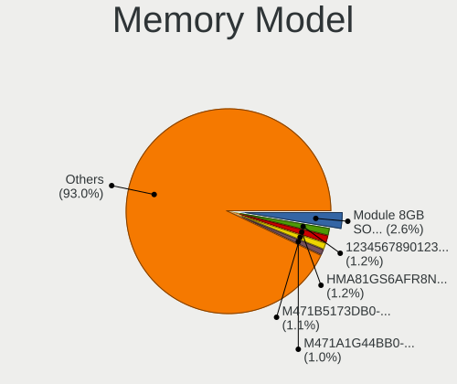

| Model                                                            | Computers | Percent |
|------------------------------------------------------------------|-----------|---------|
| Unknown                                                          | 22        | 2.63%   |
| Unknown (ABCD) RAM 123456789012345678 2GB SODIMM LPDDR4 2400MT/s | 10        | 1.19%   |
| SK hynix RAM HMA81GS6AFR8N-UH 8GB SODIMM DDR4 2667MT/s           | 10        | 1.19%   |
| Samsung RAM M471B5173DB0-YK0 4GB SODIMM DDR3 1600MT/s            | 9         | 1.07%   |
| Samsung RAM M471A1G44BB0-CWE 8GB SODIMM DDR4 3200MT/s            | 8         | 0.95%   |
| SK hynix RAM HMAA1GS6CJR6N-XN 8GB SODIMM DDR4 3200MT/s           | 7         | 0.84%   |
| Unknown RAM Module 2GB SODIMM DDR3 1333MT/s                      | 6         | 0.72%   |
| Samsung RAM M471B5273DH0-CH9 4GB SODIMM DDR3 1600MT/s            | 6         | 0.72%   |
| Unknown RAM Module 1GB SODIMM DDR2 667MT/s                       | 5         | 0.6%    |
| SK hynix RAM HMT451S6BFR8A-PB 4GB SODIMM DDR3 1600MT/s           | 5         | 0.6%    |
| SK hynix RAM HMA81GS6DJR8N-XN 8GB SODIMM DDR4 3200MT/s           | 5         | 0.6%    |
| Samsung RAM M471B5273CH0-CH9 4GB SODIMM DDR3 1334MT/s            | 5         | 0.6%    |
| Samsung RAM M471B5173QH0-YK0 4GB SODIMM DDR3 1600MT/s            | 5         | 0.6%    |
| Samsung RAM M471A1K43EB1-CWE 8GB SODIMM DDR4 3200MT/s            | 5         | 0.6%    |
| Corsair RAM CMK16GX4M2B3200C16 8GB DIMM DDR4 3600MT/s            | 5         | 0.6%    |
| Unknown RAM Module 2GB SODIMM SDRAM                              | 4         | 0.48%   |
| Unknown RAM Module 1GB SODIMM DDR2                               | 4         | 0.48%   |
| Unknown (ABCD) RAM 123456789012345678 2GB DIMM LPDDR4 2133MT/s   | 4         | 0.48%   |
| Team RAM TEAMGROUP-SD4-3200 16GB SODIMM DDR4 3200MT/s            | 4         | 0.48%   |
| Samsung RAM M471B1G73QH0-YK0 8GB SODIMM DDR3 1600MT/s            | 4         | 0.48%   |
| Samsung RAM M471B1G73DB0-YK0 8GB SODIMM DDR3 1600MT/s            | 4         | 0.48%   |
| Samsung RAM M471A1K43CB1-CRC 8GB SODIMM DDR4 8400MT/s            | 4         | 0.48%   |
| Samsung RAM M4 70T5663QZ3-CF7 2GB SODIMM DDR2 2048MT/s           | 4         | 0.48%   |
| Micron RAM 4ATF1G64HZ-3G2F1 8GB SODIMM DDR4 3200MT/s             | 4         | 0.48%   |
| Crucial RAM CT51264BF160BJ.C8F 4GB SODIMM DDR3 1600MT/s          | 4         | 0.48%   |
| Unknown RAM Module 8GB DIMM DDR3 1600MT/s                        | 3         | 0.36%   |
| Unknown RAM Module 4GB SODIMM DDR3 1333MT/s                      | 3         | 0.36%   |
| Unknown RAM Module 2GB SODIMM DDR2 667MT/s                       | 3         | 0.36%   |
| Unknown RAM Module 2GB DIMM 800MT/s                              | 3         | 0.36%   |
| Unknown RAM Module 1GB SODIMM DDR3 1066MT/s                      | 3         | 0.36%   |
| SK hynix RAM Module 4GB SODIMM DDR3 1600MT/s                     | 3         | 0.36%   |
| SK hynix RAM Module 2GB SODIMM DDR3 1067MT/s                     | 3         | 0.36%   |
| SK hynix RAM Module 16GB SODIMM DDR4 3200MT/s                    | 3         | 0.36%   |
| SK hynix RAM HYMP125S64CP8-S6 2GB SODIMM DDR2 975MT/s            | 3         | 0.36%   |
| SK hynix RAM HMT451U6BFR8C-PB 4GB DIMM DDR3 1600MT/s             | 3         | 0.36%   |
| SK hynix RAM HMAA2GS6CJR8N-XN 16GB SODIMM DDR4 3200MT/s          | 3         | 0.36%   |
| SK hynix RAM HMA82GS6JJR8N-VK 16GB SODIMM DDR4 2667MT/s          | 3         | 0.36%   |
| SK hynix RAM HMA82GS6DJR8N-VK 16GB SODIMM DDR4 2667MT/s          | 3         | 0.36%   |
| SK hynix RAM HMA41GS6AFR8N-TF 8GB SODIMM DDR4 2667MT/s           | 3         | 0.36%   |
| Samsung RAM Module 2GB SODIMM DDR3 1067MT/s                      | 3         | 0.36%   |

Memory Kind
-----------

Memory module kinds

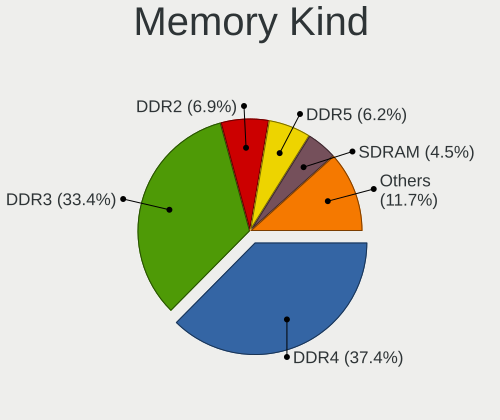

| Kind    | Computers | Percent |
|---------|-----------|---------|
| DDR4    | 260       | 37.41%  |
| DDR3    | 232       | 33.38%  |
| DDR2    | 48        | 6.91%   |
| DDR5    | 43        | 6.19%   |
| SDRAM   | 31        | 4.46%   |
| LPDDR4  | 30        | 4.32%   |
| LPDDR5  | 24        | 3.45%   |
| Unknown | 11        | 1.58%   |
| LPDDR3  | 10        | 1.44%   |
| DDR     | 6         | 0.86%   |

Memory Form Factor
------------------

Physical design of the memory module

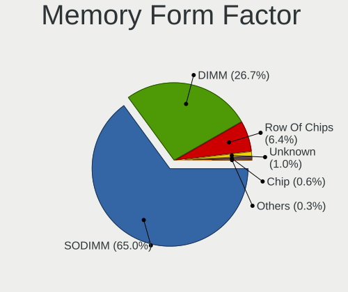

| Name         | Computers | Percent |
|--------------|-----------|---------|
| SODIMM       | 447       | 64.97%  |
| DIMM         | 184       | 26.74%  |
| Row Of Chips | 44        | 6.4%    |
| Unknown      | 7         | 1.02%   |
| Chip         | 4         | 0.58%   |
| FB-DIMM      | 2         | 0.29%   |

Memory Size
-----------

Memory module size

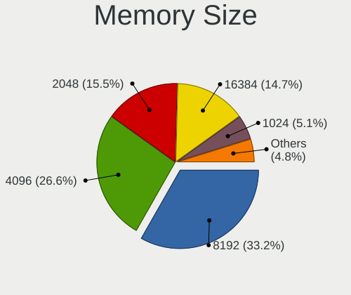

| Size  | Computers | Percent |
|-------|-----------|---------|
| 8192  | 242       | 33.24%  |
| 4096  | 194       | 26.65%  |
| 2048  | 113       | 15.52%  |
| 16384 | 107       | 14.7%   |
| 1024  | 37        | 5.08%   |
| 32768 | 29        | 3.98%   |
| 512   | 4         | 0.55%   |
| 65536 | 1         | 0.14%   |
| 49152 | 1         | 0.14%   |

Memory Speed
------------

Memory module speed

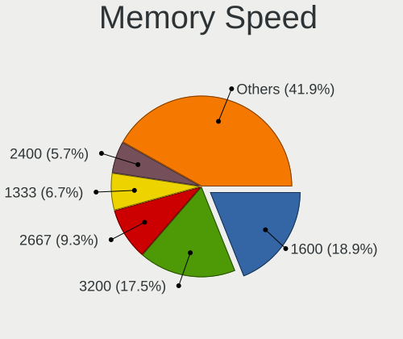

| Speed   | Computers | Percent |
|---------|-----------|---------|
| 1600    | 142       | 18.93%  |
| 3200    | 131       | 17.47%  |
| 2667    | 70        | 9.33%   |
| 1333    | 50        | 6.67%   |
| 2400    | 43        | 5.73%   |
| 667     | 25        | 3.33%   |
| 2133    | 23        | 3.07%   |
| 1067    | 23        | 3.07%   |
| 800     | 22        | 2.93%   |
| 5600    | 21        | 2.8%    |
| Unknown | 18        | 2.4%    |
| 6400    | 15        | 2%      |
| 3600    | 14        | 1.87%   |
| 1334    | 13        | 1.73%   |
| 4800    | 11        | 1.47%   |
| 2048    | 10        | 1.33%   |
| 4267    | 9         | 1.2%    |
| 1867    | 8         | 1.07%   |
| 6000    | 7         | 0.93%   |
| 1066    | 6         | 0.8%    |
| 975     | 6         | 0.8%    |
| 4199    | 5         | 0.67%   |
| 1866    | 5         | 0.67%   |
| 533     | 5         | 0.67%   |
| 8400    | 4         | 0.53%   |
| 4000    | 4         | 0.53%   |
| 3733    | 4         | 0.53%   |
| 3266    | 4         | 0.53%   |
| 1800    | 4         | 0.53%   |
| 7500    | 3         | 0.4%    |
| 7467    | 3         | 0.4%    |
| 3400    | 3         | 0.4%    |
| 2933    | 3         | 0.4%    |
| 2666    | 3         | 0.4%    |
| 5500    | 2         | 0.27%   |
| 5200    | 2         | 0.27%   |
| 3800    | 2         | 0.27%   |
| 3500    | 2         | 0.27%   |
| 3466    | 2         | 0.27%   |
| 3151    | 2         | 0.27%   |

Printers & scanners
-------------------

Printer Vendor
--------------

Printer device vendors

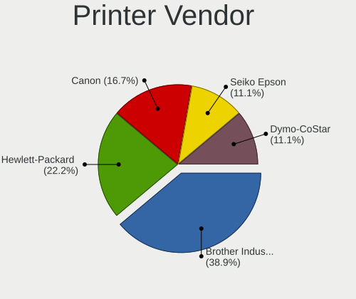

| Vendor             | Computers | Percent |
|--------------------|-----------|---------|
| Brother Industries | 7         | 38.89%  |
| Hewlett-Packard    | 4         | 22.22%  |
| Canon              | 3         | 16.67%  |
| Seiko Epson        | 2         | 11.11%  |
| Dymo-CoStar        | 2         | 11.11%  |

Printer Model
-------------

Printer device models

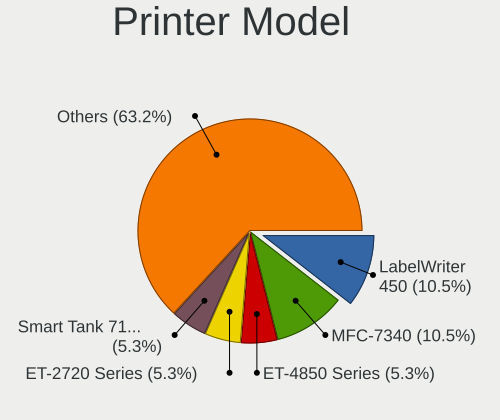

| Model                        | Computers | Percent |
|------------------------------|-----------|---------|
| Dymo-CoStar LabelWriter 450  | 2         | 10.53%  |
| Brother MFC-7340             | 2         | 10.53%  |
| Seiko Epson ET-4850 Series   | 1         | 5.26%   |
| Seiko Epson ET-2720 Series   | 1         | 5.26%   |
| HP Smart Tank 710-720 series | 1         | 5.26%   |
| HP LaserJet Pro M148-M149    | 1         | 5.26%   |
| HP LaserJet P1006            | 1         | 5.26%   |
| HP Deskjet 3510 series       | 1         | 5.26%   |
| Canon PIXMA MG5600 Series    | 1         | 5.26%   |
| Canon PIXMA MG2500 Series    | 1         | 5.26%   |
| Canon PIXMA iP4000           | 1         | 5.26%   |
| Brother MFC-7360N            | 1         | 5.26%   |
| Brother HL-L2400DWE          | 1         | 5.26%   |
| Brother HL-L2380DW           | 1         | 5.26%   |
| Brother HL-L2350DW series    | 1         | 5.26%   |
| Brother HL-52x0 series       | 1         | 5.26%   |
| Brother DCP-L2500D           | 1         | 5.26%   |

Scanner Vendor
--------------

Scanner device vendors

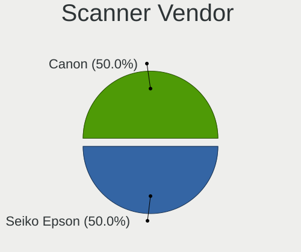

| Vendor         | Computers | Percent |
|----------------|-----------|---------|
| Canon          | 3         | 60%     |
| Seiko Epson    | 1         | 20%     |
| Mustek Systems | 1         | 20%     |

Scanner Model
-------------

Scanner device models

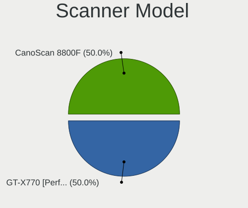

| Model                                 | Computers | Percent |
|---------------------------------------|-----------|---------|
| Seiko Epson GT-X770 [Perfection V500] | 1         | 20%     |
| Mustek Systems BearPaw 1200 CU Plus   | 1         | 20%     |
| Canon CanoScan LiDE 700F              | 1         | 20%     |
| Canon CanoScan LiDE 210               | 1         | 20%     |
| Canon CanoScan 8800F                  | 1         | 20%     |

Camera
------

Camera Vendor
-------------

Camera device vendors

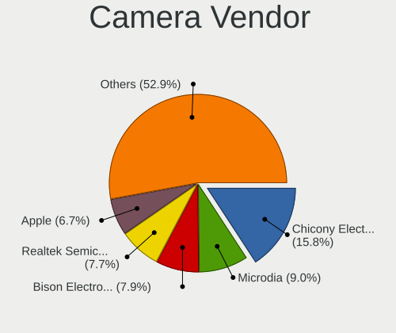

| Vendor                                 | Computers | Percent |
|----------------------------------------|-----------|---------|
| Chicony Electronics                    | 68        | 15.78%  |
| Microdia                               | 39        | 9.05%   |
| Bison Electronics                      | 34        | 7.89%   |
| Realtek Semiconductor                  | 33        | 7.66%   |
| Apple                                  | 29        | 6.73%   |
| IMC Networks                           | 27        | 6.26%   |
| Quanta                                 | 25        | 5.8%    |
| Sunplus Innovation Technology          | 18        | 4.18%   |
| Logitech                               | 17        | 3.94%   |
| Luxvisions Innotech Limited            | 16        | 3.71%   |
| Cheng Uei Precision Industry (Foxlink) | 15        | 3.48%   |
| Suyin                                  | 12        | 2.78%   |
| Lite-On Technology                     | 12        | 2.78%   |
| Alcor Micro                            | 10        | 2.32%   |
| Syntek                                 | 8         | 1.86%   |
| Sonix Technology                       | 8         | 1.86%   |
| Microsoft                              | 7         | 1.62%   |
| Lenovo                                 | 6         | 1.39%   |
| Silicon Motion                         | 5         | 1.16%   |
| Ricoh                                  | 4         | 0.93%   |
| Importek                               | 4         | 0.93%   |
| Z-Star Microelectronics                | 3         | 0.7%    |
| icSpring                               | 3         | 0.7%    |
| Samsung Electronics                    | 2         | 0.46%   |
| MacroSilicon                           | 2         | 0.46%   |
| kingcome                               | 2         | 0.46%   |
| Intel                                  | 2         | 0.46%   |
| Generalplus Technology                 | 2         | 0.46%   |
| ARC International                      | 2         | 0.46%   |
| YGTek                                  | 1         | 0.23%   |
| USB Cam Manufacturer                   | 1         | 0.23%   |
| SunplusIT                              | 1         | 0.23%   |
| ShineTech                              | 1         | 0.23%   |
| Shenzhen Kingcome Optoelectronic       | 1         | 0.23%   |
| KYT-240222-A                           | 1         | 0.23%   |
| HYGD-240403-A                          | 1         | 0.23%   |
| Hewlett-Packard                        | 1         | 0.23%   |
| Genesys Logic                          | 1         | 0.23%   |
| GEMBIRD                                | 1         | 0.23%   |
| Cubeternet                             | 1         | 0.23%   |

Camera Model
------------

Camera device models

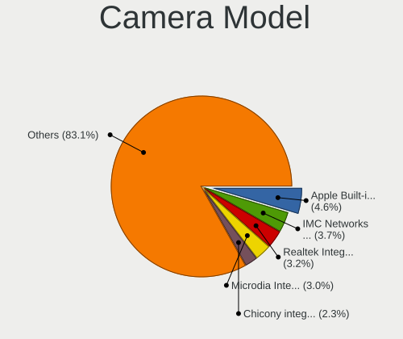

| Model                                               | Computers | Percent |
|-----------------------------------------------------|-----------|---------|
| Apple Built-in iSight                               | 20        | 4.62%   |
| IMC Networks USB2.0 HD UVC WebCam                   | 16        | 3.7%    |
| Realtek Integrated_Webcam_HD                        | 14        | 3.23%   |
| Microdia Integrated_Webcam_HD                       | 13        | 3%      |
| Chicony integrated camera                           | 10        | 2.31%   |
| Bison USB HD Webcam                                 | 8         | 1.85%   |
| Syntek Integrated Camera                            | 5         | 1.15%   |
| Sunplus Integrated_Webcam_HD                        | 5         | 1.15%   |
| Luxvisions Innotech Limited HP TrueVision HD Camera | 5         | 1.15%   |
| Lite-On Integrated Camera                           | 5         | 1.15%   |
| Chicony TOSHIBA Web Camera - HD                     | 5         | 1.15%   |
| Suyin HP Truevision HD                              | 4         | 0.92%   |
| Microdia Integrated_Webcam_FHD                      | 4         | 0.92%   |
| Luxvisions Innotech Limited Integrated Camera       | 4         | 0.92%   |
| Logitech Webcam C270                                | 4         | 0.92%   |
| Importek TOSHIBA Web Camera - HD                    | 4         | 0.92%   |
| IMC Networks Integrated Camera                      | 4         | 0.92%   |
| Chicony HP Truevision HD                            | 4         | 0.92%   |
| Chicony Chicony USB2.0 Camera                       | 4         | 0.92%   |
| Bison Lenovo EasyCamera                             | 4         | 0.92%   |
| Bison Integrated RGB Camera                         | 4         | 0.92%   |
| Bison Integrated Camera                             | 4         | 0.92%   |
| Apple FaceTime HD Camera                            | 4         | 0.92%   |
| Suyin HP TrueVision HD Integrated Webcam            | 3         | 0.69%   |
| Realtek Integrated Webcam                           | 3         | 0.69%   |
| Realtek Bluetooth Radio                             | 3         | 0.69%   |
| Quanta HP TrueVision HD Camera                      | 3         | 0.69%   |
| Quanta HP HD Camera                                 | 3         | 0.69%   |
| Quanta HD User Facing                               | 3         | 0.69%   |
| Microdia Laptop_Integrated_Webcam_HD                | 3         | 0.69%   |
| Microdia Laptop_Integrated_Webcam_2M                | 3         | 0.69%   |
| Microdia Integrated Webcam                          | 3         | 0.69%   |
| Logitech HD Pro Webcam C920                         | 3         | 0.69%   |
| Logitech C922 Pro Stream Webcam                     | 3         | 0.69%   |
| Lite-On HP HD Camera                                | 3         | 0.69%   |
| Lenovo Integrated Webcam [R5U877]                   | 3         | 0.69%   |
| IMC Networks USB2.0 VGA UVC WebCam                  | 3         | 0.69%   |
| icSpring camera                                     | 3         | 0.69%   |
| Chicony HP HD Camera                                | 3         | 0.69%   |
| Chicony HD WebCam                                   | 3         | 0.69%   |

Security
--------

Fingerprint Vendor
------------------

Fingerprint sensor vendors

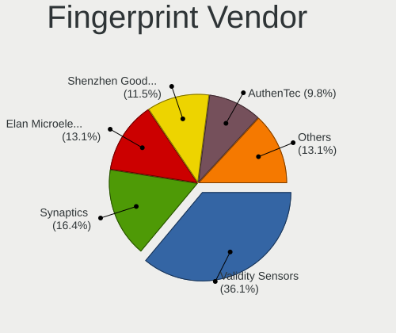

| Vendor                     | Computers | Percent |
|----------------------------|-----------|---------|
| Validity Sensors           | 22        | 36.07%  |
| Synaptics                  | 10        | 16.39%  |
| Elan Microelectronics      | 8         | 13.11%  |
| Shenzhen Goodix Technology | 7         | 11.48%  |
| AuthenTec                  | 6         | 9.84%   |
| Upek                       | 5         | 8.2%    |
| STMicroelectronics         | 2         | 3.28%   |
| LighTuning Technology      | 1         | 1.64%   |

Fingerprint Model
-----------------

Fingerprint sensor models

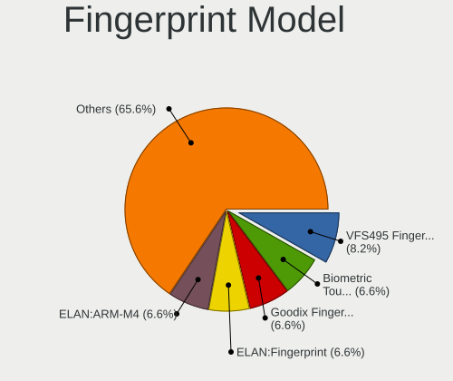

| Model                                                    | Computers | Percent |
|----------------------------------------------------------|-----------|---------|
| Validity Sensors VFS495 Fingerprint Reader               | 5         | 8.2%    |
| Upek Biometric Touchchip/Touchstrip Fingerprint Sensor   | 4         | 6.56%   |
| Shenzhen Goodix  Fingerprint Device                      | 4         | 6.56%   |
| Elan ELAN:Fingerprint                                    | 4         | 6.56%   |
| Elan ELAN:ARM-M4                                         | 4         | 6.56%   |
| Validity Sensors VFS5011 Fingerprint Reader              | 3         | 4.92%   |
| Validity Sensors Fingerprint scanner                     | 3         | 4.92%   |
| Synaptics Metallica MIS Touch Fingerprint Reader         | 3         | 4.92%   |
| AuthenTec AES2501 Fingerprint Sensor                     | 3         | 4.92%   |
| Validity Sensors VFS Fingerprint sensor                  | 2         | 3.28%   |
| Validity Sensors Synaptics WBDI                          | 2         | 3.28%   |
| Synaptics UWP WBDI Device                                | 2         | 3.28%   |
| STMicroelectronics Fingerprint Reader                    | 2         | 3.28%   |
| Shenzhen Goodix Fingerprint Reader                       | 2         | 3.28%   |
| AuthenTec AES2810                                        | 2         | 3.28%   |
| Validity Sensors VFS7500 Touch Fingerprint Sensor        | 1         | 1.64%   |
| Validity Sensors VFS491                                  | 1         | 1.64%   |
| Validity Sensors VFS451 Fingerprint Reader               | 1         | 1.64%   |
| Validity Sensors VFS300 Fingerprint Reader               | 1         | 1.64%   |
| Validity Sensors VFS101 Fingerprint Reader               | 1         | 1.64%   |
| Validity Sensors VFS 5011 fingerprint sensor             | 1         | 1.64%   |
| Validity Sensors Swipe Fingerprint Sensor                | 1         | 1.64%   |
| Upek TCS5B Fingerprint sensor                            | 1         | 1.64%   |
| Synaptics WBDI Fingerprint Reader USB 102                | 1         | 1.64%   |
| Synaptics  WBDI                                          | 1         | 1.64%   |
| Synaptics Prometheus MIS Touch Fingerprint Reader        | 1         | 1.64%   |
| Synaptics FS7604 Touch Fingerprint Sensor with PurePrint | 1         | 1.64%   |
| Synaptics Fingerprint reader [HP G6]                     | 1         | 1.64%   |
| Shenzhen Goodix FingerPrint                              | 1         | 1.64%   |
| LighTuning Fingerprint Sensor                            | 1         | 1.64%   |
| AuthenTec AES1600                                        | 1         | 1.64%   |

Chipcard Vendor
---------------

Chipcard module vendors

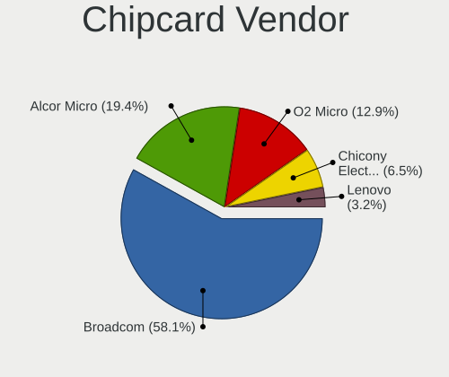

| Vendor              | Computers | Percent |
|---------------------|-----------|---------|
| Broadcom            | 18        | 58.06%  |
| Alcor Micro         | 6         | 19.35%  |
| O2 Micro            | 4         | 12.9%   |
| Chicony Electronics | 2         | 6.45%   |
| Lenovo              | 1         | 3.23%   |

Chipcard Model
--------------

Chipcard module models

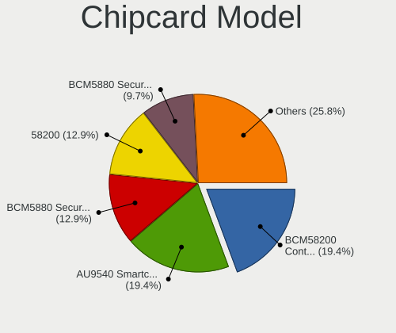

| Model                                                                        | Computers | Percent |
|------------------------------------------------------------------------------|-----------|---------|
| Broadcom BCM58200 ControlVault 3 (FingerPrint sensor + Contacted SmartCard)  | 6         | 19.35%  |
| Alcor Micro AU9540 Smartcard Reader                                          | 6         | 19.35%  |
| Broadcom BCM5880 Secure Applications Processor                               | 4         | 12.9%   |
| Broadcom 58200                                                               | 4         | 12.9%   |
| Broadcom BCM5880 Secure Applications Processor with fingerprint swipe sensor | 3         | 9.68%   |
| O2 Micro Oz776 SmartCard Reader                                              | 2         | 6.45%   |
| O2 Micro OZ776 CCID Smartcard Reader                                         | 2         | 6.45%   |
| Chicony Electronics HP Skylab USB Smartcard Keyboard                         | 2         | 6.45%   |
| Lenovo Integrated Smart Card Reader                                          | 1         | 3.23%   |
| Broadcom 5880                                                                | 1         | 3.23%   |

Unsupported
-----------

Unsupported Devices
-------------------

Total unsupported devices on board

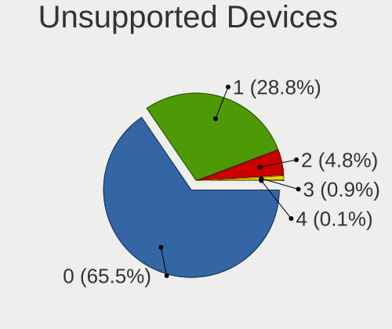

| Total | Computers | Percent |
|-------|-----------|---------|
| 0     | 453       | 65.46%  |
| 1     | 199       | 28.76%  |
| 2     | 33        | 4.77%   |
| 3     | 6         | 0.87%   |
| 4     | 1         | 0.14%   |

Unsupported Device Types
------------------------

Types of unsupported devices

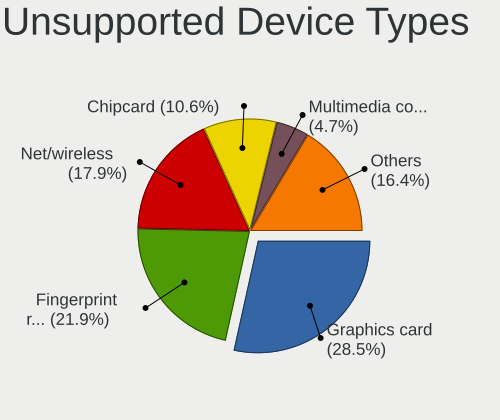

| Type                     | Computers | Percent |
|--------------------------|-----------|---------|
| Graphics card            | 78        | 28.47%  |
| Fingerprint reader       | 60        | 21.9%   |
| Net/wireless             | 49        | 17.88%  |
| Chipcard                 | 29        | 10.58%  |
| Multimedia controller    | 13        | 4.74%   |
| Camera                   | 11        | 4.01%   |
| Bluetooth                | 11        | 4.01%   |
| Card reader              | 5         | 1.82%   |
| Storage                  | 3         | 1.09%   |
| Network                  | 3         | 1.09%   |
| Communication controller | 3         | 1.09%   |
| Unassigned class         | 2         | 0.73%   |
| Flash memory             | 2         | 0.73%   |
| Wireless                 | 1         | 0.36%   |
| Storage/raid             | 1         | 0.36%   |
| Storage/ata              | 1         | 0.36%   |
| Sound                    | 1         | 0.36%   |
| Net/ethernet             | 1         | 0.36%   |

