MX 23 - Tested Hardware & Statistics
------------------------------------

A project to collect tested hardware configurations for MX 23.

Anyone can contribute to this report by the [hw-probe](https://github.com/linuxhw/hw-probe) tool:

    sudo -E hw-probe -all -upload

Please contribute! Especially if your hardware is rare.

This is a report for all computer types. See also reports for [desktops](/Dist/MX_23/Desktop/README.md) and [notebooks](/Dist/MX_23/Notebook/README.md).

Contents
--------

* [ Test Cases ](#test-cases)

* [ System ](#system)
  - [ Kernel                   ](#kernel)
  - [ Kernel Family            ](#kernel-family)
  - [ Kernel Major Ver.        ](#kernel-major-ver)
  - [ Arch                     ](#arch)
  - [ DE                       ](#de)
  - [ Display Server           ](#display-server)
  - [ Display Manager          ](#display-manager)
  - [ OS Lang                  ](#os-lang)
  - [ Boot Mode                ](#boot-mode)
  - [ Filesystem               ](#filesystem)
  - [ Part. scheme             ](#part-scheme)
  - [ Dual Boot with Linux/BSD ](#dual-boot-with-linuxbsd)
  - [ Dual Boot (Win)          ](#dual-boot-win)

* [ Board ](#board)
  - [ Vendor                   ](#vendor)
  - [ Model                    ](#model)
  - [ Model Family             ](#model-family)
  - [ MFG Year                 ](#mfg-year)
  - [ Form Factor              ](#form-factor)
  - [ Secure Boot              ](#secure-boot)
  - [ Coreboot                 ](#coreboot)
  - [ RAM Size                 ](#ram-size)
  - [ RAM Used                 ](#ram-used)
  - [ Total Drives             ](#total-drives)
  - [ Has CD-ROM               ](#has-cd-rom)
  - [ Has Ethernet             ](#has-ethernet)
  - [ Has WiFi                 ](#has-wifi)
  - [ Has Bluetooth            ](#has-bluetooth)

* [ Location ](#location)
  - [ Country                  ](#country)
  - [ City                     ](#city)

* [ Drives ](#drives)
  - [ Drive Vendor             ](#drive-vendor)
  - [ Drive Model              ](#drive-model)
  - [ HDD Vendor               ](#hdd-vendor)
  - [ SSD Vendor               ](#ssd-vendor)
  - [ Drive Kind               ](#drive-kind)
  - [ Drive Connector          ](#drive-connector)
  - [ Drive Size               ](#drive-size)
  - [ Space Total              ](#space-total)
  - [ Space Used               ](#space-used)
  - [ Malfunc. Drives          ](#malfunc-drives)
  - [ Malfunc. Drive Vendor    ](#malfunc-drive-vendor)
  - [ Malfunc. HDD Vendor      ](#malfunc-hdd-vendor)
  - [ Malfunc. Drive Kind      ](#malfunc-drive-kind)
  - [ Failed Drives            ](#failed-drives)
  - [ Failed Drive Vendor      ](#failed-drive-vendor)
  - [ Drive Status             ](#drive-status)

* [ Storage controller ](#storage-controller)
  - [ Storage Vendor           ](#storage-vendor)
  - [ Storage Model            ](#storage-model)
  - [ Storage Kind             ](#storage-kind)

* [ Processor ](#processor)
  - [ CPU Vendor               ](#cpu-vendor)
  - [ CPU Model                ](#cpu-model)
  - [ CPU Model Family         ](#cpu-model-family)
  - [ CPU Cores                ](#cpu-cores)
  - [ CPU Sockets              ](#cpu-sockets)
  - [ CPU Threads              ](#cpu-threads)
  - [ CPU Op-Modes             ](#cpu-op-modes)
  - [ CPU Microcode            ](#cpu-microcode)
  - [ CPU Microarch            ](#cpu-microarch)

* [ Graphics ](#graphics)
  - [ GPU Vendor               ](#gpu-vendor)
  - [ GPU Model                ](#gpu-model)
  - [ GPU Combo                ](#gpu-combo)
  - [ GPU Driver               ](#gpu-driver)
  - [ GPU Memory               ](#gpu-memory)

* [ Monitor ](#monitor)
  - [ Monitor Vendor           ](#monitor-vendor)
  - [ Monitor Model            ](#monitor-model)
  - [ Monitor Resolution       ](#monitor-resolution)
  - [ Monitor Diagonal         ](#monitor-diagonal)
  - [ Monitor Width            ](#monitor-width)
  - [ Aspect Ratio             ](#aspect-ratio)
  - [ Monitor Area             ](#monitor-area)
  - [ Pixel Density            ](#pixel-density)
  - [ Multiple Monitors        ](#multiple-monitors)

* [ Network ](#network)
  - [ Net Controller Vendor    ](#net-controller-vendor)
  - [ Net Controller Model     ](#net-controller-model)
  - [ Wireless Vendor          ](#wireless-vendor)
  - [ Wireless Model           ](#wireless-model)
  - [ Ethernet Vendor          ](#ethernet-vendor)
  - [ Ethernet Model           ](#ethernet-model)
  - [ Net Controller Kind      ](#net-controller-kind)
  - [ Used Controller          ](#used-controller)
  - [ NICs                     ](#nics)
  - [ IPv6                     ](#ipv6)

* [ Bluetooth ](#bluetooth)
  - [ Bluetooth Vendor         ](#bluetooth-vendor)
  - [ Bluetooth Model          ](#bluetooth-model)

* [ Sound ](#sound)
  - [ Sound Vendor             ](#sound-vendor)
  - [ Sound Model              ](#sound-model)

* [ Memory ](#memory)
  - [ Memory Vendor            ](#memory-vendor)
  - [ Memory Model             ](#memory-model)
  - [ Memory Kind              ](#memory-kind)
  - [ Memory Form Factor       ](#memory-form-factor)
  - [ Memory Size              ](#memory-size)
  - [ Memory Speed             ](#memory-speed)

* [ Printers & scanners ](#printers--scanners)
  - [ Printer Vendor           ](#printer-vendor)
  - [ Printer Model            ](#printer-model)
  - [ Scanner Vendor           ](#scanner-vendor)
  - [ Scanner Model            ](#scanner-model)

* [ Camera ](#camera)
  - [ Camera Vendor            ](#camera-vendor)
  - [ Camera Model             ](#camera-model)

* [ Security ](#security)
  - [ Fingerprint Vendor       ](#fingerprint-vendor)
  - [ Fingerprint Model        ](#fingerprint-model)
  - [ Chipcard Vendor          ](#chipcard-vendor)
  - [ Chipcard Model           ](#chipcard-model)

* [ Unsupported ](#unsupported)
  - [ Unsupported Devices      ](#unsupported-devices)
  - [ Unsupported Device Types ](#unsupported-device-types)

Test Cases
----------

Total: 192

| Vendor        | Model                       | Form-Factor | Probe                                                      | Date         |
|---------------|-----------------------------|-------------|------------------------------------------------------------|--------------|
| VIT           | P3400                       | Notebook    | [036ee57838](https://linux-hardware.org/?probe=036ee57838) | Feb 02, 2024 |
| HP            | 09E8h                       | Desktop     | [413788d555](https://linux-hardware.org/?probe=413788d555) | Feb 02, 2024 |
| VIT           | P3400                       | Notebook    | [6b03e6574f](https://linux-hardware.org/?probe=6b03e6574f) | Feb 01, 2024 |
| Lenovo        | ThinkPad E14 Gen 2 20TA0... | Notebook    | [653f9c5fa5](https://linux-hardware.org/?probe=653f9c5fa5) | Feb 01, 2024 |
| Dell          | 00VTMF A01                  | Desktop     | [3298485dd9](https://linux-hardware.org/?probe=3298485dd9) | Jan 31, 2024 |
| Dell          | Latitude 3190               | Notebook    | [16f86af47d](https://linux-hardware.org/?probe=16f86af47d) | Jan 30, 2024 |
| HP            | Spectre x360 Convertible... | Convertible | [35aa462f74](https://linux-hardware.org/?probe=35aa462f74) | Jan 30, 2024 |
| Apple         | Mac-F4238CC8 PVT            | All in one  | [3f817efef4](https://linux-hardware.org/?probe=3f817efef4) | Jan 26, 2024 |
| HP            | 304Ah                       | Desktop     | [5e40a8acee](https://linux-hardware.org/?probe=5e40a8acee) | Jan 24, 2024 |
| Dell          | Latitude E6410              | Notebook    | [1b7b83010f](https://linux-hardware.org/?probe=1b7b83010f) | Jan 24, 2024 |
| Apple         | MacBookAir6,2               | Notebook    | [6eb8876e79](https://linux-hardware.org/?probe=6eb8876e79) | Jan 24, 2024 |
| ASUSTek       | TUF Gaming B660-PLUS WIF... | Desktop     | [6ae01879d8](https://linux-hardware.org/?probe=6ae01879d8) | Jan 23, 2024 |
| HP            | 0A5Ch                       | Desktop     | [f886596563](https://linux-hardware.org/?probe=f886596563) | Jan 23, 2024 |
| HP            | EliteBook 840 G8 Noteboo... | Notebook    | [e03dc88f3e](https://linux-hardware.org/?probe=e03dc88f3e) | Jan 20, 2024 |
| Gigabyte      | B650I AORUS ULTRA           | Desktop     | [0da14a9376](https://linux-hardware.org/?probe=0da14a9376) | Jan 18, 2024 |
| HP            | Notebook                    | Notebook    | [0f5f8dd38d](https://linux-hardware.org/?probe=0f5f8dd38d) | Jan 17, 2024 |
| Google        | Barla                       | Notebook    | [f053c5164a](https://linux-hardware.org/?probe=f053c5164a) | Jan 16, 2024 |
| HP            | 8750                        | Desktop     | [6dd29a1c24](https://linux-hardware.org/?probe=6dd29a1c24) | Jan 16, 2024 |
| Gigabyte      | B650I AORUS ULTRA           | Desktop     | [33216d3bf8](https://linux-hardware.org/?probe=33216d3bf8) | Jan 16, 2024 |
| Lenovo        | LOQ 15APH8 82XT             | Notebook    | [d0af07b360](https://linux-hardware.org/?probe=d0af07b360) | Jan 15, 2024 |
| Apple         | MacBookPro14,3              | Notebook    | [3b0c274172](https://linux-hardware.org/?probe=3b0c274172) | Jan 12, 2024 |
| Lenovo        | ThinkPad T470s W10DG 20J... | Notebook    | [f782b74751](https://linux-hardware.org/?probe=f782b74751) | Jan 12, 2024 |
| Unknown       | GB01                        | Desktop     | [33016aa27b](https://linux-hardware.org/?probe=33016aa27b) | Jan 11, 2024 |
| Unknown       | GB01                        | Desktop     | [551b27fa9b](https://linux-hardware.org/?probe=551b27fa9b) | Jan 11, 2024 |
| Dell          | 0KV62T A00                  | Desktop     | [17aa442f24](https://linux-hardware.org/?probe=17aa442f24) | Jan 10, 2024 |
| Dell          | Latitude 3190               | Notebook    | [afdd5a1dbe](https://linux-hardware.org/?probe=afdd5a1dbe) | Jan 09, 2024 |
| HP            | Pavilion dv2700             | Notebook    | [957ec4cc30](https://linux-hardware.org/?probe=957ec4cc30) | Jan 09, 2024 |
| KEIAN         | KI8-BK                      | Tablet      | [aaf299df58](https://linux-hardware.org/?probe=aaf299df58) | Jan 08, 2024 |
| Sony          | SVF1521H1EW                 | Notebook    | [1939183179](https://linux-hardware.org/?probe=1939183179) | Jan 07, 2024 |
| ASUSTek       | PN52                        | Mini pc     | [5c770765da](https://linux-hardware.org/?probe=5c770765da) | Jan 05, 2024 |
| HP            | 8265                        | Desktop     | [da63a4f9c1](https://linux-hardware.org/?probe=da63a4f9c1) | Jan 05, 2024 |
| Lenovo        | ThinkPad X1 Carbon 3rd 2... | Notebook    | [71d03730b7](https://linux-hardware.org/?probe=71d03730b7) | Jan 03, 2024 |
| Dell          | Latitude 5400               | Notebook    | [9e318e9b78](https://linux-hardware.org/?probe=9e318e9b78) | Jan 03, 2024 |
| Dell          | Latitude 5400               | Notebook    | [59a90bd726](https://linux-hardware.org/?probe=59a90bd726) | Jan 03, 2024 |
| Google        | Barla                       | Notebook    | [585887bc42](https://linux-hardware.org/?probe=585887bc42) | Dec 30, 2023 |
| ASUSTek       | VivoBook_ASUSLaptop X150... | Notebook    | [8f3ab867ea](https://linux-hardware.org/?probe=8f3ab867ea) | Dec 30, 2023 |
| HP            | 8265                        | Desktop     | [94344dbe98](https://linux-hardware.org/?probe=94344dbe98) | Dec 28, 2023 |
| HP            | Pavilion dv6                | Notebook    | [39515c70db](https://linux-hardware.org/?probe=39515c70db) | Dec 27, 2023 |
| HP            | Pavilion dv6                | Notebook    | [c29956a752](https://linux-hardware.org/?probe=c29956a752) | Dec 27, 2023 |
| HONOR         | NMH-WCX9                    | Notebook    | [5647df79c0](https://linux-hardware.org/?probe=5647df79c0) | Dec 26, 2023 |
| Dell          | Latitude 3190               | Notebook    | [e0da711bcb](https://linux-hardware.org/?probe=e0da711bcb) | Dec 26, 2023 |
| Dell          | 033FF6 A00                  | Desktop     | [977367b99e](https://linux-hardware.org/?probe=977367b99e) | Dec 26, 2023 |
| Acer          | Aspire A315-24P             | Notebook    | [eade6242b7](https://linux-hardware.org/?probe=eade6242b7) | Dec 25, 2023 |
| HP            | 250 15.6 inch G9 Noteboo... | Notebook    | [ab0b99f2f2](https://linux-hardware.org/?probe=ab0b99f2f2) | Dec 25, 2023 |
| HP            | 250 15.6 inch G9 Noteboo... | Notebook    | [0da41c3e3b](https://linux-hardware.org/?probe=0da41c3e3b) | Dec 25, 2023 |
| Google        | Bobba                       | Notebook    | [c0e8038184](https://linux-hardware.org/?probe=c0e8038184) | Dec 22, 2023 |
| Google        | Bobba                       | Notebook    | [c03b219f2e](https://linux-hardware.org/?probe=c03b219f2e) | Dec 22, 2023 |
| Lenovo        | MIIX 300-10IBY 80NR         | Tablet      | [456c5b7613](https://linux-hardware.org/?probe=456c5b7613) | Dec 21, 2023 |
| Dell          | 033FF6 A00                  | Desktop     | [88cad415fb](https://linux-hardware.org/?probe=88cad415fb) | Dec 21, 2023 |
| ASUSTek       | X553MA                      | Notebook    | [bc7fc2be74](https://linux-hardware.org/?probe=bc7fc2be74) | Dec 20, 2023 |
| ASUSTek       | X553MA                      | Notebook    | [11f3b9c9d6](https://linux-hardware.org/?probe=11f3b9c9d6) | Dec 20, 2023 |
| ASUSTek       | TUF Gaming X570-PLUS        | Desktop     | [f912bcd96a](https://linux-hardware.org/?probe=f912bcd96a) | Dec 20, 2023 |
| Dell          | Latitude 3190               | Notebook    | [a7e488632e](https://linux-hardware.org/?probe=a7e488632e) | Dec 19, 2023 |
| Apple         | Mac-942B5BF58194151B        | All in one  | [97e3b8d570](https://linux-hardware.org/?probe=97e3b8d570) | Dec 18, 2023 |
| Apple         | Mac-942B5BF58194151B        | All in one  | [a6d28b0e6a](https://linux-hardware.org/?probe=a6d28b0e6a) | Dec 18, 2023 |
| HP            | 8265                        | Desktop     | [cc0b59e7f7](https://linux-hardware.org/?probe=cc0b59e7f7) | Dec 13, 2023 |
| HP            | Notebook                    | Notebook    | [d25691af9b](https://linux-hardware.org/?probe=d25691af9b) | Dec 13, 2023 |
| Gigabyte      | MRHM7AP                     | Desktop     | [ba4400c919](https://linux-hardware.org/?probe=ba4400c919) | Dec 13, 2023 |
| Dell          | Latitude 3190               | Notebook    | [faf8105e3c](https://linux-hardware.org/?probe=faf8105e3c) | Dec 12, 2023 |
| GPU Compan... | GWTC116-2                   | Notebook    | [10e35dbb2a](https://linux-hardware.org/?probe=10e35dbb2a) | Dec 12, 2023 |
| Dell          | Vostro 1320                 | Notebook    | [cf44765cd0](https://linux-hardware.org/?probe=cf44765cd0) | Dec 11, 2023 |
| Lenovo        | 3111 SDK0J40697 WIN 3305... | Mini pc     | [8fc19fa86c](https://linux-hardware.org/?probe=8fc19fa86c) | Dec 11, 2023 |
| Lenovo        | ThinkPad X201 3626GWG       | Notebook    | [023f7dd390](https://linux-hardware.org/?probe=023f7dd390) | Dec 11, 2023 |
| ASRock        | A620M Pro RS WiFi           | Desktop     | [3bbc394b2e](https://linux-hardware.org/?probe=3bbc394b2e) | Dec 08, 2023 |
| Lenovo        | IdeaPad 3 15ITL6 82H8       | Notebook    | [6c558ca3cf](https://linux-hardware.org/?probe=6c558ca3cf) | Dec 06, 2023 |
| Gigabyte      | G41M-ES2L                   | Desktop     | [442d7a2388](https://linux-hardware.org/?probe=442d7a2388) | Dec 03, 2023 |
| Apple         | MacBook3,1                  | Notebook    | [d536392d03](https://linux-hardware.org/?probe=d536392d03) | Nov 30, 2023 |
| Apple         | MacBook3,1                  | Notebook    | [bfe263dfe0](https://linux-hardware.org/?probe=bfe263dfe0) | Nov 30, 2023 |
| Lenovo        | ThinkBook 15 G3 ACL 21A4    | Notebook    | [339e20f716](https://linux-hardware.org/?probe=339e20f716) | Nov 24, 2023 |
| MSI           | A68HM-P33 V2                | Desktop     | [bee7ef1689](https://linux-hardware.org/?probe=bee7ef1689) | Nov 22, 2023 |
| Mediacom      | FlexBook edge11 - M-FBE1... | Notebook    | [9b0835e62d](https://linux-hardware.org/?probe=9b0835e62d) | Nov 21, 2023 |
| Dell          | Latitude 3190               | Notebook    | [3c5b8541c7](https://linux-hardware.org/?probe=3c5b8541c7) | Nov 21, 2023 |
| HP            | 8265                        | Desktop     | [d798ead6f7](https://linux-hardware.org/?probe=d798ead6f7) | Nov 20, 2023 |
| Acer          | Extensa 215-55              | Notebook    | [e1a2307332](https://linux-hardware.org/?probe=e1a2307332) | Nov 18, 2023 |
| Dell          | Precision 5570              | Notebook    | [7cb435d2dc](https://linux-hardware.org/?probe=7cb435d2dc) | Nov 16, 2023 |
| HP            | ProLiant DL380 G5           | Server      | [55414de640](https://linux-hardware.org/?probe=55414de640) | Nov 14, 2023 |
| Gigabyte      | B365M DS3H                  | Desktop     | [23196bda4d](https://linux-hardware.org/?probe=23196bda4d) | Nov 14, 2023 |
| Gateway       | NV57H                       | Notebook    | [e5f084f72c](https://linux-hardware.org/?probe=e5f084f72c) | Nov 11, 2023 |
| HP            | 3397                        | Desktop     | [67e178009d](https://linux-hardware.org/?probe=67e178009d) | Nov 09, 2023 |
| Apple         | Mac-F226BEC8 PVT            | All in one  | [751f4b0d96](https://linux-hardware.org/?probe=751f4b0d96) | Nov 08, 2023 |
| Intel         | NUC7JYB J67967-406          | Mini pc     | [600002b4a9](https://linux-hardware.org/?probe=600002b4a9) | Nov 08, 2023 |
| Gigabyte      | B365M DS3H                  | Desktop     | [25ab11fca1](https://linux-hardware.org/?probe=25ab11fca1) | Nov 08, 2023 |
| Dell          | Latitude 3190               | Notebook    | [309f968d10](https://linux-hardware.org/?probe=309f968d10) | Nov 07, 2023 |
| HP            | 2B34                        | Desktop     | [52737869e2](https://linux-hardware.org/?probe=52737869e2) | Nov 06, 2023 |
| HP            | ProBook 6470b               | Notebook    | [50c1d43281](https://linux-hardware.org/?probe=50c1d43281) | Nov 05, 2023 |
| AMI           | Unknown                     | Notebook    | [2512404fd7](https://linux-hardware.org/?probe=2512404fd7) | Nov 05, 2023 |
| ASRock        | A320M Pro4-F                | Desktop     | [7dab52cd8c](https://linux-hardware.org/?probe=7dab52cd8c) | Nov 05, 2023 |
| ASUSTek       | STRIX H270F GAMING          | Desktop     | [e95902544f](https://linux-hardware.org/?probe=e95902544f) | Nov 03, 2023 |
| Dell          | Latitude 5490               | Notebook    | [fcee866d9a](https://linux-hardware.org/?probe=fcee866d9a) | Oct 31, 2023 |
| Dell          | Latitude 3190               | Notebook    | [dc68dc55c9](https://linux-hardware.org/?probe=dc68dc55c9) | Oct 31, 2023 |
| HONOR         | BMH-WDX9                    | Notebook    | [a1962fef8a](https://linux-hardware.org/?probe=a1962fef8a) | Oct 31, 2023 |
| Gigabyte      | B365M DS3H                  | Desktop     | [0a5b6171b7](https://linux-hardware.org/?probe=0a5b6171b7) | Oct 30, 2023 |
| HP            | EliteBook 840 G6            | Notebook    | [52786d6efa](https://linux-hardware.org/?probe=52786d6efa) | Oct 30, 2023 |
| Intel         | H81                         | Desktop     | [2e37259d45](https://linux-hardware.org/?probe=2e37259d45) | Oct 29, 2023 |
| MSI           | B550M PRO-VDH WIFI          | Desktop     | [2cb1fb1ec9](https://linux-hardware.org/?probe=2cb1fb1ec9) | Oct 27, 2023 |
| HP            | 339A                        | Desktop     | [d0deadc097](https://linux-hardware.org/?probe=d0deadc097) | Oct 27, 2023 |
| Lenovo        | 376D SDK0T76465 WIN 3422... | Desktop     | [2a97bb6c00](https://linux-hardware.org/?probe=2a97bb6c00) | Oct 27, 2023 |
| Dell          | Latitude 3190               | Notebook    | [a26f69cb33](https://linux-hardware.org/?probe=a26f69cb33) | Oct 24, 2023 |
| AZW           | SER V1                      | Desktop     | [8c734a7dfc](https://linux-hardware.org/?probe=8c734a7dfc) | Oct 21, 2023 |
| Dell          | Inspiron 16 7610            | Notebook    | [36eb2472ca](https://linux-hardware.org/?probe=36eb2472ca) | Oct 20, 2023 |
| HP            | ZBook 17 G2                 | Notebook    | [6c7d912754](https://linux-hardware.org/?probe=6c7d912754) | Oct 20, 2023 |
| Acer          | Aspire TC-1760              | Desktop     | [9e4ac23c4b](https://linux-hardware.org/?probe=9e4ac23c4b) | Oct 19, 2023 |
| Sony          | SVF1521A6EW                 | Notebook    | [dada2b85e8](https://linux-hardware.org/?probe=dada2b85e8) | Oct 17, 2023 |
| Dell          | Inspiron 5448               | Notebook    | [5901b49079](https://linux-hardware.org/?probe=5901b49079) | Oct 17, 2023 |
| Dell          | Latitude 3190               | Notebook    | [6524dff50f](https://linux-hardware.org/?probe=6524dff50f) | Oct 17, 2023 |
| Apple         | MacBookPro5,3               | Notebook    | [60e2d65ac4](https://linux-hardware.org/?probe=60e2d65ac4) | Oct 16, 2023 |
| Apple         | MacBookPro8,1               | Notebook    | [df7395bd63](https://linux-hardware.org/?probe=df7395bd63) | Oct 16, 2023 |
| Gigabyte      | Z690 UD AX DDR4             | Desktop     | [273e4a294a](https://linux-hardware.org/?probe=273e4a294a) | Oct 15, 2023 |
| ASUSTek       | PRIME H610M-A D4            | Desktop     | [665eba904c](https://linux-hardware.org/?probe=665eba904c) | Oct 14, 2023 |
| Google        | Celes                       | Notebook    | [914ad131fd](https://linux-hardware.org/?probe=914ad131fd) | Oct 13, 2023 |
| ASUSTek       | PRIME B350-PLUS             | Desktop     | [00fc33d73e](https://linux-hardware.org/?probe=00fc33d73e) | Oct 13, 2023 |
| ASUSTek       | PRIME H610M-A D4            | Desktop     | [6f4fb2dff4](https://linux-hardware.org/?probe=6f4fb2dff4) | Oct 10, 2023 |
| Dell          | Latitude E6410              | Notebook    | [d6db17e35f](https://linux-hardware.org/?probe=d6db17e35f) | Oct 06, 2023 |
| Dell          | Latitude 3190               | Notebook    | [21aac15234](https://linux-hardware.org/?probe=21aac15234) | Oct 03, 2023 |
| Lenovo        | ThinkPad P52 20M9CTO1WW     | Notebook    | [4b46fb8e6a](https://linux-hardware.org/?probe=4b46fb8e6a) | Oct 02, 2023 |
| ASUSTek       | VivoBook_ASUSLaptop TP42... | Convertible | [4a6090c2f4](https://linux-hardware.org/?probe=4a6090c2f4) | Sep 29, 2023 |
| Lenovo        | IdeaPad Pro 5 16APH8 83A... | Notebook    | [ee6e1996b9](https://linux-hardware.org/?probe=ee6e1996b9) | Sep 29, 2023 |
| Dell          | XPS 15 7590                 | Notebook    | [3c87964524](https://linux-hardware.org/?probe=3c87964524) | Sep 28, 2023 |
| Lenovo        | ThinkPad X240 20AMS1JQ11    | Notebook    | [2b7f074e47](https://linux-hardware.org/?probe=2b7f074e47) | Sep 27, 2023 |
| Dell          | Latitude 3190               | Notebook    | [8ebd8669f2](https://linux-hardware.org/?probe=8ebd8669f2) | Sep 26, 2023 |
| MSI           | G41M4                       | Desktop     | [0554e9757f](https://linux-hardware.org/?probe=0554e9757f) | Sep 26, 2023 |
| ASUSTek       | TUF Gaming X570-PLUS        | Desktop     | [4054ad9d77](https://linux-hardware.org/?probe=4054ad9d77) | Sep 26, 2023 |
| ASUSTek       | TUF Gaming X570-PLUS        | Desktop     | [76d936bb5b](https://linux-hardware.org/?probe=76d936bb5b) | Sep 26, 2023 |
| Apple         | MacBookAir5,2               | Notebook    | [55dec782e7](https://linux-hardware.org/?probe=55dec782e7) | Sep 25, 2023 |
| Apple         | MacBookPro8,1               | Notebook    | [0c1f872edb](https://linux-hardware.org/?probe=0c1f872edb) | Sep 23, 2023 |
| Dell          | Precision 5570              | Notebook    | [27b003d343](https://linux-hardware.org/?probe=27b003d343) | Sep 22, 2023 |
| HP            | EliteBook 735 G6            | Notebook    | [0ad032f320](https://linux-hardware.org/?probe=0ad032f320) | Sep 19, 2023 |
| Dell          | Latitude 3190               | Notebook    | [0a698044d8](https://linux-hardware.org/?probe=0a698044d8) | Sep 19, 2023 |
| Lenovo        | IdeaPad 520-15IKB 81BF      | Notebook    | [9e9652809d](https://linux-hardware.org/?probe=9e9652809d) | Sep 18, 2023 |
| HP            | Laptop 15-da0xxx            | Notebook    | [d66a3d9329](https://linux-hardware.org/?probe=d66a3d9329) | Sep 18, 2023 |
| Dell          | Latitude D620               | Notebook    | [65d2f56829](https://linux-hardware.org/?probe=65d2f56829) | Sep 18, 2023 |
| HP            | Pavilion dv2                | Notebook    | [ee227b3d35](https://linux-hardware.org/?probe=ee227b3d35) | Sep 16, 2023 |
| ASUSTek       | K55VJ                       | Notebook    | [82cae5303a](https://linux-hardware.org/?probe=82cae5303a) | Sep 16, 2023 |
| ASUSTek       | K55VJ                       | Notebook    | [db874f0737](https://linux-hardware.org/?probe=db874f0737) | Sep 16, 2023 |
| ASUSTek       | K54L                        | Notebook    | [4b62e4c882](https://linux-hardware.org/?probe=4b62e4c882) | Sep 15, 2023 |
| IP3 Tech      | PCBA-IP3_ACB20015           | Mini pc     | [fcfde3095d](https://linux-hardware.org/?probe=fcfde3095d) | Sep 12, 2023 |
| Dell          | Latitude 3190               | Notebook    | [a03ec42023](https://linux-hardware.org/?probe=a03ec42023) | Sep 12, 2023 |
| Dell          | XPS 17 9700                 | Notebook    | [e83ef4efd8](https://linux-hardware.org/?probe=e83ef4efd8) | Sep 11, 2023 |
| Lenovo        | ThinkPad L580 20LW000VFR    | Notebook    | [a7dfc5e0f5](https://linux-hardware.org/?probe=a7dfc5e0f5) | Sep 09, 2023 |
| Lenovo        | ThinkPad L580 20LW000VFR    | Notebook    | [e224a5dc53](https://linux-hardware.org/?probe=e224a5dc53) | Sep 09, 2023 |
| Lenovo        | V15 G3 ABA 82TV             | Notebook    | [b906e23303](https://linux-hardware.org/?probe=b906e23303) | Sep 08, 2023 |
| HP            | ProBook 640 G2              | Notebook    | [318f1010b6](https://linux-hardware.org/?probe=318f1010b6) | Sep 08, 2023 |
| ASUSTek       | Z97-P                       | Desktop     | [d72c4b5cce](https://linux-hardware.org/?probe=d72c4b5cce) | Sep 06, 2023 |
| Dell          | Latitude 3190               | Notebook    | [7be68f9c9a](https://linux-hardware.org/?probe=7be68f9c9a) | Sep 06, 2023 |
| Foxconn       | 2ABF                        | Desktop     | [baad816533](https://linux-hardware.org/?probe=baad816533) | Sep 05, 2023 |
| Gigabyte      | PH67A-D3-B3                 | Desktop     | [a9fdf4f92b](https://linux-hardware.org/?probe=a9fdf4f92b) | Sep 03, 2023 |
| ASRock        | J4205-ITX                   | Desktop     | [8831793b97](https://linux-hardware.org/?probe=8831793b97) | Sep 03, 2023 |
| HP            | ENVY x360 2-in-1 Laptop ... | Convertible | [9d8f7c345f](https://linux-hardware.org/?probe=9d8f7c345f) | Sep 01, 2023 |
| Apple         | MacBookPro8,1               | Notebook    | [2e3c70287a](https://linux-hardware.org/?probe=2e3c70287a) | Aug 30, 2023 |
| Dell          | Latitude 3190               | Notebook    | [6e16da127a](https://linux-hardware.org/?probe=6e16da127a) | Aug 29, 2023 |
| ASUSTek       | PRIME B550-PLUS             | Desktop     | [51ea627e30](https://linux-hardware.org/?probe=51ea627e30) | Aug 25, 2023 |
| ASUSTek       | PRIME B550-PLUS             | Desktop     | [c8e9f89359](https://linux-hardware.org/?probe=c8e9f89359) | Aug 25, 2023 |
| Pegatron      | 2AD5                        | Desktop     | [fcb0ac31fe](https://linux-hardware.org/?probe=fcb0ac31fe) | Aug 23, 2023 |
| Dell          | Latitude 3190               | Notebook    | [61ddf042df](https://linux-hardware.org/?probe=61ddf042df) | Aug 22, 2023 |
| Gigabyte      | MZGLKCP-00                  | Desktop     | [c6f294e543](https://linux-hardware.org/?probe=c6f294e543) | Aug 21, 2023 |
| Gigabyte      | MZGLKCP-00                  | Desktop     | [d6e0b89f34](https://linux-hardware.org/?probe=d6e0b89f34) | Aug 21, 2023 |
| Biostar       | H310MHC2                    | Desktop     | [12f3b0d269](https://linux-hardware.org/?probe=12f3b0d269) | Aug 20, 2023 |
| Dell          | Latitude E6430              | Notebook    | [27d598d911](https://linux-hardware.org/?probe=27d598d911) | Aug 18, 2023 |
| Samsung       | RF511/RF411/RF711           | Notebook    | [b9134a5ee3](https://linux-hardware.org/?probe=b9134a5ee3) | Aug 16, 2023 |
| Gigabyte      | H510M S2H                   | Desktop     | [e5661bef5b](https://linux-hardware.org/?probe=e5661bef5b) | Aug 16, 2023 |
| Beelink       | Gemini X                    | Notebook    | [d5c4e54794](https://linux-hardware.org/?probe=d5c4e54794) | Aug 14, 2023 |
| Dell          | Vostro 15-3568              | Notebook    | [b422d7c8cc](https://linux-hardware.org/?probe=b422d7c8cc) | Aug 12, 2023 |
| Toshiba       | Satellite T110              | Notebook    | [8180105119](https://linux-hardware.org/?probe=8180105119) | Aug 11, 2023 |
| Dell          | Inspiron 5415               | Notebook    | [69123aa283](https://linux-hardware.org/?probe=69123aa283) | Aug 10, 2023 |
| Dell          | Inspiron 5415               | Notebook    | [9c28979b9d](https://linux-hardware.org/?probe=9c28979b9d) | Aug 10, 2023 |
| Dell          | Latitude E6540              | Notebook    | [758d587fbb](https://linux-hardware.org/?probe=758d587fbb) | Aug 10, 2023 |
| ASUSTek       | UL30A                       | Notebook    | [11f3b9cfad](https://linux-hardware.org/?probe=11f3b9cfad) | Aug 08, 2023 |
| Samsung       | 305E4A/305E5A/305E7A        | Notebook    | [f30c6c7bb5](https://linux-hardware.org/?probe=f30c6c7bb5) | Aug 08, 2023 |
| Dell          | Inspiron 7391 2n1           | Convertible | [c7a3dd2647](https://linux-hardware.org/?probe=c7a3dd2647) | Aug 07, 2023 |
| Dell          | Inspiron 7391 2n1           | Convertible | [ed6fdbd235](https://linux-hardware.org/?probe=ed6fdbd235) | Aug 07, 2023 |
| HP            | Laptop 15-dy2xxx            | Notebook    | [5777798e8f](https://linux-hardware.org/?probe=5777798e8f) | Aug 07, 2023 |
| ASUSTek       | ProArt StudioBook W5600Q... | Notebook    | [96211a5c87](https://linux-hardware.org/?probe=96211a5c87) | Aug 05, 2023 |
| Dell          | Latitude E6320              | Notebook    | [9b42be4945](https://linux-hardware.org/?probe=9b42be4945) | Aug 02, 2023 |
| ASUSTek       | Z170 PRO GAMING             | Desktop     | [a0270160ad](https://linux-hardware.org/?probe=a0270160ad) | Aug 02, 2023 |
| Dell          | Latitude 3190               | Notebook    | [c88a2ad597](https://linux-hardware.org/?probe=c88a2ad597) | Aug 01, 2023 |
| Lenovo        | 3000 C100 07612GU           | Notebook    | [3941ecc4f2](https://linux-hardware.org/?probe=3941ecc4f2) | Aug 01, 2023 |
| HP            | Pavilion Laptop 15-eh1xx... | Notebook    | [095890a440](https://linux-hardware.org/?probe=095890a440) | Jul 31, 2023 |
| Dell          | Latitude 5340               | Notebook    | [5ab5c25167](https://linux-hardware.org/?probe=5ab5c25167) | Jul 28, 2023 |
| Dell          | Inspiron 3583               | Notebook    | [e235fb3a23](https://linux-hardware.org/?probe=e235fb3a23) | Jul 26, 2023 |
| Dell          | Latitude 3190               | Notebook    | [b1730d834d](https://linux-hardware.org/?probe=b1730d834d) | Jul 25, 2023 |
| Dell          | Latitude 3510               | Notebook    | [e1eb8b885c](https://linux-hardware.org/?probe=e1eb8b885c) | Jul 21, 2023 |
| Dell          | Latitude 5530               | Notebook    | [235731a6f1](https://linux-hardware.org/?probe=235731a6f1) | Jul 20, 2023 |
| Dell          | Latitude 5310               | Notebook    | [5b81040709](https://linux-hardware.org/?probe=5b81040709) | Jul 20, 2023 |
| Dell          | Precision 5510              | Notebook    | [ff4ea6ba94](https://linux-hardware.org/?probe=ff4ea6ba94) | Jul 17, 2023 |
| Sony          | VGN-S3HP                    | Notebook    | [6e2c92c447](https://linux-hardware.org/?probe=6e2c92c447) | Jul 17, 2023 |
| Dell          | Latitude 5530               | Notebook    | [37681b3327](https://linux-hardware.org/?probe=37681b3327) | Jul 17, 2023 |
| Dell          | Precision 3571              | Notebook    | [2123567cb0](https://linux-hardware.org/?probe=2123567cb0) | Jul 16, 2023 |
| Dell          | Latitude 3190               | Notebook    | [f067ca0dbf](https://linux-hardware.org/?probe=f067ca0dbf) | Jul 11, 2023 |
| Dell          | Latitude 3190               | Notebook    | [b895b6dced](https://linux-hardware.org/?probe=b895b6dced) | Jul 04, 2023 |
| Dell          | Latitude 3190               | Notebook    | [5f68b5235f](https://linux-hardware.org/?probe=5f68b5235f) | Jun 27, 2023 |
| ASUSTek       | N56VB                       | Notebook    | [f47c68a2a7](https://linux-hardware.org/?probe=f47c68a2a7) | Jun 04, 2023 |
| Gigabyte      | H61MA-D3V                   | Desktop     | [a37deef915](https://linux-hardware.org/?probe=a37deef915) | Apr 24, 2023 |

System
------

Kernel
------

Version of the Linux kernel

| Version                    | Computers | Percent |
|----------------------------|-----------|---------|
| 6.1.0-13-amd64             | 26        | 17.45%  |
| 6.1.0-10-amd64             | 24        | 16.11%  |
| 6.4.0-1mx-ahs-amd64        | 17        | 11.41%  |
| 6.5.0-1mx-ahs-amd64        | 14        | 9.4%    |
| 6.1.0-9-amd64              | 8         | 5.37%   |
| 6.1.0-11-amd64             | 8         | 5.37%   |
| 6.1.0-17-amd64             | 7         | 4.7%    |
| 6.1.0-15-amd64             | 5         | 3.36%   |
| 6.1.0-12-amd64             | 5         | 3.36%   |
| 6.1.0-16-amd64             | 3         | 2.01%   |
| 6.4.9-1-liquorix-amd64     | 2         | 1.34%   |
| 6.4.15-2-liquorix-amd64    | 2         | 1.34%   |
| 6.1.0-13-686-pae           | 2         | 1.34%   |
| 6.1.0-10-686-pae           | 2         | 1.34%   |
| 5.10.197-antix.1-amd64-smp | 2         | 1.34%   |
| 6.6.9-amd64                | 1         | 0.67%   |
| 6.6.9-1-liquorix-amd64     | 1         | 0.67%   |
| 6.6.8-2-liquorix-amd64     | 1         | 0.67%   |
| 6.6.12-1-liquorix-amd64    | 1         | 0.67%   |
| 6.6.11-amd64               | 1         | 0.67%   |
| 6.6.0-custom               | 1         | 0.67%   |
| 6.5.5-2-liquorix-amd64     | 1         | 0.67%   |
| 6.5.11-1-liquorix-amd64    | 1         | 0.67%   |
| 6.5.0-2-amd64              | 1         | 0.67%   |
| 6.4.14-1-liquorix-amd64    | 1         | 0.67%   |
| 6.4.0-4mx-ahs-amd64        | 1         | 0.67%   |
| 6.4.0-3mx-ahs-amd64        | 1         | 0.67%   |
| 6.4.0-2mx-ahs-amd64        | 1         | 0.67%   |
| 6.3.9-1-liquorix-amd64     | 1         | 0.67%   |
| 6.3.0-2mx-ahs-amd64        | 1         | 0.67%   |
| 6.2.14-1-liquorix-amd64    | 1         | 0.67%   |
| 6.1.0-17-686-pae           | 1         | 0.67%   |
| 6.1.0-16-686-pae           | 1         | 0.67%   |
| 6.1.0-14-amd64             | 1         | 0.67%   |
| 6.1.0-13-rt-amd64          | 1         | 0.67%   |
| 6.1.0-12-686-pae           | 1         | 0.67%   |
| 5.10.0-21-amd64            | 1         | 0.67%   |

Kernel Family
-------------

Linux kernel without a distro release

| Version  | Computers | Percent |
|----------|-----------|---------|
| 6.1.0    | 86        | 61.43%  |
| 6.4.0    | 20        | 14.29%  |
| 6.5.0    | 15        | 10.71%  |
| 6.6.9    | 2         | 1.43%   |
| 6.4.9    | 2         | 1.43%   |
| 6.4.15   | 2         | 1.43%   |
| 5.10.197 | 2         | 1.43%   |
| 6.6.8    | 1         | 0.71%   |
| 6.6.12   | 1         | 0.71%   |
| 6.6.11   | 1         | 0.71%   |
| 6.6.0    | 1         | 0.71%   |
| 6.5.5    | 1         | 0.71%   |
| 6.5.11   | 1         | 0.71%   |
| 6.4.14   | 1         | 0.71%   |
| 6.3.9    | 1         | 0.71%   |
| 6.3.0    | 1         | 0.71%   |
| 6.2.14   | 1         | 0.71%   |
| 5.10.0   | 1         | 0.71%   |

Kernel Major Ver.
-----------------

Linux kernel major version

| Version | Computers | Percent |
|---------|-----------|---------|
| 6.1     | 86        | 61.43%  |
| 6.4     | 25        | 17.86%  |
| 6.5     | 17        | 12.14%  |
| 6.6     | 6         | 4.29%   |
| 5.10    | 3         | 2.14%   |
| 6.3     | 2         | 1.43%   |
| 6.2     | 1         | 0.71%   |

Arch
----

OS architecture (x86_64, i586, etc.)

| Name   | Computers | Percent |
|--------|-----------|---------|
| x86_64 | 130       | 94.89%  |
| i686   | 7         | 5.11%   |

DE
--

Desktop Environment

| Name             | Computers | Percent |
|------------------|-----------|---------|
| XFCE             | 100       | 72.99%  |
| KDE5             | 28        | 20.44%  |
| fluxbox          | 4         | 2.92%   |
| X-Cinnamon       | 1         | 0.73%   |
| MATE             | 1         | 0.73%   |
| LXQt             | 1         | 0.73%   |
| lightdm-xsession | 1         | 0.73%   |
| GNOME Flashback  | 1         | 0.73%   |

Display Server
--------------

X11 or Wayland

| Name | Computers | Percent |
|------|-----------|---------|
| X11  | 136       | 99.27%  |
| Web  | 1         | 0.73%   |

Display Manager
---------------

SDDM, LightDM, etc.

| Name    | Computers | Percent |
|---------|-----------|---------|
| LightDM | 109       | 79.56%  |
| SDDM    | 28        | 20.44%  |

OS Lang
-------

Language

| Lang    | Computers | Percent |
|---------|-----------|---------|
| en_US   | 66        | 47.48%  |
| de_DE   | 14        | 10.07%  |
| en_GB   | 7         | 5.04%   |
| pl_PL   | 6         | 4.32%   |
| it_IT   | 6         | 4.32%   |
| es_ES   | 6         | 4.32%   |
| ru_RU   | 5         | 3.6%    |
| en_AU   | 5         | 3.6%    |
| fr_FR   | 4         | 2.88%   |
| en_CA   | 4         | 2.88%   |
| C       | 3         | 2.16%   |
| ja_JP   | 2         | 1.44%   |
| hr_HR   | 2         | 1.44%   |
| es_MX   | 2         | 1.44%   |
| nl_NL   | 1         | 0.72%   |
| es_VE   | 1         | 0.72%   |
| es_US   | 1         | 0.72%   |
| en_IL   | 1         | 0.72%   |
| en_IE   | 1         | 0.72%   |
| de_AT   | 1         | 0.72%   |
| Unknown | 1         | 0.72%   |

Boot Mode
---------

EFI or BIOS

| Mode | Computers | Percent |
|------|-----------|---------|
| EFI  | 101       | 73.19%  |
| BIOS | 37        | 26.81%  |

Filesystem
----------

Type of filesystem

| Type    | Computers | Percent |
|---------|-----------|---------|
| Ext4    | 115       | 83.94%  |
| Overlay | 15        | 10.95%  |
| Btrfs   | 5         | 3.65%   |
| Tmpfs   | 1         | 0.73%   |
| F2fs    | 1         | 0.73%   |

Part. scheme
------------

Scheme of partitioning

| Type | Computers | Percent |
|------|-----------|---------|
| GPT  | 103       | 75.18%  |
| MBR  | 34        | 24.82%  |

Dual Boot with Linux/BSD
------------------------

Hosting more than one Linux/BSD

| Dual boot | Computers | Percent |
|-----------|-----------|---------|
| No        | 119       | 86.23%  |
| Yes       | 19        | 13.77%  |

Dual Boot (Win)
---------------

Hosting Linux and Windows

| Dual boot | Computers | Percent |
|-----------|-----------|---------|
| No        | 80        | 57.55%  |
| Yes       | 59        | 42.45%  |

Board
-----

Vendor
------

Motherboard manufacturer

| Name                | Computers | Percent |
|---------------------|-----------|---------|
| Dell                | 28        | 20.44%  |
| Hewlett-Packard     | 26        | 18.98%  |
| Lenovo              | 17        | 12.41%  |
| ASUSTek Computer    | 17        | 12.41%  |
| Gigabyte Technology | 8         | 5.84%   |
| Apple               | 8         | 5.84%   |
| Sony                | 3         | 2.19%   |
| MSI                 | 3         | 2.19%   |
| Google              | 3         | 2.19%   |
| Acer                | 3         | 2.19%   |
| Samsung Electronics | 2         | 1.46%   |
| Intel               | 2         | 1.46%   |
| HONOR               | 2         | 1.46%   |
| ASRock              | 2         | 1.46%   |
| VIT                 | 1         | 0.73%   |
| Pegatron            | 1         | 0.73%   |
| Mediacom            | 1         | 0.73%   |
| KEIAN               | 1         | 0.73%   |
| IP3 Tech            | 1         | 0.73%   |
| GPU Company         | 1         | 0.73%   |
| Gateway             | 1         | 0.73%   |
| Foxconn             | 1         | 0.73%   |
| Biostar             | 1         | 0.73%   |
| Beelink             | 1         | 0.73%   |
| AZW                 | 1         | 0.73%   |
| AMI                 | 1         | 0.73%   |
| Unknown             | 1         | 0.73%   |

Model
-----

Motherboard model

| Name                                     | Computers | Percent |
|------------------------------------------|-----------|---------|
| HP Notebook                              | 2         | 1.46%   |
| Dell Latitude E6410                      | 2         | 1.46%   |
| Dell Latitude 5530                       | 2         | 1.46%   |
| Unknown                                  | 2         | 1.46%   |
| VIT P3400                                | 1         | 0.73%   |
| Sony VGN-S3HP                            | 1         | 0.73%   |
| Sony SVF1521H1EW                         | 1         | 0.73%   |
| Sony SVF1521A6EW                         | 1         | 0.73%   |
| Samsung RF511/RF411/RF711                | 1         | 0.73%   |
| Samsung 305E4A/305E5A/305E7A             | 1         | 0.73%   |
| Pegatron 2AD5                            | 1         | 0.73%   |
| MSI MS-7C95                              | 1         | 0.73%   |
| MSI MS-7895                              | 1         | 0.73%   |
| MSI MS-7592                              | 1         | 0.73%   |
| Mediacom FlexBook edge11 - M-FBE11       | 1         | 0.73%   |
| Lenovo V15 G3 ABA 82TV                   | 1         | 0.73%   |
| Lenovo ThinkPad X240 20AMS1JQ11          | 1         | 0.73%   |
| Lenovo ThinkPad X201 3626GWG             | 1         | 0.73%   |
| Lenovo ThinkPad X1 Carbon 3rd 20BTS03Y06 | 1         | 0.73%   |
| Lenovo ThinkPad T470s W10DG 20JTS0SP29   | 1         | 0.73%   |
| Lenovo ThinkPad P52 20M9CTO1WW           | 1         | 0.73%   |
| Lenovo ThinkPad L580 20LW000VFR          | 1         | 0.73%   |
| Lenovo ThinkPad E14 Gen 2 20TA00MLSG     | 1         | 0.73%   |
| Lenovo ThinkCentre M710q 10MQS3X200      | 1         | 0.73%   |
| Lenovo ThinkBook 15 G3 ACL 21A4          | 1         | 0.73%   |
| Lenovo MIIX 300-10IBY 80NR               | 1         | 0.73%   |
| Lenovo LOQ 15APH8 82XT                   | 1         | 0.73%   |
| Lenovo IdeaPad Pro 5 16APH8 83AR         | 1         | 0.73%   |
| Lenovo IdeaPad 520-15IKB 81BF            | 1         | 0.73%   |
| Lenovo IdeaPad 3 15ITL6 82H8             | 1         | 0.73%   |
| Lenovo IdeaCentre 3 07ACH7 90U9001SIX    | 1         | 0.73%   |
| Lenovo 3000 C100 07612GU                 | 1         | 0.73%   |
| KEIAN KI8-BK                             | 1         | 0.73%   |
| IP3 Tech MZ10                            | 1         | 0.73%   |
| Intel NUC7CJYH                           | 1         | 0.73%   |
| Intel H81                                | 1         | 0.73%   |
| HONOR NMH-WCX9                           | 1         | 0.73%   |
| HONOR BMH-WDX9                           | 1         | 0.73%   |
| HP ZBook 17 G2                           | 1         | 0.73%   |
| HP Z2 Tower G5 Workstation               | 1         | 0.73%   |

Model Family
------------

Motherboard model prefix

| Name               | Computers | Percent |
|--------------------|-----------|---------|
| Dell Latitude      | 14        | 10.22%  |
| Lenovo ThinkPad    | 7         | 5.11%   |
| HP Compaq          | 5         | 3.65%   |
| Dell Inspiron      | 5         | 3.65%   |
| HP Pavilion        | 4         | 2.92%   |
| Lenovo IdeaPad     | 3         | 2.19%   |
| HP EliteBook       | 3         | 2.19%   |
| Dell Precision     | 3         | 2.19%   |
| ASUS PRIME         | 3         | 2.19%   |
| HP ProBook         | 2         | 1.46%   |
| HP Notebook        | 2         | 1.46%   |
| HP Laptop          | 2         | 1.46%   |
| Dell XPS           | 2         | 1.46%   |
| Dell Vostro        | 2         | 1.46%   |
| Dell OptiPlex      | 2         | 1.46%   |
| ASUS VivoBook      | 2         | 1.46%   |
| ASUS TUF           | 2         | 1.46%   |
| Acer Aspire        | 2         | 1.46%   |
| Unknown            | 2         | 1.46%   |
| VIT P3400          | 1         | 0.73%   |
| Sony VGN-S3HP      | 1         | 0.73%   |
| Sony SVF1521H1EW   | 1         | 0.73%   |
| Sony SVF1521A6EW   | 1         | 0.73%   |
| Samsung RF511      | 1         | 0.73%   |
| Samsung 305E4A     | 1         | 0.73%   |
| Pegatron 2AD5      | 1         | 0.73%   |
| MSI MS-7C95        | 1         | 0.73%   |
| MSI MS-7895        | 1         | 0.73%   |
| MSI MS-7592        | 1         | 0.73%   |
| Mediacom FlexBook  | 1         | 0.73%   |
| Lenovo V15         | 1         | 0.73%   |
| Lenovo ThinkCentre | 1         | 0.73%   |
| Lenovo ThinkBook   | 1         | 0.73%   |
| Lenovo MIIX        | 1         | 0.73%   |
| Lenovo LOQ         | 1         | 0.73%   |
| Lenovo IdeaCentre  | 1         | 0.73%   |
| Lenovo 3000        | 1         | 0.73%   |
| KEIAN KI8-BK       | 1         | 0.73%   |
| IP3 Tech MZ10      | 1         | 0.73%   |
| Intel NUC7CJYH     | 1         | 0.73%   |

MFG Year
--------

Motherboard manufacture year

| Year | Computers | Percent |
|------|-----------|---------|
| 2022 | 15        | 10.95%  |
| 2021 | 14        | 10.22%  |
| 2019 | 12        | 8.76%   |
| 2020 | 10        | 7.3%    |
| 2023 | 9         | 6.57%   |
| 2013 | 9         | 6.57%   |
| 2012 | 9         | 6.57%   |
| 2018 | 8         | 5.84%   |
| 2011 | 8         | 5.84%   |
| 2017 | 7         | 5.11%   |
| 2009 | 7         | 5.11%   |
| 2016 | 6         | 4.38%   |
| 2015 | 5         | 3.65%   |
| 2014 | 4         | 2.92%   |
| 2008 | 4         | 2.92%   |
| 2010 | 3         | 2.19%   |
| 2006 | 3         | 2.19%   |
| 2007 | 2         | 1.46%   |
| 2005 | 2         | 1.46%   |

Form Factor
-----------

Physical design of the computer

| Name        | Computers | Percent |
|-------------|-----------|---------|
| Notebook    | 84        | 61.31%  |
| Desktop     | 39        | 28.47%  |
| Convertible | 4         | 2.92%   |
| Mini pc     | 4         | 2.92%   |
| All in one  | 3         | 2.19%   |
| Tablet      | 2         | 1.46%   |
| Server      | 1         | 0.73%   |

Secure Boot
-----------

Enabled or disabled

| State    | Computers | Percent |
|----------|-----------|---------|
| Disabled | 129       | 94.16%  |
| Enabled  | 8         | 5.84%   |

Coreboot
--------

Have coreboot on board

| Used | Computers | Percent |
|------|-----------|---------|
| No   | 134       | 97.81%  |
| Yes  | 3         | 2.19%   |

RAM Size
--------

Total RAM memory

| Size in GB  | Computers | Percent |
|-------------|-----------|---------|
| 4.01-8.0    | 32        | 23.36%  |
| 3.01-4.0    | 27        | 19.71%  |
| 16.01-24.0  | 27        | 19.71%  |
| 8.01-16.0   | 20        | 14.6%   |
| 32.01-64.0  | 18        | 13.14%  |
| 1.01-2.0    | 6         | 4.38%   |
| 24.01-32.0  | 3         | 2.19%   |
| 64.01-256.0 | 3         | 2.19%   |
| 2.01-3.0    | 1         | 0.73%   |

RAM Used
--------

Used RAM memory

| Used GB    | Computers | Percent |
|------------|-----------|---------|
| 2.01-3.0   | 59        | 41.55%  |
| 1.01-2.0   | 42        | 29.58%  |
| 3.01-4.0   | 19        | 13.38%  |
| 4.01-8.0   | 17        | 11.97%  |
| 0.51-1.0   | 3         | 2.11%   |
| 16.01-24.0 | 1         | 0.7%    |
| 8.01-16.0  | 1         | 0.7%    |

Total Drives
------------

Number of drives on board

| Drives | Computers | Percent |
|--------|-----------|---------|
| 1      | 96        | 69.57%  |
| 2      | 25        | 18.12%  |
| 3      | 12        | 8.7%    |
| 5      | 2         | 1.45%   |
| 4      | 2         | 1.45%   |
| 7      | 1         | 0.72%   |

Has CD-ROM
----------

Has CD-ROM on board

| Presented | Computers | Percent |
|-----------|-----------|---------|
| No        | 94        | 68.61%  |
| Yes       | 43        | 31.39%  |

Has Ethernet
------------

Has Ethernet on board

| Presented | Computers | Percent |
|-----------|-----------|---------|
| Yes       | 112       | 81.75%  |
| No        | 25        | 18.25%  |

Has WiFi
--------

Has WiFi module

| Presented | Computers | Percent |
|-----------|-----------|---------|
| Yes       | 123       | 89.78%  |
| No        | 14        | 10.22%  |

Has Bluetooth
-------------

Has Bluetooth module

| Presented | Computers | Percent |
|-----------|-----------|---------|
| Yes       | 97        | 70.8%   |
| No        | 40        | 29.2%   |

Location
--------

Country
-------

Geographic location (country)

| Country                | Computers | Percent |
|------------------------|-----------|---------|
| USA                    | 26        | 18.57%  |
| Germany                | 14        | 10%     |
| Greece                 | 12        | 8.57%   |
| UK                     | 8         | 5.71%   |
| Russia                 | 8         | 5.71%   |
| Canada                 | 8         | 5.71%   |
| Poland                 | 7         | 5%      |
| Australia              | 7         | 5%      |
| Spain                  | 5         | 3.57%   |
| Italy                  | 5         | 3.57%   |
| France                 | 4         | 2.86%   |
| Sweden                 | 2         | 1.43%   |
| Singapore              | 2         | 1.43%   |
| Romania                | 2         | 1.43%   |
| Netherlands            | 2         | 1.43%   |
| Mexico                 | 2         | 1.43%   |
| Japan                  | 2         | 1.43%   |
| India                  | 2         | 1.43%   |
| Brazil                 | 2         | 1.43%   |
| Bosnia and Herzegovina | 2         | 1.43%   |
| Algeria                | 2         | 1.43%   |
| Venezuela              | 1         | 0.71%   |
| Turkey                 | 1         | 0.71%   |
| South Africa           | 1         | 0.71%   |
| Serbia                 | 1         | 0.71%   |
| Portugal               | 1         | 0.71%   |
| Nigeria                | 1         | 0.71%   |
| Lithuania              | 1         | 0.71%   |
| Israel                 | 1         | 0.71%   |
| Indonesia              | 1         | 0.71%   |
| Dominican Republic     | 1         | 0.71%   |
| Chile                  | 1         | 0.71%   |
| Bulgaria               | 1         | 0.71%   |
| Belgium                | 1         | 0.71%   |
| Belarus                | 1         | 0.71%   |
| Bangladesh             | 1         | 0.71%   |
| Austria                | 1         | 0.71%   |

City
----

Geographic location (city)

| City                 | Computers | Percent |
|----------------------|-----------|---------|
| Athens               | 9         | 6.29%   |
| Melbourne            | 4         | 2.8%    |
| Wandsworth           | 2         | 1.4%    |
| Sydney               | 2         | 1.4%    |
| Singapore            | 2         | 1.4%    |
| Seattle              | 2         | 1.4%    |
| Salamina             | 2         | 1.4%    |
| Otwock               | 2         | 1.4%    |
| Moscow               | 2         | 1.4%    |
| Cazin                | 2         | 1.4%    |
| Zaragoza             | 1         | 0.7%    |
| Yokohama             | 1         | 0.7%    |
| Yeovil               | 1         | 0.7%    |
| Yekaterinburg        | 1         | 0.7%    |
| Woodbridge           | 1         | 0.7%    |
| Winston-Salem        | 1         | 0.7%    |
| Willoughby           | 1         | 0.7%    |
| Warsaw               | 1         | 0.7%    |
| Vitebsk              | 1         | 0.7%    |
| Villeurbanne         | 1         | 0.7%    |
| Vigia                | 1         | 0.7%    |
| Vienna               | 1         | 0.7%    |
| Vallentuna           | 1         | 0.7%    |
| Uslar                | 1         | 0.7%    |
| Upper Marlboro       | 1         | 0.7%    |
| Turnu Magurele       | 1         | 0.7%    |
| Tsor`a               | 1         | 0.7%    |
| Trentola-Ducenta     | 1         | 0.7%    |
| Tomsk                | 1         | 0.7%    |
| Tlajomulco de Zuniga | 1         | 0.7%    |
| Tissemsilt           | 1         | 0.7%    |
| Thessaloniki         | 1         | 0.7%    |
| Stuttgart            | 1         | 0.7%    |
| St. John's           | 1         | 0.7%    |
| St Petersburg        | 1         | 0.7%    |
| Somers               | 1         | 0.7%    |
| Sofia                | 1         | 0.7%    |
| Scarborough          | 1         | 0.7%    |
| Santo Domingo Este   | 1         | 0.7%    |
| Santa Fe             | 1         | 0.7%    |

Drives
------

Drive Vendor
------------

Hard drive vendors

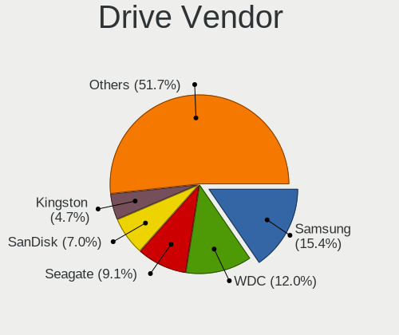

| Vendor                       | Computers | Drives | Percent |
|------------------------------|-----------|--------|---------|
| WDC                          | 21        | 28     | 11.29%  |
| Samsung Electronics          | 21        | 31     | 11.29%  |
| Seagate                      | 12        | 13     | 6.45%   |
| Sandisk                      | 11        | 11     | 5.91%   |
| Toshiba                      | 10        | 10     | 5.38%   |
| Unknown                      | 9         | 10     | 4.84%   |
| Kingston                     | 9         | 9      | 4.84%   |
| Crucial                      | 9         | 18     | 4.84%   |
| Micron Technology            | 6         | 6      | 3.23%   |
| KIOXIA                       | 6         | 7      | 3.23%   |
| Hitachi                      | 6         | 7      | 3.23%   |
| SPCC                         | 5         | 5      | 2.69%   |
| SK hynix                     | 5         | 5      | 2.69%   |
| Intel                        | 5         | 6      | 2.69%   |
| China                        | 5         | 8      | 2.69%   |
| A-DATA Technology            | 5         | 6      | 2.69%   |
| Apacer                       | 4         | 4      | 2.15%   |
| Apple                        | 3         | 3      | 1.61%   |
| Unknown                      | 3         | 3      | 1.61%   |
| Netac                        | 2         | 3      | 1.08%   |
| LITEONIT                     | 2         | 2      | 1.08%   |
| HGST                         | 2         | 2      | 1.08%   |
| Fujitsu                      | 2         | 2      | 1.08%   |
| X12                          | 1         | 1      | 0.54%   |
| WALRAM                       | 1         | 1      | 0.54%   |
| UMIS                         | 1         | 1      | 0.54%   |
| Timetec                      | 1         | 1      | 0.54%   |
| Team                         | 1         | 1      | 0.54%   |
| Space ke                     | 1         | 2      | 0.54%   |
| Silicon Motion               | 1         | 1      | 0.54%   |
| Shenzhen Longsys Electronics | 1         | 1      | 0.54%   |
| SABRENT                      | 1         | 3      | 0.54%   |
| Realtek                      | 1         | 1      | 0.54%   |
| PNY                          | 1         | 1      | 0.54%   |
| Plextor                      | 1         | 1      | 0.54%   |
| MAXIO Technology (Hangzhou)  | 1         | 1      | 0.54%   |
| LITEON                       | 1         | 1      | 0.54%   |
| Lexar                        | 1         | 1      | 0.54%   |
| Intenso                      | 1         | 1      | 0.54%   |
| HS-SSD-C100                  | 1         | 1      | 0.54%   |

Drive Model
-----------

Hard drive models

| Model                            | Computers | Percent |
|----------------------------------|-----------|---------|
| Toshiba MQ01ABF050 500GB         | 3         | 1.5%    |
| Unknown                          | 3         | 1.5%    |
| WDC WD10EZEX-60WN4A0 1TB         | 2         | 1%      |
| WDC WD10EZEX-00BN5A0 1TB         | 2         | 1%      |
| Unknown SD/MMC/MS PRO 256GB      | 2         | 1%      |
| Toshiba HDWD120 2TB              | 2         | 1%      |
| SanDisk NVMe SSD Drive 2TB       | 2         | 1%      |
| SanDisk NVMe SSD Drive 1TB       | 2         | 1%      |
| Samsung SSD 980 500GB            | 2         | 1%      |
| Samsung SSD 870 EVO 250GB        | 2         | 1%      |
| Samsung SSD 860 EVO 250GB        | 2         | 1%      |
| Samsung SSD 860 EVO 1TB          | 2         | 1%      |
| Micron MTFDKCD512TFK 512GB       | 2         | 1%      |
| KIOXIA KBG40ZNS512G NVMe 512GB   | 2         | 1%      |
| Kingston SA400S37480G 480GB SSD  | 2         | 1%      |
| Intel SSDPEKNW010T8 1TB          | 2         | 1%      |
| HGST HTS545050A7E680 500GB       | 2         | 1%      |
| Crucial CT2000MX500SSD1 2TB      | 2         | 1%      |
| Crucial CT1000MX500SSD1 1TB      | 2         | 1%      |
| China SSD 240GB                  | 2         | 1%      |
| Apacer AS350 128GB SSD           | 2         | 1%      |
| A-DATA SU650 120GB SSD           | 2         | 1%      |
| X12 SSD 480GB                    | 1         | 0.5%    |
| WDC WDS240G2G0B-00EPW0 240GB SSD | 1         | 0.5%    |
| WDC WDS120G2G0B-00EPW0 120GB SSD | 1         | 0.5%    |
| WDC WDS100T1R0A-68A4W0 1TB SSD   | 1         | 0.5%    |
| WDC WDBRPG0010BNC-WRSN 1TB       | 1         | 0.5%    |
| WDC WD800JD-75MSA3 80GB          | 1         | 0.5%    |
| WDC WD5000AAKX-60U6AA0 500GB     | 1         | 0.5%    |
| WDC WD5000AAKX-00ERMA0 500GB     | 1         | 0.5%    |
| WDC WD40EZRX-00SPEB0 4TB         | 1         | 0.5%    |
| WDC WD30EZRZ-00Z5HB0 3TB         | 1         | 0.5%    |
| WDC WD30EZRS-11J99B1 3TB         | 1         | 0.5%    |
| WDC WD2500BEVT-22A23T0 250GB     | 1         | 0.5%    |
| WDC WD2500AAJS-00B4A0 250GB      | 1         | 0.5%    |
| WDC WD20EZRZ-00Z5HB0 2TB         | 1         | 0.5%    |
| WDC WD20EZBX-00AYRA0 2TB         | 1         | 0.5%    |
| WDC WD1600BEKT-75PVMT0 160GB     | 1         | 0.5%    |
| WDC WD10SPZX-24Z10T0 1TB         | 1         | 0.5%    |
| WDC WD10EZEX-60ZF5A0 1TB         | 1         | 0.5%    |

HDD Vendor
----------

Hard disk drive vendors

| Vendor          | Computers | Drives | Percent |
|-----------------|-----------|--------|---------|
| WDC             | 13        | 19     | 27.66%  |
| Seagate         | 12        | 13     | 25.53%  |
| Toshiba         | 8         | 8      | 17.02%  |
| Hitachi         | 6         | 7      | 12.77%  |
| Unknown         | 2         | 2      | 4.26%   |
| HGST            | 2         | 2      | 4.26%   |
| Fujitsu         | 2         | 2      | 4.26%   |
| Space ke        | 1         | 2      | 2.13%   |
| Hewlett-Packard | 1         | 4      | 2.13%   |

SSD Vendor
----------

Solid state drive vendors

| Vendor              | Computers | Drives | Percent |
|---------------------|-----------|--------|---------|
| Samsung Electronics | 15        | 20     | 21.74%  |
| Kingston            | 8         | 8      | 11.59%  |
| Crucial             | 5         | 14     | 7.25%   |
| China               | 5         | 8      | 7.25%   |
| A-DATA Technology   | 5         | 6      | 7.25%   |
| WDC                 | 3         | 3      | 4.35%   |
| SPCC                | 3         | 3      | 4.35%   |
| SanDisk             | 2         | 2      | 2.9%    |
| Micron Technology   | 2         | 2      | 2.9%    |
| LITEONIT            | 2         | 2      | 2.9%    |
| Apple               | 2         | 2      | 2.9%    |
| Apacer              | 2         | 2      | 2.9%    |
| X12                 | 1         | 1      | 1.45%   |
| WALRAM              | 1         | 1      | 1.45%   |
| Unknown             | 1         | 1      | 1.45%   |
| Team                | 1         | 1      | 1.45%   |
| SABRENT             | 1         | 3      | 1.45%   |
| PNY                 | 1         | 1      | 1.45%   |
| Plextor             | 1         | 1      | 1.45%   |
| Netac               | 1         | 1      | 1.45%   |
| LITEON              | 1         | 1      | 1.45%   |
| Intenso             | 1         | 1      | 1.45%   |
| HS-SSD-C100         | 1         | 1      | 1.45%   |
| FORESEE             | 1         | 1      | 1.45%   |
| Fanxiang            | 1         | 1      | 1.45%   |
| Emtec               | 1         | 1      | 1.45%   |
| ASMT109x            | 1         | 1      | 1.45%   |

Drive Kind
----------

HDD or SSD

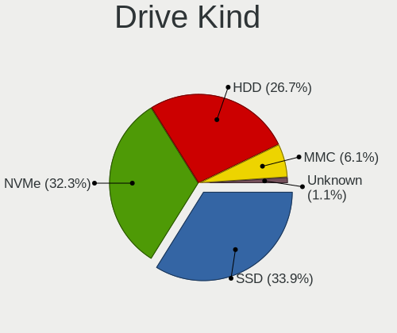

| Kind | Computers | Drives | Percent |
|------|-----------|--------|---------|
| SSD  | 62        | 89     | 36.05%  |
| NVMe | 56        | 68     | 32.56%  |
| HDD  | 44        | 59     | 25.58%  |
| MMC  | 10        | 12     | 5.81%   |

Drive Connector
---------------

SATA, SAS, NVMe, etc.

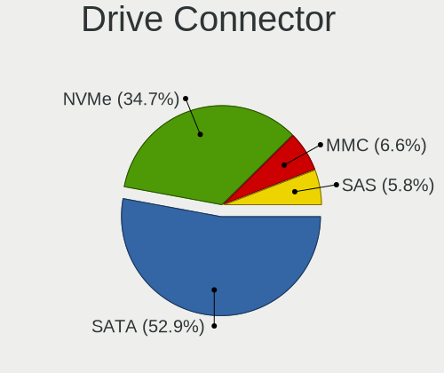

| Type | Computers | Drives | Percent |
|------|-----------|--------|---------|
| SATA | 88        | 141    | 55.35%  |
| NVMe | 55        | 66     | 34.59%  |
| MMC  | 10        | 12     | 6.29%   |
| SAS  | 6         | 9      | 3.77%   |

Drive Size
----------

Size of hard drive

| Size in TB | Computers | Drives | Percent |
|------------|-----------|--------|---------|
| 0.01-0.5   | 70        | 90     | 64.22%  |
| 0.51-1.0   | 22        | 35     | 20.18%  |
| 1.01-2.0   | 13        | 17     | 11.93%  |
| 2.01-3.0   | 2         | 3      | 1.83%   |
| 3.01-4.0   | 1         | 1      | 0.92%   |
| 4.01-10.0  | 1         | 2      | 0.92%   |

Space Total
-----------

Amount of disk space available on the file system

| Size in GB     | Computers | Percent |
|----------------|-----------|---------|
| 101-250        | 37        | 26.06%  |
| 251-500        | 26        | 18.31%  |
| 501-1000       | 19        | 13.38%  |
| 1-20           | 18        | 12.68%  |
| 51-100         | 15        | 10.56%  |
| 21-50          | 9         | 6.34%   |
| 2001-3000      | 7         | 4.93%   |
| 1001-2000      | 7         | 4.93%   |
| More than 3000 | 4         | 2.82%   |

Space Used
----------

Amount of used disk space

| Used GB        | Computers | Percent |
|----------------|-----------|---------|
| 1-20           | 62        | 43.97%  |
| 21-50          | 30        | 21.28%  |
| 101-250        | 17        | 12.06%  |
| 51-100         | 16        | 11.35%  |
| 1001-2000      | 6         | 4.26%   |
| 251-500        | 4         | 2.84%   |
| 501-1000       | 3         | 2.13%   |
| 2001-3000      | 2         | 1.42%   |
| More than 3000 | 1         | 0.71%   |

Malfunc. Drives
---------------

Drive models with a malfunction

| Model                                             | Computers | Drives | Percent |
|---------------------------------------------------|-----------|--------|---------|
| HGST HTS545050A7E680 500GB                        | 2         | 2      | 7.69%   |
| WDC WD40EZRX-00SPEB0 4TB                          | 1         | 1      | 3.85%   |
| WDC WD2500AAJS-00B4A0 250GB                       | 1         | 2      | 3.85%   |
| WDC WD1600BEKT-75PVMT0 160GB                      | 1         | 1      | 3.85%   |
| Toshiba MQ01ABF050 500GB                          | 1         | 1      | 3.85%   |
| Toshiba DT01ACA050 500GB                          | 1         | 1      | 3.85%   |
| Seagate ST9500325AS 500GB                         | 1         | 1      | 3.85%   |
| Seagate ST9320423AS 320GB                         | 1         | 1      | 3.85%   |
| Seagate ST500DM002-1BC142 500GB                   | 1         | 1      | 3.85%   |
| Seagate ST320LT012-9WS14C 320GB                   | 1         | 1      | 3.85%   |
| Seagate ST320LT009-9WC142 320GB                   | 1         | 1      | 3.85%   |
| SanDisk SSD PLUS 480GB                            | 1         | 1      | 3.85%   |
| Samsung Electronics SSD 870 EVO 250GB             | 1         | 2      | 3.85%   |
| Netac SSD 240GB                                   | 1         | 1      | 3.85%   |
| Micron Technology MTFDDAK2T0TDL-1AW1ZABHA 2TB SSD | 1         | 1      | 3.85%   |
| LITEONIT L8T-256L6G-HP 256GB SSD                  | 1         | 1      | 3.85%   |
| Kingston SV300S37A120G 120GB SSD                  | 1         | 1      | 3.85%   |
| Hitachi HUA722020ALA331 2TB                       | 1         | 1      | 3.85%   |
| Hitachi HTS545050A7E380 500GB                     | 1         | 1      | 3.85%   |
| Hitachi HTS542525K9SA00 250GB                     | 1         | 1      | 3.85%   |
| Hitachi HTS541080G9AT00 80GB                      | 1         | 1      | 3.85%   |
| Hitachi HDP725025GLA380 250GB                     | 1         | 1      | 3.85%   |
| Fujitsu MHW2120BJ G2 120GB                        | 1         | 1      | 3.85%   |
| Crucial CT1000MX500SSD4 1TB                       | 1         | 8      | 3.85%   |
| A-DATA Technology SU900 256GB SSD                 | 1         | 2      | 3.85%   |

Malfunc. Drive Vendor
---------------------

Vendors of faulty drives

| Vendor              | Computers | Drives | Percent |
|---------------------|-----------|--------|---------|
| Seagate             | 5         | 5      | 19.23%  |
| Hitachi             | 5         | 5      | 19.23%  |
| WDC                 | 3         | 4      | 11.54%  |
| Toshiba             | 2         | 2      | 7.69%   |
| HGST                | 2         | 2      | 7.69%   |
| SanDisk             | 1         | 1      | 3.85%   |
| Samsung Electronics | 1         | 2      | 3.85%   |
| Netac               | 1         | 1      | 3.85%   |
| Micron Technology   | 1         | 1      | 3.85%   |
| LITEONIT            | 1         | 1      | 3.85%   |
| Kingston            | 1         | 1      | 3.85%   |
| Fujitsu             | 1         | 1      | 3.85%   |
| Crucial             | 1         | 8      | 3.85%   |
| A-DATA Technology   | 1         | 2      | 3.85%   |

Malfunc. HDD Vendor
-------------------

Vendors of faulty HDD drives

| Vendor  | Computers | Drives | Percent |
|---------|-----------|--------|---------|
| Seagate | 5         | 5      | 27.78%  |
| Hitachi | 5         | 5      | 27.78%  |
| WDC     | 3         | 4      | 16.67%  |
| Toshiba | 2         | 2      | 11.11%  |
| HGST    | 2         | 2      | 11.11%  |
| Fujitsu | 1         | 1      | 5.56%   |

Malfunc. Drive Kind
-------------------

Kinds of faulty drives

| Kind | Computers | Drives | Percent |
|------|-----------|--------|---------|
| HDD  | 17        | 19     | 68%     |
| SSD  | 8         | 17     | 32%     |

Failed Drives
-------------

Failed drive models

Zero info for selected period =(

Failed Drive Vendor
-------------------

Failed drive vendors

Zero info for selected period =(

Drive Status
------------

Number of failed and malfunc. drives

| Status   | Computers | Drives | Percent |
|----------|-----------|--------|---------|
| Works    | 109       | 162    | 69.87%  |
| Malfunc  | 25        | 36     | 16.03%  |
| Detected | 22        | 30     | 14.1%   |

Storage controller
------------------

Storage Vendor
--------------

Storage controller vendors

| Vendor                       | Computers | Percent |
|------------------------------|-----------|---------|
| Intel                        | 93        | 55.36%  |
| AMD                          | 19        | 11.31%  |
| SanDisk                      | 12        | 7.14%   |
| Samsung Electronics          | 9         | 5.36%   |
| KIOXIA                       | 6         | 3.57%   |
| SK hynix                     | 4         | 2.38%   |
| Silicon Motion               | 4         | 2.38%   |
| Micron/Crucial Technology    | 4         | 2.38%   |
| Micron Technology            | 4         | 2.38%   |
| Toshiba America Info Systems | 2         | 1.19%   |
| Realtek Semiconductor        | 2         | 1.19%   |
| Nvidia                       | 2         | 1.19%   |
| MAXIO Technology (Hangzhou)  | 2         | 1.19%   |
| Union Memory (Shenzhen)      | 1         | 0.6%    |
| Shenzhen Longsys Electronics | 1         | 0.6%    |
| Marvell Technology Group     | 1         | 0.6%    |
| Kingston Technology Company  | 1         | 0.6%    |
| Hewlett-Packard              | 1         | 0.6%    |

Storage Model
-------------

Storage controller models

| Model                                                                          | Computers | Percent |
|--------------------------------------------------------------------------------|-----------|---------|
| AMD FCH SATA Controller [AHCI mode]                                            | 15        | 7.85%   |
| Intel Volume Management Device NVMe RAID Controller                            | 8         | 4.19%   |
| Intel 7 Series Chipset Family 6-port SATA Controller [AHCI mode]               | 8         | 4.19%   |
| Intel Celeron/Pentium Silver Processor SATA Controller                         | 7         | 3.66%   |
| Intel 82801 Mobile SATA Controller [RAID mode]                                 | 5         | 2.62%   |
| Intel 6 Series/C200 Series Chipset Family 6 port Mobile SATA AHCI Controller   | 5         | 2.62%   |
| SanDisk WD Black SN770 / PC SN740 256GB / PC SN560 (DRAM-less) NVMe SSD        | 4         | 2.09%   |
| Micron/Crucial P2 [Nick P2] / P3 / P3 Plus NVMe PCIe SSD (DRAM-less)           | 4         | 2.09%   |
| Micron 2450 NVMe SSD [HendrixV] (DRAM-less)                                    | 4         | 2.09%   |
| KIOXIA NVMe SSD Controller BG4 (DRAM-less)                                     | 4         | 2.09%   |
| Intel 8 Series/C220 Series Chipset Family 6-port SATA Controller 1 [AHCI mode] | 4         | 2.09%   |
| Intel 7 Series/C210 Series Chipset Family 6-port SATA Controller [AHCI mode]   | 4         | 2.09%   |
| Intel 200 Series PCH SATA controller [AHCI mode]                               | 4         | 2.09%   |
| Silicon Motion SM2263EN/SM2263XT (DRAM-less) NVMe SSD Controllers              | 3         | 1.57%   |
| Samsung NVMe SSD Controller SM981/PM981/PM983                                  | 3         | 1.57%   |
| Samsung NVMe SSD Controller 980 (DRAM-less)                                    | 3         | 1.57%   |
| Intel Comet Lake SATA AHCI Controller                                          | 3         | 1.57%   |
| Intel Cannon Point-LP SATA Controller [AHCI Mode]                              | 3         | 1.57%   |
| Intel Alder Lake-S PCH SATA Controller [AHCI Mode]                             | 3         | 1.57%   |
| Intel Alder Lake-P SATA AHCI Controller                                        | 3         | 1.57%   |
| Intel 82801HM/HEM (ICH8M/ICH8M-E) IDE Controller                               | 3         | 1.57%   |
| Intel 82801FB/FBM/FR/FW/FRW (ICH6 Family) IDE Controller                       | 3         | 1.57%   |
| Intel 6 Series/C200 Series Chipset Family 6 port Desktop SATA AHCI Controller  | 3         | 1.57%   |
| SK hynix Gold P31/BC711/PC711 NVMe Solid State Drive                           | 2         | 1.05%   |
| SK hynix BC901 NVMe Solid State Drive (DRAM-less)                              | 2         | 1.05%   |
| SanDisk WD PC SN810 / Black SN850 NVMe SSD                                     | 2         | 1.05%   |
| SanDisk Ultra 3D / WD Blue SN550 NVMe SSD                                      | 2         | 1.05%   |
| Realtek RTS5765DL NVMe SSD Controller (DRAM-less)                              | 2         | 1.05%   |
| MAXIO (Hangzhou) NVMe SSD Controller MAP1202 (DRAM-less)                       | 2         | 1.05%   |
| Intel Wildcat Point-LP SATA Controller [AHCI Mode]                             | 2         | 1.05%   |
| Intel Sunrise Point-LP SATA Controller [AHCI mode]                             | 2         | 1.05%   |
| Intel SSD 660P Series                                                          | 2         | 1.05%   |
| Intel Q170/Q150/B150/H170/H110/Z170/CM236 Chipset SATA Controller [AHCI Mode]  | 2         | 1.05%   |
| Intel NM10/ICH7 Family SATA Controller [IDE mode]                              | 2         | 1.05%   |
| Intel Comet Lake PCH-H RAID                                                    | 2         | 1.05%   |
| Intel Celeron N3350/Pentium N4200/Atom E3900 Series SATA AHCI Controller       | 2         | 1.05%   |
| Intel Cannon Lake Mobile PCH SATA AHCI Controller                              | 2         | 1.05%   |
| Intel 82801IBM/IEM (ICH9M/ICH9M-E) 4 port SATA Controller [AHCI mode]          | 2         | 1.05%   |
| Intel 82801HM/HEM (ICH8M/ICH8M-E) SATA Controller [AHCI mode]                  | 2         | 1.05%   |
| Intel 5 Series/3400 Series Chipset 6 port SATA AHCI Controller                 | 2         | 1.05%   |

Storage Kind
------------

Kind of storage controller (IDE, SATA, NVMe, SAS, ...)

| Kind | Computers | Percent |
|------|-----------|---------|
| SATA | 90        | 51.72%  |
| NVMe | 52        | 29.89%  |
| RAID | 16        | 9.2%    |
| IDE  | 16        | 9.2%    |

Processor
---------

CPU Vendor
----------

Processor vendors

| Vendor | Computers | Percent |
|--------|-----------|---------|
| Intel  | 108       | 78.83%  |
| AMD    | 29        | 21.17%  |

CPU Model
---------

Processor models

| Model                                    | Computers | Percent |
|------------------------------------------|-----------|---------|
| Intel 12th Gen Core i5-1235U             | 5         | 3.65%   |
| Intel Core i7-3770 CPU @ 3.40GHz         | 3         | 2.19%   |
| Intel Pentium Silver N5000 CPU @ 1.10GHz | 2         | 1.46%   |
| Intel Core i7-4810MQ CPU @ 2.80GHz       | 2         | 1.46%   |
| Intel Core i7-10510U CPU @ 1.80GHz       | 2         | 1.46%   |
| Intel Core i5-8250U CPU @ 1.60GHz        | 2         | 1.46%   |
| Intel Core i5-10210U CPU @ 1.60GHz       | 2         | 1.46%   |
| Intel Core i5 CPU M 560 @ 2.67GHz        | 2         | 1.46%   |
| Intel Core 2 Quad CPU Q6600 @ 2.40GHz    | 2         | 1.46%   |
| Intel Celeron N4020 CPU @ 1.10GHz        | 2         | 1.46%   |
| Intel 11th Gen Core i3-1115G4 @ 3.00GHz  | 2         | 1.46%   |
| AMD Ryzen 7 5700U with Radeon Graphics   | 2         | 1.46%   |
| AMD Ryzen 5 5600H with Radeon Graphics   | 2         | 1.46%   |
| AMD Ryzen 5 5500U with Radeon Graphics   | 2         | 1.46%   |
| AMD Ryzen 5 2600 Six-Core Processor      | 2         | 1.46%   |
| Intel Xeon CPU E5320 @ 1.86GHz           | 1         | 0.73%   |
| Intel Pentium M processor 1.60GHz        | 1         | 0.73%   |
| Intel Pentium CPU N3710 @ 1.60GHz        | 1         | 0.73%   |
| Intel Pentium CPU N3540 @ 2.16GHz        | 1         | 0.73%   |
| Intel Pentium CPU J4205 @ 1.50GHz        | 1         | 0.73%   |
| Intel Pentium CPU B950 @ 2.10GHz         | 1         | 0.73%   |
| Intel Pentium CPU 2117U @ 1.80GHz        | 1         | 0.73%   |
| Intel Pentium 4 CPU 3.20GHz              | 1         | 0.73%   |
| Intel Genuine CPU U7300 @ 1.30GHz        | 1         | 0.73%   |
| Intel Genuine CPU T2600 @ 2.16GHz        | 1         | 0.73%   |
| Intel Core i7-9750H CPU @ 2.60GHz        | 1         | 0.73%   |
| Intel Core i7-8750H CPU @ 2.20GHz        | 1         | 0.73%   |
| Intel Core i7-7700T CPU @ 2.90GHz        | 1         | 0.73%   |
| Intel Core i7-7700K CPU @ 4.20GHz        | 1         | 0.73%   |
| Intel Core i7-6820HQ CPU @ 2.70GHz       | 1         | 0.73%   |
| Intel Core i7-6600U CPU @ 2.60GHz        | 1         | 0.73%   |
| Intel Core i7-5600U CPU @ 2.60GHz        | 1         | 0.73%   |
| Intel Core i7-5500U CPU @ 2.40GHz        | 1         | 0.73%   |
| Intel Core i7-3630QM CPU @ 2.40GHz       | 1         | 0.73%   |
| Intel Core i7-3537U CPU @ 2.00GHz        | 1         | 0.73%   |
| Intel Core i7-3520M CPU @ 2.90GHz        | 1         | 0.73%   |
| Intel Core i7-2670QM CPU @ 2.20GHz       | 1         | 0.73%   |
| Intel Core i7-2630QM CPU @ 2.00GHz       | 1         | 0.73%   |
| Intel Core i7-2600 CPU @ 3.40GHz         | 1         | 0.73%   |
| Intel Core i7-10875H CPU @ 2.30GHz       | 1         | 0.73%   |

CPU Model Family
----------------

Processor model prefix

| Model                | Computers | Percent |
|----------------------|-----------|---------|
| Intel Core i5        | 30        | 21.9%   |
| Intel Core i7        | 23        | 16.79%  |
| Other                | 19        | 13.87%  |
| AMD Ryzen 5          | 10        | 7.3%    |
| Intel Celeron        | 8         | 5.84%   |
| AMD Ryzen 7          | 7         | 5.11%   |
| Intel Pentium        | 5         | 3.65%   |
| Intel Core i3        | 5         | 3.65%   |
| Intel Core 2 Duo     | 5         | 3.65%   |
| Intel Atom           | 3         | 2.19%   |
| AMD Ryzen 3          | 3         | 2.19%   |
| Intel Pentium Silver | 2         | 1.46%   |
| Intel Genuine        | 2         | 1.46%   |
| Intel Core 2 Quad    | 2         | 1.46%   |
| Intel Xeon           | 1         | 0.73%   |
| Intel Pentium M      | 1         | 0.73%   |
| Intel Pentium 4      | 1         | 0.73%   |
| Intel Core 2         | 1         | 0.73%   |
| Intel Celeron M      | 1         | 0.73%   |
| AMD Turion Neo X2    | 1         | 0.73%   |
| AMD Turion 64 X2     | 1         | 0.73%   |
| AMD Ryzen 9          | 1         | 0.73%   |
| AMD Ryzen 3 PRO      | 1         | 0.73%   |
| AMD Athlon X4        | 1         | 0.73%   |
| AMD A6               | 1         | 0.73%   |
| AMD A4               | 1         | 0.73%   |
| AMD A10              | 1         | 0.73%   |

CPU Cores
---------

Number of processor cores

| Number | Computers | Percent |
|--------|-----------|---------|
| 4      | 48        | 35.04%  |
| 2      | 47        | 34.31%  |
| 6      | 19        | 13.87%  |
| 8      | 10        | 7.3%    |
| 10     | 7         | 5.11%   |
| 1      | 4         | 2.92%   |
| 14     | 2         | 1.46%   |

CPU Sockets
-----------

Number of sockets

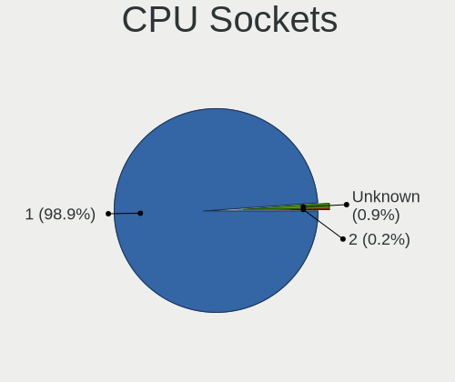

| Number | Computers | Percent |
|--------|-----------|---------|
| 1      | 137       | 100%    |

CPU Threads
-----------

Threads per core (Hyper-Threading)

| Number | Computers | Percent |
|--------|-----------|---------|
| 2      | 91        | 66.42%  |
| 1      | 46        | 33.58%  |

CPU Op-Modes
------------

CPU Operation Modes (32-bit, 64-bit)

| Op mode        | Computers | Percent |
|----------------|-----------|---------|
| 32-bit, 64-bit | 134       | 97.81%  |
| 32-bit         | 3         | 2.19%   |

CPU Microcode
-------------

Microcode number

| Number     | Computers | Percent |
|------------|-----------|---------|
| Unknown    | 43        | 31.16%  |
| 0x306a9    | 8         | 5.8%    |
| 0x206a7    | 8         | 5.8%    |
| 0x806ec    | 6         | 4.35%   |
| 0x0a50000c | 5         | 3.62%   |
| 0x706a1    | 4         | 2.9%    |
| 0x306c3    | 4         | 2.9%    |
| 0x906a4    | 3         | 2.17%   |
| 0x6fb      | 3         | 2.17%   |
| 0x406c4    | 3         | 2.17%   |
| 0x20655    | 3         | 2.17%   |
| 0xb06a3    | 2         | 1.45%   |
| 0x906ea    | 2         | 1.45%   |
| 0x906e9    | 2         | 1.45%   |
| 0x906a3    | 2         | 1.45%   |
| 0x806c2    | 2         | 1.45%   |
| 0x6d8      | 2         | 1.45%   |
| 0x506e3    | 2         | 1.45%   |
| 0x506c9    | 2         | 1.45%   |
| 0x306d4    | 2         | 1.45%   |
| 0x30678    | 2         | 1.45%   |
| 0x1067a    | 2         | 1.45%   |
| 0x08608103 | 2         | 1.45%   |
| 0x0600611a | 2         | 1.45%   |
| 0xa0671    | 1         | 0.72%   |
| 0xa0655    | 1         | 0.72%   |
| 0x806ea    | 1         | 0.72%   |
| 0x706a8    | 1         | 0.72%   |
| 0x6e8      | 1         | 0.72%   |
| 0x406e3    | 1         | 0.72%   |
| 0x406c3    | 1         | 0.72%   |
| 0x40651    | 1         | 0.72%   |
| 0x10676    | 1         | 0.72%   |
| 0x0a704103 | 1         | 0.72%   |
| 0x0a704101 | 1         | 0.72%   |
| 0x0a601206 | 1         | 0.72%   |
| 0x0a50000d | 1         | 0.72%   |
| 0x0a404102 | 1         | 0.72%   |
| 0x08a00006 | 1         | 0.72%   |
| 0x08608104 | 1         | 0.72%   |

CPU Microarch
-------------

Microarchitecture

| Name             | Computers | Percent |
|------------------|-----------|---------|
| KabyLake         | 16        | 11.68%  |
| IvyBridge        | 14        | 10.22%  |
| Alderlake Hybrid | 12        | 8.76%   |
| Unknown          | 10        | 7.3%    |
| SandyBridge      | 9         | 6.57%   |
| Goldmont plus    | 8         | 5.84%   |
| Haswell          | 7         | 5.11%   |
| Zen 3            | 6         | 4.38%   |
| Silvermont       | 6         | 4.38%   |
| Core             | 6         | 4.38%   |
| Skylake          | 5         | 3.65%   |
| Zen+             | 4         | 2.92%   |
| Westmere         | 4         | 2.92%   |
| TigerLake        | 4         | 2.92%   |
| Penryn           | 4         | 2.92%   |
| P6               | 3         | 2.19%   |
| Excavator        | 3         | 2.19%   |
| CometLake        | 3         | 2.19%   |
| Zen 2            | 2         | 1.46%   |
| K8 Hammer        | 2         | 1.46%   |
| Icelake          | 2         | 1.46%   |
| Goldmont         | 2         | 1.46%   |
| Broadwell        | 2         | 1.46%   |
| Steamroller      | 1         | 0.73%   |
| NetBurst         | 1         | 0.73%   |
| K10 Llano        | 1         | 0.73%   |

Graphics
--------

GPU Vendor
----------

Vendors of graphics cards

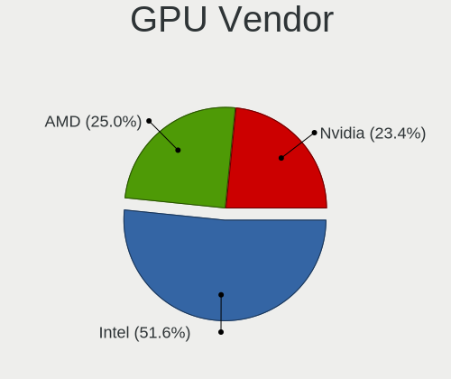

| Vendor | Computers | Percent |
|--------|-----------|---------|
| Intel  | 88        | 54.66%  |
| Nvidia | 40        | 24.84%  |
| AMD    | 33        | 20.5%   |

GPU Model
---------

Graphics card models

| Model                                                                                    | Computers | Percent |
|------------------------------------------------------------------------------------------|-----------|---------|
| Intel 3rd Gen Core processor Graphics Controller                                         | 9         | 5.45%   |
| Intel 2nd Generation Core Processor Family Integrated Graphics Controller                | 7         | 4.24%   |
| Intel GeminiLake [UHD Graphics 600]                                                      | 6         | 3.64%   |
| AMD Lucienne                                                                             | 5         | 3.03%   |
| AMD Cezanne [Radeon Vega Series / Radeon Vega Mobile Series]                             | 5         | 3.03%   |
| Intel CometLake-U GT2 [UHD Graphics]                                                     | 4         | 2.42%   |
| Intel Atom/Celeron/Pentium Processor x5-E8000/J3xxx/N3xxx Integrated Graphics Controller | 4         | 2.42%   |
| Intel WhiskeyLake-U GT2 [UHD Graphics 620]                                               | 3         | 1.82%   |
| Intel UHD Graphics 620                                                                   | 3         | 1.82%   |
| Intel Skylake GT2 [HD Graphics 520]                                                      | 3         | 1.82%   |
| Intel Core Processor Integrated Graphics Controller                                      | 3         | 1.82%   |
| Intel Alder Lake-UP3 GT2 [Iris Xe Graphics]                                              | 3         | 1.82%   |
| Nvidia TU106 [GeForce RTX 2070 Rev. A]                                                   | 2         | 1.21%   |
| Nvidia GP108 [GeForce GT 1030]                                                           | 2         | 1.21%   |
| Nvidia GK110 [GeForce GTX 780]                                                           | 2         | 1.21%   |
| Nvidia GF119 [GeForce GT 610]                                                            | 2         | 1.21%   |
| Intel TigerLake-LP GT2 [Iris Xe Graphics]                                                | 2         | 1.21%   |
| Intel Tiger Lake-LP GT2 [UHD Graphics G4]                                                | 2         | 1.21%   |
| Intel Raptor Lake-P [Iris Xe Graphics]                                                   | 2         | 1.21%   |
| Intel Mobile 4 Series Chipset Integrated Graphics Controller                             | 2         | 1.21%   |
| Intel HD Graphics 630                                                                    | 2         | 1.21%   |
| Intel HD Graphics 5500                                                                   | 2         | 1.21%   |
| Intel Haswell-ULT Integrated Graphics Controller                                         | 2         | 1.21%   |
| Intel GeminiLake [UHD Graphics 605]                                                      | 2         | 1.21%   |
| Intel CoffeeLake-S GT2 [UHD Graphics 630]                                                | 2         | 1.21%   |
| Intel Atom Processor Z36xxx/Z37xxx Series Graphics & Display                             | 2         | 1.21%   |
| Intel Alder Lake-UP3 GT2 [UHD Graphics]                                                  | 2         | 1.21%   |
| Intel 4th Gen Core Processor Integrated Graphics Controller                              | 2         | 1.21%   |
| AMD Wani [Radeon R5/R6/R7 Graphics]                                                      | 2         | 1.21%   |
| AMD RV610/M74 [Mobility Radeon HD 2400 XT]                                               | 2         | 1.21%   |
| AMD Phoenix1                                                                             | 2         | 1.21%   |
| AMD Ellesmere [Radeon RX 470/480/570/570X/580/580X/590]                                  | 2         | 1.21%   |
| Nvidia TU117M [GeForce GTX 1650 Mobile / Max-Q]                                          | 1         | 0.61%   |
| Nvidia TU117GLM [T600 Laptop GPU]                                                        | 1         | 0.61%   |
| Nvidia TU117 [GeForce GTX 1650]                                                          | 1         | 0.61%   |
| Nvidia TU106M [GeForce RTX 2060 Max-Q]                                                   | 1         | 0.61%   |
| Nvidia NV44M [GeForce Go 6200]                                                           | 1         | 0.61%   |
| Nvidia GT218 [GeForce 8400 GS Rev. 3]                                                    | 1         | 0.61%   |
| Nvidia GP108M [GeForce MX250]                                                            | 1         | 0.61%   |
| Nvidia GP108M [GeForce MX230]                                                            | 1         | 0.61%   |

GPU Combo
---------

Combinations of graphics cards

| Name           | Computers | Percent |
|----------------|-----------|---------|
| 1 x Intel      | 63        | 45.65%  |
| 1 x AMD        | 25        | 18.12%  |
| 1 x Nvidia     | 21        | 15.22%  |
| Intel + Nvidia | 15        | 10.87%  |
| Intel + AMD    | 5         | 3.62%   |
| 2 x Intel      | 4         | 2.9%    |
| AMD + Nvidia   | 3         | 2.17%   |
| 2 x Nvidia     | 1         | 0.72%   |
| 2 x AMD        | 1         | 0.72%   |

GPU Driver
----------

Free vs proprietary

| Driver      | Computers | Percent |
|-------------|-----------|---------|
| Free        | 121       | 88.32%  |
| Proprietary | 15        | 10.95%  |
| Unknown     | 1         | 0.73%   |

GPU Memory
----------

Total video memory

| Size in GB | Computers | Percent |
|------------|-----------|---------|
| Unknown    | 84        | 60.43%  |
| 0.01-0.5   | 27        | 19.42%  |
| 1.01-2.0   | 11        | 7.91%   |
| 3.01-4.0   | 6         | 4.32%   |
| 0.51-1.0   | 4         | 2.88%   |
| 2.01-3.0   | 3         | 2.16%   |
| 7.01-8.0   | 2         | 1.44%   |
| 4.01-5.0   | 1         | 0.72%   |
| 8.01-16.0  | 1         | 0.72%   |

Monitor
-------

Monitor Vendor
--------------

Monitor vendors

| Vendor                  | Computers | Percent |
|-------------------------|-----------|---------|
| AU Optronics            | 18        | 12.16%  |
| Samsung Electronics     | 17        | 11.49%  |
| LG Display              | 12        | 8.11%   |
| BOE                     | 12        | 8.11%   |
| Chimei Innolux          | 9         | 6.08%   |
| Apple                   | 8         | 5.41%   |
| Goldstar                | 6         | 4.05%   |
| Chi Mei Optoelectronics | 6         | 4.05%   |
| Acer                    | 5         | 3.38%   |
| Sharp                   | 4         | 2.7%    |
| Dell                    | 4         | 2.7%    |
| BenQ                    | 4         | 2.7%    |
| InfoVision              | 3         | 2.03%   |
| Hewlett-Packard         | 3         | 2.03%   |
| AOC                     | 3         | 2.03%   |
| Ancor Communications    | 3         | 2.03%   |
| ViewSonic               | 2         | 1.35%   |
| Sony                    | 2         | 1.35%   |
| Philips                 | 2         | 1.35%   |
| Lenovo                  | 2         | 1.35%   |
| ASUSTek Computer        | 2         | 1.35%   |
| Yeyian                  | 1         | 0.68%   |
| Vizio                   | 1         | 0.68%   |
| Toshiba                 | 1         | 0.68%   |
| SKG                     | 1         | 0.68%   |
| SGT                     | 1         | 0.68%   |
| Sceptre Tech            | 1         | 0.68%   |
| Quanta Display          | 1         | 0.68%   |
| PANDA                   | 1         | 0.68%   |
| NECCI                   | 1         | 0.68%   |
| MVM                     | 1         | 0.68%   |
| Mi                      | 1         | 0.68%   |
| LG Philips              | 1         | 0.68%   |
| LG Electronics          | 1         | 0.68%   |
| JRY                     | 1         | 0.68%   |
| Insignia                | 1         | 0.68%   |
| Gigabyte Technology     | 1         | 0.68%   |
| Gericom                 | 1         | 0.68%   |
| Fujitsu Siemens         | 1         | 0.68%   |
| DENON                   | 1         | 0.68%   |

Monitor Model
-------------

Monitor models

| Model                                                                    | Computers | Percent |
|--------------------------------------------------------------------------|-----------|---------|
| Samsung Electronics LCD Monitor SEC5441 1366x768 344x194mm 15.5-inch     | 2         | 1.32%   |
| Samsung Electronics LCD Monitor SEC324A 1366x768 344x194mm 15.5-inch     | 2         | 1.32%   |
| LG Display LCD Monitor LGD0709 1920x1080 344x194mm 15.5-inch             | 2         | 1.32%   |
| Chi Mei Optoelectronics LCD Monitor CMO15A7 1366x768 344x193mm 15.5-inch | 2         | 1.32%   |
| Apple Color LCD APP9C6B 1680x1050 433x270mm 20.1-inch                    | 2         | 1.32%   |
| Acer KA220HQ ACR0467 1920x1080 477x268mm 21.5-inch                       | 2         | 1.32%   |
| Yeyian YMG-4K27-01 YEY2700 3840x2160 600x330mm 27.0-inch                 | 1         | 0.66%   |
| Vizio E32-C1 VIZ1004 1920x1080 698x392mm 31.5-inch                       | 1         | 0.66%   |
| ViewSonic VX3276-UHD VSC5138 3840x2160 697x392mm 31.5-inch               | 1         | 0.66%   |
| ViewSonic VX2452 Series VSCDE2E 1920x1080 521x293mm 23.5-inch            | 1         | 0.66%   |
| Toshiba TV TSB0206 1920x1080                                             | 1         | 0.66%   |
| Sony TV SNY3002 1920x1080 1018x573mm 46.0-inch                           | 1         | 0.66%   |
| Sony TV SNY2C02 1920x1080 708x398mm 32.0-inch                            | 1         | 0.66%   |
| SKG AF24H1 SKG2409 1920x1080 600x330mm 27.0-inch                         | 1         | 0.66%   |
| Sharp LCD Monitor SHP1515 1920x1200 336x210mm 15.6-inch                  | 1         | 0.66%   |
| Sharp LCD Monitor SHP14D6 3840x2400 366x229mm 17.0-inch                  | 1         | 0.66%   |
| Sharp LCD Monitor SHP14BA 1920x1080 344x194mm 15.5-inch                  | 1         | 0.66%   |
| Sharp LCD Monitor SHP1453 1920x1080 346x194mm 15.6-inch                  | 1         | 0.66%   |
| SGT F156P1 SGT1600 1920x1080 345x194mm 15.6-inch                         | 1         | 0.66%   |
| Sceptre Tech Sceptre F24 SPT09AB 1920x1080 530x290mm 23.8-inch           | 1         | 0.66%   |
| Samsung Electronics SyncMaster SAM0609 1920x1080 510x290mm 23.1-inch     | 1         | 0.66%   |
| Samsung Electronics SMS19A100 SAM0867 1366x768 410x230mm 18.5-inch       | 1         | 0.66%   |
| Samsung Electronics S22E450 SAM0C98 1680x1050 473x291mm 21.9-inch        | 1         | 0.66%   |
| Samsung Electronics LU28R55 SAM1017 3840x2160 632x360mm 28.6-inch        | 1         | 0.66%   |
| Samsung Electronics LS24AG32x SAM71D9 1920x1080 530x300mm 24.0-inch      | 1         | 0.66%   |
| Samsung Electronics LCD Monitor SEC4251 1366x768 344x194mm 15.5-inch     | 1         | 0.66%   |
| Samsung Electronics LCD Monitor SEC364A 1366x768 344x194mm 15.5-inch     | 1         | 0.66%   |
| Samsung Electronics LCD Monitor SEC314C 1920x1080 344x194mm 15.5-inch    | 1         | 0.66%   |
| Samsung Electronics LCD Monitor SDC4C48 1920x1080 344x194mm 15.5-inch    | 1         | 0.66%   |
| Samsung Electronics LCD Monitor SDC415D 3840x2400 344x215mm 16.0-inch    | 1         | 0.66%   |
| Samsung Electronics LCD Monitor SAM0C39 1920x1080 885x498mm 40.0-inch    | 1         | 0.66%   |
| Samsung Electronics LCD Monitor SAM0900 1366x768 700x390mm 31.5-inch     | 1         | 0.66%   |
| Samsung Electronics LC32T55 SAM7024 1920x1080 699x393mm 31.6-inch        | 1         | 0.66%   |
| Quanta Display LCD Monitor QDS0047 1280x800 304x190mm 14.1-inch          | 1         | 0.66%   |
| Philips 221P3LPY PHL08A3 1920x1080 477x268mm 21.5-inch                   | 1         | 0.66%   |
| Philips 170C PHL0848 1280x1024 338x270mm 17.0-inch                       | 1         | 0.66%   |
| PANDA LCD Monitor NCP004F 1920x1080 309x174mm 14.0-inch                  | 1         | 0.66%   |
| NECCI NEC LV17m NCI4017 1280x1024 337x270mm 17.0-inch                    | 1         | 0.66%   |
| MVM MV192W_A MVM0192 1440x900 410x256mm 19.0-inch                        | 1         | 0.66%   |
| Mi 27 NFGL XMIB004 1920x1080 598x336mm 27.0-inch                         | 1         | 0.66%   |

Monitor Resolution
------------------

Monitor screen resolution

| Resolution         | Computers | Percent |
|--------------------|-----------|---------|
| 1920x1080 (FHD)    | 71        | 48.97%  |
| 1366x768 (WXGA)    | 32        | 22.07%  |
| 2560x1440 (QHD)    | 8         | 5.52%   |
| 3840x2160 (4K)     | 7         | 4.83%   |
| 1280x800 (WXGA)    | 7         | 4.83%   |
| 1600x900 (HD+)     | 4         | 2.76%   |
| 1440x900 (WXGA+)   | 4         | 2.76%   |
| 1680x1050 (WSXGA+) | 3         | 2.07%   |
| 3840x2400          | 2         | 1.38%   |
| 1280x1024 (SXGA)   | 2         | 1.38%   |
| 3072x1920          | 1         | 0.69%   |
| 2560x1600          | 1         | 0.69%   |
| 1920x1200 (WUXGA)  | 1         | 0.69%   |
| 1024x768 (XGA)     | 1         | 0.69%   |
| Unknown            | 1         | 0.69%   |

Monitor Diagonal
----------------

Diagonal size in inches

| Inches  | Computers | Percent |
|---------|-----------|---------|
| 15      | 42        | 28.19%  |
| 14      | 14        | 9.4%    |
| 13      | 13        | 8.72%   |
| 23      | 11        | 7.38%   |
| 21      | 11        | 7.38%   |
| 27      | 9         | 6.04%   |
| 24      | 7         | 4.7%    |
| 31      | 5         | 3.36%   |
| 16      | 5         | 3.36%   |
| 20      | 4         | 2.68%   |
| 18      | 4         | 2.68%   |
| 17      | 4         | 2.68%   |
| 12      | 3         | 2.01%   |
| 11      | 3         | 2.01%   |
| 54      | 2         | 1.34%   |
| 19      | 2         | 1.34%   |
| 74      | 1         | 0.67%   |
| 65      | 1         | 0.67%   |
| 61      | 1         | 0.67%   |
| 55      | 1         | 0.67%   |
| 49      | 1         | 0.67%   |
| 46      | 1         | 0.67%   |
| 32      | 1         | 0.67%   |
| 28      | 1         | 0.67%   |
| 25      | 1         | 0.67%   |
| Unknown | 1         | 0.67%   |

Monitor Width
-------------

Physical width

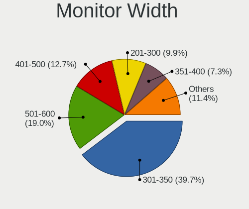

| Width in mm | Computers | Percent |
|-------------|-----------|---------|
| 301-350     | 63        | 42.86%  |
| 501-600     | 26        | 17.69%  |
| 401-500     | 21        | 14.29%  |
| 201-300     | 15        | 10.2%   |
| 1001-1500   | 7         | 4.76%   |
| 601-700     | 6         | 4.08%   |
| 351-400     | 6         | 4.08%   |
| 701-800     | 1         | 0.68%   |
| 1501-2000   | 1         | 0.68%   |
| Unknown     | 1         | 0.68%   |

Aspect Ratio
------------

Proportional relationship between the width and the height

| Ratio   | Computers | Percent |
|---------|-----------|---------|
| 16/9    | 108       | 81.2%   |
| 16/10   | 19        | 14.29%  |
| 5/4     | 2         | 1.5%    |
| 3/2     | 2         | 1.5%    |
| 4/3     | 1         | 0.75%   |
| Unknown | 1         | 0.75%   |

Monitor Area
------------

Area in inch

| Area in inch | Computers | Percent |
|----------------|-----------|---------|
| 101-110        | 42        | 28.57%  |
| 201-250        | 25        | 17.01%  |
| 81-90          | 21        | 14.29%  |
| 301-350        | 9         | 6.12%   |
| 151-200        | 9         | 6.12%   |
| 351-500        | 7         | 4.76%   |
| More than 1000 | 6         | 4.08%   |
| 71-80          | 6         | 4.08%   |
| 141-150        | 6         | 4.08%   |
| 111-120        | 4         | 2.72%   |
| 61-70          | 3         | 2.04%   |
| 51-60          | 3         | 2.04%   |
| 121-130        | 2         | 1.36%   |
| 251-300        | 1         | 0.68%   |
| 131-140        | 1         | 0.68%   |
| 501-1000       | 1         | 0.68%   |
| Unknown        | 1         | 0.68%   |

Pixel Density
-------------

Pixels per inch

| Density       | Computers | Percent |
|---------------|-----------|---------|
| 51-100        | 45        | 31.25%  |
| 121-160       | 43        | 29.86%  |
| 101-120       | 37        | 25.69%  |
| 161-240       | 8         | 5.56%   |
| 1-50          | 7         | 4.86%   |
| More than 240 | 3         | 2.08%   |
| Unknown       | 1         | 0.69%   |

Multiple Monitors
-----------------

Total monitors connected

| Total | Computers | Percent |
|-------|-----------|---------|
| 1     | 116       | 84.06%  |
| 2     | 21        | 15.22%  |
| 0     | 1         | 0.72%   |

Network
-------

Net Controller Vendor
---------------------

Controller vendors

| Vendor                          | Computers | Percent |
|---------------------------------|-----------|---------|
| Intel                           | 67        | 30.73%  |
| Realtek Semiconductor           | 64        | 29.36%  |
| Broadcom                        | 25        | 11.47%  |
| Qualcomm Atheros                | 17        | 7.8%    |
| MediaTek                        | 8         | 3.67%   |
| TP-Link                         | 6         | 2.75%   |
| Marvell Technology Group        | 3         | 1.38%   |
| Broadcom Limited                | 3         | 1.38%   |
| Ralink Technology               | 2         | 0.92%   |
| Qualcomm Atheros Communications | 2         | 0.92%   |
| OPPO Electronics                | 2         | 0.92%   |
| Nvidia                          | 2         | 0.92%   |
| ASIX Electronics                | 2         | 0.92%   |
| ZyDAS                           | 1         | 0.46%   |
| Xiaomi                          | 1         | 0.46%   |
| Tenda                           | 1         | 0.46%   |
| T & A Mobile Phones             | 1         | 0.46%   |
| Samsung Electronics             | 1         | 0.46%   |
| Ralink                          | 1         | 0.46%   |
| Qualcomm                        | 1         | 0.46%   |
| NetGear                         | 1         | 0.46%   |
| Motorola PCS                    | 1         | 0.46%   |
| Linksys                         | 1         | 0.46%   |
| Huawei Technologies             | 1         | 0.46%   |
| Dell                            | 1         | 0.46%   |
| D-Link System                   | 1         | 0.46%   |
| D-Link                          | 1         | 0.46%   |
| ASUSTek Computer                | 1         | 0.46%   |

Net Controller Model
--------------------

Controller models

| Model                                                                  | Computers | Percent |
|------------------------------------------------------------------------|-----------|---------|
| Realtek RTL8111/8168/8211/8411 PCI Express Gigabit Ethernet Controller | 43        | 17%     |
| Realtek RTL810xE PCI Express Fast Ethernet controller                  | 7         | 2.77%   |
| Intel Wi-Fi 6 AX200                                                    | 6         | 2.37%   |
| Realtek RTL8153 Gigabit Ethernet Adapter                               | 5         | 1.98%   |
| Qualcomm Atheros QCA9377 802.11ac Wireless Network Adapter             | 5         | 1.98%   |
| Intel Wi-Fi 5(802.11ac) Wireless-AC 9x6x [Thunder Peak]                | 5         | 1.98%   |
| Intel Ethernet Controller I225-V                                       | 5         | 1.98%   |
| Intel 82579LM Gigabit Network Connection (Lewisville)                  | 5         | 1.98%   |
| Realtek RTL8852BE PCIe 802.11ax Wireless Network Controller            | 4         | 1.58%   |
| Realtek 802.11ac NIC                                                   | 4         | 1.58%   |
| Intel Alder Lake-P PCH CNVi WiFi                                       | 4         | 1.58%   |
| Qualcomm Atheros QCA6174 802.11ac Wireless Network Adapter             | 3         | 1.19%   |
| Qualcomm Atheros AR9285 Wireless Network Adapter (PCI-Express)         | 3         | 1.19%   |
| MediaTek Wi-Fi 6E MT7902 Wireless Network Adapter                      | 3         | 1.19%   |
| Marvell Group 88E8058 PCI-E Gigabit Ethernet Controller                | 3         | 1.19%   |
| Intel Wireless 8265 / 8275                                             | 3         | 1.19%   |
| Intel Wireless 7265                                                    | 3         | 1.19%   |
| Intel Gemini Lake PCH CNVi WiFi                                        | 3         | 1.19%   |
| Intel Ethernet Connection (2) I219-V                                   | 3         | 1.19%   |
| Intel Ethernet Connection (16) I219-LM                                 | 3         | 1.19%   |
| Intel Comet Lake PCH-LP CNVi WiFi                                      | 3         | 1.19%   |
| Intel 82577LM Gigabit Network Connection                               | 3         | 1.19%   |
| Broadcom BCM4322 802.11a/b/g/n Wireless LAN Controller                 | 3         | 1.19%   |
| Broadcom BCM4321 802.11a/b/g/n                                         | 3         | 1.19%   |
| Broadcom BCM43142 802.11b/g/n                                          | 3         | 1.19%   |
| Broadcom BCM4313 802.11bgn Wireless Network Adapter                    | 3         | 1.19%   |
| Realtek RTL8822CE 802.11ac PCIe Wireless Network Adapter               | 2         | 0.79%   |
| Realtek RTL8821CE 802.11ac PCIe Wireless Network Adapter               | 2         | 0.79%   |
| Realtek 802.11n WLAN Adapter                                           | 2         | 0.79%   |
| Qualcomm Atheros AR9271 802.11n                                        | 2         | 0.79%   |
| Qualcomm Atheros AR9485 Wireless Network Adapter                       | 2         | 0.79%   |
| Qualcomm Atheros AR93xx Wireless Network Adapter                       | 2         | 0.79%   |
| Qualcomm Atheros AR8161 Gigabit Ethernet                               | 2         | 0.79%   |
| OPPO SM8350-IDP _SN:361A1B3C                                           | 2         | 0.79%   |
| MediaTek MT7922 802.11ax PCI Express Wireless Network Adapter          | 2         | 0.79%   |
| Intel Wireless 8260                                                    | 2         | 0.79%   |
| Intel Wireless 7260                                                    | 2         | 0.79%   |
| Intel Wi-Fi 6E(802.11ax) AX210/AX1675* 2x2 [Typhoon Peak]              | 2         | 0.79%   |
| Intel Wi-Fi 6 AX201                                                    | 2         | 0.79%   |
| Intel Raptor Lake PCH CNVi WiFi                                        | 2         | 0.79%   |

Wireless Vendor
---------------

Wireless vendors

| Vendor                          | Computers | Percent |
|---------------------------------|-----------|---------|
| Intel                           | 49        | 37.69%  |
| Broadcom                        | 22        | 16.92%  |
| Realtek Semiconductor           | 18        | 13.85%  |
| Qualcomm Atheros                | 15        | 11.54%  |
| MediaTek                        | 8         | 6.15%   |
| TP-Link                         | 5         | 3.85%   |
| Ralink Technology               | 2         | 1.54%   |
| Qualcomm Atheros Communications | 2         | 1.54%   |
| ZyDAS                           | 1         | 0.77%   |
| Tenda                           | 1         | 0.77%   |
| Ralink                          | 1         | 0.77%   |
| Qualcomm                        | 1         | 0.77%   |
| NetGear                         | 1         | 0.77%   |
| Linksys                         | 1         | 0.77%   |
| D-Link                          | 1         | 0.77%   |
| Broadcom Limited                | 1         | 0.77%   |
| ASUSTek Computer                | 1         | 0.77%   |

Wireless Model
--------------

Wireless models

| Model                                                          | Computers | Percent |
|----------------------------------------------------------------|-----------|---------|
| Intel Wi-Fi 6 AX200                                            | 6         | 4.62%   |
| Qualcomm Atheros QCA9377 802.11ac Wireless Network Adapter     | 5         | 3.85%   |
| Intel Wi-Fi 5(802.11ac) Wireless-AC 9x6x [Thunder Peak]        | 5         | 3.85%   |
| Realtek RTL8852BE PCIe 802.11ax Wireless Network Controller    | 4         | 3.08%   |
| Realtek 802.11ac NIC                                           | 4         | 3.08%   |
| Intel Alder Lake-P PCH CNVi WiFi                               | 4         | 3.08%   |
| Qualcomm Atheros QCA6174 802.11ac Wireless Network Adapter     | 3         | 2.31%   |
| Qualcomm Atheros AR9285 Wireless Network Adapter (PCI-Express) | 3         | 2.31%   |
| MediaTek Wi-Fi 6E MT7902 Wireless Network Adapter              | 3         | 2.31%   |
| Intel Wireless 8265 / 8275                                     | 3         | 2.31%   |
| Intel Wireless 7265                                            | 3         | 2.31%   |
| Intel Gemini Lake PCH CNVi WiFi                                | 3         | 2.31%   |
| Intel Comet Lake PCH-LP CNVi WiFi                              | 3         | 2.31%   |
| Broadcom BCM4322 802.11a/b/g/n Wireless LAN Controller         | 3         | 2.31%   |
| Broadcom BCM4321 802.11a/b/g/n                                 | 3         | 2.31%   |
| Broadcom BCM43142 802.11b/g/n                                  | 3         | 2.31%   |
| Broadcom BCM4313 802.11bgn Wireless Network Adapter            | 3         | 2.31%   |
| Realtek RTL8822CE 802.11ac PCIe Wireless Network Adapter       | 2         | 1.54%   |
| Realtek RTL8821CE 802.11ac PCIe Wireless Network Adapter       | 2         | 1.54%   |
| Realtek 802.11n WLAN Adapter                                   | 2         | 1.54%   |
| Qualcomm Atheros AR9271 802.11n                                | 2         | 1.54%   |
| Qualcomm Atheros AR9485 Wireless Network Adapter               | 2         | 1.54%   |
| Qualcomm Atheros AR93xx Wireless Network Adapter               | 2         | 1.54%   |
| MediaTek MT7922 802.11ax PCI Express Wireless Network Adapter  | 2         | 1.54%   |
| Intel Wireless 8260                                            | 2         | 1.54%   |
| Intel Wireless 7260                                            | 2         | 1.54%   |
| Intel Wi-Fi 6E(802.11ax) AX210/AX1675* 2x2 [Typhoon Peak]      | 2         | 1.54%   |
| Intel Wi-Fi 6 AX201                                            | 2         | 1.54%   |
| Intel Raptor Lake PCH CNVi WiFi                                | 2         | 1.54%   |
| Intel Comet Lake PCH CNVi WiFi                                 | 2         | 1.54%   |
| Intel Centrino Ultimate-N 6300                                 | 2         | 1.54%   |
| Broadcom BCM43228 802.11a/b/g/n                                | 2         | 1.54%   |
| Broadcom BCM43224 802.11a/b/g/n                                | 2         | 1.54%   |
| ZyDAS ZD1211 802.11g                                           | 1         | 0.77%   |
| TP-Link RTL8812AU Archer T4U 802.11ac                          | 1         | 0.77%   |
| TP-Link Archer T3U [Realtek RTL8812BU]                         | 1         | 0.77%   |
| TP-Link AC600 wireless Realtek RTL8811AU [Archer T2U Nano]     | 1         | 0.77%   |
| TP-Link 802.11ac WLAN Adapter                                  | 1         | 0.77%   |
| TP-Link 802.11ac NIC                                           | 1         | 0.77%   |
| Tenda U12                                                      | 1         | 0.77%   |

Ethernet Vendor
---------------

Ethernet vendors

| Vendor                   | Computers | Percent |
|--------------------------|-----------|---------|
| Realtek Semiconductor    | 56        | 46.28%  |
| Intel                    | 38        | 31.4%   |
| Broadcom                 | 5         | 4.13%   |
| Qualcomm Atheros         | 4         | 3.31%   |
| Marvell Technology Group | 3         | 2.48%   |
| OPPO Electronics         | 2         | 1.65%   |
| Nvidia                   | 2         | 1.65%   |
| Broadcom Limited         | 2         | 1.65%   |
| ASIX Electronics         | 2         | 1.65%   |
| Xiaomi                   | 1         | 0.83%   |
| TP-Link                  | 1         | 0.83%   |
| T & A Mobile Phones      | 1         | 0.83%   |
| Samsung Electronics      | 1         | 0.83%   |
| Motorola PCS             | 1         | 0.83%   |
| Huawei Technologies      | 1         | 0.83%   |
| D-Link System            | 1         | 0.83%   |

Ethernet Model
--------------

Ethernet models

| Model                                                                  | Computers | Percent |
|------------------------------------------------------------------------|-----------|---------|
| Realtek RTL8111/8168/8211/8411 PCI Express Gigabit Ethernet Controller | 43        | 35.54%  |
| Realtek RTL810xE PCI Express Fast Ethernet controller                  | 7         | 5.79%   |
| Realtek RTL8153 Gigabit Ethernet Adapter                               | 5         | 4.13%   |
| Intel Ethernet Controller I225-V                                       | 5         | 4.13%   |
| Intel 82579LM Gigabit Network Connection (Lewisville)                  | 5         | 4.13%   |
| Marvell Group 88E8058 PCI-E Gigabit Ethernet Controller                | 3         | 2.48%   |
| Intel Ethernet Connection (2) I219-V                                   | 3         | 2.48%   |
| Intel Ethernet Connection (16) I219-LM                                 | 3         | 2.48%   |
| Intel 82577LM Gigabit Network Connection                               | 3         | 2.48%   |
| Qualcomm Atheros AR8161 Gigabit Ethernet                               | 2         | 1.65%   |
| OPPO SM8350-IDP _SN:361A1B3C                                           | 2         | 1.65%   |
| Intel Ethernet Connection I219-LM                                      | 2         | 1.65%   |
| Intel Ethernet Connection I217-LM                                      | 2         | 1.65%   |
| Intel Ethernet Connection (11) I219-LM                                 | 2         | 1.65%   |
| Broadcom NetXtreme BCM57765 Gigabit Ethernet PCIe                      | 2         | 1.65%   |
| Xiaomi Mi/Redmi series (RNDIS)                                         | 1         | 0.83%   |
| TP-Link UE300 10/100/1000 LAN (ethernet mode) [Realtek RTL8153]        | 1         | 0.83%   |
| T & A Mobile Phones TCL 20E                                            | 1         | 0.83%   |
| Samsung Galaxy series, misc. (tethering mode)                          | 1         | 0.83%   |
| Realtek RTL-8100/8101L/8139 PCI Fast Ethernet Adapter                  | 1         | 0.83%   |
| Qualcomm Atheros AR8151 v2.0 Gigabit Ethernet                          | 1         | 0.83%   |
| Qualcomm Atheros AR8132 Fast Ethernet                                  | 1         | 0.83%   |
| Nvidia MCP79 Ethernet                                                  | 1         | 0.83%   |
| Nvidia MCP67 Ethernet                                                  | 1         | 0.83%   |
| Motorola PCS moto g52                                                  | 1         | 0.83%   |
| Intel Ethernet Connection I218-LM                                      | 1         | 0.83%   |
| Intel Ethernet Connection (7) I219-V                                   | 1         | 0.83%   |
| Intel Ethernet Connection (6) I219-V                                   | 1         | 0.83%   |
| Intel Ethernet Connection (6) I219-LM                                  | 1         | 0.83%   |
| Intel Ethernet Connection (4) I219-V                                   | 1         | 0.83%   |
| Intel Ethernet Connection (4) I219-LM                                  | 1         | 0.83%   |
| Intel Ethernet Connection (3) I218-LM                                  | 1         | 0.83%   |
| Intel Ethernet Connection (17) I219-V                                  | 1         | 0.83%   |
| Intel Ethernet Connection (10) I219-V                                  | 1         | 0.83%   |
| Intel 82579V Gigabit Network Connection                                | 1         | 0.83%   |
| Intel 82578DM Gigabit Network Connection                               | 1         | 0.83%   |
| Intel 82566DM Gigabit Network Connection                               | 1         | 0.83%   |
| Intel 82562ET/EZ/GT/GZ - PRO/100 VE (LOM) Ethernet Controller Mobile   | 1         | 0.83%   |
| Huawei E353/E3131                                                      | 1         | 0.83%   |
| D-Link System DGE-528T Gigabit Ethernet Adapter                        | 1         | 0.83%   |

Net Controller Kind
-------------------

Ethernet, WiFi or modem

| Kind     | Computers | Percent |
|----------|-----------|---------|
| WiFi     | 123       | 51.9%   |
| Ethernet | 112       | 47.26%  |
| Modem    | 2         | 0.84%   |

Used Controller
---------------

Currently used network controller

| Kind     | Computers | Percent |
|----------|-----------|---------|
| WiFi     | 90        | 63.83%  |
| Ethernet | 51        | 36.17%  |

NICs
----

Total network controllers on board

| Total | Computers | Percent |
|-------|-----------|---------|
| 2     | 79        | 57.66%  |
| 1     | 53        | 38.69%  |
| 0     | 5         | 3.65%   |

IPv6
----

IPv6 vs IPv4

| Used | Computers | Percent |
|------|-----------|---------|
| No   | 100       | 72.99%  |
| Yes  | 37        | 27.01%  |

Bluetooth
---------

Bluetooth Vendor
----------------

Controller vendors

| Vendor                          | Computers | Percent |
|---------------------------------|-----------|---------|
| Intel                           | 43        | 42.16%  |
| Qualcomm Atheros Communications | 9         | 8.82%   |
| Apple                           | 8         | 7.84%   |
| Realtek Semiconductor           | 7         | 6.86%   |
| Cambridge Silicon Radio         | 7         | 6.86%   |
| IMC Networks                    | 6         | 5.88%   |
| Broadcom                        | 6         | 5.88%   |
| Dell                            | 4         | 3.92%   |
| MediaTek                        | 3         | 2.94%   |
| Foxconn / Hon Hai               | 3         | 2.94%   |
| TP-Link                         | 1         | 0.98%   |
| Toshiba                         | 1         | 0.98%   |
| Lite-On Technology              | 1         | 0.98%   |
| ASUSTek Computer                | 1         | 0.98%   |
| Alps Electric                   | 1         | 0.98%   |
| Unknown                         | 1         | 0.98%   |

Bluetooth Model
---------------

Controller models

| Model                                               | Computers | Percent |
|-----------------------------------------------------|-----------|---------|
| Intel Bluetooth wireless interface                  | 9         | 8.82%   |
| Intel AX201 Bluetooth                               | 7         | 6.86%   |
| Cambridge Silicon Radio Bluetooth Dongle (HCI mode) | 7         | 6.86%   |
| Realtek Bluetooth Radio                             | 6         | 5.88%   |
| Intel Bluetooth Device                              | 6         | 5.88%   |
| Intel Bluetooth 9460/9560 Jefferson Peak (JfP)      | 6         | 5.88%   |
| Intel AX200 Bluetooth                               | 6         | 5.88%   |
| Qualcomm Atheros  Bluetooth Device                  | 5         | 4.9%    |
| Intel Wireless-AC 9260 Bluetooth Adapter            | 5         | 4.9%    |
| IMC Networks Wireless_Device                        | 4         | 3.92%   |
| MediaTek Wireless_Device                            | 3         | 2.94%   |
| Apple Bluetooth HCI                                 | 3         | 2.94%   |
| Qualcomm Atheros QCA61x4 Bluetooth 4.0              | 2         | 1.96%   |
| Intel AX210 Bluetooth                               | 2         | 1.96%   |
| Dell DW375 Bluetooth Module                         | 2         | 1.96%   |
| Broadcom BCM20702A0 Bluetooth 4.0                   | 2         | 1.96%   |
| Apple Built-in Bluetooth 2.0+EDR HCI                | 2         | 1.96%   |
| Apple Bluetooth Host Controller                     | 2         | 1.96%   |
| TP-Link UB500 Adapter                               | 1         | 0.98%   |
| Toshiba Askey for                                   | 1         | 0.98%   |
| Realtek  Bluetooth 4.2 Adapter                      | 1         | 0.98%   |
| Qualcomm Atheros AR3012 Bluetooth 4.0               | 1         | 0.98%   |
| Qualcomm Atheros AR3011 Bluetooth                   | 1         | 0.98%   |
| Lite-On Qualcomm Atheros QCA9377 Bluetooth          | 1         | 0.98%   |
| Intel Wireless-AC 3168 Bluetooth                    | 1         | 0.98%   |
| Intel Centrino Bluetooth Wireless Transceiver       | 1         | 0.98%   |
| IMC Networks Bluetooth Radio                        | 1         | 0.98%   |
| IMC Networks Atheros AR3012 Bluetooth 4.0 Adapter   | 1         | 0.98%   |
| Foxconn / Hon Hai Wireless_Device                   | 1         | 0.98%   |
| Foxconn / Hon Hai Bluetooth USB Host Controller     | 1         | 0.98%   |
| Foxconn / Hon Hai Bluetooth Device                  | 1         | 0.98%   |
| Dell Wireless 350 Bluetooth                         | 1         | 0.98%   |
| Dell BCM20702A0 Bluetooth Module                    | 1         | 0.98%   |
| Broadcom BCM43142A0 Bluetooth 4.0                   | 1         | 0.98%   |
| Broadcom BCM2070 Bluetooth Device                   | 1         | 0.98%   |
| Broadcom BCM2070 Bluetooth 2.1 + EDR                | 1         | 0.98%   |
| Broadcom BCM2045B (BDC-2.1)                         | 1         | 0.98%   |
| ASUS BT-253 Bluetooth Adapter                       | 1         | 0.98%   |
| Apple Bluetooth USB Host Controller                 | 1         | 0.98%   |
| Alps Electric Bluetooth Controller (ALPS/UGX)       | 1         | 0.98%   |

Sound
-----

Sound Vendor
------------

Sound card vendors

| Vendor                  | Computers | Percent |
|-------------------------|-----------|---------|
| Intel                   | 102       | 57.3%   |
| Nvidia                  | 30        | 16.85%  |
| AMD                     | 30        | 16.85%  |
| Texas Instruments       | 2         | 1.12%   |
| Realtek Semiconductor   | 2         | 1.12%   |
| Creative Labs           | 2         | 1.12%   |
| C-Media Electronics     | 2         | 1.12%   |
| Philips (or NXP)        | 1         | 0.56%   |
| Hewlett-Packard         | 1         | 0.56%   |
| GN Netcom               | 1         | 0.56%   |
| Giga-Byte Technology    | 1         | 0.56%   |
| Emotiva                 | 1         | 0.56%   |
| BR23                    | 1         | 0.56%   |
| BEHRINGER International | 1         | 0.56%   |
| AKAI Professional M.I.  | 1         | 0.56%   |

Sound Model
-----------

Sound card models

| Model                                                                                             | Computers | Percent |
|---------------------------------------------------------------------------------------------------|-----------|---------|
| AMD Family 17h/19h HD Audio Controller                                                            | 18        | 8.7%    |
| Intel 7 Series/C216 Chipset Family High Definition Audio Controller                               | 13        | 6.28%   |
| AMD Renoir Radeon High Definition Audio Controller                                                | 11        | 5.31%   |
| Intel 6 Series/C200 Series Chipset Family High Definition Audio Controller                        | 10        | 4.83%   |
| Intel Celeron/Pentium Silver Processor High Definition Audio                                      | 8         | 3.86%   |
| Intel Alder Lake PCH-P High Definition Audio Controller                                           | 7         | 3.38%   |
| Intel Sunrise Point-LP HD Audio                                                                   | 6         | 2.9%    |
| Intel Tiger Lake-LP Smart Sound Technology Audio Controller                                       | 4         | 1.93%   |
| Intel Comet Lake PCH-LP cAVS                                                                      | 4         | 1.93%   |
| Intel 82801H (ICH8 Family) HD Audio Controller                                                    | 4         | 1.93%   |
| Intel 8 Series/C220 Series Chipset High Definition Audio Controller                               | 4         | 1.93%   |
| Intel 5 Series/3400 Series Chipset High Definition Audio                                          | 4         | 1.93%   |
| AMD Rembrandt Radeon High Definition Audio Controller                                             | 4         | 1.93%   |
| Nvidia TU106 High Definition Audio Controller                                                     | 3         | 1.45%   |
| Nvidia GF119 HDMI Audio Controller                                                                | 3         | 1.45%   |
| Nvidia GF108 High Definition Audio Controller                                                     | 3         | 1.45%   |
| Intel NM10/ICH7 Family High Definition Audio Controller                                           | 3         | 1.45%   |
| Intel Comet Lake PCH cAVS                                                                         | 3         | 1.45%   |
| Intel Cannon Point-LP High Definition Audio Controller                                            | 3         | 1.45%   |
| Intel Alder Lake-S HD Audio Controller                                                            | 3         | 1.45%   |
| Intel 200 Series PCH HD Audio                                                                     | 3         | 1.45%   |
| AMD Family 17h (Models 00h-0fh) HD Audio Controller                                               | 3         | 1.45%   |
| Texas Instruments PCM2704 16-bit stereo audio DAC                                                 | 2         | 0.97%   |
| Realtek Semiconductor USB Audio                                                                   | 2         | 0.97%   |
| Nvidia GP108 High Definition Audio Controller                                                     | 2         | 0.97%   |
| Nvidia GP107GL High Definition Audio Controller                                                   | 2         | 0.97%   |
| Nvidia GK110 High Definition Audio Controller                                                     | 2         | 0.97%   |
| Nvidia Audio device                                                                               | 2         | 0.97%   |
| Intel Xeon E3-1200 v3/4th Gen Core Processor HD Audio Controller                                  | 2         | 0.97%   |
| Intel Wildcat Point-LP High Definition Audio Controller                                           | 2         | 0.97%   |
| Intel Tiger Lake-H HD Audio Controller                                                            | 2         | 0.97%   |
| Intel Raptor Lake-P/U/H cAVS                                                                      | 2         | 0.97%   |
| Intel Haswell-ULT HD Audio Controller                                                             | 2         | 0.97%   |
| Intel Celeron N3350/Pentium N4200/Atom E3900 Series Audio Cluster                                 | 2         | 0.97%   |
| Intel Cannon Lake PCH cAVS                                                                        | 2         | 0.97%   |
| Intel Broadwell-U Audio Controller                                                                | 2         | 0.97%   |
| Intel Atom/Celeron/Pentium Processor x5-E8000/J3xxx/N3xxx Series High Definition Audio Controller | 2         | 0.97%   |
| Intel 82801I (ICH9 Family) HD Audio Controller                                                    | 2         | 0.97%   |
| Intel 82801FB/FBM/FR/FW/FRW (ICH6 Family) AC'97 Audio Controller                                  | 2         | 0.97%   |
| Intel 8 Series HD Audio Controller                                                                | 2         | 0.97%   |

Memory
------

Memory Vendor
-------------

Memory module vendors

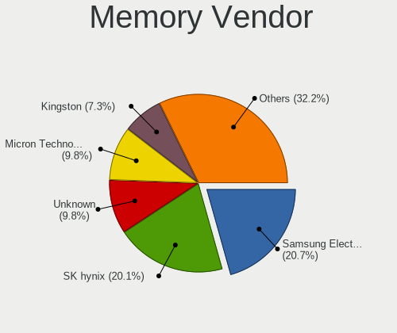

| Vendor                                  | Computers | Percent |
|-----------------------------------------|-----------|---------|
| SK hynix                                | 35        | 21.34%  |
| Samsung Electronics                     | 31        | 18.9%   |
| Micron Technology                       | 21        | 12.8%   |
| Unknown                                 | 17        | 10.37%  |
| Kingston                                | 11        | 6.71%   |
| Crucial                                 | 11        | 6.71%   |
| G.Skill                                 | 8         | 4.88%   |
| Corsair                                 | 6         | 3.66%   |
| Unknown (ABCD)                          | 4         | 2.44%   |
| Elpida                                  | 4         | 2.44%   |
| Unknown                                 | 4         | 2.44%   |
| Ramaxel Technology                      | 2         | 1.22%   |
| A-DATA Technology                       | 2         | 1.22%   |
| Timetec                                 | 1         | 0.61%   |
| Silicon Power Computer & Communications | 1         | 0.61%   |
| Qumo                                    | 1         | 0.61%   |
| Netlist                                 | 1         | 0.61%   |
| Nanya Technology                        | 1         | 0.61%   |
| ff                                      | 1         | 0.61%   |
| Apacer                                  | 1         | 0.61%   |
| 4ea5                                    | 1         | 0.61%   |

Memory Model
------------

Memory module models

| Model                                                               | Computers | Percent |
|---------------------------------------------------------------------|-----------|---------|
| Unknown                                                             | 4         | 2.27%   |
| Unknown (ABCD) RAM 123456789012345678 2048MB SODIMM LPDDR4 2400MT/s | 3         | 1.7%    |
| SK hynix RAM HMA81GS6AFR8N-UH 8GB SODIMM DDR4 2667MT/s              | 3         | 1.7%    |
| Samsung RAM M471A1G44BB0-CWE 8GB SODIMM DDR4 3200MT/s               | 3         | 1.7%    |
| Unknown RAM Module 8GB DIMM DDR3 1600MT/s                           | 2         | 1.14%   |
| Unknown RAM Module 4GB SODIMM DDR3 1333MT/s                         | 2         | 1.14%   |
| Unknown RAM Module 4GB SODIMM DDR3                                  | 2         | 1.14%   |
| SK hynix RAM HMAA1GS6CJR6N-XN 8GB SODIMM DDR4 3200MT/s              | 2         | 1.14%   |
| SK hynix RAM HMA82GS6DJR8N-XN 16GB SODIMM DDR4 3200MT/s             | 2         | 1.14%   |
| SK hynix RAM HMA82GS6DJR8N-VK 16GB SODIMM DDR4 2667MT/s             | 2         | 1.14%   |
| SK hynix RAM HMA81GS6DJR8N-XN 8GB SODIMM DDR4 3200MT/s              | 2         | 1.14%   |
| SK hynix RAM HMA41GS6AFR8N-TF 8GB SODIMM DDR4 2667MT/s              | 2         | 1.14%   |
| Samsung RAM M471B5273DH0-CH9 4GB SODIMM DDR3 1334MT/s               | 2         | 1.14%   |
| Samsung RAM M471A5244BB0-CRC 4GB SODIMM DDR4 2667MT/s               | 2         | 1.14%   |
| Samsung RAM M471A1K43CB1-CRC 8GB SODIMM DDR4 2667MT/s               | 2         | 1.14%   |
| Corsair RAM CMK16GX4M2B3200C16 8GB DIMM DDR4 3600MT/s               | 2         | 1.14%   |
| Unknown RAM Module 512MB SODIMM DDR 400MT/s                         | 1         | 0.57%   |
| Unknown RAM Module 512MB SODIMM DDR 100MT/s                         | 1         | 0.57%   |
| Unknown RAM Module 4GB SODIMM DDR3 1067MT/s                         | 1         | 0.57%   |
| Unknown RAM Module 4GB FB-DIMM DDR2 667MT/s                         | 1         | 0.57%   |
| Unknown RAM Module 2GB SODIMM DDR3 1333MT/s                         | 1         | 0.57%   |
| Unknown RAM Module 2GB SODIMM DDR 800MT/s                           | 1         | 0.57%   |
| Unknown RAM Module 2GB SODIMM 800MT/s                               | 1         | 0.57%   |
| Unknown RAM Module 2GB DIMM SDRAM 667MT/s                           | 1         | 0.57%   |
| Unknown RAM Module 2GB DIMM 800MT/s                                 | 1         | 0.57%   |
| Unknown RAM Module 2GB DIMM 1333MT/s                                | 1         | 0.57%   |
| Unknown RAM DDR3 1600 8G 8GB SODIMM DDR3 1333MT/s                   | 1         | 0.57%   |
| Unknown (ABCD) RAM 123456789012345678 2GB DIMM LPDDR4 2400MT/s      | 1         | 0.57%   |
| Timetec RAM SD4-2133 4GB SODIMM DDR4 2133MT/s                       | 1         | 0.57%   |
| SK hynix RAM Module 8GB SODIMM DDR3 1333MT/s                        | 1         | 0.57%   |
| SK hynix RAM Module 4GB SODIMM DDR3 1600MT/s                        | 1         | 0.57%   |
| SK hynix RAM Module 4GB DIMM DDR3 1066MT/s                          | 1         | 0.57%   |
| SK hynix RAM Module 2GB SODIMM DDR3 1600MT/s                        | 1         | 0.57%   |
| SK hynix RAM Module 2GB SODIMM DDR2 667MT/s                         | 1         | 0.57%   |
| SK hynix RAM Module 16GB SODIMM DDR4 3200MT/s                       | 1         | 0.57%   |
| SK hynix RAM Module 16GB DIMM DDR4 3200MT/s                         | 1         | 0.57%   |
| SK hynix RAM HYMP125S64CP8-Y5 2048MB SODIMM DDR2 667MT/s            | 1         | 0.57%   |
| SK hynix RAM HYMP125S64CP8-S6 2048MB SODIMM DDR 975MT/s             | 1         | 0.57%   |
| SK hynix RAM HMT451U6BFR8C-PB 4GB DIMM DDR3 1600MT/s                | 1         | 0.57%   |
| SK hynix RAM HMT451S6BFR8A-PB 4GB SODIMM DDR3 1600MT/s              | 1         | 0.57%   |

Memory Kind
-----------

Memory module kinds

| Kind    | Computers | Percent |
|---------|-----------|---------|
| DDR4    | 61        | 44.2%   |
| DDR3    | 44        | 31.88%  |
| DDR2    | 9         | 6.52%   |
| LPDDR4  | 5         | 3.62%   |
| DDR5    | 5         | 3.62%   |
| LPDDR5  | 3         | 2.17%   |
| LPDDR3  | 3         | 2.17%   |
| DDR     | 3         | 2.17%   |
| Unknown | 3         | 2.17%   |
| SDRAM   | 2         | 1.45%   |

Memory Form Factor
------------------

Physical design of the memory module

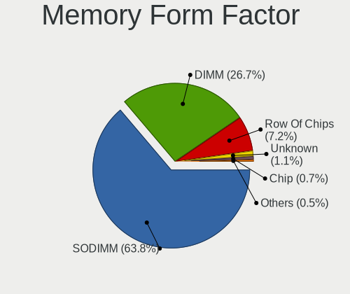

| Name         | Computers | Percent |
|--------------|-----------|---------|
| SODIMM       | 92        | 66.67%  |
| DIMM         | 35        | 25.36%  |
| Row Of Chips | 7         | 5.07%   |
| Unknown      | 2         | 1.45%   |
| FB-DIMM      | 1         | 0.72%   |
| Chip         | 1         | 0.72%   |

Memory Size
-----------

Memory module size

| Size  | Computers | Percent |
|-------|-----------|---------|
| 8192  | 55        | 37.93%  |
| 4096  | 35        | 24.14%  |
| 16384 | 24        | 16.55%  |
| 2048  | 19        | 13.1%   |
| 1024  | 5         | 3.45%   |
| 32768 | 4         | 2.76%   |
| 512   | 3         | 2.07%   |

Memory Speed
------------

Memory module speed

| Speed   | Computers | Percent |
|---------|-----------|---------|
| 3200    | 33        | 22%     |
| 1600    | 26        | 17.33%  |
| 2667    | 16        | 10.67%  |
| 1333    | 12        | 8%      |
| 2400    | 10        | 6.67%   |
| 2133    | 8         | 5.33%   |
| 800     | 6         | 4%      |
| 1334    | 5         | 3.33%   |
| 667     | 5         | 3.33%   |
| 4800    | 4         | 2.67%   |
| 3600    | 4         | 2.67%   |
| 1867    | 3         | 2%      |
| 6400    | 2         | 1.33%   |
| 400     | 2         | 1.33%   |
| Unknown | 2         | 1.33%   |
| 6000    | 1         | 0.67%   |
| 5500    | 1         | 0.67%   |
| 4000    | 1         | 0.67%   |
| 3066    | 1         | 0.67%   |
| 2933    | 1         | 0.67%   |
| 1866    | 1         | 0.67%   |
| 1800    | 1         | 0.67%   |
| 1067    | 1         | 0.67%   |
| 1066    | 1         | 0.67%   |
| 975     | 1         | 0.67%   |
| 533     | 1         | 0.67%   |
| 100     | 1         | 0.67%   |

Printers & scanners
-------------------

Printer Vendor
--------------

Printer device vendors

| Vendor             | Computers | Percent |
|--------------------|-----------|---------|
| Dymo-CoStar        | 1         | 33.33%  |
| Canon              | 1         | 33.33%  |
| Brother Industries | 1         | 33.33%  |

Printer Model
-------------

Printer device models

| Model                       | Computers | Percent |
|-----------------------------|-----------|---------|
| Dymo-CoStar LabelWriter 450 | 1         | 33.33%  |
| Canon PIXMA MG5600 Series   | 1         | 33.33%  |
| Brother HL-L2350DW series   | 1         | 33.33%  |

Scanner Vendor
--------------

Scanner device vendors

| Vendor      | Computers | Percent |
|-------------|-----------|---------|
| Seiko Epson | 1         | 50%     |
| Canon       | 1         | 50%     |

Scanner Model
-------------

Scanner device models

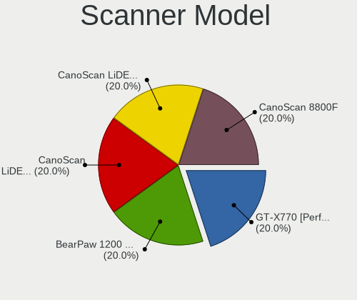

| Model                                 | Computers | Percent |
|---------------------------------------|-----------|---------|
| Seiko Epson GT-X770 [Perfection V500] | 1         | 50%     |
| Canon CanoScan 8800F                  | 1         | 50%     |

Camera
------

Camera Vendor
-------------

Camera device vendors

| Vendor                                 | Computers | Percent |
|----------------------------------------|-----------|---------|
| Microdia                               | 12        | 14.46%  |
| Chicony Electronics                    | 11        | 13.25%  |
| Realtek Semiconductor                  | 10        | 12.05%  |
| Apple                                  | 7         | 8.43%   |
| Quanta                                 | 5         | 6.02%   |
| Cheng Uei Precision Industry (Foxlink) | 5         | 6.02%   |
| Sunplus Innovation Technology          | 4         | 4.82%   |
| Bison Electronics                      | 4         | 4.82%   |
| Luxvisions Innotech Limited            | 3         | 3.61%   |
| IMC Networks                           | 3         | 3.61%   |
| Alcor Micro                            | 3         | 3.61%   |
| Suyin                                  | 2         | 2.41%   |
| Silicon Motion                         | 2         | 2.41%   |
| Ricoh                                  | 2         | 2.41%   |
| Lite-On Technology                     | 2         | 2.41%   |
| Acer                                   | 2         | 2.41%   |
| Z-Star Microelectronics                | 1         | 1.2%    |
| Syntek                                 | 1         | 1.2%    |
| Logitech                               | 1         | 1.2%    |
| Lenovo                                 | 1         | 1.2%    |
| Hewlett-Packard                        | 1         | 1.2%    |
| Aveo Technology                        | 1         | 1.2%    |

Camera Model
------------

Camera device models

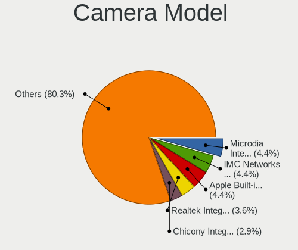

| Model                                                                      | Computers | Percent |
|----------------------------------------------------------------------------|-----------|---------|
| Realtek Integrated_Webcam_HD                                               | 7         | 8.43%   |
| Microdia Integrated_Webcam_HD                                              | 6         | 7.23%   |
| Microdia Integrated_Webcam_FHD                                             | 3         | 3.61%   |
| IMC Networks USB2.0 HD UVC WebCam                                          | 3         | 3.61%   |
| Chicony Integrated Camera                                                  | 3         | 3.61%   |
| Apple Built-in iSight                                                      | 3         | 3.61%   |
| Ricoh HD Webcam                                                            | 2         | 2.41%   |
| Quanta ov9734_techfront_camera                                             | 2         | 2.41%   |
| Lite-On Integrated Camera                                                  | 2         | 2.41%   |
| Cheng Uei Precision Industry (Foxlink) HP Wide Vision HD Integrated Webcam | 2         | 2.41%   |
| Bison Front Camera                                                         | 2         | 2.41%   |
| Apple FaceTime HD Camera (Built-in)                                        | 2         | 2.41%   |
| Z-Star Traveler TV 6500 SF Dia-scanner                                     | 1         | 1.2%    |
| Syntek Integrated Camera                                                   | 1         | 1.2%    |
| Suyin HP TrueVision HD                                                     | 1         | 1.2%    |
| Suyin Asus Integrated Webcam [CN031B]                                      | 1         | 1.2%    |
| Sunplus Integrated_Webcam_HD                                               | 1         | 1.2%    |
| Sunplus Integrated_Webcam_FHD                                              | 1         | 1.2%    |
| Sunplus HP HD Webcam [Fixed]                                               | 1         | 1.2%    |
| Sunplus Asus Webcam                                                        | 1         | 1.2%    |
| Silicon Motion WebCam SCB-1100N                                            | 1         | 1.2%    |
| Silicon Motion WebCam SC-0311139N                                          | 1         | 1.2%    |
| Realtek USB Camera                                                         | 1         | 1.2%    |
| Realtek Integrated Webcam                                                  | 1         | 1.2%    |
| Realtek EasyCamera                                                         | 1         | 1.2%    |
| Quanta HP Wide Vision FHD Camera                                           | 1         | 1.2%    |
| Quanta HP True Vision 5MP Camera                                           | 1         | 1.2%    |
| Quanta ACER HD User Facing                                                 | 1         | 1.2%    |
| Microdia USB 2.0 Camera                                                    | 1         | 1.2%    |
| Microdia Sonix USB 2.0 Camera                                              | 1         | 1.2%    |
| Microdia Integrated Webcam                                                 | 1         | 1.2%    |
| Luxvisions Innotech Limited HP Wide Vision HD Camera                       | 1         | 1.2%    |
| Luxvisions Innotech Limited HP TrueVision HD Camera                        | 1         | 1.2%    |
| Luxvisions Innotech Limited HP HD Camera                                   | 1         | 1.2%    |
| Logitech Webcam C930e                                                      | 1         | 1.2%    |
| Lenovo Integrated Webcam                                                   | 1         | 1.2%    |
| HP Webcam HD 2300                                                          | 1         | 1.2%    |
| Chicony VGA 30fps UVC Webcam                                               | 1         | 1.2%    |
| Chicony UVC 1.00 device HD UVC WebCam                                      | 1         | 1.2%    |
| Chicony Integrated Camera (1280x720@30)                                    | 1         | 1.2%    |

Security
--------

Fingerprint Vendor
------------------

Fingerprint sensor vendors

| Vendor                     | Computers | Percent |
|----------------------------|-----------|---------|
| Synaptics                  | 5         | 31.25%  |
| Validity Sensors           | 4         | 25%     |
| Shenzhen Goodix Technology | 4         | 25%     |
| Upek                       | 1         | 6.25%   |
| STMicroelectronics         | 1         | 6.25%   |
| AuthenTec                  | 1         | 6.25%   |

Fingerprint Model
-----------------

Fingerprint sensor models

| Model                                                  | Computers | Percent |
|--------------------------------------------------------|-----------|---------|
| Shenzhen Goodix  FingerPrint Device                    | 3         | 18.75%  |
| Synaptics Metallica MIS Touch Fingerprint Reader       | 2         | 12.5%   |
| Validity Sensors VFS495 Fingerprint Reader             | 1         | 6.25%   |
| Validity Sensors VFS491                                | 1         | 6.25%   |
| Validity Sensors Synaptics WBDI                        | 1         | 6.25%   |
| Validity Sensors Fingerprint scanner                   | 1         | 6.25%   |
| Upek Biometric Touchchip/Touchstrip Fingerprint Sensor | 1         | 6.25%   |
| Synaptics WBDI Fingerprint Reader USB 102              | 1         | 6.25%   |
| Synaptics  WBDI                                        | 1         | 6.25%   |
| Synaptics Fingerprint reader [HP G6]                   | 1         | 6.25%   |
| STMicroelectronics Fingerprint Reader                  | 1         | 6.25%   |
| Shenzhen Goodix FingerPrint                            | 1         | 6.25%   |
| AuthenTec AES2501 Fingerprint Sensor                   | 1         | 6.25%   |

Chipcard Vendor
---------------

Chipcard module vendors

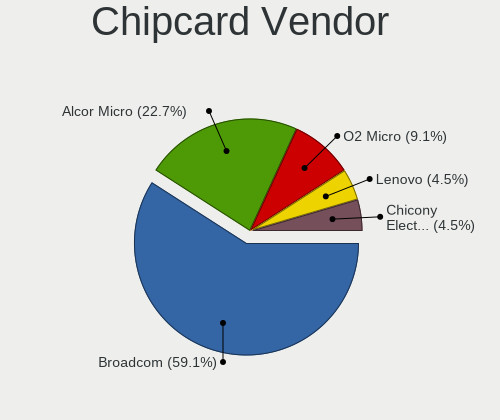

| Vendor              | Computers | Percent |
|---------------------|-----------|---------|
| Broadcom            | 9         | 75%     |
| O2 Micro            | 1         | 8.33%   |
| Chicony Electronics | 1         | 8.33%   |
| Alcor Micro         | 1         | 8.33%   |

Chipcard Model
--------------

Chipcard module models

| Model                                                                        | Computers | Percent |
|------------------------------------------------------------------------------|-----------|---------|
| Broadcom 58200                                                               | 6         | 50%     |
| Broadcom BCM5880 Secure Applications Processor with fingerprint swipe sensor | 2         | 16.67%  |
| O2 Micro Oz776 SmartCard Reader                                              | 1         | 8.33%   |
| Chicony Electronics HP Skylab USB Smartcard Keyboard                         | 1         | 8.33%   |
| Broadcom BCM5880 Secure Applications Processor                               | 1         | 8.33%   |
| Alcor Micro AU9540 Smartcard Reader                                          | 1         | 8.33%   |

Unsupported
-----------

Unsupported Devices
-------------------

Total unsupported devices on board

| Total | Computers | Percent |
|-------|-----------|---------|
| 0     | 80        | 57.97%  |
| 1     | 47        | 34.06%  |
| 2     | 11        | 7.97%   |

Unsupported Device Types
------------------------

Types of unsupported devices

| Type                     | Computers | Percent |
|--------------------------|-----------|---------|
| Graphics card            | 17        | 25.76%  |
| Fingerprint reader       | 16        | 24.24%  |
| Chipcard                 | 12        | 18.18%  |
| Net/wireless             | 7         | 10.61%  |
| Camera                   | 6         | 9.09%   |
| Network                  | 2         | 3.03%   |
| Storage                  | 1         | 1.52%   |
| Multimedia controller    | 1         | 1.52%   |
| Flash memory             | 1         | 1.52%   |
| Communication controller | 1         | 1.52%   |
| Card reader              | 1         | 1.52%   |
| Bluetooth                | 1         | 1.52%   |

