MX 23 - Tested Hardware & Statistics
------------------------------------

A project to collect tested hardware configurations for MX 23.

Anyone can contribute to this report by the [hw-probe](https://github.com/linuxhw/hw-probe) tool:

    sudo -E hw-probe -all -upload

Please contribute! Especially if your hardware is rare.

This is a report for all computer types. See also reports for [desktops](/Dist/MX_23/Desktop/README.md) and [notebooks](/Dist/MX_23/Notebook/README.md).

Contents
--------

* [ Test Cases ](#test-cases)

* [ System ](#system)
  - [ Kernel                   ](#kernel)
  - [ Kernel Family            ](#kernel-family)
  - [ Kernel Major Ver.        ](#kernel-major-ver)
  - [ Arch                     ](#arch)
  - [ DE                       ](#de)
  - [ Display Server           ](#display-server)
  - [ Display Manager          ](#display-manager)
  - [ OS Lang                  ](#os-lang)
  - [ Boot Mode                ](#boot-mode)
  - [ Filesystem               ](#filesystem)
  - [ Part. scheme             ](#part-scheme)
  - [ Dual Boot with Linux/BSD ](#dual-boot-with-linuxbsd)
  - [ Dual Boot (Win)          ](#dual-boot-win)

* [ Board ](#board)
  - [ Vendor                   ](#vendor)
  - [ Model                    ](#model)
  - [ Model Family             ](#model-family)
  - [ MFG Year                 ](#mfg-year)
  - [ Form Factor              ](#form-factor)
  - [ Secure Boot              ](#secure-boot)
  - [ Coreboot                 ](#coreboot)
  - [ RAM Size                 ](#ram-size)
  - [ RAM Used                 ](#ram-used)
  - [ Total Drives             ](#total-drives)
  - [ Has CD-ROM               ](#has-cd-rom)
  - [ Has Ethernet             ](#has-ethernet)
  - [ Has WiFi                 ](#has-wifi)
  - [ Has Bluetooth            ](#has-bluetooth)

* [ Location ](#location)
  - [ Country                  ](#country)
  - [ City                     ](#city)

* [ Drives ](#drives)
  - [ Drive Vendor             ](#drive-vendor)
  - [ Drive Model              ](#drive-model)
  - [ HDD Vendor               ](#hdd-vendor)
  - [ SSD Vendor               ](#ssd-vendor)
  - [ Drive Kind               ](#drive-kind)
  - [ Drive Connector          ](#drive-connector)
  - [ Drive Size               ](#drive-size)
  - [ Space Total              ](#space-total)
  - [ Space Used               ](#space-used)
  - [ Malfunc. Drives          ](#malfunc-drives)
  - [ Malfunc. Drive Vendor    ](#malfunc-drive-vendor)
  - [ Malfunc. HDD Vendor      ](#malfunc-hdd-vendor)
  - [ Malfunc. Drive Kind      ](#malfunc-drive-kind)
  - [ Failed Drives            ](#failed-drives)
  - [ Failed Drive Vendor      ](#failed-drive-vendor)
  - [ Drive Status             ](#drive-status)

* [ Storage controller ](#storage-controller)
  - [ Storage Vendor           ](#storage-vendor)
  - [ Storage Model            ](#storage-model)
  - [ Storage Kind             ](#storage-kind)

* [ Processor ](#processor)
  - [ CPU Vendor               ](#cpu-vendor)
  - [ CPU Model                ](#cpu-model)
  - [ CPU Model Family         ](#cpu-model-family)
  - [ CPU Cores                ](#cpu-cores)
  - [ CPU Sockets              ](#cpu-sockets)
  - [ CPU Threads              ](#cpu-threads)
  - [ CPU Op-Modes             ](#cpu-op-modes)
  - [ CPU Microcode            ](#cpu-microcode)
  - [ CPU Microarch            ](#cpu-microarch)

* [ Graphics ](#graphics)
  - [ GPU Vendor               ](#gpu-vendor)
  - [ GPU Model                ](#gpu-model)
  - [ GPU Combo                ](#gpu-combo)
  - [ GPU Driver               ](#gpu-driver)
  - [ GPU Memory               ](#gpu-memory)

* [ Monitor ](#monitor)
  - [ Monitor Vendor           ](#monitor-vendor)
  - [ Monitor Model            ](#monitor-model)
  - [ Monitor Resolution       ](#monitor-resolution)
  - [ Monitor Diagonal         ](#monitor-diagonal)
  - [ Monitor Width            ](#monitor-width)
  - [ Aspect Ratio             ](#aspect-ratio)
  - [ Monitor Area             ](#monitor-area)
  - [ Pixel Density            ](#pixel-density)
  - [ Multiple Monitors        ](#multiple-monitors)

* [ Network ](#network)
  - [ Net Controller Vendor    ](#net-controller-vendor)
  - [ Net Controller Model     ](#net-controller-model)
  - [ Wireless Vendor          ](#wireless-vendor)
  - [ Wireless Model           ](#wireless-model)
  - [ Ethernet Vendor          ](#ethernet-vendor)
  - [ Ethernet Model           ](#ethernet-model)
  - [ Net Controller Kind      ](#net-controller-kind)
  - [ Used Controller          ](#used-controller)
  - [ NICs                     ](#nics)
  - [ IPv6                     ](#ipv6)

* [ Bluetooth ](#bluetooth)
  - [ Bluetooth Vendor         ](#bluetooth-vendor)
  - [ Bluetooth Model          ](#bluetooth-model)

* [ Sound ](#sound)
  - [ Sound Vendor             ](#sound-vendor)
  - [ Sound Model              ](#sound-model)

* [ Memory ](#memory)
  - [ Memory Vendor            ](#memory-vendor)
  - [ Memory Model             ](#memory-model)
  - [ Memory Kind              ](#memory-kind)
  - [ Memory Form Factor       ](#memory-form-factor)
  - [ Memory Size              ](#memory-size)
  - [ Memory Speed             ](#memory-speed)

* [ Printers & scanners ](#printers--scanners)
  - [ Printer Vendor           ](#printer-vendor)
  - [ Printer Model            ](#printer-model)
  - [ Scanner Vendor           ](#scanner-vendor)
  - [ Scanner Model            ](#scanner-model)

* [ Camera ](#camera)
  - [ Camera Vendor            ](#camera-vendor)
  - [ Camera Model             ](#camera-model)

* [ Security ](#security)
  - [ Fingerprint Vendor       ](#fingerprint-vendor)
  - [ Fingerprint Model        ](#fingerprint-model)
  - [ Chipcard Vendor          ](#chipcard-vendor)
  - [ Chipcard Model           ](#chipcard-model)

* [ Unsupported ](#unsupported)
  - [ Unsupported Devices      ](#unsupported-devices)
  - [ Unsupported Device Types ](#unsupported-device-types)

Test Cases
----------

Total: 574

| Vendor        | Model                       | Form-Factor | Probe                                                      | Date         |
|---------------|-----------------------------|-------------|------------------------------------------------------------|--------------|
| Biostar       | H81MHV3                     | Desktop     | [d03cc0092f](https://linux-hardware.org/?probe=d03cc0092f) | Jan 05, 2025 |
| MSI           | B250M BAZOOKA               | Desktop     | [30ef92bbfc](https://linux-hardware.org/?probe=30ef92bbfc) | Jan 05, 2025 |
| Gigabyte      | Z390 AORUS PRO-CF           | Desktop     | [315981955a](https://linux-hardware.org/?probe=315981955a) | Jan 03, 2025 |
| Gigabyte      | Z390 AORUS PRO-CF           | Desktop     | [118b96c4df](https://linux-hardware.org/?probe=118b96c4df) | Jan 03, 2025 |
| Dell          | Latitude 5590               | Notebook    | [ac8442c3af](https://linux-hardware.org/?probe=ac8442c3af) | Jan 01, 2025 |
| ASUSTek       | VivoBook_ASUSLaptop X140... | Notebook    | [cb43939fff](https://linux-hardware.org/?probe=cb43939fff) | Jan 01, 2025 |
| Sony          | VGN-FZ11M                   | Notebook    | [25ec238dec](https://linux-hardware.org/?probe=25ec238dec) | Dec 31, 2024 |
| Lenovo        | 30D0 SDK0J40697 WIN 3305... | Desktop     | [9494acd014](https://linux-hardware.org/?probe=9494acd014) | Dec 31, 2024 |
| Shenzhen D... | MP100                       | Desktop     | [ed4c3517e1](https://linux-hardware.org/?probe=ed4c3517e1) | Dec 31, 2024 |
| Apple         | Mac-031AEE4D24BFF0B1 Mac... | Mini pc     | [b71ec4b1e6](https://linux-hardware.org/?probe=b71ec4b1e6) | Dec 31, 2024 |
| Lenovo        | ThinkPad E570 20H5S0CF00    | Notebook    | [1b1018c49e](https://linux-hardware.org/?probe=1b1018c49e) | Dec 30, 2024 |
| ASUSTek       | Z170 PRO GAMING             | Desktop     | [4825814497](https://linux-hardware.org/?probe=4825814497) | Dec 28, 2024 |
| Dell          | Latitude E7450              | Notebook    | [6677188d5d](https://linux-hardware.org/?probe=6677188d5d) | Dec 27, 2024 |
| Toshiba       | Satellite P870              | Notebook    | [a0e62c769c](https://linux-hardware.org/?probe=a0e62c769c) | Dec 24, 2024 |
| Toshiba       | Satellite P870              | Notebook    | [17c3c89a60](https://linux-hardware.org/?probe=17c3c89a60) | Dec 23, 2024 |
| Acer          | Aspire A315-510P            | Notebook    | [2bb943950c](https://linux-hardware.org/?probe=2bb943950c) | Dec 23, 2024 |
| Dell          | Latitude E6440              | Notebook    | [8ef2131731](https://linux-hardware.org/?probe=8ef2131731) | Dec 23, 2024 |
| ASUSTek       | Vivobook Go E1404FA_E140... | Notebook    | [117beaf6ca](https://linux-hardware.org/?probe=117beaf6ca) | Dec 22, 2024 |
| Apple         | MacBookPro12,1              | Notebook    | [80af2d46c0](https://linux-hardware.org/?probe=80af2d46c0) | Dec 21, 2024 |
| Dell          | 0P4T42 A01                  | All in one  | [aad8987195](https://linux-hardware.org/?probe=aad8987195) | Dec 19, 2024 |
| MSI           | H61M-P20                    | Desktop     | [f15424c030](https://linux-hardware.org/?probe=f15424c030) | Dec 19, 2024 |
| Dell          | Inspiron 7786               | Convertible | [5fac427a17](https://linux-hardware.org/?probe=5fac427a17) | Dec 16, 2024 |
| Shenzhen M... | F7BSC                       | Mini pc     | [57042541c4](https://linux-hardware.org/?probe=57042541c4) | Dec 15, 2024 |
| HP            | EliteBook 840 G3            | Notebook    | [dc74fc85f6](https://linux-hardware.org/?probe=dc74fc85f6) | Dec 14, 2024 |
| AZW           | GTi14 V1.0                  | Mini pc     | [28e079a0db](https://linux-hardware.org/?probe=28e079a0db) | Dec 12, 2024 |
| youyeetoo     | X1 SBC                      | Notebook    | [1abafad3a5](https://linux-hardware.org/?probe=1abafad3a5) | Dec 12, 2024 |
| HP            | Pavilion dv6700             | Notebook    | [1a8a388009](https://linux-hardware.org/?probe=1a8a388009) | Dec 11, 2024 |
| GRT           | H90                         | Mini pc     | [6f862e4d32](https://linux-hardware.org/?probe=6f862e4d32) | Dec 11, 2024 |
| AZW           | GTi14 V1.0                  | Mini pc     | [62bb9a9c3b](https://linux-hardware.org/?probe=62bb9a9c3b) | Dec 10, 2024 |
| ASUSTek       | F5V                         | Notebook    | [fc57564f87](https://linux-hardware.org/?probe=fc57564f87) | Dec 09, 2024 |
| Gigabyte      | B560M DS3H V2               | Desktop     | [00c881af99](https://linux-hardware.org/?probe=00c881af99) | Dec 09, 2024 |
| HP            | Spectre x360 2-in-1 Lapt... | Convertible | [a669b03a47](https://linux-hardware.org/?probe=a669b03a47) | Dec 08, 2024 |
| HP            | 255 15.6 inch G9 Noteboo... | Notebook    | [b5d4c3caa9](https://linux-hardware.org/?probe=b5d4c3caa9) | Dec 02, 2024 |
| Dell          | 0G17RR A00                  | All in one  | [384d13d228](https://linux-hardware.org/?probe=384d13d228) | Dec 01, 2024 |
| Dell          | 0G17RR A00                  | All in one  | [01ec6d486a](https://linux-hardware.org/?probe=01ec6d486a) | Dec 01, 2024 |
| ASRock        | Z390 Phantom Gaming 9       | Desktop     | [6573a24594](https://linux-hardware.org/?probe=6573a24594) | Dec 01, 2024 |
| ASUSTek       | VivoBook_ASUSLaptop M150... | Notebook    | [32ae181590](https://linux-hardware.org/?probe=32ae181590) | Dec 01, 2024 |
| Lenovo        | ThinkPad T14 Gen 5 21MMS... | Notebook    | [cf0dcbdaff](https://linux-hardware.org/?probe=cf0dcbdaff) | Nov 30, 2024 |
| HP            | 255 G1                      | Notebook    | [0dd46cadda](https://linux-hardware.org/?probe=0dd46cadda) | Nov 29, 2024 |
| Dell          | 0DR845                      | Desktop     | [1b6afa334f](https://linux-hardware.org/?probe=1b6afa334f) | Nov 29, 2024 |
| GRT           | H90                         | Mini pc     | [074a205d8a](https://linux-hardware.org/?probe=074a205d8a) | Nov 29, 2024 |
| ASUSTek       | PRIME X670-P WIFI           | Desktop     | [b671dd7405](https://linux-hardware.org/?probe=b671dd7405) | Nov 26, 2024 |
| Lenovo        | ThinkPad T440p 20AWA0N5R... | Notebook    | [af6d253f42](https://linux-hardware.org/?probe=af6d253f42) | Nov 25, 2024 |
| Lenovo        | 3148 SDK0J40700 WIN 3258... | Desktop     | [10abdf7972](https://linux-hardware.org/?probe=10abdf7972) | Nov 24, 2024 |
| Lenovo        | ThinkPad Z61m 94529JG       | Notebook    | [2b158c1a28](https://linux-hardware.org/?probe=2b158c1a28) | Nov 19, 2024 |
| Lenovo        | IdeaPad 100S-11IBY 80R2     | Notebook    | [4b5de9a37a](https://linux-hardware.org/?probe=4b5de9a37a) | Nov 19, 2024 |
| Gigabyte      | B550 AORUS ELITE V2         | Desktop     | [065b59e739](https://linux-hardware.org/?probe=065b59e739) | Nov 18, 2024 |
| Toshiba       | Satellite C55D-B            | Notebook    | [7c3fb96c09](https://linux-hardware.org/?probe=7c3fb96c09) | Nov 18, 2024 |
| Lenovo        | 3000 N200 0769BLG           | Notebook    | [d58726bb7b](https://linux-hardware.org/?probe=d58726bb7b) | Nov 18, 2024 |
| Insyde        | M1106BAP                    | Notebook    | [cad9f73269](https://linux-hardware.org/?probe=cad9f73269) | Nov 18, 2024 |
| Acer          | Aspire A515-54G             | Notebook    | [3b287d26d3](https://linux-hardware.org/?probe=3b287d26d3) | Nov 17, 2024 |
| Raspberry ... | Raspberry Pi 5 Model B R... | Soc         | [190740e091](https://linux-hardware.org/?probe=190740e091) | Nov 16, 2024 |
| Raspberry ... | Raspberry Pi 5 Model B R... | Soc         | [8cf19c813b](https://linux-hardware.org/?probe=8cf19c813b) | Nov 16, 2024 |
| Lenovo        | 3000 N200 0769BLG           | Notebook    | [60ef264f93](https://linux-hardware.org/?probe=60ef264f93) | Nov 16, 2024 |
| Dell          | 073MMW A03                  | Desktop     | [f7d046b276](https://linux-hardware.org/?probe=f7d046b276) | Nov 15, 2024 |
| ASRock        | A75M-HVS                    | Desktop     | [71e383d168](https://linux-hardware.org/?probe=71e383d168) | Nov 14, 2024 |
| SYS           | H310CH5-TI2                 | Desktop     | [8d26063a45](https://linux-hardware.org/?probe=8d26063a45) | Nov 13, 2024 |
| HP            | ENVY m7 Notebook            | Notebook    | [d38f15b4c6](https://linux-hardware.org/?probe=d38f15b4c6) | Nov 13, 2024 |
| HP            | 829D                        | Desktop     | [bbd6f07955](https://linux-hardware.org/?probe=bbd6f07955) | Nov 08, 2024 |
| ASUSTek       | PRIME A320M-K               | Desktop     | [0f2501a96e](https://linux-hardware.org/?probe=0f2501a96e) | Nov 07, 2024 |
| HP            | 829D                        | Desktop     | [ce428beb45](https://linux-hardware.org/?probe=ce428beb45) | Nov 07, 2024 |
| HP            | 8265                        | Desktop     | [91d18e37fc](https://linux-hardware.org/?probe=91d18e37fc) | Nov 07, 2024 |
| Samsung       | 935QDC                      | Convertible | [d6a39bed87](https://linux-hardware.org/?probe=d6a39bed87) | Nov 05, 2024 |
| Acer          | Aspire 5750G                | Notebook    | [554b0591cd](https://linux-hardware.org/?probe=554b0591cd) | Nov 05, 2024 |
| Lenovo        | ThinkCentre M71e 3129B2G    | Desktop     | [0f3c377fbc](https://linux-hardware.org/?probe=0f3c377fbc) | Nov 03, 2024 |
| Dell          | Latitude E6440              | Notebook    | [04241680ab](https://linux-hardware.org/?probe=04241680ab) | Nov 03, 2024 |
| Dell          | Latitude E6440              | Notebook    | [651d5b49ad](https://linux-hardware.org/?probe=651d5b49ad) | Nov 03, 2024 |
| HP            | ProBook 645 G2              | Notebook    | [07452965ae](https://linux-hardware.org/?probe=07452965ae) | Nov 01, 2024 |
| Gateway       | ZX4351                      | All in one  | [c98e028454](https://linux-hardware.org/?probe=c98e028454) | Nov 01, 2024 |
| MSI           | MAG B550 TOMAHAWK           | Desktop     | [2aaad8cdd1](https://linux-hardware.org/?probe=2aaad8cdd1) | Nov 01, 2024 |
| HP            | ProBook 645 G2              | Notebook    | [9f82b3c340](https://linux-hardware.org/?probe=9f82b3c340) | Oct 31, 2024 |
| Unknown       | Unknown                     | Desktop     | [b73f669319](https://linux-hardware.org/?probe=b73f669319) | Oct 31, 2024 |
| Unknown       | Unknown                     | Desktop     | [aabc0b8d5c](https://linux-hardware.org/?probe=aabc0b8d5c) | Oct 31, 2024 |
| Acer          | Aspire Lite AL15-52         | Notebook    | [fe9498f7a0](https://linux-hardware.org/?probe=fe9498f7a0) | Oct 29, 2024 |
| HP            | Casablanca H710             | Notebook    | [f80673dbdc](https://linux-hardware.org/?probe=f80673dbdc) | Oct 28, 2024 |
| Apple         | MacBookAir1,1               | Notebook    | [3cf79323fc](https://linux-hardware.org/?probe=3cf79323fc) | Oct 28, 2024 |
| Samsung       | DeskTop System              | Desktop     | [ca4fa68a45](https://linux-hardware.org/?probe=ca4fa68a45) | Oct 27, 2024 |
| Toshiba       | PORTEGE X30-E               | Notebook    | [8171ac365f](https://linux-hardware.org/?probe=8171ac365f) | Oct 27, 2024 |
| Intel         | H61                         | Desktop     | [8460791859](https://linux-hardware.org/?probe=8460791859) | Oct 27, 2024 |
| Lenovo        | ThinkPad E470 20H1002FLM    | Notebook    | [7f9f628051](https://linux-hardware.org/?probe=7f9f628051) | Oct 25, 2024 |
| HP            | Pavilion g6                 | Notebook    | [b9c9cc3f65](https://linux-hardware.org/?probe=b9c9cc3f65) | Oct 25, 2024 |
| HP            | Pavilion g6                 | Notebook    | [76ff4ae74d](https://linux-hardware.org/?probe=76ff4ae74d) | Oct 25, 2024 |
| Gigabyte      | P35-S3G                     | Desktop     | [c38dd7e7f6](https://linux-hardware.org/?probe=c38dd7e7f6) | Oct 24, 2024 |
| Gigabyte      | P35-S3G                     | Desktop     | [fc78d0d762](https://linux-hardware.org/?probe=fc78d0d762) | Oct 24, 2024 |
| HP            | Laptop 15-dy5xxx            | Notebook    | [c030729a0e](https://linux-hardware.org/?probe=c030729a0e) | Oct 24, 2024 |
| HP            | Laptop 14-fq1xxx            | Notebook    | [4232854445](https://linux-hardware.org/?probe=4232854445) | Oct 23, 2024 |
| ASUSTek       | X551MA                      | Notebook    | [26585357e5](https://linux-hardware.org/?probe=26585357e5) | Oct 21, 2024 |
| Lenovo        | ThinkPad E16 Gen 1 21JT0... | Notebook    | [7ae8bf79b4](https://linux-hardware.org/?probe=7ae8bf79b4) | Oct 21, 2024 |
| Gigabyte      | B360 AORUS GAMING 3 WIFI... | Desktop     | [9644c911da](https://linux-hardware.org/?probe=9644c911da) | Oct 18, 2024 |
| HP            | Pavilion dv6700             | Notebook    | [082fa9dd81](https://linux-hardware.org/?probe=082fa9dd81) | Oct 17, 2024 |
| ASRock        | Z370 Pro4                   | Desktop     | [768bfdaf9a](https://linux-hardware.org/?probe=768bfdaf9a) | Oct 17, 2024 |
| HP            | EliteBook 8440p             | Notebook    | [f977e8a7ce](https://linux-hardware.org/?probe=f977e8a7ce) | Oct 16, 2024 |
| ASUSTek       | VivoBook_ASUSLaptop X409... | Notebook    | [423cf5f3bd](https://linux-hardware.org/?probe=423cf5f3bd) | Oct 16, 2024 |
| MSI           | H110M PRO-VD                | Desktop     | [cc09ec8aa4](https://linux-hardware.org/?probe=cc09ec8aa4) | Oct 16, 2024 |
| ASUSTek       | PRIME B450M-A II            | Desktop     | [bc9f2b478b](https://linux-hardware.org/?probe=bc9f2b478b) | Oct 14, 2024 |
| HP            | 655                         | Notebook    | [44bcea3de2](https://linux-hardware.org/?probe=44bcea3de2) | Oct 14, 2024 |
| ASUSTek       | H110M-C/BR                  | Desktop     | [e0bf2cc58a](https://linux-hardware.org/?probe=e0bf2cc58a) | Oct 13, 2024 |
| Dell          | Latitude E6430              | Notebook    | [bdebcd33a6](https://linux-hardware.org/?probe=bdebcd33a6) | Oct 12, 2024 |
| Framework     | Laptop                      | Notebook    | [ba5a1a5bfc](https://linux-hardware.org/?probe=ba5a1a5bfc) | Oct 11, 2024 |
| ASUSTek       | PRIME B450M-A               | Desktop     | [4747b9f85b](https://linux-hardware.org/?probe=4747b9f85b) | Oct 10, 2024 |
| ASUSTek       | P8H61-M LX3 R2.0            | Desktop     | [8c8eabd7b6](https://linux-hardware.org/?probe=8c8eabd7b6) | Oct 10, 2024 |
| Apple         | MacBookPro7,1               | Notebook    | [292332c812](https://linux-hardware.org/?probe=292332c812) | Oct 08, 2024 |
| Acer          | Aspire 5738                 | Notebook    | [946c78abb8](https://linux-hardware.org/?probe=946c78abb8) | Oct 07, 2024 |
| HP            | 86EE                        | All in one  | [b60cb3ba3d](https://linux-hardware.org/?probe=b60cb3ba3d) | Oct 07, 2024 |
| Apple         | MacBookPro11,4              | Notebook    | [b373b972bf](https://linux-hardware.org/?probe=b373b972bf) | Oct 03, 2024 |
| HP            | ProBook 645 G2              | Notebook    | [07e2717694](https://linux-hardware.org/?probe=07e2717694) | Oct 02, 2024 |
| Medion        | E2215T MD60285              | Notebook    | [a3f12e9645](https://linux-hardware.org/?probe=a3f12e9645) | Oct 01, 2024 |
| MSI           | Prestige 16 AI Evo B1MG     | Notebook    | [e44bc0da2c](https://linux-hardware.org/?probe=e44bc0da2c) | Oct 01, 2024 |
| Lenovo        | ThinkPad T410 2522E34       | Notebook    | [22aef19581](https://linux-hardware.org/?probe=22aef19581) | Sep 30, 2024 |
| HP            | 255 15.6 inch G9 Noteboo... | Notebook    | [6526213a5a](https://linux-hardware.org/?probe=6526213a5a) | Sep 30, 2024 |
| HP            | 0A5Ch                       | Desktop     | [c1d6e5486d](https://linux-hardware.org/?probe=c1d6e5486d) | Sep 29, 2024 |
| Intel         | H110D4-P1                   | Desktop     | [626cc0fd13](https://linux-hardware.org/?probe=626cc0fd13) | Sep 28, 2024 |
| ASUSTek       | VivoBook_ASUSLaptop M160... | Notebook    | [1c28596af0](https://linux-hardware.org/?probe=1c28596af0) | Sep 28, 2024 |
| TECNO Mobi... | MEGABOOK T14TA              | Notebook    | [f42a3c6797](https://linux-hardware.org/?probe=f42a3c6797) | Sep 28, 2024 |
| Gigabyte      | B360M AORUS Gaming 3-CF     | Desktop     | [2b9c6f05fe](https://linux-hardware.org/?probe=2b9c6f05fe) | Sep 28, 2024 |
| ASUSTek       | TUF Gaming Z690-PLUS WIF... | Desktop     | [2591c32e72](https://linux-hardware.org/?probe=2591c32e72) | Sep 27, 2024 |
| Unknown       | Unknown                     | Mini pc     | [10786fdad1](https://linux-hardware.org/?probe=10786fdad1) | Sep 27, 2024 |
| Dell          | Latitude 7490               | Notebook    | [4fc1fc2d86](https://linux-hardware.org/?probe=4fc1fc2d86) | Sep 27, 2024 |
| Samsung       | 730U3E/740U3E               | Notebook    | [82cb5ef24c](https://linux-hardware.org/?probe=82cb5ef24c) | Sep 25, 2024 |
| Lenovo        | LOQ 15IRH8 82XV             | Notebook    | [a8db3428c3](https://linux-hardware.org/?probe=a8db3428c3) | Sep 25, 2024 |
| HP            | Pavilion g6                 | Notebook    | [e4085b23eb](https://linux-hardware.org/?probe=e4085b23eb) | Sep 24, 2024 |
| Intel         | B75                         | Desktop     | [17dd91b6f2](https://linux-hardware.org/?probe=17dd91b6f2) | Sep 24, 2024 |
| HP            | Pavilion 17                 | Notebook    | [6d532316c9](https://linux-hardware.org/?probe=6d532316c9) | Sep 22, 2024 |
| ASUSTek       | VivoBook_ASUSLaptop M360... | Notebook    | [ae73de44a9](https://linux-hardware.org/?probe=ae73de44a9) | Sep 22, 2024 |
| Dell          | System XPS L702X            | Notebook    | [d2662fe6a6](https://linux-hardware.org/?probe=d2662fe6a6) | Sep 20, 2024 |
| Gigabyte      | B450M H                     | Desktop     | [be59e2f196](https://linux-hardware.org/?probe=be59e2f196) | Sep 20, 2024 |
| Raspberry ... | Raspberry Pi 5 Model B R... | Soc         | [2d03646368](https://linux-hardware.org/?probe=2d03646368) | Sep 17, 2024 |
| MSI           | A78-G41 PC Mate             | Desktop     | [941b873461](https://linux-hardware.org/?probe=941b873461) | Sep 16, 2024 |
| MSI           | A78-G41 PC Mate             | Desktop     | [5cb76e009d](https://linux-hardware.org/?probe=5cb76e009d) | Sep 16, 2024 |
| Acer          | Aspire A515-47              | Notebook    | [bf14576006](https://linux-hardware.org/?probe=bf14576006) | Sep 16, 2024 |
| Lenovo        | ThinkPad T410 2522G18       | Notebook    | [1165597d26](https://linux-hardware.org/?probe=1165597d26) | Sep 16, 2024 |
| System76      | Serval WS                   | Notebook    | [0da8d49168](https://linux-hardware.org/?probe=0da8d49168) | Sep 14, 2024 |
| ASUSTek       | VivoBook_ASUSLaptop X409... | Notebook    | [b105d16e70](https://linux-hardware.org/?probe=b105d16e70) | Sep 13, 2024 |
| HP            | EliteBook 840 G1            | Notebook    | [f8dd4f91b9](https://linux-hardware.org/?probe=f8dd4f91b9) | Sep 12, 2024 |
| ASRock        | Z490 Steel Legend           | Desktop     | [ea538bf56c](https://linux-hardware.org/?probe=ea538bf56c) | Sep 12, 2024 |
| Inter Sale... | NID-11125DE                 | Notebook    | [5f0390c58c](https://linux-hardware.org/?probe=5f0390c58c) | Sep 12, 2024 |
| Dell          | 0JYH5J A00                  | All in one  | [b1a24dcb7c](https://linux-hardware.org/?probe=b1a24dcb7c) | Sep 11, 2024 |
| HP            | Pavilion dv7                | Notebook    | [871aaa0215](https://linux-hardware.org/?probe=871aaa0215) | Sep 11, 2024 |
| HP            | Pavilion dv7                | Notebook    | [af8ba6a16b](https://linux-hardware.org/?probe=af8ba6a16b) | Sep 11, 2024 |
| Dell          | Latitude 7300               | Notebook    | [e7bf6cf5d8](https://linux-hardware.org/?probe=e7bf6cf5d8) | Sep 06, 2024 |
| Acer          | RS880M05                    | Desktop     | [4998887624](https://linux-hardware.org/?probe=4998887624) | Sep 03, 2024 |
| Acer          | RS880M05                    | Desktop     | [e421cfccdf](https://linux-hardware.org/?probe=e421cfccdf) | Sep 03, 2024 |
| HP            | Notebook                    | Notebook    | [4074a83837](https://linux-hardware.org/?probe=4074a83837) | Sep 01, 2024 |
| Gigabyte      | GB-BSi5-1135G7              | Desktop     | [24c103a266](https://linux-hardware.org/?probe=24c103a266) | Aug 31, 2024 |
| Dell          | 0RF703                      | Desktop     | [e82a1ff8e3](https://linux-hardware.org/?probe=e82a1ff8e3) | Aug 29, 2024 |
| Dell          | System XPS 15Z              | Notebook    | [64925b60e9](https://linux-hardware.org/?probe=64925b60e9) | Aug 29, 2024 |
| Apple         | MacBookPro8,2               | Notebook    | [23e6c52258](https://linux-hardware.org/?probe=23e6c52258) | Aug 29, 2024 |
| ASUSTek       | ROG Zephyrus G15 GA503QR... | Notebook    | [02c479ee0f](https://linux-hardware.org/?probe=02c479ee0f) | Aug 27, 2024 |
| ASUSTek       | ROG Zephyrus G15 GA503QR... | Notebook    | [d4b46af5cb](https://linux-hardware.org/?probe=d4b46af5cb) | Aug 27, 2024 |
| Unknown       | AX16Pro                     | Notebook    | [091e76b6ed](https://linux-hardware.org/?probe=091e76b6ed) | Aug 27, 2024 |
| Apple         | Mac-031B6874CF7F642A iMa... | All in one  | [c539073766](https://linux-hardware.org/?probe=c539073766) | Aug 25, 2024 |
| Lenovo        | B550 20053                  | Notebook    | [d7a362e8ae](https://linux-hardware.org/?probe=d7a362e8ae) | Aug 25, 2024 |
| HP            | 82F1                        | Desktop     | [5bd98b8749](https://linux-hardware.org/?probe=5bd98b8749) | Aug 25, 2024 |
| HP            | 82F1                        | Desktop     | [1dcd4be378](https://linux-hardware.org/?probe=1dcd4be378) | Aug 25, 2024 |
| HP            | Notebook                    | Notebook    | [51aefbbe02](https://linux-hardware.org/?probe=51aefbbe02) | Aug 24, 2024 |
| Dell          | Inspiron 15 3511            | Notebook    | [e9389eeab0](https://linux-hardware.org/?probe=e9389eeab0) | Aug 24, 2024 |
| ASRock        | B650E PG Riptide WiFi       | Desktop     | [fe852bd498](https://linux-hardware.org/?probe=fe852bd498) | Aug 22, 2024 |
| HP            | ProBook 455 G8 Notebook ... | Notebook    | [5dd0130b6b](https://linux-hardware.org/?probe=5dd0130b6b) | Aug 21, 2024 |
| AZW           | EQ13                        | Mini pc     | [1f081f6ae3](https://linux-hardware.org/?probe=1f081f6ae3) | Aug 20, 2024 |
| Dell          | XPS 15 9570                 | Notebook    | [561ce191e0](https://linux-hardware.org/?probe=561ce191e0) | Aug 19, 2024 |
| Dell          | XPS 15 9570                 | Notebook    | [6011f4954b](https://linux-hardware.org/?probe=6011f4954b) | Aug 19, 2024 |
| MSI           | Vector 16 HX A14VHG         | Notebook    | [00d080c251](https://linux-hardware.org/?probe=00d080c251) | Aug 17, 2024 |
| Dell          | Latitude D430               | Notebook    | [4346500f96](https://linux-hardware.org/?probe=4346500f96) | Aug 16, 2024 |
| Lenovo        | IdeaPad 5 15IAL7 82SF       | Notebook    | [9153a53950](https://linux-hardware.org/?probe=9153a53950) | Aug 16, 2024 |
| Apple         | Mac-F226BEC8 PVT            | All in one  | [a34d40daeb](https://linux-hardware.org/?probe=a34d40daeb) | Aug 16, 2024 |
| Lenovo        | V17 G3 IAP 82U1             | Notebook    | [1b19bfdd9a](https://linux-hardware.org/?probe=1b19bfdd9a) | Aug 15, 2024 |
| Gigabyte      | B650 AORUS ELITE AX V2      | Desktop     | [fe6038ad0d](https://linux-hardware.org/?probe=fe6038ad0d) | Aug 14, 2024 |
| Dell          | XPS 16 9640                 | Notebook    | [4c6475c28e](https://linux-hardware.org/?probe=4c6475c28e) | Aug 12, 2024 |
| ASUSTek       | ROG STRIX B450-F GAMING     | Desktop     | [f17d30bee1](https://linux-hardware.org/?probe=f17d30bee1) | Aug 10, 2024 |
| ASUSTek       | ROG STRIX B450-F GAMING     | Desktop     | [49d572df1d](https://linux-hardware.org/?probe=49d572df1d) | Aug 10, 2024 |
| Acer          | TP-SW5-012P-18FQ            | Notebook    | [95f5359eb5](https://linux-hardware.org/?probe=95f5359eb5) | Aug 10, 2024 |
| Gigabyte      | B150M-D3H-CF                | Desktop     | [dc966fdca4](https://linux-hardware.org/?probe=dc966fdca4) | Aug 09, 2024 |
| HP            | 0A04h                       | Desktop     | [f476265afe](https://linux-hardware.org/?probe=f476265afe) | Aug 08, 2024 |
| Unknown       | E142                        | Notebook    | [9944efec2a](https://linux-hardware.org/?probe=9944efec2a) | Aug 07, 2024 |
| Lenovo        | ThinkPad L14 Gen 1 20U6S... | Notebook    | [a4f8eaf4bc](https://linux-hardware.org/?probe=a4f8eaf4bc) | Aug 07, 2024 |
| ASUSTek       | T100TA                      | Notebook    | [087ac815ec](https://linux-hardware.org/?probe=087ac815ec) | Aug 06, 2024 |
| Lenovo        | ThinkPad T14s Gen 2i 20W... | Notebook    | [1771fdc95b](https://linux-hardware.org/?probe=1771fdc95b) | Aug 06, 2024 |
| ASUSTek       | P5Q-EM                      | Desktop     | [a4984bb698](https://linux-hardware.org/?probe=a4984bb698) | Aug 05, 2024 |
| ASUSTek       | ROG Flow X13 GV302XU_GV3... | Convertible | [3d75c97eb7](https://linux-hardware.org/?probe=3d75c97eb7) | Aug 04, 2024 |
| Microsoft     | Surface Pro 9               | Tablet      | [ddc89e68c4](https://linux-hardware.org/?probe=ddc89e68c4) | Aug 02, 2024 |
| Raspberry ... | Raspberry Pi 4 Model B R... | Soc         | [6903ed9a06](https://linux-hardware.org/?probe=6903ed9a06) | Aug 02, 2024 |
| Acer          | Aspire A515-47              | Notebook    | [7e28f24801](https://linux-hardware.org/?probe=7e28f24801) | Jul 30, 2024 |
| Acer          | Aspire A315-510P            | Notebook    | [49a9d6c2e4](https://linux-hardware.org/?probe=49a9d6c2e4) | Jul 30, 2024 |
| GEEKOM        | Mini IT13                   | Desktop     | [23c5c50556](https://linux-hardware.org/?probe=23c5c50556) | Jul 27, 2024 |
| Lenovo        | 334A NOK                    | Mini pc     | [9e68c66366](https://linux-hardware.org/?probe=9e68c66366) | Jul 26, 2024 |
| Acer          | TP-SW5-012P-18FQ            | Notebook    | [0cd53c394b](https://linux-hardware.org/?probe=0cd53c394b) | Jul 26, 2024 |
| HP            | Compaq 6730s                | Notebook    | [2c89ca2d0d](https://linux-hardware.org/?probe=2c89ca2d0d) | Jul 25, 2024 |
| HP            | Compaq 6730s                | Notebook    | [5724e952f7](https://linux-hardware.org/?probe=5724e952f7) | Jul 25, 2024 |
| ASUSTek       | PU301LA                     | Notebook    | [4f9c3ff09f](https://linux-hardware.org/?probe=4f9c3ff09f) | Jul 23, 2024 |
| HP            | ProBook 455 G2              | Notebook    | [6e9b0d9256](https://linux-hardware.org/?probe=6e9b0d9256) | Jul 22, 2024 |
| Acer          | H610MHP-E                   | Desktop     | [54e0a6ed60](https://linux-hardware.org/?probe=54e0a6ed60) | Jul 22, 2024 |
| HC Technol... | HCAR5000-MI                 | Desktop     | [0662223517](https://linux-hardware.org/?probe=0662223517) | Jul 22, 2024 |
| HP            | ENVY m7 Notebook            | Notebook    | [b9f143068f](https://linux-hardware.org/?probe=b9f143068f) | Jul 21, 2024 |
| Lenovo        | ThinkPad L480 20LS001AGE    | Notebook    | [797eae789c](https://linux-hardware.org/?probe=797eae789c) | Jul 21, 2024 |
| Lenovo        | SHARKBAY NOK                | Desktop     | [768145912a](https://linux-hardware.org/?probe=768145912a) | Jul 20, 2024 |
| Lenovo        | ThinkCentre A58 75227SG     | Desktop     | [e8606d105c](https://linux-hardware.org/?probe=e8606d105c) | Jul 18, 2024 |
| Apple         | MacBookPro5,4               | Notebook    | [44267b835a](https://linux-hardware.org/?probe=44267b835a) | Jul 16, 2024 |
| HP            | 8266                        | Desktop     | [be8a065a36](https://linux-hardware.org/?probe=be8a065a36) | Jul 14, 2024 |
| Medion        | MS-7748                     | Desktop     | [3e7c4e1d43](https://linux-hardware.org/?probe=3e7c4e1d43) | Jul 14, 2024 |
| Lenovo        | ThinkPad T500 20552CU       | Notebook    | [587f2d66e0](https://linux-hardware.org/?probe=587f2d66e0) | Jul 12, 2024 |
| Lenovo        | ThinkPad E16 Gen 1 21JT0... | Notebook    | [dd1cfc0693](https://linux-hardware.org/?probe=dd1cfc0693) | Jul 11, 2024 |
| Acer          | Aspire 5538                 | Notebook    | [209e123c1e](https://linux-hardware.org/?probe=209e123c1e) | Jul 08, 2024 |
| HP            | 8643 SMVB                   | Desktop     | [6a90ef0cd0](https://linux-hardware.org/?probe=6a90ef0cd0) | Jul 06, 2024 |
| MSI           | B450M PRO-VDH MAX           | Desktop     | [7dcaf9e889](https://linux-hardware.org/?probe=7dcaf9e889) | Jul 06, 2024 |
| HP            | ProBook 455 15.6 inch G9... | Notebook    | [75ce86bf8e](https://linux-hardware.org/?probe=75ce86bf8e) | Jul 05, 2024 |
| Dell          | 0T656F A01                  | Desktop     | [ecdd487673](https://linux-hardware.org/?probe=ecdd487673) | Jul 05, 2024 |
| ASUSTek       | M5A97 R2.0                  | Desktop     | [1f3c85da43](https://linux-hardware.org/?probe=1f3c85da43) | Jul 02, 2024 |
| Dell          | Latitude E5420              | Notebook    | [a140673eb6](https://linux-hardware.org/?probe=a140673eb6) | Jul 01, 2024 |
| ASUSTek       | VivoBook_ASUSLaptop X421... | Notebook    | [17c5c8cb74](https://linux-hardware.org/?probe=17c5c8cb74) | Jun 28, 2024 |
| Dell          | 0YY62T A00                  | Mini pc     | [e46328f6d3](https://linux-hardware.org/?probe=e46328f6d3) | Jun 27, 2024 |
| Lenovo        | ThinkPad P50 20ENCTO1WW     | Notebook    | [64ca53d3d0](https://linux-hardware.org/?probe=64ca53d3d0) | Jun 27, 2024 |
| Lenovo        | 312D SDK0J40697 WIN 3305... | Mini pc     | [a86fc2b197](https://linux-hardware.org/?probe=a86fc2b197) | Jun 27, 2024 |
| Samsung       | 960QGK                      | Convertible | [d7e98771ef](https://linux-hardware.org/?probe=d7e98771ef) | Jun 26, 2024 |
| ASUSTek       | NODUSM3                     | Desktop     | [4b8b2d0cb0](https://linux-hardware.org/?probe=4b8b2d0cb0) | Jun 25, 2024 |
| Razer         | Blade 18 - RZ09-0509        | Notebook    | [d0e4380367](https://linux-hardware.org/?probe=d0e4380367) | Jun 23, 2024 |
| Fujitsu       | D3067-A1 S26361-D3067-A1    | Desktop     | [3ba33c7694](https://linux-hardware.org/?probe=3ba33c7694) | Jun 23, 2024 |
| Fujitsu       | D3067-A1 S26361-D3067-A1    | Desktop     | [d88a3ae668](https://linux-hardware.org/?probe=d88a3ae668) | Jun 23, 2024 |
| ASUSTek       | VivoBook_ASUSLaptop X712... | Notebook    | [c6bee0ad67](https://linux-hardware.org/?probe=c6bee0ad67) | Jun 23, 2024 |
| Lenovo        | ThinkPad T580 20LAS4KG0Q    | Notebook    | [9e222818ab](https://linux-hardware.org/?probe=9e222818ab) | Jun 22, 2024 |
| Lenovo        | ThinkPad T580 20LAS4KG0Q    | Notebook    | [d20044a0fc](https://linux-hardware.org/?probe=d20044a0fc) | Jun 22, 2024 |
| Acer          | Aspire ES1-572              | Notebook    | [3ed5118890](https://linux-hardware.org/?probe=3ed5118890) | Jun 21, 2024 |
| Foxconn       | 45GM/45CM/45CM-S            | Desktop     | [8acebd9a23](https://linux-hardware.org/?probe=8acebd9a23) | Jun 20, 2024 |
| Lenovo        | Remore CRB Win8 STD MM D... | Desktop     | [26694fdf4c](https://linux-hardware.org/?probe=26694fdf4c) | Jun 15, 2024 |
| Dell          | XPS 14 9440                 | Notebook    | [b32c71b845](https://linux-hardware.org/?probe=b32c71b845) | Jun 14, 2024 |
| Lenovo        | IdeaPad Gaming 3 15ACH6 ... | Notebook    | [386adc3726](https://linux-hardware.org/?probe=386adc3726) | Jun 13, 2024 |
| Gigabyte      | A520M H                     | Desktop     | [4850d46dda](https://linux-hardware.org/?probe=4850d46dda) | Jun 11, 2024 |
| Lenovo        | IdeaPad 3 15ADA05 81W1      | Notebook    | [8c44fcfe24](https://linux-hardware.org/?probe=8c44fcfe24) | Jun 08, 2024 |
| Dell          | Latitude 3190               | Notebook    | [931a3406c1](https://linux-hardware.org/?probe=931a3406c1) | Jun 06, 2024 |
| HP            | Compaq 6715s (KE068ET#AB... | Notebook    | [c823161b4d](https://linux-hardware.org/?probe=c823161b4d) | Jun 05, 2024 |
| HP            | Compaq 6715s (KE068ET#AB... | Notebook    | [bd5daadc8e](https://linux-hardware.org/?probe=bd5daadc8e) | Jun 05, 2024 |
| ASUSTek       | ASUS TUF Gaming A17 FA70... | Notebook    | [8e15f36c9e](https://linux-hardware.org/?probe=8e15f36c9e) | Jun 02, 2024 |
| Gigabyte      | A520M H                     | Desktop     | [199f375169](https://linux-hardware.org/?probe=199f375169) | Jun 01, 2024 |
| ASUSTek       | PRIME B360M-C               | Desktop     | [56f7d22d21](https://linux-hardware.org/?probe=56f7d22d21) | May 31, 2024 |
| HP            | 255 G7 Notebook PC          | Notebook    | [a22a7ed64a](https://linux-hardware.org/?probe=a22a7ed64a) | May 30, 2024 |
| HP            | Laptop 15-dw1xxx            | Notebook    | [b1b2d6a841](https://linux-hardware.org/?probe=b1b2d6a841) | May 30, 2024 |
| ASUSTek       | A88XM-A                     | Desktop     | [4b9f7e6b3c](https://linux-hardware.org/?probe=4b9f7e6b3c) | May 29, 2024 |
| Acer          | Aspire ES1-533              | Notebook    | [f308e9468f](https://linux-hardware.org/?probe=f308e9468f) | May 29, 2024 |
| Lenovo        | IdeaPad 3 15ADA05 81W1      | Notebook    | [5d9d51e2c4](https://linux-hardware.org/?probe=5d9d51e2c4) | May 28, 2024 |
| Medion        | Z370H4-EM                   | Desktop     | [144540334c](https://linux-hardware.org/?probe=144540334c) | May 28, 2024 |
| HP            | ENVY Notebook               | Notebook    | [525b25d9db](https://linux-hardware.org/?probe=525b25d9db) | May 28, 2024 |
| Acer          | Aspire 8730                 | Notebook    | [9633277543](https://linux-hardware.org/?probe=9633277543) | May 27, 2024 |
| Dell          | Studio XPS 1645             | Notebook    | [e9eb7685bd](https://linux-hardware.org/?probe=e9eb7685bd) | May 27, 2024 |
| Medion        | Z370H4-EM                   | Desktop     | [e833e99cd2](https://linux-hardware.org/?probe=e833e99cd2) | May 26, 2024 |
| Dell          | Studio XPS 1645             | Notebook    | [d4926c0589](https://linux-hardware.org/?probe=d4926c0589) | May 26, 2024 |
| Acer          | Nitro N50-620               | Desktop     | [35d81006b0](https://linux-hardware.org/?probe=35d81006b0) | May 25, 2024 |
| Dell          | 042P49 A01                  | Desktop     | [9ef1b2b561](https://linux-hardware.org/?probe=9ef1b2b561) | May 25, 2024 |
| ASUSTek       | Vivobook Go E1504FA_E150... | Notebook    | [599aca7ecd](https://linux-hardware.org/?probe=599aca7ecd) | May 23, 2024 |
| Fujitsu Si... | AMILO Li 2727               | Notebook    | [730034178b](https://linux-hardware.org/?probe=730034178b) | May 22, 2024 |
| ASUSTek       | ROG Flow X13 GV302XU_GV3... | Convertible | [356cb5a3e4](https://linux-hardware.org/?probe=356cb5a3e4) | May 21, 2024 |
| Dell          | Latitude 3190               | Notebook    | [744cbd30d7](https://linux-hardware.org/?probe=744cbd30d7) | May 21, 2024 |
| HP            | ProBook 455 G8 Notebook ... | Notebook    | [f7b6c908b5](https://linux-hardware.org/?probe=f7b6c908b5) | May 20, 2024 |
| HP            | 650                         | Notebook    | [4e91cb9494](https://linux-hardware.org/?probe=4e91cb9494) | May 19, 2024 |
| Lenovo        | B590 37613FG                | Notebook    | [34097ce34b](https://linux-hardware.org/?probe=34097ce34b) | May 16, 2024 |
| Lenovo        | ThinkPad T410s 2912BY8      | Notebook    | [6d19133fbd](https://linux-hardware.org/?probe=6d19133fbd) | May 16, 2024 |
| Dell          | 0MGK50 A02                  | Desktop     | [bbcfd5d01e](https://linux-hardware.org/?probe=bbcfd5d01e) | May 16, 2024 |
| Dell          | 0MGK50 A02                  | Desktop     | [09ba1d9fb0](https://linux-hardware.org/?probe=09ba1d9fb0) | May 16, 2024 |
| Pegatron      | EVE                         | Desktop     | [ee182c046b](https://linux-hardware.org/?probe=ee182c046b) | May 15, 2024 |
| Microsoft     | Surface Laptop Go           | Tablet      | [fc99aed1f8](https://linux-hardware.org/?probe=fc99aed1f8) | May 15, 2024 |
| Dell          | Vostro 15 3515              | Notebook    | [a936d845d9](https://linux-hardware.org/?probe=a936d845d9) | May 14, 2024 |
| Lenovo        | SHARKBAY 0B98401 WIN        | Desktop     | [5a380a95a7](https://linux-hardware.org/?probe=5a380a95a7) | May 13, 2024 |
| Lenovo        | ThinkPad T410s 2912BY8      | Notebook    | [ef78e9b672](https://linux-hardware.org/?probe=ef78e9b672) | May 13, 2024 |
| GFAST         | N-140                       | Notebook    | [5f9ab6d37e](https://linux-hardware.org/?probe=5f9ab6d37e) | May 13, 2024 |
| Lenovo        | IdeaPad 3 15ALC6 82KU       | Notebook    | [ccf9b15f46](https://linux-hardware.org/?probe=ccf9b15f46) | May 13, 2024 |
| Toshiba       | Satellite C55D-B            | Notebook    | [916a3269bb](https://linux-hardware.org/?probe=916a3269bb) | May 11, 2024 |
| HP            | 250 G1                      | Notebook    | [d2f30faf8c](https://linux-hardware.org/?probe=d2f30faf8c) | May 11, 2024 |
| HP            | Laptop 14-bs0xx             | Notebook    | [67c81e68d4](https://linux-hardware.org/?probe=67c81e68d4) | May 09, 2024 |
| Lenovo        | IdeaPad 3 15ALC6 82MF       | Notebook    | [413b207df0](https://linux-hardware.org/?probe=413b207df0) | May 09, 2024 |
| Dell          | Latitude 3190               | Notebook    | [102011a182](https://linux-hardware.org/?probe=102011a182) | May 07, 2024 |
| Toshiba       | Satellite C50-B             | Notebook    | [4037de5266](https://linux-hardware.org/?probe=4037de5266) | May 06, 2024 |
| Lenovo        | Yoga Slim 7-14ARE05 82A2    | Notebook    | [c931a1a446](https://linux-hardware.org/?probe=c931a1a446) | May 05, 2024 |
| ASRock        | X570 Phantom Gaming 4       | Desktop     | [b9519853cd](https://linux-hardware.org/?probe=b9519853cd) | May 05, 2024 |
| ASRock        | X570 Phantom Gaming 4       | Desktop     | [08cb15cda7](https://linux-hardware.org/?probe=08cb15cda7) | May 05, 2024 |
| Lenovo        | Legion Y540-17IRH 81Q4      | Notebook    | [41e3014295](https://linux-hardware.org/?probe=41e3014295) | May 04, 2024 |
| Lenovo        | IdeaPad 1 15ALC7 82R4       | Notebook    | [cbd3101c16](https://linux-hardware.org/?probe=cbd3101c16) | May 01, 2024 |
| Lenovo        | IdeaPad 1 15ALC7 82R4       | Notebook    | [6aca55ce35](https://linux-hardware.org/?probe=6aca55ce35) | May 01, 2024 |
| Lenovo        | Yoga 710-11IKB 80V6         | Notebook    | [bac49afb7f](https://linux-hardware.org/?probe=bac49afb7f) | Apr 30, 2024 |
| ASUSTek       | M4A89GTD-PRO                | Desktop     | [d40738eda7](https://linux-hardware.org/?probe=d40738eda7) | Apr 28, 2024 |
| ASRock        | 980DE3/U3S3                 | Desktop     | [9ed5c55a61](https://linux-hardware.org/?probe=9ed5c55a61) | Apr 28, 2024 |
| Intel         | AB2L .A001                  | Mini pc     | [c83deebaf0](https://linux-hardware.org/?probe=c83deebaf0) | Apr 28, 2024 |
| Apple         | MacBookPro5,5               | Notebook    | [d1fbf194df](https://linux-hardware.org/?probe=d1fbf194df) | Apr 25, 2024 |
| Dell          | XPS 13 9305                 | Notebook    | [62621a436b](https://linux-hardware.org/?probe=62621a436b) | Apr 25, 2024 |
| ASUSTek       | TUF Gaming Z490-PLUS        | Desktop     | [c44f97261d](https://linux-hardware.org/?probe=c44f97261d) | Apr 24, 2024 |
| Dell          | 0K095G A02                  | Desktop     | [a5f4dd8567](https://linux-hardware.org/?probe=a5f4dd8567) | Apr 24, 2024 |
| Dell          | 0K095G A02                  | Desktop     | [0d7d9ad04d](https://linux-hardware.org/?probe=0d7d9ad04d) | Apr 24, 2024 |
| Lenovo        | G505s 20255                 | Notebook    | [b7d2ec7d4d](https://linux-hardware.org/?probe=b7d2ec7d4d) | Apr 24, 2024 |
| Acer          | Aspire A515-47              | Notebook    | [dc0e4e49bb](https://linux-hardware.org/?probe=dc0e4e49bb) | Apr 24, 2024 |
| Acer          | Aspire A515-47              | Notebook    | [feba2802f3](https://linux-hardware.org/?probe=feba2802f3) | Apr 22, 2024 |
| Samsung       | N150/N210/N220              | Notebook    | [73f5edc5e5](https://linux-hardware.org/?probe=73f5edc5e5) | Apr 22, 2024 |
| AMI           | Intel                       | Desktop     | [212fd4a0d8](https://linux-hardware.org/?probe=212fd4a0d8) | Apr 22, 2024 |
| AMI           | Intel                       | Desktop     | [2044003b5c](https://linux-hardware.org/?probe=2044003b5c) | Apr 22, 2024 |
| SGIN          | M15                         | Notebook    | [68c2d94db7](https://linux-hardware.org/?probe=68c2d94db7) | Apr 20, 2024 |
| ASUSTek       | VivoBook_ASUSLaptop K360... | Notebook    | [9e43e9df38](https://linux-hardware.org/?probe=9e43e9df38) | Apr 19, 2024 |
| HP            | Pavilion Aero Laptop 13-... | Notebook    | [b3e2fd82b1](https://linux-hardware.org/?probe=b3e2fd82b1) | Apr 18, 2024 |
| ASUSTek       | ROG STRIX B650-A GAMING ... | Desktop     | [980252a20c](https://linux-hardware.org/?probe=980252a20c) | Apr 18, 2024 |
| GPU Compan... | GWTN116-3                   | Notebook    | [30fba12411](https://linux-hardware.org/?probe=30fba12411) | Apr 18, 2024 |
| GPU Compan... | GWTN116-3                   | Notebook    | [a11ace542b](https://linux-hardware.org/?probe=a11ace542b) | Apr 18, 2024 |
| Toshiba       | Satellite C55D-B            | Notebook    | [0d2ecb9207](https://linux-hardware.org/?probe=0d2ecb9207) | Apr 17, 2024 |
| Acer          | Aspire E1-572               | Notebook    | [a91f9fc37a](https://linux-hardware.org/?probe=a91f9fc37a) | Apr 15, 2024 |
| Gigabyte      | Z370P D3-CF                 | Desktop     | [70446389fb](https://linux-hardware.org/?probe=70446389fb) | Apr 13, 2024 |
| Lenovo        | ThinkPad E16 Gen 1 21JT0... | Notebook    | [e717cc9856](https://linux-hardware.org/?probe=e717cc9856) | Apr 13, 2024 |
| Google        | Cyan                        | Notebook    | [46c86ddfe0](https://linux-hardware.org/?probe=46c86ddfe0) | Apr 12, 2024 |
| Google        | Cyan                        | Notebook    | [e2c458d3a7](https://linux-hardware.org/?probe=e2c458d3a7) | Apr 11, 2024 |
| Acer          | AO756                       | Notebook    | [79847ca0b1](https://linux-hardware.org/?probe=79847ca0b1) | Apr 11, 2024 |
| Dell          | Latitude 3190               | Notebook    | [4f2b2351b3](https://linux-hardware.org/?probe=4f2b2351b3) | Apr 09, 2024 |
| HP            | Notebook                    | Notebook    | [414230182b](https://linux-hardware.org/?probe=414230182b) | Apr 06, 2024 |
| ASUSTek       | Z170-A                      | Desktop     | [30127a97b5](https://linux-hardware.org/?probe=30127a97b5) | Apr 06, 2024 |
| Google        | Magolor                     | Notebook    | [36145fc673](https://linux-hardware.org/?probe=36145fc673) | Apr 06, 2024 |
| Lenovo        | IdeaPad 1 15IJL7 82LX       | Notebook    | [0852701d67](https://linux-hardware.org/?probe=0852701d67) | Apr 05, 2024 |
| ASRock        | H77 Pro4-M                  | Desktop     | [4202019d78](https://linux-hardware.org/?probe=4202019d78) | Apr 03, 2024 |
| Dell          | Latitude 3190               | Notebook    | [c15e7df670](https://linux-hardware.org/?probe=c15e7df670) | Apr 02, 2024 |
| Dell          | Inspiron 3185               | Notebook    | [80090c69a3](https://linux-hardware.org/?probe=80090c69a3) | Mar 31, 2024 |
| Apple         | Mac-F4238CC8 PVT            | All in one  | [115bac67be](https://linux-hardware.org/?probe=115bac67be) | Mar 30, 2024 |
| Gigabyte      | GA-78LMT-USB3               | Desktop     | [7f8a245399](https://linux-hardware.org/?probe=7f8a245399) | Mar 29, 2024 |
| Gigabyte      | GA-78LMT-USB3               | Desktop     | [7b17376565](https://linux-hardware.org/?probe=7b17376565) | Mar 29, 2024 |
| Fujitsu       | LIFEBOOK T938               | Convertible | [791a897f07](https://linux-hardware.org/?probe=791a897f07) | Mar 28, 2024 |
| Gigabyte      | H81M-D2V                    | Desktop     | [6bc3e596e6](https://linux-hardware.org/?probe=6bc3e596e6) | Mar 28, 2024 |
| Gigabyte      | B550I AORUS PRO AX          | Desktop     | [e8233f1a8a](https://linux-hardware.org/?probe=e8233f1a8a) | Mar 26, 2024 |
| Lenovo        | ThinkPad X280 20KES6M100    | Notebook    | [07c23b72ec](https://linux-hardware.org/?probe=07c23b72ec) | Mar 25, 2024 |
| HP            | 250 G1                      | Notebook    | [1061b55594](https://linux-hardware.org/?probe=1061b55594) | Mar 25, 2024 |
| Dell          | 0HMX8D A01                  | Desktop     | [8cd1470fc0](https://linux-hardware.org/?probe=8cd1470fc0) | Mar 25, 2024 |
| Apple         | MacBookPro7,1               | Notebook    | [bbfdefb7ef](https://linux-hardware.org/?probe=bbfdefb7ef) | Mar 25, 2024 |
| Foxconn       | 2ABF                        | Desktop     | [2eb785461f](https://linux-hardware.org/?probe=2eb785461f) | Mar 23, 2024 |
| Raspberry ... | Raspberry Pi 4 Model B R... | Soc         | [8099dc4885](https://linux-hardware.org/?probe=8099dc4885) | Mar 22, 2024 |
| Lenovo        | ThinkPad E16 Gen 1 21JT0... | Notebook    | [cc230156f7](https://linux-hardware.org/?probe=cc230156f7) | Mar 19, 2024 |
| Lenovo        | IdeaPad Slim 5 16ABR8 82... | Notebook    | [16070af93d](https://linux-hardware.org/?probe=16070af93d) | Mar 17, 2024 |
| Toshiba       | dynabook T552/36GB          | Notebook    | [9da00148f4](https://linux-hardware.org/?probe=9da00148f4) | Mar 14, 2024 |
| Medion        | Defender P30                | Notebook    | [34a9a3fde8](https://linux-hardware.org/?probe=34a9a3fde8) | Mar 13, 2024 |
| Medion        | Defender P30                | Notebook    | [459ac8cc46](https://linux-hardware.org/?probe=459ac8cc46) | Mar 13, 2024 |
| Lenovo        | Legion Pro 5 16ARX8 82WM    | Notebook    | [91114bc213](https://linux-hardware.org/?probe=91114bc213) | Mar 13, 2024 |
| Apple         | Mac-F2268CC8                | All in one  | [fccb125880](https://linux-hardware.org/?probe=fccb125880) | Mar 12, 2024 |
| AMI           | Aptio CRB                   | Mini pc     | [771c9373e9](https://linux-hardware.org/?probe=771c9373e9) | Mar 11, 2024 |
| AZW           | SER V1.0                    | Mini pc     | [df839d09a2](https://linux-hardware.org/?probe=df839d09a2) | Mar 11, 2024 |
| Foxconn       | 45GM/45CM/45CM-S            | Desktop     | [4ed069d496](https://linux-hardware.org/?probe=4ed069d496) | Mar 09, 2024 |
| HP            | 2B5A 011                    | Desktop     | [8eb2546f52](https://linux-hardware.org/?probe=8eb2546f52) | Mar 09, 2024 |
| Toshiba       | Satellite P875              | Notebook    | [e1b998e44b](https://linux-hardware.org/?probe=e1b998e44b) | Mar 09, 2024 |
| Lenovo        | G50-30 80G0                 | Notebook    | [be5e190ea5](https://linux-hardware.org/?probe=be5e190ea5) | Mar 08, 2024 |
| ASUSTek       | T100TA                      | Notebook    | [d723bb2900](https://linux-hardware.org/?probe=d723bb2900) | Mar 07, 2024 |
| HP            | EliteBook 840 G6            | Notebook    | [e61abe174c](https://linux-hardware.org/?probe=e61abe174c) | Mar 04, 2024 |
| Google        | Magolor                     | Notebook    | [bf456da608](https://linux-hardware.org/?probe=bf456da608) | Mar 04, 2024 |
| HP            | Pavilion g6                 | Notebook    | [fd797ba3af](https://linux-hardware.org/?probe=fd797ba3af) | Mar 04, 2024 |
| ASUSTek       | TUF Gaming B650M-E WIFI     | Desktop     | [e4944abc1f](https://linux-hardware.org/?probe=e4944abc1f) | Mar 03, 2024 |
| Alienware     | 18                          | Notebook    | [b7402f0c82](https://linux-hardware.org/?probe=b7402f0c82) | Mar 03, 2024 |
| HP            | Pavilion g6                 | Notebook    | [7e4412a097](https://linux-hardware.org/?probe=7e4412a097) | Mar 03, 2024 |
| HP            | Pavilion dv6                | Notebook    | [14e50b9c6c](https://linux-hardware.org/?probe=14e50b9c6c) | Mar 01, 2024 |
| PC Special... | Lafite Pro III 17           | Notebook    | [41f1e90fb9](https://linux-hardware.org/?probe=41f1e90fb9) | Feb 29, 2024 |
| HP            | 250 15.6 inch G9 Noteboo... | Notebook    | [c6209a30c6](https://linux-hardware.org/?probe=c6209a30c6) | Feb 28, 2024 |
| HP            | 250 15.6 inch G9 Noteboo... | Notebook    | [3d502260aa](https://linux-hardware.org/?probe=3d502260aa) | Feb 28, 2024 |
| Dell          | 0M863N A01                  | Desktop     | [1db77a3f14](https://linux-hardware.org/?probe=1db77a3f14) | Feb 27, 2024 |
| Toshiba       | IS 1413G                    | Notebook    | [0f39b4b446](https://linux-hardware.org/?probe=0f39b4b446) | Feb 27, 2024 |
| Toshiba       | Satellite C55-A             | Notebook    | [9d0cd280a9](https://linux-hardware.org/?probe=9d0cd280a9) | Feb 27, 2024 |
| ASUSTek       | VivoBook_ASUSLaptop X513... | Notebook    | [527feb458b](https://linux-hardware.org/?probe=527feb458b) | Feb 26, 2024 |
| Gigabyte      | H310M S2H x.x               | Desktop     | [ce358b38bc](https://linux-hardware.org/?probe=ce358b38bc) | Feb 26, 2024 |
| HP            | OMEN by Gaming Laptop 16... | Notebook    | [f31eac8a5d](https://linux-hardware.org/?probe=f31eac8a5d) | Feb 24, 2024 |
| Apple         | MacBookPro5,2               | Notebook    | [f34e05e096](https://linux-hardware.org/?probe=f34e05e096) | Feb 23, 2024 |
| Lenovo        | ThinkPad X1 Carbon 6th 2... | Notebook    | [bb563ea8ac](https://linux-hardware.org/?probe=bb563ea8ac) | Feb 23, 2024 |
| Lenovo        | ThinkPad X1 Carbon 6th 2... | Notebook    | [2c9ffa4b20](https://linux-hardware.org/?probe=2c9ffa4b20) | Feb 23, 2024 |
| Toshiba       | IS 1413G                    | Notebook    | [c88a0acd8e](https://linux-hardware.org/?probe=c88a0acd8e) | Feb 22, 2024 |
| Dell          | Vostro 1014                 | Notebook    | [5fcabcc564](https://linux-hardware.org/?probe=5fcabcc564) | Feb 22, 2024 |
| ASUSTek       | SABERTOOTH 990FX R2.0       | Desktop     | [9b25d17d18](https://linux-hardware.org/?probe=9b25d17d18) | Feb 21, 2024 |
| Dell          | Latitude 3190               | Notebook    | [1396b535bf](https://linux-hardware.org/?probe=1396b535bf) | Feb 20, 2024 |
| I-life        | ZEDNOTE                     | Notebook    | [172d63ec33](https://linux-hardware.org/?probe=172d63ec33) | Feb 19, 2024 |
| Gigabyte      | X570 GAMING X               | Desktop     | [fab0b459e0](https://linux-hardware.org/?probe=fab0b459e0) | Feb 18, 2024 |
| Dell          | Vostro 15-3568              | Notebook    | [75d09cfc27](https://linux-hardware.org/?probe=75d09cfc27) | Feb 18, 2024 |
| ASUSTek       | VivoBook_ASUSLaptop X160... | Notebook    | [96859b01b7](https://linux-hardware.org/?probe=96859b01b7) | Feb 17, 2024 |
| HP            | Laptop 14-dk0xxx            | Notebook    | [9e494a90c5](https://linux-hardware.org/?probe=9e494a90c5) | Feb 17, 2024 |
| HP            | OMEN by Gaming Laptop 16... | Notebook    | [39da02c65d](https://linux-hardware.org/?probe=39da02c65d) | Feb 16, 2024 |
| Dell          | Inspiron 7566               | Notebook    | [9d3c279e4c](https://linux-hardware.org/?probe=9d3c279e4c) | Feb 16, 2024 |
| Lenovo        | ThinkPad P14s Gen 2i 20V... | Notebook    | [70a8707a5c](https://linux-hardware.org/?probe=70a8707a5c) | Feb 15, 2024 |
| ASRock        | B450M Pro4-F                | Desktop     | [a98775e16e](https://linux-hardware.org/?probe=a98775e16e) | Feb 13, 2024 |
| Dell          | Latitude 3190               | Notebook    | [2f96d064fd](https://linux-hardware.org/?probe=2f96d064fd) | Feb 13, 2024 |
| ASUSTek       | VivoBook_ASUSLaptop X512... | Notebook    | [a7f40a3ffe](https://linux-hardware.org/?probe=a7f40a3ffe) | Feb 11, 2024 |
| Fujitsu Si... | AMILO Li 1818               | Notebook    | [1703fc6a96](https://linux-hardware.org/?probe=1703fc6a96) | Feb 11, 2024 |
| ASUSTek       | T100TAM                     | Notebook    | [2b6b08ce6c](https://linux-hardware.org/?probe=2b6b08ce6c) | Feb 10, 2024 |
| Lenovo        | IdeaPad 330-15ARR 81D2      | Notebook    | [de7b828cc8](https://linux-hardware.org/?probe=de7b828cc8) | Feb 10, 2024 |
| Dell          | XPS 13 9350                 | Notebook    | [24d22f38e9](https://linux-hardware.org/?probe=24d22f38e9) | Feb 08, 2024 |
| ASRock        | 970 Extreme4                | Desktop     | [973c66c65d](https://linux-hardware.org/?probe=973c66c65d) | Feb 07, 2024 |
| Dell          | Latitude 3190               | Notebook    | [f597a4ca06](https://linux-hardware.org/?probe=f597a4ca06) | Feb 06, 2024 |
| MSI           | GE63 Raider RGB 9SE         | Notebook    | [044863dd64](https://linux-hardware.org/?probe=044863dd64) | Feb 05, 2024 |
| Dell          | Latitude 120L               | Notebook    | [e5707dd6cb](https://linux-hardware.org/?probe=e5707dd6cb) | Feb 04, 2024 |
| Samsung       | 750XDA                      | Notebook    | [a7dd0472ed](https://linux-hardware.org/?probe=a7dd0472ed) | Feb 03, 2024 |
| Acidanther... | Mac-F221DCC8                | All in one  | [973ce60ef5](https://linux-hardware.org/?probe=973ce60ef5) | Feb 03, 2024 |
| Acidanther... | Mac-F221DCC8                | All in one  | [f610379068](https://linux-hardware.org/?probe=f610379068) | Feb 03, 2024 |
| VIT           | P3400                       | Notebook    | [036ee57838](https://linux-hardware.org/?probe=036ee57838) | Feb 02, 2024 |
| HP            | 09E8h                       | Desktop     | [413788d555](https://linux-hardware.org/?probe=413788d555) | Feb 02, 2024 |
| VIT           | P3400                       | Notebook    | [6b03e6574f](https://linux-hardware.org/?probe=6b03e6574f) | Feb 01, 2024 |
| Lenovo        | ThinkPad E14 Gen 2 20TA0... | Notebook    | [653f9c5fa5](https://linux-hardware.org/?probe=653f9c5fa5) | Feb 01, 2024 |
| Dell          | 00VTMF A01                  | Desktop     | [3298485dd9](https://linux-hardware.org/?probe=3298485dd9) | Jan 31, 2024 |
| Dell          | Latitude 3190               | Notebook    | [16f86af47d](https://linux-hardware.org/?probe=16f86af47d) | Jan 30, 2024 |
| HP            | Spectre x360 Convertible... | Convertible | [35aa462f74](https://linux-hardware.org/?probe=35aa462f74) | Jan 30, 2024 |
| Apple         | Mac-F4238CC8 PVT            | All in one  | [3f817efef4](https://linux-hardware.org/?probe=3f817efef4) | Jan 26, 2024 |
| HP            | 304Ah                       | Desktop     | [5e40a8acee](https://linux-hardware.org/?probe=5e40a8acee) | Jan 24, 2024 |
| Dell          | Latitude E6410              | Notebook    | [1b7b83010f](https://linux-hardware.org/?probe=1b7b83010f) | Jan 24, 2024 |
| Apple         | MacBookAir6,2               | Notebook    | [6eb8876e79](https://linux-hardware.org/?probe=6eb8876e79) | Jan 24, 2024 |
| ASUSTek       | TUF Gaming B660-PLUS WIF... | Desktop     | [6ae01879d8](https://linux-hardware.org/?probe=6ae01879d8) | Jan 23, 2024 |
| HP            | 0A5Ch                       | Desktop     | [f886596563](https://linux-hardware.org/?probe=f886596563) | Jan 23, 2024 |
| HP            | EliteBook 840 G8 Noteboo... | Notebook    | [e03dc88f3e](https://linux-hardware.org/?probe=e03dc88f3e) | Jan 20, 2024 |
| Gigabyte      | B650I AORUS ULTRA           | Desktop     | [0da14a9376](https://linux-hardware.org/?probe=0da14a9376) | Jan 18, 2024 |
| HP            | Notebook                    | Notebook    | [0f5f8dd38d](https://linux-hardware.org/?probe=0f5f8dd38d) | Jan 17, 2024 |
| Google        | Barla                       | Notebook    | [f053c5164a](https://linux-hardware.org/?probe=f053c5164a) | Jan 16, 2024 |
| HP            | 8750                        | Desktop     | [6dd29a1c24](https://linux-hardware.org/?probe=6dd29a1c24) | Jan 16, 2024 |
| Gigabyte      | B650I AORUS ULTRA           | Desktop     | [33216d3bf8](https://linux-hardware.org/?probe=33216d3bf8) | Jan 16, 2024 |
| Lenovo        | LOQ 15APH8 82XT             | Notebook    | [d0af07b360](https://linux-hardware.org/?probe=d0af07b360) | Jan 15, 2024 |
| Apple         | MacBookPro14,3              | Notebook    | [3b0c274172](https://linux-hardware.org/?probe=3b0c274172) | Jan 12, 2024 |
| Lenovo        | ThinkPad T470s W10DG 20J... | Notebook    | [f782b74751](https://linux-hardware.org/?probe=f782b74751) | Jan 12, 2024 |
| Unknown       | GB01                        | Desktop     | [33016aa27b](https://linux-hardware.org/?probe=33016aa27b) | Jan 11, 2024 |
| Unknown       | GB01                        | Desktop     | [551b27fa9b](https://linux-hardware.org/?probe=551b27fa9b) | Jan 11, 2024 |
| Dell          | 0KV62T A00                  | Desktop     | [17aa442f24](https://linux-hardware.org/?probe=17aa442f24) | Jan 10, 2024 |
| Dell          | Latitude 3190               | Notebook    | [afdd5a1dbe](https://linux-hardware.org/?probe=afdd5a1dbe) | Jan 09, 2024 |
| HP            | Pavilion dv2700             | Notebook    | [957ec4cc30](https://linux-hardware.org/?probe=957ec4cc30) | Jan 09, 2024 |
| KEIAN         | KI8-BK                      | Tablet      | [aaf299df58](https://linux-hardware.org/?probe=aaf299df58) | Jan 08, 2024 |
| Sony          | SVF1521H1EW                 | Notebook    | [1939183179](https://linux-hardware.org/?probe=1939183179) | Jan 07, 2024 |
| ASUSTek       | PN52                        | Mini pc     | [5c770765da](https://linux-hardware.org/?probe=5c770765da) | Jan 05, 2024 |
| HP            | 8265                        | Desktop     | [da63a4f9c1](https://linux-hardware.org/?probe=da63a4f9c1) | Jan 05, 2024 |
| Lenovo        | ThinkPad X1 Carbon 3rd 2... | Notebook    | [71d03730b7](https://linux-hardware.org/?probe=71d03730b7) | Jan 03, 2024 |
| Dell          | Latitude 5400               | Notebook    | [9e318e9b78](https://linux-hardware.org/?probe=9e318e9b78) | Jan 03, 2024 |
| Dell          | Latitude 5400               | Notebook    | [59a90bd726](https://linux-hardware.org/?probe=59a90bd726) | Jan 03, 2024 |
| Google        | Barla                       | Notebook    | [585887bc42](https://linux-hardware.org/?probe=585887bc42) | Dec 30, 2023 |
| ASUSTek       | VivoBook_ASUSLaptop X150... | Notebook    | [8f3ab867ea](https://linux-hardware.org/?probe=8f3ab867ea) | Dec 30, 2023 |
| HP            | 8265                        | Desktop     | [94344dbe98](https://linux-hardware.org/?probe=94344dbe98) | Dec 28, 2023 |
| HP            | Pavilion dv6                | Notebook    | [39515c70db](https://linux-hardware.org/?probe=39515c70db) | Dec 27, 2023 |
| HP            | Pavilion dv6                | Notebook    | [c29956a752](https://linux-hardware.org/?probe=c29956a752) | Dec 27, 2023 |
| HONOR         | NMH-WCX9                    | Notebook    | [5647df79c0](https://linux-hardware.org/?probe=5647df79c0) | Dec 26, 2023 |
| Dell          | Latitude 3190               | Notebook    | [e0da711bcb](https://linux-hardware.org/?probe=e0da711bcb) | Dec 26, 2023 |
| Dell          | 033FF6 A00                  | Desktop     | [977367b99e](https://linux-hardware.org/?probe=977367b99e) | Dec 26, 2023 |
| Acer          | Aspire A315-24P             | Notebook    | [eade6242b7](https://linux-hardware.org/?probe=eade6242b7) | Dec 25, 2023 |
| HP            | 250 15.6 inch G9 Noteboo... | Notebook    | [ab0b99f2f2](https://linux-hardware.org/?probe=ab0b99f2f2) | Dec 25, 2023 |
| HP            | 250 15.6 inch G9 Noteboo... | Notebook    | [0da41c3e3b](https://linux-hardware.org/?probe=0da41c3e3b) | Dec 25, 2023 |
| Google        | Bobba                       | Notebook    | [c0e8038184](https://linux-hardware.org/?probe=c0e8038184) | Dec 22, 2023 |
| Google        | Bobba                       | Notebook    | [c03b219f2e](https://linux-hardware.org/?probe=c03b219f2e) | Dec 22, 2023 |
| Lenovo        | MIIX 300-10IBY 80NR         | Tablet      | [456c5b7613](https://linux-hardware.org/?probe=456c5b7613) | Dec 21, 2023 |
| Dell          | 033FF6 A00                  | Desktop     | [88cad415fb](https://linux-hardware.org/?probe=88cad415fb) | Dec 21, 2023 |
| ASUSTek       | X553MA                      | Notebook    | [bc7fc2be74](https://linux-hardware.org/?probe=bc7fc2be74) | Dec 20, 2023 |
| ASUSTek       | X553MA                      | Notebook    | [11f3b9c9d6](https://linux-hardware.org/?probe=11f3b9c9d6) | Dec 20, 2023 |
| ASUSTek       | TUF Gaming X570-PLUS        | Desktop     | [f912bcd96a](https://linux-hardware.org/?probe=f912bcd96a) | Dec 20, 2023 |
| Dell          | Latitude 3190               | Notebook    | [a7e488632e](https://linux-hardware.org/?probe=a7e488632e) | Dec 19, 2023 |
| Apple         | Mac-942B5BF58194151B        | All in one  | [97e3b8d570](https://linux-hardware.org/?probe=97e3b8d570) | Dec 18, 2023 |
| Apple         | Mac-942B5BF58194151B        | All in one  | [a6d28b0e6a](https://linux-hardware.org/?probe=a6d28b0e6a) | Dec 18, 2023 |
| HP            | 8265                        | Desktop     | [cc0b59e7f7](https://linux-hardware.org/?probe=cc0b59e7f7) | Dec 13, 2023 |
| HP            | Notebook                    | Notebook    | [d25691af9b](https://linux-hardware.org/?probe=d25691af9b) | Dec 13, 2023 |
| Gigabyte      | MRHM7AP                     | Desktop     | [ba4400c919](https://linux-hardware.org/?probe=ba4400c919) | Dec 13, 2023 |
| Dell          | Latitude 3190               | Notebook    | [faf8105e3c](https://linux-hardware.org/?probe=faf8105e3c) | Dec 12, 2023 |
| GPU Compan... | GWTC116-2                   | Notebook    | [10e35dbb2a](https://linux-hardware.org/?probe=10e35dbb2a) | Dec 12, 2023 |
| Dell          | Vostro 1320                 | Notebook    | [cf44765cd0](https://linux-hardware.org/?probe=cf44765cd0) | Dec 11, 2023 |
| Lenovo        | 3111 SDK0J40697 WIN 3305... | Mini pc     | [8fc19fa86c](https://linux-hardware.org/?probe=8fc19fa86c) | Dec 11, 2023 |
| Lenovo        | ThinkPad X201 3626GWG       | Notebook    | [023f7dd390](https://linux-hardware.org/?probe=023f7dd390) | Dec 11, 2023 |
| ASRock        | A620M Pro RS WiFi           | Desktop     | [3bbc394b2e](https://linux-hardware.org/?probe=3bbc394b2e) | Dec 08, 2023 |
| Lenovo        | IdeaPad 3 15ITL6 82H8       | Notebook    | [6c558ca3cf](https://linux-hardware.org/?probe=6c558ca3cf) | Dec 06, 2023 |
| Gigabyte      | G41M-ES2L                   | Desktop     | [442d7a2388](https://linux-hardware.org/?probe=442d7a2388) | Dec 03, 2023 |
| Apple         | MacBook3,1                  | Notebook    | [d536392d03](https://linux-hardware.org/?probe=d536392d03) | Nov 30, 2023 |
| Apple         | MacBook3,1                  | Notebook    | [bfe263dfe0](https://linux-hardware.org/?probe=bfe263dfe0) | Nov 30, 2023 |
| Lenovo        | ThinkBook 15 G3 ACL 21A4    | Notebook    | [339e20f716](https://linux-hardware.org/?probe=339e20f716) | Nov 24, 2023 |
| MSI           | A68HM-P33 V2                | Desktop     | [bee7ef1689](https://linux-hardware.org/?probe=bee7ef1689) | Nov 22, 2023 |
| Mediacom      | FlexBook edge11 - M-FBE1... | Notebook    | [9b0835e62d](https://linux-hardware.org/?probe=9b0835e62d) | Nov 21, 2023 |
| Dell          | Latitude 3190               | Notebook    | [3c5b8541c7](https://linux-hardware.org/?probe=3c5b8541c7) | Nov 21, 2023 |
| HP            | 8265                        | Desktop     | [d798ead6f7](https://linux-hardware.org/?probe=d798ead6f7) | Nov 20, 2023 |
| Acer          | Extensa 215-55              | Notebook    | [e1a2307332](https://linux-hardware.org/?probe=e1a2307332) | Nov 18, 2023 |
| Dell          | Precision 5570              | Notebook    | [7cb435d2dc](https://linux-hardware.org/?probe=7cb435d2dc) | Nov 16, 2023 |
| HP            | ProLiant DL380 G5           | Server      | [55414de640](https://linux-hardware.org/?probe=55414de640) | Nov 14, 2023 |
| Gigabyte      | B365M DS3H                  | Desktop     | [23196bda4d](https://linux-hardware.org/?probe=23196bda4d) | Nov 14, 2023 |
| Gateway       | NV57H                       | Notebook    | [e5f084f72c](https://linux-hardware.org/?probe=e5f084f72c) | Nov 11, 2023 |
| HP            | 3397                        | Desktop     | [67e178009d](https://linux-hardware.org/?probe=67e178009d) | Nov 09, 2023 |
| Apple         | Mac-F226BEC8 PVT            | All in one  | [751f4b0d96](https://linux-hardware.org/?probe=751f4b0d96) | Nov 08, 2023 |
| Intel         | NUC7JYB J67967-406          | Mini pc     | [600002b4a9](https://linux-hardware.org/?probe=600002b4a9) | Nov 08, 2023 |
| Gigabyte      | B365M DS3H                  | Desktop     | [25ab11fca1](https://linux-hardware.org/?probe=25ab11fca1) | Nov 08, 2023 |
| Dell          | Latitude 3190               | Notebook    | [309f968d10](https://linux-hardware.org/?probe=309f968d10) | Nov 07, 2023 |
| HP            | 2B34                        | Desktop     | [52737869e2](https://linux-hardware.org/?probe=52737869e2) | Nov 06, 2023 |
| HP            | ProBook 6470b               | Notebook    | [50c1d43281](https://linux-hardware.org/?probe=50c1d43281) | Nov 05, 2023 |
| AMI           | Unknown                     | Notebook    | [2512404fd7](https://linux-hardware.org/?probe=2512404fd7) | Nov 05, 2023 |
| ASRock        | A320M Pro4-F                | Desktop     | [7dab52cd8c](https://linux-hardware.org/?probe=7dab52cd8c) | Nov 05, 2023 |
| ASUSTek       | STRIX H270F GAMING          | Desktop     | [e95902544f](https://linux-hardware.org/?probe=e95902544f) | Nov 03, 2023 |
| Dell          | Latitude 5490               | Notebook    | [fcee866d9a](https://linux-hardware.org/?probe=fcee866d9a) | Oct 31, 2023 |
| Dell          | Latitude 3190               | Notebook    | [dc68dc55c9](https://linux-hardware.org/?probe=dc68dc55c9) | Oct 31, 2023 |
| HONOR         | BMH-WDX9                    | Notebook    | [a1962fef8a](https://linux-hardware.org/?probe=a1962fef8a) | Oct 31, 2023 |
| Gigabyte      | B365M DS3H                  | Desktop     | [0a5b6171b7](https://linux-hardware.org/?probe=0a5b6171b7) | Oct 30, 2023 |
| HP            | EliteBook 840 G6            | Notebook    | [52786d6efa](https://linux-hardware.org/?probe=52786d6efa) | Oct 30, 2023 |
| Intel         | H81                         | Desktop     | [2e37259d45](https://linux-hardware.org/?probe=2e37259d45) | Oct 29, 2023 |
| MSI           | B550M PRO-VDH WIFI          | Desktop     | [2cb1fb1ec9](https://linux-hardware.org/?probe=2cb1fb1ec9) | Oct 27, 2023 |
| HP            | 339A                        | Desktop     | [d0deadc097](https://linux-hardware.org/?probe=d0deadc097) | Oct 27, 2023 |
| Lenovo        | 376D SDK0T76465 WIN 3422... | Desktop     | [2a97bb6c00](https://linux-hardware.org/?probe=2a97bb6c00) | Oct 27, 2023 |
| Dell          | Latitude 3190               | Notebook    | [a26f69cb33](https://linux-hardware.org/?probe=a26f69cb33) | Oct 24, 2023 |
| AZW           | SER V1                      | Desktop     | [8c734a7dfc](https://linux-hardware.org/?probe=8c734a7dfc) | Oct 21, 2023 |
| Dell          | Inspiron 16 7610            | Notebook    | [36eb2472ca](https://linux-hardware.org/?probe=36eb2472ca) | Oct 20, 2023 |
| HP            | ZBook 17 G2                 | Notebook    | [6c7d912754](https://linux-hardware.org/?probe=6c7d912754) | Oct 20, 2023 |
| Acer          | Aspire TC-1760              | Desktop     | [9e4ac23c4b](https://linux-hardware.org/?probe=9e4ac23c4b) | Oct 19, 2023 |
| Sony          | SVF1521A6EW                 | Notebook    | [dada2b85e8](https://linux-hardware.org/?probe=dada2b85e8) | Oct 17, 2023 |
| Dell          | Inspiron 5448               | Notebook    | [5901b49079](https://linux-hardware.org/?probe=5901b49079) | Oct 17, 2023 |
| Dell          | Latitude 3190               | Notebook    | [6524dff50f](https://linux-hardware.org/?probe=6524dff50f) | Oct 17, 2023 |
| Apple         | MacBookPro5,3               | Notebook    | [60e2d65ac4](https://linux-hardware.org/?probe=60e2d65ac4) | Oct 16, 2023 |
| Apple         | MacBookPro8,1               | Notebook    | [df7395bd63](https://linux-hardware.org/?probe=df7395bd63) | Oct 16, 2023 |
| Gigabyte      | Z690 UD AX DDR4             | Desktop     | [273e4a294a](https://linux-hardware.org/?probe=273e4a294a) | Oct 15, 2023 |
| ASUSTek       | PRIME H610M-A D4            | Desktop     | [665eba904c](https://linux-hardware.org/?probe=665eba904c) | Oct 14, 2023 |
| Google        | Celes                       | Notebook    | [914ad131fd](https://linux-hardware.org/?probe=914ad131fd) | Oct 13, 2023 |
| ASUSTek       | PRIME B350-PLUS             | Desktop     | [00fc33d73e](https://linux-hardware.org/?probe=00fc33d73e) | Oct 13, 2023 |
| ASUSTek       | PRIME H610M-A D4            | Desktop     | [6f4fb2dff4](https://linux-hardware.org/?probe=6f4fb2dff4) | Oct 10, 2023 |
| Dell          | Latitude E6410              | Notebook    | [d6db17e35f](https://linux-hardware.org/?probe=d6db17e35f) | Oct 06, 2023 |
| Dell          | Latitude 3190               | Notebook    | [21aac15234](https://linux-hardware.org/?probe=21aac15234) | Oct 03, 2023 |
| Lenovo        | ThinkPad P52 20M9CTO1WW     | Notebook    | [4b46fb8e6a](https://linux-hardware.org/?probe=4b46fb8e6a) | Oct 02, 2023 |
| ASUSTek       | VivoBook_ASUSLaptop TP42... | Convertible | [4a6090c2f4](https://linux-hardware.org/?probe=4a6090c2f4) | Sep 29, 2023 |
| Lenovo        | IdeaPad Pro 5 16APH8 83A... | Notebook    | [ee6e1996b9](https://linux-hardware.org/?probe=ee6e1996b9) | Sep 29, 2023 |
| Dell          | XPS 15 7590                 | Notebook    | [3c87964524](https://linux-hardware.org/?probe=3c87964524) | Sep 28, 2023 |
| Lenovo        | ThinkPad X240 20AMS1JQ11    | Notebook    | [2b7f074e47](https://linux-hardware.org/?probe=2b7f074e47) | Sep 27, 2023 |
| Dell          | Latitude 3190               | Notebook    | [8ebd8669f2](https://linux-hardware.org/?probe=8ebd8669f2) | Sep 26, 2023 |
| MSI           | G41M4                       | Desktop     | [0554e9757f](https://linux-hardware.org/?probe=0554e9757f) | Sep 26, 2023 |
| ASUSTek       | TUF Gaming X570-PLUS        | Desktop     | [4054ad9d77](https://linux-hardware.org/?probe=4054ad9d77) | Sep 26, 2023 |
| ASUSTek       | TUF Gaming X570-PLUS        | Desktop     | [76d936bb5b](https://linux-hardware.org/?probe=76d936bb5b) | Sep 26, 2023 |
| Apple         | MacBookAir5,2               | Notebook    | [55dec782e7](https://linux-hardware.org/?probe=55dec782e7) | Sep 25, 2023 |
| Apple         | MacBookPro8,1               | Notebook    | [0c1f872edb](https://linux-hardware.org/?probe=0c1f872edb) | Sep 23, 2023 |
| Dell          | Precision 5570              | Notebook    | [27b003d343](https://linux-hardware.org/?probe=27b003d343) | Sep 22, 2023 |
| HP            | EliteBook 735 G6            | Notebook    | [0ad032f320](https://linux-hardware.org/?probe=0ad032f320) | Sep 19, 2023 |
| Dell          | Latitude 3190               | Notebook    | [0a698044d8](https://linux-hardware.org/?probe=0a698044d8) | Sep 19, 2023 |
| Lenovo        | IdeaPad 520-15IKB 81BF      | Notebook    | [9e9652809d](https://linux-hardware.org/?probe=9e9652809d) | Sep 18, 2023 |
| HP            | Laptop 15-da0xxx            | Notebook    | [d66a3d9329](https://linux-hardware.org/?probe=d66a3d9329) | Sep 18, 2023 |
| Dell          | Latitude D620               | Notebook    | [65d2f56829](https://linux-hardware.org/?probe=65d2f56829) | Sep 18, 2023 |
| HP            | Pavilion dv2                | Notebook    | [ee227b3d35](https://linux-hardware.org/?probe=ee227b3d35) | Sep 16, 2023 |
| ASUSTek       | K55VJ                       | Notebook    | [82cae5303a](https://linux-hardware.org/?probe=82cae5303a) | Sep 16, 2023 |
| ASUSTek       | K55VJ                       | Notebook    | [db874f0737](https://linux-hardware.org/?probe=db874f0737) | Sep 16, 2023 |
| ASUSTek       | K54L                        | Notebook    | [4b62e4c882](https://linux-hardware.org/?probe=4b62e4c882) | Sep 15, 2023 |
| IP3 Tech      | PCBA-IP3_ACB20015           | Mini pc     | [fcfde3095d](https://linux-hardware.org/?probe=fcfde3095d) | Sep 12, 2023 |
| Dell          | Latitude 3190               | Notebook    | [a03ec42023](https://linux-hardware.org/?probe=a03ec42023) | Sep 12, 2023 |
| Dell          | XPS 17 9700                 | Notebook    | [e83ef4efd8](https://linux-hardware.org/?probe=e83ef4efd8) | Sep 11, 2023 |
| Lenovo        | ThinkPad L580 20LW000VFR    | Notebook    | [a7dfc5e0f5](https://linux-hardware.org/?probe=a7dfc5e0f5) | Sep 09, 2023 |
| Lenovo        | ThinkPad L580 20LW000VFR    | Notebook    | [e224a5dc53](https://linux-hardware.org/?probe=e224a5dc53) | Sep 09, 2023 |
| Lenovo        | V15 G3 ABA 82TV             | Notebook    | [b906e23303](https://linux-hardware.org/?probe=b906e23303) | Sep 08, 2023 |
| HP            | ProBook 640 G2              | Notebook    | [318f1010b6](https://linux-hardware.org/?probe=318f1010b6) | Sep 08, 2023 |
| ASUSTek       | Z97-P                       | Desktop     | [d72c4b5cce](https://linux-hardware.org/?probe=d72c4b5cce) | Sep 06, 2023 |
| Dell          | Latitude 3190               | Notebook    | [7be68f9c9a](https://linux-hardware.org/?probe=7be68f9c9a) | Sep 06, 2023 |
| Foxconn       | 2ABF                        | Desktop     | [baad816533](https://linux-hardware.org/?probe=baad816533) | Sep 05, 2023 |
| Gigabyte      | PH67A-D3-B3                 | Desktop     | [a9fdf4f92b](https://linux-hardware.org/?probe=a9fdf4f92b) | Sep 03, 2023 |
| ASRock        | J4205-ITX                   | Desktop     | [8831793b97](https://linux-hardware.org/?probe=8831793b97) | Sep 03, 2023 |
| HP            | ENVY x360 2-in-1 Laptop ... | Convertible | [9d8f7c345f](https://linux-hardware.org/?probe=9d8f7c345f) | Sep 01, 2023 |
| Apple         | MacBookPro8,1               | Notebook    | [2e3c70287a](https://linux-hardware.org/?probe=2e3c70287a) | Aug 30, 2023 |
| Dell          | Latitude 3190               | Notebook    | [6e16da127a](https://linux-hardware.org/?probe=6e16da127a) | Aug 29, 2023 |
| ASUSTek       | PRIME B550-PLUS             | Desktop     | [51ea627e30](https://linux-hardware.org/?probe=51ea627e30) | Aug 25, 2023 |
| ASUSTek       | PRIME B550-PLUS             | Desktop     | [c8e9f89359](https://linux-hardware.org/?probe=c8e9f89359) | Aug 25, 2023 |
| Pegatron      | 2AD5                        | Desktop     | [fcb0ac31fe](https://linux-hardware.org/?probe=fcb0ac31fe) | Aug 23, 2023 |
| Dell          | Latitude 3190               | Notebook    | [61ddf042df](https://linux-hardware.org/?probe=61ddf042df) | Aug 22, 2023 |
| Gigabyte      | MZGLKCP-00                  | Desktop     | [c6f294e543](https://linux-hardware.org/?probe=c6f294e543) | Aug 21, 2023 |
| Gigabyte      | MZGLKCP-00                  | Desktop     | [d6e0b89f34](https://linux-hardware.org/?probe=d6e0b89f34) | Aug 21, 2023 |
| Biostar       | H310MHC2                    | Desktop     | [12f3b0d269](https://linux-hardware.org/?probe=12f3b0d269) | Aug 20, 2023 |
| Dell          | Latitude E6430              | Notebook    | [27d598d911](https://linux-hardware.org/?probe=27d598d911) | Aug 18, 2023 |
| Samsung       | RF511/RF411/RF711           | Notebook    | [b9134a5ee3](https://linux-hardware.org/?probe=b9134a5ee3) | Aug 16, 2023 |
| Gigabyte      | H510M S2H                   | Desktop     | [e5661bef5b](https://linux-hardware.org/?probe=e5661bef5b) | Aug 16, 2023 |
| Beelink       | Gemini X                    | Notebook    | [d5c4e54794](https://linux-hardware.org/?probe=d5c4e54794) | Aug 14, 2023 |
| Dell          | Vostro 15-3568              | Notebook    | [b422d7c8cc](https://linux-hardware.org/?probe=b422d7c8cc) | Aug 12, 2023 |
| Toshiba       | Satellite T110              | Notebook    | [8180105119](https://linux-hardware.org/?probe=8180105119) | Aug 11, 2023 |
| Dell          | Inspiron 5415               | Notebook    | [69123aa283](https://linux-hardware.org/?probe=69123aa283) | Aug 10, 2023 |
| Dell          | Inspiron 5415               | Notebook    | [9c28979b9d](https://linux-hardware.org/?probe=9c28979b9d) | Aug 10, 2023 |
| Dell          | Latitude E6540              | Notebook    | [758d587fbb](https://linux-hardware.org/?probe=758d587fbb) | Aug 10, 2023 |
| ASUSTek       | UL30A                       | Notebook    | [11f3b9cfad](https://linux-hardware.org/?probe=11f3b9cfad) | Aug 08, 2023 |
| Samsung       | 305E4A/305E5A/305E7A        | Notebook    | [f30c6c7bb5](https://linux-hardware.org/?probe=f30c6c7bb5) | Aug 08, 2023 |
| Dell          | Inspiron 7391 2n1           | Convertible | [c7a3dd2647](https://linux-hardware.org/?probe=c7a3dd2647) | Aug 07, 2023 |
| Dell          | Inspiron 7391 2n1           | Convertible | [ed6fdbd235](https://linux-hardware.org/?probe=ed6fdbd235) | Aug 07, 2023 |
| HP            | Laptop 15-dy2xxx            | Notebook    | [5777798e8f](https://linux-hardware.org/?probe=5777798e8f) | Aug 07, 2023 |
| ASUSTek       | ProArt StudioBook W5600Q... | Notebook    | [96211a5c87](https://linux-hardware.org/?probe=96211a5c87) | Aug 05, 2023 |
| Dell          | Latitude E6320              | Notebook    | [9b42be4945](https://linux-hardware.org/?probe=9b42be4945) | Aug 02, 2023 |
| ASUSTek       | Z170 PRO GAMING             | Desktop     | [a0270160ad](https://linux-hardware.org/?probe=a0270160ad) | Aug 02, 2023 |
| Dell          | Latitude 3190               | Notebook    | [c88a2ad597](https://linux-hardware.org/?probe=c88a2ad597) | Aug 01, 2023 |
| Lenovo        | 3000 C100 07612GU           | Notebook    | [3941ecc4f2](https://linux-hardware.org/?probe=3941ecc4f2) | Aug 01, 2023 |
| HP            | Pavilion Laptop 15-eh1xx... | Notebook    | [095890a440](https://linux-hardware.org/?probe=095890a440) | Jul 31, 2023 |
| Dell          | Latitude 5340               | Notebook    | [5ab5c25167](https://linux-hardware.org/?probe=5ab5c25167) | Jul 28, 2023 |
| Dell          | Inspiron 3583               | Notebook    | [e235fb3a23](https://linux-hardware.org/?probe=e235fb3a23) | Jul 26, 2023 |
| Dell          | Latitude 3190               | Notebook    | [b1730d834d](https://linux-hardware.org/?probe=b1730d834d) | Jul 25, 2023 |
| Dell          | Latitude 3510               | Notebook    | [e1eb8b885c](https://linux-hardware.org/?probe=e1eb8b885c) | Jul 21, 2023 |
| Dell          | Latitude 5530               | Notebook    | [235731a6f1](https://linux-hardware.org/?probe=235731a6f1) | Jul 20, 2023 |
| Dell          | Latitude 5310               | Notebook    | [5b81040709](https://linux-hardware.org/?probe=5b81040709) | Jul 20, 2023 |
| Dell          | Precision 5510              | Notebook    | [ff4ea6ba94](https://linux-hardware.org/?probe=ff4ea6ba94) | Jul 17, 2023 |
| Sony          | VGN-S3HP                    | Notebook    | [6e2c92c447](https://linux-hardware.org/?probe=6e2c92c447) | Jul 17, 2023 |
| Dell          | Latitude 5530               | Notebook    | [37681b3327](https://linux-hardware.org/?probe=37681b3327) | Jul 17, 2023 |
| Dell          | Precision 3571              | Notebook    | [2123567cb0](https://linux-hardware.org/?probe=2123567cb0) | Jul 16, 2023 |
| Dell          | Latitude 3190               | Notebook    | [f067ca0dbf](https://linux-hardware.org/?probe=f067ca0dbf) | Jul 11, 2023 |
| Dell          | Latitude 3190               | Notebook    | [b895b6dced](https://linux-hardware.org/?probe=b895b6dced) | Jul 04, 2023 |
| Dell          | Latitude 3190               | Notebook    | [5f68b5235f](https://linux-hardware.org/?probe=5f68b5235f) | Jun 27, 2023 |
| ASUSTek       | N56VB                       | Notebook    | [f47c68a2a7](https://linux-hardware.org/?probe=f47c68a2a7) | Jun 04, 2023 |
| Gigabyte      | H61MA-D3V                   | Desktop     | [a37deef915](https://linux-hardware.org/?probe=a37deef915) | Apr 24, 2023 |

...

See full list of test cases in the file [Test_Cases.md](</Dist/MX_23/All/Test_Cases.md>).

System
------

Kernel
------

Version of the Linux kernel

| Version                  | Computers | Percent |
|--------------------------|-----------|---------|
| 6.1.0-17-amd64           | 38        | 8.15%   |
| 6.1.0-21-amd64           | 36        | 7.73%   |
| 6.1.0-13-amd64           | 32        | 6.87%   |
| 6.1.0-10-amd64           | 32        | 6.87%   |
| 6.1.0-25-amd64           | 29        | 6.22%   |
| 6.1.0-26-amd64           | 25        | 5.36%   |
| 6.1.0-23-amd64           | 24        | 5.15%   |
| 6.5.0-1mx-ahs-amd64      | 21        | 4.51%   |
| 6.4.0-1mx-ahs-amd64      | 21        | 4.51%   |
| 6.1.0-18-amd64           | 17        | 3.65%   |
| 6.1.0-28-amd64           | 11        | 2.36%   |
| 6.1.0-20-amd64           | 10        | 2.15%   |
| 6.6.12-1-liquorix-amd64  | 8         | 1.72%   |
| 6.1.0-9-amd64            | 8         | 1.72%   |
| 6.1.0-11-amd64           | 8         | 1.72%   |
| 6.1.0-22-amd64           | 7         | 1.5%    |
| 6.1.0-27-amd64           | 6         | 1.29%   |
| 6.1.0-17-686-pae         | 6         | 1.29%   |
| 6.1.0-15-amd64           | 6         | 1.29%   |
| 6.1.0-12-amd64           | 6         | 1.29%   |
| 6.8.9-3-liquorix-amd64   | 5         | 1.07%   |
| 6.6.11-amd64             | 5         | 1.07%   |
| 6.7.12-1-liquorix-amd64  | 4         | 0.86%   |
| 6.11.10-1-liquorix-amd64 | 4         | 0.86%   |
| 6.10.10-1-liquorix-amd64 | 4         | 0.86%   |
| 6.1.0-16-amd64           | 4         | 0.86%   |
| 6.3.9-1-liquorix-amd64   | 3         | 0.64%   |
| 6.12.6-1-liquorix-amd64  | 3         | 0.64%   |
| 6.9.7-1-liquorix-amd64   | 2         | 0.43%   |
| 6.9.12-2-liquorix-amd64  | 2         | 0.43%   |
| 6.8.9-5-liquorix-amd64   | 2         | 0.43%   |
| 6.8.9-1-liquorix-amd64   | 2         | 0.43%   |
| 6.7.5-1-liquorix-amd64   | 2         | 0.43%   |
| 6.7.11-1-liquorix-amd64  | 2         | 0.43%   |
| 6.6.9-1-liquorix-amd64   | 2         | 0.43%   |
| 6.4.9-1-liquorix-amd64   | 2         | 0.43%   |
| 6.4.15-2-liquorix-amd64  | 2         | 0.43%   |
| 6.3.0-2mx-ahs-amd64      | 2         | 0.43%   |
| 6.2.14-1-liquorix-amd64  | 2         | 0.43%   |
| 6.11.7-1-liquorix-amd64  | 2         | 0.43%   |

Kernel Family
-------------

Linux kernel without a distro release

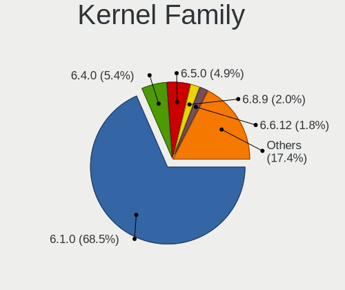

| Version  | Computers | Percent |
|----------|-----------|---------|
| 6.1.0    | 306       | 68.46%  |
| 6.4.0    | 24        | 5.37%   |
| 6.5.0    | 22        | 4.92%   |
| 6.8.9    | 9         | 2.01%   |
| 6.6.12   | 8         | 1.79%   |
| 6.6.11   | 5         | 1.12%   |
| 6.7.12   | 4         | 0.89%   |
| 6.11.10  | 4         | 0.89%   |
| 6.10.10  | 4         | 0.89%   |
| 6.9.7    | 3         | 0.67%   |
| 6.9.12   | 3         | 0.67%   |
| 6.6.9    | 3         | 0.67%   |
| 6.3.9    | 3         | 0.67%   |
| 6.12.6   | 3         | 0.67%   |
| 6.10.11  | 3         | 0.67%   |
| 6.7.5    | 2         | 0.45%   |
| 6.7.11   | 2         | 0.45%   |
| 6.4.9    | 2         | 0.45%   |
| 6.4.15   | 2         | 0.45%   |
| 6.3.0    | 2         | 0.45%   |
| 6.2.14   | 2         | 0.45%   |
| 6.11.9   | 2         | 0.45%   |
| 6.11.7   | 2         | 0.45%   |
| 5.10.197 | 2         | 0.45%   |
| 6.9.6    | 1         | 0.22%   |
| 6.9.3    | 1         | 0.22%   |
| 6.9.11   | 1         | 0.22%   |
| 6.8.8    | 1         | 0.22%   |
| 6.8.10   | 1         | 0.22%   |
| 6.7.8    | 1         | 0.22%   |
| 6.7.6    | 1         | 0.22%   |
| 6.6.8    | 1         | 0.22%   |
| 6.6.7    | 1         | 0.22%   |
| 6.6.51   | 1         | 0.22%   |
| 6.6.47   | 1         | 0.22%   |
| 6.6.31   | 1         | 0.22%   |
| 6.6.3    | 1         | 0.22%   |
| 6.6.0    | 1         | 0.22%   |
| 6.5.5    | 1         | 0.22%   |
| 6.5.11   | 1         | 0.22%   |

Kernel Major Ver.
-----------------

Linux kernel major version

| Version | Computers | Percent |
|---------|-----------|---------|
| 6.1     | 307       | 68.83%  |
| 6.4     | 29        | 6.5%    |
| 6.5     | 25        | 5.61%   |
| 6.6     | 23        | 5.16%   |
| 6.8     | 11        | 2.47%   |
| 6.11    | 10        | 2.24%   |
| 6.9     | 9         | 2.02%   |
| 6.7     | 9         | 2.02%   |
| 6.10    | 8         | 1.79%   |
| 6.3     | 5         | 1.12%   |
| 6.12    | 4         | 0.9%    |
| 5.10    | 3         | 0.67%   |
| 6.2     | 2         | 0.45%   |
| 6.0     | 1         | 0.22%   |

Arch
----

OS architecture (x86_64, i586, etc.)

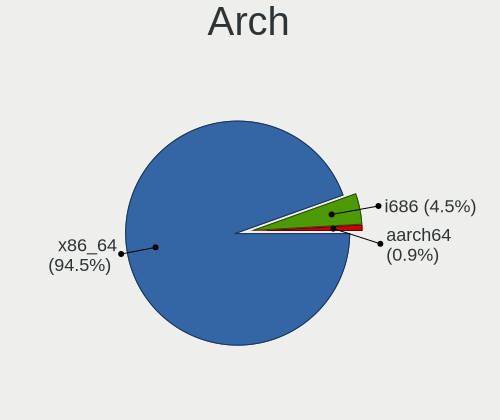

| Name    | Computers | Percent |
|---------|-----------|---------|
| x86_64  | 416       | 94.55%  |
| i686    | 20        | 4.55%   |
| aarch64 | 4         | 0.91%   |

DE
--

Desktop Environment

| Name             | Computers | Percent |
|------------------|-----------|---------|
| XFCE             | 306       | 69.07%  |
| KDE5             | 114       | 25.73%  |
| fluxbox          | 10        | 2.26%   |
| lightdm-xsession | 4         | 0.9%    |
| X-Cinnamon       | 3         | 0.68%   |
| LXQt             | 2         | 0.45%   |
| MATE             | 1         | 0.23%   |
| GNOME Flashback  | 1         | 0.23%   |
| GNOME            | 1         | 0.23%   |
| Unknown          | 1         | 0.23%   |

Display Server
--------------

X11 or Wayland

| Name    | Computers | Percent |
|---------|-----------|---------|
| X11     | 425       | 96.37%  |
| Wayland | 11        | 2.49%   |
| Tty     | 4         | 0.91%   |
| Web     | 1         | 0.23%   |

Display Manager
---------------

SDDM, LightDM, etc.

| Name    | Computers | Percent |
|---------|-----------|---------|
| LightDM | 336       | 76.19%  |
| SDDM    | 104       | 23.58%  |
| GDM3    | 1         | 0.23%   |

OS Lang
-------

Language

| Lang  | Computers | Percent |
|-------|-----------|---------|
| en_US | 210       | 47.51%  |
| de_DE | 40        | 9.05%   |
| it_IT | 26        | 5.88%   |
| en_GB | 25        | 5.66%   |
| ru_RU | 16        | 3.62%   |
| pl_PL | 15        | 3.39%   |
| fr_FR | 15        | 3.39%   |
| en_AU | 12        | 2.71%   |
| es_ES | 10        | 2.26%   |
| pt_BR | 7         | 1.58%   |
| en_CA | 7         | 1.58%   |
| hu_HU | 5         | 1.13%   |
| fi_FI | 4         | 0.9%    |
| tr_TR | 3         | 0.68%   |
| hr_HR | 3         | 0.68%   |
| es_VE | 3         | 0.68%   |
| es_MX | 3         | 0.68%   |
| en_IE | 3         | 0.68%   |
| el_GR | 3         | 0.68%   |
| de_AT | 3         | 0.68%   |
| C     | 3         | 0.68%   |
| sk_SK | 2         | 0.45%   |
| nl_NL | 2         | 0.45%   |
| ja_JP | 2         | 0.45%   |
| fr_CH | 2         | 0.45%   |
| es_US | 2         | 0.45%   |
| en_NZ | 2         | 0.45%   |
| zh_TW | 1         | 0.23%   |
| zh_CN | 1         | 0.23%   |
| uk_UA | 1         | 0.23%   |
| nl_BE | 1         | 0.23%   |
| nb_NO | 1         | 0.23%   |
| ko_KR | 1         | 0.23%   |
| fr_BE | 1         | 0.23%   |
| es_NI | 1         | 0.23%   |
| es_CO | 1         | 0.23%   |
| es_AR | 1         | 0.23%   |
| en_IL | 1         | 0.23%   |
| bs_BA | 1         | 0.23%   |
| bg_BG | 1         | 0.23%   |

Boot Mode
---------

EFI or BIOS

| Mode | Computers | Percent |
|------|-----------|---------|
| EFI  | 318       | 72.11%  |
| BIOS | 123       | 27.89%  |

Filesystem
----------

Type of filesystem

| Type    | Computers | Percent |
|---------|-----------|---------|
| Ext4    | 388       | 88.18%  |
| Overlay | 34        | 7.73%   |
| Btrfs   | 14        | 3.18%   |
| Tmpfs   | 2         | 0.45%   |
| F2fs    | 1         | 0.23%   |
| Ext3    | 1         | 0.23%   |

Part. scheme
------------

Scheme of partitioning

| Type | Computers | Percent |
|------|-----------|---------|
| GPT  | 347       | 78.68%  |
| MBR  | 94        | 21.32%  |

Dual Boot with Linux/BSD
------------------------

Hosting more than one Linux/BSD

| Dual boot | Computers | Percent |
|-----------|-----------|---------|
| No        | 356       | 80.73%  |
| Yes       | 85        | 19.27%  |

Dual Boot (Win)
---------------

Hosting Linux and Windows

| Dual boot | Computers | Percent |
|-----------|-----------|---------|
| No        | 278       | 62.9%   |
| Yes       | 164       | 37.1%   |

Board
-----

Vendor
------

Motherboard manufacturer

| Name                                 | Computers | Percent |
|--------------------------------------|-----------|---------|
| Hewlett-Packard                      | 73        | 16.59%  |
| Dell                                 | 64        | 14.55%  |
| Lenovo                               | 63        | 14.32%  |
| ASUSTek Computer                     | 61        | 13.86%  |
| Gigabyte Technology                  | 24        | 5.45%   |
| Apple                                | 21        | 4.77%   |
| Acer                                 | 20        | 4.55%   |
| MSI                                  | 12        | 2.73%   |
| ASRock                               | 10        | 2.27%   |
| Samsung Electronics                  | 8         | 1.82%   |
| Toshiba                              | 7         | 1.59%   |
| Intel                                | 6         | 1.36%   |
| Google                               | 5         | 1.14%   |
| Unknown                              | 5         | 1.14%   |
| Sony                                 | 4         | 0.91%   |
| Raspberry Pi Foundation              | 4         | 0.91%   |
| Medion                               | 4         | 0.91%   |
| AZW                                  | 4         | 0.91%   |
| Foxconn                              | 3         | 0.68%   |
| AMI                                  | 3         | 0.68%   |
| Pegatron                             | 2         | 0.45%   |
| Microsoft                            | 2         | 0.45%   |
| HONOR                                | 2         | 0.45%   |
| GPU Company                          | 2         | 0.45%   |
| Gateway                              | 2         | 0.45%   |
| Fujitsu Siemens                      | 2         | 0.45%   |
| Fujitsu                              | 2         | 0.45%   |
| youyeetoo                            | 1         | 0.23%   |
| VIT                                  | 1         | 0.23%   |
| TECNO Mobile Limited                 | 1         | 0.23%   |
| System76                             | 1         | 0.23%   |
| SYS                                  | 1         | 0.23%   |
| Shenzhen Meigao Electronic Equipment | 1         | 0.23%   |
| Shenzhen DOKE electronic             | 1         | 0.23%   |
| SGIN                                 | 1         | 0.23%   |
| Semp Toshiba                         | 1         | 0.23%   |
| Razer                                | 1         | 0.23%   |
| PC Specialist                        | 1         | 0.23%   |
| Mediacom                             | 1         | 0.23%   |
| KEIAN                                | 1         | 0.23%   |

Model
-----

Motherboard model

| Name                                              | Computers | Percent |
|---------------------------------------------------|-----------|---------|
| Unknown                                           | 6         | 1.36%   |
| HP Notebook                                       | 4         | 0.91%   |
| RPi Raspberry Pi 5 Model B Rev 1.0                | 2         | 0.45%   |
| HP ProBook 455 G8 Notebook PC                     | 2         | 0.45%   |
| HP Pavilion g6                                    | 2         | 0.45%   |
| HP Pavilion dv6                                   | 2         | 0.45%   |
| HP EliteBook 840 G6                               | 2         | 0.45%   |
| HP Compaq dc7700p Ultra-slim Desktop              | 2         | 0.45%   |
| HP 255 15.6 inch G9 Notebook PC                   | 2         | 0.45%   |
| HP 250 G1                                         | 2         | 0.45%   |
| HP 250 15.6 inch G9 Notebook PC                   | 2         | 0.45%   |
| Foxconn Pro3500 Series                            | 2         | 0.45%   |
| Dell Latitude E6440                               | 2         | 0.45%   |
| Dell Latitude E6430                               | 2         | 0.45%   |
| Dell Latitude E6410                               | 2         | 0.45%   |
| Dell Latitude 5530                                | 2         | 0.45%   |
| AZW SER                                           | 2         | 0.45%   |
| ASUS Z170 PRO GAMING                              | 2         | 0.45%   |
| ASUS T100TA                                       | 2         | 0.45%   |
| ASUS ROG Flow X13 GV302XU_GV302XU                 | 2         | 0.45%   |
| Apple MacBookPro7,1                               | 2         | 0.45%   |
| Apple iMac7,1                                     | 2         | 0.45%   |
| Acer Aspire A315-510P                             | 2         | 0.45%   |
| youyeetoo X1 SBC                                  | 1         | 0.23%   |
| VIT P3400                                         | 1         | 0.23%   |
| Toshiba Satellite P875                            | 1         | 0.23%   |
| Toshiba Satellite P870                            | 1         | 0.23%   |
| Toshiba Satellite C55D-B                          | 1         | 0.23%   |
| Toshiba Satellite C55-A                           | 1         | 0.23%   |
| Toshiba Satellite C50-B                           | 1         | 0.23%   |
| Toshiba PORTEGE X30-E                             | 1         | 0.23%   |
| Toshiba dynabook T552/36GB                        | 1         | 0.23%   |
| TECNO Mobile Limited MEGABOOK T14TA               | 1         | 0.23%   |
| System76 Serval WS                                | 1         | 0.23%   |
| SYS H310CH5-TI2                                   | 1         | 0.23%   |
| Sony VGN-S3HP                                     | 1         | 0.23%   |
| Sony VGN-FZ11M                                    | 1         | 0.23%   |
| Sony SVF1521H1EW                                  | 1         | 0.23%   |
| Sony SVF1521A6EW                                  | 1         | 0.23%   |
| Shenzhen Meigao Electronic Equipment Venus series | 1         | 0.23%   |

Model Family
------------

Motherboard model prefix

| Name                  | Computers | Percent |
|-----------------------|-----------|---------|
| Lenovo ThinkPad       | 25        | 5.68%   |
| Dell Latitude         | 24        | 5.45%   |
| ASUS VivoBook         | 16        | 3.64%   |
| Acer Aspire           | 14        | 3.18%   |
| HP Pavilion           | 12        | 2.73%   |
| Lenovo IdeaPad        | 11        | 2.5%    |
| Dell Inspiron         | 11        | 2.5%    |
| Dell OptiPlex         | 9         | 2.05%   |
| Lenovo ThinkCentre    | 8         | 1.82%   |
| HP Compaq             | 8         | 1.82%   |
| Dell XPS              | 8         | 1.82%   |
| ASUS PRIME            | 8         | 1.82%   |
| HP ProBook            | 7         | 1.59%   |
| HP Laptop             | 7         | 1.59%   |
| HP EliteBook          | 7         | 1.59%   |
| Unknown               | 6         | 1.36%   |
| Toshiba Satellite     | 5         | 1.14%   |
| ASUS TUF              | 5         | 1.14%   |
| ASUS ROG              | 5         | 1.14%   |
| RPi Raspberry         | 4         | 0.91%   |
| HP Notebook           | 4         | 0.91%   |
| HP 255                | 4         | 0.91%   |
| HP 250                | 4         | 0.91%   |
| Dell Vostro           | 4         | 0.91%   |
| Dell Precision        | 4         | 0.91%   |
| Apple MacBookPro5     | 4         | 0.91%   |
| HP ENVY               | 3         | 0.68%   |
| Microsoft Surface     | 2         | 0.45%   |
| Lenovo Yoga           | 2         | 0.45%   |
| Lenovo LOQ            | 2         | 0.45%   |
| Lenovo Legion         | 2         | 0.45%   |
| Lenovo IdeaCentre     | 2         | 0.45%   |
| Lenovo 3000           | 2         | 0.45%   |
| HP Spectre            | 2         | 0.45%   |
| HP EliteDesk          | 2         | 0.45%   |
| Fujitsu Siemens AMILO | 2         | 0.45%   |
| Foxconn Pro3500       | 2         | 0.45%   |
| Dell System           | 2         | 0.45%   |
| AZW SER               | 2         | 0.45%   |
| ASUS Z170             | 2         | 0.45%   |

MFG Year
--------

Motherboard manufacture year

| Year    | Computers | Percent |
|---------|-----------|---------|
| 2023    | 43        | 9.77%   |
| 2022    | 39        | 8.86%   |
| 2021    | 36        | 8.18%   |
| 2013    | 33        | 7.5%    |
| 2019    | 30        | 6.82%   |
| 2018    | 30        | 6.82%   |
| 2012    | 26        | 5.91%   |
| 2020    | 24        | 5.45%   |
| 2011    | 23        | 5.23%   |
| 2009    | 23        | 5.23%   |
| 2016    | 19        | 4.32%   |
| 2015    | 19        | 4.32%   |
| 2017    | 17        | 3.86%   |
| 2024    | 15        | 3.41%   |
| 2014    | 14        | 3.18%   |
| 2007    | 13        | 2.95%   |
| 2008    | 12        | 2.73%   |
| 2010    | 11        | 2.5%    |
| 2006    | 8         | 1.82%   |
| Unknown | 3         | 0.68%   |
| 2005    | 2         | 0.45%   |

Form Factor
-----------

Physical design of the computer

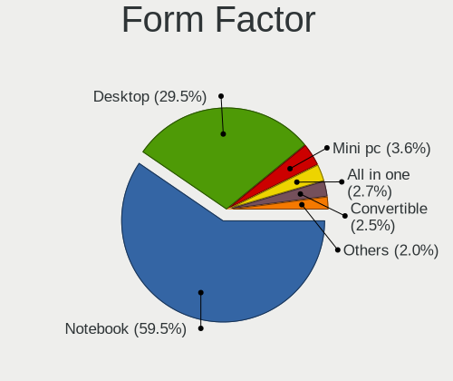

| Name           | Computers | Percent |
|----------------|-----------|---------|
| Notebook       | 262       | 59.55%  |
| Desktop        | 130       | 29.55%  |
| Mini pc        | 16        | 3.64%   |
| All in one     | 12        | 2.73%   |
| Convertible    | 11        | 2.5%    |
| System on chip | 4         | 0.91%   |
| Tablet         | 4         | 0.91%   |
| Server         | 1         | 0.23%   |

Secure Boot
-----------

Enabled or disabled

| State    | Computers | Percent |
|----------|-----------|---------|
| Disabled | 431       | 97.95%  |
| Enabled  | 9         | 2.05%   |

Coreboot
--------

Have coreboot on board

| Used | Computers | Percent |
|------|-----------|---------|
| No   | 434       | 98.64%  |
| Yes  | 6         | 1.36%   |

RAM Size
--------

Total RAM memory

| Size in GB  | Computers | Percent |
|-------------|-----------|---------|
| 4.01-8.0    | 104       | 23.64%  |
| 16.01-24.0  | 82        | 18.64%  |
| 8.01-16.0   | 78        | 17.73%  |
| 3.01-4.0    | 65        | 14.77%  |
| 32.01-64.0  | 55        | 12.5%   |
| 1.01-2.0    | 25        | 5.68%   |
| 2.01-3.0    | 10        | 2.27%   |
| 64.01-256.0 | 10        | 2.27%   |
| 24.01-32.0  | 9         | 2.05%   |
| 0.51-1.0    | 2         | 0.45%   |

RAM Used
--------

Used RAM memory

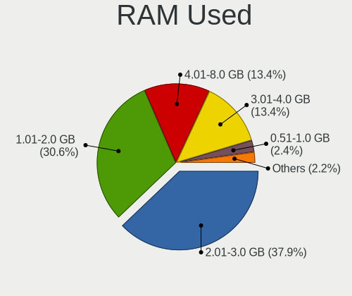

| Used GB    | Computers | Percent |
|------------|-----------|---------|
| 2.01-3.0   | 172       | 37.89%  |
| 1.01-2.0   | 139       | 30.62%  |
| 4.01-8.0   | 61        | 13.44%  |
| 3.01-4.0   | 61        | 13.44%  |
| 0.51-1.0   | 11        | 2.42%   |
| 8.01-16.0  | 8         | 1.76%   |
| 16.01-24.0 | 2         | 0.44%   |

Total Drives
------------

Number of drives on board

| Drives | Computers | Percent |
|--------|-----------|---------|
| 1      | 298       | 67.27%  |
| 2      | 92        | 20.77%  |
| 3      | 34        | 7.67%   |
| 4      | 9         | 2.03%   |
| 5      | 5         | 1.13%   |
| 7      | 2         | 0.45%   |
| 6      | 2         | 0.45%   |
| 9      | 1         | 0.23%   |

Has CD-ROM
----------

Has CD-ROM on board

| Presented | Computers | Percent |
|-----------|-----------|---------|
| No        | 299       | 67.95%  |
| Yes       | 141       | 32.05%  |

Has Ethernet
------------

Has Ethernet on board

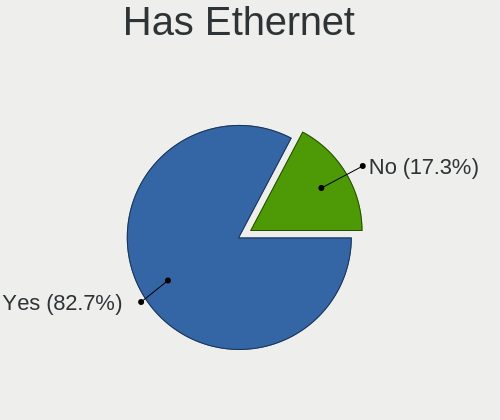

| Presented | Computers | Percent |
|-----------|-----------|---------|
| Yes       | 364       | 82.73%  |
| No        | 76        | 17.27%  |

Has WiFi
--------

Has WiFi module

| Presented | Computers | Percent |
|-----------|-----------|---------|
| Yes       | 370       | 84.09%  |
| No        | 70        | 15.91%  |

Has Bluetooth
-------------

Has Bluetooth module

| Presented | Computers | Percent |
|-----------|-----------|---------|
| Yes       | 298       | 67.57%  |
| No        | 143       | 32.43%  |

Location
--------

Country
-------

Geographic location (country)

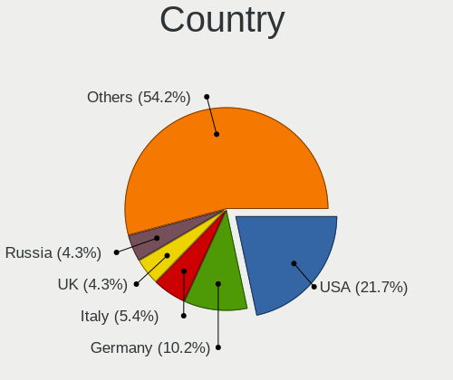

| Country     | Computers | Percent |
|-------------|-----------|---------|
| USA         | 96        | 21.67%  |
| Germany     | 45        | 10.16%  |
| Italy       | 24        | 5.42%   |
| UK          | 19        | 4.29%   |
| Russia      | 19        | 4.29%   |
| Poland      | 17        | 3.84%   |
| Greece      | 16        | 3.61%   |
| France      | 16        | 3.61%   |
| Australia   | 16        | 3.61%   |
| Canada      | 14        | 3.16%   |
| Brazil      | 12        | 2.71%   |
| Spain       | 10        | 2.26%   |
| India       | 10        | 2.26%   |
| Mexico      | 6         | 1.35%   |
| Hungary     | 6         | 1.35%   |
| Turkey      | 5         | 1.13%   |
| Serbia      | 5         | 1.13%   |
| Netherlands | 5         | 1.13%   |
| Indonesia   | 5         | 1.13%   |
| Belgium     | 5         | 1.13%   |
| Austria     | 5         | 1.13%   |
| Venezuela   | 4         | 0.9%    |
| Sweden      | 4         | 0.9%    |
| Singapore   | 4         | 0.9%    |
| Norway      | 4         | 0.9%    |
| Finland     | 4         | 0.9%    |
| Romania     | 3         | 0.68%   |
| Portugal    | 3         | 0.68%   |
| New Zealand | 3         | 0.68%   |
| Japan       | 3         | 0.68%   |
| Egypt       | 3         | 0.68%   |
| Argentina   | 3         | 0.68%   |
| Algeria     | 3         | 0.68%   |
| Thailand    | 2         | 0.45%   |
| Switzerland | 2         | 0.45%   |
| Slovakia    | 2         | 0.45%   |
| Israel      | 2         | 0.45%   |
| Ireland     | 2         | 0.45%   |
| Iraq        | 2         | 0.45%   |
| Croatia     | 2         | 0.45%   |

City
----

Geographic location (city)

| City           | Computers | Percent |
|----------------|-----------|---------|
| Athens         | 12        | 2.65%   |
| Sydney         | 7         | 1.55%   |
| Moscow         | 7         | 1.55%   |
| Seattle        | 6         | 1.33%   |
| Paris          | 5         | 1.11%   |
| Milan          | 5         | 1.11%   |
| Melbourne      | 5         | 1.11%   |
| Warsaw         | 4         | 0.88%   |
| St Petersburg  | 4         | 0.88%   |
| Singapore      | 4         | 0.88%   |
| Otwock         | 4         | 0.88%   |
| Budapest       | 4         | 0.88%   |
| Vienna         | 3         | 0.66%   |
| Stuttgart      | 3         | 0.66%   |
| Munich         | 3         | 0.66%   |
| Krakow         | 3         | 0.66%   |
| Hamburg        | 3         | 0.66%   |
| Florence       | 3         | 0.66%   |
| Berlin         | 3         | 0.66%   |
| Bengaluru      | 3         | 0.66%   |
| Zagreb         | 2         | 0.44%   |
| Wandsworth     | 2         | 0.44%   |
| Vranje         | 2         | 0.44%   |
| Vaasa          | 2         | 0.44%   |
| Toronto        | 2         | 0.44%   |
| Sofia          | 2         | 0.44%   |
| Santa Clara    | 2         | 0.44%   |
| Salt Lake City | 2         | 0.44%   |
| Salamina       | 2         | 0.44%   |
| Rio de Janeiro | 2         | 0.44%   |
| Ravensburg     | 2         | 0.44%   |
| Pforzheim      | 2         | 0.44%   |
| Oslo           | 2         | 0.44%   |
| Montreal       | 2         | 0.44%   |
| Milano         | 2         | 0.44%   |
| Mexico City    | 2         | 0.44%   |
| Mrida        | 2         | 0.44%   |
| Madrid         | 2         | 0.44%   |
| Los Angeles    | 2         | 0.44%   |
| London         | 2         | 0.44%   |

Drives
------

Drive Vendor
------------

Hard drive vendors

| Vendor                       | Computers | Drives | Percent |
|------------------------------|-----------|--------|---------|
| Samsung Electronics          | 95        | 117    | 15.45%  |
| WDC                          | 74        | 88     | 12.03%  |
| Seagate                      | 56        | 74     | 9.11%   |
| SanDisk                      | 43        | 47     | 6.99%   |
| Kingston                     | 29        | 30     | 4.72%   |
| Crucial                      | 28        | 45     | 4.55%   |
| Unknown                      | 26        | 31     | 4.23%   |
| Toshiba                      | 25        | 26     | 4.07%   |
| SK hynix                     | 18        | 18     | 2.93%   |
| Intel                        | 18        | 21     | 2.93%   |
| Hitachi                      | 15        | 16     | 2.44%   |
| Micron Technology            | 13        | 15     | 2.11%   |
| China                        | 13        | 18     | 2.11%   |
| A-DATA Technology            | 12        | 14     | 1.95%   |
| Unknown                      | 12        | 12     | 1.95%   |
| KIOXIA                       | 9         | 10     | 1.46%   |
| SPCC                         | 8         | 8      | 1.3%    |
| Apple                        | 8         | 8      | 1.3%    |
| Intenso                      | 6         | 6      | 0.98%   |
| HGST                         | 6         | 8      | 0.98%   |
| PNY                          | 5         | 5      | 0.81%   |
| Team                         | 4         | 6      | 0.65%   |
| Silicon Motion               | 4         | 5      | 0.65%   |
| Netac                        | 4         | 5      | 0.65%   |
| Fujitsu                      | 4         | 4      | 0.65%   |
| FORESEE                      | 4         | 4      | 0.65%   |
| Apacer                       | 4         | 4      | 0.65%   |
| Verbatim                     | 3         | 3      | 0.49%   |
| Phison Electronics           | 3         | 3      | 0.49%   |
| Patriot                      | 3         | 4      | 0.49%   |
| LITEONIT                     | 3         | 3      | 0.49%   |
| Kingston Technology Company  | 3         | 3      | 0.49%   |
| UMIS                         | 2         | 2      | 0.33%   |
| Shenzhen Longsys Electronics | 2         | 2      | 0.33%   |
| Realtek                      | 2         | 2      | 0.33%   |
| Mushkin                      | 2         | 2      | 0.33%   |
| Maxtor                       | 2         | 2      | 0.33%   |
| Lexar                        | 2         | 2      | 0.33%   |
| Fanxiang                     | 2         | 3      | 0.33%   |
| External                     | 2         | 2      | 0.33%   |

Drive Model
-----------

Hard drive models

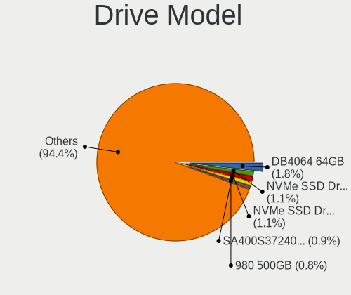

| Model                            | Computers | Percent |
|----------------------------------|-----------|---------|
| Unknown                          | 12        | 1.81%   |
| SanDisk NVMe SSD Drive 512GB     | 7         | 1.06%   |
| SanDisk NVMe SSD Drive 1TB       | 7         | 1.06%   |
| Kingston SA400S37240G 240GB SSD  | 6         | 0.9%    |
| Samsung SSD 980 500GB            | 5         | 0.75%   |
| Unknown SD/MMC/MS PRO 128GB      | 4         | 0.6%    |
| Toshiba MQ01ABF050 500GB         | 4         | 0.6%    |
| Toshiba MQ01ABD100 1TB           | 4         | 0.6%    |
| Samsung SSD 870 EVO 1TB          | 4         | 0.6%    |
| Samsung SSD 860 EVO 250GB        | 4         | 0.6%    |
| Samsung SSD 850 EVO 250GB        | 4         | 0.6%    |
| WDC WD10EZEX-00BN5A0 1TB         | 3         | 0.45%   |
| Toshiba HDWD120 2TB              | 3         | 0.45%   |
| SK hynix HCG8e  64GB             | 3         | 0.45%   |
| Seagate ST9500325AS 500GB        | 3         | 0.45%   |
| Seagate ST500DM002-1BD142 500GB  | 3         | 0.45%   |
| Seagate ST3500418AS 500GB        | 3         | 0.45%   |
| Seagate ST31000524AS 1TB         | 3         | 0.45%   |
| Seagate ST1000LM035-1RK172 1TB   | 3         | 0.45%   |
| Samsung SSD 970 EVO Plus 2TB     | 3         | 0.45%   |
| Samsung SSD 970 EVO Plus 1TB     | 3         | 0.45%   |
| Samsung SSD 870 EVO 500GB        | 3         | 0.45%   |
| Samsung SSD 850 PRO 256GB        | 3         | 0.45%   |
| Samsung MZVL4512HBLU-00BTW 512GB | 3         | 0.45%   |
| Samsung MZALQ512HBLU-00BL2 512GB | 3         | 0.45%   |
| Kingston SV300S37A120G 120GB SSD | 3         | 0.45%   |
| Kingston SA400S37480G 480GB SSD  | 3         | 0.45%   |
| Kingston SA400S37120G 120GB SSD  | 3         | 0.45%   |
| Intel SSDPEKNW010T8 1TB          | 3         | 0.45%   |
| Intel SSDPEKNU512GZ 512GB        | 3         | 0.45%   |
| HGST HTS721010A9E630 1TB         | 3         | 0.45%   |
| China SSD 256GB                  | 3         | 0.45%   |
| China SSD 240GB                  | 3         | 0.45%   |
| WDC WDS240G2G0B-00EPW0 240GB SSD | 2         | 0.3%    |
| WDC WDS100T2B0A-00SM50 1TB SSD   | 2         | 0.3%    |
| WDC WD5000LPVX-22V0TT0 500GB     | 2         | 0.3%    |
| WDC WD5000AAKX-00ERMA0 500GB     | 2         | 0.3%    |
| WDC WD20EZRZ-00Z5HB0 2TB         | 2         | 0.3%    |
| WDC WD20EZAZ-00GGJB0 2TB         | 2         | 0.3%    |
| WDC WD10JPVX-60JC3T0 1TB         | 2         | 0.3%    |

HDD Vendor
----------

Hard disk drive vendors

| Vendor              | Computers | Drives | Percent |
|---------------------|-----------|--------|---------|
| Seagate             | 54        | 71     | 30.68%  |
| WDC                 | 49        | 59     | 27.84%  |
| Toshiba             | 23        | 24     | 13.07%  |
| Hitachi             | 15        | 16     | 8.52%   |
| Samsung Electronics | 10        | 12     | 5.68%   |
| HGST                | 6         | 8      | 3.41%   |
| Unknown             | 4         | 4      | 2.27%   |
| Fujitsu             | 4         | 4      | 2.27%   |
| Apple               | 3         | 3      | 1.7%    |
| Maxtor              | 2         | 2      | 1.14%   |
| External            | 2         | 2      | 1.14%   |
| Space ke            | 1         | 2      | 0.57%   |
| SABRENT             | 1         | 3      | 0.57%   |
| Hewlett-Packard     | 1         | 5      | 0.57%   |
| ASMT                | 1         | 1      | 0.57%   |

SSD Vendor
----------

Solid state drive vendors

| Vendor              | Computers | Drives | Percent |
|---------------------|-----------|--------|---------|
| Samsung Electronics | 41        | 52     | 19.52%  |
| Kingston            | 21        | 22     | 10%     |
| Crucial             | 19        | 35     | 9.05%   |
| WDC                 | 16        | 17     | 7.62%   |
| SanDisk             | 14        | 14     | 6.67%   |
| China               | 13        | 18     | 6.19%   |
| A-DATA Technology   | 9         | 10     | 4.29%   |
| SPCC                | 6         | 6      | 2.86%   |
| Micron Technology   | 6         | 8      | 2.86%   |
| Intenso             | 6         | 6      | 2.86%   |
| Intel               | 5         | 5      | 2.38%   |
| PNY                 | 4         | 4      | 1.9%    |
| Apple               | 4         | 4      | 1.9%    |
| Verbatim            | 3         | 3      | 1.43%   |
| Patriot             | 3         | 4      | 1.43%   |
| LITEONIT            | 3         | 3      | 1.43%   |
| FORESEE             | 3         | 3      | 1.43%   |
| Seagate             | 2         | 2      | 0.95%   |
| Netac               | 2         | 2      | 0.95%   |
| Apacer              | 2         | 2      | 0.95%   |
| X12                 | 1         | 1      | 0.48%   |
| WALRAM              | 1         | 1      | 0.48%   |
| UP                  | 1         | 1      | 0.48%   |
| Unknown             | 1         | 1      | 0.48%   |
| Transcend           | 1         | 1      | 0.48%   |
| Team                | 1         | 1      | 0.48%   |
| Super Talent        | 1         | 1      | 0.48%   |
| Plextor             | 1         | 1      | 0.48%   |
| OCZ                 | 1         | 1      | 0.48%   |
| Mushkin             | 1         | 1      | 0.48%   |
| MG                  | 1         | 1      | 0.48%   |
| MCQUEST             | 1         | 1      | 0.48%   |
| LITEON              | 1         | 1      | 0.48%   |
| KingFast            | 1         | 2      | 0.48%   |
| HS-SSD-C100         | 1         | 1      | 0.48%   |
| Gigabyte Technology | 1         | 1      | 0.48%   |
| GeIL                | 1         | 1      | 0.48%   |
| Fanxiang            | 1         | 1      | 0.48%   |
| Emtec               | 1         | 1      | 0.48%   |
| Corsair             | 1         | 1      | 0.48%   |

Drive Kind
----------

HDD or SSD

| Kind    | Computers | Drives | Percent |
|---------|-----------|--------|---------|
| SSD     | 189       | 249    | 33.87%  |
| NVMe    | 180       | 215    | 32.26%  |
| HDD     | 149       | 216    | 26.7%   |
| MMC     | 34        | 41     | 6.09%   |
| Unknown | 6         | 6      | 1.08%   |

Drive Connector
---------------

SATA, SAS, NVMe, etc.

| Type | Computers | Drives | Percent |
|------|-----------|--------|---------|
| SATA | 273       | 436    | 52.91%  |
| NVMe | 179       | 213    | 34.69%  |
| MMC  | 34        | 41     | 6.59%   |
| SAS  | 30        | 37     | 5.81%   |

Drive Size
----------

Size of hard drive

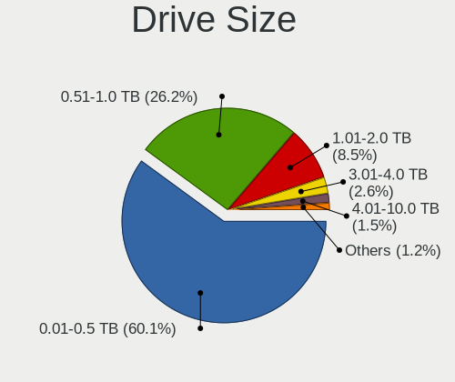

| Size in TB | Computers | Drives | Percent |
|------------|-----------|--------|---------|
| 0.01-0.5   | 206       | 271    | 60.06%  |
| 0.51-1.0   | 90        | 128    | 26.24%  |
| 1.01-2.0   | 29        | 40     | 8.45%   |
| 3.01-4.0   | 9         | 10     | 2.62%   |
| 4.01-10.0  | 5         | 11     | 1.46%   |
| 2.01-3.0   | 3         | 4      | 0.87%   |
| 10.01-20.0 | 1         | 1      | 0.29%   |

Space Total
-----------

Amount of disk space available on the file system

| Size in GB     | Computers | Percent |
|----------------|-----------|---------|
| 101-250        | 127       | 28.35%  |
| 251-500        | 91        | 20.31%  |
| 501-1000       | 58        | 12.95%  |
| 1-20           | 56        | 12.5%   |
| 51-100         | 36        | 8.04%   |
| 1001-2000      | 27        | 6.03%   |
| 21-50          | 26        | 5.8%    |
| More than 3000 | 19        | 4.24%   |
| 2001-3000      | 8         | 1.79%   |

Space Used
----------

Amount of used disk space

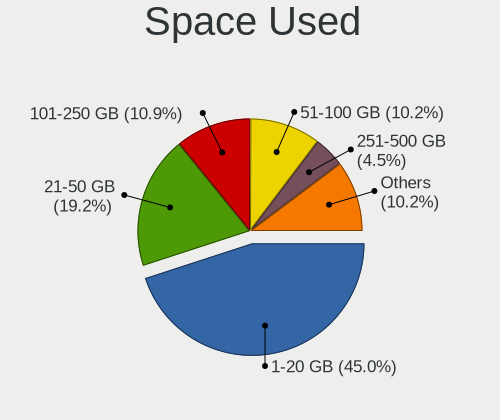

| Used GB        | Computers | Percent |
|----------------|-----------|---------|
| 1-20           | 202       | 44.99%  |
| 21-50          | 86        | 19.15%  |
| 101-250        | 49        | 10.91%  |
| 51-100         | 46        | 10.24%  |
| 251-500        | 20        | 4.45%   |
| 501-1000       | 18        | 4.01%   |
| 1001-2000      | 15        | 3.34%   |
| More than 3000 | 10        | 2.23%   |
| 2001-3000      | 3         | 0.67%   |

Malfunc. Drives
---------------

Drive models with a malfunction

| Model                                 | Computers | Drives | Percent |
|---------------------------------------|-----------|--------|---------|
| Seagate ST9500325AS 500GB             | 3         | 3      | 4%      |
| Toshiba MQ01ABF050 500GB              | 2         | 2      | 2.67%   |
| Seagate ST500LM000-1EJ162 500GB       | 2         | 2      | 2.67%   |
| Seagate ST500DM002-1BD142 500GB       | 2         | 2      | 2.67%   |
| HGST HTS545050A7E680 500GB            | 2         | 2      | 2.67%   |
| WDC WD5000LPVX-22V0TT0 500GB          | 1         | 1      | 1.33%   |
| WDC WD40EZRX-00SPEB0 4TB              | 1         | 1      | 1.33%   |
| WDC WD32 00BEKT-75PVMT0 320GB         | 1         | 1      | 1.33%   |
| WDC WD2500AAJS-00B4A0 250GB           | 1         | 2      | 1.33%   |
| WDC WD20EFRX-68AX9N0 2TB              | 1         | 1      | 1.33%   |
| WDC WD1600BEKT-75PVMT0 160GB          | 1         | 1      | 1.33%   |
| WDC WD10EARS-00Y5B1 1TB               | 1         | 1      | 1.33%   |
| WDC WD Green 2.5 240GB SSD            | 1         | 1      | 1.33%   |
| WDC WD Blue SA510 2.5 500GB           | 1         | 1      | 1.33%   |
| Toshiba MQ01ABF032 320GB              | 1         | 1      | 1.33%   |
| Toshiba MQ01ABD100 1TB                | 1         | 1      | 1.33%   |
| Toshiba MQ01ABD050 500GB              | 1         | 1      | 1.33%   |
| Toshiba MK8009GAH 80GB                | 1         | 1      | 1.33%   |
| Toshiba MK3259GSXP 320GB              | 1         | 1      | 1.33%   |
| Toshiba DT01ACA050 500GB              | 1         | 1      | 1.33%   |
| Seagate ST9320423AS 320GB             | 1         | 1      | 1.33%   |
| Seagate ST500LM012 HN-M500MBB 500GB   | 1         | 1      | 1.33%   |
| Seagate ST500DM002-1BC142 500GB       | 1         | 1      | 1.33%   |
| Seagate ST4000DM000-1F2168 4TB        | 1         | 1      | 1.33%   |
| Seagate ST3500418AS 500GB             | 1         | 1      | 1.33%   |
| Seagate ST3250310AS 250GB             | 1         | 1      | 1.33%   |
| Seagate ST320LT012-9WS14C 320GB       | 1         | 1      | 1.33%   |
| Seagate ST320LT009-9WC142 320GB       | 1         | 1      | 1.33%   |
| Seagate ST31000524AS 1TB              | 1         | 1      | 1.33%   |
| Seagate ST2000DX001-1CM164 2TB        | 1         | 1      | 1.33%   |
| Seagate ST1000LM024 HN-M101MBB 1TB    | 1         | 1      | 1.33%   |
| Seagate ST1000DM003-9YN162 1TB        | 1         | 1      | 1.33%   |
| Seagate ST1000DM003-1ER162 1TB        | 1         | 1      | 1.33%   |
| SanDisk SSD PLUS 480GB                | 1         | 1      | 1.33%   |
| SanDisk SSD PLUS 1000GB               | 1         | 1      | 1.33%   |
| Samsung Electronics SSD 970 EVO 500GB | 1         | 1      | 1.33%   |
| Samsung Electronics SSD 870 EVO 250GB | 1         | 2      | 1.33%   |
| Samsung Electronics SSD 850 PRO 512GB | 1         | 1      | 1.33%   |
| Samsung Electronics SP2504C 250GB     | 1         | 1      | 1.33%   |
| Samsung Electronics HM321HI 320GB     | 1         | 1      | 1.33%   |

Malfunc. Drive Vendor
---------------------

Vendors of faulty drives

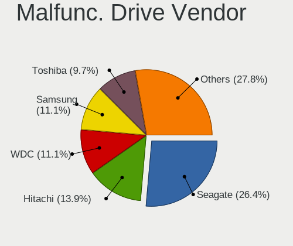

| Vendor              | Computers | Drives | Percent |
|---------------------|-----------|--------|---------|
| Seagate             | 19        | 20     | 26.39%  |
| Hitachi             | 10        | 10     | 13.89%  |
| WDC                 | 8         | 10     | 11.11%  |
| Samsung Electronics | 8         | 9      | 11.11%  |
| Toshiba             | 7         | 8      | 9.72%   |
| HGST                | 4         | 6      | 5.56%   |
| Intel               | 3         | 3      | 4.17%   |
| SanDisk             | 2         | 2      | 2.78%   |
| Netac               | 2         | 2      | 2.78%   |
| Fujitsu             | 2         | 2      | 2.78%   |
| China               | 2         | 2      | 2.78%   |
| Micron Technology   | 1         | 1      | 1.39%   |
| LITEONIT            | 1         | 1      | 1.39%   |
| Kingston            | 1         | 1      | 1.39%   |
| Crucial             | 1         | 12     | 1.39%   |
| A-DATA Technology   | 1         | 2      | 1.39%   |

Malfunc. HDD Vendor
-------------------

Vendors of faulty HDD drives

| Vendor              | Computers | Drives | Percent |
|---------------------|-----------|--------|---------|
| Seagate             | 19        | 20     | 35.85%  |
| Hitachi             | 10        | 10     | 18.87%  |
| Toshiba             | 7         | 8      | 13.21%  |
| WDC                 | 6         | 8      | 11.32%  |
| Samsung Electronics | 5         | 5      | 9.43%   |
| HGST                | 4         | 6      | 7.55%   |
| Fujitsu             | 2         | 2      | 3.77%   |

Malfunc. Drive Kind
-------------------

Kinds of faulty drives

| Kind | Computers | Drives | Percent |
|------|-----------|--------|---------|
| HDD  | 50        | 59     | 72.46%  |
| SSD  | 18        | 31     | 26.09%  |
| NVMe | 1         | 1      | 1.45%   |

Failed Drives
-------------

Failed drive models

| Model                       | Computers | Drives | Percent |
|-----------------------------|-----------|--------|---------|
| WDC WD3200AAJS-00B4A0 320GB | 1         | 1      | 100%    |

Failed Drive Vendor
-------------------

Failed drive vendors

| Vendor | Computers | Drives | Percent |
|--------|-----------|--------|---------|
| WDC    | 1         | 1      | 100%    |

Drive Status
------------

Number of failed and malfunc. drives

| Status   | Computers | Drives | Percent |
|----------|-----------|--------|---------|
| Works    | 361       | 529    | 70.92%  |
| Detected | 79        | 106    | 15.52%  |
| Malfunc  | 68        | 91     | 13.36%  |
| Failed   | 1         | 1      | 0.2%    |

Storage controller
------------------

Storage Vendor
--------------

Storage controller vendors

| Vendor                           | Computers | Percent |
|----------------------------------|-----------|---------|
| Intel                            | 258       | 47.78%  |
| AMD                              | 77        | 14.26%  |
| Samsung Electronics              | 50        | 9.26%   |
| SanDisk                          | 37        | 6.85%   |
| SK hynix                         | 13        | 2.41%   |
| Nvidia                           | 12        | 2.22%   |
| Kingston Technology Company      | 11        | 2.04%   |
| Micron Technology                | 10        | 1.85%   |
| Silicon Motion                   | 9         | 1.67%   |
| KIOXIA                           | 9         | 1.67%   |
| ASMedia Technology               | 7         | 1.3%    |
| Phison Electronics               | 6         | 1.11%   |
| Micron/Crucial Technology        | 6         | 1.11%   |
| Realtek Semiconductor            | 5         | 0.93%   |
| MAXIO Technology (Hangzhou)      | 5         | 0.93%   |
| Shenzhen Longsys Electronics     | 4         | 0.74%   |
| Toshiba America Info Systems     | 3         | 0.56%   |
| ADATA Technology                 | 3         | 0.56%   |
| Union Memory (Shenzhen)          | 2         | 0.37%   |
| Marvell Technology Group         | 2         | 0.37%   |
| JMicron Technology               | 2         | 0.37%   |
| TenaFe                           | 1         | 0.19%   |
| Solid State Storage Technology   | 1         | 0.19%   |
| Silicon Integrated Systems [SiS] | 1         | 0.19%   |
| O2 Micro                         | 1         | 0.19%   |
| LSI Logic / Symbios Logic        | 1         | 0.19%   |
| Integrated Technology Express    | 1         | 0.19%   |
| Hewlett-Packard                  | 1         | 0.19%   |
| Biwin Storage Technology         | 1         | 0.19%   |
| Unknown                          | 1         | 0.19%   |

Storage Model
-------------

Storage controller models

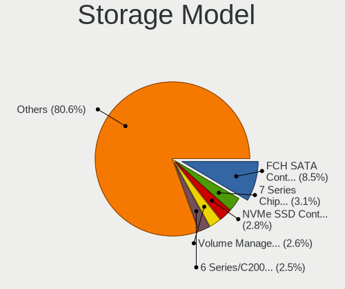

| Model                                                                          | Computers | Percent |
|--------------------------------------------------------------------------------|-----------|---------|
| AMD FCH SATA Controller [AHCI mode]                                            | 52        | 8.5%    |
| Intel 7 Series Chipset Family 6-port SATA Controller [AHCI mode]               | 19        | 3.1%    |
| Samsung NVMe SSD Controller SM981/PM981/PM983                                  | 17        | 2.78%   |
| Intel Volume Management Device NVMe RAID Controller                            | 16        | 2.61%   |
| Intel 6 Series/C200 Series Chipset Family 6 port Mobile SATA AHCI Controller   | 15        | 2.45%   |
| Intel 82801 Mobile SATA Controller [RAID mode]                                 | 14        | 2.29%   |
| SanDisk WD Black SN770 / PC SN740 256GB / PC SN560 (DRAM-less) NVMe SSD        | 12        | 1.96%   |
| Samsung NVMe SSD Controller 980 (DRAM-less)                                    | 12        | 1.96%   |
| Intel Q170/Q150/B150/H170/H110/Z170/CM236 Chipset SATA Controller [AHCI Mode]  | 12        | 1.96%   |
| Intel Celeron/Pentium Silver Processor SATA Controller                         | 10        | 1.63%   |
| Intel 82801HM/HEM (ICH8M/ICH8M-E) IDE Controller                               | 10        | 1.63%   |
| Intel 8 Series/C220 Series Chipset Family 6-port SATA Controller 1 [AHCI mode] | 10        | 1.63%   |
| Intel 200 Series PCH SATA controller [AHCI mode]                               | 10        | 1.63%   |
| Intel Sunrise Point-LP SATA Controller [AHCI mode]                             | 9         | 1.47%   |
| Intel Alder Lake-P SATA AHCI Controller                                        | 9         | 1.47%   |
| Intel 82801HM/HEM (ICH8M/ICH8M-E) SATA Controller [AHCI mode]                  | 9         | 1.47%   |
| Silicon Motion SM2263EN/SM2263XT (DRAM-less) NVMe SSD Controllers              | 8         | 1.31%   |
| Intel 82801G (ICH7 Family) IDE Controller                                      | 8         | 1.31%   |
| Intel 6 Series/C200 Series Chipset Family 6 port Desktop SATA AHCI Controller  | 8         | 1.31%   |
| SanDisk Ultra 3D / WD PC SN530, IX SN530, Blue SN550 NVMe SSD (DRAM-less)      | 7         | 1.14%   |
| Intel 82801IBM/IEM (ICH9M/ICH9M-E) 4 port SATA Controller [AHCI mode]          | 7         | 1.14%   |
| Intel 5 Series/3400 Series Chipset 6 port SATA AHCI Controller                 | 7         | 1.14%   |
| AMD 400 Series Chipset SATA Controller                                         | 7         | 1.14%   |
| SK hynix Gold P31/BC711/PC711 NVMe Solid State Drive                           | 6         | 0.98%   |
| Samsung NVMe SSD Controller PM9B1 (DRAM-less)                                  | 6         | 0.98%   |
| Samsung NVMe SSD Controller PM9A1/PM9A3/980PRO                                 | 6         | 0.98%   |
| Nvidia MCP79 AHCI Controller                                                   | 6         | 0.98%   |
| Intel NM10/ICH7 Family SATA Controller [IDE mode]                              | 6         | 0.98%   |
| Intel Comet Lake SATA AHCI Controller                                          | 6         | 0.98%   |
| Intel Celeron N3350/Pentium N4200/Atom E3900 Series SATA AHCI Controller       | 6         | 0.98%   |
| Intel Cannon Lake PCH SATA AHCI Controller                                     | 6         | 0.98%   |
| Intel 7 Series/C210 Series Chipset Family 6-port SATA Controller [AHCI mode]   | 6         | 0.98%   |
| ASMedia ASM1061/ASM1062 Serial ATA Controller                                  | 6         | 0.98%   |
| AMD SB7x0/SB8x0/SB9x0 SATA Controller [AHCI mode]                              | 6         | 0.98%   |
| AMD 600 Series Chipset SATA Controller                                         | 6         | 0.98%   |
| AMD 500 Series Chipset SATA Controller                                         | 6         | 0.98%   |
| Micron/Crucial P2 [Nick P2] / P3 / P3 Plus NVMe PCIe SSD (DRAM-less)           | 5         | 0.82%   |
| Micron 2450 NVMe SSD [HendrixV] (DRAM-less)                                    | 5         | 0.82%   |
| Intel Volume Management Device NVMe RAID Controller Intel Corporation          | 5         | 0.82%   |
| Intel Tiger Lake-LP SATA Controller                                            | 5         | 0.82%   |

Storage Kind
------------

Kind of storage controller (IDE, SATA, NVMe, SAS, ...)

| Kind | Computers | Percent |
|------|-----------|---------|
| SATA | 285       | 51.26%  |
| NVMe | 176       | 31.65%  |
| IDE  | 53        | 9.53%   |
| RAID | 41        | 7.37%   |
| SAS  | 1         | 0.18%   |

Processor
---------

CPU Vendor
----------

Processor vendors

| Vendor | Computers | Percent |
|--------|-----------|---------|
| Intel  | 319       | 72.5%   |
| AMD    | 117       | 26.59%  |
| ARM    | 4         | 0.91%   |

CPU Model
---------

Processor models

| Model                                      | Computers | Percent |
|--------------------------------------------|-----------|---------|
| AMD Ryzen 7 5700U with Radeon Graphics     | 7         | 1.59%   |
| Intel Core Ultra 7 155H                    | 5         | 1.14%   |
| Intel Core i5-8250U CPU @ 1.60GHz          | 5         | 1.14%   |
| Intel Atom CPU Z3735F @ 1.33GHz            | 5         | 1.14%   |
| Intel 12th Gen Core i5-1235U               | 5         | 1.14%   |
| Intel 11th Gen Core i5-1135G7 @ 2.40GHz    | 5         | 1.14%   |
| AMD Ryzen 9 7940HS w/ Radeon 780M Graphics | 5         | 1.14%   |
| Intel Core i5-8350U CPU @ 1.70GHz          | 4         | 0.91%   |
| Intel Core i5 CPU M 560 @ 2.67GHz          | 4         | 0.91%   |
| Intel Celeron CPU N3350 @ 1.10GHz          | 4         | 0.91%   |
| ARM Processor                              | 4         | 0.91%   |
| AMD Ryzen 7 5825U with Radeon Graphics     | 4         | 0.91%   |
| Intel Core i9-14900HX                      | 3         | 0.68%   |
| Intel Core i7-9750H CPU @ 2.60GHz          | 3         | 0.68%   |
| Intel Core i7-6700K CPU @ 4.00GHz          | 3         | 0.68%   |
| Intel Core i7-3770 CPU @ 3.40GHz           | 3         | 0.68%   |
| Intel Core i7-3630QM CPU @ 2.40GHz         | 3         | 0.68%   |
| Intel Core i5-9600K CPU @ 3.70GHz          | 3         | 0.68%   |
| Intel Core i5-8365U CPU @ 1.60GHz          | 3         | 0.68%   |
| Intel Core i5-3470 CPU @ 3.20GHz           | 3         | 0.68%   |
| Intel Core i5-2520M CPU @ 2.50GHz          | 3         | 0.68%   |
| Intel Core i5-2400 CPU @ 3.10GHz           | 3         | 0.68%   |
| Intel Core i5-10210U CPU @ 1.60GHz         | 3         | 0.68%   |
| Intel Core 2 Duo CPU E7500 @ 2.93GHz       | 3         | 0.68%   |
| Intel Celeron N4020 CPU @ 1.10GHz          | 3         | 0.68%   |
| Intel 12th Gen Core i5-12450H              | 3         | 0.68%   |
| Intel 12th Gen Core i3-1215U               | 3         | 0.68%   |
| Intel 11th Gen Core i7-1165G7 @ 2.80GHz    | 3         | 0.68%   |
| Intel 11th Gen Core i3-1115G4 @ 3.00GHz    | 3         | 0.68%   |
| AMD Ryzen 5 7600 6-Core Processor          | 3         | 0.68%   |
| AMD Ryzen 5 5600U with Radeon Graphics     | 3         | 0.68%   |
| AMD Ryzen 5 5600H with Radeon Graphics     | 3         | 0.68%   |
| AMD Ryzen 5 5500U with Radeon Graphics     | 3         | 0.68%   |
| AMD Ryzen 5 2600 Six-Core Processor        | 3         | 0.68%   |
| Intel Pentium Silver N5000 CPU @ 1.10GHz   | 2         | 0.45%   |
| Intel Pentium CPU N3710 @ 1.60GHz          | 2         | 0.45%   |
| Intel Core Ultra 9 185H                    | 2         | 0.45%   |
| Intel Core i7-8750H CPU @ 2.20GHz          | 2         | 0.45%   |
| Intel Core i7-8650U CPU @ 1.90GHz          | 2         | 0.45%   |
| Intel Core i7-6700HQ CPU @ 2.60GHz         | 2         | 0.45%   |

CPU Model Family
----------------

Processor model prefix

| Model                   | Computers | Percent |
|-------------------------|-----------|---------|
| Intel Core i5           | 81        | 18.41%  |
| Other                   | 55        | 12.5%   |
| Intel Core i7           | 53        | 12.05%  |
| AMD Ryzen 5             | 37        | 8.41%   |
| Intel Core 2 Duo        | 31        | 7.05%   |
| Intel Celeron           | 23        | 5.23%   |
| AMD Ryzen 7             | 22        | 5%      |
| Intel Core i3           | 21        | 4.77%   |
| Intel Atom              | 13        | 2.95%   |
| Intel Pentium           | 10        | 2.27%   |
| AMD Ryzen 9             | 10        | 2.27%   |
| AMD Ryzen 3             | 9         | 2.05%   |
| Intel Core              | 7         | 1.59%   |
| AMD A8                  | 6         | 1.36%   |
| Intel Xeon              | 5         | 1.14%   |
| Intel Pentium Silver    | 4         | 0.91%   |
| Intel Core 2            | 4         | 0.91%   |
| AMD FX                  | 4         | 0.91%   |
| Intel Pentium Dual-Core | 3         | 0.68%   |
| Intel Genuine           | 3         | 0.68%   |
| Intel Core i9           | 3         | 0.68%   |
| AMD A6                  | 3         | 0.68%   |
| AMD A10                 | 3         | 0.68%   |
| Intel Pentium Dual      | 2         | 0.45%   |
| Intel Core 2 Quad       | 2         | 0.45%   |
| Intel Celeron M         | 2         | 0.45%   |
| AMD Ryzen 3 PRO         | 2         | 0.45%   |
| AMD E2                  | 2         | 0.45%   |
| AMD Athlon              | 2         | 0.45%   |
| AMD A4                  | 2         | 0.45%   |
| Intel Pentium M         | 1         | 0.23%   |
| Intel Pentium Gold      | 1         | 0.23%   |
| Intel Pentium 4         | 1         | 0.23%   |
| Intel Core Duo          | 1         | 0.23%   |
| AMD Turion Neo X2       | 1         | 0.23%   |
| AMD Turion 64 X2 Mobile | 1         | 0.23%   |
| AMD Turion 64 X2        | 1         | 0.23%   |
| AMD PRO A8              | 1         | 0.23%   |
| AMD PRO A10             | 1         | 0.23%   |
| AMD Phenom II X6        | 1         | 0.23%   |

CPU Cores
---------

Number of processor cores

| Number  | Computers | Percent |
|---------|-----------|---------|
| 2       | 155       | 35.23%  |
| 4       | 140       | 31.82%  |
| 6       | 60        | 13.64%  |
| 8       | 41        | 9.32%   |
| 10      | 10        | 2.27%   |
| 1       | 9         | 2.05%   |
| 16      | 8         | 1.82%   |
| 12      | 4         | 0.91%   |
| Unknown | 4         | 0.91%   |
| 24      | 3         | 0.68%   |
| 14      | 3         | 0.68%   |
| 3       | 2         | 0.45%   |
| 5       | 1         | 0.23%   |

CPU Sockets
-----------

Number of sockets

| Number  | Computers | Percent |
|---------|-----------|---------|
| 1       | 435       | 98.86%  |
| Unknown | 4         | 0.91%   |
| 2       | 1         | 0.23%   |

CPU Threads
-----------

Threads per core (Hyper-Threading)

| Number  | Computers | Percent |
|---------|-----------|---------|
| 2       | 274       | 62.27%  |
| 1       | 162       | 36.82%  |
| Unknown | 4         | 0.91%   |

CPU Op-Modes
------------

CPU Operation Modes (32-bit, 64-bit)

| Op mode        | Computers | Percent |
|----------------|-----------|---------|
| 32-bit, 64-bit | 434       | 98.64%  |
| 32-bit         | 6         | 1.36%   |

CPU Microcode
-------------

Microcode number

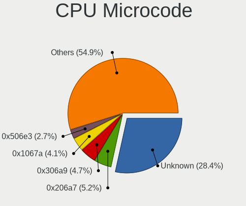

| Number     | Computers | Percent |
|------------|-----------|---------|
| Unknown    | 126       | 28.44%  |
| 0x206a7    | 23        | 5.19%   |
| 0x306a9    | 21        | 4.74%   |
| 0x1067a    | 18        | 4.06%   |
| 0x506e3    | 12        | 2.71%   |
| 0x306c3    | 11        | 2.48%   |
| 0x30678    | 11        | 2.48%   |
| 0x806ec    | 9         | 2.03%   |
| 0x906ea    | 7         | 1.58%   |
| 0x906a4    | 7         | 1.58%   |
| 0x806c1    | 7         | 1.58%   |
| 0x6fd      | 7         | 1.58%   |
| 0x0a50000c | 7         | 1.58%   |
| 0x08608103 | 7         | 1.58%   |
| 0x706a1    | 6         | 1.35%   |
| 0x406c4    | 6         | 1.35%   |
| 0x20655    | 6         | 1.35%   |
| 0x906e9    | 5         | 1.13%   |
| 0x806ea    | 5         | 1.13%   |
| 0x6fb      | 5         | 1.13%   |
| 0x506c9    | 5         | 1.13%   |
| 0x08108109 | 5         | 1.13%   |
| 0x0600611a | 5         | 1.13%   |
| 0x906a3    | 4         | 0.9%    |
| 0x806e9    | 4         | 0.9%    |
| 0x806c2    | 4         | 0.9%    |
| 0x40651    | 4         | 0.9%    |
| 0x306d4    | 4         | 0.9%    |
| 0x0a50000f | 4         | 0.9%    |
| 0xb06e0    | 3         | 0.68%   |
| 0x6d8      | 3         | 0.68%   |
| 0x406e3    | 3         | 0.68%   |
| 0x10676    | 3         | 0.68%   |
| 0x0a601206 | 3         | 0.68%   |
| 0x0a50000d | 3         | 0.68%   |
| 0x08701021 | 3         | 0.68%   |
| 0x0800820d | 3         | 0.68%   |
| 0x06001119 | 3         | 0.68%   |
| 0x03000027 | 3         | 0.68%   |
| 0xb06a3    | 2         | 0.45%   |

CPU Microarch
-------------

Microarchitecture

| Name              | Computers | Percent |
|-------------------|-----------|---------|
| KabyLake          | 51        | 11.59%  |
| Unknown           | 38        | 8.64%   |
| Alderlake Hybrid  | 30        | 6.82%   |
| SandyBridge       | 27        | 6.14%   |
| IvyBridge         | 27        | 6.14%   |
| Zen 3             | 25        | 5.68%   |
| Penryn            | 24        | 5.45%   |
| Silvermont        | 21        | 4.77%   |
| Core              | 21        | 4.77%   |
| Haswell           | 20        | 4.55%   |
| Skylake           | 19        | 4.32%   |
| TigerLake         | 16        | 3.64%   |
| Zen+              | 12        | 2.73%   |
| Goldmont plus     | 11        | 2.5%    |
| Zen 2             | 10        | 2.27%   |
| Westmere          | 9         | 2.05%   |
| Excavator         | 9         | 2.05%   |
| Piledriver        | 7         | 1.59%   |
| IceLake           | 7         | 1.59%   |
| P6                | 6         | 1.36%   |
| Meteorlake Hybrid | 6         | 1.36%   |
| Goldmont          | 6         | 1.36%   |
| K8 Hammer         | 5         | 1.14%   |
| CometLake         | 4         | 0.91%   |
| Broadwell         | 4         | 0.91%   |
| K10 Llano         | 3         | 0.68%   |
| K10               | 3         | 0.68%   |
| Gracemont         | 3         | 0.68%   |
| Bobcat            | 3         | 0.68%   |
| Zen               | 2         | 0.45%   |
| Tremont           | 2         | 0.45%   |
| Steamroller       | 2         | 0.45%   |
| Puma              | 2         | 0.45%   |
| NetBurst          | 1         | 0.23%   |
| Nehalem           | 1         | 0.23%   |
| Jaguar            | 1         | 0.23%   |
| Bulldozer         | 1         | 0.23%   |
| Bonnell           | 1         | 0.23%   |

Graphics
--------

GPU Vendor
----------

Vendors of graphics cards

| Vendor | Computers | Percent |
|--------|-----------|---------|
| Intel  | 256       | 51.61%  |
| AMD    | 124       | 25%     |
| Nvidia | 116       | 23.39%  |

GPU Model
---------

Graphics card models

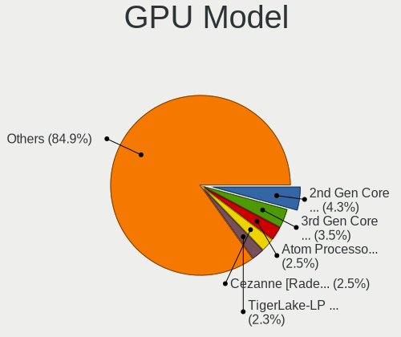

| Model                                                                                    | Computers | Percent |
|------------------------------------------------------------------------------------------|-----------|---------|
| Intel 2nd Generation Core Processor Family Integrated Graphics Controller                | 22        | 4.26%   |
| Intel 3rd Gen Core processor Graphics Controller                                         | 18        | 3.49%   |
| Intel Atom Processor Z36xxx/Z37xxx Series Graphics & Display                             | 13        | 2.52%   |
| AMD Cezanne [Radeon Vega Series / Radeon Vega Mobile Series]                             | 13        | 2.52%   |
| Intel TigerLake-LP GT2 [Iris Xe Graphics]                                                | 12        | 2.33%   |
| Intel UHD Graphics 620                                                                   | 11        | 2.13%   |
| AMD Lucienne                                                                             | 11        | 2.13%   |
| AMD Barcelo                                                                              | 9         | 1.74%   |
| Intel Mobile 4 Series Chipset Integrated Graphics Controller                             | 8         | 1.55%   |
| Intel GeminiLake [UHD Graphics 600]                                                      | 8         | 1.55%   |
| Intel Atom/Celeron/Pentium Processor x5-E8000/J3xxx/N3xxx Integrated Graphics Controller | 8         | 1.55%   |
| Intel HD Graphics 530                                                                    | 7         | 1.36%   |
| Intel CoffeeLake-S GT2 [UHD Graphics 630]                                                | 7         | 1.36%   |
| AMD Picasso/Raven 2 [Radeon Vega Series / Radeon Vega Mobile Series]                     | 7         | 1.36%   |
| AMD Phoenix1                                                                             | 7         | 1.36%   |
| Intel WhiskeyLake-U GT2 [UHD Graphics 620]                                               | 6         | 1.16%   |
| Intel Skylake GT2 [HD Graphics 520]                                                      | 6         | 1.16%   |
| Intel Mobile GM965/GL960 Integrated Graphics Controller (secondary)                      | 6         | 1.16%   |
| Intel Mobile GM965/GL960 Integrated Graphics Controller (primary)                        | 6         | 1.16%   |
| Intel Core Processor Integrated Graphics Controller                                      | 6         | 1.16%   |
| Intel CometLake-U GT2 [UHD Graphics]                                                     | 6         | 1.16%   |
| Intel 4th Gen Core Processor Integrated Graphics Controller                              | 6         | 1.16%   |
| Nvidia GP108 [GeForce GT 1030]                                                           | 5         | 0.97%   |
| Nvidia GP107 [GeForce GTX 1050]                                                          | 5         | 0.97%   |
| Intel Meteor Lake-P [Intel Arc Graphics]                                                 | 5         | 0.97%   |
| Intel Haswell-ULT Integrated Graphics Controller                                         | 5         | 0.97%   |
| AMD Wani [Radeon R5/R6/R7 Graphics]                                                      | 5         | 0.97%   |
| AMD Raphael                                                                              | 5         | 0.97%   |
| AMD Ellesmere [Radeon RX 470/480/570/570X/580/580X/590]                                  | 5         | 0.97%   |
| Nvidia C79 [GeForce 9400M]                                                               | 4         | 0.78%   |
| Nvidia AD107M [GeForce RTX 4050 Max-Q / Mobile]                                          | 4         | 0.78%   |
| Intel Xeon E3-1200 v2/3rd Gen Core processor Graphics Controller                         | 4         | 0.78%   |
| Intel Raptor Lake-P [Iris Xe Graphics]                                                   | 4         | 0.78%   |
| Intel HD Graphics 620                                                                    | 4         | 0.78%   |
| Intel HD Graphics 500                                                                    | 4         | 0.78%   |
| Intel Alder Lake-UP3 GT2 [Iris Xe Graphics]                                              | 4         | 0.78%   |
| Intel Alder Lake-UP3 GT1 [UHD Graphics]                                                  | 4         | 0.78%   |
| Intel Alder Lake-P GT1 [UHD Graphics]                                                    | 4         | 0.78%   |
| AMD Stoney [Radeon R2/R3/R4/R5 Graphics]                                                 | 4         | 0.78%   |
| AMD Seymour [Radeon HD 6400M/7400M Series]                                               | 4         | 0.78%   |

GPU Combo
---------

Combinations of graphics cards

| Name           | Computers | Percent |
|----------------|-----------|---------|
| 1 x Intel      | 182       | 41.27%  |
| 1 x AMD        | 95        | 21.54%  |
| 1 x Nvidia     | 67        | 15.19%  |
| Intel + Nvidia | 37        | 8.39%   |
| 2 x Intel      | 24        | 5.44%   |
| Intel + AMD    | 12        | 2.72%   |
| AMD + Nvidia   | 10        | 2.27%   |
| 2 x AMD        | 8         | 1.81%   |
| Other          | 4         | 0.91%   |
| 2 x Nvidia     | 2         | 0.45%   |

GPU Driver
----------

Free vs proprietary

| Driver      | Computers | Percent |
|-------------|-----------|---------|
| Free        | 372       | 84.55%  |
| Proprietary | 48        | 10.91%  |
| Unknown     | 20        | 4.55%   |

GPU Memory
----------

Total video memory

| Size in GB | Computers | Percent |
|------------|-----------|---------|
| Unknown    | 267       | 60.27%  |
| 0.01-0.5   | 79        | 17.83%  |
| 1.01-2.0   | 31        | 7%      |
| 0.51-1.0   | 26        | 5.87%   |
| 7.01-8.0   | 12        | 2.71%   |
| 3.01-4.0   | 12        | 2.71%   |
| 5.01-6.0   | 5         | 1.13%   |
| 2.01-3.0   | 5         | 1.13%   |
| 8.01-16.0  | 5         | 1.13%   |
| 4.01-5.0   | 1         | 0.23%   |

Monitor
-------

Monitor Vendor
--------------

Monitor vendors

| Vendor                  | Computers | Percent |
|-------------------------|-----------|---------|
| AU Optronics            | 58        | 12.31%  |
| Samsung Electronics     | 56        | 11.89%  |
| BOE                     | 43        | 9.13%   |
| Chimei Innolux          | 36        | 7.64%   |
| LG Display              | 33        | 7.01%   |
| Dell                    | 26        | 5.52%   |
| Goldstar                | 23        | 4.88%   |
| Apple                   | 19        | 4.03%   |
| BenQ                    | 17        | 3.61%   |
| Acer                    | 15        | 3.18%   |
| Hewlett-Packard         | 14        | 2.97%   |
| Lenovo                  | 11        | 2.34%   |
| Chi Mei Optoelectronics | 11        | 2.34%   |
| AOC                     | 11        | 2.34%   |
| Sharp                   | 8         | 1.7%    |
| Ancor Communications    | 8         | 1.7%    |
| Philips                 | 7         | 1.49%   |
| LG Philips              | 6         | 1.27%   |
| InfoVision              | 5         | 1.06%   |
| ASUSTek Computer        | 5         | 1.06%   |
| ViewSonic               | 4         | 0.85%   |
| Sony                    | 3         | 0.64%   |
| Sceptre Tech            | 3         | 0.64%   |
| HKC                     | 3         | 0.64%   |
| SGT                     | 2         | 0.42%   |
| Quanta Display          | 2         | 0.42%   |
| IBM                     | 2         | 0.42%   |
| CHD                     | 2         | 0.42%   |
| Yeyian                  | 1         | 0.21%   |
| Wacom                   | 1         | 0.21%   |
| Vizio                   | 1         | 0.21%   |
| UTV                     | 1         | 0.21%   |
| Unknown (XXX)           | 1         | 0.21%   |
| Unknown (ADE)           | 1         | 0.21%   |
| Unknown                 | 1         | 0.21%   |
| Toshiba                 | 1         | 0.21%   |
| Targa Visionary         | 1         | 0.21%   |
| SKG                     | 1         | 0.21%   |
| RTK                     | 1         | 0.21%   |
| RGT                     | 1         | 0.21%   |

Monitor Model
-------------

Monitor models

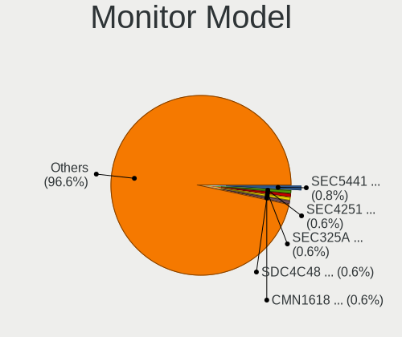

| Model                                                                    | Computers | Percent |
|--------------------------------------------------------------------------|-----------|---------|
| Samsung Electronics LCD Monitor SEC5441 1280x800 286x179mm 13.3-inch     | 4         | 0.84%   |
| Samsung Electronics LCD Monitor SEC4251 1366x768 344x194mm 15.5-inch     | 3         | 0.63%   |
| Samsung Electronics LCD Monitor SEC325A 1366x768 344x194mm 15.5-inch     | 3         | 0.63%   |
| Samsung Electronics LCD Monitor SDC4C48 1920x1080 239x134mm 10.8-inch    | 3         | 0.63%   |
| Chimei Innolux LCD Monitor CMN1618 1920x1200 344x215mm 16.0-inch         | 3         | 0.63%   |
| Chimei Innolux LCD Monitor CMN15F5 1920x1080 344x193mm 15.5-inch         | 3         | 0.63%   |
| Chimei Innolux LCD Monitor CMN1132 1366x768 256x144mm 11.6-inch          | 3         | 0.63%   |
| Chi Mei Optoelectronics LCD Monitor CMO15A7 1366x768 344x193mm 15.5-inch | 3         | 0.63%   |
| AU Optronics LCD Monitor AUO403D 1920x1080 309x174mm 14.0-inch           | 3         | 0.63%   |
| Apple Color LCD APP9C6B 1680x1050 433x270mm 20.1-inch                    | 3         | 0.63%   |
| AOC Q27G2WG4 AOC2702 2560x1440 597x336mm 27.0-inch                       | 3         | 0.63%   |
| Samsung Electronics LCD Monitor SEC324A 1366x768 344x194mm 15.5-inch     | 2         | 0.42%   |
| Samsung Electronics LCD Monitor SDC4347 1366x768 344x193mm 15.5-inch     | 2         | 0.42%   |
| Samsung Electronics LCD Monitor SAM0902 1920x1080 700x390mm 31.5-inch    | 2         | 0.42%   |
| LG Display LCD Monitor LGD0709 1920x1080 344x194mm 15.5-inch             | 2         | 0.42%   |
| LG Display LCD Monitor LGD0590 1920x1080 344x194mm 15.5-inch             | 2         | 0.42%   |
| LG Display LCD Monitor LGD046D 1920x1080 309x174mm 14.0-inch             | 2         | 0.42%   |
| Lenovo LCD Monitor LEN4036 1440x900 303x189mm 14.1-inch                  | 2         | 0.42%   |
| IBM LCD Monitor IBM2887 1680x1050 331x207mm 15.4-inch                    | 2         | 0.42%   |
| Goldstar M237WD GSM56EB 1920x1080 509x286mm 23.0-inch                    | 2         | 0.42%   |
| Goldstar LG FULL HD GSM5ABB 1920x1080 480x270mm 21.7-inch                | 2         | 0.42%   |
| Goldstar HD GSM5ACD 1366x768 410x230mm 18.5-inch                         | 2         | 0.42%   |
| Dell U2311H DELA05F 1920x1080 510x290mm 23.1-inch                        | 2         | 0.42%   |
| Chimei Innolux LCD Monitor CMN15E5 1920x1080 344x193mm 15.5-inch         | 2         | 0.42%   |
| Chimei Innolux LCD Monitor CMN14E5 1920x1080 309x173mm 13.9-inch         | 2         | 0.42%   |
| Chi Mei Optoelectronics LCD Monitor CMO15AB 1366x768 340x190mm 15.3-inch | 2         | 0.42%   |
| BOE LCD Monitor BOE08C2 1920x1080 344x194mm 15.5-inch                    | 2         | 0.42%   |
| BOE LCD Monitor BOE084E 1920x1080 382x215mm 17.3-inch                    | 2         | 0.42%   |
| BOE LCD Monitor BOE0697 1366x768 309x173mm 13.9-inch                     | 2         | 0.42%   |
| BOE LCD Monitor BOE0672 1366x768 344x194mm 15.5-inch                     | 2         | 0.42%   |
| BenQ GL2480 BNQ78ED 1920x1080 531x298mm 24.0-inch                        | 2         | 0.42%   |
| BenQ G2420HD BNQ7840 1920x1080 531x299mm 24.0-inch                       | 2         | 0.42%   |
| BenQ BL2410 BNQ8301 1920x1080 477x268mm 21.5-inch                        | 2         | 0.42%   |
| AU Optronics LCD Monitor AUO405C 1366x768 256x144mm 11.6-inch            | 2         | 0.42%   |
| AU Optronics LCD Monitor AUO209D 1920x1080 381x214mm 17.2-inch           | 2         | 0.42%   |
| AOC 24G2W1G5 AOC2402 1920x1080 527x296mm 23.8-inch                       | 2         | 0.42%   |
| AOC 24G2W1G4 AOC2402 1920x1080 530x300mm 24.0-inch                       | 2         | 0.42%   |
| Ancor Communications VS248 ACI2498 1920x1080 531x299mm 24.0-inch         | 2         | 0.42%   |
| Acer KA220HQ ACR0467 1920x1080 477x268mm 21.5-inch                       | 2         | 0.42%   |
| Yeyian MG2701 YEY2700 1920x1080 698x393mm 31.5-inch                      | 1         | 0.21%   |

Monitor Resolution
------------------

Monitor screen resolution

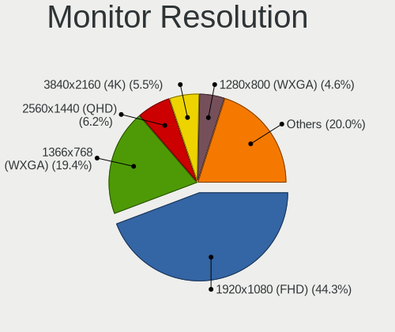

| Resolution         | Computers | Percent |
|--------------------|-----------|---------|
| 1920x1080 (FHD)    | 201       | 44.27%  |
| 1366x768 (WXGA)    | 88        | 19.38%  |
| 2560x1440 (QHD)    | 28        | 6.17%   |
| 3840x2160 (4K)     | 25        | 5.51%   |
| 1280x800 (WXGA)    | 21        | 4.63%   |
| 1920x1200 (WUXGA)  | 18        | 3.96%   |
| 1600x900 (HD+)     | 14        | 3.08%   |
| 1440x900 (WXGA+)   | 13        | 2.86%   |
| 1680x1050 (WSXGA+) | 10        | 2.2%    |
| 1280x1024 (SXGA)   | 9         | 1.98%   |
| 2560x1600          | 5         | 1.1%    |
| 2880x1800          | 3         | 0.66%   |
| 1360x768           | 3         | 0.66%   |
| 3840x2400          | 2         | 0.44%   |
| 3440x1440          | 2         | 0.44%   |
| 2880x1920          | 2         | 0.44%   |
| 2560x1080          | 2         | 0.44%   |
| 1024x768 (XGA)     | 2         | 0.44%   |
| 3840x2560          | 1         | 0.22%   |
| 3840x1080          | 1         | 0.22%   |
| 3200x1800 (QHD+)   | 1         | 0.22%   |
| 3072x1920          | 1         | 0.22%   |
| 2256x1504          | 1         | 0.22%   |
| Unknown            | 1         | 0.22%   |

Monitor Diagonal
----------------

Diagonal size in inches

| Inches  | Computers | Percent |
|---------|-----------|---------|
| 15      | 123       | 26.11%  |
| 13      | 42        | 8.92%   |
| 24      | 40        | 8.49%   |
| 14      | 35        | 7.43%   |
| 21      | 28        | 5.94%   |
| 27      | 26        | 5.52%   |
| 23      | 26        | 5.52%   |
| 17      | 24        | 5.1%    |
| 31      | 20        | 4.25%   |
| 16      | 18        | 3.82%   |
| 18      | 15        | 3.18%   |
| 11      | 13        | 2.76%   |
| 19      | 11        | 2.34%   |
| 20      | 7         | 1.49%   |
| 54      | 6         | 1.27%   |
| 12      | 5         | 1.06%   |
| 34      | 4         | 0.85%   |
| 22      | 4         | 0.85%   |
| 32      | 3         | 0.64%   |
| Unknown | 3         | 0.64%   |
| 84      | 2         | 0.42%   |
| 57      | 2         | 0.42%   |
| 28      | 2         | 0.42%   |
| 74      | 1         | 0.21%   |
| 72      | 1         | 0.21%   |
| 65      | 1         | 0.21%   |
| 64      | 1         | 0.21%   |
| 61      | 1         | 0.21%   |
| 55      | 1         | 0.21%   |
| 49      | 1         | 0.21%   |
| 46      | 1         | 0.21%   |
| 42      | 1         | 0.21%   |
| 40      | 1         | 0.21%   |
| 39      | 1         | 0.21%   |
| 25      | 1         | 0.21%   |

Monitor Width
-------------

Physical width

| Width in mm | Computers | Percent |
|-------------|-----------|---------|
| 301-350     | 184       | 39.66%  |
| 501-600     | 88        | 18.97%  |
| 401-500     | 59        | 12.72%  |
| 201-300     | 46        | 9.91%   |
| 351-400     | 34        | 7.33%   |
| 601-700     | 22        | 4.74%   |
| 1001-1500   | 13        | 2.8%    |
| 701-800     | 8         | 1.72%   |
| 1501-2000   | 4         | 0.86%   |
| Unknown     | 3         | 0.65%   |
| 801-900     | 2         | 0.43%   |
| 901-1000    | 1         | 0.22%   |

Aspect Ratio
------------

Proportional relationship between the width and the height

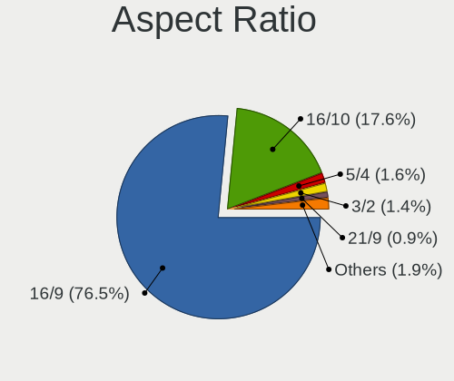

| Ratio   | Computers | Percent |
|---------|-----------|---------|
| 16/9    | 326       | 76.53%  |
| 16/10   | 75        | 17.61%  |
| 5/4     | 7         | 1.64%   |
| 3/2     | 6         | 1.41%   |
| 21/9    | 4         | 0.94%   |
| 4/3     | 3         | 0.7%    |
| Unknown | 2         | 0.47%   |
| 6/5     | 1         | 0.23%   |
| 32/9    | 1         | 0.23%   |
| 0.56    | 1         | 0.23%   |

Monitor Area
------------

Area in inch

| Area in inch | Computers | Percent |
|----------------|-----------|---------|
| 101-110        | 124       | 26.55%  |
| 201-250        | 72        | 15.42%  |
| 81-90          | 58        | 12.42%  |
| 351-500        | 29        | 6.21%   |
| 151-200        | 29        | 6.21%   |
| 301-350        | 26        | 5.57%   |
| 121-130        | 20        | 4.28%   |
| 71-80          | 18        | 3.85%   |
| 141-150        | 17        | 3.64%   |
| More than 1000 | 15        | 3.21%   |
| 111-120        | 15        | 3.21%   |
| 251-300        | 14        | 3%      |
| 51-60          | 13        | 2.78%   |
| 61-70          | 5         | 1.07%   |
| 501-1000       | 5         | 1.07%   |
| 131-140        | 3         | 0.64%   |
| Unknown        | 3         | 0.64%   |
| 91-100         | 1         | 0.21%   |

Pixel Density
-------------

Pixels per inch

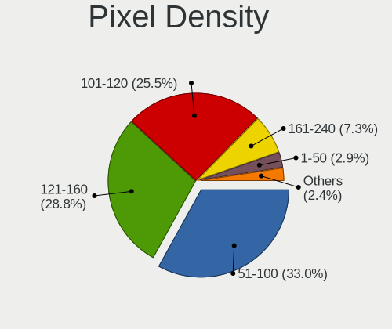

| Density       | Computers | Percent |
|---------------|-----------|---------|
| 51-100        | 149       | 33.04%  |
| 121-160       | 130       | 28.82%  |
| 101-120       | 115       | 25.5%   |
| 161-240       | 33        | 7.32%   |
| 1-50          | 13        | 2.88%   |
| More than 240 | 8         | 1.77%   |
| Unknown       | 3         | 0.67%   |

Multiple Monitors
-----------------

Total monitors connected

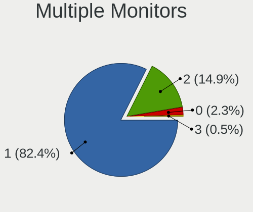

| Total | Computers | Percent |
|-------|-----------|---------|
| 1     | 365       | 82.39%  |
| 2     | 66        | 14.9%   |
| 0     | 10        | 2.26%   |
| 3     | 2         | 0.45%   |

Network
-------

Net Controller Vendor
---------------------

Controller vendors

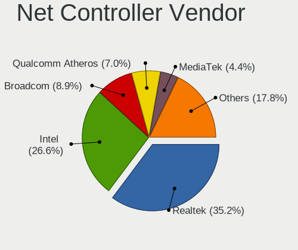

| Vendor                                 | Computers | Percent |
|----------------------------------------|-----------|---------|
| Realtek Semiconductor                  | 241       | 35.23%  |
| Intel                                  | 182       | 26.61%  |
| Broadcom                               | 61        | 8.92%   |
| Qualcomm Atheros                       | 48        | 7.02%   |
| MediaTek                               | 30        | 4.39%   |
| TP-Link                                | 21        | 3.07%   |
| Broadcom Limited                       | 11        | 1.61%   |
| Nvidia                                 | 9         | 1.32%   |
| Marvell Technology Group               | 8         | 1.17%   |
| Samsung Electronics                    | 7         | 1.02%   |
| Ralink Technology                      | 7         | 1.02%   |
| Ralink                                 | 5         | 0.73%   |
| OPPO Electronics                       | 5         | 0.73%   |
| Xiaomi                                 | 4         | 0.58%   |
| Qualcomm Atheros Communications        | 4         | 0.58%   |
| Motorola PCS                           | 3         | 0.44%   |
| Huawei Technologies                    | 3         | 0.44%   |
| Dell                                   | 3         | 0.44%   |
| ASUSTek Computer                       | 3         | 0.44%   |
| ASIX Electronics                       | 3         | 0.44%   |
| Raspberry Pi                           | 2         | 0.29%   |
| Qualcomm                               | 2         | 0.29%   |
| NetGear                                | 2         | 0.29%   |
| Microsoft                              | 2         | 0.29%   |
| D-Link                                 | 2         | 0.29%   |
| ZyDAS                                  | 1         | 0.15%   |
| Tenda                                  | 1         | 0.15%   |
| T & A Mobile Phones                    | 1         | 0.15%   |
| Spreadtrum Communications              | 1         | 0.15%   |
| Sony Ericsson Mobile Communications AB | 1         | 0.15%   |
| Sierra Wireless                        | 1         | 0.15%   |
| SEGGER                                 | 1         | 0.15%   |
| OnePlus Technology (Shenzhen)          | 1         | 0.15%   |
| Linksys                                | 1         | 0.15%   |
| IMC Networks                           | 1         | 0.15%   |
| Fujitsu Siemens Computers              | 1         | 0.15%   |
| Edimax Technology                      | 1         | 0.15%   |
| DisplayLink                            | 1         | 0.15%   |
| D-Link System                          | 1         | 0.15%   |
| Belkin Components                      | 1         | 0.15%   |

Net Controller Model
--------------------

Controller models

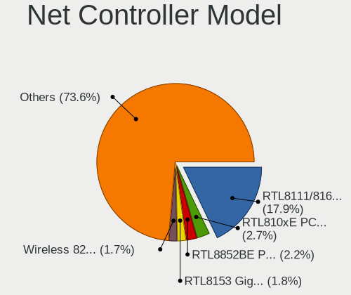

| Model                                                                  | Computers | Percent |
|------------------------------------------------------------------------|-----------|---------|
| Realtek RTL8111/8168/8211/8411 PCI Express Gigabit Ethernet Controller | 145       | 17.88%  |
| Realtek RTL810xE PCI Express Fast Ethernet controller                  | 22        | 2.71%   |
| Realtek RTL8852BE PCIe 802.11ax Wireless Network Controller            | 18        | 2.22%   |
| Realtek RTL8153 Gigabit Ethernet Adapter                               | 15        | 1.85%   |
| Intel Wireless 8265 / 8275                                             | 14        | 1.73%   |
| Realtek RTL8821CE 802.11ac PCIe Wireless Network Adapter               | 12        | 1.48%   |
| Realtek RTL8125 2.5GbE Controller                                      | 12        | 1.48%   |
| MediaTek Wi-Fi 6E MT7902 Wireless Network Adapter                      | 11        | 1.36%   |
| Intel Wi-Fi 6 AX200                                                    | 11        | 1.36%   |
| Realtek RTL88x2bu [AC1200 Techkey]                                     | 10        | 1.23%   |
| Realtek RTL8822CE 802.11ac PCIe Wireless Network Adapter               | 10        | 1.23%   |
| Realtek 802.11ac NIC                                                   | 10        | 1.23%   |
| Intel Wireless 7265                                                    | 10        | 1.23%   |
| Intel Ethernet Controller I225-V                                       | 10        | 1.23%   |
| Realtek RTL8188EUS 802.11n Wireless Network Adapter                    | 8         | 0.99%   |
| MediaTek MT7922 802.11ax PCI Express Wireless Network Adapter          | 8         | 0.99%   |
| Intel Wi-Fi 6 AX201                                                    | 8         | 0.99%   |
| Intel Alder Lake-P PCH CNVi WiFi                                       | 8         | 0.99%   |
| Broadcom BCM4322 802.11a/b/g/n Wireless LAN Controller                 | 8         | 0.99%   |
| MediaTek MT7921 802.11ax PCI Express Wireless Network Adapter          | 7         | 0.86%   |
| Intel Wireless 3165                                                    | 7         | 0.86%   |
| Intel Wi-Fi 7(802.11be) AX1775*/AX1790*/BE20*/BE401/BE1750* 2x2        | 7         | 0.86%   |
| Intel 82579LM Gigabit Network Connection (Lewisville)                  | 7         | 0.86%   |
| Intel 82577LM Gigabit Network Connection                               | 7         | 0.86%   |
| Broadcom BCM4313 802.11bgn Wireless Network Adapter                    | 7         | 0.86%   |
| Qualcomm Atheros QCA9565 / AR9565 Wireless Network Adapter             | 6         | 0.74%   |
| Qualcomm Atheros QCA9377 802.11ac Wireless Network Adapter             | 6         | 0.74%   |
| Qualcomm Atheros QCA6174 802.11ac Wireless Network Adapter             | 6         | 0.74%   |
| Nvidia MCP79 Ethernet                                                  | 6         | 0.74%   |
| Intel Wireless 8260                                                    | 6         | 0.74%   |
| Intel Wi-Fi 6E(802.11ax) AX210/AX1675* 2x2 [Typhoon Peak]              | 6         | 0.74%   |
| Intel Wi-Fi 5(802.11ac) Wireless-AC 9x6x [Thunder Peak]                | 6         | 0.74%   |
| Intel Ethernet Connection I217-LM                                      | 6         | 0.74%   |
| Intel Ethernet Connection (7) I219-V                                   | 6         | 0.74%   |
| Intel Ethernet Connection (4) I219-LM                                  | 6         | 0.74%   |
| Intel Ethernet Connection (2) I219-V                                   | 6         | 0.74%   |
| Broadcom BCM43142 802.11b/g/n                                          | 6         | 0.74%   |
| Samsung Galaxy series, misc. (tethering mode)                          | 5         | 0.62%   |
| Realtek 802.11n WLAN Adapter                                           | 5         | 0.62%   |
| Qualcomm Atheros AR9485 Wireless Network Adapter                       | 5         | 0.62%   |

Wireless Vendor
---------------

Wireless vendors

| Vendor                          | Computers | Percent |
|---------------------------------|-----------|---------|
| Intel                           | 134       | 33.84%  |
| Realtek Semiconductor           | 92        | 23.23%  |
| Broadcom                        | 45        | 11.36%  |
| Qualcomm Atheros                | 39        | 9.85%   |
| MediaTek                        | 26        | 6.57%   |
| TP-Link                         | 19        | 4.8%    |
| Ralink Technology               | 7         | 1.77%   |
| Broadcom Limited                | 6         | 1.52%   |
| Ralink                          | 5         | 1.26%   |
| Qualcomm Atheros Communications | 4         | 1.01%   |
| ASUSTek Computer                | 3         | 0.76%   |
| NetGear                         | 2         | 0.51%   |
| Dell                            | 2         | 0.51%   |
| D-Link                          | 2         | 0.51%   |
| ZyDAS                           | 1         | 0.25%   |
| Tenda                           | 1         | 0.25%   |
| Sierra Wireless                 | 1         | 0.25%   |
| Qualcomm                        | 1         | 0.25%   |
| Microsoft                       | 1         | 0.25%   |
| Linksys                         | 1         | 0.25%   |
| IMC Networks                    | 1         | 0.25%   |
| Fujitsu Siemens Computers       | 1         | 0.25%   |
| Edimax Technology               | 1         | 0.25%   |
| Belkin Components               | 1         | 0.25%   |

Wireless Model
--------------

Wireless models

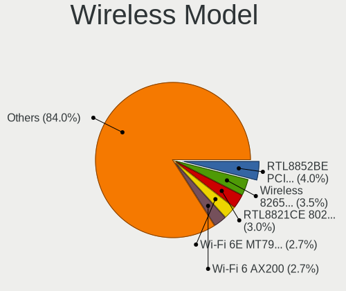

| Model                                                           | Computers | Percent |
|-----------------------------------------------------------------|-----------|---------|
| Realtek RTL8852BE PCIe 802.11ax Wireless Network Controller     | 16        | 3.99%   |
| Intel Wireless 8265 / 8275                                      | 14        | 3.49%   |
| Realtek RTL8821CE 802.11ac PCIe Wireless Network Adapter        | 12        | 2.99%   |
| MediaTek Wi-Fi 6E MT7902 Wireless Network Adapter               | 11        | 2.74%   |
| Intel Wi-Fi 6 AX200                                             | 11        | 2.74%   |
| Realtek RTL88x2bu [AC1200 Techkey]                              | 10        | 2.49%   |
| Realtek RTL8822CE 802.11ac PCIe Wireless Network Adapter        | 10        | 2.49%   |
| Realtek 802.11ac NIC                                            | 10        | 2.49%   |
| Intel Wireless 7265                                             | 10        | 2.49%   |
| Realtek RTL8188EUS 802.11n Wireless Network Adapter             | 8         | 2%      |
| Intel Wi-Fi 6 AX201                                             | 8         | 2%      |
| Intel Alder Lake-P PCH CNVi WiFi                                | 8         | 2%      |
| Broadcom BCM4322 802.11a/b/g/n Wireless LAN Controller          | 8         | 2%      |
| MediaTek MT7921 802.11ax PCI Express Wireless Network Adapter   | 7         | 1.75%   |
| Intel Wireless 3165                                             | 7         | 1.75%   |
| Broadcom BCM4313 802.11bgn Wireless Network Adapter             | 7         | 1.75%   |
| Qualcomm Atheros QCA9565 / AR9565 Wireless Network Adapter      | 6         | 1.5%    |
| Qualcomm Atheros QCA9377 802.11ac Wireless Network Adapter      | 6         | 1.5%    |
| Qualcomm Atheros QCA6174 802.11ac Wireless Network Adapter      | 6         | 1.5%    |
| Intel Wireless 8260                                             | 6         | 1.5%    |
| Intel Wi-Fi 6E(802.11ax) AX210/AX1675* 2x2 [Typhoon Peak]       | 6         | 1.5%    |
| Intel Wi-Fi 5(802.11ac) Wireless-AC 9x6x [Thunder Peak]         | 6         | 1.5%    |
| Broadcom BCM43142 802.11b/g/n                                   | 6         | 1.5%    |
| Realtek 802.11n WLAN Adapter                                    | 5         | 1.25%   |
| Qualcomm Atheros AR9485 Wireless Network Adapter                | 5         | 1.25%   |
| Qualcomm Atheros AR928X Wireless Network Adapter (PCI-Express)  | 5         | 1.25%   |
| MediaTek MT7922 802.11ax PCI Express Wireless Network Adapter   | 5         | 1.25%   |
| Broadcom BCM4321 802.11a/b/g/n                                  | 5         | 1.25%   |
| TP-Link AC600 wireless Realtek RTL8811AU [Archer T2U Nano]      | 4         | 1%      |
| Ralink MT7601U Wireless Adapter                                 | 4         | 1%      |
| Qualcomm Atheros AR9285 Wireless Network Adapter (PCI-Express)  | 4         | 1%      |
| Intel Wireless 7260                                             | 4         | 1%      |
| Intel Cannon Lake PCH CNVi WiFi                                 | 4         | 1%      |
| TP-Link Archer T3U [Realtek RTL8812BU]                          | 3         | 0.75%   |
| TP-Link 802.11ac WLAN Adapter                                   | 3         | 0.75%   |
| Realtek RTL8192EU 802.11b/g/n WLAN Adapter                      | 3         | 0.75%   |
| Qualcomm Atheros AR9271 802.11n                                 | 3         | 0.75%   |
| Intel Wi-Fi 7(802.11be) AX1775*/AX1790*/BE20*/BE401/BE1750* 2x2 | 3         | 0.75%   |
| Intel PRO/Wireless 3945ABG [Golan] Network Connection           | 3         | 0.75%   |
| Intel Meteor Lake PCH CNVi WiFi                                 | 3         | 0.75%   |

Ethernet Vendor
---------------

Ethernet vendors

| Vendor                        | Computers | Percent |
|-------------------------------|-----------|---------|
| Realtek Semiconductor         | 202       | 51.27%  |
| Intel                         | 94        | 23.86%  |
| Broadcom                      | 24        | 6.09%   |
| Qualcomm Atheros              | 14        | 3.55%   |
| Nvidia                        | 9         | 2.28%   |
| Marvell Technology Group      | 8         | 2.03%   |
| Samsung Electronics           | 5         | 1.27%   |
| OPPO Electronics              | 5         | 1.27%   |
| Broadcom Limited              | 5         | 1.27%   |
| Xiaomi                        | 4         | 1.02%   |
| MediaTek                      | 4         | 1.02%   |
| Motorola PCS                  | 3         | 0.76%   |
| Huawei Technologies           | 3         | 0.76%   |
| ASIX Electronics              | 3         | 0.76%   |
| TP-Link                       | 2         | 0.51%   |
| Raspberry Pi                  | 2         | 0.51%   |
| T & A Mobile Phones           | 1         | 0.25%   |
| Spreadtrum Communications     | 1         | 0.25%   |
| Qualcomm                      | 1         | 0.25%   |
| OnePlus Technology (Shenzhen) | 1         | 0.25%   |
| Microsoft                     | 1         | 0.25%   |
| DisplayLink                   | 1         | 0.25%   |
| D-Link System                 | 1         | 0.25%   |

Ethernet Model
--------------

Ethernet models

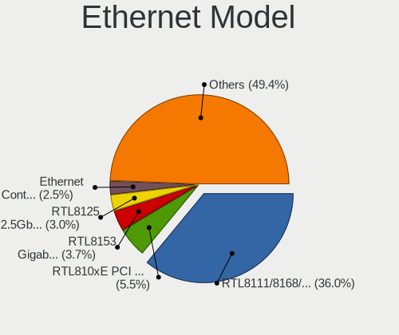

| Model                                                                  | Computers | Percent |
|------------------------------------------------------------------------|-----------|---------|
| Realtek RTL8111/8168/8211/8411 PCI Express Gigabit Ethernet Controller | 145       | 35.98%  |
| Realtek RTL810xE PCI Express Fast Ethernet controller                  | 22        | 5.46%   |
| Realtek RTL8153 Gigabit Ethernet Adapter                               | 15        | 3.72%   |
| Realtek RTL8125 2.5GbE Controller                                      | 12        | 2.98%   |
| Intel Ethernet Controller I225-V                                       | 10        | 2.48%   |
| Intel 82579LM Gigabit Network Connection (Lewisville)                  | 7         | 1.74%   |
| Intel 82577LM Gigabit Network Connection                               | 7         | 1.74%   |
| Nvidia MCP79 Ethernet                                                  | 6         | 1.49%   |
| Intel Ethernet Connection I217-LM                                      | 6         | 1.49%   |
| Intel Ethernet Connection (7) I219-V                                   | 6         | 1.49%   |
| Intel Ethernet Connection (4) I219-LM                                  | 6         | 1.49%   |
| Intel Ethernet Connection (2) I219-V                                   | 6         | 1.49%   |
| Samsung Galaxy series, misc. (tethering mode)                          | 5         | 1.24%   |
| Xiaomi Mi/Redmi series (RNDIS)                                         | 4         | 0.99%   |
| Realtek RTL-8100/8101L/8139 PCI Fast Ethernet Adapter                  | 4         | 0.99%   |
| Qualcomm Atheros AR8161 Gigabit Ethernet                               | 4         | 0.99%   |
| OPPO OnePlus Nord 4                                                    | 4         | 0.99%   |
| Marvell Group 88E8058 PCI-E Gigabit Ethernet Controller                | 4         | 0.99%   |
| Intel Wi-Fi 7(802.11be) AX1775*/AX1790*/BE20*/BE401/BE1750* 2x2        | 4         | 0.99%   |
| Realtek RTL8152 Fast Ethernet Adapter                                  | 3         | 0.74%   |
| Qualcomm Atheros AR8162 Fast Ethernet                                  | 3         | 0.74%   |
| Motorola PCS moto g84 5G                                               | 3         | 0.74%   |
| MediaTek MT7922 802.11ax PCI Express Wireless Network Adapter          | 3         | 0.74%   |
| Intel Ethernet Connection I219-LM                                      | 3         | 0.74%   |
| Intel Ethernet Connection (16) I219-LM                                 | 3         | 0.74%   |
| Intel CNVi: Wi-Fi                                                      | 3         | 0.74%   |
| Broadcom NetXtreme BCM57765 Gigabit Ethernet PCIe                      | 3         | 0.74%   |
| Broadcom NetXtreme BCM5764M Gigabit Ethernet PCIe                      | 3         | 0.74%   |
| Broadcom NetXtreme BCM5752 Gigabit Ethernet PCI Express                | 3         | 0.74%   |
| Broadcom NetLink BCM5784M Gigabit Ethernet PCIe                        | 3         | 0.74%   |
| Broadcom NetLink BCM57785 Gigabit Ethernet PCIe                        | 3         | 0.74%   |
| Realtek RTL8852CE PCIe 802.11ax Wireless Network Controller            | 2         | 0.5%    |
| Realtek RTL8852BE PCIe 802.11ax Wireless Network Controller            | 2         | 0.5%    |
| Raspberry Pi RP1 PCIe 2.0 South Bridge                                 | 2         | 0.5%    |
| Qualcomm Atheros AR8151 v2.0 Gigabit Ethernet                          | 2         | 0.5%    |
| Intel I211 Gigabit Network Connection                                  | 2         | 0.5%    |
| Intel Ethernet Controller I226-V                                       | 2         | 0.5%    |
| Intel Ethernet Connection I218-LM                                      | 2         | 0.5%    |
| Intel Ethernet Connection (6) I219-LM                                  | 2         | 0.5%    |
| Intel Ethernet Connection (4) I219-V                                   | 2         | 0.5%    |

Net Controller Kind
-------------------

Ethernet, WiFi or modem

| Kind     | Computers | Percent |
|----------|-----------|---------|
| WiFi     | 371       | 50.07%  |
| Ethernet | 363       | 48.99%  |
| Modem    | 5         | 0.67%   |
| Unknown  | 2         | 0.27%   |

Used Controller
---------------

Currently used network controller

| Kind     | Computers | Percent |
|----------|-----------|---------|
| WiFi     | 252       | 56.63%  |
| Ethernet | 192       | 43.15%  |
| Modem    | 1         | 0.22%   |

NICs
----

Total network controllers on board

| Total | Computers | Percent |
|-------|-----------|---------|
| 2     | 235       | 53.41%  |
| 1     | 178       | 40.45%  |
| 0     | 22        | 5%      |
| 3     | 5         | 1.14%   |

IPv6
----

IPv6 vs IPv4

| Used | Computers | Percent |
|------|-----------|---------|
| No   | 311       | 70.52%  |
| Yes  | 130       | 29.48%  |

Bluetooth
---------

Bluetooth Vendor
----------------

Controller vendors

| Vendor                          | Computers | Percent |
|---------------------------------|-----------|---------|
| Intel                           | 121       | 38.78%  |
| Realtek Semiconductor           | 41        | 13.14%  |
| IMC Networks                    | 24        | 7.69%   |
| Apple                           | 22        | 7.05%   |
| Cambridge Silicon Radio         | 18        | 5.77%   |
| Qualcomm Atheros Communications | 17        | 5.45%   |
| Broadcom                        | 16        | 5.13%   |
| Foxconn / Hon Hai               | 10        | 3.21%   |
| Dell                            | 7         | 2.24%   |
| MediaTek                        | 6         | 1.92%   |
| Lite-On Technology              | 5         | 1.6%    |
| Hewlett-Packard                 | 5         | 1.6%    |
| TP-Link                         | 4         | 1.28%   |
| Toshiba                         | 4         | 1.28%   |
| ASUSTek Computer                | 3         | 0.96%   |
| Ralink                          | 2         | 0.64%   |
| Alps Electric                   | 2         | 0.64%   |
| Foxconn International           | 1         | 0.32%   |
| Edimax Technology               | 1         | 0.32%   |
| Creative Technology             | 1         | 0.32%   |
| Actions                         | 1         | 0.32%   |
| Unknown                         | 1         | 0.32%   |

Bluetooth Model
---------------

Controller models

| Model                                               | Computers | Percent |
|-----------------------------------------------------|-----------|---------|
| Intel Bluetooth wireless interface                  | 40        | 12.82%  |
| Realtek Bluetooth Radio                             | 31        | 9.94%   |
| Intel AX201 Bluetooth                               | 21        | 6.73%   |
| Cambridge Silicon Radio Bluetooth Dongle (HCI mode) | 18        | 5.77%   |
| IMC Networks Wireless_Device                        | 17        | 5.45%   |
| Intel AX211 Bluetooth                               | 12        | 3.85%   |
| Intel Bluetooth 9460/9560 Jefferson Peak (JfP)      | 10        | 3.21%   |
| Intel AX200 Bluetooth                               | 10        | 3.21%   |
| Apple Bluetooth Host Controller                     | 10        | 3.21%   |
| Qualcomm Atheros  Bluetooth Device                  | 8         | 2.56%   |
| Intel Bluetooth Device                              | 7         | 2.24%   |
| Intel Wireless-AC 9260 Bluetooth Adapter            | 6         | 1.92%   |
| Intel AX210 Bluetooth                               | 6         | 1.92%   |
| Foxconn / Hon Hai Wireless_Device                   | 6         | 1.92%   |
| Realtek 802.11ac WLAN Adapter                       | 5         | 1.6%    |
| MediaTek Wireless_Device                            | 5         | 1.6%    |
| TP-Link TP-Link Bluetooth USB Adapter               | 4         | 1.28%   |
| Realtek  Bluetooth 4.2 Adapter                      | 4         | 1.28%   |
| Intel Centrino Bluetooth Wireless Transceiver       | 4         | 1.28%   |
| IMC Networks Bluetooth Radio                        | 4         | 1.28%   |
| HP Bluetooth 2.0 Interface [Broadcom BCM2045]       | 4         | 1.28%   |
| Apple Built-in Bluetooth 2.0+EDR HCI                | 4         | 1.28%   |
| Apple Bluetooth USB Host Controller                 | 4         | 1.28%   |
| Apple Bluetooth HCI                                 | 4         | 1.28%   |
| Qualcomm Atheros QCA61x4 Bluetooth 4.0              | 3         | 0.96%   |
| Qualcomm Atheros AR3012 Bluetooth 4.0               | 3         | 0.96%   |
| Intel Wireless-AC 3168 Bluetooth                    | 3         | 0.96%   |
| Dell DW375 Bluetooth Module                         | 3         | 0.96%   |
| Broadcom BCM20702A0 Bluetooth 4.0                   | 3         | 0.96%   |
| Ralink RT3290 Bluetooth                             | 2         | 0.64%   |
| Intel Centrino Advanced-N 6230 Bluetooth adapter    | 2         | 0.64%   |
| Foxconn / Hon Hai MediaTek Bluetooth Adapter        | 2         | 0.64%   |
| Broadcom BCM2070 Bluetooth 2.1 + EDR                | 2         | 0.64%   |
| Broadcom BCM2045B (BDC-2.1)                         | 2         | 0.64%   |
| ASUS ASUS USB-BT500                                 | 2         | 0.64%   |
| Toshiba RT Bluetooth Radio                          | 1         | 0.32%   |
| Toshiba Bluetooth Device                            | 1         | 0.32%   |
| Toshiba BCM43142A0                                  | 1         | 0.32%   |
| Toshiba Askey for                                   | 1         | 0.32%   |
| Realtek Bluetooth 5.4 Radio                         | 1         | 0.32%   |

Sound
-----

Sound Vendor
------------

Sound card vendors

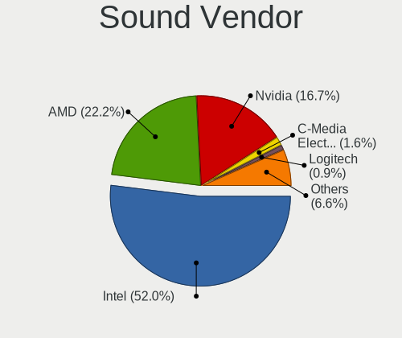

| Vendor                                       | Computers | Percent |
|----------------------------------------------|-----------|---------|
| Intel                                        | 292       | 51.96%  |
| AMD                                          | 125       | 22.24%  |
| Nvidia                                       | 94        | 16.73%  |
| C-Media Electronics                          | 9         | 1.6%    |
| Logitech                                     | 5         | 0.89%   |
| Texas Instruments                            | 3         | 0.53%   |
| Realtek Semiconductor                        | 3         | 0.53%   |
| Creative Labs                                | 3         | 0.53%   |
| Philips (or NXP)                             | 2         | 0.36%   |
| JMTek                                        | 2         | 0.36%   |
| Zoran Co. Personal Media Division (Nogatech) | 1         | 0.18%   |
| SteelSeries ApS                              | 1         | 0.18%   |
| Sony                                         | 1         | 0.18%   |
| Silicon Integrated Systems [SiS]             | 1         | 0.18%   |
| RODE Microphones                             | 1         | 0.18%   |
| Nordic Semiconductor ASA                     | 1         | 0.18%   |
| MV-SILICON                                   | 1         | 0.18%   |
| Microsoft                                    | 1         | 0.18%   |
| Linux Foundation                             | 1         | 0.18%   |
| Lenovo                                       | 1         | 0.18%   |
| Jieli Technology                             | 1         | 0.18%   |
| iConnectivity                                | 1         | 0.18%   |
| Hewlett-Packard                              | 1         | 0.18%   |
| GN Netcom                                    | 1         | 0.18%   |
| Giga-Byte Technology                         | 1         | 0.18%   |
| Focusrite-Novation                           | 1         | 0.18%   |
| Emotiva                                      | 1         | 0.18%   |
| Dell                                         | 1         | 0.18%   |
| Creative Technology                          | 1         | 0.18%   |
| Corsair                                      | 1         | 0.18%   |
| BEHRINGER International                      | 1         | 0.18%   |
| ASUSTek Computer                             | 1         | 0.18%   |
| AKAI Professional M.I.                       | 1         | 0.18%   |
| Actions Semiconductor                        | 1         | 0.18%   |

Sound Model
-----------

Sound card models

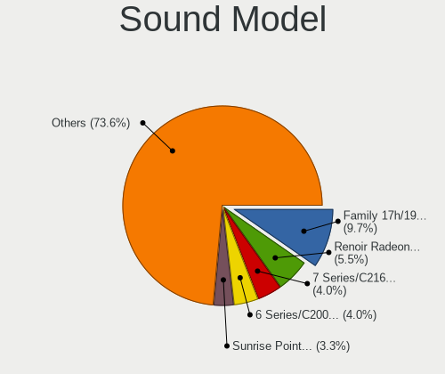

| Model                                                                                             | Computers | Percent |
|---------------------------------------------------------------------------------------------------|-----------|---------|
| AMD Family 17h/19h/1ah HD Audio Controller                                                        | 65        | 9.66%   |
| AMD Renoir Radeon High Definition Audio Controller                                                | 37        | 5.5%    |
| Intel 7 Series/C216 Chipset Family High Definition Audio Controller                               | 27        | 4.01%   |
| Intel 6 Series/C200 Series Chipset Family High Definition Audio Controller                        | 27        | 4.01%   |
| Intel Sunrise Point-LP HD Audio                                                                   | 22        | 3.27%   |
| AMD Rembrandt Radeon High Definition Audio Controller                                             | 19        | 2.82%   |
| Intel Alder Lake PCH-P High Definition Audio Controller                                           | 17        | 2.53%   |
| Intel Tiger Lake-LP Smart Sound Technology Audio Controller                                       | 16        | 2.38%   |
| Intel 8 Series/C220 Series Chipset High Definition Audio Controller                               | 14        | 2.08%   |
| AMD FCH Azalia Controller                                                                         | 14        | 2.08%   |
| Intel 82801H (ICH8 Family) HD Audio Controller                                                    | 13        | 1.93%   |
| Intel 100 Series/C230 Series Chipset Family HD Audio Controller                                   | 13        | 1.93%   |
| Intel NM10/ICH7 Family High Definition Audio Controller                                           | 11        | 1.63%   |
| Intel Celeron/Pentium Silver Processor High Definition Audio                                      | 11        | 1.63%   |
| Intel Cannon Lake PCH cAVS                                                                        | 11        | 1.63%   |
| Intel 82801I (ICH9 Family) HD Audio Controller                                                    | 11        | 1.63%   |
| Intel 5 Series/3400 Series Chipset High Definition Audio                                          | 9         | 1.34%   |
| Intel 200 Series PCH HD Audio                                                                     | 9         | 1.34%   |
| Intel Xeon E3-1200 v3/4th Gen Core Processor HD Audio Controller                                  | 8         | 1.19%   |
| AMD Starship/Matisse HD Audio Controller                                                          | 8         | 1.19%   |
| AMD SBx00 Azalia (Intel HDA)                                                                      | 8         | 1.19%   |
| AMD Raven/Raven2/Fenghuang HDMI/DP Audio Controller                                               | 8         | 1.19%   |
| AMD Kabini HDMI/DP Audio                                                                          | 8         | 1.19%   |
| Nvidia GP107GL High Definition Audio Controller                                                   | 7         | 1.04%   |
| Nvidia GF108 High Definition Audio Controller                                                     | 7         | 1.04%   |
| Intel Meteor Lake-P HD Audio Controller                                                           | 7         | 1.04%   |
| AMD Family 15h (Models 60h-6fh) Audio Controller                                                  | 7         | 1.04%   |
| Nvidia MCP79 High Definition Audio                                                                | 6         | 0.89%   |
| Nvidia GA104 High Definition Audio Controller                                                     | 6         | 0.89%   |
| Nvidia AD107 High Definition Audio Controller                                                     | 6         | 0.89%   |
| Intel Comet Lake PCH-LP cAVS                                                                      | 6         | 0.89%   |
| Intel Celeron N3350/Pentium N4200/Atom E3900 Series Audio Cluster                                 | 6         | 0.89%   |
| Intel Cannon Point-LP High Definition Audio Controller                                            | 6         | 0.89%   |
| AMD Family 17h (Models 00h-0fh) HD Audio Controller                                               | 6         | 0.89%   |
| Nvidia TU106 High Definition Audio Controller                                                     | 5         | 0.74%   |
| Nvidia GP108 High Definition Audio Controller                                                     | 5         | 0.74%   |
| Nvidia GP106 High Definition Audio Controller                                                     | 5         | 0.74%   |
| Intel Raptor Lake-P/U/H cAVS                                                                      | 5         | 0.74%   |
| Intel Haswell-ULT HD Audio Controller                                                             | 5         | 0.74%   |
| Intel Atom/Celeron/Pentium Processor x5-E8000/J3xxx/N3xxx Series High Definition Audio Controller | 5         | 0.74%   |

Memory
------

Memory Vendor
-------------

Memory module vendors

| Vendor                                  | Computers | Percent |
|-----------------------------------------|-----------|---------|
| Samsung Electronics                     | 107       | 20.66%  |
| SK hynix                                | 104       | 20.08%  |
| Unknown                                 | 51        | 9.85%   |
| Micron Technology                       | 51        | 9.85%   |
| Kingston                                | 38        | 7.34%   |
| Crucial                                 | 34        | 6.56%   |
| Corsair                                 | 25        | 4.83%   |
| G.Skill                                 | 15        | 2.9%    |
| Unknown                                 | 13        | 2.51%   |
| Ramaxel Technology                      | 11        | 2.12%   |
| A-DATA Technology                       | 11        | 2.12%   |
| Unknown (ABCD)                          | 9         | 1.74%   |
| Elpida                                  | 9         | 1.74%   |
| Team                                    | 7         | 1.35%   |
| Nanya Technology                        | 5         | 0.97%   |
| Patriot                                 | 3         | 0.58%   |
| Smart                                   | 2         | 0.39%   |
| Qimonda                                 | 2         | 0.39%   |
| V-GeN                                   | 1         | 0.19%   |
| Unknown (0x0CAB)                        | 1         | 0.19%   |
| Unknown (0x0B45)                        | 1         | 0.19%   |
| Unifosa                                 | 1         | 0.19%   |
| Transcend                               | 1         | 0.19%   |
| Timetec                                 | 1         | 0.19%   |
| Silicon Power Computer & Communications | 1         | 0.19%   |
| Shenzhen Longsys                        | 1         | 0.19%   |
| Qumo                                    | 1         | 0.19%   |
| OM Nanotech                             | 1         | 0.19%   |
| Netlist                                 | 1         | 0.19%   |
| Multilaser                              | 1         | 0.19%   |
| Lexar                                   | 1         | 0.19%   |
| ff                                      | 1         | 0.19%   |
| CSX                                     | 1         | 0.19%   |
| Apacer                                  | 1         | 0.19%   |
| ACPI Digital                            | 1         | 0.19%   |
| 4ea5                                    | 1         | 0.19%   |
| 48spaces                                | 1         | 0.19%   |
| 2C0C0803D720D6BA                        | 1         | 0.19%   |
| 2C0C0803D720D614                        | 1         | 0.19%   |

Memory Model
------------

Memory module models

| Model                                                            | Computers | Percent |
|------------------------------------------------------------------|-----------|---------|
| Unknown                                                          | 13        | 2.38%   |
| SK hynix RAM HMA81GS6AFR8N-UH 8GB SODIMM DDR4 2667MT/s           | 9         | 1.65%   |
| Unknown (ABCD) RAM 123456789012345678 2GB SODIMM LPDDR3 2400MT/s | 7         | 1.28%   |
| Samsung RAM M471A1G44BB0-CWE 8GB SODIMM DDR4 3200MT/s            | 7         | 1.28%   |
| SK hynix RAM HMAA1GS6CJR6N-XN 8GB SODIMM DDR4 3200MT/s           | 5         | 0.92%   |
| Samsung RAM M471B5273DH0-CH9 4GB SODIMM DDR3 1334MT/s            | 5         | 0.92%   |
| Samsung RAM M471B5173DB0-YK0 4GB SODIMM DDR3 1600MT/s            | 5         | 0.92%   |
| Unknown RAM Module 2GB SODIMM DDR3 1333MT/s                      | 4         | 0.73%   |
| SK hynix RAM HMA81GS6DJR8N-XN 8GB SODIMM DDR4 3200MT/s           | 4         | 0.73%   |
| Samsung RAM M471B5273CH0-CH9 4GB SODIMM DDR3 1334MT/s            | 4         | 0.73%   |
| Samsung RAM M471A1K43EB1-CWE 8GB SODIMM DDR4 3200MT/s            | 4         | 0.73%   |
| Samsung RAM M471A1K43CB1-CRC 8GB SODIMM DDR4 2667MT/s            | 4         | 0.73%   |
| Unknown RAM Module 8GB DIMM DDR3 1600MT/s                        | 3         | 0.55%   |
| Unknown RAM Module 1GB SODIMM DDR3 1066MT/s                      | 3         | 0.55%   |
| SK hynix RAM Module 4GB SODIMM DDR3 1600MT/s                     | 3         | 0.55%   |
| SK hynix RAM Module 2GB SODIMM DDR3 1067MT/s                     | 3         | 0.55%   |
| SK hynix RAM Module 16GB SODIMM DDR4 3200MT/s                    | 3         | 0.55%   |
| SK hynix RAM HMT41GS6BFR8A-PB 8GB SODIMM DDR3 1600MT/s           | 3         | 0.55%   |
| SK hynix RAM HMA82GS6DJR8N-VK 16GB SODIMM DDR4 2667MT/s          | 3         | 0.55%   |
| SK hynix RAM HMA41GS6AFR8N-TF 8GB SODIMM DDR4 2667MT/s           | 3         | 0.55%   |
| Samsung RAM M471B1G73QH0-YK0 8GB SODIMM DDR3 1600MT/s            | 3         | 0.55%   |
| Samsung RAM M471B1G73DB0-YK0 8GB SODIMM DDR3 1600MT/s            | 3         | 0.55%   |
| Samsung RAM M471A5244CB0-CWE 4096MB SODIMM DDR4 3200MT/s         | 3         | 0.55%   |
| Samsung RAM M471A1G44CB0-CWE 8GB SODIMM DDR4 3200MT/s            | 3         | 0.55%   |
| Samsung RAM M4 70T5663QZ3-CF7 2GB SODIMM DDR2 2048MT/s           | 3         | 0.55%   |
| Micron RAM 4ATF1G64HZ-3G2F1 8GB SODIMM DDR4 3200MT/s             | 3         | 0.55%   |
| Corsair RAM CMK16GX4M2B3200C16 8GB DIMM DDR4 3600MT/s            | 3         | 0.55%   |
| Unknown RAM Module 8GB DIMM DDR4 2667MT/s                        | 2         | 0.37%   |
| Unknown RAM Module 4GB SODIMM DDR3 1333MT/s                      | 2         | 0.37%   |
| Unknown RAM Module 4GB SODIMM DDR3                               | 2         | 0.37%   |
| Unknown RAM Module 2GB SODIMM DDR2 667MT/s                       | 2         | 0.37%   |
| Unknown RAM Module 2GB DIMM DDR3 1333MT/s                        | 2         | 0.37%   |
| Unknown RAM Module 2GB DIMM DDR2                                 | 2         | 0.37%   |
| Unknown RAM Module 2GB DIMM 800MT/s                              | 2         | 0.37%   |
| Unknown RAM Module 1GB SODIMM DDR2 667MT/s                       | 2         | 0.37%   |
| Unknown RAM Module 1GB SODIMM DDR2                               | 2         | 0.37%   |
| Unknown (ABCD) RAM 123456789012345678 2GB DIMM DDR3 2400MT/s     | 2         | 0.37%   |
| Team RAM TEAMGROUP-SD4-3200 16GB SODIMM DDR4 3200MT/s            | 2         | 0.37%   |
| SK hynix RAM Module 2GB SODIMM DDR3 1600MT/s                     | 2         | 0.37%   |
| SK hynix RAM HYMP125S64CP8-S6 2048MB SODIMM DDR2 975MT/s         | 2         | 0.37%   |

Memory Kind
-----------

Memory module kinds

| Kind    | Computers | Percent |
|---------|-----------|---------|
| DDR4    | 178       | 40.09%  |
| DDR3    | 142       | 31.98%  |
| DDR2    | 30        | 6.76%   |
| DDR5    | 25        | 5.63%   |
| LPDDR4  | 19        | 4.28%   |
| SDRAM   | 16        | 3.6%    |
| LPDDR5  | 16        | 3.6%    |
| Unknown | 7         | 1.58%   |
| LPDDR3  | 6         | 1.35%   |
| DDR     | 5         | 1.13%   |

Memory Form Factor
------------------

Physical design of the memory module

| Name         | Computers | Percent |
|--------------|-----------|---------|
| SODIMM       | 282       | 63.8%   |
| DIMM         | 118       | 26.7%   |
| Row Of Chips | 32        | 7.24%   |
| Unknown      | 5         | 1.13%   |
| Chip         | 3         | 0.68%   |
| FB-DIMM      | 2         | 0.45%   |

Memory Size
-----------

Memory module size

| Size  | Computers | Percent |
|-------|-----------|---------|
| 8192  | 172       | 36.83%  |
| 4096  | 115       | 24.63%  |
| 16384 | 68        | 14.56%  |
| 2048  | 67        | 14.35%  |
| 1024  | 23        | 4.93%   |
| 32768 | 18        | 3.85%   |
| 512   | 3         | 0.64%   |
| 49152 | 1         | 0.21%   |

Memory Speed
------------

Memory module speed

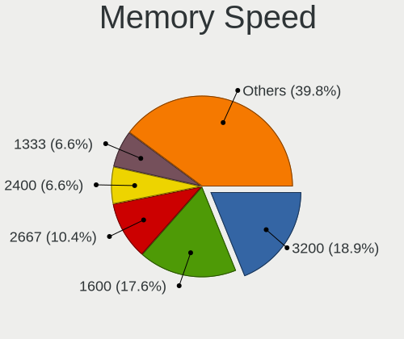

| Speed   | Computers | Percent |
|---------|-----------|---------|
| 3200    | 91        | 18.88%  |
| 1600    | 85        | 17.63%  |
| 2667    | 50        | 10.37%  |
| 2400    | 32        | 6.64%   |
| 1333    | 32        | 6.64%   |
| 667     | 16        | 3.32%   |
| 2133    | 14        | 2.9%    |
| 800     | 14        | 2.9%    |
| 1334    | 13        | 2.7%    |
| 1067    | 11        | 2.28%   |
| 6400    | 10        | 2.07%   |
| 4800    | 10        | 2.07%   |
| Unknown | 10        | 2.07%   |
| 5600    | 7         | 1.45%   |
| 4267    | 7         | 1.45%   |
| 3600    | 6         | 1.24%   |
| 1867    | 6         | 1.24%   |
| 6000    | 5         | 1.04%   |
| 2048    | 5         | 1.04%   |
| 4199    | 4         | 0.83%   |
| 1800    | 4         | 0.83%   |
| 1066    | 4         | 0.83%   |
| 4000    | 3         | 0.62%   |
| 975     | 3         | 0.62%   |
| 533     | 3         | 0.62%   |
| 7500    | 2         | 0.41%   |
| 7467    | 2         | 0.41%   |
| 3800    | 2         | 0.41%   |
| 3500    | 2         | 0.41%   |
| 3400    | 2         | 0.41%   |
| 3266    | 2         | 0.41%   |
| 3151    | 2         | 0.41%   |
| 2933    | 2         | 0.41%   |
| 2800    | 2         | 0.41%   |
| 1866    | 2         | 0.41%   |
| 1639    | 2         | 0.41%   |
| 400     | 2         | 0.41%   |
| 12800   | 1         | 0.21%   |
| 8533    | 1         | 0.21%   |
| 6200    | 1         | 0.21%   |

Printers & scanners
-------------------

Printer Vendor
--------------

Printer device vendors

| Vendor             | Computers | Percent |
|--------------------|-----------|---------|
| Canon              | 3         | 37.5%   |
| Hewlett-Packard    | 2         | 25%     |
| Brother Industries | 2         | 25%     |
| Dymo-CoStar        | 1         | 12.5%   |

Printer Model
-------------

Printer device models

| Model                       | Computers | Percent |
|-----------------------------|-----------|---------|
| HP LaserJet P1006           | 1         | 12.5%   |
| HP Deskjet 3510 series      | 1         | 12.5%   |
| Dymo-CoStar LabelWriter 450 | 1         | 12.5%   |
| Canon PIXMA MG5600 Series   | 1         | 12.5%   |
| Canon PIXMA MG2500 Series   | 1         | 12.5%   |
| Canon PIXMA iP4000          | 1         | 12.5%   |
| Brother HL-L2350DW series   | 1         | 12.5%   |
| Brother HL-52x0 series      | 1         | 12.5%   |

Scanner Vendor
--------------

Scanner device vendors

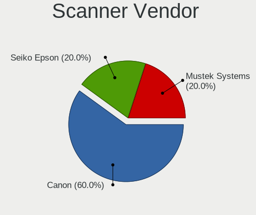

| Vendor         | Computers | Percent |
|----------------|-----------|---------|
| Canon          | 3         | 60%     |
| Seiko Epson    | 1         | 20%     |
| Mustek Systems | 1         | 20%     |

Scanner Model
-------------

Scanner device models

| Model                                 | Computers | Percent |
|---------------------------------------|-----------|---------|
| Seiko Epson GT-X770 [Perfection V500] | 1         | 20%     |
| Mustek Systems BearPaw 1200 CU Plus   | 1         | 20%     |
| Canon CanoScan LiDE 700F              | 1         | 20%     |
| Canon CanoScan LiDE 210               | 1         | 20%     |
| Canon CanoScan 8800F                  | 1         | 20%     |

Camera
------

Camera Vendor
-------------

Camera device vendors

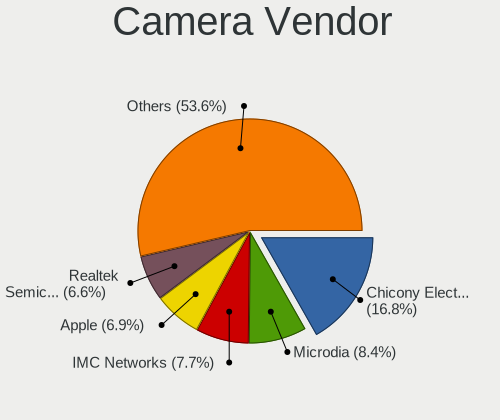

| Vendor                                 | Computers | Percent |
|----------------------------------------|-----------|---------|
| Chicony Electronics                    | 46        | 16.79%  |
| Microdia                               | 23        | 8.39%   |
| IMC Networks                           | 21        | 7.66%   |
| Apple                                  | 19        | 6.93%   |
| Realtek Semiconductor                  | 18        | 6.57%   |
| Quanta                                 | 14        | 5.11%   |
| Bison Electronics                      | 14        | 5.11%   |
| Sunplus Innovation Technology          | 13        | 4.74%   |
| Cheng Uei Precision Industry (Foxlink) | 12        | 4.38%   |
| Luxvisions Innotech Limited            | 11        | 4.01%   |
| Logitech                               | 10        | 3.65%   |
| Suyin                                  | 8         | 2.92%   |
| Lite-On Technology                     | 7         | 2.55%   |
| Alcor Micro                            | 7         | 2.55%   |
| Syntek                                 | 6         | 2.19%   |
| Sonix Technology                       | 5         | 1.82%   |
| Silicon Motion                         | 4         | 1.46%   |
| Lenovo                                 | 4         | 1.46%   |
| Importek                               | 4         | 1.46%   |
| Ricoh                                  | 3         | 1.09%   |
| Microsoft                              | 3         | 1.09%   |
| Acer                                   | 3         | 1.09%   |
| Z-Star Microelectronics                | 2         | 0.73%   |
| Intel                                  | 2         | 0.73%   |
| icSpring                               | 2         | 0.73%   |
| SunplusIT                              | 1         | 0.36%   |
| ShineTech                              | 1         | 0.36%   |
| Shenzhen Kingcome Optoelectronic       | 1         | 0.36%   |
| Samsung Electronics                    | 1         | 0.36%   |
| MacroSilicon                           | 1         | 0.36%   |
| KYT-221229-A                           | 1         | 0.36%   |
| Hewlett-Packard                        | 1         | 0.36%   |
| Generalplus Technology                 | 1         | 0.36%   |
| GEMBIRD                                | 1         | 0.36%   |
| Cubeternet                             | 1         | 0.36%   |
| BillionPixels                          | 1         | 0.36%   |
| Aveo Technology                        | 1         | 0.36%   |
| ARC International                      | 1         | 0.36%   |

Camera Model
------------

Camera device models

| Model                                               | Computers | Percent |
|-----------------------------------------------------|-----------|---------|
| Microdia Integrated_Webcam_HD                       | 12        | 4.38%   |
| IMC Networks USB2.0 HD UVC WebCam                   | 12        | 4.38%   |
| Apple Built-in iSight                               | 12        | 4.38%   |
| Realtek Integrated_Webcam_HD                        | 10        | 3.65%   |
| Chicony Integrated Camera                           | 8         | 2.92%   |
| Syntek Integrated Camera                            | 4         | 1.46%   |
| Microdia Integrated_Webcam_FHD                      | 4         | 1.46%   |
| Luxvisions Innotech Limited Integrated Camera       | 4         | 1.46%   |
| Luxvisions Innotech Limited HP TrueVision HD Camera | 4         | 1.46%   |
| Lite-On Integrated Camera                           | 4         | 1.46%   |
| Importek TOSHIBA Web Camera - HD                    | 4         | 1.46%   |
| IMC Networks Integrated Camera                      | 4         | 1.46%   |
| Chicony HP Truevision HD                            | 4         | 1.46%   |
| Suyin HP TrueVision HD Integrated Webcam            | 3         | 1.09%   |
| Sunplus Integrated_Webcam_HD                        | 3         | 1.09%   |
| Chicony TOSHIBA Web Camera - HD                     | 3         | 1.09%   |
| Chicony HP HD Camera                                | 3         | 1.09%   |
| Chicony ACER HD User Facing                         | 3         | 1.09%   |
| Bison Lenovo EasyCamera                             | 3         | 1.09%   |
| Apple FaceTime HD Camera (Built-in)                 | 3         | 1.09%   |
| Acer Integrated Camera                              | 3         | 1.09%   |
| Suyin HP Truevision HD                              | 2         | 0.73%   |
| Suyin Acer/HP Integrated Webcam [CN0314]            | 2         | 0.73%   |
| Sunplus Laptop_Integrated_Webcam_FHD                | 2         | 0.73%   |
| Sonix ASUS FHD webcam                               | 2         | 0.73%   |
| Ricoh HD Webcam                                     | 2         | 0.73%   |
| Realtek Bluetooth Radio                             | 2         | 0.73%   |
| Quanta ov9734_techfront_camera                      | 2         | 0.73%   |
| Quanta HP TrueVision HD Camera                      | 2         | 0.73%   |
| Quanta ACER HD User Facing                          | 2         | 0.73%   |
| Logitech Webcam C270                                | 2         | 0.73%   |
| Logitech C922 Pro Stream Webcam                     | 2         | 0.73%   |
| Lenovo Integrated Webcam [R5U877]                   | 2         | 0.73%   |
| Intel RealSense 3D Camera (Front F200)              | 2         | 0.73%   |
| IMC Networks USB2.0 VGA UVC WebCam                  | 2         | 0.73%   |
| IMC Networks EasyCamera                             | 2         | 0.73%   |
| icSpring camera                                     | 2         | 0.73%   |
| Chicony VGA Webcam                                  | 2         | 0.73%   |
| Chicony HP TrueVision HD Camera                     | 2         | 0.73%   |
| Chicony HP HD Webcam                                | 2         | 0.73%   |

Security
--------

Fingerprint Vendor
------------------

Fingerprint sensor vendors

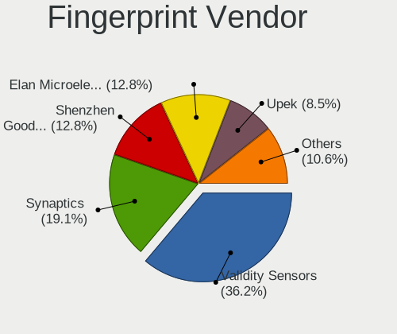

| Vendor                     | Computers | Percent |
|----------------------------|-----------|---------|
| Validity Sensors           | 17        | 36.17%  |
| Synaptics                  | 9         | 19.15%  |
| Shenzhen Goodix Technology | 6         | 12.77%  |
| Elan Microelectronics      | 6         | 12.77%  |
| Upek                       | 4         | 8.51%   |
| STMicroelectronics         | 2         | 4.26%   |
| AuthenTec                  | 2         | 4.26%   |
| LighTuning Technology      | 1         | 2.13%   |

Fingerprint Model
-----------------

Fingerprint sensor models

| Model                                                  | Computers | Percent |
|--------------------------------------------------------|-----------|---------|
| Validity Sensors VFS495 Fingerprint Reader             | 4         | 8.51%   |
| Upek Biometric Touchchip/Touchstrip Fingerprint Sensor | 4         | 8.51%   |
| Shenzhen Goodix  Fingerprint Device                    | 4         | 8.51%   |
| Validity Sensors VFS5011 Fingerprint Reader            | 3         | 6.38%   |
| Validity Sensors Fingerprint scanner                   | 3         | 6.38%   |
| Synaptics Metallica MIS Touch Fingerprint Reader       | 3         | 6.38%   |
| Elan ELAN:Fingerprint                                  | 3         | 6.38%   |
| Synaptics UWP WBDI Device                              | 2         | 4.26%   |
| STMicroelectronics Fingerprint Reader                  | 2         | 4.26%   |
| Elan ELAN:ARM-M4                                       | 2         | 4.26%   |
| AuthenTec AES2501 Fingerprint Sensor                   | 2         | 4.26%   |
| Validity Sensors VFS7500 Touch Fingerprint Sensor      | 1         | 2.13%   |
| Validity Sensors VFS491                                | 1         | 2.13%   |
| Validity Sensors VFS451 Fingerprint Reader             | 1         | 2.13%   |
| Validity Sensors VFS Fingerprint sensor                | 1         | 2.13%   |
| Validity Sensors VFS 5011 fingerprint sensor           | 1         | 2.13%   |
| Validity Sensors Synaptics WBDI                        | 1         | 2.13%   |
| Validity Sensors Swipe Fingerprint Sensor              | 1         | 2.13%   |
| Synaptics WBDI Fingerprint Reader USB 102              | 1         | 2.13%   |
| Synaptics  WBDI                                        | 1         | 2.13%   |
| Synaptics Prometheus MIS Touch Fingerprint Reader      | 1         | 2.13%   |
| Synaptics Fingerprint reader [HP G6]                   | 1         | 2.13%   |
| Shenzhen Goodix Fingerprint Reader                     | 1         | 2.13%   |
| Shenzhen Goodix FingerPrint                            | 1         | 2.13%   |
| LighTuning Fingerprint Sensor                          | 1         | 2.13%   |
| Elan WBF Fingerprint Sensor                            | 1         | 2.13%   |

Chipcard Vendor
---------------

Chipcard module vendors

| Vendor              | Computers | Percent |
|---------------------|-----------|---------|
| Broadcom            | 13        | 59.09%  |
| Alcor Micro         | 5         | 22.73%  |
| O2 Micro            | 2         | 9.09%   |
| Lenovo              | 1         | 4.55%   |
| Chicony Electronics | 1         | 4.55%   |

Chipcard Model
--------------

Chipcard module models

| Model                                                                        | Computers | Percent |
|------------------------------------------------------------------------------|-----------|---------|
| Broadcom 58200                                                               | 7         | 31.82%  |
| Alcor Micro AU9540 Smartcard Reader                                          | 5         | 22.73%  |
| Broadcom BCM5880 Secure Applications Processor with fingerprint swipe sensor | 3         | 13.64%  |
| O2 Micro Oz776 SmartCard Reader                                              | 2         | 9.09%   |
| Broadcom BCM5880 Secure Applications Processor                               | 2         | 9.09%   |
| Lenovo Integrated Smart Card Reader                                          | 1         | 4.55%   |
| Chicony Electronics HP Skylab USB Smartcard Keyboard                         | 1         | 4.55%   |
| Broadcom 5880                                                                | 1         | 4.55%   |

Unsupported
-----------

Unsupported Devices
-------------------

Total unsupported devices on board

| Total | Computers | Percent |
|-------|-----------|---------|
| 0     | 277       | 62.67%  |
| 1     | 132       | 29.86%  |
| 2     | 27        | 6.11%   |
| 3     | 5         | 1.13%   |
| 4     | 1         | 0.23%   |

Unsupported Device Types
------------------------

Types of unsupported devices

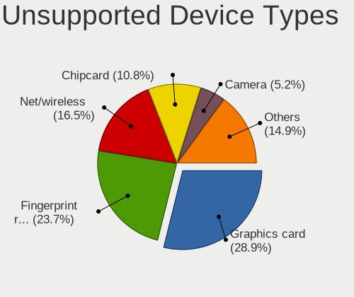

| Type                     | Computers | Percent |
|--------------------------|-----------|---------|
| Graphics card            | 56        | 28.87%  |
| Fingerprint reader       | 46        | 23.71%  |
| Net/wireless             | 32        | 16.49%  |
| Chipcard                 | 21        | 10.82%  |
| Camera                   | 10        | 5.15%   |
| Multimedia controller    | 8         | 4.12%   |
| Bluetooth                | 5         | 2.58%   |
| Card reader              | 4         | 2.06%   |
| Network                  | 3         | 1.55%   |
| Storage                  | 2         | 1.03%   |
| Communication controller | 2         | 1.03%   |
| Wireless                 | 1         | 0.52%   |
| Unassigned class         | 1         | 0.52%   |
| Storage/raid             | 1         | 0.52%   |
| Sound                    | 1         | 0.52%   |
| Flash memory             | 1         | 0.52%   |

