Mageia - Tested Hardware & Statistics
-------------------------------------

A project to collect tested hardware configurations for Mageia.

Anyone can contribute to this report by the [hw-probe](https://github.com/linuxhw/hw-probe) tool:

    sudo -E hw-probe -all -upload

Please contribute! Especially if your hardware is rare.

This is a report for all computer types. See also reports for [desktops](/Dist/Mageia/Desktop/README.md) and [notebooks](/Dist/Mageia/Notebook/README.md).

Contents
--------

* [ Test Cases ](#test-cases)

* [ System ](#system)
  - [ OS                       ](#os)
  - [ OS Family                ](#os-family)
  - [ Kernel                   ](#kernel)
  - [ Kernel Family            ](#kernel-family)
  - [ Kernel Major Ver.        ](#kernel-major-ver)
  - [ Arch                     ](#arch)
  - [ DE                       ](#de)
  - [ Display Server           ](#display-server)
  - [ Display Manager          ](#display-manager)
  - [ OS Lang                  ](#os-lang)
  - [ Boot Mode                ](#boot-mode)
  - [ Filesystem               ](#filesystem)
  - [ Part. scheme             ](#part-scheme)
  - [ Dual Boot with Linux/BSD ](#dual-boot-with-linuxbsd)
  - [ Dual Boot (Win)          ](#dual-boot-win)

* [ Board ](#board)
  - [ Vendor                   ](#vendor)
  - [ Model                    ](#model)
  - [ Model Family             ](#model-family)
  - [ MFG Year                 ](#mfg-year)
  - [ Form Factor              ](#form-factor)
  - [ Secure Boot              ](#secure-boot)
  - [ Coreboot                 ](#coreboot)
  - [ RAM Size                 ](#ram-size)
  - [ RAM Used                 ](#ram-used)
  - [ Total Drives             ](#total-drives)
  - [ Has CD-ROM               ](#has-cd-rom)
  - [ Has Ethernet             ](#has-ethernet)
  - [ Has WiFi                 ](#has-wifi)
  - [ Has Bluetooth            ](#has-bluetooth)

* [ Location ](#location)
  - [ Country                  ](#country)
  - [ City                     ](#city)

* [ Drives ](#drives)
  - [ Drive Vendor             ](#drive-vendor)
  - [ Drive Model              ](#drive-model)
  - [ HDD Vendor               ](#hdd-vendor)
  - [ SSD Vendor               ](#ssd-vendor)
  - [ Drive Kind               ](#drive-kind)
  - [ Drive Connector          ](#drive-connector)
  - [ Drive Size               ](#drive-size)
  - [ Space Total              ](#space-total)
  - [ Space Used               ](#space-used)
  - [ Malfunc. Drives          ](#malfunc-drives)
  - [ Malfunc. Drive Vendor    ](#malfunc-drive-vendor)
  - [ Malfunc. HDD Vendor      ](#malfunc-hdd-vendor)
  - [ Malfunc. Drive Kind      ](#malfunc-drive-kind)
  - [ Failed Drives            ](#failed-drives)
  - [ Failed Drive Vendor      ](#failed-drive-vendor)
  - [ Drive Status             ](#drive-status)

* [ Storage controller ](#storage-controller)
  - [ Storage Vendor           ](#storage-vendor)
  - [ Storage Model            ](#storage-model)
  - [ Storage Kind             ](#storage-kind)

* [ Processor ](#processor)
  - [ CPU Vendor               ](#cpu-vendor)
  - [ CPU Model                ](#cpu-model)
  - [ CPU Model Family         ](#cpu-model-family)
  - [ CPU Cores                ](#cpu-cores)
  - [ CPU Sockets              ](#cpu-sockets)
  - [ CPU Threads              ](#cpu-threads)
  - [ CPU Op-Modes             ](#cpu-op-modes)
  - [ CPU Microcode            ](#cpu-microcode)
  - [ CPU Microarch            ](#cpu-microarch)

* [ Graphics ](#graphics)
  - [ GPU Vendor               ](#gpu-vendor)
  - [ GPU Model                ](#gpu-model)
  - [ GPU Combo                ](#gpu-combo)
  - [ GPU Driver               ](#gpu-driver)
  - [ GPU Memory               ](#gpu-memory)

* [ Monitor ](#monitor)
  - [ Monitor Vendor           ](#monitor-vendor)
  - [ Monitor Model            ](#monitor-model)
  - [ Monitor Resolution       ](#monitor-resolution)
  - [ Monitor Diagonal         ](#monitor-diagonal)
  - [ Monitor Width            ](#monitor-width)
  - [ Aspect Ratio             ](#aspect-ratio)
  - [ Monitor Area             ](#monitor-area)
  - [ Pixel Density            ](#pixel-density)
  - [ Multiple Monitors        ](#multiple-monitors)

* [ Network ](#network)
  - [ Net Controller Vendor    ](#net-controller-vendor)
  - [ Net Controller Model     ](#net-controller-model)
  - [ Wireless Vendor          ](#wireless-vendor)
  - [ Wireless Model           ](#wireless-model)
  - [ Ethernet Vendor          ](#ethernet-vendor)
  - [ Ethernet Model           ](#ethernet-model)
  - [ Net Controller Kind      ](#net-controller-kind)
  - [ Used Controller          ](#used-controller)
  - [ NICs                     ](#nics)
  - [ IPv6                     ](#ipv6)

* [ Bluetooth ](#bluetooth)
  - [ Bluetooth Vendor         ](#bluetooth-vendor)
  - [ Bluetooth Model          ](#bluetooth-model)

* [ Sound ](#sound)
  - [ Sound Vendor             ](#sound-vendor)
  - [ Sound Model              ](#sound-model)

* [ Memory ](#memory)
  - [ Memory Vendor            ](#memory-vendor)
  - [ Memory Model             ](#memory-model)
  - [ Memory Kind              ](#memory-kind)
  - [ Memory Form Factor       ](#memory-form-factor)
  - [ Memory Size              ](#memory-size)
  - [ Memory Speed             ](#memory-speed)

* [ Printers & scanners ](#printers--scanners)
  - [ Printer Vendor           ](#printer-vendor)
  - [ Printer Model            ](#printer-model)
  - [ Scanner Vendor           ](#scanner-vendor)
  - [ Scanner Model            ](#scanner-model)

* [ Camera ](#camera)
  - [ Camera Vendor            ](#camera-vendor)
  - [ Camera Model             ](#camera-model)

* [ Security ](#security)
  - [ Fingerprint Vendor       ](#fingerprint-vendor)
  - [ Fingerprint Model        ](#fingerprint-model)
  - [ Chipcard Vendor          ](#chipcard-vendor)
  - [ Chipcard Model           ](#chipcard-model)

* [ Unsupported ](#unsupported)
  - [ Unsupported Devices      ](#unsupported-devices)
  - [ Unsupported Device Types ](#unsupported-device-types)

Test Cases
----------

Total: 273

| Vendor    | Model                       | Form-Factor | Probe                                                      | Date         |
|-----------|-----------------------------|-------------|------------------------------------------------------------|--------------|
| HP        | ProBook 650 G1              | Notebook    | [f216877adb](https://linux-hardware.org/?probe=f216877adb) | Dec 15, 2025 |
| ASUSTek   | TUF Gaming B450-PLUS II     | Desktop     | [8ce77ce7fc](https://linux-hardware.org/?probe=8ce77ce7fc) | Dec 07, 2025 |
| ASUSTek   | TUF Gaming B450-PLUS II     | Desktop     | [49462508c8](https://linux-hardware.org/?probe=49462508c8) | Dec 06, 2025 |
| Gigabyte  | X870E AORUS ELITE WIFI7     | Desktop     | [e0cfbd1d08](https://linux-hardware.org/?probe=e0cfbd1d08) | Dec 04, 2025 |
| Gigabyte  | X870E AORUS ELITE WIFI7     | Desktop     | [29ecb8da48](https://linux-hardware.org/?probe=29ecb8da48) | Dec 04, 2025 |
| ASUSTek   | PRIME A520M-K               | Desktop     | [3fa999fb52](https://linux-hardware.org/?probe=3fa999fb52) | Nov 25, 2025 |
| Gigabyte  | F2A68HM-H                   | Desktop     | [2d32170b3e](https://linux-hardware.org/?probe=2d32170b3e) | Nov 22, 2025 |
| Toshiba   | Satellite M70               | Notebook    | [b1e2efb1e9](https://linux-hardware.org/?probe=b1e2efb1e9) | Nov 21, 2025 |
| ASUSTek   | ROG Maximus Z790 DARK HE... | Desktop     | [1b851a8c36](https://linux-hardware.org/?probe=1b851a8c36) | Nov 13, 2025 |
| HP        | Pavilion Gaming Laptop 1... | Notebook    | [718071d7fc](https://linux-hardware.org/?probe=718071d7fc) | Nov 13, 2025 |
| Gigabyte  | B650 EAGLE                  | Desktop     | [a91266d37c](https://linux-hardware.org/?probe=a91266d37c) | Nov 12, 2025 |
| Dell      | Vostro 3300                 | Notebook    | [2431bda764](https://linux-hardware.org/?probe=2431bda764) | Oct 29, 2025 |
| Fujitsu   | LIFEBOOK T580               | Notebook    | [3b95bd0b87](https://linux-hardware.org/?probe=3b95bd0b87) | Oct 05, 2025 |
| ASUSTek   | X751LN                      | Notebook    | [487943c818](https://linux-hardware.org/?probe=487943c818) | Aug 20, 2025 |
| ASRock    | B550M Pro4                  | Desktop     | [2dea595435](https://linux-hardware.org/?probe=2dea595435) | Aug 15, 2025 |
| ASUSTek   | A_F_K31ADE                  | Desktop     | [74e0b4aa1a](https://linux-hardware.org/?probe=74e0b4aa1a) | Aug 10, 2025 |
| ASUSTek   | PRIME X570-P                | Desktop     | [9b9d86ae36](https://linux-hardware.org/?probe=9b9d86ae36) | Aug 02, 2025 |
| ASUSTek   | X751LN                      | Notebook    | [1789805d42](https://linux-hardware.org/?probe=1789805d42) | Jul 28, 2025 |
| Lenovo    | ThinkBook 14 G6+ AHP 21L... | Notebook    | [7435ad5bea](https://linux-hardware.org/?probe=7435ad5bea) | Jul 17, 2025 |
| ASUSTek   | ROG Maximus Z790 DARK HE... | Desktop     | [2fb1af7089](https://linux-hardware.org/?probe=2fb1af7089) | Jun 30, 2025 |
| ASUSTek   | ROG Maximus Z790 DARK HE... | Desktop     | [d8438e1d22](https://linux-hardware.org/?probe=d8438e1d22) | Jun 12, 2025 |
| ASUSTek   | PRIME X570-P                | Desktop     | [48c6bc8902](https://linux-hardware.org/?probe=48c6bc8902) | May 30, 2025 |
| ASUSTek   | PRIME X570-P                | Desktop     | [509f63b6bd](https://linux-hardware.org/?probe=509f63b6bd) | May 29, 2025 |
| Fujitsu   | LIFEBOOK T580               | Notebook    | [086dbef0bd](https://linux-hardware.org/?probe=086dbef0bd) | May 15, 2025 |
| Dell      | 0GK35Y A00                  | Desktop     | [64c3788bde](https://linux-hardware.org/?probe=64c3788bde) | May 14, 2025 |
| HP        | ProBook 650 G1              | Notebook    | [a9375df162](https://linux-hardware.org/?probe=a9375df162) | May 08, 2025 |
| HP        | G62                         | Notebook    | [71c90e13fa](https://linux-hardware.org/?probe=71c90e13fa) | May 06, 2025 |
| ASUSTek   | TUF Gaming Z690-PLUS WIF... | Desktop     | [e7828f6056](https://linux-hardware.org/?probe=e7828f6056) | Apr 03, 2025 |
| TUXEDO    | Book XP15 / XP17 Gen12      | Notebook    | [451fc24b08](https://linux-hardware.org/?probe=451fc24b08) | Mar 31, 2025 |
| ASUSTek   | PRIME X570-P                | Desktop     | [d90666affd](https://linux-hardware.org/?probe=d90666affd) | Mar 14, 2025 |
| ASUSTek   | ROG Maximus Z790 DARK HE... | Desktop     | [87214358f3](https://linux-hardware.org/?probe=87214358f3) | Mar 03, 2025 |
| Acer      | Aspire A317-53              | Notebook    | [1e2fdcd989](https://linux-hardware.org/?probe=1e2fdcd989) | Feb 09, 2025 |
| Gigabyte  | B450M DS3H-CF               | Desktop     | [69968fade5](https://linux-hardware.org/?probe=69968fade5) | Dec 29, 2024 |
| Gigabyte  | X570 GAMING X               | Desktop     | [329e4898cd](https://linux-hardware.org/?probe=329e4898cd) | Dec 13, 2024 |
| Intel     | NUC12WSBi5 M46425-303       | Mini pc     | [b979600a4a](https://linux-hardware.org/?probe=b979600a4a) | Nov 29, 2024 |
| MSI       | G41M-S01                    | Desktop     | [34344c8186](https://linux-hardware.org/?probe=34344c8186) | Oct 26, 2024 |
| OEM       | I42IL1                      | Notebook    | [3a9938d946](https://linux-hardware.org/?probe=3a9938d946) | Oct 26, 2024 |
| ASRock    | X79 Extreme4                | Desktop     | [5360f41672](https://linux-hardware.org/?probe=5360f41672) | Oct 12, 2024 |
| HP        | 0A60h                       | Desktop     | [382484402a](https://linux-hardware.org/?probe=382484402a) | Oct 07, 2024 |
| ASUSTek   | ROG Maximus Z790 DARK HE... | Desktop     | [997be25415](https://linux-hardware.org/?probe=997be25415) | Oct 06, 2024 |
| Acer      | Aspire A315-59G             | Notebook    | [3c57995295](https://linux-hardware.org/?probe=3c57995295) | Oct 05, 2024 |
| Lenovo    | G585 20137                  | Notebook    | [379f6e6fef](https://linux-hardware.org/?probe=379f6e6fef) | Oct 05, 2024 |
| HP        | Pavilion g4                 | Notebook    | [c705d7afa6](https://linux-hardware.org/?probe=c705d7afa6) | Oct 05, 2024 |
| Foxconn   | M61PMV FAB                  | Desktop     | [1d1eff2e7b](https://linux-hardware.org/?probe=1d1eff2e7b) | Oct 05, 2024 |
| MSI       | 2A9C                        | Desktop     | [61b9b2ee38](https://linux-hardware.org/?probe=61b9b2ee38) | Oct 05, 2024 |
| MSI       | H410M PRO                   | Desktop     | [50719966e4](https://linux-hardware.org/?probe=50719966e4) | Oct 05, 2024 |
| ASUSTek   | ZenBook UX425EA_UX425EA     | Notebook    | [17286ddcf5](https://linux-hardware.org/?probe=17286ddcf5) | Oct 03, 2024 |
| HP        | Laptop 17-ca1xxx            | Notebook    | [1e94fd61d3](https://linux-hardware.org/?probe=1e94fd61d3) | Aug 29, 2024 |
| Intel     | NUC12WSBi5 M46425-303       | Mini pc     | [2e5356112f](https://linux-hardware.org/?probe=2e5356112f) | Aug 21, 2024 |
| MSI       | MPG B650 CARBON WIFI        | Desktop     | [dbafdb30ab](https://linux-hardware.org/?probe=dbafdb30ab) | Jul 05, 2024 |
| HP        | 158A                        | Desktop     | [c0b9f5216e](https://linux-hardware.org/?probe=c0b9f5216e) | May 29, 2024 |
| HP        | 1998                        | Desktop     | [7d652e5edc](https://linux-hardware.org/?probe=7d652e5edc) | May 13, 2024 |
| HP        | Victus by Gaming Laptop ... | Notebook    | [62d3477a3b](https://linux-hardware.org/?probe=62d3477a3b) | May 10, 2024 |
| Dell      | 03W3VW A02                  | Desktop     | [ee02b7cd0b](https://linux-hardware.org/?probe=ee02b7cd0b) | May 05, 2024 |
| MSI       | MAG B460M MORTAR            | Desktop     | [175185cdad](https://linux-hardware.org/?probe=175185cdad) | Apr 12, 2024 |
| Acer      | Aspire 5742Z                | Notebook    | [f9ceb71c71](https://linux-hardware.org/?probe=f9ceb71c71) | Apr 11, 2024 |
| Acer      | Aspire SW5-011              | Notebook    | [4e8ad9d65f](https://linux-hardware.org/?probe=4e8ad9d65f) | Apr 10, 2024 |
| Acer      | Aspire SW5-011              | Notebook    | [6f6cb62f08](https://linux-hardware.org/?probe=6f6cb62f08) | Apr 02, 2024 |
| Acer      | Aspire SW5-011              | Notebook    | [6fbb2e2797](https://linux-hardware.org/?probe=6fbb2e2797) | Apr 01, 2024 |
| HP        | ProBook 650 G1              | Notebook    | [f097372357](https://linux-hardware.org/?probe=f097372357) | Mar 31, 2024 |
| ASRock    | 970 Pro3 R2.0               | Desktop     | [a06f99839a](https://linux-hardware.org/?probe=a06f99839a) | Mar 30, 2024 |
| ASUSTek   | VivoBook_ASUSLaptop X712... | Notebook    | [d6f2169d3f](https://linux-hardware.org/?probe=d6f2169d3f) | Mar 26, 2024 |
| Insyde    | BayTrail                    | Notebook    | [2566898a32](https://linux-hardware.org/?probe=2566898a32) | Mar 23, 2024 |
| Gigabyte  | F2A68HM-H                   | Desktop     | [2ae64472ff](https://linux-hardware.org/?probe=2ae64472ff) | Mar 20, 2024 |
| Gigabyte  | P67A-UD3-B3                 | Desktop     | [5089ab522a](https://linux-hardware.org/?probe=5089ab522a) | Mar 20, 2024 |
| Dell      | 0HN7XN A01                  | Desktop     | [987e3ca0a5](https://linux-hardware.org/?probe=987e3ca0a5) | Mar 20, 2024 |
| MSI       | A520M-A PRO                 | Desktop     | [8ff1245537](https://linux-hardware.org/?probe=8ff1245537) | Mar 19, 2024 |
| Lenovo    | SHARKBAY 0B98401 PRO        | Desktop     | [392bd2c7d3](https://linux-hardware.org/?probe=392bd2c7d3) | Mar 10, 2024 |
| MSI       | A520M-A PRO                 | Desktop     | [4958d63fb4](https://linux-hardware.org/?probe=4958d63fb4) | Feb 20, 2024 |
| Unknown   | Unknown                     | Desktop     | [3e1781cc8c](https://linux-hardware.org/?probe=3e1781cc8c) | Feb 16, 2024 |
| Unknown   | Unknown                     | Desktop     | [daefcf1b9f](https://linux-hardware.org/?probe=daefcf1b9f) | Feb 16, 2024 |
| Lenovo    | G50-30 80G0                 | Notebook    | [e1e268d222](https://linux-hardware.org/?probe=e1e268d222) | Jan 18, 2024 |
| Gigabyte  | B550 AORUS ELITE V2         | Desktop     | [0c54141bbd](https://linux-hardware.org/?probe=0c54141bbd) | Jan 11, 2024 |
| Gigabyte  | B550 AORUS ELITE V2         | Desktop     | [3117cde827](https://linux-hardware.org/?probe=3117cde827) | Jan 11, 2024 |
| HP        | ProBook 450 G1              | Notebook    | [028d205023](https://linux-hardware.org/?probe=028d205023) | Jan 09, 2024 |
| HP        | Compaq 6710b (GB887ET#AB... | Notebook    | [2aaeccac56](https://linux-hardware.org/?probe=2aaeccac56) | Jan 08, 2024 |
| Gigabyte  | H110M-S2-CF                 | Desktop     | [8ea8935806](https://linux-hardware.org/?probe=8ea8935806) | Jan 04, 2024 |
| ASUSTek   | PRIME B450-PLUS             | Desktop     | [863f0b5c06](https://linux-hardware.org/?probe=863f0b5c06) | Dec 29, 2023 |
| Lenovo    | 317C SDK0J40700 WIN 3258... | Desktop     | [f24d5f341c](https://linux-hardware.org/?probe=f24d5f341c) | Dec 28, 2023 |
| Gigabyte  | H81M-S2H                    | Desktop     | [8dd5a975f9](https://linux-hardware.org/?probe=8dd5a975f9) | Dec 02, 2023 |
| ASUSTek   | VivoBook_ASUSLaptop K660... | Notebook    | [9315424410](https://linux-hardware.org/?probe=9315424410) | Nov 21, 2023 |
| ASUSTek   | VivoBook_ASUSLaptop K660... | Notebook    | [5e92402cde](https://linux-hardware.org/?probe=5e92402cde) | Nov 21, 2023 |
| HP        | 255 15.6 inch G9 Noteboo... | Notebook    | [b1394cc278](https://linux-hardware.org/?probe=b1394cc278) | Oct 30, 2023 |
| Gigabyte  | B450M DS3H-CF               | Desktop     | [e18680d1f4](https://linux-hardware.org/?probe=e18680d1f4) | Oct 29, 2023 |
| Dell      | 0GK35Y A00                  | Desktop     | [99aded4434](https://linux-hardware.org/?probe=99aded4434) | Oct 17, 2023 |
| Gigabyte  | Z87X-UD5H-CF                | Desktop     | [ff0a453a0e](https://linux-hardware.org/?probe=ff0a453a0e) | Oct 13, 2023 |
| Lenovo    | IdeaPad Slim 3 15AMN8 82... | Notebook    | [02c2fabd1e](https://linux-hardware.org/?probe=02c2fabd1e) | Oct 11, 2023 |
| Lenovo    | IdeaPad Slim 3 15AMN8 82... | Notebook    | [02a4135aff](https://linux-hardware.org/?probe=02a4135aff) | Oct 09, 2023 |
| Dell      | 0GK35Y A00                  | Desktop     | [47987fd9dd](https://linux-hardware.org/?probe=47987fd9dd) | Oct 07, 2023 |
| Dell      | 0GK35Y A00                  | Desktop     | [d785138af0](https://linux-hardware.org/?probe=d785138af0) | Sep 03, 2023 |
| Fujitsu   | S6420                       | Notebook    | [044d4185b7](https://linux-hardware.org/?probe=044d4185b7) | Aug 22, 2023 |
| HP        | Pavilion Notebook           | Notebook    | [7fd3205fde](https://linux-hardware.org/?probe=7fd3205fde) | Aug 11, 2023 |
| Lenovo    | Yoga 720-15IKB 80X7         | Convertible | [b691f28c43](https://linux-hardware.org/?probe=b691f28c43) | Aug 10, 2023 |
| Dell      | Latitude E5470              | Notebook    | [f64529e38b](https://linux-hardware.org/?probe=f64529e38b) | Aug 08, 2023 |
| ASUSTek   | Q551LN                      | Notebook    | [ad2abcddcf](https://linux-hardware.org/?probe=ad2abcddcf) | Jul 27, 2023 |
| Gigabyte  | Z87X-UD5H-CF                | Desktop     | [6f489ed497](https://linux-hardware.org/?probe=6f489ed497) | Jul 20, 2023 |
| HP        | Laptop 14-cm0xxx            | Notebook    | [a0fd2eeb7b](https://linux-hardware.org/?probe=a0fd2eeb7b) | Jul 11, 2023 |
| Compaq    | 420                         | Notebook    | [6f4350d53e](https://linux-hardware.org/?probe=6f4350d53e) | Jul 10, 2023 |
| ASUSTek   | K73SD                       | Notebook    | [063e42ac60](https://linux-hardware.org/?probe=063e42ac60) | May 22, 2023 |
| ASUSTek   | TUF Gaming B550M-PLUS       | Desktop     | [a2b832afa2](https://linux-hardware.org/?probe=a2b832afa2) | Apr 30, 2023 |
| Gigabyte  | Z97-D3H-CF                  | Desktop     | [a62e386eae](https://linux-hardware.org/?probe=a62e386eae) | Apr 24, 2023 |
| Gigabyte  | Z97-D3H-CF                  | Desktop     | [bd9d832f72](https://linux-hardware.org/?probe=bd9d832f72) | Apr 23, 2023 |
| Dell      | Latitude 7370               | Notebook    | [a254d0d7f1](https://linux-hardware.org/?probe=a254d0d7f1) | Apr 02, 2023 |
| ASUSTek   | TUF Gaming B550M-PLUS       | Desktop     | [e45ad193f8](https://linux-hardware.org/?probe=e45ad193f8) | Apr 01, 2023 |
| Dell      | Latitude 7370               | Notebook    | [b8a0b25983](https://linux-hardware.org/?probe=b8a0b25983) | Mar 30, 2023 |
| MSI       | Z590-A PRO                  | Desktop     | [ad6a144db9](https://linux-hardware.org/?probe=ad6a144db9) | Mar 23, 2023 |
| ASUSTek   | M3A78-EMH HDMI              | Desktop     | [0aa8c2bf55](https://linux-hardware.org/?probe=0aa8c2bf55) | Mar 20, 2023 |
| ASUSTek   | P8H61-M LE                  | Desktop     | [bb43961724](https://linux-hardware.org/?probe=bb43961724) | Mar 17, 2023 |
| HP        | ProBook 5330m               | Notebook    | [2ec50367d4](https://linux-hardware.org/?probe=2ec50367d4) | Mar 11, 2023 |
| Lenovo    | MAHOBAY                     | Desktop     | [d0541545c8](https://linux-hardware.org/?probe=d0541545c8) | Mar 11, 2023 |
| ASUSTek   | P8H61-M LE                  | Desktop     | [69713a19ea](https://linux-hardware.org/?probe=69713a19ea) | Feb 28, 2023 |
| HP        | Unknown                     | Notebook    | [702ed67add](https://linux-hardware.org/?probe=702ed67add) | Dec 17, 2022 |
| HP        | Unknown                     | Notebook    | [d952fd785e](https://linux-hardware.org/?probe=d952fd785e) | Dec 17, 2022 |
| Fujitsu   | CELSIUS H720                | Notebook    | [a7eacb37c5](https://linux-hardware.org/?probe=a7eacb37c5) | Dec 03, 2022 |
| Lenovo    | ThinkCentre A57 970274G     | Desktop     | [809e137f17](https://linux-hardware.org/?probe=809e137f17) | Nov 02, 2022 |
| MSI       | B360I GMAING PRO AC         | Desktop     | [2584a31610](https://linux-hardware.org/?probe=2584a31610) | Oct 12, 2022 |
| Gigabyte  | Z87X-UD5H-CF                | Desktop     | [8d0d1ba821](https://linux-hardware.org/?probe=8d0d1ba821) | Oct 12, 2022 |
| MSI       | B360I GMAING PRO AC         | Desktop     | [bbdf7b4f77](https://linux-hardware.org/?probe=bbdf7b4f77) | Oct 01, 2022 |
| Irbis     | NB264                       | Notebook    | [103ca2d20b](https://linux-hardware.org/?probe=103ca2d20b) | Sep 16, 2022 |
| ASRock    | B550M-HDV                   | Desktop     | [c786c365d5](https://linux-hardware.org/?probe=c786c365d5) | Sep 06, 2022 |
| ASUSTek   | X751LN                      | Notebook    | [68cd0152fb](https://linux-hardware.org/?probe=68cd0152fb) | Aug 22, 2022 |
| ASUSTek   | M5A99FX PRO R2.0            | Desktop     | [d14ad254ca](https://linux-hardware.org/?probe=d14ad254ca) | Jul 05, 2022 |
| Schenker  | VIA_14_SVI14E20             | Notebook    | [3adb69bbf5](https://linux-hardware.org/?probe=3adb69bbf5) | Jun 03, 2022 |
| Notebook  | NH5x_NH7x_HHx_HJx_HKx       | Notebook    | [e30e3da709](https://linux-hardware.org/?probe=e30e3da709) | May 18, 2022 |
| Dell      | Latitude E5570              | Notebook    | [ec640c6644](https://linux-hardware.org/?probe=ec640c6644) | May 12, 2022 |
| Gigabyte  | H170-D3H-CF                 | Desktop     | [9f255eb7d5](https://linux-hardware.org/?probe=9f255eb7d5) | May 06, 2022 |
| ASUSTek   | F1A75-M LE                  | Desktop     | [93232d0716](https://linux-hardware.org/?probe=93232d0716) | May 01, 2022 |
| Microsoft | Surface Pro 4               | Tablet      | [4e74006288](https://linux-hardware.org/?probe=4e74006288) | Apr 21, 2022 |
| Lenovo    | ThinkPad X1 Carbon 5th 2... | Notebook    | [086a94d83c](https://linux-hardware.org/?probe=086a94d83c) | Apr 15, 2022 |
| Megaware  | MW-G31T-M7                  | Desktop     | [3ac4860cb3](https://linux-hardware.org/?probe=3ac4860cb3) | Apr 13, 2022 |
| Megaware  | MW-G31T-M7                  | Desktop     | [ce643cbdcd](https://linux-hardware.org/?probe=ce643cbdcd) | Apr 13, 2022 |
| Gigabyte  | H81M-S2H                    | Desktop     | [ac5d29c839](https://linux-hardware.org/?probe=ac5d29c839) | Apr 05, 2022 |
| MSI       | Z590-A PRO                  | Desktop     | [229ed42b3d](https://linux-hardware.org/?probe=229ed42b3d) | Apr 03, 2022 |
| Toshiba   | dynabook R73/A              | Notebook    | [42b60c90c7](https://linux-hardware.org/?probe=42b60c90c7) | Apr 01, 2022 |
| Gigabyte  | GA-78LMT-USB3 SEx           | Desktop     | [2955e87822](https://linux-hardware.org/?probe=2955e87822) | Mar 29, 2022 |
| Gigabyte  | G31M-S2C                    | Desktop     | [a56fb721dd](https://linux-hardware.org/?probe=a56fb721dd) | Mar 17, 2022 |
| Gigabyte  | X570 AORUS ELITE WIFI       | Desktop     | [8d52e31d86](https://linux-hardware.org/?probe=8d52e31d86) | Mar 09, 2022 |
| MSI       | Z590-A PRO                  | Desktop     | [5f37c84d61](https://linux-hardware.org/?probe=5f37c84d61) | Mar 06, 2022 |
| Gigabyte  | G31M-S2C                    | Desktop     | [d419223147](https://linux-hardware.org/?probe=d419223147) | Mar 06, 2022 |
| Gigabyte  | X570 AORUS ELITE WIFI       | Desktop     | [c11d937631](https://linux-hardware.org/?probe=c11d937631) | Feb 23, 2022 |
| ASRock    | M3A UCC                     | Desktop     | [eaa75fb3f4](https://linux-hardware.org/?probe=eaa75fb3f4) | Feb 20, 2022 |
| ASRock    | M3A UCC                     | Desktop     | [ce306a4c86](https://linux-hardware.org/?probe=ce306a4c86) | Feb 20, 2022 |
| MSI       | B250M BAZOOKA               | Desktop     | [4a8f0501a2](https://linux-hardware.org/?probe=4a8f0501a2) | Feb 11, 2022 |
| ASRock    | G41M-VS3                    | Desktop     | [825356bf6c](https://linux-hardware.org/?probe=825356bf6c) | Feb 02, 2022 |
| HP        | 1589                        | Desktop     | [41dbcb78cb](https://linux-hardware.org/?probe=41dbcb78cb) | Jan 30, 2022 |
| Gigabyte  | H81M-DS2                    | Desktop     | [c0328d5402](https://linux-hardware.org/?probe=c0328d5402) | Jan 27, 2022 |
| Lenovo    | ThinkCentre M58e 7491B1G    | Desktop     | [568741947f](https://linux-hardware.org/?probe=568741947f) | Jan 12, 2022 |
| Gigabyte  | B450 AORUS M                | Desktop     | [d9856d52b0](https://linux-hardware.org/?probe=d9856d52b0) | Jan 11, 2022 |
| Gigabyte  | B450 AORUS M                | Desktop     | [8b8a13f3b4](https://linux-hardware.org/?probe=8b8a13f3b4) | Jan 11, 2022 |
| Gigabyte  | B450 AORUS M                | Desktop     | [0fa4a81a77](https://linux-hardware.org/?probe=0fa4a81a77) | Jan 09, 2022 |
| Lenovo    | ThinkCentre M58e 7491B1G    | Desktop     | [a77218c72c](https://linux-hardware.org/?probe=a77218c72c) | Jan 09, 2022 |
| Gigabyte  | Z87X-UD5H-CF                | Desktop     | [a1a7854f7a](https://linux-hardware.org/?probe=a1a7854f7a) | Jan 04, 2022 |
| MSI       | MPG X570 GAMING EDGE WIF... | Desktop     | [c1d67915d0](https://linux-hardware.org/?probe=c1d67915d0) | Dec 26, 2021 |
| ASUSTek   | ROG ZENITH EXTREME          | Desktop     | [e3d82aebbe](https://linux-hardware.org/?probe=e3d82aebbe) | Dec 20, 2021 |
| MSI       | MPG X570 GAMING EDGE WIF... | Desktop     | [fdc65fea9d](https://linux-hardware.org/?probe=fdc65fea9d) | Dec 08, 2021 |
| Dell      | Latitude E5570              | Notebook    | [38032eae74](https://linux-hardware.org/?probe=38032eae74) | Dec 06, 2021 |
| Dell      | Latitude E5570              | Notebook    | [9314738bbb](https://linux-hardware.org/?probe=9314738bbb) | Dec 06, 2021 |
| Dell      | Precision 5530              | Notebook    | [f98313a80c](https://linux-hardware.org/?probe=f98313a80c) | Nov 29, 2021 |
| Dell      | 0TP412                      | Desktop     | [f759f2084b](https://linux-hardware.org/?probe=f759f2084b) | Nov 22, 2021 |
| ASUSTek   | SABERTOOTH 990FX R2.0       | Desktop     | [3e92c96ac0](https://linux-hardware.org/?probe=3e92c96ac0) | Nov 17, 2021 |
| ASUSTek   | SABERTOOTH 990FX R2.0       | Desktop     | [6e13fb31c9](https://linux-hardware.org/?probe=6e13fb31c9) | Oct 17, 2021 |
| ASUSTek   | SABERTOOTH 990FX R2.0       | Desktop     | [45d12f532c](https://linux-hardware.org/?probe=45d12f532c) | Oct 01, 2021 |
| Lenovo    | IdeaPad 3 15ADA05 81W1      | Notebook    | [3f4fe97a8a](https://linux-hardware.org/?probe=3f4fe97a8a) | Sep 30, 2021 |
| Gigabyte  | H170-D3H-CF                 | Desktop     | [42784959b9](https://linux-hardware.org/?probe=42784959b9) | Sep 28, 2021 |
| Apple     | Mac-F42386C8 PVT            | All in one  | [3235b7d95a](https://linux-hardware.org/?probe=3235b7d95a) | Sep 24, 2021 |
| Dell      | 0TP412                      | Desktop     | [25b9af915a](https://linux-hardware.org/?probe=25b9af915a) | Sep 09, 2021 |
| MSI       | MAG B460M MORTAR            | Desktop     | [6fa1f56407](https://linux-hardware.org/?probe=6fa1f56407) | Aug 30, 2021 |
| Gigabyte  | H81M-S2H                    | Desktop     | [894c915ecc](https://linux-hardware.org/?probe=894c915ecc) | Aug 17, 2021 |
| Lenovo    | IdeaPad Slim 1-14AST-05 ... | Notebook    | [46250d420a](https://linux-hardware.org/?probe=46250d420a) | Aug 14, 2021 |
| Gigabyte  | B450 AORUS PRO WIFI-CF      | Desktop     | [4c28c43c28](https://linux-hardware.org/?probe=4c28c43c28) | Aug 10, 2021 |
| Lenovo    | ThinkPad T61 6468AE2        | Notebook    | [216fbf401b](https://linux-hardware.org/?probe=216fbf401b) | Aug 05, 2021 |
| Gigabyte  | Z87X-UD5H-CF                | Desktop     | [88ddc09b9e](https://linux-hardware.org/?probe=88ddc09b9e) | Jul 28, 2021 |
| Gigabyte  | H81M-S2H                    | Desktop     | [f52713e401](https://linux-hardware.org/?probe=f52713e401) | Jul 28, 2021 |
| Dell      | 0TP412                      | Desktop     | [8788d078a0](https://linux-hardware.org/?probe=8788d078a0) | Jul 19, 2021 |
| ASUSTek   | PRIME X399-A                | Desktop     | [a2b6af1a6a](https://linux-hardware.org/?probe=a2b6af1a6a) | Jul 14, 2021 |
| ASUSTek   | X751LN                      | Notebook    | [8c0efa94e8](https://linux-hardware.org/?probe=8c0efa94e8) | Jul 08, 2021 |
| Gigabyte  | Z68XP-UD3P                  | Desktop     | [259e2a4ac0](https://linux-hardware.org/?probe=259e2a4ac0) | Jun 24, 2021 |
| Notebook  | NL40_50GU                   | Notebook    | [baa8447288](https://linux-hardware.org/?probe=baa8447288) | May 08, 2021 |
| Medion    | DEFENDER P10                | Notebook    | [cb752c0a4a](https://linux-hardware.org/?probe=cb752c0a4a) | May 01, 2021 |
| Medion    | DEFENDER P10                | Notebook    | [f42aa05a37](https://linux-hardware.org/?probe=f42aa05a37) | May 01, 2021 |
| Gigabyte  | B450M DS3H-CF               | Desktop     | [1be802a26e](https://linux-hardware.org/?probe=1be802a26e) | Apr 18, 2021 |
| ECS       | IC780M-A2                   | Desktop     | [e3cbd0879b](https://linux-hardware.org/?probe=e3cbd0879b) | Apr 17, 2021 |
| ASUSTek   | Z170-P                      | Desktop     | [1ebcf0ea2c](https://linux-hardware.org/?probe=1ebcf0ea2c) | Apr 16, 2021 |
| ASUSTek   | Z170-P                      | Desktop     | [a95896e05e](https://linux-hardware.org/?probe=a95896e05e) | Apr 16, 2021 |
| Medion    | Z370H4-EM                   | Desktop     | [57435ad8fb](https://linux-hardware.org/?probe=57435ad8fb) | Apr 16, 2021 |
| ASUSTek   | SABERTOOTH P67              | Desktop     | [6d81c9d615](https://linux-hardware.org/?probe=6d81c9d615) | Apr 16, 2021 |
| Fujitsu   | LIFEBOOK E752               | Notebook    | [8ec052ba75](https://linux-hardware.org/?probe=8ec052ba75) | Apr 15, 2021 |
| Gigabyte  | H61M-S2PV                   | Desktop     | [dce1091d81](https://linux-hardware.org/?probe=dce1091d81) | Apr 15, 2021 |
| Medion    | Z370H4-EM                   | Desktop     | [b88834e15d](https://linux-hardware.org/?probe=b88834e15d) | Apr 15, 2021 |
| Lenovo    | ThinkPad T430 2342A19       | Notebook    | [9a5ad3016a](https://linux-hardware.org/?probe=9a5ad3016a) | Apr 15, 2021 |
| HP        | 212B                        | Desktop     | [697e2f24f0](https://linux-hardware.org/?probe=697e2f24f0) | Apr 03, 2021 |
| ASUSTek   | X751LN                      | Notebook    | [09afc59907](https://linux-hardware.org/?probe=09afc59907) | Apr 02, 2021 |
| Intel     | STL2-bd A28808-302          | Desktop     | [d6b5151873](https://linux-hardware.org/?probe=d6b5151873) | Apr 01, 2021 |
| Gigabyte  | B450M DS3H-CF               | Desktop     | [dbb3c1865f](https://linux-hardware.org/?probe=dbb3c1865f) | Mar 29, 2021 |
| HP        | 212B                        | Desktop     | [69f528da9b](https://linux-hardware.org/?probe=69f528da9b) | Mar 28, 2021 |
| ASUSTek   | PRIME A320M-K               | Desktop     | [2b381b3421](https://linux-hardware.org/?probe=2b381b3421) | Mar 24, 2021 |
| ASUSTek   | X556URK                     | Notebook    | [4904d2c78e](https://linux-hardware.org/?probe=4904d2c78e) | Mar 18, 2021 |
| Gigabyte  | Z87X-UD5H-CF                | Desktop     | [d4570ea6b2](https://linux-hardware.org/?probe=d4570ea6b2) | Mar 12, 2021 |
| ASUSTek   | X751LN                      | Notebook    | [0bb2c11bdc](https://linux-hardware.org/?probe=0bb2c11bdc) | Feb 24, 2021 |
| ASRock    | M3A UCC                     | Desktop     | [714da9501f](https://linux-hardware.org/?probe=714da9501f) | Feb 19, 2021 |
| HP        | 339A                        | Desktop     | [43e759b593](https://linux-hardware.org/?probe=43e759b593) | Feb 14, 2021 |
| Dell      | Latitude E6530              | Notebook    | [035378659f](https://linux-hardware.org/?probe=035378659f) | Feb 12, 2021 |
| Gigabyte  | H81M-S2H                    | Desktop     | [f9e5b1d3c6](https://linux-hardware.org/?probe=f9e5b1d3c6) | Feb 08, 2021 |
| Gigabyte  | Z87X-UD5H-CF                | Desktop     | [aea262050c](https://linux-hardware.org/?probe=aea262050c) | Feb 04, 2021 |
| Dell      | Inspiron 5480               | Notebook    | [2ae12f394c](https://linux-hardware.org/?probe=2ae12f394c) | Jan 27, 2021 |
| Gigabyte  | B450M DS3H-CF               | Desktop     | [a399a43535](https://linux-hardware.org/?probe=a399a43535) | Jan 16, 2021 |
| Kiano     | SlimNote 15.6               | Notebook    | [55179f361c](https://linux-hardware.org/?probe=55179f361c) | Jan 08, 2021 |
| Kiano     | SlimNote 15.6               | Notebook    | [5379fd7478](https://linux-hardware.org/?probe=5379fd7478) | Jan 08, 2021 |
| ASUSTek   | VivoBook 15_ASUS Laptop ... | Notebook    | [01aa1a7b95](https://linux-hardware.org/?probe=01aa1a7b95) | Dec 30, 2020 |
| ASUSTek   | Z87-DELUXE                  | Desktop     | [e160eea25a](https://linux-hardware.org/?probe=e160eea25a) | Dec 28, 2020 |
| ASUSTek   | X751LN                      | Notebook    | [f7f3533d54](https://linux-hardware.org/?probe=f7f3533d54) | Dec 27, 2020 |
| HP        | 339A                        | Desktop     | [ea7792c224](https://linux-hardware.org/?probe=ea7792c224) | Dec 26, 2020 |
| ASUSTek   | ROG ZENITH EXTREME          | Desktop     | [5fd86e8c94](https://linux-hardware.org/?probe=5fd86e8c94) | Dec 22, 2020 |
| Dell      | Inspiron 5480               | Notebook    | [1261d0c9d3](https://linux-hardware.org/?probe=1261d0c9d3) | Dec 21, 2020 |
| Lenovo    | ThinkServer TS140           | Desktop     | [ec475a7f9a](https://linux-hardware.org/?probe=ec475a7f9a) | Dec 09, 2020 |
| ASRock    | H87M Pro4                   | Desktop     | [12185c0c75](https://linux-hardware.org/?probe=12185c0c75) | Dec 07, 2020 |
| ASRock    | H87M Pro4                   | Desktop     | [747bc56208](https://linux-hardware.org/?probe=747bc56208) | Dec 07, 2020 |
| Gigabyte  | F2A88XM-DS2                 | Desktop     | [1b5123770e](https://linux-hardware.org/?probe=1b5123770e) | Dec 06, 2020 |
| HP        | Spectre 13 Ultrabook        | Notebook    | [9b88fe4fa5](https://linux-hardware.org/?probe=9b88fe4fa5) | Nov 30, 2020 |
| Gigabyte  | H81M-S2H                    | Desktop     | [009e2519cb](https://linux-hardware.org/?probe=009e2519cb) | Nov 22, 2020 |
| HP        | EliteBook 840 G3            | Notebook    | [4dd618cb59](https://linux-hardware.org/?probe=4dd618cb59) | Nov 21, 2020 |
| HP        | EliteBook 840 G3            | Notebook    | [2543664b54](https://linux-hardware.org/?probe=2543664b54) | Nov 21, 2020 |
| Gigabyte  | GA-78LMT-USB3 R2            | Desktop     | [1aec57de3b](https://linux-hardware.org/?probe=1aec57de3b) | Nov 20, 2020 |
| ASUSTek   | PRIME B360-PLUS             | Desktop     | [dadbc2f1d7](https://linux-hardware.org/?probe=dadbc2f1d7) | Nov 15, 2020 |
| Lenovo    | IdeaPad 3 15ADA05 81W1      | Notebook    | [889cb35866](https://linux-hardware.org/?probe=889cb35866) | Nov 13, 2020 |
| HP        | ProBook 445 G7              | Notebook    | [2e97281aa0](https://linux-hardware.org/?probe=2e97281aa0) | Nov 05, 2020 |
| MSI       | MPG X570 GAMING EDGE WIF... | Desktop     | [fb717dc126](https://linux-hardware.org/?probe=fb717dc126) | Nov 05, 2020 |
| Gigabyte  | H170-D3H-CF                 | Desktop     | [8220a96972](https://linux-hardware.org/?probe=8220a96972) | Nov 02, 2020 |
| Acer      | Aspire V3-772               | Notebook    | [413786151e](https://linux-hardware.org/?probe=413786151e) | Oct 31, 2020 |
| Dell      | Inspiron 5480               | Notebook    | [62bb8575f1](https://linux-hardware.org/?probe=62bb8575f1) | Oct 22, 2020 |
| ASUSTek   | SABERTOOTH 990FX R2.0       | Desktop     | [e50d2bd553](https://linux-hardware.org/?probe=e50d2bd553) | Oct 18, 2020 |
| ZOTAC     | Unknown                     | Desktop     | [624888f3ab](https://linux-hardware.org/?probe=624888f3ab) | Oct 14, 2020 |
| Gigabyte  | H170-D3H-CF                 | Desktop     | [c73f4878af](https://linux-hardware.org/?probe=c73f4878af) | Oct 04, 2020 |
| Lenovo    | ThinkServer TS140           | Desktop     | [87f4eac666](https://linux-hardware.org/?probe=87f4eac666) | Sep 27, 2020 |
| HP        | Unknown                     | Notebook    | [b12d1589a1](https://linux-hardware.org/?probe=b12d1589a1) | Sep 08, 2020 |
| Acer      | Aspire 7741                 | Notebook    | [e5914ee358](https://linux-hardware.org/?probe=e5914ee358) | Sep 05, 2020 |
| HP        | Pavilion dv6                | Notebook    | [021a94f63e](https://linux-hardware.org/?probe=021a94f63e) | Sep 03, 2020 |
| ASRock    | M3A UCC                     | Desktop     | [43182d8754](https://linux-hardware.org/?probe=43182d8754) | Sep 01, 2020 |
| ASRock    | M3A UCC                     | Desktop     | [50908c43f9](https://linux-hardware.org/?probe=50908c43f9) | Sep 01, 2020 |
| Gigabyte  | Z87X-UD5H-CF                | Desktop     | [cbab4d3ea3](https://linux-hardware.org/?probe=cbab4d3ea3) | Aug 31, 2020 |
| Lenovo    | G480 20149                  | Notebook    | [5598a535c7](https://linux-hardware.org/?probe=5598a535c7) | Jul 24, 2020 |
| ASUSTek   | P8H61-M LE                  | Desktop     | [2ca048a380](https://linux-hardware.org/?probe=2ca048a380) | Jun 29, 2020 |
| ASRock    | H81M-VG4 R2.0               | Desktop     | [ed7fe704dd](https://linux-hardware.org/?probe=ed7fe704dd) | May 25, 2020 |
| HP        | 339A                        | Desktop     | [bbd2341205](https://linux-hardware.org/?probe=bbd2341205) | May 09, 2020 |
| HP        | 339A                        | Desktop     | [1334fcea56](https://linux-hardware.org/?probe=1334fcea56) | May 09, 2020 |
| ASUSTek   | VivoBook 15_ASUS Laptop ... | Notebook    | [8e31f45bf5](https://linux-hardware.org/?probe=8e31f45bf5) | May 07, 2020 |
| ASUSTek   | VivoBook 15_ASUS Laptop ... | Notebook    | [4b71b90312](https://linux-hardware.org/?probe=4b71b90312) | May 04, 2020 |
| MSI       | B360M MORTAR                | Desktop     | [d2215c28af](https://linux-hardware.org/?probe=d2215c28af) | Apr 26, 2020 |
| ASUSTek   | SABERTOOTH 990FX R2.0       | Desktop     | [f6e5343aa5](https://linux-hardware.org/?probe=f6e5343aa5) | Mar 31, 2020 |
| ASUSTek   | H170M-PLUS                  | Desktop     | [6dd350fc4a](https://linux-hardware.org/?probe=6dd350fc4a) | Mar 31, 2020 |
| ASUSTek   | PRIME A320M-K               | Desktop     | [cabb3f4266](https://linux-hardware.org/?probe=cabb3f4266) | Mar 29, 2020 |
| Vorke     | V1 Plus                     | Desktop     | [c49c2bb635](https://linux-hardware.org/?probe=c49c2bb635) | Mar 29, 2020 |
| ASRock    | X470 Taichi                 | Desktop     | [5125778e67](https://linux-hardware.org/?probe=5125778e67) | Mar 02, 2020 |
| Gigabyte  | B85M-D3H                    | Desktop     | [00442cfd17](https://linux-hardware.org/?probe=00442cfd17) | Feb 25, 2020 |
| Gigabyte  | Z87X-UD5H-CF                | Desktop     | [71a967abf8](https://linux-hardware.org/?probe=71a967abf8) | Feb 22, 2020 |
| Gigabyte  | H81M-S2H                    | Desktop     | [52c3f45c8f](https://linux-hardware.org/?probe=52c3f45c8f) | Feb 22, 2020 |
| ASUSTek   | H170M-PLUS                  | Desktop     | [0ae790ac85](https://linux-hardware.org/?probe=0ae790ac85) | Feb 01, 2020 |
| ASUSTek   | SABERTOOTH 990FX R2.0       | Desktop     | [506294e8e9](https://linux-hardware.org/?probe=506294e8e9) | Jan 13, 2020 |
| ASUSTek   | SABERTOOTH 990FX R2.0       | Desktop     | [16e8d236b4](https://linux-hardware.org/?probe=16e8d236b4) | Jan 12, 2020 |
| ASUSTek   | SABERTOOTH 990FX R2.0       | Desktop     | [7df7d9c296](https://linux-hardware.org/?probe=7df7d9c296) | Dec 20, 2019 |
| ASUSTek   | SABERTOOTH 990FX R2.0       | Desktop     | [0c42dfc62c](https://linux-hardware.org/?probe=0c42dfc62c) | Dec 08, 2019 |
| ASUSTek   | SABERTOOTH 990FX R2.0       | Desktop     | [2ef79b672c](https://linux-hardware.org/?probe=2ef79b672c) | Nov 15, 2019 |
| ASUSTek   | A55BM-K                     | Desktop     | [d58dbcdd06](https://linux-hardware.org/?probe=d58dbcdd06) | Nov 08, 2019 |
| MSI       | Z97-G43                     | Desktop     | [87e4cd50ce](https://linux-hardware.org/?probe=87e4cd50ce) | Apr 26, 2019 |
| ASRock    | X470 Taichi                 | Desktop     | [14a8808d2b](https://linux-hardware.org/?probe=14a8808d2b) | Apr 26, 2019 |
| Gigabyte  | Z68X-UD3H-B3                | Desktop     | [28ea4213cb](https://linux-hardware.org/?probe=28ea4213cb) | Feb 25, 2019 |
| Gigabyte  | Z68X-UD3H-B3                | Desktop     | [b9c55f2790](https://linux-hardware.org/?probe=b9c55f2790) | Feb 25, 2019 |
| ASRock    | X470 Taichi                 | Desktop     | [7b6ec43d58](https://linux-hardware.org/?probe=7b6ec43d58) | Jan 08, 2019 |
| ASRock    | X470 Taichi                 | Desktop     | [117cb09799](https://linux-hardware.org/?probe=117cb09799) | Dec 31, 2018 |
| Gigabyte  | Z68X-UD3H-B3                | Desktop     | [0a61436f40](https://linux-hardware.org/?probe=0a61436f40) | Feb 15, 2018 |
| ASUSTek   | M5A97 R2.0                  | Desktop     | [304aa59840](https://linux-hardware.org/?probe=304aa59840) | Dec 14, 2017 |
| ASUSTek   | M4A78 PLUS                  | Desktop     | [ed9d8a148d](https://linux-hardware.org/?probe=ed9d8a148d) | Mar 06, 2016 |
| Lenovo    | G570 20079                  | Notebook    | [fc57cb086b](https://linux-hardware.org/?probe=fc57cb086b) | Nov 26, 2015 |

System
------

OS
--

Installed operating systems

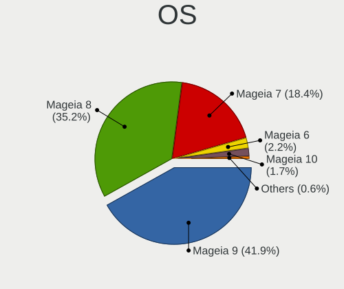

| Name      | Computers | Percent |
|-----------|-----------|---------|
| Mageia 9  | 75        | 41.9%   |
| Mageia 8  | 63        | 35.2%   |
| Mageia 7  | 33        | 18.44%  |
| Mageia 6  | 4         | 2.23%   |
| Mageia 10 | 3         | 1.68%   |
| Mageia 5  | 1         | 0.56%   |

OS Family
---------

OS without a version

| Name   | Computers | Percent |
|--------|-----------|---------|
| Mageia | 164       | 100%    |

Kernel
------

Version of the Linux kernel

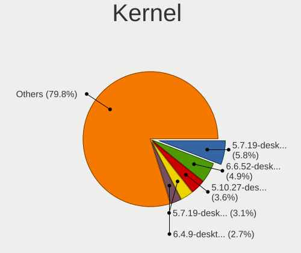

| Version                  | Computers | Percent |
|--------------------------|-----------|---------|
| 5.7.19-desktop-3.mga7    | 13        | 5.83%   |
| 6.6.52-desktop-1.mga9    | 11        | 4.93%   |
| 5.10.27-desktop-1.mga8   | 8         | 3.59%   |
| 5.7.19-desktop-1.mga7    | 7         | 3.14%   |
| 6.4.9-desktop-4.mga9     | 6         | 2.69%   |
| 6.6.18-desktop-1.mga9    | 5         | 2.24%   |
| 5.15.32-desktop-1.mga8   | 5         | 2.24%   |
| 6.6.93-desktop-1.mga9    | 4         | 1.79%   |
| 6.6.28-desktop-1.mga9    | 4         | 1.79%   |
| 6.6.105-desktop-1.mga9   | 4         | 1.79%   |
| 6.5.13-desktop-6.mga9    | 4         | 1.79%   |
| 6.4.16-desktop-3.mga9    | 4         | 1.79%   |
| 5.6.14-desktop-2.mga7    | 4         | 1.79%   |
| 5.5.4-desktop-1.mga7     | 4         | 1.79%   |
| 5.15.23-desktop-1.mga8   | 4         | 1.79%   |
| 5.10.25-desktop-1.mga8   | 4         | 1.79%   |
| 6.6.88-desktop-3.mga9    | 3         | 1.35%   |
| 5.5.9-desktop-1.mga7     | 3         | 1.35%   |
| 5.10.12-desktop-1.mga7   | 3         | 1.35%   |
| 6.6.74-desktop-1.mga9    | 2         | 0.9%    |
| 6.6.61-desktop-1.mga9    | 2         | 0.9%    |
| 6.6.43-desktop-1.mga9    | 2         | 0.9%    |
| 6.6.22-desktop-1.mga9    | 2         | 0.9%    |
| 6.6.14-desktop586-2.mga9 | 2         | 0.9%    |
| 6.6.14-desktop-2.mga9    | 2         | 0.9%    |
| 6.6.116-desktop-1.mga9   | 2         | 0.9%    |
| 6.6.101-desktop-1.mga9   | 2         | 0.9%    |
| 6.4.8-desktop-6.mga9     | 2         | 0.9%    |
| 5.6.6-desktop-1.mga7     | 2         | 0.9%    |
| 5.3.7-desktop-4.mga7     | 2         | 0.9%    |
| 5.17.4-desktop-2.mga8    | 2         | 0.9%    |
| 5.16.10-desktop-2.mga8   | 2         | 0.9%    |
| 5.15.98-desktop-1.mga8   | 2         | 0.9%    |
| 5.15.4-desktop-1.mga8    | 2         | 0.9%    |
| 5.15.35-desktop-2.mga8   | 2         | 0.9%    |
| 5.15.16-desktop-1.mga8   | 2         | 0.9%    |
| 5.15.11-desktop-3.mga8   | 2         | 0.9%    |
| 5.10.60-desktop-2.mga8   | 2         | 0.9%    |
| 5.10.52-desktop-1.mga8   | 2         | 0.9%    |
| 5.10.20-desktop-2.mga7   | 2         | 0.9%    |

Kernel Family
-------------

Linux kernel without a distro release

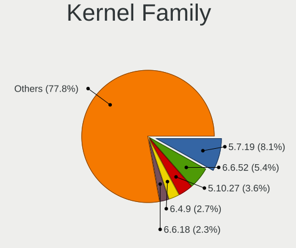

| Version | Computers | Percent |
|---------|-----------|---------|
| 5.7.19  | 18        | 8.14%   |
| 6.6.52  | 12        | 5.43%   |
| 5.10.27 | 8         | 3.62%   |
| 6.4.9   | 6         | 2.71%   |
| 6.6.18  | 5         | 2.26%   |
| 6.5.13  | 5         | 2.26%   |
| 5.15.32 | 5         | 2.26%   |
| 6.6.93  | 4         | 1.81%   |
| 6.6.28  | 4         | 1.81%   |
| 6.6.14  | 4         | 1.81%   |
| 6.6.105 | 4         | 1.81%   |
| 6.4.16  | 4         | 1.81%   |
| 5.6.14  | 4         | 1.81%   |
| 5.5.4   | 4         | 1.81%   |
| 5.15.23 | 4         | 1.81%   |
| 5.10.25 | 4         | 1.81%   |
| 5.10.12 | 4         | 1.81%   |
| 6.6.88  | 3         | 1.36%   |
| 6.6.22  | 3         | 1.36%   |
| 5.5.9   | 3         | 1.36%   |
| 6.6.79  | 2         | 0.9%    |
| 6.6.74  | 2         | 0.9%    |
| 6.6.61  | 2         | 0.9%    |
| 6.6.43  | 2         | 0.9%    |
| 6.6.116 | 2         | 0.9%    |
| 6.6.101 | 2         | 0.9%    |
| 6.4.8   | 2         | 0.9%    |
| 5.6.6   | 2         | 0.9%    |
| 5.3.7   | 2         | 0.9%    |
| 5.17.4  | 2         | 0.9%    |
| 5.16.18 | 2         | 0.9%    |
| 5.16.10 | 2         | 0.9%    |
| 5.15.98 | 2         | 0.9%    |
| 5.15.4  | 2         | 0.9%    |
| 5.15.35 | 2         | 0.9%    |
| 5.15.16 | 2         | 0.9%    |
| 5.15.11 | 2         | 0.9%    |
| 5.10.60 | 2         | 0.9%    |
| 5.10.52 | 2         | 0.9%    |
| 5.10.20 | 2         | 0.9%    |

Kernel Major Ver.
-----------------

Linux kernel major version

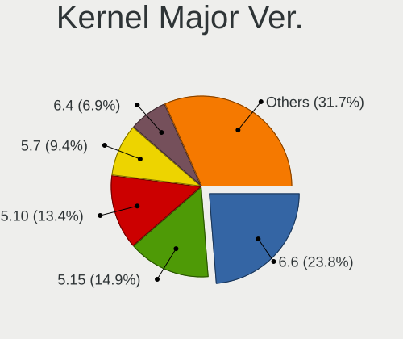

| Version | Computers | Percent |
|---------|-----------|---------|
| 6.6     | 48        | 23.76%  |
| 5.15    | 30        | 14.85%  |
| 5.10    | 27        | 13.37%  |
| 5.7     | 19        | 9.41%   |
| 6.4     | 14        | 6.93%   |
| 5.5     | 8         | 3.96%   |
| 5.6     | 7         | 3.47%   |
| 6.5     | 6         | 2.97%   |
| 6.1     | 5         | 2.48%   |
| 5.9     | 5         | 2.48%   |
| 5.16    | 4         | 1.98%   |
| 4.14    | 3         | 1.49%   |
| 6.2     | 2         | 0.99%   |
| 6.12    | 2         | 0.99%   |
| 5.8     | 2         | 0.99%   |
| 5.4     | 2         | 0.99%   |
| 5.3     | 2         | 0.99%   |
| 5.19    | 2         | 0.99%   |
| 5.17    | 2         | 0.99%   |
| 5.14    | 2         | 0.99%   |
| 6.18    | 1         | 0.5%    |
| 6.15    | 1         | 0.5%    |
| 6.0     | 1         | 0.5%    |
| 5.18    | 1         | 0.5%    |
| 5.13    | 1         | 0.5%    |
| 5.12    | 1         | 0.5%    |
| 5.1     | 1         | 0.5%    |
| 4.9     | 1         | 0.5%    |
| 4.19    | 1         | 0.5%    |
| 4.1     | 1         | 0.5%    |

Arch
----

OS architecture (x86_64, i586, etc.)

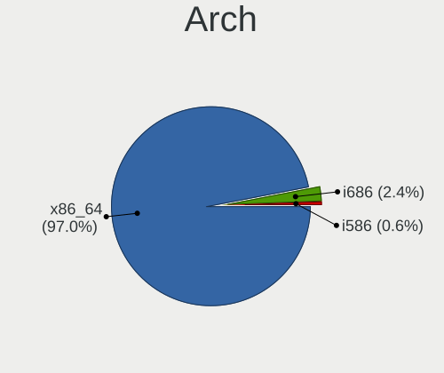

| Name   | Computers | Percent |
|--------|-----------|---------|
| x86_64 | 159       | 96.95%  |
| i686   | 4         | 2.44%   |
| i586   | 1         | 0.61%   |

DE
--

Desktop Environment

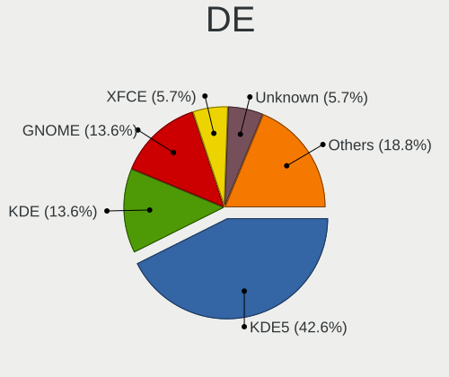

| Name          | Computers | Percent |
|---------------|-----------|---------|
| KDE5          | 75        | 42.61%  |
| KDE           | 24        | 13.64%  |
| GNOME         | 24        | 13.64%  |
| XFCE          | 10        | 5.68%   |
| Unknown       | 10        | 5.68%   |
| LXDE          | 8         | 4.55%   |
| MATE          | 7         | 3.98%   |
| Cinnamon      | 6         | 3.41%   |
| LXQt          | 3         | 1.7%    |
| fluxbox       | 3         | 1.7%    |
| X-Cinnamon    | 2         | 1.14%   |
| GNOME Classic | 2         | 1.14%   |
| KDE6          | 1         | 0.57%   |
| KDE4          | 1         | 0.57%   |

Display Server
--------------

X11 or Wayland

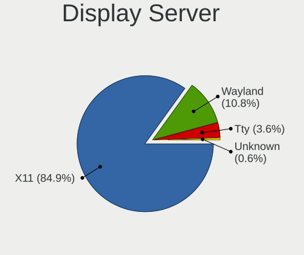

| Name    | Computers | Percent |
|---------|-----------|---------|
| X11     | 141       | 84.94%  |
| Wayland | 18        | 10.84%  |
| Tty     | 6         | 3.61%   |
| Unknown | 1         | 0.6%    |

Display Manager
---------------

SDDM, LightDM, etc.

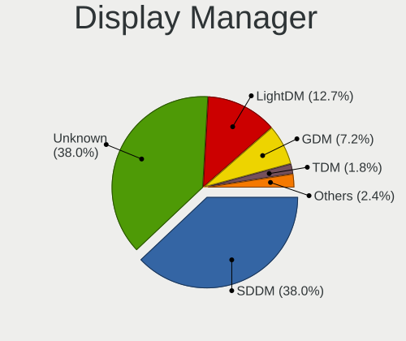

| Name    | Computers | Percent |
|---------|-----------|---------|
| SDDM    | 63        | 37.95%  |
| Unknown | 63        | 37.95%  |
| LightDM | 21        | 12.65%  |
| GDM     | 12        | 7.23%   |
| TDM     | 3         | 1.81%   |
| LXDM    | 3         | 1.81%   |
| XDM     | 1         | 0.6%    |

OS Lang
-------

Language

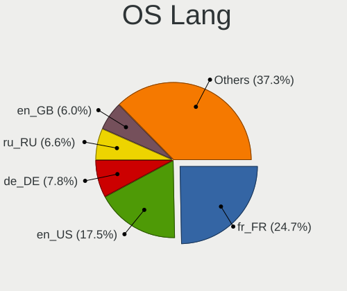

| Lang    | Computers | Percent |
|---------|-----------|---------|
| fr_FR   | 41        | 24.7%   |
| en_US   | 29        | 17.47%  |
| de_DE   | 13        | 7.83%   |
| ru_RU   | 11        | 6.63%   |
| en_GB   | 10        | 6.02%   |
| Unknown | 8         | 4.82%   |
| pt_BR   | 7         | 4.22%   |
| es_PE   | 7         | 4.22%   |
| pl_PL   | 5         | 3.01%   |
| it_IT   | 4         | 2.41%   |
| en_CA   | 3         | 1.81%   |
| sv_SE   | 2         | 1.2%    |
| hu_HU   | 2         | 1.2%    |
| es_MX   | 2         | 1.2%    |
| es_GT   | 2         | 1.2%    |
| es_CO   | 2         | 1.2%    |
| es_AR   | 2         | 1.2%    |
| cs_CZ   | 2         | 1.2%    |
| bg_BG   | 2         | 1.2%    |
| zh_TW   | 1         | 0.6%    |
| th_TH   | 1         | 0.6%    |
| sl_SI   | 1         | 0.6%    |
| sk_SK   | 1         | 0.6%    |
| ro_RO   | 1         | 0.6%    |
| pt_PT   | 1         | 0.6%    |
| fur_IT  | 1         | 0.6%    |
| fr_BE   | 1         | 0.6%    |
| fi_FI   | 1         | 0.6%    |
| es_ES   | 1         | 0.6%    |
| es_CR   | 1         | 0.6%    |
| es_CL   | 1         | 0.6%    |

Boot Mode
---------

EFI or BIOS

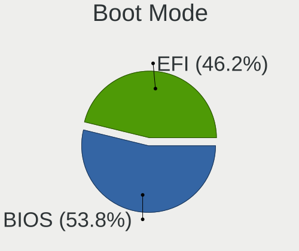

| Mode | Computers | Percent |
|------|-----------|---------|
| BIOS | 92        | 53.8%   |
| EFI  | 79        | 46.2%   |

Filesystem
----------

Type of filesystem

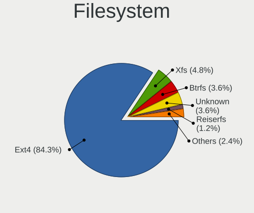

| Type     | Computers | Percent |
|----------|-----------|---------|
| Ext4     | 140       | 84.34%  |
| Xfs      | 8         | 4.82%   |
| Btrfs    | 6         | 3.61%   |
| Unknown  | 6         | 3.61%   |
| Reiserfs | 2         | 1.2%    |
| XXXXX    | 1         | 0.6%    |
| Overlay  | 1         | 0.6%    |
| Jfs      | 1         | 0.6%    |
| Ext3     | 1         | 0.6%    |

Part. scheme
------------

Scheme of partitioning

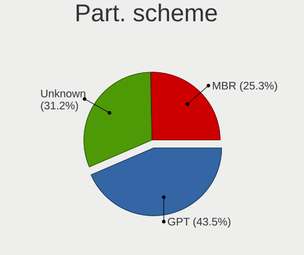

| Type    | Computers | Percent |
|---------|-----------|---------|
| GPT     | 74        | 43.53%  |
| Unknown | 53        | 31.18%  |
| MBR     | 43        | 25.29%  |

Dual Boot with Linux/BSD
------------------------

Hosting more than one Linux/BSD

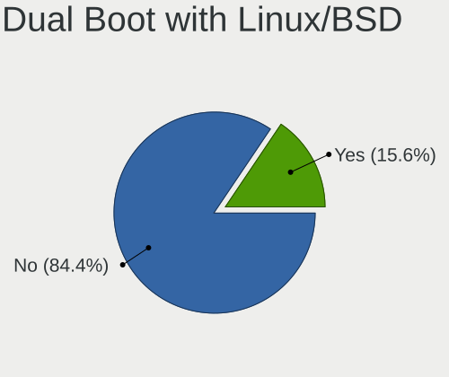

| Dual boot | Computers | Percent |
|-----------|-----------|---------|
| No        | 141       | 84.43%  |
| Yes       | 26        | 15.57%  |

Dual Boot (Win)
---------------

Hosting Linux and Windows

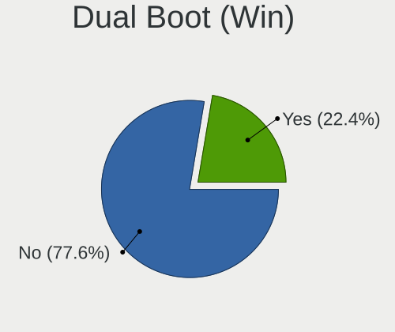

| Dual boot | Computers | Percent |
|-----------|-----------|---------|
| No        | 121       | 72.46%  |
| Yes       | 46        | 27.54%  |

Board
-----

Vendor
------

Motherboard manufacturer

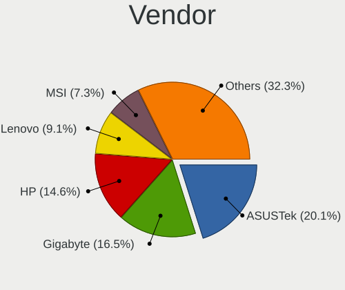

| Name                | Computers | Percent |
|---------------------|-----------|---------|
| ASUSTek Computer    | 33        | 20.12%  |
| Gigabyte Technology | 27        | 16.46%  |
| Hewlett-Packard     | 24        | 14.63%  |
| Lenovo              | 15        | 9.15%   |
| MSI                 | 12        | 7.32%   |
| Dell                | 12        | 7.32%   |
| ASRock              | 9         | 5.49%   |
| Acer                | 6         | 3.66%   |
| Fujitsu             | 4         | 2.44%   |
| Toshiba             | 2         | 1.22%   |
| Notebook            | 2         | 1.22%   |
| Medion              | 2         | 1.22%   |
| Intel               | 2         | 1.22%   |
| Unknown             | 2         | 1.22%   |
| ZOTAC               | 1         | 0.61%   |
| Vorke               | 1         | 0.61%   |
| TUXEDO              | 1         | 0.61%   |
| Schenker            | 1         | 0.61%   |
| OEM                 | 1         | 0.61%   |
| Microsoft           | 1         | 0.61%   |
| Megaware            | 1         | 0.61%   |
| Kiano               | 1         | 0.61%   |
| Insyde              | 1         | 0.61%   |
| Foxconn             | 1         | 0.61%   |
| ECS                 | 1         | 0.61%   |
| Apple               | 1         | 0.61%   |

Model
-----

Motherboard model

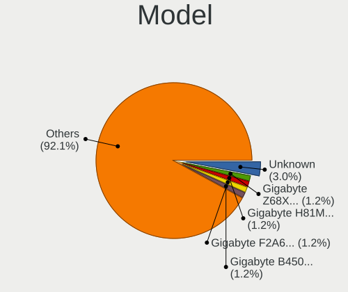

| Name                                     | Computers | Percent |
|------------------------------------------|-----------|---------|
| Unknown                                  | 5         | 3.05%   |
| Gigabyte Z68X-UD3H-B3                    | 2         | 1.22%   |
| Gigabyte H81M-S2H                        | 2         | 1.22%   |
| Gigabyte F2A68HM-H                       | 2         | 1.22%   |
| Gigabyte B450M DS3H                      | 2         | 1.22%   |
| Dell Precision WorkStation T3400         | 2         | 1.22%   |
| ASUS SABERTOOTH 990FX R2.0               | 2         | 1.22%   |
| Vorke V1 Plus                            | 1         | 0.61%   |
| TUXEDO Book XP15 / XP17 Gen12            | 1         | 0.61%   |
| Toshiba Satellite M70                    | 1         | 0.61%   |
| Toshiba dynabook R73/A                   | 1         | 0.61%   |
| Schenker VIA_14_SVI14E20                 | 1         | 0.61%   |
| OEM I42IL1                               | 1         | 0.61%   |
| Notebook NL40_50GU                       | 1         | 0.61%   |
| Notebook NH5x_NH7x_HHx_HJx_HKx           | 1         | 0.61%   |
| MSI PPPPP-CCC#MMMMMMMM                   | 1         | 0.61%   |
| MSI MS-7D74                              | 1         | 0.61%   |
| MSI MS-7D09                              | 1         | 0.61%   |
| MSI MS-7C96                              | 1         | 0.61%   |
| MSI MS-7C89                              | 1         | 0.61%   |
| MSI MS-7C82                              | 1         | 0.61%   |
| MSI MS-7C37                              | 1         | 0.61%   |
| MSI MS-7B31                              | 1         | 0.61%   |
| MSI MS-7B23                              | 1         | 0.61%   |
| MSI MS-7A70                              | 1         | 0.61%   |
| MSI MS-7816                              | 1         | 0.61%   |
| MSI MS-7592                              | 1         | 0.61%   |
| Microsoft Surface Pro 4                  | 1         | 0.61%   |
| Megaware MW-G31T-M7                      | 1         | 0.61%   |
| Medion MD34161/C708                      | 1         | 0.61%   |
| Medion DEFENDER P10                      | 1         | 0.61%   |
| Lenovo Yoga 720-15IKB 80X7               | 1         | 0.61%   |
| Lenovo ThinkPad X1 Carbon 5th 20HQS1741F | 1         | 0.61%   |
| Lenovo ThinkPad T430 2342A19             | 1         | 0.61%   |
| Lenovo ThinkCentre M93p 10A90011UK       | 1         | 0.61%   |
| Lenovo ThinkCentre M92p 2992A7U          | 1         | 0.61%   |
| Lenovo ThinkCentre M58e 7491B1G          | 1         | 0.61%   |
| Lenovo ThinkCentre A57 970274G           | 1         | 0.61%   |
| Lenovo ThinkBook 14 G6+ AHP 21LF         | 1         | 0.61%   |
| Lenovo IdeaPad Slim 3 15AMN8 82XQ        | 1         | 0.61%   |

Model Family
------------

Motherboard model prefix

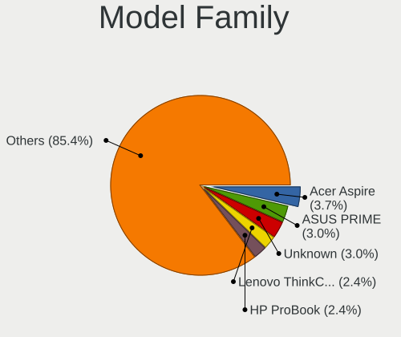

| Name                   | Computers | Percent |
|------------------------|-----------|---------|
| Acer Aspire            | 6         | 3.66%   |
| ASUS PRIME             | 5         | 3.05%   |
| Unknown                | 5         | 3.05%   |
| Lenovo ThinkCentre     | 4         | 2.44%   |
| HP ProBook             | 4         | 2.44%   |
| HP Pavilion            | 4         | 2.44%   |
| Dell Precision         | 4         | 2.44%   |
| Dell Latitude          | 4         | 2.44%   |
| HP Compaq              | 3         | 1.83%   |
| ASUS VivoBook          | 3         | 1.83%   |
| ASUS TUF               | 3         | 1.83%   |
| ASUS SABERTOOTH        | 3         | 1.83%   |
| Lenovo ThinkPad        | 2         | 1.22%   |
| Lenovo IdeaPad         | 2         | 1.22%   |
| HP Laptop              | 2         | 1.22%   |
| Gigabyte Z68X-UD3H-B3  | 2         | 1.22%   |
| Gigabyte X570          | 2         | 1.22%   |
| Gigabyte H81M-S2H      | 2         | 1.22%   |
| Gigabyte GA-78LMT-USB3 | 2         | 1.22%   |
| Gigabyte F2A68HM-H     | 2         | 1.22%   |
| Gigabyte B450M         | 2         | 1.22%   |
| Fujitsu LIFEBOOK       | 2         | 1.22%   |
| Dell OptiPlex          | 2         | 1.22%   |
| ASUS ROG               | 2         | 1.22%   |
| Vorke V1               | 1         | 0.61%   |
| TUXEDO Book            | 1         | 0.61%   |
| Toshiba Satellite      | 1         | 0.61%   |
| Toshiba dynabook       | 1         | 0.61%   |
| Schenker VIA           | 1         | 0.61%   |
| OEM I42IL1             | 1         | 0.61%   |
| Notebook NL40          | 1         | 0.61%   |
| Notebook NH5x          | 1         | 0.61%   |
| MSI PPPPP-CCC#MMMMMMMM | 1         | 0.61%   |
| MSI MS-7D74            | 1         | 0.61%   |
| MSI MS-7D09            | 1         | 0.61%   |
| MSI MS-7C96            | 1         | 0.61%   |
| MSI MS-7C89            | 1         | 0.61%   |
| MSI MS-7C82            | 1         | 0.61%   |
| MSI MS-7C37            | 1         | 0.61%   |
| MSI MS-7B31            | 1         | 0.61%   |

MFG Year
--------

Motherboard manufacture year

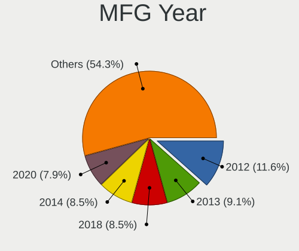

| Year    | Computers | Percent |
|---------|-----------|---------|
| 2012    | 19        | 11.59%  |
| 2013    | 15        | 9.15%   |
| 2018    | 14        | 8.54%   |
| 2014    | 14        | 8.54%   |
| 2020    | 13        | 7.93%   |
| 2019    | 10        | 6.1%    |
| 2016    | 9         | 5.49%   |
| 2011    | 9         | 5.49%   |
| 2010    | 9         | 5.49%   |
| 2017    | 8         | 4.88%   |
| 2008    | 8         | 4.88%   |
| 2021    | 7         | 4.27%   |
| 2022    | 6         | 3.66%   |
| 2009    | 6         | 3.66%   |
| 2024    | 4         | 2.44%   |
| 2015    | 4         | 2.44%   |
| 2007    | 3         | 1.83%   |
| 2023    | 2         | 1.22%   |
| 2006    | 1         | 0.61%   |
| 2005    | 1         | 0.61%   |
| 2002    | 1         | 0.61%   |
| Unknown | 1         | 0.61%   |

Form Factor
-----------

Physical design of the computer

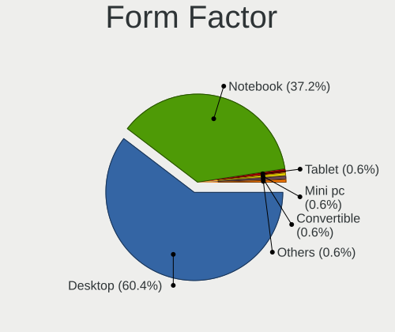

| Name        | Computers | Percent |
|-------------|-----------|---------|
| Desktop     | 99        | 60.37%  |
| Notebook    | 61        | 37.2%   |
| Tablet      | 1         | 0.61%   |
| Convertible | 1         | 0.61%   |
| Mini pc     | 1         | 0.61%   |
| All in one  | 1         | 0.61%   |

Secure Boot
-----------

Enabled or disabled

| State    | Computers | Percent |
|----------|-----------|---------|
| Disabled | 164       | 100%    |

Coreboot
--------

Have coreboot on board

| Used | Computers | Percent |
|------|-----------|---------|
| No   | 164       | 100%    |

RAM Size
--------

Total RAM memory

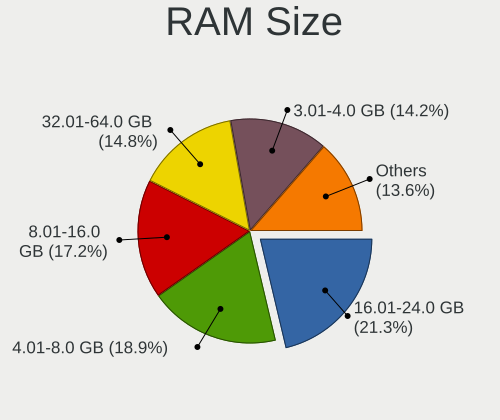

| Size in GB  | Computers | Percent |
|-------------|-----------|---------|
| 16.01-24.0  | 36        | 21.3%   |
| 4.01-8.0    | 32        | 18.93%  |
| 8.01-16.0   | 29        | 17.16%  |
| 32.01-64.0  | 25        | 14.79%  |
| 3.01-4.0    | 24        | 14.2%   |
| 24.01-32.0  | 7         | 4.14%   |
| 64.01-256.0 | 7         | 4.14%   |
| 2.01-3.0    | 4         | 2.37%   |
| 1.01-2.0    | 2         | 1.18%   |
| 0.01-0.5    | 2         | 1.18%   |
| 0.51-1.0    | 1         | 0.59%   |

RAM Used
--------

Used RAM memory

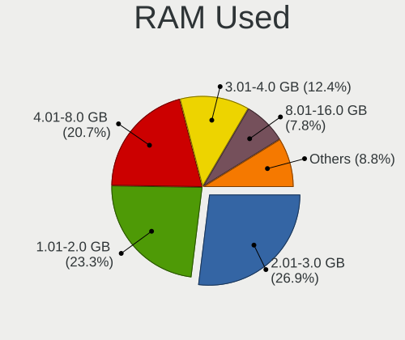

| Used GB    | Computers | Percent |
|------------|-----------|---------|
| 2.01-3.0   | 52        | 26.94%  |
| 1.01-2.0   | 45        | 23.32%  |
| 4.01-8.0   | 40        | 20.73%  |
| 3.01-4.0   | 24        | 12.44%  |
| 8.01-16.0  | 15        | 7.77%   |
| 0.51-1.0   | 10        | 5.18%   |
| 16.01-24.0 | 5         | 2.59%   |
| 0.01-0.5   | 2         | 1.04%   |

Total Drives
------------

Number of drives on board

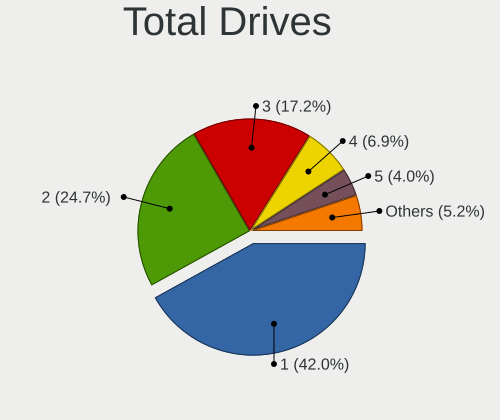

| Drives | Computers | Percent |
|--------|-----------|---------|
| 1      | 73        | 41.95%  |
| 2      | 43        | 24.71%  |
| 3      | 30        | 17.24%  |
| 4      | 12        | 6.9%    |
| 5      | 7         | 4.02%   |
| 7      | 4         | 2.3%    |
| 6      | 3         | 1.72%   |
| 8      | 1         | 0.57%   |
| 0      | 1         | 0.57%   |

Has CD-ROM
----------

Has CD-ROM on board

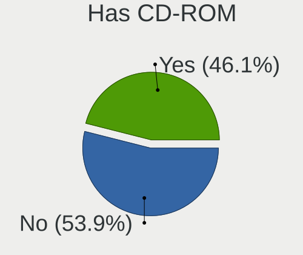

| Presented | Computers | Percent |
|-----------|-----------|---------|
| No        | 89        | 53.94%  |
| Yes       | 76        | 46.06%  |

Has Ethernet
------------

Has Ethernet on board

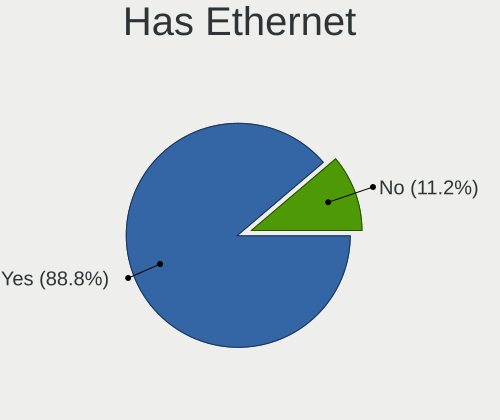

| Presented | Computers | Percent |
|-----------|-----------|---------|
| Yes       | 148       | 90.24%  |
| No        | 16        | 9.76%   |

Has WiFi
--------

Has WiFi module

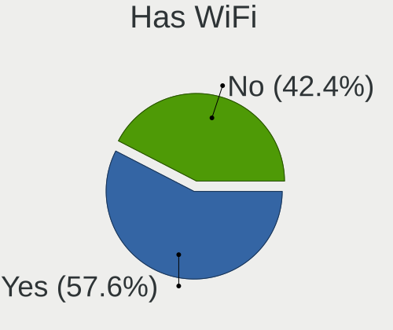

| Presented | Computers | Percent |
|-----------|-----------|---------|
| Yes       | 95        | 57.58%  |
| No        | 70        | 42.42%  |

Has Bluetooth
-------------

Has Bluetooth module

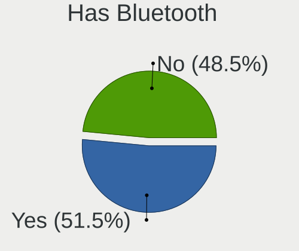

| Presented | Computers | Percent |
|-----------|-----------|---------|
| Yes       | 85        | 51.52%  |
| No        | 80        | 48.48%  |

Location
--------

Country
-------

Geographic location (country)

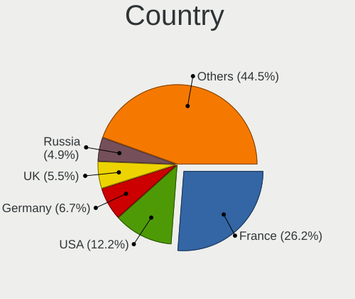

| Country         | Computers | Percent |
|-----------------|-----------|---------|
| France          | 43        | 26.22%  |
| USA             | 20        | 12.2%   |
| Germany         | 11        | 6.71%   |
| UK              | 9         | 5.49%   |
| Russia          | 8         | 4.88%   |
| Peru            | 7         | 4.27%   |
| Brazil          | 7         | 4.27%   |
| Poland          | 5         | 3.05%   |
| Netherlands     | 4         | 2.44%   |
| Italy           | 4         | 2.44%   |
| Canada          | 4         | 2.44%   |
| Ukraine         | 3         | 1.83%   |
| Mexico          | 3         | 1.83%   |
| Colombia        | 3         | 1.83%   |
| Sweden          | 2         | 1.22%   |
| Romania         | 2         | 1.22%   |
| Guatemala       | 2         | 1.22%   |
| Greece          | 2         | 1.22%   |
| Bulgaria        | 2         | 1.22%   |
| Argentina       | 2         | 1.22%   |
| Turkey          | 1         | 0.61%   |
| The Netherlands | 1         | 0.61%   |
| Thailand        | 1         | 0.61%   |
| Taiwan          | 1         | 0.61%   |
| Spain           | 1         | 0.61%   |
| Slovenia        | 1         | 0.61%   |
| Slovakia        | 1         | 0.61%   |
| Portugal        | 1         | 0.61%   |
| Malaysia        | 1         | 0.61%   |
| Luxembourg      | 1         | 0.61%   |
| Kenya           | 1         | 0.61%   |
| Indonesia       | 1         | 0.61%   |
| Hungary         | 1         | 0.61%   |
| Finland         | 1         | 0.61%   |
| Czechia         | 1         | 0.61%   |
| Costa Rica      | 1         | 0.61%   |
| Chile           | 1         | 0.61%   |
| Belgium         | 1         | 0.61%   |
| Belarus         | 1         | 0.61%   |
| Austria         | 1         | 0.61%   |

City
----

Geographic location (city)

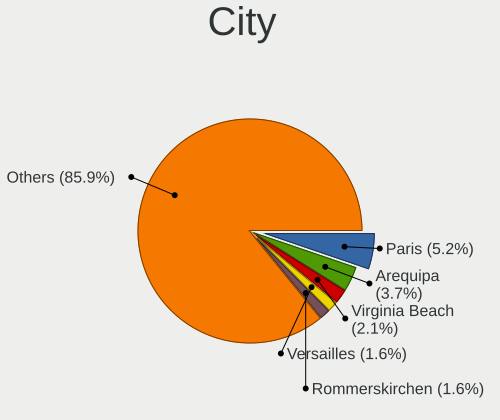

| City            | Computers | Percent |
|-----------------|-----------|---------|
| Paris           | 10        | 5.24%   |
| Arequipa        | 7         | 3.66%   |
| Virginia Beach  | 4         | 2.09%   |
| Versailles      | 3         | 1.57%   |
| Rommerskirchen  | 3         | 1.57%   |
| Mala Danylivka  | 3         | 1.57%   |
| Kharkiv         | 3         | 1.57%   |
| Bogotá         | 3         | 1.57%   |
| Woking          | 2         | 1.05%   |
| Woincourt       | 2         | 1.05%   |
| Waterloo        | 2         | 1.05%   |
| Upper Norwood   | 2         | 1.05%   |
| Strasbourg      | 2         | 1.05%   |
| Sao Paulo       | 2         | 1.05%   |
| Saint-Etienne   | 2         | 1.05%   |
| Oakland         | 2         | 1.05%   |
| Londrina        | 2         | 1.05%   |
| Kirishi         | 2         | 1.05%   |
| Guatemala City  | 2         | 1.05%   |
| Guaratingueta   | 2         | 1.05%   |
| Grants Pass     | 2         | 1.05%   |
| Espaubourg      | 2         | 1.05%   |
| Delft           | 2         | 1.05%   |
| Amsterdam       | 2         | 1.05%   |
| Yakutsk         | 1         | 0.52%   |
| Wroclaw         | 1         | 0.52%   |
| Wiwersheim      | 1         | 0.52%   |
| Warsaw          | 1         | 0.52%   |
| Voronezh        | 1         | 0.52%   |
| Villa Ballester | 1         | 0.52%   |
| Vanves          | 1         | 0.52%   |
| Uzhhorod        | 1         | 0.52%   |
| Tver            | 1         | 0.52%   |
| Turin           | 1         | 0.52%   |
| Tours           | 1         | 0.52%   |
| Toulouse        | 1         | 0.52%   |
| Tijuana         | 1         | 0.52%   |
| Thiais          | 1         | 0.52%   |
| The Hague       | 1         | 0.52%   |
| Surabaya        | 1         | 0.52%   |

Drives
------

Drive Vendor
------------

Hard drive vendors

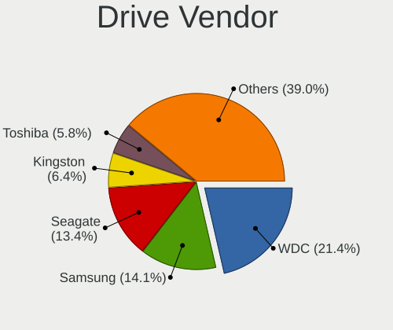

| Vendor                       | Computers | Drives | Percent |
|------------------------------|-----------|--------|---------|
| WDC                          | 67        | 166    | 21.41%  |
| Samsung Electronics          | 44        | 59     | 14.06%  |
| Seagate                      | 42        | 76     | 13.42%  |
| Kingston                     | 20        | 30     | 6.39%   |
| Toshiba                      | 18        | 27     | 5.75%   |
| SanDisk                      | 12        | 18     | 3.83%   |
| Hitachi                      | 11        | 11     | 3.51%   |
| Crucial                      | 11        | 18     | 3.51%   |
| Unknown                      | 8         | 12     | 2.56%   |
| HGST                         | 6         | 12     | 1.92%   |
| PNY                          | 5         | 8      | 1.6%    |
| Intel                        | 5         | 6      | 1.6%    |
| A-DATA Technology            | 5         | 13     | 1.6%    |
| SK hynix                     | 4         | 5      | 1.28%   |
| Phison Electronics           | 4         | 9      | 1.28%   |
| OCZ                          | 3         | 5      | 0.96%   |
| Kingston Technology Company  | 3         | 5      | 0.96%   |
| Verbatim                     | 2         | 3      | 0.64%   |
| Union Memory (Shenzhen)      | 2         | 2      | 0.64%   |
| TO Exter                     | 2         | 2      | 0.64%   |
| SPCC                         | 2         | 4      | 0.64%   |
| Phison                       | 2         | 3      | 0.64%   |
| OCZ-VERTEX                   | 2         | 2      | 0.64%   |
| MAXIO Technology (Hangzhou)  | 2         | 2      | 0.64%   |
| JMicron Technology           | 2         | 2      | 0.64%   |
| GOODRAM                      | 2         | 3      | 0.64%   |
| XPG                          | 1         | 4      | 0.32%   |
| Transcend                    | 1         | 1      | 0.32%   |
| Team                         | 1         | 1      | 0.32%   |
| T-FORCE                      | 1         | 2      | 0.32%   |
| Shenzhen Longsys Electronics | 1         | 1      | 0.32%   |
| SABRENT                      | 1         | 1      | 0.32%   |
| Realtek Semiconductor        | 1         | 1      | 0.32%   |
| PNY CS90                     | 1         | 1      | 0.32%   |
| MSP                          | 1         | 1      | 0.32%   |
| Micron/Crucial Technology    | 1         | 4      | 0.32%   |
| Micron Technology            | 1         | 1      | 0.32%   |
| LITEON                       | 1         | 1      | 0.32%   |
| Lexar 24                     | 1         | 1      | 0.32%   |
| LDLC                         | 1         | 1      | 0.32%   |

Drive Model
-----------

Hard drive models

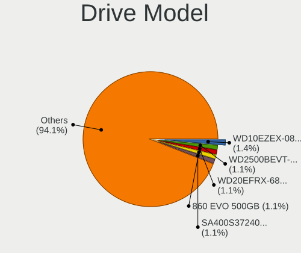

| Model                                              | Computers | Percent |
|----------------------------------------------------|-----------|---------|
| WDC WD10EZEX-08WN4A0 1TB                           | 5         | 1.41%   |
| WDC WD2500BEVT-22ZCT0 250GB                        | 4         | 1.13%   |
| WDC WD20EFRX-68EUZN0 2TB                           | 4         | 1.13%   |
| Samsung SSD 860 EVO 500GB                          | 4         | 1.13%   |
| Kingston SA400S37240G 240GB SSD                    | 4         | 1.13%   |
| WDC WD20EZRZ-00Z5HB0 2TB                           | 3         | 0.85%   |
| WDC WD10EFRX-68PJCN0 1TB                           | 3         | 0.85%   |
| Unknown MMC Card  32GB                             | 3         | 0.85%   |
| Toshiba HDWD110 1TB                                | 3         | 0.85%   |
| Seagate ST500DM002-1BD142 500GB                    | 3         | 0.85%   |
| Seagate ST3500418AS 500GB                          | 3         | 0.85%   |
| Seagate ST32000644NS 2TB                           | 3         | 0.85%   |
| Samsung SSD 860 EVO 250GB                          | 3         | 0.85%   |
| Samsung SSD 850 EVO 500GB                          | 3         | 0.85%   |
| Samsung NVMe SSD Controller PM9A1/PM9A3/980PRO 1TB | 3         | 0.85%   |
| Kingston SV300S37A240G 240GB SSD                   | 3         | 0.85%   |
| Crucial CT500MX500SSD1 500GB                       | 3         | 0.85%   |
| WDC WDS500G2B0A-00SM50 500GB                       | 2         | 0.56%   |
| WDC WDS250G2B0A-00SM50 250GB SSD                   | 2         | 0.56%   |
| WDC WDS240G2G0A-00JH30 240GB SSD                   | 2         | 0.56%   |
| WDC WDS100T2B0A 1TB SSD                            | 2         | 0.56%   |
| WDC WD60EZRZ-00GZ5B1 6TB                           | 2         | 0.56%   |
| WDC WD30EZRZ-00Z5HB0 3TB                           | 2         | 0.56%   |
| WDC WD10EZRZ-00HTKB0 1TB                           | 2         | 0.56%   |
| WDC WD1002FAEX-00Z3A0 1TB                          | 2         | 0.56%   |
| Unknown MMC Card  16GB                             | 2         | 0.56%   |
| Toshiba MQ04ABF100 1TB                             | 2         | 0.56%   |
| Toshiba MQ01ABF050 500GB                           | 2         | 0.56%   |
| Toshiba HDWD120 2TB                                | 2         | 0.56%   |
| Toshiba DT01ACA100 1TB                             | 2         | 0.56%   |
| TO Exter nal USB 3.0 250GB                         | 2         | 0.56%   |
| SPCC Solid State Disk 128GB                        | 2         | 0.56%   |
| Seagate ST4000VN008-2DR166 4TB                     | 2         | 0.56%   |
| Seagate ST2000DM008-2FR102 2TB                     | 2         | 0.56%   |
| Seagate ST1000DM003-1CH162 1TB                     | 2         | 0.56%   |
| SanDisk SDSSDA120G 120GB                           | 2         | 0.56%   |
| SanDisk Extreme SSD 1TB                            | 2         | 0.56%   |
| Samsung SSD 990 PRO with Heatsink 2TB              | 2         | 0.56%   |
| Samsung SSD 870 EVO 500GB                          | 2         | 0.56%   |
| Samsung SSD 870 EVO 1TB                            | 2         | 0.56%   |

HDD Vendor
----------

Hard disk drive vendors

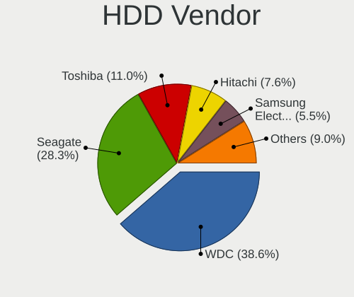

| Vendor              | Computers | Drives | Percent |
|---------------------|-----------|--------|---------|
| WDC                 | 56        | 141    | 38.62%  |
| Seagate             | 41        | 70     | 28.28%  |
| Toshiba             | 16        | 24     | 11.03%  |
| Hitachi             | 11        | 11     | 7.59%   |
| Samsung Electronics | 8         | 12     | 5.52%   |
| HGST                | 6         | 12     | 4.14%   |
| Unknown             | 2         | 2      | 1.38%   |
| TO Exter            | 2         | 2      | 1.38%   |
| JMicron Technology  | 1         | 1      | 0.69%   |
| Hewlett-Packard     | 1         | 1      | 0.69%   |
| Fujitsu             | 1         | 1      | 0.69%   |

SSD Vendor
----------

Solid state drive vendors

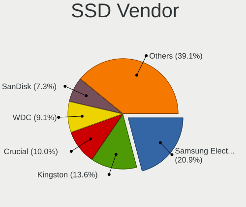

| Vendor              | Computers | Drives | Percent |
|---------------------|-----------|--------|---------|
| Samsung Electronics | 23        | 27     | 20.91%  |
| Kingston            | 15        | 22     | 13.64%  |
| Crucial             | 11        | 18     | 10%     |
| WDC                 | 10        | 23     | 9.09%   |
| SanDisk             | 8         | 10     | 7.27%   |
| PNY                 | 5         | 8      | 4.55%   |
| A-DATA Technology   | 5         | 13     | 4.55%   |
| OCZ                 | 3         | 5      | 2.73%   |
| Intel               | 3         | 3      | 2.73%   |
| Verbatim            | 2         | 3      | 1.82%   |
| SPCC                | 2         | 4      | 1.82%   |
| OCZ-VERTEX          | 2         | 2      | 1.82%   |
| GOODRAM             | 2         | 3      | 1.82%   |
| Transcend           | 1         | 1      | 0.91%   |
| Toshiba             | 1         | 2      | 0.91%   |
| Team                | 1         | 1      | 0.91%   |
| T-FORCE             | 1         | 2      | 0.91%   |
| SK hynix            | 1         | 1      | 0.91%   |
| SABRENT             | 1         | 1      | 0.91%   |
| PNY CS90            | 1         | 1      | 0.91%   |
| LITEON              | 1         | 1      | 0.91%   |
| Lexar 24            | 1         | 1      | 0.91%   |
| LDLC                | 1         | 1      | 0.91%   |
| KingFast            | 1         | 2      | 0.91%   |
| HUSKY               | 1         | 1      | 0.91%   |
| HS-SSD-WAVE(S)      | 1         | 1      | 0.91%   |
| FORESEE             | 1         | 1      | 0.91%   |
| Emtec               | 1         | 1      | 0.91%   |
| Corsair             | 1         | 1      | 0.91%   |
| China               | 1         | 1      | 0.91%   |
| ASMedia             | 1         | 1      | 0.91%   |
| Apacer              | 1         | 1      | 0.91%   |

Drive Kind
----------

HDD or SSD

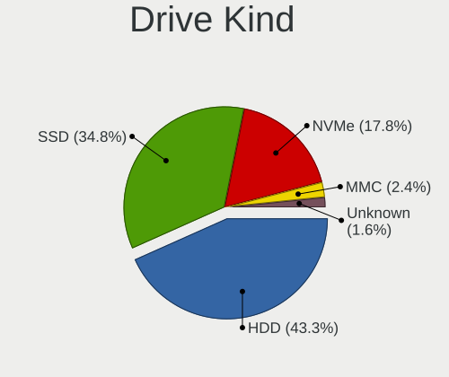

| Kind    | Computers | Drives | Percent |
|---------|-----------|--------|---------|
| HDD     | 107       | 277    | 43.32%  |
| SSD     | 86        | 163    | 34.82%  |
| NVMe    | 44        | 80     | 17.81%  |
| MMC     | 6         | 10     | 2.43%   |
| Unknown | 4         | 9      | 1.62%   |

Drive Connector
---------------

SATA, SAS, NVMe, etc.

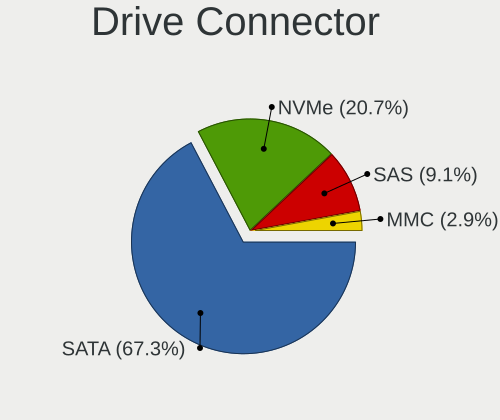

| Type | Computers | Drives | Percent |
|------|-----------|--------|---------|
| SATA | 140       | 418    | 67.31%  |
| NVMe | 43        | 79     | 20.67%  |
| SAS  | 19        | 32     | 9.13%   |
| MMC  | 6         | 10     | 2.88%   |

Drive Size
----------

Size of hard drive

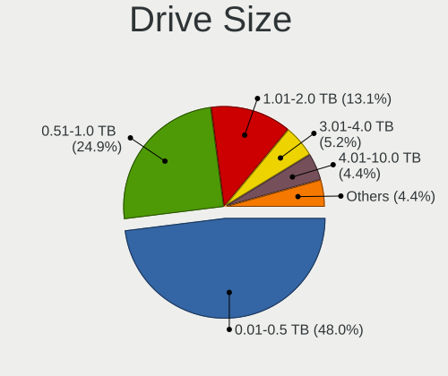

| Size in TB | Computers | Drives | Percent |
|------------|-----------|--------|---------|
| 0.01-0.5   | 110       | 190    | 48.03%  |
| 0.51-1.0   | 57        | 124    | 24.89%  |
| 1.01-2.0   | 30        | 56     | 13.1%   |
| 3.01-4.0   | 12        | 14     | 5.24%   |
| 4.01-10.0  | 10        | 16     | 4.37%   |
| 2.01-3.0   | 8         | 35     | 3.49%   |
| 10.01-20.0 | 2         | 5      | 0.87%   |

Space Total
-----------

Amount of disk space available on the file system

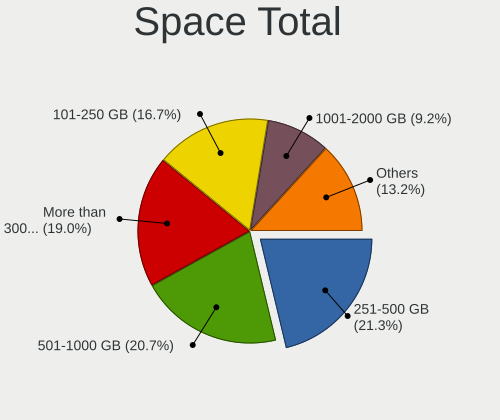

| Size in GB     | Computers | Percent |
|----------------|-----------|---------|
| 251-500        | 37        | 21.26%  |
| 501-1000       | 36        | 20.69%  |
| More than 3000 | 33        | 18.97%  |
| 101-250        | 29        | 16.67%  |
| 1001-2000      | 16        | 9.2%    |
| 2001-3000      | 13        | 7.47%   |
| 51-100         | 6         | 3.45%   |
| 21-50          | 2         | 1.15%   |
| Unknown        | 2         | 1.15%   |

Space Used
----------

Amount of used disk space

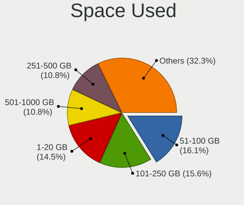

| Used GB        | Computers | Percent |
|----------------|-----------|---------|
| 51-100         | 30        | 16.13%  |
| 101-250        | 29        | 15.59%  |
| 1-20           | 27        | 14.52%  |
| 251-500        | 20        | 10.75%  |
| 501-1000       | 20        | 10.75%  |
| More than 3000 | 18        | 9.68%   |
| 1001-2000      | 18        | 9.68%   |
| 21-50          | 17        | 9.14%   |
| 2001-3000      | 5         | 2.69%   |
| Unknown        | 2         | 1.08%   |

Malfunc. Drives
---------------

Drive models with a malfunction

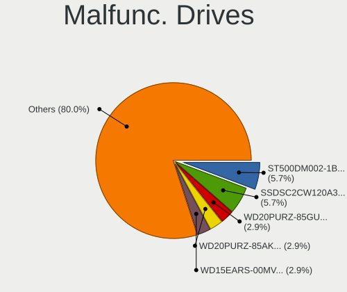

| Model                                                          | Computers | Drives | Percent |
|----------------------------------------------------------------|-----------|--------|---------|
| Seagate ST500DM002-1BD142 500GB                                | 2         | 2      | 5.71%   |
| Intel SSDSC2CW120A3 120GB                                      | 2         | 2      | 5.71%   |
| WDC WD20PURZ-85GU6Y0 2TB                                       | 1         | 1      | 2.86%   |
| WDC WD20PURZ-85AKKY0 2TB                                       | 1         | 1      | 2.86%   |
| WDC WD15EARS-00MVWB0 1TB                                       | 1         | 1      | 2.86%   |
| WDC WD10JPVT-08A1YT2 1TB                                       | 1         | 1      | 2.86%   |
| WDC WD10EZEX-00WN4A0 1TB                                       | 1         | 1      | 2.86%   |
| WDC WD10EARS-00MVWB0 1TB                                       | 1         | 1      | 2.86%   |
| WDC WD1002FAEX-00Z3A0 1TB                                      | 1         | 1      | 2.86%   |
| WDC WD1001FAES-75W7A0 1TB                                      | 1         | 1      | 2.86%   |
| Toshiba MQ01ABD100 1TB                                         | 1         | 1      | 2.86%   |
| SK hynix HFS256G39TND-N210A 256GB SSD                          | 1         | 1      | 2.86%   |
| Seagate ST9250315AS 250GB                                      | 1         | 1      | 2.86%   |
| Seagate ST3500418AS 500GB                                      | 1         | 1      | 2.86%   |
| Seagate ST3320820AS 320GB                                      | 1         | 1      | 2.86%   |
| Seagate ST3250410AS 250GB                                      | 1         | 3      | 2.86%   |
| Seagate ST320LT020-9YG142 320GB                                | 1         | 1      | 2.86%   |
| Seagate ST2000VN004-2E4164 2TB                                 | 1         | 1      | 2.86%   |
| Seagate ST1000LM024 HN-M101MBB 1TB                             | 1         | 1      | 2.86%   |
| Seagate ST1000DM003-1CH162 1TB                                 | 1         | 1      | 2.86%   |
| Samsung Electronics SSD 870 EVO 2TB                            | 1         | 1      | 2.86%   |
| Samsung Electronics NVMe SSD Controller PM9A1/PM9A3/980PRO 1TB | 1         | 1      | 2.86%   |
| Samsung Electronics HD400LD 400GB                              | 1         | 1      | 2.86%   |
| OCZ VERTEX3 120GB SSD                                          | 1         | 1      | 2.86%   |
| OCZ VECTOR150 120GB SSD                                        | 1         | 1      | 2.86%   |
| LITEON IT SCS-256L9S 256GB SSD                                 | 1         | 1      | 2.86%   |
| Kingston SA400S37240G 240GB SSD                                | 1         | 1      | 2.86%   |
| Hitachi HTS725050A9A364 500GB                                  | 1         | 1      | 2.86%   |
| Hitachi HTS542525K9A300 250GB                                  | 1         | 1      | 2.86%   |
| HGST HTS725050A7E630 500GB                                     | 1         | 1      | 2.86%   |
| Fujitsu MHZ2160BH G2 160GB                                     | 1         | 1      | 2.86%   |
| Crucial CT250MX500SSD1 250GB                                   | 1         | 1      | 2.86%   |
| A-DATA Technology SU630 240GB SSD                              | 1         | 1      | 2.86%   |

Malfunc. Drive Vendor
---------------------

Vendors of faulty drives

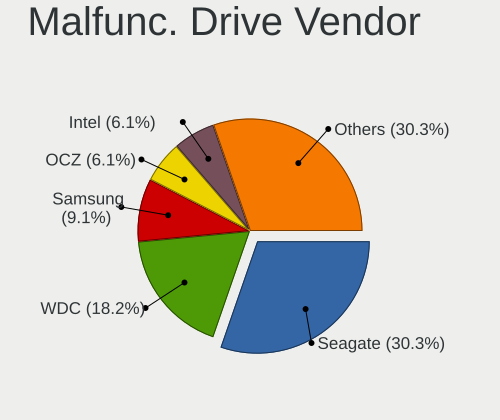

| Vendor              | Computers | Drives | Percent |
|---------------------|-----------|--------|---------|
| Seagate             | 10        | 12     | 30.3%   |
| WDC                 | 6         | 8      | 18.18%  |
| Samsung Electronics | 3         | 3      | 9.09%   |
| OCZ                 | 2         | 2      | 6.06%   |
| Intel               | 2         | 2      | 6.06%   |
| Hitachi             | 2         | 2      | 6.06%   |
| Toshiba             | 1         | 1      | 3.03%   |
| SK hynix            | 1         | 1      | 3.03%   |
| LITEON              | 1         | 1      | 3.03%   |
| Kingston            | 1         | 1      | 3.03%   |
| HGST                | 1         | 1      | 3.03%   |
| Fujitsu             | 1         | 1      | 3.03%   |
| Crucial             | 1         | 1      | 3.03%   |
| A-DATA Technology   | 1         | 1      | 3.03%   |

Malfunc. HDD Vendor
-------------------

Vendors of faulty HDD drives

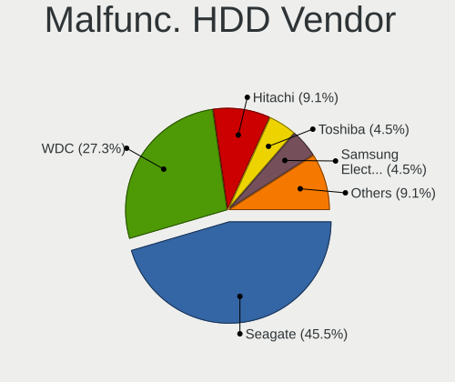

| Vendor              | Computers | Drives | Percent |
|---------------------|-----------|--------|---------|
| Seagate             | 10        | 12     | 45.45%  |
| WDC                 | 6         | 8      | 27.27%  |
| Hitachi             | 2         | 2      | 9.09%   |
| Toshiba             | 1         | 1      | 4.55%   |
| Samsung Electronics | 1         | 1      | 4.55%   |
| HGST                | 1         | 1      | 4.55%   |
| Fujitsu             | 1         | 1      | 4.55%   |

Malfunc. Drive Kind
-------------------

Kinds of faulty drives

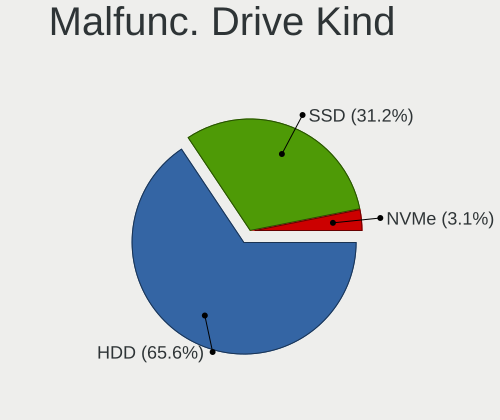

| Kind | Computers | Drives | Percent |
|------|-----------|--------|---------|
| HDD  | 21        | 26     | 65.63%  |
| SSD  | 10        | 10     | 31.25%  |
| NVMe | 1         | 1      | 3.13%   |

Failed Drives
-------------

Failed drive models

Zero info for selected period =(

Failed Drive Vendor
-------------------

Failed drive vendors

Zero info for selected period =(

Drive Status
------------

Number of failed and malfunc. drives

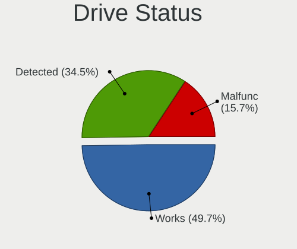

| Status   | Computers | Drives | Percent |
|----------|-----------|--------|---------|
| Works    | 98        | 263    | 49.75%  |
| Detected | 68        | 239    | 34.52%  |
| Malfunc  | 31        | 37     | 15.74%  |

Storage controller
------------------

Storage Vendor
--------------

Storage controller vendors

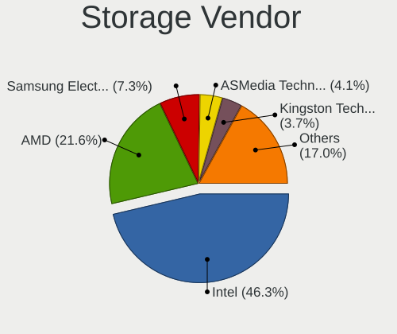

| Vendor                                  | Computers | Percent |
|-----------------------------------------|-----------|---------|
| Intel                                   | 101       | 46.33%  |
| AMD                                     | 47        | 21.56%  |
| Samsung Electronics                     | 16        | 7.34%   |
| ASMedia Technology                      | 9         | 4.13%   |
| Kingston Technology Company             | 8         | 3.67%   |
| Phison Electronics                      | 7         | 3.21%   |
| Marvell Technology Group                | 7         | 3.21%   |
| SanDisk                                 | 6         | 2.75%   |
| SK hynix                                | 3         | 1.38%   |
| Nvidia                                  | 2         | 0.92%   |
| MAXIO Technology (Hangzhou)             | 2         | 0.92%   |
| Toshiba America Info Systems            | 1         | 0.46%   |
| Silicon Image                           | 1         | 0.46%   |
| Shenzhen Unionmemory Information System | 1         | 0.46%   |
| Shenzhen Longsys Electronics            | 1         | 0.46%   |
| Realtek Semiconductor                   | 1         | 0.46%   |
| Micron/Crucial Technology               | 1         | 0.46%   |
| Micron Technology                       | 1         | 0.46%   |
| JMicron Technology                      | 1         | 0.46%   |
| Broadcom                                | 1         | 0.46%   |
| ADATA Technology                        | 1         | 0.46%   |

Storage Model
-------------

Storage controller models

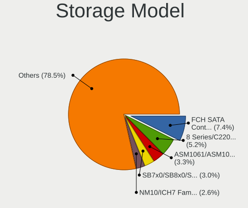

| Model                                                                                   | Computers | Percent |
|-----------------------------------------------------------------------------------------|-----------|---------|
| AMD FCH SATA Controller [AHCI mode]                                                     | 20        | 7.41%   |
| Intel 8 Series/C220 Series Chipset Family 6-port SATA Controller 1 [AHCI mode]          | 14        | 5.19%   |
| ASMedia ASM1061/ASM1062 Serial ATA Controller                                           | 9         | 3.33%   |
| AMD SB7x0/SB8x0/SB9x0 SATA Controller [AHCI mode]                                       | 8         | 2.96%   |
| Intel NM10/ICH7 Family SATA Controller [IDE mode]                                       | 7         | 2.59%   |
| Intel 82801G (ICH7 Family) IDE Controller                                               | 7         | 2.59%   |
| AMD SB7x0/SB8x0/SB9x0 IDE Controller                                                    | 7         | 2.59%   |
| Intel Sunrise Point-LP SATA Controller [AHCI mode]                                      | 6         | 2.22%   |
| AMD 500 Series Chipset SATA Controller                                                  | 6         | 2.22%   |
| AMD 400 Series Chipset SATA Controller                                                  | 6         | 2.22%   |
| Intel Volume Management Device NVMe RAID Controller                                     | 5         | 1.85%   |
| Intel Q170/Q150/B150/H170/H110/Z170/CM236 Chipset SATA Controller [AHCI Mode]           | 5         | 1.85%   |
| Intel 400 Series Chipset Family SATA AHCI Controller                                    | 5         | 1.85%   |
| Samsung NVMe SSD Controller 980 (DRAM-less)                                             | 4         | 1.48%   |
| Marvell Group 88SE9230 PCIe 2.0 x2 4-port SATA 6 Gb/s RAID Controller                   | 4         | 1.48%   |
| Marvell Group 88SE9172 SATA 6Gb/s Controller                                            | 4         | 1.48%   |
| Intel SATA Controller [RAID Mode]                                                       | 4         | 1.48%   |
| Intel 7 Series Chipset Family 6-port SATA Controller [AHCI mode]                        | 4         | 1.48%   |
| Intel 6 Series/C200 Series Chipset Family 6 port Mobile SATA AHCI Controller            | 4         | 1.48%   |
| Intel 6 Series/C200 Series Chipset Family 6 port Desktop SATA AHCI Controller           | 4         | 1.48%   |
| SanDisk Extreme Pro / WD Black 2018/SN750/PC SN720 NVMe SSD                             | 3         | 1.11%   |
| Samsung NVMe SSD Controller SM961/PM961/SM963                                           | 3         | 1.11%   |
| Samsung NVMe SSD Controller S4LV008[Pascal]                                             | 3         | 1.11%   |
| Samsung NVMe SSD Controller PM9A1/PM9A3/980PRO                                          | 3         | 1.11%   |
| Phison E12 NVMe Controller                                                              | 3         | 1.11%   |
| Kingston Company A2000 NVMe SSD [SM2263EN]                                              | 3         | 1.11%   |
| Intel 8 Series SATA Controller 1 [AHCI mode]                                            | 3         | 1.11%   |
| Intel 6 Series/C200 Series Chipset Family Desktop SATA Controller (IDE mode, ports 4-5) | 3         | 1.11%   |
| Intel 6 Series/C200 Series Chipset Family Desktop SATA Controller (IDE mode, ports 0-3) | 3         | 1.11%   |
| Intel 5 Series/3400 Series Chipset 4 port SATA AHCI Controller                          | 3         | 1.11%   |
| AMD SB7x0/SB8x0/SB9x0 SATA Controller [IDE mode]                                        | 3         | 1.11%   |
| AMD SB600 Non-Raid-5 SATA                                                               | 3         | 1.11%   |
| AMD SB600 IDE                                                                           | 3         | 1.11%   |
| AMD FCH SATA Controller [IDE mode]                                                      | 3         | 1.11%   |
| AMD 600 Series Chipset SATA Controller                                                  | 3         | 1.11%   |
| Samsung NVMe SSD Controller SM981/PM981/PM983                                           | 2         | 0.74%   |
| Phison E16 PCIe4 NVMe Controller                                                        | 2         | 0.74%   |
| Kingston Company NV1 NVMe SSD [SM2263XT] (DRAM-less)                                    | 2         | 0.74%   |
| Intel Cannon Lake PCH SATA AHCI Controller                                              | 2         | 0.74%   |
| Intel C602 chipset 4-Port SATA Storage Control Unit                                     | 2         | 0.74%   |

Storage Kind
------------

Kind of storage controller (IDE, SATA, NVMe, SAS, ...)

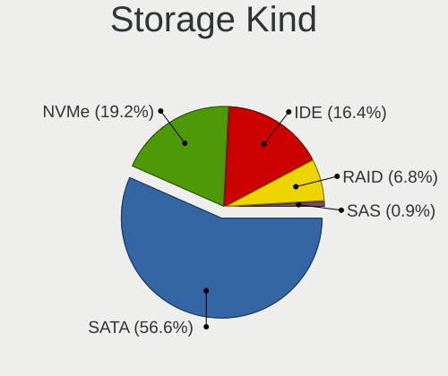

| Kind | Computers | Percent |
|------|-----------|---------|
| SATA | 124       | 56.62%  |
| NVMe | 42        | 19.18%  |
| IDE  | 36        | 16.44%  |
| RAID | 15        | 6.85%   |
| SAS  | 2         | 0.91%   |

Processor
---------

CPU Vendor
----------

Processor vendors

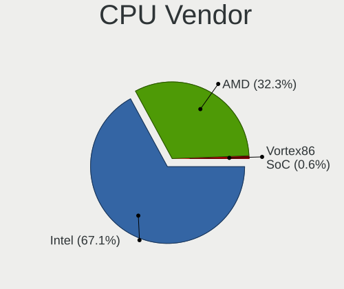

| Vendor       | Computers | Percent |
|--------------|-----------|---------|
| Intel        | 110       | 67.07%  |
| AMD          | 53        | 32.32%  |
| Vortex86 SoC | 1         | 0.61%   |

CPU Model
---------

Processor models

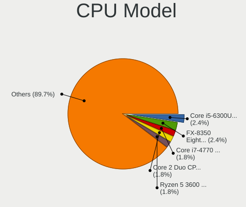

| Model                                       | Computers | Percent |
|---------------------------------------------|-----------|---------|
| Intel Core i5-6300U CPU @ 2.40GHz           | 4         | 2.42%   |
| AMD FX-8350 Eight-Core Processor            | 4         | 2.42%   |
| Intel Core i7-4770 CPU @ 3.40GHz            | 3         | 1.82%   |
| Intel Core 2 Duo CPU E8400 @ 3.00GHz        | 3         | 1.82%   |
| AMD Ryzen 5 3600 6-Core Processor           | 3         | 1.82%   |
| Intel Pentium Dual-Core CPU E5200 @ 2.50GHz | 2         | 1.21%   |
| Intel Core i7-4510U CPU @ 2.00GHz           | 2         | 1.21%   |
| Intel Core i7-3770 CPU @ 3.40GHz            | 2         | 1.21%   |
| Intel Core i7-2600K CPU @ 3.40GHz           | 2         | 1.21%   |
| Intel Core i5-8400 CPU @ 2.80GHz            | 2         | 1.21%   |
| Intel Core i5-4200M CPU @ 2.50GHz           | 2         | 1.21%   |
| Intel Core i5-3210M CPU @ 2.50GHz           | 2         | 1.21%   |
| Intel Core i3-4130 CPU @ 3.40GHz            | 2         | 1.21%   |
| Intel Core 2 Duo CPU E7300 @ 2.66GHz        | 2         | 1.21%   |
| AMD Turion 64 X2 Mobile Technology TL-60    | 2         | 1.21%   |
| AMD Ryzen 7 3700X 8-Core Processor          | 2         | 1.21%   |
| AMD Ryzen 5 5600G with Radeon Graphics      | 2         | 1.21%   |
| AMD Ryzen 5 2400G with Radeon Vega Graphics | 2         | 1.21%   |
| Vortex86 SoC Vortex86DX                     | 1         | 0.61%   |
| Intel Xeon CPU E5-1650 0 @ 3.20GHz          | 1         | 0.61%   |
| Intel Xeon CPU E5-1620 v3 @ 3.50GHz         | 1         | 0.61%   |
| Intel Xeon CPU E5-1620 v2 @ 3.70GHz         | 1         | 0.61%   |
| Intel Pentium Silver N5000 CPU @ 1.10GHz    | 1         | 0.61%   |
| Intel Pentium M processor 1.73GHz           | 1         | 0.61%   |
| Intel Pentium III (Coppermine)              | 1         | 0.61%   |
| Intel Pentium Gold G6400 CPU @ 4.00GHz      | 1         | 0.61%   |
| Intel Pentium Dual-Core CPU E5400 @ 2.70GHz | 1         | 0.61%   |
| Intel Pentium CPU P6200 @ 2.13GHz           | 1         | 0.61%   |
| Intel Pentium CPU P6100 @ 2.00GHz           | 1         | 0.61%   |
| Intel Pentium CPU G3450 @ 3.40GHz           | 1         | 0.61%   |
| Intel Pentium CPU G3260 @ 3.30GHz           | 1         | 0.61%   |
| Intel Core m5-6Y57 CPU @ 1.10GHz            | 1         | 0.61%   |
| Intel Core i7-8850H CPU @ 2.60GHz           | 1         | 0.61%   |
| Intel Core i7-8700 CPU @ 3.20GHz            | 1         | 0.61%   |
| Intel Core i7-8565U CPU @ 1.80GHz           | 1         | 0.61%   |
| Intel Core i7-7700HQ CPU @ 2.80GHz          | 1         | 0.61%   |
| Intel Core i7-7700 CPU @ 3.60GHz            | 1         | 0.61%   |
| Intel Core i7-7600U CPU @ 2.80GHz           | 1         | 0.61%   |
| Intel Core i7-7500U CPU @ 2.70GHz           | 1         | 0.61%   |
| Intel Core i7-4790K CPU @ 4.00GHz           | 1         | 0.61%   |

CPU Model Family
----------------

Processor model prefix

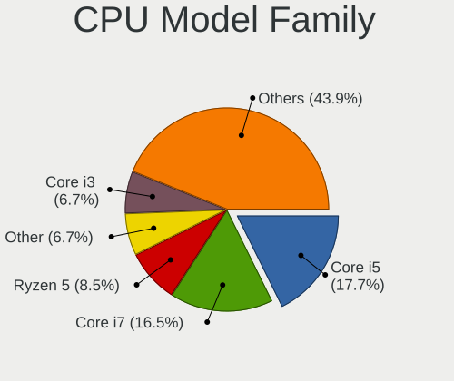

| Model                   | Computers | Percent |
|-------------------------|-----------|---------|
| Intel Core i5           | 29        | 17.68%  |
| Intel Core i7           | 27        | 16.46%  |
| AMD Ryzen 5             | 14        | 8.54%   |
| Other                   | 11        | 6.71%   |
| Intel Core i3           | 11        | 6.71%   |
| Intel Core 2 Duo        | 9         | 5.49%   |
| AMD Ryzen 7             | 7         | 4.27%   |
| AMD FX                  | 7         | 4.27%   |
| Intel Pentium           | 4         | 2.44%   |
| Intel Atom              | 4         | 2.44%   |
| AMD Ryzen 3             | 4         | 2.44%   |
| Intel Xeon              | 3         | 1.83%   |
| Intel Pentium Dual-Core | 3         | 1.83%   |
| Intel Celeron           | 3         | 1.83%   |
| AMD Ryzen 9             | 3         | 1.83%   |
| AMD A10                 | 3         | 1.83%   |
| AMD Turion 64 X2 Mobile | 2         | 1.22%   |
| AMD Ryzen Threadripper  | 2         | 1.22%   |
| AMD A8                  | 2         | 1.22%   |
| Intel Pentium Silver    | 1         | 0.61%   |
| Intel Pentium M         | 1         | 0.61%   |
| Intel Pentium III       | 1         | 0.61%   |
| Intel Pentium Gold      | 1         | 0.61%   |
| Intel Core m5           | 1         | 0.61%   |
| Intel Core 2 Quad       | 1         | 0.61%   |
| Intel Core 2            | 1         | 0.61%   |
| AMD Phenom II X6        | 1         | 0.61%   |
| AMD Phenom II X4        | 1         | 0.61%   |
| AMD Phenom II           | 1         | 0.61%   |
| AMD Phenom              | 1         | 0.61%   |
| AMD E                   | 1         | 0.61%   |
| AMD Athlon X2           | 1         | 0.61%   |
| AMD Athlon II X3        | 1         | 0.61%   |
| AMD Athlon 64 X2        | 1         | 0.61%   |
| AMD A6                  | 1         | 0.61%   |

CPU Cores
---------

Number of processor cores

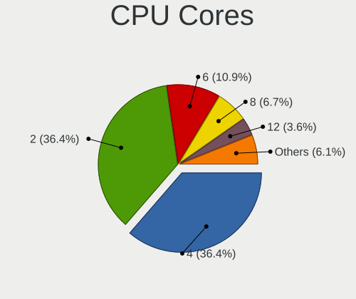

| Number | Computers | Percent |
|--------|-----------|---------|
| 4      | 60        | 36.36%  |
| 2      | 60        | 36.36%  |
| 6      | 18        | 10.91%  |
| 8      | 11        | 6.67%   |
| 12     | 6         | 3.64%   |
| 1      | 4         | 2.42%   |
| 3      | 2         | 1.21%   |
| 32     | 1         | 0.61%   |
| 16     | 1         | 0.61%   |
| 14     | 1         | 0.61%   |
| 10     | 1         | 0.61%   |

CPU Sockets
-----------

Number of sockets

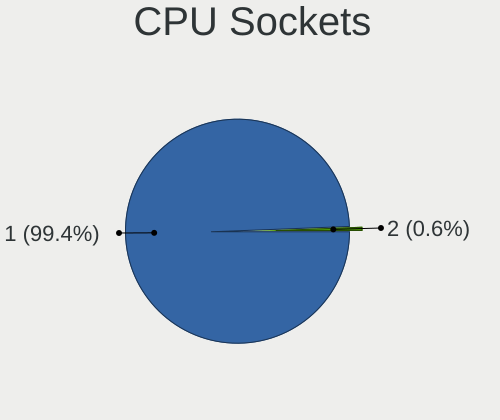

| Number | Computers | Percent |
|--------|-----------|---------|
| 1      | 163       | 99.39%  |
| 2      | 1         | 0.61%   |

CPU Threads
-----------

Threads per core (Hyper-Threading)

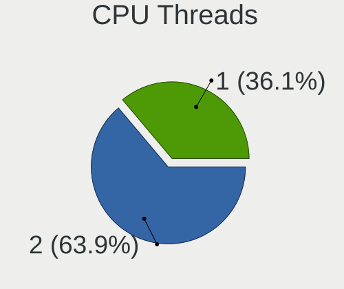

| Number | Computers | Percent |
|--------|-----------|---------|
| 2      | 110       | 67.07%  |
| 1      | 54        | 32.93%  |

CPU Op-Modes
------------

CPU Operation Modes (32-bit, 64-bit)

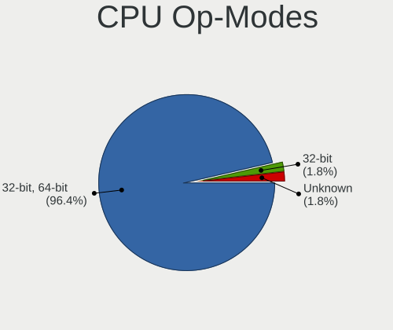

| Op mode        | Computers | Percent |
|----------------|-----------|---------|
| 32-bit, 64-bit | 160       | 96.39%  |
| 32-bit         | 3         | 1.81%   |
| Unknown        | 3         | 1.81%   |

CPU Microcode
-------------

Microcode number

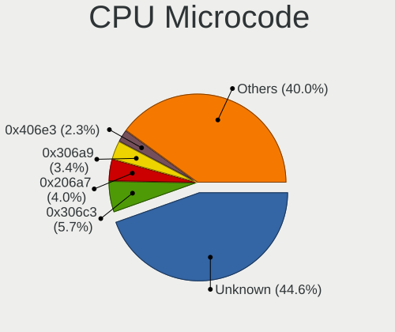

| Number     | Computers | Percent |
|------------|-----------|---------|
| Unknown    | 78        | 44.57%  |
| 0x306c3    | 10        | 5.71%   |
| 0x206a7    | 7         | 4%      |
| 0x306a9    | 6         | 3.43%   |
| 0x406e3    | 4         | 2.29%   |
| 0x1067a    | 4         | 2.29%   |
| 0x06000852 | 4         | 2.29%   |
| 0x806e9    | 3         | 1.71%   |
| 0x08701021 | 3         | 1.71%   |
| 0x08108109 | 3         | 1.71%   |
| 0x010000c8 | 3         | 1.71%   |
| 0x906ea    | 2         | 1.14%   |
| 0x906e9    | 2         | 1.14%   |
| 0x40651    | 2         | 1.14%   |
| 0x0a50000d | 2         | 1.14%   |
| 0x08701030 | 2         | 1.14%   |
| 0x08701013 | 2         | 1.14%   |
| 0x0800820d | 2         | 1.14%   |
| 0x06001119 | 2         | 1.14%   |
| 0xa0671    | 1         | 0.57%   |
| 0xa0653    | 1         | 0.57%   |
| 0xa0652    | 1         | 0.57%   |
| 0x906eb    | 1         | 0.57%   |
| 0x806ec    | 1         | 0.57%   |
| 0x806eb    | 1         | 0.57%   |
| 0x706a1    | 1         | 0.57%   |
| 0x6fb      | 1         | 0.57%   |
| 0x6f6      | 1         | 0.57%   |
| 0x686      | 1         | 0.57%   |
| 0x506e3    | 1         | 0.57%   |
| 0x506c9    | 1         | 0.57%   |
| 0x406c4    | 1         | 0.57%   |
| 0x306f2    | 1         | 0.57%   |
| 0x306e4    | 1         | 0.57%   |
| 0x206d7    | 1         | 0.57%   |
| 0x20655    | 1         | 0.57%   |
| 0x10676    | 1         | 0.57%   |
| 0x0a601206 | 1         | 0.57%   |
| 0x0a50000f | 1         | 0.57%   |
| 0x0a201025 | 1         | 0.57%   |

CPU Microarch
-------------

Microarchitecture

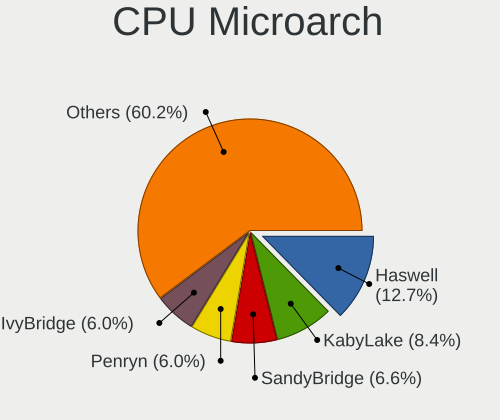

| Name             | Computers | Percent |
|------------------|-----------|---------|
| Haswell          | 21        | 12.65%  |
| KabyLake         | 14        | 8.43%   |
| SandyBridge      | 11        | 6.63%   |
| Penryn           | 10        | 6.02%   |
| IvyBridge        | 10        | 6.02%   |
| Zen 2            | 9         | 5.42%   |
| Skylake          | 9         | 5.42%   |
| Piledriver       | 9         | 5.42%   |
| Unknown          | 8         | 4.82%   |
| Zen+             | 7         | 4.22%   |
| Zen 3            | 7         | 4.22%   |
| Alderlake Hybrid | 6         | 3.61%   |
| Westmere         | 5         | 3.01%   |
| K10              | 5         | 3.01%   |
| CometLake        | 5         | 3.01%   |
| Silvermont       | 4         | 2.41%   |
| Core             | 4         | 2.41%   |
| Zen              | 3         | 1.81%   |
| K8 Hammer        | 3         | 1.81%   |
| IceLake          | 3         | 1.81%   |
| TigerLake        | 2         | 1.2%    |
| P6               | 2         | 1.2%    |
| Excavator        | 2         | 1.2%    |
| Steamroller      | 1         | 0.6%    |
| K10 Llano        | 1         | 0.6%    |
| Goldmont plus    | 1         | 0.6%    |
| Goldmont         | 1         | 0.6%    |
| Bulldozer        | 1         | 0.6%    |
| Bonnell          | 1         | 0.6%    |
| Bobcat           | 1         | 0.6%    |

Graphics
--------

GPU Vendor
----------

Vendors of graphics cards

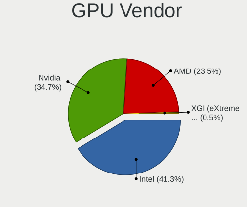

| Vendor                                       | Computers | Percent |
|----------------------------------------------|-----------|---------|
| Intel                                        | 81        | 41.33%  |
| Nvidia                                       | 68        | 34.69%  |
| AMD                                          | 46        | 23.47%  |
| XGI Technology (eXtreme Graphics Innovation) | 1         | 0.51%   |

GPU Model
---------

Graphics card models

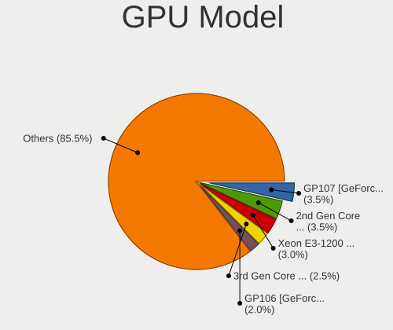

| Model                                                                       | Computers | Percent |
|-----------------------------------------------------------------------------|-----------|---------|
| Nvidia GP107 [GeForce GTX 1050 Ti]                                          | 7         | 3.5%    |
| Intel 2nd Generation Core Processor Family Integrated Graphics Controller   | 7         | 3.5%    |
| Intel Xeon E3-1200 v3/4th Gen Core Processor Integrated Graphics Controller | 6         | 3%      |
| Intel 3rd Gen Core processor Graphics Controller                            | 5         | 2.5%    |
| Nvidia GP106 [GeForce GTX 1060 6GB]                                         | 4         | 2%      |
| Nvidia GK208B [GeForce GT 710]                                              | 4         | 2%      |
| Nvidia GF108 [GeForce GT 430]                                               | 4         | 2%      |
| Intel Skylake-U GT2 [HD Graphics 520]                                       | 4         | 2%      |
| Intel Core Processor Integrated Graphics Controller                         | 4         | 2%      |
| Nvidia GK208B [GeForce GT 730]                                              | 3         | 1.5%    |
| Intel Haswell-ULT Integrated Graphics Controller                            | 3         | 1.5%    |
| Intel CoffeeLake-S GT2 [UHD Graphics 630]                                   | 3         | 1.5%    |
| Intel Atom Processor Z36xxx/Z37xxx Series Graphics & Display                | 3         | 1.5%    |
| Intel 4th Generation Core Processor Family Integrated Graphics Controller   | 3         | 1.5%    |
| Intel 4th Gen Core Processor Integrated Graphics Controller                 | 3         | 1.5%    |
| AMD RV620 LE [Radeon HD 3450]                                               | 3         | 1.5%    |
| AMD Picasso/Raven 2 [Radeon Vega Series / Radeon Vega Mobile Series]        | 3         | 1.5%    |
| AMD Cezanne [Radeon Vega Series / Radeon Vega Mobile Series]                | 3         | 1.5%    |
| Nvidia GP108 [GeForce GT 1030]                                              | 2         | 1%      |
| Nvidia GP104 [GeForce GTX 1070]                                             | 2         | 1%      |
| Nvidia GM108M [GeForce 840M]                                                | 2         | 1%      |
| Nvidia GK208 [GeForce GT 710]                                               | 2         | 1%      |
| Nvidia GK107 [GeForce GT 640]                                               | 2         | 1%      |
| Nvidia GF119 [GeForce GT 610]                                               | 2         | 1%      |
| Intel TigerLake-LP GT2 [Iris Xe Graphics]                                   | 2         | 1%      |
| Intel Mobile 4 Series Chipset Integrated Graphics Controller                | 2         | 1%      |
| Intel Kaby Lake-U GT2 [HD Graphics 620]                                     | 2         | 1%      |
| Intel CometLake-S GT2 [UHD Graphics 630]                                    | 2         | 1%      |
| Intel CometLake-H GT2 [UHD Graphics]                                        | 2         | 1%      |
| Intel Alder Lake-S GT1 [UHD Graphics 770]                                   | 2         | 1%      |
| Intel 82G33/G31 Express Integrated Graphics Controller                      | 2         | 1%      |
| Intel 4 Series Chipset Integrated Graphics Controller                       | 2         | 1%      |
| AMD Tahiti XT [Radeon HD 7970/8970 OEM / R9 280X]                           | 2         | 1%      |
| AMD RS690M [Radeon Xpress 1200/1250/1270]                                   | 2         | 1%      |
| AMD Raven Ridge [Radeon Vega Series / Radeon Vega Mobile Series]            | 2         | 1%      |
| AMD Raphael                                                                 | 2         | 1%      |
| AMD Navi 24 [Radeon RX 6400/6500 XT/6500M]                                  | 2         | 1%      |
| AMD Navi 23 [Radeon RX 6600/6600 XT/6600M]                                  | 2         | 1%      |
| AMD Cedar [Radeon HD 5000/6000/7350/8350 Series]                            | 2         | 1%      |
| XGI Technology (eXtreme Graphics Innovation) Z7/Z9 (XG20 core)              | 1         | 0.5%    |

GPU Combo
---------

Combinations of graphics cards

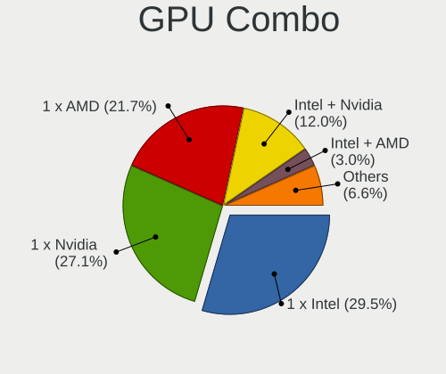

| Name           | Computers | Percent |
|----------------|-----------|---------|
| 1 x Intel      | 49        | 29.52%  |
| 1 x Nvidia     | 45        | 27.11%  |
| 1 x AMD        | 36        | 21.69%  |
| Intel + Nvidia | 20        | 12.05%  |
| Intel + AMD    | 5         | 3.01%   |
| 2 x Intel      | 4         | 2.41%   |
| 2 x AMD        | 3         | 1.81%   |
| AMD + Nvidia   | 3         | 1.81%   |
| 1 x XGI        | 1         | 0.6%    |

GPU Driver
----------

Free vs proprietary

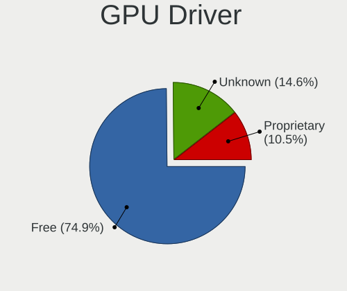

| Driver      | Computers | Percent |
|-------------|-----------|---------|
| Free        | 128       | 74.85%  |
| Unknown     | 25        | 14.62%  |
| Proprietary | 18        | 10.53%  |

GPU Memory
----------

Total video memory

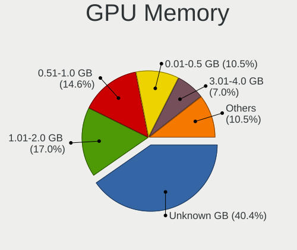

| Size in GB | Computers | Percent |
|------------|-----------|---------|
| Unknown    | 69        | 40.35%  |
| 1.01-2.0   | 29        | 16.96%  |
| 0.51-1.0   | 25        | 14.62%  |
| 0.01-0.5   | 18        | 10.53%  |
| 3.01-4.0   | 12        | 7.02%   |
| 5.01-6.0   | 6         | 3.51%   |
| 7.01-8.0   | 5         | 2.92%   |
| 2.01-3.0   | 4         | 2.34%   |
| 8.01-16.0  | 2         | 1.17%   |
| 16.01-24.0 | 1         | 0.58%   |

Monitor
-------

Monitor Vendor
--------------

Monitor vendors

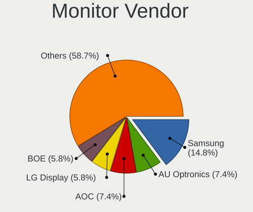

| Vendor                  | Computers | Percent |
|-------------------------|-----------|---------|
| Samsung Electronics     | 28        | 14.81%  |
| AU Optronics            | 14        | 7.41%   |
| AOC                     | 14        | 7.41%   |
| LG Display              | 11        | 5.82%   |
| BOE                     | 11        | 5.82%   |
| Chimei Innolux          | 10        | 5.29%   |
| Acer                    | 10        | 5.29%   |
| Dell                    | 9         | 4.76%   |
| Hewlett-Packard         | 8         | 4.23%   |
| Goldstar                | 8         | 4.23%   |
| Ancor Communications    | 8         | 4.23%   |
| BenQ                    | 6         | 3.17%   |
| ViewSonic               | 4         | 2.12%   |
| SNC                     | 4         | 2.12%   |
| Iiyama                  | 4         | 2.12%   |
| Eizo                    | 4         | 2.12%   |
| Sony                    | 3         | 1.59%   |
| Philips                 | 3         | 1.59%   |
| LG Electronics          | 3         | 1.59%   |
| Chi Mei Optoelectronics | 3         | 1.59%   |
| ASUSTek Computer        | 3         | 1.59%   |
| Sharp                   | 2         | 1.06%   |
| NEC Computers           | 2         | 1.06%   |
| Lenovo                  | 2         | 1.06%   |
| HannStar                | 2         | 1.06%   |
| Unknown                 | 1         | 0.53%   |
| SANSUI                  | 1         | 0.53%   |
| RTK                     | 1         | 0.53%   |
| QBell                   | 1         | 0.53%   |
| PKB                     | 1         | 0.53%   |
| Onkyo                   | 1         | 0.53%   |
| MSI                     | 1         | 0.53%   |
| Medion                  | 1         | 0.53%   |
| Insignia                | 1         | 0.53%   |
| Idek Iiyama             | 1         | 0.53%   |
| Compal                  | 1         | 0.53%   |
| Apple                   | 1         | 0.53%   |
| AGS                     | 1         | 0.53%   |

Monitor Model
-------------

Monitor models

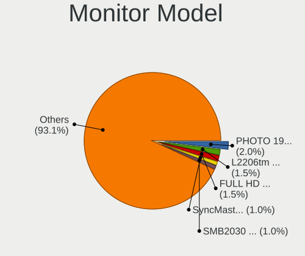

| Model                                                                   | Computers | Percent |
|-------------------------------------------------------------------------|-----------|---------|
| SNC PHOTO 190V SNC1850 1366x768 409x230mm 18.5-inch                     | 4         | 1.96%   |
| Hewlett-Packard L2206tm HWP3014 1920x1080 477x268mm 21.5-inch           | 3         | 1.47%   |
| Goldstar FULL HD GSM5B55 1920x1080 480x270mm 21.7-inch                  | 3         | 1.47%   |
| Samsung Electronics SyncMaster SAM0194 1280x1024 376x301mm 19.0-inch    | 2         | 0.98%   |
| Samsung Electronics SMB2030 SAM063D 1600x900 443x249mm 20.0-inch        | 2         | 0.98%   |
| Samsung Electronics S24F350 SAM0D20 1920x1080 521x293mm 23.5-inch       | 2         | 0.98%   |
| Samsung Electronics LCD Monitor SAM07C5 1920x1080 890x500mm 40.2-inch   | 2         | 0.98%   |
| Samsung Electronics C24F390 SAM0D2C 1920x1080 521x293mm 23.5-inch       | 2         | 0.98%   |
| Iiyama PLX2483H IVM6114 1920x1080 531x299mm 24.0-inch                   | 2         | 0.98%   |
| Hewlett-Packard LP1965 HWP2693 1280x1024 380x300mm 19.1-inch            | 2         | 0.98%   |
| Goldstar 27EA33 GSM59BC 1920x1080 598x337mm 27.0-inch                   | 2         | 0.98%   |
| Chimei Innolux LCD Monitor CMN15F5 1920x1080 344x193mm 15.5-inch        | 2         | 0.98%   |
| BOE LCD Monitor BOE084E 1920x1080 382x215mm 17.3-inch                   | 2         | 0.98%   |
| AU Optronics LCD Monitor AUO8074 1280x800 331x207mm 15.4-inch           | 2         | 0.98%   |
| AU Optronics LCD Monitor AUO22EC 1366x768 344x193mm 15.5-inch           | 2         | 0.98%   |
| AOC Q29G2G5 AOC2902 2560x1080 681x287mm 29.1-inch                       | 2         | 0.98%   |
| AOC CT500G AOCE556 1024x768 280x210mm 13.8-inch                         | 2         | 0.98%   |
| Ancor Communications PA248 ACI24B1 1920x1200 546x352mm 25.6-inch        | 2         | 0.98%   |
| Ancor Communications ASUS VE278 ACI27F6 1920x1080 598x336mm 27.0-inch   | 2         | 0.98%   |
| ViewSonic VX3218-PC-MHD VSCEB3A 1920x1080 698x393mm 31.5-inch           | 1         | 0.49%   |
| ViewSonic VX2409 SERIES VSC6C2E 1920x1080 521x293mm 23.5-inch           | 1         | 0.49%   |
| ViewSonic VA903-3Series VSC701E 1280x1024 376x301mm 19.0-inch           | 1         | 0.49%   |
| ViewSonic LCD Monitor VP2468 Series 3520x1080                           | 1         | 0.49%   |
| Unknown LCD Monitor SAMSUNG 1920x1080                                   | 1         | 0.49%   |
| Sony TV SNYF301 1920x1080                                               | 1         | 0.49%   |
| Sony TV SNYDC02 1920x1080 708x398mm 32.0-inch                           | 1         | 0.49%   |
| Sony SDM-X72 SNY1E70 1280x1024 338x270mm 17.0-inch                      | 1         | 0.49%   |
| Sharp LCD Monitor SHP149A 1920x1080 344x194mm 15.5-inch                 | 1         | 0.49%   |
| Sharp LCD Monitor SHP1461 3200x1800 294x165mm 13.3-inch                 | 1         | 0.49%   |
| SANSUI ES-22F1 XEC3150 1920x1080 480x270mm 21.7-inch                    | 1         | 0.49%   |
| Samsung Electronics SyncMaster SAM0612 1920x1080 604x342mm 27.3-inch    | 1         | 0.49%   |
| Samsung Electronics SyncMaster SAM0471 1360x768 344x194mm 15.5-inch     | 1         | 0.49%   |
| Samsung Electronics SMB2240W SAM0699 1680x1050 459x296mm 21.5-inch      | 1         | 0.49%   |
| Samsung Electronics SMB2240W SAM0698 1680x1050 474x296mm 22.0-inch      | 1         | 0.49%   |
| Samsung Electronics SM2333TN SAM06FC 1920x1080 477x268mm 21.5-inch      | 1         | 0.49%   |
| Samsung Electronics S24E390 SAM0C1A 1920x1080 521x293mm 23.5-inch       | 1         | 0.49%   |
| Samsung Electronics S24B300 SAM08B2 1920x1080 531x299mm 24.0-inch       | 1         | 0.49%   |
| Samsung Electronics S22D300 SAM0B3F 1920x1080 477x268mm 21.5-inch       | 1         | 0.49%   |
| Samsung Electronics Odyssey G85SB SAM72F4 3440x1440 809x354mm 34.8-inch | 1         | 0.49%   |
| Samsung Electronics Odyssey G85SB SAM72F2 3440x1440 809x354mm 34.8-inch | 1         | 0.49%   |

Monitor Resolution
------------------

Monitor screen resolution

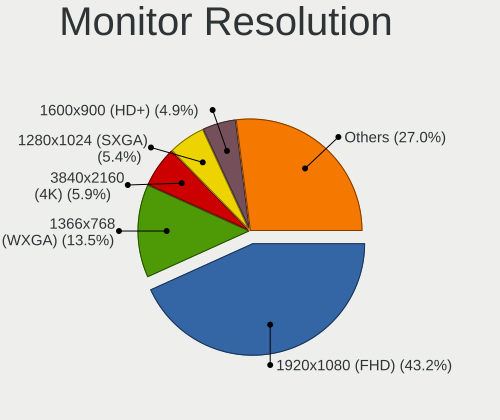

| Resolution         | Computers | Percent |
|--------------------|-----------|---------|
| 1920x1080 (FHD)    | 80        | 43.24%  |
| 1366x768 (WXGA)    | 25        | 13.51%  |
| 3840x2160 (4K)     | 11        | 5.95%   |
| 1280x1024 (SXGA)   | 10        | 5.41%   |
| 1600x900 (HD+)     | 9         | 4.86%   |
| 1920x1200 (WUXGA)  | 8         | 4.32%   |
| Unknown            | 8         | 4.32%   |
| 2560x1440 (QHD)    | 6         | 3.24%   |
| 1680x1050 (WSXGA+) | 4         | 2.16%   |
| 2560x1080          | 3         | 1.62%   |
| 1280x800 (WXGA)    | 3         | 1.62%   |
| 3840x1080          | 2         | 1.08%   |
| 1440x900 (WXGA+)   | 2         | 1.08%   |
| 1360x768           | 2         | 1.08%   |
| 1024x768 (XGA)     | 2         | 1.08%   |
| 5760x2160          | 1         | 0.54%   |
| 4480x1440          | 1         | 0.54%   |
| 3520x1080          | 1         | 0.54%   |
| 3440x1440          | 1         | 0.54%   |
| 3200x900           | 1         | 0.54%   |
| 3200x1800 (QHD+)   | 1         | 0.54%   |
| 3072x1920          | 1         | 0.54%   |
| 2736x1824          | 1         | 0.54%   |
| 2560x1024          | 1         | 0.54%   |
| 1920x540           | 1         | 0.54%   |

Monitor Diagonal
----------------

Diagonal size in inches

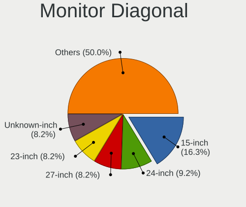

| Inches  | Computers | Percent |
|---------|-----------|---------|
| 15      | 30        | 16.3%   |
| 24      | 17        | 9.24%   |
| 27      | 15        | 8.15%   |
| 23      | 15        | 8.15%   |
| Unknown | 15        | 8.15%   |
| 17      | 13        | 7.07%   |
| 19      | 11        | 5.98%   |
| 13      | 11        | 5.98%   |
| 21      | 10        | 5.43%   |
| 14      | 8         | 4.35%   |
| 31      | 6         | 3.26%   |
| 22      | 6         | 3.26%   |
| 18      | 6         | 3.26%   |
| 29      | 3         | 1.63%   |
| 20      | 3         | 1.63%   |
| 54      | 2         | 1.09%   |
| 46      | 2         | 1.09%   |
| 32      | 2         | 1.09%   |
| 25      | 2         | 1.09%   |
| 72      | 1         | 0.54%   |
| 48      | 1         | 0.54%   |
| 42      | 1         | 0.54%   |
| 34      | 1         | 0.54%   |
| 16      | 1         | 0.54%   |
| 12      | 1         | 0.54%   |
| 10      | 1         | 0.54%   |

Monitor Width
-------------

Physical width

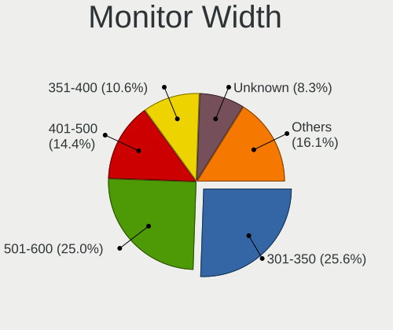

| Width in mm | Computers | Percent |
|-------------|-----------|---------|
| 301-350     | 46        | 25.56%  |
| 501-600     | 45        | 25%     |
| 401-500     | 26        | 14.44%  |
| 351-400     | 19        | 10.56%  |
| Unknown     | 15        | 8.33%   |
| 601-700     | 11        | 6.11%   |
| 201-300     | 8         | 4.44%   |
| 1001-1500   | 5         | 2.78%   |
| 701-800     | 2         | 1.11%   |
| 801-900     | 1         | 0.56%   |
| 1501-2000   | 1         | 0.56%   |
| 901-1000    | 1         | 0.56%   |

Aspect Ratio
------------

Proportional relationship between the width and the height

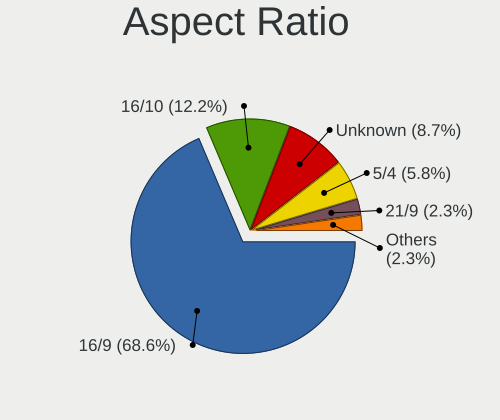

| Ratio   | Computers | Percent |
|---------|-----------|---------|
| 16/9    | 118       | 68.6%   |
| 16/10   | 21        | 12.21%  |
| Unknown | 15        | 8.72%   |
| 5/4     | 10        | 5.81%   |
| 21/9    | 4         | 2.33%   |
| 4/3     | 2         | 1.16%   |
| 3/2     | 1         | 0.58%   |
| 1.96    | 1         | 0.58%   |

Monitor Area
------------

Area in inch²

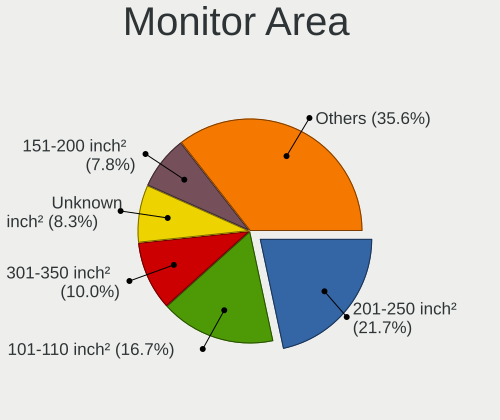

| Area in inch² | Computers | Percent |
|----------------|-----------|---------|
| 201-250        | 39        | 21.67%  |
| 101-110        | 30        | 16.67%  |
| 301-350        | 18        | 10%     |
| Unknown        | 15        | 8.33%   |
| 151-200        | 14        | 7.78%   |
| 81-90          | 12        | 6.67%   |
| 121-130        | 10        | 5.56%   |
| 351-500        | 9         | 5%      |
| 141-150        | 8         | 4.44%   |
| 251-300        | 7         | 3.89%   |
| 71-80          | 4         | 2.22%   |
| 501-1000       | 4         | 2.22%   |
| More than 1000 | 3         | 1.67%   |
| 91-100         | 3         | 1.67%   |
| 61-70          | 1         | 0.56%   |
| 41-50          | 1         | 0.56%   |
| 131-140        | 1         | 0.56%   |
| 111-120        | 1         | 0.56%   |

Pixel Density
-------------

Pixels per inch

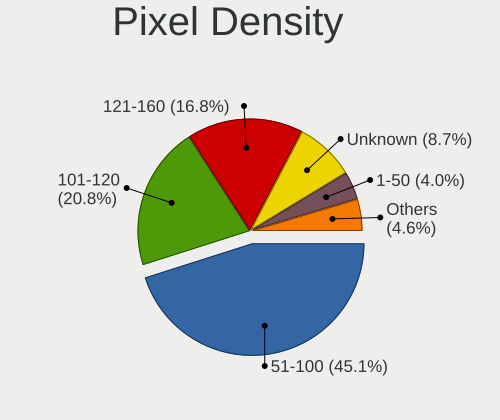

| Density       | Computers | Percent |
|---------------|-----------|---------|
| 51-100        | 78        | 45.09%  |
| 101-120       | 36        | 20.81%  |
| 121-160       | 29        | 16.76%  |
| Unknown       | 15        | 8.67%   |
| 1-50          | 7         | 4.05%   |
| More than 240 | 4         | 2.31%   |
| 161-240       | 4         | 2.31%   |

Multiple Monitors
-----------------

Total monitors connected

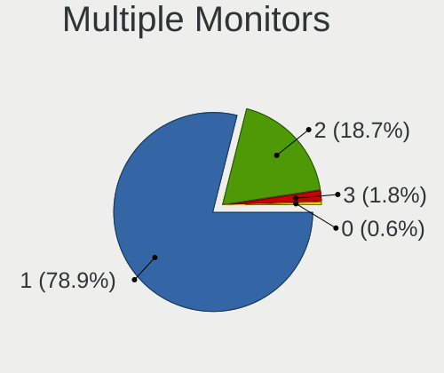

| Total | Computers | Percent |
|-------|-----------|---------|
| 1     | 131       | 78.92%  |
| 2     | 31        | 18.67%  |
| 3     | 3         | 1.81%   |
| 0     | 1         | 0.6%    |

Network
-------

Net Controller Vendor
---------------------

Controller vendors

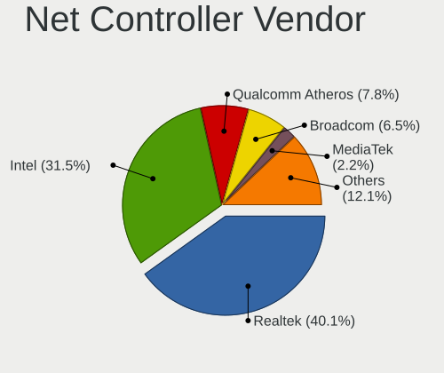

| Vendor                   | Computers | Percent |
|--------------------------|-----------|---------|
| Realtek Semiconductor    | 93        | 40.09%  |
| Intel                    | 73        | 31.47%  |
| Qualcomm Atheros         | 18        | 7.76%   |
| Broadcom                 | 15        | 6.47%   |
| MediaTek                 | 5         | 2.16%   |
| Marvell Technology Group | 5         | 2.16%   |
| Broadcom Limited         | 4         | 1.72%   |
| TP-Link                  | 2         | 0.86%   |
| Sierra Wireless          | 2         | 0.86%   |
| Nvidia                   | 2         | 0.86%   |
| Wilocity                 | 1         | 0.43%   |
| Ultimarc                 | 1         | 0.43%   |
| Texas Instruments        | 1         | 0.43%   |
| RDC Semiconductor        | 1         | 0.43%   |
| Ralink Technology        | 1         | 0.43%   |
| Ralink                   | 1         | 0.43%   |
| NetGear                  | 1         | 0.43%   |
| Huawei Technologies      | 1         | 0.43%   |
| Dell                     | 1         | 0.43%   |
| D-Link System            | 1         | 0.43%   |
| ASUSTek Computer         | 1         | 0.43%   |
| ASIX Electronics         | 1         | 0.43%   |
| Aquantia                 | 1         | 0.43%   |

Net Controller Model
--------------------

Controller models

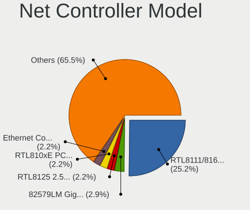

| Model                                                                  | Computers | Percent |
|------------------------------------------------------------------------|-----------|---------|
| Realtek RTL8111/8168/8211/8411 PCI Express Gigabit Ethernet Controller | 70        | 25.18%  |
| Intel 82579LM Gigabit Network Connection (Lewisville)                  | 8         | 2.88%   |
| Realtek RTL8125 2.5GbE Controller                                      | 6         | 2.16%   |
| Realtek RTL810xE PCI Express Fast Ethernet controller                  | 6         | 2.16%   |
| Intel Ethernet Connection I217-V                                       | 6         | 2.16%   |
| Realtek RTL8822CE 802.11ac PCIe Wireless Network Adapter               | 5         | 1.8%    |
| Intel Wireless 8260                                                    | 5         | 1.8%    |
| Intel Wi-Fi 6 AX200                                                    | 5         | 1.8%    |
| Intel I211 Gigabit Network Connection                                  | 5         | 1.8%    |
| Intel Wireless 3165                                                    | 4         | 1.44%   |
| Intel Dual Band Wireless-AC 3168NGW [Stone Peak]                       | 4         | 1.44%   |
| Intel Centrino Advanced-N 6205 [Taylor Peak]                           | 4         | 1.44%   |
| Broadcom BCM4313 802.11bgn Wireless Network Adapter                    | 4         | 1.44%   |
| Intel Ethernet Controller I225-V                                       | 3         | 1.08%   |
| Intel Ethernet Connection I217-LM                                      | 3         | 1.08%   |
| Broadcom NetLink BCM57780 Gigabit Ethernet PCIe                        | 3         | 1.08%   |
| Sierra Wireless MC8305 Modem                                           | 2         | 0.72%   |
| Realtek RTL8814AU 802.11a/b/g/n/ac Wireless Adapter                    | 2         | 0.72%   |
| Realtek RTL8812AU 802.11a/b/g/n/ac 2T2R DB WLAN Adapter                | 2         | 0.72%   |
| Realtek RTL8811AU 802.11a/b/g/n/ac WLAN Adapter                        | 2         | 0.72%   |
| Realtek RTL8723DE Wireless Network Adapter                             | 2         | 0.72%   |
| Realtek RTL8192CU 802.11n WLAN Adapter                                 | 2         | 0.72%   |
| Realtek RTL8188EE Wireless Network Adapter                             | 2         | 0.72%   |
| Qualcomm Atheros QCA9565 / AR9565 Wireless Network Adapter             | 2         | 0.72%   |
| Qualcomm Atheros AR9485 Wireless Network Adapter                       | 2         | 0.72%   |
| Qualcomm Atheros AR9462 Wireless Network Adapter                       | 2         | 0.72%   |
| Qualcomm Atheros AR9285 Wireless Network Adapter (PCI-Express)         | 2         | 0.72%   |
| Qualcomm Atheros AR8151 v2.0 Gigabit Ethernet                          | 2         | 0.72%   |
| Qualcomm Atheros AR5212/5213/2414 Wireless Network Adapter             | 2         | 0.72%   |
| MediaTek MT7922 802.11ax PCI Express Wireless Network Adapter          | 2         | 0.72%   |
| Intel Wireless 8265 / 8275                                             | 2         | 0.72%   |
| Intel Wireless 7265                                                    | 2         | 0.72%   |
| Intel Wireless 7260                                                    | 2         | 0.72%   |
| Intel Wi-Fi 6 AX201                                                    | 2         | 0.72%   |
| Intel Wi-Fi 5(802.11ac) Wireless-AC 9x6x [Thunder Peak]                | 2         | 0.72%   |
| Intel Ethernet Connection I219-LM                                      | 2         | 0.72%   |
| Intel Ethernet Connection (2) I219-V                                   | 2         | 0.72%   |
| Intel Alder Lake-S PCH CNVi WiFi                                       | 2         | 0.72%   |
| Intel Alder Lake-P PCH CNVi WiFi                                       | 2         | 0.72%   |
| Intel 82579V Gigabit Network Connection                                | 2         | 0.72%   |

Wireless Vendor
---------------

Wireless vendors

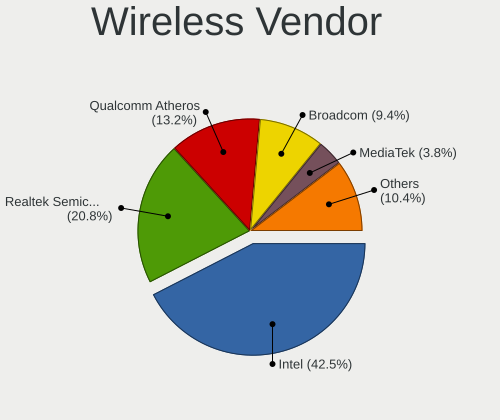

| Vendor                   | Computers | Percent |
|--------------------------|-----------|---------|
| Intel                    | 45        | 42.45%  |
| Realtek Semiconductor    | 22        | 20.75%  |
| Qualcomm Atheros         | 14        | 13.21%  |
| Broadcom                 | 10        | 9.43%   |
| MediaTek                 | 4         | 3.77%   |
| TP-Link                  | 2         | 1.89%   |
| Sierra Wireless          | 2         | 1.89%   |
| Wilocity                 | 1         | 0.94%   |
| Ralink Technology        | 1         | 0.94%   |
| Ralink                   | 1         | 0.94%   |
| NetGear                  | 1         | 0.94%   |
| Marvell Technology Group | 1         | 0.94%   |
| Dell                     | 1         | 0.94%   |
| ASUSTek Computer         | 1         | 0.94%   |

Wireless Model
--------------

Wireless models

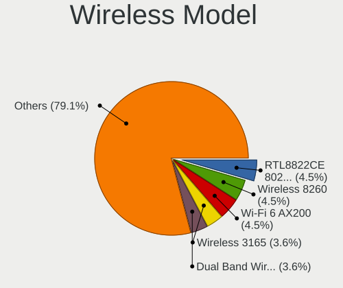

| Model                                                          | Computers | Percent |
|----------------------------------------------------------------|-----------|---------|
| Realtek RTL8822CE 802.11ac PCIe Wireless Network Adapter       | 5         | 4.55%   |
| Intel Wireless 8260                                            | 5         | 4.55%   |
| Intel Wi-Fi 6 AX200                                            | 5         | 4.55%   |
| Intel Wireless 3165                                            | 4         | 3.64%   |
| Intel Dual Band Wireless-AC 3168NGW [Stone Peak]               | 4         | 3.64%   |
| Intel Centrino Advanced-N 6205 [Taylor Peak]                   | 4         | 3.64%   |
| Broadcom BCM4313 802.11bgn Wireless Network Adapter            | 4         | 3.64%   |
| Sierra Wireless MC8305 Modem                                   | 2         | 1.82%   |
| Realtek RTL8814AU 802.11a/b/g/n/ac Wireless Adapter            | 2         | 1.82%   |
| Realtek RTL8812AU 802.11a/b/g/n/ac 2T2R DB WLAN Adapter        | 2         | 1.82%   |
| Realtek RTL8811AU 802.11a/b/g/n/ac WLAN Adapter                | 2         | 1.82%   |
| Realtek RTL8723DE Wireless Network Adapter                     | 2         | 1.82%   |
| Realtek RTL8192CU 802.11n WLAN Adapter                         | 2         | 1.82%   |
| Realtek RTL8188EE Wireless Network Adapter                     | 2         | 1.82%   |
| Qualcomm Atheros QCA9565 / AR9565 Wireless Network Adapter     | 2         | 1.82%   |
| Qualcomm Atheros AR9485 Wireless Network Adapter               | 2         | 1.82%   |
| Qualcomm Atheros AR9462 Wireless Network Adapter               | 2         | 1.82%   |
| Qualcomm Atheros AR9285 Wireless Network Adapter (PCI-Express) | 2         | 1.82%   |
| Qualcomm Atheros AR5212/5213/2414 Wireless Network Adapter     | 2         | 1.82%   |
| Intel Wireless 8265 / 8275                                     | 2         | 1.82%   |
| Intel Wireless 7265                                            | 2         | 1.82%   |
| Intel Wireless 7260                                            | 2         | 1.82%   |
| Intel Wi-Fi 6 AX201                                            | 2         | 1.82%   |
| Intel Wi-Fi 5(802.11ac) Wireless-AC 9x6x [Thunder Peak]        | 2         | 1.82%   |
| Broadcom BCM4311 802.11a/b/g                                   | 2         | 1.82%   |
| Wilocity Wil6200 802.11ad Wireless Network Adapter             | 1         | 0.91%   |
| TP-Link Archer T3U [Realtek RTL8812BU]                         | 1         | 0.91%   |
| TP-Link 802.11ac NIC                                           | 1         | 0.91%   |
| Realtek RTL8852BE PCIe 802.11ax Wireless Network Controller    | 1         | 0.91%   |
| Realtek RTL8821CE 802.11ac PCIe Wireless Network Adapter       | 1         | 0.91%   |
| Realtek RTL8821AE 802.11ac PCIe Wireless Network Adapter       | 1         | 0.91%   |
| Realtek RTL8723BE PCIe Wireless Network Adapter                | 1         | 0.91%   |
| Realtek RTL8192EE PCIe Wireless Network Adapter                | 1         | 0.91%   |
| Realtek RTL8191SU 802.11n WLAN Adapter                         | 1         | 0.91%   |
| Realtek RTL8188FTV 802.11b/g/n 1T1R 2.4G WLAN Adapter          | 1         | 0.91%   |
| Realtek RTL8187SE Wireless LAN Controller                      | 1         | 0.91%   |
| Realtek 802.11ac NIC                                           | 1         | 0.91%   |
| Ralink RT5370 Wireless Adapter                                 | 1         | 0.91%   |
| Ralink RT2561/RT61 rev B 802.11g                               | 1         | 0.91%   |
| Qualcomm Atheros QCA9377 802.11ac Wireless Network Adapter     | 1         | 0.91%   |

Ethernet Vendor
---------------

Ethernet vendors

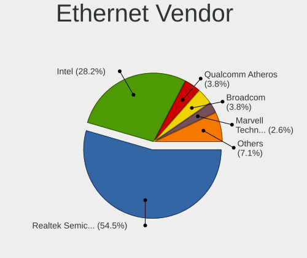

| Vendor                   | Computers | Percent |
|--------------------------|-----------|---------|
| Realtek Semiconductor    | 85        | 54.49%  |
| Intel                    | 44        | 28.21%  |
| Qualcomm Atheros         | 6         | 3.85%   |
| Broadcom                 | 6         | 3.85%   |
| Marvell Technology Group | 4         | 2.56%   |
| Broadcom Limited         | 4         | 2.56%   |
| Nvidia                   | 2         | 1.28%   |
| RDC Semiconductor        | 1         | 0.64%   |
| MediaTek                 | 1         | 0.64%   |
| D-Link System            | 1         | 0.64%   |
| ASIX Electronics         | 1         | 0.64%   |
| Aquantia                 | 1         | 0.64%   |

Ethernet Model
--------------

Ethernet models

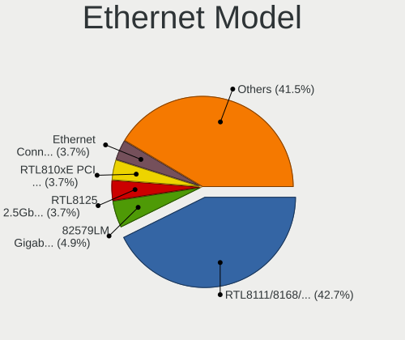

| Model                                                                  | Computers | Percent |
|------------------------------------------------------------------------|-----------|---------|
| Realtek RTL8111/8168/8211/8411 PCI Express Gigabit Ethernet Controller | 70        | 42.68%  |
| Intel 82579LM Gigabit Network Connection (Lewisville)                  | 8         | 4.88%   |
| Realtek RTL8125 2.5GbE Controller                                      | 6         | 3.66%   |
| Realtek RTL810xE PCI Express Fast Ethernet controller                  | 6         | 3.66%   |
| Intel Ethernet Connection I217-V                                       | 6         | 3.66%   |
| Intel I211 Gigabit Network Connection                                  | 5         | 3.05%   |
| Intel Ethernet Controller I225-V                                       | 3         | 1.83%   |
| Intel Ethernet Connection I217-LM                                      | 3         | 1.83%   |
| Broadcom NetLink BCM57780 Gigabit Ethernet PCIe                        | 3         | 1.83%   |
| Qualcomm Atheros AR8151 v2.0 Gigabit Ethernet                          | 2         | 1.22%   |
| Intel Ethernet Connection I219-LM                                      | 2         | 1.22%   |
| Intel Ethernet Connection (2) I219-V                                   | 2         | 1.22%   |
| Intel 82579V Gigabit Network Connection                                | 2         | 1.22%   |
| Intel 82574L Gigabit Network Connection                                | 2         | 1.22%   |
| Intel 82557/8/9/0/1 Ethernet Pro 100                                   | 2         | 1.22%   |
| Broadcom NetXtreme BCM5754 Gigabit Ethernet PCI Express                | 2         | 1.22%   |
| Broadcom Limited NetLink BCM5787M Gigabit Ethernet PCI Express         | 2         | 1.22%   |
| Realtek RTL8922AE 802.11be PCIe Wireless Network Adapter               | 1         | 0.61%   |
| Realtek RTL8169 PCI Gigabit Ethernet Controller                        | 1         | 0.61%   |
| Realtek RTL8153 Gigabit Ethernet Adapter                               | 1         | 0.61%   |
| Realtek RTL8152 Fast Ethernet Adapter                                  | 1         | 0.61%   |
| Realtek RTL-8100/8101L/8139 PCI Fast Ethernet Adapter                  | 1         | 0.61%   |
| RDC R6040 MAC Controller                                               | 1         | 0.61%   |
| Qualcomm Atheros Attansic L2 Fast Ethernet                             | 1         | 0.61%   |
| Qualcomm Atheros AR8162 Fast Ethernet                                  | 1         | 0.61%   |
| Qualcomm Atheros AR8152 v2.0 Fast Ethernet                             | 1         | 0.61%   |
| Qualcomm Atheros AR8132 Fast Ethernet                                  | 1         | 0.61%   |
| Nvidia MCP79 Ethernet                                                  | 1         | 0.61%   |
| Nvidia MCP61 Ethernet                                                  | 1         | 0.61%   |
| MediaTek MT7922 802.11ax PCI Express Wireless Network Adapter          | 1         | 0.61%   |
| Marvell Group 88E8058 PCI-E Gigabit Ethernet Controller                | 1         | 0.61%   |
| Marvell Group 88E8057 PCI-E Gigabit Ethernet Controller                | 1         | 0.61%   |
| Marvell Group 88E8056 PCI-E Gigabit Ethernet Controller                | 1         | 0.61%   |
| Marvell Group 88E8055 PCI-E Gigabit Ethernet Controller                | 1         | 0.61%   |
| Intel I210 Gigabit Network Connection                                  | 1         | 0.61%   |
| Intel Ethernet Controller I226-V                                       | 1         | 0.61%   |
| Intel Ethernet Connection I219-V                                       | 1         | 0.61%   |
| Intel Ethernet Connection (7) I219-V                                   | 1         | 0.61%   |
| Intel Ethernet Connection (4) I219-LM                                  | 1         | 0.61%   |
| Intel Ethernet Connection (2) I219-LM                                  | 1         | 0.61%   |

Net Controller Kind
-------------------

Ethernet, WiFi or modem

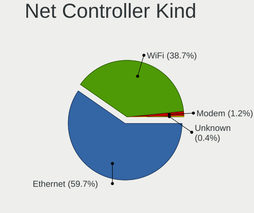

| Kind     | Computers | Percent |
|----------|-----------|---------|
| Ethernet | 148       | 59.68%  |
| WiFi     | 96        | 38.71%  |
| Modem    | 3         | 1.21%   |
| Unknown  | 1         | 0.4%    |

Used Controller
---------------

Currently used network controller

| Kind     | Computers | Percent |
|----------|-----------|---------|
| Ethernet | 99        | 57.89%  |
| WiFi     | 72        | 42.11%  |

NICs
----

Total network controllers on board

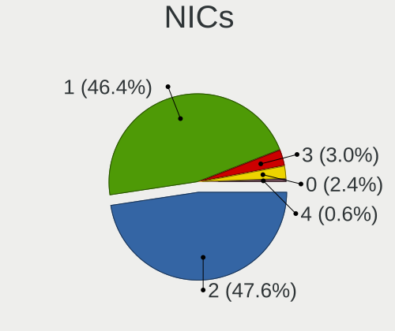

| Total | Computers | Percent |
|-------|-----------|---------|
| 2     | 80        | 47.62%  |
| 1     | 78        | 46.43%  |
| 3     | 5         | 2.98%   |
| 0     | 4         | 2.38%   |
| 4     | 1         | 0.6%    |

IPv6
----

IPv6 vs IPv4

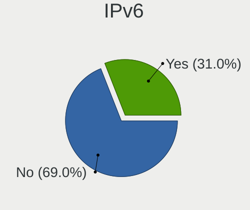

| Used | Computers | Percent |
|------|-----------|---------|
| No   | 116       | 69.05%  |
| Yes  | 52        | 30.95%  |

Bluetooth
---------

Bluetooth Vendor
----------------

Controller vendors

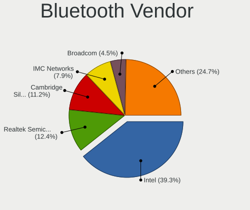

| Vendor                  | Computers | Percent |
|-------------------------|-----------|---------|
| Intel                   | 35        | 39.33%  |
| Realtek Semiconductor   | 11        | 12.36%  |
| Cambridge Silicon Radio | 10        | 11.24%  |
| IMC Networks            | 7         | 7.87%   |
| Broadcom                | 4         | 4.49%   |
| ASUSTek Computer        | 4         | 4.49%   |
| Hewlett-Packard         | 3         | 3.37%   |
| Belkin Components       | 3         | 3.37%   |
| MediaTek                | 2         | 2.25%   |
| Lite-On Technology      | 2         | 2.25%   |
| Foxconn / Hon Hai       | 2         | 2.25%   |
| TP-Link                 | 1         | 1.12%   |
| Taiyo Yuden             | 1         | 1.12%   |
| Marvell Semiconductor   | 1         | 1.12%   |
| Dell                    | 1         | 1.12%   |
| Askey Computer          | 1         | 1.12%   |
| Apple                   | 1         | 1.12%   |

Bluetooth Model
---------------

Controller models

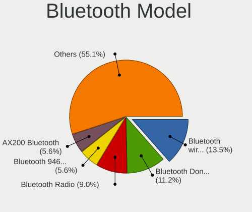

| Model                                               | Computers | Percent |
|-----------------------------------------------------|-----------|---------|
| Intel Bluetooth wireless interface                  | 12        | 13.48%  |
| Cambridge Silicon Radio Bluetooth Dongle (HCI mode) | 10        | 11.24%  |
| Realtek Bluetooth Radio                             | 8         | 8.99%   |
| Intel Bluetooth 9460/9560 Jefferson Peak (JfP)      | 5         | 5.62%   |
| Intel AX200 Bluetooth                               | 5         | 5.62%   |
| Intel Wireless-AC 3168 Bluetooth                    | 4         | 4.49%   |
| Intel AX201 Bluetooth                               | 3         | 3.37%   |
| Realtek  Bluetooth 4.2 Adapter                      | 2         | 2.25%   |
| Lite-On Bluetooth Device                            | 2         | 2.25%   |
| Intel Wireless-AC 9260 Bluetooth Adapter            | 2         | 2.25%   |
| Intel Bluetooth Device                              | 2         | 2.25%   |
| IMC Networks Wireless_Device                        | 2         | 2.25%   |
| IMC Networks Bluetooth Radio                        | 2         | 2.25%   |
| IMC Networks Bluetooth Device                       | 2         | 2.25%   |
| HP Bluetooth 2.0 Interface [Broadcom BCM2045]       | 2         | 2.25%   |
| Foxconn / Hon Hai BCM20702A0                        | 2         | 2.25%   |
| Belkin Components Bluetooth Mini Dongle             | 2         | 2.25%   |
| ASUS Broadcom BCM20702A0 Bluetooth                  | 2         | 2.25%   |
| TP-Link TP-T@- UB500 Adapter                        | 1         | 1.12%   |
| Taiyo Yuden Bluetooth Device (V2.1+EDR)             | 1         | 1.12%   |
| Realtek RTL8723B Bluetooth                          | 1         | 1.12%   |
| MediaTek Wireless_Device                            | 1         | 1.12%   |
| MediaTek MT7630e Bluetooth Adapter                  | 1         | 1.12%   |
| Marvell Bluetooth and Wireless LAN Composite        | 1         | 1.12%   |
| Intel Centrino Bluetooth Wireless Transceiver       | 1         | 1.12%   |
| Intel AX210 Bluetooth                               | 1         | 1.12%   |
| IMC Networks Atheros AR3012 Bluetooth 4.0 Adapter   | 1         | 1.12%   |
| HP Broadcom 2070 Bluetooth Combo                    | 1         | 1.12%   |
| Dell BCM20702A0 Bluetooth Module                    | 1         | 1.12%   |
| Broadcom HP Portable Valentine                      | 1         | 1.12%   |
| Broadcom Bluetooth dongle                           | 1         | 1.12%   |
| Broadcom BCM20702A0 Bluetooth 4.0                   | 1         | 1.12%   |
| Broadcom BCM20702 Bluetooth 4.0 [ThinkPad]          | 1         | 1.12%   |
| Belkin Components F8T013 Bluetooth Adapter          | 1         | 1.12%   |
| ASUS Bluetooth Device                               | 1         | 1.12%   |
| ASUS BCM20702A0                                     | 1         | 1.12%   |
| Askey Bluetooth Device                              | 1         | 1.12%   |
| Apple Bluetooth HCI MacBookPro (HID mode)           | 1         | 1.12%   |

Sound
-----

Sound Vendor
------------

Sound card vendors

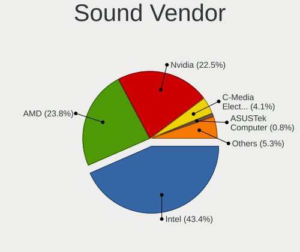

| Vendor                     | Computers | Percent |
|----------------------------|-----------|---------|
| Intel                      | 106       | 43.44%  |
| AMD                        | 58        | 23.77%  |
| Nvidia                     | 55        | 22.54%  |
| C-Media Electronics        | 10        | 4.1%    |
| ASUSTek Computer           | 2         | 0.82%   |
| Walmart                    | 1         | 0.41%   |
| Texas Instruments          | 1         | 0.41%   |
| SteelSeries ApS            | 1         | 0.41%   |
| Samsung Electronics        | 1         | 0.41%   |
| Micro Star International   | 1         | 0.41%   |
| Mackie Designs             | 1         | 0.41%   |
| Logitech                   | 1         | 0.41%   |
| iCreate Technologies       | 1         | 0.41%   |
| Huawei Technologies        | 1         | 0.41%   |
| Harman                     | 1         | 0.41%   |
| Corsair                    | 1         | 0.41%   |
| BEHRINGER International    | 1         | 0.41%   |
| Altec Lansing Technologies | 1         | 0.41%   |

Sound Model
-----------

Sound card models

| Model                                                                      | Computers | Percent |
|----------------------------------------------------------------------------|-----------|---------|
| AMD Ryzen HD Audio Controller                                              | 17        | 5.9%    |
| Intel 8 Series/C220 Series Chipset High Definition Audio Controller        | 15        | 5.21%   |
| Intel Xeon E3-1200 v3/4th Gen Core Processor HD Audio Controller           | 11        | 3.82%   |
| Intel 6 Series/C200 Series Chipset Family High Definition Audio Controller | 11        | 3.82%   |
| AMD Starship/Matisse HD Audio Controller                                   | 10        | 3.47%   |
| AMD SBx00 Azalia (Intel HDA)                                               | 10        | 3.47%   |
| Nvidia GK208 HDMI/DP Audio Controller                                      | 9         | 3.13%   |
| Intel Sunrise Point-LP HD Audio                                            | 9         | 3.13%   |
| Nvidia GP107GL High Definition Audio Controller                            | 8         | 2.78%   |
| Nvidia GF108 High Definition Audio Controller                              | 7         | 2.43%   |
| Intel NM10/ICH7 Family High Definition Audio Controller                    | 7         | 2.43%   |
| Intel 7 Series/C216 Chipset Family High Definition Audio Controller        | 7         | 2.43%   |
| AMD Renoir/Cezanne HDMI/DP Audio Controller                                | 6         | 2.08%   |
| AMD FCH Azalia Controller                                                  | 6         | 2.08%   |
| Nvidia GP106 High Definition Audio Controller                              | 5         | 1.74%   |
| Nvidia GK107 HDMI Audio Controller                                         | 5         | 1.74%   |
| Intel 5 Series/3400 Series Chipset High Definition Audio                   | 5         | 1.74%   |
| Intel 100 Series/C230 Series Chipset Family HD Audio Controller            | 5         | 1.74%   |
| AMD Radeon High Definition Audio Controller                                | 5         | 1.74%   |
| AMD Navi 21/23 HDMI/DP Audio Controller                                    | 5         | 1.74%   |
| Intel Cannon Lake PCH cAVS                                                 | 4         | 1.39%   |
| Intel 82801I (ICH9 Family) HD Audio Controller                             | 4         | 1.39%   |
| C-Media Electronics CMI8788 [Oxygen HD Audio]                              | 4         | 1.39%   |
| AMD Raven/Raven2/Fenghuang HDMI/DP Audio Controller                        | 4         | 1.39%   |
| Intel Tiger Lake-H HD Audio Controller                                     | 3         | 1.04%   |
| Intel Haswell-ULT HD Audio Controller                                      | 3         | 1.04%   |
| Intel Comet Lake PCH-V cAVS                                                | 3         | 1.04%   |
| Intel C600/X79 series chipset High Definition Audio Controller             | 3         | 1.04%   |
| Intel Alder Lake PCH-P High Definition Audio Controller                    | 3         | 1.04%   |
| Intel 82801H (ICH8 Family) HD Audio Controller                             | 3         | 1.04%   |
| C-Media Electronics CMI8738/CMI8768 PCI Audio                              | 3         | 1.04%   |
| AMD RV620 HDMI Audio [Radeon HD 3450/3470/3550/3570]                       | 3         | 1.04%   |
| AMD Family 17h (Models 00h-0fh) HD Audio Controller                        | 3         | 1.04%   |
| Nvidia TU106 High Definition Audio Controller                              | 2         | 0.69%   |
| Nvidia GP108 High Definition Audio Controller                              | 2         | 0.69%   |
| Nvidia GP104 High Definition Audio Controller                              | 2         | 0.69%   |
| Nvidia GF119 HDMI Audio Controller                                         | 2         | 0.69%   |
| Nvidia GA107 High Definition Audio Controller                              | 2         | 0.69%   |
| Intel Tiger Lake-LP Smart Sound Technology Audio Controller                | 2         | 0.69%   |
| Intel Comet Lake PCH cAVS                                                  | 2         | 0.69%   |

Memory
------

Memory Vendor
-------------

Memory module vendors

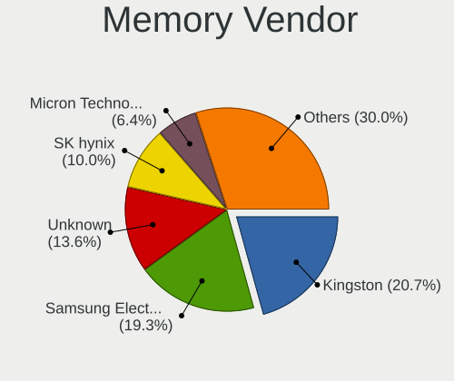

| Vendor              | Computers | Percent |
|---------------------|-----------|---------|
| Kingston            | 29        | 20.71%  |
| Samsung Electronics | 27        | 19.29%  |
| Unknown             | 19        | 13.57%  |
| SK hynix            | 14        | 10%     |
| Micron Technology   | 9         | 6.43%   |
| G.Skill             | 9         | 6.43%   |
| Corsair             | 7         | 5%      |
| Crucial             | 5         | 3.57%   |
| Team                | 4         | 2.86%   |
| Unknown (ABCD)      | 2         | 1.43%   |
| Ramaxel Technology  | 2         | 1.43%   |
| CSX                 | 2         | 1.43%   |
| A-DATA Technology   | 2         | 1.43%   |
| Smart               | 1         | 0.71%   |
| Silicon Power       | 1         | 0.71%   |
| PNY                 | 1         | 0.71%   |
| Nanya Technology    | 1         | 0.71%   |
| Lexar               | 1         | 0.71%   |
| GOODRAM             | 1         | 0.71%   |
| Elpida              | 1         | 0.71%   |
| AMD                 | 1         | 0.71%   |
| Unknown             | 1         | 0.71%   |

Memory Model
------------

Memory module models

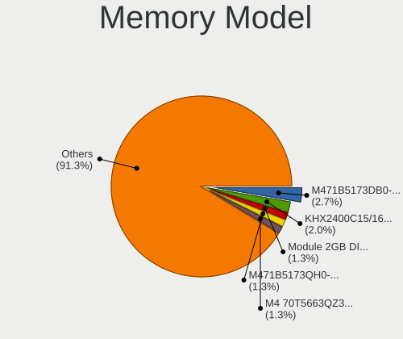

| Model                                                            | Computers | Percent |
|------------------------------------------------------------------|-----------|---------|
| Samsung RAM M471B5173DB0-YK0 4GB SODIMM DDR3 1600MT/s            | 4         | 2.67%   |
| Kingston RAM KHX2400C15/16G 16GB DIMM DDR4 3334MT/s              | 3         | 2%      |
| Unknown RAM Module 2GB DIMM DDR2 800MT/s                         | 2         | 1.33%   |
| SK hynix RAM HMT351S6CFR8C-PB 4GB SODIMM DDR3 1600MT/s           | 2         | 1.33%   |
| Samsung RAM M471B5173QH0-YK0 4GB SODIMM DDR3 1600MT/s            | 2         | 1.33%   |
| Samsung RAM M4 70T5663QZ3-CE6 2GB SODIMM DDR2 667MT/s            | 2         | 1.33%   |
| Micron RAM 4ATF51264HZ-3G2J1 4GB SODIMM DDR4 3200MT/s            | 2         | 1.33%   |
| Micron RAM 16JSF51264HZ-1G4D1 4GB SODIMM DDR3 1334MT/s           | 2         | 1.33%   |
| Kingston RAM KHX3200C16D4/8GX 8GB DIMM DDR4 3733MT/s             | 2         | 1.33%   |
| G.Skill RAM F3-12800CL9-4GBXM 4GB DIMM DDR3 1600MT/s             | 2         | 1.33%   |
| Unknown RAM Module 8GB DIMM 1333MT/s                             | 1         | 0.67%   |
| Unknown RAM Module 512MB SODIMM DDR                              | 1         | 0.67%   |
| Unknown RAM Module 4GB SODIMM LPDDR3 1600MT/s                    | 1         | 0.67%   |
| Unknown RAM Module 4GB SODIMM DDR4 2400MT/s                      | 1         | 0.67%   |
| Unknown RAM Module 4GB DIMM SDRAM 1066MT/s                       | 1         | 0.67%   |
| Unknown RAM Module 4GB DIMM DDR3 1333MT/s                        | 1         | 0.67%   |
| Unknown RAM Module 4GB DIMM 667MT/s                              | 1         | 0.67%   |
| Unknown RAM Module 4GB DIMM 1600MT/s                             | 1         | 0.67%   |
| Unknown RAM Module 4096MB DIMM 667MT/s                           | 1         | 0.67%   |
| Unknown RAM Module 4096MB DIMM 1333MT/s                          | 1         | 0.67%   |
| Unknown RAM Module 2GB SODIMM DDR3 1333MT/s                      | 1         | 0.67%   |
| Unknown RAM Module 2GB SODIMM DDR2 667MT/s                       | 1         | 0.67%   |
| Unknown RAM Module 2GB SODIMM 533MT/s                            | 1         | 0.67%   |
| Unknown RAM Module 2GB DIMM DDR3 1333MT/s                        | 1         | 0.67%   |
| Unknown RAM Module 2GB DIMM 667MT/s                              | 1         | 0.67%   |
| Unknown RAM Module 2048MB SODIMM DDR2 975MT/s                    | 1         | 0.67%   |
| Unknown RAM Module 2048MB DIMM DDR3 1333MT/s                     | 1         | 0.67%   |
| Unknown RAM Module 2048MB DIMM DDR2 800MT/s                      | 1         | 0.67%   |
| Unknown RAM Module 2048MB DIMM 667MT/s                           | 1         | 0.67%   |
| Unknown RAM Module 1GB SODIMM DDR3 1333MT/s                      | 1         | 0.67%   |
| Unknown RAM Module 1GB SODIMM DDR3 1066MT/s                      | 1         | 0.67%   |
| Unknown RAM Module 1GB SODIMM DDR2 667MT/s                       | 1         | 0.67%   |
| Unknown (ABCD) RAM 123456789012345678 2GB SODIMM LPDDR4 2400MT/s | 1         | 0.67%   |
| Unknown (ABCD) RAM 123456789012345678 2GB DIMM LPDDR4 2133MT/s   | 1         | 0.67%   |
| Team RAM TEAMGROUP-UD4-2666 16GB DIMM DDR4 2667MT/s              | 1         | 0.67%   |
| Team RAM TEAMGROUP-SD4-3200 16GB SODIMM DDR4 3200MT/s            | 1         | 0.67%   |
| Team RAM Elite-16 8GB DIMM DDR3 1600MT/s                         | 1         | 0.67%   |
| Team RAM Elite-1333 8GB DIMM DDR3 1333MT/s                       | 1         | 0.67%   |
| Smart RAM SH564128FH8NZQNSCG 4GB SODIMM DDR3 1600MT/s            | 1         | 0.67%   |
| SK hynix RAM Module 4GB SODIMM DDR3 1600MT/s                     | 1         | 0.67%   |

Memory Kind
-----------

Memory module kinds

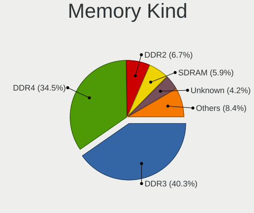

| Kind    | Computers | Percent |
|---------|-----------|---------|
| DDR3    | 48        | 40.34%  |
| DDR4    | 41        | 34.45%  |
| DDR2    | 8         | 6.72%   |
| SDRAM   | 7         | 5.88%   |
| Unknown | 5         | 4.2%    |
| LPDDR4  | 3         | 2.52%   |
| LPDDR5  | 2         | 1.68%   |
| LPDDR3  | 2         | 1.68%   |
| DDR5    | 2         | 1.68%   |
| DDR     | 1         | 0.84%   |

Memory Form Factor
------------------

Physical design of the memory module

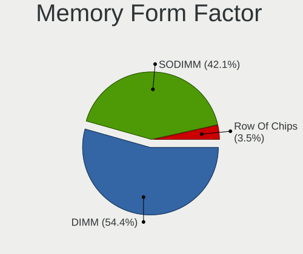

| Name         | Computers | Percent |
|--------------|-----------|---------|
| DIMM         | 62        | 54.39%  |
| SODIMM       | 48        | 42.11%  |
| Row Of Chips | 4         | 3.51%   |

Memory Size
-----------

Memory module size

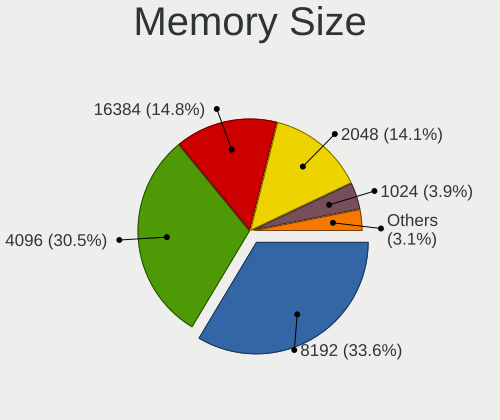

| Size  | Computers | Percent |
|-------|-----------|---------|
| 8192  | 43        | 33.59%  |
| 4096  | 39        | 30.47%  |
| 16384 | 19        | 14.84%  |
| 2048  | 18        | 14.06%  |
| 1024  | 5         | 3.91%   |
| 32768 | 3         | 2.34%   |
| 512   | 1         | 0.78%   |

Memory Speed
------------

Memory module speed

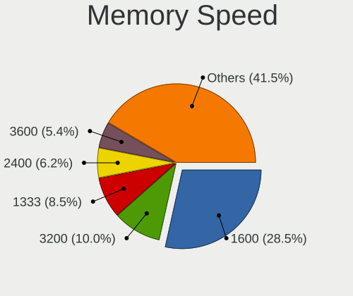

| Speed   | Computers | Percent |
|---------|-----------|---------|
| 1600    | 37        | 28.46%  |
| 3200    | 13        | 10%     |
| 1333    | 11        | 8.46%   |
| 2400    | 8         | 6.15%   |
| 3600    | 7         | 5.38%   |
| 2133    | 6         | 4.62%   |
| 2667    | 5         | 3.85%   |
| 800     | 5         | 3.85%   |
| 667     | 4         | 3.08%   |
| 3733    | 3         | 2.31%   |
| 3334    | 3         | 2.31%   |
| 1066    | 3         | 2.31%   |
| 6000    | 2         | 1.54%   |
| 4199    | 2         | 1.54%   |
| 1866    | 2         | 1.54%   |
| 1639    | 2         | 1.54%   |
| 1334    | 2         | 1.54%   |
| 7500    | 1         | 0.77%   |
| 6400    | 1         | 0.77%   |
| 4267    | 1         | 0.77%   |
| 3866    | 1         | 0.77%   |
| 3800    | 1         | 0.77%   |
| 3500    | 1         | 0.77%   |
| 3466    | 1         | 0.77%   |
| 3400    | 1         | 0.77%   |
| 3266    | 1         | 0.77%   |
| 3000    | 1         | 0.77%   |
| 2048    | 1         | 0.77%   |
| 1867    | 1         | 0.77%   |
| 975     | 1         | 0.77%   |
| 533     | 1         | 0.77%   |
| Unknown | 1         | 0.77%   |

Printers & scanners
-------------------

Printer Vendor
--------------

Printer device vendors

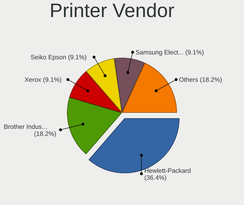

| Vendor                | Computers | Percent |
|-----------------------|-----------|---------|
| Hewlett-Packard       | 4         | 36.36%  |
| Brother Industries    | 2         | 18.18%  |
| Xerox                 | 1         | 9.09%   |
| Seiko Epson           | 1         | 9.09%   |
| Samsung Electronics   | 1         | 9.09%   |
| Lexmark International | 1         | 9.09%   |
| Canon                 | 1         | 9.09%   |

Printer Model
-------------

Printer device models

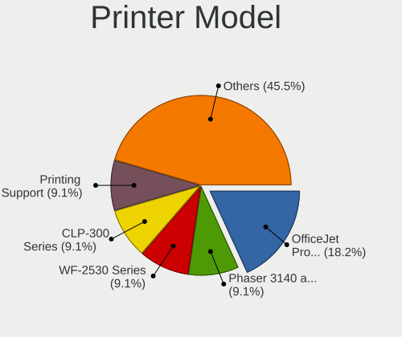

| Model                                  | Computers | Percent |
|----------------------------------------|-----------|---------|
| HP OfficeJet Pro 6970                  | 2         | 18.18%  |
| Xerox Phaser 3140 and 3155             | 1         | 9.09%   |
| Seiko Epson WF-2530 Series             | 1         | 9.09%   |
| Samsung CLP-300 Series                 | 1         | 9.09%   |
| Lexmark International Printing Support | 1         | 9.09%   |
| HP OfficeJet 6950                      | 1         | 9.09%   |
| HP DeskJet 840c                        | 1         | 9.09%   |
| Canon PIXMA MG3600 Series              | 1         | 9.09%   |
| Brother QL-570 Label Printer           | 1         | 9.09%   |
| Brother HL-2030 Laser Printer          | 1         | 9.09%   |

Scanner Vendor
--------------

Scanner device vendors

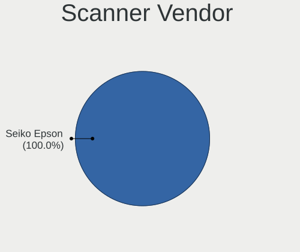

| Vendor      | Computers | Percent |
|-------------|-----------|---------|
| Seiko Epson | 5         | 100%    |

Scanner Model
-------------

Scanner device models

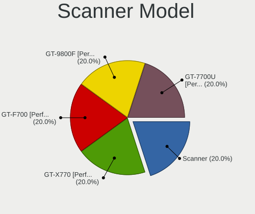

| Model                                   | Computers | Percent |
|-----------------------------------------|-----------|---------|
| Seiko Epson Scanner                     | 1         | 20%     |
| Seiko Epson GT-X770 [Perfection V500]   | 1         | 20%     |
| Seiko Epson GT-F700 [Perfection V350]   | 1         | 20%     |
| Seiko Epson GT-9800F [Perfection 3200]  | 1         | 20%     |
| Seiko Epson GT-7700U [Perfection 1240U] | 1         | 20%     |

Camera
------

Camera Vendor
-------------

Camera device vendors

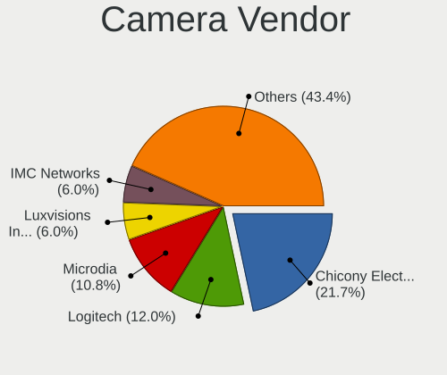

| Vendor                                 | Computers | Percent |
|----------------------------------------|-----------|---------|
| Chicony Electronics                    | 18        | 21.69%  |
| Logitech                               | 10        | 12.05%  |
| Microdia                               | 9         | 10.84%  |
| Luxvisions Innotech Limited            | 5         | 6.02%   |
| IMC Networks                           | 5         | 6.02%   |
| Bison Electronics                      | 5         | 6.02%   |
| Realtek Semiconductor                  | 4         | 4.82%   |
| Microsoft                              | 3         | 3.61%   |
| Lite-On Technology                     | 3         | 3.61%   |
| Cheng Uei Precision Industry (Foxlink) | 3         | 3.61%   |
| Apple                                  | 3         | 3.61%   |
| Alcor Micro                            | 3         | 3.61%   |
| Suyin                                  | 2         | 2.41%   |
| Sunplus Innovation Technology          | 2         | 2.41%   |
| Xiongmai                               | 1         | 1.2%    |
| WaveRider Communications               | 1         | 1.2%    |
| Sunplus IT                             | 1         | 1.2%    |
| Sonix Technology                       | 1         | 1.2%    |
| Razer USA                              | 1         | 1.2%    |
| Primax Electronics                     | 1         | 1.2%    |
| Leap Motion                            | 1         | 1.2%    |
| Huawei Technologies                    | 1         | 1.2%    |

Camera Model
------------

Camera device models

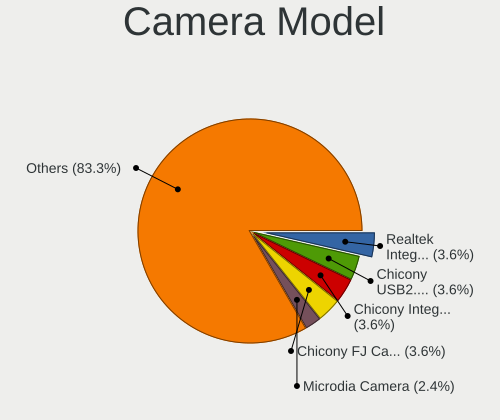

| Model                                                       | Computers | Percent |
|-------------------------------------------------------------|-----------|---------|
| Realtek Integrated_Webcam_HD                                | 3         | 3.57%   |
| Chicony USB2.0 Camera                                       | 3         | 3.57%   |
| Chicony Integrated Camera                                   | 3         | 3.57%   |
| Chicony FJ Camera                                           | 3         | 3.57%   |
| Microdia Camera                                             | 2         | 2.38%   |
| Luxvisions Innotech Limited HP TrueVision HD Camera         | 2         | 2.38%   |
| Logitech HD Pro Webcam C920                                 | 2         | 2.38%   |
| Lite-On HP HD Webcam                                        | 2         | 2.38%   |
| IMC Networks USB2.0 VGA UVC WebCam                          | 2         | 2.38%   |
| IMC Networks USB2.0 HD UVC WebCam                           | 2         | 2.38%   |
| Chicony Lenovo EasyCamera                                   | 2         | 2.38%   |
| Bison BisonCam,NB Pro                                       | 2         | 2.38%   |
| Apple iPhone 5/5C/5S/6/SE/7/8/X                             | 2         | 2.38%   |
| Xiongmai web camera                                         | 1         | 1.19%   |
| WaveRider USB 2.0 Camera                                    | 1         | 1.19%   |
| Suyin HP TrueVision HD Integrated Webcam                    | 1         | 1.19%   |
| Suyin 1.3M WebCam (notebook emachines E730, Acer sub-brand) | 1         | 1.19%   |
| Sunplus IT AUKEY PC-LM1 USB Camera                          | 1         | 1.19%   |
| Sunplus Full HD webcam                                      | 1         | 1.19%   |
| Sunplus Dell E5570 integrated webcam                        | 1         | 1.19%   |
| Sonix USB2.0 FHD UVC WebCam                                 | 1         | 1.19%   |
| Realtek USB Camera                                          | 1         | 1.19%   |
| Razer USA Razer Kiyo Pro                                    | 1         | 1.19%   |
| Primax HP Truevision FHD                                    | 1         | 1.19%   |
| Microsoft LifeCam VX-800                                    | 1         | 1.19%   |
| Microsoft LifeCam HD-5000                                   | 1         | 1.19%   |
| Microsoft LifeCam HD-3000                                   | 1         | 1.19%   |
| Microdia Webcam Vitade AF                                   | 1         | 1.19%   |
| Microdia USB 2.0 Camera                                     | 1         | 1.19%   |
| Microdia UGREEN Camera                                      | 1         | 1.19%   |
| Microdia Sonix USB 2.0 Camera                               | 1         | 1.19%   |
| Microdia Laptop_Integrated_Webcam_2M                        | 1         | 1.19%   |
| Microdia Integrated_Webcam_HD                               | 1         | 1.19%   |
| Microdia Integrated Webcam                                  | 1         | 1.19%   |
| Luxvisions Innotech Limited Integrated RGB Camera           | 1         | 1.19%   |
| Luxvisions Innotech Limited Integrated Camera               | 1         | 1.19%   |
| Luxvisions Innotech Limited HP Wide Vision HD Camera        | 1         | 1.19%   |
| Logitech Webcam C270                                        | 1         | 1.19%   |
| Logitech Webcam C210                                        | 1         | 1.19%   |
| Logitech Webcam C200                                        | 1         | 1.19%   |

Security
--------

Fingerprint Vendor
------------------

Fingerprint sensor vendors

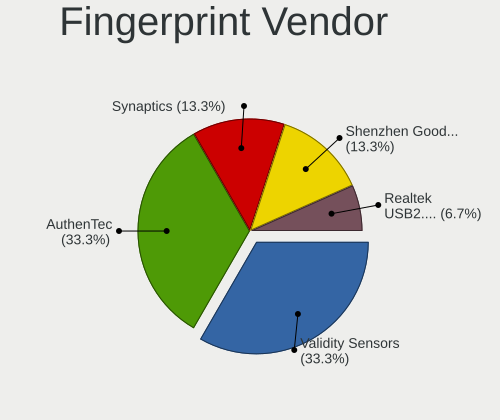

| Vendor                             | Computers | Percent |
|------------------------------------|-----------|---------|
| Validity Sensors                   | 5         | 33.33%  |
| AuthenTec                          | 5         | 33.33%  |
| Synaptics                          | 2         | 13.33%  |
| Shenzhen Goodix Technology         | 2         | 13.33%  |
| Realtek USB2.0 Finger Print Bridge | 1         | 6.67%   |

Fingerprint Model
-----------------

Fingerprint sensor models

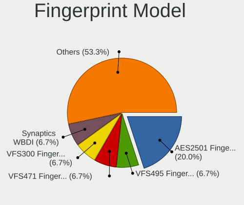

| Model                                                           | Computers | Percent |
|-----------------------------------------------------------------|-----------|---------|
| AuthenTec AES2501 Fingerprint Sensor                            | 3         | 20%     |
| Validity Sensors VFS495 Fingerprint Reader                      | 1         | 6.67%   |
| Validity Sensors VFS471 Fingerprint Reader                      | 1         | 6.67%   |
| Validity Sensors VFS300 Fingerprint Reader                      | 1         | 6.67%   |
| Validity Sensors Synaptics WBDI                                 | 1         | 6.67%   |
| Validity Sensors Fingerprint scanner                            | 1         | 6.67%   |
| Synaptics  WBDI                                                 | 1         | 6.67%   |
| Shenzhen Goodix  FingerPrint Device                             | 1         | 6.67%   |
| Shenzhen Goodix Fingerprint Reader                              | 1         | 6.67%   |
| Realtek USB2.0 Finger Print Bridge FocalTech Fingerprint Device | 1         | 6.67%   |
| AuthenTec Fingerprint Sensor                                    | 1         | 6.67%   |
| AuthenTec AES2550 Fingerprint Sensor                            | 1         | 6.67%   |
| Unknown                                                         | 1         | 6.67%   |

Chipcard Vendor
---------------

Chipcard module vendors

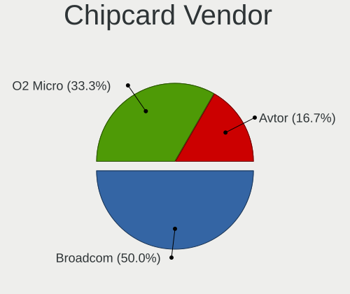

| Vendor   | Computers | Percent |
|----------|-----------|---------|
| Broadcom | 3         | 42.86%  |
| O2 Micro | 2         | 28.57%  |
| Bit4id   | 1         | 14.29%  |
| Avtor    | 1         | 14.29%  |

Chipcard Model
--------------

Chipcard module models

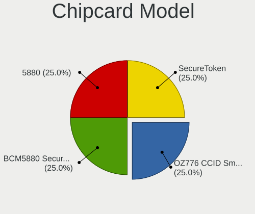

| Model                                                                        | Computers | Percent |
|------------------------------------------------------------------------------|-----------|---------|
| O2 Micro OZ776 CCID Smartcard Reader                                         | 2         | 28.57%  |
| Broadcom 5880                                                                | 2         | 28.57%  |
| Broadcom BCM5880 Secure Applications Processor with fingerprint swipe sensor | 1         | 14.29%  |
| Bit4id miniLector EVO                                                        | 1         | 14.29%  |
| Avtor SecureToken                                                            | 1         | 14.29%  |

Unsupported
-----------

Unsupported Devices
-------------------

Total unsupported devices on board

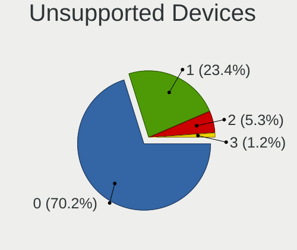

| Total | Computers | Percent |
|-------|-----------|---------|
| 0     | 120       | 70.18%  |
| 1     | 40        | 23.39%  |
| 2     | 9         | 5.26%   |
| 3     | 2         | 1.17%   |

Unsupported Device Types
------------------------

Types of unsupported devices

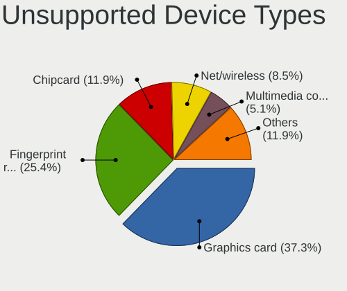

| Type                     | Computers | Percent |
|--------------------------|-----------|---------|
| Graphics card            | 22        | 37.29%  |
| Fingerprint reader       | 15        | 25.42%  |
| Chipcard                 | 7         | 11.86%  |
| Net/wireless             | 5         | 8.47%   |
| Multimedia controller    | 3         | 5.08%   |
| Sound                    | 2         | 3.39%   |
| Unassigned class         | 1         | 1.69%   |
| Storage                  | 1         | 1.69%   |
| Communication controller | 1         | 1.69%   |
| Camera                   | 1         | 1.69%   |
| Bluetooth                | 1         | 1.69%   |

