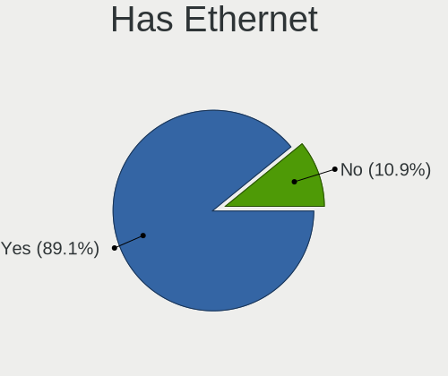
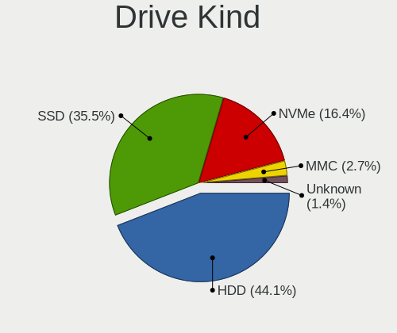
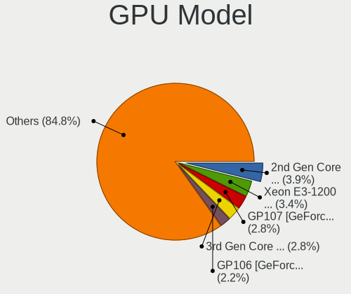
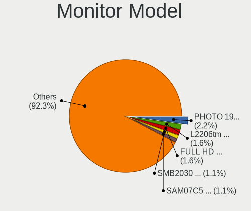
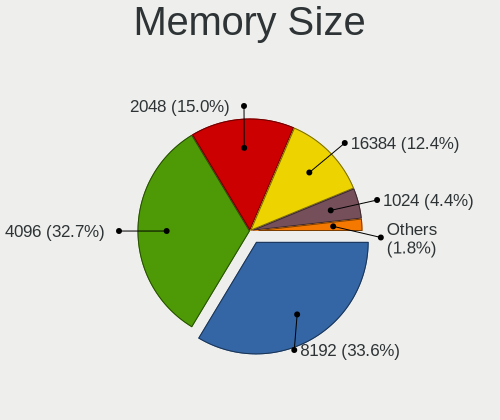
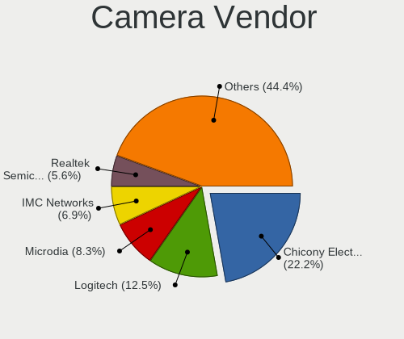

Mageia - Tested Hardware & Statistics
-------------------------------------

A project to collect tested hardware configurations for Mageia.

Anyone can contribute to this report by the [hw-probe](https://github.com/linuxhw/hw-probe) tool:

    sudo -E hw-probe -all -upload

Please submit a probe of your configuration if it's not presented on the page or is rare.

This is a report for all computer types. See also reports for [desktops](/Dist/Mageia/Desktop/README.md) and [notebooks](/Dist/Mageia/Notebook/README.md).

Full-feature report is available here: https://linux-hardware.org/?view=trends

Contents
--------

* [ Test Cases ](#test-cases)

* [ System ](#system)
  - [ Kernel                   ](#kernel)
  - [ Kernel Family            ](#kernel-family)
  - [ Kernel Major Ver.        ](#kernel-major-ver)
  - [ Arch                     ](#arch)
  - [ DE                       ](#de)
  - [ Display Server           ](#display-server)
  - [ Display Manager          ](#display-manager)
  - [ OS Lang                  ](#os-lang)
  - [ Boot Mode                ](#boot-mode)
  - [ Filesystem               ](#filesystem)
  - [ Part. scheme             ](#part-scheme)
  - [ Dual Boot with Linux/BSD ](#dual-boot-with-linuxbsd)
  - [ Dual Boot (Win)          ](#dual-boot-win)

* [ Board ](#board)
  - [ Vendor                   ](#vendor)
  - [ Model                    ](#model)
  - [ Model Family             ](#model-family)
  - [ MFG Year                 ](#mfg-year)
  - [ Form Factor              ](#form-factor)
  - [ Secure Boot              ](#secure-boot)
  - [ Coreboot                 ](#coreboot)
  - [ RAM Size                 ](#ram-size)
  - [ RAM Used                 ](#ram-used)
  - [ Total Drives             ](#total-drives)
  - [ Has CD-ROM               ](#has-cd-rom)
  - [ Has Ethernet             ](#has-ethernet)
  - [ Has WiFi                 ](#has-wifi)
  - [ Has Bluetooth            ](#has-bluetooth)

* [ Location ](#location)
  - [ Country                  ](#country)
  - [ City                     ](#city)

* [ Drives ](#drives)
  - [ Drive Vendor             ](#drive-vendor)
  - [ Drive Model              ](#drive-model)
  - [ HDD Vendor               ](#hdd-vendor)
  - [ SSD Vendor               ](#ssd-vendor)
  - [ Drive Kind               ](#drive-kind)
  - [ Drive Connector          ](#drive-connector)
  - [ Drive Size               ](#drive-size)
  - [ Space Total              ](#space-total)
  - [ Space Used               ](#space-used)
  - [ Malfunc. Drives          ](#malfunc-drives)
  - [ Malfunc. Drive Vendor    ](#malfunc-drive-vendor)
  - [ Malfunc. HDD Vendor      ](#malfunc-hdd-vendor)
  - [ Malfunc. Drive Kind      ](#malfunc-drive-kind)
  - [ Failed Drives            ](#failed-drives)
  - [ Failed Drive Vendor      ](#failed-drive-vendor)
  - [ Drive Status             ](#drive-status)

* [ Storage controller ](#storage-controller)
  - [ Storage Vendor           ](#storage-vendor)
  - [ Storage Model            ](#storage-model)
  - [ Storage Kind             ](#storage-kind)

* [ Processor ](#processor)
  - [ CPU Vendor               ](#cpu-vendor)
  - [ CPU Model                ](#cpu-model)
  - [ CPU Model Family         ](#cpu-model-family)
  - [ CPU Cores                ](#cpu-cores)
  - [ CPU Sockets              ](#cpu-sockets)
  - [ CPU Threads              ](#cpu-threads)
  - [ CPU Op-Modes             ](#cpu-op-modes)
  - [ CPU Microcode            ](#cpu-microcode)
  - [ CPU Microarch            ](#cpu-microarch)

* [ Graphics ](#graphics)
  - [ GPU Vendor               ](#gpu-vendor)
  - [ GPU Model                ](#gpu-model)
  - [ GPU Combo                ](#gpu-combo)
  - [ GPU Driver               ](#gpu-driver)
  - [ GPU Memory               ](#gpu-memory)

* [ Monitor ](#monitor)
  - [ Monitor Vendor           ](#monitor-vendor)
  - [ Monitor Model            ](#monitor-model)
  - [ Monitor Resolution       ](#monitor-resolution)
  - [ Monitor Diagonal         ](#monitor-diagonal)
  - [ Monitor Width            ](#monitor-width)
  - [ Aspect Ratio             ](#aspect-ratio)
  - [ Monitor Area             ](#monitor-area)
  - [ Pixel Density            ](#pixel-density)
  - [ Multiple Monitors        ](#multiple-monitors)

* [ Network ](#network)
  - [ Net Controller Vendor    ](#net-controller-vendor)
  - [ Net Controller Model     ](#net-controller-model)
  - [ Wireless Vendor          ](#wireless-vendor)
  - [ Wireless Model           ](#wireless-model)
  - [ Ethernet Vendor          ](#ethernet-vendor)
  - [ Ethernet Model           ](#ethernet-model)
  - [ Net Controller Kind      ](#net-controller-kind)
  - [ Used Controller          ](#used-controller)
  - [ NICs                     ](#nics)
  - [ IPv6                     ](#ipv6)

* [ Bluetooth ](#bluetooth)
  - [ Bluetooth Vendor         ](#bluetooth-vendor)
  - [ Bluetooth Model          ](#bluetooth-model)

* [ Sound ](#sound)
  - [ Sound Vendor             ](#sound-vendor)
  - [ Sound Model              ](#sound-model)

* [ Memory ](#memory)
  - [ Memory Vendor            ](#memory-vendor)
  - [ Memory Model             ](#memory-model)
  - [ Memory Kind              ](#memory-kind)
  - [ Memory Form Factor       ](#memory-form-factor)
  - [ Memory Size              ](#memory-size)
  - [ Memory Speed             ](#memory-speed)

* [ Printers & scanners ](#printers--scanners)
  - [ Printer Vendor           ](#printer-vendor)
  - [ Printer Model            ](#printer-model)
  - [ Scanner Vendor           ](#scanner-vendor)
  - [ Scanner Model            ](#scanner-model)

* [ Camera ](#camera)
  - [ Camera Vendor            ](#camera-vendor)
  - [ Camera Model             ](#camera-model)

* [ Security ](#security)
  - [ Fingerprint Vendor       ](#fingerprint-vendor)
  - [ Fingerprint Model        ](#fingerprint-model)
  - [ Chipcard Vendor          ](#chipcard-vendor)
  - [ Chipcard Model           ](#chipcard-model)

* [ Unsupported ](#unsupported)
  - [ Unsupported Devices      ](#unsupported-devices)
  - [ Unsupported Device Types ](#unsupported-device-types)

Test Cases
----------

| Vendor   | Model                       | Form-Factor | Probe                                                      | Date         |
|----------|-----------------------------|-------------|------------------------------------------------------------|--------------|
| Gigabyte | X570 AORUS ELITE WIFI       | Desktop     | [c11d937631](https://linux-hardware.org/?probe=c11d937631) | Feb 23, 2022 |
| ASRock   | M3A UCC                     | Desktop     | [eaa75fb3f4](https://linux-hardware.org/?probe=eaa75fb3f4) | Feb 20, 2022 |
| ASRock   | M3A UCC                     | Desktop     | [ce306a4c86](https://linux-hardware.org/?probe=ce306a4c86) | Feb 20, 2022 |
| MSI      | B250M BAZOOKA               | Desktop     | [4a8f0501a2](https://linux-hardware.org/?probe=4a8f0501a2) | Feb 11, 2022 |
| ASRock   | G41M-VS3                    | Desktop     | [825356bf6c](https://linux-hardware.org/?probe=825356bf6c) | Feb 02, 2022 |
| HP       | 1589                        | Desktop     | [41dbcb78cb](https://linux-hardware.org/?probe=41dbcb78cb) | Jan 30, 2022 |
| Gigabyte | H81M-DS2                    | Desktop     | [c0328d5402](https://linux-hardware.org/?probe=c0328d5402) | Jan 27, 2022 |
| Lenovo   | ThinkCentre M58e 7491B1G    | Desktop     | [568741947f](https://linux-hardware.org/?probe=568741947f) | Jan 12, 2022 |
| Gigabyte | B450 AORUS M                | Desktop     | [d9856d52b0](https://linux-hardware.org/?probe=d9856d52b0) | Jan 11, 2022 |
| Gigabyte | B450 AORUS M                | Desktop     | [8b8a13f3b4](https://linux-hardware.org/?probe=8b8a13f3b4) | Jan 11, 2022 |
| Gigabyte | B450 AORUS M                | Desktop     | [0fa4a81a77](https://linux-hardware.org/?probe=0fa4a81a77) | Jan 09, 2022 |
| Lenovo   | ThinkCentre M58e 7491B1G    | Desktop     | [a77218c72c](https://linux-hardware.org/?probe=a77218c72c) | Jan 09, 2022 |
| Gigabyte | Z87X-UD5H-CF                | Desktop     | [a1a7854f7a](https://linux-hardware.org/?probe=a1a7854f7a) | Jan 04, 2022 |
| Gigabyte | Z87X-UD5H-CF                | Desktop     | [c44573411d](https://linux-hardware.org/?probe=c44573411d) | Dec 27, 2021 |
| MSI      | MPG X570 GAMING EDGE WIF... | Desktop     | [c1d67915d0](https://linux-hardware.org/?probe=c1d67915d0) | Dec 26, 2021 |
| ASUSTek  | ROG ZENITH EXTREME          | Desktop     | [e3d82aebbe](https://linux-hardware.org/?probe=e3d82aebbe) | Dec 20, 2021 |
| MSI      | MPG X570 GAMING EDGE WIF... | Desktop     | [fdc65fea9d](https://linux-hardware.org/?probe=fdc65fea9d) | Dec 08, 2021 |
| Gigabyte | H81M-S2H                    | Desktop     | [ceefdd4eac](https://linux-hardware.org/?probe=ceefdd4eac) | Dec 06, 2021 |
| Dell     | Latitude E5570              | Notebook    | [38032eae74](https://linux-hardware.org/?probe=38032eae74) | Dec 06, 2021 |
| Dell     | Latitude E5570              | Notebook    | [9314738bbb](https://linux-hardware.org/?probe=9314738bbb) | Dec 06, 2021 |
| Dell     | Precision 5530              | Notebook    | [f98313a80c](https://linux-hardware.org/?probe=f98313a80c) | Nov 29, 2021 |
| Dell     | 0TP412                      | Desktop     | [f759f2084b](https://linux-hardware.org/?probe=f759f2084b) | Nov 22, 2021 |
| Gigabyte | Z87X-UD5H-CF                | Desktop     | [665331e075](https://linux-hardware.org/?probe=665331e075) | Nov 22, 2021 |
| ASUSTek  | SABERTOOTH 990FX R2.0       | Desktop     | [3e92c96ac0](https://linux-hardware.org/?probe=3e92c96ac0) | Nov 17, 2021 |
| ASUSTek  | SABERTOOTH 990FX R2.0       | Desktop     | [6e13fb31c9](https://linux-hardware.org/?probe=6e13fb31c9) | Oct 17, 2021 |
| ASUSTek  | SABERTOOTH 990FX R2.0       | Desktop     | [45d12f532c](https://linux-hardware.org/?probe=45d12f532c) | Oct 01, 2021 |
| Lenovo   | IdeaPad 3 15ADA05 81W1      | Notebook    | [3f4fe97a8a](https://linux-hardware.org/?probe=3f4fe97a8a) | Sep 30, 2021 |
| Gigabyte | H170-D3H-CF                 | Desktop     | [e18761a6b2](https://linux-hardware.org/?probe=e18761a6b2) | Sep 28, 2021 |
| Gigabyte | H170-D3H-CF                 | Desktop     | [42784959b9](https://linux-hardware.org/?probe=42784959b9) | Sep 28, 2021 |
| Apple    | Mac-F42386C8 PVT            | All in one  | [3235b7d95a](https://linux-hardware.org/?probe=3235b7d95a) | Sep 24, 2021 |
| Dell     | 0TP412                      | Desktop     | [25b9af915a](https://linux-hardware.org/?probe=25b9af915a) | Sep 09, 2021 |
| MSI      | MAG B460M MORTAR            | Desktop     | [6fa1f56407](https://linux-hardware.org/?probe=6fa1f56407) | Aug 30, 2021 |
| Gigabyte | H81M-S2H                    | Desktop     | [46740d8f33](https://linux-hardware.org/?probe=46740d8f33) | Aug 22, 2021 |
| Gigabyte | Z87X-UD5H-CF                | Desktop     | [31e9013879](https://linux-hardware.org/?probe=31e9013879) | Aug 18, 2021 |
| Gigabyte | Z87X-UD5H-CF                | Desktop     | [809f094941](https://linux-hardware.org/?probe=809f094941) | Aug 17, 2021 |
| Gigabyte | H81M-S2H                    | Desktop     | [894c915ecc](https://linux-hardware.org/?probe=894c915ecc) | Aug 17, 2021 |
| Lenovo   | IdeaPad Slim 1-14AST-05 ... | Notebook    | [46250d420a](https://linux-hardware.org/?probe=46250d420a) | Aug 14, 2021 |
| Gigabyte | B450 AORUS PRO WIFI-CF      | Desktop     | [4c28c43c28](https://linux-hardware.org/?probe=4c28c43c28) | Aug 10, 2021 |
| Lenovo   | ThinkPad T61 6468AE2        | Notebook    | [216fbf401b](https://linux-hardware.org/?probe=216fbf401b) | Aug 05, 2021 |
| Gigabyte | Z87X-UD5H-CF                | Desktop     | [88ddc09b9e](https://linux-hardware.org/?probe=88ddc09b9e) | Jul 28, 2021 |
| Gigabyte | H81M-S2H                    | Desktop     | [f52713e401](https://linux-hardware.org/?probe=f52713e401) | Jul 28, 2021 |
| Dell     | 0TP412                      | Desktop     | [8788d078a0](https://linux-hardware.org/?probe=8788d078a0) | Jul 19, 2021 |
| ASUSTek  | PRIME X399-A                | Desktop     | [a2b6af1a6a](https://linux-hardware.org/?probe=a2b6af1a6a) | Jul 14, 2021 |
| ASUSTek  | X751LN                      | Notebook    | [8c0efa94e8](https://linux-hardware.org/?probe=8c0efa94e8) | Jul 08, 2021 |
| Gigabyte | Z68XP-UD3P                  | Desktop     | [259e2a4ac0](https://linux-hardware.org/?probe=259e2a4ac0) | Jun 24, 2021 |
| ASUSTek  | X751LN                      | Notebook    | [7619cf7632](https://linux-hardware.org/?probe=7619cf7632) | May 31, 2021 |
| ASUSTek  | X751LN                      | Notebook    | [70f882a983](https://linux-hardware.org/?probe=70f882a983) | May 31, 2021 |
| Notebook | NL40_50GU                   | Notebook    | [baa8447288](https://linux-hardware.org/?probe=baa8447288) | May 08, 2021 |
| Medion   | DEFENDER P10                | Notebook    | [cb752c0a4a](https://linux-hardware.org/?probe=cb752c0a4a) | May 01, 2021 |
| Medion   | DEFENDER P10                | Notebook    | [f42aa05a37](https://linux-hardware.org/?probe=f42aa05a37) | May 01, 2021 |
| Gigabyte | B450M DS3H-CF               | Desktop     | [1be802a26e](https://linux-hardware.org/?probe=1be802a26e) | Apr 18, 2021 |
| ECS      | IC780M-A2                   | Desktop     | [e3cbd0879b](https://linux-hardware.org/?probe=e3cbd0879b) | Apr 17, 2021 |
| ASUSTek  | Z170-P                      | Desktop     | [1ebcf0ea2c](https://linux-hardware.org/?probe=1ebcf0ea2c) | Apr 16, 2021 |
| ASUSTek  | Z170-P                      | Desktop     | [a95896e05e](https://linux-hardware.org/?probe=a95896e05e) | Apr 16, 2021 |
| Medion   | Z370H4-EM                   | Desktop     | [57435ad8fb](https://linux-hardware.org/?probe=57435ad8fb) | Apr 16, 2021 |
| ASUSTek  | SABERTOOTH P67              | Desktop     | [6d81c9d615](https://linux-hardware.org/?probe=6d81c9d615) | Apr 16, 2021 |
| Fujitsu  | LIFEBOOK E752               | Notebook    | [8ec052ba75](https://linux-hardware.org/?probe=8ec052ba75) | Apr 15, 2021 |
| Gigabyte | H61M-S2PV                   | Desktop     | [dce1091d81](https://linux-hardware.org/?probe=dce1091d81) | Apr 15, 2021 |
| Medion   | Z370H4-EM                   | Desktop     | [b88834e15d](https://linux-hardware.org/?probe=b88834e15d) | Apr 15, 2021 |
| Lenovo   | ThinkPad T430 2342A19       | Notebook    | [9a5ad3016a](https://linux-hardware.org/?probe=9a5ad3016a) | Apr 15, 2021 |
| HP       | 212B                        | Desktop     | [697e2f24f0](https://linux-hardware.org/?probe=697e2f24f0) | Apr 03, 2021 |
| ASUSTek  | X751LN                      | Notebook    | [7da0db2567](https://linux-hardware.org/?probe=7da0db2567) | Apr 03, 2021 |
| ASUSTek  | X751LN                      | Notebook    | [09afc59907](https://linux-hardware.org/?probe=09afc59907) | Apr 02, 2021 |
| Intel    | STL2-bd A28808-302          | Desktop     | [d6b5151873](https://linux-hardware.org/?probe=d6b5151873) | Apr 01, 2021 |
| Gigabyte | B450M DS3H-CF               | Desktop     | [dbb3c1865f](https://linux-hardware.org/?probe=dbb3c1865f) | Mar 29, 2021 |
| HP       | 212B                        | Desktop     | [69f528da9b](https://linux-hardware.org/?probe=69f528da9b) | Mar 28, 2021 |
| ASUSTek  | PRIME A320M-K               | Desktop     | [2b381b3421](https://linux-hardware.org/?probe=2b381b3421) | Mar 24, 2021 |
| ASUSTek  | X556URK                     | Notebook    | [4904d2c78e](https://linux-hardware.org/?probe=4904d2c78e) | Mar 18, 2021 |
| Gigabyte | Z87X-UD5H-CF                | Desktop     | [d4570ea6b2](https://linux-hardware.org/?probe=d4570ea6b2) | Mar 12, 2021 |
| ASUSTek  | X751LN                      | Notebook    | [0bb2c11bdc](https://linux-hardware.org/?probe=0bb2c11bdc) | Feb 24, 2021 |
| ASUSTek  | X751LN                      | Notebook    | [a8e9bcdc07](https://linux-hardware.org/?probe=a8e9bcdc07) | Feb 23, 2021 |
| ASRock   | M3A UCC                     | Desktop     | [714da9501f](https://linux-hardware.org/?probe=714da9501f) | Feb 19, 2021 |
| HP       | 339A                        | Desktop     | [43e759b593](https://linux-hardware.org/?probe=43e759b593) | Feb 14, 2021 |
| HP       | 339A                        | Desktop     | [39d23c03ca](https://linux-hardware.org/?probe=39d23c03ca) | Feb 13, 2021 |
| Dell     | Latitude E6530              | Notebook    | [035378659f](https://linux-hardware.org/?probe=035378659f) | Feb 12, 2021 |
| Gigabyte | H81M-S2H                    | Desktop     | [f9e5b1d3c6](https://linux-hardware.org/?probe=f9e5b1d3c6) | Feb 08, 2021 |
| Gigabyte | Z87X-UD5H-CF                | Desktop     | [aea262050c](https://linux-hardware.org/?probe=aea262050c) | Feb 04, 2021 |
| Gigabyte | Z87X-UD5H-CF                | Desktop     | [adabf5b11e](https://linux-hardware.org/?probe=adabf5b11e) | Jan 31, 2021 |
| Dell     | Inspiron 5480               | Notebook    | [2ae12f394c](https://linux-hardware.org/?probe=2ae12f394c) | Jan 27, 2021 |
| ASUSTek  | X751LN                      | Notebook    | [6e7c6b5d77](https://linux-hardware.org/?probe=6e7c6b5d77) | Jan 16, 2021 |
| Gigabyte | B450M DS3H-CF               | Desktop     | [a399a43535](https://linux-hardware.org/?probe=a399a43535) | Jan 16, 2021 |
| Gigabyte | H81M-S2H                    | Desktop     | [0b7e0d2152](https://linux-hardware.org/?probe=0b7e0d2152) | Jan 15, 2021 |
| ASUSTek  | X751LN                      | Notebook    | [567ce23c0d](https://linux-hardware.org/?probe=567ce23c0d) | Jan 13, 2021 |
| ASUSTek  | X751LN                      | Notebook    | [513ff22c6f](https://linux-hardware.org/?probe=513ff22c6f) | Jan 13, 2021 |
| Kiano    | SlimNote 15.6               | Notebook    | [55179f361c](https://linux-hardware.org/?probe=55179f361c) | Jan 08, 2021 |
| Kiano    | SlimNote 15.6               | Notebook    | [5379fd7478](https://linux-hardware.org/?probe=5379fd7478) | Jan 08, 2021 |
| ASUSTek  | X751LN                      | Notebook    | [9136594961](https://linux-hardware.org/?probe=9136594961) | Jan 02, 2021 |
| ASUSTek  | X751LN                      | Notebook    | [ea55725f98](https://linux-hardware.org/?probe=ea55725f98) | Dec 30, 2020 |
| ASUSTek  | VivoBook 15_ASUS Laptop ... | Notebook    | [01aa1a7b95](https://linux-hardware.org/?probe=01aa1a7b95) | Dec 30, 2020 |
| ASUSTek  | Z87-DELUXE                  | Desktop     | [e160eea25a](https://linux-hardware.org/?probe=e160eea25a) | Dec 28, 2020 |
| ASUSTek  | X751LN                      | Notebook    | [8399780a87](https://linux-hardware.org/?probe=8399780a87) | Dec 27, 2020 |
| ASUSTek  | X751LN                      | Notebook    | [f7f3533d54](https://linux-hardware.org/?probe=f7f3533d54) | Dec 27, 2020 |
| HP       | 339A                        | Desktop     | [ea7792c224](https://linux-hardware.org/?probe=ea7792c224) | Dec 26, 2020 |
| Gigabyte | Z87X-UD5H-CF                | Desktop     | [932603ce99](https://linux-hardware.org/?probe=932603ce99) | Dec 25, 2020 |
| ASUSTek  | ROG ZENITH EXTREME          | Desktop     | [5fd86e8c94](https://linux-hardware.org/?probe=5fd86e8c94) | Dec 22, 2020 |
| Dell     | Inspiron 5480               | Notebook    | [1261d0c9d3](https://linux-hardware.org/?probe=1261d0c9d3) | Dec 21, 2020 |
| Lenovo   | ThinkServer TS140           | Desktop     | [ec475a7f9a](https://linux-hardware.org/?probe=ec475a7f9a) | Dec 09, 2020 |
| ASRock   | H87M Pro4                   | Desktop     | [12185c0c75](https://linux-hardware.org/?probe=12185c0c75) | Dec 07, 2020 |
| ASRock   | H87M Pro4                   | Desktop     | [747bc56208](https://linux-hardware.org/?probe=747bc56208) | Dec 07, 2020 |
| Gigabyte | F2A88XM-DS2                 | Desktop     | [1b5123770e](https://linux-hardware.org/?probe=1b5123770e) | Dec 06, 2020 |
| Gigabyte | H81M-S2H                    | Desktop     | [3f948a0756](https://linux-hardware.org/?probe=3f948a0756) | Dec 03, 2020 |
| HP       | Spectre 13 Ultrabook        | Notebook    | [9b88fe4fa5](https://linux-hardware.org/?probe=9b88fe4fa5) | Nov 30, 2020 |
| Gigabyte | H81M-S2H                    | Desktop     | [009e2519cb](https://linux-hardware.org/?probe=009e2519cb) | Nov 22, 2020 |
| HP       | EliteBook 840 G3            | Notebook    | [4dd618cb59](https://linux-hardware.org/?probe=4dd618cb59) | Nov 21, 2020 |
| HP       | EliteBook 840 G3            | Notebook    | [2543664b54](https://linux-hardware.org/?probe=2543664b54) | Nov 21, 2020 |
| Gigabyte | GA-78LMT-USB3 R2            | Desktop     | [1aec57de3b](https://linux-hardware.org/?probe=1aec57de3b) | Nov 20, 2020 |
| Gigabyte | H81M-S2H                    | Desktop     | [8f031786c5](https://linux-hardware.org/?probe=8f031786c5) | Nov 16, 2020 |
| Gigabyte | Z87X-UD5H-CF                | Desktop     | [1bdc158142](https://linux-hardware.org/?probe=1bdc158142) | Nov 16, 2020 |
| ASUSTek  | PRIME B360-PLUS             | Desktop     | [dadbc2f1d7](https://linux-hardware.org/?probe=dadbc2f1d7) | Nov 15, 2020 |
| Lenovo   | IdeaPad 3 15ADA05 81W1      | Notebook    | [889cb35866](https://linux-hardware.org/?probe=889cb35866) | Nov 13, 2020 |
| HP       | ProBook 445 G7              | Notebook    | [2e97281aa0](https://linux-hardware.org/?probe=2e97281aa0) | Nov 05, 2020 |
| MSI      | MPG X570 GAMING EDGE WIF... | Desktop     | [fb717dc126](https://linux-hardware.org/?probe=fb717dc126) | Nov 05, 2020 |
| Gigabyte | H170-D3H-CF                 | Desktop     | [8220a96972](https://linux-hardware.org/?probe=8220a96972) | Nov 02, 2020 |
| Acer     | Aspire V3-772               | Notebook    | [413786151e](https://linux-hardware.org/?probe=413786151e) | Oct 31, 2020 |
| Gigabyte | H81M-S2H                    | Desktop     | [a854973bf5](https://linux-hardware.org/?probe=a854973bf5) | Oct 25, 2020 |
| Dell     | Inspiron 5480               | Notebook    | [62bb8575f1](https://linux-hardware.org/?probe=62bb8575f1) | Oct 22, 2020 |
| ASUSTek  | SABERTOOTH 990FX R2.0       | Desktop     | [e50d2bd553](https://linux-hardware.org/?probe=e50d2bd553) | Oct 18, 2020 |
| ZOTAC    | Unknown                     | Desktop     | [624888f3ab](https://linux-hardware.org/?probe=624888f3ab) | Oct 14, 2020 |
| Gigabyte | H170-D3H-CF                 | Desktop     | [c73f4878af](https://linux-hardware.org/?probe=c73f4878af) | Oct 04, 2020 |
| Gigabyte | H81M-S2H                    | Desktop     | [1a7d01552e](https://linux-hardware.org/?probe=1a7d01552e) | Oct 04, 2020 |
| Lenovo   | ThinkServer TS140           | Desktop     | [87f4eac666](https://linux-hardware.org/?probe=87f4eac666) | Sep 27, 2020 |
| Gigabyte | H81M-S2H                    | Desktop     | [8fa69c952c](https://linux-hardware.org/?probe=8fa69c952c) | Sep 15, 2020 |
| HP       | Unknown                     | Notebook    | [b12d1589a1](https://linux-hardware.org/?probe=b12d1589a1) | Sep 08, 2020 |
| Acer     | Aspire 7741                 | Notebook    | [e5914ee358](https://linux-hardware.org/?probe=e5914ee358) | Sep 05, 2020 |
| HP       | Pavilion dv6                | Notebook    | [021a94f63e](https://linux-hardware.org/?probe=021a94f63e) | Sep 03, 2020 |
| ASRock   | M3A UCC                     | Desktop     | [43182d8754](https://linux-hardware.org/?probe=43182d8754) | Sep 01, 2020 |
| ASRock   | M3A UCC                     | Desktop     | [50908c43f9](https://linux-hardware.org/?probe=50908c43f9) | Sep 01, 2020 |
| Gigabyte | Z87X-UD5H-CF                | Desktop     | [cbab4d3ea3](https://linux-hardware.org/?probe=cbab4d3ea3) | Aug 31, 2020 |
| Gigabyte | H81M-S2H                    | Desktop     | [f6c7b24ad6](https://linux-hardware.org/?probe=f6c7b24ad6) | Aug 31, 2020 |
| Gigabyte | Z87X-UD5H-CF                | Desktop     | [7fd8c75c95](https://linux-hardware.org/?probe=7fd8c75c95) | Aug 19, 2020 |
| Gigabyte | H81M-S2H                    | Desktop     | [14955a6413](https://linux-hardware.org/?probe=14955a6413) | Aug 19, 2020 |
| Lenovo   | G480 20149                  | Notebook    | [5598a535c7](https://linux-hardware.org/?probe=5598a535c7) | Jul 24, 2020 |
| ASUSTek  | P8H61-M LE                  | Desktop     | [2ca048a380](https://linux-hardware.org/?probe=2ca048a380) | Jun 29, 2020 |
| ASRock   | H81M-VG4 R2.0               | Desktop     | [ed7fe704dd](https://linux-hardware.org/?probe=ed7fe704dd) | May 25, 2020 |
| HP       | 339A                        | Desktop     | [bbd2341205](https://linux-hardware.org/?probe=bbd2341205) | May 09, 2020 |
| HP       | 339A                        | Desktop     | [1334fcea56](https://linux-hardware.org/?probe=1334fcea56) | May 09, 2020 |
| ASUSTek  | VivoBook 15_ASUS Laptop ... | Notebook    | [8e31f45bf5](https://linux-hardware.org/?probe=8e31f45bf5) | May 07, 2020 |
| ASUSTek  | VivoBook 15_ASUS Laptop ... | Notebook    | [db83d53491](https://linux-hardware.org/?probe=db83d53491) | May 07, 2020 |
| ASUSTek  | VivoBook 15_ASUS Laptop ... | Notebook    | [4b71b90312](https://linux-hardware.org/?probe=4b71b90312) | May 04, 2020 |
| MSI      | B360M MORTAR                | Desktop     | [d2215c28af](https://linux-hardware.org/?probe=d2215c28af) | Apr 26, 2020 |
| ASUSTek  | SABERTOOTH 990FX R2.0       | Desktop     | [f6e5343aa5](https://linux-hardware.org/?probe=f6e5343aa5) | Mar 31, 2020 |
| ASUSTek  | H170M-PLUS                  | Desktop     | [6dd350fc4a](https://linux-hardware.org/?probe=6dd350fc4a) | Mar 31, 2020 |
| ASUSTek  | PRIME A320M-K               | Desktop     | [cabb3f4266](https://linux-hardware.org/?probe=cabb3f4266) | Mar 29, 2020 |
| Vorke    | V1 Plus                     | Desktop     | [c49c2bb635](https://linux-hardware.org/?probe=c49c2bb635) | Mar 29, 2020 |
| Gigabyte | H81M-S2H                    | Desktop     | [c61a5bbb12](https://linux-hardware.org/?probe=c61a5bbb12) | Mar 05, 2020 |
| ASRock   | X470 Taichi                 | Desktop     | [5125778e67](https://linux-hardware.org/?probe=5125778e67) | Mar 02, 2020 |
| Gigabyte | B85M-D3H                    | Desktop     | [00442cfd17](https://linux-hardware.org/?probe=00442cfd17) | Feb 25, 2020 |
| Gigabyte | Z87X-UD5H-CF                | Desktop     | [71a967abf8](https://linux-hardware.org/?probe=71a967abf8) | Feb 22, 2020 |
| Gigabyte | H81M-S2H                    | Desktop     | [52c3f45c8f](https://linux-hardware.org/?probe=52c3f45c8f) | Feb 22, 2020 |
| ASUSTek  | H170M-PLUS                  | Desktop     | [0ae790ac85](https://linux-hardware.org/?probe=0ae790ac85) | Feb 01, 2020 |
| ASUSTek  | SABERTOOTH 990FX R2.0       | Desktop     | [506294e8e9](https://linux-hardware.org/?probe=506294e8e9) | Jan 13, 2020 |
| ASUSTek  | SABERTOOTH 990FX R2.0       | Desktop     | [16e8d236b4](https://linux-hardware.org/?probe=16e8d236b4) | Jan 12, 2020 |
| ASUSTek  | SABERTOOTH 990FX R2.0       | Desktop     | [7df7d9c296](https://linux-hardware.org/?probe=7df7d9c296) | Dec 20, 2019 |
| ASUSTek  | SABERTOOTH 990FX R2.0       | Desktop     | [0c42dfc62c](https://linux-hardware.org/?probe=0c42dfc62c) | Dec 08, 2019 |
| ASUSTek  | SABERTOOTH 990FX R2.0       | Desktop     | [2ef79b672c](https://linux-hardware.org/?probe=2ef79b672c) | Nov 15, 2019 |
| ASUSTek  | A55BM-K                     | Desktop     | [d58dbcdd06](https://linux-hardware.org/?probe=d58dbcdd06) | Nov 08, 2019 |
| MSI      | Z97-G43                     | Desktop     | [87e4cd50ce](https://linux-hardware.org/?probe=87e4cd50ce) | Apr 26, 2019 |
| ASRock   | X470 Taichi                 | Desktop     | [14a8808d2b](https://linux-hardware.org/?probe=14a8808d2b) | Apr 26, 2019 |
| Gigabyte | Z68X-UD3H-B3                | Desktop     | [28ea4213cb](https://linux-hardware.org/?probe=28ea4213cb) | Feb 25, 2019 |
| Gigabyte | Z68X-UD3H-B3                | Desktop     | [b9c55f2790](https://linux-hardware.org/?probe=b9c55f2790) | Feb 25, 2019 |
| ASRock   | X470 Taichi                 | Desktop     | [7b6ec43d58](https://linux-hardware.org/?probe=7b6ec43d58) | Jan 08, 2019 |
| ASRock   | X470 Taichi                 | Desktop     | [117cb09799](https://linux-hardware.org/?probe=117cb09799) | Dec 31, 2018 |
| Gigabyte | Z68X-UD3H-B3                | Desktop     | [0a61436f40](https://linux-hardware.org/?probe=0a61436f40) | Feb 15, 2018 |
| ASUSTek  | M5A97 R2.0                  | Desktop     | [304aa59840](https://linux-hardware.org/?probe=304aa59840) | Dec 14, 2017 |
| ASUSTek  | M4A78 PLUS                  | Desktop     | [ed9d8a148d](https://linux-hardware.org/?probe=ed9d8a148d) | Mar 06, 2016 |
| Lenovo   | G570 20079                  | Notebook    | [fc57cb086b](https://linux-hardware.org/?probe=fc57cb086b) | Nov 26, 2015 |

System
------

Kernel
------

Version of the Linux kernel

| Version                | Computers | Percent |
|------------------------|-----------|---------|
| 5.7.19-desktop-3.mga7  | 14        | 11.76%  |
| 5.10.27-desktop-1.mga8 | 8         | 6.72%   |
| 5.7.19-desktop-1.mga7  | 7         | 5.88%   |
| 5.6.14-desktop-2.mga7  | 4         | 3.36%   |
| 5.5.4-desktop-1.mga7   | 4         | 3.36%   |
| 5.10.25-desktop-1.mga8 | 4         | 3.36%   |
| 5.5.9-desktop-1.mga7   | 3         | 2.52%   |
| 5.10.12-desktop-1.mga7 | 3         | 2.52%   |
| 5.7.14-desktop-1.mga7  | 2         | 1.68%   |
| 5.6.6-desktop-1.mga7   | 2         | 1.68%   |
| 5.3.7-desktop-4.mga7   | 2         | 1.68%   |
| 5.15.4-desktop-1.mga8  | 2         | 1.68%   |
| 5.15.23-desktop-1.mga8 | 2         | 1.68%   |
| 5.15.16-desktop-1.mga8 | 2         | 1.68%   |
| 5.15.11-desktop-3.mga8 | 2         | 1.68%   |
| 5.10.60-desktop-2.mga8 | 2         | 1.68%   |
| 5.10.56-desktop-1.mga8 | 2         | 1.68%   |
| 5.10.52-desktop-1.mga8 | 2         | 1.68%   |
| 5.10.20-desktop-2.mga7 | 2         | 1.68%   |
| 5.10.14-desktop-1.mga7 | 2         | 1.68%   |
| 5.9.6-desktop-1.mga8   | 1         | 0.84%   |
| 5.9.3-desktop-1.mga8   | 1         | 0.84%   |
| 5.9.16-desktop-1.mga7  | 1         | 0.84%   |
| 5.9.11-desktop-3.mga8  | 1         | 0.84%   |
| 5.9.1-desktop-1.mga8   | 1         | 0.84%   |
| 5.8.5-desktop-2.mga8   | 1         | 0.84%   |
| 5.8.14-desktop-1.mga8  | 1         | 0.84%   |
| 5.7.8-desktop-1.mga8   | 1         | 0.84%   |
| 5.6.8-desktop-1.mga7   | 1         | 0.84%   |
| 5.5.6-desktop-2.mga7   | 1         | 0.84%   |
| 5.5.13-desktop-1.mga7  | 1         | 0.84%   |
| 5.4.8-desktop-1.mga7   | 1         | 0.84%   |
| 5.4.12-desktop-1.mga7  | 1         | 0.84%   |
| 5.3.13-desktop-2.mga7  | 1         | 0.84%   |
| 5.15.6-desktop-2.mga9  | 1         | 0.84%   |
| 5.15.6-desktop-2.mga8  | 1         | 0.84%   |
| 5.15.2-desktop-2.mga9  | 1         | 0.84%   |
| 5.15.18-desktop-2.mga8 | 1         | 0.84%   |
| 5.15.15-desktop-1.mga8 | 1         | 0.84%   |
| 5.15.10-desktop-1.mga9 | 1         | 0.84%   |
| 5.15.10-desktop-1.mga8 | 1         | 0.84%   |
| 5.14.9-desktop-1.mga9  | 1         | 0.84%   |
| 5.14.12-desktop-2.mga9 | 1         | 0.84%   |
| 5.14.10-desktop-1.mga8 | 1         | 0.84%   |
| 5.13.12-desktop-2.mga8 | 1         | 0.84%   |
| 5.12.15-desktop-1.mga8 | 1         | 0.84%   |
| 5.10.8-desktop-2.mga7  | 1         | 0.84%   |
| 5.10.78-desktop-1.mga8 | 1         | 0.84%   |
| 5.10.62-desktop-1.mga8 | 1         | 0.84%   |
| 5.10.6-desktop-1.mga7  | 1         | 0.84%   |
| 5.10.48-desktop-1.mga8 | 1         | 0.84%   |
| 5.10.46-desktop-1.mga8 | 1         | 0.84%   |
| 5.10.45-desktop-2.mga8 | 1         | 0.84%   |
| 5.10.37-desktop-2.mga8 | 1         | 0.84%   |
| 5.10.33-desktop-1.mga8 | 1         | 0.84%   |
| 5.10.30-desktop-1.mga8 | 1         | 0.84%   |
| 5.10.3-desktop-1.mga7  | 1         | 0.84%   |
| 5.10.2-desktop-1.mga8  | 1         | 0.84%   |
| 5.10.16-desktop-1.mga8 | 1         | 0.84%   |
| 5.10.16-desktop-1.mga7 | 1         | 0.84%   |

Kernel Family
-------------

Linux kernel without a distro release

| Version | Computers | Percent |
|---------|-----------|---------|
| 5.7.19  | 18        | 15.52%  |
| 5.10.27 | 8         | 6.9%    |
| 5.6.14  | 4         | 3.45%   |
| 5.5.4   | 4         | 3.45%   |
| 5.10.25 | 4         | 3.45%   |
| 5.10.12 | 4         | 3.45%   |
| 5.5.9   | 3         | 2.59%   |
| 5.7.14  | 2         | 1.72%   |
| 5.6.6   | 2         | 1.72%   |
| 5.3.7   | 2         | 1.72%   |
| 5.15.6  | 2         | 1.72%   |
| 5.15.4  | 2         | 1.72%   |
| 5.15.23 | 2         | 1.72%   |
| 5.15.16 | 2         | 1.72%   |
| 5.15.11 | 2         | 1.72%   |
| 5.15.10 | 2         | 1.72%   |
| 5.10.60 | 2         | 1.72%   |
| 5.10.56 | 2         | 1.72%   |
| 5.10.52 | 2         | 1.72%   |
| 5.10.20 | 2         | 1.72%   |
| 5.10.16 | 2         | 1.72%   |
| 5.10.14 | 2         | 1.72%   |
| 5.9.6   | 1         | 0.86%   |
| 5.9.3   | 1         | 0.86%   |
| 5.9.16  | 1         | 0.86%   |
| 5.9.11  | 1         | 0.86%   |
| 5.9.1   | 1         | 0.86%   |
| 5.8.5   | 1         | 0.86%   |
| 5.8.14  | 1         | 0.86%   |
| 5.7.8   | 1         | 0.86%   |
| 5.6.8   | 1         | 0.86%   |
| 5.5.6   | 1         | 0.86%   |
| 5.5.13  | 1         | 0.86%   |
| 5.4.8   | 1         | 0.86%   |
| 5.4.12  | 1         | 0.86%   |
| 5.3.13  | 1         | 0.86%   |
| 5.15.2  | 1         | 0.86%   |
| 5.15.18 | 1         | 0.86%   |
| 5.15.15 | 1         | 0.86%   |
| 5.14.9  | 1         | 0.86%   |
| 5.14.12 | 1         | 0.86%   |
| 5.14.10 | 1         | 0.86%   |
| 5.13.12 | 1         | 0.86%   |
| 5.12.15 | 1         | 0.86%   |
| 5.10.8  | 1         | 0.86%   |
| 5.10.78 | 1         | 0.86%   |
| 5.10.62 | 1         | 0.86%   |
| 5.10.6  | 1         | 0.86%   |
| 5.10.48 | 1         | 0.86%   |
| 5.10.46 | 1         | 0.86%   |
| 5.10.45 | 1         | 0.86%   |
| 5.10.37 | 1         | 0.86%   |
| 5.10.33 | 1         | 0.86%   |
| 5.10.30 | 1         | 0.86%   |
| 5.10.3  | 1         | 0.86%   |
| 5.10.2  | 1         | 0.86%   |
| 5.1.0   | 1         | 0.86%   |
| 4.9.56  | 1         | 0.86%   |
| 4.19.13 | 1         | 0.86%   |
| 4.14.18 | 1         | 0.86%   |

Kernel Major Ver.
-----------------

Linux kernel major version

| Version | Computers | Percent |
|---------|-----------|---------|
| 5.10    | 27        | 27.55%  |
| 5.7     | 19        | 19.39%  |
| 5.15    | 14        | 14.29%  |
| 5.5     | 8         | 8.16%   |
| 5.6     | 7         | 7.14%   |
| 5.9     | 5         | 5.1%    |
| 5.14    | 3         | 3.06%   |
| 4.14    | 3         | 3.06%   |
| 5.8     | 2         | 2.04%   |
| 5.4     | 2         | 2.04%   |
| 5.3     | 2         | 2.04%   |
| 5.13    | 1         | 1.02%   |
| 5.12    | 1         | 1.02%   |
| 5.1     | 1         | 1.02%   |
| 4.9     | 1         | 1.02%   |
| 4.19    | 1         | 1.02%   |
| 4.1     | 1         | 1.02%   |

Arch
----

OS architecture (x86_64, i586, etc.)

| Name   | Computers | Percent |
|--------|-----------|---------|
| x86_64 | 71        | 98.61%  |
| i686   | 1         | 1.39%   |

DE
--

Desktop Environment

| Name          | Computers | Percent |
|---------------|-----------|---------|
| KDE5          | 31        | 37.8%   |
| KDE           | 23        | 28.05%  |
| GNOME         | 7         | 8.54%   |
| Unknown       | 7         | 8.54%   |
| Cinnamon      | 5         | 6.1%    |
| LXDE          | 3         | 3.66%   |
| XFCE          | 2         | 2.44%   |
| MATE          | 1         | 1.22%   |
| LXQt          | 1         | 1.22%   |
| KDE4          | 1         | 1.22%   |
| GNOME Classic | 1         | 1.22%   |

Display Server
--------------

X11 or Wayland

| Name    | Computers | Percent |
|---------|-----------|---------|
| X11     | 70        | 95.89%  |
| Wayland | 2         | 2.74%   |
| Tty     | 1         | 1.37%   |

Display Manager
---------------

SDDM, LightDM, etc.

| Name    | Computers | Percent |
|---------|-----------|---------|
| Unknown | 36        | 49.32%  |
| SDDM    | 30        | 41.1%   |
| TDM     | 3         | 4.11%   |
| LightDM | 2         | 2.74%   |
| XDM     | 1         | 1.37%   |
| GDM     | 1         | 1.37%   |

OS Lang
-------

Language

| Lang    | Computers | Percent |
|---------|-----------|---------|
| fr_FR   | 14        | 18.92%  |
| en_US   | 14        | 18.92%  |
| de_DE   | 9         | 12.16%  |
| Unknown | 8         | 10.81%  |
| ru_RU   | 6         | 8.11%   |
| en_GB   | 4         | 5.41%   |
| it_IT   | 3         | 4.05%   |
| sv_SE   | 2         | 2.7%    |
| pt_BR   | 2         | 2.7%    |
| pl_PL   | 2         | 2.7%    |
| zh_TW   | 1         | 1.35%   |
| sl_SI   | 1         | 1.35%   |
| hu_HU   | 1         | 1.35%   |
| fr_BE   | 1         | 1.35%   |
| es_GT   | 1         | 1.35%   |
| es_ES   | 1         | 1.35%   |
| es_AR   | 1         | 1.35%   |
| en_CA   | 1         | 1.35%   |
| cs_CZ   | 1         | 1.35%   |
| bg_BG   | 1         | 1.35%   |

Boot Mode
---------

EFI or BIOS

| Mode | Computers | Percent |
|------|-----------|---------|
| BIOS | 45        | 59.21%  |
| EFI  | 31        | 40.79%  |

Filesystem
----------

Type of filesystem

| Type     | Computers | Percent |
|----------|-----------|---------|
| Ext4     | 60        | 81.08%  |
| Unknown  | 6         | 8.11%   |
| Xfs      | 4         | 5.41%   |
| Btrfs    | 3         | 4.05%   |
| Reiserfs | 1         | 1.35%   |

Part. scheme
------------

Scheme of partitioning

| Type    | Computers | Percent |
|---------|-----------|---------|
| GPT     | 29        | 38.67%  |
| Unknown | 29        | 38.67%  |
| MBR     | 17        | 22.67%  |

Dual Boot with Linux/BSD
------------------------

Hosting more than one Linux/BSD

| Dual boot | Computers | Percent |
|-----------|-----------|---------|
| No        | 62        | 86.11%  |
| Yes       | 10        | 13.89%  |

Dual Boot (Win)
---------------

Hosting Linux and Windows

| Dual boot | Computers | Percent |
|-----------|-----------|---------|
| No        | 57        | 77.03%  |
| Yes       | 17        | 22.97%  |

Board
-----

Vendor
------

Motherboard manufacturer

| Name                | Computers | Percent |
|---------------------|-----------|---------|
| ASUSTek Computer    | 17        | 23.61%  |
| Gigabyte Technology | 14        | 19.44%  |
| Hewlett-Packard     | 8         | 11.11%  |
| Dell                | 6         | 8.33%   |
| MSI                 | 5         | 6.94%   |
| Lenovo              | 5         | 6.94%   |
| ASRock              | 5         | 6.94%   |
| Medion              | 2         | 2.78%   |
| Acer                | 2         | 2.78%   |
| ZOTAC               | 1         | 1.39%   |
| Vorke               | 1         | 1.39%   |
| Notebook            | 1         | 1.39%   |
| Kiano               | 1         | 1.39%   |
| Intel               | 1         | 1.39%   |
| Fujitsu             | 1         | 1.39%   |
| ECS                 | 1         | 1.39%   |
| Apple               | 1         | 1.39%   |

Model
-----

Motherboard model

| Name                                 | Computers | Percent |
|--------------------------------------|-----------|---------|
| Gigabyte Z68X-UD3H-B3                | 2         | 2.78%   |
| Dell Precision WorkStation T3400     | 2         | 2.78%   |
| ASUS SABERTOOTH 990FX R2.0           | 2         | 2.78%   |
| Unknown                              | 2         | 2.78%   |
| Vorke V1 Plus                        | 1         | 1.39%   |
| Notebook NL40_50GU                   | 1         | 1.39%   |
| MSI MS-7C82                          | 1         | 1.39%   |
| MSI MS-7C37                          | 1         | 1.39%   |
| MSI MS-7B23                          | 1         | 1.39%   |
| MSI MS-7A70                          | 1         | 1.39%   |
| MSI MS-7816                          | 1         | 1.39%   |
| Medion MD34161/C708                  | 1         | 1.39%   |
| Medion DEFENDER P10                  | 1         | 1.39%   |
| Lenovo ThinkPad T430 2342A19         | 1         | 1.39%   |
| Lenovo ThinkCentre M58e 7491B1G      | 1         | 1.39%   |
| Lenovo IdeaPad 3 15ADA05 81W1        | 1         | 1.39%   |
| Lenovo G480 20149                    | 1         | 1.39%   |
| Lenovo 70A4000HUX ThinkServer TS140  | 1         | 1.39%   |
| Kiano SlimNote 15.6                  | 1         | 1.39%   |
| Intel STL2                           | 1         | 1.39%   |
| HP Z440 Workstation                  | 1         | 1.39%   |
| HP Z420 Workstation                  | 1         | 1.39%   |
| HP Spectre 13 Ultrabook              | 1         | 1.39%   |
| HP ProBook 445 G7                    | 1         | 1.39%   |
| HP Pavilion dv6                      | 1         | 1.39%   |
| HP EliteBook 840 G3                  | 1         | 1.39%   |
| HP Compaq Pro 6300 SFF               | 1         | 1.39%   |
| Gigabyte Z87X-UD5H                   | 1         | 1.39%   |
| Gigabyte Z68XP-UD3P                  | 1         | 1.39%   |
| Gigabyte X570 AORUS ELITE WIFI       | 1         | 1.39%   |
| Gigabyte H81M-S2H                    | 1         | 1.39%   |
| Gigabyte H81M-DS2                    | 1         | 1.39%   |
| Gigabyte H61M-S2PV                   | 1         | 1.39%   |
| Gigabyte H170-D3H                    | 1         | 1.39%   |
| Gigabyte GA-78LMT-USB3 R2            | 1         | 1.39%   |
| Gigabyte F2A88XM-DS2                 | 1         | 1.39%   |
| Gigabyte B85M-D3H                    | 1         | 1.39%   |
| Gigabyte B450M DS3H                  | 1         | 1.39%   |
| Gigabyte B450 AORUS PRO WIFI         | 1         | 1.39%   |
| Fujitsu LIFEBOOK E752                | 1         | 1.39%   |
| ECS IC780M-A2                        | 1         | 1.39%   |
| Dell Precision 5530                  | 1         | 1.39%   |
| Dell Latitude E6530                  | 1         | 1.39%   |
| Dell Latitude E5570                  | 1         | 1.39%   |
| Dell Inspiron 5480                   | 1         | 1.39%   |
| ASUS Z170-P                          | 1         | 1.39%   |
| ASUS X751LN                          | 1         | 1.39%   |
| ASUS X556URK                         | 1         | 1.39%   |
| ASUS VivoBook 15_ASUS Laptop X507UAR | 1         | 1.39%   |
| ASUS SABERTOOTH P67                  | 1         | 1.39%   |
| ASUS ROG ZENITH EXTREME              | 1         | 1.39%   |
| ASUS PRIME X399-A                    | 1         | 1.39%   |
| ASUS PRIME B360-PLUS                 | 1         | 1.39%   |
| ASUS PRIME A320M-K                   | 1         | 1.39%   |
| ASUS P8H61-M LE                      | 1         | 1.39%   |
| ASUS M5A97 R2.0                      | 1         | 1.39%   |
| ASUS M4A78 PLUS                      | 1         | 1.39%   |
| ASUS H170M-PLUS                      | 1         | 1.39%   |
| ASUS All Series                      | 1         | 1.39%   |
| ASUS A55BM-K                         | 1         | 1.39%   |

Model Family
------------

Motherboard model prefix

| Name                   | Computers | Percent |
|------------------------|-----------|---------|
| Dell Precision         | 3         | 4.17%   |
| ASUS SABERTOOTH        | 3         | 4.17%   |
| ASUS PRIME             | 3         | 4.17%   |
| Gigabyte Z68X-UD3H-B3  | 2         | 2.78%   |
| Dell Latitude          | 2         | 2.78%   |
| Acer Aspire            | 2         | 2.78%   |
| Unknown                | 2         | 2.78%   |
| Vorke V1               | 1         | 1.39%   |
| Notebook NL40          | 1         | 1.39%   |
| MSI MS-7C82            | 1         | 1.39%   |
| MSI MS-7C37            | 1         | 1.39%   |
| MSI MS-7B23            | 1         | 1.39%   |
| MSI MS-7A70            | 1         | 1.39%   |
| MSI MS-7816            | 1         | 1.39%   |
| Medion MD34161         | 1         | 1.39%   |
| Medion DEFENDER        | 1         | 1.39%   |
| Lenovo ThinkPad        | 1         | 1.39%   |
| Lenovo ThinkCentre     | 1         | 1.39%   |
| Lenovo IdeaPad         | 1         | 1.39%   |
| Lenovo G480            | 1         | 1.39%   |
| Lenovo 70A4000HUX      | 1         | 1.39%   |
| Kiano SlimNote         | 1         | 1.39%   |
| Intel STL2             | 1         | 1.39%   |
| HP Z440                | 1         | 1.39%   |
| HP Z420                | 1         | 1.39%   |
| HP Spectre             | 1         | 1.39%   |
| HP ProBook             | 1         | 1.39%   |
| HP Pavilion            | 1         | 1.39%   |
| HP EliteBook           | 1         | 1.39%   |
| HP Compaq              | 1         | 1.39%   |
| Gigabyte Z87X-UD5H     | 1         | 1.39%   |
| Gigabyte Z68XP-UD3P    | 1         | 1.39%   |
| Gigabyte X570          | 1         | 1.39%   |
| Gigabyte H81M-S2H      | 1         | 1.39%   |
| Gigabyte H81M-DS2      | 1         | 1.39%   |
| Gigabyte H61M-S2PV     | 1         | 1.39%   |
| Gigabyte H170-D3H      | 1         | 1.39%   |
| Gigabyte GA-78LMT-USB3 | 1         | 1.39%   |
| Gigabyte F2A88XM-DS2   | 1         | 1.39%   |
| Gigabyte B85M-D3H      | 1         | 1.39%   |
| Gigabyte B450M         | 1         | 1.39%   |
| Gigabyte B450          | 1         | 1.39%   |
| Fujitsu LIFEBOOK       | 1         | 1.39%   |
| ECS IC780M-A2          | 1         | 1.39%   |
| Dell Inspiron          | 1         | 1.39%   |
| ASUS Z170-P            | 1         | 1.39%   |
| ASUS X751LN            | 1         | 1.39%   |
| ASUS X556URK           | 1         | 1.39%   |
| ASUS VivoBook          | 1         | 1.39%   |
| ASUS ROG               | 1         | 1.39%   |
| ASUS P8H61-M           | 1         | 1.39%   |
| ASUS M5A97             | 1         | 1.39%   |
| ASUS M4A78             | 1         | 1.39%   |
| ASUS H170M-PLUS        | 1         | 1.39%   |
| ASUS All               | 1         | 1.39%   |
| ASUS A55BM-K           | 1         | 1.39%   |
| ASRock X470            | 1         | 1.39%   |
| ASRock M3A             | 1         | 1.39%   |
| ASRock H87M            | 1         | 1.39%   |
| ASRock H81M-VG4        | 1         | 1.39%   |

MFG Year
--------

Motherboard manufacture year

| Year | Computers | Percent |
|------|-----------|---------|
| 2013 | 12        | 16.67%  |
| 2012 | 10        | 13.89%  |
| 2018 | 9         | 12.5%   |
| 2017 | 6         | 8.33%   |
| 2020 | 4         | 5.56%   |
| 2019 | 4         | 5.56%   |
| 2016 | 4         | 5.56%   |
| 2015 | 4         | 5.56%   |
| 2014 | 4         | 5.56%   |
| 2008 | 4         | 5.56%   |
| 2011 | 3         | 4.17%   |
| 2010 | 3         | 4.17%   |
| 2009 | 3         | 4.17%   |
| 2007 | 1         | 1.39%   |
| 2002 | 1         | 1.39%   |

Form Factor
-----------

Physical design of the computer

| Name       | Computers | Percent |
|------------|-----------|---------|
| Desktop    | 50        | 69.44%  |
| Notebook   | 21        | 29.17%  |
| All in one | 1         | 1.39%   |

Secure Boot
-----------

Enabled or disabled

| State    | Computers | Percent |
|----------|-----------|---------|
| Disabled | 72        | 100%    |

Coreboot
--------

Have coreboot on board

| Used | Computers | Percent |
|------|-----------|---------|
| No   | 72        | 100%    |

RAM Size
--------

Total RAM memory

| Size in GB  | Computers | Percent |
|-------------|-----------|---------|
| 16.01-24.0  | 19        | 25%     |
| 4.01-8.0    | 16        | 21.05%  |
| 8.01-16.0   | 15        | 19.74%  |
| 32.01-64.0  | 10        | 13.16%  |
| 3.01-4.0    | 10        | 13.16%  |
| 64.01-256.0 | 4         | 5.26%   |
| 24.01-32.0  | 2         | 2.63%   |

RAM Used
--------

Used RAM memory

| Used GB    | Computers | Percent |
|------------|-----------|---------|
| 2.01-3.0   | 29        | 32.22%  |
| 1.01-2.0   | 22        | 24.44%  |
| 4.01-8.0   | 17        | 18.89%  |
| 3.01-4.0   | 13        | 14.44%  |
| 8.01-16.0  | 6         | 6.67%   |
| 0.51-1.0   | 2         | 2.22%   |
| 16.01-24.0 | 1         | 1.11%   |

Total Drives
------------

Number of drives on board

| Drives | Computers | Percent |
|--------|-----------|---------|
| 1      | 29        | 38.16%  |
| 2      | 19        | 25%     |
| 3      | 15        | 19.74%  |
| 5      | 5         | 6.58%   |
| 4      | 4         | 5.26%   |
| 6      | 2         | 2.63%   |
| 8      | 1         | 1.32%   |
| 7      | 1         | 1.32%   |

Has CD-ROM
----------

Has CD-ROM on board

| Presented | Computers | Percent |
|-----------|-----------|---------|
| No        | 38        | 52.05%  |
| Yes       | 35        | 47.95%  |

Has Ethernet
------------

Has Ethernet on board

| Presented | Computers | Percent |
|-----------|-----------|---------|
| Yes       | 65        | 90.28%  |
| No        | 7         | 9.72%   |

Has WiFi
--------

Has WiFi module

| Presented | Computers | Percent |
|-----------|-----------|---------|
| No        | 38        | 52.05%  |
| Yes       | 35        | 47.95%  |

Has Bluetooth
-------------

Has Bluetooth module

| Presented | Computers | Percent |
|-----------|-----------|---------|
| Yes       | 37        | 51.39%  |
| No        | 35        | 48.61%  |

Location
--------

Country
-------

Geographic location (country)

| Country    | Computers | Percent |
|------------|-----------|---------|
| France     | 15        | 20.83%  |
| USA        | 11        | 15.28%  |
| Germany    | 9         | 12.5%   |
| UK         | 5         | 6.94%   |
| Ukraine    | 3         | 4.17%   |
| Russia     | 3         | 4.17%   |
| Italy      | 3         | 4.17%   |
| Sweden     | 2         | 2.78%   |
| Poland     | 2         | 2.78%   |
| Greece     | 2         | 2.78%   |
| Canada     | 2         | 2.78%   |
| Brazil     | 2         | 2.78%   |
| Taiwan     | 1         | 1.39%   |
| Slovenia   | 1         | 1.39%   |
| Romania    | 1         | 1.39%   |
| Luxembourg | 1         | 1.39%   |
| Kenya      | 1         | 1.39%   |
| Indonesia  | 1         | 1.39%   |
| Guatemala  | 1         | 1.39%   |
| Czechia    | 1         | 1.39%   |
| Colombia   | 1         | 1.39%   |
| Bulgaria   | 1         | 1.39%   |
| Belgium    | 1         | 1.39%   |
| Belarus    | 1         | 1.39%   |
| Argentina  | 1         | 1.39%   |

City
----

Geographic location (city)

| City                         | Computers | Percent |
|------------------------------|-----------|---------|
| Paris                        | 4         | 4.3%    |
| Waterloo                     | 3         | 3.23%   |
| Mala Danylivka               | 3         | 3.23%   |
| Kharkiv                      | 3         | 3.23%   |
| Cologne                      | 3         | 3.23%   |
| Rome                         | 2         | 2.15%   |
| Oakland                      | 2         | 2.15%   |
| Kingston upon Thames         | 2         | 2.15%   |
| Grants Pass                  | 2         | 2.15%   |
| Basingstoke                  | 2         | 2.15%   |
| Yakutsk                      | 1         | 1.08%   |
| Werl                         | 1         | 1.08%   |
| Voronezh                     | 1         | 1.08%   |
| Volos                        | 1         | 1.08%   |
| Tver                         | 1         | 1.08%   |
| Tresserve                    | 1         | 1.08%   |
| Tours                        | 1         | 1.08%   |
| Thessaloniki                 | 1         | 1.08%   |
| Teddington                   | 1         | 1.08%   |
| So Paulo                 | 1         | 1.08%   |
| Strasbourg                   | 1         | 1.08%   |
| Sternberk                    | 1         | 1.08%   |
| Sartrouville                 | 1         | 1.08%   |
| Sainte-Genevive-des-Bois | 1         | 1.08%   |
| Saint-Michel-sur-Orge        | 1         | 1.08%   |
| Saint-Di                 | 1         | 1.08%   |
| Rio de Janeiro               | 1         | 1.08%   |
| Poznan                       | 1         | 1.08%   |
| Pisa                         | 1         | 1.08%   |
| Penmarch                     | 1         | 1.08%   |
| Palermo                      | 1         | 1.08%   |
| Oxford                       | 1         | 1.08%   |
| Odenville                    | 1         | 1.08%   |
| Obernai                      | 1         | 1.08%   |
| Nova Vodolaha                | 1         | 1.08%   |
| Nova Gorica                  | 1         | 1.08%   |
| Nordenham                    | 1         | 1.08%   |
| Niedermodern                 | 1         | 1.08%   |
| New Taipei                   | 1         | 1.08%   |
| Nairobi                      | 1         | 1.08%   |
| Munich                       | 1         | 1.08%   |
| Miercurea-Ciuc               | 1         | 1.08%   |
| Mannheim                     | 1         | 1.08%   |
| Luxembourg                   | 1         | 1.08%   |
| Lumajang                     | 1         | 1.08%   |
| Lige                     | 1         | 1.08%   |
| Lisieux                      | 1         | 1.08%   |
| Kehychivka                   | 1         | 1.08%   |
| Kalisz                       | 1         | 1.08%   |
| Jena                         | 1         | 1.08%   |
| Huty                         | 1         | 1.08%   |
| Helsingborg                  | 1         | 1.08%   |
| Hammersmith                  | 1         | 1.08%   |
| Guatemala City               | 1         | 1.08%   |
| Frankfurt am Main            | 1         | 1.08%   |
| Fountain Hill                | 1         | 1.08%   |
| Fort Bragg                   | 1         | 1.08%   |
| Farnborough                  | 1         | 1.08%   |
| Essen                        | 1         | 1.08%   |
| Erlangen                     | 1         | 1.08%   |

Drives
------

Drive Vendor
------------

Hard drive vendors

| Vendor                  | Computers | Drives | Percent |
|-------------------------|-----------|--------|---------|
| WDC                     | 36        | 145    | 24.32%  |
| Seagate                 | 22        | 36     | 14.86%  |
| Samsung Electronics     | 16        | 20     | 10.81%  |
| Kingston                | 12        | 20     | 8.11%   |
| Toshiba                 | 9         | 17     | 6.08%   |
| SanDisk                 | 8         | 14     | 5.41%   |
| Hitachi                 | 7         | 7      | 4.73%   |
| Unknown                 | 4         | 4      | 2.7%    |
| HGST                    | 4         | 9      | 2.7%    |
| PNY                     | 3         | 4      | 2.03%   |
| Intel                   | 3         | 3      | 2.03%   |
| Crucial                 | 3         | 7      | 2.03%   |
| SK Hynix                | 2         | 3      | 1.35%   |
| Phison                  | 2         | 2      | 1.35%   |
| OCZ-VERTEX              | 2         | 2      | 1.35%   |
| OCZ                     | 2         | 2      | 1.35%   |
| XPG                     | 1         | 4      | 0.68%   |
| Verbatim                | 1         | 1      | 0.68%   |
| Union Memory (Shenzhen) | 1         | 1      | 0.68%   |
| Transcend               | 1         | 1      | 0.68%   |
| TO Exter                | 1         | 1      | 0.68%   |
| Team                    | 1         | 1      | 0.68%   |
| LDLC                    | 1         | 1      | 0.68%   |
| HUAWEI                  | 1         | 1      | 0.68%   |
| FORESEE                 | 1         | 1      | 0.68%   |
| Corsair                 | 1         | 1      | 0.68%   |
| China                   | 1         | 1      | 0.68%   |
| Asmedia                 | 1         | 1      | 0.68%   |
| A-DATA Technology       | 1         | 1      | 0.68%   |

Drive Model
-----------

Hard drive models

| Model                                        | Computers | Percent |
|----------------------------------------------|-----------|---------|
| WDC WD2500BEVT-22ZCT0 250GB                  | 4         | 2.37%   |
| WDC WD10EZEX-08WN4A0 1TB                     | 3         | 1.78%   |
| Samsung SSD 860 EVO 250GB                    | 3         | 1.78%   |
| WDC WDS500G2B0A-00SM50 500GB SSD             | 2         | 1.18%   |
| WDC WDS250G2B0A-00SM50 250GB SSD             | 2         | 1.18%   |
| WDC WDS240G2G0A-00JH30 240GB SSD             | 2         | 1.18%   |
| WDC WD30EZRZ-00Z5HB0 3TB                     | 2         | 1.18%   |
| WDC WD20EFRX-68EUZN0 2TB                     | 2         | 1.18%   |
| WDC WD10EZRZ-00HTKB0 1TB                     | 2         | 1.18%   |
| WDC WD10EFRX-68PJCN0 1TB                     | 2         | 1.18%   |
| Toshiba HDWD120 2TB                          | 2         | 1.18%   |
| Seagate ST3500418AS 500GB                    | 2         | 1.18%   |
| Seagate ST32000644NS 2TB                     | 2         | 1.18%   |
| Seagate ST1000DM003-1CH162 1TB               | 2         | 1.18%   |
| SanDisk SDSSDA120G 120GB                     | 2         | 1.18%   |
| SanDisk Extreme SSD 2TB                      | 2         | 1.18%   |
| Samsung SSD 860 EVO 500GB                    | 2         | 1.18%   |
| Samsung SSD 850 EVO 500GB                    | 2         | 1.18%   |
| OCZ-VERTEX PLUS R2 247GB SSD                 | 2         | 1.18%   |
| Kingston SV300S37A240G 240GB SSD             | 2         | 1.18%   |
| Kingston SH103S3120G 120GB SSD               | 2         | 1.18%   |
| Kingston SA400S37120G 120GB SSD              | 2         | 1.18%   |
| Intel SSDSC2CW120A3 120GB                    | 2         | 1.18%   |
| Hitachi HDS722020ALA330 2TB                  | 2         | 1.18%   |
| HGST HUS726040ALE611 4TB                     | 2         | 1.18%   |
| XPG NVMe SSD Drive 2TB                       | 1         | 0.59%   |
| XPG NVMe SSD Drive 1024GB                    | 1         | 0.59%   |
| WDC WDS500G3XHC-00SJG0 500GB                 | 1         | 0.59%   |
| WDC WDS100T2B0A 1TB SSD                      | 1         | 0.59%   |
| WDC WD800BB-00JHC0 80GB                      | 1         | 0.59%   |
| WDC WD5000AAKX-60U6AA0 500GB                 | 1         | 0.59%   |
| WDC WD5000AADS-00S9B0 500GB                  | 1         | 0.59%   |
| WDC WD40EFRX-68N32N0 4TB                     | 1         | 0.59%   |
| WDC WD4000FYYZ-01UL1B2 4TB                   | 1         | 0.59%   |
| WDC WD3200KS-00PFB0 320GB                    | 1         | 0.59%   |
| WDC WD3200AAJS-00B4A0 320GB                  | 1         | 0.59%   |
| WDC WD30PURX-64P6ZY0 3TB                     | 1         | 0.59%   |
| WDC WD30EZRX-00DC0B0 3TB                     | 1         | 0.59%   |
| WDC WD30EZRX-00D8PB0 3TB                     | 1         | 0.59%   |
| WDC WD3000GLFS-01F8U0 304GB                  | 1         | 0.59%   |
| WDC WD20EZRZ-00Z5HB0 2TB                     | 1         | 0.59%   |
| WDC WD20EZRX-00D8PB0 2TB                     | 1         | 0.59%   |
| WDC WD20EARX-00PASB0 2TB                     | 1         | 0.59%   |
| WDC WD1600BEVT-22ZCT0 160GB                  | 1         | 0.59%   |
| WDC WD141KRYZ-01C66B0 14TB                   | 1         | 0.59%   |
| WDC WD10SPZX-75Z10T2 1TB                     | 1         | 0.59%   |
| WDC WD10SPZX-00Z10T0 1TB                     | 1         | 0.59%   |
| WDC WD10JPVX-60JC3T0 1TB                     | 1         | 0.59%   |
| WDC WD10EZRX-00L4HB0 1TB                     | 1         | 0.59%   |
| WDC WD10EZRX-00A8LB0 1TB                     | 1         | 0.59%   |
| WDC WD10EZEX-22MFCA0 1TB                     | 1         | 0.59%   |
| WDC WD10EARS-00Y5B1 1TB                      | 1         | 0.59%   |
| WDC WD10EARS-00MVWB0 1TB                     | 1         | 0.59%   |
| WDC WD1002FAEX-00Z3A0 1TB                    | 1         | 0.59%   |
| Verbatim USB External SSD 256GB              | 1         | 0.59%   |
| Unknown SD/MMC/MS PRO 64GB                   | 1         | 0.59%   |
| Unknown MMC Card  32GB                       | 1         | 0.59%   |
| Unknown MMC Card  16GB                       | 1         | 0.59%   |
| Unknown L200 Hard drive 2TB                  | 1         | 0.59%   |
| Union Memory (Shenzhen) NVMe SSD Drive 128GB | 1         | 0.59%   |

HDD Vendor
----------

Hard disk drive vendors

| Vendor              | Computers | Drives | Percent |
|---------------------|-----------|--------|---------|
| WDC                 | 29        | 127    | 38.16%  |
| Seagate             | 22        | 36     | 28.95%  |
| Toshiba             | 9         | 17     | 11.84%  |
| Hitachi             | 7         | 7      | 9.21%   |
| HGST                | 4         | 9      | 5.26%   |
| Unknown             | 2         | 2      | 2.63%   |
| Samsung Electronics | 2         | 4      | 2.63%   |
| Asmedia             | 1         | 1      | 1.32%   |

SSD Vendor
----------

Solid state drive vendors

| Vendor              | Computers | Drives | Percent |
|---------------------|-----------|--------|---------|
| Samsung Electronics | 12        | 13     | 21.05%  |
| Kingston            | 9         | 15     | 15.79%  |
| WDC                 | 7         | 17     | 12.28%  |
| SanDisk             | 6         | 8      | 10.53%  |
| PNY                 | 3         | 4      | 5.26%   |
| Intel               | 3         | 3      | 5.26%   |
| Crucial             | 3         | 7      | 5.26%   |
| OCZ-VERTEX          | 2         | 2      | 3.51%   |
| OCZ                 | 2         | 2      | 3.51%   |
| Verbatim            | 1         | 1      | 1.75%   |
| Transcend           | 1         | 1      | 1.75%   |
| TO Exter            | 1         | 1      | 1.75%   |
| Team                | 1         | 1      | 1.75%   |
| SK Hynix            | 1         | 1      | 1.75%   |
| LDLC                | 1         | 1      | 1.75%   |
| FORESEE             | 1         | 1      | 1.75%   |
| Corsair             | 1         | 1      | 1.75%   |
| China               | 1         | 1      | 1.75%   |
| A-DATA Technology   | 1         | 1      | 1.75%   |

Drive Kind
----------

HDD or SSD

| Kind    | Computers | Drives | Percent |
|---------|-----------|--------|---------|
| HDD     | 55        | 203    | 49.55%  |
| SSD     | 40        | 81     | 36.04%  |
| NVMe    | 13        | 24     | 11.71%  |
| MMC     | 2         | 2      | 1.8%    |
| Unknown | 1         | 1      | 0.9%    |

Drive Connector
---------------

SATA, SAS, NVMe, etc.

| Type | Computers | Drives | Percent |
|------|-----------|--------|---------|
| SATA | 67        | 269    | 74.44%  |
| NVMe | 13        | 24     | 14.44%  |
| SAS  | 8         | 16     | 8.89%   |
| MMC  | 2         | 2      | 2.22%   |

Drive Size
----------

Size of hard drive

| Size in TB | Computers | Drives | Percent |
|------------|-----------|--------|---------|
| 0.01-0.5   | 53        | 100    | 46.49%  |
| 0.51-1.0   | 31        | 102    | 27.19%  |
| 1.01-2.0   | 16        | 29     | 14.04%  |
| 2.01-3.0   | 6         | 42     | 5.26%   |
| 3.01-4.0   | 5         | 7      | 4.39%   |
| 4.01-10.0  | 2         | 3      | 1.75%   |
| 10.01-20.0 | 1         | 1      | 0.88%   |

Space Total
-----------

Amount of disk space available on the file system

| Size in GB     | Computers | Percent |
|----------------|-----------|---------|
| 501-1000       | 20        | 26.32%  |
| More than 3000 | 14        | 18.42%  |
| 251-500        | 11        | 14.47%  |
| 101-250        | 11        | 14.47%  |
| 2001-3000      | 9         | 11.84%  |
| 1001-2000      | 7         | 9.21%   |
| 51-100         | 3         | 3.95%   |
| Unknown        | 1         | 1.32%   |

Space Used
----------

Amount of used disk space

| Used GB        | Computers | Percent |
|----------------|-----------|---------|
| 101-250        | 17        | 20.48%  |
| 1001-2000      | 12        | 14.46%  |
| 51-100         | 11        | 13.25%  |
| 251-500        | 10        | 12.05%  |
| 1-20           | 10        | 12.05%  |
| 501-1000       | 10        | 12.05%  |
| More than 3000 | 6         | 7.23%   |
| 21-50          | 5         | 6.02%   |
| 2001-3000      | 1         | 1.2%    |
| Unknown        | 1         | 1.2%    |

Malfunc. Drives
---------------

Drive models with a malfunction

| Model                                 | Computers | Drives | Percent |
|---------------------------------------|-----------|--------|---------|
| Intel SSDSC2CW120A3 120GB             | 2         | 2      | 15.38%  |
| WDC WD10EARS-00MVWB0 1TB              | 1         | 1      | 7.69%   |
| WDC WD1002FAEX-00Z3A0 1TB             | 1         | 1      | 7.69%   |
| Toshiba MQ01ABD100 1TB                | 1         | 1      | 7.69%   |
| SK Hynix HFS256G39TND-N210A 256GB SSD | 1         | 1      | 7.69%   |
| Seagate ST3500418AS 500GB             | 1         | 1      | 7.69%   |
| Seagate ST3250410AS 250GB             | 1         | 1      | 7.69%   |
| Seagate ST320LT020-9YG142 320GB       | 1         | 1      | 7.69%   |
| Seagate ST1000DM003-1CH162 1TB        | 1         | 1      | 7.69%   |
| OCZ VERTEX3 120GB SSD                 | 1         | 1      | 7.69%   |
| Hitachi HTS725050A9A364 500GB         | 1         | 1      | 7.69%   |
| HGST HTS725050A7E630 500GB            | 1         | 1      | 7.69%   |

Malfunc. Drive Vendor
---------------------

Vendors of faulty drives

| Vendor   | Computers | Drives | Percent |
|----------|-----------|--------|---------|
| Seagate  | 4         | 4      | 33.33%  |
| Intel    | 2         | 2      | 16.67%  |
| WDC      | 1         | 2      | 8.33%   |
| Toshiba  | 1         | 1      | 8.33%   |
| SK Hynix | 1         | 1      | 8.33%   |
| OCZ      | 1         | 1      | 8.33%   |
| Hitachi  | 1         | 1      | 8.33%   |
| HGST     | 1         | 1      | 8.33%   |

Malfunc. HDD Vendor
-------------------

Vendors of faulty HDD drives

| Vendor  | Computers | Drives | Percent |
|---------|-----------|--------|---------|
| Seagate | 4         | 4      | 50%     |
| WDC     | 1         | 2      | 12.5%   |
| Toshiba | 1         | 1      | 12.5%   |
| Hitachi | 1         | 1      | 12.5%   |
| HGST    | 1         | 1      | 12.5%   |

Malfunc. Drive Kind
-------------------

Kinds of faulty drives

| Kind | Computers | Drives | Percent |
|------|-----------|--------|---------|
| HDD  | 8         | 9      | 66.67%  |
| SSD  | 4         | 4      | 33.33%  |

Failed Drives
-------------

Failed drive models

Zero info for selected period =(

Failed Drive Vendor
-------------------

Failed drive vendors

Zero info for selected period =(

Drive Status
------------

Number of failed and malfunc. drives

| Status   | Computers | Drives | Percent |
|----------|-----------|--------|---------|
| Works    | 40        | 172    | 45.45%  |
| Detected | 36        | 126    | 40.91%  |
| Malfunc  | 12        | 13     | 13.64%  |

Storage controller
------------------

Storage Vendor
--------------

Storage controller vendors

| Vendor                      | Computers | Percent |
|-----------------------------|-----------|---------|
| Intel                       | 50        | 52.08%  |
| AMD                         | 19        | 19.79%  |
| Marvell Technology Group    | 7         | 7.29%   |
| ASMedia Technology          | 5         | 5.21%   |
| Sandisk                     | 3         | 3.13%   |
| Phison Electronics          | 3         | 3.13%   |
| Kingston Technology Company | 3         | 3.13%   |
| Samsung Electronics         | 2         | 2.08%   |
| SK Hynix                    | 1         | 1.04%   |
| JMicron Technology          | 1         | 1.04%   |
| Broadcom                    | 1         | 1.04%   |
| ADATA Technology            | 1         | 1.04%   |

Storage Model
-------------

Storage controller models

| Model                                                                                   | Computers | Percent |
|-----------------------------------------------------------------------------------------|-----------|---------|
| AMD FCH SATA Controller [AHCI mode]                                                     | 9         | 7.56%   |
| Intel 8 Series/C220 Series Chipset Family 6-port SATA Controller 1 [AHCI mode]          | 8         | 6.72%   |
| ASMedia ASM1062 Serial ATA Controller                                                   | 5         | 4.2%    |
| Marvell Group 88SE9230 PCIe 2.0 x2 4-port SATA 6 Gb/s RAID Controller                   | 4         | 3.36%   |
| Marvell Group 88SE9172 SATA 6Gb/s Controller                                            | 4         | 3.36%   |
| Intel Sunrise Point-LP SATA Controller [AHCI mode]                                      | 4         | 3.36%   |
| Intel Q170/Q150/B150/H170/H110/Z170/CM236 Chipset SATA Controller [AHCI Mode]           | 4         | 3.36%   |
| Intel 6 Series/C200 Series Chipset Family 6 port Desktop SATA AHCI Controller           | 4         | 3.36%   |
| AMD SB7x0/SB8x0/SB9x0 SATA Controller [AHCI mode]                                       | 4         | 3.36%   |
| AMD SB7x0/SB8x0/SB9x0 IDE Controller                                                    | 4         | 3.36%   |
| Sandisk WD Black 2018/SN750 / PC SN720 NVMe SSD                                         | 3         | 2.52%   |
| Intel 7 Series Chipset Family 6-port SATA Controller [AHCI mode]                        | 3         | 2.52%   |
| AMD 400 Series Chipset SATA Controller                                                  | 3         | 2.52%   |
| Kingston Company A2000 NVMe SSD                                                         | 2         | 1.68%   |
| Intel SATA Controller [RAID mode]                                                       | 2         | 1.68%   |
| Intel NM10/ICH7 Family SATA Controller [IDE mode]                                       | 2         | 1.68%   |
| Intel 82801IR/IO/IH (ICH9R/DO/DH) 6 port SATA Controller [AHCI mode]                    | 2         | 1.68%   |
| Intel 82801G (ICH7 Family) IDE Controller                                               | 2         | 1.68%   |
| Intel 8 Series SATA Controller 1 [AHCI mode]                                            | 2         | 1.68%   |
| Intel 6 Series/C200 Series Chipset Family Desktop SATA Controller (IDE mode, ports 4-5) | 2         | 1.68%   |
| Intel 6 Series/C200 Series Chipset Family Desktop SATA Controller (IDE mode, ports 0-3) | 2         | 1.68%   |
| Intel 400 Series Chipset Family SATA AHCI Controller                                    | 2         | 1.68%   |
| Intel 200 Series PCH SATA controller [AHCI mode]                                        | 2         | 1.68%   |
| AMD X399 Series Chipset SATA Controller                                                 | 2         | 1.68%   |
| AMD SB7x0/SB8x0/SB9x0 SATA Controller [IDE mode]                                        | 2         | 1.68%   |
| AMD SB600 Non-Raid-5 SATA                                                               | 2         | 1.68%   |
| AMD SB600 IDE                                                                           | 2         | 1.68%   |
| SK Hynix BC511                                                                          | 1         | 0.84%   |
| Samsung NVMe SSD Controller SM981/PM981/PM983                                           | 1         | 0.84%   |
| Samsung NVMe SSD Controller SM961/PM961/SM963                                           | 1         | 0.84%   |
| Phison E7 NVMe Controller                                                               | 1         | 0.84%   |
| Phison E16 PCIe4 NVMe Controller                                                        | 1         | 0.84%   |
| Phison E12 NVMe Controller                                                              | 1         | 0.84%   |
| Marvell Group 88SE9128 PCIe SATA 6 Gb/s RAID controller                                 | 1         | 0.84%   |
| Kingston Company Company Non-Volatile memory controller                                 | 1         | 0.84%   |
| JMicron JMB362 SATA Controller                                                          | 1         | 0.84%   |
| Intel Celeron/Pentium Silver Processor SATA Controller                                  | 1         | 0.84%   |
| Intel Celeron N3350/Pentium N4200/Atom E3900 Series SATA AHCI Controller                | 1         | 0.84%   |
| Intel Cannon Lake PCH SATA AHCI Controller                                              | 1         | 0.84%   |
| Intel Cannon Lake Mobile PCH SATA AHCI Controller                                       | 1         | 0.84%   |
| Intel C610/X99 series chipset sSATA Controller [RAID mode]                              | 1         | 0.84%   |
| Intel C610/X99 series chipset 4-port SATA Controller [IDE mode]                         | 1         | 0.84%   |
| Intel C602 chipset 4-Port SATA Storage Control Unit                                     | 1         | 0.84%   |
| Intel C600/X79 series chipset IDE-r Controller                                          | 1         | 0.84%   |
| Intel C600/X79 series chipset 6-Port SATA AHCI Controller                               | 1         | 0.84%   |
| Intel 9 Series Chipset Family SATA Controller [AHCI Mode]                               | 1         | 0.84%   |
| Intel 82801HM/HEM (ICH8M/ICH8M-E) SATA Controller [AHCI mode]                           | 1         | 0.84%   |
| Intel 82801HM/HEM (ICH8M/ICH8M-E) IDE Controller                                        | 1         | 0.84%   |
| Intel 82801 Mobile SATA Controller [RAID mode]                                          | 1         | 0.84%   |
| Intel 7 Series/C210 Series Chipset Family 6-port SATA Controller [AHCI mode]            | 1         | 0.84%   |
| Intel 7 Series Chipset Family 4-port SATA Controller [IDE mode]                         | 1         | 0.84%   |
| Intel 7 Series Chipset Family 2-port SATA Controller [IDE mode]                         | 1         | 0.84%   |
| Intel 6 Series/C200 Series Chipset Family 6 port Mobile SATA AHCI Controller            | 1         | 0.84%   |
| Intel 5 Series/3400 Series Chipset 4 port SATA AHCI Controller                          | 1         | 0.84%   |
| Broadcom OSB4 IDE Controller                                                            | 1         | 0.84%   |
| AMD FCH SATA Controller [IDE mode]                                                      | 1         | 0.84%   |
| AMD FCH SATA Controller D                                                               | 1         | 0.84%   |
| AMD FCH IDE Controller                                                                  | 1         | 0.84%   |
| ADATA XPG SX8200 Pro PCIe Gen3x4 M.2 2280 Solid State Drive                             | 1         | 0.84%   |

Storage Kind
------------

Kind of storage controller (IDE, SATA, NVMe, SAS, ...)

| Kind | Computers | Percent |
|------|-----------|---------|
| SATA | 60        | 64.52%  |
| IDE  | 16        | 17.2%   |
| NVMe | 12        | 12.9%   |
| RAID | 4         | 4.3%    |
| SAS  | 1         | 1.08%   |

Processor
---------

CPU Vendor
----------

Processor vendors

| Vendor | Computers | Percent |
|--------|-----------|---------|
| Intel  | 52        | 72.22%  |
| AMD    | 20        | 27.78%  |

CPU Model
---------

Processor models

| Model                                           | Computers | Percent |
|-------------------------------------------------|-----------|---------|
| Intel Core i7-3770 CPU @ 3.40GHz                | 2         | 2.74%   |
| Intel Core i7-2600K CPU @ 3.40GHz               | 2         | 2.74%   |
| Intel Core i5-3210M CPU @ 2.50GHz               | 2         | 2.74%   |
| Intel Core i3-4130 CPU @ 3.40GHz                | 2         | 2.74%   |
| Intel Core 2 Duo CPU E8400 @ 3.00GHz            | 2         | 2.74%   |
| AMD FX-8350 Eight-Core Processor                | 2         | 2.74%   |
| Intel Xeon CPU E5-1650 0 @ 3.20GHz              | 1         | 1.37%   |
| Intel Xeon CPU E5-1620 v3 @ 3.50GHz             | 1         | 1.37%   |
| Intel Pentium Silver N5000 CPU @ 1.10GHz        | 1         | 1.37%   |
| Intel Pentium III (Coppermine)                  | 1         | 1.37%   |
| Intel Pentium Gold G6400 CPU @ 4.00GHz          | 1         | 1.37%   |
| Intel Pentium Dual-Core CPU E5200 @ 2.50GHz     | 1         | 1.37%   |
| Intel Pentium CPU P6200 @ 2.13GHz               | 1         | 1.37%   |
| Intel Pentium CPU G3450 @ 3.40GHz               | 1         | 1.37%   |
| Intel Core i7-8850H CPU @ 2.60GHz               | 1         | 1.37%   |
| Intel Core i7-8700 CPU @ 3.20GHz                | 1         | 1.37%   |
| Intel Core i7-8565U CPU @ 1.80GHz               | 1         | 1.37%   |
| Intel Core i7-7700 CPU @ 3.60GHz                | 1         | 1.37%   |
| Intel Core i7-7500U CPU @ 2.70GHz               | 1         | 1.37%   |
| Intel Core i7-4790 CPU @ 3.60GHz                | 1         | 1.37%   |
| Intel Core i7-4770K CPU @ 3.50GHz               | 1         | 1.37%   |
| Intel Core i7-4770 CPU @ 3.40GHz                | 1         | 1.37%   |
| Intel Core i7-4702MQ CPU @ 2.20GHz              | 1         | 1.37%   |
| Intel Core i7-4510U CPU @ 2.00GHz               | 1         | 1.37%   |
| Intel Core i7-3520M CPU @ 2.90GHz               | 1         | 1.37%   |
| Intel Core i7-10750H CPU @ 2.60GHz              | 1         | 1.37%   |
| Intel Core i5-8400 CPU @ 2.80GHz                | 1         | 1.37%   |
| Intel Core i5-8250U CPU @ 1.60GHz               | 1         | 1.37%   |
| Intel Core i5-7600K CPU @ 3.80GHz               | 1         | 1.37%   |
| Intel Core i5-6600 CPU @ 3.30GHz                | 1         | 1.37%   |
| Intel Core i5-6500 CPU @ 3.20GHz                | 1         | 1.37%   |
| Intel Core i5-6440HQ CPU @ 2.60GHz              | 1         | 1.37%   |
| Intel Core i5-6300U CPU @ 2.40GHz               | 1         | 1.37%   |
| Intel Core i5-4440 CPU @ 3.10GHz                | 1         | 1.37%   |
| Intel Core i5-4200U CPU @ 1.60GHz               | 1         | 1.37%   |
| Intel Core i5-3320M CPU @ 2.60GHz               | 1         | 1.37%   |
| Intel Core i5-2500K CPU @ 3.30GHz               | 1         | 1.37%   |
| Intel Core i5-2410M CPU @ 2.30GHz               | 1         | 1.37%   |
| Intel Core i5-2320 CPU @ 3.00GHz                | 1         | 1.37%   |
| Intel Core i3-8100 CPU @ 3.60GHz                | 1         | 1.37%   |
| Intel Core i3-7020U CPU @ 2.30GHz               | 1         | 1.37%   |
| Intel Core i3-4160 CPU @ 3.60GHz                | 1         | 1.37%   |
| Intel Core i3-2120 CPU @ 3.30GHz                | 1         | 1.37%   |
| Intel Core 2 Duo CPU T7700 @ 2.40GHz            | 1         | 1.37%   |
| Intel Core 2 CPU 6600 @ 2.40GHz                 | 1         | 1.37%   |
| Intel Celeron CPU J3455 @ 1.50GHz               | 1         | 1.37%   |
| Intel Celeron CPU G1830 @ 2.80GHz               | 1         | 1.37%   |
| Intel Atom x5-Z8350 CPU @ 1.44GHz               | 1         | 1.37%   |
| AMD Turion 64 X2 Mobile Technology TL-60        | 1         | 1.37%   |
| AMD Ryzen Threadripper 2990WX 32-Core Processor | 1         | 1.37%   |
| AMD Ryzen Threadripper 1950X 16-Core Processor  | 1         | 1.37%   |
| AMD Ryzen 9 3900X 12-Core Processor             | 1         | 1.37%   |
| AMD Ryzen 7 4700U with Radeon Graphics          | 1         | 1.37%   |
| AMD Ryzen 7 3700X 8-Core Processor              | 1         | 1.37%   |
| AMD Ryzen 7 3700U with Radeon Vega Mobile Gfx   | 1         | 1.37%   |
| AMD Ryzen 7 2700X Eight-Core Processor          | 1         | 1.37%   |
| AMD Ryzen 5 3600 6-Core Processor               | 1         | 1.37%   |
| AMD Ryzen 5 3400G with Radeon Vega Graphics     | 1         | 1.37%   |
| AMD Ryzen 5 2400G with Radeon Vega Graphics     | 1         | 1.37%   |
| AMD Ryzen 3 3200G with Radeon Vega Graphics     | 1         | 1.37%   |

CPU Model Family
----------------

Processor model prefix

| Model                   | Computers | Percent |
|-------------------------|-----------|---------|
| Intel Core i7           | 16        | 22.22%  |
| Intel Core i5           | 15        | 20.83%  |
| Intel Core i3           | 6         | 8.33%   |
| AMD Ryzen 7             | 4         | 5.56%   |
| AMD FX                  | 4         | 5.56%   |
| Intel Core 2 Duo        | 3         | 4.17%   |
| Intel Xeon              | 2         | 2.78%   |
| Intel Pentium           | 2         | 2.78%   |
| Intel Celeron           | 2         | 2.78%   |
| AMD Ryzen Threadripper  | 2         | 2.78%   |
| AMD Ryzen 5             | 2         | 2.78%   |
| Intel Pentium Silver    | 1         | 1.39%   |
| Intel Pentium III       | 1         | 1.39%   |
| Intel Pentium Gold      | 1         | 1.39%   |
| Intel Pentium Dual-Core | 1         | 1.39%   |
| Intel Core 2            | 1         | 1.39%   |
| Intel Atom              | 1         | 1.39%   |
| AMD Turion 64 X2 Mobile | 1         | 1.39%   |
| AMD Ryzen 9             | 1         | 1.39%   |
| AMD Ryzen 3             | 1         | 1.39%   |
| AMD Phenom II X6        | 1         | 1.39%   |
| AMD Phenom II X4        | 1         | 1.39%   |
| AMD Athlon II X3        | 1         | 1.39%   |
| AMD A8                  | 1         | 1.39%   |
| AMD A10                 | 1         | 1.39%   |

CPU Cores
---------

Number of processor cores

| Number | Computers | Percent |
|--------|-----------|---------|
| 4      | 31        | 42.47%  |
| 2      | 27        | 36.99%  |
| 6      | 7         | 9.59%   |
| 8      | 3         | 4.11%   |
| 3      | 2         | 2.74%   |
| 32     | 1         | 1.37%   |
| 16     | 1         | 1.37%   |
| 12     | 1         | 1.37%   |

CPU Sockets
-----------

Number of sockets

| Number | Computers | Percent |
|--------|-----------|---------|
| 1      | 71        | 98.61%  |
| 2      | 1         | 1.39%   |

CPU Threads
-----------

Threads per core (Hyper-Threading)

| Number | Computers | Percent |
|--------|-----------|---------|
| 2      | 45        | 62.5%   |
| 1      | 27        | 37.5%   |

CPU Op-Modes
------------

CPU Operation Modes (32-bit, 64-bit)

| Op mode        | Computers | Percent |
|----------------|-----------|---------|
| 32-bit, 64-bit | 70        | 94.59%  |
| Unknown        | 3         | 4.05%   |
| 32-bit         | 1         | 1.35%   |

CPU Microcode
-------------

Microcode number

| Number     | Computers | Percent |
|------------|-----------|---------|
| Unknown    | 17        | 21.25%  |
| 0x306c3    | 8         | 10%     |
| 0x206a7    | 6         | 7.5%    |
| 0x306a9    | 5         | 6.25%   |
| 0x1067a    | 3         | 3.75%   |
| 0x906ea    | 2         | 2.5%    |
| 0x806e9    | 2         | 2.5%    |
| 0x40651    | 2         | 2.5%    |
| 0x08701021 | 2         | 2.5%    |
| 0x08108109 | 2         | 2.5%    |
| 0x0800820d | 2         | 2.5%    |
| 0x06000852 | 2         | 2.5%    |
| 0x010000c8 | 2         | 2.5%    |
| 0xa0653    | 1         | 1.25%   |
| 0xa0652    | 1         | 1.25%   |
| 0x906eb    | 1         | 1.25%   |
| 0x906e9    | 1         | 1.25%   |
| 0x806eb    | 1         | 1.25%   |
| 0x706a1    | 1         | 1.25%   |
| 0x6f6      | 1         | 1.25%   |
| 0x686      | 1         | 1.25%   |
| 0x506e3    | 1         | 1.25%   |
| 0x506c9    | 1         | 1.25%   |
| 0x406e3    | 1         | 1.25%   |
| 0x406c4    | 1         | 1.25%   |
| 0x306f2    | 1         | 1.25%   |
| 0x206d7    | 1         | 1.25%   |
| 0x20655    | 1         | 1.25%   |
| 0x08701013 | 1         | 1.25%   |
| 0x08600106 | 1         | 1.25%   |
| 0x08108102 | 1         | 1.25%   |
| 0x08101016 | 1         | 1.25%   |
| 0x0800820b | 1         | 1.25%   |
| 0x08001137 | 1         | 1.25%   |
| 0x06003104 | 1         | 1.25%   |
| 0x06001119 | 1         | 1.25%   |
| 0x0600084f | 1         | 1.25%   |
| 0x010000bf | 1         | 1.25%   |

CPU Microarch
-------------

Microarchitecture

| Name          | Computers | Percent |
|---------------|-----------|---------|
| Haswell       | 13        | 17.81%  |
| KabyLake      | 10        | 13.7%   |
| SandyBridge   | 7         | 9.59%   |
| IvyBridge     | 6         | 8.22%   |
| Zen+          | 5         | 6.85%   |
| Zen 2         | 4         | 5.48%   |
| Skylake       | 4         | 5.48%   |
| Piledriver    | 4         | 5.48%   |
| Penryn        | 3         | 4.11%   |
| K10           | 3         | 4.11%   |
| Zen           | 2         | 2.74%   |
| Core          | 2         | 2.74%   |
| CometLake     | 2         | 2.74%   |
| Westmere      | 1         | 1.37%   |
| Steamroller   | 1         | 1.37%   |
| Silvermont    | 1         | 1.37%   |
| P6            | 1         | 1.37%   |
| K8 Hammer     | 1         | 1.37%   |
| Goldmont plus | 1         | 1.37%   |
| Goldmont      | 1         | 1.37%   |
| Bulldozer     | 1         | 1.37%   |

Graphics
--------

GPU Vendor
----------

Vendors of graphics cards

| Vendor | Computers | Percent |
|--------|-----------|---------|
| Nvidia | 36        | 42.35%  |
| Intel  | 33        | 38.82%  |
| AMD    | 16        | 18.82%  |

GPU Model
---------

Graphics card models

| Model                                                                                    | Computers | Percent |
|------------------------------------------------------------------------------------------|-----------|---------|
| Nvidia GK208B [GeForce GT 710]                                                           | 4         | 4.71%   |
| Nvidia GF108 [GeForce GT 430]                                                            | 4         | 4.71%   |
| Intel 3rd Gen Core processor Graphics Controller                                         | 4         | 4.71%   |
| Intel 2nd Generation Core Processor Family Integrated Graphics Controller                | 4         | 4.71%   |
| Nvidia GP106 [GeForce GTX 1060 6GB]                                                      | 3         | 3.53%   |
| Intel 4th Generation Core Processor Family Integrated Graphics Controller                | 3         | 3.53%   |
| AMD RV620 LE [Radeon HD 3450]                                                            | 3         | 3.53%   |
| Nvidia GP108 [GeForce GT 1030]                                                           | 2         | 2.35%   |
| Nvidia GP107 [GeForce GTX 1050 Ti]                                                       | 2         | 2.35%   |
| Nvidia GP104 [GeForce GTX 1070]                                                          | 2         | 2.35%   |
| Nvidia GF119 [GeForce GT 610]                                                            | 2         | 2.35%   |
| Intel Xeon E3-1200 v3/4th Gen Core Processor Integrated Graphics Controller              | 2         | 2.35%   |
| Intel Haswell-ULT Integrated Graphics Controller                                         | 2         | 2.35%   |
| Intel CoffeeLake-S GT2 [UHD Graphics 630]                                                | 2         | 2.35%   |
| AMD Tahiti XT [Radeon HD 7970/8970 OEM / R9 280X]                                        | 2         | 2.35%   |
| Nvidia TU117 [GeForce GTX 1650]                                                          | 1         | 1.18%   |
| Nvidia TU106M [GeForce RTX 2060 Mobile]                                                  | 1         | 1.18%   |
| Nvidia NV11 [GeForce2 MX/MX 400]                                                         | 1         | 1.18%   |
| Nvidia GP108M [GeForce MX150]                                                            | 1         | 1.18%   |
| Nvidia GP107GLM [Quadro P1000 Mobile]                                                    | 1         | 1.18%   |
| Nvidia GP102 [GeForce GTX 1080 Ti]                                                       | 1         | 1.18%   |
| Nvidia GM204 [GeForce GTX 970]                                                           | 1         | 1.18%   |
| Nvidia GM108M [GeForce 930MX]                                                            | 1         | 1.18%   |
| Nvidia GM108M [GeForce 840M]                                                             | 1         | 1.18%   |
| Nvidia GM107 [GeForce GTX 750]                                                           | 1         | 1.18%   |
| Nvidia GK208B [GeForce GT 730]                                                           | 1         | 1.18%   |
| Nvidia GK107GL [Quadro K2000]                                                            | 1         | 1.18%   |
| Nvidia GK107 [GeForce GT 640]                                                            | 1         | 1.18%   |
| Nvidia GK106M [GeForce GTX 760M]                                                         | 1         | 1.18%   |
| Nvidia GK106 [GeForce GTX 650 Ti]                                                        | 1         | 1.18%   |
| Nvidia GF116 [GeForce GTX 550 Ti]                                                        | 1         | 1.18%   |
| Nvidia GF108GLM [NVS 5200M]                                                              | 1         | 1.18%   |
| Intel WhiskeyLake-U GT2 [UHD Graphics 620]                                               | 1         | 1.18%   |
| Intel UHD Graphics 620                                                                   | 1         | 1.18%   |
| Intel Skylake GT2 [HD Graphics 520]                                                      | 1         | 1.18%   |
| Intel Kaby Lake-U GT2f HD 620 Graphics Controller                                        | 1         | 1.18%   |
| Intel IvyBridge GT2 [HD Graphics 4000]                                                   | 1         | 1.18%   |
| Intel HD Graphics 630                                                                    | 1         | 1.18%   |
| Intel HD Graphics 620                                                                    | 1         | 1.18%   |
| Intel HD Graphics 530                                                                    | 1         | 1.18%   |
| Intel HD Graphics 500                                                                    | 1         | 1.18%   |
| Intel GeminiLake [UHD Graphics 605]                                                      | 1         | 1.18%   |
| Intel Core Processor Integrated Graphics Controller                                      | 1         | 1.18%   |
| Intel CometLake-H GT2 [UHD Graphics]                                                     | 1         | 1.18%   |
| Intel CoffeeLake-H GT2 [UHD Graphics 630]                                                | 1         | 1.18%   |
| Intel Atom/Celeron/Pentium Processor x5-E8000/J3xxx/N3xxx Integrated Graphics Controller | 1         | 1.18%   |
| Intel 4th Gen Core Processor Integrated Graphics Controller                              | 1         | 1.18%   |
| Intel 4 Series Chipset Integrated Graphics Controller                                    | 1         | 1.18%   |
| AMD Seymour [Radeon HD 6400M/7400M Series]                                               | 1         | 1.18%   |
| AMD RV630/M76 [Mobility Radeon HD 2600 XT/2700]                                          | 1         | 1.18%   |
| AMD RS690M [Radeon Xpress 1200/1250/1270]                                                | 1         | 1.18%   |
| AMD Richland [Radeon HD 8570D]                                                           | 1         | 1.18%   |
| AMD Renoir                                                                               | 1         | 1.18%   |
| AMD Redwood PRO [Radeon HD 5550/5570/5630/6510/6610/7570]                                | 1         | 1.18%   |
| AMD Raven Ridge [Radeon Vega Series / Radeon Vega Mobile Series]                         | 1         | 1.18%   |
| AMD Pitcairn PRO [Radeon HD 7850 / R7 265 / R9 270 1024SP]                               | 1         | 1.18%   |
| AMD Picasso/Raven 2 [Radeon Vega Series / Radeon Vega Mobile Series]                     | 1         | 1.18%   |
| AMD Ellesmere [Radeon RX 470/480/570/570X/580/580X/590]                                  | 1         | 1.18%   |
| AMD Cedar [Radeon HD 5000/6000/7350/8350 Series]                                         | 1         | 1.18%   |

GPU Combo
---------

Combinations of graphics cards

| Name           | Computers | Percent |
|----------------|-----------|---------|
| 1 x Nvidia     | 26        | 35.62%  |
| 1 x Intel      | 21        | 28.77%  |
| 1 x AMD        | 15        | 20.55%  |
| Intel + Nvidia | 10        | 13.7%   |
| Intel + AMD    | 1         | 1.37%   |

GPU Driver
----------

Free vs proprietary

| Driver      | Computers | Percent |
|-------------|-----------|---------|
| Free        | 49        | 65.33%  |
| Proprietary | 13        | 17.33%  |
| Unknown     | 13        | 17.33%  |

GPU Memory
----------

Total video memory

| Size in GB | Computers | Percent |
|------------|-----------|---------|
| Unknown    | 27        | 35.53%  |
| 1.01-2.0   | 18        | 23.68%  |
| 0.51-1.0   | 12        | 15.79%  |
| 3.01-4.0   | 5         | 6.58%   |
| 0.01-0.5   | 5         | 6.58%   |
| 5.01-6.0   | 4         | 5.26%   |
| 7.01-8.0   | 2         | 2.63%   |
| 2.01-3.0   | 2         | 2.63%   |
| 8.01-16.0  | 1         | 1.32%   |

Monitor
-------

Monitor Vendor
--------------

Monitor vendors

| Vendor                  | Computers | Percent |
|-------------------------|-----------|---------|
| Ancor Communications    | 7         | 8.33%   |
| Samsung Electronics     | 6         | 7.14%   |
| Dell                    | 6         | 7.14%   |
| BOE                     | 5         | 5.95%   |
| Acer                    | 5         | 5.95%   |
| SNC                     | 4         | 4.76%   |
| LG Display              | 4         | 4.76%   |
| Goldstar                | 4         | 4.76%   |
| Chimei Innolux          | 4         | 4.76%   |
| BenQ                    | 4         | 4.76%   |
| AOC                     | 4         | 4.76%   |
| ViewSonic               | 3         | 3.57%   |
| Sony                    | 3         | 3.57%   |
| Philips                 | 3         | 3.57%   |
| LG Electronics          | 3         | 3.57%   |
| AU Optronics            | 3         | 3.57%   |
| Hewlett-Packard         | 2         | 2.38%   |
| Chi Mei Optoelectronics | 2         | 2.38%   |
| Sharp                   | 1         | 1.19%   |
| RTK                     | 1         | 1.19%   |
| QBell                   | 1         | 1.19%   |
| PKB                     | 1         | 1.19%   |
| ONKYO                   | 1         | 1.19%   |
| Medion                  | 1         | 1.19%   |
| Lenovo                  | 1         | 1.19%   |
| HannStar                | 1         | 1.19%   |
| Eizo                    | 1         | 1.19%   |
| Compal                  | 1         | 1.19%   |
| ASUSTek Computer        | 1         | 1.19%   |
| Apple                   | 1         | 1.19%   |

Monitor Model
-------------

Monitor models

| Model                                                                     | Computers | Percent |
|---------------------------------------------------------------------------|-----------|---------|
| SNC PHOTO 190V SNC1850 1366x768 409x230mm 18.5-inch                       | 4         | 4.3%    |
| Goldstar 27EA33 GSM59BC 1920x1080 598x337mm 27.0-inch                     | 2         | 2.15%   |
| Ancor Communications PA248 ACI24B1 1920x1200 546x352mm 25.6-inch          | 2         | 2.15%   |
| Ancor Communications ASUS VE278 ACI27F6 1920x1080 598x336mm 27.0-inch     | 2         | 2.15%   |
| ViewSonic VX2409 SERIES VSC6C2E 1920x1080 521x293mm 23.5-inch             | 1         | 1.08%   |
| ViewSonic VA903-3Series VSC701E 1280x1024 376x301mm 19.0-inch             | 1         | 1.08%   |
| ViewSonic LCD Monitor VP2468 Series 3520x1080                             | 1         | 1.08%   |
| Sony TV SNYF301 1920x1080 1600x900mm 72.3-inch                            | 1         | 1.08%   |
| Sony TV SNYDC02 1920x1080 930x523mm 42.0-inch                             | 1         | 1.08%   |
| Sony SDM-X72 SNY1E70 1280x1024 338x270mm 17.0-inch                        | 1         | 1.08%   |
| Sharp LCD Monitor SHP149A 1920x1080 344x194mm 15.5-inch                   | 1         | 1.08%   |
| Samsung Electronics SyncMaster SAM0612 1920x1080 604x342mm 27.3-inch      | 1         | 1.08%   |
| Samsung Electronics SMB2240W SAM0698 1680x1050 474x296mm 22.0-inch        | 1         | 1.08%   |
| Samsung Electronics S22D300 SAM0B3F 1920x1080 477x268mm 21.5-inch         | 1         | 1.08%   |
| Samsung Electronics LCD Monitor SEC544B 1600x900 382x214mm 17.2-inch      | 1         | 1.08%   |
| Samsung Electronics LCD Monitor SAM07C5 1920x1080 1020x570mm 46.0-inch    | 1         | 1.08%   |
| Samsung Electronics LCD Monitor S24D330 3840x1080                         | 1         | 1.08%   |
| Samsung Electronics LCD Monitor S24D330                                   | 1         | 1.08%   |
| Samsung Electronics C24F390 SAM0D2C 1920x1080 521x293mm 23.5-inch         | 1         | 1.08%   |
| RTK LCD Monitor RTK1D1A 1920x1080 1020x570mm 46.0-inch                    | 1         | 1.08%   |
| QBell QB.19F-4WLHGB QBL3EC6 1440x900 410x257mm 19.1-inch                  | 1         | 1.08%   |
| PKB LCD Monitor Viseo223DX 1920x1080                                      | 1         | 1.08%   |
| Philips PHL 436M6VBP PHLC179 3840x2160 941x529mm 42.5-inch                | 1         | 1.08%   |
| Philips LCD Monitor FTV                                                   | 1         | 1.08%   |
| Philips 200V4 PHLC0BF 1600x900 432x240mm 19.5-inch                        | 1         | 1.08%   |
| ONKYO LCD Monitor TX-SR608 5760x2160                                      | 1         | 1.08%   |
| ONKYO LCD Monitor TX-SR608                                                | 1         | 1.08%   |
| ONKYO LCD Monitor AV Receiver 5760x2160                                   | 1         | 1.08%   |
| Medion MD 20122 MED3601 1680x1050 474x296mm 22.0-inch                     | 1         | 1.08%   |
| LG Electronics LCD Monitor LG HDR 4K 5760x2160                            | 1         | 1.08%   |
| LG Electronics LCD Monitor LG FULL HD 1920x1080                           | 1         | 1.08%   |
| LG Electronics LCD Monitor 23MB35 1920x1080                               | 1         | 1.08%   |
| LG Display LCD Monitor LGD049B 1920x1080 344x194mm 15.5-inch              | 1         | 1.08%   |
| LG Display LCD Monitor LGD033C 1366x768 309x174mm 14.0-inch               | 1         | 1.08%   |
| LG Display LCD Monitor LGD0335 1366x768 310x174mm 14.0-inch               | 1         | 1.08%   |
| LG Display LCD Monitor LGD0289 1600x900 382x215mm 17.3-inch               | 1         | 1.08%   |
| Lenovo LCD Monitor LEN40B1 1600x900 345x194mm 15.6-inch                   | 1         | 1.08%   |
| Hewlett-Packard ZR2440w HWP2956 1920x1200 518x324mm 24.1-inch             | 1         | 1.08%   |
| Hewlett-Packard w22 HWP26AE 1680x1050 473x296mm 22.0-inch                 | 1         | 1.08%   |
| Hewlett-Packard LP1965 HWP2693 1280x1024 380x300mm 19.1-inch              | 1         | 1.08%   |
| HannStar HF225 HSP18BB 1920x1080 477x268mm 21.5-inch                      | 1         | 1.08%   |
| Goldstar LG FULL HD GSM5B55 1920x1080 480x270mm 21.7-inch                 | 1         | 1.08%   |
| Goldstar 22BK55 GSM5A30 1680x1050 480x300mm 22.3-inch                     | 1         | 1.08%   |
| Eizo EV2436W ENC2384 1920x1200 519x324mm 24.1-inch                        | 1         | 1.08%   |
| Dell P2719H DEL4185 1920x1080 600x340mm 27.2-inch                         | 1         | 1.08%   |
| Dell P2715Q DEL40BF 3840x2160 597x336mm 27.0-inch                         | 1         | 1.08%   |
| Dell P2214H DELA097 1920x1080 477x268mm 21.5-inch                         | 1         | 1.08%   |
| Dell LCD Monitor U2715H 2560x1440                                         | 1         | 1.08%   |
| Dell LCD Monitor ST2420L                                                  | 1         | 1.08%   |
| Dell LCD Monitor SP2309W                                                  | 1         | 1.08%   |
| Dell LCD Monitor P190S 2560x1024                                          | 1         | 1.08%   |
| Compal TERRA 2450W WOR2450 1920x1080 341x256mm 16.8-inch                  | 1         | 1.08%   |
| Chimei Innolux LCD Monitor CMN1735 1920x1080 382x215mm 17.3-inch          | 1         | 1.08%   |
| Chimei Innolux LCD Monitor CMN15F5 1920x1080 344x193mm 15.5-inch          | 1         | 1.08%   |
| Chimei Innolux LCD Monitor CMN15E6 1366x768 344x193mm 15.5-inch           | 1         | 1.08%   |
| Chimei Innolux LCD Monitor CMN1357 1920x1080 293x165mm 13.2-inch          | 1         | 1.08%   |
| Chi Mei Optoelectronics LCD Monitor CMO1720 1920x1080 382x215mm 17.3-inch | 1         | 1.08%   |
| Chi Mei Optoelectronics LCD Monitor CMO15A2 1366x768 350x190mm 15.7-inch  | 1         | 1.08%   |
| BOE LCD Monitor BOE0868 1920x1080 309x174mm 14.0-inch                     | 1         | 1.08%   |
| BOE LCD Monitor BOE0812 1920x1080 344x194mm 15.5-inch                     | 1         | 1.08%   |

Monitor Resolution
------------------

Monitor screen resolution

| Resolution         | Computers | Percent |
|--------------------|-----------|---------|
| 1920x1080 (FHD)    | 37        | 44.05%  |
| 1366x768 (WXGA)    | 9         | 10.71%  |
| Unknown            | 7         | 8.33%   |
| 3840x2160 (4K)     | 5         | 5.95%   |
| 1600x900 (HD+)     | 5         | 5.95%   |
| 1920x1200 (WUXGA)  | 4         | 4.76%   |
| 1280x1024 (SXGA)   | 4         | 4.76%   |
| 1680x1050 (WSXGA+) | 3         | 3.57%   |
| 3840x1080          | 2         | 2.38%   |
| 5760x2160          | 1         | 1.19%   |
| 4480x1440          | 1         | 1.19%   |
| 3520x1080          | 1         | 1.19%   |
| 3200x900           | 1         | 1.19%   |
| 2560x1440 (QHD)    | 1         | 1.19%   |
| 2560x1024          | 1         | 1.19%   |
| 1440x900 (WXGA+)   | 1         | 1.19%   |
| 1280x800 (WXGA)    | 1         | 1.19%   |

Monitor Diagonal
----------------

Diagonal size in inches

| Inches  | Computers | Percent |
|---------|-----------|---------|
| Unknown | 11        | 13.58%  |
| 15      | 10        | 12.35%  |
| 27      | 9         | 11.11%  |
| 24      | 8         | 9.88%   |
| 21      | 8         | 9.88%   |
| 17      | 6         | 7.41%   |
| 19      | 5         | 6.17%   |
| 18      | 4         | 4.94%   |
| 22      | 3         | 3.7%    |
| 14      | 3         | 3.7%    |
| 13      | 3         | 3.7%    |
| 46      | 2         | 2.47%   |
| 25      | 2         | 2.47%   |
| 23      | 2         | 2.47%   |
| 72      | 1         | 1.23%   |
| 54      | 1         | 1.23%   |
| 42      | 1         | 1.23%   |
| 32      | 1         | 1.23%   |
| 20      | 1         | 1.23%   |

Monitor Width
-------------

Physical width

| Width in mm | Computers | Percent |
|-------------|-----------|---------|
| 501-600     | 20        | 25%     |
| 401-500     | 17        | 21.25%  |
| 301-350     | 16        | 20%     |
| Unknown     | 11        | 13.75%  |
| 351-400     | 8         | 10%     |
| 1001-1500   | 3         | 3.75%   |
| 701-800     | 1         | 1.25%   |
| 601-700     | 1         | 1.25%   |
| 201-300     | 1         | 1.25%   |
| 1501-2000   | 1         | 1.25%   |
| 901-1000    | 1         | 1.25%   |

Aspect Ratio
------------

Proportional relationship between the width and the height

| Ratio   | Computers | Percent |
|---------|-----------|---------|
| 16/9    | 50        | 66.67%  |
| Unknown | 11        | 14.67%  |
| 16/10   | 10        | 13.33%  |
| 5/4     | 4         | 5.33%   |

Monitor Area
------------

Area in inch

| Area in inch | Computers | Percent |
|----------------|-----------|---------|
| 201-250        | 14        | 17.72%  |
| Unknown        | 11        | 13.92%  |
| 101-110        | 10        | 12.66%  |
| 301-350        | 9         | 11.39%  |
| 151-200        | 8         | 10.13%  |
| 81-90          | 5         | 6.33%   |
| 251-300        | 5         | 6.33%   |
| 141-150        | 5         | 6.33%   |
| 121-130        | 5         | 6.33%   |
| 501-1000       | 3         | 3.8%    |
| More than 1000 | 2         | 2.53%   |
| 71-80          | 1         | 1.27%   |
| 351-500        | 1         | 1.27%   |

Pixel Density
-------------

Pixels per inch

| Density | Computers | Percent |
|---------|-----------|---------|
| 51-100  | 32        | 41.56%  |
| 101-120 | 15        | 19.48%  |
| 121-160 | 12        | 15.58%  |
| Unknown | 11        | 14.29%  |
| 1-50    | 4         | 5.19%   |
| 161-240 | 3         | 3.9%    |

Multiple Monitors
-----------------

Total monitors connected

| Total | Computers | Percent |
|-------|-----------|---------|
| 1     | 54        | 73.97%  |
| 2     | 19        | 26.03%  |

Network
-------

Net Controller Vendor
---------------------

Controller vendors

| Vendor                   | Computers | Percent |
|--------------------------|-----------|---------|
| Intel                    | 38        | 36.89%  |
| Realtek Semiconductor    | 36        | 34.95%  |
| Qualcomm Atheros         | 9         | 8.74%   |
| Broadcom                 | 8         | 7.77%   |
| Marvell Technology Group | 2         | 1.94%   |
| Wilocity                 | 1         | 0.97%   |
| Ultimarc                 | 1         | 0.97%   |
| Sierra Wireless          | 1         | 0.97%   |
| MediaTek                 | 1         | 0.97%   |
| Huawei Technologies      | 1         | 0.97%   |
| Dell                     | 1         | 0.97%   |
| D-Link System            | 1         | 0.97%   |
| Broadcom Limited         | 1         | 0.97%   |
| ASIX Electronics         | 1         | 0.97%   |
| Aquantia                 | 1         | 0.97%   |

Net Controller Model
--------------------

Controller models

| Model                                                             | Computers | Percent |
|-------------------------------------------------------------------|-----------|---------|
| Realtek RTL8111/8168/8411 PCI Express Gigabit Ethernet Controller | 30        | 25%     |
| Intel I211 Gigabit Network Connection                             | 5         | 4.17%   |
| Intel Dual Band Wireless-AC 3168NGW [Stone Peak]                  | 4         | 3.33%   |
| Intel 82579LM Gigabit Network Connection (Lewisville)             | 4         | 3.33%   |
| Intel Wireless 8260                                               | 3         | 2.5%    |
| Intel Wireless 3165                                               | 3         | 2.5%    |
| Intel Ethernet Connection I217-V                                  | 3         | 2.5%    |
| Realtek RTL8814AU 802.11a/b/g/n/ac Wireless Adapter               | 2         | 1.67%   |
| Realtek RTL8812AU 802.11a/b/g/n/ac 2T2R DB WLAN Adapter           | 2         | 1.67%   |
| Realtek RTL8811AU 802.11a/b/g/n/ac WLAN Adapter                   | 2         | 1.67%   |
| Qualcomm Atheros QCA9565 / AR9565 Wireless Network Adapter        | 2         | 1.67%   |
| Intel Wireless 7265                                               | 2         | 1.67%   |
| Intel Wi-Fi 6 AX200                                               | 2         | 1.67%   |
| Intel Ethernet Connection (2) I219-V                              | 2         | 1.67%   |
| Intel Centrino Advanced-N 6205 [Taylor Peak]                      | 2         | 1.67%   |
| Intel 82579V Gigabit Network Connection                           | 2         | 1.67%   |
| Intel 82557/8/9/0/1 Ethernet Pro 100                              | 2         | 1.67%   |
| Broadcom NetXtreme BCM5754 Gigabit Ethernet PCI Express           | 2         | 1.67%   |
| Broadcom BCM4313 802.11bgn Wireless Network Adapter               | 2         | 1.67%   |
| Wilocity Wil6200 802.11ad Wireless Network Adapter                | 1         | 0.83%   |
| Ultimarc A-PAC Arcade Control Interface                           | 1         | 0.83%   |
| Sierra Wireless MC8305                                            | 1         | 0.83%   |
| Realtek RTL8822CE 802.11ac PCIe Wireless Network Adapter          | 1         | 0.83%   |
| Realtek RTL8192CU 802.11n WLAN Adapter                            | 1         | 0.83%   |
| Realtek RTL8191SU 802.11n WLAN Adapter                            | 1         | 0.83%   |
| Realtek RTL8169 PCI Gigabit Ethernet Controller                   | 1         | 0.83%   |
| Realtek RTL8152 Fast Ethernet Adapter                             | 1         | 0.83%   |
| Realtek RTL8125 2.5GbE Controller                                 | 1         | 0.83%   |
| Realtek RTL810xE PCI Express Fast Ethernet controller             | 1         | 0.83%   |
| Qualcomm Atheros QCA9377 802.11ac Wireless Network Adapter        | 1         | 0.83%   |
| Qualcomm Atheros QCA6174 802.11ac Wireless Network Adapter        | 1         | 0.83%   |
| Qualcomm Atheros AR9462 Wireless Network Adapter                  | 1         | 0.83%   |
| Qualcomm Atheros AR9287 Wireless Network Adapter (PCI-Express)    | 1         | 0.83%   |
| Qualcomm Atheros AR9285 Wireless Network Adapter (PCI-Express)    | 1         | 0.83%   |
| Qualcomm Atheros AR8162 Fast Ethernet                             | 1         | 0.83%   |
| Qualcomm Atheros AR8152 v2.0 Fast Ethernet                        | 1         | 0.83%   |
| Qualcomm Atheros AR8151 v2.0 Gigabit Ethernet                     | 1         | 0.83%   |
| MediaTek WiFi                                                     | 1         | 0.83%   |
| Marvell Group 88E8058 PCI-E Gigabit Ethernet Controller           | 1         | 0.83%   |
| Marvell Group 88E8057 PCI-E Gigabit Ethernet Controller           | 1         | 0.83%   |
| Intel Wireless-AC 9260                                            | 1         | 0.83%   |
| Intel Wireless 7260                                               | 1         | 0.83%   |
| Intel I210 Gigabit Network Connection                             | 1         | 0.83%   |
| Intel Gemini Lake PCH CNVi WiFi                                   | 1         | 0.83%   |
| Intel Ethernet Connection I219-LM                                 | 1         | 0.83%   |
| Intel Ethernet Connection I217-LM                                 | 1         | 0.83%   |
| Intel Ethernet Connection (7) I219-V                              | 1         | 0.83%   |
| Intel Ethernet Connection (2) I219-LM                             | 1         | 0.83%   |
| Intel Ethernet Connection (2) I218-LM                             | 1         | 0.83%   |
| Intel Comet Lake PCH CNVi WiFi                                    | 1         | 0.83%   |
| Intel Cannon Point-LP CNVi [Wireless-AC]                          | 1         | 0.83%   |
| Intel 82574L Gigabit Network Connection                           | 1         | 0.83%   |
| Intel 82541PI Gigabit Ethernet Controller                         | 1         | 0.83%   |
| Huawei Mass Storage                                               | 1         | 0.83%   |
| Dell DW5811e Snapdragon X7 LTE                              | 1         | 0.83%   |
| D-Link System DGE-528T Gigabit Ethernet Adapter                   | 1         | 0.83%   |
| Broadcom NetLink BCM57780 Gigabit Ethernet PCIe                   | 1         | 0.83%   |
| Broadcom Limited NetLink BCM57780 Gigabit Ethernet PCIe           | 1         | 0.83%   |
| Broadcom BCM4352 802.11ac Wireless Network Adapter                | 1         | 0.83%   |
| Broadcom BCM4321 802.11a/b/g/n                                    | 1         | 0.83%   |

Wireless Vendor
---------------

Wireless vendors

| Vendor                | Computers | Percent |
|-----------------------|-----------|---------|
| Intel                 | 21        | 50%     |
| Qualcomm Atheros      | 7         | 16.67%  |
| Realtek Semiconductor | 5         | 11.9%   |
| Broadcom              | 5         | 11.9%   |
| Wilocity              | 1         | 2.38%   |
| Sierra Wireless       | 1         | 2.38%   |
| MediaTek              | 1         | 2.38%   |
| Dell                  | 1         | 2.38%   |

Wireless Model
--------------

Wireless models

| Model                                                          | Computers | Percent |
|----------------------------------------------------------------|-----------|---------|
| Intel Dual Band Wireless-AC 3168NGW [Stone Peak]               | 4         | 8.7%    |
| Intel Wireless 8260                                            | 3         | 6.52%   |
| Intel Wireless 3165                                            | 3         | 6.52%   |
| Realtek RTL8814AU 802.11a/b/g/n/ac Wireless Adapter            | 2         | 4.35%   |
| Realtek RTL8812AU 802.11a/b/g/n/ac 2T2R DB WLAN Adapter        | 2         | 4.35%   |
| Realtek RTL8811AU 802.11a/b/g/n/ac WLAN Adapter                | 2         | 4.35%   |
| Qualcomm Atheros QCA9565 / AR9565 Wireless Network Adapter     | 2         | 4.35%   |
| Intel Wireless 7265                                            | 2         | 4.35%   |
| Intel Wi-Fi 6 AX200                                            | 2         | 4.35%   |
| Intel Centrino Advanced-N 6205 [Taylor Peak]                   | 2         | 4.35%   |
| Broadcom BCM4313 802.11bgn Wireless Network Adapter            | 2         | 4.35%   |
| Wilocity Wil6200 802.11ad Wireless Network Adapter             | 1         | 2.17%   |
| Sierra Wireless MC8305                                         | 1         | 2.17%   |
| Realtek RTL8822CE 802.11ac PCIe Wireless Network Adapter       | 1         | 2.17%   |
| Realtek RTL8192CU 802.11n WLAN Adapter                         | 1         | 2.17%   |
| Realtek RTL8191SU 802.11n WLAN Adapter                         | 1         | 2.17%   |
| Qualcomm Atheros QCA9377 802.11ac Wireless Network Adapter     | 1         | 2.17%   |
| Qualcomm Atheros QCA6174 802.11ac Wireless Network Adapter     | 1         | 2.17%   |
| Qualcomm Atheros AR9462 Wireless Network Adapter               | 1         | 2.17%   |
| Qualcomm Atheros AR9287 Wireless Network Adapter (PCI-Express) | 1         | 2.17%   |
| Qualcomm Atheros AR9285 Wireless Network Adapter (PCI-Express) | 1         | 2.17%   |
| MediaTek WiFi                                                  | 1         | 2.17%   |
| Intel Wireless-AC 9260                                         | 1         | 2.17%   |
| Intel Wireless 7260                                            | 1         | 2.17%   |
| Intel Gemini Lake PCH CNVi WiFi                                | 1         | 2.17%   |
| Intel Comet Lake PCH CNVi WiFi                                 | 1         | 2.17%   |
| Intel Cannon Point-LP CNVi [Wireless-AC]                       | 1         | 2.17%   |
| Dell DW5811e Snapdragon X7 LTE                           | 1         | 2.17%   |
| Broadcom BCM4352 802.11ac Wireless Network Adapter             | 1         | 2.17%   |
| Broadcom BCM4321 802.11a/b/g/n                                 | 1         | 2.17%   |
| Broadcom BCM4311 802.11a/b/g                                   | 1         | 2.17%   |

Ethernet Vendor
---------------

Ethernet vendors

| Vendor                   | Computers | Percent |
|--------------------------|-----------|---------|
| Realtek Semiconductor    | 34        | 48.57%  |
| Intel                    | 24        | 34.29%  |
| Qualcomm Atheros         | 3         | 4.29%   |
| Broadcom                 | 3         | 4.29%   |
| Marvell Technology Group | 2         | 2.86%   |
| D-Link System            | 1         | 1.43%   |
| Broadcom Limited         | 1         | 1.43%   |
| ASIX Electronics         | 1         | 1.43%   |
| Aquantia                 | 1         | 1.43%   |

Ethernet Model
--------------

Ethernet models

| Model                                                             | Computers | Percent |
|-------------------------------------------------------------------|-----------|---------|
| Realtek RTL8111/8168/8411 PCI Express Gigabit Ethernet Controller | 30        | 41.67%  |
| Intel I211 Gigabit Network Connection                             | 5         | 6.94%   |
| Intel 82579LM Gigabit Network Connection (Lewisville)             | 4         | 5.56%   |
| Intel Ethernet Connection I217-V                                  | 3         | 4.17%   |
| Intel Ethernet Connection (2) I219-V                              | 2         | 2.78%   |
| Intel 82579V Gigabit Network Connection                           | 2         | 2.78%   |
| Intel 82557/8/9/0/1 Ethernet Pro 100                              | 2         | 2.78%   |
| Broadcom NetXtreme BCM5754 Gigabit Ethernet PCI Express           | 2         | 2.78%   |
| Realtek RTL8169 PCI Gigabit Ethernet Controller                   | 1         | 1.39%   |
| Realtek RTL8152 Fast Ethernet Adapter                             | 1         | 1.39%   |
| Realtek RTL8125 2.5GbE Controller                                 | 1         | 1.39%   |
| Realtek RTL810xE PCI Express Fast Ethernet controller             | 1         | 1.39%   |
| Qualcomm Atheros AR8162 Fast Ethernet                             | 1         | 1.39%   |
| Qualcomm Atheros AR8152 v2.0 Fast Ethernet                        | 1         | 1.39%   |
| Qualcomm Atheros AR8151 v2.0 Gigabit Ethernet                     | 1         | 1.39%   |
| Marvell Group 88E8058 PCI-E Gigabit Ethernet Controller           | 1         | 1.39%   |
| Marvell Group 88E8057 PCI-E Gigabit Ethernet Controller           | 1         | 1.39%   |
| Intel I210 Gigabit Network Connection                             | 1         | 1.39%   |
| Intel Ethernet Connection I219-LM                                 | 1         | 1.39%   |
| Intel Ethernet Connection I217-LM                                 | 1         | 1.39%   |
| Intel Ethernet Connection (7) I219-V                              | 1         | 1.39%   |
| Intel Ethernet Connection (2) I219-LM                             | 1         | 1.39%   |
| Intel Ethernet Connection (2) I218-LM                             | 1         | 1.39%   |
| Intel 82574L Gigabit Network Connection                           | 1         | 1.39%   |
| Intel 82541PI Gigabit Ethernet Controller                         | 1         | 1.39%   |
| D-Link System DGE-528T Gigabit Ethernet Adapter                   | 1         | 1.39%   |
| Broadcom NetLink BCM57780 Gigabit Ethernet PCIe                   | 1         | 1.39%   |
| Broadcom Limited NetLink BCM57780 Gigabit Ethernet PCIe           | 1         | 1.39%   |
| ASIX AX88772B                                                     | 1         | 1.39%   |
| Aquantia AQC107 NBase-T/IEEE 802.3bz Ethernet Controller [AQtion] | 1         | 1.39%   |

Net Controller Kind
-------------------

Ethernet, WiFi or modem

| Kind     | Computers | Percent |
|----------|-----------|---------|
| Ethernet | 65        | 63.11%  |
| WiFi     | 36        | 34.95%  |
| Modem    | 1         | 0.97%   |
| Unknown  | 1         | 0.97%   |

Used Controller
---------------

Currently used network controller

| Kind     | Computers | Percent |
|----------|-----------|---------|
| Ethernet | 52        | 62.65%  |
| WiFi     | 30        | 36.14%  |
| Unknown  | 1         | 1.2%    |

NICs
----

Total network controllers on board

| Total | Computers | Percent |
|-------|-----------|---------|
| 1     | 42        | 55.26%  |
| 2     | 27        | 35.53%  |
| 3     | 4         | 5.26%   |
| 0     | 2         | 2.63%   |
| 4     | 1         | 1.32%   |

IPv6
----

IPv6 vs IPv4

| Used | Computers | Percent |
|------|-----------|---------|
| No   | 67        | 89.33%  |
| Yes  | 8         | 10.67%  |

Bluetooth
---------

Bluetooth Vendor
----------------

Controller vendors

| Vendor                  | Computers | Percent |
|-------------------------|-----------|---------|
| Intel                   | 18        | 43.9%   |
| Cambridge Silicon Radio | 8         | 19.51%  |
| Broadcom                | 3         | 7.32%   |
| ASUSTek Computer        | 3         | 7.32%   |
| Realtek Semiconductor   | 2         | 4.88%   |
| IMC Networks            | 2         | 4.88%   |
| Lite-On Technology      | 1         | 2.44%   |
| Hewlett-Packard         | 1         | 2.44%   |
| Foxconn / Hon Hai       | 1         | 2.44%   |
| Dell                    | 1         | 2.44%   |
| Apple                   | 1         | 2.44%   |

Bluetooth Model
---------------

Controller models

| Model                                               | Computers | Percent |
|-----------------------------------------------------|-----------|---------|
| Cambridge Silicon Radio Bluetooth Dongle (HCI mode) | 8         | 19.51%  |
| Intel Bluetooth wireless interface                  | 6         | 14.63%  |
| Intel Wireless-AC 3168 Bluetooth                    | 4         | 9.76%   |
| Intel Bluetooth Device                              | 4         | 9.76%   |
| Realtek Bluetooth Radio                             | 2         | 4.88%   |
| Intel AX200 Bluetooth                               | 2         | 4.88%   |
| IMC Networks Bluetooth Device                       | 2         | 4.88%   |
| Lite-On Bluetooth Device                            | 1         | 2.44%   |
| Intel Wireless-AC 9260 Bluetooth Adapter            | 1         | 2.44%   |
| Intel AX201 Bluetooth                               | 1         | 2.44%   |
| HP Bluetooth 2.0 Interface [Broadcom BCM2045]       | 1         | 2.44%   |
| Foxconn / Hon Hai BCM20702A0                        | 1         | 2.44%   |
| Dell BCM20702A0                                     | 1         | 2.44%   |
| Broadcom Bluetooth dongle                           | 1         | 2.44%   |
| Broadcom BCM20702A0 Bluetooth 4.0                   | 1         | 2.44%   |
| Broadcom BCM20702 Bluetooth 4.0 [ThinkPad]          | 1         | 2.44%   |
| ASUS Broadcom BCM20702A0 Bluetooth                  | 1         | 2.44%   |
| ASUS Bluetooth Device                               | 1         | 2.44%   |
| ASUS BCM20702A0                                     | 1         | 2.44%   |
| Apple Bluetooth HCI MacBookPro (HID mode)           | 1         | 2.44%   |

Sound
-----

Sound Vendor
------------

Sound card vendors

| Vendor                     | Computers | Percent |
|----------------------------|-----------|---------|
| Intel                      | 50        | 43.86%  |
| Nvidia                     | 30        | 26.32%  |
| AMD                        | 22        | 19.3%   |
| C-Media Electronics        | 6         | 5.26%   |
| Samsung Electronics        | 1         | 0.88%   |
| Mackie Designs             | 1         | 0.88%   |
| Logitech                   | 1         | 0.88%   |
| Corsair                    | 1         | 0.88%   |
| BEHRINGER International    | 1         | 0.88%   |
| Altec Lansing Technologies | 1         | 0.88%   |

Sound Model
-----------

Sound card models

| Model                                                                      | Computers | Percent |
|----------------------------------------------------------------------------|-----------|---------|
| Intel 8 Series/C220 Series Chipset High Definition Audio Controller        | 9         | 7.03%   |
| Intel 6 Series/C200 Series Chipset Family High Definition Audio Controller | 7         | 5.47%   |
| Nvidia GK208 HDMI/DP Audio Controller                                      | 5         | 3.91%   |
| Nvidia GF108 High Definition Audio Controller                              | 5         | 3.91%   |
| Intel Xeon E3-1200 v3/4th Gen Core Processor HD Audio Controller           | 5         | 3.91%   |
| Intel 7 Series/C216 Chipset Family High Definition Audio Controller        | 5         | 3.91%   |
| Intel Sunrise Point-LP HD Audio                                            | 4         | 3.13%   |
| Intel 100 Series/C230 Series Chipset Family HD Audio Controller            | 4         | 3.13%   |
| C-Media Electronics CMI8788 [Oxygen HD Audio]                              | 4         | 3.13%   |
| AMD SBx00 Azalia (Intel HDA)                                               | 4         | 3.13%   |
| AMD Family 17h/19h HD Audio Controller                                     | 4         | 3.13%   |
| Nvidia GP106 High Definition Audio Controller                              | 3         | 2.34%   |
| Intel Cannon Lake PCH cAVS                                                 | 3         | 2.34%   |
| AMD Starship/Matisse HD Audio Controller                                   | 3         | 2.34%   |
| AMD RV620 HDMI Audio [Radeon HD 3450/3470/3550/3570]                       | 3         | 2.34%   |
| AMD Family 17h (Models 00h-0fh) HD Audio Controller                        | 3         | 2.34%   |
| Nvidia GP108 High Definition Audio Controller                              | 2         | 1.56%   |
| Nvidia GP107GL High Definition Audio Controller                            | 2         | 1.56%   |
| Nvidia GP104 High Definition Audio Controller                              | 2         | 1.56%   |
| Nvidia GK107 HDMI Audio Controller                                         | 2         | 1.56%   |
| Nvidia GF119 HDMI Audio Controller                                         | 2         | 1.56%   |
| Intel NM10/ICH7 Family High Definition Audio Controller                    | 2         | 1.56%   |
| Intel Haswell-ULT HD Audio Controller                                      | 2         | 1.56%   |
| Intel 82801I (ICH9 Family) HD Audio Controller                             | 2         | 1.56%   |
| Intel 8 Series HD Audio Controller                                         | 2         | 1.56%   |
| Intel 200 Series PCH HD Audio                                              | 2         | 1.56%   |
| AMD Tahiti HDMI Audio [Radeon HD 7870 XT / 7950/7970]                      | 2         | 1.56%   |
| AMD Raven/Raven2/Fenghuang HDMI/DP Audio Controller                        | 2         | 1.56%   |
| AMD FCH Azalia Controller                                                  | 2         | 1.56%   |
| Samsung Electronics USB C Earphones                                        | 1         | 0.78%   |
| Nvidia TU107 GeForce GTX 1650 High Definition Audio Controller             | 1         | 0.78%   |
| Nvidia TU106 High Definition Audio Controller                              | 1         | 0.78%   |
| Nvidia GP102 HDMI Audio Controller                                         | 1         | 0.78%   |
| Nvidia GM204 High Definition Audio Controller                              | 1         | 0.78%   |
| Nvidia GM107 High Definition Audio Controller [GeForce 940MX]              | 1         | 0.78%   |
| Nvidia GK106 HDMI Audio Controller                                         | 1         | 0.78%   |
| Nvidia GF116 High Definition Audio Controller                              | 1         | 0.78%   |
| Mackie Designs ProFX                                                       | 1         | 0.78%   |
| Logitech Headset H340                                                      | 1         | 0.78%   |
| Intel USB PnP Sound Device                                                 | 1         | 0.78%   |
| Intel Comet Lake PCH-V cAVS                                                | 1         | 0.78%   |
| Intel Comet Lake PCH cAVS                                                  | 1         | 0.78%   |
| Intel Celeron/Pentium Silver Processor High Definition Audio               | 1         | 0.78%   |
| Intel Celeron N3350/Pentium N4200/Atom E3900 Series Audio Cluster          | 1         | 0.78%   |
| Intel Cannon Point-LP High Definition Audio Controller                     | 1         | 0.78%   |
| Intel C610/X99 series chipset HD Audio Controller                          | 1         | 0.78%   |
| Intel C600/X79 series chipset High Definition Audio Controller             | 1         | 0.78%   |
| Intel 9 Series Chipset Family HD Audio Controller                          | 1         | 0.78%   |
| Intel 82801H (ICH8 Family) HD Audio Controller                             | 1         | 0.78%   |
| Intel 5 Series/3400 Series Chipset High Definition Audio                   | 1         | 0.78%   |
| Corsair ST100 Headset Output                                              | 1         | 0.78%   |
| C-Media Electronics CMI8738/CMI8768 PCI Audio                              | 1         | 0.78%   |
| C-Media Electronics Audio Adapter (Unitek Y-247A)                          | 1         | 0.78%   |
| BEHRINGER International UMC404HD 192k                                      | 1         | 0.78%   |
| AMD Renoir Radeon High Definition Audio Controller                         | 1         | 0.78%   |
| AMD Redwood HDMI Audio [Radeon HD 5000 Series]                             | 1         | 0.78%   |
| AMD Oland/Hainan/Cape Verde/Pitcairn HDMI Audio [Radeon HD 7000 Series]    | 1         | 0.78%   |
| AMD Ellesmere HDMI Audio [Radeon RX 470/480 / 570/580/590]                 | 1         | 0.78%   |
| AMD Cedar HDMI Audio [Radeon HD 5400/6300/7300 Series]                     | 1         | 0.78%   |
| Altec Lansing Technologies ADA-305 Speakers                                | 1         | 0.78%   |

Memory
------

Memory Vendor
-------------

Memory module vendors

| Vendor              | Computers | Percent |
|---------------------|-----------|---------|
| Kingston            | 13        | 25.49%  |
| Samsung Electronics | 7         | 13.73%  |
| Unknown             | 6         | 11.76%  |
| G.Skill             | 6         | 11.76%  |
| SK Hynix            | 4         | 7.84%   |
| Micron Technology   | 4         | 7.84%   |
| Corsair             | 3         | 5.88%   |
| Team                | 2         | 3.92%   |
| Crucial             | 2         | 3.92%   |
| Unknown (ABCD)      | 1         | 1.96%   |
| Smart               | 1         | 1.96%   |
| Nanya Technology    | 1         | 1.96%   |
| GOODRAM             | 1         | 1.96%   |

Memory Model
------------

Memory module models

| Model                                                        | Computers | Percent |
|--------------------------------------------------------------|-----------|---------|
| Kingston RAM KHX2400C15/16G 16GB DIMM DDR4 3334MT/s          | 2         | 3.57%   |
| G.Skill RAM F3-12800CL9-4GBXM 4096MB DIMM DDR3 1600MT/s      | 2         | 3.57%   |
| Unknown RAM Module 4GB SODIMM DDR4 2400MT/s                  | 1         | 1.79%   |
| Unknown RAM Module 4GB DIMM 667MT/s                          | 1         | 1.79%   |
| Unknown RAM Module 4096MB DIMM 667MT/s                       | 1         | 1.79%   |
| Unknown RAM Module 4096MB DIMM 1333MT/s                      | 1         | 1.79%   |
| Unknown RAM Module 2GB DIMM 667MT/s                          | 1         | 1.79%   |
| Unknown RAM Module 2048MB SODIMM DDR2 975MT/s                | 1         | 1.79%   |
| Unknown RAM Module 2048MB DIMM DDR3 1333MT/s                 | 1         | 1.79%   |
| Unknown RAM Module 2048MB DIMM DDR2 800MT/s                  | 1         | 1.79%   |
| Unknown RAM Module 2048MB DIMM 667MT/s                       | 1         | 1.79%   |
| Unknown (ABCD) RAM 123456789012345678 4GB DIMM DDR4 2400MT/s | 1         | 1.79%   |
| Team RAM Elite-16 4GB DIMM DDR3 1600MT/s                     | 1         | 1.79%   |
| Team RAM Elite-1333 4GB DIMM DDR3 1333MT/s                   | 1         | 1.79%   |
| Smart RAM SH564128FH8NZQNSCG 4GB SODIMM DDR3 1600MT/s        | 1         | 1.79%   |
| SK Hynix RAM Module 4GB SODIMM DDR3 1066MT/s                 | 1         | 1.79%   |
| SK Hynix RAM HMT325S6CFR8C-PB 2GB SODIMM DDR3 1600MT/s       | 1         | 1.79%   |
| SK Hynix RAM HMA81GS6AFR8N-UH 8192MB SODIMM DDR4 2667MT/s    | 1         | 1.79%   |
| SK Hynix RAM HMA451S6AFR8N-TF 4GB SODIMM DDR4 2133MT/s       | 1         | 1.79%   |
| Samsung RAM Module 8192MB SODIMM DDR4 2133MT/s               | 1         | 1.79%   |
| Samsung RAM M471B5173DB0-YK0 4GB SODIMM DDR3 1600MT/s        | 1         | 1.79%   |
| Samsung RAM M471B5173BH0-YK0 4GB SODIMM DDR3 1600MT/s        | 1         | 1.79%   |
| Samsung RAM M471A1K43DB1-CWE 8GB SODIMM DDR4 3200MT/s        | 1         | 1.79%   |
| Samsung RAM M4 70T5663QZ3-CE6 2GB SODIMM DDR2 667MT/s        | 1         | 1.79%   |
| Samsung RAM M391A2K43BB1-CTD 16GB DIMM DDR4 2667MT/s         | 1         | 1.79%   |
| Samsung RAM M378A1K43CB2-CRC 8192MB DIMM DDR4 3500MT/s       | 1         | 1.79%   |
| Nanya RAM M2F4G64CB8HG5N-CG 4096MB DIMM DDR3 1600MT/s        | 1         | 1.79%   |
| Micron RAM 8KTS51264HDZ-1G6E1 4GB SODIMM DDR3 1600MT/s       | 1         | 1.79%   |
| Micron RAM 4ATF51264HZ-3G2J1 4GB SODIMM DDR4 3200MT/s        | 1         | 1.79%   |
| Micron RAM 4ATF51264HZ-2G6E! 4GB SODIMM DDR4 2400MT/s        | 1         | 1.79%   |
| Micron RAM 18JSF51272AZ-1G6M 4GB DIMM DDR3 1600MT/s          | 1         | 1.79%   |
| Micron RAM 16JSF51264HZ-1G4D1 4GB SODIMM DDR3 1334MT/s       | 1         | 1.79%   |
| Kingston RAM KHX2666C16/8G 8GB DIMM DDR4 3200MT/s            | 1         | 1.79%   |
| Kingston RAM KHX2400C15/8G 8GB DIMM DDR4 2933MT/s            | 1         | 1.79%   |
| Kingston RAM KHX2133C11D3/8GX 8192MB DIMM DDR3 2133MT/s      | 1         | 1.79%   |
| Kingston RAM KHX1600C9D3/8G 8192MB DIMM DDR3 1600MT/s        | 1         | 1.79%   |
| Kingston RAM KHX1600C10D3/8G 8GB DIMM DDR3 1867MT/s          | 1         | 1.79%   |
| Kingston RAM KFYHV1-HYC 4GB SODIMM DDR3 1600MT/s             | 1         | 1.79%   |
| Kingston RAM KCRXJ6-MIE 16384MB SODIMM DDR4 2667MT/s         | 1         | 1.79%   |
| Kingston RAM ACR16D3LS1KBG/8G 8GB SODIMM DDR3 1600MT/s       | 1         | 1.79%   |
| Kingston RAM 99U5584-009.A00LF 4096MB DIMM DDR3 1600MT/s     | 1         | 1.79%   |
| Kingston RAM 9905625-062.A00G 8GB DIMM DDR4 2133MT/s         | 1         | 1.79%   |
| Kingston RAM 9905624-054.A00G 8GB SODIMM DDR4 2400MT/s       | 1         | 1.79%   |
| Kingston RAM 9905428-102.A00G 4GB SODIMM DDR3 1600MT/s       | 1         | 1.79%   |
| GOODRAM RAM GY1600D364L10/8G 8GB DIMM DDR3 1600MT/s          | 1         | 1.79%   |
| G.Skill RAM F4-3200C16-8GIS 8192MB DIMM DDR4 3200MT/s        | 1         | 1.79%   |
| G.Skill RAM F4-3200C14-8GFX 8GB DIMM DDR4 3733MT/s           | 1         | 1.79%   |
| G.Skill RAM F4-3000C16-8GISB 8GB DIMM DDR4 3200MT/s          | 1         | 1.79%   |
| G.Skill RAM F4-2133C15-8GNT 8GB DIMM DDR4 2133MT/s           | 1         | 1.79%   |
| Crucial RAM CT51264BA1339.D16F 4096MB DIMM DDR3 1333MT/s     | 1         | 1.79%   |
| Crucial RAM CT16G4SFD824A.C16FDD 16GB SODIMM DDR4 2400MT/s   | 1         | 1.79%   |
| Corsair RAM CMZ32GX3M4A1600C9 8GB DIMM DDR3 1600MT/s         | 1         | 1.79%   |
| Corsair RAM CMSX16GX4M1A2666C18 16384MB SODIMM DDR4 2667MT/s | 1         | 1.79%   |
| Corsair RAM CMSO8GX4M1A2133C15 8GB SODIMM DDR4 2133MT/s      | 1         | 1.79%   |

Memory Kind
-----------

Memory module kinds

| Kind    | Computers | Percent |
|---------|-----------|---------|
| DDR3    | 21        | 46.67%  |
| DDR4    | 19        | 42.22%  |
| DDR2    | 2         | 4.44%   |
| Unknown | 2         | 4.44%   |
| LPDDR4  | 1         | 2.22%   |

Memory Form Factor
------------------

Physical design of the memory module

| Name   | Computers | Percent |
|--------|-----------|---------|
| DIMM   | 27        | 60%     |
| SODIMM | 18        | 40%     |

Memory Size
-----------

Memory module size

| Size  | Computers | Percent |
|-------|-----------|---------|
| 8192  | 20        | 41.67%  |
| 4096  | 17        | 35.42%  |
| 16384 | 6         | 12.5%   |
| 2048  | 5         | 10.42%  |

Memory Speed
------------

Memory module speed

| Speed | Computers | Percent |
|-------|-----------|---------|
| 1600  | 15        | 30.61%  |
| 2133  | 6         | 12.24%  |
| 3200  | 5         | 10.2%   |
| 2400  | 5         | 10.2%   |
| 2667  | 3         | 6.12%   |
| 1333  | 3         | 6.12%   |
| 3334  | 2         | 4.08%   |
| 667   | 2         | 4.08%   |
| 3733  | 1         | 2.04%   |
| 3500  | 1         | 2.04%   |
| 2933  | 1         | 2.04%   |
| 1867  | 1         | 2.04%   |
| 1334  | 1         | 2.04%   |
| 1066  | 1         | 2.04%   |
| 975   | 1         | 2.04%   |
| 800   | 1         | 2.04%   |

Printers & scanners
-------------------

Printer Vendor
--------------

Printer device vendors

| Vendor              | Computers | Percent |
|---------------------|-----------|---------|
| Xerox               | 1         | 20%     |
| Samsung Electronics | 1         | 20%     |
| Hewlett-Packard     | 1         | 20%     |
| Canon               | 1         | 20%     |
| Brother Industries  | 1         | 20%     |

Printer Model
-------------

Printer device models

| Model                        | Computers | Percent |
|------------------------------|-----------|---------|
| Xerox Phaser 3140 and 3155   | 1         | 20%     |
| Samsung CLP-300 Series       | 1         | 20%     |
| HP OfficeJet 6950            | 1         | 20%     |
| Canon PIXMA MG3600 Series    | 1         | 20%     |
| Brother QL-570 Label Printer | 1         | 20%     |

Scanner Vendor
--------------

Scanner device vendors

| Vendor      | Computers | Percent |
|-------------|-----------|---------|
| Seiko Epson | 2         | 100%    |

Scanner Model
-------------

Scanner device models

| Model                                 | Computers | Percent |
|---------------------------------------|-----------|---------|
| Seiko Epson Scanner                   | 1         | 50%     |
| Seiko Epson GT-X770 [Perfection V500] | 1         | 50%     |

Camera
------

Camera Vendor
-------------

Camera device vendors

| Vendor                                 | Computers | Percent |
|----------------------------------------|-----------|---------|
| Chicony Electronics                    | 8         | 25.81%  |
| Microdia                               | 5         | 16.13%  |
| Logitech                               | 3         | 9.68%   |
| Realtek Semiconductor                  | 2         | 6.45%   |
| Microsoft                              | 2         | 6.45%   |
| IMC Networks                           | 2         | 6.45%   |
| Cheng Uei Precision Industry (Foxlink) | 2         | 6.45%   |
| Apple                                  | 2         | 6.45%   |
| Suyin                                  | 1         | 3.23%   |
| Sunplus Innovation Technology          | 1         | 3.23%   |
| Primax Electronics                     | 1         | 3.23%   |
| Leap Motion                            | 1         | 3.23%   |
| Alcor Micro                            | 1         | 3.23%   |

Camera Model
------------

Camera device models

| Model                                                                      | Computers | Percent |
|----------------------------------------------------------------------------|-----------|---------|
| Microdia Camera                                                            | 2         | 6.45%   |
| IMC Networks USB2.0 VGA UVC WebCam                                         | 2         | 6.45%   |
| Chicony USB2.0 Camera                                                      | 2         | 6.45%   |
| Chicony Integrated Camera                                                  | 2         | 6.45%   |
| Suyin HP TrueVision HD Integrated Webcam                                   | 1         | 3.23%   |
| Sunplus Dell E5570 integrated webcam                                       | 1         | 3.23%   |
| Realtek USB Camera                                                         | 1         | 3.23%   |
| Realtek Integrated_Webcam_HD                                               | 1         | 3.23%   |
| Primax HP Truevision FHD                                                   | 1         | 3.23%   |
| Microsoft LifeCam VX-800                                                   | 1         | 3.23%   |
| Microsoft LifeCam HD-3000                                                  | 1         | 3.23%   |
| Microdia Sonix USB 2.0 Camera                                              | 1         | 3.23%   |
| Microdia Integrated_Webcam_HD                                              | 1         | 3.23%   |
| Microdia Integrated Webcam                                                 | 1         | 3.23%   |
| Logitech Webcam C210                                                       | 1         | 3.23%   |
| Logitech Webcam C110                                                       | 1         | 3.23%   |
| Logitech QuickCam Pro 9000                                                 | 1         | 3.23%   |
| Leap Motion Controller                                                     | 1         | 3.23%   |
| Chicony Lenovo EasyCamera                                                  | 1         | 3.23%   |
| Chicony HD WebCam                                                          | 1         | 3.23%   |
| Chicony FJ Camera                                                          | 1         | 3.23%   |
| Chicony 1.3M HD WebCam                                                     | 1         | 3.23%   |
| Cheng Uei Precision Industry (Foxlink) HP Wide Vision HD Integrated Webcam | 1         | 3.23%   |
| Cheng Uei Precision Industry (Foxlink) HP HD Camera                        | 1         | 3.23%   |
| Apple iPhone 5/5C/5S/6/SE                                                  | 1         | 3.23%   |
| Apple Built-in iSight                                                      | 1         | 3.23%   |
| Alcor Micro USB 2.0 Camera                                                 | 1         | 3.23%   |

Security
--------

Fingerprint Vendor
------------------

Fingerprint sensor vendors

| Vendor                     | Computers | Percent |
|----------------------------|-----------|---------|
| Validity Sensors           | 2         | 40%     |
| Shenzhen Goodix Technology | 2         | 40%     |
| AuthenTec                  | 1         | 20%     |

Fingerprint Model
-----------------

Fingerprint sensor models

| Model                                      | Computers | Percent |
|--------------------------------------------|-----------|---------|
| Validity Sensors VFS495 Fingerprint Reader | 1         | 20%     |
| Validity Sensors Fingerprint scanner       | 1         | 20%     |
| Shenzhen Goodix  FingerPrint Device        | 1         | 20%     |
| Shenzhen Goodix Fingerprint Reader         | 1         | 20%     |
| AuthenTec AES2501 Fingerprint Sensor       | 1         | 20%     |

Chipcard Vendor
---------------

Chipcard module vendors

| Vendor   | Computers | Percent |
|----------|-----------|---------|
| Broadcom | 2         | 50%     |
| O2 Micro | 1         | 25%     |
| Avtor    | 1         | 25%     |

Chipcard Model
--------------

Chipcard module models

| Model                                                                        | Computers | Percent |
|------------------------------------------------------------------------------|-----------|---------|
| O2 Micro OZ776 CCID Smartcard Reader                                         | 1         | 25%     |
| Broadcom BCM5880 Secure Applications Processor with fingerprint swipe sensor | 1         | 25%     |
| Broadcom 5880                                                                | 1         | 25%     |
| Avtor SecureToken                                                            | 1         | 25%     |

Unsupported
-----------

Unsupported Devices
-------------------

Total unsupported devices on board

| Total | Computers | Percent |
|-------|-----------|---------|
| 0     | 53        | 69.74%  |
| 1     | 19        | 25%     |
| 2     | 3         | 3.95%   |
| 3     | 1         | 1.32%   |

Unsupported Device Types
------------------------

Types of unsupported devices

| Type                     | Computers | Percent |
|--------------------------|-----------|---------|
| Graphics card            | 10        | 40%     |
| Fingerprint reader       | 5         | 20%     |
| Chipcard                 | 4         | 16%     |
| Multimedia controller    | 2         | 8%      |
| Unassigned class         | 1         | 4%      |
| Sound                    | 1         | 4%      |
| Communication controller | 1         | 4%      |
| Camera                   | 1         | 4%      |

