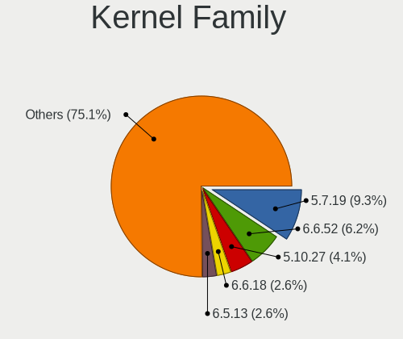
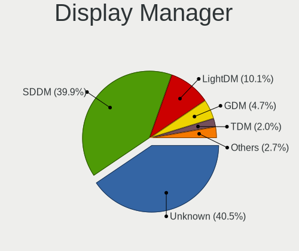
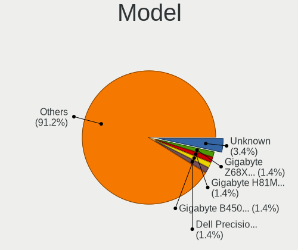
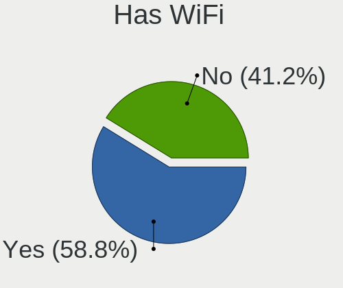
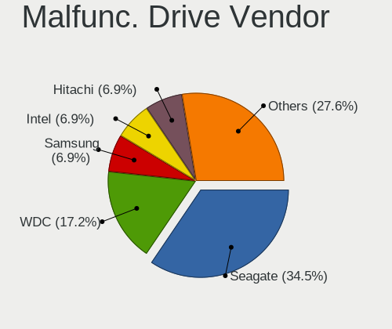
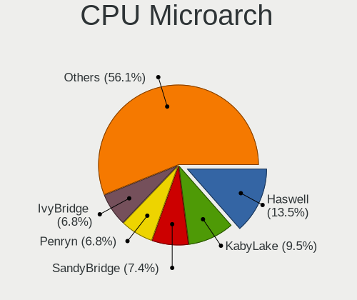
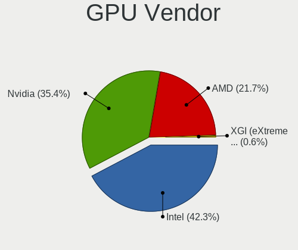
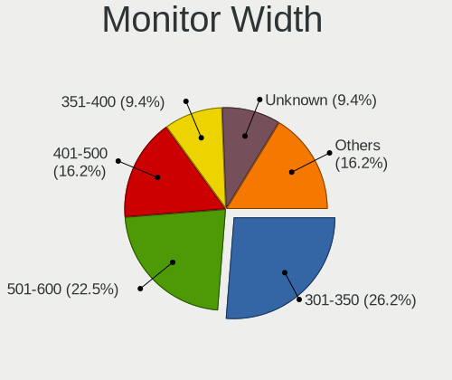
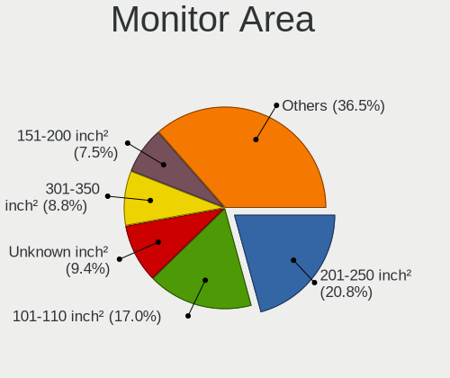
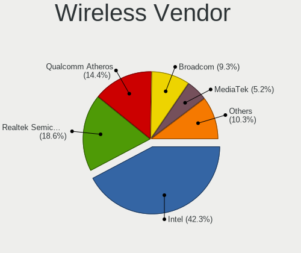

Mageia - Tested Hardware & Statistics
-------------------------------------

A project to collect tested hardware configurations for Mageia.

Anyone can contribute to this report by the [hw-probe](https://github.com/linuxhw/hw-probe) tool:

    sudo -E hw-probe -all -upload

Please contribute! Especially if your hardware is rare.

This is a report for all computer types. See also reports for [desktops](/Dist/Mageia/Desktop/README.md) and [notebooks](/Dist/Mageia/Notebook/README.md).

Contents
--------

* [ Test Cases ](#test-cases)

* [ System ](#system)
  - [ OS                       ](#os)
  - [ OS Family                ](#os-family)
  - [ Kernel                   ](#kernel)
  - [ Kernel Family            ](#kernel-family)
  - [ Kernel Major Ver.        ](#kernel-major-ver)
  - [ Arch                     ](#arch)
  - [ DE                       ](#de)
  - [ Display Server           ](#display-server)
  - [ Display Manager          ](#display-manager)
  - [ OS Lang                  ](#os-lang)
  - [ Boot Mode                ](#boot-mode)
  - [ Filesystem               ](#filesystem)
  - [ Part. scheme             ](#part-scheme)
  - [ Dual Boot with Linux/BSD ](#dual-boot-with-linuxbsd)
  - [ Dual Boot (Win)          ](#dual-boot-win)

* [ Board ](#board)
  - [ Vendor                   ](#vendor)
  - [ Model                    ](#model)
  - [ Model Family             ](#model-family)
  - [ MFG Year                 ](#mfg-year)
  - [ Form Factor              ](#form-factor)
  - [ Secure Boot              ](#secure-boot)
  - [ Coreboot                 ](#coreboot)
  - [ RAM Size                 ](#ram-size)
  - [ RAM Used                 ](#ram-used)
  - [ Total Drives             ](#total-drives)
  - [ Has CD-ROM               ](#has-cd-rom)
  - [ Has Ethernet             ](#has-ethernet)
  - [ Has WiFi                 ](#has-wifi)
  - [ Has Bluetooth            ](#has-bluetooth)

* [ Location ](#location)
  - [ Country                  ](#country)
  - [ City                     ](#city)

* [ Drives ](#drives)
  - [ Drive Vendor             ](#drive-vendor)
  - [ Drive Model              ](#drive-model)
  - [ HDD Vendor               ](#hdd-vendor)
  - [ SSD Vendor               ](#ssd-vendor)
  - [ Drive Kind               ](#drive-kind)
  - [ Drive Connector          ](#drive-connector)
  - [ Drive Size               ](#drive-size)
  - [ Space Total              ](#space-total)
  - [ Space Used               ](#space-used)
  - [ Malfunc. Drives          ](#malfunc-drives)
  - [ Malfunc. Drive Vendor    ](#malfunc-drive-vendor)
  - [ Malfunc. HDD Vendor      ](#malfunc-hdd-vendor)
  - [ Malfunc. Drive Kind      ](#malfunc-drive-kind)
  - [ Failed Drives            ](#failed-drives)
  - [ Failed Drive Vendor      ](#failed-drive-vendor)
  - [ Drive Status             ](#drive-status)

* [ Storage controller ](#storage-controller)
  - [ Storage Vendor           ](#storage-vendor)
  - [ Storage Model            ](#storage-model)
  - [ Storage Kind             ](#storage-kind)

* [ Processor ](#processor)
  - [ CPU Vendor               ](#cpu-vendor)
  - [ CPU Model                ](#cpu-model)
  - [ CPU Model Family         ](#cpu-model-family)
  - [ CPU Cores                ](#cpu-cores)
  - [ CPU Sockets              ](#cpu-sockets)
  - [ CPU Threads              ](#cpu-threads)
  - [ CPU Op-Modes             ](#cpu-op-modes)
  - [ CPU Microcode            ](#cpu-microcode)
  - [ CPU Microarch            ](#cpu-microarch)

* [ Graphics ](#graphics)
  - [ GPU Vendor               ](#gpu-vendor)
  - [ GPU Model                ](#gpu-model)
  - [ GPU Combo                ](#gpu-combo)
  - [ GPU Driver               ](#gpu-driver)
  - [ GPU Memory               ](#gpu-memory)

* [ Monitor ](#monitor)
  - [ Monitor Vendor           ](#monitor-vendor)
  - [ Monitor Model            ](#monitor-model)
  - [ Monitor Resolution       ](#monitor-resolution)
  - [ Monitor Diagonal         ](#monitor-diagonal)
  - [ Monitor Width            ](#monitor-width)
  - [ Aspect Ratio             ](#aspect-ratio)
  - [ Monitor Area             ](#monitor-area)
  - [ Pixel Density            ](#pixel-density)
  - [ Multiple Monitors        ](#multiple-monitors)

* [ Network ](#network)
  - [ Net Controller Vendor    ](#net-controller-vendor)
  - [ Net Controller Model     ](#net-controller-model)
  - [ Wireless Vendor          ](#wireless-vendor)
  - [ Wireless Model           ](#wireless-model)
  - [ Ethernet Vendor          ](#ethernet-vendor)
  - [ Ethernet Model           ](#ethernet-model)
  - [ Net Controller Kind      ](#net-controller-kind)
  - [ Used Controller          ](#used-controller)
  - [ NICs                     ](#nics)
  - [ IPv6                     ](#ipv6)

* [ Bluetooth ](#bluetooth)
  - [ Bluetooth Vendor         ](#bluetooth-vendor)
  - [ Bluetooth Model          ](#bluetooth-model)

* [ Sound ](#sound)
  - [ Sound Vendor             ](#sound-vendor)
  - [ Sound Model              ](#sound-model)

* [ Memory ](#memory)
  - [ Memory Vendor            ](#memory-vendor)
  - [ Memory Model             ](#memory-model)
  - [ Memory Kind              ](#memory-kind)
  - [ Memory Form Factor       ](#memory-form-factor)
  - [ Memory Size              ](#memory-size)
  - [ Memory Speed             ](#memory-speed)

* [ Printers & scanners ](#printers--scanners)
  - [ Printer Vendor           ](#printer-vendor)
  - [ Printer Model            ](#printer-model)
  - [ Scanner Vendor           ](#scanner-vendor)
  - [ Scanner Model            ](#scanner-model)

* [ Camera ](#camera)
  - [ Camera Vendor            ](#camera-vendor)
  - [ Camera Model             ](#camera-model)

* [ Security ](#security)
  - [ Fingerprint Vendor       ](#fingerprint-vendor)
  - [ Fingerprint Model        ](#fingerprint-model)
  - [ Chipcard Vendor          ](#chipcard-vendor)
  - [ Chipcard Model           ](#chipcard-model)

* [ Unsupported ](#unsupported)
  - [ Unsupported Devices      ](#unsupported-devices)
  - [ Unsupported Device Types ](#unsupported-device-types)

Test Cases
----------

Total: 151

| Vendor    | Model                       | Form-Factor | Probe                                                      | Date         |
|-----------|-----------------------------|-------------|------------------------------------------------------------|--------------|
| Schenker  | VIA_14_SVI14E20             | Notebook    | [3adb69bbf5](https://linux-hardware.org/?probe=3adb69bbf5) | Jun 03, 2022 |
| Notebook  | NH5x_NH7x_HHx_HJx_HKx       | Notebook    | [e30e3da709](https://linux-hardware.org/?probe=e30e3da709) | May 18, 2022 |
| Dell      | Latitude E5570              | Notebook    | [ec640c6644](https://linux-hardware.org/?probe=ec640c6644) | May 12, 2022 |
| Gigabyte  | H170-D3H-CF                 | Desktop     | [9f255eb7d5](https://linux-hardware.org/?probe=9f255eb7d5) | May 06, 2022 |
| ASUSTek   | F1A75-M LE                  | Desktop     | [93232d0716](https://linux-hardware.org/?probe=93232d0716) | May 01, 2022 |
| Microsoft | Surface Pro 4               | Tablet      | [4e74006288](https://linux-hardware.org/?probe=4e74006288) | Apr 21, 2022 |
| Lenovo    | ThinkPad X1 Carbon 5th 2... | Notebook    | [086a94d83c](https://linux-hardware.org/?probe=086a94d83c) | Apr 15, 2022 |
| Megaware  | MW-G31T-M7                  | Desktop     | [3ac4860cb3](https://linux-hardware.org/?probe=3ac4860cb3) | Apr 13, 2022 |
| Megaware  | MW-G31T-M7                  | Desktop     | [ce643cbdcd](https://linux-hardware.org/?probe=ce643cbdcd) | Apr 13, 2022 |
| Gigabyte  | H81M-S2H                    | Desktop     | [ac5d29c839](https://linux-hardware.org/?probe=ac5d29c839) | Apr 05, 2022 |
| MSI       | Z590-A PRO                  | Desktop     | [229ed42b3d](https://linux-hardware.org/?probe=229ed42b3d) | Apr 03, 2022 |
| Toshiba   | dynabook R73/A              | Notebook    | [42b60c90c7](https://linux-hardware.org/?probe=42b60c90c7) | Apr 01, 2022 |
| Gigabyte  | GA-78LMT-USB3 SEx           | Desktop     | [2955e87822](https://linux-hardware.org/?probe=2955e87822) | Mar 29, 2022 |
| Gigabyte  | G31M-S2C                    | Desktop     | [a56fb721dd](https://linux-hardware.org/?probe=a56fb721dd) | Mar 17, 2022 |
| Gigabyte  | X570 AORUS ELITE WIFI       | Desktop     | [8d52e31d86](https://linux-hardware.org/?probe=8d52e31d86) | Mar 09, 2022 |
| MSI       | Z590-A PRO                  | Desktop     | [5f37c84d61](https://linux-hardware.org/?probe=5f37c84d61) | Mar 06, 2022 |
| Gigabyte  | G31M-S2C                    | Desktop     | [d419223147](https://linux-hardware.org/?probe=d419223147) | Mar 06, 2022 |
| Gigabyte  | X570 AORUS ELITE WIFI       | Desktop     | [c11d937631](https://linux-hardware.org/?probe=c11d937631) | Feb 23, 2022 |
| ASRock    | M3A UCC                     | Desktop     | [eaa75fb3f4](https://linux-hardware.org/?probe=eaa75fb3f4) | Feb 20, 2022 |
| ASRock    | M3A UCC                     | Desktop     | [ce306a4c86](https://linux-hardware.org/?probe=ce306a4c86) | Feb 20, 2022 |
| MSI       | B250M BAZOOKA               | Desktop     | [4a8f0501a2](https://linux-hardware.org/?probe=4a8f0501a2) | Feb 11, 2022 |
| ASRock    | G41M-VS3                    | Desktop     | [825356bf6c](https://linux-hardware.org/?probe=825356bf6c) | Feb 02, 2022 |
| HP        | 1589                        | Desktop     | [41dbcb78cb](https://linux-hardware.org/?probe=41dbcb78cb) | Jan 30, 2022 |
| Gigabyte  | H81M-DS2                    | Desktop     | [c0328d5402](https://linux-hardware.org/?probe=c0328d5402) | Jan 27, 2022 |
| Lenovo    | ThinkCentre M58e 7491B1G    | Desktop     | [568741947f](https://linux-hardware.org/?probe=568741947f) | Jan 12, 2022 |
| Gigabyte  | B450 AORUS M                | Desktop     | [d9856d52b0](https://linux-hardware.org/?probe=d9856d52b0) | Jan 11, 2022 |
| Gigabyte  | B450 AORUS M                | Desktop     | [8b8a13f3b4](https://linux-hardware.org/?probe=8b8a13f3b4) | Jan 11, 2022 |
| Gigabyte  | B450 AORUS M                | Desktop     | [0fa4a81a77](https://linux-hardware.org/?probe=0fa4a81a77) | Jan 09, 2022 |
| Lenovo    | ThinkCentre M58e 7491B1G    | Desktop     | [a77218c72c](https://linux-hardware.org/?probe=a77218c72c) | Jan 09, 2022 |
| Gigabyte  | Z87X-UD5H-CF                | Desktop     | [a1a7854f7a](https://linux-hardware.org/?probe=a1a7854f7a) | Jan 04, 2022 |
| MSI       | MPG X570 GAMING EDGE WIF... | Desktop     | [c1d67915d0](https://linux-hardware.org/?probe=c1d67915d0) | Dec 26, 2021 |
| ASUSTek   | ROG ZENITH EXTREME          | Desktop     | [e3d82aebbe](https://linux-hardware.org/?probe=e3d82aebbe) | Dec 20, 2021 |
| MSI       | MPG X570 GAMING EDGE WIF... | Desktop     | [fdc65fea9d](https://linux-hardware.org/?probe=fdc65fea9d) | Dec 08, 2021 |
| Dell      | Latitude E5570              | Notebook    | [38032eae74](https://linux-hardware.org/?probe=38032eae74) | Dec 06, 2021 |
| Dell      | Latitude E5570              | Notebook    | [9314738bbb](https://linux-hardware.org/?probe=9314738bbb) | Dec 06, 2021 |
| Dell      | Precision 5530              | Notebook    | [f98313a80c](https://linux-hardware.org/?probe=f98313a80c) | Nov 29, 2021 |
| Dell      | 0TP412                      | Desktop     | [f759f2084b](https://linux-hardware.org/?probe=f759f2084b) | Nov 22, 2021 |
| ASUSTek   | SABERTOOTH 990FX R2.0       | Desktop     | [3e92c96ac0](https://linux-hardware.org/?probe=3e92c96ac0) | Nov 17, 2021 |
| ASUSTek   | SABERTOOTH 990FX R2.0       | Desktop     | [6e13fb31c9](https://linux-hardware.org/?probe=6e13fb31c9) | Oct 17, 2021 |
| ASUSTek   | SABERTOOTH 990FX R2.0       | Desktop     | [45d12f532c](https://linux-hardware.org/?probe=45d12f532c) | Oct 01, 2021 |
| Lenovo    | IdeaPad 3 15ADA05 81W1      | Notebook    | [3f4fe97a8a](https://linux-hardware.org/?probe=3f4fe97a8a) | Sep 30, 2021 |
| Gigabyte  | H170-D3H-CF                 | Desktop     | [42784959b9](https://linux-hardware.org/?probe=42784959b9) | Sep 28, 2021 |
| Apple     | Mac-F42386C8 PVT            | All in one  | [3235b7d95a](https://linux-hardware.org/?probe=3235b7d95a) | Sep 24, 2021 |
| Dell      | 0TP412                      | Desktop     | [25b9af915a](https://linux-hardware.org/?probe=25b9af915a) | Sep 09, 2021 |
| MSI       | MAG B460M MORTAR            | Desktop     | [6fa1f56407](https://linux-hardware.org/?probe=6fa1f56407) | Aug 30, 2021 |
| Gigabyte  | H81M-S2H                    | Desktop     | [894c915ecc](https://linux-hardware.org/?probe=894c915ecc) | Aug 17, 2021 |
| Lenovo    | IdeaPad Slim 1-14AST-05 ... | Notebook    | [46250d420a](https://linux-hardware.org/?probe=46250d420a) | Aug 14, 2021 |
| Gigabyte  | B450 AORUS PRO WIFI-CF      | Desktop     | [4c28c43c28](https://linux-hardware.org/?probe=4c28c43c28) | Aug 10, 2021 |
| Lenovo    | ThinkPad T61 6468AE2        | Notebook    | [216fbf401b](https://linux-hardware.org/?probe=216fbf401b) | Aug 05, 2021 |
| Gigabyte  | Z87X-UD5H-CF                | Desktop     | [88ddc09b9e](https://linux-hardware.org/?probe=88ddc09b9e) | Jul 28, 2021 |
| Gigabyte  | H81M-S2H                    | Desktop     | [f52713e401](https://linux-hardware.org/?probe=f52713e401) | Jul 28, 2021 |
| Dell      | 0TP412                      | Desktop     | [8788d078a0](https://linux-hardware.org/?probe=8788d078a0) | Jul 19, 2021 |
| ASUSTek   | PRIME X399-A                | Desktop     | [a2b6af1a6a](https://linux-hardware.org/?probe=a2b6af1a6a) | Jul 14, 2021 |
| ASUSTek   | X751LN                      | Notebook    | [8c0efa94e8](https://linux-hardware.org/?probe=8c0efa94e8) | Jul 08, 2021 |
| Gigabyte  | Z68XP-UD3P                  | Desktop     | [259e2a4ac0](https://linux-hardware.org/?probe=259e2a4ac0) | Jun 24, 2021 |
| Notebook  | NL40_50GU                   | Notebook    | [baa8447288](https://linux-hardware.org/?probe=baa8447288) | May 08, 2021 |
| Medion    | DEFENDER P10                | Notebook    | [cb752c0a4a](https://linux-hardware.org/?probe=cb752c0a4a) | May 01, 2021 |
| Medion    | DEFENDER P10                | Notebook    | [f42aa05a37](https://linux-hardware.org/?probe=f42aa05a37) | May 01, 2021 |
| Gigabyte  | B450M DS3H-CF               | Desktop     | [1be802a26e](https://linux-hardware.org/?probe=1be802a26e) | Apr 18, 2021 |
| ECS       | IC780M-A2                   | Desktop     | [e3cbd0879b](https://linux-hardware.org/?probe=e3cbd0879b) | Apr 17, 2021 |
| ASUSTek   | Z170-P                      | Desktop     | [1ebcf0ea2c](https://linux-hardware.org/?probe=1ebcf0ea2c) | Apr 16, 2021 |
| ASUSTek   | Z170-P                      | Desktop     | [a95896e05e](https://linux-hardware.org/?probe=a95896e05e) | Apr 16, 2021 |
| Medion    | Z370H4-EM                   | Desktop     | [57435ad8fb](https://linux-hardware.org/?probe=57435ad8fb) | Apr 16, 2021 |
| ASUSTek   | SABERTOOTH P67              | Desktop     | [6d81c9d615](https://linux-hardware.org/?probe=6d81c9d615) | Apr 16, 2021 |
| Fujitsu   | LIFEBOOK E752               | Notebook    | [8ec052ba75](https://linux-hardware.org/?probe=8ec052ba75) | Apr 15, 2021 |
| Gigabyte  | H61M-S2PV                   | Desktop     | [dce1091d81](https://linux-hardware.org/?probe=dce1091d81) | Apr 15, 2021 |
| Medion    | Z370H4-EM                   | Desktop     | [b88834e15d](https://linux-hardware.org/?probe=b88834e15d) | Apr 15, 2021 |
| Lenovo    | ThinkPad T430 2342A19       | Notebook    | [9a5ad3016a](https://linux-hardware.org/?probe=9a5ad3016a) | Apr 15, 2021 |
| HP        | 212B                        | Desktop     | [697e2f24f0](https://linux-hardware.org/?probe=697e2f24f0) | Apr 03, 2021 |
| ASUSTek   | X751LN                      | Notebook    | [09afc59907](https://linux-hardware.org/?probe=09afc59907) | Apr 02, 2021 |
| Intel     | STL2-bd A28808-302          | Desktop     | [d6b5151873](https://linux-hardware.org/?probe=d6b5151873) | Apr 01, 2021 |
| Gigabyte  | B450M DS3H-CF               | Desktop     | [dbb3c1865f](https://linux-hardware.org/?probe=dbb3c1865f) | Mar 29, 2021 |
| HP        | 212B                        | Desktop     | [69f528da9b](https://linux-hardware.org/?probe=69f528da9b) | Mar 28, 2021 |
| ASUSTek   | PRIME A320M-K               | Desktop     | [2b381b3421](https://linux-hardware.org/?probe=2b381b3421) | Mar 24, 2021 |
| ASUSTek   | X556URK                     | Notebook    | [4904d2c78e](https://linux-hardware.org/?probe=4904d2c78e) | Mar 18, 2021 |
| Gigabyte  | Z87X-UD5H-CF                | Desktop     | [d4570ea6b2](https://linux-hardware.org/?probe=d4570ea6b2) | Mar 12, 2021 |
| ASUSTek   | X751LN                      | Notebook    | [0bb2c11bdc](https://linux-hardware.org/?probe=0bb2c11bdc) | Feb 24, 2021 |
| ASRock    | M3A UCC                     | Desktop     | [714da9501f](https://linux-hardware.org/?probe=714da9501f) | Feb 19, 2021 |
| HP        | 339A                        | Desktop     | [43e759b593](https://linux-hardware.org/?probe=43e759b593) | Feb 14, 2021 |
| Dell      | Latitude E6530              | Notebook    | [035378659f](https://linux-hardware.org/?probe=035378659f) | Feb 12, 2021 |
| Gigabyte  | H81M-S2H                    | Desktop     | [f9e5b1d3c6](https://linux-hardware.org/?probe=f9e5b1d3c6) | Feb 08, 2021 |
| Gigabyte  | Z87X-UD5H-CF                | Desktop     | [aea262050c](https://linux-hardware.org/?probe=aea262050c) | Feb 04, 2021 |
| Dell      | Inspiron 5480               | Notebook    | [2ae12f394c](https://linux-hardware.org/?probe=2ae12f394c) | Jan 27, 2021 |
| Gigabyte  | B450M DS3H-CF               | Desktop     | [a399a43535](https://linux-hardware.org/?probe=a399a43535) | Jan 16, 2021 |
| Kiano     | SlimNote 15.6               | Notebook    | [55179f361c](https://linux-hardware.org/?probe=55179f361c) | Jan 08, 2021 |
| Kiano     | SlimNote 15.6               | Notebook    | [5379fd7478](https://linux-hardware.org/?probe=5379fd7478) | Jan 08, 2021 |
| ASUSTek   | VivoBook 15_ASUS Laptop ... | Notebook    | [01aa1a7b95](https://linux-hardware.org/?probe=01aa1a7b95) | Dec 30, 2020 |
| ASUSTek   | Z87-DELUXE                  | Desktop     | [e160eea25a](https://linux-hardware.org/?probe=e160eea25a) | Dec 28, 2020 |
| ASUSTek   | X751LN                      | Notebook    | [f7f3533d54](https://linux-hardware.org/?probe=f7f3533d54) | Dec 27, 2020 |
| HP        | 339A                        | Desktop     | [ea7792c224](https://linux-hardware.org/?probe=ea7792c224) | Dec 26, 2020 |
| ASUSTek   | ROG ZENITH EXTREME          | Desktop     | [5fd86e8c94](https://linux-hardware.org/?probe=5fd86e8c94) | Dec 22, 2020 |
| Dell      | Inspiron 5480               | Notebook    | [1261d0c9d3](https://linux-hardware.org/?probe=1261d0c9d3) | Dec 21, 2020 |
| Lenovo    | ThinkServer TS140           | Desktop     | [ec475a7f9a](https://linux-hardware.org/?probe=ec475a7f9a) | Dec 09, 2020 |
| ASRock    | H87M Pro4                   | Desktop     | [12185c0c75](https://linux-hardware.org/?probe=12185c0c75) | Dec 07, 2020 |
| ASRock    | H87M Pro4                   | Desktop     | [747bc56208](https://linux-hardware.org/?probe=747bc56208) | Dec 07, 2020 |
| Gigabyte  | F2A88XM-DS2                 | Desktop     | [1b5123770e](https://linux-hardware.org/?probe=1b5123770e) | Dec 06, 2020 |
| HP        | Spectre 13 Ultrabook        | Notebook    | [9b88fe4fa5](https://linux-hardware.org/?probe=9b88fe4fa5) | Nov 30, 2020 |
| Gigabyte  | H81M-S2H                    | Desktop     | [009e2519cb](https://linux-hardware.org/?probe=009e2519cb) | Nov 22, 2020 |
| HP        | EliteBook 840 G3            | Notebook    | [4dd618cb59](https://linux-hardware.org/?probe=4dd618cb59) | Nov 21, 2020 |
| HP        | EliteBook 840 G3            | Notebook    | [2543664b54](https://linux-hardware.org/?probe=2543664b54) | Nov 21, 2020 |
| Gigabyte  | GA-78LMT-USB3 R2            | Desktop     | [1aec57de3b](https://linux-hardware.org/?probe=1aec57de3b) | Nov 20, 2020 |
| ASUSTek   | PRIME B360-PLUS             | Desktop     | [dadbc2f1d7](https://linux-hardware.org/?probe=dadbc2f1d7) | Nov 15, 2020 |
| Lenovo    | IdeaPad 3 15ADA05 81W1      | Notebook    | [889cb35866](https://linux-hardware.org/?probe=889cb35866) | Nov 13, 2020 |
| HP        | ProBook 445 G7              | Notebook    | [2e97281aa0](https://linux-hardware.org/?probe=2e97281aa0) | Nov 05, 2020 |
| MSI       | MPG X570 GAMING EDGE WIF... | Desktop     | [fb717dc126](https://linux-hardware.org/?probe=fb717dc126) | Nov 05, 2020 |
| Gigabyte  | H170-D3H-CF                 | Desktop     | [8220a96972](https://linux-hardware.org/?probe=8220a96972) | Nov 02, 2020 |
| Acer      | Aspire V3-772               | Notebook    | [413786151e](https://linux-hardware.org/?probe=413786151e) | Oct 31, 2020 |
| Dell      | Inspiron 5480               | Notebook    | [62bb8575f1](https://linux-hardware.org/?probe=62bb8575f1) | Oct 22, 2020 |
| ASUSTek   | SABERTOOTH 990FX R2.0       | Desktop     | [e50d2bd553](https://linux-hardware.org/?probe=e50d2bd553) | Oct 18, 2020 |
| ZOTAC     | Unknown                     | Desktop     | [624888f3ab](https://linux-hardware.org/?probe=624888f3ab) | Oct 14, 2020 |
| Gigabyte  | H170-D3H-CF                 | Desktop     | [c73f4878af](https://linux-hardware.org/?probe=c73f4878af) | Oct 04, 2020 |
| Lenovo    | ThinkServer TS140           | Desktop     | [87f4eac666](https://linux-hardware.org/?probe=87f4eac666) | Sep 27, 2020 |
| HP        | Unknown                     | Notebook    | [b12d1589a1](https://linux-hardware.org/?probe=b12d1589a1) | Sep 08, 2020 |
| Acer      | Aspire 7741                 | Notebook    | [e5914ee358](https://linux-hardware.org/?probe=e5914ee358) | Sep 05, 2020 |
| HP        | Pavilion dv6                | Notebook    | [021a94f63e](https://linux-hardware.org/?probe=021a94f63e) | Sep 03, 2020 |
| ASRock    | M3A UCC                     | Desktop     | [43182d8754](https://linux-hardware.org/?probe=43182d8754) | Sep 01, 2020 |
| ASRock    | M3A UCC                     | Desktop     | [50908c43f9](https://linux-hardware.org/?probe=50908c43f9) | Sep 01, 2020 |
| Gigabyte  | Z87X-UD5H-CF                | Desktop     | [cbab4d3ea3](https://linux-hardware.org/?probe=cbab4d3ea3) | Aug 31, 2020 |
| Lenovo    | G480 20149                  | Notebook    | [5598a535c7](https://linux-hardware.org/?probe=5598a535c7) | Jul 24, 2020 |
| ASUSTek   | P8H61-M LE                  | Desktop     | [2ca048a380](https://linux-hardware.org/?probe=2ca048a380) | Jun 29, 2020 |
| ASRock    | H81M-VG4 R2.0               | Desktop     | [ed7fe704dd](https://linux-hardware.org/?probe=ed7fe704dd) | May 25, 2020 |
| HP        | 339A                        | Desktop     | [bbd2341205](https://linux-hardware.org/?probe=bbd2341205) | May 09, 2020 |
| HP        | 339A                        | Desktop     | [1334fcea56](https://linux-hardware.org/?probe=1334fcea56) | May 09, 2020 |
| ASUSTek   | VivoBook 15_ASUS Laptop ... | Notebook    | [8e31f45bf5](https://linux-hardware.org/?probe=8e31f45bf5) | May 07, 2020 |
| ASUSTek   | VivoBook 15_ASUS Laptop ... | Notebook    | [4b71b90312](https://linux-hardware.org/?probe=4b71b90312) | May 04, 2020 |
| MSI       | B360M MORTAR                | Desktop     | [d2215c28af](https://linux-hardware.org/?probe=d2215c28af) | Apr 26, 2020 |
| ASUSTek   | SABERTOOTH 990FX R2.0       | Desktop     | [f6e5343aa5](https://linux-hardware.org/?probe=f6e5343aa5) | Mar 31, 2020 |
| ASUSTek   | H170M-PLUS                  | Desktop     | [6dd350fc4a](https://linux-hardware.org/?probe=6dd350fc4a) | Mar 31, 2020 |
| ASUSTek   | PRIME A320M-K               | Desktop     | [cabb3f4266](https://linux-hardware.org/?probe=cabb3f4266) | Mar 29, 2020 |
| Vorke     | V1 Plus                     | Desktop     | [c49c2bb635](https://linux-hardware.org/?probe=c49c2bb635) | Mar 29, 2020 |
| ASRock    | X470 Taichi                 | Desktop     | [5125778e67](https://linux-hardware.org/?probe=5125778e67) | Mar 02, 2020 |
| Gigabyte  | B85M-D3H                    | Desktop     | [00442cfd17](https://linux-hardware.org/?probe=00442cfd17) | Feb 25, 2020 |
| Gigabyte  | Z87X-UD5H-CF                | Desktop     | [71a967abf8](https://linux-hardware.org/?probe=71a967abf8) | Feb 22, 2020 |
| Gigabyte  | H81M-S2H                    | Desktop     | [52c3f45c8f](https://linux-hardware.org/?probe=52c3f45c8f) | Feb 22, 2020 |
| ASUSTek   | H170M-PLUS                  | Desktop     | [0ae790ac85](https://linux-hardware.org/?probe=0ae790ac85) | Feb 01, 2020 |
| ASUSTek   | SABERTOOTH 990FX R2.0       | Desktop     | [506294e8e9](https://linux-hardware.org/?probe=506294e8e9) | Jan 13, 2020 |
| ASUSTek   | SABERTOOTH 990FX R2.0       | Desktop     | [16e8d236b4](https://linux-hardware.org/?probe=16e8d236b4) | Jan 12, 2020 |
| ASUSTek   | SABERTOOTH 990FX R2.0       | Desktop     | [7df7d9c296](https://linux-hardware.org/?probe=7df7d9c296) | Dec 20, 2019 |
| ASUSTek   | SABERTOOTH 990FX R2.0       | Desktop     | [0c42dfc62c](https://linux-hardware.org/?probe=0c42dfc62c) | Dec 08, 2019 |
| ASUSTek   | SABERTOOTH 990FX R2.0       | Desktop     | [2ef79b672c](https://linux-hardware.org/?probe=2ef79b672c) | Nov 15, 2019 |
| ASUSTek   | A55BM-K                     | Desktop     | [d58dbcdd06](https://linux-hardware.org/?probe=d58dbcdd06) | Nov 08, 2019 |
| MSI       | Z97-G43                     | Desktop     | [87e4cd50ce](https://linux-hardware.org/?probe=87e4cd50ce) | Apr 26, 2019 |
| ASRock    | X470 Taichi                 | Desktop     | [14a8808d2b](https://linux-hardware.org/?probe=14a8808d2b) | Apr 26, 2019 |
| Gigabyte  | Z68X-UD3H-B3                | Desktop     | [28ea4213cb](https://linux-hardware.org/?probe=28ea4213cb) | Feb 25, 2019 |
| Gigabyte  | Z68X-UD3H-B3                | Desktop     | [b9c55f2790](https://linux-hardware.org/?probe=b9c55f2790) | Feb 25, 2019 |
| ASRock    | X470 Taichi                 | Desktop     | [7b6ec43d58](https://linux-hardware.org/?probe=7b6ec43d58) | Jan 08, 2019 |
| ASRock    | X470 Taichi                 | Desktop     | [117cb09799](https://linux-hardware.org/?probe=117cb09799) | Dec 31, 2018 |
| Gigabyte  | Z68X-UD3H-B3                | Desktop     | [0a61436f40](https://linux-hardware.org/?probe=0a61436f40) | Feb 15, 2018 |
| ASUSTek   | M5A97 R2.0                  | Desktop     | [304aa59840](https://linux-hardware.org/?probe=304aa59840) | Dec 14, 2017 |
| ASUSTek   | M4A78 PLUS                  | Desktop     | [ed9d8a148d](https://linux-hardware.org/?probe=ed9d8a148d) | Mar 06, 2016 |
| Lenovo    | G570 20079                  | Notebook    | [fc57cb086b](https://linux-hardware.org/?probe=fc57cb086b) | Nov 26, 2015 |

System
------

OS
--

Installed operating systems

| Name     | Computers | Percent |
|----------|-----------|---------|
| Mageia 8 | 51        | 54.26%  |
| Mageia 7 | 33        | 35.11%  |
| Mageia 9 | 5         | 5.32%   |
| Mageia 6 | 4         | 4.26%   |
| Mageia 5 | 1         | 1.06%   |

OS Family
---------

OS without a version

| Name   | Computers | Percent |
|--------|-----------|---------|
| Mageia | 82        | 100%    |

Kernel
------

Version of the Linux kernel

| Version                    | Computers | Percent |
|----------------------------|-----------|---------|
| 5.7.19-desktop-3.mga7      | 13        | 10.74%  |
| 5.10.27-desktop-1.mga8     | 8         | 6.61%   |
| 5.7.19-desktop-1.mga7      | 7         | 5.79%   |
| 5.15.32-desktop-1.mga8     | 5         | 4.13%   |
| 5.6.14-desktop-2.mga7      | 4         | 3.31%   |
| 5.5.4-desktop-1.mga7       | 4         | 3.31%   |
| 5.10.25-desktop-1.mga8     | 4         | 3.31%   |
| 5.5.9-desktop-1.mga7       | 3         | 2.48%   |
| 5.15.23-desktop-1.mga8     | 3         | 2.48%   |
| 5.10.12-desktop-1.mga7     | 3         | 2.48%   |
| 5.6.6-desktop-1.mga7       | 2         | 1.65%   |
| 5.3.7-desktop-4.mga7       | 2         | 1.65%   |
| 5.16.10-desktop-2.mga8     | 2         | 1.65%   |
| 5.15.4-desktop-1.mga8      | 2         | 1.65%   |
| 5.15.35-desktop-2.mga8     | 2         | 1.65%   |
| 5.15.16-desktop-1.mga8     | 2         | 1.65%   |
| 5.15.11-desktop-3.mga8     | 2         | 1.65%   |
| 5.10.60-desktop-2.mga8     | 2         | 1.65%   |
| 5.10.52-desktop-1.mga8     | 2         | 1.65%   |
| 5.10.20-desktop-2.mga7     | 2         | 1.65%   |
| 5.10.14-desktop-1.mga7     | 2         | 1.65%   |
| 5.9.6-desktop-1.mga8       | 1         | 0.83%   |
| 5.9.3-desktop-1.mga8       | 1         | 0.83%   |
| 5.9.16-desktop-1.mga7      | 1         | 0.83%   |
| 5.9.11-desktop-3.mga8      | 1         | 0.83%   |
| 5.9.1-desktop-1.mga8       | 1         | 0.83%   |
| 5.8.5-desktop-2.mga8       | 1         | 0.83%   |
| 5.8.14-desktop-1.mga8      | 1         | 0.83%   |
| 5.7.8-desktop-1.mga8       | 1         | 0.83%   |
| 5.6.8-desktop-1.mga7       | 1         | 0.83%   |
| 5.5.13-desktop-1.mga7      | 1         | 0.83%   |
| 5.4.8-desktop-1.mga7       | 1         | 0.83%   |
| 5.4.12-desktop-1.mga7      | 1         | 0.83%   |
| 5.3.13-desktop-2.mga7      | 1         | 0.83%   |
| 5.17.4-desktop-2.mga8      | 1         | 0.83%   |
| 5.16.18-server-1.mga8      | 1         | 0.83%   |
| 5.16.18-desktop-1.mga8     | 1         | 0.83%   |
| 5.15.6-desktop-2.mga9      | 1         | 0.83%   |
| 5.15.43-desktop-1.mga8     | 1         | 0.83%   |
| 5.15.2-desktop-2.mga9      | 1         | 0.83%   |
| 5.15.18-desktop-2.mga8     | 1         | 0.83%   |
| 5.15.15-desktop-1.mga8     | 1         | 0.83%   |
| 5.15.10-desktop-1.mga9     | 1         | 0.83%   |
| 5.14.9-desktop-1.mga9      | 1         | 0.83%   |
| 5.14.12-desktop-2.mga9     | 1         | 0.83%   |
| 5.13.12-desktop-2.mga8     | 1         | 0.83%   |
| 5.12.15-desktop-1.mga8     | 1         | 0.83%   |
| 5.10.78-desktop-1.mga8     | 1         | 0.83%   |
| 5.10.62-desktop-1.mga8     | 1         | 0.83%   |
| 5.10.56-desktop-1.mga8     | 1         | 0.83%   |
| 5.10.48-desktop-1.mga8     | 1         | 0.83%   |
| 5.10.46-desktop-1.mga8     | 1         | 0.83%   |
| 5.10.45-desktop-2.mga8     | 1         | 0.83%   |
| 5.10.33-desktop-1.mga8     | 1         | 0.83%   |
| 5.10.30-desktop-1.mga8     | 1         | 0.83%   |
| 5.10.2-desktop-1.mga8      | 1         | 0.83%   |
| 5.10.16-desktop-1.mga8     | 1         | 0.83%   |
| 5.10.16-desktop-1.mga7     | 1         | 0.83%   |
| 5.10.12-desktop-2.mga8     | 1         | 0.83%   |
| 5.1.0-desktop-0.rc6.1.mga7 | 1         | 0.83%   |

Kernel Family
-------------

Linux kernel without a distro release

| Version  | Computers | Percent |
|----------|-----------|---------|
| 5.7.19   | 18        | 15.13%  |
| 5.10.27  | 8         | 6.72%   |
| 5.15.32  | 5         | 4.2%    |
| 5.6.14   | 4         | 3.36%   |
| 5.5.4    | 4         | 3.36%   |
| 5.10.25  | 4         | 3.36%   |
| 5.10.12  | 4         | 3.36%   |
| 5.5.9    | 3         | 2.52%   |
| 5.15.23  | 3         | 2.52%   |
| 5.6.6    | 2         | 1.68%   |
| 5.3.7    | 2         | 1.68%   |
| 5.16.18  | 2         | 1.68%   |
| 5.16.10  | 2         | 1.68%   |
| 5.15.4   | 2         | 1.68%   |
| 5.15.35  | 2         | 1.68%   |
| 5.15.16  | 2         | 1.68%   |
| 5.15.11  | 2         | 1.68%   |
| 5.10.60  | 2         | 1.68%   |
| 5.10.52  | 2         | 1.68%   |
| 5.10.20  | 2         | 1.68%   |
| 5.10.16  | 2         | 1.68%   |
| 5.10.14  | 2         | 1.68%   |
| 5.9.6    | 1         | 0.84%   |
| 5.9.3    | 1         | 0.84%   |
| 5.9.16   | 1         | 0.84%   |
| 5.9.11   | 1         | 0.84%   |
| 5.9.1    | 1         | 0.84%   |
| 5.8.5    | 1         | 0.84%   |
| 5.8.14   | 1         | 0.84%   |
| 5.7.8    | 1         | 0.84%   |
| 5.6.8    | 1         | 0.84%   |
| 5.5.13   | 1         | 0.84%   |
| 5.4.8    | 1         | 0.84%   |
| 5.4.12   | 1         | 0.84%   |
| 5.3.13   | 1         | 0.84%   |
| 5.17.4   | 1         | 0.84%   |
| 5.15.6   | 1         | 0.84%   |
| 5.15.43  | 1         | 0.84%   |
| 5.15.2   | 1         | 0.84%   |
| 5.15.18  | 1         | 0.84%   |
| 5.15.15  | 1         | 0.84%   |
| 5.15.10  | 1         | 0.84%   |
| 5.14.9   | 1         | 0.84%   |
| 5.14.12  | 1         | 0.84%   |
| 5.13.12  | 1         | 0.84%   |
| 5.12.15  | 1         | 0.84%   |
| 5.10.78  | 1         | 0.84%   |
| 5.10.62  | 1         | 0.84%   |
| 5.10.56  | 1         | 0.84%   |
| 5.10.48  | 1         | 0.84%   |
| 5.10.46  | 1         | 0.84%   |
| 5.10.45  | 1         | 0.84%   |
| 5.10.33  | 1         | 0.84%   |
| 5.10.30  | 1         | 0.84%   |
| 5.10.2   | 1         | 0.84%   |
| 5.1.0    | 1         | 0.84%   |
| 4.9.56   | 1         | 0.84%   |
| 4.19.13  | 1         | 0.84%   |
| 4.14.18  | 1         | 0.84%   |
| 4.14.106 | 1         | 0.84%   |

Kernel Major Ver.
-----------------

Linux kernel major version

| Version | Computers | Percent |
|---------|-----------|---------|
| 5.10    | 27        | 24.77%  |
| 5.15    | 21        | 19.27%  |
| 5.7     | 19        | 17.43%  |
| 5.5     | 8         | 7.34%   |
| 5.6     | 7         | 6.42%   |
| 5.9     | 5         | 4.59%   |
| 5.16    | 4         | 3.67%   |
| 4.14    | 3         | 2.75%   |
| 5.8     | 2         | 1.83%   |
| 5.4     | 2         | 1.83%   |
| 5.3     | 2         | 1.83%   |
| 5.14    | 2         | 1.83%   |
| 5.17    | 1         | 0.92%   |
| 5.13    | 1         | 0.92%   |
| 5.12    | 1         | 0.92%   |
| 5.1     | 1         | 0.92%   |
| 4.9     | 1         | 0.92%   |
| 4.19    | 1         | 0.92%   |
| 4.1     | 1         | 0.92%   |

Arch
----

OS architecture (x86_64, i586, etc.)

| Name   | Computers | Percent |
|--------|-----------|---------|
| x86_64 | 80        | 97.56%  |
| i686   | 2         | 2.44%   |

DE
--

Desktop Environment

| Name          | Computers | Percent |
|---------------|-----------|---------|
| KDE5          | 33        | 35.87%  |
| KDE           | 23        | 25%     |
| GNOME         | 9         | 9.78%   |
| Unknown       | 9         | 9.78%   |
| Cinnamon      | 5         | 5.43%   |
| XFCE          | 4         | 4.35%   |
| MATE          | 3         | 3.26%   |
| LXDE          | 3         | 3.26%   |
| LXQt          | 1         | 1.09%   |
| KDE4          | 1         | 1.09%   |
| GNOME Classic | 1         | 1.09%   |

Display Server
--------------

X11 or Wayland

| Name    | Computers | Percent |
|---------|-----------|---------|
| X11     | 79        | 95.18%  |
| Wayland | 3         | 3.61%   |
| Tty     | 1         | 1.2%    |

Display Manager
---------------

SDDM, LightDM, etc.

| Name    | Computers | Percent |
|---------|-----------|---------|
| Unknown | 43        | 51.81%  |
| SDDM    | 31        | 37.35%  |
| LightDM | 4         | 4.82%   |
| TDM     | 3         | 3.61%   |
| XDM     | 1         | 1.2%    |
| GDM     | 1         | 1.2%    |

OS Lang
-------

Language

| Lang    | Computers | Percent |
|---------|-----------|---------|
| fr_FR   | 16        | 19.05%  |
| en_US   | 15        | 17.86%  |
| de_DE   | 9         | 10.71%  |
| Unknown | 8         | 9.52%   |
| en_GB   | 7         | 8.33%   |
| ru_RU   | 6         | 7.14%   |
| pt_BR   | 4         | 4.76%   |
| it_IT   | 4         | 4.76%   |
| sv_SE   | 2         | 2.38%   |
| pl_PL   | 2         | 2.38%   |
| zh_TW   | 1         | 1.19%   |
| sl_SI   | 1         | 1.19%   |
| hu_HU   | 1         | 1.19%   |
| fr_BE   | 1         | 1.19%   |
| es_MX   | 1         | 1.19%   |
| es_GT   | 1         | 1.19%   |
| es_ES   | 1         | 1.19%   |
| es_AR   | 1         | 1.19%   |
| en_CA   | 1         | 1.19%   |
| cs_CZ   | 1         | 1.19%   |
| bg_BG   | 1         | 1.19%   |

Boot Mode
---------

EFI or BIOS

| Mode | Computers | Percent |
|------|-----------|---------|
| BIOS | 49        | 56.98%  |
| EFI  | 37        | 43.02%  |

Filesystem
----------

Type of filesystem

| Type     | Computers | Percent |
|----------|-----------|---------|
| Ext4     | 68        | 80.95%  |
| Xfs      | 6         | 7.14%   |
| Unknown  | 6         | 7.14%   |
| Btrfs    | 3         | 3.57%   |
| Reiserfs | 1         | 1.19%   |

Part. scheme
------------

Scheme of partitioning

| Type    | Computers | Percent |
|---------|-----------|---------|
| GPT     | 34        | 39.53%  |
| Unknown | 34        | 39.53%  |
| MBR     | 18        | 20.93%  |

Dual Boot with Linux/BSD
------------------------

Hosting more than one Linux/BSD

| Dual boot | Computers | Percent |
|-----------|-----------|---------|
| No        | 70        | 85.37%  |
| Yes       | 12        | 14.63%  |

Dual Boot (Win)
---------------

Hosting Linux and Windows

| Dual boot | Computers | Percent |
|-----------|-----------|---------|
| No        | 66        | 77.65%  |
| Yes       | 19        | 22.35%  |

Board
-----

Vendor
------

Motherboard manufacturer

| Name                | Computers | Percent |
|---------------------|-----------|---------|
| ASUSTek Computer    | 18        | 21.95%  |
| Gigabyte Technology | 16        | 19.51%  |
| Hewlett-Packard     | 8         | 9.76%   |
| MSI                 | 6         | 7.32%   |
| Lenovo              | 6         | 7.32%   |
| Dell                | 6         | 7.32%   |
| ASRock              | 5         | 6.1%    |
| Notebook            | 2         | 2.44%   |
| Medion              | 2         | 2.44%   |
| Acer                | 2         | 2.44%   |
| ZOTAC               | 1         | 1.22%   |
| Vorke               | 1         | 1.22%   |
| Toshiba             | 1         | 1.22%   |
| Schenker            | 1         | 1.22%   |
| Microsoft           | 1         | 1.22%   |
| Megaware            | 1         | 1.22%   |
| Kiano               | 1         | 1.22%   |
| Intel               | 1         | 1.22%   |
| Fujitsu             | 1         | 1.22%   |
| ECS                 | 1         | 1.22%   |
| Apple               | 1         | 1.22%   |

Model
-----

Motherboard model

| Name                                     | Computers | Percent |
|------------------------------------------|-----------|---------|
| Gigabyte Z68X-UD3H-B3                    | 2         | 2.44%   |
| Dell Precision WorkStation T3400         | 2         | 2.44%   |
| ASUS SABERTOOTH 990FX R2.0               | 2         | 2.44%   |
| Unknown                                  | 2         | 2.44%   |
| Vorke V1 Plus                            | 1         | 1.22%   |
| Toshiba dynabook R73/A                   | 1         | 1.22%   |
| Schenker VIA_14_SVI14E20                 | 1         | 1.22%   |
| Notebook NL40_50GU                       | 1         | 1.22%   |
| Notebook NH5x_NH7x_HHx_HJx_HKx           | 1         | 1.22%   |
| MSI MS-7D09                              | 1         | 1.22%   |
| MSI MS-7C82                              | 1         | 1.22%   |
| MSI MS-7C37                              | 1         | 1.22%   |
| MSI MS-7B23                              | 1         | 1.22%   |
| MSI MS-7A70                              | 1         | 1.22%   |
| MSI MS-7816                              | 1         | 1.22%   |
| Microsoft Surface Pro 4                  | 1         | 1.22%   |
| Megaware MW-G31T-M7                      | 1         | 1.22%   |
| Medion MD34161/C708                      | 1         | 1.22%   |
| Medion DEFENDER P10                      | 1         | 1.22%   |
| Lenovo ThinkPad X1 Carbon 5th 20HQS1741F | 1         | 1.22%   |
| Lenovo ThinkPad T430 2342A19             | 1         | 1.22%   |
| Lenovo ThinkCentre M58e 7491B1G          | 1         | 1.22%   |
| Lenovo IdeaPad 3 15ADA05 81W1            | 1         | 1.22%   |
| Lenovo G480 20149                        | 1         | 1.22%   |
| Lenovo 70A4000HUX ThinkServer TS140      | 1         | 1.22%   |
| Kiano SlimNote 15.6                      | 1         | 1.22%   |
| Intel STL2                               | 1         | 1.22%   |
| HP Z440 Workstation                      | 1         | 1.22%   |
| HP Z420 Workstation                      | 1         | 1.22%   |
| HP Spectre 13 Ultrabook                  | 1         | 1.22%   |
| HP ProBook 445 G7                        | 1         | 1.22%   |
| HP Pavilion dv6                          | 1         | 1.22%   |
| HP EliteBook 840 G3                      | 1         | 1.22%   |
| HP Compaq Pro 6300 SFF                   | 1         | 1.22%   |
| Gigabyte Z87X-UD5H                       | 1         | 1.22%   |
| Gigabyte Z68XP-UD3P                      | 1         | 1.22%   |
| Gigabyte X570 AORUS ELITE WIFI           | 1         | 1.22%   |
| Gigabyte H81M-S2H                        | 1         | 1.22%   |
| Gigabyte H81M-DS2                        | 1         | 1.22%   |
| Gigabyte H61M-S2PV                       | 1         | 1.22%   |
| Gigabyte H170-D3H                        | 1         | 1.22%   |
| Gigabyte GA-78LMT-USB3 R2                | 1         | 1.22%   |
| Gigabyte GA-78LMT-USB3 6.0               | 1         | 1.22%   |
| Gigabyte G31M-ES2C                       | 1         | 1.22%   |
| Gigabyte F2A88XM-DS2                     | 1         | 1.22%   |
| Gigabyte B85M-D3H                        | 1         | 1.22%   |
| Gigabyte B450M DS3H                      | 1         | 1.22%   |
| Gigabyte B450 AORUS PRO WIFI             | 1         | 1.22%   |
| Fujitsu LIFEBOOK E752                    | 1         | 1.22%   |
| ECS IC780M-A2                            | 1         | 1.22%   |
| Dell Precision 5530                      | 1         | 1.22%   |
| Dell Latitude E6530                      | 1         | 1.22%   |
| Dell Latitude E5570                      | 1         | 1.22%   |
| Dell Inspiron 5480                       | 1         | 1.22%   |
| ASUS Z170-P                              | 1         | 1.22%   |
| ASUS X751LN                              | 1         | 1.22%   |
| ASUS X556URK                             | 1         | 1.22%   |
| ASUS VivoBook 15_ASUS Laptop X507UAR     | 1         | 1.22%   |
| ASUS SABERTOOTH P67                      | 1         | 1.22%   |
| ASUS ROG ZENITH EXTREME                  | 1         | 1.22%   |

Model Family
------------

Motherboard model prefix

| Name                   | Computers | Percent |
|------------------------|-----------|---------|
| Dell Precision         | 3         | 3.66%   |
| ASUS SABERTOOTH        | 3         | 3.66%   |
| ASUS PRIME             | 3         | 3.66%   |
| Lenovo ThinkPad        | 2         | 2.44%   |
| Gigabyte Z68X-UD3H-B3  | 2         | 2.44%   |
| Gigabyte GA-78LMT-USB3 | 2         | 2.44%   |
| Dell Latitude          | 2         | 2.44%   |
| Acer Aspire            | 2         | 2.44%   |
| Unknown                | 2         | 2.44%   |
| Vorke V1               | 1         | 1.22%   |
| Toshiba dynabook       | 1         | 1.22%   |
| Schenker VIA           | 1         | 1.22%   |
| Notebook NL40          | 1         | 1.22%   |
| Notebook NH5x          | 1         | 1.22%   |
| MSI MS-7D09            | 1         | 1.22%   |
| MSI MS-7C82            | 1         | 1.22%   |
| MSI MS-7C37            | 1         | 1.22%   |
| MSI MS-7B23            | 1         | 1.22%   |
| MSI MS-7A70            | 1         | 1.22%   |
| MSI MS-7816            | 1         | 1.22%   |
| Microsoft Surface      | 1         | 1.22%   |
| Megaware MW-G31T-M7    | 1         | 1.22%   |
| Medion MD34161         | 1         | 1.22%   |
| Medion DEFENDER        | 1         | 1.22%   |
| Lenovo ThinkCentre     | 1         | 1.22%   |
| Lenovo IdeaPad         | 1         | 1.22%   |
| Lenovo G480            | 1         | 1.22%   |
| Lenovo 70A4000HUX      | 1         | 1.22%   |
| Kiano SlimNote         | 1         | 1.22%   |
| Intel STL2             | 1         | 1.22%   |
| HP Z440                | 1         | 1.22%   |
| HP Z420                | 1         | 1.22%   |
| HP Spectre             | 1         | 1.22%   |
| HP ProBook             | 1         | 1.22%   |
| HP Pavilion            | 1         | 1.22%   |
| HP EliteBook           | 1         | 1.22%   |
| HP Compaq              | 1         | 1.22%   |
| Gigabyte Z87X-UD5H     | 1         | 1.22%   |
| Gigabyte Z68XP-UD3P    | 1         | 1.22%   |
| Gigabyte X570          | 1         | 1.22%   |
| Gigabyte H81M-S2H      | 1         | 1.22%   |
| Gigabyte H81M-DS2      | 1         | 1.22%   |
| Gigabyte H61M-S2PV     | 1         | 1.22%   |
| Gigabyte H170-D3H      | 1         | 1.22%   |
| Gigabyte G31M-ES2C     | 1         | 1.22%   |
| Gigabyte F2A88XM-DS2   | 1         | 1.22%   |
| Gigabyte B85M-D3H      | 1         | 1.22%   |
| Gigabyte B450M         | 1         | 1.22%   |
| Gigabyte B450          | 1         | 1.22%   |
| Fujitsu LIFEBOOK       | 1         | 1.22%   |
| ECS IC780M-A2          | 1         | 1.22%   |
| Dell Inspiron          | 1         | 1.22%   |
| ASUS Z170-P            | 1         | 1.22%   |
| ASUS X751LN            | 1         | 1.22%   |
| ASUS X556URK           | 1         | 1.22%   |
| ASUS VivoBook          | 1         | 1.22%   |
| ASUS ROG               | 1         | 1.22%   |
| ASUS P8H61-M           | 1         | 1.22%   |
| ASUS M5A97             | 1         | 1.22%   |
| ASUS M4A78             | 1         | 1.22%   |

MFG Year
--------

Motherboard manufacture year

| Year | Computers | Percent |
|------|-----------|---------|
| 2013 | 12        | 14.63%  |
| 2012 | 10        | 12.2%   |
| 2018 | 9         | 10.98%  |
| 2017 | 7         | 8.54%   |
| 2016 | 6         | 7.32%   |
| 2019 | 5         | 6.1%    |
| 2014 | 5         | 6.1%    |
| 2008 | 5         | 6.1%    |
| 2020 | 4         | 4.88%   |
| 2015 | 4         | 4.88%   |
| 2011 | 4         | 4.88%   |
| 2009 | 4         | 4.88%   |
| 2010 | 3         | 3.66%   |
| 2021 | 2         | 2.44%   |
| 2007 | 1         | 1.22%   |
| 2002 | 1         | 1.22%   |

Form Factor
-----------

Physical design of the computer

| Name       | Computers | Percent |
|------------|-----------|---------|
| Desktop    | 55        | 67.07%  |
| Notebook   | 25        | 30.49%  |
| Tablet     | 1         | 1.22%   |
| All in one | 1         | 1.22%   |

Secure Boot
-----------

Enabled or disabled

| State    | Computers | Percent |
|----------|-----------|---------|
| Disabled | 82        | 100%    |

Coreboot
--------

Have coreboot on board

| Used | Computers | Percent |
|------|-----------|---------|
| No   | 82        | 100%    |

RAM Size
--------

Total RAM memory

| Size in GB  | Computers | Percent |
|-------------|-----------|---------|
| 16.01-24.0  | 22        | 25.58%  |
| 4.01-8.0    | 17        | 19.77%  |
| 8.01-16.0   | 17        | 19.77%  |
| 32.01-64.0  | 12        | 13.95%  |
| 3.01-4.0    | 11        | 12.79%  |
| 64.01-256.0 | 4         | 4.65%   |
| 24.01-32.0  | 2         | 2.33%   |
| 2.01-3.0    | 1         | 1.16%   |

RAM Used
--------

Used RAM memory

| Used GB    | Computers | Percent |
|------------|-----------|---------|
| 2.01-3.0   | 30        | 29.7%   |
| 1.01-2.0   | 26        | 25.74%  |
| 4.01-8.0   | 19        | 18.81%  |
| 3.01-4.0   | 16        | 15.84%  |
| 8.01-16.0  | 6         | 5.94%   |
| 0.51-1.0   | 3         | 2.97%   |
| 16.01-24.0 | 1         | 0.99%   |

Total Drives
------------

Number of drives on board

| Drives | Computers | Percent |
|--------|-----------|---------|
| 1      | 33        | 38.37%  |
| 2      | 21        | 24.42%  |
| 3      | 18        | 20.93%  |
| 5      | 6         | 6.98%   |
| 4      | 4         | 4.65%   |
| 6      | 2         | 2.33%   |
| 8      | 1         | 1.16%   |
| 7      | 1         | 1.16%   |

Has CD-ROM
----------

Has CD-ROM on board

| Presented | Computers | Percent |
|-----------|-----------|---------|
| No        | 44        | 53.66%  |
| Yes       | 38        | 46.34%  |

Has Ethernet
------------

Has Ethernet on board

| Presented | Computers | Percent |
|-----------|-----------|---------|
| Yes       | 73        | 89.02%  |
| No        | 9         | 10.98%  |

Has WiFi
--------

Has WiFi module

| Presented | Computers | Percent |
|-----------|-----------|---------|
| Yes       | 42        | 50.6%   |
| No        | 41        | 49.4%   |

Has Bluetooth
-------------

Has Bluetooth module

| Presented | Computers | Percent |
|-----------|-----------|---------|
| Yes       | 42        | 51.22%  |
| No        | 40        | 48.78%  |

Location
--------

Country
-------

Geographic location (country)

| Country     | Computers | Percent |
|-------------|-----------|---------|
| France      | 17        | 20.73%  |
| USA         | 12        | 14.63%  |
| Germany     | 9         | 10.98%  |
| UK          | 7         | 8.54%   |
| Italy       | 4         | 4.88%   |
| Brazil      | 4         | 4.88%   |
| Ukraine     | 3         | 3.66%   |
| Russia      | 3         | 3.66%   |
| Sweden      | 2         | 2.44%   |
| Poland      | 2         | 2.44%   |
| Greece      | 2         | 2.44%   |
| Canada      | 2         | 2.44%   |
| Taiwan      | 1         | 1.22%   |
| Slovenia    | 1         | 1.22%   |
| Romania     | 1         | 1.22%   |
| Netherlands | 1         | 1.22%   |
| Mexico      | 1         | 1.22%   |
| Luxembourg  | 1         | 1.22%   |
| Kenya       | 1         | 1.22%   |
| Indonesia   | 1         | 1.22%   |
| Guatemala   | 1         | 1.22%   |
| Czechia     | 1         | 1.22%   |
| Colombia    | 1         | 1.22%   |
| Bulgaria    | 1         | 1.22%   |
| Belgium     | 1         | 1.22%   |
| Belarus     | 1         | 1.22%   |
| Argentina   | 1         | 1.22%   |

City
----

Geographic location (city)

| City                  | Computers | Percent |
|-----------------------|-----------|---------|
| Rommerskirchen        | 3         | 2.88%   |
| Paris                 | 3         | 2.88%   |
| Mala Danylivka        | 3         | 2.88%   |
| Kharkiv               | 3         | 2.88%   |
| Woking                | 2         | 1.92%   |
| Woincourt             | 2         | 1.92%   |
| Waterloo              | 2         | 1.92%   |
| Upper Norwood         | 2         | 1.92%   |
| Strasbourg            | 2         | 1.92%   |
| Sao Paulo             | 2         | 1.92%   |
| Oakland               | 2         | 1.92%   |
| Grants Pass           | 2         | 1.92%   |
| Yakutsk               | 1         | 0.96%   |
| Wiwersheim            | 1         | 0.96%   |
| Voronezh              | 1         | 0.96%   |
| Vanves                | 1         | 0.96%   |
| Uzhhorod              | 1         | 0.96%   |
| Tver                  | 1         | 0.96%   |
| Turin                 | 1         | 0.96%   |
| Tours                 | 1         | 0.96%   |
| Thiais                | 1         | 0.96%   |
| Surabaya              | 1         | 0.96%   |
| Sternberk             | 1         | 0.96%   |
| Sartrouville          | 1         | 0.96%   |
| Sant'Angelo Lodigiano | 1         | 0.96%   |
| San Isidro            | 1         | 0.96%   |
| Saint-Michel-sur-Orge | 1         | 0.96%   |
| Rome                  | 1         | 0.96%   |
| Roehampton            | 1         | 0.96%   |
| Rio de Janeiro        | 1         | 0.96%   |
| Quierschied           | 1         | 0.96%   |
| Quaregna              | 1         | 0.96%   |
| Poznan                | 1         | 0.96%   |
| Pouldergat            | 1         | 0.96%   |
| Pont-l'Abbe-d'Arnoult | 1         | 0.96%   |
| Oxford                | 1         | 0.96%   |
| Odenville             | 1         | 0.96%   |
| Nova Gorica           | 1         | 0.96%   |
| Nordenham             | 1         | 0.96%   |
| Niedermodern          | 1         | 0.96%   |
| Nidderau              | 1         | 0.96%   |
| New Taipei            | 1         | 0.96%   |
| Nairobi               | 1         | 0.96%   |
| Munich                | 1         | 0.96%   |
| Miercurea-Ciuc        | 1         | 0.96%   |
| Marino                | 1         | 0.96%   |
| Mannheim              | 1         | 0.96%   |
| Luxembourg            | 1         | 0.96%   |
| Luce                  | 1         | 0.96%   |
| Londrina              | 1         | 0.96%   |
| Locronan              | 1         | 0.96%   |
| Len                 | 1         | 0.96%   |
| Leicester             | 1         | 0.96%   |
| Le Plessis-Robinson   | 1         | 0.96%   |
| Le Faouet             | 1         | 0.96%   |
| Kyiv                  | 1         | 0.96%   |
| Kristianstad          | 1         | 0.96%   |
| Kitchener             | 1         | 0.96%   |
| Jena                  | 1         | 0.96%   |
| Ioannina              | 1         | 0.96%   |

Drives
------

Drive Vendor
------------

Hard drive vendors

| Vendor                  | Computers | Drives | Percent |
|-------------------------|-----------|--------|---------|
| WDC                     | 40        | 115    | 24.1%   |
| Seagate                 | 25        | 44     | 15.06%  |
| Samsung Electronics     | 20        | 26     | 12.05%  |
| Kingston                | 13        | 22     | 7.83%   |
| Toshiba                 | 10        | 18     | 6.02%   |
| SanDisk                 | 8         | 14     | 4.82%   |
| Hitachi                 | 7         | 7      | 4.22%   |
| PNY                     | 5         | 7      | 3.01%   |
| Unknown                 | 4         | 4      | 2.41%   |
| HGST                    | 4         | 7      | 2.41%   |
| Crucial                 | 4         | 8      | 2.41%   |
| Intel                   | 3         | 3      | 1.81%   |
| SK hynix                | 2         | 3      | 1.2%    |
| Phison                  | 2         | 3      | 1.2%    |
| OCZ-VERTEX              | 2         | 2      | 1.2%    |
| OCZ                     | 2         | 2      | 1.2%    |
| A-DATA Technology       | 2         | 5      | 1.2%    |
| XPG                     | 1         | 4      | 0.6%    |
| Verbatim                | 1         | 1      | 0.6%    |
| Union Memory (Shenzhen) | 1         | 1      | 0.6%    |
| Transcend               | 1         | 1      | 0.6%    |
| TO Exter                | 1         | 1      | 0.6%    |
| Team                    | 1         | 1      | 0.6%    |
| PNY CS90                | 1         | 1      | 0.6%    |
| LDLC                    | 1         | 1      | 0.6%    |
| HUAWEI                  | 1         | 1      | 0.6%    |
| FORESEE                 | 1         | 1      | 0.6%    |
| Corsair                 | 1         | 1      | 0.6%    |
| China                   | 1         | 1      | 0.6%    |
| ASMedia                 | 1         | 1      | 0.6%    |

Drive Model
-----------

Hard drive models

| Model                            | Computers | Percent |
|----------------------------------|-----------|---------|
| WDC WD2500BEVT-22ZCT0 250GB      | 4         | 2.11%   |
| WDC WD10EZEX-08WN4A0 1TB         | 3         | 1.58%   |
| Samsung SSD 860 EVO 250GB        | 3         | 1.58%   |
| WDC WDS500G2B0A-00SM50 500GB SSD | 2         | 1.05%   |
| WDC WDS250G2B0A-00SM50 250GB SSD | 2         | 1.05%   |
| WDC WDS240G2G0A-00JH30 240GB SSD | 2         | 1.05%   |
| WDC WD30EZRZ-00Z5HB0 3TB         | 2         | 1.05%   |
| WDC WD20EFRX-68EUZN0 2TB         | 2         | 1.05%   |
| WDC WD10EZRZ-00HTKB0 1TB         | 2         | 1.05%   |
| WDC WD10EFRX-68PJCN0 1TB         | 2         | 1.05%   |
| Toshiba HDWD120 2TB              | 2         | 1.05%   |
| Seagate ST3500418AS 500GB        | 2         | 1.05%   |
| Seagate ST32000644NS 2TB         | 2         | 1.05%   |
| Seagate ST1000DM003-1CH162 1TB   | 2         | 1.05%   |
| SanDisk SDSSDA120G 120GB         | 2         | 1.05%   |
| SanDisk Extreme SSD 1TB          | 2         | 1.05%   |
| Samsung SSD 860 EVO 500GB        | 2         | 1.05%   |
| Samsung SSD 850 EVO 500GB        | 2         | 1.05%   |
| PNY CS900 120GB SSD              | 2         | 1.05%   |
| OCZ-VERTEX PLUS R2 128GB SSD     | 2         | 1.05%   |
| Kingston SV300S37A240G 240GB SSD | 2         | 1.05%   |
| Kingston SH103S3120G 120GB SSD   | 2         | 1.05%   |
| Kingston SA400S37120G 120GB SSD  | 2         | 1.05%   |
| Intel SSDSC2CW120A3 120GB        | 2         | 1.05%   |
| Hitachi HDS722020ALA330 2TB      | 2         | 1.05%   |
| HGST HUS726040ALE611 4TB         | 2         | 1.05%   |
| Crucial CT500MX500SSD1 500GB     | 2         | 1.05%   |
| XPG NVMe SSD Drive 2TB           | 1         | 0.53%   |
| XPG NVMe SSD Drive 1024GB        | 1         | 0.53%   |
| WDC WDS500G3XHC-00SJG0 500GB     | 1         | 0.53%   |
| WDC WDS500G2B0C-00PXH0 500GB     | 1         | 0.53%   |
| WDC WDS100T2B0A 1TB SSD          | 1         | 0.53%   |
| WDC WD800BB-00JHC0 80GB          | 1         | 0.53%   |
| WDC WD5000AAKX-60U6AA0 500GB     | 1         | 0.53%   |
| WDC WD5000AADS-00S9B0 500GB      | 1         | 0.53%   |
| WDC WD40EFRX-68N32N0 4TB         | 1         | 0.53%   |
| WDC WD4000FYYZ-01UL1B2 4TB       | 1         | 0.53%   |
| WDC WD3200KS-00PFB0 320GB        | 1         | 0.53%   |
| WDC WD3200AAJS-00L7A0 320GB      | 1         | 0.53%   |
| WDC WD3200AAJS-00B4A0 320GB      | 1         | 0.53%   |
| WDC WD30PURX-64P6ZY0 3TB         | 1         | 0.53%   |
| WDC WD30EZRX-00DC0B0 3TB         | 1         | 0.53%   |
| WDC WD30EZRX-00D8PB0 3TB         | 1         | 0.53%   |
| WDC WD3000GLFS-01F8U0 304GB      | 1         | 0.53%   |
| WDC WD20EZRZ-00Z5HB0 2TB         | 1         | 0.53%   |
| WDC WD20EZRX-00D8PB0 2TB         | 1         | 0.53%   |
| WDC WD20EARX-00PASB0 2TB         | 1         | 0.53%   |
| WDC WD1600BEVT-22ZCT0 160GB      | 1         | 0.53%   |
| WDC WD1600AAJS-00L7A0 160GB      | 1         | 0.53%   |
| WDC WD141KRYZ-01C66B0 14TB       | 1         | 0.53%   |
| WDC WD10SPZX-75Z10T2 1TB         | 1         | 0.53%   |
| WDC WD10SPZX-00Z10T0 1TB         | 1         | 0.53%   |
| WDC WD10JPVX-60JC3T0 1TB         | 1         | 0.53%   |
| WDC WD10EZRX-00L4HB0 1TB         | 1         | 0.53%   |
| WDC WD10EZRX-00A8LB0 1TB         | 1         | 0.53%   |
| WDC WD10EZEX-22MFCA0 1TB         | 1         | 0.53%   |
| WDC WD10EARS-00Y5B1 1TB          | 1         | 0.53%   |
| WDC WD10EARS-00MVWB0 1TB         | 1         | 0.53%   |
| WDC WD1002FAEX-00Z3A0 1TB        | 1         | 0.53%   |
| WDC WD1001FAES-75W7A0 1TB        | 1         | 0.53%   |

HDD Vendor
----------

Hard disk drive vendors

| Vendor              | Computers | Drives | Percent |
|---------------------|-----------|--------|---------|
| WDC                 | 32        | 96     | 38.55%  |
| Seagate             | 24        | 40     | 28.92%  |
| Toshiba             | 9         | 17     | 10.84%  |
| Hitachi             | 7         | 7      | 8.43%   |
| Samsung Electronics | 4         | 6      | 4.82%   |
| HGST                | 4         | 7      | 4.82%   |
| Unknown             | 2         | 2      | 2.41%   |
| ASMedia             | 1         | 1      | 1.2%    |

SSD Vendor
----------

Solid state drive vendors

| Vendor              | Computers | Drives | Percent |
|---------------------|-----------|--------|---------|
| Samsung Electronics | 13        | 14     | 20.31%  |
| Kingston            | 10        | 16     | 15.63%  |
| WDC                 | 7         | 17     | 10.94%  |
| SanDisk             | 6         | 8      | 9.38%   |
| PNY                 | 5         | 7      | 7.81%   |
| Crucial             | 4         | 8      | 6.25%   |
| Intel               | 3         | 3      | 4.69%   |
| OCZ-VERTEX          | 2         | 2      | 3.13%   |
| OCZ                 | 2         | 2      | 3.13%   |
| A-DATA Technology   | 2         | 5      | 3.13%   |
| Verbatim            | 1         | 1      | 1.56%   |
| Transcend           | 1         | 1      | 1.56%   |
| TO Exter            | 1         | 1      | 1.56%   |
| Team                | 1         | 1      | 1.56%   |
| SK hynix            | 1         | 1      | 1.56%   |
| PNY CS90            | 1         | 1      | 1.56%   |
| LDLC                | 1         | 1      | 1.56%   |
| FORESEE             | 1         | 1      | 1.56%   |
| Corsair             | 1         | 1      | 1.56%   |
| China               | 1         | 1      | 1.56%   |

Drive Kind
----------

HDD or SSD

| Kind    | Computers | Drives | Percent |
|---------|-----------|--------|---------|
| HDD     | 59        | 176    | 47.2%   |
| SSD     | 45        | 92     | 36%     |
| NVMe    | 17        | 31     | 13.6%   |
| MMC     | 2         | 2      | 1.6%    |
| Unknown | 2         | 5      | 1.6%    |

Drive Connector
---------------

SATA, SAS, NVMe, etc.

| Type | Computers | Drives | Percent |
|------|-----------|--------|---------|
| SATA | 74        | 252    | 71.84%  |
| NVMe | 17        | 31     | 16.5%   |
| SAS  | 10        | 21     | 9.71%   |
| MMC  | 2         | 2      | 1.94%   |

Drive Size
----------

Size of hard drive

| Size in TB | Computers | Drives | Percent |
|------------|-----------|--------|---------|
| 0.01-0.5   | 60        | 111    | 48%     |
| 0.51-1.0   | 37        | 92     | 29.6%   |
| 1.01-2.0   | 14        | 22     | 11.2%   |
| 2.01-3.0   | 6         | 30     | 4.8%    |
| 3.01-4.0   | 5         | 7      | 4%      |
| 4.01-10.0  | 2         | 5      | 1.6%    |
| 10.01-20.0 | 1         | 1      | 0.8%    |

Space Total
-----------

Amount of disk space available on the file system

| Size in GB     | Computers | Percent |
|----------------|-----------|---------|
| 501-1000       | 20        | 22.99%  |
| 251-500        | 18        | 20.69%  |
| More than 3000 | 16        | 18.39%  |
| 101-250        | 12        | 13.79%  |
| 2001-3000      | 9         | 10.34%  |
| 1001-2000      | 8         | 9.2%    |
| 51-100         | 3         | 3.45%   |
| Unknown        | 1         | 1.15%   |

Space Used
----------

Amount of used disk space

| Used GB        | Computers | Percent |
|----------------|-----------|---------|
| 101-250        | 20        | 20.83%  |
| 51-100         | 13        | 13.54%  |
| 1001-2000      | 12        | 12.5%   |
| 1-20           | 12        | 12.5%   |
| 251-500        | 11        | 11.46%  |
| 501-1000       | 10        | 10.42%  |
| 21-50          | 8         | 8.33%   |
| More than 3000 | 7         | 7.29%   |
| 2001-3000      | 2         | 2.08%   |
| Unknown        | 1         | 1.04%   |

Malfunc. Drives
---------------

Drive models with a malfunction

| Model                                 | Computers | Drives | Percent |
|---------------------------------------|-----------|--------|---------|
| Intel SSDSC2CW120A3 120GB             | 2         | 2      | 12.5%   |
| WDC WD10EARS-00MVWB0 1TB              | 1         | 1      | 6.25%   |
| WDC WD1002FAEX-00Z3A0 1TB             | 1         | 1      | 6.25%   |
| WDC WD1001FAES-75W7A0 1TB             | 1         | 1      | 6.25%   |
| Toshiba MQ01ABD100 1TB                | 1         | 1      | 6.25%   |
| SK hynix HFS256G39TND-N210A 256GB SSD | 1         | 1      | 6.25%   |
| Seagate ST3500418AS 500GB             | 1         | 1      | 6.25%   |
| Seagate ST3320820AS 320GB             | 1         | 1      | 6.25%   |
| Seagate ST3250410AS 250GB             | 1         | 1      | 6.25%   |
| Seagate ST320LT020-9YG142 320GB       | 1         | 1      | 6.25%   |
| Seagate ST2000VN004-2E4164 2TB        | 1         | 1      | 6.25%   |
| Seagate ST1000DM003-1CH162 1TB        | 1         | 1      | 6.25%   |
| OCZ VERTEX3 120GB SSD                 | 1         | 1      | 6.25%   |
| Hitachi HTS725050A9A364 500GB         | 1         | 1      | 6.25%   |
| HGST HTS725050A7E630 500GB            | 1         | 1      | 6.25%   |

Malfunc. Drive Vendor
---------------------

Vendors of faulty drives

| Vendor   | Computers | Drives | Percent |
|----------|-----------|--------|---------|
| Seagate  | 6         | 6      | 40%     |
| WDC      | 2         | 3      | 13.33%  |
| Intel    | 2         | 2      | 13.33%  |
| Toshiba  | 1         | 1      | 6.67%   |
| SK hynix | 1         | 1      | 6.67%   |
| OCZ      | 1         | 1      | 6.67%   |
| Hitachi  | 1         | 1      | 6.67%   |
| HGST     | 1         | 1      | 6.67%   |

Malfunc. HDD Vendor
-------------------

Vendors of faulty HDD drives

| Vendor  | Computers | Drives | Percent |
|---------|-----------|--------|---------|
| Seagate | 6         | 6      | 54.55%  |
| WDC     | 2         | 3      | 18.18%  |
| Toshiba | 1         | 1      | 9.09%   |
| Hitachi | 1         | 1      | 9.09%   |
| HGST    | 1         | 1      | 9.09%   |

Malfunc. Drive Kind
-------------------

Kinds of faulty drives

| Kind | Computers | Drives | Percent |
|------|-----------|--------|---------|
| HDD  | 10        | 12     | 71.43%  |
| SSD  | 4         | 4      | 28.57%  |

Failed Drives
-------------

Failed drive models

Zero info for selected period =(

Failed Drive Vendor
-------------------

Failed drive vendors

Zero info for selected period =(

Drive Status
------------

Number of failed and malfunc. drives

| Status   | Computers | Drives | Percent |
|----------|-----------|--------|---------|
| Works    | 46        | 145    | 45.54%  |
| Detected | 41        | 145    | 40.59%  |
| Malfunc  | 14        | 16     | 13.86%  |

Storage controller
------------------

Storage Vendor
--------------

Storage controller vendors

| Vendor                       | Computers | Percent |
|------------------------------|-----------|---------|
| Intel                        | 56        | 51.85%  |
| AMD                          | 21        | 19.44%  |
| Marvell Technology Group     | 7         | 6.48%   |
| ASMedia Technology           | 5         | 4.63%   |
| SanDisk                      | 4         | 3.7%    |
| Samsung Electronics          | 4         | 3.7%    |
| Phison Electronics           | 3         | 2.78%   |
| Kingston Technology Company  | 3         | 2.78%   |
| Toshiba America Info Systems | 1         | 0.93%   |
| SK hynix                     | 1         | 0.93%   |
| JMicron Technology           | 1         | 0.93%   |
| Broadcom                     | 1         | 0.93%   |
| ADATA Technology             | 1         | 0.93%   |

Storage Model
-------------

Storage controller models

| Model                                                                                   | Computers | Percent |
|-----------------------------------------------------------------------------------------|-----------|---------|
| AMD FCH SATA Controller [AHCI mode]                                                     | 10        | 7.46%   |
| Intel 8 Series/C220 Series Chipset Family 6-port SATA Controller 1 [AHCI mode]          | 8         | 5.97%   |
| Intel Sunrise Point-LP SATA Controller [AHCI mode]                                      | 5         | 3.73%   |
| ASMedia ASM1062 Serial ATA Controller                                                   | 5         | 3.73%   |
| AMD SB7x0/SB8x0/SB9x0 IDE Controller                                                    | 5         | 3.73%   |
| Marvell Group 88SE9230 PCIe 2.0 x2 4-port SATA 6 Gb/s RAID Controller                   | 4         | 2.99%   |
| Marvell Group 88SE9172 SATA 6Gb/s Controller                                            | 4         | 2.99%   |
| Intel Q170/Q150/B150/H170/H110/Z170/CM236 Chipset SATA Controller [AHCI Mode]           | 4         | 2.99%   |
| Intel NM10/ICH7 Family SATA Controller [IDE mode]                                       | 4         | 2.99%   |
| Intel 82801G (ICH7 Family) IDE Controller                                               | 4         | 2.99%   |
| Intel 6 Series/C200 Series Chipset Family 6 port Desktop SATA AHCI Controller           | 4         | 2.99%   |
| AMD SB7x0/SB8x0/SB9x0 SATA Controller [AHCI mode]                                       | 4         | 2.99%   |
| SanDisk WD Black 2018/SN750 / PC SN720 NVMe SSD                                         | 3         | 2.24%   |
| Intel 7 Series Chipset Family 6-port SATA Controller [AHCI mode]                        | 3         | 2.24%   |
| AMD SB7x0/SB8x0/SB9x0 SATA Controller [IDE mode]                                        | 3         | 2.24%   |
| AMD 400 Series Chipset SATA Controller                                                  | 3         | 2.24%   |
| Samsung NVMe SSD Controller SM961/PM961/SM963                                           | 2         | 1.49%   |
| Kingston Company A2000 NVMe SSD                                                         | 2         | 1.49%   |
| Intel SATA Controller [RAID mode]                                                       | 2         | 1.49%   |
| Intel 82801IR/IO/IH (ICH9R/DO/DH) 6 port SATA Controller [AHCI mode]                    | 2         | 1.49%   |
| Intel 8 Series SATA Controller 1 [AHCI mode]                                            | 2         | 1.49%   |
| Intel 6 Series/C200 Series Chipset Family Desktop SATA Controller (IDE mode, ports 4-5) | 2         | 1.49%   |
| Intel 6 Series/C200 Series Chipset Family Desktop SATA Controller (IDE mode, ports 0-3) | 2         | 1.49%   |
| Intel 500 Series Chipset Family SATA AHCI Controller                                    | 2         | 1.49%   |
| Intel 400 Series Chipset Family SATA AHCI Controller                                    | 2         | 1.49%   |
| Intel 200 Series PCH SATA controller [AHCI mode]                                        | 2         | 1.49%   |
| AMD X399 Series Chipset SATA Controller                                                 | 2         | 1.49%   |
| AMD SB600 Non-Raid-5 SATA                                                               | 2         | 1.49%   |
| AMD SB600 IDE                                                                           | 2         | 1.49%   |
| Toshiba America Info Systems XG6 NVMe SSD Controller                                    | 1         | 0.75%   |
| SK hynix BC511                                                                          | 1         | 0.75%   |
| SanDisk WD Blue SN550 NVMe SSD                                                          | 1         | 0.75%   |
| Samsung NVMe SSD Controller SM981/PM981/PM983                                           | 1         | 0.75%   |
| Samsung NVMe SSD Controller 980                                                         | 1         | 0.75%   |
| Phison E7 NVMe Controller                                                               | 1         | 0.75%   |
| Phison E16 PCIe4 NVMe Controller                                                        | 1         | 0.75%   |
| Phison E12 NVMe Controller                                                              | 1         | 0.75%   |
| Marvell Group 88SE9128 PCIe SATA 6 Gb/s RAID controller                                 | 1         | 0.75%   |
| Kingston Company Company Non-Volatile memory controller                                 | 1         | 0.75%   |
| JMicron JMB362 SATA Controller                                                          | 1         | 0.75%   |
| Intel Comet Lake SATA AHCI Controller                                                   | 1         | 0.75%   |
| Intel Celeron/Pentium Silver Processor SATA Controller                                  | 1         | 0.75%   |
| Intel Celeron N3350/Pentium N4200/Atom E3900 Series SATA AHCI Controller                | 1         | 0.75%   |
| Intel Cannon Lake PCH SATA AHCI Controller                                              | 1         | 0.75%   |
| Intel Cannon Lake Mobile PCH SATA AHCI Controller                                       | 1         | 0.75%   |
| Intel C610/X99 series chipset sSATA Controller [RAID mode]                              | 1         | 0.75%   |
| Intel C610/X99 series chipset 4-port SATA Controller [IDE mode]                         | 1         | 0.75%   |
| Intel C602 chipset 4-Port SATA Storage Control Unit                                     | 1         | 0.75%   |
| Intel C600/X79 series chipset IDE-r Controller                                          | 1         | 0.75%   |
| Intel C600/X79 series chipset 6-Port SATA AHCI Controller                               | 1         | 0.75%   |
| Intel 9 Series Chipset Family SATA Controller [AHCI Mode]                               | 1         | 0.75%   |
| Intel 82801HM/HEM (ICH8M/ICH8M-E) SATA Controller [AHCI mode]                           | 1         | 0.75%   |
| Intel 82801HM/HEM (ICH8M/ICH8M-E) IDE Controller                                        | 1         | 0.75%   |
| Intel 82801 Mobile SATA Controller [RAID mode]                                          | 1         | 0.75%   |
| Intel 7 Series/C210 Series Chipset Family 6-port SATA Controller [AHCI mode]            | 1         | 0.75%   |
| Intel 7 Series Chipset Family 4-port SATA Controller [IDE mode]                         | 1         | 0.75%   |
| Intel 7 Series Chipset Family 2-port SATA Controller [IDE mode]                         | 1         | 0.75%   |
| Intel 6 Series/C200 Series Chipset Family 6 port Mobile SATA AHCI Controller            | 1         | 0.75%   |
| Intel 5 Series/3400 Series Chipset 4 port SATA AHCI Controller                          | 1         | 0.75%   |
| Broadcom OSB4 IDE Controller                                                            | 1         | 0.75%   |

Storage Kind
------------

Kind of storage controller (IDE, SATA, NVMe, SAS, ...)

| Kind | Computers | Percent |
|------|-----------|---------|
| SATA | 66        | 62.26%  |
| IDE  | 19        | 17.92%  |
| NVMe | 16        | 15.09%  |
| RAID | 4         | 3.77%   |
| SAS  | 1         | 0.94%   |

Processor
---------

CPU Vendor
----------

Processor vendors

| Vendor | Computers | Percent |
|--------|-----------|---------|
| Intel  | 60        | 73.17%  |
| AMD    | 22        | 26.83%  |

CPU Model
---------

Processor models

| Model                                           | Computers | Percent |
|-------------------------------------------------|-----------|---------|
| Intel Core i5-6300U CPU @ 2.40GHz               | 3         | 3.61%   |
| Intel Pentium Dual-Core CPU E5200 @ 2.50GHz     | 2         | 2.41%   |
| Intel Core i7-3770 CPU @ 3.40GHz                | 2         | 2.41%   |
| Intel Core i7-2600K CPU @ 3.40GHz               | 2         | 2.41%   |
| Intel Core i5-3210M CPU @ 2.50GHz               | 2         | 2.41%   |
| Intel Core i3-4130 CPU @ 3.40GHz                | 2         | 2.41%   |
| Intel Core 2 Duo CPU E8400 @ 3.00GHz            | 2         | 2.41%   |
| AMD FX-8350 Eight-Core Processor                | 2         | 2.41%   |
| Intel Xeon CPU E5-1650 0 @ 3.20GHz              | 1         | 1.2%    |
| Intel Xeon CPU E5-1620 v3 @ 3.50GHz             | 1         | 1.2%    |
| Intel Pentium Silver N5000 CPU @ 1.10GHz        | 1         | 1.2%    |
| Intel Pentium III (Coppermine)                  | 1         | 1.2%    |
| Intel Pentium Gold G6400 CPU @ 4.00GHz          | 1         | 1.2%    |
| Intel Pentium CPU P6200 @ 2.13GHz               | 1         | 1.2%    |
| Intel Pentium CPU G3450 @ 3.40GHz               | 1         | 1.2%    |
| Intel Core i7-8850H CPU @ 2.60GHz               | 1         | 1.2%    |
| Intel Core i7-8700 CPU @ 3.20GHz                | 1         | 1.2%    |
| Intel Core i7-8565U CPU @ 1.80GHz               | 1         | 1.2%    |
| Intel Core i7-7700 CPU @ 3.60GHz                | 1         | 1.2%    |
| Intel Core i7-7600U CPU @ 2.80GHz               | 1         | 1.2%    |
| Intel Core i7-7500U CPU @ 2.70GHz               | 1         | 1.2%    |
| Intel Core i7-4790 CPU @ 3.60GHz                | 1         | 1.2%    |
| Intel Core i7-4770K CPU @ 3.50GHz               | 1         | 1.2%    |
| Intel Core i7-4770 CPU @ 3.40GHz                | 1         | 1.2%    |
| Intel Core i7-4702MQ CPU @ 2.20GHz              | 1         | 1.2%    |
| Intel Core i7-4510U CPU @ 2.00GHz               | 1         | 1.2%    |
| Intel Core i7-3520M CPU @ 2.90GHz               | 1         | 1.2%    |
| Intel Core i7-10750H CPU @ 2.60GHz              | 1         | 1.2%    |
| Intel Core i7-10510U CPU @ 1.80GHz              | 1         | 1.2%    |
| Intel Core i5-8400 CPU @ 2.80GHz                | 1         | 1.2%    |
| Intel Core i5-8250U CPU @ 1.60GHz               | 1         | 1.2%    |
| Intel Core i5-7600K CPU @ 3.80GHz               | 1         | 1.2%    |
| Intel Core i5-6600 CPU @ 3.30GHz                | 1         | 1.2%    |
| Intel Core i5-6500 CPU @ 3.20GHz                | 1         | 1.2%    |
| Intel Core i5-6440HQ CPU @ 2.60GHz              | 1         | 1.2%    |
| Intel Core i5-4440 CPU @ 3.10GHz                | 1         | 1.2%    |
| Intel Core i5-4200U CPU @ 1.60GHz               | 1         | 1.2%    |
| Intel Core i5-3320M CPU @ 2.60GHz               | 1         | 1.2%    |
| Intel Core i5-2500K CPU @ 3.30GHz               | 1         | 1.2%    |
| Intel Core i5-2410M CPU @ 2.30GHz               | 1         | 1.2%    |
| Intel Core i5-2320 CPU @ 3.00GHz                | 1         | 1.2%    |
| Intel Core i3-8100 CPU @ 3.60GHz                | 1         | 1.2%    |
| Intel Core i3-7020U CPU @ 2.30GHz               | 1         | 1.2%    |
| Intel Core i3-4160 CPU @ 3.60GHz                | 1         | 1.2%    |
| Intel Core i3-2120 CPU @ 3.30GHz                | 1         | 1.2%    |
| Intel Core 2 Quad CPU Q6600 @ 2.40GHz           | 1         | 1.2%    |
| Intel Core 2 Duo CPU T7700 @ 2.40GHz            | 1         | 1.2%    |
| Intel Core 2 CPU 6600 @ 2.40GHz                 | 1         | 1.2%    |
| Intel Celeron CPU J3455 @ 1.50GHz               | 1         | 1.2%    |
| Intel Celeron CPU G1830 @ 2.80GHz               | 1         | 1.2%    |
| Intel Atom x5-Z8350 CPU @ 1.44GHz               | 1         | 1.2%    |
| Intel 11th Gen Core i9-11900 @ 2.50GHz          | 1         | 1.2%    |
| Intel 11th Gen Core i7-11800H @ 2.30GHz         | 1         | 1.2%    |
| AMD Turion 64 X2 Mobile Technology TL-60        | 1         | 1.2%    |
| AMD Ryzen Threadripper 2990WX 32-Core Processor | 1         | 1.2%    |
| AMD Ryzen Threadripper 1950X 16-Core Processor  | 1         | 1.2%    |
| AMD Ryzen 9 3900X 12-Core Processor             | 1         | 1.2%    |
| AMD Ryzen 7 4700U with Radeon Graphics          | 1         | 1.2%    |
| AMD Ryzen 7 3700X 8-Core Processor              | 1         | 1.2%    |
| AMD Ryzen 7 3700U with Radeon Vega Mobile Gfx   | 1         | 1.2%    |

CPU Model Family
----------------

Processor model prefix

| Model                   | Computers | Percent |
|-------------------------|-----------|---------|
| Intel Core i7           | 18        | 21.95%  |
| Intel Core i5           | 17        | 20.73%  |
| Intel Core i3           | 6         | 7.32%   |
| AMD FX                  | 5         | 6.1%    |
| AMD Ryzen 7             | 4         | 4.88%   |
| Intel Core 2 Duo        | 3         | 3.66%   |
| Other                   | 2         | 2.44%   |
| Intel Xeon              | 2         | 2.44%   |
| Intel Pentium Dual-Core | 2         | 2.44%   |
| Intel Pentium           | 2         | 2.44%   |
| Intel Celeron           | 2         | 2.44%   |
| AMD Ryzen Threadripper  | 2         | 2.44%   |
| AMD Ryzen 5             | 2         | 2.44%   |
| AMD A8                  | 2         | 2.44%   |
| Intel Pentium Silver    | 1         | 1.22%   |
| Intel Pentium III       | 1         | 1.22%   |
| Intel Pentium Gold      | 1         | 1.22%   |
| Intel Core 2 Quad       | 1         | 1.22%   |
| Intel Core 2            | 1         | 1.22%   |
| Intel Atom              | 1         | 1.22%   |
| AMD Turion 64 X2 Mobile | 1         | 1.22%   |
| AMD Ryzen 9             | 1         | 1.22%   |
| AMD Ryzen 3             | 1         | 1.22%   |
| AMD Phenom II X6        | 1         | 1.22%   |
| AMD Phenom II X4        | 1         | 1.22%   |
| AMD Athlon II X3        | 1         | 1.22%   |
| AMD A10                 | 1         | 1.22%   |

CPU Cores
---------

Number of processor cores

| Number | Computers | Percent |
|--------|-----------|---------|
| 4      | 35        | 42.17%  |
| 2      | 31        | 37.35%  |
| 6      | 7         | 8.43%   |
| 8      | 5         | 6.02%   |
| 3      | 2         | 2.41%   |
| 32     | 1         | 1.2%    |
| 16     | 1         | 1.2%    |
| 12     | 1         | 1.2%    |

CPU Sockets
-----------

Number of sockets

| Number | Computers | Percent |
|--------|-----------|---------|
| 1      | 81        | 98.78%  |
| 2      | 1         | 1.22%   |

CPU Threads
-----------

Threads per core (Hyper-Threading)

| Number | Computers | Percent |
|--------|-----------|---------|
| 2      | 52        | 63.41%  |
| 1      | 30        | 36.59%  |

CPU Op-Modes
------------

CPU Operation Modes (32-bit, 64-bit)

| Op mode        | Computers | Percent |
|----------------|-----------|---------|
| 32-bit, 64-bit | 80        | 95.24%  |
| Unknown        | 3         | 3.57%   |
| 32-bit         | 1         | 1.19%   |

CPU Microcode
-------------

Microcode number

| Number     | Computers | Percent |
|------------|-----------|---------|
| Unknown    | 17        | 19.1%   |
| 0x306c3    | 8         | 8.99%   |
| 0x206a7    | 6         | 6.74%   |
| 0x306a9    | 5         | 5.62%   |
| 0x1067a    | 4         | 4.49%   |
| 0x806e9    | 3         | 3.37%   |
| 0x406e3    | 3         | 3.37%   |
| 0x06000852 | 3         | 3.37%   |
| 0x906ea    | 2         | 2.25%   |
| 0x40651    | 2         | 2.25%   |
| 0x08701021 | 2         | 2.25%   |
| 0x08108109 | 2         | 2.25%   |
| 0x0800820d | 2         | 2.25%   |
| 0x010000c8 | 2         | 2.25%   |
| 0xa0671    | 1         | 1.12%   |
| 0xa0653    | 1         | 1.12%   |
| 0xa0652    | 1         | 1.12%   |
| 0x906eb    | 1         | 1.12%   |
| 0x906e9    | 1         | 1.12%   |
| 0x806ec    | 1         | 1.12%   |
| 0x806eb    | 1         | 1.12%   |
| 0x706a1    | 1         | 1.12%   |
| 0x6fb      | 1         | 1.12%   |
| 0x6f6      | 1         | 1.12%   |
| 0x686      | 1         | 1.12%   |
| 0x506e3    | 1         | 1.12%   |
| 0x506c9    | 1         | 1.12%   |
| 0x406c4    | 1         | 1.12%   |
| 0x306f2    | 1         | 1.12%   |
| 0x206d7    | 1         | 1.12%   |
| 0x20655    | 1         | 1.12%   |
| 0x08701013 | 1         | 1.12%   |
| 0x08600106 | 1         | 1.12%   |
| 0x08108102 | 1         | 1.12%   |
| 0x08101016 | 1         | 1.12%   |
| 0x0800820b | 1         | 1.12%   |
| 0x08001137 | 1         | 1.12%   |
| 0x06003104 | 1         | 1.12%   |
| 0x06001119 | 1         | 1.12%   |
| 0x0600084f | 1         | 1.12%   |
| 0x03000027 | 1         | 1.12%   |
| 0x010000bf | 1         | 1.12%   |

CPU Microarch
-------------

Microarchitecture

| Name          | Computers | Percent |
|---------------|-----------|---------|
| Haswell       | 13        | 15.66%  |
| KabyLake      | 12        | 14.46%  |
| SandyBridge   | 7         | 8.43%   |
| Skylake       | 6         | 7.23%   |
| IvyBridge     | 6         | 7.23%   |
| Zen+          | 5         | 6.02%   |
| Piledriver    | 5         | 6.02%   |
| Zen 2         | 4         | 4.82%   |
| Penryn        | 4         | 4.82%   |
| K10           | 3         | 3.61%   |
| Core          | 3         | 3.61%   |
| Zen           | 2         | 2.41%   |
| CometLake     | 2         | 2.41%   |
| Westmere      | 1         | 1.2%    |
| Steamroller   | 1         | 1.2%    |
| Silvermont    | 1         | 1.2%    |
| P6            | 1         | 1.2%    |
| K8 Hammer     | 1         | 1.2%    |
| K10 Llano     | 1         | 1.2%    |
| Icelake       | 1         | 1.2%    |
| Goldmont plus | 1         | 1.2%    |
| Goldmont      | 1         | 1.2%    |
| Bulldozer     | 1         | 1.2%    |
| Unknown       | 1         | 1.2%    |

Graphics
--------

GPU Vendor
----------

Vendors of graphics cards

| Vendor | Computers | Percent |
|--------|-----------|---------|
| Nvidia | 40        | 41.24%  |
| Intel  | 39        | 40.21%  |
| AMD    | 18        | 18.56%  |

GPU Model
---------

Graphics card models

| Model                                                                                    | Computers | Percent |
|------------------------------------------------------------------------------------------|-----------|---------|
| Nvidia GK208B [GeForce GT 710]                                                           | 4         | 4.12%   |
| Nvidia GF108 [GeForce GT 430]                                                            | 4         | 4.12%   |
| Intel 3rd Gen Core processor Graphics Controller                                         | 4         | 4.12%   |
| Intel 2nd Generation Core Processor Family Integrated Graphics Controller                | 4         | 4.12%   |
| Nvidia GP106 [GeForce GTX 1060 6GB]                                                      | 3         | 3.09%   |
| Intel Skylake GT2 [HD Graphics 520]                                                      | 3         | 3.09%   |
| Intel 4th Generation Core Processor Family Integrated Graphics Controller                | 3         | 3.09%   |
| AMD RV620 LE [Radeon HD 3450]                                                            | 3         | 3.09%   |
| Nvidia GP108 [GeForce GT 1030]                                                           | 2         | 2.06%   |
| Nvidia GP107 [GeForce GTX 1050 Ti]                                                       | 2         | 2.06%   |
| Nvidia GP104 [GeForce GTX 1070]                                                          | 2         | 2.06%   |
| Nvidia GK208B [GeForce GT 730]                                                           | 2         | 2.06%   |
| Nvidia GF119 [GeForce GT 610]                                                            | 2         | 2.06%   |
| Intel Xeon E3-1200 v3/4th Gen Core Processor Integrated Graphics Controller              | 2         | 2.06%   |
| Intel HD Graphics 620                                                                    | 2         | 2.06%   |
| Intel Haswell-ULT Integrated Graphics Controller                                         | 2         | 2.06%   |
| Intel CoffeeLake-S GT2 [UHD Graphics 630]                                                | 2         | 2.06%   |
| AMD Tahiti XT [Radeon HD 7970/8970 OEM / R9 280X]                                        | 2         | 2.06%   |
| Nvidia TU117 [GeForce GTX 1650]                                                          | 1         | 1.03%   |
| Nvidia TU106M [GeForce RTX 2060 Mobile]                                                  | 1         | 1.03%   |
| Nvidia NV11 [GeForce2 MX/MX 400]                                                         | 1         | 1.03%   |
| Nvidia GT218 [GeForce G210]                                                              | 1         | 1.03%   |
| Nvidia GP108M [GeForce MX150]                                                            | 1         | 1.03%   |
| Nvidia GP107GLM [Quadro P1000 Mobile]                                                    | 1         | 1.03%   |
| Nvidia GP102 [GeForce GTX 1080 Ti]                                                       | 1         | 1.03%   |
| Nvidia GM204 [GeForce GTX 970]                                                           | 1         | 1.03%   |
| Nvidia GM108M [GeForce 930MX]                                                            | 1         | 1.03%   |
| Nvidia GM108M [GeForce 840M]                                                             | 1         | 1.03%   |
| Nvidia GM107 [GeForce GTX 750]                                                           | 1         | 1.03%   |
| Nvidia GK107GL [Quadro K2000]                                                            | 1         | 1.03%   |
| Nvidia GK107 [GeForce GT 640]                                                            | 1         | 1.03%   |
| Nvidia GK106M [GeForce GTX 760M]                                                         | 1         | 1.03%   |
| Nvidia GK106 [GeForce GTX 650 Ti]                                                        | 1         | 1.03%   |
| Nvidia GF116 [GeForce GTX 550 Ti]                                                        | 1         | 1.03%   |
| Nvidia GF108GLM [NVS 5200M]                                                              | 1         | 1.03%   |
| Nvidia GA107M [GeForce RTX 3050 Ti Mobile]                                               | 1         | 1.03%   |
| Nvidia G73 [GeForce 7300 GT]                                                             | 1         | 1.03%   |
| Intel WhiskeyLake-U GT2 [UHD Graphics 620]                                               | 1         | 1.03%   |
| Intel UHD Graphics 620                                                                   | 1         | 1.03%   |
| Intel TigerLake-H GT1 [UHD Graphics]                                                     | 1         | 1.03%   |
| Intel Kaby Lake-U GT2f HD 620 Graphics Controller                                        | 1         | 1.03%   |
| Intel IvyBridge GT2 [HD Graphics 4000]                                                   | 1         | 1.03%   |
| Intel HD Graphics 630                                                                    | 1         | 1.03%   |
| Intel HD Graphics 530                                                                    | 1         | 1.03%   |
| Intel HD Graphics 500                                                                    | 1         | 1.03%   |
| Intel GeminiLake [UHD Graphics 605]                                                      | 1         | 1.03%   |
| Intel Core Processor Integrated Graphics Controller                                      | 1         | 1.03%   |
| Intel CometLake-U GT2 [UHD Graphics]                                                     | 1         | 1.03%   |
| Intel CometLake-H GT2 [UHD Graphics]                                                     | 1         | 1.03%   |
| Intel CoffeeLake-H GT2 [UHD Graphics 630]                                                | 1         | 1.03%   |
| Intel Atom/Celeron/Pentium Processor x5-E8000/J3xxx/N3xxx Integrated Graphics Controller | 1         | 1.03%   |
| Intel 82G33/G31 Express Integrated Graphics Controller                                   | 1         | 1.03%   |
| Intel 4th Gen Core Processor Integrated Graphics Controller                              | 1         | 1.03%   |
| Intel 4 Series Chipset Integrated Graphics Controller                                    | 1         | 1.03%   |
| AMD Sumo [Radeon HD 6550D]                                                               | 1         | 1.03%   |
| AMD Seymour [Radeon HD 6400M/7400M Series]                                               | 1         | 1.03%   |
| AMD RV630/M76 [Mobility Radeon HD 2600 XT/2700]                                          | 1         | 1.03%   |
| AMD RS780L [Radeon 3000]                                                                 | 1         | 1.03%   |
| AMD RS690M [Radeon Xpress 1200/1250/1270]                                                | 1         | 1.03%   |
| AMD Richland [Radeon HD 8570D]                                                           | 1         | 1.03%   |

GPU Combo
---------

Combinations of graphics cards

| Name           | Computers | Percent |
|----------------|-----------|---------|
| 1 x Nvidia     | 28        | 33.73%  |
| 1 x Intel      | 26        | 31.33%  |
| 1 x AMD        | 16        | 19.28%  |
| Intel + Nvidia | 11        | 13.25%  |
| Intel + AMD    | 1         | 1.2%    |
| AMD + Nvidia   | 1         | 1.2%    |

GPU Driver
----------

Free vs proprietary

| Driver      | Computers | Percent |
|-------------|-----------|---------|
| Free        | 59        | 68.6%   |
| Proprietary | 14        | 16.28%  |
| Unknown     | 13        | 15.12%  |

GPU Memory
----------

Total video memory

| Size in GB | Computers | Percent |
|------------|-----------|---------|
| Unknown    | 33        | 38.37%  |
| 1.01-2.0   | 19        | 22.09%  |
| 0.51-1.0   | 13        | 15.12%  |
| 0.01-0.5   | 7         | 8.14%   |
| 3.01-4.0   | 5         | 5.81%   |
| 5.01-6.0   | 4         | 4.65%   |
| 7.01-8.0   | 2         | 2.33%   |
| 2.01-3.0   | 2         | 2.33%   |
| 8.01-16.0  | 1         | 1.16%   |

Monitor
-------

Monitor Vendor
--------------

Monitor vendors

| Vendor                  | Computers | Percent |
|-------------------------|-----------|---------|
| Samsung Electronics     | 8         | 8.42%   |
| Ancor Communications    | 8         | 8.42%   |
| Dell                    | 7         | 7.37%   |
| Chimei Innolux          | 6         | 6.32%   |
| BOE                     | 6         | 6.32%   |
| LG Display              | 5         | 5.26%   |
| BenQ                    | 5         | 5.26%   |
| AOC                     | 5         | 5.26%   |
| Acer                    | 5         | 5.26%   |
| SNC                     | 4         | 4.21%   |
| Goldstar                | 4         | 4.21%   |
| ViewSonic               | 3         | 3.16%   |
| Sony                    | 3         | 3.16%   |
| Philips                 | 3         | 3.16%   |
| LG Electronics          | 3         | 3.16%   |
| AU Optronics            | 3         | 3.16%   |
| Hewlett-Packard         | 2         | 2.11%   |
| Chi Mei Optoelectronics | 2         | 2.11%   |
| Unknown                 | 1         | 1.05%   |
| Sharp                   | 1         | 1.05%   |
| RTK                     | 1         | 1.05%   |
| QBell                   | 1         | 1.05%   |
| PKB                     | 1         | 1.05%   |
| Onkyo                   | 1         | 1.05%   |
| Medion                  | 1         | 1.05%   |
| Lenovo                  | 1         | 1.05%   |
| HannStar                | 1         | 1.05%   |
| Eizo                    | 1         | 1.05%   |
| Compal                  | 1         | 1.05%   |
| ASUSTek Computer        | 1         | 1.05%   |
| Apple                   | 1         | 1.05%   |

Monitor Model
-------------

Monitor models

| Model                                                                  | Computers | Percent |
|------------------------------------------------------------------------|-----------|---------|
| SNC PHOTO 190V SNC1850 1366x768 409x230mm 18.5-inch                    | 4         | 3.81%   |
| Goldstar 27EA33 GSM59BC 1920x1080 598x337mm 27.0-inch                  | 2         | 1.9%    |
| Ancor Communications PA248 ACI24B1 1920x1200 546x352mm 25.6-inch       | 2         | 1.9%    |
| Ancor Communications ASUS VE278 ACI27F6 1920x1080 598x336mm 27.0-inch  | 2         | 1.9%    |
| ViewSonic VA903-3Series VSC701E 1280x1024 376x301mm 19.0-inch          | 1         | 0.95%   |
| ViewSonic LCD Monitor VSC6C2E 1920x1080 520x290mm 23.4-inch            | 1         | 0.95%   |
| ViewSonic LCD Monitor VP2468 Series 3520x1080                          | 1         | 0.95%   |
| Unknown LCD Monitor SAMSUNG 1920x1080                                  | 1         | 0.95%   |
| Sony TV SNYF301 1920x1080                                              | 1         | 0.95%   |
| Sony TV SNYDC02 1920x1080 930x523mm 42.0-inch                          | 1         | 0.95%   |
| Sony SDM-X72 SNY1E70 1280x1024 338x270mm 17.0-inch                     | 1         | 0.95%   |
| Sharp LCD Monitor SHP149A 1920x1080 344x194mm 15.5-inch                | 1         | 0.95%   |
| Samsung Electronics SyncMaster SAM0612 1920x1080 604x342mm 27.3-inch   | 1         | 0.95%   |
| Samsung Electronics SyncMaster SAM0471 1360x768 344x194mm 15.5-inch    | 1         | 0.95%   |
| Samsung Electronics SMB2240W SAM0699 1680x1050 459x296mm 21.5-inch     | 1         | 0.95%   |
| Samsung Electronics SMB2240W SAM0698 1680x1050 474x296mm 22.0-inch     | 1         | 0.95%   |
| Samsung Electronics S22D300 SAM0B3F 1920x1080 477x268mm 21.5-inch      | 1         | 0.95%   |
| Samsung Electronics LCD Monitor SEC544B 1600x900 310x174mm 14.0-inch   | 1         | 0.95%   |
| Samsung Electronics LCD Monitor SDC3853 2736x1824 260x173mm 12.3-inch  | 1         | 0.95%   |
| Samsung Electronics LCD Monitor SAM07C5 1920x1080 1020x570mm 46.0-inch | 1         | 0.95%   |
| Samsung Electronics LCD Monitor S24D330 3840x1080                      | 1         | 0.95%   |
| Samsung Electronics LCD Monitor S24D330                                | 1         | 0.95%   |
| Samsung Electronics C24F390 SAM0D2C 1920x1080 521x293mm 23.5-inch      | 1         | 0.95%   |
| RTK LCD Monitor RTK1D1A 1920x1080 1020x570mm 46.0-inch                 | 1         | 0.95%   |
| QBell QB.19F-4WLHGB QBL3EC6 1440x900 410x257mm 19.1-inch               | 1         | 0.95%   |
| PKB LCD Monitor Viseo223DX 1920x1080                                   | 1         | 0.95%   |
| Philips PHL 436M6VBP PHLC179 3840x2160 941x529mm 42.5-inch             | 1         | 0.95%   |
| Philips LCD Monitor FTV                                                | 1         | 0.95%   |
| Philips 200V4 PHLC0BF 1600x900 432x240mm 19.5-inch                     | 1         | 0.95%   |
| Onkyo LCD Monitor TX-SR608 5760x2160                                   | 1         | 0.95%   |
| Onkyo LCD Monitor TX-SR608                                             | 1         | 0.95%   |
| Onkyo LCD Monitor AV Receiver 5760x2160                                | 1         | 0.95%   |
| Medion MD 20122 MED3601 1680x1050 474x296mm 22.0-inch                  | 1         | 0.95%   |
| LG Electronics LCD Monitor LG HDR 4K 5760x2160                         | 1         | 0.95%   |
| LG Electronics LCD Monitor LG FULL HD 1920x1080                        | 1         | 0.95%   |
| LG Electronics LCD Monitor 23MB35 1920x1080                            | 1         | 0.95%   |
| LG Display LCD Monitor LGD066A 1920x1080 344x194mm 15.5-inch           | 1         | 0.95%   |
| LG Display LCD Monitor LGD049B 1920x1080 344x194mm 15.5-inch           | 1         | 0.95%   |
| LG Display LCD Monitor LGD033C 1366x768 309x174mm 14.0-inch            | 1         | 0.95%   |
| LG Display LCD Monitor LGD0335 1366x768 310x174mm 14.0-inch            | 1         | 0.95%   |
| LG Display LCD Monitor LGD0289 1600x900 382x215mm 17.3-inch            | 1         | 0.95%   |
| Lenovo LCD Monitor LEN40B1 1600x900 344x194mm 15.5-inch                | 1         | 0.95%   |
| Hewlett-Packard ZR2440w HWP2956 1920x1200 518x324mm 24.1-inch          | 1         | 0.95%   |
| Hewlett-Packard w22 HWP26AE 1680x1050 470x300mm 22.0-inch              | 1         | 0.95%   |
| Hewlett-Packard LP1965 HWP2693 1280x1024 380x300mm 19.1-inch           | 1         | 0.95%   |
| HannStar HF225 HSP18BB 1920x1080 477x268mm 21.5-inch                   | 1         | 0.95%   |
| Goldstar FULL HD GSM5B55 1920x1080 480x270mm 21.7-inch                 | 1         | 0.95%   |
| Goldstar 22BK55 GSM5A30 1680x1050 480x300mm 22.3-inch                  | 1         | 0.95%   |
| Eizo EV2436W ENC2384 1920x1200 519x324mm 24.1-inch                     | 1         | 0.95%   |
| Dell S2309W DELA041 1920x1080 509x286mm 23.0-inch                      | 1         | 0.95%   |
| Dell P2719H DEL4185 1920x1080 598x336mm 27.0-inch                      | 1         | 0.95%   |
| Dell P2715Q DEL40BF 3840x2160 597x336mm 27.0-inch                      | 1         | 0.95%   |
| Dell P2214H DELA097 1920x1080 477x268mm 21.5-inch                      | 1         | 0.95%   |
| Dell LCD Monitor U2715H 2560x1440                                      | 1         | 0.95%   |
| Dell LCD Monitor ST2420L                                               | 1         | 0.95%   |
| Dell LCD Monitor SP2309W                                               | 1         | 0.95%   |
| Dell LCD Monitor P190S 2560x1024                                       | 1         | 0.95%   |
| Compal TERRA 2450W WOR2450 1920x1080 341x256mm 16.8-inch               | 1         | 0.95%   |
| Chimei Innolux LCD Monitor CMN1735 1920x1080 382x215mm 17.3-inch       | 1         | 0.95%   |
| Chimei Innolux LCD Monitor CMN15F5 1920x1080 344x193mm 15.5-inch       | 1         | 0.95%   |

Monitor Resolution
------------------

Monitor screen resolution

| Resolution         | Computers | Percent |
|--------------------|-----------|---------|
| 1920x1080 (FHD)    | 43        | 45.26%  |
| 1366x768 (WXGA)    | 10        | 10.53%  |
| Unknown            | 7         | 7.37%   |
| 3840x2160 (4K)     | 5         | 5.26%   |
| 1600x900 (HD+)     | 5         | 5.26%   |
| 1280x1024 (SXGA)   | 5         | 5.26%   |
| 1920x1200 (WUXGA)  | 4         | 4.21%   |
| 1680x1050 (WSXGA+) | 3         | 3.16%   |
| 3840x1080          | 2         | 2.11%   |
| 5760x2160          | 1         | 1.05%   |
| 4480x1440          | 1         | 1.05%   |
| 3520x1080          | 1         | 1.05%   |
| 3200x900           | 1         | 1.05%   |
| 2736x1824          | 1         | 1.05%   |
| 2560x1440 (QHD)    | 1         | 1.05%   |
| 2560x1024          | 1         | 1.05%   |
| 1440x900 (WXGA+)   | 1         | 1.05%   |
| 1360x768           | 1         | 1.05%   |
| 1280x800 (WXGA)    | 1         | 1.05%   |
| 1024x768 (XGA)     | 1         | 1.05%   |

Monitor Diagonal
----------------

Diagonal size in inches

| Inches  | Computers | Percent |
|---------|-----------|---------|
| 15      | 12        | 13.04%  |
| Unknown | 12        | 13.04%  |
| 27      | 9         | 9.78%   |
| 24      | 9         | 9.78%   |
| 21      | 8         | 8.7%    |
| 13      | 7         | 7.61%   |
| 19      | 6         | 6.52%   |
| 17      | 6         | 6.52%   |
| 18      | 4         | 4.35%   |
| 23      | 3         | 3.26%   |
| 22      | 3         | 3.26%   |
| 14      | 3         | 3.26%   |
| 46      | 2         | 2.17%   |
| 25      | 2         | 2.17%   |
| 72      | 1         | 1.09%   |
| 54      | 1         | 1.09%   |
| 42      | 1         | 1.09%   |
| 32      | 1         | 1.09%   |
| 20      | 1         | 1.09%   |
| 12      | 1         | 1.09%   |

Monitor Width
-------------

Physical width

| Width in mm | Computers | Percent |
|-------------|-----------|---------|
| 501-600     | 22        | 24.18%  |
| 301-350     | 20        | 21.98%  |
| 401-500     | 17        | 18.68%  |
| Unknown     | 12        | 13.19%  |
| 351-400     | 9         | 9.89%   |
| 201-300     | 4         | 4.4%    |
| 1001-1500   | 3         | 3.3%    |
| 701-800     | 1         | 1.1%    |
| 601-700     | 1         | 1.1%    |
| 1501-2000   | 1         | 1.1%    |
| 901-1000    | 1         | 1.1%    |

Aspect Ratio
------------

Proportional relationship between the width and the height

| Ratio   | Computers | Percent |
|---------|-----------|---------|
| 16/9    | 57        | 66.28%  |
| Unknown | 12        | 13.95%  |
| 16/10   | 10        | 11.63%  |
| 5/4     | 5         | 5.81%   |
| 4/3     | 1         | 1.16%   |
| 3/2     | 1         | 1.16%   |

Monitor Area
------------

Area in inch

| Area in inch | Computers | Percent |
|----------------|-----------|---------|
| 201-250        | 16        | 17.78%  |
| 101-110        | 12        | 13.33%  |
| Unknown        | 12        | 13.33%  |
| 301-350        | 9         | 10%     |
| 151-200        | 9         | 10%     |
| 81-90          | 7         | 7.78%   |
| 251-300        | 5         | 5.56%   |
| 141-150        | 5         | 5.56%   |
| 121-130        | 5         | 5.56%   |
| 501-1000       | 3         | 3.33%   |
| More than 1000 | 2         | 2.22%   |
| 71-80          | 2         | 2.22%   |
| 61-70          | 1         | 1.11%   |
| 351-500        | 1         | 1.11%   |
| 91-100         | 1         | 1.11%   |

Pixel Density
-------------

Pixels per inch

| Density       | Computers | Percent |
|---------------|-----------|---------|
| 51-100        | 35        | 40.23%  |
| 101-120       | 17        | 19.54%  |
| 121-160       | 15        | 17.24%  |
| Unknown       | 12        | 13.79%  |
| 1-50          | 4         | 4.6%    |
| 161-240       | 3         | 3.45%   |
| More than 240 | 1         | 1.15%   |

Multiple Monitors
-----------------

Total monitors connected

| Total | Computers | Percent |
|-------|-----------|---------|
| 1     | 63        | 75.9%   |
| 2     | 20        | 24.1%   |

Network
-------

Net Controller Vendor
---------------------

Controller vendors

| Vendor                   | Computers | Percent |
|--------------------------|-----------|---------|
| Intel                    | 43        | 37.07%  |
| Realtek Semiconductor    | 41        | 35.34%  |
| Qualcomm Atheros         | 11        | 9.48%   |
| Broadcom                 | 8         | 6.9%    |
| Marvell Technology Group | 3         | 2.59%   |
| Wilocity                 | 1         | 0.86%   |
| Ultimarc                 | 1         | 0.86%   |
| Sierra Wireless          | 1         | 0.86%   |
| MediaTek                 | 1         | 0.86%   |
| Huawei Technologies      | 1         | 0.86%   |
| Dell                     | 1         | 0.86%   |
| D-Link System            | 1         | 0.86%   |
| Broadcom Limited         | 1         | 0.86%   |
| ASIX Electronics         | 1         | 0.86%   |
| Aquantia                 | 1         | 0.86%   |

Net Controller Model
--------------------

Controller models

| Model                                                             | Computers | Percent |
|-------------------------------------------------------------------|-----------|---------|
| Realtek RTL8111/8168/8411 PCI Express Gigabit Ethernet Controller | 33        | 24.44%  |
| Intel I211 Gigabit Network Connection                             | 5         | 3.7%    |
| Intel Wireless 8260                                               | 4         | 2.96%   |
| Intel Wi-Fi 6 AX200                                               | 4         | 2.96%   |
| Intel Dual Band Wireless-AC 3168NGW [Stone Peak]                  | 4         | 2.96%   |
| Intel 82579LM Gigabit Network Connection (Lewisville)             | 4         | 2.96%   |
| Intel Wireless 3165                                               | 3         | 2.22%   |
| Intel Ethernet Connection I217-V                                  | 3         | 2.22%   |
| Realtek RTL8814AU 802.11a/b/g/n/ac Wireless Adapter               | 2         | 1.48%   |
| Realtek RTL8812AU 802.11a/b/g/n/ac 2T2R DB WLAN Adapter           | 2         | 1.48%   |
| Realtek RTL8811AU 802.11a/b/g/n/ac WLAN Adapter                   | 2         | 1.48%   |
| Realtek RTL810xE PCI Express Fast Ethernet controller             | 2         | 1.48%   |
| Qualcomm Atheros QCA9565 / AR9565 Wireless Network Adapter        | 2         | 1.48%   |
| Intel Wireless 7265                                               | 2         | 1.48%   |
| Intel Ethernet Connection (2) I219-V                              | 2         | 1.48%   |
| Intel Centrino Advanced-N 6205 [Taylor Peak]                      | 2         | 1.48%   |
| Intel 82579V Gigabit Network Connection                           | 2         | 1.48%   |
| Intel 82557/8/9/0/1 Ethernet Pro 100                              | 2         | 1.48%   |
| Broadcom NetXtreme BCM5754 Gigabit Ethernet PCI Express           | 2         | 1.48%   |
| Broadcom BCM4313 802.11bgn Wireless Network Adapter               | 2         | 1.48%   |
| Wilocity Wil6200 802.11ad Wireless Network Adapter                | 1         | 0.74%   |
| Ultimarc A-PAC Arcade Control Interface                           | 1         | 0.74%   |
| Sierra Wireless MC8305 Modem                                      | 1         | 0.74%   |
| Realtek RTL8822CE 802.11ac PCIe Wireless Network Adapter          | 1         | 0.74%   |
| Realtek RTL8192EE PCIe Wireless Network Adapter                   | 1         | 0.74%   |
| Realtek RTL8192CU 802.11n WLAN Adapter                            | 1         | 0.74%   |
| Realtek RTL8191SU 802.11n WLAN Adapter                            | 1         | 0.74%   |
| Realtek RTL8169 PCI Gigabit Ethernet Controller                   | 1         | 0.74%   |
| Realtek RTL8152 Fast Ethernet Adapter                             | 1         | 0.74%   |
| Realtek RTL8125 2.5GbE Controller                                 | 1         | 0.74%   |
| Qualcomm Atheros QCA9377 802.11ac Wireless Network Adapter        | 1         | 0.74%   |
| Qualcomm Atheros QCA6174 802.11ac Wireless Network Adapter        | 1         | 0.74%   |
| Qualcomm Atheros Attansic L2 Fast Ethernet                        | 1         | 0.74%   |
| Qualcomm Atheros AR9462 Wireless Network Adapter                  | 1         | 0.74%   |
| Qualcomm Atheros AR9287 Wireless Network Adapter (PCI-Express)    | 1         | 0.74%   |
| Qualcomm Atheros AR9285 Wireless Network Adapter (PCI-Express)    | 1         | 0.74%   |
| Qualcomm Atheros AR8162 Fast Ethernet                             | 1         | 0.74%   |
| Qualcomm Atheros AR8152 v2.0 Fast Ethernet                        | 1         | 0.74%   |
| Qualcomm Atheros AR8151 v2.0 Gigabit Ethernet                     | 1         | 0.74%   |
| Qualcomm Atheros AR5212/5213/2414 Wireless Network Adapter        | 1         | 0.74%   |
| MediaTek WiFi                                                     | 1         | 0.74%   |
| Marvell Group 88W8897 [AVASTAR] 802.11ac Wireless                 | 1         | 0.74%   |
| Marvell Group 88E8058 PCI-E Gigabit Ethernet Controller           | 1         | 0.74%   |
| Marvell Group 88E8057 PCI-E Gigabit Ethernet Controller           | 1         | 0.74%   |
| Intel Wireless-AC 9260                                            | 1         | 0.74%   |
| Intel Wireless 8265 / 8275                                        | 1         | 0.74%   |
| Intel Wireless 7260                                               | 1         | 0.74%   |
| Intel I210 Gigabit Network Connection                             | 1         | 0.74%   |
| Intel Gemini Lake PCH CNVi WiFi                                   | 1         | 0.74%   |
| Intel Ethernet Controller I225-V                                  | 1         | 0.74%   |
| Intel Ethernet Connection I219-V                                  | 1         | 0.74%   |
| Intel Ethernet Connection I219-LM                                 | 1         | 0.74%   |
| Intel Ethernet Connection I217-LM                                 | 1         | 0.74%   |
| Intel Ethernet Connection (7) I219-V                              | 1         | 0.74%   |
| Intel Ethernet Connection (4) I219-LM                             | 1         | 0.74%   |
| Intel Ethernet Connection (2) I219-LM                             | 1         | 0.74%   |
| Intel Ethernet Connection (2) I218-LM                             | 1         | 0.74%   |
| Intel Comet Lake PCH CNVi WiFi                                    | 1         | 0.74%   |
| Intel Cannon Point-LP CNVi [Wireless-AC]                          | 1         | 0.74%   |
| Intel 82574L Gigabit Network Connection                           | 1         | 0.74%   |

Wireless Vendor
---------------

Wireless vendors

| Vendor                   | Computers | Percent |
|--------------------------|-----------|---------|
| Intel                    | 25        | 51.02%  |
| Qualcomm Atheros         | 8         | 16.33%  |
| Realtek Semiconductor    | 6         | 12.24%  |
| Broadcom                 | 5         | 10.2%   |
| Wilocity                 | 1         | 2.04%   |
| Sierra Wireless          | 1         | 2.04%   |
| MediaTek                 | 1         | 2.04%   |
| Marvell Technology Group | 1         | 2.04%   |
| Dell                     | 1         | 2.04%   |

Wireless Model
--------------

Wireless models

| Model                                                          | Computers | Percent |
|----------------------------------------------------------------|-----------|---------|
| Intel Wireless 8260                                            | 4         | 7.55%   |
| Intel Wi-Fi 6 AX200                                            | 4         | 7.55%   |
| Intel Dual Band Wireless-AC 3168NGW [Stone Peak]               | 4         | 7.55%   |
| Intel Wireless 3165                                            | 3         | 5.66%   |
| Realtek RTL8814AU 802.11a/b/g/n/ac Wireless Adapter            | 2         | 3.77%   |
| Realtek RTL8812AU 802.11a/b/g/n/ac 2T2R DB WLAN Adapter        | 2         | 3.77%   |
| Realtek RTL8811AU 802.11a/b/g/n/ac WLAN Adapter                | 2         | 3.77%   |
| Qualcomm Atheros QCA9565 / AR9565 Wireless Network Adapter     | 2         | 3.77%   |
| Intel Wireless 7265                                            | 2         | 3.77%   |
| Intel Centrino Advanced-N 6205 [Taylor Peak]                   | 2         | 3.77%   |
| Broadcom BCM4313 802.11bgn Wireless Network Adapter            | 2         | 3.77%   |
| Wilocity Wil6200 802.11ad Wireless Network Adapter             | 1         | 1.89%   |
| Sierra Wireless MC8305 Modem                                   | 1         | 1.89%   |
| Realtek RTL8822CE 802.11ac PCIe Wireless Network Adapter       | 1         | 1.89%   |
| Realtek RTL8192EE PCIe Wireless Network Adapter                | 1         | 1.89%   |
| Realtek RTL8192CU 802.11n WLAN Adapter                         | 1         | 1.89%   |
| Realtek RTL8191SU 802.11n WLAN Adapter                         | 1         | 1.89%   |
| Qualcomm Atheros QCA9377 802.11ac Wireless Network Adapter     | 1         | 1.89%   |
| Qualcomm Atheros QCA6174 802.11ac Wireless Network Adapter     | 1         | 1.89%   |
| Qualcomm Atheros AR9462 Wireless Network Adapter               | 1         | 1.89%   |
| Qualcomm Atheros AR9287 Wireless Network Adapter (PCI-Express) | 1         | 1.89%   |
| Qualcomm Atheros AR9285 Wireless Network Adapter (PCI-Express) | 1         | 1.89%   |
| Qualcomm Atheros AR5212/5213/2414 Wireless Network Adapter     | 1         | 1.89%   |
| MediaTek WiFi                                                  | 1         | 1.89%   |
| Marvell Group 88W8897 [AVASTAR] 802.11ac Wireless              | 1         | 1.89%   |
| Intel Wireless-AC 9260                                         | 1         | 1.89%   |
| Intel Wireless 8265 / 8275                                     | 1         | 1.89%   |
| Intel Wireless 7260                                            | 1         | 1.89%   |
| Intel Gemini Lake PCH CNVi WiFi                                | 1         | 1.89%   |
| Intel Comet Lake PCH CNVi WiFi                                 | 1         | 1.89%   |
| Intel Cannon Point-LP CNVi [Wireless-AC]                       | 1         | 1.89%   |
| Dell DW5811e Snapdragon X7 LTE                           | 1         | 1.89%   |
| Broadcom BCM4352 802.11ac Wireless Network Adapter             | 1         | 1.89%   |
| Broadcom BCM4321 802.11a/b/g/n                                 | 1         | 1.89%   |
| Broadcom BCM4311 802.11a/b/g                                   | 1         | 1.89%   |

Ethernet Vendor
---------------

Ethernet vendors

| Vendor                   | Computers | Percent |
|--------------------------|-----------|---------|
| Realtek Semiconductor    | 38        | 48.72%  |
| Intel                    | 27        | 34.62%  |
| Qualcomm Atheros         | 4         | 5.13%   |
| Broadcom                 | 3         | 3.85%   |
| Marvell Technology Group | 2         | 2.56%   |
| D-Link System            | 1         | 1.28%   |
| Broadcom Limited         | 1         | 1.28%   |
| ASIX Electronics         | 1         | 1.28%   |
| Aquantia                 | 1         | 1.28%   |

Ethernet Model
--------------

Ethernet models

| Model                                                             | Computers | Percent |
|-------------------------------------------------------------------|-----------|---------|
| Realtek RTL8111/8168/8411 PCI Express Gigabit Ethernet Controller | 33        | 41.25%  |
| Intel I211 Gigabit Network Connection                             | 5         | 6.25%   |
| Intel 82579LM Gigabit Network Connection (Lewisville)             | 4         | 5%      |
| Intel Ethernet Connection I217-V                                  | 3         | 3.75%   |
| Realtek RTL810xE PCI Express Fast Ethernet controller             | 2         | 2.5%    |
| Intel Ethernet Connection (2) I219-V                              | 2         | 2.5%    |
| Intel 82579V Gigabit Network Connection                           | 2         | 2.5%    |
| Intel 82557/8/9/0/1 Ethernet Pro 100                              | 2         | 2.5%    |
| Broadcom NetXtreme BCM5754 Gigabit Ethernet PCI Express           | 2         | 2.5%    |
| Realtek RTL8169 PCI Gigabit Ethernet Controller                   | 1         | 1.25%   |
| Realtek RTL8152 Fast Ethernet Adapter                             | 1         | 1.25%   |
| Realtek RTL8125 2.5GbE Controller                                 | 1         | 1.25%   |
| Qualcomm Atheros Attansic L2 Fast Ethernet                        | 1         | 1.25%   |
| Qualcomm Atheros AR8162 Fast Ethernet                             | 1         | 1.25%   |
| Qualcomm Atheros AR8152 v2.0 Fast Ethernet                        | 1         | 1.25%   |
| Qualcomm Atheros AR8151 v2.0 Gigabit Ethernet                     | 1         | 1.25%   |
| Marvell Group 88E8058 PCI-E Gigabit Ethernet Controller           | 1         | 1.25%   |
| Marvell Group 88E8057 PCI-E Gigabit Ethernet Controller           | 1         | 1.25%   |
| Intel I210 Gigabit Network Connection                             | 1         | 1.25%   |
| Intel Ethernet Controller I225-V                                  | 1         | 1.25%   |
| Intel Ethernet Connection I219-V                                  | 1         | 1.25%   |
| Intel Ethernet Connection I219-LM                                 | 1         | 1.25%   |
| Intel Ethernet Connection I217-LM                                 | 1         | 1.25%   |
| Intel Ethernet Connection (7) I219-V                              | 1         | 1.25%   |
| Intel Ethernet Connection (4) I219-LM                             | 1         | 1.25%   |
| Intel Ethernet Connection (2) I219-LM                             | 1         | 1.25%   |
| Intel Ethernet Connection (2) I218-LM                             | 1         | 1.25%   |
| Intel 82574L Gigabit Network Connection                           | 1         | 1.25%   |
| Intel 82541PI Gigabit Ethernet Controller                         | 1         | 1.25%   |
| D-Link System DGE-528T Gigabit Ethernet Adapter                   | 1         | 1.25%   |
| Broadcom NetLink BCM57780 Gigabit Ethernet PCIe                   | 1         | 1.25%   |
| Broadcom Limited NetLink BCM57780 Gigabit Ethernet PCIe           | 1         | 1.25%   |
| ASIX AX88772B                                                     | 1         | 1.25%   |
| Aquantia AQC107 NBase-T/IEEE 802.3bz Ethernet Controller [AQtion] | 1         | 1.25%   |

Net Controller Kind
-------------------

Ethernet, WiFi or modem

| Kind     | Computers | Percent |
|----------|-----------|---------|
| Ethernet | 73        | 61.86%  |
| WiFi     | 43        | 36.44%  |
| Modem    | 1         | 0.85%   |
| Unknown  | 1         | 0.85%   |

Used Controller
---------------

Currently used network controller

| Kind     | Computers | Percent |
|----------|-----------|---------|
| Ethernet | 52        | 60.47%  |
| WiFi     | 34        | 39.53%  |

NICs
----

Total network controllers on board

| Total | Computers | Percent |
|-------|-----------|---------|
| 1     | 47        | 54.65%  |
| 2     | 32        | 37.21%  |
| 3     | 4         | 4.65%   |
| 0     | 2         | 2.33%   |
| 4     | 1         | 1.16%   |

IPv6
----

IPv6 vs IPv4

| Used | Computers | Percent |
|------|-----------|---------|
| No   | 74        | 87.06%  |
| Yes  | 11        | 12.94%  |

Bluetooth
---------

Bluetooth Vendor
----------------

Controller vendors

| Vendor                  | Computers | Percent |
|-------------------------|-----------|---------|
| Intel                   | 21        | 45.65%  |
| Cambridge Silicon Radio | 8         | 17.39%  |
| Broadcom                | 3         | 6.52%   |
| ASUSTek Computer        | 3         | 6.52%   |
| Realtek Semiconductor   | 2         | 4.35%   |
| IMC Networks            | 2         | 4.35%   |
| Marvell Semiconductor   | 1         | 2.17%   |
| Lite-On Technology      | 1         | 2.17%   |
| Hewlett-Packard         | 1         | 2.17%   |
| Foxconn / Hon Hai       | 1         | 2.17%   |
| Dell                    | 1         | 2.17%   |
| Belkin Components       | 1         | 2.17%   |
| Apple                   | 1         | 2.17%   |

Bluetooth Model
---------------

Controller models

| Model                                               | Computers | Percent |
|-----------------------------------------------------|-----------|---------|
| Intel Bluetooth wireless interface                  | 9         | 19.57%  |
| Cambridge Silicon Radio Bluetooth Dongle (HCI mode) | 8         | 17.39%  |
| Intel Wireless-AC 3168 Bluetooth                    | 4         | 8.7%    |
| Intel AX200 Bluetooth                               | 4         | 8.7%    |
| Realtek Bluetooth Radio                             | 2         | 4.35%   |
| Intel Bluetooth 9460/9560 Jefferson Peak (JfP)      | 2         | 4.35%   |
| IMC Networks Bluetooth Device                       | 2         | 4.35%   |
| Marvell Bluetooth and Wireless LAN Composite        | 1         | 2.17%   |
| Lite-On Bluetooth Device                            | 1         | 2.17%   |
| Intel Wireless-AC 9260 Bluetooth Adapter            | 1         | 2.17%   |
| Intel Bluetooth Device                              | 1         | 2.17%   |
| HP Bluetooth 2.0 Interface [Broadcom BCM2045]       | 1         | 2.17%   |
| Foxconn / Hon Hai BCM20702A0                        | 1         | 2.17%   |
| Dell BCM20702A0 Bluetooth Module                    | 1         | 2.17%   |
| Broadcom Bluetooth dongle                           | 1         | 2.17%   |
| Broadcom BCM20702A0 Bluetooth 4.0                   | 1         | 2.17%   |
| Broadcom BCM20702 Bluetooth 4.0 [ThinkPad]          | 1         | 2.17%   |
| Belkin Components F8T013 Bluetooth Adapter          | 1         | 2.17%   |
| ASUS Broadcom BCM20702A0 Bluetooth                  | 1         | 2.17%   |
| ASUS Bluetooth Device                               | 1         | 2.17%   |
| ASUS BCM20702A0                                     | 1         | 2.17%   |
| Apple Bluetooth HCI MacBookPro (HID mode)           | 1         | 2.17%   |

Sound
-----

Sound Vendor
------------

Sound card vendors

| Vendor                     | Computers | Percent |
|----------------------------|-----------|---------|
| Intel                      | 58        | 44.96%  |
| Nvidia                     | 33        | 25.58%  |
| AMD                        | 24        | 18.6%   |
| C-Media Electronics        | 8         | 6.2%    |
| Samsung Electronics        | 1         | 0.78%   |
| Mackie Designs             | 1         | 0.78%   |
| Logitech                   | 1         | 0.78%   |
| Corsair                    | 1         | 0.78%   |
| BEHRINGER International    | 1         | 0.78%   |
| Altec Lansing Technologies | 1         | 0.78%   |

Sound Model
-----------

Sound card models

| Model                                                                      | Computers | Percent |
|----------------------------------------------------------------------------|-----------|---------|
| Intel 8 Series/C220 Series Chipset High Definition Audio Controller        | 9         | 6.25%   |
| Intel Sunrise Point-LP HD Audio                                            | 7         | 4.86%   |
| Intel 6 Series/C200 Series Chipset Family High Definition Audio Controller | 7         | 4.86%   |
| Nvidia GK208 HDMI/DP Audio Controller                                      | 6         | 4.17%   |
| Nvidia GF108 High Definition Audio Controller                              | 5         | 3.47%   |
| Intel Xeon E3-1200 v3/4th Gen Core Processor HD Audio Controller           | 5         | 3.47%   |
| Intel 7 Series/C216 Chipset Family High Definition Audio Controller        | 5         | 3.47%   |
| AMD SBx00 Azalia (Intel HDA)                                               | 5         | 3.47%   |
| Intel NM10/ICH7 Family High Definition Audio Controller                    | 4         | 2.78%   |
| Intel 100 Series/C230 Series Chipset Family HD Audio Controller            | 4         | 2.78%   |
| C-Media Electronics CMI8788 [Oxygen HD Audio]                              | 4         | 2.78%   |
| AMD Family 17h/19h HD Audio Controller                                     | 4         | 2.78%   |
| Nvidia GP106 High Definition Audio Controller                              | 3         | 2.08%   |
| Intel Cannon Lake PCH cAVS                                                 | 3         | 2.08%   |
| AMD Starship/Matisse HD Audio Controller                                   | 3         | 2.08%   |
| AMD RV620 HDMI Audio [Radeon HD 3450/3470/3550/3570]                       | 3         | 2.08%   |
| AMD FCH Azalia Controller                                                  | 3         | 2.08%   |
| AMD Family 17h (Models 00h-0fh) HD Audio Controller                        | 3         | 2.08%   |
| Nvidia GP108 High Definition Audio Controller                              | 2         | 1.39%   |
| Nvidia GP107GL High Definition Audio Controller                            | 2         | 1.39%   |
| Nvidia GP104 High Definition Audio Controller                              | 2         | 1.39%   |
| Nvidia GK107 HDMI Audio Controller                                         | 2         | 1.39%   |
| Nvidia GF119 HDMI Audio Controller                                         | 2         | 1.39%   |
| Intel Tiger Lake-H HD Audio Controller                                     | 2         | 1.39%   |
| Intel Haswell-ULT HD Audio Controller                                      | 2         | 1.39%   |
| Intel 82801I (ICH9 Family) HD Audio Controller                             | 2         | 1.39%   |
| Intel 8 Series HD Audio Controller                                         | 2         | 1.39%   |
| Intel 200 Series PCH HD Audio                                              | 2         | 1.39%   |
| C-Media Electronics CMI8738/CMI8768 PCI Audio                              | 2         | 1.39%   |
| AMD Tahiti HDMI Audio [Radeon HD 7870 XT / 7950/7970]                      | 2         | 1.39%   |
| AMD Raven/Raven2/Fenghuang HDMI/DP Audio Controller                        | 2         | 1.39%   |
| Samsung Electronics USB C Earphones                                        | 1         | 0.69%   |
| Nvidia TU107 GeForce GTX 1650 High Definition Audio Controller             | 1         | 0.69%   |
| Nvidia TU106 High Definition Audio Controller                              | 1         | 0.69%   |
| Nvidia High Definition Audio Controller                                    | 1         | 0.69%   |
| Nvidia GP102 HDMI Audio Controller                                         | 1         | 0.69%   |
| Nvidia GM204 High Definition Audio Controller                              | 1         | 0.69%   |
| Nvidia GM107 High Definition Audio Controller [GeForce 940MX]              | 1         | 0.69%   |
| Nvidia GK106 HDMI Audio Controller                                         | 1         | 0.69%   |
| Nvidia GF116 High Definition Audio Controller                              | 1         | 0.69%   |
| Nvidia Audio device                                                        | 1         | 0.69%   |
| Mackie Designs ProFX                                                       | 1         | 0.69%   |
| Logitech Headset H340                                                      | 1         | 0.69%   |
| Intel USB PnP Sound Device                                                 | 1         | 0.69%   |
| Intel Comet Lake PCH-V cAVS                                                | 1         | 0.69%   |
| Intel Comet Lake PCH-LP cAVS                                               | 1         | 0.69%   |
| Intel Comet Lake PCH cAVS                                                  | 1         | 0.69%   |
| Intel Celeron/Pentium Silver Processor High Definition Audio               | 1         | 0.69%   |
| Intel Celeron N3350/Pentium N4200/Atom E3900 Series Audio Cluster          | 1         | 0.69%   |
| Intel Cannon Point-LP High Definition Audio Controller                     | 1         | 0.69%   |
| Intel C610/X99 series chipset HD Audio Controller                          | 1         | 0.69%   |
| Intel C600/X79 series chipset High Definition Audio Controller             | 1         | 0.69%   |
| Intel 9 Series Chipset Family HD Audio Controller                          | 1         | 0.69%   |
| Intel 82801H (ICH8 Family) HD Audio Controller                             | 1         | 0.69%   |
| Intel 5 Series/3400 Series Chipset High Definition Audio                   | 1         | 0.69%   |
| Corsair Corsair ST100 Headset Output                                      | 1         | 0.69%   |
| C-Media Electronics Audio Adapter (Unitek Y-247A)                          | 1         | 0.69%   |
| C-Media Electronics Audio Adapter                                          | 1         | 0.69%   |
| BEHRINGER International UMC404HD 192k                                      | 1         | 0.69%   |
| AMD RS780 HDMI Audio [Radeon 3000/3100 / HD 3200/3300]                     | 1         | 0.69%   |

Memory
------

Memory Vendor
-------------

Memory module vendors

| Vendor              | Computers | Percent |
|---------------------|-----------|---------|
| Kingston            | 14        | 24.14%  |
| Samsung Electronics | 9         | 15.52%  |
| Unknown             | 8         | 13.79%  |
| G.Skill             | 6         | 10.34%  |
| SK hynix            | 5         | 8.62%   |
| Micron Technology   | 4         | 6.9%    |
| Corsair             | 4         | 6.9%    |
| Team                | 2         | 3.45%   |
| Crucial             | 2         | 3.45%   |
| Unknown (ABCD)      | 1         | 1.72%   |
| Smart               | 1         | 1.72%   |
| Nanya Technology    | 1         | 1.72%   |
| Goodram             | 1         | 1.72%   |

Memory Model
------------

Memory module models

| Model                                                          | Computers | Percent |
|----------------------------------------------------------------|-----------|---------|
| Kingston RAM KHX2400C15/16G 16GB DIMM DDR4 3334MT/s            | 2         | 3.17%   |
| G.Skill RAM F3-12800CL9-4GBXM 4096MB DIMM DDR3 1600MT/s        | 2         | 3.17%   |
| Unknown RAM Module 8GB DIMM 1333MT/s                           | 1         | 1.59%   |
| Unknown RAM Module 4GB SODIMM DDR4 2400MT/s                    | 1         | 1.59%   |
| Unknown RAM Module 4GB DIMM DDR3 1333MT/s                      | 1         | 1.59%   |
| Unknown RAM Module 4GB DIMM 667MT/s                            | 1         | 1.59%   |
| Unknown RAM Module 4096MB DIMM 667MT/s                         | 1         | 1.59%   |
| Unknown RAM Module 4096MB DIMM 1333MT/s                        | 1         | 1.59%   |
| Unknown RAM Module 2GB DIMM 667MT/s                            | 1         | 1.59%   |
| Unknown RAM Module 2048MB SODIMM DDR2 975MT/s                  | 1         | 1.59%   |
| Unknown RAM Module 2048MB DIMM DDR3 1333MT/s                   | 1         | 1.59%   |
| Unknown RAM Module 2048MB DIMM DDR2 800MT/s                    | 1         | 1.59%   |
| Unknown RAM Module 2048MB DIMM 667MT/s                         | 1         | 1.59%   |
| Unknown (ABCD) RAM 123456789012345678 2GB DIMM LPDDR4 2400MT/s | 1         | 1.59%   |
| Team RAM Elite-16 4GB DIMM DDR3 1600MT/s                       | 1         | 1.59%   |
| Team RAM Elite-1333 4GB DIMM DDR3 1333MT/s                     | 1         | 1.59%   |
| Smart RAM SH564128FH8NZQNSCG 4GB SODIMM DDR3 1600MT/s          | 1         | 1.59%   |
| SK hynix RAM Module 4GB SODIMM DDR3 1066MT/s                   | 1         | 1.59%   |
| SK hynix RAM HMT325S6CFR8C-PB 2GB SODIMM DDR3 1600MT/s         | 1         | 1.59%   |
| SK hynix RAM HMA81GS6AFR8N-UH 8GB SODIMM DDR4 2667MT/s         | 1         | 1.59%   |
| SK hynix RAM HMA451S6AFR8N-TF 4GB SODIMM DDR4 2133MT/s         | 1         | 1.59%   |
| SK hynix RAM HMA41GS6AFR8N-TF 8GB SODIMM DDR4 2667MT/s         | 1         | 1.59%   |
| Samsung RAM Module 8192MB SODIMM DDR4 2133MT/s                 | 1         | 1.59%   |
| Samsung RAM Module 4GB Row Of Chips LPDDR3 1867MT/s            | 1         | 1.59%   |
| Samsung RAM M471B5173DB0-YK0 4GB SODIMM DDR3 1600MT/s          | 1         | 1.59%   |
| Samsung RAM M471B5173BH0-YK0 4GB SODIMM DDR3 1600MT/s          | 1         | 1.59%   |
| Samsung RAM M471A1K43DB1-CWE 8GB SODIMM DDR4 3200MT/s          | 1         | 1.59%   |
| Samsung RAM M471A1G44AB0-CTD 8GB SODIMM DDR4 2667MT/s          | 1         | 1.59%   |
| Samsung RAM M4 70T5663QZ3-CE6 2GB SODIMM DDR2 667MT/s          | 1         | 1.59%   |
| Samsung RAM M391A2K43BB1-CTD 16384MB DIMM DDR4 3600MT/s        | 1         | 1.59%   |
| Samsung RAM M378A1K43CB2-CRC 8GB DIMM DDR4 3500MT/s            | 1         | 1.59%   |
| Nanya RAM M2F4G64CB8HG5N-CG 4GB DIMM DDR3 1600MT/s             | 1         | 1.59%   |
| Micron RAM 8KTS51264HDZ-1G6E1 4GB SODIMM DDR3 1600MT/s         | 1         | 1.59%   |
| Micron RAM 4ATF51264HZ-3G2J1 4GB SODIMM DDR4 3200MT/s          | 1         | 1.59%   |
| Micron RAM 4ATF51264HZ-2G6E! 4096MB SODIMM DDR4 2400MT/s       | 1         | 1.59%   |
| Micron RAM 18JSF51272AZ-1G6M 4GB DIMM DDR3 1600MT/s            | 1         | 1.59%   |
| Micron RAM 16JSF51264HZ-1G4D1 4GB SODIMM DDR3 1334MT/s         | 1         | 1.59%   |
| Kingston RAM KHX2666C16/8G 8GB DIMM DDR4 3466MT/s              | 1         | 1.59%   |
| Kingston RAM KHX2400C15/8G 8GB DIMM DDR4 2933MT/s              | 1         | 1.59%   |
| Kingston RAM KHX2133C11D3/8GX 8GB DIMM DDR3 2133MT/s           | 1         | 1.59%   |
| Kingston RAM KHX1600C9D3/8G 8192MB DIMM DDR3 1600MT/s          | 1         | 1.59%   |
| Kingston RAM KHX1600C10D3/8G 8GB DIMM DDR3 1600MT/s            | 1         | 1.59%   |
| Kingston RAM KFYHV1-HYC 4096MB SODIMM DDR3 1600MT/s            | 1         | 1.59%   |
| Kingston RAM KCRXJ6-MIE 16GB SODIMM DDR4 2667MT/s              | 1         | 1.59%   |
| Kingston RAM ACR16D3LS1KBG/8G 8GB SODIMM DDR3 1600MT/s         | 1         | 1.59%   |
| Kingston RAM 99U5584-009.A00LF 4GB DIMM DDR3 1600MT/s          | 1         | 1.59%   |
| Kingston RAM 9905625-062.A00G 8GB DIMM DDR4 2133MT/s           | 1         | 1.59%   |
| Kingston RAM 9905624-054.A00G 8192MB SODIMM DDR4 2400MT/s      | 1         | 1.59%   |
| Kingston RAM 9905428-102.A00G 4GB SODIMM DDR3 1600MT/s         | 1         | 1.59%   |
| Kingston RAM 9905403-439.A00LF 4GB DIMM DDR3 1600MT/s          | 1         | 1.59%   |
| Goodram RAM GY1600D364L10/8G 8192MB DIMM DDR3 1600MT/s         | 1         | 1.59%   |
| G.Skill RAM F4-3200C16-8GIS 8192MB DIMM DDR4 3200MT/s          | 1         | 1.59%   |
| G.Skill RAM F4-3200C14-8GFX 8GB DIMM DDR4 3733MT/s             | 1         | 1.59%   |
| G.Skill RAM F4-3000C16-8GISB 8GB DIMM DDR4 3200MT/s            | 1         | 1.59%   |
| G.Skill RAM F4-2133C15-8GNT 8GB DIMM DDR4 2133MT/s             | 1         | 1.59%   |
| Crucial RAM CT51264BA1339.D16F 4GB DIMM DDR3 1333MT/s          | 1         | 1.59%   |
| Crucial RAM CT16G4SFD824A.C16FDD 16384MB SODIMM DDR4 2400MT/s  | 1         | 1.59%   |
| Corsair RAM CMZ32GX3M4A1600C9 8GB DIMM DDR3 1600MT/s           | 1         | 1.59%   |
| Corsair RAM CMSX16GX4M1A2666C18 16GB SODIMM DDR4 2667MT/s      | 1         | 1.59%   |
| Corsair RAM CMSO8GX4M1A2133C15 8192MB SODIMM DDR4 2133MT/s     | 1         | 1.59%   |

Memory Kind
-----------

Memory module kinds

| Kind    | Computers | Percent |
|---------|-----------|---------|
| DDR3    | 22        | 44%     |
| DDR4    | 21        | 42%     |
| Unknown | 3         | 6%      |
| DDR2    | 2         | 4%      |
| LPDDR4  | 1         | 2%      |
| LPDDR3  | 1         | 2%      |

Memory Form Factor
------------------

Physical design of the memory module

| Name         | Computers | Percent |
|--------------|-----------|---------|
| DIMM         | 29        | 58%     |
| SODIMM       | 20        | 40%     |
| Row Of Chips | 1         | 2%      |

Memory Size
-----------

Memory module size

| Size  | Computers | Percent |
|-------|-----------|---------|
| 8192  | 23        | 43.4%   |
| 4096  | 19        | 35.85%  |
| 16384 | 6         | 11.32%  |
| 2048  | 5         | 9.43%   |

Memory Speed
------------

Memory module speed

| Speed | Computers | Percent |
|-------|-----------|---------|
| 1600  | 16        | 28.57%  |
| 2133  | 6         | 10.71%  |
| 2400  | 5         | 8.93%   |
| 1333  | 5         | 8.93%   |
| 3200  | 4         | 7.14%   |
| 2667  | 4         | 7.14%   |
| 3334  | 2         | 3.57%   |
| 1867  | 2         | 3.57%   |
| 667   | 2         | 3.57%   |
| 3733  | 1         | 1.79%   |
| 3600  | 1         | 1.79%   |
| 3500  | 1         | 1.79%   |
| 3466  | 1         | 1.79%   |
| 3000  | 1         | 1.79%   |
| 2933  | 1         | 1.79%   |
| 1334  | 1         | 1.79%   |
| 1066  | 1         | 1.79%   |
| 975   | 1         | 1.79%   |
| 800   | 1         | 1.79%   |

Printers & scanners
-------------------

Printer Vendor
--------------

Printer device vendors

| Vendor              | Computers | Percent |
|---------------------|-----------|---------|
| Xerox               | 1         | 20%     |
| Samsung Electronics | 1         | 20%     |
| Hewlett-Packard     | 1         | 20%     |
| Canon               | 1         | 20%     |
| Brother Industries  | 1         | 20%     |

Printer Model
-------------

Printer device models

| Model                        | Computers | Percent |
|------------------------------|-----------|---------|
| Xerox Phaser 3140 and 3155   | 1         | 20%     |
| Samsung CLP-300 Series       | 1         | 20%     |
| HP OfficeJet 6950            | 1         | 20%     |
| Canon PIXMA MG3600 Series    | 1         | 20%     |
| Brother QL-570 Label Printer | 1         | 20%     |

Scanner Vendor
--------------

Scanner device vendors

| Vendor      | Computers | Percent |
|-------------|-----------|---------|
| Seiko Epson | 3         | 100%    |

Scanner Model
-------------

Scanner device models

| Model                                  | Computers | Percent |
|----------------------------------------|-----------|---------|
| Seiko Epson Scanner                    | 1         | 33.33%  |
| Seiko Epson GT-X770 [Perfection V500]  | 1         | 33.33%  |
| Seiko Epson GT-9800F [Perfection 3200] | 1         | 33.33%  |

Camera
------

Camera Vendor
-------------

Camera device vendors

| Vendor                                 | Computers | Percent |
|----------------------------------------|-----------|---------|
| Chicony Electronics                    | 11        | 29.73%  |
| Microdia                               | 5         | 13.51%  |
| Logitech                               | 4         | 10.81%  |
| Realtek Semiconductor                  | 2         | 5.41%   |
| Microsoft                              | 2         | 5.41%   |
| IMC Networks                           | 2         | 5.41%   |
| Cheng Uei Precision Industry (Foxlink) | 2         | 5.41%   |
| Apple                                  | 2         | 5.41%   |
| WaveRider Communications               | 1         | 2.7%    |
| Suyin                                  | 1         | 2.7%    |
| Sunplus Innovation Technology          | 1         | 2.7%    |
| Primax Electronics                     | 1         | 2.7%    |
| Leap Motion                            | 1         | 2.7%    |
| Alcor Micro                            | 1         | 2.7%    |
| Acer                                   | 1         | 2.7%    |

Camera Model
------------

Camera device models

| Model                                                                      | Computers | Percent |
|----------------------------------------------------------------------------|-----------|---------|
| Chicony USB2.0 Camera                                                      | 3         | 7.89%   |
| Chicony Integrated Camera                                                  | 3         | 7.89%   |
| Microdia Camera                                                            | 2         | 5.26%   |
| IMC Networks USB2.0 VGA UVC WebCam                                         | 2         | 5.26%   |
| WaveRider USB 2.0 Camera                                                   | 1         | 2.63%   |
| Suyin HP TrueVision HD Integrated Webcam                                   | 1         | 2.63%   |
| Sunplus Dell E5570 integrated webcam                                       | 1         | 2.63%   |
| Realtek USB Camera                                                         | 1         | 2.63%   |
| Realtek Integrated_Webcam_HD                                               | 1         | 2.63%   |
| Primax HP Truevision FHD                                                   | 1         | 2.63%   |
| Microsoft LifeCam VX-800                                                   | 1         | 2.63%   |
| Microsoft LifeCam HD-3000                                                  | 1         | 2.63%   |
| Microdia Sonix USB 2.0 Camera                                              | 1         | 2.63%   |
| Microdia Integrated_Webcam_HD                                              | 1         | 2.63%   |
| Microdia Integrated Webcam                                                 | 1         | 2.63%   |
| Logitech Webcam C210                                                       | 1         | 2.63%   |
| Logitech Webcam C200                                                       | 1         | 2.63%   |
| Logitech Webcam C110                                                       | 1         | 2.63%   |
| Logitech QuickCam Pro 9000                                                 | 1         | 2.63%   |
| Leap Motion Controller                                                     | 1         | 2.63%   |
| Chicony TOSHIBA Web Camera - FHD                                           | 1         | 2.63%   |
| Chicony Lenovo EasyCamera                                                  | 1         | 2.63%   |
| Chicony Integrated IR Camera                                               | 1         | 2.63%   |
| Chicony HD WebCam                                                          | 1         | 2.63%   |
| Chicony FJ Camera                                                          | 1         | 2.63%   |
| Chicony 1.3M HD WebCam                                                     | 1         | 2.63%   |
| Cheng Uei Precision Industry (Foxlink) HP Wide Vision HD Integrated Webcam | 1         | 2.63%   |
| Cheng Uei Precision Industry (Foxlink) HP HD Camera                        | 1         | 2.63%   |
| Apple iPhone 5/5C/5S/6/SE                                                  | 1         | 2.63%   |
| Apple Built-in iSight                                                      | 1         | 2.63%   |
| Alcor Micro USB 2.0 Camera                                                 | 1         | 2.63%   |
| Acer BisonCam,NB Pro                                                       | 1         | 2.63%   |

Security
--------

Fingerprint Vendor
------------------

Fingerprint sensor vendors

| Vendor                     | Computers | Percent |
|----------------------------|-----------|---------|
| Validity Sensors           | 3         | 50%     |
| Shenzhen Goodix Technology | 2         | 33.33%  |
| AuthenTec                  | 1         | 16.67%  |

Fingerprint Model
-----------------

Fingerprint sensor models

| Model                                      | Computers | Percent |
|--------------------------------------------|-----------|---------|
| Validity Sensors VFS495 Fingerprint Reader | 1         | 16.67%  |
| Validity Sensors Synaptics WBDI            | 1         | 16.67%  |
| Validity Sensors Fingerprint scanner       | 1         | 16.67%  |
| Shenzhen Goodix  FingerPrint Device        | 1         | 16.67%  |
| Shenzhen Goodix Fingerprint Reader         | 1         | 16.67%  |
| AuthenTec AES2501 Fingerprint Sensor       | 1         | 16.67%  |

Chipcard Vendor
---------------

Chipcard module vendors

| Vendor   | Computers | Percent |
|----------|-----------|---------|
| Broadcom | 2         | 50%     |
| O2 Micro | 1         | 25%     |
| Avtor    | 1         | 25%     |

Chipcard Model
--------------

Chipcard module models

| Model                                                                        | Computers | Percent |
|------------------------------------------------------------------------------|-----------|---------|
| O2 Micro OZ776 CCID Smartcard Reader                                         | 1         | 25%     |
| Broadcom BCM5880 Secure Applications Processor with fingerprint swipe sensor | 1         | 25%     |
| Broadcom 5880                                                                | 1         | 25%     |
| Avtor SecureToken                                                            | 1         | 25%     |

Unsupported
-----------

Unsupported Devices
-------------------

Total unsupported devices on board

| Total | Computers | Percent |
|-------|-----------|---------|
| 0     | 61        | 70.93%  |
| 1     | 20        | 23.26%  |
| 2     | 4         | 4.65%   |
| 3     | 1         | 1.16%   |

Unsupported Device Types
------------------------

Types of unsupported devices

| Type                     | Computers | Percent |
|--------------------------|-----------|---------|
| Graphics card            | 10        | 37.04%  |
| Fingerprint reader       | 6         | 22.22%  |
| Chipcard                 | 4         | 14.81%  |
| Multimedia controller    | 3         | 11.11%  |
| Unassigned class         | 1         | 3.7%    |
| Sound                    | 1         | 3.7%    |
| Communication controller | 1         | 3.7%    |
| Camera                   | 1         | 3.7%    |

