Mageia - Tested Hardware & Statistics (Desktops)
------------------------------------------------

A project to collect tested hardware configurations for Mageia.

Anyone can contribute to this report by the [hw-probe](https://github.com/linuxhw/hw-probe) tool:

    sudo -E hw-probe -all -upload

Please contribute! Especially if your hardware is rare.

Contents
--------

* [ Test Cases ](#test-cases)

* [ System ](#system)
  - [ OS                       ](#os)
  - [ OS Family                ](#os-family)
  - [ Kernel                   ](#kernel)
  - [ Kernel Family            ](#kernel-family)
  - [ Kernel Major Ver.        ](#kernel-major-ver)
  - [ Arch                     ](#arch)
  - [ DE                       ](#de)
  - [ Display Server           ](#display-server)
  - [ Display Manager          ](#display-manager)
  - [ OS Lang                  ](#os-lang)
  - [ Boot Mode                ](#boot-mode)
  - [ Filesystem               ](#filesystem)
  - [ Part. scheme             ](#part-scheme)
  - [ Dual Boot with Linux/BSD ](#dual-boot-with-linuxbsd)
  - [ Dual Boot (Win)          ](#dual-boot-win)

* [ Board ](#board)
  - [ Vendor                   ](#vendor)
  - [ Model                    ](#model)
  - [ Model Family             ](#model-family)
  - [ MFG Year                 ](#mfg-year)
  - [ Form Factor              ](#form-factor)
  - [ Secure Boot              ](#secure-boot)
  - [ Coreboot                 ](#coreboot)
  - [ RAM Size                 ](#ram-size)
  - [ RAM Used                 ](#ram-used)
  - [ Total Drives             ](#total-drives)
  - [ Has CD-ROM               ](#has-cd-rom)
  - [ Has Ethernet             ](#has-ethernet)
  - [ Has WiFi                 ](#has-wifi)
  - [ Has Bluetooth            ](#has-bluetooth)

* [ Location ](#location)
  - [ Country                  ](#country)
  - [ City                     ](#city)

* [ Drives ](#drives)
  - [ Drive Vendor             ](#drive-vendor)
  - [ Drive Model              ](#drive-model)
  - [ HDD Vendor               ](#hdd-vendor)
  - [ SSD Vendor               ](#ssd-vendor)
  - [ Drive Kind               ](#drive-kind)
  - [ Drive Connector          ](#drive-connector)
  - [ Drive Size               ](#drive-size)
  - [ Space Total              ](#space-total)
  - [ Space Used               ](#space-used)
  - [ Malfunc. Drives          ](#malfunc-drives)
  - [ Malfunc. Drive Vendor    ](#malfunc-drive-vendor)
  - [ Malfunc. HDD Vendor      ](#malfunc-hdd-vendor)
  - [ Malfunc. Drive Kind      ](#malfunc-drive-kind)
  - [ Failed Drives            ](#failed-drives)
  - [ Failed Drive Vendor      ](#failed-drive-vendor)
  - [ Drive Status             ](#drive-status)

* [ Storage controller ](#storage-controller)
  - [ Storage Vendor           ](#storage-vendor)
  - [ Storage Model            ](#storage-model)
  - [ Storage Kind             ](#storage-kind)

* [ Processor ](#processor)
  - [ CPU Vendor               ](#cpu-vendor)
  - [ CPU Model                ](#cpu-model)
  - [ CPU Model Family         ](#cpu-model-family)
  - [ CPU Cores                ](#cpu-cores)
  - [ CPU Sockets              ](#cpu-sockets)
  - [ CPU Threads              ](#cpu-threads)
  - [ CPU Op-Modes             ](#cpu-op-modes)
  - [ CPU Microcode            ](#cpu-microcode)
  - [ CPU Microarch            ](#cpu-microarch)

* [ Graphics ](#graphics)
  - [ GPU Vendor               ](#gpu-vendor)
  - [ GPU Model                ](#gpu-model)
  - [ GPU Combo                ](#gpu-combo)
  - [ GPU Driver               ](#gpu-driver)
  - [ GPU Memory               ](#gpu-memory)

* [ Monitor ](#monitor)
  - [ Monitor Vendor           ](#monitor-vendor)
  - [ Monitor Model            ](#monitor-model)
  - [ Monitor Resolution       ](#monitor-resolution)
  - [ Monitor Diagonal         ](#monitor-diagonal)
  - [ Monitor Width            ](#monitor-width)
  - [ Aspect Ratio             ](#aspect-ratio)
  - [ Monitor Area             ](#monitor-area)
  - [ Pixel Density            ](#pixel-density)
  - [ Multiple Monitors        ](#multiple-monitors)

* [ Network ](#network)
  - [ Net Controller Vendor    ](#net-controller-vendor)
  - [ Net Controller Model     ](#net-controller-model)
  - [ Wireless Vendor          ](#wireless-vendor)
  - [ Wireless Model           ](#wireless-model)
  - [ Ethernet Vendor          ](#ethernet-vendor)
  - [ Ethernet Model           ](#ethernet-model)
  - [ Net Controller Kind      ](#net-controller-kind)
  - [ Used Controller          ](#used-controller)
  - [ NICs                     ](#nics)
  - [ IPv6                     ](#ipv6)

* [ Bluetooth ](#bluetooth)
  - [ Bluetooth Vendor         ](#bluetooth-vendor)
  - [ Bluetooth Model          ](#bluetooth-model)

* [ Sound ](#sound)
  - [ Sound Vendor             ](#sound-vendor)
  - [ Sound Model              ](#sound-model)

* [ Memory ](#memory)
  - [ Memory Vendor            ](#memory-vendor)
  - [ Memory Model             ](#memory-model)
  - [ Memory Kind              ](#memory-kind)
  - [ Memory Form Factor       ](#memory-form-factor)
  - [ Memory Size              ](#memory-size)
  - [ Memory Speed             ](#memory-speed)

* [ Printers & scanners ](#printers--scanners)
  - [ Printer Vendor           ](#printer-vendor)
  - [ Printer Model            ](#printer-model)
  - [ Scanner Vendor           ](#scanner-vendor)
  - [ Scanner Model            ](#scanner-model)

* [ Camera ](#camera)
  - [ Camera Vendor            ](#camera-vendor)
  - [ Camera Model             ](#camera-model)

* [ Security ](#security)
  - [ Fingerprint Vendor       ](#fingerprint-vendor)
  - [ Fingerprint Model        ](#fingerprint-model)
  - [ Chipcard Vendor          ](#chipcard-vendor)
  - [ Chipcard Model           ](#chipcard-model)

* [ Unsupported ](#unsupported)
  - [ Unsupported Devices      ](#unsupported-devices)
  - [ Unsupported Device Types ](#unsupported-device-types)

Test Cases
----------

Total: 158

| Vendor   | Model                       | Probe                                                      | Date         |
|----------|-----------------------------|------------------------------------------------------------|--------------|
| Gigabyte | B450M DS3H-CF               | [69968fade5](https://linux-hardware.org/?probe=69968fade5) | Dec 29, 2024 |
| Gigabyte | X570 GAMING X               | [329e4898cd](https://linux-hardware.org/?probe=329e4898cd) | Dec 13, 2024 |
| MSI      | G41M-S01                    | [34344c8186](https://linux-hardware.org/?probe=34344c8186) | Oct 26, 2024 |
| ASRock   | X79 Extreme4                | [5360f41672](https://linux-hardware.org/?probe=5360f41672) | Oct 12, 2024 |
| HP       | 0A60h                       | [382484402a](https://linux-hardware.org/?probe=382484402a) | Oct 07, 2024 |
| ASUSTek  | ROG Maximus Z790 DARK HE... | [997be25415](https://linux-hardware.org/?probe=997be25415) | Oct 06, 2024 |
| Foxconn  | M61PMV FAB                  | [1d1eff2e7b](https://linux-hardware.org/?probe=1d1eff2e7b) | Oct 05, 2024 |
| MSI      | 2A9C                        | [61b9b2ee38](https://linux-hardware.org/?probe=61b9b2ee38) | Oct 05, 2024 |
| MSI      | H410M PRO                   | [50719966e4](https://linux-hardware.org/?probe=50719966e4) | Oct 05, 2024 |
| MSI      | MPG B650 CARBON WIFI        | [dbafdb30ab](https://linux-hardware.org/?probe=dbafdb30ab) | Jul 05, 2024 |
| HP       | 158A                        | [c0b9f5216e](https://linux-hardware.org/?probe=c0b9f5216e) | May 29, 2024 |
| HP       | 1998                        | [7d652e5edc](https://linux-hardware.org/?probe=7d652e5edc) | May 13, 2024 |
| Dell     | 03W3VW A02                  | [ee02b7cd0b](https://linux-hardware.org/?probe=ee02b7cd0b) | May 05, 2024 |
| MSI      | MAG B460M MORTAR            | [175185cdad](https://linux-hardware.org/?probe=175185cdad) | Apr 12, 2024 |
| ASRock   | 970 Pro3 R2.0               | [a06f99839a](https://linux-hardware.org/?probe=a06f99839a) | Mar 30, 2024 |
| Gigabyte | F2A68HM-H                   | [2ae64472ff](https://linux-hardware.org/?probe=2ae64472ff) | Mar 20, 2024 |
| Gigabyte | P67A-UD3-B3                 | [5089ab522a](https://linux-hardware.org/?probe=5089ab522a) | Mar 20, 2024 |
| Dell     | 0HN7XN A01                  | [987e3ca0a5](https://linux-hardware.org/?probe=987e3ca0a5) | Mar 20, 2024 |
| MSI      | A520M-A PRO                 | [8ff1245537](https://linux-hardware.org/?probe=8ff1245537) | Mar 19, 2024 |
| Lenovo   | SHARKBAY 0B98401 PRO        | [392bd2c7d3](https://linux-hardware.org/?probe=392bd2c7d3) | Mar 10, 2024 |
| MSI      | A520M-A PRO                 | [4958d63fb4](https://linux-hardware.org/?probe=4958d63fb4) | Feb 20, 2024 |
| Unknown  | Unknown                     | [3e1781cc8c](https://linux-hardware.org/?probe=3e1781cc8c) | Feb 16, 2024 |
| Unknown  | Unknown                     | [daefcf1b9f](https://linux-hardware.org/?probe=daefcf1b9f) | Feb 16, 2024 |
| Gigabyte | B550 AORUS ELITE V2         | [0c54141bbd](https://linux-hardware.org/?probe=0c54141bbd) | Jan 11, 2024 |
| Gigabyte | B550 AORUS ELITE V2         | [3117cde827](https://linux-hardware.org/?probe=3117cde827) | Jan 11, 2024 |
| Gigabyte | H110M-S2-CF                 | [8ea8935806](https://linux-hardware.org/?probe=8ea8935806) | Jan 04, 2024 |
| ASUSTek  | PRIME B450-PLUS             | [863f0b5c06](https://linux-hardware.org/?probe=863f0b5c06) | Dec 29, 2023 |
| Lenovo   | 317C SDK0J40700 WIN 3258... | [f24d5f341c](https://linux-hardware.org/?probe=f24d5f341c) | Dec 28, 2023 |
| Gigabyte | H81M-S2H                    | [8dd5a975f9](https://linux-hardware.org/?probe=8dd5a975f9) | Dec 02, 2023 |
| Gigabyte | B450M DS3H-CF               | [e18680d1f4](https://linux-hardware.org/?probe=e18680d1f4) | Oct 29, 2023 |
| Dell     | 0GK35Y A00                  | [99aded4434](https://linux-hardware.org/?probe=99aded4434) | Oct 17, 2023 |
| Gigabyte | Z87X-UD5H-CF                | [ff0a453a0e](https://linux-hardware.org/?probe=ff0a453a0e) | Oct 13, 2023 |
| Dell     | 0GK35Y A00                  | [47987fd9dd](https://linux-hardware.org/?probe=47987fd9dd) | Oct 07, 2023 |
| Dell     | 0GK35Y A00                  | [d785138af0](https://linux-hardware.org/?probe=d785138af0) | Sep 03, 2023 |
| Gigabyte | Z87X-UD5H-CF                | [6f489ed497](https://linux-hardware.org/?probe=6f489ed497) | Jul 20, 2023 |
| ASUSTek  | TUF Gaming B550M-PLUS       | [a2b832afa2](https://linux-hardware.org/?probe=a2b832afa2) | Apr 30, 2023 |
| Gigabyte | Z97-D3H-CF                  | [a62e386eae](https://linux-hardware.org/?probe=a62e386eae) | Apr 24, 2023 |
| Gigabyte | Z97-D3H-CF                  | [bd9d832f72](https://linux-hardware.org/?probe=bd9d832f72) | Apr 23, 2023 |
| ASUSTek  | TUF Gaming B550M-PLUS       | [e45ad193f8](https://linux-hardware.org/?probe=e45ad193f8) | Apr 01, 2023 |
| MSI      | Z590-A PRO                  | [ad6a144db9](https://linux-hardware.org/?probe=ad6a144db9) | Mar 23, 2023 |
| ASUSTek  | M3A78-EMH HDMI              | [0aa8c2bf55](https://linux-hardware.org/?probe=0aa8c2bf55) | Mar 20, 2023 |
| ASUSTek  | P8H61-M LE                  | [bb43961724](https://linux-hardware.org/?probe=bb43961724) | Mar 17, 2023 |
| Lenovo   | MAHOBAY                     | [d0541545c8](https://linux-hardware.org/?probe=d0541545c8) | Mar 11, 2023 |
| ASUSTek  | P8H61-M LE                  | [69713a19ea](https://linux-hardware.org/?probe=69713a19ea) | Feb 28, 2023 |
| Lenovo   | ThinkCentre A57 970274G     | [809e137f17](https://linux-hardware.org/?probe=809e137f17) | Nov 02, 2022 |
| MSI      | B360I GMAING PRO AC         | [2584a31610](https://linux-hardware.org/?probe=2584a31610) | Oct 12, 2022 |
| Gigabyte | Z87X-UD5H-CF                | [8d0d1ba821](https://linux-hardware.org/?probe=8d0d1ba821) | Oct 12, 2022 |
| MSI      | B360I GMAING PRO AC         | [bbdf7b4f77](https://linux-hardware.org/?probe=bbdf7b4f77) | Oct 01, 2022 |
| ASRock   | B550M-HDV                   | [c786c365d5](https://linux-hardware.org/?probe=c786c365d5) | Sep 06, 2022 |
| ASUSTek  | M5A99FX PRO R2.0            | [d14ad254ca](https://linux-hardware.org/?probe=d14ad254ca) | Jul 05, 2022 |
| Gigabyte | H170-D3H-CF                 | [9f255eb7d5](https://linux-hardware.org/?probe=9f255eb7d5) | May 06, 2022 |
| ASUSTek  | F1A75-M LE                  | [93232d0716](https://linux-hardware.org/?probe=93232d0716) | May 01, 2022 |
| Megaware | MW-G31T-M7                  | [3ac4860cb3](https://linux-hardware.org/?probe=3ac4860cb3) | Apr 13, 2022 |
| Megaware | MW-G31T-M7                  | [ce643cbdcd](https://linux-hardware.org/?probe=ce643cbdcd) | Apr 13, 2022 |
| Gigabyte | H81M-S2H                    | [ac5d29c839](https://linux-hardware.org/?probe=ac5d29c839) | Apr 05, 2022 |
| MSI      | Z590-A PRO                  | [229ed42b3d](https://linux-hardware.org/?probe=229ed42b3d) | Apr 03, 2022 |
| Gigabyte | GA-78LMT-USB3 SEx           | [2955e87822](https://linux-hardware.org/?probe=2955e87822) | Mar 29, 2022 |
| Gigabyte | G31M-S2C                    | [a56fb721dd](https://linux-hardware.org/?probe=a56fb721dd) | Mar 17, 2022 |
| Gigabyte | X570 AORUS ELITE WIFI       | [8d52e31d86](https://linux-hardware.org/?probe=8d52e31d86) | Mar 09, 2022 |
| MSI      | Z590-A PRO                  | [5f37c84d61](https://linux-hardware.org/?probe=5f37c84d61) | Mar 06, 2022 |
| Gigabyte | G31M-S2C                    | [d419223147](https://linux-hardware.org/?probe=d419223147) | Mar 06, 2022 |
| Gigabyte | X570 AORUS ELITE WIFI       | [c11d937631](https://linux-hardware.org/?probe=c11d937631) | Feb 23, 2022 |
| ASRock   | M3A UCC                     | [eaa75fb3f4](https://linux-hardware.org/?probe=eaa75fb3f4) | Feb 20, 2022 |
| ASRock   | M3A UCC                     | [ce306a4c86](https://linux-hardware.org/?probe=ce306a4c86) | Feb 20, 2022 |
| MSI      | B250M BAZOOKA               | [4a8f0501a2](https://linux-hardware.org/?probe=4a8f0501a2) | Feb 11, 2022 |
| ASRock   | G41M-VS3                    | [825356bf6c](https://linux-hardware.org/?probe=825356bf6c) | Feb 02, 2022 |
| HP       | 1589                        | [41dbcb78cb](https://linux-hardware.org/?probe=41dbcb78cb) | Jan 30, 2022 |
| Gigabyte | H81M-DS2                    | [c0328d5402](https://linux-hardware.org/?probe=c0328d5402) | Jan 27, 2022 |
| Lenovo   | ThinkCentre M58e 7491B1G    | [568741947f](https://linux-hardware.org/?probe=568741947f) | Jan 12, 2022 |
| Gigabyte | B450 AORUS M                | [d9856d52b0](https://linux-hardware.org/?probe=d9856d52b0) | Jan 11, 2022 |
| Gigabyte | B450 AORUS M                | [8b8a13f3b4](https://linux-hardware.org/?probe=8b8a13f3b4) | Jan 11, 2022 |
| Gigabyte | B450 AORUS M                | [0fa4a81a77](https://linux-hardware.org/?probe=0fa4a81a77) | Jan 09, 2022 |
| Lenovo   | ThinkCentre M58e 7491B1G    | [a77218c72c](https://linux-hardware.org/?probe=a77218c72c) | Jan 09, 2022 |
| Gigabyte | Z87X-UD5H-CF                | [a1a7854f7a](https://linux-hardware.org/?probe=a1a7854f7a) | Jan 04, 2022 |
| MSI      | MPG X570 GAMING EDGE WIF... | [c1d67915d0](https://linux-hardware.org/?probe=c1d67915d0) | Dec 26, 2021 |
| ASUSTek  | ROG ZENITH EXTREME          | [e3d82aebbe](https://linux-hardware.org/?probe=e3d82aebbe) | Dec 20, 2021 |
| MSI      | MPG X570 GAMING EDGE WIF... | [fdc65fea9d](https://linux-hardware.org/?probe=fdc65fea9d) | Dec 08, 2021 |
| Dell     | 0TP412                      | [f759f2084b](https://linux-hardware.org/?probe=f759f2084b) | Nov 22, 2021 |
| ASUSTek  | SABERTOOTH 990FX R2.0       | [3e92c96ac0](https://linux-hardware.org/?probe=3e92c96ac0) | Nov 17, 2021 |
| ASUSTek  | SABERTOOTH 990FX R2.0       | [6e13fb31c9](https://linux-hardware.org/?probe=6e13fb31c9) | Oct 17, 2021 |
| ASUSTek  | SABERTOOTH 990FX R2.0       | [45d12f532c](https://linux-hardware.org/?probe=45d12f532c) | Oct 01, 2021 |
| Gigabyte | H170-D3H-CF                 | [42784959b9](https://linux-hardware.org/?probe=42784959b9) | Sep 28, 2021 |
| Dell     | 0TP412                      | [25b9af915a](https://linux-hardware.org/?probe=25b9af915a) | Sep 09, 2021 |
| MSI      | MAG B460M MORTAR            | [6fa1f56407](https://linux-hardware.org/?probe=6fa1f56407) | Aug 30, 2021 |
| Gigabyte | H81M-S2H                    | [894c915ecc](https://linux-hardware.org/?probe=894c915ecc) | Aug 17, 2021 |
| Gigabyte | B450 AORUS PRO WIFI-CF      | [4c28c43c28](https://linux-hardware.org/?probe=4c28c43c28) | Aug 10, 2021 |
| Gigabyte | Z87X-UD5H-CF                | [88ddc09b9e](https://linux-hardware.org/?probe=88ddc09b9e) | Jul 28, 2021 |
| Gigabyte | H81M-S2H                    | [f52713e401](https://linux-hardware.org/?probe=f52713e401) | Jul 28, 2021 |
| Dell     | 0TP412                      | [8788d078a0](https://linux-hardware.org/?probe=8788d078a0) | Jul 19, 2021 |
| ASUSTek  | PRIME X399-A                | [a2b6af1a6a](https://linux-hardware.org/?probe=a2b6af1a6a) | Jul 14, 2021 |
| Gigabyte | Z68XP-UD3P                  | [259e2a4ac0](https://linux-hardware.org/?probe=259e2a4ac0) | Jun 24, 2021 |
| Gigabyte | B450M DS3H-CF               | [1be802a26e](https://linux-hardware.org/?probe=1be802a26e) | Apr 18, 2021 |
| ECS      | IC780M-A2                   | [e3cbd0879b](https://linux-hardware.org/?probe=e3cbd0879b) | Apr 17, 2021 |
| ASUSTek  | Z170-P                      | [1ebcf0ea2c](https://linux-hardware.org/?probe=1ebcf0ea2c) | Apr 16, 2021 |
| ASUSTek  | Z170-P                      | [a95896e05e](https://linux-hardware.org/?probe=a95896e05e) | Apr 16, 2021 |
| Medion   | Z370H4-EM                   | [57435ad8fb](https://linux-hardware.org/?probe=57435ad8fb) | Apr 16, 2021 |
| ASUSTek  | SABERTOOTH P67              | [6d81c9d615](https://linux-hardware.org/?probe=6d81c9d615) | Apr 16, 2021 |
| Gigabyte | H61M-S2PV                   | [dce1091d81](https://linux-hardware.org/?probe=dce1091d81) | Apr 15, 2021 |
| Medion   | Z370H4-EM                   | [b88834e15d](https://linux-hardware.org/?probe=b88834e15d) | Apr 15, 2021 |
| HP       | 212B                        | [697e2f24f0](https://linux-hardware.org/?probe=697e2f24f0) | Apr 03, 2021 |
| Intel    | STL2-bd A28808-302          | [d6b5151873](https://linux-hardware.org/?probe=d6b5151873) | Apr 01, 2021 |
| Gigabyte | B450M DS3H-CF               | [dbb3c1865f](https://linux-hardware.org/?probe=dbb3c1865f) | Mar 29, 2021 |
| HP       | 212B                        | [69f528da9b](https://linux-hardware.org/?probe=69f528da9b) | Mar 28, 2021 |
| ASUSTek  | PRIME A320M-K               | [2b381b3421](https://linux-hardware.org/?probe=2b381b3421) | Mar 24, 2021 |
| Gigabyte | Z87X-UD5H-CF                | [d4570ea6b2](https://linux-hardware.org/?probe=d4570ea6b2) | Mar 12, 2021 |
| ASRock   | M3A UCC                     | [714da9501f](https://linux-hardware.org/?probe=714da9501f) | Feb 19, 2021 |
| HP       | 339A                        | [43e759b593](https://linux-hardware.org/?probe=43e759b593) | Feb 14, 2021 |
| Gigabyte | H81M-S2H                    | [f9e5b1d3c6](https://linux-hardware.org/?probe=f9e5b1d3c6) | Feb 08, 2021 |
| Gigabyte | Z87X-UD5H-CF                | [aea262050c](https://linux-hardware.org/?probe=aea262050c) | Feb 04, 2021 |
| Gigabyte | B450M DS3H-CF               | [a399a43535](https://linux-hardware.org/?probe=a399a43535) | Jan 16, 2021 |
| ASUSTek  | Z87-DELUXE                  | [e160eea25a](https://linux-hardware.org/?probe=e160eea25a) | Dec 28, 2020 |
| HP       | 339A                        | [ea7792c224](https://linux-hardware.org/?probe=ea7792c224) | Dec 26, 2020 |
| ASUSTek  | ROG ZENITH EXTREME          | [5fd86e8c94](https://linux-hardware.org/?probe=5fd86e8c94) | Dec 22, 2020 |
| Lenovo   | ThinkServer TS140           | [ec475a7f9a](https://linux-hardware.org/?probe=ec475a7f9a) | Dec 09, 2020 |
| ASRock   | H87M Pro4                   | [12185c0c75](https://linux-hardware.org/?probe=12185c0c75) | Dec 07, 2020 |
| ASRock   | H87M Pro4                   | [747bc56208](https://linux-hardware.org/?probe=747bc56208) | Dec 07, 2020 |
| Gigabyte | F2A88XM-DS2                 | [1b5123770e](https://linux-hardware.org/?probe=1b5123770e) | Dec 06, 2020 |
| Gigabyte | H81M-S2H                    | [009e2519cb](https://linux-hardware.org/?probe=009e2519cb) | Nov 22, 2020 |
| Gigabyte | GA-78LMT-USB3 R2            | [1aec57de3b](https://linux-hardware.org/?probe=1aec57de3b) | Nov 20, 2020 |
| ASUSTek  | PRIME B360-PLUS             | [dadbc2f1d7](https://linux-hardware.org/?probe=dadbc2f1d7) | Nov 15, 2020 |
| MSI      | MPG X570 GAMING EDGE WIF... | [fb717dc126](https://linux-hardware.org/?probe=fb717dc126) | Nov 05, 2020 |
| Gigabyte | H170-D3H-CF                 | [8220a96972](https://linux-hardware.org/?probe=8220a96972) | Nov 02, 2020 |
| ASUSTek  | SABERTOOTH 990FX R2.0       | [e50d2bd553](https://linux-hardware.org/?probe=e50d2bd553) | Oct 18, 2020 |
| ZOTAC    | Unknown                     | [624888f3ab](https://linux-hardware.org/?probe=624888f3ab) | Oct 14, 2020 |
| Gigabyte | H170-D3H-CF                 | [c73f4878af](https://linux-hardware.org/?probe=c73f4878af) | Oct 04, 2020 |
| Lenovo   | ThinkServer TS140           | [87f4eac666](https://linux-hardware.org/?probe=87f4eac666) | Sep 27, 2020 |
| ASRock   | M3A UCC                     | [43182d8754](https://linux-hardware.org/?probe=43182d8754) | Sep 01, 2020 |
| ASRock   | M3A UCC                     | [50908c43f9](https://linux-hardware.org/?probe=50908c43f9) | Sep 01, 2020 |
| Gigabyte | Z87X-UD5H-CF                | [cbab4d3ea3](https://linux-hardware.org/?probe=cbab4d3ea3) | Aug 31, 2020 |
| ASUSTek  | P8H61-M LE                  | [2ca048a380](https://linux-hardware.org/?probe=2ca048a380) | Jun 29, 2020 |
| ASRock   | H81M-VG4 R2.0               | [ed7fe704dd](https://linux-hardware.org/?probe=ed7fe704dd) | May 25, 2020 |
| HP       | 339A                        | [bbd2341205](https://linux-hardware.org/?probe=bbd2341205) | May 09, 2020 |
| HP       | 339A                        | [1334fcea56](https://linux-hardware.org/?probe=1334fcea56) | May 09, 2020 |
| MSI      | B360M MORTAR                | [d2215c28af](https://linux-hardware.org/?probe=d2215c28af) | Apr 26, 2020 |
| ASUSTek  | SABERTOOTH 990FX R2.0       | [f6e5343aa5](https://linux-hardware.org/?probe=f6e5343aa5) | Mar 31, 2020 |
| ASUSTek  | H170M-PLUS                  | [6dd350fc4a](https://linux-hardware.org/?probe=6dd350fc4a) | Mar 31, 2020 |
| ASUSTek  | PRIME A320M-K               | [cabb3f4266](https://linux-hardware.org/?probe=cabb3f4266) | Mar 29, 2020 |
| Vorke    | V1 Plus                     | [c49c2bb635](https://linux-hardware.org/?probe=c49c2bb635) | Mar 29, 2020 |
| ASRock   | X470 Taichi                 | [5125778e67](https://linux-hardware.org/?probe=5125778e67) | Mar 02, 2020 |
| Gigabyte | B85M-D3H                    | [00442cfd17](https://linux-hardware.org/?probe=00442cfd17) | Feb 25, 2020 |
| Gigabyte | Z87X-UD5H-CF                | [71a967abf8](https://linux-hardware.org/?probe=71a967abf8) | Feb 22, 2020 |
| Gigabyte | H81M-S2H                    | [52c3f45c8f](https://linux-hardware.org/?probe=52c3f45c8f) | Feb 22, 2020 |
| ASUSTek  | H170M-PLUS                  | [0ae790ac85](https://linux-hardware.org/?probe=0ae790ac85) | Feb 01, 2020 |
| ASUSTek  | SABERTOOTH 990FX R2.0       | [506294e8e9](https://linux-hardware.org/?probe=506294e8e9) | Jan 13, 2020 |
| ASUSTek  | SABERTOOTH 990FX R2.0       | [16e8d236b4](https://linux-hardware.org/?probe=16e8d236b4) | Jan 12, 2020 |
| ASUSTek  | SABERTOOTH 990FX R2.0       | [7df7d9c296](https://linux-hardware.org/?probe=7df7d9c296) | Dec 20, 2019 |
| ASUSTek  | SABERTOOTH 990FX R2.0       | [0c42dfc62c](https://linux-hardware.org/?probe=0c42dfc62c) | Dec 08, 2019 |
| ASUSTek  | SABERTOOTH 990FX R2.0       | [2ef79b672c](https://linux-hardware.org/?probe=2ef79b672c) | Nov 15, 2019 |
| ASUSTek  | A55BM-K                     | [d58dbcdd06](https://linux-hardware.org/?probe=d58dbcdd06) | Nov 08, 2019 |
| MSI      | Z97-G43                     | [87e4cd50ce](https://linux-hardware.org/?probe=87e4cd50ce) | Apr 26, 2019 |
| ASRock   | X470 Taichi                 | [14a8808d2b](https://linux-hardware.org/?probe=14a8808d2b) | Apr 26, 2019 |
| Gigabyte | Z68X-UD3H-B3                | [28ea4213cb](https://linux-hardware.org/?probe=28ea4213cb) | Feb 25, 2019 |
| Gigabyte | Z68X-UD3H-B3                | [b9c55f2790](https://linux-hardware.org/?probe=b9c55f2790) | Feb 25, 2019 |
| ASRock   | X470 Taichi                 | [7b6ec43d58](https://linux-hardware.org/?probe=7b6ec43d58) | Jan 08, 2019 |
| ASRock   | X470 Taichi                 | [117cb09799](https://linux-hardware.org/?probe=117cb09799) | Dec 31, 2018 |
| Gigabyte | Z68X-UD3H-B3                | [0a61436f40](https://linux-hardware.org/?probe=0a61436f40) | Feb 15, 2018 |
| ASUSTek  | M5A97 R2.0                  | [304aa59840](https://linux-hardware.org/?probe=304aa59840) | Dec 14, 2017 |
| ASUSTek  | M4A78 PLUS                  | [ed9d8a148d](https://linux-hardware.org/?probe=ed9d8a148d) | Mar 06, 2016 |

System
------

OS
--

Installed operating systems

| Name      | Desktops | Percent |
|-----------|----------|---------|
| Mageia 8  | 41       | 40.2%   |
| Mageia 9  | 33       | 32.35%  |
| Mageia 7  | 22       | 21.57%  |
| Mageia 6  | 4        | 3.92%   |
| Mageia 5  | 1        | 0.98%   |
| Mageia 10 | 1        | 0.98%   |

OS Family
---------

OS without a version

| Name   | Desktops | Percent |
|--------|----------|---------|
| Mageia | 90       | 100%    |

Kernel
------

Version of the Linux kernel

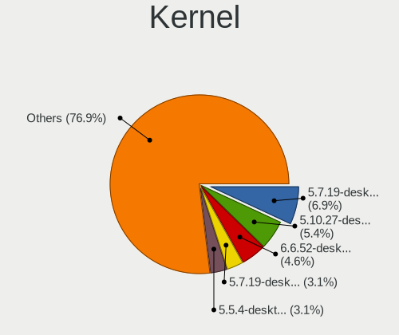

| Version                  | Desktops | Percent |
|--------------------------|----------|---------|
| 5.7.19-desktop-3.mga7    | 9        | 6.92%   |
| 5.10.27-desktop-1.mga8   | 7        | 5.38%   |
| 6.6.52-desktop-1.mga9    | 6        | 4.62%   |
| 5.7.19-desktop-1.mga7    | 4        | 3.08%   |
| 5.5.4-desktop-1.mga7     | 4        | 3.08%   |
| 5.15.23-desktop-1.mga8   | 4        | 3.08%   |
| 6.6.28-desktop-1.mga9    | 3        | 2.31%   |
| 6.6.18-desktop-1.mga9    | 3        | 2.31%   |
| 6.5.13-desktop-6.mga9    | 3        | 2.31%   |
| 5.5.9-desktop-1.mga7     | 3        | 2.31%   |
| 5.10.25-desktop-1.mga8   | 3        | 2.31%   |
| 5.10.12-desktop-1.mga7   | 3        | 2.31%   |
| 6.6.14-desktop586-2.mga9 | 2        | 1.54%   |
| 6.6.14-desktop-2.mga9    | 2        | 1.54%   |
| 6.4.9-desktop-4.mga9     | 2        | 1.54%   |
| 6.4.16-desktop-3.mga9    | 2        | 1.54%   |
| 5.6.14-desktop-2.mga7    | 2        | 1.54%   |
| 5.3.7-desktop-4.mga7     | 2        | 1.54%   |
| 5.17.4-desktop-2.mga8    | 2        | 1.54%   |
| 5.15.32-desktop-1.mga8   | 2        | 1.54%   |
| 5.15.16-desktop-1.mga8   | 2        | 1.54%   |
| 5.15.11-desktop-3.mga8   | 2        | 1.54%   |
| 5.10.60-desktop-2.mga8   | 2        | 1.54%   |
| 5.10.52-desktop-1.mga8   | 2        | 1.54%   |
| 5.10.14-desktop-1.mga7   | 2        | 1.54%   |
| 6.6.65-desktop-2.mga9    | 1        | 0.77%   |
| 6.6.61-desktop-1.mga9    | 1        | 0.77%   |
| 6.6.52-desktop-2.mga10   | 1        | 0.77%   |
| 6.6.22-desktop-1.mga9    | 1        | 0.77%   |
| 6.6.17-desktop-1.mga9    | 1        | 0.77%   |
| 6.5.11-desktop-5.mga9    | 1        | 0.77%   |
| 6.2.6-desktop-1.mga9     | 1        | 0.77%   |
| 6.1.6-desktop-1.mga8     | 1        | 0.77%   |
| 6.1.23-desktop-1.mga8    | 1        | 0.77%   |
| 5.9.3-desktop-1.mga8     | 1        | 0.77%   |
| 5.9.1-desktop-1.mga8     | 1        | 0.77%   |
| 5.8.14-desktop-1.mga8    | 1        | 0.77%   |
| 5.6.8-desktop-1.mga7     | 1        | 0.77%   |
| 5.6.6-desktop-1.mga7     | 1        | 0.77%   |
| 5.5.13-desktop-1.mga7    | 1        | 0.77%   |

Kernel Family
-------------

Linux kernel without a distro release

| Version | Desktops | Percent |
|---------|----------|---------|
| 5.7.19  | 11       | 8.59%   |
| 6.6.52  | 7        | 5.47%   |
| 5.10.27 | 7        | 5.47%   |
| 6.6.14  | 4        | 3.13%   |
| 5.5.4   | 4        | 3.13%   |
| 5.15.23 | 4        | 3.13%   |
| 6.6.28  | 3        | 2.34%   |
| 6.6.18  | 3        | 2.34%   |
| 6.5.13  | 3        | 2.34%   |
| 5.5.9   | 3        | 2.34%   |
| 5.10.25 | 3        | 2.34%   |
| 5.10.12 | 3        | 2.34%   |
| 6.4.9   | 2        | 1.56%   |
| 6.4.16  | 2        | 1.56%   |
| 5.6.14  | 2        | 1.56%   |
| 5.3.7   | 2        | 1.56%   |
| 5.17.4  | 2        | 1.56%   |
| 5.16.18 | 2        | 1.56%   |
| 5.15.32 | 2        | 1.56%   |
| 5.15.16 | 2        | 1.56%   |
| 5.15.11 | 2        | 1.56%   |
| 5.10.60 | 2        | 1.56%   |
| 5.10.52 | 2        | 1.56%   |
| 5.10.14 | 2        | 1.56%   |
| 6.6.65  | 1        | 0.78%   |
| 6.6.61  | 1        | 0.78%   |
| 6.6.22  | 1        | 0.78%   |
| 6.6.17  | 1        | 0.78%   |
| 6.5.11  | 1        | 0.78%   |
| 6.2.6   | 1        | 0.78%   |
| 6.1.6   | 1        | 0.78%   |
| 6.1.23  | 1        | 0.78%   |
| 5.9.3   | 1        | 0.78%   |
| 5.9.1   | 1        | 0.78%   |
| 5.8.14  | 1        | 0.78%   |
| 5.6.8   | 1        | 0.78%   |
| 5.6.6   | 1        | 0.78%   |
| 5.5.13  | 1        | 0.78%   |
| 5.4.8   | 1        | 0.78%   |
| 5.4.12  | 1        | 0.78%   |

Kernel Major Ver.
-----------------

Linux kernel major version

| Version | Desktops | Percent |
|---------|----------|---------|
| 6.6     | 20       | 16.95%  |
| 5.15    | 20       | 16.95%  |
| 5.10    | 19       | 16.1%   |
| 5.7     | 11       | 9.32%   |
| 5.5     | 8        | 6.78%   |
| 6.5     | 4        | 3.39%   |
| 6.4     | 4        | 3.39%   |
| 5.6     | 4        | 3.39%   |
| 5.16    | 3        | 2.54%   |
| 4.14    | 3        | 2.54%   |
| 6.1     | 2        | 1.69%   |
| 5.9     | 2        | 1.69%   |
| 5.4     | 2        | 1.69%   |
| 5.3     | 2        | 1.69%   |
| 5.19    | 2        | 1.69%   |
| 5.17    | 2        | 1.69%   |
| 5.14    | 2        | 1.69%   |
| 6.2     | 1        | 0.85%   |
| 5.8     | 1        | 0.85%   |
| 5.13    | 1        | 0.85%   |
| 5.12    | 1        | 0.85%   |
| 5.1     | 1        | 0.85%   |
| 4.9     | 1        | 0.85%   |
| 4.19    | 1        | 0.85%   |
| 4.1     | 1        | 0.85%   |

Arch
----

OS architecture (x86_64, i586, etc.)

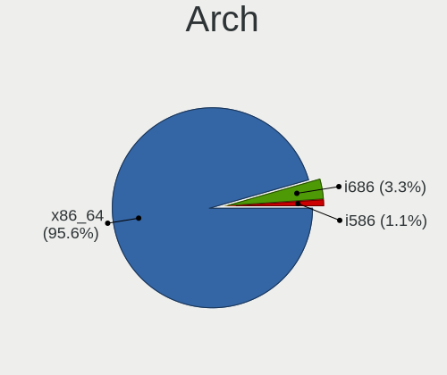

| Name   | Desktops | Percent |
|--------|----------|---------|
| x86_64 | 86       | 95.56%  |
| i686   | 3        | 3.33%   |
| i586   | 1        | 1.11%   |

DE
--

Desktop Environment

| Name          | Desktops | Percent |
|---------------|----------|---------|
| KDE5          | 38       | 38.38%  |
| KDE           | 16       | 16.16%  |
| GNOME         | 11       | 11.11%  |
| Unknown       | 9        | 9.09%   |
| LXDE          | 7        | 7.07%   |
| Cinnamon      | 5        | 5.05%   |
| XFCE          | 4        | 4.04%   |
| MATE          | 4        | 4.04%   |
| GNOME Classic | 2        | 2.02%   |
| X-Cinnamon    | 1        | 1.01%   |
| LXQt          | 1        | 1.01%   |
| KDE4          | 1        | 1.01%   |

Display Server
--------------

X11 or Wayland

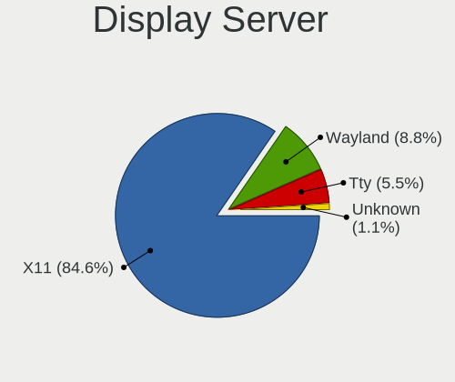

| Name    | Desktops | Percent |
|---------|----------|---------|
| X11     | 77       | 84.62%  |
| Wayland | 8        | 8.79%   |
| Tty     | 5        | 5.49%   |
| Unknown | 1        | 1.1%    |

Display Manager
---------------

SDDM, LightDM, etc.

| Name    | Desktops | Percent |
|---------|----------|---------|
| Unknown | 40       | 43.96%  |
| SDDM    | 34       | 37.36%  |
| LightDM | 8        | 8.79%   |
| GDM     | 4        | 4.4%    |
| LXDM    | 3        | 3.3%    |
| XDM     | 1        | 1.1%    |
| TDM     | 1        | 1.1%    |

OS Lang
-------

Language

| Lang    | Desktops | Percent |
|---------|----------|---------|
| fr_FR   | 21       | 22.83%  |
| en_US   | 15       | 16.3%   |
| de_DE   | 9        | 9.78%   |
| ru_RU   | 8        | 8.7%    |
| Unknown | 8        | 8.7%    |
| pt_BR   | 5        | 5.43%   |
| es_PE   | 4        | 4.35%   |
| en_GB   | 4        | 4.35%   |
| sv_SE   | 2        | 2.17%   |
| pl_PL   | 2        | 2.17%   |
| it_IT   | 2        | 2.17%   |
| en_CA   | 2        | 2.17%   |
| cs_CZ   | 2        | 2.17%   |
| zh_TW   | 1        | 1.09%   |
| th_TH   | 1        | 1.09%   |
| sl_SI   | 1        | 1.09%   |
| sk_SK   | 1        | 1.09%   |
| fur_IT  | 1        | 1.09%   |
| fr_BE   | 1        | 1.09%   |
| es_CO   | 1        | 1.09%   |
| es_AR   | 1        | 1.09%   |

Boot Mode
---------

EFI or BIOS

| Mode | Desktops | Percent |
|------|----------|---------|
| BIOS | 62       | 67.39%  |
| EFI  | 30       | 32.61%  |

Filesystem
----------

Type of filesystem

| Type     | Desktops | Percent |
|----------|----------|---------|
| Ext4     | 73       | 79.35%  |
| Xfs      | 7        | 7.61%   |
| Unknown  | 6        | 6.52%   |
| Btrfs    | 4        | 4.35%   |
| Reiserfs | 2        | 2.17%   |

Part. scheme
------------

Scheme of partitioning

| Type    | Desktops | Percent |
|---------|----------|---------|
| GPT     | 36       | 39.13%  |
| Unknown | 32       | 34.78%  |
| MBR     | 24       | 26.09%  |

Dual Boot with Linux/BSD
------------------------

Hosting more than one Linux/BSD

| Dual boot | Desktops | Percent |
|-----------|----------|---------|
| No        | 77       | 83.7%   |
| Yes       | 15       | 16.3%   |

Dual Boot (Win)
---------------

Hosting Linux and Windows

| Dual boot | Desktops | Percent |
|-----------|----------|---------|
| No        | 65       | 71.43%  |
| Yes       | 26       | 28.57%  |

Board
-----

Vendor
------

Motherboard manufacturer

| Name                | Desktops | Percent |
|---------------------|----------|---------|
| Gigabyte Technology | 24       | 26.67%  |
| ASUSTek Computer    | 20       | 22.22%  |
| MSI                 | 12       | 13.33%  |
| ASRock              | 8        | 8.89%   |
| Lenovo              | 6        | 6.67%   |
| Hewlett-Packard     | 6        | 6.67%   |
| Dell                | 5        | 5.56%   |
| Unknown             | 2        | 2.22%   |
| ZOTAC               | 1        | 1.11%   |
| Vorke               | 1        | 1.11%   |
| Megaware            | 1        | 1.11%   |
| Medion              | 1        | 1.11%   |
| Intel               | 1        | 1.11%   |
| Foxconn             | 1        | 1.11%   |
| ECS                 | 1        | 1.11%   |

Model
-----

Motherboard model

| Name                                   | Desktops | Percent |
|----------------------------------------|----------|---------|
| Unknown                                | 3        | 3.33%   |
| Gigabyte Z68X-UD3H-B3                  | 2        | 2.22%   |
| Gigabyte H81M-S2H                      | 2        | 2.22%   |
| Gigabyte B450M DS3H                    | 2        | 2.22%   |
| Dell Precision WorkStation T3400       | 2        | 2.22%   |
| ASUS SABERTOOTH 990FX R2.0             | 2        | 2.22%   |
| Vorke V1 Plus                          | 1        | 1.11%   |
| MSI PPPPP-CCC#MMMMMMMM                 | 1        | 1.11%   |
| MSI MS-7D74                            | 1        | 1.11%   |
| MSI MS-7D09                            | 1        | 1.11%   |
| MSI MS-7C96                            | 1        | 1.11%   |
| MSI MS-7C89                            | 1        | 1.11%   |
| MSI MS-7C82                            | 1        | 1.11%   |
| MSI MS-7C37                            | 1        | 1.11%   |
| MSI MS-7B31                            | 1        | 1.11%   |
| MSI MS-7B23                            | 1        | 1.11%   |
| MSI MS-7A70                            | 1        | 1.11%   |
| MSI MS-7816                            | 1        | 1.11%   |
| MSI MS-7592                            | 1        | 1.11%   |
| Megaware MW-G31T-M7                    | 1        | 1.11%   |
| Medion MD34161/C708                    | 1        | 1.11%   |
| Lenovo ThinkCentre M93p 10A90011UK     | 1        | 1.11%   |
| Lenovo ThinkCentre M92p 2992A7U        | 1        | 1.11%   |
| Lenovo ThinkCentre M58e 7491B1G        | 1        | 1.11%   |
| Lenovo ThinkCentre A57 970274G         | 1        | 1.11%   |
| Lenovo IdeaCentre 5 14IMB05 90NA0000US | 1        | 1.11%   |
| Lenovo 70A4000HUX ThinkServer TS140    | 1        | 1.11%   |
| Intel STL2                             | 1        | 1.11%   |
| HP Z620 Workstation                    | 1        | 1.11%   |
| HP Z440 Workstation                    | 1        | 1.11%   |
| HP Z420 Workstation                    | 1        | 1.11%   |
| HP EliteDesk 800 G1 SFF                | 1        | 1.11%   |
| HP Compaq Pro 6300 SFF                 | 1        | 1.11%   |
| HP Compaq dc5700 Small Form Factor     | 1        | 1.11%   |
| Gigabyte Z97-D3H                       | 1        | 1.11%   |
| Gigabyte Z87X-UD5H                     | 1        | 1.11%   |
| Gigabyte Z68XP-UD3P                    | 1        | 1.11%   |
| Gigabyte X570 GAMING X                 | 1        | 1.11%   |
| Gigabyte X570 AORUS ELITE WIFI         | 1        | 1.11%   |
| Gigabyte P67A-UD3-B3                   | 1        | 1.11%   |

Model Family
------------

Motherboard model prefix

| Name                   | Desktops | Percent |
|------------------------|----------|---------|
| Lenovo ThinkCentre     | 4        | 4.44%   |
| ASUS PRIME             | 4        | 4.44%   |
| Dell Precision         | 3        | 3.33%   |
| ASUS SABERTOOTH        | 3        | 3.33%   |
| Unknown                | 3        | 3.33%   |
| HP Compaq              | 2        | 2.22%   |
| Gigabyte Z68X-UD3H-B3  | 2        | 2.22%   |
| Gigabyte X570          | 2        | 2.22%   |
| Gigabyte H81M-S2H      | 2        | 2.22%   |
| Gigabyte GA-78LMT-USB3 | 2        | 2.22%   |
| Gigabyte B450M         | 2        | 2.22%   |
| Dell OptiPlex          | 2        | 2.22%   |
| ASUS ROG               | 2        | 2.22%   |
| Vorke V1               | 1        | 1.11%   |
| MSI PPPPP-CCC#MMMMMMMM | 1        | 1.11%   |
| MSI MS-7D74            | 1        | 1.11%   |
| MSI MS-7D09            | 1        | 1.11%   |
| MSI MS-7C96            | 1        | 1.11%   |
| MSI MS-7C89            | 1        | 1.11%   |
| MSI MS-7C82            | 1        | 1.11%   |
| MSI MS-7C37            | 1        | 1.11%   |
| MSI MS-7B31            | 1        | 1.11%   |
| MSI MS-7B23            | 1        | 1.11%   |
| MSI MS-7A70            | 1        | 1.11%   |
| MSI MS-7816            | 1        | 1.11%   |
| MSI MS-7592            | 1        | 1.11%   |
| Megaware MW-G31T-M7    | 1        | 1.11%   |
| Medion MD34161         | 1        | 1.11%   |
| Lenovo IdeaCentre      | 1        | 1.11%   |
| Lenovo 70A4000HUX      | 1        | 1.11%   |
| Intel STL2             | 1        | 1.11%   |
| HP Z620                | 1        | 1.11%   |
| HP Z440                | 1        | 1.11%   |
| HP Z420                | 1        | 1.11%   |
| HP EliteDesk           | 1        | 1.11%   |
| Gigabyte Z97-D3H       | 1        | 1.11%   |
| Gigabyte Z87X-UD5H     | 1        | 1.11%   |
| Gigabyte Z68XP-UD3P    | 1        | 1.11%   |
| Gigabyte P67A-UD3-B3   | 1        | 1.11%   |
| Gigabyte H81M-DS2      | 1        | 1.11%   |

MFG Year
--------

Motherboard manufacture year

| Year    | Desktops | Percent |
|---------|----------|---------|
| 2013    | 11       | 12.22%  |
| 2012    | 11       | 12.22%  |
| 2018    | 10       | 11.11%  |
| 2014    | 8        | 8.89%   |
| 2020    | 6        | 6.67%   |
| 2011    | 6        | 6.67%   |
| 2017    | 5        | 5.56%   |
| 2010    | 5        | 5.56%   |
| 2009    | 5        | 5.56%   |
| 2008    | 5        | 5.56%   |
| 2019    | 4        | 4.44%   |
| 2021    | 3        | 3.33%   |
| 2015    | 3        | 3.33%   |
| 2023    | 2        | 2.22%   |
| 2016    | 2        | 2.22%   |
| 2022    | 1        | 1.11%   |
| 2006    | 1        | 1.11%   |
| 2002    | 1        | 1.11%   |
| Unknown | 1        | 1.11%   |

Form Factor
-----------

Physical design of the computer

| Name    | Desktops | Percent |
|---------|----------|---------|
| Desktop | 90       | 100%    |

Secure Boot
-----------

Enabled or disabled

| State    | Desktops | Percent |
|----------|----------|---------|
| Disabled | 90       | 100%    |

Coreboot
--------

Have coreboot on board

| Used | Desktops | Percent |
|------|----------|---------|
| No   | 90       | 100%    |

RAM Size
--------

Total RAM memory

| Size in GB  | Desktops | Percent |
|-------------|----------|---------|
| 16.01-24.0  | 27       | 28.72%  |
| 32.01-64.0  | 16       | 17.02%  |
| 8.01-16.0   | 14       | 14.89%  |
| 4.01-8.0    | 13       | 13.83%  |
| 3.01-4.0    | 11       | 11.7%   |
| 64.01-256.0 | 6        | 6.38%   |
| 24.01-32.0  | 5        | 5.32%   |
| 2.01-3.0    | 1        | 1.06%   |
| 0.01-0.5    | 1        | 1.06%   |

RAM Used
--------

Used RAM memory

| Used GB    | Desktops | Percent |
|------------|----------|---------|
| 2.01-3.0   | 27       | 24.55%  |
| 1.01-2.0   | 25       | 22.73%  |
| 4.01-8.0   | 22       | 20%     |
| 3.01-4.0   | 15       | 13.64%  |
| 8.01-16.0  | 12       | 10.91%  |
| 0.51-1.0   | 6        | 5.45%   |
| 16.01-24.0 | 2        | 1.82%   |
| 0.01-0.5   | 1        | 0.91%   |

Total Drives
------------

Number of drives on board

| Drives | Desktops | Percent |
|--------|----------|---------|
| 3      | 26       | 27.37%  |
| 2      | 26       | 27.37%  |
| 1      | 21       | 22.11%  |
| 5      | 7        | 7.37%   |
| 4      | 7        | 7.37%   |
| 7      | 3        | 3.16%   |
| 6      | 3        | 3.16%   |
| 8      | 1        | 1.05%   |
| 0      | 1        | 1.05%   |

Has CD-ROM
----------

Has CD-ROM on board

| Presented | Desktops | Percent |
|-----------|----------|---------|
| Yes       | 48       | 52.75%  |
| No        | 43       | 47.25%  |

Has Ethernet
------------

Has Ethernet on board

| Presented | Desktops | Percent |
|-----------|----------|---------|
| Yes       | 88       | 97.78%  |
| No        | 2        | 2.22%   |

Has WiFi
--------

Has WiFi module

| Presented | Desktops | Percent |
|-----------|----------|---------|
| No        | 58       | 63.74%  |
| Yes       | 33       | 36.26%  |

Has Bluetooth
-------------

Has Bluetooth module

| Presented | Desktops | Percent |
|-----------|----------|---------|
| No        | 58       | 63.74%  |
| Yes       | 33       | 36.26%  |

Location
--------

Country
-------

Geographic location (country)

| Country     | Desktops | Percent |
|-------------|----------|---------|
| France      | 22       | 24.44%  |
| USA         | 13       | 14.44%  |
| Germany     | 8        | 8.89%   |
| Russia      | 5        | 5.56%   |
| Brazil      | 5        | 5.56%   |
| UK          | 4        | 4.44%   |
| Peru        | 4        | 4.44%   |
| Ukraine     | 3        | 3.33%   |
| Canada      | 3        | 3.33%   |
| Sweden      | 2        | 2.22%   |
| Poland      | 2        | 2.22%   |
| Turkey      | 1        | 1.11%   |
| Thailand    | 1        | 1.11%   |
| Taiwan      | 1        | 1.11%   |
| Spain       | 1        | 1.11%   |
| Slovenia    | 1        | 1.11%   |
| Slovakia    | 1        | 1.11%   |
| Netherlands | 1        | 1.11%   |
| Mexico      | 1        | 1.11%   |
| Malaysia    | 1        | 1.11%   |
| Luxembourg  | 1        | 1.11%   |
| Kenya       | 1        | 1.11%   |
| Italy       | 1        | 1.11%   |
| Greece      | 1        | 1.11%   |
| Czechia     | 1        | 1.11%   |
| Colombia    | 1        | 1.11%   |
| Belgium     | 1        | 1.11%   |
| Belarus     | 1        | 1.11%   |
| Austria     | 1        | 1.11%   |
| Argentina   | 1        | 1.11%   |

City
----

Geographic location (city)

| City                  | Desktops | Percent |
|-----------------------|----------|---------|
| Paris                 | 4        | 3.7%    |
| Arequipa              | 4        | 3.7%    |
| Virginia Beach        | 3        | 2.78%   |
| Mala Danylivka        | 3        | 2.78%   |
| Kharkiv               | 3        | 2.78%   |
| Woking                | 2        | 1.85%   |
| Woincourt             | 2        | 1.85%   |
| Waterloo              | 2        | 1.85%   |
| Upper Norwood         | 2        | 1.85%   |
| Rommerskirchen        | 2        | 1.85%   |
| Oakland               | 2        | 1.85%   |
| Londrina              | 2        | 1.85%   |
| Kirishi               | 2        | 1.85%   |
| Grants Pass           | 2        | 1.85%   |
| Yakutsk               | 1        | 0.93%   |
| Wroclaw               | 1        | 0.93%   |
| Voronezh              | 1        | 0.93%   |
| Vanves                | 1        | 0.93%   |
| Uzhhorod              | 1        | 0.93%   |
| Turin                 | 1        | 0.93%   |
| Tijuana               | 1        | 0.93%   |
| Thiais                | 1        | 0.93%   |
| Strasbourg            | 1        | 0.93%   |
| Sternberk             | 1        | 0.93%   |
| Sartrouville          | 1        | 0.93%   |
| Sao Paulo             | 1        | 0.93%   |
| San Isidro            | 1        | 0.93%   |
| Saint-Michel-sur-Orge | 1        | 0.93%   |
| Saint-Etienne         | 1        | 0.93%   |
| Roehampton            | 1        | 0.93%   |
| Rio de Janeiro        | 1        | 0.93%   |
| Regina                | 1        | 0.93%   |
| Quincy                | 1        | 0.93%   |
| Quierschied           | 1        | 0.93%   |
| Pouldergat            | 1        | 0.93%   |
| Pont-l'Abbe-d'Arnoult | 1        | 0.93%   |
| Perm                  | 1        | 0.93%   |
| Perchtoldsdorf        | 1        | 0.93%   |
| Offenbach             | 1        | 0.93%   |
| Nova Gorica           | 1        | 0.93%   |

Drives
------

Drive Vendor
------------

Hard drive vendors

| Vendor                    | Desktops | Drives | Percent |
|---------------------------|----------|--------|---------|
| WDC                       | 54       | 144    | 25.59%  |
| Seagate                   | 34       | 62     | 16.11%  |
| Samsung Electronics       | 31       | 41     | 14.69%  |
| Kingston                  | 12       | 21     | 5.69%   |
| Toshiba                   | 9        | 16     | 4.27%   |
| SanDisk                   | 8        | 14     | 3.79%   |
| Crucial                   | 8        | 14     | 3.79%   |
| Hitachi                   | 7        | 7      | 3.32%   |
| PNY                       | 5        | 8      | 2.37%   |
| HGST                      | 5        | 5      | 2.37%   |
| A-DATA Technology         | 4        | 9      | 1.9%    |
| Phison Electronics        | 3        | 4      | 1.42%   |
| Verbatim                  | 2        | 3      | 0.95%   |
| Unknown                   | 2        | 2      | 0.95%   |
| OCZ-VERTEX                | 2        | 2      | 0.95%   |
| OCZ                       | 2        | 2      | 0.95%   |
| Intel                     | 2        | 2      | 0.95%   |
| XPG                       | 1        | 4      | 0.47%   |
| Transcend                 | 1        | 1      | 0.47%   |
| TO Exter                  | 1        | 1      | 0.47%   |
| Team                      | 1        | 1      | 0.47%   |
| SK hynix                  | 1        | 1      | 0.47%   |
| PNY CS90                  | 1        | 1      | 0.47%   |
| Phison                    | 1        | 2      | 0.47%   |
| MSP                       | 1        | 1      | 0.47%   |
| Micron/Crucial Technology | 1        | 1      | 0.47%   |
| LITEON                    | 1        | 1      | 0.47%   |
| Lexar 24                  | 1        | 1      | 0.47%   |
| JMicron Technology        | 1        | 1      | 0.47%   |
| HUAWEI                    | 1        | 1      | 0.47%   |
| Hewlett-Packard           | 1        | 1      | 0.47%   |
| GOODRAM                   | 1        | 2      | 0.47%   |
| Gigabyte Technology       | 1        | 1      | 0.47%   |
| FORESEE                   | 1        | 1      | 0.47%   |
| Emtec                     | 1        | 1      | 0.47%   |
| Corsair                   | 1        | 1      | 0.47%   |
| ASMedia                   | 1        | 1      | 0.47%   |
| Apacer                    | 1        | 1      | 0.47%   |

Drive Model
-----------

Hard drive models

| Model                            | Desktops | Percent |
|----------------------------------|----------|---------|
| WDC WD2500BEVT-22ZCT0 250GB      | 4        | 1.66%   |
| WDC WD10EZEX-08WN4A0 1TB         | 4        | 1.66%   |
| WDC WD20EZRZ-00Z5HB0 2TB         | 3        | 1.24%   |
| WDC WD20EFRX-68EUZN0 2TB         | 3        | 1.24%   |
| Toshiba HDWD110 1TB              | 3        | 1.24%   |
| Seagate ST500DM002-1BD142 500GB  | 3        | 1.24%   |
| Seagate ST3500418AS 500GB        | 3        | 1.24%   |
| Seagate ST32000644NS 2TB         | 3        | 1.24%   |
| Samsung SSD 860 EVO 250GB        | 3        | 1.24%   |
| WDC WDS250G2B0A-00SM50 250GB SSD | 2        | 0.83%   |
| WDC WDS240G2G0A-00JH30 240GB SSD | 2        | 0.83%   |
| WDC WD30EZRZ-00Z5HB0 3TB         | 2        | 0.83%   |
| WDC WD10EZRZ-00HTKB0 1TB         | 2        | 0.83%   |
| WDC WD10EFRX-68PJCN0 1TB         | 2        | 0.83%   |
| WDC WD1002FAEX-00Z3A0 1TB        | 2        | 0.83%   |
| Toshiba HDWD120 2TB              | 2        | 0.83%   |
| Seagate ST2000DM008-2FR102 2TB   | 2        | 0.83%   |
| Seagate ST1000DM003-1CH162 1TB   | 2        | 0.83%   |
| SanDisk SDSSDA120G 120GB         | 2        | 0.83%   |
| SanDisk Extreme SSD 250GB        | 2        | 0.83%   |
| Samsung SSD 870 EVO 500GB        | 2        | 0.83%   |
| Samsung SSD 870 EVO 1TB          | 2        | 0.83%   |
| Samsung SSD 860 EVO 500GB        | 2        | 0.83%   |
| Samsung SSD 850 EVO 500GB        | 2        | 0.83%   |
| PNY CS900 120GB SSD              | 2        | 0.83%   |
| OCZ-VERTEX PLUS R2 128GB SSD     | 2        | 0.83%   |
| Kingston SV300S37A240G 240GB SSD | 2        | 0.83%   |
| Kingston SH103S3120G 120GB SSD   | 2        | 0.83%   |
| Kingston SA400S37240G 240GB SSD  | 2        | 0.83%   |
| Kingston SA400S37120G 120GB SSD  | 2        | 0.83%   |
| Intel SSDSC2CW120A3 120GB        | 2        | 0.83%   |
| Hitachi HDS722020ALA330 2TB      | 2        | 0.83%   |
| HGST HUS726040ALE611 4TB         | 2        | 0.83%   |
| Crucial CT500MX500SSD1 500GB     | 2        | 0.83%   |
| Crucial CT250MX200SSD1 250GB     | 2        | 0.83%   |
| A-DATA SU630 240GB SSD           | 2        | 0.83%   |
| XPG NVMe SSD Drive 2TB           | 1        | 0.41%   |
| XPG NVMe SSD Drive 1024GB        | 1        | 0.41%   |
| WDC WDS500G3XHC-00SJG0 500GB     | 1        | 0.41%   |
| WDC WDS500G2B0A-00SM50 500GB SSD | 1        | 0.41%   |

HDD Vendor
----------

Hard disk drive vendors

| Vendor              | Desktops | Drives | Percent |
|---------------------|----------|--------|---------|
| WDC                 | 47       | 126    | 41.59%  |
| Seagate             | 33       | 56     | 29.2%   |
| Toshiba             | 9        | 16     | 7.96%   |
| Samsung Electronics | 8        | 12     | 7.08%   |
| Hitachi             | 7        | 7      | 6.19%   |
| HGST                | 5        | 5      | 4.42%   |
| Unknown             | 2        | 2      | 1.77%   |
| TO Exter            | 1        | 1      | 0.88%   |
| Hewlett-Packard     | 1        | 1      | 0.88%   |

SSD Vendor
----------

Solid state drive vendors

| Vendor              | Desktops | Drives | Percent |
|---------------------|----------|--------|---------|
| Samsung Electronics | 18       | 21     | 22.78%  |
| Kingston            | 11       | 18     | 13.92%  |
| Crucial             | 8        | 14     | 10.13%  |
| WDC                 | 7        | 17     | 8.86%   |
| SanDisk             | 6        | 8      | 7.59%   |
| PNY                 | 5        | 8      | 6.33%   |
| A-DATA Technology   | 4        | 9      | 5.06%   |
| Verbatim            | 2        | 3      | 2.53%   |
| OCZ-VERTEX          | 2        | 2      | 2.53%   |
| OCZ                 | 2        | 2      | 2.53%   |
| Intel               | 2        | 2      | 2.53%   |
| Transcend           | 1        | 1      | 1.27%   |
| Team                | 1        | 1      | 1.27%   |
| SK hynix            | 1        | 1      | 1.27%   |
| PNY CS90            | 1        | 1      | 1.27%   |
| LITEON              | 1        | 1      | 1.27%   |
| Lexar 24            | 1        | 1      | 1.27%   |
| GOODRAM             | 1        | 2      | 1.27%   |
| FORESEE             | 1        | 1      | 1.27%   |
| Emtec               | 1        | 1      | 1.27%   |
| Corsair             | 1        | 1      | 1.27%   |
| ASMedia             | 1        | 1      | 1.27%   |
| Apacer              | 1        | 1      | 1.27%   |

Drive Kind
----------

HDD or SSD

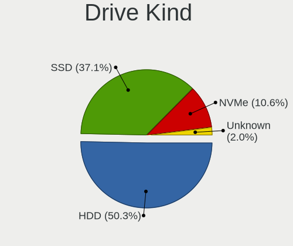

| Kind    | Desktops | Drives | Percent |
|---------|----------|--------|---------|
| HDD     | 76       | 226    | 50.33%  |
| SSD     | 56       | 117    | 37.09%  |
| NVMe    | 16       | 31     | 10.6%   |
| Unknown | 3        | 8      | 1.99%   |

Drive Connector
---------------

SATA, SAS, NVMe, etc.

| Type | Desktops | Drives | Percent |
|------|----------|--------|---------|
| SATA | 89       | 323    | 74.17%  |
| SAS  | 16       | 29     | 13.33%  |
| NVMe | 15       | 30     | 12.5%   |

Drive Size
----------

Size of hard drive

| Size in TB | Desktops | Drives | Percent |
|------------|----------|--------|---------|
| 0.01-0.5   | 70       | 139    | 43.21%  |
| 0.51-1.0   | 41       | 106    | 25.31%  |
| 1.01-2.0   | 27       | 42     | 16.67%  |
| 3.01-4.0   | 9        | 11     | 5.56%   |
| 2.01-3.0   | 8        | 32     | 4.94%   |
| 4.01-10.0  | 5        | 11     | 3.09%   |
| 10.01-20.0 | 2        | 2      | 1.23%   |

Space Total
-----------

Amount of disk space available on the file system

| Size in GB     | Desktops | Percent |
|----------------|----------|---------|
| More than 3000 | 27       | 27%     |
| 501-1000       | 18       | 18%     |
| 251-500        | 16       | 16%     |
| 1001-2000      | 13       | 13%     |
| 101-250        | 12       | 12%     |
| 2001-3000      | 11       | 11%     |
| 51-100         | 2        | 2%      |
| Unknown        | 1        | 1%      |

Space Used
----------

Amount of used disk space

| Used GB        | Desktops | Percent |
|----------------|----------|---------|
| 251-500        | 16       | 14.95%  |
| 51-100         | 16       | 14.95%  |
| More than 3000 | 14       | 13.08%  |
| 101-250        | 14       | 13.08%  |
| 1001-2000      | 14       | 13.08%  |
| 501-1000       | 14       | 13.08%  |
| 1-20           | 12       | 11.21%  |
| 2001-3000      | 4        | 3.74%   |
| 21-50          | 2        | 1.87%   |
| Unknown        | 1        | 0.93%   |

Malfunc. Drives
---------------

Drive models with a malfunction

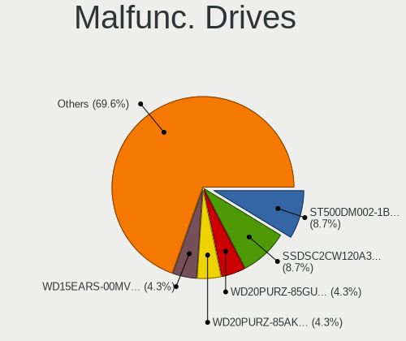

| Model                                 | Desktops | Drives | Percent |
|---------------------------------------|----------|--------|---------|
| Seagate ST500DM002-1BD142 500GB       | 2        | 2      | 8.7%    |
| Intel SSDSC2CW120A3 120GB             | 2        | 2      | 8.7%    |
| WDC WD20PURZ-85GU6Y0 2TB              | 1        | 1      | 4.35%   |
| WDC WD20PURZ-85AKKY0 2TB              | 1        | 1      | 4.35%   |
| WDC WD15EARS-00MVWB0 1TB              | 1        | 1      | 4.35%   |
| WDC WD10JPVT-08A1YT2 1TB              | 1        | 1      | 4.35%   |
| WDC WD10EARS-00MVWB0 1TB              | 1        | 1      | 4.35%   |
| WDC WD1002FAEX-00Z3A0 1TB             | 1        | 1      | 4.35%   |
| WDC WD1001FAES-75W7A0 1TB             | 1        | 1      | 4.35%   |
| SK hynix HFS256G39TND-N210A 256GB SSD | 1        | 1      | 4.35%   |
| Seagate ST3500418AS 500GB             | 1        | 1      | 4.35%   |
| Seagate ST3320820AS 320GB             | 1        | 1      | 4.35%   |
| Seagate ST3250410AS 250GB             | 1        | 3      | 4.35%   |
| Seagate ST2000VN004-2E4164 2TB        | 1        | 1      | 4.35%   |
| Seagate ST1000DM003-1CH162 1TB        | 1        | 1      | 4.35%   |
| Samsung Electronics SSD 870 EVO 2TB   | 1        | 1      | 4.35%   |
| Samsung Electronics HD400LD 400GB     | 1        | 1      | 4.35%   |
| OCZ VERTEX3 120GB SSD                 | 1        | 1      | 4.35%   |
| LITEON IT SCS-256L9S 256GB SSD        | 1        | 1      | 4.35%   |
| HGST HTS725050A7E630 500GB            | 1        | 1      | 4.35%   |
| A-DATA Technology SU630 240GB SSD     | 1        | 1      | 4.35%   |

Malfunc. Drive Vendor
---------------------

Vendors of faulty drives

| Vendor              | Desktops | Drives | Percent |
|---------------------|----------|--------|---------|
| Seagate             | 7        | 9      | 33.33%  |
| WDC                 | 5        | 7      | 23.81%  |
| Samsung Electronics | 2        | 2      | 9.52%   |
| Intel               | 2        | 2      | 9.52%   |
| SK hynix            | 1        | 1      | 4.76%   |
| OCZ                 | 1        | 1      | 4.76%   |
| LITEON              | 1        | 1      | 4.76%   |
| HGST                | 1        | 1      | 4.76%   |
| A-DATA Technology   | 1        | 1      | 4.76%   |

Malfunc. HDD Vendor
-------------------

Vendors of faulty HDD drives

| Vendor              | Desktops | Drives | Percent |
|---------------------|----------|--------|---------|
| Seagate             | 7        | 9      | 50%     |
| WDC                 | 5        | 7      | 35.71%  |
| Samsung Electronics | 1        | 1      | 7.14%   |
| HGST                | 1        | 1      | 7.14%   |

Malfunc. Drive Kind
-------------------

Kinds of faulty drives

| Kind | Desktops | Drives | Percent |
|------|----------|--------|---------|
| HDD  | 13       | 18     | 65%     |
| SSD  | 7        | 7      | 35%     |

Failed Drives
-------------

Failed drive models

Zero info for selected period =(

Failed Drive Vendor
-------------------

Failed drive vendors

Zero info for selected period =(

Drive Status
------------

Number of failed and malfunc. drives

| Status   | Desktops | Drives | Percent |
|----------|----------|--------|---------|
| Works    | 50       | 198    | 45.05%  |
| Detected | 42       | 159    | 37.84%  |
| Malfunc  | 19       | 25     | 17.12%  |

Storage controller
------------------

Storage Vendor
--------------

Storage controller vendors

| Vendor                      | Desktops | Percent |
|-----------------------------|----------|---------|
| Intel                       | 55       | 44.72%  |
| AMD                         | 31       | 25.2%   |
| ASMedia Technology          | 9        | 7.32%   |
| Marvell Technology Group    | 7        | 5.69%   |
| Samsung Electronics         | 6        | 4.88%   |
| Phison Electronics          | 5        | 4.07%   |
| SanDisk                     | 3        | 2.44%   |
| Nvidia                      | 2        | 1.63%   |
| Micron/Crucial Technology   | 1        | 0.81%   |
| Kingston Technology Company | 1        | 0.81%   |
| JMicron Technology          | 1        | 0.81%   |
| Broadcom                    | 1        | 0.81%   |
| ADATA Technology            | 1        | 0.81%   |

Storage Model
-------------

Storage controller models

| Model                                                                                   | Desktops | Percent |
|-----------------------------------------------------------------------------------------|----------|---------|
| AMD FCH SATA Controller [AHCI mode]                                                     | 12       | 7.36%   |
| Intel 8 Series/C220 Series Chipset Family 6-port SATA Controller 1 [AHCI mode]          | 10       | 6.13%   |
| ASMedia ASM1061/ASM1062 Serial ATA Controller                                           | 9        | 5.52%   |
| Intel NM10/ICH7 Family SATA Controller [IDE mode]                                       | 7        | 4.29%   |
| Intel 82801G (ICH7 Family) IDE Controller                                               | 7        | 4.29%   |
| AMD SB7x0/SB8x0/SB9x0 SATA Controller [AHCI mode]                                       | 7        | 4.29%   |
| AMD SB7x0/SB8x0/SB9x0 IDE Controller                                                    | 7        | 4.29%   |
| AMD 400 Series Chipset SATA Controller                                                  | 5        | 3.07%   |
| Marvell Group 88SE9230 PCIe 2.0 x2 4-port SATA 6 Gb/s RAID Controller                   | 4        | 2.45%   |
| Marvell Group 88SE9172 SATA 6Gb/s Controller                                            | 4        | 2.45%   |
| Intel SATA Controller [RAID mode]                                                       | 4        | 2.45%   |
| Intel Q170/Q150/B150/H170/H110/Z170/CM236 Chipset SATA Controller [AHCI Mode]           | 4        | 2.45%   |
| Intel 6 Series/C200 Series Chipset Family 6 port Desktop SATA AHCI Controller           | 4        | 2.45%   |
| AMD 500 Series Chipset SATA Controller                                                  | 4        | 2.45%   |
| SanDisk Extreme Pro / WD Black 2018/SN750/PC SN720 NVMe SSD                             | 3        | 1.84%   |
| Intel 6 Series/C200 Series Chipset Family Desktop SATA Controller (IDE mode, ports 4-5) | 3        | 1.84%   |
| Intel 6 Series/C200 Series Chipset Family Desktop SATA Controller (IDE mode, ports 0-3) | 3        | 1.84%   |
| Intel 400 Series Chipset Family SATA AHCI Controller                                    | 3        | 1.84%   |
| AMD SB7x0/SB8x0/SB9x0 SATA Controller [IDE mode]                                        | 3        | 1.84%   |
| Samsung NVMe SSD Controller S4LV008[Pascal]                                             | 2        | 1.23%   |
| Phison E16 PCIe4 NVMe Controller                                                        | 2        | 1.23%   |
| Intel Cannon Lake PCH SATA AHCI Controller                                              | 2        | 1.23%   |
| Intel C602 chipset 4-Port SATA Storage Control Unit                                     | 2        | 1.23%   |
| Intel C600/X79 series chipset IDE-r Controller                                          | 2        | 1.23%   |
| Intel C600/X79 series chipset 6-Port SATA AHCI Controller                               | 2        | 1.23%   |
| Intel 82801IR/IO/IH (ICH9R/DO/DH) 6 port SATA Controller [AHCI mode]                    | 2        | 1.23%   |
| Intel 500 Series Chipset Family SATA AHCI Controller                                    | 2        | 1.23%   |
| Intel 200 Series PCH SATA controller [AHCI mode]                                        | 2        | 1.23%   |
| AMD X399 Series Chipset SATA Controller                                                 | 2        | 1.23%   |
| AMD FCH SATA Controller [IDE mode]                                                      | 2        | 1.23%   |
| AMD FCH IDE Controller                                                                  | 2        | 1.23%   |
| Samsung NVMe SSD Controller SM981/PM981/PM983                                           | 1        | 0.61%   |
| Samsung NVMe SSD Controller SM961/PM961/SM963                                           | 1        | 0.61%   |
| Samsung NVMe SSD Controller PM9A1/PM9A3/980PRO                                          | 1        | 0.61%   |
| Samsung NVMe SSD Controller 980 (DRAM-less)                                             | 1        | 0.61%   |
| Phison PS5026-E26 PCIe5 NVMe Controller                                                 | 1        | 0.61%   |
| Phison E7 NVMe Controller                                                               | 1        | 0.61%   |
| Phison E12 NVMe Controller                                                              | 1        | 0.61%   |
| Nvidia MCP79 SATA Controller                                                            | 1        | 0.61%   |
| Nvidia MCP61 SATA Controller                                                            | 1        | 0.61%   |

Storage Kind
------------

Kind of storage controller (IDE, SATA, NVMe, SAS, ...)

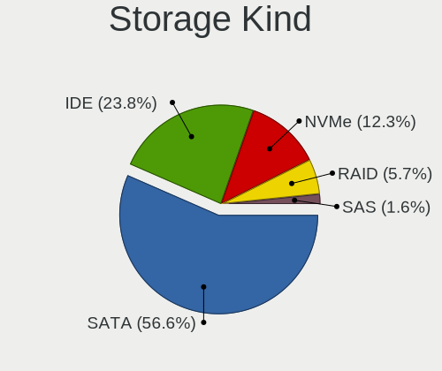

| Kind | Desktops | Percent |
|------|----------|---------|
| SATA | 69       | 56.56%  |
| IDE  | 29       | 23.77%  |
| NVMe | 15       | 12.3%   |
| RAID | 7        | 5.74%   |
| SAS  | 2        | 1.64%   |

Processor
---------

CPU Vendor
----------

Processor vendors

| Vendor       | Desktops | Percent |
|--------------|----------|---------|
| Intel        | 57       | 63.33%  |
| AMD          | 32       | 35.56%  |
| Vortex86 SoC | 1        | 1.11%   |

CPU Model
---------

Processor models

| Model                                       | Desktops | Percent |
|---------------------------------------------|----------|---------|
| AMD FX-8350 Eight-Core Processor            | 4        | 4.4%    |
| Intel Core i7-4770 CPU @ 3.40GHz            | 3        | 3.3%    |
| Intel Core 2 Duo CPU E8400 @ 3.00GHz        | 3        | 3.3%    |
| Intel Pentium Dual-Core CPU E5200 @ 2.50GHz | 2        | 2.2%    |
| Intel Core i7-3770 CPU @ 3.40GHz            | 2        | 2.2%    |
| Intel Core i7-2600K CPU @ 3.40GHz           | 2        | 2.2%    |
| Intel Core i5-8400 CPU @ 2.80GHz            | 2        | 2.2%    |
| Intel Core i3-4130 CPU @ 3.40GHz            | 2        | 2.2%    |
| Intel Core 2 Duo CPU E7300 @ 2.66GHz        | 2        | 2.2%    |
| AMD Ryzen 7 3700X 8-Core Processor          | 2        | 2.2%    |
| AMD Ryzen 5 3600 6-Core Processor           | 2        | 2.2%    |
| AMD Ryzen 5 2400G with Radeon Vega Graphics | 2        | 2.2%    |
| Vortex86 SoC Vortex86DX                     | 1        | 1.1%    |
| Intel Xeon CPU E5-1650 0 @ 3.20GHz          | 1        | 1.1%    |
| Intel Xeon CPU E5-1620 v3 @ 3.50GHz         | 1        | 1.1%    |
| Intel Xeon CPU E5-1620 v2 @ 3.70GHz         | 1        | 1.1%    |
| Intel Pentium III (Coppermine)              | 1        | 1.1%    |
| Intel Pentium Gold G6400 CPU @ 4.00GHz      | 1        | 1.1%    |
| Intel Pentium Dual-Core CPU E5400 @ 2.70GHz | 1        | 1.1%    |
| Intel Pentium CPU G3450 @ 3.40GHz           | 1        | 1.1%    |
| Intel Pentium CPU G3260 @ 3.30GHz           | 1        | 1.1%    |
| Intel Core i7-8700 CPU @ 3.20GHz            | 1        | 1.1%    |
| Intel Core i7-7700 CPU @ 3.60GHz            | 1        | 1.1%    |
| Intel Core i7-4790K CPU @ 4.00GHz           | 1        | 1.1%    |
| Intel Core i7-4790 CPU @ 3.60GHz            | 1        | 1.1%    |
| Intel Core i7-4770K CPU @ 3.50GHz           | 1        | 1.1%    |
| Intel Core i7-3820 CPU @ 3.60GHz            | 1        | 1.1%    |
| Intel Core i7-3770K CPU @ 3.50GHz           | 1        | 1.1%    |
| Intel Core i5-8250U CPU @ 1.60GHz           | 1        | 1.1%    |
| Intel Core i5-7600K CPU @ 3.80GHz           | 1        | 1.1%    |
| Intel Core i5-6600 CPU @ 3.30GHz            | 1        | 1.1%    |
| Intel Core i5-6500 CPU @ 3.20GHz            | 1        | 1.1%    |
| Intel Core i5-6400 CPU @ 2.70GHz            | 1        | 1.1%    |
| Intel Core i5-4440 CPU @ 3.10GHz            | 1        | 1.1%    |
| Intel Core i5-3470 CPU @ 3.20GHz            | 1        | 1.1%    |
| Intel Core i5-2500K CPU @ 3.30GHz           | 1        | 1.1%    |
| Intel Core i5-2320 CPU @ 3.00GHz            | 1        | 1.1%    |
| Intel Core i5-14600K                        | 1        | 1.1%    |
| Intel Core i5-10400 CPU @ 2.90GHz           | 1        | 1.1%    |
| Intel Core i5 CPU 650 @ 3.20GHz             | 1        | 1.1%    |

CPU Model Family
----------------

Processor model prefix

| Model                   | Desktops | Percent |
|-------------------------|----------|---------|
| Intel Core i7           | 14       | 15.56%  |
| Intel Core i5           | 14       | 15.56%  |
| AMD FX                  | 7        | 7.78%   |
| Intel Core i3           | 6        | 6.67%   |
| AMD Ryzen 5             | 6        | 6.67%   |
| Intel Core 2 Duo        | 5        | 5.56%   |
| Other                   | 4        | 4.44%   |
| Intel Xeon              | 3        | 3.33%   |
| Intel Pentium Dual-Core | 3        | 3.33%   |
| AMD Ryzen 9             | 3        | 3.33%   |
| AMD Ryzen 7             | 3        | 3.33%   |
| Intel Pentium           | 2        | 2.22%   |
| Intel Celeron           | 2        | 2.22%   |
| AMD Ryzen Threadripper  | 2        | 2.22%   |
| AMD Ryzen 3             | 2        | 2.22%   |
| AMD A8                  | 2        | 2.22%   |
| Intel Pentium III       | 1        | 1.11%   |
| Intel Pentium Gold      | 1        | 1.11%   |
| Intel Core 2 Quad       | 1        | 1.11%   |
| Intel Core 2            | 1        | 1.11%   |
| Intel Atom              | 1        | 1.11%   |
| AMD Phenom II X6        | 1        | 1.11%   |
| AMD Phenom II X4        | 1        | 1.11%   |
| AMD Phenom              | 1        | 1.11%   |
| AMD Athlon X2           | 1        | 1.11%   |
| AMD Athlon II X3        | 1        | 1.11%   |
| AMD Athlon 64 X2        | 1        | 1.11%   |
| AMD A10                 | 1        | 1.11%   |

CPU Cores
---------

Number of processor cores

| Number | Desktops | Percent |
|--------|----------|---------|
| 4      | 42       | 46.15%  |
| 2      | 22       | 24.18%  |
| 6      | 10       | 10.99%  |
| 8      | 5        | 5.49%   |
| 12     | 4        | 4.4%    |
| 1      | 3        | 3.3%    |
| 3      | 2        | 2.2%    |
| 32     | 1        | 1.1%    |
| 16     | 1        | 1.1%    |
| 14     | 1        | 1.1%    |

CPU Sockets
-----------

Number of sockets

| Number | Desktops | Percent |
|--------|----------|---------|
| 1      | 89       | 98.89%  |
| 2      | 1        | 1.11%   |

CPU Threads
-----------

Threads per core (Hyper-Threading)

| Number | Desktops | Percent |
|--------|----------|---------|
| 2      | 55       | 61.11%  |
| 1      | 35       | 38.89%  |

CPU Op-Modes
------------

CPU Operation Modes (32-bit, 64-bit)

| Op mode        | Desktops | Percent |
|----------------|----------|---------|
| 32-bit, 64-bit | 87       | 94.57%  |
| Unknown        | 3        | 3.26%   |
| 32-bit         | 2        | 2.17%   |

CPU Microcode
-------------

Microcode number

| Number     | Desktops | Percent |
|------------|----------|---------|
| Unknown    | 36       | 36.73%  |
| 0x306c3    | 8        | 8.16%   |
| 0x206a7    | 5        | 5.1%    |
| 0x1067a    | 4        | 4.08%   |
| 0x06000852 | 4        | 4.08%   |
| 0x08701021 | 3        | 3.06%   |
| 0x306a9    | 2        | 2.04%   |
| 0x08701030 | 2        | 2.04%   |
| 0x0800820d | 2        | 2.04%   |
| 0x06001119 | 2        | 2.04%   |
| 0x010000c8 | 2        | 2.04%   |
| 0xa0671    | 1        | 1.02%   |
| 0xa0653    | 1        | 1.02%   |
| 0x906eb    | 1        | 1.02%   |
| 0x906ea    | 1        | 1.02%   |
| 0x906e9    | 1        | 1.02%   |
| 0x6fb      | 1        | 1.02%   |
| 0x6f6      | 1        | 1.02%   |
| 0x686      | 1        | 1.02%   |
| 0x506c9    | 1        | 1.02%   |
| 0x306f2    | 1        | 1.02%   |
| 0x306e4    | 1        | 1.02%   |
| 0x206d7    | 1        | 1.02%   |
| 0x10676    | 1        | 1.02%   |
| 0x0a601206 | 1        | 1.02%   |
| 0x0a50000d | 1        | 1.02%   |
| 0x0a201025 | 1        | 1.02%   |
| 0x08701013 | 1        | 1.02%   |
| 0x08108109 | 1        | 1.02%   |
| 0x08108102 | 1        | 1.02%   |
| 0x08101016 | 1        | 1.02%   |
| 0x0810100b | 1        | 1.02%   |
| 0x0800820b | 1        | 1.02%   |
| 0x08001137 | 1        | 1.02%   |
| 0x06003104 | 1        | 1.02%   |
| 0x0600084f | 1        | 1.02%   |
| 0x03000027 | 1        | 1.02%   |
| 0x010000bf | 1        | 1.02%   |
| 0x01000095 | 1        | 1.02%   |

CPU Microarch
-------------

Microarchitecture

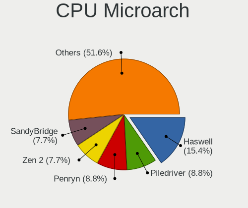

| Name             | Desktops | Percent |
|------------------|----------|---------|
| Haswell          | 14       | 15.38%  |
| Piledriver       | 8        | 8.79%   |
| Penryn           | 8        | 8.79%   |
| Zen 2            | 7        | 7.69%   |
| SandyBridge      | 7        | 7.69%   |
| KabyLake         | 7        | 7.69%   |
| IvyBridge        | 5        | 5.49%   |
| Zen+             | 4        | 4.4%    |
| K10              | 4        | 4.4%    |
| Zen              | 3        | 3.3%    |
| Skylake          | 3        | 3.3%    |
| CometLake        | 3        | 3.3%    |
| Zen 3            | 2        | 2.2%    |
| Icelake          | 2        | 2.2%    |
| Core             | 2        | 2.2%    |
| Alderlake Hybrid | 2        | 2.2%    |
| Unknown          | 2        | 2.2%    |
| Westmere         | 1        | 1.1%    |
| Steamroller      | 1        | 1.1%    |
| P6               | 1        | 1.1%    |
| K8 Hammer        | 1        | 1.1%    |
| K10 Llano        | 1        | 1.1%    |
| Goldmont         | 1        | 1.1%    |
| Bulldozer        | 1        | 1.1%    |
| Bonnell          | 1        | 1.1%    |

Graphics
--------

GPU Vendor
----------

Vendors of graphics cards

| Vendor                                       | Desktops | Percent |
|----------------------------------------------|----------|---------|
| Nvidia                                       | 48       | 47.52%  |
| Intel                                        | 29       | 28.71%  |
| AMD                                          | 23       | 22.77%  |
| XGI Technology (eXtreme Graphics Innovation) | 1        | 0.99%   |

GPU Model
---------

Graphics card models

| Model                                                                       | Desktops | Percent |
|-----------------------------------------------------------------------------|----------|---------|
| Intel Xeon E3-1200 v3/4th Gen Core Processor Integrated Graphics Controller | 6        | 5.94%   |
| Nvidia GP107 [GeForce GTX 1050 Ti]                                          | 5        | 4.95%   |
| Nvidia GP106 [GeForce GTX 1060 6GB]                                         | 4        | 3.96%   |
| Nvidia GK208B [GeForce GT 710]                                              | 4        | 3.96%   |
| Nvidia GF108 [GeForce GT 430]                                               | 4        | 3.96%   |
| Nvidia GK208B [GeForce GT 730]                                              | 3        | 2.97%   |
| Intel CoffeeLake-S GT2 [UHD Graphics 630]                                   | 3        | 2.97%   |
| Intel 4th Generation Core Processor Family Integrated Graphics Controller   | 3        | 2.97%   |
| Intel 2nd Generation Core Processor Family Integrated Graphics Controller   | 3        | 2.97%   |
| AMD RV620 LE [Radeon HD 3450]                                               | 3        | 2.97%   |
| Nvidia GP108 [GeForce GT 1030]                                              | 2        | 1.98%   |
| Nvidia GP104 [GeForce GTX 1070]                                             | 2        | 1.98%   |
| Nvidia GK107 [GeForce GT 640]                                               | 2        | 1.98%   |
| Nvidia GF119 [GeForce GT 610]                                               | 2        | 1.98%   |
| Intel CometLake-S GT2 [UHD Graphics 630]                                    | 2        | 1.98%   |
| Intel 82G33/G31 Express Integrated Graphics Controller                      | 2        | 1.98%   |
| Intel 4 Series Chipset Integrated Graphics Controller                       | 2        | 1.98%   |
| AMD Tahiti XT [Radeon HD 7970/8970 OEM / R9 280X]                           | 2        | 1.98%   |
| AMD Raven Ridge [Radeon Vega Series / Radeon Vega Mobile Series]            | 2        | 1.98%   |
| AMD Cedar [Radeon HD 5000/6000/7350/8350 Series]                            | 2        | 1.98%   |
| XGI Technology (eXtreme Graphics Innovation) Z7/Z9 (XG20 core)              | 1        | 0.99%   |
| Nvidia TU117 [GeForce GTX 1650]                                             | 1        | 0.99%   |
| Nvidia TU106 [GeForce RTX 2060 Rev. A]                                      | 1        | 0.99%   |
| Nvidia NV11 [GeForce2 MX/MX 400]                                            | 1        | 0.99%   |
| Nvidia GT218 [GeForce G210]                                                 | 1        | 0.99%   |
| Nvidia GP106 [GeForce GTX 1060 3GB]                                         | 1        | 0.99%   |
| Nvidia GP102 [GeForce GTX 1080 Ti]                                          | 1        | 0.99%   |
| Nvidia GM204 [GeForce GTX 970]                                              | 1        | 0.99%   |
| Nvidia GM107 [GeForce GTX 750]                                              | 1        | 0.99%   |
| Nvidia GK107GL [Quadro K600]                                                | 1        | 0.99%   |
| Nvidia GK107GL [Quadro K2000]                                               | 1        | 0.99%   |
| Nvidia GK106 [GeForce GTX 650 Ti]                                           | 1        | 0.99%   |
| Nvidia GK104 [GeForce GTX 770]                                              | 1        | 0.99%   |
| Nvidia GF116 [GeForce GTX 550 Ti]                                           | 1        | 0.99%   |
| Nvidia GF108GL [Quadro 600]                                                 | 1        | 0.99%   |
| Nvidia GF108 [GeForce GT 730]                                               | 1        | 0.99%   |
| Nvidia G94GL [Quadro FX 1800]                                               | 1        | 0.99%   |
| Nvidia G92 [GeForce 9800 GT]                                                | 1        | 0.99%   |
| Nvidia G73 [GeForce 7300 GT]                                                | 1        | 0.99%   |
| Nvidia C79 [ION]                                                            | 1        | 0.99%   |

GPU Combo
---------

Combinations of graphics cards

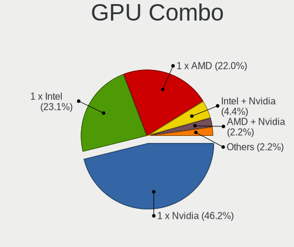

| Name           | Desktops | Percent |
|----------------|----------|---------|
| 1 x Nvidia     | 42       | 46.15%  |
| 1 x Intel      | 21       | 23.08%  |
| 1 x AMD        | 20       | 21.98%  |
| Intel + Nvidia | 4        | 4.4%    |
| AMD + Nvidia   | 2        | 2.2%    |
| 1 x XGI        | 1        | 1.1%    |
| Intel + AMD    | 1        | 1.1%    |

GPU Driver
----------

Free vs proprietary

| Driver      | Desktops | Percent |
|-------------|----------|---------|
| Free        | 57       | 60%     |
| Unknown     | 22       | 23.16%  |
| Proprietary | 16       | 16.84%  |

GPU Memory
----------

Total video memory

| Size in GB | Desktops | Percent |
|------------|----------|---------|
| Unknown    | 26       | 28.26%  |
| 1.01-2.0   | 18       | 19.57%  |
| 0.51-1.0   | 18       | 19.57%  |
| 0.01-0.5   | 9        | 9.78%   |
| 3.01-4.0   | 6        | 6.52%   |
| 5.01-6.0   | 5        | 5.43%   |
| 7.01-8.0   | 4        | 4.35%   |
| 2.01-3.0   | 3        | 3.26%   |
| 8.01-16.0  | 2        | 2.17%   |
| 16.01-24.0 | 1        | 1.09%   |

Monitor
-------

Monitor Vendor
--------------

Monitor vendors

| Vendor               | Desktops | Percent |
|----------------------|----------|---------|
| Samsung Electronics  | 15       | 13.89%  |
| AOC                  | 11       | 10.19%  |
| Dell                 | 9        | 8.33%   |
| Acer                 | 9        | 8.33%   |
| Goldstar             | 8        | 7.41%   |
| Hewlett-Packard      | 7        | 6.48%   |
| Ancor Communications | 7        | 6.48%   |
| BenQ                 | 5        | 4.63%   |
| SNC                  | 4        | 3.7%    |
| ViewSonic            | 3        | 2.78%   |
| Sony                 | 3        | 2.78%   |
| Philips              | 3        | 2.78%   |
| LG Electronics       | 3        | 2.78%   |
| Iiyama               | 3        | 2.78%   |
| NEC Computers        | 2        | 1.85%   |
| Eizo                 | 2        | 1.85%   |
| ASUSTek Computer     | 2        | 1.85%   |
| Unknown              | 1        | 0.93%   |
| SANSUI               | 1        | 0.93%   |
| RTK                  | 1        | 0.93%   |
| QBell                | 1        | 0.93%   |
| PKB                  | 1        | 0.93%   |
| Onkyo                | 1        | 0.93%   |
| Medion               | 1        | 0.93%   |
| Insignia             | 1        | 0.93%   |
| Idek Iiyama          | 1        | 0.93%   |
| HannStar             | 1        | 0.93%   |
| Compal               | 1        | 0.93%   |
| AGS                  | 1        | 0.93%   |

Monitor Model
-------------

Monitor models

| Model                                                                   | Desktops | Percent |
|-------------------------------------------------------------------------|----------|---------|
| SNC PHOTO 190V SNC1850 1366x768 409x230mm 18.5-inch                     | 4        | 3.31%   |
| Hewlett-Packard L2206tm HWP3014 1920x1080 477x268mm 21.5-inch           | 3        | 2.48%   |
| Goldstar FULL HD GSM5B55 1920x1080 480x270mm 21.7-inch                  | 3        | 2.48%   |
| Samsung Electronics SMB2030 SAM063D 1600x900 443x249mm 20.0-inch        | 2        | 1.65%   |
| Samsung Electronics LCD Monitor SAM07C5 1920x1080 890x500mm 40.2-inch   | 2        | 1.65%   |
| Goldstar 27EA33 GSM59BC 1920x1080 598x337mm 27.0-inch                   | 2        | 1.65%   |
| AOC CT500G AOCE556 1024x768 280x210mm 13.8-inch                         | 2        | 1.65%   |
| Ancor Communications PA248 ACI24B1 1920x1200 546x352mm 25.6-inch        | 2        | 1.65%   |
| Ancor Communications ASUS VE278 ACI27F6 1920x1080 598x336mm 27.0-inch   | 2        | 1.65%   |
| ViewSonic VX2409 SERIES VSC6C2E 1920x1080 521x293mm 23.5-inch           | 1        | 0.83%   |
| ViewSonic VA903-3Series VSC701E 1280x1024 376x301mm 19.0-inch           | 1        | 0.83%   |
| ViewSonic LCD Monitor VP2468 Series 3520x1080                           | 1        | 0.83%   |
| Unknown LCD Monitor SAMSUNG 1920x1080                                   | 1        | 0.83%   |
| Sony TV SNYF301 1920x1080                                               | 1        | 0.83%   |
| Sony TV SNYDC02 1920x1080 708x398mm 32.0-inch                           | 1        | 0.83%   |
| Sony SDM-X72 SNY1E70 1280x1024 338x270mm 17.0-inch                      | 1        | 0.83%   |
| SANSUI ES-22F1 XEC3150 1920x1080 480x270mm 21.7-inch                    | 1        | 0.83%   |
| Samsung Electronics SyncMaster SAM0612 1920x1080 604x342mm 27.3-inch    | 1        | 0.83%   |
| Samsung Electronics SyncMaster SAM0471 1360x768 344x194mm 15.5-inch     | 1        | 0.83%   |
| Samsung Electronics SyncMaster SAM0194 1280x1024 380x300mm 19.1-inch    | 1        | 0.83%   |
| Samsung Electronics SM2333TN SAM06FC 1920x1080 477x268mm 21.5-inch      | 1        | 0.83%   |
| Samsung Electronics S24F350 SAM0D20 1920x1080 521x293mm 23.5-inch       | 1        | 0.83%   |
| Samsung Electronics S24B300 SAM08B2 1920x1080 530x300mm 24.0-inch       | 1        | 0.83%   |
| Samsung Electronics S22D300 SAM0B3F 1920x1080 477x268mm 21.5-inch       | 1        | 0.83%   |
| Samsung Electronics Odyssey G85SB SAM72F4 3440x1440 809x354mm 34.8-inch | 1        | 0.83%   |
| Samsung Electronics LS27A80 SAM7184 3840x2160 597x336mm 27.0-inch       | 1        | 0.83%   |
| Samsung Electronics LF24T35 SAM707D 1920x1080 528x297mm 23.9-inch       | 1        | 0.83%   |
| Samsung Electronics LCD Monitor S24D330 3840x1080                       | 1        | 0.83%   |
| Samsung Electronics LCD Monitor S24D330                                 | 1        | 0.83%   |
| Samsung Electronics C24F390 SAM0D2C 1920x1080 521x293mm 23.5-inch       | 1        | 0.83%   |
| RTK LCD Monitor RTK1D1A 1920x1080 1020x570mm 46.0-inch                  | 1        | 0.83%   |
| QBell QB.19F-4WLHGB QBL3EC6 1440x900 410x257mm 19.1-inch                | 1        | 0.83%   |
| PKB LCD Monitor Viseo223DX 1920x1080                                    | 1        | 0.83%   |
| Philips PHL 436M6VBP PHLC179 3840x2160 941x529mm 42.5-inch              | 1        | 0.83%   |
| Philips LCD Monitor FTV                                                 | 1        | 0.83%   |
| Philips 200V4 PHLC0BF 1600x900 432x240mm 19.5-inch                      | 1        | 0.83%   |
| Onkyo LCD Monitor TX-SR608 5760x2160                                    | 1        | 0.83%   |
| Onkyo LCD Monitor TX-SR608                                              | 1        | 0.83%   |
| Onkyo LCD Monitor AV Receiver 5760x2160                                 | 1        | 0.83%   |
| NEC Computers EA234WMi NEC691E 1920x1080 510x290mm 23.1-inch            | 1        | 0.83%   |

Monitor Resolution
------------------

Monitor screen resolution

| Resolution         | Desktops | Percent |
|--------------------|----------|---------|
| 1920x1080 (FHD)    | 46       | 43.4%   |
| 3840x2160 (4K)     | 8        | 7.55%   |
| 1280x1024 (SXGA)   | 8        | 7.55%   |
| Unknown            | 8        | 7.55%   |
| 1366x768 (WXGA)    | 5        | 4.72%   |
| 1920x1200 (WUXGA)  | 4        | 3.77%   |
| 1600x900 (HD+)     | 4        | 3.77%   |
| 2560x1440 (QHD)    | 3        | 2.83%   |
| 1680x1050 (WSXGA+) | 3        | 2.83%   |
| 3840x1080          | 2        | 1.89%   |
| 2560x1080          | 2        | 1.89%   |
| 1440x900 (WXGA+)   | 2        | 1.89%   |
| 1360x768           | 2        | 1.89%   |
| 1024x768 (XGA)     | 2        | 1.89%   |
| 5760x2160          | 1        | 0.94%   |
| 4480x1440          | 1        | 0.94%   |
| 3520x1080          | 1        | 0.94%   |
| 3440x1440          | 1        | 0.94%   |
| 3200x900           | 1        | 0.94%   |
| 2560x1024          | 1        | 0.94%   |
| 1920x540           | 1        | 0.94%   |

Monitor Diagonal
----------------

Diagonal size in inches

| Inches  | Desktops | Percent |
|---------|----------|---------|
| Unknown | 15       | 14.56%  |
| 27      | 11       | 10.68%  |
| 24      | 11       | 10.68%  |
| 21      | 11       | 10.68%  |
| 23      | 10       | 9.71%   |
| 19      | 9        | 8.74%   |
| 18      | 6        | 5.83%   |
| 31      | 4        | 3.88%   |
| 22      | 4        | 3.88%   |
| 20      | 3        | 2.91%   |
| 54      | 2        | 1.94%   |
| 46      | 2        | 1.94%   |
| 32      | 2        | 1.94%   |
| 29      | 2        | 1.94%   |
| 25      | 2        | 1.94%   |
| 17      | 2        | 1.94%   |
| 13      | 2        | 1.94%   |
| 72      | 1        | 0.97%   |
| 48      | 1        | 0.97%   |
| 42      | 1        | 0.97%   |
| 34      | 1        | 0.97%   |
| 15      | 1        | 0.97%   |

Monitor Width
-------------

Physical width

| Width in mm | Desktops | Percent |
|-------------|----------|---------|
| 501-600     | 31       | 31%     |
| 401-500     | 25       | 25%     |
| Unknown     | 15       | 15%     |
| 601-700     | 8        | 8%      |
| 351-400     | 6        | 6%      |
| 1001-1500   | 5        | 5%      |
| 301-350     | 3        | 3%      |
| 701-800     | 2        | 2%      |
| 201-300     | 2        | 2%      |
| 801-900     | 1        | 1%      |
| 1501-2000   | 1        | 1%      |
| 901-1000    | 1        | 1%      |

Aspect Ratio
------------

Proportional relationship between the width and the height

| Ratio   | Desktops | Percent |
|---------|----------|---------|
| 16/9    | 58       | 59.79%  |
| Unknown | 15       | 15.46%  |
| 16/10   | 10       | 10.31%  |
| 5/4     | 8        | 8.25%   |
| 21/9    | 3        | 3.09%   |
| 4/3     | 2        | 2.06%   |
| 1.96    | 1        | 1.03%   |

Monitor Area
------------

Area in inch

| Area in inch | Desktops | Percent |
|----------------|----------|---------|
| 201-250        | 29       | 29.29%  |
| Unknown        | 15       | 15.15%  |
| 301-350        | 13       | 13.13%  |
| 151-200        | 12       | 12.12%  |
| 141-150        | 8        | 8.08%   |
| 351-500        | 7        | 7.07%   |
| 251-300        | 5        | 5.05%   |
| 501-1000       | 4        | 4.04%   |
| More than 1000 | 3        | 3.03%   |
| 91-100         | 2        | 2.02%   |
| 101-110        | 1        | 1.01%   |

Pixel Density
-------------

Pixels per inch

| Density | Desktops | Percent |
|---------|----------|---------|
| 51-100  | 56       | 58.95%  |
| Unknown | 15       | 15.79%  |
| 101-120 | 14       | 14.74%  |
| 1-50    | 6        | 6.32%   |
| 161-240 | 2        | 2.11%   |
| 121-160 | 2        | 2.11%   |

Multiple Monitors
-----------------

Total monitors connected

| Total | Desktops | Percent |
|-------|----------|---------|
| 1     | 67       | 72.83%  |
| 2     | 21       | 22.83%  |
| 3     | 3        | 3.26%   |
| 0     | 1        | 1.09%   |

Network
-------

Net Controller Vendor
---------------------

Controller vendors

| Vendor                   | Desktops | Percent |
|--------------------------|----------|---------|
| Realtek Semiconductor    | 53       | 42.4%   |
| Intel                    | 39       | 31.2%   |
| Qualcomm Atheros         | 10       | 8%      |
| Broadcom                 | 5        | 4%      |
| TP-Link                  | 2        | 1.6%    |
| Nvidia                   | 2        | 1.6%    |
| MediaTek                 | 2        | 1.6%    |
| Marvell Technology Group | 2        | 1.6%    |
| Wilocity                 | 1        | 0.8%    |
| Ultimarc                 | 1        | 0.8%    |
| RDC Semiconductor        | 1        | 0.8%    |
| Ralink Technology        | 1        | 0.8%    |
| Ralink                   | 1        | 0.8%    |
| Huawei Technologies      | 1        | 0.8%    |
| D-Link System            | 1        | 0.8%    |
| Broadcom Limited         | 1        | 0.8%    |
| ASUSTek Computer         | 1        | 0.8%    |
| Aquantia                 | 1        | 0.8%    |

Net Controller Model
--------------------

Controller models

| Model                                                                         | Desktops | Percent |
|-------------------------------------------------------------------------------|----------|---------|
| Realtek RTL8111/8168/8211/8411 PCI Express Gigabit Ethernet Controller        | 42       | 29.17%  |
| Realtek RTL8125 2.5GbE Controller                                             | 5        | 3.47%   |
| Intel I211 Gigabit Network Connection                                         | 5        | 3.47%   |
| Intel Ethernet Connection I217-V                                              | 4        | 2.78%   |
| Intel Dual Band Wireless-AC 3168NGW [Stone Peak]                              | 4        | 2.78%   |
| Intel 82579LM Gigabit Network Connection (Lewisville)                         | 4        | 2.78%   |
| Intel Wireless 3165                                                           | 3        | 2.08%   |
| Intel Ethernet Connection I217-LM                                             | 3        | 2.08%   |
| Realtek RTL8814AU 802.11a/b/g/n/ac Wireless Adapter                           | 2        | 1.39%   |
| Realtek RTL8812AU 802.11a/b/g/n/ac 2T2R DB WLAN Adapter                       | 2        | 1.39%   |
| Realtek RTL8811AU 802.11a/b/g/n/ac WLAN Adapter                               | 2        | 1.39%   |
| Realtek RTL8192CU 802.11n WLAN Adapter                                        | 2        | 1.39%   |
| Realtek RTL8188EE Wireless Network Adapter                                    | 2        | 1.39%   |
| Qualcomm Atheros AR5212/5213/2414 Wireless Network Adapter                    | 2        | 1.39%   |
| Intel Wireless 7265                                                           | 2        | 1.39%   |
| Intel Ethernet Connection (2) I219-V                                          | 2        | 1.39%   |
| Intel 82574L Gigabit Network Connection                                       | 2        | 1.39%   |
| Intel 82557/8/9/0/1 Ethernet Pro 100                                          | 2        | 1.39%   |
| Broadcom NetXtreme BCM5754 Gigabit Ethernet PCI Express                       | 2        | 1.39%   |
| Wilocity Wil6200 802.11ad Wireless Network Adapter                            | 1        | 0.69%   |
| Ultimarc A-PAC Arcade Control Interface                                       | 1        | 0.69%   |
| TP-Link Archer T3U [Realtek RTL8812BU]                                        | 1        | 0.69%   |
| TP-Link 802.11ac NIC                                                          | 1        | 0.69%   |
| Realtek RTL8822CE 802.11ac PCIe Wireless Network Adapter                      | 1        | 0.69%   |
| Realtek RTL8192EE PCIe Wireless Network Adapter                               | 1        | 0.69%   |
| Realtek RTL8191SU 802.11n WLAN Adapter                                        | 1        | 0.69%   |
| Realtek RTL8188FTV 802.11b/g/n 1T1R 2.4G WLAN Adapter                         | 1        | 0.69%   |
| Realtek RTL8169 PCI Gigabit Ethernet Controller                               | 1        | 0.69%   |
| Realtek RTL810xE PCI Express Fast Ethernet controller                         | 1        | 0.69%   |
| RDC R6040 MAC Controller                                                      | 1        | 0.69%   |
| Ralink RT5370 Wireless Adapter                                                | 1        | 0.69%   |
| Ralink RT2561/RT61 rev B 802.11g                                              | 1        | 0.69%   |
| Qualcomm Atheros QCA6174 802.11ac Wireless Network Adapter                    | 1        | 0.69%   |
| Qualcomm Atheros Attansic L2 Fast Ethernet                                    | 1        | 0.69%   |
| Qualcomm Atheros AR9485 Wireless Network Adapter                              | 1        | 0.69%   |
| Qualcomm Atheros AR9462 Wireless Network Adapter                              | 1        | 0.69%   |
| Qualcomm Atheros AR8152 v2.0 Fast Ethernet                                    | 1        | 0.69%   |
| Qualcomm Atheros AR8151 v2.0 Gigabit Ethernet                                 | 1        | 0.69%   |
| Qualcomm Atheros AR8132 Fast Ethernet                                         | 1        | 0.69%   |
| Qualcomm Atheros AR2413/AR2414 Wireless Network Adapter [AR5005G(S) 802.11bg] | 1        | 0.69%   |

Wireless Vendor
---------------

Wireless vendors

| Vendor                | Desktops | Percent |
|-----------------------|----------|---------|
| Intel                 | 14       | 35.9%   |
| Realtek Semiconductor | 10       | 25.64%  |
| Qualcomm Atheros      | 6        | 15.38%  |
| TP-Link               | 2        | 5.13%   |
| MediaTek              | 2        | 5.13%   |
| Wilocity              | 1        | 2.56%   |
| Ralink Technology     | 1        | 2.56%   |
| Ralink                | 1        | 2.56%   |
| Broadcom              | 1        | 2.56%   |
| ASUSTek Computer      | 1        | 2.56%   |

Wireless Model
--------------

Wireless models

| Model                                                                         | Desktops | Percent |
|-------------------------------------------------------------------------------|----------|---------|
| Intel Dual Band Wireless-AC 3168NGW [Stone Peak]                              | 4        | 9.3%    |
| Intel Wireless 3165                                                           | 3        | 6.98%   |
| Realtek RTL8814AU 802.11a/b/g/n/ac Wireless Adapter                           | 2        | 4.65%   |
| Realtek RTL8812AU 802.11a/b/g/n/ac 2T2R DB WLAN Adapter                       | 2        | 4.65%   |
| Realtek RTL8811AU 802.11a/b/g/n/ac WLAN Adapter                               | 2        | 4.65%   |
| Realtek RTL8192CU 802.11n WLAN Adapter                                        | 2        | 4.65%   |
| Realtek RTL8188EE Wireless Network Adapter                                    | 2        | 4.65%   |
| Qualcomm Atheros AR5212/5213/2414 Wireless Network Adapter                    | 2        | 4.65%   |
| Intel Wireless 7265                                                           | 2        | 4.65%   |
| Wilocity Wil6200 802.11ad Wireless Network Adapter                            | 1        | 2.33%   |
| TP-Link Archer T3U [Realtek RTL8812BU]                                        | 1        | 2.33%   |
| TP-Link 802.11ac NIC                                                          | 1        | 2.33%   |
| Realtek RTL8822CE 802.11ac PCIe Wireless Network Adapter                      | 1        | 2.33%   |
| Realtek RTL8192EE PCIe Wireless Network Adapter                               | 1        | 2.33%   |
| Realtek RTL8191SU 802.11n WLAN Adapter                                        | 1        | 2.33%   |
| Realtek RTL8188FTV 802.11b/g/n 1T1R 2.4G WLAN Adapter                         | 1        | 2.33%   |
| Ralink RT5370 Wireless Adapter                                                | 1        | 2.33%   |
| Ralink RT2561/RT61 rev B 802.11g                                              | 1        | 2.33%   |
| Qualcomm Atheros QCA6174 802.11ac Wireless Network Adapter                    | 1        | 2.33%   |
| Qualcomm Atheros AR9485 Wireless Network Adapter                              | 1        | 2.33%   |
| Qualcomm Atheros AR9462 Wireless Network Adapter                              | 1        | 2.33%   |
| Qualcomm Atheros AR2413/AR2414 Wireless Network Adapter [AR5005G(S) 802.11bg] | 1        | 2.33%   |
| MediaTek WiFi                                                                 | 1        | 2.33%   |
| MediaTek MT7922 802.11ax PCI Express Wireless Network Adapter                 | 1        | 2.33%   |
| Intel Wireless 8260                                                           | 1        | 2.33%   |
| Intel Wi-Fi 6E(802.11ax) AX210/AX1675* 2x2 [Typhoon Peak]                     | 1        | 2.33%   |
| Intel Wi-Fi 6 AX200                                                           | 1        | 2.33%   |
| Intel Cannon Lake PCH CNVi WiFi                                               | 1        | 2.33%   |
| Intel Alder Lake-S PCH CNVi WiFi                                              | 1        | 2.33%   |
| Broadcom BCM4352 802.11ac Dual Band Wireless Network Adapter                  | 1        | 2.33%   |
| ASUS USB-N13 802.11n Network Adapter (rev. B1) [Realtek RTL8192CU]            | 1        | 2.33%   |

Ethernet Vendor
---------------

Ethernet vendors

| Vendor                   | Desktops | Percent |
|--------------------------|----------|---------|
| Realtek Semiconductor    | 49       | 52.13%  |
| Intel                    | 29       | 30.85%  |
| Qualcomm Atheros         | 4        | 4.26%   |
| Broadcom                 | 4        | 4.26%   |
| Nvidia                   | 2        | 2.13%   |
| Marvell Technology Group | 2        | 2.13%   |
| RDC Semiconductor        | 1        | 1.06%   |
| D-Link System            | 1        | 1.06%   |
| Broadcom Limited         | 1        | 1.06%   |
| Aquantia                 | 1        | 1.06%   |

Ethernet Model
--------------

Ethernet models

| Model                                                                          | Desktops | Percent |
|--------------------------------------------------------------------------------|----------|---------|
| Realtek RTL8111/8168/8211/8411 PCI Express Gigabit Ethernet Controller         | 42       | 42.42%  |
| Realtek RTL8125 2.5GbE Controller                                              | 5        | 5.05%   |
| Intel I211 Gigabit Network Connection                                          | 5        | 5.05%   |
| Intel Ethernet Connection I217-V                                               | 4        | 4.04%   |
| Intel 82579LM Gigabit Network Connection (Lewisville)                          | 4        | 4.04%   |
| Intel Ethernet Connection I217-LM                                              | 3        | 3.03%   |
| Intel Ethernet Connection (2) I219-V                                           | 2        | 2.02%   |
| Intel 82574L Gigabit Network Connection                                        | 2        | 2.02%   |
| Intel 82557/8/9/0/1 Ethernet Pro 100                                           | 2        | 2.02%   |
| Broadcom NetXtreme BCM5754 Gigabit Ethernet PCI Express                        | 2        | 2.02%   |
| Realtek RTL8169 PCI Gigabit Ethernet Controller                                | 1        | 1.01%   |
| Realtek RTL810xE PCI Express Fast Ethernet controller                          | 1        | 1.01%   |
| RDC R6040 MAC Controller                                                       | 1        | 1.01%   |
| Qualcomm Atheros Attansic L2 Fast Ethernet                                     | 1        | 1.01%   |
| Qualcomm Atheros AR8152 v2.0 Fast Ethernet                                     | 1        | 1.01%   |
| Qualcomm Atheros AR8151 v2.0 Gigabit Ethernet                                  | 1        | 1.01%   |
| Qualcomm Atheros AR8132 Fast Ethernet                                          | 1        | 1.01%   |
| Nvidia MCP79 Ethernet                                                          | 1        | 1.01%   |
| Nvidia MCP61 Ethernet                                                          | 1        | 1.01%   |
| Marvell Group 88E8057 PCI-E Gigabit Ethernet Controller                        | 1        | 1.01%   |
| Marvell Group 88E8056 PCI-E Gigabit Ethernet Controller                        | 1        | 1.01%   |
| Intel Wi-Fi 7(802.11be) AX1775*/AX1790*/BE20*/BE401/BE1750* 2x2                | 1        | 1.01%   |
| Intel I210 Gigabit Network Connection                                          | 1        | 1.01%   |
| Intel Ethernet Controller I226-V                                               | 1        | 1.01%   |
| Intel Ethernet Controller I225-V                                               | 1        | 1.01%   |
| Intel Ethernet Connection (7) I219-V                                           | 1        | 1.01%   |
| Intel Ethernet Connection (2) I218-LM                                          | 1        | 1.01%   |
| Intel Ethernet Connection (17) I219-LM                                         | 1        | 1.01%   |
| Intel Ethernet Connection (14) I219-LM                                         | 1        | 1.01%   |
| Intel Ethernet Connection (12) I219-V                                          | 1        | 1.01%   |
| Intel 82579V Gigabit Network Connection                                        | 1        | 1.01%   |
| Intel 82571EB/82571GB Gigabit Ethernet Controller D0/D1 (copper applications)  | 1        | 1.01%   |
| Intel 82541PI Gigabit Ethernet Controller                                      | 1        | 1.01%   |
| D-Link System DGE-528T Gigabit Ethernet Adapter                                | 1        | 1.01%   |
| Broadcom NetLink BCM57781 Gigabit Ethernet PCIe                                | 1        | 1.01%   |
| Broadcom NetLink BCM57780 Gigabit Ethernet PCIe                                | 1        | 1.01%   |
| Broadcom Limited NetXtreme BCM5755 Gigabit Ethernet PCI Express                | 1        | 1.01%   |
| Aquantia AQtion AQC107 NBase-T/IEEE 802.3an Ethernet Controller [Atlantic 10G] | 1        | 1.01%   |

Net Controller Kind
-------------------

Ethernet, WiFi or modem

| Kind     | Desktops | Percent |
|----------|----------|---------|
| Ethernet | 88       | 70.97%  |
| WiFi     | 34       | 27.42%  |
| Modem    | 1        | 0.81%   |
| Unknown  | 1        | 0.81%   |

Used Controller
---------------

Currently used network controller

| Kind     | Desktops | Percent |
|----------|----------|---------|
| Ethernet | 75       | 81.52%  |
| WiFi     | 17       | 18.48%  |

NICs
----

Total network controllers on board

| Total | Desktops | Percent |
|-------|----------|---------|
| 1     | 58       | 61.7%   |
| 2     | 29       | 30.85%  |
| 3     | 5        | 5.32%   |
| 4     | 1        | 1.06%   |
| 0     | 1        | 1.06%   |

IPv6
----

IPv6 vs IPv4

| Used | Desktops | Percent |
|------|----------|---------|
| No   | 69       | 75%     |
| Yes  | 23       | 25%     |

Bluetooth
---------

Bluetooth Vendor
----------------

Controller vendors

| Vendor                  | Desktops | Percent |
|-------------------------|----------|---------|
| Intel                   | 15       | 41.67%  |
| Cambridge Silicon Radio | 9        | 25%     |
| ASUSTek Computer        | 3        | 8.33%   |
| Realtek Semiconductor   | 2        | 5.56%   |
| Broadcom                | 2        | 5.56%   |
| Belkin Components       | 2        | 5.56%   |
| TP-Link                 | 1        | 2.78%   |
| MediaTek                | 1        | 2.78%   |
| Lite-On Technology      | 1        | 2.78%   |

Bluetooth Model
---------------

Controller models

| Model                                               | Desktops | Percent |
|-----------------------------------------------------|----------|---------|
| Cambridge Silicon Radio Bluetooth Dongle (HCI mode) | 9        | 25%     |
| Intel Bluetooth wireless interface                  | 6        | 16.67%  |
| Intel Wireless-AC 3168 Bluetooth                    | 4        | 11.11%  |
| TP-Link TP-Link Bluetooth USB Adapter               | 1        | 2.78%   |
| Realtek Bluetooth Radio                             | 1        | 2.78%   |
| Realtek 802.11ac WLAN Adapter                       | 1        | 2.78%   |
| MediaTek Wireless_Device                            | 1        | 2.78%   |
| Lite-On Bluetooth Device                            | 1        | 2.78%   |
| Intel Bluetooth Device                              | 1        | 2.78%   |
| Intel Bluetooth 9460/9560 Jefferson Peak (JfP)      | 1        | 2.78%   |
| Intel AX211 Bluetooth                               | 1        | 2.78%   |
| Intel AX210 Bluetooth                               | 1        | 2.78%   |
| Intel AX200 Bluetooth                               | 1        | 2.78%   |
| Broadcom Bluetooth dongle                           | 1        | 2.78%   |
| Broadcom BCM20702A0 Bluetooth 4.0                   | 1        | 2.78%   |
| Belkin Components F8T013 Bluetooth Adapter          | 1        | 2.78%   |
| Belkin Components Bluetooth Mini Dongle             | 1        | 2.78%   |
| ASUS Broadcom BCM20702A0 Bluetooth                  | 1        | 2.78%   |
| ASUS Bluetooth Device                               | 1        | 2.78%   |
| ASUS BCM20702A0                                     | 1        | 2.78%   |

Sound
-----

Sound Vendor
------------

Sound card vendors

| Vendor                     | Desktops | Percent |
|----------------------------|----------|---------|
| Intel                      | 55       | 35.48%  |
| Nvidia                     | 44       | 28.39%  |
| AMD                        | 36       | 23.23%  |
| C-Media Electronics        | 9        | 5.81%   |
| ASUSTek Computer           | 2        | 1.29%   |
| Texas Instruments          | 1        | 0.65%   |
| Samsung Electronics        | 1        | 0.65%   |
| Micro Star International   | 1        | 0.65%   |
| Mackie Designs             | 1        | 0.65%   |
| Logitech                   | 1        | 0.65%   |
| iCreate Technologies       | 1        | 0.65%   |
| Corsair                    | 1        | 0.65%   |
| BEHRINGER International    | 1        | 0.65%   |
| Altec Lansing Technologies | 1        | 0.65%   |

Sound Model
-----------

Sound card models

| Model                                                                      | Desktops | Percent |
|----------------------------------------------------------------------------|----------|---------|
| Intel 8 Series/C220 Series Chipset High Definition Audio Controller        | 11       | 6.25%   |
| Intel Xeon E3-1200 v3/4th Gen Core Processor HD Audio Controller           | 8        | 4.55%   |
| AMD Starship/Matisse HD Audio Controller                                   | 8        | 4.55%   |
| Nvidia GK208 HDMI/DP Audio Controller                                      | 7        | 3.98%   |
| Intel NM10/ICH7 Family High Definition Audio Controller                    | 7        | 3.98%   |
| Intel 6 Series/C200 Series Chipset Family High Definition Audio Controller | 7        | 3.98%   |
| AMD SBx00 Azalia (Intel HDA)                                               | 7        | 3.98%   |
| Nvidia GF108 High Definition Audio Controller                              | 6        | 3.41%   |
| Nvidia GP107GL High Definition Audio Controller                            | 5        | 2.84%   |
| Nvidia GP106 High Definition Audio Controller                              | 5        | 2.84%   |
| AMD Family 17h/19h/1ah HD Audio Controller                                 | 5        | 2.84%   |
| Nvidia GK107 HDMI Audio Controller                                         | 4        | 2.27%   |
| Intel 100 Series/C230 Series Chipset Family HD Audio Controller            | 4        | 2.27%   |
| C-Media Electronics CMI8788 [Oxygen HD Audio]                              | 4        | 2.27%   |
| AMD FCH Azalia Controller                                                  | 4        | 2.27%   |
| Intel Comet Lake PCH-V cAVS                                                | 3        | 1.7%    |
| Intel Cannon Lake PCH cAVS                                                 | 3        | 1.7%    |
| Intel C600/X79 series chipset High Definition Audio Controller             | 3        | 1.7%    |
| C-Media Electronics CMI8738/CMI8768 PCI Audio                              | 3        | 1.7%    |
| AMD RV620 HDMI Audio [Radeon HD 3450/3470/3550/3570]                       | 3        | 1.7%    |
| AMD Family 17h (Models 00h-0fh) HD Audio Controller                        | 3        | 1.7%    |
| Nvidia GP108 High Definition Audio Controller                              | 2        | 1.14%   |
| Nvidia GP104 High Definition Audio Controller                              | 2        | 1.14%   |
| Nvidia GF119 HDMI Audio Controller                                         | 2        | 1.14%   |
| Intel Tiger Lake-H HD Audio Controller                                     | 2        | 1.14%   |
| Intel 9 Series Chipset Family HD Audio Controller                          | 2        | 1.14%   |
| Intel 82801I (ICH9 Family) HD Audio Controller                             | 2        | 1.14%   |
| Intel 7 Series/C216 Chipset Family High Definition Audio Controller        | 2        | 1.14%   |
| Intel 200 Series PCH HD Audio                                              | 2        | 1.14%   |
| AMD Tahiti HDMI Audio [Radeon HD 7870 XT / 7950/7970]                      | 2        | 1.14%   |
| AMD Raven/Raven2/Fenghuang HDMI/DP Audio Controller                        | 2        | 1.14%   |
| AMD Navi 21/23 HDMI/DP Audio Controller                                    | 2        | 1.14%   |
| AMD Cedar HDMI Audio [Radeon HD 5400/6300/7300 Series]                     | 2        | 1.14%   |
| Texas Instruments PCM2900C Audio CODEC                                     | 1        | 0.57%   |
| Samsung Electronics USB C Earphones                                        | 1        | 0.57%   |
| Nvidia TU107 GeForce GTX 1650 High Definition Audio Controller             | 1        | 0.57%   |
| Nvidia TU106 High Definition Audio Controller                              | 1        | 0.57%   |
| Nvidia MCP79 High Definition Audio                                         | 1        | 0.57%   |
| Nvidia MCP61 High Definition Audio                                         | 1        | 0.57%   |
| Nvidia High Definition Audio Controller                                    | 1        | 0.57%   |

Memory
------

Memory Vendor
-------------

Memory module vendors

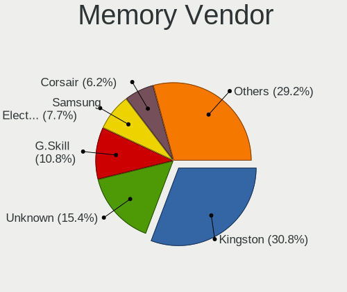

| Vendor              | Desktops | Percent |
|---------------------|----------|---------|
| Kingston            | 20       | 30.77%  |
| Unknown             | 10       | 15.38%  |
| G.Skill             | 7        | 10.77%  |
| Samsung Electronics | 5        | 7.69%   |
| Corsair             | 4        | 6.15%   |
| Team                | 3        | 4.62%   |
| Micron Technology   | 3        | 4.62%   |
| SK hynix            | 2        | 3.08%   |
| Crucial             | 2        | 3.08%   |
| A-DATA Technology   | 2        | 3.08%   |
| Unknown (ABCD)      | 1        | 1.54%   |
| Silicon Power       | 1        | 1.54%   |
| Ramaxel Technology  | 1        | 1.54%   |
| Nanya Technology    | 1        | 1.54%   |
| Lexar               | 1        | 1.54%   |
| GOODRAM             | 1        | 1.54%   |
| CSX                 | 1        | 1.54%   |

Memory Model
------------

Memory module models

| Model                                                        | Desktops | Percent |
|--------------------------------------------------------------|----------|---------|
| Kingston RAM KHX2400C15/16G 16GB DIMM DDR4 3334MT/s          | 3        | 4.17%   |
| Unknown RAM Module 2GB DIMM DDR2 800MT/s                     | 2        | 2.78%   |
| G.Skill RAM F3-12800CL9-4GBXM 4096MB DIMM DDR3 1600MT/s      | 2        | 2.78%   |
| Unknown RAM Module 8GB DIMM 1333MT/s                         | 1        | 1.39%   |
| Unknown RAM Module 4GB DIMM SDRAM 1066MT/s                   | 1        | 1.39%   |
| Unknown RAM Module 4GB DIMM DDR3 1333MT/s                    | 1        | 1.39%   |
| Unknown RAM Module 4GB DIMM 667MT/s                          | 1        | 1.39%   |
| Unknown RAM Module 4GB DIMM 1600MT/s                         | 1        | 1.39%   |
| Unknown RAM Module 4096MB DIMM 667MT/s                       | 1        | 1.39%   |
| Unknown RAM Module 4096MB DIMM 1333MT/s                      | 1        | 1.39%   |
| Unknown RAM Module 2GB DIMM DDR3 1333MT/s                    | 1        | 1.39%   |
| Unknown RAM Module 2GB DIMM 667MT/s                          | 1        | 1.39%   |
| Unknown RAM Module 2048MB DIMM DDR3 1333MT/s                 | 1        | 1.39%   |
| Unknown RAM Module 2048MB DIMM DDR2 800MT/s                  | 1        | 1.39%   |
| Unknown RAM Module 2048MB DIMM 667MT/s                       | 1        | 1.39%   |
| Unknown (ABCD) RAM 123456789012345678 2GB DIMM DDR3 2400MT/s | 1        | 1.39%   |
| Team RAM TEAMGROUP-UD4-2666 4GB DIMM DDR4                    | 1        | 1.39%   |
| Team RAM Elite-16 8GB DIMM DDR3 1600MT/s                     | 1        | 1.39%   |
| Team RAM Elite-1333 4GB DIMM 1333MT/s                        | 1        | 1.39%   |
| SK hynix RAM HMT351U6CFR8C-H9 4GB DIMM DDR3 1333MT/s         | 1        | 1.39%   |
| SK hynix RAM HMT351R7EFR4C-RD 4GB DIMM DDR3 1866MT/s         | 1        | 1.39%   |
| Silicon Power RAM D8LR2GNC88S 2GB DIMM SDRAM 2048MT/s        | 1        | 1.39%   |
| Samsung RAM M391A2K43BB1-CTD 16GB DIMM DDR4 3600MT/s         | 1        | 1.39%   |
| Samsung RAM M378B5773DH0-CH9 2048MB DIMM DDR3 1333MT/s       | 1        | 1.39%   |
| Samsung RAM M378B5773CH0-CK0 2GB DIMM DDR3 1600MT/s          | 1        | 1.39%   |
| Samsung RAM M378B1G73QH0-CK0 8GB DIMM DDR3 1600MT/s          | 1        | 1.39%   |
| Samsung RAM M378A1K43CB2-CRC 8GB DIMM DDR4 3500MT/s          | 1        | 1.39%   |
| Ramaxel RAM RMR5030EF68F9W1600 4GB DIMM DDR3 1600MT/s        | 1        | 1.39%   |
| Nanya RAM M2F4G64CB8HG5N-CG 4GB DIMM DDR3 1600MT/s           | 1        | 1.39%   |
| Micron RAM 18KSF1G72PZ-1G6P1 8GB DIMM DDR3 1600MT/s          | 1        | 1.39%   |
| Micron RAM 18JSF51272AZ-1G6M 4GB DIMM DDR3 1600MT/s          | 1        | 1.39%   |
| Micron RAM 16JTF51264AZ-1G4D1 4GB DIMM DDR3 1333MT/s         | 1        | 1.39%   |
| Lexar RAM LD4BU016G-3200XG 16GB DIMM DDR4 3200MT/s           | 1        | 1.39%   |
| Kingston RAM Module 2GB DIMM DDR2 1639MT/s                   | 1        | 1.39%   |
| Kingston RAM King 2GB DIMM DDR2 800MT/s                      | 1        | 1.39%   |
| Kingston RAM KHX3200C16D4/8GX 8GB DIMM DDR4 3733MT/s         | 1        | 1.39%   |
| Kingston RAM KHX3200C16D4/16GX 16GB DIMM DDR4 3600MT/s       | 1        | 1.39%   |
| Kingston RAM KHX2666C16/8G 8GB DIMM DDR4 3466MT/s            | 1        | 1.39%   |
| Kingston RAM KHX2400C15/8G 8GB DIMM DDR4 3400MT/s            | 1        | 1.39%   |
| Kingston RAM KHX2133C11D3/8GX 8GB DIMM DDR3 2133MT/s         | 1        | 1.39%   |

Memory Kind
-----------

Memory module kinds

| Kind    | Desktops | Percent |
|---------|----------|---------|
| DDR3    | 24       | 41.38%  |
| DDR4    | 19       | 32.76%  |
| DDR2    | 5        | 8.62%   |
| SDRAM   | 4        | 6.9%    |
| Unknown | 4        | 6.9%    |
| LPDDR4  | 1        | 1.72%   |
| DDR5    | 1        | 1.72%   |

Memory Form Factor
------------------

Physical design of the memory module

| Name   | Desktops | Percent |
|--------|----------|---------|
| DIMM   | 54       | 96.43%  |
| SODIMM | 2        | 3.57%   |

Memory Size
-----------

Memory module size

| Size  | Desktops | Percent |
|-------|----------|---------|
| 8192  | 25       | 40.32%  |
| 4096  | 16       | 25.81%  |
| 16384 | 10       | 16.13%  |
| 2048  | 10       | 16.13%  |
| 32768 | 1        | 1.61%   |

Memory Speed
------------

Memory module speed

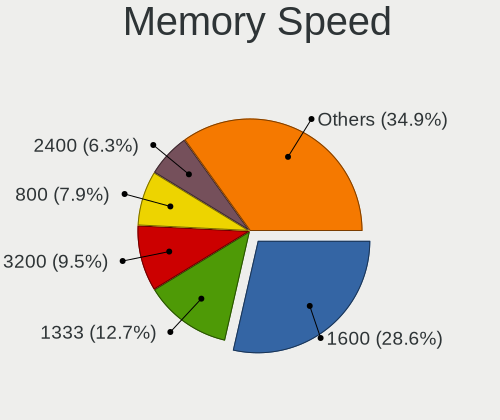

| Speed | Desktops | Percent |
|-------|----------|---------|
| 1600  | 18       | 28.57%  |
| 1333  | 8        | 12.7%   |
| 3200  | 6        | 9.52%   |
| 800   | 5        | 7.94%   |
| 2400  | 4        | 6.35%   |
| 3600  | 3        | 4.76%   |
| 3334  | 3        | 4.76%   |
| 2133  | 3        | 4.76%   |
| 1866  | 2        | 3.17%   |
| 6000  | 1        | 1.59%   |
| 3800  | 1        | 1.59%   |
| 3733  | 1        | 1.59%   |
| 3500  | 1        | 1.59%   |
| 3466  | 1        | 1.59%   |
| 3400  | 1        | 1.59%   |
| 2048  | 1        | 1.59%   |
| 1867  | 1        | 1.59%   |
| 1639  | 1        | 1.59%   |
| 1066  | 1        | 1.59%   |
| 667   | 1        | 1.59%   |

Printers & scanners
-------------------

Printer Vendor
--------------

Printer device vendors

| Vendor              | Desktops | Percent |
|---------------------|----------|---------|
| Hewlett-Packard     | 3        | 33.33%  |
| Brother Industries  | 2        | 22.22%  |
| Xerox               | 1        | 11.11%  |
| Seiko Epson         | 1        | 11.11%  |
| Samsung Electronics | 1        | 11.11%  |
| Canon               | 1        | 11.11%  |

Printer Model
-------------

Printer device models

| Model                         | Desktops | Percent |
|-------------------------------|----------|---------|
| Xerox Phaser 3140 and 3155    | 1        | 11.11%  |
| Seiko Epson WF-2530 Series    | 1        | 11.11%  |
| Samsung CLP-300 Series        | 1        | 11.11%  |
| HP OfficeJet Pro 6970         | 1        | 11.11%  |
| HP OfficeJet 6950             | 1        | 11.11%  |
| HP DeskJet 840c               | 1        | 11.11%  |
| Canon PIXMA MG3600 Series     | 1        | 11.11%  |
| Brother QL-570 Label Printer  | 1        | 11.11%  |
| Brother HL-2030 Laser Printer | 1        | 11.11%  |

Scanner Vendor
--------------

Scanner device vendors

| Vendor      | Desktops | Percent |
|-------------|----------|---------|
| Seiko Epson | 4        | 100%    |

Scanner Model
-------------

Scanner device models

| Model                                   | Desktops | Percent |
|-----------------------------------------|----------|---------|
| Seiko Epson Scanner                     | 1        | 25%     |
| Seiko Epson GT-X770 [Perfection V500]   | 1        | 25%     |
| Seiko Epson GT-9800F [Perfection 3200]  | 1        | 25%     |
| Seiko Epson GT-7700U [Perfection 1240U] | 1        | 25%     |

Camera
------

Camera Vendor
-------------

Camera device vendors

| Vendor                        | Desktops | Percent |
|-------------------------------|----------|---------|
| Logitech                      | 8        | 36.36%  |
| Microdia                      | 4        | 18.18%  |
| Microsoft                     | 3        | 13.64%  |
| Xiongmai                      | 1        | 4.55%   |
| WaveRider Communications      | 1        | 4.55%   |
| Sunplus IT                    | 1        | 4.55%   |
| Sunplus Innovation Technology | 1        | 4.55%   |
| Leap Motion                   | 1        | 4.55%   |
| Huawei Technologies           | 1        | 4.55%   |
| Apple                         | 1        | 4.55%   |

Camera Model
------------

Camera device models

| Model                                | Desktops | Percent |
|--------------------------------------|----------|---------|
| Microdia Camera                      | 2        | 9.09%   |
| Xiongmai web camera                  | 1        | 4.55%   |
| WaveRider USB 2.0 Camera             | 1        | 4.55%   |
| Sunplus IT AUKEY PC-LM1 USB Camera   | 1        | 4.55%   |
| Sunplus Full HD webcam               | 1        | 4.55%   |
| Microsoft LifeCam VX-800             | 1        | 4.55%   |
| Microsoft LifeCam HD-5000            | 1        | 4.55%   |
| Microsoft LifeCam HD-3000            | 1        | 4.55%   |
| Microdia Webcam Vitade AF            | 1        | 4.55%   |
| Microdia Sonix USB 2.0 Camera        | 1        | 4.55%   |
| Logitech Webcam C270                 | 1        | 4.55%   |
| Logitech Webcam C210                 | 1        | 4.55%   |
| Logitech Webcam C200                 | 1        | 4.55%   |
| Logitech Webcam C170                 | 1        | 4.55%   |
| Logitech Webcam C110                 | 1        | 4.55%   |
| Logitech QuickCam Pro 9000           | 1        | 4.55%   |
| Logitech QuickCam Communicate Deluxe | 1        | 4.55%   |
| Logitech HD Pro Webcam C920          | 1        | 4.55%   |
| Leap Motion Controller               | 1        | 4.55%   |
| Huawei HiCamera                      | 1        | 4.55%   |
| Apple iPhone 5/5C/5S/6/SE/7/8/X/XR   | 1        | 4.55%   |

Security
--------

Fingerprint Vendor
------------------

Fingerprint sensor vendors

Zero info for selected period =(

Fingerprint Model
-----------------

Fingerprint sensor models

Zero info for selected period =(

Chipcard Vendor
---------------

Chipcard module vendors

| Vendor | Desktops | Percent |
|--------|----------|---------|
| Bit4id | 1        | 50%     |
| Avtor  | 1        | 50%     |

Chipcard Model
--------------

Chipcard module models

| Model                 | Desktops | Percent |
|-----------------------|----------|---------|
| Bit4id miniLector EVO | 1        | 50%     |
| Avtor SecureToken     | 1        | 50%     |

Unsupported
-----------

Unsupported Devices
-------------------

Total unsupported devices on board

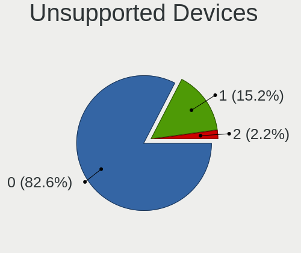

| Total | Desktops | Percent |
|-------|----------|---------|
| 0     | 76       | 82.61%  |
| 1     | 14       | 15.22%  |
| 2     | 2        | 2.17%   |

Unsupported Device Types
------------------------

Types of unsupported devices

| Type                     | Desktops | Percent |
|--------------------------|----------|---------|
| Graphics card            | 8        | 47.06%  |
| Net/wireless             | 3        | 17.65%  |
| Chipcard                 | 2        | 11.76%  |
| Unassigned class         | 1        | 5.88%   |
| Sound                    | 1        | 5.88%   |
| Multimedia controller    | 1        | 5.88%   |
| Communication controller | 1        | 5.88%   |

