Mageia - Tested Hardware & Statistics (Notebooks)
-------------------------------------------------

A project to collect tested hardware configurations for Mageia.

Anyone can contribute to this report by the [hw-probe](https://github.com/linuxhw/hw-probe) tool:

    sudo -E hw-probe -all -upload

Please contribute! Especially if your hardware is rare.

Contents
--------

* [ Test Cases ](#test-cases)

* [ System ](#system)
  - [ OS                       ](#os)
  - [ OS Family                ](#os-family)
  - [ Kernel                   ](#kernel)
  - [ Kernel Family            ](#kernel-family)
  - [ Kernel Major Ver.        ](#kernel-major-ver)
  - [ Arch                     ](#arch)
  - [ DE                       ](#de)
  - [ Display Server           ](#display-server)
  - [ Display Manager          ](#display-manager)
  - [ OS Lang                  ](#os-lang)
  - [ Boot Mode                ](#boot-mode)
  - [ Filesystem               ](#filesystem)
  - [ Part. scheme             ](#part-scheme)
  - [ Dual Boot with Linux/BSD ](#dual-boot-with-linuxbsd)
  - [ Dual Boot (Win)          ](#dual-boot-win)

* [ Board ](#board)
  - [ Vendor                   ](#vendor)
  - [ Model                    ](#model)
  - [ Model Family             ](#model-family)
  - [ MFG Year                 ](#mfg-year)
  - [ Form Factor              ](#form-factor)
  - [ Secure Boot              ](#secure-boot)
  - [ Coreboot                 ](#coreboot)
  - [ RAM Size                 ](#ram-size)
  - [ RAM Used                 ](#ram-used)
  - [ Total Drives             ](#total-drives)
  - [ Has CD-ROM               ](#has-cd-rom)
  - [ Has Ethernet             ](#has-ethernet)
  - [ Has WiFi                 ](#has-wifi)
  - [ Has Bluetooth            ](#has-bluetooth)

* [ Location ](#location)
  - [ Country                  ](#country)
  - [ City                     ](#city)

* [ Drives ](#drives)
  - [ Drive Vendor             ](#drive-vendor)
  - [ Drive Model              ](#drive-model)
  - [ HDD Vendor               ](#hdd-vendor)
  - [ SSD Vendor               ](#ssd-vendor)
  - [ Drive Kind               ](#drive-kind)
  - [ Drive Connector          ](#drive-connector)
  - [ Drive Size               ](#drive-size)
  - [ Space Total              ](#space-total)
  - [ Space Used               ](#space-used)
  - [ Malfunc. Drives          ](#malfunc-drives)
  - [ Malfunc. Drive Vendor    ](#malfunc-drive-vendor)
  - [ Malfunc. HDD Vendor      ](#malfunc-hdd-vendor)
  - [ Malfunc. Drive Kind      ](#malfunc-drive-kind)
  - [ Failed Drives            ](#failed-drives)
  - [ Failed Drive Vendor      ](#failed-drive-vendor)
  - [ Drive Status             ](#drive-status)

* [ Storage controller ](#storage-controller)
  - [ Storage Vendor           ](#storage-vendor)
  - [ Storage Model            ](#storage-model)
  - [ Storage Kind             ](#storage-kind)

* [ Processor ](#processor)
  - [ CPU Vendor               ](#cpu-vendor)
  - [ CPU Model                ](#cpu-model)
  - [ CPU Model Family         ](#cpu-model-family)
  - [ CPU Cores                ](#cpu-cores)
  - [ CPU Sockets              ](#cpu-sockets)
  - [ CPU Threads              ](#cpu-threads)
  - [ CPU Op-Modes             ](#cpu-op-modes)
  - [ CPU Microcode            ](#cpu-microcode)
  - [ CPU Microarch            ](#cpu-microarch)

* [ Graphics ](#graphics)
  - [ GPU Vendor               ](#gpu-vendor)
  - [ GPU Model                ](#gpu-model)
  - [ GPU Combo                ](#gpu-combo)
  - [ GPU Driver               ](#gpu-driver)
  - [ GPU Memory               ](#gpu-memory)

* [ Monitor ](#monitor)
  - [ Monitor Vendor           ](#monitor-vendor)
  - [ Monitor Model            ](#monitor-model)
  - [ Monitor Resolution       ](#monitor-resolution)
  - [ Monitor Diagonal         ](#monitor-diagonal)
  - [ Monitor Width            ](#monitor-width)
  - [ Aspect Ratio             ](#aspect-ratio)
  - [ Monitor Area             ](#monitor-area)
  - [ Pixel Density            ](#pixel-density)
  - [ Multiple Monitors        ](#multiple-monitors)

* [ Network ](#network)
  - [ Net Controller Vendor    ](#net-controller-vendor)
  - [ Net Controller Model     ](#net-controller-model)
  - [ Wireless Vendor          ](#wireless-vendor)
  - [ Wireless Model           ](#wireless-model)
  - [ Ethernet Vendor          ](#ethernet-vendor)
  - [ Ethernet Model           ](#ethernet-model)
  - [ Net Controller Kind      ](#net-controller-kind)
  - [ Used Controller          ](#used-controller)
  - [ NICs                     ](#nics)
  - [ IPv6                     ](#ipv6)

* [ Bluetooth ](#bluetooth)
  - [ Bluetooth Vendor         ](#bluetooth-vendor)
  - [ Bluetooth Model          ](#bluetooth-model)

* [ Sound ](#sound)
  - [ Sound Vendor             ](#sound-vendor)
  - [ Sound Model              ](#sound-model)

* [ Memory ](#memory)
  - [ Memory Vendor            ](#memory-vendor)
  - [ Memory Model             ](#memory-model)
  - [ Memory Kind              ](#memory-kind)
  - [ Memory Form Factor       ](#memory-form-factor)
  - [ Memory Size              ](#memory-size)
  - [ Memory Speed             ](#memory-speed)

* [ Printers & scanners ](#printers--scanners)
  - [ Printer Vendor           ](#printer-vendor)
  - [ Printer Model            ](#printer-model)
  - [ Scanner Vendor           ](#scanner-vendor)
  - [ Scanner Model            ](#scanner-model)

* [ Camera ](#camera)
  - [ Camera Vendor            ](#camera-vendor)
  - [ Camera Model             ](#camera-model)

* [ Security ](#security)
  - [ Fingerprint Vendor       ](#fingerprint-vendor)
  - [ Fingerprint Model        ](#fingerprint-model)
  - [ Chipcard Vendor          ](#chipcard-vendor)
  - [ Chipcard Model           ](#chipcard-model)

* [ Unsupported ](#unsupported)
  - [ Unsupported Devices      ](#unsupported-devices)
  - [ Unsupported Device Types ](#unsupported-device-types)

Test Cases
----------

Total: 91

| Vendor   | Model                       | Probe                                                      | Date         |
|----------|-----------------------------|------------------------------------------------------------|--------------|
| HP       | ProBook 650 G1              | [f216877adb](https://linux-hardware.org/?probe=f216877adb) | Dec 15, 2025 |
| Toshiba  | Satellite M70               | [b1e2efb1e9](https://linux-hardware.org/?probe=b1e2efb1e9) | Nov 21, 2025 |
| HP       | Pavilion Gaming Laptop 1... | [718071d7fc](https://linux-hardware.org/?probe=718071d7fc) | Nov 13, 2025 |
| Dell     | Vostro 3300                 | [2431bda764](https://linux-hardware.org/?probe=2431bda764) | Oct 29, 2025 |
| Fujitsu  | LIFEBOOK T580               | [3b95bd0b87](https://linux-hardware.org/?probe=3b95bd0b87) | Oct 05, 2025 |
| ASUSTek  | X751LN                      | [487943c818](https://linux-hardware.org/?probe=487943c818) | Aug 20, 2025 |
| ASUSTek  | X751LN                      | [1789805d42](https://linux-hardware.org/?probe=1789805d42) | Jul 28, 2025 |
| Lenovo   | ThinkBook 14 G6+ AHP 21L... | [7435ad5bea](https://linux-hardware.org/?probe=7435ad5bea) | Jul 17, 2025 |
| Fujitsu  | LIFEBOOK T580               | [086dbef0bd](https://linux-hardware.org/?probe=086dbef0bd) | May 15, 2025 |
| HP       | ProBook 650 G1              | [a9375df162](https://linux-hardware.org/?probe=a9375df162) | May 08, 2025 |
| HP       | G62                         | [71c90e13fa](https://linux-hardware.org/?probe=71c90e13fa) | May 06, 2025 |
| TUXEDO   | Book XP15 / XP17 Gen12      | [451fc24b08](https://linux-hardware.org/?probe=451fc24b08) | Mar 31, 2025 |
| Acer     | Aspire A317-53              | [1e2fdcd989](https://linux-hardware.org/?probe=1e2fdcd989) | Feb 09, 2025 |
| OEM      | I42IL1                      | [3a9938d946](https://linux-hardware.org/?probe=3a9938d946) | Oct 26, 2024 |
| Acer     | Aspire A315-59G             | [3c57995295](https://linux-hardware.org/?probe=3c57995295) | Oct 05, 2024 |
| Lenovo   | G585 20137                  | [379f6e6fef](https://linux-hardware.org/?probe=379f6e6fef) | Oct 05, 2024 |
| HP       | Pavilion g4                 | [c705d7afa6](https://linux-hardware.org/?probe=c705d7afa6) | Oct 05, 2024 |
| ASUSTek  | ZenBook UX425EA_UX425EA     | [17286ddcf5](https://linux-hardware.org/?probe=17286ddcf5) | Oct 03, 2024 |
| HP       | Laptop 17-ca1xxx            | [1e94fd61d3](https://linux-hardware.org/?probe=1e94fd61d3) | Aug 29, 2024 |
| HP       | Victus by Gaming Laptop ... | [62d3477a3b](https://linux-hardware.org/?probe=62d3477a3b) | May 10, 2024 |
| Acer     | Aspire 5742Z                | [f9ceb71c71](https://linux-hardware.org/?probe=f9ceb71c71) | Apr 11, 2024 |
| Acer     | Aspire SW5-011              | [4e8ad9d65f](https://linux-hardware.org/?probe=4e8ad9d65f) | Apr 10, 2024 |
| Acer     | Aspire SW5-011              | [6f6cb62f08](https://linux-hardware.org/?probe=6f6cb62f08) | Apr 02, 2024 |
| Acer     | Aspire SW5-011              | [6fbb2e2797](https://linux-hardware.org/?probe=6fbb2e2797) | Apr 01, 2024 |
| HP       | ProBook 650 G1              | [f097372357](https://linux-hardware.org/?probe=f097372357) | Mar 31, 2024 |
| ASUSTek  | VivoBook_ASUSLaptop X712... | [d6f2169d3f](https://linux-hardware.org/?probe=d6f2169d3f) | Mar 26, 2024 |
| Insyde   | BayTrail                    | [2566898a32](https://linux-hardware.org/?probe=2566898a32) | Mar 23, 2024 |
| Lenovo   | G50-30 80G0                 | [e1e268d222](https://linux-hardware.org/?probe=e1e268d222) | Jan 18, 2024 |
| HP       | ProBook 450 G1              | [028d205023](https://linux-hardware.org/?probe=028d205023) | Jan 09, 2024 |
| HP       | Compaq 6710b (GB887ET#AB... | [2aaeccac56](https://linux-hardware.org/?probe=2aaeccac56) | Jan 08, 2024 |
| ASUSTek  | VivoBook_ASUSLaptop K660... | [9315424410](https://linux-hardware.org/?probe=9315424410) | Nov 21, 2023 |
| ASUSTek  | VivoBook_ASUSLaptop K660... | [5e92402cde](https://linux-hardware.org/?probe=5e92402cde) | Nov 21, 2023 |
| HP       | 255 15.6 inch G9 Noteboo... | [b1394cc278](https://linux-hardware.org/?probe=b1394cc278) | Oct 30, 2023 |
| Lenovo   | IdeaPad Slim 3 15AMN8 82... | [02c2fabd1e](https://linux-hardware.org/?probe=02c2fabd1e) | Oct 11, 2023 |
| Lenovo   | IdeaPad Slim 3 15AMN8 82... | [02a4135aff](https://linux-hardware.org/?probe=02a4135aff) | Oct 09, 2023 |
| Fujitsu  | S6420                       | [044d4185b7](https://linux-hardware.org/?probe=044d4185b7) | Aug 22, 2023 |
| HP       | Pavilion Notebook           | [7fd3205fde](https://linux-hardware.org/?probe=7fd3205fde) | Aug 11, 2023 |
| Dell     | Latitude E5470              | [f64529e38b](https://linux-hardware.org/?probe=f64529e38b) | Aug 08, 2023 |
| ASUSTek  | Q551LN                      | [ad2abcddcf](https://linux-hardware.org/?probe=ad2abcddcf) | Jul 27, 2023 |
| HP       | Laptop 14-cm0xxx            | [a0fd2eeb7b](https://linux-hardware.org/?probe=a0fd2eeb7b) | Jul 11, 2023 |
| Compaq   | 420                         | [6f4350d53e](https://linux-hardware.org/?probe=6f4350d53e) | Jul 10, 2023 |
| ASUSTek  | K73SD                       | [063e42ac60](https://linux-hardware.org/?probe=063e42ac60) | May 22, 2023 |
| Dell     | Latitude 7370               | [a254d0d7f1](https://linux-hardware.org/?probe=a254d0d7f1) | Apr 02, 2023 |
| Dell     | Latitude 7370               | [b8a0b25983](https://linux-hardware.org/?probe=b8a0b25983) | Mar 30, 2023 |
| HP       | ProBook 5330m               | [2ec50367d4](https://linux-hardware.org/?probe=2ec50367d4) | Mar 11, 2023 |
| HP       | Unknown                     | [702ed67add](https://linux-hardware.org/?probe=702ed67add) | Dec 17, 2022 |
| HP       | Unknown                     | [d952fd785e](https://linux-hardware.org/?probe=d952fd785e) | Dec 17, 2022 |
| Fujitsu  | CELSIUS H720                | [a7eacb37c5](https://linux-hardware.org/?probe=a7eacb37c5) | Dec 03, 2022 |
| Irbis    | NB264                       | [103ca2d20b](https://linux-hardware.org/?probe=103ca2d20b) | Sep 16, 2022 |
| ASUSTek  | X751LN                      | [68cd0152fb](https://linux-hardware.org/?probe=68cd0152fb) | Aug 22, 2022 |
| Schenker | VIA_14_SVI14E20             | [3adb69bbf5](https://linux-hardware.org/?probe=3adb69bbf5) | Jun 03, 2022 |
| Notebook | NH5x_NH7x_HHx_HJx_HKx       | [e30e3da709](https://linux-hardware.org/?probe=e30e3da709) | May 18, 2022 |
| Dell     | Latitude E5570              | [ec640c6644](https://linux-hardware.org/?probe=ec640c6644) | May 12, 2022 |
| Lenovo   | ThinkPad X1 Carbon 5th 2... | [086a94d83c](https://linux-hardware.org/?probe=086a94d83c) | Apr 15, 2022 |
| Toshiba  | dynabook R73/A              | [42b60c90c7](https://linux-hardware.org/?probe=42b60c90c7) | Apr 01, 2022 |
| Dell     | Latitude E5570              | [38032eae74](https://linux-hardware.org/?probe=38032eae74) | Dec 06, 2021 |
| Dell     | Latitude E5570              | [9314738bbb](https://linux-hardware.org/?probe=9314738bbb) | Dec 06, 2021 |
| Dell     | Precision 5530              | [f98313a80c](https://linux-hardware.org/?probe=f98313a80c) | Nov 29, 2021 |
| Lenovo   | IdeaPad 3 15ADA05 81W1      | [3f4fe97a8a](https://linux-hardware.org/?probe=3f4fe97a8a) | Sep 30, 2021 |
| Lenovo   | IdeaPad Slim 1-14AST-05 ... | [46250d420a](https://linux-hardware.org/?probe=46250d420a) | Aug 14, 2021 |
| Lenovo   | ThinkPad T61 6468AE2        | [216fbf401b](https://linux-hardware.org/?probe=216fbf401b) | Aug 05, 2021 |
| ASUSTek  | X751LN                      | [8c0efa94e8](https://linux-hardware.org/?probe=8c0efa94e8) | Jul 08, 2021 |
| Notebook | NL40_50GU                   | [baa8447288](https://linux-hardware.org/?probe=baa8447288) | May 08, 2021 |
| Medion   | DEFENDER P10                | [cb752c0a4a](https://linux-hardware.org/?probe=cb752c0a4a) | May 01, 2021 |
| Medion   | DEFENDER P10                | [f42aa05a37](https://linux-hardware.org/?probe=f42aa05a37) | May 01, 2021 |
| Fujitsu  | LIFEBOOK E752               | [8ec052ba75](https://linux-hardware.org/?probe=8ec052ba75) | Apr 15, 2021 |
| Lenovo   | ThinkPad T430 2342A19       | [9a5ad3016a](https://linux-hardware.org/?probe=9a5ad3016a) | Apr 15, 2021 |
| ASUSTek  | X751LN                      | [09afc59907](https://linux-hardware.org/?probe=09afc59907) | Apr 02, 2021 |
| ASUSTek  | X556URK                     | [4904d2c78e](https://linux-hardware.org/?probe=4904d2c78e) | Mar 18, 2021 |
| ASUSTek  | X751LN                      | [0bb2c11bdc](https://linux-hardware.org/?probe=0bb2c11bdc) | Feb 24, 2021 |
| Dell     | Latitude E6530              | [035378659f](https://linux-hardware.org/?probe=035378659f) | Feb 12, 2021 |
| Dell     | Inspiron 5480               | [2ae12f394c](https://linux-hardware.org/?probe=2ae12f394c) | Jan 27, 2021 |
| Kiano    | SlimNote 15.6               | [55179f361c](https://linux-hardware.org/?probe=55179f361c) | Jan 08, 2021 |
| Kiano    | SlimNote 15.6               | [5379fd7478](https://linux-hardware.org/?probe=5379fd7478) | Jan 08, 2021 |
| ASUSTek  | VivoBook 15_ASUS Laptop ... | [01aa1a7b95](https://linux-hardware.org/?probe=01aa1a7b95) | Dec 30, 2020 |
| ASUSTek  | X751LN                      | [f7f3533d54](https://linux-hardware.org/?probe=f7f3533d54) | Dec 27, 2020 |
| Dell     | Inspiron 5480               | [1261d0c9d3](https://linux-hardware.org/?probe=1261d0c9d3) | Dec 21, 2020 |
| HP       | Spectre 13 Ultrabook        | [9b88fe4fa5](https://linux-hardware.org/?probe=9b88fe4fa5) | Nov 30, 2020 |
| HP       | EliteBook 840 G3            | [4dd618cb59](https://linux-hardware.org/?probe=4dd618cb59) | Nov 21, 2020 |
| HP       | EliteBook 840 G3            | [2543664b54](https://linux-hardware.org/?probe=2543664b54) | Nov 21, 2020 |
| Lenovo   | IdeaPad 3 15ADA05 81W1      | [889cb35866](https://linux-hardware.org/?probe=889cb35866) | Nov 13, 2020 |
| HP       | ProBook 445 G7              | [2e97281aa0](https://linux-hardware.org/?probe=2e97281aa0) | Nov 05, 2020 |
| Acer     | Aspire V3-772               | [413786151e](https://linux-hardware.org/?probe=413786151e) | Oct 31, 2020 |
| Dell     | Inspiron 5480               | [62bb8575f1](https://linux-hardware.org/?probe=62bb8575f1) | Oct 22, 2020 |
| HP       | Unknown                     | [b12d1589a1](https://linux-hardware.org/?probe=b12d1589a1) | Sep 08, 2020 |
| Acer     | Aspire 7741                 | [e5914ee358](https://linux-hardware.org/?probe=e5914ee358) | Sep 05, 2020 |
| HP       | Pavilion dv6                | [021a94f63e](https://linux-hardware.org/?probe=021a94f63e) | Sep 03, 2020 |
| Lenovo   | G480 20149                  | [5598a535c7](https://linux-hardware.org/?probe=5598a535c7) | Jul 24, 2020 |
| ASUSTek  | VivoBook 15_ASUS Laptop ... | [8e31f45bf5](https://linux-hardware.org/?probe=8e31f45bf5) | May 07, 2020 |
| ASUSTek  | VivoBook 15_ASUS Laptop ... | [4b71b90312](https://linux-hardware.org/?probe=4b71b90312) | May 04, 2020 |
| Lenovo   | G570 20079                  | [fc57cb086b](https://linux-hardware.org/?probe=fc57cb086b) | Nov 26, 2015 |

System
------

OS
--

Installed operating systems

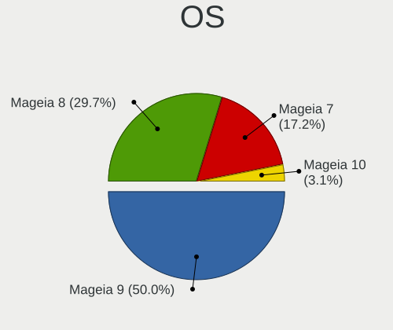

| Name      | Notebooks | Percent |
|-----------|-----------|---------|
| Mageia 9  | 32        | 50%     |
| Mageia 8  | 19        | 29.69%  |
| Mageia 7  | 11        | 17.19%  |
| Mageia 10 | 2         | 3.13%   |

OS Family
---------

OS without a version

| Name   | Notebooks | Percent |
|--------|-----------|---------|
| Mageia | 61        | 100%    |

Kernel
------

Version of the Linux kernel

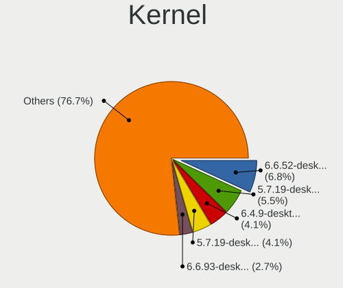

| Version                 | Notebooks | Percent |
|-------------------------|-----------|---------|
| 6.6.52-desktop-1.mga9   | 5         | 6.85%   |
| 5.7.19-desktop-3.mga7   | 4         | 5.48%   |
| 6.4.9-desktop-4.mga9    | 3         | 4.11%   |
| 5.7.19-desktop-1.mga7   | 3         | 4.11%   |
| 6.6.93-desktop-1.mga9   | 2         | 2.74%   |
| 6.6.74-desktop-1.mga9   | 2         | 2.74%   |
| 6.6.18-desktop-1.mga9   | 2         | 2.74%   |
| 6.6.105-desktop-1.mga9  | 2         | 2.74%   |
| 6.6.101-desktop-1.mga9  | 2         | 2.74%   |
| 6.4.8-desktop-6.mga9    | 2         | 2.74%   |
| 6.4.16-desktop-3.mga9   | 2         | 2.74%   |
| 5.6.14-desktop-2.mga7   | 2         | 2.74%   |
| 5.15.4-desktop-1.mga8   | 2         | 2.74%   |
| 5.15.32-desktop-1.mga8  | 2         | 2.74%   |
| 6.6.88-desktop-3.mga9   | 1         | 1.37%   |
| 6.6.87-desktop-1.mga10  | 1         | 1.37%   |
| 6.6.76-desktop-1.mga10  | 1         | 1.37%   |
| 6.6.43-desktop-1.mga9   | 1         | 1.37%   |
| 6.6.28-desktop-1.mga9   | 1         | 1.37%   |
| 6.6.22-desktop-1.mga9   | 1         | 1.37%   |
| 6.6.22-desktop-1.mga10  | 1         | 1.37%   |
| 6.5.13-server-6.mga9    | 1         | 1.37%   |
| 6.5.13-desktop-6.mga9   | 1         | 1.37%   |
| 6.4.6-desktop-2.mga9    | 1         | 1.37%   |
| 6.4.3-desktop-1.mga9    | 1         | 1.37%   |
| 6.2.2-desktop-2.mga9    | 1         | 1.37%   |
| 6.12.62-desktop-1.mga10 | 1         | 1.37%   |
| 6.1.45-desktop-1.mga8   | 1         | 1.37%   |
| 6.1.14-desktop-1.mga9   | 1         | 1.37%   |
| 6.0.10-desktop-1.mga9   | 1         | 1.37%   |
| 5.9.6-desktop-1.mga8    | 1         | 1.37%   |
| 5.9.16-desktop-1.mga7   | 1         | 1.37%   |
| 5.9.11-desktop-3.mga8   | 1         | 1.37%   |
| 5.8.5-desktop-2.mga8    | 1         | 1.37%   |
| 5.7.8-desktop-1.mga8    | 1         | 1.37%   |
| 5.6.6-desktop-1.mga7    | 1         | 1.37%   |
| 5.18.15-desktop-1.mga8  | 1         | 1.37%   |
| 5.16.10-desktop-2.mga8  | 1         | 1.37%   |
| 5.15.98-desktop-1.mga8  | 1         | 1.37%   |
| 5.15.79-desktop-1.mga8  | 1         | 1.37%   |

Kernel Family
-------------

Linux kernel without a distro release

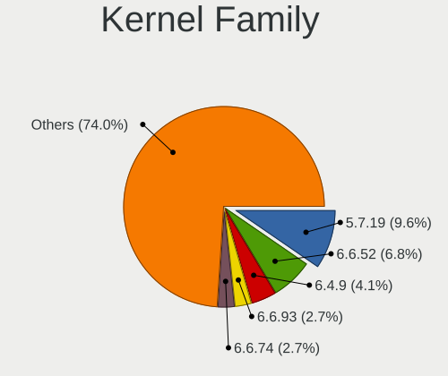

| Version | Notebooks | Percent |
|---------|-----------|---------|
| 5.7.19  | 7         | 9.59%   |
| 6.6.52  | 5         | 6.85%   |
| 6.4.9   | 3         | 4.11%   |
| 6.6.93  | 2         | 2.74%   |
| 6.6.74  | 2         | 2.74%   |
| 6.6.22  | 2         | 2.74%   |
| 6.6.18  | 2         | 2.74%   |
| 6.6.105 | 2         | 2.74%   |
| 6.6.101 | 2         | 2.74%   |
| 6.5.13  | 2         | 2.74%   |
| 6.4.8   | 2         | 2.74%   |
| 6.4.16  | 2         | 2.74%   |
| 5.6.14  | 2         | 2.74%   |
| 5.15.4  | 2         | 2.74%   |
| 5.15.32 | 2         | 2.74%   |
| 5.10.16 | 2         | 2.74%   |
| 6.6.88  | 1         | 1.37%   |
| 6.6.87  | 1         | 1.37%   |
| 6.6.76  | 1         | 1.37%   |
| 6.6.43  | 1         | 1.37%   |
| 6.6.28  | 1         | 1.37%   |
| 6.4.6   | 1         | 1.37%   |
| 6.4.3   | 1         | 1.37%   |
| 6.2.2   | 1         | 1.37%   |
| 6.12.62 | 1         | 1.37%   |
| 6.1.45  | 1         | 1.37%   |
| 6.1.14  | 1         | 1.37%   |
| 6.0.10  | 1         | 1.37%   |
| 5.9.6   | 1         | 1.37%   |
| 5.9.16  | 1         | 1.37%   |
| 5.9.11  | 1         | 1.37%   |
| 5.8.5   | 1         | 1.37%   |
| 5.7.8   | 1         | 1.37%   |
| 5.6.6   | 1         | 1.37%   |
| 5.18.15 | 1         | 1.37%   |
| 5.16.10 | 1         | 1.37%   |
| 5.15.98 | 1         | 1.37%   |
| 5.15.79 | 1         | 1.37%   |
| 5.15.43 | 1         | 1.37%   |
| 5.15.35 | 1         | 1.37%   |

Kernel Major Ver.
-----------------

Linux kernel major version

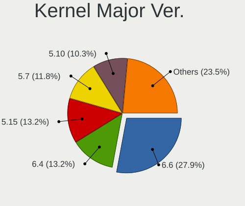

| Version | Notebooks | Percent |
|---------|-----------|---------|
| 6.6     | 19        | 27.94%  |
| 6.4     | 9         | 13.24%  |
| 5.15    | 9         | 13.24%  |
| 5.7     | 8         | 11.76%  |
| 5.10    | 7         | 10.29%  |
| 5.9     | 3         | 4.41%   |
| 5.6     | 3         | 4.41%   |
| 6.5     | 2         | 2.94%   |
| 6.1     | 2         | 2.94%   |
| 6.2     | 1         | 1.47%   |
| 6.12    | 1         | 1.47%   |
| 6.0     | 1         | 1.47%   |
| 5.8     | 1         | 1.47%   |
| 5.18    | 1         | 1.47%   |
| 5.16    | 1         | 1.47%   |

Arch
----

OS architecture (x86_64, i586, etc.)

| Name   | Notebooks | Percent |
|--------|-----------|---------|
| x86_64 | 60        | 98.36%  |
| i686   | 1         | 1.64%   |

DE
--

Desktop Environment

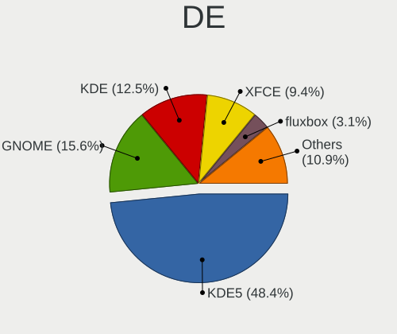

| Name       | Notebooks | Percent |
|------------|-----------|---------|
| KDE5       | 31        | 48.44%  |
| GNOME      | 10        | 15.63%  |
| KDE        | 8         | 12.5%   |
| XFCE       | 6         | 9.38%   |
| MATE       | 2         | 3.13%   |
| LXQt       | 2         | 3.13%   |
| fluxbox    | 2         | 3.13%   |
| X-Cinnamon | 1         | 1.56%   |
| KDE6       | 1         | 1.56%   |
| Unknown    | 1         | 1.56%   |

Display Server
--------------

X11 or Wayland

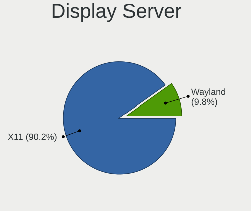

| Name    | Notebooks | Percent |
|---------|-----------|---------|
| X11     | 55        | 90.16%  |
| Wayland | 6         | 9.84%   |

Display Manager
---------------

SDDM, LightDM, etc.

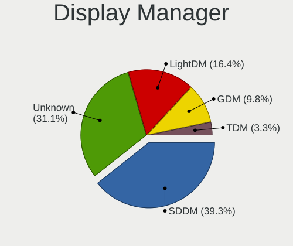

| Name    | Notebooks | Percent |
|---------|-----------|---------|
| SDDM    | 24        | 39.34%  |
| Unknown | 19        | 31.15%  |
| LightDM | 10        | 16.39%  |
| GDM     | 6         | 9.84%   |
| TDM     | 2         | 3.28%   |

OS Lang
-------

Language

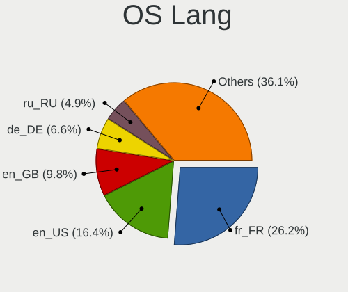

| Lang  | Notebooks | Percent |
|-------|-----------|---------|
| fr_FR | 16        | 26.23%  |
| en_US | 10        | 16.39%  |
| en_GB | 6         | 9.84%   |
| de_DE | 4         | 6.56%   |
| ru_RU | 3         | 4.92%   |
| es_PE | 3         | 4.92%   |
| pt_BR | 2         | 3.28%   |
| pl_PL | 2         | 3.28%   |
| it_IT | 2         | 3.28%   |
| hu_HU | 2         | 3.28%   |
| es_MX | 2         | 3.28%   |
| es_GT | 2         | 3.28%   |
| bg_BG | 2         | 3.28%   |
| ro_RO | 1         | 1.64%   |
| es_ES | 1         | 1.64%   |
| es_CR | 1         | 1.64%   |
| es_CO | 1         | 1.64%   |
| en_CA | 1         | 1.64%   |

Boot Mode
---------

EFI or BIOS

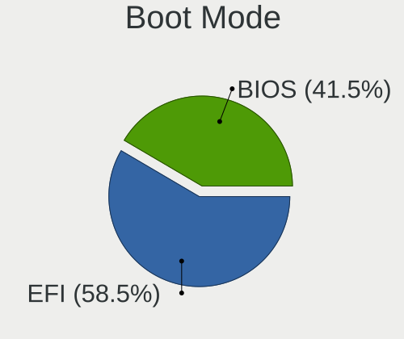

| Mode | Notebooks | Percent |
|------|-----------|---------|
| EFI  | 38        | 58.46%  |
| BIOS | 27        | 41.54%  |

Filesystem
----------

Type of filesystem

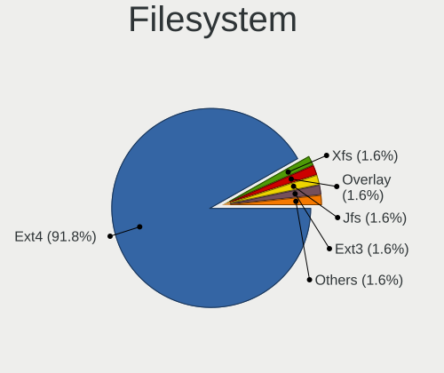

| Type    | Notebooks | Percent |
|---------|-----------|---------|
| Ext4    | 56        | 91.8%   |
| Xfs     | 1         | 1.64%   |
| Overlay | 1         | 1.64%   |
| Jfs     | 1         | 1.64%   |
| Ext3    | 1         | 1.64%   |
| Btrfs   | 1         | 1.64%   |

Part. scheme
------------

Scheme of partitioning

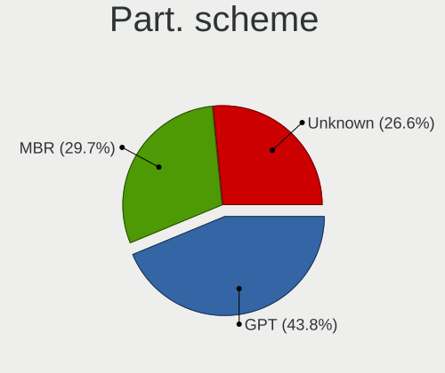

| Type    | Notebooks | Percent |
|---------|-----------|---------|
| GPT     | 28        | 43.75%  |
| MBR     | 19        | 29.69%  |
| Unknown | 17        | 26.56%  |

Dual Boot with Linux/BSD
------------------------

Hosting more than one Linux/BSD

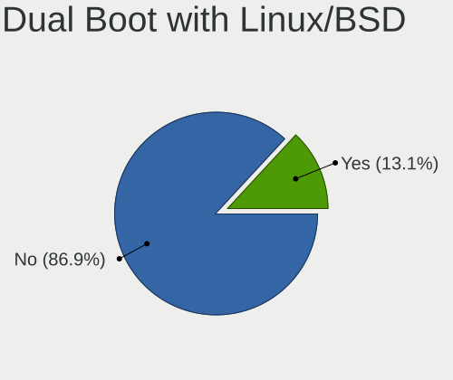

| Dual boot | Notebooks | Percent |
|-----------|-----------|---------|
| No        | 53        | 86.89%  |
| Yes       | 8         | 13.11%  |

Dual Boot (Win)
---------------

Hosting Linux and Windows

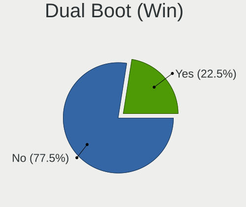

| Dual boot | Notebooks | Percent |
|-----------|-----------|---------|
| No        | 46        | 73.02%  |
| Yes       | 17        | 26.98%  |

Board
-----

Vendor
------

Motherboard manufacturer

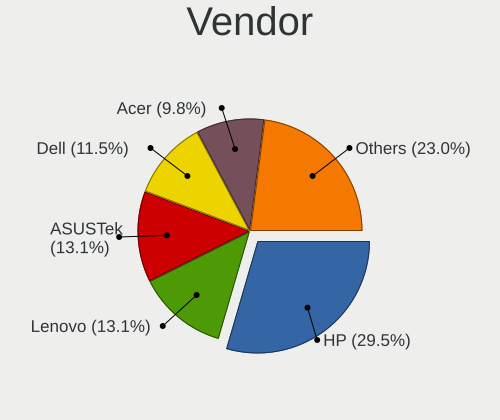

| Name             | Notebooks | Percent |
|------------------|-----------|---------|
| Hewlett-Packard  | 18        | 29.51%  |
| Lenovo           | 8         | 13.11%  |
| ASUSTek Computer | 8         | 13.11%  |
| Dell             | 7         | 11.48%  |
| Acer             | 6         | 9.84%   |
| Fujitsu          | 4         | 6.56%   |
| Toshiba          | 2         | 3.28%   |
| Notebook         | 2         | 3.28%   |
| TUXEDO           | 1         | 1.64%   |
| Schenker         | 1         | 1.64%   |
| OEM              | 1         | 1.64%   |
| Medion           | 1         | 1.64%   |
| Kiano            | 1         | 1.64%   |
| Insyde           | 1         | 1.64%   |

Model
-----

Motherboard model

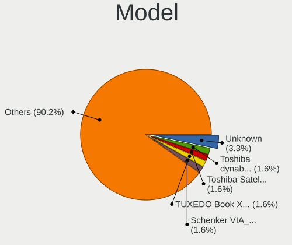

| Name                                     | Notebooks | Percent |
|------------------------------------------|-----------|---------|
| Unknown                                  | 2         | 3.28%   |
| TUXEDO Book XP15 / XP17 Gen12            | 1         | 1.64%   |
| Toshiba Satellite M70                    | 1         | 1.64%   |
| Toshiba dynabook R73/A                   | 1         | 1.64%   |
| Schenker VIA_14_SVI14E20                 | 1         | 1.64%   |
| OEM I42IL1                               | 1         | 1.64%   |
| Notebook NL40_50GU                       | 1         | 1.64%   |
| Notebook NH5x_NH7x_HHx_HJx_HKx           | 1         | 1.64%   |
| Medion DEFENDER P10                      | 1         | 1.64%   |
| Lenovo ThinkPad X1 Carbon 5th 20HQS1741F | 1         | 1.64%   |
| Lenovo ThinkPad T430 2342A19             | 1         | 1.64%   |
| Lenovo ThinkBook 14 G6+ AHP 21LF         | 1         | 1.64%   |
| Lenovo IdeaPad Slim 3 15AMN8 82XQ        | 1         | 1.64%   |
| Lenovo IdeaPad 3 15ADA05 81W1            | 1         | 1.64%   |
| Lenovo G585 20137                        | 1         | 1.64%   |
| Lenovo G50-30 80G0                       | 1         | 1.64%   |
| Lenovo G480 20149                        | 1         | 1.64%   |
| Kiano SlimNote 15.6                      | 1         | 1.64%   |
| Insyde BayTrail                          | 1         | 1.64%   |
| HP Victus by Gaming Laptop 15-fb0xxx     | 1         | 1.64%   |
| HP Spectre 13 Ultrabook                  | 1         | 1.64%   |
| HP ProBook 650 G1                        | 1         | 1.64%   |
| HP ProBook 5330m                         | 1         | 1.64%   |
| HP ProBook 450 G1                        | 1         | 1.64%   |
| HP ProBook 445 G7                        | 1         | 1.64%   |
| HP Pavilion Notebook                     | 1         | 1.64%   |
| HP Pavilion Gaming Laptop 15-ec0xxx      | 1         | 1.64%   |
| HP Pavilion g4                           | 1         | 1.64%   |
| HP Pavilion dv6                          | 1         | 1.64%   |
| HP Laptop 17-ca1xxx                      | 1         | 1.64%   |
| HP Laptop 14-cm0xxx                      | 1         | 1.64%   |
| HP G62                                   | 1         | 1.64%   |
| HP EliteBook 840 G3                      | 1         | 1.64%   |
| HP Compaq 6710b (GB887ET#ABH)            | 1         | 1.64%   |
| HP 255 15.6 inch G9 Notebook PC          | 1         | 1.64%   |
| Fujitsu S6420                            | 1         | 1.64%   |
| Fujitsu LIFEBOOK T580                    | 1         | 1.64%   |
| Fujitsu LIFEBOOK E752                    | 1         | 1.64%   |
| Fujitsu CELSIUS H720                     | 1         | 1.64%   |
| Dell Vostro 3300                         | 1         | 1.64%   |

Model Family
------------

Motherboard model prefix

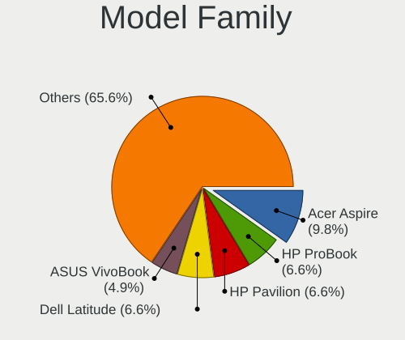

| Name              | Notebooks | Percent |
|-------------------|-----------|---------|
| Acer Aspire       | 6         | 9.84%   |
| HP ProBook        | 4         | 6.56%   |
| HP Pavilion       | 4         | 6.56%   |
| Dell Latitude     | 4         | 6.56%   |
| ASUS VivoBook     | 3         | 4.92%   |
| Lenovo ThinkPad   | 2         | 3.28%   |
| Lenovo IdeaPad    | 2         | 3.28%   |
| HP Laptop         | 2         | 3.28%   |
| Fujitsu LIFEBOOK  | 2         | 3.28%   |
| Unknown           | 2         | 3.28%   |
| TUXEDO Book       | 1         | 1.64%   |
| Toshiba Satellite | 1         | 1.64%   |
| Toshiba dynabook  | 1         | 1.64%   |
| Schenker VIA      | 1         | 1.64%   |
| OEM I42IL1        | 1         | 1.64%   |
| Notebook NL40     | 1         | 1.64%   |
| Notebook NH5x     | 1         | 1.64%   |
| Medion DEFENDER   | 1         | 1.64%   |
| Lenovo ThinkBook  | 1         | 1.64%   |
| Lenovo G585       | 1         | 1.64%   |
| Lenovo G50-30     | 1         | 1.64%   |
| Lenovo G480       | 1         | 1.64%   |
| Kiano SlimNote    | 1         | 1.64%   |
| Insyde BayTrail   | 1         | 1.64%   |
| HP Victus         | 1         | 1.64%   |
| HP Spectre        | 1         | 1.64%   |
| HP G62            | 1         | 1.64%   |
| HP EliteBook      | 1         | 1.64%   |
| HP Compaq         | 1         | 1.64%   |
| HP 255            | 1         | 1.64%   |
| Fujitsu S6420     | 1         | 1.64%   |
| Fujitsu CELSIUS   | 1         | 1.64%   |
| Dell Vostro       | 1         | 1.64%   |
| Dell Precision    | 1         | 1.64%   |
| Dell Inspiron     | 1         | 1.64%   |
| ASUS ZenBook      | 1         | 1.64%   |
| ASUS X751LN       | 1         | 1.64%   |
| ASUS X556URK      | 1         | 1.64%   |
| ASUS Q551LN       | 1         | 1.64%   |
| ASUS K73SD        | 1         | 1.64%   |

MFG Year
--------

Motherboard manufacture year

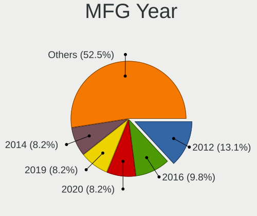

| Year | Notebooks | Percent |
|------|-----------|---------|
| 2012 | 8         | 13.11%  |
| 2016 | 6         | 9.84%   |
| 2020 | 5         | 8.2%    |
| 2019 | 5         | 8.2%    |
| 2014 | 5         | 8.2%    |
| 2022 | 4         | 6.56%   |
| 2018 | 4         | 6.56%   |
| 2013 | 4         | 6.56%   |
| 2010 | 4         | 6.56%   |
| 2021 | 3         | 4.92%   |
| 2011 | 3         | 4.92%   |
| 2007 | 3         | 4.92%   |
| 2017 | 2         | 3.28%   |
| 2008 | 2         | 3.28%   |
| 2024 | 1         | 1.64%   |
| 2009 | 1         | 1.64%   |
| 2005 | 1         | 1.64%   |

Form Factor
-----------

Physical design of the computer

| Name     | Notebooks | Percent |
|----------|-----------|---------|
| Notebook | 61        | 100%    |

Secure Boot
-----------

Enabled or disabled

| State    | Notebooks | Percent |
|----------|-----------|---------|
| Disabled | 61        | 100%    |

Coreboot
--------

Have coreboot on board

| Used | Notebooks | Percent |
|------|-----------|---------|
| No   | 61        | 100%    |

RAM Size
--------

Total RAM memory

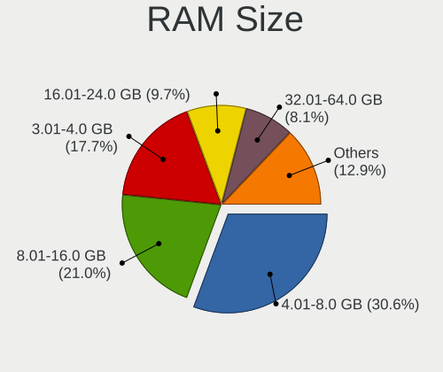

| Size in GB | Notebooks | Percent |
|------------|-----------|---------|
| 4.01-8.0   | 19        | 30.65%  |
| 8.01-16.0  | 13        | 20.97%  |
| 3.01-4.0   | 11        | 17.74%  |
| 16.01-24.0 | 6         | 9.68%   |
| 32.01-64.0 | 5         | 8.06%   |
| 2.01-3.0   | 3         | 4.84%   |
| 1.01-2.0   | 2         | 3.23%   |
| 24.01-32.0 | 1         | 1.61%   |
| 0.51-1.0   | 1         | 1.61%   |
| 0.01-0.5   | 1         | 1.61%   |

RAM Used
--------

Used RAM memory

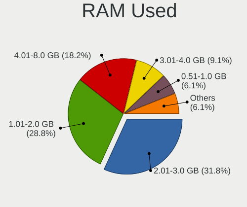

| Used GB    | Notebooks | Percent |
|------------|-----------|---------|
| 2.01-3.0   | 21        | 31.82%  |
| 1.01-2.0   | 19        | 28.79%  |
| 4.01-8.0   | 12        | 18.18%  |
| 3.01-4.0   | 6         | 9.09%   |
| 0.51-1.0   | 4         | 6.06%   |
| 8.01-16.0  | 2         | 3.03%   |
| 16.01-24.0 | 1         | 1.52%   |
| 0.01-0.5   | 1         | 1.52%   |

Total Drives
------------

Number of drives on board

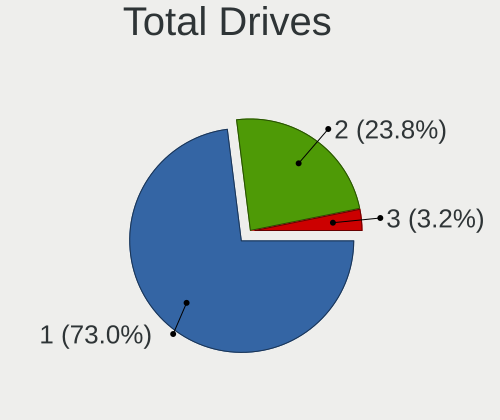

| Drives | Notebooks | Percent |
|--------|-----------|---------|
| 1      | 46        | 73.02%  |
| 2      | 15        | 23.81%  |
| 3      | 2         | 3.17%   |

Has CD-ROM
----------

Has CD-ROM on board

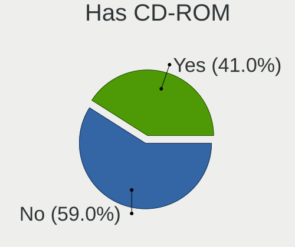

| Presented | Notebooks | Percent |
|-----------|-----------|---------|
| No        | 36        | 59.02%  |
| Yes       | 25        | 40.98%  |

Has Ethernet
------------

Has Ethernet on board

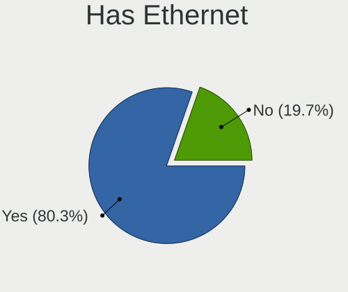

| Presented | Notebooks | Percent |
|-----------|-----------|---------|
| Yes       | 49        | 80.33%  |
| No        | 12        | 19.67%  |

Has WiFi
--------

Has WiFi module

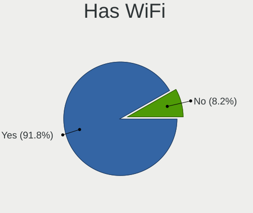

| Presented | Notebooks | Percent |
|-----------|-----------|---------|
| Yes       | 56        | 91.8%   |
| No        | 5         | 8.2%    |

Has Bluetooth
-------------

Has Bluetooth module

| Presented | Notebooks | Percent |
|-----------|-----------|---------|
| Yes       | 44        | 72.13%  |
| No        | 17        | 27.87%  |

Location
--------

Country
-------

Geographic location (country)

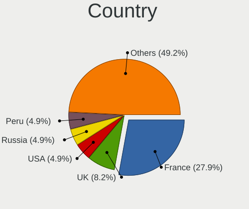

| Country         | Notebooks | Percent |
|-----------------|-----------|---------|
| France          | 17        | 27.87%  |
| UK              | 5         | 8.2%    |
| USA             | 3         | 4.92%   |
| Russia          | 3         | 4.92%   |
| Peru            | 3         | 4.92%   |
| Netherlands     | 3         | 4.92%   |
| Italy           | 3         | 4.92%   |
| Germany         | 3         | 4.92%   |
| Romania         | 2         | 3.28%   |
| Poland          | 2         | 3.28%   |
| Mexico          | 2         | 3.28%   |
| Guatemala       | 2         | 3.28%   |
| Colombia        | 2         | 3.28%   |
| Bulgaria        | 2         | 3.28%   |
| Brazil          | 2         | 3.28%   |
| The Netherlands | 1         | 1.64%   |
| Indonesia       | 1         | 1.64%   |
| Hungary         | 1         | 1.64%   |
| Greece          | 1         | 1.64%   |
| Costa Rica      | 1         | 1.64%   |
| Canada          | 1         | 1.64%   |
| Australia       | 1         | 1.64%   |

City
----

Geographic location (city)

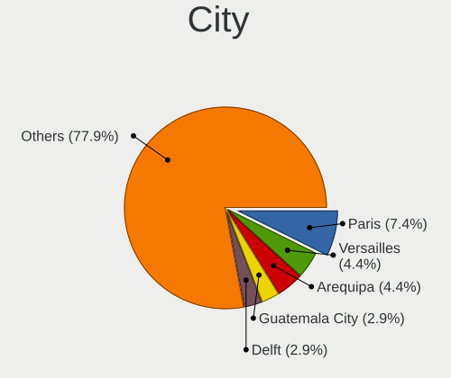

| City                  | Notebooks | Percent |
|-----------------------|-----------|---------|
| Paris                 | 5         | 7.35%   |
| Versailles            | 3         | 4.41%   |
| Arequipa              | 3         | 4.41%   |
| Guatemala City        | 2         | 2.94%   |
| Delft                 | 2         | 2.94%   |
| Bogotá               | 2         | 2.94%   |
| Wiwersheim            | 1         | 1.47%   |
| Warsaw                | 1         | 1.47%   |
| Tver                  | 1         | 1.47%   |
| Tours                 | 1         | 1.47%   |
| Toulouse              | 1         | 1.47%   |
| The Hague             | 1         | 1.47%   |
| Surabaya              | 1         | 1.47%   |
| Strasbourg            | 1         | 1.47%   |
| Sofia                 | 1         | 1.47%   |
| Sao Paulo             | 1         | 1.47%   |
| Sant'Angelo Lodigiano | 1         | 1.47%   |
| San Antonio           | 1         | 1.47%   |
| Saint-Etienne         | 1         | 1.47%   |
| Rosporden             | 1         | 1.47%   |
| Rommerskirchen        | 1         | 1.47%   |
| Rome                  | 1         | 1.47%   |
| Quaregna              | 1         | 1.47%   |
| Poznan                | 1         | 1.47%   |
| Oxford                | 1         | 1.47%   |
| Ottawa                | 1         | 1.47%   |
| Oloron-Sainte-Marie   | 1         | 1.47%   |
| Odenville             | 1         | 1.47%   |
| Nordenham             | 1         | 1.47%   |
| Moscow                | 1         | 1.47%   |
| Miercurea-Ciuc        | 1         | 1.47%   |
| Melbourne             | 1         | 1.47%   |
| Marino                | 1         | 1.47%   |
| March                 | 1         | 1.47%   |
| Luce                  | 1         | 1.47%   |
| León                 | 1         | 1.47%   |
| Le Faouet             | 1         | 1.47%   |
| Kemerovo              | 1         | 1.47%   |
| Iztapalapa            | 1         | 1.47%   |
| Hexham                | 1         | 1.47%   |

Drives
------

Drive Vendor
------------

Hard drive vendors

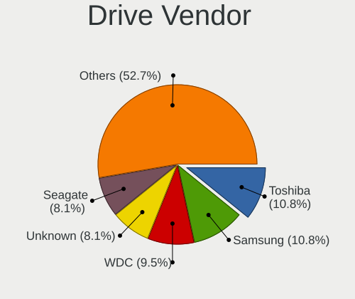

| Vendor                      | Notebooks | Drives | Percent |
|-----------------------------|-----------|--------|---------|
| Toshiba                     | 8         | 10     | 10.81%  |
| Samsung Electronics         | 8         | 11     | 10.81%  |
| WDC                         | 7         | 9      | 9.46%   |
| Unknown                     | 6         | 10     | 8.11%   |
| Seagate                     | 6         | 6      | 8.11%   |
| Kingston                    | 6         | 7      | 8.11%   |
| Hitachi                     | 4         | 4      | 5.41%   |
| SK hynix                    | 3         | 4      | 4.05%   |
| Intel                       | 3         | 4      | 4.05%   |
| Union Memory (Shenzhen)     | 2         | 2      | 2.7%    |
| SPCC                        | 2         | 4      | 2.7%    |
| SanDisk                     | 2         | 2      | 2.7%    |
| Kingston Technology Company | 2         | 2      | 2.7%    |
| Crucial                     | 2         | 2      | 2.7%    |
| SABRENT                     | 1         | 1      | 1.35%   |
| Phison Electronics          | 1         | 1      | 1.35%   |
| Phison                      | 1         | 1      | 1.35%   |
| MAXIO Technology (Hangzhou) | 1         | 1      | 1.35%   |
| LDLC                        | 1         | 1      | 1.35%   |
| KingFast                    | 1         | 2      | 1.35%   |
| JMicron Technology          | 1         | 1      | 1.35%   |
| HUSKY                       | 1         | 1      | 1.35%   |
| HGST                        | 1         | 7      | 1.35%   |
| GOODRAM                     | 1         | 1      | 1.35%   |
| Fujitsu                     | 1         | 1      | 1.35%   |
| China                       | 1         | 1      | 1.35%   |
| A-DATA Technology           | 1         | 1      | 1.35%   |

Drive Model
-----------

Hard drive models

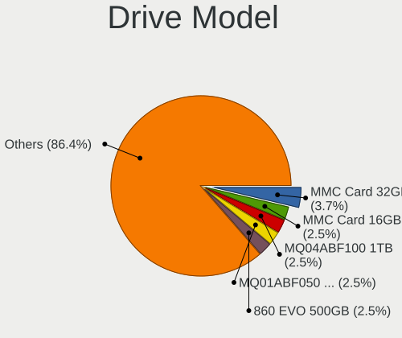

| Model                                             | Notebooks | Percent |
|---------------------------------------------------|-----------|---------|
| Unknown MMC Card  32GB                            | 3         | 3.7%    |
| Unknown MMC Card  16GB                            | 2         | 2.47%   |
| Toshiba MQ04ABF100 1TB                            | 2         | 2.47%   |
| Toshiba MQ01ABF050 500GB                          | 2         | 2.47%   |
| SPCC Solid State Disk 128GB                       | 2         | 2.47%   |
| Samsung SSD 860 EVO 500GB                         | 2         | 2.47%   |
| Kingston SA400S37240G 240GB SSD                   | 2         | 2.47%   |
| Crucial CT120BX500SSD1 120GB                      | 2         | 2.47%   |
| WDC WDS500G2B0C-00PXH0 500GB                      | 1         | 1.23%   |
| WDC WDS500G2B0A-00SM50 500GB                      | 1         | 1.23%   |
| WDC WDS100T2B0A 1TB SSD                           | 1         | 1.23%   |
| WDC WD5000LPSX-00A6WT0 500GB                      | 1         | 1.23%   |
| WDC WD5000LPLX-66ZNTT1 500GB                      | 1         | 1.23%   |
| WDC WD10SPZX-75Z10T2 1TB                          | 1         | 1.23%   |
| WDC WD Green 2.5 480GB                            | 1         | 1.23%   |
| Unknown MMC Card  8GB                             | 1         | 1.23%   |
| Unknown MMC Card  7GB                             | 1         | 1.23%   |
| Unknown MMC Card  3GB                             | 1         | 1.23%   |
| Union Memory (Shenzhen) UMIS RPJYJ1T24MLR1HWY 1TB | 1         | 1.23%   |
| Union Memory (Shenzhen) NVMe SSD Drive 128GB      | 1         | 1.23%   |
| Toshiba THNSFC064GBSJ SSD                         | 1         | 1.23%   |
| Toshiba NVMe SSD Drive 512GB                      | 1         | 1.23%   |
| Toshiba MQ01ABD100 1TB                            | 1         | 1.23%   |
| Toshiba MK8032GSX 80GB                            | 1         | 1.23%   |
| SK hynix SKHynix_HFS256GEJ4X112N 256GB            | 1         | 1.23%   |
| SK hynix SKHynix_HFM512GDHTNI-87A0B 512GB         | 1         | 1.23%   |
| SK hynix PC711 HFS512GDE9X073N 512GB              | 1         | 1.23%   |
| SK hynix NVMe SSD Drive 512GB                     | 1         | 1.23%   |
| Seagate ST96812AS 64GB                            | 1         | 1.23%   |
| Seagate ST9250315AS 250GB                         | 1         | 1.23%   |
| Seagate ST500LT012-1DG142 500GB                   | 1         | 1.23%   |
| Seagate ST320LT020-9YG142 320GB                   | 1         | 1.23%   |
| Seagate ST1000LM049-2GH172 1TB                    | 1         | 1.23%   |
| Seagate ST1000LM024 HN-M101MBB 1TB                | 1         | 1.23%   |
| SanDisk SDSSDH3500G 500GB                         | 1         | 1.23%   |
| SanDisk SD6SN1M-256G-1006 256GB SSD               | 1         | 1.23%   |
| Samsung SSD 970 EVO Plus 1TB                      | 1         | 1.23%   |
| Samsung SSD 870 QVO 1TB                           | 1         | 1.23%   |
| Samsung SSD 850 EVO 500GB                         | 1         | 1.23%   |
| Samsung NVMe SSD Drive 500GB                      | 1         | 1.23%   |

HDD Vendor
----------

Hard disk drive vendors

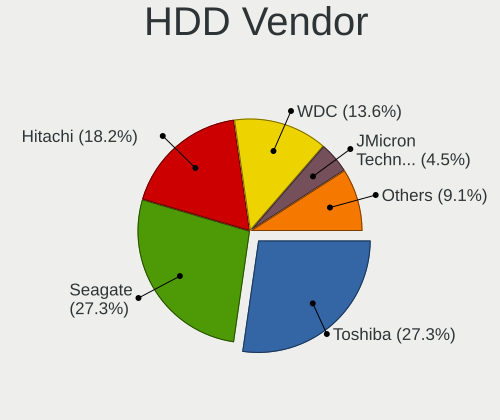

| Vendor             | Notebooks | Drives | Percent |
|--------------------|-----------|--------|---------|
| Toshiba            | 6         | 7      | 27.27%  |
| Seagate            | 6         | 6      | 27.27%  |
| Hitachi            | 4         | 4      | 18.18%  |
| WDC                | 3         | 5      | 13.64%  |
| JMicron Technology | 1         | 1      | 4.55%   |
| HGST               | 1         | 7      | 4.55%   |
| Fujitsu            | 1         | 1      | 4.55%   |

SSD Vendor
----------

Solid state drive vendors

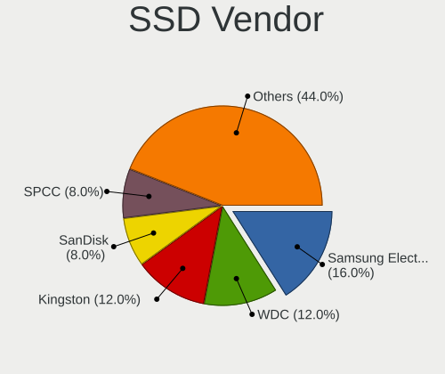

| Vendor              | Notebooks | Drives | Percent |
|---------------------|-----------|--------|---------|
| Samsung Electronics | 4         | 5      | 16%     |
| WDC                 | 3         | 3      | 12%     |
| Kingston            | 3         | 3      | 12%     |
| SPCC                | 2         | 4      | 8%      |
| SanDisk             | 2         | 2      | 8%      |
| Crucial             | 2         | 2      | 8%      |
| Toshiba             | 1         | 2      | 4%      |
| SABRENT             | 1         | 1      | 4%      |
| LDLC                | 1         | 1      | 4%      |
| KingFast            | 1         | 2      | 4%      |
| Intel               | 1         | 1      | 4%      |
| HUSKY               | 1         | 1      | 4%      |
| GOODRAM             | 1         | 1      | 4%      |
| China               | 1         | 1      | 4%      |
| A-DATA Technology   | 1         | 1      | 4%      |

Drive Kind
----------

HDD or SSD

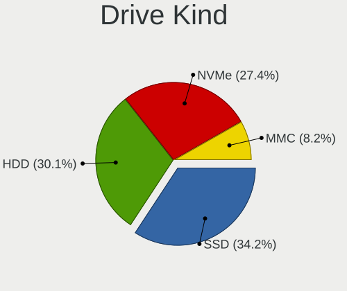

| Kind | Notebooks | Drives | Percent |
|------|-----------|--------|---------|
| SSD  | 25        | 30     | 34.25%  |
| HDD  | 22        | 31     | 30.14%  |
| NVMe | 20        | 26     | 27.4%   |
| MMC  | 6         | 10     | 8.22%   |

Drive Connector
---------------

SATA, SAS, NVMe, etc.

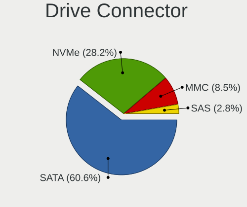

| Type | Notebooks | Drives | Percent |
|------|-----------|--------|---------|
| SATA | 43        | 59     | 60.56%  |
| NVMe | 20        | 26     | 28.17%  |
| MMC  | 6         | 10     | 8.45%   |
| SAS  | 2         | 2      | 2.82%   |

Drive Size
----------

Size of hard drive

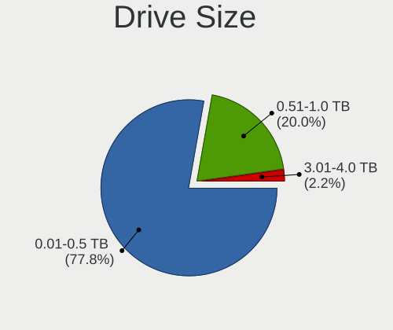

| Size in TB | Notebooks | Drives | Percent |
|------------|-----------|--------|---------|
| 0.01-0.5   | 35        | 42     | 77.78%  |
| 0.51-1.0   | 9         | 18     | 20%     |
| 3.01-4.0   | 1         | 1      | 2.22%   |

Space Total
-----------

Amount of disk space available on the file system

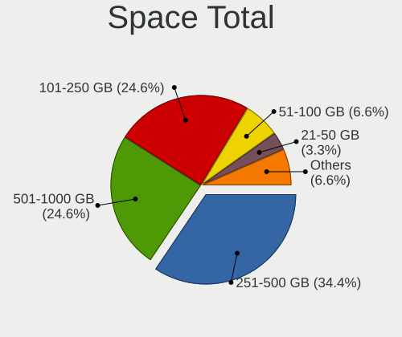

| Size in GB     | Notebooks | Percent |
|----------------|-----------|---------|
| 251-500        | 21        | 34.43%  |
| 101-250        | 15        | 24.59%  |
| 501-1000       | 15        | 24.59%  |
| 51-100         | 4         | 6.56%   |
| 21-50          | 2         | 3.28%   |
| More than 3000 | 1         | 1.64%   |
| 2001-3000      | 1         | 1.64%   |
| 1001-2000      | 1         | 1.64%   |
| Unknown        | 1         | 1.64%   |

Space Used
----------

Amount of used disk space

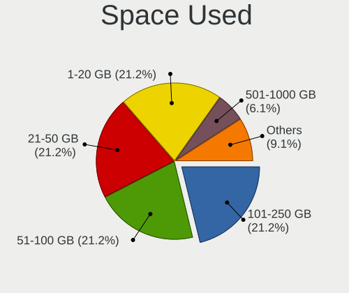

| Used GB        | Notebooks | Percent |
|----------------|-----------|---------|
| 21-50          | 14        | 21.21%  |
| 101-250        | 14        | 21.21%  |
| 1-20           | 14        | 21.21%  |
| 51-100         | 14        | 21.21%  |
| 501-1000       | 4         | 6.06%   |
| 251-500        | 2         | 3.03%   |
| 1001-2000      | 2         | 3.03%   |
| More than 3000 | 1         | 1.52%   |
| Unknown        | 1         | 1.52%   |

Malfunc. Drives
---------------

Drive models with a malfunction

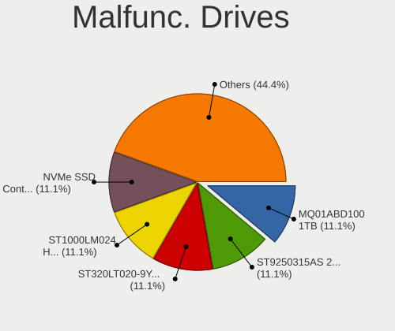

| Model                                                          | Notebooks | Drives | Percent |
|----------------------------------------------------------------|-----------|--------|---------|
| Toshiba MQ01ABD100 1TB                                         | 1         | 1      | 11.11%  |
| Seagate ST9250315AS 250GB                                      | 1         | 1      | 11.11%  |
| Seagate ST320LT020-9YG142 320GB                                | 1         | 1      | 11.11%  |
| Seagate ST1000LM024 HN-M101MBB 1TB                             | 1         | 1      | 11.11%  |
| Samsung Electronics NVMe SSD Controller PM9A1/PM9A3/980PRO 1TB | 1         | 1      | 11.11%  |
| Kingston SA400S37240G 240GB SSD                                | 1         | 1      | 11.11%  |
| Hitachi HTS725050A9A364 500GB                                  | 1         | 1      | 11.11%  |
| Hitachi HTS542525K9A300 250GB                                  | 1         | 1      | 11.11%  |
| Fujitsu MHZ2160BH G2 160GB                                     | 1         | 1      | 11.11%  |

Malfunc. Drive Vendor
---------------------

Vendors of faulty drives

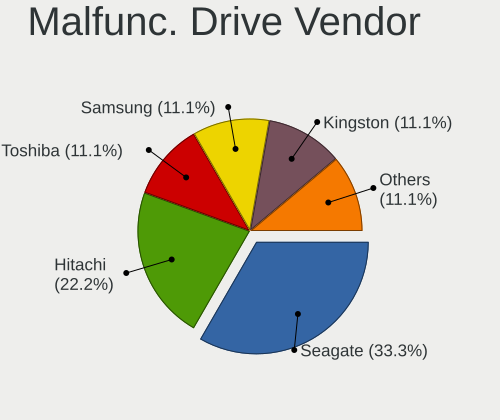

| Vendor              | Notebooks | Drives | Percent |
|---------------------|-----------|--------|---------|
| Seagate             | 3         | 3      | 33.33%  |
| Hitachi             | 2         | 2      | 22.22%  |
| Toshiba             | 1         | 1      | 11.11%  |
| Samsung Electronics | 1         | 1      | 11.11%  |
| Kingston            | 1         | 1      | 11.11%  |
| Fujitsu             | 1         | 1      | 11.11%  |

Malfunc. HDD Vendor
-------------------

Vendors of faulty HDD drives

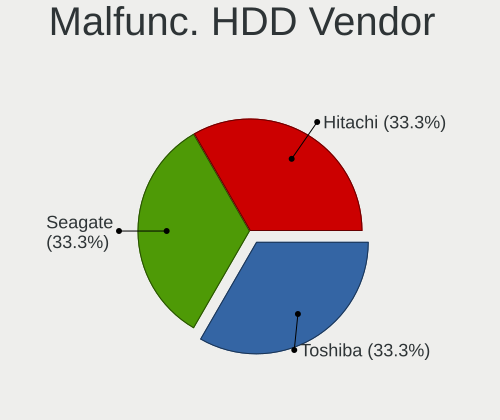

| Vendor  | Notebooks | Drives | Percent |
|---------|-----------|--------|---------|
| Seagate | 3         | 3      | 42.86%  |
| Hitachi | 2         | 2      | 28.57%  |
| Toshiba | 1         | 1      | 14.29%  |
| Fujitsu | 1         | 1      | 14.29%  |

Malfunc. Drive Kind
-------------------

Kinds of faulty drives

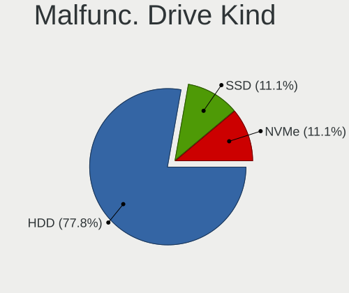

| Kind | Notebooks | Drives | Percent |
|------|-----------|--------|---------|
| HDD  | 7         | 7      | 77.78%  |
| NVMe | 1         | 1      | 11.11%  |
| SSD  | 1         | 1      | 11.11%  |

Failed Drives
-------------

Failed drive models

Zero info for selected period =(

Failed Drive Vendor
-------------------

Failed drive vendors

Zero info for selected period =(

Drive Status
------------

Number of failed and malfunc. drives

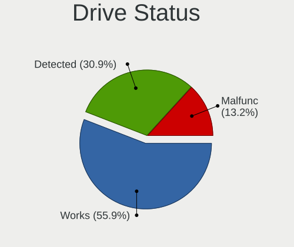

| Status   | Notebooks | Drives | Percent |
|----------|-----------|--------|---------|
| Works    | 38        | 48     | 55.88%  |
| Detected | 21        | 40     | 30.88%  |
| Malfunc  | 9         | 9      | 13.24%  |

Storage controller
------------------

Storage Vendor
--------------

Storage controller vendors

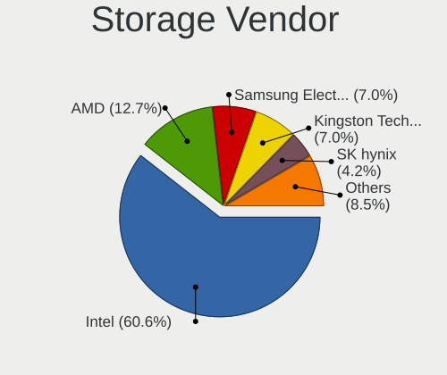

| Vendor                                  | Notebooks | Percent |
|-----------------------------------------|-----------|---------|
| Intel                                   | 43        | 60.56%  |
| AMD                                     | 9         | 12.68%  |
| Samsung Electronics                     | 5         | 7.04%   |
| Kingston Technology Company             | 5         | 7.04%   |
| SK hynix                                | 3         | 4.23%   |
| Phison Electronics                      | 2         | 2.82%   |
| Toshiba America Info Systems            | 1         | 1.41%   |
| Shenzhen Unionmemory Information System | 1         | 1.41%   |
| SanDisk                                 | 1         | 1.41%   |
| MAXIO Technology (Hangzhou)             | 1         | 1.41%   |

Storage Model
-------------

Storage controller models

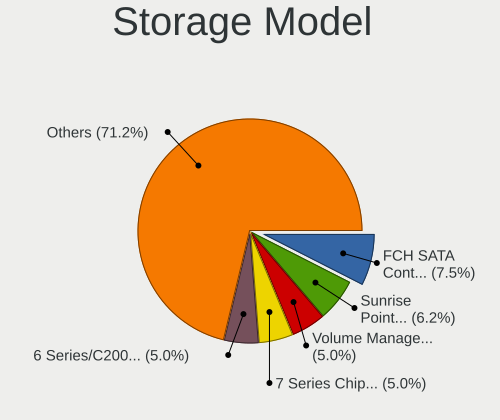

| Model                                                                                         | Notebooks | Percent |
|-----------------------------------------------------------------------------------------------|-----------|---------|
| AMD FCH SATA Controller [AHCI mode]                                                           | 6         | 7.5%    |
| Intel Sunrise Point-LP SATA Controller [AHCI mode]                                            | 5         | 6.25%   |
| Intel Volume Management Device NVMe RAID Controller                                           | 4         | 5%      |
| Intel 7 Series Chipset Family 6-port SATA Controller [AHCI mode]                              | 4         | 5%      |
| Intel 6 Series/C200 Series Chipset Family 6 port Mobile SATA AHCI Controller                  | 4         | 5%      |
| Samsung NVMe SSD Controller 980 (DRAM-less)                                                   | 3         | 3.75%   |
| Intel 8 Series/C220 Series Chipset Family 6-port SATA Controller 1 [AHCI mode]                | 3         | 3.75%   |
| Intel 8 Series SATA Controller 1 [AHCI mode]                                                  | 3         | 3.75%   |
| Intel 5 Series/3400 Series Chipset 4 port SATA AHCI Controller                                | 3         | 3.75%   |
| Phison E12 NVMe Controller                                                                    | 2         | 2.5%    |
| Intel 82801 Mobile SATA Controller [RAID mode]                                                | 2         | 2.5%    |
| Intel 400 Series Chipset Family SATA AHCI Controller                                          | 2         | 2.5%    |
| AMD SB600 Non-Raid-5 SATA                                                                     | 2         | 2.5%    |
| AMD SB600 IDE                                                                                 | 2         | 2.5%    |
| Toshiba America Info Systems XG6 NVMe SSD Controller                                          | 1         | 1.25%   |
| SK hynix Gold P31/BC711/PC711 NVMe Solid State Drive                                          | 1         | 1.25%   |
| SK hynix BC901 NVMe Solid State Drive (DRAM-less)                                             | 1         | 1.25%   |
| SK hynix BC511 NVMe SSD                                                                       | 1         | 1.25%   |
| Shenzhen Unionmemory Information System RPJYJ1T24MLR1HWY PCIe 4.0 NVMe SSD 1024GB (DRAM-less) | 1         | 1.25%   |
| SanDisk Ultra 3D / WD PC SN530, IX SN530, Blue SN550 NVMe SSD (DRAM-less)                     | 1         | 1.25%   |
| Samsung NVMe SSD Controller SM981/PM981/PM983                                                 | 1         | 1.25%   |
| Samsung NVMe SSD Controller PM9A1/PM9A3/980PRO                                                | 1         | 1.25%   |
| MAXIO (Hangzhou) NVMe SSD Controller MAP1602 (DRAM-less)                                      | 1         | 1.25%   |
| Kingston Company OM8PCP Design-In PCIe 3 NVMe SSD (DRAM-less)                                 | 1         | 1.25%   |
| Kingston Company OM3PDP3 NVMe SSD                                                             | 1         | 1.25%   |
| Kingston Company NV2 NVMe SSD [SM2267XT] (DRAM-less)                                          | 1         | 1.25%   |
| Kingston Company NV1 NVMe SSD [SM2263XT] (DRAM-less)                                          | 1         | 1.25%   |
| Kingston Company A2000 NVMe SSD [SM2263EN]                                                    | 1         | 1.25%   |
| Intel Tiger Lake-LP SATA Controller                                                           | 1         | 1.25%   |
| Intel Tiger Lake SATA AHCI Controller                                                         | 1         | 1.25%   |
| Intel SSD 670p Series [Keystone Harbor]                                                       | 1         | 1.25%   |
| Intel Q170/Q150/B150/H170/H110/Z170/CM236 Chipset SATA Controller [AHCI Mode]                 | 1         | 1.25%   |
| Intel Optane NVME SSD H10 with Solid State Storage [Teton Glacier]                            | 1         | 1.25%   |
| Intel Ice Lake-LP SATA Controller [AHCI mode]                                                 | 1         | 1.25%   |
| Intel Comet Lake SATA AHCI Controller                                                         | 1         | 1.25%   |
| Intel Celeron/Pentium Silver Processor SATA Controller                                        | 1         | 1.25%   |
| Intel Cannon Lake Mobile PCH SATA AHCI Controller                                             | 1         | 1.25%   |
| Intel Atom Processor E3800 Series SATA AHCI Controller                                        | 1         | 1.25%   |
| Intel Alder Lake-P SATA AHCI Controller                                                       | 1         | 1.25%   |
| Intel 82801IBM/IEM (ICH9M/ICH9M-E) 4 port SATA Controller [AHCI mode]                         | 1         | 1.25%   |

Storage Kind
------------

Kind of storage controller (IDE, SATA, NVMe, SAS, ...)

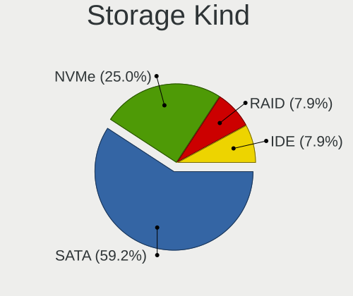

| Kind | Notebooks | Percent |
|------|-----------|---------|
| SATA | 45        | 59.21%  |
| NVMe | 19        | 25%     |
| RAID | 6         | 7.89%   |
| IDE  | 6         | 7.89%   |

Processor
---------

CPU Vendor
----------

Processor vendors

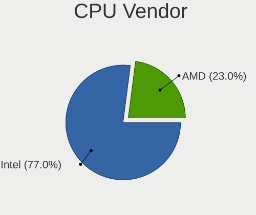

| Vendor | Notebooks | Percent |
|--------|-----------|---------|
| Intel  | 47        | 77.05%  |
| AMD    | 14        | 22.95%  |

CPU Model
---------

Processor models

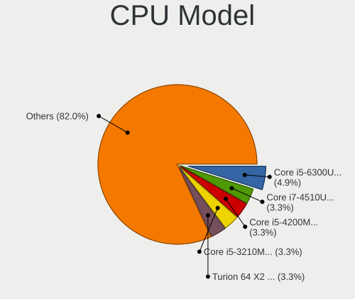

| Model                                    | Notebooks | Percent |
|------------------------------------------|-----------|---------|
| Intel Core i5-6300U CPU @ 2.40GHz        | 3         | 4.92%   |
| Intel Core i7-4510U CPU @ 2.00GHz        | 2         | 3.28%   |
| Intel Core i5-4200M CPU @ 2.50GHz        | 2         | 3.28%   |
| Intel Core i5-3210M CPU @ 2.50GHz        | 2         | 3.28%   |
| AMD Turion 64 X2 Mobile Technology TL-60 | 2         | 3.28%   |
| Intel Pentium Silver N5000 CPU @ 1.10GHz | 1         | 1.64%   |
| Intel Pentium M processor 1.73GHz        | 1         | 1.64%   |
| Intel Pentium CPU P6200 @ 2.13GHz        | 1         | 1.64%   |
| Intel Pentium CPU P6100 @ 2.00GHz        | 1         | 1.64%   |
| Intel Core m5-6Y57 CPU @ 1.10GHz         | 1         | 1.64%   |
| Intel Core i7-8850H CPU @ 2.60GHz        | 1         | 1.64%   |
| Intel Core i7-8565U CPU @ 1.80GHz        | 1         | 1.64%   |
| Intel Core i7-7600U CPU @ 2.80GHz        | 1         | 1.64%   |
| Intel Core i7-7500U CPU @ 2.70GHz        | 1         | 1.64%   |
| Intel Core i7-4702MQ CPU @ 2.20GHz       | 1         | 1.64%   |
| Intel Core i7-3630QM CPU @ 2.40GHz       | 1         | 1.64%   |
| Intel Core i7-3520M CPU @ 2.90GHz        | 1         | 1.64%   |
| Intel Core i7-10870H CPU @ 2.20GHz       | 1         | 1.64%   |
| Intel Core i7-10750H CPU @ 2.60GHz       | 1         | 1.64%   |
| Intel Core i7-10510U CPU @ 1.80GHz       | 1         | 1.64%   |
| Intel Core i5-6440HQ CPU @ 2.60GHz       | 1         | 1.64%   |
| Intel Core i5-4200U CPU @ 1.60GHz        | 1         | 1.64%   |
| Intel Core i5-3320M CPU @ 2.60GHz        | 1         | 1.64%   |
| Intel Core i5-2520M CPU @ 2.50GHz        | 1         | 1.64%   |
| Intel Core i5-2410M CPU @ 2.30GHz        | 1         | 1.64%   |
| Intel Core i5-1035G1 CPU @ 1.00GHz       | 1         | 1.64%   |
| Intel Core i5 CPU M 450 @ 2.40GHz        | 1         | 1.64%   |
| Intel Core i3-7020U CPU @ 2.30GHz        | 1         | 1.64%   |
| Intel Core i3-2350M CPU @ 2.30GHz        | 1         | 1.64%   |
| Intel Core i3-2330M CPU @ 2.20GHz        | 1         | 1.64%   |
| Intel Core i3 CPU U 380 @ 1.33GHz        | 1         | 1.64%   |
| Intel Core 2 Duo CPU T7100 @ 1.80GHz     | 1         | 1.64%   |
| Intel Core 2 Duo CPU T6600 @ 2.20GHz     | 1         | 1.64%   |
| Intel Core 2 Duo CPU P7350 @ 2.00GHz     | 1         | 1.64%   |
| Intel Celeron CPU N2820 @ 2.13GHz        | 1         | 1.64%   |
| Intel Atom x5-Z8350 CPU @ 1.44GHz        | 1         | 1.64%   |
| Intel Atom CPU Z3745 @ 1.33GHz           | 1         | 1.64%   |
| Intel Atom CPU Z3735G @ 1.33GHz          | 1         | 1.64%   |
| Intel 12th Gen Core i5-12450H            | 1         | 1.64%   |
| Intel 12th Gen Core i5-1235U             | 1         | 1.64%   |

CPU Model Family
----------------

Processor model prefix

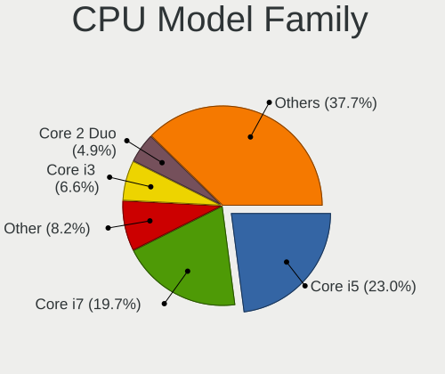

| Model                   | Notebooks | Percent |
|-------------------------|-----------|---------|
| Intel Core i5           | 14        | 22.95%  |
| Intel Core i7           | 12        | 19.67%  |
| Other                   | 5         | 8.2%    |
| Intel Core i3           | 4         | 6.56%   |
| Intel Core 2 Duo        | 3         | 4.92%   |
| Intel Atom              | 3         | 4.92%   |
| AMD Ryzen 7             | 3         | 4.92%   |
| AMD Ryzen 5             | 3         | 4.92%   |
| Intel Pentium           | 2         | 3.28%   |
| AMD Turion 64 X2 Mobile | 2         | 3.28%   |
| AMD Ryzen 3             | 2         | 3.28%   |
| Intel Pentium Silver    | 1         | 1.64%   |
| Intel Pentium M         | 1         | 1.64%   |
| Intel Core m5           | 1         | 1.64%   |
| Intel Celeron           | 1         | 1.64%   |
| AMD Phenom II           | 1         | 1.64%   |
| AMD E                   | 1         | 1.64%   |
| AMD A6                  | 1         | 1.64%   |
| AMD A10                 | 1         | 1.64%   |

CPU Cores
---------

Number of processor cores

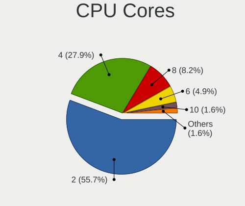

| Number | Notebooks | Percent |
|--------|-----------|---------|
| 2      | 34        | 55.74%  |
| 4      | 17        | 27.87%  |
| 8      | 5         | 8.2%    |
| 6      | 3         | 4.92%   |
| 10     | 1         | 1.64%   |
| 1      | 1         | 1.64%   |

CPU Sockets
-----------

Number of sockets

| Number | Notebooks | Percent |
|--------|-----------|---------|
| 1      | 61        | 100%    |

CPU Threads
-----------

Threads per core (Hyper-Threading)

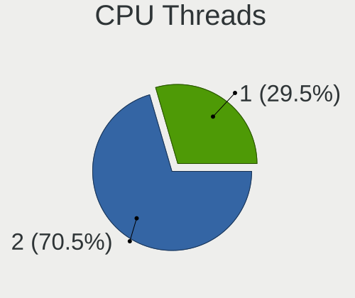

| Number | Notebooks | Percent |
|--------|-----------|---------|
| 2      | 43        | 70.49%  |
| 1      | 18        | 29.51%  |

CPU Op-Modes
------------

CPU Operation Modes (32-bit, 64-bit)

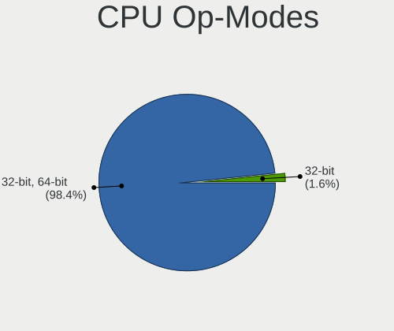

| Op mode        | Notebooks | Percent |
|----------------|-----------|---------|
| 32-bit, 64-bit | 60        | 98.36%  |
| 32-bit         | 1         | 1.64%   |

CPU Microcode
-------------

Microcode number

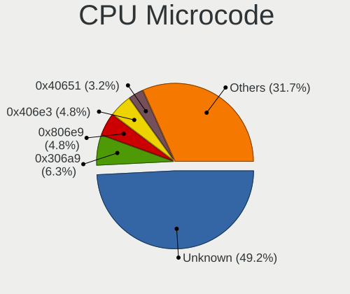

| Number     | Notebooks | Percent |
|------------|-----------|---------|
| Unknown    | 31        | 49.21%  |
| 0x306a9    | 4         | 6.35%   |
| 0x806e9    | 3         | 4.76%   |
| 0x406e3    | 3         | 4.76%   |
| 0x40651    | 2         | 3.17%   |
| 0x306c3    | 2         | 3.17%   |
| 0x206a7    | 2         | 3.17%   |
| 0x08108109 | 2         | 3.17%   |
| 0xa0652    | 1         | 1.59%   |
| 0x906ea    | 1         | 1.59%   |
| 0x806ec    | 1         | 1.59%   |
| 0x806eb    | 1         | 1.59%   |
| 0x706a1    | 1         | 1.59%   |
| 0x506e3    | 1         | 1.59%   |
| 0x406c4    | 1         | 1.59%   |
| 0x20655    | 1         | 1.59%   |
| 0x0a50000f | 1         | 1.59%   |
| 0x0a50000d | 1         | 1.59%   |
| 0x08a00008 | 1         | 1.59%   |
| 0x08600106 | 1         | 1.59%   |
| 0x05000119 | 1         | 1.59%   |
| 0x010000c8 | 1         | 1.59%   |

CPU Microarch
-------------

Microarchitecture

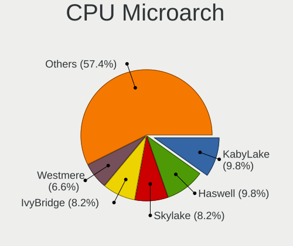

| Name             | Notebooks | Percent |
|------------------|-----------|---------|
| KabyLake         | 6         | 9.84%   |
| Haswell          | 6         | 9.84%   |
| Skylake          | 5         | 8.2%    |
| IvyBridge        | 5         | 8.2%    |
| Westmere         | 4         | 6.56%   |
| Silvermont       | 4         | 6.56%   |
| SandyBridge      | 4         | 6.56%   |
| Zen+             | 3         | 4.92%   |
| Unknown          | 3         | 4.92%   |
| Zen 3            | 2         | 3.28%   |
| TigerLake        | 2         | 3.28%   |
| Penryn           | 2         | 3.28%   |
| K8 Hammer        | 2         | 3.28%   |
| Excavator        | 2         | 3.28%   |
| CometLake        | 2         | 3.28%   |
| Alderlake Hybrid | 2         | 3.28%   |
| Zen 2            | 1         | 1.64%   |
| P6               | 1         | 1.64%   |
| K10              | 1         | 1.64%   |
| IceLake          | 1         | 1.64%   |
| Goldmont plus    | 1         | 1.64%   |
| Core             | 1         | 1.64%   |
| Bobcat           | 1         | 1.64%   |

Graphics
--------

GPU Vendor
----------

Vendors of graphics cards

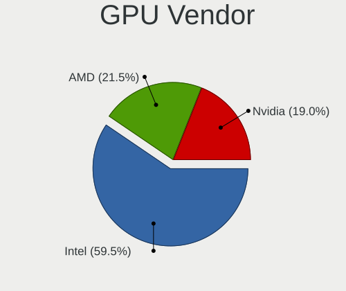

| Vendor | Notebooks | Percent |
|--------|-----------|---------|
| Intel  | 47        | 59.49%  |
| AMD    | 17        | 21.52%  |
| Nvidia | 15        | 18.99%  |

GPU Model
---------

Graphics card models

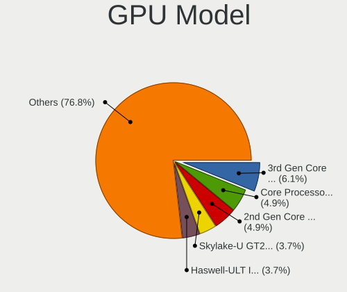

| Model                                                                                    | Notebooks | Percent |
|------------------------------------------------------------------------------------------|-----------|---------|
| Intel 3rd Gen Core processor Graphics Controller                                         | 5         | 6.1%    |
| Intel Core Processor Integrated Graphics Controller                                      | 4         | 4.88%   |
| Intel 2nd Generation Core Processor Family Integrated Graphics Controller                | 4         | 4.88%   |
| Intel Skylake-U GT2 [HD Graphics 520]                                                    | 3         | 3.66%   |
| Intel Haswell-ULT Integrated Graphics Controller                                         | 3         | 3.66%   |
| Intel Atom Processor Z36xxx/Z37xxx Series Graphics & Display                             | 3         | 3.66%   |
| Intel 4th Gen Core Processor Integrated Graphics Controller                              | 3         | 3.66%   |
| AMD Picasso/Raven 2 [Radeon Vega Series / Radeon Vega Mobile Series]                     | 3         | 3.66%   |
| Nvidia GM108M [GeForce 840M]                                                             | 2         | 2.44%   |
| Intel TigerLake-LP GT2 [Iris Xe Graphics]                                                | 2         | 2.44%   |
| Intel Mobile 4 Series Chipset Integrated Graphics Controller                             | 2         | 2.44%   |
| Intel Kaby Lake-U GT2 [HD Graphics 620]                                                  | 2         | 2.44%   |
| Intel CometLake-H GT2 [UHD Graphics]                                                     | 2         | 2.44%   |
| AMD RS690M [Radeon Xpress 1200/1250/1270]                                                | 2         | 2.44%   |
| Nvidia TU117M [GeForce MX550]                                                            | 1         | 1.22%   |
| Nvidia TU106M [GeForce RTX 2060 Mobile]                                                  | 1         | 1.22%   |
| Nvidia GP108M [GeForce MX150]                                                            | 1         | 1.22%   |
| Nvidia GP107M [GeForce GTX 1050 3 GB Max-Q]                                              | 1         | 1.22%   |
| Nvidia GP107GLM [Quadro P1000 Mobile]                                                    | 1         | 1.22%   |
| Nvidia GM108M [GeForce 930MX]                                                            | 1         | 1.22%   |
| Nvidia GK107GLM [Quadro K1000M]                                                          | 1         | 1.22%   |
| Nvidia GK106M [GeForce GTX 760M]                                                         | 1         | 1.22%   |
| Nvidia GF119M [GeForce 610M]                                                             | 1         | 1.22%   |
| Nvidia GF108GLM [NVS 5200M]                                                              | 1         | 1.22%   |
| Nvidia GA107M [GeForce RTX 3050 Ti Mobile]                                               | 1         | 1.22%   |
| Nvidia GA107M [GeForce RTX 3050 Mobile]                                                  | 1         | 1.22%   |
| Nvidia GA104M [GeForce RTX 3070 Mobile / Max-Q]                                          | 1         | 1.22%   |
| Intel WhiskeyLake-U GT2 [UHD Graphics 620]                                               | 1         | 1.22%   |
| Intel TigerLake-H GT1 [UHD Graphics]                                                     | 1         | 1.22%   |
| Intel Skylake-Y GT2 [HD Graphics 515]                                                    | 1         | 1.22%   |
| Intel Skylake-H GT2 [HD Graphics 530]                                                    | 1         | 1.22%   |
| Intel Mobile GM965/GL960 Integrated Graphics Controller (secondary)                      | 1         | 1.22%   |
| Intel Mobile GM965/GL960 Integrated Graphics Controller (primary)                        | 1         | 1.22%   |
| Intel Mobile 915GM/GMS/910GML Express Graphics Controller                                | 1         | 1.22%   |
| Intel Iris Plus Graphics G1 (Ice Lake)                                                   | 1         | 1.22%   |
| Intel HD Graphics 620                                                                    | 1         | 1.22%   |
| Intel GeminiLake [UHD Graphics 605]                                                      | 1         | 1.22%   |
| Intel CometLake-U GT2 [UHD Graphics]                                                     | 1         | 1.22%   |
| Intel CoffeeLake-H GT2 [UHD Graphics 630]                                                | 1         | 1.22%   |
| Intel Atom/Celeron/Pentium Processor x5-E8000/J3xxx/N3xxx Integrated Graphics Controller | 1         | 1.22%   |

GPU Combo
---------

Combinations of graphics cards

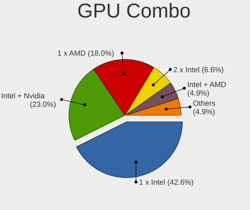

| Name           | Notebooks | Percent |
|----------------|-----------|---------|
| 1 x Intel      | 26        | 42.62%  |
| Intel + Nvidia | 14        | 22.95%  |
| 1 x AMD        | 11        | 18.03%  |
| 2 x Intel      | 4         | 6.56%   |
| Intel + AMD    | 3         | 4.92%   |
| 2 x AMD        | 2         | 3.28%   |
| AMD + Nvidia   | 1         | 1.64%   |

GPU Driver
----------

Free vs proprietary

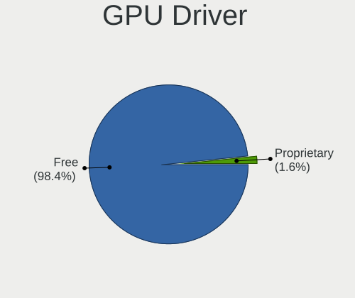

| Driver      | Notebooks | Percent |
|-------------|-----------|---------|
| Free        | 61        | 98.39%  |
| Proprietary | 1         | 1.61%   |

GPU Memory
----------

Total video memory

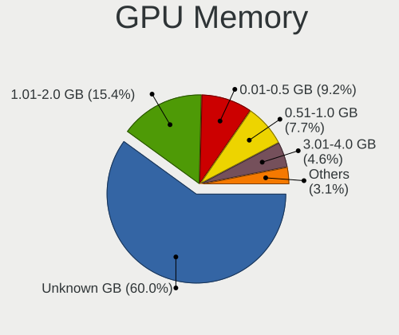

| Size in GB | Notebooks | Percent |
|------------|-----------|---------|
| Unknown    | 39        | 60%     |
| 1.01-2.0   | 10        | 15.38%  |
| 0.01-0.5   | 6         | 9.23%   |
| 0.51-1.0   | 5         | 7.69%   |
| 3.01-4.0   | 3         | 4.62%   |
| 5.01-6.0   | 1         | 1.54%   |
| 2.01-3.0   | 1         | 1.54%   |

Monitor
-------

Monitor Vendor
--------------

Monitor vendors

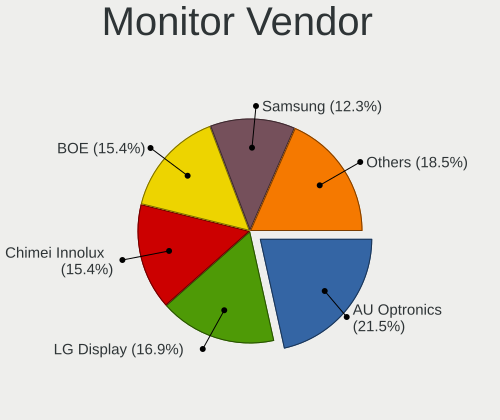

| Vendor                  | Notebooks | Percent |
|-------------------------|-----------|---------|
| AU Optronics            | 14        | 21.54%  |
| LG Display              | 11        | 16.92%  |
| Chimei Innolux          | 10        | 15.38%  |
| BOE                     | 10        | 15.38%  |
| Samsung Electronics     | 8         | 12.31%  |
| Chi Mei Optoelectronics | 3         | 4.62%   |
| Sharp                   | 2         | 3.08%   |
| Lenovo                  | 2         | 3.08%   |
| Eizo                    | 2         | 3.08%   |
| HannStar                | 1         | 1.54%   |
| Ancor Communications    | 1         | 1.54%   |
| Acer                    | 1         | 1.54%   |

Monitor Model
-------------

Monitor models

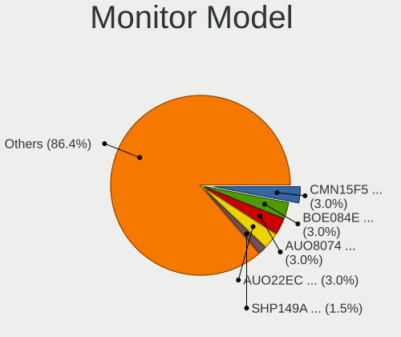

| Model                                                                     | Notebooks | Percent |
|---------------------------------------------------------------------------|-----------|---------|
| Chimei Innolux LCD Monitor CMN15F5 1920x1080 344x193mm 15.5-inch          | 2         | 3.03%   |
| BOE LCD Monitor BOE084E 1920x1080 382x215mm 17.3-inch                     | 2         | 3.03%   |
| AU Optronics LCD Monitor AUO8074 1280x800 331x207mm 15.4-inch             | 2         | 3.03%   |
| AU Optronics LCD Monitor AUO22EC 1366x768 344x193mm 15.5-inch             | 2         | 3.03%   |
| Sharp LCD Monitor SHP149A 1920x1080 344x194mm 15.5-inch                   | 1         | 1.52%   |
| Sharp LCD Monitor SHP1461 3200x1800 294x165mm 13.3-inch                   | 1         | 1.52%   |
| Samsung Electronics SMB2240W SAM0699 1680x1050 459x296mm 21.5-inch        | 1         | 1.52%   |
| Samsung Electronics SMB2240W SAM0698 1680x1050 474x296mm 22.0-inch        | 1         | 1.52%   |
| Samsung Electronics S24F350 SAM0D20 1920x1080 521x293mm 23.5-inch         | 1         | 1.52%   |
| Samsung Electronics LCD Monitor SEC544B 1600x900 382x214mm 17.2-inch      | 1         | 1.52%   |
| Samsung Electronics LCD Monitor SEC4742 1366x768 223x125mm 10.1-inch      | 1         | 1.52%   |
| Samsung Electronics LCD Monitor SEC3155 1920x1200 367x230mm 17.1-inch     | 1         | 1.52%   |
| Samsung Electronics LCD Monitor SEC314F 1600x900 382x215mm 17.3-inch      | 1         | 1.52%   |
| Samsung Electronics LCD Monitor SDC4852 1366x768 344x194mm 15.5-inch      | 1         | 1.52%   |
| Samsung Electronics LCD Monitor SAM0900 1366x768 580x320mm 26.1-inch      | 1         | 1.52%   |
| LG Display LCD Monitor LGD066A 1920x1080 344x194mm 15.5-inch              | 1         | 1.52%   |
| LG Display LCD Monitor LGD0615 1920x1080 382x215mm 17.3-inch              | 1         | 1.52%   |
| LG Display LCD Monitor LGD04B1 1366x768 310x174mm 14.0-inch               | 1         | 1.52%   |
| LG Display LCD Monitor LGD049B 1920x1080 344x194mm 15.5-inch              | 1         | 1.52%   |
| LG Display LCD Monitor LGD0457 1920x1080 345x194mm 15.6-inch              | 1         | 1.52%   |
| LG Display LCD Monitor LGD03EF 1366x768 223x125mm 10.1-inch               | 1         | 1.52%   |
| LG Display LCD Monitor LGD033C 1366x768 309x174mm 14.0-inch               | 1         | 1.52%   |
| LG Display LCD Monitor LGD0335 1366x768 310x174mm 14.0-inch               | 1         | 1.52%   |
| LG Display LCD Monitor LGD02E9 1366x768 309x174mm 14.0-inch               | 1         | 1.52%   |
| LG Display LCD Monitor LGD0289 1600x900 382x215mm 17.3-inch               | 1         | 1.52%   |
| LG Display LCD Monitor LGD0215 1920x1080 345x194mm 15.6-inch              | 1         | 1.52%   |
| Lenovo LCD Monitor LEN8AAF 3072x1920 312x195mm 14.5-inch                  | 1         | 1.52%   |
| Lenovo LCD Monitor LEN40B1 1600x900 345x194mm 15.6-inch                   | 1         | 1.52%   |
| HannStar HSD140PHW1 HSD0583 1366x768 309x174mm 14.0-inch                  | 1         | 1.52%   |
| Eizo EV2455 ENC2534 1920x1080 519x324mm 24.1-inch                         | 1         | 1.52%   |
| Eizo CS270 ENC2694 1920x1080 597x336mm 27.0-inch                          | 1         | 1.52%   |
| Chimei Innolux LCD Monitor CMN1745 1600x900 382x214mm 17.2-inch           | 1         | 1.52%   |
| Chimei Innolux LCD Monitor CMN1735 1920x1080 381x214mm 17.2-inch          | 1         | 1.52%   |
| Chimei Innolux LCD Monitor CMN15E6 1366x768 344x193mm 15.5-inch           | 1         | 1.52%   |
| Chimei Innolux LCD Monitor CMN15C6 1366x768 344x193mm 15.5-inch           | 1         | 1.52%   |
| Chimei Innolux LCD Monitor CMN15C2 1920x1080 344x194mm 15.5-inch          | 1         | 1.52%   |
| Chimei Innolux LCD Monitor CMN14D7 1920x1080 309x173mm 13.9-inch          | 1         | 1.52%   |
| Chimei Innolux LCD Monitor CMN1364 1366x768 293x164mm 13.2-inch           | 1         | 1.52%   |
| Chimei Innolux LCD Monitor CMN1357 1920x1080 293x165mm 13.2-inch          | 1         | 1.52%   |
| Chi Mei Optoelectronics LCD Monitor CMO1720 1920x1080 382x215mm 17.3-inch | 1         | 1.52%   |

Monitor Resolution
------------------

Monitor screen resolution

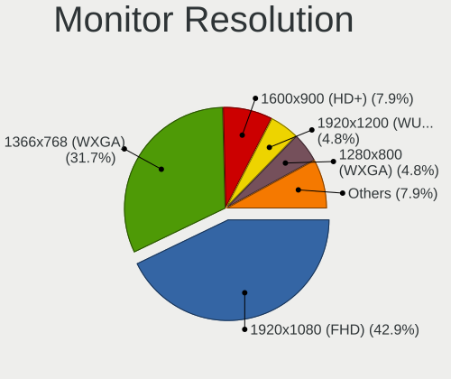

| Resolution         | Notebooks | Percent |
|--------------------|-----------|---------|
| 1920x1080 (FHD)    | 27        | 42.86%  |
| 1366x768 (WXGA)    | 20        | 31.75%  |
| 1600x900 (HD+)     | 5         | 7.94%   |
| 1920x1200 (WUXGA)  | 3         | 4.76%   |
| 1280x800 (WXGA)    | 3         | 4.76%   |
| 3840x2160 (4K)     | 1         | 1.59%   |
| 3200x1800 (QHD+)   | 1         | 1.59%   |
| 3072x1920          | 1         | 1.59%   |
| 2560x1440 (QHD)    | 1         | 1.59%   |
| 1680x1050 (WSXGA+) | 1         | 1.59%   |

Monitor Diagonal
----------------

Diagonal size in inches

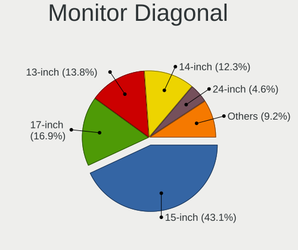

| Inches | Notebooks | Percent |
|--------|-----------|---------|
| 15     | 28        | 43.08%  |
| 17     | 11        | 16.92%  |
| 13     | 9         | 13.85%  |
| 14     | 8         | 12.31%  |
| 24     | 3         | 4.62%   |
| 31     | 1         | 1.54%   |
| 27     | 1         | 1.54%   |
| 23     | 1         | 1.54%   |
| 22     | 1         | 1.54%   |
| 16     | 1         | 1.54%   |
| 10     | 1         | 1.54%   |

Monitor Width
-------------

Physical width

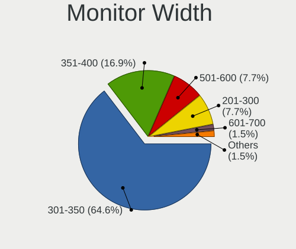

| Width in mm | Notebooks | Percent |
|-------------|-----------|---------|
| 301-350     | 42        | 64.62%  |
| 351-400     | 11        | 16.92%  |
| 501-600     | 5         | 7.69%   |
| 201-300     | 5         | 7.69%   |
| 601-700     | 1         | 1.54%   |
| 401-500     | 1         | 1.54%   |

Aspect Ratio
------------

Proportional relationship between the width and the height

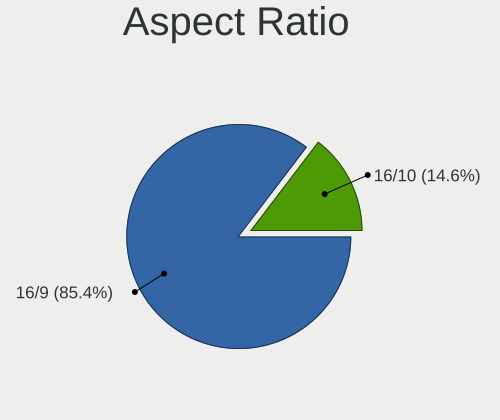

| Ratio | Notebooks | Percent |
|-------|-----------|---------|
| 16/9  | 51        | 85%     |
| 16/10 | 9         | 15%     |

Monitor Area
------------

Area in inch²

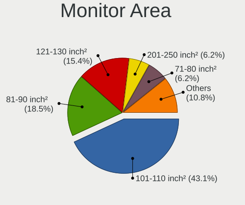

| Area in inch² | Notebooks | Percent |
|----------------|-----------|---------|
| 101-110        | 28        | 43.08%  |
| 81-90          | 12        | 18.46%  |
| 121-130        | 10        | 15.38%  |
| 71-80          | 4         | 6.15%   |
| 201-250        | 4         | 6.15%   |
| 351-500        | 1         | 1.54%   |
| 41-50          | 1         | 1.54%   |
| 301-350        | 1         | 1.54%   |
| 251-300        | 1         | 1.54%   |
| 131-140        | 1         | 1.54%   |
| 111-120        | 1         | 1.54%   |
| 91-100         | 1         | 1.54%   |

Pixel Density
-------------

Pixels per inch

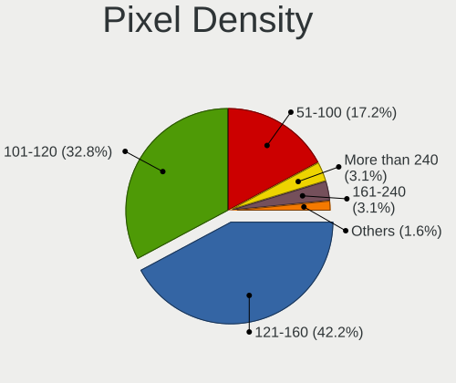

| Density       | Notebooks | Percent |
|---------------|-----------|---------|
| 121-160       | 27        | 42.19%  |
| 101-120       | 21        | 32.81%  |
| 51-100        | 11        | 17.19%  |
| More than 240 | 2         | 3.13%   |
| 161-240       | 2         | 3.13%   |
| 1-50          | 1         | 1.56%   |

Multiple Monitors
-----------------

Total monitors connected

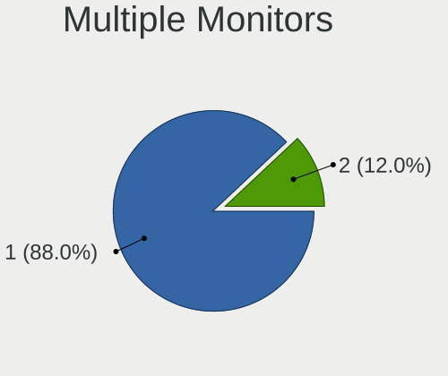

| Total | Notebooks | Percent |
|-------|-----------|---------|
| 1     | 54        | 88.52%  |
| 2     | 7         | 11.48%  |

Network
-------

Net Controller Vendor
---------------------

Controller vendors

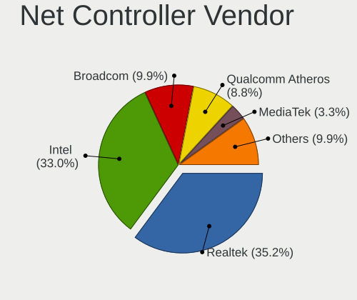

| Vendor                   | Notebooks | Percent |
|--------------------------|-----------|---------|
| Realtek Semiconductor    | 32        | 35.16%  |
| Intel                    | 30        | 32.97%  |
| Broadcom                 | 9         | 9.89%   |
| Qualcomm Atheros         | 8         | 8.79%   |
| MediaTek                 | 3         | 3.3%    |
| Broadcom Limited         | 3         | 3.3%    |
| Sierra Wireless          | 2         | 2.2%    |
| Texas Instruments        | 1         | 1.1%    |
| Marvell Technology Group | 1         | 1.1%    |
| Dell                     | 1         | 1.1%    |
| ASIX Electronics         | 1         | 1.1%    |

Net Controller Model
--------------------

Controller models

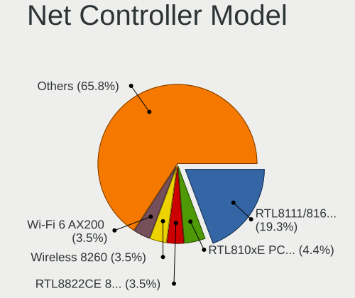

| Model                                                                  | Notebooks | Percent |
|------------------------------------------------------------------------|-----------|---------|
| Realtek RTL8111/8168/8211/8411 PCI Express Gigabit Ethernet Controller | 22        | 19.3%   |
| Realtek RTL810xE PCI Express Fast Ethernet controller                  | 5         | 4.39%   |
| Realtek RTL8822CE 802.11ac PCIe Wireless Network Adapter               | 4         | 3.51%   |
| Intel Wireless 8260                                                    | 4         | 3.51%   |
| Intel Wi-Fi 6 AX200                                                    | 4         | 3.51%   |
| Intel Centrino Advanced-N 6205 [Taylor Peak]                           | 4         | 3.51%   |
| Intel 82579LM Gigabit Network Connection (Lewisville)                  | 4         | 3.51%   |
| Broadcom BCM4313 802.11bgn Wireless Network Adapter                    | 4         | 3.51%   |
| Sierra Wireless MC8305 Modem                                           | 2         | 1.75%   |
| Realtek RTL8723DE Wireless Network Adapter                             | 2         | 1.75%   |
| Qualcomm Atheros QCA9565 / AR9565 Wireless Network Adapter             | 2         | 1.75%   |
| Qualcomm Atheros AR9285 Wireless Network Adapter (PCI-Express)         | 2         | 1.75%   |
| Intel Wireless 7260                                                    | 2         | 1.75%   |
| Intel Wi-Fi 6 AX201                                                    | 2         | 1.75%   |
| Intel Wi-Fi 5(802.11ac) Wireless-AC 9x6x [Thunder Peak]                | 2         | 1.75%   |
| Intel Ethernet Connection I219-LM                                      | 2         | 1.75%   |
| Broadcom NetLink BCM57780 Gigabit Ethernet PCIe                        | 2         | 1.75%   |
| Broadcom Limited NetLink BCM5787M Gigabit Ethernet PCI Express         | 2         | 1.75%   |
| Broadcom BCM4311 802.11a/b/g                                           | 2         | 1.75%   |
| Texas Instruments CC2531 ZigBee                                        | 1         | 0.88%   |
| Realtek RTL8852BE PCIe 802.11ax Wireless Network Controller            | 1         | 0.88%   |
| Realtek RTL8821CE 802.11ac PCIe Wireless Network Adapter               | 1         | 0.88%   |
| Realtek RTL8723BE PCIe Wireless Network Adapter                        | 1         | 0.88%   |
| Realtek RTL8187SE Wireless LAN Controller                              | 1         | 0.88%   |
| Realtek RTL8153 Gigabit Ethernet Adapter                               | 1         | 0.88%   |
| Realtek RTL8152 Fast Ethernet Adapter                                  | 1         | 0.88%   |
| Realtek RTL-8100/8101L/8139 PCI Fast Ethernet Adapter                  | 1         | 0.88%   |
| Realtek 802.11ac NIC                                                   | 1         | 0.88%   |
| Qualcomm Atheros QCA9377 802.11ac Wireless Network Adapter             | 1         | 0.88%   |
| Qualcomm Atheros AR9485 Wireless Network Adapter                       | 1         | 0.88%   |
| Qualcomm Atheros AR9462 Wireless Network Adapter                       | 1         | 0.88%   |
| Qualcomm Atheros AR9287 Wireless Network Adapter (PCI-Express)         | 1         | 0.88%   |
| Qualcomm Atheros AR8162 Fast Ethernet                                  | 1         | 0.88%   |
| Qualcomm Atheros AR8151 v2.0 Gigabit Ethernet                          | 1         | 0.88%   |
| MediaTek MT7922 802.11ax PCI Express Wireless Network Adapter          | 1         | 0.88%   |
| MediaTek MT7921 802.11ax PCIe Wireless Network Adapter [Filogic 330]   | 1         | 0.88%   |
| MediaTek MT7630e 802.11bgn Wireless Network Adapter                    | 1         | 0.88%   |
| Marvell Group 88E8055 PCI-E Gigabit Ethernet Controller                | 1         | 0.88%   |
| Intel Wireless 8265 / 8275                                             | 1         | 0.88%   |
| Intel Wireless 3165                                                    | 1         | 0.88%   |

Wireless Vendor
---------------

Wireless vendors

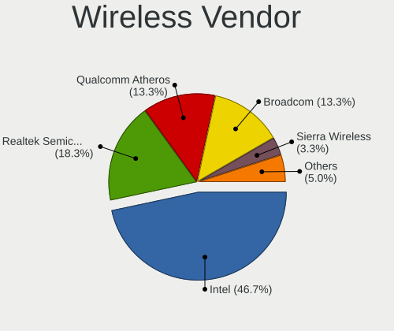

| Vendor                | Notebooks | Percent |
|-----------------------|-----------|---------|
| Intel                 | 28        | 46.67%  |
| Realtek Semiconductor | 11        | 18.33%  |
| Qualcomm Atheros      | 8         | 13.33%  |
| Broadcom              | 8         | 13.33%  |
| Sierra Wireless       | 2         | 3.33%   |
| MediaTek              | 2         | 3.33%   |
| Dell                  | 1         | 1.67%   |

Wireless Model
--------------

Wireless models

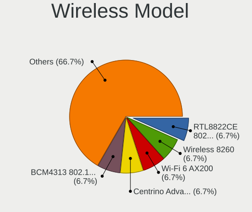

| Model                                                                | Notebooks | Percent |
|----------------------------------------------------------------------|-----------|---------|
| Realtek RTL8822CE 802.11ac PCIe Wireless Network Adapter             | 4         | 6.67%   |
| Intel Wireless 8260                                                  | 4         | 6.67%   |
| Intel Wi-Fi 6 AX200                                                  | 4         | 6.67%   |
| Intel Centrino Advanced-N 6205 [Taylor Peak]                         | 4         | 6.67%   |
| Broadcom BCM4313 802.11bgn Wireless Network Adapter                  | 4         | 6.67%   |
| Sierra Wireless MC8305 Modem                                         | 2         | 3.33%   |
| Realtek RTL8723DE Wireless Network Adapter                           | 2         | 3.33%   |
| Qualcomm Atheros QCA9565 / AR9565 Wireless Network Adapter           | 2         | 3.33%   |
| Qualcomm Atheros AR9285 Wireless Network Adapter (PCI-Express)       | 2         | 3.33%   |
| Intel Wireless 7260                                                  | 2         | 3.33%   |
| Intel Wi-Fi 6 AX201                                                  | 2         | 3.33%   |
| Intel Wi-Fi 5(802.11ac) Wireless-AC 9x6x [Thunder Peak]              | 2         | 3.33%   |
| Broadcom BCM4311 802.11a/b/g                                         | 2         | 3.33%   |
| Realtek RTL8852BE PCIe 802.11ax Wireless Network Controller          | 1         | 1.67%   |
| Realtek RTL8821CE 802.11ac PCIe Wireless Network Adapter             | 1         | 1.67%   |
| Realtek RTL8723BE PCIe Wireless Network Adapter                      | 1         | 1.67%   |
| Realtek RTL8187SE Wireless LAN Controller                            | 1         | 1.67%   |
| Realtek 802.11ac NIC                                                 | 1         | 1.67%   |
| Qualcomm Atheros QCA9377 802.11ac Wireless Network Adapter           | 1         | 1.67%   |
| Qualcomm Atheros AR9485 Wireless Network Adapter                     | 1         | 1.67%   |
| Qualcomm Atheros AR9462 Wireless Network Adapter                     | 1         | 1.67%   |
| Qualcomm Atheros AR9287 Wireless Network Adapter (PCI-Express)       | 1         | 1.67%   |
| MediaTek MT7921 802.11ax PCIe Wireless Network Adapter [Filogic 330] | 1         | 1.67%   |
| MediaTek MT7630e 802.11bgn Wireless Network Adapter                  | 1         | 1.67%   |
| Intel Wireless 8265 / 8275                                           | 1         | 1.67%   |
| Intel Wireless 3165                                                  | 1         | 1.67%   |
| Intel Ultimate N WiFi Link 5300                                      | 1         | 1.67%   |
| Intel PRO/Wireless 3945ABG [Golan] Network Connection                | 1         | 1.67%   |
| Intel PRO/Wireless 2200BG [Calexico2] Network Connection             | 1         | 1.67%   |
| Intel Gemini Lake PCH CNVi WiFi                                      | 1         | 1.67%   |
| Intel Comet Lake PCH CNVi WiFi                                       | 1         | 1.67%   |
| Intel Centrino Advanced-N 6235                                       | 1         | 1.67%   |
| Intel Centrino Advanced-N 6200                                       | 1         | 1.67%   |
| Intel Cannon Point-LP CNVi [Wireless-AC]                             | 1         | 1.67%   |
| Dell DW5811e Snapdragon X7 LTE                                       | 1         | 1.67%   |
| Broadcom BCM4323 802.11abgn Wireless Adapter                         | 1         | 1.67%   |
| Broadcom BCM43225 802.11b/g/n                                        | 1         | 1.67%   |

Ethernet Vendor
---------------

Ethernet vendors

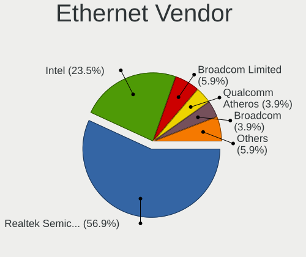

| Vendor                   | Notebooks | Percent |
|--------------------------|-----------|---------|
| Realtek Semiconductor    | 29        | 56.86%  |
| Intel                    | 12        | 23.53%  |
| Broadcom Limited         | 3         | 5.88%   |
| Qualcomm Atheros         | 2         | 3.92%   |
| Broadcom                 | 2         | 3.92%   |
| MediaTek                 | 1         | 1.96%   |
| Marvell Technology Group | 1         | 1.96%   |
| ASIX Electronics         | 1         | 1.96%   |

Ethernet Model
--------------

Ethernet models

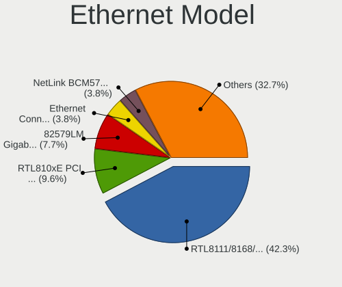

| Model                                                                  | Notebooks | Percent |
|------------------------------------------------------------------------|-----------|---------|
| Realtek RTL8111/8168/8211/8411 PCI Express Gigabit Ethernet Controller | 22        | 42.31%  |
| Realtek RTL810xE PCI Express Fast Ethernet controller                  | 5         | 9.62%   |
| Intel 82579LM Gigabit Network Connection (Lewisville)                  | 4         | 7.69%   |
| Intel Ethernet Connection I219-LM                                      | 2         | 3.85%   |
| Broadcom NetLink BCM57780 Gigabit Ethernet PCIe                        | 2         | 3.85%   |
| Broadcom Limited NetLink BCM5787M Gigabit Ethernet PCI Express         | 2         | 3.85%   |
| Realtek RTL8153 Gigabit Ethernet Adapter                               | 1         | 1.92%   |
| Realtek RTL8152 Fast Ethernet Adapter                                  | 1         | 1.92%   |
| Realtek RTL-8100/8101L/8139 PCI Fast Ethernet Adapter                  | 1         | 1.92%   |
| Qualcomm Atheros AR8162 Fast Ethernet                                  | 1         | 1.92%   |
| Qualcomm Atheros AR8151 v2.0 Gigabit Ethernet                          | 1         | 1.92%   |
| MediaTek MT7922 802.11ax PCI Express Wireless Network Adapter          | 1         | 1.92%   |
| Marvell Group 88E8055 PCI-E Gigabit Ethernet Controller                | 1         | 1.92%   |
| Intel Ethernet Connection I219-V                                       | 1         | 1.92%   |
| Intel Ethernet Connection I217-V                                       | 1         | 1.92%   |
| Intel Ethernet Connection (4) I219-LM                                  | 1         | 1.92%   |
| Intel Ethernet Connection (2) I219-LM                                  | 1         | 1.92%   |
| Intel Alder Lake-P PCH CNVi WiFi                                       | 1         | 1.92%   |
| Intel 82579V Gigabit Network Connection                                | 1         | 1.92%   |
| Broadcom Limited NetLink BCM57780 Gigabit Ethernet PCIe                | 1         | 1.92%   |
| ASIX AX88772B                                                          | 1         | 1.92%   |

Net Controller Kind
-------------------

Ethernet, WiFi or modem

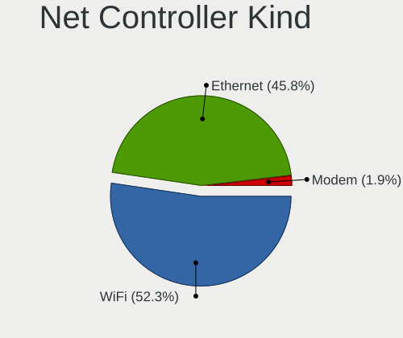

| Kind     | Notebooks | Percent |
|----------|-----------|---------|
| WiFi     | 56        | 52.34%  |
| Ethernet | 49        | 45.79%  |
| Modem    | 2         | 1.87%   |

Used Controller
---------------

Currently used network controller

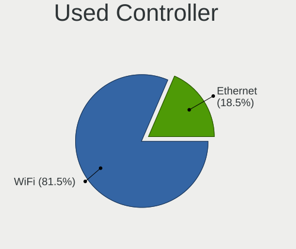

| Kind     | Notebooks | Percent |
|----------|-----------|---------|
| WiFi     | 50        | 78.13%  |
| Ethernet | 14        | 21.88%  |

NICs
----

Total network controllers on board

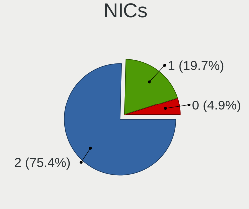

| Total | Notebooks | Percent |
|-------|-----------|---------|
| 2     | 46        | 75.41%  |
| 1     | 12        | 19.67%  |
| 0     | 3         | 4.92%   |

IPv6
----

IPv6 vs IPv4

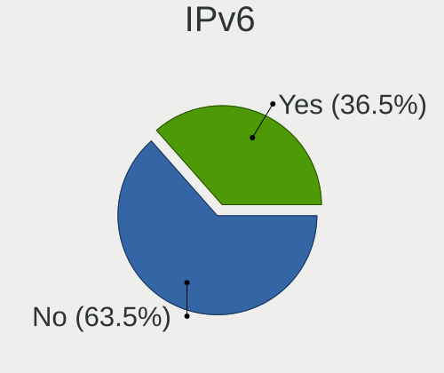

| Used | Notebooks | Percent |
|------|-----------|---------|
| No   | 40        | 63.49%  |
| Yes  | 23        | 36.51%  |

Bluetooth
---------

Bluetooth Vendor
----------------

Controller vendors

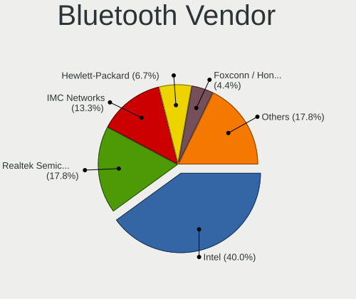

| Vendor                  | Notebooks | Percent |
|-------------------------|-----------|---------|
| Intel                   | 18        | 40%     |
| Realtek Semiconductor   | 8         | 17.78%  |
| IMC Networks            | 6         | 13.33%  |
| Hewlett-Packard         | 3         | 6.67%   |
| Foxconn / Hon Hai       | 2         | 4.44%   |
| Broadcom                | 2         | 4.44%   |
| Taiyo Yuden             | 1         | 2.22%   |
| MediaTek                | 1         | 2.22%   |
| Lite-On Technology      | 1         | 2.22%   |
| Dell                    | 1         | 2.22%   |
| Cambridge Silicon Radio | 1         | 2.22%   |
| Askey Computer          | 1         | 2.22%   |

Bluetooth Model
---------------

Controller models

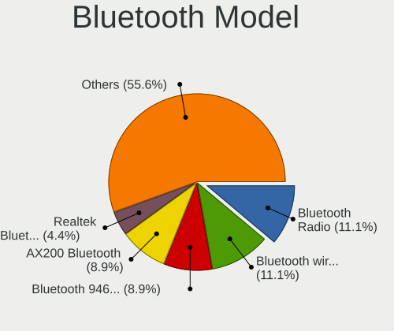

| Model                                               | Notebooks | Percent |
|-----------------------------------------------------|-----------|---------|
| Realtek Bluetooth Radio                             | 5         | 11.11%  |
| Intel Bluetooth wireless interface                  | 5         | 11.11%  |
| Intel Bluetooth 9460/9560 Jefferson Peak (JfP)      | 4         | 8.89%   |
| Intel AX200 Bluetooth                               | 4         | 8.89%   |
| Realtek  Bluetooth 4.2 Adapter                      | 2         | 4.44%   |
| Intel Wireless-AC 9260 Bluetooth Adapter            | 2         | 4.44%   |
| Intel AX201 Bluetooth                               | 2         | 4.44%   |
| IMC Networks Wireless_Device                        | 2         | 4.44%   |
| IMC Networks Bluetooth Device                       | 2         | 4.44%   |
| HP Bluetooth 2.0 Interface [Broadcom BCM2045]       | 2         | 4.44%   |
| Foxconn / Hon Hai BCM20702A0                        | 2         | 4.44%   |
| Taiyo Yuden Bluetooth Device (V2.1+EDR)             | 1         | 2.22%   |
| Realtek RTL8723B Bluetooth                          | 1         | 2.22%   |
| MediaTek MT7630e Bluetooth Adapter                  | 1         | 2.22%   |
| Lite-On Bluetooth Device                            | 1         | 2.22%   |
| Intel Centrino Bluetooth Wireless Transceiver       | 1         | 2.22%   |
| IMC Networks Bluetooth Radio                        | 1         | 2.22%   |
| IMC Networks Atheros AR3012 Bluetooth 4.0 Adapter   | 1         | 2.22%   |
| HP Broadcom 2070 Bluetooth Combo                    | 1         | 2.22%   |
| Dell BCM20702A0 Bluetooth Module                    | 1         | 2.22%   |
| Cambridge Silicon Radio Bluetooth Dongle (HCI mode) | 1         | 2.22%   |
| Broadcom HP Portable Valentine                      | 1         | 2.22%   |
| Broadcom BCM20702 Bluetooth 4.0 [ThinkPad]          | 1         | 2.22%   |
| Askey Bluetooth Device                              | 1         | 2.22%   |

Sound
-----

Sound Vendor
------------

Sound card vendors

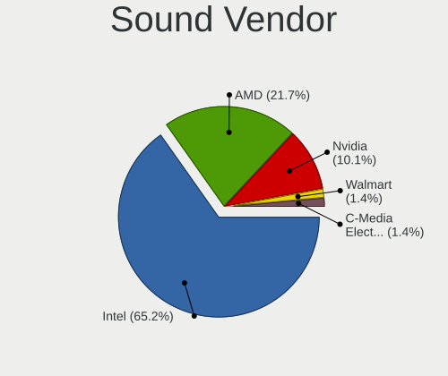

| Vendor              | Notebooks | Percent |
|---------------------|-----------|---------|
| Intel               | 45        | 65.22%  |
| AMD                 | 15        | 21.74%  |
| Nvidia              | 7         | 10.14%  |
| Walmart             | 1         | 1.45%   |
| C-Media Electronics | 1         | 1.45%   |

Sound Model
-----------

Sound card models

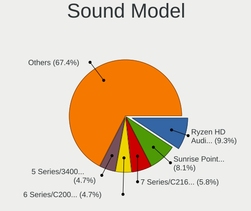

| Model                                                                      | Notebooks | Percent |
|----------------------------------------------------------------------------|-----------|---------|
| AMD Ryzen HD Audio Controller                                              | 8         | 9.3%    |
| Intel Sunrise Point-LP HD Audio                                            | 7         | 8.14%   |
| Intel 7 Series/C216 Chipset Family High Definition Audio Controller        | 5         | 5.81%   |
| Intel 6 Series/C200 Series Chipset Family High Definition Audio Controller | 4         | 4.65%   |
| Intel 5 Series/3400 Series Chipset High Definition Audio                   | 4         | 4.65%   |
| Intel Xeon E3-1200 v3/4th Gen Core Processor HD Audio Controller           | 3         | 3.49%   |
| Intel Haswell-ULT HD Audio Controller                                      | 3         | 3.49%   |
| Intel 8 Series/C220 Series Chipset High Definition Audio Controller        | 3         | 3.49%   |
| AMD SBx00 Azalia (Intel HDA)                                               | 3         | 3.49%   |
| AMD Renoir/Cezanne HDMI/DP Audio Controller                                | 3         | 3.49%   |
| Nvidia GA107 High Definition Audio Controller                              | 2         | 2.33%   |
| Intel Tiger Lake-LP Smart Sound Technology Audio Controller                | 2         | 2.33%   |
| Intel Comet Lake PCH cAVS                                                  | 2         | 2.33%   |
| Intel Alder Lake PCH-P High Definition Audio Controller                    | 2         | 2.33%   |
| Intel 82801I (ICH9 Family) HD Audio Controller                             | 2         | 2.33%   |
| Intel 8 Series HD Audio Controller                                         | 2         | 2.33%   |
| AMD Raven/Raven2/Fenghuang HDMI/DP Audio Controller                        | 2         | 2.33%   |
| AMD Radeon High Definition Audio Controller                                | 2         | 2.33%   |
| AMD Family 15h (Models 60h-6fh) Audio Controller                           | 2         | 2.33%   |
| Walmart AB13X Headset Adapter                                              | 1         | 1.16%   |
| Nvidia TU106 High Definition Audio Controller                              | 1         | 1.16%   |
| Nvidia GP107GL High Definition Audio Controller                            | 1         | 1.16%   |
| Nvidia GK107 HDMI Audio Controller                                         | 1         | 1.16%   |
| Nvidia GF108 High Definition Audio Controller                              | 1         | 1.16%   |
| Nvidia GA104 High Definition Audio Controller                              | 1         | 1.16%   |
| Intel Tiger Lake-H HD Audio Controller                                     | 1         | 1.16%   |
| Intel Ice Lake-LP Smart Sound Technology Audio Controller                  | 1         | 1.16%   |
| Intel Comet Lake PCH-LP cAVS                                               | 1         | 1.16%   |
| Intel Celeron/Pentium Silver Processor High Definition Audio               | 1         | 1.16%   |
| Intel Cannon Point-LP High Definition Audio Controller                     | 1         | 1.16%   |
| Intel Cannon Lake PCH cAVS                                                 | 1         | 1.16%   |
| Intel Atom Processor Z36xxx/Z37xxx Series LPE Audio Controller             | 1         | 1.16%   |
| Intel Atom Processor Z36xxx/Z37xxx Series High Definition Audio Controller | 1         | 1.16%   |
| Intel 82801H (ICH8 Family) HD Audio Controller                             | 1         | 1.16%   |
| Intel 82801FB/FBM/FR/FW/FRW (ICH6 Family) AC'97 Audio Controller           | 1         | 1.16%   |
| Intel 100 Series/C230 Series Chipset Family HD Audio Controller            | 1         | 1.16%   |
| C-Media Electronics Audio Adapter (Unitek Y-247A)                          | 1         | 1.16%   |
| AMD Wrestler HDMI Audio                                                    | 1         | 1.16%   |
| AMD RV710/730 HDMI Audio [Radeon HD 4000 series]                           | 1         | 1.16%   |
| AMD Oland/Hainan/Cape Verde/Pitcairn HDMI Audio [Radeon HD 7000 Series]    | 1         | 1.16%   |

Memory
------

Memory Vendor
-------------

Memory module vendors

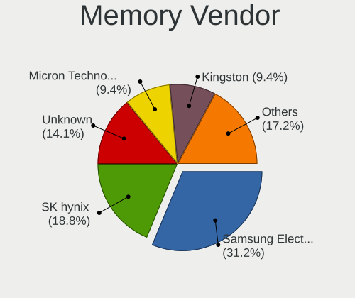

| Vendor              | Notebooks | Percent |
|---------------------|-----------|---------|
| Samsung Electronics | 20        | 31.25%  |
| SK hynix            | 12        | 18.75%  |
| Unknown             | 9         | 14.06%  |
| Micron Technology   | 6         | 9.38%   |
| Kingston            | 6         | 9.38%   |
| Corsair             | 2         | 3.13%   |
| Unknown (ABCD)      | 1         | 1.56%   |
| Team                | 1         | 1.56%   |
| Smart               | 1         | 1.56%   |
| Ramaxel Technology  | 1         | 1.56%   |
| Elpida              | 1         | 1.56%   |
| CSX                 | 1         | 1.56%   |
| Crucial             | 1         | 1.56%   |
| AMD                 | 1         | 1.56%   |
| Unknown             | 1         | 1.56%   |

Memory Model
------------

Memory module models

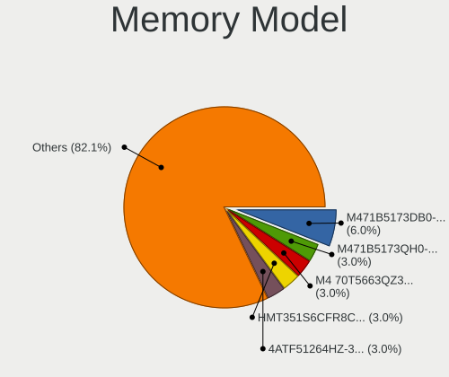

| Model                                                            | Notebooks | Percent |
|------------------------------------------------------------------|-----------|---------|
| Samsung RAM M471B5173DB0-YK0 4GB SODIMM DDR3 1600MT/s            | 4         | 5.97%   |
| SK hynix RAM HMT351S6CFR8C-PB 4GB SODIMM DDR3 1600MT/s           | 2         | 2.99%   |
| Samsung RAM M471B5173QH0-YK0 4GB SODIMM DDR3 1600MT/s            | 2         | 2.99%   |
| Samsung RAM M4 70T5663QZ3-CE6 2GB SODIMM DDR2 667MT/s            | 2         | 2.99%   |
| Micron RAM 4ATF51264HZ-3G2J1 4GB SODIMM DDR4 3200MT/s            | 2         | 2.99%   |
| Micron RAM 16JSF51264HZ-1G4D1 4GB SODIMM DDR3 1334MT/s           | 2         | 2.99%   |
| Unknown RAM Module 512MB SODIMM DDR                              | 1         | 1.49%   |
| Unknown RAM Module 4GB SODIMM LPDDR3 1600MT/s                    | 1         | 1.49%   |
| Unknown RAM Module 4GB SODIMM DDR4 2400MT/s                      | 1         | 1.49%   |
| Unknown RAM Module 2GB SODIMM DDR3 1333MT/s                      | 1         | 1.49%   |
| Unknown RAM Module 2GB SODIMM DDR2 667MT/s                       | 1         | 1.49%   |
| Unknown RAM Module 2GB SODIMM 533MT/s                            | 1         | 1.49%   |
| Unknown RAM Module 2048MB SODIMM DDR2 975MT/s                    | 1         | 1.49%   |
| Unknown RAM Module 1GB SODIMM DDR3 1333MT/s                      | 1         | 1.49%   |
| Unknown RAM Module 1GB SODIMM DDR3 1066MT/s                      | 1         | 1.49%   |
| Unknown RAM Module 1GB SODIMM DDR2 667MT/s                       | 1         | 1.49%   |
| Unknown (ABCD) RAM 123456789012345678 2GB SODIMM LPDDR4 2400MT/s | 1         | 1.49%   |
| Team RAM TEAMGROUP-SD4-3200 16GB SODIMM DDR4 3200MT/s            | 1         | 1.49%   |
| Smart RAM SH564128FH8NZQNSCG 4GB SODIMM DDR3 1600MT/s            | 1         | 1.49%   |
| SK hynix RAM Module 4GB SODIMM DDR3 1600MT/s                     | 1         | 1.49%   |
| SK hynix RAM Module 4GB SODIMM DDR3 1066MT/s                     | 1         | 1.49%   |
| SK hynix RAM HYMP512S64CP8-Y5 1GB SODIMM DDR2 1639MT/s           | 1         | 1.49%   |
| SK hynix RAM HMT425S6AFR6A-PB 2GB SODIMM DDR3 3200MT/s           | 1         | 1.49%   |
| SK hynix RAM HMT325S6CFR8C-PB 2GB SODIMM DDR3 1600MT/s           | 1         | 1.49%   |
| SK hynix RAM HMAA1GS6CJR6N-XN 8GB SODIMM DDR4 3200MT/s           | 1         | 1.49%   |
| SK hynix RAM HMA81GS6DJR8N-XN 8GB SODIMM DDR4 3200MT/s           | 1         | 1.49%   |
| SK hynix RAM HMA81GS6AFR8N-UH 8GB SODIMM DDR4 2667MT/s           | 1         | 1.49%   |
| SK hynix RAM HMA451S6AFR8N-TF 4GB SODIMM DDR4 2133MT/s           | 1         | 1.49%   |
| SK hynix RAM HMA41GS6AFR8N-TF 8GB SODIMM DDR4 2667MT/s           | 1         | 1.49%   |
| Samsung RAM Module 8192MB SODIMM DDR4 2133MT/s                   | 1         | 1.49%   |
| Samsung RAM M471B5773CHS-CH9 2GB SODIMM DDR3 4199MT/s            | 1         | 1.49%   |
| Samsung RAM M471B5273DH0-CH9 4GB SODIMM DDR3 1600MT/s            | 1         | 1.49%   |
| Samsung RAM M471B5173EB0-YK0 4GB SODIMM DDR3 1600MT/s            | 1         | 1.49%   |
| Samsung RAM M471B5173BH0-YK0 4GB SODIMM DDR3 1600MT/s            | 1         | 1.49%   |
| Samsung RAM M471A5244CB0-CWE 4GB SODIMM DDR4 3200MT/s            | 1         | 1.49%   |
| Samsung RAM M471A5244CB0-CTD 4GB SODIMM DDR4 3266MT/s            | 1         | 1.49%   |
| Samsung RAM M471A2K43DB1-CWE 16GB SODIMM DDR4 3200MT/s           | 1         | 1.49%   |
| Samsung RAM M471A1K43DB1-CWE 8GB SODIMM DDR4 3200MT/s            | 1         | 1.49%   |
| Samsung RAM M471A1K43DB1-CTD 8GB SODIMM DDR4 2667MT/s            | 1         | 1.49%   |
| Samsung RAM M471A1G44AB0-CTD 8GB SODIMM DDR4 2667MT/s            | 1         | 1.49%   |

Memory Kind
-----------

Memory module kinds

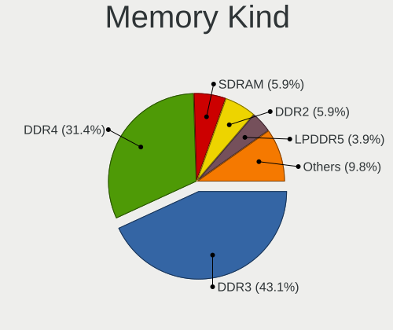

| Kind    | Notebooks | Percent |
|---------|-----------|---------|
| DDR3    | 22        | 43.14%  |
| DDR4    | 16        | 31.37%  |
| SDRAM   | 3         | 5.88%   |
| DDR2    | 3         | 5.88%   |
| LPDDR5  | 2         | 3.92%   |
| LPDDR4  | 2         | 3.92%   |
| LPDDR3  | 1         | 1.96%   |
| DDR     | 1         | 1.96%   |
| Unknown | 1         | 1.96%   |

Memory Form Factor
------------------

Physical design of the memory module

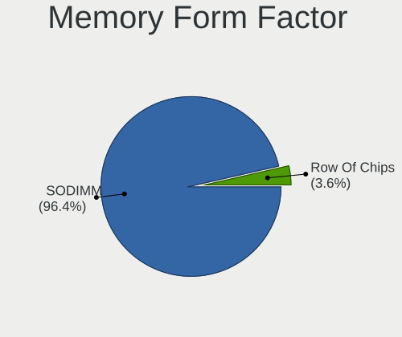

| Name         | Notebooks | Percent |
|--------------|-----------|---------|
| SODIMM       | 45        | 93.75%  |
| Row Of Chips | 3         | 6.25%   |

Memory Size
-----------

Memory module size

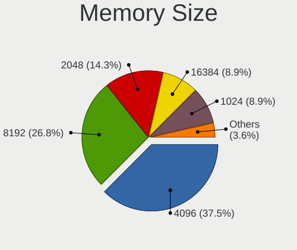

| Size  | Notebooks | Percent |
|-------|-----------|---------|
| 4096  | 21        | 37.5%   |
| 8192  | 15        | 26.79%  |
| 2048  | 8         | 14.29%  |
| 16384 | 5         | 8.93%   |
| 1024  | 5         | 8.93%   |
| 32768 | 1         | 1.79%   |
| 512   | 1         | 1.79%   |

Memory Speed
------------

Memory module speed

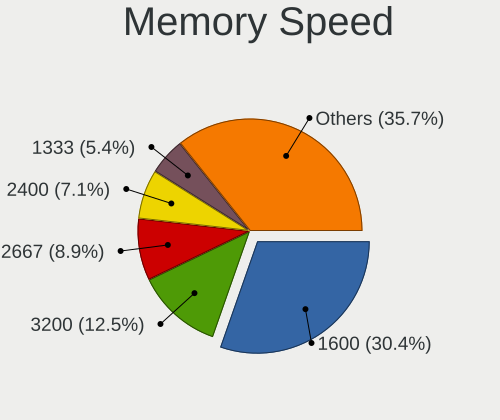

| Speed   | Notebooks | Percent |
|---------|-----------|---------|
| 1600    | 17        | 30.36%  |
| 3200    | 7         | 12.5%   |
| 2667    | 5         | 8.93%   |
| 2400    | 4         | 7.14%   |
| 1333    | 3         | 5.36%   |
| 667     | 3         | 5.36%   |
| 4199    | 2         | 3.57%   |
| 2133    | 2         | 3.57%   |
| 1334    | 2         | 3.57%   |
| 1066    | 2         | 3.57%   |
| 7500    | 1         | 1.79%   |
| 6400    | 1         | 1.79%   |
| 4267    | 1         | 1.79%   |
| 3266    | 1         | 1.79%   |
| 3000    | 1         | 1.79%   |
| 1639    | 1         | 1.79%   |
| 975     | 1         | 1.79%   |
| 533     | 1         | 1.79%   |
| Unknown | 1         | 1.79%   |

Printers & scanners
-------------------

Printer Vendor
--------------

Printer device vendors

Zero info for selected period =(

Printer Model
-------------

Printer device models

Zero info for selected period =(

Scanner Vendor
--------------

Scanner device vendors

Zero info for selected period =(

Scanner Model
-------------

Scanner device models

Zero info for selected period =(

Camera
------

Camera Vendor
-------------

Camera device vendors

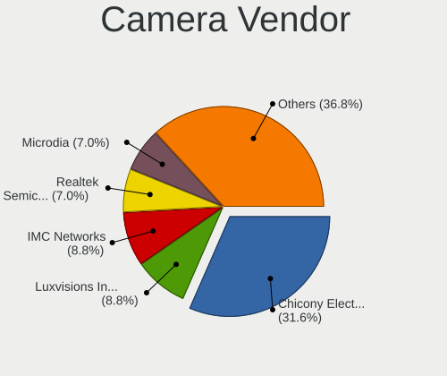

| Vendor                                 | Notebooks | Percent |
|----------------------------------------|-----------|---------|
| Chicony Electronics                    | 18        | 31.58%  |
| Luxvisions Innotech Limited            | 5         | 8.77%   |
| IMC Networks                           | 5         | 8.77%   |
| Realtek Semiconductor                  | 4         | 7.02%   |
| Microdia                               | 4         | 7.02%   |
| Bison Electronics                      | 4         | 7.02%   |
| Lite-On Technology                     | 3         | 5.26%   |
| Cheng Uei Precision Industry (Foxlink) | 3         | 5.26%   |
| Alcor Micro                            | 3         | 5.26%   |
| Suyin                                  | 2         | 3.51%   |
| Sunplus Innovation Technology          | 1         | 1.75%   |
| Sonix Technology                       | 1         | 1.75%   |
| Razer USA                              | 1         | 1.75%   |
| Primax Electronics                     | 1         | 1.75%   |
| Logitech                               | 1         | 1.75%   |
| Apple                                  | 1         | 1.75%   |

Camera Model
------------

Camera device models

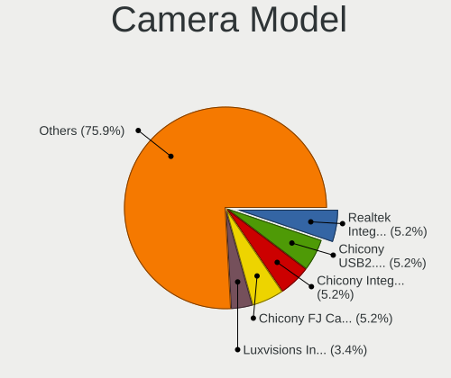

| Model                                                                      | Notebooks | Percent |
|----------------------------------------------------------------------------|-----------|---------|
| Realtek Integrated_Webcam_HD                                               | 3         | 5.17%   |
| Chicony USB2.0 Camera                                                      | 3         | 5.17%   |
| Chicony Integrated Camera                                                  | 3         | 5.17%   |
| Chicony FJ Camera                                                          | 3         | 5.17%   |
| Luxvisions Innotech Limited HP TrueVision HD Camera                        | 2         | 3.45%   |
| Lite-On HP HD Webcam                                                       | 2         | 3.45%   |
| IMC Networks USB2.0 VGA UVC WebCam                                         | 2         | 3.45%   |
| IMC Networks USB2.0 HD UVC WebCam                                          | 2         | 3.45%   |
| Chicony Lenovo EasyCamera                                                  | 2         | 3.45%   |
| Bison BisonCam,NB Pro                                                      | 2         | 3.45%   |
| Suyin HP TrueVision HD Integrated Webcam                                   | 1         | 1.72%   |
| Suyin 1.3M WebCam (notebook emachines E730, Acer sub-brand)                | 1         | 1.72%   |
| Sunplus Dell E5570 integrated webcam                                       | 1         | 1.72%   |
| Sonix USB2.0 FHD UVC WebCam                                                | 1         | 1.72%   |
| Realtek USB Camera                                                         | 1         | 1.72%   |
| Razer USA Razer Kiyo Pro                                                   | 1         | 1.72%   |
| Primax HP Truevision FHD                                                   | 1         | 1.72%   |
| Microdia UGREEN Camera                                                     | 1         | 1.72%   |
| Microdia Laptop_Integrated_Webcam_2M                                       | 1         | 1.72%   |
| Microdia Integrated_Webcam_HD                                              | 1         | 1.72%   |
| Microdia Integrated Webcam                                                 | 1         | 1.72%   |
| Luxvisions Innotech Limited Integrated RGB Camera                          | 1         | 1.72%   |
| Luxvisions Innotech Limited Integrated Camera                              | 1         | 1.72%   |
| Luxvisions Innotech Limited HP Wide Vision HD Camera                       | 1         | 1.72%   |
| Logitech Fujitsu Webcam                                                    | 1         | 1.72%   |
| Lite-On HP Webcam                                                          | 1         | 1.72%   |
| IMC Networks USB2.0 UVC HD Webcam                                          | 1         | 1.72%   |
| Chicony TOSHIBA Web Camera - FHD                                           | 1         | 1.72%   |
| Chicony Integrated IR Camera                                               | 1         | 1.72%   |
| Chicony Integrated HP HD Webcam                                            | 1         | 1.72%   |
| Chicony HD WebCam                                                          | 1         | 1.72%   |
| Chicony HD User Facing                                                     | 1         | 1.72%   |
| Chicony CNF8161                                                            | 1         | 1.72%   |
| Chicony ACER HD User Facing                                                | 1         | 1.72%   |
| Chicony 1.3M HD WebCam                                                     | 1         | 1.72%   |
| Cheng Uei Precision Industry (Foxlink) HP Wide Vision HD Integrated Webcam | 1         | 1.72%   |
| Cheng Uei Precision Industry (Foxlink) HP TrueVision HD Camera             | 1         | 1.72%   |
| Cheng Uei Precision Industry (Foxlink) HP HD Camera                        | 1         | 1.72%   |
| Bison Lenovo EasyCamera                                                    | 1         | 1.72%   |
| Bison HP Webcam-101                                                        | 1         | 1.72%   |

Security
--------

Fingerprint Vendor
------------------

Fingerprint sensor vendors

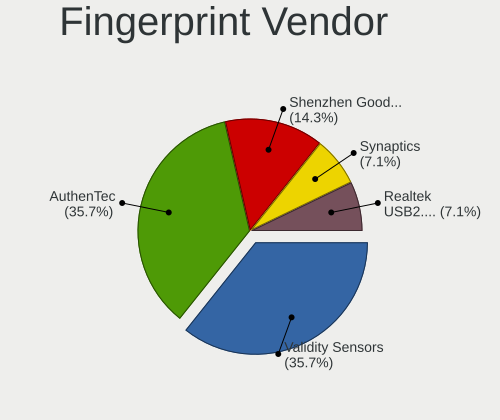

| Vendor                             | Notebooks | Percent |
|------------------------------------|-----------|---------|
| Validity Sensors                   | 5         | 35.71%  |
| AuthenTec                          | 5         | 35.71%  |
| Shenzhen Goodix Technology         | 2         | 14.29%  |
| Synaptics                          | 1         | 7.14%   |
| Realtek USB2.0 Finger Print Bridge | 1         | 7.14%   |

Fingerprint Model
-----------------

Fingerprint sensor models

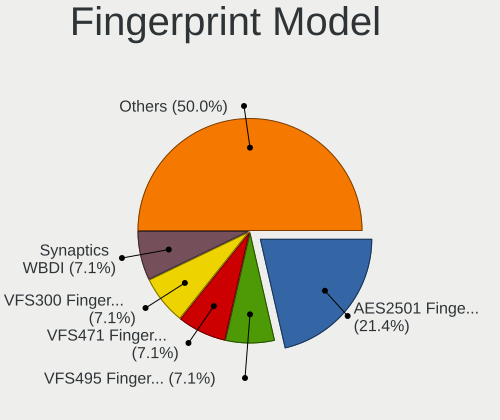

| Model                                                           | Notebooks | Percent |
|-----------------------------------------------------------------|-----------|---------|
| AuthenTec AES2501 Fingerprint Sensor                            | 3         | 21.43%  |
| Validity Sensors VFS495 Fingerprint Reader                      | 1         | 7.14%   |
| Validity Sensors VFS471 Fingerprint Reader                      | 1         | 7.14%   |
| Validity Sensors VFS300 Fingerprint Reader                      | 1         | 7.14%   |
| Validity Sensors Synaptics WBDI                                 | 1         | 7.14%   |
| Validity Sensors Fingerprint scanner                            | 1         | 7.14%   |
| Shenzhen Goodix  FingerPrint Device                             | 1         | 7.14%   |
| Shenzhen Goodix Fingerprint Reader                              | 1         | 7.14%   |
| Realtek USB2.0 Finger Print Bridge FocalTech Fingerprint Device | 1         | 7.14%   |
| AuthenTec Fingerprint Sensor                                    | 1         | 7.14%   |
| AuthenTec AES2550 Fingerprint Sensor                            | 1         | 7.14%   |
| Unknown                                                         | 1         | 7.14%   |

Chipcard Vendor
---------------

Chipcard module vendors

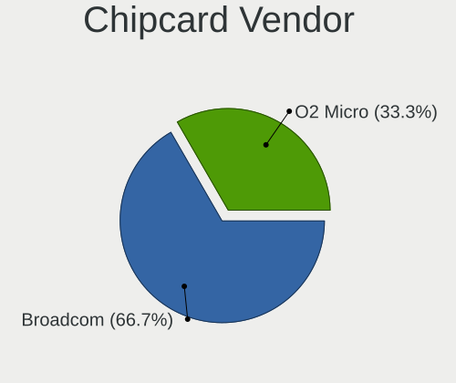

| Vendor   | Notebooks | Percent |
|----------|-----------|---------|
| Broadcom | 3         | 60%     |
| O2 Micro | 2         | 40%     |

Chipcard Model
--------------

Chipcard module models

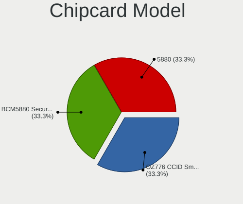

| Model                                                                        | Notebooks | Percent |
|------------------------------------------------------------------------------|-----------|---------|
| O2 Micro OZ776 CCID Smartcard Reader                                         | 2         | 40%     |
| Broadcom 5880                                                                | 2         | 40%     |
| Broadcom BCM5880 Secure Applications Processor with fingerprint swipe sensor | 1         | 20%     |

Unsupported
-----------

Unsupported Devices
-------------------

Total unsupported devices on board

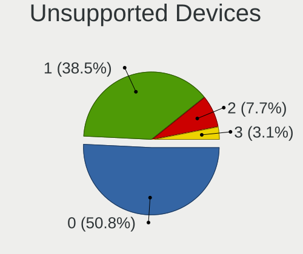

| Total | Notebooks | Percent |
|-------|-----------|---------|
| 0     | 33        | 50.77%  |
| 1     | 25        | 38.46%  |
| 2     | 5         | 7.69%   |
| 3     | 2         | 3.08%   |

Unsupported Device Types
------------------------

Types of unsupported devices

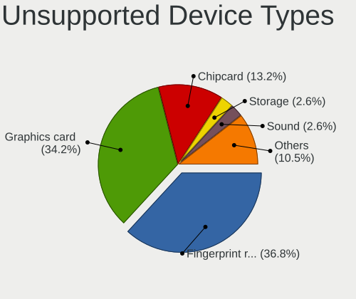

| Type                  | Notebooks | Percent |
|-----------------------|-----------|---------|
| Fingerprint reader    | 14        | 36.84%  |
| Graphics card         | 13        | 34.21%  |
| Chipcard              | 5         | 13.16%  |
| Storage               | 1         | 2.63%   |
| Sound                 | 1         | 2.63%   |
| Net/wireless          | 1         | 2.63%   |
| Multimedia controller | 1         | 2.63%   |
| Camera                | 1         | 2.63%   |
| Bluetooth             | 1         | 2.63%   |

