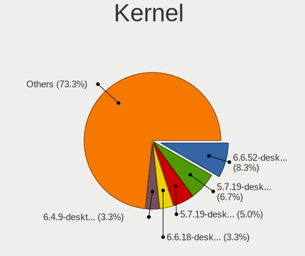
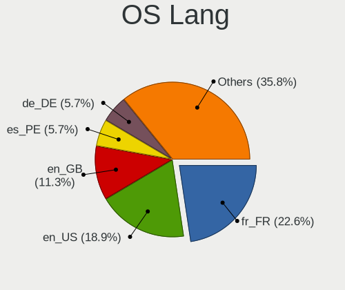
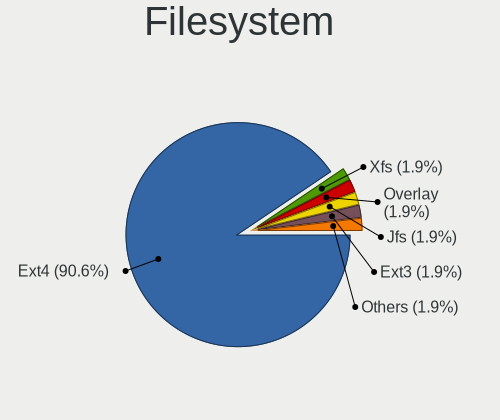
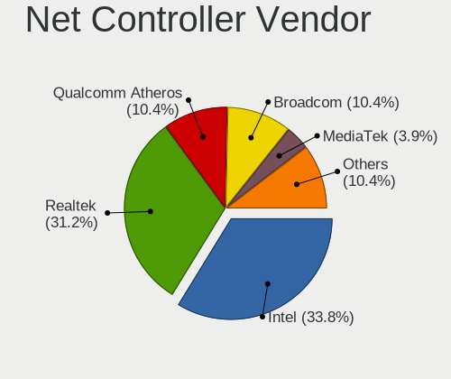
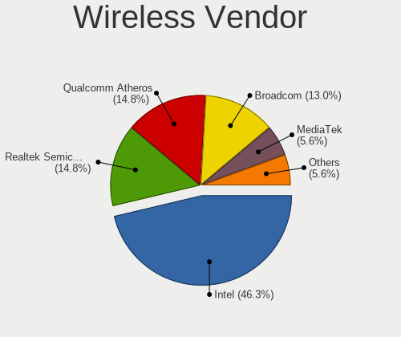
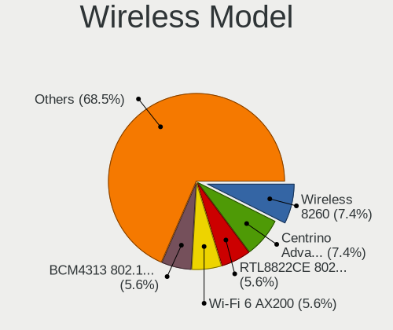
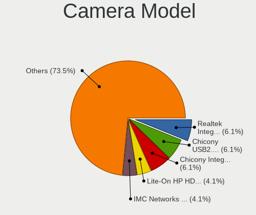

Mageia - Tested Hardware & Statistics (Notebooks)
-------------------------------------------------

A project to collect tested hardware configurations for Mageia.

Anyone can contribute to this report by the [hw-probe](https://github.com/linuxhw/hw-probe) tool:

    sudo -E hw-probe -all -upload

Please contribute! Especially if your hardware is rare.

Contents
--------

* [ Test Cases ](#test-cases)

* [ System ](#system)
  - [ OS                       ](#os)
  - [ OS Family                ](#os-family)
  - [ Kernel                   ](#kernel)
  - [ Kernel Family            ](#kernel-family)
  - [ Kernel Major Ver.        ](#kernel-major-ver)
  - [ Arch                     ](#arch)
  - [ DE                       ](#de)
  - [ Display Server           ](#display-server)
  - [ Display Manager          ](#display-manager)
  - [ OS Lang                  ](#os-lang)
  - [ Boot Mode                ](#boot-mode)
  - [ Filesystem               ](#filesystem)
  - [ Part. scheme             ](#part-scheme)
  - [ Dual Boot with Linux/BSD ](#dual-boot-with-linuxbsd)
  - [ Dual Boot (Win)          ](#dual-boot-win)

* [ Board ](#board)
  - [ Vendor                   ](#vendor)
  - [ Model                    ](#model)
  - [ Model Family             ](#model-family)
  - [ MFG Year                 ](#mfg-year)
  - [ Form Factor              ](#form-factor)
  - [ Secure Boot              ](#secure-boot)
  - [ Coreboot                 ](#coreboot)
  - [ RAM Size                 ](#ram-size)
  - [ RAM Used                 ](#ram-used)
  - [ Total Drives             ](#total-drives)
  - [ Has CD-ROM               ](#has-cd-rom)
  - [ Has Ethernet             ](#has-ethernet)
  - [ Has WiFi                 ](#has-wifi)
  - [ Has Bluetooth            ](#has-bluetooth)

* [ Location ](#location)
  - [ Country                  ](#country)
  - [ City                     ](#city)

* [ Drives ](#drives)
  - [ Drive Vendor             ](#drive-vendor)
  - [ Drive Model              ](#drive-model)
  - [ HDD Vendor               ](#hdd-vendor)
  - [ SSD Vendor               ](#ssd-vendor)
  - [ Drive Kind               ](#drive-kind)
  - [ Drive Connector          ](#drive-connector)
  - [ Drive Size               ](#drive-size)
  - [ Space Total              ](#space-total)
  - [ Space Used               ](#space-used)
  - [ Malfunc. Drives          ](#malfunc-drives)
  - [ Malfunc. Drive Vendor    ](#malfunc-drive-vendor)
  - [ Malfunc. HDD Vendor      ](#malfunc-hdd-vendor)
  - [ Malfunc. Drive Kind      ](#malfunc-drive-kind)
  - [ Failed Drives            ](#failed-drives)
  - [ Failed Drive Vendor      ](#failed-drive-vendor)
  - [ Drive Status             ](#drive-status)

* [ Storage controller ](#storage-controller)
  - [ Storage Vendor           ](#storage-vendor)
  - [ Storage Model            ](#storage-model)
  - [ Storage Kind             ](#storage-kind)

* [ Processor ](#processor)
  - [ CPU Vendor               ](#cpu-vendor)
  - [ CPU Model                ](#cpu-model)
  - [ CPU Model Family         ](#cpu-model-family)
  - [ CPU Cores                ](#cpu-cores)
  - [ CPU Sockets              ](#cpu-sockets)
  - [ CPU Threads              ](#cpu-threads)
  - [ CPU Op-Modes             ](#cpu-op-modes)
  - [ CPU Microcode            ](#cpu-microcode)
  - [ CPU Microarch            ](#cpu-microarch)

* [ Graphics ](#graphics)
  - [ GPU Vendor               ](#gpu-vendor)
  - [ GPU Model                ](#gpu-model)
  - [ GPU Combo                ](#gpu-combo)
  - [ GPU Driver               ](#gpu-driver)
  - [ GPU Memory               ](#gpu-memory)

* [ Monitor ](#monitor)
  - [ Monitor Vendor           ](#monitor-vendor)
  - [ Monitor Model            ](#monitor-model)
  - [ Monitor Resolution       ](#monitor-resolution)
  - [ Monitor Diagonal         ](#monitor-diagonal)
  - [ Monitor Width            ](#monitor-width)
  - [ Aspect Ratio             ](#aspect-ratio)
  - [ Monitor Area             ](#monitor-area)
  - [ Pixel Density            ](#pixel-density)
  - [ Multiple Monitors        ](#multiple-monitors)

* [ Network ](#network)
  - [ Net Controller Vendor    ](#net-controller-vendor)
  - [ Net Controller Model     ](#net-controller-model)
  - [ Wireless Vendor          ](#wireless-vendor)
  - [ Wireless Model           ](#wireless-model)
  - [ Ethernet Vendor          ](#ethernet-vendor)
  - [ Ethernet Model           ](#ethernet-model)
  - [ Net Controller Kind      ](#net-controller-kind)
  - [ Used Controller          ](#used-controller)
  - [ NICs                     ](#nics)
  - [ IPv6                     ](#ipv6)

* [ Bluetooth ](#bluetooth)
  - [ Bluetooth Vendor         ](#bluetooth-vendor)
  - [ Bluetooth Model          ](#bluetooth-model)

* [ Sound ](#sound)
  - [ Sound Vendor             ](#sound-vendor)
  - [ Sound Model              ](#sound-model)

* [ Memory ](#memory)
  - [ Memory Vendor            ](#memory-vendor)
  - [ Memory Model             ](#memory-model)
  - [ Memory Kind              ](#memory-kind)
  - [ Memory Form Factor       ](#memory-form-factor)
  - [ Memory Size              ](#memory-size)
  - [ Memory Speed             ](#memory-speed)

* [ Printers & scanners ](#printers--scanners)
  - [ Printer Vendor           ](#printer-vendor)
  - [ Printer Model            ](#printer-model)
  - [ Scanner Vendor           ](#scanner-vendor)
  - [ Scanner Model            ](#scanner-model)

* [ Camera ](#camera)
  - [ Camera Vendor            ](#camera-vendor)
  - [ Camera Model             ](#camera-model)

* [ Security ](#security)
  - [ Fingerprint Vendor       ](#fingerprint-vendor)
  - [ Fingerprint Model        ](#fingerprint-model)
  - [ Chipcard Vendor          ](#chipcard-vendor)
  - [ Chipcard Model           ](#chipcard-model)

* [ Unsupported ](#unsupported)
  - [ Unsupported Devices      ](#unsupported-devices)
  - [ Unsupported Device Types ](#unsupported-device-types)

Test Cases
----------

Total: 41

| Vendor   | Model                       | Probe                                                      | Date         |
|----------|-----------------------------|------------------------------------------------------------|--------------|
| Schenker | VIA_14_SVI14E20             | [3adb69bbf5](https://linux-hardware.org/?probe=3adb69bbf5) | Jun 03, 2022 |
| Notebook | NH5x_NH7x_HHx_HJx_HKx       | [e30e3da709](https://linux-hardware.org/?probe=e30e3da709) | May 18, 2022 |
| Dell     | Latitude E5570              | [ec640c6644](https://linux-hardware.org/?probe=ec640c6644) | May 12, 2022 |
| Lenovo   | ThinkPad X1 Carbon 5th 2... | [086a94d83c](https://linux-hardware.org/?probe=086a94d83c) | Apr 15, 2022 |
| Toshiba  | dynabook R73/A              | [42b60c90c7](https://linux-hardware.org/?probe=42b60c90c7) | Apr 01, 2022 |
| Dell     | Latitude E5570              | [38032eae74](https://linux-hardware.org/?probe=38032eae74) | Dec 06, 2021 |
| Dell     | Latitude E5570              | [9314738bbb](https://linux-hardware.org/?probe=9314738bbb) | Dec 06, 2021 |
| Dell     | Precision 5530              | [f98313a80c](https://linux-hardware.org/?probe=f98313a80c) | Nov 29, 2021 |
| Lenovo   | IdeaPad 3 15ADA05 81W1      | [3f4fe97a8a](https://linux-hardware.org/?probe=3f4fe97a8a) | Sep 30, 2021 |
| Lenovo   | IdeaPad Slim 1-14AST-05 ... | [46250d420a](https://linux-hardware.org/?probe=46250d420a) | Aug 14, 2021 |
| Lenovo   | ThinkPad T61 6468AE2        | [216fbf401b](https://linux-hardware.org/?probe=216fbf401b) | Aug 05, 2021 |
| ASUSTek  | X751LN                      | [8c0efa94e8](https://linux-hardware.org/?probe=8c0efa94e8) | Jul 08, 2021 |
| Notebook | NL40_50GU                   | [baa8447288](https://linux-hardware.org/?probe=baa8447288) | May 08, 2021 |
| Medion   | DEFENDER P10                | [cb752c0a4a](https://linux-hardware.org/?probe=cb752c0a4a) | May 01, 2021 |
| Medion   | DEFENDER P10                | [f42aa05a37](https://linux-hardware.org/?probe=f42aa05a37) | May 01, 2021 |
| Fujitsu  | LIFEBOOK E752               | [8ec052ba75](https://linux-hardware.org/?probe=8ec052ba75) | Apr 15, 2021 |
| Lenovo   | ThinkPad T430 2342A19       | [9a5ad3016a](https://linux-hardware.org/?probe=9a5ad3016a) | Apr 15, 2021 |
| ASUSTek  | X751LN                      | [09afc59907](https://linux-hardware.org/?probe=09afc59907) | Apr 02, 2021 |
| ASUSTek  | X556URK                     | [4904d2c78e](https://linux-hardware.org/?probe=4904d2c78e) | Mar 18, 2021 |
| ASUSTek  | X751LN                      | [0bb2c11bdc](https://linux-hardware.org/?probe=0bb2c11bdc) | Feb 24, 2021 |
| Dell     | Latitude E6530              | [035378659f](https://linux-hardware.org/?probe=035378659f) | Feb 12, 2021 |
| Dell     | Inspiron 5480               | [2ae12f394c](https://linux-hardware.org/?probe=2ae12f394c) | Jan 27, 2021 |
| Kiano    | SlimNote 15.6               | [55179f361c](https://linux-hardware.org/?probe=55179f361c) | Jan 08, 2021 |
| Kiano    | SlimNote 15.6               | [5379fd7478](https://linux-hardware.org/?probe=5379fd7478) | Jan 08, 2021 |
| ASUSTek  | VivoBook 15_ASUS Laptop ... | [01aa1a7b95](https://linux-hardware.org/?probe=01aa1a7b95) | Dec 30, 2020 |
| ASUSTek  | X751LN                      | [f7f3533d54](https://linux-hardware.org/?probe=f7f3533d54) | Dec 27, 2020 |
| Dell     | Inspiron 5480               | [1261d0c9d3](https://linux-hardware.org/?probe=1261d0c9d3) | Dec 21, 2020 |
| HP       | Spectre 13 Ultrabook        | [9b88fe4fa5](https://linux-hardware.org/?probe=9b88fe4fa5) | Nov 30, 2020 |
| HP       | EliteBook 840 G3            | [4dd618cb59](https://linux-hardware.org/?probe=4dd618cb59) | Nov 21, 2020 |
| HP       | EliteBook 840 G3            | [2543664b54](https://linux-hardware.org/?probe=2543664b54) | Nov 21, 2020 |
| Lenovo   | IdeaPad 3 15ADA05 81W1      | [889cb35866](https://linux-hardware.org/?probe=889cb35866) | Nov 13, 2020 |
| HP       | ProBook 445 G7              | [2e97281aa0](https://linux-hardware.org/?probe=2e97281aa0) | Nov 05, 2020 |
| Acer     | Aspire V3-772               | [413786151e](https://linux-hardware.org/?probe=413786151e) | Oct 31, 2020 |
| Dell     | Inspiron 5480               | [62bb8575f1](https://linux-hardware.org/?probe=62bb8575f1) | Oct 22, 2020 |
| HP       | Unknown                     | [b12d1589a1](https://linux-hardware.org/?probe=b12d1589a1) | Sep 08, 2020 |
| Acer     | Aspire 7741                 | [e5914ee358](https://linux-hardware.org/?probe=e5914ee358) | Sep 05, 2020 |
| HP       | Pavilion dv6                | [021a94f63e](https://linux-hardware.org/?probe=021a94f63e) | Sep 03, 2020 |
| Lenovo   | G480 20149                  | [5598a535c7](https://linux-hardware.org/?probe=5598a535c7) | Jul 24, 2020 |
| ASUSTek  | VivoBook 15_ASUS Laptop ... | [8e31f45bf5](https://linux-hardware.org/?probe=8e31f45bf5) | May 07, 2020 |
| ASUSTek  | VivoBook 15_ASUS Laptop ... | [4b71b90312](https://linux-hardware.org/?probe=4b71b90312) | May 04, 2020 |
| Lenovo   | G570 20079                  | [fc57cb086b](https://linux-hardware.org/?probe=fc57cb086b) | Nov 26, 2015 |

System
------

OS
--

Installed operating systems

| Name     | Notebooks | Percent |
|----------|-----------|---------|
| Mageia 8 | 15        | 55.56%  |
| Mageia 7 | 11        | 40.74%  |
| Mageia 9 | 1         | 3.7%    |

OS Family
---------

OS without a version

| Name   | Notebooks | Percent |
|--------|-----------|---------|
| Mageia | 25        | 100%    |

Kernel
------

Version of the Linux kernel

| Version                | Notebooks | Percent |
|------------------------|-----------|---------|
| 5.7.19-desktop-3.mga7  | 4         | 12.9%   |
| 5.7.19-desktop-1.mga7  | 3         | 9.68%   |
| 5.6.14-desktop-2.mga7  | 2         | 6.45%   |
| 5.15.4-desktop-1.mga8  | 2         | 6.45%   |
| 5.15.32-desktop-1.mga8 | 2         | 6.45%   |
| 5.9.6-desktop-1.mga8   | 1         | 3.23%   |
| 5.9.16-desktop-1.mga7  | 1         | 3.23%   |
| 5.9.11-desktop-3.mga8  | 1         | 3.23%   |
| 5.8.5-desktop-2.mga8   | 1         | 3.23%   |
| 5.7.8-desktop-1.mga8   | 1         | 3.23%   |
| 5.6.6-desktop-1.mga7   | 1         | 3.23%   |
| 5.16.10-desktop-2.mga8 | 1         | 3.23%   |
| 5.15.43-desktop-1.mga8 | 1         | 3.23%   |
| 5.15.35-desktop-2.mga8 | 1         | 3.23%   |
| 5.10.46-desktop-1.mga8 | 1         | 3.23%   |
| 5.10.33-desktop-1.mga8 | 1         | 3.23%   |
| 5.10.30-desktop-1.mga8 | 1         | 3.23%   |
| 5.10.27-desktop-1.mga8 | 1         | 3.23%   |
| 5.10.25-desktop-1.mga8 | 1         | 3.23%   |
| 5.10.20-desktop-2.mga7 | 1         | 3.23%   |
| 5.10.16-desktop-1.mga8 | 1         | 3.23%   |
| 5.10.16-desktop-1.mga7 | 1         | 3.23%   |
| 5.10.12-desktop-2.mga8 | 1         | 3.23%   |

Kernel Family
-------------

Linux kernel without a distro release

| Version | Notebooks | Percent |
|---------|-----------|---------|
| 5.7.19  | 7         | 22.58%  |
| 5.6.14  | 2         | 6.45%   |
| 5.15.4  | 2         | 6.45%   |
| 5.15.32 | 2         | 6.45%   |
| 5.10.16 | 2         | 6.45%   |
| 5.9.6   | 1         | 3.23%   |
| 5.9.16  | 1         | 3.23%   |
| 5.9.11  | 1         | 3.23%   |
| 5.8.5   | 1         | 3.23%   |
| 5.7.8   | 1         | 3.23%   |
| 5.6.6   | 1         | 3.23%   |
| 5.16.10 | 1         | 3.23%   |
| 5.15.43 | 1         | 3.23%   |
| 5.15.35 | 1         | 3.23%   |
| 5.10.46 | 1         | 3.23%   |
| 5.10.33 | 1         | 3.23%   |
| 5.10.30 | 1         | 3.23%   |
| 5.10.27 | 1         | 3.23%   |
| 5.10.25 | 1         | 3.23%   |
| 5.10.20 | 1         | 3.23%   |
| 5.10.12 | 1         | 3.23%   |

Kernel Major Ver.
-----------------

Linux kernel major version

| Version | Notebooks | Percent |
|---------|-----------|---------|
| 5.7     | 8         | 27.59%  |
| 5.10    | 7         | 24.14%  |
| 5.15    | 6         | 20.69%  |
| 5.9     | 3         | 10.34%  |
| 5.6     | 3         | 10.34%  |
| 5.8     | 1         | 3.45%   |
| 5.16    | 1         | 3.45%   |

Arch
----

OS architecture (x86_64, i586, etc.)

| Name   | Notebooks | Percent |
|--------|-----------|---------|
| x86_64 | 25        | 100%    |

DE
--

Desktop Environment

| Name    | Notebooks | Percent |
|---------|-----------|---------|
| KDE5    | 13        | 50%     |
| KDE     | 7         | 26.92%  |
| XFCE    | 3         | 11.54%  |
| MATE    | 1         | 3.85%   |
| GNOME   | 1         | 3.85%   |
| Unknown | 1         | 3.85%   |

Display Server
--------------

X11 or Wayland

| Name | Notebooks | Percent |
|------|-----------|---------|
| X11  | 25        | 100%    |

Display Manager
---------------

SDDM, LightDM, etc.

| Name    | Notebooks | Percent |
|---------|-----------|---------|
| SDDM    | 11        | 44%     |
| Unknown | 11        | 44%     |
| TDM     | 2         | 8%      |
| LightDM | 1         | 4%      |

OS Lang
-------

Language

| Lang  | Notebooks | Percent |
|-------|-----------|---------|
| en_US | 5         | 20%     |
| fr_FR | 4         | 16%     |
| en_GB | 4         | 16%     |
| it_IT | 2         | 8%      |
| de_DE | 2         | 8%      |
| ru_RU | 1         | 4%      |
| pt_BR | 1         | 4%      |
| pl_PL | 1         | 4%      |
| hu_HU | 1         | 4%      |
| es_MX | 1         | 4%      |
| es_GT | 1         | 4%      |
| es_ES | 1         | 4%      |
| bg_BG | 1         | 4%      |

Boot Mode
---------

EFI or BIOS

| Mode | Notebooks | Percent |
|------|-----------|---------|
| EFI  | 19        | 67.86%  |
| BIOS | 9         | 32.14%  |

Filesystem
----------

Type of filesystem

| Type | Notebooks | Percent |
|------|-----------|---------|
| Ext4 | 24        | 96%     |
| Xfs  | 1         | 4%      |

Part. scheme
------------

Scheme of partitioning

| Type    | Notebooks | Percent |
|---------|-----------|---------|
| GPT     | 14        | 50%     |
| Unknown | 9         | 32.14%  |
| MBR     | 5         | 17.86%  |

Dual Boot with Linux/BSD
------------------------

Hosting more than one Linux/BSD

| Dual boot | Notebooks | Percent |
|-----------|-----------|---------|
| No        | 21        | 84%     |
| Yes       | 4         | 16%     |

Dual Boot (Win)
---------------

Hosting Linux and Windows

| Dual boot | Notebooks | Percent |
|-----------|-----------|---------|
| No        | 20        | 74.07%  |
| Yes       | 7         | 25.93%  |

Board
-----

Vendor
------

Motherboard manufacturer

| Name             | Notebooks | Percent |
|------------------|-----------|---------|
| Hewlett-Packard  | 5         | 20%     |
| Lenovo           | 4         | 16%     |
| Dell             | 4         | 16%     |
| ASUSTek Computer | 3         | 12%     |
| Notebook         | 2         | 8%      |
| Acer             | 2         | 8%      |
| Toshiba          | 1         | 4%      |
| Schenker         | 1         | 4%      |
| Medion           | 1         | 4%      |
| Kiano            | 1         | 4%      |
| Fujitsu          | 1         | 4%      |

Model
-----

Motherboard model

| Name                                     | Notebooks | Percent |
|------------------------------------------|-----------|---------|
| Toshiba dynabook R73/A                   | 1         | 4%      |
| Schenker VIA_14_SVI14E20                 | 1         | 4%      |
| Notebook NL40_50GU                       | 1         | 4%      |
| Notebook NH5x_NH7x_HHx_HJx_HKx           | 1         | 4%      |
| Medion DEFENDER P10                      | 1         | 4%      |
| Lenovo ThinkPad X1 Carbon 5th 20HQS1741F | 1         | 4%      |
| Lenovo ThinkPad T430 2342A19             | 1         | 4%      |
| Lenovo IdeaPad 3 15ADA05 81W1            | 1         | 4%      |
| Lenovo G480 20149                        | 1         | 4%      |
| Kiano SlimNote 15.6                      | 1         | 4%      |
| HP Spectre 13 Ultrabook                  | 1         | 4%      |
| HP ProBook 445 G7                        | 1         | 4%      |
| HP Pavilion dv6                          | 1         | 4%      |
| HP EliteBook 840 G3                      | 1         | 4%      |
| Fujitsu LIFEBOOK E752                    | 1         | 4%      |
| Dell Precision 5530                      | 1         | 4%      |
| Dell Latitude E6530                      | 1         | 4%      |
| Dell Latitude E5570                      | 1         | 4%      |
| Dell Inspiron 5480                       | 1         | 4%      |
| ASUS X751LN                              | 1         | 4%      |
| ASUS X556URK                             | 1         | 4%      |
| ASUS VivoBook 15_ASUS Laptop X507UAR     | 1         | 4%      |
| Acer Aspire V3-772                       | 1         | 4%      |
| Acer Aspire 7741                         | 1         | 4%      |
| Unknown                                  | 1         | 4%      |

Model Family
------------

Motherboard model prefix

| Name             | Notebooks | Percent |
|------------------|-----------|---------|
| Lenovo ThinkPad  | 2         | 8%      |
| Dell Latitude    | 2         | 8%      |
| Acer Aspire      | 2         | 8%      |
| Toshiba dynabook | 1         | 4%      |
| Schenker VIA     | 1         | 4%      |
| Notebook NL40    | 1         | 4%      |
| Notebook NH5x    | 1         | 4%      |
| Medion DEFENDER  | 1         | 4%      |
| Lenovo IdeaPad   | 1         | 4%      |
| Lenovo G480      | 1         | 4%      |
| Kiano SlimNote   | 1         | 4%      |
| HP Spectre       | 1         | 4%      |
| HP ProBook       | 1         | 4%      |
| HP Pavilion      | 1         | 4%      |
| HP EliteBook     | 1         | 4%      |
| Fujitsu LIFEBOOK | 1         | 4%      |
| Dell Precision   | 1         | 4%      |
| Dell Inspiron    | 1         | 4%      |
| ASUS X751LN      | 1         | 4%      |
| ASUS X556URK     | 1         | 4%      |
| ASUS VivoBook    | 1         | 4%      |
| Unknown          | 1         | 4%      |

MFG Year
--------

Motherboard manufacture year

| Year | Notebooks | Percent |
|------|-----------|---------|
| 2016 | 4         | 16%     |
| 2012 | 4         | 16%     |
| 2020 | 3         | 12%     |
| 2018 | 3         | 12%     |
| 2019 | 2         | 8%      |
| 2017 | 2         | 8%      |
| 2013 | 2         | 8%      |
| 2021 | 1         | 4%      |
| 2014 | 1         | 4%      |
| 2010 | 1         | 4%      |
| 2008 | 1         | 4%      |
| 2007 | 1         | 4%      |

Form Factor
-----------

Physical design of the computer

| Name     | Notebooks | Percent |
|----------|-----------|---------|
| Notebook | 25        | 100%    |

Secure Boot
-----------

Enabled or disabled

| State    | Notebooks | Percent |
|----------|-----------|---------|
| Disabled | 25        | 100%    |

Coreboot
--------

Have coreboot on board

| Used | Notebooks | Percent |
|------|-----------|---------|
| No   | 25        | 100%    |

RAM Size
--------

Total RAM memory

| Size in GB | Notebooks | Percent |
|------------|-----------|---------|
| 4.01-8.0   | 8         | 30.77%  |
| 3.01-4.0   | 5         | 19.23%  |
| 16.01-24.0 | 5         | 19.23%  |
| 8.01-16.0  | 5         | 19.23%  |
| 32.01-64.0 | 3         | 11.54%  |

RAM Used
--------

Used RAM memory

| Used GB  | Notebooks | Percent |
|----------|-----------|---------|
| 2.01-3.0 | 11        | 39.29%  |
| 1.01-2.0 | 7         | 25%     |
| 4.01-8.0 | 5         | 17.86%  |
| 3.01-4.0 | 5         | 17.86%  |

Total Drives
------------

Number of drives on board

| Drives | Notebooks | Percent |
|--------|-----------|---------|
| 1      | 21        | 80.77%  |
| 2      | 4         | 15.38%  |
| 3      | 1         | 3.85%   |

Has CD-ROM
----------

Has CD-ROM on board

| Presented | Notebooks | Percent |
|-----------|-----------|---------|
| No        | 16        | 64%     |
| Yes       | 9         | 36%     |

Has Ethernet
------------

Has Ethernet on board

| Presented | Notebooks | Percent |
|-----------|-----------|---------|
| Yes       | 19        | 76%     |
| No        | 6         | 24%     |

Has WiFi
--------

Has WiFi module

| Presented | Notebooks | Percent |
|-----------|-----------|---------|
| Yes       | 24        | 96%     |
| No        | 1         | 4%      |

Has Bluetooth
-------------

Has Bluetooth module

| Presented | Notebooks | Percent |
|-----------|-----------|---------|
| Yes       | 18        | 72%     |
| No        | 7         | 28%     |

Location
--------

Country
-------

Geographic location (country)

| Country     | Notebooks | Percent |
|-------------|-----------|---------|
| France      | 4         | 16%     |
| UK          | 3         | 12%     |
| Italy       | 3         | 12%     |
| USA         | 2         | 8%      |
| Germany     | 2         | 8%      |
| Russia      | 1         | 4%      |
| Romania     | 1         | 4%      |
| Poland      | 1         | 4%      |
| Netherlands | 1         | 4%      |
| Mexico      | 1         | 4%      |
| Indonesia   | 1         | 4%      |
| Guatemala   | 1         | 4%      |
| Greece      | 1         | 4%      |
| Colombia    | 1         | 4%      |
| Bulgaria    | 1         | 4%      |
| Brazil      | 1         | 4%      |

City
----

Geographic location (city)

| City                  | Notebooks | Percent |
|-----------------------|-----------|---------|
| Wiwersheim            | 1         | 3.33%   |
| Tver                  | 1         | 3.33%   |
| Tours                 | 1         | 3.33%   |
| Surabaya              | 1         | 3.33%   |
| Strasbourg            | 1         | 3.33%   |
| Sao Paulo             | 1         | 3.33%   |
| Sant'Angelo Lodigiano | 1         | 3.33%   |
| Rommerskirchen        | 1         | 3.33%   |
| Rome                  | 1         | 3.33%   |
| Quaregna              | 1         | 3.33%   |
| Poznan                | 1         | 3.33%   |
| Paris                 | 1         | 3.33%   |
| Oxford                | 1         | 3.33%   |
| Odenville             | 1         | 3.33%   |
| Nordenham             | 1         | 3.33%   |
| Miercurea-Ciuc        | 1         | 3.33%   |
| Marino                | 1         | 3.33%   |
| Luce                  | 1         | 3.33%   |
| León                 | 1         | 3.33%   |
| Le Faouet             | 1         | 3.33%   |
| Guatemala City        | 1         | 3.33%   |
| Giannitsa             | 1         | 3.33%   |
| Eaubonne              | 1         | 3.33%   |
| Dundee                | 1         | 3.33%   |
| Denver                | 1         | 3.33%   |
| Burgas                | 1         | 3.33%   |
| Bradford              | 1         | 3.33%   |
| Bogotá               | 1         | 3.33%   |
| Aups                  | 1         | 3.33%   |
| Amsterdam             | 1         | 3.33%   |

Drives
------

Drive Vendor
------------

Hard drive vendors

| Vendor                  | Notebooks | Drives | Percent |
|-------------------------|-----------|--------|---------|
| Toshiba                 | 4         | 5      | 13.33%  |
| Kingston                | 4         | 5      | 13.33%  |
| WDC                     | 3         | 5      | 10%     |
| Seagate                 | 3         | 3      | 10%     |
| Samsung Electronics     | 3         | 5      | 10%     |
| Unknown                 | 2         | 2      | 6.67%   |
| Hitachi                 | 2         | 2      | 6.67%   |
| Union Memory (Shenzhen) | 1         | 1      | 3.33%   |
| SK hynix                | 1         | 2      | 3.33%   |
| SanDisk                 | 1         | 1      | 3.33%   |
| Phison                  | 1         | 1      | 3.33%   |
| LDLC                    | 1         | 1      | 3.33%   |
| Intel                   | 1         | 1      | 3.33%   |
| HGST                    | 1         | 4      | 3.33%   |
| Crucial                 | 1         | 1      | 3.33%   |
| China                   | 1         | 1      | 3.33%   |

Drive Model
-----------

Hard drive models

| Model                                        | Notebooks | Percent |
|----------------------------------------------|-----------|---------|
| WDC WDS500G2B0C-00PXH0 500GB                 | 1         | 3.03%   |
| WDC WDS500G2B0A-00SM50 500GB SSD             | 1         | 3.03%   |
| WDC WD10SPZX-75Z10T2 1TB                     | 1         | 3.03%   |
| Unknown MMC Card  32GB                       | 1         | 3.03%   |
| Unknown MMC Card  16GB                       | 1         | 3.03%   |
| Union Memory (Shenzhen) NVMe SSD Drive 128GB | 1         | 3.03%   |
| Toshiba NVMe SSD Drive 512GB                 | 1         | 3.03%   |
| Toshiba MQ04ABF100 1TB                       | 1         | 3.03%   |
| Toshiba MQ01ABF050 500GB                     | 1         | 3.03%   |
| Toshiba MQ01ABD100 1TB                       | 1         | 3.03%   |
| SK hynix SKHynix_HFM512GDHTNI-87A0B 512GB    | 1         | 3.03%   |
| SK hynix NVMe SSD Drive 512GB                | 1         | 3.03%   |
| Seagate ST96812AS 64GB                       | 1         | 3.03%   |
| Seagate ST320LT020-9YG142 320GB              | 1         | 3.03%   |
| Seagate ST1000LM049-2GH172 1TB               | 1         | 3.03%   |
| SanDisk SD6SN1M-256G-1006 256GB SSD          | 1         | 3.03%   |
| Samsung SSD 970 EVO Plus 1TB                 | 1         | 3.03%   |
| Samsung SSD 870 QVO 1TB                      | 1         | 3.03%   |
| Samsung NVMe SSD Drive 500GB                 | 1         | 3.03%   |
| Samsung MZNLN256HMHQ-000H1 256GB SSD         | 1         | 3.03%   |
| Phison E12S-1TB-PHISON-SSD-B27B              | 1         | 3.03%   |
| LDLC F6+M.2 480 480GB SSD                    | 1         | 3.03%   |
| Kingston SNVS1000G 1TB                       | 1         | 3.03%   |
| Kingston SA400S37480G 480GB SSD              | 1         | 3.03%   |
| Kingston SA400S37240G 240GB SSD              | 1         | 3.03%   |
| Kingston SA2000M8500G 500GB                  | 1         | 3.03%   |
| Kingston NVMe SSD Drive 1TB                  | 1         | 3.03%   |
| Intel SSDMCEAC120B3A 120GB                   | 1         | 3.03%   |
| Hitachi HTS725050A9A364 500GB                | 1         | 3.03%   |
| Hitachi HTS545050A7E380 500GB                | 1         | 3.03%   |
| HGST HTS541010A9E680 1TB                     | 1         | 3.03%   |
| Crucial CT120BX500SSD1 120GB                 | 1         | 3.03%   |
| China SATA SSD 120GB                         | 1         | 3.03%   |

HDD Vendor
----------

Hard disk drive vendors

| Vendor  | Notebooks | Drives | Percent |
|---------|-----------|--------|---------|
| Toshiba | 3         | 4      | 30%     |
| Seagate | 3         | 3      | 30%     |
| Hitachi | 2         | 2      | 20%     |
| WDC     | 1         | 3      | 10%     |
| HGST    | 1         | 4      | 10%     |

SSD Vendor
----------

Solid state drive vendors

| Vendor              | Notebooks | Drives | Percent |
|---------------------|-----------|--------|---------|
| Samsung Electronics | 2         | 2      | 20%     |
| Kingston            | 2         | 2      | 20%     |
| WDC                 | 1         | 1      | 10%     |
| SanDisk             | 1         | 1      | 10%     |
| LDLC                | 1         | 1      | 10%     |
| Intel               | 1         | 1      | 10%     |
| Crucial             | 1         | 1      | 10%     |
| China               | 1         | 1      | 10%     |

Drive Kind
----------

HDD or SSD

| Kind | Notebooks | Drives | Percent |
|------|-----------|--------|---------|
| SSD  | 10        | 10     | 32.26%  |
| HDD  | 10        | 16     | 32.26%  |
| NVMe | 9         | 12     | 29.03%  |
| MMC  | 2         | 2      | 6.45%   |

Drive Connector
---------------

SATA, SAS, NVMe, etc.

| Type | Notebooks | Drives | Percent |
|------|-----------|--------|---------|
| SATA | 18        | 26     | 62.07%  |
| NVMe | 9         | 12     | 31.03%  |
| MMC  | 2         | 2      | 6.9%    |

Drive Size
----------

Size of hard drive

| Size in TB | Notebooks | Drives | Percent |
|------------|-----------|--------|---------|
| 0.01-0.5   | 13        | 14     | 68.42%  |
| 0.51-1.0   | 6         | 12     | 31.58%  |

Space Total
-----------

Amount of disk space available on the file system

| Size in GB | Notebooks | Percent |
|------------|-----------|---------|
| 251-500    | 11        | 44%     |
| 501-1000   | 7         | 28%     |
| 101-250    | 5         | 20%     |
| 1001-2000  | 1         | 4%      |
| 51-100     | 1         | 4%      |

Space Used
----------

Amount of used disk space

| Used GB   | Notebooks | Percent |
|-----------|-----------|---------|
| 101-250   | 8         | 29.63%  |
| 21-50     | 7         | 25.93%  |
| 1-20      | 5         | 18.52%  |
| 51-100    | 5         | 18.52%  |
| 1001-2000 | 1         | 3.7%    |
| 501-1000  | 1         | 3.7%    |

Malfunc. Drives
---------------

Drive models with a malfunction

| Model                           | Notebooks | Drives | Percent |
|---------------------------------|-----------|--------|---------|
| Toshiba MQ01ABD100 1TB          | 1         | 1      | 33.33%  |
| Seagate ST320LT020-9YG142 320GB | 1         | 1      | 33.33%  |
| Hitachi HTS725050A9A364 500GB   | 1         | 1      | 33.33%  |

Malfunc. Drive Vendor
---------------------

Vendors of faulty drives

| Vendor  | Notebooks | Drives | Percent |
|---------|-----------|--------|---------|
| Toshiba | 1         | 1      | 33.33%  |
| Seagate | 1         | 1      | 33.33%  |
| Hitachi | 1         | 1      | 33.33%  |

Malfunc. HDD Vendor
-------------------

Vendors of faulty HDD drives

| Vendor  | Notebooks | Drives | Percent |
|---------|-----------|--------|---------|
| Toshiba | 1         | 1      | 33.33%  |
| Seagate | 1         | 1      | 33.33%  |
| Hitachi | 1         | 1      | 33.33%  |

Malfunc. Drive Kind
-------------------

Kinds of faulty drives

| Kind | Notebooks | Drives | Percent |
|------|-----------|--------|---------|
| HDD  | 3         | 3      | 100%    |

Failed Drives
-------------

Failed drive models

Zero info for selected period =(

Failed Drive Vendor
-------------------

Failed drive vendors

Zero info for selected period =(

Drive Status
------------

Number of failed and malfunc. drives

| Status   | Notebooks | Drives | Percent |
|----------|-----------|--------|---------|
| Works    | 17        | 19     | 56.67%  |
| Detected | 10        | 18     | 33.33%  |
| Malfunc  | 3         | 3      | 10%     |

Storage controller
------------------

Storage Vendor
--------------

Storage controller vendors

| Vendor                       | Notebooks | Percent |
|------------------------------|-----------|---------|
| Intel                        | 20        | 66.67%  |
| Samsung Electronics          | 2         | 6.67%   |
| Kingston Technology Company  | 2         | 6.67%   |
| AMD                          | 2         | 6.67%   |
| Toshiba America Info Systems | 1         | 3.33%   |
| SK hynix                     | 1         | 3.33%   |
| SanDisk                      | 1         | 3.33%   |
| Phison Electronics           | 1         | 3.33%   |

Storage Model
-------------

Storage controller models

| Model                                                                          | Notebooks | Percent |
|--------------------------------------------------------------------------------|-----------|---------|
| Intel Sunrise Point-LP SATA Controller [AHCI mode]                             | 4         | 12.5%   |
| Intel 7 Series Chipset Family 6-port SATA Controller [AHCI mode]               | 3         | 9.38%   |
| Intel 8 Series SATA Controller 1 [AHCI mode]                                   | 2         | 6.25%   |
| Toshiba America Info Systems XG6 NVMe SSD Controller                           | 1         | 3.13%   |
| SK hynix BC511                                                                 | 1         | 3.13%   |
| SanDisk WD Blue SN550 NVMe SSD                                                 | 1         | 3.13%   |
| Samsung NVMe SSD Controller SM981/PM981/PM983                                  | 1         | 3.13%   |
| Samsung NVMe SSD Controller 980                                                | 1         | 3.13%   |
| Phison E12 NVMe Controller                                                     | 1         | 3.13%   |
| Kingston Company Company Non-Volatile memory controller                        | 1         | 3.13%   |
| Kingston Company A2000 NVMe SSD                                                | 1         | 3.13%   |
| Intel Q170/Q150/B150/H170/H110/Z170/CM236 Chipset SATA Controller [AHCI Mode]  | 1         | 3.13%   |
| Intel Comet Lake SATA AHCI Controller                                          | 1         | 3.13%   |
| Intel Celeron/Pentium Silver Processor SATA Controller                         | 1         | 3.13%   |
| Intel Cannon Lake Mobile PCH SATA AHCI Controller                              | 1         | 3.13%   |
| Intel 82801 Mobile SATA Controller [RAID mode]                                 | 1         | 3.13%   |
| Intel 8 Series/C220 Series Chipset Family 6-port SATA Controller 1 [AHCI mode] | 1         | 3.13%   |
| Intel 7 Series Chipset Family 4-port SATA Controller [IDE mode]                | 1         | 3.13%   |
| Intel 7 Series Chipset Family 2-port SATA Controller [IDE mode]                | 1         | 3.13%   |
| Intel 6 Series/C200 Series Chipset Family 6 port Mobile SATA AHCI Controller   | 1         | 3.13%   |
| Intel 500 Series Chipset Family SATA AHCI Controller                           | 1         | 3.13%   |
| Intel 5 Series/3400 Series Chipset 4 port SATA AHCI Controller                 | 1         | 3.13%   |
| Intel 400 Series Chipset Family SATA AHCI Controller                           | 1         | 3.13%   |
| AMD SB600 Non-Raid-5 SATA                                                      | 1         | 3.13%   |
| AMD SB600 IDE                                                                  | 1         | 3.13%   |
| AMD FCH SATA Controller [AHCI mode]                                            | 1         | 3.13%   |

Storage Kind
------------

Kind of storage controller (IDE, SATA, NVMe, SAS, ...)

| Kind | Notebooks | Percent |
|------|-----------|---------|
| SATA | 20        | 64.52%  |
| NVMe | 8         | 25.81%  |
| IDE  | 2         | 6.45%   |
| RAID | 1         | 3.23%   |

Processor
---------

CPU Vendor
----------

Processor vendors

| Vendor | Notebooks | Percent |
|--------|-----------|---------|
| Intel  | 22        | 88%     |
| AMD    | 3         | 12%     |

CPU Model
---------

Processor models

| Model                                         | Notebooks | Percent |
|-----------------------------------------------|-----------|---------|
| Intel Core i5-6300U CPU @ 2.40GHz             | 2         | 8%      |
| Intel Core i5-3210M CPU @ 2.50GHz             | 2         | 8%      |
| Intel Pentium Silver N5000 CPU @ 1.10GHz      | 1         | 4%      |
| Intel Pentium CPU P6200 @ 2.13GHz             | 1         | 4%      |
| Intel Core i7-8850H CPU @ 2.60GHz             | 1         | 4%      |
| Intel Core i7-8565U CPU @ 1.80GHz             | 1         | 4%      |
| Intel Core i7-7600U CPU @ 2.80GHz             | 1         | 4%      |
| Intel Core i7-7500U CPU @ 2.70GHz             | 1         | 4%      |
| Intel Core i7-4702MQ CPU @ 2.20GHz            | 1         | 4%      |
| Intel Core i7-4510U CPU @ 2.00GHz             | 1         | 4%      |
| Intel Core i7-3520M CPU @ 2.90GHz             | 1         | 4%      |
| Intel Core i7-10750H CPU @ 2.60GHz            | 1         | 4%      |
| Intel Core i7-10510U CPU @ 1.80GHz            | 1         | 4%      |
| Intel Core i5-6440HQ CPU @ 2.60GHz            | 1         | 4%      |
| Intel Core i5-4200U CPU @ 1.60GHz             | 1         | 4%      |
| Intel Core i5-3320M CPU @ 2.60GHz             | 1         | 4%      |
| Intel Core i5-2410M CPU @ 2.30GHz             | 1         | 4%      |
| Intel Core i3-7020U CPU @ 2.30GHz             | 1         | 4%      |
| Intel Atom x5-Z8350 CPU @ 1.44GHz             | 1         | 4%      |
| Intel 11th Gen Core i7-11800H @ 2.30GHz       | 1         | 4%      |
| AMD Turion 64 X2 Mobile Technology TL-60      | 1         | 4%      |
| AMD Ryzen 7 4700U with Radeon Graphics        | 1         | 4%      |
| AMD Ryzen 7 3700U with Radeon Vega Mobile Gfx | 1         | 4%      |

CPU Model Family
----------------

Processor model prefix

| Model                   | Notebooks | Percent |
|-------------------------|-----------|---------|
| Intel Core i7           | 9         | 36%     |
| Intel Core i5           | 8         | 32%     |
| AMD Ryzen 7             | 2         | 8%      |
| Other                   | 1         | 4%      |
| Intel Pentium Silver    | 1         | 4%      |
| Intel Pentium           | 1         | 4%      |
| Intel Core i3           | 1         | 4%      |
| Intel Atom              | 1         | 4%      |
| AMD Turion 64 X2 Mobile | 1         | 4%      |

CPU Cores
---------

Number of processor cores

| Number | Notebooks | Percent |
|--------|-----------|---------|
| 2      | 14        | 56%     |
| 4      | 7         | 28%     |
| 8      | 2         | 8%      |
| 6      | 2         | 8%      |

CPU Sockets
-----------

Number of sockets

| Number | Notebooks | Percent |
|--------|-----------|---------|
| 1      | 25        | 100%    |

CPU Threads
-----------

Threads per core (Hyper-Threading)

| Number | Notebooks | Percent |
|--------|-----------|---------|
| 2      | 19        | 76%     |
| 1      | 6         | 24%     |

CPU Op-Modes
------------

CPU Operation Modes (32-bit, 64-bit)

| Op mode        | Notebooks | Percent |
|----------------|-----------|---------|
| 32-bit, 64-bit | 25        | 100%    |

CPU Microcode
-------------

Microcode number

| Number     | Notebooks | Percent |
|------------|-----------|---------|
| Unknown    | 5         | 18.52%  |
| 0x806e9    | 3         | 11.11%  |
| 0x306a9    | 3         | 11.11%  |
| 0x406e3    | 2         | 7.41%   |
| 0x40651    | 2         | 7.41%   |
| 0xa0652    | 1         | 3.7%    |
| 0x906ea    | 1         | 3.7%    |
| 0x806ec    | 1         | 3.7%    |
| 0x806eb    | 1         | 3.7%    |
| 0x706a1    | 1         | 3.7%    |
| 0x506e3    | 1         | 3.7%    |
| 0x406c4    | 1         | 3.7%    |
| 0x306c3    | 1         | 3.7%    |
| 0x206a7    | 1         | 3.7%    |
| 0x20655    | 1         | 3.7%    |
| 0x08600106 | 1         | 3.7%    |
| 0x08108109 | 1         | 3.7%    |

CPU Microarch
-------------

Microarchitecture

| Name          | Notebooks | Percent |
|---------------|-----------|---------|
| KabyLake      | 6         | 24%     |
| IvyBridge     | 4         | 16%     |
| Skylake       | 3         | 12%     |
| Haswell       | 3         | 12%     |
| Zen+          | 1         | 4%      |
| Zen 2         | 1         | 4%      |
| Westmere      | 1         | 4%      |
| Silvermont    | 1         | 4%      |
| SandyBridge   | 1         | 4%      |
| K8 Hammer     | 1         | 4%      |
| Goldmont plus | 1         | 4%      |
| CometLake     | 1         | 4%      |
| Unknown       | 1         | 4%      |

Graphics
--------

GPU Vendor
----------

Vendors of graphics cards

| Vendor | Notebooks | Percent |
|--------|-----------|---------|
| Intel  | 22        | 64.71%  |
| Nvidia | 8         | 23.53%  |
| AMD    | 4         | 11.76%  |

GPU Model
---------

Graphics card models

| Model                                                                                    | Notebooks | Percent |
|------------------------------------------------------------------------------------------|-----------|---------|
| Intel 3rd Gen Core processor Graphics Controller                                         | 4         | 11.76%  |
| Intel Skylake GT2 [HD Graphics 520]                                                      | 2         | 5.88%   |
| Intel HD Graphics 620                                                                    | 2         | 5.88%   |
| Intel Haswell-ULT Integrated Graphics Controller                                         | 2         | 5.88%   |
| Nvidia TU106M [GeForce RTX 2060 Mobile]                                                  | 1         | 2.94%   |
| Nvidia GP108M [GeForce MX150]                                                            | 1         | 2.94%   |
| Nvidia GP107GLM [Quadro P1000 Mobile]                                                    | 1         | 2.94%   |
| Nvidia GM108M [GeForce 930MX]                                                            | 1         | 2.94%   |
| Nvidia GM108M [GeForce 840M]                                                             | 1         | 2.94%   |
| Nvidia GK106M [GeForce GTX 760M]                                                         | 1         | 2.94%   |
| Nvidia GF108GLM [NVS 5200M]                                                              | 1         | 2.94%   |
| Nvidia GA107M [GeForce RTX 3050 Ti Mobile]                                               | 1         | 2.94%   |
| Intel WhiskeyLake-U GT2 [UHD Graphics 620]                                               | 1         | 2.94%   |
| Intel TigerLake-H GT1 [UHD Graphics]                                                     | 1         | 2.94%   |
| Intel Kaby Lake-U GT2f HD 620 Graphics Controller                                        | 1         | 2.94%   |
| Intel HD Graphics 530                                                                    | 1         | 2.94%   |
| Intel GeminiLake [UHD Graphics 605]                                                      | 1         | 2.94%   |
| Intel Core Processor Integrated Graphics Controller                                      | 1         | 2.94%   |
| Intel CometLake-U GT2 [UHD Graphics]                                                     | 1         | 2.94%   |
| Intel CometLake-H GT2 [UHD Graphics]                                                     | 1         | 2.94%   |
| Intel CoffeeLake-H GT2 [UHD Graphics 630]                                                | 1         | 2.94%   |
| Intel Atom/Celeron/Pentium Processor x5-E8000/J3xxx/N3xxx Integrated Graphics Controller | 1         | 2.94%   |
| Intel 4th Gen Core Processor Integrated Graphics Controller                              | 1         | 2.94%   |
| Intel 2nd Generation Core Processor Family Integrated Graphics Controller                | 1         | 2.94%   |
| AMD Seymour [Radeon HD 6400M/7400M Series]                                               | 1         | 2.94%   |
| AMD RS690M [Radeon Xpress 1200/1250/1270]                                                | 1         | 2.94%   |
| AMD Renoir                                                                               | 1         | 2.94%   |
| AMD Picasso/Raven 2 [Radeon Vega Series / Radeon Vega Mobile Series]                     | 1         | 2.94%   |

GPU Combo
---------

Combinations of graphics cards

| Name           | Notebooks | Percent |
|----------------|-----------|---------|
| 1 x Intel      | 13        | 52%     |
| Intel + Nvidia | 8         | 32%     |
| 1 x AMD        | 3         | 12%     |
| Intel + AMD    | 1         | 4%      |

GPU Driver
----------

Free vs proprietary

| Driver      | Notebooks | Percent |
|-------------|-----------|---------|
| Free        | 25        | 96.15%  |
| Proprietary | 1         | 3.85%   |

GPU Memory
----------

Total video memory

| Size in GB | Notebooks | Percent |
|------------|-----------|---------|
| Unknown    | 18        | 64.29%  |
| 1.01-2.0   | 5         | 17.86%  |
| 0.01-0.5   | 2         | 7.14%   |
| 5.01-6.0   | 1         | 3.57%   |
| 3.01-4.0   | 1         | 3.57%   |
| 0.51-1.0   | 1         | 3.57%   |

Monitor
-------

Monitor Vendor
--------------

Monitor vendors

| Vendor                  | Notebooks | Percent |
|-------------------------|-----------|---------|
| Chimei Innolux          | 6         | 21.43%  |
| BOE                     | 6         | 21.43%  |
| LG Display              | 5         | 17.86%  |
| AU Optronics            | 3         | 10.71%  |
| Samsung Electronics     | 2         | 7.14%   |
| Chi Mei Optoelectronics | 2         | 7.14%   |
| Sharp                   | 1         | 3.57%   |
| Lenovo                  | 1         | 3.57%   |
| Ancor Communications    | 1         | 3.57%   |
| Acer                    | 1         | 3.57%   |

Monitor Model
-------------

Monitor models

| Model                                                                     | Notebooks | Percent |
|---------------------------------------------------------------------------|-----------|---------|
| Sharp LCD Monitor SHP149A 1920x1080 344x194mm 15.5-inch                   | 1         | 3.45%   |
| Samsung Electronics SMB2240W SAM0699 1680x1050 459x296mm 21.5-inch        | 1         | 3.45%   |
| Samsung Electronics SMB2240W SAM0698 1680x1050 474x296mm 22.0-inch        | 1         | 3.45%   |
| Samsung Electronics LCD Monitor SEC544B 1600x900 310x174mm 14.0-inch      | 1         | 3.45%   |
| LG Display LCD Monitor LGD066A 1920x1080 344x194mm 15.5-inch              | 1         | 3.45%   |
| LG Display LCD Monitor LGD049B 1920x1080 344x194mm 15.5-inch              | 1         | 3.45%   |
| LG Display LCD Monitor LGD033C 1366x768 309x174mm 14.0-inch               | 1         | 3.45%   |
| LG Display LCD Monitor LGD0335 1366x768 310x174mm 14.0-inch               | 1         | 3.45%   |
| LG Display LCD Monitor LGD0289 1600x900 382x215mm 17.3-inch               | 1         | 3.45%   |
| Lenovo LCD Monitor LEN40B1 1600x900 344x193mm 15.5-inch                   | 1         | 3.45%   |
| Chimei Innolux LCD Monitor CMN1735 1920x1080 381x214mm 17.2-inch          | 1         | 3.45%   |
| Chimei Innolux LCD Monitor CMN15F5 1920x1080 344x193mm 15.5-inch          | 1         | 3.45%   |
| Chimei Innolux LCD Monitor CMN15E6 1366x768 344x193mm 15.5-inch           | 1         | 3.45%   |
| Chimei Innolux LCD Monitor CMN14D7 1920x1080 309x173mm 13.9-inch          | 1         | 3.45%   |
| Chimei Innolux LCD Monitor CMN1364 1366x768 293x164mm 13.2-inch           | 1         | 3.45%   |
| Chimei Innolux LCD Monitor CMN1357 1920x1080 293x165mm 13.2-inch          | 1         | 3.45%   |
| Chi Mei Optoelectronics LCD Monitor CMO1720 1920x1080 382x215mm 17.3-inch | 1         | 3.45%   |
| Chi Mei Optoelectronics LCD Monitor CMO15A2 1366x768 344x193mm 15.5-inch  | 1         | 3.45%   |
| BOE LCD Monitor BOE0868 1920x1080 309x174mm 14.0-inch                     | 1         | 3.45%   |
| BOE LCD Monitor BOE0812 1920x1080 344x194mm 15.5-inch                     | 1         | 3.45%   |
| BOE LCD Monitor BOE0806 1920x1080 309x173mm 13.9-inch                     | 1         | 3.45%   |
| BOE LCD Monitor BOE06DF 1920x1080 309x173mm 13.9-inch                     | 1         | 3.45%   |
| BOE LCD Monitor BOE06A5 1366x768 344x194mm 15.5-inch                      | 1         | 3.45%   |
| BOE LCD Monitor BOE0687 1920x1080 344x193mm 15.5-inch                     | 1         | 3.45%   |
| AU Optronics LCD Monitor AUO8074 1280x800 331x207mm 15.4-inch             | 1         | 3.45%   |
| AU Optronics LCD Monitor AUO429D 1920x1080 382x215mm 17.3-inch            | 1         | 3.45%   |
| AU Optronics LCD Monitor AUO123D 1920x1080 309x173mm 13.9-inch            | 1         | 3.45%   |
| Ancor Communications VE248 ACI2494 1920x1080 531x299mm 24.0-inch          | 1         | 3.45%   |
| Acer G247HL ACR03FA 1920x1080 531x299mm 24.0-inch                         | 1         | 3.45%   |

Monitor Resolution
------------------

Monitor screen resolution

| Resolution         | Notebooks | Percent |
|--------------------|-----------|---------|
| 1920x1080 (FHD)    | 16        | 59.26%  |
| 1366x768 (WXGA)    | 6         | 22.22%  |
| 1600x900 (HD+)     | 3         | 11.11%  |
| 1680x1050 (WSXGA+) | 1         | 3.7%    |
| 1280x800 (WXGA)    | 1         | 3.7%    |

Monitor Diagonal
----------------

Diagonal size in inches

| Inches | Notebooks | Percent |
|--------|-----------|---------|
| 15     | 11        | 39.29%  |
| 13     | 6         | 21.43%  |
| 17     | 5         | 17.86%  |
| 14     | 3         | 10.71%  |
| 24     | 2         | 7.14%   |
| 22     | 1         | 3.57%   |

Monitor Width
-------------

Physical width

| Width in mm | Notebooks | Percent |
|-------------|-----------|---------|
| 301-350     | 18        | 64.29%  |
| 351-400     | 5         | 17.86%  |
| 501-600     | 2         | 7.14%   |
| 201-300     | 2         | 7.14%   |
| 401-500     | 1         | 3.57%   |

Aspect Ratio
------------

Proportional relationship between the width and the height

| Ratio | Notebooks | Percent |
|-------|-----------|---------|
| 16/9  | 24        | 92.31%  |
| 16/10 | 2         | 7.69%   |

Monitor Area
------------

Area in inch²

| Area in inch² | Notebooks | Percent |
|----------------|-----------|---------|
| 101-110        | 11        | 39.29%  |
| 81-90          | 7         | 25%     |
| 121-130        | 5         | 17.86%  |
| 201-250        | 3         | 10.71%  |
| 71-80          | 2         | 7.14%   |

Pixel Density
-------------

Pixels per inch

| Density | Notebooks | Percent |
|---------|-----------|---------|
| 121-160 | 14        | 51.85%  |
| 101-120 | 8         | 29.63%  |
| 51-100  | 4         | 14.81%  |
| 161-240 | 1         | 3.7%    |

Multiple Monitors
-----------------

Total monitors connected

| Total | Notebooks | Percent |
|-------|-----------|---------|
| 1     | 22        | 88%     |
| 2     | 3         | 12%     |

Network
-------

Net Controller Vendor
---------------------

Controller vendors

| Vendor                | Notebooks | Percent |
|-----------------------|-----------|---------|
| Intel                 | 15        | 39.47%  |
| Realtek Semiconductor | 9         | 23.68%  |
| Qualcomm Atheros      | 6         | 15.79%  |
| Broadcom              | 4         | 10.53%  |
| Sierra Wireless       | 1         | 2.63%   |
| Dell                  | 1         | 2.63%   |
| Broadcom Limited      | 1         | 2.63%   |
| ASIX Electronics      | 1         | 2.63%   |

Net Controller Model
--------------------

Controller models

| Model                                                             | Notebooks | Percent |
|-------------------------------------------------------------------|-----------|---------|
| Realtek RTL8111/8168/8411 PCI Express Gigabit Ethernet Controller | 6         | 13.33%  |
| Intel Wireless 8260                                               | 3         | 6.67%   |
| Intel Wi-Fi 6 AX200                                               | 3         | 6.67%   |
| Qualcomm Atheros QCA9565 / AR9565 Wireless Network Adapter        | 2         | 4.44%   |
| Intel Centrino Advanced-N 6205 [Taylor Peak]                      | 2         | 4.44%   |
| Intel 82579LM Gigabit Network Connection (Lewisville)             | 2         | 4.44%   |
| Broadcom BCM4313 802.11bgn Wireless Network Adapter               | 2         | 4.44%   |
| Sierra Wireless MC8305 Modem                                      | 1         | 2.22%   |
| Realtek RTL8822CE 802.11ac PCIe Wireless Network Adapter          | 1         | 2.22%   |
| Realtek RTL8152 Fast Ethernet Adapter                             | 1         | 2.22%   |
| Realtek RTL810xE PCI Express Fast Ethernet controller             | 1         | 2.22%   |
| Qualcomm Atheros QCA9377 802.11ac Wireless Network Adapter        | 1         | 2.22%   |
| Qualcomm Atheros AR9462 Wireless Network Adapter                  | 1         | 2.22%   |
| Qualcomm Atheros AR9287 Wireless Network Adapter (PCI-Express)    | 1         | 2.22%   |
| Qualcomm Atheros AR9285 Wireless Network Adapter (PCI-Express)    | 1         | 2.22%   |
| Qualcomm Atheros AR8162 Fast Ethernet                             | 1         | 2.22%   |
| Intel Wireless-AC 9260                                            | 1         | 2.22%   |
| Intel Wireless 8265 / 8275                                        | 1         | 2.22%   |
| Intel Wireless 7260                                               | 1         | 2.22%   |
| Intel Gemini Lake PCH CNVi WiFi                                   | 1         | 2.22%   |
| Intel Ethernet Connection I219-V                                  | 1         | 2.22%   |
| Intel Ethernet Connection I219-LM                                 | 1         | 2.22%   |
| Intel Ethernet Connection (4) I219-LM                             | 1         | 2.22%   |
| Intel Ethernet Connection (2) I219-LM                             | 1         | 2.22%   |
| Intel Comet Lake PCH CNVi WiFi                                    | 1         | 2.22%   |
| Intel Cannon Point-LP CNVi [Wireless-AC]                          | 1         | 2.22%   |
| Intel 82579V Gigabit Network Connection                           | 1         | 2.22%   |
| Dell DW5811e Snapdragon™ X7 LTE                              | 1         | 2.22%   |
| Broadcom NetLink BCM57780 Gigabit Ethernet PCIe                   | 1         | 2.22%   |
| Broadcom Limited NetLink BCM57780 Gigabit Ethernet PCIe           | 1         | 2.22%   |
| Broadcom BCM4311 802.11a/b/g                                      | 1         | 2.22%   |
| ASIX AX88772B                                                     | 1         | 2.22%   |

Wireless Vendor
---------------

Wireless vendors

| Vendor                | Notebooks | Percent |
|-----------------------|-----------|---------|
| Intel                 | 14        | 53.85%  |
| Qualcomm Atheros      | 6         | 23.08%  |
| Broadcom              | 3         | 11.54%  |
| Sierra Wireless       | 1         | 3.85%   |
| Realtek Semiconductor | 1         | 3.85%   |
| Dell                  | 1         | 3.85%   |

Wireless Model
--------------

Wireless models

| Model                                                          | Notebooks | Percent |
|----------------------------------------------------------------|-----------|---------|
| Intel Wireless 8260                                            | 3         | 11.54%  |
| Intel Wi-Fi 6 AX200                                            | 3         | 11.54%  |
| Qualcomm Atheros QCA9565 / AR9565 Wireless Network Adapter     | 2         | 7.69%   |
| Intel Centrino Advanced-N 6205 [Taylor Peak]                   | 2         | 7.69%   |
| Broadcom BCM4313 802.11bgn Wireless Network Adapter            | 2         | 7.69%   |
| Sierra Wireless MC8305 Modem                                   | 1         | 3.85%   |
| Realtek RTL8822CE 802.11ac PCIe Wireless Network Adapter       | 1         | 3.85%   |
| Qualcomm Atheros QCA9377 802.11ac Wireless Network Adapter     | 1         | 3.85%   |
| Qualcomm Atheros AR9462 Wireless Network Adapter               | 1         | 3.85%   |
| Qualcomm Atheros AR9287 Wireless Network Adapter (PCI-Express) | 1         | 3.85%   |
| Qualcomm Atheros AR9285 Wireless Network Adapter (PCI-Express) | 1         | 3.85%   |
| Intel Wireless-AC 9260                                         | 1         | 3.85%   |
| Intel Wireless 8265 / 8275                                     | 1         | 3.85%   |
| Intel Wireless 7260                                            | 1         | 3.85%   |
| Intel Gemini Lake PCH CNVi WiFi                                | 1         | 3.85%   |
| Intel Comet Lake PCH CNVi WiFi                                 | 1         | 3.85%   |
| Intel Cannon Point-LP CNVi [Wireless-AC]                       | 1         | 3.85%   |
| Dell DW5811e Snapdragon™ X7 LTE                           | 1         | 3.85%   |
| Broadcom BCM4311 802.11a/b/g                                   | 1         | 3.85%   |

Ethernet Vendor
---------------

Ethernet vendors

| Vendor                | Notebooks | Percent |
|-----------------------|-----------|---------|
| Realtek Semiconductor | 8         | 42.11%  |
| Intel                 | 7         | 36.84%  |
| Qualcomm Atheros      | 1         | 5.26%   |
| Broadcom Limited      | 1         | 5.26%   |
| Broadcom              | 1         | 5.26%   |
| ASIX Electronics      | 1         | 5.26%   |

Ethernet Model
--------------

Ethernet models

| Model                                                             | Notebooks | Percent |
|-------------------------------------------------------------------|-----------|---------|
| Realtek RTL8111/8168/8411 PCI Express Gigabit Ethernet Controller | 6         | 31.58%  |
| Intel 82579LM Gigabit Network Connection (Lewisville)             | 2         | 10.53%  |
| Realtek RTL8152 Fast Ethernet Adapter                             | 1         | 5.26%   |
| Realtek RTL810xE PCI Express Fast Ethernet controller             | 1         | 5.26%   |
| Qualcomm Atheros AR8162 Fast Ethernet                             | 1         | 5.26%   |
| Intel Ethernet Connection I219-V                                  | 1         | 5.26%   |
| Intel Ethernet Connection I219-LM                                 | 1         | 5.26%   |
| Intel Ethernet Connection (4) I219-LM                             | 1         | 5.26%   |
| Intel Ethernet Connection (2) I219-LM                             | 1         | 5.26%   |
| Intel 82579V Gigabit Network Connection                           | 1         | 5.26%   |
| Broadcom NetLink BCM57780 Gigabit Ethernet PCIe                   | 1         | 5.26%   |
| Broadcom Limited NetLink BCM57780 Gigabit Ethernet PCIe           | 1         | 5.26%   |
| ASIX AX88772B                                                     | 1         | 5.26%   |

Net Controller Kind
-------------------

Ethernet, WiFi or modem

| Kind     | Notebooks | Percent |
|----------|-----------|---------|
| WiFi     | 24        | 55.81%  |
| Ethernet | 19        | 44.19%  |

Used Controller
---------------

Currently used network controller

| Kind     | Notebooks | Percent |
|----------|-----------|---------|
| WiFi     | 22        | 81.48%  |
| Ethernet | 5         | 18.52%  |

NICs
----

Total network controllers on board

| Total | Notebooks | Percent |
|-------|-----------|---------|
| 2     | 17        | 68%     |
| 1     | 7         | 28%     |
| 0     | 1         | 4%      |

IPv6
----

IPv6 vs IPv4

| Used | Notebooks | Percent |
|------|-----------|---------|
| No   | 23        | 88.46%  |
| Yes  | 3         | 11.54%  |

Bluetooth
---------

Bluetooth Vendor
----------------

Controller vendors

| Vendor                  | Notebooks | Percent |
|-------------------------|-----------|---------|
| Intel                   | 10        | 52.63%  |
| IMC Networks            | 2         | 10.53%  |
| Realtek Semiconductor   | 1         | 5.26%   |
| Lite-On Technology      | 1         | 5.26%   |
| Hewlett-Packard         | 1         | 5.26%   |
| Foxconn / Hon Hai       | 1         | 5.26%   |
| Dell                    | 1         | 5.26%   |
| Cambridge Silicon Radio | 1         | 5.26%   |
| Broadcom                | 1         | 5.26%   |

Bluetooth Model
---------------

Controller models

| Model                                               | Notebooks | Percent |
|-----------------------------------------------------|-----------|---------|
| Intel Bluetooth wireless interface                  | 3         | 15.79%  |
| Intel AX200 Bluetooth                               | 3         | 15.79%  |
| Intel Bluetooth 9460/9560 Jefferson Peak (JfP)      | 2         | 10.53%  |
| IMC Networks Bluetooth Device                       | 2         | 10.53%  |
| Realtek Bluetooth Radio                             | 1         | 5.26%   |
| Lite-On Bluetooth Device                            | 1         | 5.26%   |
| Intel Bluetooth Device                              | 1         | 5.26%   |
| Intel AX201 Bluetooth                               | 1         | 5.26%   |
| HP Bluetooth 2.0 Interface [Broadcom BCM2045]       | 1         | 5.26%   |
| Foxconn / Hon Hai BCM20702A0                        | 1         | 5.26%   |
| Dell BCM20702A0 Bluetooth Module                    | 1         | 5.26%   |
| Cambridge Silicon Radio Bluetooth Dongle (HCI mode) | 1         | 5.26%   |
| Broadcom BCM20702 Bluetooth 4.0 [ThinkPad]          | 1         | 5.26%   |

Sound
-----

Sound Vendor
------------

Sound card vendors

| Vendor              | Notebooks | Percent |
|---------------------|-----------|---------|
| Intel               | 21        | 75%     |
| Nvidia              | 3         | 10.71%  |
| AMD                 | 3         | 10.71%  |
| C-Media Electronics | 1         | 3.57%   |

Sound Model
-----------

Sound card models

| Model                                                                      | Notebooks | Percent |
|----------------------------------------------------------------------------|-----------|---------|
| Intel Sunrise Point-LP HD Audio                                            | 5         | 15.15%  |
| Intel 7 Series/C216 Chipset Family High Definition Audio Controller        | 4         | 12.12%  |
| Intel Haswell-ULT HD Audio Controller                                      | 2         | 6.06%   |
| Intel 8 Series HD Audio Controller                                         | 2         | 6.06%   |
| AMD Family 17h/19h HD Audio Controller                                     | 2         | 6.06%   |
| Nvidia TU106 High Definition Audio Controller                              | 1         | 3.03%   |
| Nvidia GF108 High Definition Audio Controller                              | 1         | 3.03%   |
| Nvidia Audio device                                                        | 1         | 3.03%   |
| Intel Xeon E3-1200 v3/4th Gen Core Processor HD Audio Controller           | 1         | 3.03%   |
| Intel Tiger Lake-H HD Audio Controller                                     | 1         | 3.03%   |
| Intel Comet Lake PCH-LP cAVS                                               | 1         | 3.03%   |
| Intel Comet Lake PCH cAVS                                                  | 1         | 3.03%   |
| Intel Celeron/Pentium Silver Processor High Definition Audio               | 1         | 3.03%   |
| Intel Cannon Point-LP High Definition Audio Controller                     | 1         | 3.03%   |
| Intel Cannon Lake PCH cAVS                                                 | 1         | 3.03%   |
| Intel 8 Series/C220 Series Chipset High Definition Audio Controller        | 1         | 3.03%   |
| Intel 6 Series/C200 Series Chipset Family High Definition Audio Controller | 1         | 3.03%   |
| Intel 5 Series/3400 Series Chipset High Definition Audio                   | 1         | 3.03%   |
| Intel 100 Series/C230 Series Chipset Family HD Audio Controller            | 1         | 3.03%   |
| C-Media Electronics Audio Adapter (Unitek Y-247A)                          | 1         | 3.03%   |
| AMD SBx00 Azalia (Intel HDA)                                               | 1         | 3.03%   |
| AMD Renoir Radeon High Definition Audio Controller                         | 1         | 3.03%   |
| AMD Raven/Raven2/Fenghuang HDMI/DP Audio Controller                        | 1         | 3.03%   |

Memory
------

Memory Vendor
-------------

Memory module vendors

| Vendor              | Notebooks | Percent |
|---------------------|-----------|---------|
| Samsung Electronics | 6         | 25%     |
| SK hynix            | 5         | 20.83%  |
| Kingston            | 4         | 16.67%  |
| Micron Technology   | 3         | 12.5%   |
| Unknown             | 2         | 8.33%   |
| Corsair             | 2         | 8.33%   |
| Smart               | 1         | 4.17%   |
| Crucial             | 1         | 4.17%   |

Memory Model
------------

Memory module models

| Model                                                         | Notebooks | Percent |
|---------------------------------------------------------------|-----------|---------|
| Unknown RAM Module 4GB SODIMM DDR4 2400MT/s                   | 1         | 4%      |
| Unknown RAM Module 2048MB SODIMM DDR2 975MT/s                 | 1         | 4%      |
| Smart RAM SH564128FH8NZQNSCG 4GB SODIMM DDR3 1600MT/s         | 1         | 4%      |
| SK hynix RAM Module 4GB SODIMM DDR3 1066MT/s                  | 1         | 4%      |
| SK hynix RAM HMT325S6CFR8C-PB 2048MB SODIMM DDR3 1600MT/s     | 1         | 4%      |
| SK hynix RAM HMA81GS6AFR8N-UH 8GB SODIMM DDR4 2667MT/s        | 1         | 4%      |
| SK hynix RAM HMA451S6AFR8N-TF 4GB SODIMM DDR4 2133MT/s        | 1         | 4%      |
| SK hynix RAM HMA41GS6AFR8N-TF 8192MB SODIMM DDR4 2667MT/s     | 1         | 4%      |
| Samsung RAM Module 8192MB SODIMM DDR4 2133MT/s                | 1         | 4%      |
| Samsung RAM M471B5173DB0-YK0 4GB SODIMM DDR3 1600MT/s         | 1         | 4%      |
| Samsung RAM M471B5173BH0-YK0 4GB SODIMM DDR3 1600MT/s         | 1         | 4%      |
| Samsung RAM M471A1K43DB1-CWE 8GB SODIMM DDR4 3200MT/s         | 1         | 4%      |
| Samsung RAM M471A1G44AB0-CTD 8GB SODIMM DDR4 2667MT/s         | 1         | 4%      |
| Samsung RAM M4 70T5663QZ3-CE6 2GB SODIMM DDR2 667MT/s         | 1         | 4%      |
| Micron RAM 8KTS51264HDZ-1G6E1 4096MB SODIMM DDR3 1600MT/s     | 1         | 4%      |
| Micron RAM 4ATF51264HZ-3G2J1 4GB SODIMM DDR4 3200MT/s         | 1         | 4%      |
| Micron RAM 4ATF51264HZ-2G6E! 4096MB SODIMM DDR4 2400MT/s      | 1         | 4%      |
| Micron RAM 16JSF51264HZ-1G4D1 4GB SODIMM DDR3 1334MT/s        | 1         | 4%      |
| Kingston RAM KFYHV1-HYC 4096MB SODIMM DDR3 1600MT/s           | 1         | 4%      |
| Kingston RAM KCRXJ6-MIE 16GB SODIMM DDR4 2667MT/s             | 1         | 4%      |
| Kingston RAM ACR16D3LS1KBG/8G 8GB SODIMM DDR3 1600MT/s        | 1         | 4%      |
| Kingston RAM 9905428-102.A00G 4GB SODIMM DDR3 1600MT/s        | 1         | 4%      |
| Crucial RAM CT16G4SFD824A.C16FDD 16384MB SODIMM DDR4 2400MT/s | 1         | 4%      |
| Corsair RAM CMSX16GX4M1A2666C18 16GB SODIMM DDR4 2667MT/s     | 1         | 4%      |
| Corsair RAM CM4X8GF2666C18S2 8GB SODIMM DDR4 3000MT/s         | 1         | 4%      |

Memory Kind
-----------

Memory module kinds

| Kind | Notebooks | Percent |
|------|-----------|---------|
| DDR4 | 10        | 52.63%  |
| DDR3 | 8         | 42.11%  |
| DDR2 | 1         | 5.26%   |

Memory Form Factor
------------------

Physical design of the memory module

| Name   | Notebooks | Percent |
|--------|-----------|---------|
| SODIMM | 19        | 100%    |

Memory Size
-----------

Memory module size

| Size  | Notebooks | Percent |
|-------|-----------|---------|
| 4096  | 9         | 47.37%  |
| 8192  | 6         | 31.58%  |
| 16384 | 2         | 10.53%  |
| 2048  | 2         | 10.53%  |

Memory Speed
------------

Memory module speed

| Speed | Notebooks | Percent |
|-------|-----------|---------|
| 1600  | 6         | 27.27%  |
| 2667  | 4         | 18.18%  |
| 2400  | 3         | 13.64%  |
| 3200  | 2         | 9.09%   |
| 2133  | 2         | 9.09%   |
| 3000  | 1         | 4.55%   |
| 1334  | 1         | 4.55%   |
| 1066  | 1         | 4.55%   |
| 975   | 1         | 4.55%   |
| 667   | 1         | 4.55%   |

Printers & scanners
-------------------

Printer Vendor
--------------

Printer device vendors

Zero info for selected period =(

Printer Model
-------------

Printer device models

Zero info for selected period =(

Scanner Vendor
--------------

Scanner device vendors

Zero info for selected period =(

Scanner Model
-------------

Scanner device models

Zero info for selected period =(

Camera
------

Camera Vendor
-------------

Camera device vendors

| Vendor                                 | Notebooks | Percent |
|----------------------------------------|-----------|---------|
| Chicony Electronics                    | 11        | 44%     |
| Realtek Semiconductor                  | 2         | 8%      |
| Microdia                               | 2         | 8%      |
| IMC Networks                           | 2         | 8%      |
| Cheng Uei Precision Industry (Foxlink) | 2         | 8%      |
| Suyin                                  | 1         | 4%      |
| Sunplus Innovation Technology          | 1         | 4%      |
| Primax Electronics                     | 1         | 4%      |
| Apple                                  | 1         | 4%      |
| Alcor Micro                            | 1         | 4%      |
| Acer                                   | 1         | 4%      |

Camera Model
------------

Camera device models

| Model                                                                      | Notebooks | Percent |
|----------------------------------------------------------------------------|-----------|---------|
| Chicony USB2.0 Camera                                                      | 3         | 11.54%  |
| Chicony Integrated Camera                                                  | 3         | 11.54%  |
| IMC Networks USB2.0 VGA UVC WebCam                                         | 2         | 7.69%   |
| Suyin HP TrueVision HD Integrated Webcam                                   | 1         | 3.85%   |
| Sunplus Dell E5570 integrated webcam                                       | 1         | 3.85%   |
| Realtek USB Camera                                                         | 1         | 3.85%   |
| Realtek Integrated_Webcam_HD                                               | 1         | 3.85%   |
| Primax HP Truevision FHD                                                   | 1         | 3.85%   |
| Microdia Integrated_Webcam_HD                                              | 1         | 3.85%   |
| Microdia Integrated Webcam                                                 | 1         | 3.85%   |
| Chicony TOSHIBA Web Camera - FHD                                           | 1         | 3.85%   |
| Chicony Lenovo EasyCamera                                                  | 1         | 3.85%   |
| Chicony Integrated IR Camera                                               | 1         | 3.85%   |
| Chicony HD WebCam                                                          | 1         | 3.85%   |
| Chicony FJ Camera                                                          | 1         | 3.85%   |
| Chicony 1.3M HD WebCam                                                     | 1         | 3.85%   |
| Cheng Uei Precision Industry (Foxlink) HP Wide Vision HD Integrated Webcam | 1         | 3.85%   |
| Cheng Uei Precision Industry (Foxlink) HP HD Camera                        | 1         | 3.85%   |
| Apple iPhone 5/5C/5S/6/SE                                                  | 1         | 3.85%   |
| Alcor Micro USB 2.0 PC cam                                                 | 1         | 3.85%   |
| Acer BisonCam,NB Pro                                                       | 1         | 3.85%   |

Security
--------

Fingerprint Vendor
------------------

Fingerprint sensor vendors

| Vendor                     | Notebooks | Percent |
|----------------------------|-----------|---------|
| Validity Sensors           | 3         | 50%     |
| Shenzhen Goodix Technology | 2         | 33.33%  |
| AuthenTec                  | 1         | 16.67%  |

Fingerprint Model
-----------------

Fingerprint sensor models

| Model                                      | Notebooks | Percent |
|--------------------------------------------|-----------|---------|
| Validity Sensors VFS495 Fingerprint Reader | 1         | 16.67%  |
| Validity Sensors Synaptics WBDI            | 1         | 16.67%  |
| Validity Sensors Fingerprint scanner       | 1         | 16.67%  |
| Shenzhen Goodix  FingerPrint Device        | 1         | 16.67%  |
| Shenzhen Goodix Fingerprint Reader         | 1         | 16.67%  |
| AuthenTec AES2501 Fingerprint Sensor       | 1         | 16.67%  |

Chipcard Vendor
---------------

Chipcard module vendors

| Vendor   | Notebooks | Percent |
|----------|-----------|---------|
| Broadcom | 2         | 66.67%  |
| O2 Micro | 1         | 33.33%  |

Chipcard Model
--------------

Chipcard module models

| Model                                                                        | Notebooks | Percent |
|------------------------------------------------------------------------------|-----------|---------|
| O2 Micro OZ776 CCID Smartcard Reader                                         | 1         | 33.33%  |
| Broadcom BCM5880 Secure Applications Processor with fingerprint swipe sensor | 1         | 33.33%  |
| Broadcom 5880                                                                | 1         | 33.33%  |

Unsupported
-----------

Unsupported Devices
-------------------

Total unsupported devices on board

| Total | Notebooks | Percent |
|-------|-----------|---------|
| 1     | 12        | 44.44%  |
| 0     | 12        | 44.44%  |
| 2     | 2         | 7.41%   |
| 3     | 1         | 3.7%    |

Unsupported Device Types
------------------------

Types of unsupported devices

| Type                  | Notebooks | Percent |
|-----------------------|-----------|---------|
| Graphics card         | 6         | 35.29%  |
| Fingerprint reader    | 6         | 35.29%  |
| Chipcard              | 3         | 17.65%  |
| Multimedia controller | 1         | 5.88%   |
| Camera                | 1         | 5.88%   |

