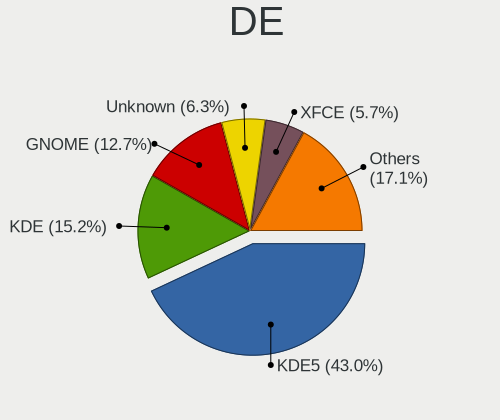
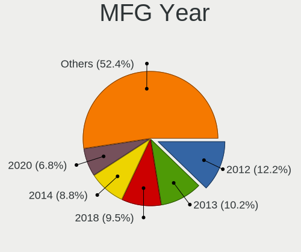
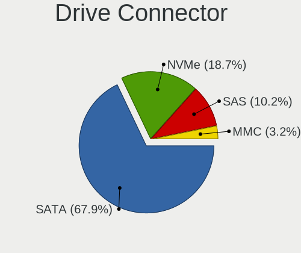
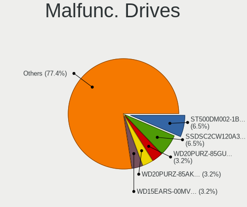
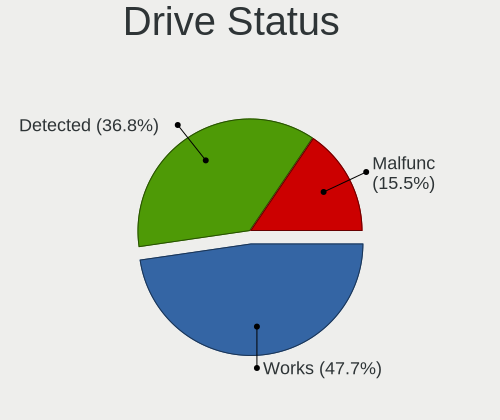
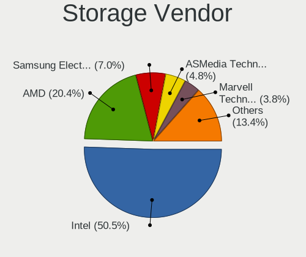
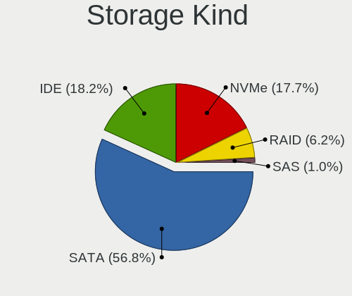
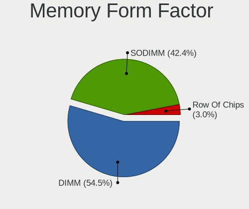
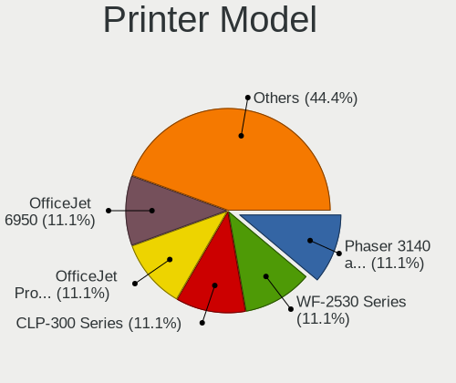
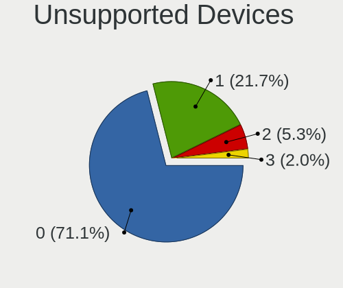

Mageia - Tested Hardware & Statistics
-------------------------------------

A project to collect tested hardware configurations for Mageia.

Anyone can contribute to this report by the [hw-probe](https://github.com/linuxhw/hw-probe) tool:

    sudo -E hw-probe -all -upload

Please contribute! Especially if your hardware is rare.

This is a report for all computer types. See also reports for [desktops](/Dist/Mageia/Desktop/README.md) and [notebooks](/Dist/Mageia/Notebook/README.md).

Contents
--------

* [ Test Cases ](#test-cases)

* [ System ](#system)
  - [ OS                       ](#os)
  - [ OS Family                ](#os-family)
  - [ Kernel                   ](#kernel)
  - [ Kernel Family            ](#kernel-family)
  - [ Kernel Major Ver.        ](#kernel-major-ver)
  - [ Arch                     ](#arch)
  - [ DE                       ](#de)
  - [ Display Server           ](#display-server)
  - [ Display Manager          ](#display-manager)
  - [ OS Lang                  ](#os-lang)
  - [ Boot Mode                ](#boot-mode)
  - [ Filesystem               ](#filesystem)
  - [ Part. scheme             ](#part-scheme)
  - [ Dual Boot with Linux/BSD ](#dual-boot-with-linuxbsd)
  - [ Dual Boot (Win)          ](#dual-boot-win)

* [ Board ](#board)
  - [ Vendor                   ](#vendor)
  - [ Model                    ](#model)
  - [ Model Family             ](#model-family)
  - [ MFG Year                 ](#mfg-year)
  - [ Form Factor              ](#form-factor)
  - [ Secure Boot              ](#secure-boot)
  - [ Coreboot                 ](#coreboot)
  - [ RAM Size                 ](#ram-size)
  - [ RAM Used                 ](#ram-used)
  - [ Total Drives             ](#total-drives)
  - [ Has CD-ROM               ](#has-cd-rom)
  - [ Has Ethernet             ](#has-ethernet)
  - [ Has WiFi                 ](#has-wifi)
  - [ Has Bluetooth            ](#has-bluetooth)

* [ Location ](#location)
  - [ Country                  ](#country)
  - [ City                     ](#city)

* [ Drives ](#drives)
  - [ Drive Vendor             ](#drive-vendor)
  - [ Drive Model              ](#drive-model)
  - [ HDD Vendor               ](#hdd-vendor)
  - [ SSD Vendor               ](#ssd-vendor)
  - [ Drive Kind               ](#drive-kind)
  - [ Drive Connector          ](#drive-connector)
  - [ Drive Size               ](#drive-size)
  - [ Space Total              ](#space-total)
  - [ Space Used               ](#space-used)
  - [ Malfunc. Drives          ](#malfunc-drives)
  - [ Malfunc. Drive Vendor    ](#malfunc-drive-vendor)
  - [ Malfunc. HDD Vendor      ](#malfunc-hdd-vendor)
  - [ Malfunc. Drive Kind      ](#malfunc-drive-kind)
  - [ Failed Drives            ](#failed-drives)
  - [ Failed Drive Vendor      ](#failed-drive-vendor)
  - [ Drive Status             ](#drive-status)

* [ Storage controller ](#storage-controller)
  - [ Storage Vendor           ](#storage-vendor)
  - [ Storage Model            ](#storage-model)
  - [ Storage Kind             ](#storage-kind)

* [ Processor ](#processor)
  - [ CPU Vendor               ](#cpu-vendor)
  - [ CPU Model                ](#cpu-model)
  - [ CPU Model Family         ](#cpu-model-family)
  - [ CPU Cores                ](#cpu-cores)
  - [ CPU Sockets              ](#cpu-sockets)
  - [ CPU Threads              ](#cpu-threads)
  - [ CPU Op-Modes             ](#cpu-op-modes)
  - [ CPU Microcode            ](#cpu-microcode)
  - [ CPU Microarch            ](#cpu-microarch)

* [ Graphics ](#graphics)
  - [ GPU Vendor               ](#gpu-vendor)
  - [ GPU Model                ](#gpu-model)
  - [ GPU Combo                ](#gpu-combo)
  - [ GPU Driver               ](#gpu-driver)
  - [ GPU Memory               ](#gpu-memory)

* [ Monitor ](#monitor)
  - [ Monitor Vendor           ](#monitor-vendor)
  - [ Monitor Model            ](#monitor-model)
  - [ Monitor Resolution       ](#monitor-resolution)
  - [ Monitor Diagonal         ](#monitor-diagonal)
  - [ Monitor Width            ](#monitor-width)
  - [ Aspect Ratio             ](#aspect-ratio)
  - [ Monitor Area             ](#monitor-area)
  - [ Pixel Density            ](#pixel-density)
  - [ Multiple Monitors        ](#multiple-monitors)

* [ Network ](#network)
  - [ Net Controller Vendor    ](#net-controller-vendor)
  - [ Net Controller Model     ](#net-controller-model)
  - [ Wireless Vendor          ](#wireless-vendor)
  - [ Wireless Model           ](#wireless-model)
  - [ Ethernet Vendor          ](#ethernet-vendor)
  - [ Ethernet Model           ](#ethernet-model)
  - [ Net Controller Kind      ](#net-controller-kind)
  - [ Used Controller          ](#used-controller)
  - [ NICs                     ](#nics)
  - [ IPv6                     ](#ipv6)

* [ Bluetooth ](#bluetooth)
  - [ Bluetooth Vendor         ](#bluetooth-vendor)
  - [ Bluetooth Model          ](#bluetooth-model)

* [ Sound ](#sound)
  - [ Sound Vendor             ](#sound-vendor)
  - [ Sound Model              ](#sound-model)

* [ Memory ](#memory)
  - [ Memory Vendor            ](#memory-vendor)
  - [ Memory Model             ](#memory-model)
  - [ Memory Kind              ](#memory-kind)
  - [ Memory Form Factor       ](#memory-form-factor)
  - [ Memory Size              ](#memory-size)
  - [ Memory Speed             ](#memory-speed)

* [ Printers & scanners ](#printers--scanners)
  - [ Printer Vendor           ](#printer-vendor)
  - [ Printer Model            ](#printer-model)
  - [ Scanner Vendor           ](#scanner-vendor)
  - [ Scanner Model            ](#scanner-model)

* [ Camera ](#camera)
  - [ Camera Vendor            ](#camera-vendor)
  - [ Camera Model             ](#camera-model)

* [ Security ](#security)
  - [ Fingerprint Vendor       ](#fingerprint-vendor)
  - [ Fingerprint Model        ](#fingerprint-model)
  - [ Chipcard Vendor          ](#chipcard-vendor)
  - [ Chipcard Model           ](#chipcard-model)

* [ Unsupported ](#unsupported)
  - [ Unsupported Devices      ](#unsupported-devices)
  - [ Unsupported Device Types ](#unsupported-device-types)

Test Cases
----------

Total: 241

| Vendor    | Model                       | Form-Factor | Probe                                                      | Date         |
|-----------|-----------------------------|-------------|------------------------------------------------------------|--------------|
| Gigabyte  | B450M DS3H-CF               | Desktop     | [69968fade5](https://linux-hardware.org/?probe=69968fade5) | Dec 29, 2024 |
| Gigabyte  | X570 GAMING X               | Desktop     | [329e4898cd](https://linux-hardware.org/?probe=329e4898cd) | Dec 13, 2024 |
| Intel     | NUC12WSBi5 M46425-303       | Mini pc     | [b979600a4a](https://linux-hardware.org/?probe=b979600a4a) | Nov 29, 2024 |
| MSI       | G41M-S01                    | Desktop     | [34344c8186](https://linux-hardware.org/?probe=34344c8186) | Oct 26, 2024 |
| OEM       | I42IL1                      | Notebook    | [3a9938d946](https://linux-hardware.org/?probe=3a9938d946) | Oct 26, 2024 |
| ASRock    | X79 Extreme4                | Desktop     | [5360f41672](https://linux-hardware.org/?probe=5360f41672) | Oct 12, 2024 |
| HP        | 0A60h                       | Desktop     | [382484402a](https://linux-hardware.org/?probe=382484402a) | Oct 07, 2024 |
| ASUSTek   | ROG Maximus Z790 DARK HE... | Desktop     | [997be25415](https://linux-hardware.org/?probe=997be25415) | Oct 06, 2024 |
| Acer      | Aspire A315-59G             | Notebook    | [3c57995295](https://linux-hardware.org/?probe=3c57995295) | Oct 05, 2024 |
| Lenovo    | G585 20137                  | Notebook    | [379f6e6fef](https://linux-hardware.org/?probe=379f6e6fef) | Oct 05, 2024 |
| HP        | Pavilion g4                 | Notebook    | [c705d7afa6](https://linux-hardware.org/?probe=c705d7afa6) | Oct 05, 2024 |
| Foxconn   | M61PMV FAB                  | Desktop     | [1d1eff2e7b](https://linux-hardware.org/?probe=1d1eff2e7b) | Oct 05, 2024 |
| MSI       | 2A9C                        | Desktop     | [61b9b2ee38](https://linux-hardware.org/?probe=61b9b2ee38) | Oct 05, 2024 |
| MSI       | H410M PRO                   | Desktop     | [50719966e4](https://linux-hardware.org/?probe=50719966e4) | Oct 05, 2024 |
| ASUSTek   | ZenBook UX425EA_UX425EA     | Notebook    | [17286ddcf5](https://linux-hardware.org/?probe=17286ddcf5) | Oct 03, 2024 |
| HP        | Laptop 17-ca1xxx            | Notebook    | [1e94fd61d3](https://linux-hardware.org/?probe=1e94fd61d3) | Aug 29, 2024 |
| Intel     | NUC12WSBi5 M46425-303       | Mini pc     | [2e5356112f](https://linux-hardware.org/?probe=2e5356112f) | Aug 21, 2024 |
| MSI       | MPG B650 CARBON WIFI        | Desktop     | [dbafdb30ab](https://linux-hardware.org/?probe=dbafdb30ab) | Jul 05, 2024 |
| HP        | 158A                        | Desktop     | [c0b9f5216e](https://linux-hardware.org/?probe=c0b9f5216e) | May 29, 2024 |
| HP        | 1998                        | Desktop     | [7d652e5edc](https://linux-hardware.org/?probe=7d652e5edc) | May 13, 2024 |
| HP        | Victus by Gaming Laptop ... | Notebook    | [62d3477a3b](https://linux-hardware.org/?probe=62d3477a3b) | May 10, 2024 |
| Dell      | 03W3VW A02                  | Desktop     | [ee02b7cd0b](https://linux-hardware.org/?probe=ee02b7cd0b) | May 05, 2024 |
| MSI       | MAG B460M MORTAR            | Desktop     | [175185cdad](https://linux-hardware.org/?probe=175185cdad) | Apr 12, 2024 |
| Acer      | Aspire 5742Z                | Notebook    | [f9ceb71c71](https://linux-hardware.org/?probe=f9ceb71c71) | Apr 11, 2024 |
| Acer      | Aspire SW5-011              | Notebook    | [4e8ad9d65f](https://linux-hardware.org/?probe=4e8ad9d65f) | Apr 10, 2024 |
| Acer      | Aspire SW5-011              | Notebook    | [6f6cb62f08](https://linux-hardware.org/?probe=6f6cb62f08) | Apr 02, 2024 |
| Acer      | Aspire SW5-011              | Notebook    | [6fbb2e2797](https://linux-hardware.org/?probe=6fbb2e2797) | Apr 01, 2024 |
| HP        | ProBook 650 G1              | Notebook    | [f097372357](https://linux-hardware.org/?probe=f097372357) | Mar 31, 2024 |
| ASRock    | 970 Pro3 R2.0               | Desktop     | [a06f99839a](https://linux-hardware.org/?probe=a06f99839a) | Mar 30, 2024 |
| ASUSTek   | VivoBook_ASUSLaptop X712... | Notebook    | [d6f2169d3f](https://linux-hardware.org/?probe=d6f2169d3f) | Mar 26, 2024 |
| Insyde    | BayTrail                    | Notebook    | [2566898a32](https://linux-hardware.org/?probe=2566898a32) | Mar 23, 2024 |
| Gigabyte  | F2A68HM-H                   | Desktop     | [2ae64472ff](https://linux-hardware.org/?probe=2ae64472ff) | Mar 20, 2024 |
| Gigabyte  | P67A-UD3-B3                 | Desktop     | [5089ab522a](https://linux-hardware.org/?probe=5089ab522a) | Mar 20, 2024 |
| Dell      | 0HN7XN A01                  | Desktop     | [987e3ca0a5](https://linux-hardware.org/?probe=987e3ca0a5) | Mar 20, 2024 |
| MSI       | A520M-A PRO                 | Desktop     | [8ff1245537](https://linux-hardware.org/?probe=8ff1245537) | Mar 19, 2024 |
| Lenovo    | SHARKBAY 0B98401 PRO        | Desktop     | [392bd2c7d3](https://linux-hardware.org/?probe=392bd2c7d3) | Mar 10, 2024 |
| MSI       | A520M-A PRO                 | Desktop     | [4958d63fb4](https://linux-hardware.org/?probe=4958d63fb4) | Feb 20, 2024 |
| Unknown   | Unknown                     | Desktop     | [3e1781cc8c](https://linux-hardware.org/?probe=3e1781cc8c) | Feb 16, 2024 |
| Unknown   | Unknown                     | Desktop     | [daefcf1b9f](https://linux-hardware.org/?probe=daefcf1b9f) | Feb 16, 2024 |
| Lenovo    | G50-30 80G0                 | Notebook    | [e1e268d222](https://linux-hardware.org/?probe=e1e268d222) | Jan 18, 2024 |
| Gigabyte  | B550 AORUS ELITE V2         | Desktop     | [0c54141bbd](https://linux-hardware.org/?probe=0c54141bbd) | Jan 11, 2024 |
| Gigabyte  | B550 AORUS ELITE V2         | Desktop     | [3117cde827](https://linux-hardware.org/?probe=3117cde827) | Jan 11, 2024 |
| HP        | ProBook 450 G1              | Notebook    | [028d205023](https://linux-hardware.org/?probe=028d205023) | Jan 09, 2024 |
| HP        | Compaq 6710b (GB887ET#AB... | Notebook    | [2aaeccac56](https://linux-hardware.org/?probe=2aaeccac56) | Jan 08, 2024 |
| Gigabyte  | H110M-S2-CF                 | Desktop     | [8ea8935806](https://linux-hardware.org/?probe=8ea8935806) | Jan 04, 2024 |
| ASUSTek   | PRIME B450-PLUS             | Desktop     | [863f0b5c06](https://linux-hardware.org/?probe=863f0b5c06) | Dec 29, 2023 |
| Lenovo    | 317C SDK0J40700 WIN 3258... | Desktop     | [f24d5f341c](https://linux-hardware.org/?probe=f24d5f341c) | Dec 28, 2023 |
| Gigabyte  | H81M-S2H                    | Desktop     | [8dd5a975f9](https://linux-hardware.org/?probe=8dd5a975f9) | Dec 02, 2023 |
| ASUSTek   | VivoBook_ASUSLaptop K660... | Notebook    | [9315424410](https://linux-hardware.org/?probe=9315424410) | Nov 21, 2023 |
| ASUSTek   | VivoBook_ASUSLaptop K660... | Notebook    | [5e92402cde](https://linux-hardware.org/?probe=5e92402cde) | Nov 21, 2023 |
| HP        | 255 15.6 inch G9 Noteboo... | Notebook    | [b1394cc278](https://linux-hardware.org/?probe=b1394cc278) | Oct 30, 2023 |
| Gigabyte  | B450M DS3H-CF               | Desktop     | [e18680d1f4](https://linux-hardware.org/?probe=e18680d1f4) | Oct 29, 2023 |
| Dell      | 0GK35Y A00                  | Desktop     | [99aded4434](https://linux-hardware.org/?probe=99aded4434) | Oct 17, 2023 |
| Gigabyte  | Z87X-UD5H-CF                | Desktop     | [ff0a453a0e](https://linux-hardware.org/?probe=ff0a453a0e) | Oct 13, 2023 |
| Lenovo    | IdeaPad Slim 3 15AMN8 82... | Notebook    | [02c2fabd1e](https://linux-hardware.org/?probe=02c2fabd1e) | Oct 11, 2023 |
| Lenovo    | IdeaPad Slim 3 15AMN8 82... | Notebook    | [02a4135aff](https://linux-hardware.org/?probe=02a4135aff) | Oct 09, 2023 |
| Dell      | 0GK35Y A00                  | Desktop     | [47987fd9dd](https://linux-hardware.org/?probe=47987fd9dd) | Oct 07, 2023 |
| Dell      | 0GK35Y A00                  | Desktop     | [d785138af0](https://linux-hardware.org/?probe=d785138af0) | Sep 03, 2023 |
| Fujitsu   | S6420                       | Notebook    | [044d4185b7](https://linux-hardware.org/?probe=044d4185b7) | Aug 22, 2023 |
| HP        | Pavilion Notebook           | Notebook    | [7fd3205fde](https://linux-hardware.org/?probe=7fd3205fde) | Aug 11, 2023 |
| Lenovo    | Yoga 720-15IKB 80X7         | Convertible | [b691f28c43](https://linux-hardware.org/?probe=b691f28c43) | Aug 10, 2023 |
| Dell      | Latitude E5470              | Notebook    | [f64529e38b](https://linux-hardware.org/?probe=f64529e38b) | Aug 08, 2023 |
| ASUSTek   | Q551LN                      | Notebook    | [ad2abcddcf](https://linux-hardware.org/?probe=ad2abcddcf) | Jul 27, 2023 |
| Gigabyte  | Z87X-UD5H-CF                | Desktop     | [6f489ed497](https://linux-hardware.org/?probe=6f489ed497) | Jul 20, 2023 |
| HP        | Laptop 14-cm0xxx            | Notebook    | [a0fd2eeb7b](https://linux-hardware.org/?probe=a0fd2eeb7b) | Jul 11, 2023 |
| Compaq    | 420                         | Notebook    | [6f4350d53e](https://linux-hardware.org/?probe=6f4350d53e) | Jul 10, 2023 |
| ASUSTek   | K73SD                       | Notebook    | [063e42ac60](https://linux-hardware.org/?probe=063e42ac60) | May 22, 2023 |
| ASUSTek   | TUF Gaming B550M-PLUS       | Desktop     | [a2b832afa2](https://linux-hardware.org/?probe=a2b832afa2) | Apr 30, 2023 |
| Gigabyte  | Z97-D3H-CF                  | Desktop     | [a62e386eae](https://linux-hardware.org/?probe=a62e386eae) | Apr 24, 2023 |
| Gigabyte  | Z97-D3H-CF                  | Desktop     | [bd9d832f72](https://linux-hardware.org/?probe=bd9d832f72) | Apr 23, 2023 |
| Dell      | Latitude 7370               | Notebook    | [a254d0d7f1](https://linux-hardware.org/?probe=a254d0d7f1) | Apr 02, 2023 |
| ASUSTek   | TUF Gaming B550M-PLUS       | Desktop     | [e45ad193f8](https://linux-hardware.org/?probe=e45ad193f8) | Apr 01, 2023 |
| Dell      | Latitude 7370               | Notebook    | [b8a0b25983](https://linux-hardware.org/?probe=b8a0b25983) | Mar 30, 2023 |
| MSI       | Z590-A PRO                  | Desktop     | [ad6a144db9](https://linux-hardware.org/?probe=ad6a144db9) | Mar 23, 2023 |
| ASUSTek   | M3A78-EMH HDMI              | Desktop     | [0aa8c2bf55](https://linux-hardware.org/?probe=0aa8c2bf55) | Mar 20, 2023 |
| ASUSTek   | P8H61-M LE                  | Desktop     | [bb43961724](https://linux-hardware.org/?probe=bb43961724) | Mar 17, 2023 |
| HP        | ProBook 5330m               | Notebook    | [2ec50367d4](https://linux-hardware.org/?probe=2ec50367d4) | Mar 11, 2023 |
| Lenovo    | MAHOBAY                     | Desktop     | [d0541545c8](https://linux-hardware.org/?probe=d0541545c8) | Mar 11, 2023 |
| ASUSTek   | P8H61-M LE                  | Desktop     | [69713a19ea](https://linux-hardware.org/?probe=69713a19ea) | Feb 28, 2023 |
| HP        | Unknown                     | Notebook    | [702ed67add](https://linux-hardware.org/?probe=702ed67add) | Dec 17, 2022 |
| HP        | Unknown                     | Notebook    | [d952fd785e](https://linux-hardware.org/?probe=d952fd785e) | Dec 17, 2022 |
| Fujitsu   | CELSIUS H720                | Notebook    | [a7eacb37c5](https://linux-hardware.org/?probe=a7eacb37c5) | Dec 03, 2022 |
| Lenovo    | ThinkCentre A57 970274G     | Desktop     | [809e137f17](https://linux-hardware.org/?probe=809e137f17) | Nov 02, 2022 |
| MSI       | B360I GMAING PRO AC         | Desktop     | [2584a31610](https://linux-hardware.org/?probe=2584a31610) | Oct 12, 2022 |
| Gigabyte  | Z87X-UD5H-CF                | Desktop     | [8d0d1ba821](https://linux-hardware.org/?probe=8d0d1ba821) | Oct 12, 2022 |
| MSI       | B360I GMAING PRO AC         | Desktop     | [bbdf7b4f77](https://linux-hardware.org/?probe=bbdf7b4f77) | Oct 01, 2022 |
| Irbis     | NB264                       | Notebook    | [103ca2d20b](https://linux-hardware.org/?probe=103ca2d20b) | Sep 16, 2022 |
| ASRock    | B550M-HDV                   | Desktop     | [c786c365d5](https://linux-hardware.org/?probe=c786c365d5) | Sep 06, 2022 |
| ASUSTek   | X751LN                      | Notebook    | [68cd0152fb](https://linux-hardware.org/?probe=68cd0152fb) | Aug 22, 2022 |
| ASUSTek   | M5A99FX PRO R2.0            | Desktop     | [d14ad254ca](https://linux-hardware.org/?probe=d14ad254ca) | Jul 05, 2022 |
| Schenker  | VIA_14_SVI14E20             | Notebook    | [3adb69bbf5](https://linux-hardware.org/?probe=3adb69bbf5) | Jun 03, 2022 |
| Notebook  | NH5x_NH7x_HHx_HJx_HKx       | Notebook    | [e30e3da709](https://linux-hardware.org/?probe=e30e3da709) | May 18, 2022 |
| Dell      | Latitude E5570              | Notebook    | [ec640c6644](https://linux-hardware.org/?probe=ec640c6644) | May 12, 2022 |
| Gigabyte  | H170-D3H-CF                 | Desktop     | [9f255eb7d5](https://linux-hardware.org/?probe=9f255eb7d5) | May 06, 2022 |
| ASUSTek   | F1A75-M LE                  | Desktop     | [93232d0716](https://linux-hardware.org/?probe=93232d0716) | May 01, 2022 |
| Microsoft | Surface Pro 4               | Tablet      | [4e74006288](https://linux-hardware.org/?probe=4e74006288) | Apr 21, 2022 |
| Lenovo    | ThinkPad X1 Carbon 5th 2... | Notebook    | [086a94d83c](https://linux-hardware.org/?probe=086a94d83c) | Apr 15, 2022 |
| Megaware  | MW-G31T-M7                  | Desktop     | [3ac4860cb3](https://linux-hardware.org/?probe=3ac4860cb3) | Apr 13, 2022 |
| Megaware  | MW-G31T-M7                  | Desktop     | [ce643cbdcd](https://linux-hardware.org/?probe=ce643cbdcd) | Apr 13, 2022 |
| Gigabyte  | H81M-S2H                    | Desktop     | [ac5d29c839](https://linux-hardware.org/?probe=ac5d29c839) | Apr 05, 2022 |
| MSI       | Z590-A PRO                  | Desktop     | [229ed42b3d](https://linux-hardware.org/?probe=229ed42b3d) | Apr 03, 2022 |
| Toshiba   | dynabook R73/A              | Notebook    | [42b60c90c7](https://linux-hardware.org/?probe=42b60c90c7) | Apr 01, 2022 |
| Gigabyte  | GA-78LMT-USB3 SEx           | Desktop     | [2955e87822](https://linux-hardware.org/?probe=2955e87822) | Mar 29, 2022 |
| Gigabyte  | G31M-S2C                    | Desktop     | [a56fb721dd](https://linux-hardware.org/?probe=a56fb721dd) | Mar 17, 2022 |
| Gigabyte  | X570 AORUS ELITE WIFI       | Desktop     | [8d52e31d86](https://linux-hardware.org/?probe=8d52e31d86) | Mar 09, 2022 |
| MSI       | Z590-A PRO                  | Desktop     | [5f37c84d61](https://linux-hardware.org/?probe=5f37c84d61) | Mar 06, 2022 |
| Gigabyte  | G31M-S2C                    | Desktop     | [d419223147](https://linux-hardware.org/?probe=d419223147) | Mar 06, 2022 |
| Gigabyte  | X570 AORUS ELITE WIFI       | Desktop     | [c11d937631](https://linux-hardware.org/?probe=c11d937631) | Feb 23, 2022 |
| ASRock    | M3A UCC                     | Desktop     | [eaa75fb3f4](https://linux-hardware.org/?probe=eaa75fb3f4) | Feb 20, 2022 |
| ASRock    | M3A UCC                     | Desktop     | [ce306a4c86](https://linux-hardware.org/?probe=ce306a4c86) | Feb 20, 2022 |
| MSI       | B250M BAZOOKA               | Desktop     | [4a8f0501a2](https://linux-hardware.org/?probe=4a8f0501a2) | Feb 11, 2022 |
| ASRock    | G41M-VS3                    | Desktop     | [825356bf6c](https://linux-hardware.org/?probe=825356bf6c) | Feb 02, 2022 |
| HP        | 1589                        | Desktop     | [41dbcb78cb](https://linux-hardware.org/?probe=41dbcb78cb) | Jan 30, 2022 |
| Gigabyte  | H81M-DS2                    | Desktop     | [c0328d5402](https://linux-hardware.org/?probe=c0328d5402) | Jan 27, 2022 |
| Lenovo    | ThinkCentre M58e 7491B1G    | Desktop     | [568741947f](https://linux-hardware.org/?probe=568741947f) | Jan 12, 2022 |
| Gigabyte  | B450 AORUS M                | Desktop     | [d9856d52b0](https://linux-hardware.org/?probe=d9856d52b0) | Jan 11, 2022 |
| Gigabyte  | B450 AORUS M                | Desktop     | [8b8a13f3b4](https://linux-hardware.org/?probe=8b8a13f3b4) | Jan 11, 2022 |
| Gigabyte  | B450 AORUS M                | Desktop     | [0fa4a81a77](https://linux-hardware.org/?probe=0fa4a81a77) | Jan 09, 2022 |
| Lenovo    | ThinkCentre M58e 7491B1G    | Desktop     | [a77218c72c](https://linux-hardware.org/?probe=a77218c72c) | Jan 09, 2022 |
| Gigabyte  | Z87X-UD5H-CF                | Desktop     | [a1a7854f7a](https://linux-hardware.org/?probe=a1a7854f7a) | Jan 04, 2022 |
| MSI       | MPG X570 GAMING EDGE WIF... | Desktop     | [c1d67915d0](https://linux-hardware.org/?probe=c1d67915d0) | Dec 26, 2021 |
| ASUSTek   | ROG ZENITH EXTREME          | Desktop     | [e3d82aebbe](https://linux-hardware.org/?probe=e3d82aebbe) | Dec 20, 2021 |
| MSI       | MPG X570 GAMING EDGE WIF... | Desktop     | [fdc65fea9d](https://linux-hardware.org/?probe=fdc65fea9d) | Dec 08, 2021 |
| Dell      | Latitude E5570              | Notebook    | [38032eae74](https://linux-hardware.org/?probe=38032eae74) | Dec 06, 2021 |
| Dell      | Latitude E5570              | Notebook    | [9314738bbb](https://linux-hardware.org/?probe=9314738bbb) | Dec 06, 2021 |
| Dell      | Precision 5530              | Notebook    | [f98313a80c](https://linux-hardware.org/?probe=f98313a80c) | Nov 29, 2021 |
| Dell      | 0TP412                      | Desktop     | [f759f2084b](https://linux-hardware.org/?probe=f759f2084b) | Nov 22, 2021 |
| ASUSTek   | SABERTOOTH 990FX R2.0       | Desktop     | [3e92c96ac0](https://linux-hardware.org/?probe=3e92c96ac0) | Nov 17, 2021 |
| ASUSTek   | SABERTOOTH 990FX R2.0       | Desktop     | [6e13fb31c9](https://linux-hardware.org/?probe=6e13fb31c9) | Oct 17, 2021 |
| ASUSTek   | SABERTOOTH 990FX R2.0       | Desktop     | [45d12f532c](https://linux-hardware.org/?probe=45d12f532c) | Oct 01, 2021 |
| Lenovo    | IdeaPad 3 15ADA05 81W1      | Notebook    | [3f4fe97a8a](https://linux-hardware.org/?probe=3f4fe97a8a) | Sep 30, 2021 |
| Gigabyte  | H170-D3H-CF                 | Desktop     | [42784959b9](https://linux-hardware.org/?probe=42784959b9) | Sep 28, 2021 |
| Apple     | Mac-F42386C8 PVT            | All in one  | [3235b7d95a](https://linux-hardware.org/?probe=3235b7d95a) | Sep 24, 2021 |
| Dell      | 0TP412                      | Desktop     | [25b9af915a](https://linux-hardware.org/?probe=25b9af915a) | Sep 09, 2021 |
| MSI       | MAG B460M MORTAR            | Desktop     | [6fa1f56407](https://linux-hardware.org/?probe=6fa1f56407) | Aug 30, 2021 |
| Gigabyte  | H81M-S2H                    | Desktop     | [894c915ecc](https://linux-hardware.org/?probe=894c915ecc) | Aug 17, 2021 |
| Lenovo    | IdeaPad Slim 1-14AST-05 ... | Notebook    | [46250d420a](https://linux-hardware.org/?probe=46250d420a) | Aug 14, 2021 |
| Gigabyte  | B450 AORUS PRO WIFI-CF      | Desktop     | [4c28c43c28](https://linux-hardware.org/?probe=4c28c43c28) | Aug 10, 2021 |
| Lenovo    | ThinkPad T61 6468AE2        | Notebook    | [216fbf401b](https://linux-hardware.org/?probe=216fbf401b) | Aug 05, 2021 |
| Gigabyte  | Z87X-UD5H-CF                | Desktop     | [88ddc09b9e](https://linux-hardware.org/?probe=88ddc09b9e) | Jul 28, 2021 |
| Gigabyte  | H81M-S2H                    | Desktop     | [f52713e401](https://linux-hardware.org/?probe=f52713e401) | Jul 28, 2021 |
| Dell      | 0TP412                      | Desktop     | [8788d078a0](https://linux-hardware.org/?probe=8788d078a0) | Jul 19, 2021 |
| ASUSTek   | PRIME X399-A                | Desktop     | [a2b6af1a6a](https://linux-hardware.org/?probe=a2b6af1a6a) | Jul 14, 2021 |
| ASUSTek   | X751LN                      | Notebook    | [8c0efa94e8](https://linux-hardware.org/?probe=8c0efa94e8) | Jul 08, 2021 |
| Gigabyte  | Z68XP-UD3P                  | Desktop     | [259e2a4ac0](https://linux-hardware.org/?probe=259e2a4ac0) | Jun 24, 2021 |
| Notebook  | NL40_50GU                   | Notebook    | [baa8447288](https://linux-hardware.org/?probe=baa8447288) | May 08, 2021 |
| Medion    | DEFENDER P10                | Notebook    | [cb752c0a4a](https://linux-hardware.org/?probe=cb752c0a4a) | May 01, 2021 |
| Medion    | DEFENDER P10                | Notebook    | [f42aa05a37](https://linux-hardware.org/?probe=f42aa05a37) | May 01, 2021 |
| Gigabyte  | B450M DS3H-CF               | Desktop     | [1be802a26e](https://linux-hardware.org/?probe=1be802a26e) | Apr 18, 2021 |
| ECS       | IC780M-A2                   | Desktop     | [e3cbd0879b](https://linux-hardware.org/?probe=e3cbd0879b) | Apr 17, 2021 |
| ASUSTek   | Z170-P                      | Desktop     | [1ebcf0ea2c](https://linux-hardware.org/?probe=1ebcf0ea2c) | Apr 16, 2021 |
| ASUSTek   | Z170-P                      | Desktop     | [a95896e05e](https://linux-hardware.org/?probe=a95896e05e) | Apr 16, 2021 |
| Medion    | Z370H4-EM                   | Desktop     | [57435ad8fb](https://linux-hardware.org/?probe=57435ad8fb) | Apr 16, 2021 |
| ASUSTek   | SABERTOOTH P67              | Desktop     | [6d81c9d615](https://linux-hardware.org/?probe=6d81c9d615) | Apr 16, 2021 |
| Fujitsu   | LIFEBOOK E752               | Notebook    | [8ec052ba75](https://linux-hardware.org/?probe=8ec052ba75) | Apr 15, 2021 |
| Gigabyte  | H61M-S2PV                   | Desktop     | [dce1091d81](https://linux-hardware.org/?probe=dce1091d81) | Apr 15, 2021 |
| Medion    | Z370H4-EM                   | Desktop     | [b88834e15d](https://linux-hardware.org/?probe=b88834e15d) | Apr 15, 2021 |
| Lenovo    | ThinkPad T430 2342A19       | Notebook    | [9a5ad3016a](https://linux-hardware.org/?probe=9a5ad3016a) | Apr 15, 2021 |
| HP        | 212B                        | Desktop     | [697e2f24f0](https://linux-hardware.org/?probe=697e2f24f0) | Apr 03, 2021 |
| ASUSTek   | X751LN                      | Notebook    | [09afc59907](https://linux-hardware.org/?probe=09afc59907) | Apr 02, 2021 |
| Intel     | STL2-bd A28808-302          | Desktop     | [d6b5151873](https://linux-hardware.org/?probe=d6b5151873) | Apr 01, 2021 |
| Gigabyte  | B450M DS3H-CF               | Desktop     | [dbb3c1865f](https://linux-hardware.org/?probe=dbb3c1865f) | Mar 29, 2021 |
| HP        | 212B                        | Desktop     | [69f528da9b](https://linux-hardware.org/?probe=69f528da9b) | Mar 28, 2021 |
| ASUSTek   | PRIME A320M-K               | Desktop     | [2b381b3421](https://linux-hardware.org/?probe=2b381b3421) | Mar 24, 2021 |
| ASUSTek   | X556URK                     | Notebook    | [4904d2c78e](https://linux-hardware.org/?probe=4904d2c78e) | Mar 18, 2021 |
| Gigabyte  | Z87X-UD5H-CF                | Desktop     | [d4570ea6b2](https://linux-hardware.org/?probe=d4570ea6b2) | Mar 12, 2021 |
| ASUSTek   | X751LN                      | Notebook    | [0bb2c11bdc](https://linux-hardware.org/?probe=0bb2c11bdc) | Feb 24, 2021 |
| ASRock    | M3A UCC                     | Desktop     | [714da9501f](https://linux-hardware.org/?probe=714da9501f) | Feb 19, 2021 |
| HP        | 339A                        | Desktop     | [43e759b593](https://linux-hardware.org/?probe=43e759b593) | Feb 14, 2021 |
| Dell      | Latitude E6530              | Notebook    | [035378659f](https://linux-hardware.org/?probe=035378659f) | Feb 12, 2021 |
| Gigabyte  | H81M-S2H                    | Desktop     | [f9e5b1d3c6](https://linux-hardware.org/?probe=f9e5b1d3c6) | Feb 08, 2021 |
| Gigabyte  | Z87X-UD5H-CF                | Desktop     | [aea262050c](https://linux-hardware.org/?probe=aea262050c) | Feb 04, 2021 |
| Dell      | Inspiron 5480               | Notebook    | [2ae12f394c](https://linux-hardware.org/?probe=2ae12f394c) | Jan 27, 2021 |
| Gigabyte  | B450M DS3H-CF               | Desktop     | [a399a43535](https://linux-hardware.org/?probe=a399a43535) | Jan 16, 2021 |
| Kiano     | SlimNote 15.6               | Notebook    | [55179f361c](https://linux-hardware.org/?probe=55179f361c) | Jan 08, 2021 |
| Kiano     | SlimNote 15.6               | Notebook    | [5379fd7478](https://linux-hardware.org/?probe=5379fd7478) | Jan 08, 2021 |
| ASUSTek   | VivoBook 15_ASUS Laptop ... | Notebook    | [01aa1a7b95](https://linux-hardware.org/?probe=01aa1a7b95) | Dec 30, 2020 |
| ASUSTek   | Z87-DELUXE                  | Desktop     | [e160eea25a](https://linux-hardware.org/?probe=e160eea25a) | Dec 28, 2020 |
| ASUSTek   | X751LN                      | Notebook    | [f7f3533d54](https://linux-hardware.org/?probe=f7f3533d54) | Dec 27, 2020 |
| HP        | 339A                        | Desktop     | [ea7792c224](https://linux-hardware.org/?probe=ea7792c224) | Dec 26, 2020 |
| ASUSTek   | ROG ZENITH EXTREME          | Desktop     | [5fd86e8c94](https://linux-hardware.org/?probe=5fd86e8c94) | Dec 22, 2020 |
| Dell      | Inspiron 5480               | Notebook    | [1261d0c9d3](https://linux-hardware.org/?probe=1261d0c9d3) | Dec 21, 2020 |
| Lenovo    | ThinkServer TS140           | Desktop     | [ec475a7f9a](https://linux-hardware.org/?probe=ec475a7f9a) | Dec 09, 2020 |
| ASRock    | H87M Pro4                   | Desktop     | [12185c0c75](https://linux-hardware.org/?probe=12185c0c75) | Dec 07, 2020 |
| ASRock    | H87M Pro4                   | Desktop     | [747bc56208](https://linux-hardware.org/?probe=747bc56208) | Dec 07, 2020 |
| Gigabyte  | F2A88XM-DS2                 | Desktop     | [1b5123770e](https://linux-hardware.org/?probe=1b5123770e) | Dec 06, 2020 |
| HP        | Spectre 13 Ultrabook        | Notebook    | [9b88fe4fa5](https://linux-hardware.org/?probe=9b88fe4fa5) | Nov 30, 2020 |
| Gigabyte  | H81M-S2H                    | Desktop     | [009e2519cb](https://linux-hardware.org/?probe=009e2519cb) | Nov 22, 2020 |
| HP        | EliteBook 840 G3            | Notebook    | [4dd618cb59](https://linux-hardware.org/?probe=4dd618cb59) | Nov 21, 2020 |
| HP        | EliteBook 840 G3            | Notebook    | [2543664b54](https://linux-hardware.org/?probe=2543664b54) | Nov 21, 2020 |
| Gigabyte  | GA-78LMT-USB3 R2            | Desktop     | [1aec57de3b](https://linux-hardware.org/?probe=1aec57de3b) | Nov 20, 2020 |
| ASUSTek   | PRIME B360-PLUS             | Desktop     | [dadbc2f1d7](https://linux-hardware.org/?probe=dadbc2f1d7) | Nov 15, 2020 |
| Lenovo    | IdeaPad 3 15ADA05 81W1      | Notebook    | [889cb35866](https://linux-hardware.org/?probe=889cb35866) | Nov 13, 2020 |
| HP        | ProBook 445 G7              | Notebook    | [2e97281aa0](https://linux-hardware.org/?probe=2e97281aa0) | Nov 05, 2020 |
| MSI       | MPG X570 GAMING EDGE WIF... | Desktop     | [fb717dc126](https://linux-hardware.org/?probe=fb717dc126) | Nov 05, 2020 |
| Gigabyte  | H170-D3H-CF                 | Desktop     | [8220a96972](https://linux-hardware.org/?probe=8220a96972) | Nov 02, 2020 |
| Acer      | Aspire V3-772               | Notebook    | [413786151e](https://linux-hardware.org/?probe=413786151e) | Oct 31, 2020 |
| Dell      | Inspiron 5480               | Notebook    | [62bb8575f1](https://linux-hardware.org/?probe=62bb8575f1) | Oct 22, 2020 |
| ASUSTek   | SABERTOOTH 990FX R2.0       | Desktop     | [e50d2bd553](https://linux-hardware.org/?probe=e50d2bd553) | Oct 18, 2020 |
| ZOTAC     | Unknown                     | Desktop     | [624888f3ab](https://linux-hardware.org/?probe=624888f3ab) | Oct 14, 2020 |
| Gigabyte  | H170-D3H-CF                 | Desktop     | [c73f4878af](https://linux-hardware.org/?probe=c73f4878af) | Oct 04, 2020 |
| Lenovo    | ThinkServer TS140           | Desktop     | [87f4eac666](https://linux-hardware.org/?probe=87f4eac666) | Sep 27, 2020 |
| HP        | Unknown                     | Notebook    | [b12d1589a1](https://linux-hardware.org/?probe=b12d1589a1) | Sep 08, 2020 |
| Acer      | Aspire 7741                 | Notebook    | [e5914ee358](https://linux-hardware.org/?probe=e5914ee358) | Sep 05, 2020 |
| HP        | Pavilion dv6                | Notebook    | [021a94f63e](https://linux-hardware.org/?probe=021a94f63e) | Sep 03, 2020 |
| ASRock    | M3A UCC                     | Desktop     | [43182d8754](https://linux-hardware.org/?probe=43182d8754) | Sep 01, 2020 |
| ASRock    | M3A UCC                     | Desktop     | [50908c43f9](https://linux-hardware.org/?probe=50908c43f9) | Sep 01, 2020 |
| Gigabyte  | Z87X-UD5H-CF                | Desktop     | [cbab4d3ea3](https://linux-hardware.org/?probe=cbab4d3ea3) | Aug 31, 2020 |
| Lenovo    | G480 20149                  | Notebook    | [5598a535c7](https://linux-hardware.org/?probe=5598a535c7) | Jul 24, 2020 |
| ASUSTek   | P8H61-M LE                  | Desktop     | [2ca048a380](https://linux-hardware.org/?probe=2ca048a380) | Jun 29, 2020 |
| ASRock    | H81M-VG4 R2.0               | Desktop     | [ed7fe704dd](https://linux-hardware.org/?probe=ed7fe704dd) | May 25, 2020 |
| HP        | 339A                        | Desktop     | [bbd2341205](https://linux-hardware.org/?probe=bbd2341205) | May 09, 2020 |
| HP        | 339A                        | Desktop     | [1334fcea56](https://linux-hardware.org/?probe=1334fcea56) | May 09, 2020 |
| ASUSTek   | VivoBook 15_ASUS Laptop ... | Notebook    | [8e31f45bf5](https://linux-hardware.org/?probe=8e31f45bf5) | May 07, 2020 |
| ASUSTek   | VivoBook 15_ASUS Laptop ... | Notebook    | [4b71b90312](https://linux-hardware.org/?probe=4b71b90312) | May 04, 2020 |
| MSI       | B360M MORTAR                | Desktop     | [d2215c28af](https://linux-hardware.org/?probe=d2215c28af) | Apr 26, 2020 |
| ASUSTek   | SABERTOOTH 990FX R2.0       | Desktop     | [f6e5343aa5](https://linux-hardware.org/?probe=f6e5343aa5) | Mar 31, 2020 |
| ASUSTek   | H170M-PLUS                  | Desktop     | [6dd350fc4a](https://linux-hardware.org/?probe=6dd350fc4a) | Mar 31, 2020 |
| ASUSTek   | PRIME A320M-K               | Desktop     | [cabb3f4266](https://linux-hardware.org/?probe=cabb3f4266) | Mar 29, 2020 |
| Vorke     | V1 Plus                     | Desktop     | [c49c2bb635](https://linux-hardware.org/?probe=c49c2bb635) | Mar 29, 2020 |
| ASRock    | X470 Taichi                 | Desktop     | [5125778e67](https://linux-hardware.org/?probe=5125778e67) | Mar 02, 2020 |
| Gigabyte  | B85M-D3H                    | Desktop     | [00442cfd17](https://linux-hardware.org/?probe=00442cfd17) | Feb 25, 2020 |
| Gigabyte  | Z87X-UD5H-CF                | Desktop     | [71a967abf8](https://linux-hardware.org/?probe=71a967abf8) | Feb 22, 2020 |
| Gigabyte  | H81M-S2H                    | Desktop     | [52c3f45c8f](https://linux-hardware.org/?probe=52c3f45c8f) | Feb 22, 2020 |
| ASUSTek   | H170M-PLUS                  | Desktop     | [0ae790ac85](https://linux-hardware.org/?probe=0ae790ac85) | Feb 01, 2020 |
| ASUSTek   | SABERTOOTH 990FX R2.0       | Desktop     | [506294e8e9](https://linux-hardware.org/?probe=506294e8e9) | Jan 13, 2020 |
| ASUSTek   | SABERTOOTH 990FX R2.0       | Desktop     | [16e8d236b4](https://linux-hardware.org/?probe=16e8d236b4) | Jan 12, 2020 |
| ASUSTek   | SABERTOOTH 990FX R2.0       | Desktop     | [7df7d9c296](https://linux-hardware.org/?probe=7df7d9c296) | Dec 20, 2019 |
| ASUSTek   | SABERTOOTH 990FX R2.0       | Desktop     | [0c42dfc62c](https://linux-hardware.org/?probe=0c42dfc62c) | Dec 08, 2019 |
| ASUSTek   | SABERTOOTH 990FX R2.0       | Desktop     | [2ef79b672c](https://linux-hardware.org/?probe=2ef79b672c) | Nov 15, 2019 |
| ASUSTek   | A55BM-K                     | Desktop     | [d58dbcdd06](https://linux-hardware.org/?probe=d58dbcdd06) | Nov 08, 2019 |
| MSI       | Z97-G43                     | Desktop     | [87e4cd50ce](https://linux-hardware.org/?probe=87e4cd50ce) | Apr 26, 2019 |
| ASRock    | X470 Taichi                 | Desktop     | [14a8808d2b](https://linux-hardware.org/?probe=14a8808d2b) | Apr 26, 2019 |
| Gigabyte  | Z68X-UD3H-B3                | Desktop     | [28ea4213cb](https://linux-hardware.org/?probe=28ea4213cb) | Feb 25, 2019 |
| Gigabyte  | Z68X-UD3H-B3                | Desktop     | [b9c55f2790](https://linux-hardware.org/?probe=b9c55f2790) | Feb 25, 2019 |
| ASRock    | X470 Taichi                 | Desktop     | [7b6ec43d58](https://linux-hardware.org/?probe=7b6ec43d58) | Jan 08, 2019 |
| ASRock    | X470 Taichi                 | Desktop     | [117cb09799](https://linux-hardware.org/?probe=117cb09799) | Dec 31, 2018 |
| Gigabyte  | Z68X-UD3H-B3                | Desktop     | [0a61436f40](https://linux-hardware.org/?probe=0a61436f40) | Feb 15, 2018 |
| ASUSTek   | M5A97 R2.0                  | Desktop     | [304aa59840](https://linux-hardware.org/?probe=304aa59840) | Dec 14, 2017 |
| ASUSTek   | M4A78 PLUS                  | Desktop     | [ed9d8a148d](https://linux-hardware.org/?probe=ed9d8a148d) | Mar 06, 2016 |
| Lenovo    | G570 20079                  | Notebook    | [fc57cb086b](https://linux-hardware.org/?probe=fc57cb086b) | Nov 26, 2015 |

System
------

OS
--

Installed operating systems

| Name      | Computers | Percent |
|-----------|-----------|---------|
| Mageia 8  | 63        | 39.13%  |
| Mageia 9  | 58        | 36.02%  |
| Mageia 7  | 33        | 20.5%   |
| Mageia 6  | 4         | 2.48%   |
| Mageia 10 | 2         | 1.24%   |
| Mageia 5  | 1         | 0.62%   |

OS Family
---------

OS without a version

| Name   | Computers | Percent |
|--------|-----------|---------|
| Mageia | 147       | 100%    |

Kernel
------

Version of the Linux kernel

| Version                  | Computers | Percent |
|--------------------------|-----------|---------|
| 5.7.19-desktop-3.mga7    | 13        | 6.67%   |
| 6.6.52-desktop-1.mga9    | 11        | 5.64%   |
| 5.10.27-desktop-1.mga8   | 8         | 4.1%    |
| 5.7.19-desktop-1.mga7    | 7         | 3.59%   |
| 6.6.18-desktop-1.mga9    | 5         | 2.56%   |
| 5.15.32-desktop-1.mga8   | 5         | 2.56%   |
| 6.6.28-desktop-1.mga9    | 4         | 2.05%   |
| 6.5.13-desktop-6.mga9    | 4         | 2.05%   |
| 6.4.9-desktop-4.mga9     | 4         | 2.05%   |
| 6.4.16-desktop-3.mga9    | 4         | 2.05%   |
| 5.6.14-desktop-2.mga7    | 4         | 2.05%   |
| 5.5.4-desktop-1.mga7     | 4         | 2.05%   |
| 5.15.23-desktop-1.mga8   | 4         | 2.05%   |
| 5.10.25-desktop-1.mga8   | 4         | 2.05%   |
| 5.5.9-desktop-1.mga7     | 3         | 1.54%   |
| 5.10.12-desktop-1.mga7   | 3         | 1.54%   |
| 6.6.61-desktop-1.mga9    | 2         | 1.03%   |
| 6.6.43-desktop-1.mga9    | 2         | 1.03%   |
| 6.6.22-desktop-1.mga9    | 2         | 1.03%   |
| 6.6.14-desktop586-2.mga9 | 2         | 1.03%   |
| 6.6.14-desktop-2.mga9    | 2         | 1.03%   |
| 6.4.8-desktop-6.mga9     | 2         | 1.03%   |
| 5.6.6-desktop-1.mga7     | 2         | 1.03%   |
| 5.3.7-desktop-4.mga7     | 2         | 1.03%   |
| 5.17.4-desktop-2.mga8    | 2         | 1.03%   |
| 5.16.10-desktop-2.mga8   | 2         | 1.03%   |
| 5.15.98-desktop-1.mga8   | 2         | 1.03%   |
| 5.15.4-desktop-1.mga8    | 2         | 1.03%   |
| 5.15.35-desktop-2.mga8   | 2         | 1.03%   |
| 5.15.16-desktop-1.mga8   | 2         | 1.03%   |
| 5.15.11-desktop-3.mga8   | 2         | 1.03%   |
| 5.10.60-desktop-2.mga8   | 2         | 1.03%   |
| 5.10.52-desktop-1.mga8   | 2         | 1.03%   |
| 5.10.20-desktop-2.mga7   | 2         | 1.03%   |
| 5.10.14-desktop-1.mga7   | 2         | 1.03%   |
| 6.6.65-desktop-2.mga9    | 1         | 0.51%   |
| 6.6.52-desktop-2.mga10   | 1         | 0.51%   |
| 6.6.22-desktop-1.mga10   | 1         | 0.51%   |
| 6.6.17-desktop-1.mga9    | 1         | 0.51%   |
| 6.5.13-server-6.mga9     | 1         | 0.51%   |

Kernel Family
-------------

Linux kernel without a distro release

| Version | Computers | Percent |
|---------|-----------|---------|
| 5.7.19  | 18        | 9.33%   |
| 6.6.52  | 12        | 6.22%   |
| 5.10.27 | 8         | 4.15%   |
| 6.6.18  | 5         | 2.59%   |
| 6.5.13  | 5         | 2.59%   |
| 5.15.32 | 5         | 2.59%   |
| 6.6.28  | 4         | 2.07%   |
| 6.6.14  | 4         | 2.07%   |
| 6.4.9   | 4         | 2.07%   |
| 6.4.16  | 4         | 2.07%   |
| 5.6.14  | 4         | 2.07%   |
| 5.5.4   | 4         | 2.07%   |
| 5.15.23 | 4         | 2.07%   |
| 5.10.25 | 4         | 2.07%   |
| 5.10.12 | 4         | 2.07%   |
| 6.6.22  | 3         | 1.55%   |
| 5.5.9   | 3         | 1.55%   |
| 6.6.61  | 2         | 1.04%   |
| 6.6.43  | 2         | 1.04%   |
| 6.4.8   | 2         | 1.04%   |
| 5.6.6   | 2         | 1.04%   |
| 5.3.7   | 2         | 1.04%   |
| 5.17.4  | 2         | 1.04%   |
| 5.16.18 | 2         | 1.04%   |
| 5.16.10 | 2         | 1.04%   |
| 5.15.98 | 2         | 1.04%   |
| 5.15.4  | 2         | 1.04%   |
| 5.15.35 | 2         | 1.04%   |
| 5.15.16 | 2         | 1.04%   |
| 5.15.11 | 2         | 1.04%   |
| 5.10.60 | 2         | 1.04%   |
| 5.10.52 | 2         | 1.04%   |
| 5.10.20 | 2         | 1.04%   |
| 5.10.16 | 2         | 1.04%   |
| 5.10.14 | 2         | 1.04%   |
| 6.6.65  | 1         | 0.52%   |
| 6.6.17  | 1         | 0.52%   |
| 6.5.11  | 1         | 0.52%   |
| 6.4.6   | 1         | 0.52%   |
| 6.4.3   | 1         | 0.52%   |

Kernel Major Ver.
-----------------

Linux kernel major version

| Version | Computers | Percent |
|---------|-----------|---------|
| 6.6     | 32        | 17.78%  |
| 5.15    | 30        | 16.67%  |
| 5.10    | 27        | 15%     |
| 5.7     | 19        | 10.56%  |
| 6.4     | 12        | 6.67%   |
| 5.5     | 8         | 4.44%   |
| 5.6     | 7         | 3.89%   |
| 6.5     | 6         | 3.33%   |
| 6.1     | 5         | 2.78%   |
| 5.9     | 5         | 2.78%   |
| 5.16    | 4         | 2.22%   |
| 4.14    | 3         | 1.67%   |
| 6.2     | 2         | 1.11%   |
| 5.8     | 2         | 1.11%   |
| 5.4     | 2         | 1.11%   |
| 5.3     | 2         | 1.11%   |
| 5.19    | 2         | 1.11%   |
| 5.17    | 2         | 1.11%   |
| 5.14    | 2         | 1.11%   |
| 6.0     | 1         | 0.56%   |
| 5.18    | 1         | 0.56%   |
| 5.13    | 1         | 0.56%   |
| 5.12    | 1         | 0.56%   |
| 5.1     | 1         | 0.56%   |
| 4.9     | 1         | 0.56%   |
| 4.19    | 1         | 0.56%   |
| 4.1     | 1         | 0.56%   |

Arch
----

OS architecture (x86_64, i586, etc.)

| Name   | Computers | Percent |
|--------|-----------|---------|
| x86_64 | 143       | 97.28%  |
| i686   | 3         | 2.04%   |
| i586   | 1         | 0.68%   |

DE
--

Desktop Environment

| Name          | Computers | Percent |
|---------------|-----------|---------|
| KDE5          | 68        | 43.04%  |
| KDE           | 24        | 15.19%  |
| GNOME         | 20        | 12.66%  |
| Unknown       | 10        | 6.33%   |
| XFCE          | 9         | 5.7%    |
| LXDE          | 7         | 4.43%   |
| MATE          | 6         | 3.8%    |
| Cinnamon      | 5         | 3.16%   |
| X-Cinnamon    | 2         | 1.27%   |
| LXQt          | 2         | 1.27%   |
| GNOME Classic | 2         | 1.27%   |
| fluxbox       | 2         | 1.27%   |
| KDE4          | 1         | 0.63%   |

Display Server
--------------

X11 or Wayland

| Name    | Computers | Percent |
|---------|-----------|---------|
| X11     | 130       | 87.84%  |
| Wayland | 12        | 8.11%   |
| Tty     | 5         | 3.38%   |
| Unknown | 1         | 0.68%   |

Display Manager
---------------

SDDM, LightDM, etc.

| Name    | Computers | Percent |
|---------|-----------|---------|
| Unknown | 60        | 40.54%  |
| SDDM    | 59        | 39.86%  |
| LightDM | 15        | 10.14%  |
| GDM     | 7         | 4.73%   |
| TDM     | 3         | 2.03%   |
| LXDM    | 3         | 2.03%   |
| XDM     | 1         | 0.68%   |

OS Lang
-------

Language

| Lang    | Computers | Percent |
|---------|-----------|---------|
| fr_FR   | 34        | 22.82%  |
| en_US   | 27        | 18.12%  |
| de_DE   | 12        | 8.05%   |
| ru_RU   | 10        | 6.71%   |
| en_GB   | 10        | 6.71%   |
| Unknown | 8         | 5.37%   |
| pt_BR   | 7         | 4.7%    |
| es_PE   | 7         | 4.7%    |
| it_IT   | 4         | 2.68%   |
| pl_PL   | 3         | 2.01%   |
| en_CA   | 3         | 2.01%   |
| sv_SE   | 2         | 1.34%   |
| hu_HU   | 2         | 1.34%   |
| es_MX   | 2         | 1.34%   |
| es_GT   | 2         | 1.34%   |
| cs_CZ   | 2         | 1.34%   |
| bg_BG   | 2         | 1.34%   |
| zh_TW   | 1         | 0.67%   |
| th_TH   | 1         | 0.67%   |
| sl_SI   | 1         | 0.67%   |
| sk_SK   | 1         | 0.67%   |
| ro_RO   | 1         | 0.67%   |
| fur_IT  | 1         | 0.67%   |
| fr_BE   | 1         | 0.67%   |
| es_ES   | 1         | 0.67%   |
| es_CR   | 1         | 0.67%   |
| es_CO   | 1         | 0.67%   |
| es_CL   | 1         | 0.67%   |
| es_AR   | 1         | 0.67%   |

Boot Mode
---------

EFI or BIOS

| Mode | Computers | Percent |
|------|-----------|---------|
| BIOS | 85        | 55.56%  |
| EFI  | 68        | 44.44%  |

Filesystem
----------

Type of filesystem

| Type     | Computers | Percent |
|----------|-----------|---------|
| Ext4     | 124       | 83.22%  |
| Xfs      | 8         | 5.37%   |
| Btrfs    | 6         | 4.03%   |
| Unknown  | 6         | 4.03%   |
| Reiserfs | 2         | 1.34%   |
| Overlay  | 1         | 0.67%   |
| Jfs      | 1         | 0.67%   |
| Ext3     | 1         | 0.67%   |

Part. scheme
------------

Scheme of partitioning

| Type    | Computers | Percent |
|---------|-----------|---------|
| GPT     | 63        | 41.45%  |
| Unknown | 50        | 32.89%  |
| MBR     | 39        | 25.66%  |

Dual Boot with Linux/BSD
------------------------

Hosting more than one Linux/BSD

| Dual boot | Computers | Percent |
|-----------|-----------|---------|
| No        | 127       | 85.23%  |
| Yes       | 22        | 14.77%  |

Dual Boot (Win)
---------------

Hosting Linux and Windows

| Dual boot | Computers | Percent |
|-----------|-----------|---------|
| No        | 110       | 73.33%  |
| Yes       | 40        | 26.67%  |

Board
-----

Vendor
------

Motherboard manufacturer

| Name                | Computers | Percent |
|---------------------|-----------|---------|
| ASUSTek Computer    | 28        | 19.05%  |
| Gigabyte Technology | 24        | 16.33%  |
| Hewlett-Packard     | 22        | 14.97%  |
| Lenovo              | 14        | 9.52%   |
| MSI                 | 12        | 8.16%   |
| Dell                | 11        | 7.48%   |
| ASRock              | 8         | 5.44%   |
| Acer                | 5         | 3.4%    |
| Fujitsu             | 3         | 2.04%   |
| Notebook            | 2         | 1.36%   |
| Medion              | 2         | 1.36%   |
| Intel               | 2         | 1.36%   |
| Unknown             | 2         | 1.36%   |
| ZOTAC               | 1         | 0.68%   |
| Vorke               | 1         | 0.68%   |
| Toshiba             | 1         | 0.68%   |
| Schenker            | 1         | 0.68%   |
| OEM                 | 1         | 0.68%   |
| Microsoft           | 1         | 0.68%   |
| Megaware            | 1         | 0.68%   |
| Kiano               | 1         | 0.68%   |
| Insyde              | 1         | 0.68%   |
| Foxconn             | 1         | 0.68%   |
| ECS                 | 1         | 0.68%   |
| Apple               | 1         | 0.68%   |

Model
-----

Motherboard model

| Name                                     | Computers | Percent |
|------------------------------------------|-----------|---------|
| Unknown                                  | 5         | 3.4%    |
| Gigabyte Z68X-UD3H-B3                    | 2         | 1.36%   |
| Gigabyte H81M-S2H                        | 2         | 1.36%   |
| Gigabyte B450M DS3H                      | 2         | 1.36%   |
| Dell Precision WorkStation T3400         | 2         | 1.36%   |
| ASUS SABERTOOTH 990FX R2.0               | 2         | 1.36%   |
| Vorke V1 Plus                            | 1         | 0.68%   |
| Toshiba dynabook R73/A                   | 1         | 0.68%   |
| Schenker VIA_14_SVI14E20                 | 1         | 0.68%   |
| OEM I42IL1                               | 1         | 0.68%   |
| Notebook NL40_50GU                       | 1         | 0.68%   |
| Notebook NH5x_NH7x_HHx_HJx_HKx           | 1         | 0.68%   |
| MSI PPPPP-CCC#MMMMMMMM                   | 1         | 0.68%   |
| MSI MS-7D74                              | 1         | 0.68%   |
| MSI MS-7D09                              | 1         | 0.68%   |
| MSI MS-7C96                              | 1         | 0.68%   |
| MSI MS-7C89                              | 1         | 0.68%   |
| MSI MS-7C82                              | 1         | 0.68%   |
| MSI MS-7C37                              | 1         | 0.68%   |
| MSI MS-7B31                              | 1         | 0.68%   |
| MSI MS-7B23                              | 1         | 0.68%   |
| MSI MS-7A70                              | 1         | 0.68%   |
| MSI MS-7816                              | 1         | 0.68%   |
| MSI MS-7592                              | 1         | 0.68%   |
| Microsoft Surface Pro 4                  | 1         | 0.68%   |
| Megaware MW-G31T-M7                      | 1         | 0.68%   |
| Medion MD34161/C708                      | 1         | 0.68%   |
| Medion DEFENDER P10                      | 1         | 0.68%   |
| Lenovo Yoga 720-15IKB 80X7               | 1         | 0.68%   |
| Lenovo ThinkPad X1 Carbon 5th 20HQS1741F | 1         | 0.68%   |
| Lenovo ThinkPad T430 2342A19             | 1         | 0.68%   |
| Lenovo ThinkCentre M93p 10A90011UK       | 1         | 0.68%   |
| Lenovo ThinkCentre M92p 2992A7U          | 1         | 0.68%   |
| Lenovo ThinkCentre M58e 7491B1G          | 1         | 0.68%   |
| Lenovo ThinkCentre A57 970274G           | 1         | 0.68%   |
| Lenovo IdeaPad Slim 3 15AMN8 82XQ        | 1         | 0.68%   |
| Lenovo IdeaPad 3 15ADA05 81W1            | 1         | 0.68%   |
| Lenovo IdeaCentre 5 14IMB05 90NA0000US   | 1         | 0.68%   |
| Lenovo G585 20137                        | 1         | 0.68%   |
| Lenovo G50-30 80G0                       | 1         | 0.68%   |

Model Family
------------

Motherboard model prefix

| Name                   | Computers | Percent |
|------------------------|-----------|---------|
| Acer Aspire            | 5         | 3.4%    |
| Unknown                | 5         | 3.4%    |
| Lenovo ThinkCentre     | 4         | 2.72%   |
| HP ProBook             | 4         | 2.72%   |
| Dell Precision         | 4         | 2.72%   |
| Dell Latitude          | 4         | 2.72%   |
| ASUS PRIME             | 4         | 2.72%   |
| HP Pavilion            | 3         | 2.04%   |
| HP Compaq              | 3         | 2.04%   |
| ASUS VivoBook          | 3         | 2.04%   |
| ASUS SABERTOOTH        | 3         | 2.04%   |
| Lenovo ThinkPad        | 2         | 1.36%   |
| Lenovo IdeaPad         | 2         | 1.36%   |
| HP Laptop              | 2         | 1.36%   |
| Gigabyte Z68X-UD3H-B3  | 2         | 1.36%   |
| Gigabyte X570          | 2         | 1.36%   |
| Gigabyte H81M-S2H      | 2         | 1.36%   |
| Gigabyte GA-78LMT-USB3 | 2         | 1.36%   |
| Gigabyte B450M         | 2         | 1.36%   |
| Dell OptiPlex          | 2         | 1.36%   |
| ASUS ROG               | 2         | 1.36%   |
| Vorke V1               | 1         | 0.68%   |
| Toshiba dynabook       | 1         | 0.68%   |
| Schenker VIA           | 1         | 0.68%   |
| OEM I42IL1             | 1         | 0.68%   |
| Notebook NL40          | 1         | 0.68%   |
| Notebook NH5x          | 1         | 0.68%   |
| MSI PPPPP-CCC#MMMMMMMM | 1         | 0.68%   |
| MSI MS-7D74            | 1         | 0.68%   |
| MSI MS-7D09            | 1         | 0.68%   |
| MSI MS-7C96            | 1         | 0.68%   |
| MSI MS-7C89            | 1         | 0.68%   |
| MSI MS-7C82            | 1         | 0.68%   |
| MSI MS-7C37            | 1         | 0.68%   |
| MSI MS-7B31            | 1         | 0.68%   |
| MSI MS-7B23            | 1         | 0.68%   |
| MSI MS-7A70            | 1         | 0.68%   |
| MSI MS-7816            | 1         | 0.68%   |
| MSI MS-7592            | 1         | 0.68%   |
| Microsoft Surface      | 1         | 0.68%   |

MFG Year
--------

Motherboard manufacture year

| Year    | Computers | Percent |
|---------|-----------|---------|
| 2012    | 18        | 12.24%  |
| 2013    | 15        | 10.2%   |
| 2018    | 14        | 9.52%   |
| 2014    | 13        | 8.84%   |
| 2020    | 10        | 6.8%    |
| 2017    | 9         | 6.12%   |
| 2011    | 9         | 6.12%   |
| 2019    | 8         | 5.44%   |
| 2016    | 8         | 5.44%   |
| 2008    | 8         | 5.44%   |
| 2010    | 7         | 4.76%   |
| 2022    | 6         | 4.08%   |
| 2009    | 6         | 4.08%   |
| 2021    | 5         | 3.4%    |
| 2015    | 3         | 2.04%   |
| 2007    | 3         | 2.04%   |
| 2023    | 2         | 1.36%   |
| 2006    | 1         | 0.68%   |
| 2002    | 1         | 0.68%   |
| Unknown | 1         | 0.68%   |

Form Factor
-----------

Physical design of the computer

| Name        | Computers | Percent |
|-------------|-----------|---------|
| Desktop     | 90        | 61.22%  |
| Notebook    | 53        | 36.05%  |
| Tablet      | 1         | 0.68%   |
| Convertible | 1         | 0.68%   |
| Mini pc     | 1         | 0.68%   |
| All in one  | 1         | 0.68%   |

Secure Boot
-----------

Enabled or disabled

| State    | Computers | Percent |
|----------|-----------|---------|
| Disabled | 147       | 100%    |

Coreboot
--------

Have coreboot on board

| Used | Computers | Percent |
|------|-----------|---------|
| No   | 147       | 100%    |

RAM Size
--------

Total RAM memory

| Size in GB  | Computers | Percent |
|-------------|-----------|---------|
| 16.01-24.0  | 34        | 22.37%  |
| 4.01-8.0    | 31        | 20.39%  |
| 8.01-16.0   | 26        | 17.11%  |
| 32.01-64.0  | 21        | 13.82%  |
| 3.01-4.0    | 21        | 13.82%  |
| 64.01-256.0 | 6         | 3.95%   |
| 24.01-32.0  | 5         | 3.29%   |
| 2.01-3.0    | 4         | 2.63%   |
| 1.01-2.0    | 2         | 1.32%   |
| 0.51-1.0    | 1         | 0.66%   |
| 0.01-0.5    | 1         | 0.66%   |

RAM Used
--------

Used RAM memory

| Used GB    | Computers | Percent |
|------------|-----------|---------|
| 2.01-3.0   | 49        | 28.49%  |
| 1.01-2.0   | 41        | 23.84%  |
| 4.01-8.0   | 35        | 20.35%  |
| 3.01-4.0   | 21        | 12.21%  |
| 8.01-16.0  | 12        | 6.98%   |
| 0.51-1.0   | 10        | 5.81%   |
| 16.01-24.0 | 3         | 1.74%   |
| 0.01-0.5   | 1         | 0.58%   |

Total Drives
------------

Number of drives on board

| Drives | Computers | Percent |
|--------|-----------|---------|
| 1      | 66        | 42.86%  |
| 2      | 38        | 24.68%  |
| 3      | 28        | 18.18%  |
| 5      | 7         | 4.55%   |
| 4      | 7         | 4.55%   |
| 7      | 3         | 1.95%   |
| 6      | 3         | 1.95%   |
| 8      | 1         | 0.65%   |
| 0      | 1         | 0.65%   |

Has CD-ROM
----------

Has CD-ROM on board

| Presented | Computers | Percent |
|-----------|-----------|---------|
| No        | 77        | 52.03%  |
| Yes       | 71        | 47.97%  |

Has Ethernet
------------

Has Ethernet on board

| Presented | Computers | Percent |
|-----------|-----------|---------|
| Yes       | 131       | 89.12%  |
| No        | 16        | 10.88%  |

Has WiFi
--------

Has WiFi module

| Presented | Computers | Percent |
|-----------|-----------|---------|
| Yes       | 87        | 58.78%  |
| No        | 61        | 41.22%  |

Has Bluetooth
-------------

Has Bluetooth module

| Presented | Computers | Percent |
|-----------|-----------|---------|
| Yes       | 75        | 50.68%  |
| No        | 73        | 49.32%  |

Location
--------

Country
-------

Geographic location (country)

| Country         | Computers | Percent |
|-----------------|-----------|---------|
| France          | 35        | 23.81%  |
| USA             | 18        | 12.24%  |
| Germany         | 11        | 7.48%   |
| UK              | 9         | 6.12%   |
| Russia          | 7         | 4.76%   |
| Peru            | 7         | 4.76%   |
| Brazil          | 7         | 4.76%   |
| Netherlands     | 4         | 2.72%   |
| Italy           | 4         | 2.72%   |
| Canada          | 4         | 2.72%   |
| Ukraine         | 3         | 2.04%   |
| Poland          | 3         | 2.04%   |
| Mexico          | 3         | 2.04%   |
| Sweden          | 2         | 1.36%   |
| Romania         | 2         | 1.36%   |
| Guatemala       | 2         | 1.36%   |
| Greece          | 2         | 1.36%   |
| Colombia        | 2         | 1.36%   |
| Bulgaria        | 2         | 1.36%   |
| Turkey          | 1         | 0.68%   |
| The Netherlands | 1         | 0.68%   |
| Thailand        | 1         | 0.68%   |
| Taiwan          | 1         | 0.68%   |
| Spain           | 1         | 0.68%   |
| Slovenia        | 1         | 0.68%   |
| Slovakia        | 1         | 0.68%   |
| Malaysia        | 1         | 0.68%   |
| Luxembourg      | 1         | 0.68%   |
| Kenya           | 1         | 0.68%   |
| Indonesia       | 1         | 0.68%   |
| Hungary         | 1         | 0.68%   |
| Czechia         | 1         | 0.68%   |
| Costa Rica      | 1         | 0.68%   |
| Chile           | 1         | 0.68%   |
| Belgium         | 1         | 0.68%   |
| Belarus         | 1         | 0.68%   |
| Austria         | 1         | 0.68%   |
| Australia       | 1         | 0.68%   |
| Argentina       | 1         | 0.68%   |

City
----

Geographic location (city)

| City           | Computers | Percent |
|----------------|-----------|---------|
| Paris          | 8         | 4.71%   |
| Arequipa       | 7         | 4.12%   |
| Virginia Beach | 3         | 1.76%   |
| Rommerskirchen | 3         | 1.76%   |
| Mala Danylivka | 3         | 1.76%   |
| Kharkiv        | 3         | 1.76%   |
| Woking         | 2         | 1.18%   |
| Woincourt      | 2         | 1.18%   |
| Waterloo       | 2         | 1.18%   |
| Versailles     | 2         | 1.18%   |
| Upper Norwood  | 2         | 1.18%   |
| Strasbourg     | 2         | 1.18%   |
| Sao Paulo      | 2         | 1.18%   |
| Oakland        | 2         | 1.18%   |
| Londrina       | 2         | 1.18%   |
| Kirishi        | 2         | 1.18%   |
| Guatemala City | 2         | 1.18%   |
| Guaratingueta  | 2         | 1.18%   |
| Grants Pass    | 2         | 1.18%   |
| Delft          | 2         | 1.18%   |
| Bogot        | 2         | 1.18%   |
| Amsterdam      | 2         | 1.18%   |
| Yakutsk        | 1         | 0.59%   |
| Wroclaw        | 1         | 0.59%   |
| Wiwersheim     | 1         | 0.59%   |
| Voronezh       | 1         | 0.59%   |
| Vanves         | 1         | 0.59%   |
| Uzhhorod       | 1         | 0.59%   |
| Tver           | 1         | 0.59%   |
| Turin          | 1         | 0.59%   |
| Tours          | 1         | 0.59%   |
| Toulouse       | 1         | 0.59%   |
| Tijuana        | 1         | 0.59%   |
| Thiais         | 1         | 0.59%   |
| The Hague      | 1         | 0.59%   |
| Surabaya       | 1         | 0.59%   |
| Sternberk      | 1         | 0.59%   |
| Sofia          | 1         | 0.59%   |
| Sartrouville   | 1         | 0.59%   |
| Santiago       | 1         | 0.59%   |

Drives
------

Drive Vendor
------------

Hard drive vendors

| Vendor                      | Computers | Drives | Percent |
|-----------------------------|-----------|--------|---------|
| WDC                         | 60        | 152    | 21.51%  |
| Samsung Electronics         | 41        | 55     | 14.7%   |
| Seagate                     | 40        | 68     | 14.34%  |
| Kingston                    | 18        | 28     | 6.45%   |
| Toshiba                     | 14        | 22     | 5.02%   |
| Hitachi                     | 11        | 11     | 3.94%   |
| SanDisk                     | 10        | 16     | 3.58%   |
| Crucial                     | 10        | 16     | 3.58%   |
| Unknown                     | 8         | 10     | 2.87%   |
| HGST                        | 6         | 10     | 2.15%   |
| PNY                         | 5         | 8      | 1.79%   |
| Intel                       | 5         | 6      | 1.79%   |
| A-DATA Technology           | 5         | 10     | 1.79%   |
| SK hynix                    | 4         | 5      | 1.43%   |
| Phison Electronics          | 3         | 4      | 1.08%   |
| Verbatim                    | 2         | 3      | 0.72%   |
| TO Exter                    | 2         | 2      | 0.72%   |
| Phison                      | 2         | 3      | 0.72%   |
| OCZ-VERTEX                  | 2         | 2      | 0.72%   |
| OCZ                         | 2         | 2      | 0.72%   |
| JMicron Technology          | 2         | 2      | 0.72%   |
| GOODRAM                     | 2         | 3      | 0.72%   |
| XPG                         | 1         | 4      | 0.36%   |
| Union Memory (Shenzhen)     | 1         | 1      | 0.36%   |
| Transcend                   | 1         | 1      | 0.36%   |
| Team                        | 1         | 1      | 0.36%   |
| SPCC                        | 1         | 1      | 0.36%   |
| SABRENT                     | 1         | 1      | 0.36%   |
| PNY CS90                    | 1         | 1      | 0.36%   |
| MSP                         | 1         | 1      | 0.36%   |
| Micron/Crucial Technology   | 1         | 1      | 0.36%   |
| LITEON                      | 1         | 1      | 0.36%   |
| Lexar 24                    | 1         | 1      | 0.36%   |
| LDLC                        | 1         | 1      | 0.36%   |
| Kingston Technology Company | 1         | 1      | 0.36%   |
| KingFast                    | 1         | 2      | 0.36%   |
| HUSKY                       | 1         | 1      | 0.36%   |
| HUAWEI                      | 1         | 1      | 0.36%   |
| Hewlett-Packard             | 1         | 1      | 0.36%   |
| Gigabyte Technology         | 1         | 1      | 0.36%   |

Drive Model
-----------

Hard drive models

| Model                                                | Computers | Percent |
|------------------------------------------------------|-----------|---------|
| WDC WD2500BEVT-22ZCT0 250GB                          | 4         | 1.27%   |
| WDC WD10EZEX-08WN4A0 1TB                             | 4         | 1.27%   |
| Samsung SSD 860 EVO 500GB                            | 4         | 1.27%   |
| Kingston SA400S37240G 240GB SSD                      | 4         | 1.27%   |
| WDC WD20EZRZ-00Z5HB0 2TB                             | 3         | 0.95%   |
| WDC WD20EFRX-68EUZN0 2TB                             | 3         | 0.95%   |
| Unknown MMC Card  32GB                               | 3         | 0.95%   |
| Toshiba HDWD110 1TB                                  | 3         | 0.95%   |
| Seagate ST500DM002-1BD142 500GB                      | 3         | 0.95%   |
| Seagate ST3500418AS 500GB                            | 3         | 0.95%   |
| Seagate ST32000644NS 2TB                             | 3         | 0.95%   |
| Samsung SSD 860 EVO 250GB                            | 3         | 0.95%   |
| Samsung SSD 850 EVO 500GB                            | 3         | 0.95%   |
| WDC WDS500G2B0A-00SM50 500GB SSD                     | 2         | 0.63%   |
| WDC WDS250G2B0A-00SM50 250GB SSD                     | 2         | 0.63%   |
| WDC WDS240G2G0A-00JH30 240GB SSD                     | 2         | 0.63%   |
| WDC WDS100T2B0A 1TB SSD                              | 2         | 0.63%   |
| WDC WD30EZRZ-00Z5HB0 3TB                             | 2         | 0.63%   |
| WDC WD10EZRZ-00HTKB0 1TB                             | 2         | 0.63%   |
| WDC WD10EFRX-68PJCN0 1TB                             | 2         | 0.63%   |
| WDC WD1002FAEX-00Z3A0 1TB                            | 2         | 0.63%   |
| Unknown MMC Card  16GB                               | 2         | 0.63%   |
| Toshiba MQ01ABF050 500GB                             | 2         | 0.63%   |
| Toshiba HDWD120 2TB                                  | 2         | 0.63%   |
| TO Exter nal USB 3.0 1024GB                          | 2         | 0.63%   |
| Seagate ST2000DM008-2FR102 2TB                       | 2         | 0.63%   |
| Seagate ST1000DM003-1CH162 1TB                       | 2         | 0.63%   |
| SanDisk SDSSDA120G 120GB                             | 2         | 0.63%   |
| SanDisk Extreme SSD 250GB                            | 2         | 0.63%   |
| Samsung SSD 870 EVO 500GB                            | 2         | 0.63%   |
| Samsung SSD 870 EVO 1TB                              | 2         | 0.63%   |
| Samsung NVMe SSD Drive 500GB                         | 2         | 0.63%   |
| Samsung NVMe SSD Controller PM9A1/PM9A3/980PRO 512GB | 2         | 0.63%   |
| PNY CS900 120GB SSD                                  | 2         | 0.63%   |
| OCZ-VERTEX PLUS R2 128GB SSD                         | 2         | 0.63%   |
| Kingston SV300S37A240G 240GB SSD                     | 2         | 0.63%   |
| Kingston SH103S3120G 120GB SSD                       | 2         | 0.63%   |
| Kingston SA400S37120G 120GB SSD                      | 2         | 0.63%   |
| Intel SSDSC2CW120A3 120GB                            | 2         | 0.63%   |
| Hitachi HDS722020ALA330 2TB                          | 2         | 0.63%   |

HDD Vendor
----------

Hard disk drive vendors

| Vendor              | Computers | Drives | Percent |
|---------------------|-----------|--------|---------|
| WDC                 | 49        | 130    | 36.57%  |
| Seagate             | 39        | 62     | 29.1%   |
| Toshiba             | 13        | 21     | 9.7%    |
| Hitachi             | 11        | 11     | 8.21%   |
| Samsung Electronics | 8         | 12     | 5.97%   |
| HGST                | 6         | 10     | 4.48%   |
| Unknown             | 2         | 2      | 1.49%   |
| TO Exter            | 2         | 2      | 1.49%   |
| SABRENT             | 1         | 1      | 0.75%   |
| JMicron Technology  | 1         | 1      | 0.75%   |
| Hewlett-Packard     | 1         | 1      | 0.75%   |
| Fujitsu             | 1         | 1      | 0.75%   |

SSD Vendor
----------

Solid state drive vendors

| Vendor              | Computers | Drives | Percent |
|---------------------|-----------|--------|---------|
| Samsung Electronics | 22        | 26     | 21.78%  |
| Kingston            | 14        | 21     | 13.86%  |
| WDC                 | 10        | 20     | 9.9%    |
| Crucial             | 10        | 16     | 9.9%    |
| SanDisk             | 8         | 10     | 7.92%   |
| PNY                 | 5         | 8      | 4.95%   |
| A-DATA Technology   | 5         | 10     | 4.95%   |
| Intel               | 3         | 3      | 2.97%   |
| Verbatim            | 2         | 3      | 1.98%   |
| OCZ-VERTEX          | 2         | 2      | 1.98%   |
| OCZ                 | 2         | 2      | 1.98%   |
| GOODRAM             | 2         | 3      | 1.98%   |
| Transcend           | 1         | 1      | 0.99%   |
| Team                | 1         | 1      | 0.99%   |
| SPCC                | 1         | 1      | 0.99%   |
| SK hynix            | 1         | 1      | 0.99%   |
| PNY CS90            | 1         | 1      | 0.99%   |
| LITEON              | 1         | 1      | 0.99%   |
| Lexar 24            | 1         | 1      | 0.99%   |
| LDLC                | 1         | 1      | 0.99%   |
| KingFast            | 1         | 2      | 0.99%   |
| HUSKY               | 1         | 1      | 0.99%   |
| FORESEE             | 1         | 1      | 0.99%   |
| Emtec               | 1         | 1      | 0.99%   |
| Corsair             | 1         | 1      | 0.99%   |
| China               | 1         | 1      | 0.99%   |
| ASMedia             | 1         | 1      | 0.99%   |
| Apacer              | 1         | 1      | 0.99%   |

Drive Kind
----------

HDD or SSD

| Kind    | Computers | Drives | Percent |
|---------|-----------|--------|---------|
| HDD     | 97        | 254    | 44.09%  |
| SSD     | 78        | 141    | 35.45%  |
| NVMe    | 36        | 56     | 16.36%  |
| MMC     | 6         | 8      | 2.73%   |
| Unknown | 3         | 8      | 1.36%   |

Drive Connector
---------------

SATA, SAS, NVMe, etc.

| Type | Computers | Drives | Percent |
|------|-----------|--------|---------|
| SATA | 127       | 372    | 67.91%  |
| NVMe | 35        | 55     | 18.72%  |
| SAS  | 19        | 32     | 10.16%  |
| MMC  | 6         | 8      | 3.21%   |

Drive Size
----------

Size of hard drive

| Size in TB | Computers | Drives | Percent |
|------------|-----------|--------|---------|
| 0.01-0.5   | 101       | 174    | 49.75%  |
| 0.51-1.0   | 49        | 121    | 24.14%  |
| 1.01-2.0   | 29        | 44     | 14.29%  |
| 3.01-4.0   | 9         | 11     | 4.43%   |
| 2.01-3.0   | 8         | 32     | 3.94%   |
| 4.01-10.0  | 5         | 11     | 2.46%   |
| 10.01-20.0 | 2         | 2      | 0.99%   |

Space Total
-----------

Amount of disk space available on the file system

| Size in GB     | Computers | Percent |
|----------------|-----------|---------|
| 251-500        | 36        | 22.93%  |
| 501-1000       | 34        | 21.66%  |
| More than 3000 | 27        | 17.2%   |
| 101-250        | 26        | 16.56%  |
| 1001-2000      | 14        | 8.92%   |
| 2001-3000      | 12        | 7.64%   |
| 51-100         | 4         | 2.55%   |
| 21-50          | 2         | 1.27%   |
| Unknown        | 2         | 1.27%   |

Space Used
----------

Amount of used disk space

| Used GB        | Computers | Percent |
|----------------|-----------|---------|
| 101-250        | 26        | 15.57%  |
| 51-100         | 26        | 15.57%  |
| 1-20           | 25        | 14.97%  |
| 251-500        | 19        | 11.38%  |
| 501-1000       | 19        | 11.38%  |
| 21-50          | 16        | 9.58%   |
| 1001-2000      | 16        | 9.58%   |
| More than 3000 | 14        | 8.38%   |
| 2001-3000      | 4         | 2.4%    |
| Unknown        | 2         | 1.2%    |

Malfunc. Drives
---------------

Drive models with a malfunction

| Model                                 | Computers | Drives | Percent |
|---------------------------------------|-----------|--------|---------|
| Seagate ST500DM002-1BD142 500GB       | 2         | 2      | 6.45%   |
| Intel SSDSC2CW120A3 120GB             | 2         | 2      | 6.45%   |
| WDC WD20PURZ-85GU6Y0 2TB              | 1         | 1      | 3.23%   |
| WDC WD20PURZ-85AKKY0 2TB              | 1         | 1      | 3.23%   |
| WDC WD15EARS-00MVWB0 1TB              | 1         | 1      | 3.23%   |
| WDC WD10JPVT-08A1YT2 1TB              | 1         | 1      | 3.23%   |
| WDC WD10EARS-00MVWB0 1TB              | 1         | 1      | 3.23%   |
| WDC WD1002FAEX-00Z3A0 1TB             | 1         | 1      | 3.23%   |
| WDC WD1001FAES-75W7A0 1TB             | 1         | 1      | 3.23%   |
| Toshiba MQ01ABD100 1TB                | 1         | 1      | 3.23%   |
| SK hynix HFS256G39TND-N210A 256GB SSD | 1         | 1      | 3.23%   |
| Seagate ST9250315AS 250GB             | 1         | 1      | 3.23%   |
| Seagate ST3500418AS 500GB             | 1         | 1      | 3.23%   |
| Seagate ST3320820AS 320GB             | 1         | 1      | 3.23%   |
| Seagate ST3250410AS 250GB             | 1         | 3      | 3.23%   |
| Seagate ST320LT020-9YG142 320GB       | 1         | 1      | 3.23%   |
| Seagate ST2000VN004-2E4164 2TB        | 1         | 1      | 3.23%   |
| Seagate ST1000LM024 HN-M101MBB 1TB    | 1         | 1      | 3.23%   |
| Seagate ST1000DM003-1CH162 1TB        | 1         | 1      | 3.23%   |
| Samsung Electronics SSD 870 EVO 2TB   | 1         | 1      | 3.23%   |
| Samsung Electronics HD400LD 400GB     | 1         | 1      | 3.23%   |
| OCZ VERTEX3 120GB SSD                 | 1         | 1      | 3.23%   |
| LITEON IT SCS-256L9S 256GB SSD        | 1         | 1      | 3.23%   |
| Kingston SA400S37240G 240GB SSD       | 1         | 1      | 3.23%   |
| Hitachi HTS725050A9A364 500GB         | 1         | 1      | 3.23%   |
| Hitachi HTS542525K9A300 250GB         | 1         | 1      | 3.23%   |
| HGST HTS725050A7E630 500GB            | 1         | 1      | 3.23%   |
| Fujitsu MHZ2160BH G2 160GB            | 1         | 1      | 3.23%   |
| A-DATA Technology SU630 240GB SSD     | 1         | 1      | 3.23%   |

Malfunc. Drive Vendor
---------------------

Vendors of faulty drives

| Vendor              | Computers | Drives | Percent |
|---------------------|-----------|--------|---------|
| Seagate             | 10        | 12     | 34.48%  |
| WDC                 | 5         | 7      | 17.24%  |
| Samsung Electronics | 2         | 2      | 6.9%    |
| Intel               | 2         | 2      | 6.9%    |
| Hitachi             | 2         | 2      | 6.9%    |
| Toshiba             | 1         | 1      | 3.45%   |
| SK hynix            | 1         | 1      | 3.45%   |
| OCZ                 | 1         | 1      | 3.45%   |
| LITEON              | 1         | 1      | 3.45%   |
| Kingston            | 1         | 1      | 3.45%   |
| HGST                | 1         | 1      | 3.45%   |
| Fujitsu             | 1         | 1      | 3.45%   |
| A-DATA Technology   | 1         | 1      | 3.45%   |

Malfunc. HDD Vendor
-------------------

Vendors of faulty HDD drives

| Vendor              | Computers | Drives | Percent |
|---------------------|-----------|--------|---------|
| Seagate             | 10        | 12     | 47.62%  |
| WDC                 | 5         | 7      | 23.81%  |
| Hitachi             | 2         | 2      | 9.52%   |
| Toshiba             | 1         | 1      | 4.76%   |
| Samsung Electronics | 1         | 1      | 4.76%   |
| HGST                | 1         | 1      | 4.76%   |
| Fujitsu             | 1         | 1      | 4.76%   |

Malfunc. Drive Kind
-------------------

Kinds of faulty drives

| Kind | Computers | Drives | Percent |
|------|-----------|--------|---------|
| HDD  | 20        | 25     | 71.43%  |
| SSD  | 8         | 8      | 28.57%  |

Failed Drives
-------------

Failed drive models

Zero info for selected period =(

Failed Drive Vendor
-------------------

Failed drive vendors

Zero info for selected period =(

Drive Status
------------

Number of failed and malfunc. drives

| Status   | Computers | Drives | Percent |
|----------|-----------|--------|---------|
| Works    | 83        | 238    | 47.7%   |
| Detected | 64        | 196    | 36.78%  |
| Malfunc  | 27        | 33     | 15.52%  |

Storage controller
------------------

Storage Vendor
--------------

Storage controller vendors

| Vendor                       | Computers | Percent |
|------------------------------|-----------|---------|
| Intel                        | 94        | 50.54%  |
| AMD                          | 38        | 20.43%  |
| Samsung Electronics          | 13        | 6.99%   |
| ASMedia Technology           | 9         | 4.84%   |
| Marvell Technology Group     | 7         | 3.76%   |
| Phison Electronics           | 6         | 3.23%   |
| Kingston Technology Company  | 5         | 2.69%   |
| SanDisk                      | 4         | 2.15%   |
| SK hynix                     | 3         | 1.61%   |
| Nvidia                       | 2         | 1.08%   |
| Toshiba America Info Systems | 1         | 0.54%   |
| Micron/Crucial Technology    | 1         | 0.54%   |
| JMicron Technology           | 1         | 0.54%   |
| Broadcom                     | 1         | 0.54%   |
| ADATA Technology             | 1         | 0.54%   |

Storage Model
-------------

Storage controller models

| Model                                                                                   | Computers | Percent |
|-----------------------------------------------------------------------------------------|-----------|---------|
| AMD FCH SATA Controller [AHCI mode]                                                     | 17        | 7.26%   |
| Intel 8 Series/C220 Series Chipset Family 6-port SATA Controller 1 [AHCI mode]          | 13        | 5.56%   |
| ASMedia ASM1061/ASM1062 Serial ATA Controller                                           | 9         | 3.85%   |
| Intel NM10/ICH7 Family SATA Controller [IDE mode]                                       | 7         | 2.99%   |
| Intel 82801G (ICH7 Family) IDE Controller                                               | 7         | 2.99%   |
| AMD SB7x0/SB8x0/SB9x0 SATA Controller [AHCI mode]                                       | 7         | 2.99%   |
| AMD SB7x0/SB8x0/SB9x0 IDE Controller                                                    | 7         | 2.99%   |
| Intel Sunrise Point-LP SATA Controller [AHCI mode]                                      | 6         | 2.56%   |
| Intel Q170/Q150/B150/H170/H110/Z170/CM236 Chipset SATA Controller [AHCI Mode]           | 5         | 2.14%   |
| AMD 400 Series Chipset SATA Controller                                                  | 5         | 2.14%   |
| Samsung NVMe SSD Controller 980 (DRAM-less)                                             | 4         | 1.71%   |
| Marvell Group 88SE9230 PCIe 2.0 x2 4-port SATA 6 Gb/s RAID Controller                   | 4         | 1.71%   |
| Marvell Group 88SE9172 SATA 6Gb/s Controller                                            | 4         | 1.71%   |
| Intel SATA Controller [RAID Mode]                                                       | 4         | 1.71%   |
| Intel 7 Series Chipset Family 6-port SATA Controller [AHCI mode]                        | 4         | 1.71%   |
| Intel 6 Series/C200 Series Chipset Family 6 port Mobile SATA AHCI Controller            | 4         | 1.71%   |
| Intel 6 Series/C200 Series Chipset Family 6 port Desktop SATA AHCI Controller           | 4         | 1.71%   |
| Intel 400 Series Chipset Family SATA AHCI Controller                                    | 4         | 1.71%   |
| AMD 500 Series Chipset SATA Controller                                                  | 4         | 1.71%   |
| SanDisk Extreme Pro / WD Black 2018/SN750/PC SN720 NVMe SSD                             | 3         | 1.28%   |
| Samsung NVMe SSD Controller SM961/PM961/SM963                                           | 3         | 1.28%   |
| Intel Volume Management Device NVMe RAID Controller                                     | 3         | 1.28%   |
| Intel 8 Series SATA Controller 1 [AHCI mode]                                            | 3         | 1.28%   |
| Intel 6 Series/C200 Series Chipset Family Desktop SATA Controller (IDE mode, ports 4-5) | 3         | 1.28%   |
| Intel 6 Series/C200 Series Chipset Family Desktop SATA Controller (IDE mode, ports 0-3) | 3         | 1.28%   |
| AMD SB7x0/SB8x0/SB9x0 SATA Controller [IDE mode]                                        | 3         | 1.28%   |
| AMD SB600 Non-Raid-5 SATA                                                               | 3         | 1.28%   |
| AMD SB600 IDE                                                                           | 3         | 1.28%   |
| Samsung NVMe SSD Controller SM981/PM981/PM983                                           | 2         | 0.85%   |
| Samsung NVMe SSD Controller S4LV008[Pascal]                                             | 2         | 0.85%   |
| Samsung NVMe SSD Controller PM9A1/PM9A3/980PRO                                          | 2         | 0.85%   |
| Phison E16 PCIe4 NVMe Controller                                                        | 2         | 0.85%   |
| Phison E12 NVMe Controller                                                              | 2         | 0.85%   |
| Kingston Company A2000 NVMe SSD [SM2263EN]                                              | 2         | 0.85%   |
| Intel Cannon Lake PCH SATA AHCI Controller                                              | 2         | 0.85%   |
| Intel C602 chipset 4-Port SATA Storage Control Unit                                     | 2         | 0.85%   |
| Intel C600/X79 series chipset IDE-r Controller                                          | 2         | 0.85%   |
| Intel C600/X79 series chipset 6-Port SATA AHCI Controller                               | 2         | 0.85%   |
| Intel 82801IR/IO/IH (ICH9R/DO/DH) 6 port SATA Controller [AHCI mode]                    | 2         | 0.85%   |
| Intel 82801HM/HEM (ICH8M/ICH8M-E) SATA Controller [AHCI mode]                           | 2         | 0.85%   |

Storage Kind
------------

Kind of storage controller (IDE, SATA, NVMe, SAS, ...)

| Kind | Computers | Percent |
|------|-----------|---------|
| SATA | 109       | 56.77%  |
| IDE  | 35        | 18.23%  |
| NVMe | 34        | 17.71%  |
| RAID | 12        | 6.25%   |
| SAS  | 2         | 1.04%   |

Processor
---------

CPU Vendor
----------

Processor vendors

| Vendor       | Computers | Percent |
|--------------|-----------|---------|
| Intel        | 103       | 70.07%  |
| AMD          | 43        | 29.25%  |
| Vortex86 SoC | 1         | 0.68%   |

CPU Model
---------

Processor models

| Model                                       | Computers | Percent |
|---------------------------------------------|-----------|---------|
| Intel Core i5-6300U CPU @ 2.40GHz           | 4         | 2.7%    |
| AMD FX-8350 Eight-Core Processor            | 4         | 2.7%    |
| Intel Core i7-4770 CPU @ 3.40GHz            | 3         | 2.03%   |
| Intel Core 2 Duo CPU E8400 @ 3.00GHz        | 3         | 2.03%   |
| Intel Pentium Dual-Core CPU E5200 @ 2.50GHz | 2         | 1.35%   |
| Intel Core i7-4510U CPU @ 2.00GHz           | 2         | 1.35%   |
| Intel Core i7-3770 CPU @ 3.40GHz            | 2         | 1.35%   |
| Intel Core i7-2600K CPU @ 3.40GHz           | 2         | 1.35%   |
| Intel Core i5-8400 CPU @ 2.80GHz            | 2         | 1.35%   |
| Intel Core i5-4200M CPU @ 2.50GHz           | 2         | 1.35%   |
| Intel Core i5-3210M CPU @ 2.50GHz           | 2         | 1.35%   |
| Intel Core i3-4130 CPU @ 3.40GHz            | 2         | 1.35%   |
| Intel Core 2 Duo CPU E7300 @ 2.66GHz        | 2         | 1.35%   |
| AMD Turion 64 X2 Mobile Technology TL-60    | 2         | 1.35%   |
| AMD Ryzen 7 3700X 8-Core Processor          | 2         | 1.35%   |
| AMD Ryzen 5 3600 6-Core Processor           | 2         | 1.35%   |
| AMD Ryzen 5 2400G with Radeon Vega Graphics | 2         | 1.35%   |
| Vortex86 SoC Vortex86DX                     | 1         | 0.68%   |
| Intel Xeon CPU E5-1650 0 @ 3.20GHz          | 1         | 0.68%   |
| Intel Xeon CPU E5-1620 v3 @ 3.50GHz         | 1         | 0.68%   |
| Intel Xeon CPU E5-1620 v2 @ 3.70GHz         | 1         | 0.68%   |
| Intel Pentium Silver N5000 CPU @ 1.10GHz    | 1         | 0.68%   |
| Intel Pentium III (Coppermine)              | 1         | 0.68%   |
| Intel Pentium Gold G6400 CPU @ 4.00GHz      | 1         | 0.68%   |
| Intel Pentium Dual-Core CPU E5400 @ 2.70GHz | 1         | 0.68%   |
| Intel Pentium CPU P6200 @ 2.13GHz           | 1         | 0.68%   |
| Intel Pentium CPU P6100 @ 2.00GHz           | 1         | 0.68%   |
| Intel Pentium CPU G3450 @ 3.40GHz           | 1         | 0.68%   |
| Intel Pentium CPU G3260 @ 3.30GHz           | 1         | 0.68%   |
| Intel Core m5-6Y57 CPU @ 1.10GHz            | 1         | 0.68%   |
| Intel Core i7-8850H CPU @ 2.60GHz           | 1         | 0.68%   |
| Intel Core i7-8700 CPU @ 3.20GHz            | 1         | 0.68%   |
| Intel Core i7-8565U CPU @ 1.80GHz           | 1         | 0.68%   |
| Intel Core i7-7700HQ CPU @ 2.80GHz          | 1         | 0.68%   |
| Intel Core i7-7700 CPU @ 3.60GHz            | 1         | 0.68%   |
| Intel Core i7-7600U CPU @ 2.80GHz           | 1         | 0.68%   |
| Intel Core i7-7500U CPU @ 2.70GHz           | 1         | 0.68%   |
| Intel Core i7-4790K CPU @ 4.00GHz           | 1         | 0.68%   |
| Intel Core i7-4790 CPU @ 3.60GHz            | 1         | 0.68%   |
| Intel Core i7-4770K CPU @ 3.50GHz           | 1         | 0.68%   |

CPU Model Family
----------------

Processor model prefix

| Model                   | Computers | Percent |
|-------------------------|-----------|---------|
| Intel Core i5           | 28        | 19.05%  |
| Intel Core i7           | 26        | 17.69%  |
| Other                   | 9         | 6.12%   |
| Intel Core i3           | 9         | 6.12%   |
| Intel Core 2 Duo        | 9         | 6.12%   |
| AMD Ryzen 5             | 8         | 5.44%   |
| AMD FX                  | 7         | 4.76%   |
| AMD Ryzen 7             | 5         | 3.4%    |
| Intel Pentium           | 4         | 2.72%   |
| Intel Atom              | 4         | 2.72%   |
| AMD Ryzen 3             | 4         | 2.72%   |
| Intel Xeon              | 3         | 2.04%   |
| Intel Pentium Dual-Core | 3         | 2.04%   |
| Intel Celeron           | 3         | 2.04%   |
| AMD Ryzen 9             | 3         | 2.04%   |
| AMD Turion 64 X2 Mobile | 2         | 1.36%   |
| AMD Ryzen Threadripper  | 2         | 1.36%   |
| AMD A8                  | 2         | 1.36%   |
| AMD A10                 | 2         | 1.36%   |
| Intel Pentium Silver    | 1         | 0.68%   |
| Intel Pentium III       | 1         | 0.68%   |
| Intel Pentium Gold      | 1         | 0.68%   |
| Intel Core m5           | 1         | 0.68%   |
| Intel Core 2 Quad       | 1         | 0.68%   |
| Intel Core 2            | 1         | 0.68%   |
| AMD Phenom II X6        | 1         | 0.68%   |
| AMD Phenom II X4        | 1         | 0.68%   |
| AMD Phenom              | 1         | 0.68%   |
| AMD E                   | 1         | 0.68%   |
| AMD Athlon X2           | 1         | 0.68%   |
| AMD Athlon II X3        | 1         | 0.68%   |
| AMD Athlon 64 X2        | 1         | 0.68%   |
| AMD A6                  | 1         | 0.68%   |

CPU Cores
---------

Number of processor cores

| Number | Computers | Percent |
|--------|-----------|---------|
| 4      | 58        | 39.19%  |
| 2      | 55        | 37.16%  |
| 6      | 13        | 8.78%   |
| 8      | 8         | 5.41%   |
| 12     | 5         | 3.38%   |
| 1      | 3         | 2.03%   |
| 3      | 2         | 1.35%   |
| 32     | 1         | 0.68%   |
| 16     | 1         | 0.68%   |
| 14     | 1         | 0.68%   |
| 10     | 1         | 0.68%   |

CPU Sockets
-----------

Number of sockets

| Number | Computers | Percent |
|--------|-----------|---------|
| 1      | 146       | 99.32%  |
| 2      | 1         | 0.68%   |

CPU Threads
-----------

Threads per core (Hyper-Threading)

| Number | Computers | Percent |
|--------|-----------|---------|
| 2      | 95        | 64.63%  |
| 1      | 52        | 35.37%  |

CPU Op-Modes
------------

CPU Operation Modes (32-bit, 64-bit)

| Op mode        | Computers | Percent |
|----------------|-----------|---------|
| 32-bit, 64-bit | 144       | 96.64%  |
| Unknown        | 3         | 2.01%   |
| 32-bit         | 2         | 1.34%   |

CPU Microcode
-------------

Microcode number

| Number     | Computers | Percent |
|------------|-----------|---------|
| Unknown    | 62        | 39.49%  |
| 0x306c3    | 10        | 6.37%   |
| 0x206a7    | 7         | 4.46%   |
| 0x306a9    | 6         | 3.82%   |
| 0x406e3    | 4         | 2.55%   |
| 0x1067a    | 4         | 2.55%   |
| 0x06000852 | 4         | 2.55%   |
| 0x806e9    | 3         | 1.91%   |
| 0x08701021 | 3         | 1.91%   |
| 0x08108109 | 3         | 1.91%   |
| 0x906ea    | 2         | 1.27%   |
| 0x906e9    | 2         | 1.27%   |
| 0x40651    | 2         | 1.27%   |
| 0x0a50000d | 2         | 1.27%   |
| 0x08701030 | 2         | 1.27%   |
| 0x0800820d | 2         | 1.27%   |
| 0x06001119 | 2         | 1.27%   |
| 0x010000c8 | 2         | 1.27%   |
| 0xa0671    | 1         | 0.64%   |
| 0xa0653    | 1         | 0.64%   |
| 0xa0652    | 1         | 0.64%   |
| 0x906eb    | 1         | 0.64%   |
| 0x806ec    | 1         | 0.64%   |
| 0x806eb    | 1         | 0.64%   |
| 0x706a1    | 1         | 0.64%   |
| 0x6fb      | 1         | 0.64%   |
| 0x6f6      | 1         | 0.64%   |
| 0x686      | 1         | 0.64%   |
| 0x506e3    | 1         | 0.64%   |
| 0x506c9    | 1         | 0.64%   |
| 0x406c4    | 1         | 0.64%   |
| 0x306f2    | 1         | 0.64%   |
| 0x306e4    | 1         | 0.64%   |
| 0x206d7    | 1         | 0.64%   |
| 0x20655    | 1         | 0.64%   |
| 0x10676    | 1         | 0.64%   |
| 0x0a601206 | 1         | 0.64%   |
| 0x0a50000f | 1         | 0.64%   |
| 0x0a201025 | 1         | 0.64%   |
| 0x08a00008 | 1         | 0.64%   |

CPU Microarch
-------------

Microarchitecture

| Name             | Computers | Percent |
|------------------|-----------|---------|
| Haswell          | 20        | 13.51%  |
| KabyLake         | 14        | 9.46%   |
| SandyBridge      | 11        | 7.43%   |
| Penryn           | 10        | 6.76%   |
| IvyBridge        | 10        | 6.76%   |
| Skylake          | 9         | 6.08%   |
| Zen 2            | 8         | 5.41%   |
| Piledriver       | 8         | 5.41%   |
| Zen+             | 6         | 4.05%   |
| Alderlake Hybrid | 5         | 3.38%   |
| Zen 3            | 4         | 2.7%    |
| Silvermont       | 4         | 2.7%    |
| K10              | 4         | 2.7%    |
| Core             | 4         | 2.7%    |
| CometLake        | 4         | 2.7%    |
| Unknown          | 4         | 2.7%    |
| Zen              | 3         | 2.03%   |
| Westmere         | 3         | 2.03%   |
| K8 Hammer        | 3         | 2.03%   |
| Icelake          | 3         | 2.03%   |
| Excavator        | 2         | 1.35%   |
| TigerLake        | 1         | 0.68%   |
| Steamroller      | 1         | 0.68%   |
| P6               | 1         | 0.68%   |
| K10 Llano        | 1         | 0.68%   |
| Goldmont plus    | 1         | 0.68%   |
| Goldmont         | 1         | 0.68%   |
| Bulldozer        | 1         | 0.68%   |
| Bonnell          | 1         | 0.68%   |
| Bobcat           | 1         | 0.68%   |

Graphics
--------

GPU Vendor
----------

Vendors of graphics cards

| Vendor                                       | Computers | Percent |
|----------------------------------------------|-----------|---------|
| Intel                                        | 74        | 42.29%  |
| Nvidia                                       | 62        | 35.43%  |
| AMD                                          | 38        | 21.71%  |
| XGI Technology (eXtreme Graphics Innovation) | 1         | 0.57%   |

GPU Model
---------

Graphics card models

| Model                                                                       | Computers | Percent |
|-----------------------------------------------------------------------------|-----------|---------|
| Intel 2nd Generation Core Processor Family Integrated Graphics Controller   | 7         | 3.93%   |
| Intel Xeon E3-1200 v3/4th Gen Core Processor Integrated Graphics Controller | 6         | 3.37%   |
| Nvidia GP107 [GeForce GTX 1050 Ti]                                          | 5         | 2.81%   |
| Intel 3rd Gen Core processor Graphics Controller                            | 5         | 2.81%   |
| Nvidia GP106 [GeForce GTX 1060 6GB]                                         | 4         | 2.25%   |
| Nvidia GK208B [GeForce GT 710]                                              | 4         | 2.25%   |
| Nvidia GF108 [GeForce GT 430]                                               | 4         | 2.25%   |
| Intel Skylake GT2 [HD Graphics 520]                                         | 4         | 2.25%   |
| Nvidia GK208B [GeForce GT 730]                                              | 3         | 1.69%   |
| Intel HD Graphics 620                                                       | 3         | 1.69%   |
| Intel Haswell-ULT Integrated Graphics Controller                            | 3         | 1.69%   |
| Intel CoffeeLake-S GT2 [UHD Graphics 630]                                   | 3         | 1.69%   |
| Intel Atom Processor Z36xxx/Z37xxx Series Graphics & Display                | 3         | 1.69%   |
| Intel 4th Generation Core Processor Family Integrated Graphics Controller   | 3         | 1.69%   |
| Intel 4th Gen Core Processor Integrated Graphics Controller                 | 3         | 1.69%   |
| AMD RV620 LE [Radeon HD 3450]                                               | 3         | 1.69%   |
| Nvidia GP108 [GeForce GT 1030]                                              | 2         | 1.12%   |
| Nvidia GP104 [GeForce GTX 1070]                                             | 2         | 1.12%   |
| Nvidia GM108M [GeForce 840M]                                                | 2         | 1.12%   |
| Nvidia GK107 [GeForce GT 640]                                               | 2         | 1.12%   |
| Nvidia GF119 [GeForce GT 610]                                               | 2         | 1.12%   |
| Intel Mobile 4 Series Chipset Integrated Graphics Controller                | 2         | 1.12%   |
| Intel HD Graphics 630                                                       | 2         | 1.12%   |
| Intel HD Graphics 530                                                       | 2         | 1.12%   |
| Intel Core Processor Integrated Graphics Controller                         | 2         | 1.12%   |
| Intel CometLake-S GT2 [UHD Graphics 630]                                    | 2         | 1.12%   |
| Intel 82G33/G31 Express Integrated Graphics Controller                      | 2         | 1.12%   |
| Intel 4 Series Chipset Integrated Graphics Controller                       | 2         | 1.12%   |
| AMD Tahiti XT [Radeon HD 7970/8970 OEM / R9 280X]                           | 2         | 1.12%   |
| AMD RS690M [Radeon Xpress 1200/1250/1270]                                   | 2         | 1.12%   |
| AMD Raven Ridge [Radeon Vega Series / Radeon Vega Mobile Series]            | 2         | 1.12%   |
| AMD Picasso/Raven 2 [Radeon Vega Series / Radeon Vega Mobile Series]        | 2         | 1.12%   |
| AMD Cedar [Radeon HD 5000/6000/7350/8350 Series]                            | 2         | 1.12%   |
| XGI Technology (eXtreme Graphics Innovation) Z7/Z9 (XG20 core)              | 1         | 0.56%   |
| Nvidia TU117M [GeForce MX550]                                               | 1         | 0.56%   |
| Nvidia TU117 [GeForce GTX 1650]                                             | 1         | 0.56%   |
| Nvidia TU106M [GeForce RTX 2060 Mobile]                                     | 1         | 0.56%   |
| Nvidia TU106 [GeForce RTX 2060 Rev. A]                                      | 1         | 0.56%   |
| Nvidia NV11 [GeForce2 MX/MX 400]                                            | 1         | 0.56%   |
| Nvidia GT218 [GeForce G210]                                                 | 1         | 0.56%   |

GPU Combo
---------

Combinations of graphics cards

| Name           | Computers | Percent |
|----------------|-----------|---------|
| 1 x Intel      | 46        | 31.08%  |
| 1 x Nvidia     | 42        | 28.38%  |
| 1 x AMD        | 30        | 20.27%  |
| Intel + Nvidia | 18        | 12.16%  |
| Intel + AMD    | 4         | 2.7%    |
| 2 x Intel      | 3         | 2.03%   |
| 2 x AMD        | 2         | 1.35%   |
| AMD + Nvidia   | 2         | 1.35%   |
| 1 x XGI        | 1         | 0.68%   |

GPU Driver
----------

Free vs proprietary

| Driver      | Computers | Percent |
|-------------|-----------|---------|
| Free        | 114       | 74.51%  |
| Unknown     | 22        | 14.38%  |
| Proprietary | 17        | 11.11%  |

GPU Memory
----------

Total video memory

| Size in GB | Computers | Percent |
|------------|-----------|---------|
| Unknown    | 63        | 41.45%  |
| 1.01-2.0   | 29        | 19.08%  |
| 0.51-1.0   | 21        | 13.82%  |
| 0.01-0.5   | 14        | 9.21%   |
| 3.01-4.0   | 9         | 5.92%   |
| 5.01-6.0   | 6         | 3.95%   |
| 7.01-8.0   | 4         | 2.63%   |
| 2.01-3.0   | 3         | 1.97%   |
| 8.01-16.0  | 2         | 1.32%   |
| 16.01-24.0 | 1         | 0.66%   |

Monitor
-------

Monitor Vendor
--------------

Monitor vendors

| Vendor                  | Computers | Percent |
|-------------------------|-----------|---------|
| Samsung Electronics     | 23        | 13.69%  |
| AU Optronics            | 12        | 7.14%   |
| AOC                     | 11        | 6.55%   |
| LG Display              | 10        | 5.95%   |
| BOE                     | 10        | 5.95%   |
| Acer                    | 10        | 5.95%   |
| Dell                    | 9         | 5.36%   |
| Chimei Innolux          | 9         | 5.36%   |
| Goldstar                | 8         | 4.76%   |
| Ancor Communications    | 8         | 4.76%   |
| Hewlett-Packard         | 7         | 4.17%   |
| BenQ                    | 5         | 2.98%   |
| SNC                     | 4         | 2.38%   |
| ViewSonic               | 3         | 1.79%   |
| Sony                    | 3         | 1.79%   |
| Philips                 | 3         | 1.79%   |
| LG Electronics          | 3         | 1.79%   |
| Iiyama                  | 3         | 1.79%   |
| Eizo                    | 3         | 1.79%   |
| Chi Mei Optoelectronics | 3         | 1.79%   |
| Sharp                   | 2         | 1.19%   |
| NEC Computers           | 2         | 1.19%   |
| HannStar                | 2         | 1.19%   |
| ASUSTek Computer        | 2         | 1.19%   |
| Unknown                 | 1         | 0.6%    |
| SANSUI                  | 1         | 0.6%    |
| RTK                     | 1         | 0.6%    |
| QBell                   | 1         | 0.6%    |
| PKB                     | 1         | 0.6%    |
| Onkyo                   | 1         | 0.6%    |
| Medion                  | 1         | 0.6%    |
| Lenovo                  | 1         | 0.6%    |
| Insignia                | 1         | 0.6%    |
| Idek Iiyama             | 1         | 0.6%    |
| Compal                  | 1         | 0.6%    |
| Apple                   | 1         | 0.6%    |
| AGS                     | 1         | 0.6%    |

Monitor Model
-------------

Monitor models

| Model                                                                   | Computers | Percent |
|-------------------------------------------------------------------------|-----------|---------|
| SNC PHOTO 190V SNC1850 1366x768 409x230mm 18.5-inch                     | 4         | 2.2%    |
| Hewlett-Packard L2206tm HWP3014 1920x1080 477x268mm 21.5-inch           | 3         | 1.65%   |
| Goldstar FULL HD GSM5B55 1920x1080 480x270mm 21.7-inch                  | 3         | 1.65%   |
| Samsung Electronics SMB2030 SAM063D 1600x900 443x249mm 20.0-inch        | 2         | 1.1%    |
| Samsung Electronics LCD Monitor SAM07C5 1920x1080 890x500mm 40.2-inch   | 2         | 1.1%    |
| Goldstar 27EA33 GSM59BC 1920x1080 598x337mm 27.0-inch                   | 2         | 1.1%    |
| AU Optronics LCD Monitor AUO8074 1280x800 331x207mm 15.4-inch           | 2         | 1.1%    |
| AOC CT500G AOCE556 1024x768 280x210mm 13.8-inch                         | 2         | 1.1%    |
| Ancor Communications PA248 ACI24B1 1920x1200 546x352mm 25.6-inch        | 2         | 1.1%    |
| Ancor Communications ASUS VE278 ACI27F6 1920x1080 598x336mm 27.0-inch   | 2         | 1.1%    |
| ViewSonic VX2409 SERIES VSC6C2E 1920x1080 521x293mm 23.5-inch           | 1         | 0.55%   |
| ViewSonic VA903-3Series VSC701E 1280x1024 376x301mm 19.0-inch           | 1         | 0.55%   |
| ViewSonic LCD Monitor VP2468 Series 3520x1080                           | 1         | 0.55%   |
| Unknown LCD Monitor SAMSUNG 1920x1080                                   | 1         | 0.55%   |
| Sony TV SNYF301 1920x1080                                               | 1         | 0.55%   |
| Sony TV SNYDC02 1920x1080 708x398mm 32.0-inch                           | 1         | 0.55%   |
| Sony SDM-X72 SNY1E70 1280x1024 338x270mm 17.0-inch                      | 1         | 0.55%   |
| Sharp LCD Monitor SHP149A 1920x1080 344x194mm 15.5-inch                 | 1         | 0.55%   |
| Sharp LCD Monitor SHP1461 3200x1800 294x165mm 13.3-inch                 | 1         | 0.55%   |
| SANSUI ES-22F1 XEC3150 1920x1080 480x270mm 21.7-inch                    | 1         | 0.55%   |
| Samsung Electronics SyncMaster SAM0612 1920x1080 604x342mm 27.3-inch    | 1         | 0.55%   |
| Samsung Electronics SyncMaster SAM0471 1360x768 344x194mm 15.5-inch     | 1         | 0.55%   |
| Samsung Electronics SyncMaster SAM0194 1280x1024 380x300mm 19.1-inch    | 1         | 0.55%   |
| Samsung Electronics SMB2240W SAM0699 1680x1050 459x296mm 21.5-inch      | 1         | 0.55%   |
| Samsung Electronics SMB2240W SAM0698 1680x1050 474x296mm 22.0-inch      | 1         | 0.55%   |
| Samsung Electronics SM2333TN SAM06FC 1920x1080 477x268mm 21.5-inch      | 1         | 0.55%   |
| Samsung Electronics S24F350 SAM0D20 1920x1080 521x293mm 23.5-inch       | 1         | 0.55%   |
| Samsung Electronics S24B300 SAM08B2 1920x1080 530x300mm 24.0-inch       | 1         | 0.55%   |
| Samsung Electronics S22D300 SAM0B3F 1920x1080 477x268mm 21.5-inch       | 1         | 0.55%   |
| Samsung Electronics Odyssey G85SB SAM72F4 3440x1440 809x354mm 34.8-inch | 1         | 0.55%   |
| Samsung Electronics LS27A80 SAM7184 3840x2160 597x336mm 27.0-inch       | 1         | 0.55%   |
| Samsung Electronics LF24T450F SAM7094 1920x1080 527x296mm 23.8-inch     | 1         | 0.55%   |
| Samsung Electronics LF24T35 SAM707D 1920x1080 528x297mm 23.9-inch       | 1         | 0.55%   |
| Samsung Electronics LCD Monitor SEC544B 1600x900 382x215mm 17.3-inch    | 1         | 0.55%   |
| Samsung Electronics LCD Monitor SEC3155 1920x1200 367x230mm 17.1-inch   | 1         | 0.55%   |
| Samsung Electronics LCD Monitor SEC314F 1600x900 382x215mm 17.3-inch    | 1         | 0.55%   |
| Samsung Electronics LCD Monitor SDC4852 1366x768 344x194mm 15.5-inch    | 1         | 0.55%   |
| Samsung Electronics LCD Monitor SDC3853 2736x1824 260x173mm 12.3-inch   | 1         | 0.55%   |
| Samsung Electronics LCD Monitor SAM0900 1366x768 700x390mm 31.5-inch    | 1         | 0.55%   |
| Samsung Electronics LCD Monitor S24D330 3840x1080                       | 1         | 0.55%   |

Monitor Resolution
------------------

Monitor screen resolution

| Resolution         | Computers | Percent |
|--------------------|-----------|---------|
| 1920x1080 (FHD)    | 71        | 43.03%  |
| 1366x768 (WXGA)    | 22        | 13.33%  |
| 3840x2160 (4K)     | 10        | 6.06%   |
| 1600x900 (HD+)     | 9         | 5.45%   |
| 1280x1024 (SXGA)   | 8         | 4.85%   |
| Unknown            | 8         | 4.85%   |
| 1920x1200 (WUXGA)  | 7         | 4.24%   |
| 2560x1440 (QHD)    | 4         | 2.42%   |
| 1680x1050 (WSXGA+) | 4         | 2.42%   |
| 1280x800 (WXGA)    | 3         | 1.82%   |
| 3840x1080          | 2         | 1.21%   |
| 2560x1080          | 2         | 1.21%   |
| 1440x900 (WXGA+)   | 2         | 1.21%   |
| 1360x768           | 2         | 1.21%   |
| 1024x768 (XGA)     | 2         | 1.21%   |
| 5760x2160          | 1         | 0.61%   |
| 4480x1440          | 1         | 0.61%   |
| 3520x1080          | 1         | 0.61%   |
| 3440x1440          | 1         | 0.61%   |
| 3200x900           | 1         | 0.61%   |
| 3200x1800 (QHD+)   | 1         | 0.61%   |
| 2736x1824          | 1         | 0.61%   |
| 2560x1024          | 1         | 0.61%   |
| 1920x540           | 1         | 0.61%   |

Monitor Diagonal
----------------

Diagonal size in inches

| Inches  | Computers | Percent |
|---------|-----------|---------|
| 15      | 27        | 16.56%  |
| 24      | 15        | 9.2%    |
| Unknown | 15        | 9.2%    |
| 27      | 12        | 7.36%   |
| 21      | 11        | 6.75%   |
| 17      | 11        | 6.75%   |
| 23      | 10        | 6.13%   |
| 13      | 10        | 6.13%   |
| 19      | 9         | 5.52%   |
| 14      | 7         | 4.29%   |
| 18      | 6         | 3.68%   |
| 31      | 5         | 3.07%   |
| 22      | 5         | 3.07%   |
| 20      | 3         | 1.84%   |
| 54      | 2         | 1.23%   |
| 46      | 2         | 1.23%   |
| 32      | 2         | 1.23%   |
| 29      | 2         | 1.23%   |
| 25      | 2         | 1.23%   |
| 72      | 1         | 0.61%   |
| 48      | 1         | 0.61%   |
| 42      | 1         | 0.61%   |
| 34      | 1         | 0.61%   |
| 16      | 1         | 0.61%   |
| 12      | 1         | 0.61%   |
| 10      | 1         | 0.61%   |

Monitor Width
-------------

Physical width

| Width in mm | Computers | Percent |
|-------------|-----------|---------|
| 301-350     | 42        | 26.25%  |
| 501-600     | 36        | 22.5%   |
| 401-500     | 26        | 16.25%  |
| 351-400     | 15        | 9.38%   |
| Unknown     | 15        | 9.38%   |
| 601-700     | 9         | 5.63%   |
| 201-300     | 7         | 4.38%   |
| 1001-1500   | 5         | 3.13%   |
| 701-800     | 2         | 1.25%   |
| 801-900     | 1         | 0.63%   |
| 1501-2000   | 1         | 0.63%   |
| 901-1000    | 1         | 0.63%   |

Aspect Ratio
------------

Proportional relationship between the width and the height

| Ratio   | Computers | Percent |
|---------|-----------|---------|
| 16/9    | 106       | 69.28%  |
| 16/10   | 17        | 11.11%  |
| Unknown | 15        | 9.8%    |
| 5/4     | 8         | 5.23%   |
| 21/9    | 3         | 1.96%   |
| 4/3     | 2         | 1.31%   |
| 3/2     | 1         | 0.65%   |
| 1.96    | 1         | 0.65%   |

Monitor Area
------------

Area in inch

| Area in inch | Computers | Percent |
|----------------|-----------|---------|
| 201-250        | 33        | 20.75%  |
| 101-110        | 27        | 16.98%  |
| Unknown        | 15        | 9.43%   |
| 301-350        | 14        | 8.81%   |
| 81-90          | 12        | 7.55%   |
| 151-200        | 12        | 7.55%   |
| 351-500        | 8         | 5.03%   |
| 141-150        | 8         | 5.03%   |
| 121-130        | 8         | 5.03%   |
| 251-300        | 6         | 3.77%   |
| 501-1000       | 4         | 2.52%   |
| More than 1000 | 3         | 1.89%   |
| 71-80          | 3         | 1.89%   |
| 91-100         | 2         | 1.26%   |
| 61-70          | 1         | 0.63%   |
| 41-50          | 1         | 0.63%   |
| 131-140        | 1         | 0.63%   |
| 111-120        | 1         | 0.63%   |

Pixel Density
-------------

Pixels per inch

| Density       | Computers | Percent |
|---------------|-----------|---------|
| 51-100        | 66        | 42.86%  |
| 101-120       | 33        | 21.43%  |
| 121-160       | 26        | 16.88%  |
| Unknown       | 15        | 9.74%   |
| 1-50          | 7         | 4.55%   |
| 161-240       | 4         | 2.6%    |
| More than 240 | 3         | 1.95%   |

Multiple Monitors
-----------------

Total monitors connected

| Total | Computers | Percent |
|-------|-----------|---------|
| 1     | 119       | 79.87%  |
| 2     | 26        | 17.45%  |
| 3     | 3         | 2.01%   |
| 0     | 1         | 0.67%   |

Network
-------

Net Controller Vendor
---------------------

Controller vendors

| Vendor                   | Computers | Percent |
|--------------------------|-----------|---------|
| Realtek Semiconductor    | 77        | 37.2%   |
| Intel                    | 67        | 32.37%  |
| Qualcomm Atheros         | 18        | 8.7%    |
| Broadcom                 | 14        | 6.76%   |
| MediaTek                 | 5         | 2.42%   |
| Marvell Technology Group | 5         | 2.42%   |
| Broadcom Limited         | 4         | 1.93%   |
| TP-Link                  | 2         | 0.97%   |
| Sierra Wireless          | 2         | 0.97%   |
| Nvidia                   | 2         | 0.97%   |
| Wilocity                 | 1         | 0.48%   |
| Ultimarc                 | 1         | 0.48%   |
| RDC Semiconductor        | 1         | 0.48%   |
| Ralink Technology        | 1         | 0.48%   |
| Ralink                   | 1         | 0.48%   |
| Huawei Technologies      | 1         | 0.48%   |
| Dell                     | 1         | 0.48%   |
| D-Link System            | 1         | 0.48%   |
| ASUSTek Computer         | 1         | 0.48%   |
| ASIX Electronics         | 1         | 0.48%   |
| Aquantia                 | 1         | 0.48%   |

Net Controller Model
--------------------

Controller models

| Model                                                                  | Computers | Percent |
|------------------------------------------------------------------------|-----------|---------|
| Realtek RTL8111/8168/8211/8411 PCI Express Gigabit Ethernet Controller | 58        | 23.67%  |
| Intel 82579LM Gigabit Network Connection (Lewisville)                  | 8         | 3.27%   |
| Realtek RTL8125 2.5GbE Controller                                      | 5         | 2.04%   |
| Realtek RTL810xE PCI Express Fast Ethernet controller                  | 5         | 2.04%   |
| Intel Wireless 8260                                                    | 5         | 2.04%   |
| Intel I211 Gigabit Network Connection                                  | 5         | 2.04%   |
| Intel Ethernet Connection I217-V                                       | 5         | 2.04%   |
| Realtek RTL8822CE 802.11ac PCIe Wireless Network Adapter               | 4         | 1.63%   |
| Intel Wireless 3165                                                    | 4         | 1.63%   |
| Intel Wi-Fi 6 AX200                                                    | 4         | 1.63%   |
| Intel Dual Band Wireless-AC 3168NGW [Stone Peak]                       | 4         | 1.63%   |
| Intel Centrino Advanced-N 6205 [Taylor Peak]                           | 4         | 1.63%   |
| Intel Ethernet Connection I217-LM                                      | 3         | 1.22%   |
| Broadcom NetLink BCM57780 Gigabit Ethernet PCIe                        | 3         | 1.22%   |
| Broadcom BCM4313 802.11bgn Wireless Network Adapter                    | 3         | 1.22%   |
| Sierra Wireless MC8305 Modem                                           | 2         | 0.82%   |
| Realtek RTL8814AU 802.11a/b/g/n/ac Wireless Adapter                    | 2         | 0.82%   |
| Realtek RTL8812AU 802.11a/b/g/n/ac 2T2R DB WLAN Adapter                | 2         | 0.82%   |
| Realtek RTL8811AU 802.11a/b/g/n/ac WLAN Adapter                        | 2         | 0.82%   |
| Realtek RTL8723DE Wireless Network Adapter                             | 2         | 0.82%   |
| Realtek RTL8192CU 802.11n WLAN Adapter                                 | 2         | 0.82%   |
| Realtek RTL8188EE Wireless Network Adapter                             | 2         | 0.82%   |
| Qualcomm Atheros QCA9565 / AR9565 Wireless Network Adapter             | 2         | 0.82%   |
| Qualcomm Atheros AR9485 Wireless Network Adapter                       | 2         | 0.82%   |
| Qualcomm Atheros AR9462 Wireless Network Adapter                       | 2         | 0.82%   |
| Qualcomm Atheros AR9285 Wireless Network Adapter (PCI-Express)         | 2         | 0.82%   |
| Qualcomm Atheros AR8151 v2.0 Gigabit Ethernet                          | 2         | 0.82%   |
| Qualcomm Atheros AR5212/5213/2414 Wireless Network Adapter             | 2         | 0.82%   |
| MediaTek MT7922 802.11ax PCI Express Wireless Network Adapter          | 2         | 0.82%   |
| Intel Wireless 8265 / 8275                                             | 2         | 0.82%   |
| Intel Wireless 7265                                                    | 2         | 0.82%   |
| Intel Wireless 7260                                                    | 2         | 0.82%   |
| Intel Wi-Fi 5(802.11ac) Wireless-AC 9x6x [Thunder Peak]                | 2         | 0.82%   |
| Intel Ethernet Controller I225-V                                       | 2         | 0.82%   |
| Intel Ethernet Connection I219-LM                                      | 2         | 0.82%   |
| Intel Ethernet Connection (2) I219-V                                   | 2         | 0.82%   |
| Intel Alder Lake-P PCH CNVi WiFi                                       | 2         | 0.82%   |
| Intel 82579V Gigabit Network Connection                                | 2         | 0.82%   |
| Intel 82574L Gigabit Network Connection                                | 2         | 0.82%   |
| Intel 82557/8/9/0/1 Ethernet Pro 100                                   | 2         | 0.82%   |

Wireless Vendor
---------------

Wireless vendors

| Vendor                   | Computers | Percent |
|--------------------------|-----------|---------|
| Intel                    | 41        | 42.27%  |
| Realtek Semiconductor    | 18        | 18.56%  |
| Qualcomm Atheros         | 14        | 14.43%  |
| Broadcom                 | 9         | 9.28%   |
| MediaTek                 | 5         | 5.15%   |
| TP-Link                  | 2         | 2.06%   |
| Sierra Wireless          | 2         | 2.06%   |
| Wilocity                 | 1         | 1.03%   |
| Ralink Technology        | 1         | 1.03%   |
| Ralink                   | 1         | 1.03%   |
| Marvell Technology Group | 1         | 1.03%   |
| Dell                     | 1         | 1.03%   |
| ASUSTek Computer         | 1         | 1.03%   |

Wireless Model
--------------

Wireless models

| Model                                                          | Computers | Percent |
|----------------------------------------------------------------|-----------|---------|
| Intel Wireless 8260                                            | 5         | 4.95%   |
| Realtek RTL8822CE 802.11ac PCIe Wireless Network Adapter       | 4         | 3.96%   |
| Intel Wireless 3165                                            | 4         | 3.96%   |
| Intel Wi-Fi 6 AX200                                            | 4         | 3.96%   |
| Intel Dual Band Wireless-AC 3168NGW [Stone Peak]               | 4         | 3.96%   |
| Intel Centrino Advanced-N 6205 [Taylor Peak]                   | 4         | 3.96%   |
| Broadcom BCM4313 802.11bgn Wireless Network Adapter            | 3         | 2.97%   |
| Sierra Wireless MC8305 Modem                                   | 2         | 1.98%   |
| Realtek RTL8814AU 802.11a/b/g/n/ac Wireless Adapter            | 2         | 1.98%   |
| Realtek RTL8812AU 802.11a/b/g/n/ac 2T2R DB WLAN Adapter        | 2         | 1.98%   |
| Realtek RTL8811AU 802.11a/b/g/n/ac WLAN Adapter                | 2         | 1.98%   |
| Realtek RTL8723DE Wireless Network Adapter                     | 2         | 1.98%   |
| Realtek RTL8192CU 802.11n WLAN Adapter                         | 2         | 1.98%   |
| Realtek RTL8188EE Wireless Network Adapter                     | 2         | 1.98%   |
| Qualcomm Atheros QCA9565 / AR9565 Wireless Network Adapter     | 2         | 1.98%   |
| Qualcomm Atheros AR9485 Wireless Network Adapter               | 2         | 1.98%   |
| Qualcomm Atheros AR9462 Wireless Network Adapter               | 2         | 1.98%   |
| Qualcomm Atheros AR9285 Wireless Network Adapter (PCI-Express) | 2         | 1.98%   |
| Qualcomm Atheros AR5212/5213/2414 Wireless Network Adapter     | 2         | 1.98%   |
| MediaTek MT7922 802.11ax PCI Express Wireless Network Adapter  | 2         | 1.98%   |
| Intel Wireless 8265 / 8275                                     | 2         | 1.98%   |
| Intel Wireless 7265                                            | 2         | 1.98%   |
| Intel Wireless 7260                                            | 2         | 1.98%   |
| Intel Wi-Fi 5(802.11ac) Wireless-AC 9x6x [Thunder Peak]        | 2         | 1.98%   |
| Intel Alder Lake-P PCH CNVi WiFi                               | 2         | 1.98%   |
| Broadcom BCM4311 802.11a/b/g                                   | 2         | 1.98%   |
| Wilocity Wil6200 802.11ad Wireless Network Adapter             | 1         | 0.99%   |
| TP-Link Archer T3U [Realtek RTL8812BU]                         | 1         | 0.99%   |
| TP-Link 802.11ac NIC                                           | 1         | 0.99%   |
| Realtek RTL8821CE 802.11ac PCIe Wireless Network Adapter       | 1         | 0.99%   |
| Realtek RTL8723BE PCIe Wireless Network Adapter                | 1         | 0.99%   |
| Realtek RTL8192EE PCIe Wireless Network Adapter                | 1         | 0.99%   |
| Realtek RTL8191SU 802.11n WLAN Adapter                         | 1         | 0.99%   |
| Realtek RTL8188FTV 802.11b/g/n 1T1R 2.4G WLAN Adapter          | 1         | 0.99%   |
| Realtek RTL8187SE Wireless LAN Controller                      | 1         | 0.99%   |
| Ralink RT5370 Wireless Adapter                                 | 1         | 0.99%   |
| Ralink RT2561/RT61 rev B 802.11g                               | 1         | 0.99%   |
| Qualcomm Atheros QCA9377 802.11ac Wireless Network Adapter     | 1         | 0.99%   |
| Qualcomm Atheros QCA6174 802.11ac Wireless Network Adapter     | 1         | 0.99%   |
| Qualcomm Atheros AR9287 Wireless Network Adapter (PCI-Express) | 1         | 0.99%   |

Ethernet Vendor
---------------

Ethernet vendors

| Vendor                   | Computers | Percent |
|--------------------------|-----------|---------|
| Realtek Semiconductor    | 70        | 51.09%  |
| Intel                    | 41        | 29.93%  |
| Qualcomm Atheros         | 6         | 4.38%   |
| Broadcom                 | 6         | 4.38%   |
| Marvell Technology Group | 4         | 2.92%   |
| Broadcom Limited         | 4         | 2.92%   |
| Nvidia                   | 2         | 1.46%   |
| RDC Semiconductor        | 1         | 0.73%   |
| D-Link System            | 1         | 0.73%   |
| ASIX Electronics         | 1         | 0.73%   |
| Aquantia                 | 1         | 0.73%   |

Ethernet Model
--------------

Ethernet models

| Model                                                                  | Computers | Percent |
|------------------------------------------------------------------------|-----------|---------|
| Realtek RTL8111/8168/8211/8411 PCI Express Gigabit Ethernet Controller | 58        | 40.85%  |
| Intel 82579LM Gigabit Network Connection (Lewisville)                  | 8         | 5.63%   |
| Realtek RTL8125 2.5GbE Controller                                      | 5         | 3.52%   |
| Realtek RTL810xE PCI Express Fast Ethernet controller                  | 5         | 3.52%   |
| Intel I211 Gigabit Network Connection                                  | 5         | 3.52%   |
| Intel Ethernet Connection I217-V                                       | 5         | 3.52%   |
| Intel Ethernet Connection I217-LM                                      | 3         | 2.11%   |
| Broadcom NetLink BCM57780 Gigabit Ethernet PCIe                        | 3         | 2.11%   |
| Qualcomm Atheros AR8151 v2.0 Gigabit Ethernet                          | 2         | 1.41%   |
| Intel Ethernet Controller I225-V                                       | 2         | 1.41%   |
| Intel Ethernet Connection I219-LM                                      | 2         | 1.41%   |
| Intel Ethernet Connection (2) I219-V                                   | 2         | 1.41%   |
| Intel 82579V Gigabit Network Connection                                | 2         | 1.41%   |
| Intel 82574L Gigabit Network Connection                                | 2         | 1.41%   |
| Intel 82557/8/9/0/1 Ethernet Pro 100                                   | 2         | 1.41%   |
| Broadcom NetXtreme BCM5754 Gigabit Ethernet PCI Express                | 2         | 1.41%   |
| Broadcom Limited NetLink BCM5787M Gigabit Ethernet PCI Express         | 2         | 1.41%   |
| Realtek RTL8169 PCI Gigabit Ethernet Controller                        | 1         | 0.7%    |
| Realtek RTL8152 Fast Ethernet Adapter                                  | 1         | 0.7%    |
| RDC R6040 MAC Controller                                               | 1         | 0.7%    |
| Qualcomm Atheros Attansic L2 Fast Ethernet                             | 1         | 0.7%    |
| Qualcomm Atheros AR8162 Fast Ethernet                                  | 1         | 0.7%    |
| Qualcomm Atheros AR8152 v2.0 Fast Ethernet                             | 1         | 0.7%    |
| Qualcomm Atheros AR8132 Fast Ethernet                                  | 1         | 0.7%    |
| Nvidia MCP79 Ethernet                                                  | 1         | 0.7%    |
| Nvidia MCP61 Ethernet                                                  | 1         | 0.7%    |
| Marvell Group 88E8058 PCI-E Gigabit Ethernet Controller                | 1         | 0.7%    |
| Marvell Group 88E8057 PCI-E Gigabit Ethernet Controller                | 1         | 0.7%    |
| Marvell Group 88E8056 PCI-E Gigabit Ethernet Controller                | 1         | 0.7%    |
| Marvell Group 88E8055 PCI-E Gigabit Ethernet Controller                | 1         | 0.7%    |
| Intel Wi-Fi 7(802.11be) AX1775*/AX1790*/BE20*/BE401/BE1750* 2x2        | 1         | 0.7%    |
| Intel I210 Gigabit Network Connection                                  | 1         | 0.7%    |
| Intel Ethernet Controller I226-V                                       | 1         | 0.7%    |
| Intel Ethernet Connection I219-V                                       | 1         | 0.7%    |
| Intel Ethernet Connection (7) I219-V                                   | 1         | 0.7%    |
| Intel Ethernet Connection (4) I219-LM                                  | 1         | 0.7%    |
| Intel Ethernet Connection (2) I219-LM                                  | 1         | 0.7%    |
| Intel Ethernet Connection (2) I218-LM                                  | 1         | 0.7%    |
| Intel Ethernet Connection (17) I219-LM                                 | 1         | 0.7%    |
| Intel Ethernet Connection (14) I219-LM                                 | 1         | 0.7%    |

Net Controller Kind
-------------------

Ethernet, WiFi or modem

| Kind     | Computers | Percent |
|----------|-----------|---------|
| Ethernet | 131       | 59.28%  |
| WiFi     | 88        | 39.82%  |
| Modem    | 1         | 0.45%   |
| Unknown  | 1         | 0.45%   |

Used Controller
---------------

Currently used network controller

| Kind     | Computers | Percent |
|----------|-----------|---------|
| Ethernet | 86        | 56.95%  |
| WiFi     | 65        | 43.05%  |

NICs
----

Total network controllers on board

| Total | Computers | Percent |
|-------|-----------|---------|
| 1     | 71        | 47.02%  |
| 2     | 70        | 46.36%  |
| 3     | 5         | 3.31%   |
| 0     | 4         | 2.65%   |
| 4     | 1         | 0.66%   |

IPv6
----

IPv6 vs IPv4

| Used | Computers | Percent |
|------|-----------|---------|
| No   | 107       | 71.33%  |
| Yes  | 43        | 28.67%  |

Bluetooth
---------

Bluetooth Vendor
----------------

Controller vendors

| Vendor                  | Computers | Percent |
|-------------------------|-----------|---------|
| Intel                   | 32        | 40.51%  |
| Cambridge Silicon Radio | 10        | 12.66%  |
| Realtek Semiconductor   | 8         | 10.13%  |
| IMC Networks            | 6         | 7.59%   |
| Broadcom                | 4         | 5.06%   |
| Hewlett-Packard         | 3         | 3.8%    |
| ASUSTek Computer        | 3         | 3.8%    |
| MediaTek                | 2         | 2.53%   |
| Lite-On Technology      | 2         | 2.53%   |
| Foxconn / Hon Hai       | 2         | 2.53%   |
| Belkin Components       | 2         | 2.53%   |
| TP-Link                 | 1         | 1.27%   |
| Taiyo Yuden             | 1         | 1.27%   |
| Marvell Semiconductor   | 1         | 1.27%   |
| Dell                    | 1         | 1.27%   |
| Apple                   | 1         | 1.27%   |

Bluetooth Model
---------------

Controller models

| Model                                               | Computers | Percent |
|-----------------------------------------------------|-----------|---------|
| Intel Bluetooth wireless interface                  | 12        | 15.19%  |
| Cambridge Silicon Radio Bluetooth Dongle (HCI mode) | 10        | 12.66%  |
| Intel Wireless-AC 3168 Bluetooth                    | 4         | 5.06%   |
| Intel Bluetooth 9460/9560 Jefferson Peak (JfP)      | 4         | 5.06%   |
| Intel AX200 Bluetooth                               | 4         | 5.06%   |
| Realtek 802.11ac WLAN Adapter                       | 3         | 3.8%    |
| Realtek  Bluetooth 4.2 Adapter                      | 2         | 2.53%   |
| Realtek Bluetooth Radio                             | 2         | 2.53%   |
| Lite-On Bluetooth Device                            | 2         | 2.53%   |
| Intel Wireless-AC 9260 Bluetooth Adapter            | 2         | 2.53%   |
| Intel AX201 Bluetooth                               | 2         | 2.53%   |
| IMC Networks Wireless_Device                        | 2         | 2.53%   |
| IMC Networks Bluetooth Device                       | 2         | 2.53%   |
| HP Bluetooth 2.0 Interface [Broadcom BCM2045]       | 2         | 2.53%   |
| Foxconn / Hon Hai BCM20702A0                        | 2         | 2.53%   |
| TP-Link TP-Link Bluetooth USB Adapter               | 1         | 1.27%   |
| Taiyo Yuden Bluetooth Device (V2.1+EDR)             | 1         | 1.27%   |
| Realtek RTL8723B Bluetooth                          | 1         | 1.27%   |
| MediaTek Wireless_Device                            | 1         | 1.27%   |
| MediaTek MT7630e Bluetooth Adapter                  | 1         | 1.27%   |
| Marvell Bluetooth and Wireless LAN Composite        | 1         | 1.27%   |
| Intel Centrino Bluetooth Wireless Transceiver       | 1         | 1.27%   |
| Intel Bluetooth Device                              | 1         | 1.27%   |
| Intel AX211 Bluetooth                               | 1         | 1.27%   |
| Intel AX210 Bluetooth                               | 1         | 1.27%   |
| IMC Networks Bluetooth Radio                        | 1         | 1.27%   |
| IMC Networks Atheros AR3012 Bluetooth 4.0 Adapter   | 1         | 1.27%   |
| HP Broadcom 2070 Bluetooth Combo                    | 1         | 1.27%   |
| Dell BCM20702A0 Bluetooth Module                    | 1         | 1.27%   |
| Broadcom HP Portable Valentine                      | 1         | 1.27%   |
| Broadcom Bluetooth dongle                           | 1         | 1.27%   |
| Broadcom BCM20702A0 Bluetooth 4.0                   | 1         | 1.27%   |
| Broadcom BCM20702 Bluetooth 4.0 [ThinkPad]          | 1         | 1.27%   |
| Belkin Components F8T013 Bluetooth Adapter          | 1         | 1.27%   |
| Belkin Components Bluetooth Mini Dongle             | 1         | 1.27%   |
| ASUS Broadcom BCM20702A0 Bluetooth                  | 1         | 1.27%   |
| ASUS Bluetooth Device                               | 1         | 1.27%   |
| ASUS BCM20702A0                                     | 1         | 1.27%   |
| Apple Bluetooth HCI MacBookPro (HID mode)           | 1         | 1.27%   |

Sound
-----

Sound Vendor
------------

Sound card vendors

| Vendor                     | Computers | Percent |
|----------------------------|-----------|---------|
| Intel                      | 99        | 45.21%  |
| Nvidia                     | 49        | 22.37%  |
| AMD                        | 48        | 21.92%  |
| C-Media Electronics        | 10        | 4.57%   |
| ASUSTek Computer           | 2         | 0.91%   |
| Walmart                    | 1         | 0.46%   |
| Texas Instruments          | 1         | 0.46%   |
| Samsung Electronics        | 1         | 0.46%   |
| Micro Star International   | 1         | 0.46%   |
| Mackie Designs             | 1         | 0.46%   |
| Logitech                   | 1         | 0.46%   |
| iCreate Technologies       | 1         | 0.46%   |
| Huawei Technologies        | 1         | 0.46%   |
| Corsair                    | 1         | 0.46%   |
| BEHRINGER International    | 1         | 0.46%   |
| Altec Lansing Technologies | 1         | 0.46%   |

Sound Model
-----------

Sound card models

| Model                                                                      | Computers | Percent |
|----------------------------------------------------------------------------|-----------|---------|
| Intel 8 Series/C220 Series Chipset High Definition Audio Controller        | 14        | 5.49%   |
| Intel Xeon E3-1200 v3/4th Gen Core Processor HD Audio Controller           | 11        | 4.31%   |
| Intel 6 Series/C200 Series Chipset Family High Definition Audio Controller | 11        | 4.31%   |
| AMD Family 17h/19h/1ah HD Audio Controller                                 | 11        | 4.31%   |
| Intel Sunrise Point-LP HD Audio                                            | 9         | 3.53%   |
| AMD SBx00 Azalia (Intel HDA)                                               | 9         | 3.53%   |
| AMD Starship/Matisse HD Audio Controller                                   | 8         | 3.14%   |
| Nvidia GK208 HDMI/DP Audio Controller                                      | 7         | 2.75%   |
| Nvidia GF108 High Definition Audio Controller                              | 7         | 2.75%   |
| Intel NM10/ICH7 Family High Definition Audio Controller                    | 7         | 2.75%   |
| Intel 7 Series/C216 Chipset Family High Definition Audio Controller        | 7         | 2.75%   |
| Nvidia GP107GL High Definition Audio Controller                            | 5         | 1.96%   |
| Nvidia GP106 High Definition Audio Controller                              | 5         | 1.96%   |
| Nvidia GK107 HDMI Audio Controller                                         | 5         | 1.96%   |
| Intel 100 Series/C230 Series Chipset Family HD Audio Controller            | 5         | 1.96%   |
| AMD FCH Azalia Controller                                                  | 5         | 1.96%   |
| Intel Cannon Lake PCH cAVS                                                 | 4         | 1.57%   |
| Intel 82801I (ICH9 Family) HD Audio Controller                             | 4         | 1.57%   |
| C-Media Electronics CMI8788 [Oxygen HD Audio]                              | 4         | 1.57%   |
| AMD Renoir Radeon High Definition Audio Controller                         | 4         | 1.57%   |
| AMD Raven/Raven2/Fenghuang HDMI/DP Audio Controller                        | 4         | 1.57%   |
| Intel Tiger Lake-H HD Audio Controller                                     | 3         | 1.18%   |
| Intel Haswell-ULT HD Audio Controller                                      | 3         | 1.18%   |
| Intel Comet Lake PCH-V cAVS                                                | 3         | 1.18%   |
| Intel C600/X79 series chipset High Definition Audio Controller             | 3         | 1.18%   |
| Intel Alder Lake PCH-P High Definition Audio Controller                    | 3         | 1.18%   |
| Intel 82801H (ICH8 Family) HD Audio Controller                             | 3         | 1.18%   |
| Intel 5 Series/3400 Series Chipset High Definition Audio                   | 3         | 1.18%   |
| C-Media Electronics CMI8738/CMI8768 PCI Audio                              | 3         | 1.18%   |
| AMD RV620 HDMI Audio [Radeon HD 3450/3470/3550/3570]                       | 3         | 1.18%   |
| AMD Navi 21/23 HDMI/DP Audio Controller                                    | 3         | 1.18%   |
| AMD Family 17h (Models 00h-0fh) HD Audio Controller                        | 3         | 1.18%   |
| Nvidia TU106 High Definition Audio Controller                              | 2         | 0.78%   |
| Nvidia GP108 High Definition Audio Controller                              | 2         | 0.78%   |
| Nvidia GP104 High Definition Audio Controller                              | 2         | 0.78%   |
| Nvidia GF119 HDMI Audio Controller                                         | 2         | 0.78%   |
| Nvidia GA107 High Definition Audio Controller                              | 2         | 0.78%   |
| Intel 9 Series Chipset Family HD Audio Controller                          | 2         | 0.78%   |
| Intel 8 Series HD Audio Controller                                         | 2         | 0.78%   |
| Intel 200 Series PCH HD Audio                                              | 2         | 0.78%   |

Memory
------

Memory Vendor
-------------

Memory module vendors

| Vendor              | Computers | Percent |
|---------------------|-----------|---------|
| Kingston            | 26        | 21.31%  |
| Samsung Electronics | 22        | 18.03%  |
| Unknown             | 18        | 14.75%  |
| SK hynix            | 13        | 10.66%  |
| Micron Technology   | 8         | 6.56%   |
| G.Skill             | 7         | 5.74%   |
| Corsair             | 6         | 4.92%   |
| Team                | 4         | 3.28%   |
| Crucial             | 4         | 3.28%   |
| Unknown (ABCD)      | 2         | 1.64%   |
| Ramaxel Technology  | 2         | 1.64%   |
| CSX                 | 2         | 1.64%   |
| A-DATA Technology   | 2         | 1.64%   |
| Smart               | 1         | 0.82%   |
| Silicon Power       | 1         | 0.82%   |
| Nanya Technology    | 1         | 0.82%   |
| Lexar               | 1         | 0.82%   |
| GOODRAM             | 1         | 0.82%   |
| Unknown             | 1         | 0.82%   |

Memory Model
------------

Memory module models

| Model                                                            | Computers | Percent |
|------------------------------------------------------------------|-----------|---------|
| Samsung RAM M471B5173DB0-YK0 4GB SODIMM DDR3 1600MT/s            | 3         | 2.27%   |
| Kingston RAM KHX2400C15/16G 16GB DIMM DDR4 3334MT/s              | 3         | 2.27%   |
| Unknown RAM Module 2GB DIMM DDR2 800MT/s                         | 2         | 1.52%   |
| SK hynix RAM HMT351S6CFR8C-PB 4GB SODIMM DDR3 1600MT/s           | 2         | 1.52%   |
| Samsung RAM M471B5173QH0-YK0 4GB SODIMM DDR3 1600MT/s            | 2         | 1.52%   |
| Samsung RAM M4 70T5663QZ3-CE6 2GB SODIMM DDR2 667MT/s            | 2         | 1.52%   |
| Micron RAM 4ATF51264HZ-3G2J1 4GB SODIMM DDR4 3200MT/s            | 2         | 1.52%   |
| G.Skill RAM F3-12800CL9-4GBXM 4096MB DIMM DDR3 1600MT/s          | 2         | 1.52%   |
| Unknown RAM Module 8GB DIMM 1333MT/s                             | 1         | 0.76%   |
| Unknown RAM Module 4GB SODIMM LPDDR3 1600MT/s                    | 1         | 0.76%   |
| Unknown RAM Module 4GB SODIMM DDR4 2400MT/s                      | 1         | 0.76%   |
| Unknown RAM Module 4GB DIMM SDRAM 1066MT/s                       | 1         | 0.76%   |
| Unknown RAM Module 4GB DIMM DDR3 1333MT/s                        | 1         | 0.76%   |
| Unknown RAM Module 4GB DIMM 667MT/s                              | 1         | 0.76%   |
| Unknown RAM Module 4GB DIMM 1600MT/s                             | 1         | 0.76%   |
| Unknown RAM Module 4096MB DIMM 667MT/s                           | 1         | 0.76%   |
| Unknown RAM Module 4096MB DIMM 1333MT/s                          | 1         | 0.76%   |
| Unknown RAM Module 2GB SODIMM DDR3 1333MT/s                      | 1         | 0.76%   |
| Unknown RAM Module 2GB SODIMM DDR2 667MT/s                       | 1         | 0.76%   |
| Unknown RAM Module 2GB SODIMM 533MT/s                            | 1         | 0.76%   |
| Unknown RAM Module 2GB DIMM DDR3 1333MT/s                        | 1         | 0.76%   |
| Unknown RAM Module 2GB DIMM 667MT/s                              | 1         | 0.76%   |
| Unknown RAM Module 2048MB SODIMM DDR2 975MT/s                    | 1         | 0.76%   |
| Unknown RAM Module 2048MB DIMM DDR3 1333MT/s                     | 1         | 0.76%   |
| Unknown RAM Module 2048MB DIMM DDR2 800MT/s                      | 1         | 0.76%   |
| Unknown RAM Module 2048MB DIMM 667MT/s                           | 1         | 0.76%   |
| Unknown RAM Module 1GB SODIMM DDR3 1333MT/s                      | 1         | 0.76%   |
| Unknown RAM Module 1GB SODIMM DDR3 1066MT/s                      | 1         | 0.76%   |
| Unknown RAM Module 1GB SODIMM DDR2 667MT/s                       | 1         | 0.76%   |
| Unknown (ABCD) RAM 123456789012345678 2GB SODIMM LPDDR3 2400MT/s | 1         | 0.76%   |
| Unknown (ABCD) RAM 123456789012345678 2GB DIMM DDR3 2400MT/s     | 1         | 0.76%   |
| Team RAM TEAMGROUP-UD4-2666 4GB DIMM DDR4                        | 1         | 0.76%   |
| Team RAM TEAMGROUP-SD4-3200 16GB SODIMM DDR4 3200MT/s            | 1         | 0.76%   |
| Team RAM Elite-16 8GB DIMM DDR3 1600MT/s                         | 1         | 0.76%   |
| Team RAM Elite-1333 4GB DIMM 1333MT/s                            | 1         | 0.76%   |
| Smart RAM SH564128FH8NZQNSCG 4GB SODIMM DDR3 1600MT/s            | 1         | 0.76%   |
| SK hynix RAM Module 4GB SODIMM DDR3 1600MT/s                     | 1         | 0.76%   |
| SK hynix RAM Module 4GB SODIMM DDR3 1066MT/s                     | 1         | 0.76%   |
| SK hynix RAM HYMP512S64CP8-Y5 1GB SODIMM DDR2 1639MT/s           | 1         | 0.76%   |
| SK hynix RAM HMT351U6CFR8C-H9 4GB DIMM DDR3 1333MT/s             | 1         | 0.76%   |

Memory Kind
-----------

Memory module kinds

| Kind    | Computers | Percent |
|---------|-----------|---------|
| DDR3    | 43        | 41.35%  |
| DDR4    | 34        | 32.69%  |
| DDR2    | 8         | 7.69%   |
| SDRAM   | 7         | 6.73%   |
| Unknown | 5         | 4.81%   |
| LPDDR4  | 3         | 2.88%   |
| LPDDR3  | 2         | 1.92%   |
| LPDDR5  | 1         | 0.96%   |
| DDR5    | 1         | 0.96%   |

Memory Form Factor
------------------

Physical design of the memory module

| Name         | Computers | Percent |
|--------------|-----------|---------|
| DIMM         | 54        | 54.55%  |
| SODIMM       | 42        | 42.42%  |
| Row Of Chips | 3         | 3.03%   |

Memory Size
-----------

Memory module size

| Size  | Computers | Percent |
|-------|-----------|---------|
| 8192  | 38        | 33.63%  |
| 4096  | 37        | 32.74%  |
| 2048  | 17        | 15.04%  |
| 16384 | 14        | 12.39%  |
| 1024  | 5         | 4.42%   |
| 32768 | 2         | 1.77%   |

Memory Speed
------------

Memory module speed

| Speed | Computers | Percent |
|-------|-----------|---------|
| 1600  | 31        | 27.68%  |
| 3200  | 12        | 10.71%  |
| 1333  | 11        | 9.82%   |
| 2400  | 8         | 7.14%   |
| 2133  | 5         | 4.46%   |
| 800   | 5         | 4.46%   |
| 2667  | 4         | 3.57%   |
| 667   | 4         | 3.57%   |
| 3600  | 3         | 2.68%   |
| 3334  | 3         | 2.68%   |
| 1066  | 3         | 2.68%   |
| 4199  | 2         | 1.79%   |
| 1867  | 2         | 1.79%   |
| 1866  | 2         | 1.79%   |
| 1639  | 2         | 1.79%   |
| 1334  | 2         | 1.79%   |
| 6400  | 1         | 0.89%   |
| 6000  | 1         | 0.89%   |
| 4267  | 1         | 0.89%   |
| 3800  | 1         | 0.89%   |
| 3733  | 1         | 0.89%   |
| 3500  | 1         | 0.89%   |
| 3466  | 1         | 0.89%   |
| 3400  | 1         | 0.89%   |
| 3266  | 1         | 0.89%   |
| 3000  | 1         | 0.89%   |
| 2048  | 1         | 0.89%   |
| 975   | 1         | 0.89%   |
| 533   | 1         | 0.89%   |

Printers & scanners
-------------------

Printer Vendor
--------------

Printer device vendors

| Vendor              | Computers | Percent |
|---------------------|-----------|---------|
| Hewlett-Packard     | 3         | 33.33%  |
| Brother Industries  | 2         | 22.22%  |
| Xerox               | 1         | 11.11%  |
| Seiko Epson         | 1         | 11.11%  |
| Samsung Electronics | 1         | 11.11%  |
| Canon               | 1         | 11.11%  |

Printer Model
-------------

Printer device models

| Model                         | Computers | Percent |
|-------------------------------|-----------|---------|
| Xerox Phaser 3140 and 3155    | 1         | 11.11%  |
| Seiko Epson WF-2530 Series    | 1         | 11.11%  |
| Samsung CLP-300 Series        | 1         | 11.11%  |
| HP OfficeJet Pro 6970         | 1         | 11.11%  |
| HP OfficeJet 6950             | 1         | 11.11%  |
| HP DeskJet 840c               | 1         | 11.11%  |
| Canon PIXMA MG3600 Series     | 1         | 11.11%  |
| Brother QL-570 Label Printer  | 1         | 11.11%  |
| Brother HL-2030 Laser Printer | 1         | 11.11%  |

Scanner Vendor
--------------

Scanner device vendors

| Vendor      | Computers | Percent |
|-------------|-----------|---------|
| Seiko Epson | 4         | 100%    |

Scanner Model
-------------

Scanner device models

| Model                                   | Computers | Percent |
|-----------------------------------------|-----------|---------|
| Seiko Epson Scanner                     | 1         | 25%     |
| Seiko Epson GT-X770 [Perfection V500]   | 1         | 25%     |
| Seiko Epson GT-9800F [Perfection 3200]  | 1         | 25%     |
| Seiko Epson GT-7700U [Perfection 1240U] | 1         | 25%     |

Camera
------

Camera Vendor
-------------

Camera device vendors

| Vendor                                 | Computers | Percent |
|----------------------------------------|-----------|---------|
| Chicony Electronics                    | 16        | 22.22%  |
| Logitech                               | 9         | 12.5%   |
| Microdia                               | 6         | 8.33%   |
| IMC Networks                           | 5         | 6.94%   |
| Realtek Semiconductor                  | 4         | 5.56%   |
| Microsoft                              | 3         | 4.17%   |
| Luxvisions Innotech Limited            | 3         | 4.17%   |
| Lite-On Technology                     | 3         | 4.17%   |
| Cheng Uei Precision Industry (Foxlink) | 3         | 4.17%   |
| Apple                                  | 3         | 4.17%   |
| Alcor Micro                            | 3         | 4.17%   |
| Suyin                                  | 2         | 2.78%   |
| Sunplus Innovation Technology          | 2         | 2.78%   |
| Bison Electronics                      | 2         | 2.78%   |
| Xiongmai                               | 1         | 1.39%   |
| WaveRider Communications               | 1         | 1.39%   |
| Sunplus IT                             | 1         | 1.39%   |
| Sonix Technology                       | 1         | 1.39%   |
| Primax Electronics                     | 1         | 1.39%   |
| Leap Motion                            | 1         | 1.39%   |
| Huawei Technologies                    | 1         | 1.39%   |
| Acer                                   | 1         | 1.39%   |

Camera Model
------------

Camera device models

| Model                                                       | Computers | Percent |
|-------------------------------------------------------------|-----------|---------|
| Realtek Integrated_Webcam_HD                                | 3         | 4.11%   |
| Chicony USB2.0 Camera                                       | 3         | 4.11%   |
| Chicony Integrated Camera                                   | 3         | 4.11%   |
| Microdia Camera                                             | 2         | 2.74%   |
| Lite-On HP HD Webcam                                        | 2         | 2.74%   |
| IMC Networks USB2.0 VGA UVC WebCam                          | 2         | 2.74%   |
| IMC Networks USB2.0 HD UVC WebCam                           | 2         | 2.74%   |
| Chicony Lenovo EasyCamera                                   | 2         | 2.74%   |
| Chicony FJ Camera                                           | 2         | 2.74%   |
| Apple iPhone 5/5C/5S/6/SE/7/8/X/XR                          | 2         | 2.74%   |
| Xiongmai web camera                                         | 1         | 1.37%   |
| WaveRider USB 2.0 Camera                                    | 1         | 1.37%   |
| Suyin HP TrueVision HD Integrated Webcam                    | 1         | 1.37%   |
| Suyin 1.3M WebCam (notebook emachines E730, Acer sub-brand) | 1         | 1.37%   |
| Sunplus IT AUKEY PC-LM1 USB Camera                          | 1         | 1.37%   |
| Sunplus Full HD webcam                                      | 1         | 1.37%   |
| Sunplus Dell E5570 integrated webcam                        | 1         | 1.37%   |
| Sonix USB2.0 FHD UVC WebCam                                 | 1         | 1.37%   |
| Realtek USB Camera                                          | 1         | 1.37%   |
| Primax HP Truevision FHD                                    | 1         | 1.37%   |
| Microsoft LifeCam VX-800                                    | 1         | 1.37%   |
| Microsoft LifeCam HD-5000                                   | 1         | 1.37%   |
| Microsoft LifeCam HD-3000                                   | 1         | 1.37%   |
| Microdia Webcam Vitade AF                                   | 1         | 1.37%   |
| Microdia Sonix USB 2.0 Camera                               | 1         | 1.37%   |
| Microdia Integrated_Webcam_HD                               | 1         | 1.37%   |
| Microdia Integrated Webcam                                  | 1         | 1.37%   |
| Luxvisions Innotech Limited Integrated Camera               | 1         | 1.37%   |
| Luxvisions Innotech Limited HP Wide Vision HD Camera        | 1         | 1.37%   |
| Luxvisions Innotech Limited HP TrueVision HD Camera         | 1         | 1.37%   |
| Logitech Webcam C270                                        | 1         | 1.37%   |
| Logitech Webcam C210                                        | 1         | 1.37%   |
| Logitech Webcam C200                                        | 1         | 1.37%   |
| Logitech Webcam C170                                        | 1         | 1.37%   |
| Logitech Webcam C110                                        | 1         | 1.37%   |
| Logitech QuickCam Pro 9000                                  | 1         | 1.37%   |
| Logitech QuickCam Communicate Deluxe                        | 1         | 1.37%   |
| Logitech HD Pro Webcam C920                                 | 1         | 1.37%   |
| Logitech Fujitsu Webcam                                     | 1         | 1.37%   |
| Lite-On HP Webcam                                           | 1         | 1.37%   |

Security
--------

Fingerprint Vendor
------------------

Fingerprint sensor vendors

| Vendor                             | Computers | Percent |
|------------------------------------|-----------|---------|
| Validity Sensors                   | 4         | 33.33%  |
| AuthenTec                          | 4         | 33.33%  |
| Shenzhen Goodix Technology         | 2         | 16.67%  |
| Synaptics                          | 1         | 8.33%   |
| Realtek USB2.0 Finger Print Bridge | 1         | 8.33%   |

Fingerprint Model
-----------------

Fingerprint sensor models

| Model                                                           | Computers | Percent |
|-----------------------------------------------------------------|-----------|---------|
| AuthenTec AES2501 Fingerprint Sensor                            | 3         | 25%     |
| Validity Sensors VFS495 Fingerprint Reader                      | 1         | 8.33%   |
| Validity Sensors VFS471 Fingerprint Reader                      | 1         | 8.33%   |
| Validity Sensors Synaptics WBDI                                 | 1         | 8.33%   |
| Validity Sensors Fingerprint scanner                            | 1         | 8.33%   |
| Synaptics  WBDI                                                 | 1         | 8.33%   |
| Shenzhen Goodix  FingerPrint Device                             | 1         | 8.33%   |
| Shenzhen Goodix Fingerprint Reader                              | 1         | 8.33%   |
| Realtek USB2.0 Finger Print Bridge FocalTech Fingerprint Device | 1         | 8.33%   |
| AuthenTec Fingerprint Sensor                                    | 1         | 8.33%   |

Chipcard Vendor
---------------

Chipcard module vendors

| Vendor   | Computers | Percent |
|----------|-----------|---------|
| Broadcom | 3         | 42.86%  |
| O2 Micro | 2         | 28.57%  |
| Bit4id   | 1         | 14.29%  |
| Avtor    | 1         | 14.29%  |

Chipcard Model
--------------

Chipcard module models

| Model                                                                        | Computers | Percent |
|------------------------------------------------------------------------------|-----------|---------|
| O2 Micro OZ776 CCID Smartcard Reader                                         | 2         | 28.57%  |
| Broadcom 5880                                                                | 2         | 28.57%  |
| Broadcom BCM5880 Secure Applications Processor with fingerprint swipe sensor | 1         | 14.29%  |
| Bit4id miniLector EVO                                                        | 1         | 14.29%  |
| Avtor SecureToken                                                            | 1         | 14.29%  |

Unsupported
-----------

Unsupported Devices
-------------------

Total unsupported devices on board

| Total | Computers | Percent |
|-------|-----------|---------|
| 0     | 108       | 71.05%  |
| 1     | 33        | 21.71%  |
| 2     | 8         | 5.26%   |
| 3     | 3         | 1.97%   |

Unsupported Device Types
------------------------

Types of unsupported devices

| Type                     | Computers | Percent |
|--------------------------|-----------|---------|
| Graphics card            | 20        | 37.74%  |
| Fingerprint reader       | 12        | 22.64%  |
| Chipcard                 | 7         | 13.21%  |
| Net/wireless             | 4         | 7.55%   |
| Multimedia controller    | 3         | 5.66%   |
| Sound                    | 2         | 3.77%   |
| Unassigned class         | 1         | 1.89%   |
| Storage                  | 1         | 1.89%   |
| Communication controller | 1         | 1.89%   |
| Camera                   | 1         | 1.89%   |
| Bluetooth                | 1         | 1.89%   |

