Mageia - Tested Hardware & Statistics
-------------------------------------

A project to collect tested hardware configurations for Mageia.

Anyone can contribute to this report by the [hw-probe](https://github.com/linuxhw/hw-probe) tool:

    sudo -E hw-probe -all -upload

Please contribute! Especially if your hardware is rare.

This is a report for all computer types. See also reports for [desktops](/Dist/Mageia/Desktop/README.md) and [notebooks](/Dist/Mageia/Notebook/README.md).

Contents
--------

* [ Test Cases ](#test-cases)

* [ System ](#system)
  - [ OS                       ](#os)
  - [ OS Family                ](#os-family)
  - [ Kernel                   ](#kernel)
  - [ Kernel Family            ](#kernel-family)
  - [ Kernel Major Ver.        ](#kernel-major-ver)
  - [ Arch                     ](#arch)
  - [ DE                       ](#de)
  - [ Display Server           ](#display-server)
  - [ Display Manager          ](#display-manager)
  - [ OS Lang                  ](#os-lang)
  - [ Boot Mode                ](#boot-mode)
  - [ Filesystem               ](#filesystem)
  - [ Part. scheme             ](#part-scheme)
  - [ Dual Boot with Linux/BSD ](#dual-boot-with-linuxbsd)
  - [ Dual Boot (Win)          ](#dual-boot-win)

* [ Board ](#board)
  - [ Vendor                   ](#vendor)
  - [ Model                    ](#model)
  - [ Model Family             ](#model-family)
  - [ MFG Year                 ](#mfg-year)
  - [ Form Factor              ](#form-factor)
  - [ Secure Boot              ](#secure-boot)
  - [ Coreboot                 ](#coreboot)
  - [ RAM Size                 ](#ram-size)
  - [ RAM Used                 ](#ram-used)
  - [ Total Drives             ](#total-drives)
  - [ Has CD-ROM               ](#has-cd-rom)
  - [ Has Ethernet             ](#has-ethernet)
  - [ Has WiFi                 ](#has-wifi)
  - [ Has Bluetooth            ](#has-bluetooth)

* [ Location ](#location)
  - [ Country                  ](#country)
  - [ City                     ](#city)

* [ Drives ](#drives)
  - [ Drive Vendor             ](#drive-vendor)
  - [ Drive Model              ](#drive-model)
  - [ HDD Vendor               ](#hdd-vendor)
  - [ SSD Vendor               ](#ssd-vendor)
  - [ Drive Kind               ](#drive-kind)
  - [ Drive Connector          ](#drive-connector)
  - [ Drive Size               ](#drive-size)
  - [ Space Total              ](#space-total)
  - [ Space Used               ](#space-used)
  - [ Malfunc. Drives          ](#malfunc-drives)
  - [ Malfunc. Drive Vendor    ](#malfunc-drive-vendor)
  - [ Malfunc. HDD Vendor      ](#malfunc-hdd-vendor)
  - [ Malfunc. Drive Kind      ](#malfunc-drive-kind)
  - [ Failed Drives            ](#failed-drives)
  - [ Failed Drive Vendor      ](#failed-drive-vendor)
  - [ Drive Status             ](#drive-status)

* [ Storage controller ](#storage-controller)
  - [ Storage Vendor           ](#storage-vendor)
  - [ Storage Model            ](#storage-model)
  - [ Storage Kind             ](#storage-kind)

* [ Processor ](#processor)
  - [ CPU Vendor               ](#cpu-vendor)
  - [ CPU Model                ](#cpu-model)
  - [ CPU Model Family         ](#cpu-model-family)
  - [ CPU Cores                ](#cpu-cores)
  - [ CPU Sockets              ](#cpu-sockets)
  - [ CPU Threads              ](#cpu-threads)
  - [ CPU Op-Modes             ](#cpu-op-modes)
  - [ CPU Microcode            ](#cpu-microcode)
  - [ CPU Microarch            ](#cpu-microarch)

* [ Graphics ](#graphics)
  - [ GPU Vendor               ](#gpu-vendor)
  - [ GPU Model                ](#gpu-model)
  - [ GPU Combo                ](#gpu-combo)
  - [ GPU Driver               ](#gpu-driver)
  - [ GPU Memory               ](#gpu-memory)

* [ Monitor ](#monitor)
  - [ Monitor Vendor           ](#monitor-vendor)
  - [ Monitor Model            ](#monitor-model)
  - [ Monitor Resolution       ](#monitor-resolution)
  - [ Monitor Diagonal         ](#monitor-diagonal)
  - [ Monitor Width            ](#monitor-width)
  - [ Aspect Ratio             ](#aspect-ratio)
  - [ Monitor Area             ](#monitor-area)
  - [ Pixel Density            ](#pixel-density)
  - [ Multiple Monitors        ](#multiple-monitors)

* [ Network ](#network)
  - [ Net Controller Vendor    ](#net-controller-vendor)
  - [ Net Controller Model     ](#net-controller-model)
  - [ Wireless Vendor          ](#wireless-vendor)
  - [ Wireless Model           ](#wireless-model)
  - [ Ethernet Vendor          ](#ethernet-vendor)
  - [ Ethernet Model           ](#ethernet-model)
  - [ Net Controller Kind      ](#net-controller-kind)
  - [ Used Controller          ](#used-controller)
  - [ NICs                     ](#nics)
  - [ IPv6                     ](#ipv6)

* [ Bluetooth ](#bluetooth)
  - [ Bluetooth Vendor         ](#bluetooth-vendor)
  - [ Bluetooth Model          ](#bluetooth-model)

* [ Sound ](#sound)
  - [ Sound Vendor             ](#sound-vendor)
  - [ Sound Model              ](#sound-model)

* [ Memory ](#memory)
  - [ Memory Vendor            ](#memory-vendor)
  - [ Memory Model             ](#memory-model)
  - [ Memory Kind              ](#memory-kind)
  - [ Memory Form Factor       ](#memory-form-factor)
  - [ Memory Size              ](#memory-size)
  - [ Memory Speed             ](#memory-speed)

* [ Printers & scanners ](#printers--scanners)
  - [ Printer Vendor           ](#printer-vendor)
  - [ Printer Model            ](#printer-model)
  - [ Scanner Vendor           ](#scanner-vendor)
  - [ Scanner Model            ](#scanner-model)

* [ Camera ](#camera)
  - [ Camera Vendor            ](#camera-vendor)
  - [ Camera Model             ](#camera-model)

* [ Security ](#security)
  - [ Fingerprint Vendor       ](#fingerprint-vendor)
  - [ Fingerprint Model        ](#fingerprint-model)
  - [ Chipcard Vendor          ](#chipcard-vendor)
  - [ Chipcard Model           ](#chipcard-model)

* [ Unsupported ](#unsupported)
  - [ Unsupported Devices      ](#unsupported-devices)
  - [ Unsupported Device Types ](#unsupported-device-types)

Test Cases
----------

Total: 194

| Vendor    | Model                       | Form-Factor | Probe                                                      | Date         |
|-----------|-----------------------------|-------------|------------------------------------------------------------|--------------|
| Gigabyte  | H81M-S2H                    | Desktop     | [8dd5a975f9](https://linux-hardware.org/?probe=8dd5a975f9) | Dec 02, 2023 |
| ASUSTek   | VivoBook_ASUSLaptop K660... | Notebook    | [9315424410](https://linux-hardware.org/?probe=9315424410) | Nov 21, 2023 |
| ASUSTek   | VivoBook_ASUSLaptop K660... | Notebook    | [5e92402cde](https://linux-hardware.org/?probe=5e92402cde) | Nov 21, 2023 |
| HP        | 255 15.6 inch G9 Noteboo... | Notebook    | [b1394cc278](https://linux-hardware.org/?probe=b1394cc278) | Oct 30, 2023 |
| Gigabyte  | B450M DS3H-CF               | Desktop     | [e18680d1f4](https://linux-hardware.org/?probe=e18680d1f4) | Oct 29, 2023 |
| Dell      | 0GK35Y A00                  | Desktop     | [99aded4434](https://linux-hardware.org/?probe=99aded4434) | Oct 17, 2023 |
| Gigabyte  | Z87X-UD5H-CF                | Desktop     | [ff0a453a0e](https://linux-hardware.org/?probe=ff0a453a0e) | Oct 13, 2023 |
| Lenovo    | IdeaPad Slim 3 15AMN8 82... | Notebook    | [02c2fabd1e](https://linux-hardware.org/?probe=02c2fabd1e) | Oct 11, 2023 |
| Lenovo    | IdeaPad Slim 3 15AMN8 82... | Notebook    | [02a4135aff](https://linux-hardware.org/?probe=02a4135aff) | Oct 09, 2023 |
| Dell      | 0GK35Y A00                  | Desktop     | [47987fd9dd](https://linux-hardware.org/?probe=47987fd9dd) | Oct 07, 2023 |
| Dell      | 0GK35Y A00                  | Desktop     | [d785138af0](https://linux-hardware.org/?probe=d785138af0) | Sep 03, 2023 |
| Fujitsu   | S6420                       | Notebook    | [044d4185b7](https://linux-hardware.org/?probe=044d4185b7) | Aug 22, 2023 |
| HP        | Pavilion Notebook           | Notebook    | [7fd3205fde](https://linux-hardware.org/?probe=7fd3205fde) | Aug 11, 2023 |
| Lenovo    | Yoga 720-15IKB 80X7         | Convertible | [b691f28c43](https://linux-hardware.org/?probe=b691f28c43) | Aug 10, 2023 |
| Dell      | Latitude E5470              | Notebook    | [f64529e38b](https://linux-hardware.org/?probe=f64529e38b) | Aug 08, 2023 |
| ASUSTek   | Q551LN                      | Notebook    | [ad2abcddcf](https://linux-hardware.org/?probe=ad2abcddcf) | Jul 27, 2023 |
| Gigabyte  | Z87X-UD5H-CF                | Desktop     | [6f489ed497](https://linux-hardware.org/?probe=6f489ed497) | Jul 20, 2023 |
| HP        | Laptop 14-cm0xxx            | Notebook    | [a0fd2eeb7b](https://linux-hardware.org/?probe=a0fd2eeb7b) | Jul 11, 2023 |
| Compaq    | 420                         | Notebook    | [6f4350d53e](https://linux-hardware.org/?probe=6f4350d53e) | Jul 10, 2023 |
| ASUSTek   | K73SD                       | Notebook    | [063e42ac60](https://linux-hardware.org/?probe=063e42ac60) | May 22, 2023 |
| ASUSTek   | TUF Gaming B550M-PLUS       | Desktop     | [a2b832afa2](https://linux-hardware.org/?probe=a2b832afa2) | Apr 30, 2023 |
| Gigabyte  | Z97-D3H-CF                  | Desktop     | [a62e386eae](https://linux-hardware.org/?probe=a62e386eae) | Apr 24, 2023 |
| Gigabyte  | Z97-D3H-CF                  | Desktop     | [bd9d832f72](https://linux-hardware.org/?probe=bd9d832f72) | Apr 23, 2023 |
| Dell      | Latitude 7370               | Notebook    | [a254d0d7f1](https://linux-hardware.org/?probe=a254d0d7f1) | Apr 02, 2023 |
| ASUSTek   | TUF Gaming B550M-PLUS       | Desktop     | [e45ad193f8](https://linux-hardware.org/?probe=e45ad193f8) | Apr 01, 2023 |
| Dell      | Latitude 7370               | Notebook    | [b8a0b25983](https://linux-hardware.org/?probe=b8a0b25983) | Mar 30, 2023 |
| MSI       | Z590-A PRO                  | Desktop     | [ad6a144db9](https://linux-hardware.org/?probe=ad6a144db9) | Mar 23, 2023 |
| ASUSTek   | M3A78-EMH HDMI              | Desktop     | [0aa8c2bf55](https://linux-hardware.org/?probe=0aa8c2bf55) | Mar 20, 2023 |
| ASUSTek   | P8H61-M LE                  | Desktop     | [bb43961724](https://linux-hardware.org/?probe=bb43961724) | Mar 17, 2023 |
| HP        | ProBook 5330m               | Notebook    | [2ec50367d4](https://linux-hardware.org/?probe=2ec50367d4) | Mar 11, 2023 |
| Lenovo    | MAHOBAY                     | Desktop     | [d0541545c8](https://linux-hardware.org/?probe=d0541545c8) | Mar 11, 2023 |
| ASUSTek   | P8H61-M LE                  | Desktop     | [69713a19ea](https://linux-hardware.org/?probe=69713a19ea) | Feb 28, 2023 |
| HP        | Unknown                     | Notebook    | [702ed67add](https://linux-hardware.org/?probe=702ed67add) | Dec 17, 2022 |
| HP        | Unknown                     | Notebook    | [d952fd785e](https://linux-hardware.org/?probe=d952fd785e) | Dec 17, 2022 |
| Fujitsu   | CELSIUS H720                | Notebook    | [a7eacb37c5](https://linux-hardware.org/?probe=a7eacb37c5) | Dec 03, 2022 |
| Lenovo    | ThinkCentre A57 970274G     | Desktop     | [809e137f17](https://linux-hardware.org/?probe=809e137f17) | Nov 02, 2022 |
| MSI       | B360I GMAING PRO AC         | Desktop     | [2584a31610](https://linux-hardware.org/?probe=2584a31610) | Oct 12, 2022 |
| Gigabyte  | Z87X-UD5H-CF                | Desktop     | [8d0d1ba821](https://linux-hardware.org/?probe=8d0d1ba821) | Oct 12, 2022 |
| MSI       | B360I GMAING PRO AC         | Desktop     | [bbdf7b4f77](https://linux-hardware.org/?probe=bbdf7b4f77) | Oct 01, 2022 |
| Irbis     | NB264                       | Notebook    | [103ca2d20b](https://linux-hardware.org/?probe=103ca2d20b) | Sep 16, 2022 |
| ASRock    | B550M-HDV                   | Desktop     | [c786c365d5](https://linux-hardware.org/?probe=c786c365d5) | Sep 06, 2022 |
| ASUSTek   | X751LN                      | Notebook    | [68cd0152fb](https://linux-hardware.org/?probe=68cd0152fb) | Aug 22, 2022 |
| ASUSTek   | M5A99FX PRO R2.0            | Desktop     | [d14ad254ca](https://linux-hardware.org/?probe=d14ad254ca) | Jul 05, 2022 |
| Schenker  | VIA_14_SVI14E20             | Notebook    | [3adb69bbf5](https://linux-hardware.org/?probe=3adb69bbf5) | Jun 03, 2022 |
| Notebook  | NH5x_NH7x_HHx_HJx_HKx       | Notebook    | [e30e3da709](https://linux-hardware.org/?probe=e30e3da709) | May 18, 2022 |
| Dell      | Latitude E5570              | Notebook    | [ec640c6644](https://linux-hardware.org/?probe=ec640c6644) | May 12, 2022 |
| Gigabyte  | H170-D3H-CF                 | Desktop     | [9f255eb7d5](https://linux-hardware.org/?probe=9f255eb7d5) | May 06, 2022 |
| ASUSTek   | F1A75-M LE                  | Desktop     | [93232d0716](https://linux-hardware.org/?probe=93232d0716) | May 01, 2022 |
| Microsoft | Surface Pro 4               | Tablet      | [4e74006288](https://linux-hardware.org/?probe=4e74006288) | Apr 21, 2022 |
| Lenovo    | ThinkPad X1 Carbon 5th 2... | Notebook    | [086a94d83c](https://linux-hardware.org/?probe=086a94d83c) | Apr 15, 2022 |
| Megaware  | MW-G31T-M7                  | Desktop     | [3ac4860cb3](https://linux-hardware.org/?probe=3ac4860cb3) | Apr 13, 2022 |
| Megaware  | MW-G31T-M7                  | Desktop     | [ce643cbdcd](https://linux-hardware.org/?probe=ce643cbdcd) | Apr 13, 2022 |
| Gigabyte  | H81M-S2H                    | Desktop     | [ac5d29c839](https://linux-hardware.org/?probe=ac5d29c839) | Apr 05, 2022 |
| MSI       | Z590-A PRO                  | Desktop     | [229ed42b3d](https://linux-hardware.org/?probe=229ed42b3d) | Apr 03, 2022 |
| Toshiba   | dynabook R73/A              | Notebook    | [42b60c90c7](https://linux-hardware.org/?probe=42b60c90c7) | Apr 01, 2022 |
| Gigabyte  | GA-78LMT-USB3 SEx           | Desktop     | [2955e87822](https://linux-hardware.org/?probe=2955e87822) | Mar 29, 2022 |
| Gigabyte  | G31M-S2C                    | Desktop     | [a56fb721dd](https://linux-hardware.org/?probe=a56fb721dd) | Mar 17, 2022 |
| Gigabyte  | X570 AORUS ELITE WIFI       | Desktop     | [8d52e31d86](https://linux-hardware.org/?probe=8d52e31d86) | Mar 09, 2022 |
| MSI       | Z590-A PRO                  | Desktop     | [5f37c84d61](https://linux-hardware.org/?probe=5f37c84d61) | Mar 06, 2022 |
| Gigabyte  | G31M-S2C                    | Desktop     | [d419223147](https://linux-hardware.org/?probe=d419223147) | Mar 06, 2022 |
| Gigabyte  | X570 AORUS ELITE WIFI       | Desktop     | [c11d937631](https://linux-hardware.org/?probe=c11d937631) | Feb 23, 2022 |
| ASRock    | M3A UCC                     | Desktop     | [eaa75fb3f4](https://linux-hardware.org/?probe=eaa75fb3f4) | Feb 20, 2022 |
| ASRock    | M3A UCC                     | Desktop     | [ce306a4c86](https://linux-hardware.org/?probe=ce306a4c86) | Feb 20, 2022 |
| MSI       | B250M BAZOOKA               | Desktop     | [4a8f0501a2](https://linux-hardware.org/?probe=4a8f0501a2) | Feb 11, 2022 |
| ASRock    | G41M-VS3                    | Desktop     | [825356bf6c](https://linux-hardware.org/?probe=825356bf6c) | Feb 02, 2022 |
| HP        | 1589                        | Desktop     | [41dbcb78cb](https://linux-hardware.org/?probe=41dbcb78cb) | Jan 30, 2022 |
| Gigabyte  | H81M-DS2                    | Desktop     | [c0328d5402](https://linux-hardware.org/?probe=c0328d5402) | Jan 27, 2022 |
| Lenovo    | ThinkCentre M58e 7491B1G    | Desktop     | [568741947f](https://linux-hardware.org/?probe=568741947f) | Jan 12, 2022 |
| Gigabyte  | B450 AORUS M                | Desktop     | [d9856d52b0](https://linux-hardware.org/?probe=d9856d52b0) | Jan 11, 2022 |
| Gigabyte  | B450 AORUS M                | Desktop     | [8b8a13f3b4](https://linux-hardware.org/?probe=8b8a13f3b4) | Jan 11, 2022 |
| Gigabyte  | B450 AORUS M                | Desktop     | [0fa4a81a77](https://linux-hardware.org/?probe=0fa4a81a77) | Jan 09, 2022 |
| Lenovo    | ThinkCentre M58e 7491B1G    | Desktop     | [a77218c72c](https://linux-hardware.org/?probe=a77218c72c) | Jan 09, 2022 |
| Gigabyte  | Z87X-UD5H-CF                | Desktop     | [a1a7854f7a](https://linux-hardware.org/?probe=a1a7854f7a) | Jan 04, 2022 |
| MSI       | MPG X570 GAMING EDGE WIF... | Desktop     | [c1d67915d0](https://linux-hardware.org/?probe=c1d67915d0) | Dec 26, 2021 |
| ASUSTek   | ROG ZENITH EXTREME          | Desktop     | [e3d82aebbe](https://linux-hardware.org/?probe=e3d82aebbe) | Dec 20, 2021 |
| MSI       | MPG X570 GAMING EDGE WIF... | Desktop     | [fdc65fea9d](https://linux-hardware.org/?probe=fdc65fea9d) | Dec 08, 2021 |
| Dell      | Latitude E5570              | Notebook    | [38032eae74](https://linux-hardware.org/?probe=38032eae74) | Dec 06, 2021 |
| Dell      | Latitude E5570              | Notebook    | [9314738bbb](https://linux-hardware.org/?probe=9314738bbb) | Dec 06, 2021 |
| Dell      | Precision 5530              | Notebook    | [f98313a80c](https://linux-hardware.org/?probe=f98313a80c) | Nov 29, 2021 |
| Dell      | 0TP412                      | Desktop     | [f759f2084b](https://linux-hardware.org/?probe=f759f2084b) | Nov 22, 2021 |
| ASUSTek   | SABERTOOTH 990FX R2.0       | Desktop     | [3e92c96ac0](https://linux-hardware.org/?probe=3e92c96ac0) | Nov 17, 2021 |
| ASUSTek   | SABERTOOTH 990FX R2.0       | Desktop     | [6e13fb31c9](https://linux-hardware.org/?probe=6e13fb31c9) | Oct 17, 2021 |
| ASUSTek   | SABERTOOTH 990FX R2.0       | Desktop     | [45d12f532c](https://linux-hardware.org/?probe=45d12f532c) | Oct 01, 2021 |
| Lenovo    | IdeaPad 3 15ADA05 81W1      | Notebook    | [3f4fe97a8a](https://linux-hardware.org/?probe=3f4fe97a8a) | Sep 30, 2021 |
| Gigabyte  | H170-D3H-CF                 | Desktop     | [42784959b9](https://linux-hardware.org/?probe=42784959b9) | Sep 28, 2021 |
| Apple     | Mac-F42386C8 PVT            | All in one  | [3235b7d95a](https://linux-hardware.org/?probe=3235b7d95a) | Sep 24, 2021 |
| Dell      | 0TP412                      | Desktop     | [25b9af915a](https://linux-hardware.org/?probe=25b9af915a) | Sep 09, 2021 |
| MSI       | MAG B460M MORTAR            | Desktop     | [6fa1f56407](https://linux-hardware.org/?probe=6fa1f56407) | Aug 30, 2021 |
| Gigabyte  | H81M-S2H                    | Desktop     | [894c915ecc](https://linux-hardware.org/?probe=894c915ecc) | Aug 17, 2021 |
| Lenovo    | IdeaPad Slim 1-14AST-05 ... | Notebook    | [46250d420a](https://linux-hardware.org/?probe=46250d420a) | Aug 14, 2021 |
| Gigabyte  | B450 AORUS PRO WIFI-CF      | Desktop     | [4c28c43c28](https://linux-hardware.org/?probe=4c28c43c28) | Aug 10, 2021 |
| Lenovo    | ThinkPad T61 6468AE2        | Notebook    | [216fbf401b](https://linux-hardware.org/?probe=216fbf401b) | Aug 05, 2021 |
| Gigabyte  | Z87X-UD5H-CF                | Desktop     | [88ddc09b9e](https://linux-hardware.org/?probe=88ddc09b9e) | Jul 28, 2021 |
| Gigabyte  | H81M-S2H                    | Desktop     | [f52713e401](https://linux-hardware.org/?probe=f52713e401) | Jul 28, 2021 |
| Dell      | 0TP412                      | Desktop     | [8788d078a0](https://linux-hardware.org/?probe=8788d078a0) | Jul 19, 2021 |
| ASUSTek   | PRIME X399-A                | Desktop     | [a2b6af1a6a](https://linux-hardware.org/?probe=a2b6af1a6a) | Jul 14, 2021 |
| ASUSTek   | X751LN                      | Notebook    | [8c0efa94e8](https://linux-hardware.org/?probe=8c0efa94e8) | Jul 08, 2021 |
| Gigabyte  | Z68XP-UD3P                  | Desktop     | [259e2a4ac0](https://linux-hardware.org/?probe=259e2a4ac0) | Jun 24, 2021 |
| Notebook  | NL40_50GU                   | Notebook    | [baa8447288](https://linux-hardware.org/?probe=baa8447288) | May 08, 2021 |
| Medion    | DEFENDER P10                | Notebook    | [cb752c0a4a](https://linux-hardware.org/?probe=cb752c0a4a) | May 01, 2021 |
| Medion    | DEFENDER P10                | Notebook    | [f42aa05a37](https://linux-hardware.org/?probe=f42aa05a37) | May 01, 2021 |
| Gigabyte  | B450M DS3H-CF               | Desktop     | [1be802a26e](https://linux-hardware.org/?probe=1be802a26e) | Apr 18, 2021 |
| ECS       | IC780M-A2                   | Desktop     | [e3cbd0879b](https://linux-hardware.org/?probe=e3cbd0879b) | Apr 17, 2021 |
| ASUSTek   | Z170-P                      | Desktop     | [1ebcf0ea2c](https://linux-hardware.org/?probe=1ebcf0ea2c) | Apr 16, 2021 |
| ASUSTek   | Z170-P                      | Desktop     | [a95896e05e](https://linux-hardware.org/?probe=a95896e05e) | Apr 16, 2021 |
| Medion    | Z370H4-EM                   | Desktop     | [57435ad8fb](https://linux-hardware.org/?probe=57435ad8fb) | Apr 16, 2021 |
| ASUSTek   | SABERTOOTH P67              | Desktop     | [6d81c9d615](https://linux-hardware.org/?probe=6d81c9d615) | Apr 16, 2021 |
| Fujitsu   | LIFEBOOK E752               | Notebook    | [8ec052ba75](https://linux-hardware.org/?probe=8ec052ba75) | Apr 15, 2021 |
| Gigabyte  | H61M-S2PV                   | Desktop     | [dce1091d81](https://linux-hardware.org/?probe=dce1091d81) | Apr 15, 2021 |
| Medion    | Z370H4-EM                   | Desktop     | [b88834e15d](https://linux-hardware.org/?probe=b88834e15d) | Apr 15, 2021 |
| Lenovo    | ThinkPad T430 2342A19       | Notebook    | [9a5ad3016a](https://linux-hardware.org/?probe=9a5ad3016a) | Apr 15, 2021 |
| HP        | 212B                        | Desktop     | [697e2f24f0](https://linux-hardware.org/?probe=697e2f24f0) | Apr 03, 2021 |
| ASUSTek   | X751LN                      | Notebook    | [09afc59907](https://linux-hardware.org/?probe=09afc59907) | Apr 02, 2021 |
| Intel     | STL2-bd A28808-302          | Desktop     | [d6b5151873](https://linux-hardware.org/?probe=d6b5151873) | Apr 01, 2021 |
| Gigabyte  | B450M DS3H-CF               | Desktop     | [dbb3c1865f](https://linux-hardware.org/?probe=dbb3c1865f) | Mar 29, 2021 |
| HP        | 212B                        | Desktop     | [69f528da9b](https://linux-hardware.org/?probe=69f528da9b) | Mar 28, 2021 |
| ASUSTek   | PRIME A320M-K               | Desktop     | [2b381b3421](https://linux-hardware.org/?probe=2b381b3421) | Mar 24, 2021 |
| ASUSTek   | X556URK                     | Notebook    | [4904d2c78e](https://linux-hardware.org/?probe=4904d2c78e) | Mar 18, 2021 |
| Gigabyte  | Z87X-UD5H-CF                | Desktop     | [d4570ea6b2](https://linux-hardware.org/?probe=d4570ea6b2) | Mar 12, 2021 |
| ASUSTek   | X751LN                      | Notebook    | [0bb2c11bdc](https://linux-hardware.org/?probe=0bb2c11bdc) | Feb 24, 2021 |
| ASRock    | M3A UCC                     | Desktop     | [714da9501f](https://linux-hardware.org/?probe=714da9501f) | Feb 19, 2021 |
| HP        | 339A                        | Desktop     | [43e759b593](https://linux-hardware.org/?probe=43e759b593) | Feb 14, 2021 |
| Dell      | Latitude E6530              | Notebook    | [035378659f](https://linux-hardware.org/?probe=035378659f) | Feb 12, 2021 |
| Gigabyte  | H81M-S2H                    | Desktop     | [f9e5b1d3c6](https://linux-hardware.org/?probe=f9e5b1d3c6) | Feb 08, 2021 |
| Gigabyte  | Z87X-UD5H-CF                | Desktop     | [aea262050c](https://linux-hardware.org/?probe=aea262050c) | Feb 04, 2021 |
| Dell      | Inspiron 5480               | Notebook    | [2ae12f394c](https://linux-hardware.org/?probe=2ae12f394c) | Jan 27, 2021 |
| Gigabyte  | B450M DS3H-CF               | Desktop     | [a399a43535](https://linux-hardware.org/?probe=a399a43535) | Jan 16, 2021 |
| Kiano     | SlimNote 15.6               | Notebook    | [55179f361c](https://linux-hardware.org/?probe=55179f361c) | Jan 08, 2021 |
| Kiano     | SlimNote 15.6               | Notebook    | [5379fd7478](https://linux-hardware.org/?probe=5379fd7478) | Jan 08, 2021 |
| ASUSTek   | VivoBook 15_ASUS Laptop ... | Notebook    | [01aa1a7b95](https://linux-hardware.org/?probe=01aa1a7b95) | Dec 30, 2020 |
| ASUSTek   | Z87-DELUXE                  | Desktop     | [e160eea25a](https://linux-hardware.org/?probe=e160eea25a) | Dec 28, 2020 |
| ASUSTek   | X751LN                      | Notebook    | [f7f3533d54](https://linux-hardware.org/?probe=f7f3533d54) | Dec 27, 2020 |
| HP        | 339A                        | Desktop     | [ea7792c224](https://linux-hardware.org/?probe=ea7792c224) | Dec 26, 2020 |
| ASUSTek   | ROG ZENITH EXTREME          | Desktop     | [5fd86e8c94](https://linux-hardware.org/?probe=5fd86e8c94) | Dec 22, 2020 |
| Dell      | Inspiron 5480               | Notebook    | [1261d0c9d3](https://linux-hardware.org/?probe=1261d0c9d3) | Dec 21, 2020 |
| Lenovo    | ThinkServer TS140           | Desktop     | [ec475a7f9a](https://linux-hardware.org/?probe=ec475a7f9a) | Dec 09, 2020 |
| ASRock    | H87M Pro4                   | Desktop     | [12185c0c75](https://linux-hardware.org/?probe=12185c0c75) | Dec 07, 2020 |
| ASRock    | H87M Pro4                   | Desktop     | [747bc56208](https://linux-hardware.org/?probe=747bc56208) | Dec 07, 2020 |
| Gigabyte  | F2A88XM-DS2                 | Desktop     | [1b5123770e](https://linux-hardware.org/?probe=1b5123770e) | Dec 06, 2020 |
| HP        | Spectre 13 Ultrabook        | Notebook    | [9b88fe4fa5](https://linux-hardware.org/?probe=9b88fe4fa5) | Nov 30, 2020 |
| Gigabyte  | H81M-S2H                    | Desktop     | [009e2519cb](https://linux-hardware.org/?probe=009e2519cb) | Nov 22, 2020 |
| HP        | EliteBook 840 G3            | Notebook    | [4dd618cb59](https://linux-hardware.org/?probe=4dd618cb59) | Nov 21, 2020 |
| HP        | EliteBook 840 G3            | Notebook    | [2543664b54](https://linux-hardware.org/?probe=2543664b54) | Nov 21, 2020 |
| Gigabyte  | GA-78LMT-USB3 R2            | Desktop     | [1aec57de3b](https://linux-hardware.org/?probe=1aec57de3b) | Nov 20, 2020 |
| ASUSTek   | PRIME B360-PLUS             | Desktop     | [dadbc2f1d7](https://linux-hardware.org/?probe=dadbc2f1d7) | Nov 15, 2020 |
| Lenovo    | IdeaPad 3 15ADA05 81W1      | Notebook    | [889cb35866](https://linux-hardware.org/?probe=889cb35866) | Nov 13, 2020 |
| HP        | ProBook 445 G7              | Notebook    | [2e97281aa0](https://linux-hardware.org/?probe=2e97281aa0) | Nov 05, 2020 |
| MSI       | MPG X570 GAMING EDGE WIF... | Desktop     | [fb717dc126](https://linux-hardware.org/?probe=fb717dc126) | Nov 05, 2020 |
| Gigabyte  | H170-D3H-CF                 | Desktop     | [8220a96972](https://linux-hardware.org/?probe=8220a96972) | Nov 02, 2020 |
| Acer      | Aspire V3-772               | Notebook    | [413786151e](https://linux-hardware.org/?probe=413786151e) | Oct 31, 2020 |
| Dell      | Inspiron 5480               | Notebook    | [62bb8575f1](https://linux-hardware.org/?probe=62bb8575f1) | Oct 22, 2020 |
| ASUSTek   | SABERTOOTH 990FX R2.0       | Desktop     | [e50d2bd553](https://linux-hardware.org/?probe=e50d2bd553) | Oct 18, 2020 |
| ZOTAC     | Unknown                     | Desktop     | [624888f3ab](https://linux-hardware.org/?probe=624888f3ab) | Oct 14, 2020 |
| Gigabyte  | H170-D3H-CF                 | Desktop     | [c73f4878af](https://linux-hardware.org/?probe=c73f4878af) | Oct 04, 2020 |
| Lenovo    | ThinkServer TS140           | Desktop     | [87f4eac666](https://linux-hardware.org/?probe=87f4eac666) | Sep 27, 2020 |
| HP        | Unknown                     | Notebook    | [b12d1589a1](https://linux-hardware.org/?probe=b12d1589a1) | Sep 08, 2020 |
| Acer      | Aspire 7741                 | Notebook    | [e5914ee358](https://linux-hardware.org/?probe=e5914ee358) | Sep 05, 2020 |
| HP        | Pavilion dv6                | Notebook    | [021a94f63e](https://linux-hardware.org/?probe=021a94f63e) | Sep 03, 2020 |
| ASRock    | M3A UCC                     | Desktop     | [43182d8754](https://linux-hardware.org/?probe=43182d8754) | Sep 01, 2020 |
| ASRock    | M3A UCC                     | Desktop     | [50908c43f9](https://linux-hardware.org/?probe=50908c43f9) | Sep 01, 2020 |
| Gigabyte  | Z87X-UD5H-CF                | Desktop     | [cbab4d3ea3](https://linux-hardware.org/?probe=cbab4d3ea3) | Aug 31, 2020 |
| Lenovo    | G480 20149                  | Notebook    | [5598a535c7](https://linux-hardware.org/?probe=5598a535c7) | Jul 24, 2020 |
| ASUSTek   | P8H61-M LE                  | Desktop     | [2ca048a380](https://linux-hardware.org/?probe=2ca048a380) | Jun 29, 2020 |
| ASRock    | H81M-VG4 R2.0               | Desktop     | [ed7fe704dd](https://linux-hardware.org/?probe=ed7fe704dd) | May 25, 2020 |
| HP        | 339A                        | Desktop     | [bbd2341205](https://linux-hardware.org/?probe=bbd2341205) | May 09, 2020 |
| HP        | 339A                        | Desktop     | [1334fcea56](https://linux-hardware.org/?probe=1334fcea56) | May 09, 2020 |
| ASUSTek   | VivoBook 15_ASUS Laptop ... | Notebook    | [8e31f45bf5](https://linux-hardware.org/?probe=8e31f45bf5) | May 07, 2020 |
| ASUSTek   | VivoBook 15_ASUS Laptop ... | Notebook    | [4b71b90312](https://linux-hardware.org/?probe=4b71b90312) | May 04, 2020 |
| MSI       | B360M MORTAR                | Desktop     | [d2215c28af](https://linux-hardware.org/?probe=d2215c28af) | Apr 26, 2020 |
| ASUSTek   | SABERTOOTH 990FX R2.0       | Desktop     | [f6e5343aa5](https://linux-hardware.org/?probe=f6e5343aa5) | Mar 31, 2020 |
| ASUSTek   | H170M-PLUS                  | Desktop     | [6dd350fc4a](https://linux-hardware.org/?probe=6dd350fc4a) | Mar 31, 2020 |
| ASUSTek   | PRIME A320M-K               | Desktop     | [cabb3f4266](https://linux-hardware.org/?probe=cabb3f4266) | Mar 29, 2020 |
| Vorke     | V1 Plus                     | Desktop     | [c49c2bb635](https://linux-hardware.org/?probe=c49c2bb635) | Mar 29, 2020 |
| ASRock    | X470 Taichi                 | Desktop     | [5125778e67](https://linux-hardware.org/?probe=5125778e67) | Mar 02, 2020 |
| Gigabyte  | B85M-D3H                    | Desktop     | [00442cfd17](https://linux-hardware.org/?probe=00442cfd17) | Feb 25, 2020 |
| Gigabyte  | Z87X-UD5H-CF                | Desktop     | [71a967abf8](https://linux-hardware.org/?probe=71a967abf8) | Feb 22, 2020 |
| Gigabyte  | H81M-S2H                    | Desktop     | [52c3f45c8f](https://linux-hardware.org/?probe=52c3f45c8f) | Feb 22, 2020 |
| ASUSTek   | H170M-PLUS                  | Desktop     | [0ae790ac85](https://linux-hardware.org/?probe=0ae790ac85) | Feb 01, 2020 |
| ASUSTek   | SABERTOOTH 990FX R2.0       | Desktop     | [506294e8e9](https://linux-hardware.org/?probe=506294e8e9) | Jan 13, 2020 |
| ASUSTek   | SABERTOOTH 990FX R2.0       | Desktop     | [16e8d236b4](https://linux-hardware.org/?probe=16e8d236b4) | Jan 12, 2020 |
| ASUSTek   | SABERTOOTH 990FX R2.0       | Desktop     | [7df7d9c296](https://linux-hardware.org/?probe=7df7d9c296) | Dec 20, 2019 |
| ASUSTek   | SABERTOOTH 990FX R2.0       | Desktop     | [0c42dfc62c](https://linux-hardware.org/?probe=0c42dfc62c) | Dec 08, 2019 |
| ASUSTek   | SABERTOOTH 990FX R2.0       | Desktop     | [2ef79b672c](https://linux-hardware.org/?probe=2ef79b672c) | Nov 15, 2019 |
| ASUSTek   | A55BM-K                     | Desktop     | [d58dbcdd06](https://linux-hardware.org/?probe=d58dbcdd06) | Nov 08, 2019 |
| MSI       | Z97-G43                     | Desktop     | [87e4cd50ce](https://linux-hardware.org/?probe=87e4cd50ce) | Apr 26, 2019 |
| ASRock    | X470 Taichi                 | Desktop     | [14a8808d2b](https://linux-hardware.org/?probe=14a8808d2b) | Apr 26, 2019 |
| Gigabyte  | Z68X-UD3H-B3                | Desktop     | [28ea4213cb](https://linux-hardware.org/?probe=28ea4213cb) | Feb 25, 2019 |
| Gigabyte  | Z68X-UD3H-B3                | Desktop     | [b9c55f2790](https://linux-hardware.org/?probe=b9c55f2790) | Feb 25, 2019 |
| ASRock    | X470 Taichi                 | Desktop     | [7b6ec43d58](https://linux-hardware.org/?probe=7b6ec43d58) | Jan 08, 2019 |
| ASRock    | X470 Taichi                 | Desktop     | [117cb09799](https://linux-hardware.org/?probe=117cb09799) | Dec 31, 2018 |
| Gigabyte  | Z68X-UD3H-B3                | Desktop     | [0a61436f40](https://linux-hardware.org/?probe=0a61436f40) | Feb 15, 2018 |
| ASUSTek   | M5A97 R2.0                  | Desktop     | [304aa59840](https://linux-hardware.org/?probe=304aa59840) | Dec 14, 2017 |
| ASUSTek   | M4A78 PLUS                  | Desktop     | [ed9d8a148d](https://linux-hardware.org/?probe=ed9d8a148d) | Mar 06, 2016 |
| Lenovo    | G570 20079                  | Notebook    | [fc57cb086b](https://linux-hardware.org/?probe=fc57cb086b) | Nov 26, 2015 |

System
------

OS
--

Installed operating systems

| Name     | Computers | Percent |
|----------|-----------|---------|
| Mageia 8 | 61        | 50.83%  |
| Mageia 7 | 33        | 27.5%   |
| Mageia 9 | 21        | 17.5%   |
| Mageia 6 | 4         | 3.33%   |
| Mageia 5 | 1         | 0.83%   |

OS Family
---------

OS without a version

| Name   | Computers | Percent |
|--------|-----------|---------|
| Mageia | 107       | 100%    |

Kernel
------

Version of the Linux kernel

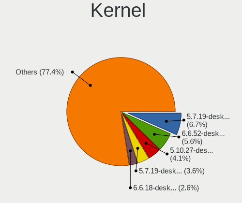

| Version                | Computers | Percent |
|------------------------|-----------|---------|
| 5.7.19-desktop-3.mga7  | 13        | 8.61%   |
| 5.10.27-desktop-1.mga8 | 8         | 5.3%    |
| 5.7.19-desktop-1.mga7  | 7         | 4.64%   |
| 5.15.32-desktop-1.mga8 | 5         | 3.31%   |
| 6.4.16-desktop-3.mga9  | 4         | 2.65%   |
| 5.6.14-desktop-2.mga7  | 4         | 2.65%   |
| 5.5.4-desktop-1.mga7   | 4         | 2.65%   |
| 5.15.23-desktop-1.mga8 | 4         | 2.65%   |
| 5.10.25-desktop-1.mga8 | 4         | 2.65%   |
| 5.5.9-desktop-1.mga7   | 3         | 1.99%   |
| 5.10.12-desktop-1.mga7 | 3         | 1.99%   |
| 6.4.9-desktop-4.mga9   | 2         | 1.32%   |
| 6.4.8-desktop-6.mga9   | 2         | 1.32%   |
| 5.6.6-desktop-1.mga7   | 2         | 1.32%   |
| 5.3.7-desktop-4.mga7   | 2         | 1.32%   |
| 5.17.4-desktop-2.mga8  | 2         | 1.32%   |
| 5.16.10-desktop-2.mga8 | 2         | 1.32%   |
| 5.15.98-desktop-1.mga8 | 2         | 1.32%   |
| 5.15.4-desktop-1.mga8  | 2         | 1.32%   |
| 5.15.35-desktop-2.mga8 | 2         | 1.32%   |
| 5.15.16-desktop-1.mga8 | 2         | 1.32%   |
| 5.15.11-desktop-3.mga8 | 2         | 1.32%   |
| 5.10.60-desktop-2.mga8 | 2         | 1.32%   |
| 5.10.52-desktop-1.mga8 | 2         | 1.32%   |
| 5.10.20-desktop-2.mga7 | 2         | 1.32%   |
| 5.10.14-desktop-1.mga7 | 2         | 1.32%   |
| 6.4.6-desktop-2.mga9   | 1         | 0.66%   |
| 6.4.3-desktop-1.mga9   | 1         | 0.66%   |
| 6.2.6-desktop-1.mga9   | 1         | 0.66%   |
| 6.2.2-desktop-2.mga9   | 1         | 0.66%   |
| 6.1.6-desktop-1.mga8   | 1         | 0.66%   |
| 6.1.41-desktop-1.mga8  | 1         | 0.66%   |
| 6.1.23-desktop-1.mga8  | 1         | 0.66%   |
| 6.1.14-desktop-1.mga9  | 1         | 0.66%   |
| 6.0.10-desktop-1.mga9  | 1         | 0.66%   |
| 5.9.6-desktop-1.mga8   | 1         | 0.66%   |
| 5.9.3-desktop-1.mga8   | 1         | 0.66%   |
| 5.9.16-desktop-1.mga7  | 1         | 0.66%   |
| 5.9.11-desktop-3.mga8  | 1         | 0.66%   |
| 5.9.1-desktop-1.mga8   | 1         | 0.66%   |

Kernel Family
-------------

Linux kernel without a distro release

| Version | Computers | Percent |
|---------|-----------|---------|
| 5.7.19  | 18        | 12.08%  |
| 5.10.27 | 8         | 5.37%   |
| 5.15.32 | 5         | 3.36%   |
| 6.4.16  | 4         | 2.68%   |
| 5.6.14  | 4         | 2.68%   |
| 5.5.4   | 4         | 2.68%   |
| 5.15.23 | 4         | 2.68%   |
| 5.10.25 | 4         | 2.68%   |
| 5.10.12 | 4         | 2.68%   |
| 5.5.9   | 3         | 2.01%   |
| 6.4.9   | 2         | 1.34%   |
| 6.4.8   | 2         | 1.34%   |
| 5.6.6   | 2         | 1.34%   |
| 5.3.7   | 2         | 1.34%   |
| 5.17.4  | 2         | 1.34%   |
| 5.16.18 | 2         | 1.34%   |
| 5.16.10 | 2         | 1.34%   |
| 5.15.98 | 2         | 1.34%   |
| 5.15.4  | 2         | 1.34%   |
| 5.15.35 | 2         | 1.34%   |
| 5.15.16 | 2         | 1.34%   |
| 5.15.11 | 2         | 1.34%   |
| 5.10.60 | 2         | 1.34%   |
| 5.10.52 | 2         | 1.34%   |
| 5.10.20 | 2         | 1.34%   |
| 5.10.16 | 2         | 1.34%   |
| 5.10.14 | 2         | 1.34%   |
| 6.4.6   | 1         | 0.67%   |
| 6.4.3   | 1         | 0.67%   |
| 6.2.6   | 1         | 0.67%   |
| 6.2.2   | 1         | 0.67%   |
| 6.1.6   | 1         | 0.67%   |
| 6.1.41  | 1         | 0.67%   |
| 6.1.23  | 1         | 0.67%   |
| 6.1.14  | 1         | 0.67%   |
| 6.0.10  | 1         | 0.67%   |
| 5.9.6   | 1         | 0.67%   |
| 5.9.3   | 1         | 0.67%   |
| 5.9.16  | 1         | 0.67%   |
| 5.9.11  | 1         | 0.67%   |

Kernel Major Ver.
-----------------

Linux kernel major version

| Version | Computers | Percent |
|---------|-----------|---------|
| 5.15    | 29        | 21.01%  |
| 5.10    | 27        | 19.57%  |
| 5.7     | 19        | 13.77%  |
| 6.4     | 10        | 7.25%   |
| 5.5     | 8         | 5.8%    |
| 5.6     | 7         | 5.07%   |
| 5.9     | 5         | 3.62%   |
| 6.1     | 4         | 2.9%    |
| 5.16    | 4         | 2.9%    |
| 4.14    | 3         | 2.17%   |
| 6.2     | 2         | 1.45%   |
| 5.8     | 2         | 1.45%   |
| 5.4     | 2         | 1.45%   |
| 5.3     | 2         | 1.45%   |
| 5.19    | 2         | 1.45%   |
| 5.17    | 2         | 1.45%   |
| 5.14    | 2         | 1.45%   |
| 6.0     | 1         | 0.72%   |
| 5.18    | 1         | 0.72%   |
| 5.13    | 1         | 0.72%   |
| 5.12    | 1         | 0.72%   |
| 5.1     | 1         | 0.72%   |
| 4.9     | 1         | 0.72%   |
| 4.19    | 1         | 0.72%   |
| 4.1     | 1         | 0.72%   |

Arch
----

OS architecture (x86_64, i586, etc.)

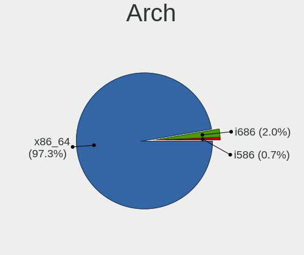

| Name   | Computers | Percent |
|--------|-----------|---------|
| x86_64 | 105       | 98.13%  |
| i686   | 2         | 1.87%   |

DE
--

Desktop Environment

| Name          | Computers | Percent |
|---------------|-----------|---------|
| KDE5          | 49        | 41.53%  |
| KDE           | 24        | 20.34%  |
| GNOME         | 15        | 12.71%  |
| Unknown       | 9         | 7.63%   |
| XFCE          | 5         | 4.24%   |
| Cinnamon      | 5         | 4.24%   |
| MATE          | 4         | 3.39%   |
| LXDE          | 3         | 2.54%   |
| X-Cinnamon    | 1         | 0.85%   |
| LXQt          | 1         | 0.85%   |
| KDE4          | 1         | 0.85%   |
| GNOME Classic | 1         | 0.85%   |

Display Server
--------------

X11 or Wayland

| Name    | Computers | Percent |
|---------|-----------|---------|
| X11     | 99        | 91.67%  |
| Wayland | 8         | 7.41%   |
| Tty     | 1         | 0.93%   |

Display Manager
---------------

SDDM, LightDM, etc.

| Name    | Computers | Percent |
|---------|-----------|---------|
| Unknown | 53        | 49.07%  |
| SDDM    | 40        | 37.04%  |
| LightDM | 7         | 6.48%   |
| GDM     | 4         | 3.7%    |
| TDM     | 3         | 2.78%   |
| XDM     | 1         | 0.93%   |

OS Lang
-------

Language

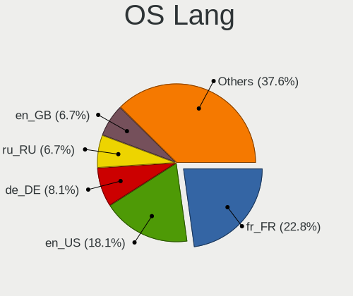

| Lang    | Computers | Percent |
|---------|-----------|---------|
| fr_FR   | 24        | 22.02%  |
| en_US   | 18        | 16.51%  |
| de_DE   | 11        | 10.09%  |
| en_GB   | 8         | 7.34%   |
| Unknown | 8         | 7.34%   |
| ru_RU   | 7         | 6.42%   |
| pt_BR   | 4         | 3.67%   |
| it_IT   | 4         | 3.67%   |
| en_CA   | 3         | 2.75%   |
| sv_SE   | 2         | 1.83%   |
| pl_PL   | 2         | 1.83%   |
| hu_HU   | 2         | 1.83%   |
| es_MX   | 2         | 1.83%   |
| es_GT   | 2         | 1.83%   |
| bg_BG   | 2         | 1.83%   |
| zh_TW   | 1         | 0.92%   |
| sl_SI   | 1         | 0.92%   |
| sk_SK   | 1         | 0.92%   |
| ro_RO   | 1         | 0.92%   |
| fr_BE   | 1         | 0.92%   |
| es_ES   | 1         | 0.92%   |
| es_CR   | 1         | 0.92%   |
| es_CL   | 1         | 0.92%   |
| es_AR   | 1         | 0.92%   |
| cs_CZ   | 1         | 0.92%   |

Boot Mode
---------

EFI or BIOS

| Mode | Computers | Percent |
|------|-----------|---------|
| BIOS | 61        | 54.46%  |
| EFI  | 51        | 45.54%  |

Filesystem
----------

Type of filesystem

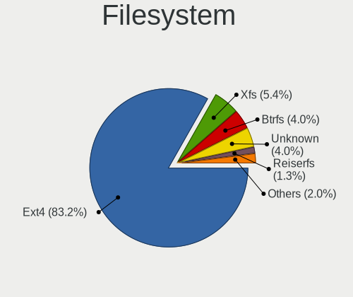

| Type     | Computers | Percent |
|----------|-----------|---------|
| Ext4     | 90        | 82.57%  |
| Xfs      | 7         | 6.42%   |
| Unknown  | 6         | 5.5%    |
| Btrfs    | 4         | 3.67%   |
| Reiserfs | 1         | 0.92%   |
| Overlay  | 1         | 0.92%   |

Part. scheme
------------

Scheme of partitioning

| Type    | Computers | Percent |
|---------|-----------|---------|
| GPT     | 45        | 40.54%  |
| Unknown | 44        | 39.64%  |
| MBR     | 22        | 19.82%  |

Dual Boot with Linux/BSD
------------------------

Hosting more than one Linux/BSD

| Dual boot | Computers | Percent |
|-----------|-----------|---------|
| No        | 92        | 85.98%  |
| Yes       | 15        | 14.02%  |

Dual Boot (Win)
---------------

Hosting Linux and Windows

| Dual boot | Computers | Percent |
|-----------|-----------|---------|
| No        | 86        | 78.18%  |
| Yes       | 24        | 21.82%  |

Board
-----

Vendor
------

Motherboard manufacturer

| Name                | Computers | Percent |
|---------------------|-----------|---------|
| ASUSTek Computer    | 24        | 22.43%  |
| Gigabyte Technology | 19        | 17.76%  |
| Hewlett-Packard     | 13        | 12.15%  |
| Lenovo              | 10        | 9.35%   |
| Dell                | 9         | 8.41%   |
| MSI                 | 7         | 6.54%   |
| ASRock              | 6         | 5.61%   |
| Fujitsu             | 3         | 2.8%    |
| Notebook            | 2         | 1.87%   |
| Medion              | 2         | 1.87%   |
| Acer                | 2         | 1.87%   |
| ZOTAC               | 1         | 0.93%   |
| Vorke               | 1         | 0.93%   |
| Toshiba             | 1         | 0.93%   |
| Schenker            | 1         | 0.93%   |
| Microsoft           | 1         | 0.93%   |
| Megaware            | 1         | 0.93%   |
| Kiano               | 1         | 0.93%   |
| Intel               | 1         | 0.93%   |
| ECS                 | 1         | 0.93%   |
| Apple               | 1         | 0.93%   |

Model
-----

Motherboard model

| Name                                     | Computers | Percent |
|------------------------------------------|-----------|---------|
| Unknown                                  | 3         | 2.8%    |
| Gigabyte Z68X-UD3H-B3                    | 2         | 1.87%   |
| Gigabyte H81M-S2H                        | 2         | 1.87%   |
| Gigabyte B450M DS3H                      | 2         | 1.87%   |
| Dell Precision WorkStation T3400         | 2         | 1.87%   |
| ASUS SABERTOOTH 990FX R2.0               | 2         | 1.87%   |
| Vorke V1 Plus                            | 1         | 0.93%   |
| Toshiba dynabook R73/A                   | 1         | 0.93%   |
| Schenker VIA_14_SVI14E20                 | 1         | 0.93%   |
| Notebook NL40_50GU                       | 1         | 0.93%   |
| Notebook NH5x_NH7x_HHx_HJx_HKx           | 1         | 0.93%   |
| MSI MS-7D09                              | 1         | 0.93%   |
| MSI MS-7C82                              | 1         | 0.93%   |
| MSI MS-7C37                              | 1         | 0.93%   |
| MSI MS-7B31                              | 1         | 0.93%   |
| MSI MS-7B23                              | 1         | 0.93%   |
| MSI MS-7A70                              | 1         | 0.93%   |
| MSI MS-7816                              | 1         | 0.93%   |
| Microsoft Surface Pro 4                  | 1         | 0.93%   |
| Megaware MW-G31T-M7                      | 1         | 0.93%   |
| Medion MD34161/C708                      | 1         | 0.93%   |
| Medion DEFENDER P10                      | 1         | 0.93%   |
| Lenovo Yoga 720-15IKB 80X7               | 1         | 0.93%   |
| Lenovo ThinkPad X1 Carbon 5th 20HQS1741F | 1         | 0.93%   |
| Lenovo ThinkPad T430 2342A19             | 1         | 0.93%   |
| Lenovo ThinkCentre M92p 2992A7U          | 1         | 0.93%   |
| Lenovo ThinkCentre M58e 7491B1G          | 1         | 0.93%   |
| Lenovo ThinkCentre A57 970274G           | 1         | 0.93%   |
| Lenovo IdeaPad Slim 3 15AMN8 82XQ        | 1         | 0.93%   |
| Lenovo IdeaPad 3 15ADA05 81W1            | 1         | 0.93%   |
| Lenovo G480 20149                        | 1         | 0.93%   |
| Lenovo 70A4000HUX ThinkServer TS140      | 1         | 0.93%   |
| Kiano SlimNote 15.6                      | 1         | 0.93%   |
| Intel STL2                               | 1         | 0.93%   |
| HP Z440 Workstation                      | 1         | 0.93%   |
| HP Z420 Workstation                      | 1         | 0.93%   |
| HP Spectre 13 Ultrabook                  | 1         | 0.93%   |
| HP ProBook 5330m                         | 1         | 0.93%   |
| HP ProBook 445 G7                        | 1         | 0.93%   |
| HP Pavilion Notebook                     | 1         | 0.93%   |

Model Family
------------

Motherboard model prefix

| Name                   | Computers | Percent |
|------------------------|-----------|---------|
| Dell Precision         | 4         | 3.74%   |
| Dell Latitude          | 4         | 3.74%   |
| Lenovo ThinkCentre     | 3         | 2.8%    |
| ASUS SABERTOOTH        | 3         | 2.8%    |
| ASUS PRIME             | 3         | 2.8%    |
| Unknown                | 3         | 2.8%    |
| Lenovo ThinkPad        | 2         | 1.87%   |
| Lenovo IdeaPad         | 2         | 1.87%   |
| HP ProBook             | 2         | 1.87%   |
| HP Pavilion            | 2         | 1.87%   |
| Gigabyte Z68X-UD3H-B3  | 2         | 1.87%   |
| Gigabyte H81M-S2H      | 2         | 1.87%   |
| Gigabyte GA-78LMT-USB3 | 2         | 1.87%   |
| Gigabyte B450M         | 2         | 1.87%   |
| ASUS VivoBook          | 2         | 1.87%   |
| Acer Aspire            | 2         | 1.87%   |
| Vorke V1               | 1         | 0.93%   |
| Toshiba dynabook       | 1         | 0.93%   |
| Schenker VIA           | 1         | 0.93%   |
| Notebook NL40          | 1         | 0.93%   |
| Notebook NH5x          | 1         | 0.93%   |
| MSI MS-7D09            | 1         | 0.93%   |
| MSI MS-7C82            | 1         | 0.93%   |
| MSI MS-7C37            | 1         | 0.93%   |
| MSI MS-7B31            | 1         | 0.93%   |
| MSI MS-7B23            | 1         | 0.93%   |
| MSI MS-7A70            | 1         | 0.93%   |
| MSI MS-7816            | 1         | 0.93%   |
| Microsoft Surface      | 1         | 0.93%   |
| Megaware MW-G31T-M7    | 1         | 0.93%   |
| Medion MD34161         | 1         | 0.93%   |
| Medion DEFENDER        | 1         | 0.93%   |
| Lenovo Yoga            | 1         | 0.93%   |
| Lenovo G480            | 1         | 0.93%   |
| Lenovo 70A4000HUX      | 1         | 0.93%   |
| Kiano SlimNote         | 1         | 0.93%   |
| Intel STL2             | 1         | 0.93%   |
| HP Z440                | 1         | 0.93%   |
| HP Z420                | 1         | 0.93%   |
| HP Spectre             | 1         | 0.93%   |

MFG Year
--------

Motherboard manufacture year

| Year | Computers | Percent |
|------|-----------|---------|
| 2018 | 13        | 12.15%  |
| 2012 | 13        | 12.15%  |
| 2013 | 11        | 10.28%  |
| 2017 | 9         | 8.41%   |
| 2014 | 8         | 7.48%   |
| 2016 | 7         | 6.54%   |
| 2008 | 7         | 6.54%   |
| 2020 | 6         | 5.61%   |
| 2019 | 6         | 5.61%   |
| 2011 | 6         | 5.61%   |
| 2015 | 4         | 3.74%   |
| 2010 | 4         | 3.74%   |
| 2009 | 4         | 3.74%   |
| 2021 | 3         | 2.8%    |
| 2022 | 2         | 1.87%   |
| 2007 | 2         | 1.87%   |
| 2023 | 1         | 0.93%   |
| 2002 | 1         | 0.93%   |

Form Factor
-----------

Physical design of the computer

| Name        | Computers | Percent |
|-------------|-----------|---------|
| Desktop     | 66        | 61.68%  |
| Notebook    | 38        | 35.51%  |
| Tablet      | 1         | 0.93%   |
| Convertible | 1         | 0.93%   |
| All in one  | 1         | 0.93%   |

Secure Boot
-----------

Enabled or disabled

| State    | Computers | Percent |
|----------|-----------|---------|
| Disabled | 107       | 100%    |

Coreboot
--------

Have coreboot on board

| Used | Computers | Percent |
|------|-----------|---------|
| No   | 107       | 100%    |

RAM Size
--------

Total RAM memory

| Size in GB  | Computers | Percent |
|-------------|-----------|---------|
| 4.01-8.0    | 25        | 22.52%  |
| 16.01-24.0  | 25        | 22.52%  |
| 8.01-16.0   | 22        | 19.82%  |
| 32.01-64.0  | 15        | 13.51%  |
| 3.01-4.0    | 15        | 13.51%  |
| 64.01-256.0 | 5         | 4.5%    |
| 24.01-32.0  | 2         | 1.8%    |
| 2.01-3.0    | 1         | 0.9%    |
| 1.01-2.0    | 1         | 0.9%    |

RAM Used
--------

Used RAM memory

| Used GB    | Computers | Percent |
|------------|-----------|---------|
| 2.01-3.0   | 41        | 31.78%  |
| 1.01-2.0   | 30        | 23.26%  |
| 4.01-8.0   | 28        | 21.71%  |
| 3.01-4.0   | 18        | 13.95%  |
| 8.01-16.0  | 7         | 5.43%   |
| 0.51-1.0   | 3         | 2.33%   |
| 16.01-24.0 | 2         | 1.55%   |

Total Drives
------------

Number of drives on board

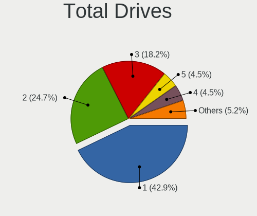

| Drives | Computers | Percent |
|--------|-----------|---------|
| 1      | 47        | 41.96%  |
| 2      | 30        | 26.79%  |
| 3      | 20        | 17.86%  |
| 5      | 6         | 5.36%   |
| 4      | 5         | 4.46%   |
| 6      | 2         | 1.79%   |
| 8      | 1         | 0.89%   |
| 7      | 1         | 0.89%   |

Has CD-ROM
----------

Has CD-ROM on board

| Presented | Computers | Percent |
|-----------|-----------|---------|
| No        | 55        | 50.93%  |
| Yes       | 53        | 49.07%  |

Has Ethernet
------------

Has Ethernet on board

| Presented | Computers | Percent |
|-----------|-----------|---------|
| Yes       | 95        | 88.79%  |
| No        | 12        | 11.21%  |

Has WiFi
--------

Has WiFi module

| Presented | Computers | Percent |
|-----------|-----------|---------|
| Yes       | 63        | 58.33%  |
| No        | 45        | 41.67%  |

Has Bluetooth
-------------

Has Bluetooth module

| Presented | Computers | Percent |
|-----------|-----------|---------|
| Yes       | 59        | 55.14%  |
| No        | 48        | 44.86%  |

Location
--------

Country
-------

Geographic location (country)

| Country     | Computers | Percent |
|-------------|-----------|---------|
| France      | 25        | 23.36%  |
| USA         | 14        | 13.08%  |
| Germany     | 11        | 10.28%  |
| UK          | 8         | 7.48%   |
| Russia      | 4         | 3.74%   |
| Italy       | 4         | 3.74%   |
| Canada      | 4         | 3.74%   |
| Brazil      | 4         | 3.74%   |
| Ukraine     | 3         | 2.8%    |
| Sweden      | 2         | 1.87%   |
| Romania     | 2         | 1.87%   |
| Poland      | 2         | 1.87%   |
| Mexico      | 2         | 1.87%   |
| Guatemala   | 2         | 1.87%   |
| Greece      | 2         | 1.87%   |
| Bulgaria    | 2         | 1.87%   |
| Taiwan      | 1         | 0.93%   |
| Slovenia    | 1         | 0.93%   |
| Slovakia    | 1         | 0.93%   |
| Netherlands | 1         | 0.93%   |
| Luxembourg  | 1         | 0.93%   |
| Kenya       | 1         | 0.93%   |
| Indonesia   | 1         | 0.93%   |
| Hungary     | 1         | 0.93%   |
| Czechia     | 1         | 0.93%   |
| Costa Rica  | 1         | 0.93%   |
| Colombia    | 1         | 0.93%   |
| Chile       | 1         | 0.93%   |
| Belgium     | 1         | 0.93%   |
| Belarus     | 1         | 0.93%   |
| Australia   | 1         | 0.93%   |
| Argentina   | 1         | 0.93%   |

City
----

Geographic location (city)

| City                  | Computers | Percent |
|-----------------------|-----------|---------|
| Rommerskirchen        | 3         | 2.33%   |
| Paris                 | 3         | 2.33%   |
| Mala Danylivka        | 3         | 2.33%   |
| Kharkiv               | 3         | 2.33%   |
| Woking                | 2         | 1.55%   |
| Woincourt             | 2         | 1.55%   |
| Waterloo              | 2         | 1.55%   |
| Upper Norwood         | 2         | 1.55%   |
| Strasbourg            | 2         | 1.55%   |
| Sao Paulo             | 2         | 1.55%   |
| Oakland               | 2         | 1.55%   |
| Guatemala City        | 2         | 1.55%   |
| Grants Pass           | 2         | 1.55%   |
| Yakutsk               | 1         | 0.78%   |
| Wiwersheim            | 1         | 0.78%   |
| Voronezh              | 1         | 0.78%   |
| Vanves                | 1         | 0.78%   |
| Uzhhorod              | 1         | 0.78%   |
| Tver                  | 1         | 0.78%   |
| Turin                 | 1         | 0.78%   |
| Tours                 | 1         | 0.78%   |
| Toulouse              | 1         | 0.78%   |
| Thiais                | 1         | 0.78%   |
| Surabaya              | 1         | 0.78%   |
| Sternberk             | 1         | 0.78%   |
| Sofia                 | 1         | 0.78%   |
| Sartrouville          | 1         | 0.78%   |
| Santiago              | 1         | 0.78%   |
| Sant'Angelo Lodigiano | 1         | 0.78%   |
| San Isidro            | 1         | 0.78%   |
| San Antonio           | 1         | 0.78%   |
| Saint-Michel-sur-Orge | 1         | 0.78%   |
| Saint-Etienne         | 1         | 0.78%   |
| Rome                  | 1         | 0.78%   |
| Roehampton            | 1         | 0.78%   |
| Rio de Janeiro        | 1         | 0.78%   |
| Regina                | 1         | 0.78%   |
| Quincy                | 1         | 0.78%   |
| Quierschied           | 1         | 0.78%   |
| Quaregna              | 1         | 0.78%   |

Drives
------

Drive Vendor
------------

Hard drive vendors

| Vendor                  | Computers | Drives | Percent |
|-------------------------|-----------|--------|---------|
| WDC                     | 46        | 132    | 22.22%  |
| Seagate                 | 29        | 52     | 14.01%  |
| Samsung Electronics     | 29        | 38     | 14.01%  |
| Toshiba                 | 13        | 21     | 6.28%   |
| Kingston                | 13        | 22     | 6.28%   |
| SanDisk                 | 8         | 14     | 3.86%   |
| Hitachi                 | 8         | 8      | 3.86%   |
| Crucial                 | 8         | 14     | 3.86%   |
| Unknown                 | 6         | 6      | 2.9%    |
| PNY                     | 5         | 8      | 2.42%   |
| HGST                    | 5         | 9      | 2.42%   |
| Intel                   | 4         | 4      | 1.93%   |
| SK hynix                | 3         | 4      | 1.45%   |
| A-DATA Technology       | 3         | 8      | 1.45%   |
| Phison Electronics      | 2         | 3      | 0.97%   |
| Phison                  | 2         | 3      | 0.97%   |
| OCZ-VERTEX              | 2         | 2      | 0.97%   |
| OCZ                     | 2         | 2      | 0.97%   |
| XPG                     | 1         | 4      | 0.48%   |
| Verbatim                | 1         | 1      | 0.48%   |
| Union Memory (Shenzhen) | 1         | 1      | 0.48%   |
| Transcend               | 1         | 1      | 0.48%   |
| TO Exter                | 1         | 1      | 0.48%   |
| Team                    | 1         | 1      | 0.48%   |
| PNY CS90                | 1         | 1      | 0.48%   |
| LDLC                    | 1         | 1      | 0.48%   |
| KingFast                | 1         | 2      | 0.48%   |
| JMicron Technology      | 1         | 1      | 0.48%   |
| HUAWEI                  | 1         | 1      | 0.48%   |
| Hewlett-Packard         | 1         | 1      | 0.48%   |
| Gigabyte Technology     | 1         | 1      | 0.48%   |
| Fujitsu                 | 1         | 1      | 0.48%   |
| FORESEE                 | 1         | 1      | 0.48%   |
| Emtec                   | 1         | 1      | 0.48%   |
| Corsair                 | 1         | 1      | 0.48%   |
| China                   | 1         | 1      | 0.48%   |
| ASMedia                 | 1         | 1      | 0.48%   |

Drive Model
-----------

Hard drive models

| Model                            | Computers | Percent |
|----------------------------------|-----------|---------|
| WDC WD2500BEVT-22ZCT0 250GB      | 4         | 1.72%   |
| Samsung SSD 860 EVO 500GB        | 4         | 1.72%   |
| WDC WD10EZEX-08WN4A0 1TB         | 3         | 1.29%   |
| Samsung SSD 860 EVO 250GB        | 3         | 1.29%   |
| Samsung SSD 850 EVO 500GB        | 3         | 1.29%   |
| WDC WDS500G2B0A-00SM50 500GB SSD | 2         | 0.86%   |
| WDC WDS250G2B0A-00SM50 250GB SSD | 2         | 0.86%   |
| WDC WDS240G2G0A-00JH30 240GB SSD | 2         | 0.86%   |
| WDC WDS100T2B0A 1TB SSD          | 2         | 0.86%   |
| WDC WD30EZRZ-00Z5HB0 3TB         | 2         | 0.86%   |
| WDC WD20EFRX-68EUZN0 2TB         | 2         | 0.86%   |
| WDC WD10EZRZ-00HTKB0 1TB         | 2         | 0.86%   |
| WDC WD10EFRX-68PJCN0 1TB         | 2         | 0.86%   |
| Toshiba MQ01ABF050 500GB         | 2         | 0.86%   |
| Toshiba HDWD120 2TB              | 2         | 0.86%   |
| Toshiba HDWD110 1TB              | 2         | 0.86%   |
| Seagate ST3500418AS 500GB        | 2         | 0.86%   |
| Seagate ST32000644NS 2TB         | 2         | 0.86%   |
| Seagate ST1000DM003-1CH162 1TB   | 2         | 0.86%   |
| SanDisk SDSSDA120G 120GB         | 2         | 0.86%   |
| SanDisk Extreme SSD 500GB        | 2         | 0.86%   |
| Samsung NVMe SSD Drive 500GB     | 2         | 0.86%   |
| PNY CS900 120GB SSD              | 2         | 0.86%   |
| OCZ-VERTEX PLUS R2 128GB SSD     | 2         | 0.86%   |
| Kingston SV300S37A240G 240GB SSD | 2         | 0.86%   |
| Kingston SH103S3120G 120GB SSD   | 2         | 0.86%   |
| Kingston SA400S37120G 120GB SSD  | 2         | 0.86%   |
| Intel SSDSC2CW120A3 120GB        | 2         | 0.86%   |
| Hitachi HDS722020ALA330 2TB      | 2         | 0.86%   |
| HGST HUS726040ALE611 4TB         | 2         | 0.86%   |
| Crucial CT500MX500SSD1 500GB     | 2         | 0.86%   |
| Crucial CT120BX500SSD1 120GB     | 2         | 0.86%   |
| XPG NVMe SSD Drive 2TB           | 1         | 0.43%   |
| XPG NVMe SSD Drive 1024GB        | 1         | 0.43%   |
| WDC WDS500G3XHC-00SJG0 500GB     | 1         | 0.43%   |
| WDC WDS500G2B0C-00PXH0 500GB     | 1         | 0.43%   |
| WDC WD800BB-00JHC0 80GB          | 1         | 0.43%   |
| WDC WD50EFRX-68L0BN1 5TB         | 1         | 0.43%   |
| WDC WD5000LPLX-66ZNTT1 500GB     | 1         | 0.43%   |
| WDC WD5000AZLX-60K2TA0 500GB     | 1         | 0.43%   |

HDD Vendor
----------

Hard disk drive vendors

| Vendor              | Computers | Drives | Percent |
|---------------------|-----------|--------|---------|
| WDC                 | 37        | 112    | 37%     |
| Seagate             | 28        | 46     | 28%     |
| Toshiba             | 12        | 20     | 12%     |
| Hitachi             | 8         | 8      | 8%      |
| Samsung Electronics | 5         | 9      | 5%      |
| HGST                | 5         | 9      | 5%      |
| Unknown             | 2         | 2      | 2%      |
| TO Exter            | 1         | 1      | 1%      |
| Hewlett-Packard     | 1         | 1      | 1%      |
| Fujitsu             | 1         | 1      | 1%      |

SSD Vendor
----------

Solid state drive vendors

| Vendor              | Computers | Drives | Percent |
|---------------------|-----------|--------|---------|
| Samsung Electronics | 16        | 18     | 21.05%  |
| Kingston            | 10        | 16     | 13.16%  |
| WDC                 | 8         | 18     | 10.53%  |
| Crucial             | 8         | 14     | 10.53%  |
| SanDisk             | 6         | 8      | 7.89%   |
| PNY                 | 5         | 8      | 6.58%   |
| Intel               | 3         | 3      | 3.95%   |
| A-DATA Technology   | 3         | 8      | 3.95%   |
| OCZ-VERTEX          | 2         | 2      | 2.63%   |
| OCZ                 | 2         | 2      | 2.63%   |
| Verbatim            | 1         | 1      | 1.32%   |
| Transcend           | 1         | 1      | 1.32%   |
| Team                | 1         | 1      | 1.32%   |
| SK hynix            | 1         | 1      | 1.32%   |
| PNY CS90            | 1         | 1      | 1.32%   |
| LDLC                | 1         | 1      | 1.32%   |
| KingFast            | 1         | 2      | 1.32%   |
| JMicron Technology  | 1         | 1      | 1.32%   |
| FORESEE             | 1         | 1      | 1.32%   |
| Emtec               | 1         | 1      | 1.32%   |
| Corsair             | 1         | 1      | 1.32%   |
| China               | 1         | 1      | 1.32%   |
| ASMedia             | 1         | 1      | 1.32%   |

Drive Kind
----------

HDD or SSD

| Kind    | Computers | Drives | Percent |
|---------|-----------|--------|---------|
| HDD     | 73        | 209    | 45.34%  |
| SSD     | 56        | 111    | 34.78%  |
| NVMe    | 26        | 42     | 16.15%  |
| MMC     | 4         | 4      | 2.48%   |
| Unknown | 2         | 7      | 1.24%   |

Drive Connector
---------------

SATA, SAS, NVMe, etc.

| Type | Computers | Drives | Percent |
|------|-----------|--------|---------|
| SATA | 96        | 302    | 69.57%  |
| NVMe | 26        | 42     | 18.84%  |
| SAS  | 12        | 25     | 8.7%    |
| MMC  | 4         | 4      | 2.9%    |

Drive Size
----------

Size of hard drive

| Size in TB | Computers | Drives | Percent |
|------------|-----------|--------|---------|
| 0.01-0.5   | 74        | 138    | 50%     |
| 0.51-1.0   | 41        | 109    | 27.7%   |
| 1.01-2.0   | 17        | 28     | 11.49%  |
| 3.01-4.0   | 6         | 8      | 4.05%   |
| 2.01-3.0   | 6         | 30     | 4.05%   |
| 4.01-10.0  | 3         | 6      | 2.03%   |
| 10.01-20.0 | 1         | 1      | 0.68%   |

Space Total
-----------

Amount of disk space available on the file system

| Size in GB     | Computers | Percent |
|----------------|-----------|---------|
| 501-1000       | 28        | 24.56%  |
| 251-500        | 25        | 21.93%  |
| More than 3000 | 18        | 15.79%  |
| 101-250        | 18        | 15.79%  |
| 2001-3000      | 10        | 8.77%   |
| 1001-2000      | 10        | 8.77%   |
| 51-100         | 3         | 2.63%   |
| Unknown        | 2         | 1.75%   |

Space Used
----------

Amount of used disk space

| Used GB        | Computers | Percent |
|----------------|-----------|---------|
| 101-250        | 21        | 16.94%  |
| 51-100         | 20        | 16.13%  |
| 1-20           | 19        | 15.32%  |
| 501-1000       | 15        | 12.1%   |
| 251-500        | 14        | 11.29%  |
| 1001-2000      | 12        | 9.68%   |
| 21-50          | 10        | 8.06%   |
| More than 3000 | 8         | 6.45%   |
| 2001-3000      | 3         | 2.42%   |
| Unknown        | 2         | 1.61%   |

Malfunc. Drives
---------------

Drive models with a malfunction

| Model                                 | Computers | Drives | Percent |
|---------------------------------------|-----------|--------|---------|
| Intel SSDSC2CW120A3 120GB             | 2         | 2      | 10%     |
| WDC WD15EARS-00MVWB0 1TB              | 1         | 1      | 5%      |
| WDC WD10EARS-00MVWB0 1TB              | 1         | 1      | 5%      |
| WDC WD1002FAEX-00Z3A0 1TB             | 1         | 1      | 5%      |
| WDC WD1001FAES-75W7A0 1TB             | 1         | 1      | 5%      |
| Toshiba MQ01ABD100 1TB                | 1         | 1      | 5%      |
| SK hynix HFS256G39TND-N210A 256GB SSD | 1         | 1      | 5%      |
| Seagate ST3500418AS 500GB             | 1         | 1      | 5%      |
| Seagate ST3320820AS 320GB             | 1         | 1      | 5%      |
| Seagate ST3250410AS 250GB             | 1         | 3      | 5%      |
| Seagate ST320LT020-9YG142 320GB       | 1         | 1      | 5%      |
| Seagate ST2000VN004-2E4164 2TB        | 1         | 1      | 5%      |
| Seagate ST1000LM024 HN-M101MBB 1TB    | 1         | 1      | 5%      |
| Seagate ST1000DM003-1CH162 1TB        | 1         | 1      | 5%      |
| Samsung Electronics HD400LD 400GB     | 1         | 1      | 5%      |
| OCZ VERTEX3 120GB SSD                 | 1         | 1      | 5%      |
| Hitachi HTS725050A9A364 500GB         | 1         | 1      | 5%      |
| HGST HTS725050A7E630 500GB            | 1         | 1      | 5%      |
| Fujitsu MHZ2160BH G2 160GB            | 1         | 1      | 5%      |

Malfunc. Drive Vendor
---------------------

Vendors of faulty drives

| Vendor              | Computers | Drives | Percent |
|---------------------|-----------|--------|---------|
| Seagate             | 7         | 9      | 36.84%  |
| WDC                 | 3         | 4      | 15.79%  |
| Intel               | 2         | 2      | 10.53%  |
| Toshiba             | 1         | 1      | 5.26%   |
| SK hynix            | 1         | 1      | 5.26%   |
| Samsung Electronics | 1         | 1      | 5.26%   |
| OCZ                 | 1         | 1      | 5.26%   |
| Hitachi             | 1         | 1      | 5.26%   |
| HGST                | 1         | 1      | 5.26%   |
| Fujitsu             | 1         | 1      | 5.26%   |

Malfunc. HDD Vendor
-------------------

Vendors of faulty HDD drives

| Vendor              | Computers | Drives | Percent |
|---------------------|-----------|--------|---------|
| Seagate             | 7         | 9      | 46.67%  |
| WDC                 | 3         | 4      | 20%     |
| Toshiba             | 1         | 1      | 6.67%   |
| Samsung Electronics | 1         | 1      | 6.67%   |
| Hitachi             | 1         | 1      | 6.67%   |
| HGST                | 1         | 1      | 6.67%   |
| Fujitsu             | 1         | 1      | 6.67%   |

Malfunc. Drive Kind
-------------------

Kinds of faulty drives

| Kind | Computers | Drives | Percent |
|------|-----------|--------|---------|
| HDD  | 14        | 18     | 77.78%  |
| SSD  | 4         | 4      | 22.22%  |

Failed Drives
-------------

Failed drive models

Zero info for selected period =(

Failed Drive Vendor
-------------------

Failed drive vendors

Zero info for selected period =(

Drive Status
------------

Number of failed and malfunc. drives

| Status   | Computers | Drives | Percent |
|----------|-----------|--------|---------|
| Works    | 58        | 180    | 45.31%  |
| Detected | 52        | 171    | 40.63%  |
| Malfunc  | 18        | 22     | 14.06%  |

Storage controller
------------------

Storage Vendor
--------------

Storage controller vendors

| Vendor                       | Computers | Percent |
|------------------------------|-----------|---------|
| Intel                        | 70        | 50.36%  |
| AMD                          | 29        | 20.86%  |
| Samsung Electronics          | 9         | 6.47%   |
| Marvell Technology Group     | 7         | 5.04%   |
| ASMedia Technology           | 6         | 4.32%   |
| Phison Electronics           | 5         | 3.6%    |
| SanDisk                      | 4         | 2.88%   |
| Kingston Technology Company  | 3         | 2.16%   |
| SK hynix                     | 2         | 1.44%   |
| Toshiba America Info Systems | 1         | 0.72%   |
| JMicron Technology           | 1         | 0.72%   |
| Broadcom                     | 1         | 0.72%   |
| ADATA Technology             | 1         | 0.72%   |

Storage Model
-------------

Storage controller models

| Model                                                                                   | Computers | Percent |
|-----------------------------------------------------------------------------------------|-----------|---------|
| AMD FCH SATA Controller [AHCI mode]                                                     | 13        | 7.56%   |
| Intel 8 Series/C220 Series Chipset Family 6-port SATA Controller 1 [AHCI mode]          | 9         | 5.23%   |
| Intel Sunrise Point-LP SATA Controller [AHCI mode]                                      | 6         | 3.49%   |
| ASMedia ASM1062 Serial ATA Controller                                                   | 6         | 3.49%   |
| AMD SB7x0/SB8x0/SB9x0 SATA Controller [AHCI mode]                                       | 6         | 3.49%   |
| AMD SB7x0/SB8x0/SB9x0 IDE Controller                                                    | 6         | 3.49%   |
| Intel NM10/ICH7 Family SATA Controller [IDE mode]                                       | 5         | 2.91%   |
| Intel 82801G (ICH7 Family) IDE Controller                                               | 5         | 2.91%   |
| Marvell Group 88SE9230 PCIe 2.0 x2 4-port SATA 6 Gb/s RAID Controller                   | 4         | 2.33%   |
| Marvell Group 88SE9172 SATA 6Gb/s Controller                                            | 4         | 2.33%   |
| Intel Q170/Q150/B150/H170/H110/Z170/CM236 Chipset SATA Controller [AHCI Mode]           | 4         | 2.33%   |
| Intel 7 Series Chipset Family 6-port SATA Controller [AHCI mode]                        | 4         | 2.33%   |
| Intel 6 Series/C200 Series Chipset Family 6 port Desktop SATA AHCI Controller           | 4         | 2.33%   |
| AMD 400 Series Chipset SATA Controller                                                  | 4         | 2.33%   |
| SanDisk Extreme Pro / WD Black 2018/SN750/PC SN720 NVMe SSD                             | 3         | 1.74%   |
| Samsung NVMe SSD Controller SM961/PM961/SM963                                           | 3         | 1.74%   |
| Samsung NVMe SSD Controller 980 (DRAM-less)                                             | 3         | 1.74%   |
| Intel SATA Controller [RAID mode]                                                       | 3         | 1.74%   |
| Intel 8 Series SATA Controller 1 [AHCI mode]                                            | 3         | 1.74%   |
| Intel 6 Series/C200 Series Chipset Family 6 port Mobile SATA AHCI Controller            | 3         | 1.74%   |
| AMD SB7x0/SB8x0/SB9x0 SATA Controller [IDE mode]                                        | 3         | 1.74%   |
| AMD SB600 Non-Raid-5 SATA                                                               | 3         | 1.74%   |
| AMD SB600 IDE                                                                           | 3         | 1.74%   |
| Samsung NVMe SSD Controller SM981/PM981/PM983                                           | 2         | 1.16%   |
| Phison E16 PCIe4 NVMe Controller                                                        | 2         | 1.16%   |
| Phison E12 NVMe Controller                                                              | 2         | 1.16%   |
| Kingston Company A2000 NVMe SSD SM2263EN                                                | 2         | 1.16%   |
| Intel Cannon Lake PCH SATA AHCI Controller                                              | 2         | 1.16%   |
| Intel 82801IR/IO/IH (ICH9R/DO/DH) 6 port SATA Controller [AHCI mode]                    | 2         | 1.16%   |
| Intel 82801 Mobile SATA Controller [RAID mode]                                          | 2         | 1.16%   |
| Intel 6 Series/C200 Series Chipset Family Desktop SATA Controller (IDE mode, ports 4-5) | 2         | 1.16%   |
| Intel 6 Series/C200 Series Chipset Family Desktop SATA Controller (IDE mode, ports 0-3) | 2         | 1.16%   |
| Intel 500 Series Chipset Family SATA AHCI Controller                                    | 2         | 1.16%   |
| Intel 400 Series Chipset Family SATA AHCI Controller                                    | 2         | 1.16%   |
| Intel 200 Series PCH SATA controller [AHCI mode]                                        | 2         | 1.16%   |
| AMD X399 Series Chipset SATA Controller                                                 | 2         | 1.16%   |
| AMD 500 Series Chipset SATA Controller                                                  | 2         | 1.16%   |
| Toshiba America Info Systems XG6 NVMe SSD Controller                                    | 1         | 0.58%   |
| SK hynix BC901 NVMe Solid State Drive (DRAM-less)                                       | 1         | 0.58%   |
| SK hynix BC511 NVMe SSD                                                                 | 1         | 0.58%   |

Storage Kind
------------

Kind of storage controller (IDE, SATA, NVMe, SAS, ...)

| Kind | Computers | Percent |
|------|-----------|---------|
| SATA | 82        | 58.57%  |
| NVMe | 25        | 17.86%  |
| IDE  | 24        | 17.14%  |
| RAID | 8         | 5.71%   |
| SAS  | 1         | 0.71%   |

Processor
---------

CPU Vendor
----------

Processor vendors

| Vendor | Computers | Percent |
|--------|-----------|---------|
| Intel  | 75        | 70.09%  |
| AMD    | 32        | 29.91%  |

CPU Model
---------

Processor models

| Model                                       | Computers | Percent |
|---------------------------------------------|-----------|---------|
| Intel Core i5-6300U CPU @ 2.40GHz           | 4         | 3.7%    |
| AMD FX-8350 Eight-Core Processor            | 3         | 2.78%   |
| Intel Pentium Dual-Core CPU E5200 @ 2.50GHz | 2         | 1.85%   |
| Intel Core i7-4510U CPU @ 2.00GHz           | 2         | 1.85%   |
| Intel Core i7-3770 CPU @ 3.40GHz            | 2         | 1.85%   |
| Intel Core i7-2600K CPU @ 3.40GHz           | 2         | 1.85%   |
| Intel Core i5-8400 CPU @ 2.80GHz            | 2         | 1.85%   |
| Intel Core i5-3210M CPU @ 2.50GHz           | 2         | 1.85%   |
| Intel Core i3-4130 CPU @ 3.40GHz            | 2         | 1.85%   |
| Intel Core 2 Duo CPU E8400 @ 3.00GHz        | 2         | 1.85%   |
| AMD Turion 64 X2 Mobile Technology TL-60    | 2         | 1.85%   |
| AMD Ryzen 5 2400G with Radeon Vega Graphics | 2         | 1.85%   |
| Intel Xeon CPU E5-1650 0 @ 3.20GHz          | 1         | 0.93%   |
| Intel Xeon CPU E5-1620 v3 @ 3.50GHz         | 1         | 0.93%   |
| Intel Pentium Silver N5000 CPU @ 1.10GHz    | 1         | 0.93%   |
| Intel Pentium III (Coppermine)              | 1         | 0.93%   |
| Intel Pentium Gold G6400 CPU @ 4.00GHz      | 1         | 0.93%   |
| Intel Pentium CPU P6200 @ 2.13GHz           | 1         | 0.93%   |
| Intel Pentium CPU G3450 @ 3.40GHz           | 1         | 0.93%   |
| Intel Pentium CPU G3260 @ 3.30GHz           | 1         | 0.93%   |
| Intel Core m5-6Y57 CPU @ 1.10GHz            | 1         | 0.93%   |
| Intel Core i7-8850H CPU @ 2.60GHz           | 1         | 0.93%   |
| Intel Core i7-8700 CPU @ 3.20GHz            | 1         | 0.93%   |
| Intel Core i7-8565U CPU @ 1.80GHz           | 1         | 0.93%   |
| Intel Core i7-7700HQ CPU @ 2.80GHz          | 1         | 0.93%   |
| Intel Core i7-7700 CPU @ 3.60GHz            | 1         | 0.93%   |
| Intel Core i7-7600U CPU @ 2.80GHz           | 1         | 0.93%   |
| Intel Core i7-7500U CPU @ 2.70GHz           | 1         | 0.93%   |
| Intel Core i7-4790K CPU @ 4.00GHz           | 1         | 0.93%   |
| Intel Core i7-4790 CPU @ 3.60GHz            | 1         | 0.93%   |
| Intel Core i7-4770K CPU @ 3.50GHz           | 1         | 0.93%   |
| Intel Core i7-4770 CPU @ 3.40GHz            | 1         | 0.93%   |
| Intel Core i7-4702MQ CPU @ 2.20GHz          | 1         | 0.93%   |
| Intel Core i7-3630QM CPU @ 2.40GHz          | 1         | 0.93%   |
| Intel Core i7-3520M CPU @ 2.90GHz           | 1         | 0.93%   |
| Intel Core i7-10750H CPU @ 2.60GHz          | 1         | 0.93%   |
| Intel Core i7-10510U CPU @ 1.80GHz          | 1         | 0.93%   |
| Intel Core i5-8250U CPU @ 1.60GHz           | 1         | 0.93%   |
| Intel Core i5-7600K CPU @ 3.80GHz           | 1         | 0.93%   |
| Intel Core i5-6600 CPU @ 3.30GHz            | 1         | 0.93%   |

CPU Model Family
----------------

Processor model prefix

| Model                   | Computers | Percent |
|-------------------------|-----------|---------|
| Intel Core i7           | 22        | 20.56%  |
| Intel Core i5           | 21        | 19.63%  |
| Intel Core i3           | 7         | 6.54%   |
| AMD FX                  | 6         | 5.61%   |
| Intel Core 2 Duo        | 5         | 4.67%   |
| Other                   | 4         | 3.74%   |
| AMD Ryzen 7             | 4         | 3.74%   |
| AMD Ryzen 5             | 4         | 3.74%   |
| AMD Ryzen 3             | 4         | 3.74%   |
| Intel Pentium           | 3         | 2.8%    |
| Intel Xeon              | 2         | 1.87%   |
| Intel Pentium Dual-Core | 2         | 1.87%   |
| Intel Celeron           | 2         | 1.87%   |
| AMD Turion 64 X2 Mobile | 2         | 1.87%   |
| AMD Ryzen Threadripper  | 2         | 1.87%   |
| AMD A8                  | 2         | 1.87%   |
| AMD A10                 | 2         | 1.87%   |
| Intel Pentium Silver    | 1         | 0.93%   |
| Intel Pentium III       | 1         | 0.93%   |
| Intel Pentium Gold      | 1         | 0.93%   |
| Intel Core m5           | 1         | 0.93%   |
| Intel Core 2 Quad       | 1         | 0.93%   |
| Intel Core 2            | 1         | 0.93%   |
| Intel Atom              | 1         | 0.93%   |
| AMD Ryzen 9             | 1         | 0.93%   |
| AMD Phenom II X6        | 1         | 0.93%   |
| AMD Phenom II X4        | 1         | 0.93%   |
| AMD Athlon II X3        | 1         | 0.93%   |
| AMD Athlon 64 X2        | 1         | 0.93%   |
| AMD A6                  | 1         | 0.93%   |

CPU Cores
---------

Number of processor cores

| Number | Computers | Percent |
|--------|-----------|---------|
| 4      | 44        | 40.74%  |
| 2      | 43        | 39.81%  |
| 6      | 9         | 8.33%   |
| 8      | 7         | 6.48%   |
| 3      | 2         | 1.85%   |
| 32     | 1         | 0.93%   |
| 16     | 1         | 0.93%   |
| 12     | 1         | 0.93%   |

CPU Sockets
-----------

Number of sockets

| Number | Computers | Percent |
|--------|-----------|---------|
| 1      | 106       | 99.07%  |
| 2      | 1         | 0.93%   |

CPU Threads
-----------

Threads per core (Hyper-Threading)

| Number | Computers | Percent |
|--------|-----------|---------|
| 2      | 68        | 63.55%  |
| 1      | 39        | 36.45%  |

CPU Op-Modes
------------

CPU Operation Modes (32-bit, 64-bit)

| Op mode        | Computers | Percent |
|----------------|-----------|---------|
| 32-bit, 64-bit | 105       | 96.33%  |
| Unknown        | 3         | 2.75%   |
| 32-bit         | 1         | 0.92%   |

CPU Microcode
-------------

Microcode number

| Number     | Computers | Percent |
|------------|-----------|---------|
| Unknown    | 32        | 27.83%  |
| 0x306c3    | 9         | 7.83%   |
| 0x206a7    | 7         | 6.09%   |
| 0x306a9    | 6         | 5.22%   |
| 0x406e3    | 4         | 3.48%   |
| 0x1067a    | 4         | 3.48%   |
| 0x806e9    | 3         | 2.61%   |
| 0x08701021 | 3         | 2.61%   |
| 0x06000852 | 3         | 2.61%   |
| 0x906ea    | 2         | 1.74%   |
| 0x906e9    | 2         | 1.74%   |
| 0x40651    | 2         | 1.74%   |
| 0x08108109 | 2         | 1.74%   |
| 0x0800820d | 2         | 1.74%   |
| 0x010000c8 | 2         | 1.74%   |
| 0xa0671    | 1         | 0.87%   |
| 0xa0653    | 1         | 0.87%   |
| 0xa0652    | 1         | 0.87%   |
| 0x906eb    | 1         | 0.87%   |
| 0x806ec    | 1         | 0.87%   |
| 0x806eb    | 1         | 0.87%   |
| 0x706a1    | 1         | 0.87%   |
| 0x6fb      | 1         | 0.87%   |
| 0x6f6      | 1         | 0.87%   |
| 0x686      | 1         | 0.87%   |
| 0x506e3    | 1         | 0.87%   |
| 0x506c9    | 1         | 0.87%   |
| 0x406c4    | 1         | 0.87%   |
| 0x306f2    | 1         | 0.87%   |
| 0x206d7    | 1         | 0.87%   |
| 0x20655    | 1         | 0.87%   |
| 0x10676    | 1         | 0.87%   |
| 0x0a50000d | 1         | 0.87%   |
| 0x08a00008 | 1         | 0.87%   |
| 0x08701030 | 1         | 0.87%   |
| 0x08701013 | 1         | 0.87%   |
| 0x08600106 | 1         | 0.87%   |
| 0x08108102 | 1         | 0.87%   |
| 0x08101016 | 1         | 0.87%   |
| 0x0810100b | 1         | 0.87%   |

CPU Microarch
-------------

Microarchitecture

| Name             | Computers | Percent |
|------------------|-----------|---------|
| Haswell          | 16        | 14.81%  |
| KabyLake         | 14        | 12.96%  |
| SandyBridge      | 9         | 8.33%   |
| Skylake          | 8         | 7.41%   |
| IvyBridge        | 8         | 7.41%   |
| Zen 2            | 6         | 5.56%   |
| Piledriver       | 6         | 5.56%   |
| Penryn           | 6         | 5.56%   |
| Zen+             | 5         | 4.63%   |
| Zen              | 3         | 2.78%   |
| K8 Hammer        | 3         | 2.78%   |
| K10              | 3         | 2.78%   |
| Core             | 3         | 2.78%   |
| Icelake          | 2         | 1.85%   |
| Excavator        | 2         | 1.85%   |
| CometLake        | 2         | 1.85%   |
| Unknown          | 2         | 1.85%   |
| Zen 3            | 1         | 0.93%   |
| Westmere         | 1         | 0.93%   |
| Steamroller      | 1         | 0.93%   |
| Silvermont       | 1         | 0.93%   |
| P6               | 1         | 0.93%   |
| K10 Llano        | 1         | 0.93%   |
| Goldmont plus    | 1         | 0.93%   |
| Goldmont         | 1         | 0.93%   |
| Bulldozer        | 1         | 0.93%   |
| Alderlake Hybrid | 1         | 0.93%   |

Graphics
--------

GPU Vendor
----------

Vendors of graphics cards

| Vendor | Computers | Percent |
|--------|-----------|---------|
| Intel  | 53        | 41.09%  |
| Nvidia | 49        | 37.98%  |
| AMD    | 27        | 20.93%  |

GPU Model
---------

Graphics card models

| Model                                                                       | Computers | Percent |
|-----------------------------------------------------------------------------|-----------|---------|
| Intel 2nd Generation Core Processor Family Integrated Graphics Controller   | 6         | 4.62%   |
| Intel 3rd Gen Core processor Graphics Controller                            | 5         | 3.85%   |
| Nvidia GK208B [GeForce GT 710]                                              | 4         | 3.08%   |
| Nvidia GF108 [GeForce GT 430]                                               | 4         | 3.08%   |
| Intel Xeon E3-1200 v3/4th Gen Core Processor Integrated Graphics Controller | 4         | 3.08%   |
| Intel Skylake GT2 [HD Graphics 520]                                         | 4         | 3.08%   |
| Nvidia GP106 [GeForce GTX 1060 6GB]                                         | 3         | 2.31%   |
| Nvidia GK208B [GeForce GT 730]                                              | 3         | 2.31%   |
| Intel HD Graphics 620                                                       | 3         | 2.31%   |
| Intel Haswell-ULT Integrated Graphics Controller                            | 3         | 2.31%   |
| Intel CoffeeLake-S GT2 [UHD Graphics 630]                                   | 3         | 2.31%   |
| Intel 4th Generation Core Processor Family Integrated Graphics Controller   | 3         | 2.31%   |
| AMD RV620 LE [Radeon HD 3450]                                               | 3         | 2.31%   |
| Nvidia GP108 [GeForce GT 1030]                                              | 2         | 1.54%   |
| Nvidia GP107 [GeForce GTX 1050 Ti]                                          | 2         | 1.54%   |
| Nvidia GP104 [GeForce GTX 1070]                                             | 2         | 1.54%   |
| Nvidia GM108M [GeForce 840M]                                                | 2         | 1.54%   |
| Nvidia GK107 [GeForce GT 640]                                               | 2         | 1.54%   |
| Nvidia GF119 [GeForce GT 610]                                               | 2         | 1.54%   |
| Intel HD Graphics 630                                                       | 2         | 1.54%   |
| Intel 82G33/G31 Express Integrated Graphics Controller                      | 2         | 1.54%   |
| AMD Tahiti XT [Radeon HD 7970/8970 OEM / R9 280X]                           | 2         | 1.54%   |
| AMD RS690M [Radeon Xpress 1200/1250/1270]                                   | 2         | 1.54%   |
| AMD Raven Ridge [Radeon Vega Series / Radeon Vega Mobile Series]            | 2         | 1.54%   |
| Nvidia TU117 [GeForce GTX 1650]                                             | 1         | 0.77%   |
| Nvidia TU106M [GeForce RTX 2060 Mobile]                                     | 1         | 0.77%   |
| Nvidia NV11 [GeForce2 MX/MX 400]                                            | 1         | 0.77%   |
| Nvidia GT218 [GeForce G210]                                                 | 1         | 0.77%   |
| Nvidia GP108M [GeForce MX150]                                               | 1         | 0.77%   |
| Nvidia GP107M [GeForce GTX 1050 Mobile]                                     | 1         | 0.77%   |
| Nvidia GP107GLM [Quadro P1000 Mobile]                                       | 1         | 0.77%   |
| Nvidia GP106 [GeForce GTX 1060 3GB]                                         | 1         | 0.77%   |
| Nvidia GP102 [GeForce GTX 1080 Ti]                                          | 1         | 0.77%   |
| Nvidia GM204 [GeForce GTX 970]                                              | 1         | 0.77%   |
| Nvidia GM108M [GeForce 930MX]                                               | 1         | 0.77%   |
| Nvidia GM107 [GeForce GTX 750]                                              | 1         | 0.77%   |
| Nvidia GK107GLM [Quadro K1000M]                                             | 1         | 0.77%   |
| Nvidia GK107GL [Quadro K2000]                                               | 1         | 0.77%   |
| Nvidia GK106M [GeForce GTX 760M]                                            | 1         | 0.77%   |
| Nvidia GK106 [GeForce GTX 650 Ti]                                           | 1         | 0.77%   |

GPU Combo
---------

Combinations of graphics cards

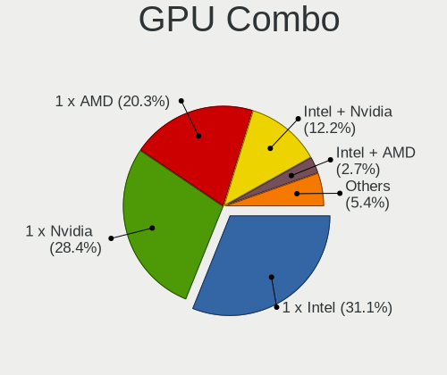

| Name           | Computers | Percent |
|----------------|-----------|---------|
| 1 x Intel      | 32        | 29.63%  |
| 1 x Nvidia     | 31        | 28.7%   |
| 1 x AMD        | 23        | 21.3%   |
| Intel + Nvidia | 17        | 15.74%  |
| Intel + AMD    | 2         | 1.85%   |
| 2 x Intel      | 1         | 0.93%   |
| 2 x AMD        | 1         | 0.93%   |
| AMD + Nvidia   | 1         | 0.93%   |

GPU Driver
----------

Free vs proprietary

| Driver      | Computers | Percent |
|-------------|-----------|---------|
| Free        | 82        | 72.57%  |
| Unknown     | 16        | 14.16%  |
| Proprietary | 15        | 13.27%  |

GPU Memory
----------

Total video memory

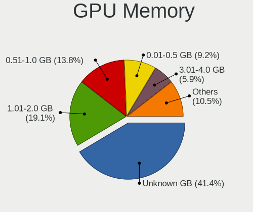

| Size in GB | Computers | Percent |
|------------|-----------|---------|
| Unknown    | 42        | 37.84%  |
| 1.01-2.0   | 25        | 22.52%  |
| 0.51-1.0   | 17        | 15.32%  |
| 0.01-0.5   | 10        | 9.01%   |
| 3.01-4.0   | 6         | 5.41%   |
| 5.01-6.0   | 4         | 3.6%    |
| 7.01-8.0   | 3         | 2.7%    |
| 2.01-3.0   | 3         | 2.7%    |
| 8.01-16.0  | 1         | 0.9%    |

Monitor
-------

Monitor Vendor
--------------

Monitor vendors

| Vendor                  | Computers | Percent |
|-------------------------|-----------|---------|
| Samsung Electronics     | 14        | 11.57%  |
| LG Display              | 8         | 6.61%   |
| BOE                     | 8         | 6.61%   |
| Ancor Communications    | 8         | 6.61%   |
| Dell                    | 7         | 5.79%   |
| Chimei Innolux          | 7         | 5.79%   |
| AU Optronics            | 7         | 5.79%   |
| Acer                    | 7         | 5.79%   |
| Goldstar                | 5         | 4.13%   |
| BenQ                    | 5         | 4.13%   |
| AOC                     | 5         | 4.13%   |
| SNC                     | 4         | 3.31%   |
| ViewSonic               | 3         | 2.48%   |
| Sony                    | 3         | 2.48%   |
| Philips                 | 3         | 2.48%   |
| LG Electronics          | 3         | 2.48%   |
| Hewlett-Packard         | 3         | 2.48%   |
| Sharp                   | 2         | 1.65%   |
| Iiyama                  | 2         | 1.65%   |
| Chi Mei Optoelectronics | 2         | 1.65%   |
| ASUSTek Computer        | 2         | 1.65%   |
| Unknown                 | 1         | 0.83%   |
| RTK                     | 1         | 0.83%   |
| QBell                   | 1         | 0.83%   |
| PKB                     | 1         | 0.83%   |
| Onkyo                   | 1         | 0.83%   |
| Medion                  | 1         | 0.83%   |
| Lenovo                  | 1         | 0.83%   |
| Insignia                | 1         | 0.83%   |
| Idek Iiyama             | 1         | 0.83%   |
| HannStar                | 1         | 0.83%   |
| Eizo                    | 1         | 0.83%   |
| Compal                  | 1         | 0.83%   |
| Apple                   | 1         | 0.83%   |

Monitor Model
-------------

Monitor models

| Model                                                                 | Computers | Percent |
|-----------------------------------------------------------------------|-----------|---------|
| SNC PHOTO 190V SNC1850 1366x768 409x230mm 18.5-inch                   | 4         | 2.99%   |
| Samsung Electronics LCD Monitor SAM07C5 1920x1080 890x500mm 40.2-inch | 2         | 1.49%   |
| Goldstar 27EA33 GSM59BC 1920x1080 598x337mm 27.0-inch                 | 2         | 1.49%   |
| AU Optronics LCD Monitor AUO8074 1280x800 331x207mm 15.4-inch         | 2         | 1.49%   |
| Ancor Communications PA248 ACI24B1 1920x1200 546x352mm 25.6-inch      | 2         | 1.49%   |
| Ancor Communications ASUS VE278 ACI27F6 1920x1080 598x336mm 27.0-inch | 2         | 1.49%   |
| ViewSonic VX2409 SERIES VSC6C2E 1920x1080 521x293mm 23.5-inch         | 1         | 0.75%   |
| ViewSonic VA903-3Series VSC701E 1280x1024 376x301mm 19.0-inch         | 1         | 0.75%   |
| ViewSonic LCD Monitor VP2468 Series 3520x1080                         | 1         | 0.75%   |
| Unknown LCD Monitor SAMSUNG 1920x1080                                 | 1         | 0.75%   |
| Sony TV SNYF301 1920x1080                                             | 1         | 0.75%   |
| Sony TV SNYDC02 1920x1080 708x398mm 32.0-inch                         | 1         | 0.75%   |
| Sony SDM-X72 SNY1E70 1280x1024 338x270mm 17.0-inch                    | 1         | 0.75%   |
| Sharp LCD Monitor SHP149A 1920x1080 344x194mm 15.5-inch               | 1         | 0.75%   |
| Sharp LCD Monitor SHP1461 3200x1800 294x165mm 13.3-inch               | 1         | 0.75%   |
| Samsung Electronics SyncMaster SAM0612 1920x1080 600x340mm 27.2-inch  | 1         | 0.75%   |
| Samsung Electronics SyncMaster SAM0471 1360x768 344x194mm 15.5-inch   | 1         | 0.75%   |
| Samsung Electronics SMB2240W SAM0699 1680x1050 459x296mm 21.5-inch    | 1         | 0.75%   |
| Samsung Electronics SMB2240W SAM0698 1680x1050 474x296mm 22.0-inch    | 1         | 0.75%   |
| Samsung Electronics SM2333TN SAM06FC 1920x1080 477x268mm 21.5-inch    | 1         | 0.75%   |
| Samsung Electronics S22D300 SAM0B3F 1920x1080 477x268mm 21.5-inch     | 1         | 0.75%   |
| Samsung Electronics LS27A80 SAM7184 3840x2160 597x336mm 27.0-inch     | 1         | 0.75%   |
| Samsung Electronics LF24T35 SAM707D 1920x1080 528x297mm 23.9-inch     | 1         | 0.75%   |
| Samsung Electronics LCD Monitor SEC544B 1600x900 382x215mm 17.3-inch  | 1         | 0.75%   |
| Samsung Electronics LCD Monitor SEC3155 1920x1200 367x230mm 17.1-inch | 1         | 0.75%   |
| Samsung Electronics LCD Monitor SEC314F 1600x900 382x215mm 17.3-inch  | 1         | 0.75%   |
| Samsung Electronics LCD Monitor SDC3853 2736x1824 260x173mm 12.3-inch | 1         | 0.75%   |
| Samsung Electronics LCD Monitor S24D330 3840x1080                     | 1         | 0.75%   |
| Samsung Electronics LCD Monitor S24D330                               | 1         | 0.75%   |
| Samsung Electronics C24F390 SAM0D2C 1920x1080 521x293mm 23.5-inch     | 1         | 0.75%   |
| RTK LCD Monitor RTK1D1A 1920x1080 1020x570mm 46.0-inch                | 1         | 0.75%   |
| QBell QB.19F-4WLHGB QBL3EC6 1440x900 410x257mm 19.1-inch              | 1         | 0.75%   |
| PKB LCD Monitor Viseo223DX 1920x1080                                  | 1         | 0.75%   |
| Philips PHL 436M6VBP PHLC179 3840x2160 941x529mm 42.5-inch            | 1         | 0.75%   |
| Philips LCD Monitor FTV                                               | 1         | 0.75%   |
| Philips 200V4 PHLC0BF 1600x900 432x240mm 19.5-inch                    | 1         | 0.75%   |
| Onkyo LCD Monitor TX-SR608 5760x2160                                  | 1         | 0.75%   |
| Onkyo LCD Monitor TX-SR608                                            | 1         | 0.75%   |
| Onkyo LCD Monitor AV Receiver 5760x2160                               | 1         | 0.75%   |
| Medion MD 20122 MED3601 1680x1050 474x296mm 22.0-inch                 | 1         | 0.75%   |

Monitor Resolution
------------------

Monitor screen resolution

| Resolution         | Computers | Percent |
|--------------------|-----------|---------|
| 1920x1080 (FHD)    | 53        | 44.17%  |
| 1366x768 (WXGA)    | 13        | 10.83%  |
| Unknown            | 8         | 6.67%   |
| 3840x2160 (4K)     | 7         | 5.83%   |
| 1920x1200 (WUXGA)  | 6         | 5%      |
| 1600x900 (HD+)     | 6         | 5%      |
| 1280x1024 (SXGA)   | 6         | 5%      |
| 1680x1050 (WSXGA+) | 3         | 2.5%    |
| 3840x1080          | 2         | 1.67%   |
| 1440x900 (WXGA+)   | 2         | 1.67%   |
| 1280x800 (WXGA)    | 2         | 1.67%   |
| 5760x2160          | 1         | 0.83%   |
| 4480x1440          | 1         | 0.83%   |
| 3520x1080          | 1         | 0.83%   |
| 3200x900           | 1         | 0.83%   |
| 3200x1800 (QHD+)   | 1         | 0.83%   |
| 2736x1824          | 1         | 0.83%   |
| 2560x1440 (QHD)    | 1         | 0.83%   |
| 2560x1080          | 1         | 0.83%   |
| 2560x1024          | 1         | 0.83%   |
| 1920x540           | 1         | 0.83%   |
| 1360x768           | 1         | 0.83%   |
| 1024x768 (XGA)     | 1         | 0.83%   |

Monitor Diagonal
----------------

Diagonal size in inches

| Inches  | Computers | Percent |
|---------|-----------|---------|
| 15      | 19        | 16.24%  |
| Unknown | 15        | 12.82%  |
| 24      | 12        | 10.26%  |
| 27      | 10        | 8.55%   |
| 13      | 9         | 7.69%   |
| 21      | 8         | 6.84%   |
| 17      | 8         | 6.84%   |
| 19      | 7         | 5.98%   |
| 23      | 4         | 3.42%   |
| 18      | 4         | 3.42%   |
| 14      | 4         | 3.42%   |
| 22      | 3         | 2.56%   |
| 54      | 2         | 1.71%   |
| 46      | 2         | 1.71%   |
| 25      | 2         | 1.71%   |
| 72      | 1         | 0.85%   |
| 48      | 1         | 0.85%   |
| 42      | 1         | 0.85%   |
| 32      | 1         | 0.85%   |
| 29      | 1         | 0.85%   |
| 20      | 1         | 0.85%   |
| 16      | 1         | 0.85%   |
| 12      | 1         | 0.85%   |

Monitor Width
-------------

Physical width

| Width in mm | Computers | Percent |
|-------------|-----------|---------|
| 301-350     | 30        | 25.86%  |
| 501-600     | 26        | 22.41%  |
| 401-500     | 17        | 14.66%  |
| Unknown     | 15        | 12.93%  |
| 351-400     | 12        | 10.34%  |
| 201-300     | 5         | 4.31%   |
| 1001-1500   | 5         | 4.31%   |
| 601-700     | 3         | 2.59%   |
| 701-800     | 1         | 0.86%   |
| 1501-2000   | 1         | 0.86%   |
| 901-1000    | 1         | 0.86%   |

Aspect Ratio
------------

Proportional relationship between the width and the height

| Ratio   | Computers | Percent |
|---------|-----------|---------|
| 16/9    | 73        | 65.77%  |
| Unknown | 15        | 13.51%  |
| 16/10   | 13        | 11.71%  |
| 5/4     | 6         | 5.41%   |
| 4/3     | 1         | 0.9%    |
| 3/2     | 1         | 0.9%    |
| 21/9    | 1         | 0.9%    |
| 1.96    | 1         | 0.9%    |

Monitor Area
------------

Area in inch

| Area in inch | Computers | Percent |
|----------------|-----------|---------|
| 201-250        | 21        | 18.26%  |
| 101-110        | 19        | 16.52%  |
| Unknown        | 15        | 13.04%  |
| 301-350        | 11        | 9.57%   |
| 81-90          | 9         | 7.83%   |
| 151-200        | 9         | 7.83%   |
| 121-130        | 6         | 5.22%   |
| 251-300        | 5         | 4.35%   |
| 141-150        | 5         | 4.35%   |
| 501-1000       | 4         | 3.48%   |
| More than 1000 | 3         | 2.61%   |
| 71-80          | 3         | 2.61%   |
| 61-70          | 1         | 0.87%   |
| 351-500        | 1         | 0.87%   |
| 131-140        | 1         | 0.87%   |
| 111-120        | 1         | 0.87%   |
| 91-100         | 1         | 0.87%   |

Pixel Density
-------------

Pixels per inch

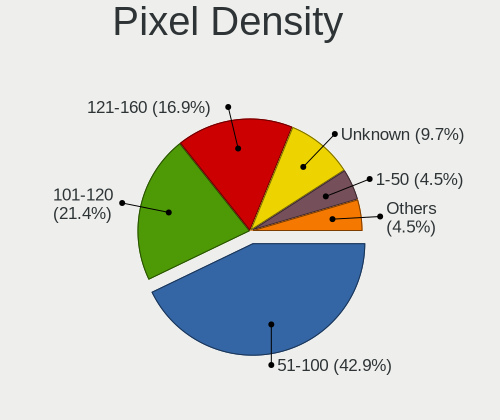

| Density       | Computers | Percent |
|---------------|-----------|---------|
| 51-100        | 42        | 37.5%   |
| 121-160       | 22        | 19.64%  |
| 101-120       | 21        | 18.75%  |
| Unknown       | 15        | 13.39%  |
| 1-50          | 6         | 5.36%   |
| More than 240 | 3         | 2.68%   |
| 161-240       | 3         | 2.68%   |

Multiple Monitors
-----------------

Total monitors connected

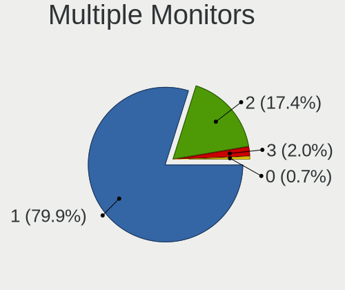

| Total | Computers | Percent |
|-------|-----------|---------|
| 1     | 86        | 79.63%  |
| 2     | 21        | 19.44%  |
| 3     | 1         | 0.93%   |

Network
-------

Net Controller Vendor
---------------------

Controller vendors

| Vendor                   | Computers | Percent |
|--------------------------|-----------|---------|
| Realtek Semiconductor    | 56        | 36.13%  |
| Intel                    | 55        | 35.48%  |
| Qualcomm Atheros         | 14        | 9.03%   |
| Broadcom                 | 10        | 6.45%   |
| Marvell Technology Group | 5         | 3.23%   |
| TP-Link                  | 2         | 1.29%   |
| Sierra Wireless          | 2         | 1.29%   |
| MediaTek                 | 2         | 1.29%   |
| Broadcom Limited         | 2         | 1.29%   |
| Wilocity                 | 1         | 0.65%   |
| Ultimarc                 | 1         | 0.65%   |
| Huawei Technologies      | 1         | 0.65%   |
| Dell                     | 1         | 0.65%   |
| D-Link System            | 1         | 0.65%   |
| ASIX Electronics         | 1         | 0.65%   |
| Aquantia                 | 1         | 0.65%   |

Net Controller Model
--------------------

Controller models

| Model                                                             | Computers | Percent |
|-------------------------------------------------------------------|-----------|---------|
| Realtek RTL8111/8168/8411 PCI Express Gigabit Ethernet Controller | 43        | 23.63%  |
| Intel 82579LM Gigabit Network Connection (Lewisville)             | 7         | 3.85%   |
| Intel Wireless 8260                                               | 5         | 2.75%   |
| Intel I211 Gigabit Network Connection                             | 5         | 2.75%   |
| Intel Wireless 3165                                               | 4         | 2.2%    |
| Intel Wi-Fi 6 AX200                                               | 4         | 2.2%    |
| Intel Ethernet Connection I217-V                                  | 4         | 2.2%    |
| Intel Dual Band Wireless-AC 3168NGW [Stone Peak]                  | 4         | 2.2%    |
| Intel Centrino Advanced-N 6205 [Taylor Peak]                      | 4         | 2.2%    |
| Realtek RTL8822CE 802.11ac PCIe Wireless Network Adapter          | 3         | 1.65%   |
| Realtek RTL8125 2.5GbE Controller                                 | 3         | 1.65%   |
| Realtek RTL810xE PCI Express Fast Ethernet controller             | 3         | 1.65%   |
| Sierra Wireless MC8305 Modem                                      | 2         | 1.1%    |
| Realtek RTL8814AU 802.11a/b/g/n/ac Wireless Adapter               | 2         | 1.1%    |
| Realtek RTL8812AU 802.11a/b/g/n/ac 2T2R DB WLAN Adapter           | 2         | 1.1%    |
| Realtek RTL8811AU 802.11a/b/g/n/ac WLAN Adapter                   | 2         | 1.1%    |
| Qualcomm Atheros QCA9565 / AR9565 Wireless Network Adapter        | 2         | 1.1%    |
| Qualcomm Atheros AR9462 Wireless Network Adapter                  | 2         | 1.1%    |
| Qualcomm Atheros AR8151 v2.0 Gigabit Ethernet                     | 2         | 1.1%    |
| Qualcomm Atheros AR5212/5213/2414 Wireless Network Adapter        | 2         | 1.1%    |
| Intel Wireless-AC 9260                                            | 2         | 1.1%    |
| Intel Wireless 8265 / 8275                                        | 2         | 1.1%    |
| Intel Wireless 7265                                               | 2         | 1.1%    |
| Intel Wireless 7260                                               | 2         | 1.1%    |
| Intel Ethernet Connection I219-LM                                 | 2         | 1.1%    |
| Intel Ethernet Connection (2) I219-V                              | 2         | 1.1%    |
| Intel 82579V Gigabit Network Connection                           | 2         | 1.1%    |
| Intel 82557/8/9/0/1 Ethernet Pro 100                              | 2         | 1.1%    |
| Broadcom NetXtreme BCM5754 Gigabit Ethernet PCI Express           | 2         | 1.1%    |
| Broadcom BCM4313 802.11bgn Wireless Network Adapter               | 2         | 1.1%    |
| Broadcom BCM4311 802.11a/b/g                                      | 2         | 1.1%    |
| Wilocity Wil6200 802.11ad Wireless Network Adapter                | 1         | 0.55%   |
| Ultimarc A-PAC Arcade Control Interface                           | 1         | 0.55%   |
| TP-Link Archer T3U [Realtek RTL8812BU]                            | 1         | 0.55%   |
| TP-Link 802.11ac NIC                                              | 1         | 0.55%   |
| Realtek RTL8723DE Wireless Network Adapter                        | 1         | 0.55%   |
| Realtek RTL8192EE PCIe Wireless Network Adapter                   | 1         | 0.55%   |
| Realtek RTL8192CU 802.11n WLAN Adapter                            | 1         | 0.55%   |
| Realtek RTL8191SU 802.11n WLAN Adapter                            | 1         | 0.55%   |
| Realtek RTL8188FTV 802.11b/g/n 1T1R 2.4G WLAN Adapter             | 1         | 0.55%   |

Wireless Vendor
---------------

Wireless vendors

| Vendor                   | Computers | Percent |
|--------------------------|-----------|---------|
| Intel                    | 34        | 47.22%  |
| Realtek Semiconductor    | 11        | 15.28%  |
| Qualcomm Atheros         | 11        | 15.28%  |
| Broadcom                 | 7         | 9.72%   |
| TP-Link                  | 2         | 2.78%   |
| Sierra Wireless          | 2         | 2.78%   |
| MediaTek                 | 2         | 2.78%   |
| Wilocity                 | 1         | 1.39%   |
| Marvell Technology Group | 1         | 1.39%   |
| Dell                     | 1         | 1.39%   |

Wireless Model
--------------

Wireless models

| Model                                                          | Computers | Percent |
|----------------------------------------------------------------|-----------|---------|
| Intel Wireless 8260                                            | 5         | 6.58%   |
| Intel Wireless 3165                                            | 4         | 5.26%   |
| Intel Wi-Fi 6 AX200                                            | 4         | 5.26%   |
| Intel Dual Band Wireless-AC 3168NGW [Stone Peak]               | 4         | 5.26%   |
| Intel Centrino Advanced-N 6205 [Taylor Peak]                   | 4         | 5.26%   |
| Realtek RTL8822CE 802.11ac PCIe Wireless Network Adapter       | 3         | 3.95%   |
| Sierra Wireless MC8305 Modem                                   | 2         | 2.63%   |
| Realtek RTL8814AU 802.11a/b/g/n/ac Wireless Adapter            | 2         | 2.63%   |
| Realtek RTL8812AU 802.11a/b/g/n/ac 2T2R DB WLAN Adapter        | 2         | 2.63%   |
| Realtek RTL8811AU 802.11a/b/g/n/ac WLAN Adapter                | 2         | 2.63%   |
| Qualcomm Atheros QCA9565 / AR9565 Wireless Network Adapter     | 2         | 2.63%   |
| Qualcomm Atheros AR9462 Wireless Network Adapter               | 2         | 2.63%   |
| Qualcomm Atheros AR5212/5213/2414 Wireless Network Adapter     | 2         | 2.63%   |
| Intel Wireless-AC 9260                                         | 2         | 2.63%   |
| Intel Wireless 8265 / 8275                                     | 2         | 2.63%   |
| Intel Wireless 7265                                            | 2         | 2.63%   |
| Intel Wireless 7260                                            | 2         | 2.63%   |
| Broadcom BCM4313 802.11bgn Wireless Network Adapter            | 2         | 2.63%   |
| Broadcom BCM4311 802.11a/b/g                                   | 2         | 2.63%   |
| Wilocity Wil6200 802.11ad Wireless Network Adapter             | 1         | 1.32%   |
| TP-Link Archer T3U [Realtek RTL8812BU]                         | 1         | 1.32%   |
| TP-Link 802.11ac NIC                                           | 1         | 1.32%   |
| Realtek RTL8723DE Wireless Network Adapter                     | 1         | 1.32%   |
| Realtek RTL8192EE PCIe Wireless Network Adapter                | 1         | 1.32%   |
| Realtek RTL8192CU 802.11n WLAN Adapter                         | 1         | 1.32%   |
| Realtek RTL8191SU 802.11n WLAN Adapter                         | 1         | 1.32%   |
| Realtek RTL8188FTV 802.11b/g/n 1T1R 2.4G WLAN Adapter          | 1         | 1.32%   |
| Realtek RTL8188EE Wireless Network Adapter                     | 1         | 1.32%   |
| Qualcomm Atheros QCA9377 802.11ac Wireless Network Adapter     | 1         | 1.32%   |
| Qualcomm Atheros QCA6174 802.11ac Wireless Network Adapter     | 1         | 1.32%   |
| Qualcomm Atheros AR9485 Wireless Network Adapter               | 1         | 1.32%   |
| Qualcomm Atheros AR9287 Wireless Network Adapter (PCI-Express) | 1         | 1.32%   |
| Qualcomm Atheros AR9285 Wireless Network Adapter (PCI-Express) | 1         | 1.32%   |
| MediaTek WiFi                                                  | 1         | 1.32%   |
| MediaTek MT7922 802.11ax PCI Express Wireless Network Adapter  | 1         | 1.32%   |
| Marvell Group 88W8897 [AVASTAR] 802.11ac Wireless              | 1         | 1.32%   |
| Intel Ultimate N WiFi Link 5300                                | 1         | 1.32%   |
| Intel Gemini Lake PCH CNVi WiFi                                | 1         | 1.32%   |
| Intel Comet Lake PCH CNVi WiFi                                 | 1         | 1.32%   |
| Intel Cannon Point-LP CNVi [Wireless-AC]                       | 1         | 1.32%   |

Ethernet Vendor
---------------

Ethernet vendors

| Vendor                   | Computers | Percent |
|--------------------------|-----------|---------|
| Realtek Semiconductor    | 51        | 50.5%   |
| Intel                    | 33        | 32.67%  |
| Qualcomm Atheros         | 5         | 4.95%   |
| Marvell Technology Group | 4         | 3.96%   |
| Broadcom                 | 3         | 2.97%   |
| Broadcom Limited         | 2         | 1.98%   |
| D-Link System            | 1         | 0.99%   |
| ASIX Electronics         | 1         | 0.99%   |
| Aquantia                 | 1         | 0.99%   |

Ethernet Model
--------------

Ethernet models

| Model                                                                         | Computers | Percent |
|-------------------------------------------------------------------------------|-----------|---------|
| Realtek RTL8111/8168/8411 PCI Express Gigabit Ethernet Controller             | 43        | 41.35%  |
| Intel 82579LM Gigabit Network Connection (Lewisville)                         | 7         | 6.73%   |
| Intel I211 Gigabit Network Connection                                         | 5         | 4.81%   |
| Intel Ethernet Connection I217-V                                              | 4         | 3.85%   |
| Realtek RTL8125 2.5GbE Controller                                             | 3         | 2.88%   |
| Realtek RTL810xE PCI Express Fast Ethernet controller                         | 3         | 2.88%   |
| Qualcomm Atheros AR8151 v2.0 Gigabit Ethernet                                 | 2         | 1.92%   |
| Intel Ethernet Connection I219-LM                                             | 2         | 1.92%   |
| Intel Ethernet Connection (2) I219-V                                          | 2         | 1.92%   |
| Intel 82579V Gigabit Network Connection                                       | 2         | 1.92%   |
| Intel 82557/8/9/0/1 Ethernet Pro 100                                          | 2         | 1.92%   |
| Broadcom NetXtreme BCM5754 Gigabit Ethernet PCI Express                       | 2         | 1.92%   |
| Realtek RTL8169 PCI Gigabit Ethernet Controller                               | 1         | 0.96%   |
| Realtek RTL8152 Fast Ethernet Adapter                                         | 1         | 0.96%   |
| Qualcomm Atheros Attansic L2 Fast Ethernet                                    | 1         | 0.96%   |
| Qualcomm Atheros AR8162 Fast Ethernet                                         | 1         | 0.96%   |
| Qualcomm Atheros AR8152 v2.0 Fast Ethernet                                    | 1         | 0.96%   |
| Marvell Group 88E8058 PCI-E Gigabit Ethernet Controller                       | 1         | 0.96%   |
| Marvell Group 88E8057 PCI-E Gigabit Ethernet Controller                       | 1         | 0.96%   |
| Marvell Group 88E8056 PCI-E Gigabit Ethernet Controller                       | 1         | 0.96%   |
| Marvell Group 88E8055 PCI-E Gigabit Ethernet Controller                       | 1         | 0.96%   |
| Intel I210 Gigabit Network Connection                                         | 1         | 0.96%   |
| Intel Ethernet Controller I225-V                                              | 1         | 0.96%   |
| Intel Ethernet Connection I219-V                                              | 1         | 0.96%   |
| Intel Ethernet Connection I217-LM                                             | 1         | 0.96%   |
| Intel Ethernet Connection (7) I219-V                                          | 1         | 0.96%   |
| Intel Ethernet Connection (4) I219-LM                                         | 1         | 0.96%   |
| Intel Ethernet Connection (2) I219-LM                                         | 1         | 0.96%   |
| Intel Ethernet Connection (2) I218-LM                                         | 1         | 0.96%   |
| Intel Ethernet Connection (14) I219-LM                                        | 1         | 0.96%   |
| Intel 82574L Gigabit Network Connection                                       | 1         | 0.96%   |
| Intel 82571EB/82571GB Gigabit Ethernet Controller D0/D1 (copper applications) | 1         | 0.96%   |
| Intel 82541PI Gigabit Ethernet Controller                                     | 1         | 0.96%   |
| D-Link System DGE-528T Gigabit Ethernet Adapter                               | 1         | 0.96%   |
| Broadcom NetLink BCM57780 Gigabit Ethernet PCIe                               | 1         | 0.96%   |
| Broadcom Limited NetLink BCM5787M Gigabit Ethernet PCI Express                | 1         | 0.96%   |
| Broadcom Limited NetLink BCM57780 Gigabit Ethernet PCIe                       | 1         | 0.96%   |
| ASIX AX88772B                                                                 | 1         | 0.96%   |
| Aquantia AQC107 NBase-T/IEEE 802.3bz Ethernet Controller [AQtion]             | 1         | 0.96%   |

Net Controller Kind
-------------------

Ethernet, WiFi or modem

| Kind     | Computers | Percent |
|----------|-----------|---------|
| Ethernet | 95        | 59.01%  |
| WiFi     | 64        | 39.75%  |
| Modem    | 1         | 0.62%   |
| Unknown  | 1         | 0.62%   |

Used Controller
---------------

Currently used network controller

| Kind     | Computers | Percent |
|----------|-----------|---------|
| Ethernet | 62        | 55.86%  |
| WiFi     | 49        | 44.14%  |

NICs
----

Total network controllers on board

| Total | Computers | Percent |
|-------|-----------|---------|
| 1     | 55        | 49.55%  |
| 2     | 48        | 43.24%  |
| 3     | 5         | 4.5%    |
| 0     | 2         | 1.8%    |
| 4     | 1         | 0.9%    |

IPv6
----

IPv6 vs IPv4

| Used | Computers | Percent |
|------|-----------|---------|
| No   | 87        | 79.09%  |
| Yes  | 23        | 20.91%  |

Bluetooth
---------

Bluetooth Vendor
----------------

Controller vendors

| Vendor                  | Computers | Percent |
|-------------------------|-----------|---------|
| Intel                   | 26        | 41.27%  |
| Cambridge Silicon Radio | 9         | 14.29%  |
| Realtek Semiconductor   | 5         | 7.94%   |
| IMC Networks            | 4         | 6.35%   |
| Hewlett-Packard         | 3         | 4.76%   |
| Broadcom                | 3         | 4.76%   |
| ASUSTek Computer        | 3         | 4.76%   |
| Lite-On Technology      | 2         | 3.17%   |
| Foxconn / Hon Hai       | 2         | 3.17%   |
| Belkin Components       | 2         | 3.17%   |
| Taiyo Yuden             | 1         | 1.59%   |
| Marvell Semiconductor   | 1         | 1.59%   |
| Dell                    | 1         | 1.59%   |
| Apple                   | 1         | 1.59%   |

Bluetooth Model
---------------

Controller models

| Model                                               | Computers | Percent |
|-----------------------------------------------------|-----------|---------|
| Intel Bluetooth wireless interface                  | 12        | 19.05%  |
| Cambridge Silicon Radio Bluetooth Dongle (HCI mode) | 9         | 14.29%  |
| Intel Wireless-AC 3168 Bluetooth                    | 4         | 6.35%   |
| Intel AX200 Bluetooth                               | 4         | 6.35%   |
| Realtek Bluetooth Radio                             | 3         | 4.76%   |
| Intel Bluetooth 9460/9560 Jefferson Peak (JfP)      | 3         | 4.76%   |
| Lite-On Bluetooth Device                            | 2         | 3.17%   |
| Intel Wireless-AC 9260 Bluetooth Adapter            | 2         | 3.17%   |
| IMC Networks Bluetooth Device                       | 2         | 3.17%   |
| HP Bluetooth 2.0 Interface [Broadcom BCM2045]       | 2         | 3.17%   |
| Foxconn / Hon Hai BCM20702A0                        | 2         | 3.17%   |
| Taiyo Yuden Bluetooth Device (V2.1+EDR)             | 1         | 1.59%   |
| Realtek  Bluetooth 4.2 Adapter                      | 1         | 1.59%   |
| Realtek 802.11ac WLAN Adapter                       | 1         | 1.59%   |
| Marvell Bluetooth and Wireless LAN Composite        | 1         | 1.59%   |
| Intel AX201 Bluetooth                               | 1         | 1.59%   |
| IMC Networks Wireless_Device                        | 1         | 1.59%   |
| IMC Networks Atheros AR3012 Bluetooth 4.0 Adapter   | 1         | 1.59%   |
| HP Broadcom 2070 Bluetooth Combo                    | 1         | 1.59%   |
| Dell BCM20702A0 Bluetooth Module                    | 1         | 1.59%   |
| Broadcom Bluetooth dongle                           | 1         | 1.59%   |
| Broadcom BCM20702A0 Bluetooth 4.0                   | 1         | 1.59%   |
| Broadcom BCM20702 Bluetooth 4.0 [ThinkPad]          | 1         | 1.59%   |
| Belkin Components F8T013 Bluetooth Adapter          | 1         | 1.59%   |
| Belkin Components Bluetooth Mini Dongle             | 1         | 1.59%   |
| ASUS Broadcom BCM20702A0 Bluetooth                  | 1         | 1.59%   |
| ASUS Bluetooth Device                               | 1         | 1.59%   |
| ASUS BCM20702A0                                     | 1         | 1.59%   |
| Apple Bluetooth HCI MacBookPro (HID mode)           | 1         | 1.59%   |

Sound
-----

Sound Vendor
------------

Sound card vendors

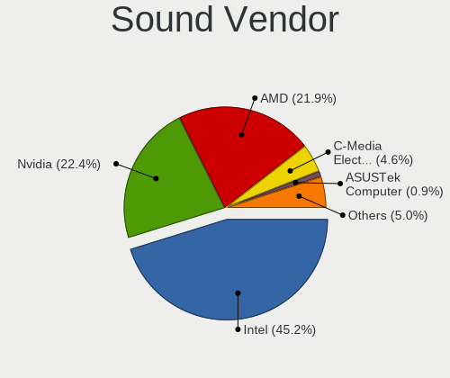

| Vendor                     | Computers | Percent |
|----------------------------|-----------|---------|
| Intel                      | 73        | 45.06%  |
| Nvidia                     | 38        | 23.46%  |
| AMD                        | 35        | 21.6%   |
| C-Media Electronics        | 8         | 4.94%   |
| Samsung Electronics        | 1         | 0.62%   |
| Mackie Designs             | 1         | 0.62%   |
| Logitech                   | 1         | 0.62%   |
| iCreate Technologies       | 1         | 0.62%   |
| Corsair                    | 1         | 0.62%   |
| BEHRINGER International    | 1         | 0.62%   |
| ASUSTek Computer           | 1         | 0.62%   |
| Altec Lansing Technologies | 1         | 0.62%   |

Sound Model
-----------

Sound card models

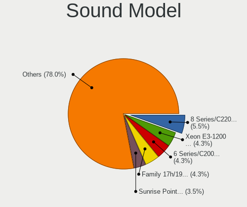

| Model                                                                      | Computers | Percent |
|----------------------------------------------------------------------------|-----------|---------|
| Intel 8 Series/C220 Series Chipset High Definition Audio Controller        | 10        | 5.41%   |
| Intel Sunrise Point-LP HD Audio                                            | 9         | 4.86%   |
| Intel 6 Series/C200 Series Chipset Family High Definition Audio Controller | 9         | 4.86%   |
| AMD SBx00 Azalia (Intel HDA)                                               | 8         | 4.32%   |
| Nvidia GK208 HDMI/DP Audio Controller                                      | 7         | 3.78%   |
| Intel Xeon E3-1200 v3/4th Gen Core Processor HD Audio Controller           | 7         | 3.78%   |
| Intel 7 Series/C216 Chipset Family High Definition Audio Controller        | 7         | 3.78%   |
| AMD Family 17h/19h HD Audio Controller                                     | 7         | 3.78%   |
| Nvidia GF108 High Definition Audio Controller                              | 5         | 2.7%    |
| Intel NM10/ICH7 Family High Definition Audio Controller                    | 5         | 2.7%    |
| AMD Starship/Matisse HD Audio Controller                                   | 5         | 2.7%    |
| Nvidia GP106 High Definition Audio Controller                              | 4         | 2.16%   |
| Nvidia GK107 HDMI Audio Controller                                         | 4         | 2.16%   |
| Intel Cannon Lake PCH cAVS                                                 | 4         | 2.16%   |
| Intel 100 Series/C230 Series Chipset Family HD Audio Controller            | 4         | 2.16%   |
| C-Media Electronics CMI8788 [Oxygen HD Audio]                              | 4         | 2.16%   |
| Intel Tiger Lake-H HD Audio Controller                                     | 3         | 1.62%   |
| Intel Haswell-ULT HD Audio Controller                                      | 3         | 1.62%   |
| Intel 82801I (ICH9 Family) HD Audio Controller                             | 3         | 1.62%   |
| AMD RV620 HDMI Audio [Radeon HD 3450/3470/3550/3570]                       | 3         | 1.62%   |
| AMD Raven/Raven2/Fenghuang HDMI/DP Audio Controller                        | 3         | 1.62%   |
| AMD FCH Azalia Controller                                                  | 3         | 1.62%   |
| AMD Family 17h (Models 00h-0fh) HD Audio Controller                        | 3         | 1.62%   |
| Nvidia GP108 High Definition Audio Controller                              | 2         | 1.08%   |
| Nvidia GP107GL High Definition Audio Controller                            | 2         | 1.08%   |
| Nvidia GP104 High Definition Audio Controller                              | 2         | 1.08%   |
| Nvidia GF119 HDMI Audio Controller                                         | 2         | 1.08%   |
| Nvidia Audio device                                                        | 2         | 1.08%   |
| Intel 9 Series Chipset Family HD Audio Controller                          | 2         | 1.08%   |
| Intel 8 Series HD Audio Controller                                         | 2         | 1.08%   |
| Intel 200 Series PCH HD Audio                                              | 2         | 1.08%   |
| C-Media Electronics CMI8738/CMI8768 PCI Audio                              | 2         | 1.08%   |
| AMD Tahiti HDMI Audio [Radeon HD 7870 XT / 7950/7970]                      | 2         | 1.08%   |
| AMD Renoir Radeon High Definition Audio Controller                         | 2         | 1.08%   |
| AMD Family 15h (Models 60h-6fh) Audio Controller                           | 2         | 1.08%   |
| Samsung Electronics USB C Earphones                                        | 1         | 0.54%   |
| Nvidia TU107 GeForce GTX 1650 High Definition Audio Controller             | 1         | 0.54%   |
| Nvidia TU106 High Definition Audio Controller                              | 1         | 0.54%   |
| Nvidia High Definition Audio Controller                                    | 1         | 0.54%   |
| Nvidia GP102 HDMI Audio Controller                                         | 1         | 0.54%   |

Memory
------

Memory Vendor
-------------

Memory module vendors

| Vendor              | Computers | Percent |
|---------------------|-----------|---------|
| Kingston            | 18        | 23.08%  |
| Samsung Electronics | 15        | 19.23%  |
| Unknown             | 12        | 15.38%  |
| SK hynix            | 8         | 10.26%  |
| G.Skill             | 6         | 7.69%   |
| Corsair             | 5         | 6.41%   |
| Micron Technology   | 4         | 5.13%   |
| Unknown (ABCD)      | 2         | 2.56%   |
| Team                | 2         | 2.56%   |
| Crucial             | 2         | 2.56%   |
| Smart               | 1         | 1.28%   |
| Ramaxel Technology  | 1         | 1.28%   |
| Nanya Technology    | 1         | 1.28%   |
| GOODRAM             | 1         | 1.28%   |

Memory Model
------------

Memory module models

| Model                                                             | Computers | Percent |
|-------------------------------------------------------------------|-----------|---------|
| Kingston RAM KHX2400C15/16G 16GB DIMM DDR4 3334MT/s               | 3         | 3.57%   |
| Unknown RAM Module 2GB DIMM DDR2 800MT/s                          | 2         | 2.38%   |
| Samsung RAM M471B5173DB0-YK0 4GB SODIMM DDR3 1600MT/s             | 2         | 2.38%   |
| G.Skill RAM F3-12800CL9-4GBXM 4096MB DIMM DDR3 1600MT/s           | 2         | 2.38%   |
| Unknown RAM Module 8GB DIMM 1333MT/s                              | 1         | 1.19%   |
| Unknown RAM Module 4GB SODIMM LPDDR3 1600MT/s                     | 1         | 1.19%   |
| Unknown RAM Module 4GB SODIMM DDR4 2400MT/s                       | 1         | 1.19%   |
| Unknown RAM Module 4GB DIMM DDR3 1333MT/s                         | 1         | 1.19%   |
| Unknown RAM Module 4GB DIMM 667MT/s                               | 1         | 1.19%   |
| Unknown RAM Module 4096MB DIMM 667MT/s                            | 1         | 1.19%   |
| Unknown RAM Module 4096MB DIMM 1333MT/s                           | 1         | 1.19%   |
| Unknown RAM Module 2GB SODIMM 533MT/s                             | 1         | 1.19%   |
| Unknown RAM Module 2GB DIMM DDR3 1333MT/s                         | 1         | 1.19%   |
| Unknown RAM Module 2GB DIMM 667MT/s                               | 1         | 1.19%   |
| Unknown RAM Module 2048MB SODIMM DDR2 975MT/s                     | 1         | 1.19%   |
| Unknown RAM Module 2048MB DIMM DDR3 1333MT/s                      | 1         | 1.19%   |
| Unknown RAM Module 2048MB DIMM DDR2 800MT/s                       | 1         | 1.19%   |
| Unknown RAM Module 2048MB DIMM 667MT/s                            | 1         | 1.19%   |
| Unknown (ABCD) RAM 123456789012345678 2GB SODIMM LPDDR4 2400MT/s  | 1         | 1.19%   |
| Unknown (ABCD) RAM 123456789012345678 1536MB DIMM LPDDR4 2400MT/s | 1         | 1.19%   |
| Team RAM Elite-16 8GB DIMM DDR3 1600MT/s                          | 1         | 1.19%   |
| Team RAM Elite-1333 4GB DIMM DDR3 1333MT/s                        | 1         | 1.19%   |
| Smart RAM SH564128FH8NZQNSCG 4GB SODIMM DDR3 1600MT/s             | 1         | 1.19%   |
| SK hynix RAM Module 4GB SODIMM DDR3 1600MT/s                      | 1         | 1.19%   |
| SK hynix RAM Module 4GB SODIMM DDR3 1066MT/s                      | 1         | 1.19%   |
| SK hynix RAM HMT351S6CFR8C-PB 4GB SODIMM DDR3 1600MT/s            | 1         | 1.19%   |
| SK hynix RAM HMT325S6CFR8C-PB 2GB SODIMM DDR3 1600MT/s            | 1         | 1.19%   |
| SK hynix RAM HMA81GS6DJR8N-XN 8GB SODIMM DDR4 3200MT/s            | 1         | 1.19%   |
| SK hynix RAM HMA81GS6AFR8N-UH 8GB SODIMM DDR4 2667MT/s            | 1         | 1.19%   |
| SK hynix RAM HMA451S6AFR8N-TF 4GB SODIMM DDR4 2133MT/s            | 1         | 1.19%   |
| SK hynix RAM HMA41GS6AFR8N-TF 8GB SODIMM DDR4 2667MT/s            | 1         | 1.19%   |
| Samsung RAM Module 8192MB SODIMM DDR4 2133MT/s                    | 1         | 1.19%   |
| Samsung RAM Module 4GB Row Of Chips LPDDR3 1867MT/s               | 1         | 1.19%   |
| Samsung RAM M471B5273DH0-CH9 4GB SODIMM DDR3 1334MT/s             | 1         | 1.19%   |
| Samsung RAM M471B5173QH0-YK0 4GB SODIMM DDR3 1600MT/s             | 1         | 1.19%   |
| Samsung RAM M471B5173BH0-YK0 4GB SODIMM DDR3 1600MT/s             | 1         | 1.19%   |
| Samsung RAM M471A5244CB0-CTD 4GB SODIMM DDR4 3266MT/s             | 1         | 1.19%   |
| Samsung RAM M471A1K43DB1-CWE 8GB SODIMM DDR4 3200MT/s             | 1         | 1.19%   |
| Samsung RAM M471A1G44AB0-CTD 8GB SODIMM DDR4 2667MT/s             | 1         | 1.19%   |
| Samsung RAM M4 70T5663QZ3-CE6 2GB SODIMM DDR2 667MT/s             | 1         | 1.19%   |

Memory Kind
-----------

Memory module kinds

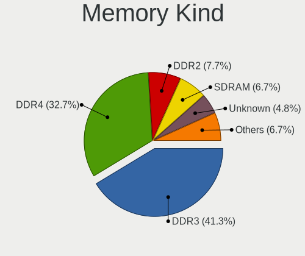

| Kind    | Computers | Percent |
|---------|-----------|---------|
| DDR3    | 28        | 41.18%  |
| DDR4    | 25        | 36.76%  |
| DDR2    | 4         | 5.88%   |
| Unknown | 4         | 5.88%   |
| SDRAM   | 2         | 2.94%   |
| LPDDR4  | 2         | 2.94%   |
| LPDDR3  | 2         | 2.94%   |
| LPDDR5  | 1         | 1.47%   |

Memory Form Factor
------------------

Physical design of the memory module

| Name         | Computers | Percent |
|--------------|-----------|---------|
| DIMM         | 36        | 54.55%  |
| SODIMM       | 28        | 42.42%  |
| Row Of Chips | 2         | 3.03%   |

Memory Size
-----------

Memory module size

| Size  | Computers | Percent |
|-------|-----------|---------|
| 8192  | 31        | 43.06%  |
| 4096  | 25        | 34.72%  |
| 2048  | 9         | 12.5%   |
| 16384 | 7         | 9.72%   |

Memory Speed
------------

Memory module speed

| Speed | Computers | Percent |
|-------|-----------|---------|
| 1600  | 22        | 29.73%  |
| 2400  | 7         | 9.46%   |
| 1333  | 6         | 8.11%   |
| 3200  | 5         | 6.76%   |
| 2133  | 5         | 6.76%   |
| 2667  | 4         | 5.41%   |
| 3334  | 3         | 4.05%   |
| 800   | 3         | 4.05%   |
| 3733  | 2         | 2.7%    |
| 1867  | 2         | 2.7%    |
| 1334  | 2         | 2.7%    |
| 667   | 2         | 2.7%    |
| 6400  | 1         | 1.35%   |
| 4199  | 1         | 1.35%   |
| 3600  | 1         | 1.35%   |
| 3500  | 1         | 1.35%   |
| 3466  | 1         | 1.35%   |
| 3400  | 1         | 1.35%   |
| 3266  | 1         | 1.35%   |
| 3000  | 1         | 1.35%   |
| 1066  | 1         | 1.35%   |
| 975   | 1         | 1.35%   |
| 533   | 1         | 1.35%   |

Printers & scanners
-------------------

Printer Vendor
--------------

Printer device vendors

| Vendor              | Computers | Percent |
|---------------------|-----------|---------|
| Brother Industries  | 2         | 33.33%  |
| Xerox               | 1         | 16.67%  |
| Samsung Electronics | 1         | 16.67%  |
| Hewlett-Packard     | 1         | 16.67%  |
| Canon               | 1         | 16.67%  |

Printer Model
-------------

Printer device models

| Model                         | Computers | Percent |
|-------------------------------|-----------|---------|
| Xerox Phaser 3140 and 3155    | 1         | 16.67%  |
| Samsung CLP-300 Series        | 1         | 16.67%  |
| HP OfficeJet 6950             | 1         | 16.67%  |
| Canon PIXMA MG3600 Series     | 1         | 16.67%  |
| Brother QL-570 Label Printer  | 1         | 16.67%  |
| Brother HL-2030 Laser Printer | 1         | 16.67%  |

Scanner Vendor
--------------

Scanner device vendors

| Vendor      | Computers | Percent |
|-------------|-----------|---------|
| Seiko Epson | 3         | 100%    |

Scanner Model
-------------

Scanner device models

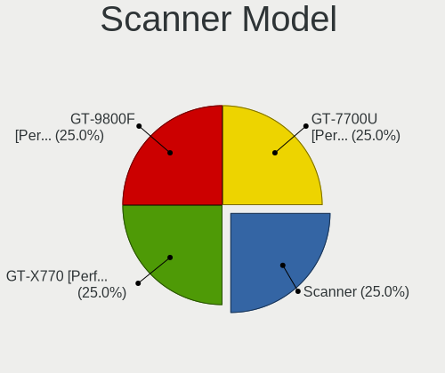

| Model                                  | Computers | Percent |
|----------------------------------------|-----------|---------|
| Seiko Epson Scanner                    | 1         | 33.33%  |
| Seiko Epson GT-X770 [Perfection V500]  | 1         | 33.33%  |
| Seiko Epson GT-9800F [Perfection 3200] | 1         | 33.33%  |

Camera
------

Camera Vendor
-------------

Camera device vendors

| Vendor                                 | Computers | Percent |
|----------------------------------------|-----------|---------|
| Chicony Electronics                    | 13        | 25.49%  |
| Microdia                               | 5         | 9.8%    |
| Logitech                               | 5         | 9.8%    |
| Realtek Semiconductor                  | 4         | 7.84%   |
| IMC Networks                           | 3         | 5.88%   |
| Sunplus Innovation Technology          | 2         | 3.92%   |
| Microsoft                              | 2         | 3.92%   |
| Luxvisions Innotech Limited            | 2         | 3.92%   |
| Cheng Uei Precision Industry (Foxlink) | 2         | 3.92%   |
| Apple                                  | 2         | 3.92%   |
| Alcor Micro                            | 2         | 3.92%   |
| WaveRider Communications               | 1         | 1.96%   |
| Suyin                                  | 1         | 1.96%   |
| Sunplus IT                             | 1         | 1.96%   |
| Sonix Technology                       | 1         | 1.96%   |
| Primax Electronics                     | 1         | 1.96%   |
| Lite-On Technology                     | 1         | 1.96%   |
| Leap Motion                            | 1         | 1.96%   |
| Bison Electronics                      | 1         | 1.96%   |
| Acer                                   | 1         | 1.96%   |

Camera Model
------------

Camera device models

| Model                                                                      | Computers | Percent |
|----------------------------------------------------------------------------|-----------|---------|
| Realtek Integrated_Webcam_HD                                               | 3         | 5.77%   |
| Chicony Integrated Camera                                                  | 3         | 5.77%   |
| Chicony Chicony USB2.0 Camera                                              | 3         | 5.77%   |
| Microdia Camera                                                            | 2         | 3.85%   |
| IMC Networks USB2.0 VGA UVC WebCam                                         | 2         | 3.85%   |
| Chicony FJ Camera                                                          | 2         | 3.85%   |
| WaveRider USB 2.0 Camera                                                   | 1         | 1.92%   |
| Suyin HP TrueVision HD Integrated Webcam                                   | 1         | 1.92%   |
| Sunplus IT AUKEY PC-LM1 USB Camera                                         | 1         | 1.92%   |
| Sunplus WEBCAM ESSENTIELB W1                                               | 1         | 1.92%   |
| Sunplus Dell E5570 integrated webcam                                       | 1         | 1.92%   |
| Sonix USB2.0 FHD UVC WebCam                                                | 1         | 1.92%   |
| Realtek USB Camera                                                         | 1         | 1.92%   |
| Primax HP Truevision FHD                                                   | 1         | 1.92%   |
| Microsoft LifeCam VX-800                                                   | 1         | 1.92%   |
| Microsoft LifeCam HD-3000                                                  | 1         | 1.92%   |
| Microdia Sonix USB 2.0 Camera                                              | 1         | 1.92%   |
| Microdia Integrated_Webcam_HD                                              | 1         | 1.92%   |
| Microdia Integrated Webcam                                                 | 1         | 1.92%   |
| Luxvisions Innotech Limited Integrated Camera                              | 1         | 1.92%   |
| Luxvisions Innotech Limited HP TrueVision HD Camera                        | 1         | 1.92%   |
| Logitech Webcam C210                                                       | 1         | 1.92%   |
| Logitech Webcam C200                                                       | 1         | 1.92%   |
| Logitech Webcam C110                                                       | 1         | 1.92%   |
| Logitech QuickCam Pro 9000                                                 | 1         | 1.92%   |
| Logitech Fujitsu Webcam                                                    | 1         | 1.92%   |
| Lite-On HP Webcam                                                          | 1         | 1.92%   |
| Leap Motion Controller                                                     | 1         | 1.92%   |
| IMC Networks USB2.0 UVC HD Webcam                                          | 1         | 1.92%   |
| Chicony TOSHIBA Web Camera - FHD                                           | 1         | 1.92%   |
| Chicony Lenovo EasyCamera                                                  | 1         | 1.92%   |
| Chicony Integrated IR Camera                                               | 1         | 1.92%   |
| Chicony Integrated HP HD Webcam                                            | 1         | 1.92%   |
| Chicony HD WebCam                                                          | 1         | 1.92%   |
| Chicony 1.3M HD WebCam                                                     | 1         | 1.92%   |
| Cheng Uei Precision Industry (Foxlink) HP Wide Vision HD Integrated Webcam | 1         | 1.92%   |
| Cheng Uei Precision Industry (Foxlink) HP HD Camera                        | 1         | 1.92%   |
| Bison EasyCamera                                                           | 1         | 1.92%   |
| Apple iPhone 5/5C/5S/6/SE/7/8/X/XR                                         | 1         | 1.92%   |
| Apple Built-in iSight                                                      | 1         | 1.92%   |

Security
--------

Fingerprint Vendor
------------------

Fingerprint sensor vendors

| Vendor                             | Computers | Percent |
|------------------------------------|-----------|---------|
| Validity Sensors                   | 4         | 33.33%  |
| AuthenTec                          | 4         | 33.33%  |
| Shenzhen Goodix Technology         | 2         | 16.67%  |
| Synaptics                          | 1         | 8.33%   |
| Realtek USB2.0 Finger Print Bridge | 1         | 8.33%   |

Fingerprint Model
-----------------

Fingerprint sensor models

| Model                                                           | Computers | Percent |
|-----------------------------------------------------------------|-----------|---------|
| AuthenTec AES2501 Fingerprint Sensor                            | 3         | 25%     |
| Validity Sensors VFS495 Fingerprint Reader                      | 1         | 8.33%   |
| Validity Sensors VFS471 Fingerprint Reader                      | 1         | 8.33%   |
| Validity Sensors Synaptics WBDI                                 | 1         | 8.33%   |
| Validity Sensors Fingerprint scanner                            | 1         | 8.33%   |
| Synaptics  WBDI                                                 | 1         | 8.33%   |
| Shenzhen Goodix  FingerPrint Device                             | 1         | 8.33%   |
| Shenzhen Goodix Fingerprint Reader                              | 1         | 8.33%   |
| Realtek USB2.0 Finger Print Bridge FocalTech Fingerprint Device | 1         | 8.33%   |
| AuthenTec Fingerprint Sensor                                    | 1         | 8.33%   |

Chipcard Vendor
---------------

Chipcard module vendors

| Vendor   | Computers | Percent |
|----------|-----------|---------|
| Broadcom | 3         | 50%     |
| O2 Micro | 2         | 33.33%  |
| Avtor    | 1         | 16.67%  |

Chipcard Model
--------------

Chipcard module models

| Model                                                                        | Computers | Percent |
|------------------------------------------------------------------------------|-----------|---------|
| O2 Micro OZ776 CCID Smartcard Reader                                         | 2         | 33.33%  |
| Broadcom 5880                                                                | 2         | 33.33%  |
| Broadcom BCM5880 Secure Applications Processor with fingerprint swipe sensor | 1         | 16.67%  |
| Avtor SecureToken                                                            | 1         | 16.67%  |

Unsupported
-----------

Unsupported Devices
-------------------

Total unsupported devices on board

| Total | Computers | Percent |
|-------|-----------|---------|
| 0     | 76        | 67.86%  |
| 1     | 26        | 23.21%  |
| 2     | 7         | 6.25%   |
| 3     | 3         | 2.68%   |

Unsupported Device Types
------------------------

Types of unsupported devices

| Type                     | Computers | Percent |
|--------------------------|-----------|---------|
| Graphics card            | 14        | 31.82%  |
| Fingerprint reader       | 12        | 27.27%  |
| Chipcard                 | 6         | 13.64%  |
| Net/wireless             | 4         | 9.09%   |
| Multimedia controller    | 3         | 6.82%   |
| Unassigned class         | 1         | 2.27%   |
| Storage                  | 1         | 2.27%   |
| Sound                    | 1         | 2.27%   |
| Communication controller | 1         | 2.27%   |
| Camera                   | 1         | 2.27%   |

