Makulu - Tested Hardware & Statistics
-------------------------------------

A project to collect tested hardware configurations for Makulu.

Anyone can contribute to this report by the [hw-probe](https://github.com/linuxhw/hw-probe) tool:

    sudo -E hw-probe -all -upload

Please contribute! Especially if your hardware is rare.

This is a report for all computer types. See also reports for [desktops](/Dist/Makulu/Desktop/README.md) and [notebooks](/Dist/Makulu/Notebook/README.md).

Contents
--------

* [ Test Cases ](#test-cases)

* [ System ](#system)
  - [ OS                       ](#os)
  - [ OS Family                ](#os-family)
  - [ Kernel                   ](#kernel)
  - [ Kernel Family            ](#kernel-family)
  - [ Kernel Major Ver.        ](#kernel-major-ver)
  - [ Arch                     ](#arch)
  - [ DE                       ](#de)
  - [ Display Server           ](#display-server)
  - [ Display Manager          ](#display-manager)
  - [ OS Lang                  ](#os-lang)
  - [ Boot Mode                ](#boot-mode)
  - [ Filesystem               ](#filesystem)
  - [ Part. scheme             ](#part-scheme)
  - [ Dual Boot with Linux/BSD ](#dual-boot-with-linuxbsd)
  - [ Dual Boot (Win)          ](#dual-boot-win)

* [ Board ](#board)
  - [ Vendor                   ](#vendor)
  - [ Model                    ](#model)
  - [ Model Family             ](#model-family)
  - [ MFG Year                 ](#mfg-year)
  - [ Form Factor              ](#form-factor)
  - [ Secure Boot              ](#secure-boot)
  - [ Coreboot                 ](#coreboot)
  - [ RAM Size                 ](#ram-size)
  - [ RAM Used                 ](#ram-used)
  - [ Total Drives             ](#total-drives)
  - [ Has CD-ROM               ](#has-cd-rom)
  - [ Has Ethernet             ](#has-ethernet)
  - [ Has WiFi                 ](#has-wifi)
  - [ Has Bluetooth            ](#has-bluetooth)

* [ Location ](#location)
  - [ Country                  ](#country)
  - [ City                     ](#city)

* [ Drives ](#drives)
  - [ Drive Vendor             ](#drive-vendor)
  - [ Drive Model              ](#drive-model)
  - [ HDD Vendor               ](#hdd-vendor)
  - [ SSD Vendor               ](#ssd-vendor)
  - [ Drive Kind               ](#drive-kind)
  - [ Drive Connector          ](#drive-connector)
  - [ Drive Size               ](#drive-size)
  - [ Space Total              ](#space-total)
  - [ Space Used               ](#space-used)
  - [ Malfunc. Drives          ](#malfunc-drives)
  - [ Malfunc. Drive Vendor    ](#malfunc-drive-vendor)
  - [ Malfunc. HDD Vendor      ](#malfunc-hdd-vendor)
  - [ Malfunc. Drive Kind      ](#malfunc-drive-kind)
  - [ Failed Drives            ](#failed-drives)
  - [ Failed Drive Vendor      ](#failed-drive-vendor)
  - [ Drive Status             ](#drive-status)

* [ Storage controller ](#storage-controller)
  - [ Storage Vendor           ](#storage-vendor)
  - [ Storage Model            ](#storage-model)
  - [ Storage Kind             ](#storage-kind)

* [ Processor ](#processor)
  - [ CPU Vendor               ](#cpu-vendor)
  - [ CPU Model                ](#cpu-model)
  - [ CPU Model Family         ](#cpu-model-family)
  - [ CPU Cores                ](#cpu-cores)
  - [ CPU Sockets              ](#cpu-sockets)
  - [ CPU Threads              ](#cpu-threads)
  - [ CPU Op-Modes             ](#cpu-op-modes)
  - [ CPU Microcode            ](#cpu-microcode)
  - [ CPU Microarch            ](#cpu-microarch)

* [ Graphics ](#graphics)
  - [ GPU Vendor               ](#gpu-vendor)
  - [ GPU Model                ](#gpu-model)
  - [ GPU Combo                ](#gpu-combo)
  - [ GPU Driver               ](#gpu-driver)
  - [ GPU Memory               ](#gpu-memory)

* [ Monitor ](#monitor)
  - [ Monitor Vendor           ](#monitor-vendor)
  - [ Monitor Model            ](#monitor-model)
  - [ Monitor Resolution       ](#monitor-resolution)
  - [ Monitor Diagonal         ](#monitor-diagonal)
  - [ Monitor Width            ](#monitor-width)
  - [ Aspect Ratio             ](#aspect-ratio)
  - [ Monitor Area             ](#monitor-area)
  - [ Pixel Density            ](#pixel-density)
  - [ Multiple Monitors        ](#multiple-monitors)

* [ Network ](#network)
  - [ Net Controller Vendor    ](#net-controller-vendor)
  - [ Net Controller Model     ](#net-controller-model)
  - [ Wireless Vendor          ](#wireless-vendor)
  - [ Wireless Model           ](#wireless-model)
  - [ Ethernet Vendor          ](#ethernet-vendor)
  - [ Ethernet Model           ](#ethernet-model)
  - [ Net Controller Kind      ](#net-controller-kind)
  - [ Used Controller          ](#used-controller)
  - [ NICs                     ](#nics)
  - [ IPv6                     ](#ipv6)

* [ Bluetooth ](#bluetooth)
  - [ Bluetooth Vendor         ](#bluetooth-vendor)
  - [ Bluetooth Model          ](#bluetooth-model)

* [ Sound ](#sound)
  - [ Sound Vendor             ](#sound-vendor)
  - [ Sound Model              ](#sound-model)

* [ Memory ](#memory)
  - [ Memory Vendor            ](#memory-vendor)
  - [ Memory Model             ](#memory-model)
  - [ Memory Kind              ](#memory-kind)
  - [ Memory Form Factor       ](#memory-form-factor)
  - [ Memory Size              ](#memory-size)
  - [ Memory Speed             ](#memory-speed)

* [ Printers & scanners ](#printers--scanners)
  - [ Printer Vendor           ](#printer-vendor)
  - [ Printer Model            ](#printer-model)
  - [ Scanner Vendor           ](#scanner-vendor)
  - [ Scanner Model            ](#scanner-model)

* [ Camera ](#camera)
  - [ Camera Vendor            ](#camera-vendor)
  - [ Camera Model             ](#camera-model)

* [ Security ](#security)
  - [ Fingerprint Vendor       ](#fingerprint-vendor)
  - [ Fingerprint Model        ](#fingerprint-model)
  - [ Chipcard Vendor          ](#chipcard-vendor)
  - [ Chipcard Model           ](#chipcard-model)

* [ Unsupported ](#unsupported)
  - [ Unsupported Devices      ](#unsupported-devices)
  - [ Unsupported Device Types ](#unsupported-device-types)

Test Cases
----------

Total: 101

| Vendor        | Model                       | Form-Factor | Probe                                                      | Date         |
|---------------|-----------------------------|-------------|------------------------------------------------------------|--------------|
| HP            | Laptop 17-cp3xxx            | Notebook    | [ec039604c4](https://linux-hardware.org/?probe=ec039604c4) | Sep 23, 2025 |
| HP            | Laptop 17-cp3xxx            | Notebook    | [e904077b27](https://linux-hardware.org/?probe=e904077b27) | Sep 23, 2025 |
| ASUSTek       | GL702VSK                    | Notebook    | [369456e844](https://linux-hardware.org/?probe=369456e844) | Jul 08, 2025 |
| Dell          | 0GDG8Y A00                  | Desktop     | [82268212ea](https://linux-hardware.org/?probe=82268212ea) | Apr 04, 2025 |
| Toshiba       | Satellite C55-C             | Notebook    | [447115354d](https://linux-hardware.org/?probe=447115354d) | Apr 04, 2025 |
| ASUSTek       | Zenbook Flip UP3404VA_UP... | Convertible | [55055eaaaf](https://linux-hardware.org/?probe=55055eaaaf) | Mar 09, 2025 |
| ASUSTek       | VivoBook_ASUSLaptop X150... | Notebook    | [864b1f2acb](https://linux-hardware.org/?probe=864b1f2acb) | Feb 24, 2025 |
| HP            | 805A                        | Desktop     | [9d9b539b71](https://linux-hardware.org/?probe=9d9b539b71) | Feb 07, 2025 |
| Dell          | Latitude E6420              | Notebook    | [5aea1e7960](https://linux-hardware.org/?probe=5aea1e7960) | Jan 22, 2025 |
| Dell          | Latitude E6420              | Notebook    | [14f884c9b9](https://linux-hardware.org/?probe=14f884c9b9) | Jan 22, 2025 |
| MSI           | H81M-P33                    | Desktop     | [7f7dc5c76e](https://linux-hardware.org/?probe=7f7dc5c76e) | Nov 03, 2024 |
| ASRock        | Z790-C                      | Desktop     | [b76164a1d1](https://linux-hardware.org/?probe=b76164a1d1) | Sep 26, 2024 |
| ASRock        | Z790-C                      | Desktop     | [70d265a433](https://linux-hardware.org/?probe=70d265a433) | Sep 17, 2024 |
| Samsung       | 950QDB                      | Convertible | [a13c3d3c9b](https://linux-hardware.org/?probe=a13c3d3c9b) | May 29, 2024 |
| Dell          | Latitude E6220              | Notebook    | [a795975b1e](https://linux-hardware.org/?probe=a795975b1e) | Apr 02, 2024 |
| Unknown       | V00                         | Mini pc     | [c703749791](https://linux-hardware.org/?probe=c703749791) | Mar 21, 2024 |
| Samsung       | 950QDB                      | Convertible | [d491268c86](https://linux-hardware.org/?probe=d491268c86) | Mar 16, 2024 |
| Samsung       | 950QDB                      | Convertible | [8d4fd6acf0](https://linux-hardware.org/?probe=8d4fd6acf0) | Mar 14, 2024 |
| Dell          | 0GXM1W A02                  | Desktop     | [daa70c78f0](https://linux-hardware.org/?probe=daa70c78f0) | Dec 12, 2023 |
| Dell          | 0GXM1W A02                  | Desktop     | [9b084ae5b9](https://linux-hardware.org/?probe=9b084ae5b9) | Dec 11, 2023 |
| Lenovo        | V14-IIL 82C4                | Notebook    | [459870519f](https://linux-hardware.org/?probe=459870519f) | Dec 09, 2023 |
| HP            | 89E9 0100                   | All in one  | [1065dc9d0b](https://linux-hardware.org/?probe=1065dc9d0b) | Nov 18, 2023 |
| HP            | Laptop 17-ca2xxx            | Notebook    | [f6d894d339](https://linux-hardware.org/?probe=f6d894d339) | Aug 26, 2023 |
| Dell          | Latitude E5470              | Notebook    | [8033ce619e](https://linux-hardware.org/?probe=8033ce619e) | Aug 22, 2023 |
| Dell          | Latitude E5470              | Notebook    | [2fa90c8f06](https://linux-hardware.org/?probe=2fa90c8f06) | Aug 22, 2023 |
| Dell          | 0P01GV A03                  | Desktop     | [a2ef6d8517](https://linux-hardware.org/?probe=a2ef6d8517) | Jun 27, 2023 |
| MSI           | Z97 MPOWER                  | Desktop     | [0cf75057cc](https://linux-hardware.org/?probe=0cf75057cc) | Jun 24, 2023 |
| Hampoo        | I1D6_C109S_Hi10Pro          | Tablet      | [55046e008f](https://linux-hardware.org/?probe=55046e008f) | May 11, 2023 |
| Fujitsu       | STYLISTIC Q665              | Notebook    | [438b08fb3d](https://linux-hardware.org/?probe=438b08fb3d) | Mar 06, 2023 |
| HUAWEI        | MateBook X                  | Notebook    | [cae415dee6](https://linux-hardware.org/?probe=cae415dee6) | Feb 20, 2023 |
| HUAWEI        | MateBook X                  | Notebook    | [6fed527c1b](https://linux-hardware.org/?probe=6fed527c1b) | Feb 20, 2023 |
| Fujitsu       | STYLISTIC Q665              | Notebook    | [268703bd9e](https://linux-hardware.org/?probe=268703bd9e) | Feb 13, 2023 |
| HP            | ProLiant DL360 G7           | Server      | [53f4f127f2](https://linux-hardware.org/?probe=53f4f127f2) | Jan 31, 2023 |
| HP            | ProLiant DL360 G7           | Server      | [cbc5231e9c](https://linux-hardware.org/?probe=cbc5231e9c) | Jan 30, 2023 |
| Eii           | GB01                        | Desktop     | [eb73cef296](https://linux-hardware.org/?probe=eb73cef296) | Jan 22, 2023 |
| Eii           | GB01                        | Desktop     | [0b5b540112](https://linux-hardware.org/?probe=0b5b540112) | Jan 22, 2023 |
| Eii           | GB01                        | Desktop     | [35c7a7739d](https://linux-hardware.org/?probe=35c7a7739d) | Jan 18, 2023 |
| Dell          | Latitude E64406342Q0286/    | Notebook    | [e044c94514](https://linux-hardware.org/?probe=e044c94514) | Dec 26, 2022 |
| Dell          | Latitude E64406342Q0286/    | Notebook    | [41b2b27a91](https://linux-hardware.org/?probe=41b2b27a91) | Dec 16, 2022 |
| Dell          | Latitude E64406342Q0286/    | Notebook    | [e8b2c9218f](https://linux-hardware.org/?probe=e8b2c9218f) | Dec 15, 2022 |
| MSI           | 970A-G43                    | Desktop     | [cf36036d1d](https://linux-hardware.org/?probe=cf36036d1d) | Oct 18, 2022 |
| MSI           | 970A-G43                    | Desktop     | [c9c2e07ada](https://linux-hardware.org/?probe=c9c2e07ada) | Oct 10, 2022 |
| MSI           | 970A-G43                    | Desktop     | [0b6ff268e1](https://linux-hardware.org/?probe=0b6ff268e1) | Oct 10, 2022 |
| ASRock        | B450 Pro4                   | Desktop     | [d750223c3f](https://linux-hardware.org/?probe=d750223c3f) | Sep 12, 2022 |
| ASUSTek       | M5A97 R2.0                  | Desktop     | [5e75c2d00d](https://linux-hardware.org/?probe=5e75c2d00d) | May 29, 2022 |
| Dell          | Inspiron 5565               | Notebook    | [a583bbdc35](https://linux-hardware.org/?probe=a583bbdc35) | May 19, 2022 |
| ASUSTek       | P5QC                        | Desktop     | [2f4a501c6a](https://linux-hardware.org/?probe=2f4a501c6a) | Mar 05, 2022 |
| Dell          | Latitude 3540               | Notebook    | [6fb057646a](https://linux-hardware.org/?probe=6fb057646a) | Feb 25, 2022 |
| Samsung       | R580                        | Notebook    | [b796f42cc3](https://linux-hardware.org/?probe=b796f42cc3) | Jan 31, 2022 |
| Gigabyte      | Z390 AORUS ULTRA-CF         | Desktop     | [5d298b8068](https://linux-hardware.org/?probe=5d298b8068) | Jan 04, 2022 |
| HP            | Pavilion Laptop 15z-cw10... | Notebook    | [c014435339](https://linux-hardware.org/?probe=c014435339) | Dec 29, 2021 |
| HP            | Pavilion Laptop 15z-cw10... | Notebook    | [97cfd9951b](https://linux-hardware.org/?probe=97cfd9951b) | Dec 29, 2021 |
| Lenovo        | V14-IIL 82C4                | Notebook    | [cb48d8f436](https://linux-hardware.org/?probe=cb48d8f436) | Dec 28, 2021 |
| HUAWEI        | KPL-W0X                     | Notebook    | [0551e72ef6](https://linux-hardware.org/?probe=0551e72ef6) | Dec 27, 2021 |
| HUAWEI        | KPL-W0X                     | Notebook    | [64d4de98ff](https://linux-hardware.org/?probe=64d4de98ff) | Dec 27, 2021 |
| Lenovo        | V14-IIL 82C4                | Notebook    | [e3873f9847](https://linux-hardware.org/?probe=e3873f9847) | Dec 23, 2021 |
| Dell          | 0DPRF9 A00                  | All in one  | [b3559aeec4](https://linux-hardware.org/?probe=b3559aeec4) | Dec 20, 2021 |
| ASUSTek       | M5A97 R2.0                  | Desktop     | [d3dc0d2eec](https://linux-hardware.org/?probe=d3dc0d2eec) | Nov 04, 2021 |
| ASUSTek       | N55SL                       | Notebook    | [11ed4def95](https://linux-hardware.org/?probe=11ed4def95) | Oct 24, 2021 |
| Dell          | 0TP406                      | Desktop     | [df97b29e2e](https://linux-hardware.org/?probe=df97b29e2e) | Oct 23, 2021 |
| Dell          | 0TP406                      | Desktop     | [5e3ac96715](https://linux-hardware.org/?probe=5e3ac96715) | Oct 22, 2021 |
| MSI           | Boston                      | Desktop     | [c45a00b3d6](https://linux-hardware.org/?probe=c45a00b3d6) | Oct 22, 2021 |
| Gigabyte      | 990FXA-UD5                  | Desktop     | [f3168dad1b](https://linux-hardware.org/?probe=f3168dad1b) | Oct 21, 2021 |
| Acer          | Nitro N50-600 V:1.1         | Desktop     | [d3c50b3461](https://linux-hardware.org/?probe=d3c50b3461) | Sep 26, 2021 |
| Lenovo        | IdeaPad Y530                | Notebook    | [6ca5521110](https://linux-hardware.org/?probe=6ca5521110) | Sep 24, 2021 |
| MSI           | Boston                      | Desktop     | [d95f0de735](https://linux-hardware.org/?probe=d95f0de735) | Sep 21, 2021 |
| MSI           | Boston                      | Desktop     | [50f3ed26ef](https://linux-hardware.org/?probe=50f3ed26ef) | Sep 21, 2021 |
| Dell          | 0WR7PY A02                  | Desktop     | [b5e3a47db9](https://linux-hardware.org/?probe=b5e3a47db9) | Sep 06, 2021 |
| Dell          | Inspiron 3521               | Notebook    | [9787940762](https://linux-hardware.org/?probe=9787940762) | Aug 29, 2021 |
| ELSA          | EA H410M-E                  | Desktop     | [b67c732be6](https://linux-hardware.org/?probe=b67c732be6) | Jul 19, 2021 |
| ELSA          | EA H410M-E                  | Desktop     | [97d82b0054](https://linux-hardware.org/?probe=97d82b0054) | Jul 19, 2021 |
| Dell          | 0MWYPT A00                  | Desktop     | [3577268e97](https://linux-hardware.org/?probe=3577268e97) | Jul 14, 2021 |
| Gigabyte      | B85M-HD3                    | Desktop     | [0da2654313](https://linux-hardware.org/?probe=0da2654313) | Jun 21, 2021 |
| Alienware     | 02XRCM A01                  | Desktop     | [42fb24801d](https://linux-hardware.org/?probe=42fb24801d) | Jun 18, 2021 |
| Alienware     | 02XRCM A01                  | Desktop     | [929ffb30b7](https://linux-hardware.org/?probe=929ffb30b7) | Jun 18, 2021 |
| Apple         | MacBookAir6,2               | Notebook    | [66f7c33d00](https://linux-hardware.org/?probe=66f7c33d00) | Jun 08, 2021 |
| Apple         | MacBookAir6,2               | Notebook    | [1ce8c5e2c7](https://linux-hardware.org/?probe=1ce8c5e2c7) | Jun 03, 2021 |
| Dell          | 0XFWHV A00                  | Desktop     | [e318737297](https://linux-hardware.org/?probe=e318737297) | May 02, 2021 |
| Lenovo        | IdeaCentre K430             | Desktop     | [cfee2604e5](https://linux-hardware.org/?probe=cfee2604e5) | Apr 30, 2021 |
| HP            | ENVY Notebook               | Notebook    | [61cb15af98](https://linux-hardware.org/?probe=61cb15af98) | Apr 28, 2021 |
| ASUSTek       | K55VD                       | Notebook    | [b9086bf814](https://linux-hardware.org/?probe=b9086bf814) | Apr 14, 2021 |
| ASUSTek       | K55VD                       | Notebook    | [10987a7dec](https://linux-hardware.org/?probe=10987a7dec) | Apr 13, 2021 |
| MSI           | A68HM-P33                   | Desktop     | [52eb515b91](https://linux-hardware.org/?probe=52eb515b91) | Apr 01, 2021 |
| ASRock        | Z77 Pro4                    | Desktop     | [981009625b](https://linux-hardware.org/?probe=981009625b) | Mar 29, 2021 |
| Flextronic... | CPU-5A-C21 C21              | Desktop     | [4aca4558e4](https://linux-hardware.org/?probe=4aca4558e4) | Mar 21, 2021 |
| HP            | Compaq 15                   | Notebook    | [455bc50dc9](https://linux-hardware.org/?probe=455bc50dc9) | Mar 15, 2021 |
| Dell          | 0FK9H3 A00                  | All in one  | [51d212b73f](https://linux-hardware.org/?probe=51d212b73f) | Mar 14, 2021 |
| ASUSTek       | TUF Gaming B550M-PLUS       | Desktop     | [323c65cc17](https://linux-hardware.org/?probe=323c65cc17) | Mar 11, 2021 |
| Dell          | 0XCR8D A01                  | Desktop     | [3ed805ccdf](https://linux-hardware.org/?probe=3ed805ccdf) | Feb 26, 2021 |
| HP            | ENVY Notebook               | Notebook    | [f71898211e](https://linux-hardware.org/?probe=f71898211e) | Feb 25, 2021 |
| Dell          | 0XCR8D A01                  | Desktop     | [4f32c299db](https://linux-hardware.org/?probe=4f32c299db) | Feb 21, 2021 |
| Gigabyte      | GA-880GM-UD2H               | Desktop     | [61834d7ebf](https://linux-hardware.org/?probe=61834d7ebf) | Dec 03, 2020 |
| Gigabyte      | GA-880GM-UD2H               | Desktop     | [80ed244689](https://linux-hardware.org/?probe=80ed244689) | Dec 02, 2020 |
| Lenovo        | ThinkPad T420 4236W1W       | Notebook    | [3c3ff4f10e](https://linux-hardware.org/?probe=3c3ff4f10e) | Dec 02, 2020 |
| ASUSTek       | PRIME B450M-A               | Desktop     | [c588dc3be6](https://linux-hardware.org/?probe=c588dc3be6) | Nov 27, 2020 |
| Dell          | 0C2KJT A00                  | Desktop     | [b27a626476](https://linux-hardware.org/?probe=b27a626476) | Oct 03, 2020 |
| Lenovo        | ThinkPad T420 4236W1W       | Notebook    | [73279e52cd](https://linux-hardware.org/?probe=73279e52cd) | Oct 01, 2020 |
| Dell          | 0C2KJT A00                  | Desktop     | [c8a79a4b9f](https://linux-hardware.org/?probe=c8a79a4b9f) | Sep 30, 2020 |
| HP            | Pavilion 17                 | Notebook    | [a6aa670ab4](https://linux-hardware.org/?probe=a6aa670ab4) | Sep 02, 2020 |
| HP            | Pavilion 17                 | Notebook    | [03171f4dbe](https://linux-hardware.org/?probe=03171f4dbe) | Aug 30, 2020 |
| Gigabyte      | GA-MA785GM-US2H             | Desktop     | [585646c033](https://linux-hardware.org/?probe=585646c033) | Feb 25, 2018 |

System
------

OS
--

Installed operating systems

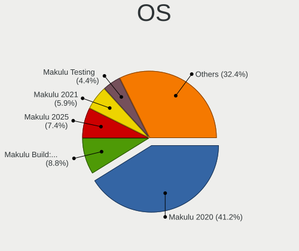

| Name                     | Computers | Percent |
|--------------------------|-----------|---------|
| Makulu 2020              | 28        | 41.18%  |
| Makulu Build: 2021.12.15 | 6         | 8.82%   |
| Makulu 2025              | 5         | 7.35%   |
| Makulu 2021              | 4         | 5.88%   |
| Makulu Testing           | 3         | 4.41%   |
| Makulu Beta1             | 3         | 4.41%   |
| Makulu Beta-1            | 3         | 4.41%   |
| Makulu Bld-2022.08.19    | 2         | 2.94%   |
| Makulu Beta-2            | 2         | 2.94%   |
| Makulu 2022.12.29        | 2         | 2.94%   |
| Makulu Buildvar          | 1         | 1.47%   |
| Makulu Build: 2022.01.06 | 1         | 1.47%   |
| Makulu Bld-2022.12.04    | 1         | 1.47%   |
| Makulu Bld-2022.11.03    | 1         | 1.47%   |
| Makulu Bld-2022.08.10    | 1         | 1.47%   |
| Makulu 68                | 1         | 1.47%   |
| Makulu 2023.07.12        | 1         | 1.47%   |
| Makulu 2023.01.11        | 1         | 1.47%   |
| Makulu 20                | 1         | 1.47%   |
| Makulu 14                | 1         | 1.47%   |

OS Family
---------

OS without a version

| Name   | Computers | Percent |
|--------|-----------|---------|
| Makulu | 67        | 100%    |

Kernel
------

Version of the Linux kernel

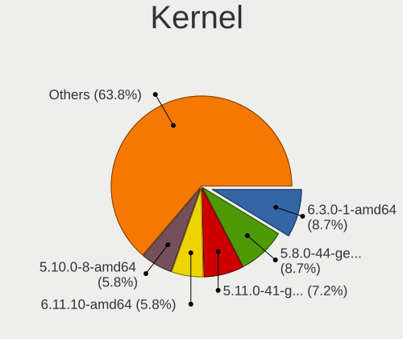

| Version                | Computers | Percent |
|------------------------|-----------|---------|
| 6.3.0-1-amd64          | 6         | 8.7%    |
| 5.8.0-44-generic       | 6         | 8.7%    |
| 5.11.0-41-generic      | 5         | 7.25%   |
| 6.11.10-amd64          | 4         | 5.8%    |
| 5.10.0-8-amd64         | 4         | 5.8%    |
| 5.4.0-42-generic       | 3         | 4.35%   |
| 5.11.0-43-generic      | 3         | 4.35%   |
| 6.0.0-5-amd64          | 2         | 2.9%    |
| 5.15.0-56-generic      | 2         | 2.9%    |
| 5.15.0-53-generic      | 2         | 2.9%    |
| 5.15.0-46-generic      | 2         | 2.9%    |
| 5.14.0-2-amd64         | 2         | 2.9%    |
| 6.8.0-60-generic       | 1         | 1.45%   |
| 6.7.1-060701-generic   | 1         | 1.45%   |
| 6.10.9-amd64           | 1         | 1.45%   |
| 6.1.6-060106-generic   | 1         | 1.45%   |
| 6.1.11-060111-generic  | 1         | 1.45%   |
| 5.8.0-59-generic       | 1         | 1.45%   |
| 5.8.0-55-generic       | 1         | 1.45%   |
| 5.8.0-50-generic       | 1         | 1.45%   |
| 5.8.0-49-generic       | 1         | 1.45%   |
| 5.8.0-48-generic       | 1         | 1.45%   |
| 5.8.0-41-generic       | 1         | 1.45%   |
| 5.8.0-38-generic       | 1         | 1.45%   |
| 5.8.0-23-generic       | 1         | 1.45%   |
| 5.4.0-54-generic       | 1         | 1.45%   |
| 5.4.0-48-generic       | 1         | 1.45%   |
| 5.15.10-051510-generic | 1         | 1.45%   |
| 5.15.0-91-generic      | 1         | 1.45%   |
| 5.15.0-88-generic      | 1         | 1.45%   |
| 5.15.0-79-generic      | 1         | 1.45%   |
| 5.15.0-48-generic      | 1         | 1.45%   |
| 5.15.0-131-generic     | 1         | 1.45%   |
| 5.12.11-051211-generic | 1         | 1.45%   |
| 5.11.0-38-generic      | 1         | 1.45%   |
| 5.11.0-36-generic      | 1         | 1.45%   |
| 5.11.0-27-generic      | 1         | 1.45%   |
| 5.10.0-7-amd64         | 1         | 1.45%   |
| 5.10.0-3-amd64         | 1         | 1.45%   |
| 4.14.0-041400-generic  | 1         | 1.45%   |

Kernel Family
-------------

Linux kernel without a distro release

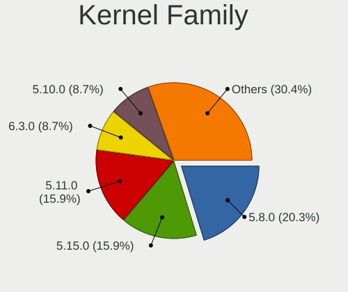

| Version | Computers | Percent |
|---------|-----------|---------|
| 5.8.0   | 14        | 20.29%  |
| 5.15.0  | 11        | 15.94%  |
| 5.11.0  | 11        | 15.94%  |
| 6.3.0   | 6         | 8.7%    |
| 5.10.0  | 6         | 8.7%    |
| 5.4.0   | 5         | 7.25%   |
| 6.11.10 | 4         | 5.8%    |
| 6.0.0   | 2         | 2.9%    |
| 5.14.0  | 2         | 2.9%    |
| 6.8.0   | 1         | 1.45%   |
| 6.7.1   | 1         | 1.45%   |
| 6.10.9  | 1         | 1.45%   |
| 6.1.6   | 1         | 1.45%   |
| 6.1.11  | 1         | 1.45%   |
| 5.15.10 | 1         | 1.45%   |
| 5.12.11 | 1         | 1.45%   |
| 4.14.0  | 1         | 1.45%   |

Kernel Major Ver.
-----------------

Linux kernel major version

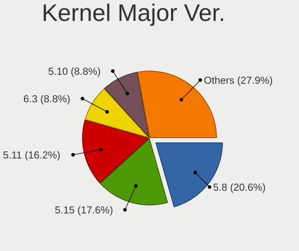

| Version | Computers | Percent |
|---------|-----------|---------|
| 5.8     | 14        | 20.59%  |
| 5.15    | 12        | 17.65%  |
| 5.11    | 11        | 16.18%  |
| 6.3     | 6         | 8.82%   |
| 5.10    | 6         | 8.82%   |
| 5.4     | 5         | 7.35%   |
| 6.11    | 4         | 5.88%   |
| 6.0     | 2         | 2.94%   |
| 5.14    | 2         | 2.94%   |
| 6.8     | 1         | 1.47%   |
| 6.7     | 1         | 1.47%   |
| 6.10    | 1         | 1.47%   |
| 6.1     | 1         | 1.47%   |
| 5.12    | 1         | 1.47%   |
| 4.14    | 1         | 1.47%   |

Arch
----

OS architecture (x86_64, i586, etc.)

| Name   | Computers | Percent |
|--------|-----------|---------|
| x86_64 | 67        | 100%    |

DE
--

Desktop Environment

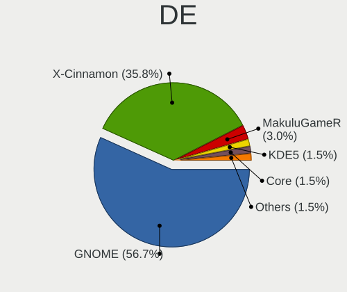

| Name        | Computers | Percent |
|-------------|-----------|---------|
| GNOME       | 38        | 56.72%  |
| X-Cinnamon  | 24        | 35.82%  |
| MakuluGameR | 2         | 2.99%   |
| KDE5        | 1         | 1.49%   |
| Core        | 1         | 1.49%   |
| Cinnamon    | 1         | 1.49%   |

Display Server
--------------

X11 or Wayland

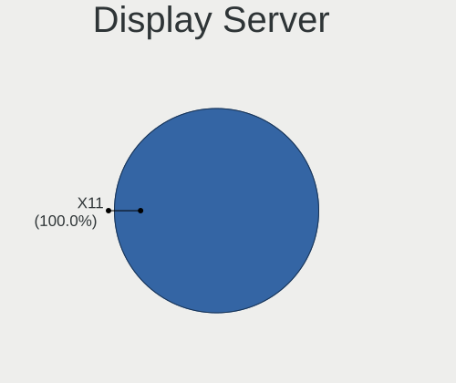

| Name | Computers | Percent |
|------|-----------|---------|
| X11  | 67        | 100%    |

Display Manager
---------------

SDDM, LightDM, etc.

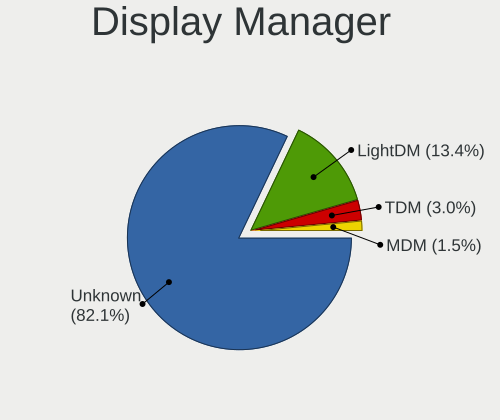

| Name    | Computers | Percent |
|---------|-----------|---------|
| Unknown | 55        | 82.09%  |
| LightDM | 9         | 13.43%  |
| TDM     | 2         | 2.99%   |
| MDM     | 1         | 1.49%   |

OS Lang
-------

Language

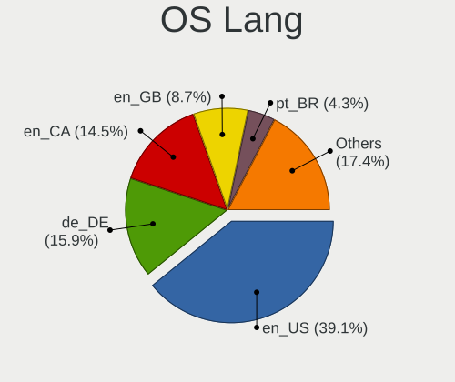

| Lang    | Computers | Percent |
|---------|-----------|---------|
| en_US   | 27        | 39.13%  |
| de_DE   | 11        | 15.94%  |
| en_CA   | 10        | 14.49%  |
| en_GB   | 6         | 8.7%    |
| pt_BR   | 3         | 4.35%   |
| it_IT   | 2         | 2.9%    |
| en_AU   | 2         | 2.9%    |
| tr_TR   | 1         | 1.45%   |
| ro_RO   | 1         | 1.45%   |
| pl_PL   | 1         | 1.45%   |
| nl_NL   | 1         | 1.45%   |
| hu_HU   | 1         | 1.45%   |
| eu_ES   | 1         | 1.45%   |
| en_ZA   | 1         | 1.45%   |
| Unknown | 1         | 1.45%   |

Boot Mode
---------

EFI or BIOS

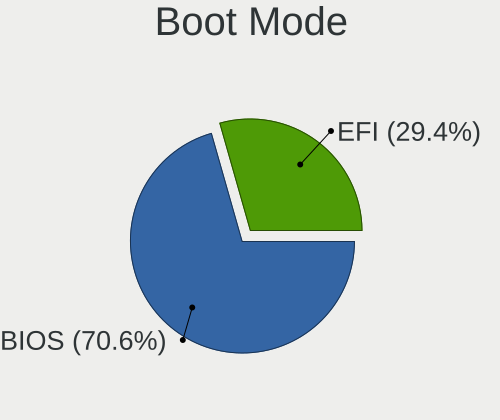

| Mode | Computers | Percent |
|------|-----------|---------|
| BIOS | 48        | 70.59%  |
| EFI  | 20        | 29.41%  |

Filesystem
----------

Type of filesystem

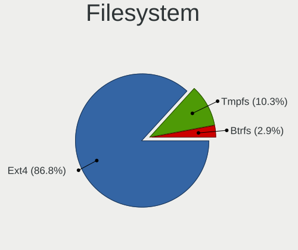

| Type  | Computers | Percent |
|-------|-----------|---------|
| Ext4  | 59        | 86.76%  |
| Tmpfs | 7         | 10.29%  |
| Btrfs | 2         | 2.94%   |

Part. scheme
------------

Scheme of partitioning

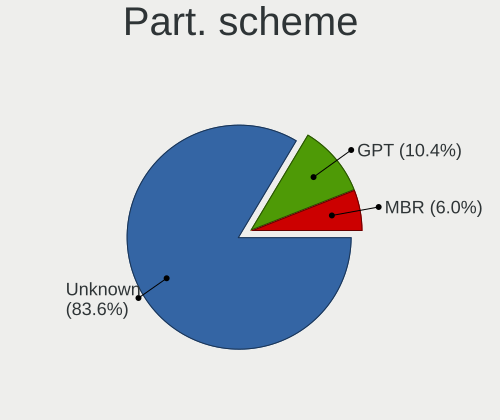

| Type    | Computers | Percent |
|---------|-----------|---------|
| Unknown | 56        | 83.58%  |
| GPT     | 7         | 10.45%  |
| MBR     | 4         | 5.97%   |

Dual Boot with Linux/BSD
------------------------

Hosting more than one Linux/BSD

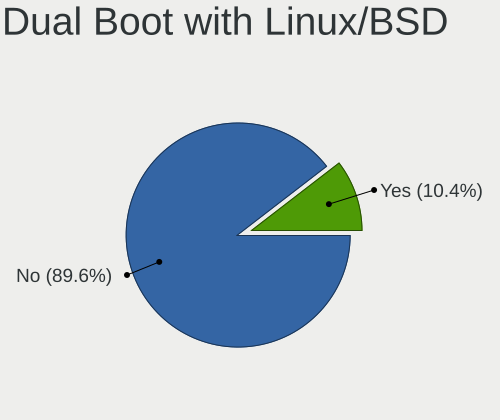

| Dual boot | Computers | Percent |
|-----------|-----------|---------|
| No        | 60        | 89.55%  |
| Yes       | 7         | 10.45%  |

Dual Boot (Win)
---------------

Hosting Linux and Windows

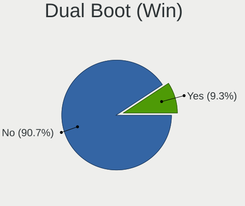

| Dual boot | Computers | Percent |
|-----------|-----------|---------|
| No        | 62        | 92.54%  |
| Yes       | 5         | 7.46%   |

Board
-----

Vendor
------

Motherboard manufacturer

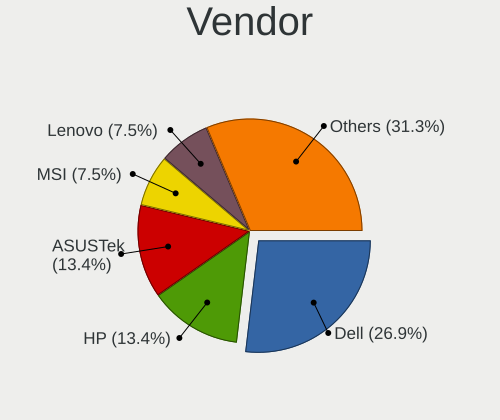

| Name                | Computers | Percent |
|---------------------|-----------|---------|
| Dell                | 18        | 26.87%  |
| Hewlett-Packard     | 9         | 13.43%  |
| ASUSTek Computer    | 9         | 13.43%  |
| MSI                 | 5         | 7.46%   |
| Lenovo              | 5         | 7.46%   |
| Gigabyte Technology | 5         | 7.46%   |
| ASRock              | 3         | 4.48%   |
| Samsung Electronics | 2         | 2.99%   |
| HUAWEI              | 2         | 2.99%   |
| Toshiba             | 1         | 1.49%   |
| Fujitsu             | 1         | 1.49%   |
| Flextronics         | 1         | 1.49%   |
| ELSA                | 1         | 1.49%   |
| Eii                 | 1         | 1.49%   |
| Apple               | 1         | 1.49%   |
| Alienware           | 1         | 1.49%   |
| Acer                | 1         | 1.49%   |
| Unknown             | 1         | 1.49%   |

Model
-----

Motherboard model

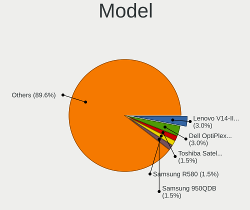

| Name                                     | Computers | Percent |
|------------------------------------------|-----------|---------|
| Lenovo V14-IIL 82C4                      | 2         | 2.99%   |
| Dell OptiPlex 7010                       | 2         | 2.99%   |
| Toshiba Satellite C55-C                  | 1         | 1.49%   |
| Samsung R580                             | 1         | 1.49%   |
| Samsung 950QDB                           | 1         | 1.49%   |
| MSI PPPPPPP-CCC#MMMMMMMM                 | 1         | 1.49%   |
| MSI MS-7915                              | 1         | 1.49%   |
| MSI MS-7817                              | 1         | 1.49%   |
| MSI MS-7721                              | 1         | 1.49%   |
| MSI MS-7693                              | 1         | 1.49%   |
| Lenovo ThinkPad T420 4236W1W             | 1         | 1.49%   |
| Lenovo IdeaPad Y530                      | 1         | 1.49%   |
| Lenovo IdeaCentre K430                   | 1         | 1.49%   |
| HUAWEI MateBook X                        | 1         | 1.49%   |
| HUAWEI KPL-W0X                           | 1         | 1.49%   |
| HP ProLiant DL360 G7                     | 1         | 1.49%   |
| HP Pavilion Laptop 15z-cw100             | 1         | 1.49%   |
| HP Pavilion All-in-One Desktop 27-ca1xxx | 1         | 1.49%   |
| HP Pavilion 17                           | 1         | 1.49%   |
| HP Laptop 17-cp3xxx                      | 1         | 1.49%   |
| HP Laptop 17-ca2xxx                      | 1         | 1.49%   |
| HP ENVY Notebook                         | 1         | 1.49%   |
| HP EliteDesk 705 G2 SFF                  | 1         | 1.49%   |
| HP Compaq 15                             | 1         | 1.49%   |
| Gigabyte Z390 AORUS ULTRA                | 1         | 1.49%   |
| Gigabyte GA-MA785GM-US2H                 | 1         | 1.49%   |
| Gigabyte GA-880GM-UD2H                   | 1         | 1.49%   |
| Gigabyte B85M-HD3                        | 1         | 1.49%   |
| Gigabyte 990FXA-UD5                      | 1         | 1.49%   |
| Fujitsu STYLISTIC Q665                   | 1         | 1.49%   |
| Flextronics 7238US00                     | 1         | 1.49%   |
| ELSA EA H410M-E                          | 1         | 1.49%   |
| Eii M1T                                  | 1         | 1.49%   |
| Dell XPS420                              | 1         | 1.49%   |
| Dell Precision Tower 3620                | 1         | 1.49%   |
| Dell OptiPlex 9020                       | 1         | 1.49%   |
| Dell OptiPlex 5070                       | 1         | 1.49%   |
| Dell Latitude E64406342Q0286/            | 1         | 1.49%   |
| Dell Latitude E6420                      | 1         | 1.49%   |
| Dell Latitude E6220                      | 1         | 1.49%   |

Model Family
------------

Motherboard model prefix

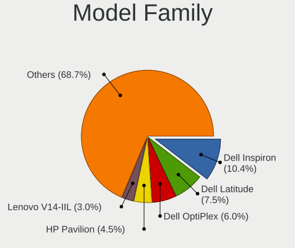

| Name                     | Computers | Percent |
|--------------------------|-----------|---------|
| Dell Inspiron            | 7         | 10.45%  |
| Dell Latitude            | 5         | 7.46%   |
| Dell OptiPlex            | 4         | 5.97%   |
| HP Pavilion              | 3         | 4.48%   |
| Lenovo V14-IIL           | 2         | 2.99%   |
| HP Laptop                | 2         | 2.99%   |
| Toshiba Satellite        | 1         | 1.49%   |
| Samsung R580             | 1         | 1.49%   |
| Samsung 950QDB           | 1         | 1.49%   |
| MSI PPPPPPP-CCC#MMMMMMMM | 1         | 1.49%   |
| MSI MS-7915              | 1         | 1.49%   |
| MSI MS-7817              | 1         | 1.49%   |
| MSI MS-7721              | 1         | 1.49%   |
| MSI MS-7693              | 1         | 1.49%   |
| Lenovo ThinkPad          | 1         | 1.49%   |
| Lenovo IdeaPad           | 1         | 1.49%   |
| Lenovo IdeaCentre        | 1         | 1.49%   |
| HUAWEI MateBook          | 1         | 1.49%   |
| HUAWEI KPL-W0X           | 1         | 1.49%   |
| HP ProLiant              | 1         | 1.49%   |
| HP ENVY                  | 1         | 1.49%   |
| HP EliteDesk             | 1         | 1.49%   |
| HP Compaq                | 1         | 1.49%   |
| Gigabyte Z390            | 1         | 1.49%   |
| Gigabyte GA-MA785GM-US2H | 1         | 1.49%   |
| Gigabyte GA-880GM-UD2H   | 1         | 1.49%   |
| Gigabyte B85M-HD3        | 1         | 1.49%   |
| Gigabyte 990FXA-UD5      | 1         | 1.49%   |
| Fujitsu STYLISTIC        | 1         | 1.49%   |
| Flextronics 7238US00     | 1         | 1.49%   |
| ELSA EA                  | 1         | 1.49%   |
| Eii M1T                  | 1         | 1.49%   |
| Dell XPS420              | 1         | 1.49%   |
| Dell Precision           | 1         | 1.49%   |
| ASUS Zenbook             | 1         | 1.49%   |
| ASUS VivoBook            | 1         | 1.49%   |
| ASUS TUF                 | 1         | 1.49%   |
| ASUS PRIME               | 1         | 1.49%   |
| ASUS P5QC                | 1         | 1.49%   |
| ASUS N55SL               | 1         | 1.49%   |

MFG Year
--------

Motherboard manufacture year

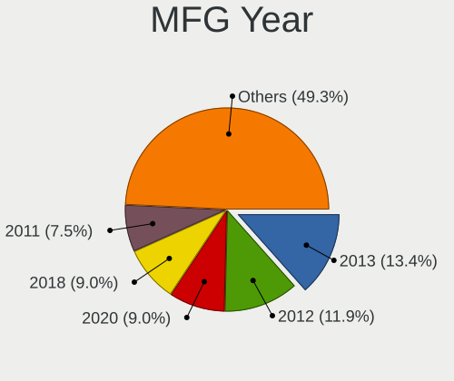

| Year | Computers | Percent |
|------|-----------|---------|
| 2013 | 9         | 13.43%  |
| 2012 | 8         | 11.94%  |
| 2020 | 6         | 8.96%   |
| 2018 | 6         | 8.96%   |
| 2011 | 5         | 7.46%   |
| 2019 | 4         | 5.97%   |
| 2016 | 4         | 5.97%   |
| 2010 | 4         | 5.97%   |
| 2023 | 3         | 4.48%   |
| 2022 | 3         | 4.48%   |
| 2015 | 3         | 4.48%   |
| 2014 | 3         | 4.48%   |
| 2009 | 3         | 4.48%   |
| 2017 | 2         | 2.99%   |
| 2008 | 2         | 2.99%   |
| 2021 | 1         | 1.49%   |
| 2007 | 1         | 1.49%   |

Form Factor
-----------

Physical design of the computer

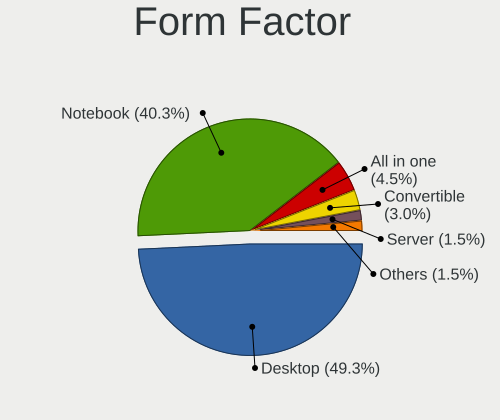

| Name        | Computers | Percent |
|-------------|-----------|---------|
| Desktop     | 33        | 49.25%  |
| Notebook    | 27        | 40.3%   |
| All in one  | 3         | 4.48%   |
| Convertible | 2         | 2.99%   |
| Mini pc     | 1         | 1.49%   |
| Server      | 1         | 1.49%   |

Secure Boot
-----------

Enabled or disabled

| State    | Computers | Percent |
|----------|-----------|---------|
| Disabled | 67        | 100%    |

Coreboot
--------

Have coreboot on board

| Used | Computers | Percent |
|------|-----------|---------|
| No   | 67        | 100%    |

RAM Size
--------

Total RAM memory

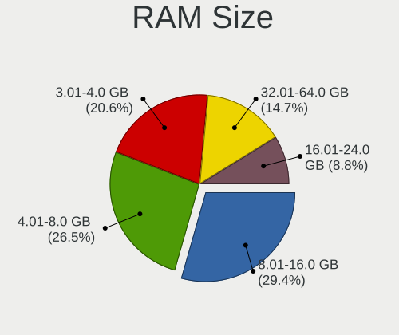

| Size in GB | Computers | Percent |
|------------|-----------|---------|
| 8.01-16.0  | 20        | 29.41%  |
| 4.01-8.0   | 18        | 26.47%  |
| 3.01-4.0   | 14        | 20.59%  |
| 32.01-64.0 | 10        | 14.71%  |
| 16.01-24.0 | 6         | 8.82%   |

RAM Used
--------

Used RAM memory

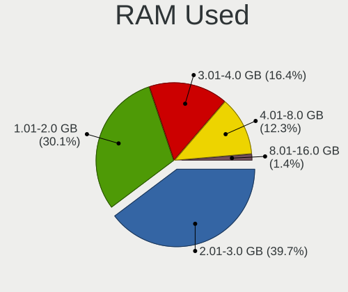

| Used GB   | Computers | Percent |
|-----------|-----------|---------|
| 2.01-3.0  | 29        | 39.73%  |
| 1.01-2.0  | 22        | 30.14%  |
| 3.01-4.0  | 12        | 16.44%  |
| 4.01-8.0  | 9         | 12.33%  |
| 8.01-16.0 | 1         | 1.37%   |

Total Drives
------------

Number of drives on board

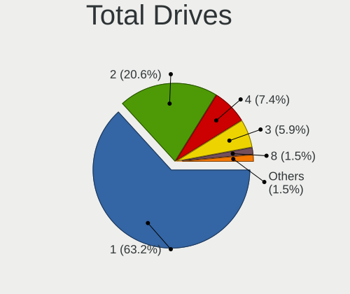

| Drives | Computers | Percent |
|--------|-----------|---------|
| 1      | 43        | 63.24%  |
| 2      | 14        | 20.59%  |
| 4      | 5         | 7.35%   |
| 3      | 4         | 5.88%   |
| 8      | 1         | 1.47%   |
| 5      | 1         | 1.47%   |

Has CD-ROM
----------

Has CD-ROM on board

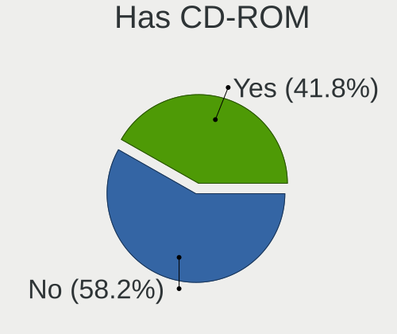

| Presented | Computers | Percent |
|-----------|-----------|---------|
| No        | 39        | 58.21%  |
| Yes       | 28        | 41.79%  |

Has Ethernet
------------

Has Ethernet on board

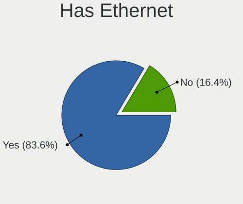

| Presented | Computers | Percent |
|-----------|-----------|---------|
| Yes       | 56        | 83.58%  |
| No        | 11        | 16.42%  |

Has WiFi
--------

Has WiFi module

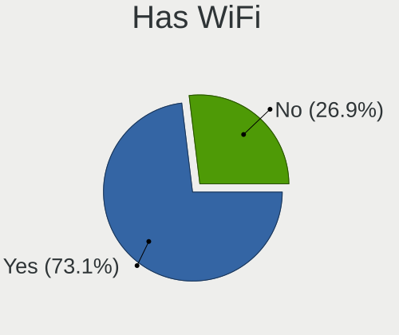

| Presented | Computers | Percent |
|-----------|-----------|---------|
| Yes       | 52        | 76.47%  |
| No        | 16        | 23.53%  |

Has Bluetooth
-------------

Has Bluetooth module

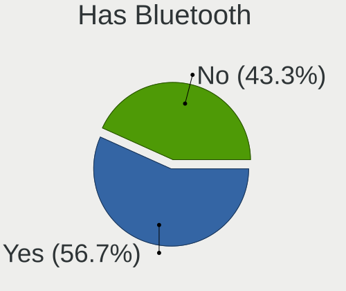

| Presented | Computers | Percent |
|-----------|-----------|---------|
| Yes       | 38        | 56.72%  |
| No        | 29        | 43.28%  |

Location
--------

Country
-------

Geographic location (country)

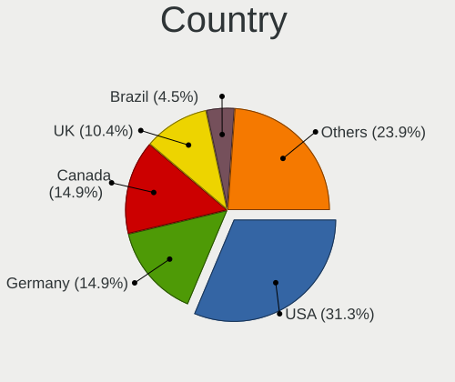

| Country      | Computers | Percent |
|--------------|-----------|---------|
| USA          | 21        | 31.34%  |
| Germany      | 10        | 14.93%  |
| Canada       | 10        | 14.93%  |
| UK           | 7         | 10.45%  |
| Brazil       | 3         | 4.48%   |
| Australia    | 3         | 4.48%   |
| Poland       | 2         | 2.99%   |
| Uganda       | 1         | 1.49%   |
| Turkey       | 1         | 1.49%   |
| Switzerland  | 1         | 1.49%   |
| Spain        | 1         | 1.49%   |
| South Africa | 1         | 1.49%   |
| Romania      | 1         | 1.49%   |
| Netherlands  | 1         | 1.49%   |
| Italy        | 1         | 1.49%   |
| Hungary      | 1         | 1.49%   |
| France       | 1         | 1.49%   |
| Belize       | 1         | 1.49%   |

City
----

Geographic location (city)

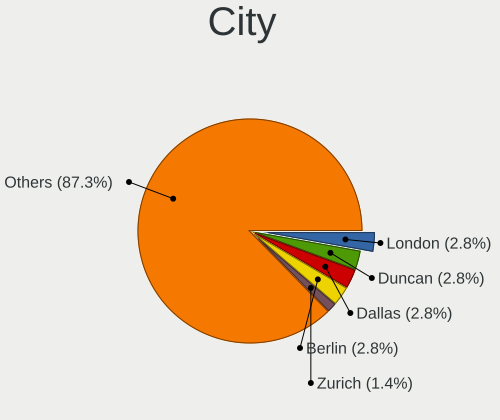

| City                 | Computers | Percent |
|----------------------|-----------|---------|
| London               | 2         | 2.82%   |
| Duncan               | 2         | 2.82%   |
| Dallas               | 2         | 2.82%   |
| Berlin               | 2         | 2.82%   |
| Zurich               | 1         | 1.41%   |
| Wishek               | 1         | 1.41%   |
| Weirton              | 1         | 1.41%   |
| Tualatin             | 1         | 1.41%   |
| Tacoma               | 1         | 1.41%   |
| Sydney               | 1         | 1.41%   |
| Sunset Valley        | 1         | 1.41%   |
| Stralsund            | 1         | 1.41%   |
| Steinfeld            | 1         | 1.41%   |
| Spanaway             | 1         | 1.41%   |
| Santurtzi            | 1         | 1.41%   |
| Saint John           | 1         | 1.41%   |
| Russell              | 1         | 1.41%   |
| Porto Alegre         | 1         | 1.41%   |
| Piotrkow Trybunalski | 1         | 1.41%   |
| Pinhalzinho          | 1         | 1.41%   |
| Paris                | 1         | 1.41%   |
| Palmopolis           | 1         | 1.41%   |
| Oschersleben         | 1         | 1.41%   |
| Oberhausen           | 1         | 1.41%   |
| Northborough         | 1         | 1.41%   |
| New York             | 1         | 1.41%   |
| Munich               | 1         | 1.41%   |
| Millers Creek        | 1         | 1.41%   |
| Melbourne            | 1         | 1.41%   |
| Mayen                | 1         | 1.41%   |
| Manitouwadge         | 1         | 1.41%   |
| Manchester           | 1         | 1.41%   |
| Los Angeles          | 1         | 1.41%   |
| Lodz                 | 1         | 1.41%   |
| Lindsay              | 1         | 1.41%   |
| Knoxville            | 1         | 1.41%   |
| Kitchener            | 1         | 1.41%   |
| Kansas City          | 1         | 1.41%   |
| Kampala              | 1         | 1.41%   |
| Jamestown            | 1         | 1.41%   |

Drives
------

Drive Vendor
------------

Hard drive vendors

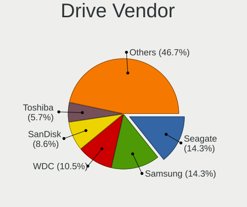

| Vendor                      | Computers | Drives | Percent |
|-----------------------------|-----------|--------|---------|
| Seagate                     | 15        | 18     | 14.29%  |
| Samsung Electronics         | 15        | 23     | 14.29%  |
| WDC                         | 11        | 14     | 10.48%  |
| SanDisk                     | 9         | 9      | 8.57%   |
| Toshiba                     | 6         | 6      | 5.71%   |
| Unknown                     | 4         | 4      | 3.81%   |
| Crucial                     | 4         | 4      | 3.81%   |
| Micron Technology           | 3         | 3      | 2.86%   |
| Kingston                    | 3         | 4      | 2.86%   |
| Hitachi                     | 3         | 3      | 2.86%   |
| LITEONIT                    | 2         | 2      | 1.9%    |
| KIOXIA                      | 2         | 2      | 1.9%    |
| JMicron Technology          | 2         | 2      | 1.9%    |
| Intenso                     | 2         | 2      | 1.9%    |
| A-DATA Technology           | 2         | 2      | 1.9%    |
| Transcend                   | 1         | 1      | 0.95%   |
| T-FORCE                     | 1         | 1      | 0.95%   |
| SPCC                        | 1         | 1      | 0.95%   |
| SK hynix                    | 1         | 1      | 0.95%   |
| SABRENT                     | 1         | 1      | 0.95%   |
| PNY                         | 1         | 1      | 0.95%   |
| Patriot                     | 1         | 1      | 0.95%   |
| Origin                      | 1         | 1      | 0.95%   |
| ORICO                       | 1         | 1      | 0.95%   |
| OCZ                         | 1         | 1      | 0.95%   |
| Micron/Crucial Technology   | 1         | 1      | 0.95%   |
| Maxtor                      | 1         | 1      | 0.95%   |
| LITEON                      | 1         | 2      | 0.95%   |
| Lite-On Technology          | 1         | 1      | 0.95%   |
| Leven                       | 1         | 1      | 0.95%   |
| Kingston Technology Company | 1         | 2      | 0.95%   |
| Intel                       | 1         | 1      | 0.95%   |
| HGST                        | 1         | 1      | 0.95%   |
| Hewlett-Packard             | 1         | 1      | 0.95%   |
| China                       | 1         | 1      | 0.95%   |
| ASMT                        | 1         | 1      | 0.95%   |
| Apple                       | 1         | 1      | 0.95%   |

Drive Model
-----------

Hard drive models

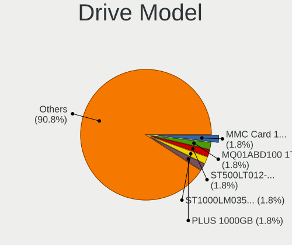

| Model                              | Computers | Percent |
|------------------------------------|-----------|---------|
| Unknown MMC Card  128GB            | 2         | 1.83%   |
| Toshiba MQ01ABD100 1TB             | 2         | 1.83%   |
| Seagate ST500LT012-1DG142 500GB    | 2         | 1.83%   |
| Seagate ST1000LM035-1RK172 1TB     | 2         | 1.83%   |
| SanDisk SSD PLUS 1000GB            | 2         | 1.83%   |
| SanDisk NVMe SSD Drive 500GB       | 2         | 1.83%   |
| Samsung NVMe SSD Drive 1TB         | 2         | 1.83%   |
| Kingston SA400S37240G 240GB SSD    | 2         | 1.83%   |
| WDC WDS100T2B0A-00SM50 1TB SSD     | 1         | 0.92%   |
| WDC WD7501AAES-75W7A0 752GB        | 1         | 0.92%   |
| WDC WD5000AAKX-75U6AA0 500GB       | 1         | 0.92%   |
| WDC WD5000AADS-00L4B1 500GB        | 1         | 0.92%   |
| WDC WD40EZRZ-00GXCB0 4TB           | 1         | 0.92%   |
| WDC WD40EZAZ-00SF3B0 4TB           | 1         | 0.92%   |
| WDC WD3200AAKS-75L9A0 320GB        | 1         | 0.92%   |
| WDC WD2500BEVS-22UST0 250GB        | 1         | 0.92%   |
| WDC WD1600AAJS-22PSA0 160GB        | 1         | 0.92%   |
| WDC WD1600AAJS-00L7A0 160GB        | 1         | 0.92%   |
| WDC WD10SPZX-60Z10T0 1TB           | 1         | 0.92%   |
| WDC WD10EZEX-00KUWA0 1TB           | 1         | 0.92%   |
| Unknown SD/MMC/MS PRO 2GB          | 1         | 0.92%   |
| Unknown Compact Flash 977MB        | 1         | 0.92%   |
| Transcend TS64GMSA230S 64GB SSD    | 1         | 0.92%   |
| Toshiba NVMe SSD Drive 512GB       | 1         | 0.92%   |
| Toshiba MQ01ABF050M 500GB          | 1         | 0.92%   |
| Toshiba HDWD130 3TB                | 1         | 0.92%   |
| Toshiba DT01ACA050 500GB           | 1         | 0.92%   |
| T-FORCE 1TB                        | 1         | 0.92%   |
| SPCC Solid State Disk 128GB        | 1         | 0.92%   |
| SK hynix NVMe SSD Drive 512GB      | 1         | 0.92%   |
| Seagate ST9500325AS 500GB          | 1         | 0.92%   |
| Seagate ST940210AS 40GB            | 1         | 0.92%   |
| Seagate ST9320325AS 320GB          | 1         | 0.92%   |
| Seagate ST500DM002-1BD142 500GB    | 1         | 0.92%   |
| Seagate ST3500418AS 500GB          | 1         | 0.92%   |
| Seagate ST3320820AS 320GB          | 1         | 0.92%   |
| Seagate ST3320620AS 320GB          | 1         | 0.92%   |
| Seagate ST31000524AS 1TB           | 1         | 0.92%   |
| Seagate ST250DM000-1BD141 250GB    | 1         | 0.92%   |
| Seagate ST1000LM024 HN-M101MBB 1TB | 1         | 0.92%   |

HDD Vendor
----------

Hard disk drive vendors

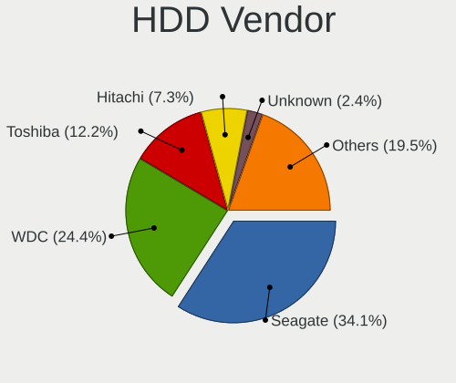

| Vendor              | Computers | Drives | Percent |
|---------------------|-----------|--------|---------|
| Seagate             | 14        | 17     | 34.15%  |
| WDC                 | 10        | 13     | 24.39%  |
| Toshiba             | 5         | 5      | 12.2%   |
| Hitachi             | 3         | 3      | 7.32%   |
| Unknown             | 1         | 1      | 2.44%   |
| T-FORCE             | 1         | 1      | 2.44%   |
| Samsung Electronics | 1         | 1      | 2.44%   |
| SABRENT             | 1         | 1      | 2.44%   |
| Maxtor              | 1         | 1      | 2.44%   |
| JMicron Technology  | 1         | 1      | 2.44%   |
| HGST                | 1         | 1      | 2.44%   |
| Hewlett-Packard     | 1         | 1      | 2.44%   |
| ASMT                | 1         | 1      | 2.44%   |

SSD Vendor
----------

Solid state drive vendors

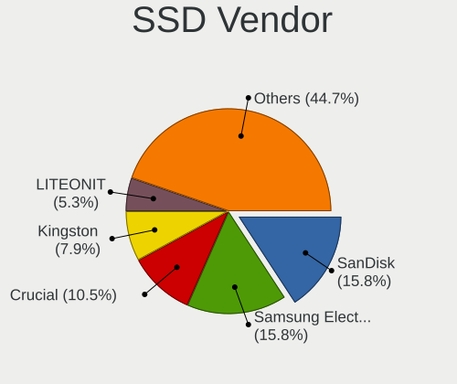

| Vendor              | Computers | Drives | Percent |
|---------------------|-----------|--------|---------|
| SanDisk             | 6         | 6      | 15.79%  |
| Samsung Electronics | 6         | 9      | 15.79%  |
| Crucial             | 4         | 4      | 10.53%  |
| Kingston            | 3         | 4      | 7.89%   |
| LITEONIT            | 2         | 2      | 5.26%   |
| Intenso             | 2         | 2      | 5.26%   |
| A-DATA Technology   | 2         | 2      | 5.26%   |
| WDC                 | 1         | 1      | 2.63%   |
| Transcend           | 1         | 1      | 2.63%   |
| SPCC                | 1         | 1      | 2.63%   |
| Seagate             | 1         | 1      | 2.63%   |
| PNY                 | 1         | 1      | 2.63%   |
| Patriot             | 1         | 1      | 2.63%   |
| Origin              | 1         | 1      | 2.63%   |
| OCZ                 | 1         | 1      | 2.63%   |
| Micron Technology   | 1         | 1      | 2.63%   |
| LITEON              | 1         | 2      | 2.63%   |
| Leven               | 1         | 1      | 2.63%   |
| China               | 1         | 1      | 2.63%   |
| Apple               | 1         | 1      | 2.63%   |

Drive Kind
----------

HDD or SSD

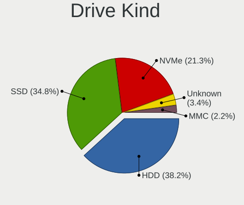

| Kind    | Computers | Drives | Percent |
|---------|-----------|--------|---------|
| HDD     | 34        | 47     | 38.2%   |
| SSD     | 31        | 43     | 34.83%  |
| NVMe    | 19        | 27     | 21.35%  |
| Unknown | 3         | 3      | 3.37%   |
| MMC     | 2         | 2      | 2.25%   |

Drive Connector
---------------

SATA, SAS, NVMe, etc.

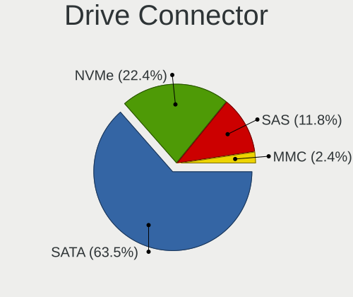

| Type | Computers | Drives | Percent |
|------|-----------|--------|---------|
| SATA | 54        | 82     | 63.53%  |
| NVMe | 19        | 27     | 22.35%  |
| SAS  | 10        | 11     | 11.76%  |
| MMC  | 2         | 2      | 2.35%   |

Drive Size
----------

Size of hard drive

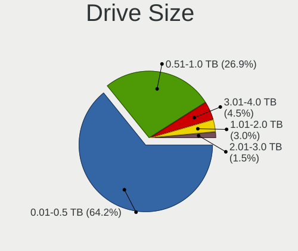

| Size in TB | Computers | Drives | Percent |
|------------|-----------|--------|---------|
| 0.01-0.5   | 43        | 63     | 64.18%  |
| 0.51-1.0   | 18        | 20     | 26.87%  |
| 3.01-4.0   | 3         | 3      | 4.48%   |
| 1.01-2.0   | 2         | 3      | 2.99%   |
| 2.01-3.0   | 1         | 1      | 1.49%   |

Space Total
-----------

Amount of disk space available on the file system

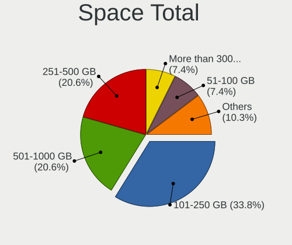

| Size in GB     | Computers | Percent |
|----------------|-----------|---------|
| 101-250        | 23        | 33.82%  |
| 251-500        | 14        | 20.59%  |
| 501-1000       | 14        | 20.59%  |
| More than 3000 | 5         | 7.35%   |
| 51-100         | 5         | 7.35%   |
| 21-50          | 3         | 4.41%   |
| 1001-2000      | 3         | 4.41%   |
| 1-20           | 1         | 1.47%   |

Space Used
----------

Amount of used disk space

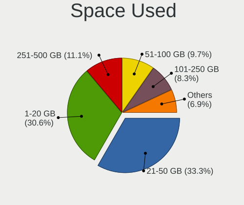

| Used GB        | Computers | Percent |
|----------------|-----------|---------|
| 21-50          | 24        | 33.33%  |
| 1-20           | 22        | 30.56%  |
| 251-500        | 8         | 11.11%  |
| 51-100         | 7         | 9.72%   |
| 101-250        | 6         | 8.33%   |
| More than 3000 | 4         | 5.56%   |
| 2001-3000      | 1         | 1.39%   |

Malfunc. Drives
---------------

Drive models with a malfunction

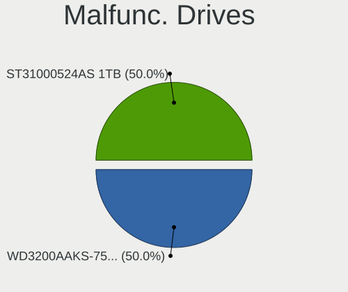

| Model                       | Computers | Drives | Percent |
|-----------------------------|-----------|--------|---------|
| WDC WD3200AAKS-75L9A0 320GB | 1         | 2      | 50%     |
| Seagate ST31000524AS 1TB    | 1         | 1      | 50%     |

Malfunc. Drive Vendor
---------------------

Vendors of faulty drives

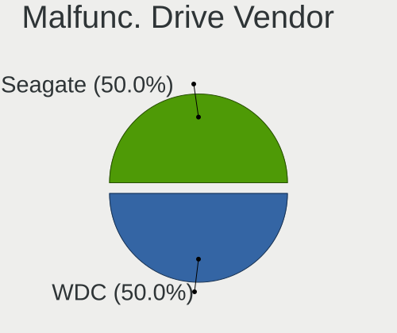

| Vendor  | Computers | Drives | Percent |
|---------|-----------|--------|---------|
| WDC     | 1         | 2      | 50%     |
| Seagate | 1         | 1      | 50%     |

Malfunc. HDD Vendor
-------------------

Vendors of faulty HDD drives

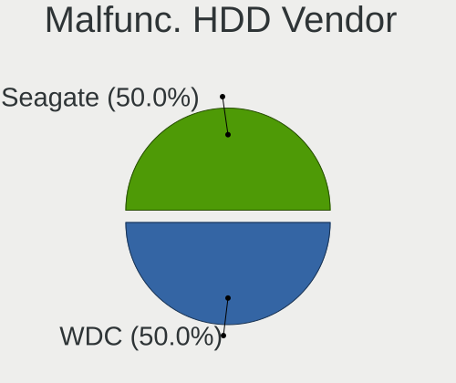

| Vendor  | Computers | Drives | Percent |
|---------|-----------|--------|---------|
| WDC     | 1         | 2      | 50%     |
| Seagate | 1         | 1      | 50%     |

Malfunc. Drive Kind
-------------------

Kinds of faulty drives

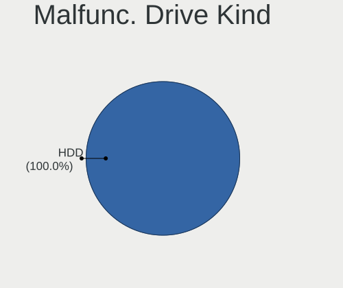

| Kind | Computers | Drives | Percent |
|------|-----------|--------|---------|
| HDD  | 2         | 3      | 100%    |

Failed Drives
-------------

Failed drive models

Zero info for selected period =(

Failed Drive Vendor
-------------------

Failed drive vendors

Zero info for selected period =(

Drive Status
------------

Number of failed and malfunc. drives

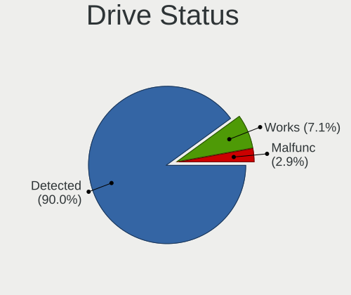

| Status   | Computers | Drives | Percent |
|----------|-----------|--------|---------|
| Detected | 63        | 110    | 90%     |
| Works    | 5         | 9      | 7.14%   |
| Malfunc  | 2         | 3      | 2.86%   |

Storage controller
------------------

Storage Vendor
--------------

Storage controller vendors

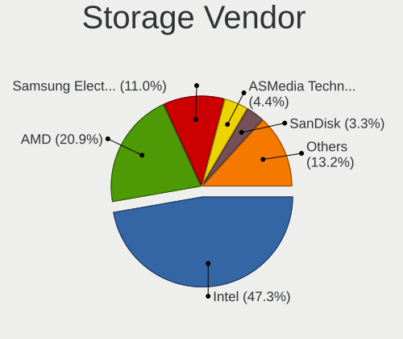

| Vendor                       | Computers | Percent |
|------------------------------|-----------|---------|
| Intel                        | 43        | 47.25%  |
| AMD                          | 19        | 20.88%  |
| Samsung Electronics          | 10        | 10.99%  |
| ASMedia Technology           | 4         | 4.4%    |
| SanDisk                      | 3         | 3.3%    |
| Micron Technology            | 2         | 2.2%    |
| Marvell Technology Group     | 2         | 2.2%    |
| KIOXIA                       | 2         | 2.2%    |
| Toshiba America Info Systems | 1         | 1.1%    |
| SK hynix                     | 1         | 1.1%    |
| Micron/Crucial Technology    | 1         | 1.1%    |
| Lite-On Technology           | 1         | 1.1%    |
| Kingston Technology Company  | 1         | 1.1%    |
| Hewlett-Packard              | 1         | 1.1%    |

Storage Model
-------------

Storage controller models

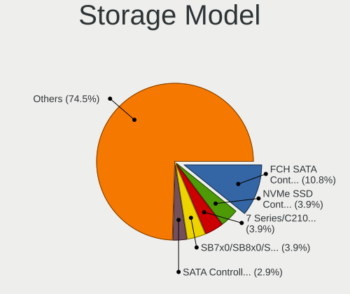

| Model                                                                          | Computers | Percent |
|--------------------------------------------------------------------------------|-----------|---------|
| AMD FCH SATA Controller [AHCI mode]                                            | 11        | 10.78%  |
| Samsung NVMe SSD Controller SM981/PM981/PM983                                  | 4         | 3.92%   |
| Intel 7 Series/C210 Series Chipset Family 6-port SATA Controller [AHCI mode]   | 4         | 3.92%   |
| AMD SB7x0/SB8x0/SB9x0 SATA Controller [AHCI mode]                              | 4         | 3.92%   |
| Intel SATA Controller [RAID mode]                                              | 3         | 2.94%   |
| Intel 82801 Mobile SATA Controller [RAID mode]                                 | 3         | 2.94%   |
| Intel 8 Series/C220 Series Chipset Family 6-port SATA Controller 1 [AHCI mode] | 3         | 2.94%   |
| ASMedia ASM1061/ASM1062 Serial ATA Controller                                  | 3         | 2.94%   |
| AMD SB7x0/SB8x0/SB9x0 IDE Controller                                           | 3         | 2.94%   |
| Samsung NVMe SSD Controller 980 (DRAM-less)                                    | 2         | 1.96%   |
| Micron 2400 NVMe SSD (DRAM-less)                                               | 2         | 1.96%   |
| Intel Wildcat Point-LP SATA Controller [AHCI Mode]                             | 2         | 1.96%   |
| Intel RST Volume Management Device Controller                                  | 2         | 1.96%   |
| Intel Q170/Q150/B150/H170/H110/Z170/CM236 Chipset SATA Controller [AHCI Mode]  | 2         | 1.96%   |
| Intel Ice Lake-LP SATA Controller [AHCI mode]                                  | 2         | 1.96%   |
| Intel Cannon Lake PCH SATA AHCI Controller                                     | 2         | 1.96%   |
| Intel 7 Series Chipset Family 6-port SATA Controller [AHCI mode]               | 2         | 1.96%   |
| Intel 6 Series/C200 Series Chipset Family 6 port Mobile SATA AHCI Controller   | 2         | 1.96%   |
| AMD SB7x0/SB8x0/SB9x0 SATA Controller [IDE mode]                               | 2         | 1.96%   |
| AMD 400 Series Chipset SATA Controller                                         | 2         | 1.96%   |
| Toshiba America Info Systems XG4 NVMe SSD Controller                           | 1         | 0.98%   |
| SK hynix PC400 NVMe SSD                                                        | 1         | 0.98%   |
| SanDisk WD Blue SN500 / PC SN520 x2 M.2 2280 NVMe SSD                          | 1         | 0.98%   |
| SanDisk Ultra 3D / WD PC SN530, IX SN530, Blue SN550 NVMe SSD (DRAM-less)      | 1         | 0.98%   |
| SanDisk PC SN735 / WD_BLACK SN750 SE NVMe SSD (DRAM-less)                      | 1         | 0.98%   |
| Samsung S4LN053X01 AHCI SSD Controller(Apple slot)                             | 1         | 0.98%   |
| Samsung NVMe SSD Controller SM961/PM961/SM963                                  | 1         | 0.98%   |
| Samsung NVMe SSD Controller S4LV008[Pascal]                                    | 1         | 0.98%   |
| Samsung NVMe SSD Controller PM9A1/PM9A3/980PRO                                 | 1         | 0.98%   |
| Micron/Crucial P2 [Nick P2] / P3 / P3 Plus NVMe PCIe SSD (DRAM-less)           | 1         | 0.98%   |
| Marvell Group 88SE9172 SATA 6Gb/s Controller                                   | 1         | 0.98%   |
| Marvell Group 88SE6111/6121 SATA II / PATA Controller                          | 1         | 0.98%   |
| Lite-On CB1-SD256, CB1-SD512 NVMe SSD                                          | 1         | 0.98%   |
| KIOXIA NVMe SSD Controller BG5 (DRAM-less)                                     | 1         | 0.98%   |
| KIOXIA NVMe SSD Controller BG4 (DRAM-less)                                     | 1         | 0.98%   |
| Kingston Company NV2 NVMe SSD [SM2267XT] (DRAM-less)                           | 1         | 0.98%   |
| Kingston Company NV2 NVMe SSD [E21T] (DRAM-less)                               | 1         | 0.98%   |
| Intel Volume Management Device NVMe RAID Controller                            | 1         | 0.98%   |
| Intel Sunrise Point-LP SATA Controller [AHCI mode]                             | 1         | 0.98%   |
| Intel SSD 670p Series [Keystone Harbor]                                        | 1         | 0.98%   |

Storage Kind
------------

Kind of storage controller (IDE, SATA, NVMe, SAS, ...)

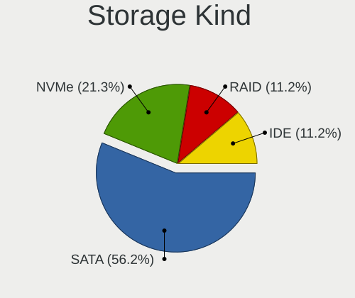

| Kind | Computers | Percent |
|------|-----------|---------|
| SATA | 50        | 56.18%  |
| NVMe | 19        | 21.35%  |
| RAID | 10        | 11.24%  |
| IDE  | 10        | 11.24%  |

Processor
---------

CPU Vendor
----------

Processor vendors

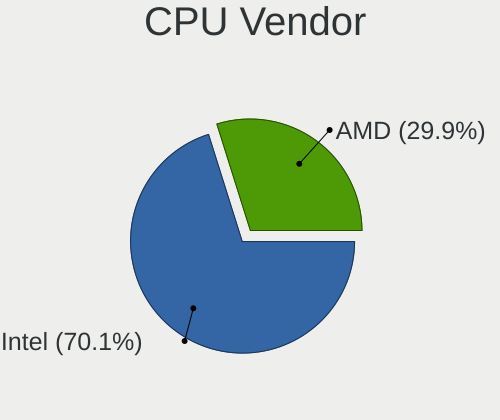

| Vendor | Computers | Percent |
|--------|-----------|---------|
| Intel  | 47        | 70.15%  |
| AMD    | 20        | 29.85%  |

CPU Model
---------

Processor models

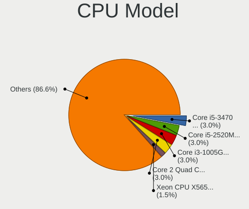

| Model                                       | Computers | Percent |
|---------------------------------------------|-----------|---------|
| Intel Core i5-3470 CPU @ 3.20GHz            | 2         | 2.99%   |
| Intel Core i5-2520M CPU @ 2.50GHz           | 2         | 2.99%   |
| Intel Core i3-1005G1 CPU @ 1.20GHz          | 2         | 2.99%   |
| Intel Core 2 Quad CPU Q6600 @ 2.40GHz       | 2         | 2.99%   |
| Intel Xeon CPU X5650 @ 2.67GHz              | 1         | 1.49%   |
| Intel Pentium Dual-Core CPU T4200 @ 2.00GHz | 1         | 1.49%   |
| Intel Pentium Dual-Core CPU E5700 @ 3.00GHz | 1         | 1.49%   |
| Intel Pentium CPU G3220 @ 3.00GHz           | 1         | 1.49%   |
| Intel Pentium CPU G2030 @ 3.00GHz           | 1         | 1.49%   |
| Intel Core M-5Y71 CPU @ 1.20GHz             | 1         | 1.49%   |
| Intel Core i7-9700 CPU @ 3.00GHz            | 1         | 1.49%   |
| Intel Core i7-8700 CPU @ 3.20GHz            | 1         | 1.49%   |
| Intel Core i7-7700HQ CPU @ 2.80GHz          | 1         | 1.49%   |
| Intel Core i7-6820HQ CPU @ 2.70GHz          | 1         | 1.49%   |
| Intel Core i7-6700K CPU @ 4.00GHz           | 1         | 1.49%   |
| Intel Core i7-4790K CPU @ 4.00GHz           | 1         | 1.49%   |
| Intel Core i7-4770 CPU @ 3.40GHz            | 1         | 1.49%   |
| Intel Core i7-4600M CPU @ 2.90GHz           | 1         | 1.49%   |
| Intel Core i7-3770 CPU @ 3.40GHz            | 1         | 1.49%   |
| Intel Core i7-3630QM CPU @ 2.40GHz          | 1         | 1.49%   |
| Intel Core i7-2670QM CPU @ 2.20GHz          | 1         | 1.49%   |
| Intel Core i7-2640M CPU @ 2.80GHz           | 1         | 1.49%   |
| Intel Core i7-10510U CPU @ 1.80GHz          | 1         | 1.49%   |
| Intel Core i5-9400 CPU @ 2.90GHz            | 1         | 1.49%   |
| Intel Core i5-7200U CPU @ 2.50GHz           | 1         | 1.49%   |
| Intel Core i5-6200U CPU @ 2.30GHz           | 1         | 1.49%   |
| Intel Core i5-5200U CPU @ 2.20GHz           | 1         | 1.49%   |
| Intel Core i5-4260U CPU @ 1.40GHz           | 1         | 1.49%   |
| Intel Core i5-3570K CPU @ 3.40GHz           | 1         | 1.49%   |
| Intel Core i5-10400 CPU @ 2.90GHz           | 1         | 1.49%   |
| Intel Core i5 CPU M 520 @ 2.40GHz           | 1         | 1.49%   |
| Intel Core i3-9100T CPU @ 3.10GHz           | 1         | 1.49%   |
| Intel Core i3-4160 CPU @ 3.60GHz            | 1         | 1.49%   |
| Intel Core i3-4030U CPU @ 1.90GHz           | 1         | 1.49%   |
| Intel Core i3-3217U CPU @ 1.80GHz           | 1         | 1.49%   |
| Intel Core i3-2100 CPU @ 3.10GHz            | 1         | 1.49%   |
| Intel Core i3 CPU 550 @ 3.20GHz             | 1         | 1.49%   |
| Intel Celeron N4100 CPU @ 1.10GHz           | 1         | 1.49%   |
| Intel 13th Gen Core i9-13900KF              | 1         | 1.49%   |
| Intel 13th Gen Core i5-13500H               | 1         | 1.49%   |

CPU Model Family
----------------

Processor model prefix

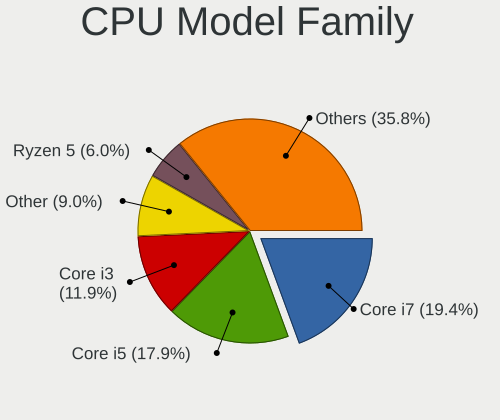

| Model                   | Computers | Percent |
|-------------------------|-----------|---------|
| Intel Core i7           | 13        | 19.4%   |
| Intel Core i5           | 12        | 17.91%  |
| Intel Core i3           | 8         | 11.94%  |
| Other                   | 6         | 8.96%   |
| AMD Ryzen 5             | 4         | 5.97%   |
| AMD FX                  | 3         | 4.48%   |
| Intel Pentium Dual-Core | 2         | 2.99%   |
| Intel Pentium           | 2         | 2.99%   |
| Intel Core 2 Quad       | 2         | 2.99%   |
| AMD Ryzen 7             | 2         | 2.99%   |
| AMD Ryzen 3             | 2         | 2.99%   |
| Intel Xeon              | 1         | 1.49%   |
| Intel Core M            | 1         | 1.49%   |
| Intel Celeron           | 1         | 1.49%   |
| AMD PRO A10             | 1         | 1.49%   |
| AMD Phenom II X4        | 1         | 1.49%   |
| AMD Phenom              | 1         | 1.49%   |
| AMD E1                  | 1         | 1.49%   |
| AMD Athlon II X2        | 1         | 1.49%   |
| AMD A8                  | 1         | 1.49%   |
| AMD A4                  | 1         | 1.49%   |
| AMD A12                 | 1         | 1.49%   |

CPU Cores
---------

Number of processor cores

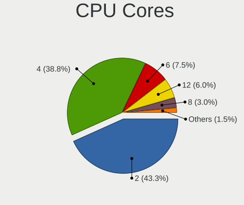

| Number | Computers | Percent |
|--------|-----------|---------|
| 2      | 29        | 43.28%  |
| 4      | 26        | 38.81%  |
| 6      | 5         | 7.46%   |
| 12     | 4         | 5.97%   |
| 8      | 2         | 2.99%   |
| 24     | 1         | 1.49%   |

CPU Sockets
-----------

Number of sockets

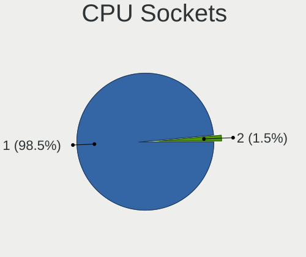

| Number | Computers | Percent |
|--------|-----------|---------|
| 1      | 66        | 98.51%  |
| 2      | 1         | 1.49%   |

CPU Threads
-----------

Threads per core (Hyper-Threading)

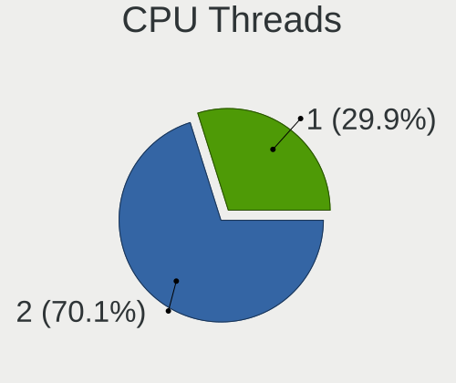

| Number | Computers | Percent |
|--------|-----------|---------|
| 2      | 47        | 70.15%  |
| 1      | 20        | 29.85%  |

CPU Op-Modes
------------

CPU Operation Modes (32-bit, 64-bit)

| Op mode        | Computers | Percent |
|----------------|-----------|---------|
| 32-bit, 64-bit | 67        | 100%    |

CPU Microcode
-------------

Microcode number

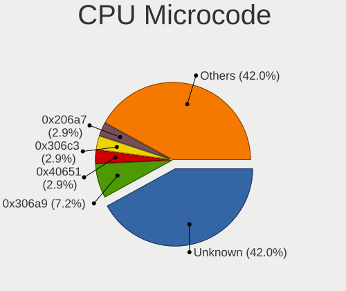

| Number     | Computers | Percent |
|------------|-----------|---------|
| Unknown    | 29        | 42.03%  |
| 0x306a9    | 5         | 7.25%   |
| 0x40651    | 2         | 2.9%    |
| 0x306c3    | 2         | 2.9%    |
| 0x206a7    | 2         | 2.9%    |
| 0x08108109 | 2         | 2.9%    |
| 0x06001119 | 2         | 2.9%    |
| 0x06000852 | 2         | 2.9%    |
| 0x906ed    | 1         | 1.45%   |
| 0x90672    | 1         | 1.45%   |
| 0x806ec    | 1         | 1.45%   |
| 0x806e9    | 1         | 1.45%   |
| 0x706e5    | 1         | 1.45%   |
| 0x706a1    | 1         | 1.45%   |
| 0x6fb      | 1         | 1.45%   |
| 0x506e3    | 1         | 1.45%   |
| 0x406e3    | 1         | 1.45%   |
| 0x206c2    | 1         | 1.45%   |
| 0x20655    | 1         | 1.45%   |
| 0x20652    | 1         | 1.45%   |
| 0x1067a    | 1         | 1.45%   |
| 0x08701021 | 1         | 1.45%   |
| 0x08108102 | 1         | 1.45%   |
| 0x08101007 | 1         | 1.45%   |
| 0x07000110 | 1         | 1.45%   |
| 0x0700010f | 1         | 1.45%   |
| 0x06006118 | 1         | 1.45%   |
| 0x06003106 | 1         | 1.45%   |
| 0x010000c9 | 1         | 1.45%   |
| 0x010000c8 | 1         | 1.45%   |
| 0x010000c7 | 1         | 1.45%   |

CPU Microarch
-------------

Microarchitecture

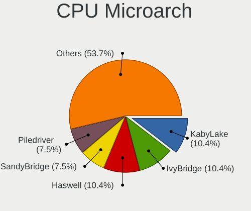

| Name             | Computers | Percent |
|------------------|-----------|---------|
| KabyLake         | 7         | 10.45%  |
| IvyBridge        | 7         | 10.45%  |
| Haswell          | 7         | 10.45%  |
| SandyBridge      | 5         | 7.46%   |
| Piledriver       | 5         | 7.46%   |
| Zen+             | 4         | 5.97%   |
| Westmere         | 3         | 4.48%   |
| Skylake          | 3         | 4.48%   |
| K10              | 3         | 4.48%   |
| Unknown          | 3         | 4.48%   |
| Zen 3            | 2         | 2.99%   |
| Penryn           | 2         | 2.99%   |
| Jaguar           | 2         | 2.99%   |
| IceLake          | 2         | 2.99%   |
| Core             | 2         | 2.99%   |
| Broadwell        | 2         | 2.99%   |
| Zen 2            | 1         | 1.49%   |
| Zen              | 1         | 1.49%   |
| TigerLake        | 1         | 1.49%   |
| Steamroller      | 1         | 1.49%   |
| Goldmont plus    | 1         | 1.49%   |
| Excavator        | 1         | 1.49%   |
| CometLake        | 1         | 1.49%   |
| Alderlake Hybrid | 1         | 1.49%   |

Graphics
--------

GPU Vendor
----------

Vendors of graphics cards

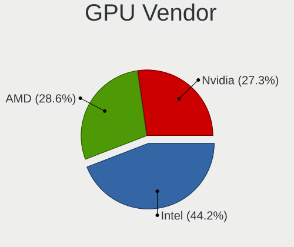

| Vendor | Computers | Percent |
|--------|-----------|---------|
| Intel  | 34        | 44.16%  |
| AMD    | 22        | 28.57%  |
| Nvidia | 21        | 27.27%  |

GPU Model
---------

Graphics card models

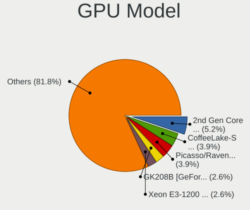

| Model                                                                       | Computers | Percent |
|-----------------------------------------------------------------------------|-----------|---------|
| Intel 2nd Generation Core Processor Family Integrated Graphics Controller   | 4         | 5.19%   |
| Intel CoffeeLake-S GT2 [UHD Graphics 630]                                   | 3         | 3.9%    |
| AMD Picasso/Raven 2 [Radeon Vega Series / Radeon Vega Mobile Series]        | 3         | 3.9%    |
| Nvidia GK208B [GeForce GT 710]                                              | 2         | 2.6%    |
| Intel Xeon E3-1200 v3/4th Gen Core Processor Integrated Graphics Controller | 2         | 2.6%    |
| Intel Raptor Lake-P [Iris Xe Graphics]                                      | 2         | 2.6%    |
| Intel IvyBridge GT2 [HD Graphics 4000]                                      | 2         | 2.6%    |
| Intel Iris Plus Graphics G1 (Ice Lake)                                      | 2         | 2.6%    |
| Intel Haswell-ULT Integrated Graphics Controller                            | 2         | 2.6%    |
| Intel 3rd Gen Core processor Graphics Controller                            | 2         | 2.6%    |
| AMD Oland [Radeon HD 8570 / R5 430 OEM / R7 240/340 / Radeon 520 OEM]       | 2         | 2.6%    |
| AMD Cedar [Radeon HD 5000/6000/7350/8350 Series]                            | 2         | 2.6%    |
| Nvidia TU106 [GeForce GTX 1650]                                             | 1         | 1.3%    |
| Nvidia GT218 [GeForce 210]                                                  | 1         | 1.3%    |
| Nvidia GT216M [GeForce GT 330M]                                             | 1         | 1.3%    |
| Nvidia GP106 [GeForce GTX 1060 6GB]                                         | 1         | 1.3%    |
| Nvidia GP104BM [GeForce GTX 1070 Mobile]                                    | 1         | 1.3%    |
| Nvidia GP104 [GeForce GTX 1080]                                             | 1         | 1.3%    |
| Nvidia GM206 [GeForce GTX 950]                                              | 1         | 1.3%    |
| Nvidia GM204GL [Quadro M4000]                                               | 1         | 1.3%    |
| Nvidia GM107 [GeForce GTX 750]                                              | 1         | 1.3%    |
| Nvidia GK107GL [Quadro K2000D]                                              | 1         | 1.3%    |
| Nvidia GK107 [GeForce GT 640]                                               | 1         | 1.3%    |
| Nvidia GK107 [GeForce GT 630 OEM]                                           | 1         | 1.3%    |
| Nvidia GK104 [GeForce GTX 760]                                              | 1         | 1.3%    |
| Nvidia GF119M [NVS 4200M]                                                   | 1         | 1.3%    |
| Nvidia GF119M [GeForce 610M]                                                | 1         | 1.3%    |
| Nvidia GF116M [GeForce GT 555M/635M]                                        | 1         | 1.3%    |
| Nvidia GF116 [GeForce GTX 550 Ti]                                           | 1         | 1.3%    |
| Nvidia G96CM [GeForce 9600M GS]                                             | 1         | 1.3%    |
| Nvidia AD103 [GeForce RTX 4080]                                             | 1         | 1.3%    |
| Intel Xeon E3-1200 v2/3rd Gen Core processor Graphics Controller            | 1         | 1.3%    |
| Intel TigerLake-LP GT2 [Iris Xe Graphics]                                   | 1         | 1.3%    |
| Intel Skylake-U GT2 [HD Graphics 520]                                       | 1         | 1.3%    |
| Intel Skylake-S GT2 [HD Graphics 530]                                       | 1         | 1.3%    |
| Intel Skylake-H GT2 [HD Graphics 530]                                       | 1         | 1.3%    |
| Intel Kaby Lake-U GT2 [HD Graphics 620]                                     | 1         | 1.3%    |
| Intel GeminiLake [UHD Graphics 600]                                         | 1         | 1.3%    |
| Intel Core Processor Integrated Graphics Controller                         | 1         | 1.3%    |
| Intel CometLake-U GT2 [UHD Graphics]                                        | 1         | 1.3%    |

GPU Combo
---------

Combinations of graphics cards

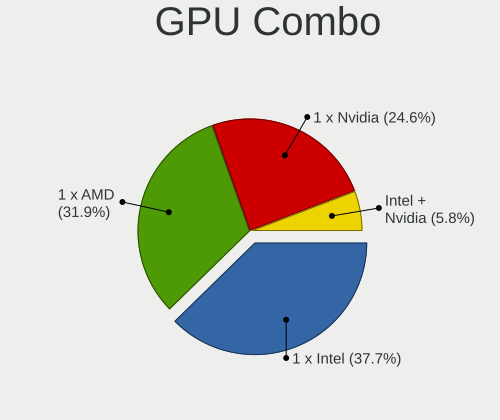

| Name           | Computers | Percent |
|----------------|-----------|---------|
| 1 x Intel      | 26        | 37.68%  |
| 1 x AMD        | 22        | 31.88%  |
| 1 x Nvidia     | 17        | 24.64%  |
| Intel + Nvidia | 4         | 5.8%    |

GPU Driver
----------

Free vs proprietary

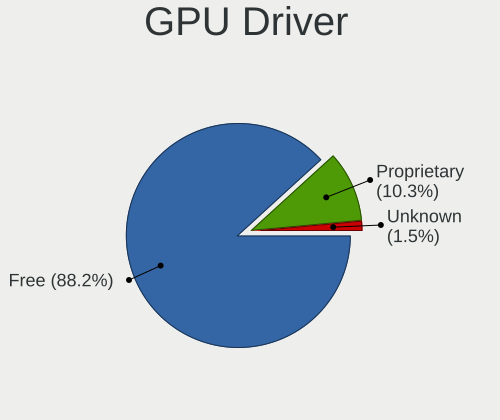

| Driver      | Computers | Percent |
|-------------|-----------|---------|
| Free        | 60        | 88.24%  |
| Proprietary | 7         | 10.29%  |
| Unknown     | 1         | 1.47%   |

GPU Memory
----------

Total video memory

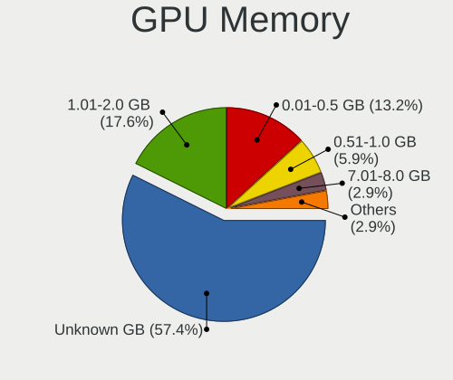

| Size in GB | Computers | Percent |
|------------|-----------|---------|
| Unknown    | 39        | 57.35%  |
| 1.01-2.0   | 12        | 17.65%  |
| 0.01-0.5   | 9         | 13.24%  |
| 0.51-1.0   | 4         | 5.88%   |
| 7.01-8.0   | 2         | 2.94%   |
| 5.01-6.0   | 1         | 1.47%   |
| 3.01-4.0   | 1         | 1.47%   |

Monitor
-------

Monitor Vendor
--------------

Monitor vendors

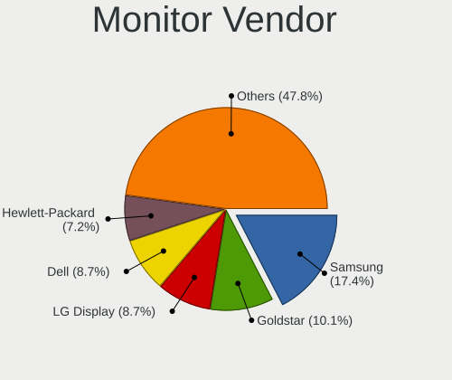

| Vendor                  | Computers | Percent |
|-------------------------|-----------|---------|
| Samsung Electronics     | 12        | 17.39%  |
| Goldstar                | 7         | 10.14%  |
| LG Display              | 6         | 8.7%    |
| Dell                    | 6         | 8.7%    |
| Hewlett-Packard         | 5         | 7.25%   |
| Chimei Innolux          | 4         | 5.8%    |
| BOE                     | 4         | 5.8%    |
| AU Optronics            | 4         | 5.8%    |
| Acer                    | 3         | 4.35%   |
| BenQ                    | 2         | 2.9%    |
| AOC                     | 2         | 2.9%    |
| Vizio                   | 1         | 1.45%   |
| Toshiba                 | 1         | 1.45%   |
| Sony                    | 1         | 1.45%   |
| Sharp                   | 1         | 1.45%   |
| Ruijiang                | 1         | 1.45%   |
| Panasonic               | 1         | 1.45%   |
| LG Electronics          | 1         | 1.45%   |
| HannStar                | 1         | 1.45%   |
| Gateway                 | 1         | 1.45%   |
| Element                 | 1         | 1.45%   |
| Chi Mei Optoelectronics | 1         | 1.45%   |
| AUS                     | 1         | 1.45%   |
| ASUSTek Computer        | 1         | 1.45%   |
| Apple                   | 1         | 1.45%   |

Monitor Model
-------------

Monitor models

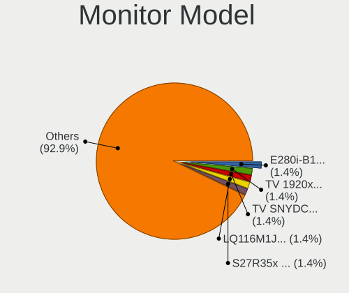

| Model                                                                  | Computers | Percent |
|------------------------------------------------------------------------|-----------|---------|
| Vizio E280i-B1 VIZ1002 1360x768 607x345mm 27.5-inch                    | 1         | 1.43%   |
| Toshiba LCD Monitor TV 1920x1080                                       | 1         | 1.43%   |
| Sony TV SNYDC01 1360x768                                               | 1         | 1.43%   |
| Sharp LQ116M1JW02 SHP1440 1920x1080 256x144mm 11.6-inch                | 1         | 1.43%   |
| Samsung Electronics S27R35x SAM1053 1920x1080 598x336mm 27.0-inch      | 1         | 1.43%   |
| Samsung Electronics LS27AG32x SAM71DC 1920x1080 597x336mm 27.0-inch    | 1         | 1.43%   |
| Samsung Electronics LCD Monitor SMS27A850T 2560x1440                   | 1         | 1.43%   |
| Samsung Electronics LCD Monitor SEC5441 1280x800 331x207mm 15.4-inch   | 1         | 1.43%   |
| Samsung Electronics LCD Monitor SEC314C 1920x1080 344x194mm 15.5-inch  | 1         | 1.43%   |
| Samsung Electronics LCD Monitor SEC304C 1366x768 353x198mm 15.9-inch   | 1         | 1.43%   |
| Samsung Electronics LCD Monitor SDC4171 2880x1800 302x189mm 14.0-inch  | 1         | 1.43%   |
| Samsung Electronics LCD Monitor SDC4161 1920x1080 344x194mm 15.5-inch  | 1         | 1.43%   |
| Samsung Electronics LCD Monitor SDC415A 3200x1800 293x165mm 13.2-inch  | 1         | 1.43%   |
| Samsung Electronics LCD Monitor SDC4159 1920x1080 344x194mm 15.5-inch  | 1         | 1.43%   |
| Samsung Electronics LCD Monitor SDC3654 1600x900 382x215mm 17.3-inch   | 1         | 1.43%   |
| Samsung Electronics LCD Monitor SAM735B 3840x2160 1210x680mm 54.6-inch | 1         | 1.43%   |
| Ruijiang RJT HDMI RJT1200 1920x1080 320x180mm 14.5-inch                | 1         | 1.43%   |
| Panasonic TV MEIC135 1920x1080 698x392mm 31.5-inch                     | 1         | 1.43%   |
| LG Electronics LCD Monitor LG IPS FULLHD                               | 1         | 1.43%   |
| LG Electronics LCD Monitor LG HDR 4K 7360x2160                         | 1         | 1.43%   |
| LG Display LCD Monitor LGD062B 1920x1080 344x194mm 15.5-inch           | 1         | 1.43%   |
| LG Display LCD Monitor LGD04DA 1920x1080 344x194mm 15.5-inch           | 1         | 1.43%   |
| LG Display LCD Monitor LGD0456 1366x768 344x194mm 15.5-inch            | 1         | 1.43%   |
| LG Display LCD Monitor LGD03E5 1366x768 310x170mm 13.9-inch            | 1         | 1.43%   |
| LG Display LCD Monitor LGD03AB 1366x768 344x194mm 15.5-inch            | 1         | 1.43%   |
| LG Display LCD Monitor LGD038E 1366x768 344x194mm 15.5-inch            | 1         | 1.43%   |
| Hewlett-Packard LCD Monitor w1907 3120x1050                            | 1         | 1.43%   |
| Hewlett-Packard LCD Monitor 2310 1920x1080                             | 1         | 1.43%   |
| Hewlett-Packard LCD Monitor 2009                                       | 1         | 1.43%   |
| Hewlett-Packard Contino HPN404C 1920x1080 597x366mm 27.6-inch          | 1         | 1.43%   |
| Hewlett-Packard 24m HPN3577 1920x1080 527x297mm 23.8-inch              | 1         | 1.43%   |
| HannStar Hanns.G HH241 HSD2275 1920x1080 521x293mm 23.5-inch           | 1         | 1.43%   |
| Goldstar W2343 GSM5700 1920x1080 474x296mm 22.0-inch                   | 1         | 1.43%   |
| Goldstar W2261 GSM56CE 1920x1080 477x268mm 21.5-inch                   | 1         | 1.43%   |
| Goldstar TV SSCR2 GSM8080 3840x2160                                    | 1         | 1.43%   |
| Goldstar L1918S GSM4B31 1280x1024 380x300mm 19.1-inch                  | 1         | 1.43%   |
| Goldstar FHD GSM5BCA 1920x1080 480x270mm 21.7-inch                     | 1         | 1.43%   |
| Goldstar E2050 GSM4EAD 1600x900 443x249mm 20.0-inch                    | 1         | 1.43%   |
| Goldstar 32LG3000 GSM75F0 1920x1080 700x390mm 31.5-inch                | 1         | 1.43%   |
| Gateway FHX2300 GWY00BF 1920x1080 509x286mm 23.0-inch                  | 1         | 1.43%   |

Monitor Resolution
------------------

Monitor screen resolution

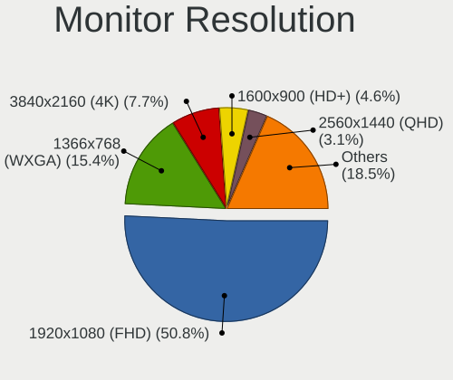

| Resolution       | Computers | Percent |
|------------------|-----------|---------|
| 1920x1080 (FHD)  | 33        | 50.77%  |
| 1366x768 (WXGA)  | 10        | 15.38%  |
| 3840x2160 (4K)   | 5         | 7.69%   |
| 1600x900 (HD+)   | 3         | 4.62%   |
| 2560x1440 (QHD)  | 2         | 3.08%   |
| 1360x768         | 2         | 3.08%   |
| Unknown          | 2         | 3.08%   |
| 7360x2160        | 1         | 1.54%   |
| 3840x2400        | 1         | 1.54%   |
| 3120x1050        | 1         | 1.54%   |
| 2880x1800        | 1         | 1.54%   |
| 2160x1440        | 1         | 1.54%   |
| 1440x900 (WXGA+) | 1         | 1.54%   |
| 1280x800 (WXGA)  | 1         | 1.54%   |
| 1280x1024 (SXGA) | 1         | 1.54%   |

Monitor Diagonal
----------------

Diagonal size in inches

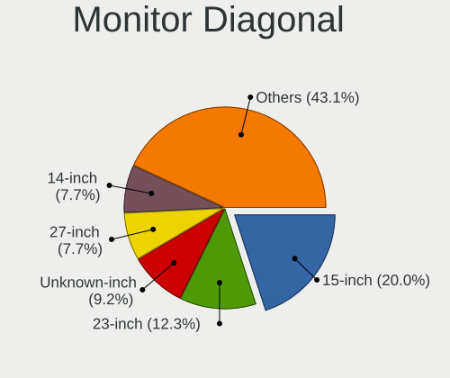

| Inches  | Computers | Percent |
|---------|-----------|---------|
| 15      | 13        | 20%     |
| 23      | 8         | 12.31%  |
| Unknown | 6         | 9.23%   |
| 27      | 5         | 7.69%   |
| 14      | 5         | 7.69%   |
| 13      | 5         | 7.69%   |
| 17      | 4         | 6.15%   |
| 31      | 3         | 4.62%   |
| 21      | 3         | 4.62%   |
| 72      | 2         | 3.08%   |
| 24      | 2         | 3.08%   |
| 19      | 2         | 3.08%   |
| 86      | 1         | 1.54%   |
| 84      | 1         | 1.54%   |
| 61      | 1         | 1.54%   |
| 38      | 1         | 1.54%   |
| 20      | 1         | 1.54%   |
| 16      | 1         | 1.54%   |
| 11      | 1         | 1.54%   |

Monitor Width
-------------

Physical width

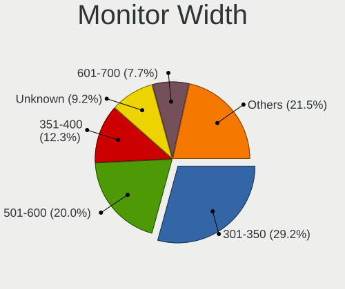

| Width in mm | Computers | Percent |
|-------------|-----------|---------|
| 301-350     | 19        | 29.23%  |
| 501-600     | 13        | 20%     |
| 351-400     | 8         | 12.31%  |
| Unknown     | 6         | 9.23%   |
| 601-700     | 5         | 7.69%   |
| 401-500     | 5         | 7.69%   |
| 1501-2000   | 4         | 6.15%   |
| 201-300     | 3         | 4.62%   |
| 801-900     | 1         | 1.54%   |
| 1001-1500   | 1         | 1.54%   |

Aspect Ratio
------------

Proportional relationship between the width and the height

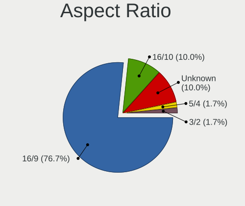

| Ratio   | Computers | Percent |
|---------|-----------|---------|
| 16/9    | 46        | 76.67%  |
| 16/10   | 6         | 10%     |
| Unknown | 6         | 10%     |
| 5/4     | 1         | 1.67%   |
| 3/2     | 1         | 1.67%   |

Monitor Area
------------

Area in inch²

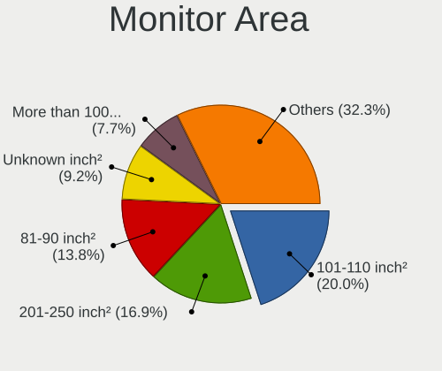

| Area in inch² | Computers | Percent |
|----------------|-----------|---------|
| 101-110        | 13        | 20%     |
| 201-250        | 11        | 16.92%  |
| 81-90          | 9         | 13.85%  |
| Unknown        | 6         | 9.23%   |
| More than 1000 | 5         | 7.69%   |
| 301-350        | 5         | 7.69%   |
| 151-200        | 5         | 7.69%   |
| 121-130        | 5         | 7.69%   |
| 351-500        | 3         | 4.62%   |
| 71-80          | 1         | 1.54%   |
| 51-60          | 1         | 1.54%   |
| 501-1000       | 1         | 1.54%   |

Pixel Density
-------------

Pixels per inch

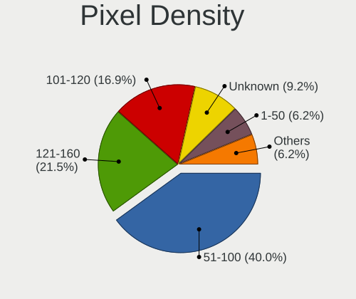

| Density       | Computers | Percent |
|---------------|-----------|---------|
| 51-100        | 26        | 40%     |
| 121-160       | 14        | 21.54%  |
| 101-120       | 11        | 16.92%  |
| Unknown       | 6         | 9.23%   |
| 1-50          | 4         | 6.15%   |
| More than 240 | 2         | 3.08%   |
| 161-240       | 2         | 3.08%   |

Multiple Monitors
-----------------

Total monitors connected

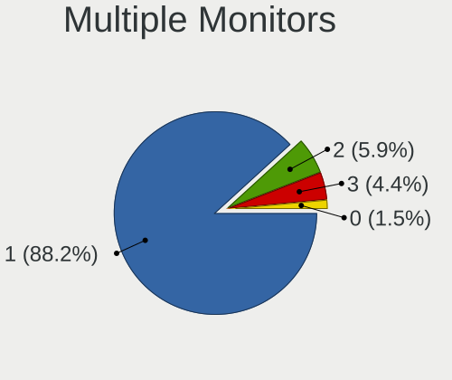

| Total | Computers | Percent |
|-------|-----------|---------|
| 1     | 60        | 88.24%  |
| 2     | 4         | 5.88%   |
| 3     | 3         | 4.41%   |
| 0     | 1         | 1.47%   |

Network
-------

Net Controller Vendor
---------------------

Controller vendors

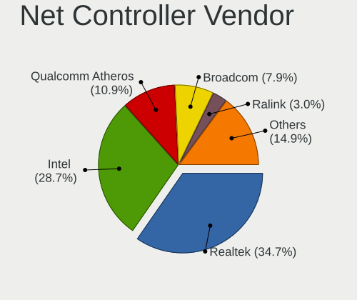

| Vendor                          | Computers | Percent |
|---------------------------------|-----------|---------|
| Realtek Semiconductor           | 35        | 34.65%  |
| Intel                           | 29        | 28.71%  |
| Qualcomm Atheros                | 11        | 10.89%  |
| Broadcom                        | 8         | 7.92%   |
| Ralink Technology               | 3         | 2.97%   |
| Ralink                          | 2         | 1.98%   |
| Qualcomm Atheros Communications | 2         | 1.98%   |
| MediaTek                        | 2         | 1.98%   |
| Broadcom Limited                | 2         | 1.98%   |
| TP-Link                         | 1         | 0.99%   |
| Samsung Electronics             | 1         | 0.99%   |
| Marvell Technology Group        | 1         | 0.99%   |
| Edimax Technology               | 1         | 0.99%   |
| D-Link System                   | 1         | 0.99%   |
| D-Link                          | 1         | 0.99%   |
| AVM                             | 1         | 0.99%   |

Net Controller Model
--------------------

Controller models

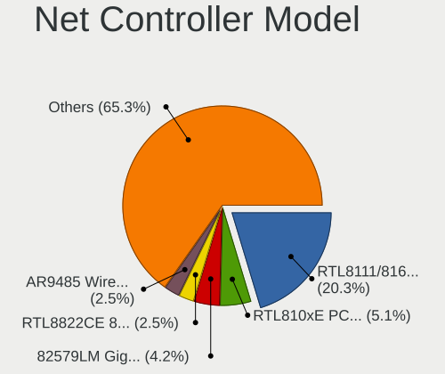

| Model                                                                                | Computers | Percent |
|--------------------------------------------------------------------------------------|-----------|---------|
| Realtek RTL8111/8168/8211/8411 PCI Express Gigabit Ethernet Controller               | 24        | 20.34%  |
| Realtek RTL810xE PCI Express Fast Ethernet controller                                | 6         | 5.08%   |
| Intel 82579LM Gigabit Network Connection (Lewisville)                                | 5         | 4.24%   |
| Realtek RTL8822CE 802.11ac PCIe Wireless Network Adapter                             | 3         | 2.54%   |
| Qualcomm Atheros AR9485 Wireless Network Adapter                                     | 3         | 2.54%   |
| Intel Wireless 7265                                                                  | 3         | 2.54%   |
| Realtek RTL8852BE PCIe 802.11ax Wireless Network Controller                          | 2         | 1.69%   |
| Qualcomm Atheros QCA9377 802.11ac Wireless Network Adapter                           | 2         | 1.69%   |
| Intel Wireless 8260                                                                  | 2         | 1.69%   |
| Intel Wi-Fi 5(802.11ac) Wireless-AC 9x6x [Thunder Peak]                              | 2         | 1.69%   |
| Intel Ethernet Connection I217-LM                                                    | 2         | 1.69%   |
| Intel Ethernet Connection (7) I219-V                                                 | 2         | 1.69%   |
| Intel Ethernet Connection (2) I219-LM                                                | 2         | 1.69%   |
| Intel Cannon Lake PCH CNVi WiFi                                                      | 2         | 1.69%   |
| Broadcom BCM4313 802.11bgn Wireless Network Adapter                                  | 2         | 1.69%   |
| TP-Link 802.11ac WLAN Adapter                                                        | 1         | 0.85%   |
| Samsung GT-I9070 (network tethering, USB debugging enabled)                          | 1         | 0.85%   |
| Realtek RTL8822BE 802.11a/b/g/n/ac WiFi adapter                                      | 1         | 0.85%   |
| Realtek RTL8723BU 802.11b/g/n WLAN Adapter                                           | 1         | 0.85%   |
| Realtek RTL8191SU 802.11n WLAN Adapter                                               | 1         | 0.85%   |
| Realtek RTL8188SU 802.11n WLAN Adapter                                               | 1         | 0.85%   |
| Realtek RTL8188EUS 802.11n Wireless Network Adapter                                  | 1         | 0.85%   |
| Realtek RTL8188EE Wireless Network Adapter                                           | 1         | 0.85%   |
| Realtek RTL8188CE 802.11b/g/n WiFi Adapter                                           | 1         | 0.85%   |
| Realtek RTL8125 2.5GbE Controller                                                    | 1         | 0.85%   |
| Realtek RTL-8100/8101L/8139 PCI Fast Ethernet Adapter                                | 1         | 0.85%   |
| Ralink RT5370 Wireless Adapter                                                       | 1         | 0.85%   |
| Ralink RT2870/RT3070 Wireless Adapter                                                | 1         | 0.85%   |
| Ralink MT7610U ("Archer T2U" 2.4G+5G WLAN Adapter                                    | 1         | 0.85%   |
| Ralink RT5390 Wireless 802.11n 1T/1R PCIe                                            | 1         | 0.85%   |
| Ralink RT2561/RT61 802.11g PCI                                                       | 1         | 0.85%   |
| Qualcomm Atheros QCA9565 / AR9565 Wireless Network Adapter                           | 1         | 0.85%   |
| Qualcomm Atheros Killer E2500 Gigabit Ethernet Controller                            | 1         | 0.85%   |
| Qualcomm Atheros TP-Link TL-WN821N v3 / TL-WN822N v2 802.11n [Atheros AR7010+AR9287] | 1         | 0.85%   |
| Qualcomm Atheros AR9271 802.11n                                                      | 1         | 0.85%   |
| Qualcomm Atheros AR9285 Wireless Network Adapter (PCI-Express)                       | 1         | 0.85%   |
| Qualcomm Atheros AR8161 Gigabit Ethernet                                             | 1         | 0.85%   |
| Qualcomm Atheros AR8151 v2.0 Gigabit Ethernet                                        | 1         | 0.85%   |
| Qualcomm Atheros AR8121/AR8113/AR8114 Gigabit or Fast Ethernet                       | 1         | 0.85%   |
| Qualcomm Atheros AR5416 Wireless Network Adapter [AR5008 802.11(a)bgn]               | 1         | 0.85%   |

Wireless Vendor
---------------

Wireless vendors

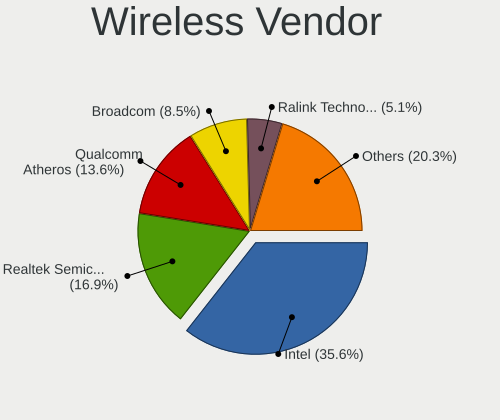

| Vendor                          | Computers | Percent |
|---------------------------------|-----------|---------|
| Intel                           | 21        | 35.59%  |
| Realtek Semiconductor           | 10        | 16.95%  |
| Qualcomm Atheros                | 8         | 13.56%  |
| Broadcom                        | 5         | 8.47%   |
| Ralink Technology               | 3         | 5.08%   |
| Ralink                          | 2         | 3.39%   |
| Qualcomm Atheros Communications | 2         | 3.39%   |
| MediaTek                        | 2         | 3.39%   |
| TP-Link                         | 1         | 1.69%   |
| Edimax Technology               | 1         | 1.69%   |
| D-Link System                   | 1         | 1.69%   |
| D-Link                          | 1         | 1.69%   |
| Broadcom Limited                | 1         | 1.69%   |
| AVM                             | 1         | 1.69%   |

Wireless Model
--------------

Wireless models

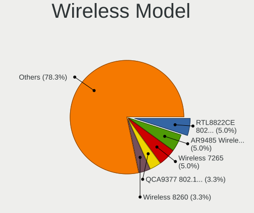

| Model                                                                                | Computers | Percent |
|--------------------------------------------------------------------------------------|-----------|---------|
| Realtek RTL8822CE 802.11ac PCIe Wireless Network Adapter                             | 3         | 5%      |
| Qualcomm Atheros AR9485 Wireless Network Adapter                                     | 3         | 5%      |
| Intel Wireless 7265                                                                  | 3         | 5%      |
| Qualcomm Atheros QCA9377 802.11ac Wireless Network Adapter                           | 2         | 3.33%   |
| Intel Wireless 8260                                                                  | 2         | 3.33%   |
| Intel Wi-Fi 5(802.11ac) Wireless-AC 9x6x [Thunder Peak]                              | 2         | 3.33%   |
| Intel Cannon Lake PCH CNVi WiFi                                                      | 2         | 3.33%   |
| Broadcom BCM4313 802.11bgn Wireless Network Adapter                                  | 2         | 3.33%   |
| TP-Link 802.11ac WLAN Adapter                                                        | 1         | 1.67%   |
| Realtek RTL8852BE PCIe 802.11ax Wireless Network Controller                          | 1         | 1.67%   |
| Realtek RTL8822BE 802.11a/b/g/n/ac WiFi adapter                                      | 1         | 1.67%   |
| Realtek RTL8723BU 802.11b/g/n WLAN Adapter                                           | 1         | 1.67%   |
| Realtek RTL8191SU 802.11n WLAN Adapter                                               | 1         | 1.67%   |
| Realtek RTL8188SU 802.11n WLAN Adapter                                               | 1         | 1.67%   |
| Realtek RTL8188EUS 802.11n Wireless Network Adapter                                  | 1         | 1.67%   |
| Realtek RTL8188EE Wireless Network Adapter                                           | 1         | 1.67%   |
| Realtek RTL8188CE 802.11b/g/n WiFi Adapter                                           | 1         | 1.67%   |
| Ralink RT5370 Wireless Adapter                                                       | 1         | 1.67%   |
| Ralink RT2870/RT3070 Wireless Adapter                                                | 1         | 1.67%   |
| Ralink MT7610U ("Archer T2U" 2.4G+5G WLAN Adapter                                    | 1         | 1.67%   |
| Ralink RT5390 Wireless 802.11n 1T/1R PCIe                                            | 1         | 1.67%   |
| Ralink RT2561/RT61 802.11g PCI                                                       | 1         | 1.67%   |
| Qualcomm Atheros QCA9565 / AR9565 Wireless Network Adapter                           | 1         | 1.67%   |
| Qualcomm Atheros TP-Link TL-WN821N v3 / TL-WN822N v2 802.11n [Atheros AR7010+AR9287] | 1         | 1.67%   |
| Qualcomm Atheros AR9271 802.11n                                                      | 1         | 1.67%   |
| Qualcomm Atheros AR9285 Wireless Network Adapter (PCI-Express)                       | 1         | 1.67%   |
| Qualcomm Atheros AR5416 Wireless Network Adapter [AR5008 802.11(a)bgn]               | 1         | 1.67%   |
| MediaTek WiFi                                                                        | 1         | 1.67%   |
| MediaTek MT7902 802.11ax PCIe Wireless Network Adapter [Filogic 310]                 | 1         | 1.67%   |
| Intel Wireless 8265 / 8275                                                           | 1         | 1.67%   |
| Intel Wireless 3160                                                                  | 1         | 1.67%   |
| Intel Wi-Fi 6E(802.11ax) AX210/AX1675* 2x2 [Typhoon Peak]                            | 1         | 1.67%   |
| Intel Wi-Fi 6 AX200                                                                  | 1         | 1.67%   |
| Intel Raptor Lake PCH CNVi WiFi                                                      | 1         | 1.67%   |
| Intel PRO/Wireless 5100 AGN [Shiloh] Network Connection                              | 1         | 1.67%   |
| Intel Ice Lake-LP PCH CNVi WiFi                                                      | 1         | 1.67%   |
| Intel Dual Band Wireless-AC 3168NGW [Stone Peak]                                     | 1         | 1.67%   |
| Intel Comet Lake PCH-LP CNVi WiFi                                                    | 1         | 1.67%   |
| Intel Centrino Ultimate-N 6300                                                       | 1         | 1.67%   |
| Intel Centrino Advanced-N 6235                                                       | 1         | 1.67%   |

Ethernet Vendor
---------------

Ethernet vendors

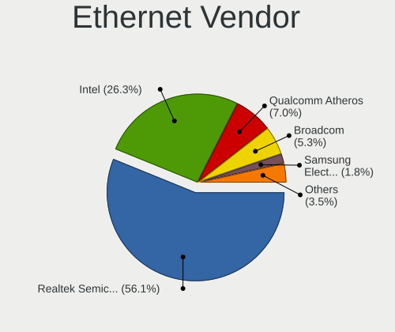

| Vendor                   | Computers | Percent |
|--------------------------|-----------|---------|
| Realtek Semiconductor    | 32        | 56.14%  |
| Intel                    | 15        | 26.32%  |
| Qualcomm Atheros         | 4         | 7.02%   |
| Broadcom                 | 3         | 5.26%   |
| Samsung Electronics      | 1         | 1.75%   |
| Marvell Technology Group | 1         | 1.75%   |
| Broadcom Limited         | 1         | 1.75%   |

Ethernet Model
--------------

Ethernet models

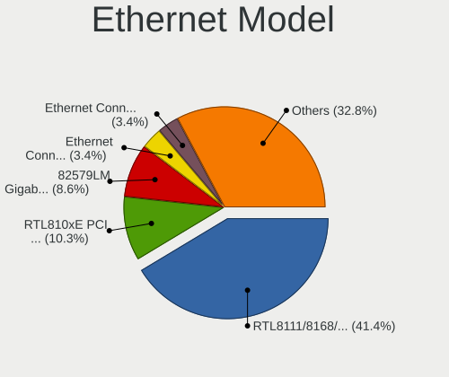

| Model                                                                          | Computers | Percent |
|--------------------------------------------------------------------------------|-----------|---------|
| Realtek RTL8111/8168/8211/8411 PCI Express Gigabit Ethernet Controller         | 24        | 41.38%  |
| Realtek RTL810xE PCI Express Fast Ethernet controller                          | 6         | 10.34%  |
| Intel 82579LM Gigabit Network Connection (Lewisville)                          | 5         | 8.62%   |
| Intel Ethernet Connection I217-LM                                              | 2         | 3.45%   |
| Intel Ethernet Connection (7) I219-V                                           | 2         | 3.45%   |
| Intel Ethernet Connection (2) I219-LM                                          | 2         | 3.45%   |
| Samsung GT-I9070 (network tethering, USB debugging enabled)                    | 1         | 1.72%   |
| Realtek RTL8852BE PCIe 802.11ax Wireless Network Controller                    | 1         | 1.72%   |
| Realtek RTL8125 2.5GbE Controller                                              | 1         | 1.72%   |
| Realtek RTL-8100/8101L/8139 PCI Fast Ethernet Adapter                          | 1         | 1.72%   |
| Qualcomm Atheros Killer E2500 Gigabit Ethernet Controller                      | 1         | 1.72%   |
| Qualcomm Atheros AR8161 Gigabit Ethernet                                       | 1         | 1.72%   |
| Qualcomm Atheros AR8151 v2.0 Gigabit Ethernet                                  | 1         | 1.72%   |
| Qualcomm Atheros AR8121/AR8113/AR8114 Gigabit or Fast Ethernet                 | 1         | 1.72%   |
| Marvell Group Yukon Optima 88E8059 [PCIe Gigabit Ethernet Controller with AVB] | 1         | 1.72%   |
| Intel Ethernet Controller I219-V                                               | 1         | 1.72%   |
| Intel Ethernet Connection (3) I218-LM                                          | 1         | 1.72%   |
| Intel Ethernet Connection (2) I218-V                                           | 1         | 1.72%   |
| Intel 82566DC-2 Gigabit Network Connection                                     | 1         | 1.72%   |
| Broadcom NetXtreme II BCM5709 Gigabit Ethernet                                 | 1         | 1.72%   |
| Broadcom NetXtreme BCM5762 Gigabit Ethernet PCIe                               | 1         | 1.72%   |
| Broadcom NetLink BCM57788 Gigabit Ethernet PCIe                                | 1         | 1.72%   |
| Broadcom Limited NetLink BCM5906M Fast Ethernet PCI Express                    | 1         | 1.72%   |

Net Controller Kind
-------------------

Ethernet, WiFi or modem

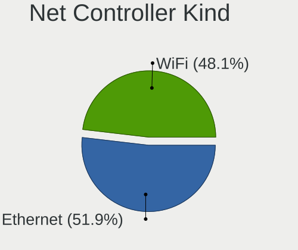

| Kind     | Computers | Percent |
|----------|-----------|---------|
| Ethernet | 56        | 51.85%  |
| WiFi     | 52        | 48.15%  |

Used Controller
---------------

Currently used network controller

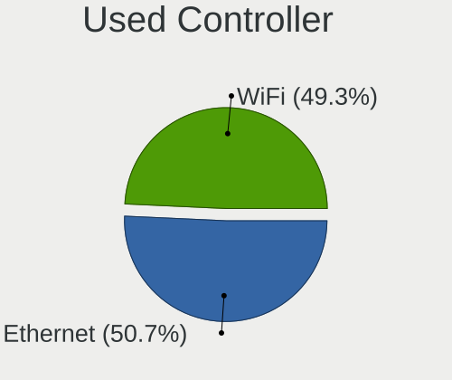

| Kind     | Computers | Percent |
|----------|-----------|---------|
| Ethernet | 35        | 50.72%  |
| WiFi     | 34        | 49.28%  |

NICs
----

Total network controllers on board

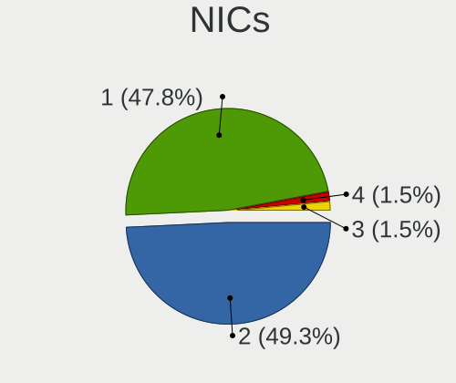

| Total | Computers | Percent |
|-------|-----------|---------|
| 2     | 33        | 49.25%  |
| 1     | 32        | 47.76%  |
| 4     | 1         | 1.49%   |
| 3     | 1         | 1.49%   |

IPv6
----

IPv6 vs IPv4

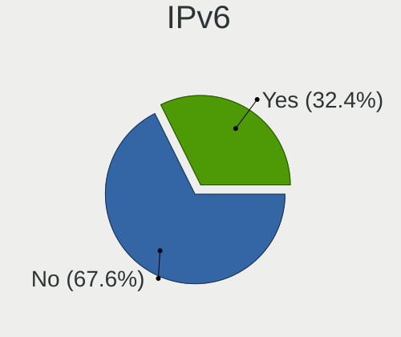

| Used | Computers | Percent |
|------|-----------|---------|
| No   | 46        | 67.65%  |
| Yes  | 22        | 32.35%  |

Bluetooth
---------

Bluetooth Vendor
----------------

Controller vendors

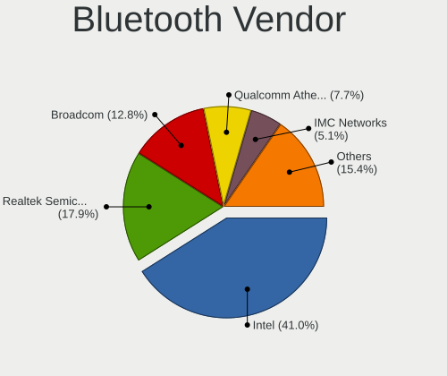

| Vendor                          | Computers | Percent |
|---------------------------------|-----------|---------|
| Intel                           | 16        | 41.03%  |
| Realtek Semiconductor           | 7         | 17.95%  |
| Broadcom                        | 5         | 12.82%  |
| Qualcomm Atheros Communications | 3         | 7.69%   |
| IMC Networks                    | 2         | 5.13%   |
| Cambridge Silicon Radio         | 2         | 5.13%   |
| Dell                            | 1         | 2.56%   |
| ASUSTek Computer                | 1         | 2.56%   |
| Apple                           | 1         | 2.56%   |
| Actions                         | 1         | 2.56%   |

Bluetooth Model
---------------

Controller models

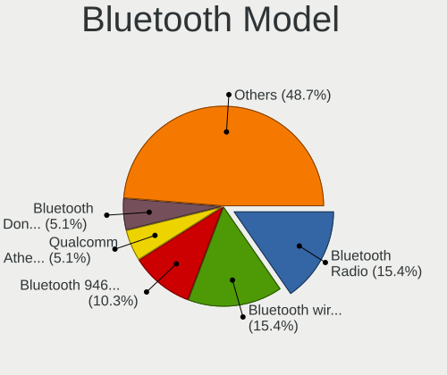

| Model                                               | Computers | Percent |
|-----------------------------------------------------|-----------|---------|
| Realtek Bluetooth Radio                             | 6         | 15.38%  |
| Intel Bluetooth wireless interface                  | 6         | 15.38%  |
| Intel Bluetooth 9460/9560 Jefferson Peak (JfP)      | 4         | 10.26%  |
| Qualcomm Atheros  Bluetooth Device                  | 2         | 5.13%   |
| Cambridge Silicon Radio Bluetooth Dongle (HCI mode) | 2         | 5.13%   |
| Realtek  Bluetooth 4.2 Adapter                      | 1         | 2.56%   |
| Qualcomm Atheros AR9462 Bluetooth                   | 1         | 2.56%   |
| Intel Wireless-AC 9260 Bluetooth Adapter            | 1         | 2.56%   |
| Intel Wireless-AC 3168 Bluetooth                    | 1         | 2.56%   |
| Intel Centrino Bluetooth Wireless Transceiver       | 1         | 2.56%   |
| Intel Bluetooth Device                              | 1         | 2.56%   |
| Intel AX210 Bluetooth                               | 1         | 2.56%   |
| Intel AX200 Bluetooth                               | 1         | 2.56%   |
| IMC Networks Wireless_Device                        | 1         | 2.56%   |
| IMC Networks Atheros AR3012 Bluetooth 4.0 Adapter   | 1         | 2.56%   |
| Dell BT Mini-Receiver                               | 1         | 2.56%   |
| Broadcom Bluetooth 2.1 Device                       | 1         | 2.56%   |
| Broadcom BCM43142 Bluetooth 4.0                     | 1         | 2.56%   |
| Broadcom BCM20702A0 Bluetooth 4.0                   | 1         | 2.56%   |
| Broadcom BCM2046 Bluetooth Device                   | 1         | 2.56%   |
| Broadcom BCM2045B (BDC-2.1)                         | 1         | 2.56%   |
| ASUS Broadcom BCM20702A0 Bluetooth                  | 1         | 2.56%   |
| Apple Bluetooth USB Host Controller                 | 1         | 2.56%   |
| Actions general adapter                             | 1         | 2.56%   |

Sound
-----

Sound Vendor
------------

Sound card vendors

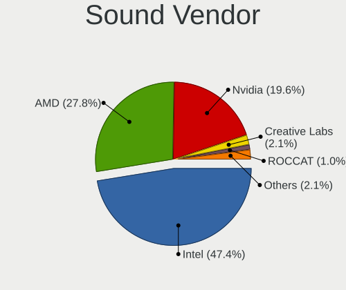

| Vendor              | Computers | Percent |
|---------------------|-----------|---------|
| Intel               | 46        | 47.42%  |
| AMD                 | 27        | 27.84%  |
| Nvidia              | 19        | 19.59%  |
| Creative Labs       | 2         | 2.06%   |
| ROCCAT              | 1         | 1.03%   |
| C-Media Electronics | 1         | 1.03%   |
| Unknown             | 1         | 1.03%   |

Sound Model
-----------

Sound card models

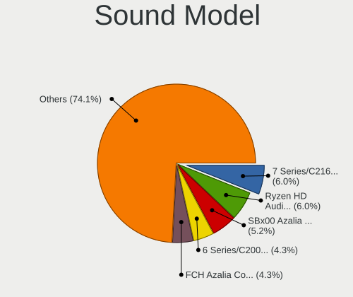

| Model                                                                                           | Computers | Percent |
|-------------------------------------------------------------------------------------------------|-----------|---------|
| Intel 7 Series/C216 Chipset Family High Definition Audio Controller                             | 7         | 6.03%   |
| AMD Ryzen HD Audio Controller                                                                   | 7         | 6.03%   |
| AMD SBx00 Azalia (Intel HDA)                                                                    | 6         | 5.17%   |
| Intel 6 Series/C200 Series Chipset Family High Definition Audio Controller                      | 5         | 4.31%   |
| AMD FCH Azalia Controller                                                                       | 5         | 4.31%   |
| Intel 8 Series/C220 Series Chipset High Definition Audio Controller                             | 4         | 3.45%   |
| AMD Raven/Raven2/Fenghuang HDMI/DP Audio Controller                                             | 4         | 3.45%   |
| Nvidia GK107 HDMI Audio Controller                                                              | 3         | 2.59%   |
| Intel Xeon E3-1200 v3/4th Gen Core Processor HD Audio Controller                                | 3         | 2.59%   |
| Intel Cannon Lake PCH cAVS                                                                      | 3         | 2.59%   |
| AMD Kabini HDMI/DP Audio                                                                        | 3         | 2.59%   |
| Nvidia GP104 High Definition Audio Controller                                                   | 2         | 1.72%   |
| Nvidia GK208 HDMI/DP Audio Controller                                                           | 2         | 1.72%   |
| Nvidia GF116 High Definition Audio Controller                                                   | 2         | 1.72%   |
| Intel Wildcat Point-LP High Definition Audio Controller                                         | 2         | 1.72%   |
| Intel Sunrise Point-LP HD Audio                                                                 | 2         | 1.72%   |
| Intel Raptor Lake-P/U/H cAVS                                                                    | 2         | 1.72%   |
| Intel Ice Lake-LP Smart Sound Technology Audio Controller                                       | 2         | 1.72%   |
| Intel Broadwell-U Audio Controller                                                              | 2         | 1.72%   |
| Intel 82801I (ICH9 Family) HD Audio Controller                                                  | 2         | 1.72%   |
| Intel 8 Series HD Audio Controller                                                              | 2         | 1.72%   |
| Intel 5 Series/3400 Series Chipset High Definition Audio                                        | 2         | 1.72%   |
| Intel 100 Series/C230 Series Chipset Family HD Audio Controller                                 | 2         | 1.72%   |
| Creative Labs CA0132 Sound Core3D [Sound Blaster Recon3D / Z-Series / Sound BlasterX AE-5 Plus] | 2         | 1.72%   |
| AMD RV710/730 HDMI Audio [Radeon HD 4000 series]                                                | 2         | 1.72%   |
| AMD Renoir/Cezanne HDMI/DP Audio Controller                                                     | 2         | 1.72%   |
| AMD Oland/Hainan/Cape Verde/Pitcairn HDMI Audio [Radeon HD 7000 Series]                         | 2         | 1.72%   |
| AMD Cedar HDMI Audio [Radeon HD 5400/6300/7300 Series]                                          | 2         | 1.72%   |
| ROCCAT Elo 7.1 USB                                                                              | 1         | 0.86%   |
| Nvidia TU106 High Definition Audio Controller                                                   | 1         | 0.86%   |
| Nvidia High Definition Audio Controller                                                         | 1         | 0.86%   |
| Nvidia GT216 HDMI Audio Controller                                                              | 1         | 0.86%   |
| Nvidia GP106 High Definition Audio Controller                                                   | 1         | 0.86%   |
| Nvidia GM206 High Definition Audio Controller                                                   | 1         | 0.86%   |
| Nvidia GM204 High Definition Audio Controller                                                   | 1         | 0.86%   |
| Nvidia GM107 High Definition Audio Controller [GeForce 940MX]                                   | 1         | 0.86%   |
| Nvidia GK104 HDMI Audio Controller                                                              | 1         | 0.86%   |
| Nvidia GF119 HDMI Audio Controller                                                              | 1         | 0.86%   |
| Nvidia AD103 High Definition Audio Controller                                                   | 1         | 0.86%   |
| Intel Tiger Lake-LP Smart Sound Technology Audio Controller                                     | 1         | 0.86%   |

Memory
------

Memory Vendor
-------------

Memory module vendors

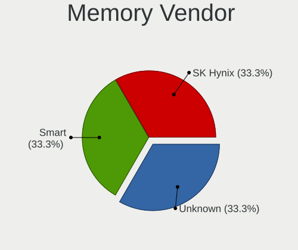

| Vendor                       | Computers | Percent |
|------------------------------|-----------|---------|
| SK hynix                     | 4         | 36.36%  |
| Unknown                      | 1         | 9.09%   |
| Team                         | 1         | 9.09%   |
| Smart                        | 1         | 9.09%   |
| Samsung Electronics          | 1         | 9.09%   |
| Patriot Memory (PDP Systems) | 1         | 9.09%   |
| Micron Technology            | 1         | 9.09%   |
| Kingston                     | 1         | 9.09%   |

Memory Model
------------

Memory module models

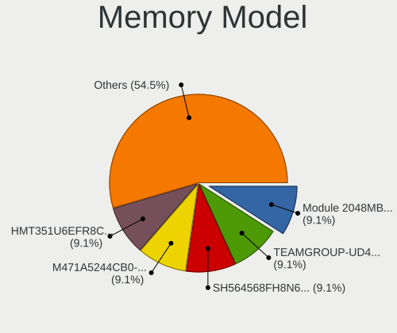

| Model                                                                    | Computers | Percent |
|--------------------------------------------------------------------------|-----------|---------|
| Unknown RAM Module 2048MB DIMM 1066MT/s                                  | 1         | 9.09%   |
| Team RAM TEAMGROUP-UD4-3600 16GB DIMM DDR4 3600MT/s                      | 1         | 9.09%   |
| Smart RAM SH564568FH8N6PHSFG 2GB DIMM DDR3 1333MT/s                      | 1         | 9.09%   |
| SK hynix RAM HMT351U6EFR8C-PB 4GB DIMM DDR3 1600MT/s                     | 1         | 9.09%   |
| SK hynix RAM HMT351U6CFR8C-PB 4GB DIMM DDR3 1800MT/s                     | 1         | 9.09%   |
| SK hynix RAM HMA851S6CJR6N-VK 4GB Row Of Chips DDR4 2667MT/s             | 1         | 9.09%   |
| SK hynix RAM HMA41GS6AFR8N-TF 8GB SODIMM DDR4 2667MT/s                   | 1         | 9.09%   |
| Samsung RAM M471A5244CB0-CWE 4GB SODIMM DDR4 3200MT/s                    | 1         | 9.09%   |
| Patriot Memory (PDP Systems) RAM 5600 C36 Series 16GB DIMM DDR5 5600MT/s | 1         | 9.09%   |
| Micron RAM 4ATF1G64HZ-3G2E2 8GB SODIMM DDR4 3200MT/s                     | 1         | 9.09%   |
| Kingston RAM K531R8-HYA 4GB DIMM DDR3 1600MT/s                           | 1         | 9.09%   |

Memory Kind
-----------

Memory module kinds

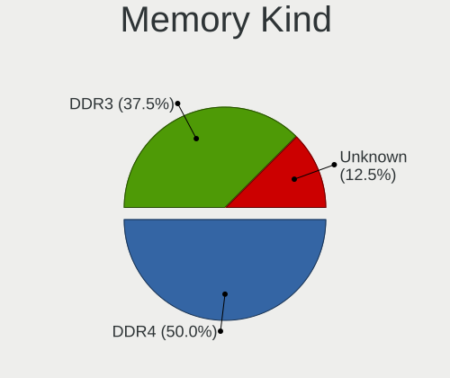

| Kind    | Computers | Percent |
|---------|-----------|---------|
| DDR4    | 4         | 44.44%  |
| DDR3    | 3         | 33.33%  |
| DDR5    | 1         | 11.11%  |
| Unknown | 1         | 11.11%  |

Memory Form Factor
------------------

Physical design of the memory module

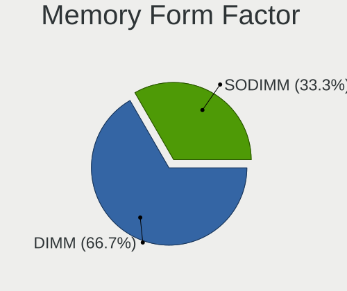

| Name         | Computers | Percent |
|--------------|-----------|---------|
| DIMM         | 6         | 60%     |
| SODIMM       | 3         | 30%     |
| Row Of Chips | 1         | 10%     |

Memory Size
-----------

Memory module size

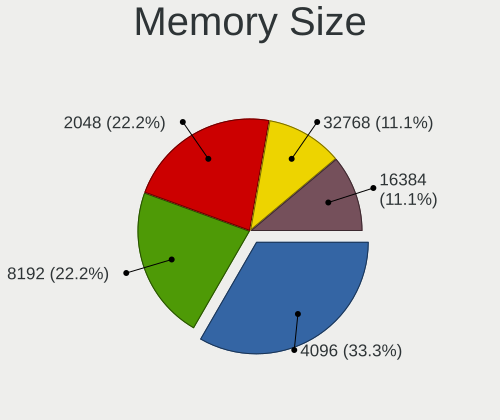

| Size  | Computers | Percent |
|-------|-----------|---------|
| 4096  | 3         | 30%     |
| 16384 | 2         | 20%     |
| 8192  | 2         | 20%     |
| 2048  | 2         | 20%     |
| 32768 | 1         | 10%     |

Memory Speed
------------

Memory module speed

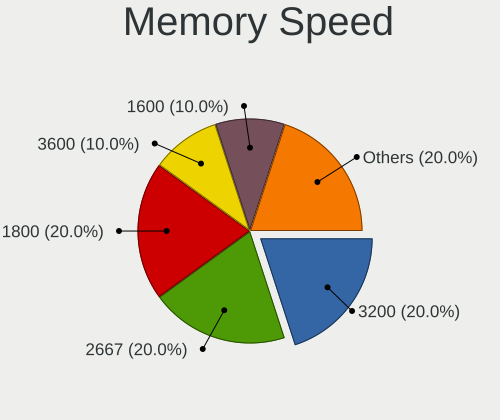

| Speed | Computers | Percent |
|-------|-----------|---------|
| 3200  | 2         | 18.18%  |
| 2667  | 2         | 18.18%  |
| 1800  | 2         | 18.18%  |
| 5600  | 1         | 9.09%   |
| 3600  | 1         | 9.09%   |
| 1600  | 1         | 9.09%   |
| 1333  | 1         | 9.09%   |
| 1066  | 1         | 9.09%   |

Printers & scanners
-------------------

Printer Vendor
--------------

Printer device vendors

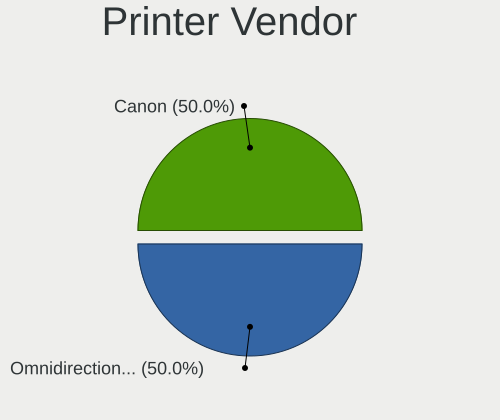

| Vendor                             | Computers | Percent |
|------------------------------------|-----------|---------|
| Omnidirectional Control Technology | 1         | 33.33%  |
| Dymo-CoStar                        | 1         | 33.33%  |
| Canon                              | 1         | 33.33%  |

Printer Model
-------------

Printer device models

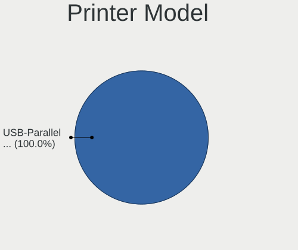

| Model                                       | Computers | Percent |
|---------------------------------------------|-----------|---------|
| Omnidirectional Control USB-Parallel Bridge | 1         | 33.33%  |
| Dymo-CoStar LabelWriter 400                 | 1         | 33.33%  |
| Canon PIXMA MX920 Series                    | 1         | 33.33%  |

Scanner Vendor
--------------

Scanner device vendors

Zero info for selected period =(

Scanner Model
-------------

Scanner device models

Zero info for selected period =(

Camera
------

Camera Vendor
-------------

Camera device vendors

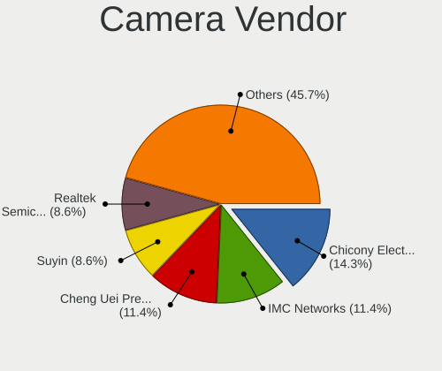

| Vendor                                 | Computers | Percent |
|----------------------------------------|-----------|---------|
| Chicony Electronics                    | 5         | 14.29%  |
| IMC Networks                           | 4         | 11.43%  |
| Cheng Uei Precision Industry (Foxlink) | 4         | 11.43%  |
| Suyin                                  | 3         | 8.57%   |
| Realtek Semiconductor                  | 3         | 8.57%   |
| Microdia                               | 3         | 8.57%   |
| Sunplus Innovation Technology          | 2         | 5.71%   |
| Z-Star Microelectronics                | 1         | 2.86%   |
| Sonix Technology                       | 1         | 2.86%   |
| Shinetech                              | 1         | 2.86%   |
| Shenzhen Kingcome Optoelectronic       | 1         | 2.86%   |
| Quanta                                 | 1         | 2.86%   |
| Microsoft                              | 1         | 2.86%   |
| Logitech                               | 1         | 2.86%   |
| Lite-On Technology                     | 1         | 2.86%   |
| Generalplus Technology                 | 1         | 2.86%   |
| BillionPixels                          | 1         | 2.86%   |
| Alcor Micro                            | 1         | 2.86%   |

Camera Model
------------

Camera device models

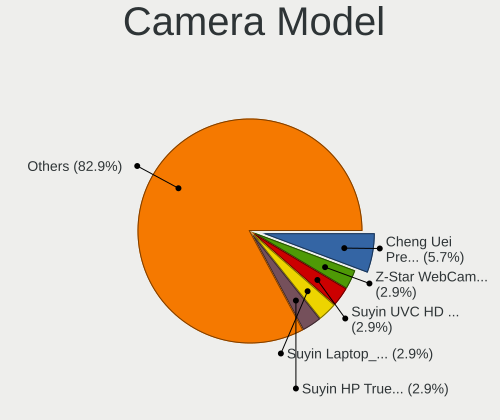

| Model                                                           | Computers | Percent |
|-----------------------------------------------------------------|-----------|---------|
| Cheng Uei Precision Industry (Foxlink) HP Truevision HD         | 2         | 5.71%   |
| Z-Star WebCam SCB-1900N                                         | 1         | 2.86%   |
| Suyin UVC HD Webcam                                             | 1         | 2.86%   |
| Suyin Laptop_Integrated_Webcam_HD                               | 1         | 2.86%   |
| Suyin HP Truevision HD                                          | 1         | 2.86%   |
| Sunplus Laptop_Integrated_Webcam_HD                             | 1         | 2.86%   |
| Sunplus Integrated_Webcam_HD                                    | 1         | 2.86%   |
| Sonix USB 2.0 Camera                                            | 1         | 2.86%   |
| Shinetech USB2.0 FHD UVC WebCam                                 | 1         | 2.86%   |
| Shenzhen Kingcome Optoelectronic 720p HD Camera                 | 1         | 2.86%   |
| Realtek Integrated_Webcam_FHD                                   | 1         | 2.86%   |
| Realtek Integrated Webcam HD                                    | 1         | 2.86%   |
| Realtek FJ Camera                                               | 1         | 2.86%   |
| Quanta HP 5MP Camera                                            | 1         | 2.86%   |
| Microsoft LifeCam VX-2000                                       | 1         | 2.86%   |
| Microdia Laptop_Integrated_Webcam_HD                            | 1         | 2.86%   |
| Microdia Integrated Camera                                      | 1         | 2.86%   |
| Microdia Dell Laptop Integrated Webcam HD                       | 1         | 2.86%   |
| Logitech Webcam B500                                            | 1         | 2.86%   |
| Lite-On HP Wide Vision HD Camera                                | 1         | 2.86%   |
| IMC Networks USB2.0 HD UVC WebCam                               | 1         | 2.86%   |
| IMC Networks TOSHIBA Web Camera - HD                            | 1         | 2.86%   |
| IMC Networks Integrated Camera                                  | 1         | 2.86%   |
| IMC Networks Huawei Web Camera - HD                             | 1         | 2.86%   |
| Generalplus WEB CAM                                             | 1         | 2.86%   |
| Chicony UVC 1.00 device HD UVC WebCam                           | 1         | 2.86%   |
| Chicony Lenovo EasyCamera                                       | 1         | 2.86%   |
| Chicony Laptop_Integrated_Webcam_2M                             | 1         | 2.86%   |
| Chicony Integrated Camera                                       | 1         | 2.86%   |
| Chicony FJ 5M Camera                                            | 1         | 2.86%   |
| Cheng Uei Precision Industry (Foxlink) HP TrueVision HD Camera  | 1         | 2.86%   |
| Cheng Uei Precision Industry (Foxlink) HP True Vision HD Camera | 1         | 2.86%   |
| BillionPixels USB2.0 HD UVC WebCam                              | 1         | 2.86%   |
| Alcor Micro USB 2.0 Camera                                      | 1         | 2.86%   |

Security
--------

Fingerprint Vendor
------------------

Fingerprint sensor vendors

| Vendor                | Computers | Percent |
|-----------------------|-----------|---------|
| Validity Sensors      | 2         | 66.67%  |
| Elan Microelectronics | 1         | 33.33%  |

Fingerprint Model
-----------------

Fingerprint sensor models

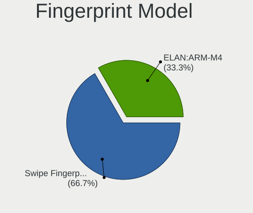

| Model                                     | Computers | Percent |
|-------------------------------------------|-----------|---------|
| Validity Sensors Swipe Fingerprint Sensor | 2         | 66.67%  |
| Elan ELAN:ARM-M4                          | 1         | 33.33%  |

Chipcard Vendor
---------------

Chipcard module vendors

| Vendor   | Computers | Percent |
|----------|-----------|---------|
| Broadcom | 3         | 75%     |
| O2 Micro | 1         | 25%     |

Chipcard Model
--------------

Chipcard module models

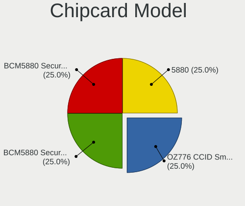

| Model                                                                        | Computers | Percent |
|------------------------------------------------------------------------------|-----------|---------|
| O2 Micro OZ776 CCID Smartcard Reader                                         | 1         | 25%     |
| Broadcom BCM5880 Secure Applications Processor with fingerprint swipe sensor | 1         | 25%     |
| Broadcom BCM5880 Secure Applications Processor                               | 1         | 25%     |
| Broadcom 5880                                                                | 1         | 25%     |

Unsupported
-----------

Unsupported Devices
-------------------

Total unsupported devices on board

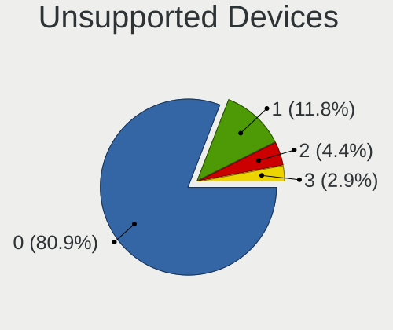

| Total | Computers | Percent |
|-------|-----------|---------|
| 0     | 55        | 80.88%  |
| 1     | 8         | 11.76%  |
| 2     | 3         | 4.41%   |
| 3     | 2         | 2.94%   |

Unsupported Device Types
------------------------

Types of unsupported devices

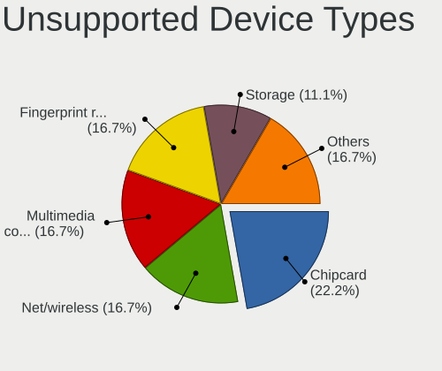

| Type                  | Computers | Percent |
|-----------------------|-----------|---------|
| Chipcard              | 4         | 22.22%  |
| Net/wireless          | 3         | 16.67%  |
| Multimedia controller | 3         | 16.67%  |
| Fingerprint reader    | 3         | 16.67%  |
| Storage               | 2         | 11.11%  |
| Network               | 1         | 5.56%   |
| Net/ethernet          | 1         | 5.56%   |
| Graphics card         | 1         | 5.56%   |

