Makulu - Tested Hardware & Statistics (Desktops)
------------------------------------------------

A project to collect tested hardware configurations for Makulu.

Anyone can contribute to this report by the [hw-probe](https://github.com/linuxhw/hw-probe) tool:

    sudo -E hw-probe -all -upload

Please submit a probe of your configuration if it's not presented on the page or is rare.

Full-feature report is available here: https://linux-hardware.org/?view=trends

Contents
--------

* [ Test Cases ](#test-cases)

* [ System ](#system)
  - [ Kernel                   ](#kernel)
  - [ Kernel Family            ](#kernel-family)
  - [ Kernel Major Ver.        ](#kernel-major-ver)
  - [ Arch                     ](#arch)
  - [ DE                       ](#de)
  - [ Display Server           ](#display-server)
  - [ Display Manager          ](#display-manager)
  - [ OS Lang                  ](#os-lang)
  - [ Boot Mode                ](#boot-mode)
  - [ Filesystem               ](#filesystem)
  - [ Part. scheme             ](#part-scheme)
  - [ Dual Boot with Linux/BSD ](#dual-boot-with-linuxbsd)
  - [ Dual Boot (Win)          ](#dual-boot-win)

* [ Board ](#board)
  - [ Vendor                   ](#vendor)
  - [ Model                    ](#model)
  - [ Model Family             ](#model-family)
  - [ MFG Year                 ](#mfg-year)
  - [ Form Factor              ](#form-factor)
  - [ Secure Boot              ](#secure-boot)
  - [ Coreboot                 ](#coreboot)
  - [ RAM Size                 ](#ram-size)
  - [ RAM Used                 ](#ram-used)
  - [ Total Drives             ](#total-drives)
  - [ Has CD-ROM               ](#has-cd-rom)
  - [ Has Ethernet             ](#has-ethernet)
  - [ Has WiFi                 ](#has-wifi)
  - [ Has Bluetooth            ](#has-bluetooth)

* [ Location ](#location)
  - [ Country                  ](#country)
  - [ City                     ](#city)

* [ Drives ](#drives)
  - [ Drive Vendor             ](#drive-vendor)
  - [ Drive Model              ](#drive-model)
  - [ HDD Vendor               ](#hdd-vendor)
  - [ SSD Vendor               ](#ssd-vendor)
  - [ Drive Kind               ](#drive-kind)
  - [ Drive Connector          ](#drive-connector)
  - [ Drive Size               ](#drive-size)
  - [ Space Total              ](#space-total)
  - [ Space Used               ](#space-used)
  - [ Malfunc. Drives          ](#malfunc-drives)
  - [ Malfunc. Drive Vendor    ](#malfunc-drive-vendor)
  - [ Malfunc. HDD Vendor      ](#malfunc-hdd-vendor)
  - [ Malfunc. Drive Kind      ](#malfunc-drive-kind)
  - [ Failed Drives            ](#failed-drives)
  - [ Failed Drive Vendor      ](#failed-drive-vendor)
  - [ Drive Status             ](#drive-status)

* [ Storage controller ](#storage-controller)
  - [ Storage Vendor           ](#storage-vendor)
  - [ Storage Model            ](#storage-model)
  - [ Storage Kind             ](#storage-kind)

* [ Processor ](#processor)
  - [ CPU Vendor               ](#cpu-vendor)
  - [ CPU Model                ](#cpu-model)
  - [ CPU Model Family         ](#cpu-model-family)
  - [ CPU Cores                ](#cpu-cores)
  - [ CPU Sockets              ](#cpu-sockets)
  - [ CPU Threads              ](#cpu-threads)
  - [ CPU Op-Modes             ](#cpu-op-modes)
  - [ CPU Microcode            ](#cpu-microcode)
  - [ CPU Microarch            ](#cpu-microarch)

* [ Graphics ](#graphics)
  - [ GPU Vendor               ](#gpu-vendor)
  - [ GPU Model                ](#gpu-model)
  - [ GPU Combo                ](#gpu-combo)
  - [ GPU Driver               ](#gpu-driver)
  - [ GPU Memory               ](#gpu-memory)

* [ Monitor ](#monitor)
  - [ Monitor Vendor           ](#monitor-vendor)
  - [ Monitor Model            ](#monitor-model)
  - [ Monitor Resolution       ](#monitor-resolution)
  - [ Monitor Diagonal         ](#monitor-diagonal)
  - [ Monitor Width            ](#monitor-width)
  - [ Aspect Ratio             ](#aspect-ratio)
  - [ Monitor Area             ](#monitor-area)
  - [ Pixel Density            ](#pixel-density)
  - [ Multiple Monitors        ](#multiple-monitors)

* [ Network ](#network)
  - [ Net Controller Vendor    ](#net-controller-vendor)
  - [ Net Controller Model     ](#net-controller-model)
  - [ Wireless Vendor          ](#wireless-vendor)
  - [ Wireless Model           ](#wireless-model)
  - [ Ethernet Vendor          ](#ethernet-vendor)
  - [ Ethernet Model           ](#ethernet-model)
  - [ Net Controller Kind      ](#net-controller-kind)
  - [ Used Controller          ](#used-controller)
  - [ NICs                     ](#nics)
  - [ IPv6                     ](#ipv6)

* [ Bluetooth ](#bluetooth)
  - [ Bluetooth Vendor         ](#bluetooth-vendor)
  - [ Bluetooth Model          ](#bluetooth-model)

* [ Sound ](#sound)
  - [ Sound Vendor             ](#sound-vendor)
  - [ Sound Model              ](#sound-model)

* [ Memory ](#memory)
  - [ Memory Vendor            ](#memory-vendor)
  - [ Memory Model             ](#memory-model)
  - [ Memory Kind              ](#memory-kind)
  - [ Memory Form Factor       ](#memory-form-factor)
  - [ Memory Size              ](#memory-size)
  - [ Memory Speed             ](#memory-speed)

* [ Printers & scanners ](#printers--scanners)
  - [ Printer Vendor           ](#printer-vendor)
  - [ Printer Model            ](#printer-model)
  - [ Scanner Vendor           ](#scanner-vendor)
  - [ Scanner Model            ](#scanner-model)

* [ Camera ](#camera)
  - [ Camera Vendor            ](#camera-vendor)
  - [ Camera Model             ](#camera-model)

* [ Security ](#security)
  - [ Fingerprint Vendor       ](#fingerprint-vendor)
  - [ Fingerprint Model        ](#fingerprint-model)
  - [ Chipcard Vendor          ](#chipcard-vendor)
  - [ Chipcard Model           ](#chipcard-model)

* [ Unsupported ](#unsupported)
  - [ Unsupported Devices      ](#unsupported-devices)
  - [ Unsupported Device Types ](#unsupported-device-types)

Test Cases
----------

| Vendor    | Model               | Probe                                                      | Date         |
|-----------|---------------------|------------------------------------------------------------|--------------|
| Gigabyte  | Z390 AORUS ULTRA-CF | [5d298b8068](https://linux-hardware.org/?probe=5d298b8068) | Jan 04, 2022 |
| ASUSTek   | M5A97 R2.0          | [d3dc0d2eec](https://linux-hardware.org/?probe=d3dc0d2eec) | Nov 04, 2021 |
| Dell      | 0TP406              | [df97b29e2e](https://linux-hardware.org/?probe=df97b29e2e) | Oct 23, 2021 |
| Dell      | 0TP406              | [5e3ac96715](https://linux-hardware.org/?probe=5e3ac96715) | Oct 22, 2021 |
| MSI       | Boston              | [c45a00b3d6](https://linux-hardware.org/?probe=c45a00b3d6) | Oct 22, 2021 |
| Gigabyte  | 990FXA-UD5          | [f3168dad1b](https://linux-hardware.org/?probe=f3168dad1b) | Oct 21, 2021 |
| Acer      | Nitro N50-600 V:1.1 | [d3c50b3461](https://linux-hardware.org/?probe=d3c50b3461) | Sep 26, 2021 |
| MSI       | Boston              | [d95f0de735](https://linux-hardware.org/?probe=d95f0de735) | Sep 21, 2021 |
| MSI       | Boston              | [50f3ed26ef](https://linux-hardware.org/?probe=50f3ed26ef) | Sep 21, 2021 |
| Dell      | 0WR7PY A02          | [b5e3a47db9](https://linux-hardware.org/?probe=b5e3a47db9) | Sep 06, 2021 |
| ELSA      | EA H410M-E          | [b67c732be6](https://linux-hardware.org/?probe=b67c732be6) | Jul 19, 2021 |
| ELSA      | EA H410M-E          | [97d82b0054](https://linux-hardware.org/?probe=97d82b0054) | Jul 19, 2021 |
| Dell      | 0MWYPT A00          | [3577268e97](https://linux-hardware.org/?probe=3577268e97) | Jul 14, 2021 |
| Gigabyte  | B85M-HD3            | [0da2654313](https://linux-hardware.org/?probe=0da2654313) | Jun 21, 2021 |
| Alienware | 02XRCM A01          | [42fb24801d](https://linux-hardware.org/?probe=42fb24801d) | Jun 18, 2021 |
| Alienware | 02XRCM A01          | [929ffb30b7](https://linux-hardware.org/?probe=929ffb30b7) | Jun 18, 2021 |
| Dell      | 0XFWHV A00          | [e318737297](https://linux-hardware.org/?probe=e318737297) | May 02, 2021 |
| Lenovo    | Board               | [cfee2604e5](https://linux-hardware.org/?probe=cfee2604e5) | Apr 30, 2021 |
| Dell      | 0XCR8D A01          | [3ed805ccdf](https://linux-hardware.org/?probe=3ed805ccdf) | Feb 26, 2021 |
| Dell      | 0XCR8D A01          | [4f32c299db](https://linux-hardware.org/?probe=4f32c299db) | Feb 21, 2021 |
| Gigabyte  | GA-880GM-UD2H       | [61834d7ebf](https://linux-hardware.org/?probe=61834d7ebf) | Dec 03, 2020 |
| Gigabyte  | GA-880GM-UD2H       | [80ed244689](https://linux-hardware.org/?probe=80ed244689) | Dec 02, 2020 |
| ASUSTek   | PRIME B450M-A       | [c588dc3be6](https://linux-hardware.org/?probe=c588dc3be6) | Nov 27, 2020 |
| Dell      | 0C2KJT A00          | [b27a626476](https://linux-hardware.org/?probe=b27a626476) | Oct 03, 2020 |
| Dell      | 0C2KJT A00          | [2c1d312296](https://linux-hardware.org/?probe=2c1d312296) | Sep 30, 2020 |
| Dell      | 0C2KJT A00          | [c8a79a4b9f](https://linux-hardware.org/?probe=c8a79a4b9f) | Sep 30, 2020 |
| Gigabyte  | GA-MA785GM-US2H     | [585646c033](https://linux-hardware.org/?probe=585646c033) | Feb 25, 2018 |

System
------

Kernel
------

Version of the Linux kernel

| Version                | Desktops | Percent |
|------------------------|----------|---------|
| 5.8.0-44-generic       | 2        | 10.53%  |
| 5.4.0-42-generic       | 2        | 10.53%  |
| 5.14.0-2-amd64         | 2        | 10.53%  |
| 5.10.0-8-amd64         | 2        | 10.53%  |
| 5.8.0-59-generic       | 1        | 5.26%   |
| 5.8.0-50-generic       | 1        | 5.26%   |
| 5.8.0-23-generic       | 1        | 5.26%   |
| 5.4.0-54-generic       | 1        | 5.26%   |
| 5.12.11-051211-generic | 1        | 5.26%   |
| 5.11.0-41-generic      | 1        | 5.26%   |
| 5.11.0-38-generic      | 1        | 5.26%   |
| 5.11.0-27-generic      | 1        | 5.26%   |
| 5.10.0-7-amd64         | 1        | 5.26%   |
| 5.10.0-3-amd64         | 1        | 5.26%   |
| 4.14.0-041400-generic  | 1        | 5.26%   |

Kernel Family
-------------

Linux kernel without a distro release

| Version | Desktops | Percent |
|---------|----------|---------|
| 5.8.0   | 5        | 26.32%  |
| 5.10.0  | 4        | 21.05%  |
| 5.4.0   | 3        | 15.79%  |
| 5.11.0  | 3        | 15.79%  |
| 5.14.0  | 2        | 10.53%  |
| 5.12.11 | 1        | 5.26%   |
| 4.14.0  | 1        | 5.26%   |

Kernel Major Ver.
-----------------

Linux kernel major version

| Version | Desktops | Percent |
|---------|----------|---------|
| 5.8     | 5        | 26.32%  |
| 5.10    | 4        | 21.05%  |
| 5.4     | 3        | 15.79%  |
| 5.11    | 3        | 15.79%  |
| 5.14    | 2        | 10.53%  |
| 5.12    | 1        | 5.26%   |
| 4.14    | 1        | 5.26%   |

Arch
----

OS architecture (x86_64, i586, etc.)

| Name   | Desktops | Percent |
|--------|----------|---------|
| x86_64 | 18       | 100%    |

DE
--

Desktop Environment

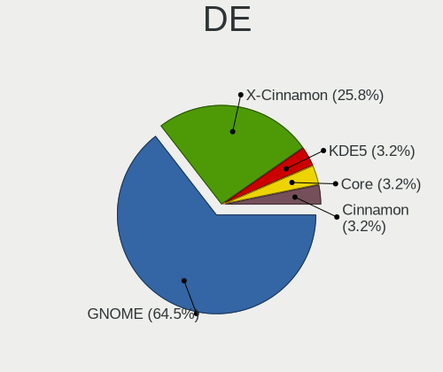

| Name       | Desktops | Percent |
|------------|----------|---------|
| GNOME      | 13       | 72.22%  |
| X-Cinnamon | 3        | 16.67%  |
| Core       | 1        | 5.56%   |
| Cinnamon   | 1        | 5.56%   |

Display Server
--------------

X11 or Wayland

| Name | Desktops | Percent |
|------|----------|---------|
| X11  | 18       | 100%    |

Display Manager
---------------

SDDM, LightDM, etc.

| Name    | Desktops | Percent |
|---------|----------|---------|
| Unknown | 15       | 83.33%  |
| TDM     | 2        | 11.11%  |
| MDM     | 1        | 5.56%   |

OS Lang
-------

Language

| Lang    | Desktops | Percent |
|---------|----------|---------|
| en_US   | 5        | 27.78%  |
| en_GB   | 3        | 16.67%  |
| en_CA   | 3        | 16.67%  |
| pt_BR   | 2        | 11.11%  |
| de_DE   | 2        | 11.11%  |
| tr_TR   | 1        | 5.56%   |
| en_AU   | 1        | 5.56%   |
| Unknown | 1        | 5.56%   |

Boot Mode
---------

EFI or BIOS

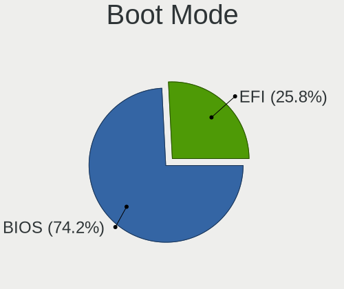

| Mode | Desktops | Percent |
|------|----------|---------|
| BIOS | 14       | 77.78%  |
| EFI  | 4        | 22.22%  |

Filesystem
----------

Type of filesystem

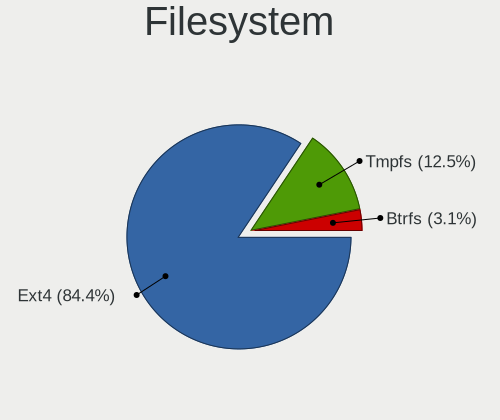

| Type  | Desktops | Percent |
|-------|----------|---------|
| Ext4  | 18       | 94.74%  |
| Btrfs | 1        | 5.26%   |

Part. scheme
------------

Scheme of partitioning

| Type    | Desktops | Percent |
|---------|----------|---------|
| Unknown | 15       | 83.33%  |
| MBR     | 2        | 11.11%  |
| GPT     | 1        | 5.56%   |

Dual Boot with Linux/BSD
------------------------

Hosting more than one Linux/BSD

| Dual boot | Desktops | Percent |
|-----------|----------|---------|
| No        | 16       | 88.89%  |
| Yes       | 2        | 11.11%  |

Dual Boot (Win)
---------------

Hosting Linux and Windows

| Dual boot | Desktops | Percent |
|-----------|----------|---------|
| No        | 18       | 100%    |

Board
-----

Vendor
------

Motherboard manufacturer

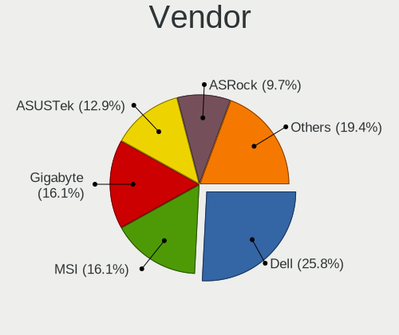

| Name                | Desktops | Percent |
|---------------------|----------|---------|
| Dell                | 6        | 33.33%  |
| Gigabyte Technology | 5        | 27.78%  |
| ASUSTek Computer    | 2        | 11.11%  |
| MSI                 | 1        | 5.56%   |
| Lenovo              | 1        | 5.56%   |
| ELSA                | 1        | 5.56%   |
| Alienware           | 1        | 5.56%   |
| Acer                | 1        | 5.56%   |

Model
-----

Motherboard model

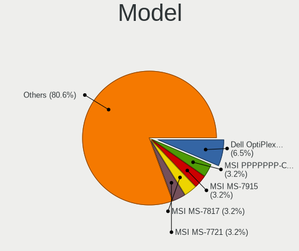

| Name                      | Desktops | Percent |
|---------------------------|----------|---------|
| MSI PPPPPPP-CCC#MMMMMMMM  | 1        | 5.56%   |
| Lenovo IdeaCentre K430    | 1        | 5.56%   |
| Gigabyte Z390 AORUS ULTRA | 1        | 5.56%   |
| Gigabyte GA-MA785GM-US2H  | 1        | 5.56%   |
| Gigabyte GA-880GM-UD2H    | 1        | 5.56%   |
| Gigabyte B85M-HD3         | 1        | 5.56%   |
| Gigabyte 990FXA-UD5       | 1        | 5.56%   |
| ELSA EA H410M-E           | 1        | 5.56%   |
| Dell XPS420               | 1        | 5.56%   |
| Dell Precision Tower 3620 | 1        | 5.56%   |
| Dell OptiPlex 9020        | 1        | 5.56%   |
| Dell OptiPlex 7010        | 1        | 5.56%   |
| Dell Inspiron 660s        | 1        | 5.56%   |
| Dell Inspiron 580         | 1        | 5.56%   |
| ASUS PRIME B450M-A        | 1        | 5.56%   |
| ASUS M5A97 R2.0           | 1        | 5.56%   |
| Alienware Aurora R8       | 1        | 5.56%   |
| Acer Nitro N50-600        | 1        | 5.56%   |

Model Family
------------

Motherboard model prefix

| Name                     | Desktops | Percent |
|--------------------------|----------|---------|
| Dell OptiPlex            | 2        | 11.11%  |
| Dell Inspiron            | 2        | 11.11%  |
| MSI PPPPPPP-CCC#MMMMMMMM | 1        | 5.56%   |
| Lenovo IdeaCentre        | 1        | 5.56%   |
| Gigabyte Z390            | 1        | 5.56%   |
| Gigabyte GA-MA785GM-US2H | 1        | 5.56%   |
| Gigabyte GA-880GM-UD2H   | 1        | 5.56%   |
| Gigabyte B85M-HD3        | 1        | 5.56%   |
| Gigabyte 990FXA-UD5      | 1        | 5.56%   |
| ELSA EA                  | 1        | 5.56%   |
| Dell XPS420              | 1        | 5.56%   |
| Dell Precision           | 1        | 5.56%   |
| ASUS PRIME               | 1        | 5.56%   |
| ASUS M5A97               | 1        | 5.56%   |
| Alienware Aurora         | 1        | 5.56%   |
| Acer Nitro               | 1        | 5.56%   |

MFG Year
--------

Motherboard manufacture year

| Year | Desktops | Percent |
|------|----------|---------|
| 2013 | 4        | 22.22%  |
| 2020 | 3        | 16.67%  |
| 2018 | 3        | 16.67%  |
| 2012 | 3        | 16.67%  |
| 2010 | 2        | 11.11%  |
| 2009 | 2        | 11.11%  |
| 2007 | 1        | 5.56%   |

Form Factor
-----------

Physical design of the computer

| Name    | Desktops | Percent |
|---------|----------|---------|
| Desktop | 18       | 100%    |

Secure Boot
-----------

Enabled or disabled

| State    | Desktops | Percent |
|----------|----------|---------|
| Disabled | 18       | 100%    |

Coreboot
--------

Have coreboot on board

| Used | Desktops | Percent |
|------|----------|---------|
| No   | 18       | 100%    |

RAM Size
--------

Total RAM memory

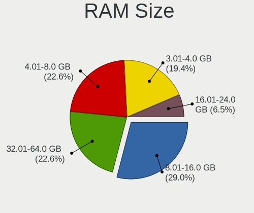

| Size in GB | Desktops | Percent |
|------------|----------|---------|
| 32.01-64.0 | 5        | 27.78%  |
| 3.01-4.0   | 5        | 27.78%  |
| 8.01-16.0  | 4        | 22.22%  |
| 4.01-8.0   | 3        | 16.67%  |
| 16.01-24.0 | 1        | 5.56%   |

RAM Used
--------

Used RAM memory

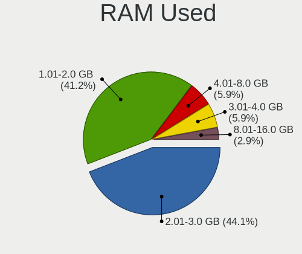

| Used GB  | Desktops | Percent |
|----------|----------|---------|
| 2.01-3.0 | 10       | 50%     |
| 1.01-2.0 | 8        | 40%     |
| 4.01-8.0 | 1        | 5%      |
| 3.01-4.0 | 1        | 5%      |

Total Drives
------------

Number of drives on board

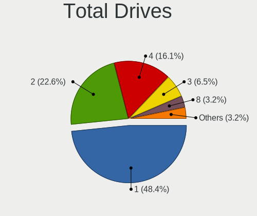

| Drives | Desktops | Percent |
|--------|----------|---------|
| 1      | 9        | 50%     |
| 4      | 4        | 22.22%  |
| 2      | 3        | 16.67%  |
| 3      | 2        | 11.11%  |

Has CD-ROM
----------

Has CD-ROM on board

| Presented | Desktops | Percent |
|-----------|----------|---------|
| Yes       | 10       | 55.56%  |
| No        | 8        | 44.44%  |

Has Ethernet
------------

Has Ethernet on board

| Presented | Desktops | Percent |
|-----------|----------|---------|
| Yes       | 18       | 100%    |

Has WiFi
--------

Has WiFi module

| Presented | Desktops | Percent |
|-----------|----------|---------|
| Yes       | 10       | 52.63%  |
| No        | 9        | 47.37%  |

Has Bluetooth
-------------

Has Bluetooth module

| Presented | Desktops | Percent |
|-----------|----------|---------|
| No        | 13       | 72.22%  |
| Yes       | 5        | 27.78%  |

Location
--------

Country
-------

Geographic location (country)

| Country   | Desktops | Percent |
|-----------|----------|---------|
| USA       | 6        | 33.33%  |
| UK        | 3        | 16.67%  |
| Canada    | 3        | 16.67%  |
| Germany   | 2        | 11.11%  |
| Brazil    | 2        | 11.11%  |
| Turkey    | 1        | 5.56%   |
| Australia | 1        | 5.56%   |

City
----

Geographic location (city)

| City              | Desktops | Percent |
|-------------------|----------|---------|
| Sydney            | 1        | 5.56%   |
| Pinhalzinho       | 1        | 5.56%   |
| Palmopolis        | 1        | 5.56%   |
| Mayen             | 1        | 5.56%   |
| Manitouwadge      | 1        | 5.56%   |
| Los Angeles       | 1        | 5.56%   |
| Leatherhead       | 1        | 5.56%   |
| Kitchener         | 1        | 5.56%   |
| Izmir             | 1        | 5.56%   |
| Edmonton          | 1        | 5.56%   |
| Dallas            | 1        | 5.56%   |
| Chester           | 1        | 5.56%   |
| Chalfont St Giles | 1        | 5.56%   |
| Berlin            | 1        | 5.56%   |
| Beaverton         | 1        | 5.56%   |
| Arroyo Grande     | 1        | 5.56%   |
| Anniston          | 1        | 5.56%   |
| Alexandria        | 1        | 5.56%   |

Drives
------

Drive Vendor
------------

Hard drive vendors

| Vendor                    | Desktops | Drives | Percent |
|---------------------------|----------|--------|---------|
| Seagate                   | 8        | 9      | 25%     |
| WDC                       | 5        | 7      | 15.63%  |
| Samsung Electronics       | 4        | 5      | 12.5%   |
| Sandisk                   | 3        | 3      | 9.38%   |
| Hitachi                   | 2        | 2      | 6.25%   |
| Toshiba                   | 1        | 1      | 3.13%   |
| T-FORCE                   | 1        | 1      | 3.13%   |
| SK Hynix                  | 1        | 1      | 3.13%   |
| Origin                    | 1        | 1      | 3.13%   |
| Micron/Crucial Technology | 1        | 1      | 3.13%   |
| Leven                     | 1        | 1      | 3.13%   |
| Kingston                  | 1        | 1      | 3.13%   |
| JMicron                   | 1        | 1      | 3.13%   |
| China                     | 1        | 1      | 3.13%   |
| ASMT                      | 1        | 1      | 3.13%   |

Drive Model
-----------

Hard drive models

| Model                                        | Desktops | Percent |
|----------------------------------------------|----------|---------|
| Sandisk NVMe SSD Drive 500GB                 | 2        | 5.88%   |
| WDC WDS100T2B0A-00SM50 1TB SSD               | 1        | 2.94%   |
| WDC WD5000AADS-00L4B1 500GB                  | 1        | 2.94%   |
| WDC WD3200AAKS-75L9A0 320GB                  | 1        | 2.94%   |
| WDC WD1600AAJS-22PSA0 160GB                  | 1        | 2.94%   |
| WDC WD10EZEX-00KUWA0 1TB                     | 1        | 2.94%   |
| Toshiba NVMe SSD Drive 512GB                 | 1        | 2.94%   |
| T-FORCE 1TB                                  | 1        | 2.94%   |
| SK Hynix NVMe SSD Drive 512GB                | 1        | 2.94%   |
| Seagate ST940210AS 40GB                      | 1        | 2.94%   |
| Seagate ST500DM002-1BD142 500GB              | 1        | 2.94%   |
| Seagate ST3500418AS 500GB                    | 1        | 2.94%   |
| Seagate ST3320820AS 320GB                    | 1        | 2.94%   |
| Seagate ST3320620AS 320GB                    | 1        | 2.94%   |
| Seagate ST31000524AS 1TB                     | 1        | 2.94%   |
| Seagate ST250DM000-1BD141 250GB              | 1        | 2.94%   |
| Seagate ST1000LM024 HN-M101MBB 1TB           | 1        | 2.94%   |
| Seagate BarraCuda 120 SSD ZA500CM10003 500GB | 1        | 2.94%   |
| SanDisk SSD PLUS 480GB                       | 1        | 2.94%   |
| Samsung SSD 870 QVO 2TB                      | 1        | 2.94%   |
| Samsung SSD 860 EVO mSATA 500GB              | 1        | 2.94%   |
| Samsung NVMe SSD Drive 250GB                 | 1        | 2.94%   |
| Samsung NVMe SSD Drive 1TB                   | 1        | 2.94%   |
| Samsung MZMPC064HBDR-000L1 64GB SSD          | 1        | 2.94%   |
| Origin Inception TLC830 SSD 256GB            | 1        | 2.94%   |
| Micron/Crucial NVMe SSD Drive 500GB          | 1        | 2.94%   |
| Leven JAJS600M512C 512GB SSD                 | 1        | 2.94%   |
| Kingston SA400S37240G 240GB SSD              | 1        | 2.94%   |
| JMicron Generic 2TB                          | 1        | 2.94%   |
| Hitachi HDS728080PLA380 82GB                 | 1        | 2.94%   |
| Hitachi HDS721010CLA332 1TB                  | 1        | 2.94%   |
| China SATA SSD 120GB                         | 1        | 2.94%   |
| ASMT USB 3.0 Destop H 1050GB                 | 1        | 2.94%   |

HDD Vendor
----------

Hard disk drive vendors

| Vendor  | Desktops | Drives | Percent |
|---------|----------|--------|---------|
| Seagate | 7        | 8      | 50%     |
| WDC     | 4        | 6      | 28.57%  |
| Hitachi | 2        | 2      | 14.29%  |
| ASMT    | 1        | 1      | 7.14%   |

SSD Vendor
----------

Solid state drive vendors

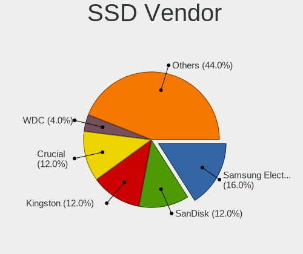

| Vendor              | Desktops | Drives | Percent |
|---------------------|----------|--------|---------|
| Samsung Electronics | 3        | 3      | 30%     |
| WDC                 | 1        | 1      | 10%     |
| Seagate             | 1        | 1      | 10%     |
| SanDisk             | 1        | 1      | 10%     |
| Origin              | 1        | 1      | 10%     |
| Leven               | 1        | 1      | 10%     |
| Kingston            | 1        | 1      | 10%     |
| China               | 1        | 1      | 10%     |

Drive Kind
----------

HDD or SSD

| Kind    | Desktops | Drives | Percent |
|---------|----------|--------|---------|
| HDD     | 11       | 17     | 44%     |
| SSD     | 8        | 10     | 32%     |
| NVMe    | 5        | 8      | 20%     |
| Unknown | 1        | 1      | 4%      |

Drive Connector
---------------

SATA, SAS, NVMe, etc.

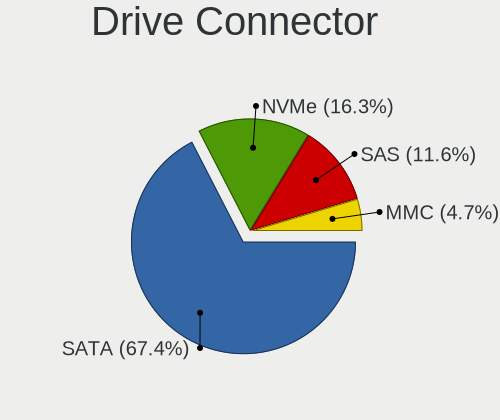

| Type | Desktops | Drives | Percent |
|------|----------|--------|---------|
| SATA | 17       | 27     | 73.91%  |
| NVMe | 4        | 7      | 17.39%  |
| SAS  | 2        | 2      | 8.7%    |

Drive Size
----------

Size of hard drive

| Size in TB | Desktops | Drives | Percent |
|------------|----------|--------|---------|
| 0.01-0.5   | 14       | 18     | 63.64%  |
| 0.51-1.0   | 6        | 7      | 27.27%  |
| 1.01-2.0   | 2        | 2      | 9.09%   |

Space Total
-----------

Amount of disk space available on the file system

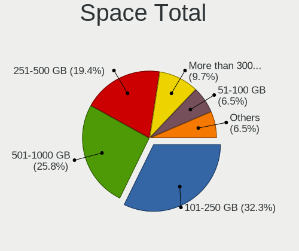

| Size in GB     | Desktops | Percent |
|----------------|----------|---------|
| 101-250        | 6        | 33.33%  |
| 501-1000       | 5        | 27.78%  |
| 251-500        | 2        | 11.11%  |
| 51-100         | 2        | 11.11%  |
| More than 3000 | 1        | 5.56%   |
| 21-50          | 1        | 5.56%   |
| 1001-2000      | 1        | 5.56%   |

Space Used
----------

Amount of used disk space

| Used GB        | Desktops | Percent |
|----------------|----------|---------|
| 1-20           | 9        | 47.37%  |
| 251-500        | 3        | 15.79%  |
| 21-50          | 3        | 15.79%  |
| 51-100         | 3        | 15.79%  |
| More than 3000 | 1        | 5.26%   |

Malfunc. Drives
---------------

Drive models with a malfunction

| Model                       | Desktops | Drives | Percent |
|-----------------------------|----------|--------|---------|
| WDC WD3200AAKS-75L9A0 320GB | 1        | 2      | 50%     |
| Seagate ST31000524AS 1TB    | 1        | 1      | 50%     |

Malfunc. Drive Vendor
---------------------

Vendors of faulty drives

| Vendor  | Desktops | Drives | Percent |
|---------|----------|--------|---------|
| WDC     | 1        | 2      | 50%     |
| Seagate | 1        | 1      | 50%     |

Malfunc. HDD Vendor
-------------------

Vendors of faulty HDD drives

| Vendor  | Desktops | Drives | Percent |
|---------|----------|--------|---------|
| WDC     | 1        | 2      | 50%     |
| Seagate | 1        | 1      | 50%     |

Malfunc. Drive Kind
-------------------

Kinds of faulty drives

| Kind | Desktops | Drives | Percent |
|------|----------|--------|---------|
| HDD  | 2        | 3      | 100%    |

Failed Drives
-------------

Failed drive models

Zero info for selected period =(

Failed Drive Vendor
-------------------

Failed drive vendors

Zero info for selected period =(

Drive Status
------------

Number of failed and malfunc. drives

| Status   | Desktops | Drives | Percent |
|----------|----------|--------|---------|
| Detected | 15       | 31     | 78.95%  |
| Malfunc  | 2        | 3      | 10.53%  |
| Works    | 2        | 2      | 10.53%  |

Storage controller
------------------

Storage Vendor
--------------

Storage controller vendors

| Vendor                       | Desktops | Percent |
|------------------------------|----------|---------|
| Intel                        | 13       | 50%     |
| AMD                          | 5        | 19.23%  |
| Sandisk                      | 2        | 7.69%   |
| Samsung Electronics          | 2        | 7.69%   |
| Toshiba America Info Systems | 1        | 3.85%   |
| SK Hynix                     | 1        | 3.85%   |
| Micron/Crucial Technology    | 1        | 3.85%   |
| Marvell Technology Group     | 1        | 3.85%   |

Storage Model
-------------

Storage controller models

| Model                                                                          | Desktops | Percent |
|--------------------------------------------------------------------------------|----------|---------|
| Intel 7 Series/C210 Series Chipset Family 6-port SATA Controller [AHCI mode]   | 3        | 10%     |
| AMD SB7x0/SB8x0/SB9x0 SATA Controller [AHCI mode]                              | 3        | 10%     |
| Samsung NVMe SSD Controller SM981/PM981/PM983                                  | 2        | 6.67%   |
| Intel SATA Controller [RAID mode]                                              | 2        | 6.67%   |
| Intel Cannon Lake PCH SATA AHCI Controller                                     | 2        | 6.67%   |
| AMD SB7x0/SB8x0/SB9x0 IDE Controller                                           | 2        | 6.67%   |
| Toshiba America Info Systems XG4 NVMe SSD Controller                           | 1        | 3.33%   |
| SK Hynix SC300 512GB M.2 2280 SATA Solid State Drive                           | 1        | 3.33%   |
| Sandisk WD Blue SN550 NVMe SSD                                                 | 1        | 3.33%   |
| Sandisk Non-Volatile memory controller                                         | 1        | 3.33%   |
| Micron/Crucial P2 NVMe PCIe SSD                                                | 1        | 3.33%   |
| Marvell Group 88SE9172 SATA 6Gb/s Controller                                   | 1        | 3.33%   |
| Intel Q170/Q150/B150/H170/H110/Z170/CM236 Chipset SATA Controller [AHCI Mode]  | 1        | 3.33%   |
| Intel NM10/ICH7 Family SATA Controller [IDE mode]                              | 1        | 3.33%   |
| Intel 8 Series/C220 Series Chipset Family IDE-r Controller                     | 1        | 3.33%   |
| Intel 8 Series/C220 Series Chipset Family 6-port SATA Controller 1 [AHCI mode] | 1        | 3.33%   |
| Intel 5 Series/3400 Series Chipset 4 port SATA IDE Controller                  | 1        | 3.33%   |
| Intel 400 Series Chipset Family SATA AHCI Controller                           | 1        | 3.33%   |
| Intel 200 Series PCH SATA controller [AHCI mode]                               | 1        | 3.33%   |
| AMD SB7x0/SB8x0/SB9x0 SATA Controller [IDE mode]                               | 1        | 3.33%   |
| AMD FCH SATA Controller [AHCI mode]                                            | 1        | 3.33%   |
| AMD 400 Series Chipset SATA Controller                                         | 1        | 3.33%   |

Storage Kind
------------

Kind of storage controller (IDE, SATA, NVMe, SAS, ...)

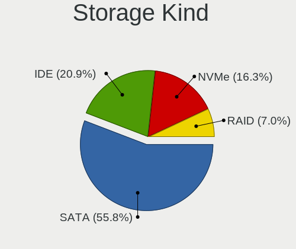

| Kind | Desktops | Percent |
|------|----------|---------|
| SATA | 14       | 56%     |
| IDE  | 5        | 20%     |
| NVMe | 4        | 16%     |
| RAID | 2        | 8%      |

Processor
---------

CPU Vendor
----------

Processor vendors

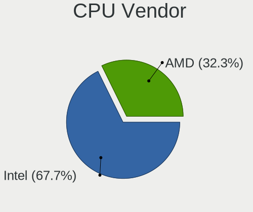

| Vendor | Desktops | Percent |
|--------|----------|---------|
| Intel  | 13       | 72.22%  |
| AMD    | 5        | 27.78%  |

CPU Model
---------

Processor models

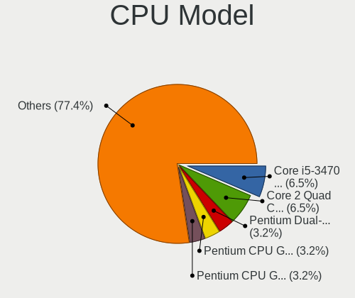

| Model                                       | Desktops | Percent |
|---------------------------------------------|----------|---------|
| Intel Pentium Dual-Core CPU E5700 @ 3.00GHz | 1        | 5.56%   |
| Intel Pentium CPU G2030 @ 3.00GHz           | 1        | 5.56%   |
| Intel Core i7-9700 CPU @ 3.00GHz            | 1        | 5.56%   |
| Intel Core i7-8700 CPU @ 3.20GHz            | 1        | 5.56%   |
| Intel Core i7-6700K CPU @ 4.00GHz           | 1        | 5.56%   |
| Intel Core i7-4770 CPU @ 3.40GHz            | 1        | 5.56%   |
| Intel Core i7-3770 CPU @ 3.40GHz            | 1        | 5.56%   |
| Intel Core i5-9400 CPU @ 2.90GHz            | 1        | 5.56%   |
| Intel Core i5-3470 CPU @ 3.20GHz            | 1        | 5.56%   |
| Intel Core i5-10400 CPU @ 2.90GHz           | 1        | 5.56%   |
| Intel Core i3-4160 CPU @ 3.60GHz            | 1        | 5.56%   |
| Intel Core i3 CPU 550 @ 3.20GHz             | 1        | 5.56%   |
| Intel Core 2 Quad CPU Q6600 @ 2.40GHz       | 1        | 5.56%   |
| AMD Ryzen 7 3700X 8-Core Processor          | 1        | 5.56%   |
| AMD Phenom II X4 955 Processor              | 1        | 5.56%   |
| AMD Phenom 9750 Quad-Core Processor         | 1        | 5.56%   |
| AMD FX-9590 Eight-Core Processor            | 1        | 5.56%   |
| AMD FX-4300 Quad-Core Processor             | 1        | 5.56%   |

CPU Model Family
----------------

Processor model prefix

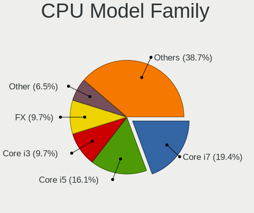

| Model                   | Desktops | Percent |
|-------------------------|----------|---------|
| Intel Core i7           | 5        | 27.78%  |
| Intel Core i5           | 3        | 16.67%  |
| Intel Core i3           | 2        | 11.11%  |
| AMD FX                  | 2        | 11.11%  |
| Intel Pentium Dual-Core | 1        | 5.56%   |
| Intel Pentium           | 1        | 5.56%   |
| Intel Core 2 Quad       | 1        | 5.56%   |
| AMD Ryzen 7             | 1        | 5.56%   |
| AMD Phenom II X4        | 1        | 5.56%   |
| AMD Phenom              | 1        | 5.56%   |

CPU Cores
---------

Number of processor cores

| Number | Desktops | Percent |
|--------|----------|---------|
| 4      | 8        | 44.44%  |
| 2      | 5        | 27.78%  |
| 6      | 3        | 16.67%  |
| 8      | 2        | 11.11%  |

CPU Sockets
-----------

Number of sockets

| Number | Desktops | Percent |
|--------|----------|---------|
| 1      | 18       | 100%    |

CPU Threads
-----------

Threads per core (Hyper-Threading)

| Number | Desktops | Percent |
|--------|----------|---------|
| 2      | 10       | 55.56%  |
| 1      | 8        | 44.44%  |

CPU Op-Modes
------------

CPU Operation Modes (32-bit, 64-bit)

| Op mode        | Desktops | Percent |
|----------------|----------|---------|
| 32-bit, 64-bit | 18       | 100%    |

CPU Microcode
-------------

Microcode number

| Number     | Desktops | Percent |
|------------|----------|---------|
| Unknown    | 7        | 38.89%  |
| 0x306a9    | 3        | 16.67%  |
| 0x906ed    | 1        | 5.56%   |
| 0x506e3    | 1        | 5.56%   |
| 0x306c3    | 1        | 5.56%   |
| 0x20655    | 1        | 5.56%   |
| 0x08701021 | 1        | 5.56%   |
| 0x06000852 | 1        | 5.56%   |
| 0x010000c9 | 1        | 5.56%   |
| 0x010000c8 | 1        | 5.56%   |

CPU Microarch
-------------

Microarchitecture

| Name       | Desktops | Percent |
|------------|----------|---------|
| KabyLake   | 3        | 16.67%  |
| IvyBridge  | 3        | 16.67%  |
| Piledriver | 2        | 11.11%  |
| K10        | 2        | 11.11%  |
| Haswell    | 2        | 11.11%  |
| Zen 2      | 1        | 5.56%   |
| Westmere   | 1        | 5.56%   |
| Skylake    | 1        | 5.56%   |
| Penryn     | 1        | 5.56%   |
| Core       | 1        | 5.56%   |
| CometLake  | 1        | 5.56%   |

Graphics
--------

GPU Vendor
----------

Vendors of graphics cards

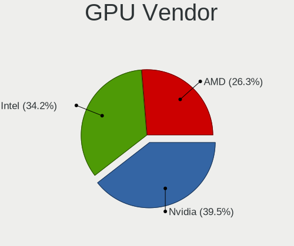

| Vendor | Desktops | Percent |
|--------|----------|---------|
| Intel  | 8        | 36.36%  |
| Nvidia | 7        | 31.82%  |
| AMD    | 7        | 31.82%  |

GPU Model
---------

Graphics card models

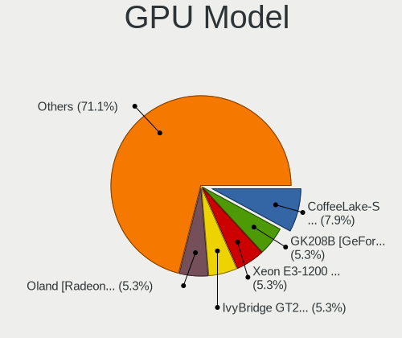

| Model                                                                     | Desktops | Percent |
|---------------------------------------------------------------------------|----------|---------|
| Intel CoffeeLake-S GT2 [UHD Graphics 630]                                 | 2        | 9.09%   |
| AMD Oland [Radeon HD 8570 / R5 430 OEM / R7 240/340 / Radeon 520 OEM]     | 2        | 9.09%   |
| Nvidia GT218 [GeForce 210]                                                | 1        | 4.55%   |
| Nvidia GP106 [GeForce GTX 1060 6GB]                                       | 1        | 4.55%   |
| Nvidia GM204GL [Quadro M4000]                                             | 1        | 4.55%   |
| Nvidia GK208B [GeForce GT 710]                                            | 1        | 4.55%   |
| Nvidia GK107 [GeForce GT 640]                                             | 1        | 4.55%   |
| Nvidia GK107 [GeForce GT 630 OEM]                                         | 1        | 4.55%   |
| Nvidia GF116 [GeForce GTX 550 Ti]                                         | 1        | 4.55%   |
| Intel Xeon E3-1200 v2/3rd Gen Core processor Graphics Controller          | 1        | 4.55%   |
| Intel IvyBridge GT2 [HD Graphics 4000]                                    | 1        | 4.55%   |
| Intel HD Graphics 530                                                     | 1        | 4.55%   |
| Intel Core Processor Integrated Graphics Controller                       | 1        | 4.55%   |
| Intel CometLake-S GT2 [UHD Graphics 630]                                  | 1        | 4.55%   |
| Intel 4th Generation Core Processor Family Integrated Graphics Controller | 1        | 4.55%   |
| AMD RV730 PRO [Radeon HD 4650]                                            | 1        | 4.55%   |
| AMD RV710 [Radeon HD 4350/4550]                                           | 1        | 4.55%   |
| AMD RS880 [Radeon HD 4200]                                                | 1        | 4.55%   |
| AMD Navi 10 [Radeon RX 5600 OEM/5600 XT / 5700/5700 XT]                   | 1        | 4.55%   |
| AMD Cedar [Radeon HD 5000/6000/7350/8350 Series]                          | 1        | 4.55%   |

GPU Combo
---------

Combinations of graphics cards

| Name           | Desktops | Percent |
|----------------|----------|---------|
| 1 x AMD        | 7        | 36.84%  |
| 1 x Nvidia     | 6        | 31.58%  |
| 1 x Intel      | 5        | 26.32%  |
| Intel + Nvidia | 1        | 5.26%   |

GPU Driver
----------

Free vs proprietary

| Driver      | Desktops | Percent |
|-------------|----------|---------|
| Free        | 15       | 83.33%  |
| Proprietary | 3        | 16.67%  |

GPU Memory
----------

Total video memory

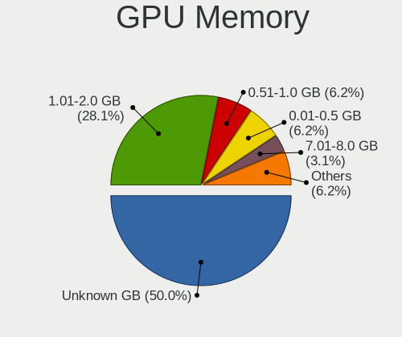

| Size in GB | Desktops | Percent |
|------------|----------|---------|
| Unknown    | 9        | 50%     |
| 1.01-2.0   | 4        | 22.22%  |
| 0.01-0.5   | 2        | 11.11%  |
| 7.01-8.0   | 1        | 5.56%   |
| 5.01-6.0   | 1        | 5.56%   |
| 0.51-1.0   | 1        | 5.56%   |

Monitor
-------

Monitor Vendor
--------------

Monitor vendors

| Vendor          | Desktops | Percent |
|-----------------|----------|---------|
| Goldstar        | 3        | 18.75%  |
| Dell            | 3        | 18.75%  |
| Hewlett-Packard | 2        | 12.5%   |
| AOC             | 2        | 12.5%   |
| Toshiba         | 1        | 6.25%   |
| Sony            | 1        | 6.25%   |
| LG Electronics  | 1        | 6.25%   |
| HannStar        | 1        | 6.25%   |
| Element         | 1        | 6.25%   |
| Acer            | 1        | 6.25%   |

Monitor Model
-------------

Monitor models

| Model                                                        | Desktops | Percent |
|--------------------------------------------------------------|----------|---------|
| Toshiba LCD Monitor TV 1920x1080                             | 1        | 5.88%   |
| Sony TV SNYDC01 1360x768 1600x900mm 72.3-inch                | 1        | 5.88%   |
| LG Electronics LCD Monitor LG IPS FULLHD                     | 1        | 5.88%   |
| LG Electronics LCD Monitor LG HDR 4K 7360x2160               | 1        | 5.88%   |
| Hewlett-Packard LCD Monitor w1907 3120x1050                  | 1        | 5.88%   |
| Hewlett-Packard LCD Monitor 2009                             | 1        | 5.88%   |
| HannStar Hanns.G HH241 HSD2275 1920x1080 521x293mm 23.5-inch | 1        | 5.88%   |
| Goldstar W2261 GSM56CE 1920x1080 477x268mm 21.5-inch         | 1        | 5.88%   |
| Goldstar TV SSCR GSM8080 3840x2160 1600x900mm 72.3-inch      | 1        | 5.88%   |
| Goldstar E2050 GSM4EAD 1600x900 443x249mm 20.0-inch          | 1        | 5.88%   |
| Element ELSFWC321 ELE6308 1366x768 700x390mm 31.5-inch       | 1        | 5.88%   |
| Dell P2314H DEL4098 1920x1080 509x286mm 23.0-inch            | 1        | 5.88%   |
| Dell P2217H DELA0D7 1920x1080 476x267mm 21.5-inch            | 1        | 5.88%   |
| Dell LCD Monitor E228WFP                                     | 1        | 5.88%   |
| AOC L19W931 AOC1993 1360x768 410x256mm 19.0-inch             | 1        | 5.88%   |
| AOC 2243W AOC2243 1920x1080 477x268mm 21.5-inch              | 1        | 5.88%   |
| Acer G226HQL ACR02EA 1920x1080 477x268mm 21.5-inch           | 1        | 5.88%   |

Monitor Resolution
------------------

Monitor screen resolution

| Resolution      | Desktops | Percent |
|-----------------|----------|---------|
| 1920x1080 (FHD) | 7        | 43.75%  |
| 1360x768        | 2        | 12.5%   |
| Unknown         | 2        | 12.5%   |
| 7360x2160       | 1        | 6.25%   |
| 3840x2160 (4K)  | 1        | 6.25%   |
| 3120x1050       | 1        | 6.25%   |
| 1600x900 (HD+)  | 1        | 6.25%   |
| 1366x768 (WXGA) | 1        | 6.25%   |

Monitor Diagonal
----------------

Diagonal size in inches

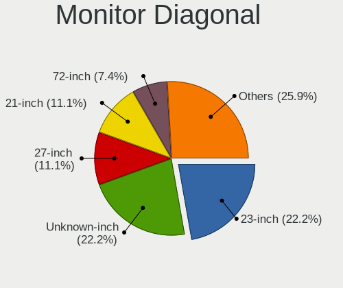

| Inches  | Desktops | Percent |
|---------|----------|---------|
| 23      | 3        | 21.43%  |
| 21      | 3        | 21.43%  |
| Unknown | 3        | 21.43%  |
| 72      | 2        | 14.29%  |
| 61      | 1        | 7.14%   |
| 20      | 1        | 7.14%   |
| 19      | 1        | 7.14%   |

Monitor Width
-------------

Physical width

| Width in mm | Desktops | Percent |
|-------------|----------|---------|
| 401-500     | 5        | 35.71%  |
| 501-600     | 3        | 21.43%  |
| Unknown     | 3        | 21.43%  |
| 1501-2000   | 2        | 14.29%  |
| 1001-1500   | 1        | 7.14%   |

Aspect Ratio
------------

Proportional relationship between the width and the height

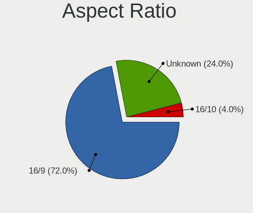

| Ratio   | Desktops | Percent |
|---------|----------|---------|
| 16/9    | 10       | 71.43%  |
| Unknown | 3        | 21.43%  |
| 16/10   | 1        | 7.14%   |

Monitor Area
------------

Area in inch²

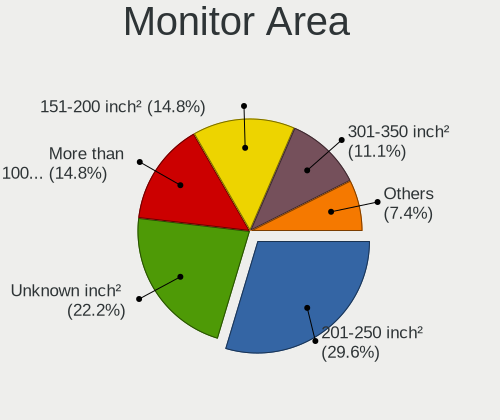

| Area in inch² | Desktops | Percent |
|----------------|----------|---------|
| 201-250        | 4        | 28.57%  |
| 151-200        | 4        | 28.57%  |
| More than 1000 | 3        | 21.43%  |
| Unknown        | 3        | 21.43%  |

Pixel Density
-------------

Pixels per inch

| Density | Desktops | Percent |
|---------|----------|---------|
| 51-100  | 6        | 42.86%  |
| 101-120 | 3        | 21.43%  |
| Unknown | 3        | 21.43%  |
| 1-50    | 2        | 14.29%  |

Multiple Monitors
-----------------

Total monitors connected

| Total | Desktops | Percent |
|-------|----------|---------|
| 1     | 16       | 88.89%  |
| 3     | 1        | 5.56%   |
| 2     | 1        | 5.56%   |

Network
-------

Net Controller Vendor
---------------------

Controller vendors

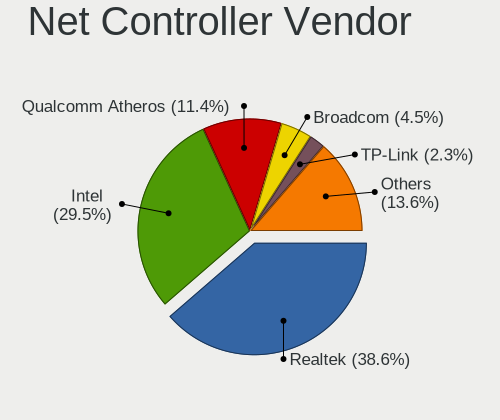

| Vendor                          | Desktops | Percent |
|---------------------------------|----------|---------|
| Realtek Semiconductor           | 11       | 40.74%  |
| Intel                           | 7        | 25.93%  |
| Qualcomm Atheros                | 2        | 7.41%   |
| TP-Link                         | 1        | 3.7%    |
| Ralink                          | 1        | 3.7%    |
| Qualcomm Atheros Communications | 1        | 3.7%    |
| MediaTek                        | 1        | 3.7%    |
| Edimax Technology               | 1        | 3.7%    |
| D-Link System                   | 1        | 3.7%    |
| Broadcom                        | 1        | 3.7%    |

Net Controller Model
--------------------

Controller models

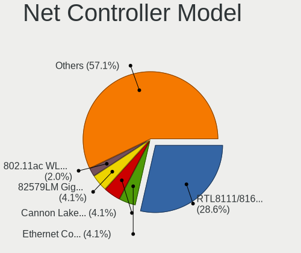

| Model                                                                | Desktops | Percent |
|----------------------------------------------------------------------|----------|---------|
| Realtek RTL8111/8168/8411 PCI Express Gigabit Ethernet Controller    | 9        | 31.03%  |
| Intel Cannon Lake PCH CNVi WiFi                                      | 2        | 6.9%    |
| TP-Link 802.11ac WLAN Adapter                                        | 1        | 3.45%   |
| Realtek RTL8188CE 802.11b/g/n WiFi Adapter                           | 1        | 3.45%   |
| Realtek RTL810xE PCI Express Fast Ethernet controller                | 1        | 3.45%   |
| Realtek RTL-8100/8101L/8139 PCI Fast Ethernet Adapter                | 1        | 3.45%   |
| Ralink RT2561/RT61 802.11g PCI                                       | 1        | 3.45%   |
| Qualcomm Atheros Killer E2500 Gigabit Ethernet Controller            | 1        | 3.45%   |
| Qualcomm Atheros AR9271 802.11n                                      | 1        | 3.45%   |
| Qualcomm Atheros AR9485 Wireless Network Adapter                     | 1        | 3.45%   |
| MediaTek WiFi                                                        | 1        | 3.45%   |
| Intel Wireless-AC 9260                                               | 1        | 3.45%   |
| Intel Ethernet Connection I217-LM                                    | 1        | 3.45%   |
| Intel Ethernet Connection (7) I219-V                                 | 1        | 3.45%   |
| Intel Ethernet Connection (2) I219-LM                                | 1        | 3.45%   |
| Intel 82579LM Gigabit Network Connection (Lewisville)                | 1        | 3.45%   |
| Intel 82566DC-2 Gigabit Network Connection                           | 1        | 3.45%   |
| Edimax EW-7711UTn nLite Wireless Adapter [Ralink RT2870]             | 1        | 3.45%   |
| D-Link System DWA-125 Wireless N 150 Adapter(rev.A2) [Ralink RT3070] | 1        | 3.45%   |
| Broadcom NetLink BCM57788 Gigabit Ethernet PCIe                      | 1        | 3.45%   |

Wireless Vendor
---------------

Wireless vendors

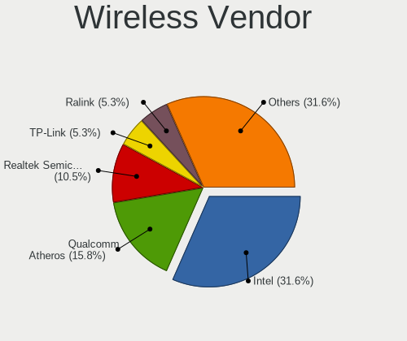

| Vendor                          | Desktops | Percent |
|---------------------------------|----------|---------|
| Intel                           | 3        | 27.27%  |
| TP-Link                         | 1        | 9.09%   |
| Realtek Semiconductor           | 1        | 9.09%   |
| Ralink                          | 1        | 9.09%   |
| Qualcomm Atheros Communications | 1        | 9.09%   |
| Qualcomm Atheros                | 1        | 9.09%   |
| MediaTek                        | 1        | 9.09%   |
| Edimax Technology               | 1        | 9.09%   |
| D-Link System                   | 1        | 9.09%   |

Wireless Model
--------------

Wireless models

| Model                                                                | Desktops | Percent |
|----------------------------------------------------------------------|----------|---------|
| Intel Cannon Lake PCH CNVi WiFi                                      | 2        | 18.18%  |
| TP-Link 802.11ac WLAN Adapter                                        | 1        | 9.09%   |
| Realtek RTL8188CE 802.11b/g/n WiFi Adapter                           | 1        | 9.09%   |
| Ralink RT2561/RT61 802.11g PCI                                       | 1        | 9.09%   |
| Qualcomm Atheros AR9271 802.11n                                      | 1        | 9.09%   |
| Qualcomm Atheros AR9485 Wireless Network Adapter                     | 1        | 9.09%   |
| MediaTek WiFi                                                        | 1        | 9.09%   |
| Intel Wireless-AC 9260                                               | 1        | 9.09%   |
| Edimax EW-7711UTn nLite Wireless Adapter [Ralink RT2870]             | 1        | 9.09%   |
| D-Link System DWA-125 Wireless N 150 Adapter(rev.A2) [Ralink RT3070] | 1        | 9.09%   |

Ethernet Vendor
---------------

Ethernet vendors

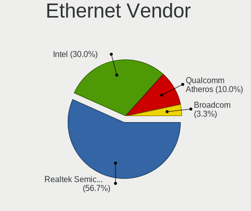

| Vendor                | Desktops | Percent |
|-----------------------|----------|---------|
| Realtek Semiconductor | 11       | 61.11%  |
| Intel                 | 5        | 27.78%  |
| Qualcomm Atheros      | 1        | 5.56%   |
| Broadcom              | 1        | 5.56%   |

Ethernet Model
--------------

Ethernet models

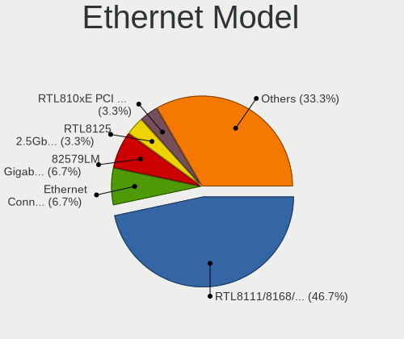

| Model                                                             | Desktops | Percent |
|-------------------------------------------------------------------|----------|---------|
| Realtek RTL8111/8168/8411 PCI Express Gigabit Ethernet Controller | 9        | 50%     |
| Realtek RTL810xE PCI Express Fast Ethernet controller             | 1        | 5.56%   |
| Realtek RTL-8100/8101L/8139 PCI Fast Ethernet Adapter             | 1        | 5.56%   |
| Qualcomm Atheros Killer E2500 Gigabit Ethernet Controller         | 1        | 5.56%   |
| Intel Ethernet Connection I217-LM                                 | 1        | 5.56%   |
| Intel Ethernet Connection (7) I219-V                              | 1        | 5.56%   |
| Intel Ethernet Connection (2) I219-LM                             | 1        | 5.56%   |
| Intel 82579LM Gigabit Network Connection (Lewisville)             | 1        | 5.56%   |
| Intel 82566DC-2 Gigabit Network Connection                        | 1        | 5.56%   |
| Broadcom NetLink BCM57788 Gigabit Ethernet PCIe                   | 1        | 5.56%   |

Net Controller Kind
-------------------

Ethernet, WiFi or modem

| Kind     | Desktops | Percent |
|----------|----------|---------|
| Ethernet | 18       | 64.29%  |
| WiFi     | 10       | 35.71%  |

Used Controller
---------------

Currently used network controller

| Kind     | Desktops | Percent |
|----------|----------|---------|
| Ethernet | 18       | 66.67%  |
| WiFi     | 9        | 33.33%  |

NICs
----

Total network controllers on board

| Total | Desktops | Percent |
|-------|----------|---------|
| 1     | 12       | 66.67%  |
| 2     | 6        | 33.33%  |

IPv6
----

IPv6 vs IPv4

| Used | Desktops | Percent |
|------|----------|---------|
| No   | 16       | 88.89%  |
| Yes  | 2        | 11.11%  |

Bluetooth
---------

Bluetooth Vendor
----------------

Controller vendors

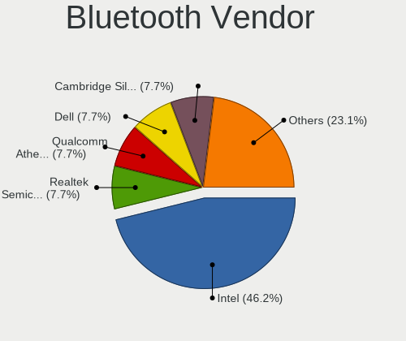

| Vendor                | Desktops | Percent |
|-----------------------|----------|---------|
| Intel                 | 3        | 50%     |
| Realtek Semiconductor | 1        | 16.67%  |
| Dell                  | 1        | 16.67%  |
| Broadcom              | 1        | 16.67%  |

Bluetooth Model
---------------

Controller models

| Model                                    | Desktops | Percent |
|------------------------------------------|----------|---------|
| Intel Bluetooth Device                   | 2        | 33.33%  |
| Realtek Bluetooth Radio                  | 1        | 16.67%  |
| Intel Wireless-AC 9260 Bluetooth Adapter | 1        | 16.67%  |
| Dell BT Mini-Receiver                    | 1        | 16.67%  |
| Broadcom BCM20702A0 Bluetooth 4.0        | 1        | 16.67%  |

Sound
-----

Sound Vendor
------------

Sound card vendors

| Vendor | Desktops | Percent |
|--------|----------|---------|
| Intel  | 13       | 44.83%  |
| AMD    | 9        | 31.03%  |
| Nvidia | 7        | 24.14%  |

Sound Model
-----------

Sound card models

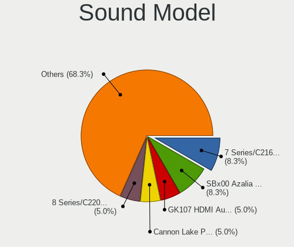

| Model                                                                   | Desktops | Percent |
|-------------------------------------------------------------------------|----------|---------|
| AMD SBx00 Azalia (Intel HDA)                                            | 4        | 12.12%  |
| Intel 7 Series/C216 Chipset Family High Definition Audio Controller     | 3        | 9.09%   |
| Nvidia GK107 HDMI Audio Controller                                      | 2        | 6.06%   |
| Intel Cannon Lake PCH cAVS                                              | 2        | 6.06%   |
| Intel 8 Series/C220 Series Chipset High Definition Audio Controller     | 2        | 6.06%   |
| AMD RV710/730 HDMI Audio [Radeon HD 4000 series]                        | 2        | 6.06%   |
| AMD Oland/Hainan/Cape Verde/Pitcairn HDMI Audio [Radeon HD 7000 Series] | 2        | 6.06%   |
| Nvidia High Definition Audio Controller                                 | 1        | 3.03%   |
| Nvidia GP106 High Definition Audio Controller                           | 1        | 3.03%   |
| Nvidia GM204 High Definition Audio Controller                           | 1        | 3.03%   |
| Nvidia GK208 HDMI/DP Audio Controller                                   | 1        | 3.03%   |
| Nvidia GF116 High Definition Audio Controller                           | 1        | 3.03%   |
| Intel Xeon E3-1200 v3/4th Gen Core Processor HD Audio Controller        | 1        | 3.03%   |
| Intel NM10/ICH7 Family High Definition Audio Controller                 | 1        | 3.03%   |
| Intel Comet Lake PCH-V cAVS                                             | 1        | 3.03%   |
| Intel 82801I (ICH9 Family) HD Audio Controller                          | 1        | 3.03%   |
| Intel 5 Series/3400 Series Chipset High Definition Audio                | 1        | 3.03%   |
| Intel 200 Series PCH HD Audio                                           | 1        | 3.03%   |
| Intel 100 Series/C230 Series Chipset Family HD Audio Controller         | 1        | 3.03%   |
| AMD Starship/Matisse HD Audio Controller                                | 1        | 3.03%   |
| AMD RS880 HDMI Audio [Radeon HD 4200 Series]                            | 1        | 3.03%   |
| AMD Navi 10 HDMI Audio                                                  | 1        | 3.03%   |
| AMD Cedar HDMI Audio [Radeon HD 5400/6300/7300 Series]                  | 1        | 3.03%   |

Memory
------

Memory Vendor
-------------

Memory module vendors

| Vendor   | Desktops | Percent |
|----------|----------|---------|
| Unknown  | 1        | 33.33%  |
| Smart    | 1        | 33.33%  |
| SK Hynix | 1        | 33.33%  |

Memory Model
------------

Memory module models

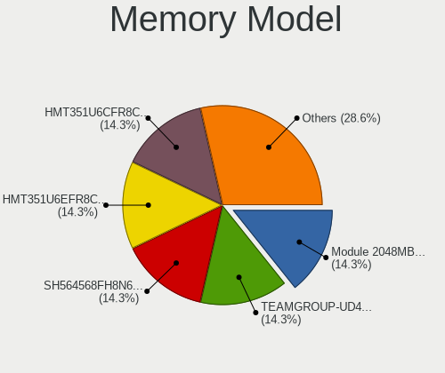

| Model                                                | Desktops | Percent |
|------------------------------------------------------|----------|---------|
| Unknown RAM Module 2048MB DIMM 1066MT/s              | 1        | 33.33%  |
| Smart RAM SH564568FH8N6PHSFG 2GB DIMM DDR3 1333MT/s  | 1        | 33.33%  |
| SK Hynix RAM HMT351U6CFR8C-PB 4GB DIMM DDR3 1800MT/s | 1        | 33.33%  |

Memory Kind
-----------

Memory module kinds

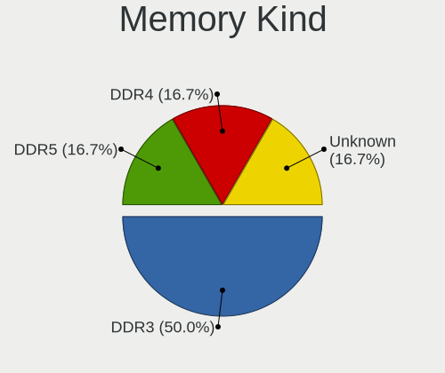

| Kind    | Desktops | Percent |
|---------|----------|---------|
| DDR3    | 2        | 66.67%  |
| Unknown | 1        | 33.33%  |

Memory Form Factor
------------------

Physical design of the memory module

| Name | Desktops | Percent |
|------|----------|---------|
| DIMM | 3        | 100%    |

Memory Size
-----------

Memory module size

| Size | Desktops | Percent |
|------|----------|---------|
| 2048 | 2        | 66.67%  |
| 4096 | 1        | 33.33%  |

Memory Speed
------------

Memory module speed

| Speed | Desktops | Percent |
|-------|----------|---------|
| 1800  | 1        | 33.33%  |
| 1333  | 1        | 33.33%  |
| 1066  | 1        | 33.33%  |

Printers & scanners
-------------------

Printer Vendor
--------------

Printer device vendors

Zero info for selected period =(

Printer Model
-------------

Printer device models

Zero info for selected period =(

Scanner Vendor
--------------

Scanner device vendors

Zero info for selected period =(

Scanner Model
-------------

Scanner device models

Zero info for selected period =(

Camera
------

Camera Vendor
-------------

Camera device vendors

| Vendor           | Desktops | Percent |
|------------------|----------|---------|
| Sonix Technology | 1        | 50%     |
| Microdia         | 1        | 50%     |

Camera Model
------------

Camera device models

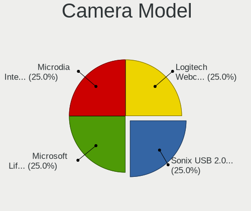

| Model                      | Desktops | Percent |
|----------------------------|----------|---------|
| Sonix USB 2.0 Camera       | 1        | 50%     |
| Microdia Integrated Camera | 1        | 50%     |

Security
--------

Fingerprint Vendor
------------------

Fingerprint sensor vendors

Zero info for selected period =(

Fingerprint Model
-----------------

Fingerprint sensor models

Zero info for selected period =(

Chipcard Vendor
---------------

Chipcard module vendors

Zero info for selected period =(

Chipcard Model
--------------

Chipcard module models

Zero info for selected period =(

Unsupported
-----------

Unsupported Devices
-------------------

Total unsupported devices on board

| Total | Desktops | Percent |
|-------|----------|---------|
| 0     | 17       | 94.44%  |
| 1     | 1        | 5.56%   |

Unsupported Device Types
------------------------

Types of unsupported devices

| Type         | Desktops | Percent |
|--------------|----------|---------|
| Net/wireless | 1        | 100%    |

