Makulu - Tested Hardware & Statistics (Notebooks)
-------------------------------------------------

A project to collect tested hardware configurations for Makulu.

Anyone can contribute to this report by the [hw-probe](https://github.com/linuxhw/hw-probe) tool:

    sudo -E hw-probe -all -upload

Please contribute! Especially if your hardware is rare.

Contents
--------

* [ Test Cases ](#test-cases)

* [ System ](#system)
  - [ OS                       ](#os)
  - [ OS Family                ](#os-family)
  - [ Kernel                   ](#kernel)
  - [ Kernel Family            ](#kernel-family)
  - [ Kernel Major Ver.        ](#kernel-major-ver)
  - [ Arch                     ](#arch)
  - [ DE                       ](#de)
  - [ Display Server           ](#display-server)
  - [ Display Manager          ](#display-manager)
  - [ OS Lang                  ](#os-lang)
  - [ Boot Mode                ](#boot-mode)
  - [ Filesystem               ](#filesystem)
  - [ Part. scheme             ](#part-scheme)
  - [ Dual Boot with Linux/BSD ](#dual-boot-with-linuxbsd)
  - [ Dual Boot (Win)          ](#dual-boot-win)

* [ Board ](#board)
  - [ Vendor                   ](#vendor)
  - [ Model                    ](#model)
  - [ Model Family             ](#model-family)
  - [ MFG Year                 ](#mfg-year)
  - [ Form Factor              ](#form-factor)
  - [ Secure Boot              ](#secure-boot)
  - [ Coreboot                 ](#coreboot)
  - [ RAM Size                 ](#ram-size)
  - [ RAM Used                 ](#ram-used)
  - [ Total Drives             ](#total-drives)
  - [ Has CD-ROM               ](#has-cd-rom)
  - [ Has Ethernet             ](#has-ethernet)
  - [ Has WiFi                 ](#has-wifi)
  - [ Has Bluetooth            ](#has-bluetooth)

* [ Location ](#location)
  - [ Country                  ](#country)
  - [ City                     ](#city)

* [ Drives ](#drives)
  - [ Drive Vendor             ](#drive-vendor)
  - [ Drive Model              ](#drive-model)
  - [ HDD Vendor               ](#hdd-vendor)
  - [ SSD Vendor               ](#ssd-vendor)
  - [ Drive Kind               ](#drive-kind)
  - [ Drive Connector          ](#drive-connector)
  - [ Drive Size               ](#drive-size)
  - [ Space Total              ](#space-total)
  - [ Space Used               ](#space-used)
  - [ Malfunc. Drives          ](#malfunc-drives)
  - [ Malfunc. Drive Vendor    ](#malfunc-drive-vendor)
  - [ Malfunc. HDD Vendor      ](#malfunc-hdd-vendor)
  - [ Malfunc. Drive Kind      ](#malfunc-drive-kind)
  - [ Failed Drives            ](#failed-drives)
  - [ Failed Drive Vendor      ](#failed-drive-vendor)
  - [ Drive Status             ](#drive-status)

* [ Storage controller ](#storage-controller)
  - [ Storage Vendor           ](#storage-vendor)
  - [ Storage Model            ](#storage-model)
  - [ Storage Kind             ](#storage-kind)

* [ Processor ](#processor)
  - [ CPU Vendor               ](#cpu-vendor)
  - [ CPU Model                ](#cpu-model)
  - [ CPU Model Family         ](#cpu-model-family)
  - [ CPU Cores                ](#cpu-cores)
  - [ CPU Sockets              ](#cpu-sockets)
  - [ CPU Threads              ](#cpu-threads)
  - [ CPU Op-Modes             ](#cpu-op-modes)
  - [ CPU Microcode            ](#cpu-microcode)
  - [ CPU Microarch            ](#cpu-microarch)

* [ Graphics ](#graphics)
  - [ GPU Vendor               ](#gpu-vendor)
  - [ GPU Model                ](#gpu-model)
  - [ GPU Combo                ](#gpu-combo)
  - [ GPU Driver               ](#gpu-driver)
  - [ GPU Memory               ](#gpu-memory)

* [ Monitor ](#monitor)
  - [ Monitor Vendor           ](#monitor-vendor)
  - [ Monitor Model            ](#monitor-model)
  - [ Monitor Resolution       ](#monitor-resolution)
  - [ Monitor Diagonal         ](#monitor-diagonal)
  - [ Monitor Width            ](#monitor-width)
  - [ Aspect Ratio             ](#aspect-ratio)
  - [ Monitor Area             ](#monitor-area)
  - [ Pixel Density            ](#pixel-density)
  - [ Multiple Monitors        ](#multiple-monitors)

* [ Network ](#network)
  - [ Net Controller Vendor    ](#net-controller-vendor)
  - [ Net Controller Model     ](#net-controller-model)
  - [ Wireless Vendor          ](#wireless-vendor)
  - [ Wireless Model           ](#wireless-model)
  - [ Ethernet Vendor          ](#ethernet-vendor)
  - [ Ethernet Model           ](#ethernet-model)
  - [ Net Controller Kind      ](#net-controller-kind)
  - [ Used Controller          ](#used-controller)
  - [ NICs                     ](#nics)
  - [ IPv6                     ](#ipv6)

* [ Bluetooth ](#bluetooth)
  - [ Bluetooth Vendor         ](#bluetooth-vendor)
  - [ Bluetooth Model          ](#bluetooth-model)

* [ Sound ](#sound)
  - [ Sound Vendor             ](#sound-vendor)
  - [ Sound Model              ](#sound-model)

* [ Memory ](#memory)
  - [ Memory Vendor            ](#memory-vendor)
  - [ Memory Model             ](#memory-model)
  - [ Memory Kind              ](#memory-kind)
  - [ Memory Form Factor       ](#memory-form-factor)
  - [ Memory Size              ](#memory-size)
  - [ Memory Speed             ](#memory-speed)

* [ Printers & scanners ](#printers--scanners)
  - [ Printer Vendor           ](#printer-vendor)
  - [ Printer Model            ](#printer-model)
  - [ Scanner Vendor           ](#scanner-vendor)
  - [ Scanner Model            ](#scanner-model)

* [ Camera ](#camera)
  - [ Camera Vendor            ](#camera-vendor)
  - [ Camera Model             ](#camera-model)

* [ Security ](#security)
  - [ Fingerprint Vendor       ](#fingerprint-vendor)
  - [ Fingerprint Model        ](#fingerprint-model)
  - [ Chipcard Vendor          ](#chipcard-vendor)
  - [ Chipcard Model           ](#chipcard-model)

* [ Unsupported ](#unsupported)
  - [ Unsupported Devices      ](#unsupported-devices)
  - [ Unsupported Device Types ](#unsupported-device-types)

Test Cases
----------

Total: 25

| Vendor  | Model                       | Probe                                                      | Date         |
|---------|-----------------------------|------------------------------------------------------------|--------------|
| Dell    | Latitude E64406342Q0286/    | [41b2b27a91](https://linux-hardware.org/?probe=41b2b27a91) | Dec 16, 2022 |
| Dell    | Latitude E64406342Q0286/    | [e8b2c9218f](https://linux-hardware.org/?probe=e8b2c9218f) | Dec 15, 2022 |
| Dell    | Inspiron 5565               | [a583bbdc35](https://linux-hardware.org/?probe=a583bbdc35) | May 19, 2022 |
| Dell    | Latitude 3540               | [6fb057646a](https://linux-hardware.org/?probe=6fb057646a) | Feb 25, 2022 |
| Samsung | R580                        | [b796f42cc3](https://linux-hardware.org/?probe=b796f42cc3) | Jan 31, 2022 |
| HP      | Pavilion Laptop 15z-cw10... | [c014435339](https://linux-hardware.org/?probe=c014435339) | Dec 29, 2021 |
| HP      | Pavilion Laptop 15z-cw10... | [97cfd9951b](https://linux-hardware.org/?probe=97cfd9951b) | Dec 29, 2021 |
| Lenovo  | V14-IIL 82C4                | [cb48d8f436](https://linux-hardware.org/?probe=cb48d8f436) | Dec 28, 2021 |
| HUAWEI  | KPL-W0X                     | [0551e72ef6](https://linux-hardware.org/?probe=0551e72ef6) | Dec 27, 2021 |
| HUAWEI  | KPL-W0X                     | [64d4de98ff](https://linux-hardware.org/?probe=64d4de98ff) | Dec 27, 2021 |
| Lenovo  | V14-IIL 82C4                | [e3873f9847](https://linux-hardware.org/?probe=e3873f9847) | Dec 23, 2021 |
| ASUSTek | N55SL                       | [11ed4def95](https://linux-hardware.org/?probe=11ed4def95) | Oct 24, 2021 |
| Lenovo  | IdeaPad Y530                | [6ca5521110](https://linux-hardware.org/?probe=6ca5521110) | Sep 24, 2021 |
| Dell    | Inspiron 3521               | [9787940762](https://linux-hardware.org/?probe=9787940762) | Aug 29, 2021 |
| Apple   | MacBookAir6,2               | [66f7c33d00](https://linux-hardware.org/?probe=66f7c33d00) | Jun 08, 2021 |
| Apple   | MacBookAir6,2               | [1ce8c5e2c7](https://linux-hardware.org/?probe=1ce8c5e2c7) | Jun 03, 2021 |
| HP      | ENVY Notebook               | [61cb15af98](https://linux-hardware.org/?probe=61cb15af98) | Apr 28, 2021 |
| ASUSTek | K55VD                       | [b9086bf814](https://linux-hardware.org/?probe=b9086bf814) | Apr 14, 2021 |
| ASUSTek | K55VD                       | [10987a7dec](https://linux-hardware.org/?probe=10987a7dec) | Apr 13, 2021 |
| HP      | Compaq 15                   | [455bc50dc9](https://linux-hardware.org/?probe=455bc50dc9) | Mar 15, 2021 |
| HP      | ENVY Notebook               | [f71898211e](https://linux-hardware.org/?probe=f71898211e) | Feb 25, 2021 |
| Lenovo  | ThinkPad T420 4236W1W       | [3c3ff4f10e](https://linux-hardware.org/?probe=3c3ff4f10e) | Dec 02, 2020 |
| Lenovo  | ThinkPad T420 4236W1W       | [73279e52cd](https://linux-hardware.org/?probe=73279e52cd) | Oct 01, 2020 |
| HP      | Pavilion 17                 | [a6aa670ab4](https://linux-hardware.org/?probe=a6aa670ab4) | Sep 02, 2020 |
| HP      | Pavilion 17                 | [03171f4dbe](https://linux-hardware.org/?probe=03171f4dbe) | Aug 30, 2020 |

System
------

OS
--

Installed operating systems

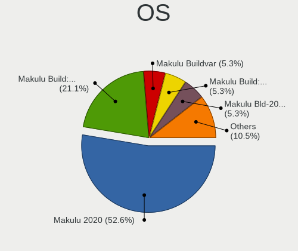

| Name                     | Notebooks | Percent |
|--------------------------|-----------|---------|
| Makulu 2020              | 10        | 66.67%  |
| Makulu Build: 2021.12.15 | 4         | 26.67%  |
| Makulu Build: 2022.01.06 | 1         | 6.67%   |

OS Family
---------

OS without a version

| Name   | Notebooks | Percent |
|--------|-----------|---------|
| Makulu | 15        | 100%    |

Kernel
------

Version of the Linux kernel

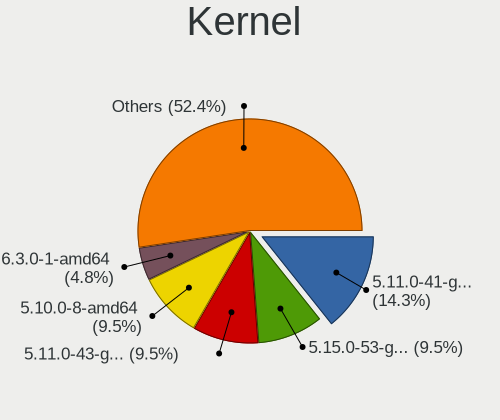

| Version                | Notebooks | Percent |
|------------------------|-----------|---------|
| 5.11.0-41-generic      | 3         | 20%     |
| 5.11.0-43-generic      | 2         | 13.33%  |
| 5.10.0-8-amd64         | 2         | 13.33%  |
| 5.8.0-50-generic       | 1         | 6.67%   |
| 5.8.0-49-generic       | 1         | 6.67%   |
| 5.8.0-44-generic       | 1         | 6.67%   |
| 5.8.0-38-generic       | 1         | 6.67%   |
| 5.4.0-48-generic       | 1         | 6.67%   |
| 5.4.0-42-generic       | 1         | 6.67%   |
| 5.15.10-051510-generic | 1         | 6.67%   |
| 5.11.0-36-generic      | 1         | 6.67%   |

Kernel Family
-------------

Linux kernel without a distro release

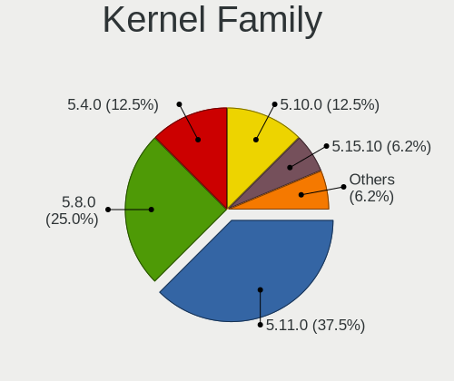

| Version | Notebooks | Percent |
|---------|-----------|---------|
| 5.11.0  | 6         | 40%     |
| 5.8.0   | 4         | 26.67%  |
| 5.4.0   | 2         | 13.33%  |
| 5.10.0  | 2         | 13.33%  |
| 5.15.10 | 1         | 6.67%   |

Kernel Major Ver.
-----------------

Linux kernel major version

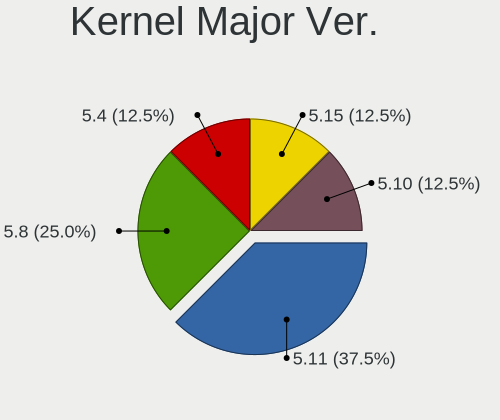

| Version | Notebooks | Percent |
|---------|-----------|---------|
| 5.11    | 6         | 40%     |
| 5.8     | 4         | 26.67%  |
| 5.4     | 2         | 13.33%  |
| 5.10    | 2         | 13.33%  |
| 5.15    | 1         | 6.67%   |

Arch
----

OS architecture (x86_64, i586, etc.)

| Name   | Notebooks | Percent |
|--------|-----------|---------|
| x86_64 | 15        | 100%    |

DE
--

Desktop Environment

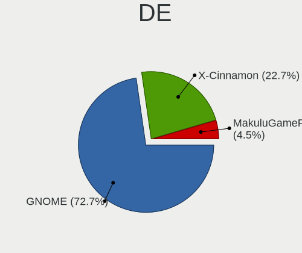

| Name       | Notebooks | Percent |
|------------|-----------|---------|
| GNOME      | 11        | 73.33%  |
| X-Cinnamon | 4         | 26.67%  |

Display Server
--------------

X11 or Wayland

| Name | Notebooks | Percent |
|------|-----------|---------|
| X11  | 15        | 100%    |

Display Manager
---------------

SDDM, LightDM, etc.

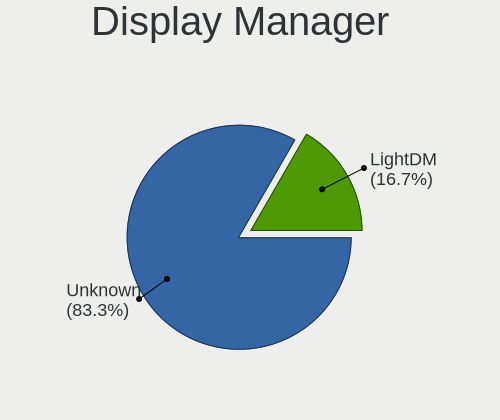

| Name    | Notebooks | Percent |
|---------|-----------|---------|
| Unknown | 13        | 86.67%  |
| LightDM | 2         | 13.33%  |

OS Lang
-------

Language

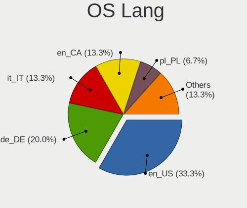

| Lang  | Notebooks | Percent |
|-------|-----------|---------|
| en_US | 5         | 31.25%  |
| en_CA | 3         | 18.75%  |
| de_DE | 3         | 18.75%  |
| it_IT | 2         | 12.5%   |
| pl_PL | 1         | 6.25%   |
| nl_NL | 1         | 6.25%   |
| en_GB | 1         | 6.25%   |

Boot Mode
---------

EFI or BIOS

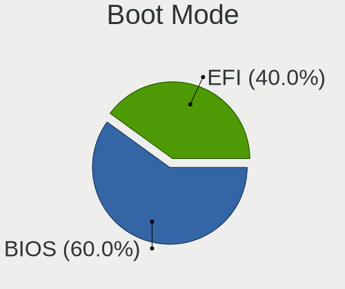

| Mode | Notebooks | Percent |
|------|-----------|---------|
| BIOS | 9         | 56.25%  |
| EFI  | 7         | 43.75%  |

Filesystem
----------

Type of filesystem

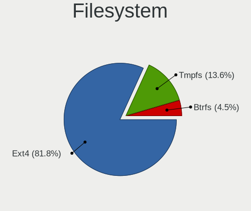

| Type  | Notebooks | Percent |
|-------|-----------|---------|
| Ext4  | 13        | 86.67%  |
| Tmpfs | 1         | 6.67%   |
| Btrfs | 1         | 6.67%   |

Part. scheme
------------

Scheme of partitioning

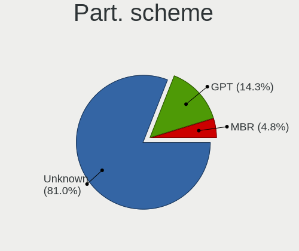

| Type    | Notebooks | Percent |
|---------|-----------|---------|
| Unknown | 15        | 100%    |

Dual Boot with Linux/BSD
------------------------

Hosting more than one Linux/BSD

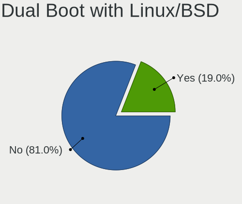

| Dual boot | Notebooks | Percent |
|-----------|-----------|---------|
| No        | 14        | 93.33%  |
| Yes       | 1         | 6.67%   |

Dual Boot (Win)
---------------

Hosting Linux and Windows

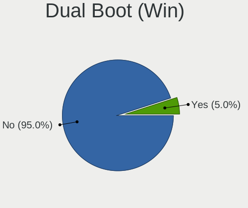

| Dual boot | Notebooks | Percent |
|-----------|-----------|---------|
| No        | 15        | 100%    |

Board
-----

Vendor
------

Motherboard manufacturer

| Name                | Notebooks | Percent |
|---------------------|-----------|---------|
| Hewlett-Packard     | 4         | 26.67%  |
| Lenovo              | 3         | 20%     |
| Dell                | 3         | 20%     |
| ASUSTek Computer    | 2         | 13.33%  |
| Samsung Electronics | 1         | 6.67%   |
| HUAWEI              | 1         | 6.67%   |
| Apple               | 1         | 6.67%   |

Model
-----

Motherboard model

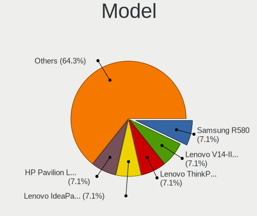

| Name                         | Notebooks | Percent |
|------------------------------|-----------|---------|
| Samsung R580                 | 1         | 6.67%   |
| Lenovo V14-IIL 82C4          | 1         | 6.67%   |
| Lenovo ThinkPad T420 4236W1W | 1         | 6.67%   |
| Lenovo IdeaPad Y530          | 1         | 6.67%   |
| HUAWEI KPL-W0X               | 1         | 6.67%   |
| HP Pavilion Laptop 15z-cw100 | 1         | 6.67%   |
| HP Pavilion 17               | 1         | 6.67%   |
| HP ENVY Notebook             | 1         | 6.67%   |
| HP Compaq 15                 | 1         | 6.67%   |
| Dell Latitude 3540           | 1         | 6.67%   |
| Dell Inspiron 5565           | 1         | 6.67%   |
| Dell Inspiron 3521           | 1         | 6.67%   |
| ASUS N55SL                   | 1         | 6.67%   |
| ASUS K55VD                   | 1         | 6.67%   |
| Apple MacBookAir6,2          | 1         | 6.67%   |

Model Family
------------

Motherboard model prefix

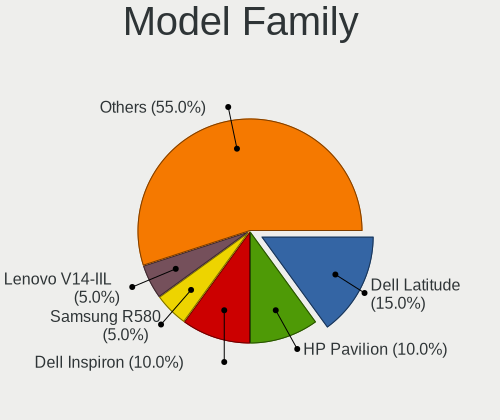

| Name              | Notebooks | Percent |
|-------------------|-----------|---------|
| HP Pavilion       | 2         | 13.33%  |
| Dell Inspiron     | 2         | 13.33%  |
| Samsung R580      | 1         | 6.67%   |
| Lenovo V14-IIL    | 1         | 6.67%   |
| Lenovo ThinkPad   | 1         | 6.67%   |
| Lenovo IdeaPad    | 1         | 6.67%   |
| HUAWEI KPL-W0X    | 1         | 6.67%   |
| HP ENVY           | 1         | 6.67%   |
| HP Compaq         | 1         | 6.67%   |
| Dell Latitude     | 1         | 6.67%   |
| ASUS N55SL        | 1         | 6.67%   |
| ASUS K55VD        | 1         | 6.67%   |
| Apple MacBookAir6 | 1         | 6.67%   |

MFG Year
--------

Motherboard manufacture year

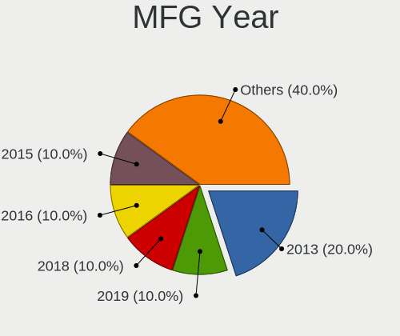

| Year | Notebooks | Percent |
|------|-----------|---------|
| 2013 | 3         | 20%     |
| 2019 | 2         | 13.33%  |
| 2012 | 2         | 13.33%  |
| 2011 | 2         | 13.33%  |
| 2018 | 1         | 6.67%   |
| 2016 | 1         | 6.67%   |
| 2015 | 1         | 6.67%   |
| 2014 | 1         | 6.67%   |
| 2009 | 1         | 6.67%   |
| 2008 | 1         | 6.67%   |

Form Factor
-----------

Physical design of the computer

| Name     | Notebooks | Percent |
|----------|-----------|---------|
| Notebook | 15        | 100%    |

Secure Boot
-----------

Enabled or disabled

| State    | Notebooks | Percent |
|----------|-----------|---------|
| Disabled | 15        | 100%    |

Coreboot
--------

Have coreboot on board

| Used | Notebooks | Percent |
|------|-----------|---------|
| No   | 15        | 100%    |

RAM Size
--------

Total RAM memory

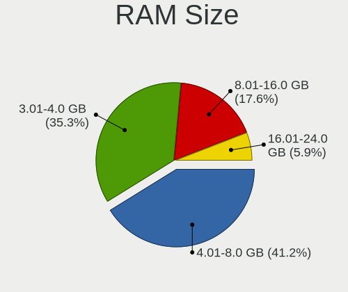

| Size in GB | Notebooks | Percent |
|------------|-----------|---------|
| 4.01-8.0   | 7         | 43.75%  |
| 3.01-4.0   | 6         | 37.5%   |
| 8.01-16.0  | 3         | 18.75%  |

RAM Used
--------

Used RAM memory

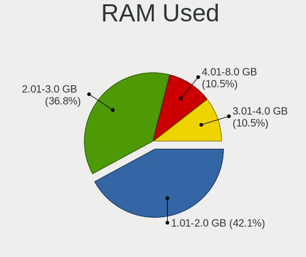

| Used GB  | Notebooks | Percent |
|----------|-----------|---------|
| 1.01-2.0 | 8         | 50%     |
| 2.01-3.0 | 6         | 37.5%   |
| 4.01-8.0 | 1         | 6.25%   |
| 3.01-4.0 | 1         | 6.25%   |

Total Drives
------------

Number of drives on board

| Drives | Notebooks | Percent |
|--------|-----------|---------|
| 1      | 13        | 81.25%  |
| 3      | 2         | 12.5%   |
| 2      | 1         | 6.25%   |

Has CD-ROM
----------

Has CD-ROM on board

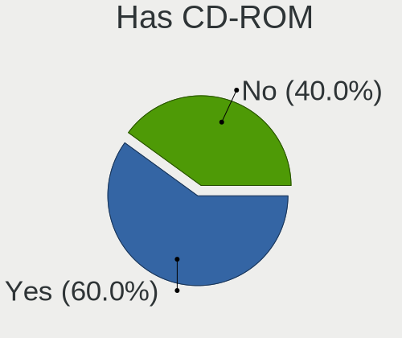

| Presented | Notebooks | Percent |
|-----------|-----------|---------|
| Yes       | 8         | 53.33%  |
| No        | 7         | 46.67%  |

Has Ethernet
------------

Has Ethernet on board

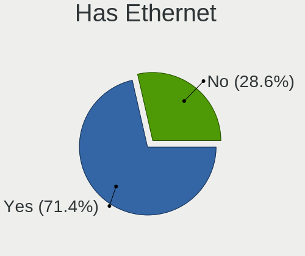

| Presented | Notebooks | Percent |
|-----------|-----------|---------|
| Yes       | 11        | 73.33%  |
| No        | 4         | 26.67%  |

Has WiFi
--------

Has WiFi module

| Presented | Notebooks | Percent |
|-----------|-----------|---------|
| Yes       | 15        | 100%    |

Has Bluetooth
-------------

Has Bluetooth module

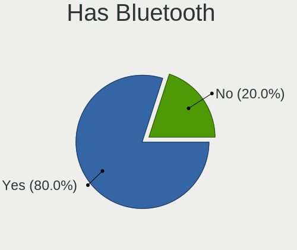

| Presented | Notebooks | Percent |
|-----------|-----------|---------|
| Yes       | 11        | 73.33%  |
| No        | 4         | 26.67%  |

Location
--------

Country
-------

Geographic location (country)

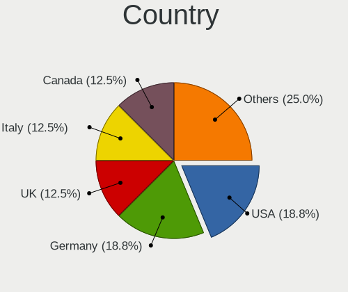

| Country     | Notebooks | Percent |
|-------------|-----------|---------|
| Germany     | 3         | 20%     |
| USA         | 2         | 13.33%  |
| UK          | 2         | 13.33%  |
| Italy       | 2         | 13.33%  |
| Canada      | 2         | 13.33%  |
| Uganda      | 1         | 6.67%   |
| Poland      | 1         | 6.67%   |
| Netherlands | 1         | 6.67%   |
| Australia   | 1         | 6.67%   |

City
----

Geographic location (city)

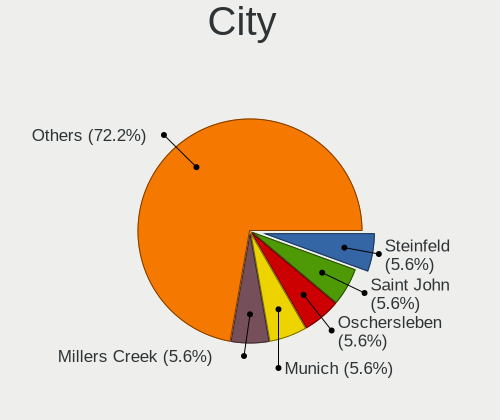

| City           | Notebooks | Percent |
|----------------|-----------|---------|
| Steinfeld      | 1         | 5.88%   |
| Saint John     | 1         | 5.88%   |
| Oschersleben   | 1         | 5.88%   |
| Munich         | 1         | 5.88%   |
| Millers Creek  | 1         | 5.88%   |
| Melbourne      | 1         | 5.88%   |
| Manchester     | 1         | 5.88%   |
| Lodz           | 1         | 5.88%   |
| Kampala        | 1         | 5.88%   |
| Imperia        | 1         | 5.88%   |
| Hillegom       | 1         | 5.88%   |
| Freisbach      | 1         | 5.88%   |
| Etobicoke      | 1         | 5.88%   |
| Dallas         | 1         | 5.88%   |
| Brunswick West | 1         | 5.88%   |
| Brugherio      | 1         | 5.88%   |
| Ballygowan     | 1         | 5.88%   |

Drives
------

Drive Vendor
------------

Hard drive vendors

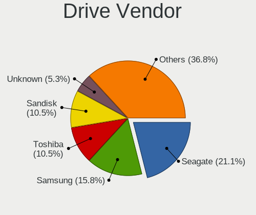

| Vendor              | Notebooks | Drives | Percent |
|---------------------|-----------|--------|---------|
| Seagate             | 4         | 5      | 20%     |
| Toshiba             | 3         | 3      | 15%     |
| Samsung Electronics | 3         | 5      | 15%     |
| SanDisk             | 2         | 2      | 10%     |
| Unknown             | 1         | 1      | 5%      |
| Transcend           | 1         | 1      | 5%      |
| LITEON              | 1         | 2      | 5%      |
| KIOXIA              | 1         | 1      | 5%      |
| JMicron Technology  | 1         | 1      | 5%      |
| Hitachi             | 1         | 1      | 5%      |
| HGST                | 1         | 1      | 5%      |
| Apple               | 1         | 1      | 5%      |

Drive Model
-----------

Hard drive models

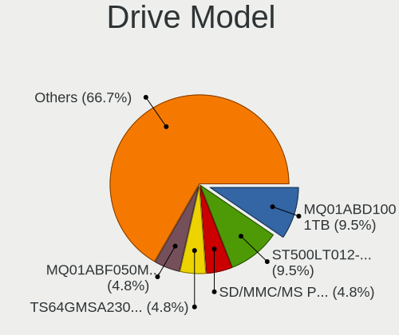

| Model                                | Notebooks | Percent |
|--------------------------------------|-----------|---------|
| Toshiba MQ01ABD100 1TB               | 2         | 9.52%   |
| Seagate ST500LT012-1DG142 500GB      | 2         | 9.52%   |
| Unknown SD/MMC/MS PRO 64GB           | 1         | 4.76%   |
| Transcend TS64GMSA230S 64GB SSD      | 1         | 4.76%   |
| Toshiba MQ01ABF050M 500GB            | 1         | 4.76%   |
| Seagate ST9320325AS 320GB            | 1         | 4.76%   |
| Seagate Expansion Desk 5TB           | 1         | 4.76%   |
| SanDisk SSD PLUS 1000GB              | 1         | 4.76%   |
| SanDisk NVMe SSD Drive 512GB         | 1         | 4.76%   |
| Samsung NVMe SSD Drive 1TB           | 1         | 4.76%   |
| Samsung NVMe SSD Drive 1024GB        | 1         | 4.76%   |
| Samsung MZ7TD128HAFV-000L1 128GB SSD | 1         | 4.76%   |
| Samsung HM500JI 500GB                | 1         | 4.76%   |
| LITEON L8H-256V2G-HP 256GB SSD       | 1         | 4.76%   |
| KIOXIA NVMe SSD Drive 256GB          | 1         | 4.76%   |
| JMicron Tech 250GB                   | 1         | 4.76%   |
| Hitachi HTS545025B9A300 250GB        | 1         | 4.76%   |
| HGST HTS721010A9E630 1TB             | 1         | 4.76%   |
| Apple SSD SM0256F 256GB              | 1         | 4.76%   |

HDD Vendor
----------

Hard disk drive vendors

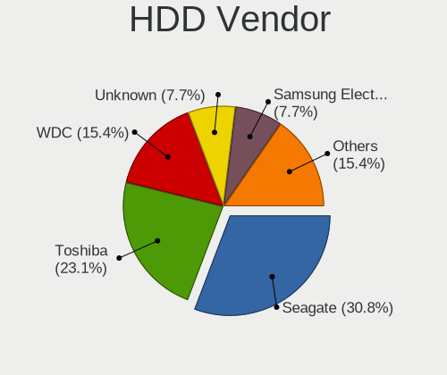

| Vendor              | Notebooks | Drives | Percent |
|---------------------|-----------|--------|---------|
| Seagate             | 4         | 5      | 36.36%  |
| Toshiba             | 3         | 3      | 27.27%  |
| Unknown             | 1         | 1      | 9.09%   |
| Samsung Electronics | 1         | 1      | 9.09%   |
| Hitachi             | 1         | 1      | 9.09%   |
| HGST                | 1         | 1      | 9.09%   |

SSD Vendor
----------

Solid state drive vendors

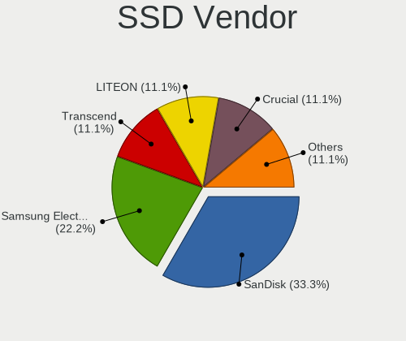

| Vendor              | Notebooks | Drives | Percent |
|---------------------|-----------|--------|---------|
| Transcend           | 1         | 1      | 20%     |
| SanDisk             | 1         | 1      | 20%     |
| Samsung Electronics | 1         | 2      | 20%     |
| LITEON              | 1         | 2      | 20%     |
| Apple               | 1         | 1      | 20%     |

Drive Kind
----------

HDD or SSD

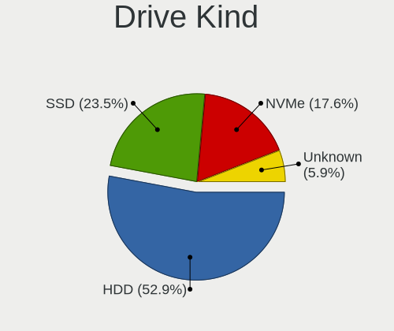

| Kind    | Notebooks | Drives | Percent |
|---------|-----------|--------|---------|
| HDD     | 10        | 12     | 55.56%  |
| SSD     | 4         | 7      | 22.22%  |
| NVMe    | 3         | 4      | 16.67%  |
| Unknown | 1         | 1      | 5.56%   |

Drive Connector
---------------

SATA, SAS, NVMe, etc.

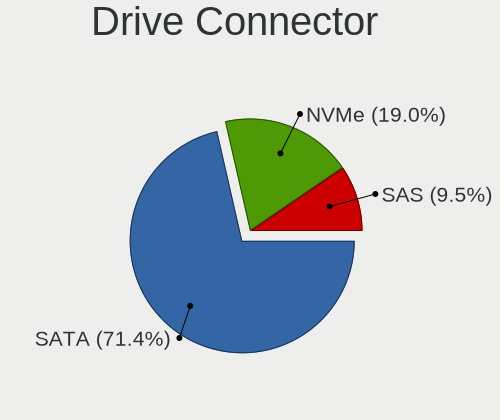

| Type | Notebooks | Drives | Percent |
|------|-----------|--------|---------|
| SATA | 13        | 17     | 72.22%  |
| NVMe | 3         | 4      | 16.67%  |
| SAS  | 2         | 3      | 11.11%  |

Drive Size
----------

Size of hard drive

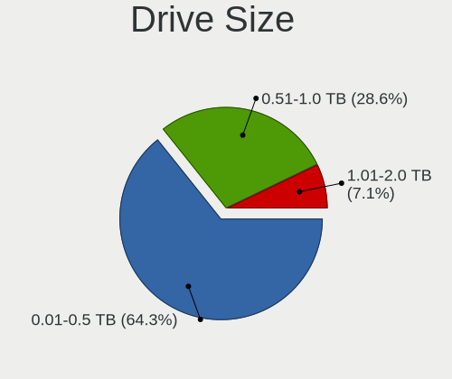

| Size in TB | Notebooks | Drives | Percent |
|------------|-----------|--------|---------|
| 0.01-0.5   | 9         | 14     | 64.29%  |
| 0.51-1.0   | 4         | 4      | 28.57%  |
| 4.01-10.0  | 1         | 1      | 7.14%   |

Space Total
-----------

Amount of disk space available on the file system

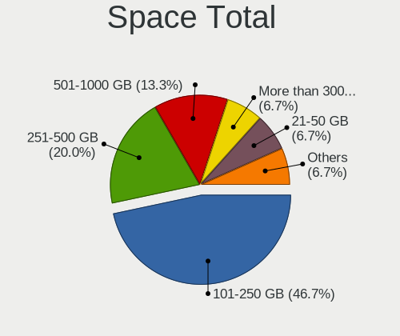

| Size in GB     | Notebooks | Percent |
|----------------|-----------|---------|
| 101-250        | 7         | 43.75%  |
| 251-500        | 4         | 25%     |
| 501-1000       | 2         | 12.5%   |
| More than 3000 | 1         | 6.25%   |
| 21-50          | 1         | 6.25%   |
| 1-20           | 1         | 6.25%   |

Space Used
----------

Amount of used disk space

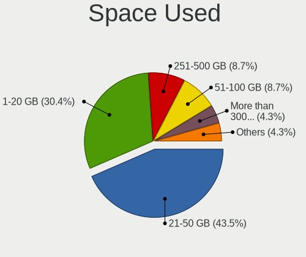

| Used GB        | Notebooks | Percent |
|----------------|-----------|---------|
| 1-20           | 7         | 38.89%  |
| 21-50          | 6         | 33.33%  |
| 51-100         | 2         | 11.11%  |
| More than 3000 | 1         | 5.56%   |
| 251-500        | 1         | 5.56%   |
| 101-250        | 1         | 5.56%   |

Malfunc. Drives
---------------

Drive models with a malfunction

Zero info for selected period =(

Malfunc. Drive Vendor
---------------------

Vendors of faulty drives

Zero info for selected period =(

Malfunc. HDD Vendor
-------------------

Vendors of faulty HDD drives

Zero info for selected period =(

Malfunc. Drive Kind
-------------------

Kinds of faulty drives

Zero info for selected period =(

Failed Drives
-------------

Failed drive models

Zero info for selected period =(

Failed Drive Vendor
-------------------

Failed drive vendors

Zero info for selected period =(

Drive Status
------------

Number of failed and malfunc. drives

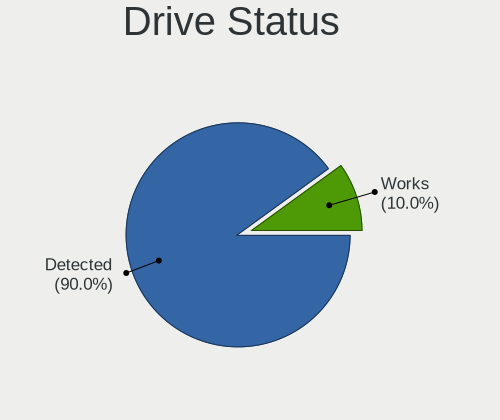

| Status   | Notebooks | Drives | Percent |
|----------|-----------|--------|---------|
| Detected | 15        | 24     | 100%    |

Storage controller
------------------

Storage Vendor
--------------

Storage controller vendors

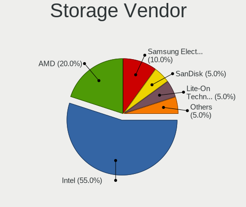

| Vendor              | Notebooks | Percent |
|---------------------|-----------|---------|
| Intel               | 9         | 52.94%  |
| AMD                 | 4         | 23.53%  |
| Samsung Electronics | 2         | 11.76%  |
| SanDisk             | 1         | 5.88%   |
| KIOXIA              | 1         | 5.88%   |

Storage Model
-------------

Storage controller models

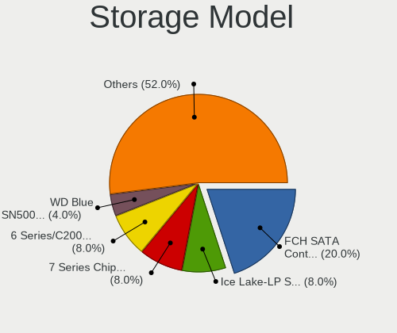

| Model                                                                        | Notebooks | Percent |
|------------------------------------------------------------------------------|-----------|---------|
| AMD FCH SATA Controller [AHCI mode]                                          | 4         | 23.53%  |
| Intel 7 Series Chipset Family 6-port SATA Controller [AHCI mode]             | 2         | 11.76%  |
| Intel 6 Series/C200 Series Chipset Family 6 port Mobile SATA AHCI Controller | 2         | 11.76%  |
| SanDisk WD Blue SN500 / PC SN520 NVMe SSD                                    | 1         | 5.88%   |
| Samsung NVMe SSD Controller SM961/PM961/SM963                                | 1         | 5.88%   |
| Samsung Apple PCIe SSD                                                       | 1         | 5.88%   |
| KIOXIA NVMe SSD Controller BG4                                               | 1         | 5.88%   |
| Intel Sunrise Point-LP SATA Controller [AHCI mode]                           | 1         | 5.88%   |
| Intel Ice Lake-LP SATA Controller [AHCI mode]                                | 1         | 5.88%   |
| Intel 82801IBM/IEM (ICH9M/ICH9M-E) 4 port SATA Controller [AHCI mode]        | 1         | 5.88%   |
| Intel 8 Series SATA Controller 1 [AHCI mode]                                 | 1         | 5.88%   |
| Intel 5 Series/3400 Series Chipset 4 port SATA AHCI Controller               | 1         | 5.88%   |

Storage Kind
------------

Kind of storage controller (IDE, SATA, NVMe, SAS, ...)

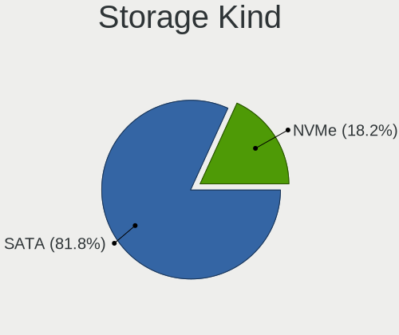

| Kind | Notebooks | Percent |
|------|-----------|---------|
| SATA | 14        | 82.35%  |
| NVMe | 3         | 17.65%  |

Processor
---------

CPU Vendor
----------

Processor vendors

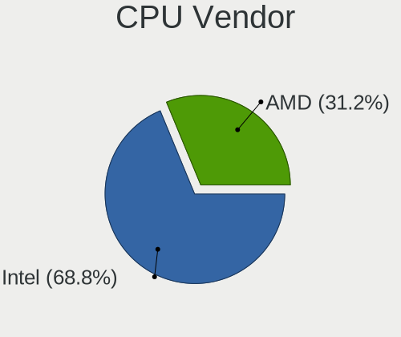

| Vendor | Notebooks | Percent |
|--------|-----------|---------|
| Intel  | 10        | 66.67%  |
| AMD    | 5         | 33.33%  |

CPU Model
---------

Processor models

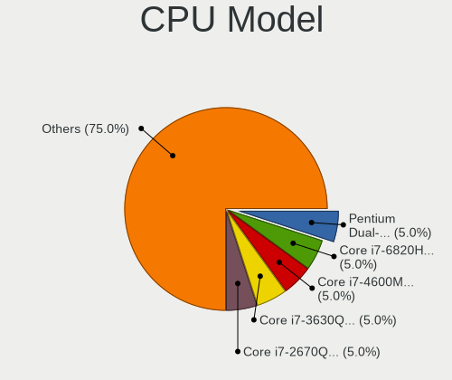

| Model                                           | Notebooks | Percent |
|-------------------------------------------------|-----------|---------|
| Intel Pentium Dual-Core CPU T4200 @ 2.00GHz     | 1         | 6.67%   |
| Intel Core i7-3630QM CPU @ 2.40GHz              | 1         | 6.67%   |
| Intel Core i7-2670QM CPU @ 2.20GHz              | 1         | 6.67%   |
| Intel Core i5-6200U CPU @ 2.30GHz               | 1         | 6.67%   |
| Intel Core i5-4260U CPU @ 1.40GHz               | 1         | 6.67%   |
| Intel Core i5-2520M CPU @ 2.50GHz               | 1         | 6.67%   |
| Intel Core i5 CPU M 520 @ 2.40GHz               | 1         | 6.67%   |
| Intel Core i3-4030U CPU @ 1.90GHz               | 1         | 6.67%   |
| Intel Core i3-3217U CPU @ 1.80GHz               | 1         | 6.67%   |
| Intel Core i3-1005G1 CPU @ 1.20GHz              | 1         | 6.67%   |
| AMD Ryzen 7 3700U with Radeon Vega Mobile Gfx   | 1         | 6.67%   |
| AMD Ryzen 5 2500U with Radeon Vega Mobile Gfx   | 1         | 6.67%   |
| AMD E1-2100 APU with Radeon HD Graphics         | 1         | 6.67%   |
| AMD A4-5000 APU with Radeon HD Graphics         | 1         | 6.67%   |
| AMD A12-9700P RADEON R7, 10 COMPUTE CORES 4C+6G | 1         | 6.67%   |

CPU Model Family
----------------

Processor model prefix

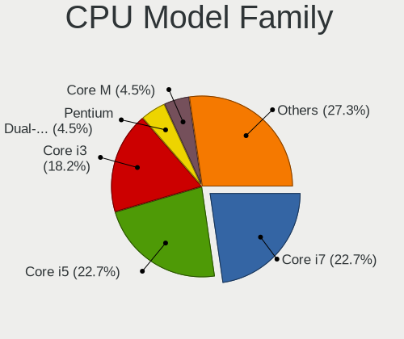

| Model                   | Notebooks | Percent |
|-------------------------|-----------|---------|
| Intel Core i5           | 4         | 26.67%  |
| Intel Core i3           | 3         | 20%     |
| Intel Core i7           | 2         | 13.33%  |
| Intel Pentium Dual-Core | 1         | 6.67%   |
| AMD Ryzen 7             | 1         | 6.67%   |
| AMD Ryzen 5             | 1         | 6.67%   |
| AMD E1                  | 1         | 6.67%   |
| AMD A4                  | 1         | 6.67%   |
| AMD A12                 | 1         | 6.67%   |

CPU Cores
---------

Number of processor cores

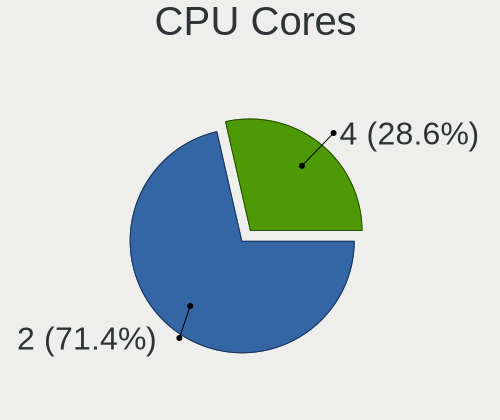

| Number | Notebooks | Percent |
|--------|-----------|---------|
| 2      | 10        | 66.67%  |
| 4      | 5         | 33.33%  |

CPU Sockets
-----------

Number of sockets

| Number | Notebooks | Percent |
|--------|-----------|---------|
| 1      | 15        | 100%    |

CPU Threads
-----------

Threads per core (Hyper-Threading)

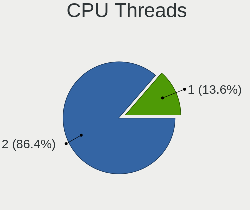

| Number | Notebooks | Percent |
|--------|-----------|---------|
| 2      | 12        | 80%     |
| 1      | 3         | 20%     |

CPU Op-Modes
------------

CPU Operation Modes (32-bit, 64-bit)

| Op mode        | Notebooks | Percent |
|----------------|-----------|---------|
| 32-bit, 64-bit | 15        | 100%    |

CPU Microcode
-------------

Microcode number

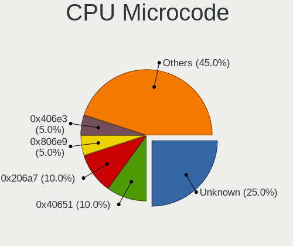

| Number     | Notebooks | Percent |
|------------|-----------|---------|
| Unknown    | 4         | 23.53%  |
| 0x40651    | 2         | 11.76%  |
| 0x206a7    | 2         | 11.76%  |
| 0x406e3    | 1         | 5.88%   |
| 0x306a9    | 1         | 5.88%   |
| 0x20652    | 1         | 5.88%   |
| 0x1067a    | 1         | 5.88%   |
| 0x08108102 | 1         | 5.88%   |
| 0x08101007 | 1         | 5.88%   |
| 0x07000110 | 1         | 5.88%   |
| 0x0700010f | 1         | 5.88%   |
| 0x06006118 | 1         | 5.88%   |

CPU Microarch
-------------

Microarchitecture

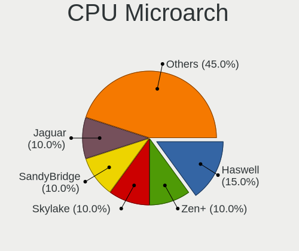

| Name        | Notebooks | Percent |
|-------------|-----------|---------|
| SandyBridge | 2         | 13.33%  |
| Jaguar      | 2         | 13.33%  |
| IvyBridge   | 2         | 13.33%  |
| Haswell     | 2         | 13.33%  |
| Zen+        | 1         | 6.67%   |
| Zen         | 1         | 6.67%   |
| Westmere    | 1         | 6.67%   |
| Skylake     | 1         | 6.67%   |
| Penryn      | 1         | 6.67%   |
| IceLake     | 1         | 6.67%   |
| Excavator   | 1         | 6.67%   |

Graphics
--------

GPU Vendor
----------

Vendors of graphics cards

| Vendor | Notebooks | Percent |
|--------|-----------|---------|
| Intel  | 8         | 47.06%  |
| AMD    | 5         | 29.41%  |
| Nvidia | 4         | 23.53%  |

GPU Model
---------

Graphics card models

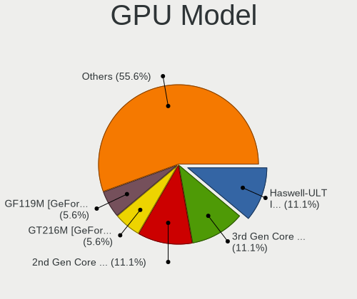

| Model                                                                     | Notebooks | Percent |
|---------------------------------------------------------------------------|-----------|---------|
| Intel Haswell-ULT Integrated Graphics Controller                          | 2         | 11.76%  |
| Intel 3rd Gen Core processor Graphics Controller                          | 2         | 11.76%  |
| Intel 2nd Generation Core Processor Family Integrated Graphics Controller | 2         | 11.76%  |
| Nvidia GT216M [GeForce GT 330M]                                           | 1         | 5.88%   |
| Nvidia GF119M [GeForce 610M]                                              | 1         | 5.88%   |
| Nvidia GF116M [GeForce GT 555M/635M]                                      | 1         | 5.88%   |
| Nvidia G96CM [GeForce 9600M GS]                                           | 1         | 5.88%   |
| Intel Skylake GT2 [HD Graphics 520]                                       | 1         | 5.88%   |
| Intel Iris Plus Graphics G1 (Ice Lake)                                    | 1         | 5.88%   |
| AMD Wani [Radeon R5/R6/R7 Graphics]                                       | 1         | 5.88%   |
| AMD Raven Ridge [Radeon Vega Series / Radeon Vega Mobile Series]          | 1         | 5.88%   |
| AMD Picasso/Raven 2 [Radeon Vega Series / Radeon Vega Mobile Series]      | 1         | 5.88%   |
| AMD Kabini [Radeon HD 8330]                                               | 1         | 5.88%   |
| AMD Kabini [Radeon HD 8210]                                               | 1         | 5.88%   |

GPU Combo
---------

Combinations of graphics cards

| Name           | Notebooks | Percent |
|----------------|-----------|---------|
| 1 x Intel      | 6         | 40%     |
| 1 x AMD        | 5         | 33.33%  |
| 1 x Nvidia     | 2         | 13.33%  |
| Intel + Nvidia | 2         | 13.33%  |

GPU Driver
----------

Free vs proprietary

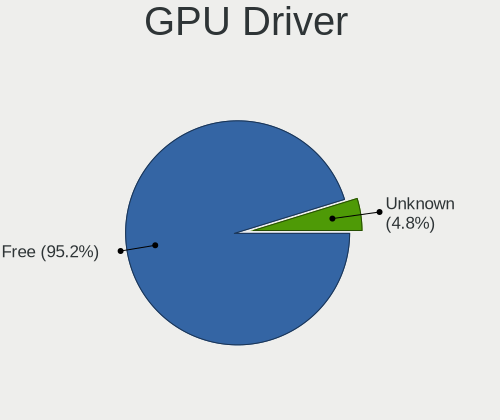

| Driver | Notebooks | Percent |
|--------|-----------|---------|
| Free   | 15        | 100%    |

GPU Memory
----------

Total video memory

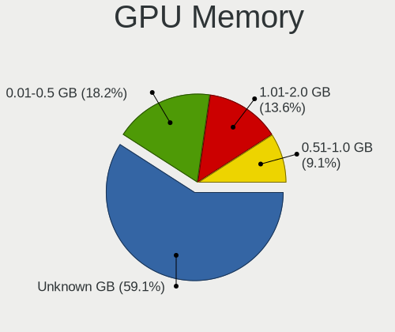

| Size in GB | Notebooks | Percent |
|------------|-----------|---------|
| Unknown    | 6         | 40%     |
| 0.01-0.5   | 4         | 26.67%  |
| 1.01-2.0   | 3         | 20%     |
| 0.51-1.0   | 2         | 13.33%  |

Monitor
-------

Monitor Vendor
--------------

Monitor vendors

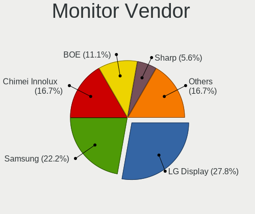

| Vendor                  | Notebooks | Percent |
|-------------------------|-----------|---------|
| Samsung Electronics     | 4         | 26.67%  |
| LG Display              | 4         | 26.67%  |
| Chimei Innolux          | 2         | 13.33%  |
| BOE                     | 2         | 13.33%  |
| Chi Mei Optoelectronics | 1         | 6.67%   |
| AU Optronics            | 1         | 6.67%   |
| Apple                   | 1         | 6.67%   |

Monitor Model
-------------

Monitor models

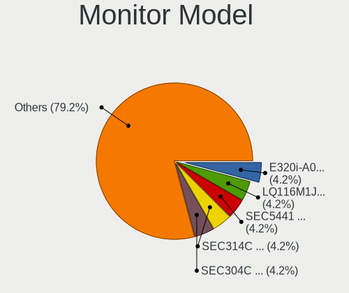

| Model                                                                    | Notebooks | Percent |
|--------------------------------------------------------------------------|-----------|---------|
| Samsung Electronics LCD Monitor SEC314C 1920x1080 344x194mm 15.5-inch    | 1         | 6.67%   |
| Samsung Electronics LCD Monitor SEC304C 1366x768 309x174mm 14.0-inch     | 1         | 6.67%   |
| Samsung Electronics LCD Monitor SDC415A 3840x2400 302x189mm 14.0-inch    | 1         | 6.67%   |
| Samsung Electronics LCD Monitor SDC3654 1600x900 382x215mm 17.3-inch     | 1         | 6.67%   |
| LG Display LCD Monitor LGD062B 1920x1080 344x194mm 15.5-inch             | 1         | 6.67%   |
| LG Display LCD Monitor LGD04DA 1920x1080 344x194mm 15.5-inch             | 1         | 6.67%   |
| LG Display LCD Monitor LGD03AB 1366x768 344x194mm 15.5-inch              | 1         | 6.67%   |
| LG Display LCD Monitor LGD038E 1366x768 344x194mm 15.5-inch              | 1         | 6.67%   |
| Chimei Innolux LCD Monitor CMN15B8 1366x768 344x194mm 15.5-inch          | 1         | 6.67%   |
| Chimei Innolux LCD Monitor CMN15AB 1366x768 344x194mm 15.5-inch          | 1         | 6.67%   |
| Chi Mei Optoelectronics LCD Monitor CMO1680 1366x768 344x193mm 15.5-inch | 1         | 6.67%   |
| BOE LCD Monitor BOE083C 1920x1080 309x173mm 13.9-inch                    | 1         | 6.67%   |
| BOE LCD Monitor BOE07D3 1920x1080 309x174mm 14.0-inch                    | 1         | 6.67%   |
| AU Optronics LCD Monitor AUO9274 1280x800 331x207mm 15.4-inch            | 1         | 6.67%   |
| Apple Color LCD APP9CF0 1440x900 290x180mm 13.4-inch                     | 1         | 6.67%   |

Monitor Resolution
------------------

Monitor screen resolution

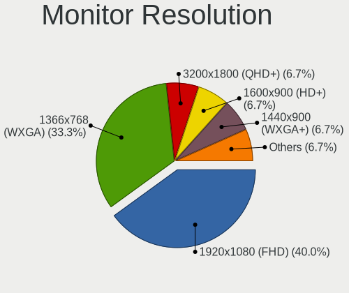

| Resolution       | Notebooks | Percent |
|------------------|-----------|---------|
| 1920x1080 (FHD)  | 6         | 40%     |
| 1366x768 (WXGA)  | 5         | 33.33%  |
| 3840x2400        | 1         | 6.67%   |
| 1600x900 (HD+)   | 1         | 6.67%   |
| 1440x900 (WXGA+) | 1         | 6.67%   |
| 1280x800 (WXGA)  | 1         | 6.67%   |

Monitor Diagonal
----------------

Diagonal size in inches

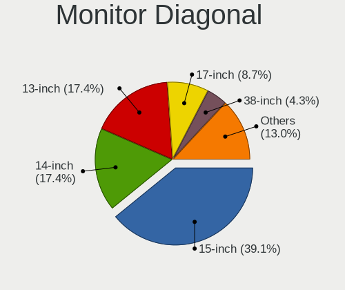

| Inches | Notebooks | Percent |
|--------|-----------|---------|
| 15     | 10        | 66.67%  |
| 14     | 2         | 13.33%  |
| 13     | 2         | 13.33%  |
| 17     | 1         | 6.67%   |

Monitor Width
-------------

Physical width

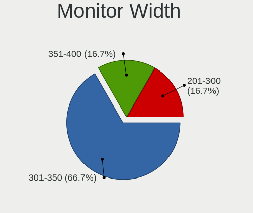

| Width in mm | Notebooks | Percent |
|-------------|-----------|---------|
| 301-350     | 11        | 73.33%  |
| 351-400     | 3         | 20%     |
| 201-300     | 1         | 6.67%   |

Aspect Ratio
------------

Proportional relationship between the width and the height

| Ratio | Notebooks | Percent |
|-------|-----------|---------|
| 16/9  | 12        | 80%     |
| 16/10 | 3         | 20%     |

Monitor Area
------------

Area in inch²

| Area in inch² | Notebooks | Percent |
|----------------|-----------|---------|
| 101-110        | 10        | 66.67%  |
| 81-90          | 4         | 26.67%  |
| 121-130        | 1         | 6.67%   |

Pixel Density
-------------

Pixels per inch

| Density       | Notebooks | Percent |
|---------------|-----------|---------|
| 121-160       | 5         | 33.33%  |
| 51-100        | 5         | 33.33%  |
| 101-120       | 4         | 26.67%  |
| More than 240 | 1         | 6.67%   |

Multiple Monitors
-----------------

Total monitors connected

| Total | Notebooks | Percent |
|-------|-----------|---------|
| 1     | 15        | 100%    |

Network
-------

Net Controller Vendor
---------------------

Controller vendors

| Vendor                          | Notebooks | Percent |
|---------------------------------|-----------|---------|
| Realtek Semiconductor           | 7         | 26.92%  |
| Qualcomm Atheros                | 6         | 23.08%  |
| Intel                           | 5         | 19.23%  |
| Broadcom Limited                | 2         | 7.69%   |
| Broadcom                        | 2         | 7.69%   |
| Ralink Technology               | 1         | 3.85%   |
| Qualcomm Atheros Communications | 1         | 3.85%   |
| Marvell Technology Group        | 1         | 3.85%   |
| D-Link                          | 1         | 3.85%   |

Net Controller Model
--------------------

Controller models

| Model                                                                                | Notebooks | Percent |
|--------------------------------------------------------------------------------------|-----------|---------|
| Realtek RTL810xE PCI Express Fast Ethernet controller                                | 4         | 13.33%  |
| Realtek RTL8111/8168/8411 PCI Express Gigabit Ethernet Controller                    | 3         | 10%     |
| Qualcomm Atheros AR9485 Wireless Network Adapter                                     | 2         | 6.67%   |
| Realtek RTL8822BE 802.11a/b/g/n/ac WiFi adapter                                      | 1         | 3.33%   |
| Realtek RTL8188SU 802.11n WLAN Adapter                                               | 1         | 3.33%   |
| Realtek RTL8188EE Wireless Network Adapter                                           | 1         | 3.33%   |
| Ralink RT5370 Wireless Adapter                                                       | 1         | 3.33%   |
| Qualcomm Atheros QCA9565 / AR9565 Wireless Network Adapter                           | 1         | 3.33%   |
| Qualcomm Atheros QCA9377 802.11ac Wireless Network Adapter                           | 1         | 3.33%   |
| Qualcomm Atheros TP-Link TL-WN821N v3 / TL-WN822N v2 802.11n [Atheros AR7010+AR9287] | 1         | 3.33%   |
| Qualcomm Atheros AR9285 Wireless Network Adapter (PCI-Express)                       | 1         | 3.33%   |
| Qualcomm Atheros AR8151 v2.0 Gigabit Ethernet                                        | 1         | 3.33%   |
| Marvell Group Yukon Optima 88E8059 [PCIe Gigabit Ethernet Controller with AVB]       | 1         | 3.33%   |
| Intel Wireless-AC 9260                                                               | 1         | 3.33%   |
| Intel Wireless 7265                                                                  | 1         | 3.33%   |
| Intel PRO/Wireless 5100 AGN [Shiloh] Network Connection                              | 1         | 3.33%   |
| Intel Ice Lake-LP PCH CNVi WiFi                                                      | 1         | 3.33%   |
| Intel Centrino Ultimate-N 6300                                                       | 1         | 3.33%   |
| Intel 82579LM Gigabit Network Connection (Lewisville)                                | 1         | 3.33%   |
| D-Link DWA-140 RangeBooster N Adapter(rev.B3) [Ralink RT5372]                        | 1         | 3.33%   |
| Broadcom Limited NetLink BCM5906M Fast Ethernet PCI Express                          | 1         | 3.33%   |
| Broadcom Limited BCM4360 802.11ac Wireless Network Adapter                           | 1         | 3.33%   |
| Broadcom BCM4352 802.11ac Wireless Network Adapter                                   | 1         | 3.33%   |
| Broadcom BCM43142 802.11b/g/n                                                        | 1         | 3.33%   |

Wireless Vendor
---------------

Wireless vendors

| Vendor                          | Notebooks | Percent |
|---------------------------------|-----------|---------|
| Qualcomm Atheros                | 5         | 27.78%  |
| Intel                           | 5         | 27.78%  |
| Realtek Semiconductor           | 2         | 11.11%  |
| Broadcom                        | 2         | 11.11%  |
| Ralink Technology               | 1         | 5.56%   |
| Qualcomm Atheros Communications | 1         | 5.56%   |
| D-Link                          | 1         | 5.56%   |
| Broadcom Limited                | 1         | 5.56%   |

Wireless Model
--------------

Wireless models

| Model                                                                                | Notebooks | Percent |
|--------------------------------------------------------------------------------------|-----------|---------|
| Qualcomm Atheros AR9485 Wireless Network Adapter                                     | 2         | 10.53%  |
| Realtek RTL8822BE 802.11a/b/g/n/ac WiFi adapter                                      | 1         | 5.26%   |
| Realtek RTL8188SU 802.11n WLAN Adapter                                               | 1         | 5.26%   |
| Realtek RTL8188EE Wireless Network Adapter                                           | 1         | 5.26%   |
| Ralink RT5370 Wireless Adapter                                                       | 1         | 5.26%   |
| Qualcomm Atheros QCA9565 / AR9565 Wireless Network Adapter                           | 1         | 5.26%   |
| Qualcomm Atheros QCA9377 802.11ac Wireless Network Adapter                           | 1         | 5.26%   |
| Qualcomm Atheros TP-Link TL-WN821N v3 / TL-WN822N v2 802.11n [Atheros AR7010+AR9287] | 1         | 5.26%   |
| Qualcomm Atheros AR9285 Wireless Network Adapter (PCI-Express)                       | 1         | 5.26%   |
| Intel Wireless-AC 9260                                                               | 1         | 5.26%   |
| Intel Wireless 7265                                                                  | 1         | 5.26%   |
| Intel PRO/Wireless 5100 AGN [Shiloh] Network Connection                              | 1         | 5.26%   |
| Intel Ice Lake-LP PCH CNVi WiFi                                                      | 1         | 5.26%   |
| Intel Centrino Ultimate-N 6300                                                       | 1         | 5.26%   |
| D-Link DWA-140 RangeBooster N Adapter(rev.B3) [Ralink RT5372]                        | 1         | 5.26%   |
| Broadcom Limited BCM4360 802.11ac Wireless Network Adapter                           | 1         | 5.26%   |
| Broadcom BCM4352 802.11ac Wireless Network Adapter                                   | 1         | 5.26%   |
| Broadcom BCM43142 802.11b/g/n                                                        | 1         | 5.26%   |

Ethernet Vendor
---------------

Ethernet vendors

| Vendor                   | Notebooks | Percent |
|--------------------------|-----------|---------|
| Realtek Semiconductor    | 7         | 63.64%  |
| Qualcomm Atheros         | 1         | 9.09%   |
| Marvell Technology Group | 1         | 9.09%   |
| Intel                    | 1         | 9.09%   |
| Broadcom Limited         | 1         | 9.09%   |

Ethernet Model
--------------

Ethernet models

| Model                                                                          | Notebooks | Percent |
|--------------------------------------------------------------------------------|-----------|---------|
| Realtek RTL810xE PCI Express Fast Ethernet controller                          | 4         | 36.36%  |
| Realtek RTL8111/8168/8411 PCI Express Gigabit Ethernet Controller              | 3         | 27.27%  |
| Qualcomm Atheros AR8151 v2.0 Gigabit Ethernet                                  | 1         | 9.09%   |
| Marvell Group Yukon Optima 88E8059 [PCIe Gigabit Ethernet Controller with AVB] | 1         | 9.09%   |
| Intel 82579LM Gigabit Network Connection (Lewisville)                          | 1         | 9.09%   |
| Broadcom Limited NetLink BCM5906M Fast Ethernet PCI Express                    | 1         | 9.09%   |

Net Controller Kind
-------------------

Ethernet, WiFi or modem

| Kind     | Notebooks | Percent |
|----------|-----------|---------|
| WiFi     | 15        | 57.69%  |
| Ethernet | 11        | 42.31%  |

Used Controller
---------------

Currently used network controller

| Kind     | Notebooks | Percent |
|----------|-----------|---------|
| WiFi     | 11        | 73.33%  |
| Ethernet | 4         | 26.67%  |

NICs
----

Total network controllers on board

| Total | Notebooks | Percent |
|-------|-----------|---------|
| 2     | 11        | 73.33%  |
| 1     | 4         | 26.67%  |

IPv6
----

IPv6 vs IPv4

| Used | Notebooks | Percent |
|------|-----------|---------|
| No   | 10        | 66.67%  |
| Yes  | 5         | 33.33%  |

Bluetooth
---------

Bluetooth Vendor
----------------

Controller vendors

| Vendor                          | Notebooks | Percent |
|---------------------------------|-----------|---------|
| Broadcom                        | 4         | 36.36%  |
| Qualcomm Atheros Communications | 2         | 18.18%  |
| Intel                           | 2         | 18.18%  |
| Realtek Semiconductor           | 1         | 9.09%   |
| IMC Networks                    | 1         | 9.09%   |
| Apple                           | 1         | 9.09%   |

Bluetooth Model
---------------

Controller models

| Model                                             | Notebooks | Percent |
|---------------------------------------------------|-----------|---------|
| Realtek  Bluetooth 4.2 Adapter                    | 1         | 9.09%   |
| Qualcomm Atheros  Bluetooth Device                | 1         | 9.09%   |
| Qualcomm Atheros AR9462 Bluetooth                 | 1         | 9.09%   |
| Intel Bluetooth wireless interface                | 1         | 9.09%   |
| Intel Bluetooth 9460/9560 Jefferson Peak (JfP)    | 1         | 9.09%   |
| IMC Networks Atheros AR3012 Bluetooth 4.0 Adapter | 1         | 9.09%   |
| Broadcom Bluetooth 2.1 Device                     | 1         | 9.09%   |
| Broadcom BCM43142 Bluetooth 4.0                   | 1         | 9.09%   |
| Broadcom BCM2046 Bluetooth Device                 | 1         | 9.09%   |
| Broadcom BCM2045B (BDC-2.1)                       | 1         | 9.09%   |
| Apple Bluetooth USB Host Controller               | 1         | 9.09%   |

Sound
-----

Sound Vendor
------------

Sound card vendors

| Vendor | Notebooks | Percent |
|--------|-----------|---------|
| Intel  | 10        | 58.82%  |
| AMD    | 5         | 29.41%  |
| Nvidia | 2         | 11.76%  |

Sound Model
-----------

Sound card models

| Model                                                                      | Notebooks | Percent |
|----------------------------------------------------------------------------|-----------|---------|
| AMD Kabini HDMI/DP Audio                                                   | 3         | 13.04%  |
| Intel 8 Series HD Audio Controller                                         | 2         | 8.7%    |
| Intel 7 Series/C216 Chipset Family High Definition Audio Controller        | 2         | 8.7%    |
| Intel 6 Series/C200 Series Chipset Family High Definition Audio Controller | 2         | 8.7%    |
| AMD Raven/Raven2/Fenghuang HDMI/DP Audio Controller                        | 2         | 8.7%    |
| AMD FCH Azalia Controller                                                  | 2         | 8.7%    |
| AMD Family 17h/19h HD Audio Controller                                     | 2         | 8.7%    |
| Nvidia GT216 HDMI Audio Controller                                         | 1         | 4.35%   |
| Nvidia GF116 High Definition Audio Controller                              | 1         | 4.35%   |
| Intel Sunrise Point-LP HD Audio                                            | 1         | 4.35%   |
| Intel Ice Lake-LP Smart Sound Technology Audio Controller                  | 1         | 4.35%   |
| Intel Haswell-ULT HD Audio Controller                                      | 1         | 4.35%   |
| Intel 82801I (ICH9 Family) HD Audio Controller                             | 1         | 4.35%   |
| Intel 5 Series/3400 Series Chipset High Definition Audio                   | 1         | 4.35%   |
| AMD Family 15h (Models 60h-6fh) Audio Controller                           | 1         | 4.35%   |

Memory
------

Memory Vendor
-------------

Memory module vendors

Zero info for selected period =(

Memory Model
------------

Memory module models

Zero info for selected period =(

Memory Kind
-----------

Memory module kinds

Zero info for selected period =(

Memory Form Factor
------------------

Physical design of the memory module

Zero info for selected period =(

Memory Size
-----------

Memory module size

Zero info for selected period =(

Memory Speed
------------

Memory module speed

Zero info for selected period =(

Printers & scanners
-------------------

Printer Vendor
--------------

Printer device vendors

Zero info for selected period =(

Printer Model
-------------

Printer device models

Zero info for selected period =(

Scanner Vendor
--------------

Scanner device vendors

Zero info for selected period =(

Scanner Model
-------------

Scanner device models

Zero info for selected period =(

Camera
------

Camera Vendor
-------------

Camera device vendors

| Vendor                                 | Notebooks | Percent |
|----------------------------------------|-----------|---------|
| Suyin                                  | 3         | 25%     |
| Chicony Electronics                    | 3         | 25%     |
| Cheng Uei Precision Industry (Foxlink) | 2         | 16.67%  |
| Z-Star Microelectronics                | 1         | 8.33%   |
| Realtek Semiconductor                  | 1         | 8.33%   |
| Microdia                               | 1         | 8.33%   |
| Lite-On Technology                     | 1         | 8.33%   |

Camera Model
------------

Camera device models

| Model                                                   | Notebooks | Percent |
|---------------------------------------------------------|-----------|---------|
| Cheng Uei Precision Industry (Foxlink) HP Truevision HD | 2         | 16.67%  |
| Z-Star WebCam SCB-1900N                                 | 1         | 8.33%   |
| Suyin UVC HD Webcam                                     | 1         | 8.33%   |
| Suyin Integrated_Webcam_HD                              | 1         | 8.33%   |
| Suyin HP Truevision HD                                  | 1         | 8.33%   |
| Realtek Integrated Webcam HD                            | 1         | 8.33%   |
| Microdia Dell Laptop Integrated Webcam HD               | 1         | 8.33%   |
| Lite-On HP Wide Vision HD Camera                        | 1         | 8.33%   |
| Chicony UVC 1.00 device HD UVC WebCam                   | 1         | 8.33%   |
| Chicony Lenovo EasyCamera                               | 1         | 8.33%   |
| Chicony Integrated Camera                               | 1         | 8.33%   |

Security
--------

Fingerprint Vendor
------------------

Fingerprint sensor vendors

| Vendor           | Notebooks | Percent |
|------------------|-----------|---------|
| Validity Sensors | 1         | 100%    |

Fingerprint Model
-----------------

Fingerprint sensor models

| Model                                     | Notebooks | Percent |
|-------------------------------------------|-----------|---------|
| Validity Sensors Swipe Fingerprint Sensor | 1         | 100%    |

Chipcard Vendor
---------------

Chipcard module vendors

Zero info for selected period =(

Chipcard Model
--------------

Chipcard module models

Zero info for selected period =(

Unsupported
-----------

Unsupported Devices
-------------------

Total unsupported devices on board

| Total | Notebooks | Percent |
|-------|-----------|---------|
| 0     | 13        | 86.67%  |
| 1     | 2         | 13.33%  |

Unsupported Device Types
------------------------

Types of unsupported devices

| Type                  | Notebooks | Percent |
|-----------------------|-----------|---------|
| Multimedia controller | 1         | 50%     |
| Fingerprint reader    | 1         | 50%     |

