Makulu - Tested Hardware & Statistics
-------------------------------------

A project to collect tested hardware configurations for Makulu.

Anyone can contribute to this report by the [hw-probe](https://github.com/linuxhw/hw-probe) tool:

    sudo -E hw-probe -all -upload

Please contribute! Especially if your hardware is rare.

This is a report for all computer types. See also reports for [desktops](/Dist/Makulu/Desktop/README.md) and [notebooks](/Dist/Makulu/Notebook/README.md).

Contents
--------

* [ Test Cases ](#test-cases)

* [ System ](#system)
  - [ OS                       ](#os)
  - [ OS Family                ](#os-family)
  - [ Kernel                   ](#kernel)
  - [ Kernel Family            ](#kernel-family)
  - [ Kernel Major Ver.        ](#kernel-major-ver)
  - [ Arch                     ](#arch)
  - [ DE                       ](#de)
  - [ Display Server           ](#display-server)
  - [ Display Manager          ](#display-manager)
  - [ OS Lang                  ](#os-lang)
  - [ Boot Mode                ](#boot-mode)
  - [ Filesystem               ](#filesystem)
  - [ Part. scheme             ](#part-scheme)
  - [ Dual Boot with Linux/BSD ](#dual-boot-with-linuxbsd)
  - [ Dual Boot (Win)          ](#dual-boot-win)

* [ Board ](#board)
  - [ Vendor                   ](#vendor)
  - [ Model                    ](#model)
  - [ Model Family             ](#model-family)
  - [ MFG Year                 ](#mfg-year)
  - [ Form Factor              ](#form-factor)
  - [ Secure Boot              ](#secure-boot)
  - [ Coreboot                 ](#coreboot)
  - [ RAM Size                 ](#ram-size)
  - [ RAM Used                 ](#ram-used)
  - [ Total Drives             ](#total-drives)
  - [ Has CD-ROM               ](#has-cd-rom)
  - [ Has Ethernet             ](#has-ethernet)
  - [ Has WiFi                 ](#has-wifi)
  - [ Has Bluetooth            ](#has-bluetooth)

* [ Location ](#location)
  - [ Country                  ](#country)
  - [ City                     ](#city)

* [ Drives ](#drives)
  - [ Drive Vendor             ](#drive-vendor)
  - [ Drive Model              ](#drive-model)
  - [ HDD Vendor               ](#hdd-vendor)
  - [ SSD Vendor               ](#ssd-vendor)
  - [ Drive Kind               ](#drive-kind)
  - [ Drive Connector          ](#drive-connector)
  - [ Drive Size               ](#drive-size)
  - [ Space Total              ](#space-total)
  - [ Space Used               ](#space-used)
  - [ Malfunc. Drives          ](#malfunc-drives)
  - [ Malfunc. Drive Vendor    ](#malfunc-drive-vendor)
  - [ Malfunc. HDD Vendor      ](#malfunc-hdd-vendor)
  - [ Malfunc. Drive Kind      ](#malfunc-drive-kind)
  - [ Failed Drives            ](#failed-drives)
  - [ Failed Drive Vendor      ](#failed-drive-vendor)
  - [ Drive Status             ](#drive-status)

* [ Storage controller ](#storage-controller)
  - [ Storage Vendor           ](#storage-vendor)
  - [ Storage Model            ](#storage-model)
  - [ Storage Kind             ](#storage-kind)

* [ Processor ](#processor)
  - [ CPU Vendor               ](#cpu-vendor)
  - [ CPU Model                ](#cpu-model)
  - [ CPU Model Family         ](#cpu-model-family)
  - [ CPU Cores                ](#cpu-cores)
  - [ CPU Sockets              ](#cpu-sockets)
  - [ CPU Threads              ](#cpu-threads)
  - [ CPU Op-Modes             ](#cpu-op-modes)
  - [ CPU Microcode            ](#cpu-microcode)
  - [ CPU Microarch            ](#cpu-microarch)

* [ Graphics ](#graphics)
  - [ GPU Vendor               ](#gpu-vendor)
  - [ GPU Model                ](#gpu-model)
  - [ GPU Combo                ](#gpu-combo)
  - [ GPU Driver               ](#gpu-driver)
  - [ GPU Memory               ](#gpu-memory)

* [ Monitor ](#monitor)
  - [ Monitor Vendor           ](#monitor-vendor)
  - [ Monitor Model            ](#monitor-model)
  - [ Monitor Resolution       ](#monitor-resolution)
  - [ Monitor Diagonal         ](#monitor-diagonal)
  - [ Monitor Width            ](#monitor-width)
  - [ Aspect Ratio             ](#aspect-ratio)
  - [ Monitor Area             ](#monitor-area)
  - [ Pixel Density            ](#pixel-density)
  - [ Multiple Monitors        ](#multiple-monitors)

* [ Network ](#network)
  - [ Net Controller Vendor    ](#net-controller-vendor)
  - [ Net Controller Model     ](#net-controller-model)
  - [ Wireless Vendor          ](#wireless-vendor)
  - [ Wireless Model           ](#wireless-model)
  - [ Ethernet Vendor          ](#ethernet-vendor)
  - [ Ethernet Model           ](#ethernet-model)
  - [ Net Controller Kind      ](#net-controller-kind)
  - [ Used Controller          ](#used-controller)
  - [ NICs                     ](#nics)
  - [ IPv6                     ](#ipv6)

* [ Bluetooth ](#bluetooth)
  - [ Bluetooth Vendor         ](#bluetooth-vendor)
  - [ Bluetooth Model          ](#bluetooth-model)

* [ Sound ](#sound)
  - [ Sound Vendor             ](#sound-vendor)
  - [ Sound Model              ](#sound-model)

* [ Memory ](#memory)
  - [ Memory Vendor            ](#memory-vendor)
  - [ Memory Model             ](#memory-model)
  - [ Memory Kind              ](#memory-kind)
  - [ Memory Form Factor       ](#memory-form-factor)
  - [ Memory Size              ](#memory-size)
  - [ Memory Speed             ](#memory-speed)

* [ Printers & scanners ](#printers--scanners)
  - [ Printer Vendor           ](#printer-vendor)
  - [ Printer Model            ](#printer-model)
  - [ Scanner Vendor           ](#scanner-vendor)
  - [ Scanner Model            ](#scanner-model)

* [ Camera ](#camera)
  - [ Camera Vendor            ](#camera-vendor)
  - [ Camera Model             ](#camera-model)

* [ Security ](#security)
  - [ Fingerprint Vendor       ](#fingerprint-vendor)
  - [ Fingerprint Model        ](#fingerprint-model)
  - [ Chipcard Vendor          ](#chipcard-vendor)
  - [ Chipcard Model           ](#chipcard-model)

* [ Unsupported ](#unsupported)
  - [ Unsupported Devices      ](#unsupported-devices)
  - [ Unsupported Device Types ](#unsupported-device-types)

Test Cases
----------

Total: 69

| Vendor        | Model                       | Form-Factor | Probe                                                      | Date         |
|---------------|-----------------------------|-------------|------------------------------------------------------------|--------------|
| HP            | ProLiant DL360 G7           | Server      | [53f4f127f2](https://linux-hardware.org/?probe=53f4f127f2) | Jan 31, 2023 |
| HP            | ProLiant DL360 G7           | Server      | [cbc5231e9c](https://linux-hardware.org/?probe=cbc5231e9c) | Jan 30, 2023 |
| Eii           | GB01                        | Desktop     | [eb73cef296](https://linux-hardware.org/?probe=eb73cef296) | Jan 22, 2023 |
| Eii           | GB01                        | Desktop     | [0b5b540112](https://linux-hardware.org/?probe=0b5b540112) | Jan 22, 2023 |
| Eii           | GB01                        | Desktop     | [35c7a7739d](https://linux-hardware.org/?probe=35c7a7739d) | Jan 18, 2023 |
| Dell          | Latitude E64406342Q0286/    | Notebook    | [e044c94514](https://linux-hardware.org/?probe=e044c94514) | Dec 26, 2022 |
| Dell          | Latitude E64406342Q0286/    | Notebook    | [41b2b27a91](https://linux-hardware.org/?probe=41b2b27a91) | Dec 16, 2022 |
| Dell          | Latitude E64406342Q0286/    | Notebook    | [e8b2c9218f](https://linux-hardware.org/?probe=e8b2c9218f) | Dec 15, 2022 |
| MSI           | 970A-G43                    | Desktop     | [cf36036d1d](https://linux-hardware.org/?probe=cf36036d1d) | Oct 18, 2022 |
| MSI           | 970A-G43                    | Desktop     | [c9c2e07ada](https://linux-hardware.org/?probe=c9c2e07ada) | Oct 10, 2022 |
| MSI           | 970A-G43                    | Desktop     | [0b6ff268e1](https://linux-hardware.org/?probe=0b6ff268e1) | Oct 10, 2022 |
| ASRock        | B450 Pro4                   | Desktop     | [d750223c3f](https://linux-hardware.org/?probe=d750223c3f) | Sep 12, 2022 |
| ASUSTek       | M5A97 R2.0                  | Desktop     | [5e75c2d00d](https://linux-hardware.org/?probe=5e75c2d00d) | May 29, 2022 |
| Dell          | Inspiron 5565               | Notebook    | [a583bbdc35](https://linux-hardware.org/?probe=a583bbdc35) | May 19, 2022 |
| ASUSTek       | P5QC                        | Desktop     | [2f4a501c6a](https://linux-hardware.org/?probe=2f4a501c6a) | Mar 05, 2022 |
| Dell          | Latitude 3540               | Notebook    | [6fb057646a](https://linux-hardware.org/?probe=6fb057646a) | Feb 25, 2022 |
| Samsung       | R580                        | Notebook    | [b796f42cc3](https://linux-hardware.org/?probe=b796f42cc3) | Jan 31, 2022 |
| Gigabyte      | Z390 AORUS ULTRA-CF         | Desktop     | [5d298b8068](https://linux-hardware.org/?probe=5d298b8068) | Jan 04, 2022 |
| HP            | Pavilion Laptop 15z-cw10... | Notebook    | [c014435339](https://linux-hardware.org/?probe=c014435339) | Dec 29, 2021 |
| HP            | Pavilion Laptop 15z-cw10... | Notebook    | [97cfd9951b](https://linux-hardware.org/?probe=97cfd9951b) | Dec 29, 2021 |
| Lenovo        | V14-IIL 82C4                | Notebook    | [cb48d8f436](https://linux-hardware.org/?probe=cb48d8f436) | Dec 28, 2021 |
| HUAWEI        | KPL-W0X                     | Notebook    | [0551e72ef6](https://linux-hardware.org/?probe=0551e72ef6) | Dec 27, 2021 |
| HUAWEI        | KPL-W0X                     | Notebook    | [64d4de98ff](https://linux-hardware.org/?probe=64d4de98ff) | Dec 27, 2021 |
| Lenovo        | V14-IIL 82C4                | Notebook    | [e3873f9847](https://linux-hardware.org/?probe=e3873f9847) | Dec 23, 2021 |
| Dell          | 0DPRF9 A00                  | All in one  | [b3559aeec4](https://linux-hardware.org/?probe=b3559aeec4) | Dec 20, 2021 |
| ASUSTek       | M5A97 R2.0                  | Desktop     | [d3dc0d2eec](https://linux-hardware.org/?probe=d3dc0d2eec) | Nov 04, 2021 |
| ASUSTek       | N55SL                       | Notebook    | [11ed4def95](https://linux-hardware.org/?probe=11ed4def95) | Oct 24, 2021 |
| Dell          | 0TP406                      | Desktop     | [df97b29e2e](https://linux-hardware.org/?probe=df97b29e2e) | Oct 23, 2021 |
| Dell          | 0TP406                      | Desktop     | [5e3ac96715](https://linux-hardware.org/?probe=5e3ac96715) | Oct 22, 2021 |
| MSI           | Boston                      | Desktop     | [c45a00b3d6](https://linux-hardware.org/?probe=c45a00b3d6) | Oct 22, 2021 |
| Gigabyte      | 990FXA-UD5                  | Desktop     | [f3168dad1b](https://linux-hardware.org/?probe=f3168dad1b) | Oct 21, 2021 |
| Acer          | Nitro N50-600 V:1.1         | Desktop     | [d3c50b3461](https://linux-hardware.org/?probe=d3c50b3461) | Sep 26, 2021 |
| Lenovo        | IdeaPad Y530                | Notebook    | [6ca5521110](https://linux-hardware.org/?probe=6ca5521110) | Sep 24, 2021 |
| MSI           | Boston                      | Desktop     | [d95f0de735](https://linux-hardware.org/?probe=d95f0de735) | Sep 21, 2021 |
| MSI           | Boston                      | Desktop     | [50f3ed26ef](https://linux-hardware.org/?probe=50f3ed26ef) | Sep 21, 2021 |
| Dell          | 0WR7PY A02                  | Desktop     | [b5e3a47db9](https://linux-hardware.org/?probe=b5e3a47db9) | Sep 06, 2021 |
| Dell          | Inspiron 3521               | Notebook    | [9787940762](https://linux-hardware.org/?probe=9787940762) | Aug 29, 2021 |
| ELSA          | EA H410M-E                  | Desktop     | [b67c732be6](https://linux-hardware.org/?probe=b67c732be6) | Jul 19, 2021 |
| ELSA          | EA H410M-E                  | Desktop     | [97d82b0054](https://linux-hardware.org/?probe=97d82b0054) | Jul 19, 2021 |
| Dell          | 0MWYPT A00                  | Desktop     | [3577268e97](https://linux-hardware.org/?probe=3577268e97) | Jul 14, 2021 |
| Gigabyte      | B85M-HD3                    | Desktop     | [0da2654313](https://linux-hardware.org/?probe=0da2654313) | Jun 21, 2021 |
| Alienware     | 02XRCM A01                  | Desktop     | [42fb24801d](https://linux-hardware.org/?probe=42fb24801d) | Jun 18, 2021 |
| Alienware     | 02XRCM A01                  | Desktop     | [929ffb30b7](https://linux-hardware.org/?probe=929ffb30b7) | Jun 18, 2021 |
| Apple         | MacBookAir6,2               | Notebook    | [66f7c33d00](https://linux-hardware.org/?probe=66f7c33d00) | Jun 08, 2021 |
| Apple         | MacBookAir6,2               | Notebook    | [1ce8c5e2c7](https://linux-hardware.org/?probe=1ce8c5e2c7) | Jun 03, 2021 |
| Dell          | 0XFWHV A00                  | Desktop     | [e318737297](https://linux-hardware.org/?probe=e318737297) | May 02, 2021 |
| Lenovo        | IdeaCentre K430             | Desktop     | [cfee2604e5](https://linux-hardware.org/?probe=cfee2604e5) | Apr 30, 2021 |
| HP            | ENVY Notebook               | Notebook    | [61cb15af98](https://linux-hardware.org/?probe=61cb15af98) | Apr 28, 2021 |
| ASUSTek       | K55VD                       | Notebook    | [b9086bf814](https://linux-hardware.org/?probe=b9086bf814) | Apr 14, 2021 |
| ASUSTek       | K55VD                       | Notebook    | [10987a7dec](https://linux-hardware.org/?probe=10987a7dec) | Apr 13, 2021 |
| MSI           | A68HM-P33                   | Desktop     | [52eb515b91](https://linux-hardware.org/?probe=52eb515b91) | Apr 01, 2021 |
| ASRock        | Z77 Pro4                    | Desktop     | [981009625b](https://linux-hardware.org/?probe=981009625b) | Mar 29, 2021 |
| Flextronic... | CPU-5A-C21 C21              | Desktop     | [4aca4558e4](https://linux-hardware.org/?probe=4aca4558e4) | Mar 21, 2021 |
| HP            | Compaq 15                   | Notebook    | [455bc50dc9](https://linux-hardware.org/?probe=455bc50dc9) | Mar 15, 2021 |
| Dell          | 0FK9H3 A00                  | All in one  | [51d212b73f](https://linux-hardware.org/?probe=51d212b73f) | Mar 14, 2021 |
| ASUSTek       | TUF Gaming B550M-PLUS       | Desktop     | [323c65cc17](https://linux-hardware.org/?probe=323c65cc17) | Mar 11, 2021 |
| Dell          | 0XCR8D A01                  | Desktop     | [3ed805ccdf](https://linux-hardware.org/?probe=3ed805ccdf) | Feb 26, 2021 |
| HP            | ENVY Notebook               | Notebook    | [f71898211e](https://linux-hardware.org/?probe=f71898211e) | Feb 25, 2021 |
| Dell          | 0XCR8D A01                  | Desktop     | [4f32c299db](https://linux-hardware.org/?probe=4f32c299db) | Feb 21, 2021 |
| Gigabyte      | GA-880GM-UD2H               | Desktop     | [61834d7ebf](https://linux-hardware.org/?probe=61834d7ebf) | Dec 03, 2020 |
| Gigabyte      | GA-880GM-UD2H               | Desktop     | [80ed244689](https://linux-hardware.org/?probe=80ed244689) | Dec 02, 2020 |
| Lenovo        | ThinkPad T420 4236W1W       | Notebook    | [3c3ff4f10e](https://linux-hardware.org/?probe=3c3ff4f10e) | Dec 02, 2020 |
| ASUSTek       | PRIME B450M-A               | Desktop     | [c588dc3be6](https://linux-hardware.org/?probe=c588dc3be6) | Nov 27, 2020 |
| Dell          | 0C2KJT A00                  | Desktop     | [b27a626476](https://linux-hardware.org/?probe=b27a626476) | Oct 03, 2020 |
| Lenovo        | ThinkPad T420 4236W1W       | Notebook    | [73279e52cd](https://linux-hardware.org/?probe=73279e52cd) | Oct 01, 2020 |
| Dell          | 0C2KJT A00                  | Desktop     | [c8a79a4b9f](https://linux-hardware.org/?probe=c8a79a4b9f) | Sep 30, 2020 |
| HP            | Pavilion 17                 | Notebook    | [a6aa670ab4](https://linux-hardware.org/?probe=a6aa670ab4) | Sep 02, 2020 |
| HP            | Pavilion 17                 | Notebook    | [03171f4dbe](https://linux-hardware.org/?probe=03171f4dbe) | Aug 30, 2020 |
| Gigabyte      | GA-MA785GM-US2H             | Desktop     | [585646c033](https://linux-hardware.org/?probe=585646c033) | Feb 25, 2018 |

System
------

OS
--

Installed operating systems

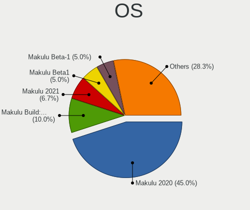

| Name                     | Computers | Percent |
|--------------------------|-----------|---------|
| Makulu 2020              | 27        | 60%     |
| Makulu Build: 2021.12.15 | 6         | 13.33%  |
| Makulu 2021              | 4         | 8.89%   |
| Makulu 2022.12.29        | 2         | 4.44%   |
| Makulu Buildvar          | 1         | 2.22%   |
| Makulu Build: 2022.01.06 | 1         | 2.22%   |
| Makulu Bld-2022.08.19    | 1         | 2.22%   |
| Makulu Bld-2022.08.10    | 1         | 2.22%   |
| Makulu 20                | 1         | 2.22%   |
| Makulu 14                | 1         | 2.22%   |

OS Family
---------

OS without a version

| Name   | Computers | Percent |
|--------|-----------|---------|
| Makulu | 45        | 100%    |

Kernel
------

Version of the Linux kernel

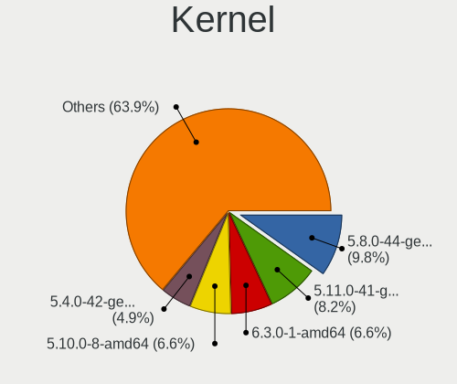

| Version                | Computers | Percent |
|------------------------|-----------|---------|
| 5.8.0-44-generic       | 6         | 13.04%  |
| 5.11.0-41-generic      | 5         | 10.87%  |
| 5.10.0-8-amd64         | 4         | 8.7%    |
| 5.4.0-42-generic       | 3         | 6.52%   |
| 5.11.0-43-generic      | 3         | 6.52%   |
| 5.8.0-50-generic       | 2         | 4.35%   |
| 5.15.0-56-generic      | 2         | 4.35%   |
| 5.14.0-2-amd64         | 2         | 4.35%   |
| 5.8.0-59-generic       | 1         | 2.17%   |
| 5.8.0-49-generic       | 1         | 2.17%   |
| 5.8.0-48-generic       | 1         | 2.17%   |
| 5.8.0-41-generic       | 1         | 2.17%   |
| 5.8.0-38-generic       | 1         | 2.17%   |
| 5.8.0-23-generic       | 1         | 2.17%   |
| 5.4.0-54-generic       | 1         | 2.17%   |
| 5.4.0-48-generic       | 1         | 2.17%   |
| 5.15.10-051510-generic | 1         | 2.17%   |
| 5.15.0-53-generic      | 1         | 2.17%   |
| 5.15.0-48-generic      | 1         | 2.17%   |
| 5.15.0-46-generic      | 1         | 2.17%   |
| 5.12.11-051211-generic | 1         | 2.17%   |
| 5.11.0-38-generic      | 1         | 2.17%   |
| 5.11.0-36-generic      | 1         | 2.17%   |
| 5.11.0-27-generic      | 1         | 2.17%   |
| 5.10.0-7-amd64         | 1         | 2.17%   |
| 5.10.0-3-amd64         | 1         | 2.17%   |
| 4.14.0-041400-generic  | 1         | 2.17%   |

Kernel Family
-------------

Linux kernel without a distro release

| Version | Computers | Percent |
|---------|-----------|---------|
| 5.8.0   | 14        | 30.43%  |
| 5.11.0  | 11        | 23.91%  |
| 5.10.0  | 6         | 13.04%  |
| 5.4.0   | 5         | 10.87%  |
| 5.15.0  | 5         | 10.87%  |
| 5.14.0  | 2         | 4.35%   |
| 5.15.10 | 1         | 2.17%   |
| 5.12.11 | 1         | 2.17%   |
| 4.14.0  | 1         | 2.17%   |

Kernel Major Ver.
-----------------

Linux kernel major version

| Version | Computers | Percent |
|---------|-----------|---------|
| 5.8     | 14        | 30.43%  |
| 5.11    | 11        | 23.91%  |
| 5.15    | 6         | 13.04%  |
| 5.10    | 6         | 13.04%  |
| 5.4     | 5         | 10.87%  |
| 5.14    | 2         | 4.35%   |
| 5.12    | 1         | 2.17%   |
| 4.14    | 1         | 2.17%   |

Arch
----

OS architecture (x86_64, i586, etc.)

| Name   | Computers | Percent |
|--------|-----------|---------|
| x86_64 | 45        | 100%    |

DE
--

Desktop Environment

| Name       | Computers | Percent |
|------------|-----------|---------|
| GNOME      | 31        | 68.89%  |
| X-Cinnamon | 12        | 26.67%  |
| Core       | 1         | 2.22%   |
| Cinnamon   | 1         | 2.22%   |

Display Server
--------------

X11 or Wayland

| Name | Computers | Percent |
|------|-----------|---------|
| X11  | 45        | 100%    |

Display Manager
---------------

SDDM, LightDM, etc.

| Name    | Computers | Percent |
|---------|-----------|---------|
| Unknown | 39        | 86.67%  |
| LightDM | 3         | 6.67%   |
| TDM     | 2         | 4.44%   |
| MDM     | 1         | 2.22%   |

OS Lang
-------

Language

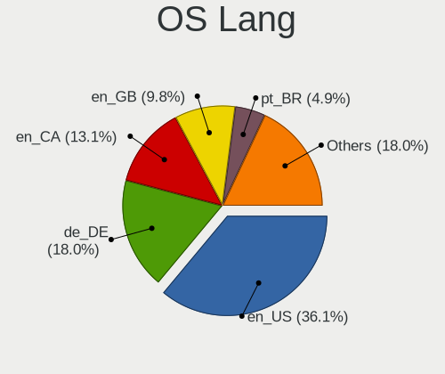

| Lang    | Computers | Percent |
|---------|-----------|---------|
| en_US   | 15        | 32.61%  |
| de_DE   | 10        | 21.74%  |
| en_CA   | 6         | 13.04%  |
| en_GB   | 4         | 8.7%    |
| pt_BR   | 2         | 4.35%   |
| it_IT   | 2         | 4.35%   |
| en_AU   | 2         | 4.35%   |
| tr_TR   | 1         | 2.17%   |
| pl_PL   | 1         | 2.17%   |
| nl_NL   | 1         | 2.17%   |
| eu_ES   | 1         | 2.17%   |
| Unknown | 1         | 2.17%   |

Boot Mode
---------

EFI or BIOS

| Mode | Computers | Percent |
|------|-----------|---------|
| BIOS | 29        | 63.04%  |
| EFI  | 17        | 36.96%  |

Filesystem
----------

Type of filesystem

| Type  | Computers | Percent |
|-------|-----------|---------|
| Ext4  | 43        | 93.48%  |
| Btrfs | 2         | 4.35%   |
| Tmpfs | 1         | 2.17%   |

Part. scheme
------------

Scheme of partitioning

| Type    | Computers | Percent |
|---------|-----------|---------|
| Unknown | 41        | 91.11%  |
| MBR     | 2         | 4.44%   |
| GPT     | 2         | 4.44%   |

Dual Boot with Linux/BSD
------------------------

Hosting more than one Linux/BSD

| Dual boot | Computers | Percent |
|-----------|-----------|---------|
| No        | 42        | 93.33%  |
| Yes       | 3         | 6.67%   |

Dual Boot (Win)
---------------

Hosting Linux and Windows

| Dual boot | Computers | Percent |
|-----------|-----------|---------|
| No        | 43        | 95.56%  |
| Yes       | 2         | 4.44%   |

Board
-----

Vendor
------

Motherboard manufacturer

| Name                | Computers | Percent |
|---------------------|-----------|---------|
| Dell                | 12        | 26.67%  |
| ASUSTek Computer    | 6         | 13.33%  |
| Hewlett-Packard     | 5         | 11.11%  |
| Gigabyte Technology | 5         | 11.11%  |
| Lenovo              | 4         | 8.89%   |
| MSI                 | 3         | 6.67%   |
| ASRock              | 2         | 4.44%   |
| Samsung Electronics | 1         | 2.22%   |
| HUAWEI              | 1         | 2.22%   |
| Flextronics         | 1         | 2.22%   |
| ELSA                | 1         | 2.22%   |
| Eii                 | 1         | 2.22%   |
| Apple               | 1         | 2.22%   |
| Alienware           | 1         | 2.22%   |
| Acer                | 1         | 2.22%   |

Model
-----

Motherboard model

| Name                          | Computers | Percent |
|-------------------------------|-----------|---------|
| Samsung R580                  | 1         | 2.22%   |
| MSI PPPPPPP-CCC#MMMMMMMM      | 1         | 2.22%   |
| MSI MS-7721                   | 1         | 2.22%   |
| MSI MS-7693                   | 1         | 2.22%   |
| Lenovo V14-IIL 82C4           | 1         | 2.22%   |
| Lenovo ThinkPad T420 4236W1W  | 1         | 2.22%   |
| Lenovo IdeaPad Y530           | 1         | 2.22%   |
| Lenovo IdeaCentre K430        | 1         | 2.22%   |
| HUAWEI KPL-W0X                | 1         | 2.22%   |
| HP ProLiant DL360 G7          | 1         | 2.22%   |
| HP Pavilion Laptop 15z-cw100  | 1         | 2.22%   |
| HP Pavilion 17                | 1         | 2.22%   |
| HP ENVY Notebook              | 1         | 2.22%   |
| HP Compaq 15                  | 1         | 2.22%   |
| Gigabyte Z390 AORUS ULTRA     | 1         | 2.22%   |
| Gigabyte GA-MA785GM-US2H      | 1         | 2.22%   |
| Gigabyte GA-880GM-UD2H        | 1         | 2.22%   |
| Gigabyte B85M-HD3             | 1         | 2.22%   |
| Gigabyte 990FXA-UD5           | 1         | 2.22%   |
| Flextronics 7238US00          | 1         | 2.22%   |
| ELSA EA H410M-E               | 1         | 2.22%   |
| Eii M1T                       | 1         | 2.22%   |
| Dell XPS420                   | 1         | 2.22%   |
| Dell Precision Tower 3620     | 1         | 2.22%   |
| Dell OptiPlex 9020            | 1         | 2.22%   |
| Dell OptiPlex 7010            | 1         | 2.22%   |
| Dell Latitude E64406342Q0286/ | 1         | 2.22%   |
| Dell Latitude 3540            | 1         | 2.22%   |
| Dell Inspiron One 2305        | 1         | 2.22%   |
| Dell Inspiron 7790 AIO        | 1         | 2.22%   |
| Dell Inspiron 660s            | 1         | 2.22%   |
| Dell Inspiron 580             | 1         | 2.22%   |
| Dell Inspiron 5565            | 1         | 2.22%   |
| Dell Inspiron 3521            | 1         | 2.22%   |
| ASUS TUF Gaming B550M-PLUS    | 1         | 2.22%   |
| ASUS PRIME B450M-A            | 1         | 2.22%   |
| ASUS P5QC                     | 1         | 2.22%   |
| ASUS N55SL                    | 1         | 2.22%   |
| ASUS M5A97 R2.0               | 1         | 2.22%   |
| ASUS K55VD                    | 1         | 2.22%   |

Model Family
------------

Motherboard model prefix

| Name                     | Computers | Percent |
|--------------------------|-----------|---------|
| Dell Inspiron            | 6         | 13.33%  |
| HP Pavilion              | 2         | 4.44%   |
| Dell OptiPlex            | 2         | 4.44%   |
| Dell Latitude            | 2         | 4.44%   |
| Samsung R580             | 1         | 2.22%   |
| MSI PPPPPPP-CCC#MMMMMMMM | 1         | 2.22%   |
| MSI MS-7721              | 1         | 2.22%   |
| MSI MS-7693              | 1         | 2.22%   |
| Lenovo V14-IIL           | 1         | 2.22%   |
| Lenovo ThinkPad          | 1         | 2.22%   |
| Lenovo IdeaPad           | 1         | 2.22%   |
| Lenovo IdeaCentre        | 1         | 2.22%   |
| HUAWEI KPL-W0X           | 1         | 2.22%   |
| HP ProLiant              | 1         | 2.22%   |
| HP ENVY                  | 1         | 2.22%   |
| HP Compaq                | 1         | 2.22%   |
| Gigabyte Z390            | 1         | 2.22%   |
| Gigabyte GA-MA785GM-US2H | 1         | 2.22%   |
| Gigabyte GA-880GM-UD2H   | 1         | 2.22%   |
| Gigabyte B85M-HD3        | 1         | 2.22%   |
| Gigabyte 990FXA-UD5      | 1         | 2.22%   |
| Flextronics 7238US00     | 1         | 2.22%   |
| ELSA EA                  | 1         | 2.22%   |
| Eii M1T                  | 1         | 2.22%   |
| Dell XPS420              | 1         | 2.22%   |
| Dell Precision           | 1         | 2.22%   |
| ASUS TUF                 | 1         | 2.22%   |
| ASUS PRIME               | 1         | 2.22%   |
| ASUS P5QC                | 1         | 2.22%   |
| ASUS N55SL               | 1         | 2.22%   |
| ASUS M5A97               | 1         | 2.22%   |
| ASUS K55VD               | 1         | 2.22%   |
| ASRock Z77               | 1         | 2.22%   |
| ASRock B450              | 1         | 2.22%   |
| Apple MacBookAir6        | 1         | 2.22%   |
| Alienware Aurora         | 1         | 2.22%   |
| Acer Nitro               | 1         | 2.22%   |

MFG Year
--------

Motherboard manufacture year

| Year | Computers | Percent |
|------|-----------|---------|
| 2013 | 8         | 17.78%  |
| 2012 | 7         | 15.56%  |
| 2020 | 5         | 11.11%  |
| 2018 | 5         | 11.11%  |
| 2010 | 4         | 8.89%   |
| 2014 | 3         | 6.67%   |
| 2009 | 3         | 6.67%   |
| 2019 | 2         | 4.44%   |
| 2011 | 2         | 4.44%   |
| 2008 | 2         | 4.44%   |
| 2017 | 1         | 2.22%   |
| 2016 | 1         | 2.22%   |
| 2015 | 1         | 2.22%   |
| 2007 | 1         | 2.22%   |

Form Factor
-----------

Physical design of the computer

| Name       | Computers | Percent |
|------------|-----------|---------|
| Desktop    | 26        | 57.78%  |
| Notebook   | 16        | 35.56%  |
| All in one | 2         | 4.44%   |
| Server     | 1         | 2.22%   |

Secure Boot
-----------

Enabled or disabled

| State    | Computers | Percent |
|----------|-----------|---------|
| Disabled | 45        | 100%    |

Coreboot
--------

Have coreboot on board

| Used | Computers | Percent |
|------|-----------|---------|
| No   | 45        | 100%    |

RAM Size
--------

Total RAM memory

| Size in GB | Computers | Percent |
|------------|-----------|---------|
| 4.01-8.0   | 13        | 28.26%  |
| 3.01-4.0   | 13        | 28.26%  |
| 8.01-16.0  | 9         | 19.57%  |
| 32.01-64.0 | 7         | 15.22%  |
| 16.01-24.0 | 4         | 8.7%    |

RAM Used
--------

Used RAM memory

| Used GB  | Computers | Percent |
|----------|-----------|---------|
| 2.01-3.0 | 22        | 44.9%   |
| 1.01-2.0 | 21        | 42.86%  |
| 3.01-4.0 | 4         | 8.16%   |
| 4.01-8.0 | 2         | 4.08%   |

Total Drives
------------

Number of drives on board

| Drives | Computers | Percent |
|--------|-----------|---------|
| 1      | 29        | 63.04%  |
| 2      | 8         | 17.39%  |
| 4      | 4         | 8.7%    |
| 3      | 4         | 8.7%    |
| 5      | 1         | 2.17%   |

Has CD-ROM
----------

Has CD-ROM on board

| Presented | Computers | Percent |
|-----------|-----------|---------|
| Yes       | 26        | 57.78%  |
| No        | 19        | 42.22%  |

Has Ethernet
------------

Has Ethernet on board

| Presented | Computers | Percent |
|-----------|-----------|---------|
| Yes       | 40        | 88.89%  |
| No        | 5         | 11.11%  |

Has WiFi
--------

Has WiFi module

| Presented | Computers | Percent |
|-----------|-----------|---------|
| Yes       | 32        | 69.57%  |
| No        | 14        | 30.43%  |

Has Bluetooth
-------------

Has Bluetooth module

| Presented | Computers | Percent |
|-----------|-----------|---------|
| No        | 23        | 51.11%  |
| Yes       | 22        | 48.89%  |

Location
--------

Country
-------

Geographic location (country)

| Country     | Computers | Percent |
|-------------|-----------|---------|
| USA         | 12        | 26.67%  |
| Germany     | 9         | 20%     |
| Canada      | 6         | 13.33%  |
| UK          | 5         | 11.11%  |
| Australia   | 3         | 6.67%   |
| Italy       | 2         | 4.44%   |
| Brazil      | 2         | 4.44%   |
| Uganda      | 1         | 2.22%   |
| Turkey      | 1         | 2.22%   |
| Switzerland | 1         | 2.22%   |
| Spain       | 1         | 2.22%   |
| Poland      | 1         | 2.22%   |
| Netherlands | 1         | 2.22%   |

City
----

Geographic location (city)

| City                | Computers | Percent |
|---------------------|-----------|---------|
| Dallas              | 2         | 4.26%   |
| Berlin              | 2         | 4.26%   |
| Zurich              | 1         | 2.13%   |
| Weirton             | 1         | 2.13%   |
| Tacoma              | 1         | 2.13%   |
| Sydney              | 1         | 2.13%   |
| Steinfeld           | 1         | 2.13%   |
| Spanaway            | 1         | 2.13%   |
| Santurtzi           | 1         | 2.13%   |
| Saint John          | 1         | 2.13%   |
| Pinhalzinho         | 1         | 2.13%   |
| Palmopolis          | 1         | 2.13%   |
| Oschersleben        | 1         | 2.13%   |
| Oberhausen          | 1         | 2.13%   |
| Munich              | 1         | 2.13%   |
| Millers Creek       | 1         | 2.13%   |
| Melbourne           | 1         | 2.13%   |
| Mayen               | 1         | 2.13%   |
| Manitouwadge        | 1         | 2.13%   |
| Manchester          | 1         | 2.13%   |
| Los Angeles         | 1         | 2.13%   |
| London              | 1         | 2.13%   |
| Lodz                | 1         | 2.13%   |
| Kitchener           | 1         | 2.13%   |
| Kampala             | 1         | 2.13%   |
| Jamestown           | 1         | 2.13%   |
| Izmir               | 1         | 2.13%   |
| Imperia             | 1         | 2.13%   |
| Hillegom            | 1         | 2.13%   |
| Helensburgh         | 1         | 2.13%   |
| Heidenrod           | 1         | 2.13%   |
| Freisbach           | 1         | 2.13%   |
| Etobicoke           | 1         | 2.13%   |
| Einbeck             | 1         | 2.13%   |
| Edmonton            | 1         | 2.13%   |
| Dollard-des-Ormeaux | 1         | 2.13%   |
| Brunswick West      | 1         | 2.13%   |
| Brugherio           | 1         | 2.13%   |
| Beaverton           | 1         | 2.13%   |
| Ballygowan          | 1         | 2.13%   |

Drives
------

Drive Vendor
------------

Hard drive vendors

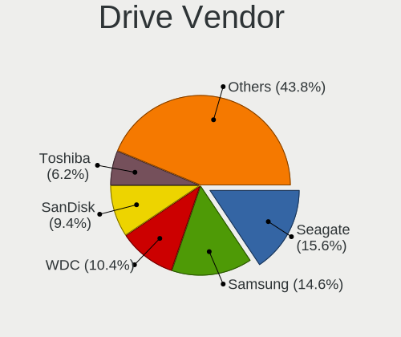

| Vendor                    | Computers | Drives | Percent |
|---------------------------|-----------|--------|---------|
| Seagate                   | 14        | 17     | 20%     |
| Samsung Electronics       | 8         | 11     | 11.43%  |
| SanDisk                   | 7         | 7      | 10%     |
| WDC                       | 6         | 8      | 8.57%   |
| Toshiba                   | 5         | 5      | 7.14%   |
| Unknown                   | 3         | 3      | 4.29%   |
| Kingston                  | 3         | 4      | 4.29%   |
| Hitachi                   | 3         | 3      | 4.29%   |
| JMicron Technology        | 2         | 2      | 2.86%   |
| Transcend                 | 1         | 1      | 1.43%   |
| T-FORCE                   | 1         | 1      | 1.43%   |
| SK hynix                  | 1         | 1      | 1.43%   |
| Origin                    | 1         | 1      | 1.43%   |
| ORICO                     | 1         | 1      | 1.43%   |
| Micron/Crucial Technology | 1         | 1      | 1.43%   |
| Micron Technology         | 1         | 1      | 1.43%   |
| Maxtor                    | 1         | 1      | 1.43%   |
| LITEONIT                  | 1         | 1      | 1.43%   |
| LITEON                    | 1         | 2      | 1.43%   |
| Leven                     | 1         | 1      | 1.43%   |
| KIOXIA                    | 1         | 1      | 1.43%   |
| Intenso                   | 1         | 1      | 1.43%   |
| HGST                      | 1         | 1      | 1.43%   |
| Crucial                   | 1         | 1      | 1.43%   |
| China                     | 1         | 1      | 1.43%   |
| ASMT                      | 1         | 1      | 1.43%   |
| Apple                     | 1         | 1      | 1.43%   |
| A-DATA Technology         | 1         | 1      | 1.43%   |

Drive Model
-----------

Hard drive models

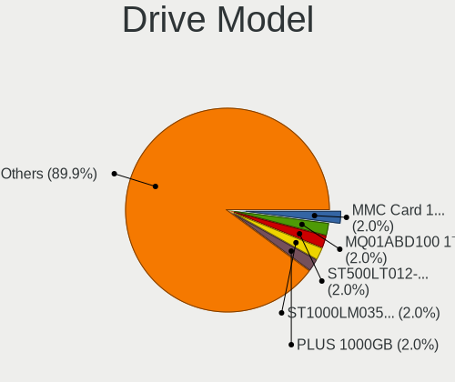

| Model                                        | Computers | Percent |
|----------------------------------------------|-----------|---------|
| Unknown MMC Card  128GB                      | 2         | 2.74%   |
| Toshiba MQ01ABD100 1TB                       | 2         | 2.74%   |
| Seagate ST500LT012-1DG142 500GB              | 2         | 2.74%   |
| Seagate ST1000LM035-1RK172 1TB               | 2         | 2.74%   |
| SanDisk SSD PLUS 1000GB                      | 2         | 2.74%   |
| SanDisk NVMe SSD Drive 500GB                 | 2         | 2.74%   |
| Samsung NVMe SSD Drive 1TB                   | 2         | 2.74%   |
| Kingston SA400S37240G 240GB SSD              | 2         | 2.74%   |
| WDC WDS100T2B0A-00SM50 1TB SSD               | 1         | 1.37%   |
| WDC WD7501AAES-75W7A0 752GB                  | 1         | 1.37%   |
| WDC WD5000AADS-00L4B1 500GB                  | 1         | 1.37%   |
| WDC WD3200AAKS-75L9A0 320GB                  | 1         | 1.37%   |
| WDC WD1600AAJS-22PSA0 160GB                  | 1         | 1.37%   |
| WDC WD10EZEX-00KUWA0 1TB                     | 1         | 1.37%   |
| Unknown SD/MMC/MS PRO 2GB                    | 1         | 1.37%   |
| Transcend TS64GMSA230S 64GB SSD              | 1         | 1.37%   |
| Toshiba NVMe SSD Drive 512GB                 | 1         | 1.37%   |
| Toshiba MQ01ABF050M 500GB                    | 1         | 1.37%   |
| Toshiba DT01ACA050 500GB                     | 1         | 1.37%   |
| T-FORCE 1TB                                  | 1         | 1.37%   |
| SK hynix NVMe SSD Drive 512GB                | 1         | 1.37%   |
| Seagate ST940210AS 40GB                      | 1         | 1.37%   |
| Seagate ST9320325AS 320GB                    | 1         | 1.37%   |
| Seagate ST500DM002-1BD142 500GB              | 1         | 1.37%   |
| Seagate ST3500418AS 500GB                    | 1         | 1.37%   |
| Seagate ST3320820AS 320GB                    | 1         | 1.37%   |
| Seagate ST3320620AS 320GB                    | 1         | 1.37%   |
| Seagate ST31000524AS 1TB                     | 1         | 1.37%   |
| Seagate ST250DM000-1BD141 250GB              | 1         | 1.37%   |
| Seagate ST1000LM024 HN-M101MBB 1TB           | 1         | 1.37%   |
| Seagate Expansion Desk 6TB                   | 1         | 1.37%   |
| Seagate BarraCuda 120 SSD ZA500CM10003 500GB | 1         | 1.37%   |
| SanDisk SSD U110 128GB                       | 1         | 1.37%   |
| SanDisk SSD PLUS 480GB                       | 1         | 1.37%   |
| SanDisk NVMe SSD Drive 512GB                 | 1         | 1.37%   |
| Samsung SSD 870 QVO 2TB                      | 1         | 1.37%   |
| Samsung SSD 860 EVO mSATA 500GB              | 1         | 1.37%   |
| Samsung SM963 2.5" NVMe PCIe SSD 250GB       | 1         | 1.37%   |
| Samsung NVMe SSD Drive 1024GB                | 1         | 1.37%   |
| Samsung MZVLB256HAHQ-000L7 256GB             | 1         | 1.37%   |

HDD Vendor
----------

Hard disk drive vendors

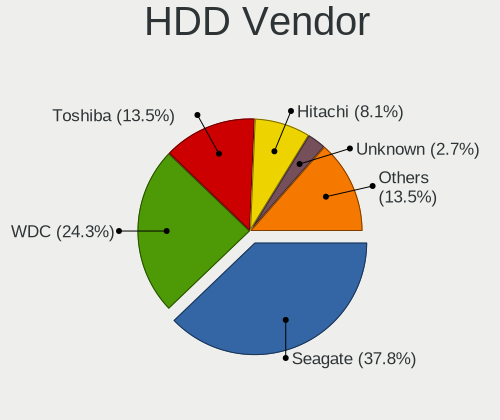

| Vendor              | Computers | Drives | Percent |
|---------------------|-----------|--------|---------|
| Seagate             | 13        | 16     | 43.33%  |
| WDC                 | 5         | 7      | 16.67%  |
| Toshiba             | 4         | 4      | 13.33%  |
| Hitachi             | 3         | 3      | 10%     |
| Unknown             | 1         | 1      | 3.33%   |
| Samsung Electronics | 1         | 1      | 3.33%   |
| Maxtor              | 1         | 1      | 3.33%   |
| HGST                | 1         | 1      | 3.33%   |
| ASMT                | 1         | 1      | 3.33%   |

SSD Vendor
----------

Solid state drive vendors

| Vendor              | Computers | Drives | Percent |
|---------------------|-----------|--------|---------|
| SanDisk             | 4         | 4      | 16%     |
| Samsung Electronics | 4         | 5      | 16%     |
| Kingston            | 3         | 4      | 12%     |
| WDC                 | 1         | 1      | 4%      |
| Transcend           | 1         | 1      | 4%      |
| Seagate             | 1         | 1      | 4%      |
| Origin              | 1         | 1      | 4%      |
| Micron Technology   | 1         | 1      | 4%      |
| LITEONIT            | 1         | 1      | 4%      |
| LITEON              | 1         | 2      | 4%      |
| Leven               | 1         | 1      | 4%      |
| JMicron Technology  | 1         | 1      | 4%      |
| Intenso             | 1         | 1      | 4%      |
| Crucial             | 1         | 1      | 4%      |
| China               | 1         | 1      | 4%      |
| Apple               | 1         | 1      | 4%      |
| A-DATA Technology   | 1         | 1      | 4%      |

Drive Kind
----------

HDD or SSD

| Kind    | Computers | Drives | Percent |
|---------|-----------|--------|---------|
| HDD     | 26        | 35     | 43.33%  |
| SSD     | 21        | 28     | 35%     |
| NVMe    | 8         | 12     | 13.33%  |
| Unknown | 3         | 3      | 5%      |
| MMC     | 2         | 2      | 3.33%   |

Drive Connector
---------------

SATA, SAS, NVMe, etc.

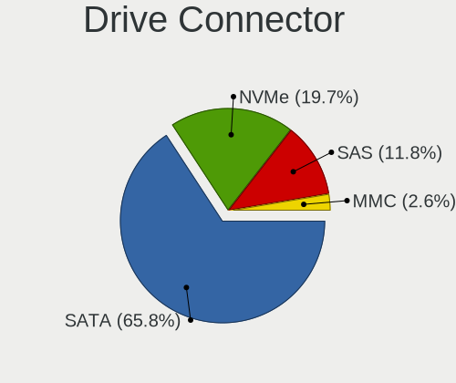

| Type | Computers | Drives | Percent |
|------|-----------|--------|---------|
| SATA | 40        | 58     | 70.18%  |
| NVMe | 8         | 12     | 14.04%  |
| SAS  | 7         | 8      | 12.28%  |
| MMC  | 2         | 2      | 3.51%   |

Drive Size
----------

Size of hard drive

| Size in TB | Computers | Drives | Percent |
|------------|-----------|--------|---------|
| 0.01-0.5   | 29        | 43     | 63.04%  |
| 0.51-1.0   | 15        | 18     | 32.61%  |
| 1.01-2.0   | 1         | 1      | 2.17%   |
| 4.01-10.0  | 1         | 1      | 2.17%   |

Space Total
-----------

Amount of disk space available on the file system

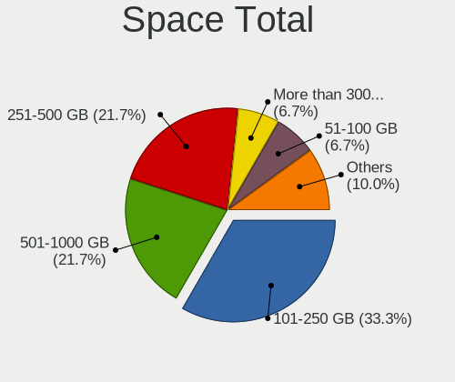

| Size in GB     | Computers | Percent |
|----------------|-----------|---------|
| 101-250        | 17        | 36.96%  |
| 501-1000       | 10        | 21.74%  |
| 251-500        | 8         | 17.39%  |
| 1001-2000      | 3         | 6.52%   |
| 51-100         | 3         | 6.52%   |
| More than 3000 | 2         | 4.35%   |
| 21-50          | 2         | 4.35%   |
| 1-20           | 1         | 2.17%   |

Space Used
----------

Amount of used disk space

| Used GB        | Computers | Percent |
|----------------|-----------|---------|
| 1-20           | 20        | 40%     |
| 21-50          | 14        | 28%     |
| 251-500        | 7         | 14%     |
| 51-100         | 6         | 12%     |
| More than 3000 | 2         | 4%      |
| 101-250        | 1         | 2%      |

Malfunc. Drives
---------------

Drive models with a malfunction

| Model                       | Computers | Drives | Percent |
|-----------------------------|-----------|--------|---------|
| WDC WD3200AAKS-75L9A0 320GB | 1         | 2      | 50%     |
| Seagate ST31000524AS 1TB    | 1         | 1      | 50%     |

Malfunc. Drive Vendor
---------------------

Vendors of faulty drives

| Vendor  | Computers | Drives | Percent |
|---------|-----------|--------|---------|
| WDC     | 1         | 2      | 50%     |
| Seagate | 1         | 1      | 50%     |

Malfunc. HDD Vendor
-------------------

Vendors of faulty HDD drives

| Vendor  | Computers | Drives | Percent |
|---------|-----------|--------|---------|
| WDC     | 1         | 2      | 50%     |
| Seagate | 1         | 1      | 50%     |

Malfunc. Drive Kind
-------------------

Kinds of faulty drives

| Kind | Computers | Drives | Percent |
|------|-----------|--------|---------|
| HDD  | 2         | 3      | 100%    |

Failed Drives
-------------

Failed drive models

Zero info for selected period =(

Failed Drive Vendor
-------------------

Failed drive vendors

Zero info for selected period =(

Drive Status
------------

Number of failed and malfunc. drives

| Status   | Computers | Drives | Percent |
|----------|-----------|--------|---------|
| Detected | 41        | 71     | 89.13%  |
| Works    | 3         | 6      | 6.52%   |
| Malfunc  | 2         | 3      | 4.35%   |

Storage controller
------------------

Storage Vendor
--------------

Storage controller vendors

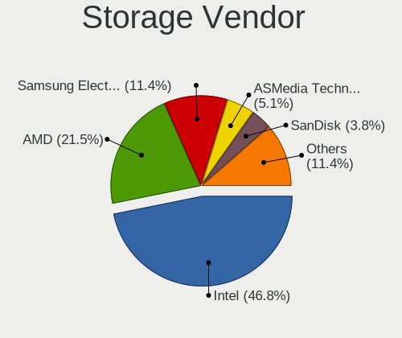

| Vendor                       | Computers | Percent |
|------------------------------|-----------|---------|
| Intel                        | 27        | 45%     |
| AMD                          | 15        | 25%     |
| Samsung Electronics          | 5         | 8.33%   |
| SanDisk                      | 3         | 5%      |
| ASMedia Technology           | 3         | 5%      |
| Marvell Technology Group     | 2         | 3.33%   |
| Toshiba America Info Systems | 1         | 1.67%   |
| SK hynix                     | 1         | 1.67%   |
| Micron/Crucial Technology    | 1         | 1.67%   |
| KIOXIA                       | 1         | 1.67%   |
| Hewlett-Packard              | 1         | 1.67%   |

Storage Model
-------------

Storage controller models

| Model                                                                          | Computers | Percent |
|--------------------------------------------------------------------------------|-----------|---------|
| AMD FCH SATA Controller [AHCI mode]                                            | 7         | 10.61%  |
| Intel 7 Series/C210 Series Chipset Family 6-port SATA Controller [AHCI mode]   | 4         | 6.06%   |
| AMD SB7x0/SB8x0/SB9x0 SATA Controller [AHCI mode]                              | 4         | 6.06%   |
| Samsung NVMe SSD Controller SM981/PM981/PM983                                  | 3         | 4.55%   |
| AMD SB7x0/SB8x0/SB9x0 IDE Controller                                           | 3         | 4.55%   |
| Intel SATA Controller [RAID mode]                                              | 2         | 3.03%   |
| Intel Cannon Lake PCH SATA AHCI Controller                                     | 2         | 3.03%   |
| Intel 8 Series/C220 Series Chipset Family 6-port SATA Controller 1 [AHCI mode] | 2         | 3.03%   |
| Intel 7 Series Chipset Family 6-port SATA Controller [AHCI mode]               | 2         | 3.03%   |
| Intel 6 Series/C200 Series Chipset Family 6 port Mobile SATA AHCI Controller   | 2         | 3.03%   |
| ASMedia ASM1062 Serial ATA Controller                                          | 2         | 3.03%   |
| AMD SB7x0/SB8x0/SB9x0 SATA Controller [IDE mode]                               | 2         | 3.03%   |
| AMD 400 Series Chipset SATA Controller                                         | 2         | 3.03%   |
| Toshiba America Info Systems XG4 NVMe SSD Controller                           | 1         | 1.52%   |
| SK hynix PC400 NVMe SSD                                                        | 1         | 1.52%   |
| SanDisk WD Blue SN550 NVMe SSD                                                 | 1         | 1.52%   |
| SanDisk WD Blue SN500 / PC SN520 NVMe SSD                                      | 1         | 1.52%   |
| SanDisk Non-Volatile memory controller                                         | 1         | 1.52%   |
| Samsung NVMe SSD Controller SM961/PM961/SM963                                  | 1         | 1.52%   |
| Samsung Apple PCIe SSD                                                         | 1         | 1.52%   |
| Micron/Crucial P2 NVMe PCIe SSD                                                | 1         | 1.52%   |
| Marvell Group 88SE9172 SATA 6Gb/s Controller                                   | 1         | 1.52%   |
| Marvell Group 88SE6111/6121 SATA II / PATA Controller                          | 1         | 1.52%   |
| KIOXIA NVMe SSD Controller BG4                                                 | 1         | 1.52%   |
| Intel Sunrise Point-LP SATA Controller [AHCI mode]                             | 1         | 1.52%   |
| Intel Q170/Q150/B150/H170/H110/Z170/CM236 Chipset SATA Controller [AHCI Mode]  | 1         | 1.52%   |
| Intel NM10/ICH7 Family SATA Controller [IDE mode]                              | 1         | 1.52%   |
| Intel Ice Lake-LP SATA Controller [AHCI mode]                                  | 1         | 1.52%   |
| Intel Celeron/Pentium Silver Processor SATA Controller                         | 1         | 1.52%   |
| Intel 82801JI (ICH10 Family) 4 port SATA IDE Controller #1                     | 1         | 1.52%   |
| Intel 82801JI (ICH10 Family) 2 port SATA IDE Controller #2                     | 1         | 1.52%   |
| Intel 82801IBM/IEM (ICH9M/ICH9M-E) 4 port SATA Controller [AHCI mode]          | 1         | 1.52%   |
| Intel 82801 Mobile SATA Controller [RAID mode]                                 | 1         | 1.52%   |
| Intel 8 Series/C220 Series Chipset Family IDE-r Controller                     | 1         | 1.52%   |
| Intel 8 Series SATA Controller 1 [AHCI mode]                                   | 1         | 1.52%   |
| Intel 5 Series/3400 Series Chipset 4 port SATA IDE Controller                  | 1         | 1.52%   |
| Intel 5 Series/3400 Series Chipset 4 port SATA AHCI Controller                 | 1         | 1.52%   |
| Intel 400 Series Chipset Family SATA AHCI Controller                           | 1         | 1.52%   |
| Intel 200 Series PCH SATA controller [AHCI mode]                               | 1         | 1.52%   |
| HP Smart Array G6 controllers                                                  | 1         | 1.52%   |

Storage Kind
------------

Kind of storage controller (IDE, SATA, NVMe, SAS, ...)

| Kind | Computers | Percent |
|------|-----------|---------|
| SATA | 37        | 64.91%  |
| NVMe | 8         | 14.04%  |
| IDE  | 8         | 14.04%  |
| RAID | 4         | 7.02%   |

Processor
---------

CPU Vendor
----------

Processor vendors

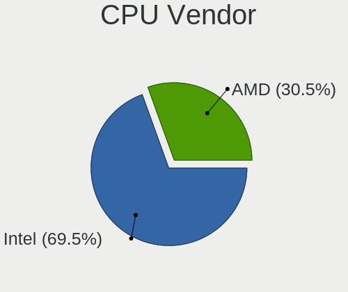

| Vendor | Computers | Percent |
|--------|-----------|---------|
| Intel  | 29        | 64.44%  |
| AMD    | 16        | 35.56%  |

CPU Model
---------

Processor models

| Model                                         | Computers | Percent |
|-----------------------------------------------|-----------|---------|
| Intel Core 2 Quad CPU Q6600 @ 2.40GHz         | 2         | 4.44%   |
| Intel Xeon CPU X5650 @ 2.67GHz                | 1         | 2.22%   |
| Intel Pentium Dual-Core CPU T4200 @ 2.00GHz   | 1         | 2.22%   |
| Intel Pentium Dual-Core CPU E5700 @ 3.00GHz   | 1         | 2.22%   |
| Intel Pentium CPU G2030 @ 3.00GHz             | 1         | 2.22%   |
| Intel Core i7-9700 CPU @ 3.00GHz              | 1         | 2.22%   |
| Intel Core i7-8700 CPU @ 3.20GHz              | 1         | 2.22%   |
| Intel Core i7-6700K CPU @ 4.00GHz             | 1         | 2.22%   |
| Intel Core i7-4770 CPU @ 3.40GHz              | 1         | 2.22%   |
| Intel Core i7-4600M CPU @ 2.90GHz             | 1         | 2.22%   |
| Intel Core i7-3770 CPU @ 3.40GHz              | 1         | 2.22%   |
| Intel Core i7-3630QM CPU @ 2.40GHz            | 1         | 2.22%   |
| Intel Core i7-2670QM CPU @ 2.20GHz            | 1         | 2.22%   |
| Intel Core i7-10510U CPU @ 1.80GHz            | 1         | 2.22%   |
| Intel Core i5-9400 CPU @ 2.90GHz              | 1         | 2.22%   |
| Intel Core i5-6200U CPU @ 2.30GHz             | 1         | 2.22%   |
| Intel Core i5-4260U CPU @ 1.40GHz             | 1         | 2.22%   |
| Intel Core i5-3570K CPU @ 3.40GHz             | 1         | 2.22%   |
| Intel Core i5-3470 CPU @ 3.20GHz              | 1         | 2.22%   |
| Intel Core i5-2520M CPU @ 2.50GHz             | 1         | 2.22%   |
| Intel Core i5-10400 CPU @ 2.90GHz             | 1         | 2.22%   |
| Intel Core i5 CPU M 520 @ 2.40GHz             | 1         | 2.22%   |
| Intel Core i3-4160 CPU @ 3.60GHz              | 1         | 2.22%   |
| Intel Core i3-4030U CPU @ 1.90GHz             | 1         | 2.22%   |
| Intel Core i3-3217U CPU @ 1.80GHz             | 1         | 2.22%   |
| Intel Core i3-1005G1 CPU @ 1.20GHz            | 1         | 2.22%   |
| Intel Core i3 CPU 550 @ 3.20GHz               | 1         | 2.22%   |
| Intel Celeron N4100 CPU @ 1.10GHz             | 1         | 2.22%   |
| AMD Ryzen 7 3700X 8-Core Processor            | 1         | 2.22%   |
| AMD Ryzen 7 3700U with Radeon Vega Mobile Gfx | 1         | 2.22%   |
| AMD Ryzen 5 3400G with Radeon Vega Graphics   | 1         | 2.22%   |
| AMD Ryzen 5 2500U with Radeon Vega Mobile Gfx | 1         | 2.22%   |
| AMD Ryzen 3 3200G with Radeon Vega Graphics   | 1         | 2.22%   |
| AMD R-464L APU with Radeon HD Graphics        | 1         | 2.22%   |
| AMD Phenom II X4 955 Processor                | 1         | 2.22%   |
| AMD Phenom 9750 Quad-Core Processor           | 1         | 2.22%   |
| AMD FX-9590 Eight-Core Processor              | 1         | 2.22%   |
| AMD FX-8370 Eight-Core Processor              | 1         | 2.22%   |
| AMD FX-4300 Quad-Core Processor               | 1         | 2.22%   |
| AMD E1-2100 APU with Radeon HD Graphics       | 1         | 2.22%   |

CPU Model Family
----------------

Processor model prefix

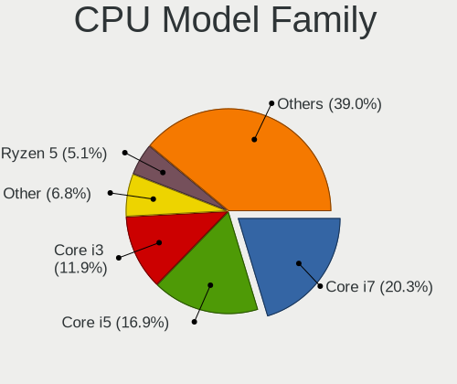

| Model                   | Computers | Percent |
|-------------------------|-----------|---------|
| Intel Core i7           | 9         | 20%     |
| Intel Core i5           | 8         | 17.78%  |
| Intel Core i3           | 5         | 11.11%  |
| AMD FX                  | 3         | 6.67%   |
| Intel Pentium Dual-Core | 2         | 4.44%   |
| Intel Core 2 Quad       | 2         | 4.44%   |
| AMD Ryzen 7             | 2         | 4.44%   |
| AMD Ryzen 5             | 2         | 4.44%   |
| Other                   | 1         | 2.22%   |
| Intel Xeon              | 1         | 2.22%   |
| Intel Pentium           | 1         | 2.22%   |
| Intel Celeron           | 1         | 2.22%   |
| AMD Ryzen 3             | 1         | 2.22%   |
| AMD Phenom II X4        | 1         | 2.22%   |
| AMD Phenom              | 1         | 2.22%   |
| AMD E1                  | 1         | 2.22%   |
| AMD Athlon II X2        | 1         | 2.22%   |
| AMD A8                  | 1         | 2.22%   |
| AMD A4                  | 1         | 2.22%   |
| AMD A12                 | 1         | 2.22%   |

CPU Cores
---------

Number of processor cores

| Number | Computers | Percent |
|--------|-----------|---------|
| 4      | 20        | 44.44%  |
| 2      | 19        | 42.22%  |
| 6      | 3         | 6.67%   |
| 8      | 2         | 4.44%   |
| 12     | 1         | 2.22%   |

CPU Sockets
-----------

Number of sockets

| Number | Computers | Percent |
|--------|-----------|---------|
| 1      | 44        | 97.78%  |
| 2      | 1         | 2.22%   |

CPU Threads
-----------

Threads per core (Hyper-Threading)

| Number | Computers | Percent |
|--------|-----------|---------|
| 2      | 28        | 62.22%  |
| 1      | 17        | 37.78%  |

CPU Op-Modes
------------

CPU Operation Modes (32-bit, 64-bit)

| Op mode        | Computers | Percent |
|----------------|-----------|---------|
| 32-bit, 64-bit | 45        | 100%    |

CPU Microcode
-------------

Microcode number

| Number     | Computers | Percent |
|------------|-----------|---------|
| Unknown    | 11        | 23.4%   |
| 0x306a9    | 5         | 10.64%  |
| 0x40651    | 2         | 4.26%   |
| 0x306c3    | 2         | 4.26%   |
| 0x206a7    | 2         | 4.26%   |
| 0x08108109 | 2         | 4.26%   |
| 0x06001119 | 2         | 4.26%   |
| 0x06000852 | 2         | 4.26%   |
| 0x906ed    | 1         | 2.13%   |
| 0x806ec    | 1         | 2.13%   |
| 0x706a1    | 1         | 2.13%   |
| 0x6fb      | 1         | 2.13%   |
| 0x506e3    | 1         | 2.13%   |
| 0x406e3    | 1         | 2.13%   |
| 0x206c2    | 1         | 2.13%   |
| 0x20655    | 1         | 2.13%   |
| 0x20652    | 1         | 2.13%   |
| 0x1067a    | 1         | 2.13%   |
| 0x08701021 | 1         | 2.13%   |
| 0x08108102 | 1         | 2.13%   |
| 0x08101007 | 1         | 2.13%   |
| 0x07000110 | 1         | 2.13%   |
| 0x0700010f | 1         | 2.13%   |
| 0x06006118 | 1         | 2.13%   |
| 0x010000c9 | 1         | 2.13%   |
| 0x010000c8 | 1         | 2.13%   |
| 0x010000c7 | 1         | 2.13%   |

CPU Microarch
-------------

Microarchitecture

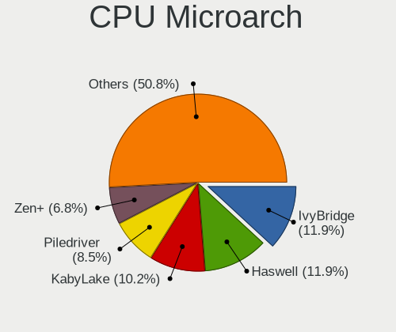

| Name          | Computers | Percent |
|---------------|-----------|---------|
| IvyBridge     | 6         | 13.33%  |
| Piledriver    | 5         | 11.11%  |
| Haswell       | 5         | 11.11%  |
| KabyLake      | 4         | 8.89%   |
| Zen+          | 3         | 6.67%   |
| Westmere      | 3         | 6.67%   |
| K10           | 3         | 6.67%   |
| Skylake       | 2         | 4.44%   |
| SandyBridge   | 2         | 4.44%   |
| Penryn        | 2         | 4.44%   |
| Jaguar        | 2         | 4.44%   |
| Core          | 2         | 4.44%   |
| Zen 2         | 1         | 2.22%   |
| Zen           | 1         | 2.22%   |
| IceLake       | 1         | 2.22%   |
| Goldmont plus | 1         | 2.22%   |
| Excavator     | 1         | 2.22%   |
| CometLake     | 1         | 2.22%   |

Graphics
--------

GPU Vendor
----------

Vendors of graphics cards

| Vendor | Computers | Percent |
|--------|-----------|---------|
| Intel  | 20        | 38.46%  |
| Nvidia | 16        | 30.77%  |
| AMD    | 16        | 30.77%  |

GPU Model
---------

Graphics card models

| Model                                                                     | Computers | Percent |
|---------------------------------------------------------------------------|-----------|---------|
| Intel IvyBridge GT2 [HD Graphics 4000]                                    | 2         | 3.85%   |
| Intel Haswell-ULT Integrated Graphics Controller                          | 2         | 3.85%   |
| Intel CoffeeLake-S GT2 [UHD Graphics 630]                                 | 2         | 3.85%   |
| Intel 3rd Gen Core processor Graphics Controller                          | 2         | 3.85%   |
| Intel 2nd Generation Core Processor Family Integrated Graphics Controller | 2         | 3.85%   |
| AMD Picasso/Raven 2 [Radeon Vega Series / Radeon Vega Mobile Series]      | 2         | 3.85%   |
| AMD Oland [Radeon HD 8570 / R5 430 OEM / R7 240/340 / Radeon 520 OEM]     | 2         | 3.85%   |
| AMD Cedar [Radeon HD 5000/6000/7350/8350 Series]                          | 2         | 3.85%   |
| Nvidia TU106 [GeForce GTX 1650]                                           | 1         | 1.92%   |
| Nvidia GT218 [GeForce 210]                                                | 1         | 1.92%   |
| Nvidia GT216M [GeForce GT 330M]                                           | 1         | 1.92%   |
| Nvidia GP106 [GeForce GTX 1060 6GB]                                       | 1         | 1.92%   |
| Nvidia GM206 [GeForce GTX 950]                                            | 1         | 1.92%   |
| Nvidia GM204GL [Quadro M4000]                                             | 1         | 1.92%   |
| Nvidia GM107 [GeForce GTX 750]                                            | 1         | 1.92%   |
| Nvidia GK208B [GeForce GT 710]                                            | 1         | 1.92%   |
| Nvidia GK107GL [Quadro K2000D]                                            | 1         | 1.92%   |
| Nvidia GK107 [GeForce GT 640]                                             | 1         | 1.92%   |
| Nvidia GK107 [GeForce GT 630 OEM]                                         | 1         | 1.92%   |
| Nvidia GK104 [GeForce GTX 760]                                            | 1         | 1.92%   |
| Nvidia GF119M [GeForce 610M]                                              | 1         | 1.92%   |
| Nvidia GF116M [GeForce GT 555M/635M]                                      | 1         | 1.92%   |
| Nvidia GF116 [GeForce GTX 550 Ti]                                         | 1         | 1.92%   |
| Nvidia G96CM [GeForce 9600M GS]                                           | 1         | 1.92%   |
| Intel Xeon E3-1200 v2/3rd Gen Core processor Graphics Controller          | 1         | 1.92%   |
| Intel Skylake GT2 [HD Graphics 520]                                       | 1         | 1.92%   |
| Intel Iris Plus Graphics G1 (Ice Lake)                                    | 1         | 1.92%   |
| Intel HD Graphics 530                                                     | 1         | 1.92%   |
| Intel GeminiLake [UHD Graphics 600]                                       | 1         | 1.92%   |
| Intel Core Processor Integrated Graphics Controller                       | 1         | 1.92%   |
| Intel CometLake-U GT2 [UHD Graphics]                                      | 1         | 1.92%   |
| Intel CometLake-S GT2 [UHD Graphics 630]                                  | 1         | 1.92%   |
| Intel 4th Generation Core Processor Family Integrated Graphics Controller | 1         | 1.92%   |
| Intel 4th Gen Core Processor Integrated Graphics Controller               | 1         | 1.92%   |
| AMD Wani [Radeon R5/R6/R7 Graphics]                                       | 1         | 1.92%   |
| AMD Trinity [Radeon HD 7660G]                                             | 1         | 1.92%   |
| AMD RV730 PRO [Radeon HD 4650]                                            | 1         | 1.92%   |
| AMD RV710 [Radeon HD 4350/4550]                                           | 1         | 1.92%   |
| AMD RS880M [Mobility Radeon HD 4225/4250]                                 | 1         | 1.92%   |
| AMD RS880 [Radeon HD 4200]                                                | 1         | 1.92%   |

GPU Combo
---------

Combinations of graphics cards

| Name           | Computers | Percent |
|----------------|-----------|---------|
| 1 x AMD        | 16        | 34.04%  |
| 1 x Intel      | 15        | 31.91%  |
| 1 x Nvidia     | 13        | 27.66%  |
| Intel + Nvidia | 3         | 6.38%   |

GPU Driver
----------

Free vs proprietary

| Driver      | Computers | Percent |
|-------------|-----------|---------|
| Free        | 39        | 86.67%  |
| Proprietary | 6         | 13.33%  |

GPU Memory
----------

Total video memory

| Size in GB | Computers | Percent |
|------------|-----------|---------|
| Unknown    | 19        | 41.3%   |
| 1.01-2.0   | 12        | 26.09%  |
| 0.01-0.5   | 8         | 17.39%  |
| 0.51-1.0   | 4         | 8.7%    |
| 7.01-8.0   | 1         | 2.17%   |
| 5.01-6.0   | 1         | 2.17%   |
| 3.01-4.0   | 1         | 2.17%   |

Monitor
-------

Monitor Vendor
--------------

Monitor vendors

| Vendor                  | Computers | Percent |
|-------------------------|-----------|---------|
| Dell                    | 6         | 13.64%  |
| Samsung Electronics     | 5         | 11.36%  |
| LG Display              | 5         | 11.36%  |
| Goldstar                | 4         | 9.09%   |
| Hewlett-Packard         | 3         | 6.82%   |
| Chimei Innolux          | 2         | 4.55%   |
| BOE                     | 2         | 4.55%   |
| AOC                     | 2         | 4.55%   |
| Acer                    | 2         | 4.55%   |
| Toshiba                 | 1         | 2.27%   |
| Sony                    | 1         | 2.27%   |
| Panasonic               | 1         | 2.27%   |
| LG Electronics          | 1         | 2.27%   |
| HannStar                | 1         | 2.27%   |
| Gateway                 | 1         | 2.27%   |
| Element                 | 1         | 2.27%   |
| Chi Mei Optoelectronics | 1         | 2.27%   |
| BenQ                    | 1         | 2.27%   |
| AUS                     | 1         | 2.27%   |
| AU Optronics            | 1         | 2.27%   |
| ASUSTek Computer        | 1         | 2.27%   |
| Apple                   | 1         | 2.27%   |

Monitor Model
-------------

Monitor models

| Model                                                                    | Computers | Percent |
|--------------------------------------------------------------------------|-----------|---------|
| Toshiba LCD Monitor TV 1920x1080                                         | 1         | 2.22%   |
| Sony TV SNYDC01 1360x768                                                 | 1         | 2.22%   |
| Samsung Electronics LCD Monitor SMS27A850T 2560x1440                     | 1         | 2.22%   |
| Samsung Electronics LCD Monitor SEC314C 1920x1080 344x194mm 15.5-inch    | 1         | 2.22%   |
| Samsung Electronics LCD Monitor SEC304C 1366x768 350x200mm 15.9-inch     | 1         | 2.22%   |
| Samsung Electronics LCD Monitor SDC415A 3840x2400 302x189mm 14.0-inch    | 1         | 2.22%   |
| Samsung Electronics LCD Monitor SDC3654 1600x900 382x215mm 17.3-inch     | 1         | 2.22%   |
| Panasonic TV MEIC135 1920x1080 698x392mm 31.5-inch                       | 1         | 2.22%   |
| LG Electronics LCD Monitor LG IPS FULLHD                                 | 1         | 2.22%   |
| LG Electronics LCD Monitor LG HDR 4K 7360x2160                           | 1         | 2.22%   |
| LG Display LCD Monitor LGD062B 1920x1080 344x194mm 15.5-inch             | 1         | 2.22%   |
| LG Display LCD Monitor LGD04DA 1920x1080 344x194mm 15.5-inch             | 1         | 2.22%   |
| LG Display LCD Monitor LGD03E5 1366x768 309x174mm 14.0-inch              | 1         | 2.22%   |
| LG Display LCD Monitor LGD03AB 1366x768 344x194mm 15.5-inch              | 1         | 2.22%   |
| LG Display LCD Monitor LGD038E 1366x768 344x194mm 15.5-inch              | 1         | 2.22%   |
| Hewlett-Packard LCD Monitor w1907 3120x1050                              | 1         | 2.22%   |
| Hewlett-Packard LCD Monitor 2310 1920x1080                               | 1         | 2.22%   |
| Hewlett-Packard LCD Monitor 2009                                         | 1         | 2.22%   |
| HannStar Hanns.G HH241 HSD2275 1920x1080 521x293mm 23.5-inch             | 1         | 2.22%   |
| Goldstar W2261 GSM56CE 1920x1080 477x268mm 21.5-inch                     | 1         | 2.22%   |
| Goldstar TV SSCR2 GSM8080 3840x2160                                      | 1         | 2.22%   |
| Goldstar HDR QHD GSM5B95 2560x1440 698x392mm 31.5-inch                   | 1         | 2.22%   |
| Goldstar E2050 GSM4EAD 1600x900 443x249mm 20.0-inch                      | 1         | 2.22%   |
| Gateway FHX2300 GWY00BF 1920x1080 509x286mm 23.0-inch                    | 1         | 2.22%   |
| Element E2SW3918 E2SW3918 ELE6308 1366x768 1365x768mm 61.7-inch          | 1         | 2.22%   |
| Dell ST2420L DELA067 1920x1080 531x299mm 24.0-inch                       | 1         | 2.22%   |
| Dell P2314H DEL4098 1920x1080 509x286mm 23.0-inch                        | 1         | 2.22%   |
| Dell P2217H DELA0D7 1920x1080 476x267mm 21.5-inch                        | 1         | 2.22%   |
| Dell LCD Monitor E228WFP                                                 | 1         | 2.22%   |
| Dell Inspiron 7790 DEL93FF 1920x1080 510x287mm 23.0-inch                 | 1         | 2.22%   |
| Dell 23" AIO DELB123 1920x1080 510x287mm 23.0-inch                       | 1         | 2.22%   |
| Chimei Innolux LCD Monitor CMN15B8 1366x768 340x190mm 15.3-inch          | 1         | 2.22%   |
| Chimei Innolux LCD Monitor CMN15AB 1366x768 344x194mm 15.5-inch          | 1         | 2.22%   |
| Chi Mei Optoelectronics LCD Monitor CMO1680 1366x768 344x193mm 15.5-inch | 1         | 2.22%   |
| BOE LCD Monitor BOE083C 1920x1080 309x173mm 13.9-inch                    | 1         | 2.22%   |
| BOE LCD Monitor BOE07D3 1920x1080 309x174mm 14.0-inch                    | 1         | 2.22%   |
| BenQ EW3270U BNQ7950 3840x2160 698x393mm 31.5-inch                       | 1         | 2.22%   |
| AUS LCD Monitor VA32AQ 2560x1440                                         | 1         | 2.22%   |
| AU Optronics LCD Monitor AUO9274 1280x800 331x207mm 15.4-inch            | 1         | 2.22%   |
| ASUSTek Computer VP28U AUS28B1 3840x2160 621x341mm 27.9-inch             | 1         | 2.22%   |

Monitor Resolution
------------------

Monitor screen resolution

| Resolution       | Computers | Percent |
|------------------|-----------|---------|
| 1920x1080 (FHD)  | 21        | 47.73%  |
| 1366x768 (WXGA)  | 6         | 13.64%  |
| 3840x2160 (4K)   | 3         | 6.82%   |
| 2560x1440 (QHD)  | 3         | 6.82%   |
| 1600x900 (HD+)   | 2         | 4.55%   |
| 1360x768         | 2         | 4.55%   |
| Unknown          | 2         | 4.55%   |
| 7360x2160        | 1         | 2.27%   |
| 3840x2400        | 1         | 2.27%   |
| 3120x1050        | 1         | 2.27%   |
| 1440x900 (WXGA+) | 1         | 2.27%   |
| 1280x800 (WXGA)  | 1         | 2.27%   |

Monitor Diagonal
----------------

Diagonal size in inches

| Inches  | Computers | Percent |
|---------|-----------|---------|
| 15      | 10        | 23.81%  |
| 23      | 7         | 16.67%  |
| Unknown | 6         | 14.29%  |
| 31      | 3         | 7.14%   |
| 21      | 3         | 7.14%   |
| 14      | 3         | 7.14%   |
| 72      | 2         | 4.76%   |
| 13      | 2         | 4.76%   |
| 61      | 1         | 2.38%   |
| 27      | 1         | 2.38%   |
| 24      | 1         | 2.38%   |
| 20      | 1         | 2.38%   |
| 19      | 1         | 2.38%   |
| 17      | 1         | 2.38%   |

Monitor Width
-------------

Physical width

| Width in mm | Computers | Percent |
|-------------|-----------|---------|
| 301-350     | 12        | 28.57%  |
| 501-600     | 8         | 19.05%  |
| Unknown     | 6         | 14.29%  |
| 401-500     | 5         | 11.9%   |
| 601-700     | 4         | 9.52%   |
| 351-400     | 3         | 7.14%   |
| 1501-2000   | 2         | 4.76%   |
| 201-300     | 1         | 2.38%   |
| 1001-1500   | 1         | 2.38%   |

Aspect Ratio
------------

Proportional relationship between the width and the height

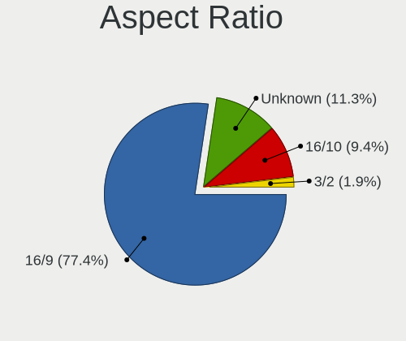

| Ratio   | Computers | Percent |
|---------|-----------|---------|
| 16/9    | 32        | 76.19%  |
| Unknown | 6         | 14.29%  |
| 16/10   | 4         | 9.52%   |

Monitor Area
------------

Area in inch

| Area in inch | Computers | Percent |
|----------------|-----------|---------|
| 101-110        | 10        | 23.81%  |
| 201-250        | 9         | 21.43%  |
| Unknown        | 6         | 14.29%  |
| 81-90          | 5         | 11.9%   |
| 151-200        | 4         | 9.52%   |
| More than 1000 | 3         | 7.14%   |
| 351-500        | 3         | 7.14%   |
| 301-350        | 1         | 2.38%   |
| 121-130        | 1         | 2.38%   |

Pixel Density
-------------

Pixels per inch

| Density       | Computers | Percent |
|---------------|-----------|---------|
| 51-100        | 18        | 42.86%  |
| 101-120       | 8         | 19.05%  |
| 121-160       | 7         | 16.67%  |
| Unknown       | 6         | 14.29%  |
| 1-50          | 2         | 4.76%   |
| More than 240 | 1         | 2.38%   |

Multiple Monitors
-----------------

Total monitors connected

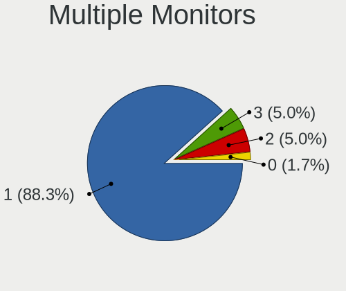

| Total | Computers | Percent |
|-------|-----------|---------|
| 1     | 43        | 95.56%  |
| 3     | 1         | 2.22%   |
| 2     | 1         | 2.22%   |

Network
-------

Net Controller Vendor
---------------------

Controller vendors

| Vendor                          | Computers | Percent |
|---------------------------------|-----------|---------|
| Realtek Semiconductor           | 25        | 36.23%  |
| Intel                           | 16        | 23.19%  |
| Qualcomm Atheros                | 10        | 14.49%  |
| Broadcom                        | 5         | 7.25%   |
| Qualcomm Atheros Communications | 2         | 2.9%    |
| Broadcom Limited                | 2         | 2.9%    |
| TP-Link                         | 1         | 1.45%   |
| Ralink Technology               | 1         | 1.45%   |
| Ralink                          | 1         | 1.45%   |
| MediaTek                        | 1         | 1.45%   |
| Marvell Technology Group        | 1         | 1.45%   |
| Edimax Technology               | 1         | 1.45%   |
| D-Link System                   | 1         | 1.45%   |
| D-Link                          | 1         | 1.45%   |
| AVM                             | 1         | 1.45%   |

Net Controller Model
--------------------

Controller models

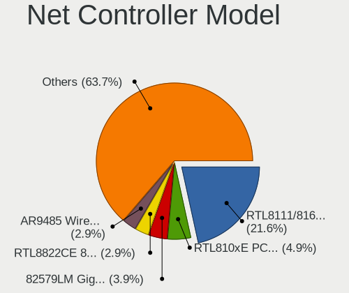

| Model                                                                                | Computers | Percent |
|--------------------------------------------------------------------------------------|-----------|---------|
| Realtek RTL8111/8168/8411 PCI Express Gigabit Ethernet Controller                    | 18        | 23.38%  |
| Realtek RTL810xE PCI Express Fast Ethernet controller                                | 5         | 6.49%   |
| Qualcomm Atheros AR9485 Wireless Network Adapter                                     | 3         | 3.9%    |
| Intel Wireless-AC 9260                                                               | 2         | 2.6%    |
| Intel Wireless 7265                                                                  | 2         | 2.6%    |
| Intel Ethernet Connection I217-LM                                                    | 2         | 2.6%    |
| Intel Cannon Lake PCH CNVi WiFi                                                      | 2         | 2.6%    |
| Intel 82579LM Gigabit Network Connection (Lewisville)                                | 2         | 2.6%    |
| TP-Link 802.11ac WLAN Adapter                                                        | 1         | 1.3%    |
| Realtek RTL8822BE 802.11a/b/g/n/ac WiFi adapter                                      | 1         | 1.3%    |
| Realtek RTL8188SU 802.11n WLAN Adapter                                               | 1         | 1.3%    |
| Realtek RTL8188EE Wireless Network Adapter                                           | 1         | 1.3%    |
| Realtek RTL8188CE 802.11b/g/n WiFi Adapter                                           | 1         | 1.3%    |
| Realtek RTL8125 2.5GbE Controller                                                    | 1         | 1.3%    |
| Realtek RTL-8100/8101L/8139 PCI Fast Ethernet Adapter                                | 1         | 1.3%    |
| Ralink RT5370 Wireless Adapter                                                       | 1         | 1.3%    |
| Ralink RT2561/RT61 802.11g PCI                                                       | 1         | 1.3%    |
| Qualcomm Atheros QCA9565 / AR9565 Wireless Network Adapter                           | 1         | 1.3%    |
| Qualcomm Atheros QCA9377 802.11ac Wireless Network Adapter                           | 1         | 1.3%    |
| Qualcomm Atheros Killer E2500 Gigabit Ethernet Controller                            | 1         | 1.3%    |
| Qualcomm Atheros TP-Link TL-WN821N v3 / TL-WN822N v2 802.11n [Atheros AR7010+AR9287] | 1         | 1.3%    |
| Qualcomm Atheros AR9271 802.11n                                                      | 1         | 1.3%    |
| Qualcomm Atheros AR9285 Wireless Network Adapter (PCI-Express)                       | 1         | 1.3%    |
| Qualcomm Atheros AR8161 Gigabit Ethernet                                             | 1         | 1.3%    |
| Qualcomm Atheros AR8151 v2.0 Gigabit Ethernet                                        | 1         | 1.3%    |
| Qualcomm Atheros AR8121/AR8113/AR8114 Gigabit or Fast Ethernet                       | 1         | 1.3%    |
| Qualcomm Atheros AR5416 Wireless Network Adapter [AR5008 802.11(a)bgn]               | 1         | 1.3%    |
| MediaTek WiFi                                                                        | 1         | 1.3%    |
| Marvell Group Yukon Optima 88E8059 [PCIe Gigabit Ethernet Controller with AVB]       | 1         | 1.3%    |
| Intel Wi-Fi 6 AX200                                                                  | 1         | 1.3%    |
| Intel PRO/Wireless 5100 AGN [Shiloh] Network Connection                              | 1         | 1.3%    |
| Intel Ice Lake-LP PCH CNVi WiFi                                                      | 1         | 1.3%    |
| Intel Ethernet Connection (7) I219-V                                                 | 1         | 1.3%    |
| Intel Ethernet Connection (2) I219-LM                                                | 1         | 1.3%    |
| Intel Comet Lake PCH-LP CNVi WiFi                                                    | 1         | 1.3%    |
| Intel Centrino Ultimate-N 6300                                                       | 1         | 1.3%    |
| Intel Centrino Advanced-N 6235                                                       | 1         | 1.3%    |
| Intel 82566DC-2 Gigabit Network Connection                                           | 1         | 1.3%    |
| Edimax EW-7711UTn nLite Wireless Adapter [Ralink RT3070]                             | 1         | 1.3%    |
| D-Link System DWA-125 Wireless N 150 Adapter(rev.A2) [Ralink RT3070]                 | 1         | 1.3%    |

Wireless Vendor
---------------

Wireless vendors

| Vendor                          | Computers | Percent |
|---------------------------------|-----------|---------|
| Intel                           | 12        | 33.33%  |
| Qualcomm Atheros                | 7         | 19.44%  |
| Realtek Semiconductor           | 3         | 8.33%   |
| Broadcom                        | 3         | 8.33%   |
| Qualcomm Atheros Communications | 2         | 5.56%   |
| TP-Link                         | 1         | 2.78%   |
| Ralink Technology               | 1         | 2.78%   |
| Ralink                          | 1         | 2.78%   |
| MediaTek                        | 1         | 2.78%   |
| Edimax Technology               | 1         | 2.78%   |
| D-Link System                   | 1         | 2.78%   |
| D-Link                          | 1         | 2.78%   |
| Broadcom Limited                | 1         | 2.78%   |
| AVM                             | 1         | 2.78%   |

Wireless Model
--------------

Wireless models

| Model                                                                                | Computers | Percent |
|--------------------------------------------------------------------------------------|-----------|---------|
| Qualcomm Atheros AR9485 Wireless Network Adapter                                     | 3         | 8.11%   |
| Intel Wireless-AC 9260                                                               | 2         | 5.41%   |
| Intel Wireless 7265                                                                  | 2         | 5.41%   |
| Intel Cannon Lake PCH CNVi WiFi                                                      | 2         | 5.41%   |
| TP-Link 802.11ac WLAN Adapter                                                        | 1         | 2.7%    |
| Realtek RTL8822BE 802.11a/b/g/n/ac WiFi adapter                                      | 1         | 2.7%    |
| Realtek RTL8188SU 802.11n WLAN Adapter                                               | 1         | 2.7%    |
| Realtek RTL8188EE Wireless Network Adapter                                           | 1         | 2.7%    |
| Realtek RTL8188CE 802.11b/g/n WiFi Adapter                                           | 1         | 2.7%    |
| Ralink RT5370 Wireless Adapter                                                       | 1         | 2.7%    |
| Ralink RT2561/RT61 802.11g PCI                                                       | 1         | 2.7%    |
| Qualcomm Atheros QCA9565 / AR9565 Wireless Network Adapter                           | 1         | 2.7%    |
| Qualcomm Atheros QCA9377 802.11ac Wireless Network Adapter                           | 1         | 2.7%    |
| Qualcomm Atheros TP-Link TL-WN821N v3 / TL-WN822N v2 802.11n [Atheros AR7010+AR9287] | 1         | 2.7%    |
| Qualcomm Atheros AR9271 802.11n                                                      | 1         | 2.7%    |
| Qualcomm Atheros AR9285 Wireless Network Adapter (PCI-Express)                       | 1         | 2.7%    |
| Qualcomm Atheros AR5416 Wireless Network Adapter [AR5008 802.11(a)bgn]               | 1         | 2.7%    |
| MediaTek WiFi                                                                        | 1         | 2.7%    |
| Intel Wi-Fi 6 AX200                                                                  | 1         | 2.7%    |
| Intel PRO/Wireless 5100 AGN [Shiloh] Network Connection                              | 1         | 2.7%    |
| Intel Ice Lake-LP PCH CNVi WiFi                                                      | 1         | 2.7%    |
| Intel Comet Lake PCH-LP CNVi WiFi                                                    | 1         | 2.7%    |
| Intel Centrino Ultimate-N 6300                                                       | 1         | 2.7%    |
| Intel Centrino Advanced-N 6235                                                       | 1         | 2.7%    |
| Edimax EW-7711UTn nLite Wireless Adapter [Ralink RT3070]                             | 1         | 2.7%    |
| D-Link System DWA-125 Wireless N 150 Adapter(rev.A2) [Ralink RT3070]                 | 1         | 2.7%    |
| D-Link DWA-140 RangeBooster N Adapter(rev.B3) [Ralink RT5372]                        | 1         | 2.7%    |
| Broadcom Limited BCM4360 802.11ac Wireless Network Adapter                           | 1         | 2.7%    |
| Broadcom BCM4352 802.11ac Wireless Network Adapter                                   | 1         | 2.7%    |
| Broadcom BCM43142 802.11b/g/n                                                        | 1         | 2.7%    |
| Broadcom BCM4313 802.11bgn Wireless Network Adapter                                  | 1         | 2.7%    |
| AVM FRITZ!WLAN AC 860                                                                | 1         | 2.7%    |

Ethernet Vendor
---------------

Ethernet vendors

| Vendor                   | Computers | Percent |
|--------------------------|-----------|---------|
| Realtek Semiconductor    | 25        | 62.5%   |
| Intel                    | 7         | 17.5%   |
| Qualcomm Atheros         | 4         | 10%     |
| Broadcom                 | 2         | 5%      |
| Marvell Technology Group | 1         | 2.5%    |
| Broadcom Limited         | 1         | 2.5%    |

Ethernet Model
--------------

Ethernet models

| Model                                                                          | Computers | Percent |
|--------------------------------------------------------------------------------|-----------|---------|
| Realtek RTL8111/8168/8411 PCI Express Gigabit Ethernet Controller              | 18        | 45%     |
| Realtek RTL810xE PCI Express Fast Ethernet controller                          | 5         | 12.5%   |
| Intel Ethernet Connection I217-LM                                              | 2         | 5%      |
| Intel 82579LM Gigabit Network Connection (Lewisville)                          | 2         | 5%      |
| Realtek RTL8125 2.5GbE Controller                                              | 1         | 2.5%    |
| Realtek RTL-8100/8101L/8139 PCI Fast Ethernet Adapter                          | 1         | 2.5%    |
| Qualcomm Atheros Killer E2500 Gigabit Ethernet Controller                      | 1         | 2.5%    |
| Qualcomm Atheros AR8161 Gigabit Ethernet                                       | 1         | 2.5%    |
| Qualcomm Atheros AR8151 v2.0 Gigabit Ethernet                                  | 1         | 2.5%    |
| Qualcomm Atheros AR8121/AR8113/AR8114 Gigabit or Fast Ethernet                 | 1         | 2.5%    |
| Marvell Group Yukon Optima 88E8059 [PCIe Gigabit Ethernet Controller with AVB] | 1         | 2.5%    |
| Intel Ethernet Connection (7) I219-V                                           | 1         | 2.5%    |
| Intel Ethernet Connection (2) I219-LM                                          | 1         | 2.5%    |
| Intel 82566DC-2 Gigabit Network Connection                                     | 1         | 2.5%    |
| Broadcom NetXtreme II BCM5709 Gigabit Ethernet                                 | 1         | 2.5%    |
| Broadcom NetLink BCM57788 Gigabit Ethernet PCIe                                | 1         | 2.5%    |
| Broadcom Limited NetLink BCM5906M Fast Ethernet PCI Express                    | 1         | 2.5%    |

Net Controller Kind
-------------------

Ethernet, WiFi or modem

| Kind     | Computers | Percent |
|----------|-----------|---------|
| Ethernet | 40        | 55.56%  |
| WiFi     | 32        | 44.44%  |

Used Controller
---------------

Currently used network controller

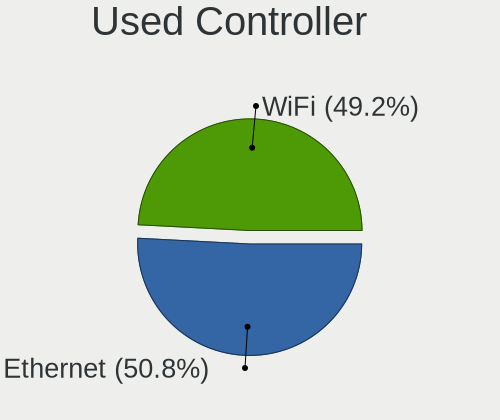

| Kind     | Computers | Percent |
|----------|-----------|---------|
| Ethernet | 24        | 52.17%  |
| WiFi     | 22        | 47.83%  |

NICs
----

Total network controllers on board

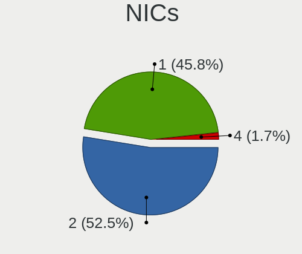

| Total | Computers | Percent |
|-------|-----------|---------|
| 2     | 22        | 48.89%  |
| 1     | 22        | 48.89%  |
| 4     | 1         | 2.22%   |

IPv6
----

IPv6 vs IPv4

| Used | Computers | Percent |
|------|-----------|---------|
| No   | 34        | 75.56%  |
| Yes  | 11        | 24.44%  |

Bluetooth
---------

Bluetooth Vendor
----------------

Controller vendors

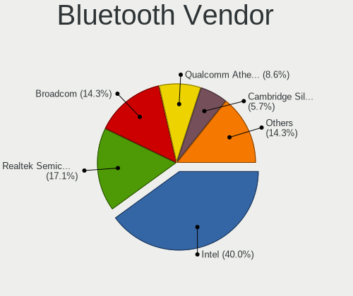

| Vendor                          | Computers | Percent |
|---------------------------------|-----------|---------|
| Intel                           | 9         | 39.13%  |
| Broadcom                        | 5         | 21.74%  |
| Realtek Semiconductor           | 2         | 8.7%    |
| Qualcomm Atheros Communications | 2         | 8.7%    |
| IMC Networks                    | 1         | 4.35%   |
| Dell                            | 1         | 4.35%   |
| Cambridge Silicon Radio         | 1         | 4.35%   |
| ASUSTek Computer                | 1         | 4.35%   |
| Apple                           | 1         | 4.35%   |

Bluetooth Model
---------------

Controller models

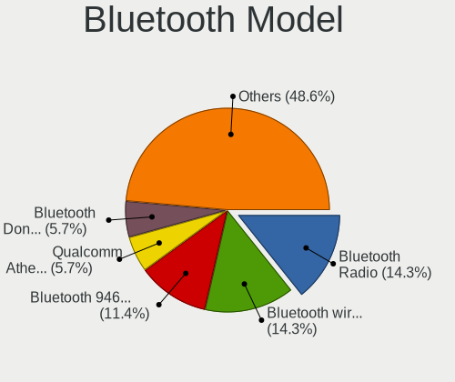

| Model                                               | Computers | Percent |
|-----------------------------------------------------|-----------|---------|
| Intel Bluetooth 9460/9560 Jefferson Peak (JfP)      | 4         | 17.39%  |
| Intel Bluetooth wireless interface                  | 2         | 8.7%    |
| Realtek  Bluetooth 4.2 Adapter                      | 1         | 4.35%   |
| Realtek Bluetooth Radio                             | 1         | 4.35%   |
| Qualcomm Atheros  Bluetooth Device                  | 1         | 4.35%   |
| Qualcomm Atheros AR9462 Bluetooth                   | 1         | 4.35%   |
| Intel Wireless-AC 9260 Bluetooth Adapter            | 1         | 4.35%   |
| Intel Centrino Bluetooth Wireless Transceiver       | 1         | 4.35%   |
| Intel AX200 Bluetooth                               | 1         | 4.35%   |
| IMC Networks Atheros AR3012 Bluetooth 4.0 Adapter   | 1         | 4.35%   |
| Dell BT Mini-Receiver                               | 1         | 4.35%   |
| Cambridge Silicon Radio Bluetooth Dongle (HCI mode) | 1         | 4.35%   |
| Broadcom Bluetooth 2.1 Device                       | 1         | 4.35%   |
| Broadcom BCM43142 Bluetooth 4.0                     | 1         | 4.35%   |
| Broadcom BCM20702A0 Bluetooth 4.0                   | 1         | 4.35%   |
| Broadcom BCM2046 Bluetooth Device                   | 1         | 4.35%   |
| Broadcom BCM2045B (BDC-2.1)                         | 1         | 4.35%   |
| ASUS Broadcom BCM20702A0 Bluetooth                  | 1         | 4.35%   |
| Apple Bluetooth USB Host Controller                 | 1         | 4.35%   |

Sound
-----

Sound Vendor
------------

Sound card vendors

| Vendor              | Computers | Percent |
|---------------------|-----------|---------|
| Intel               | 28        | 43.08%  |
| AMD                 | 21        | 32.31%  |
| Nvidia              | 14        | 21.54%  |
| Creative Labs       | 1         | 1.54%   |
| C-Media Electronics | 1         | 1.54%   |

Sound Model
-----------

Sound card models

| Model                                                                                           | Computers | Percent |
|-------------------------------------------------------------------------------------------------|-----------|---------|
| Intel 7 Series/C216 Chipset Family High Definition Audio Controller                             | 6         | 7.69%   |
| AMD SBx00 Azalia (Intel HDA)                                                                    | 6         | 7.69%   |
| AMD FCH Azalia Controller                                                                       | 4         | 5.13%   |
| AMD Family 17h/19h HD Audio Controller                                                          | 4         | 5.13%   |
| Nvidia GK107 HDMI Audio Controller                                                              | 3         | 3.85%   |
| Intel 8 Series/C220 Series Chipset High Definition Audio Controller                             | 3         | 3.85%   |
| AMD Raven/Raven2/Fenghuang HDMI/DP Audio Controller                                             | 3         | 3.85%   |
| AMD Kabini HDMI/DP Audio                                                                        | 3         | 3.85%   |
| Nvidia GF116 High Definition Audio Controller                                                   | 2         | 2.56%   |
| Intel Xeon E3-1200 v3/4th Gen Core Processor HD Audio Controller                                | 2         | 2.56%   |
| Intel Cannon Lake PCH cAVS                                                                      | 2         | 2.56%   |
| Intel 82801I (ICH9 Family) HD Audio Controller                                                  | 2         | 2.56%   |
| Intel 8 Series HD Audio Controller                                                              | 2         | 2.56%   |
| Intel 6 Series/C200 Series Chipset Family High Definition Audio Controller                      | 2         | 2.56%   |
| Intel 5 Series/3400 Series Chipset High Definition Audio                                        | 2         | 2.56%   |
| AMD RV710/730 HDMI Audio [Radeon HD 4000 series]                                                | 2         | 2.56%   |
| AMD Oland/Hainan/Cape Verde/Pitcairn HDMI Audio [Radeon HD 7000 Series]                         | 2         | 2.56%   |
| AMD Cedar HDMI Audio [Radeon HD 5400/6300/7300 Series]                                          | 2         | 2.56%   |
| Nvidia TU106 High Definition Audio Controller                                                   | 1         | 1.28%   |
| Nvidia High Definition Audio Controller                                                         | 1         | 1.28%   |
| Nvidia GT216 HDMI Audio Controller                                                              | 1         | 1.28%   |
| Nvidia GP106 High Definition Audio Controller                                                   | 1         | 1.28%   |
| Nvidia GM206 High Definition Audio Controller                                                   | 1         | 1.28%   |
| Nvidia GM204 High Definition Audio Controller                                                   | 1         | 1.28%   |
| Nvidia GM107 High Definition Audio Controller [GeForce 940MX]                                   | 1         | 1.28%   |
| Nvidia GK208 HDMI/DP Audio Controller                                                           | 1         | 1.28%   |
| Nvidia GK104 HDMI Audio Controller                                                              | 1         | 1.28%   |
| Intel Sunrise Point-LP HD Audio                                                                 | 1         | 1.28%   |
| Intel NM10/ICH7 Family High Definition Audio Controller                                         | 1         | 1.28%   |
| Intel Ice Lake-LP Smart Sound Technology Audio Controller                                       | 1         | 1.28%   |
| Intel Haswell-ULT HD Audio Controller                                                           | 1         | 1.28%   |
| Intel Comet Lake PCH-V cAVS                                                                     | 1         | 1.28%   |
| Intel Comet Lake PCH-LP cAVS                                                                    | 1         | 1.28%   |
| Intel Celeron/Pentium Silver Processor High Definition Audio                                    | 1         | 1.28%   |
| Intel 82801JI (ICH10 Family) HD Audio Controller                                                | 1         | 1.28%   |
| Intel 200 Series PCH HD Audio                                                                   | 1         | 1.28%   |
| Intel 100 Series/C230 Series Chipset Family HD Audio Controller                                 | 1         | 1.28%   |
| Creative Labs CA0132 Sound Core3D [Sound Blaster Recon3D / Z-Series / Sound BlasterX AE-5 Plus] | 1         | 1.28%   |
| C-Media Electronics CMI8738/CMI8768 PCI Audio                                                   | 1         | 1.28%   |
| AMD Trinity HDMI Audio Controller                                                               | 1         | 1.28%   |

Memory
------

Memory Vendor
-------------

Memory module vendors

| Vendor   | Computers | Percent |
|----------|-----------|---------|
| Unknown  | 1         | 25%     |
| Team     | 1         | 25%     |
| Smart    | 1         | 25%     |
| SK hynix | 1         | 25%     |

Memory Model
------------

Memory module models

| Model                                                | Computers | Percent |
|------------------------------------------------------|-----------|---------|
| Unknown RAM Module 2048MB DIMM 1066MT/s              | 1         | 25%     |
| Team RAM TEAMGROUP-UD4-3600 8GB DIMM DDR4 3600MT/s   | 1         | 25%     |
| Smart RAM SH564568FH8N6PHSFG 2GB DIMM DDR3 1333MT/s  | 1         | 25%     |
| SK hynix RAM HMT351U6CFR8C-PB 4GB DIMM DDR3 1800MT/s | 1         | 25%     |

Memory Kind
-----------

Memory module kinds

| Kind    | Computers | Percent |
|---------|-----------|---------|
| DDR3    | 2         | 50%     |
| DDR4    | 1         | 25%     |
| Unknown | 1         | 25%     |

Memory Form Factor
------------------

Physical design of the memory module

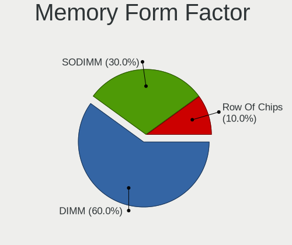

| Name | Computers | Percent |
|------|-----------|---------|
| DIMM | 4         | 100%    |

Memory Size
-----------

Memory module size

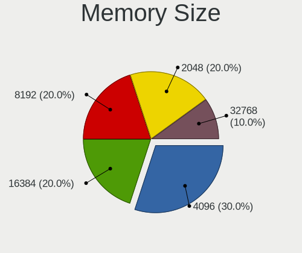

| Size  | Computers | Percent |
|-------|-----------|---------|
| 2048  | 2         | 50%     |
| 32768 | 1         | 25%     |
| 4096  | 1         | 25%     |

Memory Speed
------------

Memory module speed

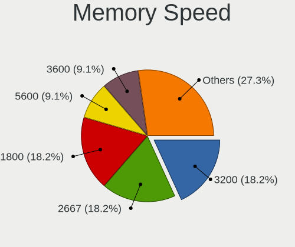

| Speed | Computers | Percent |
|-------|-----------|---------|
| 3600  | 1         | 25%     |
| 1800  | 1         | 25%     |
| 1333  | 1         | 25%     |
| 1066  | 1         | 25%     |

Printers & scanners
-------------------

Printer Vendor
--------------

Printer device vendors

| Vendor                             | Computers | Percent |
|------------------------------------|-----------|---------|
| Omnidirectional Control Technology | 1         | 33.33%  |
| Dymo-CoStar                        | 1         | 33.33%  |
| Canon                              | 1         | 33.33%  |

Printer Model
-------------

Printer device models

| Model                                       | Computers | Percent |
|---------------------------------------------|-----------|---------|
| Omnidirectional Control USB-Parallel Bridge | 1         | 33.33%  |
| Dymo-CoStar LabelWriter 400                 | 1         | 33.33%  |
| Canon PIXMA MX920 Series                    | 1         | 33.33%  |

Scanner Vendor
--------------

Scanner device vendors

Zero info for selected period =(

Scanner Model
-------------

Scanner device models

Zero info for selected period =(

Camera
------

Camera Vendor
-------------

Camera device vendors

| Vendor                                 | Computers | Percent |
|----------------------------------------|-----------|---------|
| Chicony Electronics                    | 4         | 21.05%  |
| Suyin                                  | 3         | 15.79%  |
| Microdia                               | 3         | 15.79%  |
| Realtek Semiconductor                  | 2         | 10.53%  |
| Cheng Uei Precision Industry (Foxlink) | 2         | 10.53%  |
| Z-Star Microelectronics                | 1         | 5.26%   |
| Sonix Technology                       | 1         | 5.26%   |
| Microsoft                              | 1         | 5.26%   |
| Logitech                               | 1         | 5.26%   |
| Lite-On Technology                     | 1         | 5.26%   |

Camera Model
------------

Camera device models

| Model                                                   | Computers | Percent |
|---------------------------------------------------------|-----------|---------|
| Cheng Uei Precision Industry (Foxlink) HP Truevision HD | 2         | 10.53%  |
| Z-Star WebCam SCB-1900N                                 | 1         | 5.26%   |
| Suyin UVC HD Webcam                                     | 1         | 5.26%   |
| Suyin Laptop_Integrated_Webcam_HD                       | 1         | 5.26%   |
| Suyin HP Truevision HD                                  | 1         | 5.26%   |
| Sonix USB 2.0 Camera                                    | 1         | 5.26%   |
| Realtek Integrated_Webcam_FHD                           | 1         | 5.26%   |
| Realtek Integrated Webcam HD                            | 1         | 5.26%   |
| Microsoft LifeCam VX-2000                               | 1         | 5.26%   |
| Microdia Laptop_Integrated_Webcam_HD                    | 1         | 5.26%   |
| Microdia Laptop_Integrated_Webcam_FHD                   | 1         | 5.26%   |
| Microdia Dell Laptop Integrated Webcam HD               | 1         | 5.26%   |
| Logitech Webcam B500                                    | 1         | 5.26%   |
| Lite-On HP Wide Vision HD Camera                        | 1         | 5.26%   |
| Chicony UVC 1.00 device HD UVC WebCam                   | 1         | 5.26%   |
| Chicony Lenovo EasyCamera                               | 1         | 5.26%   |
| Chicony Laptop_Integrated_Webcam_2M                     | 1         | 5.26%   |
| Chicony Integrated Camera                               | 1         | 5.26%   |

Security
--------

Fingerprint Vendor
------------------

Fingerprint sensor vendors

| Vendor           | Computers | Percent |
|------------------|-----------|---------|
| Validity Sensors | 1         | 100%    |

Fingerprint Model
-----------------

Fingerprint sensor models

| Model                                     | Computers | Percent |
|-------------------------------------------|-----------|---------|
| Validity Sensors Swipe Fingerprint Sensor | 1         | 100%    |

Chipcard Vendor
---------------

Chipcard module vendors

Zero info for selected period =(

Chipcard Model
--------------

Chipcard module models

Zero info for selected period =(

Unsupported
-----------

Unsupported Devices
-------------------

Total unsupported devices on board

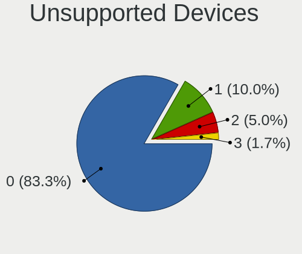

| Total | Computers | Percent |
|-------|-----------|---------|
| 0     | 41        | 91.11%  |
| 1     | 4         | 8.89%   |

Unsupported Device Types
------------------------

Types of unsupported devices

| Type                  | Computers | Percent |
|-----------------------|-----------|---------|
| Network               | 1         | 25%     |
| Net/wireless          | 1         | 25%     |
| Multimedia controller | 1         | 25%     |
| Fingerprint reader    | 1         | 25%     |

