Manjaro-ARM - Tested Hardware & Statistics (Notebooks)
------------------------------------------------------

A project to collect tested hardware configurations for Manjaro-ARM.

Anyone can contribute to this report by the [hw-probe](https://github.com/linuxhw/hw-probe) tool:

    sudo -E hw-probe -all -upload

Please contribute! Especially if your hardware is rare.

Contents
--------

* [ Test Cases ](#test-cases)

* [ System ](#system)
  - [ OS                       ](#os)
  - [ OS Family                ](#os-family)
  - [ Kernel                   ](#kernel)
  - [ Kernel Family            ](#kernel-family)
  - [ Kernel Major Ver.        ](#kernel-major-ver)
  - [ Arch                     ](#arch)
  - [ DE                       ](#de)
  - [ Display Server           ](#display-server)
  - [ Display Manager          ](#display-manager)
  - [ OS Lang                  ](#os-lang)
  - [ Boot Mode                ](#boot-mode)
  - [ Filesystem               ](#filesystem)
  - [ Part. scheme             ](#part-scheme)
  - [ Dual Boot with Linux/BSD ](#dual-boot-with-linuxbsd)
  - [ Dual Boot (Win)          ](#dual-boot-win)

* [ Board ](#board)
  - [ Vendor                   ](#vendor)
  - [ Model                    ](#model)
  - [ Model Family             ](#model-family)
  - [ MFG Year                 ](#mfg-year)
  - [ Form Factor              ](#form-factor)
  - [ Secure Boot              ](#secure-boot)
  - [ Coreboot                 ](#coreboot)
  - [ RAM Size                 ](#ram-size)
  - [ RAM Used                 ](#ram-used)
  - [ Total Drives             ](#total-drives)
  - [ Has CD-ROM               ](#has-cd-rom)
  - [ Has Ethernet             ](#has-ethernet)
  - [ Has WiFi                 ](#has-wifi)
  - [ Has Bluetooth            ](#has-bluetooth)

* [ Location ](#location)
  - [ Country                  ](#country)
  - [ City                     ](#city)

* [ Drives ](#drives)
  - [ Drive Vendor             ](#drive-vendor)
  - [ Drive Model              ](#drive-model)
  - [ HDD Vendor               ](#hdd-vendor)
  - [ SSD Vendor               ](#ssd-vendor)
  - [ Drive Kind               ](#drive-kind)
  - [ Drive Connector          ](#drive-connector)
  - [ Drive Size               ](#drive-size)
  - [ Space Total              ](#space-total)
  - [ Space Used               ](#space-used)
  - [ Malfunc. Drives          ](#malfunc-drives)
  - [ Malfunc. Drive Vendor    ](#malfunc-drive-vendor)
  - [ Malfunc. HDD Vendor      ](#malfunc-hdd-vendor)
  - [ Malfunc. Drive Kind      ](#malfunc-drive-kind)
  - [ Failed Drives            ](#failed-drives)
  - [ Failed Drive Vendor      ](#failed-drive-vendor)
  - [ Drive Status             ](#drive-status)

* [ Storage controller ](#storage-controller)
  - [ Storage Vendor           ](#storage-vendor)
  - [ Storage Model            ](#storage-model)
  - [ Storage Kind             ](#storage-kind)

* [ Processor ](#processor)
  - [ CPU Vendor               ](#cpu-vendor)
  - [ CPU Model                ](#cpu-model)
  - [ CPU Model Family         ](#cpu-model-family)
  - [ CPU Cores                ](#cpu-cores)
  - [ CPU Sockets              ](#cpu-sockets)
  - [ CPU Threads              ](#cpu-threads)
  - [ CPU Op-Modes             ](#cpu-op-modes)
  - [ CPU Microcode            ](#cpu-microcode)
  - [ CPU Microarch            ](#cpu-microarch)

* [ Graphics ](#graphics)
  - [ GPU Vendor               ](#gpu-vendor)
  - [ GPU Model                ](#gpu-model)
  - [ GPU Combo                ](#gpu-combo)
  - [ GPU Driver               ](#gpu-driver)
  - [ GPU Memory               ](#gpu-memory)

* [ Monitor ](#monitor)
  - [ Monitor Vendor           ](#monitor-vendor)
  - [ Monitor Model            ](#monitor-model)
  - [ Monitor Resolution       ](#monitor-resolution)
  - [ Monitor Diagonal         ](#monitor-diagonal)
  - [ Monitor Width            ](#monitor-width)
  - [ Aspect Ratio             ](#aspect-ratio)
  - [ Monitor Area             ](#monitor-area)
  - [ Pixel Density            ](#pixel-density)
  - [ Multiple Monitors        ](#multiple-monitors)

* [ Network ](#network)
  - [ Net Controller Vendor    ](#net-controller-vendor)
  - [ Net Controller Model     ](#net-controller-model)
  - [ Wireless Vendor          ](#wireless-vendor)
  - [ Wireless Model           ](#wireless-model)
  - [ Ethernet Vendor          ](#ethernet-vendor)
  - [ Ethernet Model           ](#ethernet-model)
  - [ Net Controller Kind      ](#net-controller-kind)
  - [ Used Controller          ](#used-controller)
  - [ NICs                     ](#nics)
  - [ IPv6                     ](#ipv6)

* [ Bluetooth ](#bluetooth)
  - [ Bluetooth Vendor         ](#bluetooth-vendor)
  - [ Bluetooth Model          ](#bluetooth-model)

* [ Sound ](#sound)
  - [ Sound Vendor             ](#sound-vendor)
  - [ Sound Model              ](#sound-model)

* [ Memory ](#memory)
  - [ Memory Vendor            ](#memory-vendor)
  - [ Memory Model             ](#memory-model)
  - [ Memory Kind              ](#memory-kind)
  - [ Memory Form Factor       ](#memory-form-factor)
  - [ Memory Size              ](#memory-size)
  - [ Memory Speed             ](#memory-speed)

* [ Printers & scanners ](#printers--scanners)
  - [ Printer Vendor           ](#printer-vendor)
  - [ Printer Model            ](#printer-model)
  - [ Scanner Vendor           ](#scanner-vendor)
  - [ Scanner Model            ](#scanner-model)

* [ Camera ](#camera)
  - [ Camera Vendor            ](#camera-vendor)
  - [ Camera Model             ](#camera-model)

* [ Security ](#security)
  - [ Fingerprint Vendor       ](#fingerprint-vendor)
  - [ Fingerprint Model        ](#fingerprint-model)
  - [ Chipcard Vendor          ](#chipcard-vendor)
  - [ Chipcard Model           ](#chipcard-model)

* [ Unsupported ](#unsupported)
  - [ Unsupported Devices      ](#unsupported-devices)
  - [ Unsupported Device Types ](#unsupported-device-types)

Test Cases
----------

Total: 15

| Vendor        | Model               | Probe                                                      | Date         |
|---------------|---------------------|------------------------------------------------------------|--------------|
| Pine Micro... | Pine64 Pinebook Pro | [80e1d849fd](https://linux-hardware.org/?probe=80e1d849fd) | Sep 06, 2023 |
| Pine Micro... | Pine64 Pinebook Pro | [e6effbe52e](https://linux-hardware.org/?probe=e6effbe52e) | Apr 11, 2023 |
| Pine Micro... | Pine64 Pinebook Pro | [5b53728575](https://linux-hardware.org/?probe=5b53728575) | Mar 26, 2023 |
| Pine Micro... | Pine64 Pinebook Pro | [760fd1ae84](https://linux-hardware.org/?probe=760fd1ae84) | Dec 13, 2022 |
| Pine Micro... | Pine64 Pinebook Pro | [ac4e15828b](https://linux-hardware.org/?probe=ac4e15828b) | Nov 02, 2021 |
| Pine Micro... | Pine64 Pinebook Pro | [896bd98421](https://linux-hardware.org/?probe=896bd98421) | May 19, 2021 |
| Pine Micro... | Pine64 Pinebook Pro | [947451c5ef](https://linux-hardware.org/?probe=947451c5ef) | Nov 14, 2020 |
| Pine Micro... | Pine64 Pinebook Pro | [169238c060](https://linux-hardware.org/?probe=169238c060) | Nov 03, 2020 |
| Pine Micro... | Pine64 Pinebook Pro | [fb24852769](https://linux-hardware.org/?probe=fb24852769) | Nov 01, 2020 |
| Pine Micro... | Pine64 Pinebook Pro | [dabd07ba39](https://linux-hardware.org/?probe=dabd07ba39) | Sep 29, 2020 |
| Pine Micro... | Pine64 Pinebook Pro | [b7a5bf61e7](https://linux-hardware.org/?probe=b7a5bf61e7) | Sep 16, 2020 |
| Pine Micro... | Pine64 Pinebook Pro | [0ccf4e6f67](https://linux-hardware.org/?probe=0ccf4e6f67) | Sep 03, 2020 |
| Pine Micro... | Pine64 Pinebook Pro | [ec849f00fc](https://linux-hardware.org/?probe=ec849f00fc) | Sep 03, 2020 |
| Pine Micro... | Pine64 Pinebook Pro | [1ef25f0a09](https://linux-hardware.org/?probe=1ef25f0a09) | Sep 03, 2020 |
| Pine Micro... | Pine64 Pinebook Pro | [b0d04bed01](https://linux-hardware.org/?probe=b0d04bed01) | Aug 06, 2020 |

System
------

OS
--

Installed operating systems

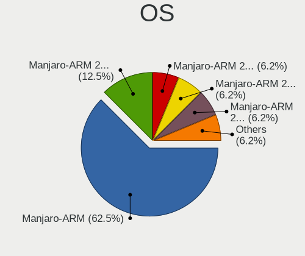

| Name              | Notebooks | Percent |
|-------------------|-----------|---------|
| Manjaro-ARM       | 7         | 53.85%  |
| Manjaro-ARM 23.02 | 2         | 15.38%  |
| Manjaro-ARM 22.12 | 1         | 7.69%   |
| Manjaro-ARM 21.05 | 1         | 7.69%   |
| Manjaro-ARM 20.10 | 1         | 7.69%   |
| Manjaro-ARM 20.09 | 1         | 7.69%   |

OS Family
---------

OS without a version

| Name        | Notebooks | Percent |
|-------------|-----------|---------|
| Manjaro-ARM | 13        | 100%    |

Kernel
------

Version of the Linux kernel

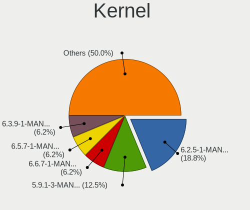

| Version              | Notebooks | Percent |
|----------------------|-----------|---------|
| 6.2.5-1-MANJARO-ARM  | 2         | 15.38%  |
| 5.9.1-3-MANJARO-ARM  | 2         | 15.38%  |
| 6.3.9-1-MANJARO-ARM  | 1         | 7.69%   |
| 6.0.12-1-MANJARO-ARM | 1         | 7.69%   |
| 5.8.6-1-MANJARO-ARM  | 1         | 7.69%   |
| 5.8.5-1-MANJARO-ARM  | 1         | 7.69%   |
| 5.8.3-2-MANJARO-ARM  | 1         | 7.69%   |
| 5.8.12-1-MANJARO-ARM | 1         | 7.69%   |
| 5.7.19-1-MANJARO-ARM | 1         | 7.69%   |
| 5.7.0-3-MANJARO-ARM  | 1         | 7.69%   |
| 5.12.4-1-MANJARO-ARM | 1         | 7.69%   |

Kernel Family
-------------

Linux kernel without a distro release

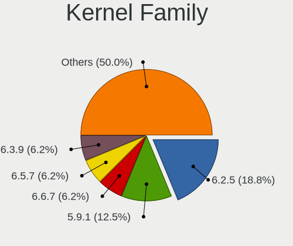

| Version | Notebooks | Percent |
|---------|-----------|---------|
| 6.2.5   | 2         | 15.38%  |
| 5.9.1   | 2         | 15.38%  |
| 6.3.9   | 1         | 7.69%   |
| 6.0.12  | 1         | 7.69%   |
| 5.8.6   | 1         | 7.69%   |
| 5.8.5   | 1         | 7.69%   |
| 5.8.3   | 1         | 7.69%   |
| 5.8.12  | 1         | 7.69%   |
| 5.7.19  | 1         | 7.69%   |
| 5.7.0   | 1         | 7.69%   |
| 5.12.4  | 1         | 7.69%   |

Kernel Major Ver.
-----------------

Linux kernel major version

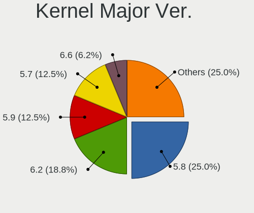

| Version | Notebooks | Percent |
|---------|-----------|---------|
| 5.8     | 4         | 30.77%  |
| 6.2     | 2         | 15.38%  |
| 5.9     | 2         | 15.38%  |
| 5.7     | 2         | 15.38%  |
| 6.3     | 1         | 7.69%   |
| 6.0     | 1         | 7.69%   |
| 5.12    | 1         | 7.69%   |

Arch
----

OS architecture (x86_64, i586, etc.)

| Name    | Notebooks | Percent |
|---------|-----------|---------|
| aarch64 | 13        | 100%    |

DE
--

Desktop Environment

| Name       | Notebooks | Percent |
|------------|-----------|---------|
| KDE5       | 4         | 30.77%  |
| XFCE       | 3         | 23.08%  |
| KDE        | 3         | 23.08%  |
| GNOME      | 2         | 15.38%  |
| X-Cinnamon | 1         | 7.69%   |

Display Server
--------------

X11 or Wayland

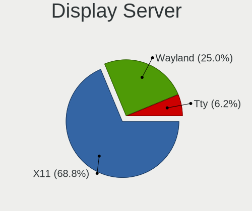

| Name    | Notebooks | Percent |
|---------|-----------|---------|
| X11     | 9         | 69.23%  |
| Wayland | 3         | 23.08%  |
| Tty     | 1         | 7.69%   |

Display Manager
---------------

SDDM, LightDM, etc.

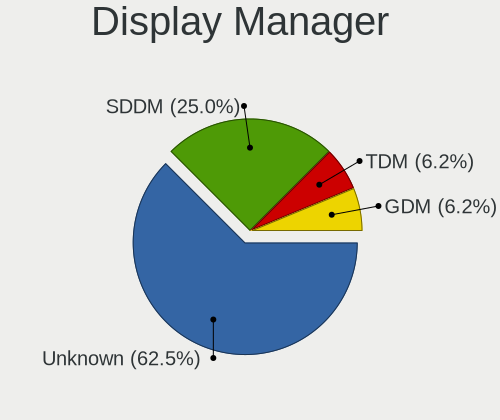

| Name    | Notebooks | Percent |
|---------|-----------|---------|
| Unknown | 7         | 53.85%  |
| SDDM    | 4         | 30.77%  |
| TDM     | 1         | 7.69%   |
| GDM     | 1         | 7.69%   |

OS Lang
-------

Language

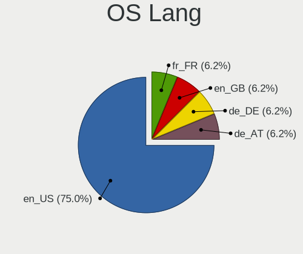

| Lang  | Notebooks | Percent |
|-------|-----------|---------|
| en_US | 10        | 76.92%  |
| fr_FR | 1         | 7.69%   |
| de_DE | 1         | 7.69%   |
| de_AT | 1         | 7.69%   |

Boot Mode
---------

EFI or BIOS

| Mode | Notebooks | Percent |
|------|-----------|---------|
| EFI  | 13        | 100%    |

Filesystem
----------

Type of filesystem

| Type | Notebooks | Percent |
|------|-----------|---------|
| Ext4 | 12        | 92.31%  |
| F2fs | 1         | 7.69%   |

Part. scheme
------------

Scheme of partitioning

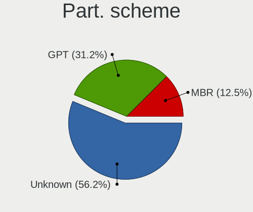

| Type    | Notebooks | Percent |
|---------|-----------|---------|
| Unknown | 6         | 46.15%  |
| GPT     | 5         | 38.46%  |
| MBR     | 2         | 15.38%  |

Dual Boot with Linux/BSD
------------------------

Hosting more than one Linux/BSD

| Dual boot | Notebooks | Percent |
|-----------|-----------|---------|
| No        | 12        | 92.31%  |
| Yes       | 1         | 7.69%   |

Dual Boot (Win)
---------------

Hosting Linux and Windows

| Dual boot | Notebooks | Percent |
|-----------|-----------|---------|
| No        | 13        | 100%    |

Board
-----

Vendor
------

Motherboard manufacturer

| Name              | Notebooks | Percent |
|-------------------|-----------|---------|
| Pine Microsystems | 13        | 100%    |

Model
-----

Motherboard model

| Name                                  | Notebooks | Percent |
|---------------------------------------|-----------|---------|
| Pine Microsystems Pine64 Pinebook Pro | 13        | 100%    |

Model Family
------------

Motherboard model prefix

| Name                     | Notebooks | Percent |
|--------------------------|-----------|---------|
| Pine Microsystems Pine64 | 13        | 100%    |

MFG Year
--------

Motherboard manufacture year

| Year    | Notebooks | Percent |
|---------|-----------|---------|
| Unknown | 13        | 100%    |

Form Factor
-----------

Physical design of the computer

| Name     | Notebooks | Percent |
|----------|-----------|---------|
| Notebook | 13        | 100%    |

Secure Boot
-----------

Enabled or disabled

| State    | Notebooks | Percent |
|----------|-----------|---------|
| Disabled | 13        | 100%    |

Coreboot
--------

Have coreboot on board

| Used | Notebooks | Percent |
|------|-----------|---------|
| No   | 13        | 100%    |

RAM Size
--------

Total RAM memory

| Size in GB | Notebooks | Percent |
|------------|-----------|---------|
| 3.01-4.0   | 13        | 100%    |

RAM Used
--------

Used RAM memory

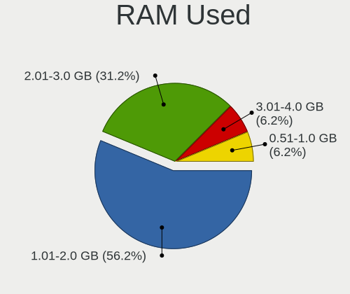

| Used GB  | Notebooks | Percent |
|----------|-----------|---------|
| 1.01-2.0 | 8         | 61.54%  |
| 2.01-3.0 | 4         | 30.77%  |
| 3.01-4.0 | 1         | 7.69%   |

Total Drives
------------

Number of drives on board

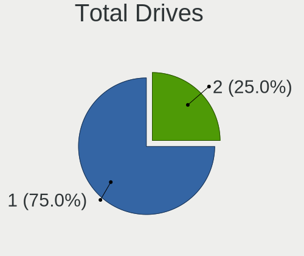

| Drives | Notebooks | Percent |
|--------|-----------|---------|
| 1      | 10        | 76.92%  |
| 2      | 3         | 23.08%  |

Has CD-ROM
----------

Has CD-ROM on board

| Presented | Notebooks | Percent |
|-----------|-----------|---------|
| No        | 13        | 100%    |

Has Ethernet
------------

Has Ethernet on board

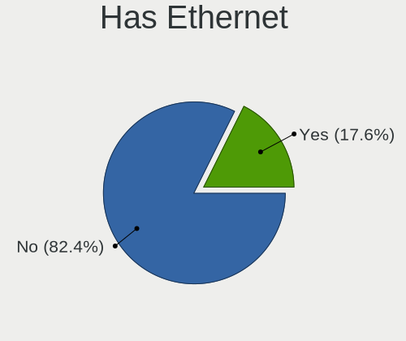

| Presented | Notebooks | Percent |
|-----------|-----------|---------|
| No        | 11        | 84.62%  |
| Yes       | 2         | 15.38%  |

Has WiFi
--------

Has WiFi module

| Presented | Notebooks | Percent |
|-----------|-----------|---------|
| No        | 13        | 100%    |

Has Bluetooth
-------------

Has Bluetooth module

| Presented | Notebooks | Percent |
|-----------|-----------|---------|
| No        | 13        | 100%    |

Location
--------

Country
-------

Geographic location (country)

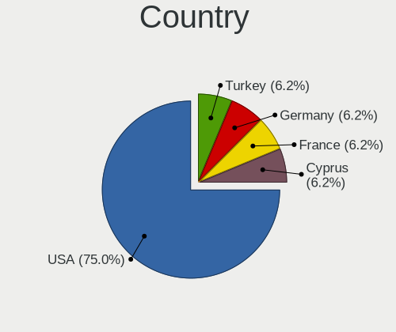

| Country | Notebooks | Percent |
|---------|-----------|---------|
| USA     | 9         | 69.23%  |
| Turkey  | 1         | 7.69%   |
| Germany | 1         | 7.69%   |
| France  | 1         | 7.69%   |
| Cyprus  | 1         | 7.69%   |

City
----

Geographic location (city)

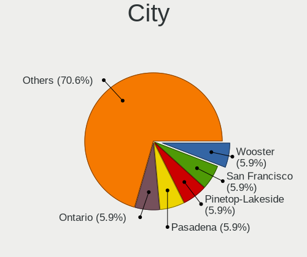

| City             | Notebooks | Percent |
|------------------|-----------|---------|
| Wooster          | 1         | 7.69%   |
| San Francisco    | 1         | 7.69%   |
| Pinetop-Lakeside | 1         | 7.69%   |
| Pasadena         | 1         | 7.69%   |
| Ontario          | 1         | 7.69%   |
| Lusby            | 1         | 7.69%   |
| Los Angeles      | 1         | 7.69%   |
| Limassol         | 1         | 7.69%   |
| Flagstaff        | 1         | 7.69%   |
| Domont           | 1         | 7.69%   |
| Denver           | 1         | 7.69%   |
| Bonn             | 1         | 7.69%   |
| Adana            | 1         | 7.69%   |

Drives
------

Drive Vendor
------------

Hard drive vendors

| Vendor  | Notebooks | Drives | Percent |
|---------|-----------|--------|---------|
| Unknown | 13        | 13     | 81.25%  |
| Toshiba | 1         | 1      | 6.25%   |
| Phison  | 1         | 1      | 6.25%   |
| Intel   | 1         | 1      | 6.25%   |

Drive Model
-----------

Hard drive models

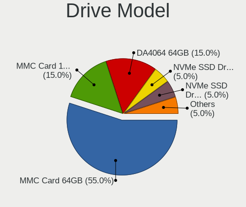

| Model                        | Notebooks | Percent |
|------------------------------|-----------|---------|
| Unknown MMC Card  64GB       | 8         | 50%     |
| Unknown DA4064  64GB         | 3         | 18.75%  |
| Unknown MMC Card  128GB      | 2         | 12.5%   |
| Toshiba NVMe SSD Drive 256GB | 1         | 6.25%   |
| Phison NVMe SSD Drive 256GB  | 1         | 6.25%   |
| Intel NVMe SSD Drive 512GB   | 1         | 6.25%   |

HDD Vendor
----------

Hard disk drive vendors

Zero info for selected period =(

SSD Vendor
----------

Solid state drive vendors

Zero info for selected period =(

Drive Kind
----------

HDD or SSD

| Kind | Notebooks | Drives | Percent |
|------|-----------|--------|---------|
| MMC  | 13        | 13     | 81.25%  |
| NVMe | 3         | 3      | 18.75%  |

Drive Connector
---------------

SATA, SAS, NVMe, etc.

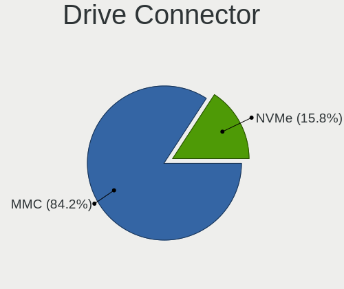

| Type | Notebooks | Drives | Percent |
|------|-----------|--------|---------|
| MMC  | 13        | 13     | 81.25%  |
| NVMe | 3         | 3      | 18.75%  |

Drive Size
----------

Size of hard drive

Zero info for selected period =(

Space Total
-----------

Amount of disk space available on the file system

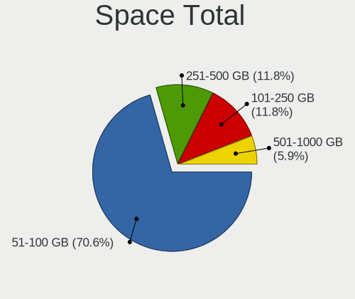

| Size in GB | Notebooks | Percent |
|------------|-----------|---------|
| 51-100     | 10        | 76.92%  |
| 251-500    | 2         | 15.38%  |
| 101-250    | 1         | 7.69%   |

Space Used
----------

Amount of used disk space

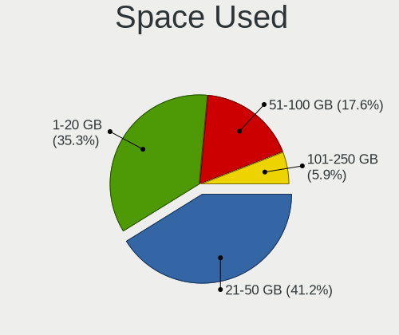

| Used GB | Notebooks | Percent |
|---------|-----------|---------|
| 1-20    | 6         | 46.15%  |
| 21-50   | 5         | 38.46%  |
| 51-100  | 2         | 15.38%  |

Malfunc. Drives
---------------

Drive models with a malfunction

Zero info for selected period =(

Malfunc. Drive Vendor
---------------------

Vendors of faulty drives

Zero info for selected period =(

Malfunc. HDD Vendor
-------------------

Vendors of faulty HDD drives

Zero info for selected period =(

Malfunc. Drive Kind
-------------------

Kinds of faulty drives

Zero info for selected period =(

Failed Drives
-------------

Failed drive models

Zero info for selected period =(

Failed Drive Vendor
-------------------

Failed drive vendors

Zero info for selected period =(

Drive Status
------------

Number of failed and malfunc. drives

| Status   | Notebooks | Drives | Percent |
|----------|-----------|--------|---------|
| Detected | 12        | 15     | 92.31%  |
| Works    | 1         | 1      | 7.69%   |

Storage controller
------------------

Storage Vendor
--------------

Storage controller vendors

| Vendor                       | Notebooks | Percent |
|------------------------------|-----------|---------|
| Toshiba America Info Systems | 1         | 33.33%  |
| Phison Electronics           | 1         | 33.33%  |
| Intel                        | 1         | 33.33%  |

Storage Model
-------------

Storage controller models

| Model                                                | Notebooks | Percent |
|------------------------------------------------------|-----------|---------|
| Toshiba America Info Systems XG6 NVMe SSD Controller | 1         | 33.33%  |
| Phison E12 NVMe Controller                           | 1         | 33.33%  |
| Intel SSD 660P Series                                | 1         | 33.33%  |

Storage Kind
------------

Kind of storage controller (IDE, SATA, NVMe, SAS, ...)

| Kind | Notebooks | Percent |
|------|-----------|---------|
| NVMe | 3         | 100%    |

Processor
---------

CPU Vendor
----------

Processor vendors

| Vendor | Notebooks | Percent |
|--------|-----------|---------|
| ARM    | 13        | 100%    |

CPU Model
---------

Processor models

| Model         | Notebooks | Percent |
|---------------|-----------|---------|
| ARM Processor | 13        | 100%    |

CPU Model Family
----------------

Processor model prefix

| Model | Notebooks | Percent |
|-------|-----------|---------|
| Other | 13        | 100%    |

CPU Cores
---------

Number of processor cores

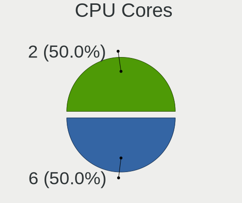

| Number | Notebooks | Percent |
|--------|-----------|---------|
| 6      | 8         | 61.54%  |
| 2      | 5         | 38.46%  |

CPU Sockets
-----------

Number of sockets

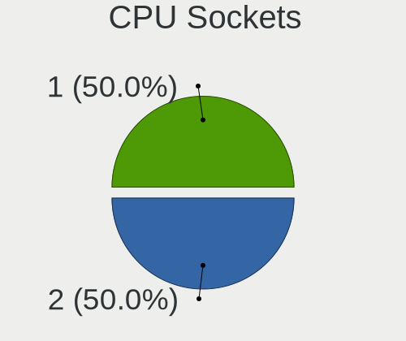

| Number | Notebooks | Percent |
|--------|-----------|---------|
| 2      | 8         | 61.54%  |
| 1      | 5         | 38.46%  |

CPU Threads
-----------

Threads per core (Hyper-Threading)

| Number | Notebooks | Percent |
|--------|-----------|---------|
| 1      | 13        | 100%    |

CPU Op-Modes
------------

CPU Operation Modes (32-bit, 64-bit)

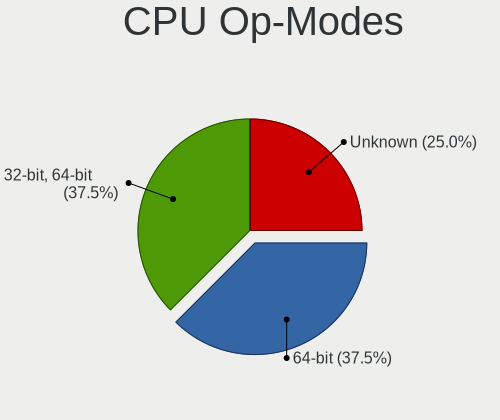

| Op mode        | Notebooks | Percent |
|----------------|-----------|---------|
| 32-bit, 64-bit | 6         | 46.15%  |
| Unknown        | 4         | 30.77%  |
| 64-bit         | 3         | 23.08%  |

CPU Microcode
-------------

Microcode number

| Number  | Notebooks | Percent |
|---------|-----------|---------|
| Unknown | 13        | 100%    |

CPU Microarch
-------------

Microarchitecture

| Name    | Notebooks | Percent |
|---------|-----------|---------|
| Unknown | 13        | 100%    |

Graphics
--------

GPU Vendor
----------

Vendors of graphics cards

Zero info for selected period =(

GPU Model
---------

Graphics card models

Zero info for selected period =(

GPU Combo
---------

Combinations of graphics cards

| Name  | Notebooks | Percent |
|-------|-----------|---------|
| Other | 13        | 100%    |

GPU Driver
----------

Free vs proprietary

| Driver  | Notebooks | Percent |
|---------|-----------|---------|
| Unknown | 13        | 100%    |

GPU Memory
----------

Total video memory

| Size in GB | Notebooks | Percent |
|------------|-----------|---------|
| Unknown    | 13        | 100%    |

Monitor
-------

Monitor Vendor
--------------

Monitor vendors

Zero info for selected period =(

Monitor Model
-------------

Monitor models

Zero info for selected period =(

Monitor Resolution
------------------

Monitor screen resolution

Zero info for selected period =(

Monitor Diagonal
----------------

Diagonal size in inches

Zero info for selected period =(

Monitor Width
-------------

Physical width

Zero info for selected period =(

Aspect Ratio
------------

Proportional relationship between the width and the height

Zero info for selected period =(

Monitor Area
------------

Area in inch²

Zero info for selected period =(

Pixel Density
-------------

Pixels per inch

Zero info for selected period =(

Multiple Monitors
-----------------

Total monitors connected

| Total | Notebooks | Percent |
|-------|-----------|---------|
| 1     | 13        | 100%    |

Network
-------

Net Controller Vendor
---------------------

Controller vendors

| Vendor             | Notebooks | Percent |
|--------------------|-----------|---------|
| Netchip Technology | 1         | 50%     |
| ASIX Electronics   | 1         | 50%     |

Net Controller Model
--------------------

Controller models

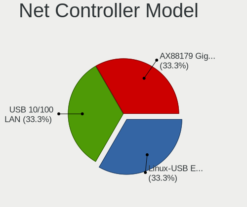

| Model                                   | Notebooks | Percent |
|-----------------------------------------|-----------|---------|
| Netchip Linux-USB Ethernet/RNDIS Gadget | 1         | 50%     |
| ASIX AX88179 Gigabit Ethernet           | 1         | 50%     |

Wireless Vendor
---------------

Wireless vendors

Zero info for selected period =(

Wireless Model
--------------

Wireless models

Zero info for selected period =(

Ethernet Vendor
---------------

Ethernet vendors

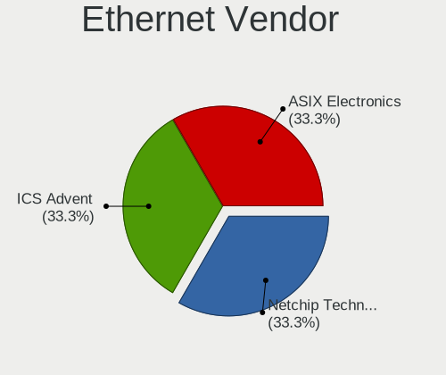

| Vendor             | Notebooks | Percent |
|--------------------|-----------|---------|
| Netchip Technology | 1         | 50%     |
| ASIX Electronics   | 1         | 50%     |

Ethernet Model
--------------

Ethernet models

| Model                                   | Notebooks | Percent |
|-----------------------------------------|-----------|---------|
| Netchip Linux-USB Ethernet/RNDIS Gadget | 1         | 50%     |
| ASIX AX88179 Gigabit Ethernet           | 1         | 50%     |

Net Controller Kind
-------------------

Ethernet, WiFi or modem

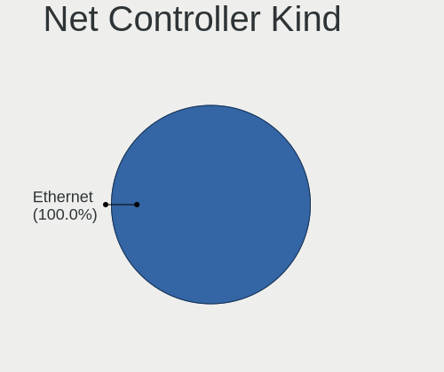

| Kind     | Notebooks | Percent |
|----------|-----------|---------|
| Ethernet | 2         | 100%    |

Used Controller
---------------

Currently used network controller

| Kind     | Notebooks | Percent |
|----------|-----------|---------|
| Ethernet | 1         | 100%    |

NICs
----

Total network controllers on board

| Total | Notebooks | Percent |
|-------|-----------|---------|
| 0     | 13        | 100%    |

IPv6
----

IPv6 vs IPv4

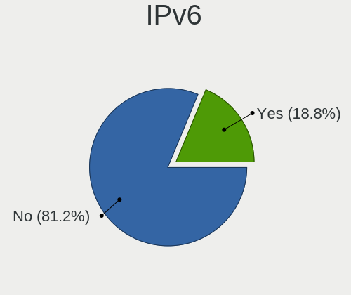

| Used | Notebooks | Percent |
|------|-----------|---------|
| No   | 12        | 92.31%  |
| Yes  | 1         | 7.69%   |

Bluetooth
---------

Bluetooth Vendor
----------------

Controller vendors

Zero info for selected period =(

Bluetooth Model
---------------

Controller models

Zero info for selected period =(

Sound
-----

Sound Vendor
------------

Sound card vendors

Zero info for selected period =(

Sound Model
-----------

Sound card models

Zero info for selected period =(

Memory
------

Memory Vendor
-------------

Memory module vendors

Zero info for selected period =(

Memory Model
------------

Memory module models

Zero info for selected period =(

Memory Kind
-----------

Memory module kinds

Zero info for selected period =(

Memory Form Factor
------------------

Physical design of the memory module

Zero info for selected period =(

Memory Size
-----------

Memory module size

Zero info for selected period =(

Memory Speed
------------

Memory module speed

Zero info for selected period =(

Printers & scanners
-------------------

Printer Vendor
--------------

Printer device vendors

Zero info for selected period =(

Printer Model
-------------

Printer device models

Zero info for selected period =(

Scanner Vendor
--------------

Scanner device vendors

Zero info for selected period =(

Scanner Model
-------------

Scanner device models

Zero info for selected period =(

Camera
------

Camera Vendor
-------------

Camera device vendors

| Vendor   | Notebooks | Percent |
|----------|-----------|---------|
| Microdia | 10        | 100%    |

Camera Model
------------

Camera device models

| Model                  | Notebooks | Percent |
|------------------------|-----------|---------|
| Microdia HP Webcam-101 | 10        | 100%    |

Security
--------

Fingerprint Vendor
------------------

Fingerprint sensor vendors

Zero info for selected period =(

Fingerprint Model
-----------------

Fingerprint sensor models

Zero info for selected period =(

Chipcard Vendor
---------------

Chipcard module vendors

Zero info for selected period =(

Chipcard Model
--------------

Chipcard module models

Zero info for selected period =(

Unsupported
-----------

Unsupported Devices
-------------------

Total unsupported devices on board

| Total | Notebooks | Percent |
|-------|-----------|---------|
| 0     | 13        | 100%    |

Unsupported Device Types
------------------------

Types of unsupported devices

Zero info for selected period =(

