Manjaro-ARM - Tested Hardware & Statistics
------------------------------------------

A project to collect tested hardware configurations for Manjaro-ARM.

Anyone can contribute to this report by the [hw-probe](https://github.com/linuxhw/hw-probe) tool:

    sudo -E hw-probe -all -upload

Please contribute! Especially if your hardware is rare.

This is a report for all computer types. See also reports for [desktops](/Dist/Manjaro-ARM/Desktop/README.md) and [notebooks](/Dist/Manjaro-ARM/Notebook/README.md).

Contents
--------

* [ Test Cases ](#test-cases)

* [ System ](#system)
  - [ OS                       ](#os)
  - [ OS Family                ](#os-family)
  - [ Kernel                   ](#kernel)
  - [ Kernel Family            ](#kernel-family)
  - [ Kernel Major Ver.        ](#kernel-major-ver)
  - [ Arch                     ](#arch)
  - [ DE                       ](#de)
  - [ Display Server           ](#display-server)
  - [ Display Manager          ](#display-manager)
  - [ OS Lang                  ](#os-lang)
  - [ Boot Mode                ](#boot-mode)
  - [ Filesystem               ](#filesystem)
  - [ Part. scheme             ](#part-scheme)
  - [ Dual Boot with Linux/BSD ](#dual-boot-with-linuxbsd)
  - [ Dual Boot (Win)          ](#dual-boot-win)

* [ Board ](#board)
  - [ Vendor                   ](#vendor)
  - [ Model                    ](#model)
  - [ Model Family             ](#model-family)
  - [ MFG Year                 ](#mfg-year)
  - [ Form Factor              ](#form-factor)
  - [ Secure Boot              ](#secure-boot)
  - [ Coreboot                 ](#coreboot)
  - [ RAM Size                 ](#ram-size)
  - [ RAM Used                 ](#ram-used)
  - [ Total Drives             ](#total-drives)
  - [ Has CD-ROM               ](#has-cd-rom)
  - [ Has Ethernet             ](#has-ethernet)
  - [ Has WiFi                 ](#has-wifi)
  - [ Has Bluetooth            ](#has-bluetooth)

* [ Location ](#location)
  - [ Country                  ](#country)
  - [ City                     ](#city)

* [ Drives ](#drives)
  - [ Drive Vendor             ](#drive-vendor)
  - [ Drive Model              ](#drive-model)
  - [ HDD Vendor               ](#hdd-vendor)
  - [ SSD Vendor               ](#ssd-vendor)
  - [ Drive Kind               ](#drive-kind)
  - [ Drive Connector          ](#drive-connector)
  - [ Drive Size               ](#drive-size)
  - [ Space Total              ](#space-total)
  - [ Space Used               ](#space-used)
  - [ Malfunc. Drives          ](#malfunc-drives)
  - [ Malfunc. Drive Vendor    ](#malfunc-drive-vendor)
  - [ Malfunc. HDD Vendor      ](#malfunc-hdd-vendor)
  - [ Malfunc. Drive Kind      ](#malfunc-drive-kind)
  - [ Failed Drives            ](#failed-drives)
  - [ Failed Drive Vendor      ](#failed-drive-vendor)
  - [ Drive Status             ](#drive-status)

* [ Storage controller ](#storage-controller)
  - [ Storage Vendor           ](#storage-vendor)
  - [ Storage Model            ](#storage-model)
  - [ Storage Kind             ](#storage-kind)

* [ Processor ](#processor)
  - [ CPU Vendor               ](#cpu-vendor)
  - [ CPU Model                ](#cpu-model)
  - [ CPU Model Family         ](#cpu-model-family)
  - [ CPU Cores                ](#cpu-cores)
  - [ CPU Sockets              ](#cpu-sockets)
  - [ CPU Threads              ](#cpu-threads)
  - [ CPU Op-Modes             ](#cpu-op-modes)
  - [ CPU Microcode            ](#cpu-microcode)
  - [ CPU Microarch            ](#cpu-microarch)

* [ Graphics ](#graphics)
  - [ GPU Vendor               ](#gpu-vendor)
  - [ GPU Model                ](#gpu-model)
  - [ GPU Combo                ](#gpu-combo)
  - [ GPU Driver               ](#gpu-driver)
  - [ GPU Memory               ](#gpu-memory)

* [ Monitor ](#monitor)
  - [ Monitor Vendor           ](#monitor-vendor)
  - [ Monitor Model            ](#monitor-model)
  - [ Monitor Resolution       ](#monitor-resolution)
  - [ Monitor Diagonal         ](#monitor-diagonal)
  - [ Monitor Width            ](#monitor-width)
  - [ Aspect Ratio             ](#aspect-ratio)
  - [ Monitor Area             ](#monitor-area)
  - [ Pixel Density            ](#pixel-density)
  - [ Multiple Monitors        ](#multiple-monitors)

* [ Network ](#network)
  - [ Net Controller Vendor    ](#net-controller-vendor)
  - [ Net Controller Model     ](#net-controller-model)
  - [ Wireless Vendor          ](#wireless-vendor)
  - [ Wireless Model           ](#wireless-model)
  - [ Ethernet Vendor          ](#ethernet-vendor)
  - [ Ethernet Model           ](#ethernet-model)
  - [ Net Controller Kind      ](#net-controller-kind)
  - [ Used Controller          ](#used-controller)
  - [ NICs                     ](#nics)
  - [ IPv6                     ](#ipv6)

* [ Bluetooth ](#bluetooth)
  - [ Bluetooth Vendor         ](#bluetooth-vendor)
  - [ Bluetooth Model          ](#bluetooth-model)

* [ Sound ](#sound)
  - [ Sound Vendor             ](#sound-vendor)
  - [ Sound Model              ](#sound-model)

* [ Memory ](#memory)
  - [ Memory Vendor            ](#memory-vendor)
  - [ Memory Model             ](#memory-model)
  - [ Memory Kind              ](#memory-kind)
  - [ Memory Form Factor       ](#memory-form-factor)
  - [ Memory Size              ](#memory-size)
  - [ Memory Speed             ](#memory-speed)

* [ Printers & scanners ](#printers--scanners)
  - [ Printer Vendor           ](#printer-vendor)
  - [ Printer Model            ](#printer-model)
  - [ Scanner Vendor           ](#scanner-vendor)
  - [ Scanner Model            ](#scanner-model)

* [ Camera ](#camera)
  - [ Camera Vendor            ](#camera-vendor)
  - [ Camera Model             ](#camera-model)

* [ Security ](#security)
  - [ Fingerprint Vendor       ](#fingerprint-vendor)
  - [ Fingerprint Model        ](#fingerprint-model)
  - [ Chipcard Vendor          ](#chipcard-vendor)
  - [ Chipcard Model           ](#chipcard-model)

* [ Unsupported ](#unsupported)
  - [ Unsupported Devices      ](#unsupported-devices)
  - [ Unsupported Device Types ](#unsupported-device-types)

Test Cases
----------

Total: 151

| Vendor        | Model                       | Form-Factor | Probe                                                      | Date         |
|---------------|-----------------------------|-------------|------------------------------------------------------------|--------------|
| Raspberry ... | Raspberry Pi 400 Rev 1.1    | Soc         | [35e990cfea](https://linux-hardware.org/?probe=35e990cfea) | Sep 07, 2023 |
| Pine Micro... | Pine64 Pinebook Pro         | Notebook    | [80e1d849fd](https://linux-hardware.org/?probe=80e1d849fd) | Sep 06, 2023 |
| Raspberry ... | Raspberry Pi 4 Model B R... | Soc         | [0aaecbe0a9](https://linux-hardware.org/?probe=0aaecbe0a9) | Aug 18, 2023 |
| Ugoos         | AM6b Plus                   | Soc         | [a5ff8e9a5d](https://linux-hardware.org/?probe=a5ff8e9a5d) | Jul 29, 2023 |
| Pine Micro... | Pine64 PinePhonePro         | Phone       | [cd17b6716c](https://linux-hardware.org/?probe=cd17b6716c) | Jul 16, 2023 |
| Unknown       | Beelink GT-King Pro         | Soc         | [c3b05a3295](https://linux-hardware.org/?probe=c3b05a3295) | Jul 10, 2023 |
| Raspberry ... | Raspberry Pi 4 Model B R... | Soc         | [a536b66fc6](https://linux-hardware.org/?probe=a536b66fc6) | Jun 29, 2023 |
| Unknown       | Beelink GT-King Pro         | Soc         | [766d906989](https://linux-hardware.org/?probe=766d906989) | Jun 13, 2023 |
| Pine Micro... | Pine64 Pinebook Pro         | Notebook    | [e6effbe52e](https://linux-hardware.org/?probe=e6effbe52e) | Apr 11, 2023 |
| Pine Micro... | Pine64 Pinebook Pro         | Notebook    | [5b53728575](https://linux-hardware.org/?probe=5b53728575) | Mar 26, 2023 |
| Raspberry ... | Raspberry Pi 400 Rev 1.0    | Soc         | [4a8ec9290e](https://linux-hardware.org/?probe=4a8ec9290e) | Mar 12, 2023 |
| Pine Micro... | Pine64 PinePhonePro         | Phone       | [121fcf8fd6](https://linux-hardware.org/?probe=121fcf8fd6) | Feb 12, 2023 |
| Pine Micro... | Pine64 PinePhone (1.2)      | Phone       | [dea7831935](https://linux-hardware.org/?probe=dea7831935) | Feb 10, 2023 |
| Pine Micro... | Pine64 PinePhonePro         | Phone       | [09b7f2f81f](https://linux-hardware.org/?probe=09b7f2f81f) | Feb 10, 2023 |
| Pine Micro... | Pine64 PinePhone (1.2)      | Phone       | [a4e4317d4d](https://linux-hardware.org/?probe=a4e4317d4d) | Jan 24, 2023 |
| Pine Micro... | Pine64 PinePhonePro (DT)    | Phone       | [a3cfc48f91](https://linux-hardware.org/?probe=a3cfc48f91) | Jan 11, 2023 |
| Pine Micro... | Pine64 PinePhone (1.2)      | Phone       | [b8cb61c70a](https://linux-hardware.org/?probe=b8cb61c70a) | Dec 29, 2022 |
| Pine Micro... | Pine64 PinePhone (1.2)      | Phone       | [c8b4b6d3bc](https://linux-hardware.org/?probe=c8b4b6d3bc) | Dec 24, 2022 |
| Raspberry ... | Raspberry Pi 4 Model B R... | Soc         | [7714ba77eb](https://linux-hardware.org/?probe=7714ba77eb) | Dec 21, 2022 |
| Raspberry ... | Raspberry Pi 4 Model B R... | Soc         | [8c140bbafc](https://linux-hardware.org/?probe=8c140bbafc) | Dec 20, 2022 |
| Raspberry ... | Raspberry Pi 4 Model B R... | Soc         | [5981154034](https://linux-hardware.org/?probe=5981154034) | Dec 20, 2022 |
| Raspberry ... | Raspberry Pi 4 Model B R... | Soc         | [0361b1083f](https://linux-hardware.org/?probe=0361b1083f) | Dec 20, 2022 |
| Pine Micro... | Pine64 Pinebook Pro         | Notebook    | [760fd1ae84](https://linux-hardware.org/?probe=760fd1ae84) | Dec 13, 2022 |
| Pine Micro... | Pine64 PinePhone (1.2)      | Phone       | [cc309bb44c](https://linux-hardware.org/?probe=cc309bb44c) | Nov 26, 2022 |
| Raspberry ... | Raspberry Pi 4 Model B R... | Soc         | [a0d94329a6](https://linux-hardware.org/?probe=a0d94329a6) | Nov 13, 2022 |
| Raspberry ... | Raspberry Pi 4 Model B R... | Soc         | [9f0e94860c](https://linux-hardware.org/?probe=9f0e94860c) | Nov 12, 2022 |
| Raspberry ... | Raspberry Pi 4 Model B R... | Soc         | [81f59ba6f5](https://linux-hardware.org/?probe=81f59ba6f5) | Nov 11, 2022 |
| Raspberry ... | Raspberry Pi 4 Model B R... | Soc         | [3fe8b5fef3](https://linux-hardware.org/?probe=3fe8b5fef3) | Nov 10, 2022 |
| Raspberry ... | Raspberry Pi 4 Model B R... | Soc         | [012705552d](https://linux-hardware.org/?probe=012705552d) | Nov 04, 2022 |
| Raspberry ... | Raspberry Pi 4 Model B R... | Soc         | [34061efe0c](https://linux-hardware.org/?probe=34061efe0c) | Oct 25, 2022 |
| Radxa         | ROCK Pi 4B (DT)             | Soc         | [f05063925b](https://linux-hardware.org/?probe=f05063925b) | Oct 21, 2022 |
| Raspberry ... | Raspberry Pi 4 Model B R... | Soc         | [7207f549c7](https://linux-hardware.org/?probe=7207f549c7) | Oct 18, 2022 |
| Raspberry ... | Raspberry Pi 4 Model B R... | Soc         | [d18c649cb6](https://linux-hardware.org/?probe=d18c649cb6) | Oct 15, 2022 |
| Raspberry ... | Raspberry Pi 4 Model B R... | Soc         | [f9dc4fff88](https://linux-hardware.org/?probe=f9dc4fff88) | Oct 12, 2022 |
| Raspberry ... | Raspberry Pi 4 Model B R... | Soc         | [d2f6a610d9](https://linux-hardware.org/?probe=d2f6a610d9) | Oct 06, 2022 |
| Raspberry ... | Raspberry Pi 400 Rev 1.0    | Soc         | [ac0705feae](https://linux-hardware.org/?probe=ac0705feae) | Oct 02, 2022 |
| Raspberry ... | Raspberry Pi 4 Model B R... | Soc         | [0c25e7e0a0](https://linux-hardware.org/?probe=0c25e7e0a0) | Oct 02, 2022 |
| Pine Micro... | Pine64 PinePhone (1.2)      | Phone       | [bc3501546b](https://linux-hardware.org/?probe=bc3501546b) | Sep 28, 2022 |
| Pine Micro... | Pine64 PinePhone (1.2)      | Phone       | [bc6ffac174](https://linux-hardware.org/?probe=bc6ffac174) | Sep 11, 2022 |
| Unknown       | Unknown                     | Soc         | [6e8246d8bc](https://linux-hardware.org/?probe=6e8246d8bc) | Sep 05, 2022 |
| Pine Micro... | Pine64 PinePhone (1.2)      | Phone       | [533e62b70d](https://linux-hardware.org/?probe=533e62b70d) | Aug 20, 2022 |
| Pine Micro... | Pine64 PinePhone (1.2)      | Phone       | [2b238b3dc7](https://linux-hardware.org/?probe=2b238b3dc7) | Aug 19, 2022 |
| PINE64        | Pinebook Pro                | Soc         | [5f5c134bd6](https://linux-hardware.org/?probe=5f5c134bd6) | Aug 14, 2022 |
| Pine Micro... | Pine64 PinePhone (1.2)      | Phone       | [54465a49f5](https://linux-hardware.org/?probe=54465a49f5) | Aug 09, 2022 |
| Pine Micro... | Pine64 PinePhonePro (DT)    | Phone       | [7b62ba2ec4](https://linux-hardware.org/?probe=7b62ba2ec4) | Jul 31, 2022 |
| Unknown       | Beelink GT1                 | Soc         | [2e00352c95](https://linux-hardware.org/?probe=2e00352c95) | Jul 25, 2022 |
| Pine Micro... | Pine64 RK3566 Quartz64-A    | Soc         | [8e2855140c](https://linux-hardware.org/?probe=8e2855140c) | Jul 24, 2022 |
| Unknown       | Unknown                     | Soc         | [ec9eb5536d](https://linux-hardware.org/?probe=ec9eb5536d) | Jul 18, 2022 |
| Pine Micro... | Pine64 PinePhonePro         | Phone       | [03fca40d38](https://linux-hardware.org/?probe=03fca40d38) | Jul 17, 2022 |
| Raspberry ... | Raspberry Pi 4 Model B R... | Soc         | [a9a3470242](https://linux-hardware.org/?probe=a9a3470242) | Jun 19, 2022 |
| Pine Micro... | Pine64 RK3566 Quartz64-A    | Soc         | [8226efcb30](https://linux-hardware.org/?probe=8226efcb30) | Jun 07, 2022 |
| Raspberry ... | Raspberry Pi 4 Model B R... | Soc         | [f2e5a856f4](https://linux-hardware.org/?probe=f2e5a856f4) | May 25, 2022 |
| Pine Micro... | Pine64 RK3566 Quartz64-A    | Soc         | [b31235961f](https://linux-hardware.org/?probe=b31235961f) | May 24, 2022 |
| Pine Micro... | Pine64 PinePhone (1.2)      | Phone       | [37f92aa173](https://linux-hardware.org/?probe=37f92aa173) | May 21, 2022 |
| Pine Micro... | Pine64 PinePhonePro         | Phone       | [5a75c038d2](https://linux-hardware.org/?probe=5a75c038d2) | Apr 19, 2022 |
| Pine Micro... | Pine64 RK3566 Quartz64-A    | Soc         | [8ff8aa816f](https://linux-hardware.org/?probe=8ff8aa816f) | Apr 15, 2022 |
| Raspberry ... | Raspberry Pi 4 Model B R... | Soc         | [93d20b6e00](https://linux-hardware.org/?probe=93d20b6e00) | Apr 14, 2022 |
| Raspberry ... | Raspberry Pi 400 Rev 1.0    | Soc         | [0e115f2126](https://linux-hardware.org/?probe=0e115f2126) | Apr 14, 2022 |
| Raspberry ... | Raspberry Pi 4 Model B R... | Soc         | [5c31fd2838](https://linux-hardware.org/?probe=5c31fd2838) | Apr 11, 2022 |
| Raspberry ... | Raspberry Pi 4 Model B R... | Soc         | [b929783867](https://linux-hardware.org/?probe=b929783867) | Apr 08, 2022 |
| Unknown       | Unknown                     | Soc         | [509d960112](https://linux-hardware.org/?probe=509d960112) | Mar 30, 2022 |
| Pine Micro... | Pine64 PinePhonePro         | Phone       | [235c763f19](https://linux-hardware.org/?probe=235c763f19) | Mar 28, 2022 |
| Pine Micro... | Pine64 RK3566 Quartz64-A    | Soc         | [f3c11793ee](https://linux-hardware.org/?probe=f3c11793ee) | Mar 17, 2022 |
| Raspberry ... | Raspberry Pi 4 Model B R... | Soc         | [6b82f2f5f8](https://linux-hardware.org/?probe=6b82f2f5f8) | Mar 13, 2022 |
| Raspberry ... | Raspberry Pi 4 Model B R... | Soc         | [bd24a29894](https://linux-hardware.org/?probe=bd24a29894) | Mar 11, 2022 |
| Pine Micro... | Pine64 PinePhonePro         | Phone       | [6218135a7c](https://linux-hardware.org/?probe=6218135a7c) | Mar 06, 2022 |
| Raspberry ... | Raspberry Pi 400 Rev 1.0    | Soc         | [d2b091c26b](https://linux-hardware.org/?probe=d2b091c26b) | Feb 22, 2022 |
| Shenzhen A... | X96 Max                     | Soc         | [440ca2b84f](https://linux-hardware.org/?probe=440ca2b84f) | Feb 14, 2022 |
| Raspberry ... | Raspberry Pi 4 Model B R... | Soc         | [da8754f5d5](https://linux-hardware.org/?probe=da8754f5d5) | Jan 30, 2022 |
| Raspberry ... | Raspberry Pi 400 Rev 1.0    | Soc         | [d40ebefd39](https://linux-hardware.org/?probe=d40ebefd39) | Jan 28, 2022 |
| Raspberry ... | Raspberry Pi 4 Model B R... | Soc         | [1e21b25bba](https://linux-hardware.org/?probe=1e21b25bba) | Jan 12, 2022 |
| Raspberry ... | Raspberry Pi 400 Rev 1.0    | Soc         | [6d8df9807e](https://linux-hardware.org/?probe=6d8df9807e) | Jan 11, 2022 |
| Raspberry ... | Raspberry Pi 400 Rev 1.0    | Soc         | [6583550f14](https://linux-hardware.org/?probe=6583550f14) | Jan 11, 2022 |
| Raspberry ... | Raspberry Pi 400 Rev 1.0    | Soc         | [e6147adb9d](https://linux-hardware.org/?probe=e6147adb9d) | Dec 25, 2021 |
| Raspberry ... | Raspberry Pi 400 Rev 1.0    | Soc         | [138b3d17bc](https://linux-hardware.org/?probe=138b3d17bc) | Dec 25, 2021 |
| Raspberry ... | Raspberry Pi 4 Model B R... | Soc         | [2cfa03ec21](https://linux-hardware.org/?probe=2cfa03ec21) | Dec 23, 2021 |
| Unknown       | Beelink GT1                 | Soc         | [a8749745a4](https://linux-hardware.org/?probe=a8749745a4) | Dec 21, 2021 |
| Shenzhen A... | X96 Max                     | Soc         | [94f3848f94](https://linux-hardware.org/?probe=94f3848f94) | Dec 18, 2021 |
| Unknown       | Beelink GT1                 | Soc         | [51e764f297](https://linux-hardware.org/?probe=51e764f297) | Dec 17, 2021 |
| Unknown       | Beelink GT1                 | Soc         | [c5f5fd7e8f](https://linux-hardware.org/?probe=c5f5fd7e8f) | Dec 16, 2021 |
| Khadas        | VIM2                        | Soc         | [77b3e7305b](https://linux-hardware.org/?probe=77b3e7305b) | Dec 16, 2021 |
| Pine Micro... | Pine64 PinePhone (1.2)      | Phone       | [50d5c7e182](https://linux-hardware.org/?probe=50d5c7e182) | Dec 06, 2021 |
| Pine Micro... | Pine64 RK3566 Quartz64-A    | Soc         | [4239296e76](https://linux-hardware.org/?probe=4239296e76) | Dec 01, 2021 |
| Pine Micro... | Pine64 RK3566 Quartz64-A    | Soc         | [965f364f1d](https://linux-hardware.org/?probe=965f364f1d) | Nov 30, 2021 |
| Raspberry ... | Raspberry Pi 4 Model B R... | Soc         | [c79ad4a8db](https://linux-hardware.org/?probe=c79ad4a8db) | Nov 26, 2021 |
| Raspberry ... | Raspberry Pi                | Soc         | [077a2863fd](https://linux-hardware.org/?probe=077a2863fd) | Nov 05, 2021 |
| Raspberry ... | Raspberry Pi 4 Model B R... | Soc         | [20c4658fbc](https://linux-hardware.org/?probe=20c4658fbc) | Nov 04, 2021 |
| Pine Micro... | Pine64 Pinebook Pro         | Notebook    | [ac4e15828b](https://linux-hardware.org/?probe=ac4e15828b) | Nov 02, 2021 |
| Raspberry ... | Raspberry Pi 4 Model B R... | Soc         | [b785cdc0bb](https://linux-hardware.org/?probe=b785cdc0bb) | Oct 30, 2021 |
| Raspberry ... | Raspberry Pi                | Soc         | [df99169555](https://linux-hardware.org/?probe=df99169555) | Oct 30, 2021 |
| Pine Micro... | Pine64 PinePhone (1.2)      | Phone       | [4a5e673fe5](https://linux-hardware.org/?probe=4a5e673fe5) | Oct 14, 2021 |
| Raspberry ... | Raspberry Pi 4 Model B R... | Soc         | [52c09b147c](https://linux-hardware.org/?probe=52c09b147c) | Sep 20, 2021 |
| Raspberry ... | Raspberry Pi 4 Model B R... | Soc         | [c189148518](https://linux-hardware.org/?probe=c189148518) | Sep 20, 2021 |
| Raspberry ... | Raspberry Pi 4 Model B R... | Soc         | [9ef99e18e2](https://linux-hardware.org/?probe=9ef99e18e2) | Aug 19, 2021 |
| Raspberry ... | Raspberry Pi 4 Model B R... | Soc         | [f7a1b3b0e4](https://linux-hardware.org/?probe=f7a1b3b0e4) | Aug 18, 2021 |
| Raspberry ... | Raspberry Pi 4 Model B R... | Soc         | [bff99d5a7c](https://linux-hardware.org/?probe=bff99d5a7c) | Jul 26, 2021 |
| Pine Micro... | Pine64 PinePhone (1.2)      | Phone       | [f003dd4906](https://linux-hardware.org/?probe=f003dd4906) | Jul 23, 2021 |
| Pine Micro... | Pine64 PinePhone (1.2)      | Phone       | [ca01402661](https://linux-hardware.org/?probe=ca01402661) | Jul 03, 2021 |
| Raspberry ... | Raspberry Pi 400 Rev 1.0    | Soc         | [64603b3562](https://linux-hardware.org/?probe=64603b3562) | Jul 02, 2021 |
| Lenovo        | Yoga C630-13Q50 81JL        | Tablet      | [805ea3b3c5](https://linux-hardware.org/?probe=805ea3b3c5) | Jul 01, 2021 |
| Raspberry ... | Raspberry Pi 4 Model B R... | Soc         | [4020e881a1](https://linux-hardware.org/?probe=4020e881a1) | Jun 16, 2021 |
| Pine Micro... | Pine64 PinePhone (1.2)      | Phone       | [f1bc769db9](https://linux-hardware.org/?probe=f1bc769db9) | Jun 15, 2021 |
| Raspberry ... | Raspberry Pi 4 Model B R... | Soc         | [7fa170e5ca](https://linux-hardware.org/?probe=7fa170e5ca) | Jun 10, 2021 |
| Raspberry ... | Raspberry Pi                | Soc         | [dc7b014ec9](https://linux-hardware.org/?probe=dc7b014ec9) | May 26, 2021 |
| Pine Micro... | Pine64 Pinebook Pro         | Notebook    | [896bd98421](https://linux-hardware.org/?probe=896bd98421) | May 19, 2021 |
| Raspberry ... | Raspberry Pi 4 Model B R... | Soc         | [368044e19e](https://linux-hardware.org/?probe=368044e19e) | May 18, 2021 |
| Raspberry ... | Raspberry Pi 400 Rev 1.0    | Soc         | [e436e57831](https://linux-hardware.org/?probe=e436e57831) | May 17, 2021 |
| Pine Micro... | Pine64 PinePhone (1.2)      | Phone       | [07d8401514](https://linux-hardware.org/?probe=07d8401514) | May 16, 2021 |
| Raspberry ... | Raspberry Pi 4 Model B R... | Soc         | [321b9f409a](https://linux-hardware.org/?probe=321b9f409a) | May 14, 2021 |
| Pine Micro... | Pine64 PinePhone (1.2)      | Phone       | [2aee3702e9](https://linux-hardware.org/?probe=2aee3702e9) | May 08, 2021 |
| Pine Micro... | Pine64 PinePhone (1.2)      | Phone       | [cf555f92bc](https://linux-hardware.org/?probe=cf555f92bc) | May 02, 2021 |
| Pine Micro... | Pine64 PinePhone (1.2)      | Phone       | [1f32cfa090](https://linux-hardware.org/?probe=1f32cfa090) | May 01, 2021 |
| Pine Micro... | Pine64 PinePhone (1.2)      | Phone       | [7d7e3bfc9f](https://linux-hardware.org/?probe=7d7e3bfc9f) | Apr 06, 2021 |
| Pine Micro... | Pine64 PinePhone (1.2)      | Phone       | [d97055c68d](https://linux-hardware.org/?probe=d97055c68d) | Apr 04, 2021 |
| Raspberry ... | Raspberry Pi 400 Rev 1.0    | Soc         | [861c7906fa](https://linux-hardware.org/?probe=861c7906fa) | Mar 29, 2021 |
| Raspberry ... | Raspberry Pi 4 Model B R... | Soc         | [543a85726b](https://linux-hardware.org/?probe=543a85726b) | Mar 22, 2021 |
| Raspberry ... | Raspberry Pi 4 Model B R... | Soc         | [105dc78331](https://linux-hardware.org/?probe=105dc78331) | Mar 19, 2021 |
| Raspberry ... | Raspberry Pi 4 Model B R... | Soc         | [ae40e5f830](https://linux-hardware.org/?probe=ae40e5f830) | Mar 19, 2021 |
| Pine Micro... | Pine64 PinePhone (1.2)      | Phone       | [2ad000987e](https://linux-hardware.org/?probe=2ad000987e) | Mar 12, 2021 |
| Raspberry ... | Raspberry Pi 4 Model B R... | Soc         | [6c54a4db87](https://linux-hardware.org/?probe=6c54a4db87) | Feb 13, 2021 |
| Pine Micro... | Pine64 PinePhone (1.2)      | Phone       | [7b691e6c3a](https://linux-hardware.org/?probe=7b691e6c3a) | Feb 04, 2021 |
| Pine Micro... | Pine64 PinePhone (1.2)      | Phone       | [7f2e3317b5](https://linux-hardware.org/?probe=7f2e3317b5) | Jan 30, 2021 |
| Pine Micro... | Pine64 PinePhone (1.2)      | Phone       | [24c4a691d7](https://linux-hardware.org/?probe=24c4a691d7) | Jan 30, 2021 |
| Hardkernel    | ODROID-N2Plus               | Soc         | [d9070da088](https://linux-hardware.org/?probe=d9070da088) | Dec 20, 2020 |
| Pine Micro... | Pine64 Pinebook Pro         | Notebook    | [947451c5ef](https://linux-hardware.org/?probe=947451c5ef) | Nov 14, 2020 |
| Raspberry ... | Raspberry Pi 4 Model B R... | Soc         | [7b35e5e525](https://linux-hardware.org/?probe=7b35e5e525) | Nov 04, 2020 |
| Raspberry ... | Raspberry Pi 4 Model B R... | Soc         | [c4e2010c1b](https://linux-hardware.org/?probe=c4e2010c1b) | Nov 03, 2020 |
| Pine Micro... | Pine64 Pinebook Pro         | Notebook    | [169238c060](https://linux-hardware.org/?probe=169238c060) | Nov 03, 2020 |
| Pine Micro... | Pine64 Pinebook Pro         | Notebook    | [fb24852769](https://linux-hardware.org/?probe=fb24852769) | Nov 01, 2020 |
| Pine Micro... | PineTab                     | Soc         | [d3736a7d1f](https://linux-hardware.org/?probe=d3736a7d1f) | Sep 29, 2020 |
| Pine Micro... | Pine64 Pinebook Pro         | Notebook    | [dabd07ba39](https://linux-hardware.org/?probe=dabd07ba39) | Sep 29, 2020 |
| Raspberry ... | Raspberry Pi 4 Model B R... | Soc         | [199d9ad3ff](https://linux-hardware.org/?probe=199d9ad3ff) | Sep 18, 2020 |
| Raspberry ... | Raspberry Pi 4 Model B R... | Soc         | [6831742863](https://linux-hardware.org/?probe=6831742863) | Sep 18, 2020 |
| Pine Micro... | Pine64 Pinebook Pro         | Notebook    | [b7a5bf61e7](https://linux-hardware.org/?probe=b7a5bf61e7) | Sep 16, 2020 |
| Raspberry ... | Raspberry Pi 4 Model B R... | Soc         | [903bc538dd](https://linux-hardware.org/?probe=903bc538dd) | Sep 16, 2020 |
| Pine Micro... | Pine64 Pinebook Pro         | Notebook    | [0ccf4e6f67](https://linux-hardware.org/?probe=0ccf4e6f67) | Sep 03, 2020 |
| Pine Micro... | Pine64 Pinebook Pro         | Notebook    | [ec849f00fc](https://linux-hardware.org/?probe=ec849f00fc) | Sep 03, 2020 |
| Pine Micro... | Pine64 Pinebook Pro         | Notebook    | [1ef25f0a09](https://linux-hardware.org/?probe=1ef25f0a09) | Sep 03, 2020 |
| PINE64        | Pinebook Pro                | Soc         | [0f15ee91d5](https://linux-hardware.org/?probe=0f15ee91d5) | Aug 25, 2020 |
| PINE64        | Pinebook Pro                | Soc         | [e7ac0707cd](https://linux-hardware.org/?probe=e7ac0707cd) | Aug 25, 2020 |
| Raspberry ... | Raspberry Pi 4 Model B R... | Soc         | [2098b09526](https://linux-hardware.org/?probe=2098b09526) | Aug 17, 2020 |
| Pine Micro... | Pine64 Pinebook Pro         | Notebook    | [b0d04bed01](https://linux-hardware.org/?probe=b0d04bed01) | Aug 06, 2020 |
| Raspberry ... | Raspberry Pi 4 Model B R... | Soc         | [454d02d902](https://linux-hardware.org/?probe=454d02d902) | Jul 22, 2020 |
| Unknown       | Unknown                     | Soc         | [4fa39ff4f7](https://linux-hardware.org/?probe=4fa39ff4f7) | Jul 14, 2020 |
| Raspberry ... | Raspberry Pi 4 Model B R... | Soc         | [bccab0e704](https://linux-hardware.org/?probe=bccab0e704) | Jul 04, 2020 |
| Raspberry ... | Raspberry Pi 4 Model B R... | Soc         | [edb48aa099](https://linux-hardware.org/?probe=edb48aa099) | Jun 03, 2020 |
| Raspberry ... | Raspberry Pi 4 Model B R... | Soc         | [1c8aa5a7be](https://linux-hardware.org/?probe=1c8aa5a7be) | Jun 03, 2020 |
| Radxa         | ROCK Pi 4                   | Soc         | [543099b0fa](https://linux-hardware.org/?probe=543099b0fa) | Mar 29, 2020 |
| Raspberry ... | Raspberry Pi 4 Model B R... | Soc         | [74359d777e](https://linux-hardware.org/?probe=74359d777e) | Mar 16, 2020 |
| Radxa         | ROCK Pi 4                   | Soc         | [688046c3d7](https://linux-hardware.org/?probe=688046c3d7) | Feb 01, 2020 |
| Radxa         | ROCK Pi 4                   | Soc         | [3d67546a89](https://linux-hardware.org/?probe=3d67546a89) | Jan 29, 2020 |

System
------

OS
--

Installed operating systems

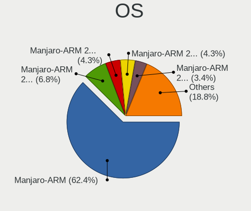

| Name              | Computers | Percent |
|-------------------|-----------|---------|
| Manjaro-ARM       | 69        | 65.71%  |
| Manjaro-ARM 21.10 | 8         | 7.62%   |
| Manjaro-ARM 23.02 | 4         | 3.81%   |
| Manjaro-ARM 22.01 | 4         | 3.81%   |
| Manjaro-ARM 22.09 | 2         | 1.9%    |
| Manjaro-ARM 22.07 | 2         | 1.9%    |
| Manjaro-ARM 22.03 | 2         | 1.9%    |
| Manjaro-ARM 20.09 | 2         | 1.9%    |
| Manjaro-ARM 23.01 | 1         | 0.95%   |
| Manjaro-ARM 22.12 | 1         | 0.95%   |
| Manjaro-ARM 22.06 | 1         | 0.95%   |
| Manjaro-ARM 22.05 | 1         | 0.95%   |
| Manjaro-ARM 21.08 | 1         | 0.95%   |
| Manjaro-ARM 21.06 | 1         | 0.95%   |
| Manjaro-ARM 21.05 | 1         | 0.95%   |
| Manjaro-ARM 21.03 | 1         | 0.95%   |
| Manjaro-ARM 20.12 | 1         | 0.95%   |
| Manjaro-ARM 20.10 | 1         | 0.95%   |
| Manjaro-ARM 20.03 | 1         | 0.95%   |
| Manjaro-ARM 19.12 | 1         | 0.95%   |

OS Family
---------

OS without a version

| Name        | Computers | Percent |
|-------------|-----------|---------|
| Manjaro-ARM | 95        | 100%    |

Kernel
------

Version of the Linux kernel

| Version                     | Computers | Percent |
|-----------------------------|-----------|---------|
| 5.15.7-1-MANJARO-ARM        | 4         | 3.42%   |
| 5.10.74-1-MANJARO-ARM       | 4         | 3.42%   |
| 6.1.7-1-MANJARO-ARM         | 3         | 2.56%   |
| 5.15.24-1-MANJARO-ARM-RPI   | 3         | 2.56%   |
| 6.2.5-1-MANJARO-ARM         | 2         | 1.71%   |
| 6.1.37-1-MANJARO-ARM-RPI    | 2         | 1.71%   |
| 5.9.1-3-MANJARO-ARM         | 2         | 1.71%   |
| 5.8.3-2-MANJARO-ARM         | 2         | 1.71%   |
| 5.4.61-1-MANJARO-ARM        | 2         | 1.71%   |
| 5.19.1-1-MANJARO-ARM        | 2         | 1.71%   |
| 5.18.9-1-MANJARO-ARM        | 2         | 1.71%   |
| 5.16.16-1-MANJARO-ARM       | 2         | 1.71%   |
| 5.15.70-1-MANJARO-ARM-RPI   | 2         | 1.71%   |
| 5.15.28-1-MANJARO-ARM-RPI   | 2         | 1.71%   |
| 5.11.6-2-MANJARO-ARM        | 2         | 1.71%   |
| 5.11.3-1-MANJARO-ARM        | 2         | 1.71%   |
| 5.11.17-1-MANJARO-ARM       | 2         | 1.71%   |
| 5.10.88-1-MANJARO-ARM-RPI   | 2         | 1.71%   |
| 5.10.36-1-MANJARO-ARM       | 2         | 1.71%   |
| 4.19.127-1-MANJARO-ARM      | 2         | 1.71%   |
| 6.4.4-1-MANJARO-ARM         | 1         | 0.85%   |
| 6.3.9-1-MANJARO-ARM         | 1         | 0.85%   |
| 6.3.11-1-MANJARO-ARM        | 1         | 0.85%   |
| 6.1.35-1-MANJARO-ARM-AML    | 1         | 0.85%   |
| 6.1.34-1-MANJARO-ARM-RPI    | 1         | 0.85%   |
| 6.1.33-1-MANJARO-ARM-AML    | 1         | 0.85%   |
| 6.1.0-rc8-1-MANJARO-ARM-RPI | 1         | 0.85%   |
| 6.1.0-rc8-1-MANJARO-ARM     | 1         | 0.85%   |
| 6.1.0-rc1-2-MANJARO-ARM-RPI | 1         | 0.85%   |
| 6.1.0-2-MANJARO-ARM         | 1         | 0.85%   |
| 6.1.0-1-MANJARO-ARM         | 1         | 0.85%   |
| 6.0.3-1-MANJARO-ARM         | 1         | 0.85%   |
| 6.0.12-1-MANJARO-ARM        | 1         | 0.85%   |
| 5.9.12-1-MANJARO-ARM        | 1         | 0.85%   |
| 5.9.0-rc7-1-MANJARO-ARM     | 1         | 0.85%   |
| 5.8.6-1-MANJARO-ARM         | 1         | 0.85%   |
| 5.8.5-1-MANJARO-ARM         | 1         | 0.85%   |
| 5.8.12-1-MANJARO-ARM        | 1         | 0.85%   |
| 5.7.19-1-MANJARO-ARM        | 1         | 0.85%   |
| 5.7.0-8-MANJARO-ARM         | 1         | 0.85%   |

Kernel Family
-------------

Linux kernel without a distro release

| Version  | Computers | Percent |
|----------|-----------|---------|
| 6.1.0    | 4         | 3.51%   |
| 5.15.7   | 4         | 3.51%   |
| 5.10.74  | 4         | 3.51%   |
| 6.1.7    | 3         | 2.63%   |
| 5.15.24  | 3         | 2.63%   |
| 5.11.6   | 3         | 2.63%   |
| 6.2.5    | 2         | 1.75%   |
| 6.1.37   | 2         | 1.75%   |
| 5.9.1    | 2         | 1.75%   |
| 5.8.3    | 2         | 1.75%   |
| 5.7.0    | 2         | 1.75%   |
| 5.4.61   | 2         | 1.75%   |
| 5.19.1   | 2         | 1.75%   |
| 5.19.0   | 2         | 1.75%   |
| 5.18.9   | 2         | 1.75%   |
| 5.16.16  | 2         | 1.75%   |
| 5.15.70  | 2         | 1.75%   |
| 5.15.28  | 2         | 1.75%   |
| 5.11.3   | 2         | 1.75%   |
| 5.11.17  | 2         | 1.75%   |
| 5.11.0   | 2         | 1.75%   |
| 5.10.88  | 2         | 1.75%   |
| 5.10.36  | 2         | 1.75%   |
| 4.19.127 | 2         | 1.75%   |
| 6.4.4    | 1         | 0.88%   |
| 6.3.9    | 1         | 0.88%   |
| 6.3.11   | 1         | 0.88%   |
| 6.1.35   | 1         | 0.88%   |
| 6.1.34   | 1         | 0.88%   |
| 6.1.33   | 1         | 0.88%   |
| 6.0.3    | 1         | 0.88%   |
| 6.0.12   | 1         | 0.88%   |
| 5.9.12   | 1         | 0.88%   |
| 5.9.0    | 1         | 0.88%   |
| 5.8.6    | 1         | 0.88%   |
| 5.8.5    | 1         | 0.88%   |
| 5.8.12   | 1         | 0.88%   |
| 5.7.19   | 1         | 0.88%   |
| 5.6.0    | 1         | 0.88%   |
| 5.5.0    | 1         | 0.88%   |

Kernel Major Ver.
-----------------

Linux kernel major version

| Version | Computers | Percent |
|---------|-----------|---------|
| 5.10    | 21        | 19.63%  |
| 5.15    | 12        | 11.21%  |
| 6.1     | 11        | 10.28%  |
| 5.11    | 10        | 9.35%   |
| 5.18    | 7         | 6.54%   |
| 5.8     | 5         | 4.67%   |
| 5.4     | 5         | 4.67%   |
| 5.19    | 5         | 4.67%   |
| 5.9     | 4         | 3.74%   |
| 5.16    | 4         | 3.74%   |
| 5.7     | 3         | 2.8%    |
| 5.17    | 3         | 2.8%    |
| 5.12    | 3         | 2.8%    |
| 4.19    | 3         | 2.8%    |
| 6.3     | 2         | 1.87%   |
| 6.2     | 2         | 1.87%   |
| 6.0     | 2         | 1.87%   |
| 5.14    | 2         | 1.87%   |
| 6.4     | 1         | 0.93%   |
| 5.6     | 1         | 0.93%   |
| 5.5     | 1         | 0.93%   |

Arch
----

OS architecture (x86_64, i586, etc.)

| Name    | Computers | Percent |
|---------|-----------|---------|
| aarch64 | 95        | 100%    |

DE
--

Desktop Environment

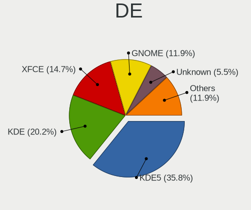

| Name        | Computers | Percent |
|-------------|-----------|---------|
| KDE5        | 36        | 36.73%  |
| KDE         | 22        | 22.45%  |
| XFCE        | 15        | 15.31%  |
| GNOME       | 11        | 11.22%  |
| Unknown     | 4         | 4.08%   |
| X-Cinnamon  | 3         | 3.06%   |
| MATE        | 3         | 3.06%   |
| Phosh:GNOME | 2         | 2.04%   |
| sway        | 1         | 1.02%   |
| LXQt        | 1         | 1.02%   |

Display Server
--------------

X11 or Wayland

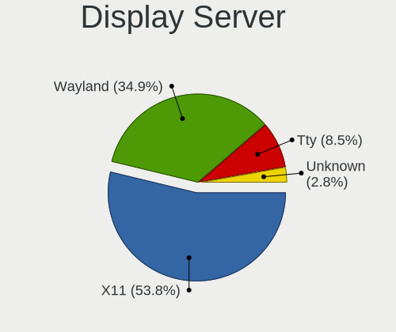

| Name    | Computers | Percent |
|---------|-----------|---------|
| X11     | 52        | 54.17%  |
| Wayland | 36        | 37.5%   |
| Tty     | 6         | 6.25%   |
| Unknown | 2         | 2.08%   |

Display Manager
---------------

SDDM, LightDM, etc.

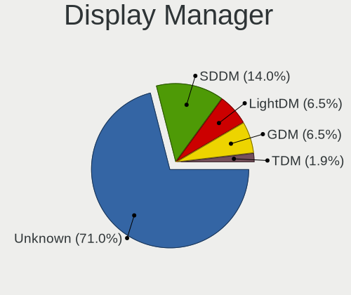

| Name    | Computers | Percent |
|---------|-----------|---------|
| Unknown | 71        | 73.2%   |
| SDDM    | 13        | 13.4%   |
| LightDM | 6         | 6.19%   |
| GDM     | 5         | 5.15%   |
| TDM     | 2         | 2.06%   |

OS Lang
-------

Language

| Lang    | Computers | Percent |
|---------|-----------|---------|
| en_US   | 51        | 52.04%  |
| fr_FR   | 9         | 9.18%   |
| C       | 7         | 7.14%   |
| de_DE   | 5         | 5.1%    |
| en_GB   | 4         | 4.08%   |
| en_CA   | 3         | 3.06%   |
| ru_RU   | 2         | 2.04%   |
| en_AU   | 2         | 2.04%   |
| Unknown | 2         | 2.04%   |
| pt_PT   | 1         | 1.02%   |
| pl_PL   | 1         | 1.02%   |
| nl_NL   | 1         | 1.02%   |
| lt_LT   | 1         | 1.02%   |
| it_IT   | 1         | 1.02%   |
| it_CH   | 1         | 1.02%   |
| es_PE   | 1         | 1.02%   |
| es_ES   | 1         | 1.02%   |
| en_ZA   | 1         | 1.02%   |
| de_CH   | 1         | 1.02%   |
| de_AT   | 1         | 1.02%   |
| da_DK   | 1         | 1.02%   |
| bg_BG   | 1         | 1.02%   |

Boot Mode
---------

EFI or BIOS

| Mode | Computers | Percent |
|------|-----------|---------|
| EFI  | 61        | 62.89%  |
| BIOS | 36        | 37.11%  |

Filesystem
----------

Type of filesystem

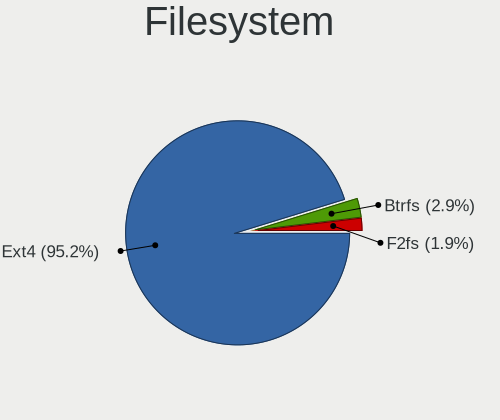

| Type  | Computers | Percent |
|-------|-----------|---------|
| Ext4  | 91        | 95.79%  |
| F2fs  | 2         | 2.11%   |
| Btrfs | 2         | 2.11%   |

Part. scheme
------------

Scheme of partitioning

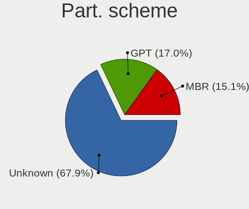

| Type    | Computers | Percent |
|---------|-----------|---------|
| Unknown | 68        | 70.83%  |
| MBR     | 14        | 14.58%  |
| GPT     | 14        | 14.58%  |

Dual Boot with Linux/BSD
------------------------

Hosting more than one Linux/BSD

| Dual boot | Computers | Percent |
|-----------|-----------|---------|
| No        | 88        | 92.63%  |
| Yes       | 7         | 7.37%   |

Dual Boot (Win)
---------------

Hosting Linux and Windows

| Dual boot | Computers | Percent |
|-----------|-----------|---------|
| No        | 92        | 96.84%  |
| Yes       | 3         | 3.16%   |

Board
-----

Vendor
------

Motherboard manufacturer

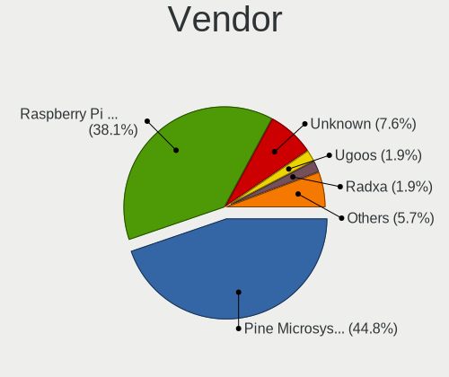

| Name                           | Computers | Percent |
|--------------------------------|-----------|---------|
| Pine Microsystems              | 42        | 44.21%  |
| Raspberry Pi Foundation        | 37        | 38.95%  |
| Unknown                        | 7         | 7.37%   |
| Radxa                          | 2         | 2.11%   |
| PINE64                         | 2         | 2.11%   |
| Ugoos                          | 1         | 1.05%   |
| Shenzhen Amediatech Technology | 1         | 1.05%   |
| Lenovo                         | 1         | 1.05%   |
| Khadas                         | 1         | 1.05%   |
| Hardkernel                     | 1         | 1.05%   |

Model
-----

Motherboard model

| Name                                       | Computers | Percent |
|--------------------------------------------|-----------|---------|
| Pine Microsystems Pine64 PinePhone (1.2)   | 19        | 20%     |
| RPi Raspberry Pi 4 Model B Rev 1.4         | 17        | 17.89%  |
| Pine Microsystems Pine64 Pinebook Pro      | 13        | 13.68%  |
| RPi Raspberry Pi 4 Model B Rev 1.1         | 7         | 7.37%   |
| Unknown                                    | 7         | 7.37%   |
| Pine Microsystems Pine64 PinePhonePro      | 6         | 6.32%   |
| RPi Raspberry Pi 400 Rev 1.0               | 4         | 4.21%   |
| RPi Raspberry Pi 4 Model B Rev 1.2         | 4         | 4.21%   |
| RPi Raspberry Pi                           | 3         | 3.16%   |
| PINE64 Pinebook Pro                        | 2         | 2.11%   |
| Pine Microsystems Pine64 PinePhonePro (DT) | 2         | 2.11%   |
| Ugoos AM6b Plus                            | 1         | 1.05%   |
| Shenzhen Amediatech X96 Max                | 1         | 1.05%   |
| RPi Raspberry Pi 400 Rev 1.1               | 1         | 1.05%   |
| RPi Raspberry Pi 4 Model B Rev 1.5         | 1         | 1.05%   |
| Radxa ROCK Pi 4B (DT)                      | 1         | 1.05%   |
| Radxa ROCK Pi 4                            | 1         | 1.05%   |
| Pine Microsystems PineTab                  | 1         | 1.05%   |
| Pine Microsystems Pine64 RK3566 Quartz64-A | 1         | 1.05%   |
| Lenovo Yoga C630-13Q50 81JL                | 1         | 1.05%   |
| Khadas VIM2                                | 1         | 1.05%   |
| Hardkernel ODROID-N2Plus                   | 1         | 1.05%   |

Model Family
------------

Motherboard model prefix

| Name                      | Computers | Percent |
|---------------------------|-----------|---------|
| Pine Microsystems Pine64  | 41        | 43.16%  |
| RPi Raspberry             | 37        | 38.95%  |
| Unknown                   | 7         | 7.37%   |
| Radxa ROCK                | 2         | 2.11%   |
| PINE64 Pinebook           | 2         | 2.11%   |
| Ugoos AM6b                | 1         | 1.05%   |
| Shenzhen Amediatech X96   | 1         | 1.05%   |
| Pine Microsystems PineTab | 1         | 1.05%   |
| Lenovo Yoga               | 1         | 1.05%   |
| Khadas VIM2               | 1         | 1.05%   |
| Hardkernel ODROID-N2Plus  | 1         | 1.05%   |

MFG Year
--------

Motherboard manufacture year

| Year    | Computers | Percent |
|---------|-----------|---------|
| Unknown | 82        | 86.32%  |
| 2020    | 10        | 10.53%  |
| 2021    | 2         | 2.11%   |
| 2019    | 1         | 1.05%   |

Form Factor
-----------

Physical design of the computer

| Name           | Computers | Percent |
|----------------|-----------|---------|
| System on chip | 54        | 56.84%  |
| Phone          | 27        | 28.42%  |
| Notebook       | 13        | 13.68%  |
| Tablet         | 1         | 1.05%   |

Secure Boot
-----------

Enabled or disabled

| State    | Computers | Percent |
|----------|-----------|---------|
| Disabled | 95        | 100%    |

Coreboot
--------

Have coreboot on board

| Used | Computers | Percent |
|------|-----------|---------|
| No   | 95        | 100%    |

RAM Size
--------

Total RAM memory

| Size in GB | Computers | Percent |
|------------|-----------|---------|
| 3.01-4.0   | 65        | 68.42%  |
| 4.01-8.0   | 17        | 17.89%  |
| 1.01-2.0   | 7         | 7.37%   |
| 2.01-3.0   | 6         | 6.32%   |

RAM Used
--------

Used RAM memory

| Used GB  | Computers | Percent |
|----------|-----------|---------|
| 1.01-2.0 | 57        | 55.88%  |
| 2.01-3.0 | 20        | 19.61%  |
| 0.51-1.0 | 20        | 19.61%  |
| 0.01-0.5 | 3         | 2.94%   |
| 3.01-4.0 | 2         | 1.96%   |

Total Drives
------------

Number of drives on board

| Drives | Computers | Percent |
|--------|-----------|---------|
| 1      | 64        | 63.37%  |
| 2      | 32        | 31.68%  |
| 0      | 4         | 3.96%   |
| 3      | 1         | 0.99%   |

Has CD-ROM
----------

Has CD-ROM on board

| Presented | Computers | Percent |
|-----------|-----------|---------|
| No        | 94        | 98.95%  |
| Yes       | 1         | 1.05%   |

Has Ethernet
------------

Has Ethernet on board

| Presented | Computers | Percent |
|-----------|-----------|---------|
| No        | 85        | 88.54%  |
| Yes       | 11        | 11.46%  |

Has WiFi
--------

Has WiFi module

| Presented | Computers | Percent |
|-----------|-----------|---------|
| No        | 62        | 63.27%  |
| Yes       | 36        | 36.73%  |

Has Bluetooth
-------------

Has Bluetooth module

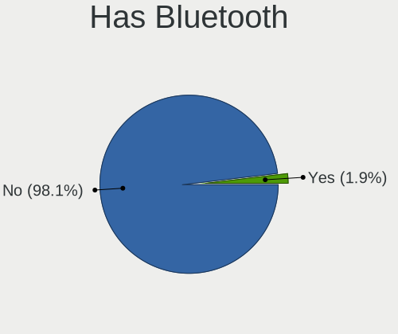

| Presented | Computers | Percent |
|-----------|-----------|---------|
| No        | 94        | 97.92%  |
| Yes       | 2         | 2.08%   |

Location
--------

Country
-------

Geographic location (country)

| Country      | Computers | Percent |
|--------------|-----------|---------|
| USA          | 36        | 37.89%  |
| France       | 11        | 11.58%  |
| Germany      | 7         | 7.37%   |
| UK           | 5         | 5.26%   |
| Australia    | 5         | 5.26%   |
| Canada       | 4         | 4.21%   |
| Russia       | 3         | 3.16%   |
| Netherlands  | 3         | 3.16%   |
| Switzerland  | 2         | 2.11%   |
| Spain        | 2         | 2.11%   |
| Portugal     | 2         | 2.11%   |
| Italy        | 2         | 2.11%   |
| Turkey       | 1         | 1.05%   |
| Sweden       | 1         | 1.05%   |
| South Africa | 1         | 1.05%   |
| Poland       | 1         | 1.05%   |
| Peru         | 1         | 1.05%   |
| Malta        | 1         | 1.05%   |
| Lithuania    | 1         | 1.05%   |
| Kuwait       | 1         | 1.05%   |
| India        | 1         | 1.05%   |
| Finland      | 1         | 1.05%   |
| Denmark      | 1         | 1.05%   |
| Cyprus       | 1         | 1.05%   |
| Bulgaria     | 1         | 1.05%   |

City
----

Geographic location (city)

| City                   | Computers | Percent |
|------------------------|-----------|---------|
| Greoux-les-Bains       | 5         | 4.9%    |
| Paris                  | 2         | 1.96%   |
| London                 | 2         | 1.96%   |
| Denver                 | 2         | 1.96%   |
| Berlin                 | 2         | 1.96%   |
| Adelaide               | 2         | 1.96%   |
| Yaroslavl              | 1         | 0.98%   |
| Wooster                | 1         | 0.98%   |
| Woodville              | 1         | 0.98%   |
| Weinheim               | 1         | 0.98%   |
| Viseu                  | 1         | 0.98%   |
| Virginia Beach         | 1         | 0.98%   |
| Vallauris              | 1         | 0.98%   |
| Union City             | 1         | 0.98%   |
| Ulyanovsk              | 1         | 0.98%   |
| Toronto                | 1         | 0.98%   |
| Thun                   | 1         | 0.98%   |
| Sydney                 | 1         | 0.98%   |
| Strasbourg             | 1         | 0.98%   |
| Springboro             | 1         | 0.98%   |
| Sofia                  | 1         | 0.98%   |
| San Pawl il-Bahar      | 1         | 0.98%   |
| San Mateo              | 1         | 0.98%   |
| San Germano Vercellese | 1         | 0.98%   |
| San Francisco          | 1         | 0.98%   |
| San Diego              | 1         | 0.98%   |
| Saint-Martin-d'Hères  | 1         | 0.98%   |
| Rotterdam              | 1         | 0.98%   |
| Redding                | 1         | 0.98%   |
| Potomac                | 1         | 0.98%   |
| Portland               | 1         | 0.98%   |
| Pinetop-Lakeside       | 1         | 0.98%   |
| Perth                  | 1         | 0.98%   |
| Perm                   | 1         | 0.98%   |
| Pasadena               | 1         | 0.98%   |
| Pabianice              | 1         | 0.98%   |
| Ontario                | 1         | 0.98%   |
| Nottingham             | 1         | 0.98%   |
| North Battleford       | 1         | 0.98%   |
| North Adams            | 1         | 0.98%   |

Drives
------

Drive Vendor
------------

Hard drive vendors

| Vendor              | Computers | Drives | Percent |
|---------------------|-----------|--------|---------|
| Unknown             | 85        | 122    | 78.7%   |
| Seagate             | 4         | 7      | 3.7%    |
| SanDisk             | 4         | 5      | 3.7%    |
| ASMT                | 3         | 3      | 2.78%   |
| Toshiba             | 2         | 2      | 1.85%   |
| Argon               | 2         | 3      | 1.85%   |
| USB3.0              | 1         | 1      | 0.93%   |
| SK hynix            | 1         | 2      | 0.93%   |
| Samsung Electronics | 1         | 6      | 0.93%   |
| PNY USB             | 1         | 1      | 0.93%   |
| Phison              | 1         | 1      | 0.93%   |
| LaCie               | 1         | 1      | 0.93%   |
| Kingston            | 1         | 1      | 0.93%   |
| Intel               | 1         | 1      | 0.93%   |

Drive Model
-----------

Hard drive models

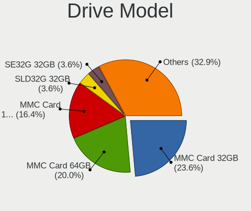

| Model                               | Computers | Percent |
|-------------------------------------|-----------|---------|
| Unknown MMC Card  32GB              | 29        | 23.2%   |
| Unknown MMC Card  64GB              | 24        | 19.2%   |
| Unknown MMC Card  128GB             | 21        | 16.8%   |
| Unknown SLD32G  32GB                | 5         | 4%      |
| Unknown SE32G  32GB                 | 5         | 4%      |
| Unknown DA4064  64GB                | 4         | 3.2%    |
| Unknown MMC Card  256GB             | 3         | 2.4%    |
| ASMT 2115 250GB                     | 3         | 2.4%    |
| Unknown MMC Card  16GB              | 2         | 1.6%    |
| Seagate Expansion 1TB               | 2         | 1.6%    |
| Argon Forty 64GB                    | 2         | 1.6%    |
| USB3.0 Disk 500GB                   | 1         | 0.8%    |
| Unknown SN64G  64GB                 | 1         | 0.8%    |
| Unknown SN128  128GB                | 1         | 0.8%    |
| Unknown SL64G  64GB                 | 1         | 0.8%    |
| Unknown SC32G  32GB                 | 1         | 0.8%    |
| Unknown MMC Card  512GB             | 1         | 0.8%    |
| Unknown MMC Card  272GB             | 1         | 0.8%    |
| Unknown MMC Card  249GB             | 1         | 0.8%    |
| Unknown CJTD4R  64GB                | 1         | 0.8%    |
| Toshiba KBG30ZMS128G 128GB NVMe SSD | 1         | 0.8%    |
| Toshiba HDWD240 4TB                 | 1         | 0.8%    |
| SK hynix HBG4e  32GB                | 1         | 0.8%    |
| Seagate ST925031 5AS 250GB          | 1         | 0.8%    |
| Seagate Expansion Desk 8TB          | 1         | 0.8%    |
| SanDisk SSD PLUS 240GB              | 1         | 0.8%    |
| SanDisk SL32G  32GB                 | 1         | 0.8%    |
| SanDisk Portable SSD 480GB          | 1         | 0.8%    |
| SanDisk Extreme 55AE 1TB SSD        | 1         | 0.8%    |
| Samsung PSSD T7 500GB               | 1         | 0.8%    |
| Samsung Portable SSD T5 500GB       | 1         | 0.8%    |
| PNY USB 3.0 to SATA- 500GB SSD      | 1         | 0.8%    |
| Phison NVMe SSD Drive 256GB         | 1         | 0.8%    |
| LaCie Rugged USB-C 4TB              | 1         | 0.8%    |
| Kingston SHFS37A120G 120GB SSD      | 1         | 0.8%    |
| Intel NVMe SSD Drive 512GB          | 1         | 0.8%    |

HDD Vendor
----------

Hard disk drive vendors

| Vendor  | Computers | Drives | Percent |
|---------|-----------|--------|---------|
| Seagate | 4         | 7      | 66.67%  |
| USB3.0  | 1         | 1      | 16.67%  |
| Toshiba | 1         | 1      | 16.67%  |

SSD Vendor
----------

Solid state drive vendors

| Vendor              | Computers | Drives | Percent |
|---------------------|-----------|--------|---------|
| SanDisk             | 3         | 3      | 27.27%  |
| ASMT                | 3         | 3      | 27.27%  |
| Argon               | 2         | 3      | 18.18%  |
| Samsung Electronics | 1         | 6      | 9.09%   |
| PNY USB             | 1         | 1      | 9.09%   |
| Kingston            | 1         | 1      | 9.09%   |

Drive Kind
----------

HDD or SSD

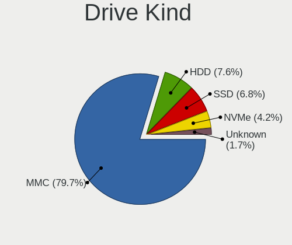

| Kind    | Computers | Drives | Percent |
|---------|-----------|--------|---------|
| MMC     | 85        | 126    | 80.95%  |
| SSD     | 11        | 17     | 10.48%  |
| HDD     | 5         | 9      | 4.76%   |
| NVMe    | 3         | 3      | 2.86%   |
| Unknown | 1         | 1      | 0.95%   |

Drive Connector
---------------

SATA, SAS, NVMe, etc.

| Type | Computers | Drives | Percent |
|------|-----------|--------|---------|
| MMC  | 85        | 126    | 80.19%  |
| SAS  | 17        | 26     | 16.04%  |
| NVMe | 3         | 3      | 2.83%   |
| SATA | 1         | 1      | 0.94%   |

Drive Size
----------

Size of hard drive

| Size in TB | Computers | Drives | Percent |
|------------|-----------|--------|---------|
| 0.01-0.5   | 12        | 19     | 70.59%  |
| 0.51-1.0   | 3         | 5      | 17.65%  |
| 3.01-4.0   | 1         | 1      | 5.88%   |
| 4.01-10.0  | 1         | 1      | 5.88%   |

Space Total
-----------

Amount of disk space available on the file system

| Size in GB     | Computers | Percent |
|----------------|-----------|---------|
| 21-50          | 29        | 29%     |
| 101-250        | 26        | 26%     |
| 51-100         | 26        | 26%     |
| 251-500        | 11        | 11%     |
| 1001-2000      | 2         | 2%      |
| 1-20           | 2         | 2%      |
| 501-1000       | 2         | 2%      |
| More than 3000 | 1         | 1%      |
| Unknown        | 1         | 1%      |

Space Used
----------

Amount of used disk space

| Used GB   | Computers | Percent |
|-----------|-----------|---------|
| 1-20      | 59        | 57.28%  |
| 21-50     | 28        | 27.18%  |
| 51-100    | 8         | 7.77%   |
| 251-500   | 3         | 2.91%   |
| 101-250   | 3         | 2.91%   |
| 1001-2000 | 1         | 0.97%   |
| Unknown   | 1         | 0.97%   |

Malfunc. Drives
---------------

Drive models with a malfunction

Zero info for selected period =(

Malfunc. Drive Vendor
---------------------

Vendors of faulty drives

Zero info for selected period =(

Malfunc. HDD Vendor
-------------------

Vendors of faulty HDD drives

Zero info for selected period =(

Malfunc. Drive Kind
-------------------

Kinds of faulty drives

Zero info for selected period =(

Failed Drives
-------------

Failed drive models

Zero info for selected period =(

Failed Drive Vendor
-------------------

Failed drive vendors

Zero info for selected period =(

Drive Status
------------

Number of failed and malfunc. drives

| Status   | Computers | Drives | Percent |
|----------|-----------|--------|---------|
| Detected | 91        | 153    | 96.81%  |
| Works    | 3         | 3      | 3.19%   |

Storage controller
------------------

Storage Vendor
--------------

Storage controller vendors

| Vendor                       | Computers | Percent |
|------------------------------|-----------|---------|
| Toshiba America Info Systems | 1         | 33.33%  |
| Phison Electronics           | 1         | 33.33%  |
| Intel                        | 1         | 33.33%  |

Storage Model
-------------

Storage controller models

| Model                                                | Computers | Percent |
|------------------------------------------------------|-----------|---------|
| Toshiba America Info Systems XG6 NVMe SSD Controller | 1         | 33.33%  |
| Phison E12 NVMe Controller                           | 1         | 33.33%  |
| Intel SSD 660P Series                                | 1         | 33.33%  |

Storage Kind
------------

Kind of storage controller (IDE, SATA, NVMe, SAS, ...)

| Kind | Computers | Percent |
|------|-----------|---------|
| NVMe | 3         | 100%    |

Processor
---------

CPU Vendor
----------

Processor vendors

| Vendor   | Computers | Percent |
|----------|-----------|---------|
| ARM      | 94        | 98.95%  |
| QUALCOMM | 1         | 1.05%   |

CPU Model
---------

Processor models

| Model              | Computers | Percent |
|--------------------|-----------|---------|
| ARM Processor      | 94        | 98.95%  |
| QUALCOMM Processor | 1         | 1.05%   |

CPU Model Family
----------------

Processor model prefix

| Model | Computers | Percent |
|-------|-----------|---------|
| Other | 95        | 100%    |

CPU Cores
---------

Number of processor cores

| Number  | Computers | Percent |
|---------|-----------|---------|
| 4       | 42        | 43.3%   |
| Unknown | 27        | 27.84%  |
| 6       | 14        | 14.43%  |
| 2       | 14        | 14.43%  |

CPU Sockets
-----------

Number of sockets

| Number  | Computers | Percent |
|---------|-----------|---------|
| 1       | 56        | 57.73%  |
| Unknown | 27        | 27.84%  |
| 2       | 14        | 14.43%  |

CPU Threads
-----------

Threads per core (Hyper-Threading)

| Number  | Computers | Percent |
|---------|-----------|---------|
| 1       | 69        | 71.88%  |
| Unknown | 27        | 28.13%  |

CPU Op-Modes
------------

CPU Operation Modes (32-bit, 64-bit)

| Op mode        | Computers | Percent |
|----------------|-----------|---------|
| 64-bit         | 55        | 56.12%  |
| 32-bit, 64-bit | 25        | 25.51%  |
| Unknown        | 18        | 18.37%  |

CPU Microcode
-------------

Microcode number

| Number  | Computers | Percent |
|---------|-----------|---------|
| Unknown | 95        | 100%    |

CPU Microarch
-------------

Microarchitecture

| Name    | Computers | Percent |
|---------|-----------|---------|
| Unknown | 95        | 100%    |

Graphics
--------

GPU Vendor
----------

Vendors of graphics cards

Zero info for selected period =(

GPU Model
---------

Graphics card models

Zero info for selected period =(

GPU Combo
---------

Combinations of graphics cards

| Name  | Computers | Percent |
|-------|-----------|---------|
| Other | 95        | 100%    |

GPU Driver
----------

Free vs proprietary

| Driver  | Computers | Percent |
|---------|-----------|---------|
| Unknown | 95        | 100%    |

GPU Memory
----------

Total video memory

| Size in GB | Computers | Percent |
|------------|-----------|---------|
| Unknown    | 95        | 100%    |

Monitor
-------

Monitor Vendor
--------------

Monitor vendors

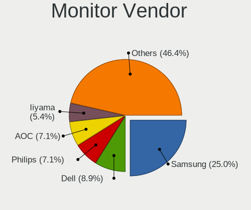

| Vendor               | Computers | Percent |
|----------------------|-----------|---------|
| Samsung Electronics  | 13        | 25.49%  |
| Dell                 | 5         | 9.8%    |
| Philips              | 3         | 5.88%   |
| Iiyama               | 3         | 5.88%   |
| Hewlett-Packard      | 3         | 5.88%   |
| Ancor Communications | 3         | 5.88%   |
| Sceptre Tech         | 2         | 3.92%   |
| BenQ                 | 2         | 3.92%   |
| ASUSTek Computer     | 2         | 3.92%   |
| AOC                  | 2         | 3.92%   |
| ViewSonic            | 1         | 1.96%   |
| Vestel Elektronik    | 1         | 1.96%   |
| Unknown (XXX)        | 1         | 1.96%   |
| Unknown (ADA)        | 1         | 1.96%   |
| TXD                  | 1         | 1.96%   |
| ONN                  | 1         | 1.96%   |
| InfoVision           | 1         | 1.96%   |
| HJW                  | 1         | 1.96%   |
| Grundig              | 1         | 1.96%   |
| Goldstar             | 1         | 1.96%   |
| GKK                  | 1         | 1.96%   |
| Eizo                 | 1         | 1.96%   |
| DMT                  | 1         | 1.96%   |

Monitor Model
-------------

Monitor models

| Model                                                                   | Computers | Percent |
|-------------------------------------------------------------------------|-----------|---------|
| Iiyama PL4071UH IVM000A 3840x2160 878x485mm 39.5-inch                   | 3         | 5.88%   |
| Samsung Electronics C24F390 SAM0D2C 1920x1080 521x293mm 23.5-inch       | 2         | 3.92%   |
| Ancor Communications ASUS VH242 ACI24FA 1920x1080 521x293mm 23.5-inch   | 2         | 3.92%   |
| ViewSonic VX2776 Series VSC3E32 1920x1080 600x340mm 27.2-inch           | 1         | 1.96%   |
| Vestel Elektronik 32W_LCD_TV VES3700 1920x1080 710x400mm 32.1-inch      | 1         | 1.96%   |
| Unknown (XXX) HDMI     XXX0029 1920x1080 1150x650mm 52.0-inch           | 1         | 1.96%   |
| Unknown (ADA) MPI4008 ADA0004 480x800 150x100mm 7.1-inch                | 1         | 1.96%   |
| TXD Display TXD7825 1024x600 410x230mm 18.5-inch                        | 1         | 1.96%   |
| Sceptre Tech Sceptre F24 SPT09AB 1920x1080 530x290mm 23.8-inch          | 1         | 1.96%   |
| Sceptre Tech E20 SPT080D 1600x900 410x280mm 19.5-inch                   | 1         | 1.96%   |
| Samsung Electronics U28E590 SAM0C4C 3840x2160 608x345mm 27.5-inch       | 1         | 1.96%   |
| Samsung Electronics SyncMaster SAM02FD 1680x1050 433x271mm 20.1-inch    | 1         | 1.96%   |
| Samsung Electronics SyncMaster SAM01D4 1440x900 408x225mm 18.3-inch     | 1         | 1.96%   |
| Samsung Electronics S27D390 SAM0B67 1920x1080 598x336mm 27.0-inch       | 1         | 1.96%   |
| Samsung Electronics S24F350 SAM0D20 1920x1080 521x293mm 23.5-inch       | 1         | 1.96%   |
| Samsung Electronics LCD Monitor SAM7003 3840x2160 1872x1053mm 84.6-inch | 1         | 1.96%   |
| Samsung Electronics LCD Monitor SAM0F13 3840x2160 890x500mm 40.2-inch   | 1         | 1.96%   |
| Samsung Electronics LCD Monitor SAM0E35 1920x1080 1210x680mm 54.6-inch  | 1         | 1.96%   |
| Samsung Electronics LCD Monitor SAM0DF6 3840x2160 890x500mm 40.2-inch   | 1         | 1.96%   |
| Samsung Electronics LCD Monitor SAM0C39 1920x1080 885x498mm 40.0-inch   | 1         | 1.96%   |
| Samsung Electronics LCD Monitor SAM04FD 1280x720                        | 1         | 1.96%   |
| Philips PHL 328E9F PHLC181 2560x1440 697x392mm 31.5-inch                | 1         | 1.96%   |
| Philips PHL 252B9 PHL092C 1920x1080 535x339mm 24.9-inch                 | 1         | 1.96%   |
| Philips PHL 221V8 PHLC211 1920x1080 477x268mm 21.5-inch                 | 1         | 1.96%   |
| ONN 100002480 ONN0101 1920x1080 470x290mm 21.7-inch                     | 1         | 1.96%   |
| InfoVision LCD Monitor IVO0536 1920x1080 294x165mm 13.3-inch            | 1         | 1.96%   |
| HJW HDMI TO USB HJW0001 1920x1080 700x390mm 31.5-inch                   | 1         | 1.96%   |
| Hewlett-Packard LP2475w HWP26F8 1920x1200 540x350mm 25.3-inch           | 1         | 1.96%   |
| Hewlett-Packard f1523 HWP2607 1024x768 304x228mm 15.0-inch              | 1         | 1.96%   |
| Hewlett-Packard 22cw HWP3183 1920x1080 476x268mm 21.5-inch              | 1         | 1.96%   |
| Grundig WXGA GRU4448 1600x1200                                          | 1         | 1.96%   |
| Goldstar M228WA GSM563D 1680x1050 434x270mm 20.1-inch                   | 1         | 1.96%   |
| GKK MONITOR GKK3034 1920x1080                                           | 1         | 1.96%   |
| Eizo S1921 ENC1831 1280x1024 376x301mm 19.0-inch                        | 1         | 1.96%   |
| DMT CHHWJT* DMT0030 1440x900 710x400mm 32.1-inch                        | 1         | 1.96%   |
| Dell SE2416H DELD082 1920x1080 527x296mm 23.8-inch                      | 1         | 1.96%   |
| Dell P2815Q DELF05C 3840x2160 621x341mm 27.9-inch                       | 1         | 1.96%   |
| Dell P2421D DELD0FF 2560x1440 527x296mm 23.8-inch                       | 1         | 1.96%   |
| Dell P2418D DELD0C2 2560x1440 526x296mm 23.8-inch                       | 1         | 1.96%   |
| Dell 1704FPT DEL4004 1280x1024 338x270mm 17.0-inch                      | 1         | 1.96%   |

Monitor Resolution
------------------

Monitor screen resolution

| Resolution         | Computers | Percent |
|--------------------|-----------|---------|
| 1920x1080 (FHD)    | 21        | 43.75%  |
| 3840x2160 (4K)     | 11        | 22.92%  |
| 2560x1440 (QHD)    | 4         | 8.33%   |
| 1440x900 (WXGA+)   | 3         | 6.25%   |
| 1920x1200 (WUXGA)  | 2         | 4.17%   |
| 1680x1050 (WSXGA+) | 2         | 4.17%   |
| 1280x1024 (SXGA)   | 2         | 4.17%   |
| 1600x900 (HD+)     | 1         | 2.08%   |
| 1280x800 (WXGA)    | 1         | 2.08%   |
| 1024x768 (XGA)     | 1         | 2.08%   |

Monitor Diagonal
----------------

Diagonal size in inches

| Inches  | Computers | Percent |
|---------|-----------|---------|
| 27      | 9         | 17.65%  |
| 24      | 5         | 9.8%    |
| 23      | 5         | 9.8%    |
| 84      | 4         | 7.84%   |
| 21      | 4         | 7.84%   |
| 19      | 4         | 7.84%   |
| 54      | 3         | 5.88%   |
| 39      | 3         | 5.88%   |
| 32      | 2         | 3.92%   |
| 31      | 2         | 3.92%   |
| 25      | 2         | 3.92%   |
| 52      | 1         | 1.96%   |
| 22      | 1         | 1.96%   |
| 20      | 1         | 1.96%   |
| 17      | 1         | 1.96%   |
| 15      | 1         | 1.96%   |
| 13      | 1         | 1.96%   |
| 7       | 1         | 1.96%   |
| Unknown | 1         | 1.96%   |

Monitor Width
-------------

Physical width

| Width in mm | Computers | Percent |
|-------------|-----------|---------|
| 501-600     | 17        | 34%     |
| 401-500     | 8         | 16%     |
| 601-700     | 5         | 10%     |
| 1501-2000   | 4         | 8%      |
| 1001-1500   | 4         | 8%      |
| 801-900     | 3         | 6%      |
| 701-800     | 2         | 4%      |
| 351-400     | 2         | 4%      |
| 301-350     | 2         | 4%      |
| 201-300     | 1         | 2%      |
| 101-200     | 1         | 2%      |
| Unknown     | 1         | 2%      |

Aspect Ratio
------------

Proportional relationship between the width and the height

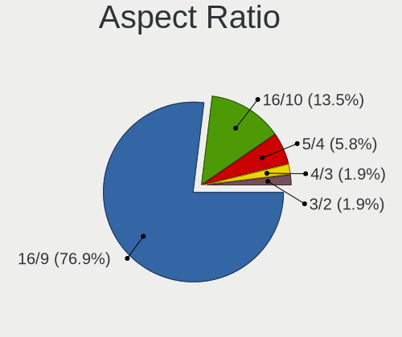

| Ratio | Computers | Percent |
|-------|-----------|---------|
| 16/9  | 35        | 74.47%  |
| 16/10 | 7         | 14.89%  |
| 5/4   | 3         | 6.38%   |
| 4/3   | 1         | 2.13%   |
| 3/2   | 1         | 2.13%   |

Monitor Area
------------

Area in inch²

| Area in inch² | Computers | Percent |
|----------------|-----------|---------|
| 201-250        | 12        | 24.49%  |
| 301-350        | 9         | 18.37%  |
| More than 1000 | 8         | 16.33%  |
| 151-200        | 5         | 10.2%   |
| 351-500        | 4         | 8.16%   |
| 251-300        | 3         | 6.12%   |
| 501-1000       | 3         | 6.12%   |
| 71-80          | 1         | 2.04%   |
| 1-40           | 1         | 2.04%   |
| 141-150        | 1         | 2.04%   |
| 111-120        | 1         | 2.04%   |
| Unknown        | 1         | 2.04%   |

Pixel Density
-------------

Pixels per inch

| Density | Computers | Percent |
|---------|-----------|---------|
| 51-100  | 29        | 61.7%   |
| 101-120 | 7         | 14.89%  |
| 121-160 | 5         | 10.64%  |
| 1-50    | 3         | 6.38%   |
| 161-240 | 2         | 4.26%   |
| Unknown | 1         | 2.13%   |

Multiple Monitors
-----------------

Total monitors connected

| Total | Computers | Percent |
|-------|-----------|---------|
| 1     | 84        | 86.6%   |
| 0     | 10        | 10.31%  |
| 2     | 3         | 3.09%   |

Network
-------

Net Controller Vendor
---------------------

Controller vendors

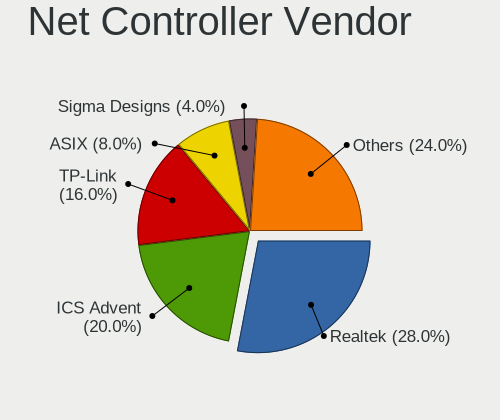

| Vendor                          | Computers | Percent |
|---------------------------------|-----------|---------|
| Realtek Semiconductor           | 7         | 30.43%  |
| TP-Link                         | 4         | 17.39%  |
| ICS Advent                      | 4         | 17.39%  |
| ASIX Electronics                | 2         | 8.7%    |
| Sigma Designs                   | 1         | 4.35%   |
| Qualcomm Atheros Communications | 1         | 4.35%   |
| Netchip Technology              | 1         | 4.35%   |
| Intel                           | 1         | 4.35%   |
| D-Link                          | 1         | 4.35%   |
| Arduino SA                      | 1         | 4.35%   |

Net Controller Model
--------------------

Controller models

| Model                                                                                | Computers | Percent |
|--------------------------------------------------------------------------------------|-----------|---------|
| ICS Advent 10/100M LAN                                                               | 4         | 17.39%  |
| Realtek RTL8153 Gigabit Ethernet Adapter                                             | 2         | 8.7%    |
| ASIX AX88179 Gigabit Ethernet                                                        | 2         | 8.7%    |
| TP-Link TL-WN822N Version 4 RTL8192EU                                                | 1         | 4.35%   |
| TP-Link TL-WN722N v2/v3 [Realtek RTL8188EUS]                                         | 1         | 4.35%   |
| TP-Link Archer T4U ver.3                                                             | 1         | 4.35%   |
| TP-Link Archer T2U PLUS [RTL8821AU]                                                  | 1         | 4.35%   |
| Sigma Designs Aeotec Z-Stick Gen5 (ZW090) - UZB                                      | 1         | 4.35%   |
| Realtek RTL88x2bu [AC1200 Techkey]                                                   | 1         | 4.35%   |
| Realtek RTL8814AU 802.11a/b/g/n/ac Wireless Adapter                                  | 1         | 4.35%   |
| Realtek RTL8812AU 802.11a/b/g/n/ac 2T2R DB WLAN Adapter                              | 1         | 4.35%   |
| Realtek RTL8188EUS 802.11n Wireless Network Adapter                                  | 1         | 4.35%   |
| Realtek RTL8152 Fast Ethernet Adapter                                                | 1         | 4.35%   |
| Qualcomm Atheros TP-Link TL-WN821N v3 / TL-WN822N v2 802.11n [Atheros AR7010+AR9287] | 1         | 4.35%   |
| Netchip Linux-USB Ethernet/RNDIS Gadget                                              | 1         | 4.35%   |
| Intel Wi-Fi 6 AX210/AX211/AX411 160MHz                                               | 1         | 4.35%   |
| D-Link 802.11ac NIC                                                                  | 1         | 4.35%   |
| Arduino SA Uno R3 (CDC ACM)                                                          | 1         | 4.35%   |

Wireless Vendor
---------------

Wireless vendors

| Vendor                          | Computers | Percent |
|---------------------------------|-----------|---------|
| TP-Link                         | 4         | 36.36%  |
| Realtek Semiconductor           | 4         | 36.36%  |
| Qualcomm Atheros Communications | 1         | 9.09%   |
| Intel                           | 1         | 9.09%   |
| D-Link                          | 1         | 9.09%   |

Wireless Model
--------------

Wireless models

| Model                                                                                | Computers | Percent |
|--------------------------------------------------------------------------------------|-----------|---------|
| TP-Link TL-WN822N Version 4 RTL8192EU                                                | 1         | 9.09%   |
| TP-Link TL-WN722N v2/v3 [Realtek RTL8188EUS]                                         | 1         | 9.09%   |
| TP-Link Archer T4U ver.3                                                             | 1         | 9.09%   |
| TP-Link Archer T2U PLUS [RTL8821AU]                                                  | 1         | 9.09%   |
| Realtek RTL88x2bu [AC1200 Techkey]                                                   | 1         | 9.09%   |
| Realtek RTL8814AU 802.11a/b/g/n/ac Wireless Adapter                                  | 1         | 9.09%   |
| Realtek RTL8812AU 802.11a/b/g/n/ac 2T2R DB WLAN Adapter                              | 1         | 9.09%   |
| Realtek RTL8188EUS 802.11n Wireless Network Adapter                                  | 1         | 9.09%   |
| Qualcomm Atheros TP-Link TL-WN821N v3 / TL-WN822N v2 802.11n [Atheros AR7010+AR9287] | 1         | 9.09%   |
| Intel Wi-Fi 6 AX210/AX211/AX411 160MHz                                               | 1         | 9.09%   |
| D-Link 802.11ac NIC                                                                  | 1         | 9.09%   |

Ethernet Vendor
---------------

Ethernet vendors

| Vendor                | Computers | Percent |
|-----------------------|-----------|---------|
| ICS Advent            | 4         | 40%     |
| Realtek Semiconductor | 3         | 30%     |
| ASIX Electronics      | 2         | 20%     |
| Netchip Technology    | 1         | 10%     |

Ethernet Model
--------------

Ethernet models

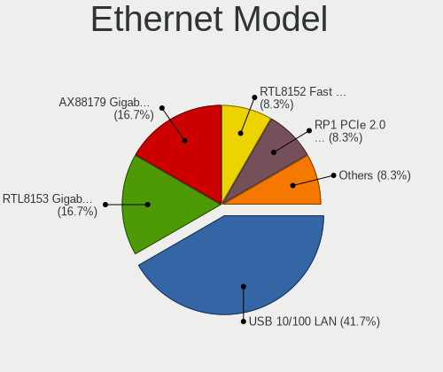

| Model                                    | Computers | Percent |
|------------------------------------------|-----------|---------|
| ICS Advent 10/100M LAN                   | 4         | 40%     |
| Realtek RTL8153 Gigabit Ethernet Adapter | 2         | 20%     |
| ASIX AX88179 Gigabit Ethernet            | 2         | 20%     |
| Realtek RTL8152 Fast Ethernet Adapter    | 1         | 10%     |
| Netchip Linux-USB Ethernet/RNDIS Gadget  | 1         | 10%     |

Net Controller Kind
-------------------

Ethernet, WiFi or modem

| Kind     | Computers | Percent |
|----------|-----------|---------|
| Ethernet | 10        | 50%     |
| WiFi     | 8         | 40%     |
| Modem    | 2         | 10%     |

Used Controller
---------------

Currently used network controller

| Kind     | Computers | Percent |
|----------|-----------|---------|
| WiFi     | 3         | 60%     |
| Ethernet | 2         | 40%     |

NICs
----

Total network controllers on board

| Total | Computers | Percent |
|-------|-----------|---------|
| 0     | 95        | 98.96%  |
| 1     | 1         | 1.04%   |

IPv6
----

IPv6 vs IPv4

| Used | Computers | Percent |
|------|-----------|---------|
| No   | 80        | 81.63%  |
| Yes  | 18        | 18.37%  |

Bluetooth
---------

Bluetooth Vendor
----------------

Controller vendors

| Vendor                  | Computers | Percent |
|-------------------------|-----------|---------|
| Realtek Semiconductor   | 1         | 50%     |
| Cambridge Silicon Radio | 1         | 50%     |

Bluetooth Model
---------------

Controller models

| Model                                               | Computers | Percent |
|-----------------------------------------------------|-----------|---------|
| Realtek Bluetooth Radio                             | 1         | 50%     |
| Cambridge Silicon Radio Bluetooth Dongle (HCI mode) | 1         | 50%     |

Sound
-----

Sound Vendor
------------

Sound card vendors

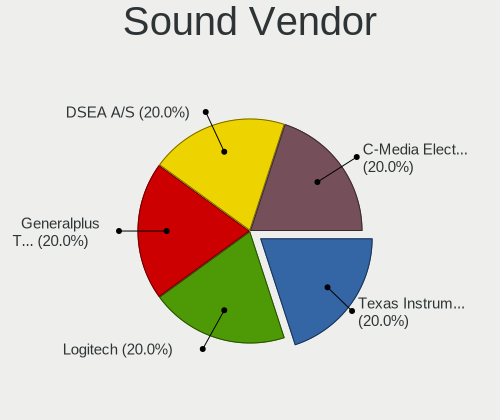

| Vendor                 | Computers | Percent |
|------------------------|-----------|---------|
| Texas Instruments      | 1         | 20%     |
| Logitech               | 1         | 20%     |
| Generalplus Technology | 1         | 20%     |
| DSEA A/S               | 1         | 20%     |
| C-Media Electronics    | 1         | 20%     |

Sound Model
-----------

Sound card models

| Model                                             | Computers | Percent |
|---------------------------------------------------|-----------|---------|
| Texas Instruments PCM2902C Audio CODEC            | 1         | 20%     |
| Logitech [G533 Wireless Headset Dongle]           | 1         | 20%     |
| Generalplus Technology USB Audio Device           | 1         | 20%     |
| DSEA A/S Sennheiser Main Audio                    | 1         | 20%     |
| C-Media Electronics Audio Adapter (Unitek Y-247A) | 1         | 20%     |

Memory
------

Memory Vendor
-------------

Memory module vendors

Zero info for selected period =(

Memory Model
------------

Memory module models

Zero info for selected period =(

Memory Kind
-----------

Memory module kinds

Zero info for selected period =(

Memory Form Factor
------------------

Physical design of the memory module

Zero info for selected period =(

Memory Size
-----------

Memory module size

Zero info for selected period =(

Memory Speed
------------

Memory module speed

Zero info for selected period =(

Printers & scanners
-------------------

Printer Vendor
--------------

Printer device vendors

| Vendor              | Computers | Percent |
|---------------------|-----------|---------|
| Samsung Electronics | 1         | 100%    |

Printer Model
-------------

Printer device models

| Model                   | Computers | Percent |
|-------------------------|-----------|---------|
| Samsung SCX-4600 Series | 1         | 100%    |

Scanner Vendor
--------------

Scanner device vendors

Zero info for selected period =(

Scanner Model
-------------

Scanner device models

Zero info for selected period =(

Camera
------

Camera Vendor
-------------

Camera device vendors

| Vendor                        | Computers | Percent |
|-------------------------------|-----------|---------|
| Microdia                      | 12        | 75%     |
| OnePlus Technology (Shenzhen) | 1         | 6.25%   |
| MacroSilicon                  | 1         | 6.25%   |
| LG Electronics                | 1         | 6.25%   |
| Bison Electronics             | 1         | 6.25%   |

Camera Model
------------

Camera device models

| Model                                                 | Computers | Percent |
|-------------------------------------------------------|-----------|---------|
| Microdia HP Integrated Webcam                         | 12        | 75%     |
| OnePlus (Shenzhen) SM8150-MTP _SN:A05FE1A2            | 1         | 6.25%   |
| MacroSilicon USB3. 0 capture                          | 1         | 6.25%   |
| LG LM-X420xxx/G2/G3 Android Phone (MTP/download mode) | 1         | 6.25%   |
| Bison Integrated Camera                               | 1         | 6.25%   |

Security
--------

Fingerprint Vendor
------------------

Fingerprint sensor vendors

Zero info for selected period =(

Fingerprint Model
-----------------

Fingerprint sensor models

Zero info for selected period =(

Chipcard Vendor
---------------

Chipcard module vendors

Zero info for selected period =(

Chipcard Model
--------------

Chipcard module models

Zero info for selected period =(

Unsupported
-----------

Unsupported Devices
-------------------

Total unsupported devices on board

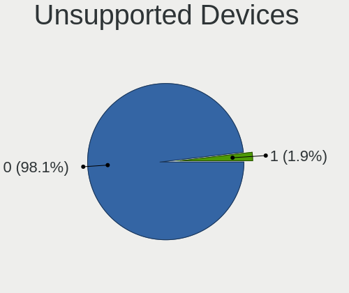

| Total | Computers | Percent |
|-------|-----------|---------|
| 0     | 94        | 97.92%  |
| 1     | 2         | 2.08%   |

Unsupported Device Types
------------------------

Types of unsupported devices

| Type         | Computers | Percent |
|--------------|-----------|---------|
| Net/wireless | 2         | 100%    |

