Manjaro - Tested Hardware & Statistics
--------------------------------------

A project to collect tested hardware configurations for Manjaro.

Anyone can contribute to this report by the [hw-probe](https://github.com/linuxhw/hw-probe) tool:

    sudo -E hw-probe -all -upload

Please contribute! Especially if your hardware is rare.

This is a report for all computer types. See also reports for [desktops](/Dist/Manjaro/Desktop/README.md) and [notebooks](/Dist/Manjaro/Notebook/README.md).

Contents
--------

* [ Test Cases ](#test-cases)

* [ System ](#system)
  - [ OS                       ](#os)
  - [ OS Family                ](#os-family)
  - [ Kernel                   ](#kernel)
  - [ Kernel Family            ](#kernel-family)
  - [ Kernel Major Ver.        ](#kernel-major-ver)
  - [ Arch                     ](#arch)
  - [ DE                       ](#de)
  - [ Display Server           ](#display-server)
  - [ Display Manager          ](#display-manager)
  - [ OS Lang                  ](#os-lang)
  - [ Boot Mode                ](#boot-mode)
  - [ Filesystem               ](#filesystem)
  - [ Part. scheme             ](#part-scheme)
  - [ Dual Boot with Linux/BSD ](#dual-boot-with-linuxbsd)
  - [ Dual Boot (Win)          ](#dual-boot-win)

* [ Board ](#board)
  - [ Vendor                   ](#vendor)
  - [ Model                    ](#model)
  - [ Model Family             ](#model-family)
  - [ MFG Year                 ](#mfg-year)
  - [ Form Factor              ](#form-factor)
  - [ Secure Boot              ](#secure-boot)
  - [ Coreboot                 ](#coreboot)
  - [ RAM Size                 ](#ram-size)
  - [ RAM Used                 ](#ram-used)
  - [ Total Drives             ](#total-drives)
  - [ Has CD-ROM               ](#has-cd-rom)
  - [ Has Ethernet             ](#has-ethernet)
  - [ Has WiFi                 ](#has-wifi)
  - [ Has Bluetooth            ](#has-bluetooth)

* [ Location ](#location)
  - [ Country                  ](#country)
  - [ City                     ](#city)

* [ Drives ](#drives)
  - [ Drive Vendor             ](#drive-vendor)
  - [ Drive Model              ](#drive-model)
  - [ HDD Vendor               ](#hdd-vendor)
  - [ SSD Vendor               ](#ssd-vendor)
  - [ Drive Kind               ](#drive-kind)
  - [ Drive Connector          ](#drive-connector)
  - [ Drive Size               ](#drive-size)
  - [ Space Total              ](#space-total)
  - [ Space Used               ](#space-used)
  - [ Malfunc. Drives          ](#malfunc-drives)
  - [ Malfunc. Drive Vendor    ](#malfunc-drive-vendor)
  - [ Malfunc. HDD Vendor      ](#malfunc-hdd-vendor)
  - [ Malfunc. Drive Kind      ](#malfunc-drive-kind)
  - [ Failed Drives            ](#failed-drives)
  - [ Failed Drive Vendor      ](#failed-drive-vendor)
  - [ Drive Status             ](#drive-status)

* [ Storage controller ](#storage-controller)
  - [ Storage Vendor           ](#storage-vendor)
  - [ Storage Model            ](#storage-model)
  - [ Storage Kind             ](#storage-kind)

* [ Processor ](#processor)
  - [ CPU Vendor               ](#cpu-vendor)
  - [ CPU Model                ](#cpu-model)
  - [ CPU Model Family         ](#cpu-model-family)
  - [ CPU Cores                ](#cpu-cores)
  - [ CPU Sockets              ](#cpu-sockets)
  - [ CPU Threads              ](#cpu-threads)
  - [ CPU Op-Modes             ](#cpu-op-modes)
  - [ CPU Microcode            ](#cpu-microcode)
  - [ CPU Microarch            ](#cpu-microarch)

* [ Graphics ](#graphics)
  - [ GPU Vendor               ](#gpu-vendor)
  - [ GPU Model                ](#gpu-model)
  - [ GPU Combo                ](#gpu-combo)
  - [ GPU Driver               ](#gpu-driver)
  - [ GPU Memory               ](#gpu-memory)

* [ Monitor ](#monitor)
  - [ Monitor Vendor           ](#monitor-vendor)
  - [ Monitor Model            ](#monitor-model)
  - [ Monitor Resolution       ](#monitor-resolution)
  - [ Monitor Diagonal         ](#monitor-diagonal)
  - [ Monitor Width            ](#monitor-width)
  - [ Aspect Ratio             ](#aspect-ratio)
  - [ Monitor Area             ](#monitor-area)
  - [ Pixel Density            ](#pixel-density)
  - [ Multiple Monitors        ](#multiple-monitors)

* [ Network ](#network)
  - [ Net Controller Vendor    ](#net-controller-vendor)
  - [ Net Controller Model     ](#net-controller-model)
  - [ Wireless Vendor          ](#wireless-vendor)
  - [ Wireless Model           ](#wireless-model)
  - [ Ethernet Vendor          ](#ethernet-vendor)
  - [ Ethernet Model           ](#ethernet-model)
  - [ Net Controller Kind      ](#net-controller-kind)
  - [ Used Controller          ](#used-controller)
  - [ NICs                     ](#nics)
  - [ IPv6                     ](#ipv6)

* [ Bluetooth ](#bluetooth)
  - [ Bluetooth Vendor         ](#bluetooth-vendor)
  - [ Bluetooth Model          ](#bluetooth-model)

* [ Sound ](#sound)
  - [ Sound Vendor             ](#sound-vendor)
  - [ Sound Model              ](#sound-model)

* [ Memory ](#memory)
  - [ Memory Vendor            ](#memory-vendor)
  - [ Memory Model             ](#memory-model)
  - [ Memory Kind              ](#memory-kind)
  - [ Memory Form Factor       ](#memory-form-factor)
  - [ Memory Size              ](#memory-size)
  - [ Memory Speed             ](#memory-speed)

* [ Printers & scanners ](#printers--scanners)
  - [ Printer Vendor           ](#printer-vendor)
  - [ Printer Model            ](#printer-model)
  - [ Scanner Vendor           ](#scanner-vendor)
  - [ Scanner Model            ](#scanner-model)

* [ Camera ](#camera)
  - [ Camera Vendor            ](#camera-vendor)
  - [ Camera Model             ](#camera-model)

* [ Security ](#security)
  - [ Fingerprint Vendor       ](#fingerprint-vendor)
  - [ Fingerprint Model        ](#fingerprint-model)
  - [ Chipcard Vendor          ](#chipcard-vendor)
  - [ Chipcard Model           ](#chipcard-model)

* [ Unsupported ](#unsupported)
  - [ Unsupported Devices      ](#unsupported-devices)
  - [ Unsupported Device Types ](#unsupported-device-types)

Test Cases
----------

Total: 14082

| Vendor        | Model                       | Form-Factor | Probe                                                      | Date         |
|---------------|-----------------------------|-------------|------------------------------------------------------------|--------------|
| Lenovo        | ThinkPad L570 20J9S2U400    | Notebook    | [399af3e91f](https://linux-hardware.org/?probe=399af3e91f) | Jan 03, 2026 |
| MSI           | B560M PRO                   | Desktop     | [f0f438eb43](https://linux-hardware.org/?probe=f0f438eb43) | Jan 03, 2026 |
| ASUSTek       | ROG Maximus Z790 DARK HE... | Desktop     | [35341b48a9](https://linux-hardware.org/?probe=35341b48a9) | Jan 03, 2026 |
| Lenovo        | ThinkBook 16 G7 IML 21MS    | Notebook    | [72c7b716cb](https://linux-hardware.org/?probe=72c7b716cb) | Jan 02, 2026 |
| Lenovo        | ThinkBook 16 G7 IML 21MS    | Notebook    | [3171162e7b](https://linux-hardware.org/?probe=3171162e7b) | Jan 02, 2026 |
| MSI           | B560M PRO                   | Desktop     | [5d61be6f70](https://linux-hardware.org/?probe=5d61be6f70) | Jan 01, 2026 |
| ASUSTek       | GL752VW                     | Notebook    | [984265f24d](https://linux-hardware.org/?probe=984265f24d) | Jan 01, 2026 |
| MSI           | X470 GAMING PLUS            | Desktop     | [874d7f31fa](https://linux-hardware.org/?probe=874d7f31fa) | Dec 31, 2025 |
| MSI           | PRO B550M-VC WIFI           | Desktop     | [db733fc5f0](https://linux-hardware.org/?probe=db733fc5f0) | Dec 31, 2025 |
| HP            | ENVY x360 2-in-1 Laptop ... | Convertible | [60f7ae61c6](https://linux-hardware.org/?probe=60f7ae61c6) | Dec 30, 2025 |
| Lenovo        | IdeaPadFlex 5 16IAU7 82R... | Convertible | [b745dd5ffc](https://linux-hardware.org/?probe=b745dd5ffc) | Dec 29, 2025 |
| TUXEDO        | InfinityBook Pro 14 Gen6    | Notebook    | [3e7e3da649](https://linux-hardware.org/?probe=3e7e3da649) | Dec 29, 2025 |
| Google        | Eve                         | Notebook    | [8a3d54f8eb](https://linux-hardware.org/?probe=8a3d54f8eb) | Dec 28, 2025 |
| ASRock        | HM87-HT                     | Desktop     | [8c660aeb3c](https://linux-hardware.org/?probe=8c660aeb3c) | Dec 28, 2025 |
| ASRock        | HM87-HT                     | Desktop     | [cd0b01a7c8](https://linux-hardware.org/?probe=cd0b01a7c8) | Dec 28, 2025 |
| MSI           | B560M PRO                   | Desktop     | [347d125ebe](https://linux-hardware.org/?probe=347d125ebe) | Dec 28, 2025 |
| MSI           | MAG X670E TOMAHAWK WIFI     | Desktop     | [3e00f5b427](https://linux-hardware.org/?probe=3e00f5b427) | Dec 28, 2025 |
| MSI           | MAG X670E TOMAHAWK WIFI     | Desktop     | [1e4de995f8](https://linux-hardware.org/?probe=1e4de995f8) | Dec 28, 2025 |
| ASUSTek       | ROG STRIX B760-I GAMING ... | Desktop     | [a1e19f8e3a](https://linux-hardware.org/?probe=a1e19f8e3a) | Dec 27, 2025 |
| Apple         | MacBookPro5,5               | Notebook    | [43eaa8ab79](https://linux-hardware.org/?probe=43eaa8ab79) | Dec 27, 2025 |
| Lenovo        | ThinkPad L570 20J9S0DL01    | Notebook    | [eddae682fb](https://linux-hardware.org/?probe=eddae682fb) | Dec 27, 2025 |
| HP            | Victus by Laptop 16-d0xx... | Notebook    | [66c69f98e8](https://linux-hardware.org/?probe=66c69f98e8) | Dec 26, 2025 |
| Apple         | MacBookAir6,2               | Notebook    | [c7e30d2ca9](https://linux-hardware.org/?probe=c7e30d2ca9) | Dec 26, 2025 |
| MSI           | B560M PRO                   | Desktop     | [f91d98cff8](https://linux-hardware.org/?probe=f91d98cff8) | Dec 26, 2025 |
| Lenovo        | Yoga Pro 7 14ASP9 83HN      | Notebook    | [31d49d725d](https://linux-hardware.org/?probe=31d49d725d) | Dec 25, 2025 |
| Lenovo        | ThinkBook X G2 IAH 21TU     | Notebook    | [1c592512a1](https://linux-hardware.org/?probe=1c592512a1) | Dec 25, 2025 |
| AZW           | GTi                         | Desktop     | [ec89103d62](https://linux-hardware.org/?probe=ec89103d62) | Dec 25, 2025 |
| AZW           | GTi                         | Desktop     | [23dc0227ef](https://linux-hardware.org/?probe=23dc0227ef) | Dec 25, 2025 |
| HP            | Laptop 14s-fq1xxx           | Notebook    | [5e9d1de75e](https://linux-hardware.org/?probe=5e9d1de75e) | Dec 24, 2025 |
| Gigabyte      | H97M-D3H                    | Desktop     | [1ab529f341](https://linux-hardware.org/?probe=1ab529f341) | Dec 23, 2025 |
| Gigabyte      | B760M GAMING X DDR4         | Desktop     | [9a26ca5754](https://linux-hardware.org/?probe=9a26ca5754) | Dec 23, 2025 |
| Acer          | Aspire A515-43              | Notebook    | [37f920fa83](https://linux-hardware.org/?probe=37f920fa83) | Dec 23, 2025 |
| Dell          | G15 5530                    | Notebook    | [9564d033f9](https://linux-hardware.org/?probe=9564d033f9) | Dec 22, 2025 |
| ASUSTek       | ROG STRIX B860-G GAMING ... | Desktop     | [f89029fa83](https://linux-hardware.org/?probe=f89029fa83) | Dec 22, 2025 |
| Lenovo        | 314F SDK0T08861 WIN 3305... | Desktop     | [ac0a321800](https://linux-hardware.org/?probe=ac0a321800) | Dec 22, 2025 |
| TUXEDO        | InfinityBook Pro Gen8 (M... | Notebook    | [0fd613b4d2](https://linux-hardware.org/?probe=0fd613b4d2) | Dec 22, 2025 |
| Lenovo        | ThinkPad X13 Gen 4 21J3C... | Notebook    | [9a30fd4d1d](https://linux-hardware.org/?probe=9a30fd4d1d) | Dec 22, 2025 |
| Notebook      | N14xWU                      | Notebook    | [398b6fec45](https://linux-hardware.org/?probe=398b6fec45) | Dec 22, 2025 |
| Lenovo        | 1046 SDK0K17763 WIN 5051... | Desktop     | [bc141820b2](https://linux-hardware.org/?probe=bc141820b2) | Dec 22, 2025 |
| Lenovo        | Yoga 7 2-in-1 14AKP10 83... | Convertible | [fe62e1579b](https://linux-hardware.org/?probe=fe62e1579b) | Dec 22, 2025 |
| Lenovo        | ThinkBook 15 G4 IAP 21DJ    | Notebook    | [0202253142](https://linux-hardware.org/?probe=0202253142) | Dec 21, 2025 |
| ASRock        | X670E Taichi                | Desktop     | [0fa40a1456](https://linux-hardware.org/?probe=0fa40a1456) | Dec 21, 2025 |
| ASUSTek       | PRIME Z790-V WIFI           | Desktop     | [c044a4da7a](https://linux-hardware.org/?probe=c044a4da7a) | Dec 21, 2025 |
| Gigabyte      | GA-MA790X-DS4               | Desktop     | [8db5a66c36](https://linux-hardware.org/?probe=8db5a66c36) | Dec 19, 2025 |
| AZW           | EQ                          | Desktop     | [01e24e2262](https://linux-hardware.org/?probe=01e24e2262) | Dec 19, 2025 |
| Gigabyte      | GA-MA790X-DS4               | Desktop     | [88fc59c3a3](https://linux-hardware.org/?probe=88fc59c3a3) | Dec 19, 2025 |
| Acer          | Aspire ES1-131              | Notebook    | [332de123ab](https://linux-hardware.org/?probe=332de123ab) | Dec 19, 2025 |
| Gigabyte      | A520M K V2                  | Desktop     | [a20bc98bd7](https://linux-hardware.org/?probe=a20bc98bd7) | Dec 18, 2025 |
| MACHINIST     | X99-MR9A-PRO V3.0           | Desktop     | [d96168f99c](https://linux-hardware.org/?probe=d96168f99c) | Dec 18, 2025 |
| Lenovo        | Legion Pro 7 16AFR10H 83... | Notebook    | [2be69c521f](https://linux-hardware.org/?probe=2be69c521f) | Dec 18, 2025 |
| Lenovo        | ThinkPad P16 Gen 3 21RQS... | Notebook    | [e21a78c284](https://linux-hardware.org/?probe=e21a78c284) | Dec 18, 2025 |
| HP            | Pavilion x360 Convertibl... | Convertible | [27a5724852](https://linux-hardware.org/?probe=27a5724852) | Dec 18, 2025 |
| Gigabyte      | A520M K V2                  | Desktop     | [b89b2ab626](https://linux-hardware.org/?probe=b89b2ab626) | Dec 16, 2025 |
| Acer          | Aspire A515-57G             | Notebook    | [88e6dfc294](https://linux-hardware.org/?probe=88e6dfc294) | Dec 16, 2025 |
| ASRock        | B550M-HDV                   | Desktop     | [04bb587818](https://linux-hardware.org/?probe=04bb587818) | Dec 16, 2025 |
| ASUSTek       | GL502VT                     | Notebook    | [7b6340ce1f](https://linux-hardware.org/?probe=7b6340ce1f) | Dec 16, 2025 |
| MSI           | X370 GAMING PRO CARBON      | Desktop     | [b4c78d3d08](https://linux-hardware.org/?probe=b4c78d3d08) | Dec 15, 2025 |
| GMKtec        | NucBox K8 Plus              | Desktop     | [0d6f43f587](https://linux-hardware.org/?probe=0d6f43f587) | Dec 15, 2025 |
| Dell          | XPS 16 9640                 | Notebook    | [b1f69a75f8](https://linux-hardware.org/?probe=b1f69a75f8) | Dec 15, 2025 |
| Dell          | 0XCR8D A00                  | Desktop     | [294c07a943](https://linux-hardware.org/?probe=294c07a943) | Dec 14, 2025 |
| MSI           | Thin 15 B13VE               | Notebook    | [811eb9a274](https://linux-hardware.org/?probe=811eb9a274) | Dec 14, 2025 |
| Notebook      | P870DM-G                    | Notebook    | [0b3600b47e](https://linux-hardware.org/?probe=0b3600b47e) | Dec 14, 2025 |
| Notebook      | P870DM-G                    | Notebook    | [7e50baf6b9](https://linux-hardware.org/?probe=7e50baf6b9) | Dec 14, 2025 |
| Lenovo        | ThinkPad E580 20KS001JRT    | Notebook    | [4f206adfbf](https://linux-hardware.org/?probe=4f206adfbf) | Dec 13, 2025 |
| HP            | ProBook 470 G1              | Notebook    | [769310f03c](https://linux-hardware.org/?probe=769310f03c) | Dec 13, 2025 |
| Notebook      | NH5XHPI                     | Notebook    | [9cb22fdc4f](https://linux-hardware.org/?probe=9cb22fdc4f) | Dec 13, 2025 |
| Toshiba       | Satellite U300              | Notebook    | [d6f5df7bb7](https://linux-hardware.org/?probe=d6f5df7bb7) | Dec 13, 2025 |
| HP            | 1497                        | Desktop     | [2ab5fbeeaa](https://linux-hardware.org/?probe=2ab5fbeeaa) | Dec 12, 2025 |
| Acer          | Aspire A515-45              | Notebook    | [526a782890](https://linux-hardware.org/?probe=526a782890) | Dec 11, 2025 |
| Kogan         | KAL11C250SA                 | Convertible | [e745e5ba0d](https://linux-hardware.org/?probe=e745e5ba0d) | Dec 11, 2025 |
| Gigabyte      | B550 AORUS ELITE            | Desktop     | [c6ae368e3b](https://linux-hardware.org/?probe=c6ae368e3b) | Dec 10, 2025 |
| MACHINIST     | X99-MR9A-PRO V3.0           | Desktop     | [5dc3e9382c](https://linux-hardware.org/?probe=5dc3e9382c) | Dec 10, 2025 |
| Lenovo        | ThinkPad Edge E530 32597... | Notebook    | [34b314abfb](https://linux-hardware.org/?probe=34b314abfb) | Dec 10, 2025 |
| Google        | Robo                        | Notebook    | [18939a9871](https://linux-hardware.org/?probe=18939a9871) | Dec 10, 2025 |
| BESSTAR Te... | UM350                       | Desktop     | [b11637ab1f](https://linux-hardware.org/?probe=b11637ab1f) | Dec 09, 2025 |
| Acer          | Aspire A315-59              | Notebook    | [1f215df002](https://linux-hardware.org/?probe=1f215df002) | Dec 09, 2025 |
| ASUSTek       | PRIME X670-P WIFI           | Desktop     | [f7df8faa79](https://linux-hardware.org/?probe=f7df8faa79) | Dec 09, 2025 |
| HP            | ProBook 450 G8 Notebook ... | Notebook    | [f33f77b04c](https://linux-hardware.org/?probe=f33f77b04c) | Dec 09, 2025 |
| Lenovo        | Yoga 7 2-in-1 14IML9 83D... | Convertible | [0fd2fdcd74](https://linux-hardware.org/?probe=0fd2fdcd74) | Dec 09, 2025 |
| Lenovo        | V14 G2 ALC 82KC             | Notebook    | [6c158a49da](https://linux-hardware.org/?probe=6c158a49da) | Dec 08, 2025 |
| Fujitsu       | D3171-A1 S26361-D3171-A1    | Desktop     | [bb510bb9d0](https://linux-hardware.org/?probe=bb510bb9d0) | Dec 08, 2025 |
| Gigabyte      | B650M GAMING WIFI           | Desktop     | [18212be286](https://linux-hardware.org/?probe=18212be286) | Dec 08, 2025 |
| Lenovo        | Legion Y740-15IRHg 81UH     | Notebook    | [45481da193](https://linux-hardware.org/?probe=45481da193) | Dec 08, 2025 |
| Gigabyte      | X570 AORUS ELITE            | Desktop     | [957bfdf475](https://linux-hardware.org/?probe=957bfdf475) | Dec 08, 2025 |
| HP            | Notebook                    | Notebook    | [3d917f5150](https://linux-hardware.org/?probe=3d917f5150) | Dec 07, 2025 |
| ASUSTek       | TUF Gaming B550-PLUS        | Desktop     | [1da0905f50](https://linux-hardware.org/?probe=1da0905f50) | Dec 07, 2025 |
| Kogan         | KAL11C250SA                 | Convertible | [519cbb4e65](https://linux-hardware.org/?probe=519cbb4e65) | Dec 07, 2025 |
| Gigabyte      | B550M DS3H AC               | Desktop     | [58eabfe0aa](https://linux-hardware.org/?probe=58eabfe0aa) | Dec 07, 2025 |
| Lenovo        | Legion Pro 7 16IAX10H 83... | Notebook    | [c5ed6b1f2a](https://linux-hardware.org/?probe=c5ed6b1f2a) | Dec 07, 2025 |
| MSI           | Raider A18 HX A9WJG         | Notebook    | [4da3fe16cd](https://linux-hardware.org/?probe=4da3fe16cd) | Dec 07, 2025 |
| MSI           | MPG X870E EDGE TI WIFI      | Desktop     | [06247c9fc6](https://linux-hardware.org/?probe=06247c9fc6) | Dec 07, 2025 |
| Gigabyte      | AB350-Gaming 3-CF           | Desktop     | [de8cddaf48](https://linux-hardware.org/?probe=de8cddaf48) | Dec 06, 2025 |
| ASUSTek       | PRIME X670-P WIFI           | Desktop     | [c26216df21](https://linux-hardware.org/?probe=c26216df21) | Dec 06, 2025 |
| MSI           | PRO B550M-VC WIFI           | Desktop     | [01ecf707b6](https://linux-hardware.org/?probe=01ecf707b6) | Dec 06, 2025 |
| MSI           | PRO B550M-VC WIFI           | Desktop     | [3150bf7a02](https://linux-hardware.org/?probe=3150bf7a02) | Dec 06, 2025 |
| Acer          | Swift SF314-41              | Notebook    | [bc44a66b9b](https://linux-hardware.org/?probe=bc44a66b9b) | Dec 06, 2025 |
| Gigabyte      | A520I AC                    | Desktop     | [a554ba4c68](https://linux-hardware.org/?probe=a554ba4c68) | Dec 06, 2025 |
| ASUSTek       | ROG Rampage VI EXTREME E... | Desktop     | [81891dbea8](https://linux-hardware.org/?probe=81891dbea8) | Dec 06, 2025 |
| HP            | Unknown                     | Notebook    | [ec9567aef1](https://linux-hardware.org/?probe=ec9567aef1) | Dec 06, 2025 |
| HP            | ProBook 470 G1              | Notebook    | [7b959a0f0b](https://linux-hardware.org/?probe=7b959a0f0b) | Dec 06, 2025 |
| Fusion5       | FWIN232 PRO S2              | Tablet      | [c0d403d7d2](https://linux-hardware.org/?probe=c0d403d7d2) | Dec 05, 2025 |
| Dell          | Latitude 5420               | Notebook    | [c74459328d](https://linux-hardware.org/?probe=c74459328d) | Dec 05, 2025 |
| Medion        | WN100-D4-#A                 | Desktop     | [48c49a77ec](https://linux-hardware.org/?probe=48c49a77ec) | Dec 05, 2025 |
| Fusion5       | FWIN232 PRO S2              | Tablet      | [d4a7523572](https://linux-hardware.org/?probe=d4a7523572) | Dec 05, 2025 |
| MSI           | H410M-A PRO                 | Desktop     | [5f5e2578d8](https://linux-hardware.org/?probe=5f5e2578d8) | Dec 04, 2025 |
| ASUSTek       | PRIME B360M-D               | Desktop     | [a84befc265](https://linux-hardware.org/?probe=a84befc265) | Dec 03, 2025 |
| Medion        | P7648 MD99980               | Notebook    | [e983b6c754](https://linux-hardware.org/?probe=e983b6c754) | Dec 01, 2025 |
| HP            | ProBook 440 G7              | Notebook    | [d4663345b2](https://linux-hardware.org/?probe=d4663345b2) | Dec 01, 2025 |
| HP            | ProBook 440 G7              | Notebook    | [ae495fc3ac](https://linux-hardware.org/?probe=ae495fc3ac) | Nov 30, 2025 |
| Lenovo        | 0B98401 PRO                 | Desktop     | [ed10de8401](https://linux-hardware.org/?probe=ed10de8401) | Nov 30, 2025 |
| Lenovo        | Yoga 6 13ABR8 83B2          | Convertible | [6f8eeb3a00](https://linux-hardware.org/?probe=6f8eeb3a00) | Nov 30, 2025 |
| ASUSTek       | N43SL                       | Notebook    | [2a78c9cb65](https://linux-hardware.org/?probe=2a78c9cb65) | Nov 30, 2025 |
| ASRock        | X570 Steel Legend WiFi a... | Desktop     | [825eb466b8](https://linux-hardware.org/?probe=825eb466b8) | Nov 30, 2025 |
| MSI           | PRO B650-A WIFI             | Desktop     | [2156f7a041](https://linux-hardware.org/?probe=2156f7a041) | Nov 29, 2025 |
| HP            | 212B                        | Desktop     | [547693099a](https://linux-hardware.org/?probe=547693099a) | Nov 27, 2025 |
| ASUSTek       | TUF Z390-PLUS GAMING        | Desktop     | [95d532d243](https://linux-hardware.org/?probe=95d532d243) | Nov 26, 2025 |
| Lenovo        | ThinkPad T480 20L6S8LU1W    | Notebook    | [2e01ed1a91](https://linux-hardware.org/?probe=2e01ed1a91) | Nov 26, 2025 |
| MSI           | PRO B550M-VC WIFI           | Desktop     | [fca2414b00](https://linux-hardware.org/?probe=fca2414b00) | Nov 25, 2025 |
| Lenovo        | ThinkPad T420 4236W1W       | Notebook    | [b757485b77](https://linux-hardware.org/?probe=b757485b77) | Nov 25, 2025 |
| ASUSTek       | SABERTOOTH P67              | Desktop     | [395a7a8df1](https://linux-hardware.org/?probe=395a7a8df1) | Nov 25, 2025 |
| Lenovo        | ThinkPad X1 Carbon Gen 9... | Notebook    | [8f65c6df29](https://linux-hardware.org/?probe=8f65c6df29) | Nov 24, 2025 |
| MAXSUN        | MS-Challenger B650M         | Desktop     | [3b1b805830](https://linux-hardware.org/?probe=3b1b805830) | Nov 24, 2025 |
| Lenovo        | ThinkPad E16 Gen 2 21MAA... | Notebook    | [a18f0a25ea](https://linux-hardware.org/?probe=a18f0a25ea) | Nov 24, 2025 |
| Intel         | X99 V2.0                    | Desktop     | [f44e1fea68](https://linux-hardware.org/?probe=f44e1fea68) | Nov 23, 2025 |
| Intel         | X99 V2.0                    | Desktop     | [a06080a116](https://linux-hardware.org/?probe=a06080a116) | Nov 23, 2025 |
| ASRock        | H110 Pro BTC+               | Desktop     | [d0461d95f5](https://linux-hardware.org/?probe=d0461d95f5) | Nov 23, 2025 |
| Google        | Eve                         | Notebook    | [2bb9007040](https://linux-hardware.org/?probe=2bb9007040) | Nov 23, 2025 |
| Lenovo        | Yoga 7 16IRL8 82YN          | Convertible | [c7df78847d](https://linux-hardware.org/?probe=c7df78847d) | Nov 23, 2025 |
| Timi          | TM1607                      | Notebook    | [3f1f186ed3](https://linux-hardware.org/?probe=3f1f186ed3) | Nov 23, 2025 |
| TANSHI        | X-Treme Typhoon Series      | Notebook    | [6f4eb6dc32](https://linux-hardware.org/?probe=6f4eb6dc32) | Nov 23, 2025 |
| Timi          | TM1607                      | Notebook    | [337085ae04](https://linux-hardware.org/?probe=337085ae04) | Nov 23, 2025 |
| ASUSTek       | VivoBook_ASUSLaptop X150... | Notebook    | [3594a51801](https://linux-hardware.org/?probe=3594a51801) | Nov 22, 2025 |
| MAXSUN        | MS-Challenger B650M         | Desktop     | [7cb9d9ceb6](https://linux-hardware.org/?probe=7cb9d9ceb6) | Nov 22, 2025 |
| Acer          | Aspire A517-52G             | Notebook    | [18938dd8db](https://linux-hardware.org/?probe=18938dd8db) | Nov 21, 2025 |
| Lenovo        | Legion 7 16IRX9 83FD        | Notebook    | [d3b2909044](https://linux-hardware.org/?probe=d3b2909044) | Nov 20, 2025 |
| ASUSTek       | TUF Gaming A620M-PLUS WI... | Desktop     | [72198e2201](https://linux-hardware.org/?probe=72198e2201) | Nov 20, 2025 |
| ASUSTek       | TUF Gaming A620M-PLUS WI... | Desktop     | [975c31fa8c](https://linux-hardware.org/?probe=975c31fa8c) | Nov 20, 2025 |
| MSI           | GS65 Stealth 9SF            | Notebook    | [af0af58802](https://linux-hardware.org/?probe=af0af58802) | Nov 20, 2025 |
| Dell          | 07PR60 A00                  | Desktop     | [8e697e6a6a](https://linux-hardware.org/?probe=8e697e6a6a) | Nov 20, 2025 |
| ASUSTek       | ROG Zephyrus Duo 16 GX65... | Notebook    | [062310dfd7](https://linux-hardware.org/?probe=062310dfd7) | Nov 20, 2025 |
| ASUSTek       | ROG Zephyrus Duo 16 GX65... | Notebook    | [7d18c77c61](https://linux-hardware.org/?probe=7d18c77c61) | Nov 20, 2025 |
| Biostar       | G41-M7                      | Desktop     | [6aa61170b8](https://linux-hardware.org/?probe=6aa61170b8) | Nov 16, 2025 |
| Gigabyte      | 970A-UD3P                   | Desktop     | [59759f1ca8](https://linux-hardware.org/?probe=59759f1ca8) | Nov 16, 2025 |
| MSI           | A320M-A PRO MAX             | Desktop     | [79e5d5497d](https://linux-hardware.org/?probe=79e5d5497d) | Nov 16, 2025 |
| HP            | Pavilion Gaming Laptop 1... | Notebook    | [08762f8443](https://linux-hardware.org/?probe=08762f8443) | Nov 15, 2025 |
| ASUSTek       | PRIME X670-P                | Desktop     | [8953a94041](https://linux-hardware.org/?probe=8953a94041) | Nov 15, 2025 |
| Dell          | 0Y7V6M A00                  | Desktop     | [80cbb7837e](https://linux-hardware.org/?probe=80cbb7837e) | Nov 15, 2025 |
| ASUSTek       | PRIME TRX40-PRO S           | Desktop     | [2739649b76](https://linux-hardware.org/?probe=2739649b76) | Nov 15, 2025 |
| Apple         | MacBookPro14,1              | Notebook    | [1bfb110a2d](https://linux-hardware.org/?probe=1bfb110a2d) | Nov 15, 2025 |
| Dell          | 0Y7V6M A00                  | Desktop     | [f907a74a26](https://linux-hardware.org/?probe=f907a74a26) | Nov 15, 2025 |
| ASUSTek       | TUF Gaming Z790-PLUS WIF... | Desktop     | [aa422a9195](https://linux-hardware.org/?probe=aa422a9195) | Nov 14, 2025 |
| Gigabyte      | A320M-H-CF                  | Desktop     | [e23312aef9](https://linux-hardware.org/?probe=e23312aef9) | Nov 13, 2025 |
| MSI           | A320M-A PRO MAX             | Desktop     | [16bbddf63b](https://linux-hardware.org/?probe=16bbddf63b) | Nov 13, 2025 |
| ASRock        | H310CM-DVS                  | Desktop     | [c6fec8dd26](https://linux-hardware.org/?probe=c6fec8dd26) | Nov 11, 2025 |
| BESSTAR Te... | TH50                        | Desktop     | [eccb66ccd4](https://linux-hardware.org/?probe=eccb66ccd4) | Nov 11, 2025 |
| Samsung       | 550XBE/350XBE               | Notebook    | [fd49787420](https://linux-hardware.org/?probe=fd49787420) | Nov 11, 2025 |
| ASUSTek       | ASUS TUF Gaming A15 FA50... | Notebook    | [93563372da](https://linux-hardware.org/?probe=93563372da) | Nov 10, 2025 |
| ASRock        | X399 Taichi                 | Desktop     | [7fa055f6de](https://linux-hardware.org/?probe=7fa055f6de) | Nov 10, 2025 |
| Toshiba       | Satellite A505              | Notebook    | [0ad17d7ba5](https://linux-hardware.org/?probe=0ad17d7ba5) | Nov 10, 2025 |
| GEEKOM        | A5                          | Desktop     | [31c82896b6](https://linux-hardware.org/?probe=31c82896b6) | Nov 10, 2025 |
| Gigabyte      | X870 GAMING WIFI6           | Desktop     | [085ef5fd91](https://linux-hardware.org/?probe=085ef5fd91) | Nov 09, 2025 |
| Lenovo        | Yoga Slim 7 14ILL10 83JX    | Notebook    | [e628740be0](https://linux-hardware.org/?probe=e628740be0) | Nov 09, 2025 |
| Supermicro    | X9SRE/X9SRE-3F/X9SRi/X9S... | Server      | [93a51bfc95](https://linux-hardware.org/?probe=93a51bfc95) | Nov 09, 2025 |
| HP            | 15                          | Notebook    | [e4b7aa4523](https://linux-hardware.org/?probe=e4b7aa4523) | Nov 09, 2025 |
| HP            | 15                          | Notebook    | [43efdc1a5d](https://linux-hardware.org/?probe=43efdc1a5d) | Nov 09, 2025 |
| Lenovo        | V15 G2 ITL 82KB             | Notebook    | [62a6de725f](https://linux-hardware.org/?probe=62a6de725f) | Nov 09, 2025 |
| HP            | Laptop 14s-fq1xxx           | Notebook    | [3c2efe95d1](https://linux-hardware.org/?probe=3c2efe95d1) | Nov 09, 2025 |
| Gigabyte      | B450M DS3H V2               | Desktop     | [6b69f660ab](https://linux-hardware.org/?probe=6b69f660ab) | Nov 08, 2025 |
| ASUSTek       | TUF Gaming A520M-PLUS WI... | Desktop     | [2ce77c15b7](https://linux-hardware.org/?probe=2ce77c15b7) | Nov 08, 2025 |
| HP            | 8643 SMVB                   | Desktop     | [7e0c614ff7](https://linux-hardware.org/?probe=7e0c614ff7) | Nov 08, 2025 |
| Dell          | 0T10XW A02                  | Desktop     | [e50803c077](https://linux-hardware.org/?probe=e50803c077) | Nov 08, 2025 |
| MSI           | Thin 15 B13VE               | Notebook    | [cbf74107ef](https://linux-hardware.org/?probe=cbf74107ef) | Nov 07, 2025 |
| MSI           | Thin 15 B13VE               | Notebook    | [67a2732731](https://linux-hardware.org/?probe=67a2732731) | Nov 07, 2025 |
| MSI           | B150M MORTAR                | Desktop     | [b14946420c](https://linux-hardware.org/?probe=b14946420c) | Nov 07, 2025 |
| Gigabyte      | X870 AORUS ELITE WIFI7      | Desktop     | [56e207664c](https://linux-hardware.org/?probe=56e207664c) | Nov 07, 2025 |
| Lenovo        | ThinkPad E15 Gen 3 20YG0... | Notebook    | [38eb9cbdb2](https://linux-hardware.org/?probe=38eb9cbdb2) | Nov 07, 2025 |
| MSI           | B360M MORTAR                | Desktop     | [cb2ba033d2](https://linux-hardware.org/?probe=cb2ba033d2) | Nov 06, 2025 |
| Teclast       | F16Air (F2M2)               | Notebook    | [8264560e7a](https://linux-hardware.org/?probe=8264560e7a) | Nov 05, 2025 |
| Gigabyte      | B650M GAMING WIFI           | Desktop     | [a13a506773](https://linux-hardware.org/?probe=a13a506773) | Nov 05, 2025 |
| NEC Comput... | PC-VK26TXZCM                | Notebook    | [d22d97025e](https://linux-hardware.org/?probe=d22d97025e) | Nov 04, 2025 |
| Lenovo        | ThinkPad T450 20BUS66H00    | Notebook    | [d751faa624](https://linux-hardware.org/?probe=d751faa624) | Nov 03, 2025 |
| Lenovo        | ThinkPad T450 20BUS66H00    | Notebook    | [376168f79c](https://linux-hardware.org/?probe=376168f79c) | Nov 03, 2025 |
| Gigabyte      | B450M GAMING                | Desktop     | [6c729f2b80](https://linux-hardware.org/?probe=6c729f2b80) | Nov 03, 2025 |
| Dell          | Latitude 7490               | Notebook    | [8ae5f3aae8](https://linux-hardware.org/?probe=8ae5f3aae8) | Nov 02, 2025 |
| ASUSTek       | TUF Gaming X570-PLUS        | Desktop     | [29e348b889](https://linux-hardware.org/?probe=29e348b889) | Nov 02, 2025 |
| Acer          | TravelMate Spin B311RN-3... | Convertible | [155248da9d](https://linux-hardware.org/?probe=155248da9d) | Nov 01, 2025 |
| Gigabyte      | AB350-Gaming 3-CF           | Desktop     | [2ead4011c2](https://linux-hardware.org/?probe=2ead4011c2) | Nov 01, 2025 |
| ASUSTek       | A88XM-PLUS                  | Desktop     | [cf168cd177](https://linux-hardware.org/?probe=cf168cd177) | Oct 31, 2025 |
| Dell          | 07PR60 A00                  | Desktop     | [dabdf67561](https://linux-hardware.org/?probe=dabdf67561) | Oct 31, 2025 |
| Lenovo        | Yoga 7 2-in-1 14ILL10 83... | Convertible | [0b165c036d](https://linux-hardware.org/?probe=0b165c036d) | Oct 31, 2025 |
| ASUSTek       | VivoBook 17_ASUS Laptop ... | Notebook    | [e8f5409155](https://linux-hardware.org/?probe=e8f5409155) | Oct 31, 2025 |
| ASUSTek       | ROG STRIX B650E-F GAMING... | Desktop     | [43dd3e2269](https://linux-hardware.org/?probe=43dd3e2269) | Oct 30, 2025 |
| ASUSTek       | VivoBook 17_ASUS Laptop ... | Notebook    | [2eea75170c](https://linux-hardware.org/?probe=2eea75170c) | Oct 29, 2025 |
| MSI           | H510M PRO-E                 | Desktop     | [66a3d3dcab](https://linux-hardware.org/?probe=66a3d3dcab) | Oct 28, 2025 |
| MSI           | 790FX-GD70                  | Desktop     | [eacb0944e2](https://linux-hardware.org/?probe=eacb0944e2) | Oct 28, 2025 |
| Lenovo        | ThinkBook 14 G7 IML 21MR    | Notebook    | [c423c9d0e4](https://linux-hardware.org/?probe=c423c9d0e4) | Oct 27, 2025 |
| Lenovo        | ThinkBook X G2 IAH 21TU     | Notebook    | [620677bfcd](https://linux-hardware.org/?probe=620677bfcd) | Oct 26, 2025 |
| ASUSTek       | TUF B450M-PLUS GAMING       | Desktop     | [ae286ee20f](https://linux-hardware.org/?probe=ae286ee20f) | Oct 26, 2025 |
| MSI           | PRO A620M-E                 | Desktop     | [4547265d2d](https://linux-hardware.org/?probe=4547265d2d) | Oct 26, 2025 |
| Gigabyte      | X570 AORUS ELITE            | Desktop     | [dc53a2d9e7](https://linux-hardware.org/?probe=dc53a2d9e7) | Oct 26, 2025 |
| Lenovo        | ThinkPad T14s Gen 3 21CQ... | Notebook    | [cc3f1b441a](https://linux-hardware.org/?probe=cc3f1b441a) | Oct 26, 2025 |
| MSI           | H510M PRO-E                 | Desktop     | [327422dd81](https://linux-hardware.org/?probe=327422dd81) | Oct 26, 2025 |
| ASRock        | X570M Pro4                  | Desktop     | [4f463269a8](https://linux-hardware.org/?probe=4f463269a8) | Oct 25, 2025 |
| ASRock        | AMD BC-250                  | Desktop     | [323f2b5205](https://linux-hardware.org/?probe=323f2b5205) | Oct 25, 2025 |
| Lenovo        | IdeaPad 1 15IRU7 83QJ       | Notebook    | [bfadd71cfd](https://linux-hardware.org/?probe=bfadd71cfd) | Oct 25, 2025 |
| ASUSTek       | PRIME H610M-A D4            | Desktop     | [1484cbd722](https://linux-hardware.org/?probe=1484cbd722) | Oct 24, 2025 |
| Gigabyte      | H510M S2H V2                | Desktop     | [ff113c15d0](https://linux-hardware.org/?probe=ff113c15d0) | Oct 24, 2025 |
| HPE           | ProLiant ML110 Gen10        | Desktop     | [7be34e7abb](https://linux-hardware.org/?probe=7be34e7abb) | Oct 24, 2025 |
| Gigabyte      | A620M S2H                   | Desktop     | [b354f0f0cc](https://linux-hardware.org/?probe=b354f0f0cc) | Oct 24, 2025 |
| ASUSTek       | TUF B450-PRO GAMING         | Desktop     | [f038f9598f](https://linux-hardware.org/?probe=f038f9598f) | Oct 23, 2025 |
| Lenovo        | V15-ADA 82C7                | Notebook    | [b420074fcf](https://linux-hardware.org/?probe=b420074fcf) | Oct 23, 2025 |
| HP            | Presario CQ43               | Notebook    | [90497c6daa](https://linux-hardware.org/?probe=90497c6daa) | Oct 23, 2025 |
| Lenovo        | IdeaPad 110-15IBR 80T7      | Notebook    | [0f8ba57b61](https://linux-hardware.org/?probe=0f8ba57b61) | Oct 23, 2025 |
| Notebook      | NH5XHPI                     | Notebook    | [02cd66db4f](https://linux-hardware.org/?probe=02cd66db4f) | Oct 22, 2025 |
| ASRock        | X570M Pro4                  | Desktop     | [68b1818685](https://linux-hardware.org/?probe=68b1818685) | Oct 22, 2025 |
| Dell          | Latitude 5410               | Notebook    | [a8ca63588c](https://linux-hardware.org/?probe=a8ca63588c) | Oct 22, 2025 |
| Apple         | MacBookPro6,1               | Notebook    | [5f4ae143ad](https://linux-hardware.org/?probe=5f4ae143ad) | Oct 22, 2025 |
| HP            | Pavilion x360 Convertibl... | Convertible | [9a3afd4af0](https://linux-hardware.org/?probe=9a3afd4af0) | Oct 21, 2025 |
| HP            | Pro x360 435 13.3 inch G... | Convertible | [d705c9b0b9](https://linux-hardware.org/?probe=d705c9b0b9) | Oct 21, 2025 |
| Gigabyte      | Z790 AORUS ELITE AX         | Desktop     | [2467fca81b](https://linux-hardware.org/?probe=2467fca81b) | Oct 20, 2025 |
| ASUSTek       | X555LA                      | Notebook    | [f0dd8342e0](https://linux-hardware.org/?probe=f0dd8342e0) | Oct 20, 2025 |
| ASUSTek       | ASUS EXPERTBOOK P3540FA_... | Notebook    | [999dbf3d54](https://linux-hardware.org/?probe=999dbf3d54) | Oct 20, 2025 |
| MACHINIST     | X99-D8 MAX V2.0             | Desktop     | [f12f21afed](https://linux-hardware.org/?probe=f12f21afed) | Oct 20, 2025 |
| ASRock        | X570 Steel Legend WiFi a... | Desktop     | [48f0292575](https://linux-hardware.org/?probe=48f0292575) | Oct 20, 2025 |
| ASRock        | X570 Steel Legend WiFi a... | Desktop     | [5e42fb299a](https://linux-hardware.org/?probe=5e42fb299a) | Oct 19, 2025 |
| HP            | Elite x2 1012 G2            | Tablet      | [ba87f2367d](https://linux-hardware.org/?probe=ba87f2367d) | Oct 19, 2025 |
| ASUSTek       | ProArt Studiobook H7604J... | Notebook    | [0e53f26ff1](https://linux-hardware.org/?probe=0e53f26ff1) | Oct 19, 2025 |
| ASUSTek       | VivoBook_ASUSLaptop X170... | Notebook    | [f902848318](https://linux-hardware.org/?probe=f902848318) | Oct 19, 2025 |
| Intel         | NUC10i3FNB K61362-305       | Mini pc     | [e58d36360e](https://linux-hardware.org/?probe=e58d36360e) | Oct 18, 2025 |
| ASUSTek       | X553MA                      | Notebook    | [7885ed62f4](https://linux-hardware.org/?probe=7885ed62f4) | Oct 17, 2025 |
| MACHINIST     | X99 PR9-H                   | Desktop     | [570625f9df](https://linux-hardware.org/?probe=570625f9df) | Oct 17, 2025 |
| ASUSTek       | VivoBook_ASUSLaptop X150... | Notebook    | [06643a795c](https://linux-hardware.org/?probe=06643a795c) | Oct 17, 2025 |
| Apple         | MacBookAir6,2               | Notebook    | [14a2c7e967](https://linux-hardware.org/?probe=14a2c7e967) | Oct 17, 2025 |
| Dell          | Inspiron 5557               | Notebook    | [c97072c109](https://linux-hardware.org/?probe=c97072c109) | Oct 17, 2025 |
| Lenovo        | IdeaPad 3 15ADA05 81W1      | Notebook    | [93d2ed631f](https://linux-hardware.org/?probe=93d2ed631f) | Oct 16, 2025 |
| Samsung       | 300V3A/300V4A/300V5A/200... | Notebook    | [4dcbcdf02c](https://linux-hardware.org/?probe=4dcbcdf02c) | Oct 16, 2025 |
| LG Electro... | 16Z90TL-G.AU88F             | Notebook    | [71fccfcfbb](https://linux-hardware.org/?probe=71fccfcfbb) | Oct 15, 2025 |
| Teclast       | F16Air (F2M2)               | Notebook    | [a4ba622e99](https://linux-hardware.org/?probe=a4ba622e99) | Oct 15, 2025 |
| Dell          | Precision 5570              | Notebook    | [9badb8c4be](https://linux-hardware.org/?probe=9badb8c4be) | Oct 15, 2025 |
| MSI           | 970A SLI Krait Edition      | Desktop     | [b6d4e1651e](https://linux-hardware.org/?probe=b6d4e1651e) | Oct 15, 2025 |
| HP            | 18E7                        | Desktop     | [34d67b3592](https://linux-hardware.org/?probe=34d67b3592) | Oct 15, 2025 |
| Acer          | Aspire A15-41M              | Notebook    | [ccbeca4aff](https://linux-hardware.org/?probe=ccbeca4aff) | Oct 15, 2025 |
| GMKtec        | NucBox K6                   | Desktop     | [261aaf22a0](https://linux-hardware.org/?probe=261aaf22a0) | Oct 15, 2025 |
| Lenovo        | ThinkPad T480 20L6S8LU1W    | Notebook    | [34560a5d64](https://linux-hardware.org/?probe=34560a5d64) | Oct 15, 2025 |
| MSI           | 790FX-GD70                  | Desktop     | [b4b48faf7a](https://linux-hardware.org/?probe=b4b48faf7a) | Oct 15, 2025 |
| realme        | CloudProXXXX                | Notebook    | [352ac9d11b](https://linux-hardware.org/?probe=352ac9d11b) | Oct 15, 2025 |
| Samsung       | 750XGK                      | Notebook    | [305d57370b](https://linux-hardware.org/?probe=305d57370b) | Oct 14, 2025 |
| Lenovo        | ThinkBook X G2 IAH 21TU     | Notebook    | [86cd3fc4c0](https://linux-hardware.org/?probe=86cd3fc4c0) | Oct 14, 2025 |
| ASUSTek       | VivoBook_ASUSLaptop E410... | Notebook    | [3895d24dce](https://linux-hardware.org/?probe=3895d24dce) | Oct 14, 2025 |
| MSI           | B550-A PRO                  | Desktop     | [32bd4ef9ba](https://linux-hardware.org/?probe=32bd4ef9ba) | Oct 13, 2025 |
| Fusion5       | FWIN232 PRO S2              | Tablet      | [552acda4d3](https://linux-hardware.org/?probe=552acda4d3) | Oct 13, 2025 |
| MSI           | GF63 Thin 10SC              | Notebook    | [32dcb7c9b7](https://linux-hardware.org/?probe=32dcb7c9b7) | Oct 13, 2025 |
| Gigabyte      | H81M-DS2V                   | Desktop     | [f4fcb7ce57](https://linux-hardware.org/?probe=f4fcb7ce57) | Oct 12, 2025 |
| ASUSTek       | Crosshair III Formula       | Desktop     | [40ba3fc06a](https://linux-hardware.org/?probe=40ba3fc06a) | Oct 12, 2025 |
| Shenzhen W... | Alder Lake N                | Notebook    | [950098db30](https://linux-hardware.org/?probe=950098db30) | Oct 12, 2025 |
| Gigabyte      | 970A-UD3P                   | Desktop     | [86ea95eba1](https://linux-hardware.org/?probe=86ea95eba1) | Oct 12, 2025 |
| Lenovo        | ThinkPad T450 20BUS2CJUS    | Notebook    | [91ed6f66bd](https://linux-hardware.org/?probe=91ed6f66bd) | Oct 12, 2025 |
| TUXEDO        | Unknown                     | Notebook    | [6ed8f97c8d](https://linux-hardware.org/?probe=6ed8f97c8d) | Oct 12, 2025 |
| Acer          | Spin SP314-55N              | Convertible | [431a1c164b](https://linux-hardware.org/?probe=431a1c164b) | Oct 11, 2025 |
| ASUSTek       | PRIME Z390-A                | Desktop     | [2963ea4ce0](https://linux-hardware.org/?probe=2963ea4ce0) | Oct 10, 2025 |
| ASUSTek       | PRIME Z490-V                | Desktop     | [5807e9a5b7](https://linux-hardware.org/?probe=5807e9a5b7) | Oct 09, 2025 |
| Lenovo        | IdeaPad 5 2-in-1 14AKP10... | Convertible | [2f9509e2a0](https://linux-hardware.org/?probe=2f9509e2a0) | Oct 08, 2025 |
| Gigabyte      | B550 AORUS ELITE            | Desktop     | [cc8b3bd6e7](https://linux-hardware.org/?probe=cc8b3bd6e7) | Oct 07, 2025 |
| HP            | Pavilion g7                 | Notebook    | [a4e9bd85a5](https://linux-hardware.org/?probe=a4e9bd85a5) | Oct 07, 2025 |
| HP            | Pavilion g7                 | Notebook    | [2f2e9b991c](https://linux-hardware.org/?probe=2f2e9b991c) | Oct 07, 2025 |
| HP            | EliteBook 8770w             | Notebook    | [9e6bbc6d20](https://linux-hardware.org/?probe=9e6bbc6d20) | Oct 07, 2025 |
| ASUSTek       | PRIME Z390-P                | Desktop     | [db2fc0c1d4](https://linux-hardware.org/?probe=db2fc0c1d4) | Oct 07, 2025 |
| Apple         | MacBookPro14,1              | Notebook    | [5161ee32c0](https://linux-hardware.org/?probe=5161ee32c0) | Oct 06, 2025 |
| Notebook      | P870DM-G                    | Notebook    | [0b26b48808](https://linux-hardware.org/?probe=0b26b48808) | Oct 06, 2025 |
| Dell          | XPS 15 9570                 | Notebook    | [95a785197e](https://linux-hardware.org/?probe=95a785197e) | Oct 06, 2025 |
| MSI           | B850 GAMING PLUS WIFI       | Desktop     | [3bcb3ac855](https://linux-hardware.org/?probe=3bcb3ac855) | Oct 06, 2025 |
| Gigabyte      | B550 GAMING X V2            | Desktop     | [00a664f804](https://linux-hardware.org/?probe=00a664f804) | Oct 05, 2025 |
| Samsung       | 750QHA                      | Convertible | [e30b92baec](https://linux-hardware.org/?probe=e30b92baec) | Oct 05, 2025 |
| Unknown       | Unknown                     | Notebook    | [b574ecda6e](https://linux-hardware.org/?probe=b574ecda6e) | Oct 04, 2025 |
| ASUSTek       | ASUS Vivobook S 16 S3607... | Notebook    | [0ab73c2711](https://linux-hardware.org/?probe=0ab73c2711) | Oct 04, 2025 |
| ASRock        | B550M-HDV                   | Desktop     | [919e62ce5b](https://linux-hardware.org/?probe=919e62ce5b) | Oct 04, 2025 |
| MSI           | PRO Z690-A DDR4             | Desktop     | [db74c4c2dd](https://linux-hardware.org/?probe=db74c4c2dd) | Oct 03, 2025 |
| Shenzhen M... | HPBSD                       | Mini pc     | [ecaa792f73](https://linux-hardware.org/?probe=ecaa792f73) | Oct 03, 2025 |
| Lenovo        | ThinkBook 16 G7 IML 21MS    | Notebook    | [436112a1cf](https://linux-hardware.org/?probe=436112a1cf) | Oct 03, 2025 |
| ASUSTek       | P8H67-M                     | Desktop     | [3c68dc8d23](https://linux-hardware.org/?probe=3c68dc8d23) | Oct 03, 2025 |
| ASRock        | AMD BC-250                  | Desktop     | [89c0e1c831](https://linux-hardware.org/?probe=89c0e1c831) | Oct 02, 2025 |
| GPU Compan... | GWNR71517                   | Notebook    | [687cb418e0](https://linux-hardware.org/?probe=687cb418e0) | Oct 02, 2025 |
| ASUSTek       | Rampage IV GENE             | Desktop     | [1b9ce96b3d](https://linux-hardware.org/?probe=1b9ce96b3d) | Oct 02, 2025 |
| Acer          | Aspire E5-551G              | Notebook    | [d0b222567d](https://linux-hardware.org/?probe=d0b222567d) | Oct 02, 2025 |
| MSI           | Z790 GAMING PLUS WIFI       | Desktop     | [0922f7ce24](https://linux-hardware.org/?probe=0922f7ce24) | Oct 01, 2025 |
| Apple         | MacBookAir6,2               | Notebook    | [695f6312db](https://linux-hardware.org/?probe=695f6312db) | Oct 01, 2025 |
| Framework     | FRANMFCP06 A6               | Mini pc     | [6f80c2eae8](https://linux-hardware.org/?probe=6f80c2eae8) | Oct 01, 2025 |
| ASUSTek       | PRIME B760-PLUS D4          | Desktop     | [da043fcfce](https://linux-hardware.org/?probe=da043fcfce) | Sep 30, 2025 |
| Acer          | Aspire A315-44P             | Notebook    | [7c14a462be](https://linux-hardware.org/?probe=7c14a462be) | Sep 28, 2025 |
| Notebook      | P870DM-G                    | Notebook    | [b63b77928c](https://linux-hardware.org/?probe=b63b77928c) | Sep 28, 2025 |
| Chuwi         | LarkBox X                   | Mini pc     | [11f6b57435](https://linux-hardware.org/?probe=11f6b57435) | Sep 28, 2025 |
| ASUSTek       | ROG Ally X RC72LA_RC72LA    | Tablet      | [7e7a8fab1d](https://linux-hardware.org/?probe=7e7a8fab1d) | Sep 28, 2025 |
| Gigabyte      | X570 AORUS ULTRA            | Desktop     | [1967f6dbe5](https://linux-hardware.org/?probe=1967f6dbe5) | Sep 27, 2025 |
| ASUSTek       | PRIME B360M-D               | Desktop     | [f89d2a5ea4](https://linux-hardware.org/?probe=f89d2a5ea4) | Sep 27, 2025 |
| HP            | 18E7                        | Desktop     | [6dd5b96cc4](https://linux-hardware.org/?probe=6dd5b96cc4) | Sep 27, 2025 |
| Acer          | Aspire A315-58              | Notebook    | [090e4f5bb1](https://linux-hardware.org/?probe=090e4f5bb1) | Sep 26, 2025 |
| Dell          | 05YDCW A02                  | Desktop     | [1422a30249](https://linux-hardware.org/?probe=1422a30249) | Sep 26, 2025 |
| HP            | OMEN by Laptop 15-dc0xxx    | Notebook    | [697078a907](https://linux-hardware.org/?probe=697078a907) | Sep 25, 2025 |
| Apple         | MacBookPro10,1              | Notebook    | [813ad8d296](https://linux-hardware.org/?probe=813ad8d296) | Sep 25, 2025 |
| HP            | ENVY x360 m6 Convertible    | Convertible | [0335d5597e](https://linux-hardware.org/?probe=0335d5597e) | Sep 24, 2025 |
| ASUSTek       | PRIME B450M-A               | Desktop     | [357b2ed146](https://linux-hardware.org/?probe=357b2ed146) | Sep 24, 2025 |
| Apple         | Mac-F2238AC8                | All in one  | [f10f1abc55](https://linux-hardware.org/?probe=f10f1abc55) | Sep 24, 2025 |
| AMI           | AMD                         | Desktop     | [6b8fc06cb5](https://linux-hardware.org/?probe=6b8fc06cb5) | Sep 23, 2025 |
| Biostar       | Hi-Fi B85S3+                | Desktop     | [8d77282364](https://linux-hardware.org/?probe=8d77282364) | Sep 22, 2025 |
| Dell          | Pro 16 Plus PB16250         | Notebook    | [1ffd894fbb](https://linux-hardware.org/?probe=1ffd894fbb) | Sep 22, 2025 |
| ASUSTek       | K55VD                       | Notebook    | [98a111759d](https://linux-hardware.org/?probe=98a111759d) | Sep 22, 2025 |
| ASUSTek       | ASUS Zenbook 14 UM3406HA... | Notebook    | [5080c670fe](https://linux-hardware.org/?probe=5080c670fe) | Sep 21, 2025 |
| MSI           | MPG X870E EDGE TI WIFI      | Desktop     | [018540db79](https://linux-hardware.org/?probe=018540db79) | Sep 20, 2025 |
| System76      | Darter UltraThin            | Notebook    | [0785123b62](https://linux-hardware.org/?probe=0785123b62) | Sep 20, 2025 |
| Dell          | XPS 13 9300                 | Notebook    | [8686b02f80](https://linux-hardware.org/?probe=8686b02f80) | Sep 20, 2025 |
| ASRock        | Z170 Extreme6               | Desktop     | [0e763d7272](https://linux-hardware.org/?probe=0e763d7272) | Sep 20, 2025 |
| Samsung       | 730QED                      | Convertible | [7816ebafa2](https://linux-hardware.org/?probe=7816ebafa2) | Sep 19, 2025 |
| MSI           | PRO B650M-P                 | Desktop     | [53f88f875f](https://linux-hardware.org/?probe=53f88f875f) | Sep 19, 2025 |
| Dell          | Inspiron 16 5631            | Notebook    | [744052ab10](https://linux-hardware.org/?probe=744052ab10) | Sep 19, 2025 |
| PC Special... | Lafite Pro 15 AMD           | Notebook    | [debb2258b7](https://linux-hardware.org/?probe=debb2258b7) | Sep 19, 2025 |
| Quanta        | TW8/SW8/DW8                 | Notebook    | [f9607e4fbb](https://linux-hardware.org/?probe=f9607e4fbb) | Sep 19, 2025 |
| Lenovo        | SKYBAY SDK0J40705 WIN 34... | Desktop     | [af06c0b6b1](https://linux-hardware.org/?probe=af06c0b6b1) | Sep 18, 2025 |
| ASRock        | B850 Pro-A WiFi             | Desktop     | [f9b7821332](https://linux-hardware.org/?probe=f9b7821332) | Sep 18, 2025 |
| Dell          | 0D24M8 A01                  | Desktop     | [8d154dc46f](https://linux-hardware.org/?probe=8d154dc46f) | Sep 18, 2025 |
| ASUSTek       | TUF Gaming B650M-E WIFI     | Desktop     | [38c82884a6](https://linux-hardware.org/?probe=38c82884a6) | Sep 17, 2025 |
| TECNO Mobi... | MEGABOOK K16SDA             | Notebook    | [5128b557ac](https://linux-hardware.org/?probe=5128b557ac) | Sep 15, 2025 |
| Dell          | Latitude 5520               | Notebook    | [2c15a706a9](https://linux-hardware.org/?probe=2c15a706a9) | Sep 15, 2025 |
| Acer          | Aspire A517-51G             | Notebook    | [a6e9316047](https://linux-hardware.org/?probe=a6e9316047) | Sep 15, 2025 |
| HP            | ZBook Ultra G1a 14 inch ... | Notebook    | [a8a620fd6d](https://linux-hardware.org/?probe=a8a620fd6d) | Sep 15, 2025 |
| Lenovo        | ThinkBook X G2 IAH 21TU     | Notebook    | [f051746d72](https://linux-hardware.org/?probe=f051746d72) | Sep 15, 2025 |
| ASUSTek       | PRIME H610M-K ARGB          | Desktop     | [731d96e7cb](https://linux-hardware.org/?probe=731d96e7cb) | Sep 14, 2025 |
| Unknown       | Unknown                     | Desktop     | [f3638b63b9](https://linux-hardware.org/?probe=f3638b63b9) | Sep 14, 2025 |
| Dell          | 0F5C5X A00                  | Desktop     | [0a8517d33f](https://linux-hardware.org/?probe=0a8517d33f) | Sep 13, 2025 |
| Dell          | Latitude E5520              | Notebook    | [f4f89f0d14](https://linux-hardware.org/?probe=f4f89f0d14) | Sep 13, 2025 |
| Alienware     | m16 R1                      | Notebook    | [ce0aa72df2](https://linux-hardware.org/?probe=ce0aa72df2) | Sep 13, 2025 |
| HUAWEI        | VGHH-XX                     | Notebook    | [b512ef93c2](https://linux-hardware.org/?probe=b512ef93c2) | Sep 13, 2025 |
| ASUSTek       | PRIME H610M-A D4            | Desktop     | [12b207eae1](https://linux-hardware.org/?probe=12b207eae1) | Sep 13, 2025 |
| ASUSTek       | PRIME H610M-A D4            | Desktop     | [73dd34006d](https://linux-hardware.org/?probe=73dd34006d) | Sep 13, 2025 |
| HP            | OMEN by Laptop 15-dh1xxx    | Notebook    | [226a7d79a3](https://linux-hardware.org/?probe=226a7d79a3) | Sep 13, 2025 |
| MSI           | H110M PRO-VD PLUS           | Notebook    | [54b0fb9f5a](https://linux-hardware.org/?probe=54b0fb9f5a) | Sep 11, 2025 |
| Dell          | Latitude 5350               | Convertible | [c598dcba0b](https://linux-hardware.org/?probe=c598dcba0b) | Sep 11, 2025 |
| ASRock        | A520M Pro4                  | Desktop     | [baaf4f6da9](https://linux-hardware.org/?probe=baaf4f6da9) | Sep 11, 2025 |
| HP            | ProBook 635 Aero G8 Note... | Notebook    | [ba796cd6c5](https://linux-hardware.org/?probe=ba796cd6c5) | Sep 11, 2025 |
| ASRock        | B650M-HDV/M.2               | Desktop     | [8bf4210202](https://linux-hardware.org/?probe=8bf4210202) | Sep 10, 2025 |
| AMD           | 990FXA-UD3                  | Desktop     | [fb92fef20a](https://linux-hardware.org/?probe=fb92fef20a) | Sep 10, 2025 |
| MSI           | PRO A620M-E                 | Desktop     | [b3c97fa479](https://linux-hardware.org/?probe=b3c97fa479) | Sep 10, 2025 |
| ASUSTek       | PRIME Z790-A WIFI           | Desktop     | [773d3b32b1](https://linux-hardware.org/?probe=773d3b32b1) | Sep 10, 2025 |
| HP            | ProBook 450 G8 Notebook ... | Notebook    | [f4a8147543](https://linux-hardware.org/?probe=f4a8147543) | Sep 10, 2025 |
| Gigabyte      | P67A-D3-B3                  | Desktop     | [cd07c10946](https://linux-hardware.org/?probe=cd07c10946) | Sep 10, 2025 |
| MSI           | X299 RAIDER                 | Desktop     | [ed13e174fa](https://linux-hardware.org/?probe=ed13e174fa) | Sep 10, 2025 |
| Dell          | 05YDCW A02                  | Desktop     | [681f3937cb](https://linux-hardware.org/?probe=681f3937cb) | Sep 10, 2025 |
| HP            | Dragonfly 13.5 inch G4 N... | Notebook    | [db6841eacc](https://linux-hardware.org/?probe=db6841eacc) | Sep 09, 2025 |
| MSI           | PRO A620M-E                 | Desktop     | [1a9efed61f](https://linux-hardware.org/?probe=1a9efed61f) | Sep 09, 2025 |
| Dell          | Latitude 5350               | Convertible | [a948bb5659](https://linux-hardware.org/?probe=a948bb5659) | Sep 09, 2025 |
| Dell          | 0F5C5X A00                  | Desktop     | [9d1c54a90d](https://linux-hardware.org/?probe=9d1c54a90d) | Sep 08, 2025 |
| ASRock        | H310CM-DVS                  | Desktop     | [0fb2b9e0d7](https://linux-hardware.org/?probe=0fb2b9e0d7) | Sep 07, 2025 |
| Gigabyte      | Z790 S DDR4                 | Desktop     | [6244bf4474](https://linux-hardware.org/?probe=6244bf4474) | Sep 07, 2025 |
| Gigabyte      | 970A-DS3P                   | Desktop     | [6c44374bee](https://linux-hardware.org/?probe=6c44374bee) | Sep 07, 2025 |
| Gigabyte      | Z790 AORUS ELITE AX         | Desktop     | [47df88396b](https://linux-hardware.org/?probe=47df88396b) | Sep 06, 2025 |
| ASUSTek       | ROG CROSSHAIR X870E HERO    | Desktop     | [0c35e516ca](https://linux-hardware.org/?probe=0c35e516ca) | Sep 06, 2025 |
| Dell          | 0478VN A00                  | Desktop     | [637ec074a6](https://linux-hardware.org/?probe=637ec074a6) | Sep 06, 2025 |
| Gigabyte      | GA-MA770-UD3                | Desktop     | [ecf1be65b7](https://linux-hardware.org/?probe=ecf1be65b7) | Sep 05, 2025 |
| Gigabyte      | GA-MA770-UD3                | Desktop     | [aeb650ec77](https://linux-hardware.org/?probe=aeb650ec77) | Sep 05, 2025 |
| Dell          | 0FDY5C A00                  | Desktop     | [ee90aa09d7](https://linux-hardware.org/?probe=ee90aa09d7) | Sep 05, 2025 |
| HP            | ProBook 470 G1              | Notebook    | [9b124f8650](https://linux-hardware.org/?probe=9b124f8650) | Sep 05, 2025 |
| MSI           | Thin 15 B13VE               | Notebook    | [9b4da3c21f](https://linux-hardware.org/?probe=9b4da3c21f) | Sep 05, 2025 |
| Lenovo        | IdeaPad Slim 5 14AHP9 83... | Notebook    | [d98131c831](https://linux-hardware.org/?probe=d98131c831) | Sep 05, 2025 |
| ASUSTek       | X556UA                      | Notebook    | [bb1e27a4e4](https://linux-hardware.org/?probe=bb1e27a4e4) | Sep 05, 2025 |
| MSI           | PRO B550M-VC WIFI           | Desktop     | [d91132cd0e](https://linux-hardware.org/?probe=d91132cd0e) | Sep 05, 2025 |
| ASUSTek       | VivoBook_ASUSLaptop X150... | Notebook    | [cc51ca2e14](https://linux-hardware.org/?probe=cc51ca2e14) | Sep 04, 2025 |
| Lenovo        | ThinkBook X G2 IAH 21TU     | Notebook    | [10ebc74db7](https://linux-hardware.org/?probe=10ebc74db7) | Sep 03, 2025 |
| Gigabyte      | H310M M.2 x.x               | Desktop     | [fc44d31e6a](https://linux-hardware.org/?probe=fc44d31e6a) | Sep 02, 2025 |
| GPD           | MicroPC                     | Notebook    | [d9fc618eb7](https://linux-hardware.org/?probe=d9fc618eb7) | Sep 02, 2025 |
| Sony          | VPCS13Z9R                   | Notebook    | [e14981b8bb](https://linux-hardware.org/?probe=e14981b8bb) | Sep 02, 2025 |
| Lenovo        | 14w Gen 2 82N9              | Notebook    | [0e8f3ba5be](https://linux-hardware.org/?probe=0e8f3ba5be) | Sep 01, 2025 |
| Lenovo        | 14w Gen 2 82N9              | Notebook    | [3bf82990fe](https://linux-hardware.org/?probe=3bf82990fe) | Sep 01, 2025 |
| HP            | ProBook 440 G8 Notebook ... | Notebook    | [9fffa49f08](https://linux-hardware.org/?probe=9fffa49f08) | Aug 31, 2025 |
| Schenker      | XMG EVO (E25)               | Notebook    | [4971f11ab5](https://linux-hardware.org/?probe=4971f11ab5) | Aug 31, 2025 |
| ASUSTek       | ROG STRIX X670E-E GAMING... | Desktop     | [d00789fa0c](https://linux-hardware.org/?probe=d00789fa0c) | Aug 30, 2025 |
| Lenovo        | ThinkPad X1 Carbon 6th 2... | Notebook    | [b766c1d8c3](https://linux-hardware.org/?probe=b766c1d8c3) | Aug 30, 2025 |
| Unknown       | MZ-B75-S                    | Desktop     | [59b6235234](https://linux-hardware.org/?probe=59b6235234) | Aug 30, 2025 |
| Lenovo        | ThinkPad X1 Carbon 6th 2... | Notebook    | [03299315fb](https://linux-hardware.org/?probe=03299315fb) | Aug 29, 2025 |
| Unknown       | MZ-B75-S                    | Desktop     | [6cc3e3d8c0](https://linux-hardware.org/?probe=6cc3e3d8c0) | Aug 29, 2025 |
| ASRock        | N68-GE3 UCC                 | Desktop     | [25db5dbd53](https://linux-hardware.org/?probe=25db5dbd53) | Aug 29, 2025 |
| ASUSTek       | PRIME B360M-D               | Desktop     | [4983a69e8e](https://linux-hardware.org/?probe=4983a69e8e) | Aug 29, 2025 |
| Acer          | Aspire E5-572G              | Notebook    | [fb3a9e4cba](https://linux-hardware.org/?probe=fb3a9e4cba) | Aug 29, 2025 |
| eMachines     | EL1358G                     | Desktop     | [4c80eef2aa](https://linux-hardware.org/?probe=4c80eef2aa) | Aug 29, 2025 |
| HUAWEI        | KLV-WX9                     | Notebook    | [4de9b4203e](https://linux-hardware.org/?probe=4de9b4203e) | Aug 28, 2025 |
| HP            | 3397                        | Desktop     | [895d1fdfd7](https://linux-hardware.org/?probe=895d1fdfd7) | Aug 28, 2025 |
| ASUSTek       | VivoBook_ASUSLaptop X170... | Notebook    | [cfea669e0a](https://linux-hardware.org/?probe=cfea669e0a) | Aug 28, 2025 |
| Framework     | Laptop                      | Notebook    | [369fa767cf](https://linux-hardware.org/?probe=369fa767cf) | Aug 28, 2025 |
| Lenovo        | Yoga Slim 7 14AKP10 83JY    | Notebook    | [6905ecc81f](https://linux-hardware.org/?probe=6905ecc81f) | Aug 27, 2025 |
| Lenovo        | Yoga Slim 7 14AKP10 83JY    | Notebook    | [6ed2b007c4](https://linux-hardware.org/?probe=6ed2b007c4) | Aug 27, 2025 |
| Lenovo        | ThinkPad E490 20N8002ART    | Notebook    | [274b9349f4](https://linux-hardware.org/?probe=274b9349f4) | Aug 27, 2025 |
| Lenovo        | ThinkPad T440p 20AWS4YE0... | Notebook    | [90ea52ad3d](https://linux-hardware.org/?probe=90ea52ad3d) | Aug 26, 2025 |
| Microsoft     | Surface Book                | Tablet      | [724a3c73eb](https://linux-hardware.org/?probe=724a3c73eb) | Aug 26, 2025 |
| Microsoft     | Surface Pro 10 for Busin... | Tablet      | [44bb5835db](https://linux-hardware.org/?probe=44bb5835db) | Aug 26, 2025 |
| Dell          | Latitude 5414               | Notebook    | [b2887748b3](https://linux-hardware.org/?probe=b2887748b3) | Aug 25, 2025 |
| Gigabyte      | Z790 UD AX                  | Desktop     | [e1cb957b21](https://linux-hardware.org/?probe=e1cb957b21) | Aug 25, 2025 |
| ASUSTek       | ProArt B550-CREATOR         | Desktop     | [812d6074d1](https://linux-hardware.org/?probe=812d6074d1) | Aug 25, 2025 |
| eMachines     | EL1358G                     | Desktop     | [98650e0a74](https://linux-hardware.org/?probe=98650e0a74) | Aug 25, 2025 |
| ASUSTek       | PRIME H610M-A D4            | Desktop     | [c87b82ac76](https://linux-hardware.org/?probe=c87b82ac76) | Aug 23, 2025 |
| Gigabyte      | B450 AORUS M                | Desktop     | [bf2183eed5](https://linux-hardware.org/?probe=bf2183eed5) | Aug 23, 2025 |
| ASUSTek       | PRIME H610M-K ARGB          | Desktop     | [5deb537b44](https://linux-hardware.org/?probe=5deb537b44) | Aug 23, 2025 |
| Maibenben     | MaiBook X series            | Notebook    | [d7a79c442c](https://linux-hardware.org/?probe=d7a79c442c) | Aug 22, 2025 |
| Lenovo        | ThinkBook X G2 IAH 21TU     | Notebook    | [289f875242](https://linux-hardware.org/?probe=289f875242) | Aug 22, 2025 |
| Gigabyte      | Z590M GAMING X              | Desktop     | [3e2c2e68c1](https://linux-hardware.org/?probe=3e2c2e68c1) | Aug 22, 2025 |
| ASUSTek       | PRIME H610M-K ARGB          | Desktop     | [24141c2220](https://linux-hardware.org/?probe=24141c2220) | Aug 22, 2025 |
| HP            | 2215                        | Desktop     | [2d45717393](https://linux-hardware.org/?probe=2d45717393) | Aug 21, 2025 |
| HP            | Laptop 15g-bx0xx            | Notebook    | [f8649b291e](https://linux-hardware.org/?probe=f8649b291e) | Aug 21, 2025 |
| Lenovo        | ThinkPad E14 Gen 4 21EB0... | Notebook    | [eb877ba0ca](https://linux-hardware.org/?probe=eb877ba0ca) | Aug 21, 2025 |
| Acer          | Aspire A315-54              | Notebook    | [7e86e8ced3](https://linux-hardware.org/?probe=7e86e8ced3) | Aug 21, 2025 |
| MSI           | H110M PRO-VH PLUS           | Desktop     | [08ca347d00](https://linux-hardware.org/?probe=08ca347d00) | Aug 20, 2025 |
| MSI           | H110M PRO-VH PLUS           | Desktop     | [3538a9ae34](https://linux-hardware.org/?probe=3538a9ae34) | Aug 20, 2025 |
| Panasonic     | FZG1-4                      | Notebook    | [7fa1e9fbd0](https://linux-hardware.org/?probe=7fa1e9fbd0) | Aug 20, 2025 |
| MSI           | A320M PRO-VH PLUS           | Desktop     | [68eadaa0d0](https://linux-hardware.org/?probe=68eadaa0d0) | Aug 20, 2025 |
| Lenovo        | ThinkPad T15 Gen 2i 20W4... | Notebook    | [522ad14b69](https://linux-hardware.org/?probe=522ad14b69) | Aug 19, 2025 |
| Lenovo        | IdeaPad 5 15ARE05 81YQ      | Notebook    | [74c1072b80](https://linux-hardware.org/?probe=74c1072b80) | Aug 19, 2025 |
| Lenovo        | ThinkBook 14 G2 ARE 20VF    | Notebook    | [8bb9c943e8](https://linux-hardware.org/?probe=8bb9c943e8) | Aug 19, 2025 |
| Lenovo        | IdeaPad 3 17IIL05 81WF      | Notebook    | [273ff4cd64](https://linux-hardware.org/?probe=273ff4cd64) | Aug 19, 2025 |
| MSI           | MEG X570 UNIFY              | Desktop     | [ef8086cf93](https://linux-hardware.org/?probe=ef8086cf93) | Aug 18, 2025 |
| MSI           | MAG Z690 TOMAHAWK WIFI D... | Desktop     | [6714558584](https://linux-hardware.org/?probe=6714558584) | Aug 18, 2025 |
| Alienware     | x17 R1                      | Notebook    | [b0f3f63e2b](https://linux-hardware.org/?probe=b0f3f63e2b) | Aug 18, 2025 |
| ASUSTek       | PRIME B760-PLUS D4          | Desktop     | [fa98f80fb2](https://linux-hardware.org/?probe=fa98f80fb2) | Aug 18, 2025 |
| Unknown       | Unknown                     | Desktop     | [8deac2aefc](https://linux-hardware.org/?probe=8deac2aefc) | Aug 18, 2025 |
| MSI           | Katana 17 B13VFK            | Notebook    | [c84d8c4888](https://linux-hardware.org/?probe=c84d8c4888) | Aug 18, 2025 |
| Acer          | Predator PT516-52s          | Notebook    | [c28fd222d1](https://linux-hardware.org/?probe=c28fd222d1) | Aug 18, 2025 |
| Lenovo        | IdeaPad 720S-13IKB 81A8     | Notebook    | [5252795f55](https://linux-hardware.org/?probe=5252795f55) | Aug 17, 2025 |
| Acer          | Nitro ANV17-41              | Notebook    | [e5dbcadeda](https://linux-hardware.org/?probe=e5dbcadeda) | Aug 17, 2025 |
| ASRock        | B760 Pro RS/D4              | Desktop     | [06bf7562a5](https://linux-hardware.org/?probe=06bf7562a5) | Aug 17, 2025 |
| HP            | ProBook 445 G8 Notebook ... | Notebook    | [272d57c2ea](https://linux-hardware.org/?probe=272d57c2ea) | Aug 16, 2025 |
| ASRock        | X300M-STX                   | Desktop     | [840438e84c](https://linux-hardware.org/?probe=840438e84c) | Aug 16, 2025 |
| ASUSTek       | TUF Gaming B550-PLUS        | Desktop     | [f19f5f5591](https://linux-hardware.org/?probe=f19f5f5591) | Aug 16, 2025 |
| ASUSTek       | PRIME X570-PRO              | Desktop     | [8c3c745763](https://linux-hardware.org/?probe=8c3c745763) | Aug 16, 2025 |
| Acer          | WG43M                       | Desktop     | [1b8b39cd97](https://linux-hardware.org/?probe=1b8b39cd97) | Aug 16, 2025 |
| Dell          | Inspiron 7506 2n1           | Convertible | [1163b5f203](https://linux-hardware.org/?probe=1163b5f203) | Aug 15, 2025 |
| Gigabyte      | B360HD3                     | Desktop     | [6d09c0c78b](https://linux-hardware.org/?probe=6d09c0c78b) | Aug 15, 2025 |
| MSI           | MAG X570 TOMAHAWK WIFI      | Desktop     | [63fe8b704d](https://linux-hardware.org/?probe=63fe8b704d) | Aug 15, 2025 |
| Lenovo        | Yoga Slim 7 14ARE05 82A2    | Notebook    | [3b1cb3b1fa](https://linux-hardware.org/?probe=3b1cb3b1fa) | Aug 15, 2025 |
| TECNO Mobi... | MEGABOOK_K16                | Notebook    | [5871e89fd2](https://linux-hardware.org/?probe=5871e89fd2) | Aug 13, 2025 |
| Shenzhen M... | F8BAC                       | Mini pc     | [04e5227ddb](https://linux-hardware.org/?probe=04e5227ddb) | Aug 13, 2025 |
| ASUSTek       | ROG CROSSHAIR X870E HERO    | Desktop     | [7ee0268b7c](https://linux-hardware.org/?probe=7ee0268b7c) | Aug 12, 2025 |
| Lenovo        | ThinkBook 14 G5+ APO 21J... | Notebook    | [d3b1cc41cf](https://linux-hardware.org/?probe=d3b1cc41cf) | Aug 12, 2025 |
| ASUSTek       | H81M-A                      | Desktop     | [044031928a](https://linux-hardware.org/?probe=044031928a) | Aug 12, 2025 |
| Unknown       | Unknown                     | Desktop     | [c721d50a91](https://linux-hardware.org/?probe=c721d50a91) | Aug 12, 2025 |
| Lenovo        | ThinkPad T490 20N3S6F40J    | Notebook    | [2475b01fce](https://linux-hardware.org/?probe=2475b01fce) | Aug 12, 2025 |
| Gigabyte      | H61M-DS2H                   | Desktop     | [a193ff30cc](https://linux-hardware.org/?probe=a193ff30cc) | Aug 12, 2025 |
| ASRock        | B450M Pro4                  | Desktop     | [546c704c5c](https://linux-hardware.org/?probe=546c704c5c) | Aug 11, 2025 |
| Lenovo        | ThinkPad X200 745584G       | Notebook    | [2ead044e7e](https://linux-hardware.org/?probe=2ead044e7e) | Aug 11, 2025 |
| ASUSTek       | H97-PRO GAMER               | Desktop     | [c09fede408](https://linux-hardware.org/?probe=c09fede408) | Aug 11, 2025 |
| ASUSTek       | ROG STRIX X670E-A GAMING... | Desktop     | [080b48b8b7](https://linux-hardware.org/?probe=080b48b8b7) | Aug 11, 2025 |
| HONOR         | NMH-WDX9                    | Notebook    | [3aecbd42e4](https://linux-hardware.org/?probe=3aecbd42e4) | Aug 11, 2025 |
| TUXEDO        | InfinityBook S 14 v5        | Notebook    | [aec801fbb2](https://linux-hardware.org/?probe=aec801fbb2) | Aug 11, 2025 |
| Timi          | A35S                        | Notebook    | [56c7e49ddd](https://linux-hardware.org/?probe=56c7e49ddd) | Aug 09, 2025 |
| Lenovo        | ThinkPad T480s 20L7001SR... | Notebook    | [2b9190544c](https://linux-hardware.org/?probe=2b9190544c) | Aug 09, 2025 |
| Gigabyte      | Z790 UD AX                  | Desktop     | [bbb0c8a7fd](https://linux-hardware.org/?probe=bbb0c8a7fd) | Aug 08, 2025 |
| Lenovo        | ThinkPad T14 Gen 2a 20XL... | Notebook    | [5fd23fcb10](https://linux-hardware.org/?probe=5fd23fcb10) | Aug 08, 2025 |
| HP            | EliteBook 840 G6            | Notebook    | [c671d792ed](https://linux-hardware.org/?probe=c671d792ed) | Aug 08, 2025 |
| HP            | 2B3E                        | All in one  | [b17cc7380e](https://linux-hardware.org/?probe=b17cc7380e) | Aug 08, 2025 |
| HP            | 2B3E                        | All in one  | [4b0f835024](https://linux-hardware.org/?probe=4b0f835024) | Aug 08, 2025 |
| PC Special... | Ionico 16                   | Notebook    | [7ad585df74](https://linux-hardware.org/?probe=7ad585df74) | Aug 07, 2025 |
| HP            | EliteBook 8460p             | Notebook    | [0d09e2fbc8](https://linux-hardware.org/?probe=0d09e2fbc8) | Aug 06, 2025 |
| Lenovo        | LOQ 15IRH8 82XV             | Notebook    | [5afadfbba1](https://linux-hardware.org/?probe=5afadfbba1) | Aug 06, 2025 |
| Lenovo        | LOQ 15IRH8 82XV             | Notebook    | [ca513f000a](https://linux-hardware.org/?probe=ca513f000a) | Aug 06, 2025 |
| Star Labs     | StarBook                    | Notebook    | [51364a25e3](https://linux-hardware.org/?probe=51364a25e3) | Aug 06, 2025 |
| Lenovo        | ThinkPad T420 4236PA8       | Notebook    | [d7225dfd56](https://linux-hardware.org/?probe=d7225dfd56) | Aug 06, 2025 |
| Gigabyte      | B450M DS3H-CF               | Desktop     | [8dd6365d86](https://linux-hardware.org/?probe=8dd6365d86) | Aug 06, 2025 |
| Dell          | G3 3579                     | Notebook    | [7c29186675](https://linux-hardware.org/?probe=7c29186675) | Aug 06, 2025 |
| Lenovo        | IdeaPad Slim 5 14AHP9 83... | Notebook    | [14400bcbba](https://linux-hardware.org/?probe=14400bcbba) | Aug 05, 2025 |
| HONOR         | GLO-GXXX                    | Notebook    | [292ad7060a](https://linux-hardware.org/?probe=292ad7060a) | Aug 05, 2025 |
| HONOR         | FMB-P                       | Notebook    | [3c4b10cf61](https://linux-hardware.org/?probe=3c4b10cf61) | Aug 05, 2025 |
| Unknown       | Unknown                     | Notebook    | [e538b02861](https://linux-hardware.org/?probe=e538b02861) | Aug 05, 2025 |
| MSI           | PRO Z690-A DDR4             | Desktop     | [5e81c92f4a](https://linux-hardware.org/?probe=5e81c92f4a) | Aug 05, 2025 |
| ASUSTek       | ROG Flow Z13 GZ301VU_GZ3... | Tablet      | [c040033377](https://linux-hardware.org/?probe=c040033377) | Aug 05, 2025 |
| HP            | ZHAN 66 Pro A 14 G4 Note... | Notebook    | [4c4c680503](https://linux-hardware.org/?probe=4c4c680503) | Aug 04, 2025 |
| ASUSTek       | ROG Ally RC71L_RC71L        | Tablet      | [730a4c555d](https://linux-hardware.org/?probe=730a4c555d) | Aug 04, 2025 |
| Dell          | Vostro 14-3468              | Notebook    | [8bdd0bf8ba](https://linux-hardware.org/?probe=8bdd0bf8ba) | Aug 04, 2025 |
| ASUSTek       | ROG Zephyrus G14 GA401IV... | Notebook    | [1bdcac0594](https://linux-hardware.org/?probe=1bdcac0594) | Aug 04, 2025 |
| Dell          | XPS 13 9310                 | Notebook    | [7213c1b4ec](https://linux-hardware.org/?probe=7213c1b4ec) | Aug 02, 2025 |
| Unknown       | AX16PRO                     | Notebook    | [62fe892c3c](https://linux-hardware.org/?probe=62fe892c3c) | Aug 02, 2025 |
| Lenovo        | Yoga Pro 9 16IMH9 83DN      | Notebook    | [fd8c45629e](https://linux-hardware.org/?probe=fd8c45629e) | Jul 31, 2025 |
| MSI           | GF63 Thin 10SC              | Notebook    | [6b20953c16](https://linux-hardware.org/?probe=6b20953c16) | Jul 31, 2025 |
| ASUSTek       | ROG STRIX B450-F GAMING ... | Desktop     | [2d5e265d42](https://linux-hardware.org/?probe=2d5e265d42) | Jul 31, 2025 |
| HP            | ProBook 445 14 inch G11 ... | Notebook    | [aa9159ea10](https://linux-hardware.org/?probe=aa9159ea10) | Jul 31, 2025 |
| AB8139        | Unknown                     | Notebook    | [331fd8a933](https://linux-hardware.org/?probe=331fd8a933) | Jul 31, 2025 |
| AB8139        | Unknown                     | Notebook    | [4f8f818da3](https://linux-hardware.org/?probe=4f8f818da3) | Jul 31, 2025 |
| HP            | Pavilion 15                 | Notebook    | [eb1bad2a43](https://linux-hardware.org/?probe=eb1bad2a43) | Jul 31, 2025 |
| Unknown       | AX16PRO                     | Notebook    | [1c45c37a4f](https://linux-hardware.org/?probe=1c45c37a4f) | Jul 30, 2025 |
| ASUSTek       | VivoBook_ASUSLaptop X150... | Notebook    | [1184a88633](https://linux-hardware.org/?probe=1184a88633) | Jul 29, 2025 |
| HP            | ProBook 650 G5              | Notebook    | [0562a74339](https://linux-hardware.org/?probe=0562a74339) | Jul 29, 2025 |
| Gigabyte      | 970A-DS3P                   | Desktop     | [f9427d9e1f](https://linux-hardware.org/?probe=f9427d9e1f) | Jul 29, 2025 |
| HUAWEI        | RLEF-XX                     | Notebook    | [ec6da620f3](https://linux-hardware.org/?probe=ec6da620f3) | Jul 29, 2025 |
| HP            | Pavilion g4                 | Notebook    | [96aaca5c3c](https://linux-hardware.org/?probe=96aaca5c3c) | Jul 29, 2025 |
| Lenovo        | ThinkBook 16 G8 IAL 21SK    | Notebook    | [fc74d7c7a5](https://linux-hardware.org/?probe=fc74d7c7a5) | Jul 29, 2025 |
| Lenovo        | ThinkBook 16 G8 IAL 21SK    | Notebook    | [19699d2e10](https://linux-hardware.org/?probe=19699d2e10) | Jul 29, 2025 |
| Lenovo        | ThinkPad E14 Gen 6 21M70... | Notebook    | [03d94e052a](https://linux-hardware.org/?probe=03d94e052a) | Jul 28, 2025 |
| ASUSTek       | P8H67-M                     | Desktop     | [be5c6945e8](https://linux-hardware.org/?probe=be5c6945e8) | Jul 28, 2025 |
| ASUSTek       | PN50-E1                     | Mini pc     | [8998f2165b](https://linux-hardware.org/?probe=8998f2165b) | Jul 28, 2025 |
| HP            | ProBook 4330s               | Notebook    | [e3719ad2a3](https://linux-hardware.org/?probe=e3719ad2a3) | Jul 28, 2025 |
| DEXP          | C15-ICW300                  | Notebook    | [648ed90371](https://linux-hardware.org/?probe=648ed90371) | Jul 28, 2025 |
| HP            | EliteBook 840 G6            | Notebook    | [707f99d23e](https://linux-hardware.org/?probe=707f99d23e) | Jul 28, 2025 |
| HP            | 625                         | Notebook    | [6de688d694](https://linux-hardware.org/?probe=6de688d694) | Jul 27, 2025 |
| Acer          | Aspire TC-780               | Desktop     | [82d8a00d68](https://linux-hardware.org/?probe=82d8a00d68) | Jul 27, 2025 |
| Acer          | Predator PH16-71            | Notebook    | [65fd8748b3](https://linux-hardware.org/?probe=65fd8748b3) | Jul 27, 2025 |
| Dell          | 0654JC A01                  | Desktop     | [4839531ad9](https://linux-hardware.org/?probe=4839531ad9) | Jul 27, 2025 |
| Lenovo        | Yoga 500-15IBD 80N6         | Notebook    | [326afaaebc](https://linux-hardware.org/?probe=326afaaebc) | Jul 27, 2025 |
| ASUSTek       | PRIME B365M-K               | Desktop     | [702604640c](https://linux-hardware.org/?probe=702604640c) | Jul 26, 2025 |
| Dell          | XPS 13 9380                 | Notebook    | [8306ba4c91](https://linux-hardware.org/?probe=8306ba4c91) | Jul 25, 2025 |
| Gigabyte      | Z790 AORUS ELITE X WIFI7    | Desktop     | [e92056d0eb](https://linux-hardware.org/?probe=e92056d0eb) | Jul 24, 2025 |
| Gigabyte      | Z790 AORUS ELITE X WIFI7    | Desktop     | [da2776d06f](https://linux-hardware.org/?probe=da2776d06f) | Jul 24, 2025 |
| Biostar       | A320MH                      | Desktop     | [b9011a1d60](https://linux-hardware.org/?probe=b9011a1d60) | Jul 24, 2025 |
| LDLC          | SPC-N                       | Notebook    | [082d1a171f](https://linux-hardware.org/?probe=082d1a171f) | Jul 23, 2025 |
| ASUSTek       | PN50-E1                     | Mini pc     | [64152eb627](https://linux-hardware.org/?probe=64152eb627) | Jul 22, 2025 |
| Gigabyte      | Z890 AORUS ELITE WIFI7      | Desktop     | [daa00c61ca](https://linux-hardware.org/?probe=daa00c61ca) | Jul 22, 2025 |
| MSI           | PRO Z690-A DDR4             | Desktop     | [0021b01d01](https://linux-hardware.org/?probe=0021b01d01) | Jul 22, 2025 |
| Dell          | 0YXT71 A00                  | Desktop     | [db77e2a875](https://linux-hardware.org/?probe=db77e2a875) | Jul 21, 2025 |
| MSI           | GS66 Stealth 10SE           | Notebook    | [418ff0dc18](https://linux-hardware.org/?probe=418ff0dc18) | Jul 21, 2025 |
| HP            | Laptop 15-da0xxx            | Notebook    | [fe0f01eb9c](https://linux-hardware.org/?probe=fe0f01eb9c) | Jul 21, 2025 |
| Gigabyte      | X870E AORUS ELITE WIFI7     | Desktop     | [a0d64c86ba](https://linux-hardware.org/?probe=a0d64c86ba) | Jul 20, 2025 |
| ASRock        | X670E PG Lightning          | Desktop     | [3e53aa47b4](https://linux-hardware.org/?probe=3e53aa47b4) | Jul 20, 2025 |
| MSI           | X99A RAIDER                 | Desktop     | [f7d52dfddb](https://linux-hardware.org/?probe=f7d52dfddb) | Jul 19, 2025 |
| Dell          | Precision 7520              | Notebook    | [8fd088de83](https://linux-hardware.org/?probe=8fd088de83) | Jul 19, 2025 |
| ASUSTek       | A58M-A/USB3                 | Desktop     | [f824b4693d](https://linux-hardware.org/?probe=f824b4693d) | Jul 19, 2025 |
| ASUSTek       | P7P55D                      | Desktop     | [6600cabe76](https://linux-hardware.org/?probe=6600cabe76) | Jul 19, 2025 |
| System76      | Bonobo Extreme              | Notebook    | [68de835f9d](https://linux-hardware.org/?probe=68de835f9d) | Jul 19, 2025 |
| ASUSTek       | ROG STRIX B550-F GAMING     | Desktop     | [d2877df9d9](https://linux-hardware.org/?probe=d2877df9d9) | Jul 19, 2025 |
| ASRock        | G41M-VS3                    | Desktop     | [86b0ebf1a0](https://linux-hardware.org/?probe=86b0ebf1a0) | Jul 19, 2025 |
| Lenovo        | Legion Slim 5 14APH8 82Y... | Notebook    | [ce7e1cc1c2](https://linux-hardware.org/?probe=ce7e1cc1c2) | Jul 18, 2025 |
| ASUSTek       | TUF Gaming B550M-E          | Desktop     | [f85283eb56](https://linux-hardware.org/?probe=f85283eb56) | Jul 18, 2025 |
| HP            | ZBook Power 16 inch G11 ... | Notebook    | [a13d426185](https://linux-hardware.org/?probe=a13d426185) | Jul 18, 2025 |
| HP            | ZBook Power 16 inch G11 ... | Notebook    | [9bb74f5d65](https://linux-hardware.org/?probe=9bb74f5d65) | Jul 18, 2025 |
| Lenovo        | ThinkPad 20FRS22T00         | Convertible | [4db559b528](https://linux-hardware.org/?probe=4db559b528) | Jul 18, 2025 |
| Lenovo        | ThinkPad 20FRS22T00         | Convertible | [24d1b44913](https://linux-hardware.org/?probe=24d1b44913) | Jul 18, 2025 |
| Lenovo        | ThinkPad X1 Tablet Gen 3... | Tablet      | [60db6ffe61](https://linux-hardware.org/?probe=60db6ffe61) | Jul 17, 2025 |
| ASUSTek       | X99-PRO/USB                 | Desktop     | [f0bf5fa693](https://linux-hardware.org/?probe=f0bf5fa693) | Jul 17, 2025 |
| Dell          | 0YNVJG A02                  | Desktop     | [973b462f4e](https://linux-hardware.org/?probe=973b462f4e) | Jul 16, 2025 |
| MSI           | MPG B760I EDGE WIFI DDR4    | Desktop     | [a0336e0d60](https://linux-hardware.org/?probe=a0336e0d60) | Jul 16, 2025 |
| Micro Comp... | V3                          | Tablet      | [da88e20061](https://linux-hardware.org/?probe=da88e20061) | Jul 16, 2025 |
| Acer          | Nitro AN17-72               | Notebook    | [bca2f62a13](https://linux-hardware.org/?probe=bca2f62a13) | Jul 15, 2025 |
| Dell          | 0YNVJG A02                  | Desktop     | [8216817eee](https://linux-hardware.org/?probe=8216817eee) | Jul 15, 2025 |
| MSI           | Unknown                     | Notebook    | [37a5db1ac9](https://linux-hardware.org/?probe=37a5db1ac9) | Jul 15, 2025 |
| Toshiba       | Satellite C70D-A            | Notebook    | [c8f73ffba6](https://linux-hardware.org/?probe=c8f73ffba6) | Jul 15, 2025 |
| Gigabyte      | B450M DS3H-CF               | Desktop     | [e29f85d5ff](https://linux-hardware.org/?probe=e29f85d5ff) | Jul 15, 2025 |
| Gigabyte      | B450M DS3H-CF               | Desktop     | [711900cd9d](https://linux-hardware.org/?probe=711900cd9d) | Jul 15, 2025 |
| MSI           | MPG B550 GAMING EDGE WIF... | Desktop     | [e43562d22d](https://linux-hardware.org/?probe=e43562d22d) | Jul 15, 2025 |
| MSI           | MAG B650 TOMAHAWK WIFI      | Desktop     | [da0812321b](https://linux-hardware.org/?probe=da0812321b) | Jul 15, 2025 |
| Lenovo        | ThinkPad T420 4236PA8       | Notebook    | [8fd0cfa873](https://linux-hardware.org/?probe=8fd0cfa873) | Jul 14, 2025 |
| Star Labs     | StarBook                    | Notebook    | [7e78b23577](https://linux-hardware.org/?probe=7e78b23577) | Jul 14, 2025 |
| Framework     | Laptop 16 (AMD Ryzen 704... | Notebook    | [cf013d3396](https://linux-hardware.org/?probe=cf013d3396) | Jul 13, 2025 |
| Gigabyte      | B450M DS3H-CF               | Desktop     | [67dbf88097](https://linux-hardware.org/?probe=67dbf88097) | Jul 13, 2025 |
| Lenovo        | XiaoXinPro 14 IAH10 83JK    | Notebook    | [bde0b69b9c](https://linux-hardware.org/?probe=bde0b69b9c) | Jul 12, 2025 |
| Lenovo        | ThinkPad X201 3680WKD       | Notebook    | [465a652725](https://linux-hardware.org/?probe=465a652725) | Jul 11, 2025 |
| MSI           | Z370 GAMING M5              | Desktop     | [dc8cb2a583](https://linux-hardware.org/?probe=dc8cb2a583) | Jul 10, 2025 |
| Lenovo        | ThinkPad T14 Gen 1 20UDC... | Notebook    | [68dde11c25](https://linux-hardware.org/?probe=68dde11c25) | Jul 10, 2025 |
| Lenovo        | ThinkPad X1 Carbon Gen 1... | Notebook    | [238fad80b9](https://linux-hardware.org/?probe=238fad80b9) | Jul 10, 2025 |
| MSI           | MAG B760 TOMAHAWK WIFI      | Desktop     | [23faa14ffe](https://linux-hardware.org/?probe=23faa14ffe) | Jul 10, 2025 |
| Acer          | Aspire M3985                | Desktop     | [3f86a02956](https://linux-hardware.org/?probe=3f86a02956) | Jul 10, 2025 |
| ASUSTek       | PRIME X470-PRO              | Desktop     | [d2b191a94e](https://linux-hardware.org/?probe=d2b191a94e) | Jul 10, 2025 |
| Dell          | 07WP95 A02                  | Desktop     | [5c37a06394](https://linux-hardware.org/?probe=5c37a06394) | Jul 09, 2025 |
| Lenovo        | Yoga Pro 9 16IMH9 83DN      | Notebook    | [52963c21dd](https://linux-hardware.org/?probe=52963c21dd) | Jul 09, 2025 |
| MSI           | Z97M GAMING                 | Desktop     | [5604d2e811](https://linux-hardware.org/?probe=5604d2e811) | Jul 08, 2025 |
| MSI           | Z97M GAMING                 | Desktop     | [c2e7b17d32](https://linux-hardware.org/?probe=c2e7b17d32) | Jul 08, 2025 |
| Dell          | Latitude 5420               | Notebook    | [edcbf1876e](https://linux-hardware.org/?probe=edcbf1876e) | Jul 08, 2025 |
| MSI           | Modern 14 C11M              | Notebook    | [7c59dcdd71](https://linux-hardware.org/?probe=7c59dcdd71) | Jul 08, 2025 |
| Samsung       | RV409/RV509/RV709           | Notebook    | [5ed2ad897f](https://linux-hardware.org/?probe=5ed2ad897f) | Jul 08, 2025 |
| Shenzhen M... | F7BSD                       | Mini pc     | [f291a9106c](https://linux-hardware.org/?probe=f291a9106c) | Jul 07, 2025 |
| HP            | ProBook 440 G7              | Notebook    | [31e9e5b7a0](https://linux-hardware.org/?probe=31e9e5b7a0) | Jul 07, 2025 |
| Lenovo        | IdeaPad Slim 5 16AHP9 83... | Notebook    | [12eedf8b68](https://linux-hardware.org/?probe=12eedf8b68) | Jul 07, 2025 |
| Shenzhen M... | HPBSD                       | Mini pc     | [39a39e3aee](https://linux-hardware.org/?probe=39a39e3aee) | Jul 07, 2025 |
| MSI           | X370 GAMING M7 ACK          | Desktop     | [d96f0ea947](https://linux-hardware.org/?probe=d96f0ea947) | Jul 07, 2025 |
| ASUSTek       | VivoBook_ASUSLaptop TN34... | Convertible | [b63d9d5c26](https://linux-hardware.org/?probe=b63d9d5c26) | Jul 06, 2025 |
| HUAWEI        | MACHC-WAX9                  | Notebook    | [2cf8f1b103](https://linux-hardware.org/?probe=2cf8f1b103) | Jul 06, 2025 |
| ASRock        | AB350 Gaming K4             | Desktop     | [b0445d79a2](https://linux-hardware.org/?probe=b0445d79a2) | Jul 06, 2025 |
| Gigabyte      | X470 AORUS ULTRA GAMING-... | Desktop     | [f88d477f35](https://linux-hardware.org/?probe=f88d477f35) | Jul 06, 2025 |
| MSI           | GF615M-P33                  | Desktop     | [ce7d61a320](https://linux-hardware.org/?probe=ce7d61a320) | Jul 06, 2025 |
| ASUSTek       | ASUS TUF Dash F15 FX517Z... | Notebook    | [2ee0ff86c9](https://linux-hardware.org/?probe=2ee0ff86c9) | Jul 06, 2025 |
| ASUSTek       | ASUS TUF Dash F15 FX517Z... | Notebook    | [7f16faf68b](https://linux-hardware.org/?probe=7f16faf68b) | Jul 06, 2025 |
| ASUSTek       | PRIME B365M-K               | Desktop     | [1a0025b489](https://linux-hardware.org/?probe=1a0025b489) | Jul 06, 2025 |
| Lenovo        | V15 G2 ALC 82KD             | Notebook    | [733482bf1f](https://linux-hardware.org/?probe=733482bf1f) | Jul 05, 2025 |
| Lenovo        | V15 G2 ALC 82KD             | Notebook    | [d18bca1826](https://linux-hardware.org/?probe=d18bca1826) | Jul 05, 2025 |
| HONOR         | GLO-GXXX                    | Notebook    | [422cd15376](https://linux-hardware.org/?probe=422cd15376) | Jul 05, 2025 |
| Dell          | Inspiron 14-3467            | Notebook    | [369badb33e](https://linux-hardware.org/?probe=369badb33e) | Jul 05, 2025 |
| MSI           | X470 GAMING PRO             | Desktop     | [bcba116c2c](https://linux-hardware.org/?probe=bcba116c2c) | Jul 05, 2025 |
| Lenovo        | ThinkPad L390 Yoga 20NT0... | Convertible | [9bd9ee531e](https://linux-hardware.org/?probe=9bd9ee531e) | Jul 04, 2025 |
| Gigabyte      | B450 AORUS M                | Desktop     | [f61ff4df60](https://linux-hardware.org/?probe=f61ff4df60) | Jul 04, 2025 |
| HP            | ProBook 445 G8 Notebook ... | Notebook    | [3d2f21d51c](https://linux-hardware.org/?probe=3d2f21d51c) | Jul 04, 2025 |
| MSI           | MPG B760I EDGE WIFI DDR4    | Desktop     | [9e9ff8fa9b](https://linux-hardware.org/?probe=9e9ff8fa9b) | Jul 03, 2025 |
| Dell          | Latitude E5450              | Notebook    | [dcccfd9f09](https://linux-hardware.org/?probe=dcccfd9f09) | Jul 03, 2025 |
| Positivo      | R78512AI-15                 | Notebook    | [179eddaff0](https://linux-hardware.org/?probe=179eddaff0) | Jul 03, 2025 |
| HP            | 8299                        | Desktop     | [3f51eca89f](https://linux-hardware.org/?probe=3f51eca89f) | Jun 30, 2025 |
| Dell          | Inspiron 5570               | Notebook    | [fb94154823](https://linux-hardware.org/?probe=fb94154823) | Jun 30, 2025 |
| Lenovo        | ThinkPad X380 Yoga 20LJS... | Convertible | [0602b1fe52](https://linux-hardware.org/?probe=0602b1fe52) | Jun 29, 2025 |
| Lenovo        | Yoga 7 2-in-1 14AKP10 83... | Convertible | [d4379fe299](https://linux-hardware.org/?probe=d4379fe299) | Jun 29, 2025 |
| Compal        | PCW20                       | Notebook    | [2ed1b40c0a](https://linux-hardware.org/?probe=2ed1b40c0a) | Jun 29, 2025 |
| HP            | Victus by Gaming Laptop ... | Notebook    | [07efe1bf75](https://linux-hardware.org/?probe=07efe1bf75) | Jun 28, 2025 |
| Gigabyte      | X870E AORUS XTREME AI TO... | Desktop     | [044594ef18](https://linux-hardware.org/?probe=044594ef18) | Jun 28, 2025 |
| ASUSTek       | TUF Gaming B550M-PLUS       | Desktop     | [66f60470b5](https://linux-hardware.org/?probe=66f60470b5) | Jun 28, 2025 |
| Apple         | MacBookAir7,1               | Notebook    | [788f48fb82](https://linux-hardware.org/?probe=788f48fb82) | Jun 28, 2025 |
| ASUSTek       | TUF Gaming B650M-PLUS WI... | Desktop     | [aaafdb7daf](https://linux-hardware.org/?probe=aaafdb7daf) | Jun 28, 2025 |
| ASUSTek       | ASUS Vivobook 18 M1807HA... | Notebook    | [732ea02185](https://linux-hardware.org/?probe=732ea02185) | Jun 27, 2025 |
| Dell          | 0Y56T3 A01                  | Desktop     | [cdda2c7903](https://linux-hardware.org/?probe=cdda2c7903) | Jun 27, 2025 |
| Apple         | Mac-7BA5B2DFE22DDD8C Mac... | Mini pc     | [6883a9b356](https://linux-hardware.org/?probe=6883a9b356) | Jun 27, 2025 |
| Unknown       | Unknown                     | Desktop     | [890ec19d5f](https://linux-hardware.org/?probe=890ec19d5f) | Jun 26, 2025 |
| ASUSTek       | PRIME B450M-A               | Desktop     | [b60d4dca42](https://linux-hardware.org/?probe=b60d4dca42) | Jun 25, 2025 |
| ASUSTek       | ROG STRIX B850-E GAMING ... | Desktop     | [b066674fdc](https://linux-hardware.org/?probe=b066674fdc) | Jun 25, 2025 |
| Lenovo        | ThinkPad T14 Gen 5 21MC0... | Notebook    | [acc94f6cd2](https://linux-hardware.org/?probe=acc94f6cd2) | Jun 25, 2025 |
| ASUSTek       | PRIME B450-PLUS             | Desktop     | [5269e672c4](https://linux-hardware.org/?probe=5269e672c4) | Jun 24, 2025 |
| Apple         | MacBookAir4,2               | Notebook    | [7f45493cda](https://linux-hardware.org/?probe=7f45493cda) | Jun 24, 2025 |
| Apple         | MacBookAir4,2               | Notebook    | [35a0f5eff6](https://linux-hardware.org/?probe=35a0f5eff6) | Jun 24, 2025 |
| Gigabyte      | X570 AORUS PRO WIFI         | Desktop     | [e81e28b902](https://linux-hardware.org/?probe=e81e28b902) | Jun 24, 2025 |
| Lenovo        | ThinkPad P14s Gen 2a 21A... | Notebook    | [91efbf7037](https://linux-hardware.org/?probe=91efbf7037) | Jun 24, 2025 |
| Lenovo        | IdeaPad S145-14IIL 81W6     | Notebook    | [bf5ca69298](https://linux-hardware.org/?probe=bf5ca69298) | Jun 23, 2025 |
| MSI           | MAG B760 TOMAHAWK WIFI      | Desktop     | [76b9deacdc](https://linux-hardware.org/?probe=76b9deacdc) | Jun 23, 2025 |
| Lenovo        | ThinkBook 14 G7 IML 21MR    | Notebook    | [d7acd51a69](https://linux-hardware.org/?probe=d7acd51a69) | Jun 23, 2025 |
| ASUSTek       | Z272SD                      | All in one  | [dad612d060](https://linux-hardware.org/?probe=dad612d060) | Jun 23, 2025 |
| MSI           | MAG X870 TOMAHAWK WIFI      | Desktop     | [884a6af57a](https://linux-hardware.org/?probe=884a6af57a) | Jun 22, 2025 |
| Unknown       | Unknown                     | Mini pc     | [dd01473106](https://linux-hardware.org/?probe=dd01473106) | Jun 22, 2025 |
| Dell          | Latitude E5520              | Notebook    | [268c31e4c8](https://linux-hardware.org/?probe=268c31e4c8) | Jun 22, 2025 |
| Gigabyte      | B150M-DS3H-CF               | Desktop     | [334847f2c4](https://linux-hardware.org/?probe=334847f2c4) | Jun 21, 2025 |
| ASUSTek       | H110M-E/M.2                 | Desktop     | [5548d957eb](https://linux-hardware.org/?probe=5548d957eb) | Jun 21, 2025 |
| ASUSTek       | ROG Strix G513RM_G513RM     | Notebook    | [a8393bdfa6](https://linux-hardware.org/?probe=a8393bdfa6) | Jun 20, 2025 |
| Shenzhen M... | HPBSD                       | Mini pc     | [a3d2cdd793](https://linux-hardware.org/?probe=a3d2cdd793) | Jun 20, 2025 |
| HP            | 2B38                        | Desktop     | [fe32f74135](https://linux-hardware.org/?probe=fe32f74135) | Jun 19, 2025 |
| ASUSTek       | VivoBook 14_ASUS Laptop ... | Notebook    | [1a83c73bac](https://linux-hardware.org/?probe=1a83c73bac) | Jun 19, 2025 |
| Dell          | XPS 9320                    | Notebook    | [b0f242e4e7](https://linux-hardware.org/?probe=b0f242e4e7) | Jun 19, 2025 |
| ASUSTek       | ROG STRIX X570-F GAMING     | Desktop     | [09c3b03e7d](https://linux-hardware.org/?probe=09c3b03e7d) | Jun 18, 2025 |
| Gigabyte      | X470 AORUS ULTRA GAMING-... | Desktop     | [2df8996f38](https://linux-hardware.org/?probe=2df8996f38) | Jun 18, 2025 |
| Gigabyte      | 2AC8                        | Desktop     | [f9f2be0123](https://linux-hardware.org/?probe=f9f2be0123) | Jun 18, 2025 |
| Lenovo        | 312A SDK0J40697 WIN 3305... | Desktop     | [d5797869e8](https://linux-hardware.org/?probe=d5797869e8) | Jun 18, 2025 |
| ASUSTek       | VivoBook_ASUSLaptop E510... | Notebook    | [b1aeab1c9c](https://linux-hardware.org/?probe=b1aeab1c9c) | Jun 16, 2025 |
| Gigabyte      | B450M S2H                   | Desktop     | [7a567a390a](https://linux-hardware.org/?probe=7a567a390a) | Jun 16, 2025 |
| MSI           | MPG B760I EDGE WIFI DDR4    | Desktop     | [9c4475b53b](https://linux-hardware.org/?probe=9c4475b53b) | Jun 16, 2025 |
| ASUSTek       | K30BF_M32BF_A_F_K31BF_6     | Desktop     | [12d2ac86dd](https://linux-hardware.org/?probe=12d2ac86dd) | Jun 15, 2025 |
| ASUSTek       | K30BF_M32BF_A_F_K31BF_6     | Desktop     | [eeb2494deb](https://linux-hardware.org/?probe=eeb2494deb) | Jun 15, 2025 |
| Gigabyte      | X870 GAMING WIFI6           | Desktop     | [2cd8fbf532](https://linux-hardware.org/?probe=2cd8fbf532) | Jun 15, 2025 |
| Dell          | Latitude E6440              | Notebook    | [c0f3285002](https://linux-hardware.org/?probe=c0f3285002) | Jun 14, 2025 |
| ASUSTek       | TUF Gaming X870-PLUS WIF... | Desktop     | [6ab7145901](https://linux-hardware.org/?probe=6ab7145901) | Jun 13, 2025 |
| Timi          | RedmiBook Pro 15S           | Notebook    | [aa697a2b7c](https://linux-hardware.org/?probe=aa697a2b7c) | Jun 13, 2025 |
| ECS           | GeForce 8000 series         | Desktop     | [2a539c4558](https://linux-hardware.org/?probe=2a539c4558) | Jun 13, 2025 |
| Apple         | MacBookPro11,3              | Notebook    | [8129e5c082](https://linux-hardware.org/?probe=8129e5c082) | Jun 13, 2025 |
| Samsung       | R540/R580/R780/SA41/E452... | Notebook    | [1fcf9f227f](https://linux-hardware.org/?probe=1fcf9f227f) | Jun 12, 2025 |
| HP            | Pavilion 15                 | Notebook    | [5bd8569976](https://linux-hardware.org/?probe=5bd8569976) | Jun 12, 2025 |
| Gigabyte      | X870 GAMING X WIFI7         | Desktop     | [7c8eb654f6](https://linux-hardware.org/?probe=7c8eb654f6) | Jun 12, 2025 |
| ASUSTek       | PRIME B550M-K               | Desktop     | [24d6e874cf](https://linux-hardware.org/?probe=24d6e874cf) | Jun 11, 2025 |
| Lenovo        | IdeaPad Pro 5 14AHP9 83D... | Notebook    | [218eda651a](https://linux-hardware.org/?probe=218eda651a) | Jun 11, 2025 |
| AZW           | MINI S                      | Desktop     | [2eb0fcb944](https://linux-hardware.org/?probe=2eb0fcb944) | Jun 11, 2025 |
| AZW           | MINI S                      | Desktop     | [44468bf4fc](https://linux-hardware.org/?probe=44468bf4fc) | Jun 11, 2025 |
| HP            | ENVY x360 2-in-1 Laptop ... | Convertible | [44cfc01846](https://linux-hardware.org/?probe=44cfc01846) | Jun 11, 2025 |
| MSI           | PRO Z690-P DDR4             | Desktop     | [5ab95ff8dd](https://linux-hardware.org/?probe=5ab95ff8dd) | Jun 11, 2025 |
| Acer          | Veriton M2640G V:1.0        | Desktop     | [1afb0d8968](https://linux-hardware.org/?probe=1afb0d8968) | Jun 11, 2025 |
| ASRock        | B450 Steel Legend           | Desktop     | [a778c4fcb5](https://linux-hardware.org/?probe=a778c4fcb5) | Jun 10, 2025 |
| Chuwi         | Hi10 Max                    | Tablet      | [13d3e58715](https://linux-hardware.org/?probe=13d3e58715) | Jun 10, 2025 |
| Compal        | PCW20                       | Notebook    | [b59bb98ae5](https://linux-hardware.org/?probe=b59bb98ae5) | Jun 10, 2025 |
| Lenovo        | ThinkPad X1 Carbon Gen 1... | Notebook    | [de417e669e](https://linux-hardware.org/?probe=de417e669e) | Jun 09, 2025 |
| Gigabyte      | B550M K                     | Desktop     | [b850380372](https://linux-hardware.org/?probe=b850380372) | Jun 09, 2025 |
| ASUSTek       | H170M-PLUS                  | Desktop     | [0607f8a643](https://linux-hardware.org/?probe=0607f8a643) | Jun 09, 2025 |
| Gigabyte      | B550 GAMING X V2            | Desktop     | [1305e467fc](https://linux-hardware.org/?probe=1305e467fc) | Jun 09, 2025 |
| Gigabyte      | B650 EAGLE AX               | Desktop     | [e680a302bf](https://linux-hardware.org/?probe=e680a302bf) | Jun 08, 2025 |
| Acer          | Aspire A315-44P             | Notebook    | [b36becb5e9](https://linux-hardware.org/?probe=b36becb5e9) | Jun 08, 2025 |
| Acer          | Aspire A315-44P             | Notebook    | [e48a8e4225](https://linux-hardware.org/?probe=e48a8e4225) | Jun 08, 2025 |
| HP            | Laptop 15-fd0xxx            | Notebook    | [df7f578869](https://linux-hardware.org/?probe=df7f578869) | Jun 07, 2025 |
| Dell          | Vostro 3559                 | Notebook    | [d9a7108788](https://linux-hardware.org/?probe=d9a7108788) | Jun 07, 2025 |
| Dell          | Vostro 3559                 | Notebook    | [b41197c8b9](https://linux-hardware.org/?probe=b41197c8b9) | Jun 07, 2025 |
| Dell          | Pro 14 Plus PB14255         | Convertible | [fda33b3f48](https://linux-hardware.org/?probe=fda33b3f48) | Jun 07, 2025 |
| Dell          | Pro 14 Plus PB14255         | Convertible | [46c51dd8ee](https://linux-hardware.org/?probe=46c51dd8ee) | Jun 07, 2025 |
| THUNDEROBO... | 911S                        | Notebook    | [1cbda26e5e](https://linux-hardware.org/?probe=1cbda26e5e) | Jun 07, 2025 |
| HONOR         | BMH-WDX9                    | Notebook    | [6b589d2b19](https://linux-hardware.org/?probe=6b589d2b19) | Jun 07, 2025 |
| Dell          | Latitude E7240              | Notebook    | [233d8baedc](https://linux-hardware.org/?probe=233d8baedc) | Jun 07, 2025 |
| Dell          | Latitude E7240              | Notebook    | [5c218afef8](https://linux-hardware.org/?probe=5c218afef8) | Jun 07, 2025 |
| ASUSTek       | ROG STRIX X870-A GAMING ... | Desktop     | [c56b7dfdd6](https://linux-hardware.org/?probe=c56b7dfdd6) | Jun 06, 2025 |
| Acer Gadge... | ETPad Max                   | Tablet      | [e2048ec802](https://linux-hardware.org/?probe=e2048ec802) | Jun 05, 2025 |
| Dell          | Precision 5560              | Notebook    | [b59f5e5d63](https://linux-hardware.org/?probe=b59f5e5d63) | Jun 05, 2025 |
| MSI           | B450I GAMING PLUS AC        | Desktop     | [873fee0c9b](https://linux-hardware.org/?probe=873fee0c9b) | Jun 05, 2025 |
| IBM           | System Planar               | Server      | [e8df2d0b75](https://linux-hardware.org/?probe=e8df2d0b75) | Jun 05, 2025 |
| Apple         | MacBookPro9,1               | Notebook    | [cb914203ef](https://linux-hardware.org/?probe=cb914203ef) | Jun 05, 2025 |
| Samsung       | R540/R580/R780/SA41/E452... | Notebook    | [bd6ca49e42](https://linux-hardware.org/?probe=bd6ca49e42) | Jun 03, 2025 |
| Apple         | MacBook10,1                 | Notebook    | [a84367cddb](https://linux-hardware.org/?probe=a84367cddb) | Jun 03, 2025 |
| ECS           | H81H3-M3                    | Desktop     | [42775aa032](https://linux-hardware.org/?probe=42775aa032) | Jun 03, 2025 |
| Chuwi         | CW129-6 N150 V1             | Notebook    | [fea9cece75](https://linux-hardware.org/?probe=fea9cece75) | Jun 03, 2025 |
| Apple         | Mac-35C5E08120C7EEAF Mac... | Mini pc     | [98e730b285](https://linux-hardware.org/?probe=98e730b285) | Jun 02, 2025 |
| ASUSTek       | TUF Gaming B650-E WIFI      | Desktop     | [9d9babf026](https://linux-hardware.org/?probe=9d9babf026) | Jun 02, 2025 |
| HP            | ProBook 450 G0              | Notebook    | [af8f6a8b02](https://linux-hardware.org/?probe=af8f6a8b02) | Jun 02, 2025 |
| Lenovo        | IdeaPad 5 15ALC05 82LN      | Notebook    | [9706045e6f](https://linux-hardware.org/?probe=9706045e6f) | Jun 02, 2025 |
| Lenovo        | ThinkPad X1 Carbon Gen 1... | Notebook    | [91f88b917e](https://linux-hardware.org/?probe=91f88b917e) | Jun 02, 2025 |
| Dell          | XPS 13 9350                 | Notebook    | [47e5a8d6ec](https://linux-hardware.org/?probe=47e5a8d6ec) | Jun 02, 2025 |
| ECS           | H81H3-M3                    | Desktop     | [5de9ce4586](https://linux-hardware.org/?probe=5de9ce4586) | Jun 02, 2025 |
| MECHREVO      | Jiaolong Series GM5ZG0O     | Notebook    | [bd0504203e](https://linux-hardware.org/?probe=bd0504203e) | Jun 01, 2025 |
| Lenovo        | ThinkPad E14 Gen 4 21E30... | Notebook    | [ee2725a363](https://linux-hardware.org/?probe=ee2725a363) | Jun 01, 2025 |
| ASUSTek       | Pro WS X570-ACE             | Desktop     | [2a28c55855](https://linux-hardware.org/?probe=2a28c55855) | Jun 01, 2025 |
| ASUSTek       | PRIME A320M-K               | Desktop     | [021de92aa5](https://linux-hardware.org/?probe=021de92aa5) | Jun 01, 2025 |
| Gigabyte      | B450 GAMING X               | Desktop     | [5b88da4349](https://linux-hardware.org/?probe=5b88da4349) | Jun 01, 2025 |
| GIADA         | BayTrail JHS60K             | Desktop     | [530bb2738e](https://linux-hardware.org/?probe=530bb2738e) | Jun 01, 2025 |
| MSI           | PRO B550M-VC WIFI           | Desktop     | [3de6252e8e](https://linux-hardware.org/?probe=3de6252e8e) | May 31, 2025 |
| Lenovo        | V330-15IKB 81AX             | Notebook    | [4917369be4](https://linux-hardware.org/?probe=4917369be4) | May 31, 2025 |
| ASUSTek       | TUF Gaming X870-PLUS WIF... | Desktop     | [952488d8ab](https://linux-hardware.org/?probe=952488d8ab) | May 31, 2025 |
| Acer          | Aspire A315-44P             | Notebook    | [edf328b1ad](https://linux-hardware.org/?probe=edf328b1ad) | May 31, 2025 |
| MSI           | Vector GP76 12UGSO          | Notebook    | [a6bb858cd4](https://linux-hardware.org/?probe=a6bb858cd4) | May 30, 2025 |
| Gigabyte      | B450M DS3H-CF               | Desktop     | [4ea72b8dae](https://linux-hardware.org/?probe=4ea72b8dae) | May 30, 2025 |
| HP            | ProBook 450 G0              | Notebook    | [d24ff27c2d](https://linux-hardware.org/?probe=d24ff27c2d) | May 30, 2025 |
| ASUSTek       | ROG STRIX B550-F GAMING ... | Desktop     | [7825c77b6b](https://linux-hardware.org/?probe=7825c77b6b) | May 29, 2025 |
| MSI           | MAG B660M MORTAR DDR4       | Desktop     | [62d784ceb1](https://linux-hardware.org/?probe=62d784ceb1) | May 28, 2025 |
| HP            | EliteBook 8460p             | Notebook    | [6e1d16a00b](https://linux-hardware.org/?probe=6e1d16a00b) | May 28, 2025 |
| Gigabyte      | B550 AORUS PRO V2           | Desktop     | [0c4dd187d5](https://linux-hardware.org/?probe=0c4dd187d5) | May 28, 2025 |
| NEC Comput... | L-DA211-3YH                 | All in one  | [de09b6ee40](https://linux-hardware.org/?probe=de09b6ee40) | May 28, 2025 |
| Lenovo        | IdeaPad Slim 5 16IRL8 82... | Notebook    | [a94d3a69a2](https://linux-hardware.org/?probe=a94d3a69a2) | May 27, 2025 |
| Acer          | Aspire F5-573G              | Notebook    | [0d774f6c93](https://linux-hardware.org/?probe=0d774f6c93) | May 27, 2025 |
| Lenovo        | ThinkPad T480 20L6S8L61M    | Notebook    | [d1e5849376](https://linux-hardware.org/?probe=d1e5849376) | May 26, 2025 |
| ASUSTek       | PRIME B760-PLUS D4          | Desktop     | [38bec1989d](https://linux-hardware.org/?probe=38bec1989d) | May 26, 2025 |
| ASUSTek       | PRIME B760-PLUS             | Desktop     | [7c4874e6a8](https://linux-hardware.org/?probe=7c4874e6a8) | May 26, 2025 |
| HP            | Laptop 15-bs0xx             | Notebook    | [5d910bf7af](https://linux-hardware.org/?probe=5d910bf7af) | May 26, 2025 |
| ASRock        | B450M-HDV R4.0              | Desktop     | [c2121cebd7](https://linux-hardware.org/?probe=c2121cebd7) | May 25, 2025 |
| Samsung       | 750XGK                      | Notebook    | [b9519b7271](https://linux-hardware.org/?probe=b9519b7271) | May 25, 2025 |
| Lenovo        | ThinkPad X1 Titanium Gen... | Convertible | [97fa93e4d3](https://linux-hardware.org/?probe=97fa93e4d3) | May 25, 2025 |
| Lenovo        | ThinkPad P71 20HK001JUS     | Notebook    | [08848dc0b0](https://linux-hardware.org/?probe=08848dc0b0) | May 25, 2025 |
| Lenovo        | ThinkPad X1 Titanium Gen... | Convertible | [b713105640](https://linux-hardware.org/?probe=b713105640) | May 25, 2025 |
| Lenovo        | ThinkPad X1 Titanium Gen... | Convertible | [8515992f72](https://linux-hardware.org/?probe=8515992f72) | May 25, 2025 |
| Lenovo        | ThinkPad P71 20HK001JUS     | Notebook    | [0dfb7ad1b4](https://linux-hardware.org/?probe=0dfb7ad1b4) | May 25, 2025 |
| ASRock        | H570 Phantom Gaming 4       | Desktop     | [c30da82877](https://linux-hardware.org/?probe=c30da82877) | May 25, 2025 |
| Toshiba       | Satellite E45t-B            | Notebook    | [d0ae9e49ec](https://linux-hardware.org/?probe=d0ae9e49ec) | May 24, 2025 |
| HP            | ProBook 4440s               | Notebook    | [685359fb80](https://linux-hardware.org/?probe=685359fb80) | May 24, 2025 |
| ASUSTek       | X550VXK                     | Notebook    | [b3bb2b66c2](https://linux-hardware.org/?probe=b3bb2b66c2) | May 24, 2025 |
| Lenovo        | ThinkPad E14 Gen 6 21M70... | Notebook    | [7f90c107c1](https://linux-hardware.org/?probe=7f90c107c1) | May 24, 2025 |
| MSI           | B450M PRO-VDH MAX           | Desktop     | [7299fb0229](https://linux-hardware.org/?probe=7299fb0229) | May 24, 2025 |
| MSI           | Alpha 15 A3DDK              | Notebook    | [e9bff312c6](https://linux-hardware.org/?probe=e9bff312c6) | May 23, 2025 |
| Gigabyte      | A520I AC                    | Desktop     | [8675054c5c](https://linux-hardware.org/?probe=8675054c5c) | May 23, 2025 |
| Lenovo        | IdeaPad 3 17ADA05 81W2      | Notebook    | [a1c6cbe912](https://linux-hardware.org/?probe=a1c6cbe912) | May 21, 2025 |
| GPD           | G1619-04                    | Notebook    | [f3afbeed7b](https://linux-hardware.org/?probe=f3afbeed7b) | May 21, 2025 |
| ASUSTek       | A88XM-A/USB                 | Desktop     | [634c8694e2](https://linux-hardware.org/?probe=634c8694e2) | May 21, 2025 |
| Gigabyte      | EP35-DS3P                   | Desktop     | [b1c3f9f547](https://linux-hardware.org/?probe=b1c3f9f547) | May 20, 2025 |
| HP            | ProBook 430 G8 Notebook ... | Notebook    | [6da5bcc421](https://linux-hardware.org/?probe=6da5bcc421) | May 20, 2025 |
| Lenovo        | ThinkPad E14 Gen 4 21EB0... | Notebook    | [8ab3e17677](https://linux-hardware.org/?probe=8ab3e17677) | May 20, 2025 |
| Dell          | Inspiron 16 5631            | Notebook    | [4bfb19ffee](https://linux-hardware.org/?probe=4bfb19ffee) | May 20, 2025 |
| MSI           | B450I GAMING PLUS AC        | Desktop     | [c0dedbf39f](https://linux-hardware.org/?probe=c0dedbf39f) | May 19, 2025 |
| Dell          | Vostro 14 5401              | Notebook    | [2d9f4cd960](https://linux-hardware.org/?probe=2d9f4cd960) | May 19, 2025 |
| MSI           | MPG B760I EDGE WIFI DDR4    | Desktop     | [45bf367f04](https://linux-hardware.org/?probe=45bf367f04) | May 18, 2025 |
| Lenovo        | Z50-70 20354                | Notebook    | [47e5235d0c](https://linux-hardware.org/?probe=47e5235d0c) | May 18, 2025 |
| Dell          | Vostro 15-3568              | Notebook    | [0e0e906d5a](https://linux-hardware.org/?probe=0e0e906d5a) | May 18, 2025 |
| ASRock        | B650E PG Riptide WiFi       | Desktop     | [0af8af2e0c](https://linux-hardware.org/?probe=0af8af2e0c) | May 18, 2025 |
| MSI           | B550M PRO                   | Desktop     | [767854c77b](https://linux-hardware.org/?probe=767854c77b) | May 18, 2025 |
| ASUSTek       | NUC14MNB2 60AS00H0-MB8A0... | Mini pc     | [7bf3726165](https://linux-hardware.org/?probe=7bf3726165) | May 18, 2025 |
| Gigabyte      | Z690 GAMING X DDR4          | Desktop     | [8fbc74384c](https://linux-hardware.org/?probe=8fbc74384c) | May 18, 2025 |
| Gigabyte      | Z690 GAMING X DDR4          | Desktop     | [9d8ba8038a](https://linux-hardware.org/?probe=9d8ba8038a) | May 18, 2025 |
| MSI           | PRO A620M-E                 | Desktop     | [244abe0720](https://linux-hardware.org/?probe=244abe0720) | May 17, 2025 |
| Fujitsu       | LIFEBOOK E746               | Notebook    | [c5c6f69741](https://linux-hardware.org/?probe=c5c6f69741) | May 17, 2025 |
| Dell          | Latitude E6440              | Notebook    | [b1452cf05c](https://linux-hardware.org/?probe=b1452cf05c) | May 17, 2025 |
| Acer          | Aspire TC-865 V:1.1         | Desktop     | [a5b3424f85](https://linux-hardware.org/?probe=a5b3424f85) | May 17, 2025 |
| Lenovo        | 3132 SDK0J40697 WIN 3305... | Desktop     | [7f727e7b41](https://linux-hardware.org/?probe=7f727e7b41) | May 17, 2025 |
| ASUSTek       | TUF Gaming X670E-PLUS       | Desktop     | [7edc9e6027](https://linux-hardware.org/?probe=7edc9e6027) | May 17, 2025 |
| HP            | 8054                        | Desktop     | [a694496054](https://linux-hardware.org/?probe=a694496054) | May 17, 2025 |
| MSI           | PRO A620M-E                 | Desktop     | [71d8fcb3f4](https://linux-hardware.org/?probe=71d8fcb3f4) | May 17, 2025 |
| MSI           | MAG X870 TOMAHAWK WIFI      | Desktop     | [a805c2f174](https://linux-hardware.org/?probe=a805c2f174) | May 16, 2025 |
| Lenovo        | ThinkPad T560 20FJS1WT00    | Notebook    | [7244e67295](https://linux-hardware.org/?probe=7244e67295) | May 16, 2025 |
| MSI           | PRO B760M-P                 | Desktop     | [3a5fcb1850](https://linux-hardware.org/?probe=3a5fcb1850) | May 16, 2025 |
| ASUSTek       | TUF Gaming Z790-PLUS WIF... | Desktop     | [3b51472515](https://linux-hardware.org/?probe=3b51472515) | May 15, 2025 |
| Acer          | Aspire TC-865 V:1.1         | Desktop     | [8a4d117fc0](https://linux-hardware.org/?probe=8a4d117fc0) | May 15, 2025 |
| HUAWEI        | MRGFG-XX                    | Notebook    | [48990dcee2](https://linux-hardware.org/?probe=48990dcee2) | May 15, 2025 |
| HP            | Pavilion g7                 | Notebook    | [0da5b2e4c0](https://linux-hardware.org/?probe=0da5b2e4c0) | May 15, 2025 |
| MSI           | B450M-A PRO MAX             | Desktop     | [1e7ef02a9c](https://linux-hardware.org/?probe=1e7ef02a9c) | May 15, 2025 |
| ASUSTek       | TUF Gaming Z790-PLUS WIF... | Desktop     | [0bcdeba0d6](https://linux-hardware.org/?probe=0bcdeba0d6) | May 15, 2025 |
| MSI           | PRO B550M-VC WIFI           | Desktop     | [3a5cce5cee](https://linux-hardware.org/?probe=3a5cce5cee) | May 15, 2025 |
| Lenovo        | ThinkPad L380 20M50013MH    | Notebook    | [045c74822b](https://linux-hardware.org/?probe=045c74822b) | May 15, 2025 |
| Gigabyte      | B250-HD3P-CF                | Desktop     | [54ea168474](https://linux-hardware.org/?probe=54ea168474) | May 14, 2025 |
| HP            | Laptop 15-fc0xxx            | Notebook    | [839ff9f13a](https://linux-hardware.org/?probe=839ff9f13a) | May 13, 2025 |
| HP            | 339A                        | Desktop     | [456caccd24](https://linux-hardware.org/?probe=456caccd24) | May 13, 2025 |
| Acer          | Nitro AN515-58              | Notebook    | [5a62eff676](https://linux-hardware.org/?probe=5a62eff676) | May 13, 2025 |
| Lenovo        | Z50-70 20354                | Notebook    | [86ff50934e](https://linux-hardware.org/?probe=86ff50934e) | May 12, 2025 |
| Lenovo        | Z50-70 20354                | Notebook    | [f67c1dcd42](https://linux-hardware.org/?probe=f67c1dcd42) | May 12, 2025 |
| Dell          | Latitude E5430 non-vPro     | Notebook    | [04e3a5e32c](https://linux-hardware.org/?probe=04e3a5e32c) | May 12, 2025 |
| Dell          | Latitude E5430 non-vPro     | Notebook    | [bae1356b6f](https://linux-hardware.org/?probe=bae1356b6f) | May 12, 2025 |
| Lenovo        | ThinkPad X200 7454HT1       | Notebook    | [ed68d0db2b](https://linux-hardware.org/?probe=ed68d0db2b) | May 12, 2025 |
| Dell          | Latitude E5430 non-vPro     | Notebook    | [4e30062380](https://linux-hardware.org/?probe=4e30062380) | May 12, 2025 |
| ASUSTek       | PRIME B550-PLUS             | Desktop     | [1aab0f38ee](https://linux-hardware.org/?probe=1aab0f38ee) | May 12, 2025 |
| Gigabyte      | B650 AORUS ELITE AX ICE     | Desktop     | [d6cc9e761c](https://linux-hardware.org/?probe=d6cc9e761c) | May 10, 2025 |
| HP            | Pavilion x360 Convertibl... | Convertible | [42021a265e](https://linux-hardware.org/?probe=42021a265e) | May 10, 2025 |
| ASUSTek       | P8H61-M LE/USB3             | Desktop     | [bd50282c2b](https://linux-hardware.org/?probe=bd50282c2b) | May 09, 2025 |
| Apple         | MacBookPro10,1              | Notebook    | [5c9a152e2f](https://linux-hardware.org/?probe=5c9a152e2f) | May 09, 2025 |
| AMI           | AMD                         | Desktop     | [02e9baabbc](https://linux-hardware.org/?probe=02e9baabbc) | May 08, 2025 |
| ASUSTek       | PRIME B550M-K               | Desktop     | [20fea95789](https://linux-hardware.org/?probe=20fea95789) | May 08, 2025 |
| Notebook      | N150ZU                      | Notebook    | [712d3a99a8](https://linux-hardware.org/?probe=712d3a99a8) | May 08, 2025 |
| ASUSTek       | PRIME B550M-K               | Desktop     | [eb5243cccb](https://linux-hardware.org/?probe=eb5243cccb) | May 08, 2025 |
| Alienware     | m17 R5 AMD                  | Notebook    | [6f3923a10a](https://linux-hardware.org/?probe=6f3923a10a) | May 08, 2025 |
| Lenovo        | IdeaPad 1 11IGL05 81VT      | Notebook    | [2be2427523](https://linux-hardware.org/?probe=2be2427523) | May 07, 2025 |
| Gigabyte      | Z590 UD AC                  | Desktop     | [e6d6b9486c](https://linux-hardware.org/?probe=e6d6b9486c) | May 07, 2025 |
| ASUSTek       | TUF Gaming B650-E WIFI      | Desktop     | [1bf79d8ca1](https://linux-hardware.org/?probe=1bf79d8ca1) | May 07, 2025 |
| HP            | EliteBook 820 G2            | Notebook    | [e4bae89b74](https://linux-hardware.org/?probe=e4bae89b74) | May 06, 2025 |
| MSI           | B450M PRO-VDH MAX           | Desktop     | [3ec39e06e2](https://linux-hardware.org/?probe=3ec39e06e2) | May 06, 2025 |
| MSI           | B450 TOMAHAWK MAX           | Desktop     | [8277c6a77c](https://linux-hardware.org/?probe=8277c6a77c) | May 05, 2025 |
| MSI           | MPG B550 GAMING PLUS        | Desktop     | [66028e6110](https://linux-hardware.org/?probe=66028e6110) | May 05, 2025 |
| Dell          | Vostro 14 5401              | Notebook    | [5f66076293](https://linux-hardware.org/?probe=5f66076293) | May 05, 2025 |
| Google        | Akemi                       | Notebook    | [1c2f72e85e](https://linux-hardware.org/?probe=1c2f72e85e) | May 05, 2025 |
| MSI           | MAG X570S TOMAHAWK MAX W... | Desktop     | [529ab88e59](https://linux-hardware.org/?probe=529ab88e59) | May 05, 2025 |
| Dell          | XPS 9320                    | Notebook    | [4eb0c6bd6a](https://linux-hardware.org/?probe=4eb0c6bd6a) | May 04, 2025 |
| System76      | Gazelle                     | Notebook    | [0d97a184b8](https://linux-hardware.org/?probe=0d97a184b8) | May 04, 2025 |
| System76      | Gazelle                     | Notebook    | [d58bc7536f](https://linux-hardware.org/?probe=d58bc7536f) | May 04, 2025 |
| HP            | 15 Notebook PC              | Notebook    | [866caea54f](https://linux-hardware.org/?probe=866caea54f) | May 04, 2025 |
| HP            | 15 Notebook PC              | Notebook    | [817175c747](https://linux-hardware.org/?probe=817175c747) | May 04, 2025 |
| Lenovo        | IdeaPad C340-14API 81N6     | Notebook    | [1cac08ffc6](https://linux-hardware.org/?probe=1cac08ffc6) | May 04, 2025 |
| ASUSTek       | ROG STRIX X470-F GAMING     | Desktop     | [a3c37bfdc3](https://linux-hardware.org/?probe=a3c37bfdc3) | May 04, 2025 |
| HP            | EliteBook 8740w             | Notebook    | [f9523847e1](https://linux-hardware.org/?probe=f9523847e1) | May 04, 2025 |
| Dell          | XPS 13 9305                 | Notebook    | [e38849b2c8](https://linux-hardware.org/?probe=e38849b2c8) | May 04, 2025 |
| THUNDEROBO... | R16                         | Notebook    | [948ae62b77](https://linux-hardware.org/?probe=948ae62b77) | May 04, 2025 |
| Gigabyte      | B650M AORUS ELITE AX        | Desktop     | [e8e53bb5b4](https://linux-hardware.org/?probe=e8e53bb5b4) | May 03, 2025 |
| ASRock        | B450M Steel Legend          | Desktop     | [c68b41cfbf](https://linux-hardware.org/?probe=c68b41cfbf) | May 03, 2025 |
| HP            | EliteBook 8740w             | Notebook    | [f0b5bd3f4b](https://linux-hardware.org/?probe=f0b5bd3f4b) | May 03, 2025 |
| Dell          | Latitude 7480               | Notebook    | [72fda25288](https://linux-hardware.org/?probe=72fda25288) | May 03, 2025 |
| Apple         | MacBook5,1                  | Notebook    | [6b44c2203e](https://linux-hardware.org/?probe=6b44c2203e) | May 03, 2025 |
| MSI           | MAG X670E TOMAHAWK WIFI     | Desktop     | [abb79d774c](https://linux-hardware.org/?probe=abb79d774c) | May 03, 2025 |
| Intel         | DH55HC AAE70933-505         | Desktop     | [6c4614fd2d](https://linux-hardware.org/?probe=6c4614fd2d) | May 02, 2025 |
| ASRock        | H110M-HDV R3.0              | Desktop     | [7b41bd16a4](https://linux-hardware.org/?probe=7b41bd16a4) | May 02, 2025 |
| Acer          | Aspire A315-21G             | Notebook    | [add7f50f5a](https://linux-hardware.org/?probe=add7f50f5a) | May 02, 2025 |
| Acer          | Aspire A315-21G             | Notebook    | [3d5c37ec72](https://linux-hardware.org/?probe=3d5c37ec72) | May 02, 2025 |
| Acer          | Aspire A315-21G             | Notebook    | [4cff08cae1](https://linux-hardware.org/?probe=4cff08cae1) | May 02, 2025 |
| ASRock        | X870E Nova WiFi             | Desktop     | [75291d53a4](https://linux-hardware.org/?probe=75291d53a4) | May 02, 2025 |
| HP            | ProBook 440 G6              | Notebook    | [6666480b95](https://linux-hardware.org/?probe=6666480b95) | May 02, 2025 |
| ASUSTek       | PRIME A320M-K               | Desktop     | [daaf20f412](https://linux-hardware.org/?probe=daaf20f412) | May 01, 2025 |
| Dell          | 0GY6Y8 A02                  | Desktop     | [ec2844a70d](https://linux-hardware.org/?probe=ec2844a70d) | May 01, 2025 |
| ASUSTek       | ASUS Zenbook 14 UM3406HA... | Notebook    | [eb54d35bf2](https://linux-hardware.org/?probe=eb54d35bf2) | May 01, 2025 |
| ASUSTek       | ASUS Zenbook 14 UM3406HA... | Notebook    | [1f32cf1a98](https://linux-hardware.org/?probe=1f32cf1a98) | May 01, 2025 |
| Gigabyte      | B560M AORUS ELITE           | Desktop     | [e235737714](https://linux-hardware.org/?probe=e235737714) | May 01, 2025 |
| Acidanther... | Mac-DB15BD556843C820 iMa... | All in one  | [5069cc5d5d](https://linux-hardware.org/?probe=5069cc5d5d) | May 01, 2025 |
| Dell          | Latitude 3189               | Notebook    | [7de9c658af](https://linux-hardware.org/?probe=7de9c658af) | Apr 30, 2025 |
| ASUSTek       | P8H61-M LE/USB3             | Desktop     | [562e4625ee](https://linux-hardware.org/?probe=562e4625ee) | Apr 30, 2025 |
| ASUSTek       | PRIME B365M-A               | Desktop     | [95dda4a1c1](https://linux-hardware.org/?probe=95dda4a1c1) | Apr 30, 2025 |
| Apple         | MacBook5,1                  | Notebook    | [28e01e0a65](https://linux-hardware.org/?probe=28e01e0a65) | Apr 30, 2025 |
| Dell          | Latitude E5470              | Notebook    | [df83165e0d](https://linux-hardware.org/?probe=df83165e0d) | Apr 29, 2025 |
| Apple         | MacBookPro10,1              | Notebook    | [bf8bc4170a](https://linux-hardware.org/?probe=bf8bc4170a) | Apr 29, 2025 |
| Lenovo        | ThinkPad P53 20QQS3832E     | Notebook    | [e223384f59](https://linux-hardware.org/?probe=e223384f59) | Apr 29, 2025 |
| HP            | Victus by Gaming Laptop ... | Notebook    | [c0ac31c5eb](https://linux-hardware.org/?probe=c0ac31c5eb) | Apr 29, 2025 |
| ASRock        | B450M-HDV R4.0              | Desktop     | [313e99905b](https://linux-hardware.org/?probe=313e99905b) | Apr 29, 2025 |
| ASUSTek       | A78M-A                      | Desktop     | [520abc01b9](https://linux-hardware.org/?probe=520abc01b9) | Apr 29, 2025 |
| Lenovo        | 500w Yoga Gen 4 82VR        | Convertible | [0e4ed6ae4f](https://linux-hardware.org/?probe=0e4ed6ae4f) | Apr 28, 2025 |
| Gigabyte      | Z790 AORUS ELITE AX         | Desktop     | [49896af8dd](https://linux-hardware.org/?probe=49896af8dd) | Apr 28, 2025 |
| Dell          | 07PR60 A01                  | Desktop     | [947f0a1d18](https://linux-hardware.org/?probe=947f0a1d18) | Apr 28, 2025 |
| Acer          | Nitro AN515-58              | Notebook    | [30a7e8823e](https://linux-hardware.org/?probe=30a7e8823e) | Apr 27, 2025 |
| ASRock        | Z690 Steel Legend           | Desktop     | [255ffe9654](https://linux-hardware.org/?probe=255ffe9654) | Apr 26, 2025 |
| HP            | ProBook 440 G7              | Notebook    | [cfd0a912f4](https://linux-hardware.org/?probe=cfd0a912f4) | Apr 26, 2025 |
| MSI           | GF615M-P33                  | Desktop     | [f555d8fabc](https://linux-hardware.org/?probe=f555d8fabc) | Apr 26, 2025 |
| Gigabyte      | Z790 AORUS ELITE AX         | Desktop     | [daeeb65822](https://linux-hardware.org/?probe=daeeb65822) | Apr 26, 2025 |
| Dell          | Precision 7730              | Notebook    | [ccc4e77d68](https://linux-hardware.org/?probe=ccc4e77d68) | Apr 25, 2025 |
| HP            | EliteBook 840 G6            | Notebook    | [0f3a53ac17](https://linux-hardware.org/?probe=0f3a53ac17) | Apr 24, 2025 |
| ASUSTek       | P8H61-M LE/USB3             | Desktop     | [fd3bd42440](https://linux-hardware.org/?probe=fd3bd42440) | Apr 24, 2025 |
| Dell          | Precision 3590              | Notebook    | [1435186948](https://linux-hardware.org/?probe=1435186948) | Apr 23, 2025 |
| HP            | ProBook 440 G7              | Notebook    | [54ef327ebf](https://linux-hardware.org/?probe=54ef327ebf) | Apr 23, 2025 |
| Gigabyte      | B450M S2H                   | Desktop     | [11a2848330](https://linux-hardware.org/?probe=11a2848330) | Apr 23, 2025 |
| Sony          | VPCSE2EFX                   | Notebook    | [68fa65a1c1](https://linux-hardware.org/?probe=68fa65a1c1) | Apr 23, 2025 |
| Gigabyte      | B550 AORUS PRO V2           | Desktop     | [91a5fbcefb](https://linux-hardware.org/?probe=91a5fbcefb) | Apr 23, 2025 |
| HP            | Laptop 14-dk1xxx            | Notebook    | [b39658a00c](https://linux-hardware.org/?probe=b39658a00c) | Apr 22, 2025 |
| ASRock        | B450 Gaming K4              | Desktop     | [74de293473](https://linux-hardware.org/?probe=74de293473) | Apr 21, 2025 |
| MSI           | PRO B550M-VC WIFI           | Desktop     | [e5f50806f7](https://linux-hardware.org/?probe=e5f50806f7) | Apr 21, 2025 |
| Dell          | Inspiron 3542               | Notebook    | [7c44a1410c](https://linux-hardware.org/?probe=7c44a1410c) | Apr 21, 2025 |
| Dell          | 088DT1 A01                  | Desktop     | [11840bb4ac](https://linux-hardware.org/?probe=11840bb4ac) | Apr 21, 2025 |
| Microsoft     | Surface Pro 6               | Tablet      | [c4039f572c](https://linux-hardware.org/?probe=c4039f572c) | Apr 21, 2025 |
| ASUSTek       | X550VXK                     | Notebook    | [056f35f197](https://linux-hardware.org/?probe=056f35f197) | Apr 19, 2025 |
| Gigabyte      | 970A-D3                     | Desktop     | [a3c4b4f66e](https://linux-hardware.org/?probe=a3c4b4f66e) | Apr 19, 2025 |
| Intel         | DH55HC AAE70933-505         | Desktop     | [a8ffa0abf0](https://linux-hardware.org/?probe=a8ffa0abf0) | Apr 18, 2025 |
| HP            | EliteBook 8740w             | Notebook    | [cf3518a0ca](https://linux-hardware.org/?probe=cf3518a0ca) | Apr 18, 2025 |
| XIAOMI        | REDMI Book Pro 14 2025      | Notebook    | [df090a4fc4](https://linux-hardware.org/?probe=df090a4fc4) | Apr 18, 2025 |
| Gigabyte      | P55-UD4                     | Desktop     | [29cf76c007](https://linux-hardware.org/?probe=29cf76c007) | Apr 18, 2025 |
| Acer          | Swift SFX14-41G             | Notebook    | [147879765c](https://linux-hardware.org/?probe=147879765c) | Apr 18, 2025 |
| Lenovo        | Yoga Slim 7 15ILL9 83HM     | Notebook    | [57b2b06041](https://linux-hardware.org/?probe=57b2b06041) | Apr 17, 2025 |
| AMD           | 990FXA-UD3                  | Desktop     | [d3c824d9df](https://linux-hardware.org/?probe=d3c824d9df) | Apr 17, 2025 |
| Samsung       | 960XHA                      | Notebook    | [735d39238a](https://linux-hardware.org/?probe=735d39238a) | Apr 17, 2025 |
| HP            | Pavilion TS 15              | Notebook    | [aab3474245](https://linux-hardware.org/?probe=aab3474245) | Apr 16, 2025 |
| HP            | Victus by Gaming Laptop ... | Notebook    | [c96193de09](https://linux-hardware.org/?probe=c96193de09) | Apr 16, 2025 |
| Dell          | Latitude 7650               | Notebook    | [8425aeeec0](https://linux-hardware.org/?probe=8425aeeec0) | Apr 16, 2025 |
| Gigabyte      | B550M AORUS ELITE           | Desktop     | [0b6914de28](https://linux-hardware.org/?probe=0b6914de28) | Apr 15, 2025 |
| ASRock        | B550M Phantom Gaming 4      | Desktop     | [5afb63e4d9](https://linux-hardware.org/?probe=5afb63e4d9) | Apr 15, 2025 |
| Lenovo        | ThinkPad P15v Gen 3 21EM... | Notebook    | [e1db334576](https://linux-hardware.org/?probe=e1db334576) | Apr 15, 2025 |
| ASUSTek       | VivoBook_ASUSLaptop X580... | Notebook    | [4bfc7803d1](https://linux-hardware.org/?probe=4bfc7803d1) | Apr 14, 2025 |
| Gigabyte      | B650 EAGLE                  | Desktop     | [200f780948](https://linux-hardware.org/?probe=200f780948) | Apr 14, 2025 |
| ASUSTek       | B75M-A                      | Desktop     | [c517058f1f](https://linux-hardware.org/?probe=c517058f1f) | Apr 14, 2025 |
| Dell          | Inspiron 3521               | Notebook    | [bd276f2d4e](https://linux-hardware.org/?probe=bd276f2d4e) | Apr 14, 2025 |
| Gigabyte      | Z97-HD3                     | Desktop     | [73c593ea28](https://linux-hardware.org/?probe=73c593ea28) | Apr 14, 2025 |
| Dell          | Latitude 7420               | Convertible | [6b5c43127f](https://linux-hardware.org/?probe=6b5c43127f) | Apr 14, 2025 |
| HP            | 2B26 A01                    | All in one  | [5feead53b4](https://linux-hardware.org/?probe=5feead53b4) | Apr 14, 2025 |
| Lenovo        | ThinkPad P15v Gen 3 21EM... | Notebook    | [9f8169325e](https://linux-hardware.org/?probe=9f8169325e) | Apr 14, 2025 |
| ASRock        | X570M Pro4                  | Desktop     | [5008ebb710](https://linux-hardware.org/?probe=5008ebb710) | Apr 13, 2025 |
| Framework     | Laptop 16 (AMD Ryzen 704... | Notebook    | [fd7d33fe19](https://linux-hardware.org/?probe=fd7d33fe19) | Apr 13, 2025 |
| Lenovo        | Legion 5 15ARH05H 82B1      | Notebook    | [0e5eec8df0](https://linux-hardware.org/?probe=0e5eec8df0) | Apr 13, 2025 |
| Lenovo        | Slim 7 14IMH9 83D8          | Notebook    | [37f86a9ff9](https://linux-hardware.org/?probe=37f86a9ff9) | Apr 13, 2025 |
| MSI           | PRO B760M-P DDR4            | Desktop     | [bfd031b4f1](https://linux-hardware.org/?probe=bfd031b4f1) | Apr 13, 2025 |
| ASRock        | B450 Gaming K4              | Desktop     | [4a9955188f](https://linux-hardware.org/?probe=4a9955188f) | Apr 13, 2025 |
| ASUSTek       | PRIME X470-PRO              | Desktop     | [413656baec](https://linux-hardware.org/?probe=413656baec) | Apr 12, 2025 |
| ASUSTek       | ROG STRIX Z390-E GAMING     | Desktop     | [67f5fc6376](https://linux-hardware.org/?probe=67f5fc6376) | Apr 12, 2025 |
| Gigabyte      | B650 GAMING X AX V2         | Desktop     | [dd8f077e21](https://linux-hardware.org/?probe=dd8f077e21) | Apr 12, 2025 |
| Lenovo        | V330-14IKB 81B0             | Notebook    | [6480ab0d4b](https://linux-hardware.org/?probe=6480ab0d4b) | Apr 12, 2025 |
| Lenovo        | IdeaPad S145-15AST 81N3     | Notebook    | [03c01d61e9](https://linux-hardware.org/?probe=03c01d61e9) | Apr 11, 2025 |
| ASUSTek       | TUF Gaming B650M-E WIFI     | Desktop     | [af2144afba](https://linux-hardware.org/?probe=af2144afba) | Apr 11, 2025 |
| Notebook      | NLxxPUx                     | Notebook    | [9eefd78f0a](https://linux-hardware.org/?probe=9eefd78f0a) | Apr 11, 2025 |
| Lenovo        | ThinkBook 16 G7+ ASP 21Q... | Notebook    | [40d6c53457](https://linux-hardware.org/?probe=40d6c53457) | Apr 11, 2025 |
| Lenovo        | ThinkBook 16 G7+ ASP 21Q... | Notebook    | [e7e95fc8d9](https://linux-hardware.org/?probe=e7e95fc8d9) | Apr 11, 2025 |
| ASUSTek       | ROG Zephyrus M16 GU603HM... | Notebook    | [682b4772e5](https://linux-hardware.org/?probe=682b4772e5) | Apr 11, 2025 |
| ZOTAC         | ZBOX-CI320NANO series Re... | Mini pc     | [b15ba5892e](https://linux-hardware.org/?probe=b15ba5892e) | Apr 10, 2025 |
| MSI           | Z790 GAMING PLUS WIFI       | Desktop     | [e6a8eed06a](https://linux-hardware.org/?probe=e6a8eed06a) | Apr 10, 2025 |
| Shenzhen M... | F6BFC                       | Desktop     | [eb7c82fdcc](https://linux-hardware.org/?probe=eb7c82fdcc) | Apr 09, 2025 |
| ASRock        | B550M Phantom Gaming 4      | Desktop     | [a48a710c35](https://linux-hardware.org/?probe=a48a710c35) | Apr 09, 2025 |
| Dell          | 0TTDMJ A00                  | Desktop     | [e04d1fd3f9](https://linux-hardware.org/?probe=e04d1fd3f9) | Apr 09, 2025 |
| Dell          | 0TTDMJ A00                  | Desktop     | [ea900123cc](https://linux-hardware.org/?probe=ea900123cc) | Apr 09, 2025 |
| Lenovo        | ThinkPad X13 Gen 1 20UGS... | Notebook    | [8f52c788f5](https://linux-hardware.org/?probe=8f52c788f5) | Apr 08, 2025 |
| ASRock        | B650M PG Lightning          | Desktop     | [ea3c3419c8](https://linux-hardware.org/?probe=ea3c3419c8) | Apr 08, 2025 |
| MSI           | PRO B550M-VC WIFI           | Desktop     | [bad2090385](https://linux-hardware.org/?probe=bad2090385) | Apr 08, 2025 |
| ASUSTek       | D500SA                      | Desktop     | [cda34e6fbe](https://linux-hardware.org/?probe=cda34e6fbe) | Apr 07, 2025 |
| Lenovo        | 3730 SDK0T76465 WIN 3422... | Desktop     | [8fc5849933](https://linux-hardware.org/?probe=8fc5849933) | Apr 07, 2025 |
| ASUSTek       | ASUS Vivobook S 14 S5406... | Notebook    | [719ad18b68](https://linux-hardware.org/?probe=719ad18b68) | Apr 07, 2025 |
| Lenovo        | 3730 SDK0T76465 WIN 3422... | Desktop     | [6a7d5216f1](https://linux-hardware.org/?probe=6a7d5216f1) | Apr 07, 2025 |
| ASRock        | Z270 Killer SLI/ac          | Desktop     | [cdea42bd3d](https://linux-hardware.org/?probe=cdea42bd3d) | Apr 07, 2025 |
| MSI           | B650 GAMING PLUS WIFI       | Desktop     | [4987b90fc2](https://linux-hardware.org/?probe=4987b90fc2) | Apr 06, 2025 |
| HP            | Notebook                    | Notebook    | [7beb798350](https://linux-hardware.org/?probe=7beb798350) | Apr 06, 2025 |
| HP            | Pavilion 17                 | Notebook    | [9f34548faf](https://linux-hardware.org/?probe=9f34548faf) | Apr 05, 2025 |
| HP            | Pavilion 17                 | Notebook    | [8401521eef](https://linux-hardware.org/?probe=8401521eef) | Apr 05, 2025 |
| Gigabyte      | X870 AORUS ELITE WIFI7 I... | Desktop     | [06f77c76e0](https://linux-hardware.org/?probe=06f77c76e0) | Apr 05, 2025 |
| ASRock        | B450M-HDV R4.0              | Desktop     | [b944c87d55](https://linux-hardware.org/?probe=b944c87d55) | Apr 05, 2025 |
| Lenovo        | IdeaPad Y700-15ISK 80NV     | Notebook    | [db0944853a](https://linux-hardware.org/?probe=db0944853a) | Apr 05, 2025 |
| Lenovo        | IdeaPad Gaming 3 15ACH6 ... | Notebook    | [8ed73cd3c3](https://linux-hardware.org/?probe=8ed73cd3c3) | Apr 05, 2025 |
| Fujitsu       | D3402-A1 S26361-D3402-A1    | Desktop     | [4a5ed80cfe](https://linux-hardware.org/?probe=4a5ed80cfe) | Apr 05, 2025 |
| PC Special... | N130BU                      | Notebook    | [994eba54de](https://linux-hardware.org/?probe=994eba54de) | Apr 05, 2025 |
| EVGA          | Z590 DARK.0                 | Desktop     | [47ec9099e0](https://linux-hardware.org/?probe=47ec9099e0) | Apr 04, 2025 |
| HP            | Laptop 14-dk1xxx            | Notebook    | [764876d0a0](https://linux-hardware.org/?probe=764876d0a0) | Apr 04, 2025 |
| Dell          | Latitude 7290               | Notebook    | [ed5e0fae5e](https://linux-hardware.org/?probe=ed5e0fae5e) | Apr 02, 2025 |
| GPU Compan... | GWTC116-2                   | Notebook    | [9c5a93929e](https://linux-hardware.org/?probe=9c5a93929e) | Apr 02, 2025 |
| HP            | EliteBook 840 G2            | Notebook    | [58d464725c](https://linux-hardware.org/?probe=58d464725c) | Apr 02, 2025 |
| AZW           | MINI S                      | Desktop     | [c0ad401f66](https://linux-hardware.org/?probe=c0ad401f66) | Apr 02, 2025 |
| AZW           | MINI S                      | Desktop     | [1af7ae0137](https://linux-hardware.org/?probe=1af7ae0137) | Apr 02, 2025 |
| HP            | Laptop 15s-fq2xxx           | Notebook    | [2eaeca4807](https://linux-hardware.org/?probe=2eaeca4807) | Apr 02, 2025 |
| ASUSTek       | ROG STRIX B450-F GAMING ... | Desktop     | [109e4da8a1](https://linux-hardware.org/?probe=109e4da8a1) | Apr 01, 2025 |
| ASUSTek       | TUF Gaming X870-PLUS WIF... | Desktop     | [7ea239d73e](https://linux-hardware.org/?probe=7ea239d73e) | Apr 01, 2025 |
| Dell          | XPS 13 9350                 | Notebook    | [86cc437c5f](https://linux-hardware.org/?probe=86cc437c5f) | Apr 01, 2025 |
| Lenovo        | ThinkPad T450 20BUS5W000    | Notebook    | [918113a00a](https://linux-hardware.org/?probe=918113a00a) | Apr 01, 2025 |
| MSI           | B350 GAMING PLUS            | Desktop     | [61915b24ea](https://linux-hardware.org/?probe=61915b24ea) | Mar 31, 2025 |
| Gigabyte      | H170M-D3H-CF                | Desktop     | [1e01ed6b02](https://linux-hardware.org/?probe=1e01ed6b02) | Mar 31, 2025 |
| Gigabyte      | H170M-D3H-CF                | Desktop     | [53f81bd6f6](https://linux-hardware.org/?probe=53f81bd6f6) | Mar 31, 2025 |
| Pegatron      | 2AC3                        | Desktop     | [77a464856c](https://linux-hardware.org/?probe=77a464856c) | Mar 31, 2025 |
| ASUSTek       | X550VXK                     | Notebook    | [ac115d5eb2](https://linux-hardware.org/?probe=ac115d5eb2) | Mar 31, 2025 |
| ASUSTek       | PRIME Z490-P                | Desktop     | [e1d7c0d9f8](https://linux-hardware.org/?probe=e1d7c0d9f8) | Mar 31, 2025 |
| ASUSTek       | ROG STRIX B450-F GAMING ... | Desktop     | [02c2ea2b9c](https://linux-hardware.org/?probe=02c2ea2b9c) | Mar 31, 2025 |
| Gigabyte      | 970A-D3                     | Desktop     | [56c5dd8d77](https://linux-hardware.org/?probe=56c5dd8d77) | Mar 31, 2025 |
| Apple         | Mac-4B682C642B45593E iMa... | All in one  | [e939f334b7](https://linux-hardware.org/?probe=e939f334b7) | Mar 30, 2025 |
| HP            | ENVY x360 Convertible 15... | Convertible | [a237c02d99](https://linux-hardware.org/?probe=a237c02d99) | Mar 30, 2025 |
| ASUSTek       | ROG Zephyrus G14 GA402RJ... | Notebook    | [19b35444cd](https://linux-hardware.org/?probe=19b35444cd) | Mar 30, 2025 |
| Acer          | Predator PHN16-72           | Notebook    | [2710ed48a1](https://linux-hardware.org/?probe=2710ed48a1) | Mar 30, 2025 |
| Gigabyte      | AORUS 5 SE                  | Notebook    | [7e81e1cfd0](https://linux-hardware.org/?probe=7e81e1cfd0) | Mar 29, 2025 |
| Lenovo        | IdeaPad S340-15API 81NC     | Notebook    | [2902f8c9a9](https://linux-hardware.org/?probe=2902f8c9a9) | Mar 29, 2025 |
| Comexr        | Clevo                       | Notebook    | [66c29cad40](https://linux-hardware.org/?probe=66c29cad40) | Mar 29, 2025 |
| Lenovo        | ThinkPad L15 Gen 3 21C30... | Notebook    | [519c148282](https://linux-hardware.org/?probe=519c148282) | Mar 28, 2025 |
| Medion        | N155RD1-M                   | Notebook    | [f4e44a5a97](https://linux-hardware.org/?probe=f4e44a5a97) | Mar 28, 2025 |
| Medion        | N155RD1-M                   | Notebook    | [c8af5a18ca](https://linux-hardware.org/?probe=c8af5a18ca) | Mar 28, 2025 |
| Acer          | AO722                       | Notebook    | [2bc5455186](https://linux-hardware.org/?probe=2bc5455186) | Mar 27, 2025 |
| Acer          | Predator PHN16-72           | Notebook    | [6648666e43](https://linux-hardware.org/?probe=6648666e43) | Mar 27, 2025 |
| Lenovo        | Legion 9 16IRX8 83AG        | Notebook    | [b0cbd878e2](https://linux-hardware.org/?probe=b0cbd878e2) | Mar 27, 2025 |
| Lenovo        | Legion 9 16IRX8 83AG        | Notebook    | [3e0deb62df](https://linux-hardware.org/?probe=3e0deb62df) | Mar 27, 2025 |
| HP            | Laptop 15-dy2xxx            | Notebook    | [e92bb2b154](https://linux-hardware.org/?probe=e92bb2b154) | Mar 27, 2025 |
| Gigabyte      | B650 GAMING X AX V2         | Desktop     | [a4ae9ba37a](https://linux-hardware.org/?probe=a4ae9ba37a) | Mar 27, 2025 |
| Gigabyte      | Z490 VISION D               | Desktop     | [f6eefd8cfb](https://linux-hardware.org/?probe=f6eefd8cfb) | Mar 26, 2025 |
| ASUSTek       | X550VXK                     | Notebook    | [359246d4da](https://linux-hardware.org/?probe=359246d4da) | Mar 26, 2025 |
| ASRock        | Z97 Extreme6                | Desktop     | [24cbb25b32](https://linux-hardware.org/?probe=24cbb25b32) | Mar 26, 2025 |
| MSI           | Z790 GAMING PLUS WIFI       | Desktop     | [17acac8f0f](https://linux-hardware.org/?probe=17acac8f0f) | Mar 26, 2025 |
| Gigabyte      | B550M AORUS PRO-P           | Desktop     | [5e32da6b85](https://linux-hardware.org/?probe=5e32da6b85) | Mar 25, 2025 |
| Dell          | 0MN1TX A02                  | Desktop     | [68d41f9a99](https://linux-hardware.org/?probe=68d41f9a99) | Mar 25, 2025 |
| ASUSTek       | TUF Gaming X570-PLUS        | Desktop     | [b645ecf20e](https://linux-hardware.org/?probe=b645ecf20e) | Mar 25, 2025 |
| ASUSTek       | PRIME X670-P WIFI           | Desktop     | [86ab391c32](https://linux-hardware.org/?probe=86ab391c32) | Mar 25, 2025 |
| ASUSTek       | GR8                         | Notebook    | [b2403802fa](https://linux-hardware.org/?probe=b2403802fa) | Mar 25, 2025 |
| Acer          | Extensa 215-22              | Notebook    | [c83362bb65](https://linux-hardware.org/?probe=c83362bb65) | Mar 24, 2025 |
| MSI           | GF63 Thin 10SC              | Notebook    | [cd223f2e15](https://linux-hardware.org/?probe=cd223f2e15) | Mar 24, 2025 |
| ASUSTek       | X456URK                     | Notebook    | [920a36ab33](https://linux-hardware.org/?probe=920a36ab33) | Mar 24, 2025 |
| ASUSTek       | X456URK                     | Notebook    | [b0b0ae7d96](https://linux-hardware.org/?probe=b0b0ae7d96) | Mar 24, 2025 |
| Lenovo        | ThinkPad L14 Gen 5 21L2S... | Notebook    | [d766952b5b](https://linux-hardware.org/?probe=d766952b5b) | Mar 24, 2025 |
| Intel         | DH55HC AAE70933-505         | Desktop     | [ab22c9b7c9](https://linux-hardware.org/?probe=ab22c9b7c9) | Mar 24, 2025 |
| Sony          | VPCSE2EFX                   | Notebook    | [c1e96be7f4](https://linux-hardware.org/?probe=c1e96be7f4) | Mar 24, 2025 |
| Acer          | Aspire 7750G                | Notebook    | [b949d8be98](https://linux-hardware.org/?probe=b949d8be98) | Mar 23, 2025 |
| Lenovo        | ThinkPad P52 20MAS44K00     | Notebook    | [9f81a342f7](https://linux-hardware.org/?probe=9f81a342f7) | Mar 23, 2025 |
| MSI           | B550-A PRO                  | Desktop     | [a69c290c83](https://linux-hardware.org/?probe=a69c290c83) | Mar 22, 2025 |
| Acer          | Aspire R3-131T              | Notebook    | [38e7269a95](https://linux-hardware.org/?probe=38e7269a95) | Mar 22, 2025 |
| ASUSTek       | X550VXK                     | Notebook    | [cda241e488](https://linux-hardware.org/?probe=cda241e488) | Mar 21, 2025 |
| ASUSTek       | PRIME B450M-A               | Desktop     | [978fe7eebc](https://linux-hardware.org/?probe=978fe7eebc) | Mar 21, 2025 |
| Dell          | XPS 13 9350                 | Notebook    | [d3130ebd40](https://linux-hardware.org/?probe=d3130ebd40) | Mar 21, 2025 |
| ASUSTek       | N76VZ                       | Notebook    | [9eb7df27e7](https://linux-hardware.org/?probe=9eb7df27e7) | Mar 21, 2025 |
| NEC Comput... | L-DA211-3YH                 | All in one  | [a4b7b795df](https://linux-hardware.org/?probe=a4b7b795df) | Mar 21, 2025 |
| Dell          | Latitude 7480               | Notebook    | [3fe34d1708](https://linux-hardware.org/?probe=3fe34d1708) | Mar 21, 2025 |
| Apple         | Mac-031AEE4D24BFF0B1 Mac... | Mini pc     | [9714b563c9](https://linux-hardware.org/?probe=9714b563c9) | Mar 20, 2025 |
| ASUSTek       | PRIME B550M-A               | Desktop     | [fe4a69d74b](https://linux-hardware.org/?probe=fe4a69d74b) | Mar 20, 2025 |
| Gigabyte      | Z77X-UD3H                   | Desktop     | [7705c20899](https://linux-hardware.org/?probe=7705c20899) | Mar 19, 2025 |
| Gigabyte      | J1800M-D3P                  | Desktop     | [f0bf984524](https://linux-hardware.org/?probe=f0bf984524) | Mar 19, 2025 |
| Gigabyte      | X470 AORUS ULTRA GAMING-... | Desktop     | [bb235d473b](https://linux-hardware.org/?probe=bb235d473b) | Mar 18, 2025 |
| Lenovo        | Legion 5 15ACH6H 82JU       | Notebook    | [7849ac8fdb](https://linux-hardware.org/?probe=7849ac8fdb) | Mar 18, 2025 |
| Lenovo        | V110-15IKB 80TH             | Notebook    | [541dfc4c39](https://linux-hardware.org/?probe=541dfc4c39) | Mar 18, 2025 |
| Gigabyte      | P55-UD4                     | Desktop     | [f3d63b1124](https://linux-hardware.org/?probe=f3d63b1124) | Mar 18, 2025 |
| Lenovo        | IdeaPad 3 15ITL6 82H8       | Notebook    | [7d9943a8ee](https://linux-hardware.org/?probe=7d9943a8ee) | Mar 18, 2025 |
| ASUSTek       | Maximus VIII RANGER         | Desktop     | [feca25f585](https://linux-hardware.org/?probe=feca25f585) | Mar 18, 2025 |
| ASUSTek       | PRIME B450M-K               | Desktop     | [0faa065643](https://linux-hardware.org/?probe=0faa065643) | Mar 18, 2025 |
| Dell          | Inspiron N5010              | Notebook    | [7d060d7f7f](https://linux-hardware.org/?probe=7d060d7f7f) | Mar 18, 2025 |
| HP            | 89EB 11                     | Desktop     | [3661779d4d](https://linux-hardware.org/?probe=3661779d4d) | Mar 18, 2025 |
| Lenovo        | ThinkPad P14s Gen 2i 20V... | Notebook    | [074f40ac4e](https://linux-hardware.org/?probe=074f40ac4e) | Mar 17, 2025 |
| Intel         | powered classmate PC        | Notebook    | [8040000d11](https://linux-hardware.org/?probe=8040000d11) | Mar 16, 2025 |
| Dell          | XPS 13 9350                 | Notebook    | [ec8f6055df](https://linux-hardware.org/?probe=ec8f6055df) | Mar 16, 2025 |
| HP            | ProBook 450 G5              | Notebook    | [81b41213a7](https://linux-hardware.org/?probe=81b41213a7) | Mar 16, 2025 |
| METAPHYUNI    | MetawillBook03              | Notebook    | [b42c7c9646](https://linux-hardware.org/?probe=b42c7c9646) | Mar 16, 2025 |
| ASUSTek       | Maximus VIII RANGER         | Desktop     | [97893a4838](https://linux-hardware.org/?probe=97893a4838) | Mar 16, 2025 |
| Lenovo        | Yoga 7 2-in-1 14AHP9 83D... | Convertible | [4eb3fa21da](https://linux-hardware.org/?probe=4eb3fa21da) | Mar 15, 2025 |
| Lenovo        | 317C SDK0J40700 WIN 3258... | Desktop     | [0a0a20c8fd](https://linux-hardware.org/?probe=0a0a20c8fd) | Mar 15, 2025 |
| HP            | Laptop 15-dy2xxx            | Notebook    | [807d941b33](https://linux-hardware.org/?probe=807d941b33) | Mar 15, 2025 |
| ASUSTek       | GR8                         | Notebook    | [d6668d9e01](https://linux-hardware.org/?probe=d6668d9e01) | Mar 15, 2025 |
| MSI           | MAG B550 TOMAHAWK MAX WI... | Desktop     | [41fef8c569](https://linux-hardware.org/?probe=41fef8c569) | Mar 15, 2025 |
| ASUSTek       | TUF Gaming A620M-PLUS WI... | Desktop     | [38d98fa39a](https://linux-hardware.org/?probe=38d98fa39a) | Mar 15, 2025 |
| Gigabyte      | X670 AORUS ELITE AX         | Desktop     | [d13056ffb7](https://linux-hardware.org/?probe=d13056ffb7) | Mar 15, 2025 |
| Gigabyte      | F2A68HM-H                   | Desktop     | [693c6bbc4e](https://linux-hardware.org/?probe=693c6bbc4e) | Mar 14, 2025 |
| MSI           | B550-A PRO                  | Desktop     | [1b47f05d08](https://linux-hardware.org/?probe=1b47f05d08) | Mar 14, 2025 |

...

See full list of test cases in the file [Test_Cases.md](</Dist/Manjaro/All/Test_Cases.md>).

System
------

OS
--

Installed operating systems

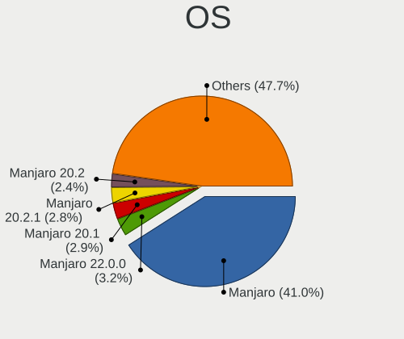

| Name            | Computers | Percent |
|-----------------|-----------|---------|
| Manjaro         | 4135      | 40.96%  |
| Manjaro 22.0.0  | 324       | 3.21%   |
| Manjaro 20.1    | 291       | 2.88%   |
| Manjaro 20.2.1  | 283       | 2.8%    |
| Manjaro 20.2    | 243       | 2.41%   |
| Manjaro 20.0.3  | 223       | 2.21%   |
| Manjaro 21.2.6  | 176       | 1.74%   |
| Manjaro 23.0.0  | 171       | 1.69%   |
| Manjaro 21.1.0  | 149       | 1.48%   |
| Manjaro 23.1.3  | 143       | 1.42%   |
| Manjaro 18.1.5  | 143       | 1.42%   |
| Manjaro 21.2.0  | 127       | 1.26%   |
| Manjaro 21.2.5  | 126       | 1.25%   |
| Manjaro 21.1.6  | 114       | 1.13%   |
| Manjaro 25.0.0  | 113       | 1.12%   |
| Manjaro 21.0.7  | 113       | 1.12%   |
| Manjaro 20.0    | 101       | 1%      |
| Manjaro 19.0.2  | 97        | 0.96%   |
| Manjaro 18.0.4  | 96        | 0.95%   |
| Manjaro 23.1.0  | 89        | 0.88%   |
| Manjaro 21.0    | 87        | 0.86%   |
| Manjaro 24.2.1  | 83        | 0.82%   |
| Manjaro 21.0.5  | 80        | 0.79%   |
| Manjaro 20.1.2  | 80        | 0.79%   |
| Manjaro 21.2.3  | 74        | 0.73%   |
| Manjaro 21.2.1  | 73        | 0.72%   |
| Manjaro 22.1.0  | 72        | 0.71%   |
| Manjaro 23.1.4  | 71        | 0.7%    |
| Manjaro 20.1.1  | 71        | 0.7%    |
| Manjaro 20.0.1  | 69        | 0.68%   |
| Manjaro 25.0.3  | 68        | 0.67%   |
| Manjaro 25.0.10 | 57        | 0.56%   |
| Manjaro 22.0.4  | 56        | 0.55%   |
| Manjaro 21.3.7  | 56        | 0.55%   |
| Manjaro 24.0.8  | 50        | 0.5%    |
| Manjaro 21.3.6  | 50        | 0.5%    |
| Manjaro 21.0.4  | 50        | 0.5%    |
| Manjaro 24.1.2  | 48        | 0.48%   |
| Manjaro 23.0.4  | 47        | 0.47%   |
| Manjaro 21.2.2  | 46        | 0.46%   |

OS Family
---------

OS without a version

| Name    | Computers | Percent |
|---------|-----------|---------|
| Manjaro | 9237      | 100%    |

Kernel
------

Version of the Linux kernel

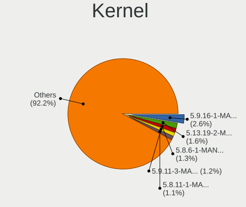

| Version           | Computers | Percent |
|-------------------|-----------|---------|
| 5.9.16-1-MANJARO  | 295       | 2.64%   |
| 5.13.19-2-MANJARO | 182       | 1.63%   |
| 5.8.6-1-MANJARO   | 140       | 1.25%   |
| 5.9.11-3-MANJARO  | 129       | 1.15%   |
| 5.8.11-1-MANJARO  | 122       | 1.09%   |
| 5.15.28-1-MANJARO | 117       | 1.05%   |
| 5.10.42-1-MANJARO | 102       | 0.91%   |
| 6.12.4-1-MANJARO  | 101       | 0.9%    |
| 5.8.18-1-MANJARO  | 101       | 0.9%    |
| 5.15.32-1-MANJARO | 101       | 0.9%    |
| 6.1.1-1-MANJARO   | 100       | 0.9%    |
| 6.12.48-1-MANJARO | 99        | 0.89%   |
| 6.10.13-3-MANJARO | 90        | 0.81%   |
| 6.9.12-3-MANJARO  | 88        | 0.79%   |
| 6.1.12-1-MANJARO  | 86        | 0.77%   |
| 6.6.10-1-MANJARO  | 84        | 0.75%   |
| 6.1.31-2-MANJARO  | 82        | 0.73%   |
| 5.15.12-1-MANJARO | 81        | 0.73%   |
| 6.5.5-1-MANJARO   | 78        | 0.7%    |
| 6.12.28-1-MANJARO | 78        | 0.7%    |
| 5.6.16-1-MANJARO  | 74        | 0.66%   |
| 5.8.16-2-MANJARO  | 73        | 0.65%   |
| 5.15.60-1-MANJARO | 73        | 0.65%   |
| 6.6.19-1-MANJARO  | 66        | 0.59%   |
| 5.10.2-2-MANJARO  | 65        | 0.58%   |
| 5.15.65-1-MANJARO | 62        | 0.56%   |
| 5.7.9-1-MANJARO   | 61        | 0.55%   |
| 5.10.36-2-MANJARO | 61        | 0.55%   |
| 5.6.19-2-MANJARO  | 60        | 0.54%   |
| 5.10.7-3-MANJARO  | 60        | 0.54%   |
| 6.6.26-1-MANJARO  | 59        | 0.53%   |
| 5.7.0-3-MANJARO   | 58        | 0.52%   |
| 5.8.3-2-MANJARO   | 57        | 0.51%   |
| 5.6.15-1-MANJARO  | 57        | 0.51%   |
| 6.6.8-2-MANJARO   | 54        | 0.48%   |
| 6.12.21-4-MANJARO | 54        | 0.48%   |
| 5.12.9-1-MANJARO  | 54        | 0.48%   |
| 6.5.3-1-MANJARO   | 53        | 0.47%   |
| 5.7.17-2-MANJARO  | 52        | 0.47%   |
| 5.15.41-1-MANJARO | 51        | 0.46%   |

Kernel Family
-------------

Linux kernel without a distro release

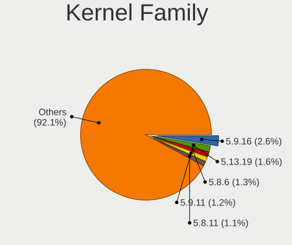

| Version | Computers | Percent |
|---------|-----------|---------|
| 5.9.16  | 295       | 2.64%   |
| 5.13.19 | 183       | 1.64%   |
| 5.8.6   | 140       | 1.25%   |
| 5.9.11  | 136       | 1.22%   |
| 5.8.11  | 123       | 1.1%    |
| 5.15.28 | 117       | 1.05%   |
| 6.9.12  | 110       | 0.99%   |
| 5.15.32 | 102       | 0.91%   |
| 5.10.42 | 102       | 0.91%   |
| 6.12.4  | 101       | 0.91%   |
| 5.8.18  | 101       | 0.91%   |
| 6.1.1   | 100       | 0.9%    |
| 6.12.48 | 99        | 0.89%   |
| 6.10.13 | 90        | 0.81%   |
| 6.1.31  | 88        | 0.79%   |
| 6.1.12  | 86        | 0.77%   |
| 6.6.10  | 85        | 0.76%   |
| 5.15.12 | 81        | 0.73%   |
| 6.5.5   | 79        | 0.71%   |
| 6.12.28 | 78        | 0.7%    |
| 5.8.16  | 74        | 0.66%   |
| 5.6.16  | 74        | 0.66%   |
| 5.7.0   | 73        | 0.65%   |
| 5.15.60 | 73        | 0.65%   |
| 5.9.1   | 69        | 0.62%   |
| 6.6.19  | 66        | 0.59%   |
| 5.6.19  | 66        | 0.59%   |
| 6.5.13  | 65        | 0.58%   |
| 5.10.2  | 65        | 0.58%   |
| 5.17.1  | 62        | 0.56%   |
| 5.15.65 | 62        | 0.56%   |
| 5.10.7  | 62        | 0.56%   |
| 5.7.9   | 61        | 0.55%   |
| 5.10.36 | 61        | 0.55%   |
| 6.6.26  | 59        | 0.53%   |
| 5.8.3   | 58        | 0.52%   |
| 5.6.15  | 57        | 0.51%   |
| 6.6.8   | 55        | 0.49%   |
| 6.5.3   | 54        | 0.48%   |
| 6.12.21 | 54        | 0.48%   |

Kernel Major Ver.
-----------------

Linux kernel major version

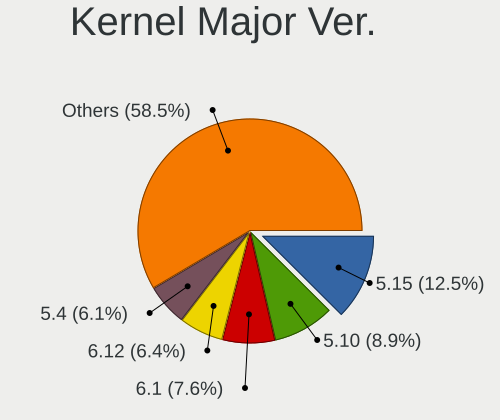

| Version | Computers | Percent |
|---------|-----------|---------|
| 5.15    | 1303      | 12.47%  |
| 5.10    | 933       | 8.93%   |
| 6.1     | 795       | 7.61%   |
| 6.12    | 671       | 6.42%   |
| 5.4     | 635       | 6.07%   |
| 6.6     | 596       | 5.7%    |
| 5.9     | 591       | 5.65%   |
| 5.8     | 553       | 5.29%   |
| 5.6     | 393       | 3.76%   |
| 5.13    | 361       | 3.45%   |
| 6.5     | 286       | 2.74%   |
| 6.9     | 267       | 2.55%   |
| 5.7     | 264       | 2.53%   |
| 4.19    | 201       | 1.92%   |
| 5.11    | 185       | 1.77%   |
| 5.16    | 177       | 1.69%   |
| 6.10    | 169       | 1.62%   |
| 5.12    | 157       | 1.5%    |
| 6.0     | 153       | 1.46%   |
| 5.14    | 153       | 1.46%   |
| 5.17    | 144       | 1.38%   |
| 5.19    | 140       | 1.34%   |
| 5.18    | 132       | 1.26%   |
| 5.5     | 109       | 1.04%   |
| 6.11    | 107       | 1.02%   |
| 6.2     | 96        | 0.92%   |
| 6.3     | 93        | 0.89%   |
| 5.3     | 92        | 0.88%   |
| 6.7     | 84        | 0.8%    |
| 6.4     | 80        | 0.77%   |
| 6.15    | 79        | 0.76%   |
| 6.8     | 66        | 0.63%   |
| 4.14    | 59        | 0.56%   |
| 6.14    | 54        | 0.52%   |
| 6.16    | 46        | 0.44%   |
| 5.2     | 41        | 0.39%   |
| 6.17    | 35        | 0.33%   |
| 6.13    | 33        | 0.32%   |
| 5.0     | 30        | 0.29%   |
| 5.1     | 26        | 0.25%   |

Arch
----

OS architecture (x86_64, i586, etc.)

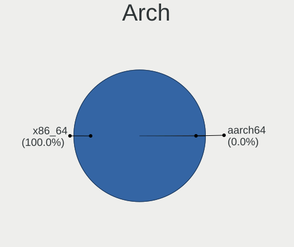

| Name    | Computers | Percent |
|---------|-----------|---------|
| x86_64  | 9234      | 99.97%  |
| i686    | 2         | 0.02%   |
| aarch64 | 1         | 0.01%   |

DE
--

Desktop Environment

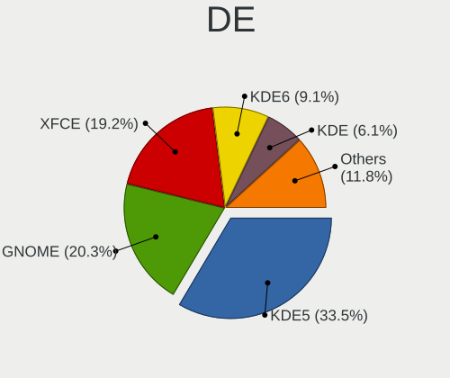

| Name                     | Computers | Percent |
|--------------------------|-----------|---------|
| KDE5                     | 3225      | 33.53%  |
| GNOME                    | 1954      | 20.31%  |
| XFCE                     | 1845      | 19.18%  |
| KDE6                     | 874       | 9.09%   |
| KDE                      | 589       | 6.12%   |
| Unknown                  | 351       | 3.65%   |
| X-Cinnamon               | 256       | 2.66%   |
| i3                       | 167       | 1.74%   |
| MATE                     | 86        | 0.89%   |
| Cinnamon                 | 64        | 0.67%   |
| Deepin                   | 53        | 0.55%   |
| Budgie                   | 33        | 0.34%   |
| sway                     | 21        | 0.22%   |
| awesome                  | 19        | 0.2%    |
| LXQt                     | 18        | 0.19%   |
| Hyprland                 | 9         | 0.09%   |
| LXDE                     | 7         | 0.07%   |
| GNOME Classic            | 6         | 0.06%   |
| bspwm                    | 6         | 0.06%   |
| qtile                    | 5         | 0.05%   |
| i3-with-shmlog           | 4         | 0.04%   |
| DWM                      | 4         | 0.04%   |
| GNOME Flashback          | 3         | 0.03%   |
| COSMIC                   | 3         | 0.03%   |
| Yaru:ubuntu:GNOME        | 2         | 0.02%   |
| leftwm                   | 2         | 0.02%   |
| ICEWM                    | 2         | 0.02%   |
| Enlightenment            | 2         | 0.02%   |
| xmonad                   | 1         | 0.01%   |
| xinitrc                  | 1         | 0.01%   |
| Unity                    | 1         | 0.01%   |
| swayLANG=en_CA.UTF-8     | 1         | 0.01%   |
| sway:wlroots:swayfx      | 1         | 0.01%   |
| openbox                  | 1         | 0.01%   |
| herbstluftwm             | 1         | 0.01%   |
| gamescope                | 1         | 0.01%   |
| /usr/bin/openbox-session | 1         | 0.01%   |

Display Server
--------------

X11 or Wayland

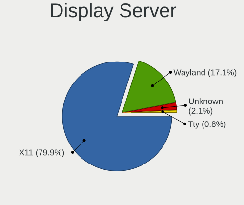

| Name    | Computers | Percent |
|---------|-----------|---------|
| X11     | 7560      | 79.92%  |
| Wayland | 1619      | 17.11%  |
| Unknown | 203       | 2.15%   |
| Tty     | 78        | 0.82%   |

Display Manager
---------------

SDDM, LightDM, etc.

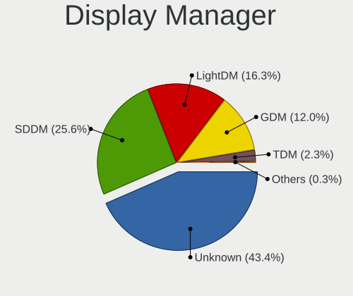

| Name    | Computers | Percent |
|---------|-----------|---------|
| Unknown | 4117      | 43.45%  |
| SDDM    | 2429      | 25.63%  |
| LightDM | 1540      | 16.25%  |
| GDM     | 1140      | 12.03%  |
| TDM     | 218       | 2.3%    |
| GREETD  | 13        | 0.14%   |
| LXDM    | 10        | 0.11%   |
| SLiM    | 3         | 0.03%   |
| XDM     | 2         | 0.02%   |
| Ly      | 2         | 0.02%   |
| LYNDE   | 1         | 0.01%   |
| CDM     | 1         | 0.01%   |

OS Lang
-------

Language

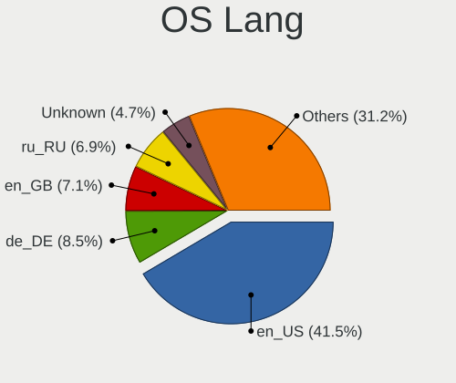

| Lang    | Computers | Percent |
|---------|-----------|---------|
| en_US   | 3886      | 41.52%  |
| de_DE   | 791       | 8.45%   |
| en_GB   | 669       | 7.15%   |
| ru_RU   | 648       | 6.92%   |
| Unknown | 444       | 4.74%   |
| pt_BR   | 363       | 3.88%   |
| it_IT   | 257       | 2.75%   |
| fr_FR   | 248       | 2.65%   |
| en_CA   | 210       | 2.24%   |
| es_ES   | 200       | 2.14%   |
| pl_PL   | 175       | 1.87%   |
| en_AU   | 118       | 1.26%   |
| en_IN   | 108       | 1.15%   |
| es_MX   | 101       | 1.08%   |
| zh_CN   | 76        | 0.81%   |
| de_AT   | 67        | 0.72%   |
| es_AR   | 55        | 0.59%   |
| nl_NL   | 48        | 0.51%   |
| hu_HU   | 40        | 0.43%   |
| ru_UA   | 39        | 0.42%   |
| fi_FI   | 37        | 0.4%    |
| sv_SE   | 36        | 0.38%   |
| en_IE   | 35        | 0.37%   |
| cs_CZ   | 33        | 0.35%   |
| de_CH   | 32        | 0.34%   |
| tr_TR   | 31        | 0.33%   |
| pt_PT   | 30        | 0.32%   |
| es_CL   | 30        | 0.32%   |
| en_ZA   | 29        | 0.31%   |
| en_DK   | 26        | 0.28%   |
| C       | 26        | 0.28%   |
| en_PH   | 24        | 0.26%   |
| es_CO   | 23        | 0.25%   |
| en_NZ   | 23        | 0.25%   |
| fr_CA   | 21        | 0.22%   |
| ja_JP   | 20        | 0.21%   |
| uk_UA   | 19        | 0.2%    |
| en_IL   | 19        | 0.2%    |
| nl_BE   | 18        | 0.19%   |
| el_GR   | 18        | 0.19%   |

Boot Mode
---------

EFI or BIOS

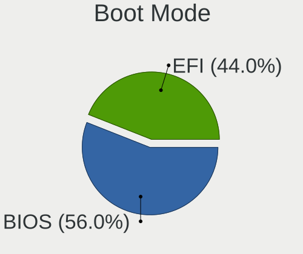

| Mode | Computers | Percent |
|------|-----------|---------|
| BIOS | 5269      | 55.99%  |
| EFI  | 4141      | 44.01%  |

Filesystem
----------

Type of filesystem

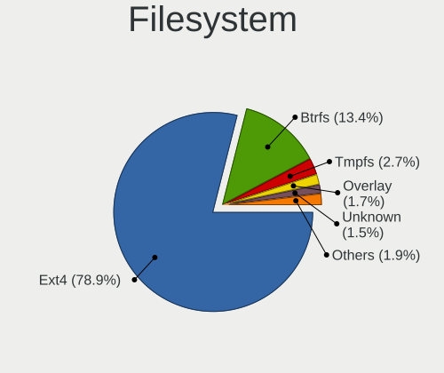

| Type     | Computers | Percent |
|----------|-----------|---------|
| Ext4     | 7402      | 78.93%  |
| Btrfs    | 1252      | 13.35%  |
| Tmpfs    | 251       | 2.68%   |
| Overlay  | 160       | 1.71%   |
| Unknown  | 136       | 1.45%   |
| Xfs      | 115       | 1.23%   |
| F2fs     | 33        | 0.35%   |
| Zfs      | 8         | 0.09%   |
| Ext3     | 7         | 0.07%   |
| Ext2     | 5         | 0.05%   |
| Reiserfs | 4         | 0.04%   |
| XXXfs    | 2         | 0.02%   |
| Jfs      | 2         | 0.02%   |
| XXXX     | 1         | 0.01%   |

Part. scheme
------------

Scheme of partitioning

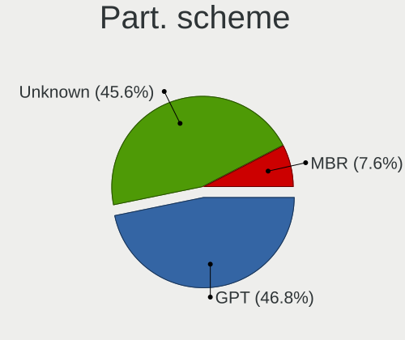

| Type    | Computers | Percent |
|---------|-----------|---------|
| GPT     | 4413      | 46.79%  |
| Unknown | 4305      | 45.64%  |
| MBR     | 714       | 7.57%   |

Dual Boot with Linux/BSD
------------------------

Hosting more than one Linux/BSD

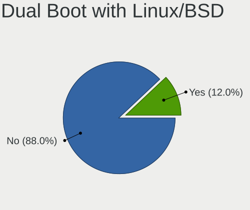

| Dual boot | Computers | Percent |
|-----------|-----------|---------|
| No        | 8254      | 87.98%  |
| Yes       | 1128      | 12.02%  |

Dual Boot (Win)
---------------

Hosting Linux and Windows

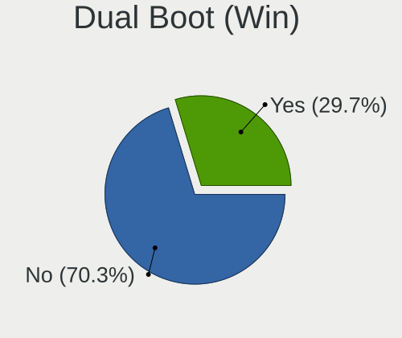

| Dual boot | Computers | Percent |
|-----------|-----------|---------|
| No        | 6602      | 70.32%  |
| Yes       | 2787      | 29.68%  |

Board
-----

Vendor
------

Motherboard manufacturer

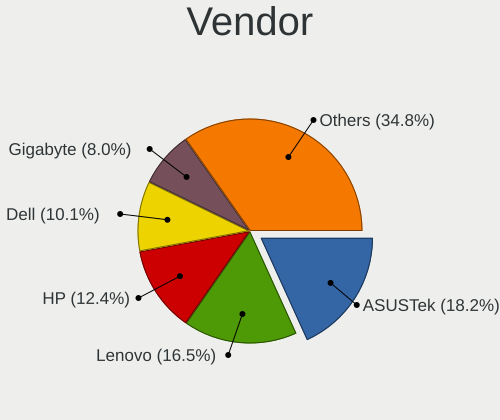

| Name                                 | Computers | Percent |
|--------------------------------------|-----------|---------|
| ASUSTek Computer                     | 1683      | 18.22%  |
| Lenovo                               | 1520      | 16.46%  |
| Hewlett-Packard                      | 1147      | 12.42%  |
| Dell                                 | 934       | 10.11%  |
| Gigabyte Technology                  | 743       | 8.04%   |
| MSI                                  | 740       | 8.01%   |
| Acer                                 | 449       | 4.86%   |
| ASRock                               | 381       | 4.12%   |
| Apple                                | 211       | 2.28%   |
| Intel                                | 115       | 1.24%   |
| HUAWEI                               | 98        | 1.06%   |
| Samsung Electronics                  | 92        | 1%      |
| Toshiba                              | 76        | 0.82%   |
| Unknown                              | 65        | 0.7%    |
| Timi                                 | 48        | 0.52%   |
| Fujitsu                              | 48        | 0.52%   |
| Google                               | 44        | 0.48%   |
| Sony                                 | 41        | 0.44%   |
| Notebook                             | 41        | 0.44%   |
| TUXEDO                               | 34        | 0.37%   |
| AZW                                  | 31        | 0.34%   |
| Alienware                            | 31        | 0.34%   |
| Microsoft                            | 30        | 0.32%   |
| Biostar                              | 28        | 0.3%    |
| Medion                               | 25        | 0.27%   |
| Framework                            | 22        | 0.24%   |
| Pegatron                             | 20        | 0.22%   |
| HONOR                                | 20        | 0.22%   |
| Chuwi                                | 19        | 0.21%   |
| Schenker                             | 18        | 0.19%   |
| Razer                                | 18        | 0.19%   |
| Positivo                             | 18        | 0.19%   |
| Huanan                               | 16        | 0.17%   |
| Shenzhen Meigao Electronic Equipment | 15        | 0.16%   |
| Packard Bell                         | 14        | 0.15%   |
| LG Electronics                       | 14        | 0.15%   |
| System76                             | 12        | 0.13%   |
| Foxconn                              | 12        | 0.13%   |
| BESSTAR Tech                         | 12        | 0.13%   |
| Panasonic                            | 11        | 0.12%   |

Model
-----

Motherboard model

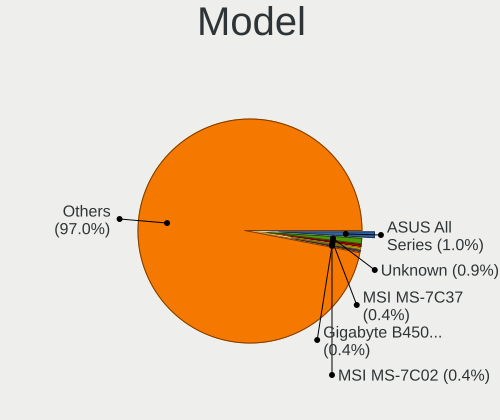

| Name                                | Computers | Percent |
|-------------------------------------|-----------|---------|
| ASUS All Series                     | 89        | 0.96%   |
| Unknown                             | 85        | 0.92%   |
| MSI MS-7C37                         | 39        | 0.42%   |
| Gigabyte B450M DS3H                 | 35        | 0.38%   |
| MSI MS-7C02                         | 33        | 0.36%   |
| MSI MS-7C91                         | 29        | 0.31%   |
| ASUS TUF Gaming X570-PLUS           | 29        | 0.31%   |
| HP Notebook                         | 27        | 0.29%   |
| ASUS PRIME A320M-K                  | 24        | 0.26%   |
| Lenovo IdeaPad 5 15ARE05 81YQ       | 20        | 0.22%   |
| ASRock B450M Pro4                   | 20        | 0.22%   |
| MSI MS-7B86                         | 19        | 0.21%   |
| MSI MS-7A38                         | 19        | 0.21%   |
| MSI MS-7B79                         | 18        | 0.19%   |
| ASUS ROG STRIX B550-F GAMING        | 18        | 0.19%   |
| ASUS PRIME B450M-A                  | 18        | 0.19%   |
| Gigabyte X570 AORUS ELITE           | 17        | 0.18%   |
| Dell OptiPlex 9020                  | 17        | 0.18%   |
| Dell OptiPlex 7010                  | 17        | 0.18%   |
| ASUS TUF Gaming B550M-PLUS          | 17        | 0.18%   |
| Dell XPS 13 9310                    | 16        | 0.17%   |
| Gigabyte B450 AORUS M               | 15        | 0.16%   |
| ASUS ROG STRIX B450-F GAMING        | 15        | 0.16%   |
| Lenovo Legion 5 15ARH05 82B5        | 14        | 0.15%   |
| Lenovo IdeaPadFlex 5 14ARE05 81X2   | 13        | 0.14%   |
| Gigabyte X470 AORUS ULTRA GAMING    | 13        | 0.14%   |
| Gigabyte B450 AORUS ELITE           | 13        | 0.14%   |
| Dell XPS 15 9500                    | 13        | 0.14%   |
| ASUS ROG STRIX X570-E GAMING        | 13        | 0.14%   |
| ASUS PRIME B350-PLUS                | 13        | 0.14%   |
| Apple MacBookPro9,2                 | 13        | 0.14%   |
| Apple MacBookAir7,2                 | 13        | 0.14%   |
| MSI MS-7C95                         | 12        | 0.13%   |
| MSI MS-7C56                         | 12        | 0.13%   |
| MSI MS-7693                         | 12        | 0.13%   |
| HP Pavilion Notebook                | 12        | 0.13%   |
| HP Pavilion Gaming Laptop 15-ec1xxx | 12        | 0.13%   |
| HP Pavilion 15                      | 12        | 0.13%   |
| HP OMEN by Laptop                   | 12        | 0.13%   |
| Gigabyte 970A-DS3P                  | 12        | 0.13%   |

Model Family
------------

Motherboard model prefix

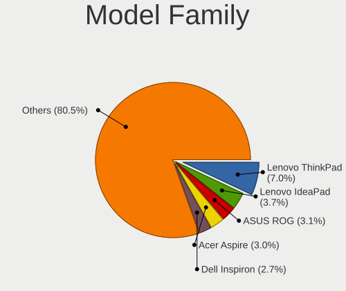

| Name               | Computers | Percent |
|--------------------|-----------|---------|
| Lenovo ThinkPad    | 646       | 6.99%   |
| Lenovo IdeaPad     | 338       | 3.66%   |
| ASUS ROG           | 289       | 3.13%   |
| Acer Aspire        | 281       | 3.04%   |
| Dell Inspiron      | 246       | 2.66%   |
| ASUS PRIME         | 241       | 2.61%   |
| Dell Latitude      | 215       | 2.33%   |
| HP Pavilion        | 201       | 2.18%   |
| ASUS TUF           | 161       | 1.74%   |
| Dell XPS           | 148       | 1.6%    |
| ASUS VivoBook      | 146       | 1.58%   |
| HP ProBook         | 138       | 1.49%   |
| HP EliteBook       | 138       | 1.49%   |
| HP Laptop          | 129       | 1.4%    |
| Dell OptiPlex      | 121       | 1.31%   |
| Lenovo Legion      | 116       | 1.26%   |
| Dell Precision     | 89        | 0.96%   |
| ASUS All           | 89        | 0.96%   |
| Lenovo Yoga        | 85        | 0.92%   |
| Unknown            | 85        | 0.92%   |
| HP ENVY            | 84        | 0.91%   |
| Toshiba Satellite  | 67        | 0.73%   |
| HP Compaq          | 66        | 0.71%   |
| Gigabyte X570      | 61        | 0.66%   |
| Gigabyte B450M     | 58        | 0.63%   |
| ASUS ASUS          | 55        | 0.6%    |
| Dell Vostro        | 54        | 0.58%   |
| ASUS ZenBook       | 49        | 0.53%   |
| HP OMEN            | 48        | 0.52%   |
| Lenovo ThinkBook   | 47        | 0.51%   |
| Gigabyte B450      | 45        | 0.49%   |
| Acer Swift         | 43        | 0.47%   |
| Acer Nitro         | 43        | 0.47%   |
| Lenovo ThinkCentre | 42        | 0.45%   |
| MSI MS-7C37        | 39        | 0.42%   |
| ASRock B450M       | 36        | 0.39%   |
| MSI MS-7C02        | 33        | 0.36%   |
| HP EliteDesk       | 32        | 0.35%   |
| Gigabyte B550      | 32        | 0.35%   |
| Fujitsu LIFEBOOK   | 31        | 0.34%   |

MFG Year
--------

Motherboard manufacture year

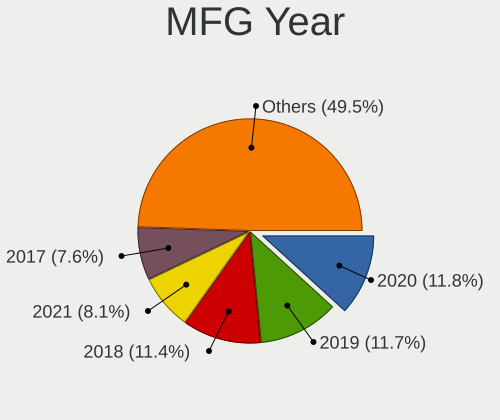

| Year    | Computers | Percent |
|---------|-----------|---------|
| 2020    | 1087      | 11.77%  |
| 2019    | 1079      | 11.68%  |
| 2018    | 1051      | 11.38%  |
| 2021    | 746       | 8.08%   |
| 2017    | 706       | 7.64%   |
| 2012    | 627       | 6.79%   |
| 2013    | 507       | 5.49%   |
| 2014    | 479       | 5.19%   |
| 2022    | 456       | 4.94%   |
| 2016    | 437       | 4.73%   |
| 2011    | 430       | 4.66%   |
| 2015    | 412       | 4.46%   |
| 2023    | 278       | 3.01%   |
| 2010    | 250       | 2.71%   |
| 2024    | 175       | 1.89%   |
| 2009    | 173       | 1.87%   |
| 2008    | 160       | 1.73%   |
| 2007    | 86        | 0.93%   |
| 2025    | 48        | 0.52%   |
| 2006    | 38        | 0.41%   |
| Unknown | 6         | 0.06%   |
| 2005    | 5         | 0.05%   |
| 2004    | 1         | 0.01%   |

Form Factor
-----------

Physical design of the computer

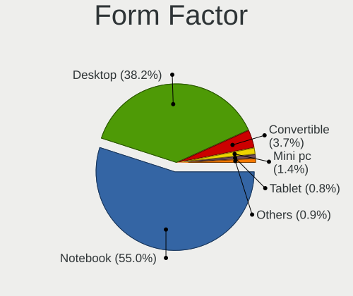

| Name        | Computers | Percent |
|-------------|-----------|---------|
| Notebook    | 5079      | 54.99%  |
| Desktop     | 3532      | 38.24%  |
| Convertible | 342       | 3.7%    |
| Mini pc     | 125       | 1.35%   |
| Tablet      | 73        | 0.79%   |
| All in one  | 73        | 0.79%   |
| Server      | 12        | 0.13%   |
| Phone       | 1         | 0.01%   |

Secure Boot
-----------

Enabled or disabled

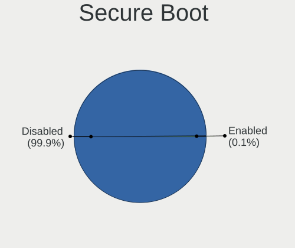

| State    | Computers | Percent |
|----------|-----------|---------|
| Disabled | 9230      | 99.86%  |
| Enabled  | 13        | 0.14%   |

Coreboot
--------

Have coreboot on board

| Used | Computers | Percent |
|------|-----------|---------|
| No   | 9170      | 99.27%  |
| Yes  | 67        | 0.73%   |

RAM Size
--------

Total RAM memory

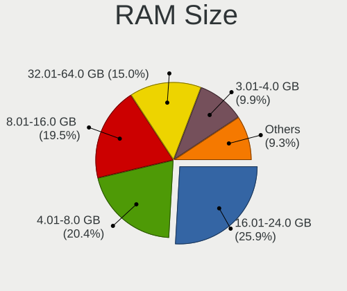

| Size in GB      | Computers | Percent |
|-----------------|-----------|---------|
| 16.01-24.0      | 2430      | 25.9%   |
| 4.01-8.0        | 1914      | 20.4%   |
| 8.01-16.0       | 1827      | 19.47%  |
| 32.01-64.0      | 1408      | 15.01%  |
| 3.01-4.0        | 931       | 9.92%   |
| 64.01-256.0     | 391       | 4.17%   |
| 24.01-32.0      | 318       | 3.39%   |
| 1.01-2.0        | 116       | 1.24%   |
| 2.01-3.0        | 42        | 0.45%   |
| More than 256.0 | 4         | 0.04%   |
| 0.51-1.0        | 1         | 0.01%   |

RAM Used
--------

Used RAM memory

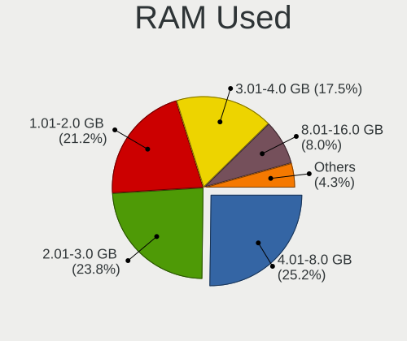

| Used GB         | Computers | Percent |
|-----------------|-----------|---------|
| 4.01-8.0        | 2616      | 25.21%  |
| 2.01-3.0        | 2472      | 23.82%  |
| 1.01-2.0        | 2196      | 21.16%  |
| 3.01-4.0        | 1811      | 17.45%  |
| 8.01-16.0       | 834       | 8.04%   |
| 0.51-1.0        | 254       | 2.45%   |
| 16.01-24.0      | 110       | 1.06%   |
| 24.01-32.0      | 36        | 0.35%   |
| 32.01-64.0      | 25        | 0.24%   |
| 0.01-0.5        | 20        | 0.19%   |
| 64.01-256.0     | 2         | 0.02%   |
| More than 256.0 | 1         | 0.01%   |
| 0               | 1         | 0.01%   |

Total Drives
------------

Number of drives on board

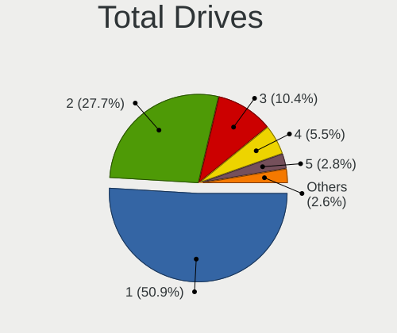

| Drives | Computers | Percent |
|--------|-----------|---------|
| 1      | 4870      | 50.95%  |
| 2      | 2650      | 27.72%  |
| 3      | 998       | 10.44%  |
| 4      | 526       | 5.5%    |
| 5      | 265       | 2.77%   |
| 6      | 110       | 1.15%   |
| 7      | 52        | 0.54%   |
| 0      | 34        | 0.36%   |
| 8      | 25        | 0.26%   |
| 9      | 12        | 0.13%   |
| 11     | 8         | 0.08%   |
| 10     | 4         | 0.04%   |
| 12     | 3         | 0.03%   |
| 27     | 1         | 0.01%   |
| 20     | 1         | 0.01%   |

Has CD-ROM
----------

Has CD-ROM on board

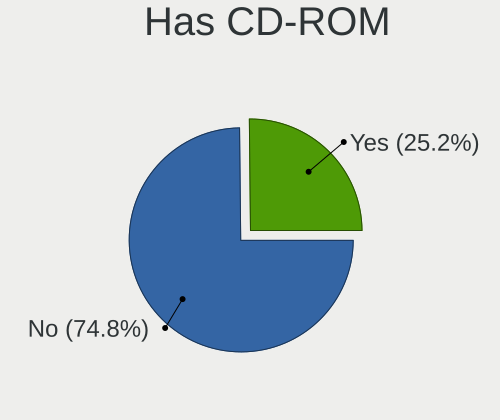

| Presented | Computers | Percent |
|-----------|-----------|---------|
| No        | 6971      | 74.84%  |
| Yes       | 2344      | 25.16%  |

Has Ethernet
------------

Has Ethernet on board

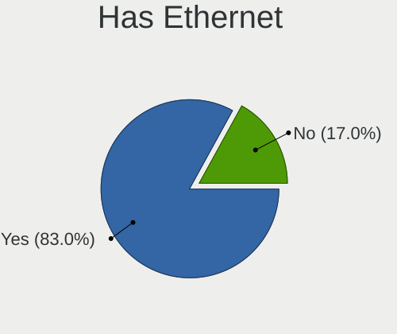

| Presented | Computers | Percent |
|-----------|-----------|---------|
| Yes       | 7688      | 83.01%  |
| No        | 1573      | 16.99%  |

Has WiFi
--------

Has WiFi module

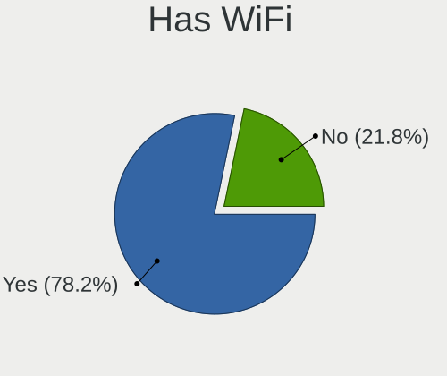

| Presented | Computers | Percent |
|-----------|-----------|---------|
| Yes       | 7287      | 78.25%  |
| No        | 2026      | 21.75%  |

Has Bluetooth
-------------

Has Bluetooth module

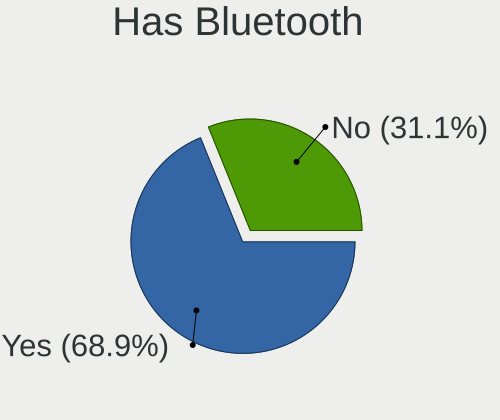

| Presented | Computers | Percent |
|-----------|-----------|---------|
| Yes       | 6440      | 68.88%  |
| No        | 2910      | 31.12%  |

Location
--------

Country
-------

Geographic location (country)

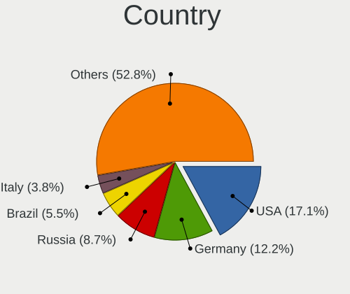

| Country      | Computers | Percent |
|--------------|-----------|---------|
| USA          | 1592      | 17.09%  |
| Germany      | 1135      | 12.18%  |
| Russia       | 809       | 8.68%   |
| Brazil       | 508       | 5.45%   |
| Italy        | 357       | 3.83%   |
| France       | 348       | 3.74%   |
| UK           | 337       | 3.62%   |
| Canada       | 298       | 3.2%    |
| Spain        | 274       | 2.94%   |
| Poland       | 273       | 2.93%   |
| Netherlands  | 189       | 2.03%   |
| India        | 159       | 1.71%   |
| Ukraine      | 153       | 1.64%   |
| Australia    | 137       | 1.47%   |
| Mexico       | 136       | 1.46%   |
| Austria      | 133       | 1.43%   |
| Sweden       | 128       | 1.37%   |
| Switzerland  | 102       | 1.1%    |
| Finland      | 89        | 0.96%   |
| China        | 88        | 0.94%   |
| Belgium      | 86        | 0.92%   |
| Argentina    | 83        | 0.89%   |
| Turkey       | 82        | 0.88%   |
| Hungary      | 82        | 0.88%   |
| Czechia      | 77        | 0.83%   |
| Romania      | 76        | 0.82%   |
| Greece       | 75        | 0.81%   |
| Portugal     | 72        | 0.77%   |
| Indonesia    | 64        | 0.69%   |
| Bulgaria     | 63        | 0.68%   |
| Norway       | 58        | 0.62%   |
| Belarus      | 57        | 0.61%   |
| Denmark      | 53        | 0.57%   |
| Colombia     | 52        | 0.56%   |
| Chile        | 45        | 0.48%   |
| Japan        | 43        | 0.46%   |
| South Africa | 41        | 0.44%   |
| Iran         | 37        | 0.4%    |
| Israel       | 36        | 0.39%   |
| Bangladesh   | 36        | 0.39%   |

City
----

Geographic location (city)

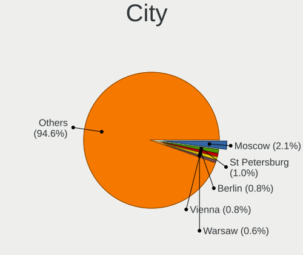

| City              | Computers | Percent |
|-------------------|-----------|---------|
| Moscow            | 207       | 2.09%   |
| St Petersburg     | 100       | 1.01%   |
| Berlin            | 82        | 0.83%   |
| Vienna            | 78        | 0.79%   |
| Warsaw            | 64        | 0.65%   |
| Paris             | 63        | 0.64%   |
| Sao Paulo         | 58        | 0.59%   |
| Milan             | 52        | 0.53%   |
| Frankfurt am Main | 50        | 0.51%   |
| Amsterdam         | 50        | 0.51%   |
| Kyiv              | 44        | 0.44%   |
| Hamburg           | 44        | 0.44%   |
| Munich            | 42        | 0.42%   |
| Madrid            | 42        | 0.42%   |
| Toronto           | 41        | 0.41%   |
| Helsinki          | 40        | 0.4%    |
| Sydney            | 36        | 0.36%   |
| Stockholm         | 36        | 0.36%   |
| Melbourne         | 36        | 0.36%   |
| Rome              | 34        | 0.34%   |
| Minsk             | 34        | 0.34%   |
| Budapest          | 34        | 0.34%   |
| Barcelona         | 34        | 0.34%   |
| Seattle           | 33        | 0.33%   |
| Istanbul          | 33        | 0.33%   |
| Athens            | 33        | 0.33%   |
| Chicago           | 31        | 0.31%   |
| Prague            | 30        | 0.3%    |
| Novosibirsk       | 29        | 0.29%   |
| Mexico City       | 28        | 0.28%   |
| Cologne           | 28        | 0.28%   |
| Bucharest         | 28        | 0.28%   |
| Portland          | 27        | 0.27%   |
| Bogotá           | 27        | 0.27%   |
| Bengaluru         | 27        | 0.27%   |
| Sofia             | 26        | 0.26%   |
| Rio de Janeiro    | 26        | 0.26%   |
| Los Angeles       | 26        | 0.26%   |
| London            | 25        | 0.25%   |
| Dhaka             | 25        | 0.25%   |

Drives
------

Drive Vendor
------------

Hard drive vendors

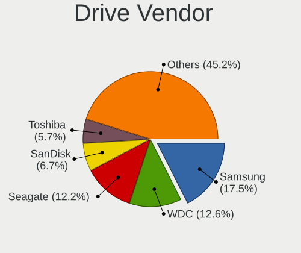

| Vendor                       | Computers | Drives | Percent |
|------------------------------|-----------|--------|---------|
| Samsung Electronics          | 2688      | 4226   | 17.52%  |
| WDC                          | 1929      | 3023   | 12.57%  |
| Seagate                      | 1872      | 2884   | 12.2%   |
| SanDisk                      | 1035      | 1388   | 6.74%   |
| Toshiba                      | 881       | 1145   | 5.74%   |
| Kingston                     | 855       | 1147   | 5.57%   |
| Crucial                      | 651       | 934    | 4.24%   |
| Unknown                      | 465       | 646    | 3.03%   |
| SK hynix                     | 440       | 539    | 2.87%   |
| Intel                        | 413       | 560    | 2.69%   |
| Micron Technology            | 294       | 365    | 1.92%   |
| Hitachi                      | 283       | 378    | 1.84%   |
| HGST                         | 256       | 337    | 1.67%   |
| A-DATA Technology            | 197       | 272    | 1.28%   |
| Phison Electronics           | 174       | 218    | 1.13%   |
| Micron/Crucial Technology    | 168       | 224    | 1.09%   |
| China                        | 149       | 195    | 0.97%   |
| Phison                       | 141       | 197    | 0.92%   |
| KIOXIA                       | 134       | 166    | 0.87%   |
| Apple                        | 120       | 152    | 0.78%   |
| Silicon Motion               | 116       | 147    | 0.76%   |
| Kingston Technology Company  | 109       | 131    | 0.71%   |
| MAXIO Technology (Hangzhou)  | 79        | 95     | 0.51%   |
| PNY                          | 78        | 111    | 0.51%   |
| Transcend                    | 74        | 83     | 0.48%   |
| SPCC                         | 70        | 91     | 0.46%   |
| Patriot                      | 67        | 92     | 0.44%   |
| Intenso                      | 67        | 96     | 0.44%   |
| ADATA Technology             | 66        | 85     | 0.43%   |
| Realtek Semiconductor        | 60        | 74     | 0.39%   |
| GOODRAM                      | 58        | 98     | 0.38%   |
| JMicron Technology           | 56        | 72     | 0.36%   |
| OCZ                          | 55        | 75     | 0.36%   |
| LITEON                       | 50        | 60     | 0.33%   |
| XPG                          | 45        | 56     | 0.29%   |
| Shenzhen Longsys Electronics | 42        | 66     | 0.27%   |
| LITEONIT                     | 42        | 52     | 0.27%   |
| Corsair                      | 42        | 54     | 0.27%   |
| Unknown                      | 41        | 45     | 0.27%   |
| Plextor                      | 37        | 49     | 0.24%   |

Drive Model
-----------

Hard drive models

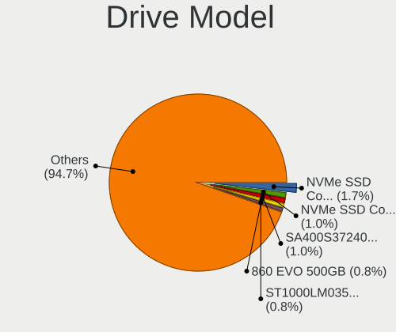

| Model                                                | Computers | Percent |
|------------------------------------------------------|-----------|---------|
| Samsung NVMe SSD Controller SM981/PM981/PM983 1TB    | 300       | 1.74%   |
| Samsung NVMe SSD Controller PM9A1/PM9A3/980PRO 1TB   | 179       | 1.04%   |
| Kingston SA400S37240G 240GB SSD                      | 171       | 0.99%   |
| Samsung SSD 860 EVO 500GB                            | 141       | 0.82%   |
| Seagate ST1000LM035-1RK172 1TB                       | 130       | 0.75%   |
| Kingston SA400S37480G 480GB SSD                      | 113       | 0.66%   |
| Seagate ST1000DM010-2EP102 1TB                       | 111       | 0.64%   |
| Samsung SSD 850 EVO 500GB                            | 109       | 0.63%   |
| Crucial CT500MX500SSD1 500GB                         | 104       | 0.6%    |
| Seagate ST2000DM008-2FR102 2TB                       | 102       | 0.59%   |
| Samsung SSD 850 EVO 250GB                            | 98        | 0.57%   |
| Kingston SA400S37120G 120GB SSD                      | 94        | 0.55%   |
| Crucial CT1000MX500SSD1 1TB                          | 94        | 0.55%   |
| Toshiba MQ01ABD100 1TB                               | 87        | 0.51%   |
| Samsung NVMe SSD Drive 512GB                         | 86        | 0.5%    |
| Samsung SSD 860 EVO 1TB                              | 84        | 0.49%   |
| Samsung NVMe SSD Drive 500GB                         | 83        | 0.48%   |
| Samsung NVMe SSD Drive 1TB                           | 82        | 0.48%   |
| Unknown MMC Card  64GB                               | 79        | 0.46%   |
| Seagate ST1000LM024 HN-M101MBB 1TB                   | 77        | 0.45%   |
| HGST HTS721010A9E630 1TB                             | 77        | 0.45%   |
| Crucial CT240BX500SSD1 240GB                         | 75        | 0.44%   |
| Toshiba MQ04ABF100 1TB                               | 71        | 0.41%   |
| Toshiba DT01ACA100 1TB                               | 70        | 0.41%   |
| Micron/Crucial P2 NVMe PCIe SSD 2TB                  | 70        | 0.41%   |
| Samsung SSD 860 EVO 250GB                            | 69        | 0.4%    |
| WDC WD10EZEX-08WN4A0 1TB                             | 68        | 0.39%   |
| Samsung SSD 980 1TB                                  | 65        | 0.38%   |
| Sandisk WD Blue SN550 NVMe SSD 1024GB                | 64        | 0.37%   |
| Unknown SD/MMC/MS PRO 2GB                            | 62        | 0.36%   |
| Sandisk WD Black SN750 / PC SN730 NVMe SSD 500GB     | 62        | 0.36%   |
| Samsung NVMe SSD Controller SM961/PM961/SM963 1024GB | 62        | 0.36%   |
| Samsung NVMe SSD Drive 256GB                         | 61        | 0.35%   |
| Seagate ST500DM002-1BD142 500GB                      | 59        | 0.34%   |
| Seagate Expansion 2TB                                | 59        | 0.34%   |
| Unknown MMC Card  32GB                               | 58        | 0.34%   |
| Phison E12 NVMe Controller 1TB                       | 57        | 0.33%   |
| SK hynix NVMe SSD Drive 512GB                        | 55        | 0.32%   |
| SanDisk NVMe SSD Drive 512GB                         | 52        | 0.3%    |
| MAXIO (Hangzhou) NVMe SSD Controller MAP1202 2TB     | 52        | 0.3%    |

HDD Vendor
----------

Hard disk drive vendors

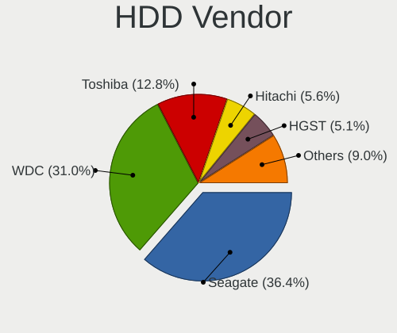

| Vendor              | Computers | Drives | Percent |
|---------------------|-----------|--------|---------|
| Seagate             | 1823      | 2793   | 36.39%  |
| WDC                 | 1555      | 2426   | 31.04%  |
| Toshiba             | 641       | 840    | 12.8%   |
| Hitachi             | 283       | 378    | 5.65%   |
| HGST                | 254       | 335    | 5.07%   |
| Samsung Electronics | 182       | 280    | 3.63%   |
| Unknown             | 69        | 89     | 1.38%   |
| JMicron Technology  | 29        | 33     | 0.58%   |
| Apple               | 25        | 31     | 0.5%    |
| Fujitsu             | 20        | 33     | 0.4%    |
| Maxtor              | 18        | 20     | 0.36%   |
| Intenso             | 16        | 27     | 0.32%   |
| TO Exter            | 10        | 13     | 0.2%    |
| ASMT                | 10        | 24     | 0.2%    |
| USB3.0              | 8         | 8      | 0.16%   |
| Hewlett-Packard     | 7         | 7      | 0.14%   |
| External            | 7         | 9      | 0.14%   |
| USB                 | 5         | 6      | 0.1%    |
| SSK                 | 5         | 6      | 0.1%    |
| ASMedia             | 5         | 5      | 0.1%    |
| HGST HTS            | 4         | 4      | 0.08%   |
| MaxDigital          | 3         | 3      | 0.06%   |
| Unknown             | 3         | 4      | 0.06%   |
| T-FORCE             | 2         | 2      | 0.04%   |
| StoreJet            | 2         | 3      | 0.04%   |
| SABRENT             | 2         | 2      | 0.04%   |
| Maxone              | 2         | 3      | 0.04%   |
| Apricorn            | 2         | 2      | 0.04%   |
| WD MediaMax         | 1         | 2      | 0.02%   |
| TPH01204000GB       | 1         | 1      | 0.02%   |
| SATAFIRM            | 1         | 1      | 0.02%   |
| SAGE                | 1         | 1      | 0.02%   |
| QNAP                | 1         | 1      | 0.02%   |
| MARSHAL             | 1         | 1      | 0.02%   |
| Lenovo              | 1         | 1      | 0.02%   |
| KESU                | 1         | 1      | 0.02%   |
| Initio              | 1         | 1      | 0.02%   |
| Inateck             | 1         | 1      | 0.02%   |
| IBM/Hitachi         | 1         | 1      | 0.02%   |
| IBM-ESXS            | 1         | 2      | 0.02%   |

SSD Vendor
----------

Solid state drive vendors

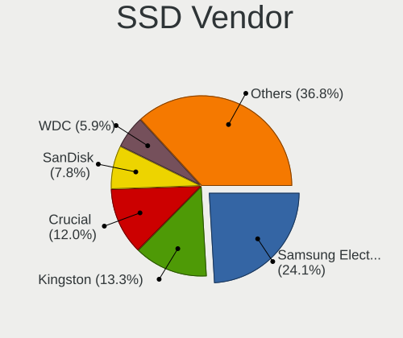

| Vendor              | Computers | Drives | Percent |
|---------------------|-----------|--------|---------|
| Samsung Electronics | 1220      | 1750   | 24.07%  |
| Kingston            | 675       | 884    | 13.32%  |
| Crucial             | 610       | 884    | 12.04%  |
| SanDisk             | 397       | 526    | 7.83%   |
| WDC                 | 300       | 405    | 5.92%   |
| A-DATA Technology   | 168       | 233    | 3.31%   |
| China               | 149       | 195    | 2.94%   |
| Intel               | 110       | 140    | 2.17%   |
| Micron Technology   | 78        | 102    | 1.54%   |
| SK hynix            | 75        | 88     | 1.48%   |
| Toshiba             | 73        | 94     | 1.44%   |
| PNY                 | 72        | 105    | 1.42%   |
| Transcend           | 67        | 75     | 1.32%   |
| Apple               | 67        | 75     | 1.32%   |
| Patriot             | 63        | 87     | 1.24%   |
| SPCC                | 59        | 79     | 1.16%   |
| GOODRAM             | 56        | 96     | 1.1%    |
| OCZ                 | 55        | 75     | 1.09%   |
| Intenso             | 46        | 63     | 0.91%   |
| LITEON              | 44        | 54     | 0.87%   |
| LITEONIT            | 42        | 52     | 0.83%   |
| Plextor             | 34        | 46     | 0.67%   |
| Lexar               | 33        | 41     | 0.65%   |
| Corsair             | 31        | 41     | 0.61%   |
| Team                | 30        | 41     | 0.59%   |
| Apacer              | 30        | 32     | 0.59%   |
| KingSpec            | 25        | 29     | 0.49%   |
| Gigabyte Technology | 25        | 33     | 0.49%   |
| Unknown             | 23        | 26     | 0.45%   |
| Seagate             | 22        | 29     | 0.43%   |
| Netac               | 18        | 26     | 0.36%   |
| SABRENT             | 16        | 17     | 0.32%   |
| Leven               | 15        | 16     | 0.3%    |
| Hewlett-Packard     | 13        | 18     | 0.26%   |
| ASMT                | 13        | 17     | 0.26%   |
| KingDian            | 12        | 12     | 0.24%   |
| Mushkin             | 9         | 12     | 0.18%   |
| XrayDisk            | 7         | 8      | 0.14%   |
| Unknown             | 7         | 8      | 0.14%   |
| NGFF                | 7         | 7      | 0.14%   |

Drive Kind
----------

HDD or SSD

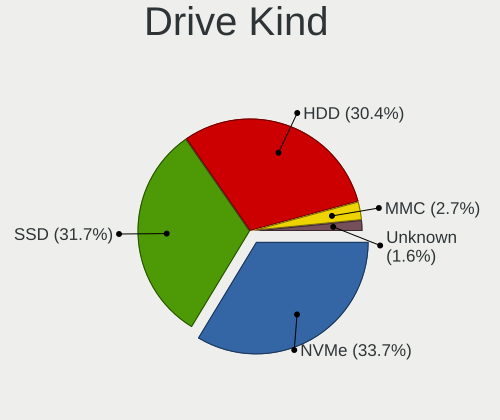

| Kind    | Computers | Drives | Percent |
|---------|-----------|--------|---------|
| NVMe    | 4493      | 6789   | 33.67%  |
| SSD     | 4228      | 6877   | 31.68%  |
| HDD     | 4059      | 7405   | 30.42%  |
| MMC     | 357       | 461    | 2.68%   |
| Unknown | 208       | 303    | 1.56%   |

Drive Connector
---------------

SATA, SAS, NVMe, etc.

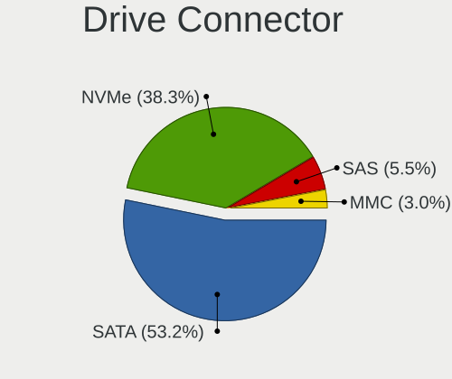

| Type | Computers | Drives | Percent |
|------|-----------|--------|---------|
| SATA | 6243      | 13618  | 53.21%  |
| NVMe | 4490      | 6725   | 38.27%  |
| SAS  | 642       | 1031   | 5.47%   |
| MMC  | 357       | 461    | 3.04%   |

Drive Size
----------

Size of hard drive

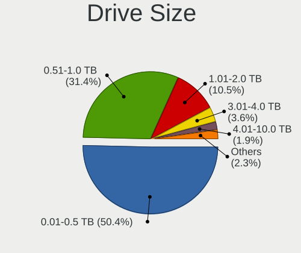

| Size in TB | Computers | Drives | Percent |
|------------|-----------|--------|---------|
| 0.01-0.5   | 4482      | 7455   | 50.37%  |
| 0.51-1.0   | 2792      | 4222   | 31.37%  |
| 1.01-2.0   | 932       | 1422   | 10.47%  |
| 3.01-4.0   | 320       | 532    | 3.6%    |
| 4.01-10.0  | 171       | 311    | 1.92%   |
| 2.01-3.0   | 170       | 267    | 1.91%   |
| 10.01-20.0 | 31        | 72     | 0.35%   |
| 20.01-50.0 | 1         | 1      | 0.01%   |

Space Total
-----------

Amount of disk space available on the file system

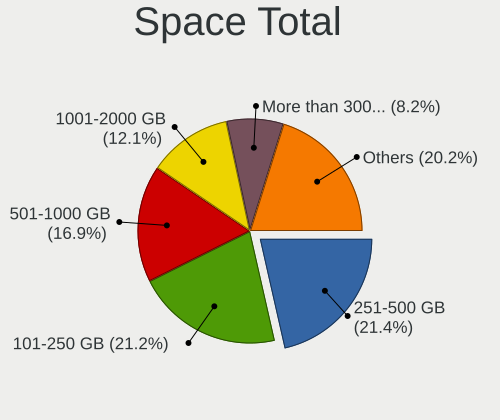

| Size in GB     | Computers | Percent |
|----------------|-----------|---------|
| 251-500        | 2087      | 21.45%  |
| 101-250        | 2061      | 21.18%  |
| 501-1000       | 1642      | 16.88%  |
| 1001-2000      | 1179      | 12.12%  |
| More than 3000 | 799       | 8.21%   |
| Unknown        | 604       | 6.21%   |
| 2001-3000      | 460       | 4.73%   |
| 51-100         | 443       | 4.55%   |
| 1-20           | 263       | 2.7%    |
| 21-50          | 192       | 1.97%   |

Space Used
----------

Amount of used disk space

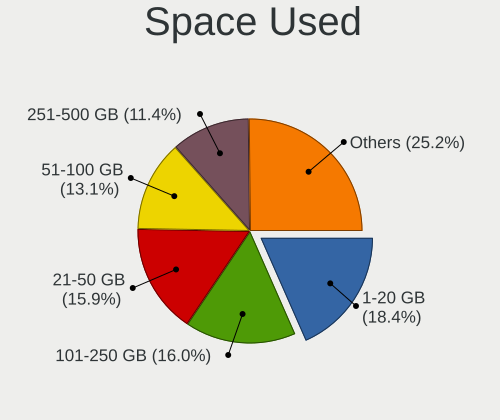

| Used GB        | Computers | Percent |
|----------------|-----------|---------|
| 1-20           | 1878      | 18.4%   |
| 101-250        | 1636      | 16.03%  |
| 21-50          | 1618      | 15.86%  |
| 51-100         | 1341      | 13.14%  |
| 251-500        | 1162      | 11.39%  |
| 501-1000       | 917       | 8.99%   |
| Unknown        | 604       | 5.92%   |
| 1001-2000      | 552       | 5.41%   |
| More than 3000 | 293       | 2.87%   |
| 2001-3000      | 196       | 1.92%   |
| 0              | 7         | 0.07%   |

Malfunc. Drives
---------------

Drive models with a malfunction

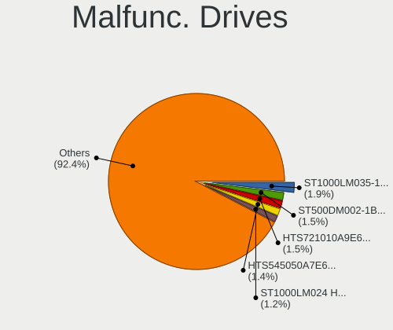

| Model                                                         | Computers | Drives | Percent |
|---------------------------------------------------------------|-----------|--------|---------|
| Seagate ST1000LM035-1RK172 1TB                                | 14        | 16     | 1.94%   |
| Seagate ST500DM002-1BD142 500GB                               | 11        | 14     | 1.52%   |
| HGST HTS721010A9E630 1TB                                      | 11        | 11     | 1.52%   |
| HGST HTS545050A7E680 500GB                                    | 10        | 10     | 1.39%   |
| Seagate ST1000LM024 HN-M101MBB 1TB                            | 9         | 9      | 1.25%   |
| Toshiba MQ01ABD100 1TB                                        | 8         | 10     | 1.11%   |
| Seagate ST500LT012-9WS142 500GB                               | 8         | 31     | 1.11%   |
| HGST HTS545050A7E380 500GB                                    | 8         | 8      | 1.11%   |
| WDC WD5000AAKX-001CA0 500GB                                   | 7         | 9      | 0.97%   |
| Samsung Electronics SSD 870 EVO 1TB                           | 7         | 7      | 0.97%   |
| WDC WD10EARS-00Y5B1 1TB                                       | 6         | 6      | 0.83%   |
| Toshiba MQ01ABF050 500GB                                      | 6         | 6      | 0.83%   |
| Toshiba MQ01ABD050 500GB                                      | 6         | 6      | 0.83%   |
| Seagate ST2000DM008-2FR102 2TB                                | 6         | 6      | 0.83%   |
| Samsung Electronics HD103SJ 1TB                               | 6         | 6      | 0.83%   |
| Crucial CT525MX300SSD1 528GB                                  | 6         | 6      | 0.83%   |
| Seagate ST9320325AS 320GB                                     | 5         | 6      | 0.69%   |
| Seagate ST1000DM003-9YN162 1TB                                | 5         | 7      | 0.69%   |
| Hitachi HDS721010CLA332 1TB                                   | 5         | 5      | 0.69%   |
| HGST HTS725050A7E630 500GB                                    | 5         | 5      | 0.69%   |
| HGST HTS541010A9E680 1TB                                      | 5         | 5      | 0.69%   |
| WDC WD20EFRX-68EUZN0 2TB                                      | 4         | 7      | 0.55%   |
| WDC WD15EARS-00MVWB0 1TB                                      | 4         | 5      | 0.55%   |
| WDC WD1002FAEX-00Z3A0 1TB                                     | 4         | 4      | 0.55%   |
| Seagate ST9500325AS 500GB                                     | 4         | 5      | 0.55%   |
| Seagate ST3500413AS 500GB                                     | 4         | 5      | 0.55%   |
| Seagate ST2000LM007-1R8174 2TB                                | 4         | 5      | 0.55%   |
| Seagate ST1000DX001-1CM162 1TB                                | 4         | 6      | 0.55%   |
| Samsung Electronics SSD 960 EVO 250GB                         | 4         | 5      | 0.55%   |
| Samsung Electronics NVMe SSD Controller SM981/PM981/PM983 1TB | 4         | 4      | 0.55%   |
| Samsung Electronics HD103UJ 1TB                               | 4         | 6      | 0.55%   |
| Kingston SV300S37A120G 120GB SSD                              | 4         | 4      | 0.55%   |
| Hitachi HTS723232A7A364 320GB                                 | 4         | 4      | 0.55%   |
| Unknown                                                       | 4         | 5      | 0.55%   |
| WDC WD20EARS-00MVWB0 2TB                                      | 3         | 3      | 0.42%   |
| WDC WD10JPVX-75JC3T0 1TB                                      | 3         | 4      | 0.42%   |
| WDC WD10EZEX-00RKKA0 1TB                                      | 3         | 3      | 0.42%   |
| WDC WD10EZEX-00BN5A0 1TB                                      | 3         | 3      | 0.42%   |
| WDC WD10EARX-00N0YB0 1TB                                      | 3         | 4      | 0.42%   |
| Seagate ST9750420AS 752GB                                     | 3         | 3      | 0.42%   |

Malfunc. Drive Vendor
---------------------

Vendors of faulty drives

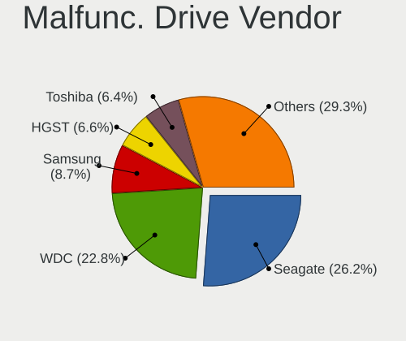

| Vendor                         | Computers | Drives | Percent |
|--------------------------------|-----------|--------|---------|
| Seagate                        | 184       | 268    | 26.21%  |
| WDC                            | 160       | 192    | 22.79%  |
| Samsung Electronics            | 61        | 70     | 8.69%   |
| HGST                           | 46        | 46     | 6.55%   |
| Toshiba                        | 45        | 53     | 6.41%   |
| Hitachi                        | 40        | 44     | 5.7%    |
| Crucial                        | 27        | 34     | 3.85%   |
| Kingston                       | 19        | 19     | 2.71%   |
| Intel                          | 17        | 20     | 2.42%   |
| SanDisk                        | 16        | 19     | 2.28%   |
| SK hynix                       | 13        | 18     | 1.85%   |
| A-DATA Technology              | 9         | 10     | 1.28%   |
| Micron Technology              | 7         | 9      | 1%      |
| Corsair                        | 4         | 8      | 0.57%   |
| Unknown                        | 4         | 5      | 0.57%   |
| LITEON                         | 3         | 3      | 0.43%   |
| Apacer                         | 3         | 3      | 0.43%   |
| ADATA Technology               | 3         | 3      | 0.43%   |
| Transcend                      | 2         | 2      | 0.28%   |
| Realtek Semiconductor          | 2         | 2      | 0.28%   |
| Patriot                        | 2         | 2      | 0.28%   |
| OCZ                            | 2         | 2      | 0.28%   |
| Maxtor                         | 2         | 2      | 0.28%   |
| KingSpec                       | 2         | 3      | 0.28%   |
| China                          | 2         | 5      | 0.28%   |
| ASMT                           | 2         | 6      | 0.28%   |
| TwinMOS                        | 1         | 1      | 0.14%   |
| tecmiyo                        | 1         | 1      | 0.14%   |
| SPCC                           | 1         | 1      | 0.14%   |
| Solid State Storage Technology | 1         | 1      | 0.14%   |
| Shenzhen TIGO Semiconductor    | 1         | 1      | 0.14%   |
| Shenzhen Longsys Electronics   | 1         | 1      | 0.14%   |
| Realtek                        | 1         | 1      | 0.14%   |
| Phison Electronics             | 1         | 1      | 0.14%   |
| Phison                         | 1         | 2      | 0.14%   |
| Netac                          | 1         | 1      | 0.14%   |
| Mushkin                        | 1         | 1      | 0.14%   |
| MAXIO Technology (Hangzhou)    | 1         | 1      | 0.14%   |
| MaxDigital                     | 1         | 1      | 0.14%   |
| MARSHAL                        | 1         | 1      | 0.14%   |

Malfunc. HDD Vendor
-------------------

Vendors of faulty HDD drives

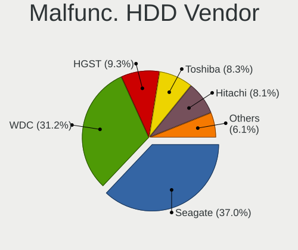

| Vendor              | Computers | Drives | Percent |
|---------------------|-----------|--------|---------|
| Seagate             | 183       | 265    | 37.04%  |
| WDC                 | 154       | 186    | 31.17%  |
| HGST                | 46        | 46     | 9.31%   |
| Toshiba             | 41        | 49     | 8.3%    |
| Hitachi             | 40        | 44     | 8.1%    |
| Samsung Electronics | 23        | 28     | 4.66%   |
| Maxtor              | 2         | 2      | 0.4%    |
| MaxDigital          | 1         | 1      | 0.2%    |
| MARSHAL             | 1         | 1      | 0.2%    |
| JMicron Technology  | 1         | 1      | 0.2%    |
| Fujitsu             | 1         | 1      | 0.2%    |
| Unknown             | 1         | 2      | 0.2%    |

Malfunc. Drive Kind
-------------------

Kinds of faulty drives

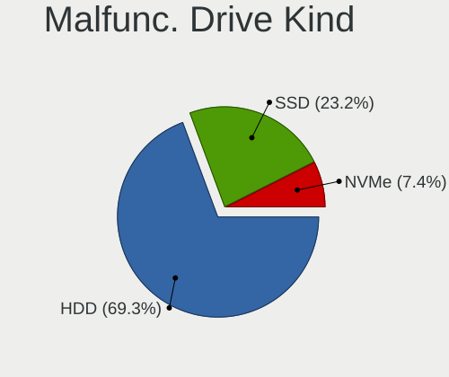

| Kind | Computers | Drives | Percent |
|------|-----------|--------|---------|
| HDD  | 466       | 626    | 69.35%  |
| SSD  | 156       | 197    | 23.21%  |
| NVMe | 50        | 54     | 7.44%   |

Failed Drives
-------------

Failed drive models

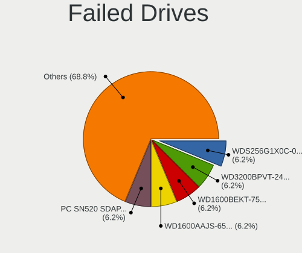

| Model                                            | Computers | Drives | Percent |
|--------------------------------------------------|-----------|--------|---------|
| WDC WDS256G1X0C-00ENX0 256GB                     | 1         | 1      | 6.25%   |
| WDC WD3200BPVT-24ZEST0 320GB                     | 1         | 1      | 6.25%   |
| WDC WD1600BEKT-75PVMT0 160GB                     | 1         | 1      | 6.25%   |
| WDC WD1600AAJS-65WAA0 160GB                      | 1         | 1      | 6.25%   |
| WDC PC SN520 SDAPNUW-256G-1102 256GB             | 1         | 1      | 6.25%   |
| Toshiba MQ01ABF050 500GB                         | 1         | 1      | 6.25%   |
| Toshiba MK1059GSM 1TB                            | 1         | 1      | 6.25%   |
| Seagate ST9640320AS 640GB                        | 1         | 1      | 6.25%   |
| Seagate ST3500418AS 500GB                        | 1         | 1      | 6.25%   |
| Seagate ST3250318AS 250GB                        | 1         | 1      | 6.25%   |
| Seagate ST31000524AS 1TB                         | 1         | 2      | 6.25%   |
| Samsung Electronics MZNTY128HDHP-000H1 128GB SSD | 1         | 1      | 6.25%   |
| Samsung Electronics MZNTY128HDHP-00000 128GB SSD | 1         | 1      | 6.25%   |
| Samsung Electronics HD321HJ 320GB                | 1         | 1      | 6.25%   |
| Kingston SV300S37A120G 120GB SSD                 | 1         | 1      | 6.25%   |
| Hitachi HDS721010CLA332 1TB                      | 1         | 1      | 6.25%   |

Failed Drive Vendor
-------------------

Failed drive vendors

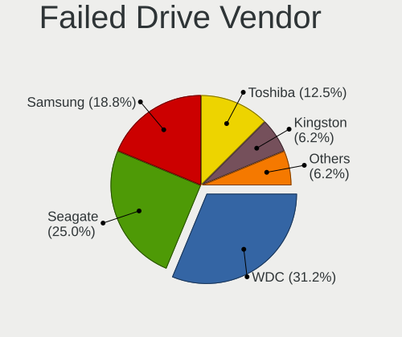

| Vendor              | Computers | Drives | Percent |
|---------------------|-----------|--------|---------|
| WDC                 | 5         | 5      | 31.25%  |
| Seagate             | 4         | 5      | 25%     |
| Samsung Electronics | 3         | 3      | 18.75%  |
| Toshiba             | 2         | 2      | 12.5%   |
| Kingston            | 1         | 1      | 6.25%   |
| Hitachi             | 1         | 1      | 6.25%   |

Drive Status
------------

Number of failed and malfunc. drives

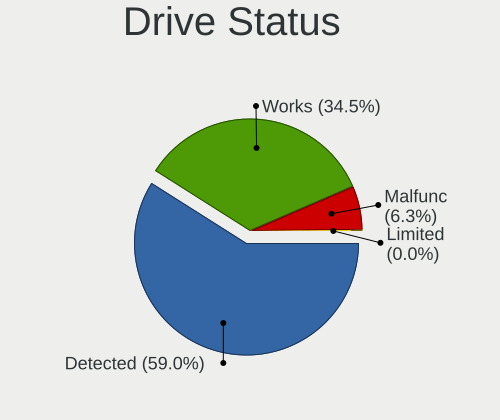

| Status   | Computers | Drives | Percent |
|----------|-----------|--------|---------|
| Detected | 6013      | 13831  | 58.99%  |
| Works    | 3520      | 7109   | 34.53%  |
| Malfunc  | 644       | 877    | 6.32%   |
| Failed   | 16        | 17     | 0.16%   |
| Limited  | 1         | 1      | 0.01%   |

Storage controller
------------------

Storage Vendor
--------------

Storage controller vendors

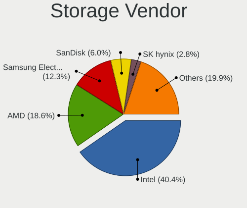

| Vendor                                  | Computers | Percent |
|-----------------------------------------|-----------|---------|
| Intel                                   | 5245      | 40.37%  |
| AMD                                     | 2415      | 18.59%  |
| Samsung Electronics                     | 1597      | 12.29%  |
| SanDisk                                 | 784       | 6.03%   |
| SK hynix                                | 364       | 2.8%    |
| Phison Electronics                      | 323       | 2.49%   |
| Kingston Technology Company             | 296       | 2.28%   |
| ASMedia Technology                      | 246       | 1.89%   |
| Micron Technology                       | 216       | 1.66%   |
| Micron/Crucial Technology               | 210       | 1.62%   |
| Toshiba America Info Systems            | 167       | 1.29%   |
| KIOXIA                                  | 144       | 1.11%   |
| Silicon Motion                          | 134       | 1.03%   |
| ADATA Technology                        | 118       | 0.91%   |
| Marvell Technology Group                | 98        | 0.75%   |
| JMicron Technology                      | 82        | 0.63%   |
| MAXIO Technology (Hangzhou)             | 78        | 0.6%    |
| Realtek Semiconductor                   | 74        | 0.57%   |
| Nvidia                                  | 72        | 0.55%   |
| Shenzhen Longsys Electronics            | 50        | 0.38%   |
| Union Memory (Shenzhen)                 | 40        | 0.31%   |
| Solid State Storage Technology          | 31        | 0.24%   |
| Apple                                   | 28        | 0.22%   |
| Lite-On Technology                      | 21        | 0.16%   |
| Seagate Technology                      | 20        | 0.15%   |
| LSI Logic / Symbios Logic               | 14        | 0.11%   |
| INNOGRIT                                | 13        | 0.1%    |
| Yangtze Memory Technologies             | 12        | 0.09%   |
| VIA Technologies                        | 12        | 0.09%   |
| Broadcom / LSI                          | 9         | 0.07%   |
| Silicon Image                           | 8         | 0.06%   |
| Shenzhen Unionmemory Information System | 8         | 0.06%   |
| Solidigm                                | 7         | 0.05%   |
| Lenovo                                  | 7         | 0.05%   |
| Biwin Storage Technology                | 7         | 0.05%   |
| Adaptec                                 | 6         | 0.05%   |
| Unknown                                 | 6         | 0.05%   |
| Netac Technology                        | 5         | 0.04%   |
| Transcend                               | 4         | 0.03%   |
| Integrated Technology Express           | 3         | 0.02%   |

Storage Model
-------------

Storage controller models

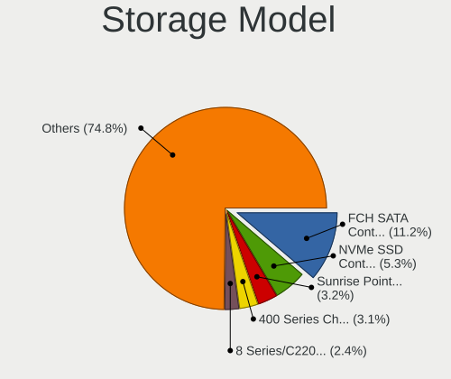

| Model                                                                          | Computers | Percent |
|--------------------------------------------------------------------------------|-----------|---------|
| AMD FCH SATA Controller [AHCI mode]                                            | 1641      | 11.25%  |
| Samsung NVMe SSD Controller SM981/PM981/PM983                                  | 769       | 5.27%   |
| Intel Sunrise Point-LP SATA Controller [AHCI mode]                             | 472       | 3.24%   |
| AMD 400 Series Chipset SATA Controller                                         | 446       | 3.06%   |
| Intel 8 Series/C220 Series Chipset Family 6-port SATA Controller 1 [AHCI mode] | 344       | 2.36%   |
| Intel 7 Series Chipset Family 6-port SATA Controller [AHCI mode]               | 331       | 2.27%   |
| Intel 82801 Mobile SATA Controller [RAID mode]                                 | 287       | 1.97%   |
| Samsung NVMe SSD Controller 980 (DRAM-less)                                    | 269       | 1.84%   |
| AMD 500 Series Chipset SATA Controller                                         | 260       | 1.78%   |
| Samsung NVMe SSD Controller PM9A1/PM9A3/980PRO                                 | 241       | 1.65%   |
| ASMedia ASM1061/ASM1062 Serial ATA Controller                                  | 228       | 1.56%   |
| Intel Volume Management Device NVMe RAID Controller                            | 221       | 1.52%   |
| Intel 6 Series/C200 Series Chipset Family 6 port Mobile SATA AHCI Controller   | 203       | 1.39%   |
| Intel Q170/Q150/B150/H170/H110/Z170/CM236 Chipset SATA Controller [AHCI Mode]  | 197       | 1.35%   |
| Intel 8 Series SATA Controller 1 [AHCI mode]                                   | 194       | 1.33%   |
| Intel Cannon Lake Mobile PCH SATA AHCI Controller                              | 190       | 1.3%    |
| Samsung NVMe SSD Controller SM961/PM961/SM963                                  | 187       | 1.28%   |
| Intel 200 Series PCH SATA controller [AHCI mode]                               | 176       | 1.21%   |
| SanDisk Extreme Pro / WD Black SN750 / PC SN730 / Red SN700 NVMe SSD           | 168       | 1.15%   |
| AMD SB7x0/SB8x0/SB9x0 SATA Controller [AHCI mode]                              | 163       | 1.12%   |
| Intel HM170/QM170 Chipset SATA Controller [AHCI Mode]                          | 158       | 1.08%   |
| Intel Wildcat Point-LP SATA Controller [AHCI Mode]                             | 156       | 1.07%   |
| Intel SSD 660P Series                                                          | 147       | 1.01%   |
| Intel 6 Series/C200 Series Chipset Family 6 port Desktop SATA AHCI Controller  | 140       | 0.96%   |
| Intel 7 Series/C210 Series Chipset Family 6-port SATA Controller [AHCI mode]   | 137       | 0.94%   |
| AMD 600 Series Chipset SATA Controller                                         | 137       | 0.94%   |
| SanDisk Ultra 3D / WD PC SN530, IX SN530, Blue SN550 NVMe SSD (DRAM-less)      | 134       | 0.92%   |
| Intel SATA Controller [RAID Mode]                                              | 134       | 0.92%   |
| AMD SB7x0/SB8x0/SB9x0 IDE Controller                                           | 134       | 0.92%   |
| Phison E12 NVMe Controller                                                     | 129       | 0.88%   |
| Intel Cannon Lake PCH SATA AHCI Controller                                     | 128       | 0.88%   |
| SK hynix Gold P31/BC711/PC711 NVMe Solid State Drive                           | 113       | 0.77%   |
| Intel Comet Lake SATA AHCI Controller                                          | 108       | 0.74%   |
| Micron/Crucial P2 [Nick P2] / P3 / P3 Plus NVMe PCIe SSD (DRAM-less)           | 104       | 0.71%   |
| AMD 300 Series Chipset SATA Controller                                         | 103       | 0.71%   |
| Intel Celeron/Pentium Silver Processor SATA Controller                         | 101       | 0.69%   |
| KIOXIA NVMe SSD Controller BG4 (DRAM-less)                                     | 89        | 0.61%   |
| AMD SB7x0/SB8x0/SB9x0 SATA Controller [IDE mode]                               | 89        | 0.61%   |
| Silicon Motion SM2263EN/SM2263XT (DRAM-less) NVMe SSD Controllers              | 86        | 0.59%   |
| Intel Cannon Point-LP SATA Controller [AHCI Mode]                              | 86        | 0.59%   |

Storage Kind
------------

Kind of storage controller (IDE, SATA, NVMe, SAS, ...)

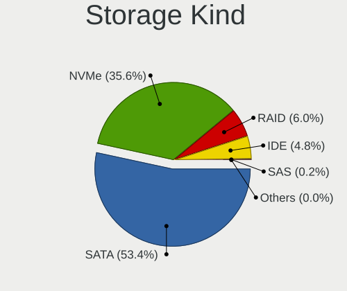

| Kind | Computers | Percent |
|------|-----------|---------|
| SATA | 6741      | 53.39%  |
| NVMe | 4496      | 35.61%  |
| RAID | 754       | 5.97%   |
| IDE  | 604       | 4.78%   |
| SAS  | 28        | 0.22%   |
| SCSI | 4         | 0.03%   |

Processor
---------

CPU Vendor
----------

Processor vendors

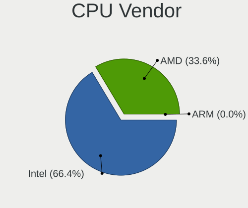

| Vendor | Computers | Percent |
|--------|-----------|---------|
| Intel  | 6134      | 66.4%   |
| AMD    | 3103      | 33.59%  |
| ARM    | 1         | 0.01%   |

CPU Model
---------

Processor models

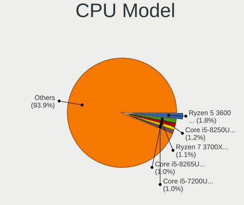

| Model                                         | Computers | Percent |
|-----------------------------------------------|-----------|---------|
| AMD Ryzen 5 3600 6-Core Processor             | 167       | 1.8%    |
| Intel Core i5-8250U CPU @ 1.60GHz             | 114       | 1.23%   |
| AMD Ryzen 7 3700X 8-Core Processor            | 99        | 1.07%   |
| Intel Core i5-8265U CPU @ 1.60GHz             | 95        | 1.03%   |
| Intel Core i5-7200U CPU @ 2.50GHz             | 94        | 1.01%   |
| Intel Core i7-8550U CPU @ 1.80GHz             | 90        | 0.97%   |
| AMD Ryzen 5 3500U with Radeon Vega Mobile Gfx | 86        | 0.93%   |
| Intel Core i7-9750H CPU @ 2.60GHz             | 85        | 0.92%   |
| Intel Core i7-8565U CPU @ 1.80GHz             | 85        | 0.92%   |
| Intel 11th Gen Core i7-1165G7 @ 2.80GHz       | 84        | 0.91%   |
| Intel 11th Gen Core i5-1135G7 @ 2.40GHz       | 84        | 0.91%   |
| Intel Core i7-7700HQ CPU @ 2.80GHz            | 82        | 0.89%   |
| AMD Ryzen 7 5800H with Radeon Graphics        | 75        | 0.81%   |
| AMD Ryzen 7 2700X Eight-Core Processor        | 73        | 0.79%   |
| Intel Core i7-8750H CPU @ 2.20GHz             | 72        | 0.78%   |
| AMD Ryzen 5 2600 Six-Core Processor           | 72        | 0.78%   |
| AMD Ryzen 7 5700U with Radeon Graphics        | 66        | 0.71%   |
| Intel Core i7-10510U CPU @ 1.80GHz            | 65        | 0.7%    |
| AMD Ryzen 7 4800H with Radeon Graphics        | 63        | 0.68%   |
| AMD Ryzen 5 4500U with Radeon Graphics        | 62        | 0.67%   |
| AMD Ryzen 5 5600X 6-Core Processor            | 61        | 0.66%   |
| Intel Core i5-6200U CPU @ 2.30GHz             | 60        | 0.65%   |
| Intel Core i7-6700HQ CPU @ 2.60GHz            | 58        | 0.63%   |
| Intel Core i7-10750H CPU @ 2.60GHz            | 55        | 0.59%   |
| Intel Core i5-5200U CPU @ 2.20GHz             | 54        | 0.58%   |
| AMD Ryzen 7 5800X 8-Core Processor            | 53        | 0.57%   |
| AMD Ryzen 5 5500U with Radeon Graphics        | 53        | 0.57%   |
| AMD Ryzen 7 4700U with Radeon Graphics        | 52        | 0.56%   |
| Intel Core i5-10210U CPU @ 1.60GHz            | 51        | 0.55%   |
| Intel Core i7-7500U CPU @ 2.70GHz             | 50        | 0.54%   |
| Intel Core i5-3320M CPU @ 2.60GHz             | 50        | 0.54%   |
| AMD Ryzen 9 3900X 12-Core Processor           | 50        | 0.54%   |
| AMD Ryzen 9 5900X 12-Core Processor           | 46        | 0.5%    |
| Intel Core i5-3230M CPU @ 2.60GHz             | 42        | 0.45%   |
| Intel 11th Gen Core i7-11800H @ 2.30GHz       | 41        | 0.44%   |
| AMD Ryzen 5 1600 Six-Core Processor           | 41        | 0.44%   |
| Intel Core i5-6300U CPU @ 2.40GHz             | 40        | 0.43%   |
| Intel Core i7-1065G7 CPU @ 1.30GHz            | 39        | 0.42%   |
| Intel Core i5-3210M CPU @ 2.50GHz             | 39        | 0.42%   |
| Intel 12th Gen Core i7-12700H                 | 38        | 0.41%   |

CPU Model Family
----------------

Processor model prefix

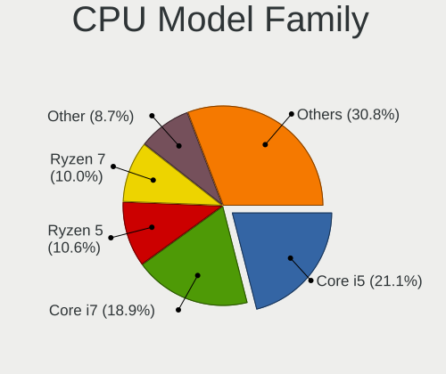

| Model                   | Computers | Percent |
|-------------------------|-----------|---------|
| Intel Core i5           | 1949      | 21.05%  |
| Intel Core i7           | 1754      | 18.95%  |
| AMD Ryzen 5             | 983       | 10.62%  |
| AMD Ryzen 7             | 922       | 9.96%   |
| Other                   | 801       | 8.65%   |
| Intel Core i3           | 501       | 5.41%   |
| AMD Ryzen 9             | 296       | 3.2%    |
| Intel Celeron           | 288       | 3.11%   |
| Intel Xeon              | 174       | 1.88%   |
| Intel Core 2 Duo        | 174       | 1.88%   |
| Intel Pentium           | 156       | 1.69%   |
| AMD FX                  | 142       | 1.53%   |
| AMD Ryzen 3             | 139       | 1.5%    |
| Intel Core i9           | 74        | 0.8%    |
| AMD Ryzen 7 PRO         | 65        | 0.7%    |
| Intel Core              | 61        | 0.66%   |
| AMD A10                 | 53        | 0.57%   |
| Intel Atom              | 52        | 0.56%   |
| AMD A8                  | 52        | 0.56%   |
| Intel Pentium Dual-Core | 49        | 0.53%   |
| AMD A4                  | 44        | 0.48%   |
| AMD A6                  | 39        | 0.42%   |
| Intel Core 2 Quad       | 37        | 0.4%    |
| AMD Phenom II X4        | 37        | 0.4%    |
| AMD Ryzen Threadripper  | 35        | 0.38%   |
| Intel Pentium Silver    | 33        | 0.36%   |
| Intel Core 2            | 26        | 0.28%   |
| AMD E1                  | 25        | 0.27%   |
| AMD Athlon              | 25        | 0.27%   |
| AMD Ryzen 5 PRO         | 23        | 0.25%   |
| AMD E                   | 23        | 0.25%   |
| AMD Athlon II X2        | 23        | 0.25%   |
| AMD Phenom II X6        | 15        | 0.16%   |
| AMD Athlon 64 X2        | 14        | 0.15%   |
| Intel Genuine           | 12        | 0.13%   |
| AMD E2                  | 12        | 0.13%   |
| Intel Pentium Dual      | 11        | 0.12%   |
| Intel Core m3           | 11        | 0.12%   |
| AMD Athlon II X4        | 11        | 0.12%   |
| Intel Pentium Gold      | 10        | 0.11%   |

CPU Cores
---------

Number of processor cores

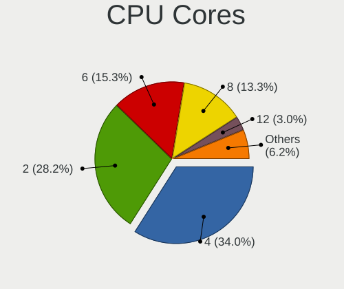

| Number  | Computers | Percent |
|---------|-----------|---------|
| 4       | 3151      | 34.04%  |
| 2       | 2613      | 28.23%  |
| 6       | 1415      | 15.29%  |
| 8       | 1234      | 13.33%  |
| 12      | 274       | 2.96%   |
| 16      | 178       | 1.92%   |
| 10      | 121       | 1.31%   |
| 14      | 99        | 1.07%   |
| 3       | 55        | 0.59%   |
| 1       | 53        | 0.57%   |
| 24      | 36        | 0.39%   |
| 20      | 11        | 0.12%   |
| 32      | 6         | 0.06%   |
| Unknown | 3         | 0.03%   |
| 64      | 2         | 0.02%   |
| 40      | 1         | 0.01%   |
| 28      | 1         | 0.01%   |
| 22      | 1         | 0.01%   |
| 18      | 1         | 0.01%   |
| 7       | 1         | 0.01%   |
| 5       | 1         | 0.01%   |

CPU Sockets
-----------

Number of sockets

| Number | Computers | Percent |
|--------|-----------|---------|
| 1      | 9194      | 99.53%  |
| 2      | 41        | 0.44%   |
| 4      | 2         | 0.02%   |

CPU Threads
-----------

Threads per core (Hyper-Threading)

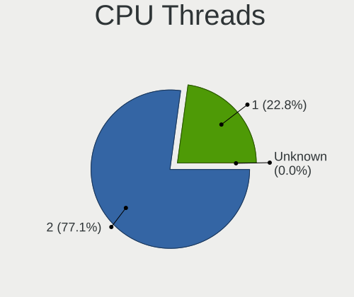

| Number  | Computers | Percent |
|---------|-----------|---------|
| 2       | 7137      | 77.15%  |
| 1       | 2111      | 22.82%  |
| Unknown | 3         | 0.03%   |

CPU Op-Modes
------------

CPU Operation Modes (32-bit, 64-bit)

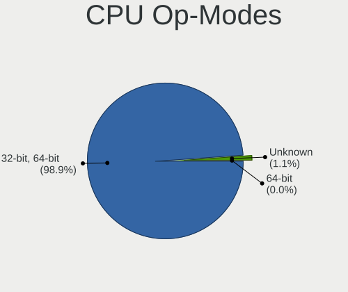

| Op mode        | Computers | Percent |
|----------------|-----------|---------|
| 32-bit, 64-bit | 9141      | 98.89%  |
| Unknown        | 102       | 1.1%    |
| 64-bit         | 1         | 0.01%   |

CPU Microcode
-------------

Microcode number

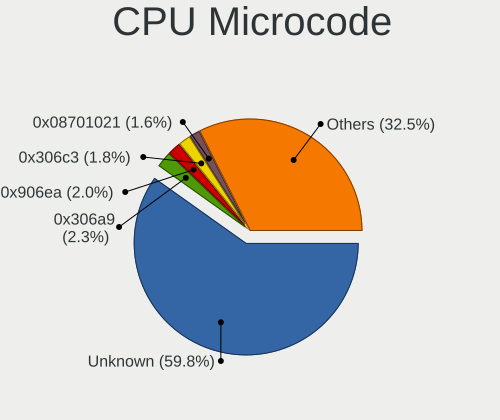

| Number     | Computers | Percent |
|------------|-----------|---------|
| Unknown    | 5710      | 59.83%  |
| 0x306a9    | 224       | 2.35%   |
| 0x906ea    | 187       | 1.96%   |
| 0x306c3    | 175       | 1.83%   |
| 0x08701021 | 150       | 1.57%   |
| 0x206a7    | 148       | 1.55%   |
| 0x806ea    | 138       | 1.45%   |
| 0x806ec    | 135       | 1.41%   |
| 0x806c1    | 120       | 1.26%   |
| 0x0800820d | 112       | 1.17%   |
| 0x806e9    | 101       | 1.06%   |
| 0x906e9    | 88        | 0.92%   |
| 0x506e3    | 88        | 0.92%   |
| 0x406e3    | 87        | 0.91%   |
| 0x0a50000c | 86        | 0.9%    |
| 0x40651    | 82        | 0.86%   |
| 0x08701013 | 79        | 0.83%   |
| 0x08600106 | 77        | 0.81%   |
| 0x08108109 | 77        | 0.81%   |
| 0x08108102 | 73        | 0.76%   |
| 0x1067a    | 69        | 0.72%   |
| 0x306d4    | 65        | 0.68%   |
| 0x06000852 | 56        | 0.59%   |
| 0x706e5    | 51        | 0.53%   |
| 0x08600103 | 51        | 0.53%   |
| 0x08608103 | 50        | 0.52%   |
| 0x08600104 | 50        | 0.52%   |
| 0xa0652    | 49        | 0.51%   |
| 0x806eb    | 46        | 0.48%   |
| 0x20655    | 35        | 0.37%   |
| 0x906a3    | 34        | 0.36%   |
| 0x0a50000d | 33        | 0.35%   |
| 0x08001138 | 33        | 0.35%   |
| 0x0a201016 | 28        | 0.29%   |
| 0x010000c8 | 28        | 0.29%   |
| 0x0810100b | 27        | 0.28%   |
| 0x906ed    | 24        | 0.25%   |
| 0x406c4    | 24        | 0.25%   |
| 0x0a601203 | 24        | 0.25%   |
| 0x0a201009 | 24        | 0.25%   |

CPU Microarch
-------------

Microarchitecture

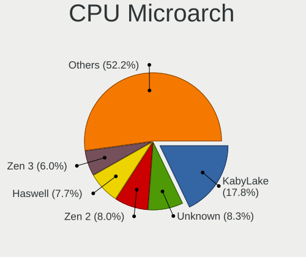

| Name               | Computers | Percent |
|--------------------|-----------|---------|
| KabyLake           | 1655      | 17.85%  |
| Unknown            | 773       | 8.34%   |
| Zen 2              | 738       | 7.96%   |
| Haswell            | 710       | 7.66%   |
| Zen 3              | 557       | 6.01%   |
| IvyBridge          | 553       | 5.96%   |
| Zen+               | 508       | 5.48%   |
| Skylake            | 466       | 5.03%   |
| SandyBridge        | 450       | 4.85%   |
| TigerLake          | 281       | 3.03%   |
| Zen                | 261       | 2.81%   |
| Penryn             | 237       | 2.56%   |
| Broadwell          | 218       | 2.35%   |
| CometLake          | 215       | 2.32%   |
| Alderlake Hybrid   | 196       | 2.11%   |
| Piledriver         | 177       | 1.91%   |
| Westmere           | 171       | 1.84%   |
| Silvermont         | 151       | 1.63%   |
| IceLake            | 151       | 1.63%   |
| K10                | 113       | 1.22%   |
| Goldmont plus      | 112       | 1.21%   |
| Core               | 92        | 0.99%   |
| Excavator          | 83        | 0.9%    |
| Goldmont           | 59        | 0.64%   |
| Nehalem            | 52        | 0.56%   |
| Steamroller        | 43        | 0.46%   |
| Puma               | 38        | 0.41%   |
| Bobcat             | 37        | 0.4%    |
| Jaguar             | 27        | 0.29%   |
| K8 Hammer          | 26        | 0.28%   |
| Meteorlake Hybrid  | 23        | 0.25%   |
| Bulldozer          | 22        | 0.24%   |
| K10 Llano          | 17        | 0.18%   |
| Bonnell            | 13        | 0.14%   |
| Lunarlake Hybrid   | 12        | 0.13%   |
| Gracemont          | 12        | 0.13%   |
| Tremont            | 11        | 0.12%   |
| NetBurst           | 6         | 0.06%   |
| K8 & K10 hybrid    | 5         | 0.05%   |
| ArrowLake-H Hybrid | 1         | 0.01%   |

Graphics
--------

GPU Vendor
----------

Vendors of graphics cards

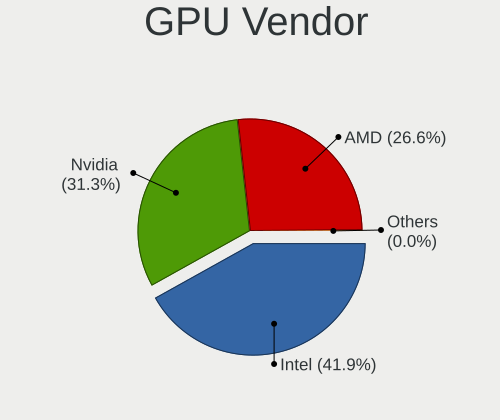

| Vendor                     | Computers | Percent |
|----------------------------|-----------|---------|
| Intel                      | 4738      | 41.91%  |
| Nvidia                     | 3543      | 31.34%  |
| AMD                        | 3010      | 26.63%  |
| ASPEED Technology          | 6         | 0.05%   |
| Matrox Electronics Systems | 4         | 0.04%   |
| ATI Technologies           | 3         | 0.03%   |
| VIA Technologies           | 1         | 0.01%   |

GPU Model
---------

Graphics card models

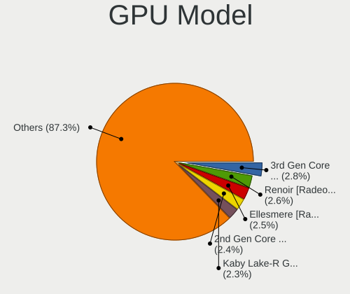

| Model                                                                                    | Computers | Percent |
|------------------------------------------------------------------------------------------|-----------|---------|
| Intel 3rd Gen Core processor Graphics Controller                                         | 328       | 2.83%   |
| AMD Renoir [Radeon Vega Series / Radeon Vega Mobile Series]                              | 302       | 2.6%    |
| AMD Ellesmere [Radeon RX 470/480/570/570X/580/580X/590]                                  | 294       | 2.53%   |
| Intel 2nd Generation Core Processor Family Integrated Graphics Controller                | 283       | 2.44%   |
| Intel Kaby Lake-R GT2 [UHD Graphics 620]                                                 | 268       | 2.31%   |
| AMD Picasso/Raven 2 [Radeon Vega Series / Radeon Vega Mobile Series]                     | 267       | 2.3%    |
| Intel CoffeeLake-H GT2 [UHD Graphics 630]                                                | 244       | 2.1%    |
| Intel TigerLake-LP GT2 [Iris Xe Graphics]                                                | 242       | 2.08%   |
| AMD Cezanne [Radeon Vega Series / Radeon Vega Mobile Series]                             | 224       | 1.93%   |
| Intel WhiskeyLake-U GT2 [UHD Graphics 620]                                               | 220       | 1.9%    |
| Intel Haswell-ULT Integrated Graphics Controller                                         | 209       | 1.8%    |
| Intel Kaby Lake-U GT2 [HD Graphics 620]                                                  | 202       | 1.74%   |
| Intel Skylake-U GT2 [HD Graphics 520]                                                    | 174       | 1.5%    |
| Intel Broadwell-U GT2 [HD Graphics 5500]                                                 | 156       | 1.34%   |
| Intel CometLake-U GT2 [UHD Graphics]                                                     | 147       | 1.27%   |
| Nvidia TU117M [GeForce GTX 1650 Mobile / Max-Q]                                          | 136       | 1.17%   |
| AMD Lucienne                                                                             | 128       | 1.1%    |
| Intel 4th Gen Core Processor Integrated Graphics Controller                              | 125       | 1.08%   |
| AMD Navi 10 [Radeon RX 5600 OEM/5600 XT / 5700/5700 XT]                                  | 118       | 1.02%   |
| Intel Xeon E3-1200 v3/4th Gen Core Processor Integrated Graphics Controller              | 114       | 0.98%   |
| Intel Kaby Lake-H GT2 [HD Graphics 630]                                                  | 114       | 0.98%   |
| Nvidia GP107 [GeForce GTX 1050 Ti]                                                       | 108       | 0.93%   |
| Nvidia GP106 [GeForce GTX 1060 6GB]                                                      | 104       | 0.9%    |
| Intel CometLake-H GT2 [UHD Graphics]                                                     | 98        | 0.84%   |
| Intel Core Processor Integrated Graphics Controller                                      | 97        | 0.84%   |
| Intel CoffeeLake-S GT2 [UHD Graphics 630]                                                | 93        | 0.8%    |
| Intel Alder Lake-P GT2 [Iris Xe Graphics]                                                | 91        | 0.78%   |
| AMD Raven Ridge [Radeon Vega Series / Radeon Vega Mobile Series]                         | 89        | 0.77%   |
| Intel GeminiLake [UHD Graphics 600]                                                      | 87        | 0.75%   |
| Intel Atom/Celeron/Pentium Processor x5-E8000/J3xxx/N3xxx Integrated Graphics Controller | 87        | 0.75%   |
| Nvidia GP107M [GeForce GTX 1050 Mobile]                                                  | 84        | 0.72%   |
| Intel Skylake-H GT2 [HD Graphics 530]                                                    | 78        | 0.67%   |
| AMD Rembrandt [Radeon 680M]                                                              | 76        | 0.65%   |
| Nvidia GP104 [GeForce GTX 1070]                                                          | 74        | 0.64%   |
| Nvidia GK208B [GeForce GT 710]                                                           | 74        | 0.64%   |
| AMD Raphael                                                                              | 74        | 0.64%   |
| Nvidia GA106M [GeForce RTX 3060 Mobile / Max-Q]                                          | 73        | 0.63%   |
| Intel Mobile 4 Series Chipset Integrated Graphics Controller                             | 68        | 0.59%   |
| Nvidia GP107M [GeForce GTX 1050 Ti Mobile]                                               | 67        | 0.58%   |
| Intel Atom Processor Z36xxx/Z37xxx Series Graphics & Display                             | 63        | 0.54%   |

GPU Combo
---------

Combinations of graphics cards

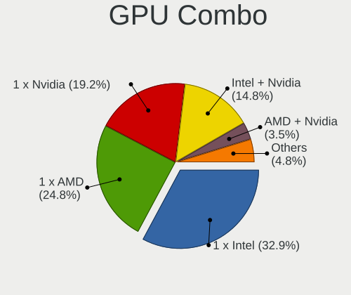

| Name                     | Computers | Percent |
|--------------------------|-----------|---------|
| 1 x Intel                | 3063      | 32.85%  |
| 1 x AMD                  | 2315      | 24.83%  |
| 1 x Nvidia               | 1793      | 19.23%  |
| Intel + Nvidia           | 1380      | 14.8%   |
| AMD + Nvidia             | 330       | 3.54%   |
| Intel + AMD              | 190       | 2.04%   |
| 2 x AMD                  | 183       | 1.96%   |
| 2 x Nvidia               | 37        | 0.4%    |
| 2 x Intel                | 11        | 0.12%   |
| Other                    | 4         | 0.04%   |
| 1 x ASPEED               | 4         | 0.04%   |
| 1 x Matrox               | 2         | 0.02%   |
| Intel + 2 x Nvidia       | 2         | 0.02%   |
| AMD + 2 x Nvidia         | 2         | 0.02%   |
| 3 x AMD                  | 1         | 0.01%   |
| 1 x VIA                  | 1         | 0.01%   |
| Nvidia + Matrox          | 1         | 0.01%   |
| Nvidia + ASPEED          | 1         | 0.01%   |
| Intel + 2 x AMD          | 1         | 0.01%   |
| Intel + AMD + 1 x Nvidia | 1         | 0.01%   |
| AMD + Matrox             | 1         | 0.01%   |
| AMD + ASPEED             | 1         | 0.01%   |

GPU Driver
----------

Free vs proprietary

| Driver      | Computers | Percent |
|-------------|-----------|---------|
| Free        | 6989      | 74.65%  |
| Proprietary | 2231      | 23.83%  |
| Unknown     | 142       | 1.52%   |

GPU Memory
----------

Total video memory

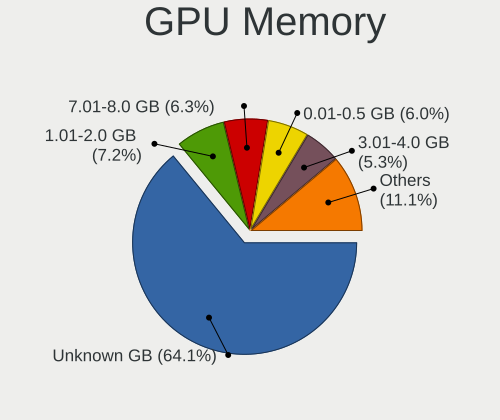

| Size in GB | Computers | Percent |
|------------|-----------|---------|
| Unknown    | 6051      | 64.07%  |
| 1.01-2.0   | 678       | 7.18%   |
| 7.01-8.0   | 599       | 6.34%   |
| 0.01-0.5   | 566       | 5.99%   |
| 3.01-4.0   | 501       | 5.3%    |
| 0.51-1.0   | 348       | 3.68%   |
| 5.01-6.0   | 301       | 3.19%   |
| 8.01-16.0  | 265       | 2.81%   |
| 2.01-3.0   | 79        | 0.84%   |
| 16.01-24.0 | 53        | 0.56%   |
| 4.01-5.0   | 2         | 0.02%   |
| 6.01-7.0   | 1         | 0.01%   |
| 24.01-32.0 | 1         | 0.01%   |

Monitor
-------

Monitor Vendor
--------------

Monitor vendors

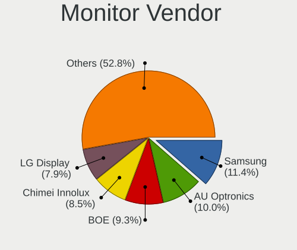

| Vendor                  | Computers | Percent |
|-------------------------|-----------|---------|
| Samsung Electronics     | 1262      | 11.43%  |
| AU Optronics            | 1105      | 10.01%  |
| BOE                     | 1025      | 9.28%   |
| Chimei Innolux          | 943       | 8.54%   |
| LG Display              | 874       | 7.91%   |
| Goldstar                | 658       | 5.96%   |
| Dell                    | 594       | 5.38%   |
| Acer                    | 403       | 3.65%   |
| AOC                     | 311       | 2.82%   |
| Hewlett-Packard         | 309       | 2.8%    |
| BenQ                    | 288       | 2.61%   |
| Ancor Communications    | 266       | 2.41%   |
| Philips                 | 238       | 2.16%   |
| Sharp                   | 206       | 1.87%   |
| Apple                   | 190       | 1.72%   |
| Lenovo                  | 187       | 1.69%   |
| ASUSTek Computer        | 141       | 1.28%   |
| ViewSonic               | 133       | 1.2%    |
| LG Electronics          | 132       | 1.2%    |
| PANDA                   | 125       | 1.13%   |
| Chi Mei Optoelectronics | 97        | 0.88%   |
| Unknown                 | 94        | 0.85%   |
| Iiyama                  | 85        | 0.77%   |
| Unknown                 | 70        | 0.63%   |
| MSI                     | 66        | 0.6%    |
| InfoVision              | 66        | 0.6%    |
| Sony                    | 60        | 0.54%   |
| CSO                     | 50        | 0.45%   |
| Gigabyte Technology     | 46        | 0.42%   |
| Eizo                    | 39        | 0.35%   |
| Panasonic               | 38        | 0.34%   |
| TMX                     | 35        | 0.32%   |
| NEC Computers           | 34        | 0.31%   |
| Fujitsu Siemens         | 29        | 0.26%   |
| Vizio                   | 28        | 0.25%   |
| Sceptre Tech            | 28        | 0.25%   |
| Toshiba                 | 21        | 0.19%   |
| Medion                  | 19        | 0.17%   |
| LG Philips              | 19        | 0.17%   |
| HannStar                | 19        | 0.17%   |

Monitor Model
-------------

Monitor models

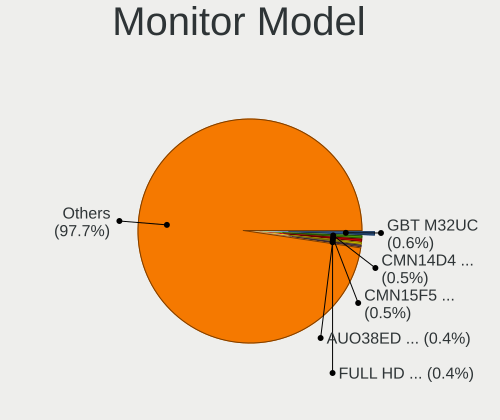

| Model                                                                | Computers | Percent |
|----------------------------------------------------------------------|-----------|---------|
| Unknown                                                              | 70        | 0.61%   |
| Chimei Innolux LCD Monitor CMN14D4 1920x1080 309x173mm 13.9-inch     | 56        | 0.49%   |
| Chimei Innolux LCD Monitor CMN15F5 1920x1080 344x193mm 15.5-inch     | 54        | 0.47%   |
| AU Optronics LCD Monitor AUO38ED 1920x1080 344x193mm 15.5-inch       | 47        | 0.41%   |
| Goldstar FULL HD GSM5B55 1920x1080 480x270mm 21.7-inch               | 43        | 0.37%   |
| AU Optronics LCD Monitor AUO21ED 1920x1080 344x193mm 15.5-inch       | 43        | 0.37%   |
| Goldstar LG ULTRAWIDE GSM59F1 2560x1080 670x280mm 28.6-inch          | 37        | 0.32%   |
| Chimei Innolux LCD Monitor CMN15E7 1920x1080 344x193mm 15.5-inch     | 34        | 0.29%   |
| Unknown LCD Monitor FFFF 2288x1287 2550x2550mm 142.0-inch            | 30        | 0.26%   |
| Samsung Electronics C24F390 SAM0D2C 1920x1080 521x293mm 23.5-inch    | 30        | 0.26%   |
| AU Optronics LCD Monitor AUO403D 1920x1080 309x174mm 14.0-inch       | 30        | 0.26%   |
| Goldstar LG IPS FULLHD GSM5AB8 1920x1080 480x270mm 21.7-inch         | 26        | 0.23%   |
| Chimei Innolux LCD Monitor CMN15E8 1920x1080 344x193mm 15.5-inch     | 26        | 0.23%   |
| Samsung Electronics S24F350 SAM0D20 1920x1080 521x293mm 23.5-inch    | 25        | 0.22%   |
| Samsung Electronics C27F390 SAM0D32 1920x1080 598x336mm 27.0-inch    | 25        | 0.22%   |
| LG Display LCD Monitor LGD046F 1920x1080 344x194mm 15.5-inch         | 25        | 0.22%   |
| PANDA LCD Monitor NCP004D 1920x1080 344x194mm 15.5-inch              | 24        | 0.21%   |
| Chimei Innolux LCD Monitor CMN14D5 1920x1080 309x173mm 13.9-inch     | 24        | 0.21%   |
| Samsung Electronics LCD Monitor SEC5441 1280x800 331x207mm 15.4-inch | 23        | 0.2%    |
| Chimei Innolux LCD Monitor CMN1521 1920x1080 344x193mm 15.5-inch     | 23        | 0.2%    |
| Chimei Innolux LCD Monitor CMN14C3 1366x768 309x173mm 13.9-inch      | 23        | 0.2%    |
| AU Optronics LCD Monitor AUO71EC 1366x768 344x193mm 15.5-inch        | 21        | 0.18%   |
| BOE LCD Monitor BOE0700 1920x1080 344x194mm 15.5-inch                | 20        | 0.17%   |
| BOE LCD Monitor BOE0687 1920x1080 344x193mm 15.5-inch                | 19        | 0.16%   |
| LG Display LCD Monitor LGD033A 1366x768 344x194mm 15.5-inch          | 18        | 0.16%   |
| LG Display LCD Monitor LGD02DC 1366x768 344x194mm 15.5-inch          | 18        | 0.16%   |
| Goldstar ULTRAWIDE GSM76F9 2560x1080 531x298mm 24.0-inch             | 18        | 0.16%   |
| Chimei Innolux LCD Monitor CMN15DB 1366x768 344x193mm 15.5-inch      | 18        | 0.16%   |
| AOC 27G2G4 AOC2702 1920x1080 598x336mm 27.0-inch                     | 18        | 0.16%   |
| Samsung Electronics U28E590 SAM0C4D 3840x2160 607x345mm 27.5-inch    | 17        | 0.15%   |
| Philips PHL 243V7 PHLC155 1920x1080 527x296mm 23.8-inch              | 17        | 0.15%   |
| Chimei Innolux LCD Monitor CMN14D6 1366x768 309x173mm 13.9-inch      | 17        | 0.15%   |
| Chimei Innolux LCD Monitor CMN14C9 1920x1080 309x173mm 13.9-inch     | 17        | 0.15%   |
| AOC 24B1W1 AOC2401 1920x1080 527x296mm 23.8-inch                     | 17        | 0.15%   |
| LG Display LCD Monitor LGD0521 1920x1080 309x174mm 14.0-inch         | 16        | 0.14%   |
| Chimei Innolux LCD Monitor CMN15D5 1920x1080 344x193mm 15.5-inch     | 16        | 0.14%   |
| Panasonic VVX11F009G00 MEI96A2 1920x1080 344x193mm 15.5-inch         | 15        | 0.13%   |
| LG Display LCD Monitor LGD053F 1920x1080 344x194mm 15.5-inch         | 15        | 0.13%   |
| Goldstar Ultra HD GSM5B09 3840x2160 600x340mm 27.2-inch              | 15        | 0.13%   |
| Goldstar HDR 4K GSM7706 3840x2160 600x340mm 27.2-inch                | 15        | 0.13%   |

Monitor Resolution
------------------

Monitor screen resolution

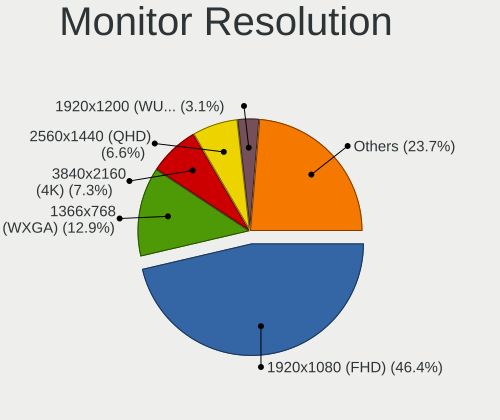

| Resolution         | Computers | Percent |
|--------------------|-----------|---------|
| 1920x1080 (FHD)    | 4865      | 46.35%  |
| 1366x768 (WXGA)    | 1357      | 12.93%  |
| 3840x2160 (4K)     | 769       | 7.33%   |
| 2560x1440 (QHD)    | 693       | 6.6%    |
| 1920x1200 (WUXGA)  | 327       | 3.12%   |
| 1600x900 (HD+)     | 269       | 2.56%   |
| Unknown            | 251       | 2.39%   |
| 1680x1050 (WSXGA+) | 203       | 1.93%   |
| 1440x900 (WXGA+)   | 179       | 1.71%   |
| 1280x1024 (SXGA)   | 179       | 1.71%   |
| 3440x1440          | 164       | 1.56%   |
| 2560x1080          | 142       | 1.35%   |
| 2560x1600          | 140       | 1.33%   |
| 1280x800 (WXGA)    | 119       | 1.13%   |
| 2880x1800          | 118       | 1.12%   |
| 3840x1080          | 99        | 0.94%   |
| 1360x768           | 47        | 0.45%   |
| 3840x2400          | 38        | 0.36%   |
| 2160x1440          | 34        | 0.32%   |
| 2288x1287          | 31        | 0.3%    |
| 1920x540           | 30        | 0.29%   |
| 2256x1504          | 22        | 0.21%   |
| 2880x1920          | 21        | 0.2%    |
| 4480x1440          | 19        | 0.18%   |
| 3200x2000          | 19        | 0.18%   |
| 3840x1600          | 17        | 0.16%   |
| 5120x1440          | 16        | 0.15%   |
| 3200x1800 (QHD+)   | 16        | 0.15%   |
| 1280x720 (HD)      | 15        | 0.14%   |
| 3456x2160          | 14        | 0.13%   |
| 1920x1280          | 14        | 0.13%   |
| 1600x1200          | 14        | 0.13%   |
| 1024x768 (XGA)     | 13        | 0.12%   |
| 2880x1620          | 12        | 0.11%   |
| 5760x1080          | 10        | 0.1%    |
| 3000x2000          | 10        | 0.1%    |
| 3072x1920          | 9         | 0.09%   |
| 2736x1824          | 9         | 0.09%   |
| 2520x1680          | 9         | 0.09%   |
| 5760x2160          | 8         | 0.08%   |

Monitor Diagonal
----------------

Diagonal size in inches

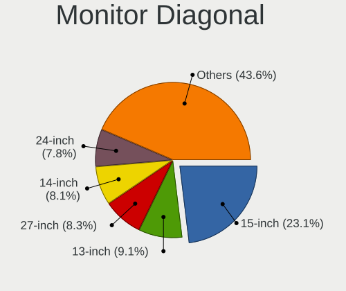

| Inches  | Computers | Percent |
|---------|-----------|---------|
| 15      | 2514      | 23.08%  |
| 13      | 996       | 9.14%   |
| 27      | 907       | 8.33%   |
| 14      | 884       | 8.11%   |
| 24      | 847       | 7.77%   |
| Unknown | 792       | 7.27%   |
| 23      | 637       | 5.85%   |
| 21      | 526       | 4.83%   |
| 17      | 442       | 4.06%   |
| 31      | 384       | 3.52%   |
| 34      | 233       | 2.14%   |
| 16      | 207       | 1.9%    |
| 19      | 200       | 1.84%   |
| 12      | 147       | 1.35%   |
| 22      | 144       | 1.32%   |
| 18      | 129       | 1.18%   |
| 20      | 99        | 0.91%   |
| 11      | 85        | 0.78%   |
| 84      | 73        | 0.67%   |
| 40      | 60        | 0.55%   |
| 32      | 60        | 0.55%   |
| 72      | 48        | 0.44%   |
| 54      | 46        | 0.42%   |
| 26      | 36        | 0.33%   |
| 28      | 33        | 0.3%    |
| 25      | 33        | 0.3%    |
| 142     | 30        | 0.28%   |
| 63      | 27        | 0.25%   |
| 48      | 25        | 0.23%   |
| 65      | 23        | 0.21%   |
| 37      | 19        | 0.17%   |
| 29      | 18        | 0.17%   |
| 33      | 17        | 0.16%   |
| 42      | 15        | 0.14%   |
| 49      | 14        | 0.13%   |
| 74      | 13        | 0.12%   |
| 52      | 13        | 0.12%   |
| 10      | 11        | 0.1%    |
| 46      | 10        | 0.09%   |
| 39      | 10        | 0.09%   |

Monitor Width
-------------

Physical width

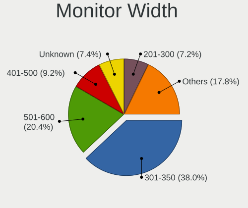

| Width in mm    | Computers | Percent |
|----------------|-----------|---------|
| 301-350        | 4049      | 37.98%  |
| 501-600        | 2179      | 20.44%  |
| 401-500        | 978       | 9.17%   |
| Unknown        | 792       | 7.43%   |
| 201-300        | 765       | 7.18%   |
| 351-400        | 561       | 5.26%   |
| 601-700        | 521       | 4.89%   |
| 701-800        | 317       | 2.97%   |
| 1001-1500      | 186       | 1.74%   |
| 1501-2000      | 143       | 1.34%   |
| 801-900        | 105       | 0.98%   |
| More than 2000 | 30        | 0.28%   |
| 901-1000       | 23        | 0.22%   |
| 101-200        | 9         | 0.08%   |
| 1-100          | 4         | 0.04%   |

Aspect Ratio
------------

Proportional relationship between the width and the height

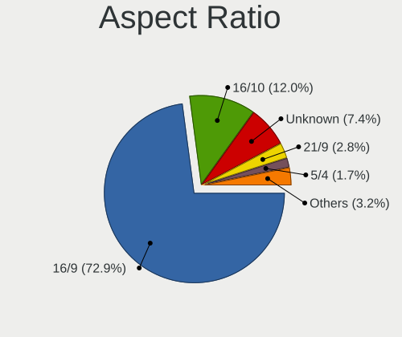

| Ratio   | Computers | Percent |
|---------|-----------|---------|
| 16/9    | 7030      | 72.92%  |
| 16/10   | 1156      | 11.99%  |
| Unknown | 710       | 7.36%   |
| 21/9    | 270       | 2.8%    |
| 5/4     | 165       | 1.71%   |
| 3/2     | 152       | 1.58%   |
| 4/3     | 52        | 0.54%   |
| 32/9    | 37        | 0.38%   |
| 1.00    | 32        | 0.33%   |
| 6/5     | 7         | 0.07%   |
| 0.56    | 5         | 0.05%   |
| 0.62    | 4         | 0.04%   |
| 3.40    | 3         | 0.03%   |
| 0.89    | 3         | 0.03%   |
| 0.67    | 3         | 0.03%   |
| 3.20    | 2         | 0.02%   |
| 1.96    | 2         | 0.02%   |
| 1.03    | 2         | 0.02%   |
| 0.63    | 2         | 0.02%   |
| 3.75    | 1         | 0.01%   |
| 0.80    | 1         | 0.01%   |
| 0.79    | 1         | 0.01%   |
| 0.58    | 1         | 0.01%   |

Monitor Area
------------

Area in inch²

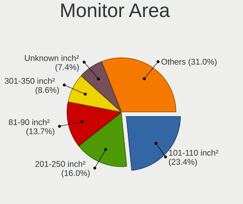

| Area in inch² | Computers | Percent |
|----------------|-----------|---------|
| 101-110        | 2520      | 23.4%   |
| 201-250        | 1720      | 15.97%  |
| 81-90          | 1473      | 13.68%  |
| 301-350        | 930       | 8.64%   |
| Unknown        | 792       | 7.35%   |
| 351-500        | 728       | 6.76%   |
| 151-200        | 419       | 3.89%   |
| 71-80          | 398       | 3.7%    |
| 121-130        | 321       | 2.98%   |
| More than 1000 | 304       | 2.82%   |
| 251-300        | 300       | 2.79%   |
| 111-120        | 185       | 1.72%   |
| 501-1000       | 177       | 1.64%   |
| 141-150        | 171       | 1.59%   |
| 61-70          | 129       | 1.2%    |
| 51-60          | 90        | 0.84%   |
| 131-140        | 58        | 0.54%   |
| 91-100         | 33        | 0.31%   |
| 1-40           | 13        | 0.12%   |
| 41-50          | 9         | 0.08%   |

Pixel Density
-------------

Pixels per inch

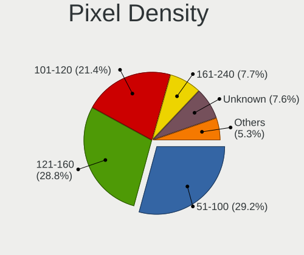

| Density       | Computers | Percent |
|---------------|-----------|---------|
| 51-100        | 3047      | 29.22%  |
| 121-160       | 3001      | 28.78%  |
| 101-120       | 2229      | 21.37%  |
| 161-240       | 803       | 7.7%    |
| Unknown       | 793       | 7.6%    |
| More than 240 | 310       | 2.97%   |
| 1-50          | 246       | 2.36%   |

Multiple Monitors
-----------------

Total monitors connected

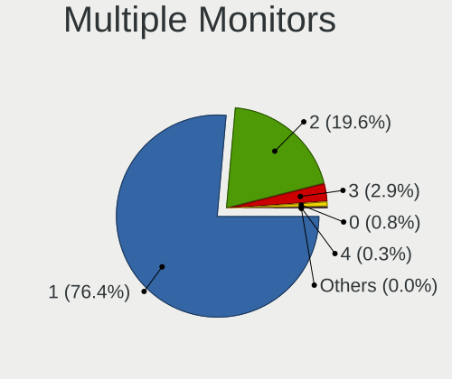

| Total | Computers | Percent |
|-------|-----------|---------|
| 1     | 7236      | 76.4%   |
| 2     | 1859      | 19.63%  |
| 3     | 270       | 2.85%   |
| 0     | 77        | 0.81%   |
| 4     | 28        | 0.3%    |
| 5     | 1         | 0.01%   |

Network
-------

Net Controller Vendor
---------------------

Controller vendors

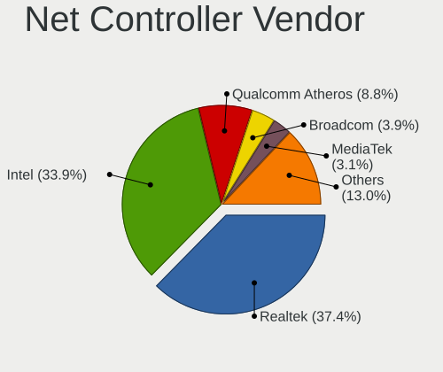

| Vendor                            | Computers | Percent |
|-----------------------------------|-----------|---------|
| Realtek Semiconductor             | 5243      | 37.36%  |
| Intel                             | 4758      | 33.91%  |
| Qualcomm Atheros                  | 1228      | 8.75%   |
| Broadcom                          | 546       | 3.89%   |
| MediaTek                          | 435       | 3.1%    |
| TP-Link                           | 196       | 1.4%    |
| Ralink Technology                 | 159       | 1.13%   |
| Broadcom Limited                  | 128       | 0.91%   |
| Ralink                            | 91        | 0.65%   |
| ASIX Electronics                  | 87        | 0.62%   |
| Marvell Technology Group          | 75        | 0.53%   |
| Samsung Electronics               | 71        | 0.51%   |
| Xiaomi                            | 64        | 0.46%   |
| Microsoft                         | 62        | 0.44%   |
| Shenzhen Goodix Technology        | 60        | 0.43%   |
| Nvidia                            | 51        | 0.36%   |
| Qualcomm                          | 50        | 0.36%   |
| Aquantia                          | 47        | 0.33%   |
| Sierra Wireless                   | 44        | 0.31%   |
| Qualcomm Atheros Communications   | 40        | 0.29%   |
| Lenovo                            | 40        | 0.29%   |
| DisplayLink                       | 37        | 0.26%   |
| Huawei Technologies               | 34        | 0.24%   |
| ASUSTek Computer                  | 34        | 0.24%   |
| NetGear                           | 32        | 0.23%   |
| D-Link                            | 30        | 0.21%   |
| Dell                              | 28        | 0.2%    |
| Linksys                           | 20        | 0.14%   |
| Ericsson Business Mobile Networks | 19        | 0.14%   |
| JMicron Technology                | 18        | 0.13%   |
| Hewlett-Packard                   | 18        | 0.13%   |
| Edimax Technology                 | 17        | 0.12%   |
| Google                            | 16        | 0.11%   |
| Fibocom                           | 14        | 0.1%    |
| Motorola PCS                      | 13        | 0.09%   |
| Qualcomm Technologies             | 12        | 0.09%   |
| OPPO Electronics                  | 11        | 0.08%   |
| Mellanox Technologies             | 11        | 0.08%   |
| ZyXEL Communications              | 10        | 0.07%   |
| OnePlus Technology (Shenzhen)     | 10        | 0.07%   |

Net Controller Model
--------------------

Controller models

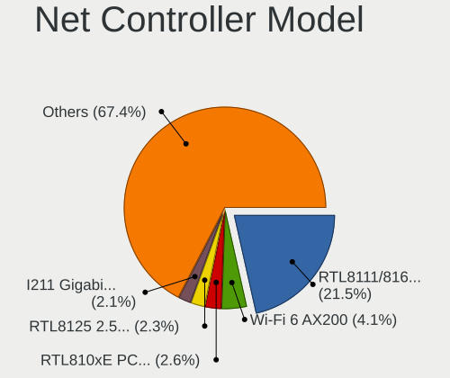

| Model                                                                  | Computers | Percent |
|------------------------------------------------------------------------|-----------|---------|
| Realtek RTL8111/8168/8211/8411 PCI Express Gigabit Ethernet Controller | 3539      | 21.49%  |
| Intel Wi-Fi 6 AX200                                                    | 671       | 4.08%   |
| Realtek RTL810xE PCI Express Fast Ethernet controller                  | 432       | 2.62%   |
| Realtek RTL8125 2.5GbE Controller                                      | 383       | 2.33%   |
| Intel I211 Gigabit Network Connection                                  | 343       | 2.08%   |
| Intel Wireless 8265 / 8275                                             | 313       | 1.9%    |
| Realtek RTL8153 Gigabit Ethernet Adapter                               | 293       | 1.78%   |
| Intel 82579LM Gigabit Network Connection (Lewisville)                  | 249       | 1.51%   |
| Qualcomm Atheros QCA9377 802.11ac Wireless Network Adapter             | 244       | 1.48%   |
| Realtek RTL8822CE 802.11ac PCIe Wireless Network Adapter               | 242       | 1.47%   |
| Intel Wireless 7265                                                    | 220       | 1.34%   |
| Intel Wi-Fi 6 AX201                                                    | 203       | 1.23%   |
| Realtek RTL8821CE 802.11ac PCIe Wireless Network Adapter               | 196       | 1.19%   |
| Intel Wireless 7260                                                    | 183       | 1.11%   |
| Intel Cannon Lake PCH CNVi WiFi                                        | 181       | 1.1%    |
| Intel Wi-Fi 6E(802.11ax) AX210/AX1675* 2x2 [Typhoon Peak]              | 167       | 1.01%   |
| Qualcomm Atheros QCA6174 802.11ac Wireless Network Adapter             | 161       | 0.98%   |
| Intel Ethernet Connection (2) I219-V                                   | 155       | 0.94%   |
| Qualcomm Atheros QCA9565 / AR9565 Wireless Network Adapter             | 154       | 0.94%   |
| Intel Ethernet Controller I225-V                                       | 150       | 0.91%   |
| MediaTek MT7922 802.11ax PCI Express Wireless Network Adapter          | 147       | 0.89%   |
| Intel Wireless 8260                                                    | 143       | 0.87%   |
| Intel Dual Band Wireless-AC 3168NGW [Stone Peak]                       | 137       | 0.83%   |
| MediaTek MT7921 802.11ax PCIe Wireless Network Adapter [Filogic 330]   | 133       | 0.81%   |
| Intel Cannon Point-LP CNVi [Wireless-AC]                               | 133       | 0.81%   |
| Intel Alder Lake-P PCH CNVi WiFi                                       | 131       | 0.8%    |
| Qualcomm Atheros AR9485 Wireless Network Adapter                       | 130       | 0.79%   |
| Intel Comet Lake PCH-LP CNVi WiFi                                      | 120       | 0.73%   |
| Realtek RTL8822BE 802.11a/b/g/n/ac WiFi adapter                        | 117       | 0.71%   |
| Qualcomm Atheros AR9285 Wireless Network Adapter (PCI-Express)         | 116       | 0.7%    |
| Intel Wi-Fi 5(802.11ac) Wireless-AC 9x6x [Thunder Peak]                | 112       | 0.68%   |
| Intel Wireless 3165                                                    | 110       | 0.67%   |
| Intel Centrino Advanced-N 6205 [Taylor Peak]                           | 106       | 0.64%   |
| Intel Comet Lake PCH CNVi WiFi                                         | 104       | 0.63%   |
| Intel Ethernet Connection I217-LM                                      | 103       | 0.63%   |
| Realtek RTL8723BE PCIe Wireless Network Adapter                        | 92        | 0.56%   |
| Intel Ethernet Connection (4) I219-LM                                  | 87        | 0.53%   |
| Realtek 802.11ac NIC                                                   | 86        | 0.52%   |
| Intel Ethernet Connection (7) I219-V                                   | 78        | 0.47%   |
| ASIX AX88179 Gigabit Ethernet                                          | 76        | 0.46%   |

Wireless Vendor
---------------

Wireless vendors

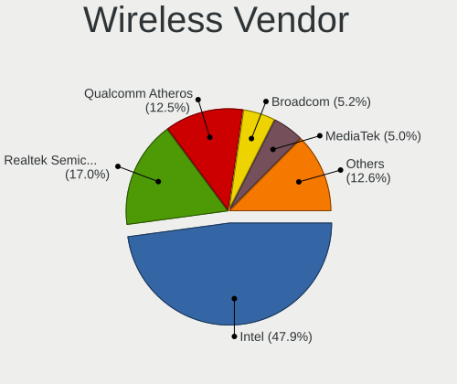

| Vendor                                | Computers | Percent |
|---------------------------------------|-----------|---------|
| Intel                                 | 3699      | 47.86%  |
| Realtek Semiconductor                 | 1311      | 16.96%  |
| Qualcomm Atheros                      | 964       | 12.47%  |
| Broadcom                              | 398       | 5.15%   |
| MediaTek                              | 385       | 4.98%   |
| TP-Link                               | 184       | 2.38%   |
| Ralink Technology                     | 159       | 2.06%   |
| Broadcom Limited                      | 101       | 1.31%   |
| Ralink                                | 91        | 1.18%   |
| Microsoft                             | 57        | 0.74%   |
| Sierra Wireless                       | 44        | 0.57%   |
| Qualcomm Atheros Communications       | 40        | 0.52%   |
| Qualcomm                              | 33        | 0.43%   |
| NetGear                               | 32        | 0.41%   |
| ASUSTek Computer                      | 32        | 0.41%   |
| D-Link                                | 30        | 0.39%   |
| Dell                                  | 22        | 0.28%   |
| Marvell Technology Group              | 19        | 0.25%   |
| Linksys                               | 19        | 0.25%   |
| Edimax Technology                     | 17        | 0.22%   |
| Fibocom                               | 14        | 0.18%   |
| ZyXEL Communications                  | 10        | 0.13%   |
| D-Link System                         | 7         | 0.09%   |
| Hewlett-Packard                       | 6         | 0.08%   |
| AVM                                   | 6         | 0.08%   |
| ZyDAS                                 | 4         | 0.05%   |
| Quectel Wireless Solutions            | 4         | 0.05%   |
| Qualcomm Technologies                 | 4         | 0.05%   |
| Mercucys                              | 4         | 0.05%   |
| Belkin Components                     | 4         | 0.05%   |
| 802.11g Adapter [Linksys WUSB54GC v3] | 4         | 0.05%   |
| Samsung Electronics                   | 3         | 0.04%   |
| Micro Star International              | 3         | 0.04%   |
| IMC Networks                          | 3         | 0.04%   |
| Xiaomi                                | 2         | 0.03%   |
| Tenda                                 | 2         | 0.03%   |
| Realtek                               | 2         | 0.03%   |
| ZTopInc                               | 1         | 0.01%   |
| Wacom                                 | 1         | 0.01%   |
| Senao                                 | 1         | 0.01%   |

Wireless Model
--------------

Wireless models

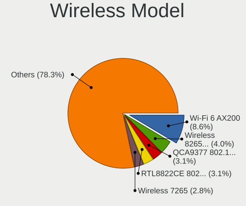

| Model                                                                | Computers | Percent |
|----------------------------------------------------------------------|-----------|---------|
| Intel Wi-Fi 6 AX200                                                  | 671       | 8.61%   |
| Intel Wireless 8265 / 8275                                           | 313       | 4.02%   |
| Qualcomm Atheros QCA9377 802.11ac Wireless Network Adapter           | 244       | 3.13%   |
| Realtek RTL8822CE 802.11ac PCIe Wireless Network Adapter             | 242       | 3.11%   |
| Intel Wireless 7265                                                  | 220       | 2.82%   |
| Intel Wi-Fi 6 AX201                                                  | 203       | 2.61%   |
| Realtek RTL8821CE 802.11ac PCIe Wireless Network Adapter             | 196       | 2.52%   |
| Intel Wireless 7260                                                  | 183       | 2.35%   |
| Intel Cannon Lake PCH CNVi WiFi                                      | 181       | 2.32%   |
| Intel Wi-Fi 6E(802.11ax) AX210/AX1675* 2x2 [Typhoon Peak]            | 167       | 2.14%   |
| Qualcomm Atheros QCA6174 802.11ac Wireless Network Adapter           | 161       | 2.07%   |
| Qualcomm Atheros QCA9565 / AR9565 Wireless Network Adapter           | 154       | 1.98%   |
| Intel Wireless 8260                                                  | 143       | 1.84%   |
| Intel Dual Band Wireless-AC 3168NGW [Stone Peak]                     | 137       | 1.76%   |
| MediaTek MT7921 802.11ax PCIe Wireless Network Adapter [Filogic 330] | 133       | 1.71%   |
| Intel Cannon Point-LP CNVi [Wireless-AC]                             | 133       | 1.71%   |
| Qualcomm Atheros AR9485 Wireless Network Adapter                     | 130       | 1.67%   |
| MediaTek MT7922 802.11ax PCI Express Wireless Network Adapter        | 124       | 1.59%   |
| Intel Comet Lake PCH-LP CNVi WiFi                                    | 120       | 1.54%   |
| Realtek RTL8822BE 802.11a/b/g/n/ac WiFi adapter                      | 117       | 1.5%    |
| Qualcomm Atheros AR9285 Wireless Network Adapter (PCI-Express)       | 116       | 1.49%   |
| Intel Wi-Fi 5(802.11ac) Wireless-AC 9x6x [Thunder Peak]              | 112       | 1.44%   |
| Intel Wireless 3165                                                  | 110       | 1.41%   |
| Intel Centrino Advanced-N 6205 [Taylor Peak]                         | 106       | 1.36%   |
| Intel Comet Lake PCH CNVi WiFi                                       | 104       | 1.33%   |
| Realtek RTL8723BE PCIe Wireless Network Adapter                      | 92        | 1.18%   |
| Realtek 802.11ac NIC                                                 | 86        | 1.1%    |
| Intel Alder Lake-P PCH CNVi WiFi                                     | 84        | 1.08%   |
| Intel Ice Lake-LP PCH CNVi WiFi                                      | 63        | 0.81%   |
| Realtek RTL8852AE 802.11ax PCIe Wireless Network Adapter             | 61        | 0.78%   |
| Intel Wireless 3160                                                  | 59        | 0.76%   |
| Intel Dual Band Wireless-AC 3165 Plus Bluetooth                      | 59        | 0.76%   |
| Broadcom BCM4360 802.11ac Dual Band Wireless Network Adapter         | 59        | 0.76%   |
| Realtek RTL88x2bu [AC1200 Techkey]                                   | 57        | 0.73%   |
| Ralink MT7601U Wireless Adapter                                      | 57        | 0.73%   |
| Realtek RTL8188EUS 802.11n Wireless Network Adapter                  | 54        | 0.69%   |
| Broadcom BCM4313 802.11bgn Wireless Network Adapter                  | 53        | 0.68%   |
| MediaTek MT7921K (RZ608) Wi-Fi 6E 80MHz                              | 49        | 0.63%   |
| Intel Tiger Lake PCH CNVi WiFi                                       | 49        | 0.63%   |
| Broadcom BCM43142 802.11b/g/n                                        | 49        | 0.63%   |

Ethernet Vendor
---------------

Ethernet vendors

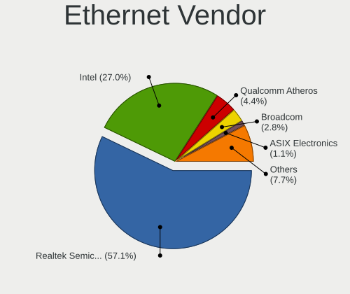

| Vendor                                 | Computers | Percent |
|----------------------------------------|-----------|---------|
| Realtek Semiconductor                  | 4713      | 57.13%  |
| Intel                                  | 2224      | 26.96%  |
| Qualcomm Atheros                       | 364       | 4.41%   |
| Broadcom                               | 229       | 2.78%   |
| ASIX Electronics                       | 87        | 1.05%   |
| Samsung Electronics                    | 68        | 0.82%   |
| Xiaomi                                 | 61        | 0.74%   |
| Marvell Technology Group               | 56        | 0.68%   |
| Nvidia                                 | 51        | 0.62%   |
| Aquantia                               | 47        | 0.57%   |
| MediaTek                               | 42        | 0.51%   |
| Lenovo                                 | 39        | 0.47%   |
| DisplayLink                            | 37        | 0.45%   |
| Broadcom Limited                       | 30        | 0.36%   |
| Huawei Technologies                    | 22        | 0.27%   |
| JMicron Technology                     | 18        | 0.22%   |
| Qualcomm                               | 17        | 0.21%   |
| Google                                 | 14        | 0.17%   |
| Motorola PCS                           | 13        | 0.16%   |
| TP-Link                                | 12        | 0.15%   |
| OPPO Electronics                       | 11        | 0.13%   |
| Mellanox Technologies                  | 11        | 0.13%   |
| Qualcomm Technologies                  | 8         | 0.1%    |
| Apple                                  | 8         | 0.1%    |
| OnePlus Technology (Shenzhen)          | 7         | 0.08%   |
| ICS Advent                             | 6         | 0.07%   |
| Sony Ericsson Mobile Communications AB | 5         | 0.06%   |
| Microsoft                              | 5         | 0.06%   |
| Suzhou Motorcomm Electronic Technology | 4         | 0.05%   |
| T & A Mobile Phones                    | 3         | 0.04%   |
| Spreadtrum Communications              | 3         | 0.04%   |
| HMD Global                             | 3         | 0.04%   |
| Hewlett-Packard                        | 3         | 0.04%   |
| D-Link System                          | 3         | 0.04%   |
| VIA Technologies                       | 2         | 0.02%   |
| Sundance Technology Inc / IC Plus      | 2         | 0.02%   |
| National Semiconductor                 | 2         | 0.02%   |
| Motorcomm Microelectronics.            | 2         | 0.02%   |
| Foxconn / Hon Hai                      | 2         | 0.02%   |
| Attansic Technology                    | 2         | 0.02%   |

Ethernet Model
--------------

Ethernet models

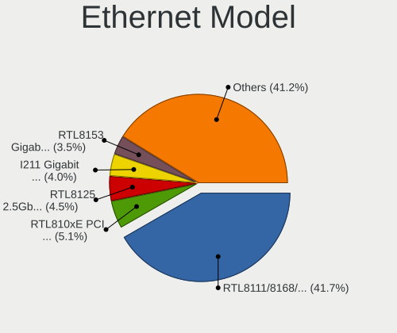

| Model                                                                  | Computers | Percent |
|------------------------------------------------------------------------|-----------|---------|
| Realtek RTL8111/8168/8211/8411 PCI Express Gigabit Ethernet Controller | 3539      | 41.69%  |
| Realtek RTL810xE PCI Express Fast Ethernet controller                  | 432       | 5.09%   |
| Realtek RTL8125 2.5GbE Controller                                      | 383       | 4.51%   |
| Intel I211 Gigabit Network Connection                                  | 343       | 4.04%   |
| Realtek RTL8153 Gigabit Ethernet Adapter                               | 293       | 3.45%   |
| Intel 82579LM Gigabit Network Connection (Lewisville)                  | 249       | 2.93%   |
| Intel Ethernet Connection (2) I219-V                                   | 155       | 1.83%   |
| Intel Ethernet Controller I225-V                                       | 150       | 1.77%   |
| Intel Ethernet Connection I217-LM                                      | 103       | 1.21%   |
| Intel Ethernet Connection (4) I219-LM                                  | 87        | 1.02%   |
| Intel Ethernet Connection (7) I219-V                                   | 78        | 0.92%   |
| ASIX AX88179 Gigabit Ethernet                                          | 76        | 0.9%    |
| Intel 82579V Gigabit Network Connection                                | 72        | 0.85%   |
| Qualcomm Atheros AR8151 v2.0 Gigabit Ethernet                          | 59        | 0.7%    |
| Intel Ethernet Connection I217-V                                       | 58        | 0.68%   |
| Intel Ethernet Connection (4) I219-V                                   | 57        | 0.67%   |
| Intel Ethernet Connection (3) I218-LM                                  | 55        | 0.65%   |
| Intel Ethernet Connection (7) I219-LM                                  | 51        | 0.6%    |
| Intel Ethernet Connection (2) I218-V                                   | 50        | 0.59%   |
| Qualcomm Atheros Killer E2500 Gigabit Ethernet Controller              | 48        | 0.57%   |
| Intel Alder Lake-P PCH CNVi WiFi                                       | 47        | 0.55%   |
| Qualcomm Atheros Killer E220x Gigabit Ethernet Controller              | 46        | 0.54%   |
| Intel Ethernet Connection (2) I219-LM                                  | 46        | 0.54%   |
| Xiaomi Mi/Redmi series (RNDIS)                                         | 44        | 0.52%   |
| Realtek Killer E2600 GbE Controller                                    | 43        | 0.51%   |
| Intel Ethernet Connection I219-LM                                      | 43        | 0.51%   |
| Intel Ethernet Connection I218-LM                                      | 43        | 0.51%   |
| Samsung Galaxy series, misc. (tethering mode)                          | 42        | 0.49%   |
| Qualcomm Atheros Killer E2400 Gigabit Ethernet Controller              | 41        | 0.48%   |
| Intel Ethernet Connection (6) I219-V                                   | 40        | 0.47%   |
| Broadcom NetXtreme BCM57765 Gigabit Ethernet PCIe                      | 40        | 0.47%   |
| Realtek RTL8152 Fast Ethernet Adapter                                  | 35        | 0.41%   |
| Qualcomm Atheros QCA8171 Gigabit Ethernet                              | 35        | 0.41%   |
| Qualcomm Atheros AR8161 Gigabit Ethernet                               | 35        | 0.41%   |
| Intel 82577LM Gigabit Network Connection                               | 34        | 0.4%    |
| Broadcom NetXtreme BCM57766 Gigabit Ethernet PCIe                      | 34        | 0.4%    |
| Intel Ethernet Connection (10) I219-V                                  | 33        | 0.39%   |
| Realtek Killer E3000 2.5GbE Controller                                 | 32        | 0.38%   |
| Intel 82574L Gigabit Network Connection                                | 32        | 0.38%   |
| Intel I210 Gigabit Network Connection                                  | 29        | 0.34%   |

Net Controller Kind
-------------------

Ethernet, WiFi or modem

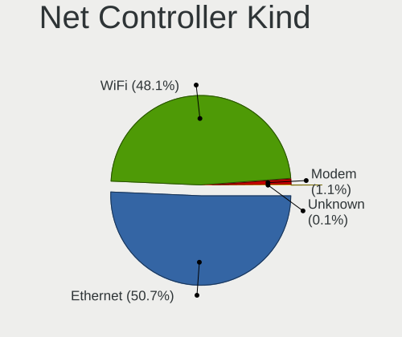

| Kind     | Computers | Percent |
|----------|-----------|---------|
| Ethernet | 7670      | 50.68%  |
| WiFi     | 7286      | 48.14%  |
| Modem    | 163       | 1.08%   |
| Unknown  | 16        | 0.11%   |

Used Controller
---------------

Currently used network controller

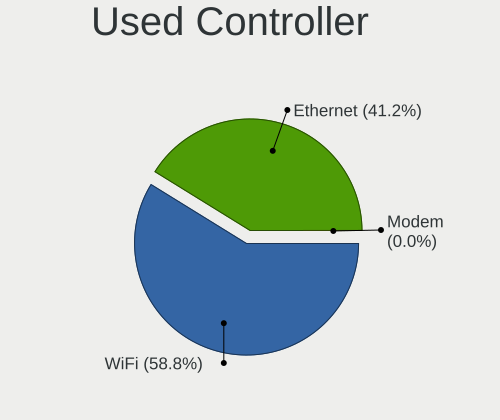

| Kind     | Computers | Percent |
|----------|-----------|---------|
| WiFi     | 5683      | 58.81%  |
| Ethernet | 3979      | 41.18%  |
| Modem    | 1         | 0.01%   |

NICs
----

Total network controllers on board

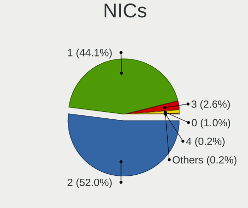

| Total | Computers | Percent |
|-------|-----------|---------|
| 2     | 4832      | 52.01%  |
| 1     | 4094      | 44.06%  |
| 3     | 239       | 2.57%   |
| 0     | 95        | 1.02%   |
| 4     | 16        | 0.17%   |
| 5     | 13        | 0.14%   |
| 8     | 1         | 0.01%   |
| 7     | 1         | 0.01%   |

IPv6
----

IPv6 vs IPv4

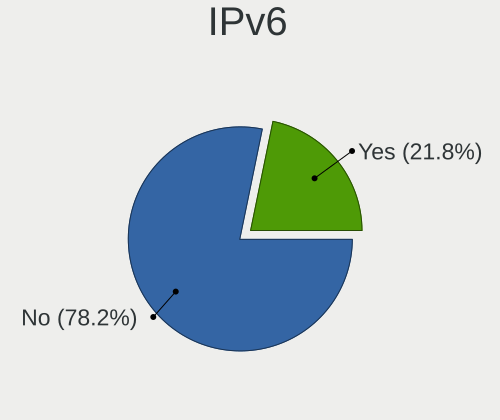

| Used | Computers | Percent |
|------|-----------|---------|
| No   | 7367      | 78.21%  |
| Yes  | 2052      | 21.79%  |

Bluetooth
---------

Bluetooth Vendor
----------------

Controller vendors

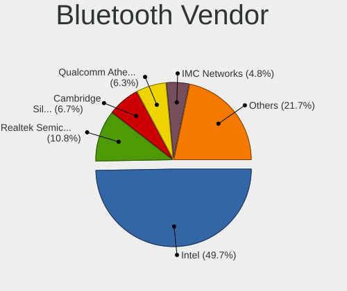

| Vendor                          | Computers | Percent |
|---------------------------------|-----------|---------|
| Intel                           | 3263      | 49.73%  |
| Realtek Semiconductor           | 707       | 10.77%  |
| Cambridge Silicon Radio         | 438       | 6.67%   |
| Qualcomm Atheros Communications | 415       | 6.32%   |
| IMC Networks                    | 315       | 4.8%    |
| Foxconn / Hon Hai               | 242       | 3.69%   |
| Broadcom                        | 203       | 3.09%   |
| Lite-On Technology              | 197       | 3%      |
| Apple                           | 182       | 2.77%   |
| ASUSTek Computer                | 146       | 2.22%   |
| MediaTek                        | 102       | 1.55%   |
| Realtek                         | 62        | 0.94%   |
| TP-Link                         | 48        | 0.73%   |
| Ralink                          | 31        | 0.47%   |
| Hewlett-Packard                 | 29        | 0.44%   |
| Dell                            | 29        | 0.44%   |
| Toshiba                         | 19        | 0.29%   |
| Marvell Semiconductor           | 15        | 0.23%   |
| USI                             | 14        | 0.21%   |
| Edimax Technology               | 11        | 0.17%   |
| Opticis                         | 10        | 0.15%   |
| Foxconn International           | 9         | 0.14%   |
| Dynex                           | 9         | 0.14%   |
| Belkin Components               | 8         | 0.12%   |
| Integrated System Solution      | 7         | 0.11%   |
| Ralink Technology               | 6         | 0.09%   |
| Alps Electric                   | 6         | 0.09%   |
| SINO WEALTH                     | 5         | 0.08%   |
| HTC (High Tech Computer)        | 5         | 0.08%   |
| Actions                         | 5         | 0.08%   |
| Conwise Technology              | 4         | 0.06%   |
| Askey Computer                  | 4         | 0.06%   |
| Unknown                         | 4         | 0.06%   |
| Micro Star International        | 2         | 0.03%   |
| Fujitsu                         | 2         | 0.03%   |
| Chicony Electronics             | 2         | 0.03%   |
| SiW                             | 1         | 0.02%   |
| Sitecom Europe                  | 1         | 0.02%   |
| Quectel Wireless Solutions      | 1         | 0.02%   |
| Qcom                            | 1         | 0.02%   |

Bluetooth Model
---------------

Controller models

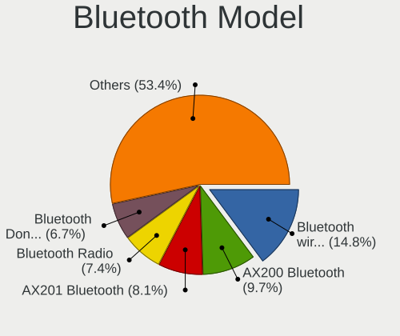

| Model                                               | Computers | Percent |
|-----------------------------------------------------|-----------|---------|
| Intel Bluetooth wireless interface                  | 974       | 14.82%  |
| Intel AX200 Bluetooth                               | 637       | 9.69%   |
| Intel AX201 Bluetooth                               | 531       | 8.08%   |
| Realtek Bluetooth Radio                             | 484       | 7.36%   |
| Cambridge Silicon Radio Bluetooth Dongle (HCI mode) | 438       | 6.66%   |
| Intel Bluetooth 9460/9560 Jefferson Peak (JfP)      | 427       | 6.5%    |
| Qualcomm Atheros  Bluetooth Device                  | 216       | 3.29%   |
| Intel Bluetooth Device                              | 215       | 3.27%   |
| Intel AX210 Bluetooth                               | 158       | 2.4%    |
| Realtek  Bluetooth 4.2 Adapter                      | 147       | 2.24%   |
| Intel Wireless-AC 3168 Bluetooth                    | 132       | 2.01%   |
| IMC Networks Wireless_Device                        | 117       | 1.78%   |
| IMC Networks Bluetooth Radio                        | 107       | 1.63%   |
| Intel Wireless-AC 9260 Bluetooth Adapter            | 104       | 1.58%   |
| MediaTek Wireless_Device                            | 99        | 1.51%   |
| Foxconn / Hon Hai Wireless_Device                   | 94        | 1.43%   |
| Apple Bluetooth Host Controller                     | 87        | 1.32%   |
| Intel Centrino Bluetooth Wireless Transceiver       | 72        | 1.1%    |
| Lite-On Qualcomm Atheros QCA9377 Bluetooth          | 66        | 1%      |
| Foxconn / Hon Hai Bluetooth Device                  | 65        | 0.99%   |
| Apple Bluetooth USB Host Controller                 | 64        | 0.97%   |
| Realtek Bluetooth Radio                             | 62        | 0.94%   |
| IMC Networks Bluetooth Device                       | 55        | 0.84%   |
| Qualcomm Atheros QCA61x4 Bluetooth 4.0              | 53        | 0.81%   |
| Qualcomm Atheros AR3012 Bluetooth 4.0               | 53        | 0.81%   |
| Lite-On Bluetooth Device                            | 53        | 0.81%   |
| Broadcom BCM20702A0 Bluetooth 4.0                   | 51        | 0.78%   |
| TP-Link TP-T@- UB500 Adapter                        | 48        | 0.73%   |
| Qualcomm Atheros AR3011 Bluetooth                   | 45        | 0.68%   |
| ASUS Broadcom BCM20702A0 Bluetooth                  | 42        | 0.64%   |
| ASUS ASUS USB-BT500                                 | 41        | 0.62%   |
| Foxconn / Hon Hai MediaTek Bluetooth Adapter        | 38        | 0.58%   |
| Lite-On Wireless_Device                             | 33        | 0.5%    |
| Ralink RT3290 Bluetooth                             | 31        | 0.47%   |
| Qualcomm Atheros AR9462 Bluetooth                   | 26        | 0.4%    |
| Broadcom BCM20702 Bluetooth 4.0 [ThinkPad]          | 25        | 0.38%   |
| Realtek RTL8821A Bluetooth                          | 24        | 0.37%   |
| Realtek RTL8822BE Bluetooth 4.2 Adapter             | 22        | 0.33%   |
| Apple Built-in Bluetooth 2.0+EDR HCI                | 22        | 0.33%   |
| Intel Centrino Advanced-N 6230 Bluetooth adapter    | 21        | 0.32%   |

Sound
-----

Sound Vendor
------------

Sound card vendors

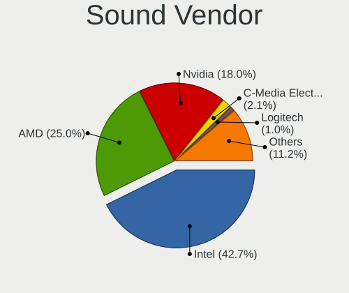

| Vendor                   | Computers | Percent |
|--------------------------|-----------|---------|
| Intel                    | 6006      | 42.69%  |
| AMD                      | 3513      | 24.97%  |
| Nvidia                   | 2538      | 18.04%  |
| C-Media Electronics      | 291       | 2.07%   |
| Logitech                 | 141       | 1%      |
| Kingston Technology      | 85        | 0.6%    |
| Creative Labs            | 82        | 0.58%   |
| JMTek                    | 80        | 0.57%   |
| Texas Instruments        | 71        | 0.5%    |
| Focusrite-Novation       | 65        | 0.46%   |
| Razer USA                | 60        | 0.43%   |
| ASUSTek Computer         | 59        | 0.42%   |
| Corsair                  | 54        | 0.38%   |
| SteelSeries ApS          | 53        | 0.38%   |
| Creative Technology      | 52        | 0.37%   |
| Realtek Semiconductor    | 49        | 0.35%   |
| Generalplus Technology   | 49        | 0.35%   |
| GN Netcom                | 48        | 0.34%   |
| Lenovo                   | 42        | 0.3%    |
| Blue Microphones         | 32        | 0.23%   |
| Plantronics              | 31        | 0.22%   |
| Sony                     | 26        | 0.18%   |
| Micro Star International | 26        | 0.18%   |
| BEHRINGER International  | 26        | 0.18%   |
| Samson Technologies      | 18        | 0.13%   |
| GYROCOM C&C              | 18        | 0.13%   |
| DSEA A/S                 | 18        | 0.13%   |
| Audio-Technica           | 18        | 0.13%   |
| Apple                    | 17        | 0.12%   |
| Hewlett-Packard          | 16        | 0.11%   |
| RODE Microphones         | 14        | 0.1%    |
| KTMicro                  | 14        | 0.1%    |
| Yamaha                   | 13        | 0.09%   |
| VIA Technologies         | 13        | 0.09%   |
| M-Audio                  | 13        | 0.09%   |
| Giga-Byte Technology     | 13        | 0.09%   |
| Astro Gaming             | 13        | 0.09%   |
| Turtle Beach             | 12        | 0.09%   |
| Microsoft                | 12        | 0.09%   |
| Fifine Microphones       | 12        | 0.09%   |

Sound Model
-----------

Sound card models

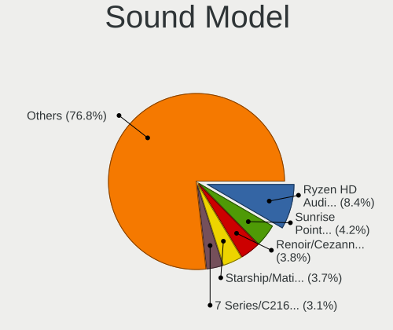

| Model                                                                      | Computers | Percent |
|----------------------------------------------------------------------------|-----------|---------|
| AMD Ryzen HD Audio Controller                                              | 1432      | 8.37%   |
| Intel Sunrise Point-LP HD Audio                                            | 725       | 4.24%   |
| AMD Renoir/Cezanne HDMI/DP Audio Controller                                | 652       | 3.81%   |
| AMD Starship/Matisse HD Audio Controller                                   | 631       | 3.69%   |
| Intel 7 Series/C216 Chipset Family High Definition Audio Controller        | 532       | 3.11%   |
| Intel Cannon Lake PCH cAVS                                                 | 415       | 2.43%   |
| Intel 6 Series/C200 Series Chipset Family High Definition Audio Controller | 412       | 2.41%   |
| Intel 8 Series/C220 Series Chipset High Definition Audio Controller        | 379       | 2.22%   |
| AMD Family 17h (Models 00h-0fh) HD Audio Controller                        | 360       | 2.11%   |
| AMD Raven/Raven2/Fenghuang HDMI/DP Audio Controller                        | 331       | 1.94%   |
| AMD Ellesmere HDMI Audio [Radeon RX 470/480 / 570/580/590]                 | 309       | 1.81%   |
| AMD Radeon High Definition Audio Controller                                | 282       | 1.65%   |
| Intel Tiger Lake-LP Smart Sound Technology Audio Controller                | 281       | 1.64%   |
| Intel 100 Series/C230 Series Chipset Family HD Audio Controller            | 260       | 1.52%   |
| AMD SBx00 Azalia (Intel HDA)                                               | 251       | 1.47%   |
| Intel Xeon E3-1200 v3/4th Gen Core Processor HD Audio Controller           | 245       | 1.43%   |
| Intel Cannon Point-LP High Definition Audio Controller                     | 230       | 1.34%   |
| Intel 8 Series HD Audio Controller                                         | 216       | 1.26%   |
| Intel Haswell-ULT HD Audio Controller                                      | 215       | 1.26%   |
| AMD FCH Azalia Controller                                                  | 197       | 1.15%   |
| Nvidia GP107GL High Definition Audio Controller                            | 192       | 1.12%   |
| Intel Broadwell-U Audio Controller                                         | 190       | 1.11%   |
| Intel Wildcat Point-LP High Definition Audio Controller                    | 188       | 1.1%    |
| AMD Navi 21/23 HDMI/DP Audio Controller                                    | 188       | 1.1%    |
| Nvidia GP106 High Definition Audio Controller                              | 186       | 1.09%   |
| Intel 200 Series PCH HD Audio                                              | 185       | 1.08%   |
| Intel 5 Series/3400 Series Chipset High Definition Audio                   | 182       | 1.06%   |
| Nvidia GP104 High Definition Audio Controller                              | 169       | 0.99%   |
| Intel Alder Lake PCH-P High Definition Audio Controller                    | 167       | 0.98%   |
| Intel Comet Lake PCH-LP cAVS                                               | 166       | 0.97%   |
| Nvidia GA104 High Definition Audio Controller                              | 155       | 0.91%   |
| AMD Navi 10 HDMI Audio                                                     | 153       | 0.89%   |
| Nvidia TU106 High Definition Audio Controller                              | 152       | 0.89%   |
| Nvidia TU116 High Definition Audio Controller                              | 144       | 0.84%   |
| Intel Comet Lake PCH cAVS                                                  | 144       | 0.84%   |
| Nvidia TU107 GeForce GTX 1650 High Definition Audio Controller             | 130       | 0.76%   |
| Intel CM238 HD Audio Controller                                            | 126       | 0.74%   |
| Nvidia GK208 HDMI/DP Audio Controller                                      | 124       | 0.73%   |
| Intel 82801I (ICH9 Family) HD Audio Controller                             | 124       | 0.73%   |
| Nvidia GA106 High Definition Audio Controller                              | 122       | 0.71%   |

Memory
------

Memory Vendor
-------------

Memory module vendors

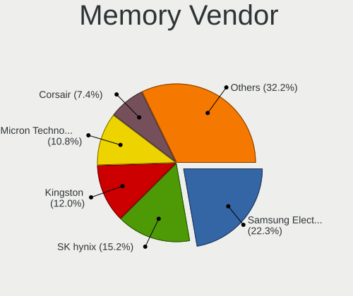

| Vendor                       | Computers | Percent |
|------------------------------|-----------|---------|
| Samsung Electronics          | 1364      | 22.27%  |
| SK hynix                     | 934       | 15.25%  |
| Kingston                     | 735       | 12%     |
| Micron Technology            | 664       | 10.84%  |
| Corsair                      | 455       | 7.43%   |
| Crucial                      | 398       | 6.5%    |
| Unknown                      | 350       | 5.71%   |
| G.Skill                      | 340       | 5.55%   |
| A-DATA Technology            | 144       | 2.35%   |
| Ramaxel Technology           | 89        | 1.45%   |
| Unknown                      | 74        | 1.21%   |
| Team                         | 68        | 1.11%   |
| Elpida                       | 66        | 1.08%   |
| Patriot                      | 57        | 0.93%   |
| Nanya Technology             | 48        | 0.78%   |
| Unknown (ABCD)               | 37        | 0.6%    |
| GOODRAM                      | 33        | 0.54%   |
| Smart                        | 23        | 0.38%   |
| Transcend                    | 20        | 0.33%   |
| AMD                          | 18        | 0.29%   |
| Apacer                       | 12        | 0.2%    |
| Timetec                      | 8         | 0.13%   |
| Patriot Memory (PDP Systems) | 8         | 0.13%   |
| Kllisre                      | 8         | 0.13%   |
| Silicon Power                | 7         | 0.11%   |
| ASint Technology             | 7         | 0.11%   |
| Teikon                       | 6         | 0.1%    |
| Lexar Co Limited             | 6         | 0.1%    |
| PNY                          | 5         | 0.08%   |
| Neo Forza                    | 5         | 0.08%   |
| Kingmax                      | 5         | 0.08%   |
| Goldkey                      | 5         | 0.08%   |
| GeIL                         | 5         | 0.08%   |
| Smart Brazil                 | 4         | 0.07%   |
| Qumo                         | 4         | 0.07%   |
| KLEVV                        | 4         | 0.07%   |
| Avant                        | 4         | 0.07%   |
| Atermiter                    | 4         | 0.07%   |
| Unknown (08C8)               | 3         | 0.05%   |
| SHARETRONIC                  | 3         | 0.05%   |

Memory Model
------------

Memory module models

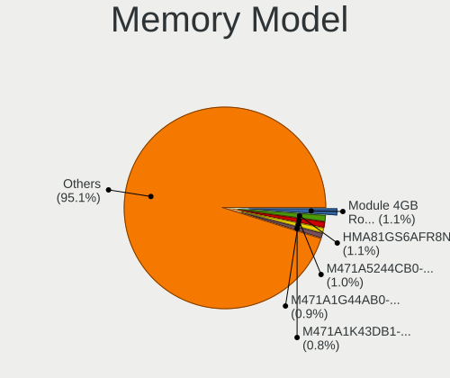

| Model                                                            | Computers | Percent |
|------------------------------------------------------------------|-----------|---------|
| Unknown                                                          | 74        | 1.13%   |
| SK hynix RAM HMA81GS6AFR8N-UH 8GB SODIMM DDR4 2667MT/s           | 70        | 1.07%   |
| Samsung RAM M471A5244CB0-CTD 4GB SODIMM DDR4 3266MT/s            | 64        | 0.98%   |
| Samsung RAM M471A1G44AB0-CWE 8GiB SODIMM DDR4 3200MT/s           | 57        | 0.87%   |
| Samsung RAM M471A1K43DB1-CWE 8GB SODIMM DDR4 3200MT/s            | 54        | 0.82%   |
| Samsung RAM M471A1G44AB0-CWE 8GB Row Of Chips DDR4 3200MT/s      | 51        | 0.78%   |
| Corsair RAM CMK16GX4M2B3200C16 8GB DIMM DDR4 3600MT/s            | 51        | 0.78%   |
| Samsung RAM M471A1K43CB1-CTD 8GB SODIMM DDR4 3200MT/s            | 45        | 0.69%   |
| Samsung RAM M471A1K43CB1-CRC 8GB SODIMM DDR4 8400MT/s            | 41        | 0.62%   |
| Samsung RAM M471A5244CB0-CRC 4GB SODIMM DDR4 2667MT/s            | 38        | 0.58%   |
| Samsung RAM M471B5173QH0-YK0 4GB SODIMM DDR3 1600MT/s            | 36        | 0.55%   |
| Corsair RAM CMK16GX4M2B3000C15 8GB DIMM DDR4 3600MT/s            | 36        | 0.55%   |
| Micron RAM 8ATF1G64HZ-3G2J1 8GB SODIMM DDR4 3200MT/s             | 35        | 0.53%   |
| Samsung RAM M471A1K43BB1-CRC 8GB SODIMM DDR4 2667MT/s            | 34        | 0.52%   |
| Micron RAM 4ATF51264HZ-2G6E1 4GB SODIMM DDR4 2667MT/s            | 32        | 0.49%   |
| Samsung RAM M471A1K43EB1-CWE 8GB SODIMM DDR4 3200MT/s            | 31        | 0.47%   |
| SK hynix RAM HMT451S6BFR8A-PB 4GB SODIMM DDR3 1600MT/s           | 30        | 0.46%   |
| SK hynix RAM HMAA1GS6CJR6N-XN 8GB SODIMM DDR4 3200MT/s           | 28        | 0.43%   |
| SK hynix RAM HMA81GS6JJR8N-VK 8GB SODIMM DDR4 2667MT/s           | 27        | 0.41%   |
| SK hynix RAM HMA81GS6CJR8N-VK 8GB SODIMM DDR4 2667MT/s           | 27        | 0.41%   |
| SK hynix RAM HMA81GS6DJR8N-XN 8GB SODIMM DDR4 3200MT/s           | 26        | 0.4%    |
| Samsung RAM M471B5173DB0-YK0 4GB SODIMM DDR3 1600MT/s            | 26        | 0.4%    |
| Samsung RAM M471A1G44BB0-CWE 8GB SODIMM DDR4 3200MT/s            | 26        | 0.4%    |
| G.Skill RAM F4-3200C16-8GVKB 8GB DIMM DDR4 4000MT/s              | 25        | 0.38%   |
| Unknown (ABCD) RAM 123456789012345678 2GB SODIMM LPDDR4 2400MT/s | 24        | 0.37%   |
| SK hynix RAM HMA851S6AFR6N-UH 4GB SODIMM DDR4 2667MT/s           | 24        | 0.37%   |
| G.Skill RAM F4-3000C16-8GISB 8GB DIMM DDR4 3200MT/s              | 24        | 0.37%   |
| Samsung RAM M471B1G73QH0-YK0 8GB SODIMM DDR3 1600MT/s            | 23        | 0.35%   |
| Micron RAM 4ATF1G64HZ-3G2E1 8GB SODIMM DDR4 3200MT/s             | 23        | 0.35%   |
| Kingston RAM KHX2666C16/8G 8GiB DIMM DDR4 3466MT/s               | 23        | 0.35%   |
| Samsung RAM M471B5273DH0-CH9 4GB SODIMM DDR3 1600MT/s            | 22        | 0.34%   |
| Samsung RAM M471B1G73DB0-YK0 8GB SODIMM DDR3 1600MT/s            | 22        | 0.34%   |
| Samsung RAM M471A2K43DB1-CWE 16GB SODIMM DDR4 3200MT/s           | 22        | 0.34%   |
| Micron RAM 4ATF1G64HZ-3G2E1 8GB Row Of Chips DDR4 3200MT/s       | 22        | 0.34%   |
| Samsung RAM M471B5173EB0-YK0 4GB SODIMM DDR3 1600MT/s            | 21        | 0.32%   |
| Samsung RAM M471A1K43DB1-CTD 8GB SODIMM DDR4 2667MT/s            | 21        | 0.32%   |
| SK hynix RAM HMA851S6CJR6N-VK 4GB SODIMM DDR4 2667MT/s           | 20        | 0.3%    |
| Samsung RAM M471A5244CB0-CWE 4GB SODIMM DDR4 3200MT/s            | 20        | 0.3%    |
| Kingston RAM KHX1600C10D3/8G 8GB DIMM DDR3 2133MT/s              | 20        | 0.3%    |
| G.Skill RAM F4-3200C16-16GVK 16GB DIMM DDR4 3600MT/s             | 20        | 0.3%    |

Memory Kind
-----------

Memory module kinds

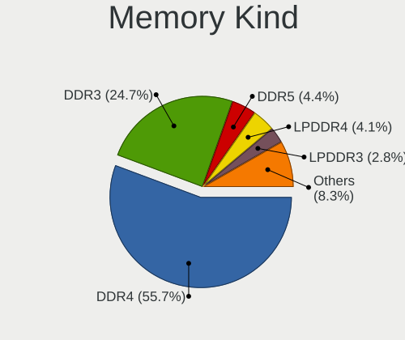

| Kind    | Computers | Percent |
|---------|-----------|---------|
| DDR4    | 2956      | 55.69%  |
| DDR3    | 1311      | 24.7%   |
| DDR5    | 231       | 4.35%   |
| LPDDR4  | 220       | 4.14%   |
| LPDDR3  | 151       | 2.84%   |
| LPDDR5  | 137       | 2.58%   |
| SDRAM   | 102       | 1.92%   |
| Unknown | 92        | 1.73%   |
| DDR2    | 84        | 1.58%   |
| DDR     | 15        | 0.28%   |
| DRAM    | 9         | 0.17%   |

Memory Form Factor
------------------

Physical design of the memory module

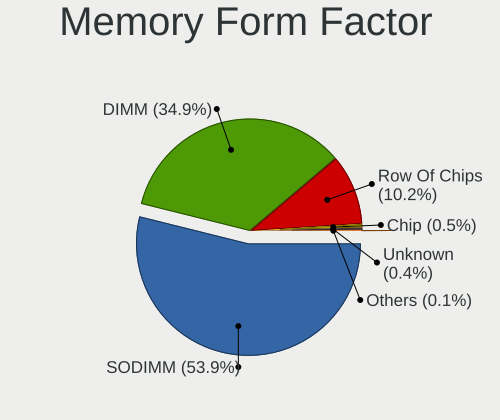

| Name         | Computers | Percent |
|--------------|-----------|---------|
| SODIMM       | 2852      | 53.88%  |
| DIMM         | 1849      | 34.93%  |
| Row Of Chips | 538       | 10.16%  |
| Chip         | 28        | 0.53%   |
| Unknown      | 20        | 0.38%   |
| RIMM         | 3         | 0.06%   |
| FB-DIMM      | 3         | 0.06%   |

Memory Size
-----------

Memory module size

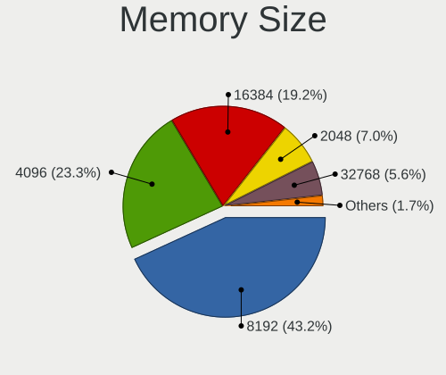

| Size  | Computers | Percent |
|-------|-----------|---------|
| 8192  | 2498      | 43.17%  |
| 4096  | 1347      | 23.28%  |
| 16384 | 1110      | 19.18%  |
| 2048  | 405       | 7%      |
| 32768 | 326       | 5.63%   |
| 1024  | 76        | 1.31%   |
| 49152 | 9         | 0.16%   |
| 3072  | 6         | 0.1%    |
| 512   | 5         | 0.09%   |
| 65536 | 2         | 0.03%   |
| 24576 | 1         | 0.02%   |
| 12288 | 1         | 0.02%   |
| 6144  | 1         | 0.02%   |

Memory Speed
------------

Memory module speed

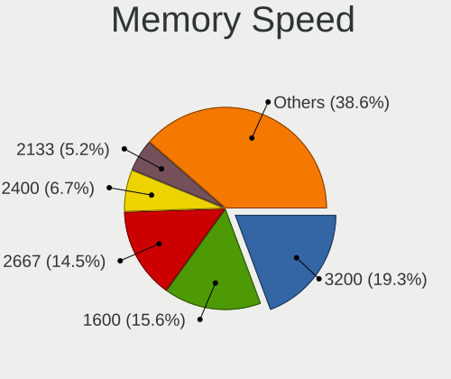

| Speed   | Computers | Percent |
|---------|-----------|---------|
| 3200    | 1122      | 19.31%  |
| 1600    | 909       | 15.65%  |
| 2667    | 843       | 14.51%  |
| 2400    | 392       | 6.75%   |
| 2133    | 301       | 5.18%   |
| 3600    | 291       | 5.01%   |
| 1333    | 230       | 3.96%   |
| 4267    | 100       | 1.72%   |
| 1867    | 98        | 1.69%   |
| 1334    | 97        | 1.67%   |
| 6400    | 79        | 1.36%   |
| 4800    | 77        | 1.33%   |
| 3800    | 73        | 1.26%   |
| 3266    | 71        | 1.22%   |
| 5600    | 67        | 1.15%   |
| 3733    | 67        | 1.15%   |
| 3400    | 63        | 1.08%   |
| 800     | 63        | 1.08%   |
| 3000    | 59        | 1.02%   |
| 667     | 53        | 0.91%   |
| 8400    | 50        | 0.86%   |
| 4000    | 46        | 0.79%   |
| 1866    | 46        | 0.79%   |
| 6000    | 44        | 0.76%   |
| Unknown | 43        | 0.74%   |
| 7500    | 38        | 0.65%   |
| 1067    | 37        | 0.64%   |
| 3466    | 35        | 0.6%    |
| 4199    | 34        | 0.59%   |
| 4266    | 28        | 0.48%   |
| 2666    | 27        | 0.46%   |
| 1800    | 25        | 0.43%   |
| 1066    | 25        | 0.43%   |
| 2933    | 23        | 0.4%    |
| 2800    | 17        | 0.29%   |
| 8533    | 15        | 0.26%   |
| 3866    | 15        | 0.26%   |
| 2048    | 13        | 0.22%   |
| 3333    | 11        | 0.19%   |
| 975     | 11        | 0.19%   |

Printers & scanners
-------------------

Printer Vendor
--------------

Printer device vendors

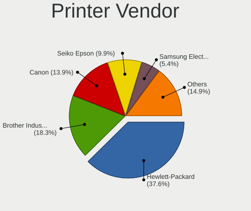

| Vendor                | Computers | Percent |
|-----------------------|-----------|---------|
| Hewlett-Packard       | 76        | 37.62%  |
| Brother Industries    | 37        | 18.32%  |
| Canon                 | 28        | 13.86%  |
| Seiko Epson           | 20        | 9.9%    |
| Samsung Electronics   | 11        | 5.45%   |
| Pantum                | 4         | 1.98%   |
| STMicroelectronics    | 3         | 1.49%   |
| Prolific Technology   | 3         | 1.49%   |
| Apple                 | 3         | 1.49%   |
| Xerox                 | 2         | 0.99%   |
| Ricoh                 | 2         | 0.99%   |
| Lexmark International | 2         | 0.99%   |
| Kyocera               | 2         | 0.99%   |
| Dymo-CoStar           | 2         | 0.99%   |
| Zebra                 | 1         | 0.5%    |
| Xiaomi                | 1         | 0.5%    |
| Sagem                 | 1         | 0.5%    |
| QinHeng Electronics   | 1         | 0.5%    |
| Oki Data              | 1         | 0.5%    |
| Graphtec America      | 1         | 0.5%    |
| Dell                  | 1         | 0.5%    |

Printer Model
-------------

Printer device models

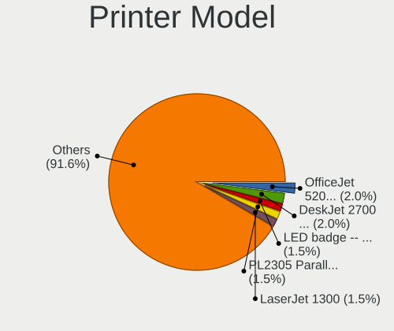

| Model                                                     | Computers | Percent |
|-----------------------------------------------------------|-----------|---------|
| HP OfficeJet 5200 series                                  | 4         | 1.97%   |
| HP DeskJet 2700 series                                    | 4         | 1.97%   |
| STMicroelectronics LED badge -- mini LED display -- 11x44 | 3         | 1.48%   |
| Prolific PL2305 Parallel Port                             | 3         | 1.48%   |
| HP LaserJet 1300                                          | 3         | 1.48%   |
| HP ENVY 4520 series                                       | 3         | 1.48%   |
| HP DeskJet 2600 series                                    | 3         | 1.48%   |
| Apple Gamesir-T1s 2.0b                                    | 3         | 1.48%   |
| Xerox Phaser 3020                                         | 2         | 0.99%   |
| Seiko Epson L6270 Series                                  | 2         | 0.99%   |
| Seiko Epson L120 Series                                   | 2         | 0.99%   |
| Seiko Epson ET-2810 Series                                | 2         | 0.99%   |
| Seiko Epson ET-2710 Series                                | 2         | 0.99%   |
| Samsung ML-216x Series Laser Printer                      | 2         | 0.99%   |
| Samsung ML-1640 Series Laser Printer                      | 2         | 0.99%   |
| Samsung M2020 Series                                      | 2         | 0.99%   |
| HP Smart Tank Plus 550 series                             | 2         | 0.99%   |
| HP Officejet 2620 series                                  | 2         | 0.99%   |
| HP LaserJet 3020                                          | 2         | 0.99%   |
| HP HP OfficeJet Pro 8020 series                           | 2         | 0.99%   |
| HP HP LaserJet Professional P1606dn                       | 2         | 0.99%   |
| HP ENVY 6000 series                                       | 2         | 0.99%   |
| HP ENVY 5000 series                                       | 2         | 0.99%   |
| HP DeskJet F4200 series                                   | 2         | 0.99%   |
| HP DeskJet F2492 All-in-One                               | 2         | 0.99%   |
| HP DeskJet 4530 series                                    | 2         | 0.99%   |
| HP DeskJet 3630 series                                    | 2         | 0.99%   |
| HP DeskJet 2130 series                                    | 2         | 0.99%   |
| HP Color LaserJet Pro M453-4                              | 2         | 0.99%   |
| Canon PIXMA MX340                                         | 2         | 0.99%   |
| Canon PIXMA MP250                                         | 2         | 0.99%   |
| Canon PIXMA MG2500 Series                                 | 2         | 0.99%   |
| Canon MG5700 series                                       | 2         | 0.99%   |
| Canon LiDE 400                                            | 2         | 0.99%   |
| Canon G3010 series                                        | 2         | 0.99%   |
| Brother MFC-L2710DW series                                | 2         | 0.99%   |
| Brother HL-L2300D series                                  | 2         | 0.99%   |
| Brother HL-5370DW series                                  | 2         | 0.99%   |
| Brother HL-1210W series                                   | 2         | 0.99%   |
| Brother HL-1110 series                                    | 2         | 0.99%   |

Scanner Vendor
--------------

Scanner device vendors

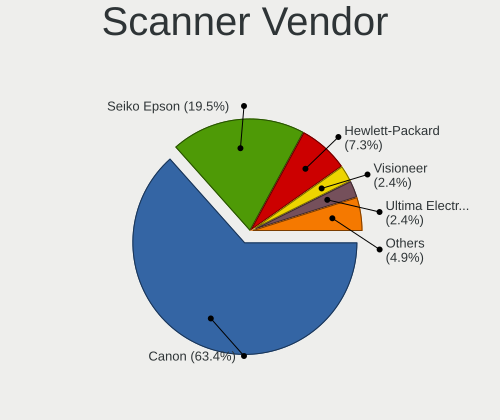

| Vendor             | Computers | Percent |
|--------------------|-----------|---------|
| Canon              | 26        | 63.41%  |
| Seiko Epson        | 8         | 19.51%  |
| Hewlett-Packard    | 3         | 7.32%   |
| Visioneer          | 1         | 2.44%   |
| Ultima Electronics | 1         | 2.44%   |
| Mustek Systems     | 1         | 2.44%   |
| AGFA-Gevaert NV    | 1         | 2.44%   |

Scanner Model
-------------

Scanner device models

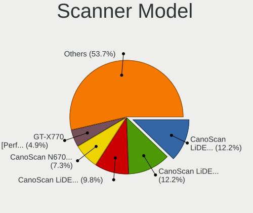

| Model                                                                                 | Computers | Percent |
|---------------------------------------------------------------------------------------|-----------|---------|
| Canon CanoScan LiDE 220                                                               | 5         | 12.2%   |
| Canon CanoScan LiDE 110                                                               | 5         | 12.2%   |
| Canon CanoScan LiDE 210                                                               | 4         | 9.76%   |
| Canon CanoScan N670U/N676U/LiDE 20                                                    | 3         | 7.32%   |
| Seiko Epson GT-X770 [Perfection V500]                                                 | 2         | 4.88%   |
| Canon CanoScan LiDE 90                                                                | 2         | 4.88%   |
| Canon CanoScan LIDE 25                                                                | 2         | 4.88%   |
| Visioneer OneTouch 5300 USB                                                           | 1         | 2.44%   |
| Ultima Artec Ultima 2000 (GT6801 based)/Lifetec LT9385/ScanMagic 1200 UB Plus Scanner | 1         | 2.44%   |
| Seiko Epson Perfection V37/V370                                                       | 1         | 2.44%   |
| Seiko Epson GT-X820 [Perfection V600 Photo]                                           | 1         | 2.44%   |
| Seiko Epson GT-X750 [Perfection 4490 Photo]                                           | 1         | 2.44%   |
| Seiko Epson GT-F730 [GT-S630/Perfection V33/V330 Photo]                               | 1         | 2.44%   |
| Seiko Epson GT-9700F [Perfection 2450 PHOTO]                                          | 1         | 2.44%   |
| Seiko Epson GT-7200U [Perfection 1250/1250 PHOTO]                                     | 1         | 2.44%   |
| Mustek Systems ScanExpress A3 USB 1200 PRO                                            | 1         | 2.44%   |
| HP ScanJet 3500c                                                                      | 1         | 2.44%   |
| HP ScanJet 3400cse                                                                    | 1         | 2.44%   |
| HP ScanJet 2200c                                                                      | 1         | 2.44%   |
| Canon CanoScan LiDE 500F                                                              | 1         | 2.44%   |
| Canon CanoScan LiDE 50/LiDE 35/LiDE 40                                                | 1         | 2.44%   |
| Canon CanoScan LiDE 200                                                               | 1         | 2.44%   |
| Canon CanoScan LiDE 120                                                               | 1         | 2.44%   |
| Canon CanoScan                                                                        | 1         | 2.44%   |
| AGFA-Gevaert NV SnapScan e26                                                          | 1         | 2.44%   |

Camera
------

Camera Vendor
-------------

Camera device vendors

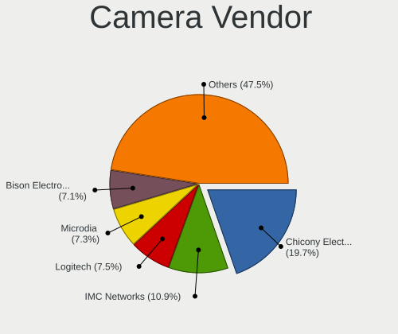

| Vendor                                 | Computers | Percent |
|----------------------------------------|-----------|---------|
| Chicony Electronics                    | 1180      | 19.69%  |
| IMC Networks                           | 651       | 10.86%  |
| Logitech                               | 450       | 7.51%   |
| Microdia                               | 439       | 7.33%   |
| Bison Electronics                      | 424       | 7.08%   |
| Realtek Semiconductor                  | 417       | 6.96%   |
| Quanta                                 | 337       | 5.62%   |
| Sunplus Innovation Technology          | 259       | 4.32%   |
| Cheng Uei Precision Industry (Foxlink) | 187       | 3.12%   |
| Syntek                                 | 177       | 2.95%   |
| Apple                                  | 149       | 2.49%   |
| Lite-On Technology                     | 144       | 2.4%    |
| Luxvisions Innotech Limited            | 133       | 2.22%   |
| Suyin                                  | 106       | 1.77%   |
| Microsoft                              | 84        | 1.4%    |
| Silicon Motion                         | 70        | 1.17%   |
| Samsung Electronics                    | 70        | 1.17%   |
| Alcor Micro                            | 59        | 0.98%   |
| Sonix Technology                       | 48        | 0.8%    |
| SunplusIT                              | 31        | 0.52%   |
| Z-Star Microelectronics                | 30        | 0.5%    |
| Shinetech                              | 29        | 0.48%   |
| Ricoh                                  | 26        | 0.43%   |
| Acer                                   | 23        | 0.38%   |
| Lenovo                                 | 21        | 0.35%   |
| Generalplus Technology                 | 21        | 0.35%   |
| Creative Technology                    | 21        | 0.35%   |
| MacroSilicon                           | 19        | 0.32%   |
| GEMBIRD                                | 16        | 0.27%   |
| Importek                               | 15        | 0.25%   |
| Primax Electronics                     | 14        | 0.23%   |
| ARC International                      | 14        | 0.23%   |
| KYE Systems (Mouse Systems)            | 13        | 0.22%   |
| Cubeternet                             | 12        | 0.2%    |
| kingcome                               | 11        | 0.18%   |
| Genesys Logic                          | 11        | 0.18%   |
| Google                                 | 10        | 0.17%   |
| ALi                                    | 10        | 0.17%   |
| Razer USA                              | 9         | 0.15%   |
| LG Electronics                         | 9         | 0.15%   |

Camera Model
------------

Camera device models

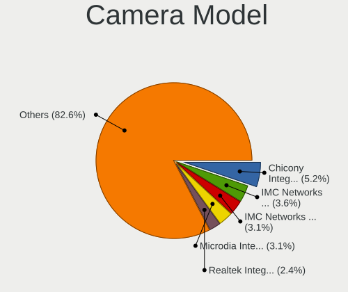

| Model                                               | Computers | Percent |
|-----------------------------------------------------|-----------|---------|
| Chicony Integrated Camera                           | 314       | 5.2%    |
| IMC Networks Integrated Camera                      | 218       | 3.61%   |
| IMC Networks USB2.0 HD UVC WebCam                   | 187       | 3.1%    |
| Microdia Integrated_Webcam_HD                       | 186       | 3.08%   |
| Realtek Integrated_Webcam_HD                        | 147       | 2.43%   |
| Syntek Integrated Camera                            | 130       | 2.15%   |
| Bison Integrated Camera                             | 126       | 2.09%   |
| Chicony HD WebCam                                   | 108       | 1.79%   |
| Logitech Webcam C270                                | 91        | 1.51%   |
| Sunplus Integrated_Webcam_HD                        | 75        | 1.24%   |
| Logitech HD Pro Webcam C920                         | 75        | 1.24%   |
| Samsung Galaxy series, misc. (MTP mode)             | 69        | 1.14%   |
| Quanta HD User Facing                               | 53        | 0.88%   |
| IMC Networks USB2.0 VGA UVC WebCam                  | 53        | 0.88%   |
| Lite-On Integrated Camera                           | 49        | 0.81%   |
| Apple iPhone 5/5C/5S/6/SE/7/8/X                     | 48        | 0.79%   |
| Logitech C922 Pro Stream Webcam                     | 47        | 0.78%   |
| Chicony HP HD Camera                                | 47        | 0.78%   |
| Bison HD Webcam                                     | 46        | 0.76%   |
| Chicony HP Wide Vision HD Camera                    | 45        | 0.74%   |
| Quanta HP TrueVision HD Camera                      | 40        | 0.66%   |
| Quanta HD Webcam                                    | 39        | 0.65%   |
| Chicony HD User Facing                              | 37        | 0.61%   |
| Bison Lenovo EasyCamera                             | 37        | 0.61%   |
| Luxvisions Innotech Limited Integrated Camera       | 36        | 0.6%    |
| Chicony Integrated Camera (1280x720@30)             | 36        | 0.6%    |
| Luxvisions Innotech Limited HP TrueVision HD Camera | 35        | 0.58%   |
| IMC Networks HD Camera                              | 35        | 0.58%   |
| Bison SunplusIT Integrated Camera                   | 35        | 0.58%   |
| Apple FaceTime HD Camera (Built-in)                 | 34        | 0.56%   |
| Quanta HP Wide Vision HD Camera                     | 33        | 0.55%   |
| Microdia Webcam Vitade AF                           | 33        | 0.55%   |
| Chicony Chicony USB2.0 Camera                       | 33        | 0.55%   |
| Lite-On HP HD Camera                                | 32        | 0.53%   |
| Apple FaceTime HD Camera                            | 32        | 0.53%   |
| Microsoft LifeCam HD-3000                           | 31        | 0.51%   |
| Chicony EasyCamera                                  | 31        | 0.51%   |
| Microdia USB 2.0 Camera                             | 30        | 0.5%    |
| Chicony HP Truevision HD                            | 30        | 0.5%    |
| Realtek USB Camera                                  | 29        | 0.48%   |

Security
--------

Fingerprint Vendor
------------------

Fingerprint sensor vendors

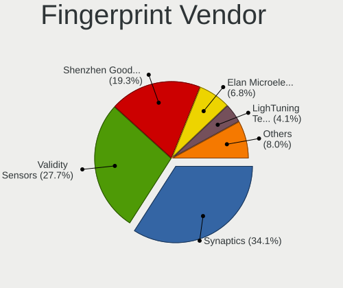

| Vendor                             | Computers | Percent |
|------------------------------------|-----------|---------|
| Synaptics                          | 398       | 34.08%  |
| Validity Sensors                   | 323       | 27.65%  |
| Shenzhen Goodix Technology         | 226       | 19.35%  |
| Elan Microelectronics              | 80        | 6.85%   |
| LighTuning Technology              | 48        | 4.11%   |
| Upek                               | 33        | 2.83%   |
| AuthenTec                          | 24        | 2.05%   |
| STMicroelectronics                 | 8         | 0.68%   |
| Focal-systems.Corp                 | 7         | 0.6%    |
| Samsung Electronics                | 6         | 0.51%   |
| Realtek USB2.0 Finger Print Bridge | 5         | 0.43%   |
| HOLTEK                             | 4         | 0.34%   |
| DigitalPersona                     | 4         | 0.34%   |
| Futronic Technology                | 1         | 0.09%   |
| Dell                               | 1         | 0.09%   |

Fingerprint Model
-----------------

Fingerprint sensor models

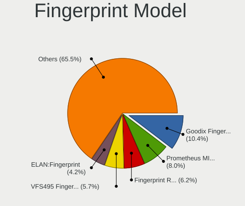

| Model                                                                      | Computers | Percent |
|----------------------------------------------------------------------------|-----------|---------|
| Shenzhen Goodix  Fingerprint Device                                        | 121       | 10.36%  |
| Synaptics Prometheus MIS Touch Fingerprint Reader                          | 94        | 8.05%   |
| Shenzhen Goodix Fingerprint Reader                                         | 72        | 6.16%   |
| Validity Sensors VFS495 Fingerprint Reader                                 | 67        | 5.74%   |
| Elan ELAN:Fingerprint                                                      | 49        | 4.2%    |
| Validity Sensors VFS 5011 fingerprint sensor                               | 48        | 4.11%   |
| Validity Sensors Synaptics WBDI                                            | 43        | 3.68%   |
| Synaptics Metallica MIS Touch Fingerprint Reader                           | 42        | 3.6%    |
| Synaptics WBDI                                                             | 37        | 3.17%   |
| Synaptics UWP WBDI                                                         | 36        | 3.08%   |
| Shenzhen Goodix FingerPrint                                                | 33        | 2.83%   |
| Synaptics Fingerprint reader [HP G6]                                       | 31        | 2.65%   |
| Upek Biometric Touchchip/Touchstrip Fingerprint Sensor                     | 29        | 2.48%   |
| Synaptics  WBDI                                                            | 29        | 2.48%   |
| Elan ELAN:ARM-M4                                                           | 27        | 2.31%   |
| LighTuning EgisTec Touch Fingerprint Sensor                                | 25        | 2.14%   |
| Validity Sensors VFS491                                                    | 23        | 1.97%   |
| Validity Sensors VFS5011 Fingerprint Reader                                | 20        | 1.71%   |
| Synaptics WBDI Fingerprint Reader USB 086                                  | 20        | 1.71%   |
| Validity Sensors VFS7500 Touch Fingerprint Sensor                          | 19        | 1.63%   |
| Synaptics UWP WBDI Device                                                  | 19        | 1.63%   |
| Synaptics  FS7604 Touch Fingerprint Sensor with PurePrint                  | 19        | 1.63%   |
| Synaptics Metallica MOH Touch Fingerprint Reader                           | 17        | 1.46%   |
| Validity Sensors VFS471 Fingerprint Reader                                 | 16        | 1.37%   |
| Validity Sensors VFS451 Fingerprint Reader                                 | 16        | 1.37%   |
| Validity Sensors Swipe Fingerprint Sensor                                  | 16        | 1.37%   |
| Validity Sensors Synaptics VFS7552 Touch Fingerprint Sensor with PurePrint | 15        | 1.28%   |
| Validity Sensors Fingerprint scanner                                       | 15        | 1.28%   |
| Synaptics Prometheus Fingerprint Reader                                    | 14        | 1.2%    |
| Synaptics FS7604 Touch Fingerprint Sensor with PurePrint                   | 14        | 1.2%    |
| LighTuning ES603 Swipe Fingerprint Sensor                                  | 13        | 1.11%   |
| STMicroelectronics Fingerprint Reader                                      | 8         | 0.68%   |
| AuthenTec Fingerprint Sensor                                               | 8         | 0.68%   |
| Validity Sensors Synaptics VFS7552 Touch Fingerprint Sensor                | 7         | 0.6%    |
| LighTuning Fingerprint Sensor                                              | 7         | 0.6%    |
| Focal-systems.Corp FT9201Fingerprint.                                      | 7         | 0.6%    |
| Validity Sensors VFS101 Fingerprint Reader                                 | 6         | 0.51%   |
| Synaptics WBDI Fingerprint Reader USB 102                                  | 6         | 0.51%   |
| Synaptics WBDI Device                                                      | 6         | 0.51%   |
| AuthenTec AES2810                                                          | 6         | 0.51%   |

Chipcard Vendor
---------------

Chipcard module vendors

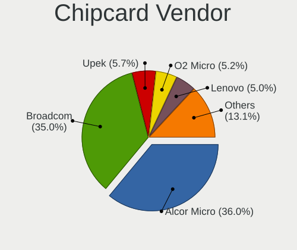

| Vendor                            | Computers | Percent |
|-----------------------------------|-----------|---------|
| Alcor Micro                       | 138       | 36.03%  |
| Broadcom                          | 134       | 34.99%  |
| Upek                              | 22        | 5.74%   |
| O2 Micro                          | 20        | 5.22%   |
| Lenovo                            | 19        | 4.96%   |
| Gemalto (was Gemplus)             | 12        | 3.13%   |
| Yubico.com                        | 10        | 2.61%   |
| Realtek Semiconductor             | 6         | 1.57%   |
| VASCO Data Security International | 4         | 1.04%   |
| Reiner SCT Kartensysteme          | 3         | 0.78%   |
| OmniKey                           | 3         | 0.78%   |
| Aladdin Knowledge Systems         | 2         | 0.52%   |
| SCM Microsystems                  | 1         | 0.26%   |
| Hewlett-Packard                   | 1         | 0.26%   |
| Giesecke & Devrient               | 1         | 0.26%   |
| Clay Logic                        | 1         | 0.26%   |
| Cherry                            | 1         | 0.26%   |
| C3PO                              | 1         | 0.26%   |
| Bit4id                            | 1         | 0.26%   |
| ASK-RFID                          | 1         | 0.26%   |
| Aktiv                             | 1         | 0.26%   |
| Advanced Card Systems             | 1         | 0.26%   |

Chipcard Model
--------------

Chipcard module models

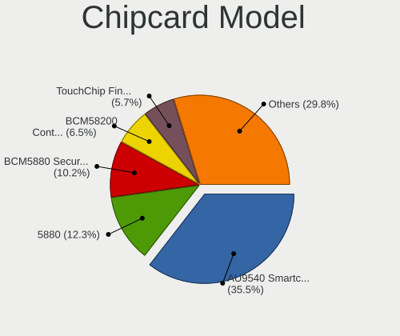

| Model                                                                        | Computers | Percent |
|------------------------------------------------------------------------------|-----------|---------|
| Alcor Micro AU9540 Smartcard Reader                                          | 136       | 35.51%  |
| Broadcom 5880                                                                | 47        | 12.27%  |
| Broadcom BCM5880 Secure Applications Processor                               | 39        | 10.18%  |
| Broadcom BCM58200 ControlVault 3 (FingerPrint sensor + Contacted SmartCard)  | 25        | 6.53%   |
| Upek TouchChip Fingerprint Coprocessor (WBF advanced mode)                   | 22        | 5.74%   |
| O2 Micro OZ776 CCID Smartcard Reader                                         | 19        | 4.96%   |
| Lenovo Integrated Smart Card Reader                                          | 19        | 4.96%   |
| Broadcom BCM5880 Secure Applications Processor with fingerprint swipe sensor | 16        | 4.18%   |
| Yubico.com Yubikey NEO(-N) OTP+CCID                                          | 7         | 1.83%   |
| Gemalto (was Gemplus) GemPC Twin SmartCard Reader                            | 7         | 1.83%   |
| Broadcom 58200                                                               | 7         | 1.83%   |
| Realtek Semiconductor Smart Card Reader Interface                            | 6         | 1.57%   |
| Yubico.com Yubikey 4/5 U2F+CCID                                              | 3         | 0.78%   |
| Reiner SCT Kartensysteme cyberJack RFID basis contactless smartcard reader   | 3         | 0.78%   |
| OmniKey 3x21 Smart Card Reader                                               | 3         | 0.78%   |
| Gemalto (was Gemplus) Compact Smart Card Reader Writer                       | 3         | 0.78%   |
| VASCO Data Security International Digipass 905 SmartCard Reader              | 2         | 0.52%   |
| Alcor Micro Watchdata W 1981                                                 | 2         | 0.52%   |
| Aladdin Knowledge Systems Token JC                                           | 2         | 0.52%   |
| VASCO Data Security International DIGIPASS 920                               | 1         | 0.26%   |
| VASCO Data Security International DIGIPASS 870                               | 1         | 0.26%   |
| SCM Microsystems SCR331 SmartCard Reader                                     | 1         | 0.26%   |
| O2 Micro Oz776 SmartCard Reader                                              | 1         | 0.26%   |
| Hewlett-Packard SC Keyboard - Apollo (Liteon)                                | 1         | 0.26%   |
| Giesecke & Devrient StarSign CUT S                                           | 1         | 0.26%   |
| Gemalto (was Gemplus) Prox SU USB PC Link Reader                             | 1         | 0.26%   |
| Gemalto (was Gemplus) GemPC Key SmartCard Reader                             | 1         | 0.26%   |
| Clay Logic Nitrokey Pro                                                      | 1         | 0.26%   |
| Cherry SmartCard Reader Keyboard KC 1000 SC                                  | 1         | 0.26%   |
| C3PO USB SMART CARD READER                                                   | 1         | 0.26%   |
| Bit4id miniLector EVO                                                        | 1         | 0.26%   |
| ASK-RFID GEN5XX CCID                                                         | 1         | 0.26%   |
| Aktiv Rutoken lite                                                           | 1         | 0.26%   |
| Advanced Card Systems ACR122U                                                | 1         | 0.26%   |

Unsupported
-----------

Unsupported Devices
-------------------

Total unsupported devices on board

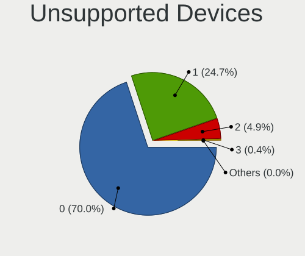

| Total | Computers | Percent |
|-------|-----------|---------|
| 0     | 6595      | 69.95%  |
| 1     | 2330      | 24.71%  |
| 2     | 461       | 4.89%   |
| 3     | 36        | 0.38%   |
| 4     | 5         | 0.05%   |
| 5     | 1         | 0.01%   |

Unsupported Device Types
------------------------

Types of unsupported devices

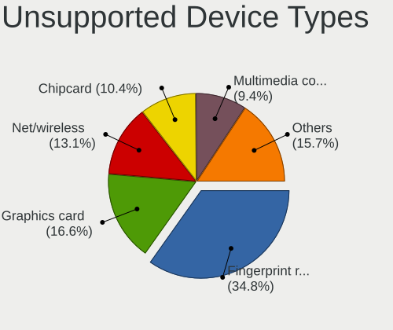

| Type                     | Computers | Percent |
|--------------------------|-----------|---------|
| Fingerprint reader       | 1146      | 34.82%  |
| Graphics card            | 545       | 16.56%  |
| Net/wireless             | 431       | 13.1%   |
| Chipcard                 | 342       | 10.39%  |
| Multimedia controller    | 309       | 9.39%   |
| Camera                   | 113       | 3.43%   |
| Net/ethernet             | 80        | 2.43%   |
| Unassigned class         | 74        | 2.25%   |
| Bluetooth                | 61        | 1.85%   |
| Communication controller | 44        | 1.34%   |
| Sound                    | 35        | 1.06%   |
| Card reader              | 26        | 0.79%   |
| Storage                  | 24        | 0.73%   |
| Network                  | 20        | 0.61%   |
| Dvb card                 | 17        | 0.52%   |
| Storage/raid             | 9         | 0.27%   |
| Modem                    | 5         | 0.15%   |
| Storage/nvme             | 3         | 0.09%   |
| Video                    | 2         | 0.06%   |
| Tv card                  | 2         | 0.06%   |
| Storage/ide              | 2         | 0.06%   |
| Storage/ata              | 1         | 0.03%   |

