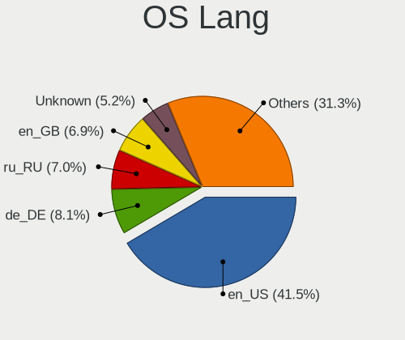
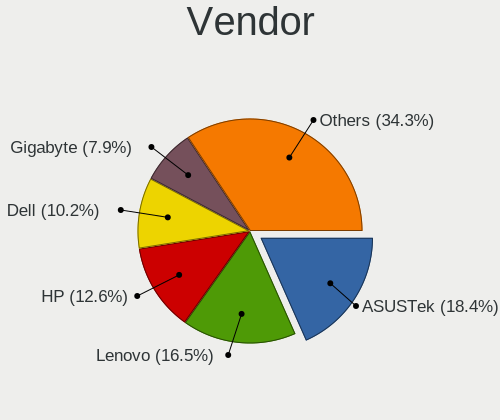
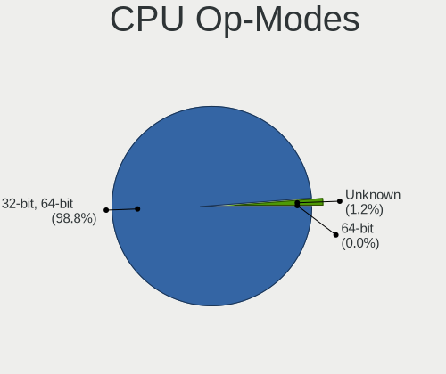
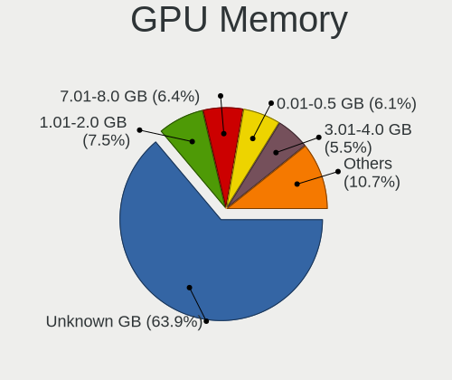
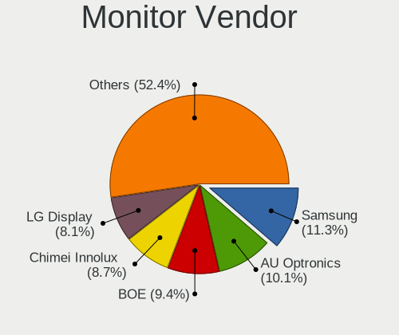

Manjaro - Tested Hardware & Statistics
--------------------------------------

A project to collect tested hardware configurations for Manjaro.

Anyone can contribute to this report by the [hw-probe](https://github.com/linuxhw/hw-probe) tool:

    sudo -E hw-probe -all -upload

Please contribute! Especially if your hardware is rare.

This is a report for all computer types. See also reports for [desktops](/Dist/Manjaro/Desktop/README.md) and [notebooks](/Dist/Manjaro/Notebook/README.md).

Contents
--------

* [ Test Cases ](#test-cases)

* [ System ](#system)
  - [ OS                       ](#os)
  - [ OS Family                ](#os-family)
  - [ Kernel                   ](#kernel)
  - [ Kernel Family            ](#kernel-family)
  - [ Kernel Major Ver.        ](#kernel-major-ver)
  - [ Arch                     ](#arch)
  - [ DE                       ](#de)
  - [ Display Server           ](#display-server)
  - [ Display Manager          ](#display-manager)
  - [ OS Lang                  ](#os-lang)
  - [ Boot Mode                ](#boot-mode)
  - [ Filesystem               ](#filesystem)
  - [ Part. scheme             ](#part-scheme)
  - [ Dual Boot with Linux/BSD ](#dual-boot-with-linuxbsd)
  - [ Dual Boot (Win)          ](#dual-boot-win)

* [ Board ](#board)
  - [ Vendor                   ](#vendor)
  - [ Model                    ](#model)
  - [ Model Family             ](#model-family)
  - [ MFG Year                 ](#mfg-year)
  - [ Form Factor              ](#form-factor)
  - [ Secure Boot              ](#secure-boot)
  - [ Coreboot                 ](#coreboot)
  - [ RAM Size                 ](#ram-size)
  - [ RAM Used                 ](#ram-used)
  - [ Total Drives             ](#total-drives)
  - [ Has CD-ROM               ](#has-cd-rom)
  - [ Has Ethernet             ](#has-ethernet)
  - [ Has WiFi                 ](#has-wifi)
  - [ Has Bluetooth            ](#has-bluetooth)

* [ Location ](#location)
  - [ Country                  ](#country)
  - [ City                     ](#city)

* [ Drives ](#drives)
  - [ Drive Vendor             ](#drive-vendor)
  - [ Drive Model              ](#drive-model)
  - [ HDD Vendor               ](#hdd-vendor)
  - [ SSD Vendor               ](#ssd-vendor)
  - [ Drive Kind               ](#drive-kind)
  - [ Drive Connector          ](#drive-connector)
  - [ Drive Size               ](#drive-size)
  - [ Space Total              ](#space-total)
  - [ Space Used               ](#space-used)
  - [ Malfunc. Drives          ](#malfunc-drives)
  - [ Malfunc. Drive Vendor    ](#malfunc-drive-vendor)
  - [ Malfunc. HDD Vendor      ](#malfunc-hdd-vendor)
  - [ Malfunc. Drive Kind      ](#malfunc-drive-kind)
  - [ Failed Drives            ](#failed-drives)
  - [ Failed Drive Vendor      ](#failed-drive-vendor)
  - [ Drive Status             ](#drive-status)

* [ Storage controller ](#storage-controller)
  - [ Storage Vendor           ](#storage-vendor)
  - [ Storage Model            ](#storage-model)
  - [ Storage Kind             ](#storage-kind)

* [ Processor ](#processor)
  - [ CPU Vendor               ](#cpu-vendor)
  - [ CPU Model                ](#cpu-model)
  - [ CPU Model Family         ](#cpu-model-family)
  - [ CPU Cores                ](#cpu-cores)
  - [ CPU Sockets              ](#cpu-sockets)
  - [ CPU Threads              ](#cpu-threads)
  - [ CPU Op-Modes             ](#cpu-op-modes)
  - [ CPU Microcode            ](#cpu-microcode)
  - [ CPU Microarch            ](#cpu-microarch)

* [ Graphics ](#graphics)
  - [ GPU Vendor               ](#gpu-vendor)
  - [ GPU Model                ](#gpu-model)
  - [ GPU Combo                ](#gpu-combo)
  - [ GPU Driver               ](#gpu-driver)
  - [ GPU Memory               ](#gpu-memory)

* [ Monitor ](#monitor)
  - [ Monitor Vendor           ](#monitor-vendor)
  - [ Monitor Model            ](#monitor-model)
  - [ Monitor Resolution       ](#monitor-resolution)
  - [ Monitor Diagonal         ](#monitor-diagonal)
  - [ Monitor Width            ](#monitor-width)
  - [ Aspect Ratio             ](#aspect-ratio)
  - [ Monitor Area             ](#monitor-area)
  - [ Pixel Density            ](#pixel-density)
  - [ Multiple Monitors        ](#multiple-monitors)

* [ Network ](#network)
  - [ Net Controller Vendor    ](#net-controller-vendor)
  - [ Net Controller Model     ](#net-controller-model)
  - [ Wireless Vendor          ](#wireless-vendor)
  - [ Wireless Model           ](#wireless-model)
  - [ Ethernet Vendor          ](#ethernet-vendor)
  - [ Ethernet Model           ](#ethernet-model)
  - [ Net Controller Kind      ](#net-controller-kind)
  - [ Used Controller          ](#used-controller)
  - [ NICs                     ](#nics)
  - [ IPv6                     ](#ipv6)

* [ Bluetooth ](#bluetooth)
  - [ Bluetooth Vendor         ](#bluetooth-vendor)
  - [ Bluetooth Model          ](#bluetooth-model)

* [ Sound ](#sound)
  - [ Sound Vendor             ](#sound-vendor)
  - [ Sound Model              ](#sound-model)

* [ Memory ](#memory)
  - [ Memory Vendor            ](#memory-vendor)
  - [ Memory Model             ](#memory-model)
  - [ Memory Kind              ](#memory-kind)
  - [ Memory Form Factor       ](#memory-form-factor)
  - [ Memory Size              ](#memory-size)
  - [ Memory Speed             ](#memory-speed)

* [ Printers & scanners ](#printers--scanners)
  - [ Printer Vendor           ](#printer-vendor)
  - [ Printer Model            ](#printer-model)
  - [ Scanner Vendor           ](#scanner-vendor)
  - [ Scanner Model            ](#scanner-model)

* [ Camera ](#camera)
  - [ Camera Vendor            ](#camera-vendor)
  - [ Camera Model             ](#camera-model)

* [ Security ](#security)
  - [ Fingerprint Vendor       ](#fingerprint-vendor)
  - [ Fingerprint Model        ](#fingerprint-model)
  - [ Chipcard Vendor          ](#chipcard-vendor)
  - [ Chipcard Model           ](#chipcard-model)

* [ Unsupported ](#unsupported)
  - [ Unsupported Devices      ](#unsupported-devices)
  - [ Unsupported Device Types ](#unsupported-device-types)

Test Cases
----------

Total: 10376

| Vendor        | Model                       | Form-Factor | Probe                                                      | Date         |
|---------------|-----------------------------|-------------|------------------------------------------------------------|--------------|
| ASUSTek       | ASUS TUF Gaming A17 FA70... | Notebook    | [1d5206dc94](https://linux-hardware.org/?probe=1d5206dc94) | Aug 12, 2023 |
| Gigabyte      | B550 GAMING X V2            | Desktop     | [1f4aa5bf97](https://linux-hardware.org/?probe=1f4aa5bf97) | Aug 12, 2023 |
| Lenovo        | Yoga 7 14ITL5 82BH          | Convertible | [4fe6eb4d59](https://linux-hardware.org/?probe=4fe6eb4d59) | Aug 12, 2023 |
| Lenovo        | Legion 5 15ACH6 82JW        | Notebook    | [79cc445925](https://linux-hardware.org/?probe=79cc445925) | Aug 12, 2023 |
| Lenovo        | Legion 5 15ACH6 82JW        | Notebook    | [b9d1b6d44a](https://linux-hardware.org/?probe=b9d1b6d44a) | Aug 12, 2023 |
| HP            | Laptop 14-dq1xxx            | Notebook    | [6f5a32d65f](https://linux-hardware.org/?probe=6f5a32d65f) | Aug 11, 2023 |
| Gigabyte      | M720-US3                    | Desktop     | [222bc02e4f](https://linux-hardware.org/?probe=222bc02e4f) | Aug 11, 2023 |
| Acer          | TMP255-M                    | Notebook    | [0b1adaea4e](https://linux-hardware.org/?probe=0b1adaea4e) | Aug 11, 2023 |
| Lenovo        | G40-45 80E1                 | Notebook    | [49a3480efb](https://linux-hardware.org/?probe=49a3480efb) | Aug 11, 2023 |
| HP            | 83E8                        | Desktop     | [a782638343](https://linux-hardware.org/?probe=a782638343) | Aug 11, 2023 |
| Gigabyte      | X570S AERO G                | Desktop     | [22916d4c12](https://linux-hardware.org/?probe=22916d4c12) | Aug 10, 2023 |
| HP            | 872E                        | Mini pc     | [0318907909](https://linux-hardware.org/?probe=0318907909) | Aug 10, 2023 |
| MSI           | MPG X570 GAMING PRO CARB... | Desktop     | [0521e62bf9](https://linux-hardware.org/?probe=0521e62bf9) | Aug 10, 2023 |
| MSI           | MPG X570 GAMING PRO CARB... | Desktop     | [198fcb1fc2](https://linux-hardware.org/?probe=198fcb1fc2) | Aug 10, 2023 |
| Positivo      | Presley 3                   | Notebook    | [16ddbd1a75](https://linux-hardware.org/?probe=16ddbd1a75) | Aug 10, 2023 |
| MSI           | X370 GAMING M7 ACK          | Desktop     | [00bb870b78](https://linux-hardware.org/?probe=00bb870b78) | Aug 09, 2023 |
| ASUSTek       | TUF Gaming X570-PLUS        | Desktop     | [4a7cc2835f](https://linux-hardware.org/?probe=4a7cc2835f) | Aug 09, 2023 |
| MSI           | PRO B660M-A WIFI DDR4       | Desktop     | [f50b51555f](https://linux-hardware.org/?probe=f50b51555f) | Aug 09, 2023 |
| Positivo      | Presley 3                   | Notebook    | [9edde2ea30](https://linux-hardware.org/?probe=9edde2ea30) | Aug 09, 2023 |
| ASUSTek       | M5A97 PLUS                  | Desktop     | [0c755e3349](https://linux-hardware.org/?probe=0c755e3349) | Aug 09, 2023 |
| Chuwi         | GemiBook Pro                | Notebook    | [3702186068](https://linux-hardware.org/?probe=3702186068) | Aug 08, 2023 |
| Lenovo        | ThinkPad T440 20B7S4NV07    | Notebook    | [af7992a11e](https://linux-hardware.org/?probe=af7992a11e) | Aug 08, 2023 |
| ARDOR GAMI... | V15x_V17xPNKPNJPNH          | Notebook    | [77f61b77f5](https://linux-hardware.org/?probe=77f61b77f5) | Aug 08, 2023 |
| Gigabyte      | B550M DS3H                  | Desktop     | [7889f62638](https://linux-hardware.org/?probe=7889f62638) | Aug 08, 2023 |
| Lenovo        | ThinkPad X230 2324BV7       | Notebook    | [e1f092d38b](https://linux-hardware.org/?probe=e1f092d38b) | Aug 08, 2023 |
| ARDOR GAMI... | V15x_V17xPNKPNJPNH          | Notebook    | [fa4f74161f](https://linux-hardware.org/?probe=fa4f74161f) | Aug 08, 2023 |
| Dell          | Inspiron 7306 2n1           | Convertible | [d2e707746f](https://linux-hardware.org/?probe=d2e707746f) | Aug 08, 2023 |
| ASUSTek       | N550LF                      | Notebook    | [57f7da9570](https://linux-hardware.org/?probe=57f7da9570) | Aug 08, 2023 |
| MSI           | MAG B550 TOMAHAWK           | Desktop     | [121b892fa8](https://linux-hardware.org/?probe=121b892fa8) | Aug 08, 2023 |
| MSI           | B550-A PRO                  | Desktop     | [61c59e48d2](https://linux-hardware.org/?probe=61c59e48d2) | Aug 08, 2023 |
| Jumper        | QCYL-200                    | Notebook    | [24da6190dc](https://linux-hardware.org/?probe=24da6190dc) | Aug 08, 2023 |
| HP            | Victus by Laptop 16-e0xx... | Notebook    | [b73a01acaf](https://linux-hardware.org/?probe=b73a01acaf) | Aug 07, 2023 |
| AZW           | U59                         | Desktop     | [d7b7b7641b](https://linux-hardware.org/?probe=d7b7b7641b) | Aug 07, 2023 |
| Dell          | Venue 11 Pro 7130 vPro      | Notebook    | [9094c29548](https://linux-hardware.org/?probe=9094c29548) | Aug 07, 2023 |
| Dell          | Vostro 3480                 | Notebook    | [78fbe42595](https://linux-hardware.org/?probe=78fbe42595) | Aug 07, 2023 |
| Acer          | Aspire E5-553G              | Notebook    | [f7845429c8](https://linux-hardware.org/?probe=f7845429c8) | Aug 07, 2023 |
| Dell          | Latitude 5480               | Notebook    | [f3f7a29ca0](https://linux-hardware.org/?probe=f3f7a29ca0) | Aug 07, 2023 |
| Dell          | Inspiron 15 3525            | Notebook    | [36a20bb009](https://linux-hardware.org/?probe=36a20bb009) | Aug 07, 2023 |
| HUAWEI        | KPRC-WX0                    | Notebook    | [f84c568d4b](https://linux-hardware.org/?probe=f84c568d4b) | Aug 07, 2023 |
| Lenovo        | IdeaPad Gaming 3 15ACH6 ... | Notebook    | [f2d72fe710](https://linux-hardware.org/?probe=f2d72fe710) | Aug 07, 2023 |
| Gigabyte      | F2A68HM-H                   | Desktop     | [4323af2ade](https://linux-hardware.org/?probe=4323af2ade) | Aug 07, 2023 |
| Acer          | Aspire A514-54              | Notebook    | [e9dfd6bbb6](https://linux-hardware.org/?probe=e9dfd6bbb6) | Aug 06, 2023 |
| Acer          | Aspire A514-54              | Notebook    | [0a7dc12f31](https://linux-hardware.org/?probe=0a7dc12f31) | Aug 06, 2023 |
| HP            | 250 G6 Notebook PC          | Notebook    | [c130dece41](https://linux-hardware.org/?probe=c130dece41) | Aug 06, 2023 |
| MSI           | Bravo 15 C7VE               | Notebook    | [a58ca66b2f](https://linux-hardware.org/?probe=a58ca66b2f) | Aug 06, 2023 |
| Dell          | XPS 15 7590                 | Notebook    | [6a53759849](https://linux-hardware.org/?probe=6a53759849) | Aug 06, 2023 |
| MSI           | Bravo 15 C7VE               | Notebook    | [52bf9ffa35](https://linux-hardware.org/?probe=52bf9ffa35) | Aug 06, 2023 |
| ASUSTek       | ROG STRIX B550-A GAMING     | Desktop     | [164e109040](https://linux-hardware.org/?probe=164e109040) | Aug 06, 2023 |
| Gigabyte      | B450 AORUS ELITE            | Desktop     | [230032816b](https://linux-hardware.org/?probe=230032816b) | Aug 06, 2023 |
| Gigabyte      | Z370 HD3-CF                 | Desktop     | [97505d521e](https://linux-hardware.org/?probe=97505d521e) | Aug 06, 2023 |
| Gigabyte      | X570 GAMING X               | Desktop     | [34dc1bc754](https://linux-hardware.org/?probe=34dc1bc754) | Aug 06, 2023 |
| Acer          | Aspire A317-53              | Notebook    | [5bb0feab0c](https://linux-hardware.org/?probe=5bb0feab0c) | Aug 06, 2023 |
| Lenovo        | B330-15IKBR 81M1            | Notebook    | [f03fa524d7](https://linux-hardware.org/?probe=f03fa524d7) | Aug 05, 2023 |
| Gigabyte      | X470 AORUS ULTRA GAMING-... | Desktop     | [66d6565a06](https://linux-hardware.org/?probe=66d6565a06) | Aug 05, 2023 |
| Gigabyte      | X470 AORUS ULTRA GAMING-... | Desktop     | [70aa79986f](https://linux-hardware.org/?probe=70aa79986f) | Aug 05, 2023 |
| Lenovo        | IdeaPad 320-17IKB 80XM      | Notebook    | [5e28b5b07a](https://linux-hardware.org/?probe=5e28b5b07a) | Aug 04, 2023 |
| Lenovo        | IdeaPad 3 15IGL05 81WQ      | Notebook    | [6fd7ffb05b](https://linux-hardware.org/?probe=6fd7ffb05b) | Aug 04, 2023 |
| SANTECH       | NL5xNU                      | Notebook    | [68d1f62251](https://linux-hardware.org/?probe=68d1f62251) | Aug 04, 2023 |
| HP            | 8055                        | Desktop     | [21c8e1fdc2](https://linux-hardware.org/?probe=21c8e1fdc2) | Aug 03, 2023 |
| ASRock        | B650M PG Riptide            | Desktop     | [2e309e76d7](https://linux-hardware.org/?probe=2e309e76d7) | Aug 03, 2023 |
| HP            | 2215                        | Desktop     | [f0589325fc](https://linux-hardware.org/?probe=f0589325fc) | Aug 03, 2023 |
| Schenker      | VISION 15 (SVS15E21)        | Notebook    | [0f5b976e39](https://linux-hardware.org/?probe=0f5b976e39) | Aug 02, 2023 |
| Unknown       | Unknown                     | Desktop     | [92f3b39535](https://linux-hardware.org/?probe=92f3b39535) | Aug 02, 2023 |
| MSI           | X570-A PRO                  | Desktop     | [1acfa69d70](https://linux-hardware.org/?probe=1acfa69d70) | Aug 02, 2023 |
| Dell          | Inspiron 5566               | Notebook    | [c4e404738e](https://linux-hardware.org/?probe=c4e404738e) | Aug 01, 2023 |
| Apple         | MacBookPro8,1               | Notebook    | [56e2fa207e](https://linux-hardware.org/?probe=56e2fa207e) | Aug 01, 2023 |
| Lenovo        | B330-15IKBR 81M1            | Notebook    | [1f69ed5c1e](https://linux-hardware.org/?probe=1f69ed5c1e) | Aug 01, 2023 |
| TUXEDO        | N7x0WU                      | Notebook    | [05c525a9a7](https://linux-hardware.org/?probe=05c525a9a7) | Jul 31, 2023 |
| HP            | ProBook 4740s               | Notebook    | [d0aae87145](https://linux-hardware.org/?probe=d0aae87145) | Jul 31, 2023 |
| ASUSTek       | P8Z77-V                     | Desktop     | [65dcccd422](https://linux-hardware.org/?probe=65dcccd422) | Jul 30, 2023 |
| HP            | ProBook 4740s               | Notebook    | [985ee4b495](https://linux-hardware.org/?probe=985ee4b495) | Jul 30, 2023 |
| MSI           | PRO X670-P WIFI             | Desktop     | [19b97459c1](https://linux-hardware.org/?probe=19b97459c1) | Jul 30, 2023 |
| Lenovo        | IdeaPad 320-17IKB 80XM      | Notebook    | [1fe8eab1c6](https://linux-hardware.org/?probe=1fe8eab1c6) | Jul 30, 2023 |
| ASUSTek       | TP410UA                     | Convertible | [5319374e1d](https://linux-hardware.org/?probe=5319374e1d) | Jul 30, 2023 |
| Lenovo        | IdeaPadFlex 5 14ALC7 82R... | Convertible | [8672df49e2](https://linux-hardware.org/?probe=8672df49e2) | Jul 30, 2023 |
| ASUSTek       | UX461UN                     | Convertible | [8f48f3562c](https://linux-hardware.org/?probe=8f48f3562c) | Jul 30, 2023 |
| HP            | EliteBook 840 G5            | Notebook    | [c8391bd952](https://linux-hardware.org/?probe=c8391bd952) | Jul 29, 2023 |
| ASUSTek       | ROG STRIX Z690-E GAMING ... | Desktop     | [c8116c748a](https://linux-hardware.org/?probe=c8116c748a) | Jul 29, 2023 |
| HP            | Laptop 17-cn0xxx            | Notebook    | [d23aa8f750](https://linux-hardware.org/?probe=d23aa8f750) | Jul 29, 2023 |
| Dell          | XPS 17 9720                 | Notebook    | [1006fe2c7b](https://linux-hardware.org/?probe=1006fe2c7b) | Jul 29, 2023 |
| Dell          | Inspiron N4050              | Notebook    | [701402e2a7](https://linux-hardware.org/?probe=701402e2a7) | Jul 29, 2023 |
| Dell          | XPS 15 9500                 | Notebook    | [151b7d8d31](https://linux-hardware.org/?probe=151b7d8d31) | Jul 29, 2023 |
| Lenovo        | ThinkPad T420 4180C31       | Notebook    | [7fafc1656d](https://linux-hardware.org/?probe=7fafc1656d) | Jul 28, 2023 |
| Lenovo        | ThinkPad E575 20H8S02W00    | Notebook    | [afde3ea804](https://linux-hardware.org/?probe=afde3ea804) | Jul 28, 2023 |
| Dell          | 0PU052                      | Desktop     | [f51bdc3bf5](https://linux-hardware.org/?probe=f51bdc3bf5) | Jul 28, 2023 |
| ASUSTek       | ROG STRIX B450-F GAMING ... | Desktop     | [06731541dd](https://linux-hardware.org/?probe=06731541dd) | Jul 28, 2023 |
| HP            | EliteBook 2540p             | Notebook    | [cedff6ca6f](https://linux-hardware.org/?probe=cedff6ca6f) | Jul 28, 2023 |
| Lenovo        | IdeaPad S145-14AST 81ST     | Notebook    | [c51105da6a](https://linux-hardware.org/?probe=c51105da6a) | Jul 28, 2023 |
| Valve         | Jupiter                     | Notebook    | [b32778a4bd](https://linux-hardware.org/?probe=b32778a4bd) | Jul 28, 2023 |
| ASUSTek       | PRIME X570-P                | Desktop     | [fd41467554](https://linux-hardware.org/?probe=fd41467554) | Jul 28, 2023 |
| Google        | Blooglet                    | Notebook    | [d8c14e29b6](https://linux-hardware.org/?probe=d8c14e29b6) | Jul 27, 2023 |
| ASUSTek       | P8Z77-V                     | Desktop     | [e550626a11](https://linux-hardware.org/?probe=e550626a11) | Jul 27, 2023 |
| Gigabyte      | B360M HD3                   | Desktop     | [900f299e10](https://linux-hardware.org/?probe=900f299e10) | Jul 26, 2023 |
| Acer          | TMP255-M                    | Notebook    | [25d376a674](https://linux-hardware.org/?probe=25d376a674) | Jul 26, 2023 |
| ASRock        | X570 Pro4                   | Desktop     | [96dcaad094](https://linux-hardware.org/?probe=96dcaad094) | Jul 26, 2023 |
| Dell          | Latitude E5430 non-vPro     | Notebook    | [b5b201f80a](https://linux-hardware.org/?probe=b5b201f80a) | Jul 26, 2023 |
| Lenovo        | IdeaPad 320-17IKB 80XM      | Notebook    | [784b86f367](https://linux-hardware.org/?probe=784b86f367) | Jul 25, 2023 |
| MSI           | Prestige 14Evo A12M         | Notebook    | [4872d1fdf6](https://linux-hardware.org/?probe=4872d1fdf6) | Jul 25, 2023 |
| Lenovo        | IdeaPad 320-17IKB 80XM      | Notebook    | [9acc2dda36](https://linux-hardware.org/?probe=9acc2dda36) | Jul 25, 2023 |
| Lenovo        | ThinkPad L470 20J5S01S00    | Notebook    | [346055ca33](https://linux-hardware.org/?probe=346055ca33) | Jul 25, 2023 |
| ASUSTek       | M5A97 LE R2.0               | Desktop     | [cfdb26e14f](https://linux-hardware.org/?probe=cfdb26e14f) | Jul 25, 2023 |
| ASUSTek       | VivoBook_ASUSLaptop X740... | Notebook    | [5262229deb](https://linux-hardware.org/?probe=5262229deb) | Jul 25, 2023 |
| MSI           | ZH77A-G41                   | Desktop     | [8528da5360](https://linux-hardware.org/?probe=8528da5360) | Jul 24, 2023 |
| Dell          | Latitude 9330               | Convertible | [715c703b85](https://linux-hardware.org/?probe=715c703b85) | Jul 24, 2023 |
| Acer          | TMP255-M                    | Notebook    | [c4bfc82a98](https://linux-hardware.org/?probe=c4bfc82a98) | Jul 24, 2023 |
| Acer          | TMP255-M                    | Notebook    | [7a57ee89af](https://linux-hardware.org/?probe=7a57ee89af) | Jul 24, 2023 |
| MSI           | PRO Z690-A WIFI             | Desktop     | [8f3dc1cb65](https://linux-hardware.org/?probe=8f3dc1cb65) | Jul 24, 2023 |
| ASUSTek       | P8Z77-V                     | Desktop     | [a8f7397fcf](https://linux-hardware.org/?probe=a8f7397fcf) | Jul 23, 2023 |
| ASUSTek       | VivoBook_ASUSLaptop K650... | Notebook    | [7a6a20b8ed](https://linux-hardware.org/?probe=7a6a20b8ed) | Jul 23, 2023 |
| Medion        | E4251 MD61435               | Notebook    | [4cd0b97344](https://linux-hardware.org/?probe=4cd0b97344) | Jul 23, 2023 |
| ASUSTek       | TUF Gaming B550-PLUS WIF... | Desktop     | [6094ce5501](https://linux-hardware.org/?probe=6094ce5501) | Jul 23, 2023 |
| Gigabyte      | X570 GAMING X               | Desktop     | [b0e064a98a](https://linux-hardware.org/?probe=b0e064a98a) | Jul 23, 2023 |
| Lenovo        | ThinkPad T14 Gen 3 21CGS... | Notebook    | [46218bae31](https://linux-hardware.org/?probe=46218bae31) | Jul 23, 2023 |
| MSI           | B450 TOMAHAWK               | Desktop     | [bda4392623](https://linux-hardware.org/?probe=bda4392623) | Jul 22, 2023 |
| Dell          | Vostro 3578                 | Notebook    | [bd32828bf5](https://linux-hardware.org/?probe=bd32828bf5) | Jul 22, 2023 |
| Lenovo        | ThinkPad T14 Gen 3 21CGS... | Notebook    | [7a3abd2e4d](https://linux-hardware.org/?probe=7a3abd2e4d) | Jul 22, 2023 |
| AMI           | Intel                       | Desktop     | [fe2999b2aa](https://linux-hardware.org/?probe=fe2999b2aa) | Jul 22, 2023 |
| Lenovo        | ThinkCentre M58e 7303AZ2    | Desktop     | [6285ba6300](https://linux-hardware.org/?probe=6285ba6300) | Jul 22, 2023 |
| ASUSTek       | PRIME A320M-K               | Desktop     | [42fc5ff144](https://linux-hardware.org/?probe=42fc5ff144) | Jul 21, 2023 |
| HP            | ZBook 15 G2                 | Notebook    | [1c164d4bc9](https://linux-hardware.org/?probe=1c164d4bc9) | Jul 21, 2023 |
| ASUSTek       | TUF Gaming X570-PLUS        | Desktop     | [65972dbe80](https://linux-hardware.org/?probe=65972dbe80) | Jul 21, 2023 |
| ASRock        | B450 Pro4                   | Desktop     | [6df8743ac8](https://linux-hardware.org/?probe=6df8743ac8) | Jul 21, 2023 |
| ASUSTek       | ROG STRIX B650E-I GAMING... | Desktop     | [2dbb6f2466](https://linux-hardware.org/?probe=2dbb6f2466) | Jul 20, 2023 |
| ASUSTek       | SABERTOOTH X99              | Desktop     | [3014bea7d8](https://linux-hardware.org/?probe=3014bea7d8) | Jul 20, 2023 |
| ASUSTek       | GL702VM                     | Notebook    | [f2a5e69f00](https://linux-hardware.org/?probe=f2a5e69f00) | Jul 20, 2023 |
| ASUSTek       | PRIME X570-PRO              | Desktop     | [765ac65603](https://linux-hardware.org/?probe=765ac65603) | Jul 20, 2023 |
| ASUSTek       | PRIME X570-P                | Desktop     | [e6bbbc4d41](https://linux-hardware.org/?probe=e6bbbc4d41) | Jul 20, 2023 |
| Gigabyte      | X570 AORUS ELITE            | Desktop     | [3d605ad77f](https://linux-hardware.org/?probe=3d605ad77f) | Jul 19, 2023 |
| Acer          | Predator PH315-53           | Notebook    | [3d0b2577a1](https://linux-hardware.org/?probe=3d0b2577a1) | Jul 18, 2023 |
| HONOR         | BBR-WAX9                    | Notebook    | [b098dc2f61](https://linux-hardware.org/?probe=b098dc2f61) | Jul 17, 2023 |
| Lenovo        | ThinkPad X1 Yoga Gen 5 2... | Convertible | [f62d1b0d14](https://linux-hardware.org/?probe=f62d1b0d14) | Jul 17, 2023 |
| ASRock        | B450 Gaming K4              | Desktop     | [ad2c07dc8e](https://linux-hardware.org/?probe=ad2c07dc8e) | Jul 17, 2023 |
| HP            | Laptop 17-cn0xxx            | Notebook    | [e2973a88aa](https://linux-hardware.org/?probe=e2973a88aa) | Jul 17, 2023 |
| HP            | Victus by Laptop 16-e0xx... | Notebook    | [b0c8aaef19](https://linux-hardware.org/?probe=b0c8aaef19) | Jul 16, 2023 |
| HP            | ZBook 15 G4                 | Notebook    | [ad6ff2b754](https://linux-hardware.org/?probe=ad6ff2b754) | Jul 16, 2023 |
| HP            | 83E0                        | Desktop     | [35abf30fff](https://linux-hardware.org/?probe=35abf30fff) | Jul 16, 2023 |
| ASUSTek       | X75A1                       | Notebook    | [745ef2a79f](https://linux-hardware.org/?probe=745ef2a79f) | Jul 16, 2023 |
| ASUSTek       | N53SM                       | Notebook    | [d06ca4b9c2](https://linux-hardware.org/?probe=d06ca4b9c2) | Jul 16, 2023 |
| ASUSTek       | N53SM                       | Notebook    | [103e7e5196](https://linux-hardware.org/?probe=103e7e5196) | Jul 16, 2023 |
| HP            | Victus by Laptop 16-e0xx... | Notebook    | [5e43c9d869](https://linux-hardware.org/?probe=5e43c9d869) | Jul 15, 2023 |
| Acer          | Aspire A515-41G             | Notebook    | [a9cb1108f6](https://linux-hardware.org/?probe=a9cb1108f6) | Jul 15, 2023 |
| Acer          | Aspire A515-43              | Notebook    | [6b86cc4c89](https://linux-hardware.org/?probe=6b86cc4c89) | Jul 15, 2023 |
| ASUSTek       | ROG STRIX B650E-I GAMING... | Desktop     | [a01053a59a](https://linux-hardware.org/?probe=a01053a59a) | Jul 15, 2023 |
| HP            | Laptop 17-cn0xxx            | Notebook    | [479e8276b4](https://linux-hardware.org/?probe=479e8276b4) | Jul 15, 2023 |
| Lenovo        | ThinkBook 15 G2 ITL 20VE    | Notebook    | [567736ec02](https://linux-hardware.org/?probe=567736ec02) | Jul 14, 2023 |
| Acer          | Nitro AN515-55              | Notebook    | [c9a21bf55e](https://linux-hardware.org/?probe=c9a21bf55e) | Jul 14, 2023 |
| HP            | OMEN Laptop 15-en0xxx       | Notebook    | [be15faa71b](https://linux-hardware.org/?probe=be15faa71b) | Jul 14, 2023 |
| ASUSTek       | PRIME Z690-P D4             | Desktop     | [b8b0b27baf](https://linux-hardware.org/?probe=b8b0b27baf) | Jul 14, 2023 |
| HP            | 86F3 00100                  | All in one  | [3ab66add04](https://linux-hardware.org/?probe=3ab66add04) | Jul 14, 2023 |
| HP            | 86F3 00100                  | All in one  | [95577f518a](https://linux-hardware.org/?probe=95577f518a) | Jul 14, 2023 |
| ASRock        | B760M PG Riptide            | Desktop     | [4092f45d41](https://linux-hardware.org/?probe=4092f45d41) | Jul 14, 2023 |
| ASRock        | B760M PG Riptide            | Desktop     | [1ee27caac4](https://linux-hardware.org/?probe=1ee27caac4) | Jul 14, 2023 |
| HP            | EliteBook 840 14 inch G9... | Notebook    | [4b9cba03ac](https://linux-hardware.org/?probe=4b9cba03ac) | Jul 13, 2023 |
| Acer          | Aspire E5-774G              | Notebook    | [7f06f99146](https://linux-hardware.org/?probe=7f06f99146) | Jul 13, 2023 |
| HP            | 3397                        | Desktop     | [d20efc761c](https://linux-hardware.org/?probe=d20efc761c) | Jul 13, 2023 |
| HP            | OMEN Laptop 15-en0xxx       | Notebook    | [e69bd50c8e](https://linux-hardware.org/?probe=e69bd50c8e) | Jul 13, 2023 |
| ASUSTek       | X456UV                      | Notebook    | [b0a9e3905f](https://linux-hardware.org/?probe=b0a9e3905f) | Jul 13, 2023 |
| Dell          | Latitude E6400              | Notebook    | [c8cf9bcf47](https://linux-hardware.org/?probe=c8cf9bcf47) | Jul 13, 2023 |
| ASRock        | B450 Gaming K4              | Desktop     | [1c43d30f02](https://linux-hardware.org/?probe=1c43d30f02) | Jul 13, 2023 |
| Dell          | 0T10XW A01                  | Desktop     | [51cf410b69](https://linux-hardware.org/?probe=51cf410b69) | Jul 12, 2023 |
| HP            | Compaq Presario CQ40        | Notebook    | [fbc602a7b6](https://linux-hardware.org/?probe=fbc602a7b6) | Jul 12, 2023 |
| MSI           | X370 GAMING M7 ACK          | Desktop     | [e62935623d](https://linux-hardware.org/?probe=e62935623d) | Jul 12, 2023 |
| Dell          | Inspiron 5737               | Notebook    | [fa1cb6ffb8](https://linux-hardware.org/?probe=fa1cb6ffb8) | Jul 12, 2023 |
| Lenovo        | ThinkPad L390 Yoga 20NUS... | Convertible | [a1334a7b0f](https://linux-hardware.org/?probe=a1334a7b0f) | Jul 11, 2023 |
| Lenovo        | ThinkPad L470 20J5S01S00    | Notebook    | [ef1f607a84](https://linux-hardware.org/?probe=ef1f607a84) | Jul 11, 2023 |
| MSI           | MAG X570 TOMAHAWK WIFI      | Desktop     | [611ea83c30](https://linux-hardware.org/?probe=611ea83c30) | Jul 11, 2023 |
| HP            | ProBook 470 G5              | Notebook    | [cb6e26bcb4](https://linux-hardware.org/?probe=cb6e26bcb4) | Jul 11, 2023 |
| HP            | ProBook 470 G5              | Notebook    | [37049406c3](https://linux-hardware.org/?probe=37049406c3) | Jul 11, 2023 |
| Gigabyte      | Z390 AORUS PRO-CF           | Desktop     | [8aadac9d4b](https://linux-hardware.org/?probe=8aadac9d4b) | Jul 11, 2023 |
| TUXEDO        | InfinityBook Pro Gen7 (M... | Notebook    | [8b9677cc2a](https://linux-hardware.org/?probe=8b9677cc2a) | Jul 10, 2023 |
| TUXEDO        | InfinityBook Pro Gen7 (M... | Notebook    | [acdd4ea952](https://linux-hardware.org/?probe=acdd4ea952) | Jul 10, 2023 |
| HP            | 255 15.6 inch G9 Noteboo... | Notebook    | [59b334f01a](https://linux-hardware.org/?probe=59b334f01a) | Jul 10, 2023 |
| Apple         | MacBookPro14,2              | Notebook    | [8f40997f5f](https://linux-hardware.org/?probe=8f40997f5f) | Jul 10, 2023 |
| Apple         | MacBookPro14,2              | Notebook    | [7d19e6a8f5](https://linux-hardware.org/?probe=7d19e6a8f5) | Jul 10, 2023 |
| Dell          | Latitude 3490               | Notebook    | [6fcb4ace67](https://linux-hardware.org/?probe=6fcb4ace67) | Jul 10, 2023 |
| ASUSTek       | SABERTOOTH X99              | Desktop     | [1473d3cd3b](https://linux-hardware.org/?probe=1473d3cd3b) | Jul 10, 2023 |
| Acer          | Nitro AN515-43              | Notebook    | [b463aaca78](https://linux-hardware.org/?probe=b463aaca78) | Jul 10, 2023 |
| ASUSTek       | P8Z77-V                     | Desktop     | [1e5cf5e071](https://linux-hardware.org/?probe=1e5cf5e071) | Jul 10, 2023 |
| Fujitsu       | LIFEBOOK LH532              | Notebook    | [3cad86057a](https://linux-hardware.org/?probe=3cad86057a) | Jul 09, 2023 |
| Gigabyte      | B450 I AORUS PRO WIFI-CF    | Desktop     | [2d5d457159](https://linux-hardware.org/?probe=2d5d457159) | Jul 09, 2023 |
| HUAWEI        | KLVL-WXX9                   | Notebook    | [e853f79dd4](https://linux-hardware.org/?probe=e853f79dd4) | Jul 09, 2023 |
| Lenovo        | ThinkPad X1 Yoga Gen 5 2... | Convertible | [9fd763e236](https://linux-hardware.org/?probe=9fd763e236) | Jul 09, 2023 |
| ASUSTek       | B75M-A                      | Desktop     | [9120c3aa90](https://linux-hardware.org/?probe=9120c3aa90) | Jul 09, 2023 |
| ASUSTek       | B75M-A                      | Desktop     | [b48f49fab3](https://linux-hardware.org/?probe=b48f49fab3) | Jul 09, 2023 |
| Gigabyte      | B650M AORUS ELITE AX        | Desktop     | [290c9aca96](https://linux-hardware.org/?probe=290c9aca96) | Jul 09, 2023 |
| Acer          | TravelMate P2510-G2-M       | Notebook    | [c96a405528](https://linux-hardware.org/?probe=c96a405528) | Jul 09, 2023 |
| Acer          | Aspire A515-56              | Notebook    | [9dee0fcab9](https://linux-hardware.org/?probe=9dee0fcab9) | Jul 09, 2023 |
| Fujitsu       | LIFEBOOK S752               | Notebook    | [a2bd9b682d](https://linux-hardware.org/?probe=a2bd9b682d) | Jul 08, 2023 |
| ASUSTek       | P5Q PRO TURBO               | Desktop     | [362fd95251](https://linux-hardware.org/?probe=362fd95251) | Jul 08, 2023 |
| Gigabyte      | AB350-Gaming 3-CF           | Desktop     | [e394b88e49](https://linux-hardware.org/?probe=e394b88e49) | Jul 08, 2023 |
| Lenovo        | ThinkPad X250 20CLS21F00    | Notebook    | [e87ea192ea](https://linux-hardware.org/?probe=e87ea192ea) | Jul 08, 2023 |
| ASUSTek       | UX550VE                     | Notebook    | [b782a00935](https://linux-hardware.org/?probe=b782a00935) | Jul 08, 2023 |
| Gigabyte      | B650 AORUS ELITE AX         | Desktop     | [2378ebea87](https://linux-hardware.org/?probe=2378ebea87) | Jul 07, 2023 |
| Lenovo        | ThinkPad P15v Gen 3 21EM... | Notebook    | [59782374c4](https://linux-hardware.org/?probe=59782374c4) | Jul 07, 2023 |
| Lenovo        | ThinkPad X250 20CLS21F00    | Notebook    | [4e47f48ca8](https://linux-hardware.org/?probe=4e47f48ca8) | Jul 07, 2023 |
| Framework     | Laptop                      | Notebook    | [ea4c4585d0](https://linux-hardware.org/?probe=ea4c4585d0) | Jul 06, 2023 |
| HP            | 255 G7 Notebook PC          | Notebook    | [23a6105e01](https://linux-hardware.org/?probe=23a6105e01) | Jul 06, 2023 |
| ASUSTek       | K53SV                       | Notebook    | [851a3a00cf](https://linux-hardware.org/?probe=851a3a00cf) | Jul 05, 2023 |
| Dell          | Latitude 3490               | Notebook    | [a730cef547](https://linux-hardware.org/?probe=a730cef547) | Jul 05, 2023 |
| Lenovo        | 3130 SDK0J40697 WIN 3305... | Mini pc     | [7de6676a0c](https://linux-hardware.org/?probe=7de6676a0c) | Jul 05, 2023 |
| MSI           | MPG X670E CARBON WIFI       | Desktop     | [b67973ece1](https://linux-hardware.org/?probe=b67973ece1) | Jul 04, 2023 |
| Lenovo        | Legion Y530-15ICH 81FV      | Notebook    | [f3828ea18b](https://linux-hardware.org/?probe=f3828ea18b) | Jul 04, 2023 |
| MSI           | FX603                       | Notebook    | [8b0664bd4e](https://linux-hardware.org/?probe=8b0664bd4e) | Jul 04, 2023 |
| Packard Be... | EasyNote MH36               | Notebook    | [87873c1e0e](https://linux-hardware.org/?probe=87873c1e0e) | Jul 03, 2023 |
| Lenovo        | Yoga S740-14IIL 81RS        | Notebook    | [cc0464c9a4](https://linux-hardware.org/?probe=cc0464c9a4) | Jul 03, 2023 |
| ASUSTek       | ROG STRIX B650E-I GAMING... | Desktop     | [7aaa5d2eec](https://linux-hardware.org/?probe=7aaa5d2eec) | Jul 03, 2023 |
| TUXEDO        | InfinityBook Pro 14 Gen6    | Notebook    | [6686fca24b](https://linux-hardware.org/?probe=6686fca24b) | Jul 03, 2023 |
| TUXEDO        | InfinityBook Pro Gen7 (M... | Notebook    | [ccb318cd32](https://linux-hardware.org/?probe=ccb318cd32) | Jul 03, 2023 |
| ASUSTek       | PRIME A320M-K               | Desktop     | [b66a2be1fe](https://linux-hardware.org/?probe=b66a2be1fe) | Jul 03, 2023 |
| HP            | EliteBook 8460p             | Notebook    | [40b92fc7ba](https://linux-hardware.org/?probe=40b92fc7ba) | Jul 02, 2023 |
| HP            | 8918                        | Desktop     | [da7b695c7b](https://linux-hardware.org/?probe=da7b695c7b) | Jul 02, 2023 |
| ASUSTek       | Crosshair V Formula         | Desktop     | [e0810c9450](https://linux-hardware.org/?probe=e0810c9450) | Jul 02, 2023 |
| Gigabyte      | P55M-UD2                    | Desktop     | [babec703df](https://linux-hardware.org/?probe=babec703df) | Jul 02, 2023 |
| ASUSTek       | ROG STRIX B450-F GAMING     | Desktop     | [277a9bb8e4](https://linux-hardware.org/?probe=277a9bb8e4) | Jul 02, 2023 |
| Dell          | Inspiron 5566               | Notebook    | [c0fa0d6c73](https://linux-hardware.org/?probe=c0fa0d6c73) | Jul 02, 2023 |
| Teclast       | F15Plus 2                   | Notebook    | [29b2c807e6](https://linux-hardware.org/?probe=29b2c807e6) | Jul 01, 2023 |
| MSI           | H61MA-E35                   | Desktop     | [a5b11bc53c](https://linux-hardware.org/?probe=a5b11bc53c) | Jul 01, 2023 |
| Fujitsu       | LIFEBOOK E752               | Notebook    | [f182eda3d3](https://linux-hardware.org/?probe=f182eda3d3) | Jul 01, 2023 |
| Teclast       | F15Plus 2                   | Notebook    | [4593b411f0](https://linux-hardware.org/?probe=4593b411f0) | Jun 30, 2023 |
| ASUSTek       | TUF Gaming Z690-PLUS D4     | Desktop     | [292b7f6f0f](https://linux-hardware.org/?probe=292b7f6f0f) | Jun 30, 2023 |
| ASUSTek       | VivoBook_ASUSLaptop X513... | Notebook    | [559c10480e](https://linux-hardware.org/?probe=559c10480e) | Jun 30, 2023 |
| MSI           | MPG X570 GAMING PRO CARB... | Desktop     | [661dc06ef7](https://linux-hardware.org/?probe=661dc06ef7) | Jun 30, 2023 |
| HUAWEI        | NBLB-WAX9N                  | Notebook    | [e555922bb2](https://linux-hardware.org/?probe=e555922bb2) | Jun 30, 2023 |
| Acer          | Aspire A517-52              | Notebook    | [954ac9a8e4](https://linux-hardware.org/?probe=954ac9a8e4) | Jun 30, 2023 |
| MSI           | MAG B550 TOMAHAWK           | Desktop     | [265cbaedcc](https://linux-hardware.org/?probe=265cbaedcc) | Jun 30, 2023 |
| HP            | 89B5 A                      | Desktop     | [f0330163de](https://linux-hardware.org/?probe=f0330163de) | Jun 30, 2023 |
| LG Electro... | 16Z90P-G.AA55H              | Notebook    | [9d40263129](https://linux-hardware.org/?probe=9d40263129) | Jun 30, 2023 |
| LG Electro... | 16Z90P-G.AA55H              | Notebook    | [4e47d108a0](https://linux-hardware.org/?probe=4e47d108a0) | Jun 29, 2023 |
| Lenovo        | Y520-15IKBN 80WK            | Notebook    | [d058f48980](https://linux-hardware.org/?probe=d058f48980) | Jun 29, 2023 |
| Timi          | Redmi Book Pro 15 2022      | Notebook    | [1c349accca](https://linux-hardware.org/?probe=1c349accca) | Jun 29, 2023 |
| Alienware     | 17 R4                       | Notebook    | [e7f3110f1f](https://linux-hardware.org/?probe=e7f3110f1f) | Jun 29, 2023 |
| Google        | Reef                        | Notebook    | [221e64e148](https://linux-hardware.org/?probe=221e64e148) | Jun 29, 2023 |
| ASUSTek       | ROG STRIX B450-F GAMING ... | Desktop     | [b94582735c](https://linux-hardware.org/?probe=b94582735c) | Jun 28, 2023 |
| Acer          | Aspire VN7-593G             | Notebook    | [2302cbfba7](https://linux-hardware.org/?probe=2302cbfba7) | Jun 28, 2023 |
| Chuwi         | GemiBook                    | Notebook    | [90f0de1460](https://linux-hardware.org/?probe=90f0de1460) | Jun 28, 2023 |
| Gigabyte      | X470 AORUS ULTRA GAMING-... | Desktop     | [81bbfe3459](https://linux-hardware.org/?probe=81bbfe3459) | Jun 28, 2023 |
| Gigabyte      | X470 AORUS ULTRA GAMING-... | Desktop     | [ebb41279ae](https://linux-hardware.org/?probe=ebb41279ae) | Jun 28, 2023 |
| Gigabyte      | X670 AORUS ELITE AX         | Desktop     | [32e4f74711](https://linux-hardware.org/?probe=32e4f74711) | Jun 28, 2023 |
| ASUSTek       | VivoBook_ASUS Laptop E51... | Notebook    | [2debd02f0c](https://linux-hardware.org/?probe=2debd02f0c) | Jun 28, 2023 |
| ASUSTek       | VivoBook_ASUS Laptop E51... | Notebook    | [3b775b8099](https://linux-hardware.org/?probe=3b775b8099) | Jun 28, 2023 |
| MSI           | B550M PRO-VDH WIFI          | Desktop     | [6f96789257](https://linux-hardware.org/?probe=6f96789257) | Jun 27, 2023 |
| MSI           | B550M PRO-VDH WIFI          | Desktop     | [f46408c9b6](https://linux-hardware.org/?probe=f46408c9b6) | Jun 27, 2023 |
| ASUSTek       | VivoBook_ASUSLaptop X415... | Notebook    | [0c87fda1f9](https://linux-hardware.org/?probe=0c87fda1f9) | Jun 27, 2023 |
| Acer          | Aspire A317-53              | Notebook    | [5e6365efcf](https://linux-hardware.org/?probe=5e6365efcf) | Jun 27, 2023 |
| ASRock        | Z270 Gaming K6              | Desktop     | [f94b4ddd1b](https://linux-hardware.org/?probe=f94b4ddd1b) | Jun 27, 2023 |
| ASRock        | H370M-ITX/ac                | Desktop     | [5e1d8d04f2](https://linux-hardware.org/?probe=5e1d8d04f2) | Jun 26, 2023 |
| Dell          | Inspiron 3442               | Notebook    | [6e179dbfb0](https://linux-hardware.org/?probe=6e179dbfb0) | Jun 26, 2023 |
| ASUSTek       | ROG Strix G713PI_G713PI     | Notebook    | [9dbf9f98a6](https://linux-hardware.org/?probe=9dbf9f98a6) | Jun 26, 2023 |
| ASUSTek       | VivoBook_ASUS Laptop E41... | Notebook    | [4518a77b73](https://linux-hardware.org/?probe=4518a77b73) | Jun 26, 2023 |
| Acer          | Nitro AN517-54              | Notebook    | [9af91d0ced](https://linux-hardware.org/?probe=9af91d0ced) | Jun 26, 2023 |
| HP            | 1493                        | Desktop     | [b22e0342bc](https://linux-hardware.org/?probe=b22e0342bc) | Jun 25, 2023 |
| AZW           | SER V1.0                    | Mini pc     | [4493e92d84](https://linux-hardware.org/?probe=4493e92d84) | Jun 25, 2023 |
| HP            | EliteBook 8740w             | Notebook    | [e460d017ec](https://linux-hardware.org/?probe=e460d017ec) | Jun 25, 2023 |
| Gigabyte      | B450M DS3H-CF               | Desktop     | [14bd8b577f](https://linux-hardware.org/?probe=14bd8b577f) | Jun 25, 2023 |
| MSI           | MPG X570 GAMING PLUS        | Desktop     | [bd418c39bf](https://linux-hardware.org/?probe=bd418c39bf) | Jun 25, 2023 |
| HP            | 8437                        | Desktop     | [477b6d5623](https://linux-hardware.org/?probe=477b6d5623) | Jun 24, 2023 |
| Lenovo        | IdeaPad Pro 5 16ARP8 83A... | Notebook    | [df9521a37d](https://linux-hardware.org/?probe=df9521a37d) | Jun 24, 2023 |
| Gigabyte      | B560M AORUS PRO AX          | Desktop     | [090549881a](https://linux-hardware.org/?probe=090549881a) | Jun 24, 2023 |
| ASUSTek       | PRIME B450M-A II            | Desktop     | [85221c654f](https://linux-hardware.org/?probe=85221c654f) | Jun 24, 2023 |
| ASUSTek       | VivoBook_ASUSLaptop X415... | Notebook    | [01a9e10a34](https://linux-hardware.org/?probe=01a9e10a34) | Jun 24, 2023 |
| ASUSTek       | TUF Gaming B650M-PLUS WI... | Desktop     | [74b9f1b367](https://linux-hardware.org/?probe=74b9f1b367) | Jun 24, 2023 |
| MSI           | Z170A GAMING M3             | Desktop     | [96c2d6503c](https://linux-hardware.org/?probe=96c2d6503c) | Jun 24, 2023 |
| MSI           | MPG X570 GAMING PLUS        | Desktop     | [0e23ab4ba9](https://linux-hardware.org/?probe=0e23ab4ba9) | Jun 24, 2023 |
| HP            | EliteBook 850 G1            | Notebook    | [3e08f1644a](https://linux-hardware.org/?probe=3e08f1644a) | Jun 24, 2023 |
| HP            | EliteBook 850 G1            | Notebook    | [574653afac](https://linux-hardware.org/?probe=574653afac) | Jun 24, 2023 |
| HP            | EliteBook 850 G1            | Notebook    | [fa6b09cc1d](https://linux-hardware.org/?probe=fa6b09cc1d) | Jun 23, 2023 |
| ASUSTek       | Z170M-PLUS                  | Desktop     | [a3a840a283](https://linux-hardware.org/?probe=a3a840a283) | Jun 23, 2023 |
| Dell          | XPS 13 9370                 | Notebook    | [7ba7b1dc58](https://linux-hardware.org/?probe=7ba7b1dc58) | Jun 22, 2023 |
| Gigabyte      | B650I AORUS ULTRA           | Desktop     | [e72c8358c4](https://linux-hardware.org/?probe=e72c8358c4) | Jun 22, 2023 |
| ASRock        | B760M PG Riptide            | Desktop     | [08974b3246](https://linux-hardware.org/?probe=08974b3246) | Jun 22, 2023 |
| Lenovo        | Legion Y740-15IRHg 81UH     | Notebook    | [38c278b214](https://linux-hardware.org/?probe=38c278b214) | Jun 22, 2023 |
| Lenovo        | Legion Y740-15IRHg 81UH     | Notebook    | [816c32de98](https://linux-hardware.org/?probe=816c32de98) | Jun 22, 2023 |
| Lenovo        | ThinkPad T440p 20AWS38H0... | Notebook    | [f1e506486c](https://linux-hardware.org/?probe=f1e506486c) | Jun 21, 2023 |
| ASRock        | B760M PG Riptide            | Desktop     | [a6a3ed2eae](https://linux-hardware.org/?probe=a6a3ed2eae) | Jun 21, 2023 |
| ASRock        | B450 Gaming K4              | Desktop     | [edf3326608](https://linux-hardware.org/?probe=edf3326608) | Jun 21, 2023 |
| Lenovo        | ThinkPad L470 20J5S01S00    | Notebook    | [5de086be7a](https://linux-hardware.org/?probe=5de086be7a) | Jun 21, 2023 |
| Intel         | NUC7i3BNB J22859-308        | Mini pc     | [3b9990b59d](https://linux-hardware.org/?probe=3b9990b59d) | Jun 21, 2023 |
| ASUSTek       | P8P67 PRO                   | Desktop     | [ba4e83abed](https://linux-hardware.org/?probe=ba4e83abed) | Jun 20, 2023 |
| ASRock        | Z590M-ITX/ax                | Desktop     | [5160dd29d0](https://linux-hardware.org/?probe=5160dd29d0) | Jun 20, 2023 |
| ASUSTek       | ROG STRIX B550-F GAMING     | Desktop     | [5a51d4431b](https://linux-hardware.org/?probe=5a51d4431b) | Jun 20, 2023 |
| Lenovo        | IdeaPad 330-17IKB 81DM      | Notebook    | [8e74890c4f](https://linux-hardware.org/?probe=8e74890c4f) | Jun 19, 2023 |
| Lenovo        | IdeaPad 330-17IKB 81DM      | Notebook    | [98f052ad58](https://linux-hardware.org/?probe=98f052ad58) | Jun 19, 2023 |
| Framework     | Laptop                      | Notebook    | [7d010a367e](https://linux-hardware.org/?probe=7d010a367e) | Jun 19, 2023 |
| MSI           | GT70 2OC/2OD                | Notebook    | [adee2af879](https://linux-hardware.org/?probe=adee2af879) | Jun 19, 2023 |
| MSI           | B450 TOMAHAWK MAX           | Desktop     | [bfe09e12f0](https://linux-hardware.org/?probe=bfe09e12f0) | Jun 18, 2023 |
| Dell          | Inspiron 5566               | Notebook    | [be5a148c53](https://linux-hardware.org/?probe=be5a148c53) | Jun 18, 2023 |
| Lenovo        | ThinkPad T480 20L6S7PE0G    | Notebook    | [591e97398c](https://linux-hardware.org/?probe=591e97398c) | Jun 18, 2023 |
| HP            | EliteBook 845 G7 Noteboo... | Notebook    | [c454cb2cf0](https://linux-hardware.org/?probe=c454cb2cf0) | Jun 18, 2023 |
| HP            | EliteBook 840 14 inch G9... | Notebook    | [0875b8b413](https://linux-hardware.org/?probe=0875b8b413) | Jun 18, 2023 |
| HP            | Laptop 15-dy1xxx            | Notebook    | [93e28671fa](https://linux-hardware.org/?probe=93e28671fa) | Jun 18, 2023 |
| Samsung       | 300E5K/300E5Q               | Notebook    | [a281272278](https://linux-hardware.org/?probe=a281272278) | Jun 17, 2023 |
| Lenovo        | ThinkPad T470 W10DG 20JN... | Notebook    | [97a4ed6110](https://linux-hardware.org/?probe=97a4ed6110) | Jun 17, 2023 |
| Positivo      | POS-EIQ87CY POSITIVO        | Desktop     | [b4cd8c843f](https://linux-hardware.org/?probe=b4cd8c843f) | Jun 17, 2023 |
| Dell          | Latitude 5491               | Notebook    | [0673ab5ff5](https://linux-hardware.org/?probe=0673ab5ff5) | Jun 17, 2023 |
| MSI           | MAG B550 TOMAHAWK           | Desktop     | [bcb3a62b53](https://linux-hardware.org/?probe=bcb3a62b53) | Jun 17, 2023 |
| ASRock        | 970M Pro3                   | Desktop     | [777a9e4f49](https://linux-hardware.org/?probe=777a9e4f49) | Jun 17, 2023 |
| HP            | OMEN Laptop 15-en0xxx       | Notebook    | [5b54def91d](https://linux-hardware.org/?probe=5b54def91d) | Jun 16, 2023 |
| Lenovo        | ThinkPad X380 Yoga 20LJS... | Convertible | [8f65b1ab5b](https://linux-hardware.org/?probe=8f65b1ab5b) | Jun 16, 2023 |
| ASUSTek       | ROG Ally RC71L_RC71L        | Tablet      | [38138ba23d](https://linux-hardware.org/?probe=38138ba23d) | Jun 16, 2023 |
| ASUSTek       | TUF Gaming B650M-PLUS WI... | Desktop     | [8124f64b22](https://linux-hardware.org/?probe=8124f64b22) | Jun 16, 2023 |
| ASUSTek       | M5A78L-M/USB3               | Desktop     | [c5491fb02f](https://linux-hardware.org/?probe=c5491fb02f) | Jun 16, 2023 |
| Dell          | Latitude E5400              | Notebook    | [f5d066d8fc](https://linux-hardware.org/?probe=f5d066d8fc) | Jun 16, 2023 |
| MSI           | X299 GAMING PRO CARBON A... | Desktop     | [6385c09651](https://linux-hardware.org/?probe=6385c09651) | Jun 15, 2023 |
| HONOR         | NMH-WCX9                    | Notebook    | [39b295867e](https://linux-hardware.org/?probe=39b295867e) | Jun 15, 2023 |
| Fujitsu       | D3162-C1 S26361-D3162-C1    | Desktop     | [31d4ce59c3](https://linux-hardware.org/?probe=31d4ce59c3) | Jun 15, 2023 |
| ASUSTek       | M5A97 R2.0                  | Desktop     | [da6bfc34aa](https://linux-hardware.org/?probe=da6bfc34aa) | Jun 15, 2023 |
| HP            | EliteBook 845 G7 Noteboo... | Notebook    | [b1e56a3c92](https://linux-hardware.org/?probe=b1e56a3c92) | Jun 15, 2023 |
| Unknown       | Unknown                     | Notebook    | [3a944bbbd5](https://linux-hardware.org/?probe=3a944bbbd5) | Jun 15, 2023 |
| Unknown       | Unknown                     | Notebook    | [581aba0aa2](https://linux-hardware.org/?probe=581aba0aa2) | Jun 15, 2023 |
| HONOR         | NMH-WCX9                    | Notebook    | [8515730b56](https://linux-hardware.org/?probe=8515730b56) | Jun 15, 2023 |
| Lenovo        | IdeaPad Y700-15ISK 80NV     | Notebook    | [3b552a7f4a](https://linux-hardware.org/?probe=3b552a7f4a) | Jun 15, 2023 |
| MSI           | MPG X570 GAMING PLUS        | Desktop     | [f6175fd764](https://linux-hardware.org/?probe=f6175fd764) | Jun 14, 2023 |
| ASRock        | B450 Gaming-ITX/ac          | Desktop     | [09b0f43143](https://linux-hardware.org/?probe=09b0f43143) | Jun 14, 2023 |
| Apple         | MacBookAir7,2               | Notebook    | [8f84dca464](https://linux-hardware.org/?probe=8f84dca464) | Jun 14, 2023 |
| Foxconn       | 2ADA                        | Desktop     | [4402afe7ad](https://linux-hardware.org/?probe=4402afe7ad) | Jun 14, 2023 |
| Foxconn       | 2ADA                        | Desktop     | [78c4871863](https://linux-hardware.org/?probe=78c4871863) | Jun 14, 2023 |
| ASRock        | B450 Gaming K4              | Desktop     | [9ef5114c59](https://linux-hardware.org/?probe=9ef5114c59) | Jun 14, 2023 |
| Gigabyte      | 970A-D3                     | Desktop     | [1c62ecb77d](https://linux-hardware.org/?probe=1c62ecb77d) | Jun 14, 2023 |
| Lenovo        | ThinkPad T470s 20HF005QM... | Notebook    | [2eed8e0355](https://linux-hardware.org/?probe=2eed8e0355) | Jun 13, 2023 |
| Google        | Atlas                       | Notebook    | [ecd53b626a](https://linux-hardware.org/?probe=ecd53b626a) | Jun 13, 2023 |
| Alurin        | ALU-LPT-N4020-8256-156      | Notebook    | [542a1217bd](https://linux-hardware.org/?probe=542a1217bd) | Jun 13, 2023 |
| ASUSTek       | UX530UQ                     | Notebook    | [c952ec8390](https://linux-hardware.org/?probe=c952ec8390) | Jun 13, 2023 |
| Alurin        | ALU-LPT-N4020-8256-156      | Notebook    | [0b717c2785](https://linux-hardware.org/?probe=0b717c2785) | Jun 13, 2023 |
| ASUSTek       | PRIME B560M-K               | Desktop     | [e18c667ddc](https://linux-hardware.org/?probe=e18c667ddc) | Jun 13, 2023 |
| ASUSTek       | M5A97 R2.0                  | Desktop     | [cda9f3da9c](https://linux-hardware.org/?probe=cda9f3da9c) | Jun 13, 2023 |
| Schenker      | VIA 15 Pro                  | Notebook    | [311a7e116c](https://linux-hardware.org/?probe=311a7e116c) | Jun 13, 2023 |
| ASRock        | X370 Gaming-ITX/ac          | Desktop     | [9347870cd0](https://linux-hardware.org/?probe=9347870cd0) | Jun 13, 2023 |
| Acer          | Aspire A517-53G             | Notebook    | [a4c87fb2bc](https://linux-hardware.org/?probe=a4c87fb2bc) | Jun 12, 2023 |
| Lenovo        | Legion S7 16IAH7 82TF       | Notebook    | [ceae8212bf](https://linux-hardware.org/?probe=ceae8212bf) | Jun 12, 2023 |
| Acer          | Aspire A517-53G             | Notebook    | [2069778d1f](https://linux-hardware.org/?probe=2069778d1f) | Jun 12, 2023 |
| Acer          | Aspire A315-510P            | Notebook    | [705ad3c316](https://linux-hardware.org/?probe=705ad3c316) | Jun 12, 2023 |
| MSI           | Prestige 14Evo A12M         | Notebook    | [3e121c01dd](https://linux-hardware.org/?probe=3e121c01dd) | Jun 12, 2023 |
| ASUSTek       | PRIME B450-PLUS             | Desktop     | [3918c9dc55](https://linux-hardware.org/?probe=3918c9dc55) | Jun 12, 2023 |
| Emdoor        | AG958                       | Notebook    | [1688cc07b6](https://linux-hardware.org/?probe=1688cc07b6) | Jun 11, 2023 |
| Dell          | Latitude 5580               | Notebook    | [1e37ff326f](https://linux-hardware.org/?probe=1e37ff326f) | Jun 11, 2023 |
| Sony          | VGN-FW41J_H                 | Notebook    | [0d419f2c9d](https://linux-hardware.org/?probe=0d419f2c9d) | Jun 11, 2023 |
| Sony          | VGN-FW41J_H                 | Notebook    | [afc5d143fe](https://linux-hardware.org/?probe=afc5d143fe) | Jun 11, 2023 |
| Acer          | Aspire A317-33              | Notebook    | [f62e645bd3](https://linux-hardware.org/?probe=f62e645bd3) | Jun 11, 2023 |
| Lenovo        | IdeaPad S145-15API 81V7     | Notebook    | [9747487f82](https://linux-hardware.org/?probe=9747487f82) | Jun 11, 2023 |
| Gigabyte      | X570S I AORUS PRO AX        | Desktop     | [5275807836](https://linux-hardware.org/?probe=5275807836) | Jun 11, 2023 |
| HP            | ProBook 470 G0              | Notebook    | [d3fdf73c3e](https://linux-hardware.org/?probe=d3fdf73c3e) | Jun 10, 2023 |
| Gigabyte      | A520M H                     | Desktop     | [af18d05812](https://linux-hardware.org/?probe=af18d05812) | Jun 10, 2023 |
| MSI           | GS60 6QE                    | Notebook    | [e04ff9df40](https://linux-hardware.org/?probe=e04ff9df40) | Jun 10, 2023 |
| MSI           | X370 GAMING M7 ACK          | Desktop     | [450b8ab5a7](https://linux-hardware.org/?probe=450b8ab5a7) | Jun 10, 2023 |
| Dell          | 0KC9NP A01                  | Desktop     | [ab5b79d6fd](https://linux-hardware.org/?probe=ab5b79d6fd) | Jun 10, 2023 |
| Lenovo        | ThinkPad E15 Gen 4 21EDC... | Notebook    | [fa84ae9906](https://linux-hardware.org/?probe=fa84ae9906) | Jun 10, 2023 |
| Unknown       | Unknown                     | Desktop     | [4c9c3d929b](https://linux-hardware.org/?probe=4c9c3d929b) | Jun 10, 2023 |
| Gigabyte      | B550 GAMING X V2            | Desktop     | [03ef8fea42](https://linux-hardware.org/?probe=03ef8fea42) | Jun 10, 2023 |
| ASUSTek       | UX530UQ                     | Notebook    | [71d0ddd2f0](https://linux-hardware.org/?probe=71d0ddd2f0) | Jun 09, 2023 |
| HP            | 82C9                        | Desktop     | [b696990030](https://linux-hardware.org/?probe=b696990030) | Jun 09, 2023 |
| Fujitsu       | LIFEBOOK E734               | Notebook    | [3742e80123](https://linux-hardware.org/?probe=3742e80123) | Jun 09, 2023 |
| Gigabyte      | Z790 AORUS ELITE AX         | Desktop     | [f4f543eaa6](https://linux-hardware.org/?probe=f4f543eaa6) | Jun 09, 2023 |
| HP            | 240 G6 Notebook PC          | Notebook    | [f7470e08b0](https://linux-hardware.org/?probe=f7470e08b0) | Jun 08, 2023 |
| HP            | 3397                        | Desktop     | [c754fea198](https://linux-hardware.org/?probe=c754fea198) | Jun 08, 2023 |
| ASRock        | Z270 Gaming K6              | Desktop     | [31a7447d8b](https://linux-hardware.org/?probe=31a7447d8b) | Jun 08, 2023 |
| Lenovo        | ThinkPad P51 20HJS02000     | Notebook    | [bb571d888d](https://linux-hardware.org/?probe=bb571d888d) | Jun 08, 2023 |
| ASRock        | Z270 Gaming K6              | Desktop     | [267154b0d2](https://linux-hardware.org/?probe=267154b0d2) | Jun 08, 2023 |
| Dell          | XPS 17 9730                 | Notebook    | [5be9db17d1](https://linux-hardware.org/?probe=5be9db17d1) | Jun 08, 2023 |
| WOOKING       | X16                         | Notebook    | [aa543651fc](https://linux-hardware.org/?probe=aa543651fc) | Jun 08, 2023 |
| Gigabyte      | A520M H                     | Desktop     | [302bb0628a](https://linux-hardware.org/?probe=302bb0628a) | Jun 08, 2023 |
| Multilaser    | UB820                       | All in one  | [7a1e5beb6e](https://linux-hardware.org/?probe=7a1e5beb6e) | Jun 08, 2023 |
| HUAWEI        | NBLK-WAX9X                  | Notebook    | [9f3038c25e](https://linux-hardware.org/?probe=9f3038c25e) | Jun 07, 2023 |
| HP            | 3397                        | Desktop     | [d86a6fc258](https://linux-hardware.org/?probe=d86a6fc258) | Jun 07, 2023 |
| HP            | 2B36                        | Desktop     | [45ee697eed](https://linux-hardware.org/?probe=45ee697eed) | Jun 07, 2023 |
| HP            | 2B36                        | Desktop     | [0f36ecaa7e](https://linux-hardware.org/?probe=0f36ecaa7e) | Jun 07, 2023 |
| Google        | Chell                       | Notebook    | [cace26f9f9](https://linux-hardware.org/?probe=cace26f9f9) | Jun 07, 2023 |
| Acer          | Aspire A315-23              | Notebook    | [cbb39d8d29](https://linux-hardware.org/?probe=cbb39d8d29) | Jun 07, 2023 |
| Acer          | Aspire A315-23              | Notebook    | [47fd407976](https://linux-hardware.org/?probe=47fd407976) | Jun 07, 2023 |
| DIEBOLD       | B85H3-M5                    | Desktop     | [7e56b1fd68](https://linux-hardware.org/?probe=7e56b1fd68) | Jun 07, 2023 |
| Acer          | Aspire A314-36M             | Notebook    | [7cab0d1591](https://linux-hardware.org/?probe=7cab0d1591) | Jun 06, 2023 |
| Dell          | Latitude 5530               | Notebook    | [44aa9db289](https://linux-hardware.org/?probe=44aa9db289) | Jun 06, 2023 |
| ASUSTek       | M4A89GTD-PRO/USB3           | Desktop     | [ae164f9998](https://linux-hardware.org/?probe=ae164f9998) | Jun 06, 2023 |
| ASUSTek       | M4A89GTD-PRO/USB3           | Desktop     | [6ae325ff9d](https://linux-hardware.org/?probe=6ae325ff9d) | Jun 06, 2023 |
| ASUSTek       | ROG STRIX X470-I GAMING     | Desktop     | [77e1fa9533](https://linux-hardware.org/?probe=77e1fa9533) | Jun 06, 2023 |
| ASUSTek       | ROG STRIX X470-I GAMING     | Desktop     | [c33bc572fd](https://linux-hardware.org/?probe=c33bc572fd) | Jun 06, 2023 |
| ASUSTek       | PRIME H370M-PLUS            | Desktop     | [bbbe24d6b6](https://linux-hardware.org/?probe=bbbe24d6b6) | Jun 06, 2023 |
| HP            | 8918                        | Desktop     | [6f94c9caa9](https://linux-hardware.org/?probe=6f94c9caa9) | Jun 06, 2023 |
| HONOR         | HYM-WXX                     | Notebook    | [964cd10c8e](https://linux-hardware.org/?probe=964cd10c8e) | Jun 05, 2023 |
| Dell          | 055H3G A01                  | Desktop     | [3fc296df33](https://linux-hardware.org/?probe=3fc296df33) | Jun 05, 2023 |
| Dell          | Latitude 3340               | Notebook    | [4ac9bd4101](https://linux-hardware.org/?probe=4ac9bd4101) | Jun 05, 2023 |
| ASUSTek       | ROG Zephyrus G14 GA401QC... | Notebook    | [13f3f67373](https://linux-hardware.org/?probe=13f3f67373) | Jun 04, 2023 |
| MSI           | GF615M-P33                  | Desktop     | [84f237f434](https://linux-hardware.org/?probe=84f237f434) | Jun 04, 2023 |
| HP            | 8643 SMVB                   | Desktop     | [88fbd57dac](https://linux-hardware.org/?probe=88fbd57dac) | Jun 04, 2023 |
| MSI           | B450 TOMAHAWK MAX           | Desktop     | [06752ca793](https://linux-hardware.org/?probe=06752ca793) | Jun 04, 2023 |
| MSI           | GS60 6QE                    | Notebook    | [65ea70f7fa](https://linux-hardware.org/?probe=65ea70f7fa) | Jun 03, 2023 |
| HONOR         | HGF-WX6                     | Notebook    | [13d0d7b145](https://linux-hardware.org/?probe=13d0d7b145) | Jun 03, 2023 |
| Biostar       | B450MX-S                    | Desktop     | [ccc6b5c4b5](https://linux-hardware.org/?probe=ccc6b5c4b5) | Jun 03, 2023 |
| Biostar       | B450MX-S                    | Desktop     | [6a01df1d69](https://linux-hardware.org/?probe=6a01df1d69) | Jun 03, 2023 |
| HP            | 3397                        | Desktop     | [530b98edd5](https://linux-hardware.org/?probe=530b98edd5) | Jun 03, 2023 |
| HP            | 8918                        | Desktop     | [b03f8a6eb3](https://linux-hardware.org/?probe=b03f8a6eb3) | Jun 02, 2023 |
| Dell          | XPS 15 9530                 | Notebook    | [31400c0b8a](https://linux-hardware.org/?probe=31400c0b8a) | Jun 02, 2023 |
| Lenovo        | ThinkPad X1 Carbon 3rd 2... | Notebook    | [359d31bb8c](https://linux-hardware.org/?probe=359d31bb8c) | Jun 02, 2023 |
| Lenovo        | G50-45 80E3                 | Notebook    | [3bc50c5ccb](https://linux-hardware.org/?probe=3bc50c5ccb) | Jun 02, 2023 |
| Pegatron      | H81-M1                      | Desktop     | [cdb426bfb4](https://linux-hardware.org/?probe=cdb426bfb4) | Jun 02, 2023 |
| HP            | Pavilion Gaming Laptop 1... | Notebook    | [b34bb8b33a](https://linux-hardware.org/?probe=b34bb8b33a) | Jun 02, 2023 |
| Pegatron      | H81-M1                      | Desktop     | [35eb509619](https://linux-hardware.org/?probe=35eb509619) | Jun 02, 2023 |
| ASRock        | B450 Gaming K4              | Desktop     | [24ccc7665f](https://linux-hardware.org/?probe=24ccc7665f) | Jun 01, 2023 |
| ASRock        | B450 Gaming K4              | Desktop     | [af6c8f3355](https://linux-hardware.org/?probe=af6c8f3355) | Jun 01, 2023 |
| MSI           | U200                        | Notebook    | [a217267eb0](https://linux-hardware.org/?probe=a217267eb0) | Jun 01, 2023 |
| Lenovo        | ThinkPad E560 20EV002FUS    | Notebook    | [d25f4736b7](https://linux-hardware.org/?probe=d25f4736b7) | Jun 01, 2023 |
| Apple         | MacBookPro11,1              | Notebook    | [fd232702db](https://linux-hardware.org/?probe=fd232702db) | Jun 01, 2023 |
| Lenovo        | 370B SDK0J40700 WIN 3258... | All in one  | [e98c5409ac](https://linux-hardware.org/?probe=e98c5409ac) | Jun 01, 2023 |
| MSI           | P55-GD55                    | Desktop     | [1400fdf705](https://linux-hardware.org/?probe=1400fdf705) | May 31, 2023 |
| Acer          | Aspire 3830TG               | Notebook    | [abd7d9a412](https://linux-hardware.org/?probe=abd7d9a412) | May 31, 2023 |
| MSI           | PRO X670-P WIFI             | Desktop     | [10f4ef3e86](https://linux-hardware.org/?probe=10f4ef3e86) | May 31, 2023 |
| Dell          | Precision 3550              | Notebook    | [bddf57400b](https://linux-hardware.org/?probe=bddf57400b) | May 31, 2023 |
| Dell          | System Vostro 3750          | Notebook    | [f77ea94512](https://linux-hardware.org/?probe=f77ea94512) | May 31, 2023 |
| Lenovo        | ThinkPad P51 20HJS02000     | Notebook    | [a5ebbfe1ef](https://linux-hardware.org/?probe=a5ebbfe1ef) | May 31, 2023 |
| HP            | Pavilion dv4                | Notebook    | [75797b5ec9](https://linux-hardware.org/?probe=75797b5ec9) | May 31, 2023 |
| Acer          | Aspire A315-59              | Notebook    | [3f08f70d3a](https://linux-hardware.org/?probe=3f08f70d3a) | May 31, 2023 |
| Lenovo        | IdeaPad L340-17IRH Gamin... | Notebook    | [8092b65afc](https://linux-hardware.org/?probe=8092b65afc) | May 31, 2023 |
| HP            | Laptop 15-ef2xxx            | Notebook    | [2139621391](https://linux-hardware.org/?probe=2139621391) | May 31, 2023 |
| HP            | Laptop 15-gw0xxx            | Notebook    | [ebc3d97429](https://linux-hardware.org/?probe=ebc3d97429) | May 30, 2023 |
| HP            | Laptop 15-gw0xxx            | Notebook    | [97382e45f8](https://linux-hardware.org/?probe=97382e45f8) | May 30, 2023 |
| ASUSTek       | TUF Gaming FX505DT_FX505... | Notebook    | [7fed965224](https://linux-hardware.org/?probe=7fed965224) | May 30, 2023 |
| Apple         | MacBookPro11,1              | Notebook    | [ac2f40b972](https://linux-hardware.org/?probe=ac2f40b972) | May 30, 2023 |
| Apple         | MacBookPro11,1              | Notebook    | [f45bc9a282](https://linux-hardware.org/?probe=f45bc9a282) | May 30, 2023 |
| MSI           | PRO Z790-A WIFI             | Desktop     | [676d83919f](https://linux-hardware.org/?probe=676d83919f) | May 30, 2023 |
| Framework     | Laptop (12th Gen Intel C... | Notebook    | [c507b25480](https://linux-hardware.org/?probe=c507b25480) | May 30, 2023 |
| HP            | 0B54h D                     | Desktop     | [c7813156eb](https://linux-hardware.org/?probe=c7813156eb) | May 30, 2023 |
| ASUSTek       | ROG Strix G712LW_G712LW     | Notebook    | [7de5857b40](https://linux-hardware.org/?probe=7de5857b40) | May 29, 2023 |
| HP            | 2B36                        | Desktop     | [8e4fc0d41f](https://linux-hardware.org/?probe=8e4fc0d41f) | May 29, 2023 |
| Dell          | Vostro 1015                 | Notebook    | [ebb5445720](https://linux-hardware.org/?probe=ebb5445720) | May 29, 2023 |
| ASUSTek       | TUF Gaming B650M-PLUS WI... | Desktop     | [e29eb3dfcc](https://linux-hardware.org/?probe=e29eb3dfcc) | May 29, 2023 |
| Apple         | MacBookPro8,1               | Notebook    | [d8aa236e2d](https://linux-hardware.org/?probe=d8aa236e2d) | May 28, 2023 |
| ASUSTek       | TUF Gaming B650M-PLUS WI... | Desktop     | [40ba623a3e](https://linux-hardware.org/?probe=40ba623a3e) | May 28, 2023 |
| MSI           | A520M-A PRO                 | Desktop     | [c78b5e28f1](https://linux-hardware.org/?probe=c78b5e28f1) | May 28, 2023 |
| Lenovo        | ThinkPad X230 2325SV7       | Notebook    | [6affd0b8ee](https://linux-hardware.org/?probe=6affd0b8ee) | May 28, 2023 |
| HP            | ProBook 6560b               | Notebook    | [972d01f49f](https://linux-hardware.org/?probe=972d01f49f) | May 28, 2023 |
| HP            | ProBook 6560b               | Notebook    | [9fd712c62d](https://linux-hardware.org/?probe=9fd712c62d) | May 28, 2023 |
| ASUSTek       | ROG STRIX X399-E GAMING     | Desktop     | [4f1ff269d2](https://linux-hardware.org/?probe=4f1ff269d2) | May 28, 2023 |
| Unknown       | Unknown                     | Notebook    | [b294c91e3a](https://linux-hardware.org/?probe=b294c91e3a) | May 28, 2023 |
| MSI           | Katana GF76 12UGSO          | Notebook    | [fb534d212e](https://linux-hardware.org/?probe=fb534d212e) | May 28, 2023 |
| MSI           | Katana GF76 12UGSO          | Notebook    | [6b753016ff](https://linux-hardware.org/?probe=6b753016ff) | May 28, 2023 |
| Tactus        | GeoFlex 110                 | Convertible | [9ea6e59b81](https://linux-hardware.org/?probe=9ea6e59b81) | May 27, 2023 |
| Tactus        | GeoFlex 110                 | Convertible | [f898014dd5](https://linux-hardware.org/?probe=f898014dd5) | May 27, 2023 |
| Lenovo        | ThinkPad W541 20EGS1AR00    | Notebook    | [b7f46e7180](https://linux-hardware.org/?probe=b7f46e7180) | May 27, 2023 |
| ASUSTek       | PRIME H510M-A               | Desktop     | [4945ea3fba](https://linux-hardware.org/?probe=4945ea3fba) | May 26, 2023 |
| Dell          | Vostro 1015                 | Notebook    | [5098185f54](https://linux-hardware.org/?probe=5098185f54) | May 26, 2023 |
| Lenovo        | ThinkPad W541 20EGS1AR00    | Notebook    | [a5301f505d](https://linux-hardware.org/?probe=a5301f505d) | May 25, 2023 |
| Intel         | DN2820FYK H24582-204        | Desktop     | [1987af2458](https://linux-hardware.org/?probe=1987af2458) | May 25, 2023 |
| ASUSTek       | ASUS TUF Gaming A15 FA50... | Notebook    | [1fea1a6529](https://linux-hardware.org/?probe=1fea1a6529) | May 25, 2023 |
| ASUSTek       | VivoBook_ASUSLaptop X580... | Notebook    | [c5baa41ff7](https://linux-hardware.org/?probe=c5baa41ff7) | May 24, 2023 |
| ASUSTek       | TUF Gaming X570-PLUS        | Desktop     | [5c4649a83e](https://linux-hardware.org/?probe=5c4649a83e) | May 24, 2023 |
| HP            | EliteBook 855 G8 Noteboo... | Notebook    | [a03284052b](https://linux-hardware.org/?probe=a03284052b) | May 24, 2023 |
| Unknown       | Unknown                     | Desktop     | [957b9f9de8](https://linux-hardware.org/?probe=957b9f9de8) | May 23, 2023 |
| ASUSTek       | ASUS EXPERTBOOK B3402FEA... | Convertible | [b5e28ef2ab](https://linux-hardware.org/?probe=b5e28ef2ab) | May 23, 2023 |
| HP            | 8876 11                     | Desktop     | [889144e990](https://linux-hardware.org/?probe=889144e990) | May 23, 2023 |
| AMI           | Intel                       | Desktop     | [9ddb291be3](https://linux-hardware.org/?probe=9ddb291be3) | May 22, 2023 |
| HP            | OMEN Laptop 15-en1xxx       | Notebook    | [f9103674dc](https://linux-hardware.org/?probe=f9103674dc) | May 22, 2023 |
| ASUSTek       | M5A78L-M/USB3               | Desktop     | [781e226978](https://linux-hardware.org/?probe=781e226978) | May 22, 2023 |
| ASUSTek       | M5A78L-M/USB3               | Desktop     | [68caefd4e9](https://linux-hardware.org/?probe=68caefd4e9) | May 22, 2023 |
| Lenovo        | 3753 NOK                    | Desktop     | [f2971c14a7](https://linux-hardware.org/?probe=f2971c14a7) | May 21, 2023 |
| HP            | EliteBook 2570p             | Notebook    | [60ec2d6e04](https://linux-hardware.org/?probe=60ec2d6e04) | May 21, 2023 |
| AMI           | Intel                       | Desktop     | [13f87e64f1](https://linux-hardware.org/?probe=13f87e64f1) | May 21, 2023 |
| ASUSTek       | VivoBook_ASUSLaptop X580... | Notebook    | [fa899a9a41](https://linux-hardware.org/?probe=fa899a9a41) | May 21, 2023 |
| Positivo      | POS-EIQ87CY POSITIVO        | Desktop     | [2a95b22ac3](https://linux-hardware.org/?probe=2a95b22ac3) | May 21, 2023 |
| HP            | OMEN Laptop 15-en1xxx       | Notebook    | [19416d3973](https://linux-hardware.org/?probe=19416d3973) | May 21, 2023 |
| Unknown       | HX90                        | Desktop     | [d640a32296](https://linux-hardware.org/?probe=d640a32296) | May 21, 2023 |
| Getac         | V110G3                      | Notebook    | [4a80145aac](https://linux-hardware.org/?probe=4a80145aac) | May 21, 2023 |
| HP            | Laptop 17-cn2xxx            | Notebook    | [953734fc80](https://linux-hardware.org/?probe=953734fc80) | May 20, 2023 |
| Lenovo        | 3714 NOK                    | Desktop     | [0da1ff78c6](https://linux-hardware.org/?probe=0da1ff78c6) | May 20, 2023 |
| Lenovo        | ThinkPad T470s 20HF0000M... | Notebook    | [3976703e20](https://linux-hardware.org/?probe=3976703e20) | May 20, 2023 |
| MSI           | X370 GAMING M7 ACK          | Desktop     | [c59f2a4b1e](https://linux-hardware.org/?probe=c59f2a4b1e) | May 19, 2023 |
| MSI           | GF615M-P33                  | Desktop     | [09ae9aca26](https://linux-hardware.org/?probe=09ae9aca26) | May 19, 2023 |
| Getac         | V110G3                      | Notebook    | [1b04290d0e](https://linux-hardware.org/?probe=1b04290d0e) | May 19, 2023 |
| ASRock        | 890FX Deluxe4               | Desktop     | [c00eb20149](https://linux-hardware.org/?probe=c00eb20149) | May 18, 2023 |
| Lenovo        | V15 G2 ALC 82KD             | Notebook    | [6c83146909](https://linux-hardware.org/?probe=6c83146909) | May 18, 2023 |
| Lenovo        | V15 G2 ALC 82KD             | Notebook    | [1ed7f81c69](https://linux-hardware.org/?probe=1ed7f81c69) | May 18, 2023 |
| ASUSTek       | ROG Strix G733CX_G743CX     | Notebook    | [744f091c75](https://linux-hardware.org/?probe=744f091c75) | May 18, 2023 |
| Intel         | NUC8i7HVB J68196-502        | Mini pc     | [d98feea8ad](https://linux-hardware.org/?probe=d98feea8ad) | May 17, 2023 |
| Gigabyte      | A520M H                     | Desktop     | [a776d86dad](https://linux-hardware.org/?probe=a776d86dad) | May 17, 2023 |
| Gigabyte      | X99-Gaming 5                | Desktop     | [81eee33114](https://linux-hardware.org/?probe=81eee33114) | May 17, 2023 |
| Dell          | Inspiron 15-7568            | Notebook    | [77675ecccd](https://linux-hardware.org/?probe=77675ecccd) | May 17, 2023 |
| Dell          | 0W0CHX A00                  | Desktop     | [a74974308d](https://linux-hardware.org/?probe=a74974308d) | May 16, 2023 |
| Acer          | Swift SFA16-41              | Notebook    | [8b1e6a5baf](https://linux-hardware.org/?probe=8b1e6a5baf) | May 16, 2023 |
| Intel         | X79 (INTEL Xeon E5/Corei... | Desktop     | [9dd2c4cbee](https://linux-hardware.org/?probe=9dd2c4cbee) | May 16, 2023 |
| Intel         | X79 (INTEL Xeon E5/Corei... | Desktop     | [dfc49eb820](https://linux-hardware.org/?probe=dfc49eb820) | May 16, 2023 |
| ASUSTek       | ROG STRIX B650E-E GAMING... | Desktop     | [a4cbf66286](https://linux-hardware.org/?probe=a4cbf66286) | May 16, 2023 |
| MSI           | B450 TOMAHAWK               | Desktop     | [a1d85d1caf](https://linux-hardware.org/?probe=a1d85d1caf) | May 16, 2023 |
| Gigabyte      | X570 AORUS ELITE            | Desktop     | [aeb8c0e04f](https://linux-hardware.org/?probe=aeb8c0e04f) | May 16, 2023 |
| ASUSTek       | ROG Zephyrus G14 GA401QM... | Notebook    | [0770462dab](https://linux-hardware.org/?probe=0770462dab) | May 15, 2023 |
| Dell          | Inspiron 3542               | Notebook    | [a6ffd0df31](https://linux-hardware.org/?probe=a6ffd0df31) | May 15, 2023 |
| ASUSTek       | VivoBook_ASUSLaptop X580... | Notebook    | [bfd8d8244b](https://linux-hardware.org/?probe=bfd8d8244b) | May 15, 2023 |
| ASUSTek       | TUF Gaming B550-PRO         | Desktop     | [9ed74f5d63](https://linux-hardware.org/?probe=9ed74f5d63) | May 15, 2023 |
| ASUSTek       | TUF Gaming B550-PRO         | Desktop     | [b4ffbbf7d3](https://linux-hardware.org/?probe=b4ffbbf7d3) | May 15, 2023 |
| ASUSTek       | VivoBook_ASUSLaptop X515... | Notebook    | [a54f1f4e15](https://linux-hardware.org/?probe=a54f1f4e15) | May 15, 2023 |
| ASUSTek       | VivoBook_ASUSLaptop X515... | Notebook    | [c01a4de2f3](https://linux-hardware.org/?probe=c01a4de2f3) | May 15, 2023 |
| Lenovo        | Legion 5 Pro 16ACH6H 82J... | Notebook    | [2df8fbd5a5](https://linux-hardware.org/?probe=2df8fbd5a5) | May 15, 2023 |
| HP            | Laptop 15-ef2xxx            | Notebook    | [f732fbd488](https://linux-hardware.org/?probe=f732fbd488) | May 14, 2023 |
| Dell          | XPS 15 9570                 | Notebook    | [59214a0e61](https://linux-hardware.org/?probe=59214a0e61) | May 14, 2023 |
| Lenovo        | ThinkPad P14s Gen 2a 21A... | Notebook    | [fb58a4d348](https://linux-hardware.org/?probe=fb58a4d348) | May 14, 2023 |
| Dell          | Vostro 5471                 | Notebook    | [745ae69749](https://linux-hardware.org/?probe=745ae69749) | May 14, 2023 |
| Lenovo        | Legion 5 Pro 16ARH7H 82R... | Notebook    | [acc449dad2](https://linux-hardware.org/?probe=acc449dad2) | May 14, 2023 |
| HP            | Pavilion dv6                | Notebook    | [c164fc1080](https://linux-hardware.org/?probe=c164fc1080) | May 14, 2023 |
| HP            | Pavilion dv6                | Notebook    | [b4c4fde79d](https://linux-hardware.org/?probe=b4c4fde79d) | May 14, 2023 |
| MSI           | 760GM-P23                   | Desktop     | [970443eea3](https://linux-hardware.org/?probe=970443eea3) | May 14, 2023 |
| ASUSTek       | TUF Gaming B650-PLUS WIF... | Desktop     | [beb403e4e0](https://linux-hardware.org/?probe=beb403e4e0) | May 14, 2023 |
| ASUSTek       | M5A78L-M LX/BR              | Desktop     | [65374a707a](https://linux-hardware.org/?probe=65374a707a) | May 14, 2023 |
| Intel         | X79F1 V2.0                  | Desktop     | [a2446b63b3](https://linux-hardware.org/?probe=a2446b63b3) | May 14, 2023 |
| Intel         | H61 V1.1                    | Desktop     | [f5cbf650c3](https://linux-hardware.org/?probe=f5cbf650c3) | May 14, 2023 |
| Schenker      | VISION (E22)                | Notebook    | [582ac3cbf5](https://linux-hardware.org/?probe=582ac3cbf5) | May 13, 2023 |
| ASUSTek       | ROG CROSSHAIR VIII DARK ... | Desktop     | [58c658819c](https://linux-hardware.org/?probe=58c658819c) | May 13, 2023 |
| MSI           | MAG B550M BAZOOKA           | Desktop     | [ef9c6905f1](https://linux-hardware.org/?probe=ef9c6905f1) | May 13, 2023 |
| ASRock        | H370M-ITX/ac                | Desktop     | [7f4f38aeb1](https://linux-hardware.org/?probe=7f4f38aeb1) | May 13, 2023 |
| Sony          | SVE1513Z1EB                 | Notebook    | [d47ba48012](https://linux-hardware.org/?probe=d47ba48012) | May 12, 2023 |
| Lenovo        | ThinkPad T470 W10DG 20JN... | Notebook    | [2674c1ddb6](https://linux-hardware.org/?probe=2674c1ddb6) | May 12, 2023 |
| Dell          | Inspiron 15-7568            | Notebook    | [bb8fe2215b](https://linux-hardware.org/?probe=bb8fe2215b) | May 12, 2023 |
| HP            | 3047h                       | Desktop     | [bb0087d307](https://linux-hardware.org/?probe=bb0087d307) | May 12, 2023 |
| ASUSTek       | F1A75-M PRO/CSM             | Desktop     | [f9a67e4a1f](https://linux-hardware.org/?probe=f9a67e4a1f) | May 11, 2023 |
| MSI           | GT70 2PC                    | Notebook    | [c98c889dbf](https://linux-hardware.org/?probe=c98c889dbf) | May 11, 2023 |
| Lenovo        | Legion 5 Pro 16ARH7H 82R... | Notebook    | [e855bafa57](https://linux-hardware.org/?probe=e855bafa57) | May 11, 2023 |
| Dell          | Precision 7520              | Notebook    | [184802dbab](https://linux-hardware.org/?probe=184802dbab) | May 11, 2023 |
| Gigabyte      | B550 GAMING X V2            | Desktop     | [4d4946eec9](https://linux-hardware.org/?probe=4d4946eec9) | May 11, 2023 |
| ASUSTek       | F1A75-M PRO/CSM             | Desktop     | [18a4110763](https://linux-hardware.org/?probe=18a4110763) | May 11, 2023 |
| ASUSTek       | ROG CROSSHAIR VIII DARK ... | Desktop     | [ec8e4b5f19](https://linux-hardware.org/?probe=ec8e4b5f19) | May 11, 2023 |
| Itautec       | Infoway w7440               | Notebook    | [41eee30825](https://linux-hardware.org/?probe=41eee30825) | May 11, 2023 |
| Lenovo        | ThinkCentre M71z 1761E4U    | Desktop     | [a865f3d92e](https://linux-hardware.org/?probe=a865f3d92e) | May 11, 2023 |
| Dell          | Latitude E6440              | Notebook    | [ea902a82a4](https://linux-hardware.org/?probe=ea902a82a4) | May 10, 2023 |
| Gigabyte      | 970A-DS3P                   | Desktop     | [1e4f2a0daf](https://linux-hardware.org/?probe=1e4f2a0daf) | May 10, 2023 |
| Lenovo        | IdeaPad 5 15ARE05 81YQ      | Notebook    | [57a74239f8](https://linux-hardware.org/?probe=57a74239f8) | May 10, 2023 |
| Lenovo        | ThinkPad L470 20J5S01S00    | Notebook    | [8886b2b825](https://linux-hardware.org/?probe=8886b2b825) | May 10, 2023 |
| Lenovo        | IdeaPad 5 15ARE05 81YQ      | Notebook    | [962ca6e507](https://linux-hardware.org/?probe=962ca6e507) | May 10, 2023 |
| Gigabyte      | Z97X-SLI-CF                 | Desktop     | [5921d78ceb](https://linux-hardware.org/?probe=5921d78ceb) | May 10, 2023 |
| Acer          | TravelMate P653-M           | Notebook    | [a0f805c8ca](https://linux-hardware.org/?probe=a0f805c8ca) | May 10, 2023 |
| Lenovo        | ThinkPad P14s Gen 3 21AK... | Notebook    | [0b797e8428](https://linux-hardware.org/?probe=0b797e8428) | May 10, 2023 |
| Intel         | NUC13ANBi7 M89645-202       | Mini pc     | [6f1e53a7ec](https://linux-hardware.org/?probe=6f1e53a7ec) | May 10, 2023 |
| Lenovo        | V15 G2 ITL 82KB             | Notebook    | [69f4dd51d9](https://linux-hardware.org/?probe=69f4dd51d9) | May 10, 2023 |
| Gigabyte      | Z590 UD AC                  | Desktop     | [532e5b78de](https://linux-hardware.org/?probe=532e5b78de) | May 09, 2023 |
| MSI           | B85-G43                     | Desktop     | [878fbbb243](https://linux-hardware.org/?probe=878fbbb243) | May 09, 2023 |
| Gigabyte      | AX370-Gaming 5              | Desktop     | [462a9b182b](https://linux-hardware.org/?probe=462a9b182b) | May 09, 2023 |
| Lenovo        | ThinkPad T14 Gen 3 21AJS... | Notebook    | [fa734dc49a](https://linux-hardware.org/?probe=fa734dc49a) | May 09, 2023 |
| Dell          | XPS 15 9520                 | Notebook    | [86136dd98f](https://linux-hardware.org/?probe=86136dd98f) | May 09, 2023 |
| ASRock        | N68-S3 UCC                  | Desktop     | [8a1fbe8e3c](https://linux-hardware.org/?probe=8a1fbe8e3c) | May 09, 2023 |
| Lenovo        | IdeaPad Gaming 3 15IHU6 ... | Notebook    | [503204d798](https://linux-hardware.org/?probe=503204d798) | May 09, 2023 |
| ASUSTek       | VivoBook_ASUSLaptop X515... | Notebook    | [e0fc6f7617](https://linux-hardware.org/?probe=e0fc6f7617) | May 08, 2023 |
| Lenovo        | IdeaPad 330-15ICH 81FK      | Notebook    | [7b102d2ecc](https://linux-hardware.org/?probe=7b102d2ecc) | May 08, 2023 |
| Toshiba       | Satellite L855              | Notebook    | [5e78ff90cc](https://linux-hardware.org/?probe=5e78ff90cc) | May 08, 2023 |
| TUXEDO        | N24_25BU                    | Notebook    | [9cd4e499ae](https://linux-hardware.org/?probe=9cd4e499ae) | May 07, 2023 |
| Lenovo        | IdeaPad 720S-13ARR 81BR     | Notebook    | [a9fe0fdf88](https://linux-hardware.org/?probe=a9fe0fdf88) | May 07, 2023 |
| Gateway       | RS780                       | Desktop     | [e04207a390](https://linux-hardware.org/?probe=e04207a390) | May 07, 2023 |
| Dell          | Inspiron 5585               | Notebook    | [f838e48bd3](https://linux-hardware.org/?probe=f838e48bd3) | May 07, 2023 |
| Gigabyte      | B450 AORUS M                | Desktop     | [87e972803c](https://linux-hardware.org/?probe=87e972803c) | May 07, 2023 |
| HP            | 250 G5 Notebook PC          | Notebook    | [c1a5a5b4d9](https://linux-hardware.org/?probe=c1a5a5b4d9) | May 07, 2023 |
| HP            | EliteBook 840 G6            | Notebook    | [a86bd404e0](https://linux-hardware.org/?probe=a86bd404e0) | May 07, 2023 |
| Intel         | H61                         | Desktop     | [c359f42a22](https://linux-hardware.org/?probe=c359f42a22) | May 07, 2023 |
| ASRock        | X670E Steel Legend          | Desktop     | [0c0ad48cc6](https://linux-hardware.org/?probe=0c0ad48cc6) | May 07, 2023 |
| Positivo      | POS-EIQ87CY POSITIVO        | Desktop     | [812ae9a763](https://linux-hardware.org/?probe=812ae9a763) | May 06, 2023 |
| Gigabyte      | G5 MD                       | Notebook    | [7ad914a8a9](https://linux-hardware.org/?probe=7ad914a8a9) | May 06, 2023 |
| Acer          | Nitro AN517-54              | Notebook    | [0a66f5d4e4](https://linux-hardware.org/?probe=0a66f5d4e4) | May 06, 2023 |
| HP            | ENVY Laptop 17-cr0xxx       | Notebook    | [9b843f40a1](https://linux-hardware.org/?probe=9b843f40a1) | May 05, 2023 |
| HP            | Laptop 15-db1xxx            | Notebook    | [dd6f6a940f](https://linux-hardware.org/?probe=dd6f6a940f) | May 05, 2023 |
| HP            | Laptop 15-db1xxx            | Notebook    | [c7b66fbdc3](https://linux-hardware.org/?probe=c7b66fbdc3) | May 05, 2023 |
| ASUSTek       | ROG STRIX B650E-F GAMING... | Desktop     | [4d21a72bfb](https://linux-hardware.org/?probe=4d21a72bfb) | May 05, 2023 |
| ASUSTek       | ROG STRIX B450-F GAMING     | Desktop     | [ffab85a31a](https://linux-hardware.org/?probe=ffab85a31a) | May 05, 2023 |
| HP            | Laptop 15-dy1xxx            | Notebook    | [dd238f7e60](https://linux-hardware.org/?probe=dd238f7e60) | May 04, 2023 |
| Gigabyte      | X99-Gaming 5                | Desktop     | [e1d1bdef81](https://linux-hardware.org/?probe=e1d1bdef81) | May 04, 2023 |
| HP            | Pavilion Laptop 15-eg0xx... | Notebook    | [51ae873492](https://linux-hardware.org/?probe=51ae873492) | May 04, 2023 |
| Dell          | XPS 15 9510                 | Notebook    | [ce70c65f11](https://linux-hardware.org/?probe=ce70c65f11) | May 03, 2023 |
| ASUSTek       | ROG Strix G713QM_G713QM     | Notebook    | [6a70490cd6](https://linux-hardware.org/?probe=6a70490cd6) | May 03, 2023 |
| HP            | Compaq Presario C700        | Notebook    | [8c62d76e28](https://linux-hardware.org/?probe=8c62d76e28) | May 03, 2023 |
| Acer          | Swift SF114-32              | Notebook    | [19a489c33e](https://linux-hardware.org/?probe=19a489c33e) | May 03, 2023 |
| Acer          | Nitro AN517-54              | Notebook    | [c26b48854d](https://linux-hardware.org/?probe=c26b48854d) | May 03, 2023 |
| ASUSTek       | ProArt B550-CREATOR         | Desktop     | [5989cc1ac0](https://linux-hardware.org/?probe=5989cc1ac0) | May 03, 2023 |
| ASUSTek       | ProArt B550-CREATOR         | Desktop     | [9258699383](https://linux-hardware.org/?probe=9258699383) | May 03, 2023 |
| ASRock        | A320M-HDV R4.0              | Desktop     | [1909560f36](https://linux-hardware.org/?probe=1909560f36) | May 02, 2023 |
| ASUSTek       | ROG STRIX X299-E GAMING     | Desktop     | [553a101cf8](https://linux-hardware.org/?probe=553a101cf8) | May 02, 2023 |
| Lenovo        | 310C SDK0J40697 WIN 3305... | Mini pc     | [c0f2b10022](https://linux-hardware.org/?probe=c0f2b10022) | May 02, 2023 |
| MECHREVO      | WUJIE16 Pro                 | Notebook    | [c19e8370e5](https://linux-hardware.org/?probe=c19e8370e5) | May 02, 2023 |
| HP            | EliteBook 840 G2            | Notebook    | [9cee4296b5](https://linux-hardware.org/?probe=9cee4296b5) | May 02, 2023 |
| HP            | EliteBook 840 G2            | Notebook    | [a9406a1851](https://linux-hardware.org/?probe=a9406a1851) | May 02, 2023 |
| ASRock        | A320M-HDV R4.0              | Desktop     | [17097573de](https://linux-hardware.org/?probe=17097573de) | May 02, 2023 |
| Dell          | 073MMW A02                  | Desktop     | [09a404ced5](https://linux-hardware.org/?probe=09a404ced5) | May 02, 2023 |
| MSI           | MPG X570 GAMING PLUS        | Desktop     | [7ffccfda78](https://linux-hardware.org/?probe=7ffccfda78) | May 01, 2023 |
| Gigabyte      | A320M-S2H V2-CF             | Desktop     | [cf6a478eb1](https://linux-hardware.org/?probe=cf6a478eb1) | May 01, 2023 |
| ASRock        | B650 LiveMixer              | Desktop     | [aecb4b61b4](https://linux-hardware.org/?probe=aecb4b61b4) | May 01, 2023 |
| Shuttle       | DL20N                       | Desktop     | [3f97bcaa08](https://linux-hardware.org/?probe=3f97bcaa08) | Apr 30, 2023 |
| ASUSTek       | VivoBook_ASUSLaptop X509... | Notebook    | [558cde0a43](https://linux-hardware.org/?probe=558cde0a43) | Apr 30, 2023 |
| Positivo      | POS-EIQ87CY POSITIVO        | Desktop     | [2e2b57b3ae](https://linux-hardware.org/?probe=2e2b57b3ae) | Apr 30, 2023 |
| HP            | ProBook 450 G7              | Notebook    | [a1c1008bf1](https://linux-hardware.org/?probe=a1c1008bf1) | Apr 29, 2023 |
| Gigabyte      | X399 DESIGNARE EX-CF        | Desktop     | [e47ae2080c](https://linux-hardware.org/?probe=e47ae2080c) | Apr 29, 2023 |
| MSI           | B450M MORTAR MAX            | Desktop     | [3586d79ce4](https://linux-hardware.org/?probe=3586d79ce4) | Apr 29, 2023 |
| HP            | 845A                        | Desktop     | [d0aa2a4a7a](https://linux-hardware.org/?probe=d0aa2a4a7a) | Apr 29, 2023 |
| HP            | 845A                        | Desktop     | [f8bc4601ef](https://linux-hardware.org/?probe=f8bc4601ef) | Apr 29, 2023 |
| Acer          | Swift SF114-32              | Notebook    | [f4eea7ce60](https://linux-hardware.org/?probe=f4eea7ce60) | Apr 29, 2023 |
| Sony          | VPCSB2A7R                   | Notebook    | [f089770d02](https://linux-hardware.org/?probe=f089770d02) | Apr 28, 2023 |
| Sony          | VPCSB2A7R                   | Notebook    | [89f52ca147](https://linux-hardware.org/?probe=89f52ca147) | Apr 28, 2023 |
| HP            | ENVY Notebook               | Notebook    | [89e8149d6e](https://linux-hardware.org/?probe=89e8149d6e) | Apr 28, 2023 |
| HP            | EliteBook 8540p             | Notebook    | [d4bb8a135d](https://linux-hardware.org/?probe=d4bb8a135d) | Apr 28, 2023 |
| Acer          | Aspire VX5-591G             | Notebook    | [2461a8058f](https://linux-hardware.org/?probe=2461a8058f) | Apr 28, 2023 |
| Pegatron      | Benicia                     | Desktop     | [930452646c](https://linux-hardware.org/?probe=930452646c) | Apr 28, 2023 |
| ASUSTek       | P9D-M Series                | Server      | [44b55b4721](https://linux-hardware.org/?probe=44b55b4721) | Apr 28, 2023 |
| ASUSTek       | ROG STRIX Z370-I GAMING     | Desktop     | [e8886a7521](https://linux-hardware.org/?probe=e8886a7521) | Apr 28, 2023 |
| Multilaser    | UB820                       | All in one  | [3796d857b1](https://linux-hardware.org/?probe=3796d857b1) | Apr 28, 2023 |
| Apple         | Mac-F221BEC8                | Desktop     | [3342a295e8](https://linux-hardware.org/?probe=3342a295e8) | Apr 28, 2023 |
| Microsoft     | Surface Go                  | Tablet      | [38c117ee87](https://linux-hardware.org/?probe=38c117ee87) | Apr 28, 2023 |
| Lenovo        | ThinkPad T470 W10DG 20JN... | Notebook    | [fe959d51ab](https://linux-hardware.org/?probe=fe959d51ab) | Apr 27, 2023 |
| MECHREVO      | X3 Series GK7CP6R           | Notebook    | [c764a98c9d](https://linux-hardware.org/?probe=c764a98c9d) | Apr 27, 2023 |
| Dell          | 0200DY A02                  | Desktop     | [2499c633a5](https://linux-hardware.org/?probe=2499c633a5) | Apr 27, 2023 |
| ASUSTek       | ROG Flow X13 GV301QH_GV3... | Notebook    | [4fb9a937f3](https://linux-hardware.org/?probe=4fb9a937f3) | Apr 27, 2023 |
| ASUSTek       | ROG Zephyrus G14 GA402RK... | Notebook    | [f810923e5f](https://linux-hardware.org/?probe=f810923e5f) | Apr 27, 2023 |
| Gigabyte      | H61MA-D3V                   | Desktop     | [3a1d89d5a0](https://linux-hardware.org/?probe=3a1d89d5a0) | Apr 27, 2023 |
| ASUSTek       | VivoBook_ASUSLaptop X160... | Notebook    | [d470349226](https://linux-hardware.org/?probe=d470349226) | Apr 26, 2023 |
| Dell          | Inspiron N4030              | Notebook    | [a0f1823b8e](https://linux-hardware.org/?probe=a0f1823b8e) | Apr 26, 2023 |
| ASUSTek       | ROG STRIX B760-I GAMING ... | Desktop     | [6dec479f55](https://linux-hardware.org/?probe=6dec479f55) | Apr 25, 2023 |
| ASUSTek       | Z170I PRO GAMING            | Desktop     | [a2875a31b2](https://linux-hardware.org/?probe=a2875a31b2) | Apr 25, 2023 |
| Lenovo        | IdeaPad 5 15ITL05 82FG      | Notebook    | [20bf63821f](https://linux-hardware.org/?probe=20bf63821f) | Apr 25, 2023 |
| Biostar       | B450MX-S                    | Desktop     | [5ac7debff3](https://linux-hardware.org/?probe=5ac7debff3) | Apr 25, 2023 |
| Dell          | XPS 15 9500                 | Notebook    | [861431db35](https://linux-hardware.org/?probe=861431db35) | Apr 25, 2023 |
| Microsoft     | Surface Pro 8               | Tablet      | [3c50d5d61c](https://linux-hardware.org/?probe=3c50d5d61c) | Apr 24, 2023 |
| ASUSTek       | ROG STRIX B450-F GAMING ... | Desktop     | [25ac3a297e](https://linux-hardware.org/?probe=25ac3a297e) | Apr 24, 2023 |
| Emdoor        | AG958                       | Notebook    | [a925cf244e](https://linux-hardware.org/?probe=a925cf244e) | Apr 24, 2023 |
| ASUSTek       | M5A78L-M LX/BR              | Desktop     | [0e85243397](https://linux-hardware.org/?probe=0e85243397) | Apr 23, 2023 |
| Dell          | Inspiron 16 7620 2-in-1     | Convertible | [f2d4f962d2](https://linux-hardware.org/?probe=f2d4f962d2) | Apr 23, 2023 |
| Gigabyte      | B550 AORUS PRO V2           | Desktop     | [e5c6fc2738](https://linux-hardware.org/?probe=e5c6fc2738) | Apr 23, 2023 |
| Intel         | NUC6i7KYB H90766-403        | Mini pc     | [f75685d3be](https://linux-hardware.org/?probe=f75685d3be) | Apr 23, 2023 |
| HUAWEI        | PUM-WDX9-PCB-B1 M1060       | Desktop     | [2c8835f2e2](https://linux-hardware.org/?probe=2c8835f2e2) | Apr 22, 2023 |
| Lenovo        | IdeaPad S540-15IWL GTX 8... | Notebook    | [112a18b586](https://linux-hardware.org/?probe=112a18b586) | Apr 22, 2023 |
| Medion        | E4251                       | Notebook    | [76820d982c](https://linux-hardware.org/?probe=76820d982c) | Apr 22, 2023 |
| Dell          | XPS 17 9720                 | Notebook    | [d7ad0ed423](https://linux-hardware.org/?probe=d7ad0ed423) | Apr 22, 2023 |
| Google        | Fleex                       | Notebook    | [19603bb256](https://linux-hardware.org/?probe=19603bb256) | Apr 22, 2023 |
| ASUSTek       | ROG STRIX B550-A GAMING     | Desktop     | [519c11a569](https://linux-hardware.org/?probe=519c11a569) | Apr 21, 2023 |
| MSI           | B450-A PRO MAX              | Desktop     | [51ef82c2fd](https://linux-hardware.org/?probe=51ef82c2fd) | Apr 21, 2023 |
| Lenovo        | IdeaPad 1 15ALC7 82R4       | Notebook    | [6e1df0f6ee](https://linux-hardware.org/?probe=6e1df0f6ee) | Apr 21, 2023 |
| Emdoor        | AG958                       | Notebook    | [f7408488b4](https://linux-hardware.org/?probe=f7408488b4) | Apr 21, 2023 |
| ASUSTek       | TUF Gaming FX505DT_FX505... | Notebook    | [888b7bed45](https://linux-hardware.org/?probe=888b7bed45) | Apr 21, 2023 |
| Dell          | 0WN7Y6 A01                  | Desktop     | [cc1233b9b9](https://linux-hardware.org/?probe=cc1233b9b9) | Apr 21, 2023 |
| Lenovo        | 102F SDK0J40705 WIN 3425... | Desktop     | [15cc4335c7](https://linux-hardware.org/?probe=15cc4335c7) | Apr 21, 2023 |
| HP            | Spectre x360 2-in-1 Lapt... | Convertible | [3efc88e5df](https://linux-hardware.org/?probe=3efc88e5df) | Apr 21, 2023 |
| Gigabyte      | A320M-H-CF                  | Desktop     | [b0b94f2462](https://linux-hardware.org/?probe=b0b94f2462) | Apr 21, 2023 |
| Gigabyte      | A320M-H-CF                  | Desktop     | [d429a2c865](https://linux-hardware.org/?probe=d429a2c865) | Apr 21, 2023 |
| HP            | ENVY Laptop 13-ba1xxx       | Notebook    | [84a6fd49fa](https://linux-hardware.org/?probe=84a6fd49fa) | Apr 21, 2023 |
| Dell          | Inspiron MM061              | Notebook    | [aaecae8f5a](https://linux-hardware.org/?probe=aaecae8f5a) | Apr 20, 2023 |
| ASUSTek       | TUF Gaming B550-PLUS        | Desktop     | [5a9a6c553f](https://linux-hardware.org/?probe=5a9a6c553f) | Apr 20, 2023 |
| ASUSTek       | ROG Zephyrus M16 GU603ZW... | Notebook    | [87538ce2ba](https://linux-hardware.org/?probe=87538ce2ba) | Apr 20, 2023 |
| Apple         | MacBookAir7,2               | Notebook    | [8c9f6ec7ef](https://linux-hardware.org/?probe=8c9f6ec7ef) | Apr 20, 2023 |
| HP            | Laptop 15-dw3xxx            | Notebook    | [648c4c3622](https://linux-hardware.org/?probe=648c4c3622) | Apr 20, 2023 |
| ASRock        | FM2A68M-DG3+                | Desktop     | [f8519c5a20](https://linux-hardware.org/?probe=f8519c5a20) | Apr 20, 2023 |
| Gigabyte      | B550 GAMING X               | Desktop     | [a815ec2fa2](https://linux-hardware.org/?probe=a815ec2fa2) | Apr 19, 2023 |
| HP            | ProBook 4540s               | Notebook    | [1bf512ee24](https://linux-hardware.org/?probe=1bf512ee24) | Apr 19, 2023 |
| Dell          | Precision 3550              | Notebook    | [2f1a7d66f4](https://linux-hardware.org/?probe=2f1a7d66f4) | Apr 19, 2023 |
| HUAWEI        | BOM-WXX9                    | Notebook    | [cb5a9be901](https://linux-hardware.org/?probe=cb5a9be901) | Apr 19, 2023 |
| ASRock        | FM2A68M-DG3+                | Desktop     | [701110cf4e](https://linux-hardware.org/?probe=701110cf4e) | Apr 19, 2023 |
| Gigabyte      | B550M AORUS PRO-P           | Desktop     | [023e96a6fd](https://linux-hardware.org/?probe=023e96a6fd) | Apr 18, 2023 |
| ASUSTek       | VivoBook_ASUSLaptop E510... | Notebook    | [3d2366f479](https://linux-hardware.org/?probe=3d2366f479) | Apr 18, 2023 |
| Dell          | 0200DY A02                  | Desktop     | [6041b126fa](https://linux-hardware.org/?probe=6041b126fa) | Apr 18, 2023 |
| ASRock        | 970 Pro3 R2.0               | Desktop     | [e816e4de38](https://linux-hardware.org/?probe=e816e4de38) | Apr 18, 2023 |
| Lenovo        | ThinkPad X1 Yoga 1st 20F... | Convertible | [e8e85fe2af](https://linux-hardware.org/?probe=e8e85fe2af) | Apr 18, 2023 |
| HONOR         | HYM-WXX                     | Notebook    | [49d7cdd068](https://linux-hardware.org/?probe=49d7cdd068) | Apr 18, 2023 |
| ASRock        | Z790 Taichi                 | Desktop     | [0d25cf28bc](https://linux-hardware.org/?probe=0d25cf28bc) | Apr 17, 2023 |
| MSI           | MS-B0A41                    | Desktop     | [5950f6e73c](https://linux-hardware.org/?probe=5950f6e73c) | Apr 17, 2023 |
| HP            | 250 G7 Notebook PC          | Notebook    | [6696ce8fd6](https://linux-hardware.org/?probe=6696ce8fd6) | Apr 17, 2023 |
| Dell          | Precision 3571              | Notebook    | [d1fcff8b8f](https://linux-hardware.org/?probe=d1fcff8b8f) | Apr 17, 2023 |
| ASUSTek       | X99-PRO/USB                 | Desktop     | [058029e9f7](https://linux-hardware.org/?probe=058029e9f7) | Apr 17, 2023 |
| Dell          | 0P01GV A03                  | Desktop     | [ed2675881e](https://linux-hardware.org/?probe=ed2675881e) | Apr 17, 2023 |
| Dell          | Latitude 5500               | Notebook    | [f4ac637463](https://linux-hardware.org/?probe=f4ac637463) | Apr 16, 2023 |
| ASUSTek       | Z170I PRO GAMING            | Desktop     | [286c8ef93c](https://linux-hardware.org/?probe=286c8ef93c) | Apr 16, 2023 |
| HP            | 158A                        | Desktop     | [56694ce9a3](https://linux-hardware.org/?probe=56694ce9a3) | Apr 16, 2023 |
| HP            | Pro x360 435 13.3 inch G... | Convertible | [0c49ead576](https://linux-hardware.org/?probe=0c49ead576) | Apr 16, 2023 |
| ASUSTek       | PRIME Z490-A                | Desktop     | [3924bb4eb5](https://linux-hardware.org/?probe=3924bb4eb5) | Apr 16, 2023 |
| ASUSTek       | PRIME A320M-K               | Desktop     | [2eb96e4d6e](https://linux-hardware.org/?probe=2eb96e4d6e) | Apr 16, 2023 |
| ASUSTek       | PRIME A320M-K               | Desktop     | [7d34909c86](https://linux-hardware.org/?probe=7d34909c86) | Apr 16, 2023 |
| Samsung       | 300E4A/300E5A/300E7A/343... | Notebook    | [3e9d210a94](https://linux-hardware.org/?probe=3e9d210a94) | Apr 16, 2023 |
| Positivo      | C14CR01                     | Notebook    | [a5fc85315a](https://linux-hardware.org/?probe=a5fc85315a) | Apr 16, 2023 |
| Acer          | Nitro AN515-46              | Notebook    | [502263c435](https://linux-hardware.org/?probe=502263c435) | Apr 15, 2023 |
| HP            | 802E                        | Desktop     | [d6a1c8ad74](https://linux-hardware.org/?probe=d6a1c8ad74) | Apr 15, 2023 |
| ASUSTek       | TUF Gaming X570-PLUS        | Desktop     | [3a6ad12afa](https://linux-hardware.org/?probe=3a6ad12afa) | Apr 15, 2023 |
| HP            | Laptop 15-ef1xxx            | Notebook    | [33c25e0c22](https://linux-hardware.org/?probe=33c25e0c22) | Apr 15, 2023 |
| HP            | Laptop 15-ef1xxx            | Notebook    | [33936188c8](https://linux-hardware.org/?probe=33936188c8) | Apr 15, 2023 |
| HP            | ProBook 455 G7              | Notebook    | [b6615d2b7b](https://linux-hardware.org/?probe=b6615d2b7b) | Apr 15, 2023 |
| ASUSTek       | GR6                         | Desktop     | [9cccf46449](https://linux-hardware.org/?probe=9cccf46449) | Apr 15, 2023 |
| MSI           | Z97 GAMING 5                | Desktop     | [988cd72346](https://linux-hardware.org/?probe=988cd72346) | Apr 15, 2023 |
| AZW           | GT-R                        | Notebook    | [c37dabb7a7](https://linux-hardware.org/?probe=c37dabb7a7) | Apr 15, 2023 |
| ASUSTek       | TUF Gaming Z690-PLUS WIF... | Desktop     | [8aa8fd23c6](https://linux-hardware.org/?probe=8aa8fd23c6) | Apr 15, 2023 |
| HP            | ProBook 640 G1              | Notebook    | [2b7836fd04](https://linux-hardware.org/?probe=2b7836fd04) | Apr 14, 2023 |
| MSI           | X399 GAMING PRO CARBON A... | Desktop     | [c99626b458](https://linux-hardware.org/?probe=c99626b458) | Apr 14, 2023 |
| MSI           | B85-G43                     | Desktop     | [0363360efa](https://linux-hardware.org/?probe=0363360efa) | Apr 14, 2023 |
| Chuwi         | LapBook Pro                 | Notebook    | [3c8bbf6ec3](https://linux-hardware.org/?probe=3c8bbf6ec3) | Apr 14, 2023 |
| Gigabyte      | F2A68HM-S1                  | Desktop     | [b5ce8ee6ec](https://linux-hardware.org/?probe=b5ce8ee6ec) | Apr 13, 2023 |
| ASUSTek       | PRIME A320M-K               | Desktop     | [bbc081e43e](https://linux-hardware.org/?probe=bbc081e43e) | Apr 13, 2023 |
| ASUSTek       | PRIME A320M-K               | Desktop     | [a59a28162e](https://linux-hardware.org/?probe=a59a28162e) | Apr 13, 2023 |
| Unknown       | Unknown                     | Notebook    | [cfe1766d1a](https://linux-hardware.org/?probe=cfe1766d1a) | Apr 13, 2023 |
| Unknown       | Unknown                     | Notebook    | [7ff7c0642f](https://linux-hardware.org/?probe=7ff7c0642f) | Apr 13, 2023 |
| Samsung       | 270E5G/270E5U               | Notebook    | [ea58c893c1](https://linux-hardware.org/?probe=ea58c893c1) | Apr 13, 2023 |
| Unknown       | Unknown                     | Notebook    | [3637a41ac7](https://linux-hardware.org/?probe=3637a41ac7) | Apr 13, 2023 |
| Intel         | H61 V1.1                    | Desktop     | [1b97e4ffc5](https://linux-hardware.org/?probe=1b97e4ffc5) | Apr 12, 2023 |
| Apple         | MacBookPro7,1               | Notebook    | [7c28a5666c](https://linux-hardware.org/?probe=7c28a5666c) | Apr 12, 2023 |
| Intel         | H61 V1.1                    | Desktop     | [402a94b1c0](https://linux-hardware.org/?probe=402a94b1c0) | Apr 12, 2023 |
| Apple         | MacBookPro7,1               | Notebook    | [d1ecfaf06b](https://linux-hardware.org/?probe=d1ecfaf06b) | Apr 12, 2023 |
| Lenovo        | ThinkPad P51 20HJS02000     | Notebook    | [426140ece2](https://linux-hardware.org/?probe=426140ece2) | Apr 12, 2023 |
| Acer          | Aspire A515-57              | Notebook    | [16ce6e54e0](https://linux-hardware.org/?probe=16ce6e54e0) | Apr 12, 2023 |
| Gigabyte      | X570S UD                    | Desktop     | [2d599510b8](https://linux-hardware.org/?probe=2d599510b8) | Apr 12, 2023 |
| HP            | ENVY x360 Convertible 15... | Convertible | [f4e6c5f4b6](https://linux-hardware.org/?probe=f4e6c5f4b6) | Apr 12, 2023 |
| Dell          | Precision 5520              | Notebook    | [32eb960b25](https://linux-hardware.org/?probe=32eb960b25) | Apr 12, 2023 |
| Daten Tecn... | DH110MXV                    | Desktop     | [6a1c34f539](https://linux-hardware.org/?probe=6a1c34f539) | Apr 12, 2023 |
| ASUSTek       | ROG STRIX B450-F GAMING     | Desktop     | [1429799ca6](https://linux-hardware.org/?probe=1429799ca6) | Apr 11, 2023 |
| HP            | 1495                        | Desktop     | [762886dcb0](https://linux-hardware.org/?probe=762886dcb0) | Apr 11, 2023 |
| Sony          | VPCSB2A7R                   | Notebook    | [1620c38937](https://linux-hardware.org/?probe=1620c38937) | Apr 11, 2023 |
| ASUSTek       | ROG STRIX B450-F GAMING     | Desktop     | [8b8b7e1e4e](https://linux-hardware.org/?probe=8b8b7e1e4e) | Apr 11, 2023 |
| Gigabyte      | B450 AORUS ELITE            | Desktop     | [192ca29359](https://linux-hardware.org/?probe=192ca29359) | Apr 11, 2023 |
| Acer          | Spin SP314-54N              | Convertible | [8e2b7b11ec](https://linux-hardware.org/?probe=8e2b7b11ec) | Apr 11, 2023 |
| Lenovo        | ThinkPad T480 20L5S12H00    | Notebook    | [c550410c5b](https://linux-hardware.org/?probe=c550410c5b) | Apr 11, 2023 |
| ASUSTek       | ROG Flow X16 GV601RW_GV6... | Convertible | [d5e608b74e](https://linux-hardware.org/?probe=d5e608b74e) | Apr 11, 2023 |
| ASUSTek       | ROG Flow X16 GV601RW_GV6... | Convertible | [e9ba143773](https://linux-hardware.org/?probe=e9ba143773) | Apr 11, 2023 |
| Dell          | 0K240Y A01                  | Desktop     | [1daf1b0ff6](https://linux-hardware.org/?probe=1daf1b0ff6) | Apr 10, 2023 |
| MSI           | MPG X570 GAMING PLUS        | Desktop     | [1dad85ccf1](https://linux-hardware.org/?probe=1dad85ccf1) | Apr 10, 2023 |
| Intel         | H61 V1.1                    | Desktop     | [1c3cfd94a3](https://linux-hardware.org/?probe=1c3cfd94a3) | Apr 09, 2023 |
| Lenovo        | SKYBAY SDK0J40679 WIN 32... | All in one  | [810692eb45](https://linux-hardware.org/?probe=810692eb45) | Apr 09, 2023 |
| Lenovo        | ThinkPad T480 20L50000UK    | Notebook    | [9f2644807d](https://linux-hardware.org/?probe=9f2644807d) | Apr 09, 2023 |
| ASUSTek       | ROG Zephyrus G14 GA401IH... | Notebook    | [bf531c6e34](https://linux-hardware.org/?probe=bf531c6e34) | Apr 09, 2023 |
| ASUSTek       | PRIME B350-PLUS             | Desktop     | [6aae769b7a](https://linux-hardware.org/?probe=6aae769b7a) | Apr 09, 2023 |
| ASUSTek       | VivoBook_ASUSLaptop X740... | Notebook    | [5a4d307476](https://linux-hardware.org/?probe=5a4d307476) | Apr 09, 2023 |
| Intel         | H61 V1.1                    | Desktop     | [e553db41a3](https://linux-hardware.org/?probe=e553db41a3) | Apr 08, 2023 |
| MACHENIKE     | T58-V                       | Notebook    | [9a70cca135](https://linux-hardware.org/?probe=9a70cca135) | Apr 08, 2023 |
| Huanan        | X99-F8                      | Desktop     | [4b020d6c5a](https://linux-hardware.org/?probe=4b020d6c5a) | Apr 08, 2023 |
| Gigabyte      | B450M DS3H-CF               | Desktop     | [15c7f69a52](https://linux-hardware.org/?probe=15c7f69a52) | Apr 07, 2023 |
| Fujitsu       | LIFEBOOK E746               | Notebook    | [11cc5eca09](https://linux-hardware.org/?probe=11cc5eca09) | Apr 06, 2023 |
| Lenovo        | V15 G2 ALC 82KD             | Notebook    | [c2195f003d](https://linux-hardware.org/?probe=c2195f003d) | Apr 06, 2023 |
| Lenovo        | IdeaPad 330-15ICH 81FK      | Notebook    | [62b5ed7cdf](https://linux-hardware.org/?probe=62b5ed7cdf) | Apr 06, 2023 |
| ASUSTek       | Z170M-PLUS                  | Desktop     | [be741560b8](https://linux-hardware.org/?probe=be741560b8) | Apr 06, 2023 |
| HP            | 21D0                        | Desktop     | [be69723341](https://linux-hardware.org/?probe=be69723341) | Apr 06, 2023 |
| ASUSTek       | PRIME Z490M-PLUS            | Desktop     | [1190aa9be8](https://linux-hardware.org/?probe=1190aa9be8) | Apr 06, 2023 |
| Acer          | Nitro AN515-46              | Notebook    | [6611343c84](https://linux-hardware.org/?probe=6611343c84) | Apr 05, 2023 |
| Acer          | Nitro AN515-46              | Notebook    | [1dcee27dff](https://linux-hardware.org/?probe=1dcee27dff) | Apr 05, 2023 |
| HP            | 84FD                        | Desktop     | [7e80c3baf0](https://linux-hardware.org/?probe=7e80c3baf0) | Apr 05, 2023 |
| HUAWEI        | NBLK-WAX9X                  | Notebook    | [770d8a9253](https://linux-hardware.org/?probe=770d8a9253) | Apr 05, 2023 |
| Lenovo        | ThinkPad P14s Gen 3 21AK... | Notebook    | [8c29713fe9](https://linux-hardware.org/?probe=8c29713fe9) | Apr 05, 2023 |
| LG Electro... | Kabylake Platform           | Notebook    | [8b66f7c170](https://linux-hardware.org/?probe=8b66f7c170) | Apr 05, 2023 |
| Dell          | Latitude 5320               | Notebook    | [5549de9c5c](https://linux-hardware.org/?probe=5549de9c5c) | Apr 05, 2023 |
| Dell          | Latitude 5320               | Notebook    | [69e3bad969](https://linux-hardware.org/?probe=69e3bad969) | Apr 05, 2023 |
| Gigabyte      | H61MA-D3V                   | Desktop     | [ba4ee67415](https://linux-hardware.org/?probe=ba4ee67415) | Apr 05, 2023 |
| Toshiba       | QOSMIO F750                 | Notebook    | [695bc9e499](https://linux-hardware.org/?probe=695bc9e499) | Apr 05, 2023 |
| Lenovo        | Legion 5 Pro 16ACH6 82JS    | Notebook    | [56119c4c93](https://linux-hardware.org/?probe=56119c4c93) | Apr 05, 2023 |
| Dell          | XPS 13 7390                 | Notebook    | [73056011a2](https://linux-hardware.org/?probe=73056011a2) | Apr 04, 2023 |
| ASUSTek       | X99-A II                    | Desktop     | [882dc981fb](https://linux-hardware.org/?probe=882dc981fb) | Apr 04, 2023 |
| Foxconn       | 2ADA                        | Desktop     | [0d1d784767](https://linux-hardware.org/?probe=0d1d784767) | Apr 04, 2023 |
| Lenovo        | Yoga 9 14IAP7 82LU          | Convertible | [5fb3f8e0ef](https://linux-hardware.org/?probe=5fb3f8e0ef) | Apr 04, 2023 |
| Dell          | XPS 13 7390                 | Notebook    | [906d900083](https://linux-hardware.org/?probe=906d900083) | Apr 04, 2023 |
| Dell          | 042P49 A02                  | Desktop     | [74a232499a](https://linux-hardware.org/?probe=74a232499a) | Apr 04, 2023 |
| HP            | EliteBook 850 G6            | Notebook    | [303d201aa6](https://linux-hardware.org/?probe=303d201aa6) | Apr 04, 2023 |
| Lenovo        | Legion 5 Pro 16ACH6 82JS    | Notebook    | [04afa2e378](https://linux-hardware.org/?probe=04afa2e378) | Apr 04, 2023 |
| MSI           | H81M-E34                    | Desktop     | [5e24c6a44a](https://linux-hardware.org/?probe=5e24c6a44a) | Apr 03, 2023 |
| HP            | ENVY x360 Convertible 13... | Convertible | [4061ae40b8](https://linux-hardware.org/?probe=4061ae40b8) | Apr 03, 2023 |
| MSI           | B450-A PRO                  | Desktop     | [c487bcedab](https://linux-hardware.org/?probe=c487bcedab) | Apr 03, 2023 |
| Timi          | RedmiBook 16                | Notebook    | [681c9f1403](https://linux-hardware.org/?probe=681c9f1403) | Apr 03, 2023 |
| ASUSTek       | ROG Strix G513QY_G513QY     | Notebook    | [fc6e550ca1](https://linux-hardware.org/?probe=fc6e550ca1) | Apr 03, 2023 |
| Sony          | VPCF236FM                   | Notebook    | [d02623453c](https://linux-hardware.org/?probe=d02623453c) | Apr 03, 2023 |
| ASRock        | B550M Pro4                  | Desktop     | [161e53a104](https://linux-hardware.org/?probe=161e53a104) | Apr 03, 2023 |
| Lenovo        | ThinkPad X1 Carbon 7th 2... | Notebook    | [ed69a3bba9](https://linux-hardware.org/?probe=ed69a3bba9) | Apr 02, 2023 |
| MSI           | GF615M-P33                  | Desktop     | [022324033e](https://linux-hardware.org/?probe=022324033e) | Apr 02, 2023 |
| ASRock        | B550M Pro4                  | Desktop     | [9ccae5a498](https://linux-hardware.org/?probe=9ccae5a498) | Apr 02, 2023 |
| ASUSTek       | M5A97 R2.0                  | Desktop     | [fe4d7e3bd0](https://linux-hardware.org/?probe=fe4d7e3bd0) | Apr 02, 2023 |
| Lenovo        | Yoga 6 13ALC7 82UD          | Convertible | [7d6ecc10d8](https://linux-hardware.org/?probe=7d6ecc10d8) | Apr 02, 2023 |
| Gigabyte      | X670E AORUS MASTER          | Desktop     | [bb490db4a9](https://linux-hardware.org/?probe=bb490db4a9) | Apr 02, 2023 |
| ASRock        | B550 Taichi                 | Desktop     | [cff286981b](https://linux-hardware.org/?probe=cff286981b) | Apr 01, 2023 |
| ASRock        | B550 Taichi                 | Desktop     | [01517a396d](https://linux-hardware.org/?probe=01517a396d) | Apr 01, 2023 |
| HP            | 1495                        | Desktop     | [96ea87fbce](https://linux-hardware.org/?probe=96ea87fbce) | Apr 01, 2023 |
| Star Labs     | StarBook                    | Notebook    | [8712994e3c](https://linux-hardware.org/?probe=8712994e3c) | Apr 01, 2023 |
| MSI           | X570-A PRO                  | Desktop     | [3093c50d3d](https://linux-hardware.org/?probe=3093c50d3d) | Mar 31, 2023 |
| Intel         | H61 V1.1                    | Desktop     | [e670f092d7](https://linux-hardware.org/?probe=e670f092d7) | Mar 31, 2023 |
| Dell          | XPS 13 9380                 | Notebook    | [47557561a9](https://linux-hardware.org/?probe=47557561a9) | Mar 31, 2023 |
| Lenovo        | ThinkPad P15s Gen 2i 20W... | Notebook    | [d35ddee3e1](https://linux-hardware.org/?probe=d35ddee3e1) | Mar 31, 2023 |
| Lenovo        | ThinkPad T430 2349A17       | Notebook    | [40489044a0](https://linux-hardware.org/?probe=40489044a0) | Mar 31, 2023 |
| HP            | 250 G3                      | Notebook    | [519b0e31a8](https://linux-hardware.org/?probe=519b0e31a8) | Mar 30, 2023 |
| Lenovo        | ThinkPad T430 2349A17       | Notebook    | [1b3629b77e](https://linux-hardware.org/?probe=1b3629b77e) | Mar 30, 2023 |
| ASRock        | H61M-HVS                    | Desktop     | [0672578da7](https://linux-hardware.org/?probe=0672578da7) | Mar 30, 2023 |
| Dell          | Precision M6400             | Notebook    | [293957e2c0](https://linux-hardware.org/?probe=293957e2c0) | Mar 30, 2023 |
| HP            | OMEN by Laptop              | Notebook    | [c6e4da00ac](https://linux-hardware.org/?probe=c6e4da00ac) | Mar 30, 2023 |
| Framework     | Laptop                      | Notebook    | [ef17714efa](https://linux-hardware.org/?probe=ef17714efa) | Mar 30, 2023 |
| Intel         | X99 V1.0                    | Desktop     | [13c66b0e69](https://linux-hardware.org/?probe=13c66b0e69) | Mar 30, 2023 |
| MSI           | H81M-E34                    | Desktop     | [ac06c6037f](https://linux-hardware.org/?probe=ac06c6037f) | Mar 30, 2023 |
| Lenovo        | XiaoXinPro-13ARE 2020 82... | Notebook    | [eb153b5f5d](https://linux-hardware.org/?probe=eb153b5f5d) | Mar 29, 2023 |
| HP            | Notebook                    | Notebook    | [ea7c0e1a2c](https://linux-hardware.org/?probe=ea7c0e1a2c) | Mar 29, 2023 |
| MSI           | X570-A PRO                  | Desktop     | [0921fd9096](https://linux-hardware.org/?probe=0921fd9096) | Mar 28, 2023 |
| ASRock        | B550 Taichi                 | Desktop     | [94d97c5e0c](https://linux-hardware.org/?probe=94d97c5e0c) | Mar 28, 2023 |
| Intel         | H61 V1.1                    | Desktop     | [497266ad29](https://linux-hardware.org/?probe=497266ad29) | Mar 28, 2023 |
| HP            | 82BF                        | Mini pc     | [305883be65](https://linux-hardware.org/?probe=305883be65) | Mar 28, 2023 |
| HUAWEI        | NBLB-WAX9N                  | Notebook    | [c393e49ce3](https://linux-hardware.org/?probe=c393e49ce3) | Mar 28, 2023 |
| HUAWEI        | NBLB-WAX9N                  | Notebook    | [e7608e5c20](https://linux-hardware.org/?probe=e7608e5c20) | Mar 28, 2023 |
| Acer          | Swift SFX14-41G             | Notebook    | [20df1488bd](https://linux-hardware.org/?probe=20df1488bd) | Mar 28, 2023 |
| Dell          | Inspiron 14 5410 2-in-1     | Convertible | [d6a9697313](https://linux-hardware.org/?probe=d6a9697313) | Mar 28, 2023 |
| Samsung       | 530U3BI/530U4BI/530U4BH     | Notebook    | [384f58a6b1](https://linux-hardware.org/?probe=384f58a6b1) | Mar 27, 2023 |
| Lenovo        | IdeaPad 330-15ICH 81FK      | Notebook    | [66a10dc91a](https://linux-hardware.org/?probe=66a10dc91a) | Mar 27, 2023 |
| Lenovo        | IdeaPad 330-15ICH 81FK      | Notebook    | [ef962f373f](https://linux-hardware.org/?probe=ef962f373f) | Mar 27, 2023 |
| Lenovo        | IdeaPad S340-15API 81NC     | Notebook    | [01a09bc2c7](https://linux-hardware.org/?probe=01a09bc2c7) | Mar 27, 2023 |
| Dell          | Precision 3571              | Notebook    | [13d1ce389d](https://linux-hardware.org/?probe=13d1ce389d) | Mar 27, 2023 |
| Toshiba       | QOSMIO F750                 | Notebook    | [b52a3268f6](https://linux-hardware.org/?probe=b52a3268f6) | Mar 27, 2023 |
| Lenovo        | ThinkPad E14 Gen 3 20YDS... | Notebook    | [a438a0c994](https://linux-hardware.org/?probe=a438a0c994) | Mar 27, 2023 |
| Dell          | G15 5515                    | Notebook    | [9c13066534](https://linux-hardware.org/?probe=9c13066534) | Mar 27, 2023 |
| ASRock        | FM2A55M-HD+ R2.0            | Desktop     | [a45bc637c9](https://linux-hardware.org/?probe=a45bc637c9) | Mar 27, 2023 |
| MSI           | GT70 2PE                    | Notebook    | [be727f6f39](https://linux-hardware.org/?probe=be727f6f39) | Mar 27, 2023 |
| Lenovo        | IdeaPad 1 14IGL7 82V6       | Notebook    | [eef16c5e09](https://linux-hardware.org/?probe=eef16c5e09) | Mar 27, 2023 |
| ASUSTek       | TUF Gaming Z690-PLUS WIF... | Desktop     | [aaae412a63](https://linux-hardware.org/?probe=aaae412a63) | Mar 26, 2023 |
| TUXEDO        | InfinityBook S 15/17 Gen... | Notebook    | [91e01e5646](https://linux-hardware.org/?probe=91e01e5646) | Mar 26, 2023 |
| Lenovo        | ThinkPad T580 20LAS1KA0R    | Notebook    | [db00c2ed37](https://linux-hardware.org/?probe=db00c2ed37) | Mar 26, 2023 |
| Lenovo        | ThinkPad P14s Gen 3 21AK... | Notebook    | [13e0523db8](https://linux-hardware.org/?probe=13e0523db8) | Mar 26, 2023 |
| Sony          | SVE1713X1EB                 | Notebook    | [cf11e69c46](https://linux-hardware.org/?probe=cf11e69c46) | Mar 26, 2023 |
| ASUSTek       | PRIME Z690-P WIFI           | Desktop     | [9e318501f5](https://linux-hardware.org/?probe=9e318501f5) | Mar 25, 2023 |
| Dell          | Vostro 15-3568              | Notebook    | [bc2447e1e5](https://linux-hardware.org/?probe=bc2447e1e5) | Mar 25, 2023 |
| Lenovo        | 30D2 NOK                    | Desktop     | [dc62baadff](https://linux-hardware.org/?probe=dc62baadff) | Mar 25, 2023 |
| MSI           | GF615M-P33                  | Desktop     | [51276a5f00](https://linux-hardware.org/?probe=51276a5f00) | Mar 25, 2023 |
| Apple         | MacBookPro11,3              | Notebook    | [f027c9ca09](https://linux-hardware.org/?probe=f027c9ca09) | Mar 25, 2023 |
| Dell          | Vostro 15-3568              | Notebook    | [e6ee9fc566](https://linux-hardware.org/?probe=e6ee9fc566) | Mar 25, 2023 |
| Intel         | H61 V1.1                    | Desktop     | [e678dd580c](https://linux-hardware.org/?probe=e678dd580c) | Mar 25, 2023 |
| HP            | ENVY x360 Convertible 15... | Convertible | [36fece4941](https://linux-hardware.org/?probe=36fece4941) | Mar 24, 2023 |
| Dell          | 08NPPY A00                  | Desktop     | [38079fceb0](https://linux-hardware.org/?probe=38079fceb0) | Mar 24, 2023 |
| HP            | Pavilion Laptop 15-eh2xx... | Notebook    | [5377aa4b23](https://linux-hardware.org/?probe=5377aa4b23) | Mar 24, 2023 |
| ASUSTek       | ROG STRIX X570-E GAMING     | Desktop     | [4731c6e59f](https://linux-hardware.org/?probe=4731c6e59f) | Mar 23, 2023 |
| ASUSTek       | ROG STRIX X570-E GAMING     | Desktop     | [127173d60b](https://linux-hardware.org/?probe=127173d60b) | Mar 23, 2023 |
| Intel         | H61 V1.1                    | Desktop     | [f1292785cd](https://linux-hardware.org/?probe=f1292785cd) | Mar 23, 2023 |
| Multilaser    | UB820                       | All in one  | [9d056bd8e0](https://linux-hardware.org/?probe=9d056bd8e0) | Mar 23, 2023 |
| realme        | CloudProXXXX                | Notebook    | [aaafa41631](https://linux-hardware.org/?probe=aaafa41631) | Mar 23, 2023 |
| Dell          | XPS 9315                    | Notebook    | [b082aa6edf](https://linux-hardware.org/?probe=b082aa6edf) | Mar 22, 2023 |
| Dell          | XPS 9315                    | Notebook    | [9a14590477](https://linux-hardware.org/?probe=9a14590477) | Mar 22, 2023 |
| Dell          | 0X9M3X A01                  | Desktop     | [38f83864e4](https://linux-hardware.org/?probe=38f83864e4) | Mar 22, 2023 |
| OEM           | H110 Ver:2.21               | Desktop     | [4b80817d4b](https://linux-hardware.org/?probe=4b80817d4b) | Mar 22, 2023 |
| OEM           | H110 Ver:2.21               | Desktop     | [9c01b0ee80](https://linux-hardware.org/?probe=9c01b0ee80) | Mar 22, 2023 |
| Lenovo        | Dory CRB                    | Desktop     | [821914dc88](https://linux-hardware.org/?probe=821914dc88) | Mar 22, 2023 |
| Acer          | Swift SF314-43              | Notebook    | [90ef1729ef](https://linux-hardware.org/?probe=90ef1729ef) | Mar 22, 2023 |
| Acer          | Swift SF314-43              | Notebook    | [48f86bde7c](https://linux-hardware.org/?probe=48f86bde7c) | Mar 22, 2023 |
| Lenovo        | IdeaPad 5 14ARE05 81YM      | Notebook    | [88d49f423d](https://linux-hardware.org/?probe=88d49f423d) | Mar 22, 2023 |
| Dell          | XPS 15 9500                 | Notebook    | [893f51c005](https://linux-hardware.org/?probe=893f51c005) | Mar 21, 2023 |
| ASUSTek       | Z170M-PLUS                  | Desktop     | [a1e76aa5c1](https://linux-hardware.org/?probe=a1e76aa5c1) | Mar 21, 2023 |
| MSI           | PRO B660M-A WIFI            | Desktop     | [2184cf01f3](https://linux-hardware.org/?probe=2184cf01f3) | Mar 21, 2023 |
| ASUSTek       | ROG STRIX B450-F GAMING ... | Desktop     | [cd12accab0](https://linux-hardware.org/?probe=cd12accab0) | Mar 21, 2023 |
| Intel         | NUC12WSBv7 M36952-400       | Mini pc     | [f7ecd6ff17](https://linux-hardware.org/?probe=f7ecd6ff17) | Mar 21, 2023 |
| Samsung       | 530U3BI/530U4BI/530U4BH     | Notebook    | [1400f9afc9](https://linux-hardware.org/?probe=1400f9afc9) | Mar 20, 2023 |
| ASUSTek       | TP500LB                     | Notebook    | [20b2caf568](https://linux-hardware.org/?probe=20b2caf568) | Mar 20, 2023 |
| Lenovo        | ThinkBook 13s G2 ITL 20V... | Notebook    | [0a71696d3b](https://linux-hardware.org/?probe=0a71696d3b) | Mar 20, 2023 |
| Lenovo        | IdeaPad 330S-15IKB 81F5     | Notebook    | [3f233b6f9d](https://linux-hardware.org/?probe=3f233b6f9d) | Mar 20, 2023 |
| Dell          | XPS 15 9520                 | Notebook    | [b6ffb56057](https://linux-hardware.org/?probe=b6ffb56057) | Mar 20, 2023 |
| MSI           | MAG Z690 TOMAHAWK WIFI D... | Desktop     | [5eee23b1db](https://linux-hardware.org/?probe=5eee23b1db) | Mar 20, 2023 |
| ASUSTek       | PRIME Z370-P II             | Desktop     | [3b81f87409](https://linux-hardware.org/?probe=3b81f87409) | Mar 20, 2023 |
| Acer          | Aspire E5-573G              | Notebook    | [e1c4772d0d](https://linux-hardware.org/?probe=e1c4772d0d) | Mar 19, 2023 |
| Acer          | Aspire E5-573G              | Notebook    | [68cf28bafe](https://linux-hardware.org/?probe=68cf28bafe) | Mar 19, 2023 |
| Lenovo        | ThinkPad T480 20L6S64C00    | Notebook    | [d91384b02c](https://linux-hardware.org/?probe=d91384b02c) | Mar 19, 2023 |
| HP            | Laptop 15-rb0xx             | Notebook    | [d7ed5ce80d](https://linux-hardware.org/?probe=d7ed5ce80d) | Mar 19, 2023 |
| ASRock        | X570 Taichi                 | Desktop     | [a6fa212cf2](https://linux-hardware.org/?probe=a6fa212cf2) | Mar 19, 2023 |
| ASRock        | B360M Pro4                  | Desktop     | [e5be65dd5e](https://linux-hardware.org/?probe=e5be65dd5e) | Mar 19, 2023 |
| HP            | 8056                        | Desktop     | [fa7f589aea](https://linux-hardware.org/?probe=fa7f589aea) | Mar 19, 2023 |
| HP            | 245 G8                      | Notebook    | [5b1606146f](https://linux-hardware.org/?probe=5b1606146f) | Mar 19, 2023 |
| ASUSTek       | Z170 PRO GAMING             | Desktop     | [add9634ad5](https://linux-hardware.org/?probe=add9634ad5) | Mar 19, 2023 |
| ASUSTek       | Z170 PRO GAMING             | Desktop     | [e2cfab15ef](https://linux-hardware.org/?probe=e2cfab15ef) | Mar 19, 2023 |
| ASUSTek       | TUF Gaming B560M-PLUS       | Desktop     | [75dd9244fb](https://linux-hardware.org/?probe=75dd9244fb) | Mar 18, 2023 |
| Sony          | SVZ1311C5E                  | Notebook    | [e433359eb9](https://linux-hardware.org/?probe=e433359eb9) | Mar 18, 2023 |
| Dell          | Latitude E5470              | Notebook    | [6565aa43e3](https://linux-hardware.org/?probe=6565aa43e3) | Mar 18, 2023 |
| Gigabyte      | GA-970A-DS3                 | Desktop     | [8a94a38026](https://linux-hardware.org/?probe=8a94a38026) | Mar 18, 2023 |
| Gigabyte      | GA-970A-DS3                 | Desktop     | [31851c4e15](https://linux-hardware.org/?probe=31851c4e15) | Mar 18, 2023 |
| Itautec       | Infoway w7440               | Notebook    | [c1e90dd1a3](https://linux-hardware.org/?probe=c1e90dd1a3) | Mar 18, 2023 |
| HP            | 1495                        | Desktop     | [d83e879ba0](https://linux-hardware.org/?probe=d83e879ba0) | Mar 18, 2023 |
| HP            | 1495                        | Desktop     | [b7b5d46ce0](https://linux-hardware.org/?probe=b7b5d46ce0) | Mar 18, 2023 |
| Dell          | 0GY6Y8 A01                  | Desktop     | [3b10072541](https://linux-hardware.org/?probe=3b10072541) | Mar 18, 2023 |
| ASUSTek       | VivoBook_ASUSLaptop M650... | Notebook    | [ecc76a5003](https://linux-hardware.org/?probe=ecc76a5003) | Mar 17, 2023 |
| Lenovo        | ThinkPad P14s Gen 3 21AK... | Notebook    | [4ff2145364](https://linux-hardware.org/?probe=4ff2145364) | Mar 17, 2023 |
| HP            | 2B36                        | Desktop     | [85c11ec746](https://linux-hardware.org/?probe=85c11ec746) | Mar 17, 2023 |
| Dell          | Latitude E5530 non-vPro     | Notebook    | [dd58f68013](https://linux-hardware.org/?probe=dd58f68013) | Mar 17, 2023 |
| Apple         | Mac-F4218EC8 DVT            | All in one  | [fe5cfbcd29](https://linux-hardware.org/?probe=fe5cfbcd29) | Mar 17, 2023 |
| Lenovo        | Legion 5 Pro 16ACH6 82JS    | Notebook    | [728c9ad9f5](https://linux-hardware.org/?probe=728c9ad9f5) | Mar 17, 2023 |
| ASUSTek       | PRIME B450M-A               | Desktop     | [fbf7dd9d94](https://linux-hardware.org/?probe=fbf7dd9d94) | Mar 17, 2023 |
| HP            | Spectre x360 2-in-1 Lapt... | Convertible | [c325d4fcb0](https://linux-hardware.org/?probe=c325d4fcb0) | Mar 17, 2023 |
| Gigabyte      | B550M AORUS PRO-P           | Desktop     | [e41f82bcfd](https://linux-hardware.org/?probe=e41f82bcfd) | Mar 16, 2023 |
| Sony          | SVF1521Q1EW                 | Notebook    | [8ab2befd31](https://linux-hardware.org/?probe=8ab2befd31) | Mar 16, 2023 |
| Gigabyte      | B550M AORUS PRO-P           | Desktop     | [d6def0b0aa](https://linux-hardware.org/?probe=d6def0b0aa) | Mar 16, 2023 |
| Gigabyte      | X470 AORUS ULTRA GAMING-... | Desktop     | [abe67692b9](https://linux-hardware.org/?probe=abe67692b9) | Mar 16, 2023 |
| Gigabyte      | B550M AORUS ELITE           | Desktop     | [1a4e62a4a5](https://linux-hardware.org/?probe=1a4e62a4a5) | Mar 16, 2023 |
| Dell          | 0WR7PY A01                  | Desktop     | [b34a55307e](https://linux-hardware.org/?probe=b34a55307e) | Mar 16, 2023 |
| HP            | Laptop 15s-du0xxx           | Notebook    | [2eff18f570](https://linux-hardware.org/?probe=2eff18f570) | Mar 16, 2023 |
| HP            | Laptop 15s-du0xxx           | Notebook    | [2c0d31ff9e](https://linux-hardware.org/?probe=2c0d31ff9e) | Mar 16, 2023 |
| ASUSTek       | VivoBook_ASUSLaptop M150... | Notebook    | [a99c892744](https://linux-hardware.org/?probe=a99c892744) | Mar 16, 2023 |
| HP            | Laptop 15-db0xxx            | Notebook    | [56b19568ce](https://linux-hardware.org/?probe=56b19568ce) | Mar 16, 2023 |
| HP            | Pavilion Notebook           | Notebook    | [40c232c45d](https://linux-hardware.org/?probe=40c232c45d) | Mar 16, 2023 |
| Intel         | H61 V1.1                    | Desktop     | [175eb36378](https://linux-hardware.org/?probe=175eb36378) | Mar 16, 2023 |
| Dell          | 0WR7PY A01                  | Desktop     | [73a4a38e57](https://linux-hardware.org/?probe=73a4a38e57) | Mar 15, 2023 |
| Intel         | H61 V1.1                    | Desktop     | [eaa24cb538](https://linux-hardware.org/?probe=eaa24cb538) | Mar 15, 2023 |
| Lenovo        | ThinkPad T470s 20HGS1C20... | Notebook    | [4853be01f6](https://linux-hardware.org/?probe=4853be01f6) | Mar 14, 2023 |
| MSI           | X570-A PRO                  | Desktop     | [c4be4f7d67](https://linux-hardware.org/?probe=c4be4f7d67) | Mar 14, 2023 |
| Sony          | VPCEB4L1E                   | Notebook    | [d91d243c75](https://linux-hardware.org/?probe=d91d243c75) | Mar 14, 2023 |
| ASUSTek       | PRIME B550-PLUS             | Desktop     | [39ded01df5](https://linux-hardware.org/?probe=39ded01df5) | Mar 14, 2023 |
| ASUSTek       | PRIME B550-PLUS             | Desktop     | [529e83761c](https://linux-hardware.org/?probe=529e83761c) | Mar 14, 2023 |
| ASRock        | Z270 Gaming K6              | Desktop     | [3afad06d79](https://linux-hardware.org/?probe=3afad06d79) | Mar 14, 2023 |
| Dell          | G5 5587                     | Notebook    | [4ff3c98faf](https://linux-hardware.org/?probe=4ff3c98faf) | Mar 14, 2023 |
| Dell          | XPS 15 7590                 | Notebook    | [5997bff822](https://linux-hardware.org/?probe=5997bff822) | Mar 14, 2023 |
| Lenovo        | IdeaPad 700-15ISK 80RU      | Notebook    | [b4f32e23c4](https://linux-hardware.org/?probe=b4f32e23c4) | Mar 14, 2023 |
| Gigabyte      | P55M-UD2                    | Desktop     | [74cdc2f679](https://linux-hardware.org/?probe=74cdc2f679) | Mar 14, 2023 |
| HONOR         | BMH-WCX9                    | Notebook    | [d53fa296bf](https://linux-hardware.org/?probe=d53fa296bf) | Mar 14, 2023 |
| Dell          | XPS 13 9360                 | Notebook    | [954055245e](https://linux-hardware.org/?probe=954055245e) | Mar 14, 2023 |
| ASUSTek       | ASUS EXPERTBOOK L1500CDA... | Notebook    | [3dc28679cc](https://linux-hardware.org/?probe=3dc28679cc) | Mar 14, 2023 |
| Apple         | Mac-AA95B1DDAB278B95 iMa... | All in one  | [e1c3ac639e](https://linux-hardware.org/?probe=e1c3ac639e) | Mar 14, 2023 |
| Positivo      | Q464B                       | Notebook    | [5bd9649f43](https://linux-hardware.org/?probe=5bd9649f43) | Mar 14, 2023 |
| Toshiba       | Satellite P300              | Notebook    | [1872bc8b57](https://linux-hardware.org/?probe=1872bc8b57) | Mar 14, 2023 |
| Lenovo        | ThinkPad E15 Gen 2 20TDS... | Notebook    | [9f6119111f](https://linux-hardware.org/?probe=9f6119111f) | Mar 13, 2023 |
| ASUSTek       | ROG STRIX B450-F GAMING ... | Desktop     | [e1fc53bd25](https://linux-hardware.org/?probe=e1fc53bd25) | Mar 13, 2023 |
| ASUSTek       | B85M-G                      | Desktop     | [22ae0716b2](https://linux-hardware.org/?probe=22ae0716b2) | Mar 13, 2023 |
| Lenovo        | ThinkPad T470s 20HGS1C20... | Notebook    | [41cee24fa8](https://linux-hardware.org/?probe=41cee24fa8) | Mar 13, 2023 |
| HP            | Pavilion dv7                | Notebook    | [b0834fe20e](https://linux-hardware.org/?probe=b0834fe20e) | Mar 13, 2023 |
| Lenovo        | ThinkPad E15 Gen 2 20TDS... | Notebook    | [5329567562](https://linux-hardware.org/?probe=5329567562) | Mar 13, 2023 |
| Lenovo        | ThinkPad T15 Gen 2i 20W4... | Notebook    | [4c890ba150](https://linux-hardware.org/?probe=4c890ba150) | Mar 13, 2023 |
| Biostar       | A960D+V3                    | Desktop     | [e18f6a3a84](https://linux-hardware.org/?probe=e18f6a3a84) | Mar 13, 2023 |
| ASUSTek       | ROG STRIX B450-F GAMING ... | Desktop     | [abb73d2e5f](https://linux-hardware.org/?probe=abb73d2e5f) | Mar 13, 2023 |
| ASUSTek       | P5Q PRO TURBO               | Desktop     | [44fc80c7d5](https://linux-hardware.org/?probe=44fc80c7d5) | Mar 13, 2023 |
| Huanan        | X99-F8                      | Desktop     | [2bd21ce3b3](https://linux-hardware.org/?probe=2bd21ce3b3) | Mar 13, 2023 |
| ASUSTek       | ROG STRIX Z370-F GAMING     | Desktop     | [8f1fe0703b](https://linux-hardware.org/?probe=8f1fe0703b) | Mar 12, 2023 |
| Apple         | MacBookPro14,1              | Notebook    | [999c455869](https://linux-hardware.org/?probe=999c455869) | Mar 12, 2023 |
| ASUSTek       | PRIME B450M-K               | Desktop     | [d5a4dbf55c](https://linux-hardware.org/?probe=d5a4dbf55c) | Mar 12, 2023 |
| EVGA          | X570 FTW WIFI.0             | Desktop     | [ebb7252eb5](https://linux-hardware.org/?probe=ebb7252eb5) | Mar 12, 2023 |
| EVGA          | X570 FTW WIFI.0             | Desktop     | [74001bfcc3](https://linux-hardware.org/?probe=74001bfcc3) | Mar 12, 2023 |
| Lenovo        | ThinkPad X1 Carbon 6th 2... | Notebook    | [ad61830c15](https://linux-hardware.org/?probe=ad61830c15) | Mar 12, 2023 |
| GPD           | G1621-02                    | Notebook    | [21394d0975](https://linux-hardware.org/?probe=21394d0975) | Mar 12, 2023 |
| Medion        | E4251                       | Notebook    | [8b057f3a15](https://linux-hardware.org/?probe=8b057f3a15) | Mar 12, 2023 |
| Lenovo        | ThinkPad T420s 4174CN5      | Notebook    | [2fde637fe7](https://linux-hardware.org/?probe=2fde637fe7) | Mar 12, 2023 |
| ASUSTek       | X99-PRO/USB                 | Desktop     | [f4d8b766a9](https://linux-hardware.org/?probe=f4d8b766a9) | Mar 12, 2023 |
| Apple         | MacBookPro14,1              | Notebook    | [593c3e084d](https://linux-hardware.org/?probe=593c3e084d) | Mar 12, 2023 |
| HP            | Laptop 15-dw3xxx            | Notebook    | [cc73320a47](https://linux-hardware.org/?probe=cc73320a47) | Mar 12, 2023 |
| Apple         | Mac-F4218EC8 DVT            | All in one  | [9e24f3fc16](https://linux-hardware.org/?probe=9e24f3fc16) | Mar 12, 2023 |
| HP            | 212B                        | Desktop     | [0d3860ffc6](https://linux-hardware.org/?probe=0d3860ffc6) | Mar 11, 2023 |
| HP            | Laptop 15-dy1xxx            | Notebook    | [ac6452184d](https://linux-hardware.org/?probe=ac6452184d) | Mar 11, 2023 |
| MSI           | X99A SLI PLUS               | Desktop     | [77566542fd](https://linux-hardware.org/?probe=77566542fd) | Mar 11, 2023 |
| Sony          | SVE1713X1EB                 | Notebook    | [2a7d9091ff](https://linux-hardware.org/?probe=2a7d9091ff) | Mar 11, 2023 |
| HP            | EliteBook 845 14 inch G9... | Notebook    | [5dfc4ceb2a](https://linux-hardware.org/?probe=5dfc4ceb2a) | Mar 11, 2023 |
| ASUSTek       | ROG Zephyrus G14 GA402RK... | Notebook    | [e5f5d4a3d5](https://linux-hardware.org/?probe=e5f5d4a3d5) | Mar 11, 2023 |
| Unknown       | Unknown                     | Notebook    | [5d585fb91b](https://linux-hardware.org/?probe=5d585fb91b) | Mar 11, 2023 |
| ASUSTek       | ROG STRIX X670E-F GAMING... | Desktop     | [e7682656f1](https://linux-hardware.org/?probe=e7682656f1) | Mar 11, 2023 |
| Gigabyte      | Z370 HD3-CF                 | Desktop     | [b53c65e6c9](https://linux-hardware.org/?probe=b53c65e6c9) | Mar 10, 2023 |
| SLIMBOOK      | PROX-AMD5                   | Notebook    | [4492e72dd8](https://linux-hardware.org/?probe=4492e72dd8) | Mar 10, 2023 |
| Medion        | Akoya E6412T                | Notebook    | [d8941697fd](https://linux-hardware.org/?probe=d8941697fd) | Mar 09, 2023 |
| ASUSTek       | ProArt X670E-CREATOR WIF... | Desktop     | [29a2c22865](https://linux-hardware.org/?probe=29a2c22865) | Mar 09, 2023 |
| Gigabyte      | B550M DS3H                  | Desktop     | [dba3d6498b](https://linux-hardware.org/?probe=dba3d6498b) | Mar 09, 2023 |
| Dell          | Latitude 5590               | Notebook    | [d7d667d45f](https://linux-hardware.org/?probe=d7d667d45f) | Mar 09, 2023 |
| MSI           | B550M PRO-VDH WIFI          | Desktop     | [add9ea7c34](https://linux-hardware.org/?probe=add9ea7c34) | Mar 09, 2023 |
| HP            | Laptop 15s-fq4xxx           | Notebook    | [e8e1e04dbd](https://linux-hardware.org/?probe=e8e1e04dbd) | Mar 08, 2023 |
| Itautec       | Infoway w7440               | Notebook    | [3f6f0bc1a2](https://linux-hardware.org/?probe=3f6f0bc1a2) | Mar 08, 2023 |
| Itautec       | Infoway w7440               | Notebook    | [04d6eb5847](https://linux-hardware.org/?probe=04d6eb5847) | Mar 08, 2023 |
| MSI           | B75MA-P45                   | Desktop     | [f066452d7d](https://linux-hardware.org/?probe=f066452d7d) | Mar 08, 2023 |
| HP            | Laptop 15s-fq4xxx           | Notebook    | [2dd91e2cd2](https://linux-hardware.org/?probe=2dd91e2cd2) | Mar 08, 2023 |
| Apple         | MacBookPro14,1              | Notebook    | [141222a198](https://linux-hardware.org/?probe=141222a198) | Mar 08, 2023 |
| Apple         | MacBookPro14,1              | Notebook    | [2f2541bbf1](https://linux-hardware.org/?probe=2f2541bbf1) | Mar 08, 2023 |
| ASUSTek       | ROG Maximus XI HERO         | Desktop     | [4cc3cc4c17](https://linux-hardware.org/?probe=4cc3cc4c17) | Mar 08, 2023 |
| Samsung       | 530U3C/530U4C/532U3C        | Notebook    | [4b82b56d82](https://linux-hardware.org/?probe=4b82b56d82) | Mar 08, 2023 |
| Dell          | 0TTDMJ A00                  | Desktop     | [3d321d8069](https://linux-hardware.org/?probe=3d321d8069) | Mar 07, 2023 |
| Infinix       | INBOOK X2 GEN11             | Notebook    | [3d14886d4c](https://linux-hardware.org/?probe=3d14886d4c) | Mar 07, 2023 |
| Infinix       | INBOOK X2 GEN11             | Notebook    | [124b1af920](https://linux-hardware.org/?probe=124b1af920) | Mar 07, 2023 |
| Dell          | Latitude 5330               | Notebook    | [c99cbe9970](https://linux-hardware.org/?probe=c99cbe9970) | Mar 07, 2023 |
| HP            | ProBook 455 G7              | Notebook    | [0faa2cd96c](https://linux-hardware.org/?probe=0faa2cd96c) | Mar 06, 2023 |
| ASRock        | H97 Pro4                    | Desktop     | [9ef8ff0b68](https://linux-hardware.org/?probe=9ef8ff0b68) | Mar 06, 2023 |
| ASUSTek       | PRIME A520M-E               | Desktop     | [be51d02a20](https://linux-hardware.org/?probe=be51d02a20) | Mar 06, 2023 |
| Razer         | Blade 15 Base Model (Ear... | Notebook    | [d62df340f9](https://linux-hardware.org/?probe=d62df340f9) | Mar 06, 2023 |
| ASRock        | AB350 Gaming K4             | Desktop     | [896ea5798f](https://linux-hardware.org/?probe=896ea5798f) | Mar 06, 2023 |
| Acer          | Predator PH315-55           | Notebook    | [8465c0241c](https://linux-hardware.org/?probe=8465c0241c) | Mar 06, 2023 |
| Alienware     | Area-51m R2                 | Notebook    | [5726561947](https://linux-hardware.org/?probe=5726561947) | Mar 06, 2023 |
| Unknown       | Unknown                     | Notebook    | [8b7f7b9440](https://linux-hardware.org/?probe=8b7f7b9440) | Mar 05, 2023 |
| Dell          | Inspiron 17-7779            | Notebook    | [24b5bddf1d](https://linux-hardware.org/?probe=24b5bddf1d) | Mar 05, 2023 |
| HP            | 8597                        | Desktop     | [17c1e6efd7](https://linux-hardware.org/?probe=17c1e6efd7) | Mar 05, 2023 |
| MSI           | B450-A PRO MAX              | Desktop     | [ec707b621c](https://linux-hardware.org/?probe=ec707b621c) | Mar 05, 2023 |
| MSI           | B450-A PRO MAX              | Desktop     | [36699f94c9](https://linux-hardware.org/?probe=36699f94c9) | Mar 05, 2023 |
| Google        | Delbin                      | Notebook    | [3817b0d62d](https://linux-hardware.org/?probe=3817b0d62d) | Mar 05, 2023 |
| ASUSTek       | PRIME Z390-A                | Desktop     | [859a660d90](https://linux-hardware.org/?probe=859a660d90) | Mar 05, 2023 |
| ASUSTek       | PRIME X470-PRO              | Desktop     | [cb13decef3](https://linux-hardware.org/?probe=cb13decef3) | Mar 05, 2023 |
| ASUSTek       | PRIME Z390-P                | Desktop     | [ab48c17484](https://linux-hardware.org/?probe=ab48c17484) | Mar 04, 2023 |
| MSI           | B450 TOMAHAWK MAX           | Desktop     | [ce8df757cc](https://linux-hardware.org/?probe=ce8df757cc) | Mar 04, 2023 |
| Dell          | XPS 15 9500                 | Notebook    | [47df9846bb](https://linux-hardware.org/?probe=47df9846bb) | Mar 04, 2023 |
| HP            | Pavilion 15                 | Notebook    | [50a27abb52](https://linux-hardware.org/?probe=50a27abb52) | Mar 04, 2023 |
| LG Electro... | 22V240 FAB3                 | All in one  | [163c52fd3c](https://linux-hardware.org/?probe=163c52fd3c) | Mar 04, 2023 |
| Lenovo        | ThinkPad X1 Carbon 5th 2... | Notebook    | [645b47cfa2](https://linux-hardware.org/?probe=645b47cfa2) | Mar 04, 2023 |
| Lenovo        | ThinkPad L15 Gen 3 21C30... | Notebook    | [1fb81359e0](https://linux-hardware.org/?probe=1fb81359e0) | Mar 03, 2023 |
| Acer          | Nitro AN515-45              | Notebook    | [c3043c0cba](https://linux-hardware.org/?probe=c3043c0cba) | Mar 03, 2023 |
| ASUSTek       | ROG Strix G733QS_G733QS     | Notebook    | [4a80c78c43](https://linux-hardware.org/?probe=4a80c78c43) | Mar 03, 2023 |
| Biostar       | B450MX-S                    | Desktop     | [7dfed91b1f](https://linux-hardware.org/?probe=7dfed91b1f) | Mar 03, 2023 |
| HP            | 212B                        | Desktop     | [45dec8a39c](https://linux-hardware.org/?probe=45dec8a39c) | Mar 03, 2023 |
| Dell          | Latitude 5421               | Notebook    | [16d34b8b56](https://linux-hardware.org/?probe=16d34b8b56) | Mar 03, 2023 |
| Sony          | SVF1521Q1EW                 | Notebook    | [3c74542aad](https://linux-hardware.org/?probe=3c74542aad) | Mar 02, 2023 |
| Sony          | SVF1521Q1EW                 | Notebook    | [7b7db7c319](https://linux-hardware.org/?probe=7b7db7c319) | Mar 02, 2023 |
| Gigabyte      | B550M DS3H                  | Desktop     | [150a75757b](https://linux-hardware.org/?probe=150a75757b) | Mar 02, 2023 |
| MSI           | B550M PRO-VDH WIFI          | Desktop     | [8bc604606b](https://linux-hardware.org/?probe=8bc604606b) | Mar 02, 2023 |
| ASUSTek       | ROG CROSSHAIR VIII DARK ... | Desktop     | [d209549d77](https://linux-hardware.org/?probe=d209549d77) | Mar 02, 2023 |
| ASUSTek       | PRO A320M-R WI-FI           | Desktop     | [2b64b38f7a](https://linux-hardware.org/?probe=2b64b38f7a) | Mar 01, 2023 |
| Dell          | Vostro 3500                 | Notebook    | [4e540e33b1](https://linux-hardware.org/?probe=4e540e33b1) | Mar 01, 2023 |
| Positivo      | C14CR21                     | Notebook    | [d0041f93e1](https://linux-hardware.org/?probe=d0041f93e1) | Mar 01, 2023 |
| HP            | EliteBook 755 G5            | Notebook    | [4ce3aba673](https://linux-hardware.org/?probe=4ce3aba673) | Feb 28, 2023 |
| Dell          | Latitude E7450              | Notebook    | [0e5fe9d2a7](https://linux-hardware.org/?probe=0e5fe9d2a7) | Feb 28, 2023 |
| ASUSTek       | X550JD                      | Notebook    | [6804351029](https://linux-hardware.org/?probe=6804351029) | Feb 28, 2023 |
| Lenovo        | ThinkPad X1 Extreme Gen ... | Notebook    | [3ab9ad10d8](https://linux-hardware.org/?probe=3ab9ad10d8) | Feb 28, 2023 |
| Dell          | XPS 13 9380                 | Notebook    | [e888e1330d](https://linux-hardware.org/?probe=e888e1330d) | Feb 27, 2023 |
| Dell          | XPS 13 9380                 | Notebook    | [18fdb45ec1](https://linux-hardware.org/?probe=18fdb45ec1) | Feb 27, 2023 |
| Dell          | 08NPPY A00                  | Desktop     | [66b1256bd3](https://linux-hardware.org/?probe=66b1256bd3) | Feb 27, 2023 |
| ASUSTek       | TUF Gaming Z690-PLUS WIF... | Desktop     | [4630f9a67c](https://linux-hardware.org/?probe=4630f9a67c) | Feb 27, 2023 |
| AZW           | GTR V01                     | Mini pc     | [c788211e6d](https://linux-hardware.org/?probe=c788211e6d) | Feb 27, 2023 |
| Gigabyte      | B450M S2H                   | Desktop     | [4f55a08266](https://linux-hardware.org/?probe=4f55a08266) | Feb 27, 2023 |
| Kllisre       | X79 V2.72S                  | Desktop     | [eb7e4b521c](https://linux-hardware.org/?probe=eb7e4b521c) | Feb 26, 2023 |
| ASUSTek       | VivoBook E14 E402YA_E402... | Notebook    | [169d8ef4a8](https://linux-hardware.org/?probe=169d8ef4a8) | Feb 26, 2023 |
| HP            | EliteBook x360 1030 G3      | Convertible | [1213e49ca8](https://linux-hardware.org/?probe=1213e49ca8) | Feb 26, 2023 |
| Lenovo        | ThinkPad T530 2392AQU       | Notebook    | [da19f23a14](https://linux-hardware.org/?probe=da19f23a14) | Feb 26, 2023 |
| ASUSTek       | VivoBook_ASUSLaptop TP40... | Convertible | [97b08529eb](https://linux-hardware.org/?probe=97b08529eb) | Feb 26, 2023 |
| Acer          | Nitro AN517-54              | Notebook    | [d3d04b2a1e](https://linux-hardware.org/?probe=d3d04b2a1e) | Feb 26, 2023 |
| HP            | Pavilion g6                 | Notebook    | [556c1057a8](https://linux-hardware.org/?probe=556c1057a8) | Feb 26, 2023 |
| System76      | Serval WS                   | Notebook    | [1b136ec80d](https://linux-hardware.org/?probe=1b136ec80d) | Feb 25, 2023 |
| ASRock        | B450M Steel Legend          | Desktop     | [f80e5503fc](https://linux-hardware.org/?probe=f80e5503fc) | Feb 25, 2023 |
| ASUSTek       | X541UV                      | Notebook    | [6765309d07](https://linux-hardware.org/?probe=6765309d07) | Feb 25, 2023 |
| HP            | Pavilion Gaming Laptop 1... | Notebook    | [562517eab4](https://linux-hardware.org/?probe=562517eab4) | Feb 25, 2023 |
| HP            | G60                         | Notebook    | [6e4b159708](https://linux-hardware.org/?probe=6e4b159708) | Feb 25, 2023 |
| MSI           | B450M PRO-M2                | Desktop     | [e63cbac447](https://linux-hardware.org/?probe=e63cbac447) | Feb 25, 2023 |
| MSI           | B450M PRO-M2                | Desktop     | [4af0524a44](https://linux-hardware.org/?probe=4af0524a44) | Feb 25, 2023 |

...

See full list of test cases in the file [Test_Cases.md](</Dist/Manjaro/All/Test_Cases.md>).

System
------

OS
--

Installed operating systems

| Name           | Computers | Percent |
|----------------|-----------|---------|
| Manjaro        | 2928      | 39.31%  |
| Manjaro 22.0.0 | 323       | 4.34%   |
| Manjaro 20.1   | 291       | 3.91%   |
| Manjaro 20.2.1 | 283       | 3.8%    |
| Manjaro 20.2   | 243       | 3.26%   |
| Manjaro 20.0.3 | 223       | 2.99%   |
| Manjaro 21.2.6 | 176       | 2.36%   |
| Manjaro 21.1.0 | 149       | 2%      |
| Manjaro 18.1.5 | 143       | 1.92%   |
| Manjaro 21.2.0 | 127       | 1.71%   |
| Manjaro 21.2.5 | 126       | 1.69%   |
| Manjaro 23.0.0 | 118       | 1.58%   |
| Manjaro 21.1.6 | 114       | 1.53%   |
| Manjaro 21.0.7 | 113       | 1.52%   |
| Manjaro 20.0   | 101       | 1.36%   |
| Manjaro 19.0.2 | 97        | 1.3%    |
| Manjaro 18.0.4 | 96        | 1.29%   |
| Manjaro 21.0   | 87        | 1.17%   |
| Manjaro 21.0.5 | 80        | 1.07%   |
| Manjaro 20.1.2 | 80        | 1.07%   |
| Manjaro 21.2.3 | 74        | 0.99%   |
| Manjaro 21.2.1 | 73        | 0.98%   |
| Manjaro 22.1.0 | 72        | 0.97%   |
| Manjaro 20.1.1 | 71        | 0.95%   |
| Manjaro 20.0.1 | 69        | 0.93%   |
| Manjaro 22.0.4 | 56        | 0.75%   |
| Manjaro 21.3.7 | 56        | 0.75%   |
| Manjaro 21.3.6 | 50        | 0.67%   |
| Manjaro 21.0.4 | 50        | 0.67%   |
| Manjaro 21.2.2 | 46        | 0.62%   |
| Manjaro 21.2.4 | 45        | 0.6%    |
| Manjaro 21.1.2 | 41        | 0.55%   |
| Manjaro 21.1.4 | 37        | 0.5%    |
| Manjaro 21.0.1 | 36        | 0.48%   |
| Manjaro 22.0.5 | 35        | 0.47%   |
| Manjaro 21.0.2 | 34        | 0.46%   |
| Manjaro 21.3.1 | 32        | 0.43%   |
| Manjaro 21.3.0 | 31        | 0.42%   |
| Manjaro 21.0.3 | 31        | 0.42%   |
| Manjaro 22.1.1 | 30        | 0.4%    |

OS Family
---------

OS without a version

| Name    | Computers | Percent |
|---------|-----------|---------|
| Manjaro | 6830      | 100%    |

Kernel
------

Version of the Linux kernel

| Version           | Computers | Percent |
|-------------------|-----------|---------|
| 5.9.16-1-MANJARO  | 294       | 3.61%   |
| 5.13.19-2-MANJARO | 180       | 2.21%   |
| 5.8.6-1-MANJARO   | 140       | 1.72%   |
| 5.9.11-3-MANJARO  | 129       | 1.58%   |
| 5.8.11-1-MANJARO  | 122       | 1.5%    |
| 5.15.28-1-MANJARO | 118       | 1.45%   |
| 5.10.42-1-MANJARO | 102       | 1.25%   |
| 6.1.1-1-MANJARO   | 101       | 1.24%   |
| 5.8.18-1-MANJARO  | 101       | 1.24%   |
| 5.15.32-1-MANJARO | 100       | 1.23%   |
| 6.1.12-1-MANJARO  | 86        | 1.06%   |
| 5.15.12-1-MANJARO | 82        | 1.01%   |
| 6.1.31-2-MANJARO  | 81        | 1%      |
| 5.6.16-1-MANJARO  | 74        | 0.91%   |
| 5.15.60-1-MANJARO | 74        | 0.91%   |
| 5.8.16-2-MANJARO  | 73        | 0.9%    |
| 5.10.2-2-MANJARO  | 65        | 0.8%    |
| 5.15.65-1-MANJARO | 62        | 0.76%   |
| 5.7.9-1-MANJARO   | 61        | 0.75%   |
| 5.10.36-2-MANJARO | 61        | 0.75%   |
| 5.6.19-2-MANJARO  | 60        | 0.74%   |
| 5.10.7-3-MANJARO  | 60        | 0.74%   |
| 5.7.0-3-MANJARO   | 58        | 0.71%   |
| 5.8.3-2-MANJARO   | 57        | 0.7%    |
| 5.6.15-1-MANJARO  | 57        | 0.7%    |
| 5.12.9-1-MANJARO  | 54        | 0.66%   |
| 5.7.17-2-MANJARO  | 52        | 0.64%   |
| 5.15.78-1-MANJARO | 51        | 0.63%   |
| 5.15.41-1-MANJARO | 51        | 0.63%   |
| 5.14.10-1-MANJARO | 51        | 0.63%   |
| 5.9.1-1-MANJARO   | 50        | 0.61%   |
| 5.17.1-3-MANJARO  | 49        | 0.6%    |
| 5.16.14-1-MANJARO | 49        | 0.6%    |
| 5.10.23-1-MANJARO | 49        | 0.6%    |
| 5.15.74-3-MANJARO | 48        | 0.59%   |
| 5.15.7-1-MANJARO  | 48        | 0.59%   |
| 5.11.6-1-MANJARO  | 47        | 0.58%   |
| 5.15.85-1-MANJARO | 45        | 0.55%   |
| 5.15.25-1-MANJARO | 45        | 0.55%   |
| 5.10.34-1-MANJARO | 45        | 0.55%   |

Kernel Family
-------------

Linux kernel without a distro release

| Version | Computers | Percent |
|---------|-----------|---------|
| 5.9.16  | 294       | 3.61%   |
| 5.13.19 | 181       | 2.23%   |
| 5.8.6   | 140       | 1.72%   |
| 5.9.11  | 136       | 1.67%   |
| 5.8.11  | 123       | 1.51%   |
| 5.15.28 | 118       | 1.45%   |
| 5.10.42 | 102       | 1.25%   |
| 6.1.1   | 101       | 1.24%   |
| 5.8.18  | 101       | 1.24%   |
| 5.15.32 | 101       | 1.24%   |
| 6.1.31  | 87        | 1.07%   |
| 6.1.12  | 86        | 1.06%   |
| 5.15.12 | 82        | 1.01%   |
| 5.8.16  | 74        | 0.91%   |
| 5.6.16  | 74        | 0.91%   |
| 5.15.60 | 74        | 0.91%   |
| 5.7.0   | 73        | 0.9%    |
| 5.9.1   | 69        | 0.85%   |
| 5.6.19  | 66        | 0.81%   |
| 5.10.2  | 65        | 0.8%    |
| 5.15.65 | 62        | 0.76%   |
| 5.10.7  | 62        | 0.76%   |
| 5.7.9   | 61        | 0.75%   |
| 5.17.1  | 61        | 0.75%   |
| 5.10.36 | 61        | 0.75%   |
| 5.8.3   | 58        | 0.71%   |
| 5.6.15  | 57        | 0.7%    |
| 5.12.9  | 54        | 0.66%   |
| 5.7.17  | 53        | 0.65%   |
| 5.15.78 | 51        | 0.63%   |
| 5.15.41 | 51        | 0.63%   |
| 5.14.10 | 51        | 0.63%   |
| 5.15.7  | 50        | 0.61%   |
| 5.16.14 | 49        | 0.6%    |
| 5.15.74 | 49        | 0.6%    |
| 5.10.23 | 49        | 0.6%    |
| 5.11.6  | 48        | 0.59%   |
| 5.6.12  | 46        | 0.57%   |
| 5.15.2  | 46        | 0.57%   |
| 5.15.85 | 45        | 0.55%   |

Kernel Major Ver.
-----------------

Linux kernel major version

| Version | Computers | Percent |
|---------|-----------|---------|
| 5.15    | 1257      | 16.46%  |
| 5.10    | 922       | 12.07%  |
| 5.4     | 630       | 8.25%   |
| 6.1     | 612       | 8.01%   |
| 5.9     | 590       | 7.73%   |
| 5.8     | 553       | 7.24%   |
| 5.6     | 393       | 5.15%   |
| 5.13    | 358       | 4.69%   |
| 5.7     | 264       | 3.46%   |
| 4.19    | 198       | 2.59%   |
| 5.11    | 185       | 2.42%   |
| 5.16    | 175       | 2.29%   |
| 5.12    | 157       | 2.06%   |
| 5.14    | 153       | 2%      |
| 6.0     | 151       | 1.98%   |
| 5.17    | 142       | 1.86%   |
| 5.19    | 138       | 1.81%   |
| 5.18    | 131       | 1.72%   |
| 5.5     | 109       | 1.43%   |
| 5.3     | 92        | 1.2%    |
| 6.2     | 91        | 1.19%   |
| 6.3     | 87        | 1.14%   |
| 4.14    | 60        | 0.79%   |
| 6.4     | 49        | 0.64%   |
| 5.2     | 41        | 0.54%   |
| 5.0     | 30        | 0.39%   |
| 5.1     | 26        | 0.34%   |
| 4.20    | 14        | 0.18%   |
| 4.18    | 12        | 0.16%   |
| 4.9     | 4         | 0.05%   |
| 4.16    | 4         | 0.05%   |
| 4.17    | 3         | 0.04%   |
| 6.5     | 2         | 0.03%   |
| 4.7     | 2         | 0.03%   |
| 4.4     | 2         | 0.03%   |

Arch
----

OS architecture (x86_64, i586, etc.)

| Name    | Computers | Percent |
|---------|-----------|---------|
| x86_64  | 6827      | 99.96%  |
| i686    | 2         | 0.03%   |
| aarch64 | 1         | 0.01%   |

DE
--

Desktop Environment

| Name                     | Computers | Percent |
|--------------------------|-----------|---------|
| KDE5                     | 2621      | 37.07%  |
| XFCE                     | 1488      | 21.04%  |
| GNOME                    | 1477      | 20.89%  |
| KDE                      | 561       | 7.93%   |
| Unknown                  | 320       | 4.53%   |
| X-Cinnamon               | 179       | 2.53%   |
| i3                       | 133       | 1.88%   |
| MATE                     | 67        | 0.95%   |
| Cinnamon                 | 56        | 0.79%   |
| Deepin                   | 50        | 0.71%   |
| Budgie                   | 31        | 0.44%   |
| Awesome                  | 18        | 0.25%   |
| LXQt                     | 17        | 0.24%   |
| sway                     | 12        | 0.17%   |
| LXDE                     | 7         | 0.1%    |
| Bspwm                    | 5         | 0.07%   |
| i3-with-shmlog           | 4         | 0.06%   |
| GNOME Classic            | 3         | 0.04%   |
| DWM                      | 3         | 0.04%   |
| Yaru:ubuntu:GNOME        | 2         | 0.03%   |
| qtile                    | 2         | 0.03%   |
| leftwm                   | 2         | 0.03%   |
| ICEWM                    | 2         | 0.03%   |
| GNOME Flashback          | 2         | 0.03%   |
| Enlightenment            | 2         | 0.03%   |
| xinitrc                  | 1         | 0.01%   |
| Unity                    | 1         | 0.01%   |
| swayLANG=en_CA.UTF-8     | 1         | 0.01%   |
| openbox                  | 1         | 0.01%   |
| Hyprland                 | 1         | 0.01%   |
| herbstluftwm             | 1         | 0.01%   |
| /usr/bin/openbox-session | 1         | 0.01%   |

Display Server
--------------

X11 or Wayland

| Name    | Computers | Percent |
|---------|-----------|---------|
| X11     | 5871      | 84.47%  |
| Wayland | 873       | 12.56%  |
| Unknown | 139       | 2%      |
| Tty     | 67        | 0.96%   |

Display Manager
---------------

SDDM, LightDM, etc.

| Name    | Computers | Percent |
|---------|-----------|---------|
| Unknown | 2908      | 41.49%  |
| SDDM    | 1777      | 25.35%  |
| LightDM | 1194      | 17.04%  |
| GDM     | 886       | 12.64%  |
| TDM     | 218       | 3.11%   |
| LXDM    | 10        | 0.14%   |
| GREETD  | 7         | 0.1%    |
| SLiM    | 3         | 0.04%   |
| XDM     | 2         | 0.03%   |
| Ly      | 2         | 0.03%   |
| LYNDE   | 1         | 0.01%   |
| CDM     | 1         | 0.01%   |

OS Lang
-------

Language

| Lang    | Computers | Percent |
|---------|-----------|---------|
| en_US   | 2865      | 41.38%  |
| de_DE   | 555       | 8.02%   |
| ru_RU   | 485       | 7%      |
| en_GB   | 470       | 6.79%   |
| Unknown | 422       | 6.09%   |
| pt_BR   | 289       | 4.17%   |
| fr_FR   | 187       | 2.7%    |
| en_CA   | 151       | 2.18%   |
| it_IT   | 150       | 2.17%   |
| es_ES   | 147       | 2.12%   |
| pl_PL   | 124       | 1.79%   |
| en_AU   | 89        | 1.29%   |
| en_IN   | 82        | 1.18%   |
| es_MX   | 62        | 0.9%    |
| zh_CN   | 52        | 0.75%   |
| de_AT   | 46        | 0.66%   |
| nl_NL   | 42        | 0.61%   |
| ru_UA   | 39        | 0.56%   |
| es_AR   | 35        | 0.51%   |
| en_IE   | 30        | 0.43%   |
| sv_SE   | 27        | 0.39%   |
| fi_FI   | 24        | 0.35%   |
| es_CL   | 23        | 0.33%   |
| cs_CZ   | 23        | 0.33%   |
| pt_PT   | 22        | 0.32%   |
| hu_HU   | 22        | 0.32%   |
| de_CH   | 22        | 0.32%   |
| C       | 22        | 0.32%   |
| tr_TR   | 21        | 0.3%    |
| en_NZ   | 20        | 0.29%   |
| en_ZA   | 19        | 0.27%   |
| en_DK   | 19        | 0.27%   |
| uk_UA   | 17        | 0.25%   |
| es_CO   | 17        | 0.25%   |
| en_PH   | 17        | 0.25%   |
| fr_CA   | 16        | 0.23%   |
| en_IL   | 13        | 0.19%   |
| nl_BE   | 12        | 0.17%   |
| ja_JP   | 12        | 0.17%   |
| el_GR   | 12        | 0.17%   |

Boot Mode
---------

EFI or BIOS

| Mode | Computers | Percent |
|------|-----------|---------|
| BIOS | 3855      | 55.45%  |
| EFI  | 3097      | 44.55%  |

Filesystem
----------

Type of filesystem

| Type     | Computers | Percent |
|----------|-----------|---------|
| Ext4     | 5744      | 83.07%  |
| Btrfs    | 698       | 10.09%  |
| Overlay  | 139       | 2.01%   |
| Unknown  | 129       | 1.87%   |
| Xfs      | 84        | 1.21%   |
| Tmpfs    | 75        | 1.08%   |
| F2fs     | 26        | 0.38%   |
| Ext3     | 5         | 0.07%   |
| Ext2     | 5         | 0.07%   |
| Zfs      | 4         | 0.06%   |
| Reiserfs | 3         | 0.04%   |
| XXXX     | 1         | 0.01%   |
| XXXfs    | 1         | 0.01%   |
| Jfs      | 1         | 0.01%   |

Part. scheme
------------

Scheme of partitioning

| Type    | Computers | Percent |
|---------|-----------|---------|
| GPT     | 3224      | 46.24%  |
| Unknown | 3148      | 45.15%  |
| MBR     | 601       | 8.62%   |

Dual Boot with Linux/BSD
------------------------

Hosting more than one Linux/BSD

| Dual boot | Computers | Percent |
|-----------|-----------|---------|
| No        | 6071      | 87.54%  |
| Yes       | 864       | 12.46%  |

Dual Boot (Win)
---------------

Hosting Linux and Windows

| Dual boot | Computers | Percent |
|-----------|-----------|---------|
| No        | 4736      | 68.18%  |
| Yes       | 2210      | 31.82%  |

Board
-----

Vendor
------

Motherboard manufacturer

| Name                | Computers | Percent |
|---------------------|-----------|---------|
| ASUSTek Computer    | 1258      | 18.42%  |
| Lenovo              | 1089      | 15.94%  |
| Hewlett-Packard     | 882       | 12.91%  |
| Dell                | 732       | 10.72%  |
| Gigabyte Technology | 548       | 8.02%   |
| MSI                 | 536       | 7.85%   |
| Acer                | 348       | 5.1%    |
| ASRock              | 285       | 4.17%   |
| Apple               | 137       | 2.01%   |
| Intel               | 94        | 1.38%   |
| Samsung Electronics | 67        | 0.98%   |
| HUAWEI              | 66        | 0.97%   |
| Toshiba             | 65        | 0.95%   |
| Unknown             | 47        | 0.69%   |
| Fujitsu             | 40        | 0.59%   |
| Timi                | 39        | 0.57%   |
| Sony                | 33        | 0.48%   |
| Google              | 32        | 0.47%   |
| Notebook            | 29        | 0.42%   |
| TUXEDO              | 22        | 0.32%   |
| Microsoft           | 20        | 0.29%   |
| Biostar             | 20        | 0.29%   |
| Pegatron            | 18        | 0.26%   |
| Medion              | 18        | 0.26%   |
| AZW                 | 18        | 0.26%   |
| Alienware           | 18        | 0.26%   |
| Positivo            | 16        | 0.23%   |
| Razer               | 15        | 0.22%   |
| Schenker            | 13        | 0.19%   |
| Huanan              | 13        | 0.19%   |
| LG Electronics      | 12        | 0.18%   |
| HONOR               | 12        | 0.18%   |
| Packard Bell        | 11        | 0.16%   |
| Foxconn             | 11        | 0.16%   |
| System76            | 9         | 0.13%   |
| Chuwi               | 9         | 0.13%   |
| BESSTAR Tech        | 9         | 0.13%   |
| ZOTAC               | 7         | 0.1%    |
| TrekStor            | 7         | 0.1%    |
| Panasonic           | 7         | 0.1%    |

Model
-----

Motherboard model

| Name                                | Computers | Percent |
|-------------------------------------|-----------|---------|
| ASUS All Series                     | 72        | 1.05%   |
| Unknown                             | 59        | 0.86%   |
| MSI MS-7C37                         | 32        | 0.47%   |
| Gigabyte B450M DS3H                 | 28        | 0.41%   |
| MSI MS-7C02                         | 27        | 0.4%    |
| ASUS TUF Gaming X570-PLUS           | 24        | 0.35%   |
| HP Notebook                         | 22        | 0.32%   |
| MSI MS-7C91                         | 19        | 0.28%   |
| ASUS PRIME A320M-K                  | 19        | 0.28%   |
| MSI MS-7B86                         | 17        | 0.25%   |
| ASRock B450M Pro4                   | 16        | 0.23%   |
| MSI MS-7B79                         | 15        | 0.22%   |
| ASUS ROG STRIX B450-F GAMING        | 15        | 0.22%   |
| Lenovo IdeaPad 5 15ARE05 81YQ       | 14        | 0.2%    |
| Gigabyte X570 AORUS ELITE           | 14        | 0.2%    |
| Lenovo Legion 5 15ARH05 82B5        | 13        | 0.19%   |
| Dell XPS 15 9500                    | 13        | 0.19%   |
| Dell XPS 13 9310                    | 13        | 0.19%   |
| ASUS ROG STRIX B550-F GAMING        | 13        | 0.19%   |
| MSI MS-7A38                         | 12        | 0.18%   |
| Lenovo IdeaPadFlex 5 14ARE05 81X2   | 12        | 0.18%   |
| HP Pavilion Notebook                | 12        | 0.18%   |
| Dell OptiPlex 9020                  | 12        | 0.18%   |
| ASUS TUF Gaming B550M-PLUS          | 12        | 0.18%   |
| ASUS PRIME B450M-A                  | 12        | 0.18%   |
| HP Pavilion Gaming Laptop 15-ec1xxx | 11        | 0.16%   |
| Gigabyte B450 AORUS M               | 11        | 0.16%   |
| Gigabyte 970A-DS3P                  | 11        | 0.16%   |
| Dell OptiPlex 7010                  | 11        | 0.16%   |
| ASUS PRIME B350-PLUS                | 11        | 0.16%   |
| MSI MS-7B89                         | 10        | 0.15%   |
| HP Pavilion dv7                     | 10        | 0.15%   |
| HP Laptop 15-bs0xx                  | 10        | 0.15%   |
| Gigabyte X570 AORUS MASTER          | 10        | 0.15%   |
| Gigabyte X470 AORUS ULTRA GAMING    | 10        | 0.15%   |
| Dell XPS 15 7590                    | 10        | 0.15%   |
| Dell Inspiron 3542                  | 10        | 0.15%   |
| ASUS ROG STRIX X570-E GAMING        | 10        | 0.15%   |
| MSI MS-7817                         | 9         | 0.13%   |
| MSI MS-7693                         | 9         | 0.13%   |

Model Family
------------

Motherboard model prefix

| Name               | Computers | Percent |
|--------------------|-----------|---------|
| Lenovo ThinkPad    | 454       | 6.65%   |
| Lenovo IdeaPad     | 261       | 3.82%   |
| Acer Aspire        | 216       | 3.16%   |
| ASUS ROG           | 214       | 3.13%   |
| Dell Inspiron      | 207       | 3.03%   |
| HP Pavilion        | 169       | 2.47%   |
| ASUS PRIME         | 166       | 2.43%   |
| Dell Latitude      | 154       | 2.25%   |
| Dell XPS           | 120       | 1.76%   |
| ASUS TUF           | 116       | 1.7%    |
| HP Laptop          | 103       | 1.51%   |
| HP EliteBook       | 103       | 1.51%   |
| HP ProBook         | 102       | 1.49%   |
| Dell OptiPlex      | 86        | 1.26%   |
| ASUS VivoBook      | 84        | 1.23%   |
| Lenovo Legion      | 75        | 1.1%    |
| HP ENVY            | 72        | 1.05%   |
| ASUS All           | 72        | 1.05%   |
| Dell Precision     | 68        | 1%      |
| Unknown            | 59        | 0.86%   |
| Toshiba Satellite  | 56        | 0.82%   |
| Lenovo Yoga        | 54        | 0.79%   |
| HP Compaq          | 54        | 0.79%   |
| Gigabyte X570      | 49        | 0.72%   |
| Dell Vostro        | 46        | 0.67%   |
| Gigabyte B450M     | 45        | 0.66%   |
| Acer Swift         | 38        | 0.56%   |
| ASUS ZenBook       | 37        | 0.54%   |
| HP OMEN            | 36        | 0.53%   |
| Gigabyte B450      | 35        | 0.51%   |
| Acer Nitro         | 34        | 0.5%    |
| MSI MS-7C37        | 32        | 0.47%   |
| Fujitsu LIFEBOOK   | 28        | 0.41%   |
| MSI MS-7C02        | 27        | 0.4%    |
| Lenovo ThinkCentre | 27        | 0.4%    |
| Lenovo ThinkBook   | 27        | 0.4%    |
| ASUS ASUS          | 27        | 0.4%    |
| ASRock B450M       | 26        | 0.38%   |
| Lenovo IdeaPadFlex | 22        | 0.32%   |
| HP ZBook           | 22        | 0.32%   |

MFG Year
--------

Motherboard manufacture year

| Year    | Computers | Percent |
|---------|-----------|---------|
| 2019    | 914       | 13.38%  |
| 2018    | 867       | 12.69%  |
| 2020    | 858       | 12.56%  |
| 2017    | 571       | 8.36%   |
| 2021    | 515       | 7.54%   |
| 2012    | 494       | 7.23%   |
| 2013    | 399       | 5.84%   |
| 2014    | 371       | 5.43%   |
| 2011    | 352       | 5.15%   |
| 2015    | 348       | 5.1%    |
| 2016    | 339       | 4.96%   |
| 2022    | 207       | 3.03%   |
| 2010    | 206       | 3.02%   |
| 2009    | 138       | 2.02%   |
| 2008    | 126       | 1.84%   |
| 2007    | 72        | 1.05%   |
| 2023    | 22        | 0.32%   |
| 2006    | 20        | 0.29%   |
| Unknown | 6         | 0.09%   |
| 2005    | 5         | 0.07%   |

Form Factor
-----------

Physical design of the computer

| Name        | Computers | Percent |
|-------------|-----------|---------|
| Notebook    | 3784      | 55.4%   |
| Desktop     | 2614      | 38.27%  |
| Convertible | 246       | 3.6%    |
| Mini pc     | 82        | 1.2%    |
| All in one  | 51        | 0.75%   |
| Tablet      | 44        | 0.64%   |
| Server      | 8         | 0.12%   |
| Phone       | 1         | 0.01%   |

Secure Boot
-----------

Enabled or disabled

| State    | Computers | Percent |
|----------|-----------|---------|
| Disabled | 6826      | 99.9%   |
| Enabled  | 7         | 0.1%    |

Coreboot
--------

Have coreboot on board

| Used | Computers | Percent |
|------|-----------|---------|
| No   | 6780      | 99.27%  |
| Yes  | 50        | 0.73%   |

RAM Size
--------

Total RAM memory

| Size in GB      | Computers | Percent |
|-----------------|-----------|---------|
| 16.01-24.0      | 1861      | 26.87%  |
| 4.01-8.0        | 1523      | 21.99%  |
| 8.01-16.0       | 1364      | 19.69%  |
| 32.01-64.0      | 892       | 12.88%  |
| 3.01-4.0        | 778       | 11.23%  |
| 64.01-256.0     | 195       | 2.82%   |
| 24.01-32.0      | 169       | 2.44%   |
| 1.01-2.0        | 106       | 1.53%   |
| 2.01-3.0        | 35        | 0.51%   |
| More than 256.0 | 2         | 0.03%   |
| 0.51-1.0        | 1         | 0.01%   |

RAM Used
--------

Used RAM memory

| Used GB         | Computers | Percent |
|-----------------|-----------|---------|
| 2.01-3.0        | 1954      | 25.62%  |
| 1.01-2.0        | 1801      | 23.61%  |
| 4.01-8.0        | 1723      | 22.59%  |
| 3.01-4.0        | 1296      | 16.99%  |
| 8.01-16.0       | 512       | 6.71%   |
| 0.51-1.0        | 220       | 2.88%   |
| 16.01-24.0      | 67        | 0.88%   |
| 24.01-32.0      | 21        | 0.28%   |
| 0.01-0.5        | 20        | 0.26%   |
| 32.01-64.0      | 11        | 0.14%   |
| More than 256.0 | 1         | 0.01%   |
| 64.01-256.0     | 1         | 0.01%   |

Total Drives
------------

Number of drives on board

| Drives | Computers | Percent |
|--------|-----------|---------|
| 1      | 3570      | 50.68%  |
| 2      | 2004      | 28.45%  |
| 3      | 704       | 9.99%   |
| 4      | 376       | 5.34%   |
| 5      | 205       | 2.91%   |
| 6      | 78        | 1.11%   |
| 7      | 38        | 0.54%   |
| 0      | 31        | 0.44%   |
| 8      | 17        | 0.24%   |
| 9      | 10        | 0.14%   |
| 11     | 5         | 0.07%   |
| 10     | 3         | 0.04%   |
| 12     | 2         | 0.03%   |
| 20     | 1         | 0.01%   |

Has CD-ROM
----------

Has CD-ROM on board

| Presented | Computers | Percent |
|-----------|-----------|---------|
| No        | 4990      | 72.41%  |
| Yes       | 1901      | 27.59%  |

Has Ethernet
------------

Has Ethernet on board

| Presented | Computers | Percent |
|-----------|-----------|---------|
| Yes       | 5696      | 83.24%  |
| No        | 1147      | 16.76%  |

Has WiFi
--------

Has WiFi module

| Presented | Computers | Percent |
|-----------|-----------|---------|
| Yes       | 5396      | 78.51%  |
| No        | 1477      | 21.49%  |

Has Bluetooth
-------------

Has Bluetooth module

| Presented | Computers | Percent |
|-----------|-----------|---------|
| Yes       | 4607      | 66.71%  |
| No        | 2299      | 33.29%  |

Location
--------

Country
-------

Geographic location (country)

| Country      | Computers | Percent |
|--------------|-----------|---------|
| USA          | 1156      | 16.8%   |
| Germany      | 812       | 11.8%   |
| Russia       | 608       | 8.84%   |
| Brazil       | 408       | 5.93%   |
| France       | 256       | 3.72%   |
| UK           | 243       | 3.53%   |
| Italy        | 226       | 3.28%   |
| Canada       | 223       | 3.24%   |
| Poland       | 200       | 2.91%   |
| Spain        | 199       | 2.89%   |
| Netherlands  | 160       | 2.33%   |
| Ukraine      | 147       | 2.14%   |
| India        | 130       | 1.89%   |
| Australia    | 101       | 1.47%   |
| Mexico       | 97        | 1.41%   |
| Austria      | 96        | 1.4%    |
| Sweden       | 92        | 1.34%   |
| China        | 71        | 1.03%   |
| Switzerland  | 68        | 0.99%   |
| Turkey       | 64        | 0.93%   |
| Belgium      | 63        | 0.92%   |
| Finland      | 62        | 0.9%    |
| Romania      | 61        | 0.89%   |
| Czechia      | 54        | 0.78%   |
| Argentina    | 54        | 0.78%   |
| Portugal     | 53        | 0.77%   |
| Hungary      | 52        | 0.76%   |
| Indonesia    | 49        | 0.71%   |
| Greece       | 48        | 0.7%    |
| Norway       | 46        | 0.67%   |
| Bulgaria     | 46        | 0.67%   |
| Belarus      | 43        | 0.63%   |
| Denmark      | 40        | 0.58%   |
| Colombia     | 32        | 0.47%   |
| Chile        | 31        | 0.45%   |
| Taiwan       | 29        | 0.42%   |
| South Africa | 28        | 0.41%   |
| Israel       | 28        | 0.41%   |
| Bangladesh   | 28        | 0.41%   |
| Japan        | 26        | 0.38%   |

City
----

Geographic location (city)

| City              | Computers | Percent |
|-------------------|-----------|---------|
| Moscow            | 146       | 2.01%   |
| St Petersburg     | 80        | 1.1%    |
| Vienna            | 58        | 0.8%    |
| Berlin            | 56        | 0.77%   |
| Paris             | 48        | 0.66%   |
| Sao Paulo         | 46        | 0.63%   |
| Warsaw            | 44        | 0.61%   |
| Kyiv              | 43        | 0.59%   |
| Amsterdam         | 42        | 0.58%   |
| Frankfurt am Main | 35        | 0.48%   |
| Toronto           | 34        | 0.47%   |
| Milan             | 34        | 0.47%   |
| Madrid            | 31        | 0.43%   |
| Hamburg           | 31        | 0.43%   |
| Rome              | 29        | 0.4%    |
| Munich            | 29        | 0.4%    |
| Helsinki          | 29        | 0.4%    |
| Melbourne         | 27        | 0.37%   |
| Stockholm         | 26        | 0.36%   |
| Istanbul          | 26        | 0.36%   |
| Athens            | 26        | 0.36%   |
| Minsk             | 25        | 0.34%   |
| Bucharest         | 24        | 0.33%   |
| Bengaluru         | 24        | 0.33%   |
| Barcelona         | 24        | 0.33%   |
| Sydney            | 23        | 0.32%   |
| London            | 23        | 0.32%   |
| Rio de Janeiro    | 22        | 0.3%    |
| Novosibirsk       | 22        | 0.3%    |
| Mexico City       | 22        | 0.3%    |
| Cologne           | 22        | 0.3%    |
| Sofia             | 21        | 0.29%   |
| Krakow            | 21        | 0.29%   |
| Yekaterinburg     | 20        | 0.28%   |
| Prague            | 20        | 0.28%   |
| Budapest          | 20        | 0.28%   |
| Montreal          | 19        | 0.26%   |
| Dhaka             | 19        | 0.26%   |
| Stuttgart         | 18        | 0.25%   |
| Seattle           | 18        | 0.25%   |

Drives
------

Drive Vendor
------------

Hard drive vendors

| Vendor                      | Computers | Drives | Percent |
|-----------------------------|-----------|--------|---------|
| Samsung Electronics         | 1955      | 3018   | 17.35%  |
| WDC                         | 1588      | 2417   | 14.09%  |
| Seagate                     | 1513      | 2285   | 13.43%  |
| Toshiba                     | 714       | 887    | 6.34%   |
| SanDisk                     | 675       | 883    | 5.99%   |
| Kingston                    | 642       | 842    | 5.7%    |
| Crucial                     | 476       | 673    | 4.22%   |
| Unknown                     | 344       | 454    | 3.05%   |
| Intel                       | 318       | 422    | 2.82%   |
| SK hynix                    | 315       | 382    | 2.8%    |
| Hitachi                     | 231       | 307    | 2.05%   |
| HGST                        | 218       | 283    | 1.93%   |
| Micron Technology           | 181       | 227    | 1.61%   |
| A-DATA Technology           | 151       | 205    | 1.34%   |
| Phison                      | 131       | 180    | 1.16%   |
| China                       | 108       | 141    | 0.96%   |
| Silicon Motion              | 81        | 108    | 0.72%   |
| Apple                       | 81        | 101    | 0.72%   |
| KIOXIA                      | 79        | 93     | 0.7%    |
| Micron/Crucial Technology   | 78        | 95     | 0.69%   |
| Phison Electronics          | 67        | 73     | 0.59%   |
| Transcend                   | 58        | 64     | 0.51%   |
| PNY                         | 55        | 82     | 0.49%   |
| SPCC                        | 52        | 61     | 0.46%   |
| OCZ                         | 49        | 69     | 0.43%   |
| Intenso                     | 49        | 66     | 0.43%   |
| Patriot                     | 47        | 56     | 0.42%   |
| GOODRAM                     | 47        | 72     | 0.42%   |
| JMicron Technology          | 44        | 52     | 0.39%   |
| XPG                         | 43        | 54     | 0.38%   |
| Plextor                     | 36        | 48     | 0.32%   |
| Corsair                     | 35        | 46     | 0.31%   |
| LITEON                      | 34        | 41     | 0.3%    |
| Kingston Technology Company | 34        | 36     | 0.3%    |
| LITEONIT                    | 33        | 42     | 0.29%   |
| Realtek Semiconductor       | 32        | 40     | 0.28%   |
| Team                        | 25        | 32     | 0.22%   |
| ADATA Technology            | 25        | 31     | 0.22%   |
| Lexar                       | 24        | 27     | 0.21%   |
| Apacer                      | 22        | 24     | 0.2%    |

Drive Model
-----------

Hard drive models

| Model                                               | Computers | Percent |
|-----------------------------------------------------|-----------|---------|
| Kingston SA400S37240G 240GB SSD                     | 132       | 1.04%   |
| Samsung NVMe SSD Controller SM981/PM981/PM983 500GB | 127       | 1%      |
| Samsung SSD 860 EVO 500GB                           | 115       | 0.91%   |
| Seagate ST1000LM035-1RK172 1TB                      | 109       | 0.86%   |
| Samsung SSD 850 EVO 500GB                           | 94        | 0.74%   |
| Samsung NVMe SSD Drive 512GB                        | 86        | 0.68%   |
| Samsung NVMe SSD Drive 500GB                        | 83        | 0.66%   |
| Samsung SSD 850 EVO 250GB                           | 82        | 0.65%   |
| Samsung NVMe SSD Drive 1TB                          | 82        | 0.65%   |
| Seagate ST1000DM010-2EP102 1TB                      | 81        | 0.64%   |
| Kingston SA400S37120G 120GB SSD                     | 80        | 0.63%   |
| Crucial CT500MX500SSD1 500GB                        | 80        | 0.63%   |
| Seagate ST2000DM008-2FR102 2TB                      | 76        | 0.6%    |
| Samsung NVMe SSD Controller PM9A1/PM9A3/980PRO 1TB  | 74        | 0.58%   |
| Seagate ST1000LM024 HN-M101MBB 1TB                  | 71        | 0.56%   |
| Crucial CT1000MX500SSD1 1TB                         | 69        | 0.55%   |
| Samsung SSD 860 EVO 1TB                             | 66        | 0.52%   |
| HGST HTS721010A9E630 1TB                            | 66        | 0.52%   |
| Toshiba MQ01ABD100 1TB                              | 65        | 0.51%   |
| Kingston SA400S37480G 480GB SSD                     | 65        | 0.51%   |
| Samsung NVMe SSD Drive 256GB                        | 61        | 0.48%   |
| Toshiba DT01ACA100 1TB                              | 60        | 0.47%   |
| WDC WD10EZEX-08WN4A0 1TB                            | 59        | 0.47%   |
| Toshiba MQ04ABF100 1TB                              | 59        | 0.47%   |
| Samsung SSD 860 EVO 250GB                           | 58        | 0.46%   |
| Crucial CT240BX500SSD1 240GB                        | 56        | 0.44%   |
| SK hynix NVMe SSD Drive 512GB                       | 55        | 0.43%   |
| Seagate Expansion 1TB                               | 55        | 0.43%   |
| SanDisk NVMe SSD Drive 512GB                        | 52        | 0.41%   |
| Unknown MMC Card  64GB                              | 51        | 0.4%    |
| Unknown SD/MMC/MS PRO 128GB                         | 48        | 0.38%   |
| Toshiba MQ01ABF050 500GB                            | 46        | 0.36%   |
| Seagate ST500DM002-1BD142 500GB                     | 45        | 0.36%   |
| SanDisk NVMe SSD Drive 500GB                        | 45        | 0.36%   |
| Intel NVMe SSD Drive 512GB                          | 44        | 0.35%   |
| Seagate ST2000DM006-2DM164 2TB                      | 42        | 0.33%   |
| Seagate ST1000DM003-1ER162 1TB                      | 42        | 0.33%   |
| SanDisk NVMe SSD Drive 1TB                          | 42        | 0.33%   |
| Unknown MMC Card  32GB                              | 40        | 0.32%   |
| Kingston SV300S37A120G 120GB SSD                    | 39        | 0.31%   |

HDD Vendor
----------

Hard disk drive vendors

| Vendor              | Computers | Drives | Percent |
|---------------------|-----------|--------|---------|
| Seagate             | 1475      | 2214   | 36.31%  |
| WDC                 | 1263      | 1915   | 31.09%  |
| Toshiba             | 523       | 651    | 12.88%  |
| Hitachi             | 231       | 307    | 5.69%   |
| HGST                | 217       | 282    | 5.34%   |
| Samsung Electronics | 157       | 236    | 3.87%   |
| Unknown             | 54        | 66     | 1.33%   |
| JMicron Technology  | 24        | 29     | 0.59%   |
| Fujitsu             | 19        | 21     | 0.47%   |
| Apple               | 17        | 22     | 0.42%   |
| Maxtor              | 13        | 15     | 0.32%   |
| ASMT                | 12        | 18     | 0.3%    |
| USB3.0              | 8         | 8      | 0.2%    |
| Intenso             | 8         | 12     | 0.2%    |
| External            | 6         | 8      | 0.15%   |
| ASMedia             | 5         | 7      | 0.12%   |
| Hewlett-Packard     | 4         | 4      | 0.1%    |
| MaxDigital          | 3         | 3      | 0.07%   |
| HGST HTS            | 3         | 3      | 0.07%   |
| USB                 | 2         | 2      | 0.05%   |
| SSK                 | 2         | 3      | 0.05%   |
| Maxone              | 2         | 2      | 0.05%   |
| Apricorn            | 2         | 2      | 0.05%   |
| SABRENT             | 1         | 1      | 0.02%   |
| QNAP                | 1         | 1      | 0.02%   |
| Pioneer             | 1         | 3      | 0.02%   |
| PHD 3.0             | 1         | 1      | 0.02%   |
| MARSHAL             | 1         | 1      | 0.02%   |
| Lenovo              | 1         | 1      | 0.02%   |
| KESU                | 1         | 1      | 0.02%   |
| Initio              | 1         | 1      | 0.02%   |
| Inateck             | 1         | 1      | 0.02%   |
| IBM/Hitachi         | 1         | 1      | 0.02%   |
| ACASIS              | 1         | 1      | 0.02%   |
| Unknown             | 1         | 1      | 0.02%   |

SSD Vendor
----------

Solid state drive vendors

| Vendor              | Computers | Drives | Percent |
|---------------------|-----------|--------|---------|
| Samsung Electronics | 949       | 1353   | 24.99%  |
| Kingston            | 514       | 664    | 13.54%  |
| Crucial             | 435       | 623    | 11.46%  |
| SanDisk             | 316       | 413    | 8.32%   |
| WDC                 | 236       | 312    | 6.22%   |
| A-DATA Technology   | 122       | 166    | 3.21%   |
| China               | 107       | 140    | 2.82%   |
| Intel               | 98        | 124    | 2.58%   |
| Micron Technology   | 73        | 91     | 1.92%   |
| SK hynix            | 60        | 71     | 1.58%   |
| Toshiba             | 56        | 71     | 1.47%   |
| Transcend           | 51        | 56     | 1.34%   |
| PNY                 | 49        | 76     | 1.29%   |
| OCZ                 | 49        | 69     | 1.29%   |
| Apple               | 46        | 52     | 1.21%   |
| GOODRAM             | 45        | 70     | 1.19%   |
| Patriot             | 44        | 53     | 1.16%   |
| SPCC                | 41        | 49     | 1.08%   |
| Plextor             | 33        | 45     | 0.87%   |
| LITEONIT            | 33        | 42     | 0.87%   |
| Intenso             | 33        | 44     | 0.87%   |
| LITEON              | 28        | 35     | 0.74%   |
| Corsair             | 24        | 33     | 0.63%   |
| Lexar               | 23        | 26     | 0.61%   |
| Team                | 21        | 28     | 0.55%   |
| Apacer              | 21        | 23     | 0.55%   |
| Seagate             | 17        | 24     | 0.45%   |
| KingSpec            | 17        | 20     | 0.45%   |
| Netac               | 14        | 21     | 0.37%   |
| Gigabyte Technology | 14        | 20     | 0.37%   |
| Leven               | 12        | 13     | 0.32%   |
| KingDian            | 11        | 11     | 0.29%   |
| Unknown             | 11        | 14     | 0.29%   |
| TO Exter            | 9         | 12     | 0.24%   |
| Hewlett-Packard     | 9         | 13     | 0.24%   |
| NGFF                | 7         | 7      | 0.18%   |
| Mushkin             | 7         | 9      | 0.18%   |
| Hoodisk             | 6         | 6      | 0.16%   |
| Unknown             | 5         | 6      | 0.13%   |
| Teclast             | 5         | 8      | 0.13%   |

Drive Kind
----------

HDD or SSD

| Kind    | Computers | Drives | Percent |
|---------|-----------|--------|---------|
| HDD     | 3291      | 5844   | 33.36%  |
| SSD     | 3214      | 5107   | 32.58%  |
| NVMe    | 2930      | 4233   | 29.7%   |
| MMC     | 266       | 340    | 2.7%    |
| Unknown | 165       | 217    | 1.67%   |

Drive Connector
---------------

SATA, SAS, NVMe, etc.

| Type | Computers | Drives | Percent |
|------|-----------|--------|---------|
| SATA | 4921      | 10494  | 57.33%  |
| NVMe | 2925      | 4207   | 34.08%  |
| SAS  | 471       | 700    | 5.49%   |
| MMC  | 266       | 340    | 3.1%    |

Drive Size
----------

Size of hard drive

| Size in TB | Computers | Drives | Percent |
|------------|-----------|--------|---------|
| 0.01-0.5   | 3545      | 5824   | 50.97%  |
| 0.51-1.0   | 2273      | 3359   | 32.68%  |
| 1.01-2.0   | 643       | 935    | 9.25%   |
| 3.01-4.0   | 190       | 312    | 2.73%   |
| 4.01-10.0  | 152       | 278    | 2.19%   |
| 2.01-3.0   | 134       | 209    | 1.93%   |
| 10.01-20.0 | 18        | 34     | 0.26%   |

Space Total
-----------

Amount of disk space available on the file system

| Size in GB     | Computers | Percent |
|----------------|-----------|---------|
| 101-250        | 1641      | 22.91%  |
| 251-500        | 1588      | 22.17%  |
| 501-1000       | 1154      | 16.11%  |
| 1001-2000      | 819       | 11.43%  |
| More than 3000 | 489       | 6.83%   |
| Unknown        | 417       | 5.82%   |
| 51-100         | 374       | 5.22%   |
| 2001-3000      | 316       | 4.41%   |
| 1-20           | 200       | 2.79%   |
| 21-50          | 166       | 2.32%   |

Space Used
----------

Amount of used disk space

| Used GB        | Computers | Percent |
|----------------|-----------|---------|
| 1-20           | 1474      | 19.69%  |
| 101-250        | 1223      | 16.33%  |
| 21-50          | 1218      | 16.27%  |
| 51-100         | 1008      | 13.46%  |
| 251-500        | 816       | 10.9%   |
| 501-1000       | 635       | 8.48%   |
| Unknown        | 417       | 5.57%   |
| 1001-2000      | 374       | 5%      |
| More than 3000 | 185       | 2.47%   |
| 2001-3000      | 132       | 1.76%   |
| 0              | 5         | 0.07%   |

Malfunc. Drives
---------------

Drive models with a malfunction

| Model                                               | Computers | Drives | Percent |
|-----------------------------------------------------|-----------|--------|---------|
| Seagate ST1000LM035-1RK172 1TB                      | 11        | 12     | 1.93%   |
| HGST HTS721010A9E630 1TB                            | 10        | 10     | 1.76%   |
| HGST HTS545050A7E680 500GB                          | 10        | 10     | 1.76%   |
| Seagate ST1000LM024 HN-M101MBB 1TB                  | 8         | 8      | 1.41%   |
| Toshiba MQ01ABD100 1TB                              | 7         | 9      | 1.23%   |
| Seagate ST500DM002-1BD142 500GB                     | 7         | 9      | 1.23%   |
| HGST HTS545050A7E380 500GB                          | 7         | 7      | 1.23%   |
| Toshiba MQ01ABD050 500GB                            | 6         | 6      | 1.05%   |
| Seagate ST500LT012-9WS142 500GB                     | 6         | 23     | 1.05%   |
| WDC WD5000AAKX-001CA0 500GB                         | 5         | 7      | 0.88%   |
| WDC WD10EARS-00Y5B1 1TB                             | 5         | 5      | 0.88%   |
| Seagate ST9320325AS 320GB                           | 5         | 6      | 0.88%   |
| Samsung Electronics SSD 870 EVO 1TB                 | 5         | 5      | 0.88%   |
| Samsung Electronics HD103SJ 1TB                     | 5         | 5      | 0.88%   |
| Hitachi HDS721010CLA332 1TB                         | 5         | 5      | 0.88%   |
| Crucial CT525MX300SSD1 528GB                        | 5         | 5      | 0.88%   |
| WDC WD1002FAEX-00Z3A0 1TB                           | 4         | 4      | 0.7%    |
| Toshiba MQ01ABF050 500GB                            | 4         | 4      | 0.7%    |
| Seagate ST9500325AS 500GB                           | 4         | 5      | 0.7%    |
| Seagate ST3500413AS 500GB                           | 4         | 5      | 0.7%    |
| Seagate ST1000DX001-1CM162 1TB                      | 4         | 6      | 0.7%    |
| Samsung Electronics SSD 960 EVO 250GB               | 4         | 5      | 0.7%    |
| Samsung Electronics HD103UJ 1TB                     | 4         | 6      | 0.7%    |
| Hitachi HTS723232A7A364 320GB                       | 4         | 4      | 0.7%    |
| HGST HTS725050A7E630 500GB                          | 4         | 4      | 0.7%    |
| HGST HTS541010A9E680 1TB                            | 4         | 4      | 0.7%    |
| WDC WD20EARS-00MVWB0 2TB                            | 3         | 3      | 0.53%   |
| WDC WD15EARS-00MVWB0 1TB                            | 3         | 3      | 0.53%   |
| WDC WD10JPVX-75JC3T0 1TB                            | 3         | 4      | 0.53%   |
| WDC WD10EZEX-00RKKA0 1TB                            | 3         | 3      | 0.53%   |
| WDC WD10EZEX-00BN5A0 1TB                            | 3         | 3      | 0.53%   |
| WDC WD10EARX-00N0YB0 1TB                            | 3         | 4      | 0.53%   |
| Seagate ST9750420AS 752GB                           | 3         | 3      | 0.53%   |
| Seagate ST500LM021-1KJ152 500GB                     | 3         | 4      | 0.53%   |
| Seagate ST4000DM000-1F2168 4TB                      | 3         | 11     | 0.53%   |
| Seagate ST31000524AS 1TB                            | 3         | 5      | 0.53%   |
| Seagate ST2000DM001-1CH164 2TB                      | 3         | 3      | 0.53%   |
| Micron Technology MTFDDAV256TDL-1AW1ZABHA 256GB SSD | 3         | 3      | 0.53%   |
| LITEON CV8-8E128-HP 128GB SSD                       | 3         | 3      | 0.53%   |
| Kingston SV300S37A120G 120GB SSD                    | 3         | 3      | 0.53%   |

Malfunc. Drive Vendor
---------------------

Vendors of faulty drives

| Vendor              | Computers | Drives | Percent |
|---------------------|-----------|--------|---------|
| Seagate             | 147       | 215    | 26.49%  |
| WDC                 | 131       | 152    | 23.6%   |
| Samsung Electronics | 42        | 49     | 7.57%   |
| HGST                | 42        | 42     | 7.57%   |
| Hitachi             | 38        | 41     | 6.85%   |
| Toshiba             | 37        | 44     | 6.67%   |
| Crucial             | 17        | 20     | 3.06%   |
| SanDisk             | 15        | 18     | 2.7%    |
| Kingston            | 15        | 15     | 2.7%    |
| Intel               | 15        | 17     | 2.7%    |
| SK hynix            | 9         | 14     | 1.62%   |
| A-DATA Technology   | 8         | 9      | 1.44%   |
| Micron Technology   | 6         | 8      | 1.08%   |
| LITEON              | 3         | 3      | 0.54%   |
| Transcend           | 2         | 2      | 0.36%   |
| OCZ                 | 2         | 2      | 0.36%   |
| KingSpec            | 2         | 3      | 0.36%   |
| Corsair             | 2         | 6      | 0.36%   |
| ASMT                | 2         | 6      | 0.36%   |
| Apacer              | 2         | 2      | 0.36%   |
| TwinMOS             | 1         | 1      | 0.18%   |
| SPCC                | 1         | 1      | 0.18%   |
| Realtek             | 1         | 1      | 0.18%   |
| Phison              | 1         | 2      | 0.18%   |
| Patriot             | 1         | 1      | 0.18%   |
| Netac               | 1         | 1      | 0.18%   |
| Maxtor              | 1         | 1      | 0.18%   |
| MaxDigital          | 1         | 1      | 0.18%   |
| MARSHAL             | 1         | 1      | 0.18%   |
| LITEONIT            | 1         | 1      | 0.18%   |
| Intenso             | 1         | 4      | 0.18%   |
| IM3D                | 1         | 1      | 0.18%   |
| Hewlett-Packard     | 1         | 1      | 0.18%   |
| Fujitsu             | 1         | 1      | 0.18%   |
| Faspeed             | 1         | 1      | 0.18%   |
| Drevo               | 1         | 1      | 0.18%   |
| Apple               | 1         | 1      | 0.18%   |
| Unknown             | 1         | 1      | 0.18%   |

Malfunc. HDD Vendor
-------------------

Vendors of faulty HDD drives

| Vendor              | Computers | Drives | Percent |
|---------------------|-----------|--------|---------|
| Seagate             | 146       | 212    | 35.44%  |
| WDC                 | 128       | 149    | 31.07%  |
| HGST                | 42        | 42     | 10.19%  |
| Hitachi             | 38        | 41     | 9.22%   |
| Toshiba             | 33        | 40     | 8.01%   |
| Samsung Electronics | 20        | 25     | 4.85%   |
| Maxtor              | 1         | 1      | 0.24%   |
| MaxDigital          | 1         | 1      | 0.24%   |
| MARSHAL             | 1         | 1      | 0.24%   |
| Fujitsu             | 1         | 1      | 0.24%   |
| ASMT                | 1         | 1      | 0.24%   |

Malfunc. Drive Kind
-------------------

Kinds of faulty drives

| Kind | Computers | Drives | Percent |
|------|-----------|--------|---------|
| HDD  | 391       | 514    | 73.63%  |
| SSD  | 116       | 149    | 21.85%  |
| NVMe | 24        | 27     | 4.52%   |

Failed Drives
-------------

Failed drive models

| Model                                            | Computers | Drives | Percent |
|--------------------------------------------------|-----------|--------|---------|
| WDC WDS256G1X0C-00ENX0 256GB                     | 1         | 1      | 6.67%   |
| WDC WD3200BPVT-24ZEST0 320GB                     | 1         | 1      | 6.67%   |
| WDC WD1600BEKT-75PVMT0 160GB                     | 1         | 1      | 6.67%   |
| WDC WD1600AAJS-65WAA0 160GB                      | 1         | 1      | 6.67%   |
| WDC PC SN520 SDAPNUW-256G-1102 256GB             | 1         | 1      | 6.67%   |
| Toshiba MQ01ABF050 500GB                         | 1         | 1      | 6.67%   |
| Toshiba MK1059GSM 1TB                            | 1         | 1      | 6.67%   |
| Seagate ST9640320AS 640GB                        | 1         | 1      | 6.67%   |
| Seagate ST3500418AS 500GB                        | 1         | 1      | 6.67%   |
| Seagate ST3250318AS 250GB                        | 1         | 1      | 6.67%   |
| Seagate ST31000524AS 1TB                         | 1         | 2      | 6.67%   |
| Samsung Electronics MZNTY128HDHP-000H1 128GB SSD | 1         | 1      | 6.67%   |
| Samsung Electronics HD321HJ 320GB                | 1         | 1      | 6.67%   |
| Kingston SV300S37A120G 120GB SSD                 | 1         | 1      | 6.67%   |
| Hitachi HDS721010CLA332 1TB                      | 1         | 1      | 6.67%   |

Failed Drive Vendor
-------------------

Failed drive vendors

| Vendor              | Computers | Drives | Percent |
|---------------------|-----------|--------|---------|
| WDC                 | 5         | 5      | 33.33%  |
| Seagate             | 4         | 5      | 26.67%  |
| Toshiba             | 2         | 2      | 13.33%  |
| Samsung Electronics | 2         | 2      | 13.33%  |
| Kingston            | 1         | 1      | 6.67%   |
| Hitachi             | 1         | 1      | 6.67%   |

Drive Status
------------

Number of failed and malfunc. drives

| Status   | Computers | Drives | Percent |
|----------|-----------|--------|---------|
| Detected | 4412      | 9781   | 58.32%  |
| Works    | 2626      | 5254   | 34.71%  |
| Malfunc  | 512       | 690    | 6.77%   |
| Failed   | 15        | 16     | 0.2%    |

Storage controller
------------------

Storage Vendor
--------------

Storage controller vendors

| Vendor                           | Computers | Percent |
|----------------------------------|-----------|---------|
| Intel                            | 4051      | 43.4%   |
| AMD                              | 1831      | 19.61%  |
| Samsung Electronics              | 1084      | 11.61%  |
| SanDisk                          | 498       | 5.33%   |
| SK hynix                         | 252       | 2.7%    |
| Phison Electronics               | 214       | 2.29%   |
| ASMedia Technology               | 175       | 1.87%   |
| Kingston Technology Company      | 166       | 1.78%   |
| Toshiba America Info Systems     | 130       | 1.39%   |
| Micron/Crucial Technology        | 120       | 1.29%   |
| Micron Technology                | 107       | 1.15%   |
| Silicon Motion                   | 99        | 1.06%   |
| KIOXIA                           | 91        | 0.97%   |
| Marvell Technology Group         | 79        | 0.85%   |
| ADATA Technology                 | 78        | 0.84%   |
| JMicron Technology               | 64        | 0.69%   |
| Nvidia                           | 62        | 0.66%   |
| Realtek Semiconductor            | 46        | 0.49%   |
| Union Memory (Shenzhen)          | 31        | 0.33%   |
| Solid State Storage Technology   | 20        | 0.21%   |
| Apple                            | 18        | 0.19%   |
| Lite-On Technology               | 17        | 0.18%   |
| Seagate Technology               | 15        | 0.16%   |
| Shenzhen Longsys Electronics     | 12        | 0.13%   |
| LSI Logic / Symbios Logic        | 10        | 0.11%   |
| VIA Technologies                 | 8         | 0.09%   |
| Silicon Image                    | 6         | 0.06%   |
| Lenovo                           | 6         | 0.06%   |
| Broadcom / LSI                   | 6         | 0.06%   |
| Yangtze Memory Technologies      | 5         | 0.05%   |
| Biwin Storage Technology         | 5         | 0.05%   |
| MAXIO Technology (Hangzhou)      | 4         | 0.04%   |
| INNOGRIT                         | 4         | 0.04%   |
| Adaptec                          | 4         | 0.04%   |
| Transcend                        | 3         | 0.03%   |
| Integrated Technology Express    | 3         | 0.03%   |
| Silicon Integrated Systems [SiS] | 2         | 0.02%   |
| Solidigm                         | 1         | 0.01%   |
| Promise Technology               | 1         | 0.01%   |
| PMC-Sierra                       | 1         | 0.01%   |

Storage Model
-------------

Storage controller models

| Model                                                                          | Computers | Percent |
|--------------------------------------------------------------------------------|-----------|---------|
| AMD FCH SATA Controller [AHCI mode]                                            | 1377      | 13.03%  |
| Samsung NVMe SSD Controller SM981/PM981/PM983                                  | 595       | 5.63%   |
| Intel Sunrise Point-LP SATA Controller [AHCI mode]                             | 383       | 3.62%   |
| AMD 400 Series Chipset SATA Controller                                         | 353       | 3.34%   |
| Intel 8 Series/C220 Series Chipset Family 6-port SATA Controller 1 [AHCI mode] | 279       | 2.64%   |
| Intel 7 Series Chipset Family 6-port SATA Controller [AHCI mode]               | 270       | 2.55%   |
| Intel 82801 Mobile SATA Controller [RAID mode]                                 | 243       | 2.3%    |
| Samsung NVMe SSD Controller 980                                                | 177       | 1.67%   |
| Intel 6 Series/C200 Series Chipset Family 6 port Mobile SATA AHCI Controller   | 173       | 1.64%   |
| ASMedia ASM1062 Serial ATA Controller                                          | 172       | 1.63%   |
| Intel Cannon Lake Mobile PCH SATA AHCI Controller                              | 167       | 1.58%   |
| AMD 500 Series Chipset SATA Controller                                         | 165       | 1.56%   |
| Intel 8 Series SATA Controller 1 [AHCI mode]                                   | 164       | 1.55%   |
| Samsung NVMe SSD Controller SM961/PM961/SM963                                  | 148       | 1.4%    |
| Intel Q170/Q150/B150/H170/H110/Z170/CM236 Chipset SATA Controller [AHCI Mode]  | 144       | 1.36%   |
| AMD SB7x0/SB8x0/SB9x0 SATA Controller [AHCI mode]                              | 144       | 1.36%   |
| Intel 200 Series PCH SATA controller [AHCI mode]                               | 136       | 1.29%   |
| SanDisk WD Black SN750 / PC SN730 NVMe SSD                                     | 134       | 1.27%   |
| Samsung NVMe SSD Controller PM9A1/PM9A3/980PRO                                 | 133       | 1.26%   |
| Intel HM170/QM170 Chipset SATA Controller [AHCI Mode]                          | 133       | 1.26%   |
| Intel Wildcat Point-LP SATA Controller [AHCI Mode]                             | 131       | 1.24%   |
| Intel Volume Management Device NVMe RAID Controller                            | 127       | 1.2%    |
| Intel SSD 660P Series                                                          | 118       | 1.12%   |
| Intel 6 Series/C200 Series Chipset Family 6 port Desktop SATA AHCI Controller  | 118       | 1.12%   |
| AMD SB7x0/SB8x0/SB9x0 IDE Controller                                           | 112       | 1.06%   |
| Intel 7 Series/C210 Series Chipset Family 6-port SATA Controller [AHCI mode]   | 108       | 1.02%   |
| Phison E12 NVMe Controller                                                     | 102       | 0.97%   |
| Intel SATA Controller [RAID mode]                                              | 95        | 0.9%    |
| Intel Cannon Lake PCH SATA AHCI Controller                                     | 93        | 0.88%   |
| SanDisk WD Blue SN550 NVMe SSD                                                 | 91        | 0.86%   |
| Intel Comet Lake SATA AHCI Controller                                          | 88        | 0.83%   |
| AMD 300 Series Chipset SATA Controller                                         | 88        | 0.83%   |
| Intel Celeron/Pentium Silver Processor SATA Controller                         | 82        | 0.78%   |
| SK hynix Gold P31/BC711/PC711 NVMe Solid State Drive                           | 74        | 0.7%    |
| KIOXIA NVMe SSD Controller BG4 (DRAM-less)                                     | 72        | 0.68%   |
| Intel Cannon Point-LP SATA Controller [AHCI Mode]                              | 71        | 0.67%   |
| AMD SB7x0/SB8x0/SB9x0 SATA Controller [IDE mode]                               | 70        | 0.66%   |
| Silicon Motion SM2263EN/SM2263XT (DRAM-less) NVMe SSD Controllers              | 63        | 0.6%    |
| Intel 82801IBM/IEM (ICH9M/ICH9M-E) 4 port SATA Controller [AHCI mode]          | 63        | 0.6%    |
| SanDisk WD Black 2018/SN750 / PC SN720 NVMe SSD                                | 61        | 0.58%   |

Storage Kind
------------

Kind of storage controller (IDE, SATA, NVMe, SAS, ...)

| Kind | Computers | Percent |
|------|-----------|---------|
| SATA | 5194      | 56.65%  |
| NVMe | 2936      | 32.02%  |
| RAID | 512       | 5.58%   |
| IDE  | 502       | 5.48%   |
| SAS  | 21        | 0.23%   |
| SCSI | 3         | 0.03%   |

Processor
---------

CPU Vendor
----------

Processor vendors

| Vendor | Computers | Percent |
|--------|-----------|---------|
| Intel  | 4611      | 67.5%   |
| AMD    | 2219      | 32.48%  |
| ARM    | 1         | 0.01%   |

CPU Model
---------

Processor models

| Model                                         | Computers | Percent |
|-----------------------------------------------|-----------|---------|
| AMD Ryzen 5 3600 6-Core Processor             | 134       | 1.96%   |
| Intel Core i5-8250U CPU @ 1.60GHz             | 97        | 1.42%   |
| AMD Ryzen 7 3700X 8-Core Processor            | 83        | 1.21%   |
| Intel Core i7-8550U CPU @ 1.80GHz             | 82        | 1.2%    |
| Intel Core i7-8565U CPU @ 1.80GHz             | 76        | 1.11%   |
| Intel Core i5-7200U CPU @ 2.50GHz             | 75        | 1.09%   |
| AMD Ryzen 5 3500U with Radeon Vega Mobile Gfx | 75        | 1.09%   |
| Intel Core i5-8265U CPU @ 1.60GHz             | 72        | 1.05%   |
| Intel Core i7-7700HQ CPU @ 2.80GHz            | 71        | 1.04%   |
| Intel Core i7-9750H CPU @ 2.60GHz             | 70        | 1.02%   |
| Intel 11th Gen Core i5-1135G7 @ 2.40GHz       | 69        | 1.01%   |
| Intel 11th Gen Core i7-1165G7 @ 2.80GHz       | 66        | 0.96%   |
| AMD Ryzen 5 2600 Six-Core Processor           | 65        | 0.95%   |
| AMD Ryzen 7 2700X Eight-Core Processor        | 64        | 0.93%   |
| Intel Core i7-8750H CPU @ 2.20GHz             | 61        | 0.89%   |
| Intel Core i7-10510U CPU @ 1.80GHz            | 54        | 0.79%   |
| AMD Ryzen 7 4800H with Radeon Graphics        | 54        | 0.79%   |
| AMD Ryzen 5 4500U with Radeon Graphics        | 54        | 0.79%   |
| AMD Ryzen 7 5800H with Radeon Graphics        | 52        | 0.76%   |
| Intel Core i7-6700HQ CPU @ 2.60GHz            | 49        | 0.72%   |
| Intel Core i5-6200U CPU @ 2.30GHz             | 48        | 0.7%    |
| Intel Core i5-5200U CPU @ 2.20GHz             | 46        | 0.67%   |
| AMD Ryzen 9 3900X 12-Core Processor           | 45        | 0.66%   |
| Intel Core i5-3320M CPU @ 2.60GHz             | 44        | 0.64%   |
| AMD Ryzen 7 4700U with Radeon Graphics        | 44        | 0.64%   |
| AMD Ryzen 7 5700U with Radeon Graphics        | 42        | 0.61%   |
| Intel Core i5-10210U CPU @ 1.60GHz            | 41        | 0.6%    |
| Intel Core i7-10750H CPU @ 2.60GHz            | 40        | 0.58%   |
| Intel Core i7-7500U CPU @ 2.70GHz             | 39        | 0.57%   |
| AMD Ryzen 5 5500U with Radeon Graphics        | 38        | 0.55%   |
| Intel Core i7-1065G7 CPU @ 1.30GHz            | 36        | 0.53%   |
| AMD Ryzen 5 5600X 6-Core Processor            | 36        | 0.53%   |
| Intel Core i5-3230M CPU @ 2.60GHz             | 34        | 0.5%    |
| AMD Ryzen 5 4600H with Radeon Graphics        | 34        | 0.5%    |
| AMD Ryzen 5 1600 Six-Core Processor           | 34        | 0.5%    |
| Intel Core i5-4210U CPU @ 1.70GHz             | 33        | 0.48%   |
| AMD Ryzen 7 3700U with Radeon Vega Mobile Gfx | 32        | 0.47%   |
| AMD Ryzen 7 5800X 8-Core Processor            | 31        | 0.45%   |
| Intel Core i5-9300H CPU @ 2.40GHz             | 30        | 0.44%   |
| Intel Core i5-8300H CPU @ 2.30GHz             | 29        | 0.42%   |

CPU Model Family
----------------

Processor model prefix

| Model                   | Computers | Percent |
|-------------------------|-----------|---------|
| Intel Core i5           | 1522      | 22.24%  |
| Intel Core i7           | 1431      | 20.91%  |
| AMD Ryzen 5             | 727       | 10.62%  |
| AMD Ryzen 7             | 612       | 8.94%   |
| Intel Core i3           | 412       | 6.02%   |
| Other                   | 388       | 5.67%   |
| Intel Celeron           | 222       | 3.24%   |
| AMD Ryzen 9             | 170       | 2.48%   |
| Intel Core 2 Duo        | 146       | 2.13%   |
| Intel Xeon              | 133       | 1.94%   |
| Intel Pentium           | 122       | 1.78%   |
| AMD FX                  | 121       | 1.77%   |
| AMD Ryzen 3             | 106       | 1.55%   |
| Intel Core i9           | 49        | 0.72%   |
| Intel Atom              | 47        | 0.69%   |
| AMD A10                 | 45        | 0.66%   |
| Intel Pentium Dual-Core | 44        | 0.64%   |
| AMD Ryzen 7 PRO         | 43        | 0.63%   |
| AMD A8                  | 42        | 0.61%   |
| AMD A4                  | 36        | 0.53%   |
| AMD Ryzen Threadripper  | 30        | 0.44%   |
| AMD A6                  | 30        | 0.44%   |
| Intel Core 2 Quad       | 29        | 0.42%   |
| AMD Phenom II X4        | 29        | 0.42%   |
| Intel Pentium Silver    | 25        | 0.37%   |
| Intel Core 2            | 23        | 0.34%   |
| AMD E1                  | 21        | 0.31%   |
| AMD Athlon II X2        | 21        | 0.31%   |
| AMD Athlon              | 21        | 0.31%   |
| AMD E                   | 19        | 0.28%   |
| AMD Ryzen 5 PRO         | 16        | 0.23%   |
| AMD Athlon 64 X2        | 13        | 0.19%   |
| AMD Phenom II X6        | 12        | 0.18%   |
| AMD E2                  | 10        | 0.15%   |
| Intel Pentium Gold      | 9         | 0.13%   |
| Intel Genuine           | 9         | 0.13%   |
| AMD Athlon X4           | 9         | 0.13%   |
| AMD Athlon II X4        | 9         | 0.13%   |
| Intel Pentium Dual      | 7         | 0.1%    |
| Intel Core m3           | 7         | 0.1%    |

CPU Cores
---------

Number of processor cores

| Number  | Computers | Percent |
|---------|-----------|---------|
| 4       | 2503      | 36.58%  |
| 2       | 2119      | 30.97%  |
| 6       | 1026      | 15%     |
| 8       | 787       | 11.5%   |
| 12      | 146       | 2.13%   |
| 16      | 80        | 1.17%   |
| 3       | 52        | 0.76%   |
| 1       | 45        | 0.66%   |
| 14      | 34        | 0.5%    |
| 10      | 33        | 0.48%   |
| 24      | 7         | 0.1%    |
| 32      | 5         | 0.07%   |
| Unknown | 3         | 0.04%   |
| 20      | 2         | 0.03%   |

CPU Sockets
-----------

Number of sockets

| Number | Computers | Percent |
|--------|-----------|---------|
| 1      | 6806      | 99.65%  |
| 2      | 23        | 0.34%   |
| 4      | 1         | 0.01%   |

CPU Threads
-----------

Threads per core (Hyper-Threading)

| Number  | Computers | Percent |
|---------|-----------|---------|
| 2       | 5211      | 76.17%  |
| 1       | 1627      | 23.78%  |
| Unknown | 3         | 0.04%   |

CPU Op-Modes
------------

CPU Operation Modes (32-bit, 64-bit)

| Op mode        | Computers | Percent |
|----------------|-----------|---------|
| 32-bit, 64-bit | 6734      | 98.49%  |
| Unknown        | 102       | 1.49%   |
| 64-bit         | 1         | 0.01%   |

CPU Microcode
-------------

Microcode number

| Number     | Computers | Percent |
|------------|-----------|---------|
| Unknown    | 3491      | 49.39%  |
| 0x306a9    | 218       | 3.08%   |
| 0x906ea    | 183       | 2.59%   |
| 0x306c3    | 168       | 2.38%   |
| 0x206a7    | 146       | 2.07%   |
| 0x08701021 | 139       | 1.97%   |
| 0x806ea    | 134       | 1.9%    |
| 0x806ec    | 127       | 1.8%    |
| 0x806c1    | 115       | 1.63%   |
| 0x0800820d | 103       | 1.46%   |
| 0x806e9    | 98        | 1.39%   |
| 0x906e9    | 87        | 1.23%   |
| 0x406e3    | 85        | 1.2%    |
| 0x506e3    | 82        | 1.16%   |
| 0x40651    | 78        | 1.1%    |
| 0x08701013 | 78        | 1.1%    |
| 0x0a50000c | 72        | 1.02%   |
| 0x08108102 | 72        | 1.02%   |
| 0x08600106 | 71        | 1%      |
| 0x1067a    | 69        | 0.98%   |
| 0x08108109 | 68        | 0.96%   |
| 0x306d4    | 62        | 0.88%   |
| 0x706e5    | 50        | 0.71%   |
| 0x06000852 | 50        | 0.71%   |
| 0xa0652    | 47        | 0.66%   |
| 0x08600104 | 47        | 0.66%   |
| 0x08600103 | 47        | 0.66%   |
| 0x806eb    | 45        | 0.64%   |
| 0x08608103 | 43        | 0.61%   |
| 0x20655    | 34        | 0.48%   |
| 0x08001138 | 32        | 0.45%   |
| 0x906a3    | 29        | 0.41%   |
| 0x010000c8 | 28        | 0.4%    |
| 0x0810100b | 26        | 0.37%   |
| 0x906ed    | 24        | 0.34%   |
| 0x406c4    | 24        | 0.34%   |
| 0x0a201016 | 24        | 0.34%   |
| 0x506c9    | 23        | 0.33%   |
| 0x306f2    | 23        | 0.33%   |
| 0x08600102 | 23        | 0.33%   |

CPU Microarch
-------------

Microarchitecture

| Name             | Computers | Percent |
|------------------|-----------|---------|
| KabyLake         | 1319      | 19.27%  |
| Zen 2            | 623       | 9.1%    |
| Haswell          | 585       | 8.55%   |
| IvyBridge        | 444       | 6.49%   |
| Zen+             | 436       | 6.37%   |
| SandyBridge      | 383       | 5.59%   |
| Skylake          | 358       | 5.23%   |
| Zen 3            | 311       | 4.54%   |
| Unknown          | 256       | 3.74%   |
| Zen              | 214       | 3.13%   |
| TigerLake        | 200       | 2.92%   |
| Penryn           | 197       | 2.88%   |
| Broadwell        | 171       | 2.5%    |
| CometLake        | 158       | 2.31%   |
| Piledriver       | 154       | 2.25%   |
| Westmere         | 130       | 1.9%    |
| Silvermont       | 117       | 1.71%   |
| IceLake          | 111       | 1.62%   |
| K10              | 94        | 1.37%   |
| Goldmont plus    | 88        | 1.29%   |
| Core             | 79        | 1.15%   |
| Excavator        | 70        | 1.02%   |
| Alderlake Hybrid | 58        | 0.85%   |
| Goldmont         | 48        | 0.7%    |
| Nehalem          | 44        | 0.64%   |
| Steamroller      | 32        | 0.47%   |
| Bobcat           | 32        | 0.47%   |
| Puma             | 26        | 0.38%   |
| K8 Hammer        | 24        | 0.35%   |
| Jaguar           | 24        | 0.35%   |
| Bulldozer        | 18        | 0.26%   |
| K10 Llano        | 14        | 0.2%    |
| Bonnell          | 13        | 0.19%   |
| NetBurst         | 6         | 0.09%   |
| K8 & K10 hybrid  | 5         | 0.07%   |
| Tremont          | 4         | 0.06%   |

Graphics
--------

GPU Vendor
----------

Vendors of graphics cards

| Vendor                     | Computers | Percent |
|----------------------------|-----------|---------|
| Intel                      | 3530      | 42.14%  |
| Nvidia                     | 2694      | 32.16%  |
| AMD                        | 2144      | 25.59%  |
| ASPEED Technology          | 5         | 0.06%   |
| ATI Technologies           | 3         | 0.04%   |
| Matrox Electronics Systems | 1         | 0.01%   |

GPU Model
---------

Graphics card models

| Model                                                                                    | Computers | Percent |
|------------------------------------------------------------------------------------------|-----------|---------|
| Intel 3rd Gen Core processor Graphics Controller                                         | 266       | 3.1%    |
| AMD Renoir                                                                               | 260       | 3.03%   |
| AMD Ellesmere [Radeon RX 470/480/570/570X/580/580X/590]                                  | 246       | 2.87%   |
| Intel 2nd Generation Core Processor Family Integrated Graphics Controller                | 234       | 2.73%   |
| AMD Picasso/Raven 2 [Radeon Vega Series / Radeon Vega Mobile Series]                     | 226       | 2.64%   |
| Intel UHD Graphics 620                                                                   | 219       | 2.55%   |
| Intel CoffeeLake-H GT2 [UHD Graphics 630]                                                | 210       | 2.45%   |
| Intel TigerLake-LP GT2 [Iris Xe Graphics]                                                | 176       | 2.05%   |
| Intel Haswell-ULT Integrated Graphics Controller                                         | 176       | 2.05%   |
| Intel WhiskeyLake-U GT2 [UHD Graphics 620]                                               | 175       | 2.04%   |
| Intel HD Graphics 620                                                                    | 157       | 1.83%   |
| AMD Cezanne [Radeon Vega Series / Radeon Vega Mobile Series]                             | 149       | 1.74%   |
| Intel Skylake GT2 [HD Graphics 520]                                                      | 134       | 1.56%   |
| Intel HD Graphics 5500                                                                   | 132       | 1.54%   |
| Intel HD Graphics 630                                                                    | 125       | 1.46%   |
| Intel CometLake-U GT2 [UHD Graphics]                                                     | 121       | 1.41%   |
| Intel 4th Gen Core Processor Integrated Graphics Controller                              | 106       | 1.24%   |
| Intel HD Graphics 530                                                                    | 100       | 1.17%   |
| AMD Navi 10 [Radeon RX 5600 OEM/5600 XT / 5700/5700 XT]                                  | 98        | 1.14%   |
| Nvidia GP107 [GeForce GTX 1050 Ti]                                                       | 91        | 1.06%   |
| Nvidia GP106 [GeForce GTX 1060 6GB]                                                      | 91        | 1.06%   |
| Intel Xeon E3-1200 v3/4th Gen Core Processor Integrated Graphics Controller              | 90        | 1.05%   |
| AMD Lucienne                                                                             | 85        | 0.99%   |
| Intel Core Processor Integrated Graphics Controller                                      | 75        | 0.87%   |
| AMD Raven Ridge [Radeon Vega Series / Radeon Vega Mobile Series]                         | 75        | 0.87%   |
| Nvidia TU117M [GeForce GTX 1650 Mobile / Max-Q]                                          | 74        | 0.86%   |
| Intel CometLake-H GT2 [UHD Graphics]                                                     | 72        | 0.84%   |
| Nvidia GP107M [GeForce GTX 1050 Mobile]                                                  | 71        | 0.83%   |
| Intel GeminiLake [UHD Graphics 600]                                                      | 69        | 0.8%    |
| Intel Atom/Celeron/Pentium Processor x5-E8000/J3xxx/N3xxx Integrated Graphics Controller | 68        | 0.79%   |
| Nvidia GP104 [GeForce GTX 1070]                                                          | 63        | 0.73%   |
| Intel CoffeeLake-S GT2 [UHD Graphics 630]                                                | 63        | 0.73%   |
| Nvidia GP107M [GeForce GTX 1050 Ti Mobile]                                               | 60        | 0.7%    |
| Intel Mobile 4 Series Chipset Integrated Graphics Controller                             | 57        | 0.66%   |
| Nvidia GM204 [GeForce GTX 970]                                                           | 55        | 0.64%   |
| Nvidia GK208B [GeForce GT 710]                                                           | 53        | 0.62%   |
| Intel Xeon E3-1200 v2/3rd Gen Core processor Graphics Controller                         | 51        | 0.59%   |
| Intel Alder Lake-P Integrated Graphics Controller                                        | 50        | 0.58%   |
| Intel Atom Processor Z36xxx/Z37xxx Series Graphics & Display                             | 48        | 0.56%   |
| Nvidia TU116M [GeForce GTX 1660 Ti Mobile]                                               | 47        | 0.55%   |

GPU Combo
---------

Combinations of graphics cards

| Name               | Computers | Percent |
|--------------------|-----------|---------|
| 1 x Intel          | 2238      | 32.51%  |
| 1 x AMD            | 1673      | 24.3%   |
| 1 x Nvidia         | 1379      | 20.03%  |
| Intel + Nvidia     | 1069      | 15.53%  |
| AMD + Nvidia       | 215       | 3.12%   |
| Intel + AMD        | 146       | 2.12%   |
| 2 x AMD            | 120       | 1.74%   |
| 2 x Nvidia         | 29        | 0.42%   |
| Other              | 4         | 0.06%   |
| 1 x ASPEED         | 4         | 0.06%   |
| 2 x Intel          | 2         | 0.03%   |
| Intel + 2 x Nvidia | 2         | 0.03%   |
| Nvidia + ASPEED    | 1         | 0.01%   |
| 1 x Matrox         | 1         | 0.01%   |
| Intel + 2 x AMD    | 1         | 0.01%   |

GPU Driver
----------

Free vs proprietary

| Driver      | Computers | Percent |
|-------------|-----------|---------|
| Free        | 5015      | 72.59%  |
| Proprietary | 1879      | 27.2%   |
| Unknown     | 15        | 0.22%   |

GPU Memory
----------

Total video memory

| Size in GB | Computers | Percent |
|------------|-----------|---------|
| Unknown    | 4362      | 62.52%  |
| 1.01-2.0   | 579       | 8.3%    |
| 7.01-8.0   | 448       | 6.42%   |
| 0.01-0.5   | 443       | 6.35%   |
| 3.01-4.0   | 405       | 5.8%    |
| 0.51-1.0   | 287       | 4.11%   |
| 5.01-6.0   | 243       | 3.48%   |
| 8.01-16.0  | 125       | 1.79%   |
| 2.01-3.0   | 63        | 0.9%    |
| 16.01-24.0 | 20        | 0.29%   |
| 4.01-5.0   | 2         | 0.03%   |

Monitor
-------

Monitor Vendor
--------------

Monitor vendors

| Vendor                  | Computers | Percent |
|-------------------------|-----------|---------|
| Samsung Electronics     | 883       | 10.99%  |
| AU Optronics            | 826       | 10.28%  |
| BOE                     | 739       | 9.19%   |
| LG Display              | 713       | 8.87%   |
| Chimei Innolux          | 702       | 8.73%   |
| Goldstar                | 460       | 5.72%   |
| Dell                    | 431       | 5.36%   |
| Acer                    | 300       | 3.73%   |
| AOC                     | 242       | 3.01%   |
| BenQ                    | 226       | 2.81%   |
| Ancor Communications    | 224       | 2.79%   |
| Hewlett-Packard         | 211       | 2.63%   |
| Philips                 | 175       | 2.18%   |
| Sharp                   | 165       | 2.05%   |
| Lenovo                  | 130       | 1.62%   |
| Apple                   | 121       | 1.51%   |
| LG Electronics          | 109       | 1.36%   |
| PANDA                   | 100       | 1.24%   |
| ViewSonic               | 99        | 1.23%   |
| ASUSTek Computer        | 85        | 1.06%   |
| Chi Mei Optoelectronics | 82        | 1.02%   |
| Iiyama                  | 64        | 0.8%    |
| Unknown                 | 50        | 0.62%   |
| Sony                    | 45        | 0.56%   |
| InfoVision              | 43        | 0.53%   |
| Unknown                 | 43        | 0.53%   |
| CSO                     | 29        | 0.36%   |
| Panasonic               | 28        | 0.35%   |
| MSI                     | 27        | 0.34%   |
| Vizio                   | 24        | 0.3%    |
| Eizo                    | 24        | 0.3%    |
| NEC Computers           | 23        | 0.29%   |
| Fujitsu Siemens         | 22        | 0.27%   |
| TMX                     | 21        | 0.26%   |
| Sceptre Tech            | 21        | 0.26%   |
| Toshiba                 | 18        | 0.22%   |
| Gigabyte Technology     | 18        | 0.22%   |
| LGD                     | 17        | 0.21%   |
| LG Philips              | 17        | 0.21%   |
| AUS                     | 17        | 0.21%   |

Monitor Model
-------------

Monitor models

| Model                                                                    | Computers | Percent |
|--------------------------------------------------------------------------|-----------|---------|
| Chimei Innolux LCD Monitor CMN14D4 1920x1080 309x173mm 13.9-inch         | 48        | 0.57%   |
| AU Optronics LCD Monitor AUO38ED 1920x1080 344x193mm 15.5-inch           | 45        | 0.54%   |
| Unknown                                                                  | 43        | 0.51%   |
| Chimei Innolux LCD Monitor CMN15F5 1920x1080 344x193mm 15.5-inch         | 41        | 0.49%   |
| AU Optronics LCD Monitor AUO21ED 1920x1080 344x194mm 15.5-inch           | 35        | 0.42%   |
| Goldstar FULL HD GSM5B55 1920x1080 480x270mm 21.7-inch                   | 31        | 0.37%   |
| Goldstar ULTRAWIDE GSM59F1 2560x1080 673x284mm 28.8-inch                 | 30        | 0.36%   |
| AU Optronics LCD Monitor AUO403D 1920x1080 309x174mm 14.0-inch           | 22        | 0.26%   |
| Samsung Electronics C24F390 SAM0D2C 1920x1080 521x293mm 23.5-inch        | 21        | 0.25%   |
| Goldstar LG IPS FULLHD GSM5AB8 1920x1080 480x270mm 21.7-inch             | 21        | 0.25%   |
| Chimei Innolux LCD Monitor CMN15E7 1920x1080 344x193mm 15.5-inch         | 21        | 0.25%   |
| Chimei Innolux LCD Monitor CMN14D5 1920x1080 309x173mm 13.9-inch         | 21        | 0.25%   |
| LG Display LCD Monitor LGD046F 1920x1080 344x194mm 15.5-inch             | 20        | 0.24%   |
| Chimei Innolux LCD Monitor CMN15E8 1920x1080 344x193mm 15.5-inch         | 20        | 0.24%   |
| Samsung Electronics C27F390 SAM0D32 1920x1080 598x336mm 27.0-inch        | 18        | 0.21%   |
| BOE LCD Monitor BOE0687 1920x1080 344x193mm 15.5-inch                    | 18        | 0.21%   |
| AU Optronics LCD Monitor AUO71EC 1366x768 344x193mm 15.5-inch            | 18        | 0.21%   |
| Samsung Electronics S24F350 SAM0D20 1920x1080 521x293mm 23.5-inch        | 17        | 0.2%    |
| PANDA LCD Monitor NCP004D 1920x1080 344x194mm 15.5-inch                  | 17        | 0.2%    |
| Samsung Electronics LCD Monitor SEC5441 1366x768 344x194mm 15.5-inch     | 16        | 0.19%   |
| LG Display LCD Monitor LGD02DC 1366x768 344x194mm 15.5-inch              | 16        | 0.19%   |
| LG Display LCD Monitor LGD053F 1920x1080 344x194mm 15.5-inch             | 15        | 0.18%   |
| Chimei Innolux LCD Monitor CMN14C3 1366x768 309x173mm 13.9-inch          | 15        | 0.18%   |
| BOE LCD Monitor BOE0700 1920x1080 344x194mm 15.5-inch                    | 15        | 0.18%   |
| LG Display LCD Monitor LGD0521 1920x1080 309x174mm 14.0-inch             | 14        | 0.17%   |
| LG Display LCD Monitor LGD033A 1366x768 344x194mm 15.5-inch              | 14        | 0.17%   |
| Chimei Innolux LCD Monitor CMN14D6 1366x768 309x173mm 13.9-inch          | 14        | 0.17%   |
| Chimei Innolux LCD Monitor CMN14C9 1920x1080 309x173mm 13.9-inch         | 14        | 0.17%   |
| Goldstar ULTRAWIDE GSM76F9 2560x1080 531x298mm 24.0-inch                 | 13        | 0.16%   |
| Dell U2412M DELA07A 1920x1200 518x324mm 24.1-inch                        | 13        | 0.16%   |
| Chimei Innolux LCD Monitor CMN15DB 1366x768 344x193mm 15.5-inch          | 13        | 0.16%   |
| Chimei Innolux LCD Monitor CMN1521 1920x1080 344x193mm 15.5-inch         | 13        | 0.16%   |
| Chi Mei Optoelectronics LCD Monitor CMO15A7 1366x768 344x193mm 15.5-inch | 13        | 0.16%   |
| AOC Q27G2SG4 AOC2702 2560x1440 597x336mm 27.0-inch                       | 13        | 0.16%   |
| Philips PHL 243V7 PHLC155 1920x1080 530x300mm 24.0-inch                  | 12        | 0.14%   |
| Panasonic LCD Monitor MEI96A2 2560x1440 309x173mm 13.9-inch              | 12        | 0.14%   |
| LG Display LCD Monitor LGD05E5 1920x1080 344x194mm 15.5-inch             | 12        | 0.14%   |
| LG Display LCD Monitor LGD0456 1366x768 344x194mm 15.5-inch              | 12        | 0.14%   |
| Goldstar Ultra HD GSM5B09 3840x2160 600x340mm 27.2-inch                  | 12        | 0.14%   |
| Goldstar LG HDR WFHD GSM7714 2560x1080 800x340mm 34.2-inch               | 12        | 0.14%   |

Monitor Resolution
------------------

Monitor screen resolution

| Resolution         | Computers | Percent |
|--------------------|-----------|---------|
| 1920x1080 (FHD)    | 3638      | 47.55%  |
| 1366x768 (WXGA)    | 1112      | 14.53%  |
| 3840x2160 (4K)     | 521       | 6.81%   |
| 2560x1440 (QHD)    | 452       | 5.91%   |
| 1600x900 (HD+)     | 212       | 2.77%   |
| Unknown            | 200       | 2.61%   |
| 1920x1200 (WUXGA)  | 168       | 2.2%    |
| 1680x1050 (WSXGA+) | 161       | 2.1%    |
| 1280x1024 (SXGA)   | 147       | 1.92%   |
| 1440x900 (WXGA+)   | 135       | 1.76%   |
| 2560x1080          | 105       | 1.37%   |
| 3440x1440          | 104       | 1.36%   |
| 1280x800 (WXGA)    | 92        | 1.2%    |
| 3840x1080          | 80        | 1.05%   |
| 2560x1600          | 68        | 0.89%   |
| 2880x1800          | 43        | 0.56%   |
| 1360x768           | 42        | 0.55%   |
| 2160x1440          | 27        | 0.35%   |
| 3840x2400          | 25        | 0.33%   |
| 1920x540           | 18        | 0.24%   |
| 4480x1440          | 13        | 0.17%   |
| 3840x1600          | 13        | 0.17%   |
| 3200x1800 (QHD+)   | 13        | 0.17%   |
| 5120x1440          | 12        | 0.16%   |
| 1280x720 (HD)      | 12        | 0.16%   |
| 2256x1504          | 11        | 0.14%   |
| 5760x1080          | 10        | 0.13%   |
| 3456x2160          | 10        | 0.13%   |
| 3200x2000          | 10        | 0.13%   |
| 1024x768 (XGA)     | 10        | 0.13%   |
| 1600x1200          | 9         | 0.12%   |
| 5760x2160          | 8         | 0.1%    |
| 2736x1824          | 8         | 0.1%    |
| 3600x1080          | 7         | 0.09%   |
| 3286x1080          | 7         | 0.09%   |
| 1920x1280          | 7         | 0.09%   |
| 3840x1200          | 6         | 0.08%   |
| 3000x2000          | 6         | 0.08%   |
| 3520x1080          | 5         | 0.07%   |
| 3360x1080          | 5         | 0.07%   |

Monitor Diagonal
----------------

Diagonal size in inches

| Inches  | Computers | Percent |
|---------|-----------|---------|
| 15      | 1970      | 24.97%  |
| 13      | 761       | 9.64%   |
| 14      | 623       | 7.9%    |
| Unknown | 623       | 7.9%    |
| 27      | 614       | 7.78%   |
| 24      | 593       | 7.51%   |
| 23      | 487       | 6.17%   |
| 21      | 407       | 5.16%   |
| 17      | 346       | 4.38%   |
| 31      | 184       | 2.33%   |
| 34      | 163       | 2.07%   |
| 19      | 157       | 1.99%   |
| 12      | 110       | 1.39%   |
| 22      | 105       | 1.33%   |
| 18      | 99        | 1.25%   |
| 20      | 81        | 1.03%   |
| 11      | 66        | 0.84%   |
| 16      | 63        | 0.8%    |
| 84      | 51        | 0.65%   |
| 40      | 35        | 0.44%   |
| 32      | 34        | 0.43%   |
| 72      | 31        | 0.39%   |
| 54      | 28        | 0.35%   |
| 25      | 26        | 0.33%   |
| 26      | 22        | 0.28%   |
| 28      | 21        | 0.27%   |
| 65      | 16        | 0.2%    |
| 48      | 16        | 0.2%    |
| 37      | 16        | 0.2%    |
| 49      | 13        | 0.16%   |
| 33      | 12        | 0.15%   |
| 29      | 11        | 0.14%   |
| 42      | 10        | 0.13%   |
| 43      | 9         | 0.11%   |
| 52      | 8         | 0.1%    |
| 35      | 8         | 0.1%    |
| 46      | 7         | 0.09%   |
| 39      | 7         | 0.09%   |
| 36      | 7         | 0.09%   |
| 10      | 7         | 0.09%   |

Monitor Width
-------------

Physical width

| Width in mm | Computers | Percent |
|-------------|-----------|---------|
| 301-350     | 3031      | 39.26%  |
| 501-600     | 1537      | 19.91%  |
| 401-500     | 750       | 9.72%   |
| Unknown     | 623       | 8.07%   |
| 201-300     | 561       | 7.27%   |
| 351-400     | 430       | 5.57%   |
| 601-700     | 278       | 3.6%    |
| 701-800     | 215       | 2.78%   |
| 1001-1500   | 103       | 1.33%   |
| 1501-2000   | 95        | 1.23%   |
| 801-900     | 71        | 0.92%   |
| 901-1000    | 20        | 0.26%   |
| 101-200     | 4         | 0.05%   |
| 1-100       | 2         | 0.03%   |

Aspect Ratio
------------

Proportional relationship between the width and the height

| Ratio   | Computers | Percent |
|---------|-----------|---------|
| 16/9    | 5247      | 74.59%  |
| 16/10   | 709       | 10.08%  |
| Unknown | 575       | 8.17%   |
| 21/9    | 187       | 2.66%   |
| 5/4     | 136       | 1.93%   |
| 3/2     | 96        | 1.36%   |
| 4/3     | 41        | 0.58%   |
| 32/9    | 21        | 0.3%    |
| 6/5     | 6         | 0.09%   |
| 0.62    | 3         | 0.04%   |
| 3.40    | 2         | 0.03%   |
| 1.96    | 2         | 0.03%   |
| 0.67    | 2         | 0.03%   |
| 0.56    | 2         | 0.03%   |
| 3.20    | 1         | 0.01%   |
| 1.03    | 1         | 0.01%   |
| 1.00    | 1         | 0.01%   |
| 0.80    | 1         | 0.01%   |
| 0.58    | 1         | 0.01%   |

Monitor Area
------------

Area in inch

| Area in inch | Computers | Percent |
|----------------|-----------|---------|
| 101-110        | 1968      | 25.2%   |
| 201-250        | 1284      | 16.44%  |
| 81-90          | 1078      | 13.8%   |
| 301-350        | 628       | 8.04%   |
| Unknown        | 623       | 7.98%   |
| 351-500        | 424       | 5.43%   |
| 151-200        | 332       | 4.25%   |
| 71-80          | 309       | 3.96%   |
| 121-130        | 247       | 3.16%   |
| 251-300        | 201       | 2.57%   |
| More than 1000 | 171       | 2.19%   |
| 141-150        | 136       | 1.74%   |
| 501-1000       | 114       | 1.46%   |
| 61-70          | 94        | 1.2%    |
| 51-60          | 69        | 0.88%   |
| 111-120        | 55        | 0.7%    |
| 131-140        | 45        | 0.58%   |
| 91-100         | 20        | 0.26%   |
| 41-50          | 6         | 0.08%   |
| 1-40           | 6         | 0.08%   |

Pixel Density
-------------

Pixels per inch

| Density       | Computers | Percent |
|---------------|-----------|---------|
| 121-160       | 2217      | 29.26%  |
| 51-100        | 2189      | 28.89%  |
| 101-120       | 1703      | 22.47%  |
| Unknown       | 623       | 8.22%   |
| 161-240       | 496       | 6.55%   |
| More than 240 | 207       | 2.73%   |
| 1-50          | 143       | 1.89%   |

Multiple Monitors
-----------------

Total monitors connected

| Total | Computers | Percent |
|-------|-----------|---------|
| 1     | 5390      | 77.28%  |
| 2     | 1349      | 19.34%  |
| 3     | 162       | 2.32%   |
| 0     | 59        | 0.85%   |
| 4     | 15        | 0.22%   |

Network
-------

Net Controller Vendor
---------------------

Controller vendors

| Vendor                            | Computers | Percent |
|-----------------------------------|-----------|---------|
| Realtek Semiconductor             | 3871      | 37.7%   |
| Intel                             | 3534      | 34.42%  |
| Qualcomm Atheros                  | 1020      | 9.93%   |
| Broadcom                          | 416       | 4.05%   |
| MediaTek                          | 156       | 1.52%   |
| TP-Link                           | 131       | 1.28%   |
| Ralink Technology                 | 131       | 1.28%   |
| Broadcom Limited                  | 96        | 0.93%   |
| Ralink                            | 73        | 0.71%   |
| Marvell Technology Group          | 60        | 0.58%   |
| Microsoft                         | 50        | 0.49%   |
| Samsung Electronics               | 46        | 0.45%   |
| Nvidia                            | 44        | 0.43%   |
| Xiaomi                            | 43        | 0.42%   |
| ASIX Electronics                  | 41        | 0.4%    |
| Sierra Wireless                   | 35        | 0.34%   |
| Qualcomm Atheros Communications   | 32        | 0.31%   |
| Aquantia                          | 32        | 0.31%   |
| Huawei Technologies               | 29        | 0.28%   |
| ASUSTek Computer                  | 29        | 0.28%   |
| Lenovo                            | 28        | 0.27%   |
| NetGear                           | 25        | 0.24%   |
| DisplayLink                       | 24        | 0.23%   |
| Qualcomm                          | 23        | 0.22%   |
| Dell                              | 22        | 0.21%   |
| D-Link                            | 22        | 0.21%   |
| Linksys                           | 19        | 0.19%   |
| JMicron Technology                | 17        | 0.17%   |
| Hewlett-Packard                   | 16        | 0.16%   |
| Edimax Technology                 | 14        | 0.14%   |
| Ericsson Business Mobile Networks | 12        | 0.12%   |
| Google                            | 10        | 0.1%    |
| D-Link System                     | 10        | 0.1%    |
| OnePlus Technology (Shenzhen)     | 9         | 0.09%   |
| Microchip Technology              | 9         | 0.09%   |
| Motorola PCS                      | 8         | 0.08%   |
| Mellanox Technologies             | 8         | 0.08%   |
| Fibocom                           | 8         | 0.08%   |
| Apple                             | 7         | 0.07%   |
| ZyXEL Communications              | 6         | 0.06%   |

Net Controller Model
--------------------

Controller models

| Model                                                             | Computers | Percent |
|-------------------------------------------------------------------|-----------|---------|
| Realtek RTL8111/8168/8411 PCI Express Gigabit Ethernet Controller | 2710      | 22.47%  |
| Intel Wi-Fi 6 AX200                                               | 517       | 4.29%   |
| Realtek RTL810xE PCI Express Fast Ethernet controller             | 358       | 2.97%   |
| Intel I211 Gigabit Network Connection                             | 292       | 2.42%   |
| Intel Wireless 8265 / 8275                                        | 249       | 2.06%   |
| Realtek RTL8153 Gigabit Ethernet Adapter                          | 208       | 1.72%   |
| Intel 82579LM Gigabit Network Connection (Lewisville)             | 208       | 1.72%   |
| Qualcomm Atheros QCA9377 802.11ac Wireless Network Adapter        | 196       | 1.62%   |
| Realtek RTL8822CE 802.11ac PCIe Wireless Network Adapter          | 185       | 1.53%   |
| Realtek RTL8125 2.5GbE Controller                                 | 184       | 1.53%   |
| Intel Wireless 7265                                               | 173       | 1.43%   |
| Intel Cannon Lake PCH CNVi WiFi                                   | 156       | 1.29%   |
| Realtek RTL8821CE 802.11ac PCIe Wireless Network Adapter          | 152       | 1.26%   |
| Intel Wireless 7260                                               | 147       | 1.22%   |
| Intel Wi-Fi 6 AX201                                               | 143       | 1.19%   |
| Qualcomm Atheros QCA6174 802.11ac Wireless Network Adapter        | 131       | 1.09%   |
| Intel Ethernet Connection (2) I219-V                              | 128       | 1.06%   |
| Qualcomm Atheros QCA9565 / AR9565 Wireless Network Adapter        | 126       | 1.04%   |
| Qualcomm Atheros AR9485 Wireless Network Adapter                  | 112       | 0.93%   |
| Intel Dual Band Wireless-AC 3168NGW [Stone Peak]                  | 112       | 0.93%   |
| Intel Cannon Point-LP CNVi [Wireless-AC]                          | 109       | 0.9%    |
| Realtek RTL8822BE 802.11a/b/g/n/ac WiFi adapter                   | 106       | 0.88%   |
| Intel Wireless 8260                                               | 105       | 0.87%   |
| Intel Comet Lake PCH-LP CNVi WiFi                                 | 102       | 0.85%   |
| Intel Wireless 3165                                               | 98        | 0.81%   |
| Intel Wireless-AC 9260                                            | 97        | 0.8%    |
| Intel Ethernet Controller I225-V                                  | 97        | 0.8%    |
| Qualcomm Atheros AR9285 Wireless Network Adapter (PCI-Express)    | 94        | 0.78%   |
| Intel Centrino Advanced-N 6205 [Taylor Peak]                      | 90        | 0.75%   |
| Intel Ethernet Connection I217-LM                                 | 78        | 0.65%   |
| Intel Comet Lake PCH CNVi WiFi                                    | 76        | 0.63%   |
| Intel Wi-Fi 6 AX210/AX211/AX411 160MHz                            | 75        | 0.62%   |
| Realtek RTL8723BE PCIe Wireless Network Adapter                   | 73        | 0.61%   |
| MediaTek MT7921 802.11ax PCI Express Wireless Network Adapter     | 65        | 0.54%   |
| Intel Ethernet Connection (7) I219-V                              | 63        | 0.52%   |
| Intel Alder Lake-P PCH CNVi WiFi                                  | 60        | 0.5%    |
| Intel 82579V Gigabit Network Connection                           | 60        | 0.5%    |
| Intel Ice Lake-LP PCH CNVi WiFi                                   | 56        | 0.46%   |
| Qualcomm Atheros AR8151 v2.0 Gigabit Ethernet                     | 53        | 0.44%   |
| Intel Ethernet Connection (4) I219-LM                             | 52        | 0.43%   |

Wireless Vendor
---------------

Wireless vendors

| Vendor                                | Computers | Percent |
|---------------------------------------|-----------|---------|
| Intel                                 | 2771      | 48.39%  |
| Realtek Semiconductor                 | 987       | 17.24%  |
| Qualcomm Atheros                      | 798       | 13.94%  |
| Broadcom                              | 305       | 5.33%   |
| MediaTek                              | 142       | 2.48%   |
| Ralink Technology                     | 131       | 2.29%   |
| TP-Link                               | 124       | 2.17%   |
| Ralink                                | 73        | 1.27%   |
| Broadcom Limited                      | 71        | 1.24%   |
| Microsoft                             | 47        | 0.82%   |
| Sierra Wireless                       | 35        | 0.61%   |
| Qualcomm Atheros Communications       | 32        | 0.56%   |
| ASUSTek Computer                      | 27        | 0.47%   |
| NetGear                               | 25        | 0.44%   |
| D-Link                                | 22        | 0.38%   |
| Linksys                               | 18        | 0.31%   |
| Dell                                  | 16        | 0.28%   |
| Marvell Technology Group              | 14        | 0.24%   |
| Edimax Technology                     | 14        | 0.24%   |
| Qualcomm                              | 12        | 0.21%   |
| Fibocom                               | 8         | 0.14%   |
| D-Link System                         | 7         | 0.12%   |
| ZyXEL Communications                  | 6         | 0.1%    |
| Hewlett-Packard                       | 5         | 0.09%   |
| Ericsson Business Mobile Networks     | 5         | 0.09%   |
| Belkin Components                     | 4         | 0.07%   |
| 802.11g Adapter [Linksys WUSB54GC v3] | 4         | 0.07%   |
| ZyDAS                                 | 3         | 0.05%   |
| Quectel Wireless Solutions            | 3         | 0.05%   |
| Mercucys                              | 3         | 0.05%   |
| IMC Networks                          | 3         | 0.05%   |
| Samsung Electronics                   | 2         | 0.03%   |
| AVM                                   | 2         | 0.03%   |
| Xiaomi                                | 1         | 0.02%   |
| Wacom                                 | 1         | 0.02%   |
| Senao                                 | 1         | 0.02%   |
| Philips (or NXP)                      | 1         | 0.02%   |
| Fujitsu Siemens Computers             | 1         | 0.02%   |
| Encore Electronics                    | 1         | 0.02%   |
| Apple                                 | 1         | 0.02%   |

Wireless Model
--------------

Wireless models

| Model                                                          | Computers | Percent |
|----------------------------------------------------------------|-----------|---------|
| Intel Wi-Fi 6 AX200                                            | 517       | 8.96%   |
| Intel Wireless 8265 / 8275                                     | 249       | 4.31%   |
| Qualcomm Atheros QCA9377 802.11ac Wireless Network Adapter     | 196       | 3.4%    |
| Realtek RTL8822CE 802.11ac PCIe Wireless Network Adapter       | 185       | 3.21%   |
| Intel Wireless 7265                                            | 173       | 3%      |
| Intel Cannon Lake PCH CNVi WiFi                                | 156       | 2.7%    |
| Realtek RTL8821CE 802.11ac PCIe Wireless Network Adapter       | 152       | 2.63%   |
| Intel Wireless 7260                                            | 147       | 2.55%   |
| Intel Wi-Fi 6 AX201                                            | 143       | 2.48%   |
| Qualcomm Atheros QCA6174 802.11ac Wireless Network Adapter     | 131       | 2.27%   |
| Qualcomm Atheros QCA9565 / AR9565 Wireless Network Adapter     | 126       | 2.18%   |
| Qualcomm Atheros AR9485 Wireless Network Adapter               | 112       | 1.94%   |
| Intel Dual Band Wireless-AC 3168NGW [Stone Peak]               | 112       | 1.94%   |
| Intel Cannon Point-LP CNVi [Wireless-AC]                       | 109       | 1.89%   |
| Realtek RTL8822BE 802.11a/b/g/n/ac WiFi adapter                | 106       | 1.84%   |
| Intel Wireless 8260                                            | 105       | 1.82%   |
| Intel Comet Lake PCH-LP CNVi WiFi                              | 102       | 1.77%   |
| Intel Wireless 3165                                            | 98        | 1.7%    |
| Intel Wireless-AC 9260                                         | 97        | 1.68%   |
| Qualcomm Atheros AR9285 Wireless Network Adapter (PCI-Express) | 94        | 1.63%   |
| Intel Centrino Advanced-N 6205 [Taylor Peak]                   | 90        | 1.56%   |
| Intel Comet Lake PCH CNVi WiFi                                 | 76        | 1.32%   |
| Intel Wi-Fi 6 AX210/AX211/AX411 160MHz                         | 75        | 1.3%    |
| Realtek RTL8723BE PCIe Wireless Network Adapter                | 73        | 1.26%   |
| MediaTek MT7921 802.11ax PCI Express Wireless Network Adapter  | 65        | 1.13%   |
| Intel Alder Lake-P PCH CNVi WiFi                               | 60        | 1.04%   |
| Intel Ice Lake-LP PCH CNVi WiFi                                | 56        | 0.97%   |
| Intel Wireless 3160                                            | 49        | 0.85%   |
| Realtek RTL8852AE 802.11ax PCIe Wireless Network Adapter       | 46        | 0.8%    |
| Intel Dual Band Wireless-AC 3165 Plus Bluetooth                | 46        | 0.8%    |
| Realtek RTL88x2bu [AC1200 Techkey]                             | 45        | 0.78%   |
| Realtek 802.11ac NIC                                           | 44        | 0.76%   |
| Ralink MT7601U Wireless Adapter                                | 43        | 0.74%   |
| Qualcomm Atheros AR9462 Wireless Network Adapter               | 43        | 0.74%   |
| Broadcom BCM4313 802.11bgn Wireless Network Adapter            | 42        | 0.73%   |
| Realtek RTL8188EUS 802.11n Wireless Network Adapter            | 41        | 0.71%   |
| Broadcom BCM4360 802.11ac Wireless Network Adapter             | 41        | 0.71%   |
| MediaTek MT7922 802.11ax PCI Express Wireless Network Adapter  | 40        | 0.69%   |
| Broadcom BCM43142 802.11b/g/n                                  | 40        | 0.69%   |
| Intel Centrino Wireless-N 2230                                 | 37        | 0.64%   |

Ethernet Vendor
---------------

Ethernet vendors

| Vendor                                 | Computers | Percent |
|----------------------------------------|-----------|---------|
| Realtek Semiconductor                  | 3468      | 57.4%   |
| Intel                                  | 1635      | 27.06%  |
| Qualcomm Atheros                       | 307       | 5.08%   |
| Broadcom                               | 167       | 2.76%   |
| Marvell Technology Group               | 46        | 0.76%   |
| Nvidia                                 | 44        | 0.73%   |
| Xiaomi                                 | 41        | 0.68%   |
| ASIX Electronics                       | 41        | 0.68%   |
| Aquantia                               | 32        | 0.53%   |
| Lenovo                                 | 28        | 0.46%   |
| Broadcom Limited                       | 28        | 0.46%   |
| Samsung Electronics                    | 26        | 0.43%   |
| DisplayLink                            | 24        | 0.4%    |
| Huawei Technologies                    | 19        | 0.31%   |
| JMicron Technology                     | 17        | 0.28%   |
| MediaTek                               | 11        | 0.18%   |
| Qualcomm                               | 10        | 0.17%   |
| Google                                 | 9         | 0.15%   |
| Mellanox Technologies                  | 8         | 0.13%   |
| TP-Link                                | 7         | 0.12%   |
| OPPO Electronics                       | 6         | 0.1%    |
| OnePlus Technology (Shenzhen)          | 6         | 0.1%    |
| Apple                                  | 6         | 0.1%    |
| ZTE WCDMA Technologies MSM             | 5         | 0.08%   |
| Sony Ericsson Mobile Communications AB | 5         | 0.08%   |
| Motorola PCS                           | 5         | 0.08%   |
| T & A Mobile Phones                    | 3         | 0.05%   |
| Microsoft                              | 3         | 0.05%   |
| ICS Advent                             | 3         | 0.05%   |
| Hewlett-Packard                        | 3         | 0.05%   |
| D-Link System                          | 3         | 0.05%   |
| Tenda                                  | 2         | 0.03%   |
| Sundance Technology Inc / IC Plus      | 2         | 0.03%   |
| Spreadtrum Communications              | 2         | 0.03%   |
| National Semiconductor                 | 2         | 0.03%   |
| HMD Global                             | 2         | 0.03%   |
| Foxconn / Hon Hai                      | 2         | 0.03%   |
| Attansic Technology                    | 2         | 0.03%   |
| ASUSTek Computer                       | 2         | 0.03%   |
| VIA Technologies                       | 1         | 0.02%   |

Ethernet Model
--------------

Ethernet models

| Model                                                             | Computers | Percent |
|-------------------------------------------------------------------|-----------|---------|
| Realtek RTL8111/8168/8411 PCI Express Gigabit Ethernet Controller | 2710      | 43.78%  |
| Realtek RTL810xE PCI Express Fast Ethernet controller             | 358       | 5.78%   |
| Intel I211 Gigabit Network Connection                             | 292       | 4.72%   |
| Realtek RTL8153 Gigabit Ethernet Adapter                          | 208       | 3.36%   |
| Intel 82579LM Gigabit Network Connection (Lewisville)             | 208       | 3.36%   |
| Realtek RTL8125 2.5GbE Controller                                 | 184       | 2.97%   |
| Intel Ethernet Connection (2) I219-V                              | 128       | 2.07%   |
| Intel Ethernet Controller I225-V                                  | 97        | 1.57%   |
| Intel Ethernet Connection I217-LM                                 | 78        | 1.26%   |
| Intel Ethernet Connection (7) I219-V                              | 63        | 1.02%   |
| Intel 82579V Gigabit Network Connection                           | 60        | 0.97%   |
| Qualcomm Atheros AR8151 v2.0 Gigabit Ethernet                     | 53        | 0.86%   |
| Intel Ethernet Connection (4) I219-LM                             | 52        | 0.84%   |
| Intel Ethernet Connection I217-V                                  | 50        | 0.81%   |
| Intel Ethernet Connection (4) I219-V                              | 47        | 0.76%   |
| Intel Ethernet Connection (2) I218-V                              | 44        | 0.71%   |
| Intel Ethernet Connection (3) I218-LM                             | 43        | 0.69%   |
| Qualcomm Atheros Killer E220x Gigabit Ethernet Controller         | 41        | 0.66%   |
| Qualcomm Atheros Killer E2500 Gigabit Ethernet Controller         | 37        | 0.6%    |
| Intel Ethernet Connection I218-LM                                 | 35        | 0.57%   |
| Intel Ethernet Connection (7) I219-LM                             | 34        | 0.55%   |
| Qualcomm Atheros Killer E2400 Gigabit Ethernet Controller         | 33        | 0.53%   |
| Intel Ethernet Connection (2) I219-LM                             | 32        | 0.52%   |
| Xiaomi Mi/Redmi series (RNDIS)                                    | 31        | 0.5%    |
| Qualcomm Atheros QCA8171 Gigabit Ethernet                         | 31        | 0.5%    |
| ASIX AX88179 Gigabit Ethernet                                     | 31        | 0.5%    |
| Intel Ethernet Connection I219-LM                                 | 29        | 0.47%   |
| Intel 82577LM Gigabit Network Connection                          | 29        | 0.47%   |
| Realtek Killer E2600 Gigabit Ethernet Controller                  | 28        | 0.45%   |
| Intel Ethernet Connection (6) I219-V                              | 28        | 0.45%   |
| Qualcomm Atheros AR8161 Gigabit Ethernet                          | 27        | 0.44%   |
| Intel Ethernet Connection (10) I219-V                             | 27        | 0.44%   |
| Samsung Galaxy series, misc. (tethering mode)                     | 26        | 0.42%   |
| Broadcom NetXtreme BCM57765 Gigabit Ethernet PCIe                 | 24        | 0.39%   |
| Intel 82574L Gigabit Network Connection                           | 23        | 0.37%   |
| Broadcom NetLink BCM57785 Gigabit Ethernet PCIe                   | 23        | 0.37%   |
| Intel I210 Gigabit Network Connection                             | 22        | 0.36%   |
| Intel Ethernet Connection I219-V                                  | 21        | 0.34%   |
| Intel Ethernet Connection (6) I219-LM                             | 21        | 0.34%   |
| Realtek RTL-8100/8101L/8139 PCI Fast Ethernet Adapter             | 20        | 0.32%   |

Net Controller Kind
-------------------

Ethernet, WiFi or modem

| Kind     | Computers | Percent |
|----------|-----------|---------|
| Ethernet | 5683      | 50.84%  |
| WiFi     | 5396      | 48.27%  |
| Modem    | 88        | 0.79%   |
| Unknown  | 11        | 0.1%    |

Used Controller
---------------

Currently used network controller

| Kind     | Computers | Percent |
|----------|-----------|---------|
| WiFi     | 4226      | 59.09%  |
| Ethernet | 2925      | 40.9%   |
| Modem    | 1         | 0.01%   |

NICs
----

Total network controllers on board

| Total | Computers | Percent |
|-------|-----------|---------|
| 2     | 3605      | 52.55%  |
| 1     | 3000      | 43.73%  |
| 3     | 161       | 2.35%   |
| 0     | 74        | 1.08%   |
| 4     | 10        | 0.15%   |
| 5     | 8         | 0.12%   |
| 8     | 1         | 0.01%   |
| 7     | 1         | 0.01%   |

IPv6
----

IPv6 vs IPv4

| Used | Computers | Percent |
|------|-----------|---------|
| No   | 5740      | 82.59%  |
| Yes  | 1210      | 17.41%  |

Bluetooth
---------

Bluetooth Vendor
----------------

Controller vendors

| Vendor                          | Computers | Percent |
|---------------------------------|-----------|---------|
| Intel                           | 2368      | 50.65%  |
| Realtek Semiconductor           | 509       | 10.89%  |
| Cambridge Silicon Radio         | 351       | 7.51%   |
| Qualcomm Atheros Communications | 343       | 7.34%   |
| IMC Networks                    | 194       | 4.15%   |
| Broadcom                        | 155       | 3.32%   |
| Lite-On Technology              | 153       | 3.27%   |
| Apple                           | 118       | 2.52%   |
| ASUSTek Computer                | 113       | 2.42%   |
| Foxconn / Hon Hai               | 102       | 2.18%   |
| Realtek                         | 46        | 0.98%   |
| MediaTek                        | 28        | 0.6%    |
| Ralink                          | 25        | 0.53%   |
| Dell                            | 24        | 0.51%   |
| Hewlett-Packard                 | 23        | 0.49%   |
| TP-Link                         | 17        | 0.36%   |
| Toshiba                         | 15        | 0.32%   |
| Marvell Semiconductor           | 11        | 0.24%   |
| Foxconn International           | 9         | 0.19%   |
| Edimax Technology               | 9         | 0.19%   |
| Opticis                         | 8         | 0.17%   |
| Dynex                           | 7         | 0.15%   |
| Ralink Technology               | 6         | 0.13%   |
| Alps Electric                   | 6         | 0.13%   |
| HTC (High Tech Computer)        | 5         | 0.11%   |
| Belkin Components               | 5         | 0.11%   |
| SINO WEALTH                     | 4         | 0.09%   |
| Conwise Technology              | 4         | 0.09%   |
| Askey Computer                  | 4         | 0.09%   |
| USI                             | 3         | 0.06%   |
| Integrated System Solution      | 3         | 0.06%   |
| Fujitsu                         | 2         | 0.04%   |
| Sitecom Europe                  | 1         | 0.02%   |
| Qcom                            | 1         | 0.02%   |
| Micro Star International        | 1         | 0.02%   |
| D-Link                          | 1         | 0.02%   |
| Chicony Electronics             | 1         | 0.02%   |

Bluetooth Model
---------------

Controller models

| Model                                               | Computers | Percent |
|-----------------------------------------------------|-----------|---------|
| Intel Bluetooth wireless interface                  | 775       | 16.55%  |
| Intel AX200 Bluetooth                               | 490       | 10.46%  |
| Intel AX201 Bluetooth                               | 352       | 7.52%   |
| Cambridge Silicon Radio Bluetooth Dongle (HCI mode) | 351       | 7.5%    |
| Intel Bluetooth 9460/9560 Jefferson Peak (JfP)      | 349       | 7.45%   |
| Realtek Bluetooth Radio                             | 325       | 6.94%   |
| Qualcomm Atheros  Bluetooth Device                  | 171       | 3.65%   |
| Realtek  Bluetooth 4.2 Adapter                      | 131       | 2.8%    |
| Intel Wireless-AC 3168 Bluetooth                    | 108       | 2.31%   |
| Intel Wireless-AC 9260 Bluetooth Adapter            | 91        | 1.94%   |
| IMC Networks Bluetooth Radio                        | 79        | 1.69%   |
| Intel AX210 Bluetooth                               | 71        | 1.52%   |
| Intel Centrino Bluetooth Wireless Transceiver       | 64        | 1.37%   |
| Intel Bluetooth Device                              | 55        | 1.17%   |
| Lite-On Qualcomm Atheros QCA9377 Bluetooth          | 50        | 1.07%   |
| Apple Bluetooth USB Host Controller                 | 50        | 1.07%   |
| Qualcomm Atheros AR3012 Bluetooth 4.0               | 48        | 1.02%   |
| Apple Bluetooth Host Controller                     | 47        | 1%      |
| Lite-On Bluetooth Device                            | 45        | 0.96%   |
| IMC Networks Bluetooth Device                       | 45        | 0.96%   |
| Qualcomm Atheros QCA61x4 Bluetooth 4.0              | 41        | 0.88%   |
| Broadcom BCM20702A0 Bluetooth 4.0                   | 40        | 0.85%   |
| Qualcomm Atheros AR3011 Bluetooth                   | 39        | 0.83%   |
| IMC Networks Wireless_Device                        | 39        | 0.83%   |
| ASUS Broadcom BCM20702A0 Bluetooth                  | 39        | 0.83%   |
| Realtek 802.11ac WLAN Adapter                       | 38        | 0.81%   |
| Foxconn / Hon Hai Bluetooth Device                  | 37        | 0.79%   |
| MediaTek Wireless_Device                            | 26        | 0.56%   |
| Ralink RT3290 Bluetooth                             | 25        | 0.53%   |
| Qualcomm Atheros AR9462 Bluetooth                   | 23        | 0.49%   |
| Broadcom BCM20702 Bluetooth 4.0 [ThinkPad]          | 20        | 0.43%   |
| ASUS ASUS USB-BT500                                 | 20        | 0.43%   |
| Intel Centrino Advanced-N 6230 Bluetooth adapter    | 19        | 0.41%   |
| Foxconn / Hon Hai Wireless_Device                   | 19        | 0.41%   |
| Lite-On Wireless_Device                             | 18        | 0.38%   |
| TP-Link UB500 Adapter                               | 17        | 0.36%   |
| Realtek RTL8822BE Bluetooth 4.2 Adapter             | 17        | 0.36%   |
| Realtek RTL8821A Bluetooth                          | 17        | 0.36%   |
| Lite-On Atheros AR3012 Bluetooth                    | 17        | 0.36%   |
| ASUS Bluetooth Radio                                | 17        | 0.36%   |

Sound
-----

Sound Vendor
------------

Sound card vendors

| Vendor                               | Computers | Percent |
|--------------------------------------|-----------|---------|
| Intel                                | 4501      | 43.85%  |
| AMD                                  | 2522      | 24.57%  |
| Nvidia                               | 1839      | 17.92%  |
| C-Media Electronics                  | 234       | 2.28%   |
| Logitech                             | 98        | 0.95%   |
| Creative Labs                        | 71        | 0.69%   |
| Kingston Technology                  | 64        | 0.62%   |
| JMTek                                | 57        | 0.56%   |
| Texas Instruments                    | 50        | 0.49%   |
| SteelSeries ApS                      | 42        | 0.41%   |
| Realtek Semiconductor                | 38        | 0.37%   |
| Corsair                              | 37        | 0.36%   |
| Razer USA                            | 36        | 0.35%   |
| Creative Technology                  | 36        | 0.35%   |
| Generalplus Technology               | 35        | 0.34%   |
| Focusrite-Novation                   | 35        | 0.34%   |
| ASUSTek Computer                     | 34        | 0.33%   |
| GN Netcom                            | 28        | 0.27%   |
| Blue Microphones                     | 28        | 0.27%   |
| Plantronics                          | 27        | 0.26%   |
| Lenovo                               | 27        | 0.26%   |
| BEHRINGER International              | 23        | 0.22%   |
| GYROCOM C&C                          | 17        | 0.17%   |
| Sony                                 | 16        | 0.16%   |
| Apple                                | 14        | 0.14%   |
| Samson Technologies                  | 13        | 0.13%   |
| Sennheiser Communications            | 12        | 0.12%   |
| RODE Microphones                     | 11        | 0.11%   |
| M-Audio                              | 11        | 0.11%   |
| VIA Technologies                     | 10        | 0.1%    |
| Turtle Beach                         | 9         | 0.09%   |
| SAVITECH                             | 9         | 0.09%   |
| Micro Star International             | 9         | 0.09%   |
| Giga-Byte Technology                 | 9         | 0.09%   |
| Audio-Technica                       | 9         | 0.09%   |
| XMOS                                 | 8         | 0.08%   |
| Astro Gaming                         | 8         | 0.08%   |
| Yamaha                               | 7         | 0.07%   |
| Thesycon Systemsoftware & Consulting | 7         | 0.07%   |
| Microsoft                            | 7         | 0.07%   |

Sound Model
-----------

Sound card models

| Model                                                                      | Computers | Percent |
|----------------------------------------------------------------------------|-----------|---------|
| AMD Family 17h/19h HD Audio Controller                                     | 908       | 7.31%   |
| Intel Sunrise Point-LP HD Audio                                            | 565       | 4.55%   |
| AMD Starship/Matisse HD Audio Controller                                   | 463       | 3.73%   |
| AMD Renoir Radeon High Definition Audio Controller                         | 447       | 3.6%    |
| Intel 7 Series/C216 Chipset Family High Definition Audio Controller        | 432       | 3.48%   |
| Intel 6 Series/C200 Series Chipset Family High Definition Audio Controller | 346       | 2.79%   |
| Intel Cannon Lake PCH cAVS                                                 | 334       | 2.69%   |
| AMD Family 17h (Models 00h-0fh) HD Audio Controller                        | 307       | 2.47%   |
| Intel 8 Series/C220 Series Chipset High Definition Audio Controller        | 305       | 2.46%   |
| AMD Raven/Raven2/Fenghuang HDMI/DP Audio Controller                        | 280       | 2.26%   |
| AMD Ellesmere HDMI Audio [Radeon RX 470/480 / 570/580/590]                 | 248       | 2%      |
| AMD SBx00 Azalia (Intel HDA)                                               | 212       | 1.71%   |
| Intel Tiger Lake-LP Smart Sound Technology Audio Controller                | 200       | 1.61%   |
| Intel Xeon E3-1200 v3/4th Gen Core Processor HD Audio Controller           | 198       | 1.6%    |
| Intel 100 Series/C230 Series Chipset Family HD Audio Controller            | 194       | 1.56%   |
| Intel Cannon Point-LP High Definition Audio Controller                     | 181       | 1.46%   |
| Intel 8 Series HD Audio Controller                                         | 181       | 1.46%   |
| Intel Haswell-ULT HD Audio Controller                                      | 180       | 1.45%   |
| AMD FCH Azalia Controller                                                  | 162       | 1.31%   |
| Nvidia GP107GL High Definition Audio Controller                            | 158       | 1.27%   |
| Intel Broadwell-U Audio Controller                                         | 156       | 1.26%   |
| Intel Wildcat Point-LP High Definition Audio Controller                    | 155       | 1.25%   |
| Nvidia GP106 High Definition Audio Controller                              | 153       | 1.23%   |
| Intel 200 Series PCH HD Audio                                              | 144       | 1.16%   |
| Nvidia GP104 High Definition Audio Controller                              | 141       | 1.14%   |
| Intel Comet Lake PCH-LP cAVS                                               | 141       | 1.14%   |
| Intel 5 Series/3400 Series Chipset High Definition Audio                   | 141       | 1.14%   |
| AMD Navi 10 HDMI Audio                                                     | 124       | 1%      |
| Intel CM238 HD Audio Controller                                            | 108       | 0.87%   |
| Nvidia TU116 High Definition Audio Controller                              | 106       | 0.85%   |
| Nvidia TU106 High Definition Audio Controller                              | 106       | 0.85%   |
| AMD Navi 21/23 HDMI/DP Audio Controller                                    | 106       | 0.85%   |
| Intel Comet Lake PCH cAVS                                                  | 105       | 0.85%   |
| Nvidia TU107 GeForce GTX 1650 High Definition Audio Controller             | 102       | 0.82%   |
| Intel 82801I (ICH9 Family) HD Audio Controller                             | 102       | 0.82%   |
| Nvidia GK208 HDMI/DP Audio Controller                                      | 93        | 0.75%   |
| Nvidia GF108 High Definition Audio Controller                              | 89        | 0.72%   |
| Nvidia GA104 High Definition Audio Controller                              | 88        | 0.71%   |
| Intel Celeron/Pentium Silver Processor High Definition Audio               | 88        | 0.71%   |
| Intel Ice Lake-LP Smart Sound Technology Audio Controller                  | 87        | 0.7%    |

Memory
------

Memory Vendor
-------------

Memory module vendors

| Vendor                       | Computers | Percent |
|------------------------------|-----------|---------|
| Samsung Electronics          | 1077      | 22.72%  |
| SK hynix                     | 711       | 15%     |
| Kingston                     | 565       | 11.92%  |
| Micron Technology            | 490       | 10.34%  |
| Corsair                      | 354       | 7.47%   |
| Unknown                      | 310       | 6.54%   |
| Crucial                      | 308       | 6.5%    |
| G.Skill                      | 264       | 5.57%   |
| A-DATA Technology            | 111       | 2.34%   |
| Ramaxel Technology           | 74        | 1.56%   |
| Elpida                       | 60        | 1.27%   |
| Team                         | 54        | 1.14%   |
| Patriot                      | 47        | 0.99%   |
| Nanya Technology             | 42        | 0.89%   |
| Unknown (ABCD)               | 33        | 0.7%    |
| GOODRAM                      | 28        | 0.59%   |
| Smart                        | 22        | 0.46%   |
| Transcend                    | 20        | 0.42%   |
| Unknown                      | 19        | 0.4%    |
| AMD                          | 11        | 0.23%   |
| Apacer                       | 10        | 0.21%   |
| Silicon Power                | 7         | 0.15%   |
| Kllisre                      | 7         | 0.15%   |
| ASint Technology             | 7         | 0.15%   |
| PNY                          | 5         | 0.11%   |
| GeIL                         | 5         | 0.11%   |
| Teikon                       | 4         | 0.08%   |
| Smart Brazil                 | 4         | 0.08%   |
| Qumo                         | 4         | 0.08%   |
| Neo Forza                    | 4         | 0.08%   |
| Kingmax                      | 4         | 0.08%   |
| Goldkey                      | 4         | 0.08%   |
| Avant                        | 4         | 0.08%   |
| Atermiter                    | 4         | 0.08%   |
| SHARETRONIC                  | 3         | 0.06%   |
| Patriot Memory (PDP Systems) | 3         | 0.06%   |
| CSX                          | 3         | 0.06%   |
| Unknown (08C8)               | 2         | 0.04%   |
| TwinMOS                      | 2         | 0.04%   |
| Timetec                      | 2         | 0.04%   |

Memory Model
------------

Memory module models

| Model                                                            | Computers | Percent |
|------------------------------------------------------------------|-----------|---------|
| SK hynix RAM HMA81GS6AFR8N-UH 8GB SODIMM DDR4 2667MT/s           | 59        | 1.16%   |
| Samsung RAM M471A5244CB0-CTD 4GB SODIMM DDR4 3266MT/s            | 57        | 1.12%   |
| Samsung RAM M471A1G44AB0-CWE 8GB SODIMM DDR4 3200MT/s            | 47        | 0.93%   |
| Samsung RAM M471A1K43DB1-CWE 8192MB SODIMM DDR4 3200MT/s         | 45        | 0.89%   |
| Corsair RAM CMK16GX4M2B3200C16 8GB DIMM DDR4 3600MT/s            | 45        | 0.89%   |
| Samsung RAM M471A1G44AB0-CWE 8GB Row Of Chips DDR4 3200MT/s      | 40        | 0.79%   |
| Samsung RAM M471A1K43CB1-CRC 8GB SODIMM DDR4 2667MT/s            | 37        | 0.73%   |
| Samsung RAM M471A1K43CB1-CTD 8GB SODIMM DDR4 2667MT/s            | 36        | 0.71%   |
| Samsung RAM M471B5173QH0-YK0 4096MB SODIMM DDR3 1600MT/s         | 34        | 0.67%   |
| Samsung RAM M471A5244CB0-CRC 4GB SODIMM DDR4 2667MT/s            | 33        | 0.65%   |
| Corsair RAM CMK16GX4M2B3000C15 8GB DIMM DDR4 3533MT/s            | 32        | 0.63%   |
| Samsung RAM M471A1K43BB1-CRC 8GB SODIMM DDR4 2667MT/s            | 30        | 0.59%   |
| SK hynix RAM HMT451S6BFR8A-PB 4GB SODIMM DDR3 1600MT/s           | 28        | 0.55%   |
| SK hynix RAM HMT41GS6BFR8A-PB 8GB SODIMM DDR3 1600MT/s           | 27        | 0.53%   |
| Micron RAM 8ATF1G64HZ-3G2J1 8GB SODIMM DDR4 3200MT/s             | 27        | 0.53%   |
| SK hynix RAM HMA81GS6CJR8N-VK 8GB SODIMM DDR4 2667MT/s           | 26        | 0.51%   |
| Micron RAM 4ATF51264HZ-2G6E1 4GB SODIMM DDR4 2667MT/s            | 26        | 0.51%   |
| SK hynix RAM HMA81GS6JJR8N-VK 8GB SODIMM DDR4 2667MT/s           | 25        | 0.49%   |
| Samsung RAM M471B5173DB0-YK0 4GB SODIMM DDR3 1600MT/s            | 24        | 0.47%   |
| G.Skill RAM F4-3200C16-8GVKB 8GB DIMM DDR4 3866MT/s              | 22        | 0.43%   |
| Unknown (ABCD) RAM 123456789012345678 2GB SODIMM LPDDR4 2400MT/s | 21        | 0.41%   |
| Samsung RAM M471B1G73QH0-YK0 8GB SODIMM DDR3 1867MT/s            | 21        | 0.41%   |
| SK hynix RAM HMA851S6AFR6N-UH 4096MB SODIMM DDR4 2667MT/s        | 20        | 0.39%   |
| SK hynix RAM HMA81GS6DJR8N-XN 8GB SODIMM DDR4 3200MT/s           | 20        | 0.39%   |
| Samsung RAM M471A2K43DB1-CWE 16GB SODIMM DDR4 3200MT/s           | 20        | 0.39%   |
| Samsung RAM M471A1K43DB1-CTD 8GB SODIMM DDR4 2667MT/s            | 20        | 0.39%   |
| Kingston RAM KHX2666C16/8G 8GB DIMM DDR4 3466MT/s                | 20        | 0.39%   |
| Samsung RAM M471B1G73DB0-YK0 8GB SODIMM DDR3 1600MT/s            | 19        | 0.37%   |
| Unknown                                                          | 19        | 0.37%   |
| Samsung RAM M471B5173EB0-YK0 4GB SODIMM DDR3 1600MT/s            | 18        | 0.35%   |
| SK hynix RAM HMT351S6CFR8C-PB 4GB SODIMM DDR3 1600MT/s           | 17        | 0.34%   |
| Samsung RAM M471A5244CB0-CWE 4GB SODIMM DDR4 3200MT/s            | 17        | 0.34%   |
| Micron RAM 8ATF1G64HZ-2G6E1 8GB SODIMM DDR4 2667MT/s             | 17        | 0.34%   |
| Kingston RAM KHX1600C10D3/8G 8GB DIMM DDR3 1600MT/s              | 17        | 0.34%   |
| G.Skill RAM F4-3200C16-16GVK 16GB DIMM DDR4 3600MT/s             | 17        | 0.34%   |
| G.Skill RAM F4-3000C16-8GISB 8GB DIMM DDR4 3200MT/s              | 17        | 0.34%   |
| SK hynix RAM HMA851S6CJR6N-VK 4GB SODIMM DDR4 2667MT/s           | 16        | 0.32%   |
| Samsung RAM M471B5273DH0-CH9 4GB SODIMM DDR3 1334MT/s            | 16        | 0.32%   |
| Samsung RAM M471A1K43EB1-CWE 8GB SODIMM DDR4 3200MT/s            | 16        | 0.32%   |
| Micron RAM 4ATF1G64HZ-3G2E1 8GB SODIMM DDR4 3200MT/s             | 16        | 0.32%   |

Memory Kind
-----------

Memory module kinds

| Kind    | Computers | Percent |
|---------|-----------|---------|
| DDR4    | 2316      | 56.64%  |
| DDR3    | 1141      | 27.9%   |
| LPDDR4  | 171       | 4.18%   |
| LPDDR3  | 129       | 3.15%   |
| Unknown | 86        | 2.1%    |
| DDR2    | 77        | 1.88%   |
| SDRAM   | 74        | 1.81%   |
| DDR5    | 60        | 1.47%   |
| LPDDR5  | 19        | 0.46%   |
| DDR     | 13        | 0.32%   |
| DRAM    | 3         | 0.07%   |

Memory Form Factor
------------------

Physical design of the memory module

| Name         | Computers | Percent |
|--------------|-----------|---------|
| SODIMM       | 2226      | 54.53%  |
| DIMM         | 1453      | 35.6%   |
| Row Of Chips | 363       | 8.89%   |
| Chip         | 21        | 0.51%   |
| Unknown      | 13        | 0.32%   |
| RIMM         | 3         | 0.07%   |
| FB-DIMM      | 3         | 0.07%   |

Memory Size
-----------

Memory module size

| Size  | Computers | Percent |
|-------|-----------|---------|
| 8192  | 1986      | 44.68%  |
| 4096  | 1158      | 26.05%  |
| 16384 | 712       | 16.02%  |
| 2048  | 356       | 8.01%   |
| 32768 | 158       | 3.55%   |
| 1024  | 68        | 1.53%   |
| 512   | 5         | 0.11%   |
| 65536 | 1         | 0.02%   |
| 3072  | 1         | 0.02%   |

Memory Speed
------------

Memory module speed

| Speed   | Computers | Percent |
|---------|-----------|---------|
| 1600    | 787       | 17.58%  |
| 2667    | 763       | 17.04%  |
| 3200    | 757       | 16.91%  |
| 2400    | 350       | 7.82%   |
| 2133    | 242       | 5.41%   |
| 1333    | 205       | 4.58%   |
| 3600    | 183       | 4.09%   |
| 1867    | 102       | 2.28%   |
| 1334    | 102       | 2.28%   |
| 3266    | 74        | 1.65%   |
| 4267    | 73        | 1.63%   |
| 800     | 58        | 1.3%    |
| 3400    | 53        | 1.18%   |
| 3000    | 53        | 1.18%   |
| 667     | 51        | 1.14%   |
| 4800    | 41        | 0.92%   |
| Unknown | 39        | 0.87%   |
| 3733    | 36        | 0.8%    |
| 1866    | 36        | 0.8%    |
| 3800    | 33        | 0.74%   |
| 3533    | 33        | 0.74%   |
| 1067    | 33        | 0.74%   |
| 3866    | 29        | 0.65%   |
| 4199    | 25        | 0.56%   |
| 3466    | 25        | 0.56%   |
| 1800    | 24        | 0.54%   |
| 2933    | 22        | 0.49%   |
| 1066    | 22        | 0.49%   |
| 6400    | 21        | 0.47%   |
| 4266    | 19        | 0.42%   |
| 2800    | 16        | 0.36%   |
| 2666    | 16        | 0.36%   |
| 2048    | 12        | 0.27%   |
| 3666    | 11        | 0.25%   |
| 975     | 9         | 0.2%    |
| 6000    | 8         | 0.18%   |
| 3534    | 8         | 0.18%   |
| 8400    | 7         | 0.16%   |
| 5200    | 7         | 0.16%   |
| 333     | 7         | 0.16%   |

Printers & scanners
-------------------

Printer Vendor
--------------

Printer device vendors

| Vendor                | Computers | Percent |
|-----------------------|-----------|---------|
| Hewlett-Packard       | 59        | 39.07%  |
| Brother Industries    | 26        | 17.22%  |
| Canon                 | 20        | 13.25%  |
| Seiko Epson           | 14        | 9.27%   |
| Samsung Electronics   | 9         | 5.96%   |
| Pantum                | 3         | 1.99%   |
| Apple                 | 3         | 1.99%   |
| Xerox                 | 2         | 1.32%   |
| Ricoh                 | 2         | 1.32%   |
| Prolific Technology   | 2         | 1.32%   |
| Dymo-CoStar           | 2         | 1.32%   |
| Zebra                 | 1         | 0.66%   |
| Xiaomi                | 1         | 0.66%   |
| STMicroelectronics    | 1         | 0.66%   |
| Sagem                 | 1         | 0.66%   |
| QinHeng Electronics   | 1         | 0.66%   |
| Oki Data              | 1         | 0.66%   |
| Lexmark International | 1         | 0.66%   |
| Kyocera               | 1         | 0.66%   |
| Graphtec America      | 1         | 0.66%   |

Printer Model
-------------

Printer device models

| Model                                                     | Computers | Percent |
|-----------------------------------------------------------|-----------|---------|
| HP OfficeJet 5200 series                                  | 4         | 2.63%   |
| HP LaserJet 1300                                          | 3         | 1.97%   |
| HP ENVY 4520 series                                       | 3         | 1.97%   |
| Apple Gamesir-T1s 2.0b                                    | 3         | 1.97%   |
| Xerox Phaser 3020                                         | 2         | 1.32%   |
| Seiko Epson L120 Series                                   | 2         | 1.32%   |
| Samsung ML-1640 Series Laser Printer                      | 2         | 1.32%   |
| Prolific PL2305 Parallel Port                             | 2         | 1.32%   |
| HP Officejet 2620 series                                  | 2         | 1.32%   |
| HP DeskJet 4530 series                                    | 2         | 1.32%   |
| HP DeskJet 3630 series                                    | 2         | 1.32%   |
| HP DeskJet 2700 series                                    | 2         | 1.32%   |
| HP DeskJet 2620 All-in-One Printer                        | 2         | 1.32%   |
| HP DeskJet 2130 series                                    | 2         | 1.32%   |
| HP Color LaserJet Pro M453-4                              | 2         | 1.32%   |
| Canon PIXMA MX340                                         | 2         | 1.32%   |
| Canon PIXMA MG2500 Series                                 | 2         | 1.32%   |
| Canon MG5700 series                                       | 2         | 1.32%   |
| Canon G3010 series                                        | 2         | 1.32%   |
| Brother MFC-L2710DW series                                | 2         | 1.32%   |
| Brother HL-L2300D series                                  | 2         | 1.32%   |
| Brother HL-5370DW series                                  | 2         | 1.32%   |
| Brother DCP-7040                                          | 2         | 1.32%   |
| Zebra ZTC ZC100                                           | 1         | 0.66%   |
| Xiaomi MiMouse 2                                          | 1         | 0.66%   |
| STMicroelectronics LED badge -- mini LED display -- 11x44 | 1         | 0.66%   |
| Seiko Epson XP-4100 Series                                | 1         | 0.66%   |
| Seiko Epson Stylus NX230/SX235W Series                    | 1         | 0.66%   |
| Seiko Epson Printer                                       | 1         | 0.66%   |
| Seiko Epson ME Office 600F/Stylus Office BX300F/TX300F    | 1         | 0.66%   |
| Seiko Epson ME 320/330 Series [Stylus SX125]              | 1         | 0.66%   |
| Seiko Epson L805 Series                                   | 1         | 0.66%   |
| Seiko Epson L4260 Series                                  | 1         | 0.66%   |
| Seiko Epson L365 Series                                   | 1         | 0.66%   |
| Seiko Epson L355 Series                                   | 1         | 0.66%   |
| Seiko Epson L3250 Series                                  | 1         | 0.66%   |
| Seiko Epson ET-4760 Series                                | 1         | 0.66%   |
| Seiko Epson ET-3850 Series                                | 1         | 0.66%   |
| Seiko Epson ET-2710 Series                                | 1         | 0.66%   |
| Samsung ML-216x Series Laser Printer                      | 1         | 0.66%   |

Scanner Vendor
--------------

Scanner device vendors

| Vendor             | Computers | Percent |
|--------------------|-----------|---------|
| Canon              | 20        | 64.52%  |
| Seiko Epson        | 5         | 16.13%  |
| Hewlett-Packard    | 2         | 6.45%   |
| Visioneer          | 1         | 3.23%   |
| Ultima Electronics | 1         | 3.23%   |
| Mustek Systems     | 1         | 3.23%   |
| AGFA-Gevaert NV    | 1         | 3.23%   |

Scanner Model
-------------

Scanner device models

| Model                                                                                 | Computers | Percent |
|---------------------------------------------------------------------------------------|-----------|---------|
| Canon CanoScan LiDE 220                                                               | 5         | 16.13%  |
| Canon CanoScan LiDE 110                                                               | 5         | 16.13%  |
| Seiko Epson GT-X770 [Perfection V500]                                                 | 2         | 6.45%   |
| Canon CanoScan N670U/N676U/LiDE 20                                                    | 2         | 6.45%   |
| Canon CanoScan LIDE 25                                                                | 2         | 6.45%   |
| Visioneer OneTouch 5300 USB                                                           | 1         | 3.23%   |
| Ultima Artec Ultima 2000 (GT6801 based)/Lifetec LT9385/ScanMagic 1200 UB Plus Scanner | 1         | 3.23%   |
| Seiko Epson GT-F730 [GT-S630/Perfection V33/V330 Photo]                               | 1         | 3.23%   |
| Seiko Epson GT-9700F [Perfection 2450 PHOTO]                                          | 1         | 3.23%   |
| Seiko Epson GT-7200U [Perfection 1250/1250 PHOTO]                                     | 1         | 3.23%   |
| Mustek Systems ScanExpress A3 USB 1200 PRO                                            | 1         | 3.23%   |
| HP ScanJet 3500c                                                                      | 1         | 3.23%   |
| HP ScanJet 3400cse                                                                    | 1         | 3.23%   |
| Canon CanoScan LiDE 90                                                                | 1         | 3.23%   |
| Canon CanoScan LiDE 500F                                                              | 1         | 3.23%   |
| Canon CanoScan LiDE 50/LiDE 35/LiDE 40                                                | 1         | 3.23%   |
| Canon CanoScan LiDE 210                                                               | 1         | 3.23%   |
| Canon CanoScan LiDE 200                                                               | 1         | 3.23%   |
| Canon CanoScan LiDE 120                                                               | 1         | 3.23%   |
| AGFA-Gevaert NV SnapScan e26                                                          | 1         | 3.23%   |

Camera
------

Camera Vendor
-------------

Camera device vendors

| Vendor                                 | Computers | Percent |
|----------------------------------------|-----------|---------|
| Chicony Electronics                    | 887       | 20.1%   |
| IMC Networks                           | 513       | 11.62%  |
| Microdia                               | 343       | 7.77%   |
| Realtek Semiconductor                  | 325       | 7.36%   |
| Logitech                               | 317       | 7.18%   |
| Quanta                                 | 243       | 5.51%   |
| Bison Electronics                      | 199       | 4.51%   |
| Sunplus Innovation Technology          | 193       | 4.37%   |
| Cheng Uei Precision Industry (Foxlink) | 153       | 3.47%   |
| Acer                                   | 128       | 2.9%    |
| Syntek                                 | 123       | 2.79%   |
| Lite-On Technology                     | 117       | 2.65%   |
| Apple                                  | 98        | 2.22%   |
| Suyin                                  | 93        | 2.11%   |
| Microsoft                              | 70        | 1.59%   |
| Silicon Motion                         | 59        | 1.34%   |
| Luxvisions Innotech Limited            | 59        | 1.34%   |
| Alcor Micro                            | 52        | 1.18%   |
| Samsung Electronics                    | 49        | 1.11%   |
| Z-Star Microelectronics                | 26        | 0.59%   |
| Ricoh                                  | 21        | 0.48%   |
| Sonix Technology                       | 20        | 0.45%   |
| Creative Technology                    | 15        | 0.34%   |
| Lenovo                                 | 14        | 0.32%   |
| MacroSilicon                           | 13        | 0.29%   |
| Importek                               | 13        | 0.29%   |
| GEMBIRD                                | 13        | 0.29%   |
| Generalplus Technology                 | 11        | 0.25%   |
| Primax Electronics                     | 10        | 0.23%   |
| Genesys Logic                          | 10        | 0.23%   |
| ARC International                      | 10        | 0.23%   |
| SunplusIT                              | 9         | 0.2%    |
| LG Electronics                         | 9         | 0.2%    |
| KYE Systems (Mouse Systems)            | 8         | 0.18%   |
| Google                                 | 8         | 0.18%   |
| Cubeternet                             | 8         | 0.18%   |
| DigiTech                               | 7         | 0.16%   |
| ALi                                    | 7         | 0.16%   |
| 2M UVC CAMERA                          | 7         | 0.16%   |
| icSpring                               | 6         | 0.14%   |

Camera Model
------------

Camera device models

| Model                                               | Computers | Percent |
|-----------------------------------------------------|-----------|---------|
| Chicony integrated camera                           | 223       | 5.01%   |
| IMC Networks Integrated Camera                      | 169       | 3.8%    |
| Microdia Integrated_Webcam_HD                       | 148       | 3.33%   |
| IMC Networks USB2.0 HD UVC WebCam                   | 129       | 2.9%    |
| Realtek Integrated_Webcam_HD                        | 120       | 2.7%    |
| Chicony HD WebCam                                   | 91        | 2.05%   |
| Syntek Integrated Camera                            | 83        | 1.87%   |
| Logitech Webcam C270                                | 75        | 1.69%   |
| Sunplus Integrated_Webcam_HD                        | 59        | 1.33%   |
| Bison Integrated Camera                             | 59        | 1.33%   |
| Logitech HD Pro Webcam C920                         | 55        | 1.24%   |
| Acer Integrated Camera                              | 53        | 1.19%   |
| Samsung Galaxy series, misc. (MTP mode)             | 49        | 1.1%    |
| IMC Networks USB2.0 VGA UVC WebCam                  | 49        | 1.1%    |
| Lite-On Integrated Camera                           | 40        | 0.9%    |
| Quanta HD User Facing                               | 39        | 0.88%   |
| Chicony HP Wide Vision HD Camera                    | 37        | 0.83%   |
| Quanta HP TrueVision HD Camera                      | 35        | 0.79%   |
| Apple iPhone 5/5C/5S/6/SE/7/8/X                     | 34        | 0.76%   |
| IMC Networks HD Camera                              | 31        | 0.7%    |
| Chicony USB2.0 Camera                               | 31        | 0.7%    |
| Chicony HP HD Camera                                | 31        | 0.7%    |
| Chicony HD User Facing                              | 28        | 0.63%   |
| Realtek USB Camera                                  | 26        | 0.58%   |
| Quanta HP Wide Vision HD Camera                     | 26        | 0.58%   |
| Microsoft LifeCam HD-3000                           | 26        | 0.58%   |
| Microdia Webcam Vitade AF                           | 26        | 0.58%   |
| Lite-On HP HD Camera                                | 26        | 0.58%   |
| Quanta HD Webcam                                    | 25        | 0.56%   |
| Microdia Integrated Webcam                          | 25        | 0.56%   |
| Logitech C922 Pro Stream Webcam                     | 25        | 0.56%   |
| Chicony USB2.0 HD UVC WebCam                        | 25        | 0.56%   |
| Bison SunplusIT Integrated Camera                   | 25        | 0.56%   |
| Alcor Micro USB 2.0 Camera                          | 25        | 0.56%   |
| Chicony Lenovo EasyCamera                           | 24        | 0.54%   |
| Chicony EasyCamera                                  | 24        | 0.54%   |
| Luxvisions Innotech Limited HP TrueVision HD Camera | 23        | 0.52%   |
| Chicony HP TrueVision HD Camera                     | 23        | 0.52%   |
| Chicony HP Truevision HD                            | 23        | 0.52%   |
| Sunplus HD WebCam                                   | 22        | 0.49%   |

Security
--------

Fingerprint Vendor
------------------

Fingerprint sensor vendors

| Vendor                             | Computers | Percent |
|------------------------------------|-----------|---------|
| Synaptics                          | 282       | 31.23%  |
| Validity Sensors                   | 263       | 29.13%  |
| Shenzhen Goodix Technology         | 183       | 20.27%  |
| Elan Microelectronics              | 66        | 7.31%   |
| LighTuning Technology              | 37        | 4.1%    |
| Upek                               | 27        | 2.99%   |
| AuthenTec                          | 22        | 2.44%   |
| STMicroelectronics                 | 8         | 0.89%   |
| Samsung Electronics                | 6         | 0.66%   |
| Focal-systems.Corp                 | 4         | 0.44%   |
| DigitalPersona                     | 2         | 0.22%   |
| Realtek USB2.0 Finger Print Bridge | 1         | 0.11%   |
| HOLTEK                             | 1         | 0.11%   |
| Futronic Technology                | 1         | 0.11%   |

Fingerprint Model
-----------------

Fingerprint sensor models

| Model                                                                      | Computers | Percent |
|----------------------------------------------------------------------------|-----------|---------|
| Shenzhen Goodix  Fingerprint Device                                        | 88        | 9.75%   |
| Synaptics Prometheus MIS Touch Fingerprint Reader                          | 68        | 7.53%   |
| Shenzhen Goodix Fingerprint Reader                                         | 66        | 7.31%   |
| Validity Sensors VFS495 Fingerprint Reader                                 | 55        | 6.09%   |
| Elan ELAN:Fingerprint                                                      | 41        | 4.54%   |
| Validity Sensors VFS 5011 fingerprint sensor                               | 37        | 4.1%    |
| Synaptics UWP WBDI                                                         | 37        | 4.1%    |
| Validity Sensors Synaptics WBDI                                            | 31        | 3.43%   |
| Synaptics WBDI                                                             | 29        | 3.21%   |
| Shenzhen Goodix FingerPrint                                                | 29        | 3.21%   |
| Synaptics Metallica MIS Touch Fingerprint Reader                           | 28        | 3.1%    |
| Upek Biometric Touchchip/Touchstrip Fingerprint Sensor                     | 24        | 2.66%   |
| Synaptics Fingerprint reader [HP G6]                                       | 24        | 2.66%   |
| Synaptics  WBDI                                                            | 23        | 2.55%   |
| LighTuning EgisTec Touch Fingerprint Sensor                                | 23        | 2.55%   |
| Elan ELAN:ARM-M4                                                           | 21        | 2.33%   |
| Validity Sensors VFS5011 Fingerprint Reader                                | 19        | 2.1%    |
| Validity Sensors VFS7500 Touch Fingerprint Sensor                          | 18        | 1.99%   |
| Synaptics  FS7604 Touch Fingerprint Sensor with PurePrint                  | 18        | 1.99%   |
| Validity Sensors VFS491                                                    | 17        | 1.88%   |
| Validity Sensors Fingerprint scanner                                       | 15        | 1.66%   |
| Synaptics WBDI Fingerprint Reader USB 086                                  | 15        | 1.66%   |
| Validity Sensors VFS471 Fingerprint Reader                                 | 13        | 1.44%   |
| Validity Sensors VFS451 Fingerprint Reader                                 | 13        | 1.44%   |
| Validity Sensors Swipe Fingerprint Sensor                                  | 13        | 1.44%   |
| Synaptics Metallica MOH Touch Fingerprint Reader                           | 11        | 1.22%   |
| Validity Sensors Synaptics VFS7552 Touch Fingerprint Sensor with PurePrint | 10        | 1.11%   |
| LighTuning ES603 Swipe Fingerprint Sensor                                  | 9         | 1%      |
| STMicroelectronics Fingerprint Reader                                      | 8         | 0.89%   |
| Synaptics UWP WBDI Device                                                  | 7         | 0.78%   |
| AuthenTec Fingerprint Sensor                                               | 7         | 0.78%   |
| Validity Sensors VFS101 Fingerprint Reader                                 | 6         | 0.66%   |
| Synaptics FS7604 Touch Fingerprint Sensor with PurePrint                   | 6         | 0.66%   |
| Validity Sensors VFS7552 Touch Fingerprint Sensor                          | 5         | 0.55%   |
| Synaptics WBDI Device                                                      | 5         | 0.55%   |
| AuthenTec AES2810                                                          | 5         | 0.55%   |
| Validity Sensors VFS301 Fingerprint Reader                                 | 4         | 0.44%   |
| Validity Sensors Synaptics VFS7552 Touch Fingerprint Sensor                | 4         | 0.44%   |
| Synaptics WBDI Fingerprint Reader USB 102                                  | 4         | 0.44%   |
| Samsung Fingerprint Sensor Device - 730B                                   | 4         | 0.44%   |

Chipcard Vendor
---------------

Chipcard module vendors

| Vendor                            | Computers | Percent |
|-----------------------------------|-----------|---------|
| Alcor Micro                       | 98        | 34.75%  |
| Broadcom                          | 95        | 33.69%  |
| O2 Micro                          | 18        | 6.38%   |
| Upek                              | 17        | 6.03%   |
| Lenovo                            | 16        | 5.67%   |
| Yubico.com                        | 9         | 3.19%   |
| Gemalto (was Gemplus)             | 9         | 3.19%   |
| VASCO Data Security International | 4         | 1.42%   |
| Realtek Semiconductor             | 4         | 1.42%   |
| OmniKey                           | 3         | 1.06%   |
| SCM Microsystems                  | 1         | 0.35%   |
| Reiner SCT Kartensysteme          | 1         | 0.35%   |
| Hewlett-Packard                   | 1         | 0.35%   |
| Clay Logic                        | 1         | 0.35%   |
| Cherry                            | 1         | 0.35%   |
| C3PO                              | 1         | 0.35%   |
| BIT4ID                            | 1         | 0.35%   |
| Aladdin Knowledge Systems         | 1         | 0.35%   |
| Advanced Card Systems             | 1         | 0.35%   |

Chipcard Model
--------------

Chipcard module models

| Model                                                                        | Computers | Percent |
|------------------------------------------------------------------------------|-----------|---------|
| Alcor Micro AU9540 Smartcard Reader                                          | 97        | 34.4%   |
| Broadcom BCM5880 Secure Applications Processor                               | 35        | 12.41%  |
| Broadcom 5880                                                                | 28        | 9.93%   |
| Broadcom 58200                                                               | 20        | 7.09%   |
| Upek TouchChip Fingerprint Coprocessor (WBF advanced mode)                   | 17        | 6.03%   |
| O2 Micro OZ776 CCID Smartcard Reader                                         | 17        | 6.03%   |
| Lenovo Integrated Smart Card Reader                                          | 16        | 5.67%   |
| Broadcom BCM5880 Secure Applications Processor with fingerprint swipe sensor | 12        | 4.26%   |
| Yubico.com Yubikey NEO(-N) OTP+CCID                                          | 7         | 2.48%   |
| Gemalto (was Gemplus) GemPC Twin SmartCard Reader                            | 6         | 2.13%   |
| Realtek Semiconductor Smart Card Reader Interface                            | 4         | 1.42%   |
| OmniKey 3x21 Smart Card Reader                                               | 3         | 1.06%   |
| Yubico.com Yubikey 4/5 U2F+CCID                                              | 2         | 0.71%   |
| VASCO Data Security International Digipass 905 SmartCard Reader              | 2         | 0.71%   |
| Gemalto (was Gemplus) Compact Smart Card Reader Writer                       | 2         | 0.71%   |
| VASCO Data Security International DIGIPASS 920                               | 1         | 0.35%   |
| VASCO Data Security International DIGIPASS 870                               | 1         | 0.35%   |
| SCM Microsystems SCR331 SmartCard Reader                                     | 1         | 0.35%   |
| Reiner SCT Kartensysteme cyberJack RFID basis contactless smartcard reader   | 1         | 0.35%   |
| O2 Micro Oz776 SmartCard Reader                                              | 1         | 0.35%   |
| Hewlett-Packard SC Keyboard - Apollo (Liteon)                                | 1         | 0.35%   |
| Gemalto (was Gemplus) Prox SU USB PC Link Reader                             | 1         | 0.35%   |
| Clay Logic Nitrokey Pro                                                      | 1         | 0.35%   |
| Cherry SmartCard Reader Keyboard KC 1000 SC                                  | 1         | 0.35%   |
| C3PO USB SMART CARD READER                                                   | 1         | 0.35%   |
| BIT4ID miniLector EVO                                                        | 1         | 0.35%   |
| Alcor Micro Watchdata W 1981                                                 | 1         | 0.35%   |
| Aladdin Knowledge Systems Token JC                                           | 1         | 0.35%   |
| Advanced Card Systems ACR122U                                                | 1         | 0.35%   |

Unsupported
-----------

Unsupported Devices
-------------------

Total unsupported devices on board

| Total | Computers | Percent |
|-------|-----------|---------|
| 0     | 4853      | 69.66%  |
| 1     | 1726      | 24.77%  |
| 2     | 357       | 5.12%   |
| 3     | 28        | 0.4%    |
| 4     | 3         | 0.04%   |

Unsupported Device Types
------------------------

Types of unsupported devices

| Type                     | Computers | Percent |
|--------------------------|-----------|---------|
| Fingerprint reader       | 887       | 36.15%  |
| Graphics card            | 420       | 17.11%  |
| Net/wireless             | 320       | 13.04%  |
| Chipcard                 | 248       | 10.11%  |
| Multimedia controller    | 196       | 7.99%   |
| Camera                   | 84        | 3.42%   |
| Net/ethernet             | 63        | 2.57%   |
| Unassigned class         | 57        | 2.32%   |
| Bluetooth                | 48        | 1.96%   |
| Sound                    | 27        | 1.1%    |
| Communication controller | 25        | 1.02%   |
| Storage                  | 21        | 0.86%   |
| Card reader              | 16        | 0.65%   |
| Dvb card                 | 13        | 0.53%   |
| Network                  | 10        | 0.41%   |
| Storage/raid             | 6         | 0.24%   |
| Modem                    | 5         | 0.2%    |
| Video                    | 2         | 0.08%   |
| Storage/nvme             | 2         | 0.08%   |
| Storage/ide              | 2         | 0.08%   |
| Tv card                  | 1         | 0.04%   |
| Storage/ata              | 1         | 0.04%   |

