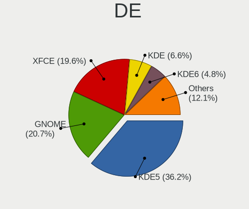
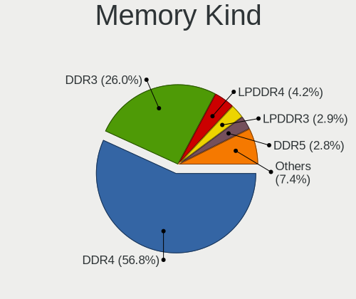
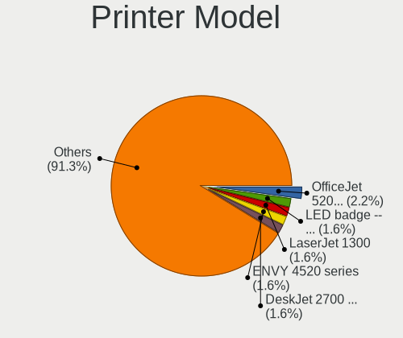

Manjaro - Tested Hardware & Statistics
--------------------------------------

A project to collect tested hardware configurations for Manjaro.

Anyone can contribute to this report by the [hw-probe](https://github.com/linuxhw/hw-probe) tool:

    sudo -E hw-probe -all -upload

Please contribute! Especially if your hardware is rare.

This is a report for all computer types. See also reports for [desktops](/Dist/Manjaro/Desktop/README.md) and [notebooks](/Dist/Manjaro/Notebook/README.md).

Contents
--------

* [ Test Cases ](#test-cases)

* [ System ](#system)
  - [ OS                       ](#os)
  - [ OS Family                ](#os-family)
  - [ Kernel                   ](#kernel)
  - [ Kernel Family            ](#kernel-family)
  - [ Kernel Major Ver.        ](#kernel-major-ver)
  - [ Arch                     ](#arch)
  - [ DE                       ](#de)
  - [ Display Server           ](#display-server)
  - [ Display Manager          ](#display-manager)
  - [ OS Lang                  ](#os-lang)
  - [ Boot Mode                ](#boot-mode)
  - [ Filesystem               ](#filesystem)
  - [ Part. scheme             ](#part-scheme)
  - [ Dual Boot with Linux/BSD ](#dual-boot-with-linuxbsd)
  - [ Dual Boot (Win)          ](#dual-boot-win)

* [ Board ](#board)
  - [ Vendor                   ](#vendor)
  - [ Model                    ](#model)
  - [ Model Family             ](#model-family)
  - [ MFG Year                 ](#mfg-year)
  - [ Form Factor              ](#form-factor)
  - [ Secure Boot              ](#secure-boot)
  - [ Coreboot                 ](#coreboot)
  - [ RAM Size                 ](#ram-size)
  - [ RAM Used                 ](#ram-used)
  - [ Total Drives             ](#total-drives)
  - [ Has CD-ROM               ](#has-cd-rom)
  - [ Has Ethernet             ](#has-ethernet)
  - [ Has WiFi                 ](#has-wifi)
  - [ Has Bluetooth            ](#has-bluetooth)

* [ Location ](#location)
  - [ Country                  ](#country)
  - [ City                     ](#city)

* [ Drives ](#drives)
  - [ Drive Vendor             ](#drive-vendor)
  - [ Drive Model              ](#drive-model)
  - [ HDD Vendor               ](#hdd-vendor)
  - [ SSD Vendor               ](#ssd-vendor)
  - [ Drive Kind               ](#drive-kind)
  - [ Drive Connector          ](#drive-connector)
  - [ Drive Size               ](#drive-size)
  - [ Space Total              ](#space-total)
  - [ Space Used               ](#space-used)
  - [ Malfunc. Drives          ](#malfunc-drives)
  - [ Malfunc. Drive Vendor    ](#malfunc-drive-vendor)
  - [ Malfunc. HDD Vendor      ](#malfunc-hdd-vendor)
  - [ Malfunc. Drive Kind      ](#malfunc-drive-kind)
  - [ Failed Drives            ](#failed-drives)
  - [ Failed Drive Vendor      ](#failed-drive-vendor)
  - [ Drive Status             ](#drive-status)

* [ Storage controller ](#storage-controller)
  - [ Storage Vendor           ](#storage-vendor)
  - [ Storage Model            ](#storage-model)
  - [ Storage Kind             ](#storage-kind)

* [ Processor ](#processor)
  - [ CPU Vendor               ](#cpu-vendor)
  - [ CPU Model                ](#cpu-model)
  - [ CPU Model Family         ](#cpu-model-family)
  - [ CPU Cores                ](#cpu-cores)
  - [ CPU Sockets              ](#cpu-sockets)
  - [ CPU Threads              ](#cpu-threads)
  - [ CPU Op-Modes             ](#cpu-op-modes)
  - [ CPU Microcode            ](#cpu-microcode)
  - [ CPU Microarch            ](#cpu-microarch)

* [ Graphics ](#graphics)
  - [ GPU Vendor               ](#gpu-vendor)
  - [ GPU Model                ](#gpu-model)
  - [ GPU Combo                ](#gpu-combo)
  - [ GPU Driver               ](#gpu-driver)
  - [ GPU Memory               ](#gpu-memory)

* [ Monitor ](#monitor)
  - [ Monitor Vendor           ](#monitor-vendor)
  - [ Monitor Model            ](#monitor-model)
  - [ Monitor Resolution       ](#monitor-resolution)
  - [ Monitor Diagonal         ](#monitor-diagonal)
  - [ Monitor Width            ](#monitor-width)
  - [ Aspect Ratio             ](#aspect-ratio)
  - [ Monitor Area             ](#monitor-area)
  - [ Pixel Density            ](#pixel-density)
  - [ Multiple Monitors        ](#multiple-monitors)

* [ Network ](#network)
  - [ Net Controller Vendor    ](#net-controller-vendor)
  - [ Net Controller Model     ](#net-controller-model)
  - [ Wireless Vendor          ](#wireless-vendor)
  - [ Wireless Model           ](#wireless-model)
  - [ Ethernet Vendor          ](#ethernet-vendor)
  - [ Ethernet Model           ](#ethernet-model)
  - [ Net Controller Kind      ](#net-controller-kind)
  - [ Used Controller          ](#used-controller)
  - [ NICs                     ](#nics)
  - [ IPv6                     ](#ipv6)

* [ Bluetooth ](#bluetooth)
  - [ Bluetooth Vendor         ](#bluetooth-vendor)
  - [ Bluetooth Model          ](#bluetooth-model)

* [ Sound ](#sound)
  - [ Sound Vendor             ](#sound-vendor)
  - [ Sound Model              ](#sound-model)

* [ Memory ](#memory)
  - [ Memory Vendor            ](#memory-vendor)
  - [ Memory Model             ](#memory-model)
  - [ Memory Kind              ](#memory-kind)
  - [ Memory Form Factor       ](#memory-form-factor)
  - [ Memory Size              ](#memory-size)
  - [ Memory Speed             ](#memory-speed)

* [ Printers & scanners ](#printers--scanners)
  - [ Printer Vendor           ](#printer-vendor)
  - [ Printer Model            ](#printer-model)
  - [ Scanner Vendor           ](#scanner-vendor)
  - [ Scanner Model            ](#scanner-model)

* [ Camera ](#camera)
  - [ Camera Vendor            ](#camera-vendor)
  - [ Camera Model             ](#camera-model)

* [ Security ](#security)
  - [ Fingerprint Vendor       ](#fingerprint-vendor)
  - [ Fingerprint Model        ](#fingerprint-model)
  - [ Chipcard Vendor          ](#chipcard-vendor)
  - [ Chipcard Model           ](#chipcard-model)

* [ Unsupported ](#unsupported)
  - [ Unsupported Devices      ](#unsupported-devices)
  - [ Unsupported Device Types ](#unsupported-device-types)

Test Cases
----------

Total: 8146

| Vendor        | Model                       | Form-Factor | Probe                                                      | Date         |
|---------------|-----------------------------|-------------|------------------------------------------------------------|--------------|
| ASRock        | N68-S                       | Desktop     | [df5d34428a](https://linux-hardware.org/?probe=df5d34428a) | Sep 01, 2022 |
| ASUSTek       | M5A78L-M LX3                | Desktop     | [5ba264dfb2](https://linux-hardware.org/?probe=5ba264dfb2) | Sep 01, 2022 |
| ASUSTek       | M5A78L-M LX3                | Desktop     | [169c9af937](https://linux-hardware.org/?probe=169c9af937) | Sep 01, 2022 |
| ASUSTek       | TUF Gaming FX505DY_FX505... | Notebook    | [9cabeefea8](https://linux-hardware.org/?probe=9cabeefea8) | Sep 01, 2022 |
| Lenovo        | SHARKBAY NO DPK             | Desktop     | [f872d36cd5](https://linux-hardware.org/?probe=f872d36cd5) | Sep 01, 2022 |
| Gigabyte      | B450 AORUS PRO-CF           | Desktop     | [37695eb7e5](https://linux-hardware.org/?probe=37695eb7e5) | Aug 31, 2022 |
| Unknown       | Unknown                     | Notebook    | [cba954794c](https://linux-hardware.org/?probe=cba954794c) | Aug 31, 2022 |
| ASUSTek       | TUF Gaming X570-PLUS        | Desktop     | [d816d2ade0](https://linux-hardware.org/?probe=d816d2ade0) | Aug 30, 2022 |
| ASRock        | N68-S                       | Desktop     | [6aabf89438](https://linux-hardware.org/?probe=6aabf89438) | Aug 30, 2022 |
| TUXEDO        | Polaris AMD Gen2 (REN)      | Notebook    | [df1e70349c](https://linux-hardware.org/?probe=df1e70349c) | Aug 29, 2022 |
| ASUSTek       | PRIME Z590-P                | Desktop     | [e05dcd4a08](https://linux-hardware.org/?probe=e05dcd4a08) | Aug 29, 2022 |
| ASRock        | FM2A58M-VG3+ R2.0           | Desktop     | [422af9d6b5](https://linux-hardware.org/?probe=422af9d6b5) | Aug 29, 2022 |
| Lenovo        | IdeaPad Gaming 3 15ACH6 ... | Notebook    | [6f169db96b](https://linux-hardware.org/?probe=6f169db96b) | Aug 29, 2022 |
| ASRock        | N68-S                       | Desktop     | [4fff0a6104](https://linux-hardware.org/?probe=4fff0a6104) | Aug 29, 2022 |
| ASUSTek       | ProArt B550-CREATOR         | Desktop     | [ec9f8ea30e](https://linux-hardware.org/?probe=ec9f8ea30e) | Aug 28, 2022 |
| Lenovo        | V14-ADA 82C6                | Notebook    | [1d3dfbba56](https://linux-hardware.org/?probe=1d3dfbba56) | Aug 27, 2022 |
| ASRock        | B550M Pro4                  | Desktop     | [8c6b85a46c](https://linux-hardware.org/?probe=8c6b85a46c) | Aug 27, 2022 |
| ASRock        | B450M Pro4                  | Desktop     | [f4fe5fd168](https://linux-hardware.org/?probe=f4fe5fd168) | Aug 27, 2022 |
| Gigabyte      | B550 GAMING X V2            | Desktop     | [94e2f7cedc](https://linux-hardware.org/?probe=94e2f7cedc) | Aug 27, 2022 |
| ASUSTek       | ROG Strix G733ZW_G733ZW     | Notebook    | [4384be22c4](https://linux-hardware.org/?probe=4384be22c4) | Aug 27, 2022 |
| Dell          | 0KWVT8 A02                  | Desktop     | [3f9c00b0da](https://linux-hardware.org/?probe=3f9c00b0da) | Aug 27, 2022 |
| Lenovo        | IdeaPad Flex-14API 81SS     | Notebook    | [85e0bc5d57](https://linux-hardware.org/?probe=85e0bc5d57) | Aug 27, 2022 |
| Lenovo        | G580 20150                  | Notebook    | [1813b94682](https://linux-hardware.org/?probe=1813b94682) | Aug 27, 2022 |
| Dell          | Vostro 5625                 | Notebook    | [741abbfe3d](https://linux-hardware.org/?probe=741abbfe3d) | Aug 26, 2022 |
| Lenovo        | ThinkPad E580 20KS003GMH    | Notebook    | [5cadf3c5d2](https://linux-hardware.org/?probe=5cadf3c5d2) | Aug 26, 2022 |
| ASRock        | X99 WS                      | Desktop     | [d16d59fab2](https://linux-hardware.org/?probe=d16d59fab2) | Aug 26, 2022 |
| Lenovo        | IdeaPad 5 15ALC05 82LN      | Notebook    | [d988e1aeb9](https://linux-hardware.org/?probe=d988e1aeb9) | Aug 25, 2022 |
| ASUSTek       | ROG Strix G513QY_G513QY     | Notebook    | [9e3b6f2140](https://linux-hardware.org/?probe=9e3b6f2140) | Aug 24, 2022 |
| Dell          | Inspiron 5505               | Notebook    | [4ea2e79611](https://linux-hardware.org/?probe=4ea2e79611) | Aug 24, 2022 |
| ASUSTek       | ROG Strix G513QY_G513QY     | Notebook    | [15960dc164](https://linux-hardware.org/?probe=15960dc164) | Aug 24, 2022 |
| Lenovo        | IdeaPad 5 Pro 14ACN6 82L... | Notebook    | [eed44ba087](https://linux-hardware.org/?probe=eed44ba087) | Aug 24, 2022 |
| ASUSTek       | Z170-P                      | Desktop     | [0bd08aee88](https://linux-hardware.org/?probe=0bd08aee88) | Aug 24, 2022 |
| ASUSTek       | X202E                       | Notebook    | [b814b9f427](https://linux-hardware.org/?probe=b814b9f427) | Aug 24, 2022 |
| Dell          | XPS 15 9520                 | Notebook    | [e4f7ce1ec7](https://linux-hardware.org/?probe=e4f7ce1ec7) | Aug 23, 2022 |
| ASUSTek       | VivoBook_ASUSLaptop X515... | Notebook    | [beb772b7f1](https://linux-hardware.org/?probe=beb772b7f1) | Aug 23, 2022 |
| Gigabyte      | B550M S2H                   | Desktop     | [8b5fe2494e](https://linux-hardware.org/?probe=8b5fe2494e) | Aug 23, 2022 |
| HUAWEI        | NBD-WXX9                    | Notebook    | [254b378771](https://linux-hardware.org/?probe=254b378771) | Aug 23, 2022 |
| Dell          | Latitude 5300 2-in-1        | Convertible | [79169c7ab4](https://linux-hardware.org/?probe=79169c7ab4) | Aug 23, 2022 |
| HP            | Laptop 14-dq1xxx            | Notebook    | [975461703e](https://linux-hardware.org/?probe=975461703e) | Aug 23, 2022 |
| ASUSTek       | PRIME B450M-A               | Desktop     | [bfdd1ab294](https://linux-hardware.org/?probe=bfdd1ab294) | Aug 23, 2022 |
| Acer          | Aspire A515-43              | Notebook    | [bc23fbec2a](https://linux-hardware.org/?probe=bc23fbec2a) | Aug 22, 2022 |
| Lenovo        | ThinkPad T14 Gen 2a 20XL... | Notebook    | [47cae9ef99](https://linux-hardware.org/?probe=47cae9ef99) | Aug 22, 2022 |
| MSI           | PS63 Modern 8RC             | Notebook    | [ae3bcc6b88](https://linux-hardware.org/?probe=ae3bcc6b88) | Aug 22, 2022 |
| MSI           | PS63 Modern 8RC             | Notebook    | [b45c0fb9fa](https://linux-hardware.org/?probe=b45c0fb9fa) | Aug 22, 2022 |
| Dell          | Vostro 3550                 | Notebook    | [230033da23](https://linux-hardware.org/?probe=230033da23) | Aug 22, 2022 |
| ASUSTek       | TUF Gaming X570-PLUS        | Desktop     | [0dbe2c5dfd](https://linux-hardware.org/?probe=0dbe2c5dfd) | Aug 22, 2022 |
| HP            | ENVY m6 Notebook            | Notebook    | [c51af546e7](https://linux-hardware.org/?probe=c51af546e7) | Aug 22, 2022 |
| Lenovo        | IdeaPad S145-15IIL 82DJ     | Notebook    | [64b9832653](https://linux-hardware.org/?probe=64b9832653) | Aug 22, 2022 |
| MACHINIST     | H81M-PRO S1 V2.0            | Desktop     | [12be75fa90](https://linux-hardware.org/?probe=12be75fa90) | Aug 21, 2022 |
| ASUSTek       | ROG STRIX Z390-E GAMING     | Desktop     | [3b799e56c6](https://linux-hardware.org/?probe=3b799e56c6) | Aug 21, 2022 |
| ASUSTek       | VivoBook_ASUSLaptop X521... | Notebook    | [77a2156c5a](https://linux-hardware.org/?probe=77a2156c5a) | Aug 21, 2022 |
| MSI           | P55-GD55                    | Desktop     | [89f2c92fa1](https://linux-hardware.org/?probe=89f2c92fa1) | Aug 21, 2022 |
| HP            | Pavilion Laptop 14-ec0xx... | Notebook    | [32e59cda1c](https://linux-hardware.org/?probe=32e59cda1c) | Aug 20, 2022 |
| Acer          | Aspire R3-131T              | Notebook    | [3f6370f978](https://linux-hardware.org/?probe=3f6370f978) | Aug 20, 2022 |
| Dell          | Latitude 5290 2-in-1        | Notebook    | [bafc4d3392](https://linux-hardware.org/?probe=bafc4d3392) | Aug 20, 2022 |
| ASUSTek       | ROG Flow Z13 GZ301ZE_GZ3... | Tablet      | [7a8fee05aa](https://linux-hardware.org/?probe=7a8fee05aa) | Aug 20, 2022 |
| ASUSTek       | PRIME B365M-C               | Desktop     | [8ae386a7a0](https://linux-hardware.org/?probe=8ae386a7a0) | Aug 20, 2022 |
| Dell          | OptiPlex 9020 AIO           | All in one  | [1679336e66](https://linux-hardware.org/?probe=1679336e66) | Aug 19, 2022 |
| Dell          | OptiPlex 9020 AIO           | All in one  | [1e9f4acc7b](https://linux-hardware.org/?probe=1e9f4acc7b) | Aug 19, 2022 |
| ASUSTek       | ROG STRIX Z390-E GAMING     | Desktop     | [1d1f39fd1b](https://linux-hardware.org/?probe=1d1f39fd1b) | Aug 19, 2022 |
| ASUSTek       | ROG STRIX X570-F GAMING     | Desktop     | [d59342b7a4](https://linux-hardware.org/?probe=d59342b7a4) | Aug 19, 2022 |
| HP            | ProBook 450 G7              | Notebook    | [c636c0401e](https://linux-hardware.org/?probe=c636c0401e) | Aug 18, 2022 |
| HP            | ZBook 17 G6                 | Notebook    | [fdcb40d147](https://linux-hardware.org/?probe=fdcb40d147) | Aug 18, 2022 |
| HP            | ZBook 17 G6                 | Notebook    | [cf5500d7b1](https://linux-hardware.org/?probe=cf5500d7b1) | Aug 18, 2022 |
| HUAWEI        | MACHC-WAX9                  | Notebook    | [95a5dd6af3](https://linux-hardware.org/?probe=95a5dd6af3) | Aug 18, 2022 |
| HUAWEI        | MACHC-WAX9                  | Notebook    | [0a9d130f45](https://linux-hardware.org/?probe=0a9d130f45) | Aug 18, 2022 |
| Chuwi         | HeroBook Air                | Notebook    | [6e13e6abe8](https://linux-hardware.org/?probe=6e13e6abe8) | Aug 18, 2022 |
| ASUSTek       | ROG Maximus XI HERO         | Desktop     | [e61c3cee8a](https://linux-hardware.org/?probe=e61c3cee8a) | Aug 18, 2022 |
| ASRock        | B550M Pro4                  | Desktop     | [41b271c4e7](https://linux-hardware.org/?probe=41b271c4e7) | Aug 17, 2022 |
| Gigabyte      | H61M-S2P                    | Desktop     | [49aedf1cf8](https://linux-hardware.org/?probe=49aedf1cf8) | Aug 17, 2022 |
| HP            | Pavilion x360 m3 Convert... | Convertible | [bde621edc4](https://linux-hardware.org/?probe=bde621edc4) | Aug 17, 2022 |
| Gigabyte      | B550M S2H                   | Desktop     | [e04617befa](https://linux-hardware.org/?probe=e04617befa) | Aug 17, 2022 |
| MSI           | Z87-G41 PC Mate             | Desktop     | [08e79a0a1c](https://linux-hardware.org/?probe=08e79a0a1c) | Aug 16, 2022 |
| HP            | Dratini                     | Notebook    | [134a2600be](https://linux-hardware.org/?probe=134a2600be) | Aug 16, 2022 |
| MSI           | X470 GAMING PRO             | Desktop     | [52b08fd4ba](https://linux-hardware.org/?probe=52b08fd4ba) | Aug 16, 2022 |
| ASRock        | Z77 Extreme4                | Desktop     | [07e825ed5b](https://linux-hardware.org/?probe=07e825ed5b) | Aug 16, 2022 |
| Samsung       | 950QDA                      | Convertible | [e03a1c1a0d](https://linux-hardware.org/?probe=e03a1c1a0d) | Aug 16, 2022 |
| VS Company    | H61H2                       | Desktop     | [a0b88242a4](https://linux-hardware.org/?probe=a0b88242a4) | Aug 16, 2022 |
| HP            | EliteBook 755 G5            | Notebook    | [795c2046ba](https://linux-hardware.org/?probe=795c2046ba) | Aug 16, 2022 |
| Gigabyte      | B450 AORUS M                | Desktop     | [bdf5ba285f](https://linux-hardware.org/?probe=bdf5ba285f) | Aug 15, 2022 |
| Gigabyte      | B550M S2H                   | Desktop     | [db7b7b3126](https://linux-hardware.org/?probe=db7b7b3126) | Aug 15, 2022 |
| ASUSTek       | ROG Maximus Z690 HERO       | Desktop     | [2fb0eea98c](https://linux-hardware.org/?probe=2fb0eea98c) | Aug 15, 2022 |
| ASUSTek       | TUF Gaming X570-PLUS        | Desktop     | [76e185a2e5](https://linux-hardware.org/?probe=76e185a2e5) | Aug 15, 2022 |
| ASUSTek       | ROG STRIX B550-I GAMING     | Desktop     | [59b6bdadd3](https://linux-hardware.org/?probe=59b6bdadd3) | Aug 14, 2022 |
| ASUSTek       | ProArt X570-CREATOR WIFI    | Desktop     | [45ddbf814d](https://linux-hardware.org/?probe=45ddbf814d) | Aug 14, 2022 |
| ASUSTek       | TUF Gaming X570-PLUS        | Desktop     | [e63db5769a](https://linux-hardware.org/?probe=e63db5769a) | Aug 14, 2022 |
| ASUSTek       | ZenBook UX435EG_UX435EG     | Notebook    | [c3fee5819a](https://linux-hardware.org/?probe=c3fee5819a) | Aug 14, 2022 |
| ASRock        | 990FX Extreme3              | Desktop     | [646169ae62](https://linux-hardware.org/?probe=646169ae62) | Aug 14, 2022 |
| HP            | EliteBook 2760p             | Notebook    | [bb4c1e4c3a](https://linux-hardware.org/?probe=bb4c1e4c3a) | Aug 13, 2022 |
| HP            | 82A2                        | Desktop     | [bc3d667d42](https://linux-hardware.org/?probe=bc3d667d42) | Aug 13, 2022 |
| Lenovo        | IdeaPad 3 15IML05 D1 81W... | Notebook    | [59b3324e73](https://linux-hardware.org/?probe=59b3324e73) | Aug 13, 2022 |
| Lenovo        | IdeaPad 5 15ITL05 82FG      | Notebook    | [6b83355dfa](https://linux-hardware.org/?probe=6b83355dfa) | Aug 13, 2022 |
| MSI           | GE75 Raider 10SF            | Notebook    | [0fafeaaa76](https://linux-hardware.org/?probe=0fafeaaa76) | Aug 13, 2022 |
| HP            | EliteBook 8460p             | Notebook    | [b7418c601b](https://linux-hardware.org/?probe=b7418c601b) | Aug 13, 2022 |
| MSI           | B350M PRO-VD PLUS           | Desktop     | [ba65d9b67e](https://linux-hardware.org/?probe=ba65d9b67e) | Aug 13, 2022 |
| MSI           | 970A SLI Krait Edition      | Desktop     | [a94fe940b1](https://linux-hardware.org/?probe=a94fe940b1) | Aug 13, 2022 |
| ASUSTek       | ROG Zephyrus G15 GA503QR... | Notebook    | [601732f75e](https://linux-hardware.org/?probe=601732f75e) | Aug 13, 2022 |
| Dell          | Precision M6600             | Notebook    | [9c860085a8](https://linux-hardware.org/?probe=9c860085a8) | Aug 12, 2022 |
| ASUSTek       | ROG STRIX Z490-E GAMING     | Desktop     | [41560e8e13](https://linux-hardware.org/?probe=41560e8e13) | Aug 12, 2022 |
| ASUSTek       | ROG Zephyrus G15 GA503QR... | Notebook    | [59892dec35](https://linux-hardware.org/?probe=59892dec35) | Aug 12, 2022 |
| MSI           | MPG X570 GAMING PLUS        | Desktop     | [f82761570b](https://linux-hardware.org/?probe=f82761570b) | Aug 12, 2022 |
| Chuwi         | HeroBook Air                | Notebook    | [5640964630](https://linux-hardware.org/?probe=5640964630) | Aug 12, 2022 |
| ASUSTek       | ROG Strix G733ZW_G733ZW     | Notebook    | [2f45536688](https://linux-hardware.org/?probe=2f45536688) | Aug 12, 2022 |
| AZW           | U59                         | Desktop     | [344d4587f6](https://linux-hardware.org/?probe=344d4587f6) | Aug 12, 2022 |
| Lenovo        | Z710 20250                  | Notebook    | [8c7b1d0773](https://linux-hardware.org/?probe=8c7b1d0773) | Aug 11, 2022 |
| ASRock        | 990FX Extreme3              | Desktop     | [e3006f6ca1](https://linux-hardware.org/?probe=e3006f6ca1) | Aug 11, 2022 |
| Lenovo        | G580 20150                  | Notebook    | [6a07e79eb7](https://linux-hardware.org/?probe=6a07e79eb7) | Aug 11, 2022 |
| Lenovo        | G580 20150                  | Notebook    | [7e83b07cca](https://linux-hardware.org/?probe=7e83b07cca) | Aug 11, 2022 |
| ASUSTek       | Z87-PRO                     | Desktop     | [f8a688c41e](https://linux-hardware.org/?probe=f8a688c41e) | Aug 11, 2022 |
| HP            | 255 G4                      | Notebook    | [3ed3978b93](https://linux-hardware.org/?probe=3ed3978b93) | Aug 11, 2022 |
| MSI           | B450 TOMAHAWK MAX           | Desktop     | [3219cc3946](https://linux-hardware.org/?probe=3219cc3946) | Aug 10, 2022 |
| Dell          | Latitude 5421               | Notebook    | [b088f6b599](https://linux-hardware.org/?probe=b088f6b599) | Aug 10, 2022 |
| HP            | 8053                        | Desktop     | [db80dc0ee1](https://linux-hardware.org/?probe=db80dc0ee1) | Aug 10, 2022 |
| Lenovo        | 3141 SDK0J40700 WIN 3258... | Desktop     | [48b0dfdee0](https://linux-hardware.org/?probe=48b0dfdee0) | Aug 10, 2022 |
| ASUSTek       | ROG Strix G513QR            | Notebook    | [3b19026468](https://linux-hardware.org/?probe=3b19026468) | Aug 09, 2022 |
| Acer          | Aspire 5732Z                | Notebook    | [20746ad23d](https://linux-hardware.org/?probe=20746ad23d) | Aug 09, 2022 |
| Unknown       | Unknown                     | Desktop     | [e4c7906333](https://linux-hardware.org/?probe=e4c7906333) | Aug 09, 2022 |
| Lenovo        | Bantry CRB NOK              | Desktop     | [fbeb21c99a](https://linux-hardware.org/?probe=fbeb21c99a) | Aug 09, 2022 |
| ASUSTek       | ZenBook Pro Duo UX582LR_... | Notebook    | [7dab66307c](https://linux-hardware.org/?probe=7dab66307c) | Aug 09, 2022 |
| Lenovo        | ThinkPad T450s 20BXCTO1W... | Notebook    | [49f045d747](https://linux-hardware.org/?probe=49f045d747) | Aug 09, 2022 |
| ASUSTek       | ROG Strix G513QR            | Notebook    | [7aa074e467](https://linux-hardware.org/?probe=7aa074e467) | Aug 08, 2022 |
| HP            | Laptop 15-dw3xxx            | Notebook    | [e7a185eb28](https://linux-hardware.org/?probe=e7a185eb28) | Aug 08, 2022 |
| Razer         | Blade                       | Notebook    | [e2d9f80c98](https://linux-hardware.org/?probe=e2d9f80c98) | Aug 08, 2022 |
| HP            | Laptop 15-dw3xxx            | Notebook    | [7d20ee4549](https://linux-hardware.org/?probe=7d20ee4549) | Aug 08, 2022 |
| Framework     | Laptop                      | Notebook    | [da39a41b6b](https://linux-hardware.org/?probe=da39a41b6b) | Aug 08, 2022 |
| Framework     | Laptop                      | Notebook    | [f754ffd1d1](https://linux-hardware.org/?probe=f754ffd1d1) | Aug 08, 2022 |
| ASUSTek       | G10DK                       | Desktop     | [2401d4af44](https://linux-hardware.org/?probe=2401d4af44) | Aug 08, 2022 |
| MSI           | MAG B550M MORTAR            | Desktop     | [7cf010b820](https://linux-hardware.org/?probe=7cf010b820) | Aug 08, 2022 |
| ASRock        | B450 Pro4                   | Desktop     | [b87492e7c7](https://linux-hardware.org/?probe=b87492e7c7) | Aug 08, 2022 |
| Dell          | XPS 15 9500                 | Notebook    | [d8486d3371](https://linux-hardware.org/?probe=d8486d3371) | Aug 07, 2022 |
| Gigabyte      | B150M-D3H-CF                | Desktop     | [5235533a87](https://linux-hardware.org/?probe=5235533a87) | Aug 07, 2022 |
| Razer         | Book 13 - RZ09-0357         | Notebook    | [c4a323d350](https://linux-hardware.org/?probe=c4a323d350) | Aug 06, 2022 |
| MSI           | GS66 Stealth 10SGS          | Notebook    | [24fbb2877c](https://linux-hardware.org/?probe=24fbb2877c) | Aug 06, 2022 |
| Lenovo        | ThinkPad X250 20CLS3UW00    | Notebook    | [ddefadf8f1](https://linux-hardware.org/?probe=ddefadf8f1) | Aug 06, 2022 |
| Google        | Blorb                       | Notebook    | [b893b34702](https://linux-hardware.org/?probe=b893b34702) | Aug 06, 2022 |
| Lenovo        | Legion 5 15ARH05H 82B1      | Notebook    | [7151e1746a](https://linux-hardware.org/?probe=7151e1746a) | Aug 05, 2022 |
| MSI           | B550-A PRO                  | Desktop     | [a3aa8d0879](https://linux-hardware.org/?probe=a3aa8d0879) | Aug 05, 2022 |
| ASUSTek       | ROG Strix G513RM_G513RM     | Notebook    | [a2733a0f87](https://linux-hardware.org/?probe=a2733a0f87) | Aug 05, 2022 |
| ASUSTek       | ASUS TUF Gaming A15 FA50... | Notebook    | [66c9a8d0f6](https://linux-hardware.org/?probe=66c9a8d0f6) | Aug 05, 2022 |
| ASUSTek       | ASUS TUF Gaming A15 FA50... | Notebook    | [417c72557c](https://linux-hardware.org/?probe=417c72557c) | Aug 05, 2022 |
| GPD           | G1621-02                    | Notebook    | [58586a10a3](https://linux-hardware.org/?probe=58586a10a3) | Aug 04, 2022 |
| Dell          | 0XR1GT A00                  | Desktop     | [2e069ba5c2](https://linux-hardware.org/?probe=2e069ba5c2) | Aug 04, 2022 |
| Apple         | Mac-FC02E91DDD3FA6A4 iMa... | All in one  | [bce50a8d8b](https://linux-hardware.org/?probe=bce50a8d8b) | Aug 04, 2022 |
| Gigabyte      | X570 AORUS ELITE            | Desktop     | [e963ce265b](https://linux-hardware.org/?probe=e963ce265b) | Aug 04, 2022 |
| Lenovo        | IdeaPad S145-15API 81V7     | Notebook    | [0ef9fef16d](https://linux-hardware.org/?probe=0ef9fef16d) | Aug 04, 2022 |
| ASUSTek       | ROG STRIX Z490-E GAMING     | Desktop     | [f2df3e1784](https://linux-hardware.org/?probe=f2df3e1784) | Aug 04, 2022 |
| Lenovo        | IdeaPad S145-15API 81V7     | Notebook    | [1be0869985](https://linux-hardware.org/?probe=1be0869985) | Aug 04, 2022 |
| ASUSTek       | ROG STRIX Z490-E GAMING     | Desktop     | [22b43d3149](https://linux-hardware.org/?probe=22b43d3149) | Aug 04, 2022 |
| Dell          | XPS 15 9500                 | Notebook    | [840cb1763f](https://linux-hardware.org/?probe=840cb1763f) | Aug 04, 2022 |
| HP            | Pavilion Gaming Laptop 1... | Notebook    | [ed6b6ce93e](https://linux-hardware.org/?probe=ed6b6ce93e) | Aug 03, 2022 |
| ASUSTek       | VivoBook_ASUSLaptop X712... | Notebook    | [8f15b50066](https://linux-hardware.org/?probe=8f15b50066) | Aug 03, 2022 |
| ASUSTek       | ROG Zephyrus G14 GA402RK... | Notebook    | [41189cd175](https://linux-hardware.org/?probe=41189cd175) | Aug 03, 2022 |
| Daten Tecn... | DT02-M4                     | Notebook    | [1dfd4fe5ba](https://linux-hardware.org/?probe=1dfd4fe5ba) | Aug 03, 2022 |
| Dell          | XPS 13 7390                 | Notebook    | [05e8b8d782](https://linux-hardware.org/?probe=05e8b8d782) | Aug 03, 2022 |
| Dell          | Latitude 7490               | Notebook    | [0df5a838bf](https://linux-hardware.org/?probe=0df5a838bf) | Aug 03, 2022 |
| Timi          | RedmiBook 14                | Notebook    | [10c33f11cf](https://linux-hardware.org/?probe=10c33f11cf) | Aug 02, 2022 |
| ECS           | H61H2-MV                    | Desktop     | [6b2a77a281](https://linux-hardware.org/?probe=6b2a77a281) | Aug 02, 2022 |
| MSI           | B450 GAMING PRO CARBON M... | Desktop     | [5951f66289](https://linux-hardware.org/?probe=5951f66289) | Aug 02, 2022 |
| Lenovo        | IdeaPad 1 15ALC7 82R4       | Notebook    | [c2520e642a](https://linux-hardware.org/?probe=c2520e642a) | Aug 02, 2022 |
| HP            | Unknown                     | Notebook    | [bd6c9221e7](https://linux-hardware.org/?probe=bd6c9221e7) | Aug 02, 2022 |
| ASUSTek       | TUF Gaming B550-PLUS        | Desktop     | [30e0a23365](https://linux-hardware.org/?probe=30e0a23365) | Aug 01, 2022 |
| Digma         | EVE 15 C407 ES5054EW        | Notebook    | [7b597ebcc8](https://linux-hardware.org/?probe=7b597ebcc8) | Aug 01, 2022 |
| ASUSTek       | ROG Strix G513QY_G513QY     | Notebook    | [370b872aa5](https://linux-hardware.org/?probe=370b872aa5) | Aug 01, 2022 |
| ASUSTek       | F2A55-M LK2                 | Desktop     | [97a5e9c390](https://linux-hardware.org/?probe=97a5e9c390) | Aug 01, 2022 |
| Dell          | G15 Special Edition 5521    | Notebook    | [c680e6f144](https://linux-hardware.org/?probe=c680e6f144) | Aug 01, 2022 |
| Dell          | Inspiron 16 7620 2-in-1     | Convertible | [83a5caa66d](https://linux-hardware.org/?probe=83a5caa66d) | Jul 31, 2022 |
| Dell          | Latitude 5290 2-in-1        | Notebook    | [838be3a87a](https://linux-hardware.org/?probe=838be3a87a) | Jul 31, 2022 |
| Dell          | 0D24M8 A00                  | Desktop     | [6367e245e6](https://linux-hardware.org/?probe=6367e245e6) | Jul 31, 2022 |
| Apple         | Mac-7BA5B2DFE22DDD8C Mac... | Mini pc     | [3061a63de7](https://linux-hardware.org/?probe=3061a63de7) | Jul 31, 2022 |
| Lenovo        | Yoga 530-14IKB 81EK         | Convertible | [8693dca4f6](https://linux-hardware.org/?probe=8693dca4f6) | Jul 30, 2022 |
| ASUSTek       | ASUS TUF Gaming A17 FA70... | Notebook    | [249d407b66](https://linux-hardware.org/?probe=249d407b66) | Jul 30, 2022 |
| Apple         | Mac-FC02E91DDD3FA6A4 iMa... | All in one  | [c08016125d](https://linux-hardware.org/?probe=c08016125d) | Jul 30, 2022 |
| ASUSTek       | TUF Gaming X570-PLUS        | Desktop     | [9ea9e6f737](https://linux-hardware.org/?probe=9ea9e6f737) | Jul 30, 2022 |
| ASUSTek       | TUF Gaming X570-PLUS        | Desktop     | [c2e42e1cbb](https://linux-hardware.org/?probe=c2e42e1cbb) | Jul 30, 2022 |
| Dell          | Inspiron 5520               | Notebook    | [a4baade53f](https://linux-hardware.org/?probe=a4baade53f) | Jul 30, 2022 |
| MSI           | X470 GAMING PRO MAX         | Desktop     | [5651db0a63](https://linux-hardware.org/?probe=5651db0a63) | Jul 30, 2022 |
| Dell          | Inspiron 7577               | Notebook    | [a2909a87b1](https://linux-hardware.org/?probe=a2909a87b1) | Jul 30, 2022 |
| ASRock        | H81M-VG4                    | Desktop     | [1fd9e0ca3a](https://linux-hardware.org/?probe=1fd9e0ca3a) | Jul 30, 2022 |
| ASRock        | H81M-VG4                    | Desktop     | [309df31c47](https://linux-hardware.org/?probe=309df31c47) | Jul 30, 2022 |
| Apple         | Mac-7BA5B2DFE22DDD8C Mac... | Mini pc     | [f2ced448f2](https://linux-hardware.org/?probe=f2ced448f2) | Jul 29, 2022 |
| Schenker      | VISION 15 (SVS15E21)        | Notebook    | [aa446a0409](https://linux-hardware.org/?probe=aa446a0409) | Jul 29, 2022 |
| ASUSTek       | PRIME Z590-P                | Desktop     | [fa38197b4d](https://linux-hardware.org/?probe=fa38197b4d) | Jul 29, 2022 |
| Lenovo        | 3133 SDK0J40675 WIN 3305... | Desktop     | [4434d4d78a](https://linux-hardware.org/?probe=4434d4d78a) | Jul 29, 2022 |
| Dell          | Latitude 5290 2-in-1        | Notebook    | [8d93753bc7](https://linux-hardware.org/?probe=8d93753bc7) | Jul 29, 2022 |
| Dell          | Latitude 5290 2-in-1        | Notebook    | [910241c92e](https://linux-hardware.org/?probe=910241c92e) | Jul 29, 2022 |
| Samsung       | 340XAA/350XAA/550XAA        | Notebook    | [fdb481a551](https://linux-hardware.org/?probe=fdb481a551) | Jul 28, 2022 |
| Acer          | Aspire A515-43              | Notebook    | [230cf1bf3d](https://linux-hardware.org/?probe=230cf1bf3d) | Jul 28, 2022 |
| Gigabyte      | AB350-Gaming 3-CF           | Desktop     | [f666b16fde](https://linux-hardware.org/?probe=f666b16fde) | Jul 28, 2022 |
| Lenovo        | IdeaPad U430 Touch 20270    | Notebook    | [d73469794d](https://linux-hardware.org/?probe=d73469794d) | Jul 28, 2022 |
| Alienware     | 17                          | Notebook    | [6a4212d19d](https://linux-hardware.org/?probe=6a4212d19d) | Jul 27, 2022 |
| Dell          | Inspiron 5502               | Notebook    | [f84c29c4b6](https://linux-hardware.org/?probe=f84c29c4b6) | Jul 27, 2022 |
| Gigabyte      | H97-Gaming 3                | Desktop     | [90656d8ef4](https://linux-hardware.org/?probe=90656d8ef4) | Jul 27, 2022 |
| Lenovo        | ThinkPad T480s 20L8S31T0... | Notebook    | [60449c872b](https://linux-hardware.org/?probe=60449c872b) | Jul 27, 2022 |
| Lenovo        | 3717 SDK0J40697 WIN 3305... | Desktop     | [701f519b4c](https://linux-hardware.org/?probe=701f519b4c) | Jul 27, 2022 |
| HP            | Pavilion Gaming Laptop 1... | Notebook    | [f4f4bdfefd](https://linux-hardware.org/?probe=f4f4bdfefd) | Jul 27, 2022 |
| ASUSTek       | ROG STRIX X570-I GAMING     | Desktop     | [b41540a078](https://linux-hardware.org/?probe=b41540a078) | Jul 26, 2022 |
| Gigabyte      | X570 AORUS ULTRA            | Desktop     | [331a99ef9a](https://linux-hardware.org/?probe=331a99ef9a) | Jul 26, 2022 |
| Gigabyte      | X570 AORUS ULTRA            | Desktop     | [1f3433b9e1](https://linux-hardware.org/?probe=1f3433b9e1) | Jul 26, 2022 |
| MSI           | GF63 Thin 9SC               | Notebook    | [6d42baa166](https://linux-hardware.org/?probe=6d42baa166) | Jul 26, 2022 |
| Gigabyte      | 990XA-UD3                   | Desktop     | [803bd277e7](https://linux-hardware.org/?probe=803bd277e7) | Jul 26, 2022 |
| ASUSTek       | ROG STRIX X470-F GAMING     | Desktop     | [0c310749f1](https://linux-hardware.org/?probe=0c310749f1) | Jul 26, 2022 |
| Acer          | Spin SP314-54N              | Convertible | [8f19252d3b](https://linux-hardware.org/?probe=8f19252d3b) | Jul 26, 2022 |
| Lenovo        | ThinkPad E585 20KV000YUS    | Notebook    | [0c8cde264e](https://linux-hardware.org/?probe=0c8cde264e) | Jul 26, 2022 |
| HP            | Pavilion x360 Convertibl... | Convertible | [85d557665e](https://linux-hardware.org/?probe=85d557665e) | Jul 25, 2022 |
| Acer          | Aspire A315-42              | Notebook    | [78415dc6be](https://linux-hardware.org/?probe=78415dc6be) | Jul 25, 2022 |
| Gigabyte      | H61M-D2P-B3                 | Desktop     | [8f0769b485](https://linux-hardware.org/?probe=8f0769b485) | Jul 25, 2022 |
| Acer          | Predator PH315-52           | Notebook    | [a1346acc8a](https://linux-hardware.org/?probe=a1346acc8a) | Jul 25, 2022 |
| Dell          | Inspiron 15-5578            | Notebook    | [7621729bff](https://linux-hardware.org/?probe=7621729bff) | Jul 25, 2022 |
| ASUSTek       | VivoBook_ASUSLaptop X435... | Notebook    | [123fc55893](https://linux-hardware.org/?probe=123fc55893) | Jul 24, 2022 |
| MSI           | GF63 Thin 9SC               | Notebook    | [1a2403b95a](https://linux-hardware.org/?probe=1a2403b95a) | Jul 24, 2022 |
| ASUSTek       | ROG Zephyrus G14 GA402RK... | Notebook    | [83e5824a05](https://linux-hardware.org/?probe=83e5824a05) | Jul 24, 2022 |
| ASUSTek       | Q504UA                      | Notebook    | [373dce5a6f](https://linux-hardware.org/?probe=373dce5a6f) | Jul 24, 2022 |
| Gigabyte      | Z68P-DS3                    | Desktop     | [b03f1fee53](https://linux-hardware.org/?probe=b03f1fee53) | Jul 24, 2022 |
| ASUSTek       | ROG STRIX B550-F GAMING     | Desktop     | [e512b2f9f2](https://linux-hardware.org/?probe=e512b2f9f2) | Jul 23, 2022 |
| Dell          | 0GM819                      | Desktop     | [8c617c1c3f](https://linux-hardware.org/?probe=8c617c1c3f) | Jul 23, 2022 |
| BESSTAR Te... | HM90                        | Desktop     | [cb4da5b649](https://linux-hardware.org/?probe=cb4da5b649) | Jul 23, 2022 |
| MSI           | B450M PRO-VDH MAX           | Desktop     | [9002ca2e54](https://linux-hardware.org/?probe=9002ca2e54) | Jul 23, 2022 |
| ASUSTek       | Maximus Formula             | Desktop     | [2e71fca3d5](https://linux-hardware.org/?probe=2e71fca3d5) | Jul 22, 2022 |
| System76      | Serval WS                   | Notebook    | [18259132ff](https://linux-hardware.org/?probe=18259132ff) | Jul 22, 2022 |
| MSI           | GS66 Stealth 10SGS          | Notebook    | [8d7172fe7e](https://linux-hardware.org/?probe=8d7172fe7e) | Jul 22, 2022 |
| BESSTAR Te... | HM90                        | Desktop     | [380230bbf6](https://linux-hardware.org/?probe=380230bbf6) | Jul 22, 2022 |
| ASUSTek       | X450LCP                     | Notebook    | [0617861116](https://linux-hardware.org/?probe=0617861116) | Jul 22, 2022 |
| Lenovo        | IdeaPad S145-14IIL 81W6     | Notebook    | [4e47525879](https://linux-hardware.org/?probe=4e47525879) | Jul 22, 2022 |
| Lenovo        | IdeaPad U330p 20267         | Notebook    | [1775f75940](https://linux-hardware.org/?probe=1775f75940) | Jul 22, 2022 |
| MSI           | MAG B550M MORTAR            | Desktop     | [51c2b5bc3b](https://linux-hardware.org/?probe=51c2b5bc3b) | Jul 22, 2022 |
| MACHINIST     | X79 V2.82H                  | Desktop     | [da4a098248](https://linux-hardware.org/?probe=da4a098248) | Jul 22, 2022 |
| MACHINIST     | X79 V2.82H                  | Desktop     | [0e06f3fdf5](https://linux-hardware.org/?probe=0e06f3fdf5) | Jul 22, 2022 |
| ASUSTek       | P9X79                       | Desktop     | [5ff04691ce](https://linux-hardware.org/?probe=5ff04691ce) | Jul 21, 2022 |
| ASUSTek       | P9X79                       | Desktop     | [1bcee43b6e](https://linux-hardware.org/?probe=1bcee43b6e) | Jul 21, 2022 |
| HP            | ZBook 15 G5                 | Notebook    | [771428353e](https://linux-hardware.org/?probe=771428353e) | Jul 21, 2022 |
| ASRock        | Z77 Extreme4                | Desktop     | [492529f973](https://linux-hardware.org/?probe=492529f973) | Jul 21, 2022 |
| PCWare        | IPMH81G1                    | Desktop     | [cb66716a63](https://linux-hardware.org/?probe=cb66716a63) | Jul 21, 2022 |
| Lenovo        | IdeaPad Z510 20287          | Notebook    | [e632ef83da](https://linux-hardware.org/?probe=e632ef83da) | Jul 20, 2022 |
| HP            | EliteBook 840 G5            | Notebook    | [03afe0a303](https://linux-hardware.org/?probe=03afe0a303) | Jul 20, 2022 |
| Lenovo        | IdeaPad 120S-14IAP 81A5     | Notebook    | [5859932a73](https://linux-hardware.org/?probe=5859932a73) | Jul 20, 2022 |
| Dell          | Vostro 15 3510              | Notebook    | [8327d57f7b](https://linux-hardware.org/?probe=8327d57f7b) | Jul 20, 2022 |
| Notebook      | W350STQ/W370ST              | Notebook    | [613b1f9d19](https://linux-hardware.org/?probe=613b1f9d19) | Jul 20, 2022 |
| HP            | Pavilion Laptop 14-ce0xx... | Notebook    | [29847a6864](https://linux-hardware.org/?probe=29847a6864) | Jul 20, 2022 |
| Dell          | Inspiron 16 7620 2-in-1     | Convertible | [c47d31f0ae](https://linux-hardware.org/?probe=c47d31f0ae) | Jul 19, 2022 |
| Lenovo        | ThinkPad E585 20KVCTO1WW    | Notebook    | [0602b2d850](https://linux-hardware.org/?probe=0602b2d850) | Jul 19, 2022 |
| ASUSTek       | ROG STRIX B550-I GAMING     | Desktop     | [1a28383fee](https://linux-hardware.org/?probe=1a28383fee) | Jul 19, 2022 |
| MSI           | MAG B550 TOMAHAWK           | Desktop     | [63489ff6e5](https://linux-hardware.org/?probe=63489ff6e5) | Jul 19, 2022 |
| Dell          | Latitude E5530 non-vPro     | Notebook    | [27a607d6ba](https://linux-hardware.org/?probe=27a607d6ba) | Jul 19, 2022 |
| Gigabyte      | X570 AORUS MASTER           | Desktop     | [fd46c32d92](https://linux-hardware.org/?probe=fd46c32d92) | Jul 19, 2022 |
| HP            | EliteBook 850 G1            | Notebook    | [383ec7a7fd](https://linux-hardware.org/?probe=383ec7a7fd) | Jul 18, 2022 |
| Apple         | MacBookPro14,2              | Notebook    | [4f1ce227b5](https://linux-hardware.org/?probe=4f1ce227b5) | Jul 18, 2022 |
| Dell          | Inspiron 3421               | Notebook    | [d4c15eb5fd](https://linux-hardware.org/?probe=d4c15eb5fd) | Jul 18, 2022 |
| Lenovo        | ThinkPad SL510 28479XU      | Notebook    | [092a752a62](https://linux-hardware.org/?probe=092a752a62) | Jul 18, 2022 |
| Lenovo        | ThinkPad SL510 28479XU      | Notebook    | [5eea2f8d37](https://linux-hardware.org/?probe=5eea2f8d37) | Jul 18, 2022 |
| Lenovo        | ThinkPad Edge E430 32543... | Notebook    | [75cfb6ffa8](https://linux-hardware.org/?probe=75cfb6ffa8) | Jul 17, 2022 |
| Dell          | Latitude 7490               | Notebook    | [bed5644964](https://linux-hardware.org/?probe=bed5644964) | Jul 17, 2022 |
| ASUSTek       | Maximus Formula             | Desktop     | [3c600cafa6](https://linux-hardware.org/?probe=3c600cafa6) | Jul 17, 2022 |
| ASUSTek       | TUF Z390-PLUS GAMING        | Desktop     | [b28f8248b4](https://linux-hardware.org/?probe=b28f8248b4) | Jul 17, 2022 |
| MSI           | MAG B550 TOMAHAWK           | Desktop     | [84d62872f5](https://linux-hardware.org/?probe=84d62872f5) | Jul 17, 2022 |
| HP            | Laptop 15-dy0xxx            | Notebook    | [cfd2b5a69c](https://linux-hardware.org/?probe=cfd2b5a69c) | Jul 17, 2022 |
| Schenker      | XMG PRO (Late 2021)         | Notebook    | [a59796b464](https://linux-hardware.org/?probe=a59796b464) | Jul 17, 2022 |
| Schenker      | XMG PRO (Late 2021)         | Notebook    | [d739731ef5](https://linux-hardware.org/?probe=d739731ef5) | Jul 17, 2022 |
| Google        | Coral                       | Notebook    | [ebf34e57e6](https://linux-hardware.org/?probe=ebf34e57e6) | Jul 17, 2022 |
| HP            | ProBook 4520s               | Notebook    | [580f66ae82](https://linux-hardware.org/?probe=580f66ae82) | Jul 16, 2022 |
| Lenovo        | Legion S7 15ACH6 82K8       | Notebook    | [1bb517b788](https://linux-hardware.org/?probe=1bb517b788) | Jul 16, 2022 |
| ASUSTek       | N552VW                      | Notebook    | [b29b2f27df](https://linux-hardware.org/?probe=b29b2f27df) | Jul 16, 2022 |
| ASUSTek       | ASUS EXPERTBOOK B9450FA_... | Notebook    | [aa025d852d](https://linux-hardware.org/?probe=aa025d852d) | Jul 16, 2022 |
| Lenovo        | IdeaPad 120S-14IAP 81A5     | Notebook    | [27f6399025](https://linux-hardware.org/?probe=27f6399025) | Jul 16, 2022 |
| ASUSTek       | PRIME B450-PLUS             | Desktop     | [3b1f082065](https://linux-hardware.org/?probe=3b1f082065) | Jul 16, 2022 |
| ASUSTek       | ROG STRIX Z490-E GAMING     | Desktop     | [3605f29c73](https://linux-hardware.org/?probe=3605f29c73) | Jul 16, 2022 |
| ONE-NETBOO... | ONE XPLAYER                 | Tablet      | [c05a228555](https://linux-hardware.org/?probe=c05a228555) | Jul 16, 2022 |
| ASUSTek       | ROG STRIX Z490-E GAMING     | Desktop     | [533392d790](https://linux-hardware.org/?probe=533392d790) | Jul 16, 2022 |
| ASUSTek       | X555LN                      | Notebook    | [0d6d6728ba](https://linux-hardware.org/?probe=0d6d6728ba) | Jul 15, 2022 |
| Chuwi         | HeroBook Air                | Notebook    | [8f50476a9d](https://linux-hardware.org/?probe=8f50476a9d) | Jul 15, 2022 |
| HP            | Laptop 17-cp0xxx            | Notebook    | [476ab880f4](https://linux-hardware.org/?probe=476ab880f4) | Jul 15, 2022 |
| Notebook      | W350STQ/W370ST              | Notebook    | [86daf7b30d](https://linux-hardware.org/?probe=86daf7b30d) | Jul 15, 2022 |
| Gigabyte      | A520M S2H                   | Desktop     | [dfc64d417f](https://linux-hardware.org/?probe=dfc64d417f) | Jul 15, 2022 |
| Lenovo        | G580 20150                  | Notebook    | [d6b737940e](https://linux-hardware.org/?probe=d6b737940e) | Jul 15, 2022 |
| ASUSTek       | M5A97 R2.0                  | Desktop     | [06992e615b](https://linux-hardware.org/?probe=06992e615b) | Jul 15, 2022 |
| BESSTAR Te... | TL50                        | Desktop     | [c77ff65710](https://linux-hardware.org/?probe=c77ff65710) | Jul 15, 2022 |
| AMI           | Aptio CRB                   | Mini pc     | [c7a2ebd9dc](https://linux-hardware.org/?probe=c7a2ebd9dc) | Jul 15, 2022 |
| Apple         | MacBookAir6,2               | Notebook    | [fe231e27cf](https://linux-hardware.org/?probe=fe231e27cf) | Jul 14, 2022 |
| ASRock        | B550M Pro4                  | Desktop     | [dcdc04db9f](https://linux-hardware.org/?probe=dcdc04db9f) | Jul 14, 2022 |
| Lenovo        | IdeaPad 5 14ALC05 82LM      | Notebook    | [367adf8f50](https://linux-hardware.org/?probe=367adf8f50) | Jul 14, 2022 |
| Gigabyte      | Z97-D3H-CF                  | Desktop     | [55f956b817](https://linux-hardware.org/?probe=55f956b817) | Jul 14, 2022 |
| MSI           | A320M-A PRO MAX             | Desktop     | [31127e76f8](https://linux-hardware.org/?probe=31127e76f8) | Jul 14, 2022 |
| HP            | Laptop 15-dy0xxx            | Notebook    | [a7eb387b79](https://linux-hardware.org/?probe=a7eb387b79) | Jul 14, 2022 |
| MSI           | X470 GAMING PRO             | Desktop     | [716dd72eeb](https://linux-hardware.org/?probe=716dd72eeb) | Jul 13, 2022 |
| Chuwi         | HeroBook Air                | Notebook    | [d76b0db2ca](https://linux-hardware.org/?probe=d76b0db2ca) | Jul 13, 2022 |
| ASUSTek       | Maximus Formula             | Desktop     | [cd81bcaf19](https://linux-hardware.org/?probe=cd81bcaf19) | Jul 13, 2022 |
| HUAWEI        | CREM-WXX9                   | Notebook    | [f764827707](https://linux-hardware.org/?probe=f764827707) | Jul 13, 2022 |
| MSI           | A320M-A PRO MAX             | Desktop     | [ed83060c1a](https://linux-hardware.org/?probe=ed83060c1a) | Jul 13, 2022 |
| Dell          | Inspiron 7460               | Notebook    | [316285fb12](https://linux-hardware.org/?probe=316285fb12) | Jul 13, 2022 |
| ASUSTek       | M5A97 R2.0                  | Desktop     | [8bdaa5b844](https://linux-hardware.org/?probe=8bdaa5b844) | Jul 13, 2022 |
| Dell          | XPS 15 9510                 | Notebook    | [3207d8f9e9](https://linux-hardware.org/?probe=3207d8f9e9) | Jul 12, 2022 |
| Dell          | XPS 15 9510                 | Notebook    | [0f3d24f508](https://linux-hardware.org/?probe=0f3d24f508) | Jul 12, 2022 |
| HUAWEI        | KLVL-WXXW                   | Notebook    | [ded0cc5604](https://linux-hardware.org/?probe=ded0cc5604) | Jul 12, 2022 |
| Acer          | Aspire ES1-523              | Notebook    | [109bec9fa8](https://linux-hardware.org/?probe=109bec9fa8) | Jul 12, 2022 |
| Lenovo        | ThinkPad P15v Gen 1 20TQ... | Notebook    | [4d9388058d](https://linux-hardware.org/?probe=4d9388058d) | Jul 12, 2022 |
| Lenovo        | ThinkPad L470 20J5S01L00    | Notebook    | [401e13e2a6](https://linux-hardware.org/?probe=401e13e2a6) | Jul 12, 2022 |
| ASUSTek       | X202E                       | Notebook    | [102f50d1a3](https://linux-hardware.org/?probe=102f50d1a3) | Jul 12, 2022 |
| BESSTAR Te... | UM350                       | Desktop     | [7437e30da5](https://linux-hardware.org/?probe=7437e30da5) | Jul 11, 2022 |
| Apple         | MacBookPro14,1              | Notebook    | [32cbf49371](https://linux-hardware.org/?probe=32cbf49371) | Jul 11, 2022 |
| MSI           | Z77A-G45                    | Desktop     | [ff2bae4518](https://linux-hardware.org/?probe=ff2bae4518) | Jul 11, 2022 |
| ASUSTek       | VivoBook_ASUSLaptop X571... | Notebook    | [98d0043f0e](https://linux-hardware.org/?probe=98d0043f0e) | Jul 10, 2022 |
| Lenovo        | ThinkPad L13 Gen 2 20VH0... | Notebook    | [b0f6891a0b](https://linux-hardware.org/?probe=b0f6891a0b) | Jul 10, 2022 |
| Lenovo        | ThinkPad L13 Gen 2 20VH0... | Notebook    | [5d31b181fd](https://linux-hardware.org/?probe=5d31b181fd) | Jul 10, 2022 |
| MSI           | MAG B550 TOMAHAWK           | Desktop     | [5c8deeb62c](https://linux-hardware.org/?probe=5c8deeb62c) | Jul 10, 2022 |
| MSI           | H110M PRO-VH PLUS           | Desktop     | [02cbc3a4ae](https://linux-hardware.org/?probe=02cbc3a4ae) | Jul 10, 2022 |
| MSI           | Z77A-G45                    | Desktop     | [2d4a011972](https://linux-hardware.org/?probe=2d4a011972) | Jul 10, 2022 |
| Timi          | TM1701                      | Notebook    | [8786fe1e91](https://linux-hardware.org/?probe=8786fe1e91) | Jul 10, 2022 |
| ASUSTek       | VivoBook 15_ASUS Laptop ... | Notebook    | [ec2174a329](https://linux-hardware.org/?probe=ec2174a329) | Jul 10, 2022 |
| Gigabyte      | B365M DS3H                  | Desktop     | [8c2d8a89d0](https://linux-hardware.org/?probe=8c2d8a89d0) | Jul 10, 2022 |
| HP            | EliteBook 8540p             | Notebook    | [b161f9e458](https://linux-hardware.org/?probe=b161f9e458) | Jul 10, 2022 |
| ASUSTek       | PN50                        | Mini pc     | [3aee4d5b24](https://linux-hardware.org/?probe=3aee4d5b24) | Jul 09, 2022 |
| Apple         | Mac-F226BEC8 PVT            | All in one  | [a9ff12a6e5](https://linux-hardware.org/?probe=a9ff12a6e5) | Jul 08, 2022 |
| MSI           | MPG X570 GAMING PRO CARB... | Desktop     | [5dc09a66d8](https://linux-hardware.org/?probe=5dc09a66d8) | Jul 08, 2022 |
| Lenovo        | IdeaPad Gaming 3 15ARH05... | Notebook    | [567077c28d](https://linux-hardware.org/?probe=567077c28d) | Jul 08, 2022 |
| Dell          | XPS 13 9333                 | Notebook    | [e464cd5823](https://linux-hardware.org/?probe=e464cd5823) | Jul 08, 2022 |
| Lenovo        | ThinkBook 14 G2 ITL 20VD    | Notebook    | [5fa7449343](https://linux-hardware.org/?probe=5fa7449343) | Jul 08, 2022 |
| HP            | ProBook 4540s               | Notebook    | [6b67ccac52](https://linux-hardware.org/?probe=6b67ccac52) | Jul 08, 2022 |
| Lenovo        | ThinkPad X230 2325TXB       | Notebook    | [1bf8e19c53](https://linux-hardware.org/?probe=1bf8e19c53) | Jul 08, 2022 |
| HP            | ProBook 4540s               | Notebook    | [e209d1f716](https://linux-hardware.org/?probe=e209d1f716) | Jul 08, 2022 |
| Dell          | Latitude E6430              | Notebook    | [9375063ae6](https://linux-hardware.org/?probe=9375063ae6) | Jul 08, 2022 |
| Acer          | Swift SF514-54GT            | Notebook    | [554171275d](https://linux-hardware.org/?probe=554171275d) | Jul 07, 2022 |
| ASUSTek       | TUF Gaming FX505DV_FX505... | Notebook    | [c9eb8f9a5f](https://linux-hardware.org/?probe=c9eb8f9a5f) | Jul 07, 2022 |
| ASUSTek       | M5A97 R2.0                  | Desktop     | [b46404cc89](https://linux-hardware.org/?probe=b46404cc89) | Jul 07, 2022 |
| Dell          | 0NK5PH A00                  | Desktop     | [6e17948aa5](https://linux-hardware.org/?probe=6e17948aa5) | Jul 07, 2022 |
| Dell          | 0NK5PH A00                  | Desktop     | [56b772ade4](https://linux-hardware.org/?probe=56b772ade4) | Jul 07, 2022 |
| HP            | ENVY x360 Convertible 15... | Convertible | [2e79e73885](https://linux-hardware.org/?probe=2e79e73885) | Jul 07, 2022 |
| ASUSTek       | PN51-S1                     | Mini pc     | [a93792aef3](https://linux-hardware.org/?probe=a93792aef3) | Jul 07, 2022 |
| Dell          | Inspiron 7572               | Notebook    | [e249d01b2b](https://linux-hardware.org/?probe=e249d01b2b) | Jul 06, 2022 |
| HUAWEI        | VLT-WX0                     | Notebook    | [9467db0d89](https://linux-hardware.org/?probe=9467db0d89) | Jul 06, 2022 |
| Toshiba       | Satellite A100              | Notebook    | [460363ac20](https://linux-hardware.org/?probe=460363ac20) | Jul 06, 2022 |
| Lenovo        | Legion 5 15ACH6H 82JU       | Notebook    | [d58dd09f25](https://linux-hardware.org/?probe=d58dd09f25) | Jul 06, 2022 |
| ASRock        | B450M Pro4 R2.0             | Desktop     | [d9dc513be7](https://linux-hardware.org/?probe=d9dc513be7) | Jul 06, 2022 |
| Fujitsu       | D2981-A1 S26361-D2981-A1    | Desktop     | [5e40d26a2b](https://linux-hardware.org/?probe=5e40d26a2b) | Jul 06, 2022 |
| Lenovo        | Legion 5 17ACH6 82K0        | Notebook    | [53417c8761](https://linux-hardware.org/?probe=53417c8761) | Jul 06, 2022 |
| Inventec      | D CLASS A02                 | Desktop     | [ac1652fd54](https://linux-hardware.org/?probe=ac1652fd54) | Jul 06, 2022 |
| Toshiba       | Satellite A100              | Notebook    | [2b25713a3d](https://linux-hardware.org/?probe=2b25713a3d) | Jul 05, 2022 |
| HP            | ProBook 430 G6              | Notebook    | [4281fab7fd](https://linux-hardware.org/?probe=4281fab7fd) | Jul 05, 2022 |
| Lenovo        | IdeaPad 700-15ISK 80RU      | Notebook    | [61d8d4b071](https://linux-hardware.org/?probe=61d8d4b071) | Jul 05, 2022 |
| HP            | Pavilion g6                 | Notebook    | [0cd693879d](https://linux-hardware.org/?probe=0cd693879d) | Jul 05, 2022 |
| Dell          | Latitude E6410              | Notebook    | [51fa58eb7d](https://linux-hardware.org/?probe=51fa58eb7d) | Jul 05, 2022 |
| Dell          | Inspiron 1764               | Notebook    | [3fa5f4d0a8](https://linux-hardware.org/?probe=3fa5f4d0a8) | Jul 05, 2022 |
| HP            | Pavilion Gaming Laptop 1... | Notebook    | [d285ee1f39](https://linux-hardware.org/?probe=d285ee1f39) | Jul 05, 2022 |
| Sony          | VJF153                      | Notebook    | [a1efa9107c](https://linux-hardware.org/?probe=a1efa9107c) | Jul 05, 2022 |
| ASUSTek       | PRIME B550M-A               | Desktop     | [a5e8e3a046](https://linux-hardware.org/?probe=a5e8e3a046) | Jul 05, 2022 |
| ASRock        | B550M Pro4                  | Desktop     | [39803eaf94](https://linux-hardware.org/?probe=39803eaf94) | Jul 04, 2022 |
| ASUSTek       | ASUS TUF Gaming A17 FA70... | Notebook    | [7d1eafc534](https://linux-hardware.org/?probe=7d1eafc534) | Jul 04, 2022 |
| ASRock        | B550M Pro4                  | Desktop     | [747051c1fc](https://linux-hardware.org/?probe=747051c1fc) | Jul 04, 2022 |
| MSI           | B250M PRO-VDH               | Desktop     | [fb76db49bd](https://linux-hardware.org/?probe=fb76db49bd) | Jul 04, 2022 |
| ASUSTek       | ASUS TUF Gaming A17 FA70... | Notebook    | [341512bec5](https://linux-hardware.org/?probe=341512bec5) | Jul 04, 2022 |
| LG Electro... | 17Z90N-V.AA55A1             | Notebook    | [272164819f](https://linux-hardware.org/?probe=272164819f) | Jul 04, 2022 |
| ASUSTek       | TUF Gaming X570-PLUS        | Desktop     | [327086a8b8](https://linux-hardware.org/?probe=327086a8b8) | Jul 04, 2022 |
| ASRock        | IMB-1213                    | Desktop     | [6e1ba0ba69](https://linux-hardware.org/?probe=6e1ba0ba69) | Jul 04, 2022 |
| HP            | 0A9Ch                       | Desktop     | [3dafdd1a3f](https://linux-hardware.org/?probe=3dafdd1a3f) | Jul 03, 2022 |
| Gigabyte      | GA-78LMT-USB3 R2 sex        | Desktop     | [6918411ee2](https://linux-hardware.org/?probe=6918411ee2) | Jul 03, 2022 |
| ASUSTek       | X55U                        | Notebook    | [ed55b4ef39](https://linux-hardware.org/?probe=ed55b4ef39) | Jul 03, 2022 |
| ASUSTek       | PRIME A320M-K               | Desktop     | [a381b573f6](https://linux-hardware.org/?probe=a381b573f6) | Jul 03, 2022 |
| Dell          | XPS 15 9570                 | Notebook    | [f5b850a82c](https://linux-hardware.org/?probe=f5b850a82c) | Jul 03, 2022 |
| ASUSTek       | ZenBook UX435EG_UX435EG     | Notebook    | [9e7e4a5d8d](https://linux-hardware.org/?probe=9e7e4a5d8d) | Jul 03, 2022 |
| Timi          | Mi NoteBook Pro             | Notebook    | [046a18dc14](https://linux-hardware.org/?probe=046a18dc14) | Jul 03, 2022 |
| ASUSTek       | PRIME X570-P                | Desktop     | [1a729c627d](https://linux-hardware.org/?probe=1a729c627d) | Jul 03, 2022 |
| Lenovo        | Legion 5 17ACH6 82K0        | Notebook    | [c55ade019d](https://linux-hardware.org/?probe=c55ade019d) | Jul 02, 2022 |
| Lenovo        | ThinkPad X240 20AMS1JQ11    | Notebook    | [d90a910042](https://linux-hardware.org/?probe=d90a910042) | Jul 02, 2022 |
| Dell          | Latitude E6410              | Notebook    | [325a691029](https://linux-hardware.org/?probe=325a691029) | Jul 02, 2022 |
| TENKU         | SB14                        | Notebook    | [cbe2900f4f](https://linux-hardware.org/?probe=cbe2900f4f) | Jul 02, 2022 |
| Apple         | Mac-7BA5B2DFE22DDD8C Mac... | Mini pc     | [49c2f8c46a](https://linux-hardware.org/?probe=49c2f8c46a) | Jul 02, 2022 |
| HP            | ProBook 440 G4              | Notebook    | [ffaa37530b](https://linux-hardware.org/?probe=ffaa37530b) | Jul 02, 2022 |
| ASUSTek       | PRIME B350-PLUS             | Desktop     | [c633887935](https://linux-hardware.org/?probe=c633887935) | Jul 02, 2022 |
| MSI           | X370 GAMING PRO CARBON      | Desktop     | [5763cb4576](https://linux-hardware.org/?probe=5763cb4576) | Jul 01, 2022 |
| HP            | ProBook 4540s               | Notebook    | [c47e971697](https://linux-hardware.org/?probe=c47e971697) | Jul 01, 2022 |
| MSI           | B450 TOMAHAWK MAX           | Desktop     | [21dd020507](https://linux-hardware.org/?probe=21dd020507) | Jul 01, 2022 |
| ASUSTek       | TUF Gaming FX505DT_FX505... | Notebook    | [9034bf7260](https://linux-hardware.org/?probe=9034bf7260) | Jul 01, 2022 |
| Apple         | Mac-7BA5B2DFE22DDD8C Mac... | Mini pc     | [ed5f328d6a](https://linux-hardware.org/?probe=ed5f328d6a) | Jul 01, 2022 |
| Dell          | Inspiron 1764               | Notebook    | [dd5c77d711](https://linux-hardware.org/?probe=dd5c77d711) | Jul 01, 2022 |
| Chuwi         | HeroBook Air                | Notebook    | [217dcb770c](https://linux-hardware.org/?probe=217dcb770c) | Jul 01, 2022 |
| Dell          | Inspiron 5520               | Notebook    | [15b5edddd3](https://linux-hardware.org/?probe=15b5edddd3) | Jun 30, 2022 |
| MSI           | PRESTIGE X570 CREATION      | Desktop     | [7f17faf180](https://linux-hardware.org/?probe=7f17faf180) | Jun 30, 2022 |
| ASRock        | B450M Pro4 R2.0             | Desktop     | [10675bc552](https://linux-hardware.org/?probe=10675bc552) | Jun 30, 2022 |
| HP            | 0B54h D                     | Desktop     | [bef89f554e](https://linux-hardware.org/?probe=bef89f554e) | Jun 30, 2022 |
| Lenovo        | G580 20150                  | Notebook    | [dbe5fe496a](https://linux-hardware.org/?probe=dbe5fe496a) | Jun 29, 2022 |
| Gigabyte      | B450M DS3H-CF               | Desktop     | [6a2f1d22f1](https://linux-hardware.org/?probe=6a2f1d22f1) | Jun 29, 2022 |
| Gigabyte      | B450M DS3H-CF               | Desktop     | [0a976062da](https://linux-hardware.org/?probe=0a976062da) | Jun 29, 2022 |
| HP            | OMEN Laptop 15-en0xxx       | Notebook    | [53842b1b7d](https://linux-hardware.org/?probe=53842b1b7d) | Jun 29, 2022 |
| ASRock        | H61M-ITX                    | Desktop     | [e8d5e4ff14](https://linux-hardware.org/?probe=e8d5e4ff14) | Jun 29, 2022 |
| ASUSTek       | PRIME Z390-P                | Desktop     | [97613877b7](https://linux-hardware.org/?probe=97613877b7) | Jun 29, 2022 |
| Dell          | Latitude 3590               | Notebook    | [b5d4509068](https://linux-hardware.org/?probe=b5d4509068) | Jun 29, 2022 |
| HP            | 212B                        | Desktop     | [72b9156d16](https://linux-hardware.org/?probe=72b9156d16) | Jun 29, 2022 |
| Lenovo        | Yoga 730-15IWL 81JS         | Convertible | [3c8656100a](https://linux-hardware.org/?probe=3c8656100a) | Jun 29, 2022 |
| Dell          | Inspiron 3593               | Notebook    | [5b091180ec](https://linux-hardware.org/?probe=5b091180ec) | Jun 28, 2022 |
| Gigabyte      | B550 AORUS MASTER           | Desktop     | [be4dd3360f](https://linux-hardware.org/?probe=be4dd3360f) | Jun 28, 2022 |
| ASUSTek       | TUF Gaming X570-PLUS        | Desktop     | [f188fe2a3d](https://linux-hardware.org/?probe=f188fe2a3d) | Jun 28, 2022 |
| Gigabyte      | A520M DS3H                  | Desktop     | [b56fe3beb3](https://linux-hardware.org/?probe=b56fe3beb3) | Jun 28, 2022 |
| SLIMBOOK      | PROX14-AMD                  | Notebook    | [1b58bbb69c](https://linux-hardware.org/?probe=1b58bbb69c) | Jun 28, 2022 |
| ASUSTek       | X507UB                      | Notebook    | [0ba0fc4089](https://linux-hardware.org/?probe=0ba0fc4089) | Jun 28, 2022 |
| Lenovo        | ThinkPad E14 Gen 3 20YDS... | Notebook    | [ec155fca3f](https://linux-hardware.org/?probe=ec155fca3f) | Jun 28, 2022 |
| Lenovo        | ThinkPad E14 Gen 3 20YDS... | Notebook    | [016ee6ec73](https://linux-hardware.org/?probe=016ee6ec73) | Jun 28, 2022 |
| HP            | Laptop 14s-fq0xxx           | Notebook    | [c442dd3af1](https://linux-hardware.org/?probe=c442dd3af1) | Jun 28, 2022 |
| Lenovo        | ThinkBook 15-IIL 20SM       | Notebook    | [95db2f9536](https://linux-hardware.org/?probe=95db2f9536) | Jun 27, 2022 |
| ASUSTek       | PRIME Z690-P WIFI           | Desktop     | [0441b2cf28](https://linux-hardware.org/?probe=0441b2cf28) | Jun 27, 2022 |
| Lenovo        | IdeaPad 320-14AST 80XU      | Notebook    | [78eaeff700](https://linux-hardware.org/?probe=78eaeff700) | Jun 27, 2022 |
| HP            | 212B                        | Desktop     | [687ca162d2](https://linux-hardware.org/?probe=687ca162d2) | Jun 27, 2022 |
| ASUSTek       | PRIME Z690-P WIFI           | Desktop     | [ca055793c5](https://linux-hardware.org/?probe=ca055793c5) | Jun 27, 2022 |
| ASUSTek       | PRIME B450M-K               | Desktop     | [441cba3212](https://linux-hardware.org/?probe=441cba3212) | Jun 27, 2022 |
| Fujitsu       | LIFEBOOK A512               | Notebook    | [8fb8607282](https://linux-hardware.org/?probe=8fb8607282) | Jun 27, 2022 |
| Gigabyte      | H370M DS3H-CF               | Desktop     | [862d58f1a4](https://linux-hardware.org/?probe=862d58f1a4) | Jun 27, 2022 |
| Lenovo        | ThinkPad E15 Gen 4 21EES... | Notebook    | [2595b295a9](https://linux-hardware.org/?probe=2595b295a9) | Jun 27, 2022 |
| MSI           | A320M PRO-M2 V2             | Desktop     | [a801c7c2ba](https://linux-hardware.org/?probe=a801c7c2ba) | Jun 27, 2022 |
| ASUSTek       | TUF Gaming B550M-PLUS       | Desktop     | [da1c9472bd](https://linux-hardware.org/?probe=da1c9472bd) | Jun 27, 2022 |
| Intel Clie... | LAPKC71F                    | Notebook    | [1a50f7c080](https://linux-hardware.org/?probe=1a50f7c080) | Jun 27, 2022 |
| ASRock        | A320M-HDV R4.0              | Desktop     | [0e8993f232](https://linux-hardware.org/?probe=0e8993f232) | Jun 27, 2022 |
| ASRock        | B550M Pro4                  | Desktop     | [92d424a6b5](https://linux-hardware.org/?probe=92d424a6b5) | Jun 26, 2022 |
| Dell          | 0VV4V0 A00                  | All in one  | [dde9afd7cb](https://linux-hardware.org/?probe=dde9afd7cb) | Jun 26, 2022 |
| Minix         | NEO Z83-4 V1.1              | Desktop     | [4fd5881226](https://linux-hardware.org/?probe=4fd5881226) | Jun 26, 2022 |
| Minix         | NEO Z83-4 V1.1              | Desktop     | [01e2541b47](https://linux-hardware.org/?probe=01e2541b47) | Jun 26, 2022 |
| Dell          | 088DT1 A01                  | Desktop     | [6b2aa6c257](https://linux-hardware.org/?probe=6b2aa6c257) | Jun 26, 2022 |
| Dell          | 088DT1 A01                  | Desktop     | [dae78cdc9e](https://linux-hardware.org/?probe=dae78cdc9e) | Jun 26, 2022 |
| ASRock        | Z77 Extreme4                | Desktop     | [b397f63621](https://linux-hardware.org/?probe=b397f63621) | Jun 26, 2022 |
| ASRock        | H61M-ITX                    | Desktop     | [6c9ee0dadd](https://linux-hardware.org/?probe=6c9ee0dadd) | Jun 26, 2022 |
| ASRock        | B450M Pro4 R2.0             | Desktop     | [f1e0998426](https://linux-hardware.org/?probe=f1e0998426) | Jun 25, 2022 |
| Lenovo        | Legion 5 Pro 16ACH6H 82J... | Notebook    | [8a6b59bd5d](https://linux-hardware.org/?probe=8a6b59bd5d) | Jun 25, 2022 |
| Lenovo        | Legion 5 Pro 16ACH6H 82J... | Notebook    | [9d53805c9a](https://linux-hardware.org/?probe=9d53805c9a) | Jun 25, 2022 |
| Sony          | VPCF236FM                   | Notebook    | [b2af243689](https://linux-hardware.org/?probe=b2af243689) | Jun 25, 2022 |
| ASRock        | B450M Pro4 R2.0             | Desktop     | [abdb925c2a](https://linux-hardware.org/?probe=abdb925c2a) | Jun 24, 2022 |
| Gigabyte      | MQLP5AP-00                  | Desktop     | [fad6b4b320](https://linux-hardware.org/?probe=fad6b4b320) | Jun 24, 2022 |
| Lenovo        | IdeaPad Gaming 3 15IMH05... | Notebook    | [072acf05a0](https://linux-hardware.org/?probe=072acf05a0) | Jun 24, 2022 |
| Lenovo        | Legion 5 82B5               | Notebook    | [f0b00bb55e](https://linux-hardware.org/?probe=f0b00bb55e) | Jun 24, 2022 |
| Lenovo        | ThinkPad S2 20GJA00S00      | Notebook    | [44eb58334d](https://linux-hardware.org/?probe=44eb58334d) | Jun 24, 2022 |
| LG Electro... | 14Z90N-VA76K                | Notebook    | [9e606a176f](https://linux-hardware.org/?probe=9e606a176f) | Jun 24, 2022 |
| ASUSTek       | X751LK                      | Notebook    | [d7f4b1678b](https://linux-hardware.org/?probe=d7f4b1678b) | Jun 24, 2022 |
| ASUSTek       | X751LK                      | Notebook    | [09dfab066c](https://linux-hardware.org/?probe=09dfab066c) | Jun 24, 2022 |
| Gigabyte      | B450M S2H V2                | Desktop     | [e0e21604de](https://linux-hardware.org/?probe=e0e21604de) | Jun 24, 2022 |
| Gigabyte      | B550M AORUS ELITE           | Desktop     | [4a8c282d59](https://linux-hardware.org/?probe=4a8c282d59) | Jun 24, 2022 |
| ASRock        | H510M-ITX/ac                | Desktop     | [f1e5f3d686](https://linux-hardware.org/?probe=f1e5f3d686) | Jun 23, 2022 |
| Lenovo        | IdeaPad 5 15ARE05 81YQ      | Notebook    | [97222f18a0](https://linux-hardware.org/?probe=97222f18a0) | Jun 23, 2022 |
| Apple         | Mac-35C5E08120C7EEAF Mac... | Mini pc     | [ff3a4ef65f](https://linux-hardware.org/?probe=ff3a4ef65f) | Jun 23, 2022 |
| Apple         | Mac-35C5E08120C7EEAF Mac... | Mini pc     | [cdef675015](https://linux-hardware.org/?probe=cdef675015) | Jun 23, 2022 |
| Dell          | 0VV4V0 A00                  | All in one  | [4b44fc669a](https://linux-hardware.org/?probe=4b44fc669a) | Jun 23, 2022 |
| HP            | EliteBook 8470p             | Notebook    | [2ba22aa099](https://linux-hardware.org/?probe=2ba22aa099) | Jun 22, 2022 |
| ECS           | H61H2-MV                    | Desktop     | [6035d3cf75](https://linux-hardware.org/?probe=6035d3cf75) | Jun 22, 2022 |
| HP            | EliteBook 8470p             | Notebook    | [eea8da46bd](https://linux-hardware.org/?probe=eea8da46bd) | Jun 22, 2022 |
| Dell          | Vostro 5470                 | Notebook    | [9a5e42fa6f](https://linux-hardware.org/?probe=9a5e42fa6f) | Jun 22, 2022 |
| Lenovo        | ThinkPad T420 4177Q5U       | Notebook    | [cf27027c76](https://linux-hardware.org/?probe=cf27027c76) | Jun 22, 2022 |
| Gigabyte      | 970A-DS3P                   | Desktop     | [43c1598008](https://linux-hardware.org/?probe=43c1598008) | Jun 22, 2022 |
| HP            | Laptop 15-dy0xxx            | Notebook    | [b124bc6727](https://linux-hardware.org/?probe=b124bc6727) | Jun 22, 2022 |
| Lenovo        | ThinkPad T14s Gen 1 20T0... | Notebook    | [887fcf4e6d](https://linux-hardware.org/?probe=887fcf4e6d) | Jun 21, 2022 |
| Lenovo        | ThinkPad T14s Gen 1 20T0... | Notebook    | [9715c826f4](https://linux-hardware.org/?probe=9715c826f4) | Jun 21, 2022 |
| HP            | Laptop 15-bs0xx             | Notebook    | [30befabf68](https://linux-hardware.org/?probe=30befabf68) | Jun 21, 2022 |
| ASUSTek       | VivoBook_ASUSLaptop M340... | Notebook    | [f3ebefa03f](https://linux-hardware.org/?probe=f3ebefa03f) | Jun 21, 2022 |
| HP            | ENVY x360 Convertible       | Convertible | [d94b98aa37](https://linux-hardware.org/?probe=d94b98aa37) | Jun 21, 2022 |
| Dell          | Latitude 3590               | Notebook    | [fdfd4be1e2](https://linux-hardware.org/?probe=fdfd4be1e2) | Jun 21, 2022 |
| Lenovo        | ThinkPad E14 Gen 3 20Y7C... | Notebook    | [fd65aaa4b3](https://linux-hardware.org/?probe=fd65aaa4b3) | Jun 21, 2022 |
| ASUSTek       | TUF Z390-PLUS GAMING        | Desktop     | [0e6a585307](https://linux-hardware.org/?probe=0e6a585307) | Jun 21, 2022 |
| MSI           | MPG X570 GAMING EDGE WIF... | Desktop     | [7063b6a7ef](https://linux-hardware.org/?probe=7063b6a7ef) | Jun 21, 2022 |
| Intel         | NUC11PHBi7 M26151-403       | Mini pc     | [7c3f1cd4c1](https://linux-hardware.org/?probe=7c3f1cd4c1) | Jun 21, 2022 |
| ASRock        | B550M Pro4                  | Desktop     | [ab46a92e42](https://linux-hardware.org/?probe=ab46a92e42) | Jun 20, 2022 |
| System76      | Lemur Pro                   | Notebook    | [81f0e790fd](https://linux-hardware.org/?probe=81f0e790fd) | Jun 20, 2022 |
| ASUSTek       | ROG Zephyrus G14 GA401IU... | Notebook    | [87abe6b88c](https://linux-hardware.org/?probe=87abe6b88c) | Jun 20, 2022 |
| Razer         | Blade 15 Advanced Model ... | Notebook    | [de5d975c12](https://linux-hardware.org/?probe=de5d975c12) | Jun 20, 2022 |
| Lenovo        | ThinkPad T14 Gen 1 20UDC... | Notebook    | [fd1361c7b9](https://linux-hardware.org/?probe=fd1361c7b9) | Jun 20, 2022 |
| ASUSTek       | M5A78L-M PLUS/USB3          | Desktop     | [1bd776020e](https://linux-hardware.org/?probe=1bd776020e) | Jun 20, 2022 |
| ASUSTek       | VivoBook_ASUSLaptop M350... | Notebook    | [b3da04a3af](https://linux-hardware.org/?probe=b3da04a3af) | Jun 20, 2022 |
| Lenovo        | Legion S7 15IMH5 82BC       | Notebook    | [6ed235813a](https://linux-hardware.org/?probe=6ed235813a) | Jun 19, 2022 |
| ASUSTek       | Zenbook UM5302TA_UM5302T... | Notebook    | [385b65c320](https://linux-hardware.org/?probe=385b65c320) | Jun 19, 2022 |
| Lenovo        | Legion S7 15IMH5 82BC       | Notebook    | [af51b1d9da](https://linux-hardware.org/?probe=af51b1d9da) | Jun 19, 2022 |
| MSI           | GE75 Raider 10SF            | Notebook    | [eee0889229](https://linux-hardware.org/?probe=eee0889229) | Jun 19, 2022 |
| ASUSTek       | ROG STRIX X570-E GAMING     | Desktop     | [75d908e7db](https://linux-hardware.org/?probe=75d908e7db) | Jun 19, 2022 |
| Samsung       | 300E5M/300E5L               | Notebook    | [9191469ae0](https://linux-hardware.org/?probe=9191469ae0) | Jun 19, 2022 |
| ASUSTek       | TUF Gaming FX504GD_FX80G... | Notebook    | [4e35a154b5](https://linux-hardware.org/?probe=4e35a154b5) | Jun 18, 2022 |
| ASUSTek       | M5A97 R2.0                  | Desktop     | [df832fa379](https://linux-hardware.org/?probe=df832fa379) | Jun 18, 2022 |
| Dell          | Inspiron 7437               | Notebook    | [2ac68c5d39](https://linux-hardware.org/?probe=2ac68c5d39) | Jun 18, 2022 |
| Lenovo        | ThinkPad P15v Gen 1 20TQ... | Notebook    | [6dfa236f76](https://linux-hardware.org/?probe=6dfa236f76) | Jun 18, 2022 |
| HP            | 255 G8 Notebook PC          | Notebook    | [cae0332804](https://linux-hardware.org/?probe=cae0332804) | Jun 17, 2022 |
| HP            | 255 G8 Notebook PC          | Notebook    | [e65ead281f](https://linux-hardware.org/?probe=e65ead281f) | Jun 17, 2022 |
| Gigabyte      | B450 AORUS M                | Desktop     | [8b1fb7056f](https://linux-hardware.org/?probe=8b1fb7056f) | Jun 17, 2022 |
| Gigabyte      | B450 AORUS M                | Desktop     | [277df992e4](https://linux-hardware.org/?probe=277df992e4) | Jun 17, 2022 |
| ASUSTek       | ROG CROSSHAIR VIII HERO     | Desktop     | [530c081484](https://linux-hardware.org/?probe=530c081484) | Jun 17, 2022 |
| ASRock        | AB350M-HDV                  | Desktop     | [65478d1857](https://linux-hardware.org/?probe=65478d1857) | Jun 17, 2022 |
| Dell          | Latitude E7440              | Notebook    | [41acc5e2ba](https://linux-hardware.org/?probe=41acc5e2ba) | Jun 17, 2022 |
| Gigabyte      | X399 AORUS Gaming 7         | Desktop     | [b9de371265](https://linux-hardware.org/?probe=b9de371265) | Jun 17, 2022 |
| Gigabyte      | X399 AORUS Gaming 7         | Desktop     | [d987e4522e](https://linux-hardware.org/?probe=d987e4522e) | Jun 17, 2022 |
| ASUSTek       | ROG STRIX B550-F GAMING     | Desktop     | [4a8163d07f](https://linux-hardware.org/?probe=4a8163d07f) | Jun 17, 2022 |
| ASUSTek       | VivoBook_ASUS Laptop E51... | Notebook    | [6941a8232a](https://linux-hardware.org/?probe=6941a8232a) | Jun 17, 2022 |
| HP            | EliteBook 8470p             | Notebook    | [f72ab26d6f](https://linux-hardware.org/?probe=f72ab26d6f) | Jun 17, 2022 |
| ASUSTek       | K46CB                       | Notebook    | [fe4f649d9b](https://linux-hardware.org/?probe=fe4f649d9b) | Jun 17, 2022 |
| HP            | Pavilion Notebook           | Notebook    | [06c982ad14](https://linux-hardware.org/?probe=06c982ad14) | Jun 16, 2022 |
| HONOR         | BMH-WCX9                    | Notebook    | [0ddbf275c2](https://linux-hardware.org/?probe=0ddbf275c2) | Jun 16, 2022 |
| Lenovo        | 3102 SDK0J40697 WIN 3305... | Desktop     | [cee122d15f](https://linux-hardware.org/?probe=cee122d15f) | Jun 16, 2022 |
| AZW           | U59                         | Desktop     | [5a661910dc](https://linux-hardware.org/?probe=5a661910dc) | Jun 16, 2022 |
| Dell          | Latitude E7440              | Notebook    | [612f30d834](https://linux-hardware.org/?probe=612f30d834) | Jun 16, 2022 |
| Unknown       | Unknown                     | Desktop     | [87eb57392c](https://linux-hardware.org/?probe=87eb57392c) | Jun 16, 2022 |
| MSI           | B360M PRO-VD                | Desktop     | [fa86b2da10](https://linux-hardware.org/?probe=fa86b2da10) | Jun 15, 2022 |
| Gigabyte      | B560M AORUS PRO AX          | Desktop     | [a46a8033f8](https://linux-hardware.org/?probe=a46a8033f8) | Jun 15, 2022 |
| Lenovo        | ThinkPad X230 23252EG       | Notebook    | [8e0da08d4d](https://linux-hardware.org/?probe=8e0da08d4d) | Jun 15, 2022 |
| Lenovo        | ThinkPad X230 23252EG       | Notebook    | [cf4df37657](https://linux-hardware.org/?probe=cf4df37657) | Jun 15, 2022 |
| HP            | EliteBook 840 G5            | Notebook    | [33f68db1fa](https://linux-hardware.org/?probe=33f68db1fa) | Jun 15, 2022 |
| ASUSTek       | VivoBook_ASUSLaptop X340... | Notebook    | [32adc7acf9](https://linux-hardware.org/?probe=32adc7acf9) | Jun 15, 2022 |
| HP            | Laptop 15-dy0xxx            | Notebook    | [35b5b0d570](https://linux-hardware.org/?probe=35b5b0d570) | Jun 15, 2022 |
| ASRock        | B550M Pro4                  | Desktop     | [4dc0746a65](https://linux-hardware.org/?probe=4dc0746a65) | Jun 15, 2022 |
| MSI           | GP60 2OD                    | Notebook    | [6edff2c2ad](https://linux-hardware.org/?probe=6edff2c2ad) | Jun 14, 2022 |
| Gigabyte      | B450 AORUS ELITE            | Desktop     | [7587cca95a](https://linux-hardware.org/?probe=7587cca95a) | Jun 14, 2022 |
| Lenovo        | ThinkPad T550 20CK003HMD    | Notebook    | [ea8155f580](https://linux-hardware.org/?probe=ea8155f580) | Jun 14, 2022 |
| Lenovo        | ThinkBook 14 G4+ ARA 21D... | Notebook    | [f4c7f13ff8](https://linux-hardware.org/?probe=f4c7f13ff8) | Jun 14, 2022 |
| ASUSTek       | TUF Gaming B660M-PLUS WI... | Desktop     | [0b792ecaef](https://linux-hardware.org/?probe=0b792ecaef) | Jun 14, 2022 |
| Gigabyte      | B550 AORUS ELITE AX V2      | Desktop     | [d0050d4fcd](https://linux-hardware.org/?probe=d0050d4fcd) | Jun 14, 2022 |
| HP            | Laptop 15-dy0xxx            | Notebook    | [d63a037918](https://linux-hardware.org/?probe=d63a037918) | Jun 14, 2022 |
| ASUSTek       | G751JT                      | Notebook    | [208fe1ea69](https://linux-hardware.org/?probe=208fe1ea69) | Jun 14, 2022 |
| ASUSTek       | TUF Gaming B660M-PLUS WI... | Desktop     | [9dae5c70a5](https://linux-hardware.org/?probe=9dae5c70a5) | Jun 14, 2022 |
| Dell          | 0D28YY A00                  | Desktop     | [18487dbcb1](https://linux-hardware.org/?probe=18487dbcb1) | Jun 14, 2022 |
| HP            | 0A9Ch                       | Desktop     | [788e320860](https://linux-hardware.org/?probe=788e320860) | Jun 14, 2022 |
| ASRock        | B550M Pro4                  | Desktop     | [5c9ca9542b](https://linux-hardware.org/?probe=5c9ca9542b) | Jun 13, 2022 |
| HP            | 212B                        | Desktop     | [2680c53ca7](https://linux-hardware.org/?probe=2680c53ca7) | Jun 13, 2022 |
| HP            | EliteBook 850 G2            | Notebook    | [10b796ad9c](https://linux-hardware.org/?probe=10b796ad9c) | Jun 13, 2022 |
| ASRock        | B550M Pro4                  | Desktop     | [275c522503](https://linux-hardware.org/?probe=275c522503) | Jun 13, 2022 |
| Unknown       | 1.0                         | Desktop     | [8c8f612260](https://linux-hardware.org/?probe=8c8f612260) | Jun 13, 2022 |
| Lenovo        | ThinkPad T14 Gen 1 20UD0... | Notebook    | [e26e612120](https://linux-hardware.org/?probe=e26e612120) | Jun 13, 2022 |
| Lenovo        | ThinkPad X1 Carbon 7th 2... | Notebook    | [cbf5603095](https://linux-hardware.org/?probe=cbf5603095) | Jun 13, 2022 |
| Dell          | XPS 15 9500                 | Notebook    | [197482fd83](https://linux-hardware.org/?probe=197482fd83) | Jun 13, 2022 |
| Huanan        | X99-TF V2.0                 | Desktop     | [cf8091c979](https://linux-hardware.org/?probe=cf8091c979) | Jun 13, 2022 |
| Lenovo        | IdeaPad D330-10IGM 81H3     | Tablet      | [6acc89788e](https://linux-hardware.org/?probe=6acc89788e) | Jun 12, 2022 |
| TrekStor      | YOURBOOK C11B               | Convertible | [d49f1584b0](https://linux-hardware.org/?probe=d49f1584b0) | Jun 12, 2022 |
| MSI           | MAG X570 TOMAHAWK WIFI      | Desktop     | [feca5f6bb5](https://linux-hardware.org/?probe=feca5f6bb5) | Jun 12, 2022 |
| HP            | ProBook 455 G8 Notebook ... | Notebook    | [5c07fd1664](https://linux-hardware.org/?probe=5c07fd1664) | Jun 12, 2022 |
| HP            | ProBook 455 G8 Notebook ... | Notebook    | [44704fc87d](https://linux-hardware.org/?probe=44704fc87d) | Jun 12, 2022 |
| HP            | ProBook 455 G7              | Notebook    | [60bf6f8388](https://linux-hardware.org/?probe=60bf6f8388) | Jun 12, 2022 |
| ASUSTek       | TUF Gaming B660M-PLUS WI... | Desktop     | [1d0ca4cb7a](https://linux-hardware.org/?probe=1d0ca4cb7a) | Jun 12, 2022 |
| ASUSTek       | TUF Gaming B660M-PLUS WI... | Desktop     | [ded6b87e98](https://linux-hardware.org/?probe=ded6b87e98) | Jun 12, 2022 |
| Dell          | Latitude E7440              | Notebook    | [d2861687ff](https://linux-hardware.org/?probe=d2861687ff) | Jun 12, 2022 |
| Dell          | Latitude E6410              | Notebook    | [005799b9bf](https://linux-hardware.org/?probe=005799b9bf) | Jun 12, 2022 |
| HP            | 0A9Ch                       | Desktop     | [bd8345d324](https://linux-hardware.org/?probe=bd8345d324) | Jun 12, 2022 |
| Lenovo        | IdeaPad Slim 7 Carbon 14... | Notebook    | [9382b4e2c0](https://linux-hardware.org/?probe=9382b4e2c0) | Jun 12, 2022 |
| Lenovo        | IdeaPad Slim 7 Carbon 14... | Notebook    | [06526726ca](https://linux-hardware.org/?probe=06526726ca) | Jun 11, 2022 |
| Gigabyte      | H510M H                     | Desktop     | [7b1a78a681](https://linux-hardware.org/?probe=7b1a78a681) | Jun 11, 2022 |
| Gigabyte      | Z68P-DS3                    | Desktop     | [03554389d5](https://linux-hardware.org/?probe=03554389d5) | Jun 11, 2022 |
| ASUSTek       | TUF Gaming FX504GD_FX80G... | Notebook    | [82258ff9e9](https://linux-hardware.org/?probe=82258ff9e9) | Jun 11, 2022 |
| HP            | Laptop 17-cn0xxx            | Notebook    | [f1791f8dd5](https://linux-hardware.org/?probe=f1791f8dd5) | Jun 11, 2022 |
| Gigabyte      | X570 AORUS ELITE WIFI       | Desktop     | [568b23271e](https://linux-hardware.org/?probe=568b23271e) | Jun 11, 2022 |
| Gigabyte      | B550M DS3H                  | Desktop     | [32415f8bd1](https://linux-hardware.org/?probe=32415f8bd1) | Jun 10, 2022 |
| ASUSTek       | ROG STRIX X570-E GAMING     | Desktop     | [0dd5653fc1](https://linux-hardware.org/?probe=0dd5653fc1) | Jun 10, 2022 |
| Samsung       | 355V4C/355V4X/355V5C/355... | Notebook    | [29bf5546d5](https://linux-hardware.org/?probe=29bf5546d5) | Jun 10, 2022 |
| Dell          | 0VV4V0 A00                  | All in one  | [ec0c59238f](https://linux-hardware.org/?probe=ec0c59238f) | Jun 10, 2022 |
| Gigabyte      | Z97X-SLI-CF                 | Desktop     | [294890a076](https://linux-hardware.org/?probe=294890a076) | Jun 10, 2022 |
| HP            | Laptop 15s-fq3xxx           | Notebook    | [d3a75d599a](https://linux-hardware.org/?probe=d3a75d599a) | Jun 10, 2022 |
| Dell          | Latitude E6420              | Notebook    | [a92cd16ef7](https://linux-hardware.org/?probe=a92cd16ef7) | Jun 10, 2022 |
| Lenovo        | ThinkPad X250 20CLS06L00    | Notebook    | [11202fb63f](https://linux-hardware.org/?probe=11202fb63f) | Jun 09, 2022 |
| ASUSTek       | ROG STRIX B360-I GAMING     | Desktop     | [1b4307a298](https://linux-hardware.org/?probe=1b4307a298) | Jun 09, 2022 |
| Lenovo        | IdeaPadFlex 5 14ALC05 82... | Convertible | [484996e8db](https://linux-hardware.org/?probe=484996e8db) | Jun 08, 2022 |
| ASUSTek       | X550VXK                     | Notebook    | [5820774a86](https://linux-hardware.org/?probe=5820774a86) | Jun 08, 2022 |
| Dell          | Vostro 3560                 | Notebook    | [4faa4230bd](https://linux-hardware.org/?probe=4faa4230bd) | Jun 08, 2022 |
| Gigabyte      | AB350M-Gaming 3-CF          | Desktop     | [c18fee9219](https://linux-hardware.org/?probe=c18fee9219) | Jun 08, 2022 |
| Positivo      | C464C                       | Convertible | [d0c96c42e7](https://linux-hardware.org/?probe=d0c96c42e7) | Jun 08, 2022 |
| Dell          | Vostro 3560                 | Notebook    | [9eb42db4b8](https://linux-hardware.org/?probe=9eb42db4b8) | Jun 08, 2022 |
| MSI           | H81M-E33                    | Desktop     | [49191a1c98](https://linux-hardware.org/?probe=49191a1c98) | Jun 08, 2022 |
| MSI           | B350 GAMING PRO CARBON      | Desktop     | [2f1acce421](https://linux-hardware.org/?probe=2f1acce421) | Jun 08, 2022 |
| HP            | 1998                        | Desktop     | [fd5184fe12](https://linux-hardware.org/?probe=fd5184fe12) | Jun 08, 2022 |
| HP            | ProBook 455 G7              | Notebook    | [81335c6978](https://linux-hardware.org/?probe=81335c6978) | Jun 08, 2022 |
| HP            | ProBook 455 G7              | Notebook    | [62d39f4677](https://linux-hardware.org/?probe=62d39f4677) | Jun 08, 2022 |
| HP            | 8053                        | Desktop     | [a249c81415](https://linux-hardware.org/?probe=a249c81415) | Jun 08, 2022 |
| HP            | Laptop 15s-fq3xxx           | Notebook    | [2646216b05](https://linux-hardware.org/?probe=2646216b05) | Jun 07, 2022 |
| Lenovo        | IdeaPadFlex 5 14ARE05 81... | Convertible | [a2cb02217f](https://linux-hardware.org/?probe=a2cb02217f) | Jun 07, 2022 |
| ASRock        | B550M Pro4                  | Desktop     | [10fbde5027](https://linux-hardware.org/?probe=10fbde5027) | Jun 07, 2022 |
| ASUSTek       | ROG Strix G513QM_G513QM     | Notebook    | [fdda1deb12](https://linux-hardware.org/?probe=fdda1deb12) | Jun 07, 2022 |
| MSI           | MAG X570 TOMAHAWK WIFI      | Desktop     | [25213ed098](https://linux-hardware.org/?probe=25213ed098) | Jun 07, 2022 |
| Gigabyte      | Z690 AORUS PRO DDR4         | Desktop     | [1196dd3b41](https://linux-hardware.org/?probe=1196dd3b41) | Jun 06, 2022 |
| Lenovo        | ThinkBook 15 G3 ACL 21A4    | Notebook    | [24da0cf09c](https://linux-hardware.org/?probe=24da0cf09c) | Jun 06, 2022 |
| MSI           | B350M PRO-VDH               | Desktop     | [ae45bf67a3](https://linux-hardware.org/?probe=ae45bf67a3) | Jun 06, 2022 |
| Gigabyte      | Z690 AORUS PRO DDR4         | Desktop     | [15efe8a0a2](https://linux-hardware.org/?probe=15efe8a0a2) | Jun 06, 2022 |
| MSI           | Bravo 15 A4DDR              | Notebook    | [3281dce7d5](https://linux-hardware.org/?probe=3281dce7d5) | Jun 06, 2022 |
| HP            | Laptop 15s-fq3xxx           | Notebook    | [fca50a2737](https://linux-hardware.org/?probe=fca50a2737) | Jun 06, 2022 |
| MSI           | Bravo 15 A4DDR              | Notebook    | [f1bad1050e](https://linux-hardware.org/?probe=f1bad1050e) | Jun 06, 2022 |
| Lenovo        | ThinkPad T470s 20HGS2KW1... | Notebook    | [686fcbebd3](https://linux-hardware.org/?probe=686fcbebd3) | Jun 06, 2022 |
| HP            | Laptop 15-dy2xxx            | Notebook    | [ecc580e75f](https://linux-hardware.org/?probe=ecc580e75f) | Jun 06, 2022 |
| HP            | Laptop 15-dy2xxx            | Notebook    | [e737d522f2](https://linux-hardware.org/?probe=e737d522f2) | Jun 06, 2022 |
| Lenovo        | ThinkPad X61 Tablet 7762... | Notebook    | [d2efe762b7](https://linux-hardware.org/?probe=d2efe762b7) | Jun 06, 2022 |
| ASUSTek       | ASUS TUF Gaming A15 FA50... | Notebook    | [f5ca696120](https://linux-hardware.org/?probe=f5ca696120) | Jun 04, 2022 |
| Purism        | Librem 14                   | Notebook    | [6dad17c85e](https://linux-hardware.org/?probe=6dad17c85e) | Jun 04, 2022 |
| MSI           | H81M-E33                    | Desktop     | [6a2d6cbe74](https://linux-hardware.org/?probe=6a2d6cbe74) | Jun 04, 2022 |
| Lenovo        | ThinkPad P15v Gen 1 20TQ... | Notebook    | [d16eb6886f](https://linux-hardware.org/?probe=d16eb6886f) | Jun 04, 2022 |
| Dell          | Latitude E6400              | Notebook    | [67a5bdc1aa](https://linux-hardware.org/?probe=67a5bdc1aa) | Jun 04, 2022 |
| HP            | ProBook 6550b               | Notebook    | [005fa13ca2](https://linux-hardware.org/?probe=005fa13ca2) | Jun 04, 2022 |
| ASUSTek       | ROG Strix G531GT_G531GT     | Notebook    | [7583c09b9d](https://linux-hardware.org/?probe=7583c09b9d) | Jun 04, 2022 |
| HP            | Laptop 15s-fq2xxx           | Notebook    | [5bcb742cbe](https://linux-hardware.org/?probe=5bcb742cbe) | Jun 04, 2022 |
| HP            | ProBook 455 G7              | Notebook    | [0f2ae8ff19](https://linux-hardware.org/?probe=0f2ae8ff19) | Jun 03, 2022 |
| Lenovo        | ThinkPad T450 20BV0005US    | Notebook    | [a795ed872f](https://linux-hardware.org/?probe=a795ed872f) | Jun 03, 2022 |
| Acer          | Nitro AN517-52              | Notebook    | [fff36b3fae](https://linux-hardware.org/?probe=fff36b3fae) | Jun 03, 2022 |
| Lenovo        | G580 20150                  | Notebook    | [ca44145e04](https://linux-hardware.org/?probe=ca44145e04) | Jun 03, 2022 |
| Dell          | Latitude 5480               | Notebook    | [e78587e156](https://linux-hardware.org/?probe=e78587e156) | Jun 03, 2022 |
| HP            | Pavilion Laptop 15-cs1xx... | Notebook    | [09ccc0899e](https://linux-hardware.org/?probe=09ccc0899e) | Jun 03, 2022 |
| Dell          | XPS 15 9500                 | Notebook    | [00e3c7f3c6](https://linux-hardware.org/?probe=00e3c7f3c6) | Jun 03, 2022 |
| BESSTAR Te... | UM700                       | Desktop     | [ea24f8341e](https://linux-hardware.org/?probe=ea24f8341e) | Jun 02, 2022 |
| HP            | ProBook 430 G2              | Notebook    | [97edec8a04](https://linux-hardware.org/?probe=97edec8a04) | Jun 02, 2022 |
| BESSTAR Te... | UM700                       | Desktop     | [d3799b37d7](https://linux-hardware.org/?probe=d3799b37d7) | Jun 02, 2022 |
| HP            | ProBook 455 G7              | Notebook    | [658e8ce62f](https://linux-hardware.org/?probe=658e8ce62f) | Jun 02, 2022 |
| Acer          | Aspire E5-475G              | Notebook    | [4692c93a71](https://linux-hardware.org/?probe=4692c93a71) | Jun 02, 2022 |
| ASUSTek       | TUF Gaming B550M-PLUS       | Desktop     | [829ee446bd](https://linux-hardware.org/?probe=829ee446bd) | Jun 02, 2022 |
| MSI           | B350 TOMAHAWK               | Desktop     | [b9cdc775ea](https://linux-hardware.org/?probe=b9cdc775ea) | Jun 02, 2022 |
| ASRock        | B550M Pro4                  | Desktop     | [9ac2f5ba04](https://linux-hardware.org/?probe=9ac2f5ba04) | Jun 01, 2022 |
| ASUSTek       | ROG Strix G713QM_G713QM     | Notebook    | [185587d5e1](https://linux-hardware.org/?probe=185587d5e1) | Jun 01, 2022 |
| Samsung       | RC420/RC520/RC720           | Notebook    | [0a87c33624](https://linux-hardware.org/?probe=0a87c33624) | Jun 01, 2022 |
| HP            | Laptop 15s-fq3xxx           | Notebook    | [b089cb1095](https://linux-hardware.org/?probe=b089cb1095) | Jun 01, 2022 |
| MSI           | H81I                        | Desktop     | [6b4e34a35e](https://linux-hardware.org/?probe=6b4e34a35e) | Jun 01, 2022 |
| ASUSTek       | VivoBook_ASUSLaptop X509... | Notebook    | [164d02e437](https://linux-hardware.org/?probe=164d02e437) | Jun 01, 2022 |
| ASUSTek       | VivoBook_ASUSLaptop X515... | Notebook    | [a3e63f04e7](https://linux-hardware.org/?probe=a3e63f04e7) | May 31, 2022 |
| HP            | ProBook 455 G7              | Notebook    | [d95897f938](https://linux-hardware.org/?probe=d95897f938) | May 31, 2022 |
| HP            | EliteBook 850 G8 Noteboo... | Notebook    | [a08d3e5d4b](https://linux-hardware.org/?probe=a08d3e5d4b) | May 31, 2022 |
| ASUSTek       | VivoBook_ASUSLaptop TP42... | Convertible | [00e41181b1](https://linux-hardware.org/?probe=00e41181b1) | May 31, 2022 |
| Notebook      | Multicom Xishan NL50        | Notebook    | [9ffa89c7a9](https://linux-hardware.org/?probe=9ffa89c7a9) | May 31, 2022 |
| MSI           | B250M PRO-VDH               | Desktop     | [eede963720](https://linux-hardware.org/?probe=eede963720) | May 31, 2022 |
| MSI           | B250M PRO-VDH               | Desktop     | [e2dd690b16](https://linux-hardware.org/?probe=e2dd690b16) | May 31, 2022 |
| MSI           | B450 TOMAHAWK MAX           | Desktop     | [a6506e0582](https://linux-hardware.org/?probe=a6506e0582) | May 30, 2022 |
| ASRock        | B550M Pro4                  | Desktop     | [a5eee874a5](https://linux-hardware.org/?probe=a5eee874a5) | May 30, 2022 |
| Dell          | Inspiron 14 5410 2-in-1     | Convertible | [867e55cbfe](https://linux-hardware.org/?probe=867e55cbfe) | May 30, 2022 |
| Dell          | Inspiron 14 5410 2-in-1     | Convertible | [4c4e4e6690](https://linux-hardware.org/?probe=4c4e4e6690) | May 30, 2022 |
| Razer         | Blade                       | Notebook    | [d7271bb7c4](https://linux-hardware.org/?probe=d7271bb7c4) | May 30, 2022 |
| Acer          | Aspire E5-573               | Notebook    | [467494fb1a](https://linux-hardware.org/?probe=467494fb1a) | May 30, 2022 |
| Notebook      | Multicom Xishan NL50        | Notebook    | [0c45263f11](https://linux-hardware.org/?probe=0c45263f11) | May 30, 2022 |
| Toshiba       | Satellite L10W-B-101        | Notebook    | [4fadee73e4](https://linux-hardware.org/?probe=4fadee73e4) | May 29, 2022 |
| Lenovo        | ThinkPad T14 Gen 2i 20W0... | Notebook    | [5e77f9d2f9](https://linux-hardware.org/?probe=5e77f9d2f9) | May 29, 2022 |
| ASUSTek       | N53SM                       | Notebook    | [83209051cb](https://linux-hardware.org/?probe=83209051cb) | May 29, 2022 |
| ASUSTek       | TUF Gaming X570-PLUS        | Desktop     | [0050247c85](https://linux-hardware.org/?probe=0050247c85) | May 29, 2022 |
| ASUSTek       | ROG STRIX Z690-A GAMING ... | Desktop     | [1416d5a87d](https://linux-hardware.org/?probe=1416d5a87d) | May 29, 2022 |
| Google        | Guado                       | Desktop     | [d026c0565d](https://linux-hardware.org/?probe=d026c0565d) | May 29, 2022 |
| ASRock        | B550M Pro4                  | Desktop     | [4e2d37a90d](https://linux-hardware.org/?probe=4e2d37a90d) | May 29, 2022 |
| ASRock        | B550M Pro4                  | Desktop     | [b861a73ade](https://linux-hardware.org/?probe=b861a73ade) | May 28, 2022 |
| Gigabyte      | B450M DS3H-CF               | Desktop     | [c3d1916e14](https://linux-hardware.org/?probe=c3d1916e14) | May 28, 2022 |
| Dell          | XPS 15 9500                 | Notebook    | [ec336b7bfb](https://linux-hardware.org/?probe=ec336b7bfb) | May 28, 2022 |
| Acer          | Aspire A715-75G             | Notebook    | [30fc2ddbf0](https://linux-hardware.org/?probe=30fc2ddbf0) | May 28, 2022 |
| Schenker      | XMG_APEX15_XAP15E20         | Notebook    | [475315dc10](https://linux-hardware.org/?probe=475315dc10) | May 28, 2022 |
| Toshiba       | Satellite L10W-B-101        | Notebook    | [774d5a9eae](https://linux-hardware.org/?probe=774d5a9eae) | May 28, 2022 |
| Gigabyte      | MCMLUCB-00                  | Desktop     | [90c886e471](https://linux-hardware.org/?probe=90c886e471) | May 27, 2022 |
| Dell          | 0KP561                      | Desktop     | [2435960bba](https://linux-hardware.org/?probe=2435960bba) | May 27, 2022 |
| Gigabyte      | AB350-Gaming 3-CF           | Desktop     | [63690e08a1](https://linux-hardware.org/?probe=63690e08a1) | May 27, 2022 |
| MSI           | MAG B550 TOMAHAWK           | Desktop     | [d1891c2d3b](https://linux-hardware.org/?probe=d1891c2d3b) | May 27, 2022 |
| Lenovo        | MIIX 320-10ICR 80XF         | Tablet      | [e4ccdee802](https://linux-hardware.org/?probe=e4ccdee802) | May 27, 2022 |
| Lenovo        | ThinkPad P15v Gen 1 20TQ... | Notebook    | [a53ea69c8e](https://linux-hardware.org/?probe=a53ea69c8e) | May 27, 2022 |
| ASUSTek       | TUF Gaming B550M-PLUS       | Desktop     | [bf3f9d0ed3](https://linux-hardware.org/?probe=bf3f9d0ed3) | May 26, 2022 |
| Lenovo        | ThinkPad L490 20Q50021MX    | Notebook    | [018e2a8bff](https://linux-hardware.org/?probe=018e2a8bff) | May 26, 2022 |
| Lenovo        | ThinkPad L490 20Q50021MX    | Notebook    | [6d4ab67cb8](https://linux-hardware.org/?probe=6d4ab67cb8) | May 26, 2022 |
| HUAWEI        | BOHK-WAX9X                  | Notebook    | [3a8329a411](https://linux-hardware.org/?probe=3a8329a411) | May 26, 2022 |
| Acer          | Aspire A517-51G             | Notebook    | [ad47cf8631](https://linux-hardware.org/?probe=ad47cf8631) | May 26, 2022 |
| Lenovo        | IdeaPad 5 15ITL05 82FG      | Notebook    | [110903519d](https://linux-hardware.org/?probe=110903519d) | May 26, 2022 |
| Gigabyte      | AB350-Gaming 3-CF           | Desktop     | [c9c34c5c6f](https://linux-hardware.org/?probe=c9c34c5c6f) | May 26, 2022 |
| Gigabyte      | X570 AORUS ELITE            | Desktop     | [c8f47b62d2](https://linux-hardware.org/?probe=c8f47b62d2) | May 26, 2022 |
| ASRock        | B550M Pro4                  | Desktop     | [d5df82a4ce](https://linux-hardware.org/?probe=d5df82a4ce) | May 25, 2022 |
| ASRock        | H670M-ITX/ax                | Desktop     | [c11c9ac073](https://linux-hardware.org/?probe=c11c9ac073) | May 25, 2022 |
| Gigabyte      | B550 AORUS PRO AC           | Desktop     | [0390e0a7c2](https://linux-hardware.org/?probe=0390e0a7c2) | May 25, 2022 |
| ASUSTek       | N552VW                      | Notebook    | [1bc0990250](https://linux-hardware.org/?probe=1bc0990250) | May 25, 2022 |
| ASUSTek       | TUF Z390-PLUS GAMING        | Desktop     | [8e49a588d4](https://linux-hardware.org/?probe=8e49a588d4) | May 25, 2022 |
| HONOR         | NMH-WCX9                    | Notebook    | [afdda4edc0](https://linux-hardware.org/?probe=afdda4edc0) | May 25, 2022 |
| HONOR         | NMH-WCX9                    | Notebook    | [222e1d3dd4](https://linux-hardware.org/?probe=222e1d3dd4) | May 25, 2022 |
| Packard Be... | EasyNote LM98               | Notebook    | [0024e410e9](https://linux-hardware.org/?probe=0024e410e9) | May 25, 2022 |
| Lenovo        | ThinkPad P14s Gen 1 20Y1... | Notebook    | [0a468b99d2](https://linux-hardware.org/?probe=0a468b99d2) | May 25, 2022 |
| HP            | EliteBook 2560p             | Notebook    | [00b2e6d758](https://linux-hardware.org/?probe=00b2e6d758) | May 24, 2022 |
| MSI           | X470 GAMING PRO             | Desktop     | [8409fe7eab](https://linux-hardware.org/?probe=8409fe7eab) | May 24, 2022 |
| ASUSTek       | TUF Gaming X570-PRO         | Notebook    | [a6626edfaa](https://linux-hardware.org/?probe=a6626edfaa) | May 24, 2022 |
| ASUSTek       | TUF Gaming X570-PRO         | Notebook    | [fca93c5473](https://linux-hardware.org/?probe=fca93c5473) | May 24, 2022 |
| ASRock        | B550M Pro4                  | Desktop     | [35ba2b5a7a](https://linux-hardware.org/?probe=35ba2b5a7a) | May 24, 2022 |
| Lenovo        | ThinkPad P14s Gen 1 20Y1... | Notebook    | [8b214b9114](https://linux-hardware.org/?probe=8b214b9114) | May 24, 2022 |
| Gigabyte      | B550I AORUS PRO AX          | Desktop     | [7375e6d7ec](https://linux-hardware.org/?probe=7375e6d7ec) | May 24, 2022 |
| ASUSTek       | N53SM                       | Notebook    | [3115570400](https://linux-hardware.org/?probe=3115570400) | May 24, 2022 |
| Acer          | Aspire A715-42G             | Notebook    | [2979dfecb7](https://linux-hardware.org/?probe=2979dfecb7) | May 24, 2022 |
| Toshiba       | Satellite L10W-B-101        | Notebook    | [bb4ce9afdd](https://linux-hardware.org/?probe=bb4ce9afdd) | May 24, 2022 |
| Unknown       | Unknown                     | Desktop     | [62b61f57ef](https://linux-hardware.org/?probe=62b61f57ef) | May 24, 2022 |
| Schenker      | VISION 15 (SVS15E21)        | Notebook    | [eb3ad5999e](https://linux-hardware.org/?probe=eb3ad5999e) | May 24, 2022 |
| Dell          | XPS 15 9500                 | Notebook    | [4f2f7e71db](https://linux-hardware.org/?probe=4f2f7e71db) | May 24, 2022 |
| Gigabyte      | Z77M-D3H                    | Desktop     | [b7369242f9](https://linux-hardware.org/?probe=b7369242f9) | May 23, 2022 |
| HP            | OMEN by Laptop 16-b0xxx     | Notebook    | [9eef1e277c](https://linux-hardware.org/?probe=9eef1e277c) | May 23, 2022 |
| Packard Be... | EasyNote LM98               | Notebook    | [5730a17a5e](https://linux-hardware.org/?probe=5730a17a5e) | May 23, 2022 |
| Fujitsu       | CELSIUS H7510               | Notebook    | [5380d9bfca](https://linux-hardware.org/?probe=5380d9bfca) | May 23, 2022 |
| Dell          | XPS 13 9310                 | Notebook    | [c7cf536a61](https://linux-hardware.org/?probe=c7cf536a61) | May 23, 2022 |
| Google        | Guado                       | Desktop     | [3245615e95](https://linux-hardware.org/?probe=3245615e95) | May 23, 2022 |
| MSI           | H310M PRO-VDH PLUS          | Desktop     | [de3cd5c495](https://linux-hardware.org/?probe=de3cd5c495) | May 23, 2022 |
| ASUSTek       | ROG Zephyrus G14 GA401IV    | Notebook    | [50a0ed5e81](https://linux-hardware.org/?probe=50a0ed5e81) | May 22, 2022 |
| Lenovo        | Yoga Slim 7 14ARE05 82A2    | Notebook    | [952fd6afe9](https://linux-hardware.org/?probe=952fd6afe9) | May 22, 2022 |
| ASUSTek       | G752VL                      | Notebook    | [6cb02316f1](https://linux-hardware.org/?probe=6cb02316f1) | May 22, 2022 |
| Apple         | MacBookPro8,1               | Notebook    | [1af89e5ffb](https://linux-hardware.org/?probe=1af89e5ffb) | May 22, 2022 |
| ASRock        | Z77 Extreme4                | Desktop     | [198a8b039a](https://linux-hardware.org/?probe=198a8b039a) | May 22, 2022 |
| ASRock        | Z77 Extreme4                | Desktop     | [3c45f702eb](https://linux-hardware.org/?probe=3c45f702eb) | May 22, 2022 |
| MSI           | H97M-G43                    | Desktop     | [3869b1146e](https://linux-hardware.org/?probe=3869b1146e) | May 22, 2022 |
| ASRock        | B550M Pro4                  | Desktop     | [85974104c5](https://linux-hardware.org/?probe=85974104c5) | May 21, 2022 |
| MSI           | Z390-A PRO                  | Desktop     | [8baf319c52](https://linux-hardware.org/?probe=8baf319c52) | May 21, 2022 |
| HP            | ENVY x360 Convertible 15... | Convertible | [0c76f44992](https://linux-hardware.org/?probe=0c76f44992) | May 21, 2022 |
| Standard      | B14HM21                     | Notebook    | [cc85dd7b32](https://linux-hardware.org/?probe=cc85dd7b32) | May 21, 2022 |
| Gigabyte      | H61M-S2PV                   | Desktop     | [4dce3bdb3a](https://linux-hardware.org/?probe=4dce3bdb3a) | May 21, 2022 |
| Dell          | Inspiron 3542               | Notebook    | [949f8f3e50](https://linux-hardware.org/?probe=949f8f3e50) | May 20, 2022 |
| Chatreey      | AC1-DP                      | Desktop     | [aefe90ce82](https://linux-hardware.org/?probe=aefe90ce82) | May 20, 2022 |
| HP            | ProBook 470 G2              | Notebook    | [9d14cc23ca](https://linux-hardware.org/?probe=9d14cc23ca) | May 20, 2022 |
| ASUSTek       | ASUS TUF Gaming A15 FA50... | Notebook    | [d226cdf436](https://linux-hardware.org/?probe=d226cdf436) | May 20, 2022 |
| HP            | 212B                        | Desktop     | [a52da35d02](https://linux-hardware.org/?probe=a52da35d02) | May 20, 2022 |
| Gigabyte      | Z270-HD3P-CF                | Desktop     | [1efa62dcdb](https://linux-hardware.org/?probe=1efa62dcdb) | May 19, 2022 |
| Lenovo        | B590 20208                  | Notebook    | [04c26fdb1b](https://linux-hardware.org/?probe=04c26fdb1b) | May 19, 2022 |
| Lenovo        | V145-15AST 81MT             | Notebook    | [ab767eaa59](https://linux-hardware.org/?probe=ab767eaa59) | May 19, 2022 |
| Dell          | XPS 17 9720                 | Notebook    | [4481be171e](https://linux-hardware.org/?probe=4481be171e) | May 19, 2022 |
| ASUSTek       | ROG STRIX X570-F GAMING     | Desktop     | [bcb2dd930d](https://linux-hardware.org/?probe=bcb2dd930d) | May 19, 2022 |
| Apple         | MacBookPro16,1              | Notebook    | [a60048a58a](https://linux-hardware.org/?probe=a60048a58a) | May 19, 2022 |
| ASUSTek       | VivoBook 14_ASUS Laptop ... | Notebook    | [b85af00b16](https://linux-hardware.org/?probe=b85af00b16) | May 18, 2022 |
| Lenovo        | ThinkPad X1 Carbon 6th 2... | Notebook    | [1e61b49f67](https://linux-hardware.org/?probe=1e61b49f67) | May 18, 2022 |
| Acer          | Aspire A315-42              | Notebook    | [cd2a742b8c](https://linux-hardware.org/?probe=cd2a742b8c) | May 18, 2022 |
| HP            | 8053                        | Desktop     | [67ea3799ad](https://linux-hardware.org/?probe=67ea3799ad) | May 18, 2022 |
| Dell          | XPS 15 9500                 | Notebook    | [671279f960](https://linux-hardware.org/?probe=671279f960) | May 18, 2022 |
| Apple         | MacBookPro16,1              | Notebook    | [e5c6c46d14](https://linux-hardware.org/?probe=e5c6c46d14) | May 18, 2022 |
| Sony          | SVS1512U1RW                 | Notebook    | [491818d2e0](https://linux-hardware.org/?probe=491818d2e0) | May 18, 2022 |
| ASUSTek       | ROG Strix G513QY_G513QY     | Notebook    | [716443586f](https://linux-hardware.org/?probe=716443586f) | May 18, 2022 |
| Lenovo        | Legion 5 82B5               | Notebook    | [40b039a144](https://linux-hardware.org/?probe=40b039a144) | May 17, 2022 |
| Lenovo        | IdeaPad S540-14API 81NH     | Notebook    | [5e0b60c547](https://linux-hardware.org/?probe=5e0b60c547) | May 17, 2022 |
| Chuwi         | HeroBook Air                | Notebook    | [7d96e10672](https://linux-hardware.org/?probe=7d96e10672) | May 17, 2022 |
| MSI           | X99S GAMING 7               | Desktop     | [ff6fe109c0](https://linux-hardware.org/?probe=ff6fe109c0) | May 17, 2022 |
| Lenovo        | Legion 5 Pro 16ACH6H 82J... | Notebook    | [1ccddf153e](https://linux-hardware.org/?probe=1ccddf153e) | May 17, 2022 |
| Razer         | Blade 15 Advanced Model ... | Notebook    | [9ee25daa97](https://linux-hardware.org/?probe=9ee25daa97) | May 17, 2022 |
| ASUSTek       | PRIME X570-P                | Desktop     | [0e0b2d38d8](https://linux-hardware.org/?probe=0e0b2d38d8) | May 17, 2022 |
| HP            | ProBook 455 G7              | Notebook    | [95daa19596](https://linux-hardware.org/?probe=95daa19596) | May 17, 2022 |
| HP            | ProBook 455 G7              | Notebook    | [a96c7163a5](https://linux-hardware.org/?probe=a96c7163a5) | May 17, 2022 |
| Lenovo        | IdeaPad 330S-15IKB 81F5     | Notebook    | [39581d3868](https://linux-hardware.org/?probe=39581d3868) | May 17, 2022 |
| Lenovo        | IdeaPad 330S-15IKB 81F5     | Notebook    | [dd2fb5f70b](https://linux-hardware.org/?probe=dd2fb5f70b) | May 17, 2022 |
| ASUSTek       | G752VL                      | Notebook    | [8295577f79](https://linux-hardware.org/?probe=8295577f79) | May 17, 2022 |
| ASUSTek       | PRIME X570-P                | Desktop     | [a80d230e6e](https://linux-hardware.org/?probe=a80d230e6e) | May 17, 2022 |
| ASRock        | B550M Pro4                  | Desktop     | [acd5c94fc8](https://linux-hardware.org/?probe=acd5c94fc8) | May 16, 2022 |
| HP            | 3031h                       | Desktop     | [9a6723ea52](https://linux-hardware.org/?probe=9a6723ea52) | May 16, 2022 |
| HP            | 3031h                       | Desktop     | [414614ec5d](https://linux-hardware.org/?probe=414614ec5d) | May 16, 2022 |
| Lenovo        | IdeaPad Y700-17ISK 80Q0     | Notebook    | [cee7de1ac8](https://linux-hardware.org/?probe=cee7de1ac8) | May 16, 2022 |
| Lenovo        | ThinkPad E14 Gen 3 20YDS... | Notebook    | [09c8ff393f](https://linux-hardware.org/?probe=09c8ff393f) | May 16, 2022 |
| Lenovo        | ThinkPad P15s Gen 2i 20W... | Notebook    | [a32c82c654](https://linux-hardware.org/?probe=a32c82c654) | May 16, 2022 |
| ASUSTek       | TUF Gaming X570-PLUS        | Desktop     | [798d2cee16](https://linux-hardware.org/?probe=798d2cee16) | May 16, 2022 |
| Apple         | MacBookAir7,1               | Notebook    | [fb9fa22053](https://linux-hardware.org/?probe=fb9fa22053) | May 16, 2022 |
| Gigabyte      | MCMLUCB-00                  | Desktop     | [1ad57be6ad](https://linux-hardware.org/?probe=1ad57be6ad) | May 16, 2022 |
| Samsung       | 530XBB                      | Notebook    | [97c9209a74](https://linux-hardware.org/?probe=97c9209a74) | May 16, 2022 |
| ASUSTek       | PRIME Z390-P                | Desktop     | [a0c15e2a2f](https://linux-hardware.org/?probe=a0c15e2a2f) | May 16, 2022 |
| Gigabyte      | B550M AORUS ELITE           | Desktop     | [6d1b1bca17](https://linux-hardware.org/?probe=6d1b1bca17) | May 16, 2022 |
| Dell          | Inspiron 7559               | Notebook    | [90bfbc9f6b](https://linux-hardware.org/?probe=90bfbc9f6b) | May 16, 2022 |
| HP            | 8053                        | Desktop     | [35d3caac96](https://linux-hardware.org/?probe=35d3caac96) | May 16, 2022 |
| ASUSTek       | PRIME B350-PLUS             | Desktop     | [178d910ec8](https://linux-hardware.org/?probe=178d910ec8) | May 15, 2022 |
| Lenovo        | IdeaPad 3 15ITL6 82H8       | Notebook    | [71e5fcaa52](https://linux-hardware.org/?probe=71e5fcaa52) | May 15, 2022 |
| Intel         | NUC10i5FNB K61361-306       | Mini pc     | [c118c850c6](https://linux-hardware.org/?probe=c118c850c6) | May 15, 2022 |
| ASUSTek       | X555LB                      | Notebook    | [2c2e8fcf67](https://linux-hardware.org/?probe=2c2e8fcf67) | May 15, 2022 |
| Dell          | Inspiron 5505               | Notebook    | [c1353ba170](https://linux-hardware.org/?probe=c1353ba170) | May 15, 2022 |
| Lenovo        | ThinkBook 16p Gen 2 20YM    | Notebook    | [286db103cd](https://linux-hardware.org/?probe=286db103cd) | May 15, 2022 |
| Gigabyte      | Z97M-DS3H                   | Desktop     | [82b98a2f7e](https://linux-hardware.org/?probe=82b98a2f7e) | May 15, 2022 |
| Dell          | Inspiron 5557               | Notebook    | [b0f50a8bcb](https://linux-hardware.org/?probe=b0f50a8bcb) | May 15, 2022 |
| ASRock        | B550M Pro4                  | Desktop     | [289c04b1dd](https://linux-hardware.org/?probe=289c04b1dd) | May 14, 2022 |
| Dell          | 0C27VV A01                  | Desktop     | [bf0f5c5d07](https://linux-hardware.org/?probe=bf0f5c5d07) | May 14, 2022 |
| ASUSTek       | N53SM                       | Notebook    | [7781811703](https://linux-hardware.org/?probe=7781811703) | May 14, 2022 |
| ASRock        | X570 Taichi                 | Desktop     | [4d3e26ea12](https://linux-hardware.org/?probe=4d3e26ea12) | May 14, 2022 |
| ASUSTek       | N53SM                       | Notebook    | [6846e2d548](https://linux-hardware.org/?probe=6846e2d548) | May 14, 2022 |
| Notebook      | NLx0MU                      | Notebook    | [b46632bd9a](https://linux-hardware.org/?probe=b46632bd9a) | May 14, 2022 |
| MSI           | B450M MORTAR MAX            | Desktop     | [0d7682cb61](https://linux-hardware.org/?probe=0d7682cb61) | May 14, 2022 |
| ASUSTek       | Acacia                      | Desktop     | [4b633150fa](https://linux-hardware.org/?probe=4b633150fa) | May 14, 2022 |
| Acer          | Aspire E5-575G              | Notebook    | [55a5fb9d6e](https://linux-hardware.org/?probe=55a5fb9d6e) | May 14, 2022 |
| Toshiba       | Satellite C850-D1W          | Notebook    | [7d7d976bad](https://linux-hardware.org/?probe=7d7d976bad) | May 13, 2022 |
| ASUSTek       | VivoBook_ASUSLaptop X570... | Notebook    | [b6cb96e1d0](https://linux-hardware.org/?probe=b6cb96e1d0) | May 13, 2022 |
| HP            | Pavilion dm1                | Notebook    | [7acb944db2](https://linux-hardware.org/?probe=7acb944db2) | May 13, 2022 |
| ASUSTek       | ROG STRIX B350-F GAMING     | Desktop     | [7a7065c273](https://linux-hardware.org/?probe=7a7065c273) | May 13, 2022 |
| Pegatron      | H36ST                       | Notebook    | [7795d9059b](https://linux-hardware.org/?probe=7795d9059b) | May 13, 2022 |
| Acer          | Spin SP314-54N              | Convertible | [686cf246a3](https://linux-hardware.org/?probe=686cf246a3) | May 13, 2022 |
| Star Labs     | Lite                        | Notebook    | [dbe031aada](https://linux-hardware.org/?probe=dbe031aada) | May 13, 2022 |
| Lenovo        | ThinkBook 16p Gen 2 20YM    | Notebook    | [7e1a423d8b](https://linux-hardware.org/?probe=7e1a423d8b) | May 13, 2022 |
| MSI           | MPG Z390 GAMING EDGE AC     | Desktop     | [25654025a8](https://linux-hardware.org/?probe=25654025a8) | May 13, 2022 |
| ASRock        | B550M Pro4                  | Desktop     | [9f9e071e39](https://linux-hardware.org/?probe=9f9e071e39) | May 12, 2022 |
| ASRock        | B550M Pro4                  | Desktop     | [fad48ff5dd](https://linux-hardware.org/?probe=fad48ff5dd) | May 12, 2022 |
| ASUSTek       | P8P67 DELUXE                | Desktop     | [4293bc4b1c](https://linux-hardware.org/?probe=4293bc4b1c) | May 12, 2022 |
| Dell          | Inspiron 3542               | Notebook    | [550824d592](https://linux-hardware.org/?probe=550824d592) | May 12, 2022 |
| Packard Be... | EasyNote TE69CXP            | Notebook    | [de4486e0e1](https://linux-hardware.org/?probe=de4486e0e1) | May 12, 2022 |
| HP            | EliteBook 840 G1            | Notebook    | [a57e3f28c2](https://linux-hardware.org/?probe=a57e3f28c2) | May 12, 2022 |
| Fujitsu       | LIFEBOOK E756               | Notebook    | [5cda1364ad](https://linux-hardware.org/?probe=5cda1364ad) | May 12, 2022 |
| Lenovo        | ThinkPad T14s Gen 1 20T1... | Notebook    | [d3d6871bf7](https://linux-hardware.org/?probe=d3d6871bf7) | May 12, 2022 |
| ICL           | Unknown                     | Notebook    | [858558d9fe](https://linux-hardware.org/?probe=858558d9fe) | May 12, 2022 |
| ASUSTek       | P8Z77-V LX                  | Desktop     | [1c124eec80](https://linux-hardware.org/?probe=1c124eec80) | May 12, 2022 |
| HP            | Pavilion g6                 | Notebook    | [5662b515c3](https://linux-hardware.org/?probe=5662b515c3) | May 12, 2022 |
| HP            | Laptop 15s-fq3xxx           | Notebook    | [d01456558c](https://linux-hardware.org/?probe=d01456558c) | May 12, 2022 |
| Gigabyte      | B550 GAMING X V2            | Desktop     | [326b50009b](https://linux-hardware.org/?probe=326b50009b) | May 12, 2022 |
| ASUSTek       | PRIME X570-PRO              | Desktop     | [23b8b07484](https://linux-hardware.org/?probe=23b8b07484) | May 11, 2022 |
| ASUSTek       | PRIME X570-PRO              | Desktop     | [3fa341f81f](https://linux-hardware.org/?probe=3fa341f81f) | May 11, 2022 |
| Gigabyte      | H97M-HD3                    | Desktop     | [5b0d379b54](https://linux-hardware.org/?probe=5b0d379b54) | May 11, 2022 |
| HP            | ENVY dv6                    | Notebook    | [81f03e297f](https://linux-hardware.org/?probe=81f03e297f) | May 10, 2022 |
| Sony          | SVS13137PGB                 | Notebook    | [6dd2b49c52](https://linux-hardware.org/?probe=6dd2b49c52) | May 10, 2022 |
| HP            | 1905                        | Desktop     | [91a5807da1](https://linux-hardware.org/?probe=91a5807da1) | May 10, 2022 |
| HP            | 1905                        | Desktop     | [40dbe34df3](https://linux-hardware.org/?probe=40dbe34df3) | May 10, 2022 |
| Lenovo        | ThinkBook 14 G2 ITL 20VD    | Notebook    | [52fa4973d5](https://linux-hardware.org/?probe=52fa4973d5) | May 10, 2022 |
| MSI           | Modern 14 B11MO             | Notebook    | [75bc7c18db](https://linux-hardware.org/?probe=75bc7c18db) | May 10, 2022 |
| Positivo B... | VJFE43F11X-XXXXXX           | Notebook    | [6b22a6e3db](https://linux-hardware.org/?probe=6b22a6e3db) | May 10, 2022 |
| Lenovo        | ThinkBook 15-IIL 20SM       | Notebook    | [25787f8eb3](https://linux-hardware.org/?probe=25787f8eb3) | May 10, 2022 |
| Lenovo        | Legion S7 15ACH6 82K8       | Notebook    | [7d146e5dec](https://linux-hardware.org/?probe=7d146e5dec) | May 10, 2022 |
| HP            | 255 G8 Notebook PC          | Notebook    | [d45bb1569a](https://linux-hardware.org/?probe=d45bb1569a) | May 10, 2022 |
| HP            | Laptop 15s-fq3xxx           | Notebook    | [b016f7ad1e](https://linux-hardware.org/?probe=b016f7ad1e) | May 10, 2022 |
| MSI           | Z170A GAMING M5             | Desktop     | [766ec913a6](https://linux-hardware.org/?probe=766ec913a6) | May 09, 2022 |
| ASUSTek       | ROG Strix G513QY_G513QY     | Notebook    | [48678afa40](https://linux-hardware.org/?probe=48678afa40) | May 09, 2022 |
| HP            | Laptop 15s-eq2xxx           | Notebook    | [427af3e3a0](https://linux-hardware.org/?probe=427af3e3a0) | May 09, 2022 |
| BESSTAR Te... | UM350                       | Desktop     | [c5234552de](https://linux-hardware.org/?probe=c5234552de) | May 09, 2022 |
| Dell          | XPS 15 9570                 | Notebook    | [43760b2df8](https://linux-hardware.org/?probe=43760b2df8) | May 09, 2022 |
| Lenovo        | IdeaPad C340-14IML 81TK     | Convertible | [9b0f684d99](https://linux-hardware.org/?probe=9b0f684d99) | May 09, 2022 |
| Lenovo        | MAHOBAY NO DPK              | Desktop     | [1906da1cb4](https://linux-hardware.org/?probe=1906da1cb4) | May 08, 2022 |
| Intel         | X79M-S                      | Desktop     | [770b00ef16](https://linux-hardware.org/?probe=770b00ef16) | May 08, 2022 |
| ASRock        | B550M Steel Legend          | Desktop     | [a384972a7a](https://linux-hardware.org/?probe=a384972a7a) | May 08, 2022 |
| Dell          | Inspiron 3542               | Notebook    | [324d1abe3b](https://linux-hardware.org/?probe=324d1abe3b) | May 08, 2022 |
| Lenovo        | ThinkPad X230 2325SU3       | Notebook    | [b6d1786548](https://linux-hardware.org/?probe=b6d1786548) | May 08, 2022 |
| ASUSTek       | ROG STRIX B450-F GAMING ... | Desktop     | [21486c437b](https://linux-hardware.org/?probe=21486c437b) | May 08, 2022 |
| Dell          | XPS 15 9570                 | Notebook    | [8e6eed83cb](https://linux-hardware.org/?probe=8e6eed83cb) | May 08, 2022 |
| TUXEDO        | InfinityBook Pro 14 Gen6    | Notebook    | [36ac7ebe13](https://linux-hardware.org/?probe=36ac7ebe13) | May 08, 2022 |
| Lenovo        | Y40-70 20347                | Notebook    | [3c9abd80e9](https://linux-hardware.org/?probe=3c9abd80e9) | May 08, 2022 |
| Lenovo        | IdeaPad S145-15API 81V7     | Notebook    | [89ecde894a](https://linux-hardware.org/?probe=89ecde894a) | May 07, 2022 |
| Pegatron      | NARRA5                      | Desktop     | [bfe1e3f80d](https://linux-hardware.org/?probe=bfe1e3f80d) | May 07, 2022 |
| ASUSTek       | N552VW                      | Notebook    | [ee99a66c19](https://linux-hardware.org/?probe=ee99a66c19) | May 07, 2022 |
| Samsung       | 550XDA                      | Notebook    | [271c745a5a](https://linux-hardware.org/?probe=271c745a5a) | May 07, 2022 |
| Chuwi         | HeroBook Air                | Notebook    | [255ff705ac](https://linux-hardware.org/?probe=255ff705ac) | May 07, 2022 |
| ASUSTek       | P8Z77-V LX                  | Desktop     | [027968f6e4](https://linux-hardware.org/?probe=027968f6e4) | May 07, 2022 |
| MSI           | Modern 14 B10MW             | Notebook    | [0f0a3c0728](https://linux-hardware.org/?probe=0f0a3c0728) | May 07, 2022 |
| Samsung       | 750XDA                      | Notebook    | [466689475e](https://linux-hardware.org/?probe=466689475e) | May 07, 2022 |
| ASUSTek       | P8Z77-V LX                  | Desktop     | [72ae77348e](https://linux-hardware.org/?probe=72ae77348e) | May 07, 2022 |
| HP            | ProBook 645 G1              | Notebook    | [c8bd8caf2f](https://linux-hardware.org/?probe=c8bd8caf2f) | May 07, 2022 |
| ASRock        | X370 Taichi                 | Desktop     | [256b60b267](https://linux-hardware.org/?probe=256b60b267) | May 07, 2022 |
| ASUSTek       | TUF B450-PLUS GAMING        | Desktop     | [093d7ea1c9](https://linux-hardware.org/?probe=093d7ea1c9) | May 06, 2022 |
| ASRock        | H470M-HDV                   | Desktop     | [14d8e1d537](https://linux-hardware.org/?probe=14d8e1d537) | May 06, 2022 |
| MSI           | MEG Z590 GODLIKE            | Desktop     | [0b88e8e449](https://linux-hardware.org/?probe=0b88e8e449) | May 06, 2022 |
| Acer          | Nitro AN515-45              | Notebook    | [6ae88a39dd](https://linux-hardware.org/?probe=6ae88a39dd) | May 06, 2022 |
| Lenovo        | ThinkPad T460s 20FAS0F40... | Notebook    | [9d6a8926ec](https://linux-hardware.org/?probe=9d6a8926ec) | May 06, 2022 |
| Avell High... | G1713/C55 Fox               | Notebook    | [3967b8c677](https://linux-hardware.org/?probe=3967b8c677) | May 06, 2022 |
| TUXEDO        | Pulse 14 Gen1               | Notebook    | [ca9c5a57a8](https://linux-hardware.org/?probe=ca9c5a57a8) | May 06, 2022 |
| ASUSTek       | GL552VW                     | Notebook    | [e1ece84cc1](https://linux-hardware.org/?probe=e1ece84cc1) | May 05, 2022 |
| IP3 Tech      | GB3B                        | Mini pc     | [9e2f057ead](https://linux-hardware.org/?probe=9e2f057ead) | May 05, 2022 |
| ASRock        | AB350 Pro4                  | Desktop     | [2ce796a070](https://linux-hardware.org/?probe=2ce796a070) | May 05, 2022 |
| IP3 Tech      | GB3B                        | Mini pc     | [6452e690a7](https://linux-hardware.org/?probe=6452e690a7) | May 05, 2022 |
| MSI           | MEG Z590 GODLIKE            | Desktop     | [ce253bc962](https://linux-hardware.org/?probe=ce253bc962) | May 05, 2022 |
| Lenovo        | IdeaPad Gaming 3 15ACH6 ... | Notebook    | [b6dc8a3fc8](https://linux-hardware.org/?probe=b6dc8a3fc8) | May 05, 2022 |
| HP            | Notebook                    | Notebook    | [e72ad22650](https://linux-hardware.org/?probe=e72ad22650) | May 05, 2022 |
| Lenovo        | Yoga 6 13ALC6 82ND          | Convertible | [62648dab2f](https://linux-hardware.org/?probe=62648dab2f) | May 05, 2022 |
| Dell          | Inspiron 3580               | Notebook    | [51d4e9a2e2](https://linux-hardware.org/?probe=51d4e9a2e2) | May 05, 2022 |
| HP            | Notebook                    | Notebook    | [db14ab3fc7](https://linux-hardware.org/?probe=db14ab3fc7) | May 05, 2022 |
| Lenovo        | IdeaPad L340-15API 81LW     | Notebook    | [7c8dbdcffc](https://linux-hardware.org/?probe=7c8dbdcffc) | May 05, 2022 |
| Gigabyte      | B550M AORUS ELITE           | Desktop     | [3a3a4e634d](https://linux-hardware.org/?probe=3a3a4e634d) | May 05, 2022 |
| Panasonic     | CF-19THRAXF9                | Notebook    | [3e2d64f517](https://linux-hardware.org/?probe=3e2d64f517) | May 04, 2022 |
| Lenovo        | ThinkBook 16p Gen 2 20YM    | Notebook    | [ccb21427bf](https://linux-hardware.org/?probe=ccb21427bf) | May 04, 2022 |
| ASUSTek       | ASUS TUF Gaming F15 FX50... | Notebook    | [bb2ffeb78a](https://linux-hardware.org/?probe=bb2ffeb78a) | May 04, 2022 |
| ASUSTek       | ASUS TUF Gaming F15 FX50... | Notebook    | [bb73f6aa37](https://linux-hardware.org/?probe=bb73f6aa37) | May 04, 2022 |
| ASUSTek       | TUF Gaming B550-PLUS        | Desktop     | [9a2b895663](https://linux-hardware.org/?probe=9a2b895663) | May 04, 2022 |
| HP            | ENVY x360 Convertible 13... | Convertible | [cbe76ee3d3](https://linux-hardware.org/?probe=cbe76ee3d3) | May 04, 2022 |
| MSI           | MAG B550M MORTAR WIFI       | Desktop     | [0a2ba1d529](https://linux-hardware.org/?probe=0a2ba1d529) | May 04, 2022 |
| ASUSTek       | P8Z77-V LX                  | Desktop     | [97185f1809](https://linux-hardware.org/?probe=97185f1809) | May 04, 2022 |
| Apple         | MacBookPro11,3              | Notebook    | [21f611f3c7](https://linux-hardware.org/?probe=21f611f3c7) | May 03, 2022 |
| Dell          | Vostro 3500                 | Notebook    | [00add28269](https://linux-hardware.org/?probe=00add28269) | May 03, 2022 |
| ASUSTek       | TUF Gaming B550-PLUS        | Desktop     | [473e906b63](https://linux-hardware.org/?probe=473e906b63) | May 03, 2022 |
| ASUSTek       | TUF Gaming B550-PLUS        | Desktop     | [9176b48887](https://linux-hardware.org/?probe=9176b48887) | May 03, 2022 |
| ASUSTek       | ROG STRIX B550-F GAMING     | Desktop     | [2089066a7d](https://linux-hardware.org/?probe=2089066a7d) | May 03, 2022 |
| MSI           | B450M BAZOOKA PLUS          | Desktop     | [edc5f16866](https://linux-hardware.org/?probe=edc5f16866) | May 03, 2022 |
| HP            | Laptop 15-bs1xx             | Notebook    | [aa3fb50ed5](https://linux-hardware.org/?probe=aa3fb50ed5) | May 03, 2022 |
| Lenovo        | Yoga 510-14IKB 80VB         | Convertible | [7b293f80bc](https://linux-hardware.org/?probe=7b293f80bc) | May 03, 2022 |
| MSI           | MAG Z690 TOMAHAWK WIFI D... | Desktop     | [26aa108efd](https://linux-hardware.org/?probe=26aa108efd) | May 03, 2022 |
| ASUSTek       | PRIME X570-PRO              | Desktop     | [142c1f1a2f](https://linux-hardware.org/?probe=142c1f1a2f) | May 03, 2022 |
| ASUSTek       | CROSSHAIR VI HERO           | Desktop     | [1fea9af929](https://linux-hardware.org/?probe=1fea9af929) | May 03, 2022 |
| ASUSTek       | CROSSHAIR VI HERO           | Desktop     | [d49d0283d4](https://linux-hardware.org/?probe=d49d0283d4) | May 03, 2022 |
| Gigabyte      | H81M-S1                     | Desktop     | [8a7d82f85b](https://linux-hardware.org/?probe=8a7d82f85b) | May 03, 2022 |
| Lenovo        | ThinkPad X1 Carbon 6th 2... | Notebook    | [26cfc77ab9](https://linux-hardware.org/?probe=26cfc77ab9) | May 02, 2022 |
| ASUSTek       | ROG STRIX B550-A GAMING     | Desktop     | [935eb1722b](https://linux-hardware.org/?probe=935eb1722b) | May 02, 2022 |
| MSI           | MS-16Y1                     | Notebook    | [7a8ff17e6c](https://linux-hardware.org/?probe=7a8ff17e6c) | May 02, 2022 |
| Dell          | Inspiron 7506 2n1           | Convertible | [d943b0302e](https://linux-hardware.org/?probe=d943b0302e) | May 02, 2022 |
| ASRock        | AB350 Gaming-ITX/ac         | Desktop     | [9967806049](https://linux-hardware.org/?probe=9967806049) | May 02, 2022 |
| Gigabyte      | A520M H                     | Desktop     | [80f3ccadb9](https://linux-hardware.org/?probe=80f3ccadb9) | May 02, 2022 |
| ASUSTek       | TUF Gaming FX505GE_FX505... | Notebook    | [ec5dbcb034](https://linux-hardware.org/?probe=ec5dbcb034) | May 02, 2022 |
| Sony          | VPCF236FM                   | Notebook    | [ec0af02205](https://linux-hardware.org/?probe=ec0af02205) | May 02, 2022 |
| Acer          | Aspire A315-41              | Notebook    | [1bd7f7cd93](https://linux-hardware.org/?probe=1bd7f7cd93) | May 02, 2022 |
| MSI           | B450 GAMING PLUS            | Desktop     | [a792e309de](https://linux-hardware.org/?probe=a792e309de) | May 02, 2022 |
| ASRock        | B550AM Gaming               | Desktop     | [e31ad2a03f](https://linux-hardware.org/?probe=e31ad2a03f) | May 02, 2022 |
| Apple         | MacBookAir5,2               | Notebook    | [7bee091d47](https://linux-hardware.org/?probe=7bee091d47) | May 02, 2022 |
| ASUSTek       | ROG STRIX B550-F GAMING     | Desktop     | [45a9821bc8](https://linux-hardware.org/?probe=45a9821bc8) | May 02, 2022 |
| Intel         | NUC10i7FNB M38062-307       | Mini pc     | [f64b812cc5](https://linux-hardware.org/?probe=f64b812cc5) | May 02, 2022 |
| ASUSTek       | PRIME X470-PRO              | Desktop     | [a19c88dc27](https://linux-hardware.org/?probe=a19c88dc27) | May 02, 2022 |
| ASUSTek       | ZenBook UX363JA_UX363JA     | Convertible | [1e03b90e28](https://linux-hardware.org/?probe=1e03b90e28) | May 02, 2022 |
| Lenovo        | ThinkPad X250 20CMCTO1WW    | Notebook    | [6a9dfa32d3](https://linux-hardware.org/?probe=6a9dfa32d3) | May 02, 2022 |
| MSI           | Z77A-G43                    | Desktop     | [2c6195f0b8](https://linux-hardware.org/?probe=2c6195f0b8) | May 02, 2022 |
| MSI           | B450M BAZOOKA               | Desktop     | [a913401ce9](https://linux-hardware.org/?probe=a913401ce9) | May 02, 2022 |
| MSI           | B450M BAZOOKA               | Desktop     | [726be8a4f1](https://linux-hardware.org/?probe=726be8a4f1) | May 02, 2022 |
| Acer          | Aspire V5-561               | Notebook    | [e9dfda82d4](https://linux-hardware.org/?probe=e9dfda82d4) | May 02, 2022 |
| ASUSTek       | UX310UA                     | Notebook    | [80fce5caed](https://linux-hardware.org/?probe=80fce5caed) | May 01, 2022 |
| Dell          | Latitude E6540              | Notebook    | [ad5bf6fab1](https://linux-hardware.org/?probe=ad5bf6fab1) | May 01, 2022 |
| HUAWEI        | KLVL-WXX9                   | Notebook    | [b152a1215a](https://linux-hardware.org/?probe=b152a1215a) | Apr 30, 2022 |
| Lenovo        | ThinkPad E15 Gen 3 20YG0... | Notebook    | [6710b89c52](https://linux-hardware.org/?probe=6710b89c52) | Apr 30, 2022 |
| ASUSTek       | PRIME B350M-A               | Desktop     | [87542ba2c2](https://linux-hardware.org/?probe=87542ba2c2) | Apr 30, 2022 |
| Lenovo        | ThinkPad P15v Gen 1 20TQ... | Notebook    | [ac5b1123ad](https://linux-hardware.org/?probe=ac5b1123ad) | Apr 30, 2022 |
| Gigabyte      | H310N x.x                   | Desktop     | [d0daa33c07](https://linux-hardware.org/?probe=d0daa33c07) | Apr 30, 2022 |
| HP            | ZBook 15 G5                 | Notebook    | [133b6e19a9](https://linux-hardware.org/?probe=133b6e19a9) | Apr 30, 2022 |
| HP            | ZBook 15 G5                 | Notebook    | [ce42a9f877](https://linux-hardware.org/?probe=ce42a9f877) | Apr 30, 2022 |
| ASUSTek       | ROG STRIX B450-F GAMING     | Desktop     | [da04f72dfc](https://linux-hardware.org/?probe=da04f72dfc) | Apr 30, 2022 |
| ASRock        | Z370 Gaming K6              | Desktop     | [63d2d272b6](https://linux-hardware.org/?probe=63d2d272b6) | Apr 30, 2022 |
| Lenovo        | IdeaPad 100-15IBD 80QQ      | Notebook    | [4af637024a](https://linux-hardware.org/?probe=4af637024a) | Apr 29, 2022 |
| MSI           | MEG Z590 GODLIKE            | Desktop     | [d0ca0e52ad](https://linux-hardware.org/?probe=d0ca0e52ad) | Apr 28, 2022 |
| ASUSTek       | ROG CROSSHAIR VIII HERO     | Desktop     | [29e1e28903](https://linux-hardware.org/?probe=29e1e28903) | Apr 28, 2022 |
| Acer          | Nitro AN515-45              | Notebook    | [aee7cca97f](https://linux-hardware.org/?probe=aee7cca97f) | Apr 28, 2022 |
| Dell          | Inspiron 3580               | Notebook    | [794ab7ba41](https://linux-hardware.org/?probe=794ab7ba41) | Apr 28, 2022 |
| MSI           | MEG Z590 GODLIKE            | Desktop     | [a2f86e2fea](https://linux-hardware.org/?probe=a2f86e2fea) | Apr 28, 2022 |
| Dell          | XPS 13 7390                 | Notebook    | [37b195945a](https://linux-hardware.org/?probe=37b195945a) | Apr 28, 2022 |
| Dell          | Inspiron 3543               | Notebook    | [6165b0554d](https://linux-hardware.org/?probe=6165b0554d) | Apr 28, 2022 |
| Dell          | Inspiron 5400 2n1           | Convertible | [b8854e91ae](https://linux-hardware.org/?probe=b8854e91ae) | Apr 28, 2022 |
| ASUSTek       | ROG CROSSHAIR VIII HERO     | Desktop     | [6f7b2f6a78](https://linux-hardware.org/?probe=6f7b2f6a78) | Apr 28, 2022 |
| ASRock        | B550M Pro4                  | Desktop     | [31f358fdd0](https://linux-hardware.org/?probe=31f358fdd0) | Apr 28, 2022 |
| Sony          | VPCF120FL                   | Notebook    | [1636c68c92](https://linux-hardware.org/?probe=1636c68c92) | Apr 27, 2022 |
| Timi          | A35S                        | Notebook    | [8a3195e10c](https://linux-hardware.org/?probe=8a3195e10c) | Apr 27, 2022 |
| ASUSTek       | X550VX                      | Notebook    | [b72fe24642](https://linux-hardware.org/?probe=b72fe24642) | Apr 27, 2022 |
| ASUSTek       | X550VX                      | Notebook    | [4dc675b81c](https://linux-hardware.org/?probe=4dc675b81c) | Apr 27, 2022 |
| Lenovo        | IdeaPad S340-15API 81NC     | Notebook    | [1a773927c4](https://linux-hardware.org/?probe=1a773927c4) | Apr 27, 2022 |
| ASUSTek       | ZenBook UX450FDX_UX450FD... | Notebook    | [afe44fa080](https://linux-hardware.org/?probe=afe44fa080) | Apr 27, 2022 |
| Gigabyte      | X570 UD                     | Desktop     | [67f24b974b](https://linux-hardware.org/?probe=67f24b974b) | Apr 27, 2022 |
| ASRock        | AB350M-HDV                  | Desktop     | [6ee4ea44a8](https://linux-hardware.org/?probe=6ee4ea44a8) | Apr 27, 2022 |
| Lenovo        | IdeaPadFlex 15 20309        | Notebook    | [d23e7110f6](https://linux-hardware.org/?probe=d23e7110f6) | Apr 27, 2022 |
| Lenovo        | IdeaPadFlex 15 20309        | Notebook    | [3390e01a9c](https://linux-hardware.org/?probe=3390e01a9c) | Apr 27, 2022 |
| Dell          | 00V62H A01                  | Desktop     | [7c7b023841](https://linux-hardware.org/?probe=7c7b023841) | Apr 27, 2022 |
| Dell          | 00V62H A01                  | Desktop     | [eddac3b03f](https://linux-hardware.org/?probe=eddac3b03f) | Apr 27, 2022 |
| Timi          | RedmiBook Pro 15S           | Notebook    | [d060ed71c3](https://linux-hardware.org/?probe=d060ed71c3) | Apr 26, 2022 |
| ASRock        | B550M Pro4                  | Desktop     | [003eab04ae](https://linux-hardware.org/?probe=003eab04ae) | Apr 26, 2022 |
| MSI           | MEG X570 UNIFY              | Desktop     | [4f7c3fc75d](https://linux-hardware.org/?probe=4f7c3fc75d) | Apr 26, 2022 |
| AZW           | U59                         | Desktop     | [ecee060925](https://linux-hardware.org/?probe=ecee060925) | Apr 26, 2022 |
| Lenovo        | ThinkPad T440p 20AWS1EH0... | Notebook    | [fae5ee6551](https://linux-hardware.org/?probe=fae5ee6551) | Apr 26, 2022 |
| Gigabyte      | Z590 D                      | Desktop     | [afad17a56d](https://linux-hardware.org/?probe=afad17a56d) | Apr 26, 2022 |
| ASUSTek       | PRIME X570-P                | Desktop     | [6bee5ac8c6](https://linux-hardware.org/?probe=6bee5ac8c6) | Apr 26, 2022 |
| ASUSTek       | PRIME X570-P                | Desktop     | [a304ccdfb1](https://linux-hardware.org/?probe=a304ccdfb1) | Apr 26, 2022 |
| Alienware     | 02XRCM A01                  | Desktop     | [90cc83b1aa](https://linux-hardware.org/?probe=90cc83b1aa) | Apr 26, 2022 |
| ASRock        | H97 Pro4                    | Desktop     | [e937f129bf](https://linux-hardware.org/?probe=e937f129bf) | Apr 25, 2022 |
| Dell          | 042P49 A02                  | Desktop     | [cc2266d5aa](https://linux-hardware.org/?probe=cc2266d5aa) | Apr 25, 2022 |
| Lenovo        | IdeaPadFlex 5-1470 81C9     | Convertible | [038b7bda71](https://linux-hardware.org/?probe=038b7bda71) | Apr 25, 2022 |
| Acer          | Aspire E1-571               | Notebook    | [009a9c8ce0](https://linux-hardware.org/?probe=009a9c8ce0) | Apr 25, 2022 |
| MSI           | MEG B550 UNIFY              | Desktop     | [3cf3319591](https://linux-hardware.org/?probe=3cf3319591) | Apr 25, 2022 |
| Dell          | 0KP561                      | Desktop     | [0467bf679e](https://linux-hardware.org/?probe=0467bf679e) | Apr 25, 2022 |
| ASUSTek       | ASUS TUF Gaming F15 FX50... | Notebook    | [8104edaf22](https://linux-hardware.org/?probe=8104edaf22) | Apr 24, 2022 |
| ASUSTek       | X550VX                      | Notebook    | [2e5a3b2158](https://linux-hardware.org/?probe=2e5a3b2158) | Apr 24, 2022 |
| Dell          | XPS 12-9Q33                 | Notebook    | [5cbe457f54](https://linux-hardware.org/?probe=5cbe457f54) | Apr 24, 2022 |
| ZOTAC         | ZBOXSD-ID12/ID13            | Mini pc     | [730b034ed7](https://linux-hardware.org/?probe=730b034ed7) | Apr 24, 2022 |
| ASRock        | H110 Pro BTC+               | Desktop     | [1251ef669d](https://linux-hardware.org/?probe=1251ef669d) | Apr 24, 2022 |
| Dell          | Vostro 3500                 | Notebook    | [33a9b533e8](https://linux-hardware.org/?probe=33a9b533e8) | Apr 23, 2022 |
| Dell          | Vostro 3500                 | Notebook    | [ffb0508bd2](https://linux-hardware.org/?probe=ffb0508bd2) | Apr 23, 2022 |
| ASRock        | B550 Phantom Gaming-ITX/... | Desktop     | [81f1c06851](https://linux-hardware.org/?probe=81f1c06851) | Apr 23, 2022 |
| Alienware     | 07HV66 A00                  | Desktop     | [7b889c5010](https://linux-hardware.org/?probe=7b889c5010) | Apr 23, 2022 |
| Acer          | Aspire E1-571               | Notebook    | [4a76d57188](https://linux-hardware.org/?probe=4a76d57188) | Apr 23, 2022 |
| Acer          | Aspire E1-571               | Notebook    | [ee546b53aa](https://linux-hardware.org/?probe=ee546b53aa) | Apr 23, 2022 |
| ASUSTek       | ZenBook UX433FA_UX433FA     | Notebook    | [0ca0b999d6](https://linux-hardware.org/?probe=0ca0b999d6) | Apr 23, 2022 |
| ASUSTek       | TUF Gaming B550M-PLUS       | Desktop     | [6af9cfacd0](https://linux-hardware.org/?probe=6af9cfacd0) | Apr 23, 2022 |
| ASUSTek       | TUF Gaming X570-PRO         | Desktop     | [afcef911ce](https://linux-hardware.org/?probe=afcef911ce) | Apr 23, 2022 |
| Lenovo        | Yoga 300-11IBY 80M0         | Notebook    | [998ea03b05](https://linux-hardware.org/?probe=998ea03b05) | Apr 22, 2022 |
| Apple         | MacBookPro9,2               | Notebook    | [2ceab75e03](https://linux-hardware.org/?probe=2ceab75e03) | Apr 22, 2022 |
| HP            | Notebook                    | Notebook    | [e6099e9fd5](https://linux-hardware.org/?probe=e6099e9fd5) | Apr 22, 2022 |
| ASRock        | AB350M Pro4                 | Desktop     | [544c5dbbf7](https://linux-hardware.org/?probe=544c5dbbf7) | Apr 22, 2022 |
| ASUSTek       | H81M-K                      | Desktop     | [95a2757020](https://linux-hardware.org/?probe=95a2757020) | Apr 22, 2022 |
| MSI           | B350M MORTAR ARCTIC         | Desktop     | [6c6203c7ff](https://linux-hardware.org/?probe=6c6203c7ff) | Apr 22, 2022 |
| A-DATA Tec... | XENIAXe15TI7G11GXELX        | Notebook    | [a1e3d6d19a](https://linux-hardware.org/?probe=a1e3d6d19a) | Apr 22, 2022 |
| Gigabyte      | B550M AORUS ELITE           | Desktop     | [acc082b594](https://linux-hardware.org/?probe=acc082b594) | Apr 22, 2022 |
| HP            | Laptop 15-bs0xx             | Notebook    | [a1636896d9](https://linux-hardware.org/?probe=a1636896d9) | Apr 22, 2022 |
| HP            | Laptop 15-bs0xx             | Notebook    | [03481a94b3](https://linux-hardware.org/?probe=03481a94b3) | Apr 22, 2022 |
| Acer          | Predator G3610              | Desktop     | [a53edf84d4](https://linux-hardware.org/?probe=a53edf84d4) | Apr 22, 2022 |
| Dell          | Inspiron 1764               | Notebook    | [4c6e3f36dd](https://linux-hardware.org/?probe=4c6e3f36dd) | Apr 21, 2022 |
| ASUSTek       | PRIME A320M-K               | Desktop     | [822db71f7a](https://linux-hardware.org/?probe=822db71f7a) | Apr 21, 2022 |
| HP            | Pavilion Laptop 14-dv0xx... | Notebook    | [aa08ee444f](https://linux-hardware.org/?probe=aa08ee444f) | Apr 21, 2022 |
| Lenovo        | ThinkBook 16p Gen 2 20YM    | Notebook    | [e0d5f104b9](https://linux-hardware.org/?probe=e0d5f104b9) | Apr 21, 2022 |
| HP            | Laptop 15-bw0xx             | Notebook    | [bf030ccfa0](https://linux-hardware.org/?probe=bf030ccfa0) | Apr 21, 2022 |
| MSI           | Modern 15 A11MU             | Notebook    | [9fc8be1cac](https://linux-hardware.org/?probe=9fc8be1cac) | Apr 21, 2022 |
| HP            | ZBook 15 G3                 | Notebook    | [3b23a0c003](https://linux-hardware.org/?probe=3b23a0c003) | Apr 20, 2022 |
| Dell          | XPS 13 9333                 | Notebook    | [e3fcba68df](https://linux-hardware.org/?probe=e3fcba68df) | Apr 20, 2022 |
| Lenovo        | IdeaPad C340-14API 81N6     | Notebook    | [0ebad8c6f7](https://linux-hardware.org/?probe=0ebad8c6f7) | Apr 20, 2022 |
| Dell          | Latitude 5480               | Notebook    | [811930e65e](https://linux-hardware.org/?probe=811930e65e) | Apr 20, 2022 |
| HP            | Laptop 15-bw0xx             | Notebook    | [790b162fa0](https://linux-hardware.org/?probe=790b162fa0) | Apr 20, 2022 |
| Toshiba       | Satellite L50-C             | Notebook    | [9e2b287533](https://linux-hardware.org/?probe=9e2b287533) | Apr 20, 2022 |
| HP            | Laptop 17-cn0xxx            | Notebook    | [2851261ddb](https://linux-hardware.org/?probe=2851261ddb) | Apr 20, 2022 |
| Gigabyte      | B450 AORUS M                | Desktop     | [ff11434d18](https://linux-hardware.org/?probe=ff11434d18) | Apr 20, 2022 |
| MSI           | GS60 2PE Ghost Pro          | Notebook    | [89a2ef83fd](https://linux-hardware.org/?probe=89a2ef83fd) | Apr 20, 2022 |
| Lenovo        | ThinkPad T400 6474WBN       | Notebook    | [8bac0a70d6](https://linux-hardware.org/?probe=8bac0a70d6) | Apr 20, 2022 |
| Lenovo        | ThinkPad T400 6474WBN       | Notebook    | [b7f4f882f3](https://linux-hardware.org/?probe=b7f4f882f3) | Apr 19, 2022 |
| Lenovo        | 3000 N100 076835U           | Notebook    | [31a5dc6cf6](https://linux-hardware.org/?probe=31a5dc6cf6) | Apr 19, 2022 |
| Lenovo        | ThinkPad T440p 20AWS03H0... | Notebook    | [0458ae6c71](https://linux-hardware.org/?probe=0458ae6c71) | Apr 19, 2022 |
| MSI           | B450 TOMAHAWK MAX           | Desktop     | [34c876e7e6](https://linux-hardware.org/?probe=34c876e7e6) | Apr 19, 2022 |
| Timi          | A35S                        | Notebook    | [e7d8adf61f](https://linux-hardware.org/?probe=e7d8adf61f) | Apr 19, 2022 |
| Dell          | 0C522T A00                  | Desktop     | [8684c390a7](https://linux-hardware.org/?probe=8684c390a7) | Apr 19, 2022 |
| Apple         | MacBookPro11,1              | Notebook    | [a010271a3d](https://linux-hardware.org/?probe=a010271a3d) | Apr 19, 2022 |
| Dell          | Inspiron 5558               | Notebook    | [51a3d5d920](https://linux-hardware.org/?probe=51a3d5d920) | Apr 19, 2022 |
| HP            | Pavilion Laptop 15-cw1xx... | Notebook    | [a33d067e62](https://linux-hardware.org/?probe=a33d067e62) | Apr 18, 2022 |
| Dell          | Latitude E7440              | Notebook    | [8609968661](https://linux-hardware.org/?probe=8609968661) | Apr 18, 2022 |
| MSI           | Modern 14 B10MW             | Notebook    | [3ad8717f9a](https://linux-hardware.org/?probe=3ad8717f9a) | Apr 18, 2022 |
| Apple         | MacBookAir5,2               | Notebook    | [2cca37f312](https://linux-hardware.org/?probe=2cca37f312) | Apr 18, 2022 |
| Dell          | Inspiron 5567               | Notebook    | [e9f6594677](https://linux-hardware.org/?probe=e9f6594677) | Apr 18, 2022 |
| Dell          | Inspiron 5567               | Notebook    | [d6b72a0160](https://linux-hardware.org/?probe=d6b72a0160) | Apr 18, 2022 |
| Dell          | 09M8Y8 A01                  | Desktop     | [8b989c82a2](https://linux-hardware.org/?probe=8b989c82a2) | Apr 18, 2022 |
| Dell          | 09M8Y8 A01                  | Desktop     | [fff624b795](https://linux-hardware.org/?probe=fff624b795) | Apr 18, 2022 |
| HP            | ProBook 4535s               | Notebook    | [23ab986b5e](https://linux-hardware.org/?probe=23ab986b5e) | Apr 18, 2022 |
| ECS           | H61H2-M13                   | Desktop     | [f3d574e81e](https://linux-hardware.org/?probe=f3d574e81e) | Apr 18, 2022 |
| Apple         | MacBookPro11,1              | Notebook    | [c9e6f401ab](https://linux-hardware.org/?probe=c9e6f401ab) | Apr 18, 2022 |
| Lenovo        | ThinkPad X230 23202DG       | Notebook    | [c7f2c2e71c](https://linux-hardware.org/?probe=c7f2c2e71c) | Apr 18, 2022 |
| ASUSTek       | ROG CROSSHAIR VIII HERO     | Desktop     | [ff70aec1ae](https://linux-hardware.org/?probe=ff70aec1ae) | Apr 18, 2022 |
| Acer          | Aspire A515-43              | Notebook    | [c661d7a105](https://linux-hardware.org/?probe=c661d7a105) | Apr 18, 2022 |
| Acer          | Aspire V3-571               | Notebook    | [b1ea72b76e](https://linux-hardware.org/?probe=b1ea72b76e) | Apr 18, 2022 |
| Foxconn       | 2ABF                        | Desktop     | [ce158f41e2](https://linux-hardware.org/?probe=ce158f41e2) | Apr 17, 2022 |
| Dell          | Latitude E7440              | Notebook    | [bd010335eb](https://linux-hardware.org/?probe=bd010335eb) | Apr 17, 2022 |
| MSI           | B350M PRO-VDH               | Desktop     | [884f15c1df](https://linux-hardware.org/?probe=884f15c1df) | Apr 17, 2022 |
| BESSTAR Te... | UM250 V1.0                  | Desktop     | [271eb8380b](https://linux-hardware.org/?probe=271eb8380b) | Apr 17, 2022 |
| Lenovo        | 3714 NOK                    | Desktop     | [80ed454cc3](https://linux-hardware.org/?probe=80ed454cc3) | Apr 17, 2022 |
| HP            | Laptop 17-cn0xxx            | Notebook    | [abdd8db787](https://linux-hardware.org/?probe=abdd8db787) | Apr 17, 2022 |
| ASUSTek       | P5K Deluxe                  | Desktop     | [e7b66178ce](https://linux-hardware.org/?probe=e7b66178ce) | Apr 17, 2022 |
| MSI           | MAG B460M MORTAR            | Desktop     | [278ccbaf44](https://linux-hardware.org/?probe=278ccbaf44) | Apr 17, 2022 |
| HP            | OMEN by Laptop 15-dc0xxx    | Notebook    | [49f90b075b](https://linux-hardware.org/?probe=49f90b075b) | Apr 17, 2022 |
| HP            | Laptop 15s-fq3xxx           | Notebook    | [1fef674c68](https://linux-hardware.org/?probe=1fef674c68) | Apr 17, 2022 |
| MSI           | MS-7438 100                 | Desktop     | [bac261ba9a](https://linux-hardware.org/?probe=bac261ba9a) | Apr 16, 2022 |
| Lenovo        | IdeaPad 5 Pro 16ACH6 82L... | Notebook    | [a37c8a7b48](https://linux-hardware.org/?probe=a37c8a7b48) | Apr 16, 2022 |
| Lenovo        | IdeaPad 5 Pro 16ACH6 82L... | Notebook    | [0d918922ac](https://linux-hardware.org/?probe=0d918922ac) | Apr 16, 2022 |
| Toshiba       | Satellite L775-151          | Notebook    | [957020b872](https://linux-hardware.org/?probe=957020b872) | Apr 16, 2022 |
| Toshiba       | Satellite L775-151          | Notebook    | [706f14a3e6](https://linux-hardware.org/?probe=706f14a3e6) | Apr 16, 2022 |
| Lenovo        | ThinkPad X230 2325YGM       | Notebook    | [3606442649](https://linux-hardware.org/?probe=3606442649) | Apr 16, 2022 |
| ASUSTek       | X510UAR                     | Notebook    | [b39b237ff0](https://linux-hardware.org/?probe=b39b237ff0) | Apr 16, 2022 |
| ASRock        | B550M Phantom Gaming 4      | Desktop     | [3e3e2fd22f](https://linux-hardware.org/?probe=3e3e2fd22f) | Apr 16, 2022 |
| Lenovo        | ThinkPad L440 20ASA02800    | Notebook    | [697a90ffa2](https://linux-hardware.org/?probe=697a90ffa2) | Apr 16, 2022 |
| MSI           | B450M PRO-M2 MAX            | Desktop     | [4702e93a67](https://linux-hardware.org/?probe=4702e93a67) | Apr 16, 2022 |
| Apple         | MacBookPro9,2               | Notebook    | [144971e364](https://linux-hardware.org/?probe=144971e364) | Apr 16, 2022 |
| Timi          | RedmiBook Pro 15S           | Notebook    | [e29970db9c](https://linux-hardware.org/?probe=e29970db9c) | Apr 16, 2022 |
| Lenovo        | ThinkPad T440p 20AWS03H0... | Notebook    | [64fb4146d0](https://linux-hardware.org/?probe=64fb4146d0) | Apr 16, 2022 |
| Lenovo        | Legion 5 15ARH05H 82B1      | Notebook    | [c6f1d1b99b](https://linux-hardware.org/?probe=c6f1d1b99b) | Apr 16, 2022 |
| Lenovo        | ThinkBook 14 G2 ARE 20VF    | Notebook    | [6d63a9c8bc](https://linux-hardware.org/?probe=6d63a9c8bc) | Apr 15, 2022 |
| Schenker      | VISION 15 (SVS15E21)        | Notebook    | [48e04dd798](https://linux-hardware.org/?probe=48e04dd798) | Apr 15, 2022 |
| Samsung       | 930QDB                      | Convertible | [e04b517cae](https://linux-hardware.org/?probe=e04b517cae) | Apr 15, 2022 |
| ASUSTek       | GRYPHON Z87                 | Desktop     | [557390f9cf](https://linux-hardware.org/?probe=557390f9cf) | Apr 15, 2022 |
| Dell          | 0C522T A00                  | Desktop     | [593941cc0a](https://linux-hardware.org/?probe=593941cc0a) | Apr 15, 2022 |
| HP            | Laptop 15s-fq3xxx           | Notebook    | [1488e2a91f](https://linux-hardware.org/?probe=1488e2a91f) | Apr 15, 2022 |
| Lenovo        | IdeaPad 3 14ALC6 82KT       | Notebook    | [1877553731](https://linux-hardware.org/?probe=1877553731) | Apr 15, 2022 |
| Dell          | XPS 13 9333                 | Notebook    | [0d1712dd76](https://linux-hardware.org/?probe=0d1712dd76) | Apr 14, 2022 |
| Lenovo        | IdeaPad 530S-14ARR 81H1     | Notebook    | [13bfd82a49](https://linux-hardware.org/?probe=13bfd82a49) | Apr 14, 2022 |
| Lenovo        | ThinkPad X1 Extreme 2nd ... | Notebook    | [8b693a6221](https://linux-hardware.org/?probe=8b693a6221) | Apr 14, 2022 |
| BESSTAR Te... | UM250 V1.0                  | Desktop     | [bd378877e0](https://linux-hardware.org/?probe=bd378877e0) | Apr 14, 2022 |
| Apple         | Mac-F42386C8 PVT            | All in one  | [819cf0afbc](https://linux-hardware.org/?probe=819cf0afbc) | Apr 14, 2022 |
| Apple         | Mac-F42386C8 PVT            | All in one  | [893e3f4940](https://linux-hardware.org/?probe=893e3f4940) | Apr 14, 2022 |
| TUXEDO        | PA70ES                      | Notebook    | [aa3ae14c59](https://linux-hardware.org/?probe=aa3ae14c59) | Apr 14, 2022 |
| ASRock        | B550M Pro4                  | Desktop     | [e1b00199f8](https://linux-hardware.org/?probe=e1b00199f8) | Apr 14, 2022 |
| Lenovo        | Legion 5 15ACH6H 82JU       | Notebook    | [154eb4b040](https://linux-hardware.org/?probe=154eb4b040) | Apr 14, 2022 |
| Framework     | Laptop                      | Notebook    | [2550bb5cd7](https://linux-hardware.org/?probe=2550bb5cd7) | Apr 14, 2022 |
| Dell          | Latitude 5480               | Notebook    | [41b0487e91](https://linux-hardware.org/?probe=41b0487e91) | Apr 14, 2022 |
| ASRock        | AB350 Pro4                  | Desktop     | [137e25f240](https://linux-hardware.org/?probe=137e25f240) | Apr 14, 2022 |
| Dell          | XPS 15 9510                 | Notebook    | [ff5563e261](https://linux-hardware.org/?probe=ff5563e261) | Apr 14, 2022 |
| ASUSTek       | PRIME B360M-C               | Desktop     | [417d3ab696](https://linux-hardware.org/?probe=417d3ab696) | Apr 14, 2022 |
| ASUSTek       | Maximus IX HERO             | Desktop     | [624c5a033e](https://linux-hardware.org/?probe=624c5a033e) | Apr 14, 2022 |
| ASRock        | AB350M                      | Desktop     | [f79bfabcf5](https://linux-hardware.org/?probe=f79bfabcf5) | Apr 14, 2022 |
| Lenovo        | ThinkPad T495s 20QKS01E0... | Notebook    | [4035ec75ce](https://linux-hardware.org/?probe=4035ec75ce) | Apr 14, 2022 |
| Acer          | Aspire F5-573G              | Notebook    | [26ac9971a3](https://linux-hardware.org/?probe=26ac9971a3) | Apr 13, 2022 |
| Gigabyte      | Z97X-Gaming 3               | Desktop     | [5d45d7b3f7](https://linux-hardware.org/?probe=5d45d7b3f7) | Apr 13, 2022 |
| ASRock        | X570M Pro4                  | Desktop     | [b7373e1f8f](https://linux-hardware.org/?probe=b7373e1f8f) | Apr 13, 2022 |
| Toshiba       | Satellite C855D             | Notebook    | [aada4d4d5e](https://linux-hardware.org/?probe=aada4d4d5e) | Apr 13, 2022 |
| ASUSTek       | ROG STRIX Z370-G GAMING     | Desktop     | [0056c8d32e](https://linux-hardware.org/?probe=0056c8d32e) | Apr 13, 2022 |
| Lenovo        | ThinkPad T460s 20F90044M... | Notebook    | [47498ed4aa](https://linux-hardware.org/?probe=47498ed4aa) | Apr 13, 2022 |
| Dell          | 03V3TG A00                  | Desktop     | [a91e96515c](https://linux-hardware.org/?probe=a91e96515c) | Apr 13, 2022 |
| ASUSTek       | STRIX Z270G GAMING          | Desktop     | [e04e7a6bc9](https://linux-hardware.org/?probe=e04e7a6bc9) | Apr 13, 2022 |
| ASUSTek       | ROG Strix G733QS_G733QS     | Notebook    | [95ddaa1dae](https://linux-hardware.org/?probe=95ddaa1dae) | Apr 13, 2022 |
| Gigabyte      | X570S AORUS PRO AX          | Desktop     | [157197f213](https://linux-hardware.org/?probe=157197f213) | Apr 13, 2022 |
| Lenovo        | Yoga 6 13ALC6 82ND          | Convertible | [fa4a611c3a](https://linux-hardware.org/?probe=fa4a611c3a) | Apr 13, 2022 |
| HP            | 18E4                        | Desktop     | [83cf0afd92](https://linux-hardware.org/?probe=83cf0afd92) | Apr 13, 2022 |
| HP            | 18E4                        | Desktop     | [61a163f744](https://linux-hardware.org/?probe=61a163f744) | Apr 13, 2022 |
| Avell High... | B.ON                        | Notebook    | [0e81f76e2b](https://linux-hardware.org/?probe=0e81f76e2b) | Apr 13, 2022 |
| Gigabyte      | B450M DS3H-CF               | Desktop     | [81ef10ca5d](https://linux-hardware.org/?probe=81ef10ca5d) | Apr 13, 2022 |
| HP            | ProBook 4535s               | Notebook    | [1aa29ed37f](https://linux-hardware.org/?probe=1aa29ed37f) | Apr 13, 2022 |
| HP            | ENVY x360 Convertible 13... | Convertible | [5029c3c4a2](https://linux-hardware.org/?probe=5029c3c4a2) | Apr 13, 2022 |
| ASUSTek       | X550VX                      | Notebook    | [be27a452e2](https://linux-hardware.org/?probe=be27a452e2) | Apr 13, 2022 |
| ASUSTek       | X550VX                      | Notebook    | [19bfd91984](https://linux-hardware.org/?probe=19bfd91984) | Apr 13, 2022 |
| ASUSTek       | G752VL                      | Notebook    | [910e126de2](https://linux-hardware.org/?probe=910e126de2) | Apr 13, 2022 |
| Dell          | Inspiron 17 7000 Series ... | Notebook    | [c8abf66820](https://linux-hardware.org/?probe=c8abf66820) | Apr 12, 2022 |
| Gigabyte      | 970A-DS3P                   | Desktop     | [8101ed4e60](https://linux-hardware.org/?probe=8101ed4e60) | Apr 12, 2022 |
| Gigabyte      | 970A-DS3P                   | Desktop     | [bf61a75cfd](https://linux-hardware.org/?probe=bf61a75cfd) | Apr 12, 2022 |
| Lenovo        | ThinkPad X131e 33672T5      | Notebook    | [64e00f7a40](https://linux-hardware.org/?probe=64e00f7a40) | Apr 12, 2022 |
| Lenovo        | Yoga 7 14ITL5 82BH          | Convertible | [801d12367e](https://linux-hardware.org/?probe=801d12367e) | Apr 11, 2022 |
| Intel         | SHARKBAY                    | Desktop     | [f676b9a255](https://linux-hardware.org/?probe=f676b9a255) | Apr 11, 2022 |
| ASRock        | B250M Performance           | Desktop     | [3d9af3df5a](https://linux-hardware.org/?probe=3d9af3df5a) | Apr 11, 2022 |
| MSI           | 760GM-P34                   | Desktop     | [c346a58754](https://linux-hardware.org/?probe=c346a58754) | Apr 11, 2022 |
| HP            | ZBook 15                    | Notebook    | [c8c2248854](https://linux-hardware.org/?probe=c8c2248854) | Apr 11, 2022 |
| HP            | ProBook 445 G8 Notebook ... | Notebook    | [17f7c92cc6](https://linux-hardware.org/?probe=17f7c92cc6) | Apr 11, 2022 |
| MSI           | H310M PRO-VDH PLUS          | Desktop     | [1a475ba1e6](https://linux-hardware.org/?probe=1a475ba1e6) | Apr 11, 2022 |
| ASUSTek       | G752VL                      | Notebook    | [ee065014a8](https://linux-hardware.org/?probe=ee065014a8) | Apr 11, 2022 |
| ASUSTek       | TUF Z390-PLUS GAMING        | Desktop     | [f986565b6b](https://linux-hardware.org/?probe=f986565b6b) | Apr 10, 2022 |
| HP            | 1998                        | Desktop     | [28dcd611cc](https://linux-hardware.org/?probe=28dcd611cc) | Apr 10, 2022 |
| HONOR         | BMH-WCX9                    | Notebook    | [7bc4dfd917](https://linux-hardware.org/?probe=7bc4dfd917) | Apr 10, 2022 |
| HP            | Notebook                    | Notebook    | [24faf4835d](https://linux-hardware.org/?probe=24faf4835d) | Apr 10, 2022 |
| ASUSTek       | ASUS TUF Gaming A15 FA50... | Notebook    | [2fa2ca8320](https://linux-hardware.org/?probe=2fa2ca8320) | Apr 10, 2022 |
| MSI           | Z370 PC PRO                 | Desktop     | [2d4574e9fe](https://linux-hardware.org/?probe=2d4574e9fe) | Apr 10, 2022 |
| Gigabyte      | H61M-S2PV                   | Desktop     | [8760e3254a](https://linux-hardware.org/?probe=8760e3254a) | Apr 10, 2022 |
| Monster       | ABRA A5 V12.1               | Notebook    | [4b45daf3b2](https://linux-hardware.org/?probe=4b45daf3b2) | Apr 10, 2022 |
| ASUSTek       | Z87-K                       | Desktop     | [b0ffa911b5](https://linux-hardware.org/?probe=b0ffa911b5) | Apr 10, 2022 |
| ASUSTek       | PRIME H410M-E               | Desktop     | [885cbd9d0c](https://linux-hardware.org/?probe=885cbd9d0c) | Apr 10, 2022 |
| Lenovo        | Yoga 730-15IWL 81JS         | Convertible | [1a7b7179f7](https://linux-hardware.org/?probe=1a7b7179f7) | Apr 10, 2022 |
| ASUSTek       | P8Z77-V DELUXE              | Desktop     | [e890c4c2f7](https://linux-hardware.org/?probe=e890c4c2f7) | Apr 10, 2022 |
| Lenovo        | B560                        | Notebook    | [276b375e4a](https://linux-hardware.org/?probe=276b375e4a) | Apr 09, 2022 |
| ASUSTek       | UX310UA                     | Notebook    | [732364c253](https://linux-hardware.org/?probe=732364c253) | Apr 09, 2022 |
| Gigabyte      | X470 AORUS GAMING 7 WIFI... | Desktop     | [645fb7bb30](https://linux-hardware.org/?probe=645fb7bb30) | Apr 09, 2022 |
| Intel         | NUC5i3MYBE H47781-203       | Mini pc     | [0f2cd9d89c](https://linux-hardware.org/?probe=0f2cd9d89c) | Apr 09, 2022 |
| Lenovo        | IdeaPad Gaming 3 15ARH05... | Notebook    | [6099079c27](https://linux-hardware.org/?probe=6099079c27) | Apr 09, 2022 |
| ASUSTek       | Z87-K                       | Desktop     | [5264d55ce2](https://linux-hardware.org/?probe=5264d55ce2) | Apr 09, 2022 |
| Timi          | A35                         | Notebook    | [d7e8ca818b](https://linux-hardware.org/?probe=d7e8ca818b) | Apr 09, 2022 |
| Lenovo        | IdeaPadFlex 5 14ITL05 82... | Convertible | [aa7db96c10](https://linux-hardware.org/?probe=aa7db96c10) | Apr 09, 2022 |
| Lenovo        | IdeaPadFlex 5 14ITL05 82... | Convertible | [28b5efd5f1](https://linux-hardware.org/?probe=28b5efd5f1) | Apr 09, 2022 |
| ASRock        | Z77 Pro4                    | Desktop     | [38eeb648af](https://linux-hardware.org/?probe=38eeb648af) | Apr 09, 2022 |
| HP            | 250 G4 Notebook PC          | Notebook    | [7f35e9e656](https://linux-hardware.org/?probe=7f35e9e656) | Apr 09, 2022 |
| ASUSTek       | TUF Z390-PLUS GAMING        | Desktop     | [a618981311](https://linux-hardware.org/?probe=a618981311) | Apr 09, 2022 |
| HP            | ZBook 15                    | Notebook    | [ee70932ef2](https://linux-hardware.org/?probe=ee70932ef2) | Apr 09, 2022 |
| Acer          | Aspire A315-21              | Notebook    | [163d8c26a5](https://linux-hardware.org/?probe=163d8c26a5) | Apr 09, 2022 |
| MSI           | GS70 6QE                    | Notebook    | [8e387655c0](https://linux-hardware.org/?probe=8e387655c0) | Apr 08, 2022 |
| Lenovo        | Z51-70 80K6                 | Notebook    | [dc1db2125f](https://linux-hardware.org/?probe=dc1db2125f) | Apr 08, 2022 |
| MSI           | X370 XPOWER GAMING TITAN... | Desktop     | [2db23c062e](https://linux-hardware.org/?probe=2db23c062e) | Apr 08, 2022 |
| Lenovo        | IdeaPad S540-14API 81NH     | Notebook    | [414464db43](https://linux-hardware.org/?probe=414464db43) | Apr 08, 2022 |
| Apple         | Mac-8ED6AF5B48C039E1 Mac... | Mini pc     | [d9c54563b1](https://linux-hardware.org/?probe=d9c54563b1) | Apr 08, 2022 |
| Lenovo        | IdeaPad 320-15IAP 81A3      | Notebook    | [ca8d7c1137](https://linux-hardware.org/?probe=ca8d7c1137) | Apr 08, 2022 |
| Dell          | Inspiron N5110              | Notebook    | [993ad2218a](https://linux-hardware.org/?probe=993ad2218a) | Apr 07, 2022 |
| Dell          | Latitude 5480               | Notebook    | [82b5d0a46e](https://linux-hardware.org/?probe=82b5d0a46e) | Apr 07, 2022 |
| Lenovo        | ThinkPad E485 20KUCTO1WW    | Notebook    | [8dae5ce312](https://linux-hardware.org/?probe=8dae5ce312) | Apr 07, 2022 |
| HP            | ProBook 445 G7              | Notebook    | [ce5b95cf78](https://linux-hardware.org/?probe=ce5b95cf78) | Apr 07, 2022 |
| ASUSTek       | ROG Zephyrus G14 GA401IH... | Notebook    | [2f09a13f44](https://linux-hardware.org/?probe=2f09a13f44) | Apr 07, 2022 |
| ASUSTek       | P8Z77-V LX                  | Desktop     | [94f4873110](https://linux-hardware.org/?probe=94f4873110) | Apr 06, 2022 |
| MSI           | Z370-A PRO                  | Desktop     | [c4f0f0573c](https://linux-hardware.org/?probe=c4f0f0573c) | Apr 06, 2022 |
| Lenovo        | ThinkPad T15 Gen 2i 20W4... | Notebook    | [bb750c0f56](https://linux-hardware.org/?probe=bb750c0f56) | Apr 06, 2022 |
| Dell          | Latitude E7250              | Notebook    | [a39d4e32a0](https://linux-hardware.org/?probe=a39d4e32a0) | Apr 06, 2022 |
| ASUSTek       | ROG STRIX B450-F GAMING ... | Desktop     | [091190515b](https://linux-hardware.org/?probe=091190515b) | Apr 06, 2022 |
| HP            | Pavilion Gaming Laptop 1... | Notebook    | [73a02fadb2](https://linux-hardware.org/?probe=73a02fadb2) | Apr 06, 2022 |
| Dell          | 0D24M8 A00                  | Desktop     | [4f81a4a54a](https://linux-hardware.org/?probe=4f81a4a54a) | Apr 06, 2022 |
| ASUSTek       | A8N-VM CSM                  | Desktop     | [eac824e348](https://linux-hardware.org/?probe=eac824e348) | Apr 06, 2022 |
| Biostar       | TB250-BTC                   | Desktop     | [d6ef15453d](https://linux-hardware.org/?probe=d6ef15453d) | Apr 05, 2022 |
| ASUSTek       | VivoBook_ASUSLaptop X412... | Notebook    | [9b7950cd38](https://linux-hardware.org/?probe=9b7950cd38) | Apr 05, 2022 |
| Lenovo        | ThinkPad T15 Gen 2i 20W4... | Notebook    | [943191da55](https://linux-hardware.org/?probe=943191da55) | Apr 05, 2022 |
| Lenovo        | ThinkPad T460 20FMS66R00    | Notebook    | [9a0f2c7fe7](https://linux-hardware.org/?probe=9a0f2c7fe7) | Apr 05, 2022 |
| Lenovo        | IdeaPad S540-14API 81NH     | Notebook    | [81165aa277](https://linux-hardware.org/?probe=81165aa277) | Apr 05, 2022 |
| HP            | Pavilion g6                 | Notebook    | [a2d8dcb1bf](https://linux-hardware.org/?probe=a2d8dcb1bf) | Apr 05, 2022 |
| Gigabyte      | AERO 15 YD                  | Notebook    | [bac9bb4c7e](https://linux-hardware.org/?probe=bac9bb4c7e) | Apr 05, 2022 |
| Gigabyte      | AERO 15 YD                  | Notebook    | [55de739c49](https://linux-hardware.org/?probe=55de739c49) | Apr 05, 2022 |
| ASUSTek       | Z97-A-USB31                 | Desktop     | [cd6f73403e](https://linux-hardware.org/?probe=cd6f73403e) | Apr 05, 2022 |
| HP            | Victus by Laptop 16         | Notebook    | [62650f5d20](https://linux-hardware.org/?probe=62650f5d20) | Apr 04, 2022 |
| ASRock        | B450 Pro4                   | Desktop     | [47ff657a18](https://linux-hardware.org/?probe=47ff657a18) | Apr 04, 2022 |
| Dell          | 0C522T A00                  | Desktop     | [4a42777634](https://linux-hardware.org/?probe=4a42777634) | Apr 04, 2022 |
| Timi          | RedmiBook Pro 15S           | Notebook    | [9c1fd6c304](https://linux-hardware.org/?probe=9c1fd6c304) | Apr 04, 2022 |
| Apple         | MacBookPro12,1              | Notebook    | [44a524bb2f](https://linux-hardware.org/?probe=44a524bb2f) | Apr 03, 2022 |
| ASUSTek       | PRIME B350-PLUS             | Desktop     | [5348103896](https://linux-hardware.org/?probe=5348103896) | Apr 03, 2022 |
| Intel         | DH67BL AAG10189-207         | Desktop     | [2daa6a85f4](https://linux-hardware.org/?probe=2daa6a85f4) | Apr 03, 2022 |
| HP            | Unknown                     | Notebook    | [e33741c278](https://linux-hardware.org/?probe=e33741c278) | Apr 03, 2022 |
| Dell          | Inspiron 5559               | Notebook    | [ba24b37041](https://linux-hardware.org/?probe=ba24b37041) | Apr 03, 2022 |
| MSI           | X470 GAMING PLUS            | Desktop     | [b7cf273d03](https://linux-hardware.org/?probe=b7cf273d03) | Apr 03, 2022 |
| ASRock        | 960GM-GS3 FX                | Desktop     | [cf80b64dad](https://linux-hardware.org/?probe=cf80b64dad) | Apr 02, 2022 |
| ASRock        | 960GM-GS3 FX                | Desktop     | [50c200ee58](https://linux-hardware.org/?probe=50c200ee58) | Apr 02, 2022 |
| ASUSTek       | TUF Gaming Z690-PLUS D4     | Desktop     | [a11d93b9d5](https://linux-hardware.org/?probe=a11d93b9d5) | Apr 02, 2022 |
| Dell          | Inspiron 5559               | Notebook    | [57a0d73ab9](https://linux-hardware.org/?probe=57a0d73ab9) | Apr 02, 2022 |
| HP            | ProBook 445 G8 Notebook ... | Notebook    | [736e44b59d](https://linux-hardware.org/?probe=736e44b59d) | Apr 02, 2022 |
| Acer          | Swift SF314-43              | Notebook    | [752a6415ff](https://linux-hardware.org/?probe=752a6415ff) | Apr 02, 2022 |
| HP            | Unknown                     | Notebook    | [761f0c08b2](https://linux-hardware.org/?probe=761f0c08b2) | Apr 02, 2022 |
| Acer          | Aspire TC-120               | Desktop     | [a92d7ab62a](https://linux-hardware.org/?probe=a92d7ab62a) | Apr 02, 2022 |
| ASUSTek       | Z97-A-USB31                 | Desktop     | [6f40a4ebce](https://linux-hardware.org/?probe=6f40a4ebce) | Apr 02, 2022 |
| HP            | Pavilion dv6                | Notebook    | [bacb1d04de](https://linux-hardware.org/?probe=bacb1d04de) | Apr 02, 2022 |
| MSI           | MS-7816                     | Notebook    | [5641d3418b](https://linux-hardware.org/?probe=5641d3418b) | Apr 01, 2022 |
| Dell          | 0N867P A02                  | Desktop     | [aaf4c4cf2b](https://linux-hardware.org/?probe=aaf4c4cf2b) | Apr 01, 2022 |
| HP            | Laptop 14-dk1xxx            | Notebook    | [4fb10b4b1b](https://linux-hardware.org/?probe=4fb10b4b1b) | Apr 01, 2022 |
| Lenovo        | ThinkPad T420 41786KG       | Notebook    | [00630dc1b2](https://linux-hardware.org/?probe=00630dc1b2) | Apr 01, 2022 |
| Lenovo        | ThinkPad T420 41786KG       | Notebook    | [373ac41605](https://linux-hardware.org/?probe=373ac41605) | Apr 01, 2022 |
| Dell          | Inspiron 5515               | Notebook    | [224f954e8f](https://linux-hardware.org/?probe=224f954e8f) | Apr 01, 2022 |
| Lenovo        | ThinkPad E14 Gen 3 20YDC... | Notebook    | [39b70e2f99](https://linux-hardware.org/?probe=39b70e2f99) | Apr 01, 2022 |
| Lenovo        | ThinkPad L512 2598AM7       | Notebook    | [92d91f4fb8](https://linux-hardware.org/?probe=92d91f4fb8) | Mar 31, 2022 |
| Gateway       | NV57H                       | Notebook    | [ce2e78a407](https://linux-hardware.org/?probe=ce2e78a407) | Mar 31, 2022 |
| ASRock        | Z390 Taichi                 | Desktop     | [b5995c13e5](https://linux-hardware.org/?probe=b5995c13e5) | Mar 31, 2022 |
| ASRock        | Z390 Taichi                 | Desktop     | [308ec93236](https://linux-hardware.org/?probe=308ec93236) | Mar 31, 2022 |
| HP            | ZBook 17 G6                 | Notebook    | [a18aa9fa7e](https://linux-hardware.org/?probe=a18aa9fa7e) | Mar 31, 2022 |
| ASUSTek       | ROG STRIX B450-F GAMING     | Desktop     | [101c38851b](https://linux-hardware.org/?probe=101c38851b) | Mar 31, 2022 |
| MSI           | MPG B550 GAMING EDGE WIF... | Desktop     | [5f25594023](https://linux-hardware.org/?probe=5f25594023) | Mar 31, 2022 |
| HP            | Pavilion g6                 | Notebook    | [a9a0826520](https://linux-hardware.org/?probe=a9a0826520) | Mar 31, 2022 |
| Lenovo        | ThinkPad L512 2598AM7       | Notebook    | [661c16a667](https://linux-hardware.org/?probe=661c16a667) | Mar 31, 2022 |
| Lenovo        | IdeaPad S540-14API 81NH     | Notebook    | [eeb03a5d88](https://linux-hardware.org/?probe=eeb03a5d88) | Mar 31, 2022 |
| Lenovo        | ThinkPad X230 23202DG       | Notebook    | [10fe068865](https://linux-hardware.org/?probe=10fe068865) | Mar 30, 2022 |
| ASUSTek       | CROSSHAIR V FORMULA-Z       | Desktop     | [42e098223b](https://linux-hardware.org/?probe=42e098223b) | Mar 30, 2022 |
| Dell          | 0XGMD0 A00                  | All in one  | [4ea1550be2](https://linux-hardware.org/?probe=4ea1550be2) | Mar 30, 2022 |
| Lenovo        | Legion 5 15ITH6 82JK        | Notebook    | [85f1411d0e](https://linux-hardware.org/?probe=85f1411d0e) | Mar 30, 2022 |
| Lenovo        | Legion 5 15ITH6 82JK        | Notebook    | [f8edce28d5](https://linux-hardware.org/?probe=f8edce28d5) | Mar 30, 2022 |
| Samsung       | 530XBB                      | Notebook    | [cf7f06b3fe](https://linux-hardware.org/?probe=cf7f06b3fe) | Mar 30, 2022 |
| HP            | ProBook 430 G3              | Notebook    | [8623b2ac51](https://linux-hardware.org/?probe=8623b2ac51) | Mar 30, 2022 |
| Acer          | Aspire P3-171               | Notebook    | [972861cbcc](https://linux-hardware.org/?probe=972861cbcc) | Mar 30, 2022 |
| HP            | ProBook 455 G7              | Notebook    | [60fa1992d1](https://linux-hardware.org/?probe=60fa1992d1) | Mar 30, 2022 |
| MSI           | MPG X570 GAMING EDGE WIF... | Desktop     | [0deba367b9](https://linux-hardware.org/?probe=0deba367b9) | Mar 30, 2022 |
| Dell          | Vostro 5402                 | Notebook    | [9fde02b49a](https://linux-hardware.org/?probe=9fde02b49a) | Mar 30, 2022 |
| ASUSTek       | G751JT                      | Notebook    | [c247b0bad3](https://linux-hardware.org/?probe=c247b0bad3) | Mar 30, 2022 |
| AMI           | Intel                       | Convertible | [b349c1e550](https://linux-hardware.org/?probe=b349c1e550) | Mar 29, 2022 |
| Dell          | XPS 15 9500                 | Notebook    | [8cf6c58236](https://linux-hardware.org/?probe=8cf6c58236) | Mar 29, 2022 |
| ASRock        | Z77 Extreme4                | Desktop     | [4ab227f4be](https://linux-hardware.org/?probe=4ab227f4be) | Mar 29, 2022 |
| Lenovo        | IdeaPad S540-14API 81NH     | Notebook    | [ab2bed88a7](https://linux-hardware.org/?probe=ab2bed88a7) | Mar 29, 2022 |
| Gigabyte      | Z87MX-D3H-CF                | Desktop     | [0401591ebc](https://linux-hardware.org/?probe=0401591ebc) | Mar 29, 2022 |
| ASUSTek       | X580VD                      | Notebook    | [192125a71f](https://linux-hardware.org/?probe=192125a71f) | Mar 29, 2022 |
| HP            | 1998                        | Desktop     | [13b901f36a](https://linux-hardware.org/?probe=13b901f36a) | Mar 29, 2022 |
| ASUSTek       | M5A99FX PRO R2.0            | Desktop     | [a10bdc00e2](https://linux-hardware.org/?probe=a10bdc00e2) | Mar 28, 2022 |
| HP            | ZHAN 66 Pro A 14 G4 Note... | Notebook    | [8199781e64](https://linux-hardware.org/?probe=8199781e64) | Mar 28, 2022 |
| MSI           | MPG X570 GAMING EDGE WIF... | Desktop     | [0bcee9c78e](https://linux-hardware.org/?probe=0bcee9c78e) | Mar 28, 2022 |
| MSI           | H81M-E34                    | Desktop     | [42ff46ca6c](https://linux-hardware.org/?probe=42ff46ca6c) | Mar 28, 2022 |
| HONOR         | HGE-WX6                     | Notebook    | [d59a8be353](https://linux-hardware.org/?probe=d59a8be353) | Mar 28, 2022 |
| Gigabyte      | M68MT-D3P                   | Desktop     | [8d596570ed](https://linux-hardware.org/?probe=8d596570ed) | Mar 28, 2022 |
| Dell          | Latitude E6400              | Notebook    | [b431dc3d73](https://linux-hardware.org/?probe=b431dc3d73) | Mar 28, 2022 |
| Acer          | Aspire 5560                 | Notebook    | [6c3b8c6e6c](https://linux-hardware.org/?probe=6c3b8c6e6c) | Mar 28, 2022 |
| HP            | ProBook 4340s               | Notebook    | [787443949a](https://linux-hardware.org/?probe=787443949a) | Mar 27, 2022 |
| Dell          | XPS 15 9500                 | Notebook    | [26c61ab42f](https://linux-hardware.org/?probe=26c61ab42f) | Mar 27, 2022 |
| ASUSTek       | M5A78L-M PLUS/USB3          | Desktop     | [3ed10cce06](https://linux-hardware.org/?probe=3ed10cce06) | Mar 27, 2022 |
| ASRock        | B550M Pro4                  | Desktop     | [4c69702c19](https://linux-hardware.org/?probe=4c69702c19) | Mar 27, 2022 |
| ASUSTek       | GL502VT                     | Notebook    | [6e19fc670b](https://linux-hardware.org/?probe=6e19fc670b) | Mar 27, 2022 |
| ASUSTek       | GL502VT                     | Notebook    | [c4ce562b21](https://linux-hardware.org/?probe=c4ce562b21) | Mar 27, 2022 |
| AMD           | 970A-D3                     | Desktop     | [010b978f01](https://linux-hardware.org/?probe=010b978f01) | Mar 26, 2022 |
| HP            | Laptop 15-bs0xx             | Notebook    | [bd875807ce](https://linux-hardware.org/?probe=bd875807ce) | Mar 26, 2022 |
| ASUSTek       | ROG STRIX X570-F GAMING     | Desktop     | [22e95f050f](https://linux-hardware.org/?probe=22e95f050f) | Mar 26, 2022 |
| Lenovo        | ThinkPad X131e 33672T5      | Notebook    | [277143e66b](https://linux-hardware.org/?probe=277143e66b) | Mar 26, 2022 |
| ASUSTek       | P8H61-M LE/BR               | Desktop     | [732876bdd8](https://linux-hardware.org/?probe=732876bdd8) | Mar 26, 2022 |
| Alienware     | 0R3FWM A00                  | Desktop     | [46a5c111c3](https://linux-hardware.org/?probe=46a5c111c3) | Mar 25, 2022 |
| Dell          | Vostro 7590                 | Notebook    | [1a15d49b97](https://linux-hardware.org/?probe=1a15d49b97) | Mar 25, 2022 |
| Dell          | Latitude E7240              | Notebook    | [02c34ca310](https://linux-hardware.org/?probe=02c34ca310) | Mar 25, 2022 |
| Gigabyte      | 990XA-UD3                   | Desktop     | [913cf55cc3](https://linux-hardware.org/?probe=913cf55cc3) | Mar 25, 2022 |
| Lenovo        | ThinkPad W540 20BHS04T0P    | Notebook    | [d5b5eeffc8](https://linux-hardware.org/?probe=d5b5eeffc8) | Mar 25, 2022 |
| ASUSTek       | PRIME Z370-P                | Desktop     | [f3cd1a314c](https://linux-hardware.org/?probe=f3cd1a314c) | Mar 25, 2022 |
| Gigabyte      | X58A-UD3R                   | Desktop     | [40ec2200ee](https://linux-hardware.org/?probe=40ec2200ee) | Mar 25, 2022 |
| Gigabyte      | X58A-UD3R                   | Desktop     | [cb639d5f0a](https://linux-hardware.org/?probe=cb639d5f0a) | Mar 25, 2022 |
| HP            | Laptop 15-bs0xx             | Notebook    | [96f9ba743f](https://linux-hardware.org/?probe=96f9ba743f) | Mar 25, 2022 |
| Apple         | MacBookPro14,1              | Notebook    | [f453ee2c77](https://linux-hardware.org/?probe=f453ee2c77) | Mar 25, 2022 |
| Dell          | XPS 17 9710                 | Notebook    | [4f862c8b5e](https://linux-hardware.org/?probe=4f862c8b5e) | Mar 25, 2022 |
| Acer          | Veriton M6660G V:1.0        | Desktop     | [ee5d755daf](https://linux-hardware.org/?probe=ee5d755daf) | Mar 24, 2022 |
| MSI           | MAG B550M MORTAR WIFI       | Desktop     | [994cca77b2](https://linux-hardware.org/?probe=994cca77b2) | Mar 24, 2022 |
| MSI           | MAG B550M MORTAR WIFI       | Desktop     | [fe7be471b2](https://linux-hardware.org/?probe=fe7be471b2) | Mar 24, 2022 |
| ASRock        | B550 Taichi                 | Desktop     | [2c71d397fd](https://linux-hardware.org/?probe=2c71d397fd) | Mar 24, 2022 |
| MSI           | GS60 2PE Ghost Pro          | Notebook    | [7700fa2b69](https://linux-hardware.org/?probe=7700fa2b69) | Mar 24, 2022 |
| Dell          | Vostro 5515                 | Notebook    | [b3f93f17bb](https://linux-hardware.org/?probe=b3f93f17bb) | Mar 24, 2022 |
| Dell          | Latitude E5530 non-vPro     | Notebook    | [80a259fdac](https://linux-hardware.org/?probe=80a259fdac) | Mar 24, 2022 |
| Unknown       | Unknown                     | Desktop     | [52ce856be5](https://linux-hardware.org/?probe=52ce856be5) | Mar 24, 2022 |
| Unknown       | Unknown                     | Desktop     | [1dd07eeee0](https://linux-hardware.org/?probe=1dd07eeee0) | Mar 24, 2022 |
| ASUSTek       | N56VZ                       | Notebook    | [7ad46659a5](https://linux-hardware.org/?probe=7ad46659a5) | Mar 24, 2022 |
| ASUSTek       | PRIME B350-PLUS             | Desktop     | [bb1d6b4aae](https://linux-hardware.org/?probe=bb1d6b4aae) | Mar 24, 2022 |
| AZW           | SER V01                     | Mini pc     | [57ee00cdcc](https://linux-hardware.org/?probe=57ee00cdcc) | Mar 23, 2022 |
| Lenovo        | ThinkBook 15 G2 ITL 20VE    | Notebook    | [8533e3cf0d](https://linux-hardware.org/?probe=8533e3cf0d) | Mar 23, 2022 |
| HP            | Laptop 15s-fq1xxx           | Notebook    | [d081c85de2](https://linux-hardware.org/?probe=d081c85de2) | Mar 23, 2022 |
| Acer          | Nitro AN515-54              | Notebook    | [4bb7650e38](https://linux-hardware.org/?probe=4bb7650e38) | Mar 23, 2022 |
| Intel         | Unknown                     | Desktop     | [169b017d29](https://linux-hardware.org/?probe=169b017d29) | Mar 23, 2022 |
| Dell          | Vostro 5481                 | Notebook    | [82934a5fbf](https://linux-hardware.org/?probe=82934a5fbf) | Mar 23, 2022 |
| ASUSTek       | ROG STRIX B550-F GAMING     | Desktop     | [c5a0300da9](https://linux-hardware.org/?probe=c5a0300da9) | Mar 23, 2022 |
| HP            | Pavilion Notebook           | Notebook    | [e02916c256](https://linux-hardware.org/?probe=e02916c256) | Mar 22, 2022 |
| ASUSTek       | B150I PRO GAMING/AURA       | Desktop     | [0839d5feb0](https://linux-hardware.org/?probe=0839d5feb0) | Mar 22, 2022 |
| MSI           | GE62 6QF                    | Notebook    | [4596b4e280](https://linux-hardware.org/?probe=4596b4e280) | Mar 22, 2022 |
| ASUSTek       | M4A89GTD-PRO/USB3           | Desktop     | [d24fcefe24](https://linux-hardware.org/?probe=d24fcefe24) | Mar 22, 2022 |
| Acer          | Veriton M6660G V:1.0        | Desktop     | [228974c486](https://linux-hardware.org/?probe=228974c486) | Mar 22, 2022 |
| Dell          | 0K3CM7 A00                  | Desktop     | [8f5ec6c004](https://linux-hardware.org/?probe=8f5ec6c004) | Mar 22, 2022 |
| Apple         | Mac-27AD2F918AE68F61        | Desktop     | [03e06a3a70](https://linux-hardware.org/?probe=03e06a3a70) | Mar 22, 2022 |
| Gigabyte      | G31M-ES2L                   | Desktop     | [90a8431fc2](https://linux-hardware.org/?probe=90a8431fc2) | Mar 22, 2022 |
| HP            | Pavilion g7                 | Notebook    | [9d4d9b0c34](https://linux-hardware.org/?probe=9d4d9b0c34) | Mar 22, 2022 |
| Gigabyte      | A320M-H-CF                  | Desktop     | [1462cd20b7](https://linux-hardware.org/?probe=1462cd20b7) | Mar 22, 2022 |
| MSI           | B450M PRO-VDH MAX           | Desktop     | [a6718f483b](https://linux-hardware.org/?probe=a6718f483b) | Mar 22, 2022 |
| Dell          | Latitude 7420               | Notebook    | [d9f1365e01](https://linux-hardware.org/?probe=d9f1365e01) | Mar 22, 2022 |
| Gigabyte      | B560M AORUS PRO AX          | Desktop     | [b7f10d6ec0](https://linux-hardware.org/?probe=b7f10d6ec0) | Mar 21, 2022 |
| Apple         | MacBookAir3,1               | Notebook    | [482fbd3456](https://linux-hardware.org/?probe=482fbd3456) | Mar 21, 2022 |
| MSI           | B450M BAZOOKA MAX WIFI      | Desktop     | [747e4d92cf](https://linux-hardware.org/?probe=747e4d92cf) | Mar 21, 2022 |
| HP            | 255 G7 Notebook PC          | Notebook    | [ce0d6584b2](https://linux-hardware.org/?probe=ce0d6584b2) | Mar 21, 2022 |
| Timi          | RedmiBook 16                | Notebook    | [0d8a2d4ea4](https://linux-hardware.org/?probe=0d8a2d4ea4) | Mar 21, 2022 |
| ASRock        | B550 Extreme4               | Desktop     | [9c194b83e5](https://linux-hardware.org/?probe=9c194b83e5) | Mar 21, 2022 |
| Casper        | EXCALIBUR G900              | Notebook    | [d4902562f0](https://linux-hardware.org/?probe=d4902562f0) | Mar 21, 2022 |
| Lenovo        | ThinkBook 15 G3 ACL 21A4    | Notebook    | [490b0d88b3](https://linux-hardware.org/?probe=490b0d88b3) | Mar 20, 2022 |
| Gigabyte      | X470 AORUS GAMING 7 WIFI... | Desktop     | [daa5dd8024](https://linux-hardware.org/?probe=daa5dd8024) | Mar 20, 2022 |
| Acer          | Aspire A515-43              | Notebook    | [48816e7394](https://linux-hardware.org/?probe=48816e7394) | Mar 20, 2022 |
| ASUSTek       | H170 PRO GAMING             | Desktop     | [8ce1eed900](https://linux-hardware.org/?probe=8ce1eed900) | Mar 20, 2022 |
| Lenovo        | Legion 5 17ACH6H 82JY       | Notebook    | [8e148f567b](https://linux-hardware.org/?probe=8e148f567b) | Mar 19, 2022 |
| Lenovo        | Legion 5 17ACH6H 82JY       | Notebook    | [52558a7cc2](https://linux-hardware.org/?probe=52558a7cc2) | Mar 19, 2022 |
| Lenovo        | ThinkPad X13 Gen 2i 20WK... | Notebook    | [ee813d0051](https://linux-hardware.org/?probe=ee813d0051) | Mar 19, 2022 |
| Lenovo        | ThinkPad X13 Gen 2i 20WK... | Notebook    | [6adea9d280](https://linux-hardware.org/?probe=6adea9d280) | Mar 19, 2022 |
| ASUSTek       | TUF B360M-PLUS GAMING S     | Desktop     | [1897912bfc](https://linux-hardware.org/?probe=1897912bfc) | Mar 19, 2022 |
| TPV-INVENT... | 2AF2 A01                    | Desktop     | [1ab476e992](https://linux-hardware.org/?probe=1ab476e992) | Mar 18, 2022 |
| Dell          | Latitude 5285               | Notebook    | [662d409a76](https://linux-hardware.org/?probe=662d409a76) | Mar 18, 2022 |
| Dell          | Latitude 5285               | Notebook    | [fb9225d49b](https://linux-hardware.org/?probe=fb9225d49b) | Mar 18, 2022 |
| Dell          | XPS 13 9360                 | Notebook    | [962a1f764e](https://linux-hardware.org/?probe=962a1f764e) | Mar 18, 2022 |
| Lenovo        | Legion 5-15IMH05H 81Y6      | Notebook    | [0cd9c29dd0](https://linux-hardware.org/?probe=0cd9c29dd0) | Mar 18, 2022 |
| Intel         | NUC7i3BNB J22859-308        | Mini pc     | [418f0a8f9a](https://linux-hardware.org/?probe=418f0a8f9a) | Mar 18, 2022 |
| Dell          | 040DDP A01                  | Desktop     | [4cf633a014](https://linux-hardware.org/?probe=4cf633a014) | Mar 18, 2022 |
| ASUSTek       | ROG Maximus X HERO          | Desktop     | [d2378fc2ac](https://linux-hardware.org/?probe=d2378fc2ac) | Mar 18, 2022 |
| HP            | Victus by Laptop 16         | Notebook    | [cbf47a2c89](https://linux-hardware.org/?probe=cbf47a2c89) | Mar 18, 2022 |
| Gigabyte      | GA-MA74GM-S2                | Desktop     | [af8d9c8c06](https://linux-hardware.org/?probe=af8d9c8c06) | Mar 18, 2022 |
| Fujitsu       | LIFEBOOK U748               | Notebook    | [7451bcb3ef](https://linux-hardware.org/?probe=7451bcb3ef) | Mar 17, 2022 |
| Lenovo        | Legion 5-15IMH05H 81Y6      | Notebook    | [b8fa124867](https://linux-hardware.org/?probe=b8fa124867) | Mar 17, 2022 |
| ASUSTek       | PRIME B460M-A               | Desktop     | [bb8e459621](https://linux-hardware.org/?probe=bb8e459621) | Mar 17, 2022 |
| Lenovo        | IdeaPad 320-15IKB 81G3      | Notebook    | [75909ee2fc](https://linux-hardware.org/?probe=75909ee2fc) | Mar 17, 2022 |
| ASUSTek       | M5A78L-M PLUS/USB3          | Desktop     | [9ebb2a429f](https://linux-hardware.org/?probe=9ebb2a429f) | Mar 17, 2022 |
| ASUSTek       | TUF Gaming X570-PLUS        | Desktop     | [b844e23ce9](https://linux-hardware.org/?probe=b844e23ce9) | Mar 17, 2022 |
| Lenovo        | ThinkBook 15 G2 ARE 20VG    | Notebook    | [b289d3d5b9](https://linux-hardware.org/?probe=b289d3d5b9) | Mar 17, 2022 |
| Google        | Nightfury                   | Notebook    | [33c6929b2c](https://linux-hardware.org/?probe=33c6929b2c) | Mar 16, 2022 |
| Lenovo        | ThinkPad E485 20KUCTO1WW    | Notebook    | [d49f3c26e1](https://linux-hardware.org/?probe=d49f3c26e1) | Mar 16, 2022 |
| HP            | 250 G8 Notebook PC          | Notebook    | [90bbda2f8c](https://linux-hardware.org/?probe=90bbda2f8c) | Mar 16, 2022 |
| Gigabyte      | B560M AORUS PRO AX          | Desktop     | [04e11e3668](https://linux-hardware.org/?probe=04e11e3668) | Mar 16, 2022 |
| Shenzhen W... | AERO 2 Pro                  | Mini pc     | [bff9275f72](https://linux-hardware.org/?probe=bff9275f72) | Mar 16, 2022 |
| MSI           | B75MA-P45                   | Desktop     | [f617b8e30b](https://linux-hardware.org/?probe=f617b8e30b) | Mar 16, 2022 |
| Microsoft     | Surface Pro 4               | Tablet      | [c6a31b3447](https://linux-hardware.org/?probe=c6a31b3447) | Mar 16, 2022 |
| System76      | Thelio thelio-r2            | Desktop     | [ac96c74ffa](https://linux-hardware.org/?probe=ac96c74ffa) | Mar 16, 2022 |
| MSI           | MPG X570 GAMING EDGE WIF... | Desktop     | [ca405b99d5](https://linux-hardware.org/?probe=ca405b99d5) | Mar 16, 2022 |
| MSI           | Alpha 15 B5EEK              | Notebook    | [f4c72eaa35](https://linux-hardware.org/?probe=f4c72eaa35) | Mar 15, 2022 |
| Dell          | XPS 15 9560                 | Notebook    | [25c3d1bf8e](https://linux-hardware.org/?probe=25c3d1bf8e) | Mar 15, 2022 |
| MSI           | MEG X570 UNIFY              | Desktop     | [0927f69114](https://linux-hardware.org/?probe=0927f69114) | Mar 15, 2022 |
| MSI           | B450M PRO-VDH PLUS          | Desktop     | [1b6764fd97](https://linux-hardware.org/?probe=1b6764fd97) | Mar 15, 2022 |
| HP            | Laptop 14-fq1xxx            | Notebook    | [de6a7f79dc](https://linux-hardware.org/?probe=de6a7f79dc) | Mar 15, 2022 |
| Gigabyte      | X570 AORUS ELITE WIFI       | Desktop     | [a4cc8c4dda](https://linux-hardware.org/?probe=a4cc8c4dda) | Mar 15, 2022 |
| Fujitsu       | LIFEBOOK T901               | Notebook    | [fcb0dd110e](https://linux-hardware.org/?probe=fcb0dd110e) | Mar 15, 2022 |
| MSI           | MEG X570 UNIFY              | Desktop     | [a4dd59149a](https://linux-hardware.org/?probe=a4dd59149a) | Mar 15, 2022 |
| HP            | Laptop 14-fq1xxx            | Notebook    | [8116dd6dc0](https://linux-hardware.org/?probe=8116dd6dc0) | Mar 14, 2022 |
| ASUSTek       | PRIME H410M-R               | Desktop     | [4bc060dc9d](https://linux-hardware.org/?probe=4bc060dc9d) | Mar 14, 2022 |
| Acer          | Aspire E5-553G              | Notebook    | [ebeea29eda](https://linux-hardware.org/?probe=ebeea29eda) | Mar 14, 2022 |
| ASUSTek       | ZenBook UX325UAZ_UM325UA... | Notebook    | [d627d6a6a0](https://linux-hardware.org/?probe=d627d6a6a0) | Mar 14, 2022 |
| Dell          | Inspiron 1545               | Notebook    | [461f90d3a5](https://linux-hardware.org/?probe=461f90d3a5) | Mar 14, 2022 |
| Dell          | XPS 15 7590                 | Notebook    | [527b0d7066](https://linux-hardware.org/?probe=527b0d7066) | Mar 14, 2022 |
| ASUSTek       | PRIME Z490M-PLUS            | Desktop     | [e0efdaa76a](https://linux-hardware.org/?probe=e0efdaa76a) | Mar 13, 2022 |
| Dell          | Latitude 5400               | Notebook    | [e23429d8ea](https://linux-hardware.org/?probe=e23429d8ea) | Mar 13, 2022 |
| Gigabyte      | H310M H x.x                 | Desktop     | [0a16c273a4](https://linux-hardware.org/?probe=0a16c273a4) | Mar 13, 2022 |
| Acer          | Swift SF514-54GT            | Notebook    | [a170593a67](https://linux-hardware.org/?probe=a170593a67) | Mar 13, 2022 |
| ASRock        | H61 Pro BTC                 | Desktop     | [43528c8a20](https://linux-hardware.org/?probe=43528c8a20) | Mar 13, 2022 |
| Gigabyte      | B450M DS3H-CF               | Desktop     | [75561646a7](https://linux-hardware.org/?probe=75561646a7) | Mar 13, 2022 |
| HP            | ProBook 4340s               | Notebook    | [01af2dee98](https://linux-hardware.org/?probe=01af2dee98) | Mar 13, 2022 |
| MSI           | Alpha 15 B5EEK              | Notebook    | [8859888f0c](https://linux-hardware.org/?probe=8859888f0c) | Mar 12, 2022 |
| MSI           | H310M PRO-VDH PLUS          | Desktop     | [693ec12319](https://linux-hardware.org/?probe=693ec12319) | Mar 12, 2022 |
| Lenovo        | G580 20150                  | Notebook    | [1eeedb6d3e](https://linux-hardware.org/?probe=1eeedb6d3e) | Mar 12, 2022 |
| HP            | Pavilion dm1                | Notebook    | [d65e1a184d](https://linux-hardware.org/?probe=d65e1a184d) | Mar 12, 2022 |
| Intel Clie... | LAPQC71A                    | Notebook    | [14108beccf](https://linux-hardware.org/?probe=14108beccf) | Mar 12, 2022 |
| Intel Clie... | LAPQC71A                    | Notebook    | [ee7f4f0b82](https://linux-hardware.org/?probe=ee7f4f0b82) | Mar 12, 2022 |
| MSI           | H81M-P33                    | Desktop     | [138594b67f](https://linux-hardware.org/?probe=138594b67f) | Mar 12, 2022 |
| Lenovo        | 3704 SDK0J40700 WIN 3258... | Desktop     | [e6c507dff4](https://linux-hardware.org/?probe=e6c507dff4) | Mar 12, 2022 |
| Apple         | MacBookPro14,1              | Notebook    | [cef0b5d08f](https://linux-hardware.org/?probe=cef0b5d08f) | Mar 12, 2022 |
| Gigabyte      | X470 AORUS ULTRA GAMING-... | Desktop     | [e8c3922bb3](https://linux-hardware.org/?probe=e8c3922bb3) | Mar 12, 2022 |
| Lenovo        | ThinkPad T450s 20BWS4Q20... | Notebook    | [4d9c3fdcc5](https://linux-hardware.org/?probe=4d9c3fdcc5) | Mar 12, 2022 |
| MSI           | H81M-E34                    | Desktop     | [8d5b326668](https://linux-hardware.org/?probe=8d5b326668) | Mar 12, 2022 |
| Gigabyte      | B450 I AORUS PRO WIFI-CF    | Desktop     | [bd9b6ec157](https://linux-hardware.org/?probe=bd9b6ec157) | Mar 11, 2022 |
| HP            | 1850                        | Desktop     | [7e0b4230d4](https://linux-hardware.org/?probe=7e0b4230d4) | Mar 11, 2022 |
| ASUSTek       | GL553VD                     | Notebook    | [5e43e1dd7b](https://linux-hardware.org/?probe=5e43e1dd7b) | Mar 11, 2022 |
| Gigabyte      | B75M-D3H                    | Desktop     | [30df05cc2f](https://linux-hardware.org/?probe=30df05cc2f) | Mar 11, 2022 |
| Dell          | Vostro 5471                 | Notebook    | [8248b17f01](https://linux-hardware.org/?probe=8248b17f01) | Mar 11, 2022 |
| Apple         | MacBookPro14,1              | Notebook    | [5be1842448](https://linux-hardware.org/?probe=5be1842448) | Mar 11, 2022 |
| ASUSTek       | G73Jh                       | Notebook    | [4f1cae64b4](https://linux-hardware.org/?probe=4f1cae64b4) | Mar 11, 2022 |
| HP            | 3396                        | Desktop     | [7bd27c71ed](https://linux-hardware.org/?probe=7bd27c71ed) | Mar 11, 2022 |
| HP            | 3396                        | Desktop     | [adeef3162a](https://linux-hardware.org/?probe=adeef3162a) | Mar 11, 2022 |
| MSI           | GF65 Thin 9SEXR             | Notebook    | [14747d7263](https://linux-hardware.org/?probe=14747d7263) | Mar 11, 2022 |
| Dell          | Latitude 5480               | Notebook    | [817e973e9d](https://linux-hardware.org/?probe=817e973e9d) | Mar 11, 2022 |
| Gigabyte      | H61M-S2PV                   | Desktop     | [6b32e0c788](https://linux-hardware.org/?probe=6b32e0c788) | Mar 10, 2022 |
| HP            | OMEN by Laptop 15-dc0xxx    | Notebook    | [e7c5306c00](https://linux-hardware.org/?probe=e7c5306c00) | Mar 10, 2022 |
| Lenovo        | ThinkPad X1 Carbon 4th 2... | Convertible | [566eee23f5](https://linux-hardware.org/?probe=566eee23f5) | Mar 10, 2022 |
| Lenovo        | ThinkPad X1 Carbon 4th 2... | Convertible | [0046299935](https://linux-hardware.org/?probe=0046299935) | Mar 10, 2022 |
| ASRock        | H81M-VG4 R2.0               | Desktop     | [2d72940994](https://linux-hardware.org/?probe=2d72940994) | Mar 10, 2022 |
| Lenovo        | Legion 5 15ARH05H 82B1      | Notebook    | [8469a31d58](https://linux-hardware.org/?probe=8469a31d58) | Mar 10, 2022 |
| Gigabyte      | X570 GAMING X               | Desktop     | [4f7aa0f57c](https://linux-hardware.org/?probe=4f7aa0f57c) | Mar 10, 2022 |
| Apple         | MacBookAir6,2               | Notebook    | [92f34786b4](https://linux-hardware.org/?probe=92f34786b4) | Mar 10, 2022 |
| Acer          | Swift SF314-42              | Notebook    | [160a8dd021](https://linux-hardware.org/?probe=160a8dd021) | Mar 10, 2022 |
| HP            | ProBook 455 G1              | Notebook    | [c6ad6edf70](https://linux-hardware.org/?probe=c6ad6edf70) | Mar 10, 2022 |
| Lenovo        | ThinkPad E15 Gen 2 20T80... | Notebook    | [4b0c952d9b](https://linux-hardware.org/?probe=4b0c952d9b) | Mar 09, 2022 |
| Acer          | Swift SF314-42              | Notebook    | [e323bc4a41](https://linux-hardware.org/?probe=e323bc4a41) | Mar 09, 2022 |
| HONOR         | NMH-WCX9                    | Notebook    | [fab21c122b](https://linux-hardware.org/?probe=fab21c122b) | Mar 09, 2022 |
| Dell          | Vostro 5471                 | Notebook    | [6e46455791](https://linux-hardware.org/?probe=6e46455791) | Mar 09, 2022 |
| Dell          | G7 7588                     | Notebook    | [6a2247e8e1](https://linux-hardware.org/?probe=6a2247e8e1) | Mar 09, 2022 |
| Toshiba       | Satellite L10W-B-101        | Notebook    | [4425801f5c](https://linux-hardware.org/?probe=4425801f5c) | Mar 09, 2022 |
| HONOR         | NMH-WCX9                    | Notebook    | [9bd4914d8e](https://linux-hardware.org/?probe=9bd4914d8e) | Mar 08, 2022 |
| Acer          | Swift SF314-42              | Notebook    | [321af0eb17](https://linux-hardware.org/?probe=321af0eb17) | Mar 08, 2022 |
| HP            | EliteBook 850 G1            | Notebook    | [b2aeea55e5](https://linux-hardware.org/?probe=b2aeea55e5) | Mar 07, 2022 |
| Lenovo        | MIIX 310-10ICR 80SG         | Tablet      | [fb183bfd9b](https://linux-hardware.org/?probe=fb183bfd9b) | Mar 07, 2022 |
| HP            | 1497                        | Desktop     | [f67b96c14e](https://linux-hardware.org/?probe=f67b96c14e) | Mar 07, 2022 |
| HP            | Laptop 14 14s-dq1008ni      | Notebook    | [8184627283](https://linux-hardware.org/?probe=8184627283) | Mar 07, 2022 |
| ASRock        | H97 Pro4                    | Desktop     | [83df7fb05a](https://linux-hardware.org/?probe=83df7fb05a) | Mar 07, 2022 |
| ASUSTek       | ASUS TUF Dash F15 FX516P... | Notebook    | [ea52efd6b6](https://linux-hardware.org/?probe=ea52efd6b6) | Mar 07, 2022 |
| Apple         | Mac-031AEE4D24BFF0B1 Mac... | Mini pc     | [7901968d67](https://linux-hardware.org/?probe=7901968d67) | Mar 07, 2022 |
| Lenovo        | Yoga 6 13ARE05 82FN         | Convertible | [acdeb0a436](https://linux-hardware.org/?probe=acdeb0a436) | Mar 07, 2022 |
| Microsoft     | Surface Pro 6               | Tablet      | [50420d6d58](https://linux-hardware.org/?probe=50420d6d58) | Mar 07, 2022 |
| Lenovo        | ThinkPad X250 20CLS06L00    | Notebook    | [e6d00b85ed](https://linux-hardware.org/?probe=e6d00b85ed) | Mar 06, 2022 |
| Gigabyte      | Z68P-DS3                    | Desktop     | [0bb1088899](https://linux-hardware.org/?probe=0bb1088899) | Mar 06, 2022 |
| Gigabyte      | B550 AORUS PRO V2           | Desktop     | [783c8d9097](https://linux-hardware.org/?probe=783c8d9097) | Mar 06, 2022 |
| Lenovo        | G580 20150                  | Notebook    | [a75c798641](https://linux-hardware.org/?probe=a75c798641) | Mar 06, 2022 |
| Fujitsu       | D3400-A1 S26361-D3400-A1    | Desktop     | [68250a6d74](https://linux-hardware.org/?probe=68250a6d74) | Mar 06, 2022 |
| Dell          | XPS 15 9575                 | Convertible | [715dec819e](https://linux-hardware.org/?probe=715dec819e) | Mar 06, 2022 |
| Acer          | Swift SF314-42              | Notebook    | [31f37e7748](https://linux-hardware.org/?probe=31f37e7748) | Mar 05, 2022 |
| Dell          | 0YXT71 A03                  | Desktop     | [b1ac4ae8e7](https://linux-hardware.org/?probe=b1ac4ae8e7) | Mar 05, 2022 |
| Chuwi         | HeroBook Air                | Notebook    | [77ffb9a5a6](https://linux-hardware.org/?probe=77ffb9a5a6) | Mar 05, 2022 |
| ASUSTek       | ZenBook UX425QA_UM425QA     | Notebook    | [7e97d74a65](https://linux-hardware.org/?probe=7e97d74a65) | Mar 05, 2022 |
| HP            | ProBook 455 G7              | Notebook    | [311c6da8e0](https://linux-hardware.org/?probe=311c6da8e0) | Mar 05, 2022 |
| Chuwi         | HeroBook Air                | Notebook    | [167b8de1e1](https://linux-hardware.org/?probe=167b8de1e1) | Mar 05, 2022 |
| Dell          | Inspiron 5735               | Notebook    | [cc6ad48a04](https://linux-hardware.org/?probe=cc6ad48a04) | Mar 05, 2022 |
| MSI           | X99A SLI PLUS               | Desktop     | [b56033aa1d](https://linux-hardware.org/?probe=b56033aa1d) | Mar 05, 2022 |
| Gigabyte      | 2AC8                        | Desktop     | [af655fd169](https://linux-hardware.org/?probe=af655fd169) | Mar 04, 2022 |
| Samsung       | 530U3BI/530U4BI/530U4BH     | Notebook    | [61191e0c42](https://linux-hardware.org/?probe=61191e0c42) | Mar 04, 2022 |
| ASUSTek       | ROG STRIX B550-F GAMING     | Desktop     | [8e27cc62b4](https://linux-hardware.org/?probe=8e27cc62b4) | Mar 04, 2022 |
| ASUSTek       | ROG Strix G513QY_G513QY     | Notebook    | [3a12accc7d](https://linux-hardware.org/?probe=3a12accc7d) | Mar 03, 2022 |
| ASRock        | AB350M Pro4                 | Desktop     | [6ea2fbdb95](https://linux-hardware.org/?probe=6ea2fbdb95) | Mar 03, 2022 |
| Lenovo        | ThinkBook 16p Gen 2 20YM    | Notebook    | [89e8399104](https://linux-hardware.org/?probe=89e8399104) | Mar 03, 2022 |
| ASUSTek       | ROG STRIX B450-F GAMING     | Desktop     | [ee8029d2c8](https://linux-hardware.org/?probe=ee8029d2c8) | Mar 03, 2022 |
| Apple         | MacBookPro12,1              | Notebook    | [29053388a7](https://linux-hardware.org/?probe=29053388a7) | Mar 03, 2022 |
| MSI           | Z170A KRAIT GAMING 3X       | Desktop     | [cff135fa1e](https://linux-hardware.org/?probe=cff135fa1e) | Mar 03, 2022 |
| MSI           | B450 GAMING PLUS MAX        | Desktop     | [eb3d721453](https://linux-hardware.org/?probe=eb3d721453) | Mar 02, 2022 |
| ASUSTek       | ROG STRIX B450-F GAMING     | Desktop     | [5f0757c539](https://linux-hardware.org/?probe=5f0757c539) | Mar 02, 2022 |
| Clevo         | E512xQ/E4129                | Notebook    | [7aff97f14f](https://linux-hardware.org/?probe=7aff97f14f) | Mar 02, 2022 |
| ASUSTek       | ZenBook UX325UAZ_UM325UA... | Notebook    | [6d96f7e645](https://linux-hardware.org/?probe=6d96f7e645) | Mar 02, 2022 |
| HP            | ENVY x360 Convertible 13... | Convertible | [f7989573c3](https://linux-hardware.org/?probe=f7989573c3) | Mar 02, 2022 |
| ASRock        | Z77 Pro4                    | Desktop     | [ae5611419f](https://linux-hardware.org/?probe=ae5611419f) | Mar 02, 2022 |
| UNOWHY        | Y14G101S2E                  | Notebook    | [1c7bb4416a](https://linux-hardware.org/?probe=1c7bb4416a) | Mar 02, 2022 |
| ASUSTek       | ROG Flow X13 GV301QH_GV3... | Notebook    | [c697a91a8e](https://linux-hardware.org/?probe=c697a91a8e) | Mar 02, 2022 |
| ASRock        | X370 Killer SLI/ac          | Desktop     | [07f8fcde55](https://linux-hardware.org/?probe=07f8fcde55) | Mar 02, 2022 |
| UNOWHY        | Y14G101S2E                  | Notebook    | [1b4f96aec6](https://linux-hardware.org/?probe=1b4f96aec6) | Mar 02, 2022 |
| Dell          | XPS 13 9333                 | Notebook    | [93ec468fa7](https://linux-hardware.org/?probe=93ec468fa7) | Mar 02, 2022 |
| HP            | ENVY x360 Convertible 13... | Convertible | [14b646834e](https://linux-hardware.org/?probe=14b646834e) | Mar 01, 2022 |
| Acer          | Spin SP314-21               | Convertible | [81f3df3204](https://linux-hardware.org/?probe=81f3df3204) | Mar 01, 2022 |
| ASUSTek       | X555LAB                     | Notebook    | [0a0e3feff6](https://linux-hardware.org/?probe=0a0e3feff6) | Mar 01, 2022 |
| ASUSTek       | X555LAB                     | Notebook    | [2b791434ce](https://linux-hardware.org/?probe=2b791434ce) | Feb 28, 2022 |
| ASUSTek       | ASUS TUF Gaming A15 FA50... | Notebook    | [60d1c44981](https://linux-hardware.org/?probe=60d1c44981) | Feb 28, 2022 |
| Toshiba       | Satellite C655D             | Notebook    | [10f38d005e](https://linux-hardware.org/?probe=10f38d005e) | Feb 28, 2022 |
| Apple         | Mac-00BE6ED71E35EB86 iMa... | All in one  | [435548337a](https://linux-hardware.org/?probe=435548337a) | Feb 28, 2022 |
| Lenovo        | IdeaPad 320-15ISK 80XH      | Notebook    | [58d47eab9c](https://linux-hardware.org/?probe=58d47eab9c) | Feb 28, 2022 |
| HP            | Pavilion g7                 | Notebook    | [c9fa0137bd](https://linux-hardware.org/?probe=c9fa0137bd) | Feb 27, 2022 |
| Dell          | Latitude 5420               | Notebook    | [8f9eabc64b](https://linux-hardware.org/?probe=8f9eabc64b) | Feb 27, 2022 |
| Apple         | Mac-00BE6ED71E35EB86 iMa... | All in one  | [1163e289a9](https://linux-hardware.org/?probe=1163e289a9) | Feb 27, 2022 |
| HP            | 18E4                        | Desktop     | [192b302f41](https://linux-hardware.org/?probe=192b302f41) | Feb 27, 2022 |
| Apple         | Mac-00BE6ED71E35EB86 iMa... | All in one  | [fa88748b6b](https://linux-hardware.org/?probe=fa88748b6b) | Feb 27, 2022 |
| HUAWEI        | HVY-WXX9                    | Notebook    | [c1bee41eec](https://linux-hardware.org/?probe=c1bee41eec) | Feb 27, 2022 |
| Packard Be... | EasyNote TK85               | Notebook    | [97ab51b64a](https://linux-hardware.org/?probe=97ab51b64a) | Feb 26, 2022 |
| HP            | Notebook                    | Notebook    | [51dbbe9d8d](https://linux-hardware.org/?probe=51dbbe9d8d) | Feb 26, 2022 |
| ASRock        | H61M-ITX                    | Desktop     | [081ea4e585](https://linux-hardware.org/?probe=081ea4e585) | Feb 26, 2022 |
| Lenovo        | IdeaPad 5 15IIL05 81YK      | Notebook    | [42cbfe4ee6](https://linux-hardware.org/?probe=42cbfe4ee6) | Feb 26, 2022 |
| Dell          | Latitude E6420              | Notebook    | [97ebb25b17](https://linux-hardware.org/?probe=97ebb25b17) | Feb 26, 2022 |
| ASUSTek       | ROG Strix G513QY_G513QY     | Notebook    | [16281a52e8](https://linux-hardware.org/?probe=16281a52e8) | Feb 26, 2022 |
| HP            | Pavilion g7                 | Notebook    | [66d6050018](https://linux-hardware.org/?probe=66d6050018) | Feb 25, 2022 |
| Timi          | RedmiBook 13 R              | Notebook    | [a74bea030c](https://linux-hardware.org/?probe=a74bea030c) | Feb 25, 2022 |
| Timi          | RedmiBook 13 R              | Notebook    | [318a4d1d35](https://linux-hardware.org/?probe=318a4d1d35) | Feb 25, 2022 |
| AIO           | H61H-G11                    | Desktop     | [137ec871e7](https://linux-hardware.org/?probe=137ec871e7) | Feb 25, 2022 |
| Dell          | Inspiron 5505               | Notebook    | [42117b7c9e](https://linux-hardware.org/?probe=42117b7c9e) | Feb 25, 2022 |
| ASUSTek       | PRIME B450M-K               | Desktop     | [6f1958559b](https://linux-hardware.org/?probe=6f1958559b) | Feb 24, 2022 |
| Lenovo        | 30BC SDK0J40697 WIN 3305... | Desktop     | [b6891f77df](https://linux-hardware.org/?probe=b6891f77df) | Feb 24, 2022 |
| MSI           | MAG B550M MORTAR WIFI       | Desktop     | [f2a6491fc3](https://linux-hardware.org/?probe=f2a6491fc3) | Feb 24, 2022 |
| Samsung       | 950QCG                      | Convertible | [5b950e3462](https://linux-hardware.org/?probe=5b950e3462) | Feb 24, 2022 |
| ASUSTek       | ROG STRIX B450-F GAMING ... | Desktop     | [1c8a37fb2f](https://linux-hardware.org/?probe=1c8a37fb2f) | Feb 24, 2022 |
| MSI           | P65 Creator 9SD             | Notebook    | [093c9b9f41](https://linux-hardware.org/?probe=093c9b9f41) | Feb 24, 2022 |
| HP            | 21D0                        | Desktop     | [448912eeb9](https://linux-hardware.org/?probe=448912eeb9) | Feb 24, 2022 |
| MSI           | GS60 2PE Ghost Pro          | Notebook    | [2a0cbe38d7](https://linux-hardware.org/?probe=2a0cbe38d7) | Feb 24, 2022 |
| Supermicro    | A1SAM-2550F                 | Server      | [a9e1a5906c](https://linux-hardware.org/?probe=a9e1a5906c) | Feb 24, 2022 |
| Lenovo        | MAHOBAY NO DPK              | Desktop     | [1c6d204561](https://linux-hardware.org/?probe=1c6d204561) | Feb 24, 2022 |
| Toshiba       | Satellite L300              | Notebook    | [9f42d69f9f](https://linux-hardware.org/?probe=9f42d69f9f) | Feb 24, 2022 |
| Dell          | 00V62H A01                  | Desktop     | [e6564282e5](https://linux-hardware.org/?probe=e6564282e5) | Feb 23, 2022 |
| Lenovo        | IdeaPad S340-15API 81NC     | Notebook    | [9a94ad6810](https://linux-hardware.org/?probe=9a94ad6810) | Feb 23, 2022 |
| Lenovo        | MAHOBAY 0B98401 PRO         | Desktop     | [2f53cef399](https://linux-hardware.org/?probe=2f53cef399) | Feb 23, 2022 |
| MSI           | GT72 6QD                    | Notebook    | [7f4b5361a7](https://linux-hardware.org/?probe=7f4b5361a7) | Feb 23, 2022 |
| Lenovo        | 3102 SDK0J40697 WIN 3305... | Desktop     | [6d2bec51f3](https://linux-hardware.org/?probe=6d2bec51f3) | Feb 23, 2022 |
| ASUSTek       | Pro WS C621-64L SAGE Ser... | Desktop     | [17aa7b3d5b](https://linux-hardware.org/?probe=17aa7b3d5b) | Feb 23, 2022 |
| Gigabyte      | B460M DS3H                  | Desktop     | [c2ed3df75c](https://linux-hardware.org/?probe=c2ed3df75c) | Feb 23, 2022 |
| MSI           | P65 Creator 9SD             | Notebook    | [2782f833c9](https://linux-hardware.org/?probe=2782f833c9) | Feb 23, 2022 |
| Supermicro    | A1SAM-2550F                 | Server      | [b7df6b0231](https://linux-hardware.org/?probe=b7df6b0231) | Feb 23, 2022 |
| MSI           | 880G-E45                    | Desktop     | [e6f9c8c9f6](https://linux-hardware.org/?probe=e6f9c8c9f6) | Feb 23, 2022 |
| Lenovo        | ThinkPad P51 20HHCTO1WW     | Notebook    | [742af9249b](https://linux-hardware.org/?probe=742af9249b) | Feb 23, 2022 |
| HP            | EliteBook 850 G7 Noteboo... | Notebook    | [0a9140ff8f](https://linux-hardware.org/?probe=0a9140ff8f) | Feb 22, 2022 |
| HP            | ENVY Laptop 13-ba1xxx       | Notebook    | [63fe1b47e9](https://linux-hardware.org/?probe=63fe1b47e9) | Feb 22, 2022 |
| Lenovo        | IdeaPad 5 Pro 16ACH6 82L... | Notebook    | [3886078240](https://linux-hardware.org/?probe=3886078240) | Feb 22, 2022 |
| ASUSTek       | ZenBook UX425QA_UM425QA     | Notebook    | [78e355e895](https://linux-hardware.org/?probe=78e355e895) | Feb 21, 2022 |
| ASUSTek       | ZenBook UX425QA_UM425QA     | Notebook    | [1adb30dfb2](https://linux-hardware.org/?probe=1adb30dfb2) | Feb 21, 2022 |
| Dell          | Latitude 7490               | Notebook    | [003b6b4a95](https://linux-hardware.org/?probe=003b6b4a95) | Feb 21, 2022 |
| Gigabyte      | B250M-DS3H-CF               | Desktop     | [db907dad62](https://linux-hardware.org/?probe=db907dad62) | Feb 21, 2022 |
| Gigabyte      | 2AC8                        | Desktop     | [90d30ccc29](https://linux-hardware.org/?probe=90d30ccc29) | Feb 21, 2022 |
| HP            | Notebook                    | Notebook    | [d734cd43d3](https://linux-hardware.org/?probe=d734cd43d3) | Feb 21, 2022 |
| Dell          | Inspiron 5558               | Notebook    | [6888384b59](https://linux-hardware.org/?probe=6888384b59) | Feb 21, 2022 |
| Gigabyte      | H61M-DS2 DVI                | Desktop     | [03491eae09](https://linux-hardware.org/?probe=03491eae09) | Feb 21, 2022 |
| MSI           | B450 GAMING PRO CARBON A... | Desktop     | [e1943c32e9](https://linux-hardware.org/?probe=e1943c32e9) | Feb 20, 2022 |
| Dell          | Inspiron 15 7000 Gaming     | Notebook    | [b4979c164c](https://linux-hardware.org/?probe=b4979c164c) | Feb 20, 2022 |
| Lenovo        | ThinkPad ThinkPad L14 20... | Notebook    | [369c625e43](https://linux-hardware.org/?probe=369c625e43) | Feb 20, 2022 |
| HP            | 1998                        | Desktop     | [1cd99a92d0](https://linux-hardware.org/?probe=1cd99a92d0) | Feb 20, 2022 |
| Biostar       | TB250-BTC                   | Desktop     | [90154b9001](https://linux-hardware.org/?probe=90154b9001) | Feb 20, 2022 |
| Biostar       | TB250-BTC                   | Desktop     | [b42d2ce48e](https://linux-hardware.org/?probe=b42d2ce48e) | Feb 20, 2022 |
| Dell          | XPS 15 9575                 | Convertible | [420ec4b69b](https://linux-hardware.org/?probe=420ec4b69b) | Feb 20, 2022 |
| ASRock        | H370M-ITX/ac                | Desktop     | [95b177e121](https://linux-hardware.org/?probe=95b177e121) | Feb 19, 2022 |
| Lenovo        | XiaoXinPro 16ACH 2021 82... | Notebook    | [215889b22b](https://linux-hardware.org/?probe=215889b22b) | Feb 19, 2022 |
| Gigabyte      | C246-WU4-CF                 | Desktop     | [e849c7b27b](https://linux-hardware.org/?probe=e849c7b27b) | Feb 19, 2022 |
| Lenovo        | Legion R9000P2021H 82JQ     | Notebook    | [b91f497b74](https://linux-hardware.org/?probe=b91f497b74) | Feb 19, 2022 |
| Lenovo        | V330-15IKB 81AX             | Notebook    | [3bc582ad91](https://linux-hardware.org/?probe=3bc582ad91) | Feb 19, 2022 |
| HP            | Notebook                    | Notebook    | [1e57c317b4](https://linux-hardware.org/?probe=1e57c317b4) | Feb 19, 2022 |
| HP            | Notebook                    | Notebook    | [583b61ead6](https://linux-hardware.org/?probe=583b61ead6) | Feb 19, 2022 |
| Gigabyte      | MKLP3AP-00                  | Mini pc     | [2542eb898d](https://linux-hardware.org/?probe=2542eb898d) | Feb 19, 2022 |
| Gigabyte      | Z490I AORUS ULTRA           | Desktop     | [7ecf132718](https://linux-hardware.org/?probe=7ecf132718) | Feb 19, 2022 |
| HP            | 250 G8 Notebook PC          | Notebook    | [f7adb86dce](https://linux-hardware.org/?probe=f7adb86dce) | Feb 18, 2022 |
| Dell          | 0CRH6C A02                  | Desktop     | [726633bbcc](https://linux-hardware.org/?probe=726633bbcc) | Feb 18, 2022 |
| Dell          | Inspiron 5548               | Notebook    | [862a31fa80](https://linux-hardware.org/?probe=862a31fa80) | Feb 18, 2022 |
| ASUSTek       | TUF Gaming B550-PLUS        | Desktop     | [d08ed1959b](https://linux-hardware.org/?probe=d08ed1959b) | Feb 18, 2022 |
| ASUSTek       | ROG Strix G512LU_G512LU     | Notebook    | [3c30a8c6a1](https://linux-hardware.org/?probe=3c30a8c6a1) | Feb 18, 2022 |
| ASUSTek       | ROG Strix G513QY_G513QY     | Notebook    | [4fba279b51](https://linux-hardware.org/?probe=4fba279b51) | Feb 18, 2022 |
| ASUSTek       | ROG Strix G512LU_G512LU     | Notebook    | [42cf76ea1b](https://linux-hardware.org/?probe=42cf76ea1b) | Feb 18, 2022 |
| Samsung       | 300E5EV/300E4EV/270E5EV/... | Notebook    | [91540e8aa6](https://linux-hardware.org/?probe=91540e8aa6) | Feb 18, 2022 |
| HP            | 1497                        | Desktop     | [8693cfc8c8](https://linux-hardware.org/?probe=8693cfc8c8) | Feb 17, 2022 |
| Acer          | Aspire 5750G                | Notebook    | [3bb86aa608](https://linux-hardware.org/?probe=3bb86aa608) | Feb 17, 2022 |
| Dell          | Inspiron 5505               | Notebook    | [ac3f9fa03e](https://linux-hardware.org/?probe=ac3f9fa03e) | Feb 17, 2022 |
| ASRock        | Z370 Extreme4               | Desktop     | [304e498f77](https://linux-hardware.org/?probe=304e498f77) | Feb 17, 2022 |
| HP            | 2820h                       | Desktop     | [f45476e17a](https://linux-hardware.org/?probe=f45476e17a) | Feb 17, 2022 |
| Gigabyte      | AB350-Gaming 3-CF           | Desktop     | [3dc3e4c8c8](https://linux-hardware.org/?probe=3dc3e4c8c8) | Feb 17, 2022 |
| Lenovo        | IdeaPad S145-15IWL 81MV     | Notebook    | [1e700d65ea](https://linux-hardware.org/?probe=1e700d65ea) | Feb 17, 2022 |
| Lenovo        | 3102 SDK0J40697 WIN 3305... | Desktop     | [2dece71caa](https://linux-hardware.org/?probe=2dece71caa) | Feb 17, 2022 |
| Apple         | MacBookAir3,2               | Notebook    | [2e812a8de9](https://linux-hardware.org/?probe=2e812a8de9) | Feb 17, 2022 |
| Dell          | Inspiron 5567               | Notebook    | [00fa8d31f3](https://linux-hardware.org/?probe=00fa8d31f3) | Feb 17, 2022 |
| Acer          | TravelMate P214-53          | Notebook    | [4d1c34fef7](https://linux-hardware.org/?probe=4d1c34fef7) | Feb 17, 2022 |
| Lenovo        | IdeaPad D330-10IGM 81H3     | Tablet      | [c9d8bb9bd9](https://linux-hardware.org/?probe=c9d8bb9bd9) | Feb 16, 2022 |
| HP            | 0AA8h                       | Desktop     | [cb11b8e6fb](https://linux-hardware.org/?probe=cb11b8e6fb) | Feb 16, 2022 |
| ASUSTek       | X55A                        | Notebook    | [1ed422d0e2](https://linux-hardware.org/?probe=1ed422d0e2) | Feb 16, 2022 |
| ASUSTek       | Pro WS C621-64L SAGE Ser... | Desktop     | [922f3559c8](https://linux-hardware.org/?probe=922f3559c8) | Feb 16, 2022 |
| Gigabyte      | AB350-Gaming 3-CF           | Desktop     | [913928e6e9](https://linux-hardware.org/?probe=913928e6e9) | Feb 16, 2022 |
| ASUSTek       | M5A97 EVO                   | Desktop     | [c80545d294](https://linux-hardware.org/?probe=c80545d294) | Feb 16, 2022 |
| ASUSTek       | M5A97 EVO                   | Desktop     | [98e8879090](https://linux-hardware.org/?probe=98e8879090) | Feb 16, 2022 |
| HP            | EliteBook Folio 1040 G2     | Notebook    | [5f3cd9e8d5](https://linux-hardware.org/?probe=5f3cd9e8d5) | Feb 16, 2022 |
| Lenovo        | Yoga 720-15IKB 80X7         | Convertible | [4b52b51003](https://linux-hardware.org/?probe=4b52b51003) | Feb 15, 2022 |
| MSI           | B150M PRO-VD                | Desktop     | [b46943492e](https://linux-hardware.org/?probe=b46943492e) | Feb 15, 2022 |
| Google        | Chell                       | Notebook    | [a7795e2fb9](https://linux-hardware.org/?probe=a7795e2fb9) | Feb 15, 2022 |
| Google        | Chell                       | Notebook    | [9ec35bc2d1](https://linux-hardware.org/?probe=9ec35bc2d1) | Feb 15, 2022 |
| ASUSTek       | UX303UB                     | Notebook    | [ef498b262a](https://linux-hardware.org/?probe=ef498b262a) | Feb 15, 2022 |
| Lenovo        | ThinkPad T450s 20BWS06K0... | Notebook    | [60cf03acd8](https://linux-hardware.org/?probe=60cf03acd8) | Feb 15, 2022 |
| Lenovo        | ThinkPad T450s 20BWS06K0... | Notebook    | [8305aa0d2e](https://linux-hardware.org/?probe=8305aa0d2e) | Feb 15, 2022 |
| Toshiba       | Satellite C870D-11F         | Notebook    | [eaac3ab809](https://linux-hardware.org/?probe=eaac3ab809) | Feb 14, 2022 |
| Acer          | Swift SF114-32              | Notebook    | [92d9e3e1eb](https://linux-hardware.org/?probe=92d9e3e1eb) | Feb 14, 2022 |
| Acer          | Swift SF114-32              | Notebook    | [031e61417a](https://linux-hardware.org/?probe=031e61417a) | Feb 14, 2022 |
| Gigabyte      | A520M H                     | Desktop     | [6f8f7c786e](https://linux-hardware.org/?probe=6f8f7c786e) | Feb 14, 2022 |
| Gigabyte      | A520M H                     | Desktop     | [b4c976a541](https://linux-hardware.org/?probe=b4c976a541) | Feb 14, 2022 |
| Apple         | Mac-F2218EA9                | All in one  | [bf684bced7](https://linux-hardware.org/?probe=bf684bced7) | Feb 14, 2022 |
| ASUSTek       | P5QL/EPU                    | Desktop     | [2a5bcaeec9](https://linux-hardware.org/?probe=2a5bcaeec9) | Feb 14, 2022 |
| Google        | Celes                       | Notebook    | [93a2853671](https://linux-hardware.org/?probe=93a2853671) | Feb 13, 2022 |
| ASRock        | B450M Pro4                  | Desktop     | [3bbcbc62f5](https://linux-hardware.org/?probe=3bbcbc62f5) | Feb 13, 2022 |
| Lenovo        | IdeaPad 730S-13IWL 81JB     | Notebook    | [98d7355c52](https://linux-hardware.org/?probe=98d7355c52) | Feb 13, 2022 |
| Acer          | Swift SF315-51G             | Notebook    | [5e25ecab1f](https://linux-hardware.org/?probe=5e25ecab1f) | Feb 13, 2022 |
| Dell          | Inspiron 15 7000 Gaming     | Notebook    | [25027ae3f1](https://linux-hardware.org/?probe=25027ae3f1) | Feb 13, 2022 |
| Acer          | Aspire A315-23              | Notebook    | [2e9d58f492](https://linux-hardware.org/?probe=2e9d58f492) | Feb 13, 2022 |
| ASUSTek       | ROG STRIX Z370-G GAMING     | Desktop     | [cc35d4696d](https://linux-hardware.org/?probe=cc35d4696d) | Feb 13, 2022 |
| Gigabyte      | B450 I AORUS PRO WIFI-CF    | Desktop     | [a25fea3795](https://linux-hardware.org/?probe=a25fea3795) | Feb 12, 2022 |
| ASUSTek       | G74Sx                       | Notebook    | [a3709f6df1](https://linux-hardware.org/?probe=a3709f6df1) | Feb 12, 2022 |
| HP            | EliteBook 745 G3            | Notebook    | [a84f254fbc](https://linux-hardware.org/?probe=a84f254fbc) | Feb 12, 2022 |
| HP            | EliteBook 745 G3            | Notebook    | [26ed6eddae](https://linux-hardware.org/?probe=26ed6eddae) | Feb 12, 2022 |
| HP            | 8618                        | Desktop     | [6976caf9ed](https://linux-hardware.org/?probe=6976caf9ed) | Feb 12, 2022 |
| HP            | 8618                        | Desktop     | [1038885608](https://linux-hardware.org/?probe=1038885608) | Feb 12, 2022 |
| HP            | Pavilion x360 Convertibl... | Convertible | [eb0e21d784](https://linux-hardware.org/?probe=eb0e21d784) | Feb 11, 2022 |
| HP            | Pavilion x360 Convertibl... | Convertible | [0eb31742e7](https://linux-hardware.org/?probe=0eb31742e7) | Feb 11, 2022 |
| HP            | Pavilion x360 Convertibl... | Convertible | [981b697116](https://linux-hardware.org/?probe=981b697116) | Feb 11, 2022 |
| MSI           | MPG B550 GAMING CARBON W... | Desktop     | [73767731d9](https://linux-hardware.org/?probe=73767731d9) | Feb 11, 2022 |
| Intel         | DH67GD AAG10206-202         | Desktop     | [56c802164a](https://linux-hardware.org/?probe=56c802164a) | Feb 11, 2022 |
| Microsoft     | Surface Book                | Tablet      | [2f68670c69](https://linux-hardware.org/?probe=2f68670c69) | Feb 11, 2022 |
| HP            | Pavilion g6                 | Notebook    | [da04806287](https://linux-hardware.org/?probe=da04806287) | Feb 11, 2022 |
| Microsoft     | Surface Pro 6               | Tablet      | [ecd6593b16](https://linux-hardware.org/?probe=ecd6593b16) | Feb 11, 2022 |
| Gigabyte      | B250M-DS3H-CF               | Desktop     | [040550cdaa](https://linux-hardware.org/?probe=040550cdaa) | Feb 11, 2022 |
| ASUSTek       | Maximus Formula             | Desktop     | [130c778a64](https://linux-hardware.org/?probe=130c778a64) | Feb 11, 2022 |
| HP            | Laptop 15s-dr1xxx           | Notebook    | [8abd201999](https://linux-hardware.org/?probe=8abd201999) | Feb 11, 2022 |
| Dell          | Inspiron 5548               | Notebook    | [112bf24036](https://linux-hardware.org/?probe=112bf24036) | Feb 11, 2022 |
| HP            | Laptop 15s-dr1xxx           | Notebook    | [a84b20f4fd](https://linux-hardware.org/?probe=a84b20f4fd) | Feb 11, 2022 |
| ASUSTek       | VivoBook_ASUSLaptop X509... | Notebook    | [6df20f0f72](https://linux-hardware.org/?probe=6df20f0f72) | Feb 11, 2022 |
| MSI           | GP66 Leopard 11UG           | Notebook    | [3ac8f883ab](https://linux-hardware.org/?probe=3ac8f883ab) | Feb 11, 2022 |
| Acer          | Predator PO3-630            | Desktop     | [96dccc1214](https://linux-hardware.org/?probe=96dccc1214) | Feb 11, 2022 |
| HP            | EliteBook x360 1030 G2      | Convertible | [c38ad73c09](https://linux-hardware.org/?probe=c38ad73c09) | Feb 11, 2022 |
| Samsung       | 300E4A/300E5A/300E7A/343... | Notebook    | [0f65488b54](https://linux-hardware.org/?probe=0f65488b54) | Feb 11, 2022 |
| HP            | EliteBook x360 1030 G2      | Convertible | [b380982ba5](https://linux-hardware.org/?probe=b380982ba5) | Feb 11, 2022 |
| AZW           | GTR V01                     | Mini pc     | [1b95862ca6](https://linux-hardware.org/?probe=1b95862ca6) | Feb 10, 2022 |
| HP            | EliteBook 745 G3            | Notebook    | [21d3c81852](https://linux-hardware.org/?probe=21d3c81852) | Feb 10, 2022 |
| PC Special... | NH5x_7xRCx,RDx              | Notebook    | [3fad293703](https://linux-hardware.org/?probe=3fad293703) | Feb 10, 2022 |
| ASUSTek       | PRIME B550-PLUS             | Desktop     | [afc31097cd](https://linux-hardware.org/?probe=afc31097cd) | Feb 09, 2022 |
| Gateway       | NV57H                       | Notebook    | [9d59228f90](https://linux-hardware.org/?probe=9d59228f90) | Feb 09, 2022 |
| ASUSTek       | TUF Gaming X570-PLUS        | Desktop     | [a752207fe2](https://linux-hardware.org/?probe=a752207fe2) | Feb 09, 2022 |
| HONOR         | BMH-WCX9                    | Notebook    | [ee510b7924](https://linux-hardware.org/?probe=ee510b7924) | Feb 09, 2022 |
| HP            | Notebook                    | Notebook    | [7900320935](https://linux-hardware.org/?probe=7900320935) | Feb 09, 2022 |
| Acer          | Nitro AN515-51              | Notebook    | [1308425490](https://linux-hardware.org/?probe=1308425490) | Feb 08, 2022 |
| ASRock        | FM2A68M-HD+                 | Desktop     | [8545c3246e](https://linux-hardware.org/?probe=8545c3246e) | Feb 08, 2022 |
| Dell          | 00V62H A00                  | Desktop     | [7135f3c638](https://linux-hardware.org/?probe=7135f3c638) | Feb 07, 2022 |
| Dell          | 00V62H A00                  | Desktop     | [d6aefe2df6](https://linux-hardware.org/?probe=d6aefe2df6) | Feb 07, 2022 |
| Toshiba       | Satellite U900              | Notebook    | [de937d0299](https://linux-hardware.org/?probe=de937d0299) | Feb 07, 2022 |
| ASUSTek       | TUF Gaming Z490-PLUS        | Desktop     | [9dd525ae45](https://linux-hardware.org/?probe=9dd525ae45) | Feb 07, 2022 |
| Toshiba       | Satellite U900              | Notebook    | [2c06fc7359](https://linux-hardware.org/?probe=2c06fc7359) | Feb 07, 2022 |
| ASUSTek       | PRIME H510M-A               | Desktop     | [b2bc043c0b](https://linux-hardware.org/?probe=b2bc043c0b) | Feb 07, 2022 |
| Lenovo        | ThinkPad E495 20NES01600    | Notebook    | [c40a0c5222](https://linux-hardware.org/?probe=c40a0c5222) | Feb 07, 2022 |
| HP            | 2820h                       | Desktop     | [347b6a83de](https://linux-hardware.org/?probe=347b6a83de) | Feb 07, 2022 |
| HP            | 2820h                       | Desktop     | [7c5fb9c18f](https://linux-hardware.org/?probe=7c5fb9c18f) | Feb 07, 2022 |
| ASRock        | B450M Pro4                  | Desktop     | [9efa6de9c0](https://linux-hardware.org/?probe=9efa6de9c0) | Feb 07, 2022 |
| MSI           | GE76 Raider 11UH            | Notebook    | [092c3d1877](https://linux-hardware.org/?probe=092c3d1877) | Feb 07, 2022 |
| ASRock        | H510M-HDV/M.2               | Desktop     | [11b7d331bc](https://linux-hardware.org/?probe=11b7d331bc) | Feb 06, 2022 |
| Intel         | H61 V124                    | Desktop     | [258b472104](https://linux-hardware.org/?probe=258b472104) | Feb 06, 2022 |
| Samsung       | 550XDA                      | Notebook    | [9c9b8d6672](https://linux-hardware.org/?probe=9c9b8d6672) | Feb 06, 2022 |
| ASUSTek       | ASUS TUF Dash F15 FX516P... | Notebook    | [c1fe9c81a0](https://linux-hardware.org/?probe=c1fe9c81a0) | Feb 06, 2022 |
| ASUSTek       | ASUS TUF Dash F15 FX516P... | Notebook    | [f92b5e4b44](https://linux-hardware.org/?probe=f92b5e4b44) | Feb 06, 2022 |
| ASUSTek       | ROG STRIX B550-F GAMING     | Desktop     | [497f20602c](https://linux-hardware.org/?probe=497f20602c) | Feb 05, 2022 |
| Acer          | Predator PO3-630            | Desktop     | [7d12bf5399](https://linux-hardware.org/?probe=7d12bf5399) | Feb 05, 2022 |
| Lenovo        | ThinkPad E490 20N80029GE    | Notebook    | [463f54f91a](https://linux-hardware.org/?probe=463f54f91a) | Feb 05, 2022 |
| Lenovo        | IdeaPad 330-15ARR 81D2      | Notebook    | [dc86c1f5d5](https://linux-hardware.org/?probe=dc86c1f5d5) | Feb 05, 2022 |
| MSI           | Z270I GAMING PRO CARBON ... | Desktop     | [424f798e37](https://linux-hardware.org/?probe=424f798e37) | Feb 05, 2022 |
| Lenovo        | 30BC SDK0J40697 WIN 3305... | Desktop     | [4c27e1f600](https://linux-hardware.org/?probe=4c27e1f600) | Feb 05, 2022 |
| Toshiba       | Satellite L300              | Notebook    | [24713a7953](https://linux-hardware.org/?probe=24713a7953) | Feb 05, 2022 |
| ASUSTek       | VivoBook_ASUSLaptop X521... | Notebook    | [23c6243856](https://linux-hardware.org/?probe=23c6243856) | Feb 05, 2022 |
| Gigabyte      | B560M AORUS PRO AX          | Desktop     | [055aea6734](https://linux-hardware.org/?probe=055aea6734) | Feb 05, 2022 |
| Acer          | Aspire SW7-272              | Notebook    | [920f676336](https://linux-hardware.org/?probe=920f676336) | Feb 04, 2022 |
| ASUSTek       | PRIME B450-PLUS             | Desktop     | [035ccaeec8](https://linux-hardware.org/?probe=035ccaeec8) | Feb 04, 2022 |
| Dell          | Latitude 9420               | Notebook    | [987feed95d](https://linux-hardware.org/?probe=987feed95d) | Feb 04, 2022 |
| Lenovo        | Yoga Slim 7 Carbon 14ACN... | Notebook    | [5828b467b9](https://linux-hardware.org/?probe=5828b467b9) | Feb 04, 2022 |
| Dell          | XPS 15 9500                 | Notebook    | [748e3fae6c](https://linux-hardware.org/?probe=748e3fae6c) | Feb 04, 2022 |
| Dell          | Latitude 9420               | Notebook    | [8ba5ead5e5](https://linux-hardware.org/?probe=8ba5ead5e5) | Feb 03, 2022 |
| MSI           | MEG X570 UNIFY              | Desktop     | [5e8f4aba70](https://linux-hardware.org/?probe=5e8f4aba70) | Feb 03, 2022 |
| Dell          | 0XR1GT A00                  | Desktop     | [436259c69f](https://linux-hardware.org/?probe=436259c69f) | Feb 03, 2022 |
| Dell          | Inspiron 7506 2n1           | Convertible | [32586355fe](https://linux-hardware.org/?probe=32586355fe) | Feb 02, 2022 |
| MSI           | GT680R/GX680R/GT683R/GT6... | Notebook    | [15419beff9](https://linux-hardware.org/?probe=15419beff9) | Feb 02, 2022 |
| Intel Clie... | LAPBC710                    | Notebook    | [76dff27038](https://linux-hardware.org/?probe=76dff27038) | Feb 02, 2022 |
| Intel Clie... | LAPBC710                    | Notebook    | [a4c71279a4](https://linux-hardware.org/?probe=a4c71279a4) | Feb 02, 2022 |
| Teclast       | X6 plus                     | Tablet      | [dca4d50a5c](https://linux-hardware.org/?probe=dca4d50a5c) | Feb 02, 2022 |
| Gigabyte      | F2A55M-DS2                  | Desktop     | [05d8bff376](https://linux-hardware.org/?probe=05d8bff376) | Feb 02, 2022 |
| ASUSTek       | PRIME Z390-A                | Desktop     | [8086fa496d](https://linux-hardware.org/?probe=8086fa496d) | Feb 02, 2022 |
| Lenovo        | IdeaPad S145-15IIL 81W8     | Notebook    | [a6bc5bb673](https://linux-hardware.org/?probe=a6bc5bb673) | Feb 01, 2022 |
| ASRock        | B450 Pro4                   | Desktop     | [01eb76fa65](https://linux-hardware.org/?probe=01eb76fa65) | Feb 01, 2022 |
| Dell          | 0HD5W2 A01                  | Desktop     | [9d172808c8](https://linux-hardware.org/?probe=9d172808c8) | Feb 01, 2022 |
| HP            | OMEN by Laptop              | Notebook    | [196508f0aa](https://linux-hardware.org/?probe=196508f0aa) | Feb 01, 2022 |
| Lenovo        | ThinkPad W520 427637U       | Notebook    | [f9eb52038d](https://linux-hardware.org/?probe=f9eb52038d) | Feb 01, 2022 |
| Dell          | Latitude E5530 non-vPro     | Notebook    | [8583114e36](https://linux-hardware.org/?probe=8583114e36) | Feb 01, 2022 |
| Dell          | Latitude E5530 non-vPro     | Notebook    | [8d0b4e7b64](https://linux-hardware.org/?probe=8d0b4e7b64) | Feb 01, 2022 |
| HP            | Grunt                       | Notebook    | [315d957271](https://linux-hardware.org/?probe=315d957271) | Feb 01, 2022 |
| HP            | Grunt                       | Notebook    | [e95882e549](https://linux-hardware.org/?probe=e95882e549) | Jan 31, 2022 |
| IP3 Tech      | GB3B                        | Mini pc     | [bbe17ee442](https://linux-hardware.org/?probe=bbe17ee442) | Jan 31, 2022 |
| HP            | Pavilion Laptop 15-eh0xx... | Notebook    | [dccef6f0ca](https://linux-hardware.org/?probe=dccef6f0ca) | Jan 30, 2022 |
| Lenovo        | Legion 5 15ARH05H 82B1      | Notebook    | [e41e701a15](https://linux-hardware.org/?probe=e41e701a15) | Jan 30, 2022 |
| Apple         | Mac-942B59F58194171B iMa... | All in one  | [93f280e643](https://linux-hardware.org/?probe=93f280e643) | Jan 30, 2022 |
| HP            | ZBook Studio G7 Mobile W... | Notebook    | [2248ba47d2](https://linux-hardware.org/?probe=2248ba47d2) | Jan 30, 2022 |
| HP            | ZBook Studio G7 Mobile W... | Notebook    | [74eb47cb2f](https://linux-hardware.org/?probe=74eb47cb2f) | Jan 30, 2022 |
| Intel         | X99 V1.0                    | Desktop     | [c342bd0bba](https://linux-hardware.org/?probe=c342bd0bba) | Jan 30, 2022 |
| HP            | OMEN by Laptop              | Notebook    | [67f194f1e2](https://linux-hardware.org/?probe=67f194f1e2) | Jan 29, 2022 |
| Huanan        | X99-TF GAMING V2.0          | Desktop     | [aa1fb1fa56](https://linux-hardware.org/?probe=aa1fb1fa56) | Jan 29, 2022 |
| Apple         | MacBook3,1                  | Notebook    | [a59b4aa98d](https://linux-hardware.org/?probe=a59b4aa98d) | Jan 29, 2022 |
| Schenker      | VISION 15 (SVS15E21)        | Notebook    | [7697915441](https://linux-hardware.org/?probe=7697915441) | Jan 29, 2022 |
| ASUSTek       | PRIME B450M-A               | Desktop     | [1ce7d1b347](https://linux-hardware.org/?probe=1ce7d1b347) | Jan 29, 2022 |
| HP            | ProBook 4720s               | Notebook    | [c17f5dcf26](https://linux-hardware.org/?probe=c17f5dcf26) | Jan 29, 2022 |
| GPD           | G1621-02                    | Notebook    | [7bc0adb6d3](https://linux-hardware.org/?probe=7bc0adb6d3) | Jan 28, 2022 |
| ASUSTek       | P5QL/EPU                    | Desktop     | [c1e858090a](https://linux-hardware.org/?probe=c1e858090a) | Jan 28, 2022 |
| ASUSTek       | ASUS TUF Dash F15 FX516P... | Notebook    | [f653016830](https://linux-hardware.org/?probe=f653016830) | Jan 28, 2022 |
| MSI           | MPG B550 GAMING EDGE WIF... | Desktop     | [bfc2cf603f](https://linux-hardware.org/?probe=bfc2cf603f) | Jan 27, 2022 |
| Intel         | NUC7i7BNB J31145-303        | Mini pc     | [3b632063e5](https://linux-hardware.org/?probe=3b632063e5) | Jan 27, 2022 |
| TUXEDO        | Book XP1511                 | Notebook    | [12a1ab9ddb](https://linux-hardware.org/?probe=12a1ab9ddb) | Jan 27, 2022 |
| Fujitsu       | LIFEBOOK A530               | Notebook    | [bda3f36826](https://linux-hardware.org/?probe=bda3f36826) | Jan 27, 2022 |
| ASUSTek       | TUF Gaming A520M-PLUS II    | Desktop     | [ad887e6da9](https://linux-hardware.org/?probe=ad887e6da9) | Jan 27, 2022 |
| HP            | Pavilion dv5                | Notebook    | [1fbb598e3a](https://linux-hardware.org/?probe=1fbb598e3a) | Jan 27, 2022 |
| Positivo B... | VJFE43F11X-XXXXXX           | Notebook    | [ef86245dd3](https://linux-hardware.org/?probe=ef86245dd3) | Jan 26, 2022 |
| Dell          | 06D7TR A00                  | Desktop     | [1fdcf46e3b](https://linux-hardware.org/?probe=1fdcf46e3b) | Jan 26, 2022 |
| GALAX         | B365M G10b                  | Desktop     | [bd83b31919](https://linux-hardware.org/?probe=bd83b31919) | Jan 26, 2022 |
| Lenovo        | IdeaPad Gaming 3 15ACH6 ... | Notebook    | [56ce398ad8](https://linux-hardware.org/?probe=56ce398ad8) | Jan 25, 2022 |
| Lenovo        | V14 G2 ITL 82NM             | Notebook    | [1816cd81d3](https://linux-hardware.org/?probe=1816cd81d3) | Jan 25, 2022 |
| TUXEDO        | Pulse 15 Gen1               | Notebook    | [510e973c9d](https://linux-hardware.org/?probe=510e973c9d) | Jan 25, 2022 |
| Lenovo        | ThinkPad T15 Gen 2i 20W4... | Notebook    | [f4ad8a6220](https://linux-hardware.org/?probe=f4ad8a6220) | Jan 25, 2022 |
| ASUSTek       | ASUS TUF Dash F15 FX516P... | Notebook    | [40d8a83107](https://linux-hardware.org/?probe=40d8a83107) | Jan 25, 2022 |
| HP            | Split 13 x2 PC              | Notebook    | [386f52f504](https://linux-hardware.org/?probe=386f52f504) | Jan 25, 2022 |
| ASUSTek       | N61Vn                       | Notebook    | [7cffc1095f](https://linux-hardware.org/?probe=7cffc1095f) | Jan 25, 2022 |
| Gigabyte      | 2AC8                        | Desktop     | [1480b4a02f](https://linux-hardware.org/?probe=1480b4a02f) | Jan 25, 2022 |
| Dell          | Inspiron 7437               | Notebook    | [eb390d4f76](https://linux-hardware.org/?probe=eb390d4f76) | Jan 25, 2022 |
| Lenovo        | V15 G2 ALC 82KD             | Notebook    | [245774979e](https://linux-hardware.org/?probe=245774979e) | Jan 25, 2022 |
| HP            | ENVY x360 Convertible 13... | Convertible | [055decea61](https://linux-hardware.org/?probe=055decea61) | Jan 24, 2022 |
| HONOR         | NMH-WCX9                    | Notebook    | [09346f1d27](https://linux-hardware.org/?probe=09346f1d27) | Jan 24, 2022 |
| Gigabyte      | 970A-DS3P                   | Desktop     | [d0dde4a553](https://linux-hardware.org/?probe=d0dde4a553) | Jan 24, 2022 |
| Lenovo        | IdeaPad 320-14AST 80XU      | Notebook    | [774625ff90](https://linux-hardware.org/?probe=774625ff90) | Jan 24, 2022 |
| Lenovo        | IdeaPad 320-14AST 80XU      | Notebook    | [e7c5bda932](https://linux-hardware.org/?probe=e7c5bda932) | Jan 24, 2022 |
| Gigabyte      | 965P-S3                     | Desktop     | [9e4aca104e](https://linux-hardware.org/?probe=9e4aca104e) | Jan 24, 2022 |
| Lenovo        | Y520-15IKBN 80WK            | Notebook    | [ab4eb272cb](https://linux-hardware.org/?probe=ab4eb272cb) | Jan 24, 2022 |
| Fujitsu       | LIFEBOOK U758               | Notebook    | [c386ed263b](https://linux-hardware.org/?probe=c386ed263b) | Jan 24, 2022 |
| Lenovo        | ThinkPad E560 20EV002UIX    | Notebook    | [5df655624a](https://linux-hardware.org/?probe=5df655624a) | Jan 24, 2022 |
| Apple         | MacBookPro12,1              | Notebook    | [36709c59ac](https://linux-hardware.org/?probe=36709c59ac) | Jan 24, 2022 |
| Gigabyte      | AB350M-Gaming 3-CF          | Desktop     | [f48fe5a028](https://linux-hardware.org/?probe=f48fe5a028) | Jan 24, 2022 |
| MSI           | Z170A PC MATE               | Desktop     | [dd98b6fbca](https://linux-hardware.org/?probe=dd98b6fbca) | Jan 23, 2022 |
| Acer          | Aspire V3-571G              | Notebook    | [77e433fe30](https://linux-hardware.org/?probe=77e433fe30) | Jan 23, 2022 |
| Dell          | Latitude E7440              | Notebook    | [74aa958191](https://linux-hardware.org/?probe=74aa958191) | Jan 23, 2022 |
| HP            | ENVY x360 Convertible 13... | Convertible | [db3a3ddae1](https://linux-hardware.org/?probe=db3a3ddae1) | Jan 23, 2022 |
| Lenovo        | ThinkPad X230 2324A82       | Notebook    | [be92c29259](https://linux-hardware.org/?probe=be92c29259) | Jan 23, 2022 |
| ASRock        | H510M-ITX/ac                | Desktop     | [606c183545](https://linux-hardware.org/?probe=606c183545) | Jan 23, 2022 |
| ASUSTek       | TUF Gaming A520M-PLUS II    | Desktop     | [f950d7e322](https://linux-hardware.org/?probe=f950d7e322) | Jan 23, 2022 |
| HP            | ENVY x360 Convertible 13... | Convertible | [7a934945d5](https://linux-hardware.org/?probe=7a934945d5) | Jan 23, 2022 |
| HP            | Laptop 14s-fq0xxx           | Notebook    | [05d9d96be4](https://linux-hardware.org/?probe=05d9d96be4) | Jan 23, 2022 |
| Lenovo        | ThinkBook 15 G2 ARE 20VG    | Notebook    | [92418aeb06](https://linux-hardware.org/?probe=92418aeb06) | Jan 22, 2022 |
| HP            | EliteBook 840 G3            | Notebook    | [82cce77f87](https://linux-hardware.org/?probe=82cce77f87) | Jan 22, 2022 |
| HUAWEI        | KLVL-WXX9                   | Notebook    | [fb18e68215](https://linux-hardware.org/?probe=fb18e68215) | Jan 22, 2022 |
| Acer          | Predator PH315-51           | Notebook    | [1df9cf7c06](https://linux-hardware.org/?probe=1df9cf7c06) | Jan 22, 2022 |
| Intel         | NUC6i5SYB H81131-503        | Mini pc     | [e15086b2b6](https://linux-hardware.org/?probe=e15086b2b6) | Jan 22, 2022 |
| AZW           | SEi                         | Notebook    | [71b530bc33](https://linux-hardware.org/?probe=71b530bc33) | Jan 22, 2022 |
| Dell          | Latitude E5440              | Notebook    | [ebbb8ee138](https://linux-hardware.org/?probe=ebbb8ee138) | Jan 22, 2022 |
| ASUSTek       | M5A78L-M PLUS/USB3          | Desktop     | [1c15058d91](https://linux-hardware.org/?probe=1c15058d91) | Jan 22, 2022 |
| Google        | Candy                       | Notebook    | [f050105bbf](https://linux-hardware.org/?probe=f050105bbf) | Jan 21, 2022 |
| MSI           | GS66 Stealth 10SGS          | Notebook    | [664826a715](https://linux-hardware.org/?probe=664826a715) | Jan 21, 2022 |
| Apple         | MacBookPro5,5               | Notebook    | [11d1870f98](https://linux-hardware.org/?probe=11d1870f98) | Jan 21, 2022 |
| Razer         | Blade Stealth 13 Late 20... | Notebook    | [e19ee364b0](https://linux-hardware.org/?probe=e19ee364b0) | Jan 21, 2022 |
| HP            | ZBook 14                    | Notebook    | [b64ef7e687](https://linux-hardware.org/?probe=b64ef7e687) | Jan 21, 2022 |
| Lenovo        | ThinkPad X220 4291B60       | Notebook    | [94a949025b](https://linux-hardware.org/?probe=94a949025b) | Jan 21, 2022 |
| ASUSTek       | M5A78L-M PLUS/USB3          | Desktop     | [6d6c1565b7](https://linux-hardware.org/?probe=6d6c1565b7) | Jan 21, 2022 |
| ASUSTek       | X556UJ                      | Notebook    | [e45ce2cdc0](https://linux-hardware.org/?probe=e45ce2cdc0) | Jan 21, 2022 |
| Lenovo        | 313C SDK0J40697 WIN 3305... | Desktop     | [6cad862612](https://linux-hardware.org/?probe=6cad862612) | Jan 21, 2022 |
| Gigabyte      | Z590 VISION D               | Desktop     | [1d8fa44afd](https://linux-hardware.org/?probe=1d8fa44afd) | Jan 20, 2022 |
| Lenovo        | ThinkPad T400 2768WGB       | Notebook    | [88150d957e](https://linux-hardware.org/?probe=88150d957e) | Jan 20, 2022 |
| Dell          | Latitude E5470              | Notebook    | [c97c4b19b1](https://linux-hardware.org/?probe=c97c4b19b1) | Jan 20, 2022 |
| Lenovo        | Legion 5 15IMH05 82AU       | Notebook    | [e97b90d14b](https://linux-hardware.org/?probe=e97b90d14b) | Jan 20, 2022 |
| Medion        | H110H4-EM                   | Desktop     | [64a2a3257d](https://linux-hardware.org/?probe=64a2a3257d) | Jan 20, 2022 |
| Dell          | 0YXT71 A03                  | Desktop     | [3609f04919](https://linux-hardware.org/?probe=3609f04919) | Jan 19, 2022 |
| Medion        | H110H4-EM                   | Desktop     | [6eab6bd21a](https://linux-hardware.org/?probe=6eab6bd21a) | Jan 19, 2022 |
| Lenovo        | ThinkPad L14 Gen 1 20U50... | Notebook    | [cf4e41b312](https://linux-hardware.org/?probe=cf4e41b312) | Jan 19, 2022 |
| HP            | OMEN by Laptop 16-b0xxx     | Notebook    | [9307ab1c57](https://linux-hardware.org/?probe=9307ab1c57) | Jan 19, 2022 |
| Gigabyte      | H61M-DS2                    | All in one  | [a965900724](https://linux-hardware.org/?probe=a965900724) | Jan 19, 2022 |
| MSI           | B550M PRO-VDH WIFI          | Desktop     | [993543545b](https://linux-hardware.org/?probe=993543545b) | Jan 18, 2022 |
| MSI           | MPG X570 GAMING EDGE WIF... | Desktop     | [ce0d7ad7f6](https://linux-hardware.org/?probe=ce0d7ad7f6) | Jan 18, 2022 |
| ASUSTek       | Z170 PRO GAMING             | Desktop     | [a7cc00f1bb](https://linux-hardware.org/?probe=a7cc00f1bb) | Jan 18, 2022 |
| MSI           | B550M PRO-VDH WIFI          | Desktop     | [7e0c6ebfc9](https://linux-hardware.org/?probe=7e0c6ebfc9) | Jan 18, 2022 |
| MSI           | B550M PRO-VDH WIFI          | Desktop     | [d531de56b2](https://linux-hardware.org/?probe=d531de56b2) | Jan 18, 2022 |
| ASUSTek       | TUF Gaming X570-PLUS        | Desktop     | [5cccda3e40](https://linux-hardware.org/?probe=5cccda3e40) | Jan 18, 2022 |
| Dell          | 0R230R A00                  | Desktop     | [484bd19da3](https://linux-hardware.org/?probe=484bd19da3) | Jan 18, 2022 |
| HP            | Split 13 x2 PC              | Notebook    | [5bb3f2a066](https://linux-hardware.org/?probe=5bb3f2a066) | Jan 18, 2022 |
| MSI           | GP66 Leopard 11UH           | Notebook    | [bc394cac32](https://linux-hardware.org/?probe=bc394cac32) | Jan 17, 2022 |
| ASUSTek       | TUF Gaming X570-PLUS        | Desktop     | [2f8e734236](https://linux-hardware.org/?probe=2f8e734236) | Jan 17, 2022 |
| ASUSTek       | TUF Gaming X570-PLUS        | Desktop     | [42d55a089f](https://linux-hardware.org/?probe=42d55a089f) | Jan 16, 2022 |
| Lenovo        | G50-30 80G0                 | Notebook    | [5a609ef492](https://linux-hardware.org/?probe=5a609ef492) | Jan 16, 2022 |
| Lenovo        | IdeaPad 3 14ADA05 81W0      | Notebook    | [8a9370c34f](https://linux-hardware.org/?probe=8a9370c34f) | Jan 16, 2022 |
| HP            | EliteBook 745 G3            | Notebook    | [7e44b8f1f8](https://linux-hardware.org/?probe=7e44b8f1f8) | Jan 16, 2022 |
| Dell          | 0R230R A00                  | Desktop     | [9b7d66cb9d](https://linux-hardware.org/?probe=9b7d66cb9d) | Jan 16, 2022 |
| MSI           | B350M MORTAR                | Desktop     | [5f93713b6d](https://linux-hardware.org/?probe=5f93713b6d) | Jan 16, 2022 |
| Dell          | Vostro 15 7510              | Notebook    | [8d4c65829a](https://linux-hardware.org/?probe=8d4c65829a) | Jan 15, 2022 |
| Lenovo        | G580 20157                  | Notebook    | [67c671c04f](https://linux-hardware.org/?probe=67c671c04f) | Jan 15, 2022 |
| Dell          | XPS 15 9570                 | Notebook    | [eb68d3d4dd](https://linux-hardware.org/?probe=eb68d3d4dd) | Jan 15, 2022 |
| Google        | Falco                       | Notebook    | [f6669b14c1](https://linux-hardware.org/?probe=f6669b14c1) | Jan 15, 2022 |
| Lenovo        | ThinkPad T400 2768WGB       | Notebook    | [0d267e1823](https://linux-hardware.org/?probe=0d267e1823) | Jan 15, 2022 |
| Dell          | 01XK1W A00                  | Desktop     | [eafa397038](https://linux-hardware.org/?probe=eafa397038) | Jan 14, 2022 |
| Acer          | Aspire XC-230               | Desktop     | [ba7ea12461](https://linux-hardware.org/?probe=ba7ea12461) | Jan 14, 2022 |
| ASUSTek       | TUF Gaming X570-PRO         | Desktop     | [8ec42ce5c6](https://linux-hardware.org/?probe=8ec42ce5c6) | Jan 14, 2022 |
| Lenovo        | ThinkPad T470 W10DG 20JN... | Notebook    | [a9f451830b](https://linux-hardware.org/?probe=a9f451830b) | Jan 14, 2022 |
| Lenovo        | IdeaPad Y580                | Notebook    | [327b6c6601](https://linux-hardware.org/?probe=327b6c6601) | Jan 13, 2022 |
| Lenovo        | ThinkPad T440p 20AWS17N0... | Notebook    | [43f8f76683](https://linux-hardware.org/?probe=43f8f76683) | Jan 13, 2022 |
| Lenovo        | ThinkPad T440p 20AWS17N0... | Notebook    | [328af2e60a](https://linux-hardware.org/?probe=328af2e60a) | Jan 13, 2022 |
| Sony          | SVF13N2J4RS                 | Notebook    | [e0501f4bf8](https://linux-hardware.org/?probe=e0501f4bf8) | Jan 12, 2022 |
| Dell          | Inspiron 3505               | Notebook    | [e01d513669](https://linux-hardware.org/?probe=e01d513669) | Jan 12, 2022 |
| HP            | ProBook 6470b               | Notebook    | [1d463f955b](https://linux-hardware.org/?probe=1d463f955b) | Jan 12, 2022 |
| ASUSTek       | ROG STRIX B450-F GAMING     | Desktop     | [d0ebb55aa3](https://linux-hardware.org/?probe=d0ebb55aa3) | Jan 12, 2022 |
| Lenovo        | IdeaPad S145-14IGM 81MW     | Notebook    | [b5437027b1](https://linux-hardware.org/?probe=b5437027b1) | Jan 12, 2022 |
| Lenovo        | ThinkPad L14 Gen 1 20U50... | Notebook    | [729fd5a406](https://linux-hardware.org/?probe=729fd5a406) | Jan 12, 2022 |
| Dell          | Inspiron 7348               | Notebook    | [acd1da8f35](https://linux-hardware.org/?probe=acd1da8f35) | Jan 12, 2022 |
| MSI           | X99S GAMING 7               | Desktop     | [66556a15be](https://linux-hardware.org/?probe=66556a15be) | Jan 11, 2022 |
| Lenovo        | ThinkPad T430 2344BZU       | Notebook    | [9b830c06c5](https://linux-hardware.org/?probe=9b830c06c5) | Jan 11, 2022 |
| Lenovo        | SHARKBAY SDK0E50512 STD     | Desktop     | [4debe87ebd](https://linux-hardware.org/?probe=4debe87ebd) | Jan 11, 2022 |
| Intel         | D2550MUD2 AAG73892-600      | Desktop     | [7a18fc5ecf](https://linux-hardware.org/?probe=7a18fc5ecf) | Jan 11, 2022 |
| Dell          | Precision M4700             | Notebook    | [8cb828d48a](https://linux-hardware.org/?probe=8cb828d48a) | Jan 11, 2022 |
| Star Labs     | LabTop                      | Notebook    | [c7cc8bae59](https://linux-hardware.org/?probe=c7cc8bae59) | Jan 11, 2022 |
| Gigabyte      | B450M DS3H V2               | Desktop     | [c4d0e193e1](https://linux-hardware.org/?probe=c4d0e193e1) | Jan 11, 2022 |
| Gigabyte      | B450M DS3H-CF               | Desktop     | [8c319cd6fc](https://linux-hardware.org/?probe=8c319cd6fc) | Jan 11, 2022 |
| Lenovo        | IdeaPad 120S-14IAP 81A5     | Notebook    | [45e02e5604](https://linux-hardware.org/?probe=45e02e5604) | Jan 11, 2022 |
| Dell          | 0KP561                      | Desktop     | [91846f4dc8](https://linux-hardware.org/?probe=91846f4dc8) | Jan 10, 2022 |
| HP            | Notebook                    | Notebook    | [0667124a5f](https://linux-hardware.org/?probe=0667124a5f) | Jan 10, 2022 |
| Dell          | Inspiron 7577               | Notebook    | [6875440733](https://linux-hardware.org/?probe=6875440733) | Jan 10, 2022 |
| Lenovo        | ThinkPad T15 Gen 2i 20W4... | Notebook    | [bb8e7fc409](https://linux-hardware.org/?probe=bb8e7fc409) | Jan 10, 2022 |
| HP            | Laptop 15-dw3xxx            | Notebook    | [d6a720b87c](https://linux-hardware.org/?probe=d6a720b87c) | Jan 10, 2022 |
| Google        | Falco                       | Notebook    | [94a0bc1e5f](https://linux-hardware.org/?probe=94a0bc1e5f) | Jan 10, 2022 |
| ASRock        | H81M-VG4                    | Desktop     | [8678202106](https://linux-hardware.org/?probe=8678202106) | Jan 10, 2022 |
| ASUSTek       | P5WDG2 WS PRO               | Desktop     | [c22b31be4e](https://linux-hardware.org/?probe=c22b31be4e) | Jan 10, 2022 |
| Acidanther... | Mac-27AD2F918AE68F61 Mac... | Desktop     | [936bd6bf44](https://linux-hardware.org/?probe=936bd6bf44) | Jan 10, 2022 |
| HP            | Laptop 15-dw3xxx            | Notebook    | [8abb20fa3a](https://linux-hardware.org/?probe=8abb20fa3a) | Jan 09, 2022 |
| Chatreey      | AC1-DP                      | Desktop     | [fb4af3e7ac](https://linux-hardware.org/?probe=fb4af3e7ac) | Jan 09, 2022 |
| Lenovo        | IdeaPad Gaming 3 15ACH6 ... | Notebook    | [0127739070](https://linux-hardware.org/?probe=0127739070) | Jan 09, 2022 |
| Gigabyte      | B450 AORUS PRO WIFI-CF      | Desktop     | [c8e28c5df0](https://linux-hardware.org/?probe=c8e28c5df0) | Jan 09, 2022 |
| Acer          | Aspire S7-391               | Notebook    | [1c31255215](https://linux-hardware.org/?probe=1c31255215) | Jan 08, 2022 |
| HP            | EliteBook 745 G3            | Notebook    | [5300368575](https://linux-hardware.org/?probe=5300368575) | Jan 08, 2022 |
| MSI           | B450M BAZOOKA MAX WIFI      | Desktop     | [6cb48fa647](https://linux-hardware.org/?probe=6cb48fa647) | Jan 08, 2022 |
| Lenovo        | G460 20041                  | Notebook    | [feff8775da](https://linux-hardware.org/?probe=feff8775da) | Jan 08, 2022 |
| MSI           | B550-A PRO                  | Desktop     | [14e41b405a](https://linux-hardware.org/?probe=14e41b405a) | Jan 08, 2022 |
| Gigabyte      | H61M-S1                     | Desktop     | [50adc5f773](https://linux-hardware.org/?probe=50adc5f773) | Jan 08, 2022 |
| ASUSTek       | M5A78L-M/USB3               | Desktop     | [b5fbd6f1c9](https://linux-hardware.org/?probe=b5fbd6f1c9) | Jan 08, 2022 |
| Schenker      | N24_25JU                    | Notebook    | [b847cd914a](https://linux-hardware.org/?probe=b847cd914a) | Jan 08, 2022 |
| HP            | ENVY x360 Convertible 15... | Convertible | [ddd3544bcf](https://linux-hardware.org/?probe=ddd3544bcf) | Jan 08, 2022 |
| MSI           | X470 GAMING PLUS MAX        | Desktop     | [4c8aea2ca5](https://linux-hardware.org/?probe=4c8aea2ca5) | Jan 08, 2022 |
| Lenovo        | ThinkBook 15-IIL 20SM       | Notebook    | [e6501cd7df](https://linux-hardware.org/?probe=e6501cd7df) | Jan 08, 2022 |
| Dell          | Latitude E6230              | Notebook    | [a46f46da47](https://linux-hardware.org/?probe=a46f46da47) | Jan 08, 2022 |
| Lenovo        | ThinkPad T15g Gen 1 20UR... | Notebook    | [e3d4c84cce](https://linux-hardware.org/?probe=e3d4c84cce) | Jan 08, 2022 |
| Gigabyte      | P55A-UD3                    | Desktop     | [46878503d2](https://linux-hardware.org/?probe=46878503d2) | Jan 07, 2022 |
| Sony          | VPCEB2Z1E                   | Notebook    | [40bc339ad3](https://linux-hardware.org/?probe=40bc339ad3) | Jan 07, 2022 |
| Sony          | VPCEB2Z1E                   | Notebook    | [4e59f301b2](https://linux-hardware.org/?probe=4e59f301b2) | Jan 07, 2022 |
| HP            | ProBook 450 G3              | Notebook    | [1644301279](https://linux-hardware.org/?probe=1644301279) | Jan 07, 2022 |
| ASUSTek       | TUF Gaming B550M-PLUS       | Desktop     | [5b879a9c87](https://linux-hardware.org/?probe=5b879a9c87) | Jan 07, 2022 |
| Lenovo        | Legion Y530-15ICH 81FV      | Notebook    | [8a3b6c72a9](https://linux-hardware.org/?probe=8a3b6c72a9) | Jan 06, 2022 |
| Lenovo        | IdeaPad 530S-15IKB 81EV     | Notebook    | [96dd604fa9](https://linux-hardware.org/?probe=96dd604fa9) | Jan 06, 2022 |
| ASUSTek       | M5A99X EVO R2.0             | Desktop     | [8a1611ac33](https://linux-hardware.org/?probe=8a1611ac33) | Jan 06, 2022 |
| Dell          | Latitude E6520              | Notebook    | [8c59662d46](https://linux-hardware.org/?probe=8c59662d46) | Jan 06, 2022 |
| Dell          | Latitude E6520              | Notebook    | [6065957c5e](https://linux-hardware.org/?probe=6065957c5e) | Jan 05, 2022 |
| HP            | Pavilion Gaming Laptop 1... | Notebook    | [14039ef983](https://linux-hardware.org/?probe=14039ef983) | Jan 05, 2022 |
| MSI           | B85M-E33 V2                 | Desktop     | [ef65c0c144](https://linux-hardware.org/?probe=ef65c0c144) | Jan 05, 2022 |
| Fujitsu       | LIFEBOOK U7510              | Notebook    | [6e5d25e99f](https://linux-hardware.org/?probe=6e5d25e99f) | Jan 05, 2022 |
| ASRock        | Z77 Pro4                    | Desktop     | [d83cbe9961](https://linux-hardware.org/?probe=d83cbe9961) | Jan 05, 2022 |
| ASUSTek       | Maximus IV GENE-Z/GEN3      | Desktop     | [a1e2cab707](https://linux-hardware.org/?probe=a1e2cab707) | Jan 05, 2022 |
| Apple         | MacBookPro14,3              | Notebook    | [96b76bc44b](https://linux-hardware.org/?probe=96b76bc44b) | Jan 05, 2022 |
| HP            | EliteBook 8440p             | Notebook    | [b70942532f](https://linux-hardware.org/?probe=b70942532f) | Jan 04, 2022 |
| ASUSTek       | ROG STRIX B550-E GAMING     | Desktop     | [f5f5eadcd4](https://linux-hardware.org/?probe=f5f5eadcd4) | Jan 04, 2022 |
| Acer          | TravelMate P253             | Notebook    | [90c92c4f35](https://linux-hardware.org/?probe=90c92c4f35) | Jan 04, 2022 |
| Lenovo        | ThinkPad T430s 2356BQ5      | Notebook    | [217fe39d3f](https://linux-hardware.org/?probe=217fe39d3f) | Jan 04, 2022 |
| HP            | ProBook 430 G2              | Notebook    | [513ea3a232](https://linux-hardware.org/?probe=513ea3a232) | Jan 04, 2022 |
| MSI           | Prestige 15 A10SC           | Notebook    | [0132076c85](https://linux-hardware.org/?probe=0132076c85) | Jan 04, 2022 |
| Lenovo        | ThinkBook 15-IIL 20SM       | Notebook    | [c1f08a0773](https://linux-hardware.org/?probe=c1f08a0773) | Jan 04, 2022 |
| ilife         | S806                        | Notebook    | [72d842b86c](https://linux-hardware.org/?probe=72d842b86c) | Jan 04, 2022 |
| ASUSTek       | TP300LD                     | Notebook    | [2048e4ff56](https://linux-hardware.org/?probe=2048e4ff56) | Jan 04, 2022 |
| Lenovo        | ThinkBook 15-IIL 20SM       | Notebook    | [c52ca0986f](https://linux-hardware.org/?probe=c52ca0986f) | Jan 04, 2022 |
| Gigabyte      | Z390 AORUS PRO WIFI-CF      | Desktop     | [608b8edfd4](https://linux-hardware.org/?probe=608b8edfd4) | Jan 03, 2022 |
| Gigabyte      | Z390 AORUS PRO WIFI-CF      | Desktop     | [157c5615eb](https://linux-hardware.org/?probe=157c5615eb) | Jan 03, 2022 |
| Dell          | 08HPGT A01                  | Desktop     | [ce034fa823](https://linux-hardware.org/?probe=ce034fa823) | Jan 03, 2022 |
| Lenovo        | IdeaPad S540-14API 81NH     | Notebook    | [6ae5ab676d](https://linux-hardware.org/?probe=6ae5ab676d) | Jan 03, 2022 |
| HONOR         | BMH-WCX9                    | Notebook    | [7c5499f8b4](https://linux-hardware.org/?probe=7c5499f8b4) | Jan 03, 2022 |
| AZW           | SEi                         | Notebook    | [99d54c937c](https://linux-hardware.org/?probe=99d54c937c) | Jan 02, 2022 |
| HP            | Pavilion Gaming Laptop 1... | Notebook    | [f6c8e7bdf4](https://linux-hardware.org/?probe=f6c8e7bdf4) | Jan 02, 2022 |
| Gigabyte      | 970A-DS3P                   | Desktop     | [5209cf627a](https://linux-hardware.org/?probe=5209cf627a) | Jan 02, 2022 |
| HONOR         | BMH-WCX9                    | Notebook    | [e99913f33f](https://linux-hardware.org/?probe=e99913f33f) | Jan 02, 2022 |
| MSI           | X470 GAMING PLUS MAX        | Desktop     | [ec461a0a66](https://linux-hardware.org/?probe=ec461a0a66) | Jan 02, 2022 |
| Google        | Rammus                      | Notebook    | [aa3b26a209](https://linux-hardware.org/?probe=aa3b26a209) | Jan 02, 2022 |
| ASUSTek       | VivoBook_ASUSLaptop X509... | Notebook    | [0d6aab7930](https://linux-hardware.org/?probe=0d6aab7930) | Jan 01, 2022 |
| MSI           | MPG Z690 FORCE WIFI         | Desktop     | [8317742b36](https://linux-hardware.org/?probe=8317742b36) | Jan 01, 2022 |
| MSI           | MPG Z490 GAMING EDGE WIF... | Desktop     | [255ef3cc1a](https://linux-hardware.org/?probe=255ef3cc1a) | Jan 01, 2022 |
| HP            | Pavilion Gaming Laptop 1... | Notebook    | [fbc9c7ad1a](https://linux-hardware.org/?probe=fbc9c7ad1a) | Jan 01, 2022 |
| Dell          | XPS 13 7390                 | Notebook    | [036e5ba88c](https://linux-hardware.org/?probe=036e5ba88c) | Jan 01, 2022 |
| HP            | OMEN Laptop 15-en0xxx       | Notebook    | [206e0d977a](https://linux-hardware.org/?probe=206e0d977a) | Dec 31, 2021 |
| Lenovo        | IdeaPad S145-15IIL 82DJ     | Notebook    | [2ddd424f94](https://linux-hardware.org/?probe=2ddd424f94) | Dec 31, 2021 |
| Lenovo        | G460 20041                  | Notebook    | [65aab50b2c](https://linux-hardware.org/?probe=65aab50b2c) | Dec 31, 2021 |
| Samsung       | 270E5G/270E5U               | Notebook    | [0f92fab3db](https://linux-hardware.org/?probe=0f92fab3db) | Dec 31, 2021 |
| Toshiba       | Satellite P850              | Notebook    | [757fbcaab1](https://linux-hardware.org/?probe=757fbcaab1) | Dec 31, 2021 |
| Dell          | Inspiron 5557               | Notebook    | [53d769eaf7](https://linux-hardware.org/?probe=53d769eaf7) | Dec 31, 2021 |
| ASUSTek       | M51BC                       | Desktop     | [bdf0263352](https://linux-hardware.org/?probe=bdf0263352) | Dec 31, 2021 |
| MSI           | MAG B550 TORPEDO            | Desktop     | [b674024789](https://linux-hardware.org/?probe=b674024789) | Dec 30, 2021 |
| Lenovo        | ThinkPad X1 Nano Gen 1 2... | Notebook    | [c63ae72882](https://linux-hardware.org/?probe=c63ae72882) | Dec 30, 2021 |
| Dell          | 01XK1W A00                  | Desktop     | [5407438c6e](https://linux-hardware.org/?probe=5407438c6e) | Dec 30, 2021 |
| Dell          | 01XK1W A00                  | Desktop     | [0b80d9da29](https://linux-hardware.org/?probe=0b80d9da29) | Dec 30, 2021 |
| Gigabyte      | H61M-DS2                    | All in one  | [64741af4ef](https://linux-hardware.org/?probe=64741af4ef) | Dec 29, 2021 |
| Dell          | XPS 13 7390                 | Notebook    | [36a412db42](https://linux-hardware.org/?probe=36a412db42) | Dec 29, 2021 |
| ASUSTek       | Rampage Formula             | Desktop     | [5c4181f9b7](https://linux-hardware.org/?probe=5c4181f9b7) | Dec 29, 2021 |
| Microsoft     | Surface Laptop Studio       | Tablet      | [bd290bc56d](https://linux-hardware.org/?probe=bd290bc56d) | Dec 29, 2021 |
| Alienware     | M17xR3                      | Notebook    | [be8fd9059b](https://linux-hardware.org/?probe=be8fd9059b) | Dec 29, 2021 |
| HP            | EliteBook 8440p             | Notebook    | [bda1b240c9](https://linux-hardware.org/?probe=bda1b240c9) | Dec 28, 2021 |
| Microsoft     | Surface Laptop 3            | Tablet      | [162da90cc6](https://linux-hardware.org/?probe=162da90cc6) | Dec 28, 2021 |
| Schenker      | XMG CORE (REN/E21)          | Notebook    | [850f9a55d7](https://linux-hardware.org/?probe=850f9a55d7) | Dec 28, 2021 |
| MSI           | B150M PRO-VDH               | Desktop     | [6af03f4abc](https://linux-hardware.org/?probe=6af03f4abc) | Dec 28, 2021 |
| Gigabyte      | B560M AORUS PRO AX          | Desktop     | [becfdd4806](https://linux-hardware.org/?probe=becfdd4806) | Dec 28, 2021 |
| Lenovo        | Legion 5 Pro 16ACH6H 82J... | Notebook    | [a210566e0d](https://linux-hardware.org/?probe=a210566e0d) | Dec 27, 2021 |
| HP            | OMEN Laptop 15-ek0xxx       | Notebook    | [e3a30bf51f](https://linux-hardware.org/?probe=e3a30bf51f) | Dec 27, 2021 |
| Samsung       | 900X3G                      | Notebook    | [2fb7be579f](https://linux-hardware.org/?probe=2fb7be579f) | Dec 27, 2021 |
| Intel         | NUC11PABi5 K90634-304       | Mini pc     | [59a5f5e5c1](https://linux-hardware.org/?probe=59a5f5e5c1) | Dec 27, 2021 |
| Acer          | Aspire A315-34              | Notebook    | [feb833c87a](https://linux-hardware.org/?probe=feb833c87a) | Dec 27, 2021 |
| HP            | ZBook 14                    | Notebook    | [456906dfff](https://linux-hardware.org/?probe=456906dfff) | Dec 27, 2021 |
| ASRock        | B550M-ITX/ac                | Desktop     | [ea1a58e848](https://linux-hardware.org/?probe=ea1a58e848) | Dec 26, 2021 |
| Toshiba       | Satellite L50-B             | Notebook    | [7ee7295f4e](https://linux-hardware.org/?probe=7ee7295f4e) | Dec 26, 2021 |
| Dell          | Inspiron 7572               | Notebook    | [661d4c5b99](https://linux-hardware.org/?probe=661d4c5b99) | Dec 26, 2021 |
| ASUSTek       | ROG STRIX B550-F GAMING     | Desktop     | [b482ef13ea](https://linux-hardware.org/?probe=b482ef13ea) | Dec 26, 2021 |
| MSI           | B450 GAMING PLUS MAX        | Desktop     | [9257b6fa8f](https://linux-hardware.org/?probe=9257b6fa8f) | Dec 26, 2021 |
| HP            | 1998                        | Desktop     | [fffadbe1cf](https://linux-hardware.org/?probe=fffadbe1cf) | Dec 25, 2021 |
| Acer          | Aspire XC-885 V:1.1         | Desktop     | [c7fcfb6f2a](https://linux-hardware.org/?probe=c7fcfb6f2a) | Dec 25, 2021 |
| Apple         | MacBook3,1                  | Notebook    | [705810cc40](https://linux-hardware.org/?probe=705810cc40) | Dec 25, 2021 |
| HP            | Compaq 6730b (NB021EA#AB... | Notebook    | [25fb717971](https://linux-hardware.org/?probe=25fb717971) | Dec 25, 2021 |
| HP            | 3047h                       | Desktop     | [71b6f0abea](https://linux-hardware.org/?probe=71b6f0abea) | Dec 25, 2021 |
| Gigabyte      | B450M DS3H V2               | Desktop     | [c3905a26bc](https://linux-hardware.org/?probe=c3905a26bc) | Dec 24, 2021 |
| Dell          | Precision M4700             | Notebook    | [82ba56cc90](https://linux-hardware.org/?probe=82ba56cc90) | Dec 24, 2021 |
| Toshiba       | PORTEGE Z30-A               | Notebook    | [b47d00c36a](https://linux-hardware.org/?probe=b47d00c36a) | Dec 24, 2021 |
| Toshiba       | PORTEGE Z30-A               | Notebook    | [35af56c083](https://linux-hardware.org/?probe=35af56c083) | Dec 24, 2021 |
| Lenovo        | IdeaPad 5 Pro 14ACN6 82L... | Notebook    | [b690600862](https://linux-hardware.org/?probe=b690600862) | Dec 24, 2021 |
| HP            | ZBook 15                    | Notebook    | [57cb28cc81](https://linux-hardware.org/?probe=57cb28cc81) | Dec 24, 2021 |
| Acer          | Aspire 5740                 | Notebook    | [baf5d23f31](https://linux-hardware.org/?probe=baf5d23f31) | Dec 24, 2021 |
| Dell          | Latitude E7470              | Notebook    | [e712cd258c](https://linux-hardware.org/?probe=e712cd258c) | Dec 24, 2021 |
| ASUSTek       | VivoBook_ASUSLaptop X570... | Notebook    | [9f22de7369](https://linux-hardware.org/?probe=9f22de7369) | Dec 24, 2021 |
| Microsoft     | Surface Go 3                | Tablet      | [6b6ac41923](https://linux-hardware.org/?probe=6b6ac41923) | Dec 23, 2021 |
| MSI           | Z77A-G43                    | Desktop     | [f3b0f91998](https://linux-hardware.org/?probe=f3b0f91998) | Dec 23, 2021 |
| MSI           | Z77A-G43                    | Desktop     | [ec762046b0](https://linux-hardware.org/?probe=ec762046b0) | Dec 23, 2021 |
| Dell          | 0Y56T3 A00                  | Desktop     | [456cb4ebcc](https://linux-hardware.org/?probe=456cb4ebcc) | Dec 23, 2021 |
| Timi          | RedmiBook 16                | Notebook    | [c9cd395256](https://linux-hardware.org/?probe=c9cd395256) | Dec 23, 2021 |
| HP            | 1494                        | Desktop     | [690d2204ea](https://linux-hardware.org/?probe=690d2204ea) | Dec 23, 2021 |
| MSI           | X470 GAMING PRO             | Desktop     | [d683987eea](https://linux-hardware.org/?probe=d683987eea) | Dec 23, 2021 |
| Intel         | X79 V1.3                    | Desktop     | [fbd3ea5fee](https://linux-hardware.org/?probe=fbd3ea5fee) | Dec 23, 2021 |
| Schenker      | VIA13                       | Notebook    | [30bd5ce366](https://linux-hardware.org/?probe=30bd5ce366) | Dec 22, 2021 |
| Dell          | Vostro 3480                 | Notebook    | [99e4c4339b](https://linux-hardware.org/?probe=99e4c4339b) | Dec 22, 2021 |
| MSI           | Z590-A PRO                  | Desktop     | [4b20c43b53](https://linux-hardware.org/?probe=4b20c43b53) | Dec 22, 2021 |
| Gigabyte      | B450M DS3H-CF               | Desktop     | [1f334f4c1c](https://linux-hardware.org/?probe=1f334f4c1c) | Dec 22, 2021 |
| ASUSTek       | TUF Gaming B560M-PLUS       | Desktop     | [32e8c7ccb2](https://linux-hardware.org/?probe=32e8c7ccb2) | Dec 22, 2021 |
| MSI           | GE76 Raider 10UE            | Notebook    | [84342785a9](https://linux-hardware.org/?probe=84342785a9) | Dec 22, 2021 |
| ASUSTek       | ROG Zephyrus G15 GA502IV... | Notebook    | [352c2b8493](https://linux-hardware.org/?probe=352c2b8493) | Dec 22, 2021 |
| Intel         | NUC8BEB J72692-307          | Mini pc     | [a187b5a5da](https://linux-hardware.org/?probe=a187b5a5da) | Dec 21, 2021 |
| Dell          | Precision M3800             | Notebook    | [3f67f81b54](https://linux-hardware.org/?probe=3f67f81b54) | Dec 21, 2021 |
| ASRock        | X399 Taichi                 | Desktop     | [2ebe7aff5f](https://linux-hardware.org/?probe=2ebe7aff5f) | Dec 21, 2021 |
| ASUSTek       | P5LD2-SE                    | Desktop     | [28771b0751](https://linux-hardware.org/?probe=28771b0751) | Dec 21, 2021 |
| Acer          | Spin SP314-54N              | Convertible | [73dda192d5](https://linux-hardware.org/?probe=73dda192d5) | Dec 21, 2021 |
| Packard Be... | EasyNote TE69HW             | Notebook    | [c6876b9023](https://linux-hardware.org/?probe=c6876b9023) | Dec 20, 2021 |
| Lenovo        | Yoga C740-15IML 81TD        | Convertible | [b6372cc6a4](https://linux-hardware.org/?probe=b6372cc6a4) | Dec 20, 2021 |
| HP            | Laptop 15s-eq2xxx           | Notebook    | [3d5585257e](https://linux-hardware.org/?probe=3d5585257e) | Dec 20, 2021 |
| Google        | Edgar                       | Notebook    | [dc1b8b8c81](https://linux-hardware.org/?probe=dc1b8b8c81) | Dec 20, 2021 |
| Google        | Edgar                       | Notebook    | [96597eb5fd](https://linux-hardware.org/?probe=96597eb5fd) | Dec 20, 2021 |
| MSI           | GS70 6QE                    | Notebook    | [7b24bd01d3](https://linux-hardware.org/?probe=7b24bd01d3) | Dec 20, 2021 |
| Fujitsu       | LIFEBOOK U7510              | Notebook    | [8b7026e04a](https://linux-hardware.org/?probe=8b7026e04a) | Dec 20, 2021 |
| UNIQCELL      | Q15.6                       | Notebook    | [d21e7048e1](https://linux-hardware.org/?probe=d21e7048e1) | Dec 20, 2021 |
| Dell          | Latitude XT3                | Notebook    | [8db51f70a2](https://linux-hardware.org/?probe=8db51f70a2) | Dec 19, 2021 |
| Acer          | Aspire A715-75G             | Notebook    | [f33ca54f97](https://linux-hardware.org/?probe=f33ca54f97) | Dec 19, 2021 |
| Dell          | Precision M4700             | Notebook    | [cb8274d390](https://linux-hardware.org/?probe=cb8274d390) | Dec 19, 2021 |
| Acer          | Unknown                     | Notebook    | [21b566f81d](https://linux-hardware.org/?probe=21b566f81d) | Dec 19, 2021 |
| MSI           | A78M-E45 V2                 | Desktop     | [abed6d2431](https://linux-hardware.org/?probe=abed6d2431) | Dec 19, 2021 |
| Gigabyte      | AB350-Gaming 3-CF           | Desktop     | [69570e76ba](https://linux-hardware.org/?probe=69570e76ba) | Dec 19, 2021 |
| ASUSTek       | PRIME B350M-A               | Desktop     | [d38d7f8ea2](https://linux-hardware.org/?probe=d38d7f8ea2) | Dec 18, 2021 |
| HP            | 8169                        | Desktop     | [ed47c6784c](https://linux-hardware.org/?probe=ed47c6784c) | Dec 18, 2021 |
| HP            | Spectre x360 Convertible... | Convertible | [bc76e4bc78](https://linux-hardware.org/?probe=bc76e4bc78) | Dec 18, 2021 |
| Dell          | Latitude D630               | Notebook    | [ef872c1744](https://linux-hardware.org/?probe=ef872c1744) | Dec 18, 2021 |
| Lenovo        | 3141 SDK0J40700 WIN 3258... | Desktop     | [855061aa1a](https://linux-hardware.org/?probe=855061aa1a) | Dec 18, 2021 |
| HP            | Spectre x360 Convertible... | Convertible | [9a24ef697f](https://linux-hardware.org/?probe=9a24ef697f) | Dec 18, 2021 |
| HP            | Pavilion Gaming Laptop 1... | Notebook    | [2268e18a25](https://linux-hardware.org/?probe=2268e18a25) | Dec 18, 2021 |
| Lenovo        | G50-80 80E5                 | Notebook    | [2f8a6719a1](https://linux-hardware.org/?probe=2f8a6719a1) | Dec 18, 2021 |
| ASRock        | H510M-HVS R2.0              | Desktop     | [99e3241324](https://linux-hardware.org/?probe=99e3241324) | Dec 18, 2021 |
| Gigabyte      | H61M-DS2 DVI                | Desktop     | [13bfd7bbd2](https://linux-hardware.org/?probe=13bfd7bbd2) | Dec 18, 2021 |
| Gigabyte      | X570 AORUS ELITE            | Desktop     | [856134876d](https://linux-hardware.org/?probe=856134876d) | Dec 18, 2021 |
| ASUSTek       | ROG Zephyrus G15 GA503QS... | Notebook    | [5d09272eb0](https://linux-hardware.org/?probe=5d09272eb0) | Dec 17, 2021 |
| Dell          | XPS 13 9310                 | Notebook    | [01b4efe7c0](https://linux-hardware.org/?probe=01b4efe7c0) | Dec 17, 2021 |
| Acer          | Aspire A515-44              | Notebook    | [66a87b529d](https://linux-hardware.org/?probe=66a87b529d) | Dec 17, 2021 |
| ASUSTek       | P5K SE                      | Desktop     | [bd3d222214](https://linux-hardware.org/?probe=bd3d222214) | Dec 17, 2021 |
| Samsung       | DT1234567890 SEC_SW_REVI... | Desktop     | [bfe957f66c](https://linux-hardware.org/?probe=bfe957f66c) | Dec 17, 2021 |
| Intel         | DX58SO2 AAG10925-205        | Desktop     | [952c6df001](https://linux-hardware.org/?probe=952c6df001) | Dec 16, 2021 |
| Intel         | DX58SO2 AAG10925-205        | Desktop     | [376eb1624e](https://linux-hardware.org/?probe=376eb1624e) | Dec 16, 2021 |
| Gigabyte      | B460M DS3H                  | Desktop     | [83c339b963](https://linux-hardware.org/?probe=83c339b963) | Dec 16, 2021 |
| Gigabyte      | B450M DS3H-CF               | Desktop     | [b7b779b709](https://linux-hardware.org/?probe=b7b779b709) | Dec 16, 2021 |
| Dell          | 0427JK A00                  | Desktop     | [5633e414a2](https://linux-hardware.org/?probe=5633e414a2) | Dec 16, 2021 |
| Acer          | Swift SF114-32              | Notebook    | [87041f9c2d](https://linux-hardware.org/?probe=87041f9c2d) | Dec 16, 2021 |
| Dell          | XPS 13 9343                 | Notebook    | [7331c7f2ee](https://linux-hardware.org/?probe=7331c7f2ee) | Dec 16, 2021 |
| MSI           | A320M-A PRO                 | Desktop     | [f3f7e374e1](https://linux-hardware.org/?probe=f3f7e374e1) | Dec 16, 2021 |
| Dell          | Latitude D830               | Notebook    | [5c79754a4d](https://linux-hardware.org/?probe=5c79754a4d) | Dec 15, 2021 |
| Fujitsu       | LIFEBOOK NH532              | Notebook    | [84be255271](https://linux-hardware.org/?probe=84be255271) | Dec 15, 2021 |
| AMI           | Intel                       | Notebook    | [5d6b643426](https://linux-hardware.org/?probe=5d6b643426) | Dec 15, 2021 |
| Gigabyte      | H61MS                       | Desktop     | [f5d1de8ec2](https://linux-hardware.org/?probe=f5d1de8ec2) | Dec 15, 2021 |
| Dell          | Vostro 5402                 | Notebook    | [e57dc7794c](https://linux-hardware.org/?probe=e57dc7794c) | Dec 15, 2021 |
| Schenker      | XMG CORE 15(M20, RTX 206... | Notebook    | [abe037b9c1](https://linux-hardware.org/?probe=abe037b9c1) | Dec 15, 2021 |
| MSI           | B550M PRO-VDH WIFI          | Desktop     | [9ea3459352](https://linux-hardware.org/?probe=9ea3459352) | Dec 15, 2021 |
| Lenovo        | 3708 SDK0J40700 WIN 3258... | Desktop     | [a6ddae1f31](https://linux-hardware.org/?probe=a6ddae1f31) | Dec 15, 2021 |
| ASUSTek       | ROG STRIX B450-F GAMING     | Desktop     | [3d9f848d7e](https://linux-hardware.org/?probe=3d9f848d7e) | Dec 15, 2021 |
| ASUSTek       | ROG STRIX B450-F GAMING     | Desktop     | [0db7a32c32](https://linux-hardware.org/?probe=0db7a32c32) | Dec 15, 2021 |
| Pegatron      | IPPPV-D3G                   | Desktop     | [bcdd9529a6](https://linux-hardware.org/?probe=bcdd9529a6) | Dec 15, 2021 |
| Lenovo        | G50-80 80E5                 | Notebook    | [349550727a](https://linux-hardware.org/?probe=349550727a) | Dec 14, 2021 |
| Acer          | Aspire 4752                 | Notebook    | [e3c15cfedb](https://linux-hardware.org/?probe=e3c15cfedb) | Dec 14, 2021 |
| Sony          | SVS131290S                  | Notebook    | [9dffd4b7f9](https://linux-hardware.org/?probe=9dffd4b7f9) | Dec 14, 2021 |
| Acer          | Aspire 4752                 | Notebook    | [5559a99303](https://linux-hardware.org/?probe=5559a99303) | Dec 14, 2021 |
| ASUSTek       | PRIME B360-PLUS             | Desktop     | [d0889ec2eb](https://linux-hardware.org/?probe=d0889ec2eb) | Dec 14, 2021 |
| ASUSTek       | ROG Flow X13 GV301QH_GV3... | Notebook    | [c029d9c42b](https://linux-hardware.org/?probe=c029d9c42b) | Dec 14, 2021 |
| Lenovo        | G50-80 80E5                 | Notebook    | [f7678361d9](https://linux-hardware.org/?probe=f7678361d9) | Dec 14, 2021 |
| Gigabyte      | 970A-DS3P                   | Desktop     | [da23db2916](https://linux-hardware.org/?probe=da23db2916) | Dec 13, 2021 |
| Dell          | 0427JK A00                  | Desktop     | [785650303f](https://linux-hardware.org/?probe=785650303f) | Dec 13, 2021 |
| ASUSTek       | SABERTOOTH X58              | Desktop     | [28e1968e2a](https://linux-hardware.org/?probe=28e1968e2a) | Dec 13, 2021 |
| Acer          | Aspire 4352                 | Notebook    | [f87ff266d6](https://linux-hardware.org/?probe=f87ff266d6) | Dec 13, 2021 |
| Acer          | Aspire 4352                 | Notebook    | [38f2bc6cc7](https://linux-hardware.org/?probe=38f2bc6cc7) | Dec 13, 2021 |
| Samsung       | DT1234567890 SEC_SW_REVI... | Desktop     | [59932384de](https://linux-hardware.org/?probe=59932384de) | Dec 13, 2021 |
| Lenovo        | ThinkPad L512 44444WG       | Notebook    | [711aa97225](https://linux-hardware.org/?probe=711aa97225) | Dec 13, 2021 |
| Lenovo        | ThinkPad E15 Gen 2 20T9S... | Notebook    | [6df961216e](https://linux-hardware.org/?probe=6df961216e) | Dec 12, 2021 |
| MSI           | GE66 Raider 10SGS           | Notebook    | [f8dff3c5c7](https://linux-hardware.org/?probe=f8dff3c5c7) | Dec 12, 2021 |
| MSI           | GE66 Raider 10SGS           | Notebook    | [abbd7d0c07](https://linux-hardware.org/?probe=abbd7d0c07) | Dec 12, 2021 |
| ASUSTek       | N551JW                      | Notebook    | [95f2828cd6](https://linux-hardware.org/?probe=95f2828cd6) | Dec 12, 2021 |
| ASUSTek       | Rampage III Extreme         | Desktop     | [e60b9ed6dd](https://linux-hardware.org/?probe=e60b9ed6dd) | Dec 12, 2021 |
| Lenovo        | IdeaPad 5 15ITL05 82FG      | Notebook    | [3b60828a9a](https://linux-hardware.org/?probe=3b60828a9a) | Dec 11, 2021 |
| Lenovo        | Yoga 7 14ITL5 82BH          | Convertible | [918008ea2a](https://linux-hardware.org/?probe=918008ea2a) | Dec 11, 2021 |
| ASUSTek       | ASUS TUF Gaming A15 FA50... | Notebook    | [020b7460a1](https://linux-hardware.org/?probe=020b7460a1) | Dec 11, 2021 |
| HP            | ZBook 15                    | Notebook    | [cb2487cb67](https://linux-hardware.org/?probe=cb2487cb67) | Dec 11, 2021 |
| Huanan        | X79                         | Desktop     | [86c899a9ae](https://linux-hardware.org/?probe=86c899a9ae) | Dec 11, 2021 |
| HP            | Pavilion g6                 | Notebook    | [a50dca2bf2](https://linux-hardware.org/?probe=a50dca2bf2) | Dec 10, 2021 |
| ASUSTek       | ROG Zephyrus G15 GA502IV... | Notebook    | [4afc969d1d](https://linux-hardware.org/?probe=4afc969d1d) | Dec 10, 2021 |
| Acer          | Aspire A315-23              | Notebook    | [ed02327600](https://linux-hardware.org/?probe=ed02327600) | Dec 10, 2021 |
| ASRock        | QC6000M                     | Desktop     | [3475206cb1](https://linux-hardware.org/?probe=3475206cb1) | Dec 10, 2021 |
| HP            | ZBook 15                    | Notebook    | [c0d2e24505](https://linux-hardware.org/?probe=c0d2e24505) | Dec 10, 2021 |
| ASUSTek       | STRIX Z270F GAMING          | Desktop     | [89dd614f98](https://linux-hardware.org/?probe=89dd614f98) | Dec 09, 2021 |
| MSI           | B365M PLUS                  | Desktop     | [2b5c7216f7](https://linux-hardware.org/?probe=2b5c7216f7) | Dec 08, 2021 |
| HP            | ENVY x360 Convertible 15... | Convertible | [ff3ed0ea84](https://linux-hardware.org/?probe=ff3ed0ea84) | Dec 08, 2021 |
| Acer          | Aspire A315-55G             | Notebook    | [e45d70e70f](https://linux-hardware.org/?probe=e45d70e70f) | Dec 08, 2021 |
| Lenovo        | ThinkPad T490s 20NYS1XK0... | Notebook    | [738c57ae47](https://linux-hardware.org/?probe=738c57ae47) | Dec 08, 2021 |
| Acer          | Aspire A514-54              | Notebook    | [3c204fb3ad](https://linux-hardware.org/?probe=3c204fb3ad) | Dec 08, 2021 |
| Acer          | Spin SP314-54N              | Convertible | [9b11e98d14](https://linux-hardware.org/?probe=9b11e98d14) | Dec 08, 2021 |
| Acer          | Spin SP315-51               | Convertible | [b0024d427d](https://linux-hardware.org/?probe=b0024d427d) | Dec 08, 2021 |
| Toshiba       | Satellite C855D             | Notebook    | [1ee3f1b59d](https://linux-hardware.org/?probe=1ee3f1b59d) | Dec 08, 2021 |
| Acer          | Aspire E1-530               | Notebook    | [e3ece66b6e](https://linux-hardware.org/?probe=e3ece66b6e) | Dec 08, 2021 |
| Gigabyte      | GA-78LMT-S2P                | Desktop     | [d580dc1bf8](https://linux-hardware.org/?probe=d580dc1bf8) | Dec 08, 2021 |
| ASUSTek       | ProArt X570-CREATOR WIFI    | Desktop     | [db552307a3](https://linux-hardware.org/?probe=db552307a3) | Dec 07, 2021 |
| Acer          | Nitro AN515-41              | Notebook    | [f23b6c43d7](https://linux-hardware.org/?probe=f23b6c43d7) | Dec 07, 2021 |
| ASUSTek       | G20AJ                       | Desktop     | [8f17fe0c1e](https://linux-hardware.org/?probe=8f17fe0c1e) | Dec 07, 2021 |
| Acer          | Nitro AN515-41              | Notebook    | [5e621815cc](https://linux-hardware.org/?probe=5e621815cc) | Dec 07, 2021 |
| Acer          | Nitro AN515-41              | Notebook    | [21c3c1ac8c](https://linux-hardware.org/?probe=21c3c1ac8c) | Dec 07, 2021 |
| Dell          | Inspiron 5402               | Notebook    | [7378f60dce](https://linux-hardware.org/?probe=7378f60dce) | Dec 07, 2021 |
| ASUSTek       | VivoBook_ASUSLaptop X415... | Notebook    | [04fc6209b4](https://linux-hardware.org/?probe=04fc6209b4) | Dec 07, 2021 |
| Toshiba       | Satellite P850              | Notebook    | [e9d0c6b6fa](https://linux-hardware.org/?probe=e9d0c6b6fa) | Dec 06, 2021 |
| Lenovo        | ThinkPad T14 Gen 1 20S0S... | Notebook    | [027f8c5de6](https://linux-hardware.org/?probe=027f8c5de6) | Dec 06, 2021 |
| Lenovo        | ThinkPad L390 20NR0013SP    | Notebook    | [493a0cc63e](https://linux-hardware.org/?probe=493a0cc63e) | Dec 06, 2021 |
| Gigabyte      | AB350-Gaming 3-CF           | Desktop     | [1c81e561e7](https://linux-hardware.org/?probe=1c81e561e7) | Dec 06, 2021 |
| Dell          | Inspiron 5482               | Convertible | [03eafd14da](https://linux-hardware.org/?probe=03eafd14da) | Dec 05, 2021 |
| Dell          | Inspiron 5482               | Convertible | [c1bb3c51d7](https://linux-hardware.org/?probe=c1bb3c51d7) | Dec 05, 2021 |
| Jumper        | EZpad                       | Tablet      | [6599d3c782](https://linux-hardware.org/?probe=6599d3c782) | Dec 05, 2021 |
| Dell          | Vostro 5471                 | Notebook    | [0d989a4f1f](https://linux-hardware.org/?probe=0d989a4f1f) | Dec 05, 2021 |
| HP            | 2B2C                        | Desktop     | [7a51474f1a](https://linux-hardware.org/?probe=7a51474f1a) | Dec 05, 2021 |
| Lenovo        | V15 G2 ALC 82KD             | Notebook    | [f9ceff4572](https://linux-hardware.org/?probe=f9ceff4572) | Dec 04, 2021 |
| Lenovo        | V15 G2 ALC 82KD             | Notebook    | [3e9bd01c9e](https://linux-hardware.org/?probe=3e9bd01c9e) | Dec 04, 2021 |
| ASUSTek       | ROG STRIX B460-I GAMING     | Desktop     | [a3209e0ed1](https://linux-hardware.org/?probe=a3209e0ed1) | Dec 04, 2021 |
| Microsoft     | Surface Pro 4               | Tablet      | [b8813e5654](https://linux-hardware.org/?probe=b8813e5654) | Dec 04, 2021 |
| ASUSTek       | PRIME A320M-K               | Desktop     | [d9019c420c](https://linux-hardware.org/?probe=d9019c420c) | Dec 04, 2021 |
| MSI           | B450 GAMING PLUS            | Desktop     | [69b4695e8d](https://linux-hardware.org/?probe=69b4695e8d) | Dec 04, 2021 |
| Lenovo        | ThinkBook 15-IIL 20SM       | Notebook    | [126b0a6c4c](https://linux-hardware.org/?probe=126b0a6c4c) | Dec 04, 2021 |
| ASUSTek       | Rampage III Extreme         | Desktop     | [50d31f61ab](https://linux-hardware.org/?probe=50d31f61ab) | Dec 04, 2021 |
| ASUSTek       | Rampage III Extreme         | Desktop     | [62fe653f0b](https://linux-hardware.org/?probe=62fe653f0b) | Dec 03, 2021 |
| Apple         | MacBook8,1                  | Notebook    | [8cc90173e7](https://linux-hardware.org/?probe=8cc90173e7) | Dec 03, 2021 |
| MSI           | GL65 Leopard 9SCXR          | Notebook    | [53bdcf665a](https://linux-hardware.org/?probe=53bdcf665a) | Dec 03, 2021 |
| Gigabyte      | B150M-D3H-CF                | Desktop     | [633a8b9f67](https://linux-hardware.org/?probe=633a8b9f67) | Dec 03, 2021 |
| Dell          | Inspiron 11-3168            | Notebook    | [cbffb1c69a](https://linux-hardware.org/?probe=cbffb1c69a) | Dec 03, 2021 |
| Apple         | Mac-27ADBB7B4CEE8E61 iMa... | All in one  | [576a21c925](https://linux-hardware.org/?probe=576a21c925) | Dec 03, 2021 |
| Lenovo        | IdeaPad 3 15ITL05 81X8      | Notebook    | [c9d1041224](https://linux-hardware.org/?probe=c9d1041224) | Dec 03, 2021 |
| Pegatron      | 2AD2A                       | Desktop     | [62775fc64d](https://linux-hardware.org/?probe=62775fc64d) | Dec 03, 2021 |
| HP            | EliteBook 8560p             | Notebook    | [54f7f8dbfa](https://linux-hardware.org/?probe=54f7f8dbfa) | Dec 03, 2021 |
| HP            | Notebook                    | Notebook    | [0582d239e9](https://linux-hardware.org/?probe=0582d239e9) | Dec 03, 2021 |
| Gigabyte      | GA-970A-DS3                 | Desktop     | [e22dd08488](https://linux-hardware.org/?probe=e22dd08488) | Dec 02, 2021 |
| ASUSTek       | PRIME B250-PRO              | Desktop     | [ca0a1ff745](https://linux-hardware.org/?probe=ca0a1ff745) | Dec 02, 2021 |
| Lenovo        | ThinkPad T580 20LAS2BH00    | Notebook    | [e85a481d36](https://linux-hardware.org/?probe=e85a481d36) | Dec 02, 2021 |
| Timi          | RedmiBook Pro 15            | Notebook    | [501235754e](https://linux-hardware.org/?probe=501235754e) | Dec 02, 2021 |
| Timi          | RedmiBook Pro 15            | Notebook    | [ce5fda447e](https://linux-hardware.org/?probe=ce5fda447e) | Dec 02, 2021 |
| Intel         | X99 V1.x                    | Desktop     | [727aef8ed6](https://linux-hardware.org/?probe=727aef8ed6) | Dec 02, 2021 |
| ASUSTek       | PRIME B250-PRO              | Desktop     | [51a3b8e589](https://linux-hardware.org/?probe=51a3b8e589) | Dec 02, 2021 |
| ASUSTek       | ZenBook UX425QA_UM425QA     | Notebook    | [e3acd70236](https://linux-hardware.org/?probe=e3acd70236) | Dec 02, 2021 |
| Dell          | Inspiron 5402               | Notebook    | [cd99bbcc4d](https://linux-hardware.org/?probe=cd99bbcc4d) | Dec 02, 2021 |
| ASUSTek       | PRIME X399-A                | Desktop     | [069ca6ffe2](https://linux-hardware.org/?probe=069ca6ffe2) | Dec 01, 2021 |
| Gigabyte      | A320M-S2H-CF                | Desktop     | [55a4727c30](https://linux-hardware.org/?probe=55a4727c30) | Dec 01, 2021 |
| ASRock        | G41M-VS3                    | Desktop     | [e2d4b12fef](https://linux-hardware.org/?probe=e2d4b12fef) | Dec 01, 2021 |
| ASUSTek       | TUF Gaming B550M-PLUS       | Desktop     | [0a3e70b938](https://linux-hardware.org/?probe=0a3e70b938) | Dec 01, 2021 |
| Gigabyte      | X470 AORUS GAMING 7 WIFI... | Desktop     | [57587ffa8e](https://linux-hardware.org/?probe=57587ffa8e) | Dec 01, 2021 |
| ASUSTek       | ROG STRIX Z490-F GAMING     | Desktop     | [6807edf501](https://linux-hardware.org/?probe=6807edf501) | Dec 01, 2021 |
| Dell          | Inspiron 5502               | Notebook    | [6522739036](https://linux-hardware.org/?probe=6522739036) | Dec 01, 2021 |
| Dell          | Inspiron 5502               | Notebook    | [3438f86ded](https://linux-hardware.org/?probe=3438f86ded) | Dec 01, 2021 |
| ASUSTek       | VivoBook_ASUSLaptop X515... | Notebook    | [4855fe75cb](https://linux-hardware.org/?probe=4855fe75cb) | Dec 01, 2021 |
| ASUSTek       | H110M-A/M.2                 | Desktop     | [7fe28eead2](https://linux-hardware.org/?probe=7fe28eead2) | Nov 30, 2021 |
| ASUSTek       | ASUS Gaming FX570UD         | Notebook    | [bf860936aa](https://linux-hardware.org/?probe=bf860936aa) | Nov 30, 2021 |
| Dell          | Latitude 5285               | Notebook    | [39706b5a48](https://linux-hardware.org/?probe=39706b5a48) | Nov 30, 2021 |
| ASUSTek       | P8Z77-V LE PLUS             | Desktop     | [fe3d4f5bc1](https://linux-hardware.org/?probe=fe3d4f5bc1) | Nov 30, 2021 |
| Gigabyte      | H61M-S2PV                   | Desktop     | [9feb65b15d](https://linux-hardware.org/?probe=9feb65b15d) | Nov 30, 2021 |
| ASUSTek       | ROG STRIX B450-F GAMING     | Desktop     | [6762543fa8](https://linux-hardware.org/?probe=6762543fa8) | Nov 30, 2021 |
| HP            | 2000                        | Notebook    | [e9ba2ea37c](https://linux-hardware.org/?probe=e9ba2ea37c) | Nov 30, 2021 |
| Lenovo        | G70-35 80Q5                 | Notebook    | [a53168ca9d](https://linux-hardware.org/?probe=a53168ca9d) | Nov 30, 2021 |
| Lenovo        | IdeaPad 320S-14IKB 80X4     | Notebook    | [2dbb4db154](https://linux-hardware.org/?probe=2dbb4db154) | Nov 29, 2021 |
| Gigabyte      | Z490 AORUS XTREME           | Desktop     | [e964d05300](https://linux-hardware.org/?probe=e964d05300) | Nov 29, 2021 |
| Lenovo        | ThinkBook 13s G2 ITL 20V... | Notebook    | [c81c74d820](https://linux-hardware.org/?probe=c81c74d820) | Nov 29, 2021 |
| MSI           | B550M PRO-VDH WIFI          | Desktop     | [69a76fd0b6](https://linux-hardware.org/?probe=69a76fd0b6) | Nov 29, 2021 |
| Gigabyte      | X570 AORUS ELITE WIFI       | Desktop     | [d41428d9f6](https://linux-hardware.org/?probe=d41428d9f6) | Nov 29, 2021 |
| Acer          | Predator PT315-51           | Notebook    | [b37881e828](https://linux-hardware.org/?probe=b37881e828) | Nov 29, 2021 |
| Toshiba       | Satellite C50-A             | Notebook    | [9b0318cb9b](https://linux-hardware.org/?probe=9b0318cb9b) | Nov 29, 2021 |
| ASUSTek       | P8Z77-V DELUXE              | Desktop     | [ab1b265412](https://linux-hardware.org/?probe=ab1b265412) | Nov 29, 2021 |
| LG Electro... | R510                        | Notebook    | [13f4496897](https://linux-hardware.org/?probe=13f4496897) | Nov 28, 2021 |
| HP            | Pavilion 15                 | Notebook    | [0e07acbea7](https://linux-hardware.org/?probe=0e07acbea7) | Nov 28, 2021 |
| HP            | Stream Laptop 14-ax0XX      | Notebook    | [a664218f29](https://linux-hardware.org/?probe=a664218f29) | Nov 28, 2021 |
| ASUSTek       | P5E-VM DO                   | Desktop     | [6c61c57e1d](https://linux-hardware.org/?probe=6c61c57e1d) | Nov 28, 2021 |
| Dell          | Vostro 5402                 | Notebook    | [aa9b2c7788](https://linux-hardware.org/?probe=aa9b2c7788) | Nov 28, 2021 |
| Dell          | XPS 15 7590                 | Notebook    | [6b4fb72d69](https://linux-hardware.org/?probe=6b4fb72d69) | Nov 28, 2021 |
| Acer          | Aspire A315-34              | Notebook    | [01c7adcf94](https://linux-hardware.org/?probe=01c7adcf94) | Nov 28, 2021 |
| Lenovo        | ThinkPad T470s 20HF003QU... | Notebook    | [891d5afaba](https://linux-hardware.org/?probe=891d5afaba) | Nov 28, 2021 |
| Dell          | XPS 15 9510                 | Notebook    | [0d716e0681](https://linux-hardware.org/?probe=0d716e0681) | Nov 28, 2021 |
| Dell          | 0WN7Y6 A01                  | Desktop     | [f51a3541c8](https://linux-hardware.org/?probe=f51a3541c8) | Nov 28, 2021 |
| Gigabyte      | B450 AORUS PRO WIFI-CF      | Desktop     | [f34bca522a](https://linux-hardware.org/?probe=f34bca522a) | Nov 28, 2021 |
| ASUSTek       | TUF Gaming B550-PLUS        | Desktop     | [0cb5ca7e51](https://linux-hardware.org/?probe=0cb5ca7e51) | Nov 28, 2021 |
| HUAWEI        | HVY-WXX9                    | Notebook    | [af5cb748c4](https://linux-hardware.org/?probe=af5cb748c4) | Nov 27, 2021 |
| ASUSTek       | P5E-VM DO                   | Desktop     | [a754ed7b33](https://linux-hardware.org/?probe=a754ed7b33) | Nov 27, 2021 |
| Dell          | 042P49 A02                  | Desktop     | [f6d9c481bd](https://linux-hardware.org/?probe=f6d9c481bd) | Nov 27, 2021 |
| Lenovo        | ThinkPad T460s 20F9S08Y0... | Notebook    | [c2437b4887](https://linux-hardware.org/?probe=c2437b4887) | Nov 27, 2021 |
| Lenovo        | ThinkPad T460s 20F9S08Y0... | Notebook    | [a339e0ba96](https://linux-hardware.org/?probe=a339e0ba96) | Nov 27, 2021 |
| Schenker      | XMG CORE 15(M20, RTX 206... | Notebook    | [390eb51b5f](https://linux-hardware.org/?probe=390eb51b5f) | Nov 27, 2021 |
| Schenker      | XMG CORE 15(M20, RTX 206... | Notebook    | [42e34578e5](https://linux-hardware.org/?probe=42e34578e5) | Nov 27, 2021 |
| ASUSTek       | PRIME B450M-A               | Desktop     | [4bbdbb4261](https://linux-hardware.org/?probe=4bbdbb4261) | Nov 27, 2021 |
| Gigabyte      | 945GCMX-S2                  | Desktop     | [7280b29922](https://linux-hardware.org/?probe=7280b29922) | Nov 27, 2021 |
| Lenovo        | IdeaPad 320-15ISK 80XH      | Notebook    | [5410966f9e](https://linux-hardware.org/?probe=5410966f9e) | Nov 27, 2021 |
| Acer          | Aspire A515-51              | Notebook    | [942114b7ed](https://linux-hardware.org/?probe=942114b7ed) | Nov 27, 2021 |
| Lenovo        | ThinkPad T450s 20BWS3MG0... | Notebook    | [06841abc04](https://linux-hardware.org/?probe=06841abc04) | Nov 27, 2021 |
| Lenovo        | ThinkBook 14 G2 ARE 20VF    | Notebook    | [ab87a28736](https://linux-hardware.org/?probe=ab87a28736) | Nov 26, 2021 |
| Gigabyte      | B450M DS3H-CF               | Desktop     | [9c3cc382a3](https://linux-hardware.org/?probe=9c3cc382a3) | Nov 26, 2021 |
| MSI           | X470 GAMING PLUS            | Desktop     | [289027e0cf](https://linux-hardware.org/?probe=289027e0cf) | Nov 26, 2021 |
| Lenovo        | IdeaPad 5 14ITL05 82FE      | Notebook    | [df4d55c39b](https://linux-hardware.org/?probe=df4d55c39b) | Nov 26, 2021 |
| ASUSTek       | ROG CROSSHAIR VII HERO      | Desktop     | [e7cfc4b381](https://linux-hardware.org/?probe=e7cfc4b381) | Nov 25, 2021 |
| MSI           | GP66 Leopard 10UG           | Notebook    | [abcb0a70cd](https://linux-hardware.org/?probe=abcb0a70cd) | Nov 25, 2021 |
| MSI           | GP66 Leopard 10UG           | Notebook    | [6443905b94](https://linux-hardware.org/?probe=6443905b94) | Nov 25, 2021 |
| Fujitsu       | LIFEBOOK U7511              | Notebook    | [0bf1567918](https://linux-hardware.org/?probe=0bf1567918) | Nov 25, 2021 |
| Acer          | Aspire 4732Z                | Notebook    | [7376dc0d58](https://linux-hardware.org/?probe=7376dc0d58) | Nov 25, 2021 |
| Acer          | Aspire 4732Z                | Notebook    | [d020b5f5c5](https://linux-hardware.org/?probe=d020b5f5c5) | Nov 25, 2021 |
| Lenovo        | IdeaPad 320S-14IKB 80X4     | Notebook    | [4d074b886e](https://linux-hardware.org/?probe=4d074b886e) | Nov 25, 2021 |
| ASRock        | Z370 Taichi                 | Desktop     | [f0deb8e1ab](https://linux-hardware.org/?probe=f0deb8e1ab) | Nov 25, 2021 |
| HP            | 1589                        | Desktop     | [51a24550cd](https://linux-hardware.org/?probe=51a24550cd) | Nov 25, 2021 |
| HP            | ZBook Studio G5             | Notebook    | [1fbb0d4bba](https://linux-hardware.org/?probe=1fbb0d4bba) | Nov 25, 2021 |
| MSI           | GE66 Raider 11UG            | Notebook    | [389f917041](https://linux-hardware.org/?probe=389f917041) | Nov 24, 2021 |
| ASUSTek       | ROG STRIX X570-F GAMING     | Desktop     | [6016236fad](https://linux-hardware.org/?probe=6016236fad) | Nov 24, 2021 |
| Acer          | Aspire X1430G               | Desktop     | [de61443dc4](https://linux-hardware.org/?probe=de61443dc4) | Nov 24, 2021 |
| Acer          | Aspire X1430G               | Desktop     | [80780aa6df](https://linux-hardware.org/?probe=80780aa6df) | Nov 24, 2021 |
| Dell          | Inspiron 3521               | Notebook    | [3e75772394](https://linux-hardware.org/?probe=3e75772394) | Nov 24, 2021 |
| Clevo         | W240EU/W250EUQ/W270EUQ      | Notebook    | [2ee3a41100](https://linux-hardware.org/?probe=2ee3a41100) | Nov 24, 2021 |
| Intel         | DH67BL AAG10189-208         | Desktop     | [dbf2659c98](https://linux-hardware.org/?probe=dbf2659c98) | Nov 23, 2021 |
| ASUSTek       | TUF Gaming B550-PLUS        | Desktop     | [81a6212074](https://linux-hardware.org/?probe=81a6212074) | Nov 23, 2021 |
| ASUSTek       | SABERTOOTH X58              | Desktop     | [35534f78a5](https://linux-hardware.org/?probe=35534f78a5) | Nov 23, 2021 |
| Gigabyte      | B450M DS3H-CF               | Desktop     | [f5cadf9b2e](https://linux-hardware.org/?probe=f5cadf9b2e) | Nov 23, 2021 |
| Lenovo        | ThinkPad T440s 20AQ004UR... | Notebook    | [06d4eedaae](https://linux-hardware.org/?probe=06d4eedaae) | Nov 23, 2021 |
| Lenovo        | IdeaPad 100-15IBD 80QQ      | Notebook    | [7e3d18d75e](https://linux-hardware.org/?probe=7e3d18d75e) | Nov 23, 2021 |
| MSI           | MPG Z690 CARBON WIFI        | Desktop     | [19812541db](https://linux-hardware.org/?probe=19812541db) | Nov 23, 2021 |
| MSI           | MPG Z690 CARBON WIFI        | Desktop     | [0eac4a44ef](https://linux-hardware.org/?probe=0eac4a44ef) | Nov 23, 2021 |
| Lenovo        | ThinkBook 15-IIL 20SM       | Notebook    | [b8d8d8e85e](https://linux-hardware.org/?probe=b8d8d8e85e) | Nov 23, 2021 |
| ASUSTek       | TP300LJ                     | Notebook    | [f685935861](https://linux-hardware.org/?probe=f685935861) | Nov 22, 2021 |
| Acer          | Aspire E1-531               | Notebook    | [9a83e53e34](https://linux-hardware.org/?probe=9a83e53e34) | Nov 22, 2021 |
| Gigabyte      | H61M-DS2 DVI                | Desktop     | [bc6d62f60a](https://linux-hardware.org/?probe=bc6d62f60a) | Nov 22, 2021 |
| HP            | Pavilion Laptop 14-ce3xx... | Notebook    | [a108397b13](https://linux-hardware.org/?probe=a108397b13) | Nov 22, 2021 |
| Gigabyte      | B460M GAMING HD             | Desktop     | [b15ec9f086](https://linux-hardware.org/?probe=b15ec9f086) | Nov 21, 2021 |
| Apple         | Mac-031B6874CF7F642A iMa... | All in one  | [9aee4c877d](https://linux-hardware.org/?probe=9aee4c877d) | Nov 21, 2021 |
| Lenovo        | ThinkPad X1 Carbon Gen 8... | Notebook    | [54f954491a](https://linux-hardware.org/?probe=54f954491a) | Nov 21, 2021 |
| Gigabyte      | Z77M-D3H                    | Desktop     | [2443700844](https://linux-hardware.org/?probe=2443700844) | Nov 21, 2021 |
| Gigabyte      | H270-HD3-CF                 | Desktop     | [de03a1c3ee](https://linux-hardware.org/?probe=de03a1c3ee) | Nov 21, 2021 |
| HP            | ProBook 450 G6              | Notebook    | [549ab62c90](https://linux-hardware.org/?probe=549ab62c90) | Nov 21, 2021 |
| ASUSTek       | VivoBook_ASUSLaptop X412... | Notebook    | [c9ecfca27b](https://linux-hardware.org/?probe=c9ecfca27b) | Nov 21, 2021 |
| Toshiba       | Satellite NB10t-A-102       | Notebook    | [cc3c046ba9](https://linux-hardware.org/?probe=cc3c046ba9) | Nov 21, 2021 |
| ASRock        | 970 Extreme4                | Desktop     | [8cd3929553](https://linux-hardware.org/?probe=8cd3929553) | Nov 21, 2021 |
| Gigabyte      | Z270X-Ultra Gaming-CF       | Desktop     | [bd12b5a969](https://linux-hardware.org/?probe=bd12b5a969) | Nov 21, 2021 |
| Lenovo        | IdeaPadFlex Pro-13IKB 81... | Convertible | [c4653262b0](https://linux-hardware.org/?probe=c4653262b0) | Nov 21, 2021 |
| Lenovo        | IdeaPad 120S-14IAP 81A5     | Notebook    | [09569b7a42](https://linux-hardware.org/?probe=09569b7a42) | Nov 21, 2021 |
| HP            | Pavilion dv6                | Notebook    | [2f83ccbc4f](https://linux-hardware.org/?probe=2f83ccbc4f) | Nov 21, 2021 |
| HP            | Pavilion dv6                | Notebook    | [a492e3e1ff](https://linux-hardware.org/?probe=a492e3e1ff) | Nov 21, 2021 |
| Lenovo        | IdeaPad 120S-14IAP 81A5     | Notebook    | [059be1d157](https://linux-hardware.org/?probe=059be1d157) | Nov 20, 2021 |
| Gigabyte      | B550 AORUS PRO              | Desktop     | [ccd0498c9b](https://linux-hardware.org/?probe=ccd0498c9b) | Nov 20, 2021 |
| Lenovo        | ThinkStation S20 4157FY2    | Desktop     | [b05be2384d](https://linux-hardware.org/?probe=b05be2384d) | Nov 20, 2021 |
| Dell          | Inspiron 5520               | Notebook    | [6c6e631ffc](https://linux-hardware.org/?probe=6c6e631ffc) | Nov 20, 2021 |
| Dell          | Inspiron 1525               | Notebook    | [15bcf4b84f](https://linux-hardware.org/?probe=15bcf4b84f) | Nov 20, 2021 |
| MSI           | H81M-P33                    | Desktop     | [cc4ed13747](https://linux-hardware.org/?probe=cc4ed13747) | Nov 19, 2021 |
| ASUSTek       | ROG STRIX Z590-F GAMING ... | Desktop     | [bd795eb1c2](https://linux-hardware.org/?probe=bd795eb1c2) | Nov 19, 2021 |
| ASUSTek       | M51BC                       | Desktop     | [dfc2c68c8d](https://linux-hardware.org/?probe=dfc2c68c8d) | Nov 19, 2021 |
| Dell          | 0M9KCM A02                  | Desktop     | [0a32a05b5c](https://linux-hardware.org/?probe=0a32a05b5c) | Nov 19, 2021 |
| ASUSTek       | TUF Gaming B550M-PLUS       | Desktop     | [633630572c](https://linux-hardware.org/?probe=633630572c) | Nov 18, 2021 |
| HP            | 82F2                        | Desktop     | [864b1b1731](https://linux-hardware.org/?probe=864b1b1731) | Nov 18, 2021 |
| Sony          | VPCEB2Z1E                   | Notebook    | [95014a6fcd](https://linux-hardware.org/?probe=95014a6fcd) | Nov 18, 2021 |
| Lenovo        | ThinkPad E15 Gen 3 20YHS... | Notebook    | [dceb2debdb](https://linux-hardware.org/?probe=dceb2debdb) | Nov 18, 2021 |
| HP            | 250 G5 Notebook PC          | Notebook    | [befb5b9afe](https://linux-hardware.org/?probe=befb5b9afe) | Nov 18, 2021 |
| ASUSTek       | TUF Gaming X570-PLUS        | Desktop     | [2dc50bf90a](https://linux-hardware.org/?probe=2dc50bf90a) | Nov 18, 2021 |
| Dell          | XPS 13 9310                 | Notebook    | [2b0946038d](https://linux-hardware.org/?probe=2b0946038d) | Nov 18, 2021 |
| ASUSTek       | P8H67-M PRO                 | Desktop     | [019ff66515](https://linux-hardware.org/?probe=019ff66515) | Nov 18, 2021 |
| Dell          | 0M9KCM A02                  | Desktop     | [e19037ab0d](https://linux-hardware.org/?probe=e19037ab0d) | Nov 18, 2021 |
| ASUSTek       | X550LA                      | Notebook    | [678826613e](https://linux-hardware.org/?probe=678826613e) | Nov 18, 2021 |
| Notebook      | NH5xAx                      | Notebook    | [c7712aabce](https://linux-hardware.org/?probe=c7712aabce) | Nov 18, 2021 |
| Dell          | Vostro 2520                 | Notebook    | [b4ab72ffc4](https://linux-hardware.org/?probe=b4ab72ffc4) | Nov 18, 2021 |
| MSI           | B450 TOMAHAWK               | Desktop     | [2e5006f24c](https://linux-hardware.org/?probe=2e5006f24c) | Nov 18, 2021 |
| Sony          | VPCEB2Z1E                   | Notebook    | [634e6f2784](https://linux-hardware.org/?probe=634e6f2784) | Nov 17, 2021 |
| Lenovo        | IdeaPad C340-14IWL 81N4     | Convertible | [b5f15b725f](https://linux-hardware.org/?probe=b5f15b725f) | Nov 17, 2021 |
| ASUSTek       | P8H67-M PRO                 | Desktop     | [b378b1b259](https://linux-hardware.org/?probe=b378b1b259) | Nov 17, 2021 |
| Lenovo        | ThinkPad X230 2324FV6       | Notebook    | [92c4db6150](https://linux-hardware.org/?probe=92c4db6150) | Nov 17, 2021 |
| Acer          | Swift SF314-56              | Notebook    | [facd9bfb3a](https://linux-hardware.org/?probe=facd9bfb3a) | Nov 17, 2021 |
| Dell          | 0GXM1W A02                  | Desktop     | [0631623e1e](https://linux-hardware.org/?probe=0631623e1e) | Nov 17, 2021 |
| MSI           | H310M PRO-VDH               | Desktop     | [645d9fd97e](https://linux-hardware.org/?probe=645d9fd97e) | Nov 17, 2021 |
| MSI           | H310M PRO-VDH               | Desktop     | [d4f2aa5324](https://linux-hardware.org/?probe=d4f2aa5324) | Nov 17, 2021 |
| ASUSTek       | TUF Gaming FX705GM_FX705... | Notebook    | [dfdeaca88b](https://linux-hardware.org/?probe=dfdeaca88b) | Nov 16, 2021 |
| Dell          | XPS 13 9310                 | Notebook    | [e1597401db](https://linux-hardware.org/?probe=e1597401db) | Nov 16, 2021 |
| Dell          | Inspiron 11-3168            | Notebook    | [cb2fba28ed](https://linux-hardware.org/?probe=cb2fba28ed) | Nov 16, 2021 |
| Dell          | Inspiron 11-3168            | Notebook    | [85c3572da6](https://linux-hardware.org/?probe=85c3572da6) | Nov 16, 2021 |
| Acer          | Aspire 7750G                | Notebook    | [79eb5a8344](https://linux-hardware.org/?probe=79eb5a8344) | Nov 16, 2021 |
| HP            | 250 G3                      | Notebook    | [8d370cbb27](https://linux-hardware.org/?probe=8d370cbb27) | Nov 16, 2021 |
| Dell          | Vostro 5471                 | Notebook    | [348b6bc909](https://linux-hardware.org/?probe=348b6bc909) | Nov 16, 2021 |
| MSI           | MPG B550 GAMING PLUS        | Desktop     | [e4375ff53a](https://linux-hardware.org/?probe=e4375ff53a) | Nov 16, 2021 |
| ASUSTek       | GL753VD                     | Notebook    | [8109914a61](https://linux-hardware.org/?probe=8109914a61) | Nov 16, 2021 |
| MSI           | MPG B550 GAMING PLUS        | Desktop     | [b8aa4af077](https://linux-hardware.org/?probe=b8aa4af077) | Nov 16, 2021 |
| MSI           | MAG B550M MORTAR WIFI       | Desktop     | [3ffb20130b](https://linux-hardware.org/?probe=3ffb20130b) | Nov 16, 2021 |
| MSI           | MPG B550I GAMING EDGE MA... | Desktop     | [1ec9076975](https://linux-hardware.org/?probe=1ec9076975) | Nov 16, 2021 |
| Acer          | Nitro NP515-51              | Convertible | [8dc2269951](https://linux-hardware.org/?probe=8dc2269951) | Nov 16, 2021 |
| Acer          | Nitro NP515-51              | Convertible | [d43af77dd1](https://linux-hardware.org/?probe=d43af77dd1) | Nov 16, 2021 |
| ASRock        | B450M Pro4                  | Desktop     | [9070f5cc5f](https://linux-hardware.org/?probe=9070f5cc5f) | Nov 16, 2021 |
| Gigabyte      | G31M-ES2L                   | Desktop     | [f30f49d634](https://linux-hardware.org/?probe=f30f49d634) | Nov 16, 2021 |
| HP            | 250 G3                      | Notebook    | [fb9fe2f3fb](https://linux-hardware.org/?probe=fb9fe2f3fb) | Nov 16, 2021 |
| Dell          | Latitude D630               | Notebook    | [1494826be4](https://linux-hardware.org/?probe=1494826be4) | Nov 15, 2021 |
| Samsung       | Q430/Q530                   | Notebook    | [521c5d5ad1](https://linux-hardware.org/?probe=521c5d5ad1) | Nov 15, 2021 |
| Dell          | Inspiron 7586               | Convertible | [ee98ffad33](https://linux-hardware.org/?probe=ee98ffad33) | Nov 15, 2021 |
| Samsung       | Q430/Q530                   | Notebook    | [46694a7063](https://linux-hardware.org/?probe=46694a7063) | Nov 15, 2021 |
| Lenovo        | V330-15IKB 81AX             | Notebook    | [9d8a722c70](https://linux-hardware.org/?probe=9d8a722c70) | Nov 15, 2021 |
| HP            | Laptop 15-dy2xxx            | Notebook    | [e322467b68](https://linux-hardware.org/?probe=e322467b68) | Nov 15, 2021 |
| Acer          | Aspire A514-54              | Notebook    | [11bbaa8e59](https://linux-hardware.org/?probe=11bbaa8e59) | Nov 15, 2021 |
| Toshiba       | Satellite NB10t-A-102       | Notebook    | [81b679850b](https://linux-hardware.org/?probe=81b679850b) | Nov 15, 2021 |
| Lenovo        | ThinkPad X380 Yoga 20LJS... | Convertible | [89c5a1af70](https://linux-hardware.org/?probe=89c5a1af70) | Nov 15, 2021 |
| Dell          | 0C27VV A01                  | Desktop     | [20f3d82708](https://linux-hardware.org/?probe=20f3d82708) | Nov 15, 2021 |
| Acer          | Aspire A517-52              | Notebook    | [b384c8f995](https://linux-hardware.org/?probe=b384c8f995) | Nov 15, 2021 |
| Acer          | Aspire A517-52              | Notebook    | [92fe187f42](https://linux-hardware.org/?probe=92fe187f42) | Nov 15, 2021 |
| Dell          | 0C27VV A01                  | Desktop     | [41db42ad22](https://linux-hardware.org/?probe=41db42ad22) | Nov 15, 2021 |
| HP            | Laptop 15-db1xxx            | Notebook    | [3346838ebf](https://linux-hardware.org/?probe=3346838ebf) | Nov 14, 2021 |
| Acer          | Aspire A515-52              | Notebook    | [3c66d8c5e4](https://linux-hardware.org/?probe=3c66d8c5e4) | Nov 14, 2021 |
| Lenovo        | G50-80 80E5                 | Notebook    | [25ce89b0fe](https://linux-hardware.org/?probe=25ce89b0fe) | Nov 14, 2021 |
| Lenovo        | SHARKBAY SDK0E50512 STD     | Desktop     | [0ff55f060f](https://linux-hardware.org/?probe=0ff55f060f) | Nov 14, 2021 |
| Gigabyte      | X470 AORUS ULTRA GAMING-... | Desktop     | [9a7d3c310f](https://linux-hardware.org/?probe=9a7d3c310f) | Nov 14, 2021 |
| Login Info... | LOG-MB47II7                 | Notebook    | [4a568a9bdf](https://linux-hardware.org/?probe=4a568a9bdf) | Nov 13, 2021 |
| Acer          | Aspire VN7-593G             | Notebook    | [9d5442fe37](https://linux-hardware.org/?probe=9d5442fe37) | Nov 13, 2021 |
| Sony          | SVF14N1E2ES                 | Notebook    | [a04441e5cd](https://linux-hardware.org/?probe=a04441e5cd) | Nov 13, 2021 |
| MSI           | 970A-G43                    | Desktop     | [da61ca8b52](https://linux-hardware.org/?probe=da61ca8b52) | Nov 13, 2021 |
| MSI           | 970A-G43                    | Desktop     | [d27f131cce](https://linux-hardware.org/?probe=d27f131cce) | Nov 13, 2021 |
| MSI           | MPG B550I GAMING EDGE MA... | Desktop     | [a031da091f](https://linux-hardware.org/?probe=a031da091f) | Nov 13, 2021 |
| Samsung       | 950QDA                      | Convertible | [45d49f2001](https://linux-hardware.org/?probe=45d49f2001) | Nov 13, 2021 |
| ASUSTek       | X541UAK                     | Notebook    | [7d4b51e485](https://linux-hardware.org/?probe=7d4b51e485) | Nov 12, 2021 |
| Dell          | 08HPGT A01                  | Desktop     | [933234f294](https://linux-hardware.org/?probe=933234f294) | Nov 12, 2021 |
| Gigabyte      | G31M-ES2L                   | Desktop     | [fccd73da9d](https://linux-hardware.org/?probe=fccd73da9d) | Nov 12, 2021 |
| ASUSTek       | ASUS TUF Gaming F15 FX50... | Notebook    | [655b92ca25](https://linux-hardware.org/?probe=655b92ca25) | Nov 12, 2021 |
| ASUSTek       | SABERTOOTH 990FX R2.0       | Desktop     | [5a9d6ba46e](https://linux-hardware.org/?probe=5a9d6ba46e) | Nov 12, 2021 |
| HUAWEI        | WRT-WX9                     | Notebook    | [6c0ee3ae74](https://linux-hardware.org/?probe=6c0ee3ae74) | Nov 12, 2021 |
| Pegatron      | 2AD2A                       | Desktop     | [5e251eb093](https://linux-hardware.org/?probe=5e251eb093) | Nov 12, 2021 |
| Acer          | Aspire 5742                 | Notebook    | [4c0a93b88d](https://linux-hardware.org/?probe=4c0a93b88d) | Nov 12, 2021 |
| Intel         | DP55WB AAE64798-207         | Desktop     | [f806b413c5](https://linux-hardware.org/?probe=f806b413c5) | Nov 11, 2021 |
| MSI           | H81M-P33                    | Desktop     | [a42a22a526](https://linux-hardware.org/?probe=a42a22a526) | Nov 11, 2021 |
| Lenovo        | ThinkPad T430 2349G4G       | Notebook    | [33c3ae53dc](https://linux-hardware.org/?probe=33c3ae53dc) | Nov 11, 2021 |
| Gigabyte      | B550M DS3H                  | Desktop     | [51777be647](https://linux-hardware.org/?probe=51777be647) | Nov 11, 2021 |
| Lenovo        | ThinkPad X1 Carbon Gen 9... | Notebook    | [99637e8ed3](https://linux-hardware.org/?probe=99637e8ed3) | Nov 11, 2021 |
| Acidanther... | Mac-27AD2F918AE68F61 Mac... | Desktop     | [7b125e4ba6](https://linux-hardware.org/?probe=7b125e4ba6) | Nov 11, 2021 |
| Acidanther... | Mac-27AD2F918AE68F61 Mac... | Desktop     | [b11f112034](https://linux-hardware.org/?probe=b11f112034) | Nov 11, 2021 |
| Toshiba       | Satellite NB10t-A-102       | Notebook    | [1e07fc1b9d](https://linux-hardware.org/?probe=1e07fc1b9d) | Nov 10, 2021 |
| ASUSTek       | SABERTOOTH 990FX R2.0       | Desktop     | [d0f30ab5d2](https://linux-hardware.org/?probe=d0f30ab5d2) | Nov 10, 2021 |
| Intel         | D945GCL AAD75361-301        | Desktop     | [378e32942d](https://linux-hardware.org/?probe=378e32942d) | Nov 10, 2021 |
| ASUSTek       | ROG STRIX Z490-H GAMING     | Desktop     | [6219a911b9](https://linux-hardware.org/?probe=6219a911b9) | Nov 10, 2021 |
| Kanji         | Tamura MAX DUO              | Convertible | [0cff4ea4dd](https://linux-hardware.org/?probe=0cff4ea4dd) | Nov 09, 2021 |
| ASUSTek       | PRIME X470-PRO              | Desktop     | [cd42c62b14](https://linux-hardware.org/?probe=cd42c62b14) | Nov 09, 2021 |
| ASUSTek       | X99-A                       | Desktop     | [99d97fbc79](https://linux-hardware.org/?probe=99d97fbc79) | Nov 09, 2021 |
| ASUSTek       | ROG Strix G731GU_G731GU     | Notebook    | [86ba55d67a](https://linux-hardware.org/?probe=86ba55d67a) | Nov 09, 2021 |
| MSI           | MAG B550 TOMAHAWK           | Desktop     | [a6a6f59d46](https://linux-hardware.org/?probe=a6a6f59d46) | Nov 09, 2021 |
| MSI           | MAG B550 TOMAHAWK           | Desktop     | [3d661ce2df](https://linux-hardware.org/?probe=3d661ce2df) | Nov 09, 2021 |
| ASUSTek       | PRIME X570-PRO              | Desktop     | [a1a9bf0a7a](https://linux-hardware.org/?probe=a1a9bf0a7a) | Nov 09, 2021 |
| Lenovo        | ThinkPad X250 20CLS7R400    | Notebook    | [55f197a179](https://linux-hardware.org/?probe=55f197a179) | Nov 09, 2021 |
| Acer          | Swift SF114-32              | Notebook    | [9ebb713a28](https://linux-hardware.org/?probe=9ebb713a28) | Nov 09, 2021 |
| Lenovo        | IdeaPadFlex Pro-13IKB 81... | Convertible | [55cb0c1190](https://linux-hardware.org/?probe=55cb0c1190) | Nov 09, 2021 |
| Dell          | XPS 15 9500                 | Notebook    | [90ae0f9fe2](https://linux-hardware.org/?probe=90ae0f9fe2) | Nov 09, 2021 |
| Acer          | Aspire XC-230               | Desktop     | [6ccebdc02f](https://linux-hardware.org/?probe=6ccebdc02f) | Nov 09, 2021 |
| HUAWEI        | NBLB-WAX9N                  | Notebook    | [dc9fcc92be](https://linux-hardware.org/?probe=dc9fcc92be) | Nov 08, 2021 |
| HP            | Pavilion x360 Convertibl... | Convertible | [c0671f26c9](https://linux-hardware.org/?probe=c0671f26c9) | Nov 08, 2021 |
| ASUSTek       | ROG STRIX Z490-H GAMING     | Desktop     | [9f4639af3b](https://linux-hardware.org/?probe=9f4639af3b) | Nov 08, 2021 |
| Intel         | D945GCL AAD75361-301        | Desktop     | [510547811c](https://linux-hardware.org/?probe=510547811c) | Nov 08, 2021 |
| Lenovo        | ThinkPad T430 2349Y3D       | Notebook    | [6ce1ddef22](https://linux-hardware.org/?probe=6ce1ddef22) | Nov 08, 2021 |
| Dell          | Latitude E6400              | Notebook    | [8256fe7e99](https://linux-hardware.org/?probe=8256fe7e99) | Nov 08, 2021 |
| Gigabyte      | A520M S2H                   | Desktop     | [67a720ad20](https://linux-hardware.org/?probe=67a720ad20) | Nov 07, 2021 |
| Lenovo        | Yoga 920-13IKB 80Y7         | Convertible | [80c808336f](https://linux-hardware.org/?probe=80c808336f) | Nov 07, 2021 |
| Lenovo        | Z50-70 20354                | Notebook    | [304acea090](https://linux-hardware.org/?probe=304acea090) | Nov 07, 2021 |
| HP            | Pavilion Gaming Laptop 1... | Notebook    | [3f7d56c8c6](https://linux-hardware.org/?probe=3f7d56c8c6) | Nov 07, 2021 |
| ASUSTek       | Z97-A-USB31                 | Desktop     | [10a403bc34](https://linux-hardware.org/?probe=10a403bc34) | Nov 07, 2021 |
| ASUSTek       | VivoBook_ASUSLaptop X509... | Notebook    | [28df5fd3c6](https://linux-hardware.org/?probe=28df5fd3c6) | Nov 06, 2021 |
| Dell          | Latitude 5490               | Notebook    | [f74abc0174](https://linux-hardware.org/?probe=f74abc0174) | Nov 06, 2021 |
| HP            | EliteBook 850 G7 Noteboo... | Notebook    | [f4273d4dc1](https://linux-hardware.org/?probe=f4273d4dc1) | Nov 06, 2021 |
| HP            | EliteBook 850 G7 Noteboo... | Notebook    | [86f7bd9873](https://linux-hardware.org/?probe=86f7bd9873) | Nov 06, 2021 |
| Lenovo        | Z50-70 20354                | Notebook    | [9245f5eda7](https://linux-hardware.org/?probe=9245f5eda7) | Nov 06, 2021 |
| Lenovo        | Z50-70 20354                | Notebook    | [d0d01dbadf](https://linux-hardware.org/?probe=d0d01dbadf) | Nov 06, 2021 |
| ASUSTek       | VivoBook_ASUSLaptop X430... | Notebook    | [8cb9402546](https://linux-hardware.org/?probe=8cb9402546) | Nov 06, 2021 |
| ASRock        | B365 Pro4                   | Desktop     | [5010ca9e9a](https://linux-hardware.org/?probe=5010ca9e9a) | Nov 06, 2021 |
| Lenovo        | ThinkPad X1 Extreme 2nd ... | Notebook    | [1ce772933a](https://linux-hardware.org/?probe=1ce772933a) | Nov 05, 2021 |
| HUAWEI        | BOHK-WAX9X                  | Notebook    | [06c80b3339](https://linux-hardware.org/?probe=06c80b3339) | Nov 05, 2021 |
| Acer          | Aspire XC-230               | Desktop     | [5ec278c995](https://linux-hardware.org/?probe=5ec278c995) | Nov 05, 2021 |
| MSI           | Prestige 15 A11SCX          | Notebook    | [357d456473](https://linux-hardware.org/?probe=357d456473) | Nov 04, 2021 |
| Acer          | Spin SP313-51N              | Convertible | [bb22feca61](https://linux-hardware.org/?probe=bb22feca61) | Nov 04, 2021 |
| MSI           | GP66 Leopard 11UG           | Notebook    | [aea87680f8](https://linux-hardware.org/?probe=aea87680f8) | Nov 04, 2021 |
| Google        | Nami                        | Notebook    | [236ff0e1dc](https://linux-hardware.org/?probe=236ff0e1dc) | Nov 04, 2021 |
| HP            | Pavilion g6                 | Notebook    | [c289308c14](https://linux-hardware.org/?probe=c289308c14) | Nov 04, 2021 |
| HP            | 250 G5 Notebook PC          | Notebook    | [d6eff141a3](https://linux-hardware.org/?probe=d6eff141a3) | Nov 04, 2021 |
| Timi          | RedmiBook Pro 14S           | Notebook    | [470204d924](https://linux-hardware.org/?probe=470204d924) | Nov 03, 2021 |
| ASUSTek       | P5LD2-SE                    | Desktop     | [4f817c0167](https://linux-hardware.org/?probe=4f817c0167) | Nov 03, 2021 |
| PC Special... | NH5x_7xRCx,RDx              | Notebook    | [8686d92d45](https://linux-hardware.org/?probe=8686d92d45) | Nov 03, 2021 |
| ASUSTek       | PRIME B360M-A               | Desktop     | [e8ef49b867](https://linux-hardware.org/?probe=e8ef49b867) | Nov 03, 2021 |
| Gigabyte      | B85-HD3                     | Desktop     | [05eee3d7f5](https://linux-hardware.org/?probe=05eee3d7f5) | Nov 03, 2021 |
| MSI           | GP66 Leopard 11UG           | Notebook    | [8fb2fb886c](https://linux-hardware.org/?probe=8fb2fb886c) | Nov 03, 2021 |
| Timi          | TM1701                      | Notebook    | [350200ef11](https://linux-hardware.org/?probe=350200ef11) | Nov 03, 2021 |
| HP            | EliteBook 840 G6            | Notebook    | [7293ff9be8](https://linux-hardware.org/?probe=7293ff9be8) | Nov 02, 2021 |
| HP            | ProBook 450 G5              | Notebook    | [f63e8beb3b](https://linux-hardware.org/?probe=f63e8beb3b) | Nov 02, 2021 |
| Dell          | Vostro 5402                 | Notebook    | [dd56ae94d2](https://linux-hardware.org/?probe=dd56ae94d2) | Nov 02, 2021 |
| Gigabyte      | X470 AORUS ULTRA GAMING-... | Desktop     | [731013ba31](https://linux-hardware.org/?probe=731013ba31) | Nov 02, 2021 |
| Positivo      | C464C                       | Convertible | [9e96f56fdb](https://linux-hardware.org/?probe=9e96f56fdb) | Nov 02, 2021 |
| Lenovo        | ThinkPad E14 Gen 2 20TA0... | Notebook    | [c911492ba6](https://linux-hardware.org/?probe=c911492ba6) | Nov 01, 2021 |
| Dell          | Latitude E6430              | Notebook    | [d35b1ab829](https://linux-hardware.org/?probe=d35b1ab829) | Nov 01, 2021 |
| ASUSTek       | P5LD2-SE                    | Desktop     | [8ba60d9634](https://linux-hardware.org/?probe=8ba60d9634) | Nov 01, 2021 |
| MSI           | H310M PRO-VDH PLUS          | Desktop     | [f8a7da7b89](https://linux-hardware.org/?probe=f8a7da7b89) | Nov 01, 2021 |
| Lenovo        | ThinkPad E15 Gen 3 20YHS... | Notebook    | [0f08b62632](https://linux-hardware.org/?probe=0f08b62632) | Nov 01, 2021 |
| ASUSTek       | M3A78-EM                    | Desktop     | [f96e0bb7fc](https://linux-hardware.org/?probe=f96e0bb7fc) | Nov 01, 2021 |
| MSI           | B450M PRO-VDH MAX           | Desktop     | [4ecaef699b](https://linux-hardware.org/?probe=4ecaef699b) | Nov 01, 2021 |
| Gigabyte      | B550 AORUS PRO              | Desktop     | [b75ca3ba11](https://linux-hardware.org/?probe=b75ca3ba11) | Nov 01, 2021 |
| Lenovo        | ThinkPad X1 Extreme Gen ... | Notebook    | [8506f2e02d](https://linux-hardware.org/?probe=8506f2e02d) | Nov 01, 2021 |
| Dell          | Inspiron 5502               | Notebook    | [da5e2f59cc](https://linux-hardware.org/?probe=da5e2f59cc) | Nov 01, 2021 |
| Lenovo        | IdeaPad D330-10IGM 81H3     | Tablet      | [44acfe85a5](https://linux-hardware.org/?probe=44acfe85a5) | Oct 31, 2021 |
| ASUSTek       | PRIME A320M-K               | Desktop     | [491d1a96cc](https://linux-hardware.org/?probe=491d1a96cc) | Oct 31, 2021 |
| Lenovo        | IdeaPad 320-15IKB 80XL      | Notebook    | [4eb6b00cac](https://linux-hardware.org/?probe=4eb6b00cac) | Oct 31, 2021 |
| Lenovo        | IdeaPad 320-15IKB 80XL      | Notebook    | [c9153e029e](https://linux-hardware.org/?probe=c9153e029e) | Oct 31, 2021 |
| Lenovo        | IdeaPad 320-15ISK 80XH      | Notebook    | [2bf6813ad9](https://linux-hardware.org/?probe=2bf6813ad9) | Oct 31, 2021 |
| Lenovo        | 30BC SDK0J40697 WIN 3305... | Desktop     | [f3b1068713](https://linux-hardware.org/?probe=f3b1068713) | Oct 31, 2021 |
| ASUSTek       | ROG Zephyrus G15 GA503QS... | Notebook    | [3f7a2585fe](https://linux-hardware.org/?probe=3f7a2585fe) | Oct 31, 2021 |
| Lenovo        | IdeaPad Y700 Touch-15ISK... | Notebook    | [2fca11cf26](https://linux-hardware.org/?probe=2fca11cf26) | Oct 31, 2021 |
| ASUSTek       | ROG Zephyrus G15 GA503QS... | Notebook    | [e6958a71d6](https://linux-hardware.org/?probe=e6958a71d6) | Oct 31, 2021 |
| Lenovo        | ThinkPad E14 Gen 3 20Y7C... | Notebook    | [8d45d9544e](https://linux-hardware.org/?probe=8d45d9544e) | Oct 31, 2021 |
| ASUSTek       | ROG STRIX Z590-E GAMING ... | Desktop     | [b9c2fec8aa](https://linux-hardware.org/?probe=b9c2fec8aa) | Oct 30, 2021 |
| Lenovo        | Yoga 9 14ITL5 82BG          | Convertible | [00ac329183](https://linux-hardware.org/?probe=00ac329183) | Oct 30, 2021 |
| MSI           | Z170A SLI PLUS              | Desktop     | [2d4144d0b9](https://linux-hardware.org/?probe=2d4144d0b9) | Oct 30, 2021 |
| Dell          | Inspiron 5421               | Notebook    | [d70e2b74d0](https://linux-hardware.org/?probe=d70e2b74d0) | Oct 30, 2021 |
| Dell          | Inspiron 5421               | Notebook    | [d4d3ebf711](https://linux-hardware.org/?probe=d4d3ebf711) | Oct 30, 2021 |
| Fujitsu Si... | AMILO Xi 2428               | Notebook    | [3332a4c510](https://linux-hardware.org/?probe=3332a4c510) | Oct 30, 2021 |
| Acer          | TravelMate P259-MG          | Notebook    | [aa4e0fdcd6](https://linux-hardware.org/?probe=aa4e0fdcd6) | Oct 30, 2021 |
| Notebook      | P95_96_97Ex,Rx              | Notebook    | [5630d736dd](https://linux-hardware.org/?probe=5630d736dd) | Oct 30, 2021 |
| Lenovo        | IdeaPad 330-15IGM 81D1      | Notebook    | [973ddbdc04](https://linux-hardware.org/?probe=973ddbdc04) | Oct 30, 2021 |
| Lenovo        | 30BC SDK0J40697 WIN 3305... | Desktop     | [179bbb4416](https://linux-hardware.org/?probe=179bbb4416) | Oct 29, 2021 |
| MSI           | B350M MORTAR                | Desktop     | [bab0e06723](https://linux-hardware.org/?probe=bab0e06723) | Oct 29, 2021 |
| ASUSTek       | LEONITE                     | Desktop     | [42098ee0e7](https://linux-hardware.org/?probe=42098ee0e7) | Oct 29, 2021 |
| Lenovo        | IdeaPad S145-15IWL 81S9     | Notebook    | [f1941a09e5](https://linux-hardware.org/?probe=f1941a09e5) | Oct 28, 2021 |
| HP            | Laptop 15-db0xxx            | Notebook    | [f4d2f1104e](https://linux-hardware.org/?probe=f4d2f1104e) | Oct 28, 2021 |
| ASUSTek       | P5Q-PRO                     | Desktop     | [f6317b60dd](https://linux-hardware.org/?probe=f6317b60dd) | Oct 28, 2021 |
| Lenovo        | IdeaPad 330-15IGM 81D1      | Notebook    | [6cb570a67e](https://linux-hardware.org/?probe=6cb570a67e) | Oct 28, 2021 |
| Dell          | Inspiron 7586               | Convertible | [5a60912d9f](https://linux-hardware.org/?probe=5a60912d9f) | Oct 28, 2021 |
| ASUSTek       | SABERTOOTH X79              | Desktop     | [2b361b1035](https://linux-hardware.org/?probe=2b361b1035) | Oct 28, 2021 |
| ASUSTek       | GL753VD                     | Notebook    | [8a5f05e4c1](https://linux-hardware.org/?probe=8a5f05e4c1) | Oct 28, 2021 |
| Lenovo        | ThinkBook 15-IIL 20SM       | Notebook    | [20f75f2d4c](https://linux-hardware.org/?probe=20f75f2d4c) | Oct 28, 2021 |
| HP            | ProBook 430 G1              | Notebook    | [85a8dff4da](https://linux-hardware.org/?probe=85a8dff4da) | Oct 28, 2021 |
| HP            | ProBook 430 G1              | Notebook    | [3432e77d5e](https://linux-hardware.org/?probe=3432e77d5e) | Oct 27, 2021 |
| MSI           | MPG Z490 GAMING PLUS        | Desktop     | [3b46a4881d](https://linux-hardware.org/?probe=3b46a4881d) | Oct 27, 2021 |
| Sony          | VPCEB2Z1E                   | Notebook    | [7c20abcead](https://linux-hardware.org/?probe=7c20abcead) | Oct 27, 2021 |
| HP            | Pavilion Power Laptop 15... | Notebook    | [c1f75f6249](https://linux-hardware.org/?probe=c1f75f6249) | Oct 27, 2021 |
| MSI           | GV72 7RD                    | Notebook    | [cf85648f3a](https://linux-hardware.org/?probe=cf85648f3a) | Oct 27, 2021 |
| Huanan        | X99-F8 V2.0                 | Desktop     | [17b2218dab](https://linux-hardware.org/?probe=17b2218dab) | Oct 27, 2021 |
| Acer          | TravelMate 5320             | Notebook    | [8592f1650f](https://linux-hardware.org/?probe=8592f1650f) | Oct 27, 2021 |
| Acer          | TravelMate 5320             | Notebook    | [a9113c440d](https://linux-hardware.org/?probe=a9113c440d) | Oct 27, 2021 |
| MSI           | MAG X570 TOMAHAWK WIFI      | Desktop     | [688a36c9df](https://linux-hardware.org/?probe=688a36c9df) | Oct 26, 2021 |
| HUAWEI        | NBLB-WAX9N                  | Notebook    | [325f630dff](https://linux-hardware.org/?probe=325f630dff) | Oct 26, 2021 |
| MSI           | B350M MORTAR                | Desktop     | [e94404d654](https://linux-hardware.org/?probe=e94404d654) | Oct 26, 2021 |
| ASUSTek       | P8Z77-V LX                  | Desktop     | [10373a3fda](https://linux-hardware.org/?probe=10373a3fda) | Oct 26, 2021 |
| HP            | ENVY x360 Convertible 13... | Convertible | [3adcb9ecf9](https://linux-hardware.org/?probe=3adcb9ecf9) | Oct 26, 2021 |
| Acer          | AS1830                      | Notebook    | [bcef8c44a6](https://linux-hardware.org/?probe=bcef8c44a6) | Oct 26, 2021 |
| Lenovo        | V15 G2 ALC 82KD             | Notebook    | [c5a4238477](https://linux-hardware.org/?probe=c5a4238477) | Oct 25, 2021 |
| Dell          | Inspiron 7506 2n1           | Convertible | [a391445664](https://linux-hardware.org/?probe=a391445664) | Oct 25, 2021 |
| Dell          | G5 5500                     | Notebook    | [cf10cd5b99](https://linux-hardware.org/?probe=cf10cd5b99) | Oct 25, 2021 |
| HP            | Convertible x360 11-ab0X... | Convertible | [ab13e942f9](https://linux-hardware.org/?probe=ab13e942f9) | Oct 25, 2021 |
| Lenovo        | ThinkPad X250 20CLS7R400    | Notebook    | [22a87cb141](https://linux-hardware.org/?probe=22a87cb141) | Oct 25, 2021 |
| Gigabyte      | AB350M-Gaming 3-CF          | Desktop     | [b6338a1294](https://linux-hardware.org/?probe=b6338a1294) | Oct 25, 2021 |
| ASUSTek       | X540LJ                      | Notebook    | [a5f750922a](https://linux-hardware.org/?probe=a5f750922a) | Oct 25, 2021 |
| Lenovo        | IdeaPad S145-15AST 81N3     | Notebook    | [567f0f4a13](https://linux-hardware.org/?probe=567f0f4a13) | Oct 25, 2021 |
| Lenovo        | ThinkPad X230 2325SWF       | Notebook    | [64f9882936](https://linux-hardware.org/?probe=64f9882936) | Oct 25, 2021 |
| Dell          | 0HY9JP A02                  | Desktop     | [e4cb18707b](https://linux-hardware.org/?probe=e4cb18707b) | Oct 25, 2021 |
| Dell          | Latitude E5400              | Notebook    | [7049bbe182](https://linux-hardware.org/?probe=7049bbe182) | Oct 24, 2021 |
| Dell          | Inspiron 5570               | Notebook    | [702bdda3bf](https://linux-hardware.org/?probe=702bdda3bf) | Oct 24, 2021 |
| ASUSTek       | PRIME B450M-A               | Desktop     | [d7ee1e117f](https://linux-hardware.org/?probe=d7ee1e117f) | Oct 24, 2021 |
| Lenovo        | IdeaPad 5 15IIL05 81YK      | Notebook    | [4e5da9e4d3](https://linux-hardware.org/?probe=4e5da9e4d3) | Oct 24, 2021 |
| ASUSTek       | P8Z77-V LX                  | Desktop     | [5bd168595f](https://linux-hardware.org/?probe=5bd168595f) | Oct 24, 2021 |
| Dell          | 0WN7Y6 A01                  | Desktop     | [66630328b1](https://linux-hardware.org/?probe=66630328b1) | Oct 23, 2021 |
| MSI           | MPG X570 GAMING PLUS        | Desktop     | [4a32abedb3](https://linux-hardware.org/?probe=4a32abedb3) | Oct 23, 2021 |
| ASRock        | B365 Pro4                   | Desktop     | [8061e7314a](https://linux-hardware.org/?probe=8061e7314a) | Oct 23, 2021 |
| Alienware     | 0H869M A00                  | Desktop     | [0c3463c65c](https://linux-hardware.org/?probe=0c3463c65c) | Oct 22, 2021 |
| Pegatron      | 2AC2A                       | Desktop     | [05d8adc377](https://linux-hardware.org/?probe=05d8adc377) | Oct 22, 2021 |
| HP            | Laptop 15-ef2xxx            | Notebook    | [199b9bc400](https://linux-hardware.org/?probe=199b9bc400) | Oct 22, 2021 |
| ASUSTek       | Maximus VIII FORMULA        | Desktop     | [c7bf3fea46](https://linux-hardware.org/?probe=c7bf3fea46) | Oct 22, 2021 |
| ASUSTek       | ZenBook UX391FA_UX391FA     | Notebook    | [4a5f986165](https://linux-hardware.org/?probe=4a5f986165) | Oct 22, 2021 |
| ASUSTek       | ZenBook UX391FA_UX391FA     | Notebook    | [ba47e47b91](https://linux-hardware.org/?probe=ba47e47b91) | Oct 22, 2021 |
| ASUSTek       | PRIME X399-A                | Desktop     | [349c41d927](https://linux-hardware.org/?probe=349c41d927) | Oct 21, 2021 |
| MSI           | X299 PRO                    | Desktop     | [30591f341d](https://linux-hardware.org/?probe=30591f341d) | Oct 21, 2021 |
| MSI           | Z170A GAMING M7             | Desktop     | [532a08b7c5](https://linux-hardware.org/?probe=532a08b7c5) | Oct 21, 2021 |
| Dell          | 0YC9KY A01                  | Desktop     | [983c46dbbe](https://linux-hardware.org/?probe=983c46dbbe) | Oct 21, 2021 |
| Apple         | Mac-F221BEC8                | Desktop     | [b4c9d0ec61](https://linux-hardware.org/?probe=b4c9d0ec61) | Oct 21, 2021 |
| HP            | Pavilion x2 Detachable      | Notebook    | [0a44b96544](https://linux-hardware.org/?probe=0a44b96544) | Oct 20, 2021 |
| HP            | Dratini                     | Notebook    | [fe5d417b15](https://linux-hardware.org/?probe=fe5d417b15) | Oct 20, 2021 |
| Acer          | Aspire ES1-531              | Notebook    | [dc6378e76b](https://linux-hardware.org/?probe=dc6378e76b) | Oct 20, 2021 |
| Gigabyte      | A320M-H-CF                  | Desktop     | [1ee663a97d](https://linux-hardware.org/?probe=1ee663a97d) | Oct 20, 2021 |
| HP            | 21D0                        | Desktop     | [1dbb2b4a2d](https://linux-hardware.org/?probe=1dbb2b4a2d) | Oct 20, 2021 |
| HP            | Dratini                     | Notebook    | [059b121b4a](https://linux-hardware.org/?probe=059b121b4a) | Oct 20, 2021 |
| HUAWEI        | HLYL-WXX9                   | Notebook    | [9f2d69e4c4](https://linux-hardware.org/?probe=9f2d69e4c4) | Oct 20, 2021 |
| HP            | OMEN Laptop 15-ek0xxx       | Notebook    | [8a587aa0a7](https://linux-hardware.org/?probe=8a587aa0a7) | Oct 20, 2021 |
| ASUSTek       | ZenBook UX325EA_UX325EA     | Notebook    | [3d61b5412d](https://linux-hardware.org/?probe=3d61b5412d) | Oct 19, 2021 |
| HP            | OMEN Laptop 15-ek0xxx       | Notebook    | [43a0eecb3a](https://linux-hardware.org/?probe=43a0eecb3a) | Oct 19, 2021 |
| Acer          | Aspire TC-885 V:1.1         | Desktop     | [0eefebb1a4](https://linux-hardware.org/?probe=0eefebb1a4) | Oct 19, 2021 |
| Gigabyte      | M68MT-D3P                   | Desktop     | [701ee8ce26](https://linux-hardware.org/?probe=701ee8ce26) | Oct 19, 2021 |
| ASUSTek       | ROG Zephyrus G15 GA503QS... | Notebook    | [d8302cc197](https://linux-hardware.org/?probe=d8302cc197) | Oct 19, 2021 |
| Gigabyte      | F2A55M-S1                   | Desktop     | [310f5898f3](https://linux-hardware.org/?probe=310f5898f3) | Oct 18, 2021 |
| ASUSTek       | X556UJ                      | Notebook    | [a68861943e](https://linux-hardware.org/?probe=a68861943e) | Oct 18, 2021 |
| LG Electro... | A410-K.BE43P1               | Notebook    | [a4bb8bffd7](https://linux-hardware.org/?probe=a4bb8bffd7) | Oct 18, 2021 |
| Lenovo        | IdeaPad S540-14API 81NH     | Notebook    | [1a4aebd85f](https://linux-hardware.org/?probe=1a4aebd85f) | Oct 18, 2021 |
| Lenovo        | IdeaPad 3 15IIL05 81WE      | Notebook    | [90aa462368](https://linux-hardware.org/?probe=90aa462368) | Oct 18, 2021 |
| Gigabyte      | B450 AORUS ELITE            | Desktop     | [90fe8a952c](https://linux-hardware.org/?probe=90fe8a952c) | Oct 18, 2021 |
| TUXEDO        | Aura 15 Gen1                | Notebook    | [57260c1999](https://linux-hardware.org/?probe=57260c1999) | Oct 18, 2021 |
| Gigabyte      | H87-HD3                     | Desktop     | [b731701c16](https://linux-hardware.org/?probe=b731701c16) | Oct 18, 2021 |
| Gigabyte      | H87-HD3                     | Desktop     | [8f4a8b3789](https://linux-hardware.org/?probe=8f4a8b3789) | Oct 18, 2021 |
| HP            | 86C7                        | All in one  | [5d87deb347](https://linux-hardware.org/?probe=5d87deb347) | Oct 18, 2021 |
| Dell          | 0RF705                      | Desktop     | [07965413db](https://linux-hardware.org/?probe=07965413db) | Oct 18, 2021 |
| Lenovo        | Legion S7 15ACH6 82K8       | Notebook    | [b41d10be8d](https://linux-hardware.org/?probe=b41d10be8d) | Oct 18, 2021 |
| ASUSTek       | ROG Zephyrus G15 GA503QS... | Notebook    | [dda062734d](https://linux-hardware.org/?probe=dda062734d) | Oct 17, 2021 |
| HP            | Laptop 15s-eq2xxx           | Notebook    | [2e7ac4731f](https://linux-hardware.org/?probe=2e7ac4731f) | Oct 16, 2021 |
| Lenovo        | IdeaPad 330-17IKB 81DM      | Notebook    | [b8d00b123f](https://linux-hardware.org/?probe=b8d00b123f) | Oct 16, 2021 |
| Lenovo        | MAHOBAY Win8 Pro DPK TPG    | Desktop     | [4ea9ae9f30](https://linux-hardware.org/?probe=4ea9ae9f30) | Oct 16, 2021 |
| ASUSTek       | Acacia                      | Desktop     | [bcb9322f96](https://linux-hardware.org/?probe=bcb9322f96) | Oct 16, 2021 |
| Samsung       | RC410/RC510/RC710           | Notebook    | [fe5a6d9ad6](https://linux-hardware.org/?probe=fe5a6d9ad6) | Oct 15, 2021 |
| ASUSTek       | P8H61/USB3 R2.0             | Desktop     | [df9b8ce795](https://linux-hardware.org/?probe=df9b8ce795) | Oct 15, 2021 |
| HP            | 86C7                        | All in one  | [57c1da4955](https://linux-hardware.org/?probe=57c1da4955) | Oct 15, 2021 |
| Alienware     | M17xR4                      | Notebook    | [98464fe67b](https://linux-hardware.org/?probe=98464fe67b) | Oct 15, 2021 |
| Alienware     | M17xR4                      | Notebook    | [ea79d2496d](https://linux-hardware.org/?probe=ea79d2496d) | Oct 15, 2021 |
| Lenovo        | ThinkPad P51 20HH000TUS     | Notebook    | [ae9be8f492](https://linux-hardware.org/?probe=ae9be8f492) | Oct 15, 2021 |
| Dell          | G5 5590                     | Notebook    | [556c4afa17](https://linux-hardware.org/?probe=556c4afa17) | Oct 14, 2021 |
| Dell          | Inspiron 11-3168            | Notebook    | [db073988d6](https://linux-hardware.org/?probe=db073988d6) | Oct 14, 2021 |
| ASUSTek       | G751JT                      | Notebook    | [072dab3e8c](https://linux-hardware.org/?probe=072dab3e8c) | Oct 14, 2021 |
| Gigabyte      | B450 AORUS ELITE            | Desktop     | [77dff3a32a](https://linux-hardware.org/?probe=77dff3a32a) | Oct 14, 2021 |
| Dell          | Inspiron 5570               | Notebook    | [bd90c00536](https://linux-hardware.org/?probe=bd90c00536) | Oct 14, 2021 |
| ASRock        | X99E-ITX/ac                 | Desktop     | [2bf61f2ec6](https://linux-hardware.org/?probe=2bf61f2ec6) | Oct 14, 2021 |
| ASUSTek       | P8H61/USB3 R2.0             | Desktop     | [7292852d90](https://linux-hardware.org/?probe=7292852d90) | Oct 14, 2021 |
| Pegatron      | 2AC2A                       | Desktop     | [d48e266fc2](https://linux-hardware.org/?probe=d48e266fc2) | Oct 14, 2021 |
| AZW           | U55                         | Mini pc     | [0a76ac3fb8](https://linux-hardware.org/?probe=0a76ac3fb8) | Oct 13, 2021 |
| Pegatron      | 2AC2A                       | Desktop     | [cf5752bb45](https://linux-hardware.org/?probe=cf5752bb45) | Oct 13, 2021 |
| HUAWEI        | NBLB-WAX9N                  | Notebook    | [7ba2477e56](https://linux-hardware.org/?probe=7ba2477e56) | Oct 13, 2021 |
| Acer          | Predator G9-793             | Notebook    | [427117b3e7](https://linux-hardware.org/?probe=427117b3e7) | Oct 13, 2021 |
| Gigabyte      | Z270X-Gaming K5             | Desktop     | [6096718e44](https://linux-hardware.org/?probe=6096718e44) | Oct 13, 2021 |
| Gigabyte      | Z270X-Gaming K5             | Desktop     | [b935797d2e](https://linux-hardware.org/?probe=b935797d2e) | Oct 13, 2021 |
| ASUSTek       | X555DA                      | Notebook    | [a08da25590](https://linux-hardware.org/?probe=a08da25590) | Oct 13, 2021 |
| Teclast       | F5                          | Convertible | [e4fb415516](https://linux-hardware.org/?probe=e4fb415516) | Oct 13, 2021 |
| Lenovo        | IdeaPad S340-14API 81NB     | Notebook    | [139f682d03](https://linux-hardware.org/?probe=139f682d03) | Oct 12, 2021 |
| Gigabyte      | M68MT-D3P                   | Desktop     | [023195c0f7](https://linux-hardware.org/?probe=023195c0f7) | Oct 12, 2021 |
| Gigabyte      | M68MT-D3P                   | Desktop     | [e751114673](https://linux-hardware.org/?probe=e751114673) | Oct 12, 2021 |
| Gigabyte      | F2A55M-S1                   | Desktop     | [cf61a35aa1](https://linux-hardware.org/?probe=cf61a35aa1) | Oct 12, 2021 |
| Unknown       | GSUO H61V10C                | Desktop     | [c3a23ae9fb](https://linux-hardware.org/?probe=c3a23ae9fb) | Oct 12, 2021 |
| Unknown       | GSUO H61V10C                | Desktop     | [55fe5f3dd1](https://linux-hardware.org/?probe=55fe5f3dd1) | Oct 12, 2021 |
| Lenovo        | ThinkPad T14s Gen 1 20UJ... | Notebook    | [f4cfafc886](https://linux-hardware.org/?probe=f4cfafc886) | Oct 11, 2021 |
| ASUSTek       | PRIME B450-PLUS             | Desktop     | [530994c225](https://linux-hardware.org/?probe=530994c225) | Oct 11, 2021 |
| Gigabyte      | B450M DS3H WIFI-CF          | Desktop     | [2ae74a35c9](https://linux-hardware.org/?probe=2ae74a35c9) | Oct 11, 2021 |
| Intel         | DB75EN AAG39650-302         | Desktop     | [c780997373](https://linux-hardware.org/?probe=c780997373) | Oct 10, 2021 |
| Gigabyte      | J1900N-D3V                  | Desktop     | [29c7fa76a8](https://linux-hardware.org/?probe=29c7fa76a8) | Oct 10, 2021 |
| Gigabyte      | J1900N-D3V                  | Desktop     | [6818ec3abc](https://linux-hardware.org/?probe=6818ec3abc) | Oct 10, 2021 |
| Intel         | H61                         | Desktop     | [38f7084dac](https://linux-hardware.org/?probe=38f7084dac) | Oct 10, 2021 |
| MSI           | X470 GAMING PLUS MAX        | Desktop     | [aabedcd74f](https://linux-hardware.org/?probe=aabedcd74f) | Oct 10, 2021 |
| MSI           | A320M PRO-E                 | Desktop     | [1fd41edb49](https://linux-hardware.org/?probe=1fd41edb49) | Oct 10, 2021 |
| ASUSTek       | Acacia                      | Desktop     | [d065c7d528](https://linux-hardware.org/?probe=d065c7d528) | Oct 10, 2021 |
| ASUSTek       | PRIME X570-P                | Desktop     | [5456e75bff](https://linux-hardware.org/?probe=5456e75bff) | Oct 09, 2021 |
| Lenovo        | IdeaPad Gaming 3 15ARH05... | Notebook    | [d36b70e744](https://linux-hardware.org/?probe=d36b70e744) | Oct 09, 2021 |
| Lenovo        | ThinkPad W550s 20E2CTO1W... | Notebook    | [5629f05c6b](https://linux-hardware.org/?probe=5629f05c6b) | Oct 09, 2021 |
| EMAXX TECH... | EMX-MCP61D3-iCafe V2.0      | Desktop     | [cb279cfeaf](https://linux-hardware.org/?probe=cb279cfeaf) | Oct 09, 2021 |
| EMAXX TECH... | EMX-MCP61D3-iCafe V2.0      | Desktop     | [2444a742a8](https://linux-hardware.org/?probe=2444a742a8) | Oct 09, 2021 |
| HP            | ENVY Laptop 13-ba1xxx       | Notebook    | [ab4e6ed1fb](https://linux-hardware.org/?probe=ab4e6ed1fb) | Oct 09, 2021 |
| Lenovo        | IdeaPad 310-15ABR 80ST      | Notebook    | [b2d192f2f2](https://linux-hardware.org/?probe=b2d192f2f2) | Oct 08, 2021 |
| Gigabyte      | B450M DS3H-CF               | Desktop     | [cb7bf65b6c](https://linux-hardware.org/?probe=cb7bf65b6c) | Oct 08, 2021 |
| MSI           | H81M-E34                    | Desktop     | [bb7dad2b62](https://linux-hardware.org/?probe=bb7dad2b62) | Oct 08, 2021 |
| Lenovo        | IdeaPad 100S-14IBR 80R9     | Notebook    | [5678c0e0be](https://linux-hardware.org/?probe=5678c0e0be) | Oct 08, 2021 |
| Lenovo        | IdeaPad 100S-14IBR 80R9     | Notebook    | [38623b5e33](https://linux-hardware.org/?probe=38623b5e33) | Oct 08, 2021 |
| HP            | 84EE 1100                   | All in one  | [d26755f36d](https://linux-hardware.org/?probe=d26755f36d) | Oct 08, 2021 |
| Unknown       | Unknown                     | Notebook    | [b9aad755ee](https://linux-hardware.org/?probe=b9aad755ee) | Oct 08, 2021 |
| ASUSTek       | VivoBook_ASUSLaptop X421... | Notebook    | [b77373d120](https://linux-hardware.org/?probe=b77373d120) | Oct 08, 2021 |
| HUAWEI        | NBLK-WAX9X                  | Notebook    | [330659159b](https://linux-hardware.org/?probe=330659159b) | Oct 07, 2021 |
| HUAWEI        | NBLK-WAX9X                  | Notebook    | [14d286f67e](https://linux-hardware.org/?probe=14d286f67e) | Oct 07, 2021 |
| Lenovo        | B320-14IKB 81CC             | Notebook    | [d2b36ea612](https://linux-hardware.org/?probe=d2b36ea612) | Oct 07, 2021 |
| MSI           | Z170A SLI PLUS              | Desktop     | [ca217e43ff](https://linux-hardware.org/?probe=ca217e43ff) | Oct 07, 2021 |
| Dell          | Latitude E6430              | Notebook    | [c9b6be5ccb](https://linux-hardware.org/?probe=c9b6be5ccb) | Oct 07, 2021 |
| HP            | ProBook 455R G6             | Notebook    | [9cfde72e18](https://linux-hardware.org/?probe=9cfde72e18) | Oct 07, 2021 |
| HP            | ProBook 450 G7              | Notebook    | [b4488791d9](https://linux-hardware.org/?probe=b4488791d9) | Oct 07, 2021 |
| Dell          | Latitude E5440              | Notebook    | [30a45fe2ee](https://linux-hardware.org/?probe=30a45fe2ee) | Oct 07, 2021 |
| Gigabyte      | B450M DS3H-CF               | Desktop     | [74cbbcac9f](https://linux-hardware.org/?probe=74cbbcac9f) | Oct 07, 2021 |
| Gigabyte      | X399 AORUS XTREME-CF        | Desktop     | [f2ab7926e3](https://linux-hardware.org/?probe=f2ab7926e3) | Oct 07, 2021 |
| HP            | 212B                        | Desktop     | [a4318b7064](https://linux-hardware.org/?probe=a4318b7064) | Oct 06, 2021 |
| Lenovo        | ThinkPad P51 20HH000TUS     | Notebook    | [c6b9f35202](https://linux-hardware.org/?probe=c6b9f35202) | Oct 06, 2021 |
| Dell          | Inspiron 5567               | Notebook    | [1f6982c7e0](https://linux-hardware.org/?probe=1f6982c7e0) | Oct 06, 2021 |
| ASUSTek       | P5Q-PRO                     | Desktop     | [478bb5a390](https://linux-hardware.org/?probe=478bb5a390) | Oct 06, 2021 |
| Gigabyte      | M68MT-D3P                   | Desktop     | [e114537b7c](https://linux-hardware.org/?probe=e114537b7c) | Oct 06, 2021 |
| Lenovo        | ThinkPad E15 Gen 2 20T9S... | Notebook    | [c111f21064](https://linux-hardware.org/?probe=c111f21064) | Oct 05, 2021 |
| Lenovo        | ThinkPad T480s 20L8S4T80... | Notebook    | [85a242883c](https://linux-hardware.org/?probe=85a242883c) | Oct 05, 2021 |
| Dell          | 0YC9KY A01                  | Desktop     | [b8552bd421](https://linux-hardware.org/?probe=b8552bd421) | Oct 05, 2021 |
| ASUSTek       | U36SD                       | Notebook    | [0702bea744](https://linux-hardware.org/?probe=0702bea744) | Oct 04, 2021 |
| Dell          | 0200DY A03                  | Desktop     | [999feee9dc](https://linux-hardware.org/?probe=999feee9dc) | Oct 04, 2021 |
| HP            | ProBook 5320m               | Notebook    | [8ca90ebadb](https://linux-hardware.org/?probe=8ca90ebadb) | Oct 04, 2021 |
| MSI           | B360M PRO-VD                | Desktop     | [5d1fb1f342](https://linux-hardware.org/?probe=5d1fb1f342) | Oct 04, 2021 |
| Dell          | Inspiron 7558               | Notebook    | [f81bc6aa70](https://linux-hardware.org/?probe=f81bc6aa70) | Oct 04, 2021 |
| Apple         | Mac-031AEE4D24BFF0B1 Mac... | Mini pc     | [b18b29eed7](https://linux-hardware.org/?probe=b18b29eed7) | Oct 04, 2021 |
| MSI           | MPG Z390I GAMING EDGE AC    | Desktop     | [b89f59ad24](https://linux-hardware.org/?probe=b89f59ad24) | Oct 04, 2021 |
| Dell          | 0YC9KY A01                  | Desktop     | [a7fdac613d](https://linux-hardware.org/?probe=a7fdac613d) | Oct 04, 2021 |
| Dell          | 0VHRW1 A03                  | Desktop     | [0c3a459a0e](https://linux-hardware.org/?probe=0c3a459a0e) | Oct 03, 2021 |
| Dell          | 0VHRW1 A03                  | Desktop     | [b1f376b75a](https://linux-hardware.org/?probe=b1f376b75a) | Oct 03, 2021 |
| ASUSTek       | ROG STRIX X570-F GAMING     | Desktop     | [c9022127a9](https://linux-hardware.org/?probe=c9022127a9) | Oct 03, 2021 |
| ASUSTek       | ZenBook UX425UG_Q408UG      | Notebook    | [9d8a13ff43](https://linux-hardware.org/?probe=9d8a13ff43) | Oct 03, 2021 |
| Dell          | XPS 15 7590                 | Notebook    | [c40c540510](https://linux-hardware.org/?probe=c40c540510) | Oct 03, 2021 |
| Dell          | XPS 15 7590                 | Notebook    | [5a9aedea87](https://linux-hardware.org/?probe=5a9aedea87) | Oct 03, 2021 |
| Gigabyte      | F2A68HM-DS2                 | Desktop     | [7a7dd8eed3](https://linux-hardware.org/?probe=7a7dd8eed3) | Oct 02, 2021 |
| MSI           | B75MA-E33                   | Desktop     | [8a0438f443](https://linux-hardware.org/?probe=8a0438f443) | Oct 02, 2021 |
| Dell          | 0200DY A03                  | Desktop     | [270938ccab](https://linux-hardware.org/?probe=270938ccab) | Oct 02, 2021 |
| Intel         | NUC10i3FNB K61362-302       | Mini pc     | [a1ffad5b6d](https://linux-hardware.org/?probe=a1ffad5b6d) | Oct 02, 2021 |
| ASUSTek       | Acacia                      | Desktop     | [401bfdffc0](https://linux-hardware.org/?probe=401bfdffc0) | Oct 02, 2021 |
| Lenovo        | IdeaPad 5 15ARE05 81YQ      | Notebook    | [0540c800c7](https://linux-hardware.org/?probe=0540c800c7) | Oct 02, 2021 |
| ASUSTek       | TUF Gaming X570-PLUS        | Desktop     | [1b8efceaa3](https://linux-hardware.org/?probe=1b8efceaa3) | Oct 02, 2021 |
| Lenovo        | IdeaPad 5 15ARE05 81YQ      | Notebook    | [a508d7f60d](https://linux-hardware.org/?probe=a508d7f60d) | Oct 02, 2021 |
| TrekStor      | Primebook C11               | Convertible | [4bf1eebde1](https://linux-hardware.org/?probe=4bf1eebde1) | Oct 02, 2021 |
| Alienware     | m17 R4                      | Notebook    | [0665c5359b](https://linux-hardware.org/?probe=0665c5359b) | Oct 01, 2021 |
| Lenovo        | ThinkPad T480s 20L8SB9Y0... | Notebook    | [75356ac5ee](https://linux-hardware.org/?probe=75356ac5ee) | Oct 01, 2021 |
| ASUSTek       | P8H61-M LX R2.0             | Desktop     | [688258aedb](https://linux-hardware.org/?probe=688258aedb) | Oct 01, 2021 |
| Lenovo        | G580 20150                  | Notebook    | [b421c07e30](https://linux-hardware.org/?probe=b421c07e30) | Oct 01, 2021 |
| Lenovo        | IdeaPad 320-17AST 80XW      | Notebook    | [5dee3aa26b](https://linux-hardware.org/?probe=5dee3aa26b) | Oct 01, 2021 |
| HP            | ENVY dv6                    | Notebook    | [fb70536639](https://linux-hardware.org/?probe=fb70536639) | Sep 30, 2021 |
| ASUSTek       | G751JT                      | Notebook    | [ba4f1bda7d](https://linux-hardware.org/?probe=ba4f1bda7d) | Sep 30, 2021 |
| Gigabyte      | X570 AORUS ELITE            | Desktop     | [877b2c8628](https://linux-hardware.org/?probe=877b2c8628) | Sep 30, 2021 |
| Gigabyte      | M68MT-D3P                   | Desktop     | [e3263a11a6](https://linux-hardware.org/?probe=e3263a11a6) | Sep 30, 2021 |
| Gigabyte      | M68MT-D3P                   | Desktop     | [95630064bf](https://linux-hardware.org/?probe=95630064bf) | Sep 30, 2021 |
| Dell          | XPS 15 9560                 | Notebook    | [bb6272e86b](https://linux-hardware.org/?probe=bb6272e86b) | Sep 29, 2021 |
| Gigabyte      | X570 AORUS ELITE            | Desktop     | [27e698d0d3](https://linux-hardware.org/?probe=27e698d0d3) | Sep 29, 2021 |
| Alienware     | m17 R4                      | Notebook    | [42b7c51236](https://linux-hardware.org/?probe=42b7c51236) | Sep 29, 2021 |
| MSI           | MS-168A                     | Notebook    | [8f867d43d5](https://linux-hardware.org/?probe=8f867d43d5) | Sep 29, 2021 |
| Lenovo        | IdeaPad Gaming 3 15IMH05... | Notebook    | [7bd5717e4d](https://linux-hardware.org/?probe=7bd5717e4d) | Sep 29, 2021 |
| Lenovo        | IdeaPad 5 Pro 14ACN6 82L... | Notebook    | [37106dbfa3](https://linux-hardware.org/?probe=37106dbfa3) | Sep 28, 2021 |
| Acer          | Aspire A515-52G             | Notebook    | [5627f9a45d](https://linux-hardware.org/?probe=5627f9a45d) | Sep 28, 2021 |
| JGINYUE       | H97I PLUS V2.0              | Desktop     | [2e66de23a2](https://linux-hardware.org/?probe=2e66de23a2) | Sep 28, 2021 |
| HP            | 250 G6 Notebook PC          | Notebook    | [03981fc11c](https://linux-hardware.org/?probe=03981fc11c) | Sep 28, 2021 |
| Gigabyte      | M68MT-D3P                   | Desktop     | [ca2d8e0470](https://linux-hardware.org/?probe=ca2d8e0470) | Sep 27, 2021 |
| ASUSTek       | VivoBook_ASUSLaptop X421... | Notebook    | [ec7578e1e4](https://linux-hardware.org/?probe=ec7578e1e4) | Sep 27, 2021 |
| Gigabyte      | H61M-DS2                    | All in one  | [a3482755c1](https://linux-hardware.org/?probe=a3482755c1) | Sep 27, 2021 |
| ASUSTek       | Z97-A                       | Desktop     | [6476a95a04](https://linux-hardware.org/?probe=6476a95a04) | Sep 27, 2021 |
| Apple         | Mac-F221BEC8                | Desktop     | [7bef052f59](https://linux-hardware.org/?probe=7bef052f59) | Sep 27, 2021 |
| Lenovo        | ThinkPad T14 Gen 2a 20XK... | Notebook    | [32ddd5fb97](https://linux-hardware.org/?probe=32ddd5fb97) | Sep 26, 2021 |
| ASUSTek       | ROG Strix G512LU_G512LU     | Notebook    | [23dbed3ab1](https://linux-hardware.org/?probe=23dbed3ab1) | Sep 26, 2021 |
| ASUSTek       | ROG Zephyrus M15 GU502LV... | Notebook    | [a620803ef3](https://linux-hardware.org/?probe=a620803ef3) | Sep 26, 2021 |
| MSI           | 970 GAMING                  | Desktop     | [621a61e24a](https://linux-hardware.org/?probe=621a61e24a) | Sep 26, 2021 |
| HP            | 250 G7 Notebook PC          | Notebook    | [5fbac554c3](https://linux-hardware.org/?probe=5fbac554c3) | Sep 25, 2021 |
| MSI           | H310M PRO-VDH PLUS          | Desktop     | [2ebf1f2bec](https://linux-hardware.org/?probe=2ebf1f2bec) | Sep 25, 2021 |
| Acer          | Swift SFX14-41G             | Notebook    | [cb763824f9](https://linux-hardware.org/?probe=cb763824f9) | Sep 25, 2021 |
| MSI           | 970 GAMING                  | Desktop     | [a358e3d4b7](https://linux-hardware.org/?probe=a358e3d4b7) | Sep 25, 2021 |
| HP            | 250 G5 Notebook PC          | Notebook    | [cc28e09d3f](https://linux-hardware.org/?probe=cc28e09d3f) | Sep 25, 2021 |
| Lenovo        | IdeaPad 330-17IKB 81DM      | Notebook    | [ab36263477](https://linux-hardware.org/?probe=ab36263477) | Sep 25, 2021 |
| Acer          | Swift SF114-32              | Notebook    | [60ee9cd152](https://linux-hardware.org/?probe=60ee9cd152) | Sep 25, 2021 |
| Toshiba       | Satellite NB10t-A-102       | Notebook    | [fb0850ebcd](https://linux-hardware.org/?probe=fb0850ebcd) | Sep 25, 2021 |
| ASRock        | B360M Xtreme                | Desktop     | [4a7f7f8cd0](https://linux-hardware.org/?probe=4a7f7f8cd0) | Sep 24, 2021 |
| Lenovo        | IdeaPad Gaming 3 15ARH05... | Notebook    | [4ec1d30e28](https://linux-hardware.org/?probe=4ec1d30e28) | Sep 24, 2021 |
| Apple         | Mac-031AEE4D24BFF0B1 Mac... | Mini pc     | [7b0d9ff7a8](https://linux-hardware.org/?probe=7b0d9ff7a8) | Sep 24, 2021 |
| Apple         | Mac-031AEE4D24BFF0B1 Mac... | Mini pc     | [e0c086ecef](https://linux-hardware.org/?probe=e0c086ecef) | Sep 24, 2021 |
| ASRock        | H81M-VG4 R2.0               | Desktop     | [9973a9c2a2](https://linux-hardware.org/?probe=9973a9c2a2) | Sep 24, 2021 |
| Dell          | XPS 15 9500                 | Notebook    | [04d40a1180](https://linux-hardware.org/?probe=04d40a1180) | Sep 24, 2021 |
| ASUSTek       | A88XM-A                     | Desktop     | [72114a075d](https://linux-hardware.org/?probe=72114a075d) | Sep 24, 2021 |
| Lenovo        | IdeaPad Gaming 3 15ARH05... | Notebook    | [61079f0319](https://linux-hardware.org/?probe=61079f0319) | Sep 23, 2021 |
| Acer          | Aspire ES1-111M             | Notebook    | [d71a8b92c0](https://linux-hardware.org/?probe=d71a8b92c0) | Sep 23, 2021 |
| ASUSTek       | PRIME B550M-K               | Desktop     | [d5b698161c](https://linux-hardware.org/?probe=d5b698161c) | Sep 23, 2021 |
| HP            | G72                         | Notebook    | [5e97b4aba2](https://linux-hardware.org/?probe=5e97b4aba2) | Sep 23, 2021 |
| ASUSTek       | ROG STRIX X570-F GAMING     | Desktop     | [948ac814e8](https://linux-hardware.org/?probe=948ac814e8) | Sep 23, 2021 |
| ASUSTek       | TUF B450-PLUS GAMING        | Desktop     | [c2bc4c2716](https://linux-hardware.org/?probe=c2bc4c2716) | Sep 22, 2021 |
| ASUSTek       | G751JT                      | Notebook    | [c79b739932](https://linux-hardware.org/?probe=c79b739932) | Sep 22, 2021 |
| HP            | Laptop 15-bs0xx             | Notebook    | [6a1f29d17c](https://linux-hardware.org/?probe=6a1f29d17c) | Sep 22, 2021 |
| MSI           | X370 GAMING M7 ACK          | Desktop     | [7cbe8bb003](https://linux-hardware.org/?probe=7cbe8bb003) | Sep 22, 2021 |
| MSI           | A88X-G45 GAMING             | Desktop     | [a0cbc39688](https://linux-hardware.org/?probe=a0cbc39688) | Sep 22, 2021 |
| Lenovo        | IdeaPad S740-15IRH 81NY     | Convertible | [4eee4b94cb](https://linux-hardware.org/?probe=4eee4b94cb) | Sep 22, 2021 |
| ASRock        | X370 Killer SLI             | Desktop     | [b3c691aae1](https://linux-hardware.org/?probe=b3c691aae1) | Sep 22, 2021 |
| HP            | 3398                        | Desktop     | [2b8efc01ba](https://linux-hardware.org/?probe=2b8efc01ba) | Sep 22, 2021 |
| HP            | ZBook Studio G5             | Notebook    | [0f2ad22f4c](https://linux-hardware.org/?probe=0f2ad22f4c) | Sep 22, 2021 |
| HP            | 3398                        | Desktop     | [18b064d0d6](https://linux-hardware.org/?probe=18b064d0d6) | Sep 22, 2021 |
| ASUSTek       | PRIME B350-PLUS             | Desktop     | [f28906612f](https://linux-hardware.org/?probe=f28906612f) | Sep 21, 2021 |
| Lenovo        | IdeaPad 5 14ALC05 82LM      | Notebook    | [b504ad8727](https://linux-hardware.org/?probe=b504ad8727) | Sep 21, 2021 |
| Apple         | Mac-00BE6ED71E35EB86 iMa... | All in one  | [90513bcdea](https://linux-hardware.org/?probe=90513bcdea) | Sep 21, 2021 |
| Dell          | Latitude E5450              | Notebook    | [88b334f9f9](https://linux-hardware.org/?probe=88b334f9f9) | Sep 21, 2021 |
| ASUSTek       | PRIME B350-PLUS             | Desktop     | [17ad477c6f](https://linux-hardware.org/?probe=17ad477c6f) | Sep 21, 2021 |
| Samsung       | 730QCJ/730QCR               | Notebook    | [54cd6887df](https://linux-hardware.org/?probe=54cd6887df) | Sep 21, 2021 |
| HP            | 255 G4                      | Notebook    | [3385bd5e87](https://linux-hardware.org/?probe=3385bd5e87) | Sep 20, 2021 |
| Gigabyte      | F2A58M-HD2                  | Desktop     | [7f0754075c](https://linux-hardware.org/?probe=7f0754075c) | Sep 20, 2021 |
| Apple         | Mac-942B5BF58194151B        | All in one  | [0beca82e69](https://linux-hardware.org/?probe=0beca82e69) | Sep 20, 2021 |
| Gigabyte      | A520M S2H                   | Desktop     | [aa80372d13](https://linux-hardware.org/?probe=aa80372d13) | Sep 20, 2021 |
| Gigabyte      | M68MT-D3P                   | Desktop     | [74fd2912fb](https://linux-hardware.org/?probe=74fd2912fb) | Sep 20, 2021 |
| ASUSTek       | PRIME A520M-K               | Desktop     | [68c27a546a](https://linux-hardware.org/?probe=68c27a546a) | Sep 20, 2021 |
| UNOWHY        | Y13G010S4EI                 | Notebook    | [ac834bec82](https://linux-hardware.org/?probe=ac834bec82) | Sep 20, 2021 |
| MSI           | Z270 XPOWER GAMING TITAN... | Desktop     | [d6ad7eca73](https://linux-hardware.org/?probe=d6ad7eca73) | Sep 20, 2021 |
| Dell          | Inspiron 1564               | Notebook    | [3a0a2208fb](https://linux-hardware.org/?probe=3a0a2208fb) | Sep 20, 2021 |
| MSI           | B450 GAMING PLUS MAX        | Desktop     | [961e347941](https://linux-hardware.org/?probe=961e347941) | Sep 19, 2021 |
| ASUSTek       | PRIME B350-PLUS             | Desktop     | [a122cb5006](https://linux-hardware.org/?probe=a122cb5006) | Sep 19, 2021 |
| HP            | 3397                        | Desktop     | [300f6df2c4](https://linux-hardware.org/?probe=300f6df2c4) | Sep 19, 2021 |
| ASUSTek       | GRYPHON Z87                 | Desktop     | [464949f239](https://linux-hardware.org/?probe=464949f239) | Sep 19, 2021 |
| ASRock        | B365 Pro4                   | Desktop     | [bc0974da01](https://linux-hardware.org/?probe=bc0974da01) | Sep 19, 2021 |
| ASUSTek       | X540LA                      | Notebook    | [6e80efd4f4](https://linux-hardware.org/?probe=6e80efd4f4) | Sep 19, 2021 |
| Toshiba       | Satellite NB10t-A-102       | Notebook    | [5182b3bdc4](https://linux-hardware.org/?probe=5182b3bdc4) | Sep 18, 2021 |
| Toshiba       | Satellite NB10t-A-102       | Notebook    | [a26998d493](https://linux-hardware.org/?probe=a26998d493) | Sep 18, 2021 |
| Notebook      | W65_W67RN,RC1,RCY           | Notebook    | [c3f2419a83](https://linux-hardware.org/?probe=c3f2419a83) | Sep 18, 2021 |
| ASUSTek       | UX303UB                     | Notebook    | [8cfb61f7ff](https://linux-hardware.org/?probe=8cfb61f7ff) | Sep 18, 2021 |
| Notebook      | W65_W67RN,RC1,RCY           | Notebook    | [63dde78ef0](https://linux-hardware.org/?probe=63dde78ef0) | Sep 18, 2021 |
| ASUSTek       | UX303UB                     | Notebook    | [bcfcb824b7](https://linux-hardware.org/?probe=bcfcb824b7) | Sep 18, 2021 |
| HP            | ProBook 440 G6              | Notebook    | [89c9c70286](https://linux-hardware.org/?probe=89c9c70286) | Sep 18, 2021 |
| MSI           | GS76 Stealth 11UH           | Notebook    | [0589c1c238](https://linux-hardware.org/?probe=0589c1c238) | Sep 18, 2021 |
| Lenovo        | ThinkPad X230 2324CD1       | Notebook    | [348eb8e841](https://linux-hardware.org/?probe=348eb8e841) | Sep 18, 2021 |
| Apple         | MacBookPro9,2               | Notebook    | [66acff21b7](https://linux-hardware.org/?probe=66acff21b7) | Sep 18, 2021 |
| Lenovo        | ThinkPad X200 74574AC       | Notebook    | [18cbc8a35f](https://linux-hardware.org/?probe=18cbc8a35f) | Sep 18, 2021 |
| Samsung       | 300E5EV/300E4EV/270E5EV/... | Notebook    | [318f8d1653](https://linux-hardware.org/?probe=318f8d1653) | Sep 18, 2021 |
| Dell          | 0YC9KY A01                  | Desktop     | [bb623e3490](https://linux-hardware.org/?probe=bb623e3490) | Sep 18, 2021 |
| HP            | Laptop 15-bs0xx             | Notebook    | [81c906621e](https://linux-hardware.org/?probe=81c906621e) | Sep 17, 2021 |
| Gigabyte      | X570 AORUS PRO              | Desktop     | [7ab07746a7](https://linux-hardware.org/?probe=7ab07746a7) | Sep 17, 2021 |
| HP            | Pro Tablet 608 G1           | Notebook    | [0e503aaa16](https://linux-hardware.org/?probe=0e503aaa16) | Sep 17, 2021 |
| Lenovo        | 3141 SDK0J40700 WIN 3258... | Desktop     | [82058974d9](https://linux-hardware.org/?probe=82058974d9) | Sep 17, 2021 |
| Dell          | Inspiron 1564               | Notebook    | [252914c6d3](https://linux-hardware.org/?probe=252914c6d3) | Sep 16, 2021 |
| BESSTAR Te... | Cherry Trail CR             | Mini pc     | [220acb8f8f](https://linux-hardware.org/?probe=220acb8f8f) | Sep 16, 2021 |
| Dell          | Inspiron 5482               | Convertible | [c52711ab47](https://linux-hardware.org/?probe=c52711ab47) | Sep 16, 2021 |
| HP            | Laptop 15s-eq2xxx           | Notebook    | [0d59451bad](https://linux-hardware.org/?probe=0d59451bad) | Sep 16, 2021 |
| BESSTAR Te... | Cherry Trail CR             | Mini pc     | [6bc981dced](https://linux-hardware.org/?probe=6bc981dced) | Sep 16, 2021 |
| HP            | Pavilion dv6500             | Notebook    | [acbb9cba5f](https://linux-hardware.org/?probe=acbb9cba5f) | Sep 16, 2021 |
| HP            | Pavilion dv6500             | Notebook    | [2281c359fc](https://linux-hardware.org/?probe=2281c359fc) | Sep 16, 2021 |
| HP            | ZBook 17 G6                 | Notebook    | [dbebd11a10](https://linux-hardware.org/?probe=dbebd11a10) | Sep 16, 2021 |
| Google        | Delbin                      | Notebook    | [aba9776f35](https://linux-hardware.org/?probe=aba9776f35) | Sep 16, 2021 |
| Dell          | Vostro 5471                 | Notebook    | [d2d796ebc7](https://linux-hardware.org/?probe=d2d796ebc7) | Sep 15, 2021 |
| TUXEDO        | Unknown                     | Notebook    | [33d9922ddc](https://linux-hardware.org/?probe=33d9922ddc) | Sep 15, 2021 |
| Gigabyte      | B550M DS3H                  | Desktop     | [6f6cb6043b](https://linux-hardware.org/?probe=6f6cb6043b) | Sep 15, 2021 |
| HP            | Laptop 17-ak0xx             | Notebook    | [ae684abd8c](https://linux-hardware.org/?probe=ae684abd8c) | Sep 14, 2021 |
| HUAWEI        | BOHK-WAX9X                  | Notebook    | [f55a8d5ce5](https://linux-hardware.org/?probe=f55a8d5ce5) | Sep 14, 2021 |
| Pegatron      | IPMSB-H61A                  | Desktop     | [a9ed94aa19](https://linux-hardware.org/?probe=a9ed94aa19) | Sep 14, 2021 |
| Acer          | Swift SF514-55TA            | Notebook    | [b4ff244fa1](https://linux-hardware.org/?probe=b4ff244fa1) | Sep 14, 2021 |
| Acer          | Swift SF514-55TA            | Notebook    | [ca370567d0](https://linux-hardware.org/?probe=ca370567d0) | Sep 14, 2021 |
| ASUSTek       | F5VL                        | Notebook    | [cd0276a1e8](https://linux-hardware.org/?probe=cd0276a1e8) | Sep 14, 2021 |
| ASUSTek       | M3A78-EM                    | Desktop     | [30634e3721](https://linux-hardware.org/?probe=30634e3721) | Sep 14, 2021 |
| Lenovo        | IdeaPad 5 15ARE05 81YQ      | Notebook    | [6aeae42410](https://linux-hardware.org/?probe=6aeae42410) | Sep 14, 2021 |
| Lenovo        | IdeaPad 5 15ARE05 81YQ      | Notebook    | [320f66acb3](https://linux-hardware.org/?probe=320f66acb3) | Sep 14, 2021 |
| Lenovo        | Legion 5 15ACH6H 82JU       | Notebook    | [c8e465fcb0](https://linux-hardware.org/?probe=c8e465fcb0) | Sep 14, 2021 |
| Gigabyte      | H61M-S1                     | Desktop     | [4fece13da7](https://linux-hardware.org/?probe=4fece13da7) | Sep 14, 2021 |
| Dell          | System XPS L502X            | Notebook    | [78c56851dc](https://linux-hardware.org/?probe=78c56851dc) | Sep 14, 2021 |
| Lenovo        | G50-80 80L0                 | Notebook    | [eee9e1661b](https://linux-hardware.org/?probe=eee9e1661b) | Sep 13, 2021 |
| Gigabyte      | B550 AORUS MASTER           | Desktop     | [61e703a3e0](https://linux-hardware.org/?probe=61e703a3e0) | Sep 13, 2021 |
| Dell          | XPS 13 9300                 | Notebook    | [789f34e59b](https://linux-hardware.org/?probe=789f34e59b) | Sep 13, 2021 |
| ASUSTek       | TUF B450M-PLUS GAMING       | Desktop     | [db46242eec](https://linux-hardware.org/?probe=db46242eec) | Sep 13, 2021 |
| ASUSTek       | X751LD                      | Notebook    | [19db16c9df](https://linux-hardware.org/?probe=19db16c9df) | Sep 13, 2021 |
| Gigabyte      | B450M DS3H-CF               | Desktop     | [63b6ade950](https://linux-hardware.org/?probe=63b6ade950) | Sep 13, 2021 |
| Acer          | Swift SF514-55TA            | Notebook    | [c3a4ff2798](https://linux-hardware.org/?probe=c3a4ff2798) | Sep 12, 2021 |
| Lenovo        | IdeaPad 100-14IBD 80RK      | Notebook    | [69338ada32](https://linux-hardware.org/?probe=69338ada32) | Sep 12, 2021 |
| Lenovo        | IdeaPad 100-14IBD 80RK      | Notebook    | [57f772fc9f](https://linux-hardware.org/?probe=57f772fc9f) | Sep 12, 2021 |
| ASUSTek       | G73Jh                       | Notebook    | [2fa5cc10d9](https://linux-hardware.org/?probe=2fa5cc10d9) | Sep 12, 2021 |
| ASUSTek       | G73Jh                       | Notebook    | [480926c7be](https://linux-hardware.org/?probe=480926c7be) | Sep 12, 2021 |
| ASUSTek       | Maximus Formula             | Desktop     | [34c7038f6f](https://linux-hardware.org/?probe=34c7038f6f) | Sep 12, 2021 |
| HP            | EliteBook 840 G2            | Notebook    | [ec0cd5d69b](https://linux-hardware.org/?probe=ec0cd5d69b) | Sep 12, 2021 |
| HP            | EliteBook 840 G2            | Notebook    | [7797008e19](https://linux-hardware.org/?probe=7797008e19) | Sep 12, 2021 |
| Dell          | Latitude 5420               | Notebook    | [fe7a0defea](https://linux-hardware.org/?probe=fe7a0defea) | Sep 12, 2021 |
| Dell          | Latitude 5420               | Notebook    | [e0b391ba90](https://linux-hardware.org/?probe=e0b391ba90) | Sep 12, 2021 |
| Gigabyte      | H110M-S2HP-CF               | Desktop     | [88b4dd396f](https://linux-hardware.org/?probe=88b4dd396f) | Sep 12, 2021 |
| HP            | ENVY x360 Convertible 13... | Convertible | [a23af43cbf](https://linux-hardware.org/?probe=a23af43cbf) | Sep 12, 2021 |
| HP            | Laptop 15s-eq2xxx           | Notebook    | [1fbb778cec](https://linux-hardware.org/?probe=1fbb778cec) | Sep 12, 2021 |
| ASRock        | 880GM-LE FX                 | Desktop     | [022e5df6bd](https://linux-hardware.org/?probe=022e5df6bd) | Sep 12, 2021 |
| ASRock        | 880GM-LE FX                 | Desktop     | [f7706441f2](https://linux-hardware.org/?probe=f7706441f2) | Sep 12, 2021 |
| Monster       | TULPAR T7 V24.1             | Notebook    | [7489a1a6c9](https://linux-hardware.org/?probe=7489a1a6c9) | Sep 12, 2021 |
| Monster       | TULPAR T7 V24.1             | Notebook    | [5eef50e997](https://linux-hardware.org/?probe=5eef50e997) | Sep 11, 2021 |
| Gigabyte      | A520M S2H                   | Desktop     | [d8a1bf8786](https://linux-hardware.org/?probe=d8a1bf8786) | Sep 11, 2021 |
| HP            | Pavilion Gaming Laptop 1... | Notebook    | [02a95fadba](https://linux-hardware.org/?probe=02a95fadba) | Sep 11, 2021 |
| Gigabyte      | H61M-DS2 DVI                | Desktop     | [0385e56112](https://linux-hardware.org/?probe=0385e56112) | Sep 11, 2021 |
| Lenovo        | ThinkPad X1 Carbon 5th 2... | Notebook    | [ddde472ce9](https://linux-hardware.org/?probe=ddde472ce9) | Sep 11, 2021 |
| HUAWEI        | MACH-WX9                    | Notebook    | [1698c9e06f](https://linux-hardware.org/?probe=1698c9e06f) | Sep 11, 2021 |
| HP            | 240 G7 Notebook PC          | Notebook    | [ed4c6315e5](https://linux-hardware.org/?probe=ed4c6315e5) | Sep 10, 2021 |
| ASUSTek       | X45U                        | Notebook    | [ebb2079624](https://linux-hardware.org/?probe=ebb2079624) | Sep 10, 2021 |
| Dell          | Vostro 5402                 | Notebook    | [ea7cb94a03](https://linux-hardware.org/?probe=ea7cb94a03) | Sep 10, 2021 |
| Gigabyte      | Sabre 17KV8                 | Notebook    | [c6c64577d9](https://linux-hardware.org/?probe=c6c64577d9) | Sep 10, 2021 |
| ASUSTek       | P8H61-M LX2 R2.0            | Desktop     | [0c8b9d0704](https://linux-hardware.org/?probe=0c8b9d0704) | Sep 10, 2021 |
| ASUSTek       | Rampage III Extreme         | Desktop     | [8c33c033c0](https://linux-hardware.org/?probe=8c33c033c0) | Sep 10, 2021 |
| Dell          | XPS 13 7390                 | Notebook    | [b8fecfa6b6](https://linux-hardware.org/?probe=b8fecfa6b6) | Sep 09, 2021 |
| HP            | ENVY x360 Convertible 15... | Convertible | [258d846b85](https://linux-hardware.org/?probe=258d846b85) | Sep 09, 2021 |
| Gigabyte      | Z77X-UD5H                   | Desktop     | [df5ddcca8a](https://linux-hardware.org/?probe=df5ddcca8a) | Sep 09, 2021 |
| Lenovo        | IdeaPad S340-15IML 81NA     | Notebook    | [82826e5cce](https://linux-hardware.org/?probe=82826e5cce) | Sep 09, 2021 |
| Gigabyte      | B450M DS3H-CF               | Desktop     | [5ccce57d3f](https://linux-hardware.org/?probe=5ccce57d3f) | Sep 09, 2021 |
| Dell          | XPS 13 7390                 | Notebook    | [5f255ee421](https://linux-hardware.org/?probe=5f255ee421) | Sep 08, 2021 |
| Lenovo        | ThinkPad E460 20ET0014LM    | Notebook    | [e8fd1e538b](https://linux-hardware.org/?probe=e8fd1e538b) | Sep 08, 2021 |
| Gigabyte      | B450M DS3H-CF               | Desktop     | [4b7b87adc3](https://linux-hardware.org/?probe=4b7b87adc3) | Sep 08, 2021 |
| Dell          | XPS 13 9310                 | Notebook    | [1ee958abc3](https://linux-hardware.org/?probe=1ee958abc3) | Sep 08, 2021 |
| Lenovo        | IdeaPadFlex 5 14ARE05 81... | Convertible | [5c44d97d66](https://linux-hardware.org/?probe=5c44d97d66) | Sep 08, 2021 |
| ASUSTek       | X99-A                       | Desktop     | [f578a42272](https://linux-hardware.org/?probe=f578a42272) | Sep 08, 2021 |
| ASUSTek       | Z87-A                       | Desktop     | [0417817492](https://linux-hardware.org/?probe=0417817492) | Sep 08, 2021 |
| HP            | 250 G7 Notebook PC          | Notebook    | [2327ab2724](https://linux-hardware.org/?probe=2327ab2724) | Sep 07, 2021 |
| HP            | 250 G7 Notebook PC          | Notebook    | [52b780559c](https://linux-hardware.org/?probe=52b780559c) | Sep 07, 2021 |
| Acer          | Aspire E1-571               | Notebook    | [6eb800a8c2](https://linux-hardware.org/?probe=6eb800a8c2) | Sep 07, 2021 |
| HP            | Pavilion dv6                | Notebook    | [5038083b91](https://linux-hardware.org/?probe=5038083b91) | Sep 07, 2021 |
| ASUSTek       | G751JT                      | Notebook    | [8e5bd209fa](https://linux-hardware.org/?probe=8e5bd209fa) | Sep 07, 2021 |
| Dell          | Inspiron 5520               | Notebook    | [f6272b3785](https://linux-hardware.org/?probe=f6272b3785) | Sep 07, 2021 |
| Teclast       | F5                          | Convertible | [bac577cc32](https://linux-hardware.org/?probe=bac577cc32) | Sep 06, 2021 |
| Dell          | Precision 5540              | Notebook    | [b3e3027549](https://linux-hardware.org/?probe=b3e3027549) | Sep 06, 2021 |
| Intel         | DH77EB AAG39073-304         | Desktop     | [7e44f2ff81](https://linux-hardware.org/?probe=7e44f2ff81) | Sep 06, 2021 |
| Dell          | Precision 7550              | Notebook    | [d5d4d4b217](https://linux-hardware.org/?probe=d5d4d4b217) | Sep 06, 2021 |
| Google        | Akemi                       | Notebook    | [b6b750e871](https://linux-hardware.org/?probe=b6b750e871) | Sep 06, 2021 |
| Lenovo        | Bantry CRB 31900058 STD     | Desktop     | [938b16305c](https://linux-hardware.org/?probe=938b16305c) | Sep 06, 2021 |
| Lenovo        | ThinkPad T430s 2356GPU      | Notebook    | [6a9842e166](https://linux-hardware.org/?probe=6a9842e166) | Sep 06, 2021 |
| Lenovo        | Bantry CRB 31900058 STD     | Desktop     | [67630c1611](https://linux-hardware.org/?probe=67630c1611) | Sep 06, 2021 |
| ASUSTek       | ROG Zephyrus G14 GA401IU... | Notebook    | [18ac8d8acd](https://linux-hardware.org/?probe=18ac8d8acd) | Sep 06, 2021 |
| Gigabyte      | B550I AORUS PRO AX          | Desktop     | [8647bf375d](https://linux-hardware.org/?probe=8647bf375d) | Sep 06, 2021 |
| HP            | EliteBook 8470p             | Notebook    | [9c46f65e1d](https://linux-hardware.org/?probe=9c46f65e1d) | Sep 06, 2021 |
| Google        | Akemi                       | Notebook    | [6616d48ea1](https://linux-hardware.org/?probe=6616d48ea1) | Sep 06, 2021 |
| MSI           | B350 TOMAHAWK ARCTIC        | Desktop     | [694b8d27de](https://linux-hardware.org/?probe=694b8d27de) | Sep 06, 2021 |
| Dell          | Inspiron N4050              | Notebook    | [486c5704ac](https://linux-hardware.org/?probe=486c5704ac) | Sep 05, 2021 |
| Acer          | Aspire 6935                 | Notebook    | [6380b270a4](https://linux-hardware.org/?probe=6380b270a4) | Sep 05, 2021 |
| Apple         | Mac-942B59F58194171B iMa... | All in one  | [57ed7dc3c0](https://linux-hardware.org/?probe=57ed7dc3c0) | Sep 05, 2021 |
| HP            | Pavilion Gaming Laptop 1... | Notebook    | [6ce77afdbf](https://linux-hardware.org/?probe=6ce77afdbf) | Sep 05, 2021 |
| ASUSTek       | ROG STRIX B450-F GAMING     | Desktop     | [e61af3ac08](https://linux-hardware.org/?probe=e61af3ac08) | Sep 05, 2021 |
| HP            | Notebook                    | Notebook    | [ee056678db](https://linux-hardware.org/?probe=ee056678db) | Sep 05, 2021 |
| Lenovo        | B570e HuronRiver Platfor... | Notebook    | [f941092135](https://linux-hardware.org/?probe=f941092135) | Sep 05, 2021 |
| Eii           | WSA116                      | Notebook    | [c3a328b794](https://linux-hardware.org/?probe=c3a328b794) | Sep 04, 2021 |
| Dell          | 0YC9KY A01                  | Desktop     | [09c35f97f8](https://linux-hardware.org/?probe=09c35f97f8) | Sep 04, 2021 |
| Eii           | WSA116                      | Notebook    | [bad23ad0a0](https://linux-hardware.org/?probe=bad23ad0a0) | Sep 04, 2021 |
| Gigabyte      | H110M-S2V-CF                | Desktop     | [c26ea54abd](https://linux-hardware.org/?probe=c26ea54abd) | Sep 04, 2021 |
| Dell          | Latitude E6520              | Notebook    | [49385b6000](https://linux-hardware.org/?probe=49385b6000) | Sep 04, 2021 |
| Lenovo        | ThinkPad E14 Gen 3 20Y70... | Notebook    | [2bcaee9bfb](https://linux-hardware.org/?probe=2bcaee9bfb) | Sep 04, 2021 |
| Dell          | Latitude E5400              | Notebook    | [3840dd9a96](https://linux-hardware.org/?probe=3840dd9a96) | Sep 04, 2021 |
| ASUSTek       | ROG STRIX B550-E GAMING     | Desktop     | [a2b6653813](https://linux-hardware.org/?probe=a2b6653813) | Sep 04, 2021 |
| Dell          | Latitude E5400              | Notebook    | [d568753381](https://linux-hardware.org/?probe=d568753381) | Sep 04, 2021 |
| MSI           | MPG B550I GAMING EDGE WI... | Desktop     | [40be76674a](https://linux-hardware.org/?probe=40be76674a) | Sep 04, 2021 |
| HP            | Pavilion 15                 | Notebook    | [bef47b45ee](https://linux-hardware.org/?probe=bef47b45ee) | Sep 03, 2021 |
| Dell          | XPS 15 9510                 | Notebook    | [d606dd2010](https://linux-hardware.org/?probe=d606dd2010) | Sep 03, 2021 |
| ASUSTek       | PRIME X570-P                | Desktop     | [2249c5110d](https://linux-hardware.org/?probe=2249c5110d) | Sep 03, 2021 |
| ASUSTek       | PRIME X570-P                | Desktop     | [10053be0c4](https://linux-hardware.org/?probe=10053be0c4) | Sep 03, 2021 |
| ASUSTek       | PRIME A320M-K               | Desktop     | [0e08e4b191](https://linux-hardware.org/?probe=0e08e4b191) | Sep 03, 2021 |
| ASRock        | B450 Steel Legend           | Desktop     | [b548c2ffad](https://linux-hardware.org/?probe=b548c2ffad) | Sep 03, 2021 |
| Samsung       | RV420/RV520/RV720/E3530/... | Notebook    | [dc3749d5f0](https://linux-hardware.org/?probe=dc3749d5f0) | Sep 02, 2021 |
| Lenovo        | IdeaPad 5 14IIL05 81YH      | Notebook    | [52f22a89b7](https://linux-hardware.org/?probe=52f22a89b7) | Sep 02, 2021 |
| HP            | EliteBook 840 G3            | Notebook    | [5b03ee6ff2](https://linux-hardware.org/?probe=5b03ee6ff2) | Sep 02, 2021 |
| Gigabyte      | B460M DS3H V2               | Desktop     | [059a88a1cb](https://linux-hardware.org/?probe=059a88a1cb) | Sep 02, 2021 |
| Lenovo        | V130-15IKB 81HN             | Notebook    | [557a0d5396](https://linux-hardware.org/?probe=557a0d5396) | Sep 02, 2021 |
| Dell          | Inspiron 7306 2n1           | Convertible | [49170bd478](https://linux-hardware.org/?probe=49170bd478) | Sep 02, 2021 |
| Dell          | XPS 15 9500                 | Notebook    | [bf06fd5933](https://linux-hardware.org/?probe=bf06fd5933) | Sep 02, 2021 |
| Dell          | XPS 15 9500                 | Notebook    | [740118101a](https://linux-hardware.org/?probe=740118101a) | Sep 02, 2021 |
| Toshiba       | IS 1412                     | Notebook    | [ae90a1e459](https://linux-hardware.org/?probe=ae90a1e459) | Sep 02, 2021 |
| Dell          | 0YC9KY A01                  | Desktop     | [ec53516abc](https://linux-hardware.org/?probe=ec53516abc) | Sep 02, 2021 |
| Huanan        | X99-F8                      | Desktop     | [67f35844cd](https://linux-hardware.org/?probe=67f35844cd) | Sep 01, 2021 |
| Unknown       | Unknown                     | Notebook    | [42c8988de1](https://linux-hardware.org/?probe=42c8988de1) | Sep 01, 2021 |
| ASUSTek       | Z87-K                       | Desktop     | [286d6314d1](https://linux-hardware.org/?probe=286d6314d1) | Sep 01, 2021 |
| Lenovo        | ThinkPad T470 W10DG 20JN... | Notebook    | [05d2b6e067](https://linux-hardware.org/?probe=05d2b6e067) | Sep 01, 2021 |
| Fusion5       | FWIN232 PLUS                | Tablet      | [e6a99aea30](https://linux-hardware.org/?probe=e6a99aea30) | Sep 01, 2021 |
| Dell          | Inspiron 5370               | Notebook    | [b92f2ddb11](https://linux-hardware.org/?probe=b92f2ddb11) | Sep 01, 2021 |
| Acer          | Predator G9-793             | Notebook    | [43e3d39bf8](https://linux-hardware.org/?probe=43e3d39bf8) | Sep 01, 2021 |
| ASUSTek       | X99-A                       | Desktop     | [7bd93377b5](https://linux-hardware.org/?probe=7bd93377b5) | Sep 01, 2021 |
| Huanan        | X99-F8                      | Desktop     | [33e8040986](https://linux-hardware.org/?probe=33e8040986) | Aug 31, 2021 |
| Huanan        | X99-F8                      | Desktop     | [adc113ad6f](https://linux-hardware.org/?probe=adc113ad6f) | Aug 31, 2021 |
| ASUSTek       | UX430UQ                     | Notebook    | [2bd5adb706](https://linux-hardware.org/?probe=2bd5adb706) | Aug 31, 2021 |
| Gigabyte      | H87-HD3                     | Desktop     | [425d116724](https://linux-hardware.org/?probe=425d116724) | Aug 31, 2021 |
| ASUSTek       | PRIME B450M-A               | Desktop     | [9d7de5d91d](https://linux-hardware.org/?probe=9d7de5d91d) | Aug 31, 2021 |
| Lenovo        | ThinkPad X1 Carbon Gen 9... | Notebook    | [7f11ebf1f0](https://linux-hardware.org/?probe=7f11ebf1f0) | Aug 31, 2021 |
| Lenovo        | IdeaPad Y510P 20217         | Notebook    | [858de30180](https://linux-hardware.org/?probe=858de30180) | Aug 31, 2021 |
| Acer          | Aspire A715-71G             | Notebook    | [0b8018e28d](https://linux-hardware.org/?probe=0b8018e28d) | Aug 30, 2021 |
| MSI           | X570-A PRO                  | Desktop     | [44ec15b4b9](https://linux-hardware.org/?probe=44ec15b4b9) | Aug 30, 2021 |
| Dell          | XPS 15 9560                 | Notebook    | [497eefad0b](https://linux-hardware.org/?probe=497eefad0b) | Aug 30, 2021 |
| MSI           | MAG B550 TOMAHAWK           | Desktop     | [bbe1424130](https://linux-hardware.org/?probe=bbe1424130) | Aug 30, 2021 |
| Gigabyte      | X470 AORUS ULTRA GAMING-... | Desktop     | [038868057d](https://linux-hardware.org/?probe=038868057d) | Aug 30, 2021 |
| Lenovo        | ThinkPad X1 Carbon 4th 2... | Notebook    | [b7c59b9453](https://linux-hardware.org/?probe=b7c59b9453) | Aug 30, 2021 |
| Dell          | Latitude E5530 non-vPro     | Notebook    | [875e21217a](https://linux-hardware.org/?probe=875e21217a) | Aug 30, 2021 |
| Lenovo        | IdeaPad 530S-14ARR 81H1     | Notebook    | [93d5d9545d](https://linux-hardware.org/?probe=93d5d9545d) | Aug 30, 2021 |
| ASUSTek       | VivoBook_ASUSLaptop X421... | Notebook    | [a21f02142b](https://linux-hardware.org/?probe=a21f02142b) | Aug 30, 2021 |
| ASUSTek       | ZenBook UX431FLC_UX431FL    | Notebook    | [e188b2bd24](https://linux-hardware.org/?probe=e188b2bd24) | Aug 30, 2021 |
| Acer          | Predator G9-793             | Notebook    | [7cf631ac92](https://linux-hardware.org/?probe=7cf631ac92) | Aug 30, 2021 |
| Acer          | Predator G9-793             | Notebook    | [3f04db011d](https://linux-hardware.org/?probe=3f04db011d) | Aug 29, 2021 |
| MSI           | X570-A PRO                  | Desktop     | [b5d8eb81a4](https://linux-hardware.org/?probe=b5d8eb81a4) | Aug 29, 2021 |
| Gigabyte      | H97-HD3                     | Desktop     | [c72a8f9c61](https://linux-hardware.org/?probe=c72a8f9c61) | Aug 29, 2021 |
| MSI           | H510M-A PRO                 | Desktop     | [229e89f193](https://linux-hardware.org/?probe=229e89f193) | Aug 29, 2021 |
| ASUSTek       | PRIME B450M-A               | Desktop     | [88e33a1120](https://linux-hardware.org/?probe=88e33a1120) | Aug 29, 2021 |
| Gigabyte      | X570 AORUS PRO              | Desktop     | [445afafc69](https://linux-hardware.org/?probe=445afafc69) | Aug 29, 2021 |
| HP            | Laptop 15-ef1xxx            | Notebook    | [6df437488d](https://linux-hardware.org/?probe=6df437488d) | Aug 29, 2021 |
| Lenovo        | Yoga 720-15IKB 80X7         | Convertible | [a27ab262e2](https://linux-hardware.org/?probe=a27ab262e2) | Aug 28, 2021 |
| HP            | Pavilion dv7                | Notebook    | [d9d4f6bc02](https://linux-hardware.org/?probe=d9d4f6bc02) | Aug 28, 2021 |
| ASUSTek       | ROG Zephyrus G14 GA401IV    | Notebook    | [72466f351b](https://linux-hardware.org/?probe=72466f351b) | Aug 28, 2021 |
| ZOTAC         | ZBOX-CI329NANO              | Mini pc     | [94025849e2](https://linux-hardware.org/?probe=94025849e2) | Aug 28, 2021 |
| Gigabyte      | H110M-S2-CF                 | Desktop     | [30d745e8d3](https://linux-hardware.org/?probe=30d745e8d3) | Aug 28, 2021 |
| Apple         | MacBookAir3,1               | Notebook    | [c431035e14](https://linux-hardware.org/?probe=c431035e14) | Aug 28, 2021 |
| Lenovo        | ThinkPad T590 20N4002WGE    | Notebook    | [8eac55bc7a](https://linux-hardware.org/?probe=8eac55bc7a) | Aug 28, 2021 |
| Lenovo        | ThinkPad T480 20L6S69B00    | Notebook    | [af0a8038bf](https://linux-hardware.org/?probe=af0a8038bf) | Aug 28, 2021 |
| Gigabyte      | GA-A75M-UD2H                | Desktop     | [456241c002](https://linux-hardware.org/?probe=456241c002) | Aug 28, 2021 |
| Lenovo        | ThinkPad E14 Gen 3 20YDC... | Notebook    | [7ca800480b](https://linux-hardware.org/?probe=7ca800480b) | Aug 28, 2021 |
| Lenovo        | ThinkPad P51 20HH000TUS     | Notebook    | [b632928916](https://linux-hardware.org/?probe=b632928916) | Aug 28, 2021 |
| Gigabyte      | B450M S2H V2                | Desktop     | [777faedb05](https://linux-hardware.org/?probe=777faedb05) | Aug 27, 2021 |
| HP            | Pavilion Sleekbook 15 PC    | Notebook    | [96188348ae](https://linux-hardware.org/?probe=96188348ae) | Aug 27, 2021 |
| Lenovo        | ThinkPad T480 20L6S69B00    | Notebook    | [740276670a](https://linux-hardware.org/?probe=740276670a) | Aug 27, 2021 |
| Gigabyte      | A320M-H-CF                  | Desktop     | [5cee16a454](https://linux-hardware.org/?probe=5cee16a454) | Aug 27, 2021 |
| Dell          | XPS 13 9305                 | Notebook    | [08b5160307](https://linux-hardware.org/?probe=08b5160307) | Aug 27, 2021 |
| Gigabyte      | H310M S2V x.x               | Desktop     | [5df25320dd](https://linux-hardware.org/?probe=5df25320dd) | Aug 27, 2021 |
| ASRock        | B450M Steel Legend          | Desktop     | [1b6bd53772](https://linux-hardware.org/?probe=1b6bd53772) | Aug 26, 2021 |
| Gigabyte      | H97-HD3                     | Desktop     | [43d70d4502](https://linux-hardware.org/?probe=43d70d4502) | Aug 26, 2021 |
| Acer          | Aspire A315-42              | Notebook    | [6e6129ddbe](https://linux-hardware.org/?probe=6e6129ddbe) | Aug 26, 2021 |
| ASRock        | H61M-ITX                    | Desktop     | [4f191c568f](https://linux-hardware.org/?probe=4f191c568f) | Aug 26, 2021 |
| ASUSTek       | A88XM-A                     | Desktop     | [608a529334](https://linux-hardware.org/?probe=608a529334) | Aug 26, 2021 |
| Apple         | Mac-BE088AF8C5EB4FA2 iMa... | All in one  | [664681220c](https://linux-hardware.org/?probe=664681220c) | Aug 26, 2021 |
| MSI           | MEG X570 GODLIKE            | Desktop     | [1440e244f6](https://linux-hardware.org/?probe=1440e244f6) | Aug 26, 2021 |
| HP            | EliteBook 850 G6            | Notebook    | [e9fbc2c540](https://linux-hardware.org/?probe=e9fbc2c540) | Aug 25, 2021 |
| HP            | Presario CQ57               | Notebook    | [4b863ffc87](https://linux-hardware.org/?probe=4b863ffc87) | Aug 25, 2021 |
| Gigabyte      | B450 AORUS PRO WIFI-CF      | Desktop     | [c6bb5b219f](https://linux-hardware.org/?probe=c6bb5b219f) | Aug 25, 2021 |
| Gigabyte      | B85-HD3                     | Desktop     | [806404c773](https://linux-hardware.org/?probe=806404c773) | Aug 25, 2021 |
| Gigabyte      | P55-USB3                    | Desktop     | [6c827139ab](https://linux-hardware.org/?probe=6c827139ab) | Aug 24, 2021 |
| Gigabyte      | B550M DS3H                  | Desktop     | [a05b926d33](https://linux-hardware.org/?probe=a05b926d33) | Aug 24, 2021 |
| Lenovo        | ThinkPad T410 2537NP8       | Notebook    | [e17d2f91ab](https://linux-hardware.org/?probe=e17d2f91ab) | Aug 24, 2021 |
| Intel         | DB75EN AAG39650-302         | Desktop     | [517d599afa](https://linux-hardware.org/?probe=517d599afa) | Aug 24, 2021 |
| HP            | Pavilion Gaming Laptop 1... | Notebook    | [e5f2d0e3db](https://linux-hardware.org/?probe=e5f2d0e3db) | Aug 24, 2021 |
| HP            | Pavilion Gaming Laptop 1... | Notebook    | [13c65ae775](https://linux-hardware.org/?probe=13c65ae775) | Aug 24, 2021 |
| Lenovo        | SDK0J40705 WIN 342504252... | Desktop     | [5141221da1](https://linux-hardware.org/?probe=5141221da1) | Aug 24, 2021 |
| Lenovo        | ThinkPad Edge 01962AS       | Notebook    | [8ccb24d0d8](https://linux-hardware.org/?probe=8ccb24d0d8) | Aug 24, 2021 |
| Lenovo        | ThinkPad E15 Gen 2 20T9S... | Notebook    | [be114a1393](https://linux-hardware.org/?probe=be114a1393) | Aug 23, 2021 |
| MSI           | X370 GAMING PRO CARBON      | Desktop     | [742490d4ea](https://linux-hardware.org/?probe=742490d4ea) | Aug 23, 2021 |
| Acer          | Aspire V3-551               | Notebook    | [9fd29f4a13](https://linux-hardware.org/?probe=9fd29f4a13) | Aug 23, 2021 |
| MSI           | X370 GAMING M7 ACK          | Desktop     | [3efdd11521](https://linux-hardware.org/?probe=3efdd11521) | Aug 23, 2021 |
| Dell          | Vostro 5471                 | Notebook    | [4e6b4d3b69](https://linux-hardware.org/?probe=4e6b4d3b69) | Aug 23, 2021 |
| Acer          | Aspire V3-551               | Notebook    | [7952925c50](https://linux-hardware.org/?probe=7952925c50) | Aug 23, 2021 |
| HP            | EliteBook 845 G8 Noteboo... | Notebook    | [1674818018](https://linux-hardware.org/?probe=1674818018) | Aug 23, 2021 |
| Dell          | G3 3579                     | Notebook    | [6042d3630a](https://linux-hardware.org/?probe=6042d3630a) | Aug 22, 2021 |
| Dell          | G3 3579                     | Notebook    | [902b56f744](https://linux-hardware.org/?probe=902b56f744) | Aug 22, 2021 |
| ASRock        | B550M Steel Legend          | Desktop     | [0ce1387ee5](https://linux-hardware.org/?probe=0ce1387ee5) | Aug 22, 2021 |
| Gigabyte      | H410M H V2                  | Desktop     | [84faf4af12](https://linux-hardware.org/?probe=84faf4af12) | Aug 22, 2021 |
| Acer          | Extensa 2511G               | Notebook    | [d74e3d1835](https://linux-hardware.org/?probe=d74e3d1835) | Aug 22, 2021 |
| Gigabyte      | H410M H V2                  | Desktop     | [5e4047a59c](https://linux-hardware.org/?probe=5e4047a59c) | Aug 22, 2021 |
| MSI           | X299 PRO                    | Desktop     | [0277a177a4](https://linux-hardware.org/?probe=0277a177a4) | Aug 22, 2021 |
| MSI           | X299 PRO                    | Desktop     | [795630b041](https://linux-hardware.org/?probe=795630b041) | Aug 22, 2021 |
| ASUSTek       | PRIME H310M-E R2.0/BR       | Desktop     | [43612f16b2](https://linux-hardware.org/?probe=43612f16b2) | Aug 22, 2021 |
| ASUSTek       | ROG Zephyrus G14 GA401II... | Notebook    | [ff1e83e570](https://linux-hardware.org/?probe=ff1e83e570) | Aug 22, 2021 |
| ASUSTek       | ROG Zephyrus G14 GA401II... | Notebook    | [4128c360ba](https://linux-hardware.org/?probe=4128c360ba) | Aug 22, 2021 |
| HP            | Presario CQ57               | Notebook    | [a45389ec74](https://linux-hardware.org/?probe=a45389ec74) | Aug 21, 2021 |
| Dell          | Studio 1537                 | Notebook    | [b3d049b276](https://linux-hardware.org/?probe=b3d049b276) | Aug 21, 2021 |
| Gigabyte      | B450 AORUS M                | Desktop     | [22899c080b](https://linux-hardware.org/?probe=22899c080b) | Aug 21, 2021 |
| Gigabyte      | B450 AORUS M                | Desktop     | [34bd5251b6](https://linux-hardware.org/?probe=34bd5251b6) | Aug 21, 2021 |
| Toshiba       | Satellite L855              | Notebook    | [9eb1fd9b8f](https://linux-hardware.org/?probe=9eb1fd9b8f) | Aug 21, 2021 |
| ASUSTek       | VM62                        | Desktop     | [9452e7da05](https://linux-hardware.org/?probe=9452e7da05) | Aug 21, 2021 |
| ASUSTek       | Z87-EXPERT                  | Desktop     | [df9d84a892](https://linux-hardware.org/?probe=df9d84a892) | Aug 21, 2021 |
| Lenovo        | ThinkPad P52s 20LB0009FR    | Notebook    | [d2c417c68b](https://linux-hardware.org/?probe=d2c417c68b) | Aug 21, 2021 |
| Acer          | RS780HVF                    | Desktop     | [f051228785](https://linux-hardware.org/?probe=f051228785) | Aug 21, 2021 |
| Lenovo        | IdeaPad 3 14IIL05 81WD      | Notebook    | [92137cbbc7](https://linux-hardware.org/?probe=92137cbbc7) | Aug 21, 2021 |
| Lenovo        | IdeaPad 3 14IIL05 81WD      | Notebook    | [a33b940821](https://linux-hardware.org/?probe=a33b940821) | Aug 21, 2021 |
| Gigabyte      | Z77X-UD5H                   | Desktop     | [2187d44ef1](https://linux-hardware.org/?probe=2187d44ef1) | Aug 21, 2021 |
| ONE-NETBOO... | ONE XPLAYER 1002-C          | Notebook    | [bc2c7ba0ca](https://linux-hardware.org/?probe=bc2c7ba0ca) | Aug 20, 2021 |
| HP            | Pavilion Gaming Laptop 1... | Notebook    | [d4cdb976c2](https://linux-hardware.org/?probe=d4cdb976c2) | Aug 20, 2021 |
| HP            | Pavilion Gaming Laptop 1... | Notebook    | [633e5a9649](https://linux-hardware.org/?probe=633e5a9649) | Aug 20, 2021 |
| HP            | EliteBook 8440p             | Notebook    | [447b6e0cd4](https://linux-hardware.org/?probe=447b6e0cd4) | Aug 20, 2021 |
| Lenovo        | IdeaPad S145-15IIL 82DJ     | Notebook    | [b5ff89deed](https://linux-hardware.org/?probe=b5ff89deed) | Aug 20, 2021 |
| Lenovo        | V145-15AST 81MT             | Notebook    | [28d8feb60d](https://linux-hardware.org/?probe=28d8feb60d) | Aug 20, 2021 |
| Lenovo        | V145-15AST 81MT             | Notebook    | [f207dc8e9a](https://linux-hardware.org/?probe=f207dc8e9a) | Aug 20, 2021 |
| ASUSTek       | Rampage III Extreme         | Desktop     | [2d342c6a1a](https://linux-hardware.org/?probe=2d342c6a1a) | Aug 19, 2021 |
| Dell          | Latitude 7285               | Notebook    | [67c03244dc](https://linux-hardware.org/?probe=67c03244dc) | Aug 19, 2021 |
| Samsung       | RC410/RC510/RC710           | Notebook    | [fb76d1eaf9](https://linux-hardware.org/?probe=fb76d1eaf9) | Aug 19, 2021 |
| HP            | Laptop 14-dk0xxx            | Notebook    | [1a23a6605b](https://linux-hardware.org/?probe=1a23a6605b) | Aug 19, 2021 |
| Dell          | XPS 15 9500                 | Notebook    | [1216df6214](https://linux-hardware.org/?probe=1216df6214) | Aug 19, 2021 |
| Lenovo        | ThinkPad T480 20L6S69B00    | Notebook    | [b7f2d9b7f5](https://linux-hardware.org/?probe=b7f2d9b7f5) | Aug 19, 2021 |
| ECS           | Livermore8                  | Desktop     | [a86f5a7745](https://linux-hardware.org/?probe=a86f5a7745) | Aug 18, 2021 |
| ASUSTek       | M4A78-E                     | Desktop     | [4b4e9791f0](https://linux-hardware.org/?probe=4b4e9791f0) | Aug 18, 2021 |
| Gigabyte      | B450M DS3H V2               | Desktop     | [0108787fbb](https://linux-hardware.org/?probe=0108787fbb) | Aug 18, 2021 |
| Notebook      | N85_N870HL                  | Notebook    | [76e346d6a9](https://linux-hardware.org/?probe=76e346d6a9) | Aug 18, 2021 |
| MSI           | H310M PRO-VDH PLUS          | Desktop     | [257e2c9dd4](https://linux-hardware.org/?probe=257e2c9dd4) | Aug 18, 2021 |
| MSI           | H310M PRO-VDH PLUS          | Desktop     | [59f5bb4379](https://linux-hardware.org/?probe=59f5bb4379) | Aug 18, 2021 |
| Lenovo        | Legion 5 15ARH05 82B5       | Notebook    | [6bcc5abfa7](https://linux-hardware.org/?probe=6bcc5abfa7) | Aug 18, 2021 |
| Google        | Enguarde                    | Notebook    | [c33f348fa9](https://linux-hardware.org/?probe=c33f348fa9) | Aug 18, 2021 |
| Unknown       | Unknown                     | Notebook    | [bb476838d6](https://linux-hardware.org/?probe=bb476838d6) | Aug 17, 2021 |
| ASRock        | B550 Taichi                 | Desktop     | [2d5673f15b](https://linux-hardware.org/?probe=2d5673f15b) | Aug 17, 2021 |
| Lenovo        | ThinkPad T430 2349Y3D       | Notebook    | [f44d1fb51f](https://linux-hardware.org/?probe=f44d1fb51f) | Aug 17, 2021 |
| Lenovo        | ThinkPad T430 2349Y3D       | Notebook    | [11a610ae94](https://linux-hardware.org/?probe=11a610ae94) | Aug 17, 2021 |
| Samsung       | RC410/RC510/RC710           | Notebook    | [9398b33192](https://linux-hardware.org/?probe=9398b33192) | Aug 17, 2021 |
| ASRock        | FM2A68M-DG3+                | Desktop     | [3bfb2e6910](https://linux-hardware.org/?probe=3bfb2e6910) | Aug 17, 2021 |
| Intel         | DH61WW AAG23116-300         | Desktop     | [0a023d2778](https://linux-hardware.org/?probe=0a023d2778) | Aug 17, 2021 |
| HP            | EliteBook 8460p             | Notebook    | [0ce69e02fa](https://linux-hardware.org/?probe=0ce69e02fa) | Aug 17, 2021 |
| ASRock        | B550M Steel Legend          | Desktop     | [a21a597e6e](https://linux-hardware.org/?probe=a21a597e6e) | Aug 17, 2021 |
| Timi          | A35S                        | Notebook    | [1f0e95ee1d](https://linux-hardware.org/?probe=1f0e95ee1d) | Aug 17, 2021 |
| MSI           | ZH77A-G41                   | Desktop     | [3a87b575a4](https://linux-hardware.org/?probe=3a87b575a4) | Aug 17, 2021 |
| Acer          | TravelMate P633-M           | Notebook    | [0eabc60188](https://linux-hardware.org/?probe=0eabc60188) | Aug 17, 2021 |
| MSI           | ZH77A-G41                   | Desktop     | [9eb8d9150f](https://linux-hardware.org/?probe=9eb8d9150f) | Aug 17, 2021 |
| Acer          | TravelMate P633-M           | Notebook    | [46ece2a35a](https://linux-hardware.org/?probe=46ece2a35a) | Aug 17, 2021 |
| Jumper        | EZpad                       | Tablet      | [e97e240440](https://linux-hardware.org/?probe=e97e240440) | Aug 16, 2021 |
| ASUSTek       | UX305CA                     | Notebook    | [9b7ea1199f](https://linux-hardware.org/?probe=9b7ea1199f) | Aug 16, 2021 |
| HP            | ProBook x360 435 G7         | Convertible | [8c94839928](https://linux-hardware.org/?probe=8c94839928) | Aug 16, 2021 |
| Gigabyte      | AB350M-DS3H V2-CF           | Desktop     | [d2470cae4e](https://linux-hardware.org/?probe=d2470cae4e) | Aug 16, 2021 |
| HP            | Laptop 15-dy2xxx            | Notebook    | [2e73a852fb](https://linux-hardware.org/?probe=2e73a852fb) | Aug 16, 2021 |
| MSI           | GF75 Thin 10SC              | Notebook    | [3d501c56aa](https://linux-hardware.org/?probe=3d501c56aa) | Aug 16, 2021 |
| Acer          | Aspire A315-42              | Notebook    | [d94f741f99](https://linux-hardware.org/?probe=d94f741f99) | Aug 16, 2021 |
| PC Special... | NH5x_7xRCx,RDx              | Notebook    | [d628c6c320](https://linux-hardware.org/?probe=d628c6c320) | Aug 16, 2021 |
| ASUSTek       | ROG STRIX Z370-E GAMING     | Desktop     | [443958ef25](https://linux-hardware.org/?probe=443958ef25) | Aug 16, 2021 |
| ASUSTek       | ROG STRIX B450-F GAMING     | Desktop     | [7b753e19c5](https://linux-hardware.org/?probe=7b753e19c5) | Aug 16, 2021 |
| MSI           | B450 GAMING PLUS            | Desktop     | [f5d2b51d19](https://linux-hardware.org/?probe=f5d2b51d19) | Aug 16, 2021 |
| HP            | 2B2C                        | Desktop     | [001437ec4a](https://linux-hardware.org/?probe=001437ec4a) | Aug 16, 2021 |
| ASUSTek       | PRIME B350-PLUS             | Desktop     | [6c75d75ebf](https://linux-hardware.org/?probe=6c75d75ebf) | Aug 15, 2021 |
| AYADEVICE     | AYA NEO FOUNDER             | Tablet      | [ba4d2b512a](https://linux-hardware.org/?probe=ba4d2b512a) | Aug 15, 2021 |
| HP            | ProBook 6470b               | Notebook    | [4d338e7f16](https://linux-hardware.org/?probe=4d338e7f16) | Aug 15, 2021 |
| Dell          | System XPS L321X            | Notebook    | [f3a39bfac9](https://linux-hardware.org/?probe=f3a39bfac9) | Aug 15, 2021 |
| Gigabyte      | Z77M-D3H                    | Desktop     | [da306f5d5b](https://linux-hardware.org/?probe=da306f5d5b) | Aug 15, 2021 |
| ASUSTek       | PRIME B350-PLUS             | Desktop     | [e8465fe6ef](https://linux-hardware.org/?probe=e8465fe6ef) | Aug 15, 2021 |
| Acer          | RS780HVF                    | Desktop     | [32c3b00b51](https://linux-hardware.org/?probe=32c3b00b51) | Aug 14, 2021 |
| Acer          | RS780HVF                    | Desktop     | [858844ae39](https://linux-hardware.org/?probe=858844ae39) | Aug 14, 2021 |
| Samsung       | 550XCJ/550XCR               | Notebook    | [a0310af3b9](https://linux-hardware.org/?probe=a0310af3b9) | Aug 14, 2021 |
| HP            | 0A5Ch                       | Desktop     | [7fba04422d](https://linux-hardware.org/?probe=7fba04422d) | Aug 14, 2021 |
| Dell          | Inspiron 3537               | Notebook    | [6ea89661ff](https://linux-hardware.org/?probe=6ea89661ff) | Aug 14, 2021 |
| LG Electro... | 17Z90P-K.AAC8U1             | Notebook    | [cb96359874](https://linux-hardware.org/?probe=cb96359874) | Aug 14, 2021 |
| MSI           | X299 PRO                    | Desktop     | [a95d7ebf1a](https://linux-hardware.org/?probe=a95d7ebf1a) | Aug 14, 2021 |
| MSI           | X299 PRO                    | Desktop     | [7c93d91421](https://linux-hardware.org/?probe=7c93d91421) | Aug 14, 2021 |
| Samsung       | 550XCJ/550XCR               | Notebook    | [7645f25b97](https://linux-hardware.org/?probe=7645f25b97) | Aug 13, 2021 |
| ASUSTek       | PRIME B350-PLUS             | Desktop     | [8d3fc7fc33](https://linux-hardware.org/?probe=8d3fc7fc33) | Aug 13, 2021 |
| PC Special... | NH5x_7xRCx,RDx              | Notebook    | [4b51090679](https://linux-hardware.org/?probe=4b51090679) | Aug 13, 2021 |
| Gigabyte      | J3455N-D3H                  | Desktop     | [cf27f0337d](https://linux-hardware.org/?probe=cf27f0337d) | Aug 13, 2021 |
| Jumper        | EZpad                       | Tablet      | [67934ebe7d](https://linux-hardware.org/?probe=67934ebe7d) | Aug 13, 2021 |
| MSI           | GF75 Thin 10SC              | Notebook    | [b8041fbc03](https://linux-hardware.org/?probe=b8041fbc03) | Aug 13, 2021 |
| Lenovo        | ThinkPad T510 4484A63       | Notebook    | [9453b06bd3](https://linux-hardware.org/?probe=9453b06bd3) | Aug 13, 2021 |
| Intel         | DH77EB AAG39073-304         | Desktop     | [13fb44b235](https://linux-hardware.org/?probe=13fb44b235) | Aug 13, 2021 |
| ASUSTek       | PRIME B350-PLUS             | Desktop     | [3fddac7986](https://linux-hardware.org/?probe=3fddac7986) | Aug 12, 2021 |
| Apple         | MacBookPro6,1               | Notebook    | [00c2cb427f](https://linux-hardware.org/?probe=00c2cb427f) | Aug 12, 2021 |
| Apple         | MacBookPro6,1               | Notebook    | [f24034c81e](https://linux-hardware.org/?probe=f24034c81e) | Aug 12, 2021 |
| HP            | Laptop 15-dy2xxx            | Notebook    | [2c199b0c50](https://linux-hardware.org/?probe=2c199b0c50) | Aug 12, 2021 |
| ASUSTek       | X541UV                      | Notebook    | [3f45acb762](https://linux-hardware.org/?probe=3f45acb762) | Aug 11, 2021 |
| HP            | ProBook 6460b               | Notebook    | [83029580f3](https://linux-hardware.org/?probe=83029580f3) | Aug 11, 2021 |
| Dell          | 0GXM1W A02                  | Desktop     | [acf20e4675](https://linux-hardware.org/?probe=acf20e4675) | Aug 11, 2021 |
| HP            | ENVY Laptop 13-ah0xxx       | Notebook    | [1be38e6e19](https://linux-hardware.org/?probe=1be38e6e19) | Aug 11, 2021 |
| Clevo         | W240EU/W250EUQ/W270EUQ      | Notebook    | [1536f481a9](https://linux-hardware.org/?probe=1536f481a9) | Aug 11, 2021 |
| Dell          | Inspiron 3521               | Notebook    | [8ec2e186a0](https://linux-hardware.org/?probe=8ec2e186a0) | Aug 11, 2021 |
| Lenovo        | ThinkPad W550s 20E2CTO1W... | Notebook    | [d36f5a6f5e](https://linux-hardware.org/?probe=d36f5a6f5e) | Aug 10, 2021 |
| ASUSTek       | ROG Flow X13 GV301QE_GV3... | Notebook    | [ed626be34e](https://linux-hardware.org/?probe=ed626be34e) | Aug 10, 2021 |
| Gigabyte      | B250M-D2V-CF                | Desktop     | [b2db3ea0a9](https://linux-hardware.org/?probe=b2db3ea0a9) | Aug 10, 2021 |
| ASUSTek       | ZenBook UX425EA_UX425EA     | Notebook    | [61781b1ca9](https://linux-hardware.org/?probe=61781b1ca9) | Aug 10, 2021 |
| Dell          | Inspiron 3521               | Notebook    | [bb91bab85b](https://linux-hardware.org/?probe=bb91bab85b) | Aug 09, 2021 |
| HP            | ProBook 6550b               | Notebook    | [748ed5112b](https://linux-hardware.org/?probe=748ed5112b) | Aug 09, 2021 |
| Lenovo        | IdeaPad 110-15ISK 80UD      | Notebook    | [457acf4b11](https://linux-hardware.org/?probe=457acf4b11) | Aug 09, 2021 |
| ASUSTek       | M5A99FX PRO R2.0            | Desktop     | [66f8907e13](https://linux-hardware.org/?probe=66f8907e13) | Aug 09, 2021 |
| Gigabyte      | B250M-D2V-CF                | Desktop     | [c086b1441c](https://linux-hardware.org/?probe=c086b1441c) | Aug 09, 2021 |
| HP            | Pavilion TS 11              | Notebook    | [77619b573f](https://linux-hardware.org/?probe=77619b573f) | Aug 09, 2021 |
| HUAWEI        | BOHK-WAX9X                  | Notebook    | [1a27b7d75c](https://linux-hardware.org/?probe=1a27b7d75c) | Aug 09, 2021 |
| Acer          | Nitro AN515-56              | Notebook    | [867c7e2bb4](https://linux-hardware.org/?probe=867c7e2bb4) | Aug 09, 2021 |
| HP            | Pavilion TS 11              | Notebook    | [6a56825e93](https://linux-hardware.org/?probe=6a56825e93) | Aug 09, 2021 |
| ASUSTek       | M3A78-EM                    | Desktop     | [2155467a9b](https://linux-hardware.org/?probe=2155467a9b) | Aug 09, 2021 |
| Apple         | MacBookPro10,1              | Notebook    | [e658937af2](https://linux-hardware.org/?probe=e658937af2) | Aug 09, 2021 |
| Lenovo        | ThinkPad T480 20L5CTO1WW    | Notebook    | [3f30f452cf](https://linux-hardware.org/?probe=3f30f452cf) | Aug 09, 2021 |
| ASUSTek       | ROG STRIX Z370-E GAMING     | Desktop     | [bc4528fae5](https://linux-hardware.org/?probe=bc4528fae5) | Aug 09, 2021 |
| ASUSTek       | ROG STRIX Z370-E GAMING     | Desktop     | [d507058bbf](https://linux-hardware.org/?probe=d507058bbf) | Aug 09, 2021 |
| Gigabyte      | H87-HD3                     | Desktop     | [0db2fd9f89](https://linux-hardware.org/?probe=0db2fd9f89) | Aug 08, 2021 |
| Lenovo        | IdeaPad 100-15IBD 80QQ      | Notebook    | [2c47def4c0](https://linux-hardware.org/?probe=2c47def4c0) | Aug 08, 2021 |
| Lenovo        | G40-45 80E1                 | Notebook    | [a9947e6264](https://linux-hardware.org/?probe=a9947e6264) | Aug 08, 2021 |
| Notebook      | NH5xAx                      | Notebook    | [aa49e75b2a](https://linux-hardware.org/?probe=aa49e75b2a) | Aug 08, 2021 |
| Lenovo        | IdeaPad 5 14ALC05 82LM      | Notebook    | [6f30dc0462](https://linux-hardware.org/?probe=6f30dc0462) | Aug 08, 2021 |
| HP            | Pavilion Laptop 15-eh0xx... | Notebook    | [08589f5190](https://linux-hardware.org/?probe=08589f5190) | Aug 08, 2021 |
| ASRock        | H110M-DGS R3.0              | Desktop     | [abd20255c2](https://linux-hardware.org/?probe=abd20255c2) | Aug 08, 2021 |
| Lenovo        | 314D SDK0J40697 WIN 3305... | Mini pc     | [bd2f6222e5](https://linux-hardware.org/?probe=bd2f6222e5) | Aug 08, 2021 |
| Dell          | Latitude E6530              | Notebook    | [52a24657c0](https://linux-hardware.org/?probe=52a24657c0) | Aug 08, 2021 |
| Dell          | Latitude E6530              | Notebook    | [8dd6d1b3f0](https://linux-hardware.org/?probe=8dd6d1b3f0) | Aug 08, 2021 |
| Acer          | Switch SA5-271              | Tablet      | [6c11ddaf17](https://linux-hardware.org/?probe=6c11ddaf17) | Aug 08, 2021 |
| TUXEDO        | Unknown                     | Notebook    | [15b26f4936](https://linux-hardware.org/?probe=15b26f4936) | Aug 07, 2021 |
| Gigabyte      | 970A-UD3                    | Desktop     | [9a660e5baf](https://linux-hardware.org/?probe=9a660e5baf) | Aug 07, 2021 |
| HP            | Pavilion Laptop 15-eh0xx... | Notebook    | [30f57a6cdf](https://linux-hardware.org/?probe=30f57a6cdf) | Aug 07, 2021 |
| Unknown       | Unknown                     | Desktop     | [d35224de9f](https://linux-hardware.org/?probe=d35224de9f) | Aug 07, 2021 |
| Gigabyte      | GA-880GM-UD2H               | Desktop     | [b6e23e4857](https://linux-hardware.org/?probe=b6e23e4857) | Aug 07, 2021 |
| XFX           | MI-A78S-8209 Ver1.1         | Desktop     | [e485c3c778](https://linux-hardware.org/?probe=e485c3c778) | Aug 07, 2021 |
| HP            | 8767 A                      | Desktop     | [70ecb0dd03](https://linux-hardware.org/?probe=70ecb0dd03) | Aug 06, 2021 |
| Lenovo        | ThinkPad T470s 20HGS2PL0... | Notebook    | [dd4f65c66d](https://linux-hardware.org/?probe=dd4f65c66d) | Aug 06, 2021 |
| Lenovo        | Legion 5 15ACH6H 82JU       | Notebook    | [7a8625559f](https://linux-hardware.org/?probe=7a8625559f) | Aug 06, 2021 |
| Dell          | Inspiron 5558               | Notebook    | [d0439be169](https://linux-hardware.org/?probe=d0439be169) | Aug 06, 2021 |
| Lenovo        | G40-45 80E1                 | Notebook    | [346da0d23a](https://linux-hardware.org/?probe=346da0d23a) | Aug 06, 2021 |
| Acer          | Spin SP111-34N              | Convertible | [966360458f](https://linux-hardware.org/?probe=966360458f) | Aug 05, 2021 |
| Intel         | DB75EN AAG39650-302         | Desktop     | [21df8e00b3](https://linux-hardware.org/?probe=21df8e00b3) | Aug 05, 2021 |
| HP            | Pavilion dv6500             | Notebook    | [983611f01f](https://linux-hardware.org/?probe=983611f01f) | Aug 05, 2021 |
| HP            | Pavilion dv6500             | Notebook    | [5e399cedc5](https://linux-hardware.org/?probe=5e399cedc5) | Aug 05, 2021 |
| Notebook      | NH5xAx                      | Notebook    | [ad0495c9d1](https://linux-hardware.org/?probe=ad0495c9d1) | Aug 05, 2021 |
| Lenovo        | ThinkPad X1 Carbon Gen 9... | Notebook    | [0db1faaeaf](https://linux-hardware.org/?probe=0db1faaeaf) | Aug 05, 2021 |
| Dell          | 097YXY A00                  | Desktop     | [39ce9f3df5](https://linux-hardware.org/?probe=39ce9f3df5) | Aug 04, 2021 |
| Gigabyte      | B450 AORUS PRO-CF           | Desktop     | [ebe1293bff](https://linux-hardware.org/?probe=ebe1293bff) | Aug 04, 2021 |
| ASRock        | X570 Pro4                   | Desktop     | [eb9b4845c3](https://linux-hardware.org/?probe=eb9b4845c3) | Aug 04, 2021 |
| Timi          | TM1612                      | Notebook    | [9c80791f81](https://linux-hardware.org/?probe=9c80791f81) | Aug 04, 2021 |
| Lenovo        | IdeaPad 110-15ISK 80UD      | Notebook    | [854fc93a51](https://linux-hardware.org/?probe=854fc93a51) | Aug 04, 2021 |
| Lenovo        | Z50-70 20354                | Notebook    | [94d76843e6](https://linux-hardware.org/?probe=94d76843e6) | Aug 03, 2021 |
| Lenovo        | G40-45 80E1                 | Notebook    | [26d0a4788c](https://linux-hardware.org/?probe=26d0a4788c) | Aug 03, 2021 |
| Lenovo        | ThinkPad T580 20L9CTO1WW    | Notebook    | [26c16d2362](https://linux-hardware.org/?probe=26c16d2362) | Aug 03, 2021 |
| Lenovo        | ThinkPad E15 Gen 2 20T8C... | Notebook    | [b83cac3113](https://linux-hardware.org/?probe=b83cac3113) | Aug 03, 2021 |
| Lenovo        | ThinkPad T440s 20ARS2V90... | Notebook    | [aa03bf0e42](https://linux-hardware.org/?probe=aa03bf0e42) | Aug 03, 2021 |
| Lenovo        | SDK0J40705 WIN 342504252... | Desktop     | [65e0d03193](https://linux-hardware.org/?probe=65e0d03193) | Aug 03, 2021 |
| Lenovo        | ThinkPad X140e 20BLS0030... | Notebook    | [c4db4594bf](https://linux-hardware.org/?probe=c4db4594bf) | Aug 03, 2021 |
| MSI           | MPG X570 GAMING PLUS        | Desktop     | [f847512f79](https://linux-hardware.org/?probe=f847512f79) | Aug 03, 2021 |
| HP            | EliteBook 850 G6            | Notebook    | [70e98e9b9e](https://linux-hardware.org/?probe=70e98e9b9e) | Aug 02, 2021 |
| ASUSTek       | Z87-A                       | Desktop     | [b35c2e1e83](https://linux-hardware.org/?probe=b35c2e1e83) | Aug 02, 2021 |
| ASUSTek       | GL553VD                     | Notebook    | [67a5dfd8d6](https://linux-hardware.org/?probe=67a5dfd8d6) | Aug 02, 2021 |
| HP            | 8767 A                      | Desktop     | [08e746a681](https://linux-hardware.org/?probe=08e746a681) | Aug 02, 2021 |
| HP            | Presario CQ57               | Notebook    | [e0ccead71b](https://linux-hardware.org/?probe=e0ccead71b) | Aug 02, 2021 |
| Gigabyte      | B460M DS3H V2               | Desktop     | [6177f24834](https://linux-hardware.org/?probe=6177f24834) | Aug 02, 2021 |
| HP            | Pavilion Gaming Laptop 1... | Notebook    | [58fb87de66](https://linux-hardware.org/?probe=58fb87de66) | Aug 02, 2021 |
| HP            | Pavilion Gaming Laptop 1... | Notebook    | [8d891b7431](https://linux-hardware.org/?probe=8d891b7431) | Aug 02, 2021 |
| Gigabyte      | B460M DS3H V2               | Desktop     | [7fa66f2f95](https://linux-hardware.org/?probe=7fa66f2f95) | Aug 02, 2021 |
| Dell          | XPS 13 9310                 | Notebook    | [20eabf2484](https://linux-hardware.org/?probe=20eabf2484) | Aug 02, 2021 |
| HP            | Elite x2 1012 G1            | Notebook    | [7c2abb5f03](https://linux-hardware.org/?probe=7c2abb5f03) | Aug 02, 2021 |
| Gigabyte      | B550M DS3H                  | Desktop     | [fbd8d927e6](https://linux-hardware.org/?probe=fbd8d927e6) | Aug 02, 2021 |
| HUAWEI        | BOHK-WAX9X                  | Notebook    | [1a72340ff4](https://linux-hardware.org/?probe=1a72340ff4) | Aug 01, 2021 |
| Lenovo        | V15-IIL 82C5                | Notebook    | [20007580cb](https://linux-hardware.org/?probe=20007580cb) | Aug 01, 2021 |
| ASRock        | H81M-HDS                    | Desktop     | [37e5e76ea0](https://linux-hardware.org/?probe=37e5e76ea0) | Aug 01, 2021 |
| Lenovo        | V15-IIL 82C5                | Notebook    | [359e3c40ca](https://linux-hardware.org/?probe=359e3c40ca) | Aug 01, 2021 |
| HP            | ENVY Laptop 13-aq0xxx       | Notebook    | [490fa4535e](https://linux-hardware.org/?probe=490fa4535e) | Aug 01, 2021 |
| Lenovo        | ThinkPad W550s 20E2CTO1W... | Notebook    | [41bc897e5b](https://linux-hardware.org/?probe=41bc897e5b) | Aug 01, 2021 |
| MSI           | 2AE0                        | Desktop     | [4c2c38d8a4](https://linux-hardware.org/?probe=4c2c38d8a4) | Aug 01, 2021 |
| ASUSTek       | ZenBook UX325EA_UX325EA     | Notebook    | [f1e1a28585](https://linux-hardware.org/?probe=f1e1a28585) | Jul 31, 2021 |
| MSI           | B450-A PRO MAX              | Desktop     | [0580c6e530](https://linux-hardware.org/?probe=0580c6e530) | Jul 31, 2021 |
| HP            | 255 G7 Notebook PC          | Notebook    | [49e2ef564c](https://linux-hardware.org/?probe=49e2ef564c) | Jul 31, 2021 |
| ASRock        | B450M-HDV R4.0              | Desktop     | [f15116c26a](https://linux-hardware.org/?probe=f15116c26a) | Jul 30, 2021 |
| Samsung       | 350V5C/351V5C/3540VC/344... | Notebook    | [7c60081cf9](https://linux-hardware.org/?probe=7c60081cf9) | Jul 30, 2021 |
| Lenovo        | ThinkPad T420 423663G       | Notebook    | [5432482018](https://linux-hardware.org/?probe=5432482018) | Jul 30, 2021 |
| Acer          | Aspire F5-573               | Notebook    | [8ca138437d](https://linux-hardware.org/?probe=8ca138437d) | Jul 30, 2021 |
| MSI           | Prestige 14 A10SC           | Notebook    | [fb4032692a](https://linux-hardware.org/?probe=fb4032692a) | Jul 30, 2021 |
| Notebook      | NV4XMB,ME,MZ                | Notebook    | [f29d9ce9e4](https://linux-hardware.org/?probe=f29d9ce9e4) | Jul 30, 2021 |
| Lenovo        | ThinkPad X1 Carbon Gen 8... | Notebook    | [e07e2a7ec0](https://linux-hardware.org/?probe=e07e2a7ec0) | Jul 30, 2021 |
| Lenovo        | IdeaPad 120S-14IAP 81A5     | Notebook    | [4c6cb12482](https://linux-hardware.org/?probe=4c6cb12482) | Jul 30, 2021 |
| Gigabyte      | Z270XP-SLI-CF               | Desktop     | [10ca0bf6bd](https://linux-hardware.org/?probe=10ca0bf6bd) | Jul 30, 2021 |
| Lenovo        | G770 1037                   | Notebook    | [dcc0bc28c6](https://linux-hardware.org/?probe=dcc0bc28c6) | Jul 30, 2021 |
| ASRock        | H81M-HDS                    | Desktop     | [9dd43d1e7a](https://linux-hardware.org/?probe=9dd43d1e7a) | Jul 30, 2021 |
| ASRock        | B460 Phantom Gaming 4       | Desktop     | [20f550f120](https://linux-hardware.org/?probe=20f550f120) | Jul 29, 2021 |
| Lenovo        | IdeaPad S540-15IWL GTX 8... | Notebook    | [ba1ddda65a](https://linux-hardware.org/?probe=ba1ddda65a) | Jul 29, 2021 |
| Acer          | Aspire F5-573               | Notebook    | [b9659974d6](https://linux-hardware.org/?probe=b9659974d6) | Jul 29, 2021 |
| Dell          | Inspiron 3542               | Notebook    | [323bd4a7d0](https://linux-hardware.org/?probe=323bd4a7d0) | Jul 29, 2021 |
| Dell          | Inspiron 5402               | Notebook    | [88a300abb6](https://linux-hardware.org/?probe=88a300abb6) | Jul 29, 2021 |
| Dell          | Inspiron 1525               | Notebook    | [20c7598430](https://linux-hardware.org/?probe=20c7598430) | Jul 29, 2021 |
| HP            | 3398                        | Desktop     | [5e7de7b4b8](https://linux-hardware.org/?probe=5e7de7b4b8) | Jul 29, 2021 |
| Dell          | 0J3C2F A02                  | Desktop     | [c41a93deb8](https://linux-hardware.org/?probe=c41a93deb8) | Jul 29, 2021 |
| Gigabyte      | Z270X-Gaming 5              | Desktop     | [b4a1e99fc0](https://linux-hardware.org/?probe=b4a1e99fc0) | Jul 28, 2021 |
| Gigabyte      | Z270X-Gaming 5              | Desktop     | [cc1c71078c](https://linux-hardware.org/?probe=cc1c71078c) | Jul 28, 2021 |
| HP            | Laptop 15-da2xxx            | Notebook    | [b90f06f2eb](https://linux-hardware.org/?probe=b90f06f2eb) | Jul 28, 2021 |
| HP            | 843C                        | Desktop     | [9b7de9f08a](https://linux-hardware.org/?probe=9b7de9f08a) | Jul 28, 2021 |
| Lenovo        | IdeaPad Gaming 3 15ARH05... | Notebook    | [2e753f12ce](https://linux-hardware.org/?probe=2e753f12ce) | Jul 28, 2021 |
| HP            | Spectre x360 Convertible... | Convertible | [b00a4be291](https://linux-hardware.org/?probe=b00a4be291) | Jul 27, 2021 |
| MSI           | X570-A PRO                  | Desktop     | [265ab10b75](https://linux-hardware.org/?probe=265ab10b75) | Jul 27, 2021 |
| ASUSTek       | ROG STRIX X570-E GAMING     | Desktop     | [80a7298343](https://linux-hardware.org/?probe=80a7298343) | Jul 27, 2021 |
| AMI           | Aptio CRB                   | Mini pc     | [d27d622754](https://linux-hardware.org/?probe=d27d622754) | Jul 27, 2021 |
| Lenovo        | ThinkCentre M91p 7033DE6    | Desktop     | [aa42758551](https://linux-hardware.org/?probe=aa42758551) | Jul 27, 2021 |
| Acer          | Aspire V3-551               | Notebook    | [3d4f4e38ce](https://linux-hardware.org/?probe=3d4f4e38ce) | Jul 27, 2021 |
| Dell          | Inspiron 3542               | Notebook    | [4cc3e84ee3](https://linux-hardware.org/?probe=4cc3e84ee3) | Jul 27, 2021 |
| Acer          | Aspire V3-551               | Notebook    | [a86f57cf53](https://linux-hardware.org/?probe=a86f57cf53) | Jul 27, 2021 |
| HP            | 8437                        | Desktop     | [06f61b9a3f](https://linux-hardware.org/?probe=06f61b9a3f) | Jul 27, 2021 |
| HP            | 8437                        | Desktop     | [3e06775292](https://linux-hardware.org/?probe=3e06775292) | Jul 27, 2021 |
| Lenovo        | ThinkCentre M91p 7033DE6    | Desktop     | [ea9486d3cb](https://linux-hardware.org/?probe=ea9486d3cb) | Jul 27, 2021 |
| Intel         | H61                         | Desktop     | [0c722a183c](https://linux-hardware.org/?probe=0c722a183c) | Jul 26, 2021 |
| ASUSTek       | VivoBook_ASUSLaptop X512... | Notebook    | [0d0411116a](https://linux-hardware.org/?probe=0d0411116a) | Jul 26, 2021 |
| Dell          | Inspiron 3542               | Notebook    | [45f00bac70](https://linux-hardware.org/?probe=45f00bac70) | Jul 26, 2021 |
| Packard Be... | EasyNote TV11HC             | Notebook    | [6e255437ad](https://linux-hardware.org/?probe=6e255437ad) | Jul 26, 2021 |
| ASUSTek       | K73BY                       | Notebook    | [b884d58259](https://linux-hardware.org/?probe=b884d58259) | Jul 26, 2021 |
| HP            | 255 G3                      | Notebook    | [cd8de84d34](https://linux-hardware.org/?probe=cd8de84d34) | Jul 26, 2021 |
| MSI           | MAG B365M MORTAR            | Desktop     | [19835b0c7f](https://linux-hardware.org/?probe=19835b0c7f) | Jul 26, 2021 |
| Lenovo        | ThinkPad E14 Gen 3 20Y70... | Notebook    | [d9f533bc60](https://linux-hardware.org/?probe=d9f533bc60) | Jul 25, 2021 |
| Acer          | Aspire A315-42              | Notebook    | [d59705a499](https://linux-hardware.org/?probe=d59705a499) | Jul 25, 2021 |
| ASUSTek       | Maximus IV GENE-Z/GEN3      | Desktop     | [55e20e7b26](https://linux-hardware.org/?probe=55e20e7b26) | Jul 25, 2021 |
| Lenovo        | ThinkPad E15 Gen 2 20T8C... | Notebook    | [d1e3a988b1](https://linux-hardware.org/?probe=d1e3a988b1) | Jul 25, 2021 |
| Unknown       | Unknown                     | Notebook    | [8fc32673b3](https://linux-hardware.org/?probe=8fc32673b3) | Jul 25, 2021 |
| Gigabyte      | F2A68HM-H                   | Desktop     | [5b80d3040f](https://linux-hardware.org/?probe=5b80d3040f) | Jul 25, 2021 |
| Gigabyte      | F2A68HM-H                   | Desktop     | [771ef872d9](https://linux-hardware.org/?probe=771ef872d9) | Jul 25, 2021 |
| Acer          | Aspire 4830TG               | Notebook    | [f3c5c8d207](https://linux-hardware.org/?probe=f3c5c8d207) | Jul 25, 2021 |
| Dell          | XPS 15 9560                 | Notebook    | [94bac3c66f](https://linux-hardware.org/?probe=94bac3c66f) | Jul 24, 2021 |
| MSI           | H97 GAMING 3                | Desktop     | [2b30561690](https://linux-hardware.org/?probe=2b30561690) | Jul 24, 2021 |
| Gigabyte      | Z490 AORUS XTREME           | Desktop     | [f4e7c92416](https://linux-hardware.org/?probe=f4e7c92416) | Jul 24, 2021 |
| Lenovo        | 314D SDK0J40697 WIN 3305... | Mini pc     | [44ac8f3913](https://linux-hardware.org/?probe=44ac8f3913) | Jul 24, 2021 |
| Lenovo        | ThinkPad P53 20QQS0LW00     | Notebook    | [5a3284cdb5](https://linux-hardware.org/?probe=5a3284cdb5) | Jul 24, 2021 |
| Lenovo        | SDK0J40705 WIN 342504252... | Desktop     | [f0937920ce](https://linux-hardware.org/?probe=f0937920ce) | Jul 24, 2021 |
| MSI           | H97 GAMING 3                | Desktop     | [d43ac798f5](https://linux-hardware.org/?probe=d43ac798f5) | Jul 24, 2021 |
| ASUSTek       | H81M-R                      | Desktop     | [4b99423aa2](https://linux-hardware.org/?probe=4b99423aa2) | Jul 24, 2021 |
| ASRock        | X399 Taichi                 | Desktop     | [5ee684a582](https://linux-hardware.org/?probe=5ee684a582) | Jul 24, 2021 |
| Lenovo        | ThinkPad E15 Gen 2 20T9S... | Notebook    | [bd29e505b9](https://linux-hardware.org/?probe=bd29e505b9) | Jul 24, 2021 |
| HP            | 18E7                        | Desktop     | [c0cddf4243](https://linux-hardware.org/?probe=c0cddf4243) | Jul 23, 2021 |
| Acer          | Swift SF314-42              | Notebook    | [f8812e14cb](https://linux-hardware.org/?probe=f8812e14cb) | Jul 23, 2021 |
| HP            | Notebook                    | Notebook    | [458741e8e2](https://linux-hardware.org/?probe=458741e8e2) | Jul 23, 2021 |
| ASUSTek       | G751JT                      | Notebook    | [2c81844355](https://linux-hardware.org/?probe=2c81844355) | Jul 23, 2021 |
| Gigabyte      | F2A58M-HD2                  | Desktop     | [b2680c0803](https://linux-hardware.org/?probe=b2680c0803) | Jul 23, 2021 |
| Lenovo        | Yoga 6 13ARE05 82FN         | Convertible | [96cd9229f0](https://linux-hardware.org/?probe=96cd9229f0) | Jul 23, 2021 |
| Lenovo        | ThinkPad E14 Gen 2 20T7S... | Notebook    | [c627d4fe6d](https://linux-hardware.org/?probe=c627d4fe6d) | Jul 23, 2021 |
| ASRock        | FM2A88X-ITX+                | Desktop     | [93a813bbba](https://linux-hardware.org/?probe=93a813bbba) | Jul 22, 2021 |
| HP            | EliteBook 8470p             | Notebook    | [fe43d29e0e](https://linux-hardware.org/?probe=fe43d29e0e) | Jul 22, 2021 |
| ASUSTek       | Rampage III Extreme         | Desktop     | [ddeb632fba](https://linux-hardware.org/?probe=ddeb632fba) | Jul 22, 2021 |
| Lenovo        | G40-45 80E1                 | Notebook    | [c6b76cb1f9](https://linux-hardware.org/?probe=c6b76cb1f9) | Jul 21, 2021 |
| ASUSTek       | P8Z77-V DELUXE              | Desktop     | [f1e03c6033](https://linux-hardware.org/?probe=f1e03c6033) | Jul 21, 2021 |
| Timi          | A35S                        | Notebook    | [203b3229da](https://linux-hardware.org/?probe=203b3229da) | Jul 20, 2021 |
| ASRock        | B365 Pro4                   | Desktop     | [af87c52a43](https://linux-hardware.org/?probe=af87c52a43) | Jul 20, 2021 |
| MSI           | MEG X570 UNIFY              | Desktop     | [c503220e78](https://linux-hardware.org/?probe=c503220e78) | Jul 19, 2021 |
| ASRock        | Z75 Pro3                    | Desktop     | [49f8efd16b](https://linux-hardware.org/?probe=49f8efd16b) | Jul 19, 2021 |
| Lenovo        | Legion 5 15ACH6H 82JU       | Notebook    | [1046a771fd](https://linux-hardware.org/?probe=1046a771fd) | Jul 19, 2021 |
| Unknown       | Unknown                     | Desktop     | [c6dea4c88d](https://linux-hardware.org/?probe=c6dea4c88d) | Jul 19, 2021 |
| Gigabyte      | B450M DS3H-CF               | Desktop     | [8e540a6dfa](https://linux-hardware.org/?probe=8e540a6dfa) | Jul 19, 2021 |
| ASRock        | H310M-HG4                   | Desktop     | [08454bc13f](https://linux-hardware.org/?probe=08454bc13f) | Jul 19, 2021 |
| ASUSTek       | VivoBook_ASUSLaptop X512... | Notebook    | [8fc400a46a](https://linux-hardware.org/?probe=8fc400a46a) | Jul 18, 2021 |
| HONOR         | NBD-WXX9                    | Notebook    | [1becd520d5](https://linux-hardware.org/?probe=1becd520d5) | Jul 18, 2021 |
| Google        | Kindred                     | Notebook    | [b05d56c825](https://linux-hardware.org/?probe=b05d56c825) | Jul 18, 2021 |
| MSI           | GF65 Thin 9SEXR             | Notebook    | [a5c0c36d23](https://linux-hardware.org/?probe=a5c0c36d23) | Jul 18, 2021 |
| Dell          | Inspiron 3780               | Notebook    | [b3bd1dbe25](https://linux-hardware.org/?probe=b3bd1dbe25) | Jul 18, 2021 |
| Dell          | Inspiron 3780               | Notebook    | [fba70c883f](https://linux-hardware.org/?probe=fba70c883f) | Jul 18, 2021 |
| HP            | 212A                        | Desktop     | [56cd9e7eaa](https://linux-hardware.org/?probe=56cd9e7eaa) | Jul 18, 2021 |
| Huanan        | X99-TF V2.0                 | Desktop     | [69f4400ea6](https://linux-hardware.org/?probe=69f4400ea6) | Jul 18, 2021 |
| Timi          | RedmiBook 13 R              | Notebook    | [e5d91fa975](https://linux-hardware.org/?probe=e5d91fa975) | Jul 17, 2021 |
| HP            | ENVY 15                     | Notebook    | [d2a3149a9a](https://linux-hardware.org/?probe=d2a3149a9a) | Jul 17, 2021 |
| HP            | Laptop 14s-dk0xxx           | Notebook    | [6cc56f596f](https://linux-hardware.org/?probe=6cc56f596f) | Jul 17, 2021 |
| Lenovo        | IdeaPad 5 15ARE05 81YQ      | Notebook    | [7f39dd8a29](https://linux-hardware.org/?probe=7f39dd8a29) | Jul 16, 2021 |
| Acer          | TravelMate P2410-G2-M       | Notebook    | [7088129430](https://linux-hardware.org/?probe=7088129430) | Jul 16, 2021 |
| Toshiba       | Satellite C50-B             | Notebook    | [288b6b0769](https://linux-hardware.org/?probe=288b6b0769) | Jul 16, 2021 |
| Gigabyte      | B550 AORUS ELITE V2         | Desktop     | [9ceb18858a](https://linux-hardware.org/?probe=9ceb18858a) | Jul 16, 2021 |
| Lenovo        | IdeaPad 5 15ARE05 81YQ      | Notebook    | [47397fcb5b](https://linux-hardware.org/?probe=47397fcb5b) | Jul 16, 2021 |
| Microsoft     | Surface Pro 4               | Tablet      | [afa612eab2](https://linux-hardware.org/?probe=afa612eab2) | Jul 16, 2021 |
| Gigabyte      | Z97X-UD3H-CF                | Desktop     | [e0c6e30dd3](https://linux-hardware.org/?probe=e0c6e30dd3) | Jul 16, 2021 |
| Lenovo        | IdeaPad 330S-15IKB 81F5     | Notebook    | [84c1debfb0](https://linux-hardware.org/?probe=84c1debfb0) | Jul 16, 2021 |
| Lenovo        | Legion 5 15ACH6H 82JU       | Notebook    | [1c12640b47](https://linux-hardware.org/?probe=1c12640b47) | Jul 15, 2021 |
| HP            | ProBook 440 G7              | Notebook    | [3e04f9763c](https://linux-hardware.org/?probe=3e04f9763c) | Jul 15, 2021 |
| MSI           | MAG B550M MORTAR WIFI       | Desktop     | [0c938c67c6](https://linux-hardware.org/?probe=0c938c67c6) | Jul 15, 2021 |
| HP            | EliteBook 8470p             | Notebook    | [9ffbb5bc79](https://linux-hardware.org/?probe=9ffbb5bc79) | Jul 15, 2021 |

...

See full list of test cases in the file [Test_Cases.md](</Dist/Manjaro/All/Test_Cases.md>).

System
------

OS
--

Installed operating systems

| Name              | Computers | Percent |
|-------------------|-----------|---------|
| Manjaro           | 2210      | 37.26%  |
| Manjaro 20.1      | 291       | 4.91%   |
| Manjaro 20.2.1    | 283       | 4.77%   |
| Manjaro 20.2      | 243       | 4.1%    |
| Manjaro 20.0.3    | 223       | 3.76%   |
| Manjaro 21.2.6    | 173       | 2.92%   |
| Manjaro 21.1.0    | 149       | 2.51%   |
| Manjaro 18.1.5    | 143       | 2.41%   |
| Manjaro 21.2.0    | 127       | 2.14%   |
| Manjaro 21.2.5    | 126       | 2.12%   |
| Manjaro 21.1.6    | 114       | 1.92%   |
| Manjaro 21.0.7    | 112       | 1.89%   |
| Manjaro 20.0      | 101       | 1.7%    |
| Manjaro 19.0.2    | 97        | 1.64%   |
| Manjaro 18.0.4    | 96        | 1.62%   |
| Manjaro 21.0      | 87        | 1.47%   |
| Manjaro 21.0.5    | 80        | 1.35%   |
| Manjaro 20.1.2    | 80        | 1.35%   |
| Manjaro 21.2.3    | 74        | 1.25%   |
| Manjaro 21.2.1    | 73        | 1.23%   |
| Manjaro 20.1.1    | 71        | 1.2%    |
| Manjaro 20.0.1    | 69        | 1.16%   |
| Manjaro 21.0.4    | 50        | 0.84%   |
| Manjaro 21.3.6    | 47        | 0.79%   |
| Manjaro 21.2.2    | 46        | 0.78%   |
| Manjaro 21.2.4    | 45        | 0.76%   |
| Manjaro 21.1.2    | 41        | 0.69%   |
| Manjaro 21.1.4    | 37        | 0.62%   |
| Manjaro 21.0.1    | 36        | 0.61%   |
| Manjaro 21.0.2    | 34        | 0.57%   |
| Manjaro 21.3.1    | 32        | 0.54%   |
| Manjaro 21.3.0    | 31        | 0.52%   |
| Manjaro 21.0.3    | 31        | 0.52%   |
| Manjaro 21.1.1    | 30        | 0.51%   |
| Manjaro 21.3.7    | 29        | 0.49%   |
| Manjaro 21.1.3    | 29        | 0.49%   |
| Manjaro 21.2rc    | 28        | 0.47%   |
| Manjaro 18.1.4    | 27        | 0.46%   |
| Manjaro 21.1.5    | 25        | 0.42%   |
| Manjaro 18.1.3    | 25        | 0.42%   |
| Manjaro 18.1.0    | 25        | 0.42%   |
| Manjaro 21.3.2    | 23        | 0.39%   |
| Manjaro 21.0.6    | 19        | 0.32%   |
| Manjaro 18.0.0-rc | 19        | 0.32%   |
| Manjaro 21.3.5    | 18        | 0.3%    |
| Manjaro 18.0.0    | 16        | 0.27%   |
| Manjaro 17.1.12   | 15        | 0.25%   |
| Manjaro 21.3.3    | 13        | 0.22%   |
| Manjaro 20.0.2    | 13        | 0.22%   |
| Manjaro 19.0.1    | 13        | 0.22%   |
| Manjaro 18.1.2    | 12        | 0.2%    |
| Manjaro 19.0      | 11        | 0.19%   |
| Manjaro 18.1.1    | 10        | 0.17%   |
| Manjaro 18.0.2    | 9         | 0.15%   |
| Manjaro 21.2pre1  | 8         | 0.13%   |
| Manjaro 19.0.0    | 8         | 0.13%   |
| Manjaro 21.3.4    | 6         | 0.1%    |
| Manjaro 21.2rc1   | 5         | 0.08%   |
| Manjaro 18.0.3    | 5         | 0.08%   |
| Manjaro 18.0      | 4         | 0.07%   |

OS Family
---------

OS without a version

| Name    | Computers | Percent |
|---------|-----------|---------|
| Manjaro | 5457      | 100%    |

Kernel
------

Version of the Linux kernel

| Version           | Computers | Percent |
|-------------------|-----------|---------|
| 5.9.16-1-MANJARO  | 292       | 4.55%   |
| 5.13.19-2-MANJARO | 179       | 2.79%   |
| 5.8.6-1-MANJARO   | 140       | 2.18%   |
| 5.9.11-3-MANJARO  | 129       | 2.01%   |
| 5.8.11-1-MANJARO  | 122       | 1.9%    |
| 5.15.28-1-MANJARO | 117       | 1.82%   |
| 5.8.18-1-MANJARO  | 101       | 1.57%   |
| 5.10.42-1-MANJARO | 101       | 1.57%   |
| 5.15.32-1-MANJARO | 99        | 1.54%   |
| 5.15.12-1-MANJARO | 82        | 1.28%   |
| 5.6.16-1-MANJARO  | 74        | 1.15%   |
| 5.8.16-2-MANJARO  | 73        | 1.14%   |
| 5.10.2-2-MANJARO  | 65        | 1.01%   |
| 5.7.9-1-MANJARO   | 61        | 0.95%   |
| 5.10.36-2-MANJARO | 61        | 0.95%   |
| 5.6.19-2-MANJARO  | 60        | 0.94%   |
| 5.10.7-3-MANJARO  | 60        | 0.94%   |
| 5.7.0-3-MANJARO   | 58        | 0.9%    |
| 5.8.3-2-MANJARO   | 57        | 0.89%   |
| 5.6.15-1-MANJARO  | 57        | 0.89%   |
| 5.12.9-1-MANJARO  | 54        | 0.84%   |
| 5.7.17-2-MANJARO  | 52        | 0.81%   |
| 5.15.41-1-MANJARO | 51        | 0.79%   |
| 5.9.1-1-MANJARO   | 50        | 0.78%   |
| 5.14.10-1-MANJARO | 50        | 0.78%   |
| 5.17.1-3-MANJARO  | 49        | 0.76%   |
| 5.10.23-1-MANJARO | 49        | 0.76%   |
| 5.16.14-1-MANJARO | 48        | 0.75%   |
| 5.15.7-1-MANJARO  | 48        | 0.75%   |
| 5.11.6-1-MANJARO  | 47        | 0.73%   |
| 5.15.25-1-MANJARO | 45        | 0.7%    |
| 5.10.34-1-MANJARO | 45        | 0.7%    |
| 5.6.12-1-MANJARO  | 44        | 0.69%   |
| 5.6.7-1-MANJARO   | 43        | 0.67%   |
| 5.4.6-2-MANJARO   | 43        | 0.67%   |
| 5.10.53-1-MANJARO | 43        | 0.67%   |
| 5.4.15-2-MANJARO  | 42        | 0.65%   |
| 5.15.2-2-MANJARO  | 42        | 0.65%   |
| 5.10.70-1-MANJARO | 42        | 0.65%   |
| 5.9.3-1-MANJARO   | 41        | 0.64%   |
| 5.10.15-1-MANJARO | 40        | 0.62%   |
| 5.15.21-1-MANJARO | 36        | 0.56%   |
| 5.15.38-1-MANJARO | 35        | 0.55%   |
| 5.13.13-1-MANJARO | 35        | 0.55%   |
| 5.13.12-1-MANJARO | 35        | 0.55%   |
| 5.12.2-1-MANJARO  | 35        | 0.55%   |
| 5.7.19-2-MANJARO  | 34        | 0.53%   |
| 5.15.60-1-MANJARO | 33        | 0.51%   |
| 5.15.49-1-MANJARO | 33        | 0.51%   |
| 5.10.56-1-MANJARO | 32        | 0.5%    |
| 5.6.11-1-MANJARO  | 31        | 0.48%   |
| 5.15.16-1-MANJARO | 30        | 0.47%   |
| 5.10.32-1-MANJARO | 30        | 0.47%   |
| 5.16.11-2-MANJARO | 28        | 0.44%   |
| 5.15.6-2-MANJARO  | 28        | 0.44%   |
| 5.13.11-1-MANJARO | 28        | 0.44%   |
| 5.4.23-1-MANJARO  | 27        | 0.42%   |
| 5.11.2-1-MANJARO  | 27        | 0.42%   |
| 5.4.80-2-MANJARO  | 26        | 0.41%   |
| 5.10.79-1-MANJARO | 26        | 0.41%   |

Kernel Family
-------------

Linux kernel without a distro release

| Version | Computers | Percent |
|---------|-----------|---------|
| 5.9.16  | 292       | 4.55%   |
| 5.13.19 | 180       | 2.81%   |
| 5.8.6   | 140       | 2.18%   |
| 5.9.11  | 136       | 2.12%   |
| 5.8.11  | 123       | 1.92%   |
| 5.15.28 | 117       | 1.82%   |
| 5.8.18  | 101       | 1.57%   |
| 5.10.42 | 101       | 1.57%   |
| 5.15.32 | 100       | 1.56%   |
| 5.15.12 | 82        | 1.28%   |
| 5.8.16  | 74        | 1.15%   |
| 5.6.16  | 74        | 1.15%   |
| 5.7.0   | 73        | 1.14%   |
| 5.9.1   | 69        | 1.08%   |
| 5.6.19  | 66        | 1.03%   |
| 5.10.2  | 65        | 1.01%   |
| 5.10.7  | 62        | 0.97%   |
| 5.7.9   | 61        | 0.95%   |
| 5.17.1  | 61        | 0.95%   |
| 5.10.36 | 61        | 0.95%   |
| 5.8.3   | 58        | 0.9%    |
| 5.6.15  | 57        | 0.89%   |
| 5.12.9  | 54        | 0.84%   |
| 5.7.17  | 53        | 0.83%   |
| 5.15.41 | 51        | 0.8%    |
| 5.15.7  | 50        | 0.78%   |
| 5.14.10 | 50        | 0.78%   |
| 5.10.23 | 49        | 0.76%   |
| 5.16.14 | 48        | 0.75%   |
| 5.11.6  | 48        | 0.75%   |
| 5.6.12  | 46        | 0.72%   |
| 5.15.2  | 46        | 0.72%   |
| 5.15.25 | 45        | 0.7%    |
| 5.10.34 | 45        | 0.7%    |
| 5.6.7   | 44        | 0.69%   |
| 5.4.6   | 43        | 0.67%   |
| 5.10.53 | 43        | 0.67%   |
| 5.9.3   | 42        | 0.65%   |
| 5.4.15  | 42        | 0.65%   |
| 5.10.70 | 42        | 0.65%   |
| 5.10.15 | 40        | 0.62%   |
| 5.15.21 | 37        | 0.58%   |
| 5.14.0  | 36        | 0.56%   |
| 5.7.19  | 35        | 0.55%   |
| 5.15.38 | 35        | 0.55%   |
| 5.13.13 | 35        | 0.55%   |
| 5.13.12 | 35        | 0.55%   |
| 5.12.2  | 35        | 0.55%   |
| 5.15.60 | 33        | 0.51%   |
| 5.15.49 | 33        | 0.51%   |
| 5.10.56 | 32        | 0.5%    |
| 5.6.11  | 31        | 0.48%   |
| 5.8.0   | 30        | 0.47%   |
| 5.15.6  | 30        | 0.47%   |
| 5.15.16 | 30        | 0.47%   |
| 5.10.32 | 30        | 0.47%   |
| 5.4.13  | 29        | 0.45%   |
| 5.16.11 | 29        | 0.45%   |
| 5.4.80  | 28        | 0.44%   |
| 5.4.33  | 28        | 0.44%   |

Kernel Major Ver.
-----------------

Linux kernel major version

| Version | Computers | Percent |
|---------|-----------|---------|
| 5.10    | 893       | 14.72%  |
| 5.15    | 831       | 13.7%   |
| 5.4     | 623       | 10.27%  |
| 5.9     | 588       | 9.69%   |
| 5.8     | 553       | 9.12%   |
| 5.6     | 393       | 6.48%   |
| 5.13    | 356       | 5.87%   |
| 5.7     | 264       | 4.35%   |
| 4.19    | 196       | 3.23%   |
| 5.11    | 184       | 3.03%   |
| 5.16    | 173       | 2.85%   |
| 5.12    | 157       | 2.59%   |
| 5.14    | 148       | 2.44%   |
| 5.17    | 140       | 2.31%   |
| 5.18    | 116       | 1.91%   |
| 5.5     | 109       | 1.8%    |
| 5.3     | 92        | 1.52%   |
| 4.14    | 60        | 0.99%   |
| 5.19    | 51        | 0.84%   |
| 5.2     | 41        | 0.68%   |
| 5.0     | 30        | 0.49%   |
| 5.1     | 26        | 0.43%   |
| 4.20    | 14        | 0.23%   |
| 4.18    | 12        | 0.2%    |
| 4.9     | 4         | 0.07%   |
| 4.16    | 4         | 0.07%   |
| 4.17    | 3         | 0.05%   |
| 4.7     | 2         | 0.03%   |
| 4.4     | 2         | 0.03%   |
| 6.0     | 1         | 0.02%   |

Arch
----

OS architecture (x86_64, i586, etc.)

| Name    | Computers | Percent |
|---------|-----------|---------|
| x86_64  | 5454      | 99.95%  |
| i686    | 2         | 0.04%   |
| aarch64 | 1         | 0.02%   |

DE
--

Desktop Environment

| Name                     | Computers | Percent |
|--------------------------|-----------|---------|
| KDE5                     | 1816      | 32.1%   |
| XFCE                     | 1302      | 23.02%  |
| GNOME                    | 1180      | 20.86%  |
| KDE                      | 546       | 9.65%   |
| Unknown                  | 290       | 5.13%   |
| X-Cinnamon               | 145       | 2.56%   |
| i3                       | 116       | 2.05%   |
| MATE                     | 56        | 0.99%   |
| Cinnamon                 | 56        | 0.99%   |
| Deepin                   | 48        | 0.85%   |
| Budgie                   | 27        | 0.48%   |
| awesome                  | 16        | 0.28%   |
| LXQt                     | 15        | 0.27%   |
| Sway                     | 8         | 0.14%   |
| LXDE                     | 7         | 0.12%   |
| bspwm                    | 5         | 0.09%   |
| i3-with-shmlog           | 3         | 0.05%   |
| GNOME Classic            | 3         | 0.05%   |
| DWM                      | 3         | 0.05%   |
| leftwm                   | 2         | 0.04%   |
| ICEWM                    | 2         | 0.04%   |
| GNOME Flashback          | 2         | 0.04%   |
| Yaru:ubuntu:GNOME        | 1         | 0.02%   |
| xinitrc                  | 1         | 0.02%   |
| Unity                    | 1         | 0.02%   |
| swayLANG=en_CA.UTF-8     | 1         | 0.02%   |
| qtile                    | 1         | 0.02%   |
| openbox                  | 1         | 0.02%   |
| herbstluftwm             | 1         | 0.02%   |
| Enlightenment            | 1         | 0.02%   |
| /usr/bin/openbox-session | 1         | 0.02%   |

Display Server
--------------

X11 or Wayland

| Name    | Computers | Percent |
|---------|-----------|---------|
| X11     | 4784      | 86.37%  |
| Wayland | 585       | 10.56%  |
| Unknown | 118       | 2.13%   |
| Tty     | 52        | 0.94%   |

Display Manager
---------------

SDDM, LightDM, etc.

| Name    | Computers | Percent |
|---------|-----------|---------|
| Unknown | 2190      | 39.08%  |
| SDDM    | 1430      | 25.52%  |
| LightDM | 1015      | 18.11%  |
| GDM     | 732       | 13.06%  |
| TDM     | 218       | 3.89%   |
| LXDM    | 9         | 0.16%   |
| SLiM    | 3         | 0.05%   |
| GREETD  | 3         | 0.05%   |
| XDM     | 2         | 0.04%   |
| Ly      | 2         | 0.04%   |

OS Lang
-------

Language

| Lang    | Computers | Percent |
|---------|-----------|---------|
| en_US   | 2292      | 41.37%  |
| de_DE   | 437       | 7.89%   |
| ru_RU   | 404       | 7.29%   |
| Unknown | 403       | 7.27%   |
| en_GB   | 357       | 6.44%   |
| pt_BR   | 220       | 3.97%   |
| fr_FR   | 141       | 2.55%   |
| en_CA   | 128       | 2.31%   |
| es_ES   | 115       | 2.08%   |
| pl_PL   | 99        | 1.79%   |
| it_IT   | 94        | 1.7%    |
| en_IN   | 69        | 1.25%   |
| en_AU   | 69        | 1.25%   |
| es_MX   | 41        | 0.74%   |
| zh_CN   | 38        | 0.69%   |
| ru_UA   | 38        | 0.69%   |
| de_AT   | 32        | 0.58%   |
| nl_NL   | 31        | 0.56%   |
| en_IE   | 27        | 0.49%   |
| sv_SE   | 24        | 0.43%   |
| es_AR   | 23        | 0.42%   |
| pt_PT   | 19        | 0.34%   |
| fi_FI   | 19        | 0.34%   |
| en_ZA   | 19        | 0.34%   |
| hu_HU   | 18        | 0.32%   |
| en_NZ   | 18        | 0.32%   |
| tr_TR   | 17        | 0.31%   |
| es_CL   | 17        | 0.31%   |
| cs_CZ   | 17        | 0.31%   |
| C       | 17        | 0.31%   |
| en_DK   | 16        | 0.29%   |
| de_CH   | 16        | 0.29%   |
| uk_UA   | 15        | 0.27%   |
| es_CO   | 13        | 0.23%   |
| en_PH   | 13        | 0.23%   |
| nl_BE   | 12        | 0.22%   |
| fr_CA   | 11        | 0.2%    |
| da_DK   | 11        | 0.2%    |
| ja_JP   | 10        | 0.18%   |
| en_IL   | 10        | 0.18%   |
| el_GR   | 10        | 0.18%   |
| nb_NO   | 9         | 0.16%   |
| en_DE   | 9         | 0.16%   |
| zh_TW   | 7         | 0.13%   |
| es_PE   | 7         | 0.13%   |
| en_SG   | 7         | 0.13%   |
| sk_SK   | 6         | 0.11%   |
| ro_RO   | 6         | 0.11%   |
| fr_BE   | 6         | 0.11%   |
| bg_BG   | 6         | 0.11%   |
| fr_CH   | 5         | 0.09%   |
| es_EC   | 5         | 0.09%   |
| szl_PL  | 4         | 0.07%   |
| id_ID   | 4         | 0.07%   |
| es_VE   | 4         | 0.07%   |
| es_UY   | 4         | 0.07%   |
| es_BO   | 4         | 0.07%   |
| en_HK   | 4         | 0.07%   |
| en_AG   | 4         | 0.07%   |
| ko_KR   | 3         | 0.05%   |

Boot Mode
---------

EFI or BIOS

| Mode | Computers | Percent |
|------|-----------|---------|
| BIOS | 3032      | 54.61%  |
| EFI  | 2520      | 45.39%  |

Filesystem
----------

Type of filesystem

| Type     | Computers | Percent |
|----------|-----------|---------|
| Ext4     | 4686      | 84.97%  |
| Btrfs    | 446       | 8.09%   |
| Unknown  | 128       | 2.32%   |
| Overlay  | 123       | 2.23%   |
| Xfs      | 70        | 1.27%   |
| F2fs     | 25        | 0.45%   |
| Tmpfs    | 18        | 0.33%   |
| Ext3     | 5         | 0.09%   |
| Zfs      | 4         | 0.07%   |
| Ext2     | 4         | 0.07%   |
| Reiserfs | 3         | 0.05%   |
| XXXX     | 1         | 0.02%   |
| XXXfs    | 1         | 0.02%   |
| Jfs      | 1         | 0.02%   |

Part. scheme
------------

Scheme of partitioning

| Type    | Computers | Percent |
|---------|-----------|---------|
| GPT     | 2561      | 46.11%  |
| Unknown | 2454      | 44.18%  |
| MBR     | 539       | 9.7%    |

Dual Boot with Linux/BSD
------------------------

Hosting more than one Linux/BSD

| Dual boot | Computers | Percent |
|-----------|-----------|---------|
| No        | 4811      | 86.87%  |
| Yes       | 727       | 13.13%  |

Dual Boot (Win)
---------------

Hosting Linux and Windows

| Dual boot | Computers | Percent |
|-----------|-----------|---------|
| No        | 3673      | 66.2%   |
| Yes       | 1875      | 33.8%   |

Board
-----

Vendor
------

Motherboard manufacturer

| Name                   | Computers | Percent |
|------------------------|-----------|---------|
| ASUSTek Computer       | 1015      | 18.6%   |
| Lenovo                 | 881       | 16.14%  |
| Hewlett-Packard        | 700       | 12.83%  |
| Dell                   | 586       | 10.74%  |
| Gigabyte Technology    | 451       | 8.26%   |
| MSI                    | 427       | 7.82%   |
| Acer                   | 273       | 5%      |
| ASRock                 | 233       | 4.27%   |
| Apple                  | 108       | 1.98%   |
| Intel                  | 74        | 1.36%   |
| Samsung Electronics    | 59        | 1.08%   |
| Toshiba                | 55        | 1.01%   |
| HUAWEI                 | 46        | 0.84%   |
| Timi                   | 32        | 0.59%   |
| Fujitsu                | 32        | 0.59%   |
| Unknown                | 32        | 0.59%   |
| Notebook               | 28        | 0.51%   |
| Sony                   | 26        | 0.48%   |
| Google                 | 23        | 0.42%   |
| Microsoft              | 17        | 0.31%   |
| Biostar                | 17        | 0.31%   |
| Pegatron               | 16        | 0.29%   |
| Alienware              | 15        | 0.27%   |
| Medion                 | 14        | 0.26%   |
| TUXEDO                 | 12        | 0.22%   |
| Razer                  | 12        | 0.22%   |
| Huanan                 | 11        | 0.2%    |
| AZW                    | 11        | 0.2%    |
| Schenker               | 10        | 0.18%   |
| Positivo               | 10        | 0.18%   |
| Packard Bell           | 10        | 0.18%   |
| LG Electronics         | 8         | 0.15%   |
| Foxconn                | 8         | 0.15%   |
| BESSTAR Tech           | 8         | 0.15%   |
| TrekStor               | 7         | 0.13%   |
| System76               | 7         | 0.13%   |
| Panasonic              | 7         | 0.13%   |
| ECS                    | 7         | 0.13%   |
| Monster                | 6         | 0.11%   |
| HONOR                  | 6         | 0.11%   |
| Clevo                  | 6         | 0.11%   |
| AMI                    | 6         | 0.11%   |
| ZOTAC                  | 5         | 0.09%   |
| Teclast                | 5         | 0.09%   |
| Supermicro             | 5         | 0.09%   |
| Multilaser             | 5         | 0.09%   |
| Chuwi                  | 5         | 0.09%   |
| PC Specialist          | 4         | 0.07%   |
| Intel Client Systems   | 4         | 0.07%   |
| Gateway                | 4         | 0.07%   |
| Fujitsu Siemens        | 4         | 0.07%   |
| Star Labs              | 3         | 0.05%   |
| PCWare                 | 3         | 0.05%   |
| ONE-NETBOOK TECHNOLOGY | 3         | 0.05%   |
| Jumper                 | 3         | 0.05%   |
| GPD                    | 3         | 0.05%   |
| Wortmann AG            | 2         | 0.04%   |
| UNOWHY                 | 2         | 0.04%   |
| Standard               | 2         | 0.04%   |
| Shuttle                | 2         | 0.04%   |

Model
-----

Motherboard model

| Name                                 | Computers | Percent |
|--------------------------------------|-----------|---------|
| ASUS All Series                      | 61        | 1.12%   |
| Unknown                              | 44        | 0.81%   |
| Gigabyte B450M DS3H                  | 25        | 0.46%   |
| MSI MS-7C02                          | 21        | 0.38%   |
| MSI MS-7C37                          | 20        | 0.37%   |
| HP Notebook                          | 19        | 0.35%   |
| ASUS TUF Gaming X570-PLUS            | 18        | 0.33%   |
| ASUS PRIME A320M-K                   | 16        | 0.29%   |
| MSI MS-7B79                          | 15        | 0.27%   |
| ASRock B450M Pro4                    | 15        | 0.27%   |
| MSI MS-7B86                          | 13        | 0.24%   |
| Lenovo Legion 5 15ARH05 82B5         | 13        | 0.24%   |
| ASUS ROG STRIX B450-F GAMING         | 13        | 0.24%   |
| MSI MS-7C91                          | 12        | 0.22%   |
| Lenovo IdeaPadFlex 5 14ARE05 81X2    | 12        | 0.22%   |
| Lenovo IdeaPad 5 15ARE05 81YQ        | 12        | 0.22%   |
| Dell XPS 13 9310                     | 12        | 0.22%   |
| MSI MS-7A38                          | 11        | 0.2%    |
| Dell XPS 15 9500                     | 11        | 0.2%    |
| ASUS PRIME B450M-A                   | 11        | 0.2%    |
| ASUS PRIME B350-PLUS                 | 11        | 0.2%    |
| HP Pavilion Notebook                 | 10        | 0.18%   |
| HP Pavilion Gaming Laptop 15-ec1xxx  | 10        | 0.18%   |
| HP Laptop 15-bs0xx                   | 10        | 0.18%   |
| Gigabyte X570 AORUS MASTER           | 10        | 0.18%   |
| Gigabyte X570 AORUS ELITE            | 10        | 0.18%   |
| Gigabyte X470 AORUS ULTRA GAMING     | 10        | 0.18%   |
| Gigabyte B450 AORUS M                | 10        | 0.18%   |
| Gigabyte 970A-DS3P                   | 10        | 0.18%   |
| Dell OptiPlex 9020                   | 10        | 0.18%   |
| ASUS TUF Gaming B550M-PLUS           | 10        | 0.18%   |
| MSI MS-7B89                          | 9         | 0.16%   |
| HP Pavilion dv7                      | 9         | 0.16%   |
| Dell XPS 15 9560                     | 9         | 0.16%   |
| MSI MS-7C94                          | 8         | 0.15%   |
| MSI MS-7A34                          | 8         | 0.15%   |
| MSI MS-7817                          | 8         | 0.15%   |
| MSI MS-7693                          | 8         | 0.15%   |
| Lenovo IdeaPad Gaming 3 15ARH05 82EY | 8         | 0.15%   |
| HP Pavilion 15                       | 8         | 0.15%   |
| HP 15                                | 8         | 0.15%   |
| Dell XPS 15 9570                     | 8         | 0.15%   |
| Dell XPS 13 7390                     | 8         | 0.15%   |
| Dell OptiPlex 7010                   | 8         | 0.15%   |
| Dell Inspiron 3542                   | 8         | 0.15%   |
| ASUS ROG STRIX X570-E GAMING         | 8         | 0.15%   |
| ASUS ROG CROSSHAIR VIII HERO         | 8         | 0.15%   |
| ASUS PRIME X470-PRO                  | 8         | 0.15%   |
| ASRock B450 Pro4                     | 8         | 0.15%   |
| Timi TM1701                          | 7         | 0.13%   |
| Lenovo Z50-70 20354                  | 7         | 0.13%   |
| Lenovo Y520-15IKBN 80WK              | 7         | 0.13%   |
| HP Pavilion g6                       | 7         | 0.13%   |
| HP Pavilion dv6                      | 7         | 0.13%   |
| HP OMEN by Laptop                    | 7         | 0.13%   |
| Gigabyte B450 AORUS ELITE            | 7         | 0.13%   |
| Dell XPS 15 7590                     | 7         | 0.13%   |
| ASUS ROG STRIX B550-F GAMING         | 7         | 0.13%   |
| ASUS PRIME X370-PRO                  | 7         | 0.13%   |
| ASUS PRIME B350M-A                   | 7         | 0.13%   |

Model Family
------------

Motherboard model prefix

| Name               | Computers | Percent |
|--------------------|-----------|---------|
| Lenovo ThinkPad    | 356       | 6.52%   |
| Lenovo IdeaPad     | 222       | 4.07%   |
| Dell Inspiron      | 178       | 3.26%   |
| Acer Aspire        | 173       | 3.17%   |
| ASUS ROG           | 152       | 2.79%   |
| HP Pavilion        | 142       | 2.6%    |
| ASUS PRIME         | 129       | 2.36%   |
| Dell Latitude      | 123       | 2.25%   |
| Dell XPS           | 95        | 1.74%   |
| ASUS TUF           | 94        | 1.72%   |
| HP ProBook         | 84        | 1.54%   |
| HP EliteBook       | 79        | 1.45%   |
| HP Laptop          | 78        | 1.43%   |
| Dell OptiPlex      | 63        | 1.15%   |
| ASUS All           | 61        | 1.12%   |
| HP ENVY            | 58        | 1.06%   |
| ASUS VivoBook      | 58        | 1.06%   |
| Lenovo Legion      | 56        | 1.03%   |
| Toshiba Satellite  | 49        | 0.9%    |
| Dell Precision     | 48        | 0.88%   |
| Unknown            | 44        | 0.81%   |
| HP Compaq          | 43        | 0.79%   |
| Gigabyte X570      | 42        | 0.77%   |
| Lenovo Yoga        | 41        | 0.75%   |
| Gigabyte B450M     | 39        | 0.71%   |
| Dell Vostro        | 37        | 0.68%   |
| Acer Swift         | 30        | 0.55%   |
| Gigabyte B450      | 29        | 0.53%   |
| ASUS ZenBook       | 29        | 0.53%   |
| Lenovo ThinkBook   | 23        | 0.42%   |
| HP OMEN            | 23        | 0.42%   |
| ASRock B450M       | 23        | 0.42%   |
| Acer Nitro         | 23        | 0.42%   |
| Lenovo ThinkCentre | 22        | 0.4%    |
| MSI MS-7C02        | 21        | 0.38%   |
| Fujitsu LIFEBOOK   | 21        | 0.38%   |
| MSI MS-7C37        | 20        | 0.37%   |
| Lenovo IdeaPadFlex | 20        | 0.37%   |
| HP Notebook        | 19        | 0.35%   |
| HP ZBook           | 18        | 0.33%   |
| Microsoft Surface  | 17        | 0.31%   |
| ASUS ASUS          | 17        | 0.31%   |
| ASRock B450        | 17        | 0.31%   |
| HP Spectre         | 16        | 0.29%   |
| MSI MS-7B79        | 15        | 0.27%   |
| HP 250             | 15        | 0.27%   |
| ASUS P8Z77-V       | 15        | 0.27%   |
| ASRock X570        | 15        | 0.27%   |
| Timi RedmiBook     | 14        | 0.26%   |
| Dell G3            | 14        | 0.26%   |
| MSI MS-7B86        | 13        | 0.24%   |
| HP EliteDesk       | 13        | 0.24%   |
| Gigabyte Z390      | 13        | 0.24%   |
| Gigabyte B550      | 13        | 0.24%   |
| ASUS M5A97         | 13        | 0.24%   |
| Acer Predator      | 13        | 0.24%   |
| MSI MS-7C91        | 12        | 0.22%   |
| HP 15              | 12        | 0.22%   |
| Gigabyte X470      | 12        | 0.22%   |
| Razer Blade        | 11        | 0.2%    |

MFG Year
--------

Motherboard manufacture year

| Year    | Computers | Percent |
|---------|-----------|---------|
| 2019    | 760       | 13.93%  |
| 2018    | 739       | 13.54%  |
| 2020    | 702       | 12.86%  |
| 2017    | 483       | 8.85%   |
| 2012    | 419       | 7.68%   |
| 2013    | 339       | 6.21%   |
| 2014    | 316       | 5.79%   |
| 2021    | 313       | 5.74%   |
| 2015    | 293       | 5.37%   |
| 2011    | 292       | 5.35%   |
| 2016    | 280       | 5.13%   |
| 2010    | 180       | 3.3%    |
| 2009    | 116       | 2.13%   |
| 2008    | 107       | 1.96%   |
| 2007    | 62        | 1.14%   |
| 2022    | 28        | 0.51%   |
| 2006    | 19        | 0.35%   |
| Unknown | 5         | 0.09%   |
| 2005    | 4         | 0.07%   |

Form Factor
-----------

Physical design of the computer

| Name        | Computers | Percent |
|-------------|-----------|---------|
| Notebook    | 3020      | 55.34%  |
| Desktop     | 2110      | 38.67%  |
| Convertible | 186       | 3.41%   |
| Mini pc     | 61        | 1.12%   |
| All in one  | 37        | 0.68%   |
| Tablet      | 36        | 0.66%   |
| Server      | 6         | 0.11%   |
| Phone       | 1         | 0.02%   |

Secure Boot
-----------

Enabled or disabled

| State    | Computers | Percent |
|----------|-----------|---------|
| Disabled | 5454      | 99.91%  |
| Enabled  | 5         | 0.09%   |

Coreboot
--------

Have coreboot on board

| Used | Computers | Percent |
|------|-----------|---------|
| No   | 5417      | 99.27%  |
| Yes  | 40        | 0.73%   |

RAM Size
--------

Total RAM memory

| Size in GB      | Computers | Percent |
|-----------------|-----------|---------|
| 16.01-24.0      | 1524      | 27.55%  |
| 4.01-8.0        | 1237      | 22.36%  |
| 8.01-16.0       | 1109      | 20.05%  |
| 3.01-4.0        | 660       | 11.93%  |
| 32.01-64.0      | 640       | 11.57%  |
| 64.01-256.0     | 127       | 2.3%    |
| 24.01-32.0      | 104       | 1.88%   |
| 1.01-2.0        | 98        | 1.77%   |
| 2.01-3.0        | 30        | 0.54%   |
| More than 256.0 | 1         | 0.02%   |
| 0.51-1.0        | 1         | 0.02%   |

RAM Used
--------

Used RAM memory

| Used GB     | Computers | Percent |
|-------------|-----------|---------|
| 2.01-3.0    | 1578      | 26.15%  |
| 1.01-2.0    | 1577      | 26.14%  |
| 4.01-8.0    | 1241      | 20.57%  |
| 3.01-4.0    | 989       | 16.39%  |
| 8.01-16.0   | 361       | 5.98%   |
| 0.51-1.0    | 198       | 3.28%   |
| 16.01-24.0  | 48        | 0.8%    |
| 0.01-0.5    | 19        | 0.31%   |
| 32.01-64.0  | 11        | 0.18%   |
| 24.01-32.0  | 11        | 0.18%   |
| 64.01-256.0 | 1         | 0.02%   |

Total Drives
------------

Number of drives on board

| Drives | Computers | Percent |
|--------|-----------|---------|
| 1      | 2822      | 50.23%  |
| 2      | 1619      | 28.82%  |
| 3      | 566       | 10.07%  |
| 4      | 298       | 5.3%    |
| 5      | 161       | 2.87%   |
| 6      | 66        | 1.17%   |
| 7      | 33        | 0.59%   |
| 0      | 28        | 0.5%    |
| 8      | 11        | 0.2%    |
| 9      | 7         | 0.12%   |
| 11     | 4         | 0.07%   |
| 10     | 2         | 0.04%   |
| 12     | 1         | 0.02%   |

Has CD-ROM
----------

Has CD-ROM on board

| Presented | Computers | Percent |
|-----------|-----------|---------|
| No        | 3888      | 70.55%  |
| Yes       | 1623      | 29.45%  |

Has Ethernet
------------

Has Ethernet on board

| Presented | Computers | Percent |
|-----------|-----------|---------|
| Yes       | 4594      | 84.05%  |
| No        | 872       | 15.95%  |

Has WiFi
--------

Has WiFi module

| Presented | Computers | Percent |
|-----------|-----------|---------|
| Yes       | 4276      | 77.94%  |
| No        | 1210      | 22.06%  |

Has Bluetooth
-------------

Has Bluetooth module

| Presented | Computers | Percent |
|-----------|-----------|---------|
| Yes       | 3579      | 64.99%  |
| No        | 1928      | 35.01%  |

Location
--------

Country
-------

Geographic location (country)

| Country      | Computers | Percent |
|--------------|-----------|---------|
| USA          | 908       | 16.55%  |
| Germany      | 636       | 11.6%   |
| Russia       | 507       | 9.24%   |
| Brazil       | 319       | 5.82%   |
| France       | 198       | 3.61%   |
| UK           | 196       | 3.57%   |
| Canada       | 187       | 3.41%   |
| Poland       | 165       | 3.01%   |
| Spain        | 159       | 2.9%    |
| Italy        | 148       | 2.7%    |
| Ukraine      | 140       | 2.55%   |
| Netherlands  | 118       | 2.15%   |
| India        | 104       | 1.9%    |
| Sweden       | 80        | 1.46%   |
| Australia    | 78        | 1.42%   |
| Mexico       | 77        | 1.4%    |
| Austria      | 75        | 1.37%   |
| China        | 56        | 1.02%   |
| Belgium      | 54        | 0.98%   |
| Turkey       | 51        | 0.93%   |
| Switzerland  | 51        | 0.93%   |
| Romania      | 51        | 0.93%   |
| Finland      | 51        | 0.93%   |
| Portugal     | 46        | 0.84%   |
| Czechia      | 44        | 0.8%    |
| Indonesia    | 41        | 0.75%   |
| Norway       | 40        | 0.73%   |
| Greece       | 40        | 0.73%   |
| Hungary      | 39        | 0.71%   |
| Bulgaria     | 36        | 0.66%   |
| Belarus      | 36        | 0.66%   |
| Argentina    | 36        | 0.66%   |
| Denmark      | 32        | 0.58%   |
| Bangladesh   | 27        | 0.49%   |
| South Africa | 26        | 0.47%   |
| Colombia     | 24        | 0.44%   |
| Taiwan       | 23        | 0.42%   |
| Ireland      | 23        | 0.42%   |
| New Zealand  | 22        | 0.4%    |
| Lithuania    | 21        | 0.38%   |
| Iran         | 21        | 0.38%   |
| Chile        | 21        | 0.38%   |
| Japan        | 20        | 0.36%   |
| Israel       | 20        | 0.36%   |
| Croatia      | 20        | 0.36%   |
| Vietnam      | 17        | 0.31%   |
| Serbia       | 17        | 0.31%   |
| Slovakia     | 16        | 0.29%   |
| Philippines  | 16        | 0.29%   |
| Peru         | 16        | 0.29%   |
| Egypt        | 16        | 0.29%   |
| Saudi Arabia | 14        | 0.26%   |
| Malaysia     | 13        | 0.24%   |
| Estonia      | 13        | 0.24%   |
| Slovenia     | 12        | 0.22%   |
| South Korea  | 10        | 0.18%   |
| Latvia       | 10        | 0.18%   |
| Kazakhstan   | 10        | 0.18%   |
| Moldova      | 9         | 0.16%   |
| Hong Kong    | 9         | 0.16%   |

City
----

Geographic location (city)

| City              | Computers | Percent |
|-------------------|-----------|---------|
| Moscow            | 115       | 2%      |
| St Petersburg     | 63        | 1.09%   |
| Vienna            | 46        | 0.8%    |
| Berlin            | 42        | 0.73%   |
| Kyiv              | 40        | 0.69%   |
| Paris             | 39        | 0.68%   |
| Sao Paulo         | 36        | 0.62%   |
| Warsaw            | 35        | 0.61%   |
| Toronto           | 28        | 0.49%   |
| Amsterdam         | 28        | 0.49%   |
| Madrid            | 25        | 0.43%   |
| Munich            | 24        | 0.42%   |
| Hamburg           | 24        | 0.42%   |
| Frankfurt am Main | 24        | 0.42%   |
| Stockholm         | 23        | 0.4%    |
| Helsinki          | 23        | 0.4%    |
| Minsk             | 22        | 0.38%   |
| Rome              | 21        | 0.36%   |
| Novosibirsk       | 21        | 0.36%   |
| Athens            | 21        | 0.36%   |
| Milan             | 20        | 0.35%   |
| Krakow            | 20        | 0.35%   |
| Barcelona         | 20        | 0.35%   |
| Bucharest         | 19        | 0.33%   |
| Bengaluru         | 19        | 0.33%   |
| Sydney            | 18        | 0.31%   |
| Sofia             | 18        | 0.31%   |
| Istanbul          | 18        | 0.31%   |
| Dhaka             | 18        | 0.31%   |
| Rio de Janeiro    | 17        | 0.3%    |
| Melbourne         | 17        | 0.3%    |
| Yekaterinburg     | 16        | 0.28%   |
| Prague            | 16        | 0.28%   |
| Montreal          | 16        | 0.28%   |
| London            | 16        | 0.28%   |
| Cologne           | 16        | 0.28%   |
| Atlanta           | 16        | 0.28%   |
| Portland          | 15        | 0.26%   |
| Miami             | 15        | 0.26%   |
| Los Angeles       | 15        | 0.26%   |
| Belo Horizonte    | 15        | 0.26%   |
| Stuttgart         | 14        | 0.24%   |
| Mexico City       | 14        | 0.24%   |
| Dublin            | 14        | 0.24%   |
| Copenhagen        | 14        | 0.24%   |
| Rostov-on-Don     | 13        | 0.23%   |
| Perth             | 13        | 0.23%   |
| Krasnodar         | 13        | 0.23%   |
| Karlsruhe         | 13        | 0.23%   |
| Denver            | 13        | 0.23%   |
| Cairo             | 13        | 0.23%   |
| Budapest          | 13        | 0.23%   |
| Zurich            | 12        | 0.21%   |
| Vilnius           | 12        | 0.21%   |
| San Jose          | 12        | 0.21%   |
| Dallas            | 12        | 0.21%   |
| Curitiba          | 12        | 0.21%   |
| Chicago           | 12        | 0.21%   |
| Braslia         | 12        | 0.21%   |
| Belgrade          | 12        | 0.21%   |

Drives
------

Drive Vendor
------------

Hard drive vendors

| Vendor                         | Computers | Drives | Percent |
|--------------------------------|-----------|--------|---------|
| Samsung Electronics            | 1553      | 2335   | 17.24%  |
| WDC                            | 1339      | 1990   | 14.86%  |
| Seagate                        | 1284      | 1906   | 14.25%  |
| Toshiba                        | 605       | 728    | 6.72%   |
| Kingston                       | 542       | 699    | 6.02%   |
| SanDisk                        | 486       | 613    | 5.39%   |
| Crucial                        | 385       | 545    | 4.27%   |
| Unknown                        | 271       | 351    | 3.01%   |
| Intel                          | 258       | 343    | 2.86%   |
| SK hynix                       | 243       | 287    | 2.7%    |
| Hitachi                        | 208       | 273    | 2.31%   |
| HGST                           | 187       | 247    | 2.08%   |
| A-DATA Technology              | 129       | 166    | 1.43%   |
| Phison                         | 126       | 172    | 1.4%    |
| Micron Technology              | 117       | 145    | 1.3%    |
| China                          | 72        | 95     | 0.8%    |
| Apple                          | 64        | 78     | 0.71%   |
| KIOXIA                         | 53        | 60     | 0.59%   |
| Transcend                      | 52        | 56     | 0.58%   |
| Silicon Motion                 | 52        | 66     | 0.58%   |
| PNY                            | 45        | 65     | 0.5%    |
| XPG                            | 43        | 54     | 0.48%   |
| OCZ                            | 43        | 51     | 0.48%   |
| SPCC                           | 42        | 51     | 0.47%   |
| Patriot                        | 40        | 46     | 0.44%   |
| Intenso                        | 40        | 55     | 0.44%   |
| Micron/Crucial Technology      | 36        | 44     | 0.4%    |
| JMicron Technology             | 36        | 43     | 0.4%    |
| GOODRAM                        | 36        | 53     | 0.4%    |
| Corsair                        | 34        | 44     | 0.38%   |
| Plextor                        | 32        | 42     | 0.36%   |
| LITEONIT                       | 31        | 35     | 0.34%   |
| LITEON                         | 29        | 32     | 0.32%   |
| Apacer                         | 20        | 22     | 0.22%   |
| Team                           | 18        | 23     | 0.2%    |
| Lexar                          | 18        | 20     | 0.2%    |
| Hewlett-Packard                | 18        | 24     | 0.2%    |
| Realtek Semiconductor          | 16        | 21     | 0.18%   |
| Fujitsu                        | 16        | 16     | 0.18%   |
| KingSpec                       | 14        | 15     | 0.16%   |
| Maxtor                         | 13        | 15     | 0.14%   |
| ASMT                           | 13        | 21     | 0.14%   |
| Gigabyte Technology            | 12        | 20     | 0.13%   |
| Union Memory (Shenzhen)        | 11        | 11     | 0.12%   |
| SABRENT                        | 11        | 11     | 0.12%   |
| KingDian                       | 11        | 11     | 0.12%   |
| Leven                          | 9         | 10     | 0.1%    |
| Unknown                        | 9         | 9      | 0.1%    |
| TO Exter                       | 8         | 9      | 0.09%   |
| Solid State Storage Technology | 8         | 15     | 0.09%   |
| Netac                          | 8         | 11     | 0.09%   |
| Mushkin                        | 8         | 10     | 0.09%   |
| ADATA Technology               | 8         | 9      | 0.09%   |
| Lite-On                        | 7         | 7      | 0.08%   |
| Lenovo                         | 7         | 9      | 0.08%   |
| USB3.0                         | 6         | 6      | 0.07%   |
| NGFF                           | 6         | 6      | 0.07%   |
| FORESEE                        | 6         | 8      | 0.07%   |
| External                       | 6         | 8      | 0.07%   |
| Union Memory                   | 5         | 5      | 0.06%   |

Drive Model
-----------

Hard drive models

| Model                                   | Computers | Percent |
|-----------------------------------------|-----------|---------|
| Kingston SA400S37240G 240GB SSD         | 114       | 1.13%   |
| Samsung SSD 860 EVO 500GB               | 97        | 0.96%   |
| Seagate ST1000LM035-1RK172 1TB          | 96        | 0.95%   |
| Samsung NVMe SSD Drive 512GB            | 85        | 0.84%   |
| Samsung NVMe SSD Drive 500GB            | 83        | 0.82%   |
| Samsung NVMe SSD Drive 1TB              | 82        | 0.81%   |
| Samsung SSD 850 EVO 500GB               | 78        | 0.77%   |
| Kingston SA400S37120G 120GB SSD         | 76        | 0.75%   |
| Samsung SSD 850 EVO 250GB               | 71        | 0.7%    |
| Seagate ST1000DM010-2EP102 1TB          | 65        | 0.64%   |
| Seagate ST2000DM008-2FR102 2TB          | 63        | 0.63%   |
| Crucial CT500MX500SSD1 500GB            | 62        | 0.62%   |
| Samsung NVMe SSD Drive 256GB            | 59        | 0.59%   |
| Seagate ST1000LM024 HN-M101MBB 1TB      | 58        | 0.58%   |
| Samsung SSD 860 EVO 1TB                 | 58        | 0.58%   |
| Toshiba MQ01ABD100 1TB                  | 54        | 0.54%   |
| SK hynix NVMe SSD Drive 512GB           | 53        | 0.53%   |
| SanDisk NVMe SSD Drive 512GB            | 52        | 0.52%   |
| HGST HTS721010A9E630 1TB                | 52        | 0.52%   |
| Crucial CT1000MX500SSD1 1TB             | 52        | 0.52%   |
| Samsung SSD 860 EVO 250GB               | 51        | 0.51%   |
| Crucial CT240BX500SSD1 240GB            | 49        | 0.49%   |
| Toshiba DT01ACA100 1TB                  | 48        | 0.48%   |
| Kingston SA400S37480G 480GB SSD         | 48        | 0.48%   |
| Toshiba MQ04ABF100 1TB                  | 47        | 0.47%   |
| WDC WD10EZEX-08WN4A0 1TB                | 46        | 0.46%   |
| Seagate Expansion 500GB                 | 46        | 0.46%   |
| SanDisk NVMe SSD Drive 500GB            | 45        | 0.45%   |
| Intel NVMe SSD Drive 512GB              | 44        | 0.44%   |
| Toshiba MQ01ABF050 500GB                | 42        | 0.42%   |
| SanDisk NVMe SSD Drive 1TB              | 42        | 0.42%   |
| Unknown SD/MMC/MS PRO 128GB             | 41        | 0.41%   |
| Seagate ST1000DM003-1ER162 1TB          | 38        | 0.38%   |
| Samsung SSD 970 EVO Plus 500GB          | 38        | 0.38%   |
| Seagate ST500DM002-1BD142 500GB         | 37        | 0.37%   |
| Seagate ST2000DM006-2DM164 2TB          | 37        | 0.37%   |
| Kingston SV300S37A120G 120GB SSD        | 36        | 0.36%   |
| SanDisk NVMe SSD Drive 256GB            | 35        | 0.35%   |
| WDC WD10EZEX-00BN5A0 1TB                | 33        | 0.33%   |
| Unknown MMC Card  64GB                  | 33        | 0.33%   |
| Samsung SSD 970 EVO 1TB                 | 33        | 0.33%   |
| Samsung NVMe SSD Drive 250GB            | 33        | 0.33%   |
| Seagate ST2000DM001-1ER164 2TB          | 31        | 0.31%   |
| Seagate ST1000DM003-1CH162 1TB          | 31        | 0.31%   |
| WDC WDS500G2B0A-00SM50 500GB SSD        | 30        | 0.3%    |
| Toshiba HDWD110 1TB                     | 30        | 0.3%    |
| SK hynix NVMe SSD Drive 256GB           | 30        | 0.3%    |
| Samsung SSD 970 EVO 500GB               | 29        | 0.29%   |
| Seagate ST500LT012-1DG142 500GB         | 28        | 0.28%   |
| Seagate ST3500418AS 500GB               | 28        | 0.28%   |
| WDC WDS240G2G0A-00JH30 240GB SSD        | 27        | 0.27%   |
| Unknown MMC Card  32GB                  | 27        | 0.27%   |
| Toshiba KBG30ZMS128G 128GB NVMe SSD     | 27        | 0.27%   |
| Samsung SM963 2.5" NVMe PCIe SSD 1024GB | 27        | 0.27%   |
| HGST HTS545050A7E680 500GB              | 27        | 0.27%   |
| WDC WD20EZRZ-00Z5HB0 2TB                | 26        | 0.26%   |
| Seagate ST500LM012 HN-M500MBB 500GB     | 26        | 0.26%   |
| Seagate Expansion Desk 4TB              | 26        | 0.26%   |
| Samsung SSD 860 QVO 1TB                 | 26        | 0.26%   |
| Toshiba DT01ACA050 500GB                | 25        | 0.25%   |

HDD Vendor
----------

Hard disk drive vendors

| Vendor              | Computers | Drives | Percent |
|---------------------|-----------|--------|---------|
| Seagate             | 1259      | 1860   | 36.63%  |
| WDC                 | 1053      | 1555   | 30.64%  |
| Toshiba             | 442       | 530    | 12.86%  |
| Hitachi             | 208       | 273    | 6.05%   |
| HGST                | 186       | 246    | 5.41%   |
| Samsung Electronics | 141       | 205    | 4.1%    |
| Unknown             | 45        | 54     | 1.31%   |
| Apple               | 17        | 22     | 0.49%   |
| Fujitsu             | 16        | 16     | 0.47%   |
| Maxtor              | 12        | 14     | 0.35%   |
| SABRENT             | 11        | 11     | 0.32%   |
| ASMT                | 11        | 15     | 0.32%   |
| USB3.0              | 6         | 6      | 0.17%   |
| Intenso             | 6         | 9      | 0.17%   |
| JMicron Technology  | 4         | 7      | 0.12%   |
| HGST HTS            | 3         | 3      | 0.09%   |
| Hewlett-Packard     | 3         | 3      | 0.09%   |
| ASMedia             | 3         | 5      | 0.09%   |
| Apricorn            | 2         | 2      | 0.06%   |
| USB                 | 1         | 1      | 0.03%   |
| QNAP                | 1         | 1      | 0.03%   |
| PHD 3.0             | 1         | 1      | 0.03%   |
| Maxone              | 1         | 1      | 0.03%   |
| MaxDigital          | 1         | 1      | 0.03%   |
| Lenovo              | 1         | 1      | 0.03%   |
| KESU                | 1         | 1      | 0.03%   |
| IBM/Hitachi         | 1         | 1      | 0.03%   |
| ACASIS              | 1         | 1      | 0.03%   |

SSD Vendor
----------

Solid state drive vendors

| Vendor              | Computers | Drives | Percent |
|---------------------|-----------|--------|---------|
| Samsung Electronics | 785       | 1103   | 25.22%  |
| Kingston            | 443       | 563    | 14.24%  |
| Crucial             | 344       | 495    | 11.05%  |
| SanDisk             | 261       | 338    | 8.39%   |
| WDC                 | 191       | 249    | 6.14%   |
| A-DATA Technology   | 100       | 127    | 3.21%   |
| Intel               | 86        | 109    | 2.76%   |
| China               | 71        | 94     | 2.28%   |
| Micron Technology   | 59        | 72     | 1.9%    |
| Toshiba             | 50        | 60     | 1.61%   |
| SK hynix            | 47        | 56     | 1.51%   |
| Transcend           | 46        | 49     | 1.48%   |
| OCZ                 | 43        | 51     | 1.38%   |
| PNY                 | 39        | 59     | 1.25%   |
| Patriot             | 37        | 43     | 1.19%   |
| GOODRAM             | 34        | 51     | 1.09%   |
| Apple               | 34        | 39     | 1.09%   |
| SPCC                | 31        | 39     | 1%      |
| LITEONIT            | 31        | 35     | 1%      |
| Plextor             | 29        | 39     | 0.93%   |
| Intenso             | 27        | 37     | 0.87%   |
| LITEON              | 23        | 26     | 0.74%   |
| Corsair             | 23        | 31     | 0.74%   |
| Apacer              | 19        | 21     | 0.61%   |
| Lexar               | 17        | 19     | 0.55%   |
| Team                | 16        | 21     | 0.51%   |
| JMicron Technology  | 15        | 16     | 0.48%   |
| Seagate             | 14        | 21     | 0.45%   |
| KingSpec            | 13        | 14     | 0.42%   |
| KingDian            | 11        | 11     | 0.35%   |
| Gigabyte Technology | 9         | 12     | 0.29%   |
| TO Exter            | 8         | 9      | 0.26%   |
| Leven               | 8         | 9      | 0.26%   |
| Hewlett-Packard     | 8         | 10     | 0.26%   |
| Netac               | 7         | 10     | 0.22%   |
| NGFF                | 6         | 6      | 0.19%   |
| Mushkin             | 6         | 7      | 0.19%   |
| Hoodisk             | 5         | 5      | 0.16%   |
| Teclast             | 4         | 4      | 0.13%   |
| FORESEE             | 4         | 4      | 0.13%   |
| Unknown             | 4         | 4      | 0.13%   |
| Vaseky              | 3         | 3      | 0.1%    |
| Unknown             | 3         | 4      | 0.1%    |
| Pioneer             | 3         | 5      | 0.1%    |
| Londisk             | 3         | 3      | 0.1%    |
| Kingmax             | 3         | 4      | 0.1%    |
| Drevo               | 3         | 4      | 0.1%    |
| Zheino              | 2         | 2      | 0.06%   |
| TwinMOS             | 2         | 2      | 0.06%   |
| Teutons             | 2         | 3      | 0.06%   |
| TCSUNBOW            | 2         | 2      | 0.06%   |
| Smartbuy            | 2         | 2      | 0.06%   |
| OWC                 | 2         | 4      | 0.06%   |
| OCZ-VERTEX3         | 2         | 2      | 0.06%   |
| MyDigitalSSD        | 2         | 3      | 0.06%   |
| INNOVATION IT       | 2         | 3      | 0.06%   |
| HS-SSD-E100         | 2         | 2      | 0.06%   |
| GALAX               | 2         | 2      | 0.06%   |
| Emtec               | 2         | 2      | 0.06%   |
| Dogfish             | 2         | 2      | 0.06%   |

Drive Kind
----------

HDD or SSD

| Kind    | Computers | Drives | Percent |
|---------|-----------|--------|---------|
| HDD     | 2774      | 4845   | 35.11%  |
| SSD     | 2645      | 4096   | 33.48%  |
| NVMe    | 2148      | 2992   | 27.19%  |
| MMC     | 210       | 274    | 2.66%   |
| Unknown | 124       | 150    | 1.57%   |

Drive Connector
---------------

SATA, SAS, NVMe, etc.

| Type | Computers | Drives | Percent |
|------|-----------|--------|---------|
| SATA | 4089      | 8580   | 60.04%  |
| NVMe | 2143      | 2978   | 31.47%  |
| SAS  | 368       | 525    | 5.4%    |
| MMC  | 210       | 274    | 3.08%   |

Drive Size
----------

Size of hard drive

| Size in TB | Computers | Drives | Percent |
|------------|-----------|--------|---------|
| 0.01-0.5   | 3029      | 4912   | 52.47%  |
| 0.51-1.0   | 1831      | 2646   | 31.72%  |
| 1.01-2.0   | 536       | 774    | 9.28%   |
| 3.01-4.0   | 159       | 257    | 2.75%   |
| 2.01-3.0   | 106       | 165    | 1.84%   |
| 4.01-10.0  | 99        | 164    | 1.71%   |
| 10.01-20.0 | 13        | 23     | 0.23%   |

Space Total
-----------

Amount of disk space available on the file system

| Size in GB     | Computers | Percent |
|----------------|-----------|---------|
| 101-250        | 1370      | 23.99%  |
| 251-500        | 1245      | 21.8%   |
| 501-1000       | 903       | 15.81%  |
| 1001-2000      | 637       | 11.16%  |
| More than 3000 | 368       | 6.44%   |
| 51-100         | 311       | 5.45%   |
| Unknown        | 303       | 5.31%   |
| 2001-3000      | 251       | 4.4%    |
| 1-20           | 169       | 2.96%   |
| 21-50          | 153       | 2.68%   |

Space Used
----------

Amount of used disk space

| Used GB        | Computers | Percent |
|----------------|-----------|---------|
| 1-20           | 1244      | 20.94%  |
| 21-50          | 967       | 16.28%  |
| 101-250        | 965       | 16.25%  |
| 51-100         | 807       | 13.59%  |
| 251-500        | 624       | 10.51%  |
| 501-1000       | 484       | 8.15%   |
| Unknown        | 303       | 5.1%    |
| 1001-2000      | 286       | 4.81%   |
| More than 3000 | 149       | 2.51%   |
| 2001-3000      | 108       | 1.82%   |
| 0              | 3         | 0.05%   |

Malfunc. Drives
---------------

Drive models with a malfunction

| Model                                               | Computers | Drives | Percent |
|-----------------------------------------------------|-----------|--------|---------|
| Seagate ST1000LM035-1RK172 1TB                      | 11        | 12     | 2.21%   |
| Seagate ST1000LM024 HN-M101MBB 1TB                  | 8         | 8      | 1.61%   |
| HGST HTS721010A9E630 1TB                            | 8         | 8      | 1.61%   |
| HGST HTS545050A7E680 500GB                          | 8         | 8      | 1.61%   |
| Seagate ST500DM002-1BD142 500GB                     | 7         | 9      | 1.41%   |
| HGST HTS545050A7E380 500GB                          | 7         | 7      | 1.41%   |
| Toshiba MQ01ABD050 500GB                            | 6         | 6      | 1.21%   |
| WDC WD5000AAKX-001CA0 500GB                         | 5         | 7      | 1.01%   |
| WDC WD10EARS-00Y5B1 1TB                             | 5         | 5      | 1.01%   |
| Toshiba MQ01ABD100 1TB                              | 5         | 7      | 1.01%   |
| Seagate ST500LT012-9WS142 500GB                     | 5         | 19     | 1.01%   |
| Samsung Electronics HD103SJ 1TB                     | 5         | 5      | 1.01%   |
| Hitachi HDS721010CLA332 1TB                         | 5         | 5      | 1.01%   |
| Seagate ST9320325AS 320GB                           | 4         | 5      | 0.8%    |
| Seagate ST3500413AS 500GB                           | 4         | 5      | 0.8%    |
| Seagate ST1000DX001-1CM162 1TB                      | 4         | 6      | 0.8%    |
| Samsung Electronics SSD 960 EVO 250GB               | 4         | 5      | 0.8%    |
| Samsung Electronics HD103UJ 1TB                     | 4         | 6      | 0.8%    |
| HGST HTS725050A7E630 500GB                          | 4         | 4      | 0.8%    |
| HGST HTS541010A9E680 1TB                            | 4         | 4      | 0.8%    |
| Crucial CT525MX300SSD1 528GB                        | 4         | 4      | 0.8%    |
| WDC WD15EARS-00MVWB0 1TB                            | 3         | 3      | 0.6%    |
| WDC WD10JPVX-75JC3T0 1TB                            | 3         | 4      | 0.6%    |
| WDC WD10EZEX-00RKKA0 1TB                            | 3         | 3      | 0.6%    |
| WDC WD10EZEX-00BN5A0 1TB                            | 3         | 3      | 0.6%    |
| WDC WD10EARX-00N0YB0 1TB                            | 3         | 4      | 0.6%    |
| WDC WD1002FAEX-00Z3A0 1TB                           | 3         | 3      | 0.6%    |
| Toshiba MQ01ABF050 500GB                            | 3         | 3      | 0.6%    |
| Seagate ST9750420AS 752GB                           | 3         | 3      | 0.6%    |
| Seagate ST9500325AS 500GB                           | 3         | 4      | 0.6%    |
| Seagate ST500LM021-1KJ152 500GB                     | 3         | 4      | 0.6%    |
| Seagate ST4000DM000-1F2168 4TB                      | 3         | 4      | 0.6%    |
| Seagate ST2000DM001-1CH164 2TB                      | 3         | 3      | 0.6%    |
| Samsung Electronics SSD 870 EVO 1TB                 | 3         | 3      | 0.6%    |
| Micron Technology MTFDDAV256TDL-1AW1ZABHA 256GB SSD | 3         | 3      | 0.6%    |
| LITEON CV8-8E128-HP 128GB SSD                       | 3         | 3      | 0.6%    |
| Kingston SV300S37A120G 120GB SSD                    | 3         | 3      | 0.6%    |
| Kingston SA400S37480G 480GB SSD                     | 3         | 3      | 0.6%    |
| Hitachi HTS723232A7A364 320GB                       | 3         | 3      | 0.6%    |
| Hitachi HTS545050A7E380 500GB                       | 3         | 3      | 0.6%    |
| WDC WD5000AAKX-00ERMA0 500GB                        | 2         | 2      | 0.4%    |
| WDC WD5000AAKX-003CA0 500GB                         | 2         | 2      | 0.4%    |
| WDC WD5000AACS-00G8B1 500GB                         | 2         | 2      | 0.4%    |
| WDC WD40EFRX-68WT0N0 4TB                            | 2         | 3      | 0.4%    |
| WDC WD20EARX-00PASB0 2TB                            | 2         | 2      | 0.4%    |
| WDC WD20EARS-00MVWB0 2TB                            | 2         | 2      | 0.4%    |
| WDC WD10JPVX-22JC3T0 1TB                            | 2         | 3      | 0.4%    |
| WDC WD1001FALS-40K1B0 1TB                           | 2         | 2      | 0.4%    |
| Toshiba THNSNK128GVN8 M.2 2280 128GB SSD            | 2         | 2      | 0.4%    |
| Toshiba MK7559GSXP 752GB                            | 2         | 2      | 0.4%    |
| Seagate ST500LM012 HN-M500MBB 500GB                 | 2         | 2      | 0.4%    |
| Seagate ST3750630AS 752GB                           | 2         | 2      | 0.4%    |
| Seagate ST3250318AS 250GB                           | 2         | 2      | 0.4%    |
| Seagate ST3250310AS 250GB                           | 2         | 2      | 0.4%    |
| Seagate ST31000524AS 1TB                            | 2         | 4      | 0.4%    |
| Seagate ST31000340NS 1TB                            | 2         | 3      | 0.4%    |
| Seagate ST2000LM007-1R8174 2TB                      | 2         | 3      | 0.4%    |
| Seagate ST2000DM008-2FR102 2TB                      | 2         | 2      | 0.4%    |
| Seagate ST2000DM001-1ER164 2TB                      | 2         | 7      | 0.4%    |
| Seagate ST1000LX015-1U7172 1TB                      | 2         | 5      | 0.4%    |

Malfunc. Drive Vendor
---------------------

Vendors of faulty drives

| Vendor              | Computers | Drives | Percent |
|---------------------|-----------|--------|---------|
| Seagate             | 132       | 189    | 27.27%  |
| WDC                 | 116       | 132    | 23.97%  |
| HGST                | 37        | 37     | 7.64%   |
| Hitachi             | 36        | 39     | 7.44%   |
| Samsung Electronics | 33        | 39     | 6.82%   |
| Toshiba             | 32        | 35     | 6.61%   |
| Crucial             | 15        | 18     | 3.1%    |
| Kingston            | 14        | 14     | 2.89%   |
| Intel               | 12        | 14     | 2.48%   |
| SanDisk             | 11        | 14     | 2.27%   |
| SK hynix            | 7         | 12     | 1.45%   |
| A-DATA Technology   | 7         | 8      | 1.45%   |
| Micron Technology   | 5         | 7      | 1.03%   |
| LITEON              | 3         | 3      | 0.62%   |
| Transcend           | 2         | 2      | 0.41%   |
| Corsair             | 2         | 6      | 0.41%   |
| ASMT                | 2         | 6      | 0.41%   |
| Apacer              | 2         | 2      | 0.41%   |
| SPCC                | 1         | 1      | 0.21%   |
| Phison              | 1         | 2      | 0.21%   |
| Patriot             | 1         | 1      | 0.21%   |
| OCZ                 | 1         | 1      | 0.21%   |
| Maxtor              | 1         | 1      | 0.21%   |
| MaxDigital          | 1         | 1      | 0.21%   |
| LITEONIT            | 1         | 1      | 0.21%   |
| KingSpec            | 1         | 1      | 0.21%   |
| Intenso             | 1         | 4      | 0.21%   |
| IM3D                | 1         | 1      | 0.21%   |
| Hewlett-Packard     | 1         | 1      | 0.21%   |
| Fujitsu             | 1         | 1      | 0.21%   |
| Faspeed             | 1         | 1      | 0.21%   |
| Drevo               | 1         | 1      | 0.21%   |
| Apple               | 1         | 1      | 0.21%   |
| Unknown             | 1         | 1      | 0.21%   |

Malfunc. HDD Vendor
-------------------

Vendors of faulty HDD drives

| Vendor              | Computers | Drives | Percent |
|---------------------|-----------|--------|---------|
| Seagate             | 131       | 186    | 35.5%   |
| WDC                 | 114       | 130    | 30.89%  |
| HGST                | 37        | 37     | 10.03%  |
| Hitachi             | 36        | 39     | 9.76%   |
| Toshiba             | 28        | 31     | 7.59%   |
| Samsung Electronics | 19        | 24     | 5.15%   |
| Maxtor              | 1         | 1      | 0.27%   |
| MaxDigital          | 1         | 1      | 0.27%   |
| Fujitsu             | 1         | 1      | 0.27%   |
| ASMT                | 1         | 1      | 0.27%   |

Malfunc. Drive Kind
-------------------

Kinds of faulty drives

| Kind | Computers | Drives | Percent |
|------|-----------|--------|---------|
| HDD  | 350       | 451    | 75.76%  |
| SSD  | 94        | 125    | 20.35%  |
| NVMe | 18        | 21     | 3.9%    |

Failed Drives
-------------

Failed drive models

| Model                                            | Computers | Drives | Percent |
|--------------------------------------------------|-----------|--------|---------|
| WDC WDS256G1X0C-00ENX0 256GB                     | 1         | 1      | 6.67%   |
| WDC WD3200BPVT-24ZEST0 320GB                     | 1         | 1      | 6.67%   |
| WDC WD1600BEKT-75PVMT0 160GB                     | 1         | 1      | 6.67%   |
| WDC WD1600AAJS-65WAA0 160GB                      | 1         | 1      | 6.67%   |
| WDC PC SN520 SDAPNUW-256G-1102 256GB             | 1         | 1      | 6.67%   |
| Toshiba MQ01ABF050 500GB                         | 1         | 1      | 6.67%   |
| Toshiba MK1059GSM 1TB                            | 1         | 1      | 6.67%   |
| Seagate ST9640320AS 640GB                        | 1         | 1      | 6.67%   |
| Seagate ST3500418AS 500GB                        | 1         | 1      | 6.67%   |
| Seagate ST3250318AS 250GB                        | 1         | 1      | 6.67%   |
| Seagate ST31000524AS 1TB                         | 1         | 2      | 6.67%   |
| Samsung Electronics MZNTY128HDHP-000H1 128GB SSD | 1         | 1      | 6.67%   |
| Samsung Electronics HD321HJ 320GB                | 1         | 1      | 6.67%   |
| Kingston SV300S37A120G 120GB SSD                 | 1         | 1      | 6.67%   |
| Hitachi HDS721010CLA332 1TB                      | 1         | 1      | 6.67%   |

Failed Drive Vendor
-------------------

Failed drive vendors

| Vendor              | Computers | Drives | Percent |
|---------------------|-----------|--------|---------|
| WDC                 | 5         | 5      | 33.33%  |
| Seagate             | 4         | 5      | 26.67%  |
| Toshiba             | 2         | 2      | 13.33%  |
| Samsung Electronics | 2         | 2      | 13.33%  |
| Kingston            | 1         | 1      | 6.67%   |
| Hitachi             | 1         | 1      | 6.67%   |

Drive Status
------------

Number of failed and malfunc. drives

| Status   | Computers | Drives | Percent |
|----------|-----------|--------|---------|
| Detected | 3432      | 7455   | 56.54%  |
| Works    | 2179      | 4289   | 35.9%   |
| Malfunc  | 444       | 597    | 7.31%   |
| Failed   | 15        | 16     | 0.25%   |

Storage controller
------------------

Storage Vendor
--------------

Storage controller vendors

| Vendor                           | Computers | Percent |
|----------------------------------|-----------|---------|
| Intel                            | 3331      | 45.57%  |
| AMD                              | 1459      | 19.96%  |
| Samsung Electronics              | 808       | 11.05%  |
| SanDisk                          | 355       | 4.86%   |
| SK hynix                         | 193       | 2.64%   |
| Phison Electronics               | 155       | 2.12%   |
| ASMedia Technology               | 136       | 1.86%   |
| Toshiba America Info Systems     | 107       | 1.46%   |
| Kingston Technology Company      | 106       | 1.45%   |
| Micron/Crucial Technology        | 78        | 1.07%   |
| Silicon Motion                   | 69        | 0.94%   |
| Marvell Technology Group         | 65        | 0.89%   |
| KIOXIA                           | 65        | 0.89%   |
| ADATA Technology                 | 63        | 0.86%   |
| Micron Technology                | 57        | 0.78%   |
| Nvidia                           | 53        | 0.73%   |
| JMicron Technology               | 53        | 0.73%   |
| Realtek Semiconductor            | 31        | 0.42%   |
| Union Memory (Shenzhen)          | 25        | 0.34%   |
| Lite-On Technology               | 16        | 0.22%   |
| Solid State Storage Technology   | 14        | 0.19%   |
| Apple                            | 13        | 0.18%   |
| Seagate Technology               | 7         | 0.1%    |
| LSI Logic / Symbios Logic        | 7         | 0.1%    |
| VIA Technologies                 | 6         | 0.08%   |
| Silicon Image                    | 6         | 0.08%   |
| Shenzhen Longsys Electronics     | 6         | 0.08%   |
| Lenovo                           | 5         | 0.07%   |
| Broadcom / LSI                   | 4         | 0.05%   |
| Adaptec                          | 4         | 0.05%   |
| Integrated Technology Express    | 3         | 0.04%   |
| Yangtze Memory Technologies      | 2         | 0.03%   |
| Silicon Integrated Systems [SiS] | 2         | 0.03%   |
| Biwin Storage Technology         | 2         | 0.03%   |
| OCZ Technology Group             | 1         | 0.01%   |
| MAXIO Technology (Hangzhou)      | 1         | 0.01%   |
| HighPoint Technologies           | 1         | 0.01%   |
| Dell                             | 1         | 0.01%   |

Storage Model
-------------

Storage controller models

| Model                                                                                   | Computers | Percent |
|-----------------------------------------------------------------------------------------|-----------|---------|
| AMD FCH SATA Controller [AHCI mode]                                                     | 1107      | 13.29%  |
| Samsung NVMe SSD Controller SM981/PM981/PM983                                           | 482       | 5.79%   |
| Intel Sunrise Point-LP SATA Controller [AHCI mode]                                      | 327       | 3.93%   |
| AMD 400 Series Chipset SATA Controller                                                  | 306       | 3.67%   |
| Intel 8 Series/C220 Series Chipset Family 6-port SATA Controller 1 [AHCI mode]          | 237       | 2.85%   |
| Intel 7 Series Chipset Family 6-port SATA Controller [AHCI mode]                        | 231       | 2.77%   |
| Intel 82801 Mobile SATA Controller [RAID mode]                                          | 199       | 2.39%   |
| Intel 6 Series/C200 Series Chipset Family 6 port Mobile SATA AHCI Controller            | 148       | 1.78%   |
| Intel 8 Series SATA Controller 1 [AHCI mode]                                            | 144       | 1.73%   |
| Intel Cannon Lake Mobile PCH SATA AHCI Controller                                       | 141       | 1.69%   |
| ASMedia ASM1062 Serial ATA Controller                                                   | 135       | 1.62%   |
| Samsung NVMe SSD Controller SM961/PM961/SM963                                           | 127       | 1.53%   |
| AMD SB7x0/SB8x0/SB9x0 SATA Controller [AHCI mode]                                       | 124       | 1.49%   |
| Intel HM170/QM170 Chipset SATA Controller [AHCI Mode]                                   | 121       | 1.45%   |
| Intel Q170/Q150/B150/H170/H110/Z170/CM236 Chipset SATA Controller [AHCI Mode]           | 117       | 1.41%   |
| Intel Wildcat Point-LP SATA Controller [AHCI Mode]                                      | 116       | 1.39%   |
| Intel 200 Series PCH SATA controller [AHCI mode]                                        | 113       | 1.36%   |
| AMD 500 Series Chipset SATA Controller                                                  | 110       | 1.32%   |
| Samsung NVMe SSD Controller 980                                                         | 106       | 1.27%   |
| SanDisk WD Black SN750 / PC SN730 NVMe SSD                                              | 104       | 1.25%   |
| Intel SSD 660P Series                                                                   | 97        | 1.16%   |
| Intel 6 Series/C200 Series Chipset Family 6 port Desktop SATA AHCI Controller           | 95        | 1.14%   |
| AMD SB7x0/SB8x0/SB9x0 IDE Controller                                                    | 95        | 1.14%   |
| Intel 7 Series/C210 Series Chipset Family 6-port SATA Controller [AHCI mode]            | 94        | 1.13%   |
| Phison E12 NVMe Controller                                                              | 81        | 0.97%   |
| AMD 300 Series Chipset SATA Controller                                                  | 80        | 0.96%   |
| Intel Cannon Lake PCH SATA AHCI Controller                                              | 75        | 0.9%    |
| Intel SATA Controller [RAID mode]                                                       | 74        | 0.89%   |
| Intel Comet Lake SATA AHCI Controller                                                   | 73        | 0.88%   |
| SanDisk WD Blue SN550 NVMe SSD                                                          | 67        | 0.8%    |
| Intel Volume Management Device NVMe RAID Controller                                     | 66        | 0.79%   |
| Samsung NVMe SSD Controller PM9A1/PM9A3/980PRO                                          | 62        | 0.74%   |
| Intel Cannon Point-LP SATA Controller [AHCI Mode]                                       | 62        | 0.74%   |
| AMD SB7x0/SB8x0/SB9x0 SATA Controller [IDE mode]                                        | 60        | 0.72%   |
| Micron Non-Volatile memory controller                                                   | 57        | 0.68%   |
| KIOXIA NVMe SSD Controller BG4                                                          | 55        | 0.66%   |
| SanDisk WD Black 2018/SN750 / PC SN720 NVMe SSD                                         | 53        | 0.64%   |
| Intel Celeron/Pentium Silver Processor SATA Controller                                  | 52        | 0.62%   |
| ADATA XPG SX8200 Pro PCIe Gen3x4 M.2 2280 Solid State Drive                             | 52        | 0.62%   |
| SK hynix Gold P31 SSD                                                                   | 50        | 0.6%    |
| Intel 82801IBM/IEM (ICH9M/ICH9M-E) 4 port SATA Controller [AHCI mode]                   | 50        | 0.6%    |
| Intel 5 Series/3400 Series Chipset 6 port SATA AHCI Controller                          | 50        | 0.6%    |
| SanDisk WD Blue SN500 / PC SN520 NVMe SSD                                               | 49        | 0.59%   |
| Intel NM10/ICH7 Family SATA Controller [IDE mode]                                       | 49        | 0.59%   |
| Intel 5 Series/3400 Series Chipset 4 port SATA AHCI Controller                          | 48        | 0.58%   |
| SK hynix BC501 NVMe Solid State Drive                                                   | 46        | 0.55%   |
| Intel 9 Series Chipset Family SATA Controller [AHCI Mode]                               | 46        | 0.55%   |
| SK hynix BC511                                                                          | 45        | 0.54%   |
| Kingston Company A2000 NVMe SSD                                                         | 45        | 0.54%   |
| Silicon Motion SM2263EN/SM2263XT SSD Controller                                         | 44        | 0.53%   |
| AMD FCH SATA Controller D                                                               | 43        | 0.52%   |
| SanDisk Non-Volatile memory controller                                                  | 41        | 0.49%   |
| Intel 6 Series/C200 Series Chipset Family Desktop SATA Controller (IDE mode, ports 4-5) | 41        | 0.49%   |
| Intel 6 Series/C200 Series Chipset Family Desktop SATA Controller (IDE mode, ports 0-3) | 41        | 0.49%   |
| Intel 400 Series Chipset Family SATA AHCI Controller                                    | 41        | 0.49%   |
| Phison E16 PCIe4 NVMe Controller                                                        | 40        | 0.48%   |
| Intel 82801G (ICH7 Family) IDE Controller                                               | 40        | 0.48%   |
| Intel Celeron N3350/Pentium N4200/Atom E3900 Series SATA AHCI Controller                | 39        | 0.47%   |
| AMD X370 Series Chipset SATA Controller                                                 | 39        | 0.47%   |
| Toshiba America Info Systems XG6 NVMe SSD Controller                                    | 36        | 0.43%   |

Storage Kind
------------

Kind of storage controller (IDE, SATA, NVMe, SAS, ...)

| Kind | Computers | Percent |
|------|-----------|---------|
| SATA | 4229      | 58.63%  |
| NVMe | 2156      | 29.89%  |
| IDE  | 436       | 6.04%   |
| RAID | 375       | 5.2%    |
| SAS  | 14        | 0.19%   |
| SCSI | 3         | 0.04%   |

Processor
---------

CPU Vendor
----------

Processor vendors

| Vendor | Computers | Percent |
|--------|-----------|---------|
| Intel  | 3733      | 68.41%  |
| AMD    | 1723      | 31.57%  |
| ARM    | 1         | 0.02%   |

CPU Model
---------

Processor models

| Model                                         | Computers | Percent |
|-----------------------------------------------|-----------|---------|
| AMD Ryzen 5 3600 6-Core Processor             | 110       | 2.01%   |
| Intel Core i5-8250U CPU @ 1.60GHz             | 84        | 1.54%   |
| AMD Ryzen 7 3700X 8-Core Processor            | 70        | 1.28%   |
| Intel Core i7-8565U CPU @ 1.80GHz             | 68        | 1.24%   |
| Intel Core i7-8550U CPU @ 1.80GHz             | 68        | 1.24%   |
| AMD Ryzen 5 3500U with Radeon Vega Mobile Gfx | 66        | 1.21%   |
| Intel Core i7-7700HQ CPU @ 2.80GHz            | 65        | 1.19%   |
| Intel Core i5-8265U CPU @ 1.60GHz             | 65        | 1.19%   |
| Intel Core i5-7200U CPU @ 2.50GHz             | 65        | 1.19%   |
| Intel Core i7-9750H CPU @ 2.60GHz             | 60        | 1.1%    |
| AMD Ryzen 7 2700X Eight-Core Processor        | 59        | 1.08%   |
| AMD Ryzen 5 2600 Six-Core Processor           | 56        | 1.02%   |
| Intel Core i7-8750H CPU @ 2.20GHz             | 52        | 0.95%   |
| AMD Ryzen 5 4500U with Radeon Graphics        | 51        | 0.93%   |
| Intel 11th Gen Core i5-1135G7 @ 2.40GHz       | 49        | 0.9%    |
| Intel Core i7-10510U CPU @ 1.80GHz            | 48        | 0.88%   |
| Intel 11th Gen Core i7-1165G7 @ 2.80GHz       | 46        | 0.84%   |
| Intel Core i7-6700HQ CPU @ 2.60GHz            | 44        | 0.8%    |
| AMD Ryzen 7 4800H with Radeon Graphics        | 42        | 0.77%   |
| Intel Core i5-6200U CPU @ 2.30GHz             | 41        | 0.75%   |
| AMD Ryzen 9 3900X 12-Core Processor           | 41        | 0.75%   |
| Intel Core i5-3320M CPU @ 2.60GHz             | 39        | 0.71%   |
| Intel Core i5-5200U CPU @ 2.20GHz             | 38        | 0.69%   |
| Intel Core i7-7500U CPU @ 2.70GHz             | 36        | 0.66%   |
| AMD Ryzen 7 4700U with Radeon Graphics        | 36        | 0.66%   |
| Intel Core i5-4210U CPU @ 1.70GHz             | 33        | 0.6%    |
| Intel Core i7-10750H CPU @ 2.60GHz            | 32        | 0.58%   |
| Intel Core i5-10210U CPU @ 1.60GHz            | 31        | 0.57%   |
| AMD Ryzen 5 4600H with Radeon Graphics        | 31        | 0.57%   |
| Intel Core i7-1065G7 CPU @ 1.30GHz            | 28        | 0.51%   |
| Intel Core i5-8300H CPU @ 2.30GHz             | 27        | 0.49%   |
| Intel Core i5-3230M CPU @ 2.60GHz             | 27        | 0.49%   |
| Intel Core i5-1035G1 CPU @ 1.00GHz            | 27        | 0.49%   |
| AMD Ryzen 7 5800H with Radeon Graphics        | 27        | 0.49%   |
| AMD Ryzen 7 3700U with Radeon Vega Mobile Gfx | 27        | 0.49%   |
| Intel Core i5-4200U CPU @ 1.60GHz             | 26        | 0.48%   |
| AMD Ryzen 7 2700 Eight-Core Processor         | 26        | 0.48%   |
| AMD Ryzen 5 1600 Six-Core Processor           | 26        | 0.48%   |
| Intel Core i3-5005U CPU @ 2.00GHz             | 25        | 0.46%   |
| AMD Ryzen 5 5600X 6-Core Processor            | 25        | 0.46%   |
| Intel Core i7-6700K CPU @ 4.00GHz             | 24        | 0.44%   |
| Intel Core i5-3210M CPU @ 2.50GHz             | 24        | 0.44%   |
| AMD Ryzen 7 5700U with Radeon Graphics        | 24        | 0.44%   |
| Intel Core i5-9300H CPU @ 2.40GHz             | 23        | 0.42%   |
| Intel Celeron CPU N3350 @ 1.10GHz             | 23        | 0.42%   |
| AMD Ryzen 5 3600X 6-Core Processor            | 23        | 0.42%   |
| AMD Ryzen 5 2500U with Radeon Vega Mobile Gfx | 23        | 0.42%   |
| AMD FX-8350 Eight-Core Processor              | 23        | 0.42%   |
| AMD Ryzen 5 5500U with Radeon Graphics        | 22        | 0.4%    |
| Intel Core i7-8700K CPU @ 3.70GHz             | 21        | 0.38%   |
| Intel Core i5-2410M CPU @ 2.30GHz             | 21        | 0.38%   |
| AMD Ryzen 7 PRO 4750U with Radeon Graphics    | 21        | 0.38%   |
| Intel Core i7-8700 CPU @ 3.20GHz              | 20        | 0.37%   |
| Intel Core i7-7700K CPU @ 4.20GHz             | 20        | 0.37%   |
| Intel Core i7-4790 CPU @ 3.60GHz              | 20        | 0.37%   |
| Intel Core i5-9400F CPU @ 2.90GHz             | 20        | 0.37%   |
| Intel Core i5-3470 CPU @ 3.20GHz              | 20        | 0.37%   |
| AMD Ryzen 5 3400G with Radeon Vega Graphics   | 20        | 0.37%   |
| AMD FX-6300 Six-Core Processor                | 20        | 0.37%   |
| AMD Ryzen 7 1700 Eight-Core Processor         | 19        | 0.35%   |

CPU Model Family
----------------

Processor model prefix

| Model                          | Computers | Percent |
|--------------------------------|-----------|---------|
| Intel Core i5                  | 1273      | 23.29%  |
| Intel Core i7                  | 1201      | 21.97%  |
| AMD Ryzen 5                    | 574       | 10.5%   |
| AMD Ryzen 7                    | 448       | 8.2%    |
| Intel Core i3                  | 353       | 6.46%   |
| Other                          | 200       | 3.66%   |
| Intel Celeron                  | 174       | 3.18%   |
| Intel Core 2 Duo               | 125       | 2.29%   |
| AMD Ryzen 9                    | 115       | 2.1%    |
| Intel Pentium                  | 110       | 2.01%   |
| Intel Xeon                     | 107       | 1.96%   |
| AMD FX                         | 99        | 1.81%   |
| AMD Ryzen 3                    | 85        | 1.56%   |
| Intel Atom                     | 41        | 0.75%   |
| Intel Pentium Dual-Core        | 39        | 0.71%   |
| Intel Core i9                  | 36        | 0.66%   |
| AMD A8                         | 34        | 0.62%   |
| AMD A10                        | 34        | 0.62%   |
| AMD Ryzen 7 PRO                | 32        | 0.59%   |
| AMD A4                         | 31        | 0.57%   |
| AMD A6                         | 28        | 0.51%   |
| AMD Phenom II X4               | 25        | 0.46%   |
| AMD Ryzen Threadripper         | 23        | 0.42%   |
| Intel Core 2 Quad              | 22        | 0.4%    |
| Intel Core 2                   | 19        | 0.35%   |
| AMD Athlon II X2               | 18        | 0.33%   |
| AMD E1                         | 17        | 0.31%   |
| AMD E                          | 16        | 0.29%   |
| AMD Athlon                     | 16        | 0.29%   |
| Intel Pentium Silver           | 13        | 0.24%   |
| AMD Athlon 64 X2               | 12        | 0.22%   |
| AMD Ryzen 5 PRO                | 11        | 0.2%    |
| AMD Phenom II X6               | 11        | 0.2%    |
| Intel Pentium Gold             | 9         | 0.16%   |
| Intel Genuine                  | 9         | 0.16%   |
| AMD E2                         | 8         | 0.15%   |
| AMD Athlon X4                  | 8         | 0.15%   |
| AMD Athlon II X4               | 8         | 0.15%   |
| AMD Turion 64 X2 Mobile        | 7         | 0.13%   |
| AMD Phenom                     | 7         | 0.13%   |
| Intel Pentium Dual             | 6         | 0.11%   |
| Intel Core m3                  | 6         | 0.11%   |
| AMD A12                        | 5         | 0.09%   |
| Intel Pentium D                | 4         | 0.07%   |
| AMD Athlon II X3               | 4         | 0.07%   |
| Intel Core m5                  | 3         | 0.05%   |
| AMD Sempron                    | 3         | 0.05%   |
| AMD Ryzen 3 PRO                | 3         | 0.05%   |
| AMD Phenom II X2               | 3         | 0.05%   |
| AMD Athlon X2                  | 3         | 0.05%   |
| Intel Core m7                  | 2         | 0.04%   |
| Intel Core M                   | 2         | 0.04%   |
| AMD Turion X2 Dual-Core Mobile | 2         | 0.04%   |
| AMD Turion II                  | 2         | 0.04%   |
| AMD Phenom II                  | 2         | 0.04%   |
| AMD C-60                       | 2         | 0.04%   |
| AMD Athlon II Dual-Core        | 2         | 0.04%   |
| Intel Celeron Dual-Core        | 1         | 0.02%   |
| AMD V120                       | 1         | 0.02%   |
| AMD Turion 64 Mobile           | 1         | 0.02%   |

CPU Cores
---------

Number of processor cores

| Number  | Computers | Percent |
|---------|-----------|---------|
| 4       | 2072      | 37.93%  |
| 2       | 1780      | 32.58%  |
| 6       | 802       | 14.68%  |
| 8       | 569       | 10.42%  |
| 12      | 83        | 1.52%   |
| 16      | 49        | 0.9%    |
| 3       | 39        | 0.71%   |
| 1       | 39        | 0.71%   |
| 10      | 12        | 0.22%   |
| 14      | 6         | 0.11%   |
| 32      | 4         | 0.07%   |
| 24      | 4         | 0.07%   |
| Unknown | 3         | 0.05%   |
| 20      | 1         | 0.02%   |

CPU Sockets
-----------

Number of sockets

| Number | Computers | Percent |
|--------|-----------|---------|
| 1      | 5437      | 99.63%  |
| 2      | 19        | 0.35%   |
| 4      | 1         | 0.02%   |

CPU Threads
-----------

Threads per core (Hyper-Threading)

| Number  | Computers | Percent |
|---------|-----------|---------|
| 2       | 4099      | 75.02%  |
| 1       | 1362      | 24.93%  |
| Unknown | 3         | 0.05%   |

CPU Op-Modes
------------

CPU Operation Modes (32-bit, 64-bit)

| Op mode        | Computers | Percent |
|----------------|-----------|---------|
| 32-bit, 64-bit | 5361      | 98.11%  |
| Unknown        | 102       | 1.87%   |
| 64-bit         | 1         | 0.02%   |

CPU Microcode
-------------

Microcode number

| Number     | Computers | Percent |
|------------|-----------|---------|
| Unknown    | 2651      | 46.96%  |
| 0x306a9    | 192       | 3.4%    |
| 0x906ea    | 164       | 2.91%   |
| 0x306c3    | 149       | 2.64%   |
| 0x206a7    | 133       | 2.36%   |
| 0x08701021 | 117       | 2.07%   |
| 0x806ea    | 116       | 2.05%   |
| 0x806ec    | 111       | 1.97%   |
| 0x0800820d | 96        | 1.7%    |
| 0x806e9    | 87        | 1.54%   |
| 0x806c1    | 83        | 1.47%   |
| 0x906e9    | 81        | 1.43%   |
| 0x506e3    | 77        | 1.36%   |
| 0x406e3    | 75        | 1.33%   |
| 0x40651    | 73        | 1.29%   |
| 0x08701013 | 73        | 1.29%   |
| 0x08108102 | 65        | 1.15%   |
| 0x1067a    | 61        | 1.08%   |
| 0x306d4    | 59        | 1.05%   |
| 0x08108109 | 56        | 0.99%   |
| 0x08600106 | 54        | 0.96%   |
| 0x706e5    | 44        | 0.78%   |
| 0x08600103 | 44        | 0.78%   |
| 0x06000852 | 44        | 0.78%   |
| 0x806eb    | 42        | 0.74%   |
| 0x08600104 | 42        | 0.74%   |
| 0xa0652    | 41        | 0.73%   |
| 0x0a50000c | 41        | 0.73%   |
| 0x20655    | 29        | 0.51%   |
| 0x08001138 | 28        | 0.5%    |
| 0x08608103 | 27        | 0.48%   |
| 0x0810100b | 26        | 0.46%   |
| 0x010000c8 | 25        | 0.44%   |
| 0x08600102 | 23        | 0.41%   |
| 0x06001119 | 22        | 0.39%   |
| 0x506c9    | 21        | 0.37%   |
| 0x406c4    | 21        | 0.37%   |
| 0x306f2    | 20        | 0.35%   |
| 0x30678    | 19        | 0.34%   |
| 0x0a201009 | 19        | 0.34%   |
| 0x906ed    | 18        | 0.32%   |
| 0x706a1    | 18        | 0.32%   |
| 0x206d7    | 17        | 0.3%    |
| 0x106e5    | 17        | 0.3%    |
| 0x08001137 | 17        | 0.3%    |
| 0x10676    | 16        | 0.28%   |
| 0x0a201016 | 16        | 0.28%   |
| 0x06006705 | 15        | 0.27%   |
| 0xa0655    | 13        | 0.23%   |
| 0x6fd      | 13        | 0.23%   |
| 0x06003106 | 13        | 0.23%   |
| 0x0600611a | 12        | 0.21%   |
| 0x806d1    | 11        | 0.19%   |
| 0x08101016 | 11        | 0.19%   |
| 0xa0660    | 10        | 0.18%   |
| 0x706a8    | 10        | 0.18%   |
| 0x20652    | 10        | 0.18%   |
| 0x6f6      | 9         | 0.16%   |
| 0x0a50000b | 9         | 0.16%   |
| 0x08001129 | 9         | 0.16%   |

CPU Microarch
-------------

Microarchitecture

| Name             | Computers | Percent |
|------------------|-----------|---------|
| KabyLake         | 1106      | 20.25%  |
| Zen 2            | 524       | 9.59%   |
| Haswell          | 496       | 9.08%   |
| Zen+             | 373       | 6.83%   |
| IvyBridge        | 369       | 6.75%   |
| SandyBridge      | 328       | 6%      |
| Skylake          | 293       | 5.36%   |
| Zen              | 189       | 3.46%   |
| Zen 3            | 173       | 3.17%   |
| Penryn           | 169       | 3.09%   |
| Broadwell        | 145       | 2.65%   |
| TigerLake        | 135       | 2.47%   |
| Piledriver       | 130       | 2.38%   |
| CometLake        | 130       | 2.38%   |
| Westmere         | 111       | 2.03%   |
| Silvermont       | 101       | 1.85%   |
| Unknown          | 87        | 1.59%   |
| IceLake          | 86        | 1.57%   |
| K10              | 82        | 1.5%    |
| Core             | 67        | 1.23%   |
| Excavator        | 57        | 1.04%   |
| Goldmont plus    | 56        | 1.03%   |
| Goldmont         | 42        | 0.77%   |
| Nehalem          | 40        | 0.73%   |
| Bobcat           | 29        | 0.53%   |
| Steamroller      | 24        | 0.44%   |
| K8 Hammer        | 23        | 0.42%   |
| Puma             | 20        | 0.37%   |
| Jaguar           | 20        | 0.37%   |
| Bulldozer        | 16        | 0.29%   |
| K10 Llano        | 12        | 0.22%   |
| Bonnell          | 12        | 0.22%   |
| NetBurst         | 6         | 0.11%   |
| Alderlake Hybrid | 6         | 0.11%   |
| K8 & K10 hybrid  | 5         | 0.09%   |
| Tremont          | 1         | 0.02%   |

Graphics
--------

GPU Vendor
----------

Vendors of graphics cards

| Vendor                     | Computers | Percent |
|----------------------------|-----------|---------|
| Intel                      | 2837      | 42.34%  |
| Nvidia                     | 2195      | 32.76%  |
| AMD                        | 1661      | 24.79%  |
| ATI Technologies           | 3         | 0.04%   |
| ASPEED Technology          | 3         | 0.04%   |
| Matrox Electronics Systems | 1         | 0.01%   |

GPU Model
---------

Graphics card models

| Model                                                                                    | Computers | Percent |
|------------------------------------------------------------------------------------------|-----------|---------|
| Intel 3rd Gen Core processor Graphics Controller                                         | 225       | 3.29%   |
| AMD Renoir                                                                               | 218       | 3.19%   |
| AMD Ellesmere [Radeon RX 470/480/570/570X/580/580X/590]                                  | 212       | 3.1%    |
| Intel 2nd Generation Core Processor Family Integrated Graphics Controller                | 198       | 2.89%   |
| AMD Picasso/Raven 2 [Radeon Vega Series / Radeon Vega Mobile Series]                     | 189       | 2.76%   |
| Intel CoffeeLake-H GT2 [UHD Graphics 630]                                                | 181       | 2.64%   |
| Intel UHD Graphics 620                                                                   | 180       | 2.63%   |
| Intel Haswell-ULT Integrated Graphics Controller                                         | 154       | 2.25%   |
| Intel WhiskeyLake-U GT2 [UHD Graphics 620]                                               | 152       | 2.22%   |
| Intel HD Graphics 620                                                                    | 130       | 1.9%    |
| Intel TigerLake-LP GT2 [Iris Xe Graphics]                                                | 118       | 1.72%   |
| Intel HD Graphics 5500                                                                   | 115       | 1.68%   |
| Intel Skylake GT2 [HD Graphics 520]                                                      | 108       | 1.58%   |
| Intel HD Graphics 630                                                                    | 108       | 1.58%   |
| Intel CometLake-U GT2 [UHD Graphics]                                                     | 97        | 1.42%   |
| AMD Cezanne                                                                              | 84        | 1.23%   |
| Intel 4th Gen Core Processor Integrated Graphics Controller                              | 83        | 1.21%   |
| AMD Navi 10 [Radeon RX 5600 OEM/5600 XT / 5700/5700 XT]                                  | 83        | 1.21%   |
| Nvidia GP106 [GeForce GTX 1060 6GB]                                                      | 80        | 1.17%   |
| Intel Xeon E3-1200 v3/4th Gen Core Processor Integrated Graphics Controller              | 79        | 1.15%   |
| Intel HD Graphics 530                                                                    | 78        | 1.14%   |
| Nvidia GP107 [GeForce GTX 1050 Ti]                                                       | 74        | 1.08%   |
| AMD Raven Ridge [Radeon Vega Series / Radeon Vega Mobile Series]                         | 68        | 0.99%   |
| Intel Core Processor Integrated Graphics Controller                                      | 66        | 0.96%   |
| Nvidia GP107M [GeForce GTX 1050 Mobile]                                                  | 65        | 0.95%   |
| Intel Atom/Celeron/Pentium Processor x5-E8000/J3xxx/N3xxx Integrated Graphics Controller | 62        | 0.91%   |
| Intel CometLake-H GT2 [UHD Graphics]                                                     | 59        | 0.86%   |
| Nvidia TU117M [GeForce GTX 1650 Mobile / Max-Q]                                          | 56        | 0.82%   |
| Nvidia GP107M [GeForce GTX 1050 Ti Mobile]                                               | 54        | 0.79%   |
| Nvidia GP104 [GeForce GTX 1070]                                                          | 53        | 0.77%   |
| Intel CoffeeLake-S GT2 [UHD Graphics 630]                                                | 51        | 0.75%   |
| AMD Lucienne                                                                             | 49        | 0.72%   |
| Nvidia GM204 [GeForce GTX 970]                                                           | 48        | 0.7%    |
| Nvidia GK208B [GeForce GT 710]                                                           | 46        | 0.67%   |
| Intel Mobile 4 Series Chipset Integrated Graphics Controller                             | 44        | 0.64%   |
| Intel GeminiLake [UHD Graphics 600]                                                      | 44        | 0.64%   |
| Nvidia GP108M [GeForce MX150]                                                            | 43        | 0.63%   |
| Intel Xeon E3-1200 v2/3rd Gen Core processor Graphics Controller                         | 43        | 0.63%   |
| Nvidia TU106M [GeForce RTX 2060 Mobile]                                                  | 39        | 0.57%   |
| Nvidia GP108 [GeForce GT 1030]                                                           | 39        | 0.57%   |
| AMD Vega 10 XL/XT [Radeon RX Vega 56/64]                                                 | 39        | 0.57%   |
| Nvidia TU116M [GeForce GTX 1660 Ti Mobile]                                               | 38        | 0.56%   |
| Nvidia GF117M [GeForce 610M/710M/810M/820M / GT 620M/625M/630M/720M]                     | 38        | 0.56%   |
| Intel Atom Processor Z36xxx/Z37xxx Series Graphics & Display                             | 38        | 0.56%   |
| AMD Baffin [Radeon RX 460/560D / Pro 450/455/460/555/555X/560/560X]                      | 36        | 0.53%   |
| Nvidia GM107 [GeForce GTX 750 Ti]                                                        | 35        | 0.51%   |
| Nvidia GP104 [GeForce GTX 1080]                                                          | 34        | 0.5%    |
| Nvidia TU117M                                                                            | 33        | 0.48%   |
| Intel Iris Plus Graphics G1 (Ice Lake)                                                   | 33        | 0.48%   |
| Nvidia TU117M [GeForce GTX 1650 Ti Mobile]                                               | 32        | 0.47%   |
| Nvidia GM206 [GeForce GTX 960]                                                           | 32        | 0.47%   |
| Intel HD Graphics 500                                                                    | 32        | 0.47%   |
| AMD Sun XT [Radeon HD 8670A/8670M/8690M / R5 M330 / M430 / Radeon 520 Mobile]            | 32        | 0.47%   |
| Nvidia GP106M [GeForce GTX 1060 Mobile]                                                  | 31        | 0.45%   |
| Nvidia GM107M [GeForce GTX 960M]                                                         | 31        | 0.45%   |
| AMD Stoney [Radeon R2/R3/R4/R5 Graphics]                                                 | 31        | 0.45%   |
| Nvidia GP106 [GeForce GTX 1060 3GB]                                                      | 30        | 0.44%   |
| Nvidia GP102 [GeForce GTX 1080 Ti]                                                       | 30        | 0.44%   |
| Intel Iris Plus Graphics G7                                                              | 30        | 0.44%   |
| AMD Topaz XT [Radeon R7 M260/M265 / M340/M360 / M440/M445 / 530/535 / 620/625 Mobile]    | 29        | 0.42%   |

GPU Combo
---------

Combinations of graphics cards

| Name               | Computers | Percent |
|--------------------|-----------|---------|
| 1 x Intel          | 1771      | 32.22%  |
| 1 x AMD            | 1320      | 24.01%  |
| 1 x Nvidia         | 1143      | 20.79%  |
| Intel + Nvidia     | 881       | 16.03%  |
| AMD + Nvidia       | 143       | 2.6%    |
| Intel + AMD        | 124       | 2.26%   |
| 2 x AMD            | 81        | 1.47%   |
| 2 x Nvidia         | 25        | 0.45%   |
| 1 x ASPEED         | 3         | 0.05%   |
| Other              | 2         | 0.04%   |
| Intel + 2 x Nvidia | 2         | 0.04%   |
| 1 x Matrox         | 1         | 0.02%   |
| Intel + 2 x AMD    | 1         | 0.02%   |

GPU Driver
----------

Free vs proprietary

| Driver      | Computers | Percent |
|-------------|-----------|---------|
| Free        | 3991      | 72.37%  |
| Proprietary | 1512      | 27.42%  |
| Unknown     | 12        | 0.22%   |

GPU Memory
----------

Total video memory

| Size in GB | Computers | Percent |
|------------|-----------|---------|
| Unknown    | 3436      | 61.74%  |
| 1.01-2.0   | 504       | 9.06%   |
| 7.01-8.0   | 358       | 6.43%   |
| 0.01-0.5   | 357       | 6.42%   |
| 3.01-4.0   | 324       | 5.82%   |
| 0.51-1.0   | 237       | 4.26%   |
| 5.01-6.0   | 211       | 3.79%   |
| 8.01-16.0  | 80        | 1.44%   |
| 2.01-3.0   | 50        | 0.9%    |
| 16.01-24.0 | 6         | 0.11%   |
| 4.01-5.0   | 2         | 0.04%   |

Monitor
-------

Monitor Vendor
--------------

Monitor vendors

| Vendor                  | Computers | Percent |
|-------------------------|-----------|---------|
| Samsung Electronics     | 697       | 10.82%  |
| AU Optronics            | 685       | 10.63%  |
| LG Display              | 589       | 9.14%   |
| BOE                     | 557       | 8.64%   |
| Chimei Innolux          | 554       | 8.6%    |
| Goldstar                | 389       | 6.04%   |
| Dell                    | 354       | 5.49%   |
| Acer                    | 242       | 3.76%   |
| Ancor Communications    | 197       | 3.06%   |
| AOC                     | 193       | 3%      |
| BenQ                    | 187       | 2.9%    |
| Hewlett-Packard         | 159       | 2.47%   |
| Philips                 | 147       | 2.28%   |
| Sharp                   | 137       | 2.13%   |
| Lenovo                  | 105       | 1.63%   |
| Apple                   | 97        | 1.51%   |
| PANDA                   | 83        | 1.29%   |
| LG Electronics          | 82        | 1.27%   |
| ViewSonic               | 75        | 1.16%   |
| Chi Mei Optoelectronics | 72        | 1.12%   |
| ASUSTek Computer        | 63        | 0.98%   |
| Iiyama                  | 52        | 0.81%   |
| Unknown                 | 40        | 0.62%   |
| Sony                    | 36        | 0.56%   |
| InfoVision              | 33        | 0.51%   |
| Panasonic               | 23        | 0.36%   |
| Vizio                   | 21        | 0.33%   |
| MSI                     | 20        | 0.31%   |
| Eizo                    | 20        | 0.31%   |
| Unknown                 | 19        | 0.29%   |
| NEC Computers           | 18        | 0.28%   |
| Fujitsu Siemens         | 18        | 0.28%   |
| CSO                     | 18        | 0.28%   |
| LGD                     | 17        | 0.26%   |
| AUS                     | 17        | 0.26%   |
| Sceptre Tech            | 15        | 0.23%   |
| Toshiba                 | 14        | 0.22%   |
| Medion                  | 13        | 0.2%    |
| LG Philips              | 13        | 0.2%    |
| HannStar                | 12        | 0.19%   |
| Idek Iiyama             | 11        | 0.17%   |
| Vestel Elektronik       | 10        | 0.16%   |
| TMX                     | 10        | 0.16%   |
| CPT                     | 10        | 0.16%   |
| Pixio                   | 8         | 0.12%   |
| Microstep               | 8         | 0.12%   |
| Gigabyte Technology     | 8         | 0.12%   |
| KTC                     | 7         | 0.11%   |
| Insignia                | 7         | 0.11%   |
| Packard Bell            | 6         | 0.09%   |
| Gateway                 | 6         | 0.09%   |
| Denver                  | 6         | 0.09%   |
| Belinea                 | 6         | 0.09%   |
| Vestel                  | 5         | 0.08%   |
| UGD                     | 5         | 0.08%   |
| TCL                     | 5         | 0.08%   |
| RTK                     | 5         | 0.08%   |
| Lenovo Group Limited    | 5         | 0.08%   |
| InnoLux Display         | 5         | 0.08%   |
| IBM                     | 5         | 0.08%   |

Monitor Model
-------------

Monitor models

| Model                                                                    | Computers | Percent |
|--------------------------------------------------------------------------|-----------|---------|
| Chimei Innolux LCD Monitor CMN14D4 1920x1080 309x173mm 13.9-inch         | 39        | 0.58%   |
| AU Optronics LCD Monitor AUO38ED 1920x1080 344x193mm 15.5-inch           | 38        | 0.57%   |
| Chimei Innolux LCD Monitor CMN15F5 1920x1080 344x193mm 15.5-inch         | 32        | 0.48%   |
| AU Optronics LCD Monitor AUO61ED 1920x1080 344x193mm 15.5-inch           | 27        | 0.4%    |
| AU Optronics LCD Monitor AUO21ED 1920x1080 344x193mm 15.5-inch           | 27        | 0.4%    |
| Goldstar ULTRAWIDE GSM59F1 2560x1080 673x284mm 28.8-inch                 | 25        | 0.37%   |
| Goldstar FULL HD GSM5B55 1920x1080 480x270mm 21.7-inch                   | 23        | 0.34%   |
| AU Optronics LCD Monitor AUO403D 1920x1080 309x173mm 13.9-inch           | 20        | 0.3%    |
| LG Display LCD Monitor LGD046F 1920x1080 345x194mm 15.6-inch             | 19        | 0.28%   |
| Goldstar LCD Monitor GSM5AB8 1920x1080 480x270mm 21.7-inch               | 19        | 0.28%   |
| Chimei Innolux LCD Monitor CMN14D5 1920x1080 309x173mm 13.9-inch         | 19        | 0.28%   |
| Unknown                                                                  | 19        | 0.28%   |
| Chimei Innolux LCD Monitor CMN15E8 1920x1080 344x193mm 15.5-inch         | 16        | 0.24%   |
| Chimei Innolux LCD Monitor CMN15E7 1920x1080 344x193mm 15.5-inch         | 16        | 0.24%   |
| BOE LCD Monitor BOE0687 1920x1080 344x193mm 15.5-inch                    | 16        | 0.24%   |
| Samsung Electronics C24F390 SAM0D2C 1920x1080 520x290mm 23.4-inch        | 15        | 0.22%   |
| LG Display LCD Monitor LGD02DC 1366x768 344x194mm 15.5-inch              | 15        | 0.22%   |
| AU Optronics LCD Monitor AUO71EC 1366x768 344x193mm 15.5-inch            | 15        | 0.22%   |
| PANDA LCD Monitor NCP004D 1920x1080 344x194mm 15.5-inch                  | 14        | 0.21%   |
| LG Display LCD Monitor LGD033A 1366x768 344x194mm 15.5-inch              | 14        | 0.21%   |
| LG Display LCD Monitor LGD053F 1920x1080 344x194mm 15.5-inch             | 13        | 0.19%   |
| BOE LCD Monitor BOE0700 1920x1080 344x194mm 15.5-inch                    | 13        | 0.19%   |
| Samsung Electronics S24F350 SAM0D20 1920x1080 521x293mm 23.5-inch        | 12        | 0.18%   |
| Samsung Electronics LCD Monitor SEC5441 1366x768 344x194mm 15.5-inch     | 12        | 0.18%   |
| LG Display LCD Monitor LGD0456 1366x768 344x194mm 15.5-inch              | 12        | 0.18%   |
| Chimei Innolux LCD Monitor CMN15C4 1920x1080 344x193mm 15.5-inch         | 12        | 0.18%   |
| Chimei Innolux LCD Monitor CMN14C9 1920x1080 309x173mm 13.9-inch         | 12        | 0.18%   |
| Chi Mei Optoelectronics LCD Monitor CMO15A7 1366x768 344x193mm 15.5-inch | 12        | 0.18%   |
| BOE LCD Monitor BOE06A4 1366x768 344x194mm 15.5-inch                     | 12        | 0.18%   |
| AU Optronics LCD Monitor AUO22EC 1366x768 344x193mm 15.5-inch            | 12        | 0.18%   |
| LG Display LCD Monitor LGD05E5 1920x1080 344x194mm 15.5-inch             | 11        | 0.16%   |
| Goldstar ULTRAWIDE GSM76F9 2560x1080 531x298mm 24.0-inch                 | 11        | 0.16%   |
| Dell U2412M DELA07A 1920x1200 518x324mm 24.1-inch                        | 11        | 0.16%   |
| Chimei Innolux LCD Monitor CMN15D5 1920x1080 344x193mm 15.5-inch         | 11        | 0.16%   |
| BOE LCD Monitor BOE08D7 1920x1080 309x174mm 14.0-inch                    | 11        | 0.16%   |
| BenQ GL2450H BNQ78A7 1920x1080 531x298mm 24.0-inch                       | 11        | 0.16%   |
| Vestel Elektronik 50UHD_LCD_TV VES3700 3840x2160 1872x1053mm 84.6-inch   | 10        | 0.15%   |
| Chimei Innolux LCD Monitor CMN1738 1920x1080 381x214mm 17.2-inch         | 10        | 0.15%   |
| Chimei Innolux LCD Monitor CMN15DB 1366x768 344x193mm 15.5-inch          | 10        | 0.15%   |
| BOE LCD Monitor BOE08E8 1920x1080 344x194mm 15.5-inch                    | 10        | 0.15%   |
| AU Optronics LCD Monitor AUO123D 1920x1080 309x173mm 13.9-inch           | 10        | 0.15%   |
| AU Optronics LCD Monitor AUO10EC 1366x768 344x193mm 15.5-inch            | 10        | 0.15%   |
| AU Optronics LCD Monitor 1920x1080                                       | 10        | 0.15%   |
| AOC 24B1W1 AOC2401 1920x1080 527x296mm 23.8-inch                         | 10        | 0.15%   |
| Samsung Electronics LCD Monitor SEC544B 1600x900 382x215mm 17.3-inch     | 9         | 0.13%   |
| Samsung Electronics Color LCD SDCA029 2160x1440 252x168mm 11.9-inch      | 9         | 0.13%   |
| Samsung Electronics C27F390 SAM0D32 1920x1080 600x340mm 27.2-inch        | 9         | 0.13%   |
| Panasonic LCD Monitor MEI96A2 3840x2160 382x215mm 17.3-inch              | 9         | 0.13%   |
| LG Display LCD Monitor LGD05EC 1920x1080 309x174mm 14.0-inch             | 9         | 0.13%   |
| LG Display LCD Monitor LGD0533 1920x1080 344x194mm 15.5-inch             | 9         | 0.13%   |
| Goldstar Ultra HD GSM5B09 3840x2160 600x340mm 27.2-inch                  | 9         | 0.13%   |
| Goldstar HDR 4K GSM7706 3840x2160 600x340mm 27.2-inch                    | 9         | 0.13%   |
| Chimei Innolux LCD Monitor CMN1735 1920x1080 382x215mm 17.3-inch         | 9         | 0.13%   |
| Chimei Innolux LCD Monitor CMN1728 1600x900 382x215mm 17.3-inch          | 9         | 0.13%   |
| Chimei Innolux LCD Monitor CMN15CA 1366x768 344x193mm 15.5-inch          | 9         | 0.13%   |
| Chimei Innolux LCD Monitor CMN1521 1920x1080 344x193mm 15.5-inch         | 9         | 0.13%   |
| Chimei Innolux LCD Monitor CMN14C3 1366x768 309x173mm 13.9-inch          | 9         | 0.13%   |
| BOE LCD Monitor BOE0747 1920x1080 344x194mm 15.5-inch                    | 9         | 0.13%   |
| BOE LCD Monitor BOE06BA 1920x1080 344x193mm 15.5-inch                    | 9         | 0.13%   |
| BOE LCD Monitor BOE0696 1366x768 309x173mm 13.9-inch                     | 9         | 0.13%   |

Monitor Resolution
------------------

Monitor screen resolution

| Resolution         | Computers | Percent |
|--------------------|-----------|---------|
| 1920x1080 (FHD)    | 2946      | 48.11%  |
| 1366x768 (WXGA)    | 930       | 15.19%  |
| 3840x2160 (4K)     | 400       | 6.53%   |
| 2560x1440 (QHD)    | 340       | 5.55%   |
| 1600x900 (HD+)     | 186       | 3.04%   |
| Unknown            | 147       | 2.4%    |
| 1680x1050 (WSXGA+) | 139       | 2.27%   |
| 1920x1200 (WUXGA)  | 126       | 2.06%   |
| 1280x1024 (SXGA)   | 124       | 2.02%   |
| 1440x900 (WXGA+)   | 110       | 1.8%    |
| 2560x1080          | 83        | 1.36%   |
| 1280x800 (WXGA)    | 75        | 1.22%   |
| 3440x1440          | 69        | 1.13%   |
| 3840x1080          | 67        | 1.09%   |
| 1360x768           | 38        | 0.62%   |
| 2560x1600          | 36        | 0.59%   |
| 2880x1800          | 25        | 0.41%   |
| 3840x2400          | 19        | 0.31%   |
| 2160x1440          | 18        | 0.29%   |
| 1920x540           | 16        | 0.26%   |
| 1280x720 (HD)      | 12        | 0.2%    |
| 4480x1440          | 11        | 0.18%   |
| 3200x1800 (QHD+)   | 11        | 0.18%   |
| 1024x768 (XGA)     | 10        | 0.16%   |
| 3840x1600          | 9         | 0.15%   |
| 3456x2160          | 9         | 0.15%   |
| 5760x1080          | 8         | 0.13%   |
| 2736x1824          | 8         | 0.13%   |
| 5120x1440          | 7         | 0.11%   |
| 1600x1200          | 7         | 0.11%   |
| 5760x2160          | 6         | 0.1%    |
| 3600x1080          | 6         | 0.1%    |
| 3286x1080          | 6         | 0.1%    |
| 3200x2000          | 6         | 0.1%    |
| 2256x1504          | 6         | 0.1%    |
| 1920x1280          | 6         | 0.1%    |
| 3200x1080          | 5         | 0.08%   |
| 3000x2000          | 5         | 0.08%   |
| 6400x2160          | 4         | 0.07%   |
| 3840x1200          | 4         | 0.07%   |
| 2880x1920          | 4         | 0.07%   |
| 3360x1080          | 3         | 0.05%   |
| 2240x1400          | 3         | 0.05%   |
| 1400x1050          | 3         | 0.05%   |
| 1024x600           | 3         | 0.05%   |
| 7680x2160          | 2         | 0.03%   |
| 7680x1080          | 2         | 0.03%   |
| 6400x1440          | 2         | 0.03%   |
| 4480x1080          | 2         | 0.03%   |
| 4240x1440          | 2         | 0.03%   |
| 3840x1100          | 2         | 0.03%   |
| 3520x1080          | 2         | 0.03%   |
| 3360x1050          | 2         | 0.03%   |
| 2880x900           | 2         | 0.03%   |
| 2720x1024          | 2         | 0.03%   |
| 2560x1700          | 2         | 0.03%   |
| 2520x1680          | 2         | 0.03%   |
| 2160x1200          | 2         | 0.03%   |
| 2048x1152          | 2         | 0.03%   |
| 1600x2560          | 2         | 0.03%   |

Monitor Diagonal
----------------

Diagonal size in inches

| Inches  | Computers | Percent |
|---------|-----------|---------|
| 15      | 1629      | 25.7%   |
| 13      | 598       | 9.44%   |
| 24      | 501       | 7.9%    |
| 27      | 490       | 7.73%   |
| 14      | 486       | 7.67%   |
| Unknown | 474       | 7.48%   |
| 23      | 407       | 6.42%   |
| 21      | 340       | 5.36%   |
| 17      | 272       | 4.29%   |
| 31      | 139       | 2.19%   |
| 19      | 136       | 2.15%   |
| 34      | 122       | 1.92%   |
| 12      | 95        | 1.5%    |
| 22      | 89        | 1.4%    |
| 18      | 83        | 1.31%   |
| 20      | 73        | 1.15%   |
| 11      | 54        | 0.85%   |
| 84      | 46        | 0.73%   |
| 16      | 28        | 0.44%   |
| 54      | 26        | 0.41%   |
| 32      | 26        | 0.41%   |
| 25      | 24        | 0.38%   |
| 72      | 22        | 0.35%   |
| 49      | 14        | 0.22%   |
| 48      | 14        | 0.22%   |
| 26      | 13        | 0.21%   |
| 40      | 12        | 0.19%   |
| 37      | 12        | 0.19%   |
| 28      | 11        | 0.17%   |
| 65      | 10        | 0.16%   |
| 43      | 9         | 0.14%   |
| 33      | 9         | 0.14%   |
| 46      | 7         | 0.11%   |
| 39      | 6         | 0.09%   |
| 35      | 6         | 0.09%   |
| 52      | 5         | 0.08%   |
| 42      | 5         | 0.08%   |
| 36      | 5         | 0.08%   |
| 29      | 5         | 0.08%   |
| 10      | 5         | 0.08%   |
| 74      | 4         | 0.06%   |
| 60      | 4         | 0.06%   |
| 64      | 3         | 0.05%   |
| 47      | 3         | 0.05%   |
| 38      | 3         | 0.05%   |
| 8       | 3         | 0.05%   |
| 75      | 2         | 0.03%   |
| 69      | 2         | 0.03%   |
| 55      | 2         | 0.03%   |
| 86      | 1         | 0.02%   |
| 59      | 1         | 0.02%   |
| 44      | 1         | 0.02%   |
| 30      | 1         | 0.02%   |

Monitor Width
-------------

Physical width

| Width in mm | Computers | Percent |
|-------------|-----------|---------|
| 301-350     | 2451      | 39.64%  |
| 501-600     | 1258      | 20.35%  |
| 401-500     | 636       | 10.29%  |
| Unknown     | 474       | 7.67%   |
| 201-300     | 442       | 7.15%   |
| 351-400     | 342       | 5.53%   |
| 601-700     | 199       | 3.22%   |
| 701-800     | 160       | 2.59%   |
| 1001-1500   | 87        | 1.41%   |
| 1501-2000   | 77        | 1.25%   |
| 801-900     | 40        | 0.65%   |
| 901-1000    | 14        | 0.23%   |
| 101-200     | 3         | 0.05%   |

Aspect Ratio
------------

Proportional relationship between the width and the height

| Ratio   | Computers | Percent |
|---------|-----------|---------|
| 16/9    | 4272      | 75.68%  |
| 16/10   | 535       | 9.48%   |
| Unknown | 433       | 7.67%   |
| 21/9    | 138       | 2.44%   |
| 5/4     | 115       | 2.04%   |
| 3/2     | 75        | 1.33%   |
| 4/3     | 38        | 0.67%   |
| 32/9    | 22        | 0.39%   |
| 6/5     | 6         | 0.11%   |
| 0.62    | 3         | 0.05%   |
| 3.40    | 2         | 0.04%   |
| 3.20    | 1         | 0.02%   |
| 1.96    | 1         | 0.02%   |
| 1.03    | 1         | 0.02%   |
| 0.80    | 1         | 0.02%   |
| 0.58    | 1         | 0.02%   |
| 0.56    | 1         | 0.02%   |

Monitor Area
------------

Area in inch

| Area in inch | Computers | Percent |
|----------------|-----------|---------|
| 101-110        | 1630      | 25.96%  |
| 201-250        | 1077      | 17.15%  |
| 81-90          | 838       | 13.34%  |
| 301-350        | 498       | 7.93%   |
| Unknown        | 474       | 7.55%   |
| 351-500        | 314       | 5%      |
| 151-200        | 288       | 4.59%   |
| 71-80          | 251       | 4%      |
| 121-130        | 196       | 3.12%   |
| 251-300        | 177       | 2.82%   |
| More than 1000 | 138       | 2.2%    |
| 141-150        | 109       | 1.74%   |
| 61-70          | 81        | 1.29%   |
| 501-1000       | 77        | 1.23%   |
| 51-60          | 56        | 0.89%   |
| 131-140        | 34        | 0.54%   |
| 111-120        | 19        | 0.3%    |
| 91-100         | 15        | 0.24%   |
| 41-50          | 5         | 0.08%   |
| 1-40           | 3         | 0.05%   |

Pixel Density
-------------

Pixels per inch

| Density       | Computers | Percent |
|---------------|-----------|---------|
| 51-100        | 1808      | 29.74%  |
| 121-160       | 1770      | 29.12%  |
| 101-120       | 1392      | 22.9%   |
| Unknown       | 474       | 7.8%    |
| 161-240       | 358       | 5.89%   |
| More than 240 | 166       | 2.73%   |
| 1-50          | 111       | 1.83%   |

Multiple Monitors
-----------------

Total monitors connected

| Total | Computers | Percent |
|-------|-----------|---------|
| 1     | 4317      | 77.62%  |
| 2     | 1059      | 19.04%  |
| 3     | 125       | 2.25%   |
| 0     | 52        | 0.93%   |
| 4     | 9         | 0.16%   |

Network
-------

Net Controller Vendor
---------------------

Controller vendors

| Vendor                                 | Computers | Percent |
|----------------------------------------|-----------|---------|
| Realtek Semiconductor                  | 3079      | 37.65%  |
| Intel                                  | 2810      | 34.36%  |
| Qualcomm Atheros                       | 862       | 10.54%  |
| Broadcom                               | 350       | 4.28%   |
| Ralink Technology                      | 112       | 1.37%   |
| TP-Link                                | 92        | 1.12%   |
| Broadcom Limited                       | 82        | 1%      |
| Ralink                                 | 62        | 0.76%   |
| MediaTek                               | 60        | 0.73%   |
| Marvell Technology Group               | 51        | 0.62%   |
| Microsoft                              | 44        | 0.54%   |
| Nvidia                                 | 40        | 0.49%   |
| Xiaomi                                 | 38        | 0.46%   |
| Samsung Electronics                    | 29        | 0.35%   |
| Qualcomm Atheros Communications        | 28        | 0.34%   |
| Aquantia                               | 28        | 0.34%   |
| Huawei Technologies                    | 24        | 0.29%   |
| ASIX Electronics                       | 24        | 0.29%   |
| Sierra Wireless                        | 23        | 0.28%   |
| ASUSTek Computer                       | 23        | 0.28%   |
| NetGear                                | 19        | 0.23%   |
| Dell                                   | 19        | 0.23%   |
| D-Link                                 | 19        | 0.23%   |
| Lenovo                                 | 18        | 0.22%   |
| Linksys                                | 17        | 0.21%   |
| DisplayLink                            | 16        | 0.2%    |
| JMicron Technology                     | 14        | 0.17%   |
| Hewlett-Packard                        | 14        | 0.17%   |
| Edimax Technology                      | 13        | 0.16%   |
| Realtek                                | 12        | 0.15%   |
| Qualcomm                               | 12        | 0.15%   |
| Ericsson Business Mobile Networks      | 10        | 0.12%   |
| D-Link System                          | 9         | 0.11%   |
| Microchip Technology                   | 8         | 0.1%    |
| OnePlus Technology (Shenzhen)          | 7         | 0.09%   |
| Google                                 | 7         | 0.09%   |
| ZyXEL Communications                   | 6         | 0.07%   |
| Motorola PCS                           | 5         | 0.06%   |
| Fibocom                                | 5         | 0.06%   |
| Apple                                  | 5         | 0.06%   |
| ZTE WCDMA Technologies MSM             | 4         | 0.05%   |
| T & A Mobile Phones                    | 4         | 0.05%   |
| Sony Ericsson Mobile Communications AB | 4         | 0.05%   |
| SEGGER                                 | 4         | 0.05%   |
| Mellanox Technologies                  | 4         | 0.05%   |
| InterBiometrics                        | 4         | 0.05%   |
| Belkin Components                      | 4         | 0.05%   |
| 802.11g Adapter [Linksys WUSB54GC v3]  | 4         | 0.05%   |
| IMC Networks                           | 3         | 0.04%   |
| Spreadtrum Communications              | 2         | 0.02%   |
| Quectel Wireless Solutions             | 2         | 0.02%   |
| OPPO Electronics                       | 2         | 0.02%   |
| National Semiconductor                 | 2         | 0.02%   |
| Mercucys                               | 2         | 0.02%   |
| Input Club                             | 2         | 0.02%   |
| ICS Advent                             | 2         | 0.02%   |
| HMD Global                             | 2         | 0.02%   |
| Foxconn / Hon Hai                      | 2         | 0.02%   |
| Attansic Technology                    | 2         | 0.02%   |
| Arduino SA                             | 2         | 0.02%   |

Net Controller Model
--------------------

Controller models

| Model                                                             | Computers | Percent |
|-------------------------------------------------------------------|-----------|---------|
| Realtek RTL8111/8168/8411 PCI Express Gigabit Ethernet Controller | 2212      | 23.04%  |
| Intel Wi-Fi 6 AX200                                               | 418       | 4.35%   |
| Realtek RTL810xE PCI Express Fast Ethernet controller             | 313       | 3.26%   |
| Intel I211 Gigabit Network Connection                             | 245       | 2.55%   |
| Intel Wireless 8265 / 8275                                        | 196       | 2.04%   |
| Intel 82579LM Gigabit Network Connection (Lewisville)             | 174       | 1.81%   |
| Qualcomm Atheros QCA9377 802.11ac Wireless Network Adapter        | 161       | 1.68%   |
| Realtek RTL8153 Gigabit Ethernet Adapter                          | 147       | 1.53%   |
| Intel Wireless 7265                                               | 141       | 1.47%   |
| Realtek RTL8822CE 802.11ac PCIe Wireless Network Adapter          | 137       | 1.43%   |
| Intel Cannon Lake PCH CNVi WiFi                                   | 135       | 1.41%   |
| Intel Wireless 7260                                               | 124       | 1.29%   |
| Realtek RTL8821CE 802.11ac PCIe Wireless Network Adapter          | 114       | 1.19%   |
| Intel Ethernet Connection (2) I219-V                              | 114       | 1.19%   |
| Qualcomm Atheros QCA6174 802.11ac Wireless Network Adapter        | 112       | 1.17%   |
| Realtek RTL8125 2.5GbE Controller                                 | 110       | 1.15%   |
| Qualcomm Atheros QCA9565 / AR9565 Wireless Network Adapter        | 106       | 1.1%    |
| Intel Wi-Fi 6 AX201                                               | 103       | 1.07%   |
| Intel Dual Band Wireless-AC 3168NGW [Stone Peak]                  | 100       | 1.04%   |
| Intel Cannon Point-LP CNVi [Wireless-AC]                          | 97        | 1.01%   |
| Qualcomm Atheros AR9485 Wireless Network Adapter                  | 93        | 0.97%   |
| Realtek RTL8822BE 802.11a/b/g/n/ac WiFi adapter                   | 91        | 0.95%   |
| Intel Wireless 3165                                               | 88        | 0.92%   |
| Intel Wireless-AC 9260                                            | 84        | 0.87%   |
| Intel Wireless 8260                                               | 84        | 0.87%   |
| Qualcomm Atheros AR9285 Wireless Network Adapter (PCI-Express)    | 83        | 0.86%   |
| Intel Comet Lake PCH-LP CNVi WiFi                                 | 81        | 0.84%   |
| Intel Centrino Advanced-N 6205 [Taylor Peak]                      | 75        | 0.78%   |
| Intel Comet Lake PCH CNVi WiFi                                    | 64        | 0.67%   |
| Intel Ethernet Connection I217-LM                                 | 62        | 0.65%   |
| Realtek RTL8723BE PCIe Wireless Network Adapter                   | 60        | 0.62%   |
| Intel Ethernet Controller I225-V                                  | 57        | 0.59%   |
| Intel 82579V Gigabit Network Connection                           | 52        | 0.54%   |
| Intel Ethernet Connection (7) I219-V                              | 50        | 0.52%   |
| Qualcomm Atheros AR8151 v2.0 Gigabit Ethernet                     | 49        | 0.51%   |
| Intel Ice Lake-LP PCH CNVi WiFi                                   | 49        | 0.51%   |
| Intel Wireless 3160                                               | 45        | 0.47%   |
| Intel Wi-Fi 6 AX210/AX211/AX411 160MHz                            | 41        | 0.43%   |
| Intel Dual Band Wireless-AC 3165 Plus Bluetooth                   | 41        | 0.43%   |
| Intel Ethernet Connection (4) I219-V                              | 40        | 0.42%   |
| Realtek RTL8188EUS 802.11n Wireless Network Adapter               | 39        | 0.41%   |
| Intel Ethernet Connection I217-V                                  | 39        | 0.41%   |
| Intel Ethernet Connection (2) I218-V                              | 39        | 0.41%   |
| Broadcom BCM4313 802.11bgn Wireless Network Adapter               | 39        | 0.41%   |
| Qualcomm Atheros AR9462 Wireless Network Adapter                  | 38        | 0.4%    |
| Ralink MT7601U Wireless Adapter                                   | 36        | 0.37%   |
| Broadcom BCM43142 802.11b/g/n                                     | 36        | 0.37%   |
| Realtek RTL88x2bu [AC1200 Techkey]                                | 35        | 0.36%   |
| Intel Ethernet Connection (4) I219-LM                             | 35        | 0.36%   |
| Intel Ethernet Connection (3) I218-LM                             | 35        | 0.36%   |
| Intel Centrino Wireless-N 2230                                    | 35        | 0.36%   |
| Realtek 802.11ac NIC                                              | 32        | 0.33%   |
| Qualcomm Atheros Killer E220x Gigabit Ethernet Controller         | 32        | 0.33%   |
| Intel Ethernet Connection I218-LM                                 | 32        | 0.33%   |
| Qualcomm Atheros AR9287 Wireless Network Adapter (PCI-Express)    | 31        | 0.32%   |
| MediaTek MT7921 802.11ax PCI Express Wireless Network Adapter     | 31        | 0.32%   |
| Broadcom BCM4360 802.11ac Wireless Network Adapter                | 31        | 0.32%   |
| Xiaomi Mi/Redmi series (RNDIS)                                    | 28        | 0.29%   |
| Qualcomm Atheros QCA8171 Gigabit Ethernet                         | 28        | 0.29%   |
| Qualcomm Atheros Killer E2500 Gigabit Ethernet Controller         | 28        | 0.29%   |

Wireless Vendor
---------------

Wireless vendors

| Vendor                                | Computers | Percent |
|---------------------------------------|-----------|---------|
| Intel                                 | 2200      | 48.55%  |
| Realtek Semiconductor                 | 765       | 16.88%  |
| Qualcomm Atheros                      | 676       | 14.92%  |
| Broadcom                              | 255       | 5.63%   |
| Ralink Technology                     | 112       | 2.47%   |
| TP-Link                               | 85        | 1.88%   |
| Ralink                                | 62        | 1.37%   |
| Broadcom Limited                      | 61        | 1.35%   |
| MediaTek                              | 52        | 1.15%   |
| Microsoft                             | 41        | 0.9%    |
| Qualcomm Atheros Communications       | 28        | 0.62%   |
| ASUSTek Computer                      | 21        | 0.46%   |
| NetGear                               | 19        | 0.42%   |
| D-Link                                | 19        | 0.42%   |
| Linksys                               | 16        | 0.35%   |
| Sierra Wireless                       | 15        | 0.33%   |
| Marvell Technology Group              | 14        | 0.31%   |
| Dell                                  | 14        | 0.31%   |
| Edimax Technology                     | 13        | 0.29%   |
| Realtek                               | 12        | 0.26%   |
| ZyXEL Communications                  | 6         | 0.13%   |
| D-Link System                         | 6         | 0.13%   |
| Hewlett-Packard                       | 4         | 0.09%   |
| Fibocom                               | 4         | 0.09%   |
| Ericsson Business Mobile Networks     | 4         | 0.09%   |
| Belkin Components                     | 4         | 0.09%   |
| 802.11g Adapter [Linksys WUSB54GC v3] | 4         | 0.09%   |
| Qualcomm                              | 3         | 0.07%   |
| IMC Networks                          | 3         | 0.07%   |
| Quectel Wireless Solutions            | 2         | 0.04%   |
| Mercucys                              | 2         | 0.04%   |
| ZyDAS                                 | 1         | 0.02%   |
| Xiaomi                                | 1         | 0.02%   |
| Wacom                                 | 1         | 0.02%   |
| Senao                                 | 1         | 0.02%   |
| Samsung Electronics                   | 1         | 0.02%   |
| Fujitsu Siemens Computers             | 1         | 0.02%   |
| Encore Electronics                    | 1         | 0.02%   |
| AVM                                   | 1         | 0.02%   |
| Apple                                 | 1         | 0.02%   |

Wireless Model
--------------

Wireless models

| Model                                                          | Computers | Percent |
|----------------------------------------------------------------|-----------|---------|
| Intel Wi-Fi 6 AX200                                            | 418       | 9.15%   |
| Intel Wireless 8265 / 8275                                     | 196       | 4.29%   |
| Qualcomm Atheros QCA9377 802.11ac Wireless Network Adapter     | 161       | 3.52%   |
| Intel Wireless 7265                                            | 141       | 3.09%   |
| Realtek RTL8822CE 802.11ac PCIe Wireless Network Adapter       | 137       | 3%      |
| Intel Cannon Lake PCH CNVi WiFi                                | 135       | 2.95%   |
| Intel Wireless 7260                                            | 124       | 2.71%   |
| Realtek RTL8821CE 802.11ac PCIe Wireless Network Adapter       | 114       | 2.5%    |
| Qualcomm Atheros QCA6174 802.11ac Wireless Network Adapter     | 112       | 2.45%   |
| Qualcomm Atheros QCA9565 / AR9565 Wireless Network Adapter     | 106       | 2.32%   |
| Intel Wi-Fi 6 AX201                                            | 103       | 2.25%   |
| Intel Dual Band Wireless-AC 3168NGW [Stone Peak]               | 100       | 2.19%   |
| Intel Cannon Point-LP CNVi [Wireless-AC]                       | 97        | 2.12%   |
| Qualcomm Atheros AR9485 Wireless Network Adapter               | 93        | 2.04%   |
| Realtek RTL8822BE 802.11a/b/g/n/ac WiFi adapter                | 91        | 1.99%   |
| Intel Wireless 3165                                            | 88        | 1.93%   |
| Intel Wireless-AC 9260                                         | 84        | 1.84%   |
| Intel Wireless 8260                                            | 84        | 1.84%   |
| Qualcomm Atheros AR9285 Wireless Network Adapter (PCI-Express) | 83        | 1.82%   |
| Intel Comet Lake PCH-LP CNVi WiFi                              | 81        | 1.77%   |
| Intel Centrino Advanced-N 6205 [Taylor Peak]                   | 75        | 1.64%   |
| Intel Comet Lake PCH CNVi WiFi                                 | 64        | 1.4%    |
| Realtek RTL8723BE PCIe Wireless Network Adapter                | 60        | 1.31%   |
| Intel Ice Lake-LP PCH CNVi WiFi                                | 49        | 1.07%   |
| Intel Wireless 3160                                            | 45        | 0.98%   |
| Intel Wi-Fi 6 AX210/AX211/AX411 160MHz                         | 41        | 0.9%    |
| Intel Dual Band Wireless-AC 3165 Plus Bluetooth                | 41        | 0.9%    |
| Realtek RTL8188EUS 802.11n Wireless Network Adapter            | 39        | 0.85%   |
| Broadcom BCM4313 802.11bgn Wireless Network Adapter            | 39        | 0.85%   |
| Qualcomm Atheros AR9462 Wireless Network Adapter               | 38        | 0.83%   |
| Ralink MT7601U Wireless Adapter                                | 36        | 0.79%   |
| Broadcom BCM43142 802.11b/g/n                                  | 36        | 0.79%   |
| Realtek RTL88x2bu [AC1200 Techkey]                             | 35        | 0.77%   |
| Intel Centrino Wireless-N 2230                                 | 35        | 0.77%   |
| Realtek 802.11ac NIC                                           | 32        | 0.7%    |
| Qualcomm Atheros AR9287 Wireless Network Adapter (PCI-Express) | 31        | 0.68%   |
| MediaTek MT7921 802.11ax PCI Express Wireless Network Adapter  | 31        | 0.68%   |
| Broadcom BCM4360 802.11ac Wireless Network Adapter             | 31        | 0.68%   |
| Qualcomm Atheros AR9271 802.11n                                | 28        | 0.61%   |
| Realtek RTL8852AE 802.11ax PCIe Wireless Network Adapter       | 27        | 0.59%   |
| Realtek RTL8821AE 802.11ac PCIe Wireless Network Adapter       | 27        | 0.59%   |
| Realtek RTL8188EE Wireless Network Adapter                     | 27        | 0.59%   |
| Intel Centrino Advanced-N 6235                                 | 26        | 0.57%   |
| Ralink RT2870/RT3070 Wireless Adapter                          | 25        | 0.55%   |
| Microsoft Xbox 360 Wireless Adapter                            | 24        | 0.53%   |
| Intel Centrino Ultimate-N 6300                                 | 23        | 0.5%    |
| Realtek RTL8188CE 802.11b/g/n WiFi Adapter                     | 22        | 0.48%   |
| Ralink RT3290 Wireless 802.11n 1T/1R PCIe                      | 22        | 0.48%   |
| Broadcom BCM4331 802.11a/b/g/n                                 | 22        | 0.48%   |
| Ralink RT5370 Wireless Adapter                                 | 20        | 0.44%   |
| Qualcomm Atheros AR93xx Wireless Network Adapter               | 20        | 0.44%   |
| Realtek RTL8723DE Wireless Network Adapter                     | 19        | 0.42%   |
| Broadcom BCM4352 802.11ac Wireless Network Adapter             | 19        | 0.42%   |
| Broadcom BCM43228 802.11a/b/g/n                                | 19        | 0.42%   |
| Realtek RTL8723BU 802.11b/g/n WLAN Adapter                     | 17        | 0.37%   |
| Intel Centrino Advanced-N 6200                                 | 17        | 0.37%   |
| Broadcom Limited BCM4360 802.11ac Wireless Network Adapter     | 17        | 0.37%   |
| TP-Link TL-WN722N v2                                           | 15        | 0.33%   |
| Realtek RTL8192CU 802.11n WLAN Adapter                         | 15        | 0.33%   |
| Intel Gemini Lake PCH CNVi WiFi                                | 15        | 0.33%   |

Ethernet Vendor
---------------

Ethernet vendors

| Vendor                                 | Computers | Percent |
|----------------------------------------|-----------|---------|
| Realtek Semiconductor                  | 2786      | 57.4%   |
| Intel                                  | 1294      | 26.66%  |
| Qualcomm Atheros                       | 260       | 5.36%   |
| Broadcom                               | 140       | 2.88%   |
| Nvidia                                 | 40        | 0.82%   |
| Marvell Technology Group               | 37        | 0.76%   |
| Xiaomi                                 | 36        | 0.74%   |
| Samsung Electronics                    | 28        | 0.58%   |
| Aquantia                               | 28        | 0.58%   |
| Broadcom Limited                       | 24        | 0.49%   |
| ASIX Electronics                       | 24        | 0.49%   |
| Lenovo                                 | 18        | 0.37%   |
| DisplayLink                            | 16        | 0.33%   |
| Huawei Technologies                    | 15        | 0.31%   |
| JMicron Technology                     | 14        | 0.29%   |
| Sierra Wireless                        | 8         | 0.16%   |
| Qualcomm                               | 8         | 0.16%   |
| TP-Link                                | 7         | 0.14%   |
| MediaTek                               | 7         | 0.14%   |
| Google                                 | 7         | 0.14%   |
| OnePlus Technology (Shenzhen)          | 5         | 0.1%    |
| Sony Ericsson Mobile Communications AB | 4         | 0.08%   |
| Mellanox Technologies                  | 4         | 0.08%   |
| Apple                                  | 4         | 0.08%   |
| T & A Mobile Phones                    | 3         | 0.06%   |
| Microsoft                              | 3         | 0.06%   |
| Hewlett-Packard                        | 3         | 0.06%   |
| D-Link System                          | 3         | 0.06%   |
| Spreadtrum Communications              | 2         | 0.04%   |
| OPPO Electronics                       | 2         | 0.04%   |
| National Semiconductor                 | 2         | 0.04%   |
| Motorola PCS                           | 2         | 0.04%   |
| ICS Advent                             | 2         | 0.04%   |
| HMD Global                             | 2         | 0.04%   |
| Foxconn / Hon Hai                      | 2         | 0.04%   |
| Attansic Technology                    | 2         | 0.04%   |
| ASUSTek Computer                       | 2         | 0.04%   |
| VIA Technologies                       | 1         | 0.02%   |
| Sundance Technology Inc / IC Plus      | 1         | 0.02%   |
| Silicon Integrated Systems [SiS]       | 1         | 0.02%   |
| NetXen Incorporated                    | 1         | 0.02%   |
| MosChip Semiconductor                  | 1         | 0.02%   |
| Microchip Technology                   | 1         | 0.02%   |
| Linksys                                | 1         | 0.02%   |
| LG Electronics                         | 1         | 0.02%   |
| HTC (High Tech Computer)               | 1         | 0.02%   |
| Accton Technology                      | 1         | 0.02%   |

Ethernet Model
--------------

Ethernet models

| Model                                                             | Computers | Percent |
|-------------------------------------------------------------------|-----------|---------|
| Realtek RTL8111/8168/8411 PCI Express Gigabit Ethernet Controller | 2212      | 44.59%  |
| Realtek RTL810xE PCI Express Fast Ethernet controller             | 313       | 6.31%   |
| Intel I211 Gigabit Network Connection                             | 245       | 4.94%   |
| Intel 82579LM Gigabit Network Connection (Lewisville)             | 174       | 3.51%   |
| Realtek RTL8153 Gigabit Ethernet Adapter                          | 147       | 2.96%   |
| Intel Ethernet Connection (2) I219-V                              | 114       | 2.3%    |
| Realtek RTL8125 2.5GbE Controller                                 | 110       | 2.22%   |
| Intel Ethernet Connection I217-LM                                 | 62        | 1.25%   |
| Intel Ethernet Controller I225-V                                  | 57        | 1.15%   |
| Intel 82579V Gigabit Network Connection                           | 52        | 1.05%   |
| Intel Ethernet Connection (7) I219-V                              | 50        | 1.01%   |
| Qualcomm Atheros AR8151 v2.0 Gigabit Ethernet                     | 49        | 0.99%   |
| Intel Ethernet Connection (4) I219-V                              | 40        | 0.81%   |
| Intel Ethernet Connection I217-V                                  | 39        | 0.79%   |
| Intel Ethernet Connection (2) I218-V                              | 39        | 0.79%   |
| Intel Ethernet Connection (4) I219-LM                             | 35        | 0.71%   |
| Intel Ethernet Connection (3) I218-LM                             | 35        | 0.71%   |
| Qualcomm Atheros Killer E220x Gigabit Ethernet Controller         | 32        | 0.65%   |
| Intel Ethernet Connection I218-LM                                 | 32        | 0.65%   |
| Xiaomi Mi/Redmi series (RNDIS)                                    | 28        | 0.56%   |
| Qualcomm Atheros QCA8171 Gigabit Ethernet                         | 28        | 0.56%   |
| Qualcomm Atheros Killer E2500 Gigabit Ethernet Controller         | 28        | 0.56%   |
| Qualcomm Atheros Killer E2400 Gigabit Ethernet Controller         | 28        | 0.56%   |
| Intel Ethernet Connection (7) I219-LM                             | 27        | 0.54%   |
| Intel Ethernet Connection (10) I219-V                             | 25        | 0.5%    |
| Intel Ethernet Connection (6) I219-V                              | 24        | 0.48%   |
| Intel 82577LM Gigabit Network Connection                          | 24        | 0.48%   |
| Broadcom NetXtreme BCM57765 Gigabit Ethernet PCIe                 | 21        | 0.42%   |
| Broadcom NetLink BCM57785 Gigabit Ethernet PCIe                   | 21        | 0.42%   |
| Qualcomm Atheros AR8161 Gigabit Ethernet                          | 20        | 0.4%    |
| Intel Ethernet Connection I219-LM                                 | 19        | 0.38%   |
| Nvidia MCP61 Ethernet                                             | 18        | 0.36%   |
| Aquantia AQC107 NBase-T/IEEE 802.3bz Ethernet Controller [AQtion] | 18        | 0.36%   |
| Realtek RTL-8100/8101L/8139 PCI Fast Ethernet Adapter             | 17        | 0.34%   |
| Realtek Killer E2600 Gigabit Ethernet Controller                  | 17        | 0.34%   |
| Intel Ethernet Connection (2) I219-LM                             | 17        | 0.34%   |
| Intel 82574L Gigabit Network Connection                           | 17        | 0.34%   |
| Broadcom NetLink BCM57780 Gigabit Ethernet PCIe                   | 17        | 0.34%   |
| Qualcomm Atheros AR8162 Fast Ethernet                             | 16        | 0.32%   |
| Intel I210 Gigabit Network Connection                             | 16        | 0.32%   |
| Intel Ethernet Connection I219-V                                  | 16        | 0.32%   |
| Broadcom NetXtreme BCM57766 Gigabit Ethernet PCIe                 | 16        | 0.32%   |
| ASIX AX88179 Gigabit Ethernet                                     | 16        | 0.32%   |
| Samsung GT-I9070 (network tethering, USB debugging enabled)       | 15        | 0.3%    |
| Intel Ethernet Connection (6) I219-LM                             | 15        | 0.3%    |
| Samsung Galaxy series, misc. (tethering mode)                     | 14        | 0.28%   |
| Intel 82567LM-3 Gigabit Network Connection                        | 14        | 0.28%   |
| Intel 82567LM Gigabit Network Connection                          | 14        | 0.28%   |
| Marvell Group 88E8040 PCI-E Fast Ethernet Controller              | 12        | 0.24%   |
| JMicron JMC250 PCI Express Gigabit Ethernet Controller            | 12        | 0.24%   |
| Broadcom NetXtreme BCM5761 Gigabit Ethernet PCIe                  | 12        | 0.24%   |
| Qualcomm Atheros AR8131 Gigabit Ethernet                          | 11        | 0.22%   |
| Qualcomm Atheros AR8121/AR8113/AR8114 Gigabit or Fast Ethernet    | 11        | 0.22%   |
| Intel Ethernet Connection (11) I219-V                             | 11        | 0.22%   |
| Qualcomm Atheros AR8152 v2.0 Fast Ethernet                        | 10        | 0.2%    |
| Huawei JNY-LX1                                                    | 10        | 0.2%    |
| Realtek RTL8152 Fast Ethernet Adapter                             | 9         | 0.18%   |
| Qualcomm Atheros QCA8172 Fast Ethernet                            | 9         | 0.18%   |
| Nvidia MCP79 Ethernet                                             | 9         | 0.18%   |
| Xiaomi Mi/Redmi series (RNDIS + ADB)                              | 8         | 0.16%   |

Net Controller Kind
-------------------

Ethernet, WiFi or modem

| Kind     | Computers | Percent |
|----------|-----------|---------|
| Ethernet | 4581      | 51.32%  |
| WiFi     | 4275      | 47.89%  |
| Modem    | 60        | 0.67%   |
| Unknown  | 10        | 0.11%   |

Used Controller
---------------

Currently used network controller

| Kind     | Computers | Percent |
|----------|-----------|---------|
| WiFi     | 3367      | 58.97%  |
| Ethernet | 2343      | 41.03%  |

NICs
----

Total network controllers on board

| Total | Computers | Percent |
|-------|-----------|---------|
| 2     | 2889      | 52.74%  |
| 1     | 2404      | 43.88%  |
| 3     | 118       | 2.15%   |
| 0     | 53        | 0.97%   |
| 4     | 7         | 0.13%   |
| 5     | 5         | 0.09%   |
| 8     | 1         | 0.02%   |
| 7     | 1         | 0.02%   |

IPv6
----

IPv6 vs IPv4

| Used | Computers | Percent |
|------|-----------|---------|
| No   | 4767      | 86.16%  |
| Yes  | 766       | 13.84%  |

Bluetooth
---------

Bluetooth Vendor
----------------

Controller vendors

| Vendor                          | Computers | Percent |
|---------------------------------|-----------|---------|
| Intel                           | 1855      | 51.14%  |
| Realtek Semiconductor           | 376       | 10.37%  |
| Qualcomm Atheros Communications | 292       | 8.05%   |
| Cambridge Silicon Radio         | 280       | 7.72%   |
| IMC Networks                    | 144       | 3.97%   |
| Broadcom                        | 133       | 3.67%   |
| Lite-On Technology              | 120       | 3.31%   |
| Apple                           | 95        | 2.62%   |
| ASUSTek Computer                | 87        | 2.4%    |
| Foxconn / Hon Hai               | 56        | 1.54%   |
| Realtek                         | 32        | 0.88%   |
| Ralink                          | 22        | 0.61%   |
| Dell                            | 21        | 0.58%   |
| Hewlett-Packard                 | 16        | 0.44%   |
| Toshiba                         | 12        | 0.33%   |
| Marvell Semiconductor           | 11        | 0.3%    |
| MediaTek                        | 10        | 0.28%   |
| Foxconn International           | 9         | 0.25%   |
| Ralink Technology               | 6         | 0.17%   |
| Dynex                           | 6         | 0.17%   |
| HTC (High Tech Computer)        | 5         | 0.14%   |
| Belkin Components               | 5         | 0.14%   |
| Alps Electric                   | 5         | 0.14%   |
| SINO WEALTH                     | 4         | 0.11%   |
| Opticis                         | 4         | 0.11%   |
| Conwise Technology              | 4         | 0.11%   |
| Askey Computer                  | 4         | 0.11%   |
| Edimax Technology               | 3         | 0.08%   |
| TP-Link                         | 2         | 0.06%   |
| Integrated System Solution      | 2         | 0.06%   |
| Fujitsu                         | 2         | 0.06%   |
| Sitecom Europe                  | 1         | 0.03%   |
| Qcom                            | 1         | 0.03%   |
| Micro Star International        | 1         | 0.03%   |
| Chicony Electronics             | 1         | 0.03%   |

Bluetooth Model
---------------

Controller models

| Model                                                    | Computers | Percent |
|----------------------------------------------------------|-----------|---------|
| Intel Bluetooth wireless interface                       | 635       | 17.48%  |
| Intel AX200 Bluetooth                                    | 394       | 10.85%  |
| Intel Bluetooth 9460/9560 Jefferson Peak (JfP)           | 297       | 8.18%   |
| Cambridge Silicon Radio Bluetooth Dongle (HCI mode)      | 280       | 7.71%   |
| Intel AX201 Bluetooth                                    | 244       | 6.72%   |
| Realtek Bluetooth Radio                                  | 228       | 6.28%   |
| Qualcomm Atheros  Bluetooth Device                       | 145       | 3.99%   |
| Realtek  Bluetooth 4.2 Adapter                           | 106       | 2.92%   |
| Intel Wireless-AC 3168 Bluetooth                         | 96        | 2.64%   |
| Intel Wireless-AC 9260 Bluetooth Adapter                 | 80        | 2.2%    |
| IMC Networks Bluetooth Radio                             | 62        | 1.71%   |
| Intel Centrino Bluetooth Wireless Transceiver            | 53        | 1.46%   |
| Lite-On Qualcomm Atheros QCA9377 Bluetooth               | 42        | 1.16%   |
| Qualcomm Atheros AR3012 Bluetooth 4.0                    | 40        | 1.1%    |
| Lite-On Bluetooth Device                                 | 40        | 1.1%    |
| Apple Bluetooth USB Host Controller                      | 40        | 1.1%    |
| Intel AX210 Bluetooth                                    | 39        | 1.07%   |
| ASUS Broadcom BCM20702A0 Bluetooth                       | 37        | 1.02%   |
| Apple Bluetooth Host Controller                          | 37        | 1.02%   |
| Qualcomm Atheros QCA61x4 Bluetooth 4.0                   | 36        | 0.99%   |
| IMC Networks Bluetooth Device                            | 35        | 0.96%   |
| Broadcom BCM20702A0 Bluetooth 4.0                        | 35        | 0.96%   |
| Realtek Bluetooth Radio                                  | 32        | 0.88%   |
| Qualcomm Atheros AR3011 Bluetooth                        | 32        | 0.88%   |
| Foxconn / Hon Hai Bluetooth Device                       | 28        | 0.77%   |
| Ralink RT3290 Bluetooth                                  | 22        | 0.61%   |
| IMC Networks Wireless_Device                             | 20        | 0.55%   |
| Qualcomm Atheros AR9462 Bluetooth                        | 19        | 0.52%   |
| Realtek RTL8822BE Bluetooth 4.2 Adapter                  | 16        | 0.44%   |
| Intel Centrino Advanced-N 6230 Bluetooth adapter         | 16        | 0.44%   |
| Realtek RTL8821A Bluetooth                               | 14        | 0.39%   |
| Lite-On Atheros AR3012 Bluetooth                         | 14        | 0.39%   |
| Broadcom BCM20702 Bluetooth 4.0 [ThinkPad]               | 14        | 0.39%   |
| ASUS Bluetooth Radio                                     | 13        | 0.36%   |
| ASUS Bluetooth Adapter                                   | 12        | 0.33%   |
| Broadcom HP Portable SoftSailing                         | 11        | 0.3%    |
| Apple Built-in Bluetooth 2.0+EDR HCI                     | 11        | 0.3%    |
| Realtek RTL8723B Bluetooth                               | 10        | 0.28%   |
| Qualcomm Atheros Bluetooth USB Host Controller           | 10        | 0.28%   |
| Broadcom BCM2045B (BDC-2.1)                              | 10        | 0.28%   |
| MediaTek Wireless_Device                                 | 9         | 0.25%   |
| HP Broadcom 2070 Bluetooth Combo                         | 9         | 0.25%   |
| Foxconn International BCM43142A0 Bluetooth module        | 9         | 0.25%   |
| ASUS BCM20702A0                                          | 9         | 0.25%   |
| IMC Networks Atheros AR3012 Bluetooth 4.0 Adapter        | 8         | 0.22%   |
| Dell BCM20702A0 Bluetooth Module                         | 8         | 0.22%   |
| Marvell Bluetooth and Wireless LAN Composite             | 7         | 0.19%   |
| Lite-On Broadcom BCM43142A0 Bluetooth Device             | 7         | 0.19%   |
| HP Bluetooth 2.0 Interface [Broadcom BCM2045]            | 7         | 0.19%   |
| Broadcom BCM43142 Bluetooth 4.0                          | 7         | 0.19%   |
| Toshiba Bluetooth Device                                 | 6         | 0.17%   |
| Lite-On Qualcomm Atheros Bluetooth                       | 6         | 0.17%   |
| Foxconn / Hon Hai Wireless_Device                        | 6         | 0.17%   |
| Foxconn / Hon Hai BCM20702A0                             | 6         | 0.17%   |
| Dynex Bluetooth 4.0 Adapter [Broadcom, 1.12, BCM20702A0] | 6         | 0.17%   |
| Dell DW375 Bluetooth Module                              | 6         | 0.17%   |
| Broadcom BCM2070 Bluetooth 2.1 + EDR                     | 6         | 0.17%   |
| Ralink Motorola BC4 Bluetooth 3.0+HS Adapter             | 5         | 0.14%   |
| Qualcomm Atheros AR3012 Bluetooth                        | 5         | 0.14%   |
| Lite-On Wireless_Device                                  | 5         | 0.14%   |

Sound
-----

Sound Vendor
------------

Sound card vendors

| Vendor                                          | Computers | Percent |
|-------------------------------------------------|-----------|---------|
| Intel                                           | 3638      | 44.73%  |
| AMD                                             | 1967      | 24.19%  |
| Nvidia                                          | 1451      | 17.84%  |
| C-Media Electronics                             | 182       | 2.24%   |
| Logitech                                        | 78        | 0.96%   |
| Creative Labs                                   | 60        | 0.74%   |
| Kingston Technology                             | 48        | 0.59%   |
| JMTek                                           | 46        | 0.57%   |
| Texas Instruments                               | 40        | 0.49%   |
| SteelSeries ApS                                 | 36        | 0.44%   |
| Realtek Semiconductor                           | 32        | 0.39%   |
| Corsair                                         | 32        | 0.39%   |
| Focusrite-Novation                              | 29        | 0.36%   |
| Generalplus Technology                          | 28        | 0.34%   |
| Blue Microphones                                | 26        | 0.32%   |
| Creative Technology                             | 25        | 0.31%   |
| Razer USA                                       | 24        | 0.3%    |
| Plantronics                                     | 24        | 0.3%    |
| GN Netcom                                       | 23        | 0.28%   |
| BEHRINGER International                         | 19        | 0.23%   |
| Lenovo                                          | 18        | 0.22%   |
| ASUSTek Computer                                | 17        | 0.21%   |
| GYROCOM C&C                                     | 14        | 0.17%   |
| Sony                                            | 13        | 0.16%   |
| Apple                                           | 12        | 0.15%   |
| Sennheiser Communications                       | 11        | 0.14%   |
| Samson Technologies                             | 11        | 0.14%   |
| M-Audio                                         | 10        | 0.12%   |
| VIA Technologies                                | 9         | 0.11%   |
| SAVITECH                                        | 9         | 0.11%   |
| RODE Microphones                                | 8         | 0.1%    |
| Yamaha                                          | 7         | 0.09%   |
| Turtle Beach                                    | 7         | 0.09%   |
| Thesycon Systemsoftware & Consulting            | 6         | 0.07%   |
| Giga-Byte Technology                            | 6         | 0.07%   |
| Astro Gaming                                    | 6         | 0.07%   |
| Valve Software                                  | 5         | 0.06%   |
| Elgato Systems                                  | 5         | 0.06%   |
| Dell                                            | 5         | 0.06%   |
| Cambridge Silicon Radio                         | 5         | 0.06%   |
| Alesis                                          | 5         | 0.06%   |
| XMOS                                            | 4         | 0.05%   |
| Microsoft                                       | 4         | 0.05%   |
| Micro Star International                        | 4         | 0.05%   |
| Huawei Technologies                             | 4         | 0.05%   |
| FiiO Electronics Technology                     | 4         | 0.05%   |
| DCMT Technology                                 | 4         | 0.05%   |
| Barco Display Systems                           | 4         | 0.05%   |
| Audio-Technica                                  | 4         | 0.05%   |
| Arturia                                         | 4         | 0.05%   |
| Tenx Technology                                 | 3         | 0.04%   |
| Licensed by Sony Computer Entertainment America | 3         | 0.04%   |
| Elite Silicon                                   | 3         | 0.04%   |
| Bose                                            | 3         | 0.04%   |
| AudioQuest                                      | 3         | 0.04%   |
| Audient                                         | 3         | 0.04%   |
| USB MICROPHONE                                  | 2         | 0.02%   |
| Trust                                           | 2         | 0.02%   |
| Thomann                                         | 2         | 0.02%   |
| Silicon Integrated Systems [SiS]                | 2         | 0.02%   |

Sound Model
-----------

Sound card models

| Model                                                                                             | Computers | Percent |
|---------------------------------------------------------------------------------------------------|-----------|---------|
| AMD Family 17h/19h HD Audio Controller                                                            | 651       | 6.64%   |
| Intel Sunrise Point-LP HD Audio                                                                   | 464       | 4.73%   |
| Intel 7 Series/C216 Chipset Family High Definition Audio Controller                               | 366       | 3.73%   |
| AMD Starship/Matisse HD Audio Controller                                                          | 362       | 3.69%   |
| AMD Renoir Radeon High Definition Audio Controller                                                | 302       | 3.08%   |
| Intel 6 Series/C200 Series Chipset Family High Definition Audio Controller                        | 292       | 2.98%   |
| Intel Cannon Lake PCH cAVS                                                                        | 282       | 2.88%   |
| AMD Family 17h (Models 00h-0fh) HD Audio Controller                                               | 271       | 2.76%   |
| Intel 8 Series/C220 Series Chipset High Definition Audio Controller                               | 258       | 2.63%   |
| AMD Raven/Raven2/Fenghuang HDMI/DP Audio Controller                                               | 239       | 2.44%   |
| AMD Ellesmere HDMI Audio [Radeon RX 470/480 / 570/580/590]                                        | 212       | 2.16%   |
| AMD SBx00 Azalia (Intel HDA)                                                                      | 182       | 1.86%   |
| Intel Xeon E3-1200 v3/4th Gen Core Processor HD Audio Controller                                  | 165       | 1.68%   |
| Intel 100 Series/C230 Series Chipset Family HD Audio Controller                                   | 163       | 1.66%   |
| Intel 8 Series HD Audio Controller                                                                | 158       | 1.61%   |
| Intel Haswell-ULT HD Audio Controller                                                             | 157       | 1.6%    |
| Intel Cannon Point-LP High Definition Audio Controller                                            | 156       | 1.59%   |
| Intel Tiger Lake-LP Smart Sound Technology Audio Controller                                       | 135       | 1.38%   |
| Intel Broadwell-U Audio Controller                                                                | 135       | 1.38%   |
| AMD FCH Azalia Controller                                                                         | 135       | 1.38%   |
| Intel Wildcat Point-LP High Definition Audio Controller                                           | 134       | 1.37%   |
| Nvidia GP107GL High Definition Audio Controller                                                   | 132       | 1.35%   |
| Nvidia GP106 High Definition Audio Controller                                                     | 128       | 1.31%   |
| Intel 5 Series/3400 Series Chipset High Definition Audio                                          | 124       | 1.26%   |
| Intel 200 Series PCH HD Audio                                                                     | 120       | 1.22%   |
| Nvidia GP104 High Definition Audio Controller                                                     | 117       | 1.19%   |
| Intel Comet Lake PCH-LP cAVS                                                                      | 116       | 1.18%   |
| AMD Navi 10 HDMI Audio                                                                            | 103       | 1.05%   |
| Intel CM238 HD Audio Controller                                                                   | 91        | 0.93%   |
| Intel Comet Lake PCH cAVS                                                                         | 89        | 0.91%   |
| Nvidia TU106 High Definition Audio Controller                                                     | 86        | 0.88%   |
| Nvidia TU116 High Definition Audio Controller                                                     | 84        | 0.86%   |
| Intel 82801I (ICH9 Family) HD Audio Controller                                                    | 81        | 0.83%   |
| Nvidia TU107 GeForce GTX 1650 High Definition Audio Controller                                    | 79        | 0.81%   |
| Nvidia GK208 HDMI/DP Audio Controller                                                             | 77        | 0.79%   |
| Intel Ice Lake-LP Smart Sound Technology Audio Controller                                         | 71        | 0.72%   |
| AMD Oland/Hainan/Cape Verde/Pitcairn HDMI Audio [Radeon HD 7000 Series]                           | 71        | 0.72%   |
| Nvidia GM204 High Definition Audio Controller                                                     | 70        | 0.71%   |
| Nvidia GM107 High Definition Audio Controller [GeForce 940MX]                                     | 70        | 0.71%   |
| Nvidia GF108 High Definition Audio Controller                                                     | 70        | 0.71%   |
| AMD Baffin HDMI/DP Audio [Radeon RX 550 640SP / RX 560/560X]                                      | 68        | 0.69%   |
| Intel NM10/ICH7 Family High Definition Audio Controller                                           | 62        | 0.63%   |
| AMD Kabini HDMI/DP Audio                                                                          | 60        | 0.61%   |
| Nvidia TU104 HD Audio Controller                                                                  | 56        | 0.57%   |
| Intel Celeron/Pentium Silver Processor High Definition Audio                                      | 56        | 0.57%   |
| AMD Family 15h (Models 60h-6fh) Audio Controller                                                  | 55        | 0.56%   |
| Intel 9 Series Chipset Family HD Audio Controller                                                 | 50        | 0.51%   |
| Nvidia GA104 High Definition Audio Controller                                                     | 49        | 0.5%    |
| Nvidia GK104 HDMI Audio Controller                                                                | 47        | 0.48%   |
| Nvidia GM206 High Definition Audio Controller                                                     | 41        | 0.42%   |
| Intel Celeron N3350/Pentium N4200/Atom E3900 Series Audio Cluster                                 | 41        | 0.42%   |
| AMD Vega 10 HDMI Audio [Radeon Vega 56/64]                                                        | 41        | 0.42%   |
| AMD Navi 21/23 HDMI/DP Audio Controller                                                           | 41        | 0.42%   |
| Nvidia GK107 HDMI Audio Controller                                                                | 40        | 0.41%   |
| Intel Atom/Celeron/Pentium Processor x5-E8000/J3xxx/N3xxx Series High Definition Audio Controller | 40        | 0.41%   |
| Intel 82801H (ICH8 Family) HD Audio Controller                                                    | 40        | 0.41%   |
| Nvidia GP108 High Definition Audio Controller                                                     | 39        | 0.4%    |
| Intel 82801JI (ICH10 Family) HD Audio Controller                                                  | 39        | 0.4%    |
| AMD Trinity HDMI Audio Controller                                                                 | 38        | 0.39%   |
| Nvidia GA106 High Definition Audio Controller                                                     | 37        | 0.38%   |

Memory
------

Memory Vendor
-------------

Memory module vendors

| Vendor                       | Computers | Percent |
|------------------------------|-----------|---------|
| Samsung Electronics          | 896       | 22.63%  |
| SK hynix                     | 605       | 15.28%  |
| Kingston                     | 483       | 12.2%   |
| Micron Technology            | 380       | 9.6%    |
| Corsair                      | 295       | 7.45%   |
| Unknown                      | 280       | 7.07%   |
| Crucial                      | 245       | 6.19%   |
| G.Skill                      | 225       | 5.68%   |
| A-DATA Technology            | 95        | 2.4%    |
| Ramaxel Technology           | 66        | 1.67%   |
| Elpida                       | 50        | 1.26%   |
| Team                         | 42        | 1.06%   |
| Patriot                      | 42        | 1.06%   |
| Nanya Technology             | 39        | 0.98%   |
| Unknown (ABCD)               | 25        | 0.63%   |
| Goodram                      | 22        | 0.56%   |
| Smart                        | 20        | 0.51%   |
| Transcend                    | 16        | 0.4%    |
| Unknown                      | 10        | 0.25%   |
| Apacer                       | 9         | 0.23%   |
| AMD                          | 9         | 0.23%   |
| Kllisre                      | 7         | 0.18%   |
| ASint Technology             | 7         | 0.18%   |
| Silicon Power                | 5         | 0.13%   |
| Teikon                       | 4         | 0.1%    |
| Qumo                         | 4         | 0.1%    |
| PNY                          | 4         | 0.1%    |
| GeIL                         | 4         | 0.1%    |
| Smart Brazil                 | 3         | 0.08%   |
| SHARETRONIC                  | 3         | 0.08%   |
| Neo Forza                    | 3         | 0.08%   |
| Kingmax                      | 3         | 0.08%   |
| Goldkey                      | 3         | 0.08%   |
| CSX                          | 3         | 0.08%   |
| Avant                        | 3         | 0.08%   |
| Atermiter                    | 3         | 0.08%   |
| Unknown (08C8)               | 2         | 0.05%   |
| TwinMOS                      | 2         | 0.05%   |
| Qimonda                      | 2         | 0.05%   |
| Patriot Memory               | 2         | 0.05%   |
| Wilk Elektronik              | 1         | 0.03%   |
| V-Color                      | 1         | 0.03%   |
| Unknown (768A)               | 1         | 0.03%   |
| Unknown (0xAD44594E45540000) | 1         | 0.03%   |
| Unknown (0x8551)             | 1         | 0.03%   |
| Unknown (0x0416)             | 1         | 0.03%   |
| Unknown (0x02BA)             | 1         | 0.03%   |
| Unknown (08B5)               | 1         | 0.03%   |
| Unknown (08AE)               | 1         | 0.03%   |
| Unifosa                      | 1         | 0.03%   |
| Thermaltake                  | 1         | 0.03%   |
| Super Talent                 | 1         | 0.03%   |
| Smart Modular                | 1         | 0.03%   |
| SemsoTai                     | 1         | 0.03%   |
| S                            | 1         | 0.03%   |
| RZX                          | 1         | 0.03%   |
| Ramsta                       | 1         | 0.03%   |
| PUSKILL                      | 1         | 0.03%   |
| Princeton                    | 1         | 0.03%   |
| Patriot Memory (PDP Systems) | 1         | 0.03%   |

Memory Model
------------

Memory module models

| Model                                                               | Computers | Percent |
|---------------------------------------------------------------------|-----------|---------|
| SK hynix RAM HMA81GS6AFR8N-UH 8GB SODIMM DDR4 2667MT/s              | 56        | 1.32%   |
| Samsung RAM M471A5244CB0-CTD 4096MB SODIMM DDR4 3266MT/s            | 51        | 1.2%    |
| Samsung RAM M471A1G44AB0-CWE 8GB SODIMM DDR4 3200MT/s               | 41        | 0.96%   |
| Samsung RAM M471A1K43DB1-CWE 8GB SODIMM DDR4 3200MT/s               | 40        | 0.94%   |
| Corsair RAM CMK16GX4M2B3200C16 8GB DIMM DDR4 3600MT/s               | 38        | 0.89%   |
| Samsung RAM M471A1K43CB1-CTD 8GB SODIMM DDR4 2667MT/s               | 35        | 0.82%   |
| Samsung RAM M471A1G44AB0-CWE 8GB Row Of Chips DDR4 3200MT/s         | 34        | 0.8%    |
| Samsung RAM M471A5244CB0-CRC 4GB SODIMM DDR4 2667MT/s               | 32        | 0.75%   |
| Samsung RAM M471A1K43CB1-CRC 8GB SODIMM DDR4 2667MT/s               | 31        | 0.73%   |
| Corsair RAM CMK16GX4M2B3000C15 8GB DIMM DDR4 3000MT/s               | 30        | 0.71%   |
| Samsung RAM M471B5173QH0-YK0 4GB SODIMM DDR3 1600MT/s               | 28        | 0.66%   |
| SK hynix RAM HMT41GS6BFR8A-PB 8GB SODIMM DDR3 1600MT/s              | 27        | 0.64%   |
| Samsung RAM M471A1K43BB1-CRC 8GB SODIMM DDR4 2667MT/s               | 26        | 0.61%   |
| Micron RAM 4ATF51264HZ-2G6E1 4GB SODIMM DDR4 2667MT/s               | 25        | 0.59%   |
| SK hynix RAM HMT451S6BFR8A-PB 4GB SODIMM DDR3 1600MT/s              | 24        | 0.56%   |
| SK hynix RAM HMA81GS6CJR8N-VK 8GB SODIMM DDR4 2667MT/s              | 24        | 0.56%   |
| Samsung RAM M471B5173DB0-YK0 4096MB SODIMM DDR3 1600MT/s            | 23        | 0.54%   |
| Micron RAM 8ATF1G64HZ-3G2J1 8GB SODIMM DDR4 3200MT/s                | 23        | 0.54%   |
| SK hynix RAM HMA81GS6JJR8N-VK 8GB SODIMM DDR4 2667MT/s              | 22        | 0.52%   |
| Samsung RAM M471B1G73QH0-YK0 8GB SODIMM DDR3 1600MT/s               | 20        | 0.47%   |
| Kingston RAM KHX2666C16/8G 8GB DIMM DDR4 3466MT/s                   | 20        | 0.47%   |
| G.Skill RAM F4-3200C16-8GVKB 8GB DIMM DDR4 3200MT/s                 | 20        | 0.47%   |
| Samsung RAM M471A1K43DB1-CTD 8GB SODIMM DDR4 2667MT/s               | 17        | 0.4%    |
| Kingston RAM KHX1600C10D3/8G 8GB DIMM DDR3 1600MT/s                 | 17        | 0.4%    |
| Unknown (ABCD) RAM 123456789012345678 2048MB SODIMM LPDDR4 2400MT/s | 16        | 0.38%   |
| SK hynix RAM HMT351S6CFR8C-PB 4GB SODIMM DDR3 1600MT/s              | 16        | 0.38%   |
| SK hynix RAM HMA851S6AFR6N-UH 4GB SODIMM DDR4 2667MT/s              | 16        | 0.38%   |
| SK hynix RAM HMA81GS6DJR8N-XN 8GB SODIMM DDR4 3200MT/s              | 16        | 0.38%   |
| Samsung RAM M471B5273DH0-CH9 4096MB SODIMM DDR3 1334MT/s            | 16        | 0.38%   |
| Samsung RAM M471B5173EB0-YK0 4GB SODIMM DDR3 1600MT/s               | 16        | 0.38%   |
| Samsung RAM M471B1G73DB0-YK0 8GB SODIMM DDR3 1600MT/s               | 16        | 0.38%   |
| Micron RAM 8ATF1G64HZ-2G6E1 8GB SODIMM DDR4 2667MT/s                | 16        | 0.38%   |
| G.Skill RAM F4-3200C16-16GVK 16GB DIMM DDR4 3600MT/s                | 15        | 0.35%   |
| SK hynix RAM HMT451S6AFR8A-PB 4096MB SODIMM DDR3 1600MT/s           | 14        | 0.33%   |
| Micron RAM 4ATF1G64HZ-3G2E1 8GB SODIMM DDR4 3200MT/s                | 14        | 0.33%   |
| Kingston RAM KHX2400C15/8G 8GB DIMM DDR4 2933MT/s                   | 14        | 0.33%   |
| G.Skill RAM F4-3000C16-8GISB 8GB DIMM DDR4 3200MT/s                 | 14        | 0.33%   |
| SK hynix RAM HMA851S6CJR6N-VK 4GB SODIMM DDR4 2667MT/s              | 13        | 0.31%   |
| Samsung RAM M471A5244CB0-CWE 4GB SODIMM DDR4 3200MT/s               | 13        | 0.31%   |
| Samsung RAM M471A2K43DB1-CWE 16GB SODIMM DDR4 3200MT/s              | 13        | 0.31%   |
| Micron RAM 4ATF51264HZ-2G3B1 4GB SODIMM DDR4 2400MT/s               | 13        | 0.31%   |
| Samsung RAM M471A4G43MB1-CTD 32GB SODIMM DDR4 2667MT/s              | 12        | 0.28%   |
| Corsair RAM CMK32GX4M2B3200C16 16GB DIMM DDR4 3400MT/s              | 12        | 0.28%   |
| SK hynix RAM HMA82GS6CJR8N-VK 16GB SODIMM DDR4 2667MT/s             | 11        | 0.26%   |
| Samsung RAM M471B5273DH0-CK0 4GB SODIMM DDR3 1600MT/s               | 11        | 0.26%   |
| Samsung RAM M471A5244CB0-CTD 4096MB Row Of Chips DDR4 2667MT/s      | 11        | 0.26%   |
| Micron RAM 8KTF51264HZ-1G6E1 4096MB SODIMM DDR3 1600MT/s            | 11        | 0.26%   |
| Unknown RAM Module 4096MB DIMM 1333MT/s                             | 10        | 0.24%   |
| Team RAM TEAMGROUP-UD4-3200 32GB DIMM DDR4 3200MT/s                 | 10        | 0.24%   |
| SK hynix RAM HMA82GS6JJR8N-VK 16GB SODIMM DDR4 2667MT/s             | 10        | 0.24%   |
| SK hynix RAM H9CCNNNCLGALAR-NVD 8GB Row Of Chips LPDDR3 2133MT/s    | 10        | 0.24%   |
| Samsung RAM M471B5273CH0-CH9 4096MB SODIMM DDR3 1334MT/s            | 10        | 0.24%   |
| Samsung RAM M471B1G73EB0-YK0 8GB SODIMM DDR3 1600MT/s               | 10        | 0.24%   |
| Samsung RAM M471A1K43BB0-CPB 8GB SODIMM DDR4 2133MT/s               | 10        | 0.24%   |
| Micron RAM 4ATF51264HZ-3G2J1 4GB SODIMM DDR4 3200MT/s               | 10        | 0.24%   |
| Micron RAM 4ATF51264HZ-3G2J1 4GB Row Of Chips DDR4 3200MT/s         | 10        | 0.24%   |
| Micron RAM 4ATF1G64HZ-3G2E1 8GB Row Of Chips DDR4 3200MT/s          | 10        | 0.24%   |
| Kingston RAM KHX3200C16D4/8GX 8GB DIMM DDR4 3600MT/s                | 10        | 0.24%   |
| Kingston RAM KHX1600C9D3/4GX 4GB DIMM DDR3 2400MT/s                 | 10        | 0.24%   |
| A-DATA RAM DDR4 3000 8GB DIMM DDR4 3600MT/s                         | 10        | 0.24%   |

Memory Kind
-----------

Memory module kinds

| Kind    | Computers | Percent |
|---------|-----------|---------|
| DDR4    | 1921      | 56.22%  |
| DDR3    | 1024      | 29.97%  |
| LPDDR4  | 126       | 3.69%   |
| LPDDR3  | 108       | 3.16%   |
| Unknown | 79        | 2.31%   |
| DDR2    | 71        | 2.08%   |
| SDRAM   | 68        | 1.99%   |
| DDR     | 13        | 0.38%   |
| DRAM    | 3         | 0.09%   |
| DDR5    | 3         | 0.09%   |
| LPDDR5  | 1         | 0.03%   |

Memory Form Factor
------------------

Physical design of the memory module

| Name         | Computers | Percent |
|--------------|-----------|---------|
| SODIMM       | 1858      | 54.55%  |
| DIMM         | 1248      | 36.64%  |
| Row Of Chips | 275       | 8.07%   |
| Chip         | 15        | 0.44%   |
| Unknown      | 7         | 0.21%   |
| FB-DIMM      | 3         | 0.09%   |

Memory Size
-----------

Memory module size

| Size  | Computers | Percent |
|-------|-----------|---------|
| 8192  | 1633      | 43.97%  |
| 4096  | 1082      | 29.13%  |
| 16384 | 504       | 13.57%  |
| 2048  | 323       | 8.7%    |
| 32768 | 103       | 2.77%   |
| 1024  | 64        | 1.72%   |
| 512   | 5         | 0.13%   |

Memory Speed
------------

Memory module speed

| Speed   | Computers | Percent |
|---------|-----------|---------|
| 1600    | 702       | 18.74%  |
| 2667    | 674       | 18%     |
| 3200    | 595       | 15.89%  |
| 2400    | 313       | 8.36%   |
| 2133    | 215       | 5.74%   |
| 1333    | 189       | 5.05%   |
| 3600    | 148       | 3.95%   |
| 1334    | 93        | 2.48%   |
| 1867    | 88        | 2.35%   |
| 3466    | 74        | 1.98%   |
| 4267    | 56        | 1.5%    |
| 3266    | 56        | 1.5%    |
| 800     | 56        | 1.5%    |
| 3000    | 47        | 1.26%   |
| 667     | 46        | 1.23%   |
| Unknown | 34        | 0.91%   |
| 1866    | 33        | 0.88%   |
| 2933    | 30        | 0.8%    |
| 1067    | 29        | 0.77%   |
| 3733    | 24        | 0.64%   |
| 4199    | 23        | 0.61%   |
| 3400    | 20        | 0.53%   |
| 1066    | 19        | 0.51%   |
| 2666    | 14        | 0.37%   |
| 3800    | 13        | 0.35%   |
| 4266    | 11        | 0.29%   |
| 2800    | 11        | 0.29%   |
| 2048    | 10        | 0.27%   |
| 1800    | 10        | 0.27%   |
| 975     | 9         | 0.24%   |
| 8400    | 7         | 0.19%   |
| 333     | 7         | 0.19%   |
| 4800    | 6         | 0.16%   |
| 3067    | 6         | 0.16%   |
| 3866    | 5         | 0.13%   |
| 3666    | 5         | 0.13%   |
| 3334    | 5         | 0.13%   |
| 3500    | 4         | 0.11%   |
| 3100    | 4         | 0.11%   |
| 533     | 4         | 0.11%   |
| 400     | 4         | 0.11%   |
| 49926   | 3         | 0.08%   |
| 3066    | 3         | 0.08%   |
| 1639    | 3         | 0.08%   |
| 6400    | 2         | 0.05%   |
| 4400    | 2         | 0.05%   |
| 4000    | 2         | 0.05%   |
| 3333    | 2         | 0.05%   |
| 3151    | 2         | 0.05%   |
| 933     | 2         | 0.05%   |
| 65535   | 1         | 0.03%   |
| 57535   | 1         | 0.03%   |
| 6000    | 1         | 0.03%   |
| 5354    | 1         | 0.03%   |
| 4133    | 1         | 0.03%   |
| 3734    | 1         | 0.03%   |
| 3020    | 1         | 0.03%   |
| 3007    | 1         | 0.03%   |
| 2747    | 1         | 0.03%   |
| 2733    | 1         | 0.03%   |

Printers & scanners
-------------------

Printer Vendor
--------------

Printer device vendors

| Vendor                | Computers | Percent |
|-----------------------|-----------|---------|
| Hewlett-Packard       | 48        | 41.03%  |
| Brother Industries    | 22        | 18.8%   |
| Seiko Epson           | 11        | 9.4%    |
| Canon                 | 11        | 9.4%    |
| Samsung Electronics   | 8         | 6.84%   |
| Pantum                | 3         | 2.56%   |
| Xerox                 | 2         | 1.71%   |
| Prolific Technology   | 2         | 1.71%   |
| Dymo-CoStar           | 2         | 1.71%   |
| Apple                 | 2         | 1.71%   |
| Xiaomi                | 1         | 0.85%   |
| Sagem                 | 1         | 0.85%   |
| QinHeng Electronics   | 1         | 0.85%   |
| Oki Data              | 1         | 0.85%   |
| Lexmark International | 1         | 0.85%   |
| Kyocera               | 1         | 0.85%   |

Printer Model
-------------

Printer device models

| Model                                                  | Computers | Percent |
|--------------------------------------------------------|-----------|---------|
| HP OfficeJet 5200 series                               | 3         | 2.54%   |
| HP LaserJet 1300                                       | 3         | 2.54%   |
| HP ENVY 4520 series                                    | 3         | 2.54%   |
| Xerox Phaser 3020                                      | 2         | 1.69%   |
| Seiko Epson L120 Series                                | 2         | 1.69%   |
| Prolific PL2305 Parallel Port                          | 2         | 1.69%   |
| HP Officejet 2620 series                               | 2         | 1.69%   |
| HP DeskJet 2700 series                                 | 2         | 1.69%   |
| HP DeskJet 2130 series                                 | 2         | 1.69%   |
| HP Color LaserJet Pro M453-4                           | 2         | 1.69%   |
| Canon MG5700 series                                    | 2         | 1.69%   |
| Brother MFC-L2710DW series                             | 2         | 1.69%   |
| Brother HL-L2300D series                               | 2         | 1.69%   |
| Brother HL-5370DW series                               | 2         | 1.69%   |
| Apple Gamesir-T1s 2.0b                                 | 2         | 1.69%   |
| Xiaomi MiMouse 2                                       | 1         | 0.85%   |
| Seiko Epson Stylus NX230/SX235W Series                 | 1         | 0.85%   |
| Seiko Epson Printer                                    | 1         | 0.85%   |
| Seiko Epson ME Office 600F/Stylus Office BX300F/TX300F | 1         | 0.85%   |
| Seiko Epson ME 320/330 Series [Stylus SX125]           | 1         | 0.85%   |
| Seiko Epson L805 Series                                | 1         | 0.85%   |
| Seiko Epson L365 Series                                | 1         | 0.85%   |
| Seiko Epson L355 Series                                | 1         | 0.85%   |
| Seiko Epson L3150 Series                               | 1         | 0.85%   |
| Seiko Epson ET-4760 Series                             | 1         | 0.85%   |
| Seiko Epson ET-3850 Series                             | 1         | 0.85%   |
| Samsung ML-216x Series Laser Printer                   | 1         | 0.85%   |
| Samsung ML-1865                                        | 1         | 0.85%   |
| Samsung ML-1660 Series                                 | 1         | 0.85%   |
| Samsung ML-1640 Series Laser Printer                   | 1         | 0.85%   |
| Samsung M2020 Series                                   | 1         | 0.85%   |
| Samsung CLX-3300 Series                                | 1         | 0.85%   |
| Samsung CLX-3180 Series                                | 1         | 0.85%   |
| Samsung CLP-310 Color Laser Printer                    | 1         | 0.85%   |
| Sagem Laser Pro LL                                     | 1         | 0.85%   |
| QinHeng CH340S                                         | 1         | 0.85%   |
| Pantum P2500W series                                   | 1         | 0.85%   |
| Pantum P2200 series                                    | 1         | 0.85%   |
| Pantum M6500 series                                    | 1         | 0.85%   |
| Oki Data USB Device                                    | 1         | 0.85%   |
| Lexmark International Lexmark MS312dn                  | 1         | 0.85%   |
| Kyocera FS-1030D printer                               | 1         | 0.85%   |
| HP OfficeJet Pro 8020 series                           | 1         | 0.85%   |
| HP Officejet 4500 G510g-m                              | 1         | 0.85%   |
| HP LaserJet P2015 series                               | 1         | 0.85%   |
| HP LaserJet P1102                                      | 1         | 0.85%   |
| HP LaserJet P1005                                      | 1         | 0.85%   |
| HP LaserJet 200 colorMFP M276nw                        | 1         | 0.85%   |
| HP LaserJet 1020                                       | 1         | 0.85%   |
| HP LaserJet 1018                                       | 1         | 0.85%   |
| HP LaserJet 1012                                       | 1         | 0.85%   |
| HP LaserJet 1010                                       | 1         | 0.85%   |
| HP Ink Tank Wireless 410 series                        | 1         | 0.85%   |
| HP Ink Tank 310 series                                 | 1         | 0.85%   |
| HP Ink Tank 110 series                                 | 1         | 0.85%   |
| HP ENVY Photo 7100 series                              | 1         | 0.85%   |
| HP ENVY 6000 series                                    | 1         | 0.85%   |
| HP ENVY 5000 series                                    | 1         | 0.85%   |
| HP ENVY 4500 series                                    | 1         | 0.85%   |
| HP DeskJet Plus 4100 series                            | 1         | 0.85%   |

Scanner Vendor
--------------

Scanner device vendors

| Vendor             | Computers | Percent |
|--------------------|-----------|---------|
| Canon              | 18        | 64.29%  |
| Seiko Epson        | 5         | 17.86%  |
| Hewlett-Packard    | 2         | 7.14%   |
| Visioneer          | 1         | 3.57%   |
| Ultima Electronics | 1         | 3.57%   |
| AGFA-Gevaert NV    | 1         | 3.57%   |

Scanner Model
-------------

Scanner device models

| Model                                                                                 | Computers | Percent |
|---------------------------------------------------------------------------------------|-----------|---------|
| Canon CanoScan LiDE 220                                                               | 5         | 17.86%  |
| Canon CanoScan LiDE 110                                                               | 5         | 17.86%  |
| Seiko Epson GT-X770 [Perfection V500]                                                 | 2         | 7.14%   |
| Canon CanoScan N670U/N676U/LiDE 20                                                    | 2         | 7.14%   |
| Canon CanoScan LIDE 25                                                                | 2         | 7.14%   |
| Visioneer OneTouch 5300 USB                                                           | 1         | 3.57%   |
| Ultima Artec Ultima 2000 (GT6801 based)/Lifetec LT9385/ScanMagic 1200 UB Plus Scanner | 1         | 3.57%   |
| Seiko Epson GT-F730 [GT-S630/Perfection V33/V330 Photo]                               | 1         | 3.57%   |
| Seiko Epson GT-9700F [Perfection 2450 PHOTO]                                          | 1         | 3.57%   |
| Seiko Epson GT-7200U [Perfection 1250/1250 PHOTO]                                     | 1         | 3.57%   |
| HP ScanJet 3500c                                                                      | 1         | 3.57%   |
| HP ScanJet 3400cse                                                                    | 1         | 3.57%   |
| Canon CanoScan LiDE 500F                                                              | 1         | 3.57%   |
| Canon CanoScan LiDE 50/LiDE 35/LiDE 40                                                | 1         | 3.57%   |
| Canon CanoScan LiDE 200                                                               | 1         | 3.57%   |
| Canon CanoScan LiDE 120                                                               | 1         | 3.57%   |
| AGFA-Gevaert NV SnapScan e26                                                          | 1         | 3.57%   |

Camera
------

Camera Vendor
-------------

Camera device vendors

| Vendor                                 | Computers | Percent |
|----------------------------------------|-----------|---------|
| Chicony Electronics                    | 714       | 20.52%  |
| IMC Networks                           | 410       | 11.78%  |
| Realtek Semiconductor                  | 266       | 7.65%   |
| Microdia                               | 258       | 7.42%   |
| Acer                                   | 256       | 7.36%   |
| Logitech                               | 246       | 7.07%   |
| Sunplus Innovation Technology          | 161       | 4.63%   |
| Quanta                                 | 161       | 4.63%   |
| Cheng Uei Precision Industry (Foxlink) | 131       | 3.77%   |
| Syntek                                 | 105       | 3.02%   |
| Lite-On Technology                     | 100       | 2.87%   |
| Suyin                                  | 84        | 2.41%   |
| Apple                                  | 83        | 2.39%   |
| Microsoft                              | 59        | 1.7%    |
| Silicon Motion                         | 52        | 1.49%   |
| Alcor Micro                            | 44        | 1.26%   |
| Samsung Electronics                    | 38        | 1.09%   |
| Luxvisions Innotech Limited            | 34        | 0.98%   |
| Z-Star Microelectronics                | 21        | 0.6%    |
| Ricoh                                  | 18        | 0.52%   |
| Creative Technology                    | 14        | 0.4%    |
| Lenovo                                 | 13        | 0.37%   |
| Importek                               | 11        | 0.32%   |
| MacroSilicon                           | 10        | 0.29%   |
| GEMBIRD                                | 10        | 0.29%   |
| Primax Electronics                     | 9         | 0.26%   |
| Sonix Technology                       | 8         | 0.23%   |
| LG Electronics                         | 8         | 0.23%   |
| Google                                 | 8         | 0.23%   |
| Genesys Logic                          | 8         | 0.23%   |
| ARC International                      | 8         | 0.23%   |
| Unknown                                | 6         | 0.17%   |
| KYE Systems (Mouse Systems)            | 6         | 0.17%   |
| Generalplus Technology                 | 6         | 0.17%   |
| DigiTech                               | 6         | 0.17%   |
| Cubeternet                             | 6         | 0.17%   |
| webcam                                 | 5         | 0.14%   |
| Valve Software                         | 5         | 0.14%   |
| Denron                                 | 5         | 0.14%   |
| ALi                                    | 5         | 0.14%   |
| OmniVision Technologies                | 4         | 0.11%   |
| Intel                                  | 4         | 0.11%   |
| Aveo Technology                        | 4         | 0.11%   |
| Arkmicro Technologies                  | 4         | 0.11%   |
| Xiongmai                               | 3         | 0.09%   |
| SunplusIT                              | 3         | 0.09%   |
| SHENZHEN EMEET TECHNOLOGY              | 3         | 0.09%   |
| Razer USA                              | 3         | 0.09%   |
| Pixart Imaging                         | 3         | 0.09%   |
| Huawei Technologies                    | 3         | 0.09%   |
| WCM_USB                                | 2         | 0.06%   |
| WaveRider Communications               | 2         | 0.06%   |
| Solid Year                             | 2         | 0.06%   |
| SJ-180517-N                            | 2         | 0.06%   |
| Panasonic (Matsushita)                 | 2         | 0.06%   |
| Novatel Wireless                       | 2         | 0.06%   |
| Jieli Technology                       | 2         | 0.06%   |
| icSpring                               | 2         | 0.06%   |
| Holitech                               | 2         | 0.06%   |
| AVerMedia Technologies                 | 2         | 0.06%   |

Camera Model
------------

Camera device models

| Model                                                   | Computers | Percent |
|---------------------------------------------------------|-----------|---------|
| Chicony Integrated Camera                               | 175       | 4.99%   |
| IMC Networks Integrated Camera                          | 137       | 3.9%    |
| Microdia Integrated_Webcam_HD                           | 115       | 3.28%   |
| IMC Networks USB2.0 HD UVC WebCam                       | 101       | 2.88%   |
| Realtek Integrated_Webcam_HD                            | 97        | 2.76%   |
| Chicony HD Webcam                                       | 81        | 2.31%   |
| Acer Integrated Camera                                  | 80        | 2.28%   |
| Syntek Integrated Camera                                | 71        | 2.02%   |
| Logitech Webcam C270                                    | 63        | 1.79%   |
| Sunplus Integrated_Webcam_HD                            | 48        | 1.37%   |
| Logitech HD Pro Webcam C920                             | 41        | 1.17%   |
| IMC Networks USB2.0 VGA UVC WebCam                      | 39        | 1.11%   |
| Samsung Galaxy series, misc. (MTP mode)                 | 38        | 1.08%   |
| Lite-On Integrated Camera                               | 34        | 0.97%   |
| Acer HD Webcam                                          | 30        | 0.85%   |
| Chicony HP HD Camera                                    | 29        | 0.83%   |
| Chicony HP Wide Vision HD Camera                        | 28        | 0.8%    |
| Apple iPhone 5/5C/5S/6/SE                               | 28        | 0.8%    |
| Quanta HP TrueVision HD Camera                          | 26        | 0.74%   |
| Chicony USB2.0 Camera                                   | 26        | 0.74%   |
| Acer Lenovo EasyCamera                                  | 26        | 0.74%   |
| Quanta HD User Facing                                   | 24        | 0.68%   |
| Microsoft LifeCam HD-3000                               | 24        | 0.68%   |
| Lite-On HP HD Camera                                    | 23        | 0.66%   |
| Acer EasyCamera                                         | 23        | 0.66%   |
| Chicony USB2.0 HD UVC WebCam                            | 22        | 0.63%   |
| Chicony EasyCamera                                      | 22        | 0.63%   |
| Acer SunplusIT Integrated Camera                        | 22        | 0.63%   |
| Quanta HD Webcam                                        | 21        | 0.6%    |
| IMC Networks HD Camera                                  | 21        | 0.6%    |
| Chicony Lenovo EasyCamera                               | 21        | 0.6%    |
| Acer BisonCam, NB Pro                                   | 21        | 0.6%    |
| Realtek USB2.0 HD UVC WebCam                            | 20        | 0.57%   |
| Syntek Lenovo EasyCamera                                | 19        | 0.54%   |
| Sunplus HD WebCam                                       | 19        | 0.54%   |
| Realtek USB Camera                                      | 19        | 0.54%   |
| Microdia Integrated Webcam                              | 19        | 0.54%   |
| Chicony HD User Facing                                  | 19        | 0.54%   |
| Microdia Laptop_Integrated_Webcam_HD                    | 18        | 0.51%   |
| Lite-On HP Wide Vision HD Camera                        | 18        | 0.51%   |
| Chicony Integrated Camera (1280x720@30)                 | 18        | 0.51%   |
| Chicony HP Truevision HD                                | 18        | 0.51%   |
| Cheng Uei Precision Industry (Foxlink) HP TrueVision HD | 18        | 0.51%   |
| Alcor Micro USB 2.0 Camera                              | 18        | 0.51%   |
| Microdia USB 2.0 Camera                                 | 17        | 0.48%   |
| Luxvisions Innotech Limited HP TrueVision HD Camera     | 17        | 0.48%   |
| Apple FaceTime HD Camera (Built-in)                     | 17        | 0.48%   |
| Realtek Integrated Webcam                               | 16        | 0.46%   |
| Realtek HD WebCam                                       | 16        | 0.46%   |
| Quanta HP Wide Vision HD Camera                         | 16        | 0.46%   |
| IMC Networks HP TrueVision HD Camera                    | 16        | 0.46%   |
| Chicony FJ Camera                                       | 16        | 0.46%   |
| Apple FaceTime HD Camera                                | 16        | 0.46%   |
| Logitech C922 Pro Stream Webcam                         | 15        | 0.43%   |
| Chicony HP Webcam                                       | 15        | 0.43%   |
| Chicony HP TrueVision HD Camera                         | 15        | 0.43%   |
| Chicony HP HD Webcam                                    | 15        | 0.43%   |
| Cheng Uei Precision Industry (Foxlink) Webcam           | 15        | 0.43%   |
| Suyin HP Truevision HD                                  | 14        | 0.4%    |
| Microdia Webcam Vitade AF                               | 14        | 0.4%    |

Security
--------

Fingerprint Vendor
------------------

Fingerprint sensor vendors

| Vendor                     | Computers | Percent |
|----------------------------|-----------|---------|
| Synaptics                  | 221       | 30.69%  |
| Validity Sensors           | 206       | 28.61%  |
| Shenzhen Goodix Technology | 143       | 19.86%  |
| Elan Microelectronics      | 57        | 7.92%   |
| LighTuning Technology      | 30        | 4.17%   |
| Upek                       | 26        | 3.61%   |
| AuthenTec                  | 18        | 2.5%    |
| STMicroelectronics         | 8         | 1.11%   |
| Samsung Electronics        | 5         | 0.69%   |
| Focal-systems.Corp         | 2         | 0.28%   |
| DigitalPersona             | 2         | 0.28%   |
| HOLTEK                     | 1         | 0.14%   |
| Futronic Technology        | 1         | 0.14%   |

Fingerprint Model
-----------------

Fingerprint sensor models

| Model                                                                      | Computers | Percent |
|----------------------------------------------------------------------------|-----------|---------|
| Unknown                                                                    | 81        | 11.25%  |
| Shenzhen Goodix  FingerPrint Device                                        | 63        | 8.75%   |
| Shenzhen Goodix Fingerprint Reader                                         | 55        | 7.64%   |
| Synaptics Prometheus MIS Touch Fingerprint Reader                          | 51        | 7.08%   |
| Validity Sensors VFS495 Fingerprint Reader                                 | 46        | 6.39%   |
| Elan ELAN:Fingerprint                                                      | 38        | 5.28%   |
| Validity Sensors VFS 5011 fingerprint sensor                               | 29        | 4.03%   |
| Shenzhen Goodix FingerPrint                                                | 25        | 3.47%   |
| Upek Biometric Touchchip/Touchstrip Fingerprint Sensor                     | 24        | 3.33%   |
| Synaptics  WBDI                                                            | 22        | 3.06%   |
| Synaptics  VFS7552 Touch Fingerprint Sensor with PurePrint                 | 20        | 2.78%   |
| Validity Sensors Synaptics WBDI                                            | 19        | 2.64%   |
| LighTuning EgisTec Touch Fingerprint Sensor                                | 19        | 2.64%   |
| Synaptics Metallica MIS Touch Fingerprint Reader                           | 18        | 2.5%    |
| Synaptics  FS7604 Touch Fingerprint Sensor with PurePrint                  | 16        | 2.22%   |
| Validity Sensors VFS7500 Touch Fingerprint Sensor                          | 15        | 2.08%   |
| Elan ELAN:ARM-M4                                                           | 15        | 2.08%   |
| Validity Sensors VFS5011 Fingerprint Reader                                | 14        | 1.94%   |
| Validity Sensors Fingerprint scanner                                       | 13        | 1.81%   |
| Validity Sensors VFS491                                                    | 12        | 1.67%   |
| Validity Sensors VFS471 Fingerprint Reader                                 | 12        | 1.67%   |
| Validity Sensors VFS451 Fingerprint Reader                                 | 11        | 1.53%   |
| Validity Sensors Swipe Fingerprint Sensor                                  | 10        | 1.39%   |
| Synaptics Metallica MOH Touch Fingerprint Reader                           | 9         | 1.25%   |
| STMicroelectronics Fingerprint Reader                                      | 8         | 1.11%   |
| Validity Sensors Synaptics VFS7552 Touch Fingerprint Sensor with PurePrint | 7         | 0.97%   |
| LighTuning ES603 Swipe Fingerprint Sensor                                  | 7         | 0.97%   |
| AuthenTec Fingerprint Sensor                                               | 6         | 0.83%   |
| Validity Sensors VFS101 Fingerprint Reader                                 | 5         | 0.69%   |
| Validity Sensors VFS7552 Touch Fingerprint Sensor                          | 4         | 0.56%   |
| Synaptics WBDI Device                                                      | 4         | 0.56%   |
| Elan fingerprint sensor [FeinTech FPS00200]                                | 4         | 0.56%   |
| AuthenTec AES2810                                                          | 4         | 0.56%   |
| AuthenTec AES2501 Fingerprint Sensor                                       | 4         | 0.56%   |
| Validity Sensors VFS301 Fingerprint Reader                                 | 3         | 0.42%   |
| Validity Sensors VFS Fingerprint sensor                                    | 3         | 0.42%   |
| Validity Sensors Synaptics VFS7552 Touch Fingerprint Sensor                | 3         | 0.42%   |
| Samsung Fingerprint Sensor Device - 730B                                   | 3         | 0.42%   |
| AuthenTec AES1600                                                          | 3         | 0.42%   |
| Upek TCS5B Fingerprint sensor                                              | 2         | 0.28%   |
| Samsung Fingerprint Device                                                 | 2         | 0.28%   |
| LighTuning Fingerprint Sensor                                              | 2         | 0.28%   |
| LighTuning Fingerprint Reader                                              | 2         | 0.28%   |
| Focal-systems.Corp FT9201Fingerprint.                                      | 2         | 0.28%   |
| DigitalPersona Fingerprint Reader                                          | 2         | 0.28%   |
| HOLTEK FocalTech Fingerprint Device                                        | 1         | 0.14%   |
| Futronic FS81 Fingerprint Scanner Module                                   | 1         | 0.14%   |
| AuthenTec AES2550 Fingerprint Sensor                                       | 1         | 0.14%   |

Chipcard Vendor
---------------

Chipcard module vendors

| Vendor                            | Computers | Percent |
|-----------------------------------|-----------|---------|
| Alcor Micro                       | 74        | 33.79%  |
| Broadcom                          | 71        | 32.42%  |
| O2 Micro                          | 15        | 6.85%   |
| Lenovo                            | 15        | 6.85%   |
| Upek                              | 14        | 6.39%   |
| Yubico.com                        | 8         | 3.65%   |
| Gemalto (was Gemplus)             | 6         | 2.74%   |
| Realtek Semiconductor             | 4         | 1.83%   |
| OmniKey                           | 3         | 1.37%   |
| VASCO Data Security International | 2         | 0.91%   |
| SCM Microsystems                  | 1         | 0.46%   |
| Reiner SCT Kartensysteme          | 1         | 0.46%   |
| Hewlett-Packard                   | 1         | 0.46%   |
| Clay Logic                        | 1         | 0.46%   |
| Cherry                            | 1         | 0.46%   |
| C3PO                              | 1         | 0.46%   |
| Bit4id                            | 1         | 0.46%   |

Chipcard Model
--------------

Chipcard module models

| Model                                                                        | Computers | Percent |
|------------------------------------------------------------------------------|-----------|---------|
| Alcor Micro AU9540 Smartcard Reader                                          | 73        | 33.33%  |
| Broadcom BCM5880 Secure Applications Processor                               | 28        | 12.79%  |
| Broadcom 5880                                                                | 20        | 9.13%   |
| Lenovo Integrated Smart Card Reader                                          | 15        | 6.85%   |
| Upek TouchChip Fingerprint Coprocessor (WBF advanced mode)                   | 14        | 6.39%   |
| O2 Micro OZ776 CCID Smartcard Reader                                         | 14        | 6.39%   |
| Broadcom BCM5880 Secure Applications Processor with fingerprint swipe sensor | 12        | 5.48%   |
| Broadcom 58200                                                               | 11        | 5.02%   |
| Yubico.com Yubikey NEO(-N) OTP+CCID                                          | 7         | 3.2%    |
| Realtek Semiconductor Smart Card Reader Interface                            | 4         | 1.83%   |
| OmniKey 3x21 Smart Card Reader                                               | 3         | 1.37%   |
| Gemalto (was Gemplus) GemPC Twin SmartCard Reader                            | 3         | 1.37%   |
| Gemalto (was Gemplus) Compact Smart Card Reader Writer                       | 2         | 0.91%   |
| Yubico.com Yubikey 4 U2F+CCID                                                | 1         | 0.46%   |
| VASCO Data Security International Digipass 905 SmartCard Reader              | 1         | 0.46%   |
| VASCO Data Security International DIGIPASS 870                               | 1         | 0.46%   |
| SCM Microsystems SCR331 SmartCard Reader                                     | 1         | 0.46%   |
| Reiner SCT Kartensysteme cyberJack RFID basis contactless smartcard reader   | 1         | 0.46%   |
| O2 Micro Oz776 SmartCard Reader                                              | 1         | 0.46%   |
| Hewlett-Packard SC Keyboard - Apollo (Liteon)                                | 1         | 0.46%   |
| Gemalto (was Gemplus) Prox SU USB PC Link Reader                             | 1         | 0.46%   |
| Clay Logic Nitrokey Pro                                                      | 1         | 0.46%   |
| Cherry SmartCard Reader Keyboard KC 1000 SC                                  | 1         | 0.46%   |
| C3PO USB SMART CARD READER                                                   | 1         | 0.46%   |
| Bit4id miniLector EVO                                                        | 1         | 0.46%   |
| Alcor Micro Watchdata W 1981                                                 | 1         | 0.46%   |

Unsupported
-----------

Unsupported Devices
-------------------

Total unsupported devices on board

| Total | Computers | Percent |
|-------|-----------|---------|
| 0     | 3893      | 70.08%  |
| 1     | 1364      | 24.55%  |
| 2     | 273       | 4.91%   |
| 3     | 23        | 0.41%   |
| 4     | 2         | 0.04%   |

Unsupported Device Types
------------------------

Types of unsupported devices

| Type                     | Computers | Percent |
|--------------------------|-----------|---------|
| Fingerprint reader       | 707       | 36.84%  |
| Graphics card            | 333       | 17.35%  |
| Net/wireless             | 253       | 13.18%  |
| Chipcard                 | 192       | 10.01%  |
| Multimedia controller    | 136       | 7.09%   |
| Camera                   | 67        | 3.49%   |
| Net/ethernet             | 52        | 2.71%   |
| Unassigned class         | 42        | 2.19%   |
| Bluetooth                | 38        | 1.98%   |
| Sound                    | 23        | 1.2%    |
| Communication controller | 20        | 1.04%   |
| Storage                  | 17        | 0.89%   |
| Card reader              | 10        | 0.52%   |
| Dvb card                 | 9         | 0.47%   |
| Network                  | 7         | 0.36%   |
| Storage/raid             | 4         | 0.21%   |
| Modem                    | 4         | 0.21%   |
| Video                    | 2         | 0.1%    |
| Storage/ide              | 2         | 0.1%    |
| Storage/nvme             | 1         | 0.05%   |

