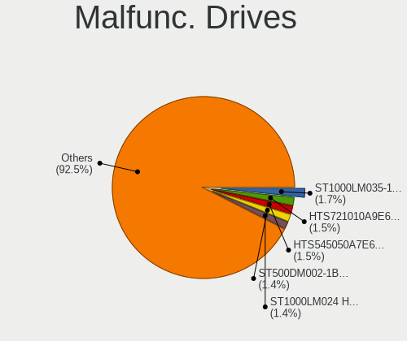
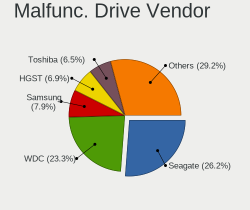
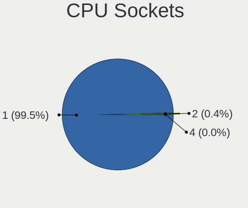
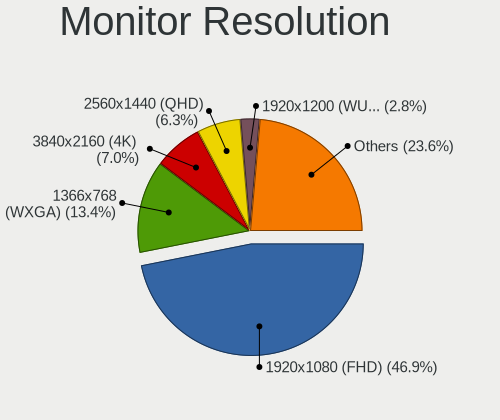
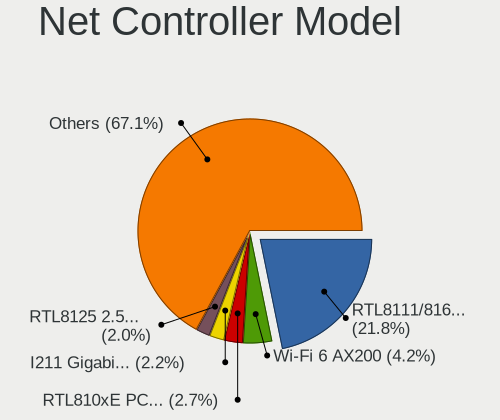
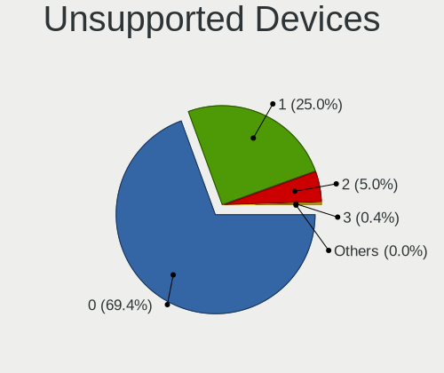

Manjaro - Tested Hardware & Statistics
--------------------------------------

A project to collect tested hardware configurations for Manjaro.

Anyone can contribute to this report by the [hw-probe](https://github.com/linuxhw/hw-probe) tool:

    sudo -E hw-probe -all -upload

Please contribute! Especially if your hardware is rare.

This is a report for all computer types. See also reports for [desktops](/Dist/Manjaro/Desktop/README.md) and [notebooks](/Dist/Manjaro/Notebook/README.md).

Contents
--------

* [ Test Cases ](#test-cases)

* [ System ](#system)
  - [ OS                       ](#os)
  - [ OS Family                ](#os-family)
  - [ Kernel                   ](#kernel)
  - [ Kernel Family            ](#kernel-family)
  - [ Kernel Major Ver.        ](#kernel-major-ver)
  - [ Arch                     ](#arch)
  - [ DE                       ](#de)
  - [ Display Server           ](#display-server)
  - [ Display Manager          ](#display-manager)
  - [ OS Lang                  ](#os-lang)
  - [ Boot Mode                ](#boot-mode)
  - [ Filesystem               ](#filesystem)
  - [ Part. scheme             ](#part-scheme)
  - [ Dual Boot with Linux/BSD ](#dual-boot-with-linuxbsd)
  - [ Dual Boot (Win)          ](#dual-boot-win)

* [ Board ](#board)
  - [ Vendor                   ](#vendor)
  - [ Model                    ](#model)
  - [ Model Family             ](#model-family)
  - [ MFG Year                 ](#mfg-year)
  - [ Form Factor              ](#form-factor)
  - [ Secure Boot              ](#secure-boot)
  - [ Coreboot                 ](#coreboot)
  - [ RAM Size                 ](#ram-size)
  - [ RAM Used                 ](#ram-used)
  - [ Total Drives             ](#total-drives)
  - [ Has CD-ROM               ](#has-cd-rom)
  - [ Has Ethernet             ](#has-ethernet)
  - [ Has WiFi                 ](#has-wifi)
  - [ Has Bluetooth            ](#has-bluetooth)

* [ Location ](#location)
  - [ Country                  ](#country)
  - [ City                     ](#city)

* [ Drives ](#drives)
  - [ Drive Vendor             ](#drive-vendor)
  - [ Drive Model              ](#drive-model)
  - [ HDD Vendor               ](#hdd-vendor)
  - [ SSD Vendor               ](#ssd-vendor)
  - [ Drive Kind               ](#drive-kind)
  - [ Drive Connector          ](#drive-connector)
  - [ Drive Size               ](#drive-size)
  - [ Space Total              ](#space-total)
  - [ Space Used               ](#space-used)
  - [ Malfunc. Drives          ](#malfunc-drives)
  - [ Malfunc. Drive Vendor    ](#malfunc-drive-vendor)
  - [ Malfunc. HDD Vendor      ](#malfunc-hdd-vendor)
  - [ Malfunc. Drive Kind      ](#malfunc-drive-kind)
  - [ Failed Drives            ](#failed-drives)
  - [ Failed Drive Vendor      ](#failed-drive-vendor)
  - [ Drive Status             ](#drive-status)

* [ Storage controller ](#storage-controller)
  - [ Storage Vendor           ](#storage-vendor)
  - [ Storage Model            ](#storage-model)
  - [ Storage Kind             ](#storage-kind)

* [ Processor ](#processor)
  - [ CPU Vendor               ](#cpu-vendor)
  - [ CPU Model                ](#cpu-model)
  - [ CPU Model Family         ](#cpu-model-family)
  - [ CPU Cores                ](#cpu-cores)
  - [ CPU Sockets              ](#cpu-sockets)
  - [ CPU Threads              ](#cpu-threads)
  - [ CPU Op-Modes             ](#cpu-op-modes)
  - [ CPU Microcode            ](#cpu-microcode)
  - [ CPU Microarch            ](#cpu-microarch)

* [ Graphics ](#graphics)
  - [ GPU Vendor               ](#gpu-vendor)
  - [ GPU Model                ](#gpu-model)
  - [ GPU Combo                ](#gpu-combo)
  - [ GPU Driver               ](#gpu-driver)
  - [ GPU Memory               ](#gpu-memory)

* [ Monitor ](#monitor)
  - [ Monitor Vendor           ](#monitor-vendor)
  - [ Monitor Model            ](#monitor-model)
  - [ Monitor Resolution       ](#monitor-resolution)
  - [ Monitor Diagonal         ](#monitor-diagonal)
  - [ Monitor Width            ](#monitor-width)
  - [ Aspect Ratio             ](#aspect-ratio)
  - [ Monitor Area             ](#monitor-area)
  - [ Pixel Density            ](#pixel-density)
  - [ Multiple Monitors        ](#multiple-monitors)

* [ Network ](#network)
  - [ Net Controller Vendor    ](#net-controller-vendor)
  - [ Net Controller Model     ](#net-controller-model)
  - [ Wireless Vendor          ](#wireless-vendor)
  - [ Wireless Model           ](#wireless-model)
  - [ Ethernet Vendor          ](#ethernet-vendor)
  - [ Ethernet Model           ](#ethernet-model)
  - [ Net Controller Kind      ](#net-controller-kind)
  - [ Used Controller          ](#used-controller)
  - [ NICs                     ](#nics)
  - [ IPv6                     ](#ipv6)

* [ Bluetooth ](#bluetooth)
  - [ Bluetooth Vendor         ](#bluetooth-vendor)
  - [ Bluetooth Model          ](#bluetooth-model)

* [ Sound ](#sound)
  - [ Sound Vendor             ](#sound-vendor)
  - [ Sound Model              ](#sound-model)

* [ Memory ](#memory)
  - [ Memory Vendor            ](#memory-vendor)
  - [ Memory Model             ](#memory-model)
  - [ Memory Kind              ](#memory-kind)
  - [ Memory Form Factor       ](#memory-form-factor)
  - [ Memory Size              ](#memory-size)
  - [ Memory Speed             ](#memory-speed)

* [ Printers & scanners ](#printers--scanners)
  - [ Printer Vendor           ](#printer-vendor)
  - [ Printer Model            ](#printer-model)
  - [ Scanner Vendor           ](#scanner-vendor)
  - [ Scanner Model            ](#scanner-model)

* [ Camera ](#camera)
  - [ Camera Vendor            ](#camera-vendor)
  - [ Camera Model             ](#camera-model)

* [ Security ](#security)
  - [ Fingerprint Vendor       ](#fingerprint-vendor)
  - [ Fingerprint Model        ](#fingerprint-model)
  - [ Chipcard Vendor          ](#chipcard-vendor)
  - [ Chipcard Model           ](#chipcard-model)

* [ Unsupported ](#unsupported)
  - [ Unsupported Devices      ](#unsupported-devices)
  - [ Unsupported Device Types ](#unsupported-device-types)

Test Cases
----------

Total: 8541

| Vendor        | Model                       | Form-Factor | Probe                                                      | Date         |
|---------------|-----------------------------|-------------|------------------------------------------------------------|--------------|
| Schenker      | VISION 15 (SVS15E21)        | Notebook    | [2b5c165e30](https://linux-hardware.org/?probe=2b5c165e30) | Nov 02, 2022 |
| HP            | 8054                        | Desktop     | [0f866b3605](https://linux-hardware.org/?probe=0f866b3605) | Nov 02, 2022 |
| Dell          | XPS 13 9305                 | Notebook    | [4ffebc50a0](https://linux-hardware.org/?probe=4ffebc50a0) | Nov 02, 2022 |
| ASUSTek       | P5K-E                       | Desktop     | [6b48759d1d](https://linux-hardware.org/?probe=6b48759d1d) | Nov 02, 2022 |
| Dell          | Precision 7530              | Notebook    | [b1b5f7678c](https://linux-hardware.org/?probe=b1b5f7678c) | Nov 01, 2022 |
| MSI           | Z370 GAMING PLUS            | Desktop     | [527c779cfb](https://linux-hardware.org/?probe=527c779cfb) | Nov 01, 2022 |
| MSI           | MAG B550 TOMAHAWK           | Desktop     | [8ce0b9271b](https://linux-hardware.org/?probe=8ce0b9271b) | Nov 01, 2022 |
| Apple         | MacBookAir6,2               | Notebook    | [053e74af53](https://linux-hardware.org/?probe=053e74af53) | Nov 01, 2022 |
| Acer          | Aspire A515-46              | Notebook    | [ef6bcab217](https://linux-hardware.org/?probe=ef6bcab217) | Nov 01, 2022 |
| MSI           | MAG B660M MORTAR WIFI DD... | Desktop     | [115e9027d0](https://linux-hardware.org/?probe=115e9027d0) | Nov 01, 2022 |
| Acer          | H410H6-M17 P21-A1           | Desktop     | [9333be5120](https://linux-hardware.org/?probe=9333be5120) | Nov 01, 2022 |
| ASUSTek       | TUF Gaming X570-PLUS        | Desktop     | [6e577f6de5](https://linux-hardware.org/?probe=6e577f6de5) | Nov 01, 2022 |
| Lenovo        | ThinkPad L460 20FVS1Y500    | Notebook    | [5fc669ddbe](https://linux-hardware.org/?probe=5fc669ddbe) | Nov 01, 2022 |
| SANTECH       | NL5xRU                      | Notebook    | [63e1b4298d](https://linux-hardware.org/?probe=63e1b4298d) | Oct 31, 2022 |
| ASUSTek       | X510UNR                     | Notebook    | [6a28e2929d](https://linux-hardware.org/?probe=6a28e2929d) | Oct 31, 2022 |
| HP            | 3397                        | Desktop     | [942cfa2a25](https://linux-hardware.org/?probe=942cfa2a25) | Oct 31, 2022 |
| Gigabyte      | X570 AORUS ELITE            | Desktop     | [f497e98b58](https://linux-hardware.org/?probe=f497e98b58) | Oct 31, 2022 |
| Lenovo        | ThinkPad T440p 20AW005BG... | Notebook    | [b25134edde](https://linux-hardware.org/?probe=b25134edde) | Oct 31, 2022 |
| ASUSTek       | ROG Strix G713RW_G713RW     | Notebook    | [5355a5547a](https://linux-hardware.org/?probe=5355a5547a) | Oct 31, 2022 |
| Alienware     | 15 R3                       | Notebook    | [4659975000](https://linux-hardware.org/?probe=4659975000) | Oct 31, 2022 |
| Lenovo        | ThinkPad S1 Yoga 20CD00B... | Notebook    | [0e06dcc642](https://linux-hardware.org/?probe=0e06dcc642) | Oct 31, 2022 |
| Gigabyte      | Z77M-D3H                    | Desktop     | [83cd207e4e](https://linux-hardware.org/?probe=83cd207e4e) | Oct 30, 2022 |
| ASRock        | X570 Pro4                   | Desktop     | [d2407c253b](https://linux-hardware.org/?probe=d2407c253b) | Oct 30, 2022 |
| ASUSTek       | X510UNR                     | Notebook    | [41a0a441d3](https://linux-hardware.org/?probe=41a0a441d3) | Oct 30, 2022 |
| Lenovo        | IdeaPad 320-15IAP 80XR      | Notebook    | [c49a76df2a](https://linux-hardware.org/?probe=c49a76df2a) | Oct 30, 2022 |
| ASUSTek       | X550JX                      | Notebook    | [56e2dbb09b](https://linux-hardware.org/?probe=56e2dbb09b) | Oct 30, 2022 |
| ASUSTek       | ROG CROSSHAIR VIII HERO     | Desktop     | [7d6c392e74](https://linux-hardware.org/?probe=7d6c392e74) | Oct 29, 2022 |
| Gigabyte      | Z370 HD3-CF                 | Desktop     | [06cb3f01ba](https://linux-hardware.org/?probe=06cb3f01ba) | Oct 29, 2022 |
| Lenovo        | MAHOBAY Win8 STD EM DPK ... | All in one  | [4b37b09299](https://linux-hardware.org/?probe=4b37b09299) | Oct 29, 2022 |
| ASUSTek       | PRIME A320M-K               | Desktop     | [25caeb6d9e](https://linux-hardware.org/?probe=25caeb6d9e) | Oct 29, 2022 |
| Lenovo        | IdeaPad Y700-15ISK 80NV     | Notebook    | [eb22113dae](https://linux-hardware.org/?probe=eb22113dae) | Oct 29, 2022 |
| ASUSTek       | PRIME B365M-C               | Desktop     | [ccf9650f9a](https://linux-hardware.org/?probe=ccf9650f9a) | Oct 29, 2022 |
| HP            | InsydeH2O EFI BIOS          | Notebook    | [d157bdbc2b](https://linux-hardware.org/?probe=d157bdbc2b) | Oct 29, 2022 |
| ASUSTek       | X541UV                      | Notebook    | [cef88d9d62](https://linux-hardware.org/?probe=cef88d9d62) | Oct 29, 2022 |
| Acer          | Aspire TC-885 V:1.1         | Desktop     | [81ccab7297](https://linux-hardware.org/?probe=81ccab7297) | Oct 29, 2022 |
| Acer          | Aspire 4745Z                | Notebook    | [baf4fe6e63](https://linux-hardware.org/?probe=baf4fe6e63) | Oct 29, 2022 |
| Chuwi         | LapBook Pro                 | Notebook    | [d362ed14bf](https://linux-hardware.org/?probe=d362ed14bf) | Oct 28, 2022 |
| ASUSTek       | PRIME A320M-K               | Desktop     | [5876a2f3d6](https://linux-hardware.org/?probe=5876a2f3d6) | Oct 28, 2022 |
| Lenovo        | ThinkBook 14p Gen 2 20YN    | Notebook    | [806e4d754d](https://linux-hardware.org/?probe=806e4d754d) | Oct 28, 2022 |
| Lenovo        | ThinkBook 14p Gen 2 20YN    | Notebook    | [d6ccf0a2d8](https://linux-hardware.org/?probe=d6ccf0a2d8) | Oct 28, 2022 |
| Lenovo        | IdeaPad Slim 7 14ITL05 8... | Notebook    | [d5c2f29c22](https://linux-hardware.org/?probe=d5c2f29c22) | Oct 28, 2022 |
| ASUSTek       | P9X79-WS-SYS                | Desktop     | [8b10d380a5](https://linux-hardware.org/?probe=8b10d380a5) | Oct 28, 2022 |
| MSI           | GP66 Leopard 11UG           | Notebook    | [aec6edc8a0](https://linux-hardware.org/?probe=aec6edc8a0) | Oct 28, 2022 |
| Dell          | Inspiron 11 - 3147          | Notebook    | [58d46fb47f](https://linux-hardware.org/?probe=58d46fb47f) | Oct 28, 2022 |
| Acer          | Aspire E5-573G              | Notebook    | [f575803f23](https://linux-hardware.org/?probe=f575803f23) | Oct 28, 2022 |
| Lenovo        | G470 20078                  | Notebook    | [c923b6d506](https://linux-hardware.org/?probe=c923b6d506) | Oct 27, 2022 |
| HP            | ProBook 450 G5              | Notebook    | [664bf1184f](https://linux-hardware.org/?probe=664bf1184f) | Oct 27, 2022 |
| HP            | Laptop 15s-eq2xxx           | Notebook    | [0e69671817](https://linux-hardware.org/?probe=0e69671817) | Oct 27, 2022 |
| HUAWEI        | BOM-WXX9                    | Notebook    | [5548027da3](https://linux-hardware.org/?probe=5548027da3) | Oct 27, 2022 |
| HP            | EliteBook 855 G8 Noteboo... | Notebook    | [b9c616b406](https://linux-hardware.org/?probe=b9c616b406) | Oct 27, 2022 |
| ASRock        | B550M Pro4                  | Desktop     | [b21b6b2908](https://linux-hardware.org/?probe=b21b6b2908) | Oct 27, 2022 |
| HP            | Laptop 15-dy2xxx            | Notebook    | [16b3338525](https://linux-hardware.org/?probe=16b3338525) | Oct 27, 2022 |
| HP            | ProBook 445 G7              | Notebook    | [d9f63cbff8](https://linux-hardware.org/?probe=d9f63cbff8) | Oct 26, 2022 |
| HP            | ENVY x360 Convertible 13... | Convertible | [26d539c606](https://linux-hardware.org/?probe=26d539c606) | Oct 26, 2022 |
| HP            | EliteBook 855 G8 Noteboo... | Notebook    | [ffa2d93859](https://linux-hardware.org/?probe=ffa2d93859) | Oct 26, 2022 |
| RuggedPC      | RuggedBookJ87               | Tablet      | [74d39d268f](https://linux-hardware.org/?probe=74d39d268f) | Oct 26, 2022 |
| HP            | EliteBook 855 G8 Noteboo... | Notebook    | [642cfbc2d7](https://linux-hardware.org/?probe=642cfbc2d7) | Oct 26, 2022 |
| Lenovo        | ThinkPad R500 2716W2K       | Notebook    | [c9a59d0ee9](https://linux-hardware.org/?probe=c9a59d0ee9) | Oct 26, 2022 |
| Dell          | Inspiron 16 7620 2-in-1     | Convertible | [300126736b](https://linux-hardware.org/?probe=300126736b) | Oct 26, 2022 |
| HP            | Spectre Laptop 13-af0xx     | Notebook    | [1ded224c69](https://linux-hardware.org/?probe=1ded224c69) | Oct 26, 2022 |
| ASUSTek       | ROG STRIX B550-F GAMING     | Desktop     | [2227bb9824](https://linux-hardware.org/?probe=2227bb9824) | Oct 25, 2022 |
| Gigabyte      | H370 AORUS GAMING 3 WIFI... | Desktop     | [1f3561258a](https://linux-hardware.org/?probe=1f3561258a) | Oct 25, 2022 |
| Acer          | Swift SFX14-41G             | Notebook    | [a490ccddeb](https://linux-hardware.org/?probe=a490ccddeb) | Oct 25, 2022 |
| Unknown       | 1.0                         | Desktop     | [cf3a9de207](https://linux-hardware.org/?probe=cf3a9de207) | Oct 25, 2022 |
| Lenovo        | ThinkPad T440p 20AN0069U... | Notebook    | [bb90eb1ad1](https://linux-hardware.org/?probe=bb90eb1ad1) | Oct 25, 2022 |
| ASUSTek       | VivoBook_ASUSLaptop X512... | Notebook    | [b2bb88f27f](https://linux-hardware.org/?probe=b2bb88f27f) | Oct 25, 2022 |
| MSI           | H97 PC Mate                 | Desktop     | [1916f5c048](https://linux-hardware.org/?probe=1916f5c048) | Oct 25, 2022 |
| Lenovo        | ThinkBook 15-IIL 20SM       | Notebook    | [e5d5599bc7](https://linux-hardware.org/?probe=e5d5599bc7) | Oct 25, 2022 |
| Lenovo        | ThinkBook 15-IIL 20SM       | Notebook    | [9cc8a69671](https://linux-hardware.org/?probe=9cc8a69671) | Oct 25, 2022 |
| HP            | Spectre Laptop 13-af0xx     | Notebook    | [7e6d814d87](https://linux-hardware.org/?probe=7e6d814d87) | Oct 25, 2022 |
| HP            | Pavilion Gaming Laptop 1... | Notebook    | [15ced71b20](https://linux-hardware.org/?probe=15ced71b20) | Oct 24, 2022 |
| HUAWEI        | KLVL-WXX9                   | Notebook    | [8994af98ff](https://linux-hardware.org/?probe=8994af98ff) | Oct 24, 2022 |
| HUAWEI        | KLVL-WXX9                   | Notebook    | [fc7326f81b](https://linux-hardware.org/?probe=fc7326f81b) | Oct 24, 2022 |
| Acer          | Aspire MC605 v1.0           | Desktop     | [9544ff7787](https://linux-hardware.org/?probe=9544ff7787) | Oct 24, 2022 |
| Gigabyte      | B550M AORUS PRO-P           | Desktop     | [4b88876126](https://linux-hardware.org/?probe=4b88876126) | Oct 24, 2022 |
| Lenovo        | ThinkPad T440p 20AN0069U... | Notebook    | [37028111aa](https://linux-hardware.org/?probe=37028111aa) | Oct 24, 2022 |
| HONOR         | BBR-WAX9                    | Notebook    | [bc30c6555a](https://linux-hardware.org/?probe=bc30c6555a) | Oct 24, 2022 |
| HONOR         | BBR-WAX9                    | Notebook    | [667d235a8f](https://linux-hardware.org/?probe=667d235a8f) | Oct 24, 2022 |
| MSI           | Pulse GL76 12UEK            | Notebook    | [bb06dc4756](https://linux-hardware.org/?probe=bb06dc4756) | Oct 24, 2022 |
| HP            | 828A                        | Desktop     | [2123f2610c](https://linux-hardware.org/?probe=2123f2610c) | Oct 24, 2022 |
| Tactus        | GeoBook_240                 | Notebook    | [5331bf15bd](https://linux-hardware.org/?probe=5331bf15bd) | Oct 23, 2022 |
| MSI           | Z68MA-G45                   | Desktop     | [3f398756eb](https://linux-hardware.org/?probe=3f398756eb) | Oct 23, 2022 |
| MSI           | Z68MA-G45                   | Desktop     | [d96627943d](https://linux-hardware.org/?probe=d96627943d) | Oct 23, 2022 |
| Lenovo        | ThinkPad T410s 2912AJ7      | Notebook    | [efb2913d22](https://linux-hardware.org/?probe=efb2913d22) | Oct 23, 2022 |
| HP            | ZBook 17 G6                 | Notebook    | [d28d720a26](https://linux-hardware.org/?probe=d28d720a26) | Oct 23, 2022 |
| Lenovo        | ThinkCentre A57 9851CDF     | Desktop     | [8910fecc7d](https://linux-hardware.org/?probe=8910fecc7d) | Oct 23, 2022 |
| HP            | ENVY x360 2-in-1 Laptop ... | Convertible | [c75d0e252d](https://linux-hardware.org/?probe=c75d0e252d) | Oct 23, 2022 |
| HP            | 1489                        | All in one  | [3b3379c0e2](https://linux-hardware.org/?probe=3b3379c0e2) | Oct 23, 2022 |
| Gigabyte      | Z690 AORUS PRO              | Desktop     | [7cb3500943](https://linux-hardware.org/?probe=7cb3500943) | Oct 22, 2022 |
| ASUSTek       | VivoBook_ASUSLaptop X512... | Notebook    | [7cafd024ea](https://linux-hardware.org/?probe=7cafd024ea) | Oct 22, 2022 |
| Gigabyte      | B365M DS3H                  | Desktop     | [d5f16dde87](https://linux-hardware.org/?probe=d5f16dde87) | Oct 22, 2022 |
| Global Dis... | W11651                      | Notebook    | [9cf1e2df07](https://linux-hardware.org/?probe=9cf1e2df07) | Oct 22, 2022 |
| Lenovo        | ThinkPad E14 Gen 3 20YDS... | Notebook    | [9f16b5a7e2](https://linux-hardware.org/?probe=9f16b5a7e2) | Oct 22, 2022 |
| ASUSTek       | P8Z68-V GEN3                | Desktop     | [e1dedae10a](https://linux-hardware.org/?probe=e1dedae10a) | Oct 22, 2022 |
| Lenovo        | IdeaPad Y700-15ISK 80NV     | Notebook    | [025f4fa8ab](https://linux-hardware.org/?probe=025f4fa8ab) | Oct 22, 2022 |
| Lenovo        | Legion 5 82B5               | Notebook    | [3d67f01531](https://linux-hardware.org/?probe=3d67f01531) | Oct 22, 2022 |
| HP            | ProBook 6550b               | Notebook    | [cc300bedc8](https://linux-hardware.org/?probe=cc300bedc8) | Oct 21, 2022 |
| MSI           | Katana GF76 11UG            | Notebook    | [ab90111e61](https://linux-hardware.org/?probe=ab90111e61) | Oct 21, 2022 |
| Dell          | Latitude E6400              | Notebook    | [d899ab2ef4](https://linux-hardware.org/?probe=d899ab2ef4) | Oct 21, 2022 |
| ASRock        | H310CM-HDV                  | Desktop     | [afe54b52c9](https://linux-hardware.org/?probe=afe54b52c9) | Oct 21, 2022 |
| Medion        | S15449                      | Notebook    | [c737a8be4a](https://linux-hardware.org/?probe=c737a8be4a) | Oct 20, 2022 |
| ASUSTek       | ROG STRIX B360-G GAMING     | Desktop     | [eaad7f0757](https://linux-hardware.org/?probe=eaad7f0757) | Oct 20, 2022 |
| ASUSTek       | VivoBook_ASUSLaptop M350... | Notebook    | [669c715fa8](https://linux-hardware.org/?probe=669c715fa8) | Oct 20, 2022 |
| HP            | ProBook 6550b               | Notebook    | [176fc347d2](https://linux-hardware.org/?probe=176fc347d2) | Oct 20, 2022 |
| Acer          | Aspire E5-553G              | Notebook    | [8e75bbadf5](https://linux-hardware.org/?probe=8e75bbadf5) | Oct 20, 2022 |
| Gigabyte      | H61M-S2V-B3                 | Desktop     | [9e7b79bfbb](https://linux-hardware.org/?probe=9e7b79bfbb) | Oct 20, 2022 |
| ASUSTek       | Pro WS X570-ACE             | Desktop     | [7f069e1021](https://linux-hardware.org/?probe=7f069e1021) | Oct 20, 2022 |
| HP            | Pavilion Laptop 15-cs3xx... | Notebook    | [30bf540299](https://linux-hardware.org/?probe=30bf540299) | Oct 19, 2022 |
| MSI           | Modern 15 A11MU             | Notebook    | [2413dd813b](https://linux-hardware.org/?probe=2413dd813b) | Oct 19, 2022 |
| ASUSTek       | ZenBook UX325EA_UX325EA     | Notebook    | [56089b3625](https://linux-hardware.org/?probe=56089b3625) | Oct 19, 2022 |
| Acer          | Aspire 4750                 | Notebook    | [e07159c158](https://linux-hardware.org/?probe=e07159c158) | Oct 19, 2022 |
| ASUSTek       | H110M-K                     | Desktop     | [a43f7f6601](https://linux-hardware.org/?probe=a43f7f6601) | Oct 19, 2022 |
| Tactus        | GeoFlex 110                 | Convertible | [f329d7485d](https://linux-hardware.org/?probe=f329d7485d) | Oct 19, 2022 |
| Dell          | Latitude E6220              | Notebook    | [66badd4e9a](https://linux-hardware.org/?probe=66badd4e9a) | Oct 18, 2022 |
| ASUSTek       | H170 PRO GAMING             | Desktop     | [cb86d1ba99](https://linux-hardware.org/?probe=cb86d1ba99) | Oct 18, 2022 |
| Tactus        | GeoFlex 110                 | Convertible | [419bdfa23d](https://linux-hardware.org/?probe=419bdfa23d) | Oct 18, 2022 |
| ASRock        | X670E PG Lightning          | Desktop     | [c3ce6dce01](https://linux-hardware.org/?probe=c3ce6dce01) | Oct 18, 2022 |
| Acer          | Aspire 4750                 | Notebook    | [0910d29ded](https://linux-hardware.org/?probe=0910d29ded) | Oct 18, 2022 |
| Foxconn       | 2ABF                        | Desktop     | [ac2c9383c0](https://linux-hardware.org/?probe=ac2c9383c0) | Oct 18, 2022 |
| Lenovo        | ThinkPad T410s 2912AJ7      | Notebook    | [8c97c331b9](https://linux-hardware.org/?probe=8c97c331b9) | Oct 18, 2022 |
| Lenovo        | G580 20150                  | Notebook    | [7639ea3b73](https://linux-hardware.org/?probe=7639ea3b73) | Oct 18, 2022 |
| ASRock        | H310CM-HDV                  | Desktop     | [2426012acb](https://linux-hardware.org/?probe=2426012acb) | Oct 18, 2022 |
| Lenovo        | IdeaPad 110-15ACL 80TJ      | Notebook    | [469118097a](https://linux-hardware.org/?probe=469118097a) | Oct 18, 2022 |
| HP            | ZBook 17 G6                 | Notebook    | [2f27f08ce8](https://linux-hardware.org/?probe=2f27f08ce8) | Oct 17, 2022 |
| Chuwi         | HeroBook Air                | Notebook    | [21c0a75b93](https://linux-hardware.org/?probe=21c0a75b93) | Oct 17, 2022 |
| ASRock        | X570 Phantom Gaming 4       | Desktop     | [98024d1066](https://linux-hardware.org/?probe=98024d1066) | Oct 17, 2022 |
| Acer          | Aspire V3-771               | Notebook    | [91e4682f34](https://linux-hardware.org/?probe=91e4682f34) | Oct 17, 2022 |
| Dell          | Inspiron 7520               | Notebook    | [732f4ea8fe](https://linux-hardware.org/?probe=732f4ea8fe) | Oct 17, 2022 |
| HP            | ENVY 15                     | Notebook    | [17681478e1](https://linux-hardware.org/?probe=17681478e1) | Oct 17, 2022 |
| MACHINIST     | X79 V2.82H                  | Desktop     | [5d99fbefc1](https://linux-hardware.org/?probe=5d99fbefc1) | Oct 17, 2022 |
| Dell          | Inspiron 3542               | Notebook    | [55f7f983c4](https://linux-hardware.org/?probe=55f7f983c4) | Oct 17, 2022 |
| ASUSTek       | ROG Maximus XI HERO         | Desktop     | [7de3eff9df](https://linux-hardware.org/?probe=7de3eff9df) | Oct 16, 2022 |
| Lenovo        | Y50-70 20378                | Notebook    | [fa5c67a5b1](https://linux-hardware.org/?probe=fa5c67a5b1) | Oct 16, 2022 |
| Lenovo        | Y50-70 20378                | Notebook    | [a17c987ea8](https://linux-hardware.org/?probe=a17c987ea8) | Oct 16, 2022 |
| MSI           | Katana GF76 11UG            | Notebook    | [460ceb1307](https://linux-hardware.org/?probe=460ceb1307) | Oct 16, 2022 |
| Gigabyte      | X399 AORUS PRO-CF           | Desktop     | [93e82a30ac](https://linux-hardware.org/?probe=93e82a30ac) | Oct 16, 2022 |
| Gigabyte      | X399 AORUS PRO-CF           | Desktop     | [eb9b7e329b](https://linux-hardware.org/?probe=eb9b7e329b) | Oct 16, 2022 |
| ASUSTek       | VivoBook 14_ASUS Laptop ... | Notebook    | [e515cd0e66](https://linux-hardware.org/?probe=e515cd0e66) | Oct 15, 2022 |
| HP            | ProBook 455 G7              | Notebook    | [bb58a322f3](https://linux-hardware.org/?probe=bb58a322f3) | Oct 14, 2022 |
| ASUSTek       | P8H77-V                     | Desktop     | [d6af5204e6](https://linux-hardware.org/?probe=d6af5204e6) | Oct 14, 2022 |
| ASUSTek       | ROG Zephyrus G14 GA401QM... | Notebook    | [89b3dc8edd](https://linux-hardware.org/?probe=89b3dc8edd) | Oct 14, 2022 |
| Gigabyte      | H510M H                     | Desktop     | [28a0b7d55f](https://linux-hardware.org/?probe=28a0b7d55f) | Oct 14, 2022 |
| HP            | 802E                        | Desktop     | [6231a344aa](https://linux-hardware.org/?probe=6231a344aa) | Oct 14, 2022 |
| Dell          | 0HN7XN A01                  | Desktop     | [a71fb08b36](https://linux-hardware.org/?probe=a71fb08b36) | Oct 14, 2022 |
| Acer          | Aspire E5-553G              | Notebook    | [fcf93f53f4](https://linux-hardware.org/?probe=fcf93f53f4) | Oct 13, 2022 |
| Tactus        | GeoFlex 110                 | Convertible | [2188336cf7](https://linux-hardware.org/?probe=2188336cf7) | Oct 13, 2022 |
| HP            | ENVY x360 Convertible 13... | Convertible | [7a1b08d912](https://linux-hardware.org/?probe=7a1b08d912) | Oct 13, 2022 |
| ASUSTek       | ROG Flow X13 GV301RE_GV3... | Convertible | [8990bf0049](https://linux-hardware.org/?probe=8990bf0049) | Oct 13, 2022 |
| Dell          | 0HN7XN A01                  | Desktop     | [abf7c780d2](https://linux-hardware.org/?probe=abf7c780d2) | Oct 13, 2022 |
| ASUSTek       | M5A78L-M PLUS/USB3          | Desktop     | [f55bb836c3](https://linux-hardware.org/?probe=f55bb836c3) | Oct 13, 2022 |
| ASUSTek       | ROG STRIX X570-E GAMING ... | Desktop     | [8e2b577a03](https://linux-hardware.org/?probe=8e2b577a03) | Oct 13, 2022 |
| HP            | ENVY x360 Convertible 13... | Convertible | [3f808f36a0](https://linux-hardware.org/?probe=3f808f36a0) | Oct 13, 2022 |
| Lenovo        | G580 20150                  | Notebook    | [8e564b93cb](https://linux-hardware.org/?probe=8e564b93cb) | Oct 13, 2022 |
| Schenker      | VISION 15 (SVS15E21)        | Notebook    | [705931711b](https://linux-hardware.org/?probe=705931711b) | Oct 13, 2022 |
| Dell          | Latitude E7250              | Notebook    | [f397f81353](https://linux-hardware.org/?probe=f397f81353) | Oct 12, 2022 |
| Lenovo        | IdeaPad Y700-15ISK 80NV     | Notebook    | [5074f8e471](https://linux-hardware.org/?probe=5074f8e471) | Oct 12, 2022 |
| ASUSTek       | VivoBook_ASUSLaptop X512... | Notebook    | [318b3ef82b](https://linux-hardware.org/?probe=318b3ef82b) | Oct 12, 2022 |
| Lenovo        | Yoga Slim 7 ProX 14ARH7 ... | Notebook    | [cbc3888844](https://linux-hardware.org/?probe=cbc3888844) | Oct 12, 2022 |
| Lenovo        | IdeaPad Y700-15ISK 80NV     | Notebook    | [fb97ad01eb](https://linux-hardware.org/?probe=fb97ad01eb) | Oct 12, 2022 |
| Lenovo        | ThinkPad E14 Gen 3 20YDS... | Notebook    | [17feafd680](https://linux-hardware.org/?probe=17feafd680) | Oct 12, 2022 |
| ASUSTek       | ASUS TUF Dash F15 FX516P... | Notebook    | [e940ddf8a7](https://linux-hardware.org/?probe=e940ddf8a7) | Oct 12, 2022 |
| ASUSTek       | VivoBook_ASUSLaptop E410... | Notebook    | [1bbc611d89](https://linux-hardware.org/?probe=1bbc611d89) | Oct 12, 2022 |
| AVITA         | NS14A6                      | Notebook    | [0ed9ac0a2b](https://linux-hardware.org/?probe=0ed9ac0a2b) | Oct 11, 2022 |
| AVITA         | NS14A6                      | Notebook    | [27412eff74](https://linux-hardware.org/?probe=27412eff74) | Oct 11, 2022 |
| Dell          | Vostro 5490                 | Notebook    | [8263bf7d5b](https://linux-hardware.org/?probe=8263bf7d5b) | Oct 11, 2022 |
| Gigabyte      | X470 AORUS ULTRA GAMING-... | Desktop     | [dd9695948c](https://linux-hardware.org/?probe=dd9695948c) | Oct 11, 2022 |
| ASUSTek       | ROG STRIX X570-E GAMING     | Desktop     | [d006fa9a19](https://linux-hardware.org/?probe=d006fa9a19) | Oct 11, 2022 |
| HUAWEI        | HVY-WXX9                    | Notebook    | [10ab944320](https://linux-hardware.org/?probe=10ab944320) | Oct 11, 2022 |
| Gigabyte      | B450M H                     | Desktop     | [36fc5f2c90](https://linux-hardware.org/?probe=36fc5f2c90) | Oct 10, 2022 |
| Gigabyte      | B450M H                     | Desktop     | [c3dc2e33df](https://linux-hardware.org/?probe=c3dc2e33df) | Oct 10, 2022 |
| HP            | Pavilion g6                 | Notebook    | [943ee204e0](https://linux-hardware.org/?probe=943ee204e0) | Oct 10, 2022 |
| Lenovo        | Z50-75 80EC                 | Notebook    | [3837291e33](https://linux-hardware.org/?probe=3837291e33) | Oct 10, 2022 |
| Lenovo        | Yoga Slim 7 Pro 14IAP7 8... | Notebook    | [cc663da2bc](https://linux-hardware.org/?probe=cc663da2bc) | Oct 10, 2022 |
| Dell          | Inspiron 7520               | Notebook    | [05e8d3583c](https://linux-hardware.org/?probe=05e8d3583c) | Oct 10, 2022 |
| HP            | 8460                        | Desktop     | [08601807cc](https://linux-hardware.org/?probe=08601807cc) | Oct 10, 2022 |
| HP            | 8460                        | Desktop     | [5be586f271](https://linux-hardware.org/?probe=5be586f271) | Oct 10, 2022 |
| Acer          | Aspire 5750                 | Notebook    | [f335fc684d](https://linux-hardware.org/?probe=f335fc684d) | Oct 09, 2022 |
| Apple         | MacBookPro10,2              | Notebook    | [379590d053](https://linux-hardware.org/?probe=379590d053) | Oct 09, 2022 |
| Dell          | XPS 13 9310 2-in-1          | Convertible | [09ba76a57e](https://linux-hardware.org/?probe=09ba76a57e) | Oct 09, 2022 |
| ASUSTek       | P6X58-E-WS                  | Desktop     | [786a8ba316](https://linux-hardware.org/?probe=786a8ba316) | Oct 09, 2022 |
| Gigabyte      | MC62-G40-00 01000100        | Server      | [a4d3ab40a5](https://linux-hardware.org/?probe=a4d3ab40a5) | Oct 09, 2022 |
| Dell          | Precision 5560              | Notebook    | [001c5b0c94](https://linux-hardware.org/?probe=001c5b0c94) | Oct 09, 2022 |
| Dell          | 0TTDMJ A00                  | Desktop     | [656b9369be](https://linux-hardware.org/?probe=656b9369be) | Oct 09, 2022 |
| Dell          | Latitude 5310               | Notebook    | [f694e6b10e](https://linux-hardware.org/?probe=f694e6b10e) | Oct 09, 2022 |
| ASRock        | B550M Steel Legend          | Desktop     | [740a5f78d8](https://linux-hardware.org/?probe=740a5f78d8) | Oct 09, 2022 |
| Gigabyte      | B450 GAMING X               | Desktop     | [a297c351ed](https://linux-hardware.org/?probe=a297c351ed) | Oct 09, 2022 |
| Chuwi         | HeroBook Air                | Notebook    | [4b263aaaae](https://linux-hardware.org/?probe=4b263aaaae) | Oct 09, 2022 |
| Acer          | Extensa 215-32              | Notebook    | [3e6ce67bb5](https://linux-hardware.org/?probe=3e6ce67bb5) | Oct 08, 2022 |
| ASUSTek       | VivoBook_ASUSLaptop E410... | Notebook    | [49802b54cd](https://linux-hardware.org/?probe=49802b54cd) | Oct 08, 2022 |
| Acer          | Extensa 215-32              | Notebook    | [366f0e7930](https://linux-hardware.org/?probe=366f0e7930) | Oct 08, 2022 |
| ASUSTek       | X550CL                      | Notebook    | [4afa1df235](https://linux-hardware.org/?probe=4afa1df235) | Oct 08, 2022 |
| ASUSTek       | X550CL                      | Notebook    | [d0584d3672](https://linux-hardware.org/?probe=d0584d3672) | Oct 08, 2022 |
| Dell          | 0NW73C A00                  | Desktop     | [2b0a3f91ea](https://linux-hardware.org/?probe=2b0a3f91ea) | Oct 08, 2022 |
| HP            | Pavilion dv6                | Notebook    | [0c2329c8d6](https://linux-hardware.org/?probe=0c2329c8d6) | Oct 07, 2022 |
| Dell          | 0M9KCM A01                  | Desktop     | [6fa93f6da5](https://linux-hardware.org/?probe=6fa93f6da5) | Oct 07, 2022 |
| HP            | Pavilion Gaming Laptop 1... | Notebook    | [2e020fe882](https://linux-hardware.org/?probe=2e020fe882) | Oct 07, 2022 |
| Gigabyte      | P55M-UD2                    | Desktop     | [e9627c4c34](https://linux-hardware.org/?probe=e9627c4c34) | Oct 07, 2022 |
| Lenovo        | ThinkPad X380 Yoga 20LJS... | Convertible | [829a14598f](https://linux-hardware.org/?probe=829a14598f) | Oct 07, 2022 |
| Dell          | 0D24M8 A00                  | Desktop     | [8130af2fab](https://linux-hardware.org/?probe=8130af2fab) | Oct 06, 2022 |
| Toshiba       | Satellite P755              | Notebook    | [9b8147c1f7](https://linux-hardware.org/?probe=9b8147c1f7) | Oct 05, 2022 |
| MSI           | Raider GE76 12UGS           | Notebook    | [4586e7ece8](https://linux-hardware.org/?probe=4586e7ece8) | Oct 05, 2022 |
| HP            | 87D6 SMVB                   | Desktop     | [03cf885086](https://linux-hardware.org/?probe=03cf885086) | Oct 05, 2022 |
| Toshiba       | Encore                      | Notebook    | [a11bf538ec](https://linux-hardware.org/?probe=a11bf538ec) | Oct 05, 2022 |
| CyberPower... | FANG Pro                    | Notebook    | [e8734135b0](https://linux-hardware.org/?probe=e8734135b0) | Oct 05, 2022 |
| Lenovo        | N23 80UR                    | Convertible | [f6bf19c41a](https://linux-hardware.org/?probe=f6bf19c41a) | Oct 05, 2022 |
| Lenovo        | Yoga Slim 7 14ARE05 82A2    | Notebook    | [4ba2e11c73](https://linux-hardware.org/?probe=4ba2e11c73) | Oct 05, 2022 |
| Gigabyte      | H510M H                     | Desktop     | [a4c0e2324f](https://linux-hardware.org/?probe=a4c0e2324f) | Oct 04, 2022 |
| Lenovo        | Legion 5 15ACH6H 82JU       | Notebook    | [8d863ae2d8](https://linux-hardware.org/?probe=8d863ae2d8) | Oct 04, 2022 |
| Jumper        | Ezpad                       | Tablet      | [20a54bbe35](https://linux-hardware.org/?probe=20a54bbe35) | Oct 04, 2022 |
| Jumper        | Ezpad                       | Tablet      | [a887c036ac](https://linux-hardware.org/?probe=a887c036ac) | Oct 04, 2022 |
| Lenovo        | ThinkPad T14 Gen 3 21CFC... | Notebook    | [f913d9cde2](https://linux-hardware.org/?probe=f913d9cde2) | Oct 04, 2022 |
| HP            | 21D0                        | Desktop     | [6815e2bba2](https://linux-hardware.org/?probe=6815e2bba2) | Oct 04, 2022 |
| Lenovo        | ThinkPad T490 20RYS07R00    | Notebook    | [d6be1b9cf9](https://linux-hardware.org/?probe=d6be1b9cf9) | Oct 04, 2022 |
| ASUSTek       | ROG Strix G713RW_G713RW     | Notebook    | [ca89628082](https://linux-hardware.org/?probe=ca89628082) | Oct 03, 2022 |
| Dell          | 0HN7XN A00                  | Desktop     | [77776da6f7](https://linux-hardware.org/?probe=77776da6f7) | Oct 03, 2022 |
| Dell          | 0HN7XN A00                  | Desktop     | [84d4748b3e](https://linux-hardware.org/?probe=84d4748b3e) | Oct 03, 2022 |
| GPD           | G1621-02                    | Notebook    | [1f88eb2bec](https://linux-hardware.org/?probe=1f88eb2bec) | Oct 03, 2022 |
| ASUSTek       | ROG Strix G713RW_G713RW     | Notebook    | [9c3f9bb60e](https://linux-hardware.org/?probe=9c3f9bb60e) | Oct 03, 2022 |
| MSI           | Katana GF76 11UG            | Notebook    | [d433417836](https://linux-hardware.org/?probe=d433417836) | Oct 03, 2022 |
| Lenovo        | Yoga Slim 7 Pro 14IAP7 8... | Notebook    | [0d67980efe](https://linux-hardware.org/?probe=0d67980efe) | Oct 03, 2022 |
| Acer          | Aspire F5-573G              | Notebook    | [a9f0d894af](https://linux-hardware.org/?probe=a9f0d894af) | Oct 03, 2022 |
| Dell          | XPS 13 9310                 | Notebook    | [f58849d2c7](https://linux-hardware.org/?probe=f58849d2c7) | Oct 03, 2022 |
| HP            | Laptop 14-dk0xxx            | Notebook    | [4283f9a4bd](https://linux-hardware.org/?probe=4283f9a4bd) | Oct 02, 2022 |
| HP            | Laptop 15-da0xxx            | Notebook    | [831cd8e80f](https://linux-hardware.org/?probe=831cd8e80f) | Oct 02, 2022 |
| ASUSTek       | TUF Gaming X570-PLUS        | Desktop     | [668ad3e30a](https://linux-hardware.org/?probe=668ad3e30a) | Oct 02, 2022 |
| HP            | ProBook 6470b               | Notebook    | [10438199c4](https://linux-hardware.org/?probe=10438199c4) | Oct 02, 2022 |
| ASRock        | B450 Pro4                   | Desktop     | [402a7995c4](https://linux-hardware.org/?probe=402a7995c4) | Oct 02, 2022 |
| Chuwi         | HeroBook Air                | Notebook    | [8de9e9df4a](https://linux-hardware.org/?probe=8de9e9df4a) | Oct 01, 2022 |
| HP            | 250 G3                      | Notebook    | [753ef53a5a](https://linux-hardware.org/?probe=753ef53a5a) | Oct 01, 2022 |
| Lenovo        | IdeaPad 3 17IML05 81WC      | Notebook    | [e722d17a52](https://linux-hardware.org/?probe=e722d17a52) | Oct 01, 2022 |
| ASUSTek       | TUF Gaming B550M-PLUS       | Desktop     | [15a068e26b](https://linux-hardware.org/?probe=15a068e26b) | Oct 01, 2022 |
| ASUSTek       | TUF Gaming B550M-PLUS       | Desktop     | [3a9d882d91](https://linux-hardware.org/?probe=3a9d882d91) | Oct 01, 2022 |
| Gigabyte      | B450 AORUS ELITE            | Desktop     | [dda857d7e6](https://linux-hardware.org/?probe=dda857d7e6) | Oct 01, 2022 |
| Lenovo        | ThinkPad X270 W10DG 20K5... | Notebook    | [012add7349](https://linux-hardware.org/?probe=012add7349) | Oct 01, 2022 |
| Gigabyte      | Z170X-Gaming GT             | Desktop     | [991ea6c93f](https://linux-hardware.org/?probe=991ea6c93f) | Oct 01, 2022 |
| Sony          | SVF15N17CXB                 | Notebook    | [5082dde27d](https://linux-hardware.org/?probe=5082dde27d) | Oct 01, 2022 |
| ASUSTek       | ROG Maximus XI HERO         | Desktop     | [32a742b50d](https://linux-hardware.org/?probe=32a742b50d) | Oct 01, 2022 |
| Irbis         | NB121                       | Notebook    | [a2eb8c8af1](https://linux-hardware.org/?probe=a2eb8c8af1) | Sep 30, 2022 |
| Dell          | 07PR60 A01                  | Desktop     | [812cb18129](https://linux-hardware.org/?probe=812cb18129) | Sep 30, 2022 |
| HP            | EliteBook 850 G1            | Notebook    | [9667dac801](https://linux-hardware.org/?probe=9667dac801) | Sep 30, 2022 |
| Irbis         | NB121                       | Notebook    | [90a0ae1cf9](https://linux-hardware.org/?probe=90a0ae1cf9) | Sep 30, 2022 |
| Lenovo        | ThinkPad X1 Extreme 20MF... | Notebook    | [3ad60e2d21](https://linux-hardware.org/?probe=3ad60e2d21) | Sep 30, 2022 |
| Toshiba       | Satellite NB10t-A-102       | Notebook    | [5a8032ee05](https://linux-hardware.org/?probe=5a8032ee05) | Sep 30, 2022 |
| Intel Clie... | LAPQC71A                    | Notebook    | [6d7beecaf6](https://linux-hardware.org/?probe=6d7beecaf6) | Sep 30, 2022 |
| HP            | Notebook                    | Notebook    | [e172f83238](https://linux-hardware.org/?probe=e172f83238) | Sep 30, 2022 |
| Toshiba       | Satellite NB10t-A-102       | Notebook    | [4e9248b1eb](https://linux-hardware.org/?probe=4e9248b1eb) | Sep 30, 2022 |
| ASUSTek       | ROG Zephyrus G15 GA503QR... | Notebook    | [353324cbfd](https://linux-hardware.org/?probe=353324cbfd) | Sep 30, 2022 |
| Dell          | 0HN7XN A00                  | Desktop     | [c9126cd382](https://linux-hardware.org/?probe=c9126cd382) | Sep 30, 2022 |
| Lenovo        | ThinkPad X1 Carbon 5th 2... | Notebook    | [a1bee52021](https://linux-hardware.org/?probe=a1bee52021) | Sep 29, 2022 |
| ASRock        | X399M Taichi                | Desktop     | [b7943d1645](https://linux-hardware.org/?probe=b7943d1645) | Sep 29, 2022 |
| Gigabyte      | Z690 GAMING X DDR4          | Desktop     | [b372f8126f](https://linux-hardware.org/?probe=b372f8126f) | Sep 29, 2022 |
| HP            | Victus by Laptop 16-e0xx... | Notebook    | [85b6d03edb](https://linux-hardware.org/?probe=85b6d03edb) | Sep 29, 2022 |
| Lenovo        | IdeaPad Gaming 3 15ARH05... | Notebook    | [dfea1c9f70](https://linux-hardware.org/?probe=dfea1c9f70) | Sep 29, 2022 |
| ASUSTek       | ROG Zephyrus G15 GA503QR... | Notebook    | [25d3fc37f5](https://linux-hardware.org/?probe=25d3fc37f5) | Sep 29, 2022 |
| ASUSTek       | ROG Strix G713RW_G713RW     | Notebook    | [f5ddf4a2b4](https://linux-hardware.org/?probe=f5ddf4a2b4) | Sep 29, 2022 |
| ASRock        | J3160DC-ITX                 | Desktop     | [7e1818288f](https://linux-hardware.org/?probe=7e1818288f) | Sep 29, 2022 |
| HP            | ProBook 430 G6              | Notebook    | [5c133ac35b](https://linux-hardware.org/?probe=5c133ac35b) | Sep 29, 2022 |
| MSI           | B450 TOMAHAWK MAX           | Desktop     | [c83049a0f6](https://linux-hardware.org/?probe=c83049a0f6) | Sep 29, 2022 |
| HUAWEI        | KLVD-WXX9                   | Notebook    | [72d80e02c9](https://linux-hardware.org/?probe=72d80e02c9) | Sep 29, 2022 |
| HUAWEI        | KLVD-WXX9                   | Notebook    | [47b22afda2](https://linux-hardware.org/?probe=47b22afda2) | Sep 29, 2022 |
| ASRock        | Z97 Pro3                    | Desktop     | [7b34a50df8](https://linux-hardware.org/?probe=7b34a50df8) | Sep 28, 2022 |
| ASRock        | B450 Pro4                   | Desktop     | [6a9066019c](https://linux-hardware.org/?probe=6a9066019c) | Sep 28, 2022 |
| Toshiba       | Satellite C650D             | Notebook    | [0fce536c7d](https://linux-hardware.org/?probe=0fce536c7d) | Sep 28, 2022 |
| ASUSTek       | ROG CROSSHAIR VIII HERO     | Desktop     | [76aac25208](https://linux-hardware.org/?probe=76aac25208) | Sep 28, 2022 |
| Gigabyte      | B450 AORUS PRO WIFI-CF      | Desktop     | [27ce89f701](https://linux-hardware.org/?probe=27ce89f701) | Sep 28, 2022 |
| HP            | Laptop 14-dq1xxx            | Notebook    | [9b3a3858bc](https://linux-hardware.org/?probe=9b3a3858bc) | Sep 28, 2022 |
| Samsung       | RV420/RV520/RV720/E3530/... | Notebook    | [9a1e3a98ab](https://linux-hardware.org/?probe=9a1e3a98ab) | Sep 28, 2022 |
| ASUSTek       | VivoBook_ASUSLaptop E410... | Notebook    | [ebfbdd37b8](https://linux-hardware.org/?probe=ebfbdd37b8) | Sep 27, 2022 |
| MSI           | MPG X570 GAMING EDGE WIF... | Desktop     | [30507c8461](https://linux-hardware.org/?probe=30507c8461) | Sep 27, 2022 |
| ASUSTek       | ROG Zephyrus G15 GA503QR... | Notebook    | [09d154c2f2](https://linux-hardware.org/?probe=09d154c2f2) | Sep 27, 2022 |
| HP            | Pavilion Laptop 15-cc1xx    | Notebook    | [e27e7bfd76](https://linux-hardware.org/?probe=e27e7bfd76) | Sep 27, 2022 |
| Dell          | Latitude E7440              | Notebook    | [d211ff97c6](https://linux-hardware.org/?probe=d211ff97c6) | Sep 27, 2022 |
| Lenovo        | IdeaPad 5 Pro 14ARH7 82S... | Notebook    | [a31db51878](https://linux-hardware.org/?probe=a31db51878) | Sep 26, 2022 |
| Dell          | Latitude E6400              | Notebook    | [c1190109d0](https://linux-hardware.org/?probe=c1190109d0) | Sep 26, 2022 |
| Lenovo        | ThinkPad T460p 20FW000EG... | Notebook    | [60138ee2f9](https://linux-hardware.org/?probe=60138ee2f9) | Sep 26, 2022 |
| Timi          | RedmiBook Pro 15S           | Notebook    | [533cc3b3ae](https://linux-hardware.org/?probe=533cc3b3ae) | Sep 26, 2022 |
| Gigabyte      | B550M AORUS ELITE           | Desktop     | [e5b4fe8914](https://linux-hardware.org/?probe=e5b4fe8914) | Sep 25, 2022 |
| HP            | ENVY x360 Convertible 15... | Convertible | [4b6ce98f70](https://linux-hardware.org/?probe=4b6ce98f70) | Sep 25, 2022 |
| ASUSTek       | Rampage V EDITION 10        | Desktop     | [c65cbf84dc](https://linux-hardware.org/?probe=c65cbf84dc) | Sep 25, 2022 |
| ASUSTek       | N45SF                       | Notebook    | [7461bd2562](https://linux-hardware.org/?probe=7461bd2562) | Sep 25, 2022 |
| Apple         | MacBookAir7,2               | Notebook    | [0d1b8fe301](https://linux-hardware.org/?probe=0d1b8fe301) | Sep 25, 2022 |
| HP            | ENVY x360 2-in-1 Laptop ... | Convertible | [2fa3578315](https://linux-hardware.org/?probe=2fa3578315) | Sep 24, 2022 |
| ASUSTek       | ROG Strix G713QM_G713QM     | Notebook    | [786063cdde](https://linux-hardware.org/?probe=786063cdde) | Sep 24, 2022 |
| Lenovo        | Yoga Slim 7 Pro 14IAP7 8... | Notebook    | [ccba8f6c1a](https://linux-hardware.org/?probe=ccba8f6c1a) | Sep 24, 2022 |
| MSI           | MPG B550 GAMING EDGE WIF... | Desktop     | [e47b2b85dc](https://linux-hardware.org/?probe=e47b2b85dc) | Sep 24, 2022 |
| MSI           | MPG B550 GAMING EDGE WIF... | Desktop     | [719b20fd4e](https://linux-hardware.org/?probe=719b20fd4e) | Sep 24, 2022 |
| HP            | ENVY x360 Convert13-ay00... | Convertible | [41abb17737](https://linux-hardware.org/?probe=41abb17737) | Sep 23, 2022 |
| ASUSTek       | X556UF                      | Notebook    | [47f145c034](https://linux-hardware.org/?probe=47f145c034) | Sep 23, 2022 |
| Lenovo        | ThinkPad X1 Carbon 4th 2... | Convertible | [f9c071cdd8](https://linux-hardware.org/?probe=f9c071cdd8) | Sep 23, 2022 |
| Acer          | Swift SF314-71              | Notebook    | [321edce78d](https://linux-hardware.org/?probe=321edce78d) | Sep 23, 2022 |
| Huanan        | X99-TF                      | Desktop     | [1361d73bcd](https://linux-hardware.org/?probe=1361d73bcd) | Sep 22, 2022 |
| Lenovo        | ThinkPad Edge E531 68852... | Notebook    | [5e91cc6f07](https://linux-hardware.org/?probe=5e91cc6f07) | Sep 21, 2022 |
| Unknown       | Unknown                     | Notebook    | [af65739ccc](https://linux-hardware.org/?probe=af65739ccc) | Sep 21, 2022 |
| HP            | ENVY x360 2-in-1 Laptop ... | Convertible | [6b012b0a87](https://linux-hardware.org/?probe=6b012b0a87) | Sep 21, 2022 |
| ASUSTek       | ASUS TUF Gaming A15 FA50... | Notebook    | [2f16f0177f](https://linux-hardware.org/?probe=2f16f0177f) | Sep 21, 2022 |
| ASUSTek       | ROG Zephyrus G14 GA402RJ... | Notebook    | [967110ef60](https://linux-hardware.org/?probe=967110ef60) | Sep 21, 2022 |
| Lenovo        | ThinkPad T430 2349A17       | Notebook    | [ba2eadfd53](https://linux-hardware.org/?probe=ba2eadfd53) | Sep 21, 2022 |
| HP            | Laptop                      | Notebook    | [0cbc7e4f5a](https://linux-hardware.org/?probe=0cbc7e4f5a) | Sep 21, 2022 |
| ASUSTek       | ROG STRIX Z390-E GAMING     | Desktop     | [1faf714086](https://linux-hardware.org/?probe=1faf714086) | Sep 21, 2022 |
| HP            | ENVY 15                     | Notebook    | [388547d18c](https://linux-hardware.org/?probe=388547d18c) | Sep 21, 2022 |
| Lenovo        | ThinkPad E560 20EV002FUS    | Notebook    | [6ffce551a0](https://linux-hardware.org/?probe=6ffce551a0) | Sep 21, 2022 |
| HP            | ProBook 4520s               | Notebook    | [af4a575c52](https://linux-hardware.org/?probe=af4a575c52) | Sep 20, 2022 |
| Minix         | NEO G41V-4 Max              | Desktop     | [a1640603ca](https://linux-hardware.org/?probe=a1640603ca) | Sep 20, 2022 |
| Apple         | MacBookAir7,2               | Notebook    | [f9f1973349](https://linux-hardware.org/?probe=f9f1973349) | Sep 20, 2022 |
| Gigabyte      | GA-78LMT-USB3 R2 sex        | Desktop     | [6c7d6ef178](https://linux-hardware.org/?probe=6c7d6ef178) | Sep 20, 2022 |
| Dell          | 040DDP A01                  | Desktop     | [635c6895e1](https://linux-hardware.org/?probe=635c6895e1) | Sep 20, 2022 |
| Gateway       | NV57H                       | Notebook    | [8fb75d738c](https://linux-hardware.org/?probe=8fb75d738c) | Sep 20, 2022 |
| Intel         | X99 V1.0                    | Desktop     | [02bfe94d24](https://linux-hardware.org/?probe=02bfe94d24) | Sep 19, 2022 |
| Gigabyte      | B550M AORUS PRO-P           | Desktop     | [25d7dc8f0d](https://linux-hardware.org/?probe=25d7dc8f0d) | Sep 19, 2022 |
| Gigabyte      | A320M-H-CF                  | Desktop     | [a3e30957c7](https://linux-hardware.org/?probe=a3e30957c7) | Sep 19, 2022 |
| ASUSTek       | ROG Zephyrus G14 GA402RK... | Notebook    | [82fc38716c](https://linux-hardware.org/?probe=82fc38716c) | Sep 19, 2022 |
| Lenovo        | ThinkPad E14 Gen 3 20Y70... | Notebook    | [75cc4fa084](https://linux-hardware.org/?probe=75cc4fa084) | Sep 19, 2022 |
| Acer          | Nitro AN515-42              | Notebook    | [97e2956728](https://linux-hardware.org/?probe=97e2956728) | Sep 19, 2022 |
| Timi          | Redmi Book Pro 15 2022      | Notebook    | [1cbec0f70e](https://linux-hardware.org/?probe=1cbec0f70e) | Sep 19, 2022 |
| HP            | 212B                        | Desktop     | [c823e0060e](https://linux-hardware.org/?probe=c823e0060e) | Sep 19, 2022 |
| Lenovo        | B580 20144                  | Notebook    | [093692b5ab](https://linux-hardware.org/?probe=093692b5ab) | Sep 19, 2022 |
| Lenovo        | Legion 5 15ACH6 82QJ        | Notebook    | [e2c5e4775c](https://linux-hardware.org/?probe=e2c5e4775c) | Sep 19, 2022 |
| Apple         | MacBookPro15,1              | Notebook    | [b0e746792f](https://linux-hardware.org/?probe=b0e746792f) | Sep 19, 2022 |
| Sony          | VPCF236FM                   | Notebook    | [397f485cfc](https://linux-hardware.org/?probe=397f485cfc) | Sep 19, 2022 |
| Dell          | Precision M4800             | Notebook    | [73d00fe344](https://linux-hardware.org/?probe=73d00fe344) | Sep 19, 2022 |
| MSI           | B250M PRO-VDH               | Desktop     | [b0836f0c26](https://linux-hardware.org/?probe=b0836f0c26) | Sep 19, 2022 |
| ASRock        | X399 Phantom Gaming 6       | Desktop     | [a28b408f4a](https://linux-hardware.org/?probe=a28b408f4a) | Sep 19, 2022 |
| ASUSTek       | G752VT                      | Notebook    | [bbd1eb7810](https://linux-hardware.org/?probe=bbd1eb7810) | Sep 18, 2022 |
| MSI           | B250M PRO-VDH               | Desktop     | [3b6b90fee6](https://linux-hardware.org/?probe=3b6b90fee6) | Sep 18, 2022 |
| ASUSTek       | VivoBook_ASUS Laptop E41... | Notebook    | [13b23fabb7](https://linux-hardware.org/?probe=13b23fabb7) | Sep 18, 2022 |
| Gigabyte      | B550M AORUS PRO-P           | Desktop     | [d11c4e27df](https://linux-hardware.org/?probe=d11c4e27df) | Sep 18, 2022 |
| Chuwi         | HeroBook Air                | Notebook    | [26967f1d9e](https://linux-hardware.org/?probe=26967f1d9e) | Sep 17, 2022 |
| Samsung       | 950QCG                      | Convertible | [92aaede7a0](https://linux-hardware.org/?probe=92aaede7a0) | Sep 17, 2022 |
| HP            | ProBook 450 G1              | Notebook    | [b4b9ca9ae4](https://linux-hardware.org/?probe=b4b9ca9ae4) | Sep 17, 2022 |
| HP            | ProBook 450 G1              | Notebook    | [bb2c7c1b05](https://linux-hardware.org/?probe=bb2c7c1b05) | Sep 17, 2022 |
| HP            | ProBook 450 G1              | Notebook    | [a6082da5f7](https://linux-hardware.org/?probe=a6082da5f7) | Sep 17, 2022 |
| HP            | ENVY Laptop 13-ad1xx        | Notebook    | [59369fa3fb](https://linux-hardware.org/?probe=59369fa3fb) | Sep 17, 2022 |
| Dell          | Inspiron MP061              | Notebook    | [f045e1f138](https://linux-hardware.org/?probe=f045e1f138) | Sep 17, 2022 |
| Intel         | X99 V1.0                    | Desktop     | [735c794db9](https://linux-hardware.org/?probe=735c794db9) | Sep 17, 2022 |
| Foxconn       | 2ADA                        | Desktop     | [b136916fb3](https://linux-hardware.org/?probe=b136916fb3) | Sep 16, 2022 |
| Apple         | Mac-F2268CC8                | All in one  | [8d9f049d7e](https://linux-hardware.org/?probe=8d9f049d7e) | Sep 16, 2022 |
| Lenovo        | Yoga C740-15IML 81TD        | Convertible | [05b029f919](https://linux-hardware.org/?probe=05b029f919) | Sep 16, 2022 |
| BESSTAR Te... | UM700                       | Desktop     | [f6ccaeed5e](https://linux-hardware.org/?probe=f6ccaeed5e) | Sep 16, 2022 |
| ASRock        | B450M Pro4                  | Desktop     | [19a46a2f8e](https://linux-hardware.org/?probe=19a46a2f8e) | Sep 16, 2022 |
| AXDIA Inte... | WINPAD V10                  | Notebook    | [ef71c6cd50](https://linux-hardware.org/?probe=ef71c6cd50) | Sep 15, 2022 |
| Lenovo        | ThinkPad X270 W10DG 20K5... | Notebook    | [31c810e744](https://linux-hardware.org/?probe=31c810e744) | Sep 15, 2022 |
| Lenovo        | ThinkPad T430 2347G4U       | Notebook    | [8e62e03e0b](https://linux-hardware.org/?probe=8e62e03e0b) | Sep 15, 2022 |
| Lenovo        | IdeaPad 700-15ISK 80RU      | Notebook    | [00bcfb51bd](https://linux-hardware.org/?probe=00bcfb51bd) | Sep 15, 2022 |
| ASUSTek       | ROG Strix G513QY_G513QY     | Notebook    | [45309244c3](https://linux-hardware.org/?probe=45309244c3) | Sep 15, 2022 |
| Chuwi         | HeroBook Air                | Notebook    | [fdf38c7fb0](https://linux-hardware.org/?probe=fdf38c7fb0) | Sep 14, 2022 |
| ASUSTek       | PRIME H410M-E               | Desktop     | [91f1fdc978](https://linux-hardware.org/?probe=91f1fdc978) | Sep 14, 2022 |
| Exo           | H310CH5-M2                  | Desktop     | [9154b5149b](https://linux-hardware.org/?probe=9154b5149b) | Sep 14, 2022 |
| Lenovo        | V310-15ISK 80SY             | Notebook    | [fbd66d36f4](https://linux-hardware.org/?probe=fbd66d36f4) | Sep 14, 2022 |
| ASUSTek       | PRIME B450-PLUS             | Desktop     | [4a436fb179](https://linux-hardware.org/?probe=4a436fb179) | Sep 14, 2022 |
| ASUSTek       | X550VXK                     | Notebook    | [df5d5b4f0d](https://linux-hardware.org/?probe=df5d5b4f0d) | Sep 13, 2022 |
| Lenovo        | Legion 5 15ACH6 82JW        | Notebook    | [c9df1f2514](https://linux-hardware.org/?probe=c9df1f2514) | Sep 13, 2022 |
| Lenovo        | Legion 5 15ACH6 82JW        | Notebook    | [b62bd233c2](https://linux-hardware.org/?probe=b62bd233c2) | Sep 13, 2022 |
| ASUSTek       | X99-DELUXE II               | Desktop     | [8c9013ec12](https://linux-hardware.org/?probe=8c9013ec12) | Sep 13, 2022 |
| Schenker      | VISION 15 (SVS15E21)        | Notebook    | [dee9d6b81f](https://linux-hardware.org/?probe=dee9d6b81f) | Sep 13, 2022 |
| ASUSTek       | X541UJ                      | Notebook    | [9745e99a08](https://linux-hardware.org/?probe=9745e99a08) | Sep 13, 2022 |
| ASUSTek       | ROG Zephyrus G15 GA503RM... | Notebook    | [82b9d1247e](https://linux-hardware.org/?probe=82b9d1247e) | Sep 13, 2022 |
| Dell          | 04YP6J A00                  | Desktop     | [ef4ae2baac](https://linux-hardware.org/?probe=ef4ae2baac) | Sep 13, 2022 |
| Lenovo        | Yoga Slim 7 Pro 14IAP7 8... | Notebook    | [b7eb07ec8d](https://linux-hardware.org/?probe=b7eb07ec8d) | Sep 12, 2022 |
| HP            | Pavilion dm1                | Notebook    | [eec30e7c48](https://linux-hardware.org/?probe=eec30e7c48) | Sep 12, 2022 |
| HP            | ENVY 15                     | Notebook    | [97caacee16](https://linux-hardware.org/?probe=97caacee16) | Sep 12, 2022 |
| Gigabyte      | H77M-D3H                    | Desktop     | [3767b84078](https://linux-hardware.org/?probe=3767b84078) | Sep 12, 2022 |
| ASUSTek       | ROG Zephyrus G15 GA503RM... | Notebook    | [3d1d8301c3](https://linux-hardware.org/?probe=3d1d8301c3) | Sep 12, 2022 |
| HP            | EliteBook 840 G5            | Notebook    | [4083f9d2c9](https://linux-hardware.org/?probe=4083f9d2c9) | Sep 11, 2022 |
| Foxconn       | 2ADA                        | Desktop     | [1b43b0d291](https://linux-hardware.org/?probe=1b43b0d291) | Sep 11, 2022 |
| Timi          | RedmiBook Pro 15S           | Notebook    | [20b9167fee](https://linux-hardware.org/?probe=20b9167fee) | Sep 11, 2022 |
| ASUSTek       | TUF Gaming FX504GM_FX80G... | Notebook    | [0d1c08d02b](https://linux-hardware.org/?probe=0d1c08d02b) | Sep 11, 2022 |
| HP            | Pavilion Gaming Laptop 1... | Notebook    | [1ecadc5740](https://linux-hardware.org/?probe=1ecadc5740) | Sep 11, 2022 |
| Intel         | NUC7JYB J67967-404          | Mini pc     | [c3ceb9c38b](https://linux-hardware.org/?probe=c3ceb9c38b) | Sep 11, 2022 |
| MSI           | B350M BAZOOKA               | Desktop     | [ff7d2e74a5](https://linux-hardware.org/?probe=ff7d2e74a5) | Sep 11, 2022 |
| ASRock        | J3160DC-ITX                 | Desktop     | [e854b82ab9](https://linux-hardware.org/?probe=e854b82ab9) | Sep 10, 2022 |
| ASUSTek       | ROG Zephyrus G15 GA503RM... | Notebook    | [8df1767beb](https://linux-hardware.org/?probe=8df1767beb) | Sep 10, 2022 |
| Lenovo        | Legion S7 15ACH6 82K8       | Notebook    | [d477c1084d](https://linux-hardware.org/?probe=d477c1084d) | Sep 10, 2022 |
| ASUSTek       | ZenBook UX325EA_UX325EA     | Notebook    | [f145a7915c](https://linux-hardware.org/?probe=f145a7915c) | Sep 10, 2022 |
| Gigabyte      | B450M DS3H-CF               | Desktop     | [6248f4732d](https://linux-hardware.org/?probe=6248f4732d) | Sep 10, 2022 |
| Dell          | Latitude E6430              | Notebook    | [323203ec1c](https://linux-hardware.org/?probe=323203ec1c) | Sep 09, 2022 |
| ASUSTek       | P9D-M Series                | Server      | [209be79723](https://linux-hardware.org/?probe=209be79723) | Sep 09, 2022 |
| Lenovo        | ThinkPad T540p 20BFA05FU... | Notebook    | [e953e3c331](https://linux-hardware.org/?probe=e953e3c331) | Sep 09, 2022 |
| ASUSTek       | ZenBook UX325JA_UX325JA     | Notebook    | [2f23958df0](https://linux-hardware.org/?probe=2f23958df0) | Sep 09, 2022 |
| ASUSTek       | ASUS TUF Gaming A15 FA50... | Notebook    | [f752846656](https://linux-hardware.org/?probe=f752846656) | Sep 09, 2022 |
| Gigabyte      | B550M AORUS PRO-P           | Desktop     | [70f5e3d77c](https://linux-hardware.org/?probe=70f5e3d77c) | Sep 08, 2022 |
| Dell          | Inspiron 7415 2-in-1        | Convertible | [408b0d3fd7](https://linux-hardware.org/?probe=408b0d3fd7) | Sep 07, 2022 |
| HP            | 3397                        | Desktop     | [0ebeef29bf](https://linux-hardware.org/?probe=0ebeef29bf) | Sep 07, 2022 |
| CyberPower... | FANG Pro                    | Notebook    | [4bb2815c31](https://linux-hardware.org/?probe=4bb2815c31) | Sep 07, 2022 |
| ASUSTek       | X541UJ                      | Notebook    | [84b26ca406](https://linux-hardware.org/?probe=84b26ca406) | Sep 07, 2022 |
| Intel         | Unknown                     | Desktop     | [2758407d23](https://linux-hardware.org/?probe=2758407d23) | Sep 07, 2022 |
| HP            | EliteBook 840 G5            | Notebook    | [bd15d55792](https://linux-hardware.org/?probe=bd15d55792) | Sep 07, 2022 |
| ASUSTek       | PRIME B360-PLUS             | Desktop     | [d35810173c](https://linux-hardware.org/?probe=d35810173c) | Sep 07, 2022 |
| ASUSTek       | ROG STRIX X470-F GAMING     | Desktop     | [038f57c2d8](https://linux-hardware.org/?probe=038f57c2d8) | Sep 06, 2022 |
| ASUSTek       | P9D-M Series                | Server      | [04faeec9ab](https://linux-hardware.org/?probe=04faeec9ab) | Sep 06, 2022 |
| ASUSTek       | ASUS EXPERTBOOK L1500CDA... | Notebook    | [58e55d314a](https://linux-hardware.org/?probe=58e55d314a) | Sep 06, 2022 |
| MSI           | Z87-G41 PC Mate             | Desktop     | [775e007fc8](https://linux-hardware.org/?probe=775e007fc8) | Sep 05, 2022 |
| Lenovo        | G580 20150                  | Notebook    | [e0bb6ae251](https://linux-hardware.org/?probe=e0bb6ae251) | Sep 05, 2022 |
| Intel         | B75                         | Desktop     | [eca0b46101](https://linux-hardware.org/?probe=eca0b46101) | Sep 05, 2022 |
| Lenovo        | Yoga Slim 7 14ARE05 82A2    | Notebook    | [11bdade1e5](https://linux-hardware.org/?probe=11bdade1e5) | Sep 05, 2022 |
| Acer          | Nitro AN515-54              | Notebook    | [5b76bade7e](https://linux-hardware.org/?probe=5b76bade7e) | Sep 05, 2022 |
| ASUSTek       | TUF B450M-PLUS GAMING       | Desktop     | [43267285d4](https://linux-hardware.org/?probe=43267285d4) | Sep 04, 2022 |
| Gigabyte      | X570 AORUS ULTRA            | Desktop     | [518aa50eb0](https://linux-hardware.org/?probe=518aa50eb0) | Sep 04, 2022 |
| Lenovo        | IdeaPad 3 14ADA05 81W0      | Notebook    | [cc43cdda9a](https://linux-hardware.org/?probe=cc43cdda9a) | Sep 04, 2022 |
| Gigabyte      | B360 AORUS GAMING 3 WIFI... | Desktop     | [4a27f8b033](https://linux-hardware.org/?probe=4a27f8b033) | Sep 04, 2022 |
| HP            | 8054                        | Desktop     | [878115f808](https://linux-hardware.org/?probe=878115f808) | Sep 04, 2022 |
| Lenovo        | IdeaPad Slim 1-14AST-05 ... | Notebook    | [8d611bed12](https://linux-hardware.org/?probe=8d611bed12) | Sep 04, 2022 |
| HUAWEI        | VLT-WX0                     | Notebook    | [f9881e0b9b](https://linux-hardware.org/?probe=f9881e0b9b) | Sep 03, 2022 |
| Dell          | XPS 15 9510                 | Notebook    | [3e057c7bbb](https://linux-hardware.org/?probe=3e057c7bbb) | Sep 03, 2022 |
| Gigabyte      | B360 AORUS GAMING 3 WIFI... | Desktop     | [65562b09e0](https://linux-hardware.org/?probe=65562b09e0) | Sep 03, 2022 |
| Acer          | Nitro AN515-54              | Notebook    | [5b5cc6b013](https://linux-hardware.org/?probe=5b5cc6b013) | Sep 03, 2022 |
| ASUSTek       | X510UNR                     | Notebook    | [ca761f1ee7](https://linux-hardware.org/?probe=ca761f1ee7) | Sep 03, 2022 |
| Acer          | Nitro AN515-42              | Notebook    | [74cdbd53f7](https://linux-hardware.org/?probe=74cdbd53f7) | Sep 03, 2022 |
| BESSTAR Te... | UM700                       | Desktop     | [f1198508de](https://linux-hardware.org/?probe=f1198508de) | Sep 03, 2022 |
| Dell          | Inspiron 5566               | Notebook    | [3c2359f16d](https://linux-hardware.org/?probe=3c2359f16d) | Sep 03, 2022 |
| Dell          | 07PR60 A01                  | Desktop     | [d37a4374eb](https://linux-hardware.org/?probe=d37a4374eb) | Sep 02, 2022 |
| ASUSTek       | P6X58D-E                    | Desktop     | [cf774b3e03](https://linux-hardware.org/?probe=cf774b3e03) | Sep 02, 2022 |
| Intel Clie... | LAPQC71A                    | Notebook    | [9bc39724f8](https://linux-hardware.org/?probe=9bc39724f8) | Sep 02, 2022 |
| MSI           | Delta 15 A5EFK              | Notebook    | [b7de6bff83](https://linux-hardware.org/?probe=b7de6bff83) | Sep 02, 2022 |
| HP            | 8054                        | Desktop     | [1586ce33d1](https://linux-hardware.org/?probe=1586ce33d1) | Sep 02, 2022 |
| ASRock        | N68-S                       | Desktop     | [df5d34428a](https://linux-hardware.org/?probe=df5d34428a) | Sep 01, 2022 |
| ASUSTek       | M5A78L-M LX3                | Desktop     | [5ba264dfb2](https://linux-hardware.org/?probe=5ba264dfb2) | Sep 01, 2022 |
| ASUSTek       | M5A78L-M LX3                | Desktop     | [169c9af937](https://linux-hardware.org/?probe=169c9af937) | Sep 01, 2022 |
| ASUSTek       | TUF Gaming FX505DY_FX505... | Notebook    | [9cabeefea8](https://linux-hardware.org/?probe=9cabeefea8) | Sep 01, 2022 |
| Lenovo        | SHARKBAY NO DPK             | Desktop     | [f872d36cd5](https://linux-hardware.org/?probe=f872d36cd5) | Sep 01, 2022 |
| Gigabyte      | B450 AORUS PRO-CF           | Desktop     | [37695eb7e5](https://linux-hardware.org/?probe=37695eb7e5) | Aug 31, 2022 |
| Unknown       | Unknown                     | Notebook    | [cba954794c](https://linux-hardware.org/?probe=cba954794c) | Aug 31, 2022 |
| ASUSTek       | TUF Gaming X570-PLUS        | Desktop     | [d816d2ade0](https://linux-hardware.org/?probe=d816d2ade0) | Aug 30, 2022 |
| ASRock        | N68-S                       | Desktop     | [6aabf89438](https://linux-hardware.org/?probe=6aabf89438) | Aug 30, 2022 |
| TUXEDO        | Polaris AMD Gen2 (REN)      | Notebook    | [df1e70349c](https://linux-hardware.org/?probe=df1e70349c) | Aug 29, 2022 |
| ASUSTek       | PRIME Z590-P                | Desktop     | [e05dcd4a08](https://linux-hardware.org/?probe=e05dcd4a08) | Aug 29, 2022 |
| ASRock        | FM2A58M-VG3+ R2.0           | Desktop     | [422af9d6b5](https://linux-hardware.org/?probe=422af9d6b5) | Aug 29, 2022 |
| Lenovo        | IdeaPad Gaming 3 15ACH6 ... | Notebook    | [6f169db96b](https://linux-hardware.org/?probe=6f169db96b) | Aug 29, 2022 |
| ASRock        | N68-S                       | Desktop     | [4fff0a6104](https://linux-hardware.org/?probe=4fff0a6104) | Aug 29, 2022 |
| ASUSTek       | ProArt B550-CREATOR         | Desktop     | [ec9f8ea30e](https://linux-hardware.org/?probe=ec9f8ea30e) | Aug 28, 2022 |
| Lenovo        | V14-ADA 82C6                | Notebook    | [1d3dfbba56](https://linux-hardware.org/?probe=1d3dfbba56) | Aug 27, 2022 |
| ASRock        | B550M Pro4                  | Desktop     | [8c6b85a46c](https://linux-hardware.org/?probe=8c6b85a46c) | Aug 27, 2022 |
| ASRock        | B450M Pro4                  | Desktop     | [f4fe5fd168](https://linux-hardware.org/?probe=f4fe5fd168) | Aug 27, 2022 |
| Gigabyte      | B550 GAMING X V2            | Desktop     | [94e2f7cedc](https://linux-hardware.org/?probe=94e2f7cedc) | Aug 27, 2022 |
| ASUSTek       | ROG Strix G733ZW_G733ZW     | Notebook    | [4384be22c4](https://linux-hardware.org/?probe=4384be22c4) | Aug 27, 2022 |
| Dell          | 0KWVT8 A02                  | Desktop     | [3f9c00b0da](https://linux-hardware.org/?probe=3f9c00b0da) | Aug 27, 2022 |
| Lenovo        | IdeaPad Flex-14API 81SS     | Notebook    | [85e0bc5d57](https://linux-hardware.org/?probe=85e0bc5d57) | Aug 27, 2022 |
| Lenovo        | G580 20150                  | Notebook    | [1813b94682](https://linux-hardware.org/?probe=1813b94682) | Aug 27, 2022 |
| Dell          | Vostro 5625                 | Notebook    | [741abbfe3d](https://linux-hardware.org/?probe=741abbfe3d) | Aug 26, 2022 |
| Lenovo        | ThinkPad E580 20KS003GMH    | Notebook    | [5cadf3c5d2](https://linux-hardware.org/?probe=5cadf3c5d2) | Aug 26, 2022 |
| ASRock        | X99 WS                      | Desktop     | [d16d59fab2](https://linux-hardware.org/?probe=d16d59fab2) | Aug 26, 2022 |
| Lenovo        | IdeaPad 5 15ALC05 82LN      | Notebook    | [d988e1aeb9](https://linux-hardware.org/?probe=d988e1aeb9) | Aug 25, 2022 |
| ASUSTek       | ROG Strix G513QY_G513QY     | Notebook    | [9e3b6f2140](https://linux-hardware.org/?probe=9e3b6f2140) | Aug 24, 2022 |
| Dell          | Inspiron 5505               | Notebook    | [4ea2e79611](https://linux-hardware.org/?probe=4ea2e79611) | Aug 24, 2022 |
| ASUSTek       | ROG Strix G513QY_G513QY     | Notebook    | [15960dc164](https://linux-hardware.org/?probe=15960dc164) | Aug 24, 2022 |
| Lenovo        | IdeaPad 5 Pro 14ACN6 82L... | Notebook    | [eed44ba087](https://linux-hardware.org/?probe=eed44ba087) | Aug 24, 2022 |
| ASUSTek       | Z170-P                      | Desktop     | [0bd08aee88](https://linux-hardware.org/?probe=0bd08aee88) | Aug 24, 2022 |
| ASUSTek       | X202E                       | Notebook    | [b814b9f427](https://linux-hardware.org/?probe=b814b9f427) | Aug 24, 2022 |
| Dell          | XPS 15 9520                 | Notebook    | [e4f7ce1ec7](https://linux-hardware.org/?probe=e4f7ce1ec7) | Aug 23, 2022 |
| ASUSTek       | VivoBook_ASUSLaptop X515... | Notebook    | [beb772b7f1](https://linux-hardware.org/?probe=beb772b7f1) | Aug 23, 2022 |
| Gigabyte      | B550M S2H                   | Desktop     | [8b5fe2494e](https://linux-hardware.org/?probe=8b5fe2494e) | Aug 23, 2022 |
| HUAWEI        | NBD-WXX9                    | Notebook    | [254b378771](https://linux-hardware.org/?probe=254b378771) | Aug 23, 2022 |
| Dell          | Latitude 5300 2-in-1        | Convertible | [79169c7ab4](https://linux-hardware.org/?probe=79169c7ab4) | Aug 23, 2022 |
| HP            | Laptop 14-dq1xxx            | Notebook    | [975461703e](https://linux-hardware.org/?probe=975461703e) | Aug 23, 2022 |
| ASUSTek       | PRIME B450M-A               | Desktop     | [bfdd1ab294](https://linux-hardware.org/?probe=bfdd1ab294) | Aug 23, 2022 |
| Acer          | Aspire A515-43              | Notebook    | [bc23fbec2a](https://linux-hardware.org/?probe=bc23fbec2a) | Aug 22, 2022 |
| Lenovo        | ThinkPad T14 Gen 2a 20XL... | Notebook    | [47cae9ef99](https://linux-hardware.org/?probe=47cae9ef99) | Aug 22, 2022 |
| MSI           | PS63 Modern 8RC             | Notebook    | [ae3bcc6b88](https://linux-hardware.org/?probe=ae3bcc6b88) | Aug 22, 2022 |
| MSI           | PS63 Modern 8RC             | Notebook    | [b45c0fb9fa](https://linux-hardware.org/?probe=b45c0fb9fa) | Aug 22, 2022 |
| Dell          | Vostro 3550                 | Notebook    | [230033da23](https://linux-hardware.org/?probe=230033da23) | Aug 22, 2022 |
| ASUSTek       | TUF Gaming X570-PLUS        | Desktop     | [0dbe2c5dfd](https://linux-hardware.org/?probe=0dbe2c5dfd) | Aug 22, 2022 |
| HP            | ENVY m6 Notebook            | Notebook    | [c51af546e7](https://linux-hardware.org/?probe=c51af546e7) | Aug 22, 2022 |
| Lenovo        | IdeaPad S145-15IIL 82DJ     | Notebook    | [64b9832653](https://linux-hardware.org/?probe=64b9832653) | Aug 22, 2022 |
| MACHINIST     | H81M-PRO S1 V2.0            | Desktop     | [12be75fa90](https://linux-hardware.org/?probe=12be75fa90) | Aug 21, 2022 |
| ASUSTek       | ROG STRIX Z390-E GAMING     | Desktop     | [3b799e56c6](https://linux-hardware.org/?probe=3b799e56c6) | Aug 21, 2022 |
| ASUSTek       | VivoBook_ASUSLaptop X521... | Notebook    | [77a2156c5a](https://linux-hardware.org/?probe=77a2156c5a) | Aug 21, 2022 |
| MSI           | P55-GD55                    | Desktop     | [89f2c92fa1](https://linux-hardware.org/?probe=89f2c92fa1) | Aug 21, 2022 |
| HP            | Pavilion Laptop 14-ec0xx... | Notebook    | [32e59cda1c](https://linux-hardware.org/?probe=32e59cda1c) | Aug 20, 2022 |
| Acer          | Aspire R3-131T              | Notebook    | [3f6370f978](https://linux-hardware.org/?probe=3f6370f978) | Aug 20, 2022 |
| Dell          | Latitude 5290 2-in-1        | Notebook    | [bafc4d3392](https://linux-hardware.org/?probe=bafc4d3392) | Aug 20, 2022 |
| ASUSTek       | ROG Flow Z13 GZ301ZE_GZ3... | Tablet      | [7a8fee05aa](https://linux-hardware.org/?probe=7a8fee05aa) | Aug 20, 2022 |
| ASUSTek       | PRIME B365M-C               | Desktop     | [8ae386a7a0](https://linux-hardware.org/?probe=8ae386a7a0) | Aug 20, 2022 |
| Dell          | OptiPlex 9020 AIO           | All in one  | [1679336e66](https://linux-hardware.org/?probe=1679336e66) | Aug 19, 2022 |
| Dell          | OptiPlex 9020 AIO           | All in one  | [1e9f4acc7b](https://linux-hardware.org/?probe=1e9f4acc7b) | Aug 19, 2022 |
| ASUSTek       | ROG STRIX Z390-E GAMING     | Desktop     | [1d1f39fd1b](https://linux-hardware.org/?probe=1d1f39fd1b) | Aug 19, 2022 |
| ASUSTek       | ROG STRIX X570-F GAMING     | Desktop     | [d59342b7a4](https://linux-hardware.org/?probe=d59342b7a4) | Aug 19, 2022 |
| HP            | ProBook 450 G7              | Notebook    | [c636c0401e](https://linux-hardware.org/?probe=c636c0401e) | Aug 18, 2022 |
| HP            | ZBook 17 G6                 | Notebook    | [fdcb40d147](https://linux-hardware.org/?probe=fdcb40d147) | Aug 18, 2022 |
| HP            | ZBook 17 G6                 | Notebook    | [cf5500d7b1](https://linux-hardware.org/?probe=cf5500d7b1) | Aug 18, 2022 |
| HUAWEI        | MACHC-WAX9                  | Notebook    | [95a5dd6af3](https://linux-hardware.org/?probe=95a5dd6af3) | Aug 18, 2022 |
| HUAWEI        | MACHC-WAX9                  | Notebook    | [0a9d130f45](https://linux-hardware.org/?probe=0a9d130f45) | Aug 18, 2022 |
| Chuwi         | HeroBook Air                | Notebook    | [6e13e6abe8](https://linux-hardware.org/?probe=6e13e6abe8) | Aug 18, 2022 |
| ASUSTek       | ROG Maximus XI HERO         | Desktop     | [e61c3cee8a](https://linux-hardware.org/?probe=e61c3cee8a) | Aug 18, 2022 |
| ASRock        | B550M Pro4                  | Desktop     | [41b271c4e7](https://linux-hardware.org/?probe=41b271c4e7) | Aug 17, 2022 |
| Gigabyte      | H61M-S2P                    | Desktop     | [49aedf1cf8](https://linux-hardware.org/?probe=49aedf1cf8) | Aug 17, 2022 |
| HP            | Pavilion x360 m3 Convert... | Convertible | [bde621edc4](https://linux-hardware.org/?probe=bde621edc4) | Aug 17, 2022 |
| Gigabyte      | B550M S2H                   | Desktop     | [e04617befa](https://linux-hardware.org/?probe=e04617befa) | Aug 17, 2022 |
| MSI           | Z87-G41 PC Mate             | Desktop     | [08e79a0a1c](https://linux-hardware.org/?probe=08e79a0a1c) | Aug 16, 2022 |
| HP            | Dratini                     | Notebook    | [134a2600be](https://linux-hardware.org/?probe=134a2600be) | Aug 16, 2022 |
| MSI           | X470 GAMING PRO             | Desktop     | [52b08fd4ba](https://linux-hardware.org/?probe=52b08fd4ba) | Aug 16, 2022 |
| ASRock        | Z77 Extreme4                | Desktop     | [07e825ed5b](https://linux-hardware.org/?probe=07e825ed5b) | Aug 16, 2022 |
| Samsung       | 950QDA                      | Convertible | [e03a1c1a0d](https://linux-hardware.org/?probe=e03a1c1a0d) | Aug 16, 2022 |
| VS Company    | H61H2                       | Desktop     | [a0b88242a4](https://linux-hardware.org/?probe=a0b88242a4) | Aug 16, 2022 |
| HP            | EliteBook 755 G5            | Notebook    | [795c2046ba](https://linux-hardware.org/?probe=795c2046ba) | Aug 16, 2022 |
| Gigabyte      | B450 AORUS M                | Desktop     | [bdf5ba285f](https://linux-hardware.org/?probe=bdf5ba285f) | Aug 15, 2022 |
| Gigabyte      | B550M S2H                   | Desktop     | [db7b7b3126](https://linux-hardware.org/?probe=db7b7b3126) | Aug 15, 2022 |
| ASUSTek       | ROG Maximus Z690 HERO       | Desktop     | [2fb0eea98c](https://linux-hardware.org/?probe=2fb0eea98c) | Aug 15, 2022 |
| ASUSTek       | TUF Gaming X570-PLUS        | Desktop     | [76e185a2e5](https://linux-hardware.org/?probe=76e185a2e5) | Aug 15, 2022 |
| ASUSTek       | ROG STRIX B550-I GAMING     | Desktop     | [59b6bdadd3](https://linux-hardware.org/?probe=59b6bdadd3) | Aug 14, 2022 |
| ASUSTek       | ProArt X570-CREATOR WIFI    | Desktop     | [45ddbf814d](https://linux-hardware.org/?probe=45ddbf814d) | Aug 14, 2022 |
| ASUSTek       | TUF Gaming X570-PLUS        | Desktop     | [e63db5769a](https://linux-hardware.org/?probe=e63db5769a) | Aug 14, 2022 |
| ASUSTek       | ZenBook UX435EG_UX435EG     | Notebook    | [c3fee5819a](https://linux-hardware.org/?probe=c3fee5819a) | Aug 14, 2022 |
| ASRock        | 990FX Extreme3              | Desktop     | [646169ae62](https://linux-hardware.org/?probe=646169ae62) | Aug 14, 2022 |
| HP            | EliteBook 2760p             | Notebook    | [bb4c1e4c3a](https://linux-hardware.org/?probe=bb4c1e4c3a) | Aug 13, 2022 |
| HP            | 82A2                        | Desktop     | [bc3d667d42](https://linux-hardware.org/?probe=bc3d667d42) | Aug 13, 2022 |
| Lenovo        | IdeaPad 3 15IML05 D1 81W... | Notebook    | [59b3324e73](https://linux-hardware.org/?probe=59b3324e73) | Aug 13, 2022 |
| Lenovo        | IdeaPad 5 15ITL05 82FG      | Notebook    | [6b83355dfa](https://linux-hardware.org/?probe=6b83355dfa) | Aug 13, 2022 |
| MSI           | GE75 Raider 10SF            | Notebook    | [0fafeaaa76](https://linux-hardware.org/?probe=0fafeaaa76) | Aug 13, 2022 |
| HP            | EliteBook 8460p             | Notebook    | [b7418c601b](https://linux-hardware.org/?probe=b7418c601b) | Aug 13, 2022 |
| MSI           | B350M PRO-VD PLUS           | Desktop     | [ba65d9b67e](https://linux-hardware.org/?probe=ba65d9b67e) | Aug 13, 2022 |
| MSI           | 970A SLI Krait Edition      | Desktop     | [a94fe940b1](https://linux-hardware.org/?probe=a94fe940b1) | Aug 13, 2022 |
| ASUSTek       | ROG Zephyrus G15 GA503QR... | Notebook    | [601732f75e](https://linux-hardware.org/?probe=601732f75e) | Aug 13, 2022 |
| Dell          | Precision M6600             | Notebook    | [9c860085a8](https://linux-hardware.org/?probe=9c860085a8) | Aug 12, 2022 |
| ASUSTek       | ROG STRIX Z490-E GAMING     | Desktop     | [41560e8e13](https://linux-hardware.org/?probe=41560e8e13) | Aug 12, 2022 |
| ASUSTek       | ROG Zephyrus G15 GA503QR... | Notebook    | [59892dec35](https://linux-hardware.org/?probe=59892dec35) | Aug 12, 2022 |
| MSI           | MPG X570 GAMING PLUS        | Desktop     | [f82761570b](https://linux-hardware.org/?probe=f82761570b) | Aug 12, 2022 |
| Chuwi         | HeroBook Air                | Notebook    | [5640964630](https://linux-hardware.org/?probe=5640964630) | Aug 12, 2022 |
| ASUSTek       | ROG Strix G733ZW_G733ZW     | Notebook    | [2f45536688](https://linux-hardware.org/?probe=2f45536688) | Aug 12, 2022 |
| AZW           | U59                         | Desktop     | [344d4587f6](https://linux-hardware.org/?probe=344d4587f6) | Aug 12, 2022 |
| Lenovo        | Z710 20250                  | Notebook    | [8c7b1d0773](https://linux-hardware.org/?probe=8c7b1d0773) | Aug 11, 2022 |
| ASRock        | 990FX Extreme3              | Desktop     | [e3006f6ca1](https://linux-hardware.org/?probe=e3006f6ca1) | Aug 11, 2022 |
| Lenovo        | G580 20150                  | Notebook    | [6a07e79eb7](https://linux-hardware.org/?probe=6a07e79eb7) | Aug 11, 2022 |
| Lenovo        | G580 20150                  | Notebook    | [7e83b07cca](https://linux-hardware.org/?probe=7e83b07cca) | Aug 11, 2022 |
| ASUSTek       | Z87-PRO                     | Desktop     | [f8a688c41e](https://linux-hardware.org/?probe=f8a688c41e) | Aug 11, 2022 |
| HP            | 255 G4                      | Notebook    | [3ed3978b93](https://linux-hardware.org/?probe=3ed3978b93) | Aug 11, 2022 |
| MSI           | B450 TOMAHAWK MAX           | Desktop     | [3219cc3946](https://linux-hardware.org/?probe=3219cc3946) | Aug 10, 2022 |
| Dell          | Latitude 5421               | Notebook    | [b088f6b599](https://linux-hardware.org/?probe=b088f6b599) | Aug 10, 2022 |
| HP            | 8053                        | Desktop     | [db80dc0ee1](https://linux-hardware.org/?probe=db80dc0ee1) | Aug 10, 2022 |
| Lenovo        | 3141 SDK0J40700 WIN 3258... | Desktop     | [48b0dfdee0](https://linux-hardware.org/?probe=48b0dfdee0) | Aug 10, 2022 |
| ASUSTek       | ROG Strix G513QR            | Notebook    | [3b19026468](https://linux-hardware.org/?probe=3b19026468) | Aug 09, 2022 |
| Acer          | Aspire 5732Z                | Notebook    | [20746ad23d](https://linux-hardware.org/?probe=20746ad23d) | Aug 09, 2022 |
| Unknown       | Unknown                     | Desktop     | [e4c7906333](https://linux-hardware.org/?probe=e4c7906333) | Aug 09, 2022 |
| Lenovo        | Bantry CRB NOK              | Desktop     | [fbeb21c99a](https://linux-hardware.org/?probe=fbeb21c99a) | Aug 09, 2022 |
| ASUSTek       | ZenBook Pro Duo UX582LR_... | Notebook    | [7dab66307c](https://linux-hardware.org/?probe=7dab66307c) | Aug 09, 2022 |
| Lenovo        | ThinkPad T450s 20BXCTO1W... | Notebook    | [49f045d747](https://linux-hardware.org/?probe=49f045d747) | Aug 09, 2022 |
| ASUSTek       | ROG Strix G513QR            | Notebook    | [7aa074e467](https://linux-hardware.org/?probe=7aa074e467) | Aug 08, 2022 |
| HP            | Laptop 15-dw3xxx            | Notebook    | [e7a185eb28](https://linux-hardware.org/?probe=e7a185eb28) | Aug 08, 2022 |
| Razer         | Blade                       | Notebook    | [e2d9f80c98](https://linux-hardware.org/?probe=e2d9f80c98) | Aug 08, 2022 |
| HP            | Laptop 15-dw3xxx            | Notebook    | [7d20ee4549](https://linux-hardware.org/?probe=7d20ee4549) | Aug 08, 2022 |
| Framework     | Laptop                      | Notebook    | [da39a41b6b](https://linux-hardware.org/?probe=da39a41b6b) | Aug 08, 2022 |
| Framework     | Laptop                      | Notebook    | [f754ffd1d1](https://linux-hardware.org/?probe=f754ffd1d1) | Aug 08, 2022 |
| ASUSTek       | G10DK                       | Desktop     | [2401d4af44](https://linux-hardware.org/?probe=2401d4af44) | Aug 08, 2022 |
| MSI           | MAG B550M MORTAR            | Desktop     | [7cf010b820](https://linux-hardware.org/?probe=7cf010b820) | Aug 08, 2022 |
| ASRock        | B450 Pro4                   | Desktop     | [b87492e7c7](https://linux-hardware.org/?probe=b87492e7c7) | Aug 08, 2022 |
| Dell          | XPS 15 9500                 | Notebook    | [d8486d3371](https://linux-hardware.org/?probe=d8486d3371) | Aug 07, 2022 |
| Gigabyte      | B150M-D3H-CF                | Desktop     | [5235533a87](https://linux-hardware.org/?probe=5235533a87) | Aug 07, 2022 |
| Razer         | Book 13 - RZ09-0357         | Notebook    | [c4a323d350](https://linux-hardware.org/?probe=c4a323d350) | Aug 06, 2022 |
| MSI           | GS66 Stealth 10SGS          | Notebook    | [24fbb2877c](https://linux-hardware.org/?probe=24fbb2877c) | Aug 06, 2022 |
| Lenovo        | ThinkPad X250 20CLS3UW00    | Notebook    | [ddefadf8f1](https://linux-hardware.org/?probe=ddefadf8f1) | Aug 06, 2022 |
| Google        | Blorb                       | Notebook    | [b893b34702](https://linux-hardware.org/?probe=b893b34702) | Aug 06, 2022 |
| Lenovo        | Legion 5 15ARH05H 82B1      | Notebook    | [7151e1746a](https://linux-hardware.org/?probe=7151e1746a) | Aug 05, 2022 |
| MSI           | B550-A PRO                  | Desktop     | [a3aa8d0879](https://linux-hardware.org/?probe=a3aa8d0879) | Aug 05, 2022 |
| ASUSTek       | ROG Strix G513RM_G513RM     | Notebook    | [a2733a0f87](https://linux-hardware.org/?probe=a2733a0f87) | Aug 05, 2022 |
| ASUSTek       | ASUS TUF Gaming A15 FA50... | Notebook    | [66c9a8d0f6](https://linux-hardware.org/?probe=66c9a8d0f6) | Aug 05, 2022 |
| ASUSTek       | ASUS TUF Gaming A15 FA50... | Notebook    | [417c72557c](https://linux-hardware.org/?probe=417c72557c) | Aug 05, 2022 |
| GPD           | G1621-02                    | Notebook    | [58586a10a3](https://linux-hardware.org/?probe=58586a10a3) | Aug 04, 2022 |
| Dell          | 0XR1GT A00                  | Desktop     | [2e069ba5c2](https://linux-hardware.org/?probe=2e069ba5c2) | Aug 04, 2022 |
| Apple         | Mac-FC02E91DDD3FA6A4 iMa... | All in one  | [bce50a8d8b](https://linux-hardware.org/?probe=bce50a8d8b) | Aug 04, 2022 |
| Gigabyte      | X570 AORUS ELITE            | Desktop     | [e963ce265b](https://linux-hardware.org/?probe=e963ce265b) | Aug 04, 2022 |
| Lenovo        | IdeaPad S145-15API 81V7     | Notebook    | [0ef9fef16d](https://linux-hardware.org/?probe=0ef9fef16d) | Aug 04, 2022 |
| ASUSTek       | ROG STRIX Z490-E GAMING     | Desktop     | [22b43d3149](https://linux-hardware.org/?probe=22b43d3149) | Aug 04, 2022 |
| Dell          | XPS 15 9500                 | Notebook    | [840cb1763f](https://linux-hardware.org/?probe=840cb1763f) | Aug 04, 2022 |
| HP            | Pavilion Gaming Laptop 1... | Notebook    | [ed6b6ce93e](https://linux-hardware.org/?probe=ed6b6ce93e) | Aug 03, 2022 |
| ASUSTek       | VivoBook_ASUSLaptop X712... | Notebook    | [8f15b50066](https://linux-hardware.org/?probe=8f15b50066) | Aug 03, 2022 |
| ASUSTek       | ROG Zephyrus G14 GA402RK... | Notebook    | [41189cd175](https://linux-hardware.org/?probe=41189cd175) | Aug 03, 2022 |
| Daten Tecn... | DT02-M4                     | Notebook    | [1dfd4fe5ba](https://linux-hardware.org/?probe=1dfd4fe5ba) | Aug 03, 2022 |
| Dell          | XPS 13 7390                 | Notebook    | [05e8b8d782](https://linux-hardware.org/?probe=05e8b8d782) | Aug 03, 2022 |
| Dell          | Latitude 7490               | Notebook    | [0df5a838bf](https://linux-hardware.org/?probe=0df5a838bf) | Aug 03, 2022 |
| Timi          | RedmiBook 14                | Notebook    | [10c33f11cf](https://linux-hardware.org/?probe=10c33f11cf) | Aug 02, 2022 |
| ECS           | H61H2-MV                    | Desktop     | [6b2a77a281](https://linux-hardware.org/?probe=6b2a77a281) | Aug 02, 2022 |
| MSI           | B450 GAMING PRO CARBON M... | Desktop     | [5951f66289](https://linux-hardware.org/?probe=5951f66289) | Aug 02, 2022 |
| Lenovo        | IdeaPad 1 15ALC7 82R4       | Notebook    | [c2520e642a](https://linux-hardware.org/?probe=c2520e642a) | Aug 02, 2022 |
| HP            | Unknown                     | Notebook    | [bd6c9221e7](https://linux-hardware.org/?probe=bd6c9221e7) | Aug 02, 2022 |
| ASUSTek       | TUF Gaming B550-PLUS        | Desktop     | [30e0a23365](https://linux-hardware.org/?probe=30e0a23365) | Aug 01, 2022 |
| Digma         | EVE 15 C407 ES5054EW        | Notebook    | [7b597ebcc8](https://linux-hardware.org/?probe=7b597ebcc8) | Aug 01, 2022 |
| ASUSTek       | ROG Strix G513QY_G513QY     | Notebook    | [370b872aa5](https://linux-hardware.org/?probe=370b872aa5) | Aug 01, 2022 |
| ASUSTek       | F2A55-M LK2                 | Desktop     | [97a5e9c390](https://linux-hardware.org/?probe=97a5e9c390) | Aug 01, 2022 |
| Dell          | G15 Special Edition 5521    | Notebook    | [c680e6f144](https://linux-hardware.org/?probe=c680e6f144) | Aug 01, 2022 |
| Dell          | Inspiron 16 7620 2-in-1     | Convertible | [83a5caa66d](https://linux-hardware.org/?probe=83a5caa66d) | Jul 31, 2022 |
| Dell          | Latitude 5290 2-in-1        | Notebook    | [838be3a87a](https://linux-hardware.org/?probe=838be3a87a) | Jul 31, 2022 |
| Dell          | 0D24M8 A00                  | Desktop     | [6367e245e6](https://linux-hardware.org/?probe=6367e245e6) | Jul 31, 2022 |
| Apple         | Mac-7BA5B2DFE22DDD8C Mac... | Mini pc     | [3061a63de7](https://linux-hardware.org/?probe=3061a63de7) | Jul 31, 2022 |
| Lenovo        | Yoga 530-14IKB 81EK         | Convertible | [8693dca4f6](https://linux-hardware.org/?probe=8693dca4f6) | Jul 30, 2022 |
| ASUSTek       | ASUS TUF Gaming A17 FA70... | Notebook    | [249d407b66](https://linux-hardware.org/?probe=249d407b66) | Jul 30, 2022 |
| Apple         | Mac-FC02E91DDD3FA6A4 iMa... | All in one  | [c08016125d](https://linux-hardware.org/?probe=c08016125d) | Jul 30, 2022 |
| ASUSTek       | TUF Gaming X570-PLUS        | Desktop     | [9ea9e6f737](https://linux-hardware.org/?probe=9ea9e6f737) | Jul 30, 2022 |
| Dell          | Inspiron 5520               | Notebook    | [a4baade53f](https://linux-hardware.org/?probe=a4baade53f) | Jul 30, 2022 |
| MSI           | X470 GAMING PRO MAX         | Desktop     | [5651db0a63](https://linux-hardware.org/?probe=5651db0a63) | Jul 30, 2022 |
| Dell          | Inspiron 7577               | Notebook    | [a2909a87b1](https://linux-hardware.org/?probe=a2909a87b1) | Jul 30, 2022 |
| ASRock        | H81M-VG4                    | Desktop     | [1fd9e0ca3a](https://linux-hardware.org/?probe=1fd9e0ca3a) | Jul 30, 2022 |
| ASRock        | H81M-VG4                    | Desktop     | [309df31c47](https://linux-hardware.org/?probe=309df31c47) | Jul 30, 2022 |
| Apple         | Mac-7BA5B2DFE22DDD8C Mac... | Mini pc     | [f2ced448f2](https://linux-hardware.org/?probe=f2ced448f2) | Jul 29, 2022 |
| Schenker      | VISION 15 (SVS15E21)        | Notebook    | [aa446a0409](https://linux-hardware.org/?probe=aa446a0409) | Jul 29, 2022 |
| ASUSTek       | PRIME Z590-P                | Desktop     | [fa38197b4d](https://linux-hardware.org/?probe=fa38197b4d) | Jul 29, 2022 |
| Lenovo        | 3133 SDK0J40675 WIN 3305... | Desktop     | [4434d4d78a](https://linux-hardware.org/?probe=4434d4d78a) | Jul 29, 2022 |
| Dell          | Latitude 5290 2-in-1        | Notebook    | [8d93753bc7](https://linux-hardware.org/?probe=8d93753bc7) | Jul 29, 2022 |
| Dell          | Latitude 5290 2-in-1        | Notebook    | [910241c92e](https://linux-hardware.org/?probe=910241c92e) | Jul 29, 2022 |
| Samsung       | 340XAA/350XAA/550XAA        | Notebook    | [fdb481a551](https://linux-hardware.org/?probe=fdb481a551) | Jul 28, 2022 |
| Acer          | Aspire A515-43              | Notebook    | [230cf1bf3d](https://linux-hardware.org/?probe=230cf1bf3d) | Jul 28, 2022 |
| Gigabyte      | AB350-Gaming 3-CF           | Desktop     | [f666b16fde](https://linux-hardware.org/?probe=f666b16fde) | Jul 28, 2022 |
| Lenovo        | IdeaPad U430 Touch 20270    | Notebook    | [d73469794d](https://linux-hardware.org/?probe=d73469794d) | Jul 28, 2022 |
| Alienware     | 17                          | Notebook    | [6a4212d19d](https://linux-hardware.org/?probe=6a4212d19d) | Jul 27, 2022 |
| Dell          | Inspiron 5502               | Notebook    | [f84c29c4b6](https://linux-hardware.org/?probe=f84c29c4b6) | Jul 27, 2022 |
| Gigabyte      | H97-Gaming 3                | Desktop     | [90656d8ef4](https://linux-hardware.org/?probe=90656d8ef4) | Jul 27, 2022 |
| Lenovo        | ThinkPad T480s 20L8S31T0... | Notebook    | [60449c872b](https://linux-hardware.org/?probe=60449c872b) | Jul 27, 2022 |
| Lenovo        | 3717 SDK0J40697 WIN 3305... | Desktop     | [701f519b4c](https://linux-hardware.org/?probe=701f519b4c) | Jul 27, 2022 |
| HP            | Pavilion Gaming Laptop 1... | Notebook    | [f4f4bdfefd](https://linux-hardware.org/?probe=f4f4bdfefd) | Jul 27, 2022 |
| ASUSTek       | ROG STRIX X570-I GAMING     | Desktop     | [b41540a078](https://linux-hardware.org/?probe=b41540a078) | Jul 26, 2022 |
| Gigabyte      | X570 AORUS ULTRA            | Desktop     | [331a99ef9a](https://linux-hardware.org/?probe=331a99ef9a) | Jul 26, 2022 |
| Gigabyte      | X570 AORUS ULTRA            | Desktop     | [1f3433b9e1](https://linux-hardware.org/?probe=1f3433b9e1) | Jul 26, 2022 |
| MSI           | GF63 Thin 9SC               | Notebook    | [6d42baa166](https://linux-hardware.org/?probe=6d42baa166) | Jul 26, 2022 |
| Gigabyte      | 990XA-UD3                   | Desktop     | [803bd277e7](https://linux-hardware.org/?probe=803bd277e7) | Jul 26, 2022 |
| ASUSTek       | ROG STRIX X470-F GAMING     | Desktop     | [0c310749f1](https://linux-hardware.org/?probe=0c310749f1) | Jul 26, 2022 |
| Acer          | Spin SP314-54N              | Convertible | [8f19252d3b](https://linux-hardware.org/?probe=8f19252d3b) | Jul 26, 2022 |
| Lenovo        | ThinkPad E585 20KV000YUS    | Notebook    | [0c8cde264e](https://linux-hardware.org/?probe=0c8cde264e) | Jul 26, 2022 |
| HP            | Pavilion x360 Convertibl... | Convertible | [85d557665e](https://linux-hardware.org/?probe=85d557665e) | Jul 25, 2022 |
| Acer          | Aspire A315-42              | Notebook    | [78415dc6be](https://linux-hardware.org/?probe=78415dc6be) | Jul 25, 2022 |
| Gigabyte      | H61M-D2P-B3                 | Desktop     | [8f0769b485](https://linux-hardware.org/?probe=8f0769b485) | Jul 25, 2022 |
| Acer          | Predator PH315-52           | Notebook    | [a1346acc8a](https://linux-hardware.org/?probe=a1346acc8a) | Jul 25, 2022 |
| Dell          | Inspiron 15-5578            | Notebook    | [7621729bff](https://linux-hardware.org/?probe=7621729bff) | Jul 25, 2022 |
| ASUSTek       | VivoBook_ASUSLaptop X435... | Notebook    | [123fc55893](https://linux-hardware.org/?probe=123fc55893) | Jul 24, 2022 |
| MSI           | GF63 Thin 9SC               | Notebook    | [1a2403b95a](https://linux-hardware.org/?probe=1a2403b95a) | Jul 24, 2022 |
| ASUSTek       | ROG Zephyrus G14 GA402RK... | Notebook    | [83e5824a05](https://linux-hardware.org/?probe=83e5824a05) | Jul 24, 2022 |
| ASUSTek       | Q504UA                      | Notebook    | [373dce5a6f](https://linux-hardware.org/?probe=373dce5a6f) | Jul 24, 2022 |
| Gigabyte      | Z68P-DS3                    | Desktop     | [b03f1fee53](https://linux-hardware.org/?probe=b03f1fee53) | Jul 24, 2022 |
| ASUSTek       | ROG STRIX B550-F GAMING     | Desktop     | [e512b2f9f2](https://linux-hardware.org/?probe=e512b2f9f2) | Jul 23, 2022 |
| Dell          | 0GM819                      | Desktop     | [8c617c1c3f](https://linux-hardware.org/?probe=8c617c1c3f) | Jul 23, 2022 |
| BESSTAR Te... | HM90                        | Desktop     | [cb4da5b649](https://linux-hardware.org/?probe=cb4da5b649) | Jul 23, 2022 |
| MSI           | B450M PRO-VDH MAX           | Desktop     | [9002ca2e54](https://linux-hardware.org/?probe=9002ca2e54) | Jul 23, 2022 |
| ASUSTek       | Maximus Formula             | Desktop     | [2e71fca3d5](https://linux-hardware.org/?probe=2e71fca3d5) | Jul 22, 2022 |
| System76      | Serval WS                   | Notebook    | [18259132ff](https://linux-hardware.org/?probe=18259132ff) | Jul 22, 2022 |
| MSI           | GS66 Stealth 10SGS          | Notebook    | [8d7172fe7e](https://linux-hardware.org/?probe=8d7172fe7e) | Jul 22, 2022 |
| BESSTAR Te... | HM90                        | Desktop     | [380230bbf6](https://linux-hardware.org/?probe=380230bbf6) | Jul 22, 2022 |
| ASUSTek       | X450LCP                     | Notebook    | [0617861116](https://linux-hardware.org/?probe=0617861116) | Jul 22, 2022 |
| Lenovo        | IdeaPad S145-14IIL 81W6     | Notebook    | [4e47525879](https://linux-hardware.org/?probe=4e47525879) | Jul 22, 2022 |
| Lenovo        | IdeaPad U330p 20267         | Notebook    | [1775f75940](https://linux-hardware.org/?probe=1775f75940) | Jul 22, 2022 |
| MSI           | MAG B550M MORTAR WIFI       | Desktop     | [51c2b5bc3b](https://linux-hardware.org/?probe=51c2b5bc3b) | Jul 22, 2022 |
| MACHINIST     | X79 V2.82H                  | Desktop     | [da4a098248](https://linux-hardware.org/?probe=da4a098248) | Jul 22, 2022 |
| MACHINIST     | X79 V2.82H                  | Desktop     | [0e06f3fdf5](https://linux-hardware.org/?probe=0e06f3fdf5) | Jul 22, 2022 |
| ASUSTek       | P9X79                       | Desktop     | [5ff04691ce](https://linux-hardware.org/?probe=5ff04691ce) | Jul 21, 2022 |
| ASUSTek       | P9X79                       | Desktop     | [1bcee43b6e](https://linux-hardware.org/?probe=1bcee43b6e) | Jul 21, 2022 |
| HP            | ZBook 15 G5                 | Notebook    | [771428353e](https://linux-hardware.org/?probe=771428353e) | Jul 21, 2022 |
| ASRock        | Z77 Extreme4                | Desktop     | [492529f973](https://linux-hardware.org/?probe=492529f973) | Jul 21, 2022 |
| PCWare        | IPMH81G1                    | Desktop     | [cb66716a63](https://linux-hardware.org/?probe=cb66716a63) | Jul 21, 2022 |
| Lenovo        | IdeaPad Z510 20287          | Notebook    | [e632ef83da](https://linux-hardware.org/?probe=e632ef83da) | Jul 20, 2022 |
| HP            | EliteBook 840 G5            | Notebook    | [03afe0a303](https://linux-hardware.org/?probe=03afe0a303) | Jul 20, 2022 |
| Lenovo        | IdeaPad 120S-14IAP 81A5     | Notebook    | [5859932a73](https://linux-hardware.org/?probe=5859932a73) | Jul 20, 2022 |
| Dell          | Vostro 15 3510              | Notebook    | [8327d57f7b](https://linux-hardware.org/?probe=8327d57f7b) | Jul 20, 2022 |
| Notebook      | W350STQ/W370ST              | Notebook    | [613b1f9d19](https://linux-hardware.org/?probe=613b1f9d19) | Jul 20, 2022 |
| HP            | Pavilion Laptop 14-ce0xx... | Notebook    | [29847a6864](https://linux-hardware.org/?probe=29847a6864) | Jul 20, 2022 |
| Dell          | Inspiron 16 7620 2-in-1     | Convertible | [c47d31f0ae](https://linux-hardware.org/?probe=c47d31f0ae) | Jul 19, 2022 |
| Lenovo        | ThinkPad E585 20KVCTO1WW    | Notebook    | [0602b2d850](https://linux-hardware.org/?probe=0602b2d850) | Jul 19, 2022 |
| ASUSTek       | ROG STRIX B550-I GAMING     | Desktop     | [1a28383fee](https://linux-hardware.org/?probe=1a28383fee) | Jul 19, 2022 |
| MSI           | MAG B550 TOMAHAWK           | Desktop     | [63489ff6e5](https://linux-hardware.org/?probe=63489ff6e5) | Jul 19, 2022 |
| Dell          | Latitude E5530 non-vPro     | Notebook    | [27a607d6ba](https://linux-hardware.org/?probe=27a607d6ba) | Jul 19, 2022 |
| Gigabyte      | X570 AORUS MASTER           | Desktop     | [fd46c32d92](https://linux-hardware.org/?probe=fd46c32d92) | Jul 19, 2022 |
| HP            | EliteBook 850 G1            | Notebook    | [383ec7a7fd](https://linux-hardware.org/?probe=383ec7a7fd) | Jul 18, 2022 |
| Apple         | MacBookPro14,2              | Notebook    | [4f1ce227b5](https://linux-hardware.org/?probe=4f1ce227b5) | Jul 18, 2022 |
| Dell          | Inspiron 3421               | Notebook    | [d4c15eb5fd](https://linux-hardware.org/?probe=d4c15eb5fd) | Jul 18, 2022 |
| Lenovo        | ThinkPad SL510 28479XU      | Notebook    | [092a752a62](https://linux-hardware.org/?probe=092a752a62) | Jul 18, 2022 |
| Lenovo        | ThinkPad SL510 28479XU      | Notebook    | [5eea2f8d37](https://linux-hardware.org/?probe=5eea2f8d37) | Jul 18, 2022 |
| Lenovo        | ThinkPad Edge E430 32543... | Notebook    | [75cfb6ffa8](https://linux-hardware.org/?probe=75cfb6ffa8) | Jul 17, 2022 |
| Dell          | Latitude 7490               | Notebook    | [bed5644964](https://linux-hardware.org/?probe=bed5644964) | Jul 17, 2022 |
| ASUSTek       | Maximus Formula             | Desktop     | [3c600cafa6](https://linux-hardware.org/?probe=3c600cafa6) | Jul 17, 2022 |
| ASUSTek       | TUF Z390-PLUS GAMING        | Desktop     | [b28f8248b4](https://linux-hardware.org/?probe=b28f8248b4) | Jul 17, 2022 |
| MSI           | MAG B550 TOMAHAWK           | Desktop     | [84d62872f5](https://linux-hardware.org/?probe=84d62872f5) | Jul 17, 2022 |
| HP            | Laptop 15-dy0xxx            | Notebook    | [cfd2b5a69c](https://linux-hardware.org/?probe=cfd2b5a69c) | Jul 17, 2022 |
| Schenker      | XMG PRO (Late 2021)         | Notebook    | [a59796b464](https://linux-hardware.org/?probe=a59796b464) | Jul 17, 2022 |
| Schenker      | XMG PRO (Late 2021)         | Notebook    | [d739731ef5](https://linux-hardware.org/?probe=d739731ef5) | Jul 17, 2022 |
| Google        | Coral                       | Notebook    | [ebf34e57e6](https://linux-hardware.org/?probe=ebf34e57e6) | Jul 17, 2022 |
| HP            | ProBook 4520s               | Notebook    | [580f66ae82](https://linux-hardware.org/?probe=580f66ae82) | Jul 16, 2022 |
| Lenovo        | Legion S7 15ACH6 82K8       | Notebook    | [1bb517b788](https://linux-hardware.org/?probe=1bb517b788) | Jul 16, 2022 |
| ASUSTek       | N552VW                      | Notebook    | [b29b2f27df](https://linux-hardware.org/?probe=b29b2f27df) | Jul 16, 2022 |
| ASUSTek       | ASUS EXPERTBOOK B9450FA_... | Notebook    | [aa025d852d](https://linux-hardware.org/?probe=aa025d852d) | Jul 16, 2022 |
| Lenovo        | IdeaPad 120S-14IAP 81A5     | Notebook    | [27f6399025](https://linux-hardware.org/?probe=27f6399025) | Jul 16, 2022 |
| ASUSTek       | PRIME B450-PLUS             | Desktop     | [3b1f082065](https://linux-hardware.org/?probe=3b1f082065) | Jul 16, 2022 |
| ASUSTek       | ROG STRIX Z490-E GAMING     | Desktop     | [3605f29c73](https://linux-hardware.org/?probe=3605f29c73) | Jul 16, 2022 |
| ONE-NETBOO... | ONE XPLAYER                 | Tablet      | [c05a228555](https://linux-hardware.org/?probe=c05a228555) | Jul 16, 2022 |
| ASUSTek       | ROG STRIX Z490-E GAMING     | Desktop     | [533392d790](https://linux-hardware.org/?probe=533392d790) | Jul 16, 2022 |
| ASUSTek       | X555LN                      | Notebook    | [0d6d6728ba](https://linux-hardware.org/?probe=0d6d6728ba) | Jul 15, 2022 |
| Chuwi         | HeroBook Air                | Notebook    | [8f50476a9d](https://linux-hardware.org/?probe=8f50476a9d) | Jul 15, 2022 |
| HP            | Laptop 17-cp0xxx            | Notebook    | [476ab880f4](https://linux-hardware.org/?probe=476ab880f4) | Jul 15, 2022 |
| Notebook      | W350STQ/W370ST              | Notebook    | [86daf7b30d](https://linux-hardware.org/?probe=86daf7b30d) | Jul 15, 2022 |
| Gigabyte      | A520M S2H                   | Desktop     | [dfc64d417f](https://linux-hardware.org/?probe=dfc64d417f) | Jul 15, 2022 |
| Lenovo        | G580 20150                  | Notebook    | [d6b737940e](https://linux-hardware.org/?probe=d6b737940e) | Jul 15, 2022 |
| ASUSTek       | M5A97 R2.0                  | Desktop     | [06992e615b](https://linux-hardware.org/?probe=06992e615b) | Jul 15, 2022 |
| BESSTAR Te... | TL50                        | Desktop     | [c77ff65710](https://linux-hardware.org/?probe=c77ff65710) | Jul 15, 2022 |
| AMI           | Aptio CRB                   | Mini pc     | [c7a2ebd9dc](https://linux-hardware.org/?probe=c7a2ebd9dc) | Jul 15, 2022 |
| Apple         | MacBookAir6,2               | Notebook    | [fe231e27cf](https://linux-hardware.org/?probe=fe231e27cf) | Jul 14, 2022 |
| ASRock        | B550M Pro4                  | Desktop     | [dcdc04db9f](https://linux-hardware.org/?probe=dcdc04db9f) | Jul 14, 2022 |
| Lenovo        | IdeaPad 5 14ALC05 82LM      | Notebook    | [367adf8f50](https://linux-hardware.org/?probe=367adf8f50) | Jul 14, 2022 |
| Gigabyte      | Z97-D3H-CF                  | Desktop     | [55f956b817](https://linux-hardware.org/?probe=55f956b817) | Jul 14, 2022 |
| MSI           | A320M-A PRO MAX             | Desktop     | [31127e76f8](https://linux-hardware.org/?probe=31127e76f8) | Jul 14, 2022 |
| HP            | Laptop 15-dy0xxx            | Notebook    | [a7eb387b79](https://linux-hardware.org/?probe=a7eb387b79) | Jul 14, 2022 |
| MSI           | X470 GAMING PRO             | Desktop     | [716dd72eeb](https://linux-hardware.org/?probe=716dd72eeb) | Jul 13, 2022 |
| Chuwi         | HeroBook Air                | Notebook    | [d76b0db2ca](https://linux-hardware.org/?probe=d76b0db2ca) | Jul 13, 2022 |
| ASUSTek       | Maximus Formula             | Desktop     | [cd81bcaf19](https://linux-hardware.org/?probe=cd81bcaf19) | Jul 13, 2022 |
| HUAWEI        | CREM-WXX9                   | Notebook    | [f764827707](https://linux-hardware.org/?probe=f764827707) | Jul 13, 2022 |
| MSI           | A320M-A PRO MAX             | Desktop     | [ed83060c1a](https://linux-hardware.org/?probe=ed83060c1a) | Jul 13, 2022 |
| Dell          | Inspiron 7460               | Notebook    | [316285fb12](https://linux-hardware.org/?probe=316285fb12) | Jul 13, 2022 |
| ASUSTek       | M5A97 R2.0                  | Desktop     | [8bdaa5b844](https://linux-hardware.org/?probe=8bdaa5b844) | Jul 13, 2022 |
| Dell          | XPS 15 9510                 | Notebook    | [3207d8f9e9](https://linux-hardware.org/?probe=3207d8f9e9) | Jul 12, 2022 |
| Dell          | XPS 15 9510                 | Notebook    | [0f3d24f508](https://linux-hardware.org/?probe=0f3d24f508) | Jul 12, 2022 |
| HUAWEI        | KLVL-WXXW                   | Notebook    | [ded0cc5604](https://linux-hardware.org/?probe=ded0cc5604) | Jul 12, 2022 |
| Acer          | Aspire ES1-523              | Notebook    | [109bec9fa8](https://linux-hardware.org/?probe=109bec9fa8) | Jul 12, 2022 |
| Lenovo        | ThinkPad P15v Gen 1 20TQ... | Notebook    | [4d9388058d](https://linux-hardware.org/?probe=4d9388058d) | Jul 12, 2022 |
| Lenovo        | ThinkPad L470 20J5S01L00    | Notebook    | [401e13e2a6](https://linux-hardware.org/?probe=401e13e2a6) | Jul 12, 2022 |
| ASUSTek       | X202E                       | Notebook    | [102f50d1a3](https://linux-hardware.org/?probe=102f50d1a3) | Jul 12, 2022 |
| BESSTAR Te... | UM350                       | Desktop     | [7437e30da5](https://linux-hardware.org/?probe=7437e30da5) | Jul 11, 2022 |
| Apple         | MacBookPro14,1              | Notebook    | [32cbf49371](https://linux-hardware.org/?probe=32cbf49371) | Jul 11, 2022 |
| MSI           | Z77A-G45                    | Desktop     | [ff2bae4518](https://linux-hardware.org/?probe=ff2bae4518) | Jul 11, 2022 |
| ASUSTek       | VivoBook_ASUSLaptop X571... | Notebook    | [98d0043f0e](https://linux-hardware.org/?probe=98d0043f0e) | Jul 10, 2022 |
| Lenovo        | ThinkPad L13 Gen 2 20VH0... | Notebook    | [b0f6891a0b](https://linux-hardware.org/?probe=b0f6891a0b) | Jul 10, 2022 |
| Lenovo        | ThinkPad L13 Gen 2 20VH0... | Notebook    | [5d31b181fd](https://linux-hardware.org/?probe=5d31b181fd) | Jul 10, 2022 |
| MSI           | MAG B550 TOMAHAWK           | Desktop     | [5c8deeb62c](https://linux-hardware.org/?probe=5c8deeb62c) | Jul 10, 2022 |
| MSI           | H110M PRO-VH PLUS           | Desktop     | [02cbc3a4ae](https://linux-hardware.org/?probe=02cbc3a4ae) | Jul 10, 2022 |
| MSI           | Z77A-G45                    | Desktop     | [2d4a011972](https://linux-hardware.org/?probe=2d4a011972) | Jul 10, 2022 |
| Timi          | TM1701                      | Notebook    | [8786fe1e91](https://linux-hardware.org/?probe=8786fe1e91) | Jul 10, 2022 |
| ASUSTek       | VivoBook 15_ASUS Laptop ... | Notebook    | [ec2174a329](https://linux-hardware.org/?probe=ec2174a329) | Jul 10, 2022 |
| Gigabyte      | B365M DS3H                  | Desktop     | [8c2d8a89d0](https://linux-hardware.org/?probe=8c2d8a89d0) | Jul 10, 2022 |
| HP            | EliteBook 8540p             | Notebook    | [b161f9e458](https://linux-hardware.org/?probe=b161f9e458) | Jul 10, 2022 |
| ASUSTek       | PN50                        | Mini pc     | [3aee4d5b24](https://linux-hardware.org/?probe=3aee4d5b24) | Jul 09, 2022 |
| Apple         | Mac-F226BEC8 PVT            | All in one  | [a9ff12a6e5](https://linux-hardware.org/?probe=a9ff12a6e5) | Jul 08, 2022 |
| MSI           | MPG X570 GAMING PRO CARB... | Desktop     | [5dc09a66d8](https://linux-hardware.org/?probe=5dc09a66d8) | Jul 08, 2022 |
| Lenovo        | IdeaPad Gaming 3 15ARH05... | Notebook    | [567077c28d](https://linux-hardware.org/?probe=567077c28d) | Jul 08, 2022 |
| Dell          | XPS 13 9333                 | Notebook    | [e464cd5823](https://linux-hardware.org/?probe=e464cd5823) | Jul 08, 2022 |
| Lenovo        | ThinkBook 14 G2 ITL 20VD    | Notebook    | [5fa7449343](https://linux-hardware.org/?probe=5fa7449343) | Jul 08, 2022 |
| HP            | ProBook 4540s               | Notebook    | [6b67ccac52](https://linux-hardware.org/?probe=6b67ccac52) | Jul 08, 2022 |
| Lenovo        | ThinkPad X230 2325TXB       | Notebook    | [1bf8e19c53](https://linux-hardware.org/?probe=1bf8e19c53) | Jul 08, 2022 |
| Dell          | Latitude E6430              | Notebook    | [9375063ae6](https://linux-hardware.org/?probe=9375063ae6) | Jul 08, 2022 |
| Acer          | Swift SF514-54GT            | Notebook    | [554171275d](https://linux-hardware.org/?probe=554171275d) | Jul 07, 2022 |
| ASUSTek       | TUF Gaming FX505DV_FX505... | Notebook    | [c9eb8f9a5f](https://linux-hardware.org/?probe=c9eb8f9a5f) | Jul 07, 2022 |
| ASUSTek       | M5A97 R2.0                  | Desktop     | [b46404cc89](https://linux-hardware.org/?probe=b46404cc89) | Jul 07, 2022 |
| Dell          | 0NK5PH A00                  | Desktop     | [6e17948aa5](https://linux-hardware.org/?probe=6e17948aa5) | Jul 07, 2022 |
| Dell          | 0NK5PH A00                  | Desktop     | [56b772ade4](https://linux-hardware.org/?probe=56b772ade4) | Jul 07, 2022 |
| HP            | ENVY x360 Convertible 15... | Convertible | [2e79e73885](https://linux-hardware.org/?probe=2e79e73885) | Jul 07, 2022 |
| ASUSTek       | PN51-S1                     | Mini pc     | [a93792aef3](https://linux-hardware.org/?probe=a93792aef3) | Jul 07, 2022 |
| Dell          | Inspiron 7572               | Notebook    | [e249d01b2b](https://linux-hardware.org/?probe=e249d01b2b) | Jul 06, 2022 |
| HUAWEI        | VLT-WX0                     | Notebook    | [9467db0d89](https://linux-hardware.org/?probe=9467db0d89) | Jul 06, 2022 |
| Toshiba       | Satellite A100              | Notebook    | [460363ac20](https://linux-hardware.org/?probe=460363ac20) | Jul 06, 2022 |
| Lenovo        | Legion 5 15ACH6H 82JU       | Notebook    | [d58dd09f25](https://linux-hardware.org/?probe=d58dd09f25) | Jul 06, 2022 |
| ASRock        | B450M Pro4 R2.0             | Desktop     | [d9dc513be7](https://linux-hardware.org/?probe=d9dc513be7) | Jul 06, 2022 |
| Fujitsu       | D2981-A1 S26361-D2981-A1    | Desktop     | [5e40d26a2b](https://linux-hardware.org/?probe=5e40d26a2b) | Jul 06, 2022 |
| Lenovo        | Legion 5 17ACH6 82K0        | Notebook    | [53417c8761](https://linux-hardware.org/?probe=53417c8761) | Jul 06, 2022 |
| Inventec      | D CLASS A02                 | Desktop     | [ac1652fd54](https://linux-hardware.org/?probe=ac1652fd54) | Jul 06, 2022 |
| Toshiba       | Satellite A100              | Notebook    | [2b25713a3d](https://linux-hardware.org/?probe=2b25713a3d) | Jul 05, 2022 |
| HP            | ProBook 430 G6              | Notebook    | [4281fab7fd](https://linux-hardware.org/?probe=4281fab7fd) | Jul 05, 2022 |
| Lenovo        | IdeaPad 700-15ISK 80RU      | Notebook    | [61d8d4b071](https://linux-hardware.org/?probe=61d8d4b071) | Jul 05, 2022 |
| HP            | Pavilion g6                 | Notebook    | [0cd693879d](https://linux-hardware.org/?probe=0cd693879d) | Jul 05, 2022 |
| Dell          | Latitude E6410              | Notebook    | [51fa58eb7d](https://linux-hardware.org/?probe=51fa58eb7d) | Jul 05, 2022 |
| Dell          | Inspiron 1764               | Notebook    | [3fa5f4d0a8](https://linux-hardware.org/?probe=3fa5f4d0a8) | Jul 05, 2022 |
| HP            | Pavilion Gaming Laptop 1... | Notebook    | [d285ee1f39](https://linux-hardware.org/?probe=d285ee1f39) | Jul 05, 2022 |
| Sony          | VJF153                      | Notebook    | [a1efa9107c](https://linux-hardware.org/?probe=a1efa9107c) | Jul 05, 2022 |
| ASUSTek       | PRIME B550M-A               | Desktop     | [a5e8e3a046](https://linux-hardware.org/?probe=a5e8e3a046) | Jul 05, 2022 |
| ASRock        | B550M Pro4                  | Desktop     | [39803eaf94](https://linux-hardware.org/?probe=39803eaf94) | Jul 04, 2022 |
| ASUSTek       | ASUS TUF Gaming A17 FA70... | Notebook    | [7d1eafc534](https://linux-hardware.org/?probe=7d1eafc534) | Jul 04, 2022 |
| ASRock        | B550M Pro4                  | Desktop     | [747051c1fc](https://linux-hardware.org/?probe=747051c1fc) | Jul 04, 2022 |
| MSI           | B250M PRO-VDH               | Desktop     | [fb76db49bd](https://linux-hardware.org/?probe=fb76db49bd) | Jul 04, 2022 |
| ASUSTek       | ASUS TUF Gaming A17 FA70... | Notebook    | [341512bec5](https://linux-hardware.org/?probe=341512bec5) | Jul 04, 2022 |
| LG Electro... | 17Z90N-V.AA55A1             | Notebook    | [272164819f](https://linux-hardware.org/?probe=272164819f) | Jul 04, 2022 |
| ASUSTek       | TUF Gaming X570-PLUS        | Desktop     | [327086a8b8](https://linux-hardware.org/?probe=327086a8b8) | Jul 04, 2022 |
| ASRock        | IMB-1213                    | Desktop     | [6e1ba0ba69](https://linux-hardware.org/?probe=6e1ba0ba69) | Jul 04, 2022 |
| HP            | 0A9Ch                       | Desktop     | [3dafdd1a3f](https://linux-hardware.org/?probe=3dafdd1a3f) | Jul 03, 2022 |
| Gigabyte      | GA-78LMT-USB3 R2 sex        | Desktop     | [6918411ee2](https://linux-hardware.org/?probe=6918411ee2) | Jul 03, 2022 |
| ASUSTek       | X55U                        | Notebook    | [ed55b4ef39](https://linux-hardware.org/?probe=ed55b4ef39) | Jul 03, 2022 |
| ASUSTek       | PRIME A320M-K               | Desktop     | [a381b573f6](https://linux-hardware.org/?probe=a381b573f6) | Jul 03, 2022 |
| Dell          | XPS 15 9570                 | Notebook    | [f5b850a82c](https://linux-hardware.org/?probe=f5b850a82c) | Jul 03, 2022 |
| ASUSTek       | ZenBook UX435EG_UX435EG     | Notebook    | [9e7e4a5d8d](https://linux-hardware.org/?probe=9e7e4a5d8d) | Jul 03, 2022 |
| Timi          | Mi NoteBook Pro             | Notebook    | [046a18dc14](https://linux-hardware.org/?probe=046a18dc14) | Jul 03, 2022 |
| ASUSTek       | PRIME X570-P                | Desktop     | [1a729c627d](https://linux-hardware.org/?probe=1a729c627d) | Jul 03, 2022 |
| Lenovo        | Legion 5 17ACH6 82K0        | Notebook    | [c55ade019d](https://linux-hardware.org/?probe=c55ade019d) | Jul 02, 2022 |
| Lenovo        | ThinkPad X240 20AMS1JQ11    | Notebook    | [d90a910042](https://linux-hardware.org/?probe=d90a910042) | Jul 02, 2022 |
| Dell          | Latitude E6410              | Notebook    | [325a691029](https://linux-hardware.org/?probe=325a691029) | Jul 02, 2022 |
| TENKU         | SB14                        | Notebook    | [cbe2900f4f](https://linux-hardware.org/?probe=cbe2900f4f) | Jul 02, 2022 |
| Apple         | Mac-7BA5B2DFE22DDD8C Mac... | Mini pc     | [49c2f8c46a](https://linux-hardware.org/?probe=49c2f8c46a) | Jul 02, 2022 |
| HP            | ProBook 440 G4              | Notebook    | [ffaa37530b](https://linux-hardware.org/?probe=ffaa37530b) | Jul 02, 2022 |
| ASUSTek       | PRIME B350-PLUS             | Desktop     | [c633887935](https://linux-hardware.org/?probe=c633887935) | Jul 02, 2022 |
| MSI           | X370 GAMING PRO CARBON      | Desktop     | [5763cb4576](https://linux-hardware.org/?probe=5763cb4576) | Jul 01, 2022 |
| HP            | ProBook 4540s               | Notebook    | [c47e971697](https://linux-hardware.org/?probe=c47e971697) | Jul 01, 2022 |
| MSI           | B450 TOMAHAWK MAX           | Desktop     | [21dd020507](https://linux-hardware.org/?probe=21dd020507) | Jul 01, 2022 |
| ASUSTek       | TUF Gaming FX505DT_FX505... | Notebook    | [9034bf7260](https://linux-hardware.org/?probe=9034bf7260) | Jul 01, 2022 |
| Apple         | Mac-7BA5B2DFE22DDD8C Mac... | Mini pc     | [ed5f328d6a](https://linux-hardware.org/?probe=ed5f328d6a) | Jul 01, 2022 |
| Dell          | Inspiron 1764               | Notebook    | [dd5c77d711](https://linux-hardware.org/?probe=dd5c77d711) | Jul 01, 2022 |
| Chuwi         | HeroBook Air                | Notebook    | [217dcb770c](https://linux-hardware.org/?probe=217dcb770c) | Jul 01, 2022 |
| Dell          | Inspiron 5520               | Notebook    | [15b5edddd3](https://linux-hardware.org/?probe=15b5edddd3) | Jun 30, 2022 |
| MSI           | PRESTIGE X570 CREATION      | Desktop     | [7f17faf180](https://linux-hardware.org/?probe=7f17faf180) | Jun 30, 2022 |
| HP            | 0B54h D                     | Desktop     | [bef89f554e](https://linux-hardware.org/?probe=bef89f554e) | Jun 30, 2022 |
| Lenovo        | G580 20150                  | Notebook    | [dbe5fe496a](https://linux-hardware.org/?probe=dbe5fe496a) | Jun 29, 2022 |
| Gigabyte      | B450M DS3H-CF               | Desktop     | [6a2f1d22f1](https://linux-hardware.org/?probe=6a2f1d22f1) | Jun 29, 2022 |
| Gigabyte      | B450M DS3H-CF               | Desktop     | [0a976062da](https://linux-hardware.org/?probe=0a976062da) | Jun 29, 2022 |
| HP            | OMEN Laptop 15-en0xxx       | Notebook    | [53842b1b7d](https://linux-hardware.org/?probe=53842b1b7d) | Jun 29, 2022 |
| ASRock        | H61M-ITX                    | Desktop     | [e8d5e4ff14](https://linux-hardware.org/?probe=e8d5e4ff14) | Jun 29, 2022 |
| ASUSTek       | PRIME Z390-P                | Desktop     | [97613877b7](https://linux-hardware.org/?probe=97613877b7) | Jun 29, 2022 |
| Dell          | Latitude 3590               | Notebook    | [b5d4509068](https://linux-hardware.org/?probe=b5d4509068) | Jun 29, 2022 |
| Lenovo        | Yoga 730-15IWL 81JS         | Convertible | [3c8656100a](https://linux-hardware.org/?probe=3c8656100a) | Jun 29, 2022 |
| Dell          | Inspiron 3593               | Notebook    | [5b091180ec](https://linux-hardware.org/?probe=5b091180ec) | Jun 28, 2022 |
| Gigabyte      | B550 AORUS MASTER           | Desktop     | [be4dd3360f](https://linux-hardware.org/?probe=be4dd3360f) | Jun 28, 2022 |
| Gigabyte      | A520M DS3H                  | Desktop     | [b56fe3beb3](https://linux-hardware.org/?probe=b56fe3beb3) | Jun 28, 2022 |
| SLIMBOOK      | PROX14-AMD                  | Notebook    | [1b58bbb69c](https://linux-hardware.org/?probe=1b58bbb69c) | Jun 28, 2022 |
| ASUSTek       | X507UB                      | Notebook    | [0ba0fc4089](https://linux-hardware.org/?probe=0ba0fc4089) | Jun 28, 2022 |
| Lenovo        | ThinkPad E14 Gen 3 20YDS... | Notebook    | [ec155fca3f](https://linux-hardware.org/?probe=ec155fca3f) | Jun 28, 2022 |
| Lenovo        | ThinkPad E14 Gen 3 20YDS... | Notebook    | [016ee6ec73](https://linux-hardware.org/?probe=016ee6ec73) | Jun 28, 2022 |
| HP            | Laptop 14s-fq0xxx           | Notebook    | [c442dd3af1](https://linux-hardware.org/?probe=c442dd3af1) | Jun 28, 2022 |
| Lenovo        | ThinkBook 15-IIL 20SM       | Notebook    | [95db2f9536](https://linux-hardware.org/?probe=95db2f9536) | Jun 27, 2022 |
| ASUSTek       | PRIME Z690-P WIFI           | Desktop     | [0441b2cf28](https://linux-hardware.org/?probe=0441b2cf28) | Jun 27, 2022 |
| Lenovo        | IdeaPad 320-14AST 80XU      | Notebook    | [78eaeff700](https://linux-hardware.org/?probe=78eaeff700) | Jun 27, 2022 |
| HP            | 212B                        | Desktop     | [687ca162d2](https://linux-hardware.org/?probe=687ca162d2) | Jun 27, 2022 |
| ASUSTek       | PRIME Z690-P WIFI           | Desktop     | [ca055793c5](https://linux-hardware.org/?probe=ca055793c5) | Jun 27, 2022 |
| ASUSTek       | PRIME B450M-K               | Desktop     | [441cba3212](https://linux-hardware.org/?probe=441cba3212) | Jun 27, 2022 |
| Fujitsu       | LIFEBOOK A512               | Notebook    | [8fb8607282](https://linux-hardware.org/?probe=8fb8607282) | Jun 27, 2022 |
| Gigabyte      | H370M DS3H-CF               | Desktop     | [862d58f1a4](https://linux-hardware.org/?probe=862d58f1a4) | Jun 27, 2022 |
| Lenovo        | ThinkPad E15 Gen 4 21EES... | Notebook    | [2595b295a9](https://linux-hardware.org/?probe=2595b295a9) | Jun 27, 2022 |
| MSI           | A320M PRO-M2 V2             | Desktop     | [a801c7c2ba](https://linux-hardware.org/?probe=a801c7c2ba) | Jun 27, 2022 |
| ASUSTek       | TUF Gaming B550M-PLUS       | Desktop     | [da1c9472bd](https://linux-hardware.org/?probe=da1c9472bd) | Jun 27, 2022 |
| Intel Clie... | LAPKC71F                    | Notebook    | [1a50f7c080](https://linux-hardware.org/?probe=1a50f7c080) | Jun 27, 2022 |
| ASRock        | A320M-HDV R4.0              | Desktop     | [0e8993f232](https://linux-hardware.org/?probe=0e8993f232) | Jun 27, 2022 |
| ASRock        | B550M Pro4                  | Desktop     | [92d424a6b5](https://linux-hardware.org/?probe=92d424a6b5) | Jun 26, 2022 |
| Dell          | 0VV4V0 A00                  | All in one  | [dde9afd7cb](https://linux-hardware.org/?probe=dde9afd7cb) | Jun 26, 2022 |
| Minix         | NEO Z83-4 V1.1              | Desktop     | [4fd5881226](https://linux-hardware.org/?probe=4fd5881226) | Jun 26, 2022 |
| Minix         | NEO Z83-4 V1.1              | Desktop     | [01e2541b47](https://linux-hardware.org/?probe=01e2541b47) | Jun 26, 2022 |
| Dell          | 088DT1 A01                  | Desktop     | [6b2aa6c257](https://linux-hardware.org/?probe=6b2aa6c257) | Jun 26, 2022 |
| Dell          | 088DT1 A01                  | Desktop     | [dae78cdc9e](https://linux-hardware.org/?probe=dae78cdc9e) | Jun 26, 2022 |
| ASRock        | Z77 Extreme4                | Desktop     | [b397f63621](https://linux-hardware.org/?probe=b397f63621) | Jun 26, 2022 |
| ASRock        | H61M-ITX                    | Desktop     | [6c9ee0dadd](https://linux-hardware.org/?probe=6c9ee0dadd) | Jun 26, 2022 |
| ASRock        | B450M Pro4 R2.0             | Desktop     | [f1e0998426](https://linux-hardware.org/?probe=f1e0998426) | Jun 25, 2022 |
| Lenovo        | Legion 5 Pro 16ACH6H 82J... | Notebook    | [8a6b59bd5d](https://linux-hardware.org/?probe=8a6b59bd5d) | Jun 25, 2022 |
| Lenovo        | Legion 5 Pro 16ACH6H 82J... | Notebook    | [9d53805c9a](https://linux-hardware.org/?probe=9d53805c9a) | Jun 25, 2022 |
| Sony          | VPCF236FM                   | Notebook    | [b2af243689](https://linux-hardware.org/?probe=b2af243689) | Jun 25, 2022 |
| ASRock        | B450M Pro4 R2.0             | Desktop     | [abdb925c2a](https://linux-hardware.org/?probe=abdb925c2a) | Jun 24, 2022 |
| Gigabyte      | MQLP5AP-00                  | Desktop     | [fad6b4b320](https://linux-hardware.org/?probe=fad6b4b320) | Jun 24, 2022 |
| Lenovo        | IdeaPad Gaming 3 15IMH05... | Notebook    | [072acf05a0](https://linux-hardware.org/?probe=072acf05a0) | Jun 24, 2022 |
| Lenovo        | Legion 5 82B5               | Notebook    | [f0b00bb55e](https://linux-hardware.org/?probe=f0b00bb55e) | Jun 24, 2022 |
| Lenovo        | ThinkPad S2 20GJA00S00      | Notebook    | [44eb58334d](https://linux-hardware.org/?probe=44eb58334d) | Jun 24, 2022 |
| LG Electro... | 14Z90N-VA76K                | Notebook    | [9e606a176f](https://linux-hardware.org/?probe=9e606a176f) | Jun 24, 2022 |
| ASUSTek       | X751LK                      | Notebook    | [d7f4b1678b](https://linux-hardware.org/?probe=d7f4b1678b) | Jun 24, 2022 |
| ASUSTek       | X751LK                      | Notebook    | [09dfab066c](https://linux-hardware.org/?probe=09dfab066c) | Jun 24, 2022 |
| Gigabyte      | B450M S2H V2                | Desktop     | [e0e21604de](https://linux-hardware.org/?probe=e0e21604de) | Jun 24, 2022 |
| Gigabyte      | B550M AORUS ELITE           | Desktop     | [4a8c282d59](https://linux-hardware.org/?probe=4a8c282d59) | Jun 24, 2022 |
| ASRock        | H510M-ITX/ac                | Desktop     | [f1e5f3d686](https://linux-hardware.org/?probe=f1e5f3d686) | Jun 23, 2022 |
| Lenovo        | IdeaPad 5 15ARE05 81YQ      | Notebook    | [97222f18a0](https://linux-hardware.org/?probe=97222f18a0) | Jun 23, 2022 |
| Apple         | Mac-35C5E08120C7EEAF Mac... | Mini pc     | [ff3a4ef65f](https://linux-hardware.org/?probe=ff3a4ef65f) | Jun 23, 2022 |
| Apple         | Mac-35C5E08120C7EEAF Mac... | Mini pc     | [cdef675015](https://linux-hardware.org/?probe=cdef675015) | Jun 23, 2022 |
| Dell          | 0VV4V0 A00                  | All in one  | [4b44fc669a](https://linux-hardware.org/?probe=4b44fc669a) | Jun 23, 2022 |
| HP            | EliteBook 8470p             | Notebook    | [2ba22aa099](https://linux-hardware.org/?probe=2ba22aa099) | Jun 22, 2022 |
| ECS           | H61H2-MV                    | Desktop     | [6035d3cf75](https://linux-hardware.org/?probe=6035d3cf75) | Jun 22, 2022 |
| HP            | EliteBook 8470p             | Notebook    | [eea8da46bd](https://linux-hardware.org/?probe=eea8da46bd) | Jun 22, 2022 |
| Dell          | Vostro 5470                 | Notebook    | [9a5e42fa6f](https://linux-hardware.org/?probe=9a5e42fa6f) | Jun 22, 2022 |
| Lenovo        | ThinkPad T420 4177Q5U       | Notebook    | [cf27027c76](https://linux-hardware.org/?probe=cf27027c76) | Jun 22, 2022 |
| Gigabyte      | 970A-DS3P                   | Desktop     | [43c1598008](https://linux-hardware.org/?probe=43c1598008) | Jun 22, 2022 |
| Lenovo        | ThinkPad T14s Gen 1 20T0... | Notebook    | [887fcf4e6d](https://linux-hardware.org/?probe=887fcf4e6d) | Jun 21, 2022 |
| Lenovo        | ThinkPad T14s Gen 1 20T0... | Notebook    | [9715c826f4](https://linux-hardware.org/?probe=9715c826f4) | Jun 21, 2022 |
| HP            | Laptop 15-bs0xx             | Notebook    | [30befabf68](https://linux-hardware.org/?probe=30befabf68) | Jun 21, 2022 |
| ASUSTek       | VivoBook_ASUSLaptop M340... | Notebook    | [f3ebefa03f](https://linux-hardware.org/?probe=f3ebefa03f) | Jun 21, 2022 |
| HP            | ENVY x360 Convertible       | Convertible | [d94b98aa37](https://linux-hardware.org/?probe=d94b98aa37) | Jun 21, 2022 |
| Dell          | Latitude 3590               | Notebook    | [fdfd4be1e2](https://linux-hardware.org/?probe=fdfd4be1e2) | Jun 21, 2022 |
| Lenovo        | ThinkPad E14 Gen 3 20Y7C... | Notebook    | [fd65aaa4b3](https://linux-hardware.org/?probe=fd65aaa4b3) | Jun 21, 2022 |
| ASUSTek       | TUF Z390-PLUS GAMING        | Desktop     | [0e6a585307](https://linux-hardware.org/?probe=0e6a585307) | Jun 21, 2022 |
| MSI           | MPG X570 GAMING EDGE WIF... | Desktop     | [7063b6a7ef](https://linux-hardware.org/?probe=7063b6a7ef) | Jun 21, 2022 |
| Intel         | NUC11PHBi7 M26151-403       | Mini pc     | [7c3f1cd4c1](https://linux-hardware.org/?probe=7c3f1cd4c1) | Jun 21, 2022 |
| ASRock        | B550M Pro4                  | Desktop     | [ab46a92e42](https://linux-hardware.org/?probe=ab46a92e42) | Jun 20, 2022 |
| System76      | Lemur Pro                   | Notebook    | [81f0e790fd](https://linux-hardware.org/?probe=81f0e790fd) | Jun 20, 2022 |
| ASUSTek       | ROG Zephyrus G14 GA401IU... | Notebook    | [87abe6b88c](https://linux-hardware.org/?probe=87abe6b88c) | Jun 20, 2022 |
| Razer         | Blade 15 Advanced Model ... | Notebook    | [de5d975c12](https://linux-hardware.org/?probe=de5d975c12) | Jun 20, 2022 |
| Lenovo        | ThinkPad T14 Gen 1 20UDC... | Notebook    | [fd1361c7b9](https://linux-hardware.org/?probe=fd1361c7b9) | Jun 20, 2022 |
| ASUSTek       | M5A78L-M PLUS/USB3          | Desktop     | [1bd776020e](https://linux-hardware.org/?probe=1bd776020e) | Jun 20, 2022 |
| ASUSTek       | VivoBook_ASUSLaptop M350... | Notebook    | [b3da04a3af](https://linux-hardware.org/?probe=b3da04a3af) | Jun 20, 2022 |
| Lenovo        | Legion S7 15IMH5 82BC       | Notebook    | [6ed235813a](https://linux-hardware.org/?probe=6ed235813a) | Jun 19, 2022 |
| ASUSTek       | Zenbook UM5302TA_UM5302T... | Notebook    | [385b65c320](https://linux-hardware.org/?probe=385b65c320) | Jun 19, 2022 |
| Lenovo        | Legion S7 15IMH5 82BC       | Notebook    | [af51b1d9da](https://linux-hardware.org/?probe=af51b1d9da) | Jun 19, 2022 |
| MSI           | GE75 Raider 10SF            | Notebook    | [eee0889229](https://linux-hardware.org/?probe=eee0889229) | Jun 19, 2022 |
| ASUSTek       | ROG STRIX X570-E GAMING     | Desktop     | [75d908e7db](https://linux-hardware.org/?probe=75d908e7db) | Jun 19, 2022 |
| Samsung       | 300E5M/300E5L               | Notebook    | [9191469ae0](https://linux-hardware.org/?probe=9191469ae0) | Jun 19, 2022 |
| ASUSTek       | TUF Gaming FX504GD_FX80G... | Notebook    | [4e35a154b5](https://linux-hardware.org/?probe=4e35a154b5) | Jun 18, 2022 |
| ASUSTek       | M5A97 R2.0                  | Desktop     | [df832fa379](https://linux-hardware.org/?probe=df832fa379) | Jun 18, 2022 |
| Dell          | Inspiron 7437               | Notebook    | [2ac68c5d39](https://linux-hardware.org/?probe=2ac68c5d39) | Jun 18, 2022 |
| Lenovo        | ThinkPad P15v Gen 1 20TQ... | Notebook    | [6dfa236f76](https://linux-hardware.org/?probe=6dfa236f76) | Jun 18, 2022 |
| HP            | 255 G8 Notebook PC          | Notebook    | [cae0332804](https://linux-hardware.org/?probe=cae0332804) | Jun 17, 2022 |
| HP            | 255 G8 Notebook PC          | Notebook    | [e65ead281f](https://linux-hardware.org/?probe=e65ead281f) | Jun 17, 2022 |
| Gigabyte      | B450 AORUS M                | Desktop     | [8b1fb7056f](https://linux-hardware.org/?probe=8b1fb7056f) | Jun 17, 2022 |
| Gigabyte      | B450 AORUS M                | Desktop     | [277df992e4](https://linux-hardware.org/?probe=277df992e4) | Jun 17, 2022 |
| ASUSTek       | ROG CROSSHAIR VIII HERO     | Desktop     | [530c081484](https://linux-hardware.org/?probe=530c081484) | Jun 17, 2022 |
| ASRock        | AB350M-HDV                  | Desktop     | [65478d1857](https://linux-hardware.org/?probe=65478d1857) | Jun 17, 2022 |
| Dell          | Latitude E7440              | Notebook    | [41acc5e2ba](https://linux-hardware.org/?probe=41acc5e2ba) | Jun 17, 2022 |
| Gigabyte      | X399 AORUS Gaming 7         | Desktop     | [b9de371265](https://linux-hardware.org/?probe=b9de371265) | Jun 17, 2022 |
| Gigabyte      | X399 AORUS Gaming 7         | Desktop     | [d987e4522e](https://linux-hardware.org/?probe=d987e4522e) | Jun 17, 2022 |
| ASUSTek       | ROG STRIX B550-F GAMING     | Desktop     | [4a8163d07f](https://linux-hardware.org/?probe=4a8163d07f) | Jun 17, 2022 |
| ASUSTek       | VivoBook_ASUS Laptop E51... | Notebook    | [6941a8232a](https://linux-hardware.org/?probe=6941a8232a) | Jun 17, 2022 |
| HP            | EliteBook 8470p             | Notebook    | [f72ab26d6f](https://linux-hardware.org/?probe=f72ab26d6f) | Jun 17, 2022 |
| ASUSTek       | K46CB                       | Notebook    | [fe4f649d9b](https://linux-hardware.org/?probe=fe4f649d9b) | Jun 17, 2022 |
| HP            | Pavilion Notebook           | Notebook    | [06c982ad14](https://linux-hardware.org/?probe=06c982ad14) | Jun 16, 2022 |
| HONOR         | BMH-WCX9                    | Notebook    | [0ddbf275c2](https://linux-hardware.org/?probe=0ddbf275c2) | Jun 16, 2022 |
| Lenovo        | 3102 SDK0J40697 WIN 3305... | Desktop     | [cee122d15f](https://linux-hardware.org/?probe=cee122d15f) | Jun 16, 2022 |
| AZW           | U59                         | Desktop     | [5a661910dc](https://linux-hardware.org/?probe=5a661910dc) | Jun 16, 2022 |
| Dell          | Latitude E7440              | Notebook    | [612f30d834](https://linux-hardware.org/?probe=612f30d834) | Jun 16, 2022 |
| Unknown       | Unknown                     | Desktop     | [87eb57392c](https://linux-hardware.org/?probe=87eb57392c) | Jun 16, 2022 |
| MSI           | B360M PRO-VD                | Desktop     | [fa86b2da10](https://linux-hardware.org/?probe=fa86b2da10) | Jun 15, 2022 |
| Gigabyte      | B560M AORUS PRO AX          | Desktop     | [a46a8033f8](https://linux-hardware.org/?probe=a46a8033f8) | Jun 15, 2022 |
| Lenovo        | ThinkPad X230 23252EG       | Notebook    | [8e0da08d4d](https://linux-hardware.org/?probe=8e0da08d4d) | Jun 15, 2022 |
| Lenovo        | ThinkPad X230 23252EG       | Notebook    | [cf4df37657](https://linux-hardware.org/?probe=cf4df37657) | Jun 15, 2022 |
| HP            | EliteBook 840 G5            | Notebook    | [33f68db1fa](https://linux-hardware.org/?probe=33f68db1fa) | Jun 15, 2022 |
| ASUSTek       | VivoBook_ASUSLaptop X340... | Notebook    | [32adc7acf9](https://linux-hardware.org/?probe=32adc7acf9) | Jun 15, 2022 |
| ASRock        | B550M Pro4                  | Desktop     | [4dc0746a65](https://linux-hardware.org/?probe=4dc0746a65) | Jun 15, 2022 |
| MSI           | GP60 2OD                    | Notebook    | [6edff2c2ad](https://linux-hardware.org/?probe=6edff2c2ad) | Jun 14, 2022 |
| Gigabyte      | B450 AORUS ELITE            | Desktop     | [7587cca95a](https://linux-hardware.org/?probe=7587cca95a) | Jun 14, 2022 |
| Lenovo        | ThinkPad T550 20CK003HMD    | Notebook    | [ea8155f580](https://linux-hardware.org/?probe=ea8155f580) | Jun 14, 2022 |
| Lenovo        | ThinkBook 14 G4+ ARA 21D... | Notebook    | [f4c7f13ff8](https://linux-hardware.org/?probe=f4c7f13ff8) | Jun 14, 2022 |
| ASUSTek       | TUF Gaming B660M-PLUS WI... | Desktop     | [0b792ecaef](https://linux-hardware.org/?probe=0b792ecaef) | Jun 14, 2022 |
| Gigabyte      | B550 AORUS ELITE AX V2      | Desktop     | [d0050d4fcd](https://linux-hardware.org/?probe=d0050d4fcd) | Jun 14, 2022 |
| HP            | Laptop 15-dy0xxx            | Notebook    | [d63a037918](https://linux-hardware.org/?probe=d63a037918) | Jun 14, 2022 |
| ASUSTek       | G751JT                      | Notebook    | [208fe1ea69](https://linux-hardware.org/?probe=208fe1ea69) | Jun 14, 2022 |
| ASUSTek       | TUF Gaming B660M-PLUS WI... | Desktop     | [9dae5c70a5](https://linux-hardware.org/?probe=9dae5c70a5) | Jun 14, 2022 |
| Dell          | 0D28YY A00                  | Desktop     | [18487dbcb1](https://linux-hardware.org/?probe=18487dbcb1) | Jun 14, 2022 |
| ASRock        | B550M Pro4                  | Desktop     | [5c9ca9542b](https://linux-hardware.org/?probe=5c9ca9542b) | Jun 13, 2022 |
| HP            | 212B                        | Desktop     | [2680c53ca7](https://linux-hardware.org/?probe=2680c53ca7) | Jun 13, 2022 |
| HP            | EliteBook 850 G2            | Notebook    | [10b796ad9c](https://linux-hardware.org/?probe=10b796ad9c) | Jun 13, 2022 |
| ASRock        | B550M Pro4                  | Desktop     | [275c522503](https://linux-hardware.org/?probe=275c522503) | Jun 13, 2022 |
| Unknown       | 1.0                         | Desktop     | [8c8f612260](https://linux-hardware.org/?probe=8c8f612260) | Jun 13, 2022 |
| Lenovo        | ThinkPad T14 Gen 1 20UD0... | Notebook    | [e26e612120](https://linux-hardware.org/?probe=e26e612120) | Jun 13, 2022 |
| Lenovo        | ThinkPad X1 Carbon 7th 2... | Notebook    | [cbf5603095](https://linux-hardware.org/?probe=cbf5603095) | Jun 13, 2022 |
| Dell          | XPS 15 9500                 | Notebook    | [197482fd83](https://linux-hardware.org/?probe=197482fd83) | Jun 13, 2022 |
| Huanan        | X99-TF V2.0                 | Desktop     | [cf8091c979](https://linux-hardware.org/?probe=cf8091c979) | Jun 13, 2022 |
| Lenovo        | IdeaPad D330-10IGM 81H3     | Tablet      | [6acc89788e](https://linux-hardware.org/?probe=6acc89788e) | Jun 12, 2022 |
| TrekStor      | YOURBOOK C11B               | Convertible | [d49f1584b0](https://linux-hardware.org/?probe=d49f1584b0) | Jun 12, 2022 |
| MSI           | MAG X570 TOMAHAWK WIFI      | Desktop     | [feca5f6bb5](https://linux-hardware.org/?probe=feca5f6bb5) | Jun 12, 2022 |
| HP            | ProBook 455 G8 Notebook ... | Notebook    | [5c07fd1664](https://linux-hardware.org/?probe=5c07fd1664) | Jun 12, 2022 |
| HP            | ProBook 455 G8 Notebook ... | Notebook    | [44704fc87d](https://linux-hardware.org/?probe=44704fc87d) | Jun 12, 2022 |
| HP            | ProBook 455 G7              | Notebook    | [60bf6f8388](https://linux-hardware.org/?probe=60bf6f8388) | Jun 12, 2022 |
| ASUSTek       | TUF Gaming B660M-PLUS WI... | Desktop     | [1d0ca4cb7a](https://linux-hardware.org/?probe=1d0ca4cb7a) | Jun 12, 2022 |
| ASUSTek       | TUF Gaming B660M-PLUS WI... | Desktop     | [ded6b87e98](https://linux-hardware.org/?probe=ded6b87e98) | Jun 12, 2022 |
| Dell          | Latitude E7440              | Notebook    | [d2861687ff](https://linux-hardware.org/?probe=d2861687ff) | Jun 12, 2022 |
| Dell          | Latitude E6410              | Notebook    | [005799b9bf](https://linux-hardware.org/?probe=005799b9bf) | Jun 12, 2022 |
| HP            | 0A9Ch                       | Desktop     | [bd8345d324](https://linux-hardware.org/?probe=bd8345d324) | Jun 12, 2022 |
| Lenovo        | IdeaPad Slim 7 Carbon 14... | Notebook    | [9382b4e2c0](https://linux-hardware.org/?probe=9382b4e2c0) | Jun 12, 2022 |
| Lenovo        | IdeaPad Slim 7 Carbon 14... | Notebook    | [06526726ca](https://linux-hardware.org/?probe=06526726ca) | Jun 11, 2022 |
| Gigabyte      | H510M H                     | Desktop     | [7b1a78a681](https://linux-hardware.org/?probe=7b1a78a681) | Jun 11, 2022 |
| Gigabyte      | Z68P-DS3                    | Desktop     | [03554389d5](https://linux-hardware.org/?probe=03554389d5) | Jun 11, 2022 |
| ASUSTek       | TUF Gaming FX504GD_FX80G... | Notebook    | [82258ff9e9](https://linux-hardware.org/?probe=82258ff9e9) | Jun 11, 2022 |
| HP            | Laptop 17-cn0xxx            | Notebook    | [f1791f8dd5](https://linux-hardware.org/?probe=f1791f8dd5) | Jun 11, 2022 |
| Gigabyte      | X570 AORUS ELITE WIFI       | Desktop     | [568b23271e](https://linux-hardware.org/?probe=568b23271e) | Jun 11, 2022 |
| Gigabyte      | B550M DS3H                  | Desktop     | [32415f8bd1](https://linux-hardware.org/?probe=32415f8bd1) | Jun 10, 2022 |
| ASUSTek       | ROG STRIX X570-E GAMING     | Desktop     | [0dd5653fc1](https://linux-hardware.org/?probe=0dd5653fc1) | Jun 10, 2022 |
| Samsung       | 355V4C/355V4X/355V5C/355... | Notebook    | [29bf5546d5](https://linux-hardware.org/?probe=29bf5546d5) | Jun 10, 2022 |
| Dell          | 0VV4V0 A00                  | All in one  | [ec0c59238f](https://linux-hardware.org/?probe=ec0c59238f) | Jun 10, 2022 |
| Gigabyte      | Z97X-SLI-CF                 | Desktop     | [294890a076](https://linux-hardware.org/?probe=294890a076) | Jun 10, 2022 |
| HP            | Laptop 15s-fq3xxx           | Notebook    | [d3a75d599a](https://linux-hardware.org/?probe=d3a75d599a) | Jun 10, 2022 |
| Dell          | Latitude E6420              | Notebook    | [a92cd16ef7](https://linux-hardware.org/?probe=a92cd16ef7) | Jun 10, 2022 |
| Lenovo        | ThinkPad X250 20CLS06L00    | Notebook    | [11202fb63f](https://linux-hardware.org/?probe=11202fb63f) | Jun 09, 2022 |
| ASUSTek       | ROG STRIX B360-I GAMING     | Desktop     | [1b4307a298](https://linux-hardware.org/?probe=1b4307a298) | Jun 09, 2022 |
| Lenovo        | IdeaPadFlex 5 14ALC05 82... | Convertible | [484996e8db](https://linux-hardware.org/?probe=484996e8db) | Jun 08, 2022 |
| ASUSTek       | X550VXK                     | Notebook    | [5820774a86](https://linux-hardware.org/?probe=5820774a86) | Jun 08, 2022 |
| Dell          | Vostro 3560                 | Notebook    | [4faa4230bd](https://linux-hardware.org/?probe=4faa4230bd) | Jun 08, 2022 |
| Gigabyte      | AB350M-Gaming 3-CF          | Desktop     | [c18fee9219](https://linux-hardware.org/?probe=c18fee9219) | Jun 08, 2022 |
| Positivo      | C464C                       | Convertible | [d0c96c42e7](https://linux-hardware.org/?probe=d0c96c42e7) | Jun 08, 2022 |
| Dell          | Vostro 3560                 | Notebook    | [9eb42db4b8](https://linux-hardware.org/?probe=9eb42db4b8) | Jun 08, 2022 |
| MSI           | H81M-E33                    | Desktop     | [49191a1c98](https://linux-hardware.org/?probe=49191a1c98) | Jun 08, 2022 |
| MSI           | B350 GAMING PRO CARBON      | Desktop     | [2f1acce421](https://linux-hardware.org/?probe=2f1acce421) | Jun 08, 2022 |
| HP            | 1998                        | Desktop     | [fd5184fe12](https://linux-hardware.org/?probe=fd5184fe12) | Jun 08, 2022 |
| HP            | ProBook 455 G7              | Notebook    | [81335c6978](https://linux-hardware.org/?probe=81335c6978) | Jun 08, 2022 |
| HP            | ProBook 455 G7              | Notebook    | [62d39f4677](https://linux-hardware.org/?probe=62d39f4677) | Jun 08, 2022 |
| HP            | Laptop 15s-fq3xxx           | Notebook    | [2646216b05](https://linux-hardware.org/?probe=2646216b05) | Jun 07, 2022 |
| Lenovo        | IdeaPadFlex 5 14ARE05 81... | Convertible | [a2cb02217f](https://linux-hardware.org/?probe=a2cb02217f) | Jun 07, 2022 |
| ASRock        | B550M Pro4                  | Desktop     | [10fbde5027](https://linux-hardware.org/?probe=10fbde5027) | Jun 07, 2022 |
| ASUSTek       | ROG Strix G513QM_G513QM     | Notebook    | [fdda1deb12](https://linux-hardware.org/?probe=fdda1deb12) | Jun 07, 2022 |
| MSI           | MAG X570 TOMAHAWK WIFI      | Desktop     | [25213ed098](https://linux-hardware.org/?probe=25213ed098) | Jun 07, 2022 |
| Gigabyte      | Z690 AORUS PRO DDR4         | Desktop     | [1196dd3b41](https://linux-hardware.org/?probe=1196dd3b41) | Jun 06, 2022 |
| Lenovo        | ThinkBook 15 G3 ACL 21A4    | Notebook    | [24da0cf09c](https://linux-hardware.org/?probe=24da0cf09c) | Jun 06, 2022 |
| MSI           | B350M PRO-VDH               | Desktop     | [ae45bf67a3](https://linux-hardware.org/?probe=ae45bf67a3) | Jun 06, 2022 |
| Gigabyte      | Z690 AORUS PRO DDR4         | Desktop     | [15efe8a0a2](https://linux-hardware.org/?probe=15efe8a0a2) | Jun 06, 2022 |
| MSI           | Bravo 15 A4DDR              | Notebook    | [3281dce7d5](https://linux-hardware.org/?probe=3281dce7d5) | Jun 06, 2022 |
| HP            | Laptop 15s-fq3xxx           | Notebook    | [fca50a2737](https://linux-hardware.org/?probe=fca50a2737) | Jun 06, 2022 |
| MSI           | Bravo 15 A4DDR              | Notebook    | [f1bad1050e](https://linux-hardware.org/?probe=f1bad1050e) | Jun 06, 2022 |
| Lenovo        | ThinkPad T470s 20HGS2KW1... | Notebook    | [686fcbebd3](https://linux-hardware.org/?probe=686fcbebd3) | Jun 06, 2022 |
| HP            | Laptop 15-dy2xxx            | Notebook    | [ecc580e75f](https://linux-hardware.org/?probe=ecc580e75f) | Jun 06, 2022 |
| HP            | Laptop 15-dy2xxx            | Notebook    | [e737d522f2](https://linux-hardware.org/?probe=e737d522f2) | Jun 06, 2022 |
| Lenovo        | ThinkPad X61 Tablet 7762... | Notebook    | [d2efe762b7](https://linux-hardware.org/?probe=d2efe762b7) | Jun 06, 2022 |
| ASUSTek       | ASUS TUF Gaming A15 FA50... | Notebook    | [f5ca696120](https://linux-hardware.org/?probe=f5ca696120) | Jun 04, 2022 |
| Purism        | Librem 14                   | Notebook    | [6dad17c85e](https://linux-hardware.org/?probe=6dad17c85e) | Jun 04, 2022 |
| MSI           | H81M-E33                    | Desktop     | [6a2d6cbe74](https://linux-hardware.org/?probe=6a2d6cbe74) | Jun 04, 2022 |
| Dell          | Latitude E6400              | Notebook    | [67a5bdc1aa](https://linux-hardware.org/?probe=67a5bdc1aa) | Jun 04, 2022 |
| HP            | ProBook 6550b               | Notebook    | [005fa13ca2](https://linux-hardware.org/?probe=005fa13ca2) | Jun 04, 2022 |
| ASUSTek       | ROG Strix G531GT_G531GT     | Notebook    | [7583c09b9d](https://linux-hardware.org/?probe=7583c09b9d) | Jun 04, 2022 |
| HP            | Laptop 15s-fq2xxx           | Notebook    | [5bcb742cbe](https://linux-hardware.org/?probe=5bcb742cbe) | Jun 04, 2022 |
| Lenovo        | ThinkPad T450 20BV0005US    | Notebook    | [a795ed872f](https://linux-hardware.org/?probe=a795ed872f) | Jun 03, 2022 |
| Acer          | Nitro AN517-52              | Notebook    | [fff36b3fae](https://linux-hardware.org/?probe=fff36b3fae) | Jun 03, 2022 |
| Lenovo        | G580 20150                  | Notebook    | [ca44145e04](https://linux-hardware.org/?probe=ca44145e04) | Jun 03, 2022 |
| Dell          | Latitude 5480               | Notebook    | [e78587e156](https://linux-hardware.org/?probe=e78587e156) | Jun 03, 2022 |
| HP            | Pavilion Laptop 15-cs1xx... | Notebook    | [09ccc0899e](https://linux-hardware.org/?probe=09ccc0899e) | Jun 03, 2022 |
| BESSTAR Te... | UM700                       | Desktop     | [ea24f8341e](https://linux-hardware.org/?probe=ea24f8341e) | Jun 02, 2022 |
| HP            | ProBook 430 G2              | Notebook    | [97edec8a04](https://linux-hardware.org/?probe=97edec8a04) | Jun 02, 2022 |
| BESSTAR Te... | UM700                       | Desktop     | [d3799b37d7](https://linux-hardware.org/?probe=d3799b37d7) | Jun 02, 2022 |
| HP            | ProBook 455 G7              | Notebook    | [658e8ce62f](https://linux-hardware.org/?probe=658e8ce62f) | Jun 02, 2022 |
| Acer          | Aspire E5-475G              | Notebook    | [4692c93a71](https://linux-hardware.org/?probe=4692c93a71) | Jun 02, 2022 |
| ASUSTek       | TUF Gaming B550M-PLUS       | Desktop     | [829ee446bd](https://linux-hardware.org/?probe=829ee446bd) | Jun 02, 2022 |
| MSI           | B350 TOMAHAWK               | Desktop     | [b9cdc775ea](https://linux-hardware.org/?probe=b9cdc775ea) | Jun 02, 2022 |
| ASRock        | B550M Pro4                  | Desktop     | [9ac2f5ba04](https://linux-hardware.org/?probe=9ac2f5ba04) | Jun 01, 2022 |
| ASUSTek       | ROG Strix G713QM_G713QM     | Notebook    | [185587d5e1](https://linux-hardware.org/?probe=185587d5e1) | Jun 01, 2022 |
| Samsung       | RC420/RC520/RC720           | Notebook    | [0a87c33624](https://linux-hardware.org/?probe=0a87c33624) | Jun 01, 2022 |
| HP            | Laptop 15s-fq3xxx           | Notebook    | [b089cb1095](https://linux-hardware.org/?probe=b089cb1095) | Jun 01, 2022 |
| MSI           | H81I                        | Desktop     | [6b4e34a35e](https://linux-hardware.org/?probe=6b4e34a35e) | Jun 01, 2022 |
| ASUSTek       | VivoBook_ASUSLaptop X509... | Notebook    | [164d02e437](https://linux-hardware.org/?probe=164d02e437) | Jun 01, 2022 |
| ASUSTek       | VivoBook_ASUSLaptop X515... | Notebook    | [a3e63f04e7](https://linux-hardware.org/?probe=a3e63f04e7) | May 31, 2022 |
| HP            | ProBook 455 G7              | Notebook    | [d95897f938](https://linux-hardware.org/?probe=d95897f938) | May 31, 2022 |

...

See full list of test cases in the file [Test_Cases.md](</Dist/Manjaro/All/Test_Cases.md>).

System
------

OS
--

Installed operating systems

| Name           | Computers | Percent |
|----------------|-----------|---------|
| Manjaro        | 2331      | 37.51%  |
| Manjaro 20.1   | 291       | 4.68%   |
| Manjaro 20.2.1 | 283       | 4.55%   |
| Manjaro 20.2   | 243       | 3.91%   |
| Manjaro 20.0.3 | 223       | 3.59%   |
| Manjaro 21.2.6 | 176       | 2.83%   |
| Manjaro 21.1.0 | 149       | 2.4%    |
| Manjaro 18.1.5 | 143       | 2.3%    |
| Manjaro 22.0.0 | 139       | 2.24%   |
| Manjaro 21.2.0 | 127       | 2.04%   |
| Manjaro 21.2.5 | 126       | 2.03%   |
| Manjaro 21.1.6 | 114       | 1.83%   |
| Manjaro 21.0.7 | 112       | 1.8%    |
| Manjaro 20.0   | 101       | 1.63%   |
| Manjaro 19.0.2 | 97        | 1.56%   |
| Manjaro 18.0.4 | 96        | 1.54%   |
| Manjaro 21.0   | 87        | 1.4%    |
| Manjaro 21.0.5 | 80        | 1.29%   |
| Manjaro 20.1.2 | 80        | 1.29%   |
| Manjaro 21.2.3 | 74        | 1.19%   |
| Manjaro 21.2.1 | 73        | 1.17%   |
| Manjaro 20.1.1 | 71        | 1.14%   |
| Manjaro 20.0.1 | 69        | 1.11%   |
| Manjaro 21.3.7 | 50        | 0.8%    |
| Manjaro 21.0.4 | 50        | 0.8%    |
| Manjaro 21.3.6 | 49        | 0.79%   |
| Manjaro 21.2.2 | 46        | 0.74%   |
| Manjaro 21.2.4 | 45        | 0.72%   |
| Manjaro 21.1.2 | 41        | 0.66%   |
| Manjaro 21.1.4 | 37        | 0.6%    |
| Manjaro 21.0.1 | 36        | 0.58%   |
| Manjaro 21.0.2 | 34        | 0.55%   |
| Manjaro 21.3.1 | 32        | 0.51%   |
| Manjaro 21.3.0 | 31        | 0.5%    |
| Manjaro 21.0.3 | 31        | 0.5%    |
| Manjaro 21.1.1 | 30        | 0.48%   |
| Manjaro 21.1.3 | 29        | 0.47%   |
| Manjaro 21.2rc | 28        | 0.45%   |
| Manjaro 18.1.4 | 27        | 0.43%   |
| Manjaro 21.1.5 | 25        | 0.4%    |

OS Family
---------

OS without a version

| Name    | Computers | Percent |
|---------|-----------|---------|
| Manjaro | 5708      | 100%    |

Kernel
------

Version of the Linux kernel

| Version           | Computers | Percent |
|-------------------|-----------|---------|
| 5.9.16-1-MANJARO  | 292       | 4.34%   |
| 5.13.19-2-MANJARO | 179       | 2.66%   |
| 5.8.6-1-MANJARO   | 140       | 2.08%   |
| 5.9.11-3-MANJARO  | 129       | 1.92%   |
| 5.8.11-1-MANJARO  | 122       | 1.81%   |
| 5.15.28-1-MANJARO | 118       | 1.75%   |
| 5.8.18-1-MANJARO  | 101       | 1.5%    |
| 5.10.42-1-MANJARO | 101       | 1.5%    |
| 5.15.32-1-MANJARO | 100       | 1.48%   |
| 5.15.12-1-MANJARO | 82        | 1.22%   |
| 5.6.16-1-MANJARO  | 74        | 1.1%    |
| 5.8.16-2-MANJARO  | 73        | 1.08%   |
| 5.10.2-2-MANJARO  | 65        | 0.97%   |
| 5.15.60-1-MANJARO | 64        | 0.95%   |
| 5.7.9-1-MANJARO   | 61        | 0.91%   |
| 5.15.65-1-MANJARO | 61        | 0.91%   |
| 5.10.36-2-MANJARO | 61        | 0.91%   |
| 5.6.19-2-MANJARO  | 60        | 0.89%   |
| 5.10.7-3-MANJARO  | 60        | 0.89%   |
| 5.7.0-3-MANJARO   | 58        | 0.86%   |
| 5.8.3-2-MANJARO   | 57        | 0.85%   |
| 5.6.15-1-MANJARO  | 57        | 0.85%   |
| 5.12.9-1-MANJARO  | 54        | 0.8%    |
| 5.7.17-2-MANJARO  | 52        | 0.77%   |
| 5.15.41-1-MANJARO | 51        | 0.76%   |
| 5.14.10-1-MANJARO | 51        | 0.76%   |
| 5.9.1-1-MANJARO   | 50        | 0.74%   |
| 5.17.1-3-MANJARO  | 49        | 0.73%   |
| 5.10.23-1-MANJARO | 49        | 0.73%   |
| 5.16.14-1-MANJARO | 48        | 0.71%   |
| 5.15.7-1-MANJARO  | 48        | 0.71%   |
| 5.11.6-1-MANJARO  | 47        | 0.7%    |
| 5.15.25-1-MANJARO | 45        | 0.67%   |
| 5.10.34-1-MANJARO | 45        | 0.67%   |
| 5.6.12-1-MANJARO  | 44        | 0.65%   |
| 5.6.7-1-MANJARO   | 43        | 0.64%   |
| 5.4.6-2-MANJARO   | 43        | 0.64%   |
| 5.10.53-1-MANJARO | 43        | 0.64%   |
| 5.4.15-2-MANJARO  | 42        | 0.62%   |
| 5.15.74-3-MANJARO | 42        | 0.62%   |

Kernel Family
-------------

Linux kernel without a distro release

| Version | Computers | Percent |
|---------|-----------|---------|
| 5.9.16  | 292       | 4.34%   |
| 5.13.19 | 180       | 2.67%   |
| 5.8.6   | 140       | 2.08%   |
| 5.9.11  | 136       | 2.02%   |
| 5.8.11  | 123       | 1.83%   |
| 5.15.28 | 118       | 1.75%   |
| 5.8.18  | 101       | 1.5%    |
| 5.15.32 | 101       | 1.5%    |
| 5.10.42 | 101       | 1.5%    |
| 5.15.12 | 82        | 1.22%   |
| 5.8.16  | 74        | 1.1%    |
| 5.6.16  | 74        | 1.1%    |
| 5.7.0   | 73        | 1.08%   |
| 5.9.1   | 69        | 1.03%   |
| 5.6.19  | 66        | 0.98%   |
| 5.10.2  | 65        | 0.97%   |
| 5.15.60 | 64        | 0.95%   |
| 5.10.7  | 62        | 0.92%   |
| 5.7.9   | 61        | 0.91%   |
| 5.17.1  | 61        | 0.91%   |
| 5.15.65 | 61        | 0.91%   |
| 5.10.36 | 61        | 0.91%   |
| 5.8.3   | 58        | 0.86%   |
| 5.6.15  | 57        | 0.85%   |
| 5.12.9  | 54        | 0.8%    |
| 5.7.17  | 53        | 0.79%   |
| 5.15.41 | 51        | 0.76%   |
| 5.14.10 | 51        | 0.76%   |
| 5.15.7  | 50        | 0.74%   |
| 5.10.23 | 49        | 0.73%   |
| 5.16.14 | 48        | 0.71%   |
| 5.11.6  | 48        | 0.71%   |
| 5.6.12  | 46        | 0.68%   |
| 5.15.2  | 46        | 0.68%   |
| 5.15.25 | 45        | 0.67%   |
| 5.10.34 | 45        | 0.67%   |
| 5.6.7   | 44        | 0.65%   |
| 5.4.6   | 43        | 0.64%   |
| 5.10.53 | 43        | 0.64%   |
| 5.9.3   | 42        | 0.62%   |

Kernel Major Ver.
-----------------

Linux kernel major version

| Version | Computers | Percent |
|---------|-----------|---------|
| 5.15    | 982       | 15.43%  |
| 5.10    | 900       | 14.14%  |
| 5.4     | 625       | 9.82%   |
| 5.9     | 588       | 9.24%   |
| 5.8     | 553       | 8.69%   |
| 5.6     | 393       | 6.17%   |
| 5.13    | 357       | 5.61%   |
| 5.7     | 264       | 4.15%   |
| 4.19    | 197       | 3.1%    |
| 5.11    | 184       | 2.89%   |
| 5.16    | 173       | 2.72%   |
| 5.12    | 157       | 2.47%   |
| 5.14    | 150       | 2.36%   |
| 5.17    | 142       | 2.23%   |
| 5.18    | 127       | 2%      |
| 5.19    | 119       | 1.87%   |
| 5.5     | 109       | 1.71%   |
| 5.3     | 92        | 1.45%   |
| 4.14    | 60        | 0.94%   |
| 6.0     | 52        | 0.82%   |
| 5.2     | 41        | 0.64%   |
| 5.0     | 30        | 0.47%   |
| 5.1     | 26        | 0.41%   |
| 4.20    | 14        | 0.22%   |
| 4.18    | 12        | 0.19%   |
| 4.9     | 4         | 0.06%   |
| 4.16    | 4         | 0.06%   |
| 6.1     | 3         | 0.05%   |
| 4.17    | 3         | 0.05%   |
| 4.7     | 2         | 0.03%   |
| 4.4     | 2         | 0.03%   |

Arch
----

OS architecture (x86_64, i586, etc.)

| Name    | Computers | Percent |
|---------|-----------|---------|
| x86_64  | 5705      | 99.95%  |
| i686    | 2         | 0.04%   |
| aarch64 | 1         | 0.02%   |

DE
--

Desktop Environment

| Name                     | Computers | Percent |
|--------------------------|-----------|---------|
| KDE5                     | 1960      | 33.13%  |
| XFCE                     | 1334      | 22.55%  |
| GNOME                    | 1240      | 20.96%  |
| KDE                      | 546       | 9.23%   |
| Unknown                  | 297       | 5.02%   |
| X-Cinnamon               | 154       | 2.6%    |
| i3                       | 120       | 2.03%   |
| MATE                     | 58        | 0.98%   |
| Cinnamon                 | 56        | 0.95%   |
| Deepin                   | 48        | 0.81%   |
| Budgie                   | 28        | 0.47%   |
| awesome                  | 16        | 0.27%   |
| LXQt                     | 15        | 0.25%   |
| sway                     | 8         | 0.14%   |
| LXDE                     | 7         | 0.12%   |
| bspwm                    | 5         | 0.08%   |
| i3-with-shmlog           | 3         | 0.05%   |
| GNOME Classic            | 3         | 0.05%   |
| DWM                      | 3         | 0.05%   |
| leftwm                   | 2         | 0.03%   |
| ICEWM                    | 2         | 0.03%   |
| GNOME Flashback          | 2         | 0.03%   |
| Yaru:ubuntu:GNOME        | 1         | 0.02%   |
| xinitrc                  | 1         | 0.02%   |
| Unity                    | 1         | 0.02%   |
| swayLANG=en_CA.UTF-8     | 1         | 0.02%   |
| qtile                    | 1         | 0.02%   |
| openbox                  | 1         | 0.02%   |
| herbstluftwm             | 1         | 0.02%   |
| Enlightenment            | 1         | 0.02%   |
| /usr/bin/openbox-session | 1         | 0.02%   |

Display Server
--------------

X11 or Wayland

| Name    | Computers | Percent |
|---------|-----------|---------|
| X11     | 4980      | 85.86%  |
| Wayland | 642       | 11.07%  |
| Unknown | 124       | 2.14%   |
| Tty     | 54        | 0.93%   |

Display Manager
---------------

SDDM, LightDM, etc.

| Name    | Computers | Percent |
|---------|-----------|---------|
| Unknown | 2310      | 39.41%  |
| SDDM    | 1496      | 25.52%  |
| LightDM | 1054      | 17.98%  |
| GDM     | 763       | 13.02%  |
| TDM     | 218       | 3.72%   |
| LXDM    | 9         | 0.15%   |
| SLiM    | 3         | 0.05%   |
| GREETD  | 3         | 0.05%   |
| XDM     | 2         | 0.03%   |
| Ly      | 2         | 0.03%   |
| CDM     | 1         | 0.02%   |

OS Lang
-------

Language

| Lang    | Computers | Percent |
|---------|-----------|---------|
| en_US   | 2398      | 41.39%  |
| de_DE   | 453       | 7.82%   |
| ru_RU   | 421       | 7.27%   |
| Unknown | 404       | 6.97%   |
| en_GB   | 374       | 6.46%   |
| pt_BR   | 232       | 4%      |
| fr_FR   | 148       | 2.55%   |
| en_CA   | 128       | 2.21%   |
| es_ES   | 121       | 2.09%   |
| it_IT   | 117       | 2.02%   |
| pl_PL   | 101       | 1.74%   |
| en_AU   | 72        | 1.24%   |
| en_IN   | 71        | 1.23%   |
| es_MX   | 44        | 0.76%   |
| zh_CN   | 41        | 0.71%   |
| ru_UA   | 39        | 0.67%   |
| de_AT   | 35        | 0.6%    |
| nl_NL   | 31        | 0.54%   |
| en_IE   | 28        | 0.48%   |
| es_AR   | 27        | 0.47%   |
| sv_SE   | 24        | 0.41%   |
| pt_PT   | 20        | 0.35%   |
| es_CL   | 20        | 0.35%   |
| fi_FI   | 19        | 0.33%   |
| en_ZA   | 19        | 0.33%   |
| cs_CZ   | 19        | 0.33%   |
| hu_HU   | 18        | 0.31%   |
| en_NZ   | 18        | 0.31%   |
| C       | 18        | 0.31%   |
| tr_TR   | 17        | 0.29%   |
| en_DK   | 17        | 0.29%   |
| de_CH   | 16        | 0.28%   |
| uk_UA   | 15        | 0.26%   |
| es_CO   | 14        | 0.24%   |
| en_PH   | 14        | 0.24%   |
| nl_BE   | 12        | 0.21%   |
| fr_CA   | 12        | 0.21%   |
| en_IL   | 12        | 0.21%   |
| el_GR   | 11        | 0.19%   |
| da_DK   | 11        | 0.19%   |

Boot Mode
---------

EFI or BIOS

| Mode | Computers | Percent |
|------|-----------|---------|
| BIOS | 3187      | 54.86%  |
| EFI  | 2622      | 45.14%  |

Filesystem
----------

Type of filesystem

| Type     | Computers | Percent |
|----------|-----------|---------|
| Ext4     | 4887      | 84.67%  |
| Btrfs    | 496       | 8.59%   |
| Unknown  | 129       | 2.23%   |
| Overlay  | 128       | 2.22%   |
| Xfs      | 70        | 1.21%   |
| F2fs     | 25        | 0.43%   |
| Tmpfs    | 18        | 0.31%   |
| Ext3     | 5         | 0.09%   |
| Zfs      | 4         | 0.07%   |
| Ext2     | 4         | 0.07%   |
| Reiserfs | 3         | 0.05%   |
| XXXX     | 1         | 0.02%   |
| XXXfs    | 1         | 0.02%   |
| Jfs      | 1         | 0.02%   |

Part. scheme
------------

Scheme of partitioning

| Type    | Computers | Percent |
|---------|-----------|---------|
| GPT     | 2684      | 46.16%  |
| Unknown | 2581      | 44.39%  |
| MBR     | 549       | 9.44%   |

Dual Boot with Linux/BSD
------------------------

Hosting more than one Linux/BSD

| Dual boot | Computers | Percent |
|-----------|-----------|---------|
| No        | 5042      | 86.99%  |
| Yes       | 754       | 13.01%  |

Dual Boot (Win)
---------------

Hosting Linux and Windows

| Dual boot | Computers | Percent |
|-----------|-----------|---------|
| No        | 3864      | 66.55%  |
| Yes       | 1942      | 33.45%  |

Board
-----

Vendor
------

Motherboard manufacturer

| Name                | Computers | Percent |
|---------------------|-----------|---------|
| ASUSTek Computer    | 1064      | 18.64%  |
| Lenovo              | 924       | 16.19%  |
| Hewlett-Packard     | 734       | 12.86%  |
| Dell                | 612       | 10.72%  |
| Gigabyte Technology | 471       | 8.25%   |
| MSI                 | 440       | 7.71%   |
| Acer                | 289       | 5.06%   |
| ASRock              | 242       | 4.24%   |
| Apple               | 113       | 1.98%   |
| Intel               | 77        | 1.35%   |
| Samsung Electronics | 59        | 1.03%   |
| Toshiba             | 58        | 1.02%   |
| HUAWEI              | 51        | 0.89%   |
| Timi                | 35        | 0.61%   |
| Unknown             | 33        | 0.58%   |
| Fujitsu             | 32        | 0.56%   |
| Notebook            | 28        | 0.49%   |
| Sony                | 27        | 0.47%   |
| Google              | 23        | 0.4%    |
| Microsoft           | 17        | 0.3%    |
| Biostar             | 17        | 0.3%    |
| Pegatron            | 16        | 0.28%   |
| Alienware           | 16        | 0.28%   |
| Medion              | 15        | 0.26%   |
| TUXEDO              | 12        | 0.21%   |
| Razer               | 12        | 0.21%   |
| Huanan              | 12        | 0.21%   |
| AZW                 | 11        | 0.19%   |
| Schenker            | 10        | 0.18%   |
| Positivo            | 10        | 0.18%   |
| Packard Bell        | 10        | 0.18%   |
| Foxconn             | 10        | 0.18%   |
| LG Electronics      | 8         | 0.14%   |
| BESSTAR Tech        | 8         | 0.14%   |
| TrekStor            | 7         | 0.12%   |
| System76            | 7         | 0.12%   |
| Panasonic           | 7         | 0.12%   |
| HONOR               | 7         | 0.12%   |
| ECS                 | 7         | 0.12%   |
| Monster             | 6         | 0.11%   |

Model
-----

Motherboard model

| Name                                | Computers | Percent |
|-------------------------------------|-----------|---------|
| ASUS All Series                     | 63        | 1.1%    |
| Unknown                             | 45        | 0.79%   |
| Gigabyte B450M DS3H                 | 26        | 0.46%   |
| MSI MS-7C37                         | 21        | 0.37%   |
| MSI MS-7C02                         | 21        | 0.37%   |
| HP Notebook                         | 20        | 0.35%   |
| ASUS TUF Gaming X570-PLUS           | 19        | 0.33%   |
| ASUS PRIME A320M-K                  | 17        | 0.3%    |
| MSI MS-7B79                         | 15        | 0.26%   |
| ASRock B450M Pro4                   | 15        | 0.26%   |
| MSI MS-7C91                         | 14        | 0.25%   |
| MSI MS-7B86                         | 13        | 0.23%   |
| Lenovo Legion 5 15ARH05 82B5        | 13        | 0.23%   |
| Dell XPS 13 9310                    | 13        | 0.23%   |
| ASUS ROG STRIX B450-F GAMING        | 13        | 0.23%   |
| MSI MS-7A38                         | 12        | 0.21%   |
| Lenovo IdeaPadFlex 5 14ARE05 81X2   | 12        | 0.21%   |
| Lenovo IdeaPad 5 15ARE05 81YQ       | 12        | 0.21%   |
| ASUS TUF Gaming B550M-PLUS          | 12        | 0.21%   |
| HP Pavilion Gaming Laptop 15-ec1xxx | 11        | 0.19%   |
| Gigabyte X570 AORUS ELITE           | 11        | 0.19%   |
| Dell XPS 15 9500                    | 11        | 0.19%   |
| ASUS PRIME B450M-A                  | 11        | 0.19%   |
| ASUS PRIME B350-PLUS                | 11        | 0.19%   |
| HP Pavilion Notebook                | 10        | 0.18%   |
| HP Laptop 15-bs0xx                  | 10        | 0.18%   |
| Gigabyte X570 AORUS MASTER          | 10        | 0.18%   |
| Gigabyte X470 AORUS ULTRA GAMING    | 10        | 0.18%   |
| Gigabyte B450 AORUS M               | 10        | 0.18%   |
| Gigabyte 970A-DS3P                  | 10        | 0.18%   |
| Dell OptiPlex 9020                  | 10        | 0.18%   |
| MSI MS-7B89                         | 9         | 0.16%   |
| HP Pavilion dv7                     | 9         | 0.16%   |
| Dell XPS 15 9560                    | 9         | 0.16%   |
| Dell Inspiron 3542                  | 9         | 0.16%   |
| ASUS ROG STRIX X570-E GAMING        | 9         | 0.16%   |
| ASUS ROG CROSSHAIR VIII HERO        | 9         | 0.16%   |
| MSI MS-7C94                         | 8         | 0.14%   |
| MSI MS-7A34                         | 8         | 0.14%   |
| MSI MS-7817                         | 8         | 0.14%   |

Model Family
------------

Motherboard model prefix

| Name               | Computers | Percent |
|--------------------|-----------|---------|
| Lenovo ThinkPad    | 374       | 6.55%   |
| Lenovo IdeaPad     | 230       | 4.03%   |
| Dell Inspiron      | 185       | 3.24%   |
| Acer Aspire        | 183       | 3.21%   |
| ASUS ROG           | 162       | 2.84%   |
| HP Pavilion        | 149       | 2.61%   |
| ASUS PRIME         | 132       | 2.31%   |
| Dell Latitude      | 129       | 2.26%   |
| Dell XPS           | 100       | 1.75%   |
| ASUS TUF           | 98        | 1.72%   |
| HP ProBook         | 90        | 1.58%   |
| HP Laptop          | 82        | 1.44%   |
| HP EliteBook       | 80        | 1.4%    |
| Dell OptiPlex      | 67        | 1.17%   |
| HP ENVY            | 63        | 1.1%    |
| ASUS VivoBook      | 63        | 1.1%    |
| ASUS All           | 63        | 1.1%    |
| Lenovo Legion      | 59        | 1.03%   |
| Toshiba Satellite  | 51        | 0.89%   |
| Dell Precision     | 51        | 0.89%   |
| Lenovo Yoga        | 46        | 0.81%   |
| HP Compaq          | 45        | 0.79%   |
| Unknown            | 45        | 0.79%   |
| Gigabyte X570      | 44        | 0.77%   |
| Gigabyte B450M     | 41        | 0.72%   |
| Dell Vostro        | 38        | 0.67%   |
| ASUS ZenBook       | 32        | 0.56%   |
| Acer Swift         | 32        | 0.56%   |
| Gigabyte B450      | 30        | 0.53%   |
| Acer Nitro         | 25        | 0.44%   |
| Lenovo ThinkBook   | 24        | 0.42%   |
| Lenovo ThinkCentre | 23        | 0.4%    |
| HP OMEN            | 23        | 0.4%    |
| ASRock B450M       | 23        | 0.4%    |
| MSI MS-7C37        | 21        | 0.37%   |
| MSI MS-7C02        | 21        | 0.37%   |
| Fujitsu LIFEBOOK   | 21        | 0.37%   |
| Lenovo IdeaPadFlex | 20        | 0.35%   |
| HP Notebook        | 20        | 0.35%   |
| ASUS ASUS          | 19        | 0.33%   |

MFG Year
--------

Motherboard manufacture year

| Year    | Computers | Percent |
|---------|-----------|---------|
| 2019    | 790       | 13.84%  |
| 2018    | 758       | 13.28%  |
| 2020    | 728       | 12.75%  |
| 2017    | 497       | 8.71%   |
| 2012    | 435       | 7.62%   |
| 2021    | 356       | 6.24%   |
| 2013    | 352       | 6.17%   |
| 2014    | 325       | 5.69%   |
| 2015    | 304       | 5.33%   |
| 2011    | 304       | 5.33%   |
| 2016    | 303       | 5.31%   |
| 2010    | 186       | 3.26%   |
| 2009    | 119       | 2.08%   |
| 2008    | 112       | 1.96%   |
| 2007    | 63        | 1.1%    |
| 2022    | 47        | 0.82%   |
| 2006    | 19        | 0.33%   |
| 2005    | 5         | 0.09%   |
| Unknown | 5         | 0.09%   |

Form Factor
-----------

Physical design of the computer

| Name        | Computers | Percent |
|-------------|-----------|---------|
| Notebook    | 3170      | 55.54%  |
| Desktop     | 2194      | 38.44%  |
| Convertible | 195       | 3.42%   |
| Mini pc     | 62        | 1.09%   |
| All in one  | 40        | 0.7%    |
| Tablet      | 38        | 0.67%   |
| Server      | 8         | 0.14%   |
| Phone       | 1         | 0.02%   |

Secure Boot
-----------

Enabled or disabled

| State    | Computers | Percent |
|----------|-----------|---------|
| Disabled | 5705      | 99.91%  |
| Enabled  | 5         | 0.09%   |

Coreboot
--------

Have coreboot on board

| Used | Computers | Percent |
|------|-----------|---------|
| No   | 5668      | 99.3%   |
| Yes  | 40        | 0.7%    |

RAM Size
--------

Total RAM memory

| Size in GB      | Computers | Percent |
|-----------------|-----------|---------|
| 16.01-24.0      | 1588      | 27.44%  |
| 4.01-8.0        | 1292      | 22.33%  |
| 8.01-16.0       | 1158      | 20.01%  |
| 3.01-4.0        | 689       | 11.91%  |
| 32.01-64.0      | 672       | 11.61%  |
| 64.01-256.0     | 139       | 2.4%    |
| 24.01-32.0      | 111       | 1.92%   |
| 1.01-2.0        | 103       | 1.78%   |
| 2.01-3.0        | 32        | 0.55%   |
| More than 256.0 | 2         | 0.03%   |
| 0.51-1.0        | 1         | 0.02%   |

RAM Used
--------

Used RAM memory

| Used GB         | Computers | Percent |
|-----------------|-----------|---------|
| 2.01-3.0        | 1655      | 26.16%  |
| 1.01-2.0        | 1624      | 25.67%  |
| 4.01-8.0        | 1315      | 20.78%  |
| 3.01-4.0        | 1045      | 16.52%  |
| 8.01-16.0       | 387       | 6.12%   |
| 0.51-1.0        | 206       | 3.26%   |
| 16.01-24.0      | 50        | 0.79%   |
| 0.01-0.5        | 19        | 0.3%    |
| 24.01-32.0      | 13        | 0.21%   |
| 32.01-64.0      | 11        | 0.17%   |
| More than 256.0 | 1         | 0.02%   |
| 64.01-256.0     | 1         | 0.02%   |

Total Drives
------------

Number of drives on board

| Drives | Computers | Percent |
|--------|-----------|---------|
| 1      | 2961      | 50.34%  |
| 2      | 1684      | 28.63%  |
| 3      | 597       | 10.15%  |
| 4      | 313       | 5.32%   |
| 5      | 173       | 2.94%   |
| 6      | 66        | 1.12%   |
| 7      | 35        | 0.6%    |
| 0      | 28        | 0.48%   |
| 8      | 11        | 0.19%   |
| 9      | 7         | 0.12%   |
| 11     | 4         | 0.07%   |
| 10     | 2         | 0.03%   |
| 12     | 1         | 0.02%   |

Has CD-ROM
----------

Has CD-ROM on board

| Presented | Computers | Percent |
|-----------|-----------|---------|
| No        | 4094      | 71.11%  |
| Yes       | 1663      | 28.89%  |

Has Ethernet
------------

Has Ethernet on board

| Presented | Computers | Percent |
|-----------|-----------|---------|
| Yes       | 4789      | 83.71%  |
| No        | 932       | 16.29%  |

Has WiFi
--------

Has WiFi module

| Presented | Computers | Percent |
|-----------|-----------|---------|
| Yes       | 4476      | 77.99%  |
| No        | 1263      | 22.01%  |

Has Bluetooth
-------------

Has Bluetooth module

| Presented | Computers | Percent |
|-----------|-----------|---------|
| Yes       | 3766      | 65.35%  |
| No        | 1997      | 34.65%  |

Location
--------

Country
-------

Geographic location (country)

| Country      | Computers | Percent |
|--------------|-----------|---------|
| USA          | 956       | 16.66%  |
| Germany      | 661       | 11.52%  |
| Russia       | 529       | 9.22%   |
| Brazil       | 335       | 5.84%   |
| UK           | 204       | 3.55%   |
| France       | 204       | 3.55%   |
| Canada       | 188       | 3.28%   |
| Italy        | 179       | 3.12%   |
| Poland       | 168       | 2.93%   |
| Spain        | 166       | 2.89%   |
| Ukraine      | 140       | 2.44%   |
| Netherlands  | 121       | 2.11%   |
| India        | 109       | 1.9%    |
| Mexico       | 83        | 1.45%   |
| Australia    | 81        | 1.41%   |
| Sweden       | 80        | 1.39%   |
| Austria      | 79        | 1.38%   |
| China        | 58        | 1.01%   |
| Belgium      | 57        | 0.99%   |
| Turkey       | 54        | 0.94%   |
| Switzerland  | 52        | 0.91%   |
| Romania      | 52        | 0.91%   |
| Finland      | 52        | 0.91%   |
| Portugal     | 48        | 0.84%   |
| Czechia      | 46        | 0.8%    |
| Greece       | 44        | 0.77%   |
| Norway       | 43        | 0.75%   |
| Indonesia    | 42        | 0.73%   |
| Hungary      | 40        | 0.7%    |
| Argentina    | 40        | 0.7%    |
| Bulgaria     | 38        | 0.66%   |
| Belarus      | 37        | 0.64%   |
| Denmark      | 33        | 0.58%   |
| Bangladesh   | 27        | 0.47%   |
| South Africa | 26        | 0.45%   |
| Colombia     | 25        | 0.44%   |
| Ireland      | 24        | 0.42%   |
| Chile        | 24        | 0.42%   |
| Taiwan       | 23        | 0.4%    |
| Israel       | 23        | 0.4%    |

City
----

Geographic location (city)

| City              | Computers | Percent |
|-------------------|-----------|---------|
| Moscow            | 118       | 1.96%   |
| St Petersburg     | 68        | 1.13%   |
| Vienna            | 50        | 0.83%   |
| Berlin            | 43        | 0.71%   |
| Paris             | 42        | 0.7%    |
| Kyiv              | 40        | 0.66%   |
| Sao Paulo         | 38        | 0.63%   |
| Warsaw            | 35        | 0.58%   |
| Amsterdam         | 31        | 0.51%   |
| Toronto           | 28        | 0.46%   |
| Madrid            | 26        | 0.43%   |
| Munich            | 25        | 0.41%   |
| Milan             | 25        | 0.41%   |
| Helsinki          | 24        | 0.4%    |
| Hamburg           | 24        | 0.4%    |
| Frankfurt am Main | 24        | 0.4%    |
| Athens            | 24        | 0.4%    |
| Stockholm         | 23        | 0.38%   |
| Rome              | 22        | 0.36%   |
| Minsk             | 22        | 0.36%   |
| Barcelona         | 22        | 0.36%   |
| Novosibirsk       | 21        | 0.35%   |
| Krakow            | 20        | 0.33%   |
| Istanbul          | 20        | 0.33%   |
| Bengaluru         | 20        | 0.33%   |
| Sofia             | 19        | 0.31%   |
| Bucharest         | 19        | 0.31%   |
| Sydney            | 18        | 0.3%    |
| Melbourne         | 18        | 0.3%    |
| Dhaka             | 18        | 0.3%    |
| Yekaterinburg     | 17        | 0.28%   |
| Rio de Janeiro    | 17        | 0.28%   |
| Prague            | 17        | 0.28%   |
| London            | 17        | 0.28%   |
| Cologne           | 17        | 0.28%   |
| Montreal          | 16        | 0.27%   |
| Mexico City       | 16        | 0.27%   |
| Los Angeles       | 16        | 0.27%   |
| Atlanta           | 16        | 0.27%   |
| Portland          | 15        | 0.25%   |

Drives
------

Drive Vendor
------------

Hard drive vendors

| Vendor                    | Computers | Drives | Percent |
|---------------------------|-----------|--------|---------|
| Samsung Electronics       | 1622      | 2454   | 17.18%  |
| WDC                       | 1389      | 2066   | 14.72%  |
| Seagate                   | 1325      | 1973   | 14.04%  |
| Toshiba                   | 631       | 762    | 6.69%   |
| Kingston                  | 562       | 727    | 5.95%   |
| SanDisk                   | 515       | 656    | 5.46%   |
| Crucial                   | 408       | 573    | 4.32%   |
| Unknown                   | 293       | 380    | 3.1%    |
| Intel                     | 265       | 353    | 2.81%   |
| SK hynix                  | 254       | 305    | 2.69%   |
| Hitachi                   | 214       | 283    | 2.27%   |
| HGST                      | 190       | 250    | 2.01%   |
| Micron Technology         | 133       | 165    | 1.41%   |
| A-DATA Technology         | 130       | 167    | 1.38%   |
| Phison                    | 126       | 172    | 1.33%   |
| China                     | 76        | 99     | 0.81%   |
| Apple                     | 68        | 82     | 0.72%   |
| KIOXIA                    | 62        | 69     | 0.66%   |
| Silicon Motion            | 56        | 71     | 0.59%   |
| Transcend                 | 53        | 58     | 0.56%   |
| PNY                       | 48        | 70     | 0.51%   |
| OCZ                       | 46        | 57     | 0.49%   |
| SPCC                      | 44        | 53     | 0.47%   |
| Micron/Crucial Technology | 44        | 53     | 0.47%   |
| XPG                       | 43        | 54     | 0.46%   |
| Intenso                   | 42        | 58     | 0.44%   |
| Patriot                   | 41        | 47     | 0.43%   |
| GOODRAM                   | 40        | 59     | 0.42%   |
| JMicron Technology        | 37        | 45     | 0.39%   |
| Corsair                   | 34        | 44     | 0.36%   |
| Plextor                   | 32        | 43     | 0.34%   |
| LITEONIT                  | 31        | 35     | 0.33%   |
| LITEON                    | 30        | 33     | 0.32%   |
| Lexar                     | 22        | 24     | 0.23%   |
| Team                      | 21        | 27     | 0.22%   |
| Apacer                    | 20        | 22     | 0.21%   |
| Realtek Semiconductor     | 19        | 25     | 0.2%    |
| Hewlett-Packard           | 18        | 24     | 0.19%   |
| Fujitsu                   | 16        | 16     | 0.17%   |
| Phison Electronics        | 14        | 14     | 0.15%   |

Drive Model
-----------

Hard drive models

| Model                                  | Computers | Percent |
|----------------------------------------|-----------|---------|
| Kingston SA400S37240G 240GB SSD        | 118       | 1.12%   |
| Samsung SSD 860 EVO 500GB              | 98        | 0.93%   |
| Seagate ST1000LM035-1RK172 1TB         | 97        | 0.92%   |
| Samsung NVMe SSD Drive 512GB           | 85        | 0.8%    |
| Samsung NVMe SSD Drive 500GB           | 83        | 0.79%   |
| Samsung NVMe SSD Drive 1TB             | 82        | 0.78%   |
| Samsung SSD 850 EVO 500GB              | 80        | 0.76%   |
| Kingston SA400S37120G 120GB SSD        | 76        | 0.72%   |
| Samsung SSD 850 EVO 250GB              | 73        | 0.69%   |
| Seagate ST1000DM010-2EP102 1TB         | 71        | 0.67%   |
| Crucial CT500MX500SSD1 500GB           | 65        | 0.62%   |
| Seagate ST2000DM008-2FR102 2TB         | 63        | 0.6%    |
| Seagate ST1000LM024 HN-M101MBB 1TB     | 62        | 0.59%   |
| Samsung SM963 2.5" NVMe PCIe SSD 256GB | 61        | 0.58%   |
| Samsung SSD 860 EVO 1TB                | 59        | 0.56%   |
| Toshiba MQ01ABD100 1TB                 | 57        | 0.54%   |
| SK hynix NVMe SSD Drive 512GB          | 55        | 0.52%   |
| Samsung SSD 860 EVO 250GB              | 55        | 0.52%   |
| Kingston SA400S37480G 480GB SSD        | 54        | 0.51%   |
| HGST HTS721010A9E630 1TB               | 53        | 0.5%    |
| Crucial CT1000MX500SSD1 1TB            | 53        | 0.5%    |
| SanDisk NVMe SSD Drive 512GB           | 52        | 0.49%   |
| Toshiba MQ04ABF100 1TB                 | 51        | 0.48%   |
| Toshiba DT01ACA100 1TB                 | 51        | 0.48%   |
| Crucial CT240BX500SSD1 240GB           | 51        | 0.48%   |
| Seagate Expansion 2TB                  | 49        | 0.46%   |
| WDC WD10EZEX-08WN4A0 1TB               | 48        | 0.45%   |
| SanDisk NVMe SSD Drive 500GB           | 45        | 0.43%   |
| Intel NVMe SSD Drive 512GB             | 44        | 0.42%   |
| Unknown SD/MMC/MS PRO 1TB              | 43        | 0.41%   |
| Toshiba MQ01ABF050 500GB               | 43        | 0.41%   |
| SanDisk NVMe SSD Drive 1TB             | 42        | 0.4%    |
| Unknown MMC Card  64GB                 | 39        | 0.37%   |
| Seagate ST1000DM003-1ER162 1TB         | 39        | 0.37%   |
| Kingston SV300S37A120G 120GB SSD       | 39        | 0.37%   |
| Seagate ST500DM002-1BD142 500GB        | 38        | 0.36%   |
| Seagate ST2000DM006-2DM164 2TB         | 38        | 0.36%   |
| Samsung SSD 970 EVO Plus 500GB         | 38        | 0.36%   |
| SanDisk NVMe SSD Drive 256GB           | 36        | 0.34%   |
| WDC WD10EZEX-00BN5A0 1TB               | 35        | 0.33%   |

HDD Vendor
----------

Hard disk drive vendors

| Vendor              | Computers | Drives | Percent |
|---------------------|-----------|--------|---------|
| Seagate             | 1298      | 1924   | 36.5%   |
| WDC                 | 1096      | 1617   | 30.82%  |
| Toshiba             | 463       | 559    | 13.02%  |
| Hitachi             | 214       | 283    | 6.02%   |
| HGST                | 189       | 249    | 5.31%   |
| Samsung Electronics | 142       | 210    | 3.99%   |
| Unknown             | 49        | 59     | 1.38%   |
| Apple               | 17        | 22     | 0.48%   |
| Fujitsu             | 16        | 16     | 0.45%   |
| SABRENT             | 12        | 12     | 0.34%   |
| Maxtor              | 12        | 14     | 0.34%   |
| USB3.0              | 6         | 6      | 0.17%   |
| Intenso             | 6         | 9      | 0.17%   |
| ASMT                | 6         | 10     | 0.17%   |
| JMicron Technology  | 4         | 7      | 0.11%   |
| ASMedia             | 4         | 4      | 0.11%   |
| HGST HTS            | 3         | 3      | 0.08%   |
| Hewlett-Packard     | 3         | 3      | 0.08%   |
| USB                 | 2         | 2      | 0.06%   |
| Maxone              | 2         | 2      | 0.06%   |
| Apricorn            | 2         | 2      | 0.06%   |
| SATAFIRM            | 1         | 1      | 0.03%   |
| QNAP                | 1         | 1      | 0.03%   |
| PHD 3.0             | 1         | 1      | 0.03%   |
| MaxDigital          | 1         | 1      | 0.03%   |
| Lenovo              | 1         | 1      | 0.03%   |
| KESU                | 1         | 1      | 0.03%   |
| Inateck             | 1         | 1      | 0.03%   |
| IBM/Hitachi         | 1         | 1      | 0.03%   |
| ACASIS              | 1         | 1      | 0.03%   |
| Unknown             | 1         | 1      | 0.03%   |

SSD Vendor
----------

Solid state drive vendors

| Vendor              | Computers | Drives | Percent |
|---------------------|-----------|--------|---------|
| Samsung Electronics | 813       | 1146   | 25.11%  |
| Kingston            | 459       | 586    | 14.18%  |
| Crucial             | 367       | 523    | 11.33%  |
| SanDisk             | 270       | 352    | 8.34%   |
| WDC                 | 199       | 261    | 6.15%   |
| A-DATA Technology   | 101       | 128    | 3.12%   |
| Intel               | 89        | 113    | 2.75%   |
| China               | 75        | 98     | 2.32%   |
| Micron Technology   | 63        | 76     | 1.95%   |
| Toshiba             | 50        | 60     | 1.54%   |
| Transcend           | 47        | 51     | 1.45%   |
| SK hynix            | 47        | 56     | 1.45%   |
| OCZ                 | 46        | 57     | 1.42%   |
| PNY                 | 42        | 64     | 1.3%    |
| Patriot             | 38        | 44     | 1.17%   |
| GOODRAM             | 38        | 57     | 1.17%   |
| Apple               | 37        | 42     | 1.14%   |
| SPCC                | 33        | 41     | 1.02%   |
| LITEONIT            | 31        | 35     | 0.96%   |
| Plextor             | 29        | 40     | 0.9%    |
| Intenso             | 29        | 40     | 0.9%    |
| LITEON              | 24        | 27     | 0.74%   |
| Corsair             | 23        | 31     | 0.71%   |
| Lexar               | 21        | 23     | 0.65%   |
| Apacer              | 19        | 21     | 0.59%   |
| Team                | 17        | 23     | 0.53%   |
| Seagate             | 15        | 22     | 0.46%   |
| KingSpec            | 13        | 14     | 0.4%    |
| KingDian            | 11        | 11     | 0.34%   |
| Gigabyte Technology | 9         | 13     | 0.28%   |
| TO Exter            | 8         | 10     | 0.25%   |
| Netac               | 8         | 13     | 0.25%   |
| Leven               | 8         | 9      | 0.25%   |
| Hewlett-Packard     | 8         | 10     | 0.25%   |
| Mushkin             | 7         | 8      | 0.22%   |
| ASMT                | 7         | 11     | 0.22%   |
| NGFF                | 6         | 6      | 0.19%   |
| Hoodisk             | 6         | 6      | 0.19%   |
| Unknown             | 6         | 6      | 0.19%   |
| Unknown             | 5         | 6      | 0.15%   |

Drive Kind
----------

HDD or SSD

| Kind    | Computers | Drives | Percent |
|---------|-----------|--------|---------|
| HDD     | 2874      | 5023   | 34.8%   |
| SSD     | 2743      | 4279   | 33.21%  |
| NVMe    | 2283      | 3217   | 27.64%  |
| MMC     | 226       | 293    | 2.74%   |
| Unknown | 133       | 163    | 1.61%   |

Drive Connector
---------------

SATA, SAS, NVMe, etc.

| Type | Computers | Drives | Percent |
|------|-----------|--------|---------|
| SATA | 4252      | 8939   | 59.55%  |
| NVMe | 2271      | 3186   | 31.81%  |
| SAS  | 391       | 557    | 5.48%   |
| MMC  | 226       | 293    | 3.17%   |

Drive Size
----------

Size of hard drive

| Size in TB | Computers | Drives | Percent |
|------------|-----------|--------|---------|
| 0.01-0.5   | 3086      | 4970   | 51.19%  |
| 0.51-1.0   | 1947      | 2825   | 32.3%   |
| 1.01-2.0   | 589       | 857    | 9.77%   |
| 3.01-4.0   | 165       | 262    | 2.74%   |
| 4.01-10.0  | 115       | 191    | 1.91%   |
| 2.01-3.0   | 112       | 173    | 1.86%   |
| 10.01-20.0 | 13        | 23     | 0.22%   |
| 20.01-50.0 | 1         | 1      | 0.02%   |

Space Total
-----------

Amount of disk space available on the file system

| Size in GB     | Computers | Percent |
|----------------|-----------|---------|
| 101-250        | 1421      | 23.75%  |
| 251-500        | 1309      | 21.88%  |
| 501-1000       | 945       | 15.79%  |
| 1001-2000      | 674       | 11.26%  |
| More than 3000 | 390       | 6.52%   |
| 51-100         | 326       | 5.45%   |
| Unknown        | 325       | 5.43%   |
| 2001-3000      | 261       | 4.36%   |
| 1-20           | 177       | 2.96%   |
| 21-50          | 156       | 2.61%   |

Space Used
----------

Amount of used disk space

| Used GB        | Computers | Percent |
|----------------|-----------|---------|
| 1-20           | 1283      | 20.61%  |
| 101-250        | 1020      | 16.39%  |
| 21-50          | 1007      | 16.18%  |
| 51-100         | 848       | 13.62%  |
| 251-500        | 651       | 10.46%  |
| 501-1000       | 514       | 8.26%   |
| Unknown        | 325       | 5.22%   |
| 1001-2000      | 304       | 4.88%   |
| More than 3000 | 157       | 2.52%   |
| 2001-3000      | 111       | 1.78%   |
| 0              | 4         | 0.06%   |

Malfunc. Drives
---------------

Drive models with a malfunction

| Model                                               | Computers | Drives | Percent |
|-----------------------------------------------------|-----------|--------|---------|
| Seagate ST1000LM035-1RK172 1TB                      | 11        | 12     | 2.16%   |
| HGST HTS545050A7E680 500GB                          | 9         | 9      | 1.76%   |
| Seagate ST1000LM024 HN-M101MBB 1TB                  | 8         | 8      | 1.57%   |
| HGST HTS721010A9E630 1TB                            | 8         | 8      | 1.57%   |
| Seagate ST500DM002-1BD142 500GB                     | 7         | 9      | 1.37%   |
| HGST HTS545050A7E380 500GB                          | 7         | 7      | 1.37%   |
| Toshiba MQ01ABD100 1TB                              | 6         | 8      | 1.18%   |
| Toshiba MQ01ABD050 500GB                            | 6         | 6      | 1.18%   |
| WDC WD5000AAKX-001CA0 500GB                         | 5         | 7      | 0.98%   |
| WDC WD10EARS-00Y5B1 1TB                             | 5         | 5      | 0.98%   |
| Seagate ST500LT012-9WS142 500GB                     | 5         | 21     | 0.98%   |
| Samsung Electronics HD103SJ 1TB                     | 5         | 5      | 0.98%   |
| Hitachi HDS721010CLA332 1TB                         | 5         | 5      | 0.98%   |
| Seagate ST9320325AS 320GB                           | 4         | 5      | 0.78%   |
| Seagate ST3500413AS 500GB                           | 4         | 5      | 0.78%   |
| Seagate ST1000DX001-1CM162 1TB                      | 4         | 6      | 0.78%   |
| Samsung Electronics SSD 960 EVO 250GB               | 4         | 5      | 0.78%   |
| Samsung Electronics HD103UJ 1TB                     | 4         | 6      | 0.78%   |
| Hitachi HTS723232A7A364 320GB                       | 4         | 4      | 0.78%   |
| HGST HTS725050A7E630 500GB                          | 4         | 4      | 0.78%   |
| HGST HTS541010A9E680 1TB                            | 4         | 4      | 0.78%   |
| Crucial CT525MX300SSD1 528GB                        | 4         | 4      | 0.78%   |
| WDC WD15EARS-00MVWB0 1TB                            | 3         | 3      | 0.59%   |
| WDC WD10JPVX-75JC3T0 1TB                            | 3         | 4      | 0.59%   |
| WDC WD10EZEX-00RKKA0 1TB                            | 3         | 3      | 0.59%   |
| WDC WD10EZEX-00BN5A0 1TB                            | 3         | 3      | 0.59%   |
| WDC WD10EARX-00N0YB0 1TB                            | 3         | 4      | 0.59%   |
| WDC WD1002FAEX-00Z3A0 1TB                           | 3         | 3      | 0.59%   |
| Toshiba MQ01ABF050 500GB                            | 3         | 3      | 0.59%   |
| Seagate ST9750420AS 752GB                           | 3         | 3      | 0.59%   |
| Seagate ST9500325AS 500GB                           | 3         | 4      | 0.59%   |
| Seagate ST500LM021-1KJ152 500GB                     | 3         | 4      | 0.59%   |
| Seagate ST4000DM000-1F2168 4TB                      | 3         | 6      | 0.59%   |
| Seagate ST2000DM001-1CH164 2TB                      | 3         | 3      | 0.59%   |
| Samsung Electronics SSD 870 EVO 1TB                 | 3         | 3      | 0.59%   |
| Micron Technology MTFDDAV256TDL-1AW1ZABHA 256GB SSD | 3         | 3      | 0.59%   |
| LITEON CV8-8E128-HP 128GB SSD                       | 3         | 3      | 0.59%   |
| Kingston SV300S37A120G 120GB SSD                    | 3         | 3      | 0.59%   |
| Kingston SA400S37480G 480GB SSD                     | 3         | 3      | 0.59%   |
| Hitachi HTS545050A7E380 500GB                       | 3         | 3      | 0.59%   |

Malfunc. Drive Vendor
---------------------

Vendors of faulty drives

| Vendor              | Computers | Drives | Percent |
|---------------------|-----------|--------|---------|
| Seagate             | 133       | 194    | 26.81%  |
| WDC                 | 119       | 135    | 23.99%  |
| Hitachi             | 38        | 41     | 7.66%   |
| HGST                | 38        | 38     | 7.66%   |
| Samsung Electronics | 34        | 41     | 6.85%   |
| Toshiba             | 33        | 39     | 6.65%   |
| Crucial             | 15        | 18     | 3.02%   |
| Kingston            | 14        | 14     | 2.82%   |
| Intel               | 14        | 16     | 2.82%   |
| SanDisk             | 12        | 15     | 2.42%   |
| SK hynix            | 7         | 12     | 1.41%   |
| A-DATA Technology   | 7         | 8      | 1.41%   |
| Micron Technology   | 5         | 7      | 1.01%   |
| LITEON              | 3         | 3      | 0.6%    |
| Transcend           | 2         | 2      | 0.4%    |
| Corsair             | 2         | 6      | 0.4%    |
| ASMT                | 2         | 6      | 0.4%    |
| Apacer              | 2         | 2      | 0.4%    |
| SPCC                | 1         | 1      | 0.2%    |
| Phison              | 1         | 2      | 0.2%    |
| Patriot             | 1         | 1      | 0.2%    |
| OCZ                 | 1         | 1      | 0.2%    |
| Maxtor              | 1         | 1      | 0.2%    |
| MaxDigital          | 1         | 1      | 0.2%    |
| LITEONIT            | 1         | 1      | 0.2%    |
| KingSpec            | 1         | 1      | 0.2%    |
| Intenso             | 1         | 4      | 0.2%    |
| IM3D                | 1         | 1      | 0.2%    |
| Hewlett-Packard     | 1         | 1      | 0.2%    |
| Fujitsu             | 1         | 1      | 0.2%    |
| Faspeed             | 1         | 1      | 0.2%    |
| Drevo               | 1         | 1      | 0.2%    |
| Apple               | 1         | 1      | 0.2%    |
| Unknown             | 1         | 1      | 0.2%    |

Malfunc. HDD Vendor
-------------------

Vendors of faulty HDD drives

| Vendor              | Computers | Drives | Percent |
|---------------------|-----------|--------|---------|
| Seagate             | 132       | 191    | 35.11%  |
| WDC                 | 117       | 133    | 31.12%  |
| Hitachi             | 38        | 41     | 10.11%  |
| HGST                | 38        | 38     | 10.11%  |
| Toshiba             | 29        | 35     | 7.71%   |
| Samsung Electronics | 19        | 24     | 5.05%   |
| Maxtor              | 1         | 1      | 0.27%   |
| MaxDigital          | 1         | 1      | 0.27%   |
| Fujitsu             | 1         | 1      | 0.27%   |

Malfunc. Drive Kind
-------------------

Kinds of faulty drives

| Kind | Computers | Drives | Percent |
|------|-----------|--------|---------|
| HDD  | 357       | 465    | 75.32%  |
| SSD  | 99        | 131    | 20.89%  |
| NVMe | 18        | 21     | 3.8%    |

Failed Drives
-------------

Failed drive models

| Model                                            | Computers | Drives | Percent |
|--------------------------------------------------|-----------|--------|---------|
| WDC WDS256G1X0C-00ENX0 256GB                     | 1         | 1      | 6.67%   |
| WDC WD3200BPVT-24ZEST0 320GB                     | 1         | 1      | 6.67%   |
| WDC WD1600BEKT-75PVMT0 160GB                     | 1         | 1      | 6.67%   |
| WDC WD1600AAJS-65WAA0 160GB                      | 1         | 1      | 6.67%   |
| WDC PC SN520 SDAPNUW-256G-1102 256GB             | 1         | 1      | 6.67%   |
| Toshiba MQ01ABF050 500GB                         | 1         | 1      | 6.67%   |
| Toshiba MK1059GSM 1TB                            | 1         | 1      | 6.67%   |
| Seagate ST9640320AS 640GB                        | 1         | 1      | 6.67%   |
| Seagate ST3500418AS 500GB                        | 1         | 1      | 6.67%   |
| Seagate ST3250318AS 250GB                        | 1         | 1      | 6.67%   |
| Seagate ST31000524AS 1TB                         | 1         | 2      | 6.67%   |
| Samsung Electronics MZNTY128HDHP-000H1 128GB SSD | 1         | 1      | 6.67%   |
| Samsung Electronics HD321HJ 320GB                | 1         | 1      | 6.67%   |
| Kingston SV300S37A120G 120GB SSD                 | 1         | 1      | 6.67%   |
| Hitachi HDS721010CLA332 1TB                      | 1         | 1      | 6.67%   |

Failed Drive Vendor
-------------------

Failed drive vendors

| Vendor              | Computers | Drives | Percent |
|---------------------|-----------|--------|---------|
| WDC                 | 5         | 5      | 33.33%  |
| Seagate             | 4         | 5      | 26.67%  |
| Toshiba             | 2         | 2      | 13.33%  |
| Samsung Electronics | 2         | 2      | 13.33%  |
| Kingston            | 1         | 1      | 6.67%   |
| Hitachi             | 1         | 1      | 6.67%   |

Drive Status
------------

Number of failed and malfunc. drives

| Status   | Computers | Drives | Percent |
|----------|-----------|--------|---------|
| Detected | 3616      | 7867   | 56.94%  |
| Works    | 2263      | 4475   | 35.64%  |
| Malfunc  | 456       | 617    | 7.18%   |
| Failed   | 15        | 16     | 0.24%   |

Storage controller
------------------

Storage Vendor
--------------

Storage controller vendors

| Vendor                           | Computers | Percent |
|----------------------------------|-----------|---------|
| Intel                            | 3474      | 45.29%  |
| AMD                              | 1517      | 19.78%  |
| Samsung Electronics              | 855       | 11.15%  |
| SanDisk                          | 376       | 4.9%    |
| SK hynix                         | 204       | 2.66%   |
| Phison Electronics               | 161       | 2.1%    |
| ASMedia Technology               | 142       | 1.85%   |
| Kingston Technology Company      | 115       | 1.5%    |
| Toshiba America Info Systems     | 112       | 1.46%   |
| Micron/Crucial Technology        | 86        | 1.12%   |
| KIOXIA                           | 74        | 0.96%   |
| Silicon Motion                   | 73        | 0.95%   |
| Micron Technology                | 69        | 0.9%    |
| Marvell Technology Group         | 69        | 0.9%    |
| ADATA Technology                 | 65        | 0.85%   |
| JMicron Technology               | 55        | 0.72%   |
| Nvidia                           | 54        | 0.7%    |
| Realtek Semiconductor            | 34        | 0.44%   |
| Union Memory (Shenzhen)          | 26        | 0.34%   |
| Lite-On Technology               | 16        | 0.21%   |
| Solid State Storage Technology   | 14        | 0.18%   |
| Apple                            | 14        | 0.18%   |
| Shenzhen Longsys Electronics     | 8         | 0.1%    |
| Seagate Technology               | 8         | 0.1%    |
| LSI Logic / Symbios Logic        | 8         | 0.1%    |
| VIA Technologies                 | 6         | 0.08%   |
| Silicon Image                    | 6         | 0.08%   |
| Lenovo                           | 5         | 0.07%   |
| Broadcom / LSI                   | 4         | 0.05%   |
| Adaptec                          | 4         | 0.05%   |
| Integrated Technology Express    | 3         | 0.04%   |
| Biwin Storage Technology         | 3         | 0.04%   |
| Yangtze Memory Technologies      | 2         | 0.03%   |
| Silicon Integrated Systems [SiS] | 2         | 0.03%   |
| Unknown                          | 1         | 0.01%   |
| Transcend                        | 1         | 0.01%   |
| PMC-Sierra                       | 1         | 0.01%   |
| OCZ Technology Group             | 1         | 0.01%   |
| MAXIO Technology (Hangzhou)      | 1         | 0.01%   |
| HighPoint Technologies           | 1         | 0.01%   |

Storage Model
-------------

Storage controller models

| Model                                                                          | Computers | Percent |
|--------------------------------------------------------------------------------|-----------|---------|
| AMD FCH SATA Controller [AHCI mode]                                            | 1153      | 13.23%  |
| Samsung NVMe SSD Controller SM981/PM981/PM983                                  | 498       | 5.71%   |
| Intel Sunrise Point-LP SATA Controller [AHCI mode]                             | 341       | 3.91%   |
| AMD 400 Series Chipset SATA Controller                                         | 312       | 3.58%   |
| Intel 8 Series/C220 Series Chipset Family 6-port SATA Controller 1 [AHCI mode] | 247       | 2.83%   |
| Intel 7 Series Chipset Family 6-port SATA Controller [AHCI mode]               | 237       | 2.72%   |
| Intel 82801 Mobile SATA Controller [RAID mode]                                 | 211       | 2.42%   |
| Intel 6 Series/C200 Series Chipset Family 6 port Mobile SATA AHCI Controller   | 153       | 1.76%   |
| Intel 8 Series SATA Controller 1 [AHCI mode]                                   | 149       | 1.71%   |
| Intel Cannon Lake Mobile PCH SATA AHCI Controller                              | 145       | 1.66%   |
| ASMedia ASM1062 Serial ATA Controller                                          | 140       | 1.61%   |
| Samsung NVMe SSD Controller SM961/PM961/SM963                                  | 132       | 1.51%   |
| AMD SB7x0/SB8x0/SB9x0 SATA Controller [AHCI mode]                              | 125       | 1.43%   |
| Intel Q170/Q150/B150/H170/H110/Z170/CM236 Chipset SATA Controller [AHCI Mode]  | 124       | 1.42%   |
| Intel HM170/QM170 Chipset SATA Controller [AHCI Mode]                          | 123       | 1.41%   |
| Samsung NVMe SSD Controller 980                                                | 120       | 1.38%   |
| Intel Wildcat Point-LP SATA Controller [AHCI Mode]                             | 117       | 1.34%   |
| Intel 200 Series PCH SATA controller [AHCI mode]                               | 117       | 1.34%   |
| AMD 500 Series Chipset SATA Controller                                         | 117       | 1.34%   |
| SanDisk WD Black SN750 / PC SN730 NVMe SSD                                     | 106       | 1.22%   |
| Intel 6 Series/C200 Series Chipset Family 6 port Desktop SATA AHCI Controller  | 101       | 1.16%   |
| Intel SSD 660P Series                                                          | 100       | 1.15%   |
| Intel 7 Series/C210 Series Chipset Family 6-port SATA Controller [AHCI mode]   | 99        | 1.14%   |
| AMD SB7x0/SB8x0/SB9x0 IDE Controller                                           | 97        | 1.11%   |
| Phison E12 NVMe Controller                                                     | 82        | 0.94%   |
| AMD 300 Series Chipset SATA Controller                                         | 82        | 0.94%   |
| Intel Cannon Lake PCH SATA AHCI Controller                                     | 79        | 0.91%   |
| Intel Comet Lake SATA AHCI Controller                                          | 77        | 0.88%   |
| Intel SATA Controller [RAID mode]                                              | 76        | 0.87%   |
| SanDisk WD Blue SN550 NVMe SSD                                                 | 75        | 0.86%   |
| Intel Volume Management Device NVMe RAID Controller                            | 72        | 0.83%   |
| Samsung NVMe SSD Controller PM9A1/PM9A3/980PRO                                 | 71        | 0.81%   |
| Micron Non-Volatile memory controller                                          | 69        | 0.79%   |
| Intel Cannon Point-LP SATA Controller [AHCI Mode]                              | 64        | 0.73%   |
| KIOXIA NVMe SSD Controller BG4                                                 | 62        | 0.71%   |
| AMD SB7x0/SB8x0/SB9x0 SATA Controller [IDE mode]                               | 62        | 0.71%   |
| Intel Celeron/Pentium Silver Processor SATA Controller                         | 60        | 0.69%   |
| SK hynix Gold P31 SSD                                                          | 56        | 0.64%   |
| SanDisk WD Black 2018/SN750 / PC SN720 NVMe SSD                                | 54        | 0.62%   |
| ADATA XPG SX8200 Pro PCIe Gen3x4 M.2 2280 Solid State Drive                    | 54        | 0.62%   |

Storage Kind
------------

Kind of storage controller (IDE, SATA, NVMe, SAS, ...)

| Kind | Computers | Percent |
|------|-----------|---------|
| SATA | 4408      | 58.37%  |
| NVMe | 2283      | 30.23%  |
| IDE  | 445       | 5.89%   |
| RAID | 397       | 5.26%   |
| SAS  | 16        | 0.21%   |
| SCSI | 3         | 0.04%   |

Processor
---------

CPU Vendor
----------

Processor vendors

| Vendor | Computers | Percent |
|--------|-----------|---------|
| Intel  | 3901      | 68.34%  |
| AMD    | 1806      | 31.64%  |
| ARM    | 1         | 0.02%   |

CPU Model
---------

Processor models

| Model                                         | Computers | Percent |
|-----------------------------------------------|-----------|---------|
| AMD Ryzen 5 3600 6-Core Processor             | 112       | 1.96%   |
| Intel Core i5-8250U CPU @ 1.60GHz             | 87        | 1.52%   |
| AMD Ryzen 7 3700X 8-Core Processor            | 73        | 1.28%   |
| Intel Core i7-8550U CPU @ 1.80GHz             | 72        | 1.26%   |
| Intel Core i7-8565U CPU @ 1.80GHz             | 70        | 1.22%   |
| Intel Core i5-7200U CPU @ 2.50GHz             | 67        | 1.17%   |
| AMD Ryzen 5 3500U with Radeon Vega Mobile Gfx | 67        | 1.17%   |
| Intel Core i7-7700HQ CPU @ 2.80GHz            | 66        | 1.15%   |
| Intel Core i5-8265U CPU @ 1.60GHz             | 66        | 1.15%   |
| Intel Core i7-9750H CPU @ 2.60GHz             | 61        | 1.07%   |
| AMD Ryzen 7 2700X Eight-Core Processor        | 60        | 1.05%   |
| AMD Ryzen 5 2600 Six-Core Processor           | 56        | 0.98%   |
| Intel Core i7-8750H CPU @ 2.20GHz             | 54        | 0.94%   |
| AMD Ryzen 5 4500U with Radeon Graphics        | 52        | 0.91%   |
| Intel 11th Gen Core i7-1165G7 @ 2.80GHz       | 51        | 0.89%   |
| Intel 11th Gen Core i5-1135G7 @ 2.40GHz       | 51        | 0.89%   |
| Intel Core i7-10510U CPU @ 1.80GHz            | 50        | 0.87%   |
| Intel Core i7-6700HQ CPU @ 2.60GHz            | 45        | 0.79%   |
| Intel Core i5-6200U CPU @ 2.30GHz             | 44        | 0.77%   |
| AMD Ryzen 9 3900X 12-Core Processor           | 44        | 0.77%   |
| AMD Ryzen 7 4800H with Radeon Graphics        | 44        | 0.77%   |
| Intel Core i5-3320M CPU @ 2.60GHz             | 41        | 0.72%   |
| AMD Ryzen 7 4700U with Radeon Graphics        | 41        | 0.72%   |
| Intel Core i5-5200U CPU @ 2.20GHz             | 38        | 0.66%   |
| Intel Core i7-7500U CPU @ 2.70GHz             | 36        | 0.63%   |
| Intel Core i5-10210U CPU @ 1.60GHz            | 34        | 0.59%   |
| Intel Core i5-4210U CPU @ 1.70GHz             | 33        | 0.58%   |
| Intel Core i7-10750H CPU @ 2.60GHz            | 32        | 0.56%   |
| AMD Ryzen 7 5800H with Radeon Graphics        | 32        | 0.56%   |
| AMD Ryzen 5 4600H with Radeon Graphics        | 32        | 0.56%   |
| Intel Core i7-1065G7 CPU @ 1.30GHz            | 29        | 0.51%   |
| Intel Core i5-3230M CPU @ 2.60GHz             | 29        | 0.51%   |
| Intel Core i5-8300H CPU @ 2.30GHz             | 27        | 0.47%   |
| Intel Core i5-1035G1 CPU @ 1.00GHz            | 27        | 0.47%   |
| AMD Ryzen 7 3700U with Radeon Vega Mobile Gfx | 27        | 0.47%   |
| AMD Ryzen 7 2700 Eight-Core Processor         | 27        | 0.47%   |
| Intel Core i5-4200U CPU @ 1.60GHz             | 26        | 0.45%   |
| Intel Core i3-5005U CPU @ 2.00GHz             | 26        | 0.45%   |
| AMD Ryzen 5 5600X 6-Core Processor            | 26        | 0.45%   |
| AMD Ryzen 5 1600 Six-Core Processor           | 26        | 0.45%   |

CPU Model Family
----------------

Processor model prefix

| Model                   | Computers | Percent |
|-------------------------|-----------|---------|
| Intel Core i5           | 1332      | 23.3%   |
| Intel Core i7           | 1240      | 21.69%  |
| AMD Ryzen 5             | 594       | 10.39%  |
| AMD Ryzen 7             | 477       | 8.34%   |
| Intel Core i3           | 364       | 6.37%   |
| Other                   | 224       | 3.92%   |
| Intel Celeron           | 188       | 3.29%   |
| Intel Core 2 Duo        | 131       | 2.29%   |
| AMD Ryzen 9             | 126       | 2.2%    |
| Intel Xeon              | 112       | 1.96%   |
| Intel Pentium           | 112       | 1.96%   |
| AMD FX                  | 102       | 1.78%   |
| AMD Ryzen 3             | 89        | 1.56%   |
| Intel Atom              | 45        | 0.79%   |
| Intel Pentium Dual-Core | 40        | 0.7%    |
| Intel Core i9           | 37        | 0.65%   |
| AMD A10                 | 37        | 0.65%   |
| AMD Ryzen 7 PRO         | 35        | 0.61%   |
| AMD A8                  | 35        | 0.61%   |
| AMD A4                  | 32        | 0.56%   |
| AMD A6                  | 29        | 0.51%   |
| AMD Ryzen Threadripper  | 27        | 0.47%   |
| AMD Phenom II X4        | 25        | 0.44%   |
| Intel Core 2 Quad       | 23        | 0.4%    |
| Intel Core 2            | 20        | 0.35%   |
| AMD Athlon II X2        | 18        | 0.31%   |
| AMD E1                  | 17        | 0.3%    |
| AMD E                   | 17        | 0.3%    |
| AMD Athlon              | 17        | 0.3%    |
| Intel Pentium Silver    | 14        | 0.24%   |
| AMD Athlon 64 X2        | 12        | 0.21%   |
| AMD Ryzen 5 PRO         | 11        | 0.19%   |
| AMD Phenom II X6        | 11        | 0.19%   |
| Intel Pentium Gold      | 9         | 0.16%   |
| Intel Genuine           | 9         | 0.16%   |
| AMD E2                  | 8         | 0.14%   |
| AMD Athlon X4           | 8         | 0.14%   |
| AMD Athlon II X4        | 8         | 0.14%   |
| AMD Turion 64 X2 Mobile | 7         | 0.12%   |
| AMD Phenom              | 7         | 0.12%   |

CPU Cores
---------

Number of processor cores

| Number  | Computers | Percent |
|---------|-----------|---------|
| 4       | 2156      | 37.73%  |
| 2       | 1849      | 32.36%  |
| 6       | 832       | 14.56%  |
| 8       | 612       | 10.71%  |
| 12      | 94        | 1.65%   |
| 16      | 53        | 0.93%   |
| 3       | 41        | 0.72%   |
| 1       | 40        | 0.7%    |
| 10      | 16        | 0.28%   |
| 14      | 8         | 0.14%   |
| 32      | 5         | 0.09%   |
| 24      | 4         | 0.07%   |
| Unknown | 3         | 0.05%   |
| 20      | 1         | 0.02%   |

CPU Sockets
-----------

Number of sockets

| Number | Computers | Percent |
|--------|-----------|---------|
| 1      | 5688      | 99.65%  |
| 2      | 19        | 0.33%   |
| 4      | 1         | 0.02%   |

CPU Threads
-----------

Threads per core (Hyper-Threading)

| Number  | Computers | Percent |
|---------|-----------|---------|
| 2       | 4279      | 74.86%  |
| 1       | 1434      | 25.09%  |
| Unknown | 3         | 0.05%   |

CPU Op-Modes
------------

CPU Operation Modes (32-bit, 64-bit)

| Op mode        | Computers | Percent |
|----------------|-----------|---------|
| 32-bit, 64-bit | 5612      | 98.2%   |
| Unknown        | 102       | 1.78%   |
| 64-bit         | 1         | 0.02%   |

CPU Microcode
-------------

Microcode number

| Number     | Computers | Percent |
|------------|-----------|---------|
| Unknown    | 2803      | 47.48%  |
| 0x306a9    | 198       | 3.35%   |
| 0x906ea    | 169       | 2.86%   |
| 0x306c3    | 154       | 2.61%   |
| 0x206a7    | 135       | 2.29%   |
| 0x08701021 | 123       | 2.08%   |
| 0x806ea    | 120       | 2.03%   |
| 0x806ec    | 116       | 1.97%   |
| 0x0800820d | 97        | 1.64%   |
| 0x806e9    | 88        | 1.49%   |
| 0x806c1    | 87        | 1.47%   |
| 0x906e9    | 82        | 1.39%   |
| 0x506e3    | 79        | 1.34%   |
| 0x406e3    | 75        | 1.27%   |
| 0x08701013 | 75        | 1.27%   |
| 0x40651    | 74        | 1.25%   |
| 0x08108102 | 65        | 1.1%    |
| 0x1067a    | 62        | 1.05%   |
| 0x08600106 | 60        | 1.02%   |
| 0x306d4    | 59        | 1%      |
| 0x08108109 | 58        | 0.98%   |
| 0x0a50000c | 50        | 0.85%   |
| 0x706e5    | 44        | 0.75%   |
| 0x08600103 | 44        | 0.75%   |
| 0x06000852 | 44        | 0.75%   |
| 0x806eb    | 42        | 0.71%   |
| 0x08600104 | 42        | 0.71%   |
| 0xa0652    | 41        | 0.69%   |
| 0x20655    | 30        | 0.51%   |
| 0x08608103 | 29        | 0.49%   |
| 0x08001138 | 28        | 0.47%   |
| 0x0810100b | 26        | 0.44%   |
| 0x010000c8 | 25        | 0.42%   |
| 0x406c4    | 23        | 0.39%   |
| 0x08600102 | 23        | 0.39%   |
| 0x306f2    | 22        | 0.37%   |
| 0x06001119 | 22        | 0.37%   |
| 0x506c9    | 21        | 0.36%   |
| 0x0a201009 | 21        | 0.36%   |
| 0x30678    | 19        | 0.32%   |

CPU Microarch
-------------

Microarchitecture

| Name             | Computers | Percent |
|------------------|-----------|---------|
| KabyLake         | 1142      | 19.98%  |
| Zen 2            | 547       | 9.57%   |
| Haswell          | 517       | 9.05%   |
| IvyBridge        | 386       | 6.75%   |
| Zen+             | 380       | 6.65%   |
| SandyBridge      | 340       | 5.95%   |
| Skylake          | 310       | 5.42%   |
| Zen 3            | 195       | 3.41%   |
| Zen              | 195       | 3.41%   |
| Penryn           | 177       | 3.1%    |
| Broadwell        | 148       | 2.59%   |
| TigerLake        | 146       | 2.55%   |
| CometLake        | 133       | 2.33%   |
| Piledriver       | 132       | 2.31%   |
| Westmere         | 114       | 1.99%   |
| Silvermont       | 109       | 1.91%   |
| Unknown          | 109       | 1.91%   |
| IceLake          | 89        | 1.56%   |
| K10              | 82        | 1.43%   |
| Core             | 68        | 1.19%   |
| Goldmont plus    | 64        | 1.12%   |
| Excavator        | 61        | 1.07%   |
| Goldmont         | 44        | 0.77%   |
| Nehalem          | 42        | 0.73%   |
| Bobcat           | 30        | 0.52%   |
| Steamroller      | 25        | 0.44%   |
| K8 Hammer        | 23        | 0.4%    |
| Puma             | 21        | 0.37%   |
| Jaguar           | 20        | 0.35%   |
| Bulldozer        | 17        | 0.3%    |
| K10 Llano        | 13        | 0.23%   |
| Bonnell          | 12        | 0.21%   |
| Alderlake Hybrid | 11        | 0.19%   |
| NetBurst         | 6         | 0.1%    |
| K8 & K10 hybrid  | 5         | 0.09%   |
| Tremont          | 2         | 0.03%   |

Graphics
--------

GPU Vendor
----------

Vendors of graphics cards

| Vendor                     | Computers | Percent |
|----------------------------|-----------|---------|
| Intel                      | 2967      | 42.36%  |
| Nvidia                     | 2283      | 32.59%  |
| AMD                        | 1746      | 24.93%  |
| ASPEED Technology          | 5         | 0.07%   |
| ATI Technologies           | 3         | 0.04%   |
| Matrox Electronics Systems | 1         | 0.01%   |

GPU Model
---------

Graphics card models

| Model                                                                                    | Computers | Percent |
|------------------------------------------------------------------------------------------|-----------|---------|
| Intel 3rd Gen Core processor Graphics Controller                                         | 233       | 3.25%   |
| AMD Renoir                                                                               | 229       | 3.2%    |
| AMD Ellesmere [Radeon RX 470/480/570/570X/580/580X/590]                                  | 218       | 3.05%   |
| Intel 2nd Generation Core Processor Family Integrated Graphics Controller                | 206       | 2.88%   |
| AMD Picasso/Raven 2 [Radeon Vega Series / Radeon Vega Mobile Series]                     | 193       | 2.7%    |
| Intel UHD Graphics 620                                                                   | 187       | 2.61%   |
| Intel CoffeeLake-H GT2 [UHD Graphics 630]                                                | 185       | 2.58%   |
| Intel Haswell-ULT Integrated Graphics Controller                                         | 160       | 2.23%   |
| Intel WhiskeyLake-U GT2 [UHD Graphics 620]                                               | 155       | 2.17%   |
| Intel HD Graphics 620                                                                    | 135       | 1.89%   |
| Intel TigerLake-LP GT2 [Iris Xe Graphics]                                                | 129       | 1.8%    |
| Intel HD Graphics 5500                                                                   | 116       | 1.62%   |
| Intel Skylake GT2 [HD Graphics 520]                                                      | 115       | 1.61%   |
| Intel HD Graphics 630                                                                    | 109       | 1.52%   |
| Intel CometLake-U GT2 [UHD Graphics]                                                     | 103       | 1.44%   |
| AMD Cezanne                                                                              | 96        | 1.34%   |
| Intel 4th Gen Core Processor Integrated Graphics Controller                              | 91        | 1.27%   |
| AMD Navi 10 [Radeon RX 5600 OEM/5600 XT / 5700/5700 XT]                                  | 86        | 1.2%    |
| Intel HD Graphics 530                                                                    | 83        | 1.16%   |
| Nvidia GP106 [GeForce GTX 1060 6GB]                                                      | 82        | 1.15%   |
| Intel Xeon E3-1200 v3/4th Gen Core Processor Integrated Graphics Controller              | 79        | 1.1%    |
| Nvidia GP107 [GeForce GTX 1050 Ti]                                                       | 76        | 1.06%   |
| AMD Raven Ridge [Radeon Vega Series / Radeon Vega Mobile Series]                         | 69        | 0.96%   |
| Intel Core Processor Integrated Graphics Controller                                      | 68        | 0.95%   |
| Intel Atom/Celeron/Pentium Processor x5-E8000/J3xxx/N3xxx Integrated Graphics Controller | 66        | 0.92%   |
| Nvidia GP107M [GeForce GTX 1050 Mobile]                                                  | 65        | 0.91%   |
| Intel CometLake-H GT2 [UHD Graphics]                                                     | 59        | 0.82%   |
| Nvidia TU117M [GeForce GTX 1650 Mobile / Max-Q]                                          | 57        | 0.8%    |
| Nvidia GP104 [GeForce GTX 1070]                                                          | 56        | 0.78%   |
| Nvidia GP107M [GeForce GTX 1050 Ti Mobile]                                               | 55        | 0.77%   |
| Intel CoffeeLake-S GT2 [UHD Graphics 630]                                                | 55        | 0.77%   |
| AMD Lucienne                                                                             | 54        | 0.75%   |
| Intel GeminiLake [UHD Graphics 600]                                                      | 51        | 0.71%   |
| Nvidia GM204 [GeForce GTX 970]                                                           | 50        | 0.7%    |
| Nvidia GK208B [GeForce GT 710]                                                           | 46        | 0.64%   |
| Intel Mobile 4 Series Chipset Integrated Graphics Controller                             | 46        | 0.64%   |
| Nvidia GP108M [GeForce MX150]                                                            | 44        | 0.61%   |
| Intel Xeon E3-1200 v2/3rd Gen Core processor Graphics Controller                         | 44        | 0.61%   |
| Intel Atom Processor Z36xxx/Z37xxx Series Graphics & Display                             | 42        | 0.59%   |
| AMD Vega 10 XL/XT [Radeon RX Vega 56/64]                                                 | 41        | 0.57%   |

GPU Combo
---------

Combinations of graphics cards

| Name               | Computers | Percent |
|--------------------|-----------|---------|
| 1 x Intel          | 1861      | 32.36%  |
| 1 x AMD            | 1381      | 24.01%  |
| 1 x Nvidia         | 1185      | 20.61%  |
| Intel + Nvidia     | 913       | 15.88%  |
| AMD + Nvidia       | 155       | 2.7%    |
| Intel + AMD        | 129       | 2.24%   |
| 2 x AMD            | 89        | 1.55%   |
| 2 x Nvidia         | 27        | 0.47%   |
| 1 x ASPEED         | 4         | 0.07%   |
| Other              | 2         | 0.03%   |
| Intel + 2 x Nvidia | 2         | 0.03%   |
| Nvidia + ASPEED    | 1         | 0.02%   |
| 1 x Matrox         | 1         | 0.02%   |
| Intel + 2 x AMD    | 1         | 0.02%   |

GPU Driver
----------

Free vs proprietary

| Driver      | Computers | Percent |
|-------------|-----------|---------|
| Free        | 4187      | 72.51%  |
| Proprietary | 1575      | 27.28%  |
| Unknown     | 12        | 0.21%   |

GPU Memory
----------

Total video memory

| Size in GB | Computers | Percent |
|------------|-----------|---------|
| Unknown    | 3605      | 61.92%  |
| 1.01-2.0   | 524       | 9%      |
| 7.01-8.0   | 378       | 6.49%   |
| 0.01-0.5   | 370       | 6.36%   |
| 3.01-4.0   | 342       | 5.87%   |
| 0.51-1.0   | 244       | 4.19%   |
| 5.01-6.0   | 216       | 3.71%   |
| 8.01-16.0  | 82        | 1.41%   |
| 2.01-3.0   | 51        | 0.88%   |
| 16.01-24.0 | 8         | 0.14%   |
| 4.01-5.0   | 2         | 0.03%   |

Monitor
-------

Monitor Vendor
--------------

Monitor vendors

| Vendor                  | Computers | Percent |
|-------------------------|-----------|---------|
| Samsung Electronics     | 734       | 10.87%  |
| AU Optronics            | 717       | 10.62%  |
| LG Display              | 612       | 9.06%   |
| BOE                     | 588       | 8.71%   |
| Chimei Innolux          | 580       | 8.59%   |
| Goldstar                | 410       | 6.07%   |
| Dell                    | 368       | 5.45%   |
| Acer                    | 251       | 3.72%   |
| Ancor Communications    | 203       | 3.01%   |
| AOC                     | 201       | 2.98%   |
| BenQ                    | 198       | 2.93%   |
| Hewlett-Packard         | 167       | 2.47%   |
| Philips                 | 155       | 2.3%    |
| Sharp                   | 142       | 2.1%    |
| Lenovo                  | 110       | 1.63%   |
| Apple                   | 102       | 1.51%   |
| LG Electronics          | 89        | 1.32%   |
| PANDA                   | 87        | 1.29%   |
| ViewSonic               | 80        | 1.18%   |
| Chi Mei Optoelectronics | 75        | 1.11%   |
| ASUSTek Computer        | 68        | 1.01%   |
| Iiyama                  | 53        | 0.78%   |
| Unknown                 | 43        | 0.64%   |
| Sony                    | 37        | 0.55%   |
| InfoVision              | 35        | 0.52%   |
| Vizio                   | 23        | 0.34%   |
| Panasonic               | 23        | 0.34%   |
| MSI                     | 21        | 0.31%   |
| Eizo                    | 21        | 0.31%   |
| CSO                     | 20        | 0.3%    |
| NEC Computers           | 19        | 0.28%   |
| Unknown                 | 19        | 0.28%   |
| Fujitsu Siemens         | 18        | 0.27%   |
| LGD                     | 17        | 0.25%   |
| AUS                     | 17        | 0.25%   |
| Sceptre Tech            | 15        | 0.22%   |
| Toshiba                 | 14        | 0.21%   |
| TMX                     | 14        | 0.21%   |
| Medion                  | 13        | 0.19%   |
| LG Philips              | 13        | 0.19%   |

Monitor Model
-------------

Monitor models

| Model                                                                    | Computers | Percent |
|--------------------------------------------------------------------------|-----------|---------|
| Chimei Innolux LCD Monitor CMN14D4 1920x1080 309x173mm 13.9-inch         | 40        | 0.57%   |
| AU Optronics LCD Monitor AUO38ED 1920x1080 344x193mm 15.5-inch           | 40        | 0.57%   |
| Chimei Innolux LCD Monitor CMN15F5 1920x1080 344x193mm 15.5-inch         | 35        | 0.5%    |
| AU Optronics LCD Monitor AUO21ED 1920x1080 344x193mm 15.5-inch           | 29        | 0.41%   |
| Goldstar ULTRAWIDE GSM59F1 2560x1080 798x334mm 34.1-inch                 | 27        | 0.38%   |
| AU Optronics LCD Monitor AUO61ED 1920x1080 344x194mm 15.5-inch           | 27        | 0.38%   |
| Goldstar FULL HD GSM5B55 1920x1080 480x270mm 21.7-inch                   | 25        | 0.36%   |
| LG Display LCD Monitor LGD046F 1920x1080 345x194mm 15.6-inch             | 20        | 0.28%   |
| AU Optronics LCD Monitor AUO403D 1920x1080 309x173mm 13.9-inch           | 20        | 0.28%   |
| Goldstar IPS FULLHD GSM5AB8 1920x1080 480x270mm 21.7-inch                | 19        | 0.27%   |
| Chimei Innolux LCD Monitor CMN14D5 1920x1080 309x173mm 13.9-inch         | 19        | 0.27%   |
| Unknown                                                                  | 19        | 0.27%   |
| Chimei Innolux LCD Monitor CMN15E8 1920x1080 344x193mm 15.5-inch         | 17        | 0.24%   |
| Chimei Innolux LCD Monitor CMN15E7 1920x1080 344x193mm 15.5-inch         | 17        | 0.24%   |
| BOE LCD Monitor BOE0687 1920x1080 344x193mm 15.5-inch                    | 17        | 0.24%   |
| Samsung Electronics C24F390 SAM0D2C 1920x1080 520x290mm 23.4-inch        | 15        | 0.21%   |
| LG Display LCD Monitor LGD02DC 1366x768 344x194mm 15.5-inch              | 15        | 0.21%   |
| AU Optronics LCD Monitor AUO71EC 1366x768 344x193mm 15.5-inch            | 15        | 0.21%   |
| PANDA LCD Monitor NCP004D 1920x1080 344x194mm 15.5-inch                  | 14        | 0.2%    |
| LG Display LCD Monitor LGD033A 1366x768 344x194mm 15.5-inch              | 14        | 0.2%    |
| Samsung Electronics S24F350 SAM0D20 1920x1080 521x293mm 23.5-inch        | 13        | 0.18%   |
| Samsung Electronics LCD Monitor SEC5441 1366x768 344x194mm 15.5-inch     | 13        | 0.18%   |
| LG Display LCD Monitor LGD053F 1920x1080 344x194mm 15.5-inch             | 13        | 0.18%   |
| Chi Mei Optoelectronics LCD Monitor CMO15A7 1366x768 344x193mm 15.5-inch | 13        | 0.18%   |
| BOE LCD Monitor BOE0700 1920x1080 344x194mm 15.5-inch                    | 13        | 0.18%   |
| LG Display LCD Monitor LGD0456 1366x768 344x194mm 15.5-inch              | 12        | 0.17%   |
| Chimei Innolux LCD Monitor CMN15C4 1920x1080 344x193mm 15.5-inch         | 12        | 0.17%   |
| Chimei Innolux LCD Monitor CMN14C9 1920x1080 309x173mm 13.9-inch         | 12        | 0.17%   |
| BOE LCD Monitor BOE06A4 1366x768 344x194mm 15.5-inch                     | 12        | 0.17%   |
| AU Optronics LCD Monitor AUO22EC 1366x768 344x193mm 15.5-inch            | 12        | 0.17%   |
| LG Display LCD Monitor LGD05E5 1920x1080 344x194mm 15.5-inch             | 11        | 0.16%   |
| Goldstar ULTRAWIDE GSM76F9 2560x1080 531x298mm 24.0-inch                 | 11        | 0.16%   |
| Goldstar HDR 4K GSM7706 3840x2160 600x340mm 27.2-inch                    | 11        | 0.16%   |
| Dell U2412M DELA07A 1920x1200 518x324mm 24.1-inch                        | 11        | 0.16%   |
| Chimei Innolux LCD Monitor CMN15D5 1920x1080 344x193mm 15.5-inch         | 11        | 0.16%   |
| BOE LCD Monitor BOE08E8 1920x1080 344x194mm 15.5-inch                    | 11        | 0.16%   |
| BOE LCD Monitor BOE08D7 1920x1080 309x174mm 14.0-inch                    | 11        | 0.16%   |
| BenQ GL2450H BNQ78A7 1920x1080 531x298mm 24.0-inch                       | 11        | 0.16%   |
| AU Optronics LCD Monitor AUO10EC 1366x768 344x193mm 15.5-inch            | 11        | 0.16%   |
| Vestel Elektronik 50UHD_LCD_TV VES3700 3840x2160 1872x1053mm 84.6-inch   | 10        | 0.14%   |

Monitor Resolution
------------------

Monitor screen resolution

| Resolution         | Computers | Percent |
|--------------------|-----------|---------|
| 1920x1080 (FHD)    | 3080      | 48.03%  |
| 1366x768 (WXGA)    | 971       | 15.14%  |
| 3840x2160 (4K)     | 426       | 6.64%   |
| 2560x1440 (QHD)    | 349       | 5.44%   |
| 1600x900 (HD+)     | 190       | 2.96%   |
| Unknown            | 158       | 2.46%   |
| 1680x1050 (WSXGA+) | 143       | 2.23%   |
| 1920x1200 (WUXGA)  | 133       | 2.07%   |
| 1280x1024 (SXGA)   | 126       | 1.96%   |
| 1440x900 (WXGA+)   | 116       | 1.81%   |
| 2560x1080          | 90        | 1.4%    |
| 3440x1440          | 78        | 1.22%   |
| 1280x800 (WXGA)    | 77        | 1.2%    |
| 3840x1080          | 75        | 1.17%   |
| 1360x768           | 39        | 0.61%   |
| 2560x1600          | 38        | 0.59%   |
| 2880x1800          | 29        | 0.45%   |
| 2160x1440          | 20        | 0.31%   |
| 3840x2400          | 19        | 0.3%    |
| 1920x540           | 16        | 0.25%   |
| 4480x1440          | 11        | 0.17%   |
| 3200x1800 (QHD+)   | 11        | 0.17%   |
| 1280x720 (HD)      | 11        | 0.17%   |
| 1024x768 (XGA)     | 10        | 0.16%   |
| 5120x1440          | 9         | 0.14%   |
| 3840x1600          | 9         | 0.14%   |
| 3456x2160          | 9         | 0.14%   |
| 3200x2000          | 9         | 0.14%   |
| 5760x1080          | 8         | 0.12%   |
| 2736x1824          | 8         | 0.12%   |
| 3286x1080          | 7         | 0.11%   |
| 1600x1200          | 7         | 0.11%   |
| 5760x2160          | 6         | 0.09%   |
| 3600x1080          | 6         | 0.09%   |
| 2256x1504          | 6         | 0.09%   |
| 1920x1280          | 6         | 0.09%   |
| 3200x1080          | 5         | 0.08%   |
| 3000x2000          | 5         | 0.08%   |
| 6400x2160          | 4         | 0.06%   |
| 3840x1200          | 4         | 0.06%   |

Monitor Diagonal
----------------

Diagonal size in inches

| Inches  | Computers | Percent |
|---------|-----------|---------|
| 15      | 1707      | 25.72%  |
| 13      | 626       | 9.43%   |
| 24      | 523       | 7.88%   |
| 27      | 515       | 7.76%   |
| 14      | 515       | 7.76%   |
| Unknown | 497       | 7.49%   |
| 23      | 424       | 6.39%   |
| 21      | 351       | 5.29%   |
| 17      | 281       | 4.23%   |
| 31      | 145       | 2.18%   |
| 19      | 140       | 2.11%   |
| 34      | 131       | 1.97%   |
| 12      | 98        | 1.48%   |
| 22      | 93        | 1.4%    |
| 18      | 86        | 1.3%    |
| 20      | 74        | 1.11%   |
| 11      | 57        | 0.86%   |
| 84      | 47        | 0.71%   |
| 16      | 31        | 0.47%   |
| 32      | 29        | 0.44%   |
| 54      | 27        | 0.41%   |
| 72      | 25        | 0.38%   |
| 25      | 25        | 0.38%   |
| 48      | 16        | 0.24%   |
| 26      | 15        | 0.23%   |
| 49      | 14        | 0.21%   |
| 40      | 14        | 0.21%   |
| 37      | 12        | 0.18%   |
| 28      | 12        | 0.18%   |
| 65      | 11        | 0.17%   |
| 33      | 10        | 0.15%   |
| 43      | 9         | 0.14%   |
| 46      | 8         | 0.12%   |
| 35      | 7         | 0.11%   |
| 52      | 6         | 0.09%   |
| 39      | 6         | 0.09%   |
| 42      | 5         | 0.08%   |
| 36      | 5         | 0.08%   |
| 29      | 5         | 0.08%   |
| 10      | 5         | 0.08%   |

Monitor Width
-------------

Physical width

| Width in mm | Computers | Percent |
|-------------|-----------|---------|
| 301-350     | 2567      | 39.64%  |
| 501-600     | 1318      | 20.35%  |
| 401-500     | 655       | 10.11%  |
| Unknown     | 497       | 7.67%   |
| 201-300     | 465       | 7.18%   |
| 351-400     | 357       | 5.51%   |
| 601-700     | 210       | 3.24%   |
| 701-800     | 173       | 2.67%   |
| 1001-1500   | 93        | 1.44%   |
| 1501-2000   | 81        | 1.25%   |
| 801-900     | 43        | 0.66%   |
| 901-1000    | 14        | 0.22%   |
| 101-200     | 3         | 0.05%   |

Aspect Ratio
------------

Proportional relationship between the width and the height

| Ratio   | Computers | Percent |
|---------|-----------|---------|
| 16/9    | 4465      | 75.59%  |
| 16/10   | 565       | 9.56%   |
| Unknown | 454       | 7.69%   |
| 21/9    | 148       | 2.51%   |
| 5/4     | 117       | 1.98%   |
| 3/2     | 78        | 1.32%   |
| 4/3     | 38        | 0.64%   |
| 32/9    | 25        | 0.42%   |
| 6/5     | 6         | 0.1%    |
| 0.62    | 3         | 0.05%   |
| 3.40    | 2         | 0.03%   |
| 3.20    | 1         | 0.02%   |
| 1.96    | 1         | 0.02%   |
| 1.03    | 1         | 0.02%   |
| 0.80    | 1         | 0.02%   |
| 0.58    | 1         | 0.02%   |
| 0.56    | 1         | 0.02%   |

Monitor Area
------------

Area in inch

| Area in inch | Computers | Percent |
|----------------|-----------|---------|
| 101-110        | 1709      | 26%     |
| 201-250        | 1119      | 17.02%  |
| 81-90          | 881       | 13.4%   |
| 301-350        | 524       | 7.97%   |
| Unknown        | 497       | 7.56%   |
| 351-500        | 334       | 5.08%   |
| 151-200        | 294       | 4.47%   |
| 71-80          | 264       | 4.02%   |
| 121-130        | 203       | 3.09%   |
| 251-300        | 185       | 2.81%   |
| More than 1000 | 145       | 2.21%   |
| 141-150        | 112       | 1.7%    |
| 61-70          | 84        | 1.28%   |
| 501-1000       | 82        | 1.25%   |
| 51-60          | 59        | 0.9%    |
| 131-140        | 36        | 0.55%   |
| 111-120        | 20        | 0.3%    |
| 91-100         | 17        | 0.26%   |
| 41-50          | 5         | 0.08%   |
| 1-40           | 3         | 0.05%   |

Pixel Density
-------------

Pixels per inch

| Density       | Computers | Percent |
|---------------|-----------|---------|
| 51-100        | 1883      | 29.57%  |
| 121-160       | 1859      | 29.19%  |
| 101-120       | 1449      | 22.75%  |
| Unknown       | 497       | 7.8%    |
| 161-240       | 389       | 6.11%   |
| More than 240 | 171       | 2.68%   |
| 1-50          | 121       | 1.9%    |

Multiple Monitors
-----------------

Total monitors connected

| Total | Computers | Percent |
|-------|-----------|---------|
| 1     | 4513      | 77.49%  |
| 2     | 1114      | 19.13%  |
| 3     | 135       | 2.32%   |
| 0     | 53        | 0.91%   |
| 4     | 9         | 0.15%   |

Network
-------

Net Controller Vendor
---------------------

Controller vendors

| Vendor                            | Computers | Percent |
|-----------------------------------|-----------|---------|
| Realtek Semiconductor             | 3221      | 37.66%  |
| Intel                             | 2934      | 34.3%   |
| Qualcomm Atheros                  | 894       | 10.45%  |
| Broadcom                          | 363       | 4.24%   |
| Ralink Technology                 | 115       | 1.34%   |
| TP-Link                           | 109       | 1.27%   |
| Broadcom Limited                  | 86        | 1.01%   |
| MediaTek                          | 72        | 0.84%   |
| Ralink                            | 66        | 0.77%   |
| Marvell Technology Group          | 54        | 0.63%   |
| Microsoft                         | 45        | 0.53%   |
| Xiaomi                            | 41        | 0.48%   |
| Nvidia                            | 41        | 0.48%   |
| Samsung Electronics               | 30        | 0.35%   |
| Aquantia                          | 29        | 0.34%   |
| Qualcomm Atheros Communications   | 28        | 0.33%   |
| ASIX Electronics                  | 28        | 0.33%   |
| Huawei Technologies               | 26        | 0.3%    |
| ASUSTek Computer                  | 25        | 0.29%   |
| Sierra Wireless                   | 24        | 0.28%   |
| Lenovo                            | 21        | 0.25%   |
| NetGear                           | 20        | 0.23%   |
| Dell                              | 19        | 0.22%   |
| D-Link                            | 19        | 0.22%   |
| Linksys                           | 18        | 0.21%   |
| DisplayLink                       | 18        | 0.21%   |
| Qualcomm                          | 14        | 0.16%   |
| JMicron Technology                | 14        | 0.16%   |
| Hewlett-Packard                   | 14        | 0.16%   |
| Edimax Technology                 | 13        | 0.15%   |
| Ericsson Business Mobile Networks | 10        | 0.12%   |
| D-Link System                     | 9         | 0.11%   |
| Microchip Technology              | 8         | 0.09%   |
| Google                            | 7         | 0.08%   |
| ZyXEL Communications              | 6         | 0.07%   |
| OnePlus                           | 6         | 0.07%   |
| Motorola PCS                      | 6         | 0.07%   |
| Apple                             | 6         | 0.07%   |
| Mellanox Technologies             | 5         | 0.06%   |
| FIBOCOM                           | 5         | 0.06%   |

Net Controller Model
--------------------

Controller models

| Model                                                             | Computers | Percent |
|-------------------------------------------------------------------|-----------|---------|
| Realtek RTL8111/8168/8411 PCI Express Gigabit Ethernet Controller | 2306      | 22.96%  |
| Intel Wi-Fi 6 AX200                                               | 436       | 4.34%   |
| Realtek RTL810xE PCI Express Fast Ethernet controller             | 322       | 3.21%   |
| Intel I211 Gigabit Network Connection                             | 258       | 2.57%   |
| Intel Wireless 8265 / 8275                                        | 202       | 2.01%   |
| Intel 82579LM Gigabit Network Connection (Lewisville)             | 178       | 1.77%   |
| Qualcomm Atheros QCA9377 802.11ac Wireless Network Adapter        | 168       | 1.67%   |
| Realtek RTL8153 Gigabit Ethernet Adapter                          | 154       | 1.53%   |
| Intel Wireless 7265                                               | 148       | 1.47%   |
| Realtek RTL8822CE 802.11ac PCIe Wireless Network Adapter          | 147       | 1.46%   |
| Intel Cannon Lake PCH CNVi WiFi                                   | 139       | 1.38%   |
| Intel Wireless 7260                                               | 132       | 1.31%   |
| Realtek RTL8125 2.5GbE Controller                                 | 126       | 1.25%   |
| Realtek RTL8821CE 802.11ac PCIe Wireless Network Adapter          | 120       | 1.19%   |
| Intel Ethernet Connection (2) I219-V                              | 117       | 1.16%   |
| Qualcomm Atheros QCA6174 802.11ac Wireless Network Adapter        | 115       | 1.14%   |
| Qualcomm Atheros QCA9565 / AR9565 Wireless Network Adapter        | 112       | 1.12%   |
| Intel Wi-Fi 6 AX201                                               | 111       | 1.11%   |
| Intel Dual Band Wireless-AC 3168NGW [Stone Peak]                  | 105       | 1.05%   |
| Intel Cannon Point-LP CNVi [Wireless-AC]                          | 99        | 0.99%   |
| Qualcomm Atheros AR9485 Wireless Network Adapter                  | 97        | 0.97%   |
| Realtek RTL8822BE 802.11a/b/g/n/ac WiFi adapter                   | 92        | 0.92%   |
| Intel Wireless 3165                                               | 90        | 0.9%    |
| Intel Wireless 8260                                               | 89        | 0.89%   |
| Intel Comet Lake PCH-LP CNVi WiFi                                 | 87        | 0.87%   |
| Intel Wireless-AC 9260                                            | 86        | 0.86%   |
| Qualcomm Atheros AR9285 Wireless Network Adapter (PCI-Express)    | 84        | 0.84%   |
| Intel Centrino Advanced-N 6205 [Taylor Peak]                      | 76        | 0.76%   |
| Realtek RTL8723BE PCIe Wireless Network Adapter                   | 67        | 0.67%   |
| Intel Ethernet Connection I217-LM                                 | 66        | 0.66%   |
| Intel Comet Lake PCH CNVi WiFi                                    | 64        | 0.64%   |
| Intel Ethernet Controller I225-V                                  | 59        | 0.59%   |
| Intel 82579V Gigabit Network Connection                           | 55        | 0.55%   |
| Intel Ethernet Connection (7) I219-V                              | 54        | 0.54%   |
| Qualcomm Atheros AR8151 v2.0 Gigabit Ethernet                     | 52        | 0.52%   |
| Intel Ice Lake-LP PCH CNVi WiFi                                   | 50        | 0.5%    |
| Intel Wireless 3160                                               | 45        | 0.45%   |
| Intel Wi-Fi 6 AX210/AX211/AX411 160MHz                            | 45        | 0.45%   |
| Intel Dual Band Wireless-AC 3165 Plus Bluetooth                   | 42        | 0.42%   |
| Intel Ethernet Connection (2) I218-V                              | 41        | 0.41%   |

Wireless Vendor
---------------

Wireless vendors

| Vendor                                | Computers | Percent |
|---------------------------------------|-----------|---------|
| Intel                                 | 2295      | 48.37%  |
| Realtek Semiconductor                 | 808       | 17.03%  |
| Qualcomm Atheros                      | 703       | 14.82%  |
| Broadcom                              | 264       | 5.56%   |
| Ralink Technology                     | 115       | 2.42%   |
| TP-Link                               | 102       | 2.15%   |
| Ralink                                | 66        | 1.39%   |
| MediaTek                              | 64        | 1.35%   |
| Broadcom Limited                      | 64        | 1.35%   |
| Microsoft                             | 42        | 0.89%   |
| Qualcomm Atheros Communications       | 28        | 0.59%   |
| Sierra Wireless                       | 24        | 0.51%   |
| ASUSTek Computer                      | 23        | 0.48%   |
| NetGear                               | 20        | 0.42%   |
| D-Link                                | 19        | 0.4%    |
| Linksys                               | 17        | 0.36%   |
| Marvell Technology Group              | 14        | 0.3%    |
| Dell                                  | 14        | 0.3%    |
| Edimax Technology                     | 13        | 0.27%   |
| ZyXEL Communications                  | 6         | 0.13%   |
| D-Link System                         | 6         | 0.13%   |
| Qualcomm                              | 4         | 0.08%   |
| Hewlett-Packard                       | 4         | 0.08%   |
| FIBOCOM                               | 4         | 0.08%   |
| Belkin Components                     | 4         | 0.08%   |
| Mercucys                              | 3         | 0.06%   |
| IMC Networks                          | 3         | 0.06%   |
| 802.11g Adapter [Linksys WUSB54GC v3] | 3         | 0.06%   |
| Tenda                                 | 2         | 0.04%   |
| Quectel Wireless Solutions            | 2         | 0.04%   |
| ZyDAS                                 | 1         | 0.02%   |
| Xiaomi                                | 1         | 0.02%   |
| Wacom                                 | 1         | 0.02%   |
| Senao                                 | 1         | 0.02%   |
| Samsung Electronics                   | 1         | 0.02%   |
| Fujitsu Siemens Computers             | 1         | 0.02%   |
| Encore Electronics                    | 1         | 0.02%   |
| AVM                                   | 1         | 0.02%   |
| Apple                                 | 1         | 0.02%   |

Wireless Model
--------------

Wireless models

| Model                                                          | Computers | Percent |
|----------------------------------------------------------------|-----------|---------|
| Intel Wi-Fi 6 AX200                                            | 436       | 9.11%   |
| Intel Wireless 8265 / 8275                                     | 202       | 4.22%   |
| Qualcomm Atheros QCA9377 802.11ac Wireless Network Adapter     | 168       | 3.51%   |
| Intel Wireless 7265                                            | 148       | 3.09%   |
| Realtek RTL8822CE 802.11ac PCIe Wireless Network Adapter       | 147       | 3.07%   |
| Intel Cannon Lake PCH CNVi WiFi                                | 139       | 2.9%    |
| Intel Wireless 7260                                            | 132       | 2.76%   |
| Realtek RTL8821CE 802.11ac PCIe Wireless Network Adapter       | 120       | 2.51%   |
| Qualcomm Atheros QCA6174 802.11ac Wireless Network Adapter     | 115       | 2.4%    |
| Qualcomm Atheros QCA9565 / AR9565 Wireless Network Adapter     | 112       | 2.34%   |
| Intel Wi-Fi 6 AX201                                            | 111       | 2.32%   |
| Intel Dual Band Wireless-AC 3168NGW [Stone Peak]               | 105       | 2.19%   |
| Intel Cannon Point-LP CNVi [Wireless-AC]                       | 99        | 2.07%   |
| Qualcomm Atheros AR9485 Wireless Network Adapter               | 97        | 2.03%   |
| Realtek RTL8822BE 802.11a/b/g/n/ac WiFi adapter                | 92        | 1.92%   |
| Intel Wireless 3165                                            | 90        | 1.88%   |
| Intel Wireless 8260                                            | 89        | 1.86%   |
| Intel Comet Lake PCH-LP CNVi WiFi                              | 87        | 1.82%   |
| Intel Wireless-AC 9260                                         | 86        | 1.8%    |
| Qualcomm Atheros AR9285 Wireless Network Adapter (PCI-Express) | 84        | 1.76%   |
| Intel Centrino Advanced-N 6205 [Taylor Peak]                   | 76        | 1.59%   |
| Realtek RTL8723BE PCIe Wireless Network Adapter                | 67        | 1.4%    |
| Intel Comet Lake PCH CNVi WiFi                                 | 64        | 1.34%   |
| Intel Ice Lake-LP PCH CNVi WiFi                                | 50        | 1.04%   |
| Intel Wireless 3160                                            | 45        | 0.94%   |
| Intel Wi-Fi 6 AX210/AX211/AX411 160MHz                         | 45        | 0.94%   |
| Intel Dual Band Wireless-AC 3165 Plus Bluetooth                | 42        | 0.88%   |
| Broadcom BCM4313 802.11bgn Wireless Network Adapter            | 41        | 0.86%   |
| Realtek RTL8188EUS 802.11n Wireless Network Adapter            | 39        | 0.82%   |
| Qualcomm Atheros AR9462 Wireless Network Adapter               | 39        | 0.82%   |
| Ralink MT7601U Wireless Adapter                                | 37        | 0.77%   |
| Broadcom BCM43142 802.11b/g/n                                  | 37        | 0.77%   |
| Realtek RTL88x2bu [AC1200 Techkey]                             | 36        | 0.75%   |
| Intel Centrino Wireless-N 2230                                 | 36        | 0.75%   |
| Qualcomm Atheros AR9287 Wireless Network Adapter (PCI-Express) | 35        | 0.73%   |
| MediaTek MT7921 802.11ax PCI Express Wireless Network Adapter  | 35        | 0.73%   |
| Realtek 802.11ac NIC                                           | 34        | 0.71%   |
| Broadcom BCM4360 802.11ac Wireless Network Adapter             | 33        | 0.69%   |
| Realtek RTL8852AE 802.11ax PCIe Wireless Network Adapter       | 32        | 0.67%   |
| Realtek RTL8821AE 802.11ac PCIe Wireless Network Adapter       | 29        | 0.61%   |

Ethernet Vendor
---------------

Ethernet vendors

| Vendor                                 | Computers | Percent |
|----------------------------------------|-----------|---------|
| Realtek Semiconductor                  | 2912      | 57.44%  |
| Intel                                  | 1348      | 26.59%  |
| Qualcomm Atheros                       | 269       | 5.31%   |
| Broadcom                               | 145       | 2.86%   |
| Nvidia                                 | 41        | 0.81%   |
| Marvell Technology Group               | 40        | 0.79%   |
| Xiaomi                                 | 39        | 0.77%   |
| Samsung Electronics                    | 29        | 0.57%   |
| Aquantia                               | 29        | 0.57%   |
| ASIX Electronics                       | 28        | 0.55%   |
| Broadcom Limited                       | 25        | 0.49%   |
| Lenovo                                 | 21        | 0.41%   |
| DisplayLink                            | 18        | 0.36%   |
| Huawei Technologies                    | 17        | 0.34%   |
| JMicron Technology                     | 14        | 0.28%   |
| Qualcomm                               | 9         | 0.18%   |
| TP-Link                                | 7         | 0.14%   |
| MediaTek                               | 7         | 0.14%   |
| Google                                 | 7         | 0.14%   |
| OnePlus                                | 6         | 0.12%   |
| Mellanox Technologies                  | 5         | 0.1%    |
| Apple                                  | 5         | 0.1%    |
| ZTE WCDMA Technologies MSM             | 4         | 0.08%   |
| Sony Ericsson Mobile Communications AB | 4         | 0.08%   |
| T & A Mobile Phones                    | 3         | 0.06%   |
| Motorola PCS                           | 3         | 0.06%   |
| Microsoft                              | 3         | 0.06%   |
| Hewlett-Packard                        | 3         | 0.06%   |
| D-Link System                          | 3         | 0.06%   |
| Spreadtrum Communications              | 2         | 0.04%   |
| OPPO Electronics                       | 2         | 0.04%   |
| National Semiconductor                 | 2         | 0.04%   |
| ICS Advent                             | 2         | 0.04%   |
| HMD Global                             | 2         | 0.04%   |
| Foxconn / Hon Hai                      | 2         | 0.04%   |
| Attansic Technology                    | 2         | 0.04%   |
| ASUSTek Computer                       | 2         | 0.04%   |
| VIA Technologies                       | 1         | 0.02%   |
| Sundance Technology Inc / IC Plus      | 1         | 0.02%   |
| Silicon Integrated Systems [SiS]       | 1         | 0.02%   |

Ethernet Model
--------------

Ethernet models

| Model                                                             | Computers | Percent |
|-------------------------------------------------------------------|-----------|---------|
| Realtek RTL8111/8168/8411 PCI Express Gigabit Ethernet Controller | 2306      | 44.47%  |
| Realtek RTL810xE PCI Express Fast Ethernet controller             | 322       | 6.21%   |
| Intel I211 Gigabit Network Connection                             | 258       | 4.97%   |
| Intel 82579LM Gigabit Network Connection (Lewisville)             | 178       | 3.43%   |
| Realtek RTL8153 Gigabit Ethernet Adapter                          | 154       | 2.97%   |
| Realtek RTL8125 2.5GbE Controller                                 | 126       | 2.43%   |
| Intel Ethernet Connection (2) I219-V                              | 117       | 2.26%   |
| Intel Ethernet Connection I217-LM                                 | 66        | 1.27%   |
| Intel Ethernet Controller I225-V                                  | 59        | 1.14%   |
| Intel 82579V Gigabit Network Connection                           | 55        | 1.06%   |
| Intel Ethernet Connection (7) I219-V                              | 54        | 1.04%   |
| Qualcomm Atheros AR8151 v2.0 Gigabit Ethernet                     | 52        | 1%      |
| Intel Ethernet Connection (2) I218-V                              | 41        | 0.79%   |
| Intel Ethernet Connection (4) I219-V                              | 40        | 0.77%   |
| Intel Ethernet Connection I217-V                                  | 39        | 0.75%   |
| Intel Ethernet Connection (4) I219-LM                             | 36        | 0.69%   |
| Intel Ethernet Connection (3) I218-LM                             | 35        | 0.67%   |
| Intel Ethernet Connection I218-LM                                 | 33        | 0.64%   |
| Qualcomm Atheros Killer E220x Gigabit Ethernet Controller         | 32        | 0.62%   |
| Xiaomi Mi/Redmi series (RNDIS)                                    | 30        | 0.58%   |
| Qualcomm Atheros Killer E2500 Gigabit Ethernet Controller         | 29        | 0.56%   |
| Qualcomm Atheros Killer E2400 Gigabit Ethernet Controller         | 29        | 0.56%   |
| Qualcomm Atheros QCA8171 Gigabit Ethernet                         | 28        | 0.54%   |
| Intel Ethernet Connection (7) I219-LM                             | 28        | 0.54%   |
| Intel Ethernet Connection (6) I219-V                              | 25        | 0.48%   |
| Intel Ethernet Connection (10) I219-V                             | 25        | 0.48%   |
| Intel 82577LM Gigabit Network Connection                          | 25        | 0.48%   |
| Broadcom NetLink BCM57785 Gigabit Ethernet PCIe                   | 23        | 0.44%   |
| Qualcomm Atheros AR8161 Gigabit Ethernet                          | 21        | 0.4%    |
| Intel Ethernet Connection I219-LM                                 | 21        | 0.4%    |
| Broadcom NetXtreme BCM57765 Gigabit Ethernet PCIe                 | 21        | 0.4%    |
| Intel Ethernet Connection (2) I219-LM                             | 20        | 0.39%   |
| Intel 82574L Gigabit Network Connection                           | 19        | 0.37%   |
| ASIX AX88179 Gigabit Ethernet                                     | 19        | 0.37%   |
| Aquantia AQC107 NBase-T/IEEE 802.3bz Ethernet Controller [AQtion] | 19        | 0.37%   |
| Realtek RTL-8100/8101L/8139 PCI Fast Ethernet Adapter             | 18        | 0.35%   |
| Nvidia MCP61 Ethernet                                             | 18        | 0.35%   |
| Intel I210 Gigabit Network Connection                             | 18        | 0.35%   |
| Intel Ethernet Connection I219-V                                  | 18        | 0.35%   |
| Broadcom NetLink BCM57780 Gigabit Ethernet PCIe                   | 18        | 0.35%   |

Net Controller Kind
-------------------

Ethernet, WiFi or modem

| Kind     | Computers | Percent |
|----------|-----------|---------|
| Ethernet | 4776      | 51.23%  |
| WiFi     | 4476      | 48.01%  |
| Modem    | 61        | 0.65%   |
| Unknown  | 10        | 0.11%   |

Used Controller
---------------

Currently used network controller

| Kind     | Computers | Percent |
|----------|-----------|---------|
| WiFi     | 3531      | 59.12%  |
| Ethernet | 2442      | 40.88%  |

NICs
----

Total network controllers on board

| Total | Computers | Percent |
|-------|-----------|---------|
| 2     | 3019      | 52.69%  |
| 1     | 2511      | 43.82%  |
| 3     | 127       | 2.22%   |
| 0     | 59        | 1.03%   |
| 4     | 7         | 0.12%   |
| 5     | 5         | 0.09%   |
| 8     | 1         | 0.02%   |
| 7     | 1         | 0.02%   |

IPv6
----

IPv6 vs IPv4

| Used | Computers | Percent |
|------|-----------|---------|
| No   | 4947      | 85.44%  |
| Yes  | 843       | 14.56%  |

Bluetooth
---------

Bluetooth Vendor
----------------

Controller vendors

| Vendor                          | Computers | Percent |
|---------------------------------|-----------|---------|
| Intel                           | 1944      | 50.93%  |
| Realtek Semiconductor           | 409       | 10.72%  |
| Qualcomm Atheros Communications | 302       | 7.91%   |
| Cambridge Silicon Radio         | 292       | 7.65%   |
| IMC Networks                    | 152       | 3.98%   |
| Broadcom                        | 139       | 3.64%   |
| Lite-On Technology              | 126       | 3.3%    |
| Apple                           | 99        | 2.59%   |
| ASUSTek Computer                | 90        | 2.36%   |
| Foxconn / Hon Hai               | 62        | 1.62%   |
| Realtek                         | 35        | 0.92%   |
| Ralink                          | 23        | 0.6%    |
| Dell                            | 22        | 0.58%   |
| Hewlett-Packard                 | 16        | 0.42%   |
| Toshiba                         | 12        | 0.31%   |
| MediaTek                        | 12        | 0.31%   |
| Marvell Semiconductor           | 11        | 0.29%   |
| Foxconn International           | 9         | 0.24%   |
| Dynex                           | 7         | 0.18%   |
| Ralink Technology               | 6         | 0.16%   |
| Opticis                         | 5         | 0.13%   |
| HTC (High Tech Computer)        | 5         | 0.13%   |
| Belkin Components               | 5         | 0.13%   |
| Alps Electric                   | 5         | 0.13%   |
| SINO WEALTH                     | 4         | 0.1%    |
| Edimax Technology               | 4         | 0.1%    |
| Conwise Technology              | 4         | 0.1%    |
| Askey Computer                  | 4         | 0.1%    |
| TP-Link                         | 3         | 0.08%   |
| Integrated System Solution      | 2         | 0.05%   |
| Fujitsu                         | 2         | 0.05%   |
| USI                             | 1         | 0.03%   |
| Sitecom Europe                  | 1         | 0.03%   |
| Qcom                            | 1         | 0.03%   |
| Micro Star International        | 1         | 0.03%   |
| D-Link                          | 1         | 0.03%   |
| Chicony Electronics             | 1         | 0.03%   |

Bluetooth Model
---------------

Controller models

| Model                                               | Computers | Percent |
|-----------------------------------------------------|-----------|---------|
| Intel Bluetooth wireless interface                  | 662       | 17.32%  |
| Intel AX200 Bluetooth                               | 412       | 10.78%  |
| Intel Bluetooth 9460/9560 Jefferson Peak (JfP)      | 307       | 8.03%   |
| Cambridge Silicon Radio Bluetooth Dongle (HCI mode) | 292       | 7.64%   |
| Intel AX201 Bluetooth                               | 263       | 6.88%   |
| Realtek Bluetooth Radio                             | 254       | 6.65%   |
| Qualcomm Atheros  Bluetooth Device                  | 150       | 3.92%   |
| Realtek  Bluetooth 4.2 Adapter                      | 110       | 2.88%   |
| Intel Wireless-AC 3168 Bluetooth                    | 101       | 2.64%   |
| Intel Wireless-AC 9260 Bluetooth Adapter            | 82        | 2.15%   |
| IMC Networks Bluetooth Radio                        | 64        | 1.67%   |
| Intel Centrino Bluetooth Wireless Transceiver       | 54        | 1.41%   |
| Lite-On Qualcomm Atheros QCA9377 Bluetooth          | 44        | 1.15%   |
| Lite-On Bluetooth Device                            | 42        | 1.1%    |
| Intel AX210 Bluetooth                               | 42        | 1.1%    |
| Apple Bluetooth USB Host Controller                 | 42        | 1.1%    |
| Qualcomm Atheros AR3012 Bluetooth 4.0               | 41        | 1.07%   |
| IMC Networks Bluetooth Device                       | 38        | 0.99%   |
| Broadcom BCM20702A0 Bluetooth 4.0                   | 38        | 0.99%   |
| Apple Bluetooth Host Controller                     | 38        | 0.99%   |
| ASUS Broadcom BCM20702A0 Bluetooth                  | 37        | 0.97%   |
| Qualcomm Atheros QCA61x4 Bluetooth 4.0              | 36        | 0.94%   |
| Realtek Bluetooth Radio                             | 35        | 0.92%   |
| Qualcomm Atheros AR3011 Bluetooth                   | 34        | 0.89%   |
| Foxconn / Hon Hai Bluetooth Device                  | 29        | 0.76%   |
| Ralink RT3290 Bluetooth                             | 23        | 0.6%    |
| IMC Networks Wireless_Device                        | 23        | 0.6%    |
| Qualcomm Atheros AR9462 Bluetooth                   | 20        | 0.52%   |
| Realtek RTL8822BE Bluetooth 4.2 Adapter             | 16        | 0.42%   |
| Realtek RTL8821A Bluetooth                          | 16        | 0.42%   |
| Intel Centrino Advanced-N 6230 Bluetooth adapter    | 16        | 0.42%   |
| Broadcom BCM20702 Bluetooth 4.0 [ThinkPad]          | 15        | 0.39%   |
| Lite-On Atheros AR3012 Bluetooth                    | 14        | 0.37%   |
| ASUS Bluetooth Radio                                | 13        | 0.34%   |
| ASUS Bluetooth Adapter                              | 13        | 0.34%   |
| Broadcom HP Portable SoftSailing                    | 12        | 0.31%   |
| Apple Built-in Bluetooth 2.0+EDR HCI                | 12        | 0.31%   |
| Realtek RTL8723B Bluetooth                          | 11        | 0.29%   |
| Qualcomm Atheros Bluetooth USB Host Controller      | 11        | 0.29%   |
| MediaTek Wireless_Device                            | 10        | 0.26%   |

Sound
-----

Sound Vendor
------------

Sound card vendors

| Vendor                               | Computers | Percent |
|--------------------------------------|-----------|---------|
| Intel                                | 3797      | 44.59%  |
| AMD                                  | 2061      | 24.2%   |
| Nvidia                               | 1516      | 17.8%   |
| C-Media Electronics                  | 194       | 2.28%   |
| Logitech                             | 84        | 0.99%   |
| Creative Labs                        | 63        | 0.74%   |
| Kingston Technology                  | 51        | 0.6%    |
| JMTek                                | 48        | 0.56%   |
| Texas Instruments                    | 41        | 0.48%   |
| SteelSeries ApS                      | 37        | 0.43%   |
| Realtek Semiconductor                | 34        | 0.4%    |
| Corsair                              | 33        | 0.39%   |
| Generalplus Technology               | 30        | 0.35%   |
| Focusrite-Novation                   | 30        | 0.35%   |
| Creative Technology                  | 28        | 0.33%   |
| Blue Microphones                     | 27        | 0.32%   |
| Razer USA                            | 25        | 0.29%   |
| Plantronics                          | 25        | 0.29%   |
| GN Netcom                            | 24        | 0.28%   |
| Lenovo                               | 20        | 0.23%   |
| BEHRINGER International              | 20        | 0.23%   |
| ASUSTek Computer                     | 18        | 0.21%   |
| GYROCOM C&C                          | 15        | 0.18%   |
| Sony                                 | 13        | 0.15%   |
| Apple                                | 13        | 0.15%   |
| Sennheiser Communications            | 11        | 0.13%   |
| Samson Technologies                  | 11        | 0.13%   |
| M-Audio                              | 11        | 0.13%   |
| VIA Technologies                     | 10        | 0.12%   |
| RODE Microphones                     | 10        | 0.12%   |
| SAVITECH                             | 9         | 0.11%   |
| Giga-Byte Technology                 | 8         | 0.09%   |
| Yamaha                               | 7         | 0.08%   |
| Turtle Beach                         | 7         | 0.08%   |
| Thesycon Systemsoftware & Consulting | 6         | 0.07%   |
| Astro Gaming                         | 6         | 0.07%   |
| Alesis                               | 6         | 0.07%   |
| Valve Software                       | 5         | 0.06%   |
| Elgato Systems                       | 5         | 0.06%   |
| Dell                                 | 5         | 0.06%   |

Sound Model
-----------

Sound card models

| Model                                                                      | Computers | Percent |
|----------------------------------------------------------------------------|-----------|---------|
| AMD Family 17h/19h HD Audio Controller                                     | 693       | 6.75%   |
| Intel Sunrise Point-LP HD Audio                                            | 484       | 4.71%   |
| Intel 7 Series/C216 Chipset Family High Definition Audio Controller        | 381       | 3.71%   |
| AMD Starship/Matisse HD Audio Controller                                   | 380       | 3.7%    |
| AMD Renoir Radeon High Definition Audio Controller                         | 329       | 3.2%    |
| Intel 6 Series/C200 Series Chipset Family High Definition Audio Controller | 304       | 2.96%   |
| Intel Cannon Lake PCH cAVS                                                 | 290       | 2.82%   |
| AMD Family 17h (Models 00h-0fh) HD Audio Controller                        | 278       | 2.71%   |
| Intel 8 Series/C220 Series Chipset High Definition Audio Controller        | 268       | 2.61%   |
| AMD Raven/Raven2/Fenghuang HDMI/DP Audio Controller                        | 244       | 2.38%   |
| AMD Ellesmere HDMI Audio [Radeon RX 470/480 / 570/580/590]                 | 218       | 2.12%   |
| AMD SBx00 Azalia (Intel HDA)                                               | 185       | 1.8%    |
| Intel Xeon E3-1200 v3/4th Gen Core Processor HD Audio Controller           | 174       | 1.69%   |
| Intel 100 Series/C230 Series Chipset Family HD Audio Controller            | 173       | 1.68%   |
| Intel 8 Series HD Audio Controller                                         | 164       | 1.6%    |
| Intel Haswell-ULT HD Audio Controller                                      | 163       | 1.59%   |
| Intel Cannon Point-LP High Definition Audio Controller                     | 159       | 1.55%   |
| Intel Tiger Lake-LP Smart Sound Technology Audio Controller                | 146       | 1.42%   |
| AMD FCH Azalia Controller                                                  | 139       | 1.35%   |
| Intel Broadwell-U Audio Controller                                         | 137       | 1.33%   |
| Intel Wildcat Point-LP High Definition Audio Controller                    | 136       | 1.32%   |
| Nvidia GP107GL High Definition Audio Controller                            | 134       | 1.3%    |
| Nvidia GP106 High Definition Audio Controller                              | 131       | 1.28%   |
| Intel 5 Series/3400 Series Chipset High Definition Audio                   | 127       | 1.24%   |
| Nvidia GP104 High Definition Audio Controller                              | 125       | 1.22%   |
| Intel 200 Series PCH HD Audio                                              | 124       | 1.21%   |
| Intel Comet Lake PCH-LP cAVS                                               | 122       | 1.19%   |
| AMD Navi 10 HDMI Audio                                                     | 106       | 1.03%   |
| Intel CM238 HD Audio Controller                                            | 92        | 0.9%    |
| Nvidia TU106 High Definition Audio Controller                              | 89        | 0.87%   |
| Intel Comet Lake PCH cAVS                                                  | 89        | 0.87%   |
| Nvidia TU116 High Definition Audio Controller                              | 85        | 0.83%   |
| Nvidia TU107 GeForce GTX 1650 High Definition Audio Controller             | 85        | 0.83%   |
| Intel 82801I (ICH9 Family) HD Audio Controller                             | 85        | 0.83%   |
| Nvidia GK208 HDMI/DP Audio Controller                                      | 79        | 0.77%   |
| AMD Oland/Hainan/Cape Verde/Pitcairn HDMI Audio [Radeon HD 7000 Series]    | 75        | 0.73%   |
| Nvidia GF108 High Definition Audio Controller                              | 74        | 0.72%   |
| Nvidia GM204 High Definition Audio Controller                              | 73        | 0.71%   |
| Intel Ice Lake-LP Smart Sound Technology Audio Controller                  | 73        | 0.71%   |
| Nvidia GM107 High Definition Audio Controller [GeForce 940MX]              | 72        | 0.7%    |

Memory
------

Memory Vendor
-------------

Memory module vendors

| Vendor              | Computers | Percent |
|---------------------|-----------|---------|
| Samsung Electronics | 937       | 22.79%  |
| SK hynix            | 622       | 15.13%  |
| Kingston            | 496       | 12.06%  |
| Micron Technology   | 400       | 9.73%   |
| Corsair             | 310       | 7.54%   |
| Unknown             | 289       | 7.03%   |
| Crucial             | 258       | 6.27%   |
| G.Skill             | 231       | 5.62%   |
| A-DATA Technology   | 97        | 2.36%   |
| Ramaxel Technology  | 67        | 1.63%   |
| Elpida              | 50        | 1.22%   |
| Team                | 45        | 1.09%   |
| Patriot             | 44        | 1.07%   |
| Nanya Technology    | 39        | 0.95%   |
| Unknown (ABCD)      | 28        | 0.68%   |
| Smart               | 22        | 0.54%   |
| Goodram             | 22        | 0.54%   |
| Transcend           | 16        | 0.39%   |
| Unknown             | 11        | 0.27%   |
| Apacer              | 9         | 0.22%   |
| AMD                 | 9         | 0.22%   |
| Kllisre             | 7         | 0.17%   |
| ASint Technology    | 7         | 0.17%   |
| Silicon Power       | 5         | 0.12%   |
| Teikon              | 4         | 0.1%    |
| Qumo                | 4         | 0.1%    |
| PNY                 | 4         | 0.1%    |
| GeIL                | 4         | 0.1%    |
| Atermiter           | 4         | 0.1%    |
| Smart Brazil        | 3         | 0.07%   |
| SHARETRONIC         | 3         | 0.07%   |
| Neo Forza           | 3         | 0.07%   |
| Kingmax             | 3         | 0.07%   |
| Goldkey             | 3         | 0.07%   |
| CSX                 | 3         | 0.07%   |
| Avant               | 3         | 0.07%   |
| Unknown (08C8)      | 2         | 0.05%   |
| TwinMOS             | 2         | 0.05%   |
| Timetec             | 2         | 0.05%   |
| Qimonda             | 2         | 0.05%   |

Memory Model
------------

Memory module models

| Model                                                            | Computers | Percent |
|------------------------------------------------------------------|-----------|---------|
| SK hynix RAM HMA81GS6AFR8N-UH 8GB SODIMM DDR4 2667MT/s           | 56        | 1.27%   |
| Samsung RAM M471A5244CB0-CTD 4GB SODIMM DDR4 3266MT/s            | 52        | 1.18%   |
| Samsung RAM M471A1G44AB0-CWE 8GB SODIMM DDR4 3200MT/s            | 43        | 0.98%   |
| Samsung RAM M471A1K43DB1-CWE 8GB SODIMM DDR4 3200MT/s            | 40        | 0.91%   |
| Samsung RAM M471A1G44AB0-CWE 8GB Row Of Chips DDR4 3200MT/s      | 38        | 0.86%   |
| Corsair RAM CMK16GX4M2B3200C16 8192MB DIMM DDR4 3600MT/s         | 38        | 0.86%   |
| Samsung RAM M471A1K43CB1-CTD 8GB SODIMM DDR4 2667MT/s            | 35        | 0.79%   |
| Samsung RAM M471A1K43CB1-CRC 8GB SODIMM DDR4 2667MT/s            | 34        | 0.77%   |
| Samsung RAM M471A5244CB0-CRC 4GB SODIMM DDR4 2667MT/s            | 32        | 0.73%   |
| Corsair RAM CMK16GX4M2B3000C15 8GB DIMM DDR4 3200MT/s            | 30        | 0.68%   |
| Samsung RAM M471B5173QH0-YK0 4GB SODIMM DDR3 1600MT/s            | 28        | 0.64%   |
| SK hynix RAM HMT41GS6BFR8A-PB 8GB SODIMM DDR3 1600MT/s           | 27        | 0.61%   |
| Samsung RAM M471A1K43BB1-CRC 8GB SODIMM DDR4 2667MT/s            | 26        | 0.59%   |
| Micron RAM 4ATF51264HZ-2G6E1 4GB SODIMM DDR4 2667MT/s            | 25        | 0.57%   |
| SK hynix RAM HMA81GS6CJR8N-VK 8GB SODIMM DDR4 2667MT/s           | 24        | 0.54%   |
| Samsung RAM M471B5173DB0-YK0 4GB SODIMM DDR3 1600MT/s            | 23        | 0.52%   |
| Micron RAM 8ATF1G64HZ-3G2J1 8GB SODIMM DDR4 3200MT/s             | 23        | 0.52%   |
| SK hynix RAM HMA81GS6JJR8N-VK 8GB SODIMM DDR4 2667MT/s           | 22        | 0.5%    |
| SK hynix RAM HMT451S6BFR8A-PB 4GB SODIMM DDR3 1600MT/s           | 20        | 0.45%   |
| Samsung RAM M471B1G73QH0-YK0 8GB SODIMM DDR3 1600MT/s            | 20        | 0.45%   |
| Kingston RAM KHX2666C16/8G 8GB DIMM DDR4 3466MT/s                | 20        | 0.45%   |
| G.Skill RAM F4-3200C16-8GVKB 8GB DIMM DDR4 3866MT/s              | 20        | 0.45%   |
| Unknown (ABCD) RAM 123456789012345678 2GB SODIMM LPDDR4 2400MT/s | 17        | 0.39%   |
| SK hynix RAM HMT351S6CFR8C-PB 4GB SODIMM DDR3 1600MT/s           | 17        | 0.39%   |
| SK hynix RAM HMA851S6AFR6N-UH 4GB SODIMM DDR4 2667MT/s           | 17        | 0.39%   |
| Samsung RAM M471B5173EB0-YK0 4GB SODIMM DDR3 1600MT/s            | 17        | 0.39%   |
| Samsung RAM M471B1G73DB0-YK0 8GB SODIMM DDR3 1600MT/s            | 17        | 0.39%   |
| Samsung RAM M471A1K43DB1-CTD 8GB SODIMM DDR4 2667MT/s            | 17        | 0.39%   |
| Kingston RAM KHX1600C10D3/8G 8GB DIMM DDR3 1600MT/s              | 17        | 0.39%   |
| SK hynix RAM HMA81GS6DJR8N-XN 8GB SODIMM DDR4 3200MT/s           | 16        | 0.36%   |
| Samsung RAM M471B5273DH0-CH9 4GB SODIMM DDR3 1334MT/s            | 16        | 0.36%   |
| Micron RAM 8ATF1G64HZ-2G6E1 8GB SODIMM DDR4 2667MT/s             | 16        | 0.36%   |
| Samsung RAM M471A5244CB0-CWE 4GB SODIMM DDR4 3200MT/s            | 15        | 0.34%   |
| G.Skill RAM F4-3200C16-16GVK 16GB DIMM DDR4 3600MT/s             | 15        | 0.34%   |
| G.Skill RAM F4-3000C16-8GISB 8GB DIMM DDR4 3200MT/s              | 15        | 0.34%   |
| SK hynix RAM HMA851S6CJR6N-VK 4GB SODIMM DDR4 2667MT/s           | 14        | 0.32%   |
| Micron RAM 4ATF1G64HZ-3G2E1 8GB SODIMM DDR4 3200MT/s             | 14        | 0.32%   |
| Kingston RAM KHX2400C15/8G 8GB DIMM DDR4 3400MT/s                | 14        | 0.32%   |
| SK hynix RAM HMT451S6AFR8A-PB 4GB SODIMM DDR3 1600MT/s           | 13        | 0.29%   |
| Samsung RAM M471A2K43DB1-CWE 16GB SODIMM DDR4 3200MT/s           | 13        | 0.29%   |

Memory Kind
-----------

Memory module kinds

| Kind    | Computers | Percent |
|---------|-----------|---------|
| DDR4    | 1999      | 56.33%  |
| DDR3    | 1048      | 29.53%  |
| LPDDR4  | 138       | 3.89%   |
| LPDDR3  | 112       | 3.16%   |
| Unknown | 79        | 2.23%   |
| DDR2    | 71        | 2%      |
| SDRAM   | 70        | 1.97%   |
| DDR     | 14        | 0.39%   |
| DDR5    | 8         | 0.23%   |
| LPDDR5  | 7         | 0.2%    |
| DRAM    | 3         | 0.08%   |

Memory Form Factor
------------------

Physical design of the memory module

| Name         | Computers | Percent |
|--------------|-----------|---------|
| SODIMM       | 1914      | 54.13%  |
| DIMM         | 1294      | 36.6%   |
| Row Of Chips | 301       | 8.51%   |
| Chip         | 16        | 0.45%   |
| Unknown      | 7         | 0.2%    |
| FB-DIMM      | 3         | 0.08%   |
| RIMM         | 1         | 0.03%   |

Memory Size
-----------

Memory module size

| Size  | Computers | Percent |
|-------|-----------|---------|
| 8192  | 1687      | 43.72%  |
| 4096  | 1099      | 28.48%  |
| 16384 | 552       | 14.3%   |
| 2048  | 336       | 8.71%   |
| 32768 | 113       | 2.93%   |
| 1024  | 65        | 1.68%   |
| 512   | 5         | 0.13%   |
| 65536 | 1         | 0.03%   |
| 3072  | 1         | 0.03%   |

Memory Speed
------------

Memory module speed

| Speed   | Computers | Percent |
|---------|-----------|---------|
| 1600    | 725       | 18.65%  |
| 2667    | 686       | 17.64%  |
| 3200    | 621       | 15.97%  |
| 2400    | 327       | 8.41%   |
| 2133    | 220       | 5.66%   |
| 1333    | 193       | 4.96%   |
| 3600    | 154       | 3.96%   |
| 1334    | 94        | 2.42%   |
| 1867    | 90        | 2.31%   |
| 4267    | 61        | 1.57%   |
| 3266    | 57        | 1.47%   |
| 800     | 56        | 1.44%   |
| 3466    | 54        | 1.39%   |
| 3000    | 48        | 1.23%   |
| 3400    | 46        | 1.18%   |
| 667     | 46        | 1.18%   |
| Unknown | 34        | 0.87%   |
| 1866    | 32        | 0.82%   |
| 1067    | 30        | 0.77%   |
| 3866    | 25        | 0.64%   |
| 4199    | 24        | 0.62%   |
| 3800    | 24        | 0.62%   |
| 3733    | 24        | 0.62%   |
| 1066    | 22        | 0.57%   |
| 2933    | 18        | 0.46%   |
| 2666    | 15        | 0.39%   |
| 4266    | 13        | 0.33%   |
| 2800    | 11        | 0.28%   |
| 4800    | 10        | 0.26%   |
| 2048    | 10        | 0.26%   |
| 1800    | 10        | 0.26%   |
| 975     | 9         | 0.23%   |
| 8400    | 7         | 0.18%   |
| 6400    | 7         | 0.18%   |
| 333     | 7         | 0.18%   |
| 3666    | 6         | 0.15%   |
| 3334    | 6         | 0.15%   |
| 3067    | 6         | 0.15%   |
| 3500    | 4         | 0.1%    |
| 3100    | 4         | 0.1%    |

Printers & scanners
-------------------

Printer Vendor
--------------

Printer device vendors

| Vendor                | Computers | Percent |
|-----------------------|-----------|---------|
| Hewlett-Packard       | 48        | 40%     |
| Brother Industries    | 22        | 18.33%  |
| Canon                 | 13        | 10.83%  |
| Seiko Epson           | 11        | 9.17%   |
| Samsung Electronics   | 8         | 6.67%   |
| Pantum                | 3         | 2.5%    |
| Xerox                 | 2         | 1.67%   |
| Prolific Technology   | 2         | 1.67%   |
| Dymo-CoStar           | 2         | 1.67%   |
| Apple                 | 2         | 1.67%   |
| Xiaomi                | 1         | 0.83%   |
| Sagem                 | 1         | 0.83%   |
| Ricoh                 | 1         | 0.83%   |
| QinHeng Electronics   | 1         | 0.83%   |
| Oki Data              | 1         | 0.83%   |
| Lexmark International | 1         | 0.83%   |
| Kyocera               | 1         | 0.83%   |

Printer Model
-------------

Printer device models

| Model                                                  | Computers | Percent |
|--------------------------------------------------------|-----------|---------|
| HP OfficeJet 5200 series                               | 3         | 2.48%   |
| HP LaserJet 1300                                       | 3         | 2.48%   |
| HP ENVY 4520 series                                    | 3         | 2.48%   |
| Xerox Phaser 3020                                      | 2         | 1.65%   |
| Seiko Epson L120 Series                                | 2         | 1.65%   |
| Prolific PL2305 Parallel Port                          | 2         | 1.65%   |
| HP Officejet 2620 series                               | 2         | 1.65%   |
| HP DeskJet 2700 series                                 | 2         | 1.65%   |
| HP DeskJet 2130 series                                 | 2         | 1.65%   |
| HP Color LaserJet Pro M453-4                           | 2         | 1.65%   |
| Canon MG5700 series                                    | 2         | 1.65%   |
| Brother MFC-L2710DW series                             | 2         | 1.65%   |
| Brother HL-L2300D series                               | 2         | 1.65%   |
| Brother HL-5370DW series                               | 2         | 1.65%   |
| Apple Gamesir-T1s 2.0b                                 | 2         | 1.65%   |
| Xiaomi MiMouse 2                                       | 1         | 0.83%   |
| Seiko Epson Stylus NX230/SX235W Series                 | 1         | 0.83%   |
| Seiko Epson Printer                                    | 1         | 0.83%   |
| Seiko Epson ME Office 600F/Stylus Office BX300F/TX300F | 1         | 0.83%   |
| Seiko Epson ME 320/330 Series [Stylus SX125]           | 1         | 0.83%   |
| Seiko Epson L805 Series                                | 1         | 0.83%   |
| Seiko Epson L365 Series                                | 1         | 0.83%   |
| Seiko Epson L355 Series                                | 1         | 0.83%   |
| Seiko Epson ET-4760 Series                             | 1         | 0.83%   |
| Seiko Epson ET-3850 Series                             | 1         | 0.83%   |
| Seiko Epson ET-2710 Series                             | 1         | 0.83%   |
| Samsung ML-216x Series Laser Printer                   | 1         | 0.83%   |
| Samsung ML-1865                                        | 1         | 0.83%   |
| Samsung ML-1660 Series                                 | 1         | 0.83%   |
| Samsung ML-1640 Series Laser Printer                   | 1         | 0.83%   |
| Samsung M2020 Series                                   | 1         | 0.83%   |
| Samsung CLX-3300 Series                                | 1         | 0.83%   |
| Samsung CLX-3180 Series                                | 1         | 0.83%   |
| Samsung CLP-310 Color Laser Printer                    | 1         | 0.83%   |
| Sagem Laser Pro LL                                     | 1         | 0.83%   |
| Ricoh SP 112SU                                         | 1         | 0.83%   |
| QinHeng CH340S                                         | 1         | 0.83%   |
| Pantum P2500W series                                   | 1         | 0.83%   |
| Pantum P2200 series                                    | 1         | 0.83%   |
| Pantum M6500 series                                    | 1         | 0.83%   |

Scanner Vendor
--------------

Scanner device vendors

| Vendor             | Computers | Percent |
|--------------------|-----------|---------|
| Canon              | 19        | 63.33%  |
| Seiko Epson        | 5         | 16.67%  |
| Hewlett-Packard    | 2         | 6.67%   |
| Visioneer          | 1         | 3.33%   |
| Ultima Electronics | 1         | 3.33%   |
| Mustek Systems     | 1         | 3.33%   |
| AGFA-Gevaert NV    | 1         | 3.33%   |

Scanner Model
-------------

Scanner device models

| Model                                                                                 | Computers | Percent |
|---------------------------------------------------------------------------------------|-----------|---------|
| Canon CanoScan LiDE 220                                                               | 5         | 16.67%  |
| Canon CanoScan LiDE 110                                                               | 5         | 16.67%  |
| Seiko Epson GT-X770 [Perfection V500]                                                 | 2         | 6.67%   |
| Canon CanoScan N670U/N676U/LiDE 20                                                    | 2         | 6.67%   |
| Canon CanoScan LIDE 25                                                                | 2         | 6.67%   |
| Visioneer OneTouch 5300 USB                                                           | 1         | 3.33%   |
| Ultima Artec Ultima 2000 (GT6801 based)/Lifetec LT9385/ScanMagic 1200 UB Plus Scanner | 1         | 3.33%   |
| Seiko Epson GT-F730 [GT-S630/Perfection V33/V330 Photo]                               | 1         | 3.33%   |
| Seiko Epson GT-9700F [Perfection 2450 PHOTO]                                          | 1         | 3.33%   |
| Seiko Epson GT-7200U [Perfection 1250/1250 PHOTO]                                     | 1         | 3.33%   |
| Mustek Systems ScanExpress A3 USB 1200 PRO                                            | 1         | 3.33%   |
| HP ScanJet 3500c                                                                      | 1         | 3.33%   |
| HP ScanJet 3400cse                                                                    | 1         | 3.33%   |
| Canon CanoScan LiDE 90                                                                | 1         | 3.33%   |
| Canon CanoScan LiDE 500F                                                              | 1         | 3.33%   |
| Canon CanoScan LiDE 50/LiDE 35/LiDE 40                                                | 1         | 3.33%   |
| Canon CanoScan LiDE 200                                                               | 1         | 3.33%   |
| Canon CanoScan LiDE 120                                                               | 1         | 3.33%   |
| AGFA-Gevaert NV SnapScan e26                                                          | 1         | 3.33%   |

Camera
------

Camera Vendor
-------------

Camera device vendors

| Vendor                                 | Computers | Percent |
|----------------------------------------|-----------|---------|
| Chicony Electronics                    | 744       | 20.39%  |
| IMC Networks                           | 431       | 11.81%  |
| Realtek Semiconductor                  | 276       | 7.56%   |
| Microdia                               | 273       | 7.48%   |
| Acer                                   | 272       | 7.45%   |
| Logitech                               | 256       | 7.02%   |
| Quanta                                 | 172       | 4.71%   |
| Sunplus Innovation Technology          | 167       | 4.58%   |
| Cheng Uei Precision Industry (Foxlink) | 133       | 3.64%   |
| Syntek                                 | 108       | 2.96%   |
| Lite-On Technology                     | 107       | 2.93%   |
| Apple                                  | 87        | 2.38%   |
| Suyin                                  | 84        | 2.3%    |
| Microsoft                              | 62        | 1.7%    |
| Silicon Motion                         | 52        | 1.43%   |
| Alcor Micro                            | 50        | 1.37%   |
| Samsung Electronics                    | 39        | 1.07%   |
| Luxvisions Innotech Limited            | 37        | 1.01%   |
| Z-Star Microelectronics                | 22        | 0.6%    |
| Ricoh                                  | 18        | 0.49%   |
| Lenovo                                 | 14        | 0.38%   |
| Creative Technology                    | 14        | 0.38%   |
| Importek                               | 12        | 0.33%   |
| Sonix Technology                       | 10        | 0.27%   |
| MacroSilicon                           | 10        | 0.27%   |
| GEMBIRD                                | 10        | 0.27%   |
| Primax Electronics                     | 9         | 0.25%   |
| ARC International                      | 9         | 0.25%   |
| LG Electronics                         | 8         | 0.22%   |
| Google                                 | 8         | 0.22%   |
| Genesys Logic                          | 8         | 0.22%   |
| KYE Systems (Mouse Systems)            | 7         | 0.19%   |
| Generalplus Technology                 | 7         | 0.19%   |
| Unknown                                | 6         | 0.16%   |
| DigiTech                               | 6         | 0.16%   |
| Cubeternet                             | 6         | 0.16%   |
| ALi                                    | 6         | 0.16%   |
| Valve Software                         | 5         | 0.14%   |
| SunplusIT                              | 5         | 0.14%   |
| Intel                                  | 5         | 0.14%   |

Camera Model
------------

Camera device models

| Model                                   | Computers | Percent |
|-----------------------------------------|-----------|---------|
| Chicony Integrated Camera               | 186       | 5.05%   |
| IMC Networks Integrated Camera          | 139       | 3.78%   |
| Microdia Integrated_Webcam_HD           | 119       | 3.23%   |
| IMC Networks USB2.0 HD UVC WebCam       | 110       | 2.99%   |
| Realtek Integrated_Webcam_HD            | 100       | 2.72%   |
| Acer Integrated Camera                  | 88        | 2.39%   |
| Chicony HD WebCam                       | 85        | 2.31%   |
| Syntek Integrated Camera                | 73        | 1.98%   |
| Logitech Webcam C270                    | 64        | 1.74%   |
| Sunplus Integrated_Webcam_HD            | 48        | 1.3%    |
| Logitech HD Pro Webcam C920             | 42        | 1.14%   |
| IMC Networks USB2.0 VGA UVC WebCam      | 40        | 1.09%   |
| Samsung Galaxy series, misc. (MTP mode) | 39        | 1.06%   |
| Lite-On Integrated Camera               | 36        | 0.98%   |
| Acer HD Webcam                          | 32        | 0.87%   |
| Chicony HP Wide Vision HD Camera        | 30        | 0.82%   |
| Chicony HP HD Camera                    | 30        | 0.82%   |
| Apple iPhone 5/5C/5S/6/SE               | 29        | 0.79%   |
| Quanta HP TrueVision HD Camera          | 28        | 0.76%   |
| Acer Lenovo EasyCamera                  | 27        | 0.73%   |
| Chicony USB2.0 Camera                   | 26        | 0.71%   |
| Quanta HD User Facing                   | 25        | 0.68%   |
| Lite-On HP HD Camera                    | 25        | 0.68%   |
| IMC Networks HD Camera                  | 25        | 0.68%   |
| Microsoft LifeCam HD-3000               | 24        | 0.65%   |
| Chicony USB2.0 HD UVC WebCam            | 23        | 0.63%   |
| Chicony Lenovo EasyCamera               | 23        | 0.63%   |
| Chicony EasyCamera                      | 23        | 0.63%   |
| Acer EasyCamera                         | 23        | 0.63%   |
| Quanta HD Webcam                        | 22        | 0.6%    |
| Microdia Integrated Webcam              | 22        | 0.6%    |
| Acer SunplusIT Integrated Camera        | 22        | 0.6%    |
| Acer BisonCam, NB Pro                   | 21        | 0.57%   |
| Syntek Lenovo EasyCamera                | 20        | 0.54%   |
| Sunplus HD WebCam                       | 20        | 0.54%   |
| Microdia Laptop_Integrated_Webcam_HD    | 20        | 0.54%   |
| Chicony HD User Facing                  | 20        | 0.54%   |
| Realtek USB2.0 HD UVC WebCam            | 19        | 0.52%   |
| Realtek USB Camera                      | 19        | 0.52%   |
| Lite-On HP Wide Vision HD Camera        | 19        | 0.52%   |

Security
--------

Fingerprint Vendor
------------------

Fingerprint sensor vendors

| Vendor                     | Computers | Percent |
|----------------------------|-----------|---------|
| Synaptics                  | 227       | 30.35%  |
| Validity Sensors           | 217       | 29.01%  |
| Shenzhen Goodix Technology | 154       | 20.59%  |
| Elan Microelectronics      | 57        | 7.62%   |
| LighTuning Technology      | 30        | 4.01%   |
| Upek                       | 26        | 3.48%   |
| AuthenTec                  | 18        | 2.41%   |
| STMicroelectronics         | 8         | 1.07%   |
| Samsung Electronics        | 5         | 0.67%   |
| Focal-systems.Corp         | 2         | 0.27%   |
| DigitalPersona             | 2         | 0.27%   |
| HOLTEK                     | 1         | 0.13%   |
| Futronic Technology        | 1         | 0.13%   |

Fingerprint Model
-----------------

Fingerprint sensor models

| Model                                                                      | Computers | Percent |
|----------------------------------------------------------------------------|-----------|---------|
| Unknown                                                                    | 84        | 11.23%  |
| Shenzhen Goodix  Fingerprint Device                                        | 72        | 9.63%   |
| Shenzhen Goodix Fingerprint Reader                                         | 56        | 7.49%   |
| Synaptics Prometheus MIS Touch Fingerprint Reader                          | 52        | 6.95%   |
| Validity Sensors VFS495 Fingerprint Reader                                 | 47        | 6.28%   |
| Elan ELAN:Fingerprint                                                      | 38        | 5.08%   |
| Validity Sensors VFS 5011 fingerprint sensor                               | 31        | 4.14%   |
| Shenzhen Goodix FingerPrint                                                | 26        | 3.48%   |
| Upek Biometric Touchchip/Touchstrip Fingerprint Sensor                     | 24        | 3.21%   |
| Synaptics  WBDI                                                            | 22        | 2.94%   |
| Validity Sensors Synaptics WBDI                                            | 21        | 2.81%   |
| Synaptics  VFS7552 Touch Fingerprint Sensor with PurePrint                 | 20        | 2.67%   |
| Synaptics Metallica MIS Touch Fingerprint Reader                           | 19        | 2.54%   |
| LighTuning EgisTec Touch Fingerprint Sensor                                | 19        | 2.54%   |
| Synaptics  FS7604 Touch Fingerprint Sensor with PurePrint                  | 17        | 2.27%   |
| Validity Sensors VFS7500 Touch Fingerprint Sensor                          | 16        | 2.14%   |
| Validity Sensors VFS5011 Fingerprint Reader                                | 15        | 2.01%   |
| Elan ELAN:ARM-M4                                                           | 15        | 2.01%   |
| Validity Sensors Fingerprint scanner                                       | 14        | 1.87%   |
| Validity Sensors VFS491                                                    | 13        | 1.74%   |
| Validity Sensors VFS471 Fingerprint Reader                                 | 12        | 1.6%    |
| Validity Sensors VFS451 Fingerprint Reader                                 | 11        | 1.47%   |
| Validity Sensors Swipe Fingerprint Sensor                                  | 11        | 1.47%   |
| Synaptics Metallica MOH Touch Fingerprint Reader                           | 9         | 1.2%    |
| Validity Sensors Synaptics VFS7552 Touch Fingerprint Sensor with PurePrint | 8         | 1.07%   |
| STMicroelectronics Fingerprint Reader                                      | 8         | 1.07%   |
| LighTuning EgisTec_ES603                                                   | 7         | 0.94%   |
| AuthenTec Fingerprint Sensor                                               | 6         | 0.8%    |
| Validity Sensors VFS101 Fingerprint Reader                                 | 5         | 0.67%   |
| Validity Sensors VFS7552 Touch Fingerprint Sensor                          | 4         | 0.53%   |
| Synaptics WBDI Device                                                      | 4         | 0.53%   |
| Elan fingerprint sensor [FeinTech FPS00200]                                | 4         | 0.53%   |
| AuthenTec AES2810                                                          | 4         | 0.53%   |
| AuthenTec AES2501 Fingerprint Sensor                                       | 4         | 0.53%   |
| Validity Sensors VFS301 Fingerprint Reader                                 | 3         | 0.4%    |
| Validity Sensors VFS Fingerprint sensor                                    | 3         | 0.4%    |
| Validity Sensors Synaptics VFS7552 Touch Fingerprint Sensor                | 3         | 0.4%    |
| Samsung Fingerprint Sensor Device - 730B                                   | 3         | 0.4%    |
| AuthenTec AES1600                                                          | 3         | 0.4%    |
| Upek TCS5B Fingerprint sensor                                              | 2         | 0.27%   |

Chipcard Vendor
---------------

Chipcard module vendors

| Vendor                            | Computers | Percent |
|-----------------------------------|-----------|---------|
| Broadcom                          | 77        | 33.33%  |
| Alcor Micro                       | 77        | 33.33%  |
| Lenovo                            | 16        | 6.93%   |
| O2 Micro                          | 15        | 6.49%   |
| Upek                              | 14        | 6.06%   |
| Yubico.com                        | 8         | 3.46%   |
| Gemalto (was Gemplus)             | 7         | 3.03%   |
| Realtek Semiconductor             | 4         | 1.73%   |
| OmniKey                           | 3         | 1.3%    |
| VASCO Data Security International | 2         | 0.87%   |
| SCM Microsystems                  | 1         | 0.43%   |
| Reiner SCT Kartensysteme          | 1         | 0.43%   |
| Hewlett-Packard                   | 1         | 0.43%   |
| Clay Logic                        | 1         | 0.43%   |
| Cherry                            | 1         | 0.43%   |
| C3PO                              | 1         | 0.43%   |
| BIT4ID                            | 1         | 0.43%   |
| Aladdin Knowledge Systems         | 1         | 0.43%   |

Chipcard Model
--------------

Chipcard module models

| Model                                                                        | Computers | Percent |
|------------------------------------------------------------------------------|-----------|---------|
| Alcor Micro AU9540 Smartcard Reader                                          | 76        | 32.9%   |
| Broadcom BCM5880 Secure Applications Processor                               | 32        | 13.85%  |
| Broadcom 5880                                                                | 21        | 9.09%   |
| Lenovo Integrated Smart Card Reader                                          | 16        | 6.93%   |
| Upek TouchChip Fingerprint Coprocessor (WBF advanced mode)                   | 14        | 6.06%   |
| O2 Micro OZ776 CCID Smartcard Reader                                         | 14        | 6.06%   |
| Broadcom BCM5880 Secure Applications Processor with fingerprint swipe sensor | 12        | 5.19%   |
| Broadcom 58200                                                               | 12        | 5.19%   |
| Yubico.com Yubikey NEO(-N) OTP+CCID                                          | 7         | 3.03%   |
| Realtek Semiconductor Smart Card Reader Interface                            | 4         | 1.73%   |
| Gemalto (was Gemplus) GemPC Twin SmartCard Reader                            | 4         | 1.73%   |
| OmniKey 3x21 Smart Card Reader                                               | 3         | 1.3%    |
| Gemalto (was Gemplus) Compact Smart Card Reader Writer                       | 2         | 0.87%   |
| Yubico.com Yubikey 4/5 U2F+CCID                                              | 1         | 0.43%   |
| VASCO Data Security International Digipass 905 SmartCard Reader              | 1         | 0.43%   |
| VASCO Data Security International DIGIPASS 870                               | 1         | 0.43%   |
| SCM Microsystems SCR331 SmartCard Reader                                     | 1         | 0.43%   |
| Reiner SCT Kartensysteme cyberJack RFID basis contactless smartcard reader   | 1         | 0.43%   |
| O2 Micro Oz776 SmartCard Reader                                              | 1         | 0.43%   |
| Hewlett-Packard SC Keyboard - Apollo (Liteon)                                | 1         | 0.43%   |
| Gemalto (was Gemplus) Prox SU USB PC Link Reader                             | 1         | 0.43%   |
| Clay Logic Nitrokey Pro                                                      | 1         | 0.43%   |
| Cherry SmartCard Reader Keyboard KC 1000 SC                                  | 1         | 0.43%   |
| C3PO USB SMART CARD READER                                                   | 1         | 0.43%   |
| BIT4ID miniLector EVO                                                        | 1         | 0.43%   |
| Alcor Micro Watchdata W 1981                                                 | 1         | 0.43%   |
| Aladdin Knowledge Systems Token JC                                           | 1         | 0.43%   |

Unsupported
-----------

Unsupported Devices
-------------------

Total unsupported devices on board

| Total | Computers | Percent |
|-------|-----------|---------|
| 0     | 4070      | 70.02%  |
| 1     | 1430      | 24.6%   |
| 2     | 287       | 4.94%   |
| 3     | 24        | 0.41%   |
| 4     | 2         | 0.03%   |

Unsupported Device Types
------------------------

Types of unsupported devices

| Type                     | Computers | Percent |
|--------------------------|-----------|---------|
| Fingerprint reader       | 733       | 36.4%   |
| Graphics card            | 349       | 17.33%  |
| Net/wireless             | 265       | 13.16%  |
| Chipcard                 | 201       | 9.98%   |
| Multimedia controller    | 145       | 7.2%    |
| Camera                   | 73        | 3.62%   |
| Net/ethernet             | 54        | 2.68%   |
| Unassigned class         | 46        | 2.28%   |
| Bluetooth                | 42        | 2.09%   |
| Sound                    | 23        | 1.14%   |
| Communication controller | 22        | 1.09%   |
| Storage                  | 18        | 0.89%   |
| Dvb card                 | 11        | 0.55%   |
| Card reader              | 11        | 0.55%   |
| Network                  | 7         | 0.35%   |
| Storage/raid             | 4         | 0.2%    |
| Modem                    | 4         | 0.2%    |
| Video                    | 2         | 0.1%    |
| Storage/ide              | 2         | 0.1%    |
| Storage/nvme             | 1         | 0.05%   |
| Storage/ata              | 1         | 0.05%   |

