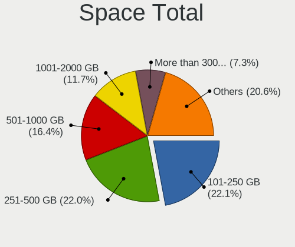
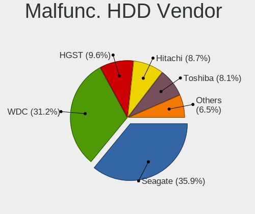
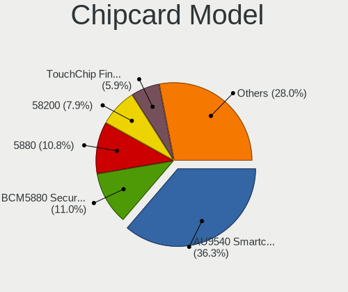

Manjaro - Tested Hardware & Statistics
--------------------------------------

A project to collect tested hardware configurations for Manjaro.

Anyone can contribute to this report by the [hw-probe](https://github.com/linuxhw/hw-probe) tool:

    sudo -E hw-probe -all -upload

Please contribute! Especially if your hardware is rare.

This is a report for all computer types. See also reports for [desktops](/Dist/Manjaro/Desktop/README.md) and [notebooks](/Dist/Manjaro/Notebook/README.md).

Contents
--------

* [ Test Cases ](#test-cases)

* [ System ](#system)
  - [ OS                       ](#os)
  - [ OS Family                ](#os-family)
  - [ Kernel                   ](#kernel)
  - [ Kernel Family            ](#kernel-family)
  - [ Kernel Major Ver.        ](#kernel-major-ver)
  - [ Arch                     ](#arch)
  - [ DE                       ](#de)
  - [ Display Server           ](#display-server)
  - [ Display Manager          ](#display-manager)
  - [ OS Lang                  ](#os-lang)
  - [ Boot Mode                ](#boot-mode)
  - [ Filesystem               ](#filesystem)
  - [ Part. scheme             ](#part-scheme)
  - [ Dual Boot with Linux/BSD ](#dual-boot-with-linuxbsd)
  - [ Dual Boot (Win)          ](#dual-boot-win)

* [ Board ](#board)
  - [ Vendor                   ](#vendor)
  - [ Model                    ](#model)
  - [ Model Family             ](#model-family)
  - [ MFG Year                 ](#mfg-year)
  - [ Form Factor              ](#form-factor)
  - [ Secure Boot              ](#secure-boot)
  - [ Coreboot                 ](#coreboot)
  - [ RAM Size                 ](#ram-size)
  - [ RAM Used                 ](#ram-used)
  - [ Total Drives             ](#total-drives)
  - [ Has CD-ROM               ](#has-cd-rom)
  - [ Has Ethernet             ](#has-ethernet)
  - [ Has WiFi                 ](#has-wifi)
  - [ Has Bluetooth            ](#has-bluetooth)

* [ Location ](#location)
  - [ Country                  ](#country)
  - [ City                     ](#city)

* [ Drives ](#drives)
  - [ Drive Vendor             ](#drive-vendor)
  - [ Drive Model              ](#drive-model)
  - [ HDD Vendor               ](#hdd-vendor)
  - [ SSD Vendor               ](#ssd-vendor)
  - [ Drive Kind               ](#drive-kind)
  - [ Drive Connector          ](#drive-connector)
  - [ Drive Size               ](#drive-size)
  - [ Space Total              ](#space-total)
  - [ Space Used               ](#space-used)
  - [ Malfunc. Drives          ](#malfunc-drives)
  - [ Malfunc. Drive Vendor    ](#malfunc-drive-vendor)
  - [ Malfunc. HDD Vendor      ](#malfunc-hdd-vendor)
  - [ Malfunc. Drive Kind      ](#malfunc-drive-kind)
  - [ Failed Drives            ](#failed-drives)
  - [ Failed Drive Vendor      ](#failed-drive-vendor)
  - [ Drive Status             ](#drive-status)

* [ Storage controller ](#storage-controller)
  - [ Storage Vendor           ](#storage-vendor)
  - [ Storage Model            ](#storage-model)
  - [ Storage Kind             ](#storage-kind)

* [ Processor ](#processor)
  - [ CPU Vendor               ](#cpu-vendor)
  - [ CPU Model                ](#cpu-model)
  - [ CPU Model Family         ](#cpu-model-family)
  - [ CPU Cores                ](#cpu-cores)
  - [ CPU Sockets              ](#cpu-sockets)
  - [ CPU Threads              ](#cpu-threads)
  - [ CPU Op-Modes             ](#cpu-op-modes)
  - [ CPU Microcode            ](#cpu-microcode)
  - [ CPU Microarch            ](#cpu-microarch)

* [ Graphics ](#graphics)
  - [ GPU Vendor               ](#gpu-vendor)
  - [ GPU Model                ](#gpu-model)
  - [ GPU Combo                ](#gpu-combo)
  - [ GPU Driver               ](#gpu-driver)
  - [ GPU Memory               ](#gpu-memory)

* [ Monitor ](#monitor)
  - [ Monitor Vendor           ](#monitor-vendor)
  - [ Monitor Model            ](#monitor-model)
  - [ Monitor Resolution       ](#monitor-resolution)
  - [ Monitor Diagonal         ](#monitor-diagonal)
  - [ Monitor Width            ](#monitor-width)
  - [ Aspect Ratio             ](#aspect-ratio)
  - [ Monitor Area             ](#monitor-area)
  - [ Pixel Density            ](#pixel-density)
  - [ Multiple Monitors        ](#multiple-monitors)

* [ Network ](#network)
  - [ Net Controller Vendor    ](#net-controller-vendor)
  - [ Net Controller Model     ](#net-controller-model)
  - [ Wireless Vendor          ](#wireless-vendor)
  - [ Wireless Model           ](#wireless-model)
  - [ Ethernet Vendor          ](#ethernet-vendor)
  - [ Ethernet Model           ](#ethernet-model)
  - [ Net Controller Kind      ](#net-controller-kind)
  - [ Used Controller          ](#used-controller)
  - [ NICs                     ](#nics)
  - [ IPv6                     ](#ipv6)

* [ Bluetooth ](#bluetooth)
  - [ Bluetooth Vendor         ](#bluetooth-vendor)
  - [ Bluetooth Model          ](#bluetooth-model)

* [ Sound ](#sound)
  - [ Sound Vendor             ](#sound-vendor)
  - [ Sound Model              ](#sound-model)

* [ Memory ](#memory)
  - [ Memory Vendor            ](#memory-vendor)
  - [ Memory Model             ](#memory-model)
  - [ Memory Kind              ](#memory-kind)
  - [ Memory Form Factor       ](#memory-form-factor)
  - [ Memory Size              ](#memory-size)
  - [ Memory Speed             ](#memory-speed)

* [ Printers & scanners ](#printers--scanners)
  - [ Printer Vendor           ](#printer-vendor)
  - [ Printer Model            ](#printer-model)
  - [ Scanner Vendor           ](#scanner-vendor)
  - [ Scanner Model            ](#scanner-model)

* [ Camera ](#camera)
  - [ Camera Vendor            ](#camera-vendor)
  - [ Camera Model             ](#camera-model)

* [ Security ](#security)
  - [ Fingerprint Vendor       ](#fingerprint-vendor)
  - [ Fingerprint Model        ](#fingerprint-model)
  - [ Chipcard Vendor          ](#chipcard-vendor)
  - [ Chipcard Model           ](#chipcard-model)

* [ Unsupported ](#unsupported)
  - [ Unsupported Devices      ](#unsupported-devices)
  - [ Unsupported Device Types ](#unsupported-device-types)

Test Cases
----------

Total: 10812

| Vendor        | Model                       | Form-Factor | Probe                                                      | Date         |
|---------------|-----------------------------|-------------|------------------------------------------------------------|--------------|
| Acer          | Aspire A515-51              | Notebook    | [5fafb134cf](https://linux-hardware.org/?probe=5fafb134cf) | Nov 06, 2023 |
| Dell          | Precision M4800             | Notebook    | [e67352eb0f](https://linux-hardware.org/?probe=e67352eb0f) | Nov 06, 2023 |
| ASUSTek       | VivoBook_ASUSLaptop X515... | Notebook    | [8e3e7668cf](https://linux-hardware.org/?probe=8e3e7668cf) | Nov 05, 2023 |
| Lenovo        | SHARKBAY 0B98401 PRO        | Desktop     | [7152c7ed2c](https://linux-hardware.org/?probe=7152c7ed2c) | Nov 05, 2023 |
| HP            | 530                         | Notebook    | [710ba89827](https://linux-hardware.org/?probe=710ba89827) | Nov 05, 2023 |
| ASUSTek       | PRIME B460M-A               | Desktop     | [034b113ac8](https://linux-hardware.org/?probe=034b113ac8) | Nov 05, 2023 |
| Gigabyte      | B650M DS3H                  | Desktop     | [a424739d4f](https://linux-hardware.org/?probe=a424739d4f) | Nov 05, 2023 |
| Framework     | Laptop 13 (AMD Ryzen 704... | Notebook    | [3f295082ce](https://linux-hardware.org/?probe=3f295082ce) | Nov 05, 2023 |
| HP            | 1998                        | Desktop     | [d454314b77](https://linux-hardware.org/?probe=d454314b77) | Nov 05, 2023 |
| HP            | 255 G7 Notebook PC          | Notebook    | [bdd24f60d2](https://linux-hardware.org/?probe=bdd24f60d2) | Nov 05, 2023 |
| ASUSTek       | PRIME B450M-GAMING/BR       | Desktop     | [f45893cbf7](https://linux-hardware.org/?probe=f45893cbf7) | Nov 05, 2023 |
| MSI           | H110I PRO                   | Desktop     | [c335c71c4b](https://linux-hardware.org/?probe=c335c71c4b) | Nov 05, 2023 |
| Apple         | MacBookPro10,1              | Notebook    | [8efb96e5d7](https://linux-hardware.org/?probe=8efb96e5d7) | Nov 04, 2023 |
| Lenovo        | SHARKBAY 0B98401 PRO        | Desktop     | [8841ab599e](https://linux-hardware.org/?probe=8841ab599e) | Nov 04, 2023 |
| Apple         | MacBookPro10,1              | Notebook    | [e6459bb42f](https://linux-hardware.org/?probe=e6459bb42f) | Nov 04, 2023 |
| MSI           | B560M PRO                   | Desktop     | [903907b7c0](https://linux-hardware.org/?probe=903907b7c0) | Nov 04, 2023 |
| Dell          | XPS 13 9310                 | Notebook    | [5ff7f9b284](https://linux-hardware.org/?probe=5ff7f9b284) | Nov 04, 2023 |
| Lenovo        | 317E NOK                    | Desktop     | [1d038af880](https://linux-hardware.org/?probe=1d038af880) | Nov 04, 2023 |
| ASRock        | B550M Pro4                  | Desktop     | [f0354d2416](https://linux-hardware.org/?probe=f0354d2416) | Nov 04, 2023 |
| ASUSTek       | M5A97 R2.0                  | Desktop     | [798cba826c](https://linux-hardware.org/?probe=798cba826c) | Nov 04, 2023 |
| ASUSTek       | M5A97 R2.0                  | Desktop     | [2c601304f7](https://linux-hardware.org/?probe=2c601304f7) | Nov 04, 2023 |
| ASUSTek       | ROG Strix G513RM_G513RM     | Notebook    | [ded1d73643](https://linux-hardware.org/?probe=ded1d73643) | Nov 03, 2023 |
| HP            | 0B54h D                     | Desktop     | [574e5fd946](https://linux-hardware.org/?probe=574e5fd946) | Nov 03, 2023 |
| ASRock        | A320M-HDV R4.0              | Desktop     | [44890192a1](https://linux-hardware.org/?probe=44890192a1) | Nov 03, 2023 |
| ASUSTek       | TUF Gaming X570-PLUS_BR     | Desktop     | [2aa4f1a7f7](https://linux-hardware.org/?probe=2aa4f1a7f7) | Nov 03, 2023 |
| ASUSTek       | PRIME H770-PLUS D4          | Desktop     | [62645c6b56](https://linux-hardware.org/?probe=62645c6b56) | Nov 02, 2023 |
| Dell          | 0200DY A02                  | Desktop     | [f07206a75c](https://linux-hardware.org/?probe=f07206a75c) | Nov 02, 2023 |
| Lenovo        | ThinkPad T440 20B7A0CYMH    | Notebook    | [4d3101d9f8](https://linux-hardware.org/?probe=4d3101d9f8) | Nov 02, 2023 |
| Acer          | Predator PH315-53           | Notebook    | [476a922e2f](https://linux-hardware.org/?probe=476a922e2f) | Nov 02, 2023 |
| MSI           | B560M PRO                   | Desktop     | [adf6c161fa](https://linux-hardware.org/?probe=adf6c161fa) | Nov 02, 2023 |
| Fujitsu       | LIFEBOOK T937               | Convertible | [530a390355](https://linux-hardware.org/?probe=530a390355) | Nov 02, 2023 |
| Lenovo        | ThinkPad T480 20L60017UK    | Notebook    | [e8b030e97f](https://linux-hardware.org/?probe=e8b030e97f) | Nov 02, 2023 |
| Gigabyte      | AORUS 17G KD                | Notebook    | [ac471f8580](https://linux-hardware.org/?probe=ac471f8580) | Nov 02, 2023 |
| Lenovo        | G40-45 80E1                 | Notebook    | [fffa5fb420](https://linux-hardware.org/?probe=fffa5fb420) | Nov 02, 2023 |
| Lenovo        | ThinkPad L460 20FVS12A00    | Notebook    | [fab360eece](https://linux-hardware.org/?probe=fab360eece) | Nov 02, 2023 |
| Panasonic     | CF-54-1                     | Notebook    | [b7d7cde99a](https://linux-hardware.org/?probe=b7d7cde99a) | Nov 01, 2023 |
| Unknown       | 1.0                         | Desktop     | [6265787d93](https://linux-hardware.org/?probe=6265787d93) | Nov 01, 2023 |
| ASUSTek       | PRIME B450M-A II            | Desktop     | [08ee10dc83](https://linux-hardware.org/?probe=08ee10dc83) | Nov 01, 2023 |
| ASUSTek       | VivoBook E14 E402YA_E402... | Notebook    | [a7f47546e5](https://linux-hardware.org/?probe=a7f47546e5) | Nov 01, 2023 |
| ASUSTek       | Zenbook UM3402YA_UM3402Y... | Notebook    | [d64009bcc1](https://linux-hardware.org/?probe=d64009bcc1) | Nov 01, 2023 |
| ASUSTek       | VivoBook E14 E402YA_E402... | Notebook    | [8901bca741](https://linux-hardware.org/?probe=8901bca741) | Nov 01, 2023 |
| ASUSTek       | Zenbook UM3402YA_UM3402Y... | Notebook    | [f5d0c4d34a](https://linux-hardware.org/?probe=f5d0c4d34a) | Nov 01, 2023 |
| ASUSTek       | VivoBook_ASUSLaptop M140... | Notebook    | [0a7341e5e0](https://linux-hardware.org/?probe=0a7341e5e0) | Nov 01, 2023 |
| Dell          | Precision 5550              | Notebook    | [87a9861125](https://linux-hardware.org/?probe=87a9861125) | Nov 01, 2023 |
| Lenovo        | ThinkPad L460 20FVS12A00    | Notebook    | [a2273dea0e](https://linux-hardware.org/?probe=a2273dea0e) | Nov 01, 2023 |
| MSI           | PRO Z790-P WIFI DDR4        | Desktop     | [e03b553957](https://linux-hardware.org/?probe=e03b553957) | Nov 01, 2023 |
| ASUSTek       | N56VB                       | Notebook    | [9775caad00](https://linux-hardware.org/?probe=9775caad00) | Oct 31, 2023 |
| ATOPNUC       | MA90                        | Mini pc     | [f34d479454](https://linux-hardware.org/?probe=f34d479454) | Oct 31, 2023 |
| ASUSTek       | N56VB                       | Notebook    | [45280b44d0](https://linux-hardware.org/?probe=45280b44d0) | Oct 31, 2023 |
| ASUSTek       | PRIME B350-PLUS             | Desktop     | [7b71031ba1](https://linux-hardware.org/?probe=7b71031ba1) | Oct 31, 2023 |
| ASUSTek       | PRIME B350-PLUS             | Desktop     | [3ab77e3324](https://linux-hardware.org/?probe=3ab77e3324) | Oct 31, 2023 |
| Dell          | XPS 15 9510                 | Notebook    | [d370c488e4](https://linux-hardware.org/?probe=d370c488e4) | Oct 31, 2023 |
| Acer          | Aspire A315-35              | Notebook    | [c26ec81fab](https://linux-hardware.org/?probe=c26ec81fab) | Oct 31, 2023 |
| HP            | Spectre x360 2-in-1 Lapt... | Convertible | [aef5a9f17c](https://linux-hardware.org/?probe=aef5a9f17c) | Oct 31, 2023 |
| ASRock        | A320M-HDV R4.0              | Desktop     | [7941dfd8cf](https://linux-hardware.org/?probe=7941dfd8cf) | Oct 31, 2023 |
| Lenovo        | ThinkPad P14s Gen 2a 21A... | Notebook    | [ed27ef3491](https://linux-hardware.org/?probe=ed27ef3491) | Oct 31, 2023 |
| Lenovo        | IdeaPad S145-15IIL 81W8     | Notebook    | [9dd62a1bb2](https://linux-hardware.org/?probe=9dd62a1bb2) | Oct 31, 2023 |
| TECNO         | MEGABOOK T1                 | Notebook    | [2bab6515f4](https://linux-hardware.org/?probe=2bab6515f4) | Oct 30, 2023 |
| Dell          | Latitude 7370               | Notebook    | [f47b42c0b0](https://linux-hardware.org/?probe=f47b42c0b0) | Oct 30, 2023 |
| Sony          | SVE1511B1RB                 | Notebook    | [74651497a9](https://linux-hardware.org/?probe=74651497a9) | Oct 30, 2023 |
| ASRock        | B550M Steel Legend          | Desktop     | [f123c19bb4](https://linux-hardware.org/?probe=f123c19bb4) | Oct 30, 2023 |
| ASUSTek       | PRIME B450M-A II            | Desktop     | [6cafea6b4c](https://linux-hardware.org/?probe=6cafea6b4c) | Oct 30, 2023 |
| ASUSTek       | K84L                        | Notebook    | [e6d103b3e4](https://linux-hardware.org/?probe=e6d103b3e4) | Oct 29, 2023 |
| Lenovo        | ThinkPad X1 Yoga Gen 6 2... | Convertible | [923dc22e28](https://linux-hardware.org/?probe=923dc22e28) | Oct 29, 2023 |
| Lenovo        | ThinkPad X1 Yoga Gen 6 2... | Convertible | [ab6738f16c](https://linux-hardware.org/?probe=ab6738f16c) | Oct 29, 2023 |
| Apple         | Mac-CFF7D910A743CAAF iMa... | All in one  | [e2e7788338](https://linux-hardware.org/?probe=e2e7788338) | Oct 29, 2023 |
| Dell          | Latitude E5400              | Notebook    | [169d73bee0](https://linux-hardware.org/?probe=169d73bee0) | Oct 28, 2023 |
| HUAWEI        | MACHD-WXX9                  | Notebook    | [551a5c8aa2](https://linux-hardware.org/?probe=551a5c8aa2) | Oct 28, 2023 |
| HP            | Notebook                    | Notebook    | [715435e533](https://linux-hardware.org/?probe=715435e533) | Oct 28, 2023 |
| HP            | Spectre x360 Convertible... | Convertible | [e34317a76d](https://linux-hardware.org/?probe=e34317a76d) | Oct 28, 2023 |
| GEEKOM        | Mini IT12                   | Desktop     | [b9509f49f1](https://linux-hardware.org/?probe=b9509f49f1) | Oct 28, 2023 |
| MSI           | GF615M-P33                  | Desktop     | [10af2377c2](https://linux-hardware.org/?probe=10af2377c2) | Oct 28, 2023 |
| Gigabyte      | B450M DS3H-CF               | Desktop     | [80b9cb5e56](https://linux-hardware.org/?probe=80b9cb5e56) | Oct 28, 2023 |
| Lenovo        | ThinkCentre A70z 0401G6G    | Desktop     | [52e07e7ffe](https://linux-hardware.org/?probe=52e07e7ffe) | Oct 28, 2023 |
| Gigabyte      | B660M DS3H AX DDR4          | Desktop     | [7610254116](https://linux-hardware.org/?probe=7610254116) | Oct 27, 2023 |
| Framework     | Laptop 13 (AMD Ryzen 704... | Notebook    | [b7f872ea23](https://linux-hardware.org/?probe=b7f872ea23) | Oct 27, 2023 |
| ASUSTek       | M5A97 PLUS                  | Desktop     | [484d866dc6](https://linux-hardware.org/?probe=484d866dc6) | Oct 27, 2023 |
| ASUSTek       | M5A97 PLUS                  | Desktop     | [a619c8a955](https://linux-hardware.org/?probe=a619c8a955) | Oct 27, 2023 |
| Samsung       | Galaxy Book 10.6            | Tablet      | [5ca426e5c3](https://linux-hardware.org/?probe=5ca426e5c3) | Oct 27, 2023 |
| ASRock        | B450 Gaming K4              | Desktop     | [15488b723a](https://linux-hardware.org/?probe=15488b723a) | Oct 27, 2023 |
| Gigabyte      | B550 AORUS PRO V2           | Desktop     | [e8432e79c8](https://linux-hardware.org/?probe=e8432e79c8) | Oct 26, 2023 |
| MSI           | B450-A PRO                  | Desktop     | [e71634ac32](https://linux-hardware.org/?probe=e71634ac32) | Oct 26, 2023 |
| MSI           | MAG B650 TOMAHAWK WIFI      | Desktop     | [3a1039b4b6](https://linux-hardware.org/?probe=3a1039b4b6) | Oct 26, 2023 |
| Lenovo        | IdeaPad 3 15IGL05 81WQ      | Notebook    | [755d25d933](https://linux-hardware.org/?probe=755d25d933) | Oct 26, 2023 |
| ASUSTek       | PRIME X370-PRO              | Desktop     | [9cb0b1ec27](https://linux-hardware.org/?probe=9cb0b1ec27) | Oct 26, 2023 |
| Gigabyte      | AERO 17 XE5                 | Notebook    | [47d1cb500e](https://linux-hardware.org/?probe=47d1cb500e) | Oct 25, 2023 |
| Acer          | Aspire A515-57G             | Notebook    | [d61428d56d](https://linux-hardware.org/?probe=d61428d56d) | Oct 25, 2023 |
| ASUSTek       | Z170-P                      | Desktop     | [62bbdaec23](https://linux-hardware.org/?probe=62bbdaec23) | Oct 24, 2023 |
| HP            | 212B                        | Desktop     | [714373878e](https://linux-hardware.org/?probe=714373878e) | Oct 24, 2023 |
| ASUSTek       | VivoBook_ASUSLaptop X150... | Notebook    | [1bd81ebf81](https://linux-hardware.org/?probe=1bd81ebf81) | Oct 24, 2023 |
| HP            | 83EF                        | Desktop     | [9953e14c0a](https://linux-hardware.org/?probe=9953e14c0a) | Oct 24, 2023 |
| ASUSTek       | Z170-P                      | Desktop     | [47b5a808aa](https://linux-hardware.org/?probe=47b5a808aa) | Oct 24, 2023 |
| MSI           | Z390-A PRO                  | Desktop     | [48233204f6](https://linux-hardware.org/?probe=48233204f6) | Oct 23, 2023 |
| ASUSTek       | PRIME H670-PLUS D4          | Desktop     | [07e8b4df09](https://linux-hardware.org/?probe=07e8b4df09) | Oct 23, 2023 |
| Lenovo        | ThinkPad T480s 20L8S4M20... | Notebook    | [799084c1a9](https://linux-hardware.org/?probe=799084c1a9) | Oct 23, 2023 |
| HP            | Laptop 17-cp0xxx            | Notebook    | [1a97d77c76](https://linux-hardware.org/?probe=1a97d77c76) | Oct 23, 2023 |
| ASRock        | B760M PG Riptide            | Desktop     | [d1f12415b9](https://linux-hardware.org/?probe=d1f12415b9) | Oct 23, 2023 |
| Lenovo        | IdeaPad 3 14ARE05 81W3      | Notebook    | [bd89e392d1](https://linux-hardware.org/?probe=bd89e392d1) | Oct 23, 2023 |
| Gigabyte      | B550 AORUS ELITE AX V2      | Desktop     | [cb6130951a](https://linux-hardware.org/?probe=cb6130951a) | Oct 23, 2023 |
| HP            | EliteBook 8470p             | Notebook    | [c927a93a85](https://linux-hardware.org/?probe=c927a93a85) | Oct 23, 2023 |
| Google        | Gandof                      | Notebook    | [7a07edf626](https://linux-hardware.org/?probe=7a07edf626) | Oct 23, 2023 |
| HP            | EliteBook 8470p             | Notebook    | [bebe071d7c](https://linux-hardware.org/?probe=bebe071d7c) | Oct 23, 2023 |
| Lenovo        | V15 G2 ALC 82KD             | Notebook    | [93043f297f](https://linux-hardware.org/?probe=93043f297f) | Oct 22, 2023 |
| Gigabyte      | B760 GAMING X DDR4          | Desktop     | [ce9770538c](https://linux-hardware.org/?probe=ce9770538c) | Oct 22, 2023 |
| Acer          | Aspire A315-35              | Notebook    | [ee15c1dbea](https://linux-hardware.org/?probe=ee15c1dbea) | Oct 22, 2023 |
| Apple         | MacBookPro8,1               | Notebook    | [fde726622c](https://linux-hardware.org/?probe=fde726622c) | Oct 22, 2023 |
| Apple         | MacBookPro8,1               | Notebook    | [116946c81c](https://linux-hardware.org/?probe=116946c81c) | Oct 22, 2023 |
| Dell          | 09WH54 A01                  | Desktop     | [4211349cc4](https://linux-hardware.org/?probe=4211349cc4) | Oct 22, 2023 |
| ASUSTek       | ASUS TUF Dash F15 FX516P... | Notebook    | [43f9375597](https://linux-hardware.org/?probe=43f9375597) | Oct 21, 2023 |
| ASUSTek       | TUF Gaming B650M-PLUS       | Desktop     | [67c6d6e482](https://linux-hardware.org/?probe=67c6d6e482) | Oct 21, 2023 |
| MSI           | GL62VR 7RFX                 | Notebook    | [0d88fb381c](https://linux-hardware.org/?probe=0d88fb381c) | Oct 21, 2023 |
| ASRock        | H97M Pro4                   | Desktop     | [04f6bc7f0c](https://linux-hardware.org/?probe=04f6bc7f0c) | Oct 21, 2023 |
| Gigabyte      | X570 AORUS PRO WIFI         | Desktop     | [1ae8f16052](https://linux-hardware.org/?probe=1ae8f16052) | Oct 21, 2023 |
| ASUSTek       | ASUS EXPERTBOOK B9403CVA... | Notebook    | [eaffd30f59](https://linux-hardware.org/?probe=eaffd30f59) | Oct 21, 2023 |
| ASUSTek       | ASUS EXPERTBOOK B9403CVA... | Notebook    | [aafd893b0d](https://linux-hardware.org/?probe=aafd893b0d) | Oct 21, 2023 |
| HP            | Laptop 14-ck0xxx            | Notebook    | [8ef0f47332](https://linux-hardware.org/?probe=8ef0f47332) | Oct 20, 2023 |
| ASUSTek       | PRIME B450M-K               | Desktop     | [a0b48d8a7e](https://linux-hardware.org/?probe=a0b48d8a7e) | Oct 20, 2023 |
| ASRock        | A320M-HDV R4.0              | Desktop     | [17f5bf3cef](https://linux-hardware.org/?probe=17f5bf3cef) | Oct 20, 2023 |
| Eluktronic... | MECH-15 G3                  | Notebook    | [1b63389cc6](https://linux-hardware.org/?probe=1b63389cc6) | Oct 20, 2023 |
| ASRock        | B450 Gaming K4              | Desktop     | [65f3d76afa](https://linux-hardware.org/?probe=65f3d76afa) | Oct 19, 2023 |
| Lenovo        | Legion 5 Pro 16ITH6H 82J... | Notebook    | [79a2d6de1a](https://linux-hardware.org/?probe=79a2d6de1a) | Oct 19, 2023 |
| MSI           | Z390-A PRO                  | Desktop     | [7fd0eeaeec](https://linux-hardware.org/?probe=7fd0eeaeec) | Oct 19, 2023 |
| Biostar       | A320MH                      | Desktop     | [e2c20a6c0c](https://linux-hardware.org/?probe=e2c20a6c0c) | Oct 19, 2023 |
| ASUSTek       | PRIME X570-PRO              | Desktop     | [84517c1f4c](https://linux-hardware.org/?probe=84517c1f4c) | Oct 19, 2023 |
| Lenovo        | Legion R7000P APH8 82Y9     | Notebook    | [9c6fb34bab](https://linux-hardware.org/?probe=9c6fb34bab) | Oct 18, 2023 |
| Biostar       | A320MH                      | Desktop     | [62a3d049b2](https://linux-hardware.org/?probe=62a3d049b2) | Oct 18, 2023 |
| Lenovo        | Legion 5 82B5               | Notebook    | [fecce40ebb](https://linux-hardware.org/?probe=fecce40ebb) | Oct 18, 2023 |
| ASRock        | AB350 Pro4                  | Desktop     | [71eba7e232](https://linux-hardware.org/?probe=71eba7e232) | Oct 18, 2023 |
| Lenovo        | ThinkPad L390 Yoga 20NT0... | Convertible | [4b1c8afb11](https://linux-hardware.org/?probe=4b1c8afb11) | Oct 17, 2023 |
| Lenovo        | 1046 SBB1C50523 WIN 3556... | Desktop     | [f824921cbb](https://linux-hardware.org/?probe=f824921cbb) | Oct 17, 2023 |
| MSI           | MAG B550 TOMAHAWK           | Desktop     | [5f780203e2](https://linux-hardware.org/?probe=5f780203e2) | Oct 17, 2023 |
| ASUSTek       | ROG Strix G713QM_G713QM     | Notebook    | [9729d18e10](https://linux-hardware.org/?probe=9729d18e10) | Oct 16, 2023 |
| Acer          | Aspire ES1-523              | Notebook    | [6f80d0517c](https://linux-hardware.org/?probe=6f80d0517c) | Oct 16, 2023 |
| Lenovo        | ThinkPad E15 Gen 3 20YG0... | Notebook    | [0504910ad7](https://linux-hardware.org/?probe=0504910ad7) | Oct 16, 2023 |
| ASUSTek       | TUF Gaming B550-PLUS WIF... | Desktop     | [9b7bc3fc9d](https://linux-hardware.org/?probe=9b7bc3fc9d) | Oct 16, 2023 |
| Gigabyte      | X570 AORUS ELITE WIFI       | Desktop     | [c976b314a2](https://linux-hardware.org/?probe=c976b314a2) | Oct 16, 2023 |
| Acer          | Aspire ES1-523              | Notebook    | [2dfea2666c](https://linux-hardware.org/?probe=2dfea2666c) | Oct 15, 2023 |
| ASUSTek       | PRIME Z790-A WIFI           | Desktop     | [af4857609e](https://linux-hardware.org/?probe=af4857609e) | Oct 15, 2023 |
| Gigabyte      | X670 AORUS ELITE AX         | Desktop     | [f71ad29f6a](https://linux-hardware.org/?probe=f71ad29f6a) | Oct 15, 2023 |
| Apple         | Mac-942B59F58194171B iMa... | All in one  | [016669d718](https://linux-hardware.org/?probe=016669d718) | Oct 14, 2023 |
| Clevo         | W150ER                      | Notebook    | [e119814a32](https://linux-hardware.org/?probe=e119814a32) | Oct 14, 2023 |
| HP            | 15                          | Notebook    | [f5392b4484](https://linux-hardware.org/?probe=f5392b4484) | Oct 14, 2023 |
| HP            | Pavilion dv7                | Notebook    | [ae2789f31f](https://linux-hardware.org/?probe=ae2789f31f) | Oct 14, 2023 |
| HP            | Pavilion dv7                | Notebook    | [de47e931a1](https://linux-hardware.org/?probe=de47e931a1) | Oct 14, 2023 |
| Samsung       | 950QDB                      | Convertible | [51ddfa2dbf](https://linux-hardware.org/?probe=51ddfa2dbf) | Oct 13, 2023 |
| Gigabyte      | A520M DS3H                  | Desktop     | [e79f4b834d](https://linux-hardware.org/?probe=e79f4b834d) | Oct 13, 2023 |
| ASRock        | B550M Pro4                  | Desktop     | [c1e1d017af](https://linux-hardware.org/?probe=c1e1d017af) | Oct 13, 2023 |
| ASUSTek       | PRIME B450M-A II            | Desktop     | [ac840f060f](https://linux-hardware.org/?probe=ac840f060f) | Oct 13, 2023 |
| ASRock        | B550M Pro4                  | Desktop     | [d1386e080d](https://linux-hardware.org/?probe=d1386e080d) | Oct 12, 2023 |
| MSI           | B560M PRO                   | Desktop     | [3ad673132a](https://linux-hardware.org/?probe=3ad673132a) | Oct 12, 2023 |
| Lenovo        | Legion Y7000 2019 PG0 81... | Notebook    | [39e3632f1f](https://linux-hardware.org/?probe=39e3632f1f) | Oct 11, 2023 |
| Gigabyte      | GA-880GMA-UD2H              | Desktop     | [17b8025f8d](https://linux-hardware.org/?probe=17b8025f8d) | Oct 11, 2023 |
| Lenovo        | 317E NOK                    | Desktop     | [618b7ebe59](https://linux-hardware.org/?probe=618b7ebe59) | Oct 11, 2023 |
| MSI           | H310M PRO-M2 PLUS           | Desktop     | [e185192929](https://linux-hardware.org/?probe=e185192929) | Oct 11, 2023 |
| Lenovo        | Legion Y7000 2019 PG0 81... | Notebook    | [b1b0f03790](https://linux-hardware.org/?probe=b1b0f03790) | Oct 11, 2023 |
| ASUSTek       | PRIME B450-PLUS             | Desktop     | [a5c5f58ddb](https://linux-hardware.org/?probe=a5c5f58ddb) | Oct 11, 2023 |
| HP            | EliteBook 8560w             | Notebook    | [00580f0c7d](https://linux-hardware.org/?probe=00580f0c7d) | Oct 10, 2023 |
| HP            | EliteBook 8560w             | Notebook    | [6e046b22c3](https://linux-hardware.org/?probe=6e046b22c3) | Oct 10, 2023 |
| ASRock        | Z390 Phantom Gaming-ITX/... | Desktop     | [2c7e31eb6f](https://linux-hardware.org/?probe=2c7e31eb6f) | Oct 09, 2023 |
| ASRock        | B760M PG Riptide            | Desktop     | [9b5474fee0](https://linux-hardware.org/?probe=9b5474fee0) | Oct 09, 2023 |
| Lenovo        | G40-45 80E1                 | Notebook    | [1bb42f8755](https://linux-hardware.org/?probe=1bb42f8755) | Oct 09, 2023 |
| MSI           | MPG X570 GAMING PRO CARB... | Desktop     | [90041fa012](https://linux-hardware.org/?probe=90041fa012) | Oct 09, 2023 |
| Gateway       | NV57H                       | Notebook    | [141355e1e3](https://linux-hardware.org/?probe=141355e1e3) | Oct 09, 2023 |
| HUAWEI        | HN-WX9X                     | Notebook    | [a46f5ac57a](https://linux-hardware.org/?probe=a46f5ac57a) | Oct 09, 2023 |
| Dell          | Vostro 7590                 | Notebook    | [d7188e68cb](https://linux-hardware.org/?probe=d7188e68cb) | Oct 08, 2023 |
| TrekStor      | YOURBOOK C11B               | Convertible | [cea0d12a81](https://linux-hardware.org/?probe=cea0d12a81) | Oct 08, 2023 |
| ASUSTek       | P8H67-M EVO                 | Desktop     | [146bc4cb2c](https://linux-hardware.org/?probe=146bc4cb2c) | Oct 08, 2023 |
| MSI           | B450M MORTAR MAX            | Desktop     | [b03eea6d75](https://linux-hardware.org/?probe=b03eea6d75) | Oct 08, 2023 |
| HP            | ProBook x360 11 G5 EE       | Convertible | [47e7797579](https://linux-hardware.org/?probe=47e7797579) | Oct 08, 2023 |
| HP            | 212B                        | Desktop     | [faa56daf1d](https://linux-hardware.org/?probe=faa56daf1d) | Oct 07, 2023 |
| HP            | 83E8                        | Desktop     | [c1028de72b](https://linux-hardware.org/?probe=c1028de72b) | Oct 07, 2023 |
| ASUSTek       | TUF Gaming X670E-PLUS WI... | Desktop     | [e401b0c370](https://linux-hardware.org/?probe=e401b0c370) | Oct 07, 2023 |
| Dell          | Precision 7710              | Notebook    | [6dcd757659](https://linux-hardware.org/?probe=6dcd757659) | Oct 07, 2023 |
| Microsoft     | Surface Laptop 3            | Tablet      | [6bc395bbda](https://linux-hardware.org/?probe=6bc395bbda) | Oct 06, 2023 |
| MSI           | B450 TOMAHAWK MAX II        | Desktop     | [ad60cd6e18](https://linux-hardware.org/?probe=ad60cd6e18) | Oct 06, 2023 |
| ASUSTek       | ZenBook UX425EA_UX425EA     | Notebook    | [da6b1b88e6](https://linux-hardware.org/?probe=da6b1b88e6) | Oct 06, 2023 |
| Lenovo        | Yoga 9 14ITL5 82BG          | Convertible | [8c4bcd5155](https://linux-hardware.org/?probe=8c4bcd5155) | Oct 06, 2023 |
| ASUSTek       | B85-PRO GAMER               | Desktop     | [10baa7a046](https://linux-hardware.org/?probe=10baa7a046) | Oct 06, 2023 |
| MSI           | MPG B760I EDGE WIFI DDR4    | Desktop     | [f68374e7cd](https://linux-hardware.org/?probe=f68374e7cd) | Oct 05, 2023 |
| Gigabyte      | B450M DS3H-CF               | Desktop     | [cbf93da8d0](https://linux-hardware.org/?probe=cbf93da8d0) | Oct 04, 2023 |
| Acer          | Aspire ES1-732              | Notebook    | [9f011f4756](https://linux-hardware.org/?probe=9f011f4756) | Oct 04, 2023 |
| Acer          | Nitro AN515-44              | Notebook    | [faf6d73cad](https://linux-hardware.org/?probe=faf6d73cad) | Oct 04, 2023 |
| ASUSTek       | PRIME X370-PRO              | Desktop     | [573f1da6a9](https://linux-hardware.org/?probe=573f1da6a9) | Oct 03, 2023 |
| HP            | Laptop 14-ck0xxx            | Notebook    | [c41cd8be8e](https://linux-hardware.org/?probe=c41cd8be8e) | Oct 03, 2023 |
| Lenovo        | ThinkPad X1 Yoga 2nd 20J... | Convertible | [e3121d6d02](https://linux-hardware.org/?probe=e3121d6d02) | Oct 03, 2023 |
| Gigabyte      | X570S UD                    | Desktop     | [5d8ef7c003](https://linux-hardware.org/?probe=5d8ef7c003) | Oct 03, 2023 |
| ASUSTek       | M5A97 R2.0                  | Desktop     | [2e1316fb48](https://linux-hardware.org/?probe=2e1316fb48) | Oct 03, 2023 |
| HP            | Spectre x360 2-in-1 Lapt... | Convertible | [83ede540d1](https://linux-hardware.org/?probe=83ede540d1) | Oct 03, 2023 |
| ASUSTek       | SABERTOOTH Z77              | Desktop     | [6a2fa93249](https://linux-hardware.org/?probe=6a2fa93249) | Oct 03, 2023 |
| Gigabyte      | B365M DS3H                  | Desktop     | [c9a7b94ace](https://linux-hardware.org/?probe=c9a7b94ace) | Oct 03, 2023 |
| Lenovo        | ThinkPad L430 24662W2       | Notebook    | [21ee2a6e8f](https://linux-hardware.org/?probe=21ee2a6e8f) | Oct 03, 2023 |
| Lenovo        | ThinkPad L460 20FVS12A00    | Notebook    | [ad3d8f3522](https://linux-hardware.org/?probe=ad3d8f3522) | Oct 02, 2023 |
| Lenovo        | ThinkPad T420s 4170CTO      | Notebook    | [f141fc2bd7](https://linux-hardware.org/?probe=f141fc2bd7) | Oct 02, 2023 |
| MSI           | B560M PRO                   | Desktop     | [1312550a66](https://linux-hardware.org/?probe=1312550a66) | Oct 02, 2023 |
| Dell          | Precision 5480              | Notebook    | [21bd104767](https://linux-hardware.org/?probe=21bd104767) | Oct 02, 2023 |
| HP            | Laptop 15s-eq2xxx           | Notebook    | [4e0bb2d740](https://linux-hardware.org/?probe=4e0bb2d740) | Oct 01, 2023 |
| HP            | Laptop 15s-eq2xxx           | Notebook    | [840bfbb2cb](https://linux-hardware.org/?probe=840bfbb2cb) | Oct 01, 2023 |
| HUAWEI        | VLT-WX0                     | Notebook    | [6778af4012](https://linux-hardware.org/?probe=6778af4012) | Oct 01, 2023 |
| ASRock        | B450 Gaming K4              | Desktop     | [8311d775a9](https://linux-hardware.org/?probe=8311d775a9) | Oct 01, 2023 |
| Dell          | G7 7700                     | Notebook    | [62bd529b36](https://linux-hardware.org/?probe=62bd529b36) | Oct 01, 2023 |
| HUAWEI        | MateBook X                  | Notebook    | [5479e52948](https://linux-hardware.org/?probe=5479e52948) | Oct 01, 2023 |
| Lenovo        | ThinkPad T14 Gen 1 20UES... | Notebook    | [2d1ada9dbe](https://linux-hardware.org/?probe=2d1ada9dbe) | Sep 30, 2023 |
| MSI           | B560M PRO                   | Desktop     | [1dc06a927c](https://linux-hardware.org/?probe=1dc06a927c) | Sep 29, 2023 |
| MSI           | H97 GAMING 3                | Desktop     | [51f3cd7354](https://linux-hardware.org/?probe=51f3cd7354) | Sep 29, 2023 |
| MSI           | B560M PRO                   | Desktop     | [ce2f5b7349](https://linux-hardware.org/?probe=ce2f5b7349) | Sep 29, 2023 |
| Dell          | Precision 7710              | Notebook    | [89731f9b0e](https://linux-hardware.org/?probe=89731f9b0e) | Sep 29, 2023 |
| Lenovo        | ThinkPad Yoga 460 20ELS0... | Convertible | [29617a5db5](https://linux-hardware.org/?probe=29617a5db5) | Sep 29, 2023 |
| Acer          | Nitro AN515-43              | Notebook    | [e55a394d41](https://linux-hardware.org/?probe=e55a394d41) | Sep 29, 2023 |
| Lenovo        | ThinkPad X260 20F60097US    | Notebook    | [607d788fde](https://linux-hardware.org/?probe=607d788fde) | Sep 28, 2023 |
| Acer          | Aspire ES1-732              | Notebook    | [f30d62d67b](https://linux-hardware.org/?probe=f30d62d67b) | Sep 28, 2023 |
| HP            | Laptop 15s-fq0xxx           | Notebook    | [4c1a2e1e21](https://linux-hardware.org/?probe=4c1a2e1e21) | Sep 28, 2023 |
| Lenovo        | ThinkPad W540 20BG0016US    | Notebook    | [3ee705f2f3](https://linux-hardware.org/?probe=3ee705f2f3) | Sep 28, 2023 |
| Lenovo        | ThinkPad W540 20BG0016US    | Notebook    | [2b86c9fac4](https://linux-hardware.org/?probe=2b86c9fac4) | Sep 28, 2023 |
| Gigabyte      | H610M S2H DDR4              | Desktop     | [9d767beb12](https://linux-hardware.org/?probe=9d767beb12) | Sep 27, 2023 |
| ASUSTek       | ROG STRIX B550-A GAMING     | Desktop     | [7ed50e5e43](https://linux-hardware.org/?probe=7ed50e5e43) | Sep 27, 2023 |
| TUXEDO        | Stellaris Intel Gen4        | Notebook    | [0dcef3e6c3](https://linux-hardware.org/?probe=0dcef3e6c3) | Sep 27, 2023 |
| Gigabyte      | B550 AORUS ELITE AX V2      | Desktop     | [7cfa1007ee](https://linux-hardware.org/?probe=7cfa1007ee) | Sep 27, 2023 |
| Dell          | Inspiron N5040              | Notebook    | [c48d158b62](https://linux-hardware.org/?probe=c48d158b62) | Sep 27, 2023 |
| Lenovo        | IdeaPad 5 15ARE05 81YQ      | Notebook    | [84ad07c3f9](https://linux-hardware.org/?probe=84ad07c3f9) | Sep 27, 2023 |
| Gigabyte      | H61MA-D3V                   | Desktop     | [a9c8158139](https://linux-hardware.org/?probe=a9c8158139) | Sep 27, 2023 |
| Packard Be... | EasyNote TK85               | Notebook    | [79e6dd1302](https://linux-hardware.org/?probe=79e6dd1302) | Sep 27, 2023 |
| Google        | Blorb                       | Notebook    | [efa4ad9e2c](https://linux-hardware.org/?probe=efa4ad9e2c) | Sep 26, 2023 |
| Lenovo        | V15 G2 IJL 82QY             | Notebook    | [3b76e2cd65](https://linux-hardware.org/?probe=3b76e2cd65) | Sep 26, 2023 |
| Lenovo        | ThinkPad P15 Gen 1 20STS... | Notebook    | [124f7a0f29](https://linux-hardware.org/?probe=124f7a0f29) | Sep 26, 2023 |
| ASUSTek       | ROG STRIX B550-A GAMING     | Desktop     | [65369ae480](https://linux-hardware.org/?probe=65369ae480) | Sep 25, 2023 |
| HP            | 8949 11                     | Desktop     | [acb62cff2b](https://linux-hardware.org/?probe=acb62cff2b) | Sep 25, 2023 |
| HP            | EliteBook 840 G7 Noteboo... | Notebook    | [381be3d212](https://linux-hardware.org/?probe=381be3d212) | Sep 25, 2023 |
| HP            | 250 15.6 inch G9 Noteboo... | Notebook    | [508cf38973](https://linux-hardware.org/?probe=508cf38973) | Sep 24, 2023 |
| HP            | ENVY m4                     | Notebook    | [8d7da36940](https://linux-hardware.org/?probe=8d7da36940) | Sep 24, 2023 |
| ASUSTek       | P5G41T-M LX3                | Desktop     | [5735f79e4f](https://linux-hardware.org/?probe=5735f79e4f) | Sep 23, 2023 |
| HP            | Laptop 15-ef2xxx            | Notebook    | [4fb741bdb3](https://linux-hardware.org/?probe=4fb741bdb3) | Sep 23, 2023 |
| Packard Be... | EasyNote TK85               | Notebook    | [c970ee5a12](https://linux-hardware.org/?probe=c970ee5a12) | Sep 23, 2023 |
| Gigabyte      | GA-880GMA-UD2H              | Desktop     | [fbeac0cab4](https://linux-hardware.org/?probe=fbeac0cab4) | Sep 23, 2023 |
| HP            | 8055                        | Desktop     | [d8ea4bc33a](https://linux-hardware.org/?probe=d8ea4bc33a) | Sep 23, 2023 |
| Gigabyte      | B450M DS3H-CF               | Desktop     | [537e551c45](https://linux-hardware.org/?probe=537e551c45) | Sep 23, 2023 |
| Lenovo        | IdeaPad S340-14API 81NB     | Notebook    | [14d87bfb5d](https://linux-hardware.org/?probe=14d87bfb5d) | Sep 22, 2023 |
| Lenovo        | IdeaPad Flex-14IWL 81SQ     | Convertible | [480d8732d2](https://linux-hardware.org/?probe=480d8732d2) | Sep 22, 2023 |
| Lenovo        | IdeaPad Flex-14IWL 81SQ     | Convertible | [28af4771b9](https://linux-hardware.org/?probe=28af4771b9) | Sep 22, 2023 |
| ASUSTek       | TUF Gaming X670E-PLUS WI... | Desktop     | [a9f9ccb4f9](https://linux-hardware.org/?probe=a9f9ccb4f9) | Sep 22, 2023 |
| MSI           | B550M PRO-VDH WIFI          | Desktop     | [c2c49834e5](https://linux-hardware.org/?probe=c2c49834e5) | Sep 21, 2023 |
| Gigabyte      | B550 AORUS ELITE            | Desktop     | [8b39e51416](https://linux-hardware.org/?probe=8b39e51416) | Sep 21, 2023 |
| Fujitsu       | LIFEBOOK E752               | Notebook    | [c2d2a28c33](https://linux-hardware.org/?probe=c2d2a28c33) | Sep 21, 2023 |
| Dell          | XPS 15 9520                 | Notebook    | [ae7455bac3](https://linux-hardware.org/?probe=ae7455bac3) | Sep 21, 2023 |
| Dell          | Precision 7520              | Notebook    | [2fd68ca236](https://linux-hardware.org/?probe=2fd68ca236) | Sep 21, 2023 |
| ASUSTek       | ROG STRIX B650E-I GAMING... | Desktop     | [816502caea](https://linux-hardware.org/?probe=816502caea) | Sep 21, 2023 |
| Dell          | Inspiron 3542               | Notebook    | [b449a82c4f](https://linux-hardware.org/?probe=b449a82c4f) | Sep 21, 2023 |
| Dell          | 00V62H A00                  | Desktop     | [66262df4c4](https://linux-hardware.org/?probe=66262df4c4) | Sep 21, 2023 |
| Dell          | Latitude E5430 non-vPro     | Notebook    | [192f065f70](https://linux-hardware.org/?probe=192f065f70) | Sep 21, 2023 |
| Lenovo        | ThinkPad E560 20EV002FUS    | Notebook    | [063f211c4d](https://linux-hardware.org/?probe=063f211c4d) | Sep 21, 2023 |
| Dell          | XPS 15 9520                 | Notebook    | [6337af2f4c](https://linux-hardware.org/?probe=6337af2f4c) | Sep 20, 2023 |
| HP            | Spectre x360 2-in-1 Lapt... | Convertible | [dde4d0b10f](https://linux-hardware.org/?probe=dde4d0b10f) | Sep 20, 2023 |
| ASUSTek       | Z450UA                      | Notebook    | [60d85e59da](https://linux-hardware.org/?probe=60d85e59da) | Sep 20, 2023 |
| Lenovo        | IdeaPad 330-15IKB 81DE      | Notebook    | [00c6b8cced](https://linux-hardware.org/?probe=00c6b8cced) | Sep 20, 2023 |
| ASRock        | A320M-HD                    | Desktop     | [01d8f27500](https://linux-hardware.org/?probe=01d8f27500) | Sep 20, 2023 |
| Chuwi         | GemiBook Pro                | Notebook    | [d8305c7c45](https://linux-hardware.org/?probe=d8305c7c45) | Sep 20, 2023 |
| Lenovo        | ThinkPad T450 20BUS0H200    | Notebook    | [c38151f281](https://linux-hardware.org/?probe=c38151f281) | Sep 20, 2023 |
| Chuwi         | GemiBook Pro                | Notebook    | [7ff48f538f](https://linux-hardware.org/?probe=7ff48f538f) | Sep 19, 2023 |
| HP            | 212B                        | Desktop     | [1d71ef5e64](https://linux-hardware.org/?probe=1d71ef5e64) | Sep 19, 2023 |
| Lenovo        | 3141 SDK0J40700 WIN 3258... | Desktop     | [6088e9b2fa](https://linux-hardware.org/?probe=6088e9b2fa) | Sep 19, 2023 |
| HP            | 3047h                       | Desktop     | [f684816e88](https://linux-hardware.org/?probe=f684816e88) | Sep 19, 2023 |
| HUAWEI        | BOM-WXX9                    | Notebook    | [286398db3c](https://linux-hardware.org/?probe=286398db3c) | Sep 19, 2023 |
| HUAWEI        | BOM-WXX9                    | Notebook    | [ad024119be](https://linux-hardware.org/?probe=ad024119be) | Sep 19, 2023 |
| HP            | 255 G8 Notebook PC          | Notebook    | [c2cd300139](https://linux-hardware.org/?probe=c2cd300139) | Sep 19, 2023 |
| Microsoft     | Surface Pro 2               | Tablet      | [6b14cbf5b9](https://linux-hardware.org/?probe=6b14cbf5b9) | Sep 18, 2023 |
| Acer          | Aspire E5-774G              | Notebook    | [19e013b8e8](https://linux-hardware.org/?probe=19e013b8e8) | Sep 18, 2023 |
| Lenovo        | G40-45 80E1                 | Notebook    | [417ad95c4c](https://linux-hardware.org/?probe=417ad95c4c) | Sep 18, 2023 |
| Gigabyte      | B450M S2H                   | Desktop     | [75f2d2b31d](https://linux-hardware.org/?probe=75f2d2b31d) | Sep 18, 2023 |
| Lenovo        | 3135 SDK0J40697 WIN 3305... | Mini pc     | [7b293fe65e](https://linux-hardware.org/?probe=7b293fe65e) | Sep 18, 2023 |
| ASRock        | B450M-HDV R4.0              | Desktop     | [e517de2d8f](https://linux-hardware.org/?probe=e517de2d8f) | Sep 18, 2023 |
| Lenovo        | SHARKBAY SDK0E50510 WIN     | Desktop     | [78535377d6](https://linux-hardware.org/?probe=78535377d6) | Sep 18, 2023 |
| Razer         | Blade 15 Base Model (Lat... | Notebook    | [15dd923faa](https://linux-hardware.org/?probe=15dd923faa) | Sep 17, 2023 |
| HP            | 212B                        | Desktop     | [a041c8b5a9](https://linux-hardware.org/?probe=a041c8b5a9) | Sep 17, 2023 |
| ASUSTek       | ROG Strix G713QM_G713QM     | Notebook    | [10709d2c51](https://linux-hardware.org/?probe=10709d2c51) | Sep 17, 2023 |
| ASRock        | B450 Gaming K4              | Desktop     | [ad66bafcae](https://linux-hardware.org/?probe=ad66bafcae) | Sep 17, 2023 |
| Acer          | Nitro AN515-44              | Notebook    | [a25ee31882](https://linux-hardware.org/?probe=a25ee31882) | Sep 17, 2023 |
| Lenovo        | 3181 NO DPK                 | Mini pc     | [53531ff3b6](https://linux-hardware.org/?probe=53531ff3b6) | Sep 17, 2023 |
| ASUSTek       | B85M-G                      | Desktop     | [1398fa87b2](https://linux-hardware.org/?probe=1398fa87b2) | Sep 17, 2023 |
| Apple         | MacBookPro9,2               | Notebook    | [b8459514db](https://linux-hardware.org/?probe=b8459514db) | Sep 17, 2023 |
| Lenovo        | G40-45 80E1                 | Notebook    | [c27b81ea3e](https://linux-hardware.org/?probe=c27b81ea3e) | Sep 17, 2023 |
| ASRock        | A320M-HD                    | Desktop     | [8db77afc82](https://linux-hardware.org/?probe=8db77afc82) | Sep 17, 2023 |
| Razer         | Blade 15 Base Model (Lat... | Notebook    | [2e5c8bb8ed](https://linux-hardware.org/?probe=2e5c8bb8ed) | Sep 17, 2023 |
| Timi          | Redmi Book Pro 14 2022      | Notebook    | [0ebcb848ff](https://linux-hardware.org/?probe=0ebcb848ff) | Sep 16, 2023 |
| HP            | 3647h                       | Desktop     | [89c406366a](https://linux-hardware.org/?probe=89c406366a) | Sep 16, 2023 |
| Gigabyte      | 990FXA-UD3                  | Desktop     | [b7ff5a9cf2](https://linux-hardware.org/?probe=b7ff5a9cf2) | Sep 16, 2023 |
| Shenzhen M... | F7BSC                       | Desktop     | [a6d51b9c90](https://linux-hardware.org/?probe=a6d51b9c90) | Sep 16, 2023 |
| Gigabyte      | 990FXA-UD3                  | Desktop     | [c40357b67a](https://linux-hardware.org/?probe=c40357b67a) | Sep 16, 2023 |
| Acer          | Aspire E1-522               | Notebook    | [cbc5e29bf6](https://linux-hardware.org/?probe=cbc5e29bf6) | Sep 16, 2023 |
| Biostar       | X370GTN                     | Desktop     | [1ac44acadd](https://linux-hardware.org/?probe=1ac44acadd) | Sep 16, 2023 |
| ASUSTek       | VivoBook_ASUSLaptop M650... | Notebook    | [567443136d](https://linux-hardware.org/?probe=567443136d) | Sep 15, 2023 |
| MSI           | Modern 15 B7M               | Notebook    | [4d35879250](https://linux-hardware.org/?probe=4d35879250) | Sep 15, 2023 |
| HP            | Laptop 15-dw1xxx            | Notebook    | [2073aca95d](https://linux-hardware.org/?probe=2073aca95d) | Sep 15, 2023 |
| HP            | Laptop 15-dw1xxx            | Notebook    | [fa484cf261](https://linux-hardware.org/?probe=fa484cf261) | Sep 15, 2023 |
| HUAWEI        | HKD-WXX                     | Notebook    | [4d0eb9b8d2](https://linux-hardware.org/?probe=4d0eb9b8d2) | Sep 15, 2023 |
| MSI           | PRO B660M-B DDR4            | Desktop     | [9463a6f106](https://linux-hardware.org/?probe=9463a6f106) | Sep 14, 2023 |
| Dell          | 0VHWTR A01                  | Desktop     | [43f6a3bfc1](https://linux-hardware.org/?probe=43f6a3bfc1) | Sep 14, 2023 |
| Dell          | 0VHWTR A01                  | Desktop     | [dcd2b90824](https://linux-hardware.org/?probe=dcd2b90824) | Sep 14, 2023 |
| ASUSTek       | Zenbook UX5401ZAS_UX5401... | Notebook    | [bc597f4c0c](https://linux-hardware.org/?probe=bc597f4c0c) | Sep 14, 2023 |
| Gigabyte      | 990FXA-UD3                  | Desktop     | [ba15fb6ed7](https://linux-hardware.org/?probe=ba15fb6ed7) | Sep 14, 2023 |
| HP            | ENVY Laptop 13-ba1xxx       | Notebook    | [5d79965e45](https://linux-hardware.org/?probe=5d79965e45) | Sep 14, 2023 |
| Lenovo        | IdeaPad 330-15IKB 81DE      | Notebook    | [1703cfdd5e](https://linux-hardware.org/?probe=1703cfdd5e) | Sep 13, 2023 |
| Gigabyte      | X570 AORUS ELITE            | Desktop     | [7769de42b0](https://linux-hardware.org/?probe=7769de42b0) | Sep 13, 2023 |
| HP            | 0A60h                       | Desktop     | [107f849e6b](https://linux-hardware.org/?probe=107f849e6b) | Sep 13, 2023 |
| Dell          | Latitude 7410               | Notebook    | [59abc2d869](https://linux-hardware.org/?probe=59abc2d869) | Sep 12, 2023 |
| HP            | Pavilion Aero Laptop 13-... | Notebook    | [d4e392a0ad](https://linux-hardware.org/?probe=d4e392a0ad) | Sep 12, 2023 |
| ASUSTek       | ASUSPRO P3540FA_P3540FA     | Notebook    | [9506117d6f](https://linux-hardware.org/?probe=9506117d6f) | Sep 12, 2023 |
| ASUSTek       | PRIME X570-P                | Desktop     | [c6f2b822c7](https://linux-hardware.org/?probe=c6f2b822c7) | Sep 12, 2023 |
| HP            | 870C                        | Desktop     | [3de222afdb](https://linux-hardware.org/?probe=3de222afdb) | Sep 12, 2023 |
| HP            | 620                         | Notebook    | [59577ac122](https://linux-hardware.org/?probe=59577ac122) | Sep 12, 2023 |
| HP            | 250 G7 Notebook PC          | Notebook    | [6a7ee91a3f](https://linux-hardware.org/?probe=6a7ee91a3f) | Sep 11, 2023 |
| ASUSTek       | GL553VW                     | Notebook    | [3859055e8d](https://linux-hardware.org/?probe=3859055e8d) | Sep 11, 2023 |
| ASUSTek       | ROG STRIX B550-F GAMING     | Desktop     | [0ac203a0c5](https://linux-hardware.org/?probe=0ac203a0c5) | Sep 11, 2023 |
| HP            | EliteBook 845 G8 Noteboo... | Notebook    | [667560b69c](https://linux-hardware.org/?probe=667560b69c) | Sep 11, 2023 |
| ASUSTek       | ROG STRIX B550-F GAMING     | Desktop     | [793d3e47ff](https://linux-hardware.org/?probe=793d3e47ff) | Sep 10, 2023 |
| Toshiba       | Satellite M645              | Notebook    | [40c02e9bc9](https://linux-hardware.org/?probe=40c02e9bc9) | Sep 10, 2023 |
| Lenovo        | Yoga Slim 7 14ITL05 82A3    | Notebook    | [6b9804a536](https://linux-hardware.org/?probe=6b9804a536) | Sep 10, 2023 |
| Lenovo        | Yoga Slim 7 14ITL05 82A3    | Notebook    | [d824341957](https://linux-hardware.org/?probe=d824341957) | Sep 10, 2023 |
| Lenovo        | IdeaPad 5 14IIL05 81YH      | Notebook    | [3021f551f4](https://linux-hardware.org/?probe=3021f551f4) | Sep 09, 2023 |
| Foxconn       | G41MXE/G41MXE-K             | Desktop     | [6e5224fa1d](https://linux-hardware.org/?probe=6e5224fa1d) | Sep 09, 2023 |
| ASUSTek       | ROG STRIX B550-F GAMING     | Desktop     | [3f937bad2e](https://linux-hardware.org/?probe=3f937bad2e) | Sep 09, 2023 |
| Dell          | 00V62H A00                  | Desktop     | [1474c70336](https://linux-hardware.org/?probe=1474c70336) | Sep 09, 2023 |
| HUAWEI        | HKD-WXX                     | Notebook    | [524bbba65a](https://linux-hardware.org/?probe=524bbba65a) | Sep 09, 2023 |
| MSI           | GP75 Leopard 10SEK          | Notebook    | [11e5581873](https://linux-hardware.org/?probe=11e5581873) | Sep 08, 2023 |
| HP            | 2B36                        | Desktop     | [20552523c6](https://linux-hardware.org/?probe=20552523c6) | Sep 08, 2023 |
| HP            | 339A                        | Desktop     | [4ba272aaf9](https://linux-hardware.org/?probe=4ba272aaf9) | Sep 08, 2023 |
| HP            | 2B36                        | Desktop     | [7697b6ff27](https://linux-hardware.org/?probe=7697b6ff27) | Sep 08, 2023 |
| Microsoft     | Surface Pro 4               | Tablet      | [480df18bcb](https://linux-hardware.org/?probe=480df18bcb) | Sep 08, 2023 |
| MSI           | MAG B550 TOMAHAWK           | Desktop     | [b5ea617856](https://linux-hardware.org/?probe=b5ea617856) | Sep 08, 2023 |
| Microsoft     | Surface Pro 4               | Tablet      | [d35d89339d](https://linux-hardware.org/?probe=d35d89339d) | Sep 08, 2023 |
| Lenovo        | Slim Pro 7 14ARP8 83AX      | Notebook    | [650c9dbdd3](https://linux-hardware.org/?probe=650c9dbdd3) | Sep 07, 2023 |
| MSI           | MAG B550M MORTAR WIFI       | Desktop     | [7cbd11709c](https://linux-hardware.org/?probe=7cbd11709c) | Sep 07, 2023 |
| MSI           | B360M GAMING PLUS           | Desktop     | [1faaa87b61](https://linux-hardware.org/?probe=1faaa87b61) | Sep 07, 2023 |
| ASUSTek       | VivoBook_ASUSLaptop M760... | Notebook    | [699fb7e97e](https://linux-hardware.org/?probe=699fb7e97e) | Sep 07, 2023 |
| Lenovo        | Legion 5 15ARH05H 82B1      | Notebook    | [84368e642c](https://linux-hardware.org/?probe=84368e642c) | Sep 06, 2023 |
| MSI           | B450 TOMAHAWK MAX           | Desktop     | [9e7c97275d](https://linux-hardware.org/?probe=9e7c97275d) | Sep 06, 2023 |
| ASUSTek       | PRIME A320M-K               | Desktop     | [04d60f1b2d](https://linux-hardware.org/?probe=04d60f1b2d) | Sep 06, 2023 |
| MSI           | 2A9Ch                       | Desktop     | [68fe74d684](https://linux-hardware.org/?probe=68fe74d684) | Sep 06, 2023 |
| HP            | 1905                        | Desktop     | [e0da3a1a45](https://linux-hardware.org/?probe=e0da3a1a45) | Sep 06, 2023 |
| HP            | EliteBook 845 14 inch G9... | Notebook    | [6c4c9936b0](https://linux-hardware.org/?probe=6c4c9936b0) | Sep 06, 2023 |
| MSI           | B550-A PRO                  | Desktop     | [4a5a98638e](https://linux-hardware.org/?probe=4a5a98638e) | Sep 06, 2023 |
| ASRock        | Z690 PG Velocita            | Desktop     | [0064d9d9e2](https://linux-hardware.org/?probe=0064d9d9e2) | Sep 06, 2023 |
| HP            | EliteBook 855 G7 Noteboo... | Notebook    | [89ce951011](https://linux-hardware.org/?probe=89ce951011) | Sep 05, 2023 |
| ASRock        | A320M-HDV R4.0              | Desktop     | [0f5597eb7e](https://linux-hardware.org/?probe=0f5597eb7e) | Sep 05, 2023 |
| MSI           | MS-B0A81                    | Desktop     | [2c4cc9e78f](https://linux-hardware.org/?probe=2c4cc9e78f) | Sep 05, 2023 |
| Lenovo        | V15 G2 IJL 82QY             | Notebook    | [ca342c2a7e](https://linux-hardware.org/?probe=ca342c2a7e) | Sep 05, 2023 |
| Lenovo        | ThinkPad T430 2349KQ3       | Notebook    | [287ea35176](https://linux-hardware.org/?probe=287ea35176) | Sep 05, 2023 |
| Lenovo        | Legion 5 Pro 16ACH6H 82J... | Notebook    | [945acb9ea2](https://linux-hardware.org/?probe=945acb9ea2) | Sep 04, 2023 |
| Lenovo        | IdeaPad 3 15ITL6 82H8       | Notebook    | [24a7c8a496](https://linux-hardware.org/?probe=24a7c8a496) | Sep 04, 2023 |
| Chuwi         | MiniBook X                  | Convertible | [a298625ea9](https://linux-hardware.org/?probe=a298625ea9) | Sep 04, 2023 |
| MSI           | Prestige 14Evo A12M         | Notebook    | [d7b4b0f2f1](https://linux-hardware.org/?probe=d7b4b0f2f1) | Sep 04, 2023 |
| ASRock        | 970 Pro3 R2.0               | Desktop     | [590b5224d9](https://linux-hardware.org/?probe=590b5224d9) | Sep 04, 2023 |
| ASRock        | Z790 Taichi Carrara         | Desktop     | [80f9f3915b](https://linux-hardware.org/?probe=80f9f3915b) | Sep 04, 2023 |
| Lenovo        | ThinkCentre M58e 7303AZ2    | Desktop     | [908a64b09a](https://linux-hardware.org/?probe=908a64b09a) | Sep 04, 2023 |
| HP            | Stream Laptop 14-cb0XX      | Notebook    | [8146fce36b](https://linux-hardware.org/?probe=8146fce36b) | Sep 03, 2023 |
| HP            | Stream Laptop 14-cb0XX      | Notebook    | [7ebd20a049](https://linux-hardware.org/?probe=7ebd20a049) | Sep 03, 2023 |
| MSI           | B350M PRO-VDH               | Desktop     | [4ee783a52f](https://linux-hardware.org/?probe=4ee783a52f) | Sep 03, 2023 |
| Notebook      | NK50S5_SZ                   | Notebook    | [f0718be353](https://linux-hardware.org/?probe=f0718be353) | Sep 03, 2023 |
| Gigabyte      | B460M AORUS PRO             | Desktop     | [49101faf53](https://linux-hardware.org/?probe=49101faf53) | Sep 02, 2023 |
| Lenovo        | Yoga 7 16ARP8 83BS          | Convertible | [e446721809](https://linux-hardware.org/?probe=e446721809) | Sep 02, 2023 |
| Biostar       | A320MH                      | Desktop     | [8791e4dd20](https://linux-hardware.org/?probe=8791e4dd20) | Sep 02, 2023 |
| Google        | Galtic                      | Notebook    | [e9ccd3a286](https://linux-hardware.org/?probe=e9ccd3a286) | Sep 01, 2023 |
| ASUSTek       | ROG Maximus XI HERO         | Desktop     | [a19ece12f0](https://linux-hardware.org/?probe=a19ece12f0) | Sep 01, 2023 |
| HP            | 82F1                        | Desktop     | [6fca2da71a](https://linux-hardware.org/?probe=6fca2da71a) | Sep 01, 2023 |
| Acer          | Aspire 5715Z                | Notebook    | [1cb91dff9e](https://linux-hardware.org/?probe=1cb91dff9e) | Sep 01, 2023 |
| HONOR         | HYM-WXX                     | Notebook    | [e9f211faf1](https://linux-hardware.org/?probe=e9f211faf1) | Sep 01, 2023 |
| HONOR         | HYM-WXX                     | Notebook    | [b1a3900bdd](https://linux-hardware.org/?probe=b1a3900bdd) | Sep 01, 2023 |
| ASRock        | B550M-ITX/ac                | Desktop     | [42eb5f3ad4](https://linux-hardware.org/?probe=42eb5f3ad4) | Aug 31, 2023 |
| BANGHO        | GM-15Z12 RTX3060 i7         | Notebook    | [4e77460452](https://linux-hardware.org/?probe=4e77460452) | Aug 31, 2023 |
| Acer          | Aspire E5-774G              | Notebook    | [0e6c0b300b](https://linux-hardware.org/?probe=0e6c0b300b) | Aug 31, 2023 |
| ASUSTek       | TUF Gaming B550-PLUS        | Desktop     | [88b6c0365c](https://linux-hardware.org/?probe=88b6c0365c) | Aug 31, 2023 |
| Lenovo        | V17 G4 IRU 83A2             | Notebook    | [a5fd9c62e8](https://linux-hardware.org/?probe=a5fd9c62e8) | Aug 30, 2023 |
| ASUSTek       | P552LA                      | Notebook    | [6eca0a231c](https://linux-hardware.org/?probe=6eca0a231c) | Aug 30, 2023 |
| ASUSTek       | PRIME B450M-A II            | Desktop     | [bec8171350](https://linux-hardware.org/?probe=bec8171350) | Aug 30, 2023 |
| Dell          | 07KY25 A00                  | Desktop     | [9346896df5](https://linux-hardware.org/?probe=9346896df5) | Aug 30, 2023 |
| HP            | Pavilion Gaming Laptop      | Notebook    | [c9fa671277](https://linux-hardware.org/?probe=c9fa671277) | Aug 29, 2023 |
| Gigabyte      | P55-UD4                     | Desktop     | [071fa35482](https://linux-hardware.org/?probe=071fa35482) | Aug 29, 2023 |
| GPU Compan... | GWNC21524                   | Notebook    | [4a38e28073](https://linux-hardware.org/?probe=4a38e28073) | Aug 29, 2023 |
| GPD           | G1619-01                    | Notebook    | [0e12028a4d](https://linux-hardware.org/?probe=0e12028a4d) | Aug 28, 2023 |
| Intel         | DH61CR AAG14064-204         | Desktop     | [2fa0bbc7ec](https://linux-hardware.org/?probe=2fa0bbc7ec) | Aug 28, 2023 |
| HP            | Laptop 15s-fq0xxx           | Notebook    | [d0453c59f5](https://linux-hardware.org/?probe=d0453c59f5) | Aug 28, 2023 |
| ASUSTek       | ASUS TUF Gaming A17 FA70... | Notebook    | [efc8be8369](https://linux-hardware.org/?probe=efc8be8369) | Aug 28, 2023 |
| Gigabyte      | B450 AORUS ELITE            | Desktop     | [85640356ad](https://linux-hardware.org/?probe=85640356ad) | Aug 28, 2023 |
| MSI           | 970A-G46                    | Desktop     | [5b4c3411dc](https://linux-hardware.org/?probe=5b4c3411dc) | Aug 28, 2023 |
| Gigabyte      | P55-UD4                     | Desktop     | [db36b0429d](https://linux-hardware.org/?probe=db36b0429d) | Aug 27, 2023 |
| HUAWEI        | CREF-XX                     | Notebook    | [2d9703804d](https://linux-hardware.org/?probe=2d9703804d) | Aug 27, 2023 |
| ASRock        | B450 Gaming K4              | Desktop     | [569d6b6121](https://linux-hardware.org/?probe=569d6b6121) | Aug 27, 2023 |
| ASRock        | B450 Gaming K4              | Desktop     | [a0c3124b6a](https://linux-hardware.org/?probe=a0c3124b6a) | Aug 27, 2023 |
| ASRock        | X670E Steel Legend          | Desktop     | [c675cc9767](https://linux-hardware.org/?probe=c675cc9767) | Aug 27, 2023 |
| ASUSTek       | H61M-K                      | Desktop     | [9c34344e6d](https://linux-hardware.org/?probe=9c34344e6d) | Aug 26, 2023 |
| Lenovo        | ThinkCentre M58e 7303AZ2    | Desktop     | [2eb35196a6](https://linux-hardware.org/?probe=2eb35196a6) | Aug 26, 2023 |
| Lenovo        | Legion 5 82B5               | Notebook    | [c154878ecd](https://linux-hardware.org/?probe=c154878ecd) | Aug 26, 2023 |
| HP            | ProBook 450 15.6 inch G1... | Notebook    | [973d7867a4](https://linux-hardware.org/?probe=973d7867a4) | Aug 26, 2023 |
| Lenovo        | ThinkPad T430 2349KAG       | Notebook    | [f2348b8eee](https://linux-hardware.org/?probe=f2348b8eee) | Aug 25, 2023 |
| Lenovo        | ThinkPad L15 Gen 1 20U30... | Notebook    | [24c8bedd43](https://linux-hardware.org/?probe=24c8bedd43) | Aug 24, 2023 |
| HP            | Victus by Laptop 16-e1xx... | Notebook    | [d31df9053b](https://linux-hardware.org/?probe=d31df9053b) | Aug 23, 2023 |
| Gigabyte      | G5 MD                       | Notebook    | [74fe0374b3](https://linux-hardware.org/?probe=74fe0374b3) | Aug 23, 2023 |
| Dell          | XPS 15 9550                 | Notebook    | [3c5cdd0318](https://linux-hardware.org/?probe=3c5cdd0318) | Aug 23, 2023 |
| Dell          | Inspiron 3583               | Notebook    | [69d3db7d28](https://linux-hardware.org/?probe=69d3db7d28) | Aug 23, 2023 |
| Lenovo        | IdeaPad Pro 5 16ARP8 83A... | Notebook    | [3231dcefb4](https://linux-hardware.org/?probe=3231dcefb4) | Aug 22, 2023 |
| ASUSTek       | ROG STRIX B550-F GAMING     | Desktop     | [99448eedb6](https://linux-hardware.org/?probe=99448eedb6) | Aug 21, 2023 |
| Dell          | Latitude E6430              | Notebook    | [839ae55173](https://linux-hardware.org/?probe=839ae55173) | Aug 21, 2023 |
| Timi          | Xiaomi Book Air 13 2022     | Convertible | [e4c7b8207c](https://linux-hardware.org/?probe=e4c7b8207c) | Aug 20, 2023 |
| Lenovo        | ThinkPad L430 24662W2       | Notebook    | [10b7d76c38](https://linux-hardware.org/?probe=10b7d76c38) | Aug 20, 2023 |
| Dell          | Latitude E6430              | Notebook    | [4fc5a7442a](https://linux-hardware.org/?probe=4fc5a7442a) | Aug 20, 2023 |
| ASUSTek       | ROG STRIX X670E-F GAMING... | Desktop     | [50af29acb9](https://linux-hardware.org/?probe=50af29acb9) | Aug 19, 2023 |
| HP            | Dragonfly 13.5 inch G4 N... | Notebook    | [f8c85e442f](https://linux-hardware.org/?probe=f8c85e442f) | Aug 19, 2023 |
| Lenovo        | Legion R9000P ARX8 82WM     | Notebook    | [47b747684d](https://linux-hardware.org/?probe=47b747684d) | Aug 18, 2023 |
| HP            | ProBook 445 G8 Notebook ... | Notebook    | [540a2db767](https://linux-hardware.org/?probe=540a2db767) | Aug 18, 2023 |
| Gigabyte      | B550 AORUS ELITE            | Desktop     | [28b621194b](https://linux-hardware.org/?probe=28b621194b) | Aug 18, 2023 |
| HP            | ProBook 445 G8 Notebook ... | Notebook    | [99b060481a](https://linux-hardware.org/?probe=99b060481a) | Aug 18, 2023 |
| Lenovo        | Legion R9000P ARX8 82WM     | Notebook    | [753e0098e5](https://linux-hardware.org/?probe=753e0098e5) | Aug 17, 2023 |
| ASRock        | H61M-HG4                    | Desktop     | [6fbc46fea9](https://linux-hardware.org/?probe=6fbc46fea9) | Aug 17, 2023 |
| ASRock        | 970 Pro3 R2.0               | Desktop     | [54a5786749](https://linux-hardware.org/?probe=54a5786749) | Aug 17, 2023 |
| Gigabyte      | GA-78LMT-S2P                | Desktop     | [b63e7d3466](https://linux-hardware.org/?probe=b63e7d3466) | Aug 17, 2023 |
| Gigabyte      | B450 AORUS ELITE            | Desktop     | [c093ae6eb5](https://linux-hardware.org/?probe=c093ae6eb5) | Aug 17, 2023 |
| Lenovo        | ThinkPad L15 Gen 1 20U70... | Notebook    | [3b6cc87ac7](https://linux-hardware.org/?probe=3b6cc87ac7) | Aug 17, 2023 |
| HP            | ProBook 4540s               | Notebook    | [c965074769](https://linux-hardware.org/?probe=c965074769) | Aug 17, 2023 |
| Packard Be... | EasyNote ENTG81BA           | Notebook    | [086cffe9b9](https://linux-hardware.org/?probe=086cffe9b9) | Aug 16, 2023 |
| BESSTAR Te... | VB9                         | Mini pc     | [f4f73b1d87](https://linux-hardware.org/?probe=f4f73b1d87) | Aug 16, 2023 |
| ASUSTek       | ROG STRIX X470-I GAMING     | Notebook    | [e9690dda8e](https://linux-hardware.org/?probe=e9690dda8e) | Aug 16, 2023 |
| MSI           | GS60 6QE                    | Notebook    | [3372d46d8c](https://linux-hardware.org/?probe=3372d46d8c) | Aug 16, 2023 |
| HP            | 15                          | Notebook    | [9b9e2459a8](https://linux-hardware.org/?probe=9b9e2459a8) | Aug 15, 2023 |
| Packard Be... | EasyNote TK85               | Notebook    | [214e2092c6](https://linux-hardware.org/?probe=214e2092c6) | Aug 15, 2023 |
| Gigabyte      | X570 AORUS ELITE            | Desktop     | [4907b10657](https://linux-hardware.org/?probe=4907b10657) | Aug 15, 2023 |
| ASUSTek       | N76VZ                       | Notebook    | [639ec473a1](https://linux-hardware.org/?probe=639ec473a1) | Aug 15, 2023 |
| ASRock        | B760M PG Riptide            | Desktop     | [0d11484b59](https://linux-hardware.org/?probe=0d11484b59) | Aug 15, 2023 |
| Razer         | Blade 17 (Mid 2021) - RZ... | Notebook    | [a14844e2b4](https://linux-hardware.org/?probe=a14844e2b4) | Aug 14, 2023 |
| Lenovo        | Legion 5 15IAH7H 82RB       | Notebook    | [076c807d2d](https://linux-hardware.org/?probe=076c807d2d) | Aug 14, 2023 |
| ASUSTek       | PRIME X570-PRO              | Desktop     | [f4bcea527c](https://linux-hardware.org/?probe=f4bcea527c) | Aug 14, 2023 |
| ASUSTek       | G15CE                       | Desktop     | [a9ac3a3ce4](https://linux-hardware.org/?probe=a9ac3a3ce4) | Aug 13, 2023 |
| Dell          | 0TTDMJ A00                  | Desktop     | [e0c6e5b185](https://linux-hardware.org/?probe=e0c6e5b185) | Aug 13, 2023 |
| ASRock        | B550M Pro4                  | Desktop     | [182445f47d](https://linux-hardware.org/?probe=182445f47d) | Aug 13, 2023 |
| HP            | OMEN by Laptop              | Notebook    | [e0e2f927ae](https://linux-hardware.org/?probe=e0e2f927ae) | Aug 13, 2023 |
| HP            | ENVY x360 2-in-1 Laptop ... | Convertible | [3be73537be](https://linux-hardware.org/?probe=3be73537be) | Aug 13, 2023 |
| Lenovo        | ThinkPad T470 20HES0MV00    | Notebook    | [f709dd85f7](https://linux-hardware.org/?probe=f709dd85f7) | Aug 13, 2023 |
| ASUSTek       | ASUS TUF Gaming A17 FA70... | Notebook    | [fe5f1d5c1b](https://linux-hardware.org/?probe=fe5f1d5c1b) | Aug 12, 2023 |
| Dell          | 0NC2VH A01                  | Desktop     | [e39fddb92c](https://linux-hardware.org/?probe=e39fddb92c) | Aug 12, 2023 |
| ASUSTek       | ASUS TUF Gaming A17 FA70... | Notebook    | [1d5206dc94](https://linux-hardware.org/?probe=1d5206dc94) | Aug 12, 2023 |
| Gigabyte      | B550 GAMING X V2            | Desktop     | [1f4aa5bf97](https://linux-hardware.org/?probe=1f4aa5bf97) | Aug 12, 2023 |
| Lenovo        | Yoga 7 14ITL5 82BH          | Convertible | [4fe6eb4d59](https://linux-hardware.org/?probe=4fe6eb4d59) | Aug 12, 2023 |
| Lenovo        | Legion 5 15ACH6 82JW        | Notebook    | [79cc445925](https://linux-hardware.org/?probe=79cc445925) | Aug 12, 2023 |
| Lenovo        | Legion 5 15ACH6 82JW        | Notebook    | [b9d1b6d44a](https://linux-hardware.org/?probe=b9d1b6d44a) | Aug 12, 2023 |
| HP            | Laptop 14-dq1xxx            | Notebook    | [6f5a32d65f](https://linux-hardware.org/?probe=6f5a32d65f) | Aug 11, 2023 |
| Gigabyte      | M720-US3                    | Desktop     | [222bc02e4f](https://linux-hardware.org/?probe=222bc02e4f) | Aug 11, 2023 |
| Acer          | TMP255-M                    | Notebook    | [0b1adaea4e](https://linux-hardware.org/?probe=0b1adaea4e) | Aug 11, 2023 |
| Lenovo        | G40-45 80E1                 | Notebook    | [49a3480efb](https://linux-hardware.org/?probe=49a3480efb) | Aug 11, 2023 |
| HP            | 83E8                        | Desktop     | [a782638343](https://linux-hardware.org/?probe=a782638343) | Aug 11, 2023 |
| Gigabyte      | X570S AERO G                | Desktop     | [22916d4c12](https://linux-hardware.org/?probe=22916d4c12) | Aug 10, 2023 |
| HP            | 872E                        | Mini pc     | [0318907909](https://linux-hardware.org/?probe=0318907909) | Aug 10, 2023 |
| MSI           | MPG X570 GAMING PRO CARB... | Desktop     | [0521e62bf9](https://linux-hardware.org/?probe=0521e62bf9) | Aug 10, 2023 |
| MSI           | MPG X570 GAMING PRO CARB... | Desktop     | [198fcb1fc2](https://linux-hardware.org/?probe=198fcb1fc2) | Aug 10, 2023 |
| Positivo      | Presley 3                   | Notebook    | [16ddbd1a75](https://linux-hardware.org/?probe=16ddbd1a75) | Aug 10, 2023 |
| MSI           | X370 GAMING M7 ACK          | Desktop     | [00bb870b78](https://linux-hardware.org/?probe=00bb870b78) | Aug 09, 2023 |
| ASUSTek       | TUF Gaming X570-PLUS        | Desktop     | [4a7cc2835f](https://linux-hardware.org/?probe=4a7cc2835f) | Aug 09, 2023 |
| MSI           | PRO B660M-A WIFI DDR4       | Desktop     | [f50b51555f](https://linux-hardware.org/?probe=f50b51555f) | Aug 09, 2023 |
| Positivo      | Presley 3                   | Notebook    | [9edde2ea30](https://linux-hardware.org/?probe=9edde2ea30) | Aug 09, 2023 |
| ASUSTek       | M5A97 PLUS                  | Desktop     | [0c755e3349](https://linux-hardware.org/?probe=0c755e3349) | Aug 09, 2023 |
| Chuwi         | GemiBook Pro                | Notebook    | [3702186068](https://linux-hardware.org/?probe=3702186068) | Aug 08, 2023 |
| Lenovo        | ThinkPad T440 20B7S4NV07    | Notebook    | [af7992a11e](https://linux-hardware.org/?probe=af7992a11e) | Aug 08, 2023 |
| ARDOR GAMI... | V15x_V17xPNKPNJPNH          | Notebook    | [77f61b77f5](https://linux-hardware.org/?probe=77f61b77f5) | Aug 08, 2023 |
| Gigabyte      | B550M DS3H                  | Desktop     | [7889f62638](https://linux-hardware.org/?probe=7889f62638) | Aug 08, 2023 |
| Lenovo        | ThinkPad X230 2324BV7       | Notebook    | [e1f092d38b](https://linux-hardware.org/?probe=e1f092d38b) | Aug 08, 2023 |
| ARDOR GAMI... | V15x_V17xPNKPNJPNH          | Notebook    | [fa4f74161f](https://linux-hardware.org/?probe=fa4f74161f) | Aug 08, 2023 |
| Dell          | Inspiron 7306 2n1           | Convertible | [d2e707746f](https://linux-hardware.org/?probe=d2e707746f) | Aug 08, 2023 |
| ASUSTek       | N550LF                      | Notebook    | [57f7da9570](https://linux-hardware.org/?probe=57f7da9570) | Aug 08, 2023 |
| MSI           | MAG B550 TOMAHAWK           | Desktop     | [121b892fa8](https://linux-hardware.org/?probe=121b892fa8) | Aug 08, 2023 |
| MSI           | B550-A PRO                  | Desktop     | [61c59e48d2](https://linux-hardware.org/?probe=61c59e48d2) | Aug 08, 2023 |
| Jumper        | QCYL-200                    | Notebook    | [24da6190dc](https://linux-hardware.org/?probe=24da6190dc) | Aug 08, 2023 |
| HP            | Victus by Laptop 16-e0xx... | Notebook    | [b73a01acaf](https://linux-hardware.org/?probe=b73a01acaf) | Aug 07, 2023 |
| AZW           | U59                         | Desktop     | [d7b7b7641b](https://linux-hardware.org/?probe=d7b7b7641b) | Aug 07, 2023 |
| Dell          | Venue 11 Pro 7130 vPro      | Notebook    | [9094c29548](https://linux-hardware.org/?probe=9094c29548) | Aug 07, 2023 |
| Dell          | Vostro 3480                 | Notebook    | [78fbe42595](https://linux-hardware.org/?probe=78fbe42595) | Aug 07, 2023 |
| Acer          | Aspire E5-553G              | Notebook    | [f7845429c8](https://linux-hardware.org/?probe=f7845429c8) | Aug 07, 2023 |
| Dell          | Latitude 5480               | Notebook    | [f3f7a29ca0](https://linux-hardware.org/?probe=f3f7a29ca0) | Aug 07, 2023 |
| Dell          | Inspiron 15 3525            | Notebook    | [36a20bb009](https://linux-hardware.org/?probe=36a20bb009) | Aug 07, 2023 |
| HUAWEI        | KPRC-WX0                    | Notebook    | [f84c568d4b](https://linux-hardware.org/?probe=f84c568d4b) | Aug 07, 2023 |
| Lenovo        | IdeaPad Gaming 3 15ACH6 ... | Notebook    | [f2d72fe710](https://linux-hardware.org/?probe=f2d72fe710) | Aug 07, 2023 |
| Gigabyte      | F2A68HM-H                   | Desktop     | [4323af2ade](https://linux-hardware.org/?probe=4323af2ade) | Aug 07, 2023 |
| Acer          | Aspire A514-54              | Notebook    | [e9dfd6bbb6](https://linux-hardware.org/?probe=e9dfd6bbb6) | Aug 06, 2023 |
| Acer          | Aspire A514-54              | Notebook    | [0a7dc12f31](https://linux-hardware.org/?probe=0a7dc12f31) | Aug 06, 2023 |
| HP            | 250 G6 Notebook PC          | Notebook    | [c130dece41](https://linux-hardware.org/?probe=c130dece41) | Aug 06, 2023 |
| MSI           | Bravo 15 C7VE               | Notebook    | [a58ca66b2f](https://linux-hardware.org/?probe=a58ca66b2f) | Aug 06, 2023 |
| Dell          | XPS 15 7590                 | Notebook    | [6a53759849](https://linux-hardware.org/?probe=6a53759849) | Aug 06, 2023 |
| MSI           | Bravo 15 C7VE               | Notebook    | [52bf9ffa35](https://linux-hardware.org/?probe=52bf9ffa35) | Aug 06, 2023 |
| ASUSTek       | ROG STRIX B550-A GAMING     | Desktop     | [164e109040](https://linux-hardware.org/?probe=164e109040) | Aug 06, 2023 |
| Gigabyte      | B450 AORUS ELITE            | Desktop     | [230032816b](https://linux-hardware.org/?probe=230032816b) | Aug 06, 2023 |
| Gigabyte      | Z370 HD3-CF                 | Desktop     | [97505d521e](https://linux-hardware.org/?probe=97505d521e) | Aug 06, 2023 |
| Gigabyte      | X570 GAMING X               | Desktop     | [34dc1bc754](https://linux-hardware.org/?probe=34dc1bc754) | Aug 06, 2023 |
| Acer          | Aspire A317-53              | Notebook    | [5bb0feab0c](https://linux-hardware.org/?probe=5bb0feab0c) | Aug 06, 2023 |
| Lenovo        | B330-15IKBR 81M1            | Notebook    | [f03fa524d7](https://linux-hardware.org/?probe=f03fa524d7) | Aug 05, 2023 |
| Gigabyte      | X470 AORUS ULTRA GAMING-... | Desktop     | [66d6565a06](https://linux-hardware.org/?probe=66d6565a06) | Aug 05, 2023 |
| Gigabyte      | X470 AORUS ULTRA GAMING-... | Desktop     | [70aa79986f](https://linux-hardware.org/?probe=70aa79986f) | Aug 05, 2023 |
| Lenovo        | IdeaPad 320-17IKB 80XM      | Notebook    | [5e28b5b07a](https://linux-hardware.org/?probe=5e28b5b07a) | Aug 04, 2023 |
| Lenovo        | IdeaPad 3 15IGL05 81WQ      | Notebook    | [6fd7ffb05b](https://linux-hardware.org/?probe=6fd7ffb05b) | Aug 04, 2023 |
| SANTECH       | NL5xNU                      | Notebook    | [68d1f62251](https://linux-hardware.org/?probe=68d1f62251) | Aug 04, 2023 |
| HP            | 8055                        | Desktop     | [21c8e1fdc2](https://linux-hardware.org/?probe=21c8e1fdc2) | Aug 03, 2023 |
| ASRock        | B650M PG Riptide            | Desktop     | [2e309e76d7](https://linux-hardware.org/?probe=2e309e76d7) | Aug 03, 2023 |
| HP            | 2215                        | Desktop     | [f0589325fc](https://linux-hardware.org/?probe=f0589325fc) | Aug 03, 2023 |
| Schenker      | VISION 15 (SVS15E21)        | Notebook    | [0f5b976e39](https://linux-hardware.org/?probe=0f5b976e39) | Aug 02, 2023 |
| Unknown       | Unknown                     | Desktop     | [92f3b39535](https://linux-hardware.org/?probe=92f3b39535) | Aug 02, 2023 |
| MSI           | X570-A PRO                  | Desktop     | [1acfa69d70](https://linux-hardware.org/?probe=1acfa69d70) | Aug 02, 2023 |
| Dell          | Inspiron 5566               | Notebook    | [c4e404738e](https://linux-hardware.org/?probe=c4e404738e) | Aug 01, 2023 |
| Apple         | MacBookPro8,1               | Notebook    | [56e2fa207e](https://linux-hardware.org/?probe=56e2fa207e) | Aug 01, 2023 |
| Lenovo        | B330-15IKBR 81M1            | Notebook    | [1f69ed5c1e](https://linux-hardware.org/?probe=1f69ed5c1e) | Aug 01, 2023 |
| TUXEDO        | N7x0WU                      | Notebook    | [05c525a9a7](https://linux-hardware.org/?probe=05c525a9a7) | Jul 31, 2023 |
| HP            | ProBook 4740s               | Notebook    | [d0aae87145](https://linux-hardware.org/?probe=d0aae87145) | Jul 31, 2023 |
| ASUSTek       | P8Z77-V                     | Desktop     | [65dcccd422](https://linux-hardware.org/?probe=65dcccd422) | Jul 30, 2023 |
| HP            | ProBook 4740s               | Notebook    | [985ee4b495](https://linux-hardware.org/?probe=985ee4b495) | Jul 30, 2023 |
| MSI           | PRO X670-P WIFI             | Desktop     | [19b97459c1](https://linux-hardware.org/?probe=19b97459c1) | Jul 30, 2023 |
| Lenovo        | IdeaPad 320-17IKB 80XM      | Notebook    | [1fe8eab1c6](https://linux-hardware.org/?probe=1fe8eab1c6) | Jul 30, 2023 |
| ASUSTek       | TP410UA                     | Convertible | [5319374e1d](https://linux-hardware.org/?probe=5319374e1d) | Jul 30, 2023 |
| Lenovo        | IdeaPadFlex 5 14ALC7 82R... | Convertible | [8672df49e2](https://linux-hardware.org/?probe=8672df49e2) | Jul 30, 2023 |
| ASUSTek       | UX461UN                     | Convertible | [8f48f3562c](https://linux-hardware.org/?probe=8f48f3562c) | Jul 30, 2023 |
| HP            | EliteBook 840 G5            | Notebook    | [c8391bd952](https://linux-hardware.org/?probe=c8391bd952) | Jul 29, 2023 |
| ASUSTek       | ROG STRIX Z690-E GAMING ... | Desktop     | [c8116c748a](https://linux-hardware.org/?probe=c8116c748a) | Jul 29, 2023 |
| HP            | Laptop 17-cn0xxx            | Notebook    | [d23aa8f750](https://linux-hardware.org/?probe=d23aa8f750) | Jul 29, 2023 |
| Dell          | XPS 17 9720                 | Notebook    | [1006fe2c7b](https://linux-hardware.org/?probe=1006fe2c7b) | Jul 29, 2023 |
| Dell          | Inspiron N4050              | Notebook    | [701402e2a7](https://linux-hardware.org/?probe=701402e2a7) | Jul 29, 2023 |
| Dell          | XPS 15 9500                 | Notebook    | [151b7d8d31](https://linux-hardware.org/?probe=151b7d8d31) | Jul 29, 2023 |
| Lenovo        | ThinkPad T420 4180C31       | Notebook    | [7fafc1656d](https://linux-hardware.org/?probe=7fafc1656d) | Jul 28, 2023 |
| Lenovo        | ThinkPad E575 20H8S02W00    | Notebook    | [afde3ea804](https://linux-hardware.org/?probe=afde3ea804) | Jul 28, 2023 |
| Dell          | 0PU052                      | Desktop     | [f51bdc3bf5](https://linux-hardware.org/?probe=f51bdc3bf5) | Jul 28, 2023 |
| ASUSTek       | ROG STRIX B450-F GAMING ... | Desktop     | [06731541dd](https://linux-hardware.org/?probe=06731541dd) | Jul 28, 2023 |
| HP            | EliteBook 2540p             | Notebook    | [cedff6ca6f](https://linux-hardware.org/?probe=cedff6ca6f) | Jul 28, 2023 |
| Lenovo        | IdeaPad S145-14AST 81ST     | Notebook    | [c51105da6a](https://linux-hardware.org/?probe=c51105da6a) | Jul 28, 2023 |
| Valve         | Jupiter                     | Notebook    | [b32778a4bd](https://linux-hardware.org/?probe=b32778a4bd) | Jul 28, 2023 |
| ASUSTek       | PRIME X570-P                | Desktop     | [fd41467554](https://linux-hardware.org/?probe=fd41467554) | Jul 28, 2023 |
| Google        | Blooglet                    | Notebook    | [d8c14e29b6](https://linux-hardware.org/?probe=d8c14e29b6) | Jul 27, 2023 |
| ASUSTek       | P8Z77-V                     | Desktop     | [e550626a11](https://linux-hardware.org/?probe=e550626a11) | Jul 27, 2023 |
| Gigabyte      | B360M HD3                   | Desktop     | [900f299e10](https://linux-hardware.org/?probe=900f299e10) | Jul 26, 2023 |
| Acer          | TMP255-M                    | Notebook    | [25d376a674](https://linux-hardware.org/?probe=25d376a674) | Jul 26, 2023 |
| ASRock        | X570 Pro4                   | Desktop     | [96dcaad094](https://linux-hardware.org/?probe=96dcaad094) | Jul 26, 2023 |
| Dell          | Latitude E5430 non-vPro     | Notebook    | [b5b201f80a](https://linux-hardware.org/?probe=b5b201f80a) | Jul 26, 2023 |
| Lenovo        | IdeaPad 320-17IKB 80XM      | Notebook    | [784b86f367](https://linux-hardware.org/?probe=784b86f367) | Jul 25, 2023 |
| MSI           | Prestige 14Evo A12M         | Notebook    | [4872d1fdf6](https://linux-hardware.org/?probe=4872d1fdf6) | Jul 25, 2023 |
| Lenovo        | IdeaPad 320-17IKB 80XM      | Notebook    | [9acc2dda36](https://linux-hardware.org/?probe=9acc2dda36) | Jul 25, 2023 |
| Lenovo        | ThinkPad L470 20J5S01S00    | Notebook    | [346055ca33](https://linux-hardware.org/?probe=346055ca33) | Jul 25, 2023 |
| ASUSTek       | M5A97 LE R2.0               | Desktop     | [cfdb26e14f](https://linux-hardware.org/?probe=cfdb26e14f) | Jul 25, 2023 |
| ASUSTek       | VivoBook_ASUSLaptop X740... | Notebook    | [5262229deb](https://linux-hardware.org/?probe=5262229deb) | Jul 25, 2023 |
| MSI           | ZH77A-G41                   | Desktop     | [8528da5360](https://linux-hardware.org/?probe=8528da5360) | Jul 24, 2023 |
| Dell          | Latitude 9330               | Convertible | [715c703b85](https://linux-hardware.org/?probe=715c703b85) | Jul 24, 2023 |
| Acer          | TMP255-M                    | Notebook    | [c4bfc82a98](https://linux-hardware.org/?probe=c4bfc82a98) | Jul 24, 2023 |
| Acer          | TMP255-M                    | Notebook    | [7a57ee89af](https://linux-hardware.org/?probe=7a57ee89af) | Jul 24, 2023 |
| MSI           | PRO Z690-A WIFI             | Desktop     | [8f3dc1cb65](https://linux-hardware.org/?probe=8f3dc1cb65) | Jul 24, 2023 |
| ASUSTek       | P8Z77-V                     | Desktop     | [a8f7397fcf](https://linux-hardware.org/?probe=a8f7397fcf) | Jul 23, 2023 |
| ASUSTek       | VivoBook_ASUSLaptop K650... | Notebook    | [7a6a20b8ed](https://linux-hardware.org/?probe=7a6a20b8ed) | Jul 23, 2023 |
| Medion        | E4251 MD61435               | Notebook    | [4cd0b97344](https://linux-hardware.org/?probe=4cd0b97344) | Jul 23, 2023 |
| ASUSTek       | TUF Gaming B550-PLUS WIF... | Desktop     | [6094ce5501](https://linux-hardware.org/?probe=6094ce5501) | Jul 23, 2023 |
| Gigabyte      | X570 GAMING X               | Desktop     | [b0e064a98a](https://linux-hardware.org/?probe=b0e064a98a) | Jul 23, 2023 |
| Lenovo        | ThinkPad T14 Gen 3 21CGS... | Notebook    | [46218bae31](https://linux-hardware.org/?probe=46218bae31) | Jul 23, 2023 |
| MSI           | B450 TOMAHAWK               | Desktop     | [bda4392623](https://linux-hardware.org/?probe=bda4392623) | Jul 22, 2023 |
| Dell          | Vostro 3578                 | Notebook    | [bd32828bf5](https://linux-hardware.org/?probe=bd32828bf5) | Jul 22, 2023 |
| Lenovo        | ThinkPad T14 Gen 3 21CGS... | Notebook    | [7a3abd2e4d](https://linux-hardware.org/?probe=7a3abd2e4d) | Jul 22, 2023 |
| AMI           | Intel                       | Desktop     | [fe2999b2aa](https://linux-hardware.org/?probe=fe2999b2aa) | Jul 22, 2023 |
| Lenovo        | ThinkCentre M58e 7303AZ2    | Desktop     | [6285ba6300](https://linux-hardware.org/?probe=6285ba6300) | Jul 22, 2023 |
| ASUSTek       | PRIME A320M-K               | Desktop     | [42fc5ff144](https://linux-hardware.org/?probe=42fc5ff144) | Jul 21, 2023 |
| HP            | ZBook 15 G2                 | Notebook    | [1c164d4bc9](https://linux-hardware.org/?probe=1c164d4bc9) | Jul 21, 2023 |
| ASUSTek       | TUF Gaming X570-PLUS        | Desktop     | [65972dbe80](https://linux-hardware.org/?probe=65972dbe80) | Jul 21, 2023 |
| ASRock        | B450 Pro4                   | Desktop     | [6df8743ac8](https://linux-hardware.org/?probe=6df8743ac8) | Jul 21, 2023 |
| ASUSTek       | ROG STRIX B650E-I GAMING... | Desktop     | [2dbb6f2466](https://linux-hardware.org/?probe=2dbb6f2466) | Jul 20, 2023 |
| ASUSTek       | SABERTOOTH X99              | Desktop     | [3014bea7d8](https://linux-hardware.org/?probe=3014bea7d8) | Jul 20, 2023 |
| ASUSTek       | GL702VM                     | Notebook    | [f2a5e69f00](https://linux-hardware.org/?probe=f2a5e69f00) | Jul 20, 2023 |
| ASUSTek       | PRIME X570-PRO              | Desktop     | [765ac65603](https://linux-hardware.org/?probe=765ac65603) | Jul 20, 2023 |
| ASUSTek       | PRIME X570-P                | Desktop     | [e6bbbc4d41](https://linux-hardware.org/?probe=e6bbbc4d41) | Jul 20, 2023 |
| Gigabyte      | X570 AORUS ELITE            | Desktop     | [3d605ad77f](https://linux-hardware.org/?probe=3d605ad77f) | Jul 19, 2023 |
| Acer          | Predator PH315-53           | Notebook    | [3d0b2577a1](https://linux-hardware.org/?probe=3d0b2577a1) | Jul 18, 2023 |
| HONOR         | BBR-WAX9                    | Notebook    | [b098dc2f61](https://linux-hardware.org/?probe=b098dc2f61) | Jul 17, 2023 |
| Lenovo        | ThinkPad X1 Yoga Gen 5 2... | Convertible | [f62d1b0d14](https://linux-hardware.org/?probe=f62d1b0d14) | Jul 17, 2023 |
| ASRock        | B450 Gaming K4              | Desktop     | [ad2c07dc8e](https://linux-hardware.org/?probe=ad2c07dc8e) | Jul 17, 2023 |
| HP            | Laptop 17-cn0xxx            | Notebook    | [e2973a88aa](https://linux-hardware.org/?probe=e2973a88aa) | Jul 17, 2023 |
| HP            | Victus by Laptop 16-e0xx... | Notebook    | [b0c8aaef19](https://linux-hardware.org/?probe=b0c8aaef19) | Jul 16, 2023 |
| HP            | ZBook 15 G4                 | Notebook    | [ad6ff2b754](https://linux-hardware.org/?probe=ad6ff2b754) | Jul 16, 2023 |
| HP            | 83E0                        | Desktop     | [35abf30fff](https://linux-hardware.org/?probe=35abf30fff) | Jul 16, 2023 |
| ASUSTek       | X75A1                       | Notebook    | [745ef2a79f](https://linux-hardware.org/?probe=745ef2a79f) | Jul 16, 2023 |
| ASUSTek       | N53SM                       | Notebook    | [d06ca4b9c2](https://linux-hardware.org/?probe=d06ca4b9c2) | Jul 16, 2023 |
| ASUSTek       | N53SM                       | Notebook    | [103e7e5196](https://linux-hardware.org/?probe=103e7e5196) | Jul 16, 2023 |
| HP            | Victus by Laptop 16-e0xx... | Notebook    | [5e43c9d869](https://linux-hardware.org/?probe=5e43c9d869) | Jul 15, 2023 |
| Acer          | Aspire A515-41G             | Notebook    | [a9cb1108f6](https://linux-hardware.org/?probe=a9cb1108f6) | Jul 15, 2023 |
| Acer          | Aspire A515-43              | Notebook    | [6b86cc4c89](https://linux-hardware.org/?probe=6b86cc4c89) | Jul 15, 2023 |
| ASUSTek       | ROG STRIX B650E-I GAMING... | Desktop     | [a01053a59a](https://linux-hardware.org/?probe=a01053a59a) | Jul 15, 2023 |
| HP            | Laptop 17-cn0xxx            | Notebook    | [479e8276b4](https://linux-hardware.org/?probe=479e8276b4) | Jul 15, 2023 |
| Lenovo        | ThinkBook 15 G2 ITL 20VE    | Notebook    | [567736ec02](https://linux-hardware.org/?probe=567736ec02) | Jul 14, 2023 |
| Acer          | Nitro AN515-55              | Notebook    | [c9a21bf55e](https://linux-hardware.org/?probe=c9a21bf55e) | Jul 14, 2023 |
| HP            | OMEN Laptop 15-en0xxx       | Notebook    | [be15faa71b](https://linux-hardware.org/?probe=be15faa71b) | Jul 14, 2023 |
| ASUSTek       | PRIME Z690-P D4             | Desktop     | [b8b0b27baf](https://linux-hardware.org/?probe=b8b0b27baf) | Jul 14, 2023 |
| HP            | 86F3 00100                  | All in one  | [3ab66add04](https://linux-hardware.org/?probe=3ab66add04) | Jul 14, 2023 |
| HP            | 86F3 00100                  | All in one  | [95577f518a](https://linux-hardware.org/?probe=95577f518a) | Jul 14, 2023 |
| ASRock        | B760M PG Riptide            | Desktop     | [4092f45d41](https://linux-hardware.org/?probe=4092f45d41) | Jul 14, 2023 |
| ASRock        | B760M PG Riptide            | Desktop     | [1ee27caac4](https://linux-hardware.org/?probe=1ee27caac4) | Jul 14, 2023 |
| HP            | EliteBook 840 14 inch G9... | Notebook    | [4b9cba03ac](https://linux-hardware.org/?probe=4b9cba03ac) | Jul 13, 2023 |
| Acer          | Aspire E5-774G              | Notebook    | [7f06f99146](https://linux-hardware.org/?probe=7f06f99146) | Jul 13, 2023 |
| HP            | 3397                        | Desktop     | [d20efc761c](https://linux-hardware.org/?probe=d20efc761c) | Jul 13, 2023 |
| HP            | OMEN Laptop 15-en0xxx       | Notebook    | [e69bd50c8e](https://linux-hardware.org/?probe=e69bd50c8e) | Jul 13, 2023 |
| ASUSTek       | X456UV                      | Notebook    | [b0a9e3905f](https://linux-hardware.org/?probe=b0a9e3905f) | Jul 13, 2023 |
| Dell          | Latitude E6400              | Notebook    | [c8cf9bcf47](https://linux-hardware.org/?probe=c8cf9bcf47) | Jul 13, 2023 |
| ASRock        | B450 Gaming K4              | Desktop     | [1c43d30f02](https://linux-hardware.org/?probe=1c43d30f02) | Jul 13, 2023 |
| Dell          | 0T10XW A01                  | Desktop     | [51cf410b69](https://linux-hardware.org/?probe=51cf410b69) | Jul 12, 2023 |
| HP            | Compaq Presario CQ40        | Notebook    | [fbc602a7b6](https://linux-hardware.org/?probe=fbc602a7b6) | Jul 12, 2023 |
| MSI           | X370 GAMING M7 ACK          | Desktop     | [e62935623d](https://linux-hardware.org/?probe=e62935623d) | Jul 12, 2023 |
| Dell          | Inspiron 5737               | Notebook    | [fa1cb6ffb8](https://linux-hardware.org/?probe=fa1cb6ffb8) | Jul 12, 2023 |
| Lenovo        | ThinkPad L390 Yoga 20NUS... | Convertible | [a1334a7b0f](https://linux-hardware.org/?probe=a1334a7b0f) | Jul 11, 2023 |
| Lenovo        | ThinkPad L470 20J5S01S00    | Notebook    | [ef1f607a84](https://linux-hardware.org/?probe=ef1f607a84) | Jul 11, 2023 |
| MSI           | MAG X570 TOMAHAWK WIFI      | Desktop     | [611ea83c30](https://linux-hardware.org/?probe=611ea83c30) | Jul 11, 2023 |
| HP            | ProBook 470 G5              | Notebook    | [cb6e26bcb4](https://linux-hardware.org/?probe=cb6e26bcb4) | Jul 11, 2023 |
| HP            | ProBook 470 G5              | Notebook    | [37049406c3](https://linux-hardware.org/?probe=37049406c3) | Jul 11, 2023 |
| Gigabyte      | Z390 AORUS PRO-CF           | Desktop     | [8aadac9d4b](https://linux-hardware.org/?probe=8aadac9d4b) | Jul 11, 2023 |
| TUXEDO        | InfinityBook Pro Gen7 (M... | Notebook    | [8b9677cc2a](https://linux-hardware.org/?probe=8b9677cc2a) | Jul 10, 2023 |
| TUXEDO        | InfinityBook Pro Gen7 (M... | Notebook    | [acdd4ea952](https://linux-hardware.org/?probe=acdd4ea952) | Jul 10, 2023 |
| HP            | 255 15.6 inch G9 Noteboo... | Notebook    | [59b334f01a](https://linux-hardware.org/?probe=59b334f01a) | Jul 10, 2023 |
| Apple         | MacBookPro14,2              | Notebook    | [8f40997f5f](https://linux-hardware.org/?probe=8f40997f5f) | Jul 10, 2023 |
| Apple         | MacBookPro14,2              | Notebook    | [7d19e6a8f5](https://linux-hardware.org/?probe=7d19e6a8f5) | Jul 10, 2023 |
| Dell          | Latitude 3490               | Notebook    | [6fcb4ace67](https://linux-hardware.org/?probe=6fcb4ace67) | Jul 10, 2023 |
| ASUSTek       | SABERTOOTH X99              | Desktop     | [1473d3cd3b](https://linux-hardware.org/?probe=1473d3cd3b) | Jul 10, 2023 |
| Acer          | Nitro AN515-43              | Notebook    | [b463aaca78](https://linux-hardware.org/?probe=b463aaca78) | Jul 10, 2023 |
| ASUSTek       | P8Z77-V                     | Desktop     | [1e5cf5e071](https://linux-hardware.org/?probe=1e5cf5e071) | Jul 10, 2023 |
| Fujitsu       | LIFEBOOK LH532              | Notebook    | [3cad86057a](https://linux-hardware.org/?probe=3cad86057a) | Jul 09, 2023 |
| Gigabyte      | B450 I AORUS PRO WIFI-CF    | Desktop     | [2d5d457159](https://linux-hardware.org/?probe=2d5d457159) | Jul 09, 2023 |
| HUAWEI        | KLVL-WXX9                   | Notebook    | [e853f79dd4](https://linux-hardware.org/?probe=e853f79dd4) | Jul 09, 2023 |
| Lenovo        | ThinkPad X1 Yoga Gen 5 2... | Convertible | [9fd763e236](https://linux-hardware.org/?probe=9fd763e236) | Jul 09, 2023 |
| ASUSTek       | B75M-A                      | Desktop     | [9120c3aa90](https://linux-hardware.org/?probe=9120c3aa90) | Jul 09, 2023 |
| ASUSTek       | B75M-A                      | Desktop     | [b48f49fab3](https://linux-hardware.org/?probe=b48f49fab3) | Jul 09, 2023 |
| Gigabyte      | B650M AORUS ELITE AX        | Desktop     | [290c9aca96](https://linux-hardware.org/?probe=290c9aca96) | Jul 09, 2023 |
| Acer          | TravelMate P2510-G2-M       | Notebook    | [c96a405528](https://linux-hardware.org/?probe=c96a405528) | Jul 09, 2023 |
| Acer          | Aspire A515-56              | Notebook    | [9dee0fcab9](https://linux-hardware.org/?probe=9dee0fcab9) | Jul 09, 2023 |
| Fujitsu       | LIFEBOOK S752               | Notebook    | [a2bd9b682d](https://linux-hardware.org/?probe=a2bd9b682d) | Jul 08, 2023 |
| ASUSTek       | P5Q PRO TURBO               | Desktop     | [362fd95251](https://linux-hardware.org/?probe=362fd95251) | Jul 08, 2023 |
| Gigabyte      | AB350-Gaming 3-CF           | Desktop     | [e394b88e49](https://linux-hardware.org/?probe=e394b88e49) | Jul 08, 2023 |
| Lenovo        | ThinkPad X250 20CLS21F00    | Notebook    | [e87ea192ea](https://linux-hardware.org/?probe=e87ea192ea) | Jul 08, 2023 |
| ASUSTek       | UX550VE                     | Notebook    | [b782a00935](https://linux-hardware.org/?probe=b782a00935) | Jul 08, 2023 |
| Gigabyte      | B650 AORUS ELITE AX         | Desktop     | [2378ebea87](https://linux-hardware.org/?probe=2378ebea87) | Jul 07, 2023 |
| Lenovo        | ThinkPad P15v Gen 3 21EM... | Notebook    | [59782374c4](https://linux-hardware.org/?probe=59782374c4) | Jul 07, 2023 |
| Lenovo        | ThinkPad X250 20CLS21F00    | Notebook    | [4e47f48ca8](https://linux-hardware.org/?probe=4e47f48ca8) | Jul 07, 2023 |
| Framework     | Laptop                      | Notebook    | [ea4c4585d0](https://linux-hardware.org/?probe=ea4c4585d0) | Jul 06, 2023 |
| HP            | 255 G7 Notebook PC          | Notebook    | [23a6105e01](https://linux-hardware.org/?probe=23a6105e01) | Jul 06, 2023 |
| ASUSTek       | K53SV                       | Notebook    | [851a3a00cf](https://linux-hardware.org/?probe=851a3a00cf) | Jul 05, 2023 |
| Dell          | Latitude 3490               | Notebook    | [a730cef547](https://linux-hardware.org/?probe=a730cef547) | Jul 05, 2023 |
| Lenovo        | 3130 SDK0J40697 WIN 3305... | Mini pc     | [7de6676a0c](https://linux-hardware.org/?probe=7de6676a0c) | Jul 05, 2023 |
| MSI           | MPG X670E CARBON WIFI       | Desktop     | [b67973ece1](https://linux-hardware.org/?probe=b67973ece1) | Jul 04, 2023 |
| Lenovo        | Legion Y530-15ICH 81FV      | Notebook    | [f3828ea18b](https://linux-hardware.org/?probe=f3828ea18b) | Jul 04, 2023 |
| MSI           | FX603                       | Notebook    | [8b0664bd4e](https://linux-hardware.org/?probe=8b0664bd4e) | Jul 04, 2023 |
| Packard Be... | EasyNote MH36               | Notebook    | [87873c1e0e](https://linux-hardware.org/?probe=87873c1e0e) | Jul 03, 2023 |
| Lenovo        | Yoga S740-14IIL 81RS        | Notebook    | [cc0464c9a4](https://linux-hardware.org/?probe=cc0464c9a4) | Jul 03, 2023 |
| ASUSTek       | ROG STRIX B650E-I GAMING... | Desktop     | [7aaa5d2eec](https://linux-hardware.org/?probe=7aaa5d2eec) | Jul 03, 2023 |
| TUXEDO        | InfinityBook Pro 14 Gen6    | Notebook    | [6686fca24b](https://linux-hardware.org/?probe=6686fca24b) | Jul 03, 2023 |
| TUXEDO        | InfinityBook Pro Gen7 (M... | Notebook    | [ccb318cd32](https://linux-hardware.org/?probe=ccb318cd32) | Jul 03, 2023 |
| ASUSTek       | PRIME A320M-K               | Desktop     | [b66a2be1fe](https://linux-hardware.org/?probe=b66a2be1fe) | Jul 03, 2023 |
| HP            | EliteBook 8460p             | Notebook    | [40b92fc7ba](https://linux-hardware.org/?probe=40b92fc7ba) | Jul 02, 2023 |
| HP            | 8918                        | Desktop     | [da7b695c7b](https://linux-hardware.org/?probe=da7b695c7b) | Jul 02, 2023 |
| ASUSTek       | Crosshair V Formula         | Desktop     | [e0810c9450](https://linux-hardware.org/?probe=e0810c9450) | Jul 02, 2023 |
| Gigabyte      | P55M-UD2                    | Desktop     | [babec703df](https://linux-hardware.org/?probe=babec703df) | Jul 02, 2023 |
| ASUSTek       | ROG STRIX B450-F GAMING     | Desktop     | [277a9bb8e4](https://linux-hardware.org/?probe=277a9bb8e4) | Jul 02, 2023 |
| Dell          | Inspiron 5566               | Notebook    | [c0fa0d6c73](https://linux-hardware.org/?probe=c0fa0d6c73) | Jul 02, 2023 |
| Teclast       | F15Plus 2                   | Notebook    | [29b2c807e6](https://linux-hardware.org/?probe=29b2c807e6) | Jul 01, 2023 |
| MSI           | H61MA-E35                   | Desktop     | [a5b11bc53c](https://linux-hardware.org/?probe=a5b11bc53c) | Jul 01, 2023 |
| Fujitsu       | LIFEBOOK E752               | Notebook    | [f182eda3d3](https://linux-hardware.org/?probe=f182eda3d3) | Jul 01, 2023 |
| Teclast       | F15Plus 2                   | Notebook    | [4593b411f0](https://linux-hardware.org/?probe=4593b411f0) | Jun 30, 2023 |
| ASUSTek       | TUF Gaming Z690-PLUS D4     | Desktop     | [292b7f6f0f](https://linux-hardware.org/?probe=292b7f6f0f) | Jun 30, 2023 |
| ASUSTek       | VivoBook_ASUSLaptop X513... | Notebook    | [559c10480e](https://linux-hardware.org/?probe=559c10480e) | Jun 30, 2023 |
| MSI           | MPG X570 GAMING PRO CARB... | Desktop     | [661dc06ef7](https://linux-hardware.org/?probe=661dc06ef7) | Jun 30, 2023 |
| HUAWEI        | NBLB-WAX9N                  | Notebook    | [e555922bb2](https://linux-hardware.org/?probe=e555922bb2) | Jun 30, 2023 |
| Acer          | Aspire A517-52              | Notebook    | [954ac9a8e4](https://linux-hardware.org/?probe=954ac9a8e4) | Jun 30, 2023 |
| MSI           | MAG B550 TOMAHAWK           | Desktop     | [265cbaedcc](https://linux-hardware.org/?probe=265cbaedcc) | Jun 30, 2023 |
| HP            | 89B5 A                      | Desktop     | [f0330163de](https://linux-hardware.org/?probe=f0330163de) | Jun 30, 2023 |
| LG Electro... | 16Z90P-G.AA55H              | Notebook    | [9d40263129](https://linux-hardware.org/?probe=9d40263129) | Jun 30, 2023 |
| LG Electro... | 16Z90P-G.AA55H              | Notebook    | [4e47d108a0](https://linux-hardware.org/?probe=4e47d108a0) | Jun 29, 2023 |
| Lenovo        | Y520-15IKBN 80WK            | Notebook    | [d058f48980](https://linux-hardware.org/?probe=d058f48980) | Jun 29, 2023 |
| Timi          | Redmi Book Pro 15 2022      | Notebook    | [1c349accca](https://linux-hardware.org/?probe=1c349accca) | Jun 29, 2023 |
| Alienware     | 17 R4                       | Notebook    | [e7f3110f1f](https://linux-hardware.org/?probe=e7f3110f1f) | Jun 29, 2023 |
| Google        | Reef                        | Notebook    | [221e64e148](https://linux-hardware.org/?probe=221e64e148) | Jun 29, 2023 |
| ASUSTek       | ROG STRIX B450-F GAMING ... | Desktop     | [b94582735c](https://linux-hardware.org/?probe=b94582735c) | Jun 28, 2023 |
| Acer          | Aspire VN7-593G             | Notebook    | [2302cbfba7](https://linux-hardware.org/?probe=2302cbfba7) | Jun 28, 2023 |
| Chuwi         | GemiBook                    | Notebook    | [90f0de1460](https://linux-hardware.org/?probe=90f0de1460) | Jun 28, 2023 |
| Gigabyte      | X470 AORUS ULTRA GAMING-... | Desktop     | [81bbfe3459](https://linux-hardware.org/?probe=81bbfe3459) | Jun 28, 2023 |
| Gigabyte      | X470 AORUS ULTRA GAMING-... | Desktop     | [ebb41279ae](https://linux-hardware.org/?probe=ebb41279ae) | Jun 28, 2023 |
| Gigabyte      | X670 AORUS ELITE AX         | Desktop     | [32e4f74711](https://linux-hardware.org/?probe=32e4f74711) | Jun 28, 2023 |
| ASUSTek       | VivoBook_ASUS Laptop E51... | Notebook    | [2debd02f0c](https://linux-hardware.org/?probe=2debd02f0c) | Jun 28, 2023 |
| ASUSTek       | VivoBook_ASUS Laptop E51... | Notebook    | [3b775b8099](https://linux-hardware.org/?probe=3b775b8099) | Jun 28, 2023 |
| MSI           | B550M PRO-VDH WIFI          | Desktop     | [6f96789257](https://linux-hardware.org/?probe=6f96789257) | Jun 27, 2023 |
| MSI           | B550M PRO-VDH WIFI          | Desktop     | [f46408c9b6](https://linux-hardware.org/?probe=f46408c9b6) | Jun 27, 2023 |
| ASUSTek       | VivoBook_ASUSLaptop X415... | Notebook    | [0c87fda1f9](https://linux-hardware.org/?probe=0c87fda1f9) | Jun 27, 2023 |
| Acer          | Aspire A317-53              | Notebook    | [5e6365efcf](https://linux-hardware.org/?probe=5e6365efcf) | Jun 27, 2023 |
| ASRock        | Z270 Gaming K6              | Desktop     | [f94b4ddd1b](https://linux-hardware.org/?probe=f94b4ddd1b) | Jun 27, 2023 |
| ASRock        | H370M-ITX/ac                | Desktop     | [5e1d8d04f2](https://linux-hardware.org/?probe=5e1d8d04f2) | Jun 26, 2023 |
| Dell          | Inspiron 3442               | Notebook    | [6e179dbfb0](https://linux-hardware.org/?probe=6e179dbfb0) | Jun 26, 2023 |
| ASUSTek       | ROG Strix G713PI_G713PI     | Notebook    | [9dbf9f98a6](https://linux-hardware.org/?probe=9dbf9f98a6) | Jun 26, 2023 |
| ASUSTek       | VivoBook_ASUS Laptop E41... | Notebook    | [4518a77b73](https://linux-hardware.org/?probe=4518a77b73) | Jun 26, 2023 |
| Acer          | Nitro AN517-54              | Notebook    | [9af91d0ced](https://linux-hardware.org/?probe=9af91d0ced) | Jun 26, 2023 |
| HP            | 1493                        | Desktop     | [b22e0342bc](https://linux-hardware.org/?probe=b22e0342bc) | Jun 25, 2023 |
| AZW           | SER V1.0                    | Mini pc     | [4493e92d84](https://linux-hardware.org/?probe=4493e92d84) | Jun 25, 2023 |
| HP            | EliteBook 8740w             | Notebook    | [e460d017ec](https://linux-hardware.org/?probe=e460d017ec) | Jun 25, 2023 |
| Gigabyte      | B450M DS3H-CF               | Desktop     | [14bd8b577f](https://linux-hardware.org/?probe=14bd8b577f) | Jun 25, 2023 |
| MSI           | MPG X570 GAMING PLUS        | Desktop     | [bd418c39bf](https://linux-hardware.org/?probe=bd418c39bf) | Jun 25, 2023 |
| HP            | 8437                        | Desktop     | [477b6d5623](https://linux-hardware.org/?probe=477b6d5623) | Jun 24, 2023 |
| Lenovo        | IdeaPad Pro 5 16ARP8 83A... | Notebook    | [df9521a37d](https://linux-hardware.org/?probe=df9521a37d) | Jun 24, 2023 |
| Gigabyte      | B560M AORUS PRO AX          | Desktop     | [090549881a](https://linux-hardware.org/?probe=090549881a) | Jun 24, 2023 |
| ASUSTek       | PRIME B450M-A II            | Desktop     | [85221c654f](https://linux-hardware.org/?probe=85221c654f) | Jun 24, 2023 |
| ASUSTek       | VivoBook_ASUSLaptop X415... | Notebook    | [01a9e10a34](https://linux-hardware.org/?probe=01a9e10a34) | Jun 24, 2023 |
| ASUSTek       | TUF Gaming B650M-PLUS WI... | Desktop     | [74b9f1b367](https://linux-hardware.org/?probe=74b9f1b367) | Jun 24, 2023 |
| MSI           | Z170A GAMING M3             | Desktop     | [96c2d6503c](https://linux-hardware.org/?probe=96c2d6503c) | Jun 24, 2023 |
| MSI           | MPG X570 GAMING PLUS        | Desktop     | [0e23ab4ba9](https://linux-hardware.org/?probe=0e23ab4ba9) | Jun 24, 2023 |
| HP            | EliteBook 850 G1            | Notebook    | [3e08f1644a](https://linux-hardware.org/?probe=3e08f1644a) | Jun 24, 2023 |
| HP            | EliteBook 850 G1            | Notebook    | [574653afac](https://linux-hardware.org/?probe=574653afac) | Jun 24, 2023 |
| HP            | EliteBook 850 G1            | Notebook    | [fa6b09cc1d](https://linux-hardware.org/?probe=fa6b09cc1d) | Jun 23, 2023 |
| ASUSTek       | Z170M-PLUS                  | Desktop     | [a3a840a283](https://linux-hardware.org/?probe=a3a840a283) | Jun 23, 2023 |
| Dell          | XPS 13 9370                 | Notebook    | [7ba7b1dc58](https://linux-hardware.org/?probe=7ba7b1dc58) | Jun 22, 2023 |
| Gigabyte      | B650I AORUS ULTRA           | Desktop     | [e72c8358c4](https://linux-hardware.org/?probe=e72c8358c4) | Jun 22, 2023 |
| ASRock        | B760M PG Riptide            | Desktop     | [08974b3246](https://linux-hardware.org/?probe=08974b3246) | Jun 22, 2023 |
| Lenovo        | Legion Y740-15IRHg 81UH     | Notebook    | [38c278b214](https://linux-hardware.org/?probe=38c278b214) | Jun 22, 2023 |
| Lenovo        | Legion Y740-15IRHg 81UH     | Notebook    | [816c32de98](https://linux-hardware.org/?probe=816c32de98) | Jun 22, 2023 |
| Lenovo        | ThinkPad T440p 20AWS38H0... | Notebook    | [f1e506486c](https://linux-hardware.org/?probe=f1e506486c) | Jun 21, 2023 |
| ASRock        | B760M PG Riptide            | Desktop     | [a6a3ed2eae](https://linux-hardware.org/?probe=a6a3ed2eae) | Jun 21, 2023 |
| ASRock        | B450 Gaming K4              | Desktop     | [edf3326608](https://linux-hardware.org/?probe=edf3326608) | Jun 21, 2023 |
| Lenovo        | ThinkPad L470 20J5S01S00    | Notebook    | [5de086be7a](https://linux-hardware.org/?probe=5de086be7a) | Jun 21, 2023 |
| Intel         | NUC7i3BNB J22859-308        | Mini pc     | [3b9990b59d](https://linux-hardware.org/?probe=3b9990b59d) | Jun 21, 2023 |
| ASUSTek       | P8P67 PRO                   | Desktop     | [ba4e83abed](https://linux-hardware.org/?probe=ba4e83abed) | Jun 20, 2023 |
| ASRock        | Z590M-ITX/ax                | Desktop     | [5160dd29d0](https://linux-hardware.org/?probe=5160dd29d0) | Jun 20, 2023 |
| ASUSTek       | ROG STRIX B550-F GAMING     | Desktop     | [5a51d4431b](https://linux-hardware.org/?probe=5a51d4431b) | Jun 20, 2023 |
| Lenovo        | IdeaPad 330-17IKB 81DM      | Notebook    | [8e74890c4f](https://linux-hardware.org/?probe=8e74890c4f) | Jun 19, 2023 |
| Lenovo        | IdeaPad 330-17IKB 81DM      | Notebook    | [98f052ad58](https://linux-hardware.org/?probe=98f052ad58) | Jun 19, 2023 |
| Framework     | Laptop                      | Notebook    | [7d010a367e](https://linux-hardware.org/?probe=7d010a367e) | Jun 19, 2023 |
| MSI           | GT70 2OC/2OD                | Notebook    | [adee2af879](https://linux-hardware.org/?probe=adee2af879) | Jun 19, 2023 |
| MSI           | B450 TOMAHAWK MAX           | Desktop     | [bfe09e12f0](https://linux-hardware.org/?probe=bfe09e12f0) | Jun 18, 2023 |
| Dell          | Inspiron 5566               | Notebook    | [be5a148c53](https://linux-hardware.org/?probe=be5a148c53) | Jun 18, 2023 |
| Lenovo        | ThinkPad T480 20L6S7PE0G    | Notebook    | [591e97398c](https://linux-hardware.org/?probe=591e97398c) | Jun 18, 2023 |
| HP            | EliteBook 845 G7 Noteboo... | Notebook    | [c454cb2cf0](https://linux-hardware.org/?probe=c454cb2cf0) | Jun 18, 2023 |
| HP            | EliteBook 840 14 inch G9... | Notebook    | [0875b8b413](https://linux-hardware.org/?probe=0875b8b413) | Jun 18, 2023 |
| HP            | Laptop 15-dy1xxx            | Notebook    | [93e28671fa](https://linux-hardware.org/?probe=93e28671fa) | Jun 18, 2023 |
| Samsung       | 300E5K/300E5Q               | Notebook    | [a281272278](https://linux-hardware.org/?probe=a281272278) | Jun 17, 2023 |
| Lenovo        | ThinkPad T470 W10DG 20JN... | Notebook    | [97a4ed6110](https://linux-hardware.org/?probe=97a4ed6110) | Jun 17, 2023 |
| Positivo      | POS-EIQ87CY POSITIVO        | Desktop     | [b4cd8c843f](https://linux-hardware.org/?probe=b4cd8c843f) | Jun 17, 2023 |
| Dell          | Latitude 5491               | Notebook    | [0673ab5ff5](https://linux-hardware.org/?probe=0673ab5ff5) | Jun 17, 2023 |
| MSI           | MAG B550 TOMAHAWK           | Desktop     | [bcb3a62b53](https://linux-hardware.org/?probe=bcb3a62b53) | Jun 17, 2023 |
| ASRock        | 970M Pro3                   | Desktop     | [777a9e4f49](https://linux-hardware.org/?probe=777a9e4f49) | Jun 17, 2023 |
| HP            | OMEN Laptop 15-en0xxx       | Notebook    | [5b54def91d](https://linux-hardware.org/?probe=5b54def91d) | Jun 16, 2023 |
| Lenovo        | ThinkPad X380 Yoga 20LJS... | Convertible | [8f65b1ab5b](https://linux-hardware.org/?probe=8f65b1ab5b) | Jun 16, 2023 |
| ASUSTek       | ROG Ally RC71L_RC71L        | Tablet      | [38138ba23d](https://linux-hardware.org/?probe=38138ba23d) | Jun 16, 2023 |
| ASUSTek       | TUF Gaming B650M-PLUS WI... | Desktop     | [8124f64b22](https://linux-hardware.org/?probe=8124f64b22) | Jun 16, 2023 |
| ASUSTek       | M5A78L-M/USB3               | Desktop     | [c5491fb02f](https://linux-hardware.org/?probe=c5491fb02f) | Jun 16, 2023 |
| Dell          | Latitude E5400              | Notebook    | [f5d066d8fc](https://linux-hardware.org/?probe=f5d066d8fc) | Jun 16, 2023 |
| MSI           | X299 GAMING PRO CARBON A... | Desktop     | [6385c09651](https://linux-hardware.org/?probe=6385c09651) | Jun 15, 2023 |
| HONOR         | NMH-WCX9                    | Notebook    | [39b295867e](https://linux-hardware.org/?probe=39b295867e) | Jun 15, 2023 |
| Fujitsu       | D3162-C1 S26361-D3162-C1    | Desktop     | [31d4ce59c3](https://linux-hardware.org/?probe=31d4ce59c3) | Jun 15, 2023 |
| ASUSTek       | M5A97 R2.0                  | Desktop     | [da6bfc34aa](https://linux-hardware.org/?probe=da6bfc34aa) | Jun 15, 2023 |
| HP            | EliteBook 845 G7 Noteboo... | Notebook    | [b1e56a3c92](https://linux-hardware.org/?probe=b1e56a3c92) | Jun 15, 2023 |
| Unknown       | Unknown                     | Notebook    | [3a944bbbd5](https://linux-hardware.org/?probe=3a944bbbd5) | Jun 15, 2023 |
| Unknown       | Unknown                     | Notebook    | [581aba0aa2](https://linux-hardware.org/?probe=581aba0aa2) | Jun 15, 2023 |
| HONOR         | NMH-WCX9                    | Notebook    | [8515730b56](https://linux-hardware.org/?probe=8515730b56) | Jun 15, 2023 |
| Lenovo        | IdeaPad Y700-15ISK 80NV     | Notebook    | [3b552a7f4a](https://linux-hardware.org/?probe=3b552a7f4a) | Jun 15, 2023 |
| MSI           | MPG X570 GAMING PLUS        | Desktop     | [f6175fd764](https://linux-hardware.org/?probe=f6175fd764) | Jun 14, 2023 |
| ASRock        | B450 Gaming-ITX/ac          | Desktop     | [09b0f43143](https://linux-hardware.org/?probe=09b0f43143) | Jun 14, 2023 |
| Apple         | MacBookAir7,2               | Notebook    | [8f84dca464](https://linux-hardware.org/?probe=8f84dca464) | Jun 14, 2023 |
| Foxconn       | 2ADA                        | Desktop     | [4402afe7ad](https://linux-hardware.org/?probe=4402afe7ad) | Jun 14, 2023 |
| Foxconn       | 2ADA                        | Desktop     | [78c4871863](https://linux-hardware.org/?probe=78c4871863) | Jun 14, 2023 |
| ASRock        | B450 Gaming K4              | Desktop     | [9ef5114c59](https://linux-hardware.org/?probe=9ef5114c59) | Jun 14, 2023 |
| Gigabyte      | 970A-D3                     | Desktop     | [1c62ecb77d](https://linux-hardware.org/?probe=1c62ecb77d) | Jun 14, 2023 |
| Lenovo        | ThinkPad T470s 20HF005QM... | Notebook    | [2eed8e0355](https://linux-hardware.org/?probe=2eed8e0355) | Jun 13, 2023 |
| Google        | Atlas                       | Notebook    | [ecd53b626a](https://linux-hardware.org/?probe=ecd53b626a) | Jun 13, 2023 |
| Alurin        | ALU-LPT-N4020-8256-156      | Notebook    | [542a1217bd](https://linux-hardware.org/?probe=542a1217bd) | Jun 13, 2023 |
| ASUSTek       | UX530UQ                     | Notebook    | [c952ec8390](https://linux-hardware.org/?probe=c952ec8390) | Jun 13, 2023 |
| Alurin        | ALU-LPT-N4020-8256-156      | Notebook    | [0b717c2785](https://linux-hardware.org/?probe=0b717c2785) | Jun 13, 2023 |
| ASUSTek       | PRIME B560M-K               | Desktop     | [e18c667ddc](https://linux-hardware.org/?probe=e18c667ddc) | Jun 13, 2023 |
| ASUSTek       | M5A97 R2.0                  | Desktop     | [cda9f3da9c](https://linux-hardware.org/?probe=cda9f3da9c) | Jun 13, 2023 |
| Schenker      | VIA 15 Pro                  | Notebook    | [311a7e116c](https://linux-hardware.org/?probe=311a7e116c) | Jun 13, 2023 |
| ASRock        | X370 Gaming-ITX/ac          | Desktop     | [9347870cd0](https://linux-hardware.org/?probe=9347870cd0) | Jun 13, 2023 |
| Acer          | Aspire A517-53G             | Notebook    | [a4c87fb2bc](https://linux-hardware.org/?probe=a4c87fb2bc) | Jun 12, 2023 |
| Lenovo        | Legion S7 16IAH7 82TF       | Notebook    | [ceae8212bf](https://linux-hardware.org/?probe=ceae8212bf) | Jun 12, 2023 |
| Acer          | Aspire A517-53G             | Notebook    | [2069778d1f](https://linux-hardware.org/?probe=2069778d1f) | Jun 12, 2023 |
| Acer          | Aspire A315-510P            | Notebook    | [705ad3c316](https://linux-hardware.org/?probe=705ad3c316) | Jun 12, 2023 |
| MSI           | Prestige 14Evo A12M         | Notebook    | [3e121c01dd](https://linux-hardware.org/?probe=3e121c01dd) | Jun 12, 2023 |
| ASUSTek       | PRIME B450-PLUS             | Desktop     | [3918c9dc55](https://linux-hardware.org/?probe=3918c9dc55) | Jun 12, 2023 |
| Emdoor        | AG958                       | Notebook    | [1688cc07b6](https://linux-hardware.org/?probe=1688cc07b6) | Jun 11, 2023 |
| Dell          | Latitude 5580               | Notebook    | [1e37ff326f](https://linux-hardware.org/?probe=1e37ff326f) | Jun 11, 2023 |
| Sony          | VGN-FW41J_H                 | Notebook    | [0d419f2c9d](https://linux-hardware.org/?probe=0d419f2c9d) | Jun 11, 2023 |
| Sony          | VGN-FW41J_H                 | Notebook    | [afc5d143fe](https://linux-hardware.org/?probe=afc5d143fe) | Jun 11, 2023 |
| Acer          | Aspire A317-33              | Notebook    | [f62e645bd3](https://linux-hardware.org/?probe=f62e645bd3) | Jun 11, 2023 |
| Lenovo        | IdeaPad S145-15API 81V7     | Notebook    | [9747487f82](https://linux-hardware.org/?probe=9747487f82) | Jun 11, 2023 |
| Gigabyte      | X570S I AORUS PRO AX        | Desktop     | [5275807836](https://linux-hardware.org/?probe=5275807836) | Jun 11, 2023 |
| HP            | ProBook 470 G0              | Notebook    | [d3fdf73c3e](https://linux-hardware.org/?probe=d3fdf73c3e) | Jun 10, 2023 |
| Gigabyte      | A520M H                     | Desktop     | [af18d05812](https://linux-hardware.org/?probe=af18d05812) | Jun 10, 2023 |
| MSI           | GS60 6QE                    | Notebook    | [e04ff9df40](https://linux-hardware.org/?probe=e04ff9df40) | Jun 10, 2023 |
| MSI           | X370 GAMING M7 ACK          | Desktop     | [450b8ab5a7](https://linux-hardware.org/?probe=450b8ab5a7) | Jun 10, 2023 |
| Dell          | 0KC9NP A01                  | Desktop     | [ab5b79d6fd](https://linux-hardware.org/?probe=ab5b79d6fd) | Jun 10, 2023 |
| Lenovo        | ThinkPad E15 Gen 4 21EDC... | Notebook    | [fa84ae9906](https://linux-hardware.org/?probe=fa84ae9906) | Jun 10, 2023 |
| Unknown       | Unknown                     | Desktop     | [4c9c3d929b](https://linux-hardware.org/?probe=4c9c3d929b) | Jun 10, 2023 |
| Gigabyte      | B550 GAMING X V2            | Desktop     | [03ef8fea42](https://linux-hardware.org/?probe=03ef8fea42) | Jun 10, 2023 |
| ASUSTek       | UX530UQ                     | Notebook    | [71d0ddd2f0](https://linux-hardware.org/?probe=71d0ddd2f0) | Jun 09, 2023 |
| HP            | 82C9                        | Desktop     | [b696990030](https://linux-hardware.org/?probe=b696990030) | Jun 09, 2023 |
| Fujitsu       | LIFEBOOK E734               | Notebook    | [3742e80123](https://linux-hardware.org/?probe=3742e80123) | Jun 09, 2023 |
| Gigabyte      | Z790 AORUS ELITE AX         | Desktop     | [f4f543eaa6](https://linux-hardware.org/?probe=f4f543eaa6) | Jun 09, 2023 |
| HP            | 240 G6 Notebook PC          | Notebook    | [f7470e08b0](https://linux-hardware.org/?probe=f7470e08b0) | Jun 08, 2023 |
| HP            | 3397                        | Desktop     | [c754fea198](https://linux-hardware.org/?probe=c754fea198) | Jun 08, 2023 |
| ASRock        | Z270 Gaming K6              | Desktop     | [31a7447d8b](https://linux-hardware.org/?probe=31a7447d8b) | Jun 08, 2023 |
| Lenovo        | ThinkPad P51 20HJS02000     | Notebook    | [bb571d888d](https://linux-hardware.org/?probe=bb571d888d) | Jun 08, 2023 |
| ASRock        | Z270 Gaming K6              | Desktop     | [267154b0d2](https://linux-hardware.org/?probe=267154b0d2) | Jun 08, 2023 |
| Dell          | XPS 17 9730                 | Notebook    | [5be9db17d1](https://linux-hardware.org/?probe=5be9db17d1) | Jun 08, 2023 |
| WOOKING       | X16                         | Notebook    | [aa543651fc](https://linux-hardware.org/?probe=aa543651fc) | Jun 08, 2023 |
| Gigabyte      | A520M H                     | Desktop     | [302bb0628a](https://linux-hardware.org/?probe=302bb0628a) | Jun 08, 2023 |
| Multilaser    | UB820                       | All in one  | [7a1e5beb6e](https://linux-hardware.org/?probe=7a1e5beb6e) | Jun 08, 2023 |
| HUAWEI        | NBLK-WAX9X                  | Notebook    | [9f3038c25e](https://linux-hardware.org/?probe=9f3038c25e) | Jun 07, 2023 |
| HP            | 3397                        | Desktop     | [d86a6fc258](https://linux-hardware.org/?probe=d86a6fc258) | Jun 07, 2023 |
| HP            | 2B36                        | Desktop     | [45ee697eed](https://linux-hardware.org/?probe=45ee697eed) | Jun 07, 2023 |
| HP            | 2B36                        | Desktop     | [0f36ecaa7e](https://linux-hardware.org/?probe=0f36ecaa7e) | Jun 07, 2023 |
| Google        | Chell                       | Notebook    | [cace26f9f9](https://linux-hardware.org/?probe=cace26f9f9) | Jun 07, 2023 |
| Acer          | Aspire A315-23              | Notebook    | [cbb39d8d29](https://linux-hardware.org/?probe=cbb39d8d29) | Jun 07, 2023 |
| Acer          | Aspire A315-23              | Notebook    | [47fd407976](https://linux-hardware.org/?probe=47fd407976) | Jun 07, 2023 |
| DIEBOLD       | B85H3-M5                    | Desktop     | [7e56b1fd68](https://linux-hardware.org/?probe=7e56b1fd68) | Jun 07, 2023 |
| Acer          | Aspire A314-36M             | Notebook    | [7cab0d1591](https://linux-hardware.org/?probe=7cab0d1591) | Jun 06, 2023 |
| Dell          | Latitude 5530               | Notebook    | [44aa9db289](https://linux-hardware.org/?probe=44aa9db289) | Jun 06, 2023 |
| ASUSTek       | M4A89GTD-PRO/USB3           | Desktop     | [ae164f9998](https://linux-hardware.org/?probe=ae164f9998) | Jun 06, 2023 |
| ASUSTek       | M4A89GTD-PRO/USB3           | Desktop     | [6ae325ff9d](https://linux-hardware.org/?probe=6ae325ff9d) | Jun 06, 2023 |
| ASUSTek       | ROG STRIX X470-I GAMING     | Desktop     | [77e1fa9533](https://linux-hardware.org/?probe=77e1fa9533) | Jun 06, 2023 |
| ASUSTek       | ROG STRIX X470-I GAMING     | Desktop     | [c33bc572fd](https://linux-hardware.org/?probe=c33bc572fd) | Jun 06, 2023 |
| ASUSTek       | PRIME H370M-PLUS            | Desktop     | [bbbe24d6b6](https://linux-hardware.org/?probe=bbbe24d6b6) | Jun 06, 2023 |
| HP            | 8918                        | Desktop     | [6f94c9caa9](https://linux-hardware.org/?probe=6f94c9caa9) | Jun 06, 2023 |
| HONOR         | HYM-WXX                     | Notebook    | [964cd10c8e](https://linux-hardware.org/?probe=964cd10c8e) | Jun 05, 2023 |
| Dell          | 055H3G A01                  | Desktop     | [3fc296df33](https://linux-hardware.org/?probe=3fc296df33) | Jun 05, 2023 |
| Dell          | Latitude 3340               | Notebook    | [4ac9bd4101](https://linux-hardware.org/?probe=4ac9bd4101) | Jun 05, 2023 |
| ASUSTek       | ROG Zephyrus G14 GA401QC... | Notebook    | [13f3f67373](https://linux-hardware.org/?probe=13f3f67373) | Jun 04, 2023 |
| MSI           | GF615M-P33                  | Desktop     | [84f237f434](https://linux-hardware.org/?probe=84f237f434) | Jun 04, 2023 |
| HP            | 8643 SMVB                   | Desktop     | [88fbd57dac](https://linux-hardware.org/?probe=88fbd57dac) | Jun 04, 2023 |
| MSI           | B450 TOMAHAWK MAX           | Desktop     | [06752ca793](https://linux-hardware.org/?probe=06752ca793) | Jun 04, 2023 |
| MSI           | GS60 6QE                    | Notebook    | [65ea70f7fa](https://linux-hardware.org/?probe=65ea70f7fa) | Jun 03, 2023 |
| HONOR         | HGF-WX6                     | Notebook    | [13d0d7b145](https://linux-hardware.org/?probe=13d0d7b145) | Jun 03, 2023 |
| Biostar       | B450MX-S                    | Desktop     | [ccc6b5c4b5](https://linux-hardware.org/?probe=ccc6b5c4b5) | Jun 03, 2023 |
| Biostar       | B450MX-S                    | Desktop     | [6a01df1d69](https://linux-hardware.org/?probe=6a01df1d69) | Jun 03, 2023 |
| HP            | 3397                        | Desktop     | [530b98edd5](https://linux-hardware.org/?probe=530b98edd5) | Jun 03, 2023 |
| HP            | 8918                        | Desktop     | [b03f8a6eb3](https://linux-hardware.org/?probe=b03f8a6eb3) | Jun 02, 2023 |
| Dell          | XPS 15 9530                 | Notebook    | [31400c0b8a](https://linux-hardware.org/?probe=31400c0b8a) | Jun 02, 2023 |
| Lenovo        | ThinkPad X1 Carbon 3rd 2... | Notebook    | [359d31bb8c](https://linux-hardware.org/?probe=359d31bb8c) | Jun 02, 2023 |
| Lenovo        | G50-45 80E3                 | Notebook    | [3bc50c5ccb](https://linux-hardware.org/?probe=3bc50c5ccb) | Jun 02, 2023 |
| Pegatron      | H81-M1                      | Desktop     | [cdb426bfb4](https://linux-hardware.org/?probe=cdb426bfb4) | Jun 02, 2023 |
| HP            | Pavilion Gaming Laptop 1... | Notebook    | [b34bb8b33a](https://linux-hardware.org/?probe=b34bb8b33a) | Jun 02, 2023 |
| Pegatron      | H81-M1                      | Desktop     | [35eb509619](https://linux-hardware.org/?probe=35eb509619) | Jun 02, 2023 |
| ASRock        | B450 Gaming K4              | Desktop     | [24ccc7665f](https://linux-hardware.org/?probe=24ccc7665f) | Jun 01, 2023 |
| ASRock        | B450 Gaming K4              | Desktop     | [af6c8f3355](https://linux-hardware.org/?probe=af6c8f3355) | Jun 01, 2023 |
| MSI           | U200                        | Notebook    | [a217267eb0](https://linux-hardware.org/?probe=a217267eb0) | Jun 01, 2023 |
| Lenovo        | ThinkPad E560 20EV002FUS    | Notebook    | [d25f4736b7](https://linux-hardware.org/?probe=d25f4736b7) | Jun 01, 2023 |
| Apple         | MacBookPro11,1              | Notebook    | [fd232702db](https://linux-hardware.org/?probe=fd232702db) | Jun 01, 2023 |
| Lenovo        | 370B SDK0J40700 WIN 3258... | All in one  | [e98c5409ac](https://linux-hardware.org/?probe=e98c5409ac) | Jun 01, 2023 |
| MSI           | P55-GD55                    | Desktop     | [1400fdf705](https://linux-hardware.org/?probe=1400fdf705) | May 31, 2023 |
| Acer          | Aspire 3830TG               | Notebook    | [abd7d9a412](https://linux-hardware.org/?probe=abd7d9a412) | May 31, 2023 |
| MSI           | PRO X670-P WIFI             | Desktop     | [10f4ef3e86](https://linux-hardware.org/?probe=10f4ef3e86) | May 31, 2023 |
| Dell          | Precision 3550              | Notebook    | [bddf57400b](https://linux-hardware.org/?probe=bddf57400b) | May 31, 2023 |
| Dell          | System Vostro 3750          | Notebook    | [f77ea94512](https://linux-hardware.org/?probe=f77ea94512) | May 31, 2023 |
| Lenovo        | ThinkPad P51 20HJS02000     | Notebook    | [a5ebbfe1ef](https://linux-hardware.org/?probe=a5ebbfe1ef) | May 31, 2023 |
| HP            | Pavilion dv4                | Notebook    | [75797b5ec9](https://linux-hardware.org/?probe=75797b5ec9) | May 31, 2023 |
| Acer          | Aspire A315-59              | Notebook    | [3f08f70d3a](https://linux-hardware.org/?probe=3f08f70d3a) | May 31, 2023 |
| Lenovo        | IdeaPad L340-17IRH Gamin... | Notebook    | [8092b65afc](https://linux-hardware.org/?probe=8092b65afc) | May 31, 2023 |
| HP            | Laptop 15-ef2xxx            | Notebook    | [2139621391](https://linux-hardware.org/?probe=2139621391) | May 31, 2023 |
| HP            | Laptop 15-gw0xxx            | Notebook    | [ebc3d97429](https://linux-hardware.org/?probe=ebc3d97429) | May 30, 2023 |
| HP            | Laptop 15-gw0xxx            | Notebook    | [97382e45f8](https://linux-hardware.org/?probe=97382e45f8) | May 30, 2023 |
| ASUSTek       | TUF Gaming FX505DT_FX505... | Notebook    | [7fed965224](https://linux-hardware.org/?probe=7fed965224) | May 30, 2023 |
| Apple         | MacBookPro11,1              | Notebook    | [ac2f40b972](https://linux-hardware.org/?probe=ac2f40b972) | May 30, 2023 |
| Apple         | MacBookPro11,1              | Notebook    | [f45bc9a282](https://linux-hardware.org/?probe=f45bc9a282) | May 30, 2023 |
| MSI           | PRO Z790-A WIFI             | Desktop     | [676d83919f](https://linux-hardware.org/?probe=676d83919f) | May 30, 2023 |
| Framework     | Laptop (12th Gen Intel C... | Notebook    | [c507b25480](https://linux-hardware.org/?probe=c507b25480) | May 30, 2023 |
| HP            | 0B54h D                     | Desktop     | [c7813156eb](https://linux-hardware.org/?probe=c7813156eb) | May 30, 2023 |
| ASUSTek       | ROG Strix G712LW_G712LW     | Notebook    | [7de5857b40](https://linux-hardware.org/?probe=7de5857b40) | May 29, 2023 |
| HP            | 2B36                        | Desktop     | [8e4fc0d41f](https://linux-hardware.org/?probe=8e4fc0d41f) | May 29, 2023 |
| Dell          | Vostro 1015                 | Notebook    | [ebb5445720](https://linux-hardware.org/?probe=ebb5445720) | May 29, 2023 |
| ASUSTek       | TUF Gaming B650M-PLUS WI... | Desktop     | [e29eb3dfcc](https://linux-hardware.org/?probe=e29eb3dfcc) | May 29, 2023 |
| Apple         | MacBookPro8,1               | Notebook    | [d8aa236e2d](https://linux-hardware.org/?probe=d8aa236e2d) | May 28, 2023 |
| ASUSTek       | TUF Gaming B650M-PLUS WI... | Desktop     | [40ba623a3e](https://linux-hardware.org/?probe=40ba623a3e) | May 28, 2023 |
| MSI           | A520M-A PRO                 | Desktop     | [c78b5e28f1](https://linux-hardware.org/?probe=c78b5e28f1) | May 28, 2023 |
| Lenovo        | ThinkPad X230 2325SV7       | Notebook    | [6affd0b8ee](https://linux-hardware.org/?probe=6affd0b8ee) | May 28, 2023 |
| HP            | ProBook 6560b               | Notebook    | [972d01f49f](https://linux-hardware.org/?probe=972d01f49f) | May 28, 2023 |
| HP            | ProBook 6560b               | Notebook    | [9fd712c62d](https://linux-hardware.org/?probe=9fd712c62d) | May 28, 2023 |
| ASUSTek       | ROG STRIX X399-E GAMING     | Desktop     | [4f1ff269d2](https://linux-hardware.org/?probe=4f1ff269d2) | May 28, 2023 |
| Unknown       | Unknown                     | Notebook    | [b294c91e3a](https://linux-hardware.org/?probe=b294c91e3a) | May 28, 2023 |
| MSI           | Katana GF76 12UGSO          | Notebook    | [fb534d212e](https://linux-hardware.org/?probe=fb534d212e) | May 28, 2023 |
| MSI           | Katana GF76 12UGSO          | Notebook    | [6b753016ff](https://linux-hardware.org/?probe=6b753016ff) | May 28, 2023 |
| Tactus        | GeoFlex 110                 | Convertible | [9ea6e59b81](https://linux-hardware.org/?probe=9ea6e59b81) | May 27, 2023 |
| Tactus        | GeoFlex 110                 | Convertible | [f898014dd5](https://linux-hardware.org/?probe=f898014dd5) | May 27, 2023 |
| Lenovo        | ThinkPad W541 20EGS1AR00    | Notebook    | [b7f46e7180](https://linux-hardware.org/?probe=b7f46e7180) | May 27, 2023 |
| ASUSTek       | PRIME H510M-A               | Desktop     | [4945ea3fba](https://linux-hardware.org/?probe=4945ea3fba) | May 26, 2023 |
| Dell          | Vostro 1015                 | Notebook    | [5098185f54](https://linux-hardware.org/?probe=5098185f54) | May 26, 2023 |
| Lenovo        | ThinkPad W541 20EGS1AR00    | Notebook    | [a5301f505d](https://linux-hardware.org/?probe=a5301f505d) | May 25, 2023 |
| Intel         | DN2820FYK H24582-204        | Desktop     | [1987af2458](https://linux-hardware.org/?probe=1987af2458) | May 25, 2023 |
| ASUSTek       | ASUS TUF Gaming A15 FA50... | Notebook    | [1fea1a6529](https://linux-hardware.org/?probe=1fea1a6529) | May 25, 2023 |
| ASUSTek       | VivoBook_ASUSLaptop X580... | Notebook    | [c5baa41ff7](https://linux-hardware.org/?probe=c5baa41ff7) | May 24, 2023 |
| ASUSTek       | TUF Gaming X570-PLUS        | Desktop     | [5c4649a83e](https://linux-hardware.org/?probe=5c4649a83e) | May 24, 2023 |
| HP            | EliteBook 855 G8 Noteboo... | Notebook    | [a03284052b](https://linux-hardware.org/?probe=a03284052b) | May 24, 2023 |
| Unknown       | Unknown                     | Desktop     | [957b9f9de8](https://linux-hardware.org/?probe=957b9f9de8) | May 23, 2023 |
| ASUSTek       | ASUS EXPERTBOOK B3402FEA... | Convertible | [b5e28ef2ab](https://linux-hardware.org/?probe=b5e28ef2ab) | May 23, 2023 |
| HP            | 8876 11                     | Desktop     | [889144e990](https://linux-hardware.org/?probe=889144e990) | May 23, 2023 |
| AMI           | Intel                       | Desktop     | [9ddb291be3](https://linux-hardware.org/?probe=9ddb291be3) | May 22, 2023 |
| HP            | OMEN Laptop 15-en1xxx       | Notebook    | [f9103674dc](https://linux-hardware.org/?probe=f9103674dc) | May 22, 2023 |
| ASUSTek       | M5A78L-M/USB3               | Desktop     | [781e226978](https://linux-hardware.org/?probe=781e226978) | May 22, 2023 |
| ASUSTek       | M5A78L-M/USB3               | Desktop     | [68caefd4e9](https://linux-hardware.org/?probe=68caefd4e9) | May 22, 2023 |
| Lenovo        | 3753 NOK                    | Desktop     | [f2971c14a7](https://linux-hardware.org/?probe=f2971c14a7) | May 21, 2023 |
| HP            | EliteBook 2570p             | Notebook    | [60ec2d6e04](https://linux-hardware.org/?probe=60ec2d6e04) | May 21, 2023 |
| AMI           | Intel                       | Desktop     | [13f87e64f1](https://linux-hardware.org/?probe=13f87e64f1) | May 21, 2023 |
| ASUSTek       | VivoBook_ASUSLaptop X580... | Notebook    | [fa899a9a41](https://linux-hardware.org/?probe=fa899a9a41) | May 21, 2023 |
| Positivo      | POS-EIQ87CY POSITIVO        | Desktop     | [2a95b22ac3](https://linux-hardware.org/?probe=2a95b22ac3) | May 21, 2023 |
| HP            | OMEN Laptop 15-en1xxx       | Notebook    | [19416d3973](https://linux-hardware.org/?probe=19416d3973) | May 21, 2023 |
| Unknown       | HX90                        | Desktop     | [d640a32296](https://linux-hardware.org/?probe=d640a32296) | May 21, 2023 |
| Getac         | V110G3                      | Notebook    | [4a80145aac](https://linux-hardware.org/?probe=4a80145aac) | May 21, 2023 |
| HP            | Laptop 17-cn2xxx            | Notebook    | [953734fc80](https://linux-hardware.org/?probe=953734fc80) | May 20, 2023 |
| Lenovo        | 3714 NOK                    | Desktop     | [0da1ff78c6](https://linux-hardware.org/?probe=0da1ff78c6) | May 20, 2023 |
| Lenovo        | ThinkPad T470s 20HF0000M... | Notebook    | [3976703e20](https://linux-hardware.org/?probe=3976703e20) | May 20, 2023 |
| MSI           | X370 GAMING M7 ACK          | Desktop     | [c59f2a4b1e](https://linux-hardware.org/?probe=c59f2a4b1e) | May 19, 2023 |
| MSI           | GF615M-P33                  | Desktop     | [09ae9aca26](https://linux-hardware.org/?probe=09ae9aca26) | May 19, 2023 |
| Getac         | V110G3                      | Notebook    | [1b04290d0e](https://linux-hardware.org/?probe=1b04290d0e) | May 19, 2023 |
| ASRock        | 890FX Deluxe4               | Desktop     | [c00eb20149](https://linux-hardware.org/?probe=c00eb20149) | May 18, 2023 |
| Lenovo        | V15 G2 ALC 82KD             | Notebook    | [6c83146909](https://linux-hardware.org/?probe=6c83146909) | May 18, 2023 |
| Lenovo        | V15 G2 ALC 82KD             | Notebook    | [1ed7f81c69](https://linux-hardware.org/?probe=1ed7f81c69) | May 18, 2023 |
| ASUSTek       | ROG Strix G733CX_G743CX     | Notebook    | [744f091c75](https://linux-hardware.org/?probe=744f091c75) | May 18, 2023 |
| Intel         | NUC8i7HVB J68196-502        | Mini pc     | [d98feea8ad](https://linux-hardware.org/?probe=d98feea8ad) | May 17, 2023 |
| Gigabyte      | A520M H                     | Desktop     | [a776d86dad](https://linux-hardware.org/?probe=a776d86dad) | May 17, 2023 |
| Gigabyte      | X99-Gaming 5                | Desktop     | [81eee33114](https://linux-hardware.org/?probe=81eee33114) | May 17, 2023 |
| Dell          | Inspiron 15-7568            | Notebook    | [77675ecccd](https://linux-hardware.org/?probe=77675ecccd) | May 17, 2023 |
| Dell          | 0W0CHX A00                  | Desktop     | [a74974308d](https://linux-hardware.org/?probe=a74974308d) | May 16, 2023 |
| Acer          | Swift SFA16-41              | Notebook    | [8b1e6a5baf](https://linux-hardware.org/?probe=8b1e6a5baf) | May 16, 2023 |
| Intel         | X79 (INTEL Xeon E5/Corei... | Desktop     | [9dd2c4cbee](https://linux-hardware.org/?probe=9dd2c4cbee) | May 16, 2023 |
| Intel         | X79 (INTEL Xeon E5/Corei... | Desktop     | [dfc49eb820](https://linux-hardware.org/?probe=dfc49eb820) | May 16, 2023 |
| ASUSTek       | ROG STRIX B650E-E GAMING... | Desktop     | [a4cbf66286](https://linux-hardware.org/?probe=a4cbf66286) | May 16, 2023 |
| MSI           | B450 TOMAHAWK               | Desktop     | [a1d85d1caf](https://linux-hardware.org/?probe=a1d85d1caf) | May 16, 2023 |
| Gigabyte      | X570 AORUS ELITE            | Desktop     | [aeb8c0e04f](https://linux-hardware.org/?probe=aeb8c0e04f) | May 16, 2023 |
| ASUSTek       | ROG Zephyrus G14 GA401QM... | Notebook    | [0770462dab](https://linux-hardware.org/?probe=0770462dab) | May 15, 2023 |
| Dell          | Inspiron 3542               | Notebook    | [a6ffd0df31](https://linux-hardware.org/?probe=a6ffd0df31) | May 15, 2023 |
| ASUSTek       | VivoBook_ASUSLaptop X580... | Notebook    | [bfd8d8244b](https://linux-hardware.org/?probe=bfd8d8244b) | May 15, 2023 |
| ASUSTek       | TUF Gaming B550-PRO         | Desktop     | [9ed74f5d63](https://linux-hardware.org/?probe=9ed74f5d63) | May 15, 2023 |
| ASUSTek       | TUF Gaming B550-PRO         | Desktop     | [b4ffbbf7d3](https://linux-hardware.org/?probe=b4ffbbf7d3) | May 15, 2023 |
| ASUSTek       | VivoBook_ASUSLaptop X515... | Notebook    | [a54f1f4e15](https://linux-hardware.org/?probe=a54f1f4e15) | May 15, 2023 |
| ASUSTek       | VivoBook_ASUSLaptop X515... | Notebook    | [c01a4de2f3](https://linux-hardware.org/?probe=c01a4de2f3) | May 15, 2023 |
| Lenovo        | Legion 5 Pro 16ACH6H 82J... | Notebook    | [2df8fbd5a5](https://linux-hardware.org/?probe=2df8fbd5a5) | May 15, 2023 |
| HP            | Laptop 15-ef2xxx            | Notebook    | [f732fbd488](https://linux-hardware.org/?probe=f732fbd488) | May 14, 2023 |
| Dell          | XPS 15 9570                 | Notebook    | [59214a0e61](https://linux-hardware.org/?probe=59214a0e61) | May 14, 2023 |
| Lenovo        | ThinkPad P14s Gen 2a 21A... | Notebook    | [fb58a4d348](https://linux-hardware.org/?probe=fb58a4d348) | May 14, 2023 |
| Dell          | Vostro 5471                 | Notebook    | [745ae69749](https://linux-hardware.org/?probe=745ae69749) | May 14, 2023 |
| Lenovo        | Legion 5 Pro 16ARH7H 82R... | Notebook    | [acc449dad2](https://linux-hardware.org/?probe=acc449dad2) | May 14, 2023 |
| HP            | Pavilion dv6                | Notebook    | [c164fc1080](https://linux-hardware.org/?probe=c164fc1080) | May 14, 2023 |
| HP            | Pavilion dv6                | Notebook    | [b4c4fde79d](https://linux-hardware.org/?probe=b4c4fde79d) | May 14, 2023 |
| MSI           | 760GM-P23                   | Desktop     | [970443eea3](https://linux-hardware.org/?probe=970443eea3) | May 14, 2023 |
| ASUSTek       | TUF Gaming B650-PLUS WIF... | Desktop     | [beb403e4e0](https://linux-hardware.org/?probe=beb403e4e0) | May 14, 2023 |
| ASUSTek       | M5A78L-M LX/BR              | Desktop     | [65374a707a](https://linux-hardware.org/?probe=65374a707a) | May 14, 2023 |
| Intel         | X79F1 V2.0                  | Desktop     | [a2446b63b3](https://linux-hardware.org/?probe=a2446b63b3) | May 14, 2023 |
| Intel         | H61 V1.1                    | Desktop     | [f5cbf650c3](https://linux-hardware.org/?probe=f5cbf650c3) | May 14, 2023 |
| Schenker      | VISION (E22)                | Notebook    | [582ac3cbf5](https://linux-hardware.org/?probe=582ac3cbf5) | May 13, 2023 |
| ASUSTek       | ROG CROSSHAIR VIII DARK ... | Desktop     | [58c658819c](https://linux-hardware.org/?probe=58c658819c) | May 13, 2023 |
| MSI           | MAG B550M BAZOOKA           | Desktop     | [ef9c6905f1](https://linux-hardware.org/?probe=ef9c6905f1) | May 13, 2023 |
| ASRock        | H370M-ITX/ac                | Desktop     | [7f4f38aeb1](https://linux-hardware.org/?probe=7f4f38aeb1) | May 13, 2023 |
| Sony          | SVE1513Z1EB                 | Notebook    | [d47ba48012](https://linux-hardware.org/?probe=d47ba48012) | May 12, 2023 |
| Lenovo        | ThinkPad T470 W10DG 20JN... | Notebook    | [2674c1ddb6](https://linux-hardware.org/?probe=2674c1ddb6) | May 12, 2023 |
| Dell          | Inspiron 15-7568            | Notebook    | [bb8fe2215b](https://linux-hardware.org/?probe=bb8fe2215b) | May 12, 2023 |
| HP            | 3047h                       | Desktop     | [bb0087d307](https://linux-hardware.org/?probe=bb0087d307) | May 12, 2023 |
| ASUSTek       | F1A75-M PRO/CSM             | Desktop     | [f9a67e4a1f](https://linux-hardware.org/?probe=f9a67e4a1f) | May 11, 2023 |
| MSI           | GT70 2PC                    | Notebook    | [c98c889dbf](https://linux-hardware.org/?probe=c98c889dbf) | May 11, 2023 |
| Lenovo        | Legion 5 Pro 16ARH7H 82R... | Notebook    | [e855bafa57](https://linux-hardware.org/?probe=e855bafa57) | May 11, 2023 |
| Dell          | Precision 7520              | Notebook    | [184802dbab](https://linux-hardware.org/?probe=184802dbab) | May 11, 2023 |
| Gigabyte      | B550 GAMING X V2            | Desktop     | [4d4946eec9](https://linux-hardware.org/?probe=4d4946eec9) | May 11, 2023 |
| ASUSTek       | F1A75-M PRO/CSM             | Desktop     | [18a4110763](https://linux-hardware.org/?probe=18a4110763) | May 11, 2023 |
| ASUSTek       | ROG CROSSHAIR VIII DARK ... | Desktop     | [ec8e4b5f19](https://linux-hardware.org/?probe=ec8e4b5f19) | May 11, 2023 |
| Itautec       | Infoway w7440               | Notebook    | [41eee30825](https://linux-hardware.org/?probe=41eee30825) | May 11, 2023 |
| Lenovo        | ThinkCentre M71z 1761E4U    | Desktop     | [a865f3d92e](https://linux-hardware.org/?probe=a865f3d92e) | May 11, 2023 |
| Dell          | Latitude E6440              | Notebook    | [ea902a82a4](https://linux-hardware.org/?probe=ea902a82a4) | May 10, 2023 |
| Gigabyte      | 970A-DS3P                   | Desktop     | [1e4f2a0daf](https://linux-hardware.org/?probe=1e4f2a0daf) | May 10, 2023 |
| Lenovo        | IdeaPad 5 15ARE05 81YQ      | Notebook    | [57a74239f8](https://linux-hardware.org/?probe=57a74239f8) | May 10, 2023 |
| Lenovo        | ThinkPad L470 20J5S01S00    | Notebook    | [8886b2b825](https://linux-hardware.org/?probe=8886b2b825) | May 10, 2023 |
| Lenovo        | IdeaPad 5 15ARE05 81YQ      | Notebook    | [962ca6e507](https://linux-hardware.org/?probe=962ca6e507) | May 10, 2023 |
| Gigabyte      | Z97X-SLI-CF                 | Desktop     | [5921d78ceb](https://linux-hardware.org/?probe=5921d78ceb) | May 10, 2023 |
| Acer          | TravelMate P653-M           | Notebook    | [a0f805c8ca](https://linux-hardware.org/?probe=a0f805c8ca) | May 10, 2023 |
| Lenovo        | ThinkPad P14s Gen 3 21AK... | Notebook    | [0b797e8428](https://linux-hardware.org/?probe=0b797e8428) | May 10, 2023 |
| Intel         | NUC13ANBi7 M89645-202       | Mini pc     | [6f1e53a7ec](https://linux-hardware.org/?probe=6f1e53a7ec) | May 10, 2023 |
| Lenovo        | V15 G2 ITL 82KB             | Notebook    | [69f4dd51d9](https://linux-hardware.org/?probe=69f4dd51d9) | May 10, 2023 |
| Gigabyte      | Z590 UD AC                  | Desktop     | [532e5b78de](https://linux-hardware.org/?probe=532e5b78de) | May 09, 2023 |
| MSI           | B85-G43                     | Desktop     | [878fbbb243](https://linux-hardware.org/?probe=878fbbb243) | May 09, 2023 |
| Gigabyte      | AX370-Gaming 5              | Desktop     | [462a9b182b](https://linux-hardware.org/?probe=462a9b182b) | May 09, 2023 |
| Lenovo        | ThinkPad T14 Gen 3 21AJS... | Notebook    | [fa734dc49a](https://linux-hardware.org/?probe=fa734dc49a) | May 09, 2023 |
| Dell          | XPS 15 9520                 | Notebook    | [86136dd98f](https://linux-hardware.org/?probe=86136dd98f) | May 09, 2023 |
| ASRock        | N68-S3 UCC                  | Desktop     | [8a1fbe8e3c](https://linux-hardware.org/?probe=8a1fbe8e3c) | May 09, 2023 |
| Lenovo        | IdeaPad Gaming 3 15IHU6 ... | Notebook    | [503204d798](https://linux-hardware.org/?probe=503204d798) | May 09, 2023 |
| ASUSTek       | VivoBook_ASUSLaptop X515... | Notebook    | [e0fc6f7617](https://linux-hardware.org/?probe=e0fc6f7617) | May 08, 2023 |
| Lenovo        | IdeaPad 330-15ICH 81FK      | Notebook    | [7b102d2ecc](https://linux-hardware.org/?probe=7b102d2ecc) | May 08, 2023 |
| Toshiba       | Satellite L855              | Notebook    | [5e78ff90cc](https://linux-hardware.org/?probe=5e78ff90cc) | May 08, 2023 |
| TUXEDO        | N24_25BU                    | Notebook    | [9cd4e499ae](https://linux-hardware.org/?probe=9cd4e499ae) | May 07, 2023 |
| Lenovo        | IdeaPad 720S-13ARR 81BR     | Notebook    | [a9fe0fdf88](https://linux-hardware.org/?probe=a9fe0fdf88) | May 07, 2023 |
| Gateway       | RS780                       | Desktop     | [e04207a390](https://linux-hardware.org/?probe=e04207a390) | May 07, 2023 |
| Dell          | Inspiron 5585               | Notebook    | [f838e48bd3](https://linux-hardware.org/?probe=f838e48bd3) | May 07, 2023 |
| Gigabyte      | B450 AORUS M                | Desktop     | [87e972803c](https://linux-hardware.org/?probe=87e972803c) | May 07, 2023 |
| HP            | 250 G5 Notebook PC          | Notebook    | [c1a5a5b4d9](https://linux-hardware.org/?probe=c1a5a5b4d9) | May 07, 2023 |
| HP            | EliteBook 840 G6            | Notebook    | [a86bd404e0](https://linux-hardware.org/?probe=a86bd404e0) | May 07, 2023 |
| Intel         | H61                         | Desktop     | [c359f42a22](https://linux-hardware.org/?probe=c359f42a22) | May 07, 2023 |
| ASRock        | X670E Steel Legend          | Desktop     | [0c0ad48cc6](https://linux-hardware.org/?probe=0c0ad48cc6) | May 07, 2023 |
| Positivo      | POS-EIQ87CY POSITIVO        | Desktop     | [812ae9a763](https://linux-hardware.org/?probe=812ae9a763) | May 06, 2023 |
| Gigabyte      | G5 MD                       | Notebook    | [7ad914a8a9](https://linux-hardware.org/?probe=7ad914a8a9) | May 06, 2023 |
| Acer          | Nitro AN517-54              | Notebook    | [0a66f5d4e4](https://linux-hardware.org/?probe=0a66f5d4e4) | May 06, 2023 |
| HP            | ENVY Laptop 17-cr0xxx       | Notebook    | [9b843f40a1](https://linux-hardware.org/?probe=9b843f40a1) | May 05, 2023 |
| HP            | Laptop 15-db1xxx            | Notebook    | [dd6f6a940f](https://linux-hardware.org/?probe=dd6f6a940f) | May 05, 2023 |
| HP            | Laptop 15-db1xxx            | Notebook    | [c7b66fbdc3](https://linux-hardware.org/?probe=c7b66fbdc3) | May 05, 2023 |
| ASUSTek       | ROG STRIX B650E-F GAMING... | Desktop     | [4d21a72bfb](https://linux-hardware.org/?probe=4d21a72bfb) | May 05, 2023 |
| ASUSTek       | ROG STRIX B450-F GAMING     | Desktop     | [ffab85a31a](https://linux-hardware.org/?probe=ffab85a31a) | May 05, 2023 |
| HP            | Laptop 15-dy1xxx            | Notebook    | [dd238f7e60](https://linux-hardware.org/?probe=dd238f7e60) | May 04, 2023 |
| Gigabyte      | X99-Gaming 5                | Desktop     | [e1d1bdef81](https://linux-hardware.org/?probe=e1d1bdef81) | May 04, 2023 |
| HP            | Pavilion Laptop 15-eg0xx... | Notebook    | [51ae873492](https://linux-hardware.org/?probe=51ae873492) | May 04, 2023 |
| Dell          | XPS 15 9510                 | Notebook    | [ce70c65f11](https://linux-hardware.org/?probe=ce70c65f11) | May 03, 2023 |
| ASUSTek       | ROG Strix G713QM_G713QM     | Notebook    | [6a70490cd6](https://linux-hardware.org/?probe=6a70490cd6) | May 03, 2023 |
| HP            | Compaq Presario C700        | Notebook    | [8c62d76e28](https://linux-hardware.org/?probe=8c62d76e28) | May 03, 2023 |
| Acer          | Swift SF114-32              | Notebook    | [19a489c33e](https://linux-hardware.org/?probe=19a489c33e) | May 03, 2023 |
| Acer          | Nitro AN517-54              | Notebook    | [c26b48854d](https://linux-hardware.org/?probe=c26b48854d) | May 03, 2023 |
| ASUSTek       | ProArt B550-CREATOR         | Desktop     | [5989cc1ac0](https://linux-hardware.org/?probe=5989cc1ac0) | May 03, 2023 |
| ASUSTek       | ProArt B550-CREATOR         | Desktop     | [9258699383](https://linux-hardware.org/?probe=9258699383) | May 03, 2023 |

...

See full list of test cases in the file [Test_Cases.md](</Dist/Manjaro/All/Test_Cases.md>).

System
------

OS
--

Installed operating systems

| Name           | Computers | Percent |
|----------------|-----------|---------|
| Manjaro        | 3071      | 39.6%   |
| Manjaro 22.0.0 | 323       | 4.16%   |
| Manjaro 20.1   | 291       | 3.75%   |
| Manjaro 20.2.1 | 283       | 3.65%   |
| Manjaro 20.2   | 243       | 3.13%   |
| Manjaro 20.0.3 | 223       | 2.88%   |
| Manjaro 21.2.6 | 176       | 2.27%   |
| Manjaro 23.0.0 | 171       | 2.2%    |
| Manjaro 21.1.0 | 149       | 1.92%   |
| Manjaro 18.1.5 | 143       | 1.84%   |
| Manjaro 21.2.0 | 127       | 1.64%   |
| Manjaro 21.2.5 | 126       | 1.62%   |
| Manjaro 21.1.6 | 114       | 1.47%   |
| Manjaro 21.0.7 | 113       | 1.46%   |
| Manjaro 20.0   | 101       | 1.3%    |
| Manjaro 19.0.2 | 97        | 1.25%   |
| Manjaro 18.0.4 | 96        | 1.24%   |
| Manjaro 21.0   | 87        | 1.12%   |
| Manjaro 21.0.5 | 80        | 1.03%   |
| Manjaro 20.1.2 | 80        | 1.03%   |
| Manjaro 21.2.3 | 74        | 0.95%   |
| Manjaro 21.2.1 | 73        | 0.94%   |
| Manjaro 22.1.0 | 72        | 0.93%   |
| Manjaro 20.1.1 | 71        | 0.92%   |
| Manjaro 20.0.1 | 69        | 0.89%   |
| Manjaro 22.0.4 | 56        | 0.72%   |
| Manjaro 21.3.7 | 56        | 0.72%   |
| Manjaro 21.3.6 | 50        | 0.64%   |
| Manjaro 21.0.4 | 50        | 0.64%   |
| Manjaro 21.2.2 | 46        | 0.59%   |
| Manjaro 23.0.4 | 45        | 0.58%   |
| Manjaro 21.2.4 | 45        | 0.58%   |
| Manjaro 21.1.2 | 41        | 0.53%   |
| Manjaro 21.1.4 | 37        | 0.48%   |
| Manjaro 21.0.1 | 36        | 0.46%   |
| Manjaro 22.0.5 | 35        | 0.45%   |
| Manjaro 21.0.2 | 34        | 0.44%   |
| Manjaro 23.0.2 | 32        | 0.41%   |
| Manjaro 21.3.1 | 32        | 0.41%   |
| Manjaro 21.3.0 | 31        | 0.4%    |

OS Family
---------

OS without a version

| Name    | Computers | Percent |
|---------|-----------|---------|
| Manjaro | 7115      | 100%    |

Kernel
------

Version of the Linux kernel

| Version           | Computers | Percent |
|-------------------|-----------|---------|
| 5.9.16-1-MANJARO  | 294       | 3.46%   |
| 5.13.19-2-MANJARO | 181       | 2.13%   |
| 5.8.6-1-MANJARO   | 140       | 1.65%   |
| 5.9.11-3-MANJARO  | 129       | 1.52%   |
| 5.8.11-1-MANJARO  | 122       | 1.44%   |
| 5.15.28-1-MANJARO | 118       | 1.39%   |
| 5.10.42-1-MANJARO | 102       | 1.2%    |
| 6.1.1-1-MANJARO   | 101       | 1.19%   |
| 5.8.18-1-MANJARO  | 101       | 1.19%   |
| 5.15.32-1-MANJARO | 100       | 1.18%   |
| 6.1.12-1-MANJARO  | 86        | 1.01%   |
| 6.1.31-2-MANJARO  | 82        | 0.97%   |
| 5.15.12-1-MANJARO | 82        | 0.97%   |
| 5.6.16-1-MANJARO  | 74        | 0.87%   |
| 5.15.60-1-MANJARO | 74        | 0.87%   |
| 5.8.16-2-MANJARO  | 73        | 0.86%   |
| 6.5.5-1-MANJARO   | 69        | 0.81%   |
| 5.10.2-2-MANJARO  | 65        | 0.77%   |
| 5.15.65-1-MANJARO | 62        | 0.73%   |
| 5.7.9-1-MANJARO   | 61        | 0.72%   |
| 5.10.36-2-MANJARO | 61        | 0.72%   |
| 5.6.19-2-MANJARO  | 60        | 0.71%   |
| 5.10.7-3-MANJARO  | 60        | 0.71%   |
| 5.7.0-3-MANJARO   | 58        | 0.68%   |
| 5.8.3-2-MANJARO   | 57        | 0.67%   |
| 5.6.15-1-MANJARO  | 57        | 0.67%   |
| 5.12.9-1-MANJARO  | 54        | 0.64%   |
| 5.7.17-2-MANJARO  | 52        | 0.61%   |
| 5.15.78-1-MANJARO | 51        | 0.6%    |
| 5.15.41-1-MANJARO | 51        | 0.6%    |
| 5.14.10-1-MANJARO | 51        | 0.6%    |
| 5.9.1-1-MANJARO   | 50        | 0.59%   |
| 5.17.1-3-MANJARO  | 49        | 0.58%   |
| 5.16.14-1-MANJARO | 49        | 0.58%   |
| 5.10.23-1-MANJARO | 49        | 0.58%   |
| 5.15.74-3-MANJARO | 48        | 0.56%   |
| 5.15.7-1-MANJARO  | 48        | 0.56%   |
| 5.11.6-1-MANJARO  | 47        | 0.55%   |
| 5.15.85-1-MANJARO | 45        | 0.53%   |
| 5.15.25-1-MANJARO | 45        | 0.53%   |

Kernel Family
-------------

Linux kernel without a distro release

| Version | Computers | Percent |
|---------|-----------|---------|
| 5.9.16  | 294       | 3.46%   |
| 5.13.19 | 182       | 2.14%   |
| 5.8.6   | 140       | 1.65%   |
| 5.9.11  | 136       | 1.6%    |
| 5.8.11  | 123       | 1.45%   |
| 5.15.28 | 118       | 1.39%   |
| 5.10.42 | 102       | 1.2%    |
| 6.1.1   | 101       | 1.19%   |
| 5.8.18  | 101       | 1.19%   |
| 5.15.32 | 101       | 1.19%   |
| 6.1.31  | 88        | 1.04%   |
| 6.1.12  | 86        | 1.01%   |
| 5.15.12 | 82        | 0.97%   |
| 5.8.16  | 74        | 0.87%   |
| 5.6.16  | 74        | 0.87%   |
| 5.15.60 | 74        | 0.87%   |
| 5.7.0   | 73        | 0.86%   |
| 6.5.5   | 70        | 0.82%   |
| 5.9.1   | 69        | 0.81%   |
| 5.6.19  | 66        | 0.78%   |
| 5.10.2  | 65        | 0.77%   |
| 5.15.65 | 62        | 0.73%   |
| 5.10.7  | 62        | 0.73%   |
| 5.7.9   | 61        | 0.72%   |
| 5.17.1  | 61        | 0.72%   |
| 5.10.36 | 61        | 0.72%   |
| 5.8.3   | 58        | 0.68%   |
| 5.6.15  | 57        | 0.67%   |
| 5.12.9  | 54        | 0.64%   |
| 5.7.17  | 53        | 0.62%   |
| 5.15.78 | 51        | 0.6%    |
| 5.15.41 | 51        | 0.6%    |
| 5.14.10 | 51        | 0.6%    |
| 5.15.7  | 50        | 0.59%   |
| 5.16.14 | 49        | 0.58%   |
| 5.15.74 | 49        | 0.58%   |
| 5.10.23 | 49        | 0.58%   |
| 5.11.6  | 48        | 0.57%   |
| 5.6.12  | 46        | 0.54%   |
| 5.15.2  | 46        | 0.54%   |

Kernel Major Ver.
-----------------

Linux kernel major version

| Version | Computers | Percent |
|---------|-----------|---------|
| 5.15    | 1275      | 16%     |
| 5.10    | 924       | 11.59%  |
| 6.1     | 707       | 8.87%   |
| 5.4     | 631       | 7.92%   |
| 5.9     | 590       | 7.4%    |
| 5.8     | 553       | 6.94%   |
| 5.6     | 393       | 4.93%   |
| 5.13    | 359       | 4.5%    |
| 5.7     | 264       | 3.31%   |
| 4.19    | 200       | 2.51%   |
| 5.11    | 185       | 2.32%   |
| 5.16    | 177       | 2.22%   |
| 6.5     | 159       | 2%      |
| 5.12    | 157       | 1.97%   |
| 5.14    | 153       | 1.92%   |
| 6.0     | 152       | 1.91%   |
| 5.17    | 142       | 1.78%   |
| 5.19    | 139       | 1.74%   |
| 5.18    | 131       | 1.64%   |
| 5.5     | 109       | 1.37%   |
| 5.3     | 92        | 1.15%   |
| 6.3     | 91        | 1.14%   |
| 6.2     | 91        | 1.14%   |
| 6.4     | 76        | 0.95%   |
| 4.14    | 60        | 0.75%   |
| 5.2     | 41        | 0.51%   |
| 5.0     | 30        | 0.38%   |
| 5.1     | 26        | 0.33%   |
| 6.6     | 21        | 0.26%   |
| 4.20    | 14        | 0.18%   |
| 4.18    | 12        | 0.15%   |
| 4.9     | 4         | 0.05%   |
| 4.16    | 4         | 0.05%   |
| 4.17    | 3         | 0.04%   |
| 4.7     | 2         | 0.03%   |
| 4.4     | 2         | 0.03%   |

Arch
----

OS architecture (x86_64, i586, etc.)

| Name    | Computers | Percent |
|---------|-----------|---------|
| x86_64  | 7112      | 99.96%  |
| i686    | 2         | 0.03%   |
| aarch64 | 1         | 0.01%   |

DE
--

Desktop Environment

| Name                     | Computers | Percent |
|--------------------------|-----------|---------|
| KDE5                     | 2777      | 37.73%  |
| GNOME                    | 1541      | 20.94%  |
| XFCE                     | 1534      | 20.84%  |
| KDE                      | 566       | 7.69%   |
| Unknown                  | 321       | 4.36%   |
| X-Cinnamon               | 185       | 2.51%   |
| i3                       | 137       | 1.86%   |
| MATE                     | 68        | 0.92%   |
| Cinnamon                 | 57        | 0.77%   |
| Deepin                   | 50        | 0.68%   |
| Budgie                   | 31        | 0.42%   |
| Awesome                  | 18        | 0.24%   |
| LXQt                     | 17        | 0.23%   |
| sway                     | 14        | 0.19%   |
| LXDE                     | 7         | 0.1%    |
| bspwm                    | 5         | 0.07%   |
| qtile                    | 4         | 0.05%   |
| i3-with-shmlog           | 4         | 0.05%   |
| GNOME Classic            | 3         | 0.04%   |
| DWM                      | 3         | 0.04%   |
| Yaru:ubuntu:GNOME        | 2         | 0.03%   |
| leftwm                   | 2         | 0.03%   |
| ICEWM                    | 2         | 0.03%   |
| Hyprland                 | 2         | 0.03%   |
| GNOME Flashback          | 2         | 0.03%   |
| Enlightenment            | 2         | 0.03%   |
| xinitrc                  | 1         | 0.01%   |
| Unity                    | 1         | 0.01%   |
| swayLANG=en_CA.UTF-8     | 1         | 0.01%   |
| openbox                  | 1         | 0.01%   |
| herbstluftwm             | 1         | 0.01%   |
| /usr/bin/openbox-session | 1         | 0.01%   |

Display Server
--------------

X11 or Wayland

| Name    | Computers | Percent |
|---------|-----------|---------|
| X11     | 6089      | 84.06%  |
| Wayland | 944       | 13.03%  |
| Unknown | 144       | 1.99%   |
| Tty     | 67        | 0.92%   |

Display Manager
---------------

SDDM, LightDM, etc.

| Name    | Computers | Percent |
|---------|-----------|---------|
| Unknown | 3051      | 41.8%   |
| SDDM    | 1845      | 25.28%  |
| LightDM | 1235      | 16.92%  |
| GDM     | 923       | 12.65%  |
| TDM     | 218       | 2.99%   |
| LXDM    | 10        | 0.14%   |
| GREETD  | 8         | 0.11%   |
| SLiM    | 3         | 0.04%   |
| XDM     | 2         | 0.03%   |
| Ly      | 2         | 0.03%   |
| LYNDE   | 1         | 0.01%   |
| CDM     | 1         | 0.01%   |

OS Lang
-------

Language

| Lang    | Computers | Percent |
|---------|-----------|---------|
| en_US   | 2990      | 41.45%  |
| de_DE   | 584       | 8.1%    |
| ru_RU   | 504       | 6.99%   |
| en_GB   | 499       | 6.92%   |
| Unknown | 423       | 5.86%   |
| pt_BR   | 302       | 4.19%   |
| fr_FR   | 198       | 2.74%   |
| it_IT   | 166       | 2.3%    |
| en_CA   | 154       | 2.13%   |
| es_ES   | 151       | 2.09%   |
| pl_PL   | 126       | 1.75%   |
| en_AU   | 94        | 1.3%    |
| en_IN   | 84        | 1.16%   |
| es_MX   | 66        | 0.91%   |
| zh_CN   | 54        | 0.75%   |
| de_AT   | 46        | 0.64%   |
| nl_NL   | 42        | 0.58%   |
| ru_UA   | 39        | 0.54%   |
| es_AR   | 38        | 0.53%   |
| en_IE   | 30        | 0.42%   |
| sv_SE   | 29        | 0.4%    |
| es_CL   | 25        | 0.35%   |
| fi_FI   | 24        | 0.33%   |
| de_CH   | 24        | 0.33%   |
| hu_HU   | 23        | 0.32%   |
| cs_CZ   | 23        | 0.32%   |
| pt_PT   | 22        | 0.3%    |
| C       | 22        | 0.3%    |
| tr_TR   | 21        | 0.29%   |
| en_NZ   | 20        | 0.28%   |
| en_DK   | 20        | 0.28%   |
| es_CO   | 19        | 0.26%   |
| en_ZA   | 19        | 0.26%   |
| uk_UA   | 18        | 0.25%   |
| en_PH   | 18        | 0.25%   |
| fr_CA   | 16        | 0.22%   |
| el_GR   | 14        | 0.19%   |
| en_IL   | 13        | 0.18%   |
| nl_BE   | 12        | 0.17%   |
| nb_NO   | 12        | 0.17%   |

Boot Mode
---------

EFI or BIOS

| Mode | Computers | Percent |
|------|-----------|---------|
| BIOS | 4029      | 55.63%  |
| EFI  | 3214      | 44.37%  |

Filesystem
----------

Type of filesystem

| Type     | Computers | Percent |
|----------|-----------|---------|
| Ext4     | 5969      | 82.82%  |
| Btrfs    | 742       | 10.3%   |
| Overlay  | 140       | 1.94%   |
| Unknown  | 129       | 1.79%   |
| Tmpfs    | 94        | 1.3%    |
| Xfs      | 86        | 1.19%   |
| F2fs     | 27        | 0.37%   |
| Ext3     | 5         | 0.07%   |
| Ext2     | 5         | 0.07%   |
| Zfs      | 4         | 0.06%   |
| Reiserfs | 3         | 0.04%   |
| XXXX     | 1         | 0.01%   |
| XXXfs    | 1         | 0.01%   |
| Jfs      | 1         | 0.01%   |

Part. scheme
------------

Scheme of partitioning

| Type    | Computers | Percent |
|---------|-----------|---------|
| GPT     | 3360      | 46.25%  |
| Unknown | 3284      | 45.2%   |
| MBR     | 621       | 8.55%   |

Dual Boot with Linux/BSD
------------------------

Hosting more than one Linux/BSD

| Dual boot | Computers | Percent |
|-----------|-----------|---------|
| No        | 6329      | 87.61%  |
| Yes       | 895       | 12.39%  |

Dual Boot (Win)
---------------

Hosting Linux and Windows

| Dual boot | Computers | Percent |
|-----------|-----------|---------|
| No        | 4955      | 68.48%  |
| Yes       | 2281      | 31.52%  |

Board
-----

Vendor
------

Motherboard manufacturer

| Name                | Computers | Percent |
|---------------------|-----------|---------|
| ASUSTek Computer    | 1308      | 18.38%  |
| Lenovo              | 1139      | 16.01%  |
| Hewlett-Packard     | 925       | 13%     |
| Dell                | 753       | 10.58%  |
| Gigabyte Technology | 573       | 8.05%   |
| MSI                 | 560       | 7.87%   |
| Acer                | 357       | 5.02%   |
| ASRock              | 300       | 4.22%   |
| Apple               | 142       | 2%      |
| Intel               | 95        | 1.34%   |
| HUAWEI              | 72        | 1.01%   |
| Samsung Electronics | 69        | 0.97%   |
| Toshiba             | 66        | 0.93%   |
| Unknown             | 46        | 0.65%   |
| Timi                | 41        | 0.58%   |
| Fujitsu             | 41        | 0.58%   |
| Google              | 35        | 0.49%   |
| Sony                | 34        | 0.48%   |
| Notebook            | 30        | 0.42%   |
| Microsoft           | 23        | 0.32%   |
| Biostar             | 23        | 0.32%   |
| TUXEDO              | 22        | 0.31%   |
| Pegatron            | 18        | 0.25%   |
| Medion              | 18        | 0.25%   |
| AZW                 | 18        | 0.25%   |
| Alienware           | 18        | 0.25%   |
| Razer               | 16        | 0.22%   |
| Positivo            | 16        | 0.22%   |
| Schenker            | 13        | 0.18%   |
| Packard Bell        | 13        | 0.18%   |
| Huanan              | 13        | 0.18%   |
| HONOR               | 13        | 0.18%   |
| LG Electronics      | 12        | 0.17%   |
| Foxconn             | 12        | 0.17%   |
| Chuwi               | 11        | 0.15%   |
| BESSTAR Tech        | 10        | 0.14%   |
| System76            | 9         | 0.13%   |
| Framework           | 9         | 0.13%   |
| Panasonic           | 8         | 0.11%   |
| Clevo               | 8         | 0.11%   |

Model
-----

Motherboard model

| Name                                | Computers | Percent |
|-------------------------------------|-----------|---------|
| ASUS All Series                     | 74        | 1.04%   |
| Unknown                             | 58        | 0.82%   |
| MSI MS-7C37                         | 32        | 0.45%   |
| MSI MS-7C02                         | 29        | 0.41%   |
| Gigabyte B450M DS3H                 | 29        | 0.41%   |
| ASUS TUF Gaming X570-PLUS           | 24        | 0.34%   |
| HP Notebook                         | 23        | 0.32%   |
| MSI MS-7C91                         | 21        | 0.3%    |
| ASUS PRIME A320M-K                  | 20        | 0.28%   |
| MSI MS-7B86                         | 17        | 0.24%   |
| Gigabyte X570 AORUS ELITE           | 16        | 0.22%   |
| ASRock B450M Pro4                   | 16        | 0.22%   |
| MSI MS-7B79                         | 15        | 0.21%   |
| Lenovo IdeaPad 5 15ARE05 81YQ       | 15        | 0.21%   |
| ASUS ROG STRIX B450-F GAMING        | 15        | 0.21%   |
| Dell XPS 13 9310                    | 14        | 0.2%    |
| ASUS ROG STRIX B550-F GAMING        | 14        | 0.2%    |
| MSI MS-7A38                         | 13        | 0.18%   |
| Lenovo Legion 5 15ARH05 82B5        | 13        | 0.18%   |
| Dell XPS 15 9500                    | 13        | 0.18%   |
| Dell OptiPlex 9020                  | 13        | 0.18%   |
| Lenovo IdeaPadFlex 5 14ARE05 81X2   | 12        | 0.17%   |
| HP Pavilion Notebook                | 12        | 0.17%   |
| ASUS TUF Gaming B550M-PLUS          | 12        | 0.17%   |
| ASUS PRIME B450M-A                  | 12        | 0.17%   |
| ASUS PRIME B350-PLUS                | 12        | 0.17%   |
| MSI MS-7B89                         | 11        | 0.15%   |
| HP Pavilion Gaming Laptop 15-ec1xxx | 11        | 0.15%   |
| HP Pavilion dv7                     | 11        | 0.15%   |
| Gigabyte B450 AORUS M               | 11        | 0.15%   |
| Gigabyte B450 AORUS ELITE           | 11        | 0.15%   |
| Gigabyte 970A-DS3P                  | 11        | 0.15%   |
| Dell OptiPlex 7010                  | 11        | 0.15%   |
| Dell Inspiron 3542                  | 11        | 0.15%   |
| MSI MS-7693                         | 10        | 0.14%   |
| HP Laptop 15-bs0xx                  | 10        | 0.14%   |
| Gigabyte X570 AORUS MASTER          | 10        | 0.14%   |
| Gigabyte X470 AORUS ULTRA GAMING    | 10        | 0.14%   |
| Dell XPS 15 7590                    | 10        | 0.14%   |
| ASUS ROG STRIX X570-E GAMING        | 10        | 0.14%   |

Model Family
------------

Motherboard model prefix

| Name               | Computers | Percent |
|--------------------|-----------|---------|
| Lenovo ThinkPad    | 475       | 6.68%   |
| Lenovo IdeaPad     | 270       | 3.79%   |
| Acer Aspire        | 223       | 3.13%   |
| ASUS ROG           | 220       | 3.09%   |
| Dell Inspiron      | 211       | 2.97%   |
| ASUS PRIME         | 180       | 2.53%   |
| HP Pavilion        | 172       | 2.42%   |
| Dell Latitude      | 158       | 2.22%   |
| Dell XPS           | 123       | 1.73%   |
| ASUS TUF           | 120       | 1.69%   |
| HP Laptop          | 109       | 1.53%   |
| HP EliteBook       | 108       | 1.52%   |
| HP ProBook         | 106       | 1.49%   |
| Dell OptiPlex      | 90        | 1.26%   |
| ASUS VivoBook      | 89        | 1.25%   |
| Lenovo Legion      | 81        | 1.14%   |
| ASUS All           | 74        | 1.04%   |
| HP ENVY            | 73        | 1.03%   |
| Dell Precision     | 73        | 1.03%   |
| Unknown            | 58        | 0.82%   |
| Toshiba Satellite  | 57        | 0.8%    |
| Lenovo Yoga        | 57        | 0.8%    |
| HP Compaq          | 57        | 0.8%    |
| Gigabyte X570      | 53        | 0.74%   |
| Gigabyte B450M     | 46        | 0.65%   |
| Dell Vostro        | 46        | 0.65%   |
| ASUS Zenbook       | 40        | 0.56%   |
| HP OMEN            | 39        | 0.55%   |
| Acer Swift         | 38        | 0.53%   |
| Gigabyte B450      | 37        | 0.52%   |
| Acer Nitro         | 35        | 0.49%   |
| MSI MS-7C37        | 32        | 0.45%   |
| Lenovo ThinkCentre | 32        | 0.45%   |
| MSI MS-7C02        | 29        | 0.41%   |
| Fujitsu LIFEBOOK   | 29        | 0.41%   |
| ASUS ASUS          | 29        | 0.41%   |
| Lenovo ThinkBook   | 27        | 0.38%   |
| ASRock B450M       | 26        | 0.37%   |
| Gigabyte B550      | 25        | 0.35%   |
| HP EliteDesk       | 24        | 0.34%   |

MFG Year
--------

Motherboard manufacture year

| Year    | Computers | Percent |
|---------|-----------|---------|
| 2019    | 928       | 13.04%  |
| 2020    | 901       | 12.66%  |
| 2018    | 897       | 12.61%  |
| 2017    | 584       | 8.21%   |
| 2021    | 551       | 7.74%   |
| 2012    | 513       | 7.21%   |
| 2013    | 411       | 5.78%   |
| 2014    | 397       | 5.58%   |
| 2011    | 360       | 5.06%   |
| 2015    | 348       | 4.89%   |
| 2016    | 345       | 4.85%   |
| 2022    | 244       | 3.43%   |
| 2010    | 212       | 2.98%   |
| 2009    | 143       | 2.01%   |
| 2008    | 128       | 1.8%    |
| 2007    | 75        | 1.05%   |
| 2023    | 46        | 0.65%   |
| 2006    | 21        | 0.3%    |
| Unknown | 6         | 0.08%   |
| 2005    | 5         | 0.07%   |

Form Factor
-----------

Physical design of the computer

| Name        | Computers | Percent |
|-------------|-----------|---------|
| Notebook    | 3928      | 55.21%  |
| Desktop     | 2730      | 38.37%  |
| Convertible | 261       | 3.67%   |
| Mini pc     | 86        | 1.21%   |
| All in one  | 53        | 0.74%   |
| Tablet      | 48        | 0.67%   |
| Server      | 8         | 0.11%   |
| Phone       | 1         | 0.01%   |

Secure Boot
-----------

Enabled or disabled

| State    | Computers | Percent |
|----------|-----------|---------|
| Disabled | 7111      | 99.9%   |
| Enabled  | 7         | 0.1%    |

Coreboot
--------

Have coreboot on board

| Used | Computers | Percent |
|------|-----------|---------|
| No   | 7062      | 99.26%  |
| Yes  | 53        | 0.74%   |

RAM Size
--------

Total RAM memory

| Size in GB      | Computers | Percent |
|-----------------|-----------|---------|
| 16.01-24.0      | 1942      | 26.91%  |
| 4.01-8.0        | 1576      | 21.84%  |
| 8.01-16.0       | 1422      | 19.7%   |
| 32.01-64.0      | 951       | 13.18%  |
| 3.01-4.0        | 801       | 11.1%   |
| 64.01-256.0     | 202       | 2.8%    |
| 24.01-32.0      | 177       | 2.45%   |
| 1.01-2.0        | 107       | 1.48%   |
| 2.01-3.0        | 36        | 0.5%    |
| More than 256.0 | 2         | 0.03%   |
| 0.51-1.0        | 1         | 0.01%   |

RAM Used
--------

Used RAM memory

| Used GB         | Computers | Percent |
|-----------------|-----------|---------|
| 2.01-3.0        | 2006      | 25.22%  |
| 1.01-2.0        | 1842      | 23.16%  |
| 4.01-8.0        | 1839      | 23.12%  |
| 3.01-4.0        | 1369      | 17.21%  |
| 8.01-16.0       | 548       | 6.89%   |
| 0.51-1.0        | 224       | 2.82%   |
| 16.01-24.0      | 70        | 0.88%   |
| 24.01-32.0      | 22        | 0.28%   |
| 0.01-0.5        | 20        | 0.25%   |
| 32.01-64.0      | 12        | 0.15%   |
| More than 256.0 | 1         | 0.01%   |
| 64.01-256.0     | 1         | 0.01%   |

Total Drives
------------

Number of drives on board

| Drives | Computers | Percent |
|--------|-----------|---------|
| 1      | 3712      | 50.57%  |
| 2      | 2095      | 28.54%  |
| 3      | 738       | 10.05%  |
| 4      | 394       | 5.37%   |
| 5      | 213       | 2.9%    |
| 6      | 82        | 1.12%   |
| 7      | 38        | 0.52%   |
| 0      | 31        | 0.42%   |
| 8      | 17        | 0.23%   |
| 9      | 10        | 0.14%   |
| 11     | 5         | 0.07%   |
| 10     | 3         | 0.04%   |
| 12     | 2         | 0.03%   |
| 20     | 1         | 0.01%   |

Has CD-ROM
----------

Has CD-ROM on board

| Presented | Computers | Percent |
|-----------|-----------|---------|
| No        | 5238      | 73.02%  |
| Yes       | 1935      | 26.98%  |

Has Ethernet
------------

Has Ethernet on board

| Presented | Computers | Percent |
|-----------|-----------|---------|
| Yes       | 5934      | 83.24%  |
| No        | 1195      | 16.76%  |

Has WiFi
--------

Has WiFi module

| Presented | Computers | Percent |
|-----------|-----------|---------|
| Yes       | 5622      | 78.49%  |
| No        | 1541      | 21.51%  |

Has Bluetooth
-------------

Has Bluetooth module

| Presented | Computers | Percent |
|-----------|-----------|---------|
| Yes       | 4810      | 66.85%  |
| No        | 2385      | 33.15%  |

Location
--------

Country
-------

Geographic location (country)

| Country      | Computers | Percent |
|--------------|-----------|---------|
| USA          | 1212      | 16.91%  |
| Germany      | 851       | 11.87%  |
| Russia       | 634       | 8.84%   |
| Brazil       | 420       | 5.86%   |
| France       | 271       | 3.78%   |
| UK           | 256       | 3.57%   |
| Italy        | 243       | 3.39%   |
| Canada       | 227       | 3.17%   |
| Poland       | 205       | 2.86%   |
| Spain        | 204       | 2.85%   |
| Netherlands  | 164       | 2.29%   |
| Ukraine      | 147       | 2.05%   |
| India        | 132       | 1.84%   |
| Australia    | 106       | 1.48%   |
| Sweden       | 102       | 1.42%   |
| Mexico       | 101       | 1.41%   |
| Austria      | 97        | 1.35%   |
| China        | 74        | 1.03%   |
| Switzerland  | 73        | 1.02%   |
| Turkey       | 65        | 0.91%   |
| Romania      | 63        | 0.88%   |
| Finland      | 63        | 0.88%   |
| Belgium      | 63        | 0.88%   |
| Hungary      | 57        | 0.8%    |
| Czechia      | 57        | 0.8%    |
| Argentina    | 57        | 0.8%    |
| Portugal     | 55        | 0.77%   |
| Greece       | 52        | 0.73%   |
| Indonesia    | 50        | 0.7%    |
| Bulgaria     | 50        | 0.7%    |
| Norway       | 49        | 0.68%   |
| Belarus      | 45        | 0.63%   |
| Denmark      | 42        | 0.59%   |
| Colombia     | 34        | 0.47%   |
| Chile        | 33        | 0.46%   |
| Taiwan       | 31        | 0.43%   |
| Bangladesh   | 30        | 0.42%   |
| South Africa | 28        | 0.39%   |
| Israel       | 28        | 0.39%   |
| Japan        | 26        | 0.36%   |

City
----

Geographic location (city)

| City              | Computers | Percent |
|-------------------|-----------|---------|
| Moscow            | 149       | 1.97%   |
| St Petersburg     | 84        | 1.11%   |
| Berlin            | 60        | 0.79%   |
| Vienna            | 58        | 0.77%   |
| Paris             | 53        | 0.7%    |
| Sao Paulo         | 46        | 0.61%   |
| Warsaw            | 44        | 0.58%   |
| Kyiv              | 43        | 0.57%   |
| Amsterdam         | 43        | 0.57%   |
| Frankfurt am Main | 37        | 0.49%   |
| Toronto           | 34        | 0.45%   |
| Milan             | 34        | 0.45%   |
| Madrid            | 32        | 0.42%   |
| Hamburg           | 32        | 0.42%   |
| Rome              | 30        | 0.4%    |
| Munich            | 30        | 0.4%    |
| Helsinki          | 29        | 0.38%   |
| Stockholm         | 28        | 0.37%   |
| Melbourne         | 28        | 0.37%   |
| Minsk             | 27        | 0.36%   |
| Athens            | 27        | 0.36%   |
| Istanbul          | 26        | 0.34%   |
| Sydney            | 25        | 0.33%   |
| Novosibirsk       | 25        | 0.33%   |
| London            | 24        | 0.32%   |
| Bucharest         | 24        | 0.32%   |
| Bengaluru         | 24        | 0.32%   |
| Barcelona         | 24        | 0.32%   |
| Sofia             | 22        | 0.29%   |
| Seattle           | 22        | 0.29%   |
| Rio de Janeiro    | 22        | 0.29%   |
| Mexico City       | 22        | 0.29%   |
| Cologne           | 22        | 0.29%   |
| Budapest          | 22        | 0.29%   |
| Prague            | 21        | 0.28%   |
| Krakow            | 21        | 0.28%   |
| Yekaterinburg     | 20        | 0.26%   |
| Dhaka             | 20        | 0.26%   |
| Stuttgart         | 19        | 0.25%   |
| Portland          | 19        | 0.25%   |

Drives
------

Drive Vendor
------------

Hard drive vendors

| Vendor                      | Computers | Drives | Percent |
|-----------------------------|-----------|--------|---------|
| Samsung Electronics         | 2054      | 3171   | 17.47%  |
| WDC                         | 1631      | 2479   | 13.87%  |
| Seagate                     | 1561      | 2365   | 13.27%  |
| Toshiba                     | 737       | 922    | 6.27%   |
| SanDisk                     | 728       | 957    | 6.19%   |
| Kingston                    | 673       | 882    | 5.72%   |
| Crucial                     | 502       | 706    | 4.27%   |
| Unknown                     | 359       | 474    | 3.05%   |
| SK hynix                    | 333       | 403    | 2.83%   |
| Intel                       | 328       | 433    | 2.79%   |
| Hitachi                     | 236       | 312    | 2.01%   |
| HGST                        | 222       | 288    | 1.89%   |
| Micron Technology           | 187       | 235    | 1.59%   |
| A-DATA Technology           | 156       | 214    | 1.33%   |
| Phison                      | 133       | 182    | 1.13%   |
| China                       | 115       | 150    | 0.98%   |
| Silicon Motion              | 86        | 113    | 0.73%   |
| Micron/Crucial Technology   | 84        | 104    | 0.71%   |
| Apple                       | 83        | 103    | 0.71%   |
| KIOXIA                      | 82        | 97     | 0.7%    |
| Phison Electronics          | 80        | 91     | 0.68%   |
| Transcend                   | 60        | 67     | 0.51%   |
| PNY                         | 57        | 86     | 0.48%   |
| SPCC                        | 54        | 64     | 0.46%   |
| Intenso                     | 51        | 70     | 0.43%   |
| OCZ                         | 49        | 69     | 0.42%   |
| Patriot                     | 47        | 61     | 0.4%    |
| GOODRAM                     | 47        | 75     | 0.4%    |
| JMicron Technology          | 46        | 54     | 0.39%   |
| XPG                         | 43        | 54     | 0.37%   |
| Kingston Technology Company | 40        | 43     | 0.34%   |
| Plextor                     | 36        | 48     | 0.31%   |
| Corsair                     | 35        | 46     | 0.3%    |
| Realtek Semiconductor       | 34        | 42     | 0.29%   |
| LITEON                      | 34        | 41     | 0.29%   |
| LITEONIT                    | 33        | 42     | 0.28%   |
| ADATA Technology            | 28        | 37     | 0.24%   |
| Team                        | 25        | 32     | 0.21%   |
| Lexar                       | 25        | 29     | 0.21%   |
| Apacer                      | 24        | 26     | 0.2%    |

Drive Model
-----------

Hard drive models

| Model                                              | Computers | Percent |
|----------------------------------------------------|-----------|---------|
| Samsung NVMe SSD Controller SM981/PM981/PM983 1TB  | 150       | 1.14%   |
| Kingston SA400S37240G 240GB SSD                    | 136       | 1.03%   |
| Samsung SSD 860 EVO 500GB                          | 121       | 0.92%   |
| Seagate ST1000LM035-1RK172 1TB                     | 111       | 0.84%   |
| Samsung SSD 850 EVO 500GB                          | 94        | 0.71%   |
| Samsung NVMe SSD Controller PM9A1/PM9A3/980PRO 1TB | 90        | 0.68%   |
| Samsung NVMe SSD Drive 512GB                       | 86        | 0.65%   |
| Seagate ST1000DM010-2EP102 1TB                     | 85        | 0.64%   |
| Crucial CT500MX500SSD1 500GB                       | 85        | 0.64%   |
| Samsung SSD 850 EVO 250GB                          | 84        | 0.64%   |
| Samsung NVMe SSD Drive 500GB                       | 83        | 0.63%   |
| Samsung NVMe SSD Drive 1TB                         | 82        | 0.62%   |
| Seagate ST2000DM008-2FR102 2TB                     | 81        | 0.61%   |
| Kingston SA400S37120G 120GB SSD                    | 81        | 0.61%   |
| Seagate ST1000LM024 HN-M101MBB 1TB                 | 72        | 0.55%   |
| Kingston SA400S37480G 480GB SSD                    | 72        | 0.55%   |
| Crucial CT1000MX500SSD1 1TB                        | 72        | 0.55%   |
| Samsung SSD 860 EVO 1TB                            | 69        | 0.52%   |
| Toshiba MQ01ABD100 1TB                             | 67        | 0.51%   |
| HGST HTS721010A9E630 1TB                           | 66        | 0.5%    |
| WDC WD10EZEX-08WN4A0 1TB                           | 62        | 0.47%   |
| Toshiba DT01ACA100 1TB                             | 62        | 0.47%   |
| Samsung PM963 2.5" NVMe PCIe SSD 256GB             | 61        | 0.46%   |
| Toshiba MQ04ABF100 1TB                             | 60        | 0.45%   |
| Samsung SSD 860 EVO 250GB                          | 60        | 0.45%   |
| Crucial CT240BX500SSD1 240GB                       | 60        | 0.45%   |
| SK hynix NVMe SSD Drive 512GB                      | 55        | 0.42%   |
| Seagate Expansion 1TB                              | 55        | 0.42%   |
| Unknown MMC Card  64GB                             | 53        | 0.4%    |
| SanDisk NVMe SSD Drive 512GB                       | 52        | 0.39%   |
| Unknown SD/MMC/MS PRO 16GB                         | 48        | 0.36%   |
| Toshiba MQ01ABF050 500GB                           | 46        | 0.35%   |
| Seagate ST500DM002-1BD142 500GB                    | 45        | 0.34%   |
| Seagate ST1000DM003-1ER162 1TB                     | 45        | 0.34%   |
| SanDisk NVMe SSD Drive 500GB                       | 45        | 0.34%   |
| Unknown MMC Card  32GB                             | 44        | 0.33%   |
| Intel NVMe SSD Drive 512GB                         | 44        | 0.33%   |
| Samsung SSD 980 1TB                                | 43        | 0.33%   |
| Seagate ST2000DM006-2DM164 2TB                     | 42        | 0.32%   |
| SanDisk NVMe SSD Drive 1TB                         | 42        | 0.32%   |

HDD Vendor
----------

Hard disk drive vendors

| Vendor              | Computers | Drives | Percent |
|---------------------|-----------|--------|---------|
| Seagate             | 1521      | 2290   | 36.66%  |
| WDC                 | 1302      | 1970   | 31.38%  |
| Toshiba             | 542       | 678    | 13.06%  |
| Hitachi             | 236       | 312    | 5.69%   |
| HGST                | 220       | 286    | 5.3%    |
| Samsung Electronics | 158       | 239    | 3.81%   |
| Unknown             | 54        | 66     | 1.3%    |
| Fujitsu             | 20        | 27     | 0.48%   |
| Apple               | 17        | 22     | 0.41%   |
| Maxtor              | 14        | 16     | 0.34%   |
| USB3.0              | 8         | 8      | 0.19%   |
| Intenso             | 8         | 13     | 0.19%   |
| External            | 6         | 8      | 0.14%   |
| ASMT                | 6         | 12     | 0.14%   |
| JMicron Technology  | 5         | 9      | 0.12%   |
| USB                 | 4         | 4      | 0.1%    |
| Hewlett-Packard     | 4         | 4      | 0.1%    |
| MaxDigital          | 3         | 3      | 0.07%   |
| HGST HTS            | 3         | 3      | 0.07%   |
| SSK                 | 2         | 3      | 0.05%   |
| Maxone              | 2         | 3      | 0.05%   |
| Apricorn            | 2         | 2      | 0.05%   |
| SABRENT             | 1         | 1      | 0.02%   |
| QNAP                | 1         | 1      | 0.02%   |
| Pioneer             | 1         | 3      | 0.02%   |
| MARSHAL             | 1         | 1      | 0.02%   |
| Lenovo              | 1         | 1      | 0.02%   |
| KESU                | 1         | 1      | 0.02%   |
| Initio              | 1         | 1      | 0.02%   |
| IBM/Hitachi         | 1         | 1      | 0.02%   |
| IB-377U3            | 1         | 1      | 0.02%   |
| HPE                 | 1         | 1      | 0.02%   |
| ACASIS              | 1         | 1      | 0.02%   |
| Unknown             | 1         | 1      | 0.02%   |

SSD Vendor
----------

Solid state drive vendors

| Vendor              | Computers | Drives | Percent |
|---------------------|-----------|--------|---------|
| Samsung Electronics | 989       | 1407   | 24.83%  |
| Kingston            | 536       | 690    | 13.46%  |
| Crucial             | 461       | 656    | 11.57%  |
| SanDisk             | 333       | 440    | 8.36%   |
| WDC                 | 242       | 319    | 6.08%   |
| A-DATA Technology   | 127       | 175    | 3.19%   |
| China               | 114       | 149    | 2.86%   |
| Intel               | 101       | 127    | 2.54%   |
| Micron Technology   | 74        | 93     | 1.86%   |
| SK hynix            | 64        | 75     | 1.61%   |
| Toshiba             | 57        | 73     | 1.43%   |
| Transcend           | 53        | 59     | 1.33%   |
| PNY                 | 51        | 80     | 1.28%   |
| OCZ                 | 49        | 69     | 1.23%   |
| Apple               | 47        | 53     | 1.18%   |
| GOODRAM             | 45        | 73     | 1.13%   |
| Patriot             | 44        | 58     | 1.1%    |
| SPCC                | 43        | 52     | 1.08%   |
| Intenso             | 34        | 46     | 0.85%   |
| Plextor             | 33        | 45     | 0.83%   |
| LITEONIT            | 33        | 42     | 0.83%   |
| LITEON              | 28        | 35     | 0.7%    |
| Lexar               | 24        | 28     | 0.6%    |
| Corsair             | 24        | 33     | 0.6%    |
| Apacer              | 23        | 25     | 0.58%   |
| Team                | 21        | 28     | 0.53%   |
| Seagate             | 18        | 25     | 0.45%   |
| KingSpec            | 17        | 20     | 0.43%   |
| Gigabyte Technology | 15        | 21     | 0.38%   |
| Netac               | 14        | 21     | 0.35%   |
| SABRENT             | 13        | 13     | 0.33%   |
| Leven               | 12        | 13     | 0.3%    |
| KingDian            | 11        | 11     | 0.28%   |
| Unknown             | 11        | 14     | 0.28%   |
| ASMT                | 10        | 14     | 0.25%   |
| TO Exter            | 9         | 12     | 0.23%   |
| Hewlett-Packard     | 9         | 13     | 0.23%   |
| NGFF                | 7         | 7      | 0.18%   |
| Mushkin             | 7         | 9      | 0.18%   |
| Hoodisk             | 6         | 7      | 0.15%   |

Drive Kind
----------

HDD or SSD

| Kind    | Computers | Drives | Percent |
|---------|-----------|--------|---------|
| HDD     | 3372      | 5992   | 32.78%  |
| SSD     | 3354      | 5359   | 32.6%   |
| NVMe    | 3111      | 4510   | 30.24%  |
| MMC     | 278       | 355    | 2.7%    |
| Unknown | 173       | 229    | 1.68%   |

Drive Connector
---------------

SATA, SAS, NVMe, etc.

| Type | Computers | Drives | Percent |
|------|-----------|--------|---------|
| SATA | 5093      | 10896  | 56.85%  |
| NVMe | 3101      | 4466   | 34.61%  |
| SAS  | 487       | 728    | 5.44%   |
| MMC  | 278       | 355    | 3.1%    |

Drive Size
----------

Size of hard drive

| Size in TB | Computers | Drives | Percent |
|------------|-----------|--------|---------|
| 0.01-0.5   | 3671      | 6044   | 50.96%  |
| 0.51-1.0   | 2326      | 3443   | 32.29%  |
| 1.01-2.0   | 676       | 981    | 9.38%   |
| 3.01-4.0   | 205       | 336    | 2.85%   |
| 2.01-3.0   | 175       | 274    | 2.43%   |
| 4.01-10.0  | 128       | 235    | 1.78%   |
| 10.01-20.0 | 22        | 38     | 0.31%   |

Space Total
-----------

Amount of disk space available on the file system

| Size in GB     | Computers | Percent |
|----------------|-----------|---------|
| 101-250        | 1703      | 22.84%  |
| 251-500        | 1655      | 22.2%   |
| 501-1000       | 1201      | 16.11%  |
| 1001-2000      | 852       | 11.43%  |
| More than 3000 | 515       | 6.91%   |
| Unknown        | 439       | 5.89%   |
| 51-100         | 383       | 5.14%   |
| 2001-3000      | 335       | 4.49%   |
| 1-20           | 205       | 2.75%   |
| 21-50          | 168       | 2.25%   |

Space Used
----------

Amount of used disk space

| Used GB        | Computers | Percent |
|----------------|-----------|---------|
| 1-20           | 1526      | 19.56%  |
| 101-250        | 1271      | 16.29%  |
| 21-50          | 1258      | 16.13%  |
| 51-100         | 1051      | 13.47%  |
| 251-500        | 864       | 11.08%  |
| 501-1000       | 662       | 8.49%   |
| Unknown        | 439       | 5.63%   |
| 1001-2000      | 393       | 5.04%   |
| More than 3000 | 193       | 2.47%   |
| 2001-3000      | 138       | 1.77%   |
| 0              | 5         | 0.06%   |

Malfunc. Drives
---------------

Drive models with a malfunction

| Model                                               | Computers | Drives | Percent |
|-----------------------------------------------------|-----------|--------|---------|
| Seagate ST1000LM035-1RK172 1TB                      | 11        | 12     | 1.87%   |
| HGST HTS721010A9E630 1TB                            | 10        | 10     | 1.7%    |
| HGST HTS545050A7E680 500GB                          | 10        | 10     | 1.7%    |
| Seagate ST1000LM024 HN-M101MBB 1TB                  | 8         | 8      | 1.36%   |
| Toshiba MQ01ABD100 1TB                              | 7         | 9      | 1.19%   |
| Seagate ST500DM002-1BD142 500GB                     | 7         | 9      | 1.19%   |
| HGST HTS545050A7E380 500GB                          | 7         | 7      | 1.19%   |
| WDC WD5000AAKX-001CA0 500GB                         | 6         | 8      | 1.02%   |
| Toshiba MQ01ABD050 500GB                            | 6         | 6      | 1.02%   |
| Seagate ST500LT012-9WS142 500GB                     | 6         | 23     | 1.02%   |
| WDC WD10EARS-00Y5B1 1TB                             | 5         | 5      | 0.85%   |
| Seagate ST9320325AS 320GB                           | 5         | 6      | 0.85%   |
| Samsung Electronics SSD 870 EVO 1TB                 | 5         | 5      | 0.85%   |
| Samsung Electronics HD103SJ 1TB                     | 5         | 5      | 0.85%   |
| Hitachi HDS721010CLA332 1TB                         | 5         | 5      | 0.85%   |
| HGST HTS725050A7E630 500GB                          | 5         | 5      | 0.85%   |
| Crucial CT525MX300SSD1 528GB                        | 5         | 5      | 0.85%   |
| WDC WD1002FAEX-00Z3A0 1TB                           | 4         | 4      | 0.68%   |
| Toshiba MQ01ABF050 500GB                            | 4         | 4      | 0.68%   |
| Seagate ST9500325AS 500GB                           | 4         | 5      | 0.68%   |
| Seagate ST3500413AS 500GB                           | 4         | 5      | 0.68%   |
| Seagate ST1000DX001-1CM162 1TB                      | 4         | 6      | 0.68%   |
| Seagate ST1000DM003-9YN162 1TB                      | 4         | 5      | 0.68%   |
| Samsung Electronics SSD 960 EVO 250GB               | 4         | 5      | 0.68%   |
| Samsung Electronics HD103UJ 1TB                     | 4         | 6      | 0.68%   |
| Hitachi HTS723232A7A364 320GB                       | 4         | 4      | 0.68%   |
| HGST HTS541010A9E680 1TB                            | 4         | 4      | 0.68%   |
| WDC WD20EARS-00MVWB0 2TB                            | 3         | 3      | 0.51%   |
| WDC WD15EARS-00MVWB0 1TB                            | 3         | 3      | 0.51%   |
| WDC WD10JPVX-75JC3T0 1TB                            | 3         | 4      | 0.51%   |
| WDC WD10EZEX-00RKKA0 1TB                            | 3         | 3      | 0.51%   |
| WDC WD10EZEX-00BN5A0 1TB                            | 3         | 3      | 0.51%   |
| WDC WD10EARX-00N0YB0 1TB                            | 3         | 4      | 0.51%   |
| Seagate ST9750420AS 752GB                           | 3         | 3      | 0.51%   |
| Seagate ST500LM021-1KJ152 500GB                     | 3         | 4      | 0.51%   |
| Seagate ST4000DM000-1F2168 4TB                      | 3         | 11     | 0.51%   |
| Seagate ST31000524AS 1TB                            | 3         | 5      | 0.51%   |
| Seagate ST2000DX001-1CM164 2TB                      | 3         | 3      | 0.51%   |
| Seagate ST2000DM001-1CH164 2TB                      | 3         | 3      | 0.51%   |
| Micron Technology MTFDDAV256TDL-1AW1ZABHA 256GB SSD | 3         | 3      | 0.51%   |

Malfunc. Drive Vendor
---------------------

Vendors of faulty drives

| Vendor                | Computers | Drives | Percent |
|-----------------------|-----------|--------|---------|
| Seagate               | 152       | 221    | 26.57%  |
| WDC                   | 134       | 156    | 23.43%  |
| HGST                  | 43        | 43     | 7.52%   |
| Samsung Electronics   | 42        | 49     | 7.34%   |
| Toshiba               | 38        | 45     | 6.64%   |
| Hitachi               | 38        | 41     | 6.64%   |
| Crucial               | 17        | 20     | 2.97%   |
| SanDisk               | 15        | 18     | 2.62%   |
| Kingston              | 15        | 15     | 2.62%   |
| Intel                 | 15        | 17     | 2.62%   |
| SK hynix              | 11        | 16     | 1.92%   |
| A-DATA Technology     | 8         | 9      | 1.4%    |
| Micron Technology     | 7         | 9      | 1.22%   |
| LITEON                | 3         | 3      | 0.52%   |
| Apacer                | 3         | 3      | 0.52%   |
| Transcend             | 2         | 2      | 0.35%   |
| OCZ                   | 2         | 2      | 0.35%   |
| KingSpec              | 2         | 3      | 0.35%   |
| Corsair               | 2         | 6      | 0.35%   |
| ASMT                  | 2         | 6      | 0.35%   |
| TwinMOS               | 1         | 1      | 0.17%   |
| SPCC                  | 1         | 1      | 0.17%   |
| Realtek Semiconductor | 1         | 1      | 0.17%   |
| Realtek               | 1         | 1      | 0.17%   |
| Phison                | 1         | 2      | 0.17%   |
| Patriot               | 1         | 1      | 0.17%   |
| Netac                 | 1         | 1      | 0.17%   |
| Maxtor                | 1         | 1      | 0.17%   |
| MaxDigital            | 1         | 1      | 0.17%   |
| MARSHAL               | 1         | 1      | 0.17%   |
| LITEONIT              | 1         | 1      | 0.17%   |
| JMicron Technology    | 1         | 1      | 0.17%   |
| Intenso               | 1         | 4      | 0.17%   |
| IM3D                  | 1         | 1      | 0.17%   |
| Hewlett-Packard       | 1         | 1      | 0.17%   |
| Fujitsu               | 1         | 1      | 0.17%   |
| Faspeed               | 1         | 1      | 0.17%   |
| Drevo                 | 1         | 1      | 0.17%   |
| China                 | 1         | 1      | 0.17%   |
| Apple                 | 1         | 1      | 0.17%   |

Malfunc. HDD Vendor
-------------------

Vendors of faulty HDD drives

| Vendor              | Computers | Drives | Percent |
|---------------------|-----------|--------|---------|
| Seagate             | 151       | 218    | 35.87%  |
| WDC                 | 131       | 153    | 31.12%  |
| HGST                | 43        | 43     | 10.21%  |
| Hitachi             | 38        | 41     | 9.03%   |
| Toshiba             | 34        | 41     | 8.08%   |
| Samsung Electronics | 20        | 25     | 4.75%   |
| Maxtor              | 1         | 1      | 0.24%   |
| MaxDigital          | 1         | 1      | 0.24%   |
| MARSHAL             | 1         | 1      | 0.24%   |
| Fujitsu             | 1         | 1      | 0.24%   |

Malfunc. Drive Kind
-------------------

Kinds of faulty drives

| Kind | Computers | Drives | Percent |
|------|-----------|--------|---------|
| HDD  | 399       | 525    | 72.94%  |
| SSD  | 121       | 154    | 22.12%  |
| NVMe | 27        | 30     | 4.94%   |

Failed Drives
-------------

Failed drive models

| Model                                            | Computers | Drives | Percent |
|--------------------------------------------------|-----------|--------|---------|
| WDC WDS256G1X0C-00ENX0 256GB                     | 1         | 1      | 6.67%   |
| WDC WD3200BPVT-24ZEST0 320GB                     | 1         | 1      | 6.67%   |
| WDC WD1600BEKT-75PVMT0 160GB                     | 1         | 1      | 6.67%   |
| WDC WD1600AAJS-65WAA0 160GB                      | 1         | 1      | 6.67%   |
| WDC PC SN520 SDAPNUW-256G-1102 256GB             | 1         | 1      | 6.67%   |
| Toshiba MQ01ABF050 500GB                         | 1         | 1      | 6.67%   |
| Toshiba MK1059GSM 1TB                            | 1         | 1      | 6.67%   |
| Seagate ST9640320AS 640GB                        | 1         | 1      | 6.67%   |
| Seagate ST3500418AS 500GB                        | 1         | 1      | 6.67%   |
| Seagate ST3250318AS 250GB                        | 1         | 1      | 6.67%   |
| Seagate ST31000524AS 1TB                         | 1         | 2      | 6.67%   |
| Samsung Electronics MZNTY128HDHP-000H1 128GB SSD | 1         | 1      | 6.67%   |
| Samsung Electronics HD321HJ 320GB                | 1         | 1      | 6.67%   |
| Kingston SV300S37A120G 120GB SSD                 | 1         | 1      | 6.67%   |
| Hitachi HDS721010CLA332 1TB                      | 1         | 1      | 6.67%   |

Failed Drive Vendor
-------------------

Failed drive vendors

| Vendor              | Computers | Drives | Percent |
|---------------------|-----------|--------|---------|
| WDC                 | 5         | 5      | 33.33%  |
| Seagate             | 4         | 5      | 26.67%  |
| Toshiba             | 2         | 2      | 13.33%  |
| Samsung Electronics | 2         | 2      | 13.33%  |
| Kingston            | 1         | 1      | 6.67%   |
| Hitachi             | 1         | 1      | 6.67%   |

Drive Status
------------

Number of failed and malfunc. drives

| Status   | Computers | Drives | Percent |
|----------|-----------|--------|---------|
| Detected | 4605      | 10255  | 58.46%  |
| Works    | 2729      | 5465   | 34.65%  |
| Malfunc  | 528       | 709    | 6.7%    |
| Failed   | 15        | 16     | 0.19%   |

Storage controller
------------------

Storage Vendor
--------------

Storage controller vendors

| Vendor                           | Computers | Percent |
|----------------------------------|-----------|---------|
| Intel                            | 4200      | 43.07%  |
| AMD                              | 1902      | 19.51%  |
| Samsung Electronics              | 1145      | 11.74%  |
| SanDisk                          | 534       | 5.48%   |
| SK hynix                         | 266       | 2.73%   |
| Phison Electronics               | 227       | 2.33%   |
| Kingston Technology Company      | 184       | 1.89%   |
| ASMedia Technology               | 178       | 1.83%   |
| Toshiba America Info Systems     | 135       | 1.38%   |
| Micron/Crucial Technology        | 126       | 1.29%   |
| Micron Technology                | 112       | 1.15%   |
| Silicon Motion                   | 104       | 1.07%   |
| KIOXIA                           | 94        | 0.96%   |
| Marvell Technology Group         | 81        | 0.83%   |
| ADATA Technology                 | 81        | 0.83%   |
| JMicron Technology               | 66        | 0.68%   |
| Nvidia                           | 62        | 0.64%   |
| Realtek Semiconductor            | 48        | 0.49%   |
| Union Memory (Shenzhen)          | 33        | 0.34%   |
| Solid State Storage Technology   | 22        | 0.23%   |
| Apple                            | 19        | 0.19%   |
| Lite-On Technology               | 18        | 0.18%   |
| Seagate Technology               | 16        | 0.16%   |
| Shenzhen Longsys Electronics     | 15        | 0.15%   |
| LSI Logic / Symbios Logic        | 10        | 0.1%    |
| VIA Technologies                 | 8         | 0.08%   |
| Lenovo                           | 7         | 0.07%   |
| Silicon Image                    | 6         | 0.06%   |
| MAXIO Technology (Hangzhou)      | 6         | 0.06%   |
| Broadcom / LSI                   | 6         | 0.06%   |
| Yangtze Memory Technologies      | 5         | 0.05%   |
| Biwin Storage Technology         | 5         | 0.05%   |
| INNOGRIT                         | 4         | 0.04%   |
| Adaptec                          | 4         | 0.04%   |
| Transcend                        | 3         | 0.03%   |
| Integrated Technology Express    | 3         | 0.03%   |
| Unknown                          | 3         | 0.03%   |
| Silicon Integrated Systems [SiS] | 2         | 0.02%   |
| Netac Technology                 | 2         | 0.02%   |
| HighPoint Technologies           | 2         | 0.02%   |

Storage Model
-------------

Storage controller models

| Model                                                                          | Computers | Percent |
|--------------------------------------------------------------------------------|-----------|---------|
| AMD FCH SATA Controller [AHCI mode]                                            | 1421      | 12.89%  |
| Samsung NVMe SSD Controller SM981/PM981/PM983                                  | 617       | 5.59%   |
| Intel Sunrise Point-LP SATA Controller [AHCI mode]                             | 393       | 3.56%   |
| AMD 400 Series Chipset SATA Controller                                         | 365       | 3.31%   |
| Intel 8 Series/C220 Series Chipset Family 6-port SATA Controller 1 [AHCI mode] | 286       | 2.59%   |
| Intel 7 Series Chipset Family 6-port SATA Controller [AHCI mode]               | 281       | 2.55%   |
| Intel 82801 Mobile SATA Controller [RAID mode]                                 | 250       | 2.27%   |
| Samsung NVMe SSD Controller 980 (DRAM-less)                                    | 191       | 1.73%   |
| AMD 500 Series Chipset SATA Controller                                         | 180       | 1.63%   |
| Intel 6 Series/C200 Series Chipset Family 6 port Mobile SATA AHCI Controller   | 178       | 1.61%   |
| ASMedia ASM1062 Serial ATA Controller                                          | 175       | 1.59%   |
| Intel Cannon Lake Mobile PCH SATA AHCI Controller                              | 168       | 1.52%   |
| Intel 8 Series SATA Controller 1 [AHCI mode]                                   | 167       | 1.51%   |
| Samsung NVMe SSD Controller SM961/PM961/SM963                                  | 154       | 1.4%    |
| Samsung NVMe SSD Controller PM9A1/PM9A3/980PRO                                 | 150       | 1.36%   |
| Intel Q170/Q150/B150/H170/H110/Z170/CM236 Chipset SATA Controller [AHCI Mode]  | 150       | 1.36%   |
| AMD SB7x0/SB8x0/SB9x0 SATA Controller [AHCI mode]                              | 147       | 1.33%   |
| SanDisk Extreme Pro / WD Black SN750 / PC SN730 / Red SN700 NVMe SSD           | 141       | 1.28%   |
| Intel 200 Series PCH SATA controller [AHCI mode]                               | 138       | 1.25%   |
| Intel Wildcat Point-LP SATA Controller [AHCI Mode]                             | 137       | 1.24%   |
| Intel HM170/QM170 Chipset SATA Controller [AHCI Mode]                          | 136       | 1.23%   |
| Intel Volume Management Device NVMe RAID Controller                            | 134       | 1.22%   |
| Intel 6 Series/C200 Series Chipset Family 6 port Desktop SATA AHCI Controller  | 122       | 1.11%   |
| Intel SSD 660P Series                                                          | 120       | 1.09%   |
| AMD SB7x0/SB8x0/SB9x0 IDE Controller                                           | 114       | 1.03%   |
| Intel 7 Series/C210 Series Chipset Family 6-port SATA Controller [AHCI mode]   | 110       | 1%      |
| Phison E12 NVMe Controller                                                     | 102       | 0.92%   |
| SanDisk Ultra 3D / WD Blue SN550 NVMe SSD                                      | 100       | 0.91%   |
| Intel SATA Controller [RAID mode]                                              | 100       | 0.91%   |
| Intel Cannon Lake PCH SATA AHCI Controller                                     | 98        | 0.89%   |
| AMD 300 Series Chipset SATA Controller                                         | 91        | 0.83%   |
| Intel Comet Lake SATA AHCI Controller                                          | 88        | 0.8%    |
| Intel Celeron/Pentium Silver Processor SATA Controller                         | 86        | 0.78%   |
| SK hynix Gold P31/BC711/PC711 NVMe Solid State Drive                           | 79        | 0.72%   |
| KIOXIA NVMe SSD Controller BG4 (DRAM-less)                                     | 74        | 0.67%   |
| Intel Cannon Point-LP SATA Controller [AHCI Mode]                              | 72        | 0.65%   |
| AMD SB7x0/SB8x0/SB9x0 SATA Controller [IDE mode]                               | 72        | 0.65%   |
| Silicon Motion SM2263EN/SM2263XT (DRAM-less) NVMe SSD Controllers              | 65        | 0.59%   |
| Intel 82801IBM/IEM (ICH9M/ICH9M-E) 4 port SATA Controller [AHCI mode]          | 65        | 0.59%   |
| Intel 5 Series/3400 Series Chipset 6 port SATA AHCI Controller                 | 63        | 0.57%   |

Storage Kind
------------

Kind of storage controller (IDE, SATA, NVMe, SAS, ...)

| Kind | Computers | Percent |
|------|-----------|---------|
| SATA | 5383      | 56.27%  |
| NVMe | 3105      | 32.46%  |
| RAID | 539       | 5.63%   |
| IDE  | 515       | 5.38%   |
| SAS  | 21        | 0.22%   |
| SCSI | 3         | 0.03%   |

Processor
---------

CPU Vendor
----------

Processor vendors

| Vendor | Computers | Percent |
|--------|-----------|---------|
| Intel  | 4794      | 67.37%  |
| AMD    | 2321      | 32.62%  |
| ARM    | 1         | 0.01%   |

CPU Model
---------

Processor models

| Model                                         | Computers | Percent |
|-----------------------------------------------|-----------|---------|
| AMD Ryzen 5 3600 6-Core Processor             | 141       | 1.98%   |
| Intel Core i5-8250U CPU @ 1.60GHz             | 99        | 1.39%   |
| AMD Ryzen 7 3700X 8-Core Processor            | 86        | 1.2%    |
| Intel Core i7-8550U CPU @ 1.80GHz             | 82        | 1.15%   |
| Intel Core i7-8565U CPU @ 1.80GHz             | 79        | 1.11%   |
| Intel Core i5-7200U CPU @ 2.50GHz             | 78        | 1.09%   |
| AMD Ryzen 5 3500U with Radeon Vega Mobile Gfx | 76        | 1.06%   |
| Intel Core i5-8265U CPU @ 1.60GHz             | 73        | 1.02%   |
| Intel Core i7-7700HQ CPU @ 2.80GHz            | 72        | 1.01%   |
| Intel 11th Gen Core i5-1135G7 @ 2.40GHz       | 72        | 1.01%   |
| Intel Core i7-9750H CPU @ 2.60GHz             | 71        | 0.99%   |
| Intel 11th Gen Core i7-1165G7 @ 2.80GHz       | 69        | 0.97%   |
| AMD Ryzen 5 2600 Six-Core Processor           | 66        | 0.92%   |
| AMD Ryzen 7 2700X Eight-Core Processor        | 65        | 0.91%   |
| Intel Core i7-8750H CPU @ 2.20GHz             | 62        | 0.87%   |
| Intel Core i7-10510U CPU @ 1.80GHz            | 56        | 0.78%   |
| AMD Ryzen 7 4800H with Radeon Graphics        | 56        | 0.78%   |
| AMD Ryzen 7 5800H with Radeon Graphics        | 55        | 0.77%   |
| AMD Ryzen 5 4500U with Radeon Graphics        | 55        | 0.77%   |
| Intel Core i7-6700HQ CPU @ 2.60GHz            | 50        | 0.7%    |
| Intel Core i5-6200U CPU @ 2.30GHz             | 50        | 0.7%    |
| Intel Core i5-5200U CPU @ 2.20GHz             | 48        | 0.67%   |
| AMD Ryzen 9 3900X 12-Core Processor           | 46        | 0.64%   |
| Intel Core i5-3320M CPU @ 2.60GHz             | 45        | 0.63%   |
| Intel Core i7-10750H CPU @ 2.60GHz            | 44        | 0.62%   |
| AMD Ryzen 7 4700U with Radeon Graphics        | 44        | 0.62%   |
| AMD Ryzen 5 5600X 6-Core Processor            | 44        | 0.62%   |
| Intel Core i5-10210U CPU @ 1.60GHz            | 43        | 0.6%    |
| AMD Ryzen 7 5700U with Radeon Graphics        | 43        | 0.6%    |
| AMD Ryzen 5 5500U with Radeon Graphics        | 42        | 0.59%   |
| Intel Core i7-7500U CPU @ 2.70GHz             | 40        | 0.56%   |
| Intel Core i7-1065G7 CPU @ 1.30GHz            | 37        | 0.52%   |
| Intel Core i5-3230M CPU @ 2.60GHz             | 37        | 0.52%   |
| AMD Ryzen 5 1600 Six-Core Processor           | 37        | 0.52%   |
| AMD Ryzen 5 4600H with Radeon Graphics        | 35        | 0.49%   |
| Intel Core i5-4210U CPU @ 1.70GHz             | 33        | 0.46%   |
| AMD Ryzen 7 5800X 8-Core Processor            | 33        | 0.46%   |
| AMD Ryzen 7 3700U with Radeon Vega Mobile Gfx | 32        | 0.45%   |
| AMD Ryzen 9 5900X 12-Core Processor           | 31        | 0.43%   |
| Intel Core i5-9300H CPU @ 2.40GHz             | 30        | 0.42%   |

CPU Model Family
----------------

Processor model prefix

| Model                   | Computers | Percent |
|-------------------------|-----------|---------|
| Intel Core i5           | 1571      | 22.03%  |
| Intel Core i7           | 1476      | 20.7%   |
| AMD Ryzen 5             | 773       | 10.84%  |
| AMD Ryzen 7             | 637       | 8.93%   |
| Other                   | 437       | 6.13%   |
| Intel Core i3           | 419       | 5.87%   |
| Intel Celeron           | 234       | 3.28%   |
| AMD Ryzen 9             | 181       | 2.54%   |
| Intel Core 2 Duo        | 149       | 2.09%   |
| Intel Xeon              | 136       | 1.91%   |
| Intel Pentium           | 128       | 1.79%   |
| AMD FX                  | 125       | 1.75%   |
| AMD Ryzen 3             | 110       | 1.54%   |
| Intel Core i9           | 50        | 0.7%    |
| Intel Atom              | 48        | 0.67%   |
| AMD Ryzen 7 PRO         | 46        | 0.64%   |
| Intel Pentium Dual-Core | 45        | 0.63%   |
| AMD A10                 | 45        | 0.63%   |
| AMD A8                  | 42        | 0.59%   |
| AMD A4                  | 36        | 0.5%    |
| AMD Ryzen Threadripper  | 31        | 0.43%   |
| Intel Core 2 Quad       | 30        | 0.42%   |
| AMD A6                  | 30        | 0.42%   |
| AMD Phenom II X4        | 29        | 0.41%   |
| Intel Pentium Silver    | 27        | 0.38%   |
| Intel Core 2            | 24        | 0.34%   |
| AMD E1                  | 23        | 0.32%   |
| AMD Athlon              | 22        | 0.31%   |
| AMD Athlon II X2        | 21        | 0.29%   |
| AMD E                   | 19        | 0.27%   |
| AMD Ryzen 5 PRO         | 18        | 0.25%   |
| AMD Phenom II X6        | 13        | 0.18%   |
| AMD Athlon 64 X2        | 13        | 0.18%   |
| Intel Pentium Gold      | 10        | 0.14%   |
| AMD E2                  | 10        | 0.14%   |
| Intel Pentium Dual      | 9         | 0.13%   |
| Intel Genuine           | 9         | 0.13%   |
| AMD Athlon X4           | 9         | 0.13%   |
| AMD Athlon II X4        | 9         | 0.13%   |
| Intel Core m3           | 8         | 0.11%   |

CPU Cores
---------

Number of processor cores

| Number  | Computers | Percent |
|---------|-----------|---------|
| 4       | 2584      | 36.25%  |
| 2       | 2184      | 30.64%  |
| 6       | 1089      | 15.28%  |
| 8       | 826       | 11.59%  |
| 12      | 156       | 2.19%   |
| 16      | 86        | 1.21%   |
| 3       | 53        | 0.74%   |
| 1       | 45        | 0.63%   |
| 14      | 44        | 0.62%   |
| 10      | 42        | 0.59%   |
| 24      | 9         | 0.13%   |
| 32      | 5         | 0.07%   |
| Unknown | 3         | 0.04%   |
| 20      | 2         | 0.03%   |
| 5       | 1         | 0.01%   |

CPU Sockets
-----------

Number of sockets

| Number | Computers | Percent |
|--------|-----------|---------|
| 1      | 7090      | 99.65%  |
| 2      | 24        | 0.34%   |
| 4      | 1         | 0.01%   |

CPU Threads
-----------

Threads per core (Hyper-Threading)

| Number  | Computers | Percent |
|---------|-----------|---------|
| 2       | 5442      | 76.37%  |
| 1       | 1681      | 23.59%  |
| Unknown | 3         | 0.04%   |

CPU Op-Modes
------------

CPU Operation Modes (32-bit, 64-bit)

| Op mode        | Computers | Percent |
|----------------|-----------|---------|
| 32-bit, 64-bit | 7019      | 98.55%  |
| Unknown        | 102       | 1.43%   |
| 64-bit         | 1         | 0.01%   |

CPU Microcode
-------------

Microcode number

| Number     | Computers | Percent |
|------------|-----------|---------|
| Unknown    | 3693      | 50.16%  |
| 0x306a9    | 221       | 3%      |
| 0x906ea    | 186       | 2.53%   |
| 0x306c3    | 171       | 2.32%   |
| 0x206a7    | 146       | 1.98%   |
| 0x08701021 | 144       | 1.96%   |
| 0x806ea    | 135       | 1.83%   |
| 0x806ec    | 128       | 1.74%   |
| 0x806c1    | 119       | 1.62%   |
| 0x0800820d | 106       | 1.44%   |
| 0x806e9    | 100       | 1.36%   |
| 0x906e9    | 87        | 1.18%   |
| 0x406e3    | 86        | 1.17%   |
| 0x506e3    | 83        | 1.13%   |
| 0x40651    | 80        | 1.09%   |
| 0x0a50000c | 80        | 1.09%   |
| 0x08701013 | 78        | 1.06%   |
| 0x08600106 | 75        | 1.02%   |
| 0x08108102 | 72        | 0.98%   |
| 0x1067a    | 69        | 0.94%   |
| 0x08108109 | 68        | 0.92%   |
| 0x306d4    | 63        | 0.86%   |
| 0x06000852 | 53        | 0.72%   |
| 0x706e5    | 51        | 0.69%   |
| 0xa0652    | 48        | 0.65%   |
| 0x08600103 | 48        | 0.65%   |
| 0x08600104 | 47        | 0.64%   |
| 0x806eb    | 46        | 0.62%   |
| 0x08608103 | 46        | 0.62%   |
| 0x20655    | 34        | 0.46%   |
| 0x906a3    | 33        | 0.45%   |
| 0x08001138 | 33        | 0.45%   |
| 0x010000c8 | 28        | 0.38%   |
| 0x0a201016 | 26        | 0.35%   |
| 0x0810100b | 26        | 0.35%   |
| 0x0a50000d | 25        | 0.34%   |
| 0x906ed    | 24        | 0.33%   |
| 0x406c4    | 24        | 0.33%   |
| 0x506c9    | 23        | 0.31%   |
| 0x306f2    | 23        | 0.31%   |

CPU Microarch
-------------

Microarchitecture

| Name             | Computers | Percent |
|------------------|-----------|---------|
| KabyLake         | 1356      | 19.01%  |
| Zen 2            | 642       | 9%      |
| Haswell          | 600       | 8.41%   |
| IvyBridge        | 458       | 6.42%   |
| Zen+             | 443       | 6.21%   |
| SandyBridge      | 393       | 5.51%   |
| Skylake          | 368       | 5.16%   |
| Zen 3            | 346       | 4.85%   |
| Unknown          | 296       | 4.15%   |
| Zen              | 224       | 3.14%   |
| TigerLake        | 211       | 2.96%   |
| Penryn           | 202       | 2.83%   |
| Broadwell        | 178       | 2.5%    |
| CometLake        | 167       | 2.34%   |
| Piledriver       | 157       | 2.2%    |
| Westmere         | 134       | 1.88%   |
| IceLake          | 121       | 1.7%    |
| Silvermont       | 119       | 1.67%   |
| K10              | 95        | 1.33%   |
| Goldmont plus    | 94        | 1.32%   |
| Core             | 83        | 1.16%   |
| Alderlake Hybrid | 76        | 1.07%   |
| Excavator        | 71        | 1%      |
| Goldmont         | 49        | 0.69%   |
| Nehalem          | 45        | 0.63%   |
| Steamroller      | 32        | 0.45%   |
| Bobcat           | 32        | 0.45%   |
| Puma             | 28        | 0.39%   |
| K8 Hammer        | 24        | 0.34%   |
| Jaguar           | 24        | 0.34%   |
| Bulldozer        | 19        | 0.27%   |
| K10 Llano        | 14        | 0.2%    |
| Bonnell          | 13        | 0.18%   |
| Tremont          | 7         | 0.1%    |
| NetBurst         | 6         | 0.08%   |
| K8 & K10 hybrid  | 5         | 0.07%   |

Graphics
--------

GPU Vendor
----------

Vendors of graphics cards

| Vendor                     | Computers | Percent |
|----------------------------|-----------|---------|
| Intel                      | 3677      | 42.18%  |
| Nvidia                     | 2808      | 32.21%  |
| AMD                        | 2224      | 25.51%  |
| ASPEED Technology          | 5         | 0.06%   |
| ATI Technologies           | 3         | 0.03%   |
| Matrox Electronics Systems | 1         | 0.01%   |

GPU Model
---------

Graphics card models

| Model                                                                                    | Computers | Percent |
|------------------------------------------------------------------------------------------|-----------|---------|
| Intel 3rd Gen Core processor Graphics Controller                                         | 278       | 3.12%   |
| AMD Renoir [Radeon RX Vega 6 (Ryzen 4000/5000 Mobile Series)]                            | 267       | 2.99%   |
| AMD Ellesmere [Radeon RX 470/480/570/570X/580/580X/590]                                  | 248       | 2.78%   |
| Intel 2nd Generation Core Processor Family Integrated Graphics Controller                | 242       | 2.71%   |
| AMD Picasso/Raven 2 [Radeon Vega Series / Radeon Vega Mobile Series]                     | 228       | 2.55%   |
| Intel UHD Graphics 620                                                                   | 223       | 2.5%    |
| Intel CoffeeLake-H GT2 [UHD Graphics 630]                                                | 211       | 2.36%   |
| Intel TigerLake-LP GT2 [Iris Xe Graphics]                                                | 187       | 2.1%    |
| Intel WhiskeyLake-U GT2 [UHD Graphics 620]                                               | 179       | 2.01%   |
| Intel Haswell-ULT Integrated Graphics Controller                                         | 179       | 2.01%   |
| Intel HD Graphics 620                                                                    | 164       | 1.84%   |
| AMD Cezanne [Radeon Vega Series / Radeon Vega Mobile Series]                             | 161       | 1.8%    |
| Intel Skylake GT2 [HD Graphics 520]                                                      | 138       | 1.55%   |
| Intel HD Graphics 5500                                                                   | 138       | 1.55%   |
| Intel HD Graphics 630                                                                    | 127       | 1.42%   |
| Intel CometLake-U GT2 [UHD Graphics]                                                     | 126       | 1.41%   |
| Nvidia TU117M [GeForce GTX 1650 Mobile / Max-Q]                                          | 115       | 1.29%   |
| Intel 4th Gen Core Processor Integrated Graphics Controller                              | 107       | 1.2%    |
| Intel HD Graphics 530                                                                    | 103       | 1.15%   |
| AMD Navi 10 [Radeon RX 5600 OEM/5600 XT / 5700/5700 XT]                                  | 101       | 1.13%   |
| Intel Xeon E3-1200 v3/4th Gen Core Processor Integrated Graphics Controller              | 97        | 1.09%   |
| Nvidia GP107 [GeForce GTX 1050 Ti]                                                       | 95        | 1.06%   |
| Nvidia GP106 [GeForce GTX 1060 6GB]                                                      | 93        | 1.04%   |
| AMD Lucienne                                                                             | 91        | 1.02%   |
| Intel Core Processor Integrated Graphics Controller                                      | 77        | 0.86%   |
| Intel CometLake-H GT2 [UHD Graphics]                                                     | 76        | 0.85%   |
| AMD Raven Ridge [Radeon Vega Series / Radeon Vega Mobile Series]                         | 76        | 0.85%   |
| Intel GeminiLake [UHD Graphics 600]                                                      | 74        | 0.83%   |
| Nvidia GP107M [GeForce GTX 1050 Mobile]                                                  | 71        | 0.8%    |
| Intel Atom/Celeron/Pentium Processor x5-E8000/J3xxx/N3xxx Integrated Graphics Controller | 70        | 0.78%   |
| Nvidia GP104 [GeForce GTX 1070]                                                          | 65        | 0.73%   |
| Intel CoffeeLake-S GT2 [UHD Graphics 630]                                                | 65        | 0.73%   |
| Nvidia GP107M [GeForce GTX 1050 Ti Mobile]                                               | 60        | 0.67%   |
| Intel Mobile 4 Series Chipset Integrated Graphics Controller                             | 57        | 0.64%   |
| Nvidia GM204 [GeForce GTX 970]                                                           | 55        | 0.62%   |
| Nvidia GK208B [GeForce GT 710]                                                           | 55        | 0.62%   |
| Intel Alder Lake-P GT2 [Iris Xe Graphics]                                                | 54        | 0.61%   |
| Nvidia GA106M [GeForce RTX 3060 Mobile / Max-Q]                                          | 53        | 0.59%   |
| Intel Xeon E3-1200 v2/3rd Gen Core processor Graphics Controller                         | 51        | 0.57%   |
| Nvidia TU116M [GeForce GTX 1660 Ti Mobile]                                               | 48        | 0.54%   |

GPU Combo
---------

Combinations of graphics cards

| Name               | Computers | Percent |
|--------------------|-----------|---------|
| 1 x Intel          | 2342      | 32.65%  |
| 1 x AMD            | 1734      | 24.18%  |
| 1 x Nvidia         | 1444      | 20.13%  |
| Intel + Nvidia     | 1104      | 15.39%  |
| AMD + Nvidia       | 230       | 3.21%   |
| Intel + AMD        | 150       | 2.09%   |
| 2 x AMD            | 121       | 1.69%   |
| 2 x Nvidia         | 29        | 0.4%    |
| 2 x Intel          | 5         | 0.07%   |
| Other              | 4         | 0.06%   |
| 1 x ASPEED         | 4         | 0.06%   |
| Intel + 2 x Nvidia | 2         | 0.03%   |
| Nvidia + ASPEED    | 1         | 0.01%   |
| 1 x Matrox         | 1         | 0.01%   |
| Intel + 2 x AMD    | 1         | 0.01%   |

GPU Driver
----------

Free vs proprietary

| Driver      | Computers | Percent |
|-------------|-----------|---------|
| Free        | 5213      | 72.42%  |
| Proprietary | 1968      | 27.34%  |
| Unknown     | 17        | 0.24%   |

GPU Memory
----------

Total video memory

| Size in GB | Computers | Percent |
|------------|-----------|---------|
| Unknown    | 4547      | 62.54%  |
| 1.01-2.0   | 598       | 8.23%   |
| 7.01-8.0   | 467       | 6.42%   |
| 0.01-0.5   | 458       | 6.3%    |
| 3.01-4.0   | 426       | 5.86%   |
| 0.51-1.0   | 293       | 4.03%   |
| 5.01-6.0   | 252       | 3.47%   |
| 8.01-16.0  | 141       | 1.94%   |
| 2.01-3.0   | 64        | 0.88%   |
| 16.01-24.0 | 22        | 0.3%    |
| 4.01-5.0   | 2         | 0.03%   |

Monitor
-------

Monitor Vendor
--------------

Monitor vendors

| Vendor                  | Computers | Percent |
|-------------------------|-----------|---------|
| Samsung Electronics     | 934       | 11.12%  |
| AU Optronics            | 855       | 10.18%  |
| BOE                     | 771       | 9.18%   |
| Chimei Innolux          | 734       | 8.74%   |
| LG Display              | 726       | 8.65%   |
| Goldstar                | 487       | 5.8%    |
| Dell                    | 452       | 5.38%   |
| Acer                    | 312       | 3.72%   |
| AOC                     | 253       | 3.01%   |
| BenQ                    | 238       | 2.83%   |
| Hewlett-Packard         | 227       | 2.7%    |
| Ancor Communications    | 227       | 2.7%    |
| Philips                 | 183       | 2.18%   |
| Sharp                   | 172       | 2.05%   |
| Lenovo                  | 132       | 1.57%   |
| Apple                   | 126       | 1.5%    |
| LG Electronics          | 117       | 1.39%   |
| ViewSonic               | 102       | 1.21%   |
| PANDA                   | 102       | 1.21%   |
| ASUSTek Computer        | 91        | 1.08%   |
| Chi Mei Optoelectronics | 85        | 1.01%   |
| Iiyama                  | 68        | 0.81%   |
| Unknown                 | 54        | 0.64%   |
| Unknown                 | 51        | 0.61%   |
| InfoVision              | 46        | 0.55%   |
| Sony                    | 45        | 0.54%   |
| CSO                     | 34        | 0.4%    |
| Panasonic               | 29        | 0.35%   |
| MSI                     | 28        | 0.33%   |
| Vizio                   | 25        | 0.3%    |
| Gigabyte Technology     | 24        | 0.29%   |
| Fujitsu Siemens         | 24        | 0.29%   |
| Eizo                    | 24        | 0.29%   |
| NEC Computers           | 23        | 0.27%   |
| TMX                     | 22        | 0.26%   |
| Sceptre Tech            | 22        | 0.26%   |
| Toshiba                 | 18        | 0.21%   |
| LGD                     | 18        | 0.21%   |
| LG Philips              | 18        | 0.21%   |
| AUS                     | 17        | 0.2%    |

Monitor Model
-------------

Monitor models

| Model                                                                    | Computers | Percent |
|--------------------------------------------------------------------------|-----------|---------|
| Unknown                                                                  | 51        | 0.58%   |
| Chimei Innolux LCD Monitor CMN14D4 1920x1080 309x173mm 13.9-inch         | 48        | 0.55%   |
| AU Optronics LCD Monitor AUO38ED 1920x1080 344x193mm 15.5-inch           | 46        | 0.53%   |
| Chimei Innolux LCD Monitor CMN15F5 1920x1080 344x193mm 15.5-inch         | 43        | 0.49%   |
| AU Optronics LCD Monitor AUO21ED 1920x1080 344x194mm 15.5-inch           | 36        | 0.41%   |
| Goldstar FULL HD GSM5B55 1920x1080 480x270mm 21.7-inch                   | 32        | 0.37%   |
| Goldstar LG ULTRAWIDE GSM59F1 2560x1080 800x340mm 34.2-inch              | 30        | 0.34%   |
| Chimei Innolux LCD Monitor CMN15E7 1920x1080 344x193mm 15.5-inch         | 26        | 0.3%    |
| Goldstar LG IPS FULLHD GSM5AB8 1920x1080 480x270mm 21.7-inch             | 23        | 0.26%   |
| Samsung Electronics C24F390 SAM0D2C 1920x1080 521x293mm 23.5-inch        | 22        | 0.25%   |
| Chimei Innolux LCD Monitor CMN14D5 1920x1080 309x173mm 13.9-inch         | 22        | 0.25%   |
| AU Optronics LCD Monitor AUO403D 1920x1080 309x173mm 13.9-inch           | 22        | 0.25%   |
| Samsung Electronics C27F390 SAM0D32 1920x1080 598x336mm 27.0-inch        | 21        | 0.24%   |
| LG Display LCD Monitor LGD046F 1920x1080 345x194mm 15.6-inch             | 21        | 0.24%   |
| Chimei Innolux LCD Monitor CMN15E8 1920x1080 344x193mm 15.5-inch         | 21        | 0.24%   |
| Samsung Electronics LCD Monitor SEC5441 1366x768 309x174mm 14.0-inch     | 18        | 0.21%   |
| PANDA LCD Monitor NCP004D 1920x1080 344x194mm 15.5-inch                  | 18        | 0.21%   |
| BOE LCD Monitor BOE0687 1920x1080 344x193mm 15.5-inch                    | 18        | 0.21%   |
| AU Optronics LCD Monitor AUO71EC 1366x768 344x193mm 15.5-inch            | 18        | 0.21%   |
| Samsung Electronics S24F350 SAM0D20 1920x1080 521x293mm 23.5-inch        | 17        | 0.19%   |
| LG Display LCD Monitor LGD02DC 1366x768 344x194mm 15.5-inch              | 16        | 0.18%   |
| Chimei Innolux LCD Monitor CMN14C3 1366x768 309x173mm 13.9-inch          | 16        | 0.18%   |
| LG Display LCD Monitor LGD053F 1920x1080 344x194mm 15.5-inch             | 15        | 0.17%   |
| BOE LCD Monitor BOE0700 1920x1080 344x194mm 15.5-inch                    | 15        | 0.17%   |
| LG Display LCD Monitor LGD0521 1920x1080 309x174mm 14.0-inch             | 14        | 0.16%   |
| LG Display LCD Monitor LGD033A 1366x768 344x194mm 15.5-inch              | 14        | 0.16%   |
| Dell U2412M DELA07A 1920x1200 518x324mm 24.1-inch                        | 14        | 0.16%   |
| Chimei Innolux LCD Monitor CMN1521 1920x1080 344x193mm 15.5-inch         | 14        | 0.16%   |
| Chimei Innolux LCD Monitor CMN14D6 1366x768 309x173mm 13.9-inch          | 14        | 0.16%   |
| Chimei Innolux LCD Monitor CMN14C9 1920x1080 309x173mm 13.9-inch         | 14        | 0.16%   |
| AOC Q27P2W AOC2702 2560x1440 597x336mm 27.0-inch                         | 14        | 0.16%   |
| Philips PHL 243V7 PHLC155 1920x1080 530x300mm 24.0-inch                  | 13        | 0.15%   |
| Panasonic LCD Monitor MEI96A2 2880x1620 344x193mm 15.5-inch              | 13        | 0.15%   |
| Goldstar ULTRAWIDE GSM76F9 2560x1080 531x298mm 24.0-inch                 | 13        | 0.15%   |
| Goldstar HDR WFHD GSM7714 2560x1080 798x334mm 34.1-inch                  | 13        | 0.15%   |
| Chimei Innolux LCD Monitor CMN15DB 1366x768 344x193mm 15.5-inch          | 13        | 0.15%   |
| Chi Mei Optoelectronics LCD Monitor CMO15A7 1366x768 344x193mm 15.5-inch | 13        | 0.15%   |
| BOE LCD Monitor BOE06A4 1366x768 344x194mm 15.5-inch                     | 13        | 0.15%   |
| Vestel Elektronik 42 FHD_LCD-TV VES3700 1920x540                         | 12        | 0.14%   |
| LG Display LCD Monitor LGD05E5 1920x1080 344x194mm 15.5-inch             | 12        | 0.14%   |

Monitor Resolution
------------------

Monitor screen resolution

| Resolution         | Computers | Percent |
|--------------------|-----------|---------|
| 1920x1080 (FHD)    | 3780      | 47.32%  |
| 1366x768 (WXGA)    | 1143      | 14.31%  |
| 3840x2160 (4K)     | 553       | 6.92%   |
| 2560x1440 (QHD)    | 482       | 6.03%   |
| 1600x900 (HD+)     | 219       | 2.74%   |
| Unknown            | 209       | 2.62%   |
| 1920x1200 (WUXGA)  | 180       | 2.25%   |
| 1680x1050 (WSXGA+) | 165       | 2.07%   |
| 1280x1024 (SXGA)   | 152       | 1.9%    |
| 1440x900 (WXGA+)   | 142       | 1.78%   |
| 3440x1440          | 110       | 1.38%   |
| 2560x1080          | 106       | 1.33%   |
| 1280x800 (WXGA)    | 96        | 1.2%    |
| 3840x1080          | 85        | 1.06%   |
| 2560x1600          | 75        | 0.94%   |
| 2880x1800          | 48        | 0.6%    |
| 1360x768           | 43        | 0.54%   |
| 2160x1440          | 29        | 0.36%   |
| 3840x2400          | 27        | 0.34%   |
| 1920x540           | 18        | 0.23%   |
| 5120x1440          | 15        | 0.19%   |
| 4480x1440          | 14        | 0.18%   |
| 3200x1800 (QHD+)   | 14        | 0.18%   |
| 2256x1504          | 14        | 0.18%   |
| 3840x1600          | 13        | 0.16%   |
| 1280x720 (HD)      | 12        | 0.15%   |
| 3456x2160          | 11        | 0.14%   |
| 1024x768 (XGA)     | 11        | 0.14%   |
| 5760x1080          | 10        | 0.13%   |
| 3200x2000          | 10        | 0.13%   |
| 2736x1824          | 9         | 0.11%   |
| 1600x1200          | 9         | 0.11%   |
| 5760x2160          | 8         | 0.1%    |
| 1920x1280          | 8         | 0.1%    |
| 3840x1200          | 7         | 0.09%   |
| 3600x1080          | 7         | 0.09%   |
| 3286x1080          | 7         | 0.09%   |
| 3000x2000          | 7         | 0.09%   |
| 2880x1920          | 6         | 0.08%   |
| 2520x1680          | 6         | 0.08%   |

Monitor Diagonal
----------------

Diagonal size in inches

| Inches  | Computers | Percent |
|---------|-----------|---------|
| 15      | 2034      | 24.66%  |
| 13      | 788       | 9.55%   |
| Unknown | 657       | 7.97%   |
| 14      | 652       | 7.9%    |
| 27      | 644       | 7.81%   |
| 24      | 621       | 7.53%   |
| 23      | 502       | 6.09%   |
| 21      | 425       | 5.15%   |
| 17      | 362       | 4.39%   |
| 31      | 201       | 2.44%   |
| 34      | 168       | 2.04%   |
| 19      | 165       | 2%      |
| 12      | 113       | 1.37%   |
| 22      | 111       | 1.35%   |
| 18      | 103       | 1.25%   |
| 20      | 84        | 1.02%   |
| 16      | 77        | 0.93%   |
| 11      | 67        | 0.81%   |
| 84      | 54        | 0.65%   |
| 40      | 47        | 0.57%   |
| 32      | 36        | 0.44%   |
| 54      | 34        | 0.41%   |
| 72      | 32        | 0.39%   |
| 25      | 27        | 0.33%   |
| 26      | 23        | 0.28%   |
| 28      | 22        | 0.27%   |
| 65      | 17        | 0.21%   |
| 48      | 17        | 0.21%   |
| 37      | 16        | 0.19%   |
| 33      | 14        | 0.17%   |
| 42      | 11        | 0.13%   |
| 29      | 11        | 0.13%   |
| 49      | 10        | 0.12%   |
| 43      | 9         | 0.11%   |
| 35      | 9         | 0.11%   |
| 52      | 8         | 0.1%    |
| 46      | 7         | 0.08%   |
| 39      | 7         | 0.08%   |
| 36      | 7         | 0.08%   |
| 10      | 7         | 0.08%   |

Monitor Width
-------------

Physical width

| Width in mm    | Computers | Percent |
|----------------|-----------|---------|
| 301-350        | 3144      | 38.95%  |
| 501-600        | 1604      | 19.87%  |
| 401-500        | 783       | 9.7%    |
| Unknown        | 657       | 8.14%   |
| 201-300        | 582       | 7.21%   |
| 351-400        | 454       | 5.63%   |
| 601-700        | 299       | 3.7%    |
| 701-800        | 224       | 2.78%   |
| 1001-1500      | 110       | 1.36%   |
| 1501-2000      | 100       | 1.24%   |
| 801-900        | 84        | 1.04%   |
| 901-1000       | 21        | 0.26%   |
| 101-200        | 5         | 0.06%   |
| More than 2000 | 2         | 0.02%   |
| 1-100          | 2         | 0.02%   |

Aspect Ratio
------------

Proportional relationship between the width and the height

| Ratio   | Computers | Percent |
|---------|-----------|---------|
| 16/9    | 5447      | 74.22%  |
| 16/10   | 752       | 10.25%  |
| Unknown | 607       | 8.27%   |
| 21/9    | 193       | 2.63%   |
| 5/4     | 142       | 1.93%   |
| 3/2     | 108       | 1.47%   |
| 4/3     | 40        | 0.55%   |
| 32/9    | 22        | 0.3%    |
| 6/5     | 6         | 0.08%   |
| 0.56    | 5         | 0.07%   |
| 1.00    | 3         | 0.04%   |
| 0.62    | 3         | 0.04%   |
| 3.40    | 2         | 0.03%   |
| 1.96    | 2         | 0.03%   |
| 0.67    | 2         | 0.03%   |
| 3.20    | 1         | 0.01%   |
| 1.03    | 1         | 0.01%   |
| 0.80    | 1         | 0.01%   |
| 0.63    | 1         | 0.01%   |
| 0.58    | 1         | 0.01%   |

Monitor Area
------------

Area in inch

| Area in inch | Computers | Percent |
|----------------|-----------|---------|
| 101-110        | 2032      | 24.9%   |
| 201-250        | 1337      | 16.38%  |
| 81-90          | 1124      | 13.77%  |
| 301-350        | 658       | 8.06%   |
| Unknown        | 657       | 8.05%   |
| 351-500        | 452       | 5.54%   |
| 151-200        | 343       | 4.2%    |
| 71-80          | 317       | 3.88%   |
| 121-130        | 264       | 3.23%   |
| 251-300        | 211       | 2.59%   |
| More than 1000 | 185       | 2.27%   |
| 141-150        | 140       | 1.72%   |
| 501-1000       | 126       | 1.54%   |
| 61-70          | 97        | 1.19%   |
| 51-60          | 70        | 0.86%   |
| 111-120        | 65        | 0.8%    |
| 131-140        | 46        | 0.56%   |
| 91-100         | 24        | 0.29%   |
| 1-40           | 7         | 0.09%   |
| 41-50          | 6         | 0.07%   |

Pixel Density
-------------

Pixels per inch

| Density       | Computers | Percent |
|---------------|-----------|---------|
| 121-160       | 2296      | 29.01%  |
| 51-100        | 2295      | 29%     |
| 101-120       | 1761      | 22.25%  |
| Unknown       | 657       | 8.3%    |
| 161-240       | 532       | 6.72%   |
| More than 240 | 222       | 2.8%    |
| 1-50          | 152       | 1.92%   |

Multiple Monitors
-----------------

Total monitors connected

| Total | Computers | Percent |
|-------|-----------|---------|
| 1     | 5605      | 77.12%  |
| 2     | 1414      | 19.46%  |
| 3     | 173       | 2.38%   |
| 0     | 59        | 0.81%   |
| 4     | 17        | 0.23%   |

Network
-------

Net Controller Vendor
---------------------

Controller vendors

| Vendor                            | Computers | Percent |
|-----------------------------------|-----------|---------|
| Realtek Semiconductor             | 4036      | 37.76%  |
| Intel                             | 3682      | 34.45%  |
| Qualcomm Atheros                  | 1040      | 9.73%   |
| Broadcom                          | 429       | 4.01%   |
| MediaTek                          | 184       | 1.72%   |
| Ralink Technology                 | 136       | 1.27%   |
| TP-Link                           | 135       | 1.26%   |
| Broadcom Limited                  | 98        | 0.92%   |
| Ralink                            | 76        | 0.71%   |
| Marvell Technology Group          | 61        | 0.57%   |
| Microsoft                         | 51        | 0.48%   |
| Samsung Electronics               | 48        | 0.45%   |
| Xiaomi                            | 46        | 0.43%   |
| ASIX Electronics                  | 46        | 0.43%   |
| Nvidia                            | 44        | 0.41%   |
| Sierra Wireless                   | 38        | 0.36%   |
| Qualcomm Atheros Communications   | 33        | 0.31%   |
| Aquantia                          | 33        | 0.31%   |
| Huawei Technologies               | 29        | 0.27%   |
| ASUSTek Computer                  | 29        | 0.27%   |
| Lenovo                            | 28        | 0.26%   |
| DisplayLink                       | 27        | 0.25%   |
| Qualcomm                          | 25        | 0.23%   |
| NetGear                           | 25        | 0.23%   |
| D-Link                            | 24        | 0.22%   |
| Dell                              | 22        | 0.21%   |
| Linksys                           | 19        | 0.18%   |
| JMicron Technology                | 17        | 0.16%   |
| Hewlett-Packard                   | 16        | 0.15%   |
| Edimax Technology                 | 14        | 0.13%   |
| Ericsson Business Mobile Networks | 12        | 0.11%   |
| Google                            | 11        | 0.1%    |
| D-Link System                     | 10        | 0.09%   |
| OnePlus Technology (Shenzhen)     | 9         | 0.08%   |
| Microchip Technology              | 9         | 0.08%   |
| Motorola PCS                      | 8         | 0.07%   |
| Mellanox Technologies             | 8         | 0.07%   |
| Fibocom                           | 8         | 0.07%   |
| Apple                             | 8         | 0.07%   |
| ZyXEL Communications              | 6         | 0.06%   |

Net Controller Model
--------------------

Controller models

| Model                                                             | Computers | Percent |
|-------------------------------------------------------------------|-----------|---------|
| Realtek RTL8111/8168/8411 PCI Express Gigabit Ethernet Controller | 2814      | 22.41%  |
| Intel Wi-Fi 6 AX200                                               | 533       | 4.24%   |
| Realtek RTL810xE PCI Express Fast Ethernet controller             | 365       | 2.91%   |
| Intel I211 Gigabit Network Connection                             | 299       | 2.38%   |
| Intel Wireless 8265 / 8275                                        | 254       | 2.02%   |
| Realtek RTL8153 Gigabit Ethernet Adapter                          | 216       | 1.72%   |
| Intel 82579LM Gigabit Network Connection (Lewisville)             | 214       | 1.7%    |
| Realtek RTL8125 2.5GbE Controller                                 | 212       | 1.69%   |
| Qualcomm Atheros QCA9377 802.11ac Wireless Network Adapter        | 203       | 1.62%   |
| Realtek RTL8822CE 802.11ac PCIe Wireless Network Adapter          | 193       | 1.54%   |
| Intel Wireless 7265                                               | 178       | 1.42%   |
| Intel Cannon Lake PCH CNVi WiFi                                   | 159       | 1.27%   |
| Realtek RTL8821CE 802.11ac PCIe Wireless Network Adapter          | 157       | 1.25%   |
| Intel Wireless 7260                                               | 156       | 1.24%   |
| Intel Wi-Fi 6 AX201                                               | 152       | 1.21%   |
| Qualcomm Atheros QCA6174 802.11ac Wireless Network Adapter        | 133       | 1.06%   |
| Intel Ethernet Connection (2) I219-V                              | 129       | 1.03%   |
| Qualcomm Atheros QCA9565 / AR9565 Wireless Network Adapter        | 128       | 1.02%   |
| Intel Dual Band Wireless-AC 3168NGW [Stone Peak]                  | 118       | 0.94%   |
| Qualcomm Atheros AR9485 Wireless Network Adapter                  | 114       | 0.91%   |
| Intel Wireless 8260                                               | 110       | 0.88%   |
| Intel Cannon Point-LP CNVi [Wireless-AC]                          | 110       | 0.88%   |
| Realtek RTL8822BE 802.11a/b/g/n/ac WiFi adapter                   | 107       | 0.85%   |
| Intel Comet Lake PCH-LP CNVi WiFi                                 | 105       | 0.84%   |
| Intel Ethernet Controller I225-V                                  | 103       | 0.82%   |
| Intel Wireless 3165                                               | 99        | 0.79%   |
| Intel Wireless-AC 9260                                            | 97        | 0.77%   |
| Qualcomm Atheros AR9285 Wireless Network Adapter (PCI-Express)    | 96        | 0.76%   |
| Intel Centrino Advanced-N 6205 [Taylor Peak]                      | 94        | 0.75%   |
| Intel Ethernet Connection I217-LM                                 | 85        | 0.68%   |
| Intel Wi-Fi 6 AX210/AX211/AX411 160MHz                            | 84        | 0.67%   |
| Intel Comet Lake PCH CNVi WiFi                                    | 81        | 0.65%   |
| Realtek RTL8723BE PCIe Wireless Network Adapter                   | 78        | 0.62%   |
| MediaTek MT7921 802.11ax PCI Express Wireless Network Adapter     | 74        | 0.59%   |
| Intel Alder Lake-P PCH CNVi WiFi                                  | 69        | 0.55%   |
| Intel Ethernet Connection (7) I219-V                              | 66        | 0.53%   |
| Intel 82579V Gigabit Network Connection                           | 62        | 0.49%   |
| Intel Ice Lake-LP PCH CNVi WiFi                                   | 60        | 0.48%   |
| Intel Ethernet Connection (4) I219-LM                             | 57        | 0.45%   |
| Qualcomm Atheros AR8151 v2.0 Gigabit Ethernet                     | 53        | 0.42%   |

Wireless Vendor
---------------

Wireless vendors

| Vendor                                | Computers | Percent |
|---------------------------------------|-----------|---------|
| Intel                                 | 2890      | 48.47%  |
| Realtek Semiconductor                 | 1025      | 17.19%  |
| Qualcomm Atheros                      | 815       | 13.67%  |
| Broadcom                              | 313       | 5.25%   |
| MediaTek                              | 170       | 2.85%   |
| Ralink Technology                     | 136       | 2.28%   |
| TP-Link                               | 128       | 2.15%   |
| Ralink                                | 76        | 1.27%   |
| Broadcom Limited                      | 72        | 1.21%   |
| Microsoft                             | 48        | 0.8%    |
| Sierra Wireless                       | 38        | 0.64%   |
| Qualcomm Atheros Communications       | 33        | 0.55%   |
| ASUSTek Computer                      | 27        | 0.45%   |
| NetGear                               | 25        | 0.42%   |
| D-Link                                | 24        | 0.4%    |
| Linksys                               | 18        | 0.3%    |
| Dell                                  | 16        | 0.27%   |
| Marvell Technology Group              | 15        | 0.25%   |
| Qualcomm                              | 14        | 0.23%   |
| Edimax Technology                     | 14        | 0.23%   |
| Fibocom                               | 8         | 0.13%   |
| D-Link System                         | 7         | 0.12%   |
| ZyXEL Communications                  | 6         | 0.1%    |
| Hewlett-Packard                       | 5         | 0.08%   |
| Ericsson Business Mobile Networks     | 5         | 0.08%   |
| Belkin Components                     | 4         | 0.07%   |
| 802.11g Adapter [Linksys WUSB54GC v3] | 4         | 0.07%   |
| ZyDAS                                 | 3         | 0.05%   |
| Quectel Wireless Solutions            | 3         | 0.05%   |
| Mercucys                              | 3         | 0.05%   |
| IMC Networks                          | 3         | 0.05%   |
| AVM                                   | 3         | 0.05%   |
| Xiaomi                                | 2         | 0.03%   |
| Tenda                                 | 2         | 0.03%   |
| Samsung Electronics                   | 2         | 0.03%   |
| Wacom                                 | 1         | 0.02%   |
| Senao                                 | 1         | 0.02%   |
| Philips (or NXP)                      | 1         | 0.02%   |
| Fujitsu Siemens Computers             | 1         | 0.02%   |
| Encore Electronics                    | 1         | 0.02%   |

Wireless Model
--------------

Wireless models

| Model                                                          | Computers | Percent |
|----------------------------------------------------------------|-----------|---------|
| Intel Wi-Fi 6 AX200                                            | 533       | 8.86%   |
| Intel Wireless 8265 / 8275                                     | 254       | 4.22%   |
| Qualcomm Atheros QCA9377 802.11ac Wireless Network Adapter     | 203       | 3.38%   |
| Realtek RTL8822CE 802.11ac PCIe Wireless Network Adapter       | 193       | 3.21%   |
| Intel Wireless 7265                                            | 178       | 2.96%   |
| Intel Cannon Lake PCH CNVi WiFi                                | 159       | 2.64%   |
| Realtek RTL8821CE 802.11ac PCIe Wireless Network Adapter       | 157       | 2.61%   |
| Intel Wireless 7260                                            | 156       | 2.59%   |
| Intel Wi-Fi 6 AX201                                            | 152       | 2.53%   |
| Qualcomm Atheros QCA6174 802.11ac Wireless Network Adapter     | 133       | 2.21%   |
| Qualcomm Atheros QCA9565 / AR9565 Wireless Network Adapter     | 128       | 2.13%   |
| Intel Dual Band Wireless-AC 3168NGW [Stone Peak]               | 118       | 1.96%   |
| Qualcomm Atheros AR9485 Wireless Network Adapter               | 114       | 1.9%    |
| Intel Wireless 8260                                            | 110       | 1.83%   |
| Intel Cannon Point-LP CNVi [Wireless-AC]                       | 110       | 1.83%   |
| Realtek RTL8822BE 802.11a/b/g/n/ac WiFi adapter                | 107       | 1.78%   |
| Intel Comet Lake PCH-LP CNVi WiFi                              | 105       | 1.75%   |
| Intel Wireless 3165                                            | 99        | 1.65%   |
| Intel Wireless-AC 9260                                         | 97        | 1.61%   |
| Qualcomm Atheros AR9285 Wireless Network Adapter (PCI-Express) | 96        | 1.6%    |
| Intel Centrino Advanced-N 6205 [Taylor Peak]                   | 94        | 1.56%   |
| Intel Wi-Fi 6 AX210/AX211/AX411 160MHz                         | 84        | 1.4%    |
| Intel Comet Lake PCH CNVi WiFi                                 | 81        | 1.35%   |
| Realtek RTL8723BE PCIe Wireless Network Adapter                | 78        | 1.3%    |
| MediaTek MT7921 802.11ax PCI Express Wireless Network Adapter  | 74        | 1.23%   |
| Intel Alder Lake-P PCH CNVi WiFi                               | 69        | 1.15%   |
| Intel Ice Lake-LP PCH CNVi WiFi                                | 60        | 1%      |
| Realtek RTL8852AE 802.11ax PCIe Wireless Network Adapter       | 50        | 0.83%   |
| MediaTek MT7922 802.11ax PCI Express Wireless Network Adapter  | 50        | 0.83%   |
| Intel Wireless 3160                                            | 49        | 0.81%   |
| Realtek RTL88x2bu [AC1200 Techkey]                             | 46        | 0.77%   |
| Realtek 802.11ac NIC                                           | 46        | 0.77%   |
| Ralink MT7601U Wireless Adapter                                | 46        | 0.77%   |
| Intel Dual Band Wireless-AC 3165 Plus Bluetooth                | 46        | 0.77%   |
| Realtek RTL8188EUS 802.11n Wireless Network Adapter            | 44        | 0.73%   |
| Qualcomm Atheros AR9462 Wireless Network Adapter               | 43        | 0.72%   |
| Broadcom BCM4360 802.11ac Dual Band Wireless Network Adapter   | 42        | 0.7%    |
| Broadcom BCM4313 802.11bgn Wireless Network Adapter            | 42        | 0.7%    |
| Broadcom BCM43142 802.11b/g/n                                  | 40        | 0.67%   |
| Intel Centrino Wireless-N 2230                                 | 39        | 0.65%   |

Ethernet Vendor
---------------

Ethernet vendors

| Vendor                                 | Computers | Percent |
|----------------------------------------|-----------|---------|
| Realtek Semiconductor                  | 3617      | 57.4%   |
| Intel                                  | 1698      | 26.95%  |
| Qualcomm Atheros                       | 311       | 4.94%   |
| Broadcom                               | 176       | 2.79%   |
| Samsung Electronics                    | 46        | 0.73%   |
| Marvell Technology Group               | 46        | 0.73%   |
| ASIX Electronics                       | 46        | 0.73%   |
| Nvidia                                 | 44        | 0.7%    |
| Xiaomi                                 | 43        | 0.68%   |
| Aquantia                               | 33        | 0.52%   |
| Broadcom Limited                       | 29        | 0.46%   |
| Lenovo                                 | 28        | 0.44%   |
| DisplayLink                            | 27        | 0.43%   |
| Huawei Technologies                    | 19        | 0.3%    |
| JMicron Technology                     | 17        | 0.27%   |
| MediaTek                               | 11        | 0.17%   |
| Qualcomm                               | 10        | 0.16%   |
| Google                                 | 10        | 0.16%   |
| Mellanox Technologies                  | 8         | 0.13%   |
| TP-Link                                | 7         | 0.11%   |
| Apple                                  | 7         | 0.11%   |
| OPPO Electronics                       | 6         | 0.1%    |
| OnePlus Technology (Shenzhen)          | 6         | 0.1%    |
| ZTE WCDMA Technologies MSM             | 5         | 0.08%   |
| Sony Ericsson Mobile Communications AB | 5         | 0.08%   |
| Motorola PCS                           | 5         | 0.08%   |
| ICS Advent                             | 4         | 0.06%   |
| T & A Mobile Phones                    | 3         | 0.05%   |
| Microsoft                              | 3         | 0.05%   |
| HMD Global                             | 3         | 0.05%   |
| Hewlett-Packard                        | 3         | 0.05%   |
| D-Link System                          | 3         | 0.05%   |
| Sundance Technology Inc / IC Plus      | 2         | 0.03%   |
| Spreadtrum Communications              | 2         | 0.03%   |
| National Semiconductor                 | 2         | 0.03%   |
| Foxconn / Hon Hai                      | 2         | 0.03%   |
| Attansic Technology                    | 2         | 0.03%   |
| ASUSTek Computer                       | 2         | 0.03%   |
| VIA Technologies                       | 1         | 0.02%   |
| Silicon Integrated Systems [SiS]       | 1         | 0.02%   |

Ethernet Model
--------------

Ethernet models

| Model                                                             | Computers | Percent |
|-------------------------------------------------------------------|-----------|---------|
| Realtek RTL8111/8168/8411 PCI Express Gigabit Ethernet Controller | 2814      | 43.58%  |
| Realtek RTL810xE PCI Express Fast Ethernet controller             | 365       | 5.65%   |
| Intel I211 Gigabit Network Connection                             | 299       | 4.63%   |
| Realtek RTL8153 Gigabit Ethernet Adapter                          | 216       | 3.35%   |
| Intel 82579LM Gigabit Network Connection (Lewisville)             | 214       | 3.31%   |
| Realtek RTL8125 2.5GbE Controller                                 | 212       | 3.28%   |
| Intel Ethernet Connection (2) I219-V                              | 129       | 2%      |
| Intel Ethernet Controller I225-V                                  | 103       | 1.6%    |
| Intel Ethernet Connection I217-LM                                 | 85        | 1.32%   |
| Intel Ethernet Connection (7) I219-V                              | 66        | 1.02%   |
| Intel 82579V Gigabit Network Connection                           | 62        | 0.96%   |
| Intel Ethernet Connection (4) I219-LM                             | 57        | 0.88%   |
| Qualcomm Atheros AR8151 v2.0 Gigabit Ethernet                     | 53        | 0.82%   |
| Intel Ethernet Connection I217-V                                  | 51        | 0.79%   |
| Intel Ethernet Connection (4) I219-V                              | 47        | 0.73%   |
| Intel Ethernet Connection (3) I218-LM                             | 45        | 0.7%    |
| Intel Ethernet Connection (2) I218-V                              | 45        | 0.7%    |
| Qualcomm Atheros Killer E220x Gigabit Ethernet Controller         | 42        | 0.65%   |
| Qualcomm Atheros Killer E2500 Gigabit Ethernet Controller         | 37        | 0.57%   |
| Intel Ethernet Connection (7) I219-LM                             | 37        | 0.57%   |
| Intel Ethernet Connection I218-LM                                 | 36        | 0.56%   |
| ASIX AX88179 Gigabit Ethernet                                     | 36        | 0.56%   |
| Qualcomm Atheros Killer E2400 Gigabit Ethernet Controller         | 34        | 0.53%   |
| Intel Ethernet Connection (2) I219-LM                             | 34        | 0.53%   |
| Xiaomi Mi/Redmi series (RNDIS)                                    | 32        | 0.5%    |
| Qualcomm Atheros QCA8171 Gigabit Ethernet                         | 31        | 0.48%   |
| Realtek Killer E2600 Gigabit Ethernet Controller                  | 30        | 0.46%   |
| Intel Ethernet Connection I219-LM                                 | 30        | 0.46%   |
| Qualcomm Atheros AR8161 Gigabit Ethernet                          | 29        | 0.45%   |
| Intel Ethernet Connection (6) I219-V                              | 29        | 0.45%   |
| Intel 82577LM Gigabit Network Connection                          | 29        | 0.45%   |
| Intel Ethernet Connection (10) I219-V                             | 28        | 0.43%   |
| Samsung Galaxy series, misc. (tethering mode)                     | 27        | 0.42%   |
| Broadcom NetXtreme BCM57765 Gigabit Ethernet PCIe                 | 27        | 0.42%   |
| Intel I210 Gigabit Network Connection                             | 23        | 0.36%   |
| Intel 82574L Gigabit Network Connection                           | 23        | 0.36%   |
| Broadcom NetLink BCM57785 Gigabit Ethernet PCIe                   | 23        | 0.36%   |
| Intel Ethernet Connection I219-V                                  | 22        | 0.34%   |
| Intel Ethernet Connection (6) I219-LM                             | 21        | 0.33%   |
| Broadcom NetXtreme BCM57766 Gigabit Ethernet PCIe                 | 21        | 0.33%   |

Net Controller Kind
-------------------

Ethernet, WiFi or modem

| Kind     | Computers | Percent |
|----------|-----------|---------|
| Ethernet | 5921      | 50.93%  |
| WiFi     | 5622      | 48.36%  |
| Modem    | 71        | 0.61%   |
| Unknown  | 12        | 0.1%    |

Used Controller
---------------

Currently used network controller

| Kind     | Computers | Percent |
|----------|-----------|---------|
| WiFi     | 4404      | 59.09%  |
| Ethernet | 3048      | 40.9%   |
| Modem    | 1         | 0.01%   |

NICs
----

Total network controllers on board

| Total | Computers | Percent |
|-------|-----------|---------|
| 2     | 3735      | 52.25%  |
| 1     | 3148      | 44.04%  |
| 3     | 169       | 2.36%   |
| 0     | 76        | 1.06%   |
| 4     | 10        | 0.14%   |
| 5     | 8         | 0.11%   |
| 8     | 1         | 0.01%   |
| 7     | 1         | 0.01%   |

IPv6
----

IPv6 vs IPv4

| Used | Computers | Percent |
|------|-----------|---------|
| No   | 5940      | 82.02%  |
| Yes  | 1302      | 17.98%  |

Bluetooth
---------

Bluetooth Vendor
----------------

Controller vendors

| Vendor                          | Computers | Percent |
|---------------------------------|-----------|---------|
| Intel                           | 2472      | 50.61%  |
| Realtek Semiconductor           | 530       | 10.85%  |
| Cambridge Silicon Radio         | 373       | 7.64%   |
| Qualcomm Atheros Communications | 350       | 7.17%   |
| IMC Networks                    | 207       | 4.24%   |
| Broadcom                        | 158       | 3.24%   |
| Lite-On Technology              | 157       | 3.21%   |
| Apple                           | 122       | 2.5%    |
| ASUSTek Computer                | 115       | 2.35%   |
| Foxconn / Hon Hai               | 110       | 2.25%   |
| Realtek                         | 49        | 1%      |
| MediaTek                        | 36        | 0.74%   |
| Ralink                          | 26        | 0.53%   |
| Hewlett-Packard                 | 24        | 0.49%   |
| Dell                            | 24        | 0.49%   |
| TP-Link                         | 19        | 0.39%   |
| Toshiba                         | 15        | 0.31%   |
| Marvell Semiconductor           | 12        | 0.25%   |
| Edimax Technology               | 11        | 0.23%   |
| Opticis                         | 9         | 0.18%   |
| Foxconn International           | 9         | 0.18%   |
| Dynex                           | 7         | 0.14%   |
| Ralink Technology               | 6         | 0.12%   |
| Alps Electric                   | 6         | 0.12%   |
| HTC (High Tech Computer)        | 5         | 0.1%    |
| Belkin Components               | 5         | 0.1%    |
| SINO WEALTH                     | 4         | 0.08%   |
| Integrated System Solution      | 4         | 0.08%   |
| Conwise Technology              | 4         | 0.08%   |
| Askey Computer                  | 4         | 0.08%   |
| USI                             | 3         | 0.06%   |
| Fujitsu                         | 2         | 0.04%   |
| Sitecom Europe                  | 1         | 0.02%   |
| Qcom                            | 1         | 0.02%   |
| Micro Star International        | 1         | 0.02%   |
| ISSC                            | 1         | 0.02%   |
| D-Link                          | 1         | 0.02%   |
| Chicony Electronics             | 1         | 0.02%   |

Bluetooth Model
---------------

Controller models

| Model                                               | Computers | Percent |
|-----------------------------------------------------|-----------|---------|
| Intel Bluetooth wireless interface                  | 797       | 16.3%   |
| Intel AX200 Bluetooth                               | 506       | 10.35%  |
| Intel AX201 Bluetooth                               | 376       | 7.69%   |
| Cambridge Silicon Radio Bluetooth Dongle (HCI mode) | 373       | 7.63%   |
| Intel Bluetooth 9460/9560 Jefferson Peak (JfP)      | 360       | 7.36%   |
| Realtek Bluetooth Radio                             | 345       | 7.05%   |
| Qualcomm Atheros  Bluetooth Device                  | 177       | 3.62%   |
| Realtek  Bluetooth 4.2 Adapter                      | 135       | 2.76%   |
| Intel Wireless-AC 3168 Bluetooth                    | 114       | 2.33%   |
| Intel Wireless-AC 9260 Bluetooth Adapter            | 91        | 1.86%   |
| Intel Bluetooth Device                              | 91        | 1.86%   |
| IMC Networks Bluetooth Radio                        | 81        | 1.66%   |
| Intel AX210 Bluetooth                               | 78        | 1.59%   |
| Intel Centrino Bluetooth Wireless Transceiver       | 65        | 1.33%   |
| Apple Bluetooth Host Controller                     | 59        | 1.21%   |
| Lite-On Qualcomm Atheros QCA9377 Bluetooth          | 53        | 1.08%   |
| Realtek Bluetooth Radio                             | 49        | 1%      |
| Qualcomm Atheros AR3012 Bluetooth 4.0               | 48        | 0.98%   |
| IMC Networks Wireless_Device                        | 48        | 0.98%   |
| Lite-On Bluetooth Device                            | 45        | 0.92%   |
| IMC Networks Bluetooth Device                       | 45        | 0.92%   |
| Qualcomm Atheros QCA61x4 Bluetooth 4.0              | 42        | 0.86%   |
| Broadcom BCM20702A0 Bluetooth 4.0                   | 41        | 0.84%   |
| Apple Bluetooth USB Host Controller                 | 41        | 0.84%   |
| Qualcomm Atheros AR3011 Bluetooth                   | 39        | 0.8%    |
| Foxconn / Hon Hai Bluetooth Device                  | 39        | 0.8%    |
| ASUS Broadcom BCM20702A0 Bluetooth                  | 39        | 0.8%    |
| Foxconn / Hon Hai Wireless_Device                   | 38        | 0.78%   |
| MediaTek Wireless_Device                            | 34        | 0.7%    |
| Ralink RT3290 Bluetooth                             | 26        | 0.53%   |
| Qualcomm Atheros AR9462 Bluetooth                   | 23        | 0.47%   |
| Broadcom BCM20702 Bluetooth 4.0 [ThinkPad]          | 21        | 0.43%   |
| ASUS ASUS USB-BT500                                 | 20        | 0.41%   |
| TP-Link UB500 Adapter                               | 19        | 0.39%   |
| Lite-On Wireless_Device                             | 19        | 0.39%   |
| ASUS Bluetooth Radio                                | 18        | 0.37%   |
| Realtek RTL8822BE Bluetooth 4.2 Adapter             | 17        | 0.35%   |
| Realtek RTL8821A Bluetooth                          | 17        | 0.35%   |
| Lite-On Atheros AR3012 Bluetooth                    | 17        | 0.35%   |
| HP Broadcom 2070 Bluetooth Combo                    | 15        | 0.31%   |

Sound
-----

Sound Vendor
------------

Sound card vendors

| Vendor                               | Computers | Percent |
|--------------------------------------|-----------|---------|
| Intel                                | 4685      | 43.69%  |
| AMD                                  | 2633      | 24.55%  |
| Nvidia                               | 1931      | 18.01%  |
| C-Media Electronics                  | 242       | 2.26%   |
| Logitech                             | 105       | 0.98%   |
| Creative Labs                        | 71        | 0.66%   |
| Kingston Technology                  | 66        | 0.62%   |
| JMTek                                | 61        | 0.57%   |
| Texas Instruments                    | 53        | 0.49%   |
| Focusrite-Novation                   | 43        | 0.4%    |
| SteelSeries ApS                      | 42        | 0.39%   |
| Creative Technology                  | 39        | 0.36%   |
| Corsair                              | 39        | 0.36%   |
| Realtek Semiconductor                | 38        | 0.35%   |
| Razer USA                            | 37        | 0.35%   |
| Generalplus Technology               | 37        | 0.35%   |
| ASUSTek Computer                     | 35        | 0.33%   |
| GN Netcom                            | 30        | 0.28%   |
| Lenovo                               | 29        | 0.27%   |
| Blue Microphones                     | 28        | 0.26%   |
| Plantronics                          | 27        | 0.25%   |
| BEHRINGER International              | 23        | 0.21%   |
| Sony                                 | 18        | 0.17%   |
| GYROCOM C&C                          | 17        | 0.16%   |
| Apple                                | 15        | 0.14%   |
| Samson Technologies                  | 13        | 0.12%   |
| RODE Microphones                     | 11        | 0.1%    |
| M-Audio                              | 11        | 0.1%    |
| VIA Technologies                     | 10        | 0.09%   |
| Sennheiser Communications            | 10        | 0.09%   |
| Micro Star International             | 10        | 0.09%   |
| Hewlett-Packard                      | 10        | 0.09%   |
| XMOS                                 | 9         | 0.08%   |
| Turtle Beach                         | 9         | 0.08%   |
| SAVITECH                             | 9         | 0.08%   |
| Giga-Byte Technology                 | 9         | 0.08%   |
| Audio-Technica                       | 9         | 0.08%   |
| Thesycon Systemsoftware & Consulting | 8         | 0.07%   |
| Microsoft                            | 8         | 0.07%   |
| Elgato Systems                       | 8         | 0.07%   |

Sound Model
-----------

Sound card models

| Model                                                                      | Computers | Percent |
|----------------------------------------------------------------------------|-----------|---------|
| AMD Family 17h/19h HD Audio Controller                                     | 959       | 7.4%    |
| Intel Sunrise Point-LP HD Audio                                            | 583       | 4.5%    |
| AMD Starship/Matisse HD Audio Controller                                   | 488       | 3.77%   |
| AMD Renoir Radeon High Definition Audio Controller                         | 474       | 3.66%   |
| Intel 7 Series/C216 Chipset Family High Definition Audio Controller        | 447       | 3.45%   |
| Intel 6 Series/C200 Series Chipset Family High Definition Audio Controller | 355       | 2.74%   |
| Intel Cannon Lake PCH cAVS                                                 | 342       | 2.64%   |
| AMD Family 17h (Models 00h-0fh) HD Audio Controller                        | 319       | 2.46%   |
| Intel 8 Series/C220 Series Chipset High Definition Audio Controller        | 315       | 2.43%   |
| AMD Raven/Raven2/Fenghuang HDMI/DP Audio Controller                        | 283       | 2.18%   |
| AMD Ellesmere HDMI Audio [Radeon RX 470/480 / 570/580/590]                 | 252       | 1.95%   |
| AMD SBx00 Azalia (Intel HDA)                                               | 217       | 1.67%   |
| Intel Tiger Lake-LP Smart Sound Technology Audio Controller                | 211       | 1.63%   |
| Intel Xeon E3-1200 v3/4th Gen Core Processor HD Audio Controller           | 207       | 1.6%    |
| Intel 100 Series/C230 Series Chipset Family HD Audio Controller            | 202       | 1.56%   |
| Intel Cannon Point-LP High Definition Audio Controller                     | 186       | 1.44%   |
| Intel 8 Series HD Audio Controller                                         | 184       | 1.42%   |
| Intel Haswell-ULT HD Audio Controller                                      | 183       | 1.41%   |
| AMD FCH Azalia Controller                                                  | 164       | 1.27%   |
| Nvidia GP107GL High Definition Audio Controller                            | 162       | 1.25%   |
| Intel Broadwell-U Audio Controller                                         | 162       | 1.25%   |
| Intel Wildcat Point-LP High Definition Audio Controller                    | 161       | 1.24%   |
| Nvidia GP106 High Definition Audio Controller                              | 158       | 1.22%   |
| Nvidia GP104 High Definition Audio Controller                              | 146       | 1.13%   |
| Intel 200 Series PCH HD Audio                                              | 146       | 1.13%   |
| Intel Comet Lake PCH-LP cAVS                                               | 145       | 1.12%   |
| Intel 5 Series/3400 Series Chipset High Definition Audio                   | 145       | 1.12%   |
| AMD Navi 10 HDMI Audio                                                     | 129       | 1%      |
| AMD Navi 21/23 HDMI/DP Audio Controller                                    | 115       | 0.89%   |
| Nvidia TU106 High Definition Audio Controller                              | 114       | 0.88%   |
| Intel Comet Lake PCH cAVS                                                  | 112       | 0.86%   |
| Nvidia TU116 High Definition Audio Controller                              | 110       | 0.85%   |
| Nvidia TU107 GeForce GTX 1650 High Definition Audio Controller             | 109       | 0.84%   |
| Intel CM238 HD Audio Controller                                            | 109       | 0.84%   |
| Intel 82801I (ICH9 Family) HD Audio Controller                             | 103       | 0.79%   |
| Nvidia GA104 High Definition Audio Controller                              | 99        | 0.76%   |
| Nvidia GK208 HDMI/DP Audio Controller                                      | 97        | 0.75%   |
| Intel Celeron/Pentium Silver Processor High Definition Audio               | 94        | 0.73%   |
| Nvidia GF108 High Definition Audio Controller                              | 92        | 0.71%   |
| Intel Ice Lake-LP Smart Sound Technology Audio Controller                  | 92        | 0.71%   |

Memory
------

Memory Vendor
-------------

Memory module vendors

| Vendor                       | Computers | Percent |
|------------------------------|-----------|---------|
| Samsung Electronics          | 1117      | 22.76%  |
| SK hynix                     | 735       | 14.98%  |
| Kingston                     | 592       | 12.06%  |
| Micron Technology            | 505       | 10.29%  |
| Corsair                      | 365       | 7.44%   |
| Crucial                      | 320       | 6.52%   |
| Unknown                      | 314       | 6.4%    |
| G.Skill                      | 269       | 5.48%   |
| A-DATA Technology            | 114       | 2.32%   |
| Ramaxel Technology           | 76        | 1.55%   |
| Elpida                       | 62        | 1.26%   |
| Team                         | 57        | 1.16%   |
| Patriot                      | 47        | 0.96%   |
| Nanya Technology             | 44        | 0.9%    |
| Unknown (ABCD)               | 33        | 0.67%   |
| GOODRAM                      | 28        | 0.57%   |
| Smart                        | 22        | 0.45%   |
| Unknown                      | 22        | 0.45%   |
| Transcend                    | 20        | 0.41%   |
| AMD                          | 12        | 0.24%   |
| Apacer                       | 10        | 0.2%    |
| Silicon Power                | 7         | 0.14%   |
| Kllisre                      | 7         | 0.14%   |
| ASint Technology             | 7         | 0.14%   |
| PNY                          | 5         | 0.1%    |
| Neo Forza                    | 5         | 0.1%    |
| GeIL                         | 5         | 0.1%    |
| Timetec                      | 4         | 0.08%   |
| Teikon                       | 4         | 0.08%   |
| Smart Brazil                 | 4         | 0.08%   |
| Qumo                         | 4         | 0.08%   |
| Patriot Memory (PDP Systems) | 4         | 0.08%   |
| Kingmax                      | 4         | 0.08%   |
| Goldkey                      | 4         | 0.08%   |
| Avant                        | 4         | 0.08%   |
| Atermiter                    | 4         | 0.08%   |
| SHARETRONIC                  | 3         | 0.06%   |
| CSX                          | 3         | 0.06%   |
| Unknown (08C8)               | 2         | 0.04%   |
| TwinMOS                      | 2         | 0.04%   |

Memory Model
------------

Memory module models

| Model                                                            | Computers | Percent |
|------------------------------------------------------------------|-----------|---------|
| SK hynix RAM HMA81GS6AFR8N-UH 8GB SODIMM DDR4 2667MT/s           | 60        | 1.14%   |
| Samsung RAM M471A5244CB0-CTD 4GB SODIMM DDR4 3266MT/s            | 59        | 1.12%   |
| Samsung RAM M471A1G44AB0-CWE 8GB SODIMM DDR4 3200MT/s            | 50        | 0.95%   |
| Samsung RAM M471A1K43DB1-CWE 8GB SODIMM DDR4 3200MT/s            | 47        | 0.89%   |
| Corsair RAM CMK16GX4M2B3200C16 8GB DIMM DDR4 3600MT/s            | 46        | 0.88%   |
| Samsung RAM M471A1G44AB0-CWE 8GB Row Of Chips DDR4 3200MT/s      | 42        | 0.8%    |
| Samsung RAM M471A1K43CB1-CRC 8GB SODIMM DDR4 2667MT/s            | 37        | 0.7%    |
| Samsung RAM M471A1K43CB1-CTD 8GB SODIMM DDR4 2667MT/s            | 36        | 0.69%   |
| Samsung RAM M471B5173QH0-YK0 4GB SODIMM DDR3 1600MT/s            | 34        | 0.65%   |
| Samsung RAM M471A5244CB0-CRC 4GB SODIMM DDR4 2667MT/s            | 34        | 0.65%   |
| Corsair RAM CMK16GX4M2B3000C15 8GB DIMM DDR4 3533MT/s            | 34        | 0.65%   |
| Samsung RAM M471A1K43BB1-CRC 8GB SODIMM DDR4 2667MT/s            | 30        | 0.57%   |
| Micron RAM 8ATF1G64HZ-3G2J1 8GB SODIMM DDR4 3200MT/s             | 28        | 0.53%   |
| SK hynix RAM HMA81GS6CJR8N-VK 8GB SODIMM DDR4 2667MT/s           | 26        | 0.5%    |
| Micron RAM 4ATF51264HZ-2G6E1 4GB SODIMM DDR4 2667MT/s            | 26        | 0.5%    |
| SK hynix RAM HMA81GS6JJR8N-VK 8GB SODIMM DDR4 2667MT/s           | 25        | 0.48%   |
| SK hynix RAM HMT451S6BFR8A-PB 4GB SODIMM DDR3 1600MT/s           | 24        | 0.46%   |
| Samsung RAM M471B5173DB0-YK0 4GB SODIMM DDR3 1600MT/s            | 24        | 0.46%   |
| G.Skill RAM F4-3200C16-8GVKB 8GB DIMM DDR4 3866MT/s              | 22        | 0.42%   |
| Unknown                                                          | 22        | 0.42%   |
| Unknown (ABCD) RAM 123456789012345678 2GB SODIMM LPDDR4 2400MT/s | 21        | 0.4%    |
| SK hynix RAM HMT41GS6BFR8A-PB 8192MB SODIMM DDR3 1600MT/s        | 21        | 0.4%    |
| Samsung RAM M471B1G73QH0-YK0 8GB SODIMM DDR3 1867MT/s            | 21        | 0.4%    |
| Samsung RAM M471A2K43DB1-CWE 16GB SODIMM DDR4 3200MT/s           | 21        | 0.4%    |
| SK hynix RAM HMA851S6AFR6N-UH 4GB SODIMM DDR4 2667MT/s           | 20        | 0.38%   |
| SK hynix RAM HMA81GS6DJR8N-XN 8GB SODIMM DDR4 3200MT/s           | 20        | 0.38%   |
| Samsung RAM M471B1G73DB0-YK0 8GB SODIMM DDR3 1600MT/s            | 20        | 0.38%   |
| Samsung RAM M471A1K43DB1-CTD 8GB SODIMM DDR4 2667MT/s            | 20        | 0.38%   |
| Kingston RAM KHX2666C16/8G 8GB DIMM DDR4 3466MT/s                | 20        | 0.38%   |
| Samsung RAM M471B5173EB0-YK0 4GB SODIMM DDR3 1600MT/s            | 18        | 0.34%   |
| Samsung RAM M471A5244CB0-CWE 4GB SODIMM DDR4 3200MT/s            | 18        | 0.34%   |
| Samsung RAM M471A1K43EB1-CWE 8GB SODIMM DDR4 3200MT/s            | 18        | 0.34%   |
| Kingston RAM KHX1600C10D3/8G 8GB DIMM DDR3 1648MT/s              | 18        | 0.34%   |
| SK hynix RAM HMT351S6CFR8C-PB 4GB SODIMM DDR3 1600MT/s           | 17        | 0.32%   |
| SK hynix RAM HMAA1GS6CJR6N-XN 8GB SODIMM DDR4 3200MT/s           | 17        | 0.32%   |
| Samsung RAM M471B5273DH0-CH9 4GB SODIMM DDR3 1334MT/s            | 17        | 0.32%   |
| Micron RAM 8ATF1G64HZ-2G6E1 8GB SODIMM DDR4 2667MT/s             | 17        | 0.32%   |
| G.Skill RAM F4-3200C16-16GVK 16GB DIMM DDR4 3600MT/s             | 17        | 0.32%   |
| G.Skill RAM F4-3000C16-8GISB 8GB DIMM DDR4 3200MT/s              | 17        | 0.32%   |
| SK hynix RAM HMA851S6CJR6N-VK 4GB SODIMM DDR4 2667MT/s           | 16        | 0.3%    |

Memory Kind
-----------

Memory module kinds

| Kind    | Computers | Percent |
|---------|-----------|---------|
| DDR4    | 2399      | 56.65%  |
| DDR3    | 1167      | 27.56%  |
| LPDDR4  | 180       | 4.25%   |
| LPDDR3  | 131       | 3.09%   |
| Unknown | 87        | 2.05%   |
| DDR2    | 79        | 1.87%   |
| SDRAM   | 78        | 1.84%   |
| DDR5    | 68        | 1.61%   |
| LPDDR5  | 28        | 0.66%   |
| DDR     | 13        | 0.31%   |
| DRAM    | 5         | 0.12%   |

Memory Form Factor
------------------

Physical design of the memory module

| Name         | Computers | Percent |
|--------------|-----------|---------|
| SODIMM       | 2297      | 54.33%  |
| DIMM         | 1503      | 35.55%  |
| Row Of Chips | 386       | 9.13%   |
| Chip         | 22        | 0.52%   |
| Unknown      | 14        | 0.33%   |
| RIMM         | 3         | 0.07%   |
| FB-DIMM      | 3         | 0.07%   |

Memory Size
-----------

Memory module size

| Size  | Computers | Percent |
|-------|-----------|---------|
| 8192  | 2063      | 44.82%  |
| 4096  | 1172      | 25.46%  |
| 16384 | 744       | 16.16%  |
| 2048  | 365       | 7.93%   |
| 32768 | 180       | 3.91%   |
| 1024  | 71        | 1.54%   |
| 512   | 5         | 0.11%   |
| 65536 | 1         | 0.02%   |
| 12288 | 1         | 0.02%   |
| 3072  | 1         | 0.02%   |

Memory Speed
------------

Memory module speed

| Speed   | Computers | Percent |
|---------|-----------|---------|
| 3200    | 814       | 17.57%  |
| 1600    | 807       | 17.41%  |
| 2667    | 775       | 16.72%  |
| 2400    | 338       | 7.29%   |
| 2133    | 246       | 5.31%   |
| 1333    | 211       | 4.55%   |
| 3600    | 179       | 3.86%   |
| 1867    | 106       | 2.29%   |
| 1334    | 106       | 2.29%   |
| 4267    | 78        | 1.68%   |
| 3266    | 76        | 1.64%   |
| 800     | 59        | 1.27%   |
| 3400    | 54        | 1.17%   |
| 3000    | 54        | 1.17%   |
| 3733    | 53        | 1.14%   |
| 667     | 50        | 1.08%   |
| 4800    | 44        | 0.95%   |
| Unknown | 39        | 0.84%   |
| 1866    | 36        | 0.78%   |
| 3533    | 35        | 0.76%   |
| 3800    | 34        | 0.73%   |
| 1067    | 33        | 0.71%   |
| 6400    | 30        | 0.65%   |
| 3866    | 29        | 0.63%   |
| 4199    | 26        | 0.56%   |
| 3466    | 26        | 0.56%   |
| 2933    | 25        | 0.54%   |
| 1800    | 25        | 0.54%   |
| 1066    | 22        | 0.47%   |
| 2666    | 21        | 0.45%   |
| 4266    | 20        | 0.43%   |
| 2800    | 16        | 0.35%   |
| 2048    | 13        | 0.28%   |
| 3666    | 12        | 0.26%   |
| 975     | 10        | 0.22%   |
| 6000    | 8         | 0.17%   |
| 5200    | 8         | 0.17%   |
| 3534    | 8         | 0.17%   |
| 8400    | 7         | 0.15%   |
| 333     | 7         | 0.15%   |

Printers & scanners
-------------------

Printer Vendor
--------------

Printer device vendors

| Vendor                | Computers | Percent |
|-----------------------|-----------|---------|
| Hewlett-Packard       | 59        | 37.82%  |
| Brother Industries    | 28        | 17.95%  |
| Canon                 | 21        | 13.46%  |
| Seiko Epson           | 15        | 9.62%   |
| Samsung Electronics   | 9         | 5.77%   |
| Pantum                | 4         | 2.56%   |
| Apple                 | 3         | 1.92%   |
| Xerox                 | 2         | 1.28%   |
| Ricoh                 | 2         | 1.28%   |
| Prolific Technology   | 2         | 1.28%   |
| Dymo-CoStar           | 2         | 1.28%   |
| Zebra                 | 1         | 0.64%   |
| Xiaomi                | 1         | 0.64%   |
| STMicroelectronics    | 1         | 0.64%   |
| Sagem                 | 1         | 0.64%   |
| QinHeng Electronics   | 1         | 0.64%   |
| Oki Data              | 1         | 0.64%   |
| Lexmark International | 1         | 0.64%   |
| Kyocera               | 1         | 0.64%   |
| Graphtec America      | 1         | 0.64%   |

Printer Model
-------------

Printer device models

| Model                                                     | Computers | Percent |
|-----------------------------------------------------------|-----------|---------|
| HP OfficeJet 5200 series                                  | 4         | 2.55%   |
| HP LaserJet 1300                                          | 3         | 1.91%   |
| HP ENVY 4520 series                                       | 3         | 1.91%   |
| Apple Gamesir-T1s 2.0b                                    | 3         | 1.91%   |
| Xerox Phaser 3020                                         | 2         | 1.27%   |
| Seiko Epson L120 Series                                   | 2         | 1.27%   |
| Samsung ML-1640 Series Laser Printer                      | 2         | 1.27%   |
| Prolific PL2305 Parallel Port                             | 2         | 1.27%   |
| HP Officejet 2620 series                                  | 2         | 1.27%   |
| HP DeskJet 4530 series                                    | 2         | 1.27%   |
| HP DeskJet 3630 series                                    | 2         | 1.27%   |
| HP DeskJet 2700 series                                    | 2         | 1.27%   |
| HP DeskJet 2600 series                                    | 2         | 1.27%   |
| HP DeskJet 2130 series                                    | 2         | 1.27%   |
| HP Color LaserJet Pro M453-4                              | 2         | 1.27%   |
| Canon PIXMA MX340                                         | 2         | 1.27%   |
| Canon PIXMA MG2500 Series                                 | 2         | 1.27%   |
| Canon MG5700 series                                       | 2         | 1.27%   |
| Canon G3010 series                                        | 2         | 1.27%   |
| Brother MFC-L2710DW series                                | 2         | 1.27%   |
| Brother HL-L2300D series                                  | 2         | 1.27%   |
| Brother HL-5370DW series                                  | 2         | 1.27%   |
| Brother HL-1110 series                                    | 2         | 1.27%   |
| Brother DCP-7040                                          | 2         | 1.27%   |
| Zebra ZTC ZC100                                           | 1         | 0.64%   |
| Xiaomi MiMouse 2                                          | 1         | 0.64%   |
| STMicroelectronics LED badge -- mini LED display -- 11x44 | 1         | 0.64%   |
| Seiko Epson XP-4100 Series                                | 1         | 0.64%   |
| Seiko Epson XP-3100 Series                                | 1         | 0.64%   |
| Seiko Epson Stylus NX230/SX235W Series                    | 1         | 0.64%   |
| Seiko Epson Printer                                       | 1         | 0.64%   |
| Seiko Epson ME Office 600F/Stylus Office BX300F/TX300F    | 1         | 0.64%   |
| Seiko Epson ME 320/330 Series [Stylus SX125]              | 1         | 0.64%   |
| Seiko Epson L805 Series                                   | 1         | 0.64%   |
| Seiko Epson L365 Series                                   | 1         | 0.64%   |
| Seiko Epson L355 Series                                   | 1         | 0.64%   |
| Seiko Epson ET-4760 Series                                | 1         | 0.64%   |
| Seiko Epson ET-3850 Series                                | 1         | 0.64%   |
| Seiko Epson ET-2850 Series                                | 1         | 0.64%   |
| Seiko Epson ET-2810 Series                                | 1         | 0.64%   |

Scanner Vendor
--------------

Scanner device vendors

| Vendor             | Computers | Percent |
|--------------------|-----------|---------|
| Canon              | 21        | 63.64%  |
| Seiko Epson        | 6         | 18.18%  |
| Hewlett-Packard    | 2         | 6.06%   |
| Visioneer          | 1         | 3.03%   |
| Ultima Electronics | 1         | 3.03%   |
| Mustek Systems     | 1         | 3.03%   |
| AGFA-Gevaert NV    | 1         | 3.03%   |

Scanner Model
-------------

Scanner device models

| Model                                                                                 | Computers | Percent |
|---------------------------------------------------------------------------------------|-----------|---------|
| Canon CanoScan LiDE 220                                                               | 5         | 15.15%  |
| Canon CanoScan LiDE 110                                                               | 5         | 15.15%  |
| Seiko Epson GT-X770 [Perfection V500]                                                 | 2         | 6.06%   |
| Canon CanoScan N670U/N676U/LiDE 20                                                    | 2         | 6.06%   |
| Canon CanoScan LIDE 25                                                                | 2         | 6.06%   |
| Canon CanoScan LiDE 210                                                               | 2         | 6.06%   |
| Visioneer OneTouch 5300 USB                                                           | 1         | 3.03%   |
| Ultima Artec Ultima 2000 (GT6801 based)/Lifetec LT9385/ScanMagic 1200 UB Plus Scanner | 1         | 3.03%   |
| Seiko Epson GT-X750 [Perfection 4490 Photo]                                           | 1         | 3.03%   |
| Seiko Epson GT-F730 [GT-S630/Perfection V33/V330 Photo]                               | 1         | 3.03%   |
| Seiko Epson GT-9700F [Perfection 2450 PHOTO]                                          | 1         | 3.03%   |
| Seiko Epson GT-7200U [Perfection 1250/1250 PHOTO]                                     | 1         | 3.03%   |
| Mustek Systems ScanExpress A3 USB 1200 PRO                                            | 1         | 3.03%   |
| HP ScanJet 3500c                                                                      | 1         | 3.03%   |
| HP ScanJet 3400cse                                                                    | 1         | 3.03%   |
| Canon CanoScan LiDE 90                                                                | 1         | 3.03%   |
| Canon CanoScan LiDE 500F                                                              | 1         | 3.03%   |
| Canon CanoScan LiDE 50/LiDE 35/LiDE 40                                                | 1         | 3.03%   |
| Canon CanoScan LiDE 200                                                               | 1         | 3.03%   |
| Canon CanoScan LiDE 120                                                               | 1         | 3.03%   |
| AGFA-Gevaert NV SnapScan e26                                                          | 1         | 3.03%   |

Camera
------

Camera Vendor
-------------

Camera device vendors

| Vendor                                 | Computers | Percent |
|----------------------------------------|-----------|---------|
| Chicony Electronics                    | 924       | 20.13%  |
| IMC Networks                           | 534       | 11.63%  |
| Microdia                               | 353       | 7.69%   |
| Logitech                               | 336       | 7.32%   |
| Realtek Semiconductor                  | 334       | 7.28%   |
| Quanta                                 | 256       | 5.58%   |
| Bison Electronics                      | 255       | 5.56%   |
| Sunplus Innovation Technology          | 201       | 4.38%   |
| Cheng Uei Precision Industry (Foxlink) | 154       | 3.36%   |
| Syntek                                 | 127       | 2.77%   |
| Lite-On Technology                     | 122       | 2.66%   |
| Apple                                  | 103       | 2.24%   |
| Suyin                                  | 95        | 2.07%   |
| Acer                                   | 82        | 1.79%   |
| Microsoft                              | 72        | 1.57%   |
| Luxvisions Innotech Limited            | 63        | 1.37%   |
| Silicon Motion                         | 59        | 1.29%   |
| Samsung Electronics                    | 53        | 1.15%   |
| Alcor Micro                            | 53        | 1.15%   |
| Z-Star Microelectronics                | 26        | 0.57%   |
| Sonix Technology                       | 23        | 0.5%    |
| Ricoh                                  | 22        | 0.48%   |
| Creative Technology                    | 15        | 0.33%   |
| MacroSilicon                           | 14        | 0.31%   |
| Lenovo                                 | 14        | 0.31%   |
| SunplusIT                              | 13        | 0.28%   |
| Importek                               | 13        | 0.28%   |
| GEMBIRD                                | 13        | 0.28%   |
| Generalplus Technology                 | 11        | 0.24%   |
| Primax Electronics                     | 10        | 0.22%   |
| Genesys Logic                          | 10        | 0.22%   |
| ARC International                      | 10        | 0.22%   |
| LG Electronics                         | 9         | 0.2%    |
| KYE Systems (Mouse Systems)            | 9         | 0.2%    |
| Cubeternet                             | 9         | 0.2%    |
| Google                                 | 8         | 0.17%   |
| HD 2MP WEBCAM                          | 7         | 0.15%   |
| DigiTech                               | 7         | 0.15%   |
| ALi                                    | 7         | 0.15%   |
| Shenzhen Kingcome Optoelectronic       | 6         | 0.13%   |

Camera Model
------------

Camera device models

| Model                                               | Computers | Percent |
|-----------------------------------------------------|-----------|---------|
| Chicony Integrated Camera                           | 236       | 5.1%    |
| IMC Networks Integrated Camera                      | 179       | 3.87%   |
| Microdia Integrated_Webcam_HD                       | 155       | 3.35%   |
| IMC Networks USB2.0 HD UVC WebCam                   | 137       | 2.96%   |
| Realtek Integrated_Webcam_HD                        | 125       | 2.7%    |
| Chicony HD Webcam                                   | 95        | 2.05%   |
| Syntek Integrated Camera                            | 87        | 1.88%   |
| Logitech Webcam C270                                | 76        | 1.64%   |
| Bison Integrated Camera                             | 69        | 1.49%   |
| Sunplus Integrated_Webcam_HD                        | 60        | 1.3%    |
| Logitech HD Pro Webcam C920                         | 59        | 1.28%   |
| Samsung Galaxy series, misc. (MTP mode)             | 53        | 1.15%   |
| IMC Networks USB2.0 VGA UVC WebCam                  | 50        | 1.08%   |
| Acer Integrated Camera                              | 44        | 0.95%   |
| Lite-On Integrated Camera                           | 42        | 0.91%   |
| Quanta HD User Facing                               | 41        | 0.89%   |
| Chicony HP Wide Vision HD Camera                    | 40        | 0.86%   |
| Bison HD Webcam                                     | 37        | 0.8%    |
| Quanta HP TrueVision HD Camera                      | 36        | 0.78%   |
| Apple iPhone 5/5C/5S/6/SE/7/8/X                     | 34        | 0.73%   |
| Chicony USB2.0 Camera                               | 32        | 0.69%   |
| Chicony HP HD Camera                                | 32        | 0.69%   |
| Chicony HD User Facing                              | 29        | 0.63%   |
| Logitech C922 Pro Stream Webcam                     | 28        | 0.61%   |
| Microdia Webcam Vitade AF                           | 27        | 0.58%   |
| Microdia Integrated Webcam                          | 27        | 0.58%   |
| Luxvisions Innotech Limited HP TrueVision HD Camera | 27        | 0.58%   |
| Quanta HP Wide Vision HD Camera                     | 26        | 0.56%   |
| Microsoft LifeCam HD-3000                           | 26        | 0.56%   |
| Lite-On HP HD Camera                                | 26        | 0.56%   |
| Bison SunplusIT Integrated Camera                   | 26        | 0.56%   |
| Bison Lenovo EasyCamera                             | 26        | 0.56%   |
| Chicony USB2.0 HD UVC WebCam                        | 25        | 0.54%   |
| Chicony HP TrueVision HD Camera                     | 25        | 0.54%   |
| Chicony EasyCamera                                  | 25        | 0.54%   |
| Realtek USB Camera                                  | 24        | 0.52%   |
| Chicony Lenovo EasyCamera                           | 24        | 0.52%   |
| Chicony HP TrueVision HD                            | 24        | 0.52%   |
| Apple FaceTime HD Camera (Built-in)                 | 24        | 0.52%   |
| IMC Networks HD Camera                              | 23        | 0.5%    |

Security
--------

Fingerprint Vendor
------------------

Fingerprint sensor vendors

| Vendor                             | Computers | Percent |
|------------------------------------|-----------|---------|
| Synaptics                          | 291       | 31.16%  |
| Validity Sensors                   | 271       | 29.01%  |
| Shenzhen Goodix Technology         | 191       | 20.45%  |
| Elan Microelectronics              | 68        | 7.28%   |
| LighTuning Technology              | 37        | 3.96%   |
| Upek                               | 28        | 3%      |
| AuthenTec                          | 23        | 2.46%   |
| STMicroelectronics                 | 8         | 0.86%   |
| Samsung Electronics                | 6         | 0.64%   |
| Focal-systems.Corp                 | 4         | 0.43%   |
| Realtek USB2.0 Finger Print Bridge | 2         | 0.21%   |
| DigitalPersona                     | 2         | 0.21%   |
| HOLTEK                             | 1         | 0.11%   |
| Futronic Technology                | 1         | 0.11%   |
| Dell                               | 1         | 0.11%   |

Fingerprint Model
-----------------

Fingerprint sensor models

| Model                                                                      | Computers | Percent |
|----------------------------------------------------------------------------|-----------|---------|
| Shenzhen Goodix  Fingerprint Device                                        | 94        | 10.06%  |
| Synaptics Prometheus MIS Touch Fingerprint Reader                          | 70        | 7.49%   |
| Shenzhen Goodix Fingerprint Reader                                         | 67        | 7.17%   |
| Validity Sensors VFS495 Fingerprint Reader                                 | 55        | 5.89%   |
| Elan ELAN:Fingerprint                                                      | 42        | 4.5%    |
| Validity Sensors VFS 5011 fingerprint sensor                               | 40        | 4.28%   |
| Synaptics UWP WBDI                                                         | 34        | 3.64%   |
| Validity Sensors Synaptics WBDI                                            | 33        | 3.53%   |
| Synaptics WBDI                                                             | 31        | 3.32%   |
| Synaptics Metallica MIS Touch Fingerprint Reader                           | 30        | 3.21%   |
| Shenzhen Goodix FingerPrint                                                | 30        | 3.21%   |
| Upek Biometric Touchchip/Touchstrip Fingerprint Sensor                     | 25        | 2.68%   |
| Synaptics Fingerprint reader [HP G6]                                       | 24        | 2.57%   |
| Synaptics  WBDI                                                            | 23        | 2.46%   |
| LighTuning EgisTec Touch Fingerprint Sensor                                | 23        | 2.46%   |
| Elan ELAN:ARM-M4                                                           | 22        | 2.36%   |
| Validity Sensors VFS5011 Fingerprint Reader                                | 19        | 2.03%   |
| Validity Sensors VFS491                                                    | 19        | 2.03%   |
| Synaptics  FS7604 Touch Fingerprint Sensor with PurePrint                  | 19        | 2.03%   |
| Validity Sensors VFS7500 Touch Fingerprint Sensor                          | 18        | 1.93%   |
| Validity Sensors Fingerprint scanner                                       | 15        | 1.61%   |
| Synaptics WBDI Fingerprint Reader USB 086                                  | 15        | 1.61%   |
| Validity Sensors VFS471 Fingerprint Reader                                 | 14        | 1.5%    |
| Validity Sensors VFS451 Fingerprint Reader                                 | 13        | 1.39%   |
| Validity Sensors Swipe Fingerprint Sensor                                  | 13        | 1.39%   |
| Synaptics Metallica MOH Touch Fingerprint Reader                           | 12        | 1.28%   |
| Validity Sensors Synaptics VFS7552 Touch Fingerprint Sensor with PurePrint | 10        | 1.07%   |
| LighTuning ES603 Swipe Fingerprint Sensor                                  | 9         | 0.96%   |
| STMicroelectronics Fingerprint Reader                                      | 8         | 0.86%   |
| AuthenTec Fingerprint Sensor                                               | 8         | 0.86%   |
| Synaptics UWP WBDI Device                                                  | 7         | 0.75%   |
| Validity Sensors VFS101 Fingerprint Reader                                 | 6         | 0.64%   |
| Synaptics FS7604 Touch Fingerprint Sensor with PurePrint                   | 6         | 0.64%   |
| Validity Sensors VFS7552 Touch Fingerprint Sensor                          | 5         | 0.54%   |
| Synaptics WBDI Device                                                      | 5         | 0.54%   |
| AuthenTec AES2810                                                          | 5         | 0.54%   |
| Validity Sensors VFS301 Fingerprint Reader                                 | 4         | 0.43%   |
| Validity Sensors Synaptics VFS7552 Touch Fingerprint Sensor                | 4         | 0.43%   |
| Synaptics WBDI Fingerprint Reader USB 102                                  | 4         | 0.43%   |
| Synaptics TouchPad                                                         | 4         | 0.43%   |

Chipcard Vendor
---------------

Chipcard module vendors

| Vendor                            | Computers | Percent |
|-----------------------------------|-----------|---------|
| Alcor Micro                       | 104       | 35.37%  |
| Broadcom                          | 98        | 33.33%  |
| Upek                              | 18        | 6.12%   |
| O2 Micro                          | 18        | 6.12%   |
| Lenovo                            | 17        | 5.78%   |
| Gemalto (was Gemplus)             | 10        | 3.4%    |
| Yubico.com                        | 9         | 3.06%   |
| VASCO Data Security International | 4         | 1.36%   |
| Realtek Semiconductor             | 4         | 1.36%   |
| OmniKey                           | 3         | 1.02%   |
| SCM Microsystems                  | 1         | 0.34%   |
| Reiner SCT Kartensysteme          | 1         | 0.34%   |
| Hewlett-Packard                   | 1         | 0.34%   |
| Clay Logic                        | 1         | 0.34%   |
| Cherry                            | 1         | 0.34%   |
| C3PO                              | 1         | 0.34%   |
| Bit4id                            | 1         | 0.34%   |
| Aladdin Knowledge Systems         | 1         | 0.34%   |
| Advanced Card Systems             | 1         | 0.34%   |

Chipcard Model
--------------

Chipcard module models

| Model                                                                        | Computers | Percent |
|------------------------------------------------------------------------------|-----------|---------|
| Alcor Micro AU9540 Smartcard Reader                                          | 103       | 35.03%  |
| Broadcom BCM5880 Secure Applications Processor                               | 36        | 12.24%  |
| Broadcom 5880                                                                | 29        | 9.86%   |
| Broadcom 58200                                                               | 21        | 7.14%   |
| Upek TouchChip Fingerprint Coprocessor (WBF advanced mode)                   | 18        | 6.12%   |
| O2 Micro OZ776 CCID Smartcard Reader                                         | 17        | 5.78%   |
| Lenovo Integrated Smart Card Reader                                          | 17        | 5.78%   |
| Broadcom BCM5880 Secure Applications Processor with fingerprint swipe sensor | 12        | 4.08%   |
| Yubico.com Yubikey NEO(-N) OTP+CCID                                          | 7         | 2.38%   |
| Gemalto (was Gemplus) GemPC Twin SmartCard Reader                            | 6         | 2.04%   |
| Realtek Semiconductor Smart Card Reader Interface                            | 4         | 1.36%   |
| OmniKey 3x21 Smart Card Reader                                               | 3         | 1.02%   |
| Yubico.com Yubikey 4/5 U2F+CCID                                              | 2         | 0.68%   |
| VASCO Data Security International Digipass 905 SmartCard Reader              | 2         | 0.68%   |
| Gemalto (was Gemplus) Compact Smart Card Reader Writer                       | 2         | 0.68%   |
| VASCO Data Security International DIGIPASS 920                               | 1         | 0.34%   |
| VASCO Data Security International DIGIPASS 870                               | 1         | 0.34%   |
| SCM Microsystems SCR331 SmartCard Reader                                     | 1         | 0.34%   |
| Reiner SCT Kartensysteme cyberJack RFID basis contactless smartcard reader   | 1         | 0.34%   |
| O2 Micro Oz776 SmartCard Reader                                              | 1         | 0.34%   |
| Hewlett-Packard SC Keyboard - Apollo (Liteon)                                | 1         | 0.34%   |
| Gemalto (was Gemplus) Prox SU USB PC Link Reader                             | 1         | 0.34%   |
| Gemalto (was Gemplus) GemPC Key SmartCard Reader                             | 1         | 0.34%   |
| Clay Logic Nitrokey Pro                                                      | 1         | 0.34%   |
| Cherry SmartCard Reader Keyboard KC 1000 SC                                  | 1         | 0.34%   |
| C3PO USB SMART CARD READER                                                   | 1         | 0.34%   |
| Bit4id miniLector EVO                                                        | 1         | 0.34%   |
| Alcor Micro Watchdata W 1981                                                 | 1         | 0.34%   |
| Aladdin Knowledge Systems Token JC                                           | 1         | 0.34%   |
| Advanced Card Systems ACR122U                                                | 1         | 0.34%   |

Unsupported
-----------

Unsupported Devices
-------------------

Total unsupported devices on board

| Total | Computers | Percent |
|-------|-----------|---------|
| 0     | 5068      | 69.86%  |
| 1     | 1787      | 24.63%  |
| 2     | 368       | 5.07%   |
| 3     | 28        | 0.39%   |
| 4     | 4         | 0.06%   |

Unsupported Device Types
------------------------

Types of unsupported devices

| Type                     | Computers | Percent |
|--------------------------|-----------|---------|
| Fingerprint reader       | 917       | 36.02%  |
| Graphics card            | 432       | 16.97%  |
| Net/wireless             | 331       | 13%     |
| Chipcard                 | 259       | 10.17%  |
| Multimedia controller    | 208       | 8.17%   |
| Camera                   | 89        | 3.5%    |
| Net/ethernet             | 66        | 2.59%   |
| Unassigned class         | 59        | 2.32%   |
| Bluetooth                | 49        | 1.92%   |
| Sound                    | 28        | 1.1%    |
| Communication controller | 26        | 1.02%   |
| Storage                  | 21        | 0.82%   |
| Card reader              | 17        | 0.67%   |
| Dvb card                 | 14        | 0.55%   |
| Network                  | 10        | 0.39%   |
| Storage/raid             | 7         | 0.27%   |
| Modem                    | 5         | 0.2%    |
| Video                    | 2         | 0.08%   |
| Storage/nvme             | 2         | 0.08%   |
| Storage/ide              | 2         | 0.08%   |
| Tv card                  | 1         | 0.04%   |
| Storage/ata              | 1         | 0.04%   |

