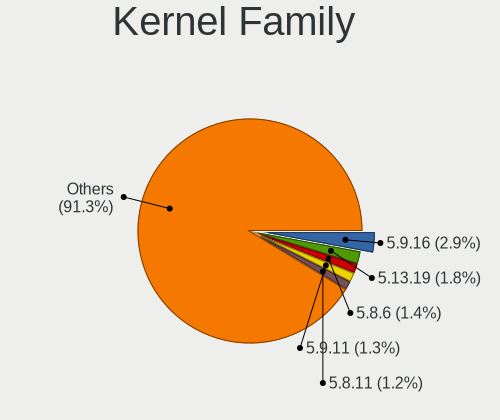
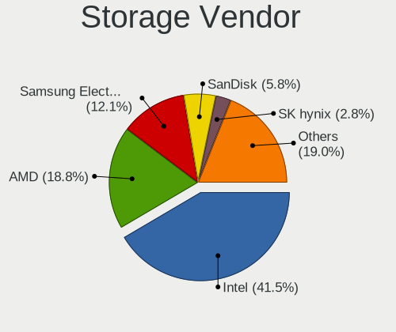
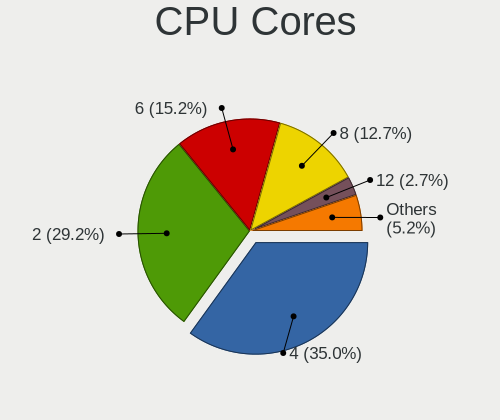
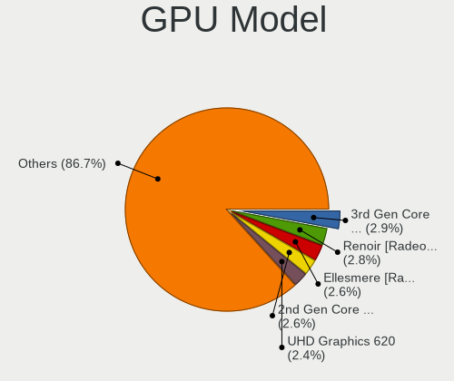
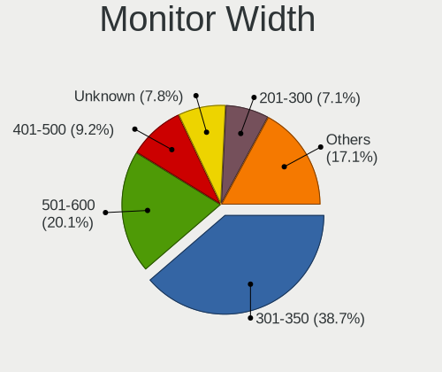
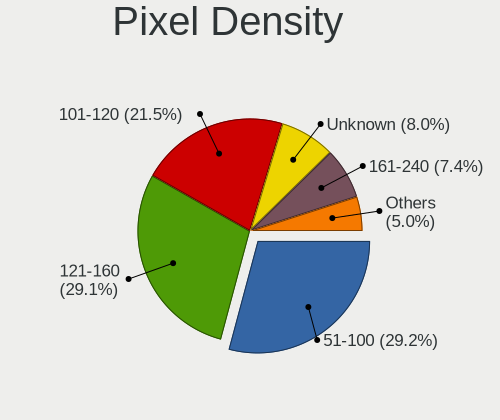
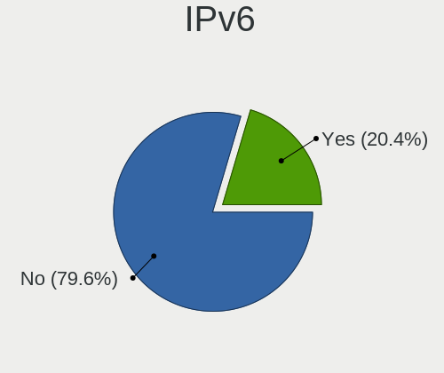

Manjaro - Tested Hardware & Statistics
--------------------------------------

A project to collect tested hardware configurations for Manjaro.

Anyone can contribute to this report by the [hw-probe](https://github.com/linuxhw/hw-probe) tool:

    sudo -E hw-probe -all -upload

Please contribute! Especially if your hardware is rare.

This is a report for all computer types. See also reports for [desktops](/Dist/Manjaro/Desktop/README.md) and [notebooks](/Dist/Manjaro/Notebook/README.md).

Contents
--------

* [ Test Cases ](#test-cases)

* [ System ](#system)
  - [ OS                       ](#os)
  - [ OS Family                ](#os-family)
  - [ Kernel                   ](#kernel)
  - [ Kernel Family            ](#kernel-family)
  - [ Kernel Major Ver.        ](#kernel-major-ver)
  - [ Arch                     ](#arch)
  - [ DE                       ](#de)
  - [ Display Server           ](#display-server)
  - [ Display Manager          ](#display-manager)
  - [ OS Lang                  ](#os-lang)
  - [ Boot Mode                ](#boot-mode)
  - [ Filesystem               ](#filesystem)
  - [ Part. scheme             ](#part-scheme)
  - [ Dual Boot with Linux/BSD ](#dual-boot-with-linuxbsd)
  - [ Dual Boot (Win)          ](#dual-boot-win)

* [ Board ](#board)
  - [ Vendor                   ](#vendor)
  - [ Model                    ](#model)
  - [ Model Family             ](#model-family)
  - [ MFG Year                 ](#mfg-year)
  - [ Form Factor              ](#form-factor)
  - [ Secure Boot              ](#secure-boot)
  - [ Coreboot                 ](#coreboot)
  - [ RAM Size                 ](#ram-size)
  - [ RAM Used                 ](#ram-used)
  - [ Total Drives             ](#total-drives)
  - [ Has CD-ROM               ](#has-cd-rom)
  - [ Has Ethernet             ](#has-ethernet)
  - [ Has WiFi                 ](#has-wifi)
  - [ Has Bluetooth            ](#has-bluetooth)

* [ Location ](#location)
  - [ Country                  ](#country)
  - [ City                     ](#city)

* [ Drives ](#drives)
  - [ Drive Vendor             ](#drive-vendor)
  - [ Drive Model              ](#drive-model)
  - [ HDD Vendor               ](#hdd-vendor)
  - [ SSD Vendor               ](#ssd-vendor)
  - [ Drive Kind               ](#drive-kind)
  - [ Drive Connector          ](#drive-connector)
  - [ Drive Size               ](#drive-size)
  - [ Space Total              ](#space-total)
  - [ Space Used               ](#space-used)
  - [ Malfunc. Drives          ](#malfunc-drives)
  - [ Malfunc. Drive Vendor    ](#malfunc-drive-vendor)
  - [ Malfunc. HDD Vendor      ](#malfunc-hdd-vendor)
  - [ Malfunc. Drive Kind      ](#malfunc-drive-kind)
  - [ Failed Drives            ](#failed-drives)
  - [ Failed Drive Vendor      ](#failed-drive-vendor)
  - [ Drive Status             ](#drive-status)

* [ Storage controller ](#storage-controller)
  - [ Storage Vendor           ](#storage-vendor)
  - [ Storage Model            ](#storage-model)
  - [ Storage Kind             ](#storage-kind)

* [ Processor ](#processor)
  - [ CPU Vendor               ](#cpu-vendor)
  - [ CPU Model                ](#cpu-model)
  - [ CPU Model Family         ](#cpu-model-family)
  - [ CPU Cores                ](#cpu-cores)
  - [ CPU Sockets              ](#cpu-sockets)
  - [ CPU Threads              ](#cpu-threads)
  - [ CPU Op-Modes             ](#cpu-op-modes)
  - [ CPU Microcode            ](#cpu-microcode)
  - [ CPU Microarch            ](#cpu-microarch)

* [ Graphics ](#graphics)
  - [ GPU Vendor               ](#gpu-vendor)
  - [ GPU Model                ](#gpu-model)
  - [ GPU Combo                ](#gpu-combo)
  - [ GPU Driver               ](#gpu-driver)
  - [ GPU Memory               ](#gpu-memory)

* [ Monitor ](#monitor)
  - [ Monitor Vendor           ](#monitor-vendor)
  - [ Monitor Model            ](#monitor-model)
  - [ Monitor Resolution       ](#monitor-resolution)
  - [ Monitor Diagonal         ](#monitor-diagonal)
  - [ Monitor Width            ](#monitor-width)
  - [ Aspect Ratio             ](#aspect-ratio)
  - [ Monitor Area             ](#monitor-area)
  - [ Pixel Density            ](#pixel-density)
  - [ Multiple Monitors        ](#multiple-monitors)

* [ Network ](#network)
  - [ Net Controller Vendor    ](#net-controller-vendor)
  - [ Net Controller Model     ](#net-controller-model)
  - [ Wireless Vendor          ](#wireless-vendor)
  - [ Wireless Model           ](#wireless-model)
  - [ Ethernet Vendor          ](#ethernet-vendor)
  - [ Ethernet Model           ](#ethernet-model)
  - [ Net Controller Kind      ](#net-controller-kind)
  - [ Used Controller          ](#used-controller)
  - [ NICs                     ](#nics)
  - [ IPv6                     ](#ipv6)

* [ Bluetooth ](#bluetooth)
  - [ Bluetooth Vendor         ](#bluetooth-vendor)
  - [ Bluetooth Model          ](#bluetooth-model)

* [ Sound ](#sound)
  - [ Sound Vendor             ](#sound-vendor)
  - [ Sound Model              ](#sound-model)

* [ Memory ](#memory)
  - [ Memory Vendor            ](#memory-vendor)
  - [ Memory Model             ](#memory-model)
  - [ Memory Kind              ](#memory-kind)
  - [ Memory Form Factor       ](#memory-form-factor)
  - [ Memory Size              ](#memory-size)
  - [ Memory Speed             ](#memory-speed)

* [ Printers & scanners ](#printers--scanners)
  - [ Printer Vendor           ](#printer-vendor)
  - [ Printer Model            ](#printer-model)
  - [ Scanner Vendor           ](#scanner-vendor)
  - [ Scanner Model            ](#scanner-model)

* [ Camera ](#camera)
  - [ Camera Vendor            ](#camera-vendor)
  - [ Camera Model             ](#camera-model)

* [ Security ](#security)
  - [ Fingerprint Vendor       ](#fingerprint-vendor)
  - [ Fingerprint Model        ](#fingerprint-model)
  - [ Chipcard Vendor          ](#chipcard-vendor)
  - [ Chipcard Model           ](#chipcard-model)

* [ Unsupported ](#unsupported)
  - [ Unsupported Devices      ](#unsupported-devices)
  - [ Unsupported Device Types ](#unsupported-device-types)

Test Cases
----------

Total: 12821

| Vendor        | Model                       | Form-Factor | Probe                                                      | Date         |
|---------------|-----------------------------|-------------|------------------------------------------------------------|--------------|
| Lenovo        | ThinkPad Z13 Gen 1 21D2C... | Notebook    | [a8fdf278ff](https://linux-hardware.org/?probe=a8fdf278ff) | Jan 06, 2025 |
| Lenovo        | G40-45 80E1                 | Notebook    | [ac16ada090](https://linux-hardware.org/?probe=ac16ada090) | Jan 06, 2025 |
| Apple         | MacBookAir4,1               | Notebook    | [705713446f](https://linux-hardware.org/?probe=705713446f) | Jan 05, 2025 |
| ASUSTek       | VivoBook_ASUSLaptop M160... | Notebook    | [2be9a5ca1c](https://linux-hardware.org/?probe=2be9a5ca1c) | Jan 05, 2025 |
| HP            | ProBook 450 G3              | Notebook    | [a1f8c7d33c](https://linux-hardware.org/?probe=a1f8c7d33c) | Jan 05, 2025 |
| ASRock        | X600M-STX                   | Desktop     | [4a348f5b49](https://linux-hardware.org/?probe=4a348f5b49) | Jan 04, 2025 |
| ASUSTek       | PRIME B450M-A               | Desktop     | [e6a453b673](https://linux-hardware.org/?probe=e6a453b673) | Jan 04, 2025 |
| Lenovo        | IdeaPad Y700-15ISK 80NV     | Notebook    | [5534263506](https://linux-hardware.org/?probe=5534263506) | Jan 04, 2025 |
| Lenovo        | ThinkPad T480 20L6SA5R0U    | Notebook    | [a73526a4ad](https://linux-hardware.org/?probe=a73526a4ad) | Jan 04, 2025 |
| Gigabyte      | Z390 AORUS PRO-CF           | Desktop     | [52f8310052](https://linux-hardware.org/?probe=52f8310052) | Jan 04, 2025 |
| Gigabyte      | X570 AORUS ULTRA            | Desktop     | [1f3cf34c48](https://linux-hardware.org/?probe=1f3cf34c48) | Jan 04, 2025 |
| Lenovo        | IdeaPad 3 15ADA05 81W1      | Notebook    | [e8a17155a5](https://linux-hardware.org/?probe=e8a17155a5) | Jan 03, 2025 |
| Apple         | Mac-942B5BF58194151B        | All in one  | [895f91d18f](https://linux-hardware.org/?probe=895f91d18f) | Jan 03, 2025 |
| Lenovo        | V110-14IAP 80TF             | Notebook    | [5fbac9f592](https://linux-hardware.org/?probe=5fbac9f592) | Jan 03, 2025 |
| HP            | 15                          | Notebook    | [6f317ce763](https://linux-hardware.org/?probe=6f317ce763) | Jan 03, 2025 |
| MSI           | PRO H610M-G                 | Desktop     | [c0a5a2e654](https://linux-hardware.org/?probe=c0a5a2e654) | Jan 02, 2025 |
| Razer         | Blade 15 Base Model (Lat... | Notebook    | [762cb6b3dd](https://linux-hardware.org/?probe=762cb6b3dd) | Jan 02, 2025 |
| MSI           | Katana GF76 12UC            | Notebook    | [f0ab62b277](https://linux-hardware.org/?probe=f0ab62b277) | Jan 01, 2025 |
| Lenovo        | ThinkBook 14 G7+ ASP 21Q... | Notebook    | [20a618d664](https://linux-hardware.org/?probe=20a618d664) | Jan 01, 2025 |
| MSI           | PRO B650-P WIFI             | Desktop     | [14aa7fadc3](https://linux-hardware.org/?probe=14aa7fadc3) | Jan 01, 2025 |
| ASUSTek       | ROG CROSSHAIR VIII DARK ... | Desktop     | [16c8ddaca9](https://linux-hardware.org/?probe=16c8ddaca9) | Jan 01, 2025 |
| Lenovo        | ThinkPad X270 20K5S1A524    | Notebook    | [e45e264430](https://linux-hardware.org/?probe=e45e264430) | Dec 31, 2024 |
| Acer          | Aspire A315-44P             | Notebook    | [52b26cac3f](https://linux-hardware.org/?probe=52b26cac3f) | Dec 31, 2024 |
| MSI           | MPG B550 GAMING PLUS        | Desktop     | [c720ec722a](https://linux-hardware.org/?probe=c720ec722a) | Dec 31, 2024 |
| Lenovo        | ThinkPad E15 Gen 4 21ED0... | Notebook    | [1a707fd487](https://linux-hardware.org/?probe=1a707fd487) | Dec 31, 2024 |
| Unknown       | N20 Pro                     | Notebook    | [4ac833b77e](https://linux-hardware.org/?probe=4ac833b77e) | Dec 30, 2024 |
| Tianbei       | GEM10                       | Desktop     | [036fe3371f](https://linux-hardware.org/?probe=036fe3371f) | Dec 30, 2024 |
| ASUSTek       | ASUS Zenbook S 14 UX5406... | Notebook    | [250896c182](https://linux-hardware.org/?probe=250896c182) | Dec 30, 2024 |
| Dell          | Inspiron 11 - 3147          | Notebook    | [3dbf865efb](https://linux-hardware.org/?probe=3dbf865efb) | Dec 30, 2024 |
| ASUSTek       | ProArt X870E-CREATOR WIF... | Desktop     | [6d4070f742](https://linux-hardware.org/?probe=6d4070f742) | Dec 30, 2024 |
| HP            | 212B                        | Desktop     | [0bb6c8d253](https://linux-hardware.org/?probe=0bb6c8d253) | Dec 29, 2024 |
| ASUSTek       | ProArt X870E-CREATOR WIF... | Desktop     | [a4bfa8bfd5](https://linux-hardware.org/?probe=a4bfa8bfd5) | Dec 29, 2024 |
| Google        | Akemi                       | Notebook    | [ed96f41d09](https://linux-hardware.org/?probe=ed96f41d09) | Dec 29, 2024 |
| Lenovo        | IdeaPadFlex 5 14ALC05 82... | Convertible | [c50fa0e288](https://linux-hardware.org/?probe=c50fa0e288) | Dec 29, 2024 |
| Lenovo        | ThinkBook 14 G5+ APO 21J... | Notebook    | [1ee446218a](https://linux-hardware.org/?probe=1ee446218a) | Dec 29, 2024 |
| MSI           | Katana GF76 12UC            | Notebook    | [81deda659f](https://linux-hardware.org/?probe=81deda659f) | Dec 29, 2024 |
| Apple         | MacBookPro14,3              | Notebook    | [1e7c1552f8](https://linux-hardware.org/?probe=1e7c1552f8) | Dec 29, 2024 |
| Dell          | Precision M6600             | Notebook    | [071a23fb58](https://linux-hardware.org/?probe=071a23fb58) | Dec 29, 2024 |
| Dell          | Precision M6600             | Notebook    | [43ff956e50](https://linux-hardware.org/?probe=43ff956e50) | Dec 29, 2024 |
| Intel         | H55                         | Desktop     | [608b05160e](https://linux-hardware.org/?probe=608b05160e) | Dec 29, 2024 |
| Gigabyte      | B550 AORUS ELITE AX V3      | Desktop     | [3ff4946888](https://linux-hardware.org/?probe=3ff4946888) | Dec 29, 2024 |
| Lenovo        | ThinkPad X1 2-in-1 Gen 9... | Convertible | [f58f86a1d2](https://linux-hardware.org/?probe=f58f86a1d2) | Dec 28, 2024 |
| Lenovo        | ThinkPad T470 W10DG 20JN... | Notebook    | [ddbec2ef79](https://linux-hardware.org/?probe=ddbec2ef79) | Dec 27, 2024 |
| Eluktronic... | MAG-15 2070                 | Notebook    | [c25d963a38](https://linux-hardware.org/?probe=c25d963a38) | Dec 27, 2024 |
| ASUSTek       | PRIME B760M-A D4            | Desktop     | [574c4a2b92](https://linux-hardware.org/?probe=574c4a2b92) | Dec 26, 2024 |
| HUAWEI        | KLVL-WXX9                   | Notebook    | [ace84142e7](https://linux-hardware.org/?probe=ace84142e7) | Dec 26, 2024 |
| Dell          | Latitude E5540              | Notebook    | [0f0b366b45](https://linux-hardware.org/?probe=0f0b366b45) | Dec 26, 2024 |
| Lenovo        | G500 20236                  | Notebook    | [8dbe192f7f](https://linux-hardware.org/?probe=8dbe192f7f) | Dec 26, 2024 |
| Lenovo        | G500 20236                  | Notebook    | [717bada61c](https://linux-hardware.org/?probe=717bada61c) | Dec 26, 2024 |
| Lenovo        | Legion 5 Pro 16ARH7H 82R... | Notebook    | [10501c1c92](https://linux-hardware.org/?probe=10501c1c92) | Dec 26, 2024 |
| Lenovo        | ThinkBook 14 G6 ABP 21KJ    | Notebook    | [7657538670](https://linux-hardware.org/?probe=7657538670) | Dec 26, 2024 |
| Lenovo        | Slim 7 14IMH9 83D8          | Notebook    | [fd059b501d](https://linux-hardware.org/?probe=fd059b501d) | Dec 26, 2024 |
| Lenovo        | IdeaPad 330-15ARR 81D2      | Notebook    | [306fb82bd7](https://linux-hardware.org/?probe=306fb82bd7) | Dec 26, 2024 |
| HP            | 630                         | Notebook    | [eb7ed9bf39](https://linux-hardware.org/?probe=eb7ed9bf39) | Dec 25, 2024 |
| Gigabyte      | P55M-UD2                    | Desktop     | [112d1ed038](https://linux-hardware.org/?probe=112d1ed038) | Dec 25, 2024 |
| ASUSTek       | ROG STRIX B550-F GAMING     | Desktop     | [edc0d78348](https://linux-hardware.org/?probe=edc0d78348) | Dec 25, 2024 |
| Gigabyte      | Z390 UD                     | Desktop     | [bbcf88b5f3](https://linux-hardware.org/?probe=bbcf88b5f3) | Dec 25, 2024 |
| ASUSTek       | ProArt P16 H7606WI_H7606... | Notebook    | [3fbdcb99b5](https://linux-hardware.org/?probe=3fbdcb99b5) | Dec 25, 2024 |
| MSI           | PRO X670-P WIFI             | Desktop     | [603c73537a](https://linux-hardware.org/?probe=603c73537a) | Dec 25, 2024 |
| MSI           | PRO X670-P WIFI             | Desktop     | [9713f44b0a](https://linux-hardware.org/?probe=9713f44b0a) | Dec 24, 2024 |
| ASUSTek       | Pro WS X299 SAGE II         | Desktop     | [82572a2f0c](https://linux-hardware.org/?probe=82572a2f0c) | Dec 24, 2024 |
| MSI           | B550-A PRO                  | Desktop     | [2ceed545b9](https://linux-hardware.org/?probe=2ceed545b9) | Dec 24, 2024 |
| Acer          | Aspire Lite AL15-41         | Notebook    | [3eb84ee7c8](https://linux-hardware.org/?probe=3eb84ee7c8) | Dec 23, 2024 |
| Lenovo        | Bantry CRB SDK0E50510 WI... | Desktop     | [a97fbd8b52](https://linux-hardware.org/?probe=a97fbd8b52) | Dec 23, 2024 |
| HP            | 2129                        | Desktop     | [7c281863fb](https://linux-hardware.org/?probe=7c281863fb) | Dec 23, 2024 |
| TongFang      | GX5HRXL                     | Notebook    | [c16d33a7aa](https://linux-hardware.org/?probe=c16d33a7aa) | Dec 23, 2024 |
| Lenovo        | Bantry CRB SDK0E50510 WI... | Desktop     | [a00f095086](https://linux-hardware.org/?probe=a00f095086) | Dec 23, 2024 |
| Gigabyte      | Z790 AORUS PRO X            | Desktop     | [dd462ce2a6](https://linux-hardware.org/?probe=dd462ce2a6) | Dec 22, 2024 |
| ASRock        | B550M-HDV                   | Desktop     | [820e985b85](https://linux-hardware.org/?probe=820e985b85) | Dec 22, 2024 |
| Notebook      | NH5xAx                      | Notebook    | [4127c6e729](https://linux-hardware.org/?probe=4127c6e729) | Dec 22, 2024 |
| Acer          | Aspire TC-885 V:1.1         | Desktop     | [53f26e91a1](https://linux-hardware.org/?probe=53f26e91a1) | Dec 22, 2024 |
| Panasonic     | CFLX6-2                     | Notebook    | [62025e0467](https://linux-hardware.org/?probe=62025e0467) | Dec 22, 2024 |
| ASUSTek       | Zenbook 15 UM3504DA_UM35... | Notebook    | [12dfa44bee](https://linux-hardware.org/?probe=12dfa44bee) | Dec 22, 2024 |
| Lunnen        | LL5FAW                      | Notebook    | [7b0a53a2fe](https://linux-hardware.org/?probe=7b0a53a2fe) | Dec 22, 2024 |
| AMI           | Intel                       | Desktop     | [b2d4a45180](https://linux-hardware.org/?probe=b2d4a45180) | Dec 21, 2024 |
| Lenovo        | ThinkBook 14 G6 ABP 21KJ    | Notebook    | [fc617a056e](https://linux-hardware.org/?probe=fc617a056e) | Dec 21, 2024 |
| Lenovo        | ThinkPad T400 6475WKP       | Notebook    | [6d42ae475b](https://linux-hardware.org/?probe=6d42ae475b) | Dec 20, 2024 |
| Lenovo        | ThinkPad T400 6475WKP       | Notebook    | [8d02891009](https://linux-hardware.org/?probe=8d02891009) | Dec 20, 2024 |
| ASRock        | B450 Gaming K4              | Desktop     | [0247ba4dfc](https://linux-hardware.org/?probe=0247ba4dfc) | Dec 19, 2024 |
| Gigabyte      | P55-UD4                     | Desktop     | [687d0cebbc](https://linux-hardware.org/?probe=687d0cebbc) | Dec 19, 2024 |
| Lenovo        | IdeaPad Y700-15ISK 80NV     | Notebook    | [6748714931](https://linux-hardware.org/?probe=6748714931) | Dec 19, 2024 |
| Gigabyte      | B550 AORUS ELITE            | Desktop     | [dfb9ab7ad3](https://linux-hardware.org/?probe=dfb9ab7ad3) | Dec 18, 2024 |
| MSI           | MPG Z790 EDGE MONSTER HU... | Desktop     | [9362ff5af5](https://linux-hardware.org/?probe=9362ff5af5) | Dec 18, 2024 |
| TongFang      | GX5HRXL                     | Notebook    | [27406f56fd](https://linux-hardware.org/?probe=27406f56fd) | Dec 18, 2024 |
| ASUSTek       | ROG STRIX B550-F GAMING     | Desktop     | [f294cbd961](https://linux-hardware.org/?probe=f294cbd961) | Dec 17, 2024 |
| Lenovo        | IdeaPad Y700-15ISK 80NV     | Notebook    | [85385e1ab5](https://linux-hardware.org/?probe=85385e1ab5) | Dec 17, 2024 |
| Samsung       | 800G5M/800G5W               | Notebook    | [f721641c6c](https://linux-hardware.org/?probe=f721641c6c) | Dec 17, 2024 |
| ASUSTek       | ROG STRIX X570-E GAMING     | Desktop     | [8d7adb7ecd](https://linux-hardware.org/?probe=8d7adb7ecd) | Dec 17, 2024 |
| ASUSTek       | ROG Rampage VI EXTREME E... | Desktop     | [332bbb3a71](https://linux-hardware.org/?probe=332bbb3a71) | Dec 17, 2024 |
| MSI           | Stealth 16 AI Studio A1V... | Notebook    | [ab7f87b6f5](https://linux-hardware.org/?probe=ab7f87b6f5) | Dec 16, 2024 |
| ASUSTek       | ROG Zephyrus G15 GA503RW... | Notebook    | [20bb7981c5](https://linux-hardware.org/?probe=20bb7981c5) | Dec 16, 2024 |
| Shenzhen M... | F7BRC                       | Desktop     | [957f74af52](https://linux-hardware.org/?probe=957f74af52) | Dec 16, 2024 |
| ASUSTek       | ROG Zephyrus G15 GA503RW... | Notebook    | [5211e1329e](https://linux-hardware.org/?probe=5211e1329e) | Dec 16, 2024 |
| Lenovo        | ThinkPad T480 20L6S0RK00    | Notebook    | [16e67c3401](https://linux-hardware.org/?probe=16e67c3401) | Dec 16, 2024 |
| Dell          | Latitude 5401               | Notebook    | [873e661b3c](https://linux-hardware.org/?probe=873e661b3c) | Dec 15, 2024 |
| Medion        | E15410                      | Notebook    | [f980cd1638](https://linux-hardware.org/?probe=f980cd1638) | Dec 15, 2024 |
| ASUSTek       | PRIME A320M-K               | Desktop     | [cb6994a81c](https://linux-hardware.org/?probe=cb6994a81c) | Dec 15, 2024 |
| MSI           | GP75 Leopard 10SFK          | Notebook    | [d3a7a79583](https://linux-hardware.org/?probe=d3a7a79583) | Dec 15, 2024 |
| Unknown       | Unknown                     | Notebook    | [7b1d93f1d8](https://linux-hardware.org/?probe=7b1d93f1d8) | Dec 14, 2024 |
| HP            | Victus by Gaming Laptop ... | Notebook    | [9e6b6fc501](https://linux-hardware.org/?probe=9e6b6fc501) | Dec 14, 2024 |
| HP            | 304Ah                       | Desktop     | [f4ecd569d3](https://linux-hardware.org/?probe=f4ecd569d3) | Dec 13, 2024 |
| Fujitsu       | CELSIUS H970                | Notebook    | [998d6eca38](https://linux-hardware.org/?probe=998d6eca38) | Dec 13, 2024 |
| MSI           | MPG X570 GAMING PLUS        | Desktop     | [231ffcb252](https://linux-hardware.org/?probe=231ffcb252) | Dec 13, 2024 |
| Dell          | XPS 15 9570                 | Notebook    | [4780fbff59](https://linux-hardware.org/?probe=4780fbff59) | Dec 13, 2024 |
| Dell          | Vostro 14 5401              | Notebook    | [f4068911f7](https://linux-hardware.org/?probe=f4068911f7) | Dec 11, 2024 |
| Dell          | 0TTDMJ A00                  | Desktop     | [4ee281d915](https://linux-hardware.org/?probe=4ee281d915) | Dec 11, 2024 |
| Dell          | Vostro 14 5401              | Notebook    | [8b0aec2d81](https://linux-hardware.org/?probe=8b0aec2d81) | Dec 11, 2024 |
| HUAWEI        | HVY-WXX9                    | Notebook    | [7dec2ab649](https://linux-hardware.org/?probe=7dec2ab649) | Dec 11, 2024 |
| HP            | 8396                        | Desktop     | [eef8330bfa](https://linux-hardware.org/?probe=eef8330bfa) | Dec 10, 2024 |
| HP            | EliteBook 8740w             | Notebook    | [70d44e5e32](https://linux-hardware.org/?probe=70d44e5e32) | Dec 10, 2024 |
| HP            | EliteBook 8740w             | Notebook    | [88b25b7b18](https://linux-hardware.org/?probe=88b25b7b18) | Dec 10, 2024 |
| HP            | 250 G7 Notebook PC          | Notebook    | [ecad464cdd](https://linux-hardware.org/?probe=ecad464cdd) | Dec 09, 2024 |
| Dell          | Vostro 14 5401              | Notebook    | [7c77f0a04f](https://linux-hardware.org/?probe=7c77f0a04f) | Dec 09, 2024 |
| MSI           | B450M BAZOOKA V2            | Desktop     | [7b9add187d](https://linux-hardware.org/?probe=7b9add187d) | Dec 09, 2024 |
| Panasonic     | CFLX6-2                     | Notebook    | [192859505f](https://linux-hardware.org/?probe=192859505f) | Dec 09, 2024 |
| Lenovo        | Legion 5 15IMH05H 81Y6      | Notebook    | [6a8446aa46](https://linux-hardware.org/?probe=6a8446aa46) | Dec 08, 2024 |
| ASUSTek       | ASUS TUF Gaming A15 FA50... | Notebook    | [31a8469396](https://linux-hardware.org/?probe=31a8469396) | Dec 08, 2024 |
| ASUSTek       | Zenbook UX5401ZA_UX5401Z... | Notebook    | [54fbaf65c6](https://linux-hardware.org/?probe=54fbaf65c6) | Dec 08, 2024 |
| Medion        | E15410                      | Notebook    | [cf490cd2d6](https://linux-hardware.org/?probe=cf490cd2d6) | Dec 07, 2024 |
| MSI           | MS-7253                     | Desktop     | [06a8a5402f](https://linux-hardware.org/?probe=06a8a5402f) | Dec 07, 2024 |
| ASUSTek       | PRIME A320M-K               | Desktop     | [2d2064c328](https://linux-hardware.org/?probe=2d2064c328) | Dec 06, 2024 |
| Dell          | Precision 3560              | Notebook    | [d30964e712](https://linux-hardware.org/?probe=d30964e712) | Dec 06, 2024 |
| Dell          | XPS 13 9340                 | Notebook    | [14b4ca4b2c](https://linux-hardware.org/?probe=14b4ca4b2c) | Dec 05, 2024 |
| Apple         | MacBookPro9,1               | Notebook    | [9ff091de62](https://linux-hardware.org/?probe=9ff091de62) | Dec 05, 2024 |
| HP            | ProBook 455R G6             | Notebook    | [49edf98bbc](https://linux-hardware.org/?probe=49edf98bbc) | Dec 05, 2024 |
| Gigabyte      | B550M AORUS ELITE           | Desktop     | [31412e1466](https://linux-hardware.org/?probe=31412e1466) | Dec 05, 2024 |
| Lenovo        | 3750 SDK0T76528 WIN 3556... | Desktop     | [0f56b0600a](https://linux-hardware.org/?probe=0f56b0600a) | Dec 04, 2024 |
| Samsung       | 300V3A/300V4A/300V5A/200... | Notebook    | [6806bb33b6](https://linux-hardware.org/?probe=6806bb33b6) | Dec 04, 2024 |
| Lenovo        | ThinkPad L470 20J40010GE    | Notebook    | [34628845b7](https://linux-hardware.org/?probe=34628845b7) | Dec 04, 2024 |
| Intel         | DQ57TM AAE70931-403         | Desktop     | [4cf044143a](https://linux-hardware.org/?probe=4cf044143a) | Dec 04, 2024 |
| Lenovo        | Legion Slim 5 16APH8 82Y... | Notebook    | [261c6cc077](https://linux-hardware.org/?probe=261c6cc077) | Dec 03, 2024 |
| ASUSTek       | VivoBook_ASUSLaptop K660... | Notebook    | [37cc7decbf](https://linux-hardware.org/?probe=37cc7decbf) | Dec 03, 2024 |
| Gigabyte      | B550 AORUS ELITE V2         | Desktop     | [3c075a4675](https://linux-hardware.org/?probe=3c075a4675) | Dec 03, 2024 |
| ASUSTek       | P552SA                      | Notebook    | [ef552aa919](https://linux-hardware.org/?probe=ef552aa919) | Dec 03, 2024 |
| ASRock        | B450 Gaming K4              | Desktop     | [13516885f4](https://linux-hardware.org/?probe=13516885f4) | Dec 03, 2024 |
| ASUSTek       | Strix GL704GM_GL704GM       | Notebook    | [620d235bf6](https://linux-hardware.org/?probe=620d235bf6) | Dec 03, 2024 |
| Apple         | MacBookAir7,2               | Notebook    | [cb4b4d37ef](https://linux-hardware.org/?probe=cb4b4d37ef) | Dec 02, 2024 |
| Gigabyte      | X470 AORUS ULTRA GAMING-... | Desktop     | [71dbf99e53](https://linux-hardware.org/?probe=71dbf99e53) | Dec 02, 2024 |
| Gigabyte      | H97M-D3H                    | Desktop     | [f8e5244664](https://linux-hardware.org/?probe=f8e5244664) | Dec 02, 2024 |
| HP            | EliteBook 735 G6            | Notebook    | [5074de8248](https://linux-hardware.org/?probe=5074de8248) | Dec 02, 2024 |
| Timi          | TM1701                      | Notebook    | [6806471079](https://linux-hardware.org/?probe=6806471079) | Dec 01, 2024 |
| Lenovo        | Legion 5 82B5               | Notebook    | [db7e4e989a](https://linux-hardware.org/?probe=db7e4e989a) | Dec 01, 2024 |
| MSI           | PRO B650M-A WIFI            | Desktop     | [0b6eff9251](https://linux-hardware.org/?probe=0b6eff9251) | Dec 01, 2024 |
| Samsung       | 300V3A/300V4A/300V5A/200... | Notebook    | [d8e8d7035d](https://linux-hardware.org/?probe=d8e8d7035d) | Dec 01, 2024 |
| Lenovo        | ThinkPad T470 20HD000WUS    | Notebook    | [cc7c458456](https://linux-hardware.org/?probe=cc7c458456) | Dec 01, 2024 |
| Toshiba       | Satellite L500              | Notebook    | [27aa2e62cd](https://linux-hardware.org/?probe=27aa2e62cd) | Dec 01, 2024 |
| ASRock        | X570 Steel Legend           | Desktop     | [1f64e1379e](https://linux-hardware.org/?probe=1f64e1379e) | Dec 01, 2024 |
| HUAWEI        | VGHH-XX                     | Notebook    | [3bee5be2fa](https://linux-hardware.org/?probe=3bee5be2fa) | Dec 01, 2024 |
| ASUSTek       | VivoBook_ASUSLaptop X412... | Notebook    | [456d3c7b2d](https://linux-hardware.org/?probe=456d3c7b2d) | Nov 30, 2024 |
| Chuwi         | Hi10 Max                    | Tablet      | [da0abf246e](https://linux-hardware.org/?probe=da0abf246e) | Nov 30, 2024 |
| Lenovo        | ThinkPad T480 20L6SA5R0U    | Notebook    | [a176cb1cfa](https://linux-hardware.org/?probe=a176cb1cfa) | Nov 30, 2024 |
| Lenovo        | Legion 5 82B5               | Notebook    | [3e5cfb2a18](https://linux-hardware.org/?probe=3e5cfb2a18) | Nov 30, 2024 |
| Chuwi         | Hi10 Max                    | Tablet      | [08f03e38cb](https://linux-hardware.org/?probe=08f03e38cb) | Nov 30, 2024 |
| ASRock        | B650E Taichi Lite           | Desktop     | [fd3b50600a](https://linux-hardware.org/?probe=fd3b50600a) | Nov 30, 2024 |
| Dell          | 0GDG8Y A00                  | Desktop     | [6af006cbe8](https://linux-hardware.org/?probe=6af006cbe8) | Nov 30, 2024 |
| Framework     | Laptop 13 (AMD Ryzen 704... | Notebook    | [a4a7031be1](https://linux-hardware.org/?probe=a4a7031be1) | Nov 29, 2024 |
| ASUSTek       | PRIME B550M-A               | Desktop     | [1666d53ef2](https://linux-hardware.org/?probe=1666d53ef2) | Nov 29, 2024 |
| Lenovo        | V15 G4 ABP 83CR             | Notebook    | [7a69ccba2a](https://linux-hardware.org/?probe=7a69ccba2a) | Nov 29, 2024 |
| Lenovo        | ThinkBook 14 G5+ ARP 21H... | Notebook    | [82f7faf590](https://linux-hardware.org/?probe=82f7faf590) | Nov 29, 2024 |
| Dell          | 0GDG8Y A00                  | Desktop     | [df9775b867](https://linux-hardware.org/?probe=df9775b867) | Nov 29, 2024 |
| MSI           | MPG X570 GAMING PLUS        | Desktop     | [0e4f7f6345](https://linux-hardware.org/?probe=0e4f7f6345) | Nov 28, 2024 |
| ASRock        | B75M                        | Desktop     | [54a8c00779](https://linux-hardware.org/?probe=54a8c00779) | Nov 28, 2024 |
| ASUSTek       | PRIME B450M-A II            | Desktop     | [e8f597bc75](https://linux-hardware.org/?probe=e8f597bc75) | Nov 28, 2024 |
| HP            | 2129                        | Desktop     | [c42783b47a](https://linux-hardware.org/?probe=c42783b47a) | Nov 28, 2024 |
| Gigabyte      | Z690 UD AX                  | Desktop     | [880222f8da](https://linux-hardware.org/?probe=880222f8da) | Nov 28, 2024 |
| MSI           | Z270 SLI PLUS               | Desktop     | [0298a65f1d](https://linux-hardware.org/?probe=0298a65f1d) | Nov 28, 2024 |
| Gigabyte      | B550 AORUS ELITE            | Desktop     | [0df7b81985](https://linux-hardware.org/?probe=0df7b81985) | Nov 27, 2024 |
| Notebook      | NH5xAx                      | Notebook    | [5a2f59ea4e](https://linux-hardware.org/?probe=5a2f59ea4e) | Nov 26, 2024 |
| Lenovo        | ThinkPad T480 20L6SA5R0U    | Notebook    | [616dd41a0d](https://linux-hardware.org/?probe=616dd41a0d) | Nov 25, 2024 |
| Alienware     | 17 R4                       | Notebook    | [892ac0bb13](https://linux-hardware.org/?probe=892ac0bb13) | Nov 25, 2024 |
| MSI           | Bravo 15 C7UDX              | Notebook    | [0711ea8cc7](https://linux-hardware.org/?probe=0711ea8cc7) | Nov 24, 2024 |
| Apple         | MacBookPro9,1               | Notebook    | [63a95fc1b1](https://linux-hardware.org/?probe=63a95fc1b1) | Nov 24, 2024 |
| Acer          | TravelMate P216-51          | Notebook    | [b2a10de376](https://linux-hardware.org/?probe=b2a10de376) | Nov 24, 2024 |
| Gigabyte      | B360M D3H-CF                | Desktop     | [f24b6c8c5c](https://linux-hardware.org/?probe=f24b6c8c5c) | Nov 24, 2024 |
| MSI           | MAG B550 TOMAHAWK MAX WI... | Desktop     | [88c8f0e6d0](https://linux-hardware.org/?probe=88c8f0e6d0) | Nov 24, 2024 |
| MSI           | MAG B550 TOMAHAWK MAX WI... | Desktop     | [d1aafc3e2a](https://linux-hardware.org/?probe=d1aafc3e2a) | Nov 24, 2024 |
| ASUSTek       | TUF Gaming B450-PLUS II     | Desktop     | [9e94883925](https://linux-hardware.org/?probe=9e94883925) | Nov 24, 2024 |
| Lenovo        | IdeaPad 5 2-in-1 16IRU9 ... | Convertible | [072a1b9f74](https://linux-hardware.org/?probe=072a1b9f74) | Nov 24, 2024 |
| Acer          | Aspire 7551                 | Notebook    | [f3fcee96ea](https://linux-hardware.org/?probe=f3fcee96ea) | Nov 23, 2024 |
| HP            | 2129                        | Desktop     | [3a95c03859](https://linux-hardware.org/?probe=3a95c03859) | Nov 23, 2024 |
| ASUSTek       | PRIME H610M-A D4            | Desktop     | [54f6f19483](https://linux-hardware.org/?probe=54f6f19483) | Nov 23, 2024 |
| ASUSTek       | ROG STRIX B650E-E GAMING... | Desktop     | [d3dc594f2a](https://linux-hardware.org/?probe=d3dc594f2a) | Nov 23, 2024 |
| Lenovo        | ThinkPad X1 Carbon 6th 2... | Notebook    | [0ff652bb11](https://linux-hardware.org/?probe=0ff652bb11) | Nov 23, 2024 |
| HP            | ZBook 15                    | Notebook    | [9cc46c9e48](https://linux-hardware.org/?probe=9cc46c9e48) | Nov 23, 2024 |
| HP            | Pavilion Gaming Laptop 1... | Notebook    | [e8943b173d](https://linux-hardware.org/?probe=e8943b173d) | Nov 22, 2024 |
| MSI           | B650 GAMING PLUS WIFI       | Desktop     | [6089d004eb](https://linux-hardware.org/?probe=6089d004eb) | Nov 22, 2024 |
| Chuwi         | CoreBook X                  | Notebook    | [78090333b2](https://linux-hardware.org/?probe=78090333b2) | Nov 22, 2024 |
| Chuwi         | CoreBook X                  | Notebook    | [1cb80b3cf1](https://linux-hardware.org/?probe=1cb80b3cf1) | Nov 22, 2024 |
| Acer          | Nitro ANV15-51              | Notebook    | [0ddea80a32](https://linux-hardware.org/?probe=0ddea80a32) | Nov 22, 2024 |
| AZW           | SER V1.0                    | Mini pc     | [01078ae4ec](https://linux-hardware.org/?probe=01078ae4ec) | Nov 22, 2024 |
| System76      | Gazelle                     | Notebook    | [ea1858e078](https://linux-hardware.org/?probe=ea1858e078) | Nov 22, 2024 |
| System76      | Gazelle                     | Notebook    | [ef1ee90c75](https://linux-hardware.org/?probe=ef1ee90c75) | Nov 22, 2024 |
| ASUSTek       | M5A78L-M LX3                | Desktop     | [29613a4747](https://linux-hardware.org/?probe=29613a4747) | Nov 22, 2024 |
| Lenovo        | ThinkPad T480 20L6SA5R0U    | Notebook    | [f3bc755a64](https://linux-hardware.org/?probe=f3bc755a64) | Nov 21, 2024 |
| MSI           | MAG B550 TOMAHAWK           | Desktop     | [4647245b41](https://linux-hardware.org/?probe=4647245b41) | Nov 21, 2024 |
| ASRock        | B450 Pro4                   | Desktop     | [7198d4dd59](https://linux-hardware.org/?probe=7198d4dd59) | Nov 21, 2024 |
| ASUSTek       | ROG STRIX B450-F GAMING     | Desktop     | [a56921a744](https://linux-hardware.org/?probe=a56921a744) | Nov 21, 2024 |
| HP            | ENVY x360 Convertible 15... | Convertible | [4bf83ce5dc](https://linux-hardware.org/?probe=4bf83ce5dc) | Nov 21, 2024 |
| ASUSTek       | ROG STRIX Z370-I GAMING     | Desktop     | [852ffac66b](https://linux-hardware.org/?probe=852ffac66b) | Nov 21, 2024 |
| MSI           | 760GM-P21                   | Desktop     | [7c2250da16](https://linux-hardware.org/?probe=7c2250da16) | Nov 21, 2024 |
| Lenovo        | ThinkPad T450 20BV0003US    | Notebook    | [bf57991489](https://linux-hardware.org/?probe=bf57991489) | Nov 21, 2024 |
| HP            | 0A58h                       | Desktop     | [8063748e4e](https://linux-hardware.org/?probe=8063748e4e) | Nov 20, 2024 |
| ASUSTek       | P6T DELUXE V2               | Desktop     | [74d8354490](https://linux-hardware.org/?probe=74d8354490) | Nov 20, 2024 |
| ASUSTek       | TUF Gaming X570-PLUS        | Desktop     | [59b193fae9](https://linux-hardware.org/?probe=59b193fae9) | Nov 20, 2024 |
| HP            | ENVY x360 Convertible 15... | Convertible | [16a9376ed3](https://linux-hardware.org/?probe=16a9376ed3) | Nov 20, 2024 |
| ASUSTek       | P6T DELUXE V2               | Desktop     | [be63d0b85f](https://linux-hardware.org/?probe=be63d0b85f) | Nov 20, 2024 |
| Unknown       | Unknown                     | Notebook    | [e54677c7eb](https://linux-hardware.org/?probe=e54677c7eb) | Nov 20, 2024 |
| MSI           | B450-A PRO MAX              | Desktop     | [d24344a88b](https://linux-hardware.org/?probe=d24344a88b) | Nov 19, 2024 |
| MSI           | MPG Z790 EDGE MONSTER HU... | Desktop     | [dbee9a2410](https://linux-hardware.org/?probe=dbee9a2410) | Nov 19, 2024 |
| Lenovo        | ThinkPad T560 20FJS1WT00    | Notebook    | [7fdf94b06e](https://linux-hardware.org/?probe=7fdf94b06e) | Nov 19, 2024 |
| Apple         | Mac-63001698E7A34814 iMa... | All in one  | [166d603a90](https://linux-hardware.org/?probe=166d603a90) | Nov 19, 2024 |
| Gigabyte      | TRX40 DESIGNARE             | Desktop     | [96735d84cb](https://linux-hardware.org/?probe=96735d84cb) | Nov 18, 2024 |
| Lenovo        | Legion 5 Pro 16ARH7H 82R... | Notebook    | [91797321da](https://linux-hardware.org/?probe=91797321da) | Nov 18, 2024 |
| Toshiba       | Satellite C660              | Notebook    | [f7e1b632b9](https://linux-hardware.org/?probe=f7e1b632b9) | Nov 18, 2024 |
| Lenovo        | IdeaPad 110-17ACL 80UM      | Notebook    | [1a183ef048](https://linux-hardware.org/?probe=1a183ef048) | Nov 18, 2024 |
| ASUSTek       | A58M-A/USB3                 | Desktop     | [3c826c2a94](https://linux-hardware.org/?probe=3c826c2a94) | Nov 17, 2024 |
| ASUSTek       | A58M-A/USB3                 | Desktop     | [1db84a0c21](https://linux-hardware.org/?probe=1db84a0c21) | Nov 17, 2024 |
| Acer          | Aspire S3-391               | Notebook    | [5c084381e2](https://linux-hardware.org/?probe=5c084381e2) | Nov 17, 2024 |
| Gigabyte      | X870 AORUS ELITE WIFI7 I... | Desktop     | [8b148efe27](https://linux-hardware.org/?probe=8b148efe27) | Nov 17, 2024 |
| Acer          | Aspire S3-391               | Notebook    | [1ca39c5a91](https://linux-hardware.org/?probe=1ca39c5a91) | Nov 17, 2024 |
| MSI           | MAG X870 TOMAHAWK WIFI      | Desktop     | [f407eb8cc5](https://linux-hardware.org/?probe=f407eb8cc5) | Nov 16, 2024 |
| ASUSTek       | PRIME X470-PRO              | Desktop     | [cc1f1fc7a8](https://linux-hardware.org/?probe=cc1f1fc7a8) | Nov 16, 2024 |
| HUAWEI        | BOHK-WAX9X                  | Notebook    | [b617d5b76c](https://linux-hardware.org/?probe=b617d5b76c) | Nov 16, 2024 |
| ASUSTek       | X99-PRO/USB                 | Desktop     | [259b4c7c59](https://linux-hardware.org/?probe=259b4c7c59) | Nov 15, 2024 |
| ASUSTek       | P8H61-MX USB3               | Desktop     | [7b361ec797](https://linux-hardware.org/?probe=7b361ec797) | Nov 15, 2024 |
| MSI           | 890FXA-GD70                 | Desktop     | [10ce427ae8](https://linux-hardware.org/?probe=10ce427ae8) | Nov 15, 2024 |
| Dell          | 0T7D40 A01                  | Desktop     | [ff59806797](https://linux-hardware.org/?probe=ff59806797) | Nov 15, 2024 |
| Dell          | 0T7D40 A01                  | Desktop     | [1fcfdd6e0f](https://linux-hardware.org/?probe=1fcfdd6e0f) | Nov 15, 2024 |
| Dell          | 0WR7PY A02                  | Desktop     | [d528220481](https://linux-hardware.org/?probe=d528220481) | Nov 15, 2024 |
| ASUSTek       | Zenbook UM3402YAR_UM3402... | Notebook    | [b3e2e79950](https://linux-hardware.org/?probe=b3e2e79950) | Nov 15, 2024 |
| MSI           | PRO X670-P WIFI             | Desktop     | [4be0aebcd2](https://linux-hardware.org/?probe=4be0aebcd2) | Nov 15, 2024 |
| Lenovo        | IdeaPadFlex 5 14ITL05 82... | Convertible | [074bf6646f](https://linux-hardware.org/?probe=074bf6646f) | Nov 14, 2024 |
| ASUSTek       | Vivobook Go E1504FA_E150... | Notebook    | [3439677f78](https://linux-hardware.org/?probe=3439677f78) | Nov 14, 2024 |
| HP            | 630                         | Notebook    | [0103a33e55](https://linux-hardware.org/?probe=0103a33e55) | Nov 13, 2024 |
| MSI           | PRO Z690-A DDR4             | Desktop     | [7806627c9a](https://linux-hardware.org/?probe=7806627c9a) | Nov 13, 2024 |
| Gigabyte      | G1.Guerrilla                | Desktop     | [73ef034954](https://linux-hardware.org/?probe=73ef034954) | Nov 12, 2024 |
| MSI           | PRO Z690-A DDR4             | Desktop     | [1b1cb41bb3](https://linux-hardware.org/?probe=1b1cb41bb3) | Nov 12, 2024 |
| MSI           | PRO B550M-VC WIFI           | Desktop     | [666f6b86ca](https://linux-hardware.org/?probe=666f6b86ca) | Nov 12, 2024 |
| ASUSTek       | F3JP                        | Notebook    | [cd8a9b0278](https://linux-hardware.org/?probe=cd8a9b0278) | Nov 12, 2024 |
| Lenovo        | V15 G2 ALC 82KD             | Notebook    | [d523323bd5](https://linux-hardware.org/?probe=d523323bd5) | Nov 12, 2024 |
| ASUSTek       | Vivobook Go E1504FA_E150... | Notebook    | [5d1b0d2964](https://linux-hardware.org/?probe=5d1b0d2964) | Nov 12, 2024 |
| Lenovo        | V15 G2 ALC 82KD             | Notebook    | [a74cceeb11](https://linux-hardware.org/?probe=a74cceeb11) | Nov 12, 2024 |
| Gigabyte      | 970A-D3                     | Desktop     | [8b39d5f772](https://linux-hardware.org/?probe=8b39d5f772) | Nov 11, 2024 |
| ASUSTek       | ROG STRIX B550-F GAMING     | Desktop     | [136a3d6103](https://linux-hardware.org/?probe=136a3d6103) | Nov 11, 2024 |
| Lenovo        | ThinkPad X1 Extreme 20MF... | Notebook    | [838f0bf19c](https://linux-hardware.org/?probe=838f0bf19c) | Nov 11, 2024 |
| HP            | ZBook 15                    | Notebook    | [7de81b42b8](https://linux-hardware.org/?probe=7de81b42b8) | Nov 10, 2024 |
| ASUSTek       | TUF Gaming B550M-PLUS WI... | Desktop     | [33618bc34b](https://linux-hardware.org/?probe=33618bc34b) | Nov 09, 2024 |
| Lenovo        | SKYBAY SDK0J40705 WIN 34... | Desktop     | [9d7404555c](https://linux-hardware.org/?probe=9d7404555c) | Nov 09, 2024 |
| ASUSTek       | TUF Gaming B550M-PLUS       | Desktop     | [56a7d1166d](https://linux-hardware.org/?probe=56a7d1166d) | Nov 09, 2024 |
| ASUSTek       | X555LNB                     | Notebook    | [779d09dbb2](https://linux-hardware.org/?probe=779d09dbb2) | Nov 08, 2024 |
| Lenovo        | ThinkBook 15 G3 ITL 21A5    | Notebook    | [6fe15c72ff](https://linux-hardware.org/?probe=6fe15c72ff) | Nov 08, 2024 |
| ASUSTek       | PRIME B560M-A               | Desktop     | [e519c240a9](https://linux-hardware.org/?probe=e519c240a9) | Nov 08, 2024 |
| Gigabyte      | Z170X-Gaming 5              | Desktop     | [ac49d10d4b](https://linux-hardware.org/?probe=ac49d10d4b) | Nov 08, 2024 |
| ASUSTek       | ROG Zephyrus G14 GA402XV... | Notebook    | [6e7f58990a](https://linux-hardware.org/?probe=6e7f58990a) | Nov 08, 2024 |
| Intel Clie... | LAPQC71A                    | Notebook    | [f25cf6f8a6](https://linux-hardware.org/?probe=f25cf6f8a6) | Nov 08, 2024 |
| Gigabyte      | G5 KC                       | Notebook    | [7b3851c610](https://linux-hardware.org/?probe=7b3851c610) | Nov 07, 2024 |
| Gigabyte      | G5 KC                       | Notebook    | [ec7e56ec6b](https://linux-hardware.org/?probe=ec7e56ec6b) | Nov 07, 2024 |
| Intel Clie... | LAPQC71A                    | Notebook    | [f349a34202](https://linux-hardware.org/?probe=f349a34202) | Nov 06, 2024 |
| Lenovo        | ThinkPad X13 Gen 4 21J3C... | Notebook    | [53ee3f9101](https://linux-hardware.org/?probe=53ee3f9101) | Nov 06, 2024 |
| MSI           | P75 Creator 9SE             | Notebook    | [f37da1e270](https://linux-hardware.org/?probe=f37da1e270) | Nov 06, 2024 |
| MSI           | P55-GD55                    | Desktop     | [495c5eb870](https://linux-hardware.org/?probe=495c5eb870) | Nov 06, 2024 |
| ASUSTek       | PRIME B450-PLUS             | Desktop     | [eeaba99859](https://linux-hardware.org/?probe=eeaba99859) | Nov 05, 2024 |
| Lenovo        | ThinkPad X13 2-in-1 Gen ... | Convertible | [e93b1c5556](https://linux-hardware.org/?probe=e93b1c5556) | Nov 05, 2024 |
| Dell          | 02J54D A01                  | Desktop     | [b01ff9360e](https://linux-hardware.org/?probe=b01ff9360e) | Nov 05, 2024 |
| Supermicro    | H11DSi-NT                   | Server      | [0bd63d201c](https://linux-hardware.org/?probe=0bd63d201c) | Nov 05, 2024 |
| Gigabyte      | B550 VISION D               | Desktop     | [11e1ff56bd](https://linux-hardware.org/?probe=11e1ff56bd) | Nov 05, 2024 |
| Dell          | Latitude E5570              | Notebook    | [060f4b10c6](https://linux-hardware.org/?probe=060f4b10c6) | Nov 05, 2024 |
| Acer          | TravelMate Spin B311R-31    | Convertible | [97206d8305](https://linux-hardware.org/?probe=97206d8305) | Nov 05, 2024 |
| Lenovo        | MAHOBAY NO DPK              | Desktop     | [d32cfbf998](https://linux-hardware.org/?probe=d32cfbf998) | Nov 05, 2024 |
| Dell          | 06X1TJ A00                  | Desktop     | [73582cb9db](https://linux-hardware.org/?probe=73582cb9db) | Nov 04, 2024 |
| Dell          | Latitude 5480               | Notebook    | [050c59108b](https://linux-hardware.org/?probe=050c59108b) | Nov 04, 2024 |
| MSI           | H97 PC Mate                 | Desktop     | [b887d2c9f3](https://linux-hardware.org/?probe=b887d2c9f3) | Nov 04, 2024 |
| Acer          | Aspire A315-44P             | Notebook    | [2bffbcc4e0](https://linux-hardware.org/?probe=2bffbcc4e0) | Nov 04, 2024 |
| MSI           | B450M PRO-VDH MAX           | Desktop     | [726890cf92](https://linux-hardware.org/?probe=726890cf92) | Nov 03, 2024 |
| MSI           | MPG X570 GAMING PLUS        | Desktop     | [f24090eaec](https://linux-hardware.org/?probe=f24090eaec) | Nov 03, 2024 |
| ASUSTek       | VivoBook_ASUSLaptop M350... | Notebook    | [afa4d2407a](https://linux-hardware.org/?probe=afa4d2407a) | Nov 03, 2024 |
| ASRock        | H170 Pro4                   | Desktop     | [b7b97b0699](https://linux-hardware.org/?probe=b7b97b0699) | Nov 03, 2024 |
| ASUSTek       | Q87M-E                      | Desktop     | [e45e88ac29](https://linux-hardware.org/?probe=e45e88ac29) | Nov 03, 2024 |
| Lenovo        | IdeaPad 110-15ACL 80TJ      | Notebook    | [89e824991d](https://linux-hardware.org/?probe=89e824991d) | Nov 03, 2024 |
| Apple         | MacBookPro11,4              | Notebook    | [eb4be42b97](https://linux-hardware.org/?probe=eb4be42b97) | Nov 03, 2024 |
| Mediacom      | WinPad 11,6 FullHD- WPU1... | Notebook    | [d6c08eda47](https://linux-hardware.org/?probe=d6c08eda47) | Nov 03, 2024 |
| Acer          | Aspire 5742Z                | Notebook    | [7aebc2b3c4](https://linux-hardware.org/?probe=7aebc2b3c4) | Nov 02, 2024 |
| Lenovo        | MAHOBAY NO DPK              | Desktop     | [74c2014e44](https://linux-hardware.org/?probe=74c2014e44) | Nov 02, 2024 |
| HP            | 86E9 A                      | Desktop     | [3cdb636ab2](https://linux-hardware.org/?probe=3cdb636ab2) | Oct 31, 2024 |
| MSI           | A320M-A PRO MAX             | Desktop     | [37d93fcb8c](https://linux-hardware.org/?probe=37d93fcb8c) | Oct 31, 2024 |
| MSI           | PRO A620M-E                 | Desktop     | [1d5498d1f7](https://linux-hardware.org/?probe=1d5498d1f7) | Oct 31, 2024 |
| Apple         | MacBookPro11,4              | Notebook    | [cb30874017](https://linux-hardware.org/?probe=cb30874017) | Oct 30, 2024 |
| Intel         | NUC7JYB J67967-404          | Mini pc     | [c1aa525b89](https://linux-hardware.org/?probe=c1aa525b89) | Oct 30, 2024 |
| Lenovo        | ThinkBook 14 G5+ ARP 21H... | Notebook    | [0ac4e2ac76](https://linux-hardware.org/?probe=0ac4e2ac76) | Oct 30, 2024 |
| Apple         | MacBookAir7,2               | Notebook    | [ed7617cf02](https://linux-hardware.org/?probe=ed7617cf02) | Oct 30, 2024 |
| Lenovo        | ThinkPad P16s Gen 2 21K9... | Notebook    | [fad0d1d4fb](https://linux-hardware.org/?probe=fad0d1d4fb) | Oct 29, 2024 |
| Lenovo        | ThinkPad X1 Carbon Gen 1... | Notebook    | [28050417e4](https://linux-hardware.org/?probe=28050417e4) | Oct 29, 2024 |
| Apple         | MacBook4,1                  | Notebook    | [f5d92bfff9](https://linux-hardware.org/?probe=f5d92bfff9) | Oct 29, 2024 |
| ASUSTek       | ET2410                      | All in one  | [cbca24b14a](https://linux-hardware.org/?probe=cbca24b14a) | Oct 29, 2024 |
| Apple         | MacBook4,1                  | Notebook    | [f2f8a94047](https://linux-hardware.org/?probe=f2f8a94047) | Oct 29, 2024 |
| AZW           | MINI S                      | Desktop     | [25901cc388](https://linux-hardware.org/?probe=25901cc388) | Oct 29, 2024 |
| Gigabyte      | X870 EAGLE WIFI7            | Desktop     | [f02048f788](https://linux-hardware.org/?probe=f02048f788) | Oct 28, 2024 |
| Lenovo        | Legion 5 15ACH6 82JW        | Notebook    | [000b306e8d](https://linux-hardware.org/?probe=000b306e8d) | Oct 28, 2024 |
| Dell          | 06X1TJ A00                  | Desktop     | [ec05ccbf2e](https://linux-hardware.org/?probe=ec05ccbf2e) | Oct 28, 2024 |
| Google        | Magolor                     | Notebook    | [948d5ce4be](https://linux-hardware.org/?probe=948d5ce4be) | Oct 27, 2024 |
| Lenovo        | Legion Y740-15IRHg 81UH     | Notebook    | [e489d3c5f1](https://linux-hardware.org/?probe=e489d3c5f1) | Oct 27, 2024 |
| System76      | Oryx Pro                    | Notebook    | [2d9db3e5ee](https://linux-hardware.org/?probe=2d9db3e5ee) | Oct 27, 2024 |
| TUXEDO        | InfinityBook Pro Gen8 (M... | Notebook    | [e9d44b2dd7](https://linux-hardware.org/?probe=e9d44b2dd7) | Oct 26, 2024 |
| Lenovo        | IdeaPadFlex 5 14ALC05 82... | Convertible | [dbfc1fb818](https://linux-hardware.org/?probe=dbfc1fb818) | Oct 26, 2024 |
| Gigabyte      | Z790 UD                     | Desktop     | [68afa8fd74](https://linux-hardware.org/?probe=68afa8fd74) | Oct 26, 2024 |
| Lenovo        | ThinkPad E16 Gen 2 21MA0... | Notebook    | [0fad6195b2](https://linux-hardware.org/?probe=0fad6195b2) | Oct 26, 2024 |
| Acer          | Aspire A515-57              | Notebook    | [1eb6d26665](https://linux-hardware.org/?probe=1eb6d26665) | Oct 25, 2024 |
| TUXEDO        | InfinityBook Pro AMD Gen... | Notebook    | [6bf81ae3aa](https://linux-hardware.org/?probe=6bf81ae3aa) | Oct 24, 2024 |
| Acer          | Aspire A515-57              | Notebook    | [fcfd360705](https://linux-hardware.org/?probe=fcfd360705) | Oct 24, 2024 |
| Gigabyte      | Z390 AORUS PRO-CF           | Desktop     | [f23e8cfc13](https://linux-hardware.org/?probe=f23e8cfc13) | Oct 24, 2024 |
| Acer          | Aspire A515-57T             | Notebook    | [9e0a4df6e8](https://linux-hardware.org/?probe=9e0a4df6e8) | Oct 24, 2024 |
| HP            | 8643 SMVB                   | Desktop     | [d8f502fc39](https://linux-hardware.org/?probe=d8f502fc39) | Oct 24, 2024 |
| HP            | EliteBook 855 G8 Noteboo... | Notebook    | [140fff3e9a](https://linux-hardware.org/?probe=140fff3e9a) | Oct 23, 2024 |
| MSI           | MPG Z790 EDGE MONSTER HU... | Desktop     | [623a3231f2](https://linux-hardware.org/?probe=623a3231f2) | Oct 23, 2024 |
| Apple         | MacBookPro11,2              | Notebook    | [20b9bf9240](https://linux-hardware.org/?probe=20b9bf9240) | Oct 23, 2024 |
| Lenovo        | ThinkBook 14 G4 ABA 21DK    | Notebook    | [149f81439f](https://linux-hardware.org/?probe=149f81439f) | Oct 23, 2024 |
| Lenovo        | IdeaPad 110-15ACL 80TJ      | Notebook    | [00ece3282c](https://linux-hardware.org/?probe=00ece3282c) | Oct 22, 2024 |
| Gigabyte      | B550M DS3H                  | Desktop     | [2294f95e84](https://linux-hardware.org/?probe=2294f95e84) | Oct 22, 2024 |
| OEM           | X79G                        | Desktop     | [c7b397916e](https://linux-hardware.org/?probe=c7b397916e) | Oct 22, 2024 |
| ASRock        | B450M Steel Legend          | Desktop     | [1e81679f39](https://linux-hardware.org/?probe=1e81679f39) | Oct 22, 2024 |
| Gigabyte      | GA-990FXA-UD3 Ultra-CF      | Desktop     | [305a5ef7f9](https://linux-hardware.org/?probe=305a5ef7f9) | Oct 22, 2024 |
| Lenovo        | ThinkPad T490 20N2005TMX    | Notebook    | [ae1d5a2073](https://linux-hardware.org/?probe=ae1d5a2073) | Oct 21, 2024 |
| HP            | 843B                        | Desktop     | [aad1968eb8](https://linux-hardware.org/?probe=aad1968eb8) | Oct 21, 2024 |
| TUXEDO        | InfinityBook Pro AMD Gen... | Notebook    | [065d923ad7](https://linux-hardware.org/?probe=065d923ad7) | Oct 21, 2024 |
| Acer          | Nitro AN515-54              | Notebook    | [761319f117](https://linux-hardware.org/?probe=761319f117) | Oct 20, 2024 |
| Acer          | Aspire VN7-593G             | Notebook    | [c90ad8b9c3](https://linux-hardware.org/?probe=c90ad8b9c3) | Oct 20, 2024 |
| ASUSTek       | ProArt X870E-CREATOR WIF... | Desktop     | [d0987d6dca](https://linux-hardware.org/?probe=d0987d6dca) | Oct 20, 2024 |
| ASUSTek       | ProArt X870E-CREATOR WIF... | Desktop     | [99917c7138](https://linux-hardware.org/?probe=99917c7138) | Oct 20, 2024 |
| HP            | 255 15.6 inch G10           | Notebook    | [c7ebf1f8fa](https://linux-hardware.org/?probe=c7ebf1f8fa) | Oct 19, 2024 |
| ASUSTek       | ASUS TUF Dash F15 FX516P... | Notebook    | [b6f1b28d75](https://linux-hardware.org/?probe=b6f1b28d75) | Oct 19, 2024 |
| ASUSTek       | ASUS TUF Dash F15 FX516P... | Notebook    | [199c2dfc7d](https://linux-hardware.org/?probe=199c2dfc7d) | Oct 19, 2024 |
| MSI           | PRO Z790-P WIFI DDR4        | Desktop     | [69b436f31f](https://linux-hardware.org/?probe=69b436f31f) | Oct 19, 2024 |
| ASUSTek       | PRIME B450M-GAMING/BR       | Desktop     | [4a640a3c83](https://linux-hardware.org/?probe=4a640a3c83) | Oct 19, 2024 |
| Apple         | Mac-F221BEC8                | Desktop     | [3fe9aff632](https://linux-hardware.org/?probe=3fe9aff632) | Oct 19, 2024 |
| ASUSTek       | P5K-E                       | Desktop     | [034970d3a2](https://linux-hardware.org/?probe=034970d3a2) | Oct 18, 2024 |
| ASUSTek       | M4N68T-M-LE-V2              | Desktop     | [041eb0280b](https://linux-hardware.org/?probe=041eb0280b) | Oct 18, 2024 |
| ASUSTek       | M4N68T-M-LE-V2              | Desktop     | [6ab3638a8e](https://linux-hardware.org/?probe=6ab3638a8e) | Oct 18, 2024 |
| Apple         | Mac-F221BEC8                | Desktop     | [4d690686b2](https://linux-hardware.org/?probe=4d690686b2) | Oct 18, 2024 |
| ASUSTek       | K55VD                       | Notebook    | [567ffca615](https://linux-hardware.org/?probe=567ffca615) | Oct 18, 2024 |
| Alienware     | 0H869M A00                  | Desktop     | [ea3e650527](https://linux-hardware.org/?probe=ea3e650527) | Oct 18, 2024 |
| Gigabyte      | AB350M-Gaming 3-CF          | Desktop     | [f5d05ce104](https://linux-hardware.org/?probe=f5d05ce104) | Oct 18, 2024 |
| MSI           | PRO B550M-VC WIFI           | Desktop     | [45d96e7a1e](https://linux-hardware.org/?probe=45d96e7a1e) | Oct 18, 2024 |
| HP            | ProBook 430 G6              | Notebook    | [6f11803bb9](https://linux-hardware.org/?probe=6f11803bb9) | Oct 17, 2024 |
| HP            | ProBook 430 G6              | Notebook    | [8cc1bdc540](https://linux-hardware.org/?probe=8cc1bdc540) | Oct 17, 2024 |
| HP            | Pavilion g7                 | Notebook    | [8c30f86bd7](https://linux-hardware.org/?probe=8c30f86bd7) | Oct 16, 2024 |
| ASUSTek       | PRIME X670-P WIFI           | Desktop     | [8f9499e8d0](https://linux-hardware.org/?probe=8f9499e8d0) | Oct 16, 2024 |
| Lenovo        | Yoga Pro 7 14APH8 82Y8      | Notebook    | [e33213cb2f](https://linux-hardware.org/?probe=e33213cb2f) | Oct 15, 2024 |
| Lenovo        | ThinkPad T480 20L6SA5R0U    | Notebook    | [fe47439b78](https://linux-hardware.org/?probe=fe47439b78) | Oct 15, 2024 |
| Acer          | Aspire V3-571G              | Notebook    | [ce40034c8d](https://linux-hardware.org/?probe=ce40034c8d) | Oct 15, 2024 |
| HP            | EliteBook 850 G6            | Notebook    | [8218398648](https://linux-hardware.org/?probe=8218398648) | Oct 15, 2024 |
| ASUSTek       | GL553VD                     | Notebook    | [0f03ed9d24](https://linux-hardware.org/?probe=0f03ed9d24) | Oct 15, 2024 |
| ASUSTek       | GL553VD                     | Notebook    | [99e248b1b3](https://linux-hardware.org/?probe=99e248b1b3) | Oct 15, 2024 |
| ASUSTek       | T100TAM                     | Notebook    | [29be05b6a3](https://linux-hardware.org/?probe=29be05b6a3) | Oct 15, 2024 |
| Lenovo        | IdeaPad 320-15AST 80XV      | Notebook    | [77c3dd7351](https://linux-hardware.org/?probe=77c3dd7351) | Oct 14, 2024 |
| Gigabyte      | B360M DS3H                  | Desktop     | [099c019653](https://linux-hardware.org/?probe=099c019653) | Oct 14, 2024 |
| Gigabyte      | B360M DS3H                  | Desktop     | [cacbc768dd](https://linux-hardware.org/?probe=cacbc768dd) | Oct 14, 2024 |
| Lenovo        | ThinkPad T470 20HES18R2G    | Notebook    | [f1a9251053](https://linux-hardware.org/?probe=f1a9251053) | Oct 14, 2024 |
| Lenovo        | IdeaPad 110-17ACL 80UM      | Notebook    | [34b33e69cc](https://linux-hardware.org/?probe=34b33e69cc) | Oct 14, 2024 |
| HUAWEI        | KPL-W0X                     | Notebook    | [bf9c1c8578](https://linux-hardware.org/?probe=bf9c1c8578) | Oct 14, 2024 |
| Gigabyte      | X670 AORUS ELITE AX         | Desktop     | [907aac3378](https://linux-hardware.org/?probe=907aac3378) | Oct 14, 2024 |
| ASUSTek       | B85-PLUS                    | Desktop     | [8bf9815ee9](https://linux-hardware.org/?probe=8bf9815ee9) | Oct 13, 2024 |
| Gigabyte      | X470 AORUS ULTRA GAMING-... | Desktop     | [cf2a1639b2](https://linux-hardware.org/?probe=cf2a1639b2) | Oct 13, 2024 |
| Apple         | MacBookAir7,2               | Notebook    | [cdac18ce01](https://linux-hardware.org/?probe=cdac18ce01) | Oct 13, 2024 |
| Lenovo        | IdeaPad 5 Pro 14ACN6 82L... | Notebook    | [6e3db1b3a0](https://linux-hardware.org/?probe=6e3db1b3a0) | Oct 13, 2024 |
| Dell          | Inspiron 3580               | Notebook    | [f9d97279aa](https://linux-hardware.org/?probe=f9d97279aa) | Oct 13, 2024 |
| Dell          | Inspiron 3580               | Notebook    | [0900d30a08](https://linux-hardware.org/?probe=0900d30a08) | Oct 13, 2024 |
| Dell          | Vostro 3578                 | Notebook    | [d523995b93](https://linux-hardware.org/?probe=d523995b93) | Oct 12, 2024 |
| Lenovo        | ThinkPad T540p 20BFS3H00... | Notebook    | [9e26809480](https://linux-hardware.org/?probe=9e26809480) | Oct 12, 2024 |
| Gigabyte      | Z490 UD                     | Desktop     | [ee833d893b](https://linux-hardware.org/?probe=ee833d893b) | Oct 12, 2024 |
| Gigabyte      | Z490 UD                     | Desktop     | [6588ad5982](https://linux-hardware.org/?probe=6588ad5982) | Oct 12, 2024 |
| Lenovo        | ThinkPad X270 20HN0012MX    | Notebook    | [19933f2d66](https://linux-hardware.org/?probe=19933f2d66) | Oct 12, 2024 |
| ASUSTek       | ROG CROSSHAIR VIII DARK ... | Desktop     | [da59756930](https://linux-hardware.org/?probe=da59756930) | Oct 11, 2024 |
| ASUSTek       | VivoBook_ASUSLaptop K370... | Notebook    | [fe8096e733](https://linux-hardware.org/?probe=fe8096e733) | Oct 11, 2024 |
| Gigabyte      | AB350M-Gaming 3-CF          | Desktop     | [26a9598044](https://linux-hardware.org/?probe=26a9598044) | Oct 10, 2024 |
| Lenovo        | ThinkBook 14 G4 ABA 21DK    | Notebook    | [706fb2d670](https://linux-hardware.org/?probe=706fb2d670) | Oct 10, 2024 |
| Shenzhen M... | F7BSC                       | Mini pc     | [cbac4a9293](https://linux-hardware.org/?probe=cbac4a9293) | Oct 09, 2024 |
| HP            | 255 15.6 inch G10           | Notebook    | [240eae9964](https://linux-hardware.org/?probe=240eae9964) | Oct 09, 2024 |
| Gigabyte      | AB350M-Gaming 3-CF          | Desktop     | [564884a276](https://linux-hardware.org/?probe=564884a276) | Oct 09, 2024 |
| MSI           | Prestige 15 A12SC           | Notebook    | [273add1839](https://linux-hardware.org/?probe=273add1839) | Oct 09, 2024 |
| Lenovo        | ThinkPad L380 20M50013MH    | Notebook    | [99c134d982](https://linux-hardware.org/?probe=99c134d982) | Oct 09, 2024 |
| HP            | Victus by Gaming Laptop ... | Notebook    | [87bf2493d7](https://linux-hardware.org/?probe=87bf2493d7) | Oct 09, 2024 |
| Lenovo        | ThinkPad T480 20L6S4XW00    | Notebook    | [82dbb610f3](https://linux-hardware.org/?probe=82dbb610f3) | Oct 09, 2024 |
| Dell          | XPS 16 9640                 | Notebook    | [a48ce20cb0](https://linux-hardware.org/?probe=a48ce20cb0) | Oct 08, 2024 |
| MSI           | GF63 Thin 9RCX              | Notebook    | [86c0301daa](https://linux-hardware.org/?probe=86c0301daa) | Oct 08, 2024 |
| ASUSTek       | Q504UAK                     | Convertible | [56996c1f11](https://linux-hardware.org/?probe=56996c1f11) | Oct 08, 2024 |
| Gigabyte      | B650M AORUS ELITE AX ICE    | Desktop     | [be22a62090](https://linux-hardware.org/?probe=be22a62090) | Oct 08, 2024 |
| Lenovo        | 310B SDK0J40697 WIN 3305... | Mini pc     | [b1a4acece7](https://linux-hardware.org/?probe=b1a4acece7) | Oct 07, 2024 |
| Lenovo        | IdeaPad Gaming 3 15IMH05... | Notebook    | [3b75796061](https://linux-hardware.org/?probe=3b75796061) | Oct 07, 2024 |
| ASUSTek       | VivoBook_ASUSLaptop X160... | Notebook    | [b2173cbe0c](https://linux-hardware.org/?probe=b2173cbe0c) | Oct 07, 2024 |
| Lenovo        | 1066 NOK                    | Desktop     | [197f6c315a](https://linux-hardware.org/?probe=197f6c315a) | Oct 07, 2024 |
| Samsung       | 300E5EV/300E4EV/270E5EV/... | Notebook    | [afaa828667](https://linux-hardware.org/?probe=afaa828667) | Oct 07, 2024 |
| Lenovo        | Yoga 500-15ISK 80R6         | Notebook    | [8fadc9f74b](https://linux-hardware.org/?probe=8fadc9f74b) | Oct 07, 2024 |
| ASUSTek       | K56CB                       | Notebook    | [3208886d82](https://linux-hardware.org/?probe=3208886d82) | Oct 06, 2024 |
| ASUSTek       | PRIME H370-A                | Desktop     | [24ed3d9fde](https://linux-hardware.org/?probe=24ed3d9fde) | Oct 06, 2024 |
| ASUSTek       | VivoBook_ASUSLaptop M160... | Notebook    | [12798a0ecf](https://linux-hardware.org/?probe=12798a0ecf) | Oct 06, 2024 |
| MSI           | B560M PRO                   | Desktop     | [305ee3ff23](https://linux-hardware.org/?probe=305ee3ff23) | Oct 06, 2024 |
| HP            | Pavilion Gaming Laptop 1... | Notebook    | [7680b9d567](https://linux-hardware.org/?probe=7680b9d567) | Oct 05, 2024 |
| Lenovo        | ThinkPad W530 24474KG       | Notebook    | [69fb6e0d4b](https://linux-hardware.org/?probe=69fb6e0d4b) | Oct 05, 2024 |
| MSI           | MAG Z790 TOMAHAWK MAX WI... | Desktop     | [9538d0528d](https://linux-hardware.org/?probe=9538d0528d) | Oct 05, 2024 |
| MSI           | B560M PRO                   | Desktop     | [855e013fa7](https://linux-hardware.org/?probe=855e013fa7) | Oct 05, 2024 |
| Lenovo        | Yoga 7 14IRL8 82YL          | Convertible | [d506a8616e](https://linux-hardware.org/?probe=d506a8616e) | Oct 05, 2024 |
| Lenovo        | ThinkPad E15 Gen 4 21ED0... | Notebook    | [64a85cae55](https://linux-hardware.org/?probe=64a85cae55) | Oct 05, 2024 |
| Google        | Lillipup                    | Notebook    | [be3dffcd6d](https://linux-hardware.org/?probe=be3dffcd6d) | Oct 04, 2024 |
| Dell          | Precision 3480              | Notebook    | [eb91e596d6](https://linux-hardware.org/?probe=eb91e596d6) | Oct 04, 2024 |
| Dell          | Precision 3480              | Notebook    | [725a1d0129](https://linux-hardware.org/?probe=725a1d0129) | Oct 04, 2024 |
| ASUSTek       | ROG Zephyrus G16 GU603ZU... | Notebook    | [12400a6356](https://linux-hardware.org/?probe=12400a6356) | Oct 04, 2024 |
| Acer          | Aspire AV15-51              | Notebook    | [3a848af557](https://linux-hardware.org/?probe=3a848af557) | Oct 03, 2024 |
| Dell          | Latitude 7490               | Notebook    | [771a8d0734](https://linux-hardware.org/?probe=771a8d0734) | Oct 02, 2024 |
| MSI           | GT72 6QD                    | Notebook    | [cbf72c4243](https://linux-hardware.org/?probe=cbf72c4243) | Oct 02, 2024 |
| ASUSTek       | VivoBook_ASUSLaptop M160... | Notebook    | [bcf10922f9](https://linux-hardware.org/?probe=bcf10922f9) | Oct 02, 2024 |
| ASUSTek       | Q87M-E                      | Desktop     | [21cda763c8](https://linux-hardware.org/?probe=21cda763c8) | Oct 02, 2024 |
| Gigabyte      | B75M-D2V                    | Desktop     | [f101a1bc47](https://linux-hardware.org/?probe=f101a1bc47) | Oct 02, 2024 |
| MSI           | Pulse GL66 11UGKV           | Notebook    | [b0878cbdd9](https://linux-hardware.org/?probe=b0878cbdd9) | Oct 02, 2024 |
| Lenovo        | ThinkPad X1 Carbon Gen 1... | Notebook    | [0126b569bf](https://linux-hardware.org/?probe=0126b569bf) | Oct 01, 2024 |
| HP            | Pavilion Laptop 15-cs0xx... | Notebook    | [3c60d6f467](https://linux-hardware.org/?probe=3c60d6f467) | Oct 01, 2024 |
| HP            | Pavilion Laptop 15-cs0xx... | Notebook    | [56094b5341](https://linux-hardware.org/?probe=56094b5341) | Oct 01, 2024 |
| Thomson       | N14C4WH64                   | Notebook    | [8959ef684f](https://linux-hardware.org/?probe=8959ef684f) | Oct 01, 2024 |
| XIAOMI        | Redmi Book Pro 16 2024      | Notebook    | [0566eccc4c](https://linux-hardware.org/?probe=0566eccc4c) | Sep 29, 2024 |
| Gigabyte      | B85-HD3                     | Desktop     | [7b518dcbc1](https://linux-hardware.org/?probe=7b518dcbc1) | Sep 29, 2024 |
| Shenzhen M... | F7BSC                       | Mini pc     | [d709187ea0](https://linux-hardware.org/?probe=d709187ea0) | Sep 29, 2024 |
| Lenovo        | ThinkPad E15 Gen 4 21EES... | Notebook    | [21d67ddd5c](https://linux-hardware.org/?probe=21d67ddd5c) | Sep 29, 2024 |
| Gigabyte      | B85-HD3                     | Desktop     | [1f52e1a158](https://linux-hardware.org/?probe=1f52e1a158) | Sep 29, 2024 |
| Lenovo        | ThinkPad E15 Gen 4 21EES... | Notebook    | [73bf6f28fc](https://linux-hardware.org/?probe=73bf6f28fc) | Sep 29, 2024 |
| Lenovo        | IdeaPad Gaming 3 15ACH6 ... | Notebook    | [572b0d51d4](https://linux-hardware.org/?probe=572b0d51d4) | Sep 29, 2024 |
| Apple         | MacBookPro11,5              | Notebook    | [7680c404f8](https://linux-hardware.org/?probe=7680c404f8) | Sep 29, 2024 |
| Lenovo        | IdeaPad Gaming 3 15ACH6 ... | Notebook    | [124dadea40](https://linux-hardware.org/?probe=124dadea40) | Sep 29, 2024 |
| Lenovo        | Y70-70 Touch 80DU           | Notebook    | [0e831fd296](https://linux-hardware.org/?probe=0e831fd296) | Sep 29, 2024 |
| Lenovo        | ThinkPad T440p 20AWS1KU0... | Notebook    | [d0b1697878](https://linux-hardware.org/?probe=d0b1697878) | Sep 29, 2024 |
| Lenovo        | ThinkPad T440p 20AWS1KU0... | Notebook    | [4c259e45af](https://linux-hardware.org/?probe=4c259e45af) | Sep 29, 2024 |
| Unknown       | Unknown                     | All in one  | [837b2cfe99](https://linux-hardware.org/?probe=837b2cfe99) | Sep 29, 2024 |
| MSI           | PRO Z790-P WIFI DDR4        | Desktop     | [4c6b7c9a4c](https://linux-hardware.org/?probe=4c6b7c9a4c) | Sep 28, 2024 |
| MSI           | PRO Z790-P WIFI DDR4        | Desktop     | [edaeafea27](https://linux-hardware.org/?probe=edaeafea27) | Sep 28, 2024 |
| ASUSTek       | ASUS TUF Gaming A16 FA61... | Notebook    | [017b57caa2](https://linux-hardware.org/?probe=017b57caa2) | Sep 28, 2024 |
| Lenovo        | Yoga 7 14IRL8 82YL          | Convertible | [96dacb2738](https://linux-hardware.org/?probe=96dacb2738) | Sep 28, 2024 |
| HP            | Laptop 15s-fq5xxx           | Notebook    | [8f2374a56a](https://linux-hardware.org/?probe=8f2374a56a) | Sep 28, 2024 |
| Lenovo        | 310B SDK0J40697 WIN 3305... | Mini pc     | [c5102e3663](https://linux-hardware.org/?probe=c5102e3663) | Sep 28, 2024 |
| Gigabyte      | B550M DS3H                  | Desktop     | [d1a71cd34c](https://linux-hardware.org/?probe=d1a71cd34c) | Sep 28, 2024 |
| HP            | EliteBook 830 G6            | Notebook    | [2aadc44c1e](https://linux-hardware.org/?probe=2aadc44c1e) | Sep 28, 2024 |
| Lenovo        | IdeaPad 3 15ALC6 82KU       | Notebook    | [eb128112b1](https://linux-hardware.org/?probe=eb128112b1) | Sep 27, 2024 |
| Lenovo        | T530-28ICB                  | Desktop     | [10c4a94075](https://linux-hardware.org/?probe=10c4a94075) | Sep 27, 2024 |
| Unknown       | Unknown                     | All in one  | [55ab3e8384](https://linux-hardware.org/?probe=55ab3e8384) | Sep 27, 2024 |
| Acer          | Aspire A314-22              | Notebook    | [83988eaa09](https://linux-hardware.org/?probe=83988eaa09) | Sep 27, 2024 |
| HP            | 8719                        | Desktop     | [f1362a1ffe](https://linux-hardware.org/?probe=f1362a1ffe) | Sep 26, 2024 |
| ASRock        | AB350 Gaming-ITX/ac         | Desktop     | [6bff48f34e](https://linux-hardware.org/?probe=6bff48f34e) | Sep 26, 2024 |
| ASUSTek       | H87-PRO                     | Desktop     | [3b71228744](https://linux-hardware.org/?probe=3b71228744) | Sep 26, 2024 |
| ASUSTek       | H87-PRO                     | Desktop     | [2ec60febf9](https://linux-hardware.org/?probe=2ec60febf9) | Sep 26, 2024 |
| ASUSTek       | H87-PRO                     | Desktop     | [1d0fe473d6](https://linux-hardware.org/?probe=1d0fe473d6) | Sep 26, 2024 |
| XIAOMI        | Redmi Book Pro 16 2024      | Notebook    | [6a52ea0ebd](https://linux-hardware.org/?probe=6a52ea0ebd) | Sep 25, 2024 |
| Samsung       | RF511/RF411/RF711           | Notebook    | [da831230cc](https://linux-hardware.org/?probe=da831230cc) | Sep 25, 2024 |
| Lenovo        | IdeaPad Flex-14API 81SS     | Notebook    | [6b555953d1](https://linux-hardware.org/?probe=6b555953d1) | Sep 25, 2024 |
| Lenovo        | IdeaPad Pro 5 14APH8 83A... | Notebook    | [2bc87cf95d](https://linux-hardware.org/?probe=2bc87cf95d) | Sep 25, 2024 |
| Lenovo        | IdeaPad Flex-15IWL 81SR     | Convertible | [1cd7de2c86](https://linux-hardware.org/?probe=1cd7de2c86) | Sep 25, 2024 |
| ASUSTek       | PRIME A320M-K               | Desktop     | [c65c6e145d](https://linux-hardware.org/?probe=c65c6e145d) | Sep 25, 2024 |
| Apple         | MacBookPro8,2               | Notebook    | [69e5d056e0](https://linux-hardware.org/?probe=69e5d056e0) | Sep 25, 2024 |
| Lenovo        | ThinkPad X390 20Q0002WUS    | Notebook    | [95dccbca28](https://linux-hardware.org/?probe=95dccbca28) | Sep 25, 2024 |
| Lenovo        | ThinkPad X260 20F5S0WT00    | Notebook    | [9db454dd4c](https://linux-hardware.org/?probe=9db454dd4c) | Sep 24, 2024 |
| MSI           | B450 TOMAHAWK MAX           | Desktop     | [7579b1ab9b](https://linux-hardware.org/?probe=7579b1ab9b) | Sep 24, 2024 |
| Gigabyte      | Z390 AORUS PRO-CF           | Desktop     | [a7df032b16](https://linux-hardware.org/?probe=a7df032b16) | Sep 24, 2024 |
| Gigabyte      | A520M K V2                  | Desktop     | [252d984741](https://linux-hardware.org/?probe=252d984741) | Sep 24, 2024 |
| HP            | 212A                        | Desktop     | [e464208487](https://linux-hardware.org/?probe=e464208487) | Sep 23, 2024 |
| Lenovo        | ThinkPad X1 Carbon Gen 1... | Notebook    | [95bc0c90e1](https://linux-hardware.org/?probe=95bc0c90e1) | Sep 23, 2024 |
| HP            | Victus by Laptop 16-d0xx... | Notebook    | [0ce1882d68](https://linux-hardware.org/?probe=0ce1882d68) | Sep 23, 2024 |
| Acidanther... | Mac-DB15BD556843C820 iMa... | All in one  | [30c0c8a7d6](https://linux-hardware.org/?probe=30c0c8a7d6) | Sep 23, 2024 |
| ASUSTek       | M4A78T-E                    | Desktop     | [c32bc077b2](https://linux-hardware.org/?probe=c32bc077b2) | Sep 23, 2024 |
| Lenovo        | IdeaPad 330-15IKB 81DE      | Notebook    | [0ceeb6e2c9](https://linux-hardware.org/?probe=0ceeb6e2c9) | Sep 23, 2024 |
| Lenovo        | ThinkPad L430 24662W2       | Notebook    | [a44f25c4d7](https://linux-hardware.org/?probe=a44f25c4d7) | Sep 22, 2024 |
| HP            | Victus by Laptop 16-d0xx... | Notebook    | [9da183dfe9](https://linux-hardware.org/?probe=9da183dfe9) | Sep 22, 2024 |
| ASUSTek       | G11CD-K                     | Desktop     | [98a0bd1025](https://linux-hardware.org/?probe=98a0bd1025) | Sep 22, 2024 |
| ASUSTek       | Rampage V EXTREME           | Desktop     | [85bb4b05c0](https://linux-hardware.org/?probe=85bb4b05c0) | Sep 22, 2024 |
| Lenovo        | IdeaPad 3 15IIL05 81WE      | Notebook    | [6491d85b51](https://linux-hardware.org/?probe=6491d85b51) | Sep 22, 2024 |
| Lenovo        | ThinkPad W530 24474KG       | Notebook    | [055722e30c](https://linux-hardware.org/?probe=055722e30c) | Sep 21, 2024 |
| Lenovo        | 310B SDK0J40697 WIN 3305... | Mini pc     | [3a053c3c2f](https://linux-hardware.org/?probe=3a053c3c2f) | Sep 21, 2024 |
| Lenovo        | 330S-15ARR 81FB             | Notebook    | [628384fefd](https://linux-hardware.org/?probe=628384fefd) | Sep 21, 2024 |
| Lenovo        | 500w Yoga Gen 4 82VR        | Convertible | [06ba4e7932](https://linux-hardware.org/?probe=06ba4e7932) | Sep 21, 2024 |
| HP            | Spectre x360 Convertible... | Convertible | [4e43144754](https://linux-hardware.org/?probe=4e43144754) | Sep 20, 2024 |
| HP            | Spectre x360 Convertible... | Convertible | [70375881a4](https://linux-hardware.org/?probe=70375881a4) | Sep 20, 2024 |
| Lenovo        | XiaoXinPro 14 AHP9 83D3     | Notebook    | [65eff7628e](https://linux-hardware.org/?probe=65eff7628e) | Sep 20, 2024 |
| ASUSTek       | PRIME X370-PRO              | Desktop     | [4eb9594398](https://linux-hardware.org/?probe=4eb9594398) | Sep 19, 2024 |
| ASUSTek       | VivoBook_ASUSLaptop M650... | Notebook    | [de074e2a7c](https://linux-hardware.org/?probe=de074e2a7c) | Sep 19, 2024 |
| HP            | ProBook 4420s               | Notebook    | [1534b9f6b5](https://linux-hardware.org/?probe=1534b9f6b5) | Sep 19, 2024 |
| MSI           | Bravo 15 B5DD               | Notebook    | [513ec12448](https://linux-hardware.org/?probe=513ec12448) | Sep 19, 2024 |
| Gigabyte      | X570 AORUS PRO WIFI         | Desktop     | [f480b14c3c](https://linux-hardware.org/?probe=f480b14c3c) | Sep 18, 2024 |
| ASUSTek       | P9X79 PRO                   | Desktop     | [dc58a63e60](https://linux-hardware.org/?probe=dc58a63e60) | Sep 17, 2024 |
| HP            | 8054                        | Desktop     | [37a4790243](https://linux-hardware.org/?probe=37a4790243) | Sep 17, 2024 |
| ASUSTek       | ASUS Zenbook S 16 UM5606... | Notebook    | [6bfffaa5fb](https://linux-hardware.org/?probe=6bfffaa5fb) | Sep 16, 2024 |
| Gigabyte      | B550M AORUS ELITE           | Desktop     | [d9252b3a92](https://linux-hardware.org/?probe=d9252b3a92) | Sep 16, 2024 |
| Lenovo        | Legion 5 82B5               | Notebook    | [2e3b7f87d3](https://linux-hardware.org/?probe=2e3b7f87d3) | Sep 16, 2024 |
| Gigabyte      | Z390 UD                     | Desktop     | [a69ad92a61](https://linux-hardware.org/?probe=a69ad92a61) | Sep 16, 2024 |
| Acer          | Aspire A315-44P             | Notebook    | [a60bab1d76](https://linux-hardware.org/?probe=a60bab1d76) | Sep 16, 2024 |
| Lenovo        | G40-45 80E1                 | Notebook    | [5e7135c91f](https://linux-hardware.org/?probe=5e7135c91f) | Sep 16, 2024 |
| MSI           | MAG X570S TOMAHAWK MAX W... | Desktop     | [b6e942427b](https://linux-hardware.org/?probe=b6e942427b) | Sep 16, 2024 |
| Framework     | Laptop                      | Notebook    | [ac09197e5d](https://linux-hardware.org/?probe=ac09197e5d) | Sep 16, 2024 |
| Acer          | Aspire A315-44P             | Notebook    | [a2e4ae9bf4](https://linux-hardware.org/?probe=a2e4ae9bf4) | Sep 16, 2024 |
| Lenovo        | IdeaPad 5 14ITL05 82FE      | Notebook    | [3e1b0ac9d1](https://linux-hardware.org/?probe=3e1b0ac9d1) | Sep 16, 2024 |
| Schenker      | XMG PRO 16 Studio (M24)     | Notebook    | [e85cafa493](https://linux-hardware.org/?probe=e85cafa493) | Sep 15, 2024 |
| Schenker      | XMG PRO 16 Studio (M24)     | Notebook    | [33570a61a7](https://linux-hardware.org/?probe=33570a61a7) | Sep 15, 2024 |
| Dell          | 0GY6Y8 A02                  | Desktop     | [c6976e2431](https://linux-hardware.org/?probe=c6976e2431) | Sep 15, 2024 |
| Alienware     | x17 R1                      | Notebook    | [855d54b62f](https://linux-hardware.org/?probe=855d54b62f) | Sep 15, 2024 |
| ASUSTek       | ROG CROSSHAIR X670E HERO    | Desktop     | [f9dd180792](https://linux-hardware.org/?probe=f9dd180792) | Sep 15, 2024 |
| HP            | Laptop 15-dy2xxx            | Notebook    | [31fa0b3835](https://linux-hardware.org/?probe=31fa0b3835) | Sep 14, 2024 |
| Lenovo        | ThinkPad X1 Carbon Gen 9... | Notebook    | [a540039848](https://linux-hardware.org/?probe=a540039848) | Sep 13, 2024 |
| Lenovo        | Legion 7 16ARHA7 82UH       | Notebook    | [1aab46c335](https://linux-hardware.org/?probe=1aab46c335) | Sep 13, 2024 |
| Gigabyte      | H61M-HD2                    | Desktop     | [51d64e17f3](https://linux-hardware.org/?probe=51d64e17f3) | Sep 13, 2024 |
| ASUSTek       | TUF Gaming X670E-PLUS WI... | Desktop     | [5a9b439eae](https://linux-hardware.org/?probe=5a9b439eae) | Sep 13, 2024 |
| ASUSTek       | TUF Gaming X670E-PLUS WI... | Desktop     | [3987ccca17](https://linux-hardware.org/?probe=3987ccca17) | Sep 13, 2024 |
| Lenovo        | IdeaPad Z400 Touch VIWZ1    | Notebook    | [a0d1a43f2a](https://linux-hardware.org/?probe=a0d1a43f2a) | Sep 13, 2024 |
| HP            | EliteBook 645 14 inch G9... | Notebook    | [b0539ad03b](https://linux-hardware.org/?probe=b0539ad03b) | Sep 13, 2024 |
| MSI           | Cyborg 15 A13VE             | Notebook    | [19e101b9fc](https://linux-hardware.org/?probe=19e101b9fc) | Sep 12, 2024 |
| ASUSTek       | ASUS Vivobook S 16 M5606... | Notebook    | [b1b505acdd](https://linux-hardware.org/?probe=b1b505acdd) | Sep 12, 2024 |
| Dell          | Latitude 7490               | Notebook    | [780c8caa2e](https://linux-hardware.org/?probe=780c8caa2e) | Sep 12, 2024 |
| ASUSTek       | A88XM-E                     | Desktop     | [7eb7662e43](https://linux-hardware.org/?probe=7eb7662e43) | Sep 12, 2024 |
| ASUSTek       | P8H77-V                     | Desktop     | [ff26cf431a](https://linux-hardware.org/?probe=ff26cf431a) | Sep 12, 2024 |
| ASUSTek       | A88XM-E                     | Desktop     | [d92ffcb137](https://linux-hardware.org/?probe=d92ffcb137) | Sep 12, 2024 |
| Gigabyte      | Z390 UD                     | Desktop     | [2ac856efbb](https://linux-hardware.org/?probe=2ac856efbb) | Sep 12, 2024 |
| MSI           | A520M PRO                   | Desktop     | [f5741e4d81](https://linux-hardware.org/?probe=f5741e4d81) | Sep 11, 2024 |
| ASUSTek       | ROG Zephyrus G16 GU603ZU    | Notebook    | [a6bec0ee58](https://linux-hardware.org/?probe=a6bec0ee58) | Sep 11, 2024 |
| Apple         | MacBookPro8,1               | Notebook    | [6d4697db22](https://linux-hardware.org/?probe=6d4697db22) | Sep 11, 2024 |
| Apple         | MacBookPro8,1               | Notebook    | [75b4cf0028](https://linux-hardware.org/?probe=75b4cf0028) | Sep 11, 2024 |
| Apple         | MacBookPro8,1               | Notebook    | [0e0c21021d](https://linux-hardware.org/?probe=0e0c21021d) | Sep 11, 2024 |
| MSI           | GT72 6QD                    | Notebook    | [a3ff95a324](https://linux-hardware.org/?probe=a3ff95a324) | Sep 11, 2024 |
| ASUSTek       | PN50                        | Mini pc     | [6c932b063f](https://linux-hardware.org/?probe=6c932b063f) | Sep 11, 2024 |
| Lenovo        | IdeaPad 100-14IBY 80MH      | Notebook    | [c0dea95134](https://linux-hardware.org/?probe=c0dea95134) | Sep 10, 2024 |
| Lenovo        | Yoga Pro 9 16IMH9 83DN      | Notebook    | [838bef4d33](https://linux-hardware.org/?probe=838bef4d33) | Sep 10, 2024 |
| Lenovo        | 31900058 STD or WIN         | Desktop     | [ce3389610d](https://linux-hardware.org/?probe=ce3389610d) | Sep 10, 2024 |
| HP            | Victus by Laptop 16-d1xx... | Notebook    | [8238a64ba2](https://linux-hardware.org/?probe=8238a64ba2) | Sep 10, 2024 |
| Framework     | Laptop 16 (AMD Ryzen 704... | Notebook    | [05cddef41c](https://linux-hardware.org/?probe=05cddef41c) | Sep 10, 2024 |
| MSI           | MEG X570 ACE                | Desktop     | [86504d2098](https://linux-hardware.org/?probe=86504d2098) | Sep 10, 2024 |
| ASUSTek       | PRIME A620-PLUS WIFI6       | Desktop     | [b70dcc4cc4](https://linux-hardware.org/?probe=b70dcc4cc4) | Sep 10, 2024 |
| ASUSTek       | PRIME A620-PLUS WIFI6       | Desktop     | [e2b0e5489b](https://linux-hardware.org/?probe=e2b0e5489b) | Sep 09, 2024 |
| ASRock        | B560M-C                     | Desktop     | [f2ecad1659](https://linux-hardware.org/?probe=f2ecad1659) | Sep 08, 2024 |
| HUAWEI        | NBM-WXX9                    | Notebook    | [e87357ed5c](https://linux-hardware.org/?probe=e87357ed5c) | Sep 08, 2024 |
| HUAWEI        | NBM-WXX9                    | Notebook    | [d3b7a18859](https://linux-hardware.org/?probe=d3b7a18859) | Sep 08, 2024 |
| Samsung       | RF511/RF411/RF711           | Notebook    | [ebf317a332](https://linux-hardware.org/?probe=ebf317a332) | Sep 07, 2024 |
| MSI           | Raider GE68 HX 14VGG        | Notebook    | [9d645a4177](https://linux-hardware.org/?probe=9d645a4177) | Sep 07, 2024 |
| Alienware     | m15 R6                      | Notebook    | [728b8106d8](https://linux-hardware.org/?probe=728b8106d8) | Sep 07, 2024 |
| Lenovo        | IdeaPadFlex 5 14IAU7 82R... | Convertible | [5706648055](https://linux-hardware.org/?probe=5706648055) | Sep 07, 2024 |
| ASUSTek       | Z170M-PLUS                  | Desktop     | [6532896d24](https://linux-hardware.org/?probe=6532896d24) | Sep 07, 2024 |
| ASUSTek       | Z170M-PLUS                  | Desktop     | [03187646eb](https://linux-hardware.org/?probe=03187646eb) | Sep 07, 2024 |
| Lenovo        | Legion Slim 5 16IRH8 82Y... | Notebook    | [7551201f10](https://linux-hardware.org/?probe=7551201f10) | Sep 07, 2024 |
| Framework     | Laptop 16 (AMD Ryzen 704... | Notebook    | [b99ec51df9](https://linux-hardware.org/?probe=b99ec51df9) | Sep 07, 2024 |
| Lenovo        | ThinkPad X1C 5th W10DG 2... | Notebook    | [1577804f18](https://linux-hardware.org/?probe=1577804f18) | Sep 06, 2024 |
| Dell          | G15 5511                    | Notebook    | [14ab99a609](https://linux-hardware.org/?probe=14ab99a609) | Sep 06, 2024 |
| HUAWEI        | KLVL-WXX9                   | Notebook    | [309e86e09f](https://linux-hardware.org/?probe=309e86e09f) | Sep 06, 2024 |
| PC Special... | Elimina V 17                | Notebook    | [4138c639f6](https://linux-hardware.org/?probe=4138c639f6) | Sep 06, 2024 |
| Acer          | Aspire TC-885 V:1.1         | Desktop     | [bac6274ee1](https://linux-hardware.org/?probe=bac6274ee1) | Sep 06, 2024 |
| Lenovo        | ThinkPad E14 Gen 5 21JSS... | Notebook    | [1f4d390929](https://linux-hardware.org/?probe=1f4d390929) | Sep 06, 2024 |
| ASUSTek       | TUF Gaming B550M-PLUS       | Desktop     | [685786d1c7](https://linux-hardware.org/?probe=685786d1c7) | Sep 05, 2024 |
| MSI           | Z370 GAMING M5              | Desktop     | [390e9ff312](https://linux-hardware.org/?probe=390e9ff312) | Sep 05, 2024 |
| Dell          | Inspiron N5110              | Notebook    | [5fd9fab550](https://linux-hardware.org/?probe=5fd9fab550) | Sep 05, 2024 |
| Lenovo        | IdeaPad 5 15ARE05 81YQ      | Notebook    | [6a3666d125](https://linux-hardware.org/?probe=6a3666d125) | Sep 04, 2024 |
| ASRock        | H61M-HG4                    | Desktop     | [2c1e1045bc](https://linux-hardware.org/?probe=2c1e1045bc) | Sep 04, 2024 |
| ASRock        | H61M-HG4                    | Desktop     | [aa15d54a45](https://linux-hardware.org/?probe=aa15d54a45) | Sep 04, 2024 |
| Dell          | 0WR7PY A02                  | Desktop     | [bd63a70cd8](https://linux-hardware.org/?probe=bd63a70cd8) | Sep 04, 2024 |
| ASUSTek       | ROG STRIX X470-F GAMING     | Desktop     | [7ebdefecdb](https://linux-hardware.org/?probe=7ebdefecdb) | Sep 04, 2024 |
| Lenovo        | ThinkBook 14 G5+ ARP 21H... | Notebook    | [2bf6c6f2fc](https://linux-hardware.org/?probe=2bf6c6f2fc) | Sep 03, 2024 |
| Alienware     | x15 R1                      | Notebook    | [9e78f76596](https://linux-hardware.org/?probe=9e78f76596) | Sep 03, 2024 |
| Gigabyte      | X299 UD4 Pro-CF             | Desktop     | [a2599a2d08](https://linux-hardware.org/?probe=a2599a2d08) | Sep 03, 2024 |
| DFI           | BI P45-T2R                  | Desktop     | [cef2a3926b](https://linux-hardware.org/?probe=cef2a3926b) | Sep 03, 2024 |
| Acer          | Aspire Lite AL15-41         | Notebook    | [0395ce1bce](https://linux-hardware.org/?probe=0395ce1bce) | Sep 03, 2024 |
| ASUSTek       | VivoBook_ASUSLaptop X150... | Notebook    | [60a1900f85](https://linux-hardware.org/?probe=60a1900f85) | Sep 03, 2024 |
| PCWare        | IPMH81G1                    | Desktop     | [88ec731122](https://linux-hardware.org/?probe=88ec731122) | Sep 03, 2024 |
| Lenovo        | ThinkPad X1 Carbon Gen 9... | Notebook    | [472ba394b6](https://linux-hardware.org/?probe=472ba394b6) | Sep 02, 2024 |
| realme        | CloudProXXXX                | Notebook    | [c7ec54a2d9](https://linux-hardware.org/?probe=c7ec54a2d9) | Sep 02, 2024 |
| Dell          | 008PGD A00                  | Desktop     | [88de1510fd](https://linux-hardware.org/?probe=88de1510fd) | Sep 02, 2024 |
| Gigabyte      | H410M S2H V3                | Desktop     | [47b3c8ff2f](https://linux-hardware.org/?probe=47b3c8ff2f) | Sep 02, 2024 |
| Standard      | Unknown                     | Notebook    | [58848a383a](https://linux-hardware.org/?probe=58848a383a) | Sep 02, 2024 |
| Lenovo        | ThinkPad P1 Gen 4i 20Y30... | Notebook    | [f4ec0f82c2](https://linux-hardware.org/?probe=f4ec0f82c2) | Sep 02, 2024 |
| Medion        | E15410                      | Notebook    | [679507d02d](https://linux-hardware.org/?probe=679507d02d) | Sep 01, 2024 |
| Gigabyte      | G5 GD                       | Notebook    | [f727965fd4](https://linux-hardware.org/?probe=f727965fd4) | Sep 01, 2024 |
| Apple         | Mac-FC02E91DDD3FA6A4 iMa... | All in one  | [41f23348e1](https://linux-hardware.org/?probe=41f23348e1) | Sep 01, 2024 |
| XIAOMI        | Redmi Book Pro 15 2023      | Notebook    | [42ff24f8f6](https://linux-hardware.org/?probe=42ff24f8f6) | Aug 31, 2024 |
| Dell          | Latitude 7490               | Notebook    | [a62cdb91e1](https://linux-hardware.org/?probe=a62cdb91e1) | Aug 31, 2024 |
| HP            | Laptop 15-bs0xx             | Notebook    | [2cf4bab4cf](https://linux-hardware.org/?probe=2cf4bab4cf) | Aug 31, 2024 |
| Lenovo        | Legion 5 15IMH05H 81Y6      | Notebook    | [b4854a24dd](https://linux-hardware.org/?probe=b4854a24dd) | Aug 30, 2024 |
| Gigabyte      | B450M GAMING                | Desktop     | [f7096e28ed](https://linux-hardware.org/?probe=f7096e28ed) | Aug 30, 2024 |
| ASUSTek       | TUF Gaming A520M-PLUS WI... | Desktop     | [f4202099ef](https://linux-hardware.org/?probe=f4202099ef) | Aug 30, 2024 |
| Lenovo        | Yoga 520-14IKB 80X8         | Convertible | [47fc0ef678](https://linux-hardware.org/?probe=47fc0ef678) | Aug 30, 2024 |
| Lenovo        | Yoga 520-14IKB 80X8         | Convertible | [8ba724ee97](https://linux-hardware.org/?probe=8ba724ee97) | Aug 30, 2024 |
| ASRock        | X600M-STX                   | Desktop     | [86b4ecf63c](https://linux-hardware.org/?probe=86b4ecf63c) | Aug 30, 2024 |
| Acer          | Aspire TC-885 V:1.1         | Desktop     | [046c71fca6](https://linux-hardware.org/?probe=046c71fca6) | Aug 30, 2024 |
| ASUSTek       | GL553VD                     | Notebook    | [0e7c60fcdd](https://linux-hardware.org/?probe=0e7c60fcdd) | Aug 30, 2024 |
| Apple         | MacBookPro8,1               | Notebook    | [82a4d362fd](https://linux-hardware.org/?probe=82a4d362fd) | Aug 29, 2024 |
| ASUSTek       | ROG Zephyrus G16 GU605MY... | Notebook    | [57cfa11e6c](https://linux-hardware.org/?probe=57cfa11e6c) | Aug 29, 2024 |
| Lenovo        | Yoga 520-14IKB 80X8         | Convertible | [0b348cd67c](https://linux-hardware.org/?probe=0b348cd67c) | Aug 29, 2024 |
| Biostar       | H410MH S2                   | Desktop     | [7f9a0e2e20](https://linux-hardware.org/?probe=7f9a0e2e20) | Aug 29, 2024 |
| Gigabyte      | X670 AORUS ELITE AX         | Desktop     | [95b0d22a8a](https://linux-hardware.org/?probe=95b0d22a8a) | Aug 29, 2024 |
| ASUSTek       | Maximus IX FORMULA          | Desktop     | [a6d67a9626](https://linux-hardware.org/?probe=a6d67a9626) | Aug 28, 2024 |
| AZW           | GTR V02                     | Desktop     | [d9f34edd52](https://linux-hardware.org/?probe=d9f34edd52) | Aug 28, 2024 |
| MSI           | B550-A PRO                  | Desktop     | [54d02a441b](https://linux-hardware.org/?probe=54d02a441b) | Aug 27, 2024 |
| HP            | 250 15.6 inch G9 Noteboo... | Notebook    | [bbc2c88e11](https://linux-hardware.org/?probe=bbc2c88e11) | Aug 27, 2024 |
| Lenovo        | 317E NOK                    | Desktop     | [082324eb87](https://linux-hardware.org/?probe=082324eb87) | Aug 27, 2024 |
| Lenovo        | ThinkPad E490 20N8S0WH00    | Notebook    | [2bd95848ec](https://linux-hardware.org/?probe=2bd95848ec) | Aug 27, 2024 |
| Gigabyte      | B660 GAMING X AX DDR4       | Desktop     | [d9f6f3838f](https://linux-hardware.org/?probe=d9f6f3838f) | Aug 27, 2024 |
| ASUSTek       | PRIME B660-PLUS D4          | Desktop     | [1c2f7c43d7](https://linux-hardware.org/?probe=1c2f7c43d7) | Aug 27, 2024 |
| Gigabyte      | H61M-D2-B3                  | Desktop     | [a59e598a06](https://linux-hardware.org/?probe=a59e598a06) | Aug 26, 2024 |
| Gigabyte      | H61M-D2-B3                  | Desktop     | [9c6f6f0afb](https://linux-hardware.org/?probe=9c6f6f0afb) | Aug 26, 2024 |
| HP            | EliteBook 850 G8 Noteboo... | Notebook    | [a84e7f8ba3](https://linux-hardware.org/?probe=a84e7f8ba3) | Aug 26, 2024 |
| Lenovo        | Yoga C740-14IML 81TC        | Convertible | [e23d04cec3](https://linux-hardware.org/?probe=e23d04cec3) | Aug 26, 2024 |
| Lenovo        | ThinkPad X1 Carbon Gen 1... | Notebook    | [b92c75fb55](https://linux-hardware.org/?probe=b92c75fb55) | Aug 26, 2024 |
| GEEKOM        | A5                          | Desktop     | [bea9f96908](https://linux-hardware.org/?probe=bea9f96908) | Aug 26, 2024 |
| ASUSTek       | VivoBook_ASUSLaptop X540... | Notebook    | [87322caba9](https://linux-hardware.org/?probe=87322caba9) | Aug 25, 2024 |
| QTQD          | Unknown                     | Desktop     | [3f8f01a343](https://linux-hardware.org/?probe=3f8f01a343) | Aug 25, 2024 |
| QTQD          | Unknown                     | Desktop     | [b78df80c75](https://linux-hardware.org/?probe=b78df80c75) | Aug 25, 2024 |
| ASUSTek       | ROG Zephyrus G14 GA401II... | Notebook    | [d81b3ada45](https://linux-hardware.org/?probe=d81b3ada45) | Aug 25, 2024 |
| Toshiba       | Satellite L755              | Notebook    | [87f617e4d9](https://linux-hardware.org/?probe=87f617e4d9) | Aug 25, 2024 |
| Acer          | Aspire E5-575               | Notebook    | [5cbe05723a](https://linux-hardware.org/?probe=5cbe05723a) | Aug 25, 2024 |
| Olidata       | ALICON AI2S-A21 0.41        | Desktop     | [df62aa88dc](https://linux-hardware.org/?probe=df62aa88dc) | Aug 24, 2024 |
| ASUSTek       | ROG Maximus XI CODE         | Desktop     | [cd90d865f1](https://linux-hardware.org/?probe=cd90d865f1) | Aug 23, 2024 |
| MSI           | B560M PRO                   | Desktop     | [d03a677894](https://linux-hardware.org/?probe=d03a677894) | Aug 23, 2024 |
| Dell          | Latitude E5570              | Notebook    | [25d2622065](https://linux-hardware.org/?probe=25d2622065) | Aug 23, 2024 |
| ASRock        | B650E PG Riptide WiFi       | Desktop     | [a47e47619d](https://linux-hardware.org/?probe=a47e47619d) | Aug 23, 2024 |
| Apple         | Mac-35C5E08120C7EEAF Mac... | Mini pc     | [1a52598016](https://linux-hardware.org/?probe=1a52598016) | Aug 22, 2024 |
| Dell          | Inspiron 15-7568            | Notebook    | [4adc5e488f](https://linux-hardware.org/?probe=4adc5e488f) | Aug 22, 2024 |
| ASUSTek       | S551LB                      | Notebook    | [549ea43b67](https://linux-hardware.org/?probe=549ea43b67) | Aug 22, 2024 |
| Apple         | MacBookAir6,2               | Notebook    | [fbb610d9a9](https://linux-hardware.org/?probe=fbb610d9a9) | Aug 22, 2024 |
| Lenovo        | ThinkPad E485 20KUCTO1WW    | Notebook    | [ba82974d7b](https://linux-hardware.org/?probe=ba82974d7b) | Aug 22, 2024 |
| Lenovo        | ThinkPad E15 Gen 2 20T80... | Notebook    | [0228165319](https://linux-hardware.org/?probe=0228165319) | Aug 21, 2024 |
| Acer          | Predator PH315-53           | Notebook    | [4672e75f16](https://linux-hardware.org/?probe=4672e75f16) | Aug 21, 2024 |
| Acer          | Aspire A515-57T             | Notebook    | [1d210c07bc](https://linux-hardware.org/?probe=1d210c07bc) | Aug 21, 2024 |
| Lenovo        | ThinkPad E560 20EV000HAD    | Notebook    | [c2cec2c63e](https://linux-hardware.org/?probe=c2cec2c63e) | Aug 21, 2024 |
| Lenovo        | ThinkPad P52 20MAS1720G     | Notebook    | [f24bfa57c9](https://linux-hardware.org/?probe=f24bfa57c9) | Aug 21, 2024 |
| Lenovo        | ThinkPad E485 20KUCTO1WW    | Notebook    | [0dbe202d46](https://linux-hardware.org/?probe=0dbe202d46) | Aug 20, 2024 |
| MSI           | B550M PRO-VDH WIFI          | Desktop     | [656517aca1](https://linux-hardware.org/?probe=656517aca1) | Aug 20, 2024 |
| ASUSTek       | ASUS TUF Gaming F15 FX50... | Notebook    | [2b6bf26d9c](https://linux-hardware.org/?probe=2b6bf26d9c) | Aug 19, 2024 |
| Gigabyte      | P55M-UD2                    | Desktop     | [d0502d4b48](https://linux-hardware.org/?probe=d0502d4b48) | Aug 19, 2024 |
| ASUSTek       | ProArt X670E-CREATOR WIF... | Desktop     | [7dcd3dd92a](https://linux-hardware.org/?probe=7dcd3dd92a) | Aug 19, 2024 |
| GEEKOM        | A5                          | Desktop     | [464fe39877](https://linux-hardware.org/?probe=464fe39877) | Aug 18, 2024 |
| Toshiba       | Satellite C50D-A-12V        | Notebook    | [d9a8616b27](https://linux-hardware.org/?probe=d9a8616b27) | Aug 18, 2024 |
| Lenovo        | V14-ADA 82C6                | Notebook    | [5ad0b4dc50](https://linux-hardware.org/?probe=5ad0b4dc50) | Aug 18, 2024 |
| HP            | Laptop 15s-fq5xxx           | Notebook    | [e98e4930d3](https://linux-hardware.org/?probe=e98e4930d3) | Aug 17, 2024 |
| HUAWEI        | MACH-WX9                    | Notebook    | [7fec60751f](https://linux-hardware.org/?probe=7fec60751f) | Aug 17, 2024 |
| ASUSTek       | VivoBook_ASUSLaptop M160... | Notebook    | [097b659dbb](https://linux-hardware.org/?probe=097b659dbb) | Aug 17, 2024 |
| HP            | OMEN Laptop 15-en1xxx       | Notebook    | [c349c2ef99](https://linux-hardware.org/?probe=c349c2ef99) | Aug 17, 2024 |
| Intel         | DG45ID AAE27729-310         | Desktop     | [af26cce747](https://linux-hardware.org/?probe=af26cce747) | Aug 17, 2024 |
| Intel         | DG45ID AAE27729-310         | Desktop     | [2564478b2d](https://linux-hardware.org/?probe=2564478b2d) | Aug 17, 2024 |
| Lenovo        | ThinkPad T490 20N2000BRT    | Notebook    | [ed2c883149](https://linux-hardware.org/?probe=ed2c883149) | Aug 17, 2024 |
| HP            | Pavilion g6                 | Notebook    | [e3bdaf36c1](https://linux-hardware.org/?probe=e3bdaf36c1) | Aug 17, 2024 |
| Lenovo        | XiaoXinPro 14 APH8 83AM     | Notebook    | [1b73b99a29](https://linux-hardware.org/?probe=1b73b99a29) | Aug 17, 2024 |
| Lenovo        | ThinkPad P14s Gen 3 21AK... | Notebook    | [6777bda7d7](https://linux-hardware.org/?probe=6777bda7d7) | Aug 16, 2024 |
| Dell          | Inspiron 15-7568            | Notebook    | [ebea08c4a3](https://linux-hardware.org/?probe=ebea08c4a3) | Aug 16, 2024 |
| ASUSTek       | ASUS TUF Gaming F15 FX50... | Notebook    | [106986db58](https://linux-hardware.org/?probe=106986db58) | Aug 16, 2024 |
| ASRock        | B660 Steel Legend           | Desktop     | [be5f6f854e](https://linux-hardware.org/?probe=be5f6f854e) | Aug 15, 2024 |
| ASUSTek       | VivoBook_ASUSLaptop M150... | Notebook    | [85ca0418bb](https://linux-hardware.org/?probe=85ca0418bb) | Aug 15, 2024 |
| MSI           | X570-A PRO                  | Desktop     | [9e0a08aa6e](https://linux-hardware.org/?probe=9e0a08aa6e) | Aug 15, 2024 |
| Lenovo        | IdeaPadFlex 5 16IAU7 82R... | Convertible | [11fbe421b2](https://linux-hardware.org/?probe=11fbe421b2) | Aug 14, 2024 |
| ASUSTek       | P9X79 PRO                   | Desktop     | [6cc8e215fd](https://linux-hardware.org/?probe=6cc8e215fd) | Aug 14, 2024 |
| Lenovo        | ThinkPad E16 Gen 2 21MA0... | Notebook    | [a6baeb51f1](https://linux-hardware.org/?probe=a6baeb51f1) | Aug 14, 2024 |
| Google        | Akemi                       | Notebook    | [551ba7fcff](https://linux-hardware.org/?probe=551ba7fcff) | Aug 14, 2024 |
| Medion        | E15410                      | Notebook    | [ead7eef365](https://linux-hardware.org/?probe=ead7eef365) | Aug 13, 2024 |
| HP            | ENVY Notebook               | Notebook    | [c9177b9aca](https://linux-hardware.org/?probe=c9177b9aca) | Aug 13, 2024 |
| HP            | Laptop 15s-fq5xxx           | Notebook    | [a1b22392bd](https://linux-hardware.org/?probe=a1b22392bd) | Aug 13, 2024 |
| Gigabyte      | Z690 AERO G                 | Desktop     | [b37e901355](https://linux-hardware.org/?probe=b37e901355) | Aug 12, 2024 |
| Gigabyte      | G5 MF                       | Notebook    | [21d2d89bae](https://linux-hardware.org/?probe=21d2d89bae) | Aug 12, 2024 |
| Dell          | Inspiron 15-7568            | Notebook    | [d3c0650acc](https://linux-hardware.org/?probe=d3c0650acc) | Aug 11, 2024 |
| ASUSTek       | Zenbook UX425QA             | Notebook    | [c50c8e6f61](https://linux-hardware.org/?probe=c50c8e6f61) | Aug 11, 2024 |
| ASUSTek       | Zenbook UX425QA             | Notebook    | [6bd3b3175b](https://linux-hardware.org/?probe=6bd3b3175b) | Aug 11, 2024 |
| Gigabyte      | H61M-S2V-B3                 | Desktop     | [7101790e8c](https://linux-hardware.org/?probe=7101790e8c) | Aug 11, 2024 |
| HP            | 83E0                        | Desktop     | [8a50d98f8d](https://linux-hardware.org/?probe=8a50d98f8d) | Aug 11, 2024 |
| MSI           | Z370 GAMING M5              | Desktop     | [5cd926df4f](https://linux-hardware.org/?probe=5cd926df4f) | Aug 11, 2024 |
| Lenovo        | IdeaPad Pro 5 14APH8 83A... | Notebook    | [daf1440f7d](https://linux-hardware.org/?probe=daf1440f7d) | Aug 10, 2024 |
| ASUSTek       | ASUS TUF Gaming F15 FX50... | Notebook    | [6bbd81c97b](https://linux-hardware.org/?probe=6bbd81c97b) | Aug 10, 2024 |
| MSI           | GF65 Thin 9SEXR             | Notebook    | [12330418c8](https://linux-hardware.org/?probe=12330418c8) | Aug 10, 2024 |
| MSI           | GF65 Thin 9SEXR             | Notebook    | [1e8f5a0507](https://linux-hardware.org/?probe=1e8f5a0507) | Aug 10, 2024 |
| MSI           | MAG B550M MORTAR WIFI       | Desktop     | [dc93057966](https://linux-hardware.org/?probe=dc93057966) | Aug 09, 2024 |
| Unchartevi... | 3310                        | Notebook    | [c7d537cb30](https://linux-hardware.org/?probe=c7d537cb30) | Aug 09, 2024 |
| ASUSTek       | VivoBook_ASUSLaptop K360... | Notebook    | [639d113f31](https://linux-hardware.org/?probe=639d113f31) | Aug 09, 2024 |
| MSI           | MAG B550M MORTAR WIFI       | Desktop     | [de83a181b0](https://linux-hardware.org/?probe=de83a181b0) | Aug 09, 2024 |
| ASUSTek       | ROG Maximus XI HERO         | Desktop     | [8dadafde08](https://linux-hardware.org/?probe=8dadafde08) | Aug 09, 2024 |
| Lenovo        | IdeaPad Pro 5 14APH8 83A... | Notebook    | [aa74817177](https://linux-hardware.org/?probe=aa74817177) | Aug 08, 2024 |
| HP            | 255 15.6 inch G10           | Notebook    | [b99eb48271](https://linux-hardware.org/?probe=b99eb48271) | Aug 08, 2024 |
| Intel         | NUC8BEB J72693-307          | Mini pc     | [fdf446f556](https://linux-hardware.org/?probe=fdf446f556) | Aug 08, 2024 |
| HP            | 18E5                        | Desktop     | [859cb9444d](https://linux-hardware.org/?probe=859cb9444d) | Aug 08, 2024 |
| ASUSTek       | ROG STRIX B550-F GAMING     | Desktop     | [99722da50c](https://linux-hardware.org/?probe=99722da50c) | Aug 08, 2024 |
| ASUSTek       | PRIME Z370-P                | Desktop     | [f1b1c8064f](https://linux-hardware.org/?probe=f1b1c8064f) | Aug 07, 2024 |
| Fujitsu       | CELSIUS H970                | Notebook    | [535a28b689](https://linux-hardware.org/?probe=535a28b689) | Aug 07, 2024 |
| HP            | Pavilion Gaming Laptop 1... | Notebook    | [b9e30bddce](https://linux-hardware.org/?probe=b9e30bddce) | Aug 06, 2024 |
| ASUSTek       | TUF Gaming X570-PLUS        | Desktop     | [9f4c2d2d97](https://linux-hardware.org/?probe=9f4c2d2d97) | Aug 06, 2024 |
| Lenovo        | ThinkBook 14 G2 ITL 20VD    | Notebook    | [f4270196ed](https://linux-hardware.org/?probe=f4270196ed) | Aug 05, 2024 |
| ASUSTek       | ROG Flow Z13 GZ301ZA_GZ3... | Tablet      | [73ed774ed4](https://linux-hardware.org/?probe=73ed774ed4) | Aug 04, 2024 |
| Dell          | Latitude 3340               | Notebook    | [533fe2ea9d](https://linux-hardware.org/?probe=533fe2ea9d) | Aug 04, 2024 |
| Huanan        | X99-F8 GAMING V5.0          | Desktop     | [f0791a3f01](https://linux-hardware.org/?probe=f0791a3f01) | Aug 03, 2024 |
| ASUSTek       | ROG STRIX B550-F GAMING ... | Desktop     | [99e5eb0e27](https://linux-hardware.org/?probe=99e5eb0e27) | Aug 03, 2024 |
| HP            | Laptop 14-fq1xxx            | Notebook    | [718ac5e26d](https://linux-hardware.org/?probe=718ac5e26d) | Aug 03, 2024 |
| MSI           | MAG B550 TOMAHAWK MAX WI... | Desktop     | [8a17f84ab5](https://linux-hardware.org/?probe=8a17f84ab5) | Aug 02, 2024 |
| Dell          | Inspiron 15-7568            | Notebook    | [200385a65c](https://linux-hardware.org/?probe=200385a65c) | Aug 02, 2024 |
| MSI           | GT72                        | Notebook    | [221780c0b9](https://linux-hardware.org/?probe=221780c0b9) | Aug 02, 2024 |
| Framework     | Laptop 16 (AMD Ryzen 704... | Notebook    | [acad03452f](https://linux-hardware.org/?probe=acad03452f) | Aug 01, 2024 |
| ASUSTek       | ROG Zephyrus G16 GU603ZU    | Notebook    | [8cb2853380](https://linux-hardware.org/?probe=8cb2853380) | Aug 01, 2024 |
| Dell          | 04HJX8 A00                  | All in one  | [547e78e56d](https://linux-hardware.org/?probe=547e78e56d) | Aug 01, 2024 |
| ASUSTek       | VivoBook_ASUSLaptop X515... | Notebook    | [57fa1f74eb](https://linux-hardware.org/?probe=57fa1f74eb) | Aug 01, 2024 |
| HP            | Pavilion Plus Laptop 14-... | Notebook    | [e1fbcd82c0](https://linux-hardware.org/?probe=e1fbcd82c0) | Aug 01, 2024 |
| Dell          | 0GY6Y8 A02                  | Desktop     | [6987f25560](https://linux-hardware.org/?probe=6987f25560) | Aug 01, 2024 |
| ASUSTek       | VivoBook_ASUSLaptop X140... | Notebook    | [1bae3fe2d4](https://linux-hardware.org/?probe=1bae3fe2d4) | Aug 01, 2024 |
| ASUSTek       | VivoBook_ASUSLaptop X140... | Notebook    | [058fa0e4aa](https://linux-hardware.org/?probe=058fa0e4aa) | Aug 01, 2024 |
| Acer          | Predator PO3-640            | Desktop     | [8e58ed0479](https://linux-hardware.org/?probe=8e58ed0479) | Aug 01, 2024 |
| Acer          | Predator PO3-640            | Desktop     | [53f05960f1](https://linux-hardware.org/?probe=53f05960f1) | Aug 01, 2024 |
| Apple         | Mac-35C5E08120C7EEAF Mac... | Mini pc     | [38108fb9b9](https://linux-hardware.org/?probe=38108fb9b9) | Aug 01, 2024 |
| Lenovo        | ThinkPad T480 20L6S8LU1W    | Notebook    | [d31d188729](https://linux-hardware.org/?probe=d31d188729) | Jul 31, 2024 |
| ASUSTek       | VivoBook_ASUSLaptop X515... | Notebook    | [d78eda12a3](https://linux-hardware.org/?probe=d78eda12a3) | Jul 31, 2024 |
| Acer          | Aspire A315-59              | Notebook    | [f92297890e](https://linux-hardware.org/?probe=f92297890e) | Jul 31, 2024 |
| HP            | 635                         | Notebook    | [1e9f3213c9](https://linux-hardware.org/?probe=1e9f3213c9) | Jul 31, 2024 |
| Acer          | Aspire A715-42G             | Notebook    | [33af187487](https://linux-hardware.org/?probe=33af187487) | Jul 31, 2024 |
| Lenovo        | ThinkPad T420 4236MBG       | Notebook    | [81a1db1fa1](https://linux-hardware.org/?probe=81a1db1fa1) | Jul 30, 2024 |
| Dell          | 04HJX8 A00                  | All in one  | [7a66fbfa15](https://linux-hardware.org/?probe=7a66fbfa15) | Jul 30, 2024 |
| ASUSTek       | PRIME B450M-A               | Desktop     | [d31bc372dd](https://linux-hardware.org/?probe=d31bc372dd) | Jul 30, 2024 |
| Lenovo        | IdeaPad Gaming 3 15ACH6 ... | Notebook    | [781641a5c9](https://linux-hardware.org/?probe=781641a5c9) | Jul 30, 2024 |
| Lenovo        | ThinkPad R500 2716W2K       | Notebook    | [3056e9ba61](https://linux-hardware.org/?probe=3056e9ba61) | Jul 30, 2024 |
| ASUSTek       | VivoBook_ASUSLaptop X350... | Notebook    | [4211b324e7](https://linux-hardware.org/?probe=4211b324e7) | Jul 30, 2024 |
| ASRock        | B660 Steel Legend           | Desktop     | [0497d15b64](https://linux-hardware.org/?probe=0497d15b64) | Jul 29, 2024 |
| HP            | 212B                        | Desktop     | [188ef53aa1](https://linux-hardware.org/?probe=188ef53aa1) | Jul 27, 2024 |
| Apple         | MacBookPro11,3              | Notebook    | [2cb98cd569](https://linux-hardware.org/?probe=2cb98cd569) | Jul 27, 2024 |
| Intel         | NUC5i5RYB H40999-504        | Mini pc     | [ce9137cfd3](https://linux-hardware.org/?probe=ce9137cfd3) | Jul 26, 2024 |
| Google        | Akemi                       | Notebook    | [170890dd58](https://linux-hardware.org/?probe=170890dd58) | Jul 26, 2024 |
| Dell          | 0JCTF8 A00                  | Desktop     | [609271b737](https://linux-hardware.org/?probe=609271b737) | Jul 26, 2024 |
| HP            | Spectre x360 2-in-1 Lapt... | Convertible | [25e3376186](https://linux-hardware.org/?probe=25e3376186) | Jul 26, 2024 |
| Apple         | MacBookPro13,1              | Notebook    | [f5b3a5f6d2](https://linux-hardware.org/?probe=f5b3a5f6d2) | Jul 26, 2024 |
| Lenovo        | ThinkPad L15 Gen 3 21C70... | Notebook    | [78770d0283](https://linux-hardware.org/?probe=78770d0283) | Jul 25, 2024 |
| Huanan        | X99-QD4 V1.0                | Desktop     | [e9b329a245](https://linux-hardware.org/?probe=e9b329a245) | Jul 25, 2024 |
| ASUSTek       | TUF Gaming X570-PRO         | Desktop     | [79ffedea38](https://linux-hardware.org/?probe=79ffedea38) | Jul 25, 2024 |
| Valve         | Galileo                     | Notebook    | [59f3bcd858](https://linux-hardware.org/?probe=59f3bcd858) | Jul 24, 2024 |
| MSI           | X370 GAMING M7 ACK          | Desktop     | [f4a8fc4903](https://linux-hardware.org/?probe=f4a8fc4903) | Jul 24, 2024 |
| ASUSTek       | ASUS TUF Gaming A15 FA50... | Notebook    | [25baca373b](https://linux-hardware.org/?probe=25baca373b) | Jul 24, 2024 |
| Lenovo        | ThinkPad T490 20N20048GE    | Notebook    | [3c41625078](https://linux-hardware.org/?probe=3c41625078) | Jul 24, 2024 |
| Lenovo        | ThinkPad X1 Extreme Gen ... | Notebook    | [a0ab3c0a36](https://linux-hardware.org/?probe=a0ab3c0a36) | Jul 24, 2024 |
| Lenovo        | ThinkPad T430 2349KQ3       | Notebook    | [369bb13951](https://linux-hardware.org/?probe=369bb13951) | Jul 24, 2024 |
| Dell          | Latitude 7440               | Notebook    | [4acc1b7796](https://linux-hardware.org/?probe=4acc1b7796) | Jul 24, 2024 |
| Jumper        | EZbook                      | Notebook    | [e7f9b4d4a1](https://linux-hardware.org/?probe=e7f9b4d4a1) | Jul 24, 2024 |
| Dell          | 0JCTF8 A00                  | Desktop     | [d156d05e40](https://linux-hardware.org/?probe=d156d05e40) | Jul 24, 2024 |
| Framework     | Laptop                      | Notebook    | [440a2a3004](https://linux-hardware.org/?probe=440a2a3004) | Jul 23, 2024 |
| HP            | Laptop 14-dq2xxx            | Notebook    | [a10b0859cc](https://linux-hardware.org/?probe=a10b0859cc) | Jul 23, 2024 |
| Lenovo        | ThinkPad X13 Gen 4 21J3C... | Notebook    | [9ee15286f8](https://linux-hardware.org/?probe=9ee15286f8) | Jul 23, 2024 |
| ASUSTek       | ASUS TUF Dash F15 FX517Z... | Notebook    | [20979aae2c](https://linux-hardware.org/?probe=20979aae2c) | Jul 23, 2024 |
| Gigabyte      | B550 AORUS ELITE V2         | Desktop     | [d50a40ed2b](https://linux-hardware.org/?probe=d50a40ed2b) | Jul 23, 2024 |
| Lenovo        | ThinkPad P16s Gen 1 21CK... | Notebook    | [bac233244f](https://linux-hardware.org/?probe=bac233244f) | Jul 22, 2024 |
| Dell          | 085F29 A03                  | All in one  | [1b26ca48d1](https://linux-hardware.org/?probe=1b26ca48d1) | Jul 22, 2024 |
| Sony          | VPCEH29FJ                   | Notebook    | [5ddbf63438](https://linux-hardware.org/?probe=5ddbf63438) | Jul 22, 2024 |
| ASUSTek       | P9X79 PRO                   | Desktop     | [ef9ee1317d](https://linux-hardware.org/?probe=ef9ee1317d) | Jul 21, 2024 |
| Gigabyte      | B650I AORUS ULTRA           | Desktop     | [c1228312f5](https://linux-hardware.org/?probe=c1228312f5) | Jul 21, 2024 |
| Dell          | Latitude E6420              | Notebook    | [cdf6713823](https://linux-hardware.org/?probe=cdf6713823) | Jul 21, 2024 |
| MSI           | B450M PRO-M2                | Desktop     | [00e9d64750](https://linux-hardware.org/?probe=00e9d64750) | Jul 21, 2024 |
| MSI           | Prestige 14Evo A12M         | Notebook    | [8f2d110b9f](https://linux-hardware.org/?probe=8f2d110b9f) | Jul 21, 2024 |
| MSI           | B450M PRO-M2                | Desktop     | [bad73c1312](https://linux-hardware.org/?probe=bad73c1312) | Jul 21, 2024 |
| Gigabyte      | B550M H                     | Desktop     | [94de635efb](https://linux-hardware.org/?probe=94de635efb) | Jul 20, 2024 |
| Lenovo        | ThinkPad E14 Gen 4 21EB0... | Notebook    | [acda2e99a1](https://linux-hardware.org/?probe=acda2e99a1) | Jul 20, 2024 |
| MSI           | MS-168A                     | Notebook    | [63b021f82b](https://linux-hardware.org/?probe=63b021f82b) | Jul 19, 2024 |
| Acer          | Aspire ES1-711              | Notebook    | [e4ff3c6be6](https://linux-hardware.org/?probe=e4ff3c6be6) | Jul 19, 2024 |
| Dell          | 00V62H A00                  | Desktop     | [c4f389a0c4](https://linux-hardware.org/?probe=c4f389a0c4) | Jul 19, 2024 |
| MSI           | A320M PRO-M2                | Desktop     | [3aa1f1ce61](https://linux-hardware.org/?probe=3aa1f1ce61) | Jul 19, 2024 |
| TUXEDO        | InfinityBook Pro 14 Gen6    | Notebook    | [34f9adbd72](https://linux-hardware.org/?probe=34f9adbd72) | Jul 18, 2024 |
| ASUSTek       | VivoBook_ASUSLaptop M160... | Notebook    | [fd407cb5b9](https://linux-hardware.org/?probe=fd407cb5b9) | Jul 18, 2024 |
| Lenovo        | Legion 5 17ACH6H 82JY       | Notebook    | [a8e84205e5](https://linux-hardware.org/?probe=a8e84205e5) | Jul 18, 2024 |
| ASUSTek       | TUF Gaming B550M-PLUS       | Desktop     | [0a12b25be4](https://linux-hardware.org/?probe=0a12b25be4) | Jul 17, 2024 |
| ASUSTek       | ROG STRIX B550-F GAMING ... | Desktop     | [8caedf9b79](https://linux-hardware.org/?probe=8caedf9b79) | Jul 17, 2024 |
| Lenovo        | Legion 5 17ACH6H 82JY       | Notebook    | [f3825f13c3](https://linux-hardware.org/?probe=f3825f13c3) | Jul 17, 2024 |
| HP            | ZBook 17 G5                 | Notebook    | [58e72f0a27](https://linux-hardware.org/?probe=58e72f0a27) | Jul 17, 2024 |
| Dell          | 0NRKPK A01                  | Desktop     | [0d4d762792](https://linux-hardware.org/?probe=0d4d762792) | Jul 17, 2024 |
| ASUSTek       | ROG STRIX Z690-E GAMING ... | Desktop     | [42391c2183](https://linux-hardware.org/?probe=42391c2183) | Jul 17, 2024 |
| MSI           | Bravo 17 C7VFKP             | Notebook    | [dd2fe09896](https://linux-hardware.org/?probe=dd2fe09896) | Jul 17, 2024 |
| Apple         | Mac-35C5E08120C7EEAF Mac... | Mini pc     | [c25f672769](https://linux-hardware.org/?probe=c25f672769) | Jul 16, 2024 |
| Dell          | Latitude E6420              | Notebook    | [b89a494c69](https://linux-hardware.org/?probe=b89a494c69) | Jul 16, 2024 |
| HP            | 255 15.6 inch G10           | Notebook    | [cde8ebf031](https://linux-hardware.org/?probe=cde8ebf031) | Jul 16, 2024 |
| Lenovo        | Legion Y540-15IRH-PG0 81... | Notebook    | [3cdace374a](https://linux-hardware.org/?probe=3cdace374a) | Jul 16, 2024 |
| ASUSTek       | TUF Gaming X570-PLUS        | Desktop     | [b0b956f71b](https://linux-hardware.org/?probe=b0b956f71b) | Jul 16, 2024 |
| ASUSTek       | TUF Gaming X570-PLUS        | Desktop     | [acb91cea98](https://linux-hardware.org/?probe=acb91cea98) | Jul 16, 2024 |
| Gigabyte      | Z690 UD AX DDR4             | Desktop     | [83f7dc4e07](https://linux-hardware.org/?probe=83f7dc4e07) | Jul 15, 2024 |
| HP            | Pavilion g6                 | Notebook    | [f1972295b2](https://linux-hardware.org/?probe=f1972295b2) | Jul 15, 2024 |
| Chuwi         | GemiBook                    | Notebook    | [9abe995d47](https://linux-hardware.org/?probe=9abe995d47) | Jul 14, 2024 |
| Gigabyte      | 970A-DS3P                   | Desktop     | [74b27af0c7](https://linux-hardware.org/?probe=74b27af0c7) | Jul 14, 2024 |
| ASUSTek       | VivoBook E14 E402YA_E402... | Notebook    | [8e7672b34e](https://linux-hardware.org/?probe=8e7672b34e) | Jul 14, 2024 |
| HUAWEI        | NBLB-WAX9N                  | Notebook    | [1ede86a24c](https://linux-hardware.org/?probe=1ede86a24c) | Jul 13, 2024 |
| Apple         | MacBookPro14,1              | Notebook    | [669f32ac83](https://linux-hardware.org/?probe=669f32ac83) | Jul 13, 2024 |
| PC Special... | Initia Ii 15                | Notebook    | [e027b0a5a9](https://linux-hardware.org/?probe=e027b0a5a9) | Jul 13, 2024 |
| Lenovo        | ThinkPad X1 Carbon 5th 2... | Notebook    | [394e728670](https://linux-hardware.org/?probe=394e728670) | Jul 13, 2024 |
| Intel         | B75                         | Desktop     | [019139cea6](https://linux-hardware.org/?probe=019139cea6) | Jul 13, 2024 |
| ASUSTek       | VivoBook_ASUSLaptop X515... | Notebook    | [9b562493dc](https://linux-hardware.org/?probe=9b562493dc) | Jul 13, 2024 |
| Lenovo        | ThinkPad X1 Extreme Gen ... | Notebook    | [17276b657e](https://linux-hardware.org/?probe=17276b657e) | Jul 13, 2024 |
| ASUSTek       | VivoBook_ASUSLaptop X515... | Notebook    | [6cdf08f304](https://linux-hardware.org/?probe=6cdf08f304) | Jul 13, 2024 |
| Lenovo        | IdeaPad Slim 3 15IAH8 83... | Notebook    | [6e6ba41a40](https://linux-hardware.org/?probe=6e6ba41a40) | Jul 12, 2024 |
| Lenovo        | ThinkPad T480 20L6S8LU1W    | Notebook    | [54085073a4](https://linux-hardware.org/?probe=54085073a4) | Jul 12, 2024 |
| Intel         | DQ45CB                      | Desktop     | [056671de2c](https://linux-hardware.org/?probe=056671de2c) | Jul 12, 2024 |
| ASUSTek       | X540SA                      | Notebook    | [e33107d544](https://linux-hardware.org/?probe=e33107d544) | Jul 12, 2024 |
| OrangePi      | NEO-01                      | Notebook    | [bf07a0e349](https://linux-hardware.org/?probe=bf07a0e349) | Jul 12, 2024 |
| Notebook      | NH5xAx                      | Notebook    | [3fb3554b89](https://linux-hardware.org/?probe=3fb3554b89) | Jul 12, 2024 |
| Sony          | VPCEA2S1E                   | Notebook    | [2d8e49299f](https://linux-hardware.org/?probe=2d8e49299f) | Jul 11, 2024 |
| ASRock        | A320M-HDV R4.0              | Desktop     | [ab1d6d4f02](https://linux-hardware.org/?probe=ab1d6d4f02) | Jul 11, 2024 |
| Samsung       | 960QFG                      | Convertible | [2931ba168d](https://linux-hardware.org/?probe=2931ba168d) | Jul 11, 2024 |
| Lenovo        | Y50-70 20378                | Notebook    | [5c1b56a4d6](https://linux-hardware.org/?probe=5c1b56a4d6) | Jul 11, 2024 |
| HP            | ProBook 450 G4              | Notebook    | [1791490c5b](https://linux-hardware.org/?probe=1791490c5b) | Jul 11, 2024 |
| MSI           | B350M MORTAR ARCTIC         | Desktop     | [23bb574c8c](https://linux-hardware.org/?probe=23bb574c8c) | Jul 11, 2024 |
| Framework     | Laptop                      | Notebook    | [fee2ad4939](https://linux-hardware.org/?probe=fee2ad4939) | Jul 10, 2024 |
| Acer          | Aspire A315-54              | Notebook    | [3353572987](https://linux-hardware.org/?probe=3353572987) | Jul 10, 2024 |
| Gigabyte      | B450 AORUS ELITE            | Desktop     | [675a9a3345](https://linux-hardware.org/?probe=675a9a3345) | Jul 10, 2024 |
| Lenovo        | ThinkBook 14 G4+ IAP 21C... | Notebook    | [abca4ba4dc](https://linux-hardware.org/?probe=abca4ba4dc) | Jul 10, 2024 |
| Apple         | MacBookPro8,1               | Notebook    | [7489761307](https://linux-hardware.org/?probe=7489761307) | Jul 10, 2024 |
| Lenovo        | ThinkPad E14 Gen 3 20Y70... | Notebook    | [cedb497258](https://linux-hardware.org/?probe=cedb497258) | Jul 10, 2024 |
| Lenovo        | G40-45 80E1                 | Notebook    | [c5a2c8ebb0](https://linux-hardware.org/?probe=c5a2c8ebb0) | Jul 09, 2024 |
| Lenovo        | ThinkPad X1 Carbon Gen 1... | Notebook    | [55e5f78afd](https://linux-hardware.org/?probe=55e5f78afd) | Jul 09, 2024 |
| Gigabyte      | X570 GAMING X               | Desktop     | [44c554858a](https://linux-hardware.org/?probe=44c554858a) | Jul 09, 2024 |
| Chuwi         | Hi10 Go                     | Notebook    | [4dfad59980](https://linux-hardware.org/?probe=4dfad59980) | Jul 08, 2024 |
| HP            | ProBook 445 G7              | Notebook    | [f9181c939f](https://linux-hardware.org/?probe=f9181c939f) | Jul 08, 2024 |
| Lenovo        | Yoga 730-15IKB 81CU         | Convertible | [3990d2eb08](https://linux-hardware.org/?probe=3990d2eb08) | Jul 08, 2024 |
| HP            | EliteBook 840 14 inch G9... | Notebook    | [42b084da67](https://linux-hardware.org/?probe=42b084da67) | Jul 08, 2024 |
| Chuwi         | Hi10 Go                     | Notebook    | [65608880cf](https://linux-hardware.org/?probe=65608880cf) | Jul 07, 2024 |
| Acer          | Aspire TC-885 V:1.1         | Desktop     | [d7bfcac4c4](https://linux-hardware.org/?probe=d7bfcac4c4) | Jul 07, 2024 |
| HP            | ProBook x360 11 G5 EE       | Convertible | [38b32e8ac2](https://linux-hardware.org/?probe=38b32e8ac2) | Jul 07, 2024 |
| Dell          | XPS 13 9310                 | Notebook    | [2e29dd878c](https://linux-hardware.org/?probe=2e29dd878c) | Jul 07, 2024 |
| ASRock        | X670E PG Lightning          | Desktop     | [1cc396bb97](https://linux-hardware.org/?probe=1cc396bb97) | Jul 07, 2024 |
| Lenovo        | IdeaPad Gaming 3 15ARH7 ... | Notebook    | [a6b49da204](https://linux-hardware.org/?probe=a6b49da204) | Jul 06, 2024 |
| HP            | 844C                        | Desktop     | [d582e995e1](https://linux-hardware.org/?probe=d582e995e1) | Jul 06, 2024 |
| Tactus        | GeoFlex 110                 | Convertible | [9395b7060d](https://linux-hardware.org/?probe=9395b7060d) | Jul 06, 2024 |
| Lenovo        | ThinkPad T480 20L6S8LU1W    | Notebook    | [3b082a9e88](https://linux-hardware.org/?probe=3b082a9e88) | Jul 06, 2024 |
| Shenzhen M... | F7BSC                       | Mini pc     | [9ba16e16c9](https://linux-hardware.org/?probe=9ba16e16c9) | Jul 06, 2024 |
| HP            | EliteBook 840 G5            | Notebook    | [7568f8cdb3](https://linux-hardware.org/?probe=7568f8cdb3) | Jul 06, 2024 |
| ASUSTek       | VivoBook_ASUSLaptop K660... | Notebook    | [0020efc5fc](https://linux-hardware.org/?probe=0020efc5fc) | Jul 05, 2024 |
| Chuwi         | Hi10 Go                     | Notebook    | [5afa0c118b](https://linux-hardware.org/?probe=5afa0c118b) | Jul 05, 2024 |
| Lenovo        | XiaoXinPro 14 AHP9 83D3     | Notebook    | [7821d5d50f](https://linux-hardware.org/?probe=7821d5d50f) | Jul 05, 2024 |
| Lenovo        | Slim 7 ProX 14ARH7 82V2     | Notebook    | [366772e08f](https://linux-hardware.org/?probe=366772e08f) | Jul 05, 2024 |
| MSI           | Z170A GAMING M3             | Desktop     | [381081c48f](https://linux-hardware.org/?probe=381081c48f) | Jul 04, 2024 |
| Shenzhen M... | F7BSC                       | Mini pc     | [eb646fca1b](https://linux-hardware.org/?probe=eb646fca1b) | Jul 04, 2024 |
| HONOR         | HYM-WXX                     | Notebook    | [ed3de23258](https://linux-hardware.org/?probe=ed3de23258) | Jul 04, 2024 |
| HONOR         | HYM-WXX                     | Notebook    | [351857a4f4](https://linux-hardware.org/?probe=351857a4f4) | Jul 04, 2024 |
| ASRock        | B550M Pro4                  | Desktop     | [a12c62a640](https://linux-hardware.org/?probe=a12c62a640) | Jul 04, 2024 |
| ASRock        | B550M Pro4                  | Desktop     | [9f0a26445e](https://linux-hardware.org/?probe=9f0a26445e) | Jul 04, 2024 |
| HP            | ProBook x360 11 G5 EE       | Convertible | [d9c9dbd8c1](https://linux-hardware.org/?probe=d9c9dbd8c1) | Jul 04, 2024 |
| ECS           | H61H2-M3                    | Notebook    | [4aa17f39e1](https://linux-hardware.org/?probe=4aa17f39e1) | Jul 04, 2024 |
| Lenovo        | IdeaPad Slim 3 15IAH8 83... | Notebook    | [7ede8c3d44](https://linux-hardware.org/?probe=7ede8c3d44) | Jul 04, 2024 |
| ECS           | H61H2-M3                    | Notebook    | [105e00636c](https://linux-hardware.org/?probe=105e00636c) | Jul 03, 2024 |
| ASUSTek       | A58M-A/USB3                 | Desktop     | [331c17dec6](https://linux-hardware.org/?probe=331c17dec6) | Jul 03, 2024 |
| ASUSTek       | A58M-A/USB3                 | Desktop     | [b81d9e2bef](https://linux-hardware.org/?probe=b81d9e2bef) | Jul 03, 2024 |
| Lenovo        | ThinkPad T480 20L6S8LU1W    | Notebook    | [2dc1bda0f1](https://linux-hardware.org/?probe=2dc1bda0f1) | Jul 02, 2024 |
| Lenovo        | ThinkPad P14s Gen 5 AMD ... | Notebook    | [1c547a828f](https://linux-hardware.org/?probe=1c547a828f) | Jul 02, 2024 |
| HP            | ENVY x360 Convertible 15... | Convertible | [6d1cf8371c](https://linux-hardware.org/?probe=6d1cf8371c) | Jul 02, 2024 |
| AZW           | SER V1.0                    | Mini pc     | [da12d183c6](https://linux-hardware.org/?probe=da12d183c6) | Jul 01, 2024 |
| Lenovo        | IdeaPad Slim 3 15IAH8 83... | Notebook    | [c9e7579303](https://linux-hardware.org/?probe=c9e7579303) | Jul 01, 2024 |
| MSI           | H97 PC Mate                 | Desktop     | [192aecfe03](https://linux-hardware.org/?probe=192aecfe03) | Jul 01, 2024 |
| Intel         | NUC7i7BNB J31145-303        | Mini pc     | [c43a0bd0a7](https://linux-hardware.org/?probe=c43a0bd0a7) | Jun 30, 2024 |
| Dell          | 0NRKPK A01                  | Desktop     | [4a057de067](https://linux-hardware.org/?probe=4a057de067) | Jun 30, 2024 |
| ASUSTek       | ROG Maximus XI HERO         | Desktop     | [556ca7b28c](https://linux-hardware.org/?probe=556ca7b28c) | Jun 30, 2024 |
| ASUSTek       | ROG Maximus XI HERO         | Desktop     | [b235ef679c](https://linux-hardware.org/?probe=b235ef679c) | Jun 30, 2024 |
| Notebook      | V5xTNC_TND_TNE              | Notebook    | [182500e77a](https://linux-hardware.org/?probe=182500e77a) | Jun 29, 2024 |
| Dell          | Latitude 5420               | Notebook    | [c0d1bcc7ea](https://linux-hardware.org/?probe=c0d1bcc7ea) | Jun 29, 2024 |
| ASUSTek       | VivoBook_ASUSLaptop M160... | Notebook    | [bbc05d366e](https://linux-hardware.org/?probe=bbc05d366e) | Jun 29, 2024 |
| Acer          | Aspire VN7-572G             | Notebook    | [25af1d5937](https://linux-hardware.org/?probe=25af1d5937) | Jun 29, 2024 |
| ASUSTek       | ROG Zephyrus G15 GA503RM... | Notebook    | [25500401de](https://linux-hardware.org/?probe=25500401de) | Jun 28, 2024 |
| ASUSTek       | PRIME B560M-A               | Desktop     | [f1e2857c3c](https://linux-hardware.org/?probe=f1e2857c3c) | Jun 28, 2024 |
| Dell          | Inspiron 14-3452            | Notebook    | [6d0fd62ea1](https://linux-hardware.org/?probe=6d0fd62ea1) | Jun 28, 2024 |
| ASUSTek       | ROG CROSSHAIR VIII HERO     | Desktop     | [52a7324bbd](https://linux-hardware.org/?probe=52a7324bbd) | Jun 27, 2024 |
| Lenovo        | ThinkPad X1 Carbon Gen 1... | Notebook    | [2d6c568d03](https://linux-hardware.org/?probe=2d6c568d03) | Jun 27, 2024 |
| Dell          | Latitude 5420               | Notebook    | [5e7ac312be](https://linux-hardware.org/?probe=5e7ac312be) | Jun 27, 2024 |
| Apple         | MacBookPro11,3              | Notebook    | [6aa7f99b04](https://linux-hardware.org/?probe=6aa7f99b04) | Jun 26, 2024 |
| Gigabyte      | Z77X-D3H                    | Desktop     | [ac5a906625](https://linux-hardware.org/?probe=ac5a906625) | Jun 26, 2024 |
| HP            | 3048h                       | Desktop     | [d2376a292e](https://linux-hardware.org/?probe=d2376a292e) | Jun 26, 2024 |
| Lenovo        | IdeaPad 110-17ACL 80UM      | Notebook    | [3210912c87](https://linux-hardware.org/?probe=3210912c87) | Jun 26, 2024 |
| ASUSTek       | ASUS TUF Dash F15 FX517Z... | Notebook    | [764347185c](https://linux-hardware.org/?probe=764347185c) | Jun 25, 2024 |
| HUAWEI        | NBD-WXX9                    | Notebook    | [807f39f5e7](https://linux-hardware.org/?probe=807f39f5e7) | Jun 25, 2024 |
| HUAWEI        | NBD-WXX9                    | Notebook    | [92a44a9afa](https://linux-hardware.org/?probe=92a44a9afa) | Jun 25, 2024 |
| ASUSTek       | TUF Gaming B550M-PLUS       | Desktop     | [0d6775faa4](https://linux-hardware.org/?probe=0d6775faa4) | Jun 25, 2024 |
| MSI           | B450M GAMING PLUS           | Desktop     | [5ff25875e7](https://linux-hardware.org/?probe=5ff25875e7) | Jun 25, 2024 |
| Fujitsu       | LIFEBOOK E744               | Notebook    | [f02af6aec4](https://linux-hardware.org/?probe=f02af6aec4) | Jun 24, 2024 |
| ASUSTek       | K55VD                       | Notebook    | [85d2722c81](https://linux-hardware.org/?probe=85d2722c81) | Jun 24, 2024 |
| Dell          | XPS 15 9510                 | Notebook    | [b40878b68f](https://linux-hardware.org/?probe=b40878b68f) | Jun 24, 2024 |
| AZW           | SER V1.0                    | Mini pc     | [9b93addfee](https://linux-hardware.org/?probe=9b93addfee) | Jun 24, 2024 |
| Apple         | Mac-00BE6ED71E35EB86 iMa... | All in one  | [4cb54dee0c](https://linux-hardware.org/?probe=4cb54dee0c) | Jun 23, 2024 |
| OrangePi      | NEO-01                      | Notebook    | [da69fb6377](https://linux-hardware.org/?probe=da69fb6377) | Jun 23, 2024 |
| Lenovo        | IdeaPad S145-15API 81UT     | Notebook    | [40e4f9249c](https://linux-hardware.org/?probe=40e4f9249c) | Jun 23, 2024 |
| Apple         | MacBookPro9,2               | Notebook    | [1bc56ab0b3](https://linux-hardware.org/?probe=1bc56ab0b3) | Jun 22, 2024 |
| Chuwi         | GemiBook                    | Notebook    | [baa0bf9309](https://linux-hardware.org/?probe=baa0bf9309) | Jun 22, 2024 |
| Lenovo        | RESCUER R720-15IKBN 80WW    | Notebook    | [5f12698f4b](https://linux-hardware.org/?probe=5f12698f4b) | Jun 21, 2024 |
| HP            | 8053                        | Desktop     | [65f199a428](https://linux-hardware.org/?probe=65f199a428) | Jun 21, 2024 |
| Lenovo        | ThinkPad T430 2344BMU       | Notebook    | [5aaa8dc3da](https://linux-hardware.org/?probe=5aaa8dc3da) | Jun 21, 2024 |
| HP            | EliteBook 8740w             | Notebook    | [6bcb30794d](https://linux-hardware.org/?probe=6bcb30794d) | Jun 20, 2024 |
| ASUSTek       | VivoBook_ASUSLaptop K650... | Notebook    | [3f4695b0bc](https://linux-hardware.org/?probe=3f4695b0bc) | Jun 20, 2024 |
| Lenovo        | ThinkPad P52 20MAS44K00     | Notebook    | [52dff9e3b0](https://linux-hardware.org/?probe=52dff9e3b0) | Jun 20, 2024 |
| ASUSTek       | PRIME B450M-A               | Desktop     | [c141bd23d2](https://linux-hardware.org/?probe=c141bd23d2) | Jun 20, 2024 |
| ASUSTek       | VivoBook_ASUSLaptop K360... | Notebook    | [c8aa97be1e](https://linux-hardware.org/?probe=c8aa97be1e) | Jun 20, 2024 |
| HP            | EliteBook 745 G2            | Notebook    | [ba647a0782](https://linux-hardware.org/?probe=ba647a0782) | Jun 19, 2024 |
| HP            | ProBook 640 G2              | Notebook    | [f6ab7b098f](https://linux-hardware.org/?probe=f6ab7b098f) | Jun 19, 2024 |
| TYAN Compu... | S8225                       | Desktop     | [28cfbc1a5f](https://linux-hardware.org/?probe=28cfbc1a5f) | Jun 19, 2024 |
| TYAN Compu... | S8225                       | Desktop     | [a69b6fedc1](https://linux-hardware.org/?probe=a69b6fedc1) | Jun 19, 2024 |
| OrangePi      | NEO-01                      | Notebook    | [4341aee209](https://linux-hardware.org/?probe=4341aee209) | Jun 19, 2024 |
| Dell          | Latitude 7390               | Notebook    | [70d8ffeb78](https://linux-hardware.org/?probe=70d8ffeb78) | Jun 19, 2024 |
| Lenovo        | ThinkPad E14 Gen 5 21JSS... | Notebook    | [f8e42da2f1](https://linux-hardware.org/?probe=f8e42da2f1) | Jun 19, 2024 |
| Lenovo        | ThinkPad E14 Gen 5 21JSS... | Notebook    | [049863bd33](https://linux-hardware.org/?probe=049863bd33) | Jun 19, 2024 |
| Gigabyte      | H270-Gaming 3               | Desktop     | [7b5b8138a4](https://linux-hardware.org/?probe=7b5b8138a4) | Jun 19, 2024 |
| HP            | Pavilion Gaming Laptop 1... | Notebook    | [50693910fa](https://linux-hardware.org/?probe=50693910fa) | Jun 18, 2024 |
| HP            | Unknown                     | Notebook    | [3396e424fd](https://linux-hardware.org/?probe=3396e424fd) | Jun 18, 2024 |
| HP            | ProBook 640 G2              | Notebook    | [641728fe6f](https://linux-hardware.org/?probe=641728fe6f) | Jun 17, 2024 |
| Alienware     | 17 R3                       | Notebook    | [9a75cb7bb8](https://linux-hardware.org/?probe=9a75cb7bb8) | Jun 17, 2024 |
| Intel         | D54250WYK H13922-305        | Desktop     | [4ad2612e06](https://linux-hardware.org/?probe=4ad2612e06) | Jun 17, 2024 |
| ASUSTek       | ASUS TUF Gaming A15 FA50... | Notebook    | [cb5593ed57](https://linux-hardware.org/?probe=cb5593ed57) | Jun 17, 2024 |
| Lenovo        | ThinkPad P52 20MAS44K00     | Notebook    | [189a96bf28](https://linux-hardware.org/?probe=189a96bf28) | Jun 17, 2024 |
| MSI           | Z170A PC MATE               | Desktop     | [b607045dd6](https://linux-hardware.org/?probe=b607045dd6) | Jun 17, 2024 |
| MSI           | H97 PC Mate                 | Desktop     | [2925d8d33c](https://linux-hardware.org/?probe=2925d8d33c) | Jun 17, 2024 |
| ASUSTek       | VivoBook_ASUSLaptop M160... | Notebook    | [49c785957e](https://linux-hardware.org/?probe=49c785957e) | Jun 17, 2024 |
| MSI           | GS76 Stealth 11UG           | Notebook    | [c43817e442](https://linux-hardware.org/?probe=c43817e442) | Jun 17, 2024 |
| Lenovo        | ThinkPad E16 Gen 2 21M5C... | Notebook    | [49d80d594c](https://linux-hardware.org/?probe=49d80d594c) | Jun 17, 2024 |
| Packard Be... | EasyNote LM98               | Notebook    | [c4a27402aa](https://linux-hardware.org/?probe=c4a27402aa) | Jun 16, 2024 |
| Gigabyte      | H470 HD3                    | Desktop     | [ea194468c8](https://linux-hardware.org/?probe=ea194468c8) | Jun 16, 2024 |
| Gigabyte      | H470 HD3                    | Desktop     | [0106eb3156](https://linux-hardware.org/?probe=0106eb3156) | Jun 16, 2024 |
| Dell          | Latitude 7650               | Notebook    | [7a87417585](https://linux-hardware.org/?probe=7a87417585) | Jun 16, 2024 |
| Dell          | Latitude 7650               | Notebook    | [defa9881c3](https://linux-hardware.org/?probe=defa9881c3) | Jun 16, 2024 |
| Acer          | Aspire A315-44P             | Notebook    | [b38280e5a6](https://linux-hardware.org/?probe=b38280e5a6) | Jun 16, 2024 |
| Lenovo        | Legion Slim 7 16APH8 82Y... | Notebook    | [6b0cc29b90](https://linux-hardware.org/?probe=6b0cc29b90) | Jun 15, 2024 |
| Samsung       | 950XED                      | Notebook    | [5cb02bc95d](https://linux-hardware.org/?probe=5cb02bc95d) | Jun 15, 2024 |
| ASUSTek       | H170 PRO GAMING             | Desktop     | [565b36a3ad](https://linux-hardware.org/?probe=565b36a3ad) | Jun 15, 2024 |
| Acer          | Predator PH315-55           | Notebook    | [06cc12dda2](https://linux-hardware.org/?probe=06cc12dda2) | Jun 15, 2024 |
| MSI           | MAG X570 TOMAHAWK WIFI      | Desktop     | [627864177d](https://linux-hardware.org/?probe=627864177d) | Jun 15, 2024 |
| Lenovo        | IdeaPad Gaming 3 15ARH05... | Notebook    | [5222c9c609](https://linux-hardware.org/?probe=5222c9c609) | Jun 14, 2024 |
| HUAWEI        | VLT-WX0                     | Notebook    | [c3390806ec](https://linux-hardware.org/?probe=c3390806ec) | Jun 14, 2024 |
| ASUSTek       | TUF Gaming B550M-PLUS       | Desktop     | [40fe92193e](https://linux-hardware.org/?probe=40fe92193e) | Jun 14, 2024 |
| Intel         | KBL-U V1.x                  | Desktop     | [ecb0a6788e](https://linux-hardware.org/?probe=ecb0a6788e) | Jun 14, 2024 |
| Intel         | KBL-U V1.x                  | Desktop     | [af4503033d](https://linux-hardware.org/?probe=af4503033d) | Jun 14, 2024 |
| Google        | Auron_Yuna                  | Notebook    | [50c565d132](https://linux-hardware.org/?probe=50c565d132) | Jun 13, 2024 |
| ASUSTek       | ROG STRIX X570-E GAMING     | Desktop     | [8219ec1dff](https://linux-hardware.org/?probe=8219ec1dff) | Jun 13, 2024 |
| Dell          | Inspiron 15 3520            | Notebook    | [9e7407cc22](https://linux-hardware.org/?probe=9e7407cc22) | Jun 13, 2024 |
| ASUSTek       | Vivobook Go E1504FA_E150... | Notebook    | [bde1d0fcea](https://linux-hardware.org/?probe=bde1d0fcea) | Jun 13, 2024 |
| Gigabyte      | GA-880GM-USB3L              | Desktop     | [9a39054d68](https://linux-hardware.org/?probe=9a39054d68) | Jun 13, 2024 |
| Intel         | D54250WYK H13922-305        | Desktop     | [6c2d594571](https://linux-hardware.org/?probe=6c2d594571) | Jun 12, 2024 |
| HP            | Pavilion Laptop 15-cc5xx    | Notebook    | [140ec0a630](https://linux-hardware.org/?probe=140ec0a630) | Jun 12, 2024 |
| TUXEDO        | InfinityBook S Gen8         | Notebook    | [49152fb2ad](https://linux-hardware.org/?probe=49152fb2ad) | Jun 12, 2024 |
| Dell          | XPS 13 9343                 | Notebook    | [e0dbc0f209](https://linux-hardware.org/?probe=e0dbc0f209) | Jun 12, 2024 |
| HP            | EliteBook 645 14 inch G1... | Notebook    | [ac3ad62f59](https://linux-hardware.org/?probe=ac3ad62f59) | Jun 12, 2024 |
| ASUSTek       | Vivobook Go E1504FA_E150... | Notebook    | [6619966a0a](https://linux-hardware.org/?probe=6619966a0a) | Jun 12, 2024 |
| Lenovo        | Z710 20250                  | Notebook    | [efb49ade5e](https://linux-hardware.org/?probe=efb49ade5e) | Jun 12, 2024 |
| Lenovo        | Yoga Pro 9 16IMH9 83DN      | Notebook    | [f5bf184550](https://linux-hardware.org/?probe=f5bf184550) | Jun 12, 2024 |
| ASUSTek       | PRIME A320M-K/BR            | Desktop     | [bf7847f9e5](https://linux-hardware.org/?probe=bf7847f9e5) | Jun 12, 2024 |
| ASUSTek       | X99-E WS                    | Desktop     | [3d3178dd91](https://linux-hardware.org/?probe=3d3178dd91) | Jun 12, 2024 |
| Gigabyte      | B450M DS3H-CF               | Desktop     | [3e5ff4568e](https://linux-hardware.org/?probe=3e5ff4568e) | Jun 11, 2024 |
| Gigabyte      | B450M DS3H-CF               | Desktop     | [0d7497fff3](https://linux-hardware.org/?probe=0d7497fff3) | Jun 11, 2024 |
| MSI           | X370 GAMING PRO CARBON      | Desktop     | [581618d4c4](https://linux-hardware.org/?probe=581618d4c4) | Jun 10, 2024 |
| Acer          | Aspire A515-43              | Notebook    | [4facb4ae50](https://linux-hardware.org/?probe=4facb4ae50) | Jun 10, 2024 |
| Gigabyte      | H61MA-D3V                   | Desktop     | [3dda04a065](https://linux-hardware.org/?probe=3dda04a065) | Jun 10, 2024 |
| Lenovo        | G480 20156                  | Notebook    | [a204cf4d1e](https://linux-hardware.org/?probe=a204cf4d1e) | Jun 09, 2024 |
| Dell          | XPS 13 9343                 | Notebook    | [100c753034](https://linux-hardware.org/?probe=100c753034) | Jun 09, 2024 |
| Dell          | Latitude 3410               | Notebook    | [687126d189](https://linux-hardware.org/?probe=687126d189) | Jun 09, 2024 |
| Dell          | 0MWYPT A00                  | Desktop     | [7f56e32c62](https://linux-hardware.org/?probe=7f56e32c62) | Jun 09, 2024 |
| Unknown       | AX16Pro                     | Notebook    | [85b1391628](https://linux-hardware.org/?probe=85b1391628) | Jun 09, 2024 |
| Google        | Akemi                       | Notebook    | [16a2eba118](https://linux-hardware.org/?probe=16a2eba118) | Jun 08, 2024 |
| Lenovo        | Y50-70 20378                | Notebook    | [e0d57ad1c6](https://linux-hardware.org/?probe=e0d57ad1c6) | Jun 08, 2024 |
| Dell          | 0YXT71 A03                  | Desktop     | [5d6ff440ad](https://linux-hardware.org/?probe=5d6ff440ad) | Jun 08, 2024 |
| Dell          | 0MWYPT A00                  | Desktop     | [411eda45bc](https://linux-hardware.org/?probe=411eda45bc) | Jun 07, 2024 |
| HP            | 8459                        | Desktop     | [a50a1ed6d1](https://linux-hardware.org/?probe=a50a1ed6d1) | Jun 07, 2024 |
| HP            | Compaq Presario CQ61        | Notebook    | [4a7e35bc25](https://linux-hardware.org/?probe=4a7e35bc25) | Jun 07, 2024 |
| HP            | ProBook 650 G2              | Notebook    | [9ffce6984c](https://linux-hardware.org/?probe=9ffce6984c) | Jun 07, 2024 |
| Acer          | Aspire A515-43              | Notebook    | [322ae4ba14](https://linux-hardware.org/?probe=322ae4ba14) | Jun 07, 2024 |
| Lenovo        | Legion Y9000X IAH7 82TF     | Notebook    | [75d409796a](https://linux-hardware.org/?probe=75d409796a) | Jun 07, 2024 |
| HP            | Compaq Presario CQ61        | Notebook    | [36506257c0](https://linux-hardware.org/?probe=36506257c0) | Jun 06, 2024 |
| Acer          | Aspire A715-72G             | Notebook    | [cf0578cfd2](https://linux-hardware.org/?probe=cf0578cfd2) | Jun 06, 2024 |
| Gigabyte      | B450M DS3H-CF               | Desktop     | [232d5224cb](https://linux-hardware.org/?probe=232d5224cb) | Jun 06, 2024 |
| Gigabyte      | B450M DS3H-CF               | Desktop     | [9cb484e2bb](https://linux-hardware.org/?probe=9cb484e2bb) | Jun 06, 2024 |
| Acer          | Aspire A515-57T             | Notebook    | [d5ceb8d671](https://linux-hardware.org/?probe=d5ceb8d671) | Jun 06, 2024 |
| MSI           | B450M BAZOOKA V2            | Desktop     | [91bfbb5ab7](https://linux-hardware.org/?probe=91bfbb5ab7) | Jun 05, 2024 |
| Intel         | H81                         | Desktop     | [ce9c224872](https://linux-hardware.org/?probe=ce9c224872) | Jun 05, 2024 |
| HP            | ENVY x360 Convertible 15... | Convertible | [bd2d0a59ee](https://linux-hardware.org/?probe=bd2d0a59ee) | Jun 05, 2024 |
| Dell          | Vostro 14 5401              | Notebook    | [2662a521a5](https://linux-hardware.org/?probe=2662a521a5) | Jun 05, 2024 |
| Gigabyte      | H61M-D2-B3                  | Desktop     | [3fd69b766e](https://linux-hardware.org/?probe=3fd69b766e) | Jun 04, 2024 |
| Lenovo        | IdeaPad 120S-14IAP 81A5     | Notebook    | [183c7308e1](https://linux-hardware.org/?probe=183c7308e1) | Jun 04, 2024 |
| HP            | EliteBook 745 G2            | Notebook    | [dcb4b870bc](https://linux-hardware.org/?probe=dcb4b870bc) | Jun 04, 2024 |
| Gigabyte      | H61M-D2-B3                  | Desktop     | [23f0243cb5](https://linux-hardware.org/?probe=23f0243cb5) | Jun 04, 2024 |
| HP            | ZBook 15 G3                 | Notebook    | [8fdb70b324](https://linux-hardware.org/?probe=8fdb70b324) | Jun 03, 2024 |
| Lenovo        | IdeaPad S145-15IIL 81W8     | Notebook    | [7dffcff8f9](https://linux-hardware.org/?probe=7dffcff8f9) | Jun 03, 2024 |
| ASUSTek       | TUF Gaming B650M-E WIFI     | Desktop     | [068bb70c47](https://linux-hardware.org/?probe=068bb70c47) | Jun 02, 2024 |
| HP            | 255 15.6 inch G10           | Notebook    | [2d983ef555](https://linux-hardware.org/?probe=2d983ef555) | Jun 01, 2024 |
| Acer          | Aspire A317-54              | Notebook    | [55569a7482](https://linux-hardware.org/?probe=55569a7482) | Jun 01, 2024 |
| Lenovo        | ThinkPad L380 20M50013MH    | Notebook    | [1abc132fe6](https://linux-hardware.org/?probe=1abc132fe6) | Jun 01, 2024 |
| Lenovo        | ThinkPad T430 2344BMU       | Notebook    | [ca1b968c3d](https://linux-hardware.org/?probe=ca1b968c3d) | May 31, 2024 |
| ASUSTek       | ASUS TUF Gaming F15 FX50... | Notebook    | [e99d80767c](https://linux-hardware.org/?probe=e99d80767c) | May 30, 2024 |
| ASUSTek       | P8H61-M LX3 R2.0            | Desktop     | [5efcba88f9](https://linux-hardware.org/?probe=5efcba88f9) | May 30, 2024 |
| MSI           | MPG X570 GAMING PLUS        | Desktop     | [831b8198e7](https://linux-hardware.org/?probe=831b8198e7) | May 30, 2024 |
| Eluktronic... | MAG-15 2070                 | Notebook    | [072d0d4218](https://linux-hardware.org/?probe=072d0d4218) | May 30, 2024 |
| ASUSTek       | ROG Flow X13 GV302XV_GV3... | Convertible | [e5f37a1eda](https://linux-hardware.org/?probe=e5f37a1eda) | May 30, 2024 |
| ASUSTek       | M5A78L-M/USB3               | Desktop     | [51e8937b76](https://linux-hardware.org/?probe=51e8937b76) | May 29, 2024 |
| Apple         | MacBookPro6,1               | Notebook    | [079dae5cda](https://linux-hardware.org/?probe=079dae5cda) | May 29, 2024 |
| Chuwi         | CoreBook X                  | Notebook    | [ec7f22edf5](https://linux-hardware.org/?probe=ec7f22edf5) | May 29, 2024 |
| Apple         | MacBookPro6,1               | Notebook    | [169be7eccd](https://linux-hardware.org/?probe=169be7eccd) | May 29, 2024 |
| ASUSTek       | A68HM-PLUS                  | Desktop     | [7269a7665a](https://linux-hardware.org/?probe=7269a7665a) | May 29, 2024 |
| Lenovo        | ThinkPad T470 20HES18R03    | Notebook    | [4d1350dfa0](https://linux-hardware.org/?probe=4d1350dfa0) | May 29, 2024 |
| HP            | Pro x360 435 13.3 inch G... | Convertible | [4406508f92](https://linux-hardware.org/?probe=4406508f92) | May 28, 2024 |
| ASRock        | B450M/ac                    | Desktop     | [e9aef9b33c](https://linux-hardware.org/?probe=e9aef9b33c) | May 27, 2024 |
| ASRock        | B450M/ac                    | Desktop     | [4d00c25f68](https://linux-hardware.org/?probe=4d00c25f68) | May 26, 2024 |
| ASUSTek       | TUF Gaming B550M-PLUS       | Desktop     | [aba2c65423](https://linux-hardware.org/?probe=aba2c65423) | May 25, 2024 |
| Lenovo        | V15 G2 ALC 82KD             | Notebook    | [de7fb305f4](https://linux-hardware.org/?probe=de7fb305f4) | May 25, 2024 |
| MSI           | Prestige 15 A12SC           | Notebook    | [cada1598a5](https://linux-hardware.org/?probe=cada1598a5) | May 25, 2024 |
| Gigabyte      | H610M S2H DDR4              | Desktop     | [3180a36aee](https://linux-hardware.org/?probe=3180a36aee) | May 25, 2024 |
| Gigabyte      | H610M S2H DDR4              | Desktop     | [4ab7e9396e](https://linux-hardware.org/?probe=4ab7e9396e) | May 25, 2024 |
| Lenovo        | ThinkPad X270 20K5S1A524    | Notebook    | [e819fe705a](https://linux-hardware.org/?probe=e819fe705a) | May 24, 2024 |
| MSI           | Z170A PC MATE               | Desktop     | [387b5b6e54](https://linux-hardware.org/?probe=387b5b6e54) | May 24, 2024 |
| Dell          | Latitude 7400 2-in-1        | Convertible | [f32f5e5f37](https://linux-hardware.org/?probe=f32f5e5f37) | May 24, 2024 |
| Apple         | Mac-00BE6ED71E35EB86 iMa... | All in one  | [8a20646e0c](https://linux-hardware.org/?probe=8a20646e0c) | May 24, 2024 |
| HP            | EliteBook 8470p             | Notebook    | [5c351566ef](https://linux-hardware.org/?probe=5c351566ef) | May 23, 2024 |
| HP            | ProBook 430 G6              | Notebook    | [a0f5af084f](https://linux-hardware.org/?probe=a0f5af084f) | May 23, 2024 |
| ASUSTek       | PRIME B450-PLUS             | Desktop     | [f2ea369d5b](https://linux-hardware.org/?probe=f2ea369d5b) | May 23, 2024 |
| MSI           | H310M PRO-VDH PLUS          | Desktop     | [643f194265](https://linux-hardware.org/?probe=643f194265) | May 23, 2024 |
| Gigabyte      | H61M-S2PV                   | Desktop     | [c3c1a833e5](https://linux-hardware.org/?probe=c3c1a833e5) | May 22, 2024 |
| Gigabyte      | X470 AORUS ULTRA GAMING-... | Desktop     | [926895f86c](https://linux-hardware.org/?probe=926895f86c) | May 22, 2024 |
| HP            | EliteBook 8440p             | Notebook    | [d231fac8ce](https://linux-hardware.org/?probe=d231fac8ce) | May 21, 2024 |
| Acer          | Aspire A515-57              | Notebook    | [72049273a4](https://linux-hardware.org/?probe=72049273a4) | May 21, 2024 |
| ASUSTek       | TUF Gaming A520M-PLUS II    | Desktop     | [40e67dc05a](https://linux-hardware.org/?probe=40e67dc05a) | May 21, 2024 |
| ASUSTek       | TUF Gaming A520M-PLUS II    | Desktop     | [7c52810282](https://linux-hardware.org/?probe=7c52810282) | May 21, 2024 |
| Lenovo        | ThinkPad X13 Gen 3 21BNC... | Notebook    | [b4b14ed579](https://linux-hardware.org/?probe=b4b14ed579) | May 20, 2024 |
| MSI           | Katana GF76 12UE            | Notebook    | [c9597611ab](https://linux-hardware.org/?probe=c9597611ab) | May 19, 2024 |

...

See full list of test cases in the file [Test_Cases.md](</Dist/Manjaro/All/Test_Cases.md>).

System
------

OS
--

Installed operating systems

| Name           | Computers | Percent |
|----------------|-----------|---------|
| Manjaro        | 3757      | 40.98%  |
| Manjaro 22.0.0 | 324       | 3.53%   |
| Manjaro 20.1   | 291       | 3.17%   |
| Manjaro 20.2.1 | 283       | 3.09%   |
| Manjaro 20.2   | 243       | 2.65%   |
| Manjaro 20.0.3 | 223       | 2.43%   |
| Manjaro 21.2.6 | 176       | 1.92%   |
| Manjaro 23.0.0 | 171       | 1.86%   |
| Manjaro 21.1.0 | 149       | 1.63%   |
| Manjaro 18.1.5 | 143       | 1.56%   |
| Manjaro 23.1.3 | 142       | 1.55%   |
| Manjaro 21.2.0 | 127       | 1.39%   |
| Manjaro 21.2.5 | 126       | 1.37%   |
| Manjaro 21.1.6 | 114       | 1.24%   |
| Manjaro 21.0.7 | 113       | 1.23%   |
| Manjaro 20.0   | 101       | 1.1%    |
| Manjaro 19.0.2 | 97        | 1.06%   |
| Manjaro 18.0.4 | 96        | 1.05%   |
| Manjaro 23.1.0 | 89        | 0.97%   |
| Manjaro 21.0   | 87        | 0.95%   |
| Manjaro 21.0.5 | 80        | 0.87%   |
| Manjaro 20.1.2 | 80        | 0.87%   |
| Manjaro 21.2.3 | 74        | 0.81%   |
| Manjaro 21.2.1 | 73        | 0.8%    |
| Manjaro 22.1.0 | 72        | 0.79%   |
| Manjaro 23.1.4 | 71        | 0.77%   |
| Manjaro 20.1.1 | 71        | 0.77%   |
| Manjaro 20.0.1 | 69        | 0.75%   |
| Manjaro 22.0.4 | 56        | 0.61%   |
| Manjaro 21.3.7 | 56        | 0.61%   |
| Manjaro 24.0.8 | 50        | 0.55%   |
| Manjaro 21.3.6 | 50        | 0.55%   |
| Manjaro 21.0.4 | 50        | 0.55%   |
| Manjaro 24.1.2 | 48        | 0.52%   |
| Manjaro 23.0.4 | 47        | 0.51%   |
| Manjaro 21.2.2 | 46        | 0.5%    |
| Manjaro 21.2.4 | 45        | 0.49%   |
| Manjaro 21.1.2 | 41        | 0.45%   |
| Manjaro 24.1.1 | 37        | 0.4%    |
| Manjaro 21.1.4 | 37        | 0.4%    |

OS Family
---------

OS without a version

| Name    | Computers | Percent |
|---------|-----------|---------|
| Manjaro | 8388      | 100%    |

Kernel
------

Version of the Linux kernel

| Version           | Computers | Percent |
|-------------------|-----------|---------|
| 5.9.16-1-MANJARO  | 295       | 2.91%   |
| 5.13.19-2-MANJARO | 182       | 1.8%    |
| 5.8.6-1-MANJARO   | 140       | 1.38%   |
| 5.9.11-3-MANJARO  | 129       | 1.27%   |
| 5.8.11-1-MANJARO  | 122       | 1.2%    |
| 5.15.28-1-MANJARO | 117       | 1.16%   |
| 5.10.42-1-MANJARO | 102       | 1.01%   |
| 5.8.18-1-MANJARO  | 101       | 1%      |
| 5.15.32-1-MANJARO | 101       | 1%      |
| 6.1.1-1-MANJARO   | 100       | 0.99%   |
| 6.10.13-3-MANJARO | 89        | 0.88%   |
| 6.1.12-1-MANJARO  | 86        | 0.85%   |
| 6.9.12-3-MANJARO  | 85        | 0.84%   |
| 6.6.10-1-MANJARO  | 84        | 0.83%   |
| 6.1.31-2-MANJARO  | 82        | 0.81%   |
| 5.15.12-1-MANJARO | 81        | 0.8%    |
| 6.5.5-1-MANJARO   | 78        | 0.77%   |
| 5.6.16-1-MANJARO  | 74        | 0.73%   |
| 5.8.16-2-MANJARO  | 73        | 0.72%   |
| 5.15.60-1-MANJARO | 73        | 0.72%   |
| 6.6.19-1-MANJARO  | 66        | 0.65%   |
| 5.10.2-2-MANJARO  | 65        | 0.64%   |
| 5.15.65-1-MANJARO | 62        | 0.61%   |
| 5.7.9-1-MANJARO   | 61        | 0.6%    |
| 5.10.36-2-MANJARO | 61        | 0.6%    |
| 5.6.19-2-MANJARO  | 60        | 0.59%   |
| 5.10.7-3-MANJARO  | 60        | 0.59%   |
| 6.6.26-1-MANJARO  | 59        | 0.58%   |
| 5.7.0-3-MANJARO   | 58        | 0.57%   |
| 5.8.3-2-MANJARO   | 57        | 0.56%   |
| 5.6.15-1-MANJARO  | 57        | 0.56%   |
| 5.12.9-1-MANJARO  | 54        | 0.53%   |
| 6.6.8-2-MANJARO   | 53        | 0.52%   |
| 6.5.3-1-MANJARO   | 53        | 0.52%   |
| 5.7.17-2-MANJARO  | 52        | 0.51%   |
| 5.15.41-1-MANJARO | 51        | 0.5%    |
| 5.14.10-1-MANJARO | 51        | 0.5%    |
| 5.9.1-1-MANJARO   | 50        | 0.49%   |
| 5.15.78-1-MANJARO | 50        | 0.49%   |
| 5.10.23-1-MANJARO | 50        | 0.49%   |

Kernel Family
-------------

Linux kernel without a distro release

| Version | Computers | Percent |
|---------|-----------|---------|
| 5.9.16  | 295       | 2.92%   |
| 5.13.19 | 183       | 1.81%   |
| 5.8.6   | 140       | 1.38%   |
| 5.9.11  | 136       | 1.34%   |
| 5.8.11  | 123       | 1.22%   |
| 5.15.28 | 117       | 1.16%   |
| 6.9.12  | 107       | 1.06%   |
| 5.15.32 | 102       | 1.01%   |
| 5.10.42 | 102       | 1.01%   |
| 5.8.18  | 101       | 1%      |
| 6.1.1   | 100       | 0.99%   |
| 6.10.13 | 89        | 0.88%   |
| 6.1.31  | 88        | 0.87%   |
| 6.1.12  | 86        | 0.85%   |
| 6.6.10  | 85        | 0.84%   |
| 5.15.12 | 81        | 0.8%    |
| 6.5.5   | 79        | 0.78%   |
| 5.8.16  | 74        | 0.73%   |
| 5.6.16  | 74        | 0.73%   |
| 5.7.0   | 73        | 0.72%   |
| 5.15.60 | 73        | 0.72%   |
| 5.9.1   | 69        | 0.68%   |
| 6.6.19  | 66        | 0.65%   |
| 5.6.19  | 66        | 0.65%   |
| 5.10.2  | 65        | 0.64%   |
| 6.5.13  | 64        | 0.63%   |
| 5.15.65 | 62        | 0.61%   |
| 5.10.7  | 62        | 0.61%   |
| 5.7.9   | 61        | 0.6%    |
| 5.17.1  | 61        | 0.6%    |
| 5.10.36 | 61        | 0.6%    |
| 6.6.26  | 59        | 0.58%   |
| 5.8.3   | 58        | 0.57%   |
| 5.6.15  | 57        | 0.56%   |
| 6.6.8   | 54        | 0.53%   |
| 6.5.3   | 54        | 0.53%   |
| 5.12.9  | 54        | 0.53%   |
| 5.7.17  | 53        | 0.52%   |
| 5.15.7  | 51        | 0.5%    |
| 5.15.41 | 51        | 0.5%    |

Kernel Major Ver.
-----------------

Linux kernel major version

| Version | Computers | Percent |
|---------|-----------|---------|
| 5.15    | 1297      | 13.69%  |
| 5.10    | 932       | 9.84%   |
| 6.1     | 786       | 8.3%    |
| 5.4     | 633       | 6.68%   |
| 5.9     | 591       | 6.24%   |
| 5.8     | 553       | 5.84%   |
| 6.6     | 543       | 5.73%   |
| 5.6     | 393       | 4.15%   |
| 5.13    | 361       | 3.81%   |
| 6.5     | 285       | 3.01%   |
| 5.7     | 264       | 2.79%   |
| 6.9     | 262       | 2.77%   |
| 4.19    | 201       | 2.12%   |
| 5.11    | 185       | 1.95%   |
| 5.16    | 177       | 1.87%   |
| 6.10    | 166       | 1.75%   |
| 5.12    | 157       | 1.66%   |
| 6.0     | 153       | 1.62%   |
| 5.14    | 153       | 1.62%   |
| 5.17    | 143       | 1.51%   |
| 5.19    | 140       | 1.48%   |
| 5.18    | 132       | 1.39%   |
| 5.5     | 109       | 1.15%   |
| 6.2     | 96        | 1.01%   |
| 6.3     | 93        | 0.98%   |
| 5.3     | 92        | 0.97%   |
| 6.11    | 86        | 0.91%   |
| 6.7     | 84        | 0.89%   |
| 6.4     | 79        | 0.83%   |
| 6.8     | 66        | 0.7%    |
| 6.12    | 62        | 0.65%   |
| 4.14    | 59        | 0.62%   |
| 5.2     | 41        | 0.43%   |
| 5.0     | 30        | 0.32%   |
| 5.1     | 26        | 0.27%   |
| 4.20    | 14        | 0.15%   |
| 4.18    | 12        | 0.13%   |
| 4.9     | 4         | 0.04%   |
| 4.16    | 4         | 0.04%   |
| 4.17    | 3         | 0.03%   |

Arch
----

OS architecture (x86_64, i586, etc.)

| Name    | Computers | Percent |
|---------|-----------|---------|
| x86_64  | 8385      | 99.96%  |
| i686    | 2         | 0.02%   |
| aarch64 | 1         | 0.01%   |

DE
--

Desktop Environment

| Name                     | Computers | Percent |
|--------------------------|-----------|---------|
| KDE5                     | 3155      | 36.17%  |
| GNOME                    | 1808      | 20.73%  |
| XFCE                     | 1706      | 19.56%  |
| KDE                      | 576       | 6.6%    |
| KDE6                     | 419       | 4.8%    |
| Unknown                  | 348       | 3.99%   |
| X-Cinnamon               | 225       | 2.58%   |
| i3                       | 156       | 1.79%   |
| MATE                     | 79        | 0.91%   |
| Cinnamon                 | 59        | 0.68%   |
| Deepin                   | 51        | 0.58%   |
| Budgie                   | 33        | 0.38%   |
| Awesome                  | 19        | 0.22%   |
| LXQt                     | 18        | 0.21%   |
| sway                     | 17        | 0.19%   |
| LXDE                     | 7         | 0.08%   |
| Hyprland                 | 7         | 0.08%   |
| GNOME Classic            | 5         | 0.06%   |
| bspwm                    | 5         | 0.06%   |
| qtile                    | 4         | 0.05%   |
| i3-with-shmlog           | 4         | 0.05%   |
| DWM                      | 4         | 0.05%   |
| Yaru:ubuntu:GNOME        | 2         | 0.02%   |
| LeftWM                   | 2         | 0.02%   |
| ICEWM                    | 2         | 0.02%   |
| GNOME Flashback          | 2         | 0.02%   |
| Enlightenment            | 2         | 0.02%   |
| xinitrc                  | 1         | 0.01%   |
| Unity                    | 1         | 0.01%   |
| swayLANG=en_CA.UTF-8     | 1         | 0.01%   |
| openbox                  | 1         | 0.01%   |
| herbstluftwm             | 1         | 0.01%   |
| gamescope                | 1         | 0.01%   |
| COSMIC                   | 1         | 0.01%   |
| /usr/bin/openbox-session | 1         | 0.01%   |

Display Server
--------------

X11 or Wayland

| Name    | Computers | Percent |
|---------|-----------|---------|
| X11     | 6977      | 81.35%  |
| Wayland | 1346      | 15.69%  |
| Unknown | 178       | 2.08%   |
| Tty     | 75        | 0.87%   |

Display Manager
---------------

SDDM, LightDM, etc.

| Name    | Computers | Percent |
|---------|-----------|---------|
| Unknown | 3740      | 43.45%  |
| SDDM    | 2160      | 25.09%  |
| LightDM | 1407      | 16.35%  |
| GDM     | 1054      | 12.24%  |
| TDM     | 218       | 2.53%   |
| LXDM    | 10        | 0.12%   |
| GREETD  | 10        | 0.12%   |
| SLiM    | 3         | 0.03%   |
| XDM     | 2         | 0.02%   |
| Ly      | 2         | 0.02%   |
| LYNDE   | 1         | 0.01%   |
| CDM     | 1         | 0.01%   |

OS Lang
-------

Language

| Lang    | Computers | Percent |
|---------|-----------|---------|
| en_US   | 3529      | 41.51%  |
| de_DE   | 690       | 8.12%   |
| ru_RU   | 597       | 7.02%   |
| en_GB   | 586       | 6.89%   |
| Unknown | 442       | 5.2%    |
| pt_BR   | 351       | 4.13%   |
| fr_FR   | 229       | 2.69%   |
| it_IT   | 221       | 2.6%    |
| en_CA   | 198       | 2.33%   |
| es_ES   | 178       | 2.09%   |
| pl_PL   | 154       | 1.81%   |
| en_AU   | 109       | 1.28%   |
| en_IN   | 98        | 1.15%   |
| es_MX   | 88        | 1.04%   |
| zh_CN   | 72        | 0.85%   |
| de_AT   | 59        | 0.69%   |
| nl_NL   | 46        | 0.54%   |
| es_AR   | 45        | 0.53%   |
| ru_UA   | 39        | 0.46%   |
| en_IE   | 35        | 0.41%   |
| sv_SE   | 33        | 0.39%   |
| hu_HU   | 30        | 0.35%   |
| de_CH   | 30        | 0.35%   |
| cs_CZ   | 30        | 0.35%   |
| tr_TR   | 29        | 0.34%   |
| fi_FI   | 29        | 0.34%   |
| es_CL   | 27        | 0.32%   |
| pt_PT   | 25        | 0.29%   |
| C       | 24        | 0.28%   |
| en_ZA   | 23        | 0.27%   |
| en_DK   | 23        | 0.27%   |
| es_CO   | 22        | 0.26%   |
| en_NZ   | 22        | 0.26%   |
| en_PH   | 21        | 0.25%   |
| fr_CA   | 20        | 0.24%   |
| uk_UA   | 19        | 0.22%   |
| ja_JP   | 17        | 0.2%    |
| en_IL   | 17        | 0.2%    |
| el_GR   | 17        | 0.2%    |
| nl_BE   | 16        | 0.19%   |

Boot Mode
---------

EFI or BIOS

| Mode | Computers | Percent |
|------|-----------|---------|
| BIOS | 4820      | 56.41%  |
| EFI  | 3724      | 43.59%  |

Filesystem
----------

Type of filesystem

| Type     | Computers | Percent |
|----------|-----------|---------|
| Ext4     | 6944      | 81.55%  |
| Btrfs    | 923       | 10.84%  |
| Tmpfs    | 212       | 2.49%   |
| Overlay  | 152       | 1.79%   |
| Unknown  | 130       | 1.53%   |
| Xfs      | 100       | 1.17%   |
| F2fs     | 30        | 0.35%   |
| Ext3     | 7         | 0.08%   |
| Zfs      | 5         | 0.06%   |
| Ext2     | 5         | 0.06%   |
| Reiserfs | 4         | 0.05%   |
| XXXX     | 1         | 0.01%   |
| XXXfs    | 1         | 0.01%   |
| Jfs      | 1         | 0.01%   |

Part. scheme
------------

Scheme of partitioning

| Type    | Computers | Percent |
|---------|-----------|---------|
| GPT     | 3959      | 46.19%  |
| Unknown | 3936      | 45.92%  |
| MBR     | 676       | 7.89%   |

Dual Boot with Linux/BSD
------------------------

Hosting more than one Linux/BSD

| Dual boot | Computers | Percent |
|-----------|-----------|---------|
| No        | 7495      | 87.98%  |
| Yes       | 1024      | 12.02%  |

Dual Boot (Win)
---------------

Hosting Linux and Windows

| Dual boot | Computers | Percent |
|-----------|-----------|---------|
| No        | 5955      | 69.82%  |
| Yes       | 2574      | 30.18%  |

Board
-----

Vendor
------

Motherboard manufacturer

| Name                                 | Computers | Percent |
|--------------------------------------|-----------|---------|
| ASUSTek Computer                     | 1541      | 18.37%  |
| Lenovo                               | 1382      | 16.48%  |
| Hewlett-Packard                      | 1061      | 12.65%  |
| Dell                                 | 859       | 10.24%  |
| Gigabyte Technology                  | 664       | 7.92%   |
| MSI                                  | 663       | 7.9%    |
| Acer                                 | 413       | 4.92%   |
| ASRock                               | 343       | 4.09%   |
| Apple                                | 187       | 2.23%   |
| Intel                                | 109       | 1.3%    |
| HUAWEI                               | 92        | 1.1%    |
| Samsung Electronics                  | 85        | 1.01%   |
| Toshiba                              | 71        | 0.85%   |
| Unknown                              | 57        | 0.68%   |
| Fujitsu                              | 46        | 0.55%   |
| Timi                                 | 45        | 0.54%   |
| Google                               | 42        | 0.5%    |
| Sony                                 | 38        | 0.45%   |
| Notebook                             | 36        | 0.43%   |
| TUXEDO                               | 30        | 0.36%   |
| Alienware                            | 28        | 0.33%   |
| Microsoft                            | 27        | 0.32%   |
| AZW                                  | 27        | 0.32%   |
| Biostar                              | 25        | 0.3%    |
| Medion                               | 21        | 0.25%   |
| Razer                                | 18        | 0.21%   |
| Pegatron                             | 18        | 0.21%   |
| Framework                            | 18        | 0.21%   |
| Positivo                             | 17        | 0.2%    |
| Schenker                             | 16        | 0.19%   |
| Huanan                               | 16        | 0.19%   |
| HONOR                                | 16        | 0.19%   |
| Chuwi                                | 16        | 0.19%   |
| Packard Bell                         | 14        | 0.17%   |
| LG Electronics                       | 14        | 0.17%   |
| Foxconn                              | 12        | 0.14%   |
| System76                             | 11        | 0.13%   |
| Panasonic                            | 10        | 0.12%   |
| BESSTAR Tech                         | 10        | 0.12%   |
| Shenzhen Meigao Electronic Equipment | 9         | 0.11%   |

Model
-----

Motherboard model

| Name                                | Computers | Percent |
|-------------------------------------|-----------|---------|
| ASUS All Series                     | 86        | 1.03%   |
| Unknown                             | 73        | 0.87%   |
| MSI MS-7C37                         | 37        | 0.44%   |
| Gigabyte B450M DS3H                 | 33        | 0.39%   |
| MSI MS-7C02                         | 31        | 0.37%   |
| ASUS TUF Gaming X570-PLUS           | 27        | 0.32%   |
| MSI MS-7C91                         | 26        | 0.31%   |
| HP Notebook                         | 24        | 0.29%   |
| ASUS PRIME A320M-K                  | 24        | 0.29%   |
| MSI MS-7B86                         | 19        | 0.23%   |
| Lenovo IdeaPad 5 15ARE05 81YQ       | 19        | 0.23%   |
| ASRock B450M Pro4                   | 19        | 0.23%   |
| MSI MS-7A38                         | 17        | 0.2%    |
| ASUS ROG STRIX B550-F GAMING        | 17        | 0.2%    |
| MSI MS-7B79                         | 16        | 0.19%   |
| Gigabyte X570 AORUS ELITE           | 16        | 0.19%   |
| Dell OptiPlex 9020                  | 16        | 0.19%   |
| ASUS TUF Gaming B550M-PLUS          | 16        | 0.19%   |
| Dell XPS 13 9310                    | 15        | 0.18%   |
| Dell OptiPlex 7010                  | 15        | 0.18%   |
| ASUS ROG STRIX B450-F GAMING        | 15        | 0.18%   |
| ASUS PRIME B450M-A                  | 15        | 0.18%   |
| Lenovo Legion 5 15ARH05 82B5        | 14        | 0.17%   |
| Lenovo IdeaPadFlex 5 14ARE05 81X2   | 13        | 0.15%   |
| Gigabyte B450 AORUS M               | 13        | 0.15%   |
| Gigabyte B450 AORUS ELITE           | 13        | 0.15%   |
| Dell XPS 15 9500                    | 13        | 0.15%   |
| ASUS PRIME B350-PLUS                | 13        | 0.15%   |
| Apple MacBookAir7,2                 | 13        | 0.15%   |
| HP Pavilion Notebook                | 12        | 0.14%   |
| HP Pavilion Gaming Laptop 15-ec1xxx | 12        | 0.14%   |
| ASUS ROG STRIX X570-E GAMING        | 12        | 0.14%   |
| Apple MacBookPro9,2                 | 12        | 0.14%   |
| Apple MacBookPro8,1                 | 12        | 0.14%   |
| MSI MS-7B89                         | 11        | 0.13%   |
| MSI MS-7693                         | 11        | 0.13%   |
| HP Pavilion g6                      | 11        | 0.13%   |
| HP Pavilion dv7                     | 11        | 0.13%   |
| HP Pavilion 15                      | 11        | 0.13%   |
| Gigabyte X470 AORUS ULTRA GAMING    | 11        | 0.13%   |

Model Family
------------

Motherboard model prefix

| Name               | Computers | Percent |
|--------------------|-----------|---------|
| Lenovo ThinkPad    | 588       | 7.01%   |
| Lenovo IdeaPad     | 313       | 3.73%   |
| ASUS ROG           | 259       | 3.09%   |
| Acer Aspire        | 259       | 3.09%   |
| Dell Inspiron      | 230       | 2.74%   |
| ASUS PRIME         | 213       | 2.54%   |
| Dell Latitude      | 192       | 2.29%   |
| HP Pavilion        | 189       | 2.25%   |
| ASUS TUF           | 141       | 1.68%   |
| Dell XPS           | 139       | 1.66%   |
| ASUS VivoBook      | 132       | 1.57%   |
| HP EliteBook       | 131       | 1.56%   |
| HP ProBook         | 121       | 1.44%   |
| HP Laptop          | 121       | 1.44%   |
| Dell OptiPlex      | 108       | 1.29%   |
| Lenovo Legion      | 106       | 1.26%   |
| ASUS All           | 86        | 1.03%   |
| Dell Precision     | 83        | 0.99%   |
| HP ENVY            | 80        | 0.95%   |
| Unknown            | 73        | 0.87%   |
| Lenovo Yoga        | 71        | 0.85%   |
| HP Compaq          | 63        | 0.75%   |
| Toshiba Satellite  | 62        | 0.74%   |
| Gigabyte X570      | 57        | 0.68%   |
| Gigabyte B450M     | 51        | 0.61%   |
| Dell Vostro        | 50        | 0.6%    |
| ASUS Zenbook       | 48        | 0.57%   |
| HP OMEN            | 44        | 0.52%   |
| ASUS ASUS          | 43        | 0.51%   |
| Gigabyte B450      | 42        | 0.5%    |
| Acer Swift         | 41        | 0.49%   |
| Acer Nitro         | 40        | 0.48%   |
| Lenovo ThinkCentre | 38        | 0.45%   |
| MSI MS-7C37        | 37        | 0.44%   |
| Lenovo ThinkBook   | 37        | 0.44%   |
| ASRock B450M       | 33        | 0.39%   |
| MSI MS-7C02        | 31        | 0.37%   |
| Fujitsu LIFEBOOK   | 31        | 0.37%   |
| Gigabyte B550      | 30        | 0.36%   |
| Lenovo IdeaPadFlex | 29        | 0.35%   |

MFG Year
--------

Motherboard manufacture year

| Year    | Computers | Percent |
|---------|-----------|---------|
| 2020    | 1033      | 12.32%  |
| 2019    | 1008      | 12.02%  |
| 2018    | 983       | 11.72%  |
| 2021    | 674       | 8.04%   |
| 2017    | 667       | 7.95%   |
| 2012    | 588       | 7.01%   |
| 2013    | 467       | 5.57%   |
| 2014    | 458       | 5.46%   |
| 2016    | 404       | 4.82%   |
| 2011    | 401       | 4.78%   |
| 2022    | 387       | 4.61%   |
| 2015    | 369       | 4.4%    |
| 2010    | 241       | 2.87%   |
| 2023    | 200       | 2.38%   |
| 2009    | 158       | 1.88%   |
| 2008    | 150       | 1.79%   |
| 2007    | 94        | 1.12%   |
| 2024    | 69        | 0.82%   |
| 2006    | 25        | 0.3%    |
| Unknown | 7         | 0.08%   |
| 2005    | 5         | 0.06%   |

Form Factor
-----------

Physical design of the computer

| Name        | Computers | Percent |
|-------------|-----------|---------|
| Notebook    | 4662      | 55.58%  |
| Desktop     | 3171      | 37.8%   |
| Convertible | 309       | 3.68%   |
| Mini pc     | 110       | 1.31%   |
| All in one  | 66        | 0.79%   |
| Tablet      | 59        | 0.7%    |
| Server      | 10        | 0.12%   |
| Phone       | 1         | 0.01%   |

Secure Boot
-----------

Enabled or disabled

| State    | Computers | Percent |
|----------|-----------|---------|
| Disabled | 8382      | 99.88%  |
| Enabled  | 10        | 0.12%   |

Coreboot
--------

Have coreboot on board

| Used | Computers | Percent |
|------|-----------|---------|
| No   | 8325      | 99.25%  |
| Yes  | 63        | 0.75%   |

RAM Size
--------

Total RAM memory

| Size in GB      | Computers | Percent |
|-----------------|-----------|---------|
| 16.01-24.0      | 2237      | 26.27%  |
| 4.01-8.0        | 1784      | 20.95%  |
| 8.01-16.0       | 1671      | 19.62%  |
| 32.01-64.0      | 1220      | 14.33%  |
| 3.01-4.0        | 879       | 10.32%  |
| 64.01-256.0     | 303       | 3.56%   |
| 24.01-32.0      | 263       | 3.09%   |
| 1.01-2.0        | 114       | 1.34%   |
| 2.01-3.0        | 40        | 0.47%   |
| More than 256.0 | 4         | 0.05%   |
| 0.51-1.0        | 1         | 0.01%   |

RAM Used
--------

Used RAM memory

| Used GB         | Computers | Percent |
|-----------------|-----------|---------|
| 4.01-8.0        | 2317      | 24.57%  |
| 2.01-3.0        | 2295      | 24.34%  |
| 1.01-2.0        | 2054      | 21.78%  |
| 3.01-4.0        | 1636      | 17.35%  |
| 8.01-16.0       | 720       | 7.64%   |
| 0.51-1.0        | 242       | 2.57%   |
| 16.01-24.0      | 94        | 1%      |
| 24.01-32.0      | 28        | 0.3%    |
| 32.01-64.0      | 20        | 0.21%   |
| 0.01-0.5        | 20        | 0.21%   |
| More than 256.0 | 1         | 0.01%   |
| 64.01-256.0     | 1         | 0.01%   |
| 0               | 1         | 0.01%   |

Total Drives
------------

Number of drives on board

| Drives | Computers | Percent |
|--------|-----------|---------|
| 1      | 4418      | 50.93%  |
| 2      | 2432      | 28.04%  |
| 3      | 885       | 10.2%   |
| 4      | 465       | 5.36%   |
| 5      | 246       | 2.84%   |
| 6      | 102       | 1.18%   |
| 7      | 48        | 0.55%   |
| 0      | 32        | 0.37%   |
| 8      | 22        | 0.25%   |
| 9      | 11        | 0.13%   |
| 11     | 5         | 0.06%   |
| 12     | 3         | 0.03%   |
| 10     | 3         | 0.03%   |
| 27     | 1         | 0.01%   |
| 20     | 1         | 0.01%   |

Has CD-ROM
----------

Has CD-ROM on board

| Presented | Computers | Percent |
|-----------|-----------|---------|
| No        | 6262      | 74.05%  |
| Yes       | 2194      | 25.95%  |

Has Ethernet
------------

Has Ethernet on board

| Presented | Computers | Percent |
|-----------|-----------|---------|
| Yes       | 6943      | 82.61%  |
| No        | 1462      | 17.39%  |

Has WiFi
--------

Has WiFi module

| Presented | Computers | Percent |
|-----------|-----------|---------|
| Yes       | 6638      | 78.52%  |
| No        | 1816      | 21.48%  |

Has Bluetooth
-------------

Has Bluetooth module

| Presented | Computers | Percent |
|-----------|-----------|---------|
| Yes       | 5799      | 68.32%  |
| No        | 2689      | 31.68%  |

Location
--------

Country
-------

Geographic location (country)

| Country      | Computers | Percent |
|--------------|-----------|---------|
| USA          | 1444      | 17.08%  |
| Germany      | 1014      | 11.99%  |
| Russia       | 750       | 8.87%   |
| Brazil       | 485       | 5.74%   |
| Italy        | 315       | 3.73%   |
| France       | 315       | 3.73%   |
| UK           | 298       | 3.52%   |
| Canada       | 281       | 3.32%   |
| Poland       | 243       | 2.87%   |
| Spain        | 242       | 2.86%   |
| Netherlands  | 182       | 2.15%   |
| India        | 149       | 1.76%   |
| Ukraine      | 148       | 1.75%   |
| Australia    | 124       | 1.47%   |
| Mexico       | 122       | 1.44%   |
| Sweden       | 118       | 1.4%    |
| Austria      | 117       | 1.38%   |
| Switzerland  | 91        | 1.08%   |
| China        | 86        | 1.02%   |
| Turkey       | 79        | 0.93%   |
| Finland      | 73        | 0.86%   |
| Belgium      | 73        | 0.86%   |
| Romania      | 70        | 0.83%   |
| Czechia      | 70        | 0.83%   |
| Argentina    | 70        | 0.83%   |
| Hungary      | 66        | 0.78%   |
| Greece       | 65        | 0.77%   |
| Portugal     | 63        | 0.75%   |
| Bulgaria     | 60        | 0.71%   |
| Indonesia    | 57        | 0.67%   |
| Norway       | 54        | 0.64%   |
| Belarus      | 53        | 0.63%   |
| Denmark      | 48        | 0.57%   |
| Colombia     | 47        | 0.56%   |
| Chile        | 39        | 0.46%   |
| Japan        | 37        | 0.44%   |
| Iran         | 35        | 0.41%   |
| Taiwan       | 34        | 0.4%    |
| South Africa | 34        | 0.4%    |
| Israel       | 34        | 0.4%    |

City
----

Geographic location (city)

| City              | Computers | Percent |
|-------------------|-----------|---------|
| Moscow            | 188       | 2.1%    |
| St Petersburg     | 94        | 1.05%   |
| Berlin            | 73        | 0.81%   |
| Vienna            | 65        | 0.72%   |
| Paris             | 60        | 0.67%   |
| Warsaw            | 57        | 0.64%   |
| Sao Paulo         | 54        | 0.6%    |
| Amsterdam         | 48        | 0.53%   |
| Frankfurt am Main | 47        | 0.52%   |
| Milan             | 43        | 0.48%   |
| Kyiv              | 43        | 0.48%   |
| Toronto           | 39        | 0.43%   |
| Munich            | 37        | 0.41%   |
| Madrid            | 37        | 0.41%   |
| Hamburg           | 37        | 0.41%   |
| Helsinki          | 34        | 0.38%   |
| Stockholm         | 32        | 0.36%   |
| Melbourne         | 32        | 0.36%   |
| Istanbul          | 32        | 0.36%   |
| Rome              | 31        | 0.35%   |
| Minsk             | 31        | 0.35%   |
| Athens            | 30        | 0.33%   |
| Sydney            | 29        | 0.32%   |
| Novosibirsk       | 29        | 0.32%   |
| Barcelona         | 29        | 0.32%   |
| Seattle           | 27        | 0.3%    |
| Budapest          | 27        | 0.3%    |
| Bucharest         | 27        | 0.3%    |
| Sofia             | 26        | 0.29%   |
| Portland          | 26        | 0.29%   |
| Mexico City       | 26        | 0.29%   |
| Cologne           | 26        | 0.29%   |
| Rio de Janeiro    | 25        | 0.28%   |
| Prague            | 25        | 0.28%   |
| Chicago           | 25        | 0.28%   |
| Bengaluru         | 25        | 0.28%   |
| London            | 24        | 0.27%   |
| Bogot           | 24        | 0.27%   |
| Dhaka             | 23        | 0.26%   |
| Yekaterinburg     | 22        | 0.25%   |

Drives
------

Drive Vendor
------------

Hard drive vendors

| Vendor                      | Computers | Drives | Percent |
|-----------------------------|-----------|--------|---------|
| Samsung Electronics         | 2421      | 3783   | 17.42%  |
| WDC                         | 1815      | 2820   | 13.06%  |
| Seagate                     | 1745      | 2684   | 12.55%  |
| Sandisk                     | 912       | 1218   | 6.56%   |
| Toshiba                     | 822       | 1059   | 5.91%   |
| Kingston                    | 795       | 1053   | 5.72%   |
| Crucial                     | 593       | 843    | 4.27%   |
| Unknown                     | 421       | 586    | 3.03%   |
| SK hynix                    | 400       | 493    | 2.88%   |
| Intel                       | 386       | 519    | 2.78%   |
| Hitachi                     | 269       | 357    | 1.94%   |
| Micron Technology           | 250       | 315    | 1.8%    |
| HGST                        | 241       | 309    | 1.73%   |
| A-DATA Technology           | 184       | 251    | 1.32%   |
| Phison Electronics          | 138       | 167    | 0.99%   |
| Phison                      | 138       | 189    | 0.99%   |
| China                       | 137       | 181    | 0.99%   |
| Micron/Crucial Technology   | 136       | 174    | 0.98%   |
| Apple                       | 107       | 137    | 0.77%   |
| Silicon Motion              | 106       | 137    | 0.76%   |
| KIOXIA                      | 105       | 131    | 0.76%   |
| Kingston Technology Company | 72        | 82     | 0.52%   |
| PNY                         | 70        | 103    | 0.5%    |
| Transcend                   | 67        | 75     | 0.48%   |
| SPCC                        | 64        | 78     | 0.46%   |
| Intenso                     | 59        | 83     | 0.42%   |
| Patriot                     | 58        | 78     | 0.42%   |
| JMicron Technology          | 55        | 66     | 0.4%    |
| OCZ                         | 54        | 74     | 0.39%   |
| GOODRAM                     | 52        | 90     | 0.37%   |
| ADATA Technology            | 49        | 64     | 0.35%   |
| Realtek Semiconductor       | 46        | 55     | 0.33%   |
| XPG                         | 44        | 55     | 0.32%   |
| LITEON                      | 42        | 51     | 0.3%    |
| MAXIO Technology (Hangzhou) | 41        | 52     | 0.29%   |
| LITEONIT                    | 39        | 49     | 0.28%   |
| Corsair                     | 38        | 49     | 0.27%   |
| Unknown                     | 38        | 42     | 0.27%   |
| Plextor                     | 37        | 49     | 0.27%   |
| Team                        | 33        | 43     | 0.24%   |

Drive Model
-----------

Hard drive models

| Model                                                | Computers | Percent |
|------------------------------------------------------|-----------|---------|
| Samsung NVMe SSD Controller SM981/PM981/PM983 512GB  | 240       | 1.54%   |
| Kingston SA400S37240G 240GB SSD                      | 162       | 1.04%   |
| Samsung NVMe SSD Controller PM9A1/PM9A3/980PRO 512GB | 145       | 0.93%   |
| Samsung SSD 860 EVO 500GB                            | 132       | 0.85%   |
| Seagate ST1000LM035-1RK172 1TB                       | 123       | 0.79%   |
| Samsung SSD 850 EVO 500GB                            | 103       | 0.66%   |
| Kingston SA400S37480G 480GB SSD                      | 99        | 0.63%   |
| Seagate ST1000DM010-2EP102 1TB                       | 98        | 0.63%   |
| Crucial CT500MX500SSD1 500GB                         | 98        | 0.63%   |
| Seagate ST2000DM008-2FR102 2TB                       | 94        | 0.6%    |
| Samsung SSD 850 EVO 250GB                            | 92        | 0.59%   |
| Kingston SA400S37120G 120GB SSD                      | 90        | 0.58%   |
| Crucial CT1000MX500SSD1 1TB                          | 90        | 0.58%   |
| Samsung NVMe SSD Drive 512GB                         | 86        | 0.55%   |
| Samsung NVMe SSD Drive 500GB                         | 83        | 0.53%   |
| Samsung NVMe SSD Drive 1TB                           | 82        | 0.53%   |
| Toshiba MQ01ABD100 1TB                               | 79        | 0.51%   |
| Samsung SSD 860 EVO 1TB                              | 79        | 0.51%   |
| Seagate ST1000LM024 HN-M101MBB 1TB                   | 77        | 0.49%   |
| HGST HTS721010A9E630 1TB                             | 73        | 0.47%   |
| Crucial CT240BX500SSD1 240GB                         | 71        | 0.46%   |
| Unknown MMC Card  64GB                               | 68        | 0.44%   |
| Toshiba DT01ACA100 1TB                               | 68        | 0.44%   |
| WDC WD10EZEX-08WN4A0 1TB                             | 67        | 0.43%   |
| Toshiba MQ04ABF100 1TB                               | 65        | 0.42%   |
| Samsung SSD 860 EVO 250GB                            | 65        | 0.42%   |
| Samsung SSD 980 1TB                                  | 61        | 0.39%   |
| Samsung NVMe SSD Drive 256GB                         | 61        | 0.39%   |
| Micron/Crucial P2 NVMe PCIe SSD 500GB                | 61        | 0.39%   |
| Seagate Expansion 1TB                                | 58        | 0.37%   |
| Sandisk WD Black SN750 / PC SN730 NVMe SSD 512GB     | 58        | 0.37%   |
| Sandisk WD Blue SN550 NVMe SSD 256GB                 | 57        | 0.37%   |
| Unknown SD/MMC/MS PRO 128GB                          | 55        | 0.35%   |
| SK hynix NVMe SSD Drive 512GB                        | 55        | 0.35%   |
| Seagate ST500DM002-1BD142 500GB                      | 55        | 0.35%   |
| Unknown MMC Card  32GB                               | 52        | 0.33%   |
| SanDisk NVMe SSD Drive 512GB                         | 52        | 0.33%   |
| Samsung NVMe SSD Controller SM961/PM961/SM963 256GB  | 50        | 0.32%   |
| Toshiba MQ01ABF050 500GB                             | 48        | 0.31%   |
| Phison E12 NVMe Controller 480GB                     | 48        | 0.31%   |

HDD Vendor
----------

Hard disk drive vendors

| Vendor              | Computers | Drives | Percent |
|---------------------|-----------|--------|---------|
| Seagate             | 1702      | 2601   | 36.22%  |
| WDC                 | 1463      | 2260   | 31.13%  |
| Toshiba             | 598       | 781    | 12.73%  |
| Hitachi             | 269       | 357    | 5.72%   |
| HGST                | 239       | 307    | 5.09%   |
| Samsung Electronics | 170       | 260    | 3.62%   |
| Unknown             | 60        | 79     | 1.28%   |
| JMicron Technology  | 32        | 37     | 0.68%   |
| Apple               | 23        | 29     | 0.49%   |
| Fujitsu             | 20        | 33     | 0.43%   |
| Maxtor              | 18        | 20     | 0.38%   |
| ASMT                | 18        | 25     | 0.38%   |
| SABRENT             | 16        | 16     | 0.34%   |
| TO Exter            | 10        | 13     | 0.21%   |
| Intenso             | 9         | 17     | 0.19%   |
| External            | 7         | 9      | 0.15%   |
| Hewlett-Packard     | 6         | 6      | 0.13%   |
| USB                 | 5         | 6      | 0.11%   |
| ASMedia             | 5         | 5      | 0.11%   |
| HGST HTS            | 4         | 4      | 0.09%   |
| MaxDigital          | 3         | 3      | 0.06%   |
| USB3.0              | 2         | 2      | 0.04%   |
| StoreJet            | 2         | 3      | 0.04%   |
| Maxone              | 2         | 3      | 0.04%   |
| Apricorn            | 2         | 2      | 0.04%   |
| Unknown             | 2         | 3      | 0.04%   |
| TPH01204000GB       | 1         | 1      | 0.02%   |
| QNAP                | 1         | 1      | 0.02%   |
| MARSHAL             | 1         | 1      | 0.02%   |
| Lenovo              | 1         | 1      | 0.02%   |
| KESU                | 1         | 1      | 0.02%   |
| Initio              | 1         | 1      | 0.02%   |
| Inateck             | 1         | 1      | 0.02%   |
| IBM/Hitachi         | 1         | 1      | 0.02%   |
| IBM-ESXS            | 1         | 2      | 0.02%   |
| IB-377U3            | 1         | 1      | 0.02%   |
| HPE                 | 1         | 1      | 0.02%   |
| ACASIS              | 1         | 1      | 0.02%   |

SSD Vendor
----------

Solid state drive vendors

| Vendor              | Computers | Drives | Percent |
|---------------------|-----------|--------|---------|
| Samsung Electronics | 1122      | 1606   | 24.29%  |
| Kingston            | 628       | 815    | 13.6%   |
| Crucial             | 552       | 793    | 11.95%  |
| SanDisk             | 375       | 492    | 8.12%   |
| WDC                 | 274       | 368    | 5.93%   |
| A-DATA Technology   | 155       | 212    | 3.36%   |
| China               | 137       | 181    | 2.97%   |
| Intel               | 109       | 138    | 2.36%   |
| Micron Technology   | 76        | 100    | 1.65%   |
| SK hynix            | 74        | 87     | 1.6%    |
| Toshiba             | 68        | 86     | 1.47%   |
| PNY                 | 64        | 97     | 1.39%   |
| Transcend           | 60        | 67     | 1.3%    |
| Apple               | 59        | 67     | 1.28%   |
| Patriot             | 55        | 75     | 1.19%   |
| OCZ                 | 54        | 74     | 1.17%   |
| SPCC                | 53        | 66     | 1.15%   |
| GOODRAM             | 50        | 88     | 1.08%   |
| Intenso             | 41        | 55     | 0.89%   |
| LITEONIT            | 39        | 49     | 0.84%   |
| LITEON              | 36        | 45     | 0.78%   |
| Plextor             | 34        | 46     | 0.74%   |
| Lexar               | 30        | 36     | 0.65%   |
| Team                | 29        | 39     | 0.63%   |
| Corsair             | 27        | 36     | 0.58%   |
| Apacer              | 26        | 28     | 0.56%   |
| KingSpec            | 20        | 23     | 0.43%   |
| Gigabyte Technology | 20        | 28     | 0.43%   |
| Unknown             | 20        | 23     | 0.43%   |
| Seagate             | 19        | 26     | 0.41%   |
| Netac               | 16        | 24     | 0.35%   |
| Leven               | 13        | 14     | 0.28%   |
| KingDian            | 12        | 12     | 0.26%   |
| Hewlett-Packard     | 12        | 17     | 0.26%   |
| Unknown             | 9         | 10     | 0.19%   |
| Mushkin             | 9         | 12     | 0.19%   |
| NGFF                | 7         | 7      | 0.15%   |
| XrayDisk            | 6         | 6      | 0.13%   |
| USB3.0              | 6         | 6      | 0.13%   |
| Teclast             | 6         | 9      | 0.13%   |

Drive Kind
----------

HDD or SSD

| Kind    | Computers | Drives | Percent |
|---------|-----------|--------|---------|
| NVMe    | 3926      | 5827   | 32.4%   |
| SSD     | 3865      | 6254   | 31.9%   |
| HDD     | 3797      | 6894   | 31.34%  |
| MMC     | 322       | 414    | 2.66%   |
| Unknown | 206       | 292    | 1.7%    |

Drive Connector
---------------

SATA, SAS, NVMe, etc.

| Type | Computers | Drives | Percent |
|------|-----------|--------|---------|
| SATA | 5777      | 12545  | 54.41%  |
| NVMe | 3922      | 5786   | 36.94%  |
| SAS  | 596       | 936    | 5.61%   |
| MMC  | 322       | 414    | 3.03%   |

Drive Size
----------

Size of hard drive

| Size in TB | Computers | Drives | Percent |
|------------|-----------|--------|---------|
| 0.01-0.5   | 4181      | 6925   | 50.8%   |
| 0.51-1.0   | 2618      | 3958   | 31.81%  |
| 1.01-2.0   | 812       | 1213   | 9.87%   |
| 3.01-4.0   | 262       | 432    | 3.18%   |
| 4.01-10.0  | 164       | 300    | 1.99%   |
| 2.01-3.0   | 159       | 255    | 1.93%   |
| 10.01-20.0 | 35        | 65     | 0.43%   |

Space Total
-----------

Amount of disk space available on the file system

| Size in GB     | Computers | Percent |
|----------------|-----------|---------|
| 101-250        | 1950      | 22.08%  |
| 251-500        | 1940      | 21.97%  |
| 501-1000       | 1444      | 16.35%  |
| 1001-2000      | 1032      | 11.69%  |
| More than 3000 | 645       | 7.3%    |
| Unknown        | 554       | 6.27%   |
| 51-100         | 430       | 4.87%   |
| 2001-3000      | 399       | 4.52%   |
| 1-20           | 245       | 2.77%   |
| 21-50          | 191       | 2.16%   |

Space Used
----------

Amount of used disk space

| Used GB        | Computers | Percent |
|----------------|-----------|---------|
| 1-20           | 1793      | 19.41%  |
| 101-250        | 1482      | 16.04%  |
| 21-50          | 1474      | 15.95%  |
| 51-100         | 1207      | 13.06%  |
| 251-500        | 1040      | 11.26%  |
| 501-1000       | 805       | 8.71%   |
| Unknown        | 554       | 6%      |
| 1001-2000      | 467       | 5.05%   |
| More than 3000 | 241       | 2.61%   |
| 2001-3000      | 170       | 1.84%   |
| 0              | 6         | 0.06%   |

Malfunc. Drives
---------------

Drive models with a malfunction

| Model                                 | Computers | Drives | Percent |
|---------------------------------------|-----------|--------|---------|
| Seagate ST1000LM035-1RK172 1TB        | 11        | 13     | 1.68%   |
| HGST HTS721010A9E630 1TB              | 10        | 10     | 1.53%   |
| HGST HTS545050A7E680 500GB            | 10        | 10     | 1.53%   |
| Seagate ST500DM002-1BD142 500GB       | 9         | 12     | 1.38%   |
| Seagate ST1000LM024 HN-M101MBB 1TB    | 9         | 9      | 1.38%   |
| Toshiba MQ01ABD100 1TB                | 8         | 10     | 1.23%   |
| HGST HTS545050A7E380 500GB            | 8         | 8      | 1.23%   |
| Samsung Electronics SSD 870 EVO 1TB   | 7         | 7      | 1.07%   |
| WDC WD5000AAKX-001CA0 500GB           | 6         | 8      | 0.92%   |
| WDC WD10EARS-00Y5B1 1TB               | 6         | 6      | 0.92%   |
| Toshiba MQ01ABD050 500GB              | 6         | 6      | 0.92%   |
| Seagate ST500LT012-9WS142 500GB       | 6         | 28     | 0.92%   |
| Seagate ST2000DM008-2FR102 2TB        | 6         | 6      | 0.92%   |
| Samsung Electronics HD103SJ 1TB       | 6         | 6      | 0.92%   |
| Crucial CT525MX300SSD1 528GB          | 6         | 6      | 0.92%   |
| Seagate ST9320325AS 320GB             | 5         | 6      | 0.77%   |
| Hitachi HDS721010CLA332 1TB           | 5         | 5      | 0.77%   |
| HGST HTS725050A7E630 500GB            | 5         | 5      | 0.77%   |
| WDC WD1002FAEX-00Z3A0 1TB             | 4         | 4      | 0.61%   |
| Toshiba MQ01ABF050 500GB              | 4         | 4      | 0.61%   |
| Seagate ST9500325AS 500GB             | 4         | 5      | 0.61%   |
| Seagate ST3500413AS 500GB             | 4         | 5      | 0.61%   |
| Seagate ST1000DX001-1CM162 1TB        | 4         | 6      | 0.61%   |
| Seagate ST1000DM003-9YN162 1TB        | 4         | 6      | 0.61%   |
| Samsung Electronics SSD 960 EVO 250GB | 4         | 5      | 0.61%   |
| Samsung Electronics HD103UJ 1TB       | 4         | 6      | 0.61%   |
| Kingston SV300S37A120G 120GB SSD      | 4         | 4      | 0.61%   |
| Hitachi HTS723232A7A364 320GB         | 4         | 4      | 0.61%   |
| HGST HTS541010A9E680 1TB              | 4         | 4      | 0.61%   |
| WDC WD20EFRX-68EUZN0 2TB              | 3         | 6      | 0.46%   |
| WDC WD20EARS-00MVWB0 2TB              | 3         | 3      | 0.46%   |
| WDC WD15EARS-00MVWB0 1TB              | 3         | 3      | 0.46%   |
| WDC WD10JPVX-75JC3T0 1TB              | 3         | 4      | 0.46%   |
| WDC WD10EZEX-00RKKA0 1TB              | 3         | 3      | 0.46%   |
| WDC WD10EZEX-00BN5A0 1TB              | 3         | 3      | 0.46%   |
| WDC WD10EARX-00N0YB0 1TB              | 3         | 4      | 0.46%   |
| Seagate ST9750420AS 752GB             | 3         | 3      | 0.46%   |
| Seagate ST500LM021-1KJ152 500GB       | 3         | 4      | 0.46%   |
| Seagate ST4000DM000-1F2168 4TB        | 3         | 13     | 0.46%   |
| Seagate ST3250318AS 250GB             | 3         | 3      | 0.46%   |

Malfunc. Drive Vendor
---------------------

Vendors of faulty drives

| Vendor                       | Computers | Drives | Percent |
|------------------------------|-----------|--------|---------|
| Seagate                      | 166       | 248    | 26.18%  |
| WDC                          | 148       | 175    | 23.34%  |
| Samsung Electronics          | 50        | 58     | 7.89%   |
| HGST                         | 44        | 44     | 6.94%   |
| Toshiba                      | 41        | 48     | 6.47%   |
| Hitachi                      | 40        | 44     | 6.31%   |
| Crucial                      | 20        | 25     | 3.15%   |
| Kingston                     | 18        | 18     | 2.84%   |
| SanDisk                      | 16        | 19     | 2.52%   |
| Intel                        | 16        | 18     | 2.52%   |
| SK hynix                     | 12        | 17     | 1.89%   |
| A-DATA Technology            | 8         | 9      | 1.26%   |
| Micron Technology            | 7         | 9      | 1.1%    |
| LITEON                       | 3         | 3      | 0.47%   |
| Corsair                      | 3         | 7      | 0.47%   |
| Apacer                       | 3         | 3      | 0.47%   |
| Unknown                      | 3         | 4      | 0.47%   |
| Transcend                    | 2         | 2      | 0.32%   |
| OCZ                          | 2         | 2      | 0.32%   |
| Maxtor                       | 2         | 2      | 0.32%   |
| KingSpec                     | 2         | 3      | 0.32%   |
| China                        | 2         | 5      | 0.32%   |
| ASMT                         | 2         | 6      | 0.32%   |
| ADATA Technology             | 2         | 2      | 0.32%   |
| TwinMOS                      | 1         | 1      | 0.16%   |
| SPCC                         | 1         | 1      | 0.16%   |
| Shenzhen Longsys Electronics | 1         | 1      | 0.16%   |
| Realtek Semiconductor        | 1         | 1      | 0.16%   |
| Realtek                      | 1         | 1      | 0.16%   |
| Phison Electronics           | 1         | 1      | 0.16%   |
| Phison                       | 1         | 2      | 0.16%   |
| Patriot                      | 1         | 1      | 0.16%   |
| Netac                        | 1         | 1      | 0.16%   |
| Mushkin                      | 1         | 1      | 0.16%   |
| MaxDigital                   | 1         | 1      | 0.16%   |
| MARSHAL                      | 1         | 1      | 0.16%   |
| LITEONIT                     | 1         | 1      | 0.16%   |
| Kingston Technology Company  | 1         | 1      | 0.16%   |
| JMicron Technology           | 1         | 1      | 0.16%   |
| Intenso                      | 1         | 4      | 0.16%   |

Malfunc. HDD Vendor
-------------------

Vendors of faulty HDD drives

| Vendor              | Computers | Drives | Percent |
|---------------------|-----------|--------|---------|
| Seagate             | 165       | 245    | 35.95%  |
| WDC                 | 143       | 170    | 31.15%  |
| HGST                | 44        | 44     | 9.59%   |
| Hitachi             | 40        | 44     | 8.71%   |
| Toshiba             | 37        | 44     | 8.06%   |
| Samsung Electronics | 22        | 27     | 4.79%   |
| Maxtor              | 2         | 2      | 0.44%   |
| MaxDigital          | 1         | 1      | 0.22%   |
| MARSHAL             | 1         | 1      | 0.22%   |
| JMicron Technology  | 1         | 1      | 0.22%   |
| Fujitsu             | 1         | 1      | 0.22%   |
| ASMT                | 1         | 1      | 0.22%   |
| Unknown             | 1         | 2      | 0.22%   |

Malfunc. Drive Kind
-------------------

Kinds of faulty drives

| Kind | Computers | Drives | Percent |
|------|-----------|--------|---------|
| HDD  | 433       | 583    | 71.45%  |
| SSD  | 137       | 175    | 22.61%  |
| NVMe | 36        | 39     | 5.94%   |

Failed Drives
-------------

Failed drive models

| Model                                            | Computers | Drives | Percent |
|--------------------------------------------------|-----------|--------|---------|
| WDC WDS256G1X0C-00ENX0 256GB                     | 1         | 1      | 6.67%   |
| WDC WD3200BPVT-24ZEST0 320GB                     | 1         | 1      | 6.67%   |
| WDC WD1600BEKT-75PVMT0 160GB                     | 1         | 1      | 6.67%   |
| WDC WD1600AAJS-65WAA0 160GB                      | 1         | 1      | 6.67%   |
| WDC PC SN520 SDAPNUW-256G-1102 256GB             | 1         | 1      | 6.67%   |
| Toshiba MQ01ABF050 500GB                         | 1         | 1      | 6.67%   |
| Toshiba MK1059GSM 1TB                            | 1         | 1      | 6.67%   |
| Seagate ST9640320AS 640GB                        | 1         | 1      | 6.67%   |
| Seagate ST3500418AS 500GB                        | 1         | 1      | 6.67%   |
| Seagate ST3250318AS 250GB                        | 1         | 1      | 6.67%   |
| Seagate ST31000524AS 1TB                         | 1         | 2      | 6.67%   |
| Samsung Electronics MZNTY128HDHP-000H1 128GB SSD | 1         | 1      | 6.67%   |
| Samsung Electronics HD321HJ 320GB                | 1         | 1      | 6.67%   |
| Kingston SV300S37A120G 120GB SSD                 | 1         | 1      | 6.67%   |
| Hitachi HDS721010CLA332 1TB                      | 1         | 1      | 6.67%   |

Failed Drive Vendor
-------------------

Failed drive vendors

| Vendor              | Computers | Drives | Percent |
|---------------------|-----------|--------|---------|
| WDC                 | 5         | 5      | 33.33%  |
| Seagate             | 4         | 5      | 26.67%  |
| Toshiba             | 2         | 2      | 13.33%  |
| Samsung Electronics | 2         | 2      | 13.33%  |
| Kingston            | 1         | 1      | 6.67%   |
| Hitachi             | 1         | 1      | 6.67%   |

Drive Status
------------

Number of failed and malfunc. drives

| Status   | Computers | Drives | Percent |
|----------|-----------|--------|---------|
| Detected | 5530      | 12550  | 59.75%  |
| Works    | 3127      | 6317   | 33.78%  |
| Malfunc  | 583       | 797    | 6.3%    |
| Failed   | 15        | 16     | 0.16%   |
| Limited  | 1         | 1      | 0.01%   |

Storage controller
------------------

Storage Vendor
--------------

Storage controller vendors

| Vendor                                  | Computers | Percent |
|-----------------------------------------|-----------|---------|
| Intel                                   | 4842      | 41.52%  |
| AMD                                     | 2190      | 18.78%  |
| Samsung Electronics                     | 1410      | 12.09%  |
| SanDisk                                 | 682       | 5.85%   |
| SK hynix                                | 325       | 2.79%   |
| Phison Electronics                      | 286       | 2.45%   |
| Kingston Technology Company             | 246       | 2.11%   |
| ASMedia Technology                      | 218       | 1.87%   |
| Micron/Crucial Technology               | 178       | 1.53%   |
| Micron Technology                       | 174       | 1.49%   |
| Toshiba America Info Systems            | 155       | 1.33%   |
| Silicon Motion                          | 124       | 1.06%   |
| KIOXIA                                  | 117       | 1%      |
| ADATA Technology                        | 102       | 0.87%   |
| Marvell Technology Group                | 89        | 0.76%   |
| JMicron Technology                      | 77        | 0.66%   |
| Nvidia                                  | 67        | 0.57%   |
| Realtek Semiconductor                   | 60        | 0.51%   |
| Union Memory (Shenzhen)                 | 40        | 0.34%   |
| MAXIO Technology (Hangzhou)             | 40        | 0.34%   |
| Shenzhen Longsys Electronics            | 35        | 0.3%    |
| Solid State Storage Technology          | 25        | 0.21%   |
| Apple                                   | 25        | 0.21%   |
| Lite-On Technology                      | 21        | 0.18%   |
| Seagate Technology                      | 18        | 0.15%   |
| LSI Logic / Symbios Logic               | 13        | 0.11%   |
| VIA Technologies                        | 11        | 0.09%   |
| INNOGRIT                                | 10        | 0.09%   |
| Yangtze Memory Technologies             | 9         | 0.08%   |
| Broadcom / LSI                          | 9         | 0.08%   |
| Silicon Image                           | 7         | 0.06%   |
| Lenovo                                  | 7         | 0.06%   |
| Biwin Storage Technology                | 6         | 0.05%   |
| Shenzhen Unionmemory Information System | 5         | 0.04%   |
| Netac Technology                        | 5         | 0.04%   |
| Unknown                                 | 5         | 0.04%   |
| Transcend                               | 4         | 0.03%   |
| Solidigm                                | 4         | 0.03%   |
| Adaptec                                 | 4         | 0.03%   |
| Integrated Technology Express           | 3         | 0.03%   |

Storage Model
-------------

Storage controller models

| Model                                                                          | Computers | Percent |
|--------------------------------------------------------------------------------|-----------|---------|
| AMD FCH SATA Controller [AHCI mode]                                            | 1541      | 11.74%  |
| Samsung NVMe SSD Controller SM981/PM981/PM983                                  | 710       | 5.41%   |
| Intel Sunrise Point-LP SATA Controller [AHCI mode]                             | 437       | 3.33%   |
| AMD 400 Series Chipset SATA Controller                                         | 408       | 3.11%   |
| Intel 8 Series/C220 Series Chipset Family 6-port SATA Controller 1 [AHCI mode] | 324       | 2.47%   |
| Intel 7 Series Chipset Family 6-port SATA Controller [AHCI mode]               | 311       | 2.37%   |
| Intel 82801 Mobile SATA Controller [RAID mode]                                 | 276       | 2.1%    |
| Samsung NVMe SSD Controller 980 (DRAM-less)                                    | 245       | 1.87%   |
| AMD 500 Series Chipset SATA Controller                                         | 231       | 1.76%   |
| ASMedia ASM1061/ASM1062 Serial ATA Controller                                  | 208       | 1.58%   |
| Samsung NVMe SSD Controller PM9A1/PM9A3/980PRO                                 | 207       | 1.58%   |
| Intel 6 Series/C200 Series Chipset Family 6 port Mobile SATA AHCI Controller   | 195       | 1.49%   |
| Intel Volume Management Device NVMe RAID Controller                            | 192       | 1.46%   |
| Intel 8 Series SATA Controller 1 [AHCI mode]                                   | 187       | 1.42%   |
| Intel Cannon Lake Mobile PCH SATA AHCI Controller                              | 183       | 1.39%   |
| Intel Q170/Q150/B150/H170/H110/Z170/CM236 Chipset SATA Controller [AHCI Mode]  | 178       | 1.36%   |
| Samsung NVMe SSD Controller SM961/PM961/SM963                                  | 175       | 1.33%   |
| Intel 200 Series PCH SATA controller [AHCI mode]                               | 164       | 1.25%   |
| SanDisk Extreme Pro / WD Black SN750 / PC SN730 / Red SN700 NVMe SSD           | 159       | 1.21%   |
| AMD SB7x0/SB8x0/SB9x0 SATA Controller [AHCI mode]                              | 156       | 1.19%   |
| Intel HM170/QM170 Chipset SATA Controller [AHCI Mode]                          | 151       | 1.15%   |
| Intel Wildcat Point-LP SATA Controller [AHCI Mode]                             | 149       | 1.14%   |
| Intel SSD 660P Series                                                          | 138       | 1.05%   |
| Intel 6 Series/C200 Series Chipset Family 6 port Desktop SATA AHCI Controller  | 132       | 1.01%   |
| AMD SB7x0/SB8x0/SB9x0 IDE Controller                                           | 128       | 0.98%   |
| SanDisk Ultra 3D / WD PC SN530, IX SN530, Blue SN550 NVMe SSD (DRAM-less)      | 126       | 0.96%   |
| Intel SATA Controller [RAID mode]                                              | 126       | 0.96%   |
| Intel 7 Series/C210 Series Chipset Family 6-port SATA Controller [AHCI mode]   | 126       | 0.96%   |
| Phison E12 NVMe Controller                                                     | 121       | 0.92%   |
| Intel Cannon Lake PCH SATA AHCI Controller                                     | 114       | 0.87%   |
| SK hynix Gold P31/BC711/PC711 NVMe Solid State Drive                           | 103       | 0.78%   |
| Intel Comet Lake SATA AHCI Controller                                          | 99        | 0.75%   |
| AMD 300 Series Chipset SATA Controller                                         | 98        | 0.75%   |
| Intel Celeron/Pentium Silver Processor SATA Controller                         | 93        | 0.71%   |
| Micron/Crucial P2 [Nick P2] / P3 / P3 Plus NVMe PCIe SSD (DRAM-less)           | 88        | 0.67%   |
| AMD SB7x0/SB8x0/SB9x0 SATA Controller [IDE mode]                               | 83        | 0.63%   |
| KIOXIA NVMe SSD Controller BG4 (DRAM-less)                                     | 81        | 0.62%   |
| Intel Cannon Point-LP SATA Controller [AHCI Mode]                              | 79        | 0.6%    |
| Silicon Motion SM2263EN/SM2263XT (DRAM-less) NVMe SSD Controllers              | 77        | 0.59%   |
| AMD 600 Series Chipset SATA Controller                                         | 76        | 0.58%   |

Storage Kind
------------

Kind of storage controller (IDE, SATA, NVMe, SAS, ...)

| Kind | Computers | Percent |
|------|-----------|---------|
| SATA | 6178      | 54.27%  |
| NVMe | 3930      | 34.52%  |
| RAID | 674       | 5.92%   |
| IDE  | 572       | 5.02%   |
| SAS  | 26        | 0.23%   |
| SCSI | 4         | 0.04%   |

Processor
---------

CPU Vendor
----------

Processor vendors

| Vendor | Computers | Percent |
|--------|-----------|---------|
| Intel  | 5605      | 66.81%  |
| AMD    | 2783      | 33.17%  |
| ARM    | 1         | 0.01%   |

CPU Model
---------

Processor models

| Model                                         | Computers | Percent |
|-----------------------------------------------|-----------|---------|
| AMD Ryzen 5 3600 6-Core Processor             | 153       | 1.82%   |
| Intel Core i5-8250U CPU @ 1.60GHz             | 109       | 1.3%    |
| AMD Ryzen 7 3700X 8-Core Processor            | 92        | 1.09%   |
| Intel Core i7-8550U CPU @ 1.80GHz             | 87        | 1.03%   |
| Intel Core i5-8265U CPU @ 1.60GHz             | 87        | 1.03%   |
| Intel Core i5-7200U CPU @ 2.50GHz             | 87        | 1.03%   |
| Intel Core i7-8565U CPU @ 1.80GHz             | 83        | 0.99%   |
| AMD Ryzen 5 3500U with Radeon Vega Mobile Gfx | 83        | 0.99%   |
| Intel Core i7-9750H CPU @ 2.60GHz             | 80        | 0.95%   |
| Intel Core i7-7700HQ CPU @ 2.80GHz            | 79        | 0.94%   |
| Intel 11th Gen Core i7-1165G7 @ 2.80GHz       | 78        | 0.93%   |
| Intel 11th Gen Core i5-1135G7 @ 2.40GHz       | 77        | 0.92%   |
| AMD Ryzen 7 5800H with Radeon Graphics        | 72        | 0.86%   |
| AMD Ryzen 5 2600 Six-Core Processor           | 71        | 0.84%   |
| AMD Ryzen 7 2700X Eight-Core Processor        | 70        | 0.83%   |
| Intel Core i7-8750H CPU @ 2.20GHz             | 66        | 0.78%   |
| Intel Core i7-10510U CPU @ 1.80GHz            | 62        | 0.74%   |
| AMD Ryzen 7 4800H with Radeon Graphics        | 62        | 0.74%   |
| AMD Ryzen 5 4500U with Radeon Graphics        | 60        | 0.71%   |
| AMD Ryzen 7 5700U with Radeon Graphics        | 57        | 0.68%   |
| AMD Ryzen 5 5600X 6-Core Processor            | 56        | 0.67%   |
| Intel Core i7-6700HQ CPU @ 2.60GHz            | 55        | 0.65%   |
| Intel Core i5-6200U CPU @ 2.30GHz             | 55        | 0.65%   |
| Intel Core i5-5200U CPU @ 2.20GHz             | 52        | 0.62%   |
| Intel Core i7-10750H CPU @ 2.60GHz            | 51        | 0.61%   |
| AMD Ryzen 7 4700U with Radeon Graphics        | 51        | 0.61%   |
| AMD Ryzen 5 5500U with Radeon Graphics        | 51        | 0.61%   |
| AMD Ryzen 9 3900X 12-Core Processor           | 50        | 0.59%   |
| Intel Core i5-3320M CPU @ 2.60GHz             | 49        | 0.58%   |
| Intel Core i5-10210U CPU @ 1.60GHz            | 48        | 0.57%   |
| AMD Ryzen 7 5800X 8-Core Processor            | 44        | 0.52%   |
| Intel Core i7-7500U CPU @ 2.70GHz             | 43        | 0.51%   |
| Intel Core i5-3230M CPU @ 2.60GHz             | 41        | 0.49%   |
| AMD Ryzen 9 5900X 12-Core Processor           | 41        | 0.49%   |
| Intel Core i7-1065G7 CPU @ 1.30GHz            | 38        | 0.45%   |
| Intel Core i5-6300U CPU @ 2.40GHz             | 38        | 0.45%   |
| AMD Ryzen 5 4600H with Radeon Graphics        | 38        | 0.45%   |
| AMD Ryzen 5 1600 Six-Core Processor           | 38        | 0.45%   |
| Intel 11th Gen Core i7-11800H @ 2.30GHz       | 37        | 0.44%   |
| Intel Core i5-3210M CPU @ 2.50GHz             | 36        | 0.43%   |

CPU Model Family
----------------

Processor model prefix

| Model                   | Computers | Percent |
|-------------------------|-----------|---------|
| Intel Core i5           | 1804      | 21.46%  |
| Intel Core i7           | 1650      | 19.63%  |
| AMD Ryzen 5             | 901       | 10.72%  |
| AMD Ryzen 7             | 810       | 9.64%   |
| Other                   | 656       | 7.8%    |
| Intel Core i3           | 474       | 5.64%   |
| Intel Celeron           | 264       | 3.14%   |
| AMD Ryzen 9             | 249       | 2.96%   |
| Intel Core 2 Duo        | 164       | 1.95%   |
| Intel Xeon              | 161       | 1.92%   |
| Intel Pentium           | 143       | 1.7%    |
| AMD FX                  | 135       | 1.61%   |
| AMD Ryzen 3             | 130       | 1.55%   |
| Intel Core i9           | 60        | 0.71%   |
| AMD Ryzen 7 PRO         | 57        | 0.68%   |
| Intel Atom              | 52        | 0.62%   |
| Intel Pentium Dual-Core | 48        | 0.57%   |
| AMD A8                  | 48        | 0.57%   |
| AMD A10                 | 47        | 0.56%   |
| AMD A4                  | 41        | 0.49%   |
| AMD A6                  | 36        | 0.43%   |
| Intel Core 2 Quad       | 35        | 0.42%   |
| AMD Phenom II X4        | 34        | 0.4%    |
| AMD Ryzen Threadripper  | 32        | 0.38%   |
| Intel Pentium Silver    | 29        | 0.34%   |
| Intel Core 2            | 26        | 0.31%   |
| AMD E1                  | 24        | 0.29%   |
| AMD Athlon              | 23        | 0.27%   |
| AMD Ryzen 5 PRO         | 21        | 0.25%   |
| AMD E                   | 21        | 0.25%   |
| AMD Athlon II X2        | 21        | 0.25%   |
| Intel Core              | 20        | 0.24%   |
| AMD Phenom II X6        | 15        | 0.18%   |
| AMD Athlon 64 X2        | 13        | 0.15%   |
| AMD E2                  | 12        | 0.14%   |
| AMD Athlon II X4        | 11        | 0.13%   |
| Intel Pentium Gold      | 10        | 0.12%   |
| Intel Pentium Dual      | 10        | 0.12%   |
| Intel Genuine           | 10        | 0.12%   |
| Intel Core m3           | 10        | 0.12%   |

CPU Cores
---------

Number of processor cores

| Number  | Computers | Percent |
|---------|-----------|---------|
| 4       | 2939      | 34.97%  |
| 2       | 2452      | 29.18%  |
| 6       | 1276      | 15.18%  |
| 8       | 1070      | 12.73%  |
| 12      | 228       | 2.71%   |
| 16      | 129       | 1.53%   |
| 10      | 84        | 1%      |
| 14      | 83        | 0.99%   |
| 3       | 55        | 0.65%   |
| 1       | 51        | 0.61%   |
| 24      | 18        | 0.21%   |
| 32      | 5         | 0.06%   |
| 20      | 4         | 0.05%   |
| Unknown | 3         | 0.04%   |
| 64      | 2         | 0.02%   |
| 40      | 1         | 0.01%   |
| 28      | 1         | 0.01%   |
| 22      | 1         | 0.01%   |
| 7       | 1         | 0.01%   |
| 5       | 1         | 0.01%   |

CPU Sockets
-----------

Number of sockets

| Number | Computers | Percent |
|--------|-----------|---------|
| 1      | 8350      | 99.55%  |
| 2      | 37        | 0.44%   |
| 4      | 1         | 0.01%   |

CPU Threads
-----------

Threads per core (Hyper-Threading)

| Number  | Computers | Percent |
|---------|-----------|---------|
| 2       | 6482      | 77.17%  |
| 1       | 1915      | 22.8%   |
| Unknown | 3         | 0.04%   |

CPU Op-Modes
------------

CPU Operation Modes (32-bit, 64-bit)

| Op mode        | Computers | Percent |
|----------------|-----------|---------|
| 32-bit, 64-bit | 8292      | 98.77%  |
| Unknown        | 102       | 1.22%   |
| 64-bit         | 1         | 0.01%   |

CPU Microcode
-------------

Microcode number

| Number     | Computers | Percent |
|------------|-----------|---------|
| Unknown    | 4860      | 56%     |
| 0x306a9    | 223       | 2.57%   |
| 0x906ea    | 187       | 2.15%   |
| 0x306c3    | 175       | 2.02%   |
| 0x08701021 | 150       | 1.73%   |
| 0x206a7    | 148       | 1.71%   |
| 0x806ea    | 138       | 1.59%   |
| 0x806ec    | 135       | 1.56%   |
| 0x806c1    | 119       | 1.37%   |
| 0x0800820d | 111       | 1.28%   |
| 0x806e9    | 101       | 1.16%   |
| 0x906e9    | 88        | 1.01%   |
| 0x406e3    | 87        | 1%      |
| 0x0a50000c | 86        | 0.99%   |
| 0x506e3    | 85        | 0.98%   |
| 0x40651    | 81        | 0.93%   |
| 0x08701013 | 79        | 0.91%   |
| 0x08600106 | 77        | 0.89%   |
| 0x08108109 | 76        | 0.88%   |
| 0x08108102 | 73        | 0.84%   |
| 0x1067a    | 69        | 0.8%    |
| 0x306d4    | 65        | 0.75%   |
| 0x06000852 | 56        | 0.65%   |
| 0x706e5    | 51        | 0.59%   |
| 0x08600103 | 51        | 0.59%   |
| 0x08608103 | 50        | 0.58%   |
| 0x08600104 | 50        | 0.58%   |
| 0xa0652    | 49        | 0.56%   |
| 0x806eb    | 46        | 0.53%   |
| 0x20655    | 35        | 0.4%    |
| 0x906a3    | 34        | 0.39%   |
| 0x0a50000d | 33        | 0.38%   |
| 0x08001138 | 33        | 0.38%   |
| 0x0a201016 | 28        | 0.32%   |
| 0x010000c8 | 28        | 0.32%   |
| 0x0810100b | 27        | 0.31%   |
| 0x906ed    | 24        | 0.28%   |
| 0x406c4    | 24        | 0.28%   |
| 0x0a601203 | 24        | 0.28%   |
| 0x0a201009 | 24        | 0.28%   |

CPU Microarch
-------------

Microarchitecture

| Name              | Computers | Percent |
|-------------------|-----------|---------|
| KabyLake          | 1532      | 18.2%   |
| Zen 2             | 702       | 8.34%   |
| Haswell           | 674       | 8.01%   |
| Unknown           | 565       | 6.71%   |
| IvyBridge         | 516       | 6.13%   |
| Zen 3             | 482       | 5.73%   |
| Zen+              | 481       | 5.72%   |
| Skylake           | 435       | 5.17%   |
| SandyBridge       | 431       | 5.12%   |
| TigerLake         | 254       | 3.02%   |
| Zen               | 246       | 2.92%   |
| Penryn            | 224       | 2.66%   |
| Broadwell         | 203       | 2.41%   |
| CometLake         | 196       | 2.33%   |
| Piledriver        | 170       | 2.02%   |
| Westmere          | 161       | 1.91%   |
| Alderlake Hybrid  | 149       | 1.77%   |
| Icelake           | 141       | 1.68%   |
| Silvermont        | 136       | 1.62%   |
| K10               | 105       | 1.25%   |
| Goldmont plus     | 102       | 1.21%   |
| Core              | 89        | 1.06%   |
| Excavator         | 79        | 0.94%   |
| Goldmont          | 54        | 0.64%   |
| Nehalem           | 51        | 0.61%   |
| Steamroller       | 36        | 0.43%   |
| Puma              | 36        | 0.43%   |
| Bobcat            | 34        | 0.4%    |
| Jaguar            | 26        | 0.31%   |
| K8 Hammer         | 25        | 0.3%    |
| Bulldozer         | 20        | 0.24%   |
| K10 Llano         | 16        | 0.19%   |
| Bonnell           | 13        | 0.15%   |
| Tremont           | 9         | 0.11%   |
| Meteorlake Hybrid | 8         | 0.1%    |
| NetBurst          | 6         | 0.07%   |
| K8 & K10 hybrid   | 5         | 0.06%   |
| Gracemont         | 3         | 0.04%   |
| Lunarlake Hybrid  | 1         | 0.01%   |

Graphics
--------

GPU Vendor
----------

Vendors of graphics cards

| Vendor                     | Computers | Percent |
|----------------------------|-----------|---------|
| Intel                      | 4317      | 42.01%  |
| Nvidia                     | 3258      | 31.7%   |
| AMD                        | 2689      | 26.17%  |
| ASPEED Technology          | 6         | 0.06%   |
| ATI Technologies           | 3         | 0.03%   |
| Matrox Electronics Systems | 2         | 0.02%   |
| VIA Technologies           | 1         | 0.01%   |

GPU Model
---------

Graphics card models

| Model                                                                                    | Computers | Percent |
|------------------------------------------------------------------------------------------|-----------|---------|
| Intel 3rd Gen Core processor Graphics Controller                                         | 309       | 2.93%   |
| AMD Renoir [Radeon Vega Series / Radeon Vega Mobile Series]                              | 294       | 2.79%   |
| AMD Ellesmere [Radeon RX 470/480/570/570X/580/580X/590]                                  | 275       | 2.61%   |
| Intel 2nd Generation Core Processor Family Integrated Graphics Controller                | 271       | 2.57%   |
| Intel UHD Graphics 620                                                                   | 250       | 2.37%   |
| AMD Picasso/Raven 2 [Radeon Vega Series / Radeon Vega Mobile Series]                     | 248       | 2.35%   |
| Intel CoffeeLake-H GT2 [UHD Graphics 630]                                                | 232       | 2.2%    |
| Intel TigerLake-LP GT2 [Iris Xe Graphics]                                                | 221       | 2.1%    |
| Intel WhiskeyLake-U GT2 [UHD Graphics 620]                                               | 205       | 1.95%   |
| AMD Cezanne [Radeon Vega Series / Radeon Vega Mobile Series]                             | 204       | 1.94%   |
| Intel Haswell-ULT Integrated Graphics Controller                                         | 199       | 1.89%   |
| Intel HD Graphics 620                                                                    | 186       | 1.76%   |
| Intel Skylake GT2 [HD Graphics 520]                                                      | 164       | 1.56%   |
| Intel HD Graphics 5500                                                                   | 149       | 1.41%   |
| Intel HD Graphics 630                                                                    | 142       | 1.35%   |
| Intel CometLake-U GT2 [UHD Graphics]                                                     | 140       | 1.33%   |
| Nvidia TU117M [GeForce GTX 1650 Mobile / Max-Q]                                          | 131       | 1.24%   |
| Intel HD Graphics 530                                                                    | 125       | 1.19%   |
| Intel 4th Gen Core Processor Integrated Graphics Controller                              | 120       | 1.14%   |
| AMD Lucienne                                                                             | 115       | 1.09%   |
| AMD Navi 10 [Radeon RX 5600 OEM/5600 XT / 5700/5700 XT]                                  | 113       | 1.07%   |
| Intel Xeon E3-1200 v3/4th Gen Core Processor Integrated Graphics Controller              | 106       | 1.01%   |
| Nvidia GP107 [GeForce GTX 1050 Ti]                                                       | 102       | 0.97%   |
| Nvidia GP106 [GeForce GTX 1060 6GB]                                                      | 100       | 0.95%   |
| Intel Core Processor Integrated Graphics Controller                                      | 92        | 0.87%   |
| Intel CometLake-H GT2 [UHD Graphics]                                                     | 92        | 0.87%   |
| AMD Raven Ridge [Radeon Vega Series / Radeon Vega Mobile Series]                         | 86        | 0.82%   |
| Intel Alder Lake-P GT2 [Iris Xe Graphics]                                                | 84        | 0.8%    |
| Intel GeminiLake [UHD Graphics 600]                                                      | 81        | 0.77%   |
| Intel Atom/Celeron/Pentium Processor x5-E8000/J3xxx/N3xxx Integrated Graphics Controller | 81        | 0.77%   |
| Nvidia GP107M [GeForce GTX 1050 Mobile]                                                  | 80        | 0.76%   |
| Intel CoffeeLake-S GT2 [UHD Graphics 630]                                                | 78        | 0.74%   |
| Nvidia GP104 [GeForce GTX 1070]                                                          | 69        | 0.65%   |
| Nvidia GK208B [GeForce GT 710]                                                           | 67        | 0.64%   |
| Nvidia GA106M [GeForce RTX 3060 Mobile / Max-Q]                                          | 67        | 0.64%   |
| Nvidia GP107M [GeForce GTX 1050 Ti Mobile]                                               | 64        | 0.61%   |
| Intel Mobile 4 Series Chipset Integrated Graphics Controller                             | 64        | 0.61%   |
| AMD Rembrandt [Radeon 680M]                                                              | 63        | 0.6%    |
| Intel Xeon E3-1200 v2/3rd Gen Core processor Graphics Controller                         | 58        | 0.55%   |
| Nvidia GM204 [GeForce GTX 970]                                                           | 57        | 0.54%   |

GPU Combo
---------

Combinations of graphics cards

| Name                     | Computers | Percent |
|--------------------------|-----------|---------|
| 1 x Intel                | 2772      | 32.76%  |
| 1 x AMD                  | 2078      | 24.56%  |
| 1 x Nvidia               | 1649      | 19.49%  |
| Intel + Nvidia           | 1280      | 15.13%  |
| AMD + Nvidia             | 291       | 3.44%   |
| Intel + AMD              | 173       | 2.04%   |
| 2 x AMD                  | 154       | 1.82%   |
| 2 x Nvidia               | 36        | 0.43%   |
| 2 x Intel                | 9         | 0.11%   |
| Other                    | 4         | 0.05%   |
| 1 x ASPEED               | 4         | 0.05%   |
| Intel + 2 x Nvidia       | 2         | 0.02%   |
| 3 x AMD                  | 1         | 0.01%   |
| 1 x VIA                  | 1         | 0.01%   |
| Nvidia + ASPEED          | 1         | 0.01%   |
| 1 x Matrox               | 1         | 0.01%   |
| Intel + 2 x AMD          | 1         | 0.01%   |
| Intel + AMD + 1 x Nvidia | 1         | 0.01%   |
| AMD + 2 x Nvidia         | 1         | 0.01%   |
| AMD + Matrox             | 1         | 0.01%   |
| AMD + ASPEED             | 1         | 0.01%   |

GPU Driver
----------

Free vs proprietary

| Driver      | Computers | Percent |
|-------------|-----------|---------|
| Free        | 6146      | 72.37%  |
| Proprietary | 2282      | 26.87%  |
| Unknown     | 64        | 0.75%   |

GPU Memory
----------

Total video memory

| Size in GB | Computers | Percent |
|------------|-----------|---------|
| Unknown    | 5472      | 63.87%  |
| 1.01-2.0   | 640       | 7.47%   |
| 7.01-8.0   | 549       | 6.41%   |
| 0.01-0.5   | 521       | 6.08%   |
| 3.01-4.0   | 467       | 5.45%   |
| 0.51-1.0   | 325       | 3.79%   |
| 5.01-6.0   | 279       | 3.26%   |
| 8.01-16.0  | 201       | 2.35%   |
| 2.01-3.0   | 72        | 0.84%   |
| 16.01-24.0 | 40        | 0.47%   |
| 4.01-5.0   | 2         | 0.02%   |

Monitor
-------

Monitor Vendor
--------------

Monitor vendors

| Vendor                  | Computers | Percent |
|-------------------------|-----------|---------|
| Samsung Electronics     | 1130      | 11.31%  |
| AU Optronics            | 1012      | 10.13%  |
| BOE                     | 935       | 9.36%   |
| Chimei Innolux          | 868       | 8.69%   |
| LG Display              | 814       | 8.15%   |
| Goldstar                | 578       | 5.79%   |
| Dell                    | 536       | 5.36%   |
| Acer                    | 369       | 3.69%   |
| AOC                     | 289       | 2.89%   |
| Hewlett-Packard         | 281       | 2.81%   |
| BenQ                    | 269       | 2.69%   |
| Ancor Communications    | 249       | 2.49%   |
| Philips                 | 221       | 2.21%   |
| Sharp                   | 193       | 1.93%   |
| Apple                   | 167       | 1.67%   |
| Lenovo                  | 153       | 1.53%   |
| LG Electronics          | 132       | 1.32%   |
| PANDA                   | 123       | 1.23%   |
| ViewSonic               | 121       | 1.21%   |
| ASUSTek Computer        | 115       | 1.15%   |
| Chi Mei Optoelectronics | 91        | 0.91%   |
| Unknown                 | 81        | 0.81%   |
| Iiyama                  | 81        | 0.81%   |
| Unknown                 | 70        | 0.7%    |
| InfoVision              | 59        | 0.59%   |
| MSI                     | 51        | 0.51%   |
| Sony                    | 50        | 0.5%    |
| CSO                     | 50        | 0.5%    |
| Panasonic               | 35        | 0.35%   |
| Gigabyte Technology     | 33        | 0.33%   |
| Eizo                    | 33        | 0.33%   |
| TMX                     | 29        | 0.29%   |
| NEC Computers           | 29        | 0.29%   |
| Vizio                   | 28        | 0.28%   |
| Fujitsu Siemens         | 26        | 0.26%   |
| Sceptre Tech            | 24        | 0.24%   |
| Toshiba                 | 19        | 0.19%   |
| LG Philips              | 19        | 0.19%   |
| Medion                  | 18        | 0.18%   |
| LGD                     | 18        | 0.18%   |

Monitor Model
-------------

Monitor models

| Model                                                                | Computers | Percent |
|----------------------------------------------------------------------|-----------|---------|
| Unknown                                                              | 70        | 0.67%   |
| Chimei Innolux LCD Monitor CMN14D4 1920x1080 309x173mm 13.9-inch     | 55        | 0.53%   |
| Chimei Innolux LCD Monitor CMN15F5 1920x1080 344x193mm 15.5-inch     | 53        | 0.51%   |
| AU Optronics LCD Monitor AUO38ED 1920x1080 344x193mm 15.5-inch       | 47        | 0.45%   |
| AU Optronics LCD Monitor AUO21ED 1920x1080 344x193mm 15.5-inch       | 42        | 0.4%    |
| Goldstar FULL HD GSM5B55 1920x1080 480x270mm 21.7-inch               | 38        | 0.36%   |
| Goldstar ULTRAWIDE GSM59F1 2560x1080 677x290mm 29.0-inch             | 36        | 0.34%   |
| Chimei Innolux LCD Monitor CMN15E7 1920x1080 344x193mm 15.5-inch     | 31        | 0.3%    |
| Samsung Electronics C24F390 SAM0D2C 1920x1080 521x293mm 23.5-inch    | 29        | 0.28%   |
| AU Optronics LCD Monitor AUO403D 1920x1080 309x174mm 14.0-inch       | 27        | 0.26%   |
| Goldstar IPS FULLHD GSM5AB8 1920x1080 480x270mm 21.7-inch            | 25        | 0.24%   |
| PANDA LCD Monitor NCP004D 1920x1080 344x194mm 15.5-inch              | 24        | 0.23%   |
| LG Display LCD Monitor LGD046F 1920x1080 344x194mm 15.5-inch         | 24        | 0.23%   |
| Chimei Innolux LCD Monitor CMN15E8 1920x1080 344x193mm 15.5-inch     | 24        | 0.23%   |
| Chimei Innolux LCD Monitor CMN14D5 1920x1080 309x173mm 13.9-inch     | 24        | 0.23%   |
| Samsung Electronics S24F350 SAM0D20 1920x1080 521x293mm 23.5-inch    | 22        | 0.21%   |
| Samsung Electronics LCD Monitor SEC5441 1280x800 286x179mm 13.3-inch | 21        | 0.2%    |
| Samsung Electronics C27F390 SAM0D32 1920x1080 600x340mm 27.2-inch    | 21        | 0.2%    |
| Unknown LCD Monitor FFFF 2288x1287 2550x2550mm 142.0-inch            | 20        | 0.19%   |
| Chimei Innolux LCD Monitor CMN1521 1920x1080 344x193mm 15.5-inch     | 20        | 0.19%   |
| Chimei Innolux LCD Monitor CMN14C3 1366x768 309x173mm 13.9-inch      | 20        | 0.19%   |
| AU Optronics LCD Monitor AUO71EC 1366x768 344x193mm 15.5-inch        | 20        | 0.19%   |
| BOE LCD Monitor BOE0687 1920x1080 344x193mm 15.5-inch                | 19        | 0.18%   |
| LG Display LCD Monitor LGD02DC 1366x768 344x194mm 15.5-inch          | 18        | 0.17%   |
| Chimei Innolux LCD Monitor CMN15DB 1366x768 344x193mm 15.5-inch      | 18        | 0.17%   |
| BOE LCD Monitor BOE0700 1920x1080 344x194mm 15.5-inch                | 18        | 0.17%   |
| Philips PHL 243V7 PHLC155 1920x1080 527x296mm 23.8-inch              | 17        | 0.16%   |
| LG Display LCD Monitor LGD033A 1366x768 340x190mm 15.3-inch          | 17        | 0.16%   |
| LG Display LCD Monitor LGD0521 1920x1080 309x174mm 14.0-inch         | 16        | 0.15%   |
| Chimei Innolux LCD Monitor CMN14C9 1920x1080 309x173mm 13.9-inch     | 16        | 0.15%   |
| AOC Q27G2WG4 AOC2702 2560x1440 597x336mm 27.0-inch                   | 16        | 0.15%   |
| LG Display LCD Monitor LGD053F 1920x1080 344x194mm 15.5-inch         | 15        | 0.14%   |
| Goldstar ULTRAWIDE GSM76F9 2560x1080 531x298mm 24.0-inch             | 15        | 0.14%   |
| Chimei Innolux LCD Monitor CMN14D6 1366x768 309x173mm 13.9-inch      | 15        | 0.14%   |
| Samsung Electronics U28E590 SAM0C4D 3840x2160 607x345mm 27.5-inch    | 14        | 0.13%   |
| Panasonic LCD Monitor MEI96A2 2560x1440 309x173mm 13.9-inch          | 14        | 0.13%   |
| Goldstar Ultra HD GSM5B09 3840x2160 600x340mm 27.2-inch              | 14        | 0.13%   |
| Dell U2412M DELA07A 1920x1200 518x324mm 24.1-inch                    | 14        | 0.13%   |
| BOE LCD Monitor BOE08E8 1920x1080 344x194mm 15.5-inch                | 14        | 0.13%   |
| BOE LCD Monitor BOE0877 1920x1080 309x173mm 13.9-inch                | 14        | 0.13%   |

Monitor Resolution
------------------

Monitor screen resolution

| Resolution         | Computers | Percent |
|--------------------|-----------|---------|
| 1920x1080 (FHD)    | 4447      | 46.87%  |
| 1366x768 (WXGA)    | 1270      | 13.39%  |
| 3840x2160 (4K)     | 668       | 7.04%   |
| 2560x1440 (QHD)    | 600       | 6.32%   |
| 1920x1200 (WUXGA)  | 262       | 2.76%   |
| 1600x900 (HD+)     | 249       | 2.62%   |
| Unknown            | 237       | 2.5%    |
| 1680x1050 (WSXGA+) | 193       | 2.03%   |
| 1280x1024 (SXGA)   | 168       | 1.77%   |
| 1440x900 (WXGA+)   | 164       | 1.73%   |
| 3440x1440          | 139       | 1.47%   |
| 2560x1080          | 131       | 1.38%   |
| 2560x1600          | 120       | 1.26%   |
| 1280x800 (WXGA)    | 109       | 1.15%   |
| 3840x1080          | 91        | 0.96%   |
| 2880x1800          | 90        | 0.95%   |
| 1360x768           | 44        | 0.46%   |
| 3840x2400          | 34        | 0.36%   |
| 2160x1440          | 33        | 0.35%   |
| 1920x540           | 23        | 0.24%   |
| 2288x1287          | 21        | 0.22%   |
| 4480x1440          | 19        | 0.2%    |
| 2256x1504          | 19        | 0.2%    |
| 5120x1440          | 16        | 0.17%   |
| 3200x1800 (QHD+)   | 16        | 0.17%   |
| 3200x2000          | 15        | 0.16%   |
| 3840x1600          | 14        | 0.15%   |
| 1280x720 (HD)      | 14        | 0.15%   |
| 3456x2160          | 13        | 0.14%   |
| 1920x1280          | 12        | 0.13%   |
| 1600x1200          | 12        | 0.13%   |
| 1024x768 (XGA)     | 12        | 0.13%   |
| 2880x1920          | 11        | 0.12%   |
| 5760x1080          | 10        | 0.11%   |
| 2880x1620          | 9         | 0.09%   |
| 2520x1680          | 9         | 0.09%   |
| 5760x2160          | 8         | 0.08%   |
| 3600x1080          | 8         | 0.08%   |
| 3000x2000          | 8         | 0.08%   |
| 2736x1824          | 8         | 0.08%   |

Monitor Diagonal
----------------

Diagonal size in inches

| Inches  | Computers | Percent |
|---------|-----------|---------|
| 15      | 2348      | 23.88%  |
| 13      | 912       | 9.28%   |
| 14      | 805       | 8.19%   |
| 27      | 789       | 8.03%   |
| 24      | 752       | 7.65%   |
| Unknown | 752       | 7.65%   |
| 23      | 588       | 5.98%   |
| 21      | 461       | 4.69%   |
| 17      | 409       | 4.16%   |
| 31      | 319       | 3.24%   |
| 34      | 213       | 2.17%   |
| 19      | 190       | 1.93%   |
| 16      | 154       | 1.57%   |
| 22      | 133       | 1.35%   |
| 12      | 132       | 1.34%   |
| 18      | 111       | 1.13%   |
| 20      | 95        | 0.97%   |
| 11      | 74        | 0.75%   |
| 84      | 64        | 0.65%   |
| 40      | 54        | 0.55%   |
| 32      | 49        | 0.5%    |
| 54      | 44        | 0.45%   |
| 72      | 38        | 0.39%   |
| 25      | 32        | 0.33%   |
| 28      | 30        | 0.31%   |
| 26      | 28        | 0.28%   |
| 142     | 20        | 0.2%    |
| 48      | 19        | 0.19%   |
| 65      | 18        | 0.18%   |
| 37      | 17        | 0.17%   |
| 29      | 16        | 0.16%   |
| 33      | 15        | 0.15%   |
| 42      | 13        | 0.13%   |
| 52      | 12        | 0.12%   |
| 49      | 12        | 0.12%   |
| 35      | 10        | 0.1%    |
| 43      | 9         | 0.09%   |
| 47      | 8         | 0.08%   |
| 46      | 8         | 0.08%   |
| 39      | 8         | 0.08%   |

Monitor Width
-------------

Physical width

| Width in mm    | Computers | Percent |
|----------------|-----------|---------|
| 301-350        | 3723      | 38.69%  |
| 501-600        | 1934      | 20.1%   |
| 401-500        | 882       | 9.17%   |
| Unknown        | 752       | 7.81%   |
| 201-300        | 684       | 7.11%   |
| 351-400        | 519       | 5.39%   |
| 601-700        | 441       | 4.58%   |
| 701-800        | 283       | 2.94%   |
| 1001-1500      | 136       | 1.41%   |
| 1501-2000      | 120       | 1.25%   |
| 801-900        | 97        | 1.01%   |
| 901-1000       | 23        | 0.24%   |
| More than 2000 | 20        | 0.21%   |
| 101-200        | 6         | 0.06%   |
| 1-100          | 3         | 0.03%   |

Aspect Ratio
------------

Proportional relationship between the width and the height

| Ratio   | Computers | Percent |
|---------|-----------|---------|
| 16/9    | 6372      | 73.12%  |
| 16/10   | 996       | 11.43%  |
| Unknown | 688       | 7.89%   |
| 21/9    | 246       | 2.82%   |
| 5/4     | 154       | 1.77%   |
| 3/2     | 133       | 1.53%   |
| 4/3     | 48        | 0.55%   |
| 32/9    | 26        | 0.3%    |
| 1.00    | 22        | 0.25%   |
| 6/5     | 6         | 0.07%   |
| 0.56    | 5         | 0.06%   |
| 0.62    | 4         | 0.05%   |
| 0.89    | 3         | 0.03%   |
| 3.40    | 2         | 0.02%   |
| 1.96    | 2         | 0.02%   |
| 1.03    | 2         | 0.02%   |
| 0.67    | 2         | 0.02%   |
| 3.20    | 1         | 0.01%   |
| 0.80    | 1         | 0.01%   |
| 0.63    | 1         | 0.01%   |
| 0.58    | 1         | 0.01%   |

Monitor Area
------------

Area in inch

| Area in inch | Computers | Percent |
|----------------|-----------|---------|
| 101-110        | 2355      | 24.22%  |
| 201-250        | 1545      | 15.89%  |
| 81-90          | 1350      | 13.89%  |
| 301-350        | 806       | 8.29%   |
| Unknown        | 752       | 7.74%   |
| 351-500        | 632       | 6.5%    |
| 151-200        | 394       | 4.05%   |
| 71-80          | 360       | 3.7%    |
| 121-130        | 299       | 3.08%   |
| 251-300        | 263       | 2.71%   |
| More than 1000 | 237       | 2.44%   |
| 501-1000       | 153       | 1.57%   |
| 141-150        | 151       | 1.55%   |
| 111-120        | 132       | 1.36%   |
| 61-70          | 117       | 1.2%    |
| 51-60          | 78        | 0.8%    |
| 131-140        | 53        | 0.55%   |
| 91-100         | 30        | 0.31%   |
| 1-40           | 9         | 0.09%   |
| 41-50          | 6         | 0.06%   |

Pixel Density
-------------

Pixels per inch

| Density       | Computers | Percent |
|---------------|-----------|---------|
| 51-100        | 2748      | 29.16%  |
| 121-160       | 2739      | 29.06%  |
| 101-120       | 2022      | 21.46%  |
| Unknown       | 753       | 7.99%   |
| 161-240       | 695       | 7.37%   |
| More than 240 | 271       | 2.88%   |
| 1-50          | 196       | 2.08%   |

Multiple Monitors
-----------------

Total monitors connected

| Total | Computers | Percent |
|-------|-----------|---------|
| 1     | 6576      | 76.49%  |
| 2     | 1688      | 19.63%  |
| 3     | 233       | 2.71%   |
| 0     | 73        | 0.85%   |
| 4     | 26        | 0.3%    |
| 5     | 1         | 0.01%   |

Network
-------

Net Controller Vendor
---------------------

Controller vendors

| Vendor                            | Computers | Percent |
|-----------------------------------|-----------|---------|
| Realtek Semiconductor             | 4727      | 37.43%  |
| Intel                             | 4342      | 34.38%  |
| Qualcomm Atheros                  | 1156      | 9.15%   |
| Broadcom                          | 505       | 4%      |
| MediaTek                          | 327       | 2.59%   |
| TP-Link                           | 166       | 1.31%   |
| Ralink Technology                 | 151       | 1.2%    |
| Broadcom Limited                  | 119       | 0.94%   |
| Ralink                            | 86        | 0.68%   |
| Marvell Technology Group          | 70        | 0.55%   |
| ASIX Electronics                  | 70        | 0.55%   |
| Samsung Electronics               | 62        | 0.49%   |
| Xiaomi                            | 59        | 0.47%   |
| Microsoft                         | 56        | 0.44%   |
| Nvidia                            | 47        | 0.37%   |
| Sierra Wireless                   | 41        | 0.32%   |
| Qualcomm                          | 41        | 0.32%   |
| Aquantia                          | 41        | 0.32%   |
| Lenovo                            | 36        | 0.29%   |
| DisplayLink                       | 36        | 0.29%   |
| Qualcomm Atheros Communications   | 35        | 0.28%   |
| Huawei Technologies               | 33        | 0.26%   |
| NetGear                           | 31        | 0.25%   |
| ASUSTek Computer                  | 31        | 0.25%   |
| D-Link                            | 26        | 0.21%   |
| Dell                              | 25        | 0.2%    |
| Linksys                           | 20        | 0.16%   |
| JMicron Technology                | 18        | 0.14%   |
| Hewlett-Packard                   | 17        | 0.13%   |
| Ericsson Business Mobile Networks | 17        | 0.13%   |
| Edimax Technology                 | 16        | 0.13%   |
| Fibocom                           | 13        | 0.1%    |
| Google                            | 12        | 0.1%    |
| Motorola PCS                      | 11        | 0.09%   |
| Mellanox Technologies             | 11        | 0.09%   |
| OnePlus Technology (Shenzhen)     | 10        | 0.08%   |
| D-Link System                     | 10        | 0.08%   |
| Microchip Technology              | 9         | 0.07%   |
| ZyXEL Communications              | 8         | 0.06%   |
| Apple                             | 8         | 0.06%   |

Net Controller Model
--------------------

Controller models

| Model                                                                  | Computers | Percent |
|------------------------------------------------------------------------|-----------|---------|
| Realtek RTL8111/8168/8211/8411 PCI Express Gigabit Ethernet Controller | 3236      | 21.81%  |
| Intel Wi-Fi 6 AX200                                                    | 624       | 4.21%   |
| Realtek RTL810xE PCI Express Fast Ethernet controller                  | 401       | 2.7%    |
| Intel I211 Gigabit Network Connection                                  | 322       | 2.17%   |
| Realtek RTL8125 2.5GbE Controller                                      | 298       | 2.01%   |
| Intel Wireless 8265 / 8275                                             | 291       | 1.96%   |
| Realtek RTL8153 Gigabit Ethernet Adapter                               | 254       | 1.71%   |
| Intel 82579LM Gigabit Network Connection (Lewisville)                  | 236       | 1.59%   |
| Qualcomm Atheros QCA9377 802.11ac Wireless Network Adapter             | 228       | 1.54%   |
| Realtek RTL8822CE 802.11ac PCIe Wireless Network Adapter               | 225       | 1.52%   |
| Intel Wireless 7265                                                    | 202       | 1.36%   |
| Intel Wi-Fi 6 AX201                                                    | 186       | 1.25%   |
| Realtek RTL8821CE 802.11ac PCIe Wireless Network Adapter               | 182       | 1.23%   |
| Intel Wireless 7260                                                    | 180       | 1.21%   |
| Intel Cannon Lake PCH CNVi WiFi                                        | 173       | 1.17%   |
| Qualcomm Atheros QCA6174 802.11ac Wireless Network Adapter             | 149       | 1%      |
| Intel Ethernet Connection (2) I219-V                                   | 148       | 1%      |
| Qualcomm Atheros QCA9565 / AR9565 Wireless Network Adapter             | 142       | 0.96%   |
| Intel Wi-Fi 6E(802.11ax) AX210/AX1675* 2x2 [Typhoon Peak]              | 142       | 0.96%   |
| Intel Ethernet Controller I225-V                                       | 133       | 0.9%    |
| Intel Wireless 8260                                                    | 132       | 0.89%   |
| Intel Dual Band Wireless-AC 3168NGW [Stone Peak]                       | 128       | 0.86%   |
| Intel Cannon Point-LP CNVi [Wireless-AC]                               | 128       | 0.86%   |
| Qualcomm Atheros AR9485 Wireless Network Adapter                       | 125       | 0.84%   |
| Intel Comet Lake PCH-LP CNVi WiFi                                      | 117       | 0.79%   |
| Realtek RTL8822BE 802.11a/b/g/n/ac WiFi adapter                        | 114       | 0.77%   |
| Qualcomm Atheros AR9285 Wireless Network Adapter (PCI-Express)         | 111       | 0.75%   |
| Intel Alder Lake-P PCH CNVi WiFi                                       | 111       | 0.75%   |
| MediaTek MT7922 802.11ax PCI Express Wireless Network Adapter          | 109       | 0.73%   |
| MediaTek MT7921 802.11ax PCI Express Wireless Network Adapter          | 109       | 0.73%   |
| Intel Wi-Fi 5(802.11ac) Wireless-AC 9x6x [Thunder Peak]                | 108       | 0.73%   |
| Intel Wireless 3165                                                    | 104       | 0.7%    |
| Intel Centrino Advanced-N 6205 [Taylor Peak]                           | 102       | 0.69%   |
| Intel Ethernet Connection I217-LM                                      | 98        | 0.66%   |
| Intel Comet Lake PCH CNVi WiFi                                         | 96        | 0.65%   |
| Realtek RTL8723BE PCIe Wireless Network Adapter                        | 85        | 0.57%   |
| Intel Ethernet Connection (4) I219-LM                                  | 76        | 0.51%   |
| Intel Ethernet Connection (7) I219-V                                   | 71        | 0.48%   |
| Realtek 802.11ac NIC                                                   | 68        | 0.46%   |
| Intel 82579V Gigabit Network Connection                                | 67        | 0.45%   |

Wireless Vendor
---------------

Wireless vendors

| Vendor                                | Computers | Percent |
|---------------------------------------|-----------|---------|
| Intel                                 | 3428      | 48.74%  |
| Realtek Semiconductor                 | 1195      | 16.99%  |
| Qualcomm Atheros                      | 908       | 12.91%  |
| Broadcom                              | 368       | 5.23%   |
| MediaTek                              | 260       | 3.7%    |
| TP-Link                               | 156       | 2.22%   |
| Ralink Technology                     | 151       | 2.15%   |
| Broadcom Limited                      | 93        | 1.32%   |
| Ralink                                | 86        | 1.22%   |
| Microsoft                             | 52        | 0.74%   |
| Sierra Wireless                       | 41        | 0.58%   |
| Qualcomm Atheros Communications       | 35        | 0.5%    |
| NetGear                               | 31        | 0.44%   |
| ASUSTek Computer                      | 29        | 0.41%   |
| Qualcomm                              | 27        | 0.38%   |
| D-Link                                | 26        | 0.37%   |
| Linksys                               | 19        | 0.27%   |
| Dell                                  | 19        | 0.27%   |
| Marvell Technology Group              | 17        | 0.24%   |
| Edimax Technology                     | 16        | 0.23%   |
| Fibocom                               | 13        | 0.18%   |
| ZyXEL Communications                  | 8         | 0.11%   |
| D-Link System                         | 7         | 0.1%    |
| Hewlett-Packard                       | 6         | 0.09%   |
| ZyDAS                                 | 4         | 0.06%   |
| Mercucys                              | 4         | 0.06%   |
| Belkin Components                     | 4         | 0.06%   |
| AVM                                   | 4         | 0.06%   |
| 802.11g Adapter [Linksys WUSB54GC v3] | 4         | 0.06%   |
| Samsung Electronics                   | 3         | 0.04%   |
| IMC Networks                          | 3         | 0.04%   |
| Xiaomi                                | 2         | 0.03%   |
| Tenda                                 | 2         | 0.03%   |
| Quectel Wireless Solutions            | 2         | 0.03%   |
| Qualcomm Technologies                 | 2         | 0.03%   |
| Wacom                                 | 1         | 0.01%   |
| Senao                                 | 1         | 0.01%   |
| Philips (or NXP)                      | 1         | 0.01%   |
| Micro Star International              | 1         | 0.01%   |
| Fujitsu Siemens Computers             | 1         | 0.01%   |

Wireless Model
--------------

Wireless models

| Model                                                          | Computers | Percent |
|----------------------------------------------------------------|-----------|---------|
| Intel Wi-Fi 6 AX200                                            | 624       | 8.8%    |
| Intel Wireless 8265 / 8275                                     | 291       | 4.1%    |
| Qualcomm Atheros QCA9377 802.11ac Wireless Network Adapter     | 228       | 3.22%   |
| Realtek RTL8822CE 802.11ac PCIe Wireless Network Adapter       | 225       | 3.17%   |
| Intel Wireless 7265                                            | 202       | 2.85%   |
| Intel Wi-Fi 6 AX201                                            | 186       | 2.62%   |
| Realtek RTL8821CE 802.11ac PCIe Wireless Network Adapter       | 182       | 2.57%   |
| Intel Wireless 7260                                            | 180       | 2.54%   |
| Intel Cannon Lake PCH CNVi WiFi                                | 173       | 2.44%   |
| Qualcomm Atheros QCA6174 802.11ac Wireless Network Adapter     | 149       | 2.1%    |
| Qualcomm Atheros QCA9565 / AR9565 Wireless Network Adapter     | 142       | 2%      |
| Intel Wi-Fi 6E(802.11ax) AX210/AX1675* 2x2 [Typhoon Peak]      | 142       | 2%      |
| Intel Wireless 8260                                            | 132       | 1.86%   |
| Intel Dual Band Wireless-AC 3168NGW [Stone Peak]               | 128       | 1.81%   |
| Intel Cannon Point-LP CNVi [Wireless-AC]                       | 128       | 1.81%   |
| Qualcomm Atheros AR9485 Wireless Network Adapter               | 125       | 1.76%   |
| Intel Comet Lake PCH-LP CNVi WiFi                              | 117       | 1.65%   |
| Realtek RTL8822BE 802.11a/b/g/n/ac WiFi adapter                | 114       | 1.61%   |
| Qualcomm Atheros AR9285 Wireless Network Adapter (PCI-Express) | 111       | 1.57%   |
| MediaTek MT7921 802.11ax PCI Express Wireless Network Adapter  | 109       | 1.54%   |
| Intel Alder Lake-P PCH CNVi WiFi                               | 109       | 1.54%   |
| Intel Wi-Fi 5(802.11ac) Wireless-AC 9x6x [Thunder Peak]        | 108       | 1.52%   |
| Intel Wireless 3165                                            | 104       | 1.47%   |
| Intel Centrino Advanced-N 6205 [Taylor Peak]                   | 102       | 1.44%   |
| Intel Comet Lake PCH CNVi WiFi                                 | 96        | 1.35%   |
| Realtek RTL8723BE PCIe Wireless Network Adapter                | 85        | 1.2%    |
| Realtek 802.11ac NIC                                           | 68        | 0.96%   |
| Intel Ice Lake-LP PCH CNVi WiFi                                | 62        | 0.87%   |
| MediaTek MT7922 802.11ax PCI Express Wireless Network Adapter  | 61        | 0.86%   |
| Realtek RTL8852AE 802.11ax PCIe Wireless Network Adapter       | 58        | 0.82%   |
| Realtek RTL88x2bu [AC1200 Techkey]                             | 54        | 0.76%   |
| Intel Dual Band Wireless-AC 3165 Plus Bluetooth                | 53        | 0.75%   |
| Broadcom BCM4360 802.11ac Dual Band Wireless Network Adapter   | 53        | 0.75%   |
| Ralink MT7601U Wireless Adapter                                | 52        | 0.73%   |
| Intel Wireless 3160                                            | 52        | 0.73%   |
| Realtek RTL8188EUS 802.11n Wireless Network Adapter            | 50        | 0.71%   |
| Broadcom BCM4313 802.11bgn Wireless Network Adapter            | 48        | 0.68%   |
| Qualcomm Atheros AR9462 Wireless Network Adapter               | 46        | 0.65%   |
| Intel Tiger Lake PCH CNVi WiFi                                 | 45        | 0.63%   |
| Broadcom BCM43142 802.11b/g/n                                  | 44        | 0.62%   |

Ethernet Vendor
---------------

Ethernet vendors

| Vendor                                 | Computers | Percent |
|----------------------------------------|-----------|---------|
| Realtek Semiconductor                  | 4234      | 57.05%  |
| Intel                                  | 1995      | 26.88%  |
| Qualcomm Atheros                       | 344       | 4.63%   |
| Broadcom                               | 214       | 2.88%   |
| ASIX Electronics                       | 70        | 0.94%   |
| MediaTek                               | 62        | 0.84%   |
| Xiaomi                                 | 56        | 0.75%   |
| Marvell Technology Group               | 53        | 0.71%   |
| Nvidia                                 | 47        | 0.63%   |
| Aquantia                               | 41        | 0.55%   |
| DisplayLink                            | 36        | 0.49%   |
| Samsung Electronics                    | 35        | 0.47%   |
| Lenovo                                 | 35        | 0.47%   |
| Broadcom Limited                       | 29        | 0.39%   |
| Huawei Technologies                    | 21        | 0.28%   |
| JMicron Technology                     | 18        | 0.24%   |
| Qualcomm                               | 13        | 0.18%   |
| Motorola PCS                           | 11        | 0.15%   |
| Mellanox Technologies                  | 11        | 0.15%   |
| TP-Link                                | 10        | 0.13%   |
| Google                                 | 9         | 0.12%   |
| OPPO Electronics                       | 7         | 0.09%   |
| OnePlus Technology (Shenzhen)          | 7         | 0.09%   |
| Apple                                  | 7         | 0.09%   |
| Sony Ericsson Mobile Communications AB | 5         | 0.07%   |
| ICS Advent                             | 5         | 0.07%   |
| Microsoft                              | 4         | 0.05%   |
| T & A Mobile Phones                    | 3         | 0.04%   |
| Suzhou Motorcomm Electronic Technology | 3         | 0.04%   |
| Spreadtrum Communications              | 3         | 0.04%   |
| HMD Global                             | 3         | 0.04%   |
| Hewlett-Packard                        | 3         | 0.04%   |
| D-Link System                          | 3         | 0.04%   |
| VIA Technologies                       | 2         | 0.03%   |
| Sundance Technology Inc / IC Plus      | 2         | 0.03%   |
| National Semiconductor                 | 2         | 0.03%   |
| Foxconn / Hon Hai                      | 2         | 0.03%   |
| Attansic Technology                    | 2         | 0.03%   |
| ASUSTek Computer                       | 2         | 0.03%   |
| Vimtron Electronics                    | 1         | 0.01%   |

Ethernet Model
--------------

Ethernet models

| Model                                                                  | Computers | Percent |
|------------------------------------------------------------------------|-----------|---------|
| Realtek RTL8111/8168/8211/8411 PCI Express Gigabit Ethernet Controller | 3236      | 42.52%  |
| Realtek RTL810xE PCI Express Fast Ethernet controller                  | 401       | 5.27%   |
| Intel I211 Gigabit Network Connection                                  | 322       | 4.23%   |
| Realtek RTL8125 2.5GbE Controller                                      | 298       | 3.92%   |
| Realtek RTL8153 Gigabit Ethernet Adapter                               | 254       | 3.34%   |
| Intel 82579LM Gigabit Network Connection (Lewisville)                  | 236       | 3.1%    |
| Intel Ethernet Connection (2) I219-V                                   | 148       | 1.94%   |
| Intel Ethernet Controller I225-V                                       | 133       | 1.75%   |
| Intel Ethernet Connection I217-LM                                      | 98        | 1.29%   |
| Intel Ethernet Connection (4) I219-LM                                  | 76        | 1%      |
| Intel Ethernet Connection (7) I219-V                                   | 71        | 0.93%   |
| Intel 82579V Gigabit Network Connection                                | 67        | 0.88%   |
| ASIX AX88179 Gigabit Ethernet                                          | 59        | 0.78%   |
| Qualcomm Atheros AR8151 v2.0 Gigabit Ethernet                          | 55        | 0.72%   |
| Intel Ethernet Connection I217-V                                       | 55        | 0.72%   |
| Intel Ethernet Connection (4) I219-V                                   | 54        | 0.71%   |
| Intel Ethernet Connection (3) I218-LM                                  | 50        | 0.66%   |
| MediaTek MT7922 802.11ax PCI Express Wireless Network Adapter          | 48        | 0.63%   |
| Intel Ethernet Connection (2) I218-V                                   | 47        | 0.62%   |
| Intel Ethernet Connection (7) I219-LM                                  | 46        | 0.6%    |
| Qualcomm Atheros Killer E2500 Gigabit Ethernet Controller              | 44        | 0.58%   |
| Qualcomm Atheros Killer E220x Gigabit Ethernet Controller              | 44        | 0.58%   |
| Intel Ethernet Connection (2) I219-LM                                  | 44        | 0.58%   |
| Xiaomi Mi/Redmi series (RNDIS)                                         | 43        | 0.56%   |
| Intel Ethernet Connection I218-LM                                      | 42        | 0.55%   |
| Qualcomm Atheros Killer E2400 Gigabit Ethernet Controller              | 40        | 0.53%   |
| Intel Ethernet Connection I219-LM                                      | 40        | 0.53%   |
| Realtek Killer E2600 GbE Controller                                    | 39        | 0.51%   |
| Intel Ethernet Connection (6) I219-V                                   | 38        | 0.5%    |
| Broadcom NetXtreme BCM57765 Gigabit Ethernet PCIe                      | 38        | 0.5%    |
| Samsung Galaxy series, misc. (tethering mode)                          | 35        | 0.46%   |
| Qualcomm Atheros QCA8171 Gigabit Ethernet                              | 35        | 0.46%   |
| Intel 82577LM Gigabit Network Connection                               | 33        | 0.43%   |
| Qualcomm Atheros AR8161 Gigabit Ethernet                               | 32        | 0.42%   |
| Intel Ethernet Connection (10) I219-V                                  | 31        | 0.41%   |
| Intel 82574L Gigabit Network Connection                                | 30        | 0.39%   |
| Broadcom NetXtreme BCM57766 Gigabit Ethernet PCIe                      | 30        | 0.39%   |
| Realtek RTL8152 Fast Ethernet Adapter                                  | 28        | 0.37%   |
| Intel I210 Gigabit Network Connection                                  | 28        | 0.37%   |
| Intel Ethernet Connection I219-V                                       | 28        | 0.37%   |

Net Controller Kind
-------------------

Ethernet, WiFi or modem

| Kind     | Computers | Percent |
|----------|-----------|---------|
| Ethernet | 6927      | 50.57%  |
| WiFi     | 6638      | 48.46%  |
| Modem    | 121       | 0.88%   |
| Unknown  | 12        | 0.09%   |

Used Controller
---------------

Currently used network controller

| Kind     | Computers | Percent |
|----------|-----------|---------|
| WiFi     | 5230      | 59.38%  |
| Ethernet | 3576      | 40.6%   |
| Modem    | 2         | 0.02%   |

NICs
----

Total network controllers on board

| Total | Computers | Percent |
|-------|-----------|---------|
| 2     | 4397      | 52.15%  |
| 1     | 3720      | 44.12%  |
| 3     | 201       | 2.38%   |
| 0     | 88        | 1.04%   |
| 4     | 14        | 0.17%   |
| 5     | 10        | 0.12%   |
| 8     | 1         | 0.01%   |
| 7     | 1         | 0.01%   |

IPv6
----

IPv6 vs IPv4

| Used | Computers | Percent |
|------|-----------|---------|
| No   | 6806      | 79.57%  |
| Yes  | 1748      | 20.43%  |

Bluetooth
---------

Bluetooth Vendor
----------------

Controller vendors

| Vendor                          | Computers | Percent |
|---------------------------------|-----------|---------|
| Intel                           | 2969      | 50.32%  |
| Realtek Semiconductor           | 632       | 10.71%  |
| Cambridge Silicon Radio         | 408       | 6.92%   |
| Qualcomm Atheros Communications | 394       | 6.68%   |
| IMC Networks                    | 270       | 4.58%   |
| Broadcom                        | 188       | 3.19%   |
| Lite-On Technology              | 181       | 3.07%   |
| Foxconn / Hon Hai               | 175       | 2.97%   |
| Apple                           | 165       | 2.8%    |
| ASUSTek Computer                | 134       | 2.27%   |
| MediaTek                        | 72        | 1.22%   |
| Realtek                         | 58        | 0.98%   |
| TP-Link                         | 38        | 0.64%   |
| Ralink                          | 30        | 0.51%   |
| Dell                            | 28        | 0.47%   |
| Hewlett-Packard                 | 27        | 0.46%   |
| Toshiba                         | 16        | 0.27%   |
| Marvell Semiconductor           | 13        | 0.22%   |
| USI                             | 11        | 0.19%   |
| Edimax Technology               | 11        | 0.19%   |
| Opticis                         | 10        | 0.17%   |
| Foxconn International           | 9         | 0.15%   |
| Dynex                           | 8         | 0.14%   |
| Belkin Components               | 7         | 0.12%   |
| Ralink Technology               | 6         | 0.1%    |
| Integrated System Solution      | 6         | 0.1%    |
| Alps Electric                   | 6         | 0.1%    |
| HTC (High Tech Computer)        | 5         | 0.08%   |
| SINO WEALTH                     | 4         | 0.07%   |
| Conwise Technology              | 4         | 0.07%   |
| Askey Computer                  | 4         | 0.07%   |
| Fujitsu                         | 2         | 0.03%   |
| Chicony Electronics             | 2         | 0.03%   |
| SiW                             | 1         | 0.02%   |
| Sitecom Europe                  | 1         | 0.02%   |
| Qcom                            | 1         | 0.02%   |
| Micro Star International        | 1         | 0.02%   |
| D-Link                          | 1         | 0.02%   |
| Actions                         | 1         | 0.02%   |
| Unknown                         | 1         | 0.02%   |

Bluetooth Model
---------------

Controller models

| Model                                               | Computers | Percent |
|-----------------------------------------------------|-----------|---------|
| Intel Bluetooth wireless interface                  | 907       | 15.35%  |
| Intel AX200 Bluetooth                               | 593       | 10.03%  |
| Intel AX201 Bluetooth                               | 474       | 8.02%   |
| Cambridge Silicon Radio Bluetooth Dongle (HCI mode) | 408       | 6.9%    |
| Intel Bluetooth 9460/9560 Jefferson Peak (JfP)      | 403       | 6.82%   |
| Realtek Bluetooth Radio                             | 369       | 6.24%   |
| Qualcomm Atheros  Bluetooth Device                  | 200       | 3.38%   |
| Realtek  Bluetooth 4.2 Adapter                      | 142       | 2.4%    |
| Intel AX211 Bluetooth                               | 142       | 2.4%    |
| Intel AX210 Bluetooth                               | 135       | 2.28%   |
| Intel Wireless-AC 3168 Bluetooth                    | 124       | 2.1%    |
| Intel Wireless-AC 9260 Bluetooth Adapter            | 101       | 1.71%   |
| IMC Networks Bluetooth Radio                        | 93        | 1.57%   |
| IMC Networks Wireless_Device                        | 92        | 1.56%   |
| Apple Bluetooth Host Controller                     | 79        | 1.34%   |
| MediaTek Wireless_Device                            | 70        | 1.18%   |
| Intel Centrino Bluetooth Wireless Transceiver       | 69        | 1.17%   |
| Lite-On Qualcomm Atheros QCA9377 Bluetooth          | 61        | 1.03%   |
| Foxconn / Hon Hai Wireless_Device                   | 61        | 1.03%   |
| Realtek Bluetooth Radio                             | 58        | 0.98%   |
| Realtek 802.11ac WLAN Adapter                       | 57        | 0.96%   |
| Apple Bluetooth USB Host Controller                 | 57        | 0.96%   |
| Qualcomm Atheros AR3012 Bluetooth 4.0               | 53        | 0.9%    |
| Qualcomm Atheros QCA61x4 Bluetooth 4.0              | 52        | 0.88%   |
| Foxconn / Hon Hai Bluetooth Device                  | 51        | 0.86%   |
| IMC Networks Bluetooth Device                       | 49        | 0.83%   |
| Broadcom BCM20702A0 Bluetooth 4.0                   | 48        | 0.81%   |
| Lite-On Bluetooth Device                            | 47        | 0.8%    |
| Qualcomm Atheros AR3011 Bluetooth                   | 43        | 0.73%   |
| ASUS Broadcom BCM20702A0 Bluetooth                  | 41        | 0.69%   |
| TP-Link TP-Link Bluetooth USB Adapter               | 38        | 0.64%   |
| Ralink RT3290 Bluetooth                             | 30        | 0.51%   |
| Lite-On Wireless_Device                             | 30        | 0.51%   |
| ASUS ASUS USB-BT500                                 | 30        | 0.51%   |
| Foxconn / Hon Hai MediaTek Bluetooth Adapter        | 27        | 0.46%   |
| Qualcomm Atheros AR9462 Bluetooth                   | 24        | 0.41%   |
| Broadcom BCM20702 Bluetooth 4.0 [ThinkPad]          | 24        | 0.41%   |
| Realtek RTL8821A Bluetooth                          | 23        | 0.39%   |
| Realtek RTL8822BE Bluetooth 4.2 Adapter             | 21        | 0.36%   |
| Apple Built-in Bluetooth 2.0+EDR HCI                | 21        | 0.36%   |

Sound
-----

Sound Vendor
------------

Sound card vendors

| Vendor                               | Computers | Percent |
|--------------------------------------|-----------|---------|
| Intel                                | 5482      | 43.11%  |
| AMD                                  | 3156      | 24.82%  |
| Nvidia                               | 2299      | 18.08%  |
| C-Media Electronics                  | 270       | 2.12%   |
| Logitech                             | 125       | 0.98%   |
| Kingston Technology                  | 80        | 0.63%   |
| Creative Labs                        | 76        | 0.6%    |
| JMTek                                | 72        | 0.57%   |
| Texas Instruments                    | 64        | 0.5%    |
| Focusrite-Novation                   | 56        | 0.44%   |
| Razer USA                            | 52        | 0.41%   |
| ASUSTek Computer                     | 48        | 0.38%   |
| Realtek Semiconductor                | 47        | 0.37%   |
| Corsair                              | 47        | 0.37%   |
| SteelSeries ApS                      | 46        | 0.36%   |
| Generalplus Technology               | 46        | 0.36%   |
| Creative Technology                  | 44        | 0.35%   |
| GN Netcom                            | 37        | 0.29%   |
| Lenovo                               | 36        | 0.28%   |
| Plantronics                          | 30        | 0.24%   |
| Blue Microphones                     | 30        | 0.24%   |
| BEHRINGER International              | 24        | 0.19%   |
| Sony                                 | 21        | 0.17%   |
| Samson Technologies                  | 18        | 0.14%   |
| GYROCOM C&C                          | 17        | 0.13%   |
| Micro Star International             | 16        | 0.13%   |
| Apple                                | 16        | 0.13%   |
| KTMicro                              | 14        | 0.11%   |
| DSEA A/S                             | 14        | 0.11%   |
| RODE Microphones                     | 13        | 0.1%    |
| M-Audio                              | 13        | 0.1%    |
| Hewlett-Packard                      | 13        | 0.1%    |
| Giga-Byte Technology                 | 13        | 0.1%    |
| Yamaha                               | 12        | 0.09%   |
| VIA Technologies                     | 12        | 0.09%   |
| Audio-Technica                       | 12        | 0.09%   |
| Astro Gaming                         | 12        | 0.09%   |
| Thesycon Systemsoftware & Consulting | 11        | 0.09%   |
| Turtle Beach                         | 10        | 0.08%   |
| SAVITECH                             | 10        | 0.08%   |

Sound Model
-----------

Sound card models

| Model                                                                      | Computers | Percent |
|----------------------------------------------------------------------------|-----------|---------|
| AMD Family 17h/19h/1ah HD Audio Controller                                 | 1241      | 8.05%   |
| Intel Sunrise Point-LP HD Audio                                            | 668       | 4.33%   |
| AMD Renoir Radeon High Definition Audio Controller                         | 594       | 3.85%   |
| AMD Starship/Matisse HD Audio Controller                                   | 570       | 3.7%    |
| Intel 7 Series/C216 Chipset Family High Definition Audio Controller        | 499       | 3.24%   |
| Intel 6 Series/C200 Series Chipset Family High Definition Audio Controller | 392       | 2.54%   |
| Intel Cannon Lake PCH cAVS                                                 | 382       | 2.48%   |
| Intel 8 Series/C220 Series Chipset High Definition Audio Controller        | 357       | 2.32%   |
| AMD Family 17h (Models 00h-0fh) HD Audio Controller                        | 342       | 2.22%   |
| AMD Raven/Raven2/Fenghuang HDMI/DP Audio Controller                        | 312       | 2.02%   |
| AMD Ellesmere HDMI Audio [Radeon RX 470/480 / 570/580/590]                 | 284       | 1.84%   |
| Intel Tiger Lake-LP Smart Sound Technology Audio Controller                | 254       | 1.65%   |
| Intel 100 Series/C230 Series Chipset Family HD Audio Controller            | 238       | 1.54%   |
| AMD SBx00 Azalia (Intel HDA)                                               | 236       | 1.53%   |
| Intel Xeon E3-1200 v3/4th Gen Core Processor HD Audio Controller           | 231       | 1.5%    |
| Intel Cannon Point-LP High Definition Audio Controller                     | 214       | 1.39%   |
| Intel 8 Series HD Audio Controller                                         | 206       | 1.34%   |
| Intel Haswell-ULT HD Audio Controller                                      | 205       | 1.33%   |
| AMD Rembrandt Radeon High Definition Audio Controller                      | 186       | 1.21%   |
| AMD FCH Azalia Controller                                                  | 183       | 1.19%   |
| Intel Broadwell-U Audio Controller                                         | 182       | 1.18%   |
| Intel Wildcat Point-LP High Definition Audio Controller                    | 180       | 1.17%   |
| Nvidia GP107GL High Definition Audio Controller                            | 179       | 1.16%   |
| Nvidia GP106 High Definition Audio Controller                              | 174       | 1.13%   |
| Intel 200 Series PCH HD Audio                                              | 172       | 1.12%   |
| Intel 5 Series/3400 Series Chipset High Definition Audio                   | 170       | 1.1%    |
| Nvidia GP104 High Definition Audio Controller                              | 160       | 1.04%   |
| Intel Comet Lake PCH-LP cAVS                                               | 159       | 1.03%   |
| AMD Navi 21/23 HDMI/DP Audio Controller                                    | 154       | 1%      |
| AMD Navi 10 HDMI Audio                                                     | 145       | 0.94%   |
| Nvidia GA104 High Definition Audio Controller                              | 138       | 0.89%   |
| Intel Alder Lake PCH-P High Definition Audio Controller                    | 138       | 0.89%   |
| Nvidia TU106 High Definition Audio Controller                              | 136       | 0.88%   |
| Intel Comet Lake PCH cAVS                                                  | 134       | 0.87%   |
| Nvidia TU116 High Definition Audio Controller                              | 131       | 0.85%   |
| Nvidia TU107 GeForce GTX 1650 High Definition Audio Controller             | 126       | 0.82%   |
| Intel CM238 HD Audio Controller                                            | 121       | 0.78%   |
| Intel 82801I (ICH9 Family) HD Audio Controller                             | 117       | 0.76%   |
| Nvidia GK208 HDMI/DP Audio Controller                                      | 114       | 0.74%   |
| Nvidia GA106 High Definition Audio Controller                              | 106       | 0.69%   |

Memory
------

Memory Vendor
-------------

Memory module vendors

| Vendor                       | Computers | Percent |
|------------------------------|-----------|---------|
| Samsung Electronics          | 1267      | 22.71%  |
| SK hynix                     | 858       | 15.38%  |
| Kingston                     | 673       | 12.06%  |
| Micron Technology            | 581       | 10.41%  |
| Corsair                      | 407       | 7.3%    |
| Crucial                      | 363       | 6.51%   |
| Unknown                      | 336       | 6.02%   |
| G.Skill                      | 304       | 5.45%   |
| A-DATA Technology            | 126       | 2.26%   |
| Ramaxel Technology           | 83        | 1.49%   |
| Elpida                       | 64        | 1.15%   |
| Team                         | 63        | 1.13%   |
| Patriot                      | 49        | 0.88%   |
| Unknown                      | 48        | 0.86%   |
| Nanya Technology             | 45        | 0.81%   |
| Unknown (ABCD)               | 34        | 0.61%   |
| GOODRAM                      | 33        | 0.59%   |
| Smart                        | 23        | 0.41%   |
| Transcend                    | 20        | 0.36%   |
| AMD                          | 15        | 0.27%   |
| Apacer                       | 12        | 0.22%   |
| Kllisre                      | 8         | 0.14%   |
| Silicon Power                | 7         | 0.13%   |
| ASint Technology             | 7         | 0.13%   |
| Timetec                      | 6         | 0.11%   |
| Teikon                       | 6         | 0.11%   |
| Patriot Memory (PDP Systems) | 6         | 0.11%   |
| PNY                          | 5         | 0.09%   |
| Neo Forza                    | 5         | 0.09%   |
| Kingmax                      | 5         | 0.09%   |
| GeIL                         | 5         | 0.09%   |
| Smart Brazil                 | 4         | 0.07%   |
| Qumo                         | 4         | 0.07%   |
| Lexar Co Limited             | 4         | 0.07%   |
| KLEVV                        | 4         | 0.07%   |
| Goldkey                      | 4         | 0.07%   |
| Avant                        | 4         | 0.07%   |
| Atermiter                    | 4         | 0.07%   |
| Unknown (08C8)               | 3         | 0.05%   |
| SHARETRONIC                  | 3         | 0.05%   |

Memory Model
------------

Memory module models

| Model                                                            | Computers | Percent |
|------------------------------------------------------------------|-----------|---------|
| SK hynix RAM HMA81GS6AFR8N-UH 8GB SODIMM DDR4 2667MT/s           | 64        | 1.07%   |
| Samsung RAM M471A5244CB0-CTD 4GB SODIMM DDR4 3266MT/s            | 63        | 1.05%   |
| Samsung RAM M471A1G44AB0-CWE 8GB SODIMM DDR4 3200MT/s            | 55        | 0.92%   |
| Samsung RAM M471A1K43DB1-CWE 8GB SODIMM DDR4 3200MT/s            | 54        | 0.9%    |
| Corsair RAM CMK16GX4M2B3200C16 8GB DIMM DDR4 3600MT/s            | 49        | 0.82%   |
| Samsung RAM M471A1G44AB0-CWE 8GB Row Of Chips DDR4 3200MT/s      | 48        | 0.8%    |
| Unknown                                                          | 48        | 0.8%    |
| Samsung RAM M471A1K43CB1-CTD 8GB SODIMM DDR4 2667MT/s            | 42        | 0.7%    |
| Samsung RAM M471A1K43CB1-CRC 8GB SODIMM DDR4 2667MT/s            | 41        | 0.69%   |
| Samsung RAM M471B5173QH0-YK0 4GB SODIMM DDR3 1600MT/s            | 35        | 0.59%   |
| Samsung RAM M471A5244CB0-CRC 4GB SODIMM DDR4 2667MT/s            | 35        | 0.59%   |
| Corsair RAM CMK16GX4M2B3000C15 8GB DIMM DDR4 3600MT/s            | 35        | 0.59%   |
| Micron RAM 8ATF1G64HZ-3G2J1 8GB SODIMM DDR4 3200MT/s             | 33        | 0.55%   |
| Samsung RAM M471A1K43BB1-CRC 8GB SODIMM DDR4 2667MT/s            | 31        | 0.52%   |
| Micron RAM 4ATF51264HZ-2G6E1 4GB SODIMM DDR4 2667MT/s            | 29        | 0.48%   |
| SK hynix RAM HMT41GS6BFR8A-PB 8GB SODIMM DDR3 1600MT/s           | 27        | 0.45%   |
| SK hynix RAM HMA81GS6JJR8N-VK 8GB SODIMM DDR4 2667MT/s           | 27        | 0.45%   |
| SK hynix RAM HMA81GS6CJR8N-VK 8GB SODIMM DDR4 2667MT/s           | 27        | 0.45%   |
| Samsung RAM M471A1K43EB1-CWE 8GB SODIMM DDR4 3200MT/s            | 26        | 0.43%   |
| SK hynix RAM HMAA1GS6CJR6N-XN 8GB SODIMM DDR4 3200MT/s           | 25        | 0.42%   |
| SK hynix RAM HMA81GS6DJR8N-XN 8GB SODIMM DDR4 3200MT/s           | 25        | 0.42%   |
| Samsung RAM M471B5173DB0-YK0 4GB SODIMM DDR3 1600MT/s            | 25        | 0.42%   |
| G.Skill RAM F4-3200C16-8GVKB 8GB DIMM DDR4 4000MT/s              | 24        | 0.4%    |
| Unknown (ABCD) RAM 123456789012345678 2GB SODIMM LPDDR3 2400MT/s | 22        | 0.37%   |
| SK hynix RAM HMA851S6AFR6N-UH 4GB SODIMM DDR4 2667MT/s           | 22        | 0.37%   |
| Samsung RAM M471B1G73QH0-YK0 8GB SODIMM DDR3 1600MT/s            | 22        | 0.37%   |
| Samsung RAM M471A2K43DB1-CWE 16GB SODIMM DDR4 3200MT/s           | 22        | 0.37%   |
| Kingston RAM KHX2666C16/8G 8GB DIMM DDR4 3466MT/s                | 22        | 0.37%   |
| Samsung RAM M471B1G73DB0-YK0 8GB SODIMM DDR3 1600MT/s            | 21        | 0.35%   |
| Samsung RAM M471A1K43DB1-CTD 8GB SODIMM DDR4 2667MT/s            | 21        | 0.35%   |
| Samsung RAM M471A1G44BB0-CWE 8GB SODIMM DDR4 3200MT/s            | 21        | 0.35%   |
| SK hynix RAM HMT451S6BFR8A-PB 4096MB SODIMM DDR3 1600MT/s        | 20        | 0.33%   |
| Micron RAM 4ATF1G64HZ-3G2E1 8GB SODIMM DDR4 3200MT/s             | 20        | 0.33%   |
| Micron RAM 4ATF1G64HZ-3G2E1 8GB Row Of Chips DDR4 3200MT/s       | 20        | 0.33%   |
| G.Skill RAM F4-3000C16-8GISB 8GB DIMM DDR4 3200MT/s              | 20        | 0.33%   |
| Samsung RAM M471B5273DH0-CH9 4GB SODIMM DDR3 1334MT/s            | 19        | 0.32%   |
| Samsung RAM M471B5173EB0-YK0 4GB SODIMM DDR3 1600MT/s            | 19        | 0.32%   |
| Samsung RAM M471A5244CB0-CWE 4096MB SODIMM DDR4 3200MT/s         | 19        | 0.32%   |
| Kingston RAM KHX1600C10D3/8G 8GB DIMM DDR3 1600MT/s              | 19        | 0.32%   |
| G.Skill RAM F4-3200C16-16GVK 16GB DIMM DDR4 3600MT/s             | 19        | 0.32%   |

Memory Kind
-----------

Memory module kinds

| Kind    | Computers | Percent |
|---------|-----------|---------|
| DDR4    | 2741      | 56.82%  |
| DDR3    | 1253      | 25.97%  |
| LPDDR4  | 201       | 4.17%   |
| LPDDR3  | 139       | 2.88%   |
| DDR5    | 134       | 2.78%   |
| Unknown | 89        | 1.84%   |
| LPDDR5  | 83        | 1.72%   |
| DDR2    | 82        | 1.7%    |
| SDRAM   | 80        | 1.66%   |
| DDR     | 13        | 0.27%   |
| DRAM    | 9         | 0.19%   |

Memory Form Factor
------------------

Physical design of the memory module

| Name         | Computers | Percent |
|--------------|-----------|---------|
| SODIMM       | 2633      | 54.68%  |
| DIMM         | 1674      | 34.77%  |
| Row Of Chips | 460       | 9.55%   |
| Chip         | 25        | 0.52%   |
| Unknown      | 17        | 0.35%   |
| RIMM         | 3         | 0.06%   |
| FB-DIMM      | 3         | 0.06%   |

Memory Size
-----------

Memory module size

| Size  | Computers | Percent |
|-------|-----------|---------|
| 8192  | 2297      | 43.7%   |
| 4096  | 1266      | 24.09%  |
| 16384 | 999       | 19.01%  |
| 2048  | 380       | 7.23%   |
| 32768 | 227       | 4.32%   |
| 1024  | 73        | 1.39%   |
| 512   | 5         | 0.1%    |
| 49152 | 4         | 0.08%   |
| 3072  | 2         | 0.04%   |
| 65536 | 1         | 0.02%   |
| 24576 | 1         | 0.02%   |
| 12288 | 1         | 0.02%   |

Memory Speed
------------

Memory module speed

| Speed   | Computers | Percent |
|---------|-----------|---------|
| 3200    | 984       | 18.64%  |
| 1600    | 859       | 16.28%  |
| 2667    | 845       | 16.01%  |
| 2400    | 383       | 7.26%   |
| 2133    | 265       | 5.02%   |
| 3600    | 244       | 4.62%   |
| 1333    | 221       | 4.19%   |
| 1867    | 113       | 2.14%   |
| 1334    | 112       | 2.12%   |
| 4267    | 90        | 1.71%   |
| 3266    | 69        | 1.31%   |
| 4800    | 65        | 1.23%   |
| 3800    | 63        | 1.19%   |
| 3000    | 63        | 1.19%   |
| 800     | 62        | 1.17%   |
| 3733    | 61        | 1.16%   |
| 6400    | 59        | 1.12%   |
| 3400    | 52        | 0.99%   |
| 667     | 51        | 0.97%   |
| 1866    | 41        | 0.78%   |
| Unknown | 40        | 0.76%   |
| 5600    | 33        | 0.63%   |
| 4000    | 33        | 0.63%   |
| 1067    | 33        | 0.63%   |
| 3466    | 32        | 0.61%   |
| 4199    | 28        | 0.53%   |
| 1800    | 28        | 0.53%   |
| 2933    | 26        | 0.49%   |
| 4266    | 25        | 0.47%   |
| 2666    | 24        | 0.45%   |
| 1066    | 23        | 0.44%   |
| 7500    | 18        | 0.34%   |
| 6000    | 18        | 0.34%   |
| 2800    | 16        | 0.3%    |
| 3666    | 13        | 0.25%   |
| 2048    | 13        | 0.25%   |
| 3866    | 12        | 0.23%   |
| 5200    | 11        | 0.21%   |
| 975     | 11        | 0.21%   |
| 8400    | 10        | 0.19%   |

Printers & scanners
-------------------

Printer Vendor
--------------

Printer device vendors

| Vendor                | Computers | Percent |
|-----------------------|-----------|---------|
| Hewlett-Packard       | 66        | 36.26%  |
| Brother Industries    | 33        | 18.13%  |
| Canon                 | 26        | 14.29%  |
| Seiko Epson           | 18        | 9.89%   |
| Samsung Electronics   | 11        | 6.04%   |
| Pantum                | 4         | 2.2%    |
| STMicroelectronics    | 3         | 1.65%   |
| Apple                 | 3         | 1.65%   |
| Xerox                 | 2         | 1.1%    |
| Ricoh                 | 2         | 1.1%    |
| Prolific Technology   | 2         | 1.1%    |
| Lexmark International | 2         | 1.1%    |
| Dymo-CoStar           | 2         | 1.1%    |
| Zebra                 | 1         | 0.55%   |
| Xiaomi                | 1         | 0.55%   |
| Sagem                 | 1         | 0.55%   |
| QinHeng Electronics   | 1         | 0.55%   |
| Oki Data              | 1         | 0.55%   |
| Kyocera               | 1         | 0.55%   |
| Graphtec America      | 1         | 0.55%   |
| Dell                  | 1         | 0.55%   |

Printer Model
-------------

Printer device models

| Model                                                     | Computers | Percent |
|-----------------------------------------------------------|-----------|---------|
| HP OfficeJet 5200 series                                  | 4         | 2.19%   |
| STMicroelectronics LED badge -- mini LED display -- 11x44 | 3         | 1.64%   |
| HP LaserJet 1300                                          | 3         | 1.64%   |
| HP ENVY 4520 series                                       | 3         | 1.64%   |
| HP DeskJet 2700 series                                    | 3         | 1.64%   |
| Apple Gamesir-T1s 2.0b                                    | 3         | 1.64%   |
| Xerox Phaser 3020                                         | 2         | 1.09%   |
| Seiko Epson L6270 Series                                  | 2         | 1.09%   |
| Seiko Epson L3150 Series                                  | 2         | 1.09%   |
| Seiko Epson L120 Series                                   | 2         | 1.09%   |
| Seiko Epson ET-2810 Series                                | 2         | 1.09%   |
| Samsung ML-216x Series Laser Printer                      | 2         | 1.09%   |
| Samsung ML-1640 Series Laser Printer                      | 2         | 1.09%   |
| Samsung M2020 Series                                      | 2         | 1.09%   |
| Prolific PL2305 Parallel Port                             | 2         | 1.09%   |
| HP Officejet 2620 series                                  | 2         | 1.09%   |
| HP LaserJet 3020                                          | 2         | 1.09%   |
| HP ENVY 6000 series                                       | 2         | 1.09%   |
| HP DeskJet F4200 series                                   | 2         | 1.09%   |
| HP DeskJet 4530 series                                    | 2         | 1.09%   |
| HP DeskJet 3630 series                                    | 2         | 1.09%   |
| HP DeskJet 2620 All-in-One Printer                        | 2         | 1.09%   |
| HP DeskJet 2130 series                                    | 2         | 1.09%   |
| HP Color LaserJet Pro M453-4                              | 2         | 1.09%   |
| Canon PIXMA MX340                                         | 2         | 1.09%   |
| Canon PIXMA MP250                                         | 2         | 1.09%   |
| Canon PIXMA MG2500 Series                                 | 2         | 1.09%   |
| Canon MG5700 series                                       | 2         | 1.09%   |
| Canon LiDE 400                                            | 2         | 1.09%   |
| Canon G3010 series                                        | 2         | 1.09%   |
| Brother MFC-L2710DW series                                | 2         | 1.09%   |
| Brother HL-L2300D series                                  | 2         | 1.09%   |
| Brother HL-5370DW series                                  | 2         | 1.09%   |
| Brother HL-1110 series                                    | 2         | 1.09%   |
| Brother DCP-7040                                          | 2         | 1.09%   |
| Brother DCP-1610W                                         | 2         | 1.09%   |
| Zebra ZTC ZC100                                           | 1         | 0.55%   |
| Xiaomi MiMouse 2                                          | 1         | 0.55%   |
| Seiko Epson XP-4100 Series                                | 1         | 0.55%   |
| Seiko Epson XP-3100 Series                                | 1         | 0.55%   |

Scanner Vendor
--------------

Scanner device vendors

| Vendor             | Computers | Percent |
|--------------------|-----------|---------|
| Canon              | 24        | 61.54%  |
| Seiko Epson        | 8         | 20.51%  |
| Hewlett-Packard    | 3         | 7.69%   |
| Visioneer          | 1         | 2.56%   |
| Ultima Electronics | 1         | 2.56%   |
| Mustek Systems     | 1         | 2.56%   |
| AGFA-Gevaert NV    | 1         | 2.56%   |

Scanner Model
-------------

Scanner device models

| Model                                                                                 | Computers | Percent |
|---------------------------------------------------------------------------------------|-----------|---------|
| Canon CanoScan LiDE 220                                                               | 5         | 12.82%  |
| Canon CanoScan LiDE 110                                                               | 5         | 12.82%  |
| Canon CanoScan N670U/N676U/LiDE 20                                                    | 3         | 7.69%   |
| Canon CanoScan LiDE 210                                                               | 3         | 7.69%   |
| Seiko Epson GT-X770 [Perfection V500]                                                 | 2         | 5.13%   |
| Canon CanoScan LIDE 25                                                                | 2         | 5.13%   |
| Visioneer OneTouch 5300 USB                                                           | 1         | 2.56%   |
| Ultima Artec Ultima 2000 (GT6801 based)/Lifetec LT9385/ScanMagic 1200 UB Plus Scanner | 1         | 2.56%   |
| Seiko Epson Perfection V37/V370                                                       | 1         | 2.56%   |
| Seiko Epson GT-X820 [Perfection V600 Photo]                                           | 1         | 2.56%   |
| Seiko Epson GT-X750 [Perfection 4490 Photo]                                           | 1         | 2.56%   |
| Seiko Epson GT-F730 [GT-S630/Perfection V33/V330 Photo]                               | 1         | 2.56%   |
| Seiko Epson GT-9700F [Perfection 2450 PHOTO]                                          | 1         | 2.56%   |
| Seiko Epson GT-7200U [Perfection 1250/1250 PHOTO]                                     | 1         | 2.56%   |
| Mustek Systems ScanExpress A3 USB 1200 PRO                                            | 1         | 2.56%   |
| HP ScanJet 3500c                                                                      | 1         | 2.56%   |
| HP ScanJet 3400cse                                                                    | 1         | 2.56%   |
| HP ScanJet 2200c                                                                      | 1         | 2.56%   |
| Canon CanoScan LiDE 90                                                                | 1         | 2.56%   |
| Canon CanoScan LiDE 500F                                                              | 1         | 2.56%   |
| Canon CanoScan LiDE 50/LiDE 35/LiDE 40                                                | 1         | 2.56%   |
| Canon CanoScan LiDE 200                                                               | 1         | 2.56%   |
| Canon CanoScan LiDE 120                                                               | 1         | 2.56%   |
| Canon CanoScan                                                                        | 1         | 2.56%   |
| AGFA-Gevaert NV SnapScan e26                                                          | 1         | 2.56%   |

Camera
------

Camera Vendor
-------------

Camera device vendors

| Vendor                                 | Computers | Percent |
|----------------------------------------|-----------|---------|
| Chicony Electronics                    | 1077      | 19.75%  |
| IMC Networks                           | 611       | 11.2%   |
| Microdia                               | 407       | 7.46%   |
| Logitech                               | 394       | 7.22%   |
| Realtek Semiconductor                  | 373       | 6.84%   |
| Bison Electronics                      | 316       | 5.79%   |
| Quanta                                 | 312       | 5.72%   |
| Sunplus Innovation Technology          | 233       | 4.27%   |
| Cheng Uei Precision Industry (Foxlink) | 177       | 3.25%   |
| Syntek                                 | 167       | 3.06%   |
| Apple                                  | 136       | 2.49%   |
| Lite-On Technology                     | 134       | 2.46%   |
| Luxvisions Innotech Limited            | 108       | 1.98%   |
| Suyin                                  | 103       | 1.89%   |
| Acer                                   | 99        | 1.82%   |
| Microsoft                              | 79        | 1.45%   |
| Silicon Motion                         | 68        | 1.25%   |
| Samsung Electronics                    | 61        | 1.12%   |
| Alcor Micro                            | 58        | 1.06%   |
| Sonix Technology                       | 41        | 0.75%   |
| Z-Star Microelectronics                | 29        | 0.53%   |
| SunplusIT                              | 25        | 0.46%   |
| Ricoh                                  | 23        | 0.42%   |
| ShineTech                              | 21        | 0.39%   |
| Creative Technology                    | 19        | 0.35%   |
| MacroSilicon                           | 18        | 0.33%   |
| Lenovo                                 | 17        | 0.31%   |
| Generalplus Technology                 | 16        | 0.29%   |
| GEMBIRD                                | 16        | 0.29%   |
| Importek                               | 14        | 0.26%   |
| ARC International                      | 13        | 0.24%   |
| KYE Systems (Mouse Systems)            | 11        | 0.2%    |
| Genesys Logic                          | 11        | 0.2%    |
| Cubeternet                             | 11        | 0.2%    |
| Primax Electronics                     | 10        | 0.18%   |
| LG Electronics                         | 9         | 0.17%   |
| icSpring                               | 9         | 0.17%   |
| Google                                 | 9         | 0.17%   |
| ALi                                    | 9         | 0.17%   |
| Razer USA                              | 8         | 0.15%   |

Camera Model
------------

Camera device models

| Model                                               | Computers | Percent |
|-----------------------------------------------------|-----------|---------|
| Chicony Integrated Camera                           | 286       | 5.2%    |
| IMC Networks Integrated Camera                      | 203       | 3.69%   |
| Microdia Integrated_Webcam_HD                       | 174       | 3.17%   |
| IMC Networks USB2.0 HD UVC WebCam                   | 171       | 3.11%   |
| Realtek Integrated_Webcam_HD                        | 140       | 2.55%   |
| Syntek Integrated Camera                            | 120       | 2.18%   |
| Bison Integrated Camera                             | 101       | 1.84%   |
| Chicony HD Webcam                                   | 93        | 1.69%   |
| Logitech HD Pro Webcam C920                         | 88        | 1.6%    |
| Logitech Webcam C270                                | 85        | 1.55%   |
| Sunplus Integrated_Webcam_HD                        | 69        | 1.26%   |
| Samsung Galaxy series, misc. (MTP mode)             | 61        | 1.11%   |
| IMC Networks USB2.0 VGA UVC WebCam                  | 53        | 0.96%   |
| Quanta HD User Facing                               | 51        | 0.93%   |
| Lite-On Integrated Camera                           | 46        | 0.84%   |
| Apple iPhone 5/5C/5S/6/SE/7/8/X/XR                  | 46        | 0.84%   |
| Chicony HP Wide Vision HD Camera                    | 44        | 0.8%    |
| Chicony HP HD Camera                                | 44        | 0.8%    |
| Bison HD Webcam                                     | 40        | 0.73%   |
| Quanta HP TrueVision HD Camera                      | 39        | 0.71%   |
| Logitech C922 Pro Stream Webcam                     | 37        | 0.67%   |
| IMC Networks HD Camera                              | 35        | 0.64%   |
| Luxvisions Innotech Limited HP TrueVision HD Camera | 34        | 0.62%   |
| Chicony USB2.0 Camera                               | 33        | 0.6%    |
| Chicony HD User Facing                              | 33        | 0.6%    |
| Quanta HP Wide Vision HD Camera                     | 32        | 0.58%   |
| Bison SunplusIT Integrated Camera                   | 32        | 0.58%   |
| Acer Integrated Camera                              | 32        | 0.58%   |
| Microdia Webcam Vitade AF                           | 31        | 0.56%   |
| Apple FaceTime HD Camera (Built-in)                 | 30        | 0.55%   |
| Apple FaceTime HD Camera                            | 30        | 0.55%   |
| Microdia USB 2.0 Camera                             | 29        | 0.53%   |
| Lite-On HP HD Camera                                | 29        | 0.53%   |
| Chicony Integrated Camera (1280x720@30)             | 29        | 0.53%   |
| Microsoft LifeCam HD-3000                           | 28        | 0.51%   |
| Chicony HP Truevision HD camera                     | 28        | 0.51%   |
| Chicony EasyCamera                                  | 28        | 0.51%   |
| Microdia Integrated Webcam                          | 27        | 0.49%   |
| Chicony USB2.0 HD UVC WebCam                        | 27        | 0.49%   |
| Bison EasyCamera                                    | 27        | 0.49%   |

Security
--------

Fingerprint Vendor
------------------

Fingerprint sensor vendors

| Vendor                             | Computers | Percent |
|------------------------------------|-----------|---------|
| Synaptics                          | 368       | 33.39%  |
| Validity Sensors                   | 308       | 27.95%  |
| Shenzhen Goodix Technology         | 219       | 19.87%  |
| Elan Microelectronics              | 78        | 7.08%   |
| LighTuning Technology              | 43        | 3.9%    |
| Upek                               | 30        | 2.72%   |
| AuthenTec                          | 24        | 2.18%   |
| STMicroelectronics                 | 8         | 0.73%   |
| Samsung Electronics                | 6         | 0.54%   |
| Focal-systems.Corp                 | 6         | 0.54%   |
| Realtek USB2.0 Finger Print Bridge | 5         | 0.45%   |
| DigitalPersona                     | 3         | 0.27%   |
| HOLTEK                             | 1         | 0.09%   |
| Futronic Technology                | 1         | 0.09%   |
| FocalTech                          | 1         | 0.09%   |
| Dell                               | 1         | 0.09%   |

Fingerprint Model
-----------------

Fingerprint sensor models

| Model                                                                      | Computers | Percent |
|----------------------------------------------------------------------------|-----------|---------|
| Shenzhen Goodix  Fingerprint Device                                        | 118       | 10.71%  |
| Synaptics Prometheus MIS Touch Fingerprint Reader                          | 85        | 7.71%   |
| Shenzhen Goodix Fingerprint Reader                                         | 70        | 6.35%   |
| Validity Sensors VFS495 Fingerprint Reader                                 | 62        | 5.63%   |
| Validity Sensors VFS 5011 fingerprint sensor                               | 48        | 4.36%   |
| Validity Sensors Synaptics WBDI                                            | 40        | 3.63%   |
| Elan ELAN:Fingerprint                                                      | 39        | 3.54%   |
| Synaptics Metallica MIS Touch Fingerprint Reader                           | 38        | 3.45%   |
| Synaptics WBDI                                                             | 37        | 3.36%   |
| Synaptics UWP WBDI                                                         | 35        | 3.18%   |
| Shenzhen Goodix FingerPrint                                                | 31        | 2.81%   |
| Synaptics Fingerprint reader [HP G6]                                       | 29        | 2.63%   |
| Upek Biometric Touchchip/Touchstrip Fingerprint Sensor                     | 27        | 2.45%   |
| Synaptics  WBDI                                                            | 27        | 2.45%   |
| Elan ELAN:ARM-M4                                                           | 26        | 2.36%   |
| LighTuning EgisTec Touch Fingerprint Sensor                                | 23        | 2.09%   |
| Validity Sensors VFS491                                                    | 21        | 1.91%   |
| Validity Sensors VFS5011 Fingerprint Reader                                | 20        | 1.81%   |
| Synaptics WBDI Fingerprint Reader USB 086                                  | 20        | 1.81%   |
| Synaptics  FS7604 Touch Fingerprint Sensor with PurePrint                  | 19        | 1.72%   |
| Validity Sensors VFS7500 Touch Fingerprint Sensor                          | 18        | 1.63%   |
| Validity Sensors VFS451 Fingerprint Reader                                 | 16        | 1.45%   |
| Validity Sensors Swipe Fingerprint Sensor                                  | 16        | 1.45%   |
| Synaptics UWP WBDI Device                                                  | 16        | 1.45%   |
| Validity Sensors Fingerprint scanner                                       | 15        | 1.36%   |
| Synaptics Metallica MOH Touch Fingerprint Reader                           | 15        | 1.36%   |
| Validity Sensors VFS471 Fingerprint Reader                                 | 14        | 1.27%   |
| Validity Sensors Synaptics VFS7552 Touch Fingerprint Sensor with PurePrint | 13        | 1.18%   |
| Synaptics FS7604 Touch Fingerprint Sensor with PurePrint                   | 12        | 1.09%   |
| LighTuning ES603 Swipe Fingerprint Sensor                                  | 12        | 1.09%   |
| Synaptics Prometheus Fingerprint Reader                                    | 11        | 1%      |
| Elan WBF Fingerprint Sensor                                                | 9         | 0.82%   |
| STMicroelectronics Fingerprint Reader                                      | 8         | 0.73%   |
| AuthenTec Fingerprint Sensor                                               | 8         | 0.73%   |
| Validity Sensors Synaptics VFS7552 Touch Fingerprint Sensor                | 7         | 0.64%   |
| Validity Sensors VFS101 Fingerprint Reader                                 | 6         | 0.54%   |
| Synaptics WBDI Fingerprint Reader USB 102                                  | 6         | 0.54%   |
| Synaptics WBDI Device                                                      | 6         | 0.54%   |
| LighTuning Fingerprint Sensor                                              | 6         | 0.54%   |
| Focal-systems.Corp FT9201Fingerprint.                                  | 6         | 0.54%   |

Chipcard Vendor
---------------

Chipcard module vendors

| Vendor                            | Computers | Percent |
|-----------------------------------|-----------|---------|
| Alcor Micro                       | 130       | 36.83%  |
| Broadcom                          | 120       | 33.99%  |
| Upek                              | 21        | 5.95%   |
| O2 Micro                          | 20        | 5.67%   |
| Lenovo                            | 17        | 4.82%   |
| Gemalto (was Gemplus)             | 12        | 3.4%    |
| Yubico.com                        | 9         | 2.55%   |
| Realtek Semiconductor             | 5         | 1.42%   |
| VASCO Data Security International | 4         | 1.13%   |
| OmniKey                           | 3         | 0.85%   |
| Aladdin Knowledge Systems         | 2         | 0.57%   |
| SCM Microsystems                  | 1         | 0.28%   |
| Reiner SCT Kartensysteme          | 1         | 0.28%   |
| Hewlett-Packard                   | 1         | 0.28%   |
| Clay Logic                        | 1         | 0.28%   |
| CHERRY                            | 1         | 0.28%   |
| C3PO                              | 1         | 0.28%   |
| Bit4id                            | 1         | 0.28%   |
| ASK-RFID                          | 1         | 0.28%   |
| Aktiv                             | 1         | 0.28%   |
| Advanced Card Systems             | 1         | 0.28%   |

Chipcard Model
--------------

Chipcard module models

| Model                                                                        | Computers | Percent |
|------------------------------------------------------------------------------|-----------|---------|
| Alcor Micro AU9540 Smartcard Reader                                          | 128       | 36.26%  |
| Broadcom BCM5880 Secure Applications Processor                               | 39        | 11.05%  |
| Broadcom 5880                                                                | 38        | 10.76%  |
| Broadcom 58200                                                               | 28        | 7.93%   |
| Upek TouchChip Fingerprint Coprocessor (WBF advanced mode)                   | 21        | 5.95%   |
| O2 Micro OZ776 CCID Smartcard Reader                                         | 19        | 5.38%   |
| Lenovo Integrated Smart Card Reader                                          | 17        | 4.82%   |
| Broadcom BCM5880 Secure Applications Processor with fingerprint swipe sensor | 15        | 4.25%   |
| Yubico.com Yubikey NEO(-N) OTP+CCID                                          | 7         | 1.98%   |
| Gemalto (was Gemplus) GemPC Twin SmartCard Reader                            | 7         | 1.98%   |
| Realtek Semiconductor Smart Card Reader Interface                            | 5         | 1.42%   |
| OmniKey 3x21 Smart Card Reader                                               | 3         | 0.85%   |
| Gemalto (was Gemplus) Compact Smart Card Reader Writer                       | 3         | 0.85%   |
| Yubico.com Yubikey 4/5 U2F+CCID                                              | 2         | 0.57%   |
| VASCO Data Security International Digipass 905 SmartCard Reader              | 2         | 0.57%   |
| Alcor Micro Watchdata W 1981                                                 | 2         | 0.57%   |
| Aladdin Knowledge Systems Token JC                                           | 2         | 0.57%   |
| VASCO Data Security International DIGIPASS 920                               | 1         | 0.28%   |
| VASCO Data Security International DIGIPASS 870                               | 1         | 0.28%   |
| SCM Microsystems SCR331 SmartCard Reader                                     | 1         | 0.28%   |
| Reiner SCT Kartensysteme cyberJack RFID basis contactless smartcard reader   | 1         | 0.28%   |
| O2 Micro Oz776 SmartCard Reader                                              | 1         | 0.28%   |
| Hewlett-Packard SC Keyboard - Apollo (Liteon)                                | 1         | 0.28%   |
| Gemalto (was Gemplus) Prox SU USB PC Link Reader                             | 1         | 0.28%   |
| Gemalto (was Gemplus) GemPC Key SmartCard Reader                             | 1         | 0.28%   |
| Clay Logic Nitrokey Pro                                                      | 1         | 0.28%   |
| CHERRY SmartCard Reader Keyboard KC 1000 SC                                  | 1         | 0.28%   |
| C3PO USB SMART CARD READER                                                   | 1         | 0.28%   |
| Bit4id miniLector EVO                                                        | 1         | 0.28%   |
| ASK-RFID GEN5XX CCID                                                         | 1         | 0.28%   |
| Aktiv Rutoken lite                                                           | 1         | 0.28%   |
| Advanced Card Systems ACR122U                                                | 1         | 0.28%   |

Unsupported
-----------

Unsupported Devices
-------------------

Total unsupported devices on board

| Total | Computers | Percent |
|-------|-----------|---------|
| 0     | 5946      | 69.44%  |
| 1     | 2144      | 25.04%  |
| 2     | 432       | 5.04%   |
| 3     | 36        | 0.42%   |
| 4     | 4         | 0.05%   |
| 5     | 1         | 0.01%   |

Unsupported Device Types
------------------------

Types of unsupported devices

| Type                     | Computers | Percent |
|--------------------------|-----------|---------|
| Fingerprint reader       | 1083      | 35.55%  |
| Graphics card            | 518       | 17.01%  |
| Net/wireless             | 385       | 12.64%  |
| Chipcard                 | 316       | 10.37%  |
| Multimedia controller    | 277       | 9.09%   |
| Camera                   | 107       | 3.51%   |
| Net/ethernet             | 73        | 2.4%    |
| Unassigned class         | 68        | 2.23%   |
| Bluetooth                | 55        | 1.81%   |
| Communication controller | 34        | 1.12%   |
| Sound                    | 32        | 1.05%   |
| Storage                  | 23        | 0.76%   |
| Card reader              | 23        | 0.76%   |
| Dvb card                 | 15        | 0.49%   |
| Network                  | 14        | 0.46%   |
| Storage/raid             | 8         | 0.26%   |
| Modem                    | 5         | 0.16%   |
| Storage/nvme             | 3         | 0.1%    |
| Video                    | 2         | 0.07%   |
| Tv card                  | 2         | 0.07%   |
| Storage/ide              | 2         | 0.07%   |
| Storage/ata              | 1         | 0.03%   |

