Manjaro - Tested Hardware & Statistics (Desktops)
-------------------------------------------------

A project to collect tested hardware configurations for Manjaro.

Anyone can contribute to this report by the [hw-probe](https://github.com/linuxhw/hw-probe) tool:

    sudo -E hw-probe -all -upload

Please contribute! Especially if your hardware is rare.

Contents
--------

* [ Test Cases ](#test-cases)

* [ System ](#system)
  - [ OS                       ](#os)
  - [ OS Family                ](#os-family)
  - [ Kernel                   ](#kernel)
  - [ Kernel Family            ](#kernel-family)
  - [ Kernel Major Ver.        ](#kernel-major-ver)
  - [ Arch                     ](#arch)
  - [ DE                       ](#de)
  - [ Display Server           ](#display-server)
  - [ Display Manager          ](#display-manager)
  - [ OS Lang                  ](#os-lang)
  - [ Boot Mode                ](#boot-mode)
  - [ Filesystem               ](#filesystem)
  - [ Part. scheme             ](#part-scheme)
  - [ Dual Boot with Linux/BSD ](#dual-boot-with-linuxbsd)
  - [ Dual Boot (Win)          ](#dual-boot-win)

* [ Board ](#board)
  - [ Vendor                   ](#vendor)
  - [ Model                    ](#model)
  - [ Model Family             ](#model-family)
  - [ MFG Year                 ](#mfg-year)
  - [ Form Factor              ](#form-factor)
  - [ Secure Boot              ](#secure-boot)
  - [ Coreboot                 ](#coreboot)
  - [ RAM Size                 ](#ram-size)
  - [ RAM Used                 ](#ram-used)
  - [ Total Drives             ](#total-drives)
  - [ Has CD-ROM               ](#has-cd-rom)
  - [ Has Ethernet             ](#has-ethernet)
  - [ Has WiFi                 ](#has-wifi)
  - [ Has Bluetooth            ](#has-bluetooth)

* [ Location ](#location)
  - [ Country                  ](#country)
  - [ City                     ](#city)

* [ Drives ](#drives)
  - [ Drive Vendor             ](#drive-vendor)
  - [ Drive Model              ](#drive-model)
  - [ HDD Vendor               ](#hdd-vendor)
  - [ SSD Vendor               ](#ssd-vendor)
  - [ Drive Kind               ](#drive-kind)
  - [ Drive Connector          ](#drive-connector)
  - [ Drive Size               ](#drive-size)
  - [ Space Total              ](#space-total)
  - [ Space Used               ](#space-used)
  - [ Malfunc. Drives          ](#malfunc-drives)
  - [ Malfunc. Drive Vendor    ](#malfunc-drive-vendor)
  - [ Malfunc. HDD Vendor      ](#malfunc-hdd-vendor)
  - [ Malfunc. Drive Kind      ](#malfunc-drive-kind)
  - [ Failed Drives            ](#failed-drives)
  - [ Failed Drive Vendor      ](#failed-drive-vendor)
  - [ Drive Status             ](#drive-status)

* [ Storage controller ](#storage-controller)
  - [ Storage Vendor           ](#storage-vendor)
  - [ Storage Model            ](#storage-model)
  - [ Storage Kind             ](#storage-kind)

* [ Processor ](#processor)
  - [ CPU Vendor               ](#cpu-vendor)
  - [ CPU Model                ](#cpu-model)
  - [ CPU Model Family         ](#cpu-model-family)
  - [ CPU Cores                ](#cpu-cores)
  - [ CPU Sockets              ](#cpu-sockets)
  - [ CPU Threads              ](#cpu-threads)
  - [ CPU Op-Modes             ](#cpu-op-modes)
  - [ CPU Microcode            ](#cpu-microcode)
  - [ CPU Microarch            ](#cpu-microarch)

* [ Graphics ](#graphics)
  - [ GPU Vendor               ](#gpu-vendor)
  - [ GPU Model                ](#gpu-model)
  - [ GPU Combo                ](#gpu-combo)
  - [ GPU Driver               ](#gpu-driver)
  - [ GPU Memory               ](#gpu-memory)

* [ Monitor ](#monitor)
  - [ Monitor Vendor           ](#monitor-vendor)
  - [ Monitor Model            ](#monitor-model)
  - [ Monitor Resolution       ](#monitor-resolution)
  - [ Monitor Diagonal         ](#monitor-diagonal)
  - [ Monitor Width            ](#monitor-width)
  - [ Aspect Ratio             ](#aspect-ratio)
  - [ Monitor Area             ](#monitor-area)
  - [ Pixel Density            ](#pixel-density)
  - [ Multiple Monitors        ](#multiple-monitors)

* [ Network ](#network)
  - [ Net Controller Vendor    ](#net-controller-vendor)
  - [ Net Controller Model     ](#net-controller-model)
  - [ Wireless Vendor          ](#wireless-vendor)
  - [ Wireless Model           ](#wireless-model)
  - [ Ethernet Vendor          ](#ethernet-vendor)
  - [ Ethernet Model           ](#ethernet-model)
  - [ Net Controller Kind      ](#net-controller-kind)
  - [ Used Controller          ](#used-controller)
  - [ NICs                     ](#nics)
  - [ IPv6                     ](#ipv6)

* [ Bluetooth ](#bluetooth)
  - [ Bluetooth Vendor         ](#bluetooth-vendor)
  - [ Bluetooth Model          ](#bluetooth-model)

* [ Sound ](#sound)
  - [ Sound Vendor             ](#sound-vendor)
  - [ Sound Model              ](#sound-model)

* [ Memory ](#memory)
  - [ Memory Vendor            ](#memory-vendor)
  - [ Memory Model             ](#memory-model)
  - [ Memory Kind              ](#memory-kind)
  - [ Memory Form Factor       ](#memory-form-factor)
  - [ Memory Size              ](#memory-size)
  - [ Memory Speed             ](#memory-speed)

* [ Printers & scanners ](#printers--scanners)
  - [ Printer Vendor           ](#printer-vendor)
  - [ Printer Model            ](#printer-model)
  - [ Scanner Vendor           ](#scanner-vendor)
  - [ Scanner Model            ](#scanner-model)

* [ Camera ](#camera)
  - [ Camera Vendor            ](#camera-vendor)
  - [ Camera Model             ](#camera-model)

* [ Security ](#security)
  - [ Fingerprint Vendor       ](#fingerprint-vendor)
  - [ Fingerprint Model        ](#fingerprint-model)
  - [ Chipcard Vendor          ](#chipcard-vendor)
  - [ Chipcard Model           ](#chipcard-model)

* [ Unsupported ](#unsupported)
  - [ Unsupported Devices      ](#unsupported-devices)
  - [ Unsupported Device Types ](#unsupported-device-types)

Test Cases
----------

Total: 5561

| Vendor        | Model                       | Probe                                                      | Date         |
|---------------|-----------------------------|------------------------------------------------------------|--------------|
| MSI           | B560M PRO                   | [f0f438eb43](https://linux-hardware.org/?probe=f0f438eb43) | Jan 03, 2026 |
| ASUSTek       | ROG Maximus Z790 DARK HE... | [35341b48a9](https://linux-hardware.org/?probe=35341b48a9) | Jan 03, 2026 |
| MSI           | B560M PRO                   | [5d61be6f70](https://linux-hardware.org/?probe=5d61be6f70) | Jan 01, 2026 |
| MSI           | X470 GAMING PLUS            | [874d7f31fa](https://linux-hardware.org/?probe=874d7f31fa) | Dec 31, 2025 |
| MSI           | PRO B550M-VC WIFI           | [db733fc5f0](https://linux-hardware.org/?probe=db733fc5f0) | Dec 31, 2025 |
| ASRock        | HM87-HT                     | [8c660aeb3c](https://linux-hardware.org/?probe=8c660aeb3c) | Dec 28, 2025 |
| ASRock        | HM87-HT                     | [cd0b01a7c8](https://linux-hardware.org/?probe=cd0b01a7c8) | Dec 28, 2025 |
| MSI           | B560M PRO                   | [347d125ebe](https://linux-hardware.org/?probe=347d125ebe) | Dec 28, 2025 |
| MSI           | MAG X670E TOMAHAWK WIFI     | [3e00f5b427](https://linux-hardware.org/?probe=3e00f5b427) | Dec 28, 2025 |
| MSI           | MAG X670E TOMAHAWK WIFI     | [1e4de995f8](https://linux-hardware.org/?probe=1e4de995f8) | Dec 28, 2025 |
| ASUSTek       | ROG STRIX B760-I GAMING ... | [a1e19f8e3a](https://linux-hardware.org/?probe=a1e19f8e3a) | Dec 27, 2025 |
| MSI           | B560M PRO                   | [f91d98cff8](https://linux-hardware.org/?probe=f91d98cff8) | Dec 26, 2025 |
| AZW           | GTi                         | [ec89103d62](https://linux-hardware.org/?probe=ec89103d62) | Dec 25, 2025 |
| AZW           | GTi                         | [23dc0227ef](https://linux-hardware.org/?probe=23dc0227ef) | Dec 25, 2025 |
| Gigabyte      | H97M-D3H                    | [1ab529f341](https://linux-hardware.org/?probe=1ab529f341) | Dec 23, 2025 |
| Gigabyte      | B760M GAMING X DDR4         | [9a26ca5754](https://linux-hardware.org/?probe=9a26ca5754) | Dec 23, 2025 |
| ASUSTek       | ROG STRIX B860-G GAMING ... | [f89029fa83](https://linux-hardware.org/?probe=f89029fa83) | Dec 22, 2025 |
| Lenovo        | 314F SDK0T08861 WIN 3305... | [ac0a321800](https://linux-hardware.org/?probe=ac0a321800) | Dec 22, 2025 |
| Lenovo        | 1046 SDK0K17763 WIN 5051... | [bc141820b2](https://linux-hardware.org/?probe=bc141820b2) | Dec 22, 2025 |
| ASRock        | X670E Taichi                | [0fa40a1456](https://linux-hardware.org/?probe=0fa40a1456) | Dec 21, 2025 |
| ASUSTek       | PRIME Z790-V WIFI           | [c044a4da7a](https://linux-hardware.org/?probe=c044a4da7a) | Dec 21, 2025 |
| Gigabyte      | GA-MA790X-DS4               | [8db5a66c36](https://linux-hardware.org/?probe=8db5a66c36) | Dec 19, 2025 |
| AZW           | EQ                          | [01e24e2262](https://linux-hardware.org/?probe=01e24e2262) | Dec 19, 2025 |
| Gigabyte      | GA-MA790X-DS4               | [88fc59c3a3](https://linux-hardware.org/?probe=88fc59c3a3) | Dec 19, 2025 |
| Gigabyte      | A520M K V2                  | [a20bc98bd7](https://linux-hardware.org/?probe=a20bc98bd7) | Dec 18, 2025 |
| MACHINIST     | X99-MR9A-PRO V3.0           | [d96168f99c](https://linux-hardware.org/?probe=d96168f99c) | Dec 18, 2025 |
| Gigabyte      | A520M K V2                  | [b89b2ab626](https://linux-hardware.org/?probe=b89b2ab626) | Dec 16, 2025 |
| ASRock        | B550M-HDV                   | [04bb587818](https://linux-hardware.org/?probe=04bb587818) | Dec 16, 2025 |
| MSI           | X370 GAMING PRO CARBON      | [b4c78d3d08](https://linux-hardware.org/?probe=b4c78d3d08) | Dec 15, 2025 |
| GMKtec        | NucBox K8 Plus              | [0d6f43f587](https://linux-hardware.org/?probe=0d6f43f587) | Dec 15, 2025 |
| Dell          | 0XCR8D A00                  | [294c07a943](https://linux-hardware.org/?probe=294c07a943) | Dec 14, 2025 |
| HP            | 1497                        | [2ab5fbeeaa](https://linux-hardware.org/?probe=2ab5fbeeaa) | Dec 12, 2025 |
| Gigabyte      | B550 AORUS ELITE            | [c6ae368e3b](https://linux-hardware.org/?probe=c6ae368e3b) | Dec 10, 2025 |
| MACHINIST     | X99-MR9A-PRO V3.0           | [5dc3e9382c](https://linux-hardware.org/?probe=5dc3e9382c) | Dec 10, 2025 |
| BESSTAR Te... | UM350                       | [b11637ab1f](https://linux-hardware.org/?probe=b11637ab1f) | Dec 09, 2025 |
| ASUSTek       | PRIME X670-P WIFI           | [f7df8faa79](https://linux-hardware.org/?probe=f7df8faa79) | Dec 09, 2025 |
| Fujitsu       | D3171-A1 S26361-D3171-A1    | [bb510bb9d0](https://linux-hardware.org/?probe=bb510bb9d0) | Dec 08, 2025 |
| Gigabyte      | B650M GAMING WIFI           | [18212be286](https://linux-hardware.org/?probe=18212be286) | Dec 08, 2025 |
| Gigabyte      | X570 AORUS ELITE            | [957bfdf475](https://linux-hardware.org/?probe=957bfdf475) | Dec 08, 2025 |
| ASUSTek       | TUF Gaming B550-PLUS        | [1da0905f50](https://linux-hardware.org/?probe=1da0905f50) | Dec 07, 2025 |
| Gigabyte      | B550M DS3H AC               | [58eabfe0aa](https://linux-hardware.org/?probe=58eabfe0aa) | Dec 07, 2025 |
| MSI           | MPG X870E EDGE TI WIFI      | [06247c9fc6](https://linux-hardware.org/?probe=06247c9fc6) | Dec 07, 2025 |
| Gigabyte      | AB350-Gaming 3-CF           | [de8cddaf48](https://linux-hardware.org/?probe=de8cddaf48) | Dec 06, 2025 |
| ASUSTek       | PRIME X670-P WIFI           | [c26216df21](https://linux-hardware.org/?probe=c26216df21) | Dec 06, 2025 |
| MSI           | PRO B550M-VC WIFI           | [01ecf707b6](https://linux-hardware.org/?probe=01ecf707b6) | Dec 06, 2025 |
| MSI           | PRO B550M-VC WIFI           | [3150bf7a02](https://linux-hardware.org/?probe=3150bf7a02) | Dec 06, 2025 |
| Gigabyte      | A520I AC                    | [a554ba4c68](https://linux-hardware.org/?probe=a554ba4c68) | Dec 06, 2025 |
| ASUSTek       | ROG Rampage VI EXTREME E... | [81891dbea8](https://linux-hardware.org/?probe=81891dbea8) | Dec 06, 2025 |
| Medion        | WN100-D4-#A                 | [48c49a77ec](https://linux-hardware.org/?probe=48c49a77ec) | Dec 05, 2025 |
| MSI           | H410M-A PRO                 | [5f5e2578d8](https://linux-hardware.org/?probe=5f5e2578d8) | Dec 04, 2025 |
| ASUSTek       | PRIME B360M-D               | [a84befc265](https://linux-hardware.org/?probe=a84befc265) | Dec 03, 2025 |
| Lenovo        | 0B98401 PRO                 | [ed10de8401](https://linux-hardware.org/?probe=ed10de8401) | Nov 30, 2025 |
| ASRock        | X570 Steel Legend WiFi a... | [825eb466b8](https://linux-hardware.org/?probe=825eb466b8) | Nov 30, 2025 |
| MSI           | PRO B650-A WIFI             | [2156f7a041](https://linux-hardware.org/?probe=2156f7a041) | Nov 29, 2025 |
| HP            | 212B                        | [547693099a](https://linux-hardware.org/?probe=547693099a) | Nov 27, 2025 |
| ASUSTek       | TUF Z390-PLUS GAMING        | [95d532d243](https://linux-hardware.org/?probe=95d532d243) | Nov 26, 2025 |
| MSI           | PRO B550M-VC WIFI           | [fca2414b00](https://linux-hardware.org/?probe=fca2414b00) | Nov 25, 2025 |
| ASUSTek       | SABERTOOTH P67              | [395a7a8df1](https://linux-hardware.org/?probe=395a7a8df1) | Nov 25, 2025 |
| MAXSUN        | MS-Challenger B650M         | [3b1b805830](https://linux-hardware.org/?probe=3b1b805830) | Nov 24, 2025 |
| Intel         | X99 V2.0                    | [f44e1fea68](https://linux-hardware.org/?probe=f44e1fea68) | Nov 23, 2025 |
| Intel         | X99 V2.0                    | [a06080a116](https://linux-hardware.org/?probe=a06080a116) | Nov 23, 2025 |
| ASRock        | H110 Pro BTC+               | [d0461d95f5](https://linux-hardware.org/?probe=d0461d95f5) | Nov 23, 2025 |
| MAXSUN        | MS-Challenger B650M         | [7cb9d9ceb6](https://linux-hardware.org/?probe=7cb9d9ceb6) | Nov 22, 2025 |
| ASUSTek       | TUF Gaming A620M-PLUS WI... | [72198e2201](https://linux-hardware.org/?probe=72198e2201) | Nov 20, 2025 |
| ASUSTek       | TUF Gaming A620M-PLUS WI... | [975c31fa8c](https://linux-hardware.org/?probe=975c31fa8c) | Nov 20, 2025 |
| Dell          | 07PR60 A00                  | [8e697e6a6a](https://linux-hardware.org/?probe=8e697e6a6a) | Nov 20, 2025 |
| Biostar       | G41-M7                      | [6aa61170b8](https://linux-hardware.org/?probe=6aa61170b8) | Nov 16, 2025 |
| Gigabyte      | 970A-UD3P                   | [59759f1ca8](https://linux-hardware.org/?probe=59759f1ca8) | Nov 16, 2025 |
| MSI           | A320M-A PRO MAX             | [79e5d5497d](https://linux-hardware.org/?probe=79e5d5497d) | Nov 16, 2025 |
| ASUSTek       | PRIME X670-P                | [8953a94041](https://linux-hardware.org/?probe=8953a94041) | Nov 15, 2025 |
| Dell          | 0Y7V6M A00                  | [80cbb7837e](https://linux-hardware.org/?probe=80cbb7837e) | Nov 15, 2025 |
| ASUSTek       | PRIME TRX40-PRO S           | [2739649b76](https://linux-hardware.org/?probe=2739649b76) | Nov 15, 2025 |
| Dell          | 0Y7V6M A00                  | [f907a74a26](https://linux-hardware.org/?probe=f907a74a26) | Nov 15, 2025 |
| ASUSTek       | TUF Gaming Z790-PLUS WIF... | [aa422a9195](https://linux-hardware.org/?probe=aa422a9195) | Nov 14, 2025 |
| Gigabyte      | A320M-H-CF                  | [e23312aef9](https://linux-hardware.org/?probe=e23312aef9) | Nov 13, 2025 |
| MSI           | A320M-A PRO MAX             | [16bbddf63b](https://linux-hardware.org/?probe=16bbddf63b) | Nov 13, 2025 |
| ASRock        | H310CM-DVS                  | [c6fec8dd26](https://linux-hardware.org/?probe=c6fec8dd26) | Nov 11, 2025 |
| BESSTAR Te... | TH50                        | [eccb66ccd4](https://linux-hardware.org/?probe=eccb66ccd4) | Nov 11, 2025 |
| ASRock        | X399 Taichi                 | [7fa055f6de](https://linux-hardware.org/?probe=7fa055f6de) | Nov 10, 2025 |
| GEEKOM        | A5                          | [31c82896b6](https://linux-hardware.org/?probe=31c82896b6) | Nov 10, 2025 |
| Gigabyte      | X870 GAMING WIFI6           | [085ef5fd91](https://linux-hardware.org/?probe=085ef5fd91) | Nov 09, 2025 |
| Gigabyte      | B450M DS3H V2               | [6b69f660ab](https://linux-hardware.org/?probe=6b69f660ab) | Nov 08, 2025 |
| ASUSTek       | TUF Gaming A520M-PLUS WI... | [2ce77c15b7](https://linux-hardware.org/?probe=2ce77c15b7) | Nov 08, 2025 |
| HP            | 8643 SMVB                   | [7e0c614ff7](https://linux-hardware.org/?probe=7e0c614ff7) | Nov 08, 2025 |
| Dell          | 0T10XW A02                  | [e50803c077](https://linux-hardware.org/?probe=e50803c077) | Nov 08, 2025 |
| MSI           | B150M MORTAR                | [b14946420c](https://linux-hardware.org/?probe=b14946420c) | Nov 07, 2025 |
| Gigabyte      | X870 AORUS ELITE WIFI7      | [56e207664c](https://linux-hardware.org/?probe=56e207664c) | Nov 07, 2025 |
| MSI           | B360M MORTAR                | [cb2ba033d2](https://linux-hardware.org/?probe=cb2ba033d2) | Nov 06, 2025 |
| Gigabyte      | B650M GAMING WIFI           | [a13a506773](https://linux-hardware.org/?probe=a13a506773) | Nov 05, 2025 |
| Gigabyte      | B450M GAMING                | [6c729f2b80](https://linux-hardware.org/?probe=6c729f2b80) | Nov 03, 2025 |
| ASUSTek       | TUF Gaming X570-PLUS        | [29e348b889](https://linux-hardware.org/?probe=29e348b889) | Nov 02, 2025 |
| Gigabyte      | AB350-Gaming 3-CF           | [2ead4011c2](https://linux-hardware.org/?probe=2ead4011c2) | Nov 01, 2025 |
| ASUSTek       | A88XM-PLUS                  | [cf168cd177](https://linux-hardware.org/?probe=cf168cd177) | Oct 31, 2025 |
| Dell          | 07PR60 A00                  | [dabdf67561](https://linux-hardware.org/?probe=dabdf67561) | Oct 31, 2025 |
| ASUSTek       | ROG STRIX B650E-F GAMING... | [43dd3e2269](https://linux-hardware.org/?probe=43dd3e2269) | Oct 30, 2025 |
| MSI           | H510M PRO-E                 | [66a3d3dcab](https://linux-hardware.org/?probe=66a3d3dcab) | Oct 28, 2025 |
| MSI           | 790FX-GD70                  | [eacb0944e2](https://linux-hardware.org/?probe=eacb0944e2) | Oct 28, 2025 |
| ASUSTek       | TUF B450M-PLUS GAMING       | [ae286ee20f](https://linux-hardware.org/?probe=ae286ee20f) | Oct 26, 2025 |
| MSI           | PRO A620M-E                 | [4547265d2d](https://linux-hardware.org/?probe=4547265d2d) | Oct 26, 2025 |
| Gigabyte      | X570 AORUS ELITE            | [dc53a2d9e7](https://linux-hardware.org/?probe=dc53a2d9e7) | Oct 26, 2025 |
| MSI           | H510M PRO-E                 | [327422dd81](https://linux-hardware.org/?probe=327422dd81) | Oct 26, 2025 |
| ASRock        | X570M Pro4                  | [4f463269a8](https://linux-hardware.org/?probe=4f463269a8) | Oct 25, 2025 |
| ASRock        | AMD BC-250                  | [323f2b5205](https://linux-hardware.org/?probe=323f2b5205) | Oct 25, 2025 |
| ASUSTek       | PRIME H610M-A D4            | [1484cbd722](https://linux-hardware.org/?probe=1484cbd722) | Oct 24, 2025 |
| Gigabyte      | H510M S2H V2                | [ff113c15d0](https://linux-hardware.org/?probe=ff113c15d0) | Oct 24, 2025 |
| HPE           | ProLiant ML110 Gen10        | [7be34e7abb](https://linux-hardware.org/?probe=7be34e7abb) | Oct 24, 2025 |
| Gigabyte      | A620M S2H                   | [b354f0f0cc](https://linux-hardware.org/?probe=b354f0f0cc) | Oct 24, 2025 |
| ASUSTek       | TUF B450-PRO GAMING         | [f038f9598f](https://linux-hardware.org/?probe=f038f9598f) | Oct 23, 2025 |
| ASRock        | X570M Pro4                  | [68b1818685](https://linux-hardware.org/?probe=68b1818685) | Oct 22, 2025 |
| Gigabyte      | Z790 AORUS ELITE AX         | [2467fca81b](https://linux-hardware.org/?probe=2467fca81b) | Oct 20, 2025 |
| MACHINIST     | X99-D8 MAX V2.0             | [f12f21afed](https://linux-hardware.org/?probe=f12f21afed) | Oct 20, 2025 |
| ASRock        | X570 Steel Legend WiFi a... | [48f0292575](https://linux-hardware.org/?probe=48f0292575) | Oct 20, 2025 |
| ASRock        | X570 Steel Legend WiFi a... | [5e42fb299a](https://linux-hardware.org/?probe=5e42fb299a) | Oct 19, 2025 |
| MACHINIST     | X99 PR9-H                   | [570625f9df](https://linux-hardware.org/?probe=570625f9df) | Oct 17, 2025 |
| MSI           | 970A SLI Krait Edition      | [b6d4e1651e](https://linux-hardware.org/?probe=b6d4e1651e) | Oct 15, 2025 |
| HP            | 18E7                        | [34d67b3592](https://linux-hardware.org/?probe=34d67b3592) | Oct 15, 2025 |
| GMKtec        | NucBox K6                   | [261aaf22a0](https://linux-hardware.org/?probe=261aaf22a0) | Oct 15, 2025 |
| MSI           | 790FX-GD70                  | [b4b48faf7a](https://linux-hardware.org/?probe=b4b48faf7a) | Oct 15, 2025 |
| MSI           | B550-A PRO                  | [32bd4ef9ba](https://linux-hardware.org/?probe=32bd4ef9ba) | Oct 13, 2025 |
| Gigabyte      | H81M-DS2V                   | [f4fcb7ce57](https://linux-hardware.org/?probe=f4fcb7ce57) | Oct 12, 2025 |
| ASUSTek       | Crosshair III Formula       | [40ba3fc06a](https://linux-hardware.org/?probe=40ba3fc06a) | Oct 12, 2025 |
| Gigabyte      | 970A-UD3P                   | [86ea95eba1](https://linux-hardware.org/?probe=86ea95eba1) | Oct 12, 2025 |
| ASUSTek       | PRIME Z390-A                | [2963ea4ce0](https://linux-hardware.org/?probe=2963ea4ce0) | Oct 10, 2025 |
| ASUSTek       | PRIME Z490-V                | [5807e9a5b7](https://linux-hardware.org/?probe=5807e9a5b7) | Oct 09, 2025 |
| Gigabyte      | B550 AORUS ELITE            | [cc8b3bd6e7](https://linux-hardware.org/?probe=cc8b3bd6e7) | Oct 07, 2025 |
| ASUSTek       | PRIME Z390-P                | [db2fc0c1d4](https://linux-hardware.org/?probe=db2fc0c1d4) | Oct 07, 2025 |
| MSI           | B850 GAMING PLUS WIFI       | [3bcb3ac855](https://linux-hardware.org/?probe=3bcb3ac855) | Oct 06, 2025 |
| Gigabyte      | B550 GAMING X V2            | [00a664f804](https://linux-hardware.org/?probe=00a664f804) | Oct 05, 2025 |
| ASRock        | B550M-HDV                   | [919e62ce5b](https://linux-hardware.org/?probe=919e62ce5b) | Oct 04, 2025 |
| MSI           | PRO Z690-A DDR4             | [db74c4c2dd](https://linux-hardware.org/?probe=db74c4c2dd) | Oct 03, 2025 |
| ASUSTek       | P8H67-M                     | [3c68dc8d23](https://linux-hardware.org/?probe=3c68dc8d23) | Oct 03, 2025 |
| ASRock        | AMD BC-250                  | [89c0e1c831](https://linux-hardware.org/?probe=89c0e1c831) | Oct 02, 2025 |
| ASUSTek       | Rampage IV GENE             | [1b9ce96b3d](https://linux-hardware.org/?probe=1b9ce96b3d) | Oct 02, 2025 |
| MSI           | Z790 GAMING PLUS WIFI       | [0922f7ce24](https://linux-hardware.org/?probe=0922f7ce24) | Oct 01, 2025 |
| ASUSTek       | PRIME B760-PLUS D4          | [da043fcfce](https://linux-hardware.org/?probe=da043fcfce) | Sep 30, 2025 |
| Gigabyte      | X570 AORUS ULTRA            | [1967f6dbe5](https://linux-hardware.org/?probe=1967f6dbe5) | Sep 27, 2025 |
| ASUSTek       | PRIME B360M-D               | [f89d2a5ea4](https://linux-hardware.org/?probe=f89d2a5ea4) | Sep 27, 2025 |
| HP            | 18E7                        | [6dd5b96cc4](https://linux-hardware.org/?probe=6dd5b96cc4) | Sep 27, 2025 |
| Dell          | 05YDCW A02                  | [1422a30249](https://linux-hardware.org/?probe=1422a30249) | Sep 26, 2025 |
| ASUSTek       | PRIME B450M-A               | [357b2ed146](https://linux-hardware.org/?probe=357b2ed146) | Sep 24, 2025 |
| AMI           | AMD                         | [6b8fc06cb5](https://linux-hardware.org/?probe=6b8fc06cb5) | Sep 23, 2025 |
| Biostar       | Hi-Fi B85S3+                | [8d77282364](https://linux-hardware.org/?probe=8d77282364) | Sep 22, 2025 |
| MSI           | MPG X870E EDGE TI WIFI      | [018540db79](https://linux-hardware.org/?probe=018540db79) | Sep 20, 2025 |
| ASRock        | Z170 Extreme6               | [0e763d7272](https://linux-hardware.org/?probe=0e763d7272) | Sep 20, 2025 |
| MSI           | PRO B650M-P                 | [53f88f875f](https://linux-hardware.org/?probe=53f88f875f) | Sep 19, 2025 |
| Lenovo        | SKYBAY SDK0J40705 WIN 34... | [af06c0b6b1](https://linux-hardware.org/?probe=af06c0b6b1) | Sep 18, 2025 |
| ASRock        | B850 Pro-A WiFi             | [f9b7821332](https://linux-hardware.org/?probe=f9b7821332) | Sep 18, 2025 |
| Dell          | 0D24M8 A01                  | [8d154dc46f](https://linux-hardware.org/?probe=8d154dc46f) | Sep 18, 2025 |
| ASUSTek       | TUF Gaming B650M-E WIFI     | [38c82884a6](https://linux-hardware.org/?probe=38c82884a6) | Sep 17, 2025 |
| ASUSTek       | PRIME H610M-K ARGB          | [731d96e7cb](https://linux-hardware.org/?probe=731d96e7cb) | Sep 14, 2025 |
| Unknown       | Unknown                     | [f3638b63b9](https://linux-hardware.org/?probe=f3638b63b9) | Sep 14, 2025 |
| Dell          | 0F5C5X A00                  | [0a8517d33f](https://linux-hardware.org/?probe=0a8517d33f) | Sep 13, 2025 |
| ASUSTek       | PRIME H610M-A D4            | [12b207eae1](https://linux-hardware.org/?probe=12b207eae1) | Sep 13, 2025 |
| ASUSTek       | PRIME H610M-A D4            | [73dd34006d](https://linux-hardware.org/?probe=73dd34006d) | Sep 13, 2025 |
| ASRock        | A520M Pro4                  | [baaf4f6da9](https://linux-hardware.org/?probe=baaf4f6da9) | Sep 11, 2025 |
| ASRock        | B650M-HDV/M.2               | [8bf4210202](https://linux-hardware.org/?probe=8bf4210202) | Sep 10, 2025 |
| AMD           | 990FXA-UD3                  | [fb92fef20a](https://linux-hardware.org/?probe=fb92fef20a) | Sep 10, 2025 |
| MSI           | PRO A620M-E                 | [b3c97fa479](https://linux-hardware.org/?probe=b3c97fa479) | Sep 10, 2025 |
| ASUSTek       | PRIME Z790-A WIFI           | [773d3b32b1](https://linux-hardware.org/?probe=773d3b32b1) | Sep 10, 2025 |
| Gigabyte      | P67A-D3-B3                  | [cd07c10946](https://linux-hardware.org/?probe=cd07c10946) | Sep 10, 2025 |
| MSI           | X299 RAIDER                 | [ed13e174fa](https://linux-hardware.org/?probe=ed13e174fa) | Sep 10, 2025 |
| Dell          | 05YDCW A02                  | [681f3937cb](https://linux-hardware.org/?probe=681f3937cb) | Sep 10, 2025 |
| MSI           | PRO A620M-E                 | [1a9efed61f](https://linux-hardware.org/?probe=1a9efed61f) | Sep 09, 2025 |
| Dell          | 0F5C5X A00                  | [9d1c54a90d](https://linux-hardware.org/?probe=9d1c54a90d) | Sep 08, 2025 |
| ASRock        | H310CM-DVS                  | [0fb2b9e0d7](https://linux-hardware.org/?probe=0fb2b9e0d7) | Sep 07, 2025 |
| Gigabyte      | Z790 S DDR4                 | [6244bf4474](https://linux-hardware.org/?probe=6244bf4474) | Sep 07, 2025 |
| Gigabyte      | 970A-DS3P                   | [6c44374bee](https://linux-hardware.org/?probe=6c44374bee) | Sep 07, 2025 |
| Gigabyte      | Z790 AORUS ELITE AX         | [47df88396b](https://linux-hardware.org/?probe=47df88396b) | Sep 06, 2025 |
| ASUSTek       | ROG CROSSHAIR X870E HERO    | [0c35e516ca](https://linux-hardware.org/?probe=0c35e516ca) | Sep 06, 2025 |
| Dell          | 0478VN A00                  | [637ec074a6](https://linux-hardware.org/?probe=637ec074a6) | Sep 06, 2025 |
| Gigabyte      | GA-MA770-UD3                | [ecf1be65b7](https://linux-hardware.org/?probe=ecf1be65b7) | Sep 05, 2025 |
| Gigabyte      | GA-MA770-UD3                | [aeb650ec77](https://linux-hardware.org/?probe=aeb650ec77) | Sep 05, 2025 |
| Dell          | 0FDY5C A00                  | [ee90aa09d7](https://linux-hardware.org/?probe=ee90aa09d7) | Sep 05, 2025 |
| MSI           | PRO B550M-VC WIFI           | [d91132cd0e](https://linux-hardware.org/?probe=d91132cd0e) | Sep 05, 2025 |
| Gigabyte      | H310M M.2 x.x               | [fc44d31e6a](https://linux-hardware.org/?probe=fc44d31e6a) | Sep 02, 2025 |
| ASUSTek       | ROG STRIX X670E-E GAMING... | [d00789fa0c](https://linux-hardware.org/?probe=d00789fa0c) | Aug 30, 2025 |
| Unknown       | MZ-B75-S                    | [59b6235234](https://linux-hardware.org/?probe=59b6235234) | Aug 30, 2025 |
| Unknown       | MZ-B75-S                    | [6cc3e3d8c0](https://linux-hardware.org/?probe=6cc3e3d8c0) | Aug 29, 2025 |
| ASRock        | N68-GE3 UCC                 | [25db5dbd53](https://linux-hardware.org/?probe=25db5dbd53) | Aug 29, 2025 |
| ASUSTek       | PRIME B360M-D               | [4983a69e8e](https://linux-hardware.org/?probe=4983a69e8e) | Aug 29, 2025 |
| eMachines     | EL1358G                     | [4c80eef2aa](https://linux-hardware.org/?probe=4c80eef2aa) | Aug 29, 2025 |
| HP            | 3397                        | [895d1fdfd7](https://linux-hardware.org/?probe=895d1fdfd7) | Aug 28, 2025 |
| Gigabyte      | Z790 UD AX                  | [e1cb957b21](https://linux-hardware.org/?probe=e1cb957b21) | Aug 25, 2025 |
| ASUSTek       | ProArt B550-CREATOR         | [812d6074d1](https://linux-hardware.org/?probe=812d6074d1) | Aug 25, 2025 |
| eMachines     | EL1358G                     | [98650e0a74](https://linux-hardware.org/?probe=98650e0a74) | Aug 25, 2025 |
| ASUSTek       | PRIME H610M-A D4            | [c87b82ac76](https://linux-hardware.org/?probe=c87b82ac76) | Aug 23, 2025 |
| Gigabyte      | B450 AORUS M                | [bf2183eed5](https://linux-hardware.org/?probe=bf2183eed5) | Aug 23, 2025 |
| ASUSTek       | PRIME H610M-K ARGB          | [5deb537b44](https://linux-hardware.org/?probe=5deb537b44) | Aug 23, 2025 |
| Gigabyte      | Z590M GAMING X              | [3e2c2e68c1](https://linux-hardware.org/?probe=3e2c2e68c1) | Aug 22, 2025 |
| ASUSTek       | PRIME H610M-K ARGB          | [24141c2220](https://linux-hardware.org/?probe=24141c2220) | Aug 22, 2025 |
| HP            | 2215                        | [2d45717393](https://linux-hardware.org/?probe=2d45717393) | Aug 21, 2025 |
| MSI           | H110M PRO-VH PLUS           | [08ca347d00](https://linux-hardware.org/?probe=08ca347d00) | Aug 20, 2025 |
| MSI           | H110M PRO-VH PLUS           | [3538a9ae34](https://linux-hardware.org/?probe=3538a9ae34) | Aug 20, 2025 |
| MSI           | A320M PRO-VH PLUS           | [68eadaa0d0](https://linux-hardware.org/?probe=68eadaa0d0) | Aug 20, 2025 |
| MSI           | MEG X570 UNIFY              | [ef8086cf93](https://linux-hardware.org/?probe=ef8086cf93) | Aug 18, 2025 |
| MSI           | MAG Z690 TOMAHAWK WIFI D... | [6714558584](https://linux-hardware.org/?probe=6714558584) | Aug 18, 2025 |
| ASUSTek       | PRIME B760-PLUS D4          | [fa98f80fb2](https://linux-hardware.org/?probe=fa98f80fb2) | Aug 18, 2025 |
| Unknown       | Unknown                     | [8deac2aefc](https://linux-hardware.org/?probe=8deac2aefc) | Aug 18, 2025 |
| ASRock        | B760 Pro RS/D4              | [06bf7562a5](https://linux-hardware.org/?probe=06bf7562a5) | Aug 17, 2025 |
| ASRock        | X300M-STX                   | [840438e84c](https://linux-hardware.org/?probe=840438e84c) | Aug 16, 2025 |
| ASUSTek       | TUF Gaming B550-PLUS        | [f19f5f5591](https://linux-hardware.org/?probe=f19f5f5591) | Aug 16, 2025 |
| ASUSTek       | PRIME X570-PRO              | [8c3c745763](https://linux-hardware.org/?probe=8c3c745763) | Aug 16, 2025 |
| Acer          | WG43M                       | [1b8b39cd97](https://linux-hardware.org/?probe=1b8b39cd97) | Aug 16, 2025 |
| Gigabyte      | B360HD3                     | [6d09c0c78b](https://linux-hardware.org/?probe=6d09c0c78b) | Aug 15, 2025 |
| MSI           | MAG X570 TOMAHAWK WIFI      | [63fe8b704d](https://linux-hardware.org/?probe=63fe8b704d) | Aug 15, 2025 |
| ASUSTek       | ROG CROSSHAIR X870E HERO    | [7ee0268b7c](https://linux-hardware.org/?probe=7ee0268b7c) | Aug 12, 2025 |
| ASUSTek       | H81M-A                      | [044031928a](https://linux-hardware.org/?probe=044031928a) | Aug 12, 2025 |
| Unknown       | Unknown                     | [c721d50a91](https://linux-hardware.org/?probe=c721d50a91) | Aug 12, 2025 |
| Gigabyte      | H61M-DS2H                   | [a193ff30cc](https://linux-hardware.org/?probe=a193ff30cc) | Aug 12, 2025 |
| ASRock        | B450M Pro4                  | [546c704c5c](https://linux-hardware.org/?probe=546c704c5c) | Aug 11, 2025 |
| ASUSTek       | H97-PRO GAMER               | [c09fede408](https://linux-hardware.org/?probe=c09fede408) | Aug 11, 2025 |
| ASUSTek       | ROG STRIX X670E-A GAMING... | [080b48b8b7](https://linux-hardware.org/?probe=080b48b8b7) | Aug 11, 2025 |
| Gigabyte      | Z790 UD AX                  | [bbb0c8a7fd](https://linux-hardware.org/?probe=bbb0c8a7fd) | Aug 08, 2025 |
| Gigabyte      | B450M DS3H-CF               | [8dd6365d86](https://linux-hardware.org/?probe=8dd6365d86) | Aug 06, 2025 |
| MSI           | PRO Z690-A DDR4             | [5e81c92f4a](https://linux-hardware.org/?probe=5e81c92f4a) | Aug 05, 2025 |
| ASUSTek       | ROG STRIX B450-F GAMING ... | [2d5e265d42](https://linux-hardware.org/?probe=2d5e265d42) | Jul 31, 2025 |
| Gigabyte      | 970A-DS3P                   | [f9427d9e1f](https://linux-hardware.org/?probe=f9427d9e1f) | Jul 29, 2025 |
| ASUSTek       | P8H67-M                     | [be5c6945e8](https://linux-hardware.org/?probe=be5c6945e8) | Jul 28, 2025 |
| Acer          | Aspire TC-780               | [82d8a00d68](https://linux-hardware.org/?probe=82d8a00d68) | Jul 27, 2025 |
| Dell          | 0654JC A01                  | [4839531ad9](https://linux-hardware.org/?probe=4839531ad9) | Jul 27, 2025 |
| ASUSTek       | PRIME B365M-K               | [702604640c](https://linux-hardware.org/?probe=702604640c) | Jul 26, 2025 |
| Gigabyte      | Z790 AORUS ELITE X WIFI7    | [e92056d0eb](https://linux-hardware.org/?probe=e92056d0eb) | Jul 24, 2025 |
| Gigabyte      | Z790 AORUS ELITE X WIFI7    | [da2776d06f](https://linux-hardware.org/?probe=da2776d06f) | Jul 24, 2025 |
| Biostar       | A320MH                      | [b9011a1d60](https://linux-hardware.org/?probe=b9011a1d60) | Jul 24, 2025 |
| Gigabyte      | Z890 AORUS ELITE WIFI7      | [daa00c61ca](https://linux-hardware.org/?probe=daa00c61ca) | Jul 22, 2025 |
| MSI           | PRO Z690-A DDR4             | [0021b01d01](https://linux-hardware.org/?probe=0021b01d01) | Jul 22, 2025 |
| Dell          | 0YXT71 A00                  | [db77e2a875](https://linux-hardware.org/?probe=db77e2a875) | Jul 21, 2025 |
| Gigabyte      | X870E AORUS ELITE WIFI7     | [a0d64c86ba](https://linux-hardware.org/?probe=a0d64c86ba) | Jul 20, 2025 |
| ASRock        | X670E PG Lightning          | [3e53aa47b4](https://linux-hardware.org/?probe=3e53aa47b4) | Jul 20, 2025 |
| MSI           | X99A RAIDER                 | [f7d52dfddb](https://linux-hardware.org/?probe=f7d52dfddb) | Jul 19, 2025 |
| ASUSTek       | A58M-A/USB3                 | [f824b4693d](https://linux-hardware.org/?probe=f824b4693d) | Jul 19, 2025 |
| ASUSTek       | P7P55D                      | [6600cabe76](https://linux-hardware.org/?probe=6600cabe76) | Jul 19, 2025 |
| ASUSTek       | ROG STRIX B550-F GAMING     | [d2877df9d9](https://linux-hardware.org/?probe=d2877df9d9) | Jul 19, 2025 |
| ASRock        | G41M-VS3                    | [86b0ebf1a0](https://linux-hardware.org/?probe=86b0ebf1a0) | Jul 19, 2025 |
| ASUSTek       | TUF Gaming B550M-E          | [f85283eb56](https://linux-hardware.org/?probe=f85283eb56) | Jul 18, 2025 |
| ASUSTek       | X99-PRO/USB                 | [f0bf5fa693](https://linux-hardware.org/?probe=f0bf5fa693) | Jul 17, 2025 |
| Dell          | 0YNVJG A02                  | [973b462f4e](https://linux-hardware.org/?probe=973b462f4e) | Jul 16, 2025 |
| MSI           | MPG B760I EDGE WIFI DDR4    | [a0336e0d60](https://linux-hardware.org/?probe=a0336e0d60) | Jul 16, 2025 |
| Dell          | 0YNVJG A02                  | [8216817eee](https://linux-hardware.org/?probe=8216817eee) | Jul 15, 2025 |
| Gigabyte      | B450M DS3H-CF               | [e29f85d5ff](https://linux-hardware.org/?probe=e29f85d5ff) | Jul 15, 2025 |
| Gigabyte      | B450M DS3H-CF               | [711900cd9d](https://linux-hardware.org/?probe=711900cd9d) | Jul 15, 2025 |
| MSI           | MPG B550 GAMING EDGE WIF... | [e43562d22d](https://linux-hardware.org/?probe=e43562d22d) | Jul 15, 2025 |
| MSI           | MAG B650 TOMAHAWK WIFI      | [da0812321b](https://linux-hardware.org/?probe=da0812321b) | Jul 15, 2025 |
| Gigabyte      | B450M DS3H-CF               | [67dbf88097](https://linux-hardware.org/?probe=67dbf88097) | Jul 13, 2025 |
| MSI           | Z370 GAMING M5              | [dc8cb2a583](https://linux-hardware.org/?probe=dc8cb2a583) | Jul 10, 2025 |
| MSI           | MAG B760 TOMAHAWK WIFI      | [23faa14ffe](https://linux-hardware.org/?probe=23faa14ffe) | Jul 10, 2025 |
| Acer          | Aspire M3985                | [3f86a02956](https://linux-hardware.org/?probe=3f86a02956) | Jul 10, 2025 |
| ASUSTek       | PRIME X470-PRO              | [d2b191a94e](https://linux-hardware.org/?probe=d2b191a94e) | Jul 10, 2025 |
| Dell          | 07WP95 A02                  | [5c37a06394](https://linux-hardware.org/?probe=5c37a06394) | Jul 09, 2025 |
| MSI           | Z97M GAMING                 | [5604d2e811](https://linux-hardware.org/?probe=5604d2e811) | Jul 08, 2025 |
| MSI           | Z97M GAMING                 | [c2e7b17d32](https://linux-hardware.org/?probe=c2e7b17d32) | Jul 08, 2025 |
| MSI           | X370 GAMING M7 ACK          | [d96f0ea947](https://linux-hardware.org/?probe=d96f0ea947) | Jul 07, 2025 |
| ASRock        | AB350 Gaming K4             | [b0445d79a2](https://linux-hardware.org/?probe=b0445d79a2) | Jul 06, 2025 |
| Gigabyte      | X470 AORUS ULTRA GAMING-... | [f88d477f35](https://linux-hardware.org/?probe=f88d477f35) | Jul 06, 2025 |
| MSI           | GF615M-P33                  | [ce7d61a320](https://linux-hardware.org/?probe=ce7d61a320) | Jul 06, 2025 |
| ASUSTek       | PRIME B365M-K               | [1a0025b489](https://linux-hardware.org/?probe=1a0025b489) | Jul 06, 2025 |
| MSI           | X470 GAMING PRO             | [bcba116c2c](https://linux-hardware.org/?probe=bcba116c2c) | Jul 05, 2025 |
| Gigabyte      | B450 AORUS M                | [f61ff4df60](https://linux-hardware.org/?probe=f61ff4df60) | Jul 04, 2025 |
| MSI           | MPG B760I EDGE WIFI DDR4    | [9e9ff8fa9b](https://linux-hardware.org/?probe=9e9ff8fa9b) | Jul 03, 2025 |
| HP            | 8299                        | [3f51eca89f](https://linux-hardware.org/?probe=3f51eca89f) | Jun 30, 2025 |
| Gigabyte      | X870E AORUS XTREME AI TO... | [044594ef18](https://linux-hardware.org/?probe=044594ef18) | Jun 28, 2025 |
| ASUSTek       | TUF Gaming B550M-PLUS       | [66f60470b5](https://linux-hardware.org/?probe=66f60470b5) | Jun 28, 2025 |
| ASUSTek       | TUF Gaming B650M-PLUS WI... | [aaafdb7daf](https://linux-hardware.org/?probe=aaafdb7daf) | Jun 28, 2025 |
| Dell          | 0Y56T3 A01                  | [cdda2c7903](https://linux-hardware.org/?probe=cdda2c7903) | Jun 27, 2025 |
| Unknown       | Unknown                     | [890ec19d5f](https://linux-hardware.org/?probe=890ec19d5f) | Jun 26, 2025 |
| ASUSTek       | PRIME B450M-A               | [b60d4dca42](https://linux-hardware.org/?probe=b60d4dca42) | Jun 25, 2025 |
| ASUSTek       | ROG STRIX B850-E GAMING ... | [b066674fdc](https://linux-hardware.org/?probe=b066674fdc) | Jun 25, 2025 |
| ASUSTek       | PRIME B450-PLUS             | [5269e672c4](https://linux-hardware.org/?probe=5269e672c4) | Jun 24, 2025 |
| Gigabyte      | X570 AORUS PRO WIFI         | [e81e28b902](https://linux-hardware.org/?probe=e81e28b902) | Jun 24, 2025 |
| MSI           | MAG B760 TOMAHAWK WIFI      | [76b9deacdc](https://linux-hardware.org/?probe=76b9deacdc) | Jun 23, 2025 |
| MSI           | MAG X870 TOMAHAWK WIFI      | [884a6af57a](https://linux-hardware.org/?probe=884a6af57a) | Jun 22, 2025 |
| Gigabyte      | B150M-DS3H-CF               | [334847f2c4](https://linux-hardware.org/?probe=334847f2c4) | Jun 21, 2025 |
| ASUSTek       | H110M-E/M.2                 | [5548d957eb](https://linux-hardware.org/?probe=5548d957eb) | Jun 21, 2025 |
| HP            | 2B38                        | [fe32f74135](https://linux-hardware.org/?probe=fe32f74135) | Jun 19, 2025 |
| ASUSTek       | ROG STRIX X570-F GAMING     | [09c3b03e7d](https://linux-hardware.org/?probe=09c3b03e7d) | Jun 18, 2025 |
| Gigabyte      | X470 AORUS ULTRA GAMING-... | [2df8996f38](https://linux-hardware.org/?probe=2df8996f38) | Jun 18, 2025 |
| Gigabyte      | 2AC8                        | [f9f2be0123](https://linux-hardware.org/?probe=f9f2be0123) | Jun 18, 2025 |
| Lenovo        | 312A SDK0J40697 WIN 3305... | [d5797869e8](https://linux-hardware.org/?probe=d5797869e8) | Jun 18, 2025 |
| Gigabyte      | B450M S2H                   | [7a567a390a](https://linux-hardware.org/?probe=7a567a390a) | Jun 16, 2025 |
| MSI           | MPG B760I EDGE WIFI DDR4    | [9c4475b53b](https://linux-hardware.org/?probe=9c4475b53b) | Jun 16, 2025 |
| ASUSTek       | K30BF_M32BF_A_F_K31BF_6     | [12d2ac86dd](https://linux-hardware.org/?probe=12d2ac86dd) | Jun 15, 2025 |
| ASUSTek       | K30BF_M32BF_A_F_K31BF_6     | [eeb2494deb](https://linux-hardware.org/?probe=eeb2494deb) | Jun 15, 2025 |
| Gigabyte      | X870 GAMING WIFI6           | [2cd8fbf532](https://linux-hardware.org/?probe=2cd8fbf532) | Jun 15, 2025 |
| ASUSTek       | TUF Gaming X870-PLUS WIF... | [6ab7145901](https://linux-hardware.org/?probe=6ab7145901) | Jun 13, 2025 |
| ECS           | GeForce 8000 series         | [2a539c4558](https://linux-hardware.org/?probe=2a539c4558) | Jun 13, 2025 |
| Gigabyte      | X870 GAMING X WIFI7         | [7c8eb654f6](https://linux-hardware.org/?probe=7c8eb654f6) | Jun 12, 2025 |
| ASUSTek       | PRIME B550M-K               | [24d6e874cf](https://linux-hardware.org/?probe=24d6e874cf) | Jun 11, 2025 |
| AZW           | MINI S                      | [2eb0fcb944](https://linux-hardware.org/?probe=2eb0fcb944) | Jun 11, 2025 |
| AZW           | MINI S                      | [44468bf4fc](https://linux-hardware.org/?probe=44468bf4fc) | Jun 11, 2025 |
| MSI           | PRO Z690-P DDR4             | [5ab95ff8dd](https://linux-hardware.org/?probe=5ab95ff8dd) | Jun 11, 2025 |
| Acer          | Veriton M2640G V:1.0        | [1afb0d8968](https://linux-hardware.org/?probe=1afb0d8968) | Jun 11, 2025 |
| ASRock        | B450 Steel Legend           | [a778c4fcb5](https://linux-hardware.org/?probe=a778c4fcb5) | Jun 10, 2025 |
| Gigabyte      | B550M K                     | [b850380372](https://linux-hardware.org/?probe=b850380372) | Jun 09, 2025 |
| ASUSTek       | H170M-PLUS                  | [0607f8a643](https://linux-hardware.org/?probe=0607f8a643) | Jun 09, 2025 |
| Gigabyte      | B550 GAMING X V2            | [1305e467fc](https://linux-hardware.org/?probe=1305e467fc) | Jun 09, 2025 |
| Gigabyte      | B650 EAGLE AX               | [e680a302bf](https://linux-hardware.org/?probe=e680a302bf) | Jun 08, 2025 |
| ASUSTek       | ROG STRIX X870-A GAMING ... | [c56b7dfdd6](https://linux-hardware.org/?probe=c56b7dfdd6) | Jun 06, 2025 |
| MSI           | B450I GAMING PLUS AC        | [873fee0c9b](https://linux-hardware.org/?probe=873fee0c9b) | Jun 05, 2025 |
| ECS           | H81H3-M3                    | [42775aa032](https://linux-hardware.org/?probe=42775aa032) | Jun 03, 2025 |
| ASUSTek       | TUF Gaming B650-E WIFI      | [9d9babf026](https://linux-hardware.org/?probe=9d9babf026) | Jun 02, 2025 |
| ECS           | H81H3-M3                    | [5de9ce4586](https://linux-hardware.org/?probe=5de9ce4586) | Jun 02, 2025 |
| ASUSTek       | Pro WS X570-ACE             | [2a28c55855](https://linux-hardware.org/?probe=2a28c55855) | Jun 01, 2025 |
| ASUSTek       | PRIME A320M-K               | [021de92aa5](https://linux-hardware.org/?probe=021de92aa5) | Jun 01, 2025 |
| Gigabyte      | B450 GAMING X               | [5b88da4349](https://linux-hardware.org/?probe=5b88da4349) | Jun 01, 2025 |
| GIADA         | BayTrail JHS60K             | [530bb2738e](https://linux-hardware.org/?probe=530bb2738e) | Jun 01, 2025 |
| MSI           | PRO B550M-VC WIFI           | [3de6252e8e](https://linux-hardware.org/?probe=3de6252e8e) | May 31, 2025 |
| ASUSTek       | TUF Gaming X870-PLUS WIF... | [952488d8ab](https://linux-hardware.org/?probe=952488d8ab) | May 31, 2025 |
| Gigabyte      | B450M DS3H-CF               | [4ea72b8dae](https://linux-hardware.org/?probe=4ea72b8dae) | May 30, 2025 |
| ASUSTek       | ROG STRIX B550-F GAMING ... | [7825c77b6b](https://linux-hardware.org/?probe=7825c77b6b) | May 29, 2025 |
| MSI           | MAG B660M MORTAR DDR4       | [62d784ceb1](https://linux-hardware.org/?probe=62d784ceb1) | May 28, 2025 |
| Gigabyte      | B550 AORUS PRO V2           | [0c4dd187d5](https://linux-hardware.org/?probe=0c4dd187d5) | May 28, 2025 |
| ASUSTek       | PRIME B760-PLUS D4          | [38bec1989d](https://linux-hardware.org/?probe=38bec1989d) | May 26, 2025 |
| ASUSTek       | PRIME B760-PLUS             | [7c4874e6a8](https://linux-hardware.org/?probe=7c4874e6a8) | May 26, 2025 |
| ASRock        | B450M-HDV R4.0              | [c2121cebd7](https://linux-hardware.org/?probe=c2121cebd7) | May 25, 2025 |
| ASRock        | H570 Phantom Gaming 4       | [c30da82877](https://linux-hardware.org/?probe=c30da82877) | May 25, 2025 |
| MSI           | B450M PRO-VDH MAX           | [7299fb0229](https://linux-hardware.org/?probe=7299fb0229) | May 24, 2025 |
| Gigabyte      | A520I AC                    | [8675054c5c](https://linux-hardware.org/?probe=8675054c5c) | May 23, 2025 |
| ASUSTek       | A88XM-A/USB                 | [634c8694e2](https://linux-hardware.org/?probe=634c8694e2) | May 21, 2025 |
| Gigabyte      | EP35-DS3P                   | [b1c3f9f547](https://linux-hardware.org/?probe=b1c3f9f547) | May 20, 2025 |
| MSI           | B450I GAMING PLUS AC        | [c0dedbf39f](https://linux-hardware.org/?probe=c0dedbf39f) | May 19, 2025 |
| MSI           | MPG B760I EDGE WIFI DDR4    | [45bf367f04](https://linux-hardware.org/?probe=45bf367f04) | May 18, 2025 |
| ASRock        | B650E PG Riptide WiFi       | [0af8af2e0c](https://linux-hardware.org/?probe=0af8af2e0c) | May 18, 2025 |
| MSI           | B550M PRO                   | [767854c77b](https://linux-hardware.org/?probe=767854c77b) | May 18, 2025 |
| Gigabyte      | Z690 GAMING X DDR4          | [8fbc74384c](https://linux-hardware.org/?probe=8fbc74384c) | May 18, 2025 |
| Gigabyte      | Z690 GAMING X DDR4          | [9d8ba8038a](https://linux-hardware.org/?probe=9d8ba8038a) | May 18, 2025 |
| MSI           | PRO A620M-E                 | [244abe0720](https://linux-hardware.org/?probe=244abe0720) | May 17, 2025 |
| Acer          | Aspire TC-865 V:1.1         | [a5b3424f85](https://linux-hardware.org/?probe=a5b3424f85) | May 17, 2025 |
| Lenovo        | 3132 SDK0J40697 WIN 3305... | [7f727e7b41](https://linux-hardware.org/?probe=7f727e7b41) | May 17, 2025 |
| ASUSTek       | TUF Gaming X670E-PLUS       | [7edc9e6027](https://linux-hardware.org/?probe=7edc9e6027) | May 17, 2025 |
| HP            | 8054                        | [a694496054](https://linux-hardware.org/?probe=a694496054) | May 17, 2025 |
| MSI           | PRO A620M-E                 | [71d8fcb3f4](https://linux-hardware.org/?probe=71d8fcb3f4) | May 17, 2025 |
| MSI           | MAG X870 TOMAHAWK WIFI      | [a805c2f174](https://linux-hardware.org/?probe=a805c2f174) | May 16, 2025 |
| MSI           | PRO B760M-P                 | [3a5fcb1850](https://linux-hardware.org/?probe=3a5fcb1850) | May 16, 2025 |
| ASUSTek       | TUF Gaming Z790-PLUS WIF... | [3b51472515](https://linux-hardware.org/?probe=3b51472515) | May 15, 2025 |
| Acer          | Aspire TC-865 V:1.1         | [8a4d117fc0](https://linux-hardware.org/?probe=8a4d117fc0) | May 15, 2025 |
| MSI           | B450M-A PRO MAX             | [1e7ef02a9c](https://linux-hardware.org/?probe=1e7ef02a9c) | May 15, 2025 |
| ASUSTek       | TUF Gaming Z790-PLUS WIF... | [0bcdeba0d6](https://linux-hardware.org/?probe=0bcdeba0d6) | May 15, 2025 |
| MSI           | PRO B550M-VC WIFI           | [3a5cce5cee](https://linux-hardware.org/?probe=3a5cce5cee) | May 15, 2025 |
| Gigabyte      | B250-HD3P-CF                | [54ea168474](https://linux-hardware.org/?probe=54ea168474) | May 14, 2025 |
| HP            | 339A                        | [456caccd24](https://linux-hardware.org/?probe=456caccd24) | May 13, 2025 |
| ASUSTek       | PRIME B550-PLUS             | [1aab0f38ee](https://linux-hardware.org/?probe=1aab0f38ee) | May 12, 2025 |
| Gigabyte      | B650 AORUS ELITE AX ICE     | [d6cc9e761c](https://linux-hardware.org/?probe=d6cc9e761c) | May 10, 2025 |
| ASUSTek       | P8H61-M LE/USB3             | [bd50282c2b](https://linux-hardware.org/?probe=bd50282c2b) | May 09, 2025 |
| AMI           | AMD                         | [02e9baabbc](https://linux-hardware.org/?probe=02e9baabbc) | May 08, 2025 |
| ASUSTek       | PRIME B550M-K               | [20fea95789](https://linux-hardware.org/?probe=20fea95789) | May 08, 2025 |
| ASUSTek       | PRIME B550M-K               | [eb5243cccb](https://linux-hardware.org/?probe=eb5243cccb) | May 08, 2025 |
| Gigabyte      | Z590 UD AC                  | [e6d6b9486c](https://linux-hardware.org/?probe=e6d6b9486c) | May 07, 2025 |
| ASUSTek       | TUF Gaming B650-E WIFI      | [1bf79d8ca1](https://linux-hardware.org/?probe=1bf79d8ca1) | May 07, 2025 |
| MSI           | B450M PRO-VDH MAX           | [3ec39e06e2](https://linux-hardware.org/?probe=3ec39e06e2) | May 06, 2025 |
| MSI           | B450 TOMAHAWK MAX           | [8277c6a77c](https://linux-hardware.org/?probe=8277c6a77c) | May 05, 2025 |
| MSI           | MPG B550 GAMING PLUS        | [66028e6110](https://linux-hardware.org/?probe=66028e6110) | May 05, 2025 |
| MSI           | MAG X570S TOMAHAWK MAX W... | [529ab88e59](https://linux-hardware.org/?probe=529ab88e59) | May 05, 2025 |
| ASUSTek       | ROG STRIX X470-F GAMING     | [a3c37bfdc3](https://linux-hardware.org/?probe=a3c37bfdc3) | May 04, 2025 |
| Gigabyte      | B650M AORUS ELITE AX        | [e8e53bb5b4](https://linux-hardware.org/?probe=e8e53bb5b4) | May 03, 2025 |
| ASRock        | B450M Steel Legend          | [c68b41cfbf](https://linux-hardware.org/?probe=c68b41cfbf) | May 03, 2025 |
| MSI           | MAG X670E TOMAHAWK WIFI     | [abb79d774c](https://linux-hardware.org/?probe=abb79d774c) | May 03, 2025 |
| Intel         | DH55HC AAE70933-505         | [6c4614fd2d](https://linux-hardware.org/?probe=6c4614fd2d) | May 02, 2025 |
| ASRock        | H110M-HDV R3.0              | [7b41bd16a4](https://linux-hardware.org/?probe=7b41bd16a4) | May 02, 2025 |
| ASRock        | X870E Nova WiFi             | [75291d53a4](https://linux-hardware.org/?probe=75291d53a4) | May 02, 2025 |
| ASUSTek       | PRIME A320M-K               | [daaf20f412](https://linux-hardware.org/?probe=daaf20f412) | May 01, 2025 |
| Dell          | 0GY6Y8 A02                  | [ec2844a70d](https://linux-hardware.org/?probe=ec2844a70d) | May 01, 2025 |
| Gigabyte      | B560M AORUS ELITE           | [e235737714](https://linux-hardware.org/?probe=e235737714) | May 01, 2025 |
| ASUSTek       | P8H61-M LE/USB3             | [562e4625ee](https://linux-hardware.org/?probe=562e4625ee) | Apr 30, 2025 |
| ASUSTek       | PRIME B365M-A               | [95dda4a1c1](https://linux-hardware.org/?probe=95dda4a1c1) | Apr 30, 2025 |
| ASRock        | B450M-HDV R4.0              | [313e99905b](https://linux-hardware.org/?probe=313e99905b) | Apr 29, 2025 |
| ASUSTek       | A78M-A                      | [520abc01b9](https://linux-hardware.org/?probe=520abc01b9) | Apr 29, 2025 |
| Gigabyte      | Z790 AORUS ELITE AX         | [49896af8dd](https://linux-hardware.org/?probe=49896af8dd) | Apr 28, 2025 |
| Dell          | 07PR60 A01                  | [947f0a1d18](https://linux-hardware.org/?probe=947f0a1d18) | Apr 28, 2025 |
| ASRock        | Z690 Steel Legend           | [255ffe9654](https://linux-hardware.org/?probe=255ffe9654) | Apr 26, 2025 |
| MSI           | GF615M-P33                  | [f555d8fabc](https://linux-hardware.org/?probe=f555d8fabc) | Apr 26, 2025 |
| Gigabyte      | Z790 AORUS ELITE AX         | [daeeb65822](https://linux-hardware.org/?probe=daeeb65822) | Apr 26, 2025 |
| ASUSTek       | P8H61-M LE/USB3             | [fd3bd42440](https://linux-hardware.org/?probe=fd3bd42440) | Apr 24, 2025 |
| Gigabyte      | B450M S2H                   | [11a2848330](https://linux-hardware.org/?probe=11a2848330) | Apr 23, 2025 |
| Gigabyte      | B550 AORUS PRO V2           | [91a5fbcefb](https://linux-hardware.org/?probe=91a5fbcefb) | Apr 23, 2025 |
| ASRock        | B450 Gaming K4              | [74de293473](https://linux-hardware.org/?probe=74de293473) | Apr 21, 2025 |
| MSI           | PRO B550M-VC WIFI           | [e5f50806f7](https://linux-hardware.org/?probe=e5f50806f7) | Apr 21, 2025 |
| Dell          | 088DT1 A01                  | [11840bb4ac](https://linux-hardware.org/?probe=11840bb4ac) | Apr 21, 2025 |
| Gigabyte      | 970A-D3                     | [a3c4b4f66e](https://linux-hardware.org/?probe=a3c4b4f66e) | Apr 19, 2025 |
| Intel         | DH55HC AAE70933-505         | [a8ffa0abf0](https://linux-hardware.org/?probe=a8ffa0abf0) | Apr 18, 2025 |
| Gigabyte      | P55-UD4                     | [29cf76c007](https://linux-hardware.org/?probe=29cf76c007) | Apr 18, 2025 |
| AMD           | 990FXA-UD3                  | [d3c824d9df](https://linux-hardware.org/?probe=d3c824d9df) | Apr 17, 2025 |
| Gigabyte      | B550M AORUS ELITE           | [0b6914de28](https://linux-hardware.org/?probe=0b6914de28) | Apr 15, 2025 |
| ASRock        | B550M Phantom Gaming 4      | [5afb63e4d9](https://linux-hardware.org/?probe=5afb63e4d9) | Apr 15, 2025 |
| Gigabyte      | B650 EAGLE                  | [200f780948](https://linux-hardware.org/?probe=200f780948) | Apr 14, 2025 |
| ASUSTek       | B75M-A                      | [c517058f1f](https://linux-hardware.org/?probe=c517058f1f) | Apr 14, 2025 |
| Gigabyte      | Z97-HD3                     | [73c593ea28](https://linux-hardware.org/?probe=73c593ea28) | Apr 14, 2025 |
| ASRock        | X570M Pro4                  | [5008ebb710](https://linux-hardware.org/?probe=5008ebb710) | Apr 13, 2025 |
| MSI           | PRO B760M-P DDR4            | [bfd031b4f1](https://linux-hardware.org/?probe=bfd031b4f1) | Apr 13, 2025 |
| ASRock        | B450 Gaming K4              | [4a9955188f](https://linux-hardware.org/?probe=4a9955188f) | Apr 13, 2025 |
| ASUSTek       | PRIME X470-PRO              | [413656baec](https://linux-hardware.org/?probe=413656baec) | Apr 12, 2025 |
| ASUSTek       | ROG STRIX Z390-E GAMING     | [67f5fc6376](https://linux-hardware.org/?probe=67f5fc6376) | Apr 12, 2025 |
| Gigabyte      | B650 GAMING X AX V2         | [dd8f077e21](https://linux-hardware.org/?probe=dd8f077e21) | Apr 12, 2025 |
| ASUSTek       | TUF Gaming B650M-E WIFI     | [af2144afba](https://linux-hardware.org/?probe=af2144afba) | Apr 11, 2025 |
| MSI           | Z790 GAMING PLUS WIFI       | [e6a8eed06a](https://linux-hardware.org/?probe=e6a8eed06a) | Apr 10, 2025 |
| Shenzhen M... | F6BFC                       | [eb7c82fdcc](https://linux-hardware.org/?probe=eb7c82fdcc) | Apr 09, 2025 |
| ASRock        | B550M Phantom Gaming 4      | [a48a710c35](https://linux-hardware.org/?probe=a48a710c35) | Apr 09, 2025 |
| Dell          | 0TTDMJ A00                  | [e04d1fd3f9](https://linux-hardware.org/?probe=e04d1fd3f9) | Apr 09, 2025 |
| Dell          | 0TTDMJ A00                  | [ea900123cc](https://linux-hardware.org/?probe=ea900123cc) | Apr 09, 2025 |
| ASRock        | B650M PG Lightning          | [ea3c3419c8](https://linux-hardware.org/?probe=ea3c3419c8) | Apr 08, 2025 |
| MSI           | PRO B550M-VC WIFI           | [bad2090385](https://linux-hardware.org/?probe=bad2090385) | Apr 08, 2025 |
| ASUSTek       | D500SA                      | [cda34e6fbe](https://linux-hardware.org/?probe=cda34e6fbe) | Apr 07, 2025 |
| Lenovo        | 3730 SDK0T76465 WIN 3422... | [8fc5849933](https://linux-hardware.org/?probe=8fc5849933) | Apr 07, 2025 |
| Lenovo        | 3730 SDK0T76465 WIN 3422... | [6a7d5216f1](https://linux-hardware.org/?probe=6a7d5216f1) | Apr 07, 2025 |
| ASRock        | Z270 Killer SLI/ac          | [cdea42bd3d](https://linux-hardware.org/?probe=cdea42bd3d) | Apr 07, 2025 |
| MSI           | B650 GAMING PLUS WIFI       | [4987b90fc2](https://linux-hardware.org/?probe=4987b90fc2) | Apr 06, 2025 |
| Gigabyte      | X870 AORUS ELITE WIFI7 I... | [06f77c76e0](https://linux-hardware.org/?probe=06f77c76e0) | Apr 05, 2025 |
| ASRock        | B450M-HDV R4.0              | [b944c87d55](https://linux-hardware.org/?probe=b944c87d55) | Apr 05, 2025 |
| Fujitsu       | D3402-A1 S26361-D3402-A1    | [4a5ed80cfe](https://linux-hardware.org/?probe=4a5ed80cfe) | Apr 05, 2025 |
| EVGA          | Z590 DARK.0                 | [47ec9099e0](https://linux-hardware.org/?probe=47ec9099e0) | Apr 04, 2025 |
| AZW           | MINI S                      | [c0ad401f66](https://linux-hardware.org/?probe=c0ad401f66) | Apr 02, 2025 |
| AZW           | MINI S                      | [1af7ae0137](https://linux-hardware.org/?probe=1af7ae0137) | Apr 02, 2025 |
| ASUSTek       | ROG STRIX B450-F GAMING ... | [109e4da8a1](https://linux-hardware.org/?probe=109e4da8a1) | Apr 01, 2025 |
| ASUSTek       | TUF Gaming X870-PLUS WIF... | [7ea239d73e](https://linux-hardware.org/?probe=7ea239d73e) | Apr 01, 2025 |
| MSI           | B350 GAMING PLUS            | [61915b24ea](https://linux-hardware.org/?probe=61915b24ea) | Mar 31, 2025 |
| Gigabyte      | H170M-D3H-CF                | [1e01ed6b02](https://linux-hardware.org/?probe=1e01ed6b02) | Mar 31, 2025 |
| Gigabyte      | H170M-D3H-CF                | [53f81bd6f6](https://linux-hardware.org/?probe=53f81bd6f6) | Mar 31, 2025 |
| Pegatron      | 2AC3                        | [77a464856c](https://linux-hardware.org/?probe=77a464856c) | Mar 31, 2025 |
| ASUSTek       | PRIME Z490-P                | [e1d7c0d9f8](https://linux-hardware.org/?probe=e1d7c0d9f8) | Mar 31, 2025 |
| ASUSTek       | ROG STRIX B450-F GAMING ... | [02c2ea2b9c](https://linux-hardware.org/?probe=02c2ea2b9c) | Mar 31, 2025 |
| Gigabyte      | 970A-D3                     | [56c5dd8d77](https://linux-hardware.org/?probe=56c5dd8d77) | Mar 31, 2025 |
| Gigabyte      | B650 GAMING X AX V2         | [a4ae9ba37a](https://linux-hardware.org/?probe=a4ae9ba37a) | Mar 27, 2025 |
| Gigabyte      | Z490 VISION D               | [f6eefd8cfb](https://linux-hardware.org/?probe=f6eefd8cfb) | Mar 26, 2025 |
| ASRock        | Z97 Extreme6                | [24cbb25b32](https://linux-hardware.org/?probe=24cbb25b32) | Mar 26, 2025 |
| MSI           | Z790 GAMING PLUS WIFI       | [17acac8f0f](https://linux-hardware.org/?probe=17acac8f0f) | Mar 26, 2025 |
| Gigabyte      | B550M AORUS PRO-P           | [5e32da6b85](https://linux-hardware.org/?probe=5e32da6b85) | Mar 25, 2025 |
| Dell          | 0MN1TX A02                  | [68d41f9a99](https://linux-hardware.org/?probe=68d41f9a99) | Mar 25, 2025 |
| ASUSTek       | TUF Gaming X570-PLUS        | [b645ecf20e](https://linux-hardware.org/?probe=b645ecf20e) | Mar 25, 2025 |
| ASUSTek       | PRIME X670-P WIFI           | [86ab391c32](https://linux-hardware.org/?probe=86ab391c32) | Mar 25, 2025 |
| Intel         | DH55HC AAE70933-505         | [ab22c9b7c9](https://linux-hardware.org/?probe=ab22c9b7c9) | Mar 24, 2025 |
| MSI           | B550-A PRO                  | [a69c290c83](https://linux-hardware.org/?probe=a69c290c83) | Mar 22, 2025 |
| ASUSTek       | PRIME B450M-A               | [978fe7eebc](https://linux-hardware.org/?probe=978fe7eebc) | Mar 21, 2025 |
| ASUSTek       | PRIME B550M-A               | [fe4a69d74b](https://linux-hardware.org/?probe=fe4a69d74b) | Mar 20, 2025 |
| Gigabyte      | Z77X-UD3H                   | [7705c20899](https://linux-hardware.org/?probe=7705c20899) | Mar 19, 2025 |
| Gigabyte      | J1800M-D3P                  | [f0bf984524](https://linux-hardware.org/?probe=f0bf984524) | Mar 19, 2025 |
| Gigabyte      | X470 AORUS ULTRA GAMING-... | [bb235d473b](https://linux-hardware.org/?probe=bb235d473b) | Mar 18, 2025 |
| Gigabyte      | P55-UD4                     | [f3d63b1124](https://linux-hardware.org/?probe=f3d63b1124) | Mar 18, 2025 |
| ASUSTek       | Maximus VIII RANGER         | [feca25f585](https://linux-hardware.org/?probe=feca25f585) | Mar 18, 2025 |
| ASUSTek       | PRIME B450M-K               | [0faa065643](https://linux-hardware.org/?probe=0faa065643) | Mar 18, 2025 |
| HP            | 89EB 11                     | [3661779d4d](https://linux-hardware.org/?probe=3661779d4d) | Mar 18, 2025 |
| ASUSTek       | Maximus VIII RANGER         | [97893a4838](https://linux-hardware.org/?probe=97893a4838) | Mar 16, 2025 |
| Lenovo        | 317C SDK0J40700 WIN 3258... | [0a0a20c8fd](https://linux-hardware.org/?probe=0a0a20c8fd) | Mar 15, 2025 |
| MSI           | MAG B550 TOMAHAWK MAX WI... | [41fef8c569](https://linux-hardware.org/?probe=41fef8c569) | Mar 15, 2025 |
| ASUSTek       | TUF Gaming A620M-PLUS WI... | [38d98fa39a](https://linux-hardware.org/?probe=38d98fa39a) | Mar 15, 2025 |
| Gigabyte      | X670 AORUS ELITE AX         | [d13056ffb7](https://linux-hardware.org/?probe=d13056ffb7) | Mar 15, 2025 |
| Gigabyte      | F2A68HM-H                   | [693c6bbc4e](https://linux-hardware.org/?probe=693c6bbc4e) | Mar 14, 2025 |
| MSI           | B550-A PRO                  | [1b47f05d08](https://linux-hardware.org/?probe=1b47f05d08) | Mar 14, 2025 |
| ASRock        | H510M-HDV/M.2               | [49fb3a647e](https://linux-hardware.org/?probe=49fb3a647e) | Mar 14, 2025 |
| Gigabyte      | X870 AORUS ELITE WIFI7 I... | [16d37950cb](https://linux-hardware.org/?probe=16d37950cb) | Mar 13, 2025 |
| Gigabyte      | B365M_DS3H                  | [d47a02e699](https://linux-hardware.org/?probe=d47a02e699) | Mar 13, 2025 |
| MSI           | B350M BAZOOKA               | [d6d7eeb597](https://linux-hardware.org/?probe=d6d7eeb597) | Mar 12, 2025 |
| ASRock        | X470 Taichi                 | [23ef2ef40d](https://linux-hardware.org/?probe=23ef2ef40d) | Mar 12, 2025 |
| ASRock        | B650I Lightning WiFi        | [bbfee56bd9](https://linux-hardware.org/?probe=bbfee56bd9) | Mar 12, 2025 |
| Gigabyte      | X570 AORUS MASTER           | [f11c0d3251](https://linux-hardware.org/?probe=f11c0d3251) | Mar 11, 2025 |
| MSI           | H97 GAMING 3                | [62aa09edd7](https://linux-hardware.org/?probe=62aa09edd7) | Mar 11, 2025 |
| ASRock        | B650E Taichi Lite           | [876240997a](https://linux-hardware.org/?probe=876240997a) | Mar 10, 2025 |
| MSI           | B550-A PRO                  | [08e4684e18](https://linux-hardware.org/?probe=08e4684e18) | Mar 10, 2025 |
| ASUSTek       | TUF Gaming B650M-E WIFI     | [11b50b2bfb](https://linux-hardware.org/?probe=11b50b2bfb) | Mar 09, 2025 |
| ASRock        | B450M Pro4 R2.0             | [c2e14787ef](https://linux-hardware.org/?probe=c2e14787ef) | Mar 09, 2025 |
| MSI           | PRO B550M-VC WIFI           | [3450954091](https://linux-hardware.org/?probe=3450954091) | Mar 09, 2025 |
| MSI           | MPG X570 GAMING EDGE WIF... | [ae9dac9f55](https://linux-hardware.org/?probe=ae9dac9f55) | Mar 08, 2025 |
| Gigabyte      | B850 AORUS ELITE WIFI7      | [2111ecf3eb](https://linux-hardware.org/?probe=2111ecf3eb) | Mar 07, 2025 |
| Gigabyte      | AB350M-Gaming 3-CF          | [481a87da82](https://linux-hardware.org/?probe=481a87da82) | Mar 07, 2025 |
| Gigabyte      | AB350M-Gaming 3-CF          | [0a183f2157](https://linux-hardware.org/?probe=0a183f2157) | Mar 07, 2025 |
| Intel         | DZ77GA-70K AAG39009-401     | [9f99a276d5](https://linux-hardware.org/?probe=9f99a276d5) | Mar 07, 2025 |
| Intel         | DZ77GA-70K AAG39009-401     | [bd2245ccac](https://linux-hardware.org/?probe=bd2245ccac) | Mar 07, 2025 |
| ASUSTek       | ROG STRIX B550-F GAMING ... | [9eaaeede89](https://linux-hardware.org/?probe=9eaaeede89) | Mar 06, 2025 |
| ASUSTek       | PRIME H310M-D               | [58a8ca90bc](https://linux-hardware.org/?probe=58a8ca90bc) | Mar 06, 2025 |
| MSI           | PRO A620M-E                 | [98713b3845](https://linux-hardware.org/?probe=98713b3845) | Mar 06, 2025 |
| ASUSTek       | ROG STRIX X570-F GAMING     | [66493b54f3](https://linux-hardware.org/?probe=66493b54f3) | Mar 05, 2025 |
| Gigabyte      | B450 AORUS M                | [5a21ca7982](https://linux-hardware.org/?probe=5a21ca7982) | Mar 05, 2025 |
| Gigabyte      | B450M GAMING                | [83a73a7ff5](https://linux-hardware.org/?probe=83a73a7ff5) | Mar 04, 2025 |
| ASUSTek       | PRIME B760M-A AX6 II        | [09e2d7f6c4](https://linux-hardware.org/?probe=09e2d7f6c4) | Mar 04, 2025 |
| MSI           | MPG X570 GAMING EDGE WIF... | [5af767c69c](https://linux-hardware.org/?probe=5af767c69c) | Mar 02, 2025 |
| MSI           | MAG B550 TOMAHAWK           | [b272020271](https://linux-hardware.org/?probe=b272020271) | Feb 27, 2025 |
| ASUSTek       | ROG CROSSHAIR VIII FORMU... | [09de09fae7](https://linux-hardware.org/?probe=09de09fae7) | Feb 27, 2025 |
| ASUSTek       | ROG CROSSHAIR VIII FORMU... | [e1d0676d38](https://linux-hardware.org/?probe=e1d0676d38) | Feb 27, 2025 |
| ASUSTek       | ROG CROSSHAIR VIII FORMU... | [9ff149d6d4](https://linux-hardware.org/?probe=9ff149d6d4) | Feb 27, 2025 |
| MSI           | X570-A PRO                  | [f2c60cde96](https://linux-hardware.org/?probe=f2c60cde96) | Feb 27, 2025 |
| Gigabyte      | B550M AORUS PRO-P           | [0cc91ac1fd](https://linux-hardware.org/?probe=0cc91ac1fd) | Feb 26, 2025 |
| Dell          | OptiPlex 7050               | [6a2a912d73](https://linux-hardware.org/?probe=6a2a912d73) | Feb 25, 2025 |
| ASRock        | H510M-HDV/M.2               | [a8532c8c5b](https://linux-hardware.org/?probe=a8532c8c5b) | Feb 25, 2025 |
| Gigabyte      | X670 AORUS ELITE AX         | [f0f590f64e](https://linux-hardware.org/?probe=f0f590f64e) | Feb 24, 2025 |
| ASUSTek       | EX-A320M-GAMING             | [46ce3cffe2](https://linux-hardware.org/?probe=46ce3cffe2) | Feb 23, 2025 |
| ASUSTek       | ROG STRIX X570-E GAMING     | [377528167c](https://linux-hardware.org/?probe=377528167c) | Feb 22, 2025 |
| ASUSTek       | TUF Gaming B650-PLUS WIF... | [b993a2fe96](https://linux-hardware.org/?probe=b993a2fe96) | Feb 22, 2025 |
| ASUSTek       | A58M-A/USB3                 | [538470ab54](https://linux-hardware.org/?probe=538470ab54) | Feb 22, 2025 |
| MACHINIST     | E5 MR9A PRO MAX V1.1        | [b4e4083557](https://linux-hardware.org/?probe=b4e4083557) | Feb 21, 2025 |
| MACHINIST     | E5-MR9A V1.0                | [28838d542a](https://linux-hardware.org/?probe=28838d542a) | Feb 21, 2025 |
| MSI           | B350M PRO-VDH               | [05f6162e77](https://linux-hardware.org/?probe=05f6162e77) | Feb 19, 2025 |
| Lenovo        | 36E7 SDK0J40700 WIN 3258... | [a4286c5ccf](https://linux-hardware.org/?probe=a4286c5ccf) | Feb 19, 2025 |
| Acer          | Aspire TC-603               | [da9a10e682](https://linux-hardware.org/?probe=da9a10e682) | Feb 18, 2025 |
| ASUSTek       | PRIME Z790-V WIFI           | [253c8205a1](https://linux-hardware.org/?probe=253c8205a1) | Feb 17, 2025 |
| Gigabyte      | H410M S2H V3                | [6937322285](https://linux-hardware.org/?probe=6937322285) | Feb 17, 2025 |
| Gigabyte      | H410M S2H V3                | [c08edd2fe9](https://linux-hardware.org/?probe=c08edd2fe9) | Feb 17, 2025 |
| Gigabyte      | Z590 UD AC                  | [2c088ae8a3](https://linux-hardware.org/?probe=2c088ae8a3) | Feb 17, 2025 |
| Gigabyte      | Z590 UD AC                  | [ab4ef62f0c](https://linux-hardware.org/?probe=ab4ef62f0c) | Feb 17, 2025 |
| ASUSTek       | TUF Gaming B450M-PRO II     | [65c9986d08](https://linux-hardware.org/?probe=65c9986d08) | Feb 16, 2025 |
| ASRock        | B450 Pro4 R2.0              | [6a97132e8e](https://linux-hardware.org/?probe=6a97132e8e) | Feb 16, 2025 |
| Gigabyte      | X870 AORUS ELITE WIFI7 I... | [8cb0b4f806](https://linux-hardware.org/?probe=8cb0b4f806) | Feb 13, 2025 |
| Gigabyte      | X870 AORUS ELITE WIFI7 I... | [6ecebe24fe](https://linux-hardware.org/?probe=6ecebe24fe) | Feb 13, 2025 |
| Intel         | D54250WYK H13922-305        | [6887b13004](https://linux-hardware.org/?probe=6887b13004) | Feb 13, 2025 |
| MSI           | B450 TOMAHAWK MAX           | [fb65ef2025](https://linux-hardware.org/?probe=fb65ef2025) | Feb 12, 2025 |
| Gigabyte      | B450M GAMING                | [c95d80e436](https://linux-hardware.org/?probe=c95d80e436) | Feb 11, 2025 |
| ASRock        | B460M Pro4                  | [fcdf317733](https://linux-hardware.org/?probe=fcdf317733) | Feb 11, 2025 |
| Acer          | Aspire TC-875 V:1.0         | [4c0ddac830](https://linux-hardware.org/?probe=4c0ddac830) | Feb 11, 2025 |
| Gigabyte      | X870E AORUS MASTER          | [384e61a7a6](https://linux-hardware.org/?probe=384e61a7a6) | Feb 10, 2025 |
| MSI           | MPG Z790 EDGE TI MAX WIF... | [af92c6d1f4](https://linux-hardware.org/?probe=af92c6d1f4) | Feb 10, 2025 |
| HP            | 18E7                        | [a94d8cbf17](https://linux-hardware.org/?probe=a94d8cbf17) | Feb 09, 2025 |
| HP            | 18E7                        | [9a6814eb5f](https://linux-hardware.org/?probe=9a6814eb5f) | Feb 09, 2025 |
| ASRock        | B450 Pro4 R2.0              | [f41f447c3d](https://linux-hardware.org/?probe=f41f447c3d) | Feb 09, 2025 |
| MACHINIST     | E5-MR9A PRO V1.2            | [2062c62560](https://linux-hardware.org/?probe=2062c62560) | Feb 09, 2025 |
| MSI           | MAG B650 TOMAHAWK WIFI      | [459a09518a](https://linux-hardware.org/?probe=459a09518a) | Feb 08, 2025 |
| Lenovo        | 317C SDK0J40700 WIN 3258... | [dacf47504b](https://linux-hardware.org/?probe=dacf47504b) | Feb 08, 2025 |
| MSI           | A320M-A PRO                 | [6612d45c0b](https://linux-hardware.org/?probe=6612d45c0b) | Feb 07, 2025 |
| Gigabyte      | B850 AORUS ELITE WIFI7      | [ead6cf2285](https://linux-hardware.org/?probe=ead6cf2285) | Feb 06, 2025 |
| pentinof      | itmcag                      | [220b50bdb8](https://linux-hardware.org/?probe=220b50bdb8) | Feb 06, 2025 |
| Pegatron      | 2AD5                        | [4e9fdd23a9](https://linux-hardware.org/?probe=4e9fdd23a9) | Feb 06, 2025 |
| pentinof      | itmcag                      | [9dd36d22b7](https://linux-hardware.org/?probe=9dd36d22b7) | Feb 06, 2025 |
| MSI           | MPG B760I EDGE WIFI DDR4    | [e37003ba8d](https://linux-hardware.org/?probe=e37003ba8d) | Feb 06, 2025 |
| Gigabyte      | B850 AORUS ELITE WIFI7      | [df8166bf4b](https://linux-hardware.org/?probe=df8166bf4b) | Feb 06, 2025 |
| ASUSTek       | ROG STRIX B550-F GAMING     | [6f88f481df](https://linux-hardware.org/?probe=6f88f481df) | Feb 05, 2025 |
| ASUSTek       | ROG CROSSHAIR X870E HERO    | [e1492938cc](https://linux-hardware.org/?probe=e1492938cc) | Feb 04, 2025 |
| Huanan        | X99-F8 GAMING V5.0          | [73350e894d](https://linux-hardware.org/?probe=73350e894d) | Feb 04, 2025 |
| ASRock        | B650E PG Riptide WiFi       | [e5e1a2b244](https://linux-hardware.org/?probe=e5e1a2b244) | Feb 03, 2025 |
| MSI           | MPG B550 GAMING PLUS        | [7848b40294](https://linux-hardware.org/?probe=7848b40294) | Feb 03, 2025 |
| Gigabyte      | X870 EAGLE WIFI7            | [b89f8887af](https://linux-hardware.org/?probe=b89f8887af) | Feb 03, 2025 |
| ASUSTek       | Z97-A                       | [76cdcc0fdb](https://linux-hardware.org/?probe=76cdcc0fdb) | Feb 03, 2025 |
| MSI           | MPG B760I EDGE WIFI DDR4    | [37a8e28106](https://linux-hardware.org/?probe=37a8e28106) | Feb 03, 2025 |
| MSI           | MAG B650 TOMAHAWK WIFI      | [2f10249b36](https://linux-hardware.org/?probe=2f10249b36) | Feb 01, 2025 |
| ASUSTek       | H81-PLUS                    | [e81232b9ee](https://linux-hardware.org/?probe=e81232b9ee) | Jan 31, 2025 |
| MSI           | PRO B550M-VC WIFI           | [77a7b893e3](https://linux-hardware.org/?probe=77a7b893e3) | Jan 29, 2025 |
| ASUSTek       | PRIME B360M-D               | [c0f430c01e](https://linux-hardware.org/?probe=c0f430c01e) | Jan 29, 2025 |
| MSI           | B550M PRO-VDH WIFI          | [88e7532fff](https://linux-hardware.org/?probe=88e7532fff) | Jan 28, 2025 |
| HP            | 2B4A MVB                    | [c99251d686](https://linux-hardware.org/?probe=c99251d686) | Jan 27, 2025 |
| MSI           | PRO Z790-P WIFI DDR4        | [1cde2c59af](https://linux-hardware.org/?probe=1cde2c59af) | Jan 27, 2025 |
| HP            | 2129                        | [8b2ff3d094](https://linux-hardware.org/?probe=8b2ff3d094) | Jan 26, 2025 |
| Gigabyte      | A620M GAMING X              | [5f8e2fb825](https://linux-hardware.org/?probe=5f8e2fb825) | Jan 26, 2025 |
| ASUSTek       | A58M-A/USB3                 | [e3bf26319e](https://linux-hardware.org/?probe=e3bf26319e) | Jan 25, 2025 |
| Alienware     | 0T76PD A01                  | [dfdd349a14](https://linux-hardware.org/?probe=dfdd349a14) | Jan 24, 2025 |
| Gigabyte      | B550M AORUS ELITE           | [47cc3ac030](https://linux-hardware.org/?probe=47cc3ac030) | Jan 21, 2025 |
| MSI           | MPG X570 GAMING EDGE WIF... | [cd1154aed0](https://linux-hardware.org/?probe=cd1154aed0) | Jan 20, 2025 |
| ASUSTek       | TUF Gaming Z790-PLUS WIF... | [7a2cda8c7b](https://linux-hardware.org/?probe=7a2cda8c7b) | Jan 19, 2025 |
| Gigabyte      | B450M GAMING                | [347735610f](https://linux-hardware.org/?probe=347735610f) | Jan 14, 2025 |
| ASUSTek       | ROG CROSSHAIR VIII HERO     | [3bfafa6c38](https://linux-hardware.org/?probe=3bfafa6c38) | Jan 14, 2025 |
| MACHINIST     | E5-MR9A PRO V1.2            | [efaefcb68a](https://linux-hardware.org/?probe=efaefcb68a) | Jan 14, 2025 |
| MACHINIST     | E5-MR9A PRO V1.2            | [e2ef3642ac](https://linux-hardware.org/?probe=e2ef3642ac) | Jan 13, 2025 |
| ASRock        | Z590 Extreme                | [aa72640f26](https://linux-hardware.org/?probe=aa72640f26) | Jan 13, 2025 |
| Dell          | 042P49 A02                  | [7265fa688f](https://linux-hardware.org/?probe=7265fa688f) | Jan 13, 2025 |
| MSI           | PRO B550M-VC WIFI           | [c328cca066](https://linux-hardware.org/?probe=c328cca066) | Jan 12, 2025 |
| ASUSTek       | TUF Gaming X670E-PLUS       | [d5a5fa44b8](https://linux-hardware.org/?probe=d5a5fa44b8) | Jan 12, 2025 |
| ASUSTek       | PRIME B550M-A               | [84f521cc7e](https://linux-hardware.org/?probe=84f521cc7e) | Jan 12, 2025 |
| MSI           | B450-A PRO MAX              | [7cb573957f](https://linux-hardware.org/?probe=7cb573957f) | Jan 11, 2025 |
| MSI           | PRO X870-P WIFI             | [e488eb19de](https://linux-hardware.org/?probe=e488eb19de) | Jan 11, 2025 |
| Gigabyte      | B550M K                     | [95f0f6baf3](https://linux-hardware.org/?probe=95f0f6baf3) | Jan 11, 2025 |
| ASRock        | B450M-HDV R4.0              | [2f48990139](https://linux-hardware.org/?probe=2f48990139) | Jan 10, 2025 |
| ASUSTek       | H81M-A                      | [1ad7bf5b4a](https://linux-hardware.org/?probe=1ad7bf5b4a) | Jan 10, 2025 |
| ASUSTek       | ROG STRIX B760-A GAMING ... | [abb2fcb999](https://linux-hardware.org/?probe=abb2fcb999) | Jan 09, 2025 |
| MSI           | P35 Platinum                | [8e71208a14](https://linux-hardware.org/?probe=8e71208a14) | Jan 08, 2025 |
| Acer          | Aspire TC-885 V:1.1         | [b8f0f63b57](https://linux-hardware.org/?probe=b8f0f63b57) | Jan 08, 2025 |
| MSI           | P35 Platinum                | [62f5d10739](https://linux-hardware.org/?probe=62f5d10739) | Jan 07, 2025 |
| IceWhale T... | ZimaBoard 832 ZMB           | [b4e7443e7e](https://linux-hardware.org/?probe=b4e7443e7e) | Jan 07, 2025 |
| ASUSTek       | TUF Z370-PLUS GAMING II     | [9292d3b507](https://linux-hardware.org/?probe=9292d3b507) | Jan 07, 2025 |
| ASRock        | X600M-STX                   | [4a348f5b49](https://linux-hardware.org/?probe=4a348f5b49) | Jan 04, 2025 |
| ASUSTek       | PRIME B450M-A               | [e6a453b673](https://linux-hardware.org/?probe=e6a453b673) | Jan 04, 2025 |
| Gigabyte      | Z390 AORUS PRO-CF           | [52f8310052](https://linux-hardware.org/?probe=52f8310052) | Jan 04, 2025 |
| Gigabyte      | X570 AORUS ULTRA            | [1f3cf34c48](https://linux-hardware.org/?probe=1f3cf34c48) | Jan 04, 2025 |
| MSI           | PRO H610M-G                 | [c0a5a2e654](https://linux-hardware.org/?probe=c0a5a2e654) | Jan 02, 2025 |
| MSI           | PRO B650-P WIFI             | [14aa7fadc3](https://linux-hardware.org/?probe=14aa7fadc3) | Jan 01, 2025 |
| ASUSTek       | ROG CROSSHAIR VIII DARK ... | [16c8ddaca9](https://linux-hardware.org/?probe=16c8ddaca9) | Jan 01, 2025 |
| MSI           | MPG B550 GAMING PLUS        | [c720ec722a](https://linux-hardware.org/?probe=c720ec722a) | Dec 31, 2024 |
| Tianbei       | GEM10                       | [036fe3371f](https://linux-hardware.org/?probe=036fe3371f) | Dec 30, 2024 |
| ASUSTek       | ProArt X870E-CREATOR WIF... | [6d4070f742](https://linux-hardware.org/?probe=6d4070f742) | Dec 30, 2024 |
| HP            | 212B                        | [0bb6c8d253](https://linux-hardware.org/?probe=0bb6c8d253) | Dec 29, 2024 |
| ASUSTek       | ProArt X870E-CREATOR WIF... | [a4bfa8bfd5](https://linux-hardware.org/?probe=a4bfa8bfd5) | Dec 29, 2024 |
| Intel         | H55                         | [608b05160e](https://linux-hardware.org/?probe=608b05160e) | Dec 29, 2024 |
| Gigabyte      | B550 AORUS ELITE AX V3      | [3ff4946888](https://linux-hardware.org/?probe=3ff4946888) | Dec 29, 2024 |
| ASUSTek       | PRIME B760M-A D4            | [574c4a2b92](https://linux-hardware.org/?probe=574c4a2b92) | Dec 26, 2024 |
| Gigabyte      | P55M-UD2                    | [112d1ed038](https://linux-hardware.org/?probe=112d1ed038) | Dec 25, 2024 |
| ASUSTek       | ROG STRIX B550-F GAMING     | [edc0d78348](https://linux-hardware.org/?probe=edc0d78348) | Dec 25, 2024 |
| Gigabyte      | Z390 UD                     | [bbcf88b5f3](https://linux-hardware.org/?probe=bbcf88b5f3) | Dec 25, 2024 |
| MSI           | PRO X670-P WIFI             | [603c73537a](https://linux-hardware.org/?probe=603c73537a) | Dec 25, 2024 |
| MSI           | PRO X670-P WIFI             | [9713f44b0a](https://linux-hardware.org/?probe=9713f44b0a) | Dec 24, 2024 |
| ASUSTek       | Pro WS X299 SAGE II         | [82572a2f0c](https://linux-hardware.org/?probe=82572a2f0c) | Dec 24, 2024 |
| MSI           | B550-A PRO                  | [2ceed545b9](https://linux-hardware.org/?probe=2ceed545b9) | Dec 24, 2024 |
| Lenovo        | Bantry CRB SDK0E50510 WI... | [a97fbd8b52](https://linux-hardware.org/?probe=a97fbd8b52) | Dec 23, 2024 |
| HP            | 2129                        | [7c281863fb](https://linux-hardware.org/?probe=7c281863fb) | Dec 23, 2024 |
| Lenovo        | Bantry CRB SDK0E50510 WI... | [a00f095086](https://linux-hardware.org/?probe=a00f095086) | Dec 23, 2024 |
| Gigabyte      | Z790 AORUS PRO X            | [dd462ce2a6](https://linux-hardware.org/?probe=dd462ce2a6) | Dec 22, 2024 |
| ASRock        | B550M-HDV                   | [820e985b85](https://linux-hardware.org/?probe=820e985b85) | Dec 22, 2024 |
| Acer          | Aspire TC-885 V:1.1         | [53f26e91a1](https://linux-hardware.org/?probe=53f26e91a1) | Dec 22, 2024 |
| AMI           | Intel                       | [b2d4a45180](https://linux-hardware.org/?probe=b2d4a45180) | Dec 21, 2024 |
| ASRock        | B450 Gaming K4              | [0247ba4dfc](https://linux-hardware.org/?probe=0247ba4dfc) | Dec 19, 2024 |
| Gigabyte      | P55-UD4                     | [687d0cebbc](https://linux-hardware.org/?probe=687d0cebbc) | Dec 19, 2024 |
| Gigabyte      | B550 AORUS ELITE            | [dfb9ab7ad3](https://linux-hardware.org/?probe=dfb9ab7ad3) | Dec 18, 2024 |
| MSI           | MPG Z790 EDGE MONSTER HU... | [9362ff5af5](https://linux-hardware.org/?probe=9362ff5af5) | Dec 18, 2024 |
| ASUSTek       | ROG STRIX B550-F GAMING     | [f294cbd961](https://linux-hardware.org/?probe=f294cbd961) | Dec 17, 2024 |
| ASUSTek       | ROG STRIX X570-E GAMING     | [8d7adb7ecd](https://linux-hardware.org/?probe=8d7adb7ecd) | Dec 17, 2024 |
| ASUSTek       | ROG Rampage VI EXTREME E... | [332bbb3a71](https://linux-hardware.org/?probe=332bbb3a71) | Dec 17, 2024 |
| Shenzhen M... | F7BRC                       | [957f74af52](https://linux-hardware.org/?probe=957f74af52) | Dec 16, 2024 |
| ASUSTek       | PRIME A320M-K               | [cb6994a81c](https://linux-hardware.org/?probe=cb6994a81c) | Dec 15, 2024 |
| HP            | 304Ah                       | [f4ecd569d3](https://linux-hardware.org/?probe=f4ecd569d3) | Dec 13, 2024 |
| MSI           | MPG X570 GAMING PLUS        | [231ffcb252](https://linux-hardware.org/?probe=231ffcb252) | Dec 13, 2024 |
| Dell          | 0TTDMJ A00                  | [4ee281d915](https://linux-hardware.org/?probe=4ee281d915) | Dec 11, 2024 |
| HP            | 8396                        | [eef8330bfa](https://linux-hardware.org/?probe=eef8330bfa) | Dec 10, 2024 |
| MSI           | B450M BAZOOKA V2            | [7b9add187d](https://linux-hardware.org/?probe=7b9add187d) | Dec 09, 2024 |
| MSI           | MS-7253                     | [06a8a5402f](https://linux-hardware.org/?probe=06a8a5402f) | Dec 07, 2024 |
| ASUSTek       | PRIME A320M-K               | [2d2064c328](https://linux-hardware.org/?probe=2d2064c328) | Dec 06, 2024 |
| Gigabyte      | B550M AORUS ELITE           | [31412e1466](https://linux-hardware.org/?probe=31412e1466) | Dec 05, 2024 |
| Lenovo        | 3750 SDK0T76528 WIN 3556... | [0f56b0600a](https://linux-hardware.org/?probe=0f56b0600a) | Dec 04, 2024 |
| Intel         | DQ57TM AAE70931-403         | [4cf044143a](https://linux-hardware.org/?probe=4cf044143a) | Dec 04, 2024 |
| Gigabyte      | B550 AORUS ELITE V2         | [3c075a4675](https://linux-hardware.org/?probe=3c075a4675) | Dec 03, 2024 |
| ASRock        | B450 Gaming K4              | [13516885f4](https://linux-hardware.org/?probe=13516885f4) | Dec 03, 2024 |
| Gigabyte      | X470 AORUS ULTRA GAMING-... | [71dbf99e53](https://linux-hardware.org/?probe=71dbf99e53) | Dec 02, 2024 |
| Gigabyte      | H97M-D3H                    | [f8e5244664](https://linux-hardware.org/?probe=f8e5244664) | Dec 02, 2024 |
| MSI           | PRO B650M-A WIFI            | [0b6eff9251](https://linux-hardware.org/?probe=0b6eff9251) | Dec 01, 2024 |
| ASRock        | X570 Steel Legend           | [1f64e1379e](https://linux-hardware.org/?probe=1f64e1379e) | Dec 01, 2024 |
| ASRock        | B650E Taichi Lite           | [fd3b50600a](https://linux-hardware.org/?probe=fd3b50600a) | Nov 30, 2024 |
| Dell          | 0GDG8Y A00                  | [6af006cbe8](https://linux-hardware.org/?probe=6af006cbe8) | Nov 30, 2024 |
| ASUSTek       | PRIME B550M-A               | [1666d53ef2](https://linux-hardware.org/?probe=1666d53ef2) | Nov 29, 2024 |
| Dell          | 0GDG8Y A00                  | [df9775b867](https://linux-hardware.org/?probe=df9775b867) | Nov 29, 2024 |
| MSI           | MPG X570 GAMING PLUS        | [0e4f7f6345](https://linux-hardware.org/?probe=0e4f7f6345) | Nov 28, 2024 |
| ASRock        | B75M                        | [54a8c00779](https://linux-hardware.org/?probe=54a8c00779) | Nov 28, 2024 |
| ASUSTek       | PRIME B450M-A II            | [e8f597bc75](https://linux-hardware.org/?probe=e8f597bc75) | Nov 28, 2024 |
| HP            | 2129                        | [c42783b47a](https://linux-hardware.org/?probe=c42783b47a) | Nov 28, 2024 |
| Gigabyte      | Z690 UD AX                  | [880222f8da](https://linux-hardware.org/?probe=880222f8da) | Nov 28, 2024 |
| MSI           | Z270 SLI PLUS               | [0298a65f1d](https://linux-hardware.org/?probe=0298a65f1d) | Nov 28, 2024 |
| Gigabyte      | B550 AORUS ELITE            | [0df7b81985](https://linux-hardware.org/?probe=0df7b81985) | Nov 27, 2024 |
| Gigabyte      | B360M D3H-CF                | [f24b6c8c5c](https://linux-hardware.org/?probe=f24b6c8c5c) | Nov 24, 2024 |
| MSI           | MAG B550 TOMAHAWK MAX WI... | [88c8f0e6d0](https://linux-hardware.org/?probe=88c8f0e6d0) | Nov 24, 2024 |
| MSI           | MAG B550 TOMAHAWK MAX WI... | [d1aafc3e2a](https://linux-hardware.org/?probe=d1aafc3e2a) | Nov 24, 2024 |
| ASUSTek       | TUF Gaming B450-PLUS II     | [9e94883925](https://linux-hardware.org/?probe=9e94883925) | Nov 24, 2024 |
| HP            | 2129                        | [3a95c03859](https://linux-hardware.org/?probe=3a95c03859) | Nov 23, 2024 |
| ASUSTek       | PRIME H610M-A D4            | [54f6f19483](https://linux-hardware.org/?probe=54f6f19483) | Nov 23, 2024 |
| ASUSTek       | ROG STRIX B650E-E GAMING... | [d3dc594f2a](https://linux-hardware.org/?probe=d3dc594f2a) | Nov 23, 2024 |
| MSI           | B650 GAMING PLUS WIFI       | [6089d004eb](https://linux-hardware.org/?probe=6089d004eb) | Nov 22, 2024 |
| ASUSTek       | M5A78L-M LX3                | [29613a4747](https://linux-hardware.org/?probe=29613a4747) | Nov 22, 2024 |
| MSI           | MAG B550 TOMAHAWK           | [4647245b41](https://linux-hardware.org/?probe=4647245b41) | Nov 21, 2024 |
| ASRock        | B450 Pro4                   | [7198d4dd59](https://linux-hardware.org/?probe=7198d4dd59) | Nov 21, 2024 |
| ASUSTek       | ROG STRIX B450-F GAMING     | [a56921a744](https://linux-hardware.org/?probe=a56921a744) | Nov 21, 2024 |
| ASUSTek       | ROG STRIX Z370-I GAMING     | [852ffac66b](https://linux-hardware.org/?probe=852ffac66b) | Nov 21, 2024 |
| MSI           | 760GM-P21                   | [7c2250da16](https://linux-hardware.org/?probe=7c2250da16) | Nov 21, 2024 |
| HP            | 0A58h                       | [8063748e4e](https://linux-hardware.org/?probe=8063748e4e) | Nov 20, 2024 |
| ASUSTek       | P6T DELUXE V2               | [74d8354490](https://linux-hardware.org/?probe=74d8354490) | Nov 20, 2024 |
| ASUSTek       | TUF Gaming X570-PLUS        | [59b193fae9](https://linux-hardware.org/?probe=59b193fae9) | Nov 20, 2024 |
| ASUSTek       | P6T DELUXE V2               | [be63d0b85f](https://linux-hardware.org/?probe=be63d0b85f) | Nov 20, 2024 |
| MSI           | B450-A PRO MAX              | [d24344a88b](https://linux-hardware.org/?probe=d24344a88b) | Nov 19, 2024 |
| MSI           | MPG Z790 EDGE MONSTER HU... | [dbee9a2410](https://linux-hardware.org/?probe=dbee9a2410) | Nov 19, 2024 |
| Gigabyte      | TRX40 DESIGNARE             | [96735d84cb](https://linux-hardware.org/?probe=96735d84cb) | Nov 18, 2024 |
| ASUSTek       | A58M-A/USB3                 | [3c826c2a94](https://linux-hardware.org/?probe=3c826c2a94) | Nov 17, 2024 |
| ASUSTek       | A58M-A/USB3                 | [1db84a0c21](https://linux-hardware.org/?probe=1db84a0c21) | Nov 17, 2024 |
| Gigabyte      | X870 AORUS ELITE WIFI7 I... | [8b148efe27](https://linux-hardware.org/?probe=8b148efe27) | Nov 17, 2024 |
| MSI           | MAG X870 TOMAHAWK WIFI      | [f407eb8cc5](https://linux-hardware.org/?probe=f407eb8cc5) | Nov 16, 2024 |
| ASUSTek       | PRIME X470-PRO              | [cc1f1fc7a8](https://linux-hardware.org/?probe=cc1f1fc7a8) | Nov 16, 2024 |
| ASUSTek       | X99-PRO/USB                 | [259b4c7c59](https://linux-hardware.org/?probe=259b4c7c59) | Nov 15, 2024 |
| ASUSTek       | P8H61-MX USB3               | [7b361ec797](https://linux-hardware.org/?probe=7b361ec797) | Nov 15, 2024 |
| MSI           | 890FXA-GD70                 | [10ce427ae8](https://linux-hardware.org/?probe=10ce427ae8) | Nov 15, 2024 |
| Dell          | 0T7D40 A01                  | [ff59806797](https://linux-hardware.org/?probe=ff59806797) | Nov 15, 2024 |
| Dell          | 0T7D40 A01                  | [1fcfdd6e0f](https://linux-hardware.org/?probe=1fcfdd6e0f) | Nov 15, 2024 |
| Dell          | 0WR7PY A02                  | [d528220481](https://linux-hardware.org/?probe=d528220481) | Nov 15, 2024 |
| MSI           | PRO X670-P WIFI             | [4be0aebcd2](https://linux-hardware.org/?probe=4be0aebcd2) | Nov 15, 2024 |
| MSI           | PRO Z690-A DDR4             | [7806627c9a](https://linux-hardware.org/?probe=7806627c9a) | Nov 13, 2024 |
| Gigabyte      | G1.Guerrilla                | [73ef034954](https://linux-hardware.org/?probe=73ef034954) | Nov 12, 2024 |
| MSI           | PRO Z690-A DDR4             | [1b1cb41bb3](https://linux-hardware.org/?probe=1b1cb41bb3) | Nov 12, 2024 |
| MSI           | PRO B550M-VC WIFI           | [666f6b86ca](https://linux-hardware.org/?probe=666f6b86ca) | Nov 12, 2024 |
| Gigabyte      | 970A-D3                     | [8b39d5f772](https://linux-hardware.org/?probe=8b39d5f772) | Nov 11, 2024 |
| ASUSTek       | ROG STRIX B550-F GAMING     | [136a3d6103](https://linux-hardware.org/?probe=136a3d6103) | Nov 11, 2024 |
| ASUSTek       | TUF Gaming B550M-PLUS WI... | [33618bc34b](https://linux-hardware.org/?probe=33618bc34b) | Nov 09, 2024 |
| Lenovo        | SKYBAY SDK0J40705 WIN 34... | [9d7404555c](https://linux-hardware.org/?probe=9d7404555c) | Nov 09, 2024 |
| ASUSTek       | TUF Gaming B550M-PLUS       | [56a7d1166d](https://linux-hardware.org/?probe=56a7d1166d) | Nov 09, 2024 |
| ASUSTek       | PRIME B560M-A               | [e519c240a9](https://linux-hardware.org/?probe=e519c240a9) | Nov 08, 2024 |
| Gigabyte      | Z170X-Gaming 5              | [ac49d10d4b](https://linux-hardware.org/?probe=ac49d10d4b) | Nov 08, 2024 |
| MSI           | P55-GD55                    | [495c5eb870](https://linux-hardware.org/?probe=495c5eb870) | Nov 06, 2024 |
| ASUSTek       | PRIME B450-PLUS             | [eeaba99859](https://linux-hardware.org/?probe=eeaba99859) | Nov 05, 2024 |
| Dell          | 02J54D A01                  | [b01ff9360e](https://linux-hardware.org/?probe=b01ff9360e) | Nov 05, 2024 |
| Gigabyte      | B550 VISION D               | [11e1ff56bd](https://linux-hardware.org/?probe=11e1ff56bd) | Nov 05, 2024 |
| Lenovo        | MAHOBAY NO DPK              | [d32cfbf998](https://linux-hardware.org/?probe=d32cfbf998) | Nov 05, 2024 |
| Dell          | 06X1TJ A00                  | [73582cb9db](https://linux-hardware.org/?probe=73582cb9db) | Nov 04, 2024 |
| MSI           | H97 PC Mate                 | [b887d2c9f3](https://linux-hardware.org/?probe=b887d2c9f3) | Nov 04, 2024 |
| MSI           | B450M PRO-VDH MAX           | [726890cf92](https://linux-hardware.org/?probe=726890cf92) | Nov 03, 2024 |
| MSI           | MPG X570 GAMING PLUS        | [f24090eaec](https://linux-hardware.org/?probe=f24090eaec) | Nov 03, 2024 |
| ASRock        | H170 Pro4                   | [b7b97b0699](https://linux-hardware.org/?probe=b7b97b0699) | Nov 03, 2024 |
| ASUSTek       | Q87M-E                      | [e45e88ac29](https://linux-hardware.org/?probe=e45e88ac29) | Nov 03, 2024 |
| Lenovo        | MAHOBAY NO DPK              | [74c2014e44](https://linux-hardware.org/?probe=74c2014e44) | Nov 02, 2024 |
| HP            | 86E9 A                      | [3cdb636ab2](https://linux-hardware.org/?probe=3cdb636ab2) | Oct 31, 2024 |
| MSI           | A320M-A PRO MAX             | [37d93fcb8c](https://linux-hardware.org/?probe=37d93fcb8c) | Oct 31, 2024 |
| MSI           | PRO A620M-E                 | [1d5498d1f7](https://linux-hardware.org/?probe=1d5498d1f7) | Oct 31, 2024 |
| AZW           | MINI S                      | [25901cc388](https://linux-hardware.org/?probe=25901cc388) | Oct 29, 2024 |
| Gigabyte      | X870 EAGLE WIFI7            | [f02048f788](https://linux-hardware.org/?probe=f02048f788) | Oct 28, 2024 |
| Dell          | 06X1TJ A00                  | [ec05ccbf2e](https://linux-hardware.org/?probe=ec05ccbf2e) | Oct 28, 2024 |
| Gigabyte      | Z790 UD                     | [68afa8fd74](https://linux-hardware.org/?probe=68afa8fd74) | Oct 26, 2024 |
| Gigabyte      | Z390 AORUS PRO-CF           | [f23e8cfc13](https://linux-hardware.org/?probe=f23e8cfc13) | Oct 24, 2024 |
| HP            | 8643 SMVB                   | [d8f502fc39](https://linux-hardware.org/?probe=d8f502fc39) | Oct 24, 2024 |
| MSI           | MPG Z790 EDGE MONSTER HU... | [623a3231f2](https://linux-hardware.org/?probe=623a3231f2) | Oct 23, 2024 |
| Gigabyte      | B550M DS3H                  | [2294f95e84](https://linux-hardware.org/?probe=2294f95e84) | Oct 22, 2024 |
| OEM           | X79G                        | [c7b397916e](https://linux-hardware.org/?probe=c7b397916e) | Oct 22, 2024 |
| ASRock        | B450M Steel Legend          | [1e81679f39](https://linux-hardware.org/?probe=1e81679f39) | Oct 22, 2024 |
| Gigabyte      | GA-990FXA-UD3 Ultra-CF      | [305a5ef7f9](https://linux-hardware.org/?probe=305a5ef7f9) | Oct 22, 2024 |
| HP            | 843B                        | [aad1968eb8](https://linux-hardware.org/?probe=aad1968eb8) | Oct 21, 2024 |
| ASUSTek       | ProArt X870E-CREATOR WIF... | [d0987d6dca](https://linux-hardware.org/?probe=d0987d6dca) | Oct 20, 2024 |
| ASUSTek       | ProArt X870E-CREATOR WIF... | [99917c7138](https://linux-hardware.org/?probe=99917c7138) | Oct 20, 2024 |
| MSI           | PRO Z790-P WIFI DDR4        | [69b436f31f](https://linux-hardware.org/?probe=69b436f31f) | Oct 19, 2024 |
| ASUSTek       | PRIME B450M-GAMING/BR       | [4a640a3c83](https://linux-hardware.org/?probe=4a640a3c83) | Oct 19, 2024 |
| Apple         | Mac-F221BEC8                | [3fe9aff632](https://linux-hardware.org/?probe=3fe9aff632) | Oct 19, 2024 |
| ASUSTek       | P5K-E                       | [034970d3a2](https://linux-hardware.org/?probe=034970d3a2) | Oct 18, 2024 |
| ASUSTek       | M4N68T-M-LE-V2              | [041eb0280b](https://linux-hardware.org/?probe=041eb0280b) | Oct 18, 2024 |
| ASUSTek       | M4N68T-M-LE-V2              | [6ab3638a8e](https://linux-hardware.org/?probe=6ab3638a8e) | Oct 18, 2024 |
| Apple         | Mac-F221BEC8                | [4d690686b2](https://linux-hardware.org/?probe=4d690686b2) | Oct 18, 2024 |
| Alienware     | 0H869M A00                  | [ea3e650527](https://linux-hardware.org/?probe=ea3e650527) | Oct 18, 2024 |
| Gigabyte      | AB350M-Gaming 3-CF          | [f5d05ce104](https://linux-hardware.org/?probe=f5d05ce104) | Oct 18, 2024 |
| MSI           | PRO B550M-VC WIFI           | [45d96e7a1e](https://linux-hardware.org/?probe=45d96e7a1e) | Oct 18, 2024 |
| ASUSTek       | PRIME X670-P WIFI           | [8f9499e8d0](https://linux-hardware.org/?probe=8f9499e8d0) | Oct 16, 2024 |
| Gigabyte      | B360M DS3H                  | [099c019653](https://linux-hardware.org/?probe=099c019653) | Oct 14, 2024 |
| Gigabyte      | B360M DS3H                  | [cacbc768dd](https://linux-hardware.org/?probe=cacbc768dd) | Oct 14, 2024 |
| Gigabyte      | X670 AORUS ELITE AX         | [907aac3378](https://linux-hardware.org/?probe=907aac3378) | Oct 14, 2024 |
| ASUSTek       | B85-PLUS                    | [8bf9815ee9](https://linux-hardware.org/?probe=8bf9815ee9) | Oct 13, 2024 |
| Gigabyte      | X470 AORUS ULTRA GAMING-... | [cf2a1639b2](https://linux-hardware.org/?probe=cf2a1639b2) | Oct 13, 2024 |
| Gigabyte      | Z490 UD                     | [ee833d893b](https://linux-hardware.org/?probe=ee833d893b) | Oct 12, 2024 |
| Gigabyte      | Z490 UD                     | [6588ad5982](https://linux-hardware.org/?probe=6588ad5982) | Oct 12, 2024 |
| ASUSTek       | ROG CROSSHAIR VIII DARK ... | [da59756930](https://linux-hardware.org/?probe=da59756930) | Oct 11, 2024 |
| Gigabyte      | AB350M-Gaming 3-CF          | [26a9598044](https://linux-hardware.org/?probe=26a9598044) | Oct 10, 2024 |
| Gigabyte      | AB350M-Gaming 3-CF          | [564884a276](https://linux-hardware.org/?probe=564884a276) | Oct 09, 2024 |
| Gigabyte      | B650M AORUS ELITE AX ICE    | [be22a62090](https://linux-hardware.org/?probe=be22a62090) | Oct 08, 2024 |
| Lenovo        | 1066 NOK                    | [197f6c315a](https://linux-hardware.org/?probe=197f6c315a) | Oct 07, 2024 |
| ASUSTek       | PRIME H370-A                | [24ed3d9fde](https://linux-hardware.org/?probe=24ed3d9fde) | Oct 06, 2024 |
| MSI           | B560M PRO                   | [305ee3ff23](https://linux-hardware.org/?probe=305ee3ff23) | Oct 06, 2024 |
| MSI           | MAG Z790 TOMAHAWK MAX WI... | [9538d0528d](https://linux-hardware.org/?probe=9538d0528d) | Oct 05, 2024 |
| MSI           | B560M PRO                   | [855e013fa7](https://linux-hardware.org/?probe=855e013fa7) | Oct 05, 2024 |
| ASUSTek       | Q87M-E                      | [21cda763c8](https://linux-hardware.org/?probe=21cda763c8) | Oct 02, 2024 |
| Gigabyte      | B75M-D2V                    | [f101a1bc47](https://linux-hardware.org/?probe=f101a1bc47) | Oct 02, 2024 |
| Gigabyte      | B85-HD3                     | [7b518dcbc1](https://linux-hardware.org/?probe=7b518dcbc1) | Sep 29, 2024 |
| Gigabyte      | B85-HD3                     | [1f52e1a158](https://linux-hardware.org/?probe=1f52e1a158) | Sep 29, 2024 |
| MSI           | PRO Z790-P WIFI DDR4        | [4c6b7c9a4c](https://linux-hardware.org/?probe=4c6b7c9a4c) | Sep 28, 2024 |
| MSI           | PRO Z790-P WIFI DDR4        | [edaeafea27](https://linux-hardware.org/?probe=edaeafea27) | Sep 28, 2024 |
| Gigabyte      | B550M DS3H                  | [d1a71cd34c](https://linux-hardware.org/?probe=d1a71cd34c) | Sep 28, 2024 |
| Lenovo        | T530-28ICB                  | [10c4a94075](https://linux-hardware.org/?probe=10c4a94075) | Sep 27, 2024 |
| HP            | 8719                        | [f1362a1ffe](https://linux-hardware.org/?probe=f1362a1ffe) | Sep 26, 2024 |
| ASRock        | AB350 Gaming-ITX/ac         | [6bff48f34e](https://linux-hardware.org/?probe=6bff48f34e) | Sep 26, 2024 |
| ASUSTek       | H87-PRO                     | [3b71228744](https://linux-hardware.org/?probe=3b71228744) | Sep 26, 2024 |
| ASUSTek       | H87-PRO                     | [2ec60febf9](https://linux-hardware.org/?probe=2ec60febf9) | Sep 26, 2024 |
| ASUSTek       | H87-PRO                     | [1d0fe473d6](https://linux-hardware.org/?probe=1d0fe473d6) | Sep 26, 2024 |
| ASUSTek       | PRIME A320M-K               | [c65c6e145d](https://linux-hardware.org/?probe=c65c6e145d) | Sep 25, 2024 |
| MSI           | B450 TOMAHAWK MAX           | [7579b1ab9b](https://linux-hardware.org/?probe=7579b1ab9b) | Sep 24, 2024 |
| Gigabyte      | Z390 AORUS PRO-CF           | [a7df032b16](https://linux-hardware.org/?probe=a7df032b16) | Sep 24, 2024 |
| Gigabyte      | A520M K V2                  | [252d984741](https://linux-hardware.org/?probe=252d984741) | Sep 24, 2024 |
| HP            | 212A                        | [e464208487](https://linux-hardware.org/?probe=e464208487) | Sep 23, 2024 |
| ASUSTek       | M4A78T-E                    | [c32bc077b2](https://linux-hardware.org/?probe=c32bc077b2) | Sep 23, 2024 |
| ASUSTek       | G11CD-K                     | [98a0bd1025](https://linux-hardware.org/?probe=98a0bd1025) | Sep 22, 2024 |
| ASUSTek       | Rampage V EXTREME           | [85bb4b05c0](https://linux-hardware.org/?probe=85bb4b05c0) | Sep 22, 2024 |
| ASUSTek       | PRIME X370-PRO              | [4eb9594398](https://linux-hardware.org/?probe=4eb9594398) | Sep 19, 2024 |
| Gigabyte      | X570 AORUS PRO WIFI         | [f480b14c3c](https://linux-hardware.org/?probe=f480b14c3c) | Sep 18, 2024 |
| ASUSTek       | P9X79 PRO                   | [dc58a63e60](https://linux-hardware.org/?probe=dc58a63e60) | Sep 17, 2024 |
| HP            | 8054                        | [37a4790243](https://linux-hardware.org/?probe=37a4790243) | Sep 17, 2024 |
| Gigabyte      | B550M AORUS ELITE           | [d9252b3a92](https://linux-hardware.org/?probe=d9252b3a92) | Sep 16, 2024 |
| Gigabyte      | Z390 UD                     | [a69ad92a61](https://linux-hardware.org/?probe=a69ad92a61) | Sep 16, 2024 |
| MSI           | MAG X570S TOMAHAWK MAX W... | [b6e942427b](https://linux-hardware.org/?probe=b6e942427b) | Sep 16, 2024 |
| Dell          | 0GY6Y8 A02                  | [c6976e2431](https://linux-hardware.org/?probe=c6976e2431) | Sep 15, 2024 |
| ASUSTek       | ROG CROSSHAIR X670E HERO    | [f9dd180792](https://linux-hardware.org/?probe=f9dd180792) | Sep 15, 2024 |
| Gigabyte      | H61M-HD2                    | [51d64e17f3](https://linux-hardware.org/?probe=51d64e17f3) | Sep 13, 2024 |
| ASUSTek       | TUF Gaming X670E-PLUS WI... | [5a9b439eae](https://linux-hardware.org/?probe=5a9b439eae) | Sep 13, 2024 |
| ASUSTek       | TUF Gaming X670E-PLUS WI... | [3987ccca17](https://linux-hardware.org/?probe=3987ccca17) | Sep 13, 2024 |
| ASUSTek       | A88XM-E                     | [7eb7662e43](https://linux-hardware.org/?probe=7eb7662e43) | Sep 12, 2024 |
| ASUSTek       | P8H77-V                     | [ff26cf431a](https://linux-hardware.org/?probe=ff26cf431a) | Sep 12, 2024 |
| ASUSTek       | A88XM-E                     | [d92ffcb137](https://linux-hardware.org/?probe=d92ffcb137) | Sep 12, 2024 |
| Gigabyte      | Z390 UD                     | [2ac856efbb](https://linux-hardware.org/?probe=2ac856efbb) | Sep 12, 2024 |
| MSI           | A520M PRO                   | [f5741e4d81](https://linux-hardware.org/?probe=f5741e4d81) | Sep 11, 2024 |
| Lenovo        | 31900058 STD or WIN         | [ce3389610d](https://linux-hardware.org/?probe=ce3389610d) | Sep 10, 2024 |
| MSI           | MEG X570 ACE                | [86504d2098](https://linux-hardware.org/?probe=86504d2098) | Sep 10, 2024 |
| ASUSTek       | PRIME A620-PLUS WIFI6       | [b70dcc4cc4](https://linux-hardware.org/?probe=b70dcc4cc4) | Sep 10, 2024 |
| ASUSTek       | PRIME A620-PLUS WIFI6       | [e2b0e5489b](https://linux-hardware.org/?probe=e2b0e5489b) | Sep 09, 2024 |
| ASRock        | B560M-C                     | [f2ecad1659](https://linux-hardware.org/?probe=f2ecad1659) | Sep 08, 2024 |
| ASUSTek       | Z170M-PLUS                  | [6532896d24](https://linux-hardware.org/?probe=6532896d24) | Sep 07, 2024 |
| ASUSTek       | Z170M-PLUS                  | [03187646eb](https://linux-hardware.org/?probe=03187646eb) | Sep 07, 2024 |
| Acer          | Aspire TC-885 V:1.1         | [bac6274ee1](https://linux-hardware.org/?probe=bac6274ee1) | Sep 06, 2024 |
| ASUSTek       | TUF Gaming B550M-PLUS       | [685786d1c7](https://linux-hardware.org/?probe=685786d1c7) | Sep 05, 2024 |
| MSI           | Z370 GAMING M5              | [390e9ff312](https://linux-hardware.org/?probe=390e9ff312) | Sep 05, 2024 |
| ASRock        | H61M-HG4                    | [2c1e1045bc](https://linux-hardware.org/?probe=2c1e1045bc) | Sep 04, 2024 |
| ASRock        | H61M-HG4                    | [aa15d54a45](https://linux-hardware.org/?probe=aa15d54a45) | Sep 04, 2024 |
| Dell          | 0WR7PY A02                  | [bd63a70cd8](https://linux-hardware.org/?probe=bd63a70cd8) | Sep 04, 2024 |
| ASUSTek       | ROG STRIX X470-F GAMING     | [7ebdefecdb](https://linux-hardware.org/?probe=7ebdefecdb) | Sep 04, 2024 |
| Gigabyte      | X299 UD4 Pro-CF             | [a2599a2d08](https://linux-hardware.org/?probe=a2599a2d08) | Sep 03, 2024 |
| DFI           | BI P45-T2R                  | [cef2a3926b](https://linux-hardware.org/?probe=cef2a3926b) | Sep 03, 2024 |
| PCWare        | IPMH81G1                    | [88ec731122](https://linux-hardware.org/?probe=88ec731122) | Sep 03, 2024 |
| Dell          | 008PGD A00                  | [88de1510fd](https://linux-hardware.org/?probe=88de1510fd) | Sep 02, 2024 |
| Gigabyte      | H410M S2H V3                | [47b3c8ff2f](https://linux-hardware.org/?probe=47b3c8ff2f) | Sep 02, 2024 |
| Gigabyte      | B450M GAMING                | [f7096e28ed](https://linux-hardware.org/?probe=f7096e28ed) | Aug 30, 2024 |
| ASUSTek       | TUF Gaming A520M-PLUS WI... | [f4202099ef](https://linux-hardware.org/?probe=f4202099ef) | Aug 30, 2024 |
| ASRock        | X600M-STX                   | [86b4ecf63c](https://linux-hardware.org/?probe=86b4ecf63c) | Aug 30, 2024 |
| Acer          | Aspire TC-885 V:1.1         | [046c71fca6](https://linux-hardware.org/?probe=046c71fca6) | Aug 30, 2024 |
| Biostar       | H410MH S2                   | [7f9a0e2e20](https://linux-hardware.org/?probe=7f9a0e2e20) | Aug 29, 2024 |
| Gigabyte      | X670 AORUS ELITE AX         | [95b0d22a8a](https://linux-hardware.org/?probe=95b0d22a8a) | Aug 29, 2024 |
| ASUSTek       | Maximus IX FORMULA          | [a6d67a9626](https://linux-hardware.org/?probe=a6d67a9626) | Aug 28, 2024 |
| AZW           | GTR V02                     | [d9f34edd52](https://linux-hardware.org/?probe=d9f34edd52) | Aug 28, 2024 |
| MSI           | B550-A PRO                  | [54d02a441b](https://linux-hardware.org/?probe=54d02a441b) | Aug 27, 2024 |
| Lenovo        | 317E NOK                    | [082324eb87](https://linux-hardware.org/?probe=082324eb87) | Aug 27, 2024 |
| Gigabyte      | B660 GAMING X AX DDR4       | [d9f6f3838f](https://linux-hardware.org/?probe=d9f6f3838f) | Aug 27, 2024 |
| ASUSTek       | PRIME B660-PLUS D4          | [1c2f7c43d7](https://linux-hardware.org/?probe=1c2f7c43d7) | Aug 27, 2024 |
| Gigabyte      | H61M-D2-B3                  | [a59e598a06](https://linux-hardware.org/?probe=a59e598a06) | Aug 26, 2024 |
| Gigabyte      | H61M-D2-B3                  | [9c6f6f0afb](https://linux-hardware.org/?probe=9c6f6f0afb) | Aug 26, 2024 |
| GEEKOM        | A5                          | [bea9f96908](https://linux-hardware.org/?probe=bea9f96908) | Aug 26, 2024 |
| QTQD          | Unknown                     | [3f8f01a343](https://linux-hardware.org/?probe=3f8f01a343) | Aug 25, 2024 |
| QTQD          | Unknown                     | [b78df80c75](https://linux-hardware.org/?probe=b78df80c75) | Aug 25, 2024 |
| Olidata       | ALICON AI2S-A21 0.41        | [df62aa88dc](https://linux-hardware.org/?probe=df62aa88dc) | Aug 24, 2024 |
| ASUSTek       | ROG Maximus XI CODE         | [cd90d865f1](https://linux-hardware.org/?probe=cd90d865f1) | Aug 23, 2024 |
| MSI           | B560M PRO                   | [d03a677894](https://linux-hardware.org/?probe=d03a677894) | Aug 23, 2024 |
| ASRock        | B650E PG Riptide WiFi       | [a47e47619d](https://linux-hardware.org/?probe=a47e47619d) | Aug 23, 2024 |
| MSI           | B550M PRO-VDH WIFI          | [656517aca1](https://linux-hardware.org/?probe=656517aca1) | Aug 20, 2024 |
| Gigabyte      | P55M-UD2                    | [d0502d4b48](https://linux-hardware.org/?probe=d0502d4b48) | Aug 19, 2024 |
| ASUSTek       | ProArt X670E-CREATOR WIF... | [7dcd3dd92a](https://linux-hardware.org/?probe=7dcd3dd92a) | Aug 19, 2024 |
| GEEKOM        | A5                          | [464fe39877](https://linux-hardware.org/?probe=464fe39877) | Aug 18, 2024 |
| Intel         | DG45ID AAE27729-310         | [af26cce747](https://linux-hardware.org/?probe=af26cce747) | Aug 17, 2024 |
| Intel         | DG45ID AAE27729-310         | [2564478b2d](https://linux-hardware.org/?probe=2564478b2d) | Aug 17, 2024 |
| ASRock        | B660 Steel Legend           | [be5f6f854e](https://linux-hardware.org/?probe=be5f6f854e) | Aug 15, 2024 |
| MSI           | X570-A PRO                  | [9e0a08aa6e](https://linux-hardware.org/?probe=9e0a08aa6e) | Aug 15, 2024 |
| ASUSTek       | P9X79 PRO                   | [6cc8e215fd](https://linux-hardware.org/?probe=6cc8e215fd) | Aug 14, 2024 |
| Gigabyte      | Z690 AERO G                 | [b37e901355](https://linux-hardware.org/?probe=b37e901355) | Aug 12, 2024 |
| Gigabyte      | H61M-S2V-B3                 | [7101790e8c](https://linux-hardware.org/?probe=7101790e8c) | Aug 11, 2024 |
| HP            | 83E0                        | [8a50d98f8d](https://linux-hardware.org/?probe=8a50d98f8d) | Aug 11, 2024 |
| MSI           | Z370 GAMING M5              | [5cd926df4f](https://linux-hardware.org/?probe=5cd926df4f) | Aug 11, 2024 |
| MSI           | MAG B550M MORTAR WIFI       | [dc93057966](https://linux-hardware.org/?probe=dc93057966) | Aug 09, 2024 |
| MSI           | MAG B550M MORTAR WIFI       | [de83a181b0](https://linux-hardware.org/?probe=de83a181b0) | Aug 09, 2024 |
| ASUSTek       | ROG Maximus XI HERO         | [8dadafde08](https://linux-hardware.org/?probe=8dadafde08) | Aug 09, 2024 |
| HP            | 18E5                        | [859cb9444d](https://linux-hardware.org/?probe=859cb9444d) | Aug 08, 2024 |
| ASUSTek       | ROG STRIX B550-F GAMING     | [99722da50c](https://linux-hardware.org/?probe=99722da50c) | Aug 08, 2024 |
| ASUSTek       | PRIME Z370-P                | [f1b1c8064f](https://linux-hardware.org/?probe=f1b1c8064f) | Aug 07, 2024 |
| ASUSTek       | TUF Gaming X570-PLUS        | [9f4c2d2d97](https://linux-hardware.org/?probe=9f4c2d2d97) | Aug 06, 2024 |
| Huanan        | X99-F8 GAMING V5.0          | [f0791a3f01](https://linux-hardware.org/?probe=f0791a3f01) | Aug 03, 2024 |
| ASUSTek       | ROG STRIX B550-F GAMING ... | [99e5eb0e27](https://linux-hardware.org/?probe=99e5eb0e27) | Aug 03, 2024 |
| MSI           | MAG B550 TOMAHAWK MAX WI... | [8a17f84ab5](https://linux-hardware.org/?probe=8a17f84ab5) | Aug 02, 2024 |
| Dell          | 0GY6Y8 A02                  | [6987f25560](https://linux-hardware.org/?probe=6987f25560) | Aug 01, 2024 |
| Acer          | Predator PO3-640            | [8e58ed0479](https://linux-hardware.org/?probe=8e58ed0479) | Aug 01, 2024 |
| Acer          | Predator PO3-640            | [53f05960f1](https://linux-hardware.org/?probe=53f05960f1) | Aug 01, 2024 |
| ASUSTek       | PRIME B450M-A               | [d31bc372dd](https://linux-hardware.org/?probe=d31bc372dd) | Jul 30, 2024 |
| ASRock        | B660 Steel Legend           | [0497d15b64](https://linux-hardware.org/?probe=0497d15b64) | Jul 29, 2024 |
| HP            | 212B                        | [188ef53aa1](https://linux-hardware.org/?probe=188ef53aa1) | Jul 27, 2024 |
| Dell          | 0JCTF8 A00                  | [609271b737](https://linux-hardware.org/?probe=609271b737) | Jul 26, 2024 |
| Huanan        | X99-QD4 V1.0                | [e9b329a245](https://linux-hardware.org/?probe=e9b329a245) | Jul 25, 2024 |
| ASUSTek       | TUF Gaming X570-PRO         | [79ffedea38](https://linux-hardware.org/?probe=79ffedea38) | Jul 25, 2024 |
| MSI           | X370 GAMING M7 ACK          | [f4a8fc4903](https://linux-hardware.org/?probe=f4a8fc4903) | Jul 24, 2024 |
| Dell          | 0JCTF8 A00                  | [d156d05e40](https://linux-hardware.org/?probe=d156d05e40) | Jul 24, 2024 |
| Gigabyte      | B550 AORUS ELITE V2         | [d50a40ed2b](https://linux-hardware.org/?probe=d50a40ed2b) | Jul 23, 2024 |
| ASUSTek       | P9X79 PRO                   | [ef9ee1317d](https://linux-hardware.org/?probe=ef9ee1317d) | Jul 21, 2024 |
| Gigabyte      | B650I AORUS ULTRA           | [c1228312f5](https://linux-hardware.org/?probe=c1228312f5) | Jul 21, 2024 |
| MSI           | B450M PRO-M2                | [00e9d64750](https://linux-hardware.org/?probe=00e9d64750) | Jul 21, 2024 |
| MSI           | B450M PRO-M2                | [bad73c1312](https://linux-hardware.org/?probe=bad73c1312) | Jul 21, 2024 |
| Gigabyte      | B550M H                     | [94de635efb](https://linux-hardware.org/?probe=94de635efb) | Jul 20, 2024 |
| Dell          | 00V62H A00                  | [c4f389a0c4](https://linux-hardware.org/?probe=c4f389a0c4) | Jul 19, 2024 |
| MSI           | A320M PRO-M2                | [3aa1f1ce61](https://linux-hardware.org/?probe=3aa1f1ce61) | Jul 19, 2024 |
| ASUSTek       | TUF Gaming B550M-PLUS       | [0a12b25be4](https://linux-hardware.org/?probe=0a12b25be4) | Jul 17, 2024 |
| ASUSTek       | ROG STRIX B550-F GAMING ... | [8caedf9b79](https://linux-hardware.org/?probe=8caedf9b79) | Jul 17, 2024 |
| Dell          | 0NRKPK A01                  | [0d4d762792](https://linux-hardware.org/?probe=0d4d762792) | Jul 17, 2024 |
| ASUSTek       | ROG STRIX Z690-E GAMING ... | [42391c2183](https://linux-hardware.org/?probe=42391c2183) | Jul 17, 2024 |
| ASUSTek       | TUF Gaming X570-PLUS        | [b0b956f71b](https://linux-hardware.org/?probe=b0b956f71b) | Jul 16, 2024 |
| ASUSTek       | TUF Gaming X570-PLUS        | [acb91cea98](https://linux-hardware.org/?probe=acb91cea98) | Jul 16, 2024 |
| Gigabyte      | Z690 UD AX DDR4             | [83f7dc4e07](https://linux-hardware.org/?probe=83f7dc4e07) | Jul 15, 2024 |
| Gigabyte      | 970A-DS3P                   | [74b27af0c7](https://linux-hardware.org/?probe=74b27af0c7) | Jul 14, 2024 |
| Intel         | B75                         | [019139cea6](https://linux-hardware.org/?probe=019139cea6) | Jul 13, 2024 |
| Intel         | DQ45CB                      | [056671de2c](https://linux-hardware.org/?probe=056671de2c) | Jul 12, 2024 |
| ASRock        | A320M-HDV R4.0              | [ab1d6d4f02](https://linux-hardware.org/?probe=ab1d6d4f02) | Jul 11, 2024 |
| MSI           | B350M MORTAR ARCTIC         | [23bb574c8c](https://linux-hardware.org/?probe=23bb574c8c) | Jul 11, 2024 |
| Gigabyte      | B450 AORUS ELITE            | [675a9a3345](https://linux-hardware.org/?probe=675a9a3345) | Jul 10, 2024 |
| Gigabyte      | X570 GAMING X               | [44c554858a](https://linux-hardware.org/?probe=44c554858a) | Jul 09, 2024 |
| Acer          | Aspire TC-885 V:1.1         | [d7bfcac4c4](https://linux-hardware.org/?probe=d7bfcac4c4) | Jul 07, 2024 |
| ASRock        | X670E PG Lightning          | [1cc396bb97](https://linux-hardware.org/?probe=1cc396bb97) | Jul 07, 2024 |
| HP            | 844C                        | [d582e995e1](https://linux-hardware.org/?probe=d582e995e1) | Jul 06, 2024 |
| MSI           | Z170A GAMING M3             | [381081c48f](https://linux-hardware.org/?probe=381081c48f) | Jul 04, 2024 |
| ASRock        | B550M Pro4                  | [a12c62a640](https://linux-hardware.org/?probe=a12c62a640) | Jul 04, 2024 |
| ASRock        | B550M Pro4                  | [9f0a26445e](https://linux-hardware.org/?probe=9f0a26445e) | Jul 04, 2024 |
| ASUSTek       | A58M-A/USB3                 | [331c17dec6](https://linux-hardware.org/?probe=331c17dec6) | Jul 03, 2024 |
| ASUSTek       | A58M-A/USB3                 | [b81d9e2bef](https://linux-hardware.org/?probe=b81d9e2bef) | Jul 03, 2024 |
| MSI           | H97 PC Mate                 | [192aecfe03](https://linux-hardware.org/?probe=192aecfe03) | Jul 01, 2024 |
| Dell          | 0NRKPK A01                  | [4a057de067](https://linux-hardware.org/?probe=4a057de067) | Jun 30, 2024 |
| ASUSTek       | ROG Maximus XI HERO         | [556ca7b28c](https://linux-hardware.org/?probe=556ca7b28c) | Jun 30, 2024 |
| ASUSTek       | ROG Maximus XI HERO         | [b235ef679c](https://linux-hardware.org/?probe=b235ef679c) | Jun 30, 2024 |
| ASUSTek       | PRIME B560M-A               | [f1e2857c3c](https://linux-hardware.org/?probe=f1e2857c3c) | Jun 28, 2024 |
| ASUSTek       | ROG CROSSHAIR VIII HERO     | [52a7324bbd](https://linux-hardware.org/?probe=52a7324bbd) | Jun 27, 2024 |
| Gigabyte      | Z77X-D3H                    | [ac5a906625](https://linux-hardware.org/?probe=ac5a906625) | Jun 26, 2024 |
| HP            | 3048h                       | [d2376a292e](https://linux-hardware.org/?probe=d2376a292e) | Jun 26, 2024 |
| ASUSTek       | TUF Gaming B550M-PLUS       | [0d6775faa4](https://linux-hardware.org/?probe=0d6775faa4) | Jun 25, 2024 |
| MSI           | B450M GAMING PLUS           | [5ff25875e7](https://linux-hardware.org/?probe=5ff25875e7) | Jun 25, 2024 |
| HP            | 8053                        | [65f199a428](https://linux-hardware.org/?probe=65f199a428) | Jun 21, 2024 |
| ASUSTek       | PRIME B450M-A               | [c141bd23d2](https://linux-hardware.org/?probe=c141bd23d2) | Jun 20, 2024 |
| TYAN Compu... | S8225                       | [28cfbc1a5f](https://linux-hardware.org/?probe=28cfbc1a5f) | Jun 19, 2024 |
| TYAN Compu... | S8225                       | [a69b6fedc1](https://linux-hardware.org/?probe=a69b6fedc1) | Jun 19, 2024 |
| Gigabyte      | H270-Gaming 3               | [7b5b8138a4](https://linux-hardware.org/?probe=7b5b8138a4) | Jun 19, 2024 |
| Intel         | D54250WYK H13922-305        | [4ad2612e06](https://linux-hardware.org/?probe=4ad2612e06) | Jun 17, 2024 |
| MSI           | Z170A PC MATE               | [b607045dd6](https://linux-hardware.org/?probe=b607045dd6) | Jun 17, 2024 |
| MSI           | H97 PC Mate                 | [2925d8d33c](https://linux-hardware.org/?probe=2925d8d33c) | Jun 17, 2024 |
| Gigabyte      | H470 HD3                    | [ea194468c8](https://linux-hardware.org/?probe=ea194468c8) | Jun 16, 2024 |
| Gigabyte      | H470 HD3                    | [0106eb3156](https://linux-hardware.org/?probe=0106eb3156) | Jun 16, 2024 |
| ASUSTek       | H170 PRO GAMING             | [565b36a3ad](https://linux-hardware.org/?probe=565b36a3ad) | Jun 15, 2024 |
| MSI           | MAG X570 TOMAHAWK WIFI      | [627864177d](https://linux-hardware.org/?probe=627864177d) | Jun 15, 2024 |
| ASUSTek       | TUF Gaming B550M-PLUS       | [40fe92193e](https://linux-hardware.org/?probe=40fe92193e) | Jun 14, 2024 |
| Intel         | KBL-U V1.x                  | [ecb0a6788e](https://linux-hardware.org/?probe=ecb0a6788e) | Jun 14, 2024 |
| Intel         | KBL-U V1.x                  | [af4503033d](https://linux-hardware.org/?probe=af4503033d) | Jun 14, 2024 |
| ASUSTek       | ROG STRIX X570-E GAMING     | [8219ec1dff](https://linux-hardware.org/?probe=8219ec1dff) | Jun 13, 2024 |
| Gigabyte      | GA-880GM-USB3L              | [9a39054d68](https://linux-hardware.org/?probe=9a39054d68) | Jun 13, 2024 |
| Intel         | D54250WYK H13922-305        | [6c2d594571](https://linux-hardware.org/?probe=6c2d594571) | Jun 12, 2024 |
| ASUSTek       | PRIME A320M-K/BR            | [bf7847f9e5](https://linux-hardware.org/?probe=bf7847f9e5) | Jun 12, 2024 |
| ASUSTek       | X99-E WS                    | [3d3178dd91](https://linux-hardware.org/?probe=3d3178dd91) | Jun 12, 2024 |
| Gigabyte      | B450M DS3H-CF               | [3e5ff4568e](https://linux-hardware.org/?probe=3e5ff4568e) | Jun 11, 2024 |
| Gigabyte      | B450M DS3H-CF               | [0d7497fff3](https://linux-hardware.org/?probe=0d7497fff3) | Jun 11, 2024 |
| MSI           | X370 GAMING PRO CARBON      | [581618d4c4](https://linux-hardware.org/?probe=581618d4c4) | Jun 10, 2024 |
| Gigabyte      | H61MA-D3V                   | [3dda04a065](https://linux-hardware.org/?probe=3dda04a065) | Jun 10, 2024 |
| Dell          | 0MWYPT A00                  | [7f56e32c62](https://linux-hardware.org/?probe=7f56e32c62) | Jun 09, 2024 |
| Dell          | 0YXT71 A03                  | [5d6ff440ad](https://linux-hardware.org/?probe=5d6ff440ad) | Jun 08, 2024 |
| Dell          | 0MWYPT A00                  | [411eda45bc](https://linux-hardware.org/?probe=411eda45bc) | Jun 07, 2024 |
| HP            | 8459                        | [a50a1ed6d1](https://linux-hardware.org/?probe=a50a1ed6d1) | Jun 07, 2024 |
| Gigabyte      | B450M DS3H-CF               | [232d5224cb](https://linux-hardware.org/?probe=232d5224cb) | Jun 06, 2024 |
| Gigabyte      | B450M DS3H-CF               | [9cb484e2bb](https://linux-hardware.org/?probe=9cb484e2bb) | Jun 06, 2024 |
| MSI           | B450M BAZOOKA V2            | [91bfbb5ab7](https://linux-hardware.org/?probe=91bfbb5ab7) | Jun 05, 2024 |
| Intel         | H81                         | [ce9c224872](https://linux-hardware.org/?probe=ce9c224872) | Jun 05, 2024 |
| Gigabyte      | H61M-D2-B3                  | [3fd69b766e](https://linux-hardware.org/?probe=3fd69b766e) | Jun 04, 2024 |
| Gigabyte      | H61M-D2-B3                  | [23f0243cb5](https://linux-hardware.org/?probe=23f0243cb5) | Jun 04, 2024 |
| ASUSTek       | TUF Gaming B650M-E WIFI     | [068bb70c47](https://linux-hardware.org/?probe=068bb70c47) | Jun 02, 2024 |
| ASUSTek       | P8H61-M LX3 R2.0            | [5efcba88f9](https://linux-hardware.org/?probe=5efcba88f9) | May 30, 2024 |
| MSI           | MPG X570 GAMING PLUS        | [831b8198e7](https://linux-hardware.org/?probe=831b8198e7) | May 30, 2024 |
| ASUSTek       | M5A78L-M/USB3               | [51e8937b76](https://linux-hardware.org/?probe=51e8937b76) | May 29, 2024 |
| ASUSTek       | A68HM-PLUS                  | [7269a7665a](https://linux-hardware.org/?probe=7269a7665a) | May 29, 2024 |
| ASRock        | B450M/ac                    | [e9aef9b33c](https://linux-hardware.org/?probe=e9aef9b33c) | May 27, 2024 |
| ASRock        | B450M/ac                    | [4d00c25f68](https://linux-hardware.org/?probe=4d00c25f68) | May 26, 2024 |
| ASUSTek       | TUF Gaming B550M-PLUS       | [aba2c65423](https://linux-hardware.org/?probe=aba2c65423) | May 25, 2024 |
| Gigabyte      | H610M S2H DDR4              | [3180a36aee](https://linux-hardware.org/?probe=3180a36aee) | May 25, 2024 |
| Gigabyte      | H610M S2H DDR4              | [4ab7e9396e](https://linux-hardware.org/?probe=4ab7e9396e) | May 25, 2024 |
| MSI           | Z170A PC MATE               | [387b5b6e54](https://linux-hardware.org/?probe=387b5b6e54) | May 24, 2024 |
| ASUSTek       | PRIME B450-PLUS             | [f2ea369d5b](https://linux-hardware.org/?probe=f2ea369d5b) | May 23, 2024 |
| MSI           | H310M PRO-VDH PLUS          | [643f194265](https://linux-hardware.org/?probe=643f194265) | May 23, 2024 |
| Gigabyte      | H61M-S2PV                   | [c3c1a833e5](https://linux-hardware.org/?probe=c3c1a833e5) | May 22, 2024 |
| Gigabyte      | X470 AORUS ULTRA GAMING-... | [926895f86c](https://linux-hardware.org/?probe=926895f86c) | May 22, 2024 |
| ASUSTek       | TUF Gaming A520M-PLUS II    | [40e67dc05a](https://linux-hardware.org/?probe=40e67dc05a) | May 21, 2024 |
| ASUSTek       | TUF Gaming A520M-PLUS II    | [7c52810282](https://linux-hardware.org/?probe=7c52810282) | May 21, 2024 |
| Gigabyte      | G41MT-S2                    | [339885c4a5](https://linux-hardware.org/?probe=339885c4a5) | May 19, 2024 |
| Biostar       | TA870+                      | [c855a150d8](https://linux-hardware.org/?probe=c855a150d8) | May 19, 2024 |
| ASUSTek       | PRIME B350-PLUS             | [95e403024b](https://linux-hardware.org/?probe=95e403024b) | May 19, 2024 |
| ASRock        | X300M-STX                   | [df3903c990](https://linux-hardware.org/?probe=df3903c990) | May 18, 2024 |
| MSI           | B450M PRO-VDH MAX           | [c666b55f28](https://linux-hardware.org/?probe=c666b55f28) | May 17, 2024 |
| ASUSTek       | ROG STRIX B550-F GAMING     | [3a252c1b3a](https://linux-hardware.org/?probe=3a252c1b3a) | May 17, 2024 |
| ASUSTek       | ProArt Z790-CREATOR WIFI    | [94895721a5](https://linux-hardware.org/?probe=94895721a5) | May 16, 2024 |
| ASUSTek       | M5A78L-M/USB3               | [af0a64b92e](https://linux-hardware.org/?probe=af0a64b92e) | May 16, 2024 |
| Fujitsu       | D3430-A1 S26361-D3430-A1    | [4a8bbe7243](https://linux-hardware.org/?probe=4a8bbe7243) | May 16, 2024 |
| ASUSTek       | PRIME B450M-A               | [88e8009735](https://linux-hardware.org/?probe=88e8009735) | May 16, 2024 |
| MSI           | B450M BAZOOKA V2            | [3edea8d2ba](https://linux-hardware.org/?probe=3edea8d2ba) | May 16, 2024 |
| ASUSTek       | M5A78L-M/USB3               | [3be85d5c39](https://linux-hardware.org/?probe=3be85d5c39) | May 16, 2024 |
| ASUSTek       | ROG STRIX X470-F GAMING     | [a9bf894541](https://linux-hardware.org/?probe=a9bf894541) | May 15, 2024 |
| Fujitsu       | D3430-A1 S26361-D3430-A1    | [f87bbfe315](https://linux-hardware.org/?probe=f87bbfe315) | May 15, 2024 |
| Dell          | 0V8WGR A00                  | [0952eedc0e](https://linux-hardware.org/?probe=0952eedc0e) | May 14, 2024 |
| Gigabyte      | B450 AORUS ELITE            | [1a960af612](https://linux-hardware.org/?probe=1a960af612) | May 13, 2024 |
| Acidanther... | Mac-27AD2F918AE68F61 Mac... | [b4942ac2e3](https://linux-hardware.org/?probe=b4942ac2e3) | May 13, 2024 |
| Acidanther... | Mac-27AD2F918AE68F61 Mac... | [edbc392c50](https://linux-hardware.org/?probe=edbc392c50) | May 13, 2024 |
| ASUSTek       | PRIME B650M-A WIFI II       | [b4f59c93bb](https://linux-hardware.org/?probe=b4f59c93bb) | May 12, 2024 |
| Biostar       | TA870+                      | [ea7273eab0](https://linux-hardware.org/?probe=ea7273eab0) | May 11, 2024 |
| Gigabyte      | A520M S2H                   | [e2c5085b17](https://linux-hardware.org/?probe=e2c5085b17) | May 10, 2024 |
| Gigabyte      | A520M S2H                   | [213160142e](https://linux-hardware.org/?probe=213160142e) | May 10, 2024 |
| ASUSTek       | TUF Gaming X670E-PLUS       | [526b09a8b5](https://linux-hardware.org/?probe=526b09a8b5) | May 09, 2024 |
| ASUSTek       | TUF Gaming X670E-PLUS       | [c0b370e4f5](https://linux-hardware.org/?probe=c0b370e4f5) | May 09, 2024 |
| Gigabyte      | B450 AORUS M                | [b0cdb15b35](https://linux-hardware.org/?probe=b0cdb15b35) | May 09, 2024 |
| ASRock        | B450 Gaming K4              | [5283cfbe48](https://linux-hardware.org/?probe=5283cfbe48) | May 08, 2024 |
| Huanan        | X99-F8 GAMING V5.0          | [541eebe872](https://linux-hardware.org/?probe=541eebe872) | May 08, 2024 |
| Gigabyte      | B550 AORUS ELITE V2         | [ab440c0aca](https://linux-hardware.org/?probe=ab440c0aca) | May 08, 2024 |
| ASUSTek       | B150 PRO GAMING             | [d559ef5203](https://linux-hardware.org/?probe=d559ef5203) | May 08, 2024 |
| Gigabyte      | B450 AORUS ELITE            | [af6bde9c97](https://linux-hardware.org/?probe=af6bde9c97) | May 07, 2024 |
| Gigabyte      | B450 AORUS ELITE            | [1755d8da2b](https://linux-hardware.org/?probe=1755d8da2b) | May 07, 2024 |
| ASUSTek       | P8Z77-I DELUXE              | [6aa44077ff](https://linux-hardware.org/?probe=6aa44077ff) | May 07, 2024 |
| ASUSTek       | PRIME Z490-A                | [a68c1a8752](https://linux-hardware.org/?probe=a68c1a8752) | May 07, 2024 |
| Dell          | 0V8WGR A00                  | [826e11d8af](https://linux-hardware.org/?probe=826e11d8af) | May 05, 2024 |
| Dell          | 06FW8P A01                  | [41be164658](https://linux-hardware.org/?probe=41be164658) | May 04, 2024 |
| HP            | 1494                        | [7b5806585f](https://linux-hardware.org/?probe=7b5806585f) | May 04, 2024 |
| ASRock        | B650E PG Riptide WiFi       | [3c5e2db28c](https://linux-hardware.org/?probe=3c5e2db28c) | May 04, 2024 |
| Gigabyte      | X570S AORUS ELITE AX        | [58453faaf6](https://linux-hardware.org/?probe=58453faaf6) | May 03, 2024 |
| ASUSTek       | PRIME H310M-E R2.0          | [024f668f69](https://linux-hardware.org/?probe=024f668f69) | May 03, 2024 |
| ECS           | H110M-SI02                  | [6e2344c648](https://linux-hardware.org/?probe=6e2344c648) | May 03, 2024 |
| Dell          | 0HD5W2 A01                  | [b44b5a5556](https://linux-hardware.org/?probe=b44b5a5556) | May 03, 2024 |
| ASUSTek       | B150 PRO GAMING             | [94e57165f0](https://linux-hardware.org/?probe=94e57165f0) | May 03, 2024 |
| ASUSTek       | B150 PRO GAMING             | [4d38c7926c](https://linux-hardware.org/?probe=4d38c7926c) | May 02, 2024 |
| HP            | 8643 SMVB                   | [8c77e42bdd](https://linux-hardware.org/?probe=8c77e42bdd) | May 02, 2024 |
| ASUSTek       | A88XM-E                     | [df8ef63dc3](https://linux-hardware.org/?probe=df8ef63dc3) | May 02, 2024 |
| Gigabyte      | B450 AORUS PRO-CF           | [1b914f7922](https://linux-hardware.org/?probe=1b914f7922) | May 01, 2024 |
| Acer          | RS880M05                    | [bc549ed290](https://linux-hardware.org/?probe=bc549ed290) | Apr 30, 2024 |
| EVGA          | Z790 CLASSIFIED.0           | [10ac75bfd8](https://linux-hardware.org/?probe=10ac75bfd8) | Apr 30, 2024 |
| MSI           | B450M BAZOOKA V2            | [12ec4389e8](https://linux-hardware.org/?probe=12ec4389e8) | Apr 30, 2024 |
| Gigabyte      | B550M DS3H AC               | [2d51e08cd6](https://linux-hardware.org/?probe=2d51e08cd6) | Apr 29, 2024 |
| ASUSTek       | TUF Gaming B550M-PLUS       | [74c797eef3](https://linux-hardware.org/?probe=74c797eef3) | Apr 29, 2024 |
| HP            | 89EB 11                     | [dd5549c4d7](https://linux-hardware.org/?probe=dd5549c4d7) | Apr 28, 2024 |
| ASUSTek       | PRIME A520M-K               | [e76da56567](https://linux-hardware.org/?probe=e76da56567) | Apr 28, 2024 |
| Gigabyte      | F2A68HM-H                   | [03f841c32a](https://linux-hardware.org/?probe=03f841c32a) | Apr 26, 2024 |
| ASUSTek       | TUF Gaming B660M-PLUS WI... | [fbeb4be390](https://linux-hardware.org/?probe=fbeb4be390) | Apr 25, 2024 |
| Gigabyte      | B660 GAMING X AX DDR4       | [84b2ad73d1](https://linux-hardware.org/?probe=84b2ad73d1) | Apr 25, 2024 |
| ASRock        | B75 Pro3                    | [87a8013072](https://linux-hardware.org/?probe=87a8013072) | Apr 24, 2024 |
| Gigabyte      | H110M-S2PH-CF               | [f35a83875e](https://linux-hardware.org/?probe=f35a83875e) | Apr 24, 2024 |
| ASRock        | B450M Pro4-F                | [e8d54dd61b](https://linux-hardware.org/?probe=e8d54dd61b) | Apr 23, 2024 |
| MSI           | PRO B650-P WIFI             | [2edbe2e138](https://linux-hardware.org/?probe=2edbe2e138) | Apr 23, 2024 |
| Gigabyte      | Z790 AORUS ELITE AX         | [4485a9e6db](https://linux-hardware.org/?probe=4485a9e6db) | Apr 22, 2024 |
| Dell          | 0N185P A02                  | [1193feda44](https://linux-hardware.org/?probe=1193feda44) | Apr 22, 2024 |
| ASUSTek       | TUF Gaming B550-PLUS        | [5b37288076](https://linux-hardware.org/?probe=5b37288076) | Apr 21, 2024 |
| MSI           | PRO Z690-A DDR4             | [f426cfb62e](https://linux-hardware.org/?probe=f426cfb62e) | Apr 21, 2024 |
| ASUSTek       | PRIME H310M-E R2.0          | [03eb665cce](https://linux-hardware.org/?probe=03eb665cce) | Apr 20, 2024 |
| Gigabyte      | B85-HD3                     | [110fafe0b0](https://linux-hardware.org/?probe=110fafe0b0) | Apr 20, 2024 |
| ASUSTek       | H81M-A                      | [1ef3d038c5](https://linux-hardware.org/?probe=1ef3d038c5) | Apr 19, 2024 |
| ASUSTek       | A68HM-PLUS                  | [94cd362057](https://linux-hardware.org/?probe=94cd362057) | Apr 19, 2024 |
| ASUSTek       | G10CES                      | [a040e8acd4](https://linux-hardware.org/?probe=a040e8acd4) | Apr 18, 2024 |
| Gigabyte      | GA-870A-UD3                 | [7cd79d20e0](https://linux-hardware.org/?probe=7cd79d20e0) | Apr 18, 2024 |
| Gigabyte      | B360M D3H-CF                | [708c7e8551](https://linux-hardware.org/?probe=708c7e8551) | Apr 18, 2024 |

...

See full list of test cases in the file [Test_Cases.md](</Dist/Manjaro/Desktop/Test_Cases.md>).

System
------

OS
--

Installed operating systems

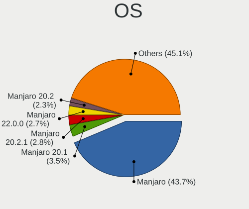

| Name            | Desktops | Percent |
|-----------------|----------|---------|
| Manjaro         | 1689     | 43.68%  |
| Manjaro 20.1    | 135      | 3.49%   |
| Manjaro 20.2.1  | 108      | 2.79%   |
| Manjaro 22.0.0  | 103      | 2.66%   |
| Manjaro 20.2    | 89       | 2.3%    |
| Manjaro 20.0.3  | 81       | 2.09%   |
| Manjaro 23.0.0  | 62       | 1.6%    |
| Manjaro 18.1.5  | 56       | 1.45%   |
| Manjaro 25.0.0  | 55       | 1.42%   |
| Manjaro 21.2.6  | 53       | 1.37%   |
| Manjaro 21.2.5  | 53       | 1.37%   |
| Manjaro 21.1.0  | 53       | 1.37%   |
| Manjaro 23.1.3  | 48       | 1.24%   |
| Manjaro 18.0.4  | 46       | 1.19%   |
| Manjaro 21.2.0  | 45       | 1.16%   |
| Manjaro 20.0    | 45       | 1.16%   |
| Manjaro 21.1.6  | 38       | 0.98%   |
| Manjaro 21.0.7  | 36       | 0.93%   |
| Manjaro 21.0.5  | 35       | 0.91%   |
| Manjaro 21.0    | 35       | 0.91%   |
| Manjaro 23.1.0  | 33       | 0.85%   |
| Manjaro 19.0.2  | 31       | 0.8%    |
| Manjaro 25.0.10 | 29       | 0.75%   |
| Manjaro 20.1.2  | 29       | 0.75%   |
| Manjaro 20.0.1  | 29       | 0.75%   |
| Manjaro 24.2.1  | 28       | 0.72%   |
| Manjaro 23.1.4  | 28       | 0.72%   |
| Manjaro 25.0.3  | 27       | 0.7%    |
| Manjaro 21.2.3  | 27       | 0.7%    |
| Manjaro 22.1.0  | 25       | 0.65%   |
| Manjaro 20.1.1  | 24       | 0.62%   |
| Manjaro 24.1.2  | 23       | 0.59%   |
| Manjaro 21.2.1  | 23       | 0.59%   |
| Manjaro 21.3.7  | 20       | 0.52%   |
| Manjaro 25.0.8  | 18       | 0.47%   |
| Manjaro 24.0.8  | 18       | 0.47%   |
| Manjaro 21.3.6  | 18       | 0.47%   |
| Manjaro 25.1.0  | 17       | 0.44%   |
| Manjaro 23.0.4  | 17       | 0.44%   |
| Manjaro 22.0.4  | 16       | 0.41%   |

OS Family
---------

OS without a version

| Name    | Desktops | Percent |
|---------|----------|---------|
| Manjaro | 3532     | 100%    |

Kernel
------

Version of the Linux kernel

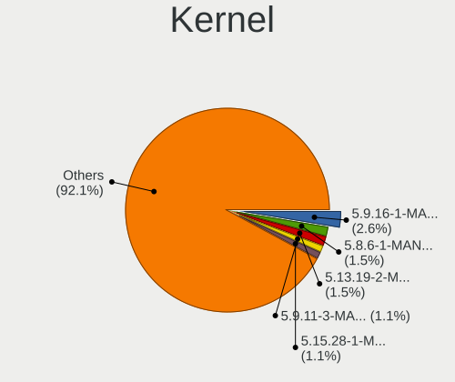

| Version           | Desktops | Percent |
|-------------------|----------|---------|
| 5.9.16-1-MANJARO  | 115      | 2.62%   |
| 5.8.6-1-MANJARO   | 68       | 1.55%   |
| 5.13.19-2-MANJARO | 67       | 1.52%   |
| 5.9.11-3-MANJARO  | 48       | 1.09%   |
| 5.15.28-1-MANJARO | 48       | 1.09%   |
| 5.8.11-1-MANJARO  | 46       | 1.05%   |
| 6.12.48-1-MANJARO | 42       | 0.96%   |
| 6.12.4-1-MANJARO  | 41       | 0.93%   |
| 5.10.42-1-MANJARO | 40       | 0.91%   |
| 6.10.13-3-MANJARO | 39       | 0.89%   |
| 6.1.1-1-MANJARO   | 38       | 0.86%   |
| 5.8.18-1-MANJARO  | 38       | 0.86%   |
| 6.12.28-1-MANJARO | 37       | 0.84%   |
| 6.5.5-1-MANJARO   | 34       | 0.77%   |
| 5.15.32-1-MANJARO | 33       | 0.75%   |
| 6.1.31-2-MANJARO  | 32       | 0.73%   |
| 6.1.12-1-MANJARO  | 32       | 0.73%   |
| 5.6.16-1-MANJARO  | 31       | 0.71%   |
| 6.9.12-3-MANJARO  | 30       | 0.68%   |
| 5.10.36-2-MANJARO | 30       | 0.68%   |
| 5.7.9-1-MANJARO   | 29       | 0.66%   |
| 5.15.60-1-MANJARO | 29       | 0.66%   |
| 6.6.19-1-MANJARO  | 28       | 0.64%   |
| 5.15.12-1-MANJARO | 28       | 0.64%   |
| 6.6.26-1-MANJARO  | 27       | 0.61%   |
| 6.6.10-1-MANJARO  | 27       | 0.61%   |
| 5.8.3-2-MANJARO   | 25       | 0.57%   |
| 5.8.16-2-MANJARO  | 25       | 0.57%   |
| 5.6.19-2-MANJARO  | 24       | 0.55%   |
| 5.6.15-1-MANJARO  | 24       | 0.55%   |
| 5.17.1-3-MANJARO  | 24       | 0.55%   |
| 6.12.21-4-MANJARO | 23       | 0.52%   |
| 5.7.0-3-MANJARO   | 23       | 0.52%   |
| 5.10.2-2-MANJARO  | 23       | 0.52%   |
| 5.6.7-1-MANJARO   | 22       | 0.5%    |
| 5.6.12-1-MANJARO  | 22       | 0.5%    |
| 5.16.14-1-MANJARO | 22       | 0.5%    |
| 5.15.2-2-MANJARO  | 22       | 0.5%    |
| 5.10.23-1-MANJARO | 22       | 0.5%    |
| 5.9.1-1-MANJARO   | 21       | 0.48%   |

Kernel Family
-------------

Linux kernel without a distro release

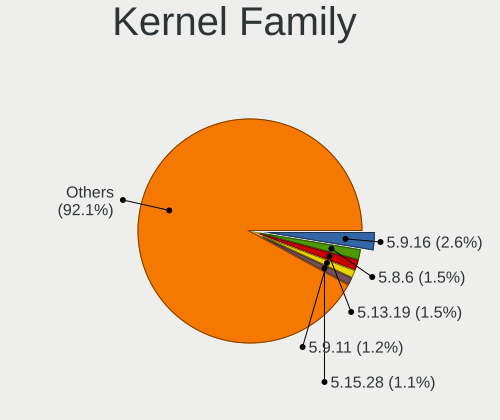

| Version | Desktops | Percent |
|---------|----------|---------|
| 5.9.16  | 115      | 2.62%   |
| 5.8.6   | 68       | 1.55%   |
| 5.13.19 | 67       | 1.53%   |
| 5.9.11  | 51       | 1.16%   |
| 5.15.28 | 48       | 1.09%   |
| 5.8.11  | 47       | 1.07%   |
| 6.12.48 | 42       | 0.96%   |
| 6.12.4  | 41       | 0.93%   |
| 5.10.42 | 40       | 0.91%   |
| 6.10.13 | 39       | 0.89%   |
| 6.1.1   | 38       | 0.87%   |
| 5.8.18  | 38       | 0.87%   |
| 6.12.28 | 37       | 0.84%   |
| 6.5.5   | 35       | 0.8%    |
| 6.9.12  | 33       | 0.75%   |
| 6.1.31  | 33       | 0.75%   |
| 5.15.32 | 33       | 0.75%   |
| 6.1.12  | 32       | 0.73%   |
| 5.6.16  | 31       | 0.71%   |
| 5.10.36 | 30       | 0.68%   |
| 5.7.9   | 29       | 0.66%   |
| 5.7.0   | 29       | 0.66%   |
| 5.17.1  | 29       | 0.66%   |
| 5.15.60 | 29       | 0.66%   |
| 6.6.19  | 28       | 0.64%   |
| 6.6.10  | 28       | 0.64%   |
| 5.9.1   | 28       | 0.64%   |
| 5.15.12 | 28       | 0.64%   |
| 6.6.26  | 27       | 0.61%   |
| 5.6.19  | 27       | 0.61%   |
| 5.8.3   | 26       | 0.59%   |
| 6.5.13  | 25       | 0.57%   |
| 5.8.16  | 25       | 0.57%   |
| 5.6.15  | 24       | 0.55%   |
| 6.12.21 | 23       | 0.52%   |
| 5.6.12  | 23       | 0.52%   |
| 5.15.2  | 23       | 0.52%   |
| 5.10.2  | 23       | 0.52%   |
| 5.6.7   | 22       | 0.5%    |
| 5.16.14 | 22       | 0.5%    |

Kernel Major Ver.
-----------------

Linux kernel major version

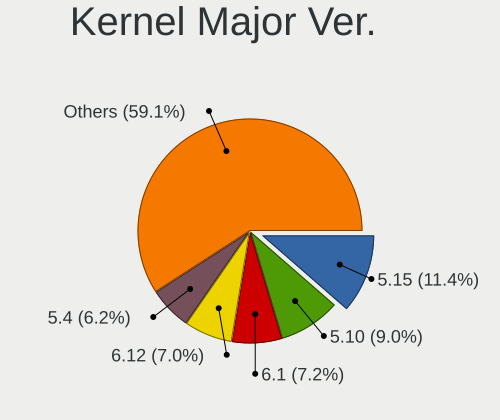

| Version | Desktops | Percent |
|---------|----------|---------|
| 5.15    | 465      | 11.41%  |
| 5.10    | 366      | 8.98%   |
| 6.1     | 295      | 7.24%   |
| 6.12    | 286      | 7.01%   |
| 5.4     | 254      | 6.23%   |
| 6.6     | 233      | 5.71%   |
| 5.9     | 230      | 5.64%   |
| 5.8     | 228      | 5.59%   |
| 5.6     | 172      | 4.22%   |
| 5.13    | 128      | 3.14%   |
| 5.7     | 109      | 2.67%   |
| 6.5     | 107      | 2.62%   |
| 5.11    | 91       | 2.23%   |
| 6.9     | 75       | 1.84%   |
| 4.19    | 68       | 1.67%   |
| 5.17    | 65       | 1.59%   |
| 5.16    | 63       | 1.55%   |
| 6.10    | 62       | 1.52%   |
| 6.0     | 62       | 1.52%   |
| 5.14    | 61       | 1.5%    |
| 5.19    | 55       | 1.35%   |
| 5.18    | 55       | 1.35%   |
| 5.12    | 49       | 1.2%    |
| 6.11    | 45       | 1.1%    |
| 6.7     | 39       | 0.96%   |
| 6.3     | 39       | 0.96%   |
| 6.2     | 39       | 0.96%   |
| 5.5     | 39       | 0.96%   |
| 6.15    | 35       | 0.86%   |
| 4.14    | 32       | 0.78%   |
| 6.4     | 28       | 0.69%   |
| 6.8     | 25       | 0.61%   |
| 6.16    | 23       | 0.56%   |
| 6.14    | 23       | 0.56%   |
| 5.3     | 23       | 0.56%   |
| 6.17    | 19       | 0.47%   |
| 5.2     | 17       | 0.42%   |
| 6.13    | 14       | 0.34%   |
| 5.1     | 13       | 0.32%   |
| 5.0     | 11       | 0.27%   |

Arch
----

OS architecture (x86_64, i586, etc.)

| Name   | Desktops | Percent |
|--------|----------|---------|
| x86_64 | 3532     | 100%    |

DE
--

Desktop Environment

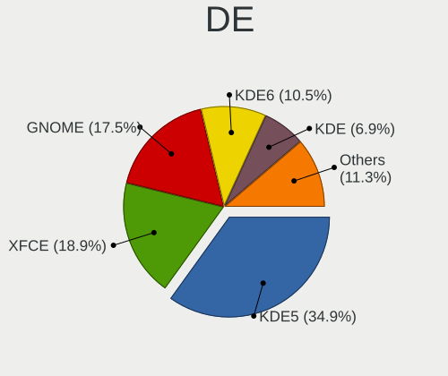

| Name                     | Desktops | Percent |
|--------------------------|----------|---------|
| KDE5                     | 1299     | 34.93%  |
| XFCE                     | 703      | 18.9%   |
| GNOME                    | 650      | 17.48%  |
| KDE6                     | 391      | 10.51%  |
| KDE                      | 257      | 6.91%   |
| X-Cinnamon               | 114      | 3.07%   |
| Unknown                  | 114      | 3.07%   |
| i3                       | 52       | 1.4%    |
| MATE                     | 33       | 0.89%   |
| Cinnamon                 | 26       | 0.7%    |
| Deepin                   | 23       | 0.62%   |
| Budgie                   | 15       | 0.4%    |
| LXQt                     | 8        | 0.22%   |
| Awesome                  | 6        | 0.16%   |
| sway                     | 5        | 0.13%   |
| GNOME Classic            | 5        | 0.13%   |
| bspwm                    | 4        | 0.11%   |
| ICEWM                    | 2        | 0.05%   |
| Hyprland                 | 2        | 0.05%   |
| Yaru:ubuntu:GNOME        | 1        | 0.03%   |
| xmonad                   | 1        | 0.03%   |
| sway:wlroots:swayfx      | 1        | 0.03%   |
| qtile                    | 1        | 0.03%   |
| openbox                  | 1        | 0.03%   |
| LXDE                     | 1        | 0.03%   |
| Enlightenment            | 1        | 0.03%   |
| DWM                      | 1        | 0.03%   |
| COSMIC                   | 1        | 0.03%   |
| /usr/bin/openbox-session | 1        | 0.03%   |

Display Server
--------------

X11 or Wayland

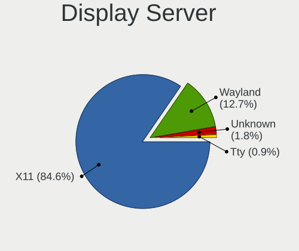

| Name    | Desktops | Percent |
|---------|----------|---------|
| X11     | 3067     | 84.58%  |
| Wayland | 460      | 12.69%  |
| Unknown | 67       | 1.85%   |
| Tty     | 32       | 0.88%   |

Display Manager
---------------

SDDM, LightDM, etc.

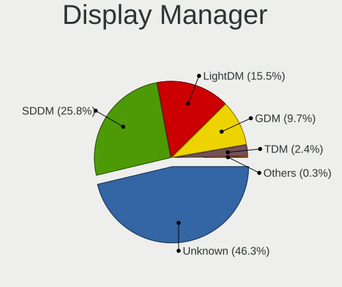

| Name    | Desktops | Percent |
|---------|----------|---------|
| Unknown | 1685     | 46.29%  |
| SDDM    | 939      | 25.8%   |
| LightDM | 563      | 15.47%  |
| GDM     | 352      | 9.67%   |
| TDM     | 89       | 2.45%   |
| LXDM    | 5        | 0.14%   |
| GREETD  | 3        | 0.08%   |
| SLiM    | 2        | 0.05%   |
| XDM     | 1        | 0.03%   |
| LYNDE   | 1        | 0.03%   |

OS Lang
-------

Language

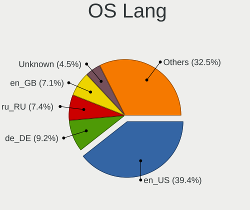

| Lang    | Desktops | Percent |
|---------|----------|---------|
| en_US   | 1413     | 39.4%   |
| de_DE   | 330      | 9.2%    |
| ru_RU   | 264      | 7.36%   |
| en_GB   | 254      | 7.08%   |
| Unknown | 161      | 4.49%   |
| pt_BR   | 150      | 4.18%   |
| fr_FR   | 104      | 2.9%    |
| it_IT   | 102      | 2.84%   |
| en_CA   | 96       | 2.68%   |
| es_ES   | 85       | 2.37%   |
| pl_PL   | 63       | 1.76%   |
| en_AU   | 52       | 1.45%   |
| de_AT   | 28       | 0.78%   |
| es_AR   | 26       | 0.73%   |
| en_IN   | 26       | 0.73%   |
| es_MX   | 25       | 0.7%    |
| nl_NL   | 22       | 0.61%   |
| fi_FI   | 21       | 0.59%   |
| hu_HU   | 20       | 0.56%   |
| zh_CN   | 19       | 0.53%   |
| ru_UA   | 18       | 0.5%    |
| sv_SE   | 16       | 0.45%   |
| en_PH   | 16       | 0.45%   |
| fr_CA   | 15       | 0.42%   |
| en_ZA   | 15       | 0.42%   |
| en_IE   | 12       | 0.33%   |
| cs_CZ   | 12       | 0.33%   |
| es_CL   | 11       | 0.31%   |
| en_DK   | 11       | 0.31%   |
| pt_PT   | 10       | 0.28%   |
| ja_JP   | 10       | 0.28%   |
| tr_TR   | 9        | 0.25%   |
| fr_BE   | 9        | 0.25%   |
| en_NZ   | 9        | 0.25%   |
| de_CH   | 9        | 0.25%   |
| da_DK   | 9        | 0.25%   |
| sk_SK   | 7        | 0.2%    |
| es_UY   | 7        | 0.2%    |
| en_IL   | 7        | 0.2%    |
| uk_UA   | 6        | 0.17%   |

Boot Mode
---------

EFI or BIOS

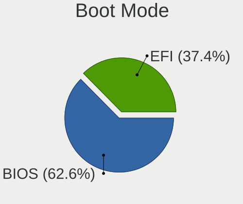

| Mode | Desktops | Percent |
|------|----------|---------|
| BIOS | 2259     | 62.59%  |
| EFI  | 1350     | 37.41%  |

Filesystem
----------

Type of filesystem

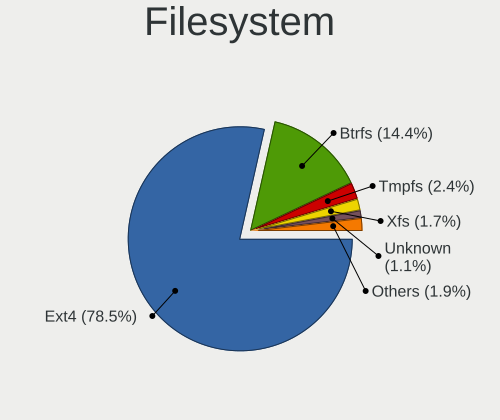

| Type     | Desktops | Percent |
|----------|----------|---------|
| Ext4     | 2837     | 78.52%  |
| Btrfs    | 522      | 14.45%  |
| Tmpfs    | 86       | 2.38%   |
| Xfs      | 61       | 1.69%   |
| Unknown  | 40       | 1.11%   |
| Overlay  | 39       | 1.08%   |
| F2fs     | 14       | 0.39%   |
| Zfs      | 6        | 0.17%   |
| Ext2     | 3        | 0.08%   |
| Ext3     | 2        | 0.06%   |
| XXXX     | 1        | 0.03%   |
| XXXfs    | 1        | 0.03%   |
| Reiserfs | 1        | 0.03%   |

Part. scheme
------------

Scheme of partitioning

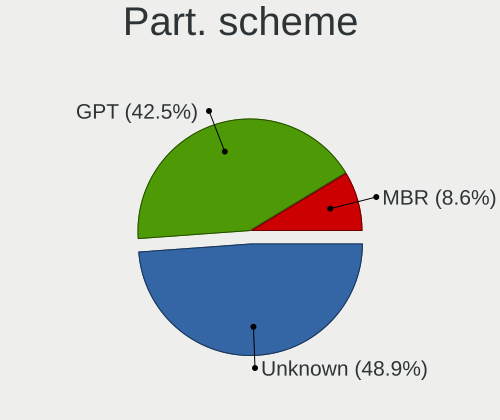

| Type    | Desktops | Percent |
|---------|----------|---------|
| Unknown | 1769     | 48.85%  |
| GPT     | 1539     | 42.5%   |
| MBR     | 313      | 8.64%   |

Dual Boot with Linux/BSD
------------------------

Hosting more than one Linux/BSD

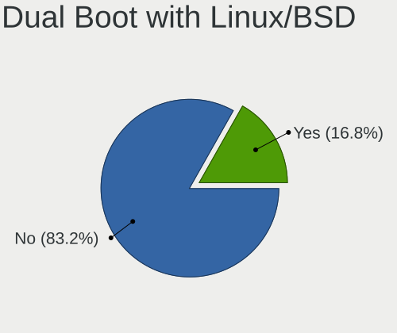

| Dual boot | Desktops | Percent |
|-----------|----------|---------|
| No        | 3007     | 83.18%  |
| Yes       | 608      | 16.82%  |

Dual Boot (Win)
---------------

Hosting Linux and Windows

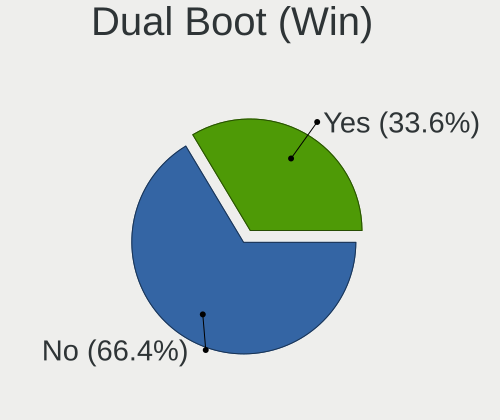

| Dual boot | Desktops | Percent |
|-----------|----------|---------|
| No        | 2391     | 66.4%   |
| Yes       | 1210     | 33.6%   |

Board
-----

Vendor
------

Motherboard manufacturer

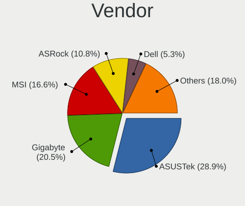

| Name                                 | Desktops | Percent |
|--------------------------------------|----------|---------|
| ASUSTek Computer                     | 1022     | 28.94%  |
| Gigabyte Technology                  | 723      | 20.47%  |
| MSI                                  | 585      | 16.56%  |
| ASRock                               | 381      | 10.79%  |
| Dell                                 | 186      | 5.27%   |
| Hewlett-Packard                      | 177      | 5.01%   |
| Lenovo                               | 77       | 2.18%   |
| Intel                                | 76       | 2.15%   |
| Acer                                 | 36       | 1.02%   |
| Unknown                              | 31       | 0.88%   |
| Biostar                              | 27       | 0.76%   |
| Pegatron                             | 18       | 0.51%   |
| Huanan                               | 16       | 0.45%   |
| Foxconn                              | 12       | 0.34%   |
| Apple                                | 12       | 0.34%   |
| Fujitsu                              | 11       | 0.31%   |
| AZW                                  | 11       | 0.31%   |
| Medion                               | 10       | 0.28%   |
| ECS                                  | 10       | 0.28%   |
| MACHINIST                            | 8        | 0.23%   |
| BESSTAR Tech                         | 7        | 0.2%    |
| Shenzhen Meigao Electronic Equipment | 6        | 0.17%   |
| Alienware                            | 6        | 0.17%   |
| Shuttle                              | 5        | 0.14%   |
| Positivo                             | 5        | 0.14%   |
| PCWare                               | 4        | 0.11%   |
| AMI                                  | 4        | 0.11%   |
| OEM                                  | 3        | 0.08%   |
| GEEKOM                               | 3        | 0.08%   |
| EVGA                                 | 3        | 0.08%   |
| ZOTAC                                | 2        | 0.06%   |
| Minix                                | 2        | 0.06%   |
| Inventec                             | 2        | 0.06%   |
| Google                               | 2        | 0.06%   |
| GMKtec                               | 2        | 0.06%   |
| Gateway                              | 2        | 0.06%   |
| Fujitsu Siemens                      | 2        | 0.06%   |
| AMD                                  | 2        | 0.06%   |
| Acidanthera                          | 2        | 0.06%   |
| XFX                                  | 1        | 0.03%   |

Model
-----

Motherboard model

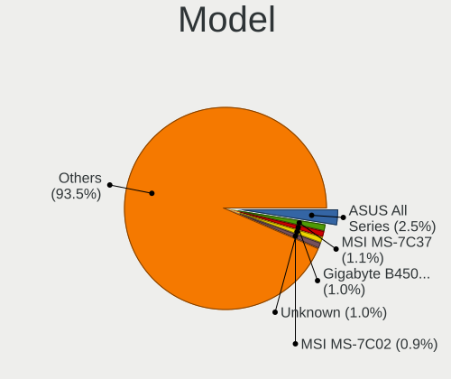

| Name                             | Desktops | Percent |
|----------------------------------|----------|---------|
| ASUS All Series                  | 89       | 2.52%   |
| MSI MS-7C37                      | 38       | 1.08%   |
| Gigabyte B450M DS3H              | 34       | 0.96%   |
| Unknown                          | 34       | 0.96%   |
| MSI MS-7C02                      | 33       | 0.93%   |
| MSI MS-7C91                      | 29       | 0.82%   |
| ASUS TUF Gaming X570-PLUS        | 29       | 0.82%   |
| ASUS PRIME A320M-K               | 24       | 0.68%   |
| ASRock B450M Pro4                | 20       | 0.57%   |
| MSI MS-7B86                      | 19       | 0.54%   |
| MSI MS-7A38                      | 19       | 0.54%   |
| MSI MS-7B79                      | 18       | 0.51%   |
| ASUS ROG STRIX B550-F GAMING     | 18       | 0.51%   |
| ASUS PRIME B450M-A               | 18       | 0.51%   |
| Gigabyte X570 AORUS ELITE        | 17       | 0.48%   |
| Dell OptiPlex 9020               | 17       | 0.48%   |
| Dell OptiPlex 7010               | 17       | 0.48%   |
| ASUS TUF Gaming B550M-PLUS       | 17       | 0.48%   |
| Gigabyte B450 AORUS M            | 15       | 0.42%   |
| ASUS ROG STRIX B450-F GAMING     | 15       | 0.42%   |
| Gigabyte X470 AORUS ULTRA GAMING | 13       | 0.37%   |
| Gigabyte B450 AORUS ELITE        | 13       | 0.37%   |
| ASUS ROG STRIX X570-E GAMING     | 13       | 0.37%   |
| ASUS PRIME B350-PLUS             | 13       | 0.37%   |
| MSI MS-7C95                      | 12       | 0.34%   |
| MSI MS-7C56                      | 12       | 0.34%   |
| MSI MS-7693                      | 12       | 0.34%   |
| Gigabyte 970A-DS3P               | 12       | 0.34%   |
| ASUS PRIME X470-PRO              | 12       | 0.34%   |
| ASUS PRIME B450-PLUS             | 12       | 0.34%   |
| MSI MS-7B89                      | 11       | 0.31%   |
| Gigabyte X570 AORUS MASTER       | 11       | 0.31%   |
| ASUS ROG CROSSHAIR VIII HERO     | 11       | 0.31%   |
| ASUS PRIME X370-PRO              | 11       | 0.31%   |
| MSI MS-7C94                      | 10       | 0.28%   |
| MSI MS-7C84                      | 10       | 0.28%   |
| ASRock B450M Steel Legend        | 10       | 0.28%   |
| ASRock B450 Pro4                 | 10       | 0.28%   |
| MSI MS-7C52                      | 9        | 0.25%   |
| MSI MS-7A34                      | 9        | 0.25%   |

Model Family
------------

Motherboard model prefix

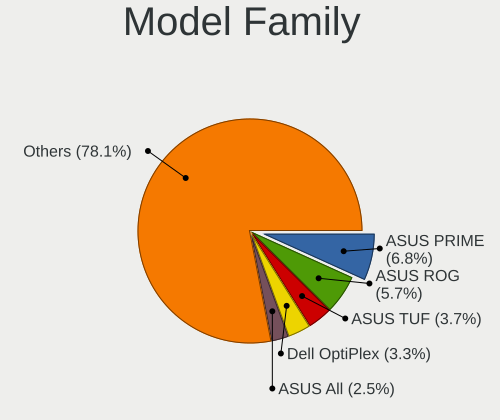

| Name                | Desktops | Percent |
|---------------------|----------|---------|
| ASUS PRIME          | 239      | 6.77%   |
| ASUS ROG            | 200      | 5.66%   |
| ASUS TUF            | 129      | 3.65%   |
| Dell OptiPlex       | 118      | 3.34%   |
| ASUS All            | 89       | 2.52%   |
| Gigabyte X570       | 61       | 1.73%   |
| Gigabyte B450M      | 57       | 1.61%   |
| HP Compaq           | 48       | 1.36%   |
| Gigabyte B450       | 45       | 1.27%   |
| MSI MS-7C37         | 38       | 1.08%   |
| ASRock B450M        | 36       | 1.02%   |
| Lenovo ThinkCentre  | 35       | 0.99%   |
| Unknown             | 34       | 0.96%   |
| MSI MS-7C02         | 33       | 0.93%   |
| HP EliteDesk        | 32       | 0.91%   |
| Gigabyte B550       | 32       | 0.91%   |
| Dell Precision      | 30       | 0.85%   |
| MSI MS-7C91         | 29       | 0.82%   |
| ASRock X570         | 23       | 0.65%   |
| ASRock B450         | 23       | 0.65%   |
| Acer Aspire         | 23       | 0.65%   |
| Gigabyte B550M      | 20       | 0.57%   |
| ASUS M5A78L-M       | 20       | 0.57%   |
| MSI MS-7B86         | 19       | 0.54%   |
| MSI MS-7A38         | 19       | 0.54%   |
| ASUS M5A97          | 19       | 0.54%   |
| MSI MS-7B79         | 18       | 0.51%   |
| Gigabyte Z390       | 16       | 0.45%   |
| ASUS P8Z77-V        | 16       | 0.45%   |
| ASUS Maximus        | 16       | 0.45%   |
| HP ProDesk          | 15       | 0.42%   |
| Gigabyte X470       | 15       | 0.42%   |
| Dell Inspiron       | 14       | 0.4%    |
| ASUS P8H61-M        | 14       | 0.4%    |
| ASRock B550M        | 14       | 0.4%    |
| Lenovo ThinkStation | 13       | 0.37%   |
| Gigabyte 970A-DS3P  | 13       | 0.37%   |
| MSI MS-7C95         | 12       | 0.34%   |
| MSI MS-7C56         | 12       | 0.34%   |
| MSI MS-7693         | 12       | 0.34%   |

MFG Year
--------

Motherboard manufacture year

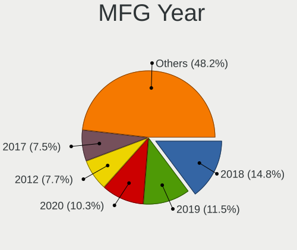

| Year    | Desktops | Percent |
|---------|----------|---------|
| 2018    | 522      | 14.78%  |
| 2019    | 406      | 11.49%  |
| 2020    | 365      | 10.33%  |
| 2012    | 271      | 7.67%   |
| 2017    | 266      | 7.53%   |
| 2013    | 228      | 6.46%   |
| 2014    | 208      | 5.89%   |
| 2021    | 175      | 4.95%   |
| 2011    | 168      | 4.76%   |
| 2015    | 147      | 4.16%   |
| 2022    | 146      | 4.13%   |
| 2016    | 139      | 3.94%   |
| 2010    | 111      | 3.14%   |
| 2009    | 99       | 2.8%    |
| 2023    | 78       | 2.21%   |
| 2024    | 65       | 1.84%   |
| 2008    | 54       | 1.53%   |
| 2007    | 51       | 1.44%   |
| 2006    | 15       | 0.42%   |
| 2025    | 12       | 0.34%   |
| 2005    | 4        | 0.11%   |
| 2004    | 1        | 0.03%   |
| Unknown | 1        | 0.03%   |

Form Factor
-----------

Physical design of the computer

| Name    | Desktops | Percent |
|---------|----------|---------|
| Desktop | 3532     | 100%    |

Secure Boot
-----------

Enabled or disabled

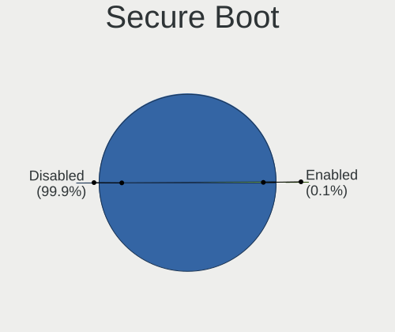

| State    | Desktops | Percent |
|----------|----------|---------|
| Disabled | 3530     | 99.89%  |
| Enabled  | 4        | 0.11%   |

Coreboot
--------

Have coreboot on board

| Used | Desktops | Percent |
|------|----------|---------|
| No   | 3530     | 99.94%  |
| Yes  | 2        | 0.06%   |

RAM Size
--------

Total RAM memory

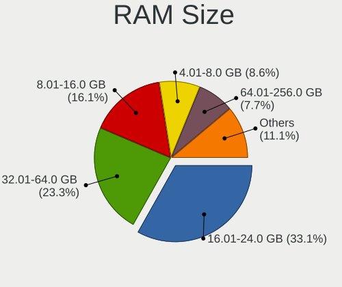

| Size in GB      | Desktops | Percent |
|-----------------|----------|---------|
| 16.01-24.0      | 1197     | 33.15%  |
| 32.01-64.0      | 840      | 23.26%  |
| 8.01-16.0       | 582      | 16.12%  |
| 4.01-8.0        | 312      | 8.64%   |
| 64.01-256.0     | 279      | 7.73%   |
| 3.01-4.0        | 200      | 5.54%   |
| 24.01-32.0      | 160      | 4.43%   |
| 1.01-2.0        | 31       | 0.86%   |
| 2.01-3.0        | 9        | 0.25%   |
| More than 256.0 | 1        | 0.03%   |

RAM Used
--------

Used RAM memory

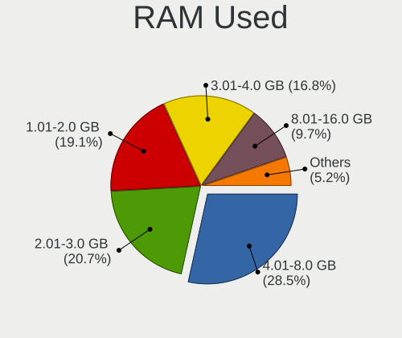

| Used GB     | Desktops | Percent |
|-------------|----------|---------|
| 4.01-8.0    | 1152     | 28.46%  |
| 2.01-3.0    | 836      | 20.65%  |
| 1.01-2.0    | 773      | 19.1%   |
| 3.01-4.0    | 682      | 16.85%  |
| 8.01-16.0   | 393      | 9.71%   |
| 0.51-1.0    | 87       | 2.15%   |
| 16.01-24.0  | 71       | 1.75%   |
| 24.01-32.0  | 22       | 0.54%   |
| 32.01-64.0  | 19       | 0.47%   |
| 0.01-0.5    | 11       | 0.27%   |
| 64.01-256.0 | 2        | 0.05%   |

Total Drives
------------

Number of drives on board

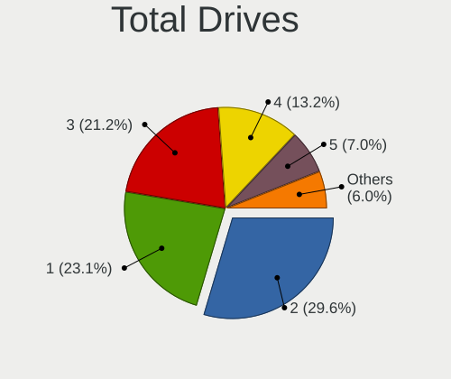

| Drives | Desktops | Percent |
|--------|----------|---------|
| 2      | 1108     | 29.59%  |
| 1      | 864      | 23.07%  |
| 3      | 794      | 21.2%   |
| 4      | 493      | 13.16%  |
| 5      | 262      | 7%      |
| 6      | 108      | 2.88%   |
| 7      | 50       | 1.34%   |
| 8      | 25       | 0.67%   |
| 9      | 12       | 0.32%   |
| 0      | 12       | 0.32%   |
| 11     | 8        | 0.21%   |
| 10     | 4        | 0.11%   |
| 12     | 3        | 0.08%   |
| 27     | 1        | 0.03%   |
| 20     | 1        | 0.03%   |

Has CD-ROM
----------

Has CD-ROM on board

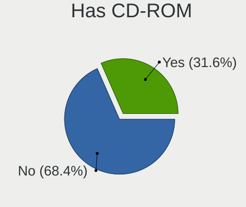

| Presented | Desktops | Percent |
|-----------|----------|---------|
| No        | 2453     | 68.42%  |
| Yes       | 1132     | 31.58%  |

Has Ethernet
------------

Has Ethernet on board

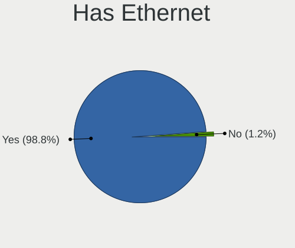

| Presented | Desktops | Percent |
|-----------|----------|---------|
| Yes       | 3491     | 98.84%  |
| No        | 41       | 1.16%   |

Has WiFi
--------

Has WiFi module

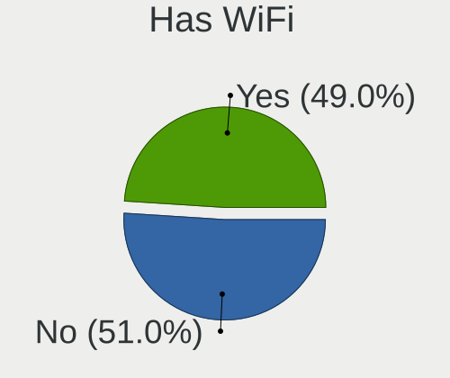

| Presented | Desktops | Percent |
|-----------|----------|---------|
| No        | 1837     | 51.01%  |
| Yes       | 1764     | 48.99%  |

Has Bluetooth
-------------

Has Bluetooth module

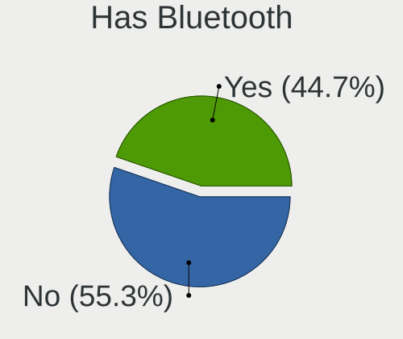

| Presented | Desktops | Percent |
|-----------|----------|---------|
| No        | 1991     | 55.26%  |
| Yes       | 1612     | 44.74%  |

Location
--------

Country
-------

Geographic location (country)

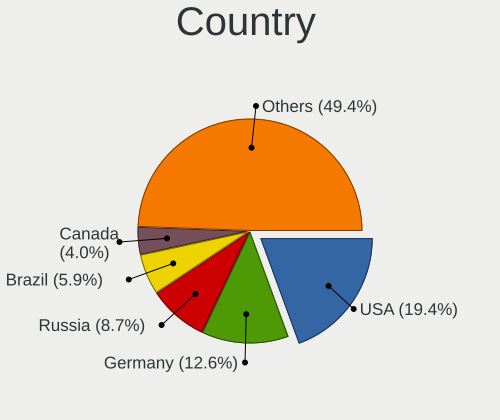

| Country      | Desktops | Percent |
|--------------|----------|---------|
| USA          | 691      | 19.42%  |
| Germany      | 448      | 12.59%  |
| Russia       | 309      | 8.68%   |
| Brazil       | 210      | 5.9%    |
| Canada       | 142      | 3.99%   |
| France       | 132      | 3.71%   |
| UK           | 127      | 3.57%   |
| Italy        | 127      | 3.57%   |
| Spain        | 115      | 3.23%   |
| Poland       | 101      | 2.84%   |
| Netherlands  | 62       | 1.74%   |
| Ukraine      | 57       | 1.6%    |
| Australia    | 57       | 1.6%    |
| Sweden       | 54       | 1.52%   |
| Austria      | 48       | 1.35%   |
| Finland      | 45       | 1.26%   |
| Argentina    | 40       | 1.12%   |
| Mexico       | 36       | 1.01%   |
| Hungary      | 35       | 0.98%   |
| Belgium      | 35       | 0.98%   |
| India        | 30       | 0.84%   |
| Greece       | 30       | 0.84%   |
| Switzerland  | 28       | 0.79%   |
| Romania      | 28       | 0.79%   |
| Denmark      | 26       | 0.73%   |
| Portugal     | 25       | 0.7%    |
| Bulgaria     | 24       | 0.67%   |
| Norway       | 23       | 0.65%   |
| South Africa | 22       | 0.62%   |
| Czechia      | 21       | 0.59%   |
| Turkey       | 18       | 0.51%   |
| Belarus      | 17       | 0.48%   |
| Philippines  | 16       | 0.45%   |
| Chile        | 16       | 0.45%   |
| Israel       | 15       | 0.42%   |
| China        | 15       | 0.42%   |
| Japan        | 14       | 0.39%   |
| Slovakia     | 12       | 0.34%   |
| New Zealand  | 12       | 0.34%   |
| Lithuania    | 12       | 0.34%   |

City
----

Geographic location (city)

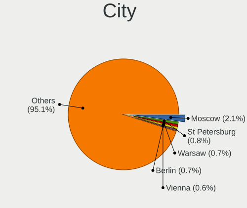

| City              | Desktops | Percent |
|-------------------|----------|---------|
| Moscow            | 79       | 2.08%   |
| St Petersburg     | 31       | 0.82%   |
| Warsaw            | 27       | 0.71%   |
| Berlin            | 26       | 0.69%   |
| Vienna            | 22       | 0.58%   |
| Sao Paulo         | 22       | 0.58%   |
| Toronto           | 20       | 0.53%   |
| Sydney            | 20       | 0.53%   |
| Milan             | 20       | 0.53%   |
| Madrid            | 18       | 0.47%   |
| Kyiv              | 17       | 0.45%   |
| Helsinki          | 17       | 0.45%   |
| Hamburg           | 17       | 0.45%   |
| Amsterdam         | 17       | 0.45%   |
| Rome              | 16       | 0.42%   |
| Portland          | 16       | 0.42%   |
| Paris             | 16       | 0.42%   |
| Barcelona         | 16       | 0.42%   |
| Athens            | 16       | 0.42%   |
| Stockholm         | 15       | 0.4%    |
| Frankfurt am Main | 14       | 0.37%   |
| Rio de Janeiro    | 13       | 0.34%   |
| Budapest          | 13       | 0.34%   |
| Montreal          | 12       | 0.32%   |
| Melbourne         | 12       | 0.32%   |
| Dallas            | 12       | 0.32%   |
| Yekaterinburg     | 11       | 0.29%   |
| Stuttgart         | 11       | 0.29%   |
| Seattle           | 11       | 0.29%   |
| Munich            | 11       | 0.29%   |
| Krakow            | 11       | 0.29%   |
| Chicago           | 11       | 0.29%   |
| Bucharest         | 11       | 0.29%   |
| Austin            | 11       | 0.29%   |
| Sofia             | 10       | 0.26%   |
| New York          | 10       | 0.26%   |
| Minsk             | 10       | 0.26%   |
| Mexico City       | 10       | 0.26%   |
| Indianapolis      | 10       | 0.26%   |
| Copenhagen        | 10       | 0.26%   |

Drives
------

Drive Vendor
------------

Hard drive vendors

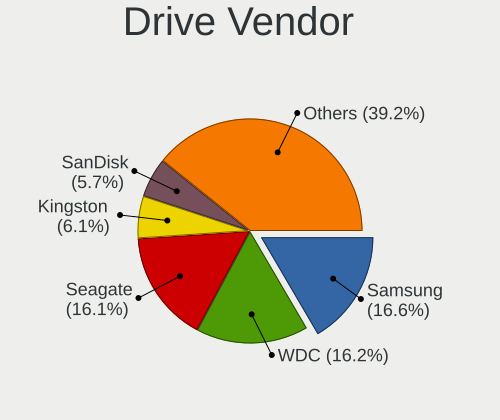

| Vendor                       | Desktops | Drives | Percent |
|------------------------------|----------|--------|---------|
| Samsung Electronics          | 1302     | 2383   | 16.57%  |
| WDC                          | 1276     | 2232   | 16.24%  |
| Seagate                      | 1269     | 2114   | 16.15%  |
| Kingston                     | 480      | 700    | 6.11%   |
| SanDisk                      | 449      | 640    | 5.71%   |
| Crucial                      | 412      | 634    | 5.24%   |
| Toshiba                      | 402      | 575    | 5.12%   |
| Hitachi                      | 175      | 255    | 2.23%   |
| Intel                        | 151      | 216    | 1.92%   |
| A-DATA Technology            | 121      | 176    | 1.54%   |
| Phison Electronics           | 109      | 138    | 1.39%   |
| Micron/Crucial Technology    | 98       | 133    | 1.25%   |
| Phison                       | 89       | 122    | 1.13%   |
| China                        | 83       | 117    | 1.06%   |
| HGST                         | 80       | 130    | 1.02%   |
| Silicon Motion               | 67       | 89     | 0.85%   |
| PNY                          | 59       | 87     | 0.75%   |
| Kingston Technology Company  | 56       | 66     | 0.71%   |
| Unknown                      | 53       | 116    | 0.67%   |
| Patriot                      | 52       | 77     | 0.66%   |
| Micron Technology            | 50       | 63     | 0.64%   |
| SPCC                         | 49       | 67     | 0.62%   |
| SK hynix                     | 46       | 53     | 0.59%   |
| Intenso                      | 46       | 70     | 0.59%   |
| MAXIO Technology (Hangzhou)  | 43       | 57     | 0.55%   |
| OCZ                          | 42       | 58     | 0.53%   |
| Realtek Semiconductor        | 40       | 50     | 0.51%   |
| ADATA Technology             | 40       | 57     | 0.51%   |
| XPG                          | 34       | 38     | 0.43%   |
| Corsair                      | 33       | 45     | 0.42%   |
| Transcend                    | 32       | 34     | 0.41%   |
| JMicron Technology           | 29       | 42     | 0.37%   |
| Lexar                        | 27       | 35     | 0.34%   |
| Team                         | 26       | 34     | 0.33%   |
| GOODRAM                      | 25       | 42     | 0.32%   |
| Shenzhen Longsys Electronics | 24       | 39     | 0.31%   |
| Apacer                       | 22       | 24     | 0.28%   |
| Plextor                      | 21       | 25     | 0.27%   |
| Gigabyte Technology          | 20       | 32     | 0.25%   |
| Maxtor                       | 18       | 22     | 0.23%   |

Drive Model
-----------

Hard drive models

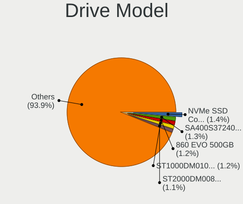

| Model                                              | Desktops | Percent |
|----------------------------------------------------|----------|---------|
| Samsung NVMe SSD Controller SM981/PM981/PM983 1TB  | 127      | 1.35%   |
| Kingston SA400S37240G 240GB SSD                    | 118      | 1.26%   |
| Samsung SSD 860 EVO 500GB                          | 113      | 1.2%    |
| Seagate ST1000DM010-2EP102 1TB                     | 111      | 1.18%   |
| Seagate ST2000DM008-2FR102 2TB                     | 102      | 1.09%   |
| Samsung NVMe SSD Controller PM9A1/PM9A3/980PRO 1TB | 95       | 1.01%   |
| Samsung SSD 850 EVO 500GB                          | 81       | 0.86%   |
| Samsung SSD 850 EVO 250GB                          | 78       | 0.83%   |
| Toshiba DT01ACA100 1TB                             | 69       | 0.74%   |
| Crucial CT500MX500SSD1 500GB                       | 68       | 0.72%   |
| WDC WD10EZEX-08WN4A0 1TB                           | 67       | 0.71%   |
| Kingston SA400S37480G 480GB SSD                    | 66       | 0.7%    |
| Samsung SSD 860 EVO 1TB                            | 65       | 0.69%   |
| Kingston SA400S37120G 120GB SSD                    | 65       | 0.69%   |
| Samsung NVMe SSD Drive 500GB                       | 63       | 0.67%   |
| Seagate ST500DM002-1BD142 500GB                    | 58       | 0.62%   |
| Crucial CT1000MX500SSD1 1TB                        | 58       | 0.62%   |
| Crucial CT240BX500SSD1 240GB                       | 52       | 0.55%   |
| Toshiba HDWD110 1TB                                | 51       | 0.54%   |
| Seagate ST2000DM006-2DM164 2TB                     | 49       | 0.52%   |
| Samsung NVMe SSD Drive 1TB                         | 49       | 0.52%   |
| Samsung SSD 860 EVO 250GB                          | 48       | 0.51%   |
| Seagate ST1000DM003-1ER162 1TB                     | 47       | 0.5%    |
| WDC WD10EZEX-00BN5A0 1TB                           | 44       | 0.47%   |
| Seagate ST1000DM003-1CH162 1TB                     | 44       | 0.47%   |
| Seagate ST4000DM004-2CV104 4TB                     | 41       | 0.44%   |
| Seagate ST3500418AS 500GB                          | 40       | 0.43%   |
| Samsung SSD 980 1TB                                | 40       | 0.43%   |
| Phison E12 NVMe Controller 1TB                     | 39       | 0.42%   |
| Seagate ST2000DM001-1ER164 2TB                     | 38       | 0.41%   |
| Micron/Crucial P2 NVMe PCIe SSD 2TB                | 38       | 0.41%   |
| Toshiba DT01ACA200 2TB                             | 35       | 0.37%   |
| Samsung SSD 840 EVO 250GB                          | 34       | 0.36%   |
| Kingston SV300S37A120G 120GB SSD                   | 34       | 0.36%   |
| WDC WDS500G2B0A-00SM50 500GB                       | 33       | 0.35%   |
| WDC WDS240G2G0A-00JH30 240GB SSD                   | 32       | 0.34%   |
| Seagate Expansion 2TB                              | 32       | 0.34%   |
| Samsung SSD 870 EVO 1TB                            | 32       | 0.34%   |
| Toshiba DT01ACA050 500GB                           | 31       | 0.33%   |
| SanDisk NVMe SSD Drive 500GB                       | 31       | 0.33%   |

HDD Vendor
----------

Hard disk drive vendors

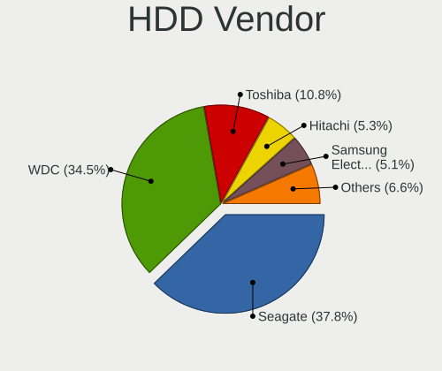

| Vendor              | Desktops | Drives | Percent |
|---------------------|----------|--------|---------|
| Seagate             | 1241     | 2053   | 37.77%  |
| WDC                 | 1133     | 1918   | 34.48%  |
| Toshiba             | 354      | 501    | 10.77%  |
| Hitachi             | 175      | 255    | 5.33%   |
| Samsung Electronics | 166      | 262    | 5.05%   |
| HGST                | 78       | 128    | 2.37%   |
| Unknown             | 22       | 34     | 0.67%   |
| Maxtor              | 17       | 19     | 0.52%   |
| JMicron Technology  | 16       | 20     | 0.49%   |
| Intenso             | 14       | 25     | 0.43%   |
| Fujitsu             | 10       | 23     | 0.3%    |
| Hewlett-Packard     | 6        | 6      | 0.18%   |
| ASMT                | 6        | 17     | 0.18%   |
| USB3.0              | 5        | 5      | 0.15%   |
| Apple               | 5        | 8      | 0.15%   |
| TO Exter            | 4        | 5      | 0.12%   |
| External            | 4        | 5      | 0.12%   |
| MaxDigital          | 3        | 3      | 0.09%   |
| HGST HTS            | 3        | 3      | 0.09%   |
| ASMedia             | 3        | 3      | 0.09%   |
| USB                 | 2        | 2      | 0.06%   |
| StoreJet            | 2        | 3      | 0.06%   |
| Maxone              | 2        | 3      | 0.06%   |
| Unknown             | 2        | 3      | 0.06%   |
| WD MediaMax         | 1        | 2      | 0.03%   |
| TPH01204000GB       | 1        | 1      | 0.03%   |
| T-FORCE             | 1        | 1      | 0.03%   |
| SSK                 | 1        | 1      | 0.03%   |
| SATAFIRM            | 1        | 1      | 0.03%   |
| SAGE                | 1        | 1      | 0.03%   |
| SABRENT             | 1        | 1      | 0.03%   |
| Lenovo              | 1        | 1      | 0.03%   |
| Initio              | 1        | 1      | 0.03%   |
| IBM/Hitachi         | 1        | 1      | 0.03%   |
| IBM-ESXS            | 1        | 2      | 0.03%   |
| IB-377U3            | 1        | 1      | 0.03%   |
| HPE                 | 1        | 1      | 0.03%   |

SSD Vendor
----------

Solid state drive vendors

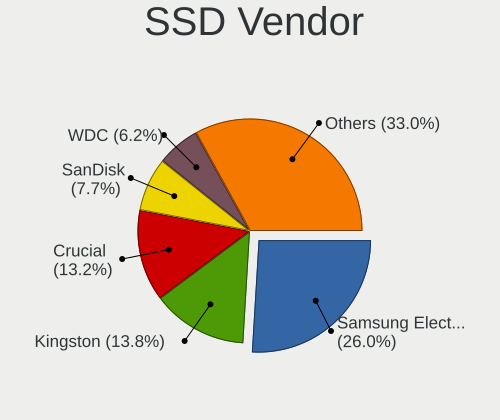

| Vendor              | Desktops | Drives | Percent |
|---------------------|----------|--------|---------|
| Samsung Electronics | 757      | 1168   | 25.95%  |
| Kingston            | 404      | 565    | 13.85%  |
| Crucial             | 385      | 598    | 13.2%   |
| SanDisk             | 226      | 301    | 7.75%   |
| WDC                 | 182      | 266    | 6.24%   |
| A-DATA Technology   | 107      | 157    | 3.67%   |
| China               | 83       | 117    | 2.85%   |
| Intel               | 63       | 84     | 2.16%   |
| PNY                 | 54       | 82     | 1.85%   |
| Patriot             | 49       | 73     | 1.68%   |
| SPCC                | 43       | 61     | 1.47%   |
| OCZ                 | 42       | 58     | 1.44%   |
| Toshiba             | 32       | 47     | 1.1%    |
| Transcend           | 27       | 29     | 0.93%   |
| Lexar               | 27       | 35     | 0.93%   |
| Intenso             | 27       | 39     | 0.93%   |
| Corsair             | 25       | 35     | 0.86%   |
| GOODRAM             | 24       | 41     | 0.82%   |
| Team                | 22       | 30     | 0.75%   |
| Apacer              | 22       | 24     | 0.75%   |
| Micron Technology   | 20       | 23     | 0.69%   |
| Plextor             | 19       | 23     | 0.65%   |
| Gigabyte Technology | 18       | 25     | 0.62%   |
| SK hynix            | 16       | 17     | 0.55%   |
| Seagate             | 14       | 17     | 0.48%   |
| KingSpec            | 12       | 15     | 0.41%   |
| SABRENT             | 10       | 11     | 0.34%   |
| LITEONIT            | 10       | 14     | 0.34%   |
| Leven               | 10       | 10     | 0.34%   |
| KingDian            | 10       | 10     | 0.34%   |
| LITEON              | 8        | 12     | 0.27%   |
| ASMT                | 8        | 12     | 0.27%   |
| Hewlett-Packard     | 6        | 7      | 0.21%   |
| Apple               | 6        | 6      | 0.21%   |
| Unknown             | 6        | 6      | 0.21%   |
| Netac               | 5        | 7      | 0.17%   |
| Kingmax             | 5        | 11     | 0.17%   |
| XrayDisk            | 4        | 5      | 0.14%   |
| Verbatim            | 4        | 5      | 0.14%   |
| Smartbuy            | 4        | 4      | 0.14%   |

Drive Kind
----------

HDD or SSD

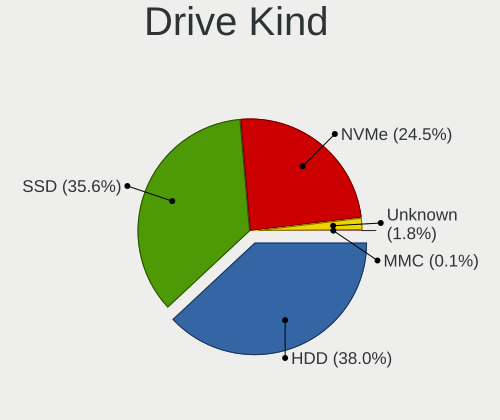

| Kind    | Desktops | Drives | Percent |
|---------|----------|--------|---------|
| HDD     | 2407     | 5319   | 38.05%  |
| SSD     | 2251     | 4203   | 35.58%  |
| NVMe    | 1548     | 2714   | 24.47%  |
| Unknown | 112      | 190    | 1.77%   |
| MMC     | 8        | 8      | 0.13%   |

Drive Connector
---------------

SATA, SAS, NVMe, etc.

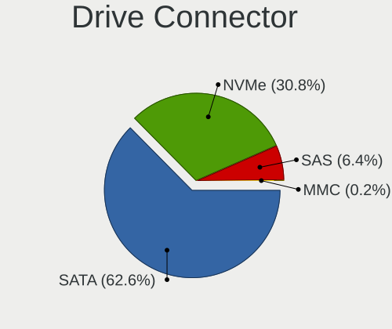

| Type | Desktops | Drives | Percent |
|------|----------|--------|---------|
| SATA | 3142     | 9138   | 62.6%   |
| NVMe | 1547     | 2684   | 30.82%  |
| SAS  | 322      | 604    | 6.42%   |
| MMC  | 8        | 8      | 0.16%   |

Drive Size
----------

Size of hard drive

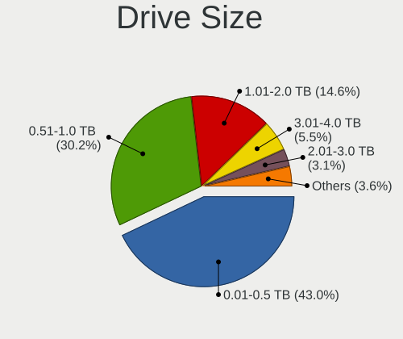

| Size in TB | Desktops | Drives | Percent |
|------------|----------|--------|---------|
| 0.01-0.5   | 2279     | 4486   | 42.95%  |
| 0.51-1.0   | 1605     | 2722   | 30.25%  |
| 1.01-2.0   | 774      | 1208   | 14.59%  |
| 3.01-4.0   | 290      | 473    | 5.47%   |
| 2.01-3.0   | 167      | 263    | 3.15%   |
| 4.01-10.0  | 160      | 298    | 3.02%   |
| 10.01-20.0 | 30       | 71     | 0.57%   |
| 20.01-50.0 | 1        | 1      | 0.02%   |

Space Total
-----------

Amount of disk space available on the file system

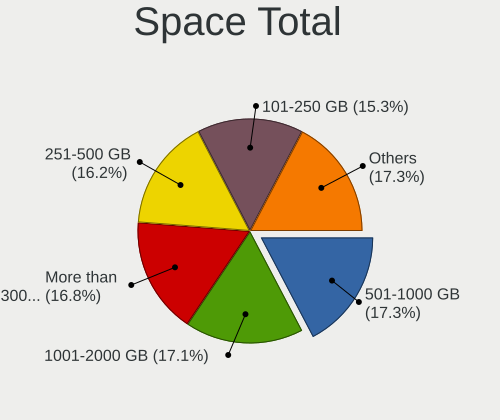

| Size in GB     | Desktops | Percent |
|----------------|----------|---------|
| 501-1000       | 655      | 17.31%  |
| 1001-2000      | 647      | 17.1%   |
| More than 3000 | 636      | 16.81%  |
| 251-500        | 611      | 16.15%  |
| 101-250        | 579      | 15.31%  |
| 2001-3000      | 325      | 8.59%   |
| Unknown        | 130      | 3.44%   |
| 51-100         | 114      | 3.01%   |
| 1-20           | 48       | 1.27%   |
| 21-50          | 38       | 1%      |

Space Used
----------

Amount of used disk space

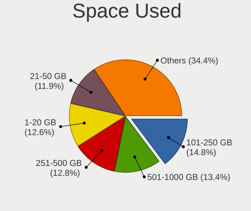

| Used GB        | Desktops | Percent |
|----------------|----------|---------|
| 101-250        | 585      | 14.76%  |
| 501-1000       | 532      | 13.42%  |
| 251-500        | 508      | 12.82%  |
| 1-20           | 500      | 12.62%  |
| 21-50          | 473      | 11.94%  |
| 1001-2000      | 411      | 10.37%  |
| 51-100         | 410      | 10.35%  |
| More than 3000 | 261      | 6.59%   |
| 2001-3000      | 152      | 3.84%   |
| Unknown        | 130      | 3.28%   |
| 0              | 1        | 0.03%   |

Malfunc. Drives
---------------

Drive models with a malfunction

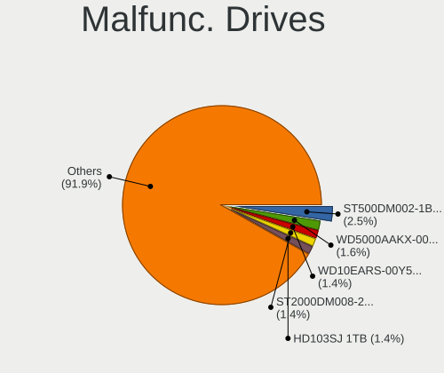

| Model                                                         | Desktops | Drives | Percent |
|---------------------------------------------------------------|----------|--------|---------|
| Seagate ST500DM002-1BD142 500GB                               | 11       | 14     | 2.49%   |
| WDC WD5000AAKX-001CA0 500GB                                   | 7        | 9      | 1.58%   |
| WDC WD10EARS-00Y5B1 1TB                                       | 6        | 6      | 1.36%   |
| Seagate ST2000DM008-2FR102 2TB                                | 6        | 6      | 1.36%   |
| Samsung Electronics HD103SJ 1TB                               | 6        | 6      | 1.36%   |
| Seagate ST1000DM003-9YN162 1TB                                | 5        | 7      | 1.13%   |
| Hitachi HDS721010CLA332 1TB                                   | 5        | 5      | 1.13%   |
| WDC WD20EFRX-68EUZN0 2TB                                      | 4        | 7      | 0.9%    |
| WDC WD15EARS-00MVWB0 1TB                                      | 4        | 5      | 0.9%    |
| WDC WD1002FAEX-00Z3A0 1TB                                     | 4        | 4      | 0.9%    |
| Seagate ST3500413AS 500GB                                     | 4        | 5      | 0.9%    |
| Seagate ST1000LM024 HN-M101MBB 1TB                            | 4        | 4      | 0.9%    |
| Seagate ST1000DX001-1CM162 1TB                                | 4        | 6      | 0.9%    |
| Samsung Electronics SSD 960 EVO 250GB                         | 4        | 5      | 0.9%    |
| Samsung Electronics SSD 870 EVO 1TB                           | 4        | 4      | 0.9%    |
| Samsung Electronics NVMe SSD Controller SM981/PM981/PM983 1TB | 4        | 4      | 0.9%    |
| Samsung Electronics HD103UJ 1TB                               | 4        | 6      | 0.9%    |
| Kingston SV300S37A120G 120GB SSD                              | 4        | 4      | 0.9%    |
| WDC WD20EARS-00MVWB0 2TB                                      | 3        | 3      | 0.68%   |
| WDC WD10EZEX-00RKKA0 1TB                                      | 3        | 3      | 0.68%   |
| WDC WD10EZEX-00BN5A0 1TB                                      | 3        | 3      | 0.68%   |
| WDC WD10EARX-00N0YB0 1TB                                      | 3        | 4      | 0.68%   |
| Toshiba MQ01ABD050 500GB                                      | 3        | 3      | 0.68%   |
| Seagate ST4000DM000-1F2168 4TB                                | 3        | 13     | 0.68%   |
| Seagate ST3500418AS 500GB                                     | 3        | 3      | 0.68%   |
| Seagate ST3250318AS 250GB                                     | 3        | 3      | 0.68%   |
| Seagate ST31000524AS 1TB                                      | 3        | 5      | 0.68%   |
| Seagate ST2000DX001-1CM164 2TB                                | 3        | 3      | 0.68%   |
| Seagate ST2000DM001-1ER164 2TB                                | 3        | 8      | 0.68%   |
| Seagate ST2000DM001-1CH164 2TB                                | 3        | 3      | 0.68%   |
| Kingston SA400S37240G 240GB SSD                               | 3        | 3      | 0.68%   |
| Crucial CT525MX300SSD1 528GB                                  | 3        | 3      | 0.68%   |
| WDC WD60EFRX-68MYMN1 6TB                                      | 2        | 2      | 0.45%   |
| WDC WD5000AAKX-00ERMA0 500GB                                  | 2        | 2      | 0.45%   |
| WDC WD5000AAKX-003CA0 500GB                                   | 2        | 2      | 0.45%   |
| WDC WD5000AACS-00G8B1 500GB                                   | 2        | 2      | 0.45%   |
| WDC WD40EFRX-68WT0N0 4TB                                      | 2        | 3      | 0.45%   |
| WDC WD30EZRZ-00Z5HB0 3TB                                      | 2        | 2      | 0.45%   |
| WDC WD30EFRX-68EUZN0 3TB                                      | 2        | 2      | 0.45%   |
| WDC WD20EZRX-00DC0B0 2TB                                      | 2        | 2      | 0.45%   |

Malfunc. Drive Vendor
---------------------

Vendors of faulty drives

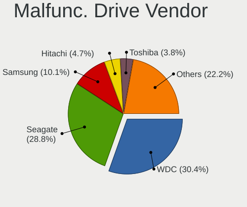

| Vendor                | Desktops | Drives | Percent |
|-----------------------|----------|--------|---------|
| WDC                   | 129      | 157    | 30.42%  |
| Seagate               | 122      | 177    | 28.77%  |
| Samsung Electronics   | 43       | 51     | 10.14%  |
| Hitachi               | 20       | 23     | 4.72%   |
| Toshiba               | 16       | 20     | 3.77%   |
| Kingston              | 14       | 14     | 3.3%    |
| Crucial               | 14       | 17     | 3.3%    |
| SanDisk               | 10       | 13     | 2.36%   |
| Intel                 | 10       | 12     | 2.36%   |
| HGST                  | 7        | 7      | 1.65%   |
| A-DATA Technology     | 6        | 6      | 1.42%   |
| Corsair               | 3        | 7      | 0.71%   |
| SK hynix              | 2        | 3      | 0.47%   |
| Patriot               | 2        | 2      | 0.47%   |
| OCZ                   | 2        | 2      | 0.47%   |
| Micron Technology     | 2        | 2      | 0.47%   |
| Maxtor                | 2        | 2      | 0.47%   |
| Apacer                | 2        | 2      | 0.47%   |
| Unknown               | 2        | 3      | 0.47%   |
| Transcend             | 1        | 1      | 0.24%   |
| tecmiyo               | 1        | 1      | 0.24%   |
| SPCC                  | 1        | 1      | 0.24%   |
| Realtek Semiconductor | 1        | 1      | 0.24%   |
| Phison Electronics    | 1        | 1      | 0.24%   |
| Phison                | 1        | 2      | 0.24%   |
| MaxDigital            | 1        | 1      | 0.24%   |
| KingSpec              | 1        | 2      | 0.24%   |
| JMicron Technology    | 1        | 1      | 0.24%   |
| Intenso               | 1        | 4      | 0.24%   |
| Hewlett-Packard       | 1        | 1      | 0.24%   |
| Fujitsu               | 1        | 1      | 0.24%   |
| Drevo                 | 1        | 1      | 0.24%   |
| China                 | 1        | 2      | 0.24%   |
| ASMT                  | 1        | 5      | 0.24%   |
| ADATA Technology      | 1        | 1      | 0.24%   |

Malfunc. HDD Vendor
-------------------

Vendors of faulty HDD drives

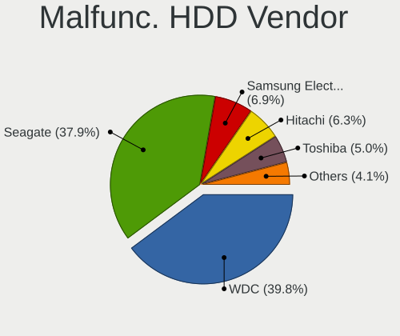

| Vendor              | Desktops | Drives | Percent |
|---------------------|----------|--------|---------|
| WDC                 | 127      | 155    | 39.81%  |
| Seagate             | 121      | 174    | 37.93%  |
| Samsung Electronics | 22       | 27     | 6.9%    |
| Hitachi             | 20       | 23     | 6.27%   |
| Toshiba             | 16       | 20     | 5.02%   |
| HGST                | 7        | 7      | 2.19%   |
| Maxtor              | 2        | 2      | 0.63%   |
| MaxDigital          | 1        | 1      | 0.31%   |
| JMicron Technology  | 1        | 1      | 0.31%   |
| Fujitsu             | 1        | 1      | 0.31%   |
| Unknown             | 1        | 2      | 0.31%   |

Malfunc. Drive Kind
-------------------

Kinds of faulty drives

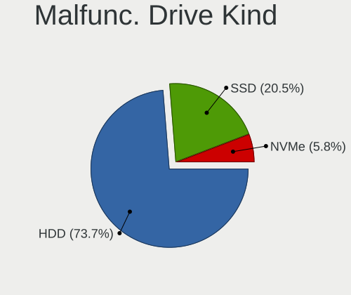

| Kind | Desktops | Drives | Percent |
|------|----------|--------|---------|
| HDD  | 292      | 413    | 73.74%  |
| SSD  | 81       | 107    | 20.45%  |
| NVMe | 23       | 26     | 5.81%   |

Failed Drives
-------------

Failed drive models

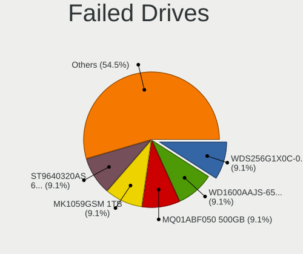

| Model                             | Desktops | Drives | Percent |
|-----------------------------------|----------|--------|---------|
| WDC WDS256G1X0C-00ENX0 256GB      | 1        | 1      | 8.33%   |
| WDC WD3200BPVT-24ZEST0 320GB      | 1        | 1      | 8.33%   |
| WDC WD1600AAJS-65WAA0 160GB       | 1        | 1      | 8.33%   |
| Toshiba MQ01ABF050 500GB          | 1        | 1      | 8.33%   |
| Toshiba MK1059GSM 1TB             | 1        | 1      | 8.33%   |
| Seagate ST9640320AS 640GB         | 1        | 1      | 8.33%   |
| Seagate ST3500418AS 500GB         | 1        | 1      | 8.33%   |
| Seagate ST3250318AS 250GB         | 1        | 1      | 8.33%   |
| Seagate ST31000524AS 1TB          | 1        | 2      | 8.33%   |
| Samsung Electronics HD321HJ 320GB | 1        | 1      | 8.33%   |
| Kingston SV300S37A120G 120GB SSD  | 1        | 1      | 8.33%   |
| Hitachi HDS721010CLA332 1TB       | 1        | 1      | 8.33%   |

Failed Drive Vendor
-------------------

Failed drive vendors

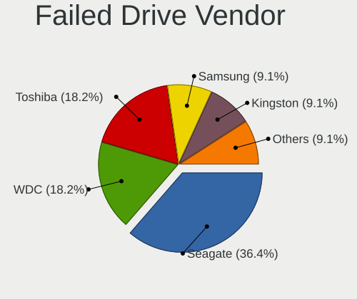

| Vendor              | Desktops | Drives | Percent |
|---------------------|----------|--------|---------|
| Seagate             | 4        | 5      | 33.33%  |
| WDC                 | 3        | 3      | 25%     |
| Toshiba             | 2        | 2      | 16.67%  |
| Samsung Electronics | 1        | 1      | 8.33%   |
| Kingston            | 1        | 1      | 8.33%   |
| Hitachi             | 1        | 1      | 8.33%   |

Drive Status
------------

Number of failed and malfunc. drives

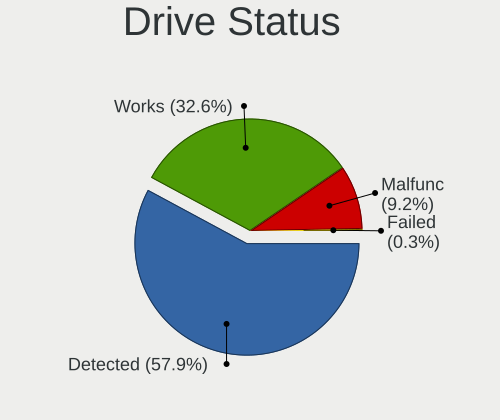

| Status   | Desktops | Drives | Percent |
|----------|----------|--------|---------|
| Detected | 2354     | 7968   | 57.87%  |
| Works    | 1327     | 3907   | 32.62%  |
| Malfunc  | 375      | 546    | 9.22%   |
| Failed   | 12       | 13     | 0.29%   |

Storage controller
------------------

Storage Vendor
--------------

Storage controller vendors

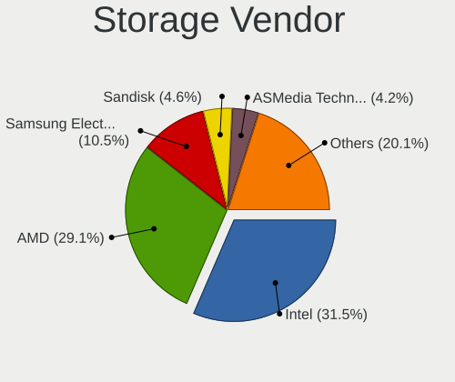

| Vendor                           | Desktops | Percent |
|----------------------------------|----------|---------|
| Intel                            | 1824     | 31.49%  |
| AMD                              | 1685     | 29.09%  |
| Samsung Electronics              | 611      | 10.55%  |
| Sandisk                          | 268      | 4.63%   |
| ASMedia Technology               | 242      | 4.18%   |
| Phison Electronics               | 204      | 3.52%   |
| Kingston Technology Company      | 140      | 2.42%   |
| Micron/Crucial Technology        | 127      | 2.19%   |
| Marvell Technology Group         | 88       | 1.52%   |
| Silicon Motion                   | 83       | 1.43%   |
| JMicron Technology               | 78       | 1.35%   |
| ADATA Technology                 | 72       | 1.24%   |
| Realtek Semiconductor            | 51       | 0.88%   |
| Nvidia                           | 44       | 0.76%   |
| MAXIO Technology (Hangzhou)      | 42       | 0.73%   |
| SK hynix                         | 30       | 0.52%   |
| Micron Technology                | 30       | 0.52%   |
| Shenzhen Longsys Electronics     | 25       | 0.43%   |
| Toshiba America Info Systems     | 20       | 0.35%   |
| KIOXIA                           | 16       | 0.28%   |
| Seagate Technology               | 14       | 0.24%   |
| LSI Logic / Symbios Logic        | 14       | 0.24%   |
| VIA Technologies                 | 12       | 0.21%   |
| INNOGRIT                         | 10       | 0.17%   |
| Broadcom / LSI                   | 9        | 0.16%   |
| Lite-On Technology               | 8        | 0.14%   |
| Silicon Image                    | 7        | 0.12%   |
| Adaptec                          | 5        | 0.09%   |
| Union Memory (Shenzhen)          | 3        | 0.05%   |
| Solidigm                         | 3        | 0.05%   |
| Integrated Technology Express    | 3        | 0.05%   |
| Yangtze Memory Technologies      | 2        | 0.03%   |
| Transcend                        | 2        | 0.03%   |
| Netac Technology                 | 2        | 0.03%   |
| Lenovo                           | 2        | 0.03%   |
| HighPoint Technologies           | 2        | 0.03%   |
| Hewlett-Packard                  | 2        | 0.03%   |
| Biwin Storage Technology         | 2        | 0.03%   |
| Unknown                          | 2        | 0.03%   |
| Silicon Integrated Systems [SiS] | 1        | 0.02%   |

Storage Model
-------------

Storage controller models

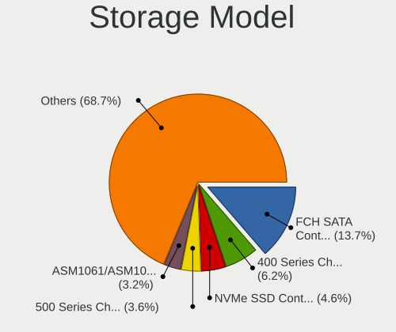

| Model                                                                                   | Desktops | Percent |
|-----------------------------------------------------------------------------------------|----------|---------|
| AMD FCH SATA Controller [AHCI mode]                                                     | 966      | 13.68%  |
| AMD 400 Series Chipset SATA Controller                                                  | 439      | 6.22%   |
| Samsung NVMe SSD Controller SM981/PM981/PM983                                           | 322      | 4.56%   |
| AMD 500 Series Chipset SATA Controller                                                  | 257      | 3.64%   |
| ASMedia ASM1061/ASM1062 Serial ATA Controller                                           | 224      | 3.17%   |
| Intel 8 Series/C220 Series Chipset Family 6-port SATA Controller 1 [AHCI mode]          | 205      | 2.9%    |
| Intel 200 Series PCH SATA controller [AHCI mode]                                        | 169      | 2.39%   |
| Intel Q170/Q150/B150/H170/H110/Z170/CM236 Chipset SATA Controller [AHCI Mode]           | 152      | 2.15%   |
| AMD 600 Series Chipset SATA Controller                                                  | 136      | 1.93%   |
| Intel 7 Series/C210 Series Chipset Family 6-port SATA Controller [AHCI mode]            | 132      | 1.87%   |
| Intel 6 Series/C200 Series Chipset Family 6 port Desktop SATA AHCI Controller           | 130      | 1.84%   |
| AMD SB7x0/SB8x0/SB9x0 SATA Controller [AHCI mode]                                       | 128      | 1.81%   |
| Samsung NVMe SSD Controller PM9A1/PM9A3/980PRO                                          | 126      | 1.78%   |
| AMD SB7x0/SB8x0/SB9x0 IDE Controller                                                    | 125      | 1.77%   |
| Intel SATA Controller [RAID mode]                                                       | 122      | 1.73%   |
| Intel Cannon Lake PCH SATA AHCI Controller                                              | 118      | 1.67%   |
| AMD 300 Series Chipset SATA Controller                                                  | 103      | 1.46%   |
| Samsung NVMe SSD Controller SM961/PM961/SM963                                           | 87       | 1.23%   |
| Phison E12 NVMe Controller                                                              | 85       | 1.2%    |
| AMD SB7x0/SB8x0/SB9x0 SATA Controller [IDE mode]                                        | 85       | 1.2%    |
| AMD A320 Chipset SATA Controller [AHCI mode]                                            | 75       | 1.06%   |
| Samsung NVMe SSD Controller 980 (DRAM-less)                                             | 71       | 1.01%   |
| Intel Alder Lake-S PCH SATA Controller [AHCI Mode]                                      | 66       | 0.93%   |
| Intel 9 Series Chipset Family SATA Controller [AHCI Mode]                               | 66       | 0.93%   |
| Micron/Crucial P2 [Nick P2] / P3 / P3 Plus NVMe PCIe SSD (DRAM-less)                    | 62       | 0.88%   |
| Phison E16 PCIe4 NVMe Controller                                                        | 60       | 0.85%   |
| Intel NM10/ICH7 Family SATA Controller [IDE mode]                                       | 60       | 0.85%   |
| Silicon Motion SM2263EN/SM2263XT (DRAM-less) NVMe SSD Controllers                       | 56       | 0.79%   |
| SanDisk Ultra 3D / WD PC SN530, IX SN530, Blue SN550 NVMe SSD (DRAM-less)               | 56       | 0.79%   |
| ADATA XPG SX8200 Pro PCIe Gen3x4 M.2 2280 Solid State Drive                             | 53       | 0.75%   |
| AMD X370 Series Chipset SATA Controller                                                 | 52       | 0.74%   |
| Intel Raptor Lake SATA AHCI Controller                                                  | 51       | 0.72%   |
| Intel 6 Series/C200 Series Chipset Family Desktop SATA Controller (IDE mode, ports 4-5) | 51       | 0.72%   |
| Intel 6 Series/C200 Series Chipset Family Desktop SATA Controller (IDE mode, ports 0-3) | 51       | 0.72%   |
| Intel 500 Series Chipset Family SATA AHCI Controller                                    | 51       | 0.72%   |
| Intel SSD 660P Series                                                                   | 48       | 0.68%   |
| Kingston Company A2000 NVMe SSD [SM2263EN]                                              | 46       | 0.65%   |
| Intel 82801JI (ICH10 Family) SATA AHCI Controller                                       | 46       | 0.65%   |
| Intel 82801G (ICH7 Family) IDE Controller                                               | 46       | 0.65%   |
| SanDisk Extreme Pro / WD Black SN750 / PC SN730 / Red SN700 NVMe SSD                    | 45       | 0.64%   |

Storage Kind
------------

Kind of storage controller (IDE, SATA, NVMe, SAS, ...)

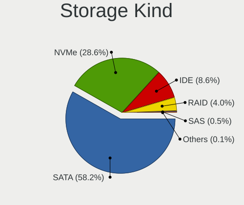

| Kind | Desktops | Percent |
|------|----------|---------|
| SATA | 3161     | 58.21%  |
| NVMe | 1551     | 28.56%  |
| IDE  | 469      | 8.64%   |
| RAID | 217      | 4%      |
| SAS  | 28       | 0.52%   |
| SCSI | 4        | 0.07%   |

Processor
---------

CPU Vendor
----------

Processor vendors

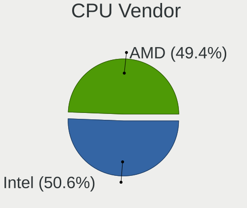

| Vendor | Desktops | Percent |
|--------|----------|---------|
| Intel  | 1788     | 50.61%  |
| AMD    | 1745     | 49.39%  |

CPU Model
---------

Processor models

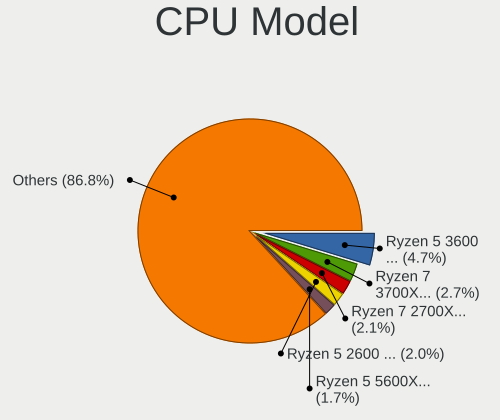

| Model                                       | Desktops | Percent |
|---------------------------------------------|----------|---------|
| AMD Ryzen 5 3600 6-Core Processor           | 167      | 4.7%    |
| AMD Ryzen 7 3700X 8-Core Processor          | 96       | 2.7%    |
| AMD Ryzen 7 2700X Eight-Core Processor      | 73       | 2.05%   |
| AMD Ryzen 5 2600 Six-Core Processor         | 71       | 2%      |
| AMD Ryzen 5 5600X 6-Core Processor          | 61       | 1.72%   |
| AMD Ryzen 7 5800X 8-Core Processor          | 52       | 1.46%   |
| AMD Ryzen 9 3900X 12-Core Processor         | 50       | 1.41%   |
| AMD Ryzen 9 5900X 12-Core Processor         | 44       | 1.24%   |
| AMD Ryzen 5 1600 Six-Core Processor         | 41       | 1.15%   |
| AMD Ryzen 7 2700 Eight-Core Processor       | 36       | 1.01%   |
| AMD Ryzen 5 5600G with Radeon Graphics      | 34       | 0.96%   |
| AMD FX-8350 Eight-Core Processor            | 34       | 0.96%   |
| AMD Ryzen 9 5950X 16-Core Processor         | 33       | 0.93%   |
| Intel Core i7-4790 CPU @ 3.60GHz            | 32       | 0.9%    |
| Intel Core i5-3470 CPU @ 3.20GHz            | 32       | 0.9%    |
| Intel Core i7-6700 CPU @ 3.40GHz            | 31       | 0.87%   |
| AMD FX-6300 Six-Core Processor              | 31       | 0.87%   |
| Intel Core i7-3770 CPU @ 3.40GHz            | 30       | 0.84%   |
| Intel Core i7-8700K CPU @ 3.70GHz           | 28       | 0.79%   |
| Intel Core i7-7700K CPU @ 4.20GHz           | 28       | 0.79%   |
| Intel Core i7-6700K CPU @ 4.00GHz           | 28       | 0.79%   |
| Intel Core i5-9400F CPU @ 2.90GHz           | 27       | 0.76%   |
| AMD Ryzen 7 5700G with Radeon Graphics      | 27       | 0.76%   |
| AMD Ryzen 7 3800X 8-Core Processor          | 27       | 0.76%   |
| AMD Ryzen 5 3600X 6-Core Processor          | 27       | 0.76%   |
| AMD Ryzen 5 3400G with Radeon Vega Graphics | 27       | 0.76%   |
| Intel Core i7-8700 CPU @ 3.20GHz            | 26       | 0.73%   |
| AMD Ryzen 5 2600X Six-Core Processor        | 26       | 0.73%   |
| Intel Core i5-6500 CPU @ 3.20GHz            | 25       | 0.7%    |
| AMD Ryzen 3 2200G with Radeon Vega Graphics | 25       | 0.7%    |
| AMD Ryzen 7 1700 Eight-Core Processor       | 24       | 0.68%   |
| Intel Core i5-4460 CPU @ 3.20GHz            | 23       | 0.65%   |
| Intel Core i5-4570 CPU @ 3.20GHz            | 22       | 0.62%   |
| Intel Core i5-2400 CPU @ 3.10GHz            | 21       | 0.59%   |
| AMD Ryzen 5 2400G with Radeon Vega Graphics | 21       | 0.59%   |
| Intel Core i7-4790K CPU @ 4.00GHz           | 19       | 0.53%   |
| Intel Core i5-6600K CPU @ 3.50GHz           | 19       | 0.53%   |
| Intel Core i5-4590 CPU @ 3.30GHz            | 19       | 0.53%   |
| Intel Core i5-2500 CPU @ 3.30GHz            | 19       | 0.53%   |
| AMD Ryzen 7 5800X3D 8-Core Processor        | 19       | 0.53%   |

CPU Model Family
----------------

Processor model prefix

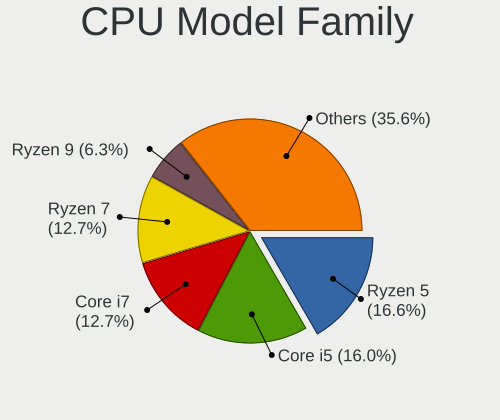

| Model                   | Desktops | Percent |
|-------------------------|----------|---------|
| AMD Ryzen 5             | 590      | 16.64%  |
| Intel Core i5           | 568      | 16.02%  |
| Intel Core i7           | 451      | 12.72%  |
| AMD Ryzen 7             | 451      | 12.72%  |
| AMD Ryzen 9             | 224      | 6.32%   |
| Intel Core i3           | 173      | 4.88%   |
| Intel Xeon              | 163      | 4.6%    |
| Other                   | 152      | 4.29%   |
| AMD FX                  | 137      | 3.86%   |
| AMD Ryzen 3             | 64       | 1.8%    |
| Intel Core 2 Duo        | 52       | 1.47%   |
| Intel Pentium           | 44       | 1.24%   |
| Intel Core i9           | 43       | 1.21%   |
| Intel Celeron           | 42       | 1.18%   |
| AMD Phenom II X4        | 37       | 1.04%   |
| Intel Core 2 Quad       | 34       | 0.96%   |
| AMD Ryzen Threadripper  | 34       | 0.96%   |
| Intel Pentium Dual-Core | 25       | 0.71%   |
| AMD A10                 | 24       | 0.68%   |
| AMD Athlon II X2        | 23       | 0.65%   |
| AMD A8                  | 21       | 0.59%   |
| AMD A4                  | 20       | 0.56%   |
| AMD Phenom II X6        | 15       | 0.42%   |
| AMD Athlon              | 15       | 0.42%   |
| AMD Athlon 64 X2        | 13       | 0.37%   |
| Intel Core 2            | 12       | 0.34%   |
| AMD Ryzen 5 PRO         | 11       | 0.31%   |
| AMD Athlon II X4        | 11       | 0.31%   |
| AMD Athlon X4           | 10       | 0.28%   |
| Intel Atom              | 8        | 0.23%   |
| AMD Phenom              | 8        | 0.23%   |
| Intel Pentium Dual      | 7        | 0.2%    |
| Intel Pentium Gold      | 6        | 0.17%   |
| AMD Ryzen 7 PRO         | 6        | 0.17%   |
| Intel Genuine           | 5        | 0.14%   |
| AMD Sempron             | 5        | 0.14%   |
| AMD Athlon II X3        | 5        | 0.14%   |
| AMD A6                  | 5        | 0.14%   |
| Intel Pentium D         | 4        | 0.11%   |
| AMD Ryzen 3 PRO         | 3        | 0.08%   |

CPU Cores
---------

Number of processor cores

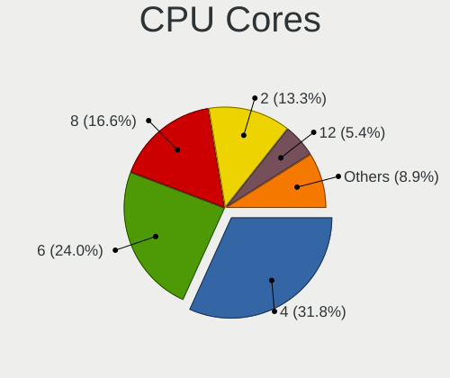

| Number  | Desktops | Percent |
|---------|----------|---------|
| 4       | 1128     | 31.78%  |
| 6       | 851      | 23.98%  |
| 8       | 590      | 16.62%  |
| 2       | 471      | 13.27%  |
| 12      | 192      | 5.41%   |
| 16      | 134      | 3.78%   |
| 3       | 52       | 1.47%   |
| 10      | 37       | 1.04%   |
| 1       | 33       | 0.93%   |
| 24      | 23       | 0.65%   |
| 14      | 15       | 0.42%   |
| 20      | 11       | 0.31%   |
| 32      | 4        | 0.11%   |
| Unknown | 2        | 0.06%   |
| 64      | 1        | 0.03%   |
| 40      | 1        | 0.03%   |
| 28      | 1        | 0.03%   |
| 22      | 1        | 0.03%   |
| 18      | 1        | 0.03%   |
| 7       | 1        | 0.03%   |

CPU Sockets
-----------

Number of sockets

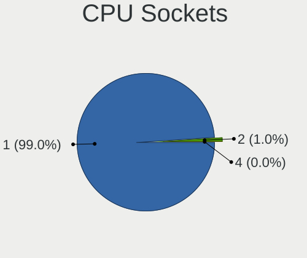

| Number | Desktops | Percent |
|--------|----------|---------|
| 1      | 3495     | 98.95%  |
| 2      | 36       | 1.02%   |
| 4      | 1        | 0.03%   |

CPU Threads
-----------

Threads per core (Hyper-Threading)

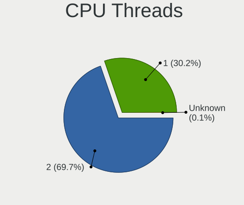

| Number  | Desktops | Percent |
|---------|----------|---------|
| 2       | 2470     | 69.73%  |
| 1       | 1070     | 30.21%  |
| Unknown | 2        | 0.06%   |

CPU Op-Modes
------------

CPU Operation Modes (32-bit, 64-bit)

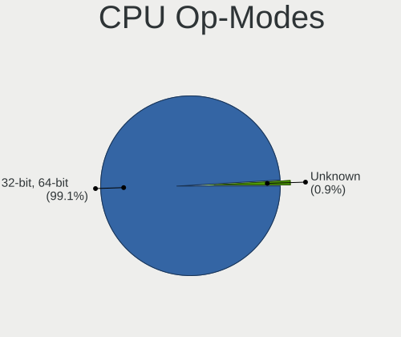

| Op mode        | Desktops | Percent |
|----------------|----------|---------|
| 32-bit, 64-bit | 3504     | 99.07%  |
| Unknown        | 33       | 0.93%   |

CPU Microcode
-------------

Microcode number

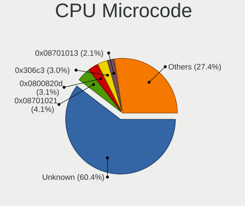

| Number     | Desktops | Percent |
|------------|----------|---------|
| Unknown    | 2212     | 60.39%  |
| 0x08701021 | 150      | 4.1%    |
| 0x0800820d | 112      | 3.06%   |
| 0x306c3    | 109      | 2.98%   |
| 0x08701013 | 76       | 2.07%   |
| 0x306a9    | 69       | 1.88%   |
| 0x206a7    | 64       | 1.75%   |
| 0x906ea    | 60       | 1.64%   |
| 0x06000852 | 55       | 1.5%    |
| 0x506e3    | 52       | 1.42%   |
| 0x1067a    | 35       | 0.96%   |
| 0x08001138 | 33       | 0.9%    |
| 0x906e9    | 28       | 0.76%   |
| 0x0a201016 | 27       | 0.74%   |
| 0x08108109 | 26       | 0.71%   |
| 0x0a201009 | 24       | 0.66%   |
| 0x010000c8 | 24       | 0.66%   |
| 0x306f2    | 23       | 0.63%   |
| 0x0a601203 | 22       | 0.6%    |
| 0x206d7    | 20       | 0.55%   |
| 0x08001137 | 20       | 0.55%   |
| 0x0a20120a | 19       | 0.52%   |
| 0x08101016 | 19       | 0.52%   |
| 0x0a50000d | 17       | 0.46%   |
| 0x90672    | 16       | 0.44%   |
| 0x06003106 | 15       | 0.41%   |
| 0xa0655    | 14       | 0.38%   |
| 0x0a50000c | 14       | 0.38%   |
| 0x06001119 | 14       | 0.38%   |
| 0x906ed    | 13       | 0.35%   |
| 0x106e5    | 13       | 0.35%   |
| 0x08600106 | 11       | 0.3%    |
| 0xa0671    | 9        | 0.25%   |
| 0x906eb    | 9        | 0.25%   |
| 0x206c2    | 9        | 0.25%   |
| 0x08001129 | 9        | 0.25%   |
| 0xa0653    | 8        | 0.22%   |
| 0x906ec    | 8        | 0.22%   |
| 0x6fd      | 8        | 0.22%   |
| 0x010000dc | 8        | 0.22%   |

CPU Microarch
-------------

Microarchitecture

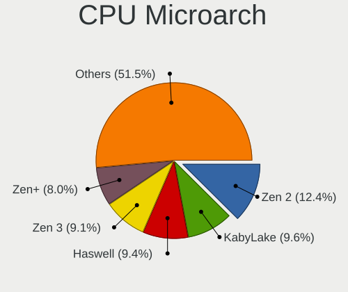

| Name             | Desktops | Percent |
|------------------|----------|---------|
| Zen 2            | 442      | 12.45%  |
| KabyLake         | 342      | 9.63%   |
| Haswell          | 334      | 9.41%   |
| Zen 3            | 323      | 9.1%    |
| Zen+             | 283      | 7.97%   |
| Unknown          | 250      | 7.04%   |
| Zen              | 204      | 5.74%   |
| IvyBridge        | 203      | 5.72%   |
| SandyBridge      | 188      | 5.29%   |
| Skylake          | 159      | 4.48%   |
| Piledriver       | 149      | 4.2%    |
| Penryn           | 107      | 3.01%   |
| K10              | 103      | 2.9%    |
| CometLake        | 82       | 2.31%   |
| Alderlake Hybrid | 60       | 1.69%   |
| Westmere         | 45       | 1.27%   |
| Core             | 45       | 1.27%   |
| Nehalem          | 39       | 1.1%    |
| Steamroller      | 35       | 0.99%   |
| Broadwell        | 32       | 0.9%    |
| Bulldozer        | 22       | 0.62%   |
| K8 Hammer        | 17       | 0.48%   |
| Icelake          | 15       | 0.42%   |
| Excavator        | 12       | 0.34%   |
| Silvermont       | 9        | 0.25%   |
| Goldmont plus    | 7        | 0.2%    |
| Goldmont         | 7        | 0.2%    |
| Bonnell          | 7        | 0.2%    |
| NetBurst         | 6        | 0.17%   |
| K10 Llano        | 6        | 0.17%   |
| Jaguar           | 4        | 0.11%   |
| Bobcat           | 4        | 0.11%   |
| TigerLake        | 3        | 0.08%   |
| Gracemont        | 3        | 0.08%   |
| Puma             | 2        | 0.06%   |
| Tremont          | 1        | 0.03%   |
| Lunarlake Hybrid | 1        | 0.03%   |

Graphics
--------

GPU Vendor
----------

Vendors of graphics cards

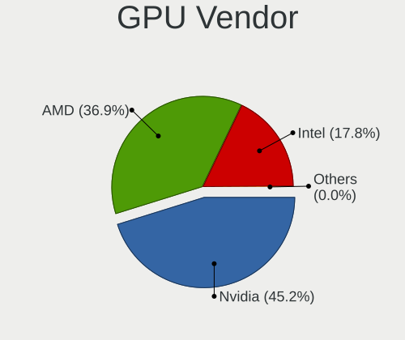

| Vendor                     | Desktops | Percent |
|----------------------------|----------|---------|
| Nvidia                     | 1747     | 45.19%  |
| AMD                        | 1427     | 36.91%  |
| Intel                      | 688      | 17.8%   |
| Matrox Electronics Systems | 2        | 0.05%   |
| VIA Technologies           | 1        | 0.03%   |
| ATI Technologies           | 1        | 0.03%   |

GPU Model
---------

Graphics card models

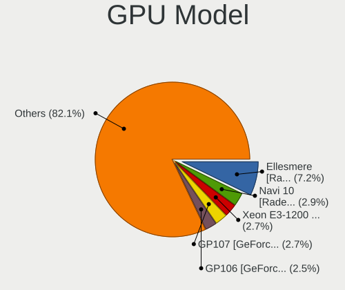

| Model                                                                       | Desktops | Percent |
|-----------------------------------------------------------------------------|----------|---------|
| AMD Ellesmere [Radeon RX 470/480/570/570X/580/580X/590]                     | 290      | 7.19%   |
| AMD Navi 10 [Radeon RX 5600 OEM/5600 XT / 5700/5700 XT]                     | 116      | 2.88%   |
| Intel Xeon E3-1200 v3/4th Gen Core Processor Integrated Graphics Controller | 110      | 2.73%   |
| Nvidia GP107 [GeForce GTX 1050 Ti]                                          | 107      | 2.65%   |
| Nvidia GP106 [GeForce GTX 1060 6GB]                                         | 100      | 2.48%   |
| Intel CoffeeLake-S GT2 [UHD Graphics 630]                                   | 86       | 2.13%   |
| Nvidia GP104 [GeForce GTX 1070]                                             | 74       | 1.84%   |
| Nvidia GK208B [GeForce GT 710]                                              | 74       | 1.84%   |
| AMD Raphael                                                                 | 71       | 1.76%   |
| Nvidia GM204 [GeForce GTX 970]                                              | 62       | 1.54%   |
| Intel Xeon E3-1200 v2/3rd Gen Core processor Graphics Controller            | 62       | 1.54%   |
| Nvidia GP108 [GeForce GT 1030]                                              | 56       | 1.39%   |
| AMD Cezanne [Radeon Vega Series / Radeon Vega Mobile Series]                | 54       | 1.34%   |
| Nvidia GP104 [GeForce GTX 1080]                                             | 52       | 1.29%   |
| Intel Skylake-S GT2 [HD Graphics 530]                                       | 52       | 1.29%   |
| Intel 2nd Generation Core Processor Family Integrated Graphics Controller   | 51       | 1.27%   |
| AMD Navi 22 [Radeon RX 6700/6700 XT/6750 XT / 6800M/6850M XT]               | 51       | 1.27%   |
| Nvidia GP106 [GeForce GTX 1060 3GB]                                         | 49       | 1.22%   |
| Nvidia GM107 [GeForce GTX 750 Ti]                                           | 47       | 1.17%   |
| AMD Vega 10 XL/XT [Radeon RX Vega 56/64]                                    | 46       | 1.14%   |
| AMD Navi 23 [Radeon RX 6600/6600 XT/6600M]                                  | 46       | 1.14%   |
| AMD Navi 21 [Radeon RX 6800/6800 XT / 6900 XT]                              | 44       | 1.09%   |
| Nvidia GP102 [GeForce GTX 1080 Ti]                                          | 40       | 0.99%   |
| AMD Raven Ridge [Radeon Vega Series / Radeon Vega Mobile Series]            | 39       | 0.97%   |
| Nvidia TU117 [GeForce GTX 1650]                                             | 38       | 0.94%   |
| AMD Picasso/Raven 2 [Radeon Vega Series / Radeon Vega Mobile Series]        | 38       | 0.94%   |
| AMD Navi 31 [Radeon RX 7900 XT/7900 XTX/7900 GRE/7900M]                     | 38       | 0.94%   |
| Nvidia TU116 [GeForce GTX 1660 SUPER]                                       | 37       | 0.92%   |
| Nvidia GM206 [GeForce GTX 960]                                              | 37       | 0.92%   |
| Nvidia GA106 [GeForce RTX 3060 Lite Hash Rate]                              | 37       | 0.92%   |
| Nvidia TU104 [GeForce RTX 2070 SUPER]                                       | 34       | 0.84%   |
| Intel Kaby Lake-S GT2 [HD Graphics 630]                                     | 33       | 0.82%   |
| AMD Lexa PRO [Radeon 540/540X/550/550X / RX 540X/550/550X]                  | 32       | 0.79%   |
| Nvidia GK208B [GeForce GT 730]                                              | 31       | 0.77%   |
| Nvidia GP107 [GeForce GTX 1050]                                             | 29       | 0.72%   |
| AMD Baffin [Radeon RX 550 640SP / RX 560/560X]                              | 29       | 0.72%   |
| Intel 4 Series Chipset Integrated Graphics Controller                       | 28       | 0.69%   |
| Nvidia TU106 [GeForce RTX 2060 Rev. A]                                      | 27       | 0.67%   |
| Intel IvyBridge GT2 [HD Graphics 4000]                                      | 27       | 0.67%   |
| Intel CometLake-S GT2 [UHD Graphics 630]                                    | 27       | 0.67%   |

GPU Combo
---------

Combinations of graphics cards

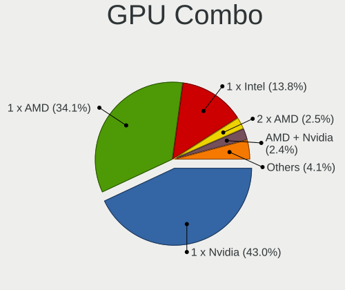

| Name                     | Desktops | Percent |
|--------------------------|----------|---------|
| 1 x Nvidia               | 1550     | 43.04%  |
| 1 x AMD                  | 1228     | 34.1%   |
| 1 x Intel                | 498      | 13.83%  |
| 2 x AMD                  | 90       | 2.5%    |
| AMD + Nvidia             | 87       | 2.42%   |
| Intel + Nvidia           | 76       | 2.11%   |
| 2 x Nvidia               | 33       | 0.92%   |
| Intel + AMD              | 28       | 0.78%   |
| 2 x Intel                | 2        | 0.06%   |
| AMD + 2 x Nvidia         | 2        | 0.06%   |
| 3 x AMD                  | 1        | 0.03%   |
| 1 x VIA                  | 1        | 0.03%   |
| Nvidia + Matrox          | 1        | 0.03%   |
| 1 x Matrox               | 1        | 0.03%   |
| Intel + 2 x Nvidia       | 1        | 0.03%   |
| Intel + 2 x AMD          | 1        | 0.03%   |
| Intel + AMD + 1 x Nvidia | 1        | 0.03%   |

GPU Driver
----------

Free vs proprietary

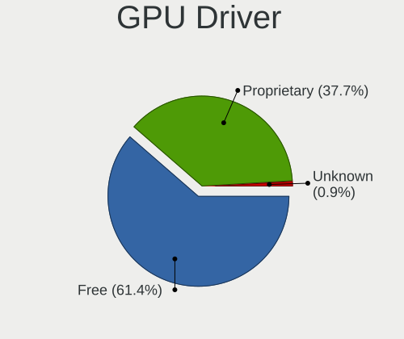

| Driver      | Desktops | Percent |
|-------------|----------|---------|
| Free        | 2206     | 61.4%   |
| Proprietary | 1353     | 37.66%  |
| Unknown     | 34       | 0.95%   |

GPU Memory
----------

Total video memory

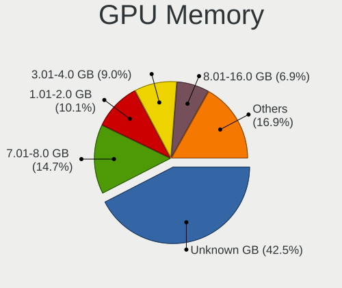

| Size in GB | Desktops | Percent |
|------------|----------|---------|
| Unknown    | 1554     | 42.47%  |
| 7.01-8.0   | 537      | 14.68%  |
| 1.01-2.0   | 368      | 10.06%  |
| 3.01-4.0   | 330      | 9.02%   |
| 8.01-16.0  | 253      | 6.91%   |
| 5.01-6.0   | 222      | 6.07%   |
| 0.51-1.0   | 180      | 4.92%   |
| 0.01-0.5   | 98       | 2.68%   |
| 2.01-3.0   | 61       | 1.67%   |
| 16.01-24.0 | 52       | 1.42%   |
| 4.01-5.0   | 2        | 0.05%   |
| 6.01-7.0   | 1        | 0.03%   |
| 24.01-32.0 | 1        | 0.03%   |

Monitor
-------

Monitor Vendor
--------------

Monitor vendors

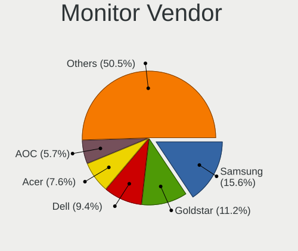

| Vendor               | Desktops | Percent |
|----------------------|----------|---------|
| Samsung Electronics  | 677      | 15.62%  |
| Goldstar             | 485      | 11.19%  |
| Dell                 | 406      | 9.37%   |
| Acer                 | 330      | 7.61%   |
| AOC                  | 248      | 5.72%   |
| BenQ                 | 230      | 5.31%   |
| Ancor Communications | 218      | 5.03%   |
| Hewlett-Packard      | 209      | 4.82%   |
| Philips              | 167      | 3.85%   |
| LG Electronics       | 123      | 2.84%   |
| ASUSTek Computer     | 114      | 2.63%   |
| ViewSonic            | 99       | 2.28%   |
| Unknown              | 84       | 1.94%   |
| Lenovo               | 67       | 1.55%   |
| Iiyama               | 60       | 1.38%   |
| Unknown              | 56       | 1.29%   |
| MSI                  | 51       | 1.18%   |
| Gigabyte Technology  | 41       | 0.95%   |
| Sony                 | 39       | 0.9%    |
| Eizo                 | 27       | 0.62%   |
| Vizio                | 22       | 0.51%   |
| Sceptre Tech         | 22       | 0.51%   |
| NEC Computers        | 22       | 0.51%   |
| Fujitsu Siemens      | 19       | 0.44%   |
| Idek Iiyama          | 18       | 0.42%   |
| AUS                  | 17       | 0.39%   |
| Medion               | 16       | 0.37%   |
| Panasonic            | 13       | 0.3%    |
| HannStar             | 13       | 0.3%    |
| Pixio                | 11       | 0.25%   |
| Vestel Elektronik    | 10       | 0.23%   |
| Toshiba              | 10       | 0.23%   |
| Sharp                | 10       | 0.23%   |
| Microstep            | 9        | 0.21%   |
| Lenovo Group Limited | 9        | 0.21%   |
| Apple                | 9        | 0.21%   |
| ___                  | 8        | 0.18%   |
| Mi                   | 8        | 0.18%   |
| HUAWEI               | 8        | 0.18%   |
| Denver               | 8        | 0.18%   |

Monitor Model
-------------

Monitor models

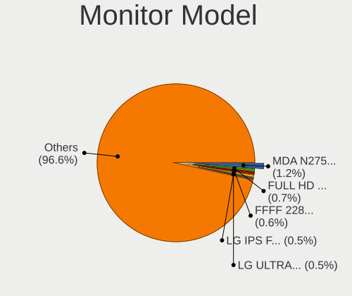

| Model                                                                 | Desktops | Percent |
|-----------------------------------------------------------------------|----------|---------|
| Unknown                                                               | 56       | 1.18%   |
| Goldstar FULL HD GSM5B55 1920x1080 480x270mm 21.7-inch                | 32       | 0.68%   |
| Unknown LCD Monitor FFFF 2288x1287 2550x2550mm 142.0-inch             | 28       | 0.59%   |
| Goldstar LG IPS FULLHD GSM5AB8 1920x1080 480x270mm 21.7-inch          | 24       | 0.51%   |
| Goldstar LG ULTRAWIDE GSM59F1 2560x1080 670x280mm 28.6-inch           | 23       | 0.49%   |
| Samsung Electronics C24F390 SAM0D2C 1920x1080 521x293mm 23.5-inch     | 20       | 0.42%   |
| Samsung Electronics C27F390 SAM0D32 1920x1080 598x336mm 27.0-inch     | 17       | 0.36%   |
| AOC 27G2G4 AOC2702 1920x1080 598x336mm 27.0-inch                      | 17       | 0.36%   |
| Samsung Electronics U28E590 SAM0C4D 3840x2160 607x345mm 27.5-inch     | 16       | 0.34%   |
| Samsung Electronics S24F350 SAM0D20 1920x1080 521x293mm 23.5-inch     | 14       | 0.3%    |
| Goldstar Ultra HD GSM5B09 3840x2160 600x340mm 27.2-inch               | 12       | 0.25%   |
| AOC 24G2W1G3 AOC2402 1920x1080 527x296mm 23.8-inch                    | 12       | 0.25%   |
| AOC 24B1W1 AOC2401 1920x1080 527x296mm 23.8-inch                      | 12       | 0.25%   |
| Dell P2419H DELD0D9 1920x1080 527x296mm 23.8-inch                     | 11       | 0.23%   |
| Vestel Elektronik 40UHD_LCD_TV VES3700 3840x2160 880x500mm 39.8-inch  | 10       | 0.21%   |
| Philips PHL 243V7 PHLC155 1920x1080 527x296mm 23.8-inch               | 10       | 0.21%   |
| Goldstar HDR WFHD GSM7715 2560x1080 798x334mm 34.1-inch               | 10       | 0.21%   |
| Goldstar HDR 4K GSM7706 3840x2160 600x340mm 27.2-inch                 | 10       | 0.21%   |
| AOC G2460 AOC2460 1920x1080 531x299mm 24.0-inch                       | 10       | 0.21%   |
| BenQ GL2450H BNQ78A7 1920x1080 531x298mm 24.0-inch                    | 9        | 0.19%   |
| AOC 27G1G4 AOC2701 1920x1080 598x336mm 27.0-inch                      | 9        | 0.19%   |
| Ancor Communications VG248 ACI24A4 1920x1080 531x299mm 24.0-inch      | 9        | 0.19%   |
| Ancor Communications VE247 ACI2493 1920x1080 530x300mm 24.0-inch      | 9        | 0.19%   |
| Goldstar ULTRAWIDE GSM76F9 2560x1080 531x298mm 24.0-inch              | 8        | 0.17%   |
| Goldstar MP59G GSM5B35 1920x1080 480x270mm 21.7-inch                  | 8        | 0.17%   |
| Goldstar HDR WFHD GSM7714 2560x1080 798x334mm 34.1-inch               | 8        | 0.17%   |
| Goldstar 2D HD TV GSM59CA 1366x768 509x286mm 23.0-inch                | 8        | 0.17%   |
| BenQ GW2270 BNQ78DB 1920x1080 476x268mm 21.5-inch                     | 8        | 0.17%   |
| BenQ GL2460 BNQ78CE 1920x1080 531x299mm 24.0-inch                     | 8        | 0.17%   |
| ASUSTek Computer VG289 AUS28BA 3840x2160 621x341mm 27.9-inch          | 8        | 0.17%   |
| AOC Q3279WG5B AOC3279 2560x1440 725x428mm 33.1-inch                   | 8        | 0.17%   |
| Ancor Communications ASUS VS228 ACI22FD 1920x1080 476x268mm 21.5-inch | 8        | 0.17%   |
| Samsung Electronics S24D330 SAM0D92 1920x1080 531x299mm 24.0-inch     | 7        | 0.15%   |
| Samsung Electronics LCD Monitor SyncMaster                            | 7        | 0.15%   |
| Samsung Electronics LC27G5xT SAM707A 2560x1440 597x336mm 27.0-inch    | 7        | 0.15%   |
| Goldstar LG TV SSCR2 GSMC0C8 3840x2160                                | 7        | 0.15%   |
| Goldstar FULL HD GSM5B54 1920x1080 480x270mm 21.7-inch                | 7        | 0.15%   |
| Ancor Communications VS248 ACI2498 1920x1080 531x299mm 24.0-inch      | 7        | 0.15%   |
| Ancor Communications ROG PG279Q ACI27EC 2560x1440 598x336mm 27.0-inch | 7        | 0.15%   |
| Acer G246HL ACR02FF 1920x1080 531x299mm 24.0-inch                     | 7        | 0.15%   |

Monitor Resolution
------------------

Monitor screen resolution

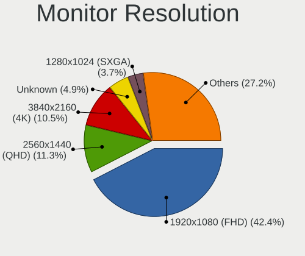

| Resolution         | Desktops | Percent |
|--------------------|----------|---------|
| 1920x1080 (FHD)    | 1790     | 42.44%  |
| 2560x1440 (QHD)    | 477      | 11.31%  |
| 3840x2160 (4K)     | 444      | 10.53%  |
| Unknown            | 206      | 4.88%   |
| 1280x1024 (SXGA)   | 154      | 3.65%   |
| 1680x1050 (WSXGA+) | 150      | 3.56%   |
| 3440x1440          | 133      | 3.15%   |
| 1366x768 (WXGA)    | 107      | 2.54%   |
| 1920x1200 (WUXGA)  | 103      | 2.44%   |
| 1440x900 (WXGA+)   | 98       | 2.32%   |
| 2560x1080          | 96       | 2.28%   |
| 3840x1080          | 83       | 1.97%   |
| 1600x900 (HD+)     | 73       | 1.73%   |
| 1360x768           | 33       | 0.78%   |
| 2288x1287          | 28       | 0.66%   |
| 1920x540           | 20       | 0.47%   |
| 4480x1440          | 18       | 0.43%   |
| 5120x1440          | 16       | 0.38%   |
| 2560x1600          | 14       | 0.33%   |
| 1280x720 (HD)      | 14       | 0.33%   |
| 1024x768 (XGA)     | 11       | 0.26%   |
| 5760x1080          | 10       | 0.24%   |
| 3840x1600          | 9        | 0.21%   |
| 1600x1200          | 9        | 0.21%   |
| 3600x1080          | 8        | 0.19%   |
| 5760x2160          | 7        | 0.17%   |
| 6400x2160          | 6        | 0.14%   |
| 3200x1080          | 6        | 0.14%   |
| 7680x2160          | 4        | 0.09%   |
| 7680x1080          | 4        | 0.09%   |
| 3840x1200          | 4        | 0.09%   |
| 3520x1080          | 4        | 0.09%   |
| 3360x1080          | 4        | 0.09%   |
| 4480x1080          | 3        | 0.07%   |
| 3360x1050          | 3        | 0.07%   |
| 3286x1080          | 3        | 0.07%   |
| 6000x1440          | 2        | 0.05%   |
| 5504x1440          | 2        | 0.05%   |
| 5120x1080          | 2        | 0.05%   |
| 4240x1440          | 2        | 0.05%   |

Monitor Diagonal
----------------

Diagonal size in inches

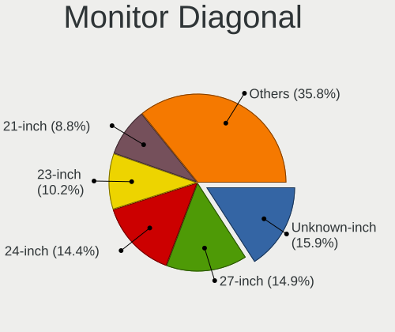

| Inches  | Desktops | Percent |
|---------|----------|---------|
| Unknown | 669      | 15.86%  |
| 27      | 627      | 14.86%  |
| 24      | 607      | 14.39%  |
| 23      | 432      | 10.24%  |
| 21      | 372      | 8.82%   |
| 31      | 264      | 6.26%   |
| 34      | 173      | 4.1%    |
| 19      | 165      | 3.91%   |
| 22      | 108      | 2.56%   |
| 18      | 96       | 2.28%   |
| 20      | 80       | 1.9%    |
| 17      | 71       | 1.68%   |
| 84      | 51       | 1.21%   |
| 32      | 43       | 1.02%   |
| 72      | 39       | 0.92%   |
| 40      | 37       | 0.88%   |
| 54      | 32       | 0.76%   |
| 142     | 28       | 0.66%   |
| 25      | 27       | 0.64%   |
| 28      | 23       | 0.55%   |
| 26      | 22       | 0.52%   |
| 15      | 22       | 0.52%   |
| 48      | 20       | 0.47%   |
| 63      | 17       | 0.4%    |
| 65      | 16       | 0.38%   |
| 33      | 13       | 0.31%   |
| 42      | 12       | 0.28%   |
| 29      | 12       | 0.28%   |
| 49      | 10       | 0.24%   |
| 37      | 10       | 0.24%   |
| 46      | 9        | 0.21%   |
| 39      | 9        | 0.21%   |
| 35      | 8        | 0.19%   |
| 12      | 8        | 0.19%   |
| 74      | 7        | 0.17%   |
| 52      | 7        | 0.17%   |
| 47      | 7        | 0.17%   |
| 36      | 7        | 0.17%   |
| 16      | 7        | 0.17%   |
| 14      | 7        | 0.17%   |

Monitor Width
-------------

Physical width

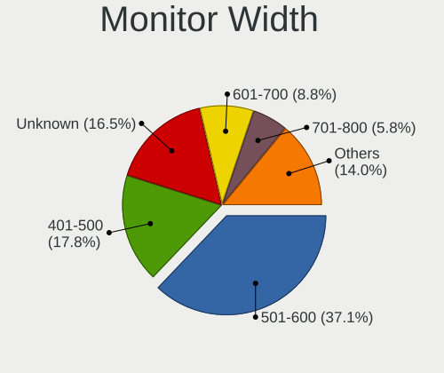

| Width in mm    | Desktops | Percent |
|----------------|----------|---------|
| 501-600        | 1503     | 37.11%  |
| 401-500        | 719      | 17.75%  |
| Unknown        | 669      | 16.52%  |
| 601-700        | 356      | 8.79%   |
| 701-800        | 235      | 5.8%    |
| 1001-1500      | 133      | 3.28%   |
| 351-400        | 103      | 2.54%   |
| 1501-2000      | 102      | 2.52%   |
| 301-350        | 90       | 2.22%   |
| 801-900        | 70       | 1.73%   |
| More than 2000 | 28       | 0.69%   |
| 201-300        | 22       | 0.54%   |
| 901-1000       | 19       | 0.47%   |
| 101-200        | 1        | 0.02%   |

Aspect Ratio
------------

Proportional relationship between the width and the height

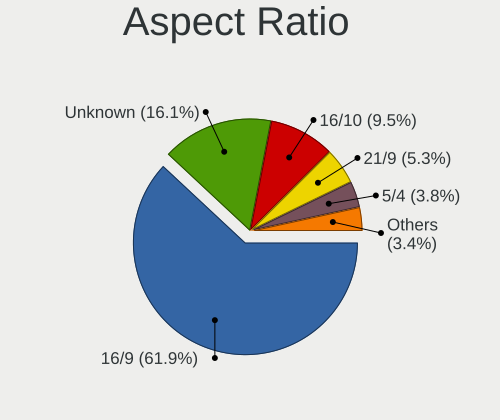

| Ratio   | Desktops | Percent |
|---------|----------|---------|
| 16/9    | 2333     | 61.95%  |
| Unknown | 606      | 16.09%  |
| 16/10   | 358      | 9.51%   |
| 21/9    | 198      | 5.26%   |
| 5/4     | 142      | 3.77%   |
| 4/3     | 38       | 1.01%   |
| 1.00    | 29       | 0.77%   |
| 32/9    | 25       | 0.66%   |
| 3/2     | 21       | 0.56%   |
| 6/5     | 5        | 0.13%   |
| 1.96    | 2        | 0.05%   |
| 1.03    | 2        | 0.05%   |
| 0.89    | 2        | 0.05%   |
| 3.75    | 1        | 0.03%   |
| 3.20    | 1        | 0.03%   |
| 0.80    | 1        | 0.03%   |
| 0.79    | 1        | 0.03%   |
| 0.56    | 1        | 0.03%   |

Monitor Area
------------

Area in inch²

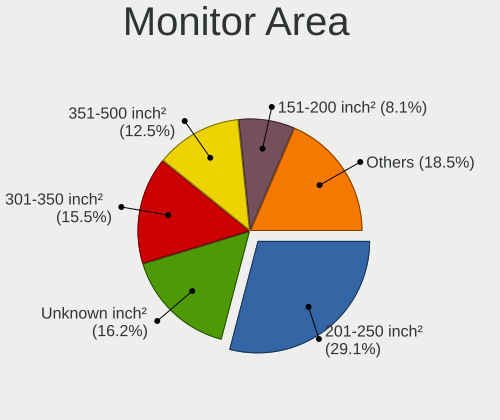

| Area in inch² | Desktops | Percent |
|----------------|----------|---------|
| 201-250        | 1199     | 29.07%  |
| Unknown        | 669      | 16.22%  |
| 301-350        | 640      | 15.52%  |
| 351-500        | 517      | 12.54%  |
| 151-200        | 334      | 8.1%    |
| 251-300        | 226      | 5.48%   |
| More than 1000 | 219      | 5.31%   |
| 141-150        | 132      | 3.2%    |
| 501-1000       | 126      | 3.06%   |
| 101-110        | 27       | 0.65%   |
| 71-80          | 11       | 0.27%   |
| 131-140        | 10       | 0.24%   |
| 81-90          | 4        | 0.1%    |
| 111-120        | 3        | 0.07%   |
| 51-60          | 2        | 0.05%   |
| 121-130        | 2        | 0.05%   |
| 91-100         | 2        | 0.05%   |
| 1-40           | 1        | 0.02%   |

Pixel Density
-------------

Pixels per inch

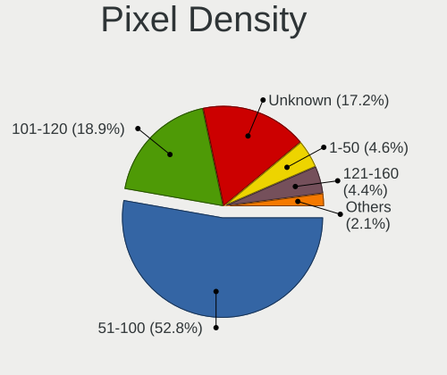

| Density | Desktops | Percent |
|---------|----------|---------|
| 51-100  | 2050     | 52.77%  |
| 101-120 | 736      | 18.94%  |
| Unknown | 670      | 17.25%  |
| 1-50    | 177      | 4.56%   |
| 121-160 | 172      | 4.43%   |
| 161-240 | 80       | 2.06%   |

Multiple Monitors
-----------------

Total monitors connected

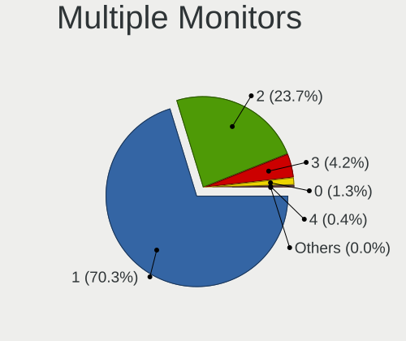

| Total | Desktops | Percent |
|-------|----------|---------|
| 1     | 2556     | 70.28%  |
| 2     | 862      | 23.7%   |
| 3     | 154      | 4.23%   |
| 0     | 48       | 1.32%   |
| 4     | 16       | 0.44%   |
| 5     | 1        | 0.03%   |

Network
-------

Net Controller Vendor
---------------------

Controller vendors

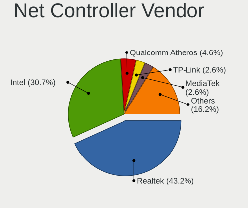

| Vendor                          | Desktops | Percent |
|---------------------------------|----------|---------|
| Realtek Semiconductor           | 2230     | 43.23%  |
| Intel                           | 1586     | 30.74%  |
| Qualcomm Atheros                | 237      | 4.59%   |
| TP-Link                         | 135      | 2.62%   |
| MediaTek                        | 135      | 2.62%   |
| Broadcom                        | 135      | 2.62%   |
| Ralink Technology               | 115      | 2.23%   |
| Microsoft                       | 54       | 1.05%   |
| Aquantia                        | 45       | 0.87%   |
| Samsung Electronics             | 39       | 0.76%   |
| Nvidia                          | 35       | 0.68%   |
| Ralink                          | 33       | 0.64%   |
| Qualcomm Atheros Communications | 30       | 0.58%   |
| Xiaomi                          | 24       | 0.47%   |
| D-Link                          | 23       | 0.45%   |
| NetGear                         | 21       | 0.41%   |
| Marvell Technology Group        | 18       | 0.35%   |
| ASUSTek Computer                | 18       | 0.35%   |
| Huawei Technologies             | 14       | 0.27%   |
| Broadcom Limited                | 14       | 0.27%   |
| Linksys                         | 12       | 0.23%   |
| Qualcomm Technologies           | 11       | 0.21%   |
| Mellanox Technologies           | 11       | 0.21%   |
| Edimax Technology               | 10       | 0.19%   |
| ASIX Electronics                | 10       | 0.19%   |
| Motorola PCS                    | 9        | 0.17%   |
| D-Link System                   | 9        | 0.17%   |
| ZyXEL Communications            | 8        | 0.16%   |
| OPPO Electronics                | 8        | 0.16%   |
| Microchip Technology            | 8        | 0.16%   |
| Google                          | 7        | 0.14%   |
| AVM                             | 6        | 0.12%   |
| Qualcomm                        | 5        | 0.1%    |
| QinHeng Electronics             | 4        | 0.08%   |
| OnePlus Technology (Shenzhen)   | 4        | 0.08%   |
| InterBiometrics                 | 4        | 0.08%   |
| DisplayLink                     | 4        | 0.08%   |
| ZyDAS                           | 3        | 0.06%   |
| Texas Instruments               | 3        | 0.06%   |
| T & A Mobile Phones             | 3        | 0.06%   |

Net Controller Model
--------------------

Controller models

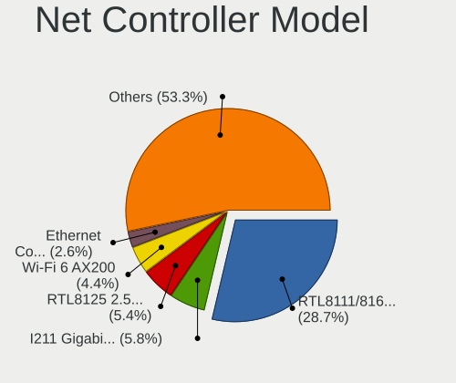

| Model                                                                          | Desktops | Percent |
|--------------------------------------------------------------------------------|----------|---------|
| Realtek RTL8111/8168/8211/8411 PCI Express Gigabit Ethernet Controller         | 1709     | 28.68%  |
| Intel I211 Gigabit Network Connection                                          | 343      | 5.76%   |
| Realtek RTL8125 2.5GbE Controller                                              | 319      | 5.35%   |
| Intel Wi-Fi 6 AX200                                                            | 260      | 4.36%   |
| Intel Ethernet Connection (2) I219-V                                           | 152      | 2.55%   |
| Intel Ethernet Controller I225-V                                               | 140      | 2.35%   |
| Intel 82579LM Gigabit Network Connection (Lewisville)                          | 100      | 1.68%   |
| Intel Dual Band Wireless-AC 3168NGW [Stone Peak]                               | 82       | 1.38%   |
| Intel Ethernet Connection (7) I219-V                                           | 71       | 1.19%   |
| Intel Wi-Fi 6E(802.11ax) AX210/AX1675* 2x2 [Typhoon Peak]                      | 65       | 1.09%   |
| Intel Wi-Fi 5(802.11ac) Wireless-AC 9x6x [Thunder Peak]                        | 59       | 0.99%   |
| Intel 82579V Gigabit Network Connection                                        | 59       | 0.99%   |
| Intel Ethernet Connection I217-LM                                              | 54       | 0.91%   |
| Realtek 802.11ac NIC                                                           | 53       | 0.89%   |
| MediaTek MT7922 802.11ax PCI Express Wireless Network Adapter                  | 51       | 0.86%   |
| Intel Ethernet Connection (2) I218-V                                           | 50       | 0.84%   |
| Intel Ethernet Connection I217-V                                               | 44       | 0.74%   |
| Broadcom BCM4360 802.11ac Dual Band Wireless Network Adapter                   | 43       | 0.72%   |
| Realtek RTL88x2bu [AC1200 Techkey]                                             | 42       | 0.7%    |
| Ralink MT7601U Wireless Adapter                                                | 42       | 0.7%    |
| Realtek RTL810xE PCI Express Fast Ethernet controller                          | 38       | 0.64%   |
| Intel Cannon Lake PCH CNVi WiFi                                                | 36       | 0.6%    |
| Realtek RTL8188EUS 802.11n Wireless Network Adapter                            | 35       | 0.59%   |
| MediaTek MT7921K (RZ608) Wi-Fi 6E 80MHz                                        | 33       | 0.55%   |
| Qualcomm Atheros Killer E220x Gigabit Ethernet Controller                      | 32       | 0.54%   |
| Intel 82574L Gigabit Network Connection                                        | 32       | 0.54%   |
| Qualcomm Atheros AR9271 802.11n                                                | 30       | 0.5%    |
| Realtek RTL8153 Gigabit Ethernet Adapter                                       | 29       | 0.49%   |
| Intel Wireless 7265                                                            | 29       | 0.49%   |
| Intel Alder Lake-S PCH CNVi WiFi                                               | 28       | 0.47%   |
| Intel 700 Series Chipset CNVi WiFi                                             | 28       | 0.47%   |
| Realtek RTL8822BE 802.11a/b/g/n/ac WiFi adapter                                | 26       | 0.44%   |
| Microsoft Xbox 360 Wireless Adapter                                            | 26       | 0.44%   |
| Intel Wireless 8265 / 8275                                                     | 26       | 0.44%   |
| Intel Ethernet Connection (2) I219-LM                                          | 25       | 0.42%   |
| Realtek RTL8821CE 802.11ac PCIe Wireless Network Adapter                       | 24       | 0.4%    |
| Ralink RT2870/RT3070 Wireless Adapter                                          | 24       | 0.4%    |
| Nvidia MCP61 Ethernet                                                          | 24       | 0.4%    |
| Aquantia AQtion AQC107 NBase-T/IEEE 802.3an Ethernet Controller [Atlantic 10G] | 24       | 0.4%    |
| Qualcomm Atheros Killer E2500 Gigabit Ethernet Controller                      | 23       | 0.39%   |

Wireless Vendor
---------------

Wireless vendors

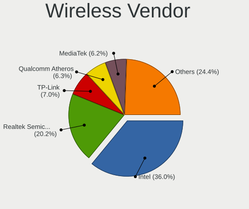

| Vendor                                | Desktops | Percent |
|---------------------------------------|----------|---------|
| Intel                                 | 684      | 35.96%  |
| Realtek Semiconductor                 | 384      | 20.19%  |
| TP-Link                               | 133      | 6.99%   |
| Qualcomm Atheros                      | 119      | 6.26%   |
| MediaTek                              | 118      | 6.2%    |
| Ralink Technology                     | 115      | 6.05%   |
| Broadcom                              | 90       | 4.73%   |
| Microsoft                             | 54       | 2.84%   |
| Ralink                                | 33       | 1.74%   |
| Qualcomm Atheros Communications       | 30       | 1.58%   |
| D-Link                                | 23       | 1.21%   |
| NetGear                               | 21       | 1.1%    |
| ASUSTek Computer                      | 18       | 0.95%   |
| Linksys                               | 12       | 0.63%   |
| Edimax Technology                     | 10       | 0.53%   |
| ZyXEL Communications                  | 8        | 0.42%   |
| D-Link System                         | 6        | 0.32%   |
| Broadcom Limited                      | 6        | 0.32%   |
| AVM                                   | 6        | 0.32%   |
| ZyDAS                                 | 3        | 0.16%   |
| Qualcomm Technologies                 | 3        | 0.16%   |
| Micro Star International              | 3        | 0.16%   |
| IMC Networks                          | 3        | 0.16%   |
| Belkin Components                     | 3        | 0.16%   |
| 802.11g Adapter [Linksys WUSB54GC v3] | 3        | 0.16%   |
| Xiaomi                                | 2        | 0.11%   |
| Tenda                                 | 2        | 0.11%   |
| Samsung Electronics                   | 2        | 0.11%   |
| Mercucys                              | 2        | 0.11%   |
| Wacom                                 | 1        | 0.05%   |
| Senao                                 | 1        | 0.05%   |
| Philips (or NXP)                      | 1        | 0.05%   |
| Marvell Technology Group              | 1        | 0.05%   |
| Fujitsu Siemens Computers             | 1        | 0.05%   |
| Encore Electronics                    | 1        | 0.05%   |

Wireless Model
--------------

Wireless models

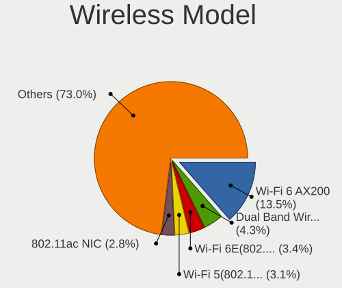

| Model                                                          | Desktops | Percent |
|----------------------------------------------------------------|----------|---------|
| Intel Wi-Fi 6 AX200                                            | 260      | 13.53%  |
| Intel Dual Band Wireless-AC 3168NGW [Stone Peak]               | 82       | 4.27%   |
| Intel Wi-Fi 6E(802.11ax) AX210/AX1675* 2x2 [Typhoon Peak]      | 65       | 3.38%   |
| Intel Wi-Fi 5(802.11ac) Wireless-AC 9x6x [Thunder Peak]        | 59       | 3.07%   |
| Realtek 802.11ac NIC                                           | 53       | 2.76%   |
| MediaTek MT7922 802.11ax PCI Express Wireless Network Adapter  | 49       | 2.55%   |
| Broadcom BCM4360 802.11ac Dual Band Wireless Network Adapter   | 43       | 2.24%   |
| Realtek RTL88x2bu [AC1200 Techkey]                             | 42       | 2.19%   |
| Ralink MT7601U Wireless Adapter                                | 42       | 2.19%   |
| Intel Cannon Lake PCH CNVi WiFi                                | 36       | 1.87%   |
| Realtek RTL8188EUS 802.11n Wireless Network Adapter            | 35       | 1.82%   |
| MediaTek MT7921K (RZ608) Wi-Fi 6E 80MHz                        | 33       | 1.72%   |
| Qualcomm Atheros AR9271 802.11n                                | 30       | 1.56%   |
| Intel Wireless 7265                                            | 29       | 1.51%   |
| Intel 700 Series Chipset CNVi WiFi                             | 28       | 1.46%   |
| Realtek RTL8822BE 802.11a/b/g/n/ac WiFi adapter                | 26       | 1.35%   |
| Microsoft Xbox 360 Wireless Adapter                            | 26       | 1.35%   |
| Intel Wireless 8265 / 8275                                     | 26       | 1.35%   |
| Realtek RTL8821CE 802.11ac PCIe Wireless Network Adapter       | 24       | 1.25%   |
| Ralink RT2870/RT3070 Wireless Adapter                          | 24       | 1.25%   |
| Qualcomm Atheros AR9485 Wireless Network Adapter               | 22       | 1.14%   |
| Intel Alder Lake-S PCH CNVi WiFi                               | 22       | 1.14%   |
| Realtek RTL8192EE PCIe Wireless Network Adapter                | 21       | 1.09%   |
| Ralink RT5370 Wireless Adapter                                 | 21       | 1.09%   |
| Qualcomm Atheros AR93xx Wireless Network Adapter               | 21       | 1.09%   |
| Broadcom BCM4352 802.11ac Dual Band Wireless Network Adapter   | 20       | 1.04%   |
| TP-Link Archer T3U [Realtek RTL8812BU]                         | 19       | 0.99%   |
| Microsoft Xbox Wireless Adapter for Windows                    | 19       | 0.99%   |
| TP-Link TL-WN722N v2/v3 [Realtek RTL8188EUS]                   | 18       | 0.94%   |
| Qualcomm Atheros AR9287 Wireless Network Adapter (PCI-Express) | 17       | 0.88%   |
| TP-Link TL-WN823N v2/v3 [Realtek RTL8192EU]                    | 15       | 0.78%   |
| Intel Wireless 7260                                            | 15       | 0.78%   |
| TP-Link AC600 wireless Realtek RTL8811AU [Archer T2U Nano]     | 14       | 0.73%   |
| Realtek RTL8812AE 802.11ac PCIe Wireless Network Adapter       | 14       | 0.73%   |
| Intel Wireless 3165                                            | 14       | 0.73%   |
| TP-Link 802.11ac NIC                                           | 13       | 0.68%   |
| Realtek RTL8821AE 802.11ac PCIe Wireless Network Adapter       | 13       | 0.68%   |
| Realtek RTL8812AU 802.11a/b/g/n/ac 2T2R DB WLAN Adapter        | 13       | 0.68%   |
| TP-Link 802.11ac WLAN Adapter                                  | 12       | 0.62%   |
| Realtek RTL8192CU 802.11n WLAN Adapter                         | 12       | 0.62%   |

Ethernet Vendor
---------------

Ethernet vendors

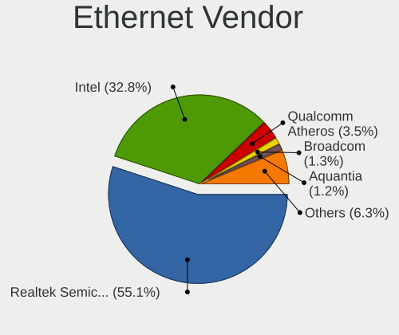

| Vendor                                 | Desktops | Percent |
|----------------------------------------|----------|---------|
| Realtek Semiconductor                  | 2109     | 55.05%  |
| Intel                                  | 1256     | 32.79%  |
| Qualcomm Atheros                       | 133      | 3.47%   |
| Broadcom                               | 48       | 1.25%   |
| Aquantia                               | 45       | 1.17%   |
| Samsung Electronics                    | 37       | 0.97%   |
| Nvidia                                 | 35       | 0.91%   |
| Xiaomi                                 | 22       | 0.57%   |
| Marvell Technology Group               | 17       | 0.44%   |
| MediaTek                               | 12       | 0.31%   |
| Mellanox Technologies                  | 11       | 0.29%   |
| Huawei Technologies                    | 11       | 0.29%   |
| ASIX Electronics                       | 10       | 0.26%   |
| Motorola PCS                           | 9        | 0.23%   |
| Qualcomm Technologies                  | 8        | 0.21%   |
| OPPO Electronics                       | 8        | 0.21%   |
| Broadcom Limited                       | 8        | 0.21%   |
| Google                                 | 6        | 0.16%   |
| Qualcomm                               | 5        | 0.13%   |
| DisplayLink                            | 4        | 0.1%    |
| Sony Ericsson Mobile Communications AB | 3        | 0.08%   |
| OnePlus Technology (Shenzhen)          | 3        | 0.08%   |
| JMicron Technology                     | 3        | 0.08%   |
| HMD Global                             | 3        | 0.08%   |
| D-Link System                          | 3        | 0.08%   |
| VIA Technologies                       | 2        | 0.05%   |
| TP-Link                                | 2        | 0.05%   |
| T & A Mobile Phones                    | 2        | 0.05%   |
| Sundance Technology Inc / IC Plus      | 2        | 0.05%   |
| National Semiconductor                 | 2        | 0.05%   |
| ICS Advent                             | 2        | 0.05%   |
| Apple                                  | 2        | 0.05%   |
| Spreadtrum Communications              | 1        | 0.03%   |
| Silicon Integrated Systems [SiS]       | 1        | 0.03%   |
| NetXen Incorporated                    | 1        | 0.03%   |
| LG Electronics                         | 1        | 0.03%   |
| Foxconn / Hon Hai                      | 1        | 0.03%   |
| Emulex                                 | 1        | 0.03%   |
| Accton Technology                      | 1        | 0.03%   |
| 3Com                                   | 1        | 0.03%   |

Ethernet Model
--------------

Ethernet models

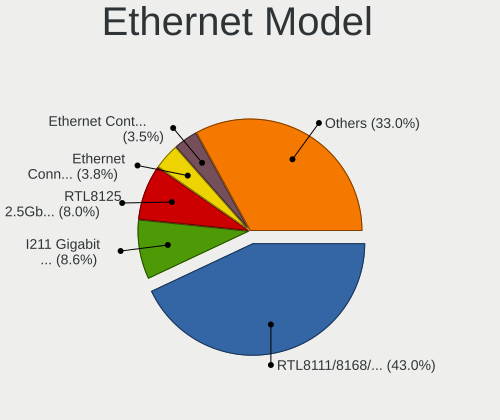

| Model                                                                          | Desktops | Percent |
|--------------------------------------------------------------------------------|----------|---------|
| Realtek RTL8111/8168/8211/8411 PCI Express Gigabit Ethernet Controller         | 1709     | 43%     |
| Intel I211 Gigabit Network Connection                                          | 343      | 8.63%   |
| Realtek RTL8125 2.5GbE Controller                                              | 319      | 8.03%   |
| Intel Ethernet Connection (2) I219-V                                           | 152      | 3.82%   |
| Intel Ethernet Controller I225-V                                               | 140      | 3.52%   |
| Intel 82579LM Gigabit Network Connection (Lewisville)                          | 100      | 2.52%   |
| Intel Ethernet Connection (7) I219-V                                           | 71       | 1.79%   |
| Intel 82579V Gigabit Network Connection                                        | 59       | 1.48%   |
| Intel Ethernet Connection I217-LM                                              | 54       | 1.36%   |
| Intel Ethernet Connection (2) I218-V                                           | 50       | 1.26%   |
| Intel Ethernet Connection I217-V                                               | 44       | 1.11%   |
| Realtek RTL810xE PCI Express Fast Ethernet controller                          | 38       | 0.96%   |
| Qualcomm Atheros Killer E220x Gigabit Ethernet Controller                      | 32       | 0.81%   |
| Intel 82574L Gigabit Network Connection                                        | 32       | 0.81%   |
| Realtek RTL8153 Gigabit Ethernet Adapter                                       | 29       | 0.73%   |
| Intel Ethernet Connection (2) I219-LM                                          | 25       | 0.63%   |
| Nvidia MCP61 Ethernet                                                          | 24       | 0.6%    |
| Aquantia AQtion AQC107 NBase-T/IEEE 802.3an Ethernet Controller [Atlantic 10G] | 24       | 0.6%    |
| Qualcomm Atheros Killer E2500 Gigabit Ethernet Controller                      | 23       | 0.58%   |
| Intel Ethernet Controller I226-V                                               | 23       | 0.58%   |
| Samsung Galaxy series, misc. (tethering mode)                                  | 22       | 0.55%   |
| Qualcomm Atheros AR8151 v2.0 Gigabit Ethernet                                  | 19       | 0.48%   |
| Intel I210 Gigabit Network Connection                                          | 19       | 0.48%   |
| Intel Ethernet Connection (7) I219-LM                                          | 19       | 0.48%   |
| Intel Ethernet Connection (14) I219-V                                          | 18       | 0.45%   |
| Intel 82567LM-3 Gigabit Network Connection                                     | 18       | 0.45%   |
| Xiaomi Mi/Redmi series (RNDIS)                                                 | 17       | 0.43%   |
| Samsung GT-I9070 (network tethering, USB debugging enabled)                    | 16       | 0.4%    |
| Realtek RTL-8100/8101L/8139 PCI Fast Ethernet Adapter                          | 16       | 0.4%    |
| Qualcomm Atheros Killer E2400 Gigabit Ethernet Controller                      | 16       | 0.4%    |
| Realtek Killer E3000 2.5GbE Controller                                         | 15       | 0.38%   |
| Intel Ethernet Connection (2) I218-LM                                          | 14       | 0.35%   |
| Realtek RTL8126 5GbE Controller                                                | 13       | 0.33%   |
| Qualcomm Atheros AR8161 Gigabit Ethernet                                       | 13       | 0.33%   |
| Marvell Group 88E8056 PCI-E Gigabit Ethernet Controller                        | 13       | 0.33%   |
| Intel Ethernet Connection (11) I219-V                                          | 13       | 0.33%   |
| Intel 82566DM-2 Gigabit Network Connection                                     | 11       | 0.28%   |
| Realtek RTL8169 PCI Gigabit Ethernet Controller                                | 10       | 0.25%   |
| Qualcomm Atheros AR8121/AR8113/AR8114 Gigabit or Fast Ethernet                 | 10       | 0.25%   |
| Intel Ethernet Connection (12) I219-V                                          | 10       | 0.25%   |

Net Controller Kind
-------------------

Ethernet, WiFi or modem

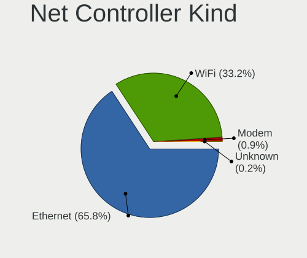

| Kind     | Desktops | Percent |
|----------|----------|---------|
| Ethernet | 3492     | 65.76%  |
| WiFi     | 1761     | 33.16%  |
| Modem    | 46       | 0.87%   |
| Unknown  | 11       | 0.21%   |

Used Controller
---------------

Currently used network controller

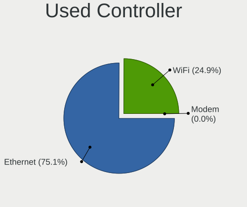

| Kind     | Desktops | Percent |
|----------|----------|---------|
| Ethernet | 2772     | 75.06%  |
| WiFi     | 920      | 24.91%  |
| Modem    | 1        | 0.03%   |

NICs
----

Total network controllers on board

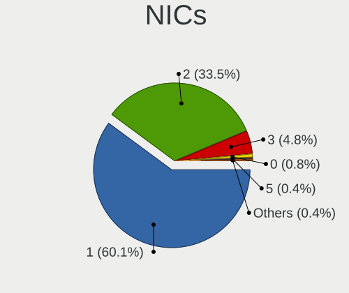

| Total | Desktops | Percent |
|-------|----------|---------|
| 1     | 2152     | 60.13%  |
| 2     | 1200     | 33.53%  |
| 3     | 172      | 4.81%   |
| 0     | 27       | 0.75%   |
| 5     | 13       | 0.36%   |
| 4     | 13       | 0.36%   |
| 8     | 1        | 0.03%   |
| 7     | 1        | 0.03%   |

IPv6
----

IPv6 vs IPv4

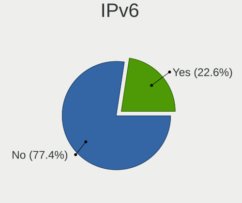

| Used | Desktops | Percent |
|------|----------|---------|
| No   | 2792     | 77.41%  |
| Yes  | 815      | 22.59%  |

Bluetooth
---------

Bluetooth Vendor
----------------

Controller vendors

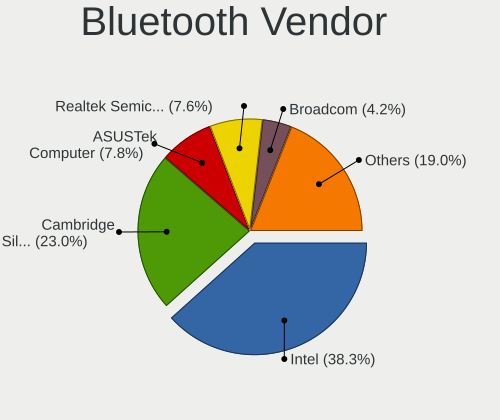

| Vendor                          | Desktops | Percent |
|---------------------------------|----------|---------|
| Intel                           | 648      | 38.34%  |
| Cambridge Silicon Radio         | 389      | 23.02%  |
| ASUSTek Computer                | 132      | 7.81%   |
| Realtek Semiconductor           | 129      | 7.63%   |
| Broadcom                        | 71       | 4.2%    |
| MediaTek                        | 59       | 3.49%   |
| IMC Networks                    | 51       | 3.02%   |
| Foxconn / Hon Hai               | 48       | 2.84%   |
| TP-Link                         | 45       | 2.66%   |
| Qualcomm Atheros Communications | 23       | 1.36%   |
| Apple                           | 20       | 1.18%   |
| Edimax Technology               | 11       | 0.65%   |
| Realtek                         | 9        | 0.53%   |
| Dynex                           | 8        | 0.47%   |
| Integrated System Solution      | 6        | 0.36%   |
| Belkin Components               | 6        | 0.36%   |
| Lite-On Technology              | 5        | 0.3%    |
| HTC (High Tech Computer)        | 5        | 0.3%    |
| Actions                         | 5        | 0.3%    |
| SINO WEALTH                     | 4        | 0.24%   |
| Conwise Technology              | 4        | 0.24%   |
| Unknown                         | 4        | 0.24%   |
| Ralink                          | 2        | 0.12%   |
| Micro Star International        | 2        | 0.12%   |
| Sitecom Europe                  | 1        | 0.06%   |
| Mercucys                        | 1        | 0.06%   |
| Hewlett-Packard                 | 1        | 0.06%   |
| D-Link                          | 1        | 0.06%   |

Bluetooth Model
---------------

Controller models

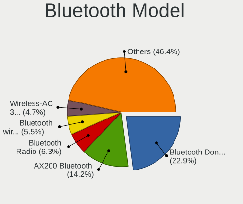

| Model                                                                | Desktops | Percent |
|----------------------------------------------------------------------|----------|---------|
| Cambridge Silicon Radio Bluetooth Dongle (HCI mode)                  | 389      | 22.95%  |
| Intel AX200 Bluetooth                                                | 240      | 14.16%  |
| Realtek Bluetooth Radio                                              | 106      | 6.25%   |
| Intel Bluetooth wireless interface                                   | 93       | 5.49%   |
| Intel Wireless-AC 3168 Bluetooth                                     | 80       | 4.72%   |
| Intel AX210 Bluetooth                                                | 60       | 3.54%   |
| MediaTek Wireless_Device                                             | 59       | 3.48%   |
| Intel Wireless-AC 9260 Bluetooth Adapter                             | 58       | 3.42%   |
| Broadcom BCM20702A0 Bluetooth 4.0                                    | 50       | 2.95%   |
| TP-Link TP-T@- UB500 Adapter                                         | 45       | 2.65%   |
| Intel AX201 Bluetooth                                                | 43       | 2.54%   |
| Intel Bluetooth 9460/9560 Jefferson Peak (JfP)                       | 39       | 2.3%    |
| ASUS Broadcom BCM20702A0 Bluetooth                                   | 37       | 2.18%   |
| Intel Bluetooth Device                                               | 36       | 2.12%   |
| ASUS ASUS USB-BT500                                                  | 36       | 2.12%   |
| IMC Networks Bluetooth Radio                                         | 28       | 1.65%   |
| Foxconn / Hon Hai Wireless_Device                                    | 28       | 1.65%   |
| IMC Networks Wireless_Device                                         | 17       | 1%      |
| ASUS Bluetooth Radio                                                 | 17       | 1%      |
| Foxconn / Hon Hai Bluetooth Device                                   | 15       | 0.88%   |
| ASUS Bluetooth Adapter                                               | 15       | 0.88%   |
| Realtek  Bluetooth 4.2 Adapter                                       | 12       | 0.71%   |
| ASUS BCM20702A0                                                      | 12       | 0.71%   |
| Qualcomm Atheros  Bluetooth Device                                   | 11       | 0.65%   |
| Realtek Bluetooth Radio                                              | 9        | 0.53%   |
| Edimax Bluetooth Device                                              | 9        | 0.53%   |
| Apple Bluetooth Host Controller                                      | 9        | 0.53%   |
| Dynex Bluetooth 4.0 Adapter [Broadcom, 1.12, BCM20702A0]             | 8        | 0.47%   |
| ASUS Qualcomm Bluetooth 4.1                                          | 8        | 0.47%   |
| Apple Built-in Bluetooth 2.0+EDR HCI                                 | 6        | 0.35%   |
| Qualcomm Atheros AR3011 Bluetooth                                    | 5        | 0.29%   |
| HTC (High Tech Computer) Vive Hub Bluetooth 4.1 (Broadcom BCM920703) | 5        | 0.29%   |
| ASUS Broadcom BCM20702 Single-Chip Bluetooth 4.0 + LE                | 5        | 0.29%   |
| Actions general adapter                                              | 5        | 0.29%   |
| SINO WEALTH Bluetooth Keyboard                                       | 4        | 0.24%   |
| Realtek Bluetooth 5.3 Radio                                          | 4        | 0.24%   |
| Integrated System Solution Bluetooth Device                          | 4        | 0.24%   |
| IMC Networks BCM20702A0                                              | 4        | 0.24%   |
| Conwise CW6622                                                       | 4        | 0.24%   |
| Broadcom Bluetooth 2.0+eDR dongle                                    | 4        | 0.24%   |

Sound
-----

Sound Vendor
------------

Sound card vendors

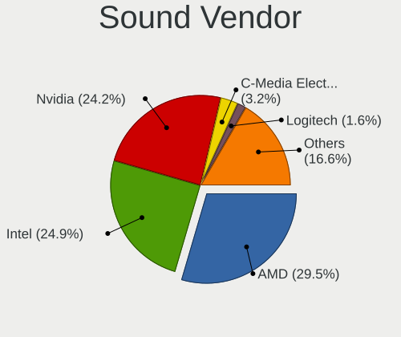

| Vendor                   | Desktops | Percent |
|--------------------------|----------|---------|
| AMD                      | 2061     | 29.54%  |
| Intel                    | 1738     | 24.91%  |
| Nvidia                   | 1687     | 24.18%  |
| C-Media Electronics      | 222      | 3.18%   |
| Logitech                 | 109      | 1.56%   |
| Creative Labs            | 81       | 1.16%   |
| Kingston Technology      | 65       | 0.93%   |
| JMTek                    | 56       | 0.8%    |
| Texas Instruments        | 55       | 0.79%   |
| ASUSTek Computer         | 52       | 0.75%   |
| Focusrite-Novation       | 50       | 0.72%   |
| Corsair                  | 50       | 0.72%   |
| Razer USA                | 47       | 0.67%   |
| Creative Technology      | 43       | 0.62%   |
| SteelSeries ApS          | 40       | 0.57%   |
| Generalplus Technology   | 32       | 0.46%   |
| Blue Microphones         | 29       | 0.42%   |
| Micro Star International | 26       | 0.37%   |
| BEHRINGER International  | 23       | 0.33%   |
| Sony                     | 20       | 0.29%   |
| GN Netcom                | 20       | 0.29%   |
| Plantronics              | 16       | 0.23%   |
| Realtek Semiconductor    | 14       | 0.2%    |
| Samson Technologies      | 13       | 0.19%   |
| GYROCOM C&C              | 13       | 0.19%   |
| VIA Technologies         | 12       | 0.17%   |
| Giga-Byte Technology     | 12       | 0.17%   |
| FIFINE Microphones       | 12       | 0.17%   |
| Audio-Technica           | 12       | 0.17%   |
| Yamaha                   | 11       | 0.16%   |
| RODE Microphones         | 11       | 0.16%   |
| Astro Gaming             | 11       | 0.16%   |
| Turtle Beach             | 10       | 0.14%   |
| Trust                    | 10       | 0.14%   |
| Microsoft                | 10       | 0.14%   |
| M-Audio                  | 10       | 0.14%   |
| DSEA A/S                 | 10       | 0.14%   |
| KTMicro                  | 9        | 0.13%   |
| Hewlett-Packard          | 9        | 0.13%   |
| Dell                     | 9        | 0.13%   |

Sound Model
-----------

Sound card models

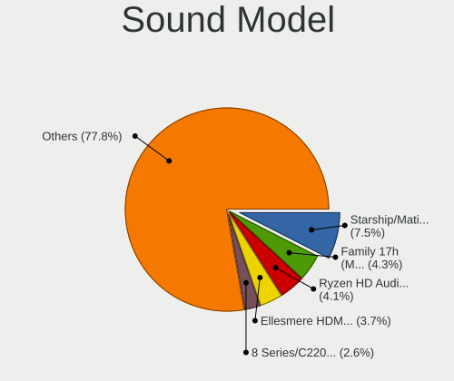

| Model                                                                      | Desktops | Percent |
|----------------------------------------------------------------------------|----------|---------|
| AMD Starship/Matisse HD Audio Controller                                   | 623      | 7.52%   |
| AMD Family 17h (Models 00h-0fh) HD Audio Controller                        | 359      | 4.33%   |
| AMD Ryzen HD Audio Controller                                              | 343      | 4.14%   |
| AMD Ellesmere HDMI Audio [Radeon RX 470/480 / 570/580/590]                 | 305      | 3.68%   |
| Intel 8 Series/C220 Series Chipset High Definition Audio Controller        | 214      | 2.58%   |
| AMD SBx00 Azalia (Intel HDA)                                               | 207      | 2.5%    |
| Intel 6 Series/C200 Series Chipset Family High Definition Audio Controller | 184      | 2.22%   |
| Intel 200 Series PCH HD Audio                                              | 177      | 2.14%   |
| AMD Navi 21/23 HDMI/DP Audio Controller                                    | 168      | 2.03%   |
| Intel 100 Series/C230 Series Chipset Family HD Audio Controller            | 158      | 1.91%   |
| Nvidia GP106 High Definition Audio Controller                              | 152      | 1.83%   |
| Nvidia GP104 High Definition Audio Controller                              | 152      | 1.83%   |
| Intel 7 Series/C216 Chipset Family High Definition Audio Controller        | 150      | 1.81%   |
| AMD Navi 10 HDMI Audio                                                     | 142      | 1.71%   |
| Intel Cannon Lake PCH cAVS                                                 | 141      | 1.7%    |
| Nvidia GP107GL High Definition Audio Controller                            | 138      | 1.67%   |
| Intel Xeon E3-1200 v3/4th Gen Core Processor HD Audio Controller           | 124      | 1.5%    |
| AMD Radeon High Definition Audio Controller                                | 113      | 1.36%   |
| AMD Renoir/Cezanne HDMI/DP Audio Controller                                | 110      | 1.33%   |
| Nvidia GK208 HDMI/DP Audio Controller                                      | 109      | 1.32%   |
| Nvidia TU116 High Definition Audio Controller                              | 97       | 1.17%   |
| Nvidia GA104 High Definition Audio Controller                              | 94       | 1.13%   |
| AMD Oland/Hainan/Cape Verde/Pitcairn HDMI Audio [Radeon HD 7000 Series]    | 93       | 1.12%   |
| AMD Baffin HDMI/DP Audio [Radeon RX 550 640SP / RX 560/560X]               | 92       | 1.11%   |
| AMD FCH Azalia Controller                                                  | 82       | 0.99%   |
| Nvidia TU106 High Definition Audio Controller                              | 81       | 0.98%   |
| Nvidia GM107 High Definition Audio Controller [GeForce 940MX]              | 79       | 0.95%   |
| AMD Raven/Raven2/Fenghuang HDMI/DP Audio Controller                        | 76       | 0.92%   |
| Nvidia TU104 HD Audio Controller                                           | 73       | 0.88%   |
| Nvidia GM204 High Definition Audio Controller                              | 71       | 0.86%   |
| Intel 9 Series Chipset Family HD Audio Controller                          | 71       | 0.86%   |
| AMD Navi 31 HDMI/DP Audio                                                  | 70       | 0.84%   |
| Intel Alder Lake-S HD Audio Controller                                     | 66       | 0.8%    |
| Intel C610/X99 series chipset HD Audio Controller                          | 60       | 0.72%   |
| Nvidia GA102 High Definition Audio Controller                              | 58       | 0.7%    |
| Intel NM10/ICH7 Family High Definition Audio Controller                    | 58       | 0.7%    |
| Intel 82801JI (ICH10 Family) HD Audio Controller                           | 58       | 0.7%    |
| Nvidia GP108 High Definition Audio Controller                              | 56       | 0.68%   |
| Nvidia GA106 High Definition Audio Controller                              | 53       | 0.64%   |
| Intel Raptor Lake High Definition Audio Controller                         | 50       | 0.6%    |

Memory
------

Memory Vendor
-------------

Memory module vendors

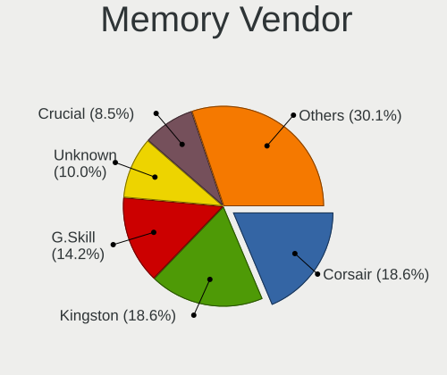

| Vendor                       | Desktops | Percent |
|------------------------------|----------|---------|
| Corsair                      | 399      | 18.64%  |
| Kingston                     | 397      | 18.55%  |
| G.Skill                      | 304      | 14.21%  |
| Unknown                      | 214      | 10%     |
| Crucial                      | 181      | 8.46%   |
| Samsung Electronics          | 123      | 5.75%   |
| SK hynix                     | 87       | 4.07%   |
| Micron Technology            | 78       | 3.64%   |
| A-DATA Technology            | 57       | 2.66%   |
| Team                         | 56       | 2.62%   |
| Patriot                      | 38       | 1.78%   |
| Unknown                      | 29       | 1.36%   |
| Nanya Technology             | 14       | 0.65%   |
| GOODRAM                      | 13       | 0.61%   |
| Elpida                       | 11       | 0.51%   |
| Ramaxel Technology           | 10       | 0.47%   |
| Unknown (ABCD)               | 8        | 0.37%   |
| AMD                          | 8        | 0.37%   |
| Patriot Memory (PDP Systems) | 7        | 0.33%   |
| Kllisre                      | 5        | 0.23%   |
| GeIL                         | 5        | 0.23%   |
| Transcend                    | 4        | 0.19%   |
| Smart                        | 4        | 0.19%   |
| Silicon Power                | 4        | 0.19%   |
| PNY                          | 4        | 0.19%   |
| Neo Forza                    | 4        | 0.19%   |
| KLEVV                        | 4        | 0.19%   |
| Kingmax                      | 4        | 0.19%   |
| Patriot Memory               | 3        | 0.14%   |
| Lexar Co Limited             | 3        | 0.14%   |
| CSX                          | 3        | 0.14%   |
| Apacer                       | 3        | 0.14%   |
| Unknown (0x0080)             | 2        | 0.09%   |
| Unknown (08C8)               | 2        | 0.09%   |
| SemsoTai                     | 2        | 0.09%   |
| Qumo                         | 2        | 0.09%   |
| Hewlett-Packard              | 2        | 0.09%   |
| Wilk Elektronik              | 1        | 0.05%   |
| Wilk                         | 1        | 0.05%   |
| Unknown (AB)                 | 1        | 0.05%   |

Memory Model
------------

Memory module models

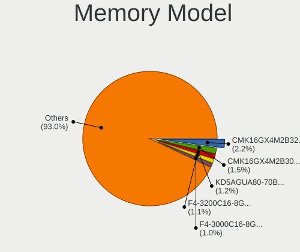

| Model                                                          | Desktops | Percent |
|----------------------------------------------------------------|----------|---------|
| Corsair RAM CMK16GX4M2B3200C16 8GB DIMM DDR4 3600MT/s          | 51       | 2.16%   |
| Corsair RAM CMK16GX4M2B3000C15 8GB DIMM DDR4 3600MT/s          | 36       | 1.53%   |
| Unknown                                                        | 29       | 1.23%   |
| G.Skill RAM F4-3200C16-8GVKB 8GB DIMM DDR4 4000MT/s            | 25       | 1.06%   |
| G.Skill RAM F4-3000C16-8GISB 8GB DIMM DDR4 3200MT/s            | 24       | 1.02%   |
| Kingston RAM KHX2666C16/8G 8GiB DIMM DDR4 3466MT/s             | 23       | 0.98%   |
| Kingston RAM KHX1600C10D3/8G 8GB DIMM DDR3 2133MT/s            | 20       | 0.85%   |
| G.Skill RAM F4-3200C16-16GVK 16GB DIMM DDR4 3600MT/s           | 20       | 0.85%   |
| Kingston RAM KHX3200C16D4/8GX 8GB DIMM DDR4 3733MT/s           | 18       | 0.76%   |
| Kingston RAM KHX3200C16D4/16GX 16GB DIMM DDR4 3600MT/s         | 15       | 0.64%   |
| Kingston RAM KHX2400C15/8G 8GB DIMM DDR4 3400MT/s              | 15       | 0.64%   |
| Corsair RAM CMK32GX4M2B3200C16 16GB DIMM DDR4 3800MT/s         | 15       | 0.64%   |
| Unknown RAM Module 4GB DIMM 1333MT/s                           | 14       | 0.59%   |
| Team RAM TEAMGROUP-UD4-3200 8GB DIMM DDR4 3800MT/s             | 14       | 0.59%   |
| Kingston RAM KF3200C16D4/8GX 8GiB DIMM DDR4 3600MT/s           | 13       | 0.55%   |
| Patriot RAM 3200 C16 Series 8GB DIMM DDR4 3600MT/s             | 12       | 0.51%   |
| Kingston RAM KHX1600C9D3/4GX 4GB DIMM DDR3 1867MT/s            | 11       | 0.47%   |
| Corsair RAM CMK16GX4M2A2666C16 8GB DIMM DDR4 3400MT/s          | 11       | 0.47%   |
| A-DATA RAM DDR4 3000 8GB DIMM DDR4 3600MT/s                    | 11       | 0.47%   |
| Unknown RAM Module 4096MB DIMM 1333MT/s                        | 10       | 0.42%   |
| Micron RAM 8JTF51264AZ-1G6E1 4GB DIMM DDR3 1600MT/s            | 10       | 0.42%   |
| G.Skill RAM F4-3200C16-8GTZR 8GB DIMM DDR4 3200MT/s            | 10       | 0.42%   |
| Corsair RAM CMW16GX4M2C3200C16 8GB DIMM DDR4 3733MT/s          | 10       | 0.42%   |
| Corsair RAM CMK32GX4M2D3600C18 16GB DIMM DDR4 3800MT/s         | 10       | 0.42%   |
| Corsair RAM CMK16GX4M2D3000C16 8GB DIMM DDR4 3400MT/s          | 10       | 0.42%   |
| Unknown RAM Module 8GB DIMM DDR3 1600MT/s                      | 9        | 0.38%   |
| Team RAM TEAMGROUP-UD4-3000 8GB DIMM DDR4 3200MT/s             | 9        | 0.38%   |
| Kingston RAM KHX2133C14D4/8G 8GB DIMM DDR4 3000MT/s            | 9        | 0.38%   |
| Kingston RAM KHX1866C10D3/8G 8GB DIMM DDR3 1867MT/s            | 9        | 0.38%   |
| Kingston RAM 99U5471-012.A00LF 4GB DIMM DDR3 1333MT/s          | 9        | 0.38%   |
| G.Skill RAM F4-3200C16-8GIS 8GB DIMM DDR4 3600MT/s             | 9        | 0.38%   |
| Corsair RAM CMZ8GX3M2A1600C9 4GB DIMM SDRAM 1800MT/s           | 9        | 0.38%   |
| Corsair RAM CMK32GX4M2E3200C16 16GB DIMM DDR4 3600MT/s         | 9        | 0.38%   |
| Unknown (ABCD) RAM 123456789012345678 2GB DIMM LPDDR4 2133MT/s | 8        | 0.34%   |
| Kingston RAM KHX1866C10D3/4G 4GB DIMM DDR3 1867MT/s            | 8        | 0.34%   |
| G.Skill RAM F4-3600C16-16GVKC 16GB DIMM DDR4 3866MT/s          | 8        | 0.34%   |
| Unknown RAM Module 2048MB DIMM 1333MT/s                        | 7        | 0.3%    |
| Samsung RAM M378B5173DB0-CK0 4096MB DIMM DDR3 1600MT/s         | 7        | 0.3%    |
| G.Skill RAM F4-3200C16-8GVGB 8GB DIMM DDR4 3200MT/s            | 7        | 0.3%    |
| G.Skill RAM F4-3200C16-16GIS 16GB DIMM DDR4 3600MT/s           | 7        | 0.3%    |

Memory Kind
-----------

Memory module kinds

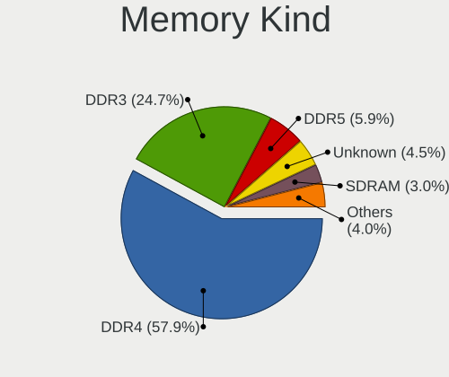

| Kind    | Desktops | Percent |
|---------|----------|---------|
| DDR4    | 1114     | 57.93%  |
| DDR3    | 475      | 24.7%   |
| DDR5    | 114      | 5.93%   |
| Unknown | 86       | 4.47%   |
| SDRAM   | 57       | 2.96%   |
| DDR2    | 45       | 2.34%   |
| DDR     | 13       | 0.68%   |
| LPDDR4  | 10       | 0.52%   |
| DRAM    | 6        | 0.31%   |
| LPDDR5  | 2        | 0.1%    |
| LPDDR3  | 1        | 0.05%   |

Memory Form Factor
------------------

Physical design of the memory module

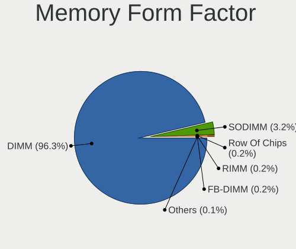

| Name         | Desktops | Percent |
|--------------|----------|---------|
| DIMM         | 1826     | 96.31%  |
| SODIMM       | 60       | 3.16%   |
| Row Of Chips | 3        | 0.16%   |
| RIMM         | 3        | 0.16%   |
| FB-DIMM      | 3        | 0.16%   |
| Chip         | 1        | 0.05%   |

Memory Size
-----------

Memory module size

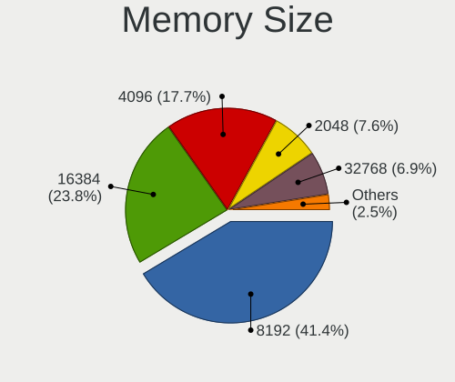

| Size  | Desktops | Percent |
|-------|----------|---------|
| 8192  | 864      | 41.4%   |
| 16384 | 497      | 23.81%  |
| 4096  | 370      | 17.73%  |
| 2048  | 159      | 7.62%   |
| 32768 | 145      | 6.95%   |
| 1024  | 41       | 1.96%   |
| 49152 | 4        | 0.19%   |
| 512   | 4        | 0.19%   |
| 65536 | 1        | 0.05%   |
| 24576 | 1        | 0.05%   |
| 3072  | 1        | 0.05%   |

Memory Speed
------------

Memory module speed

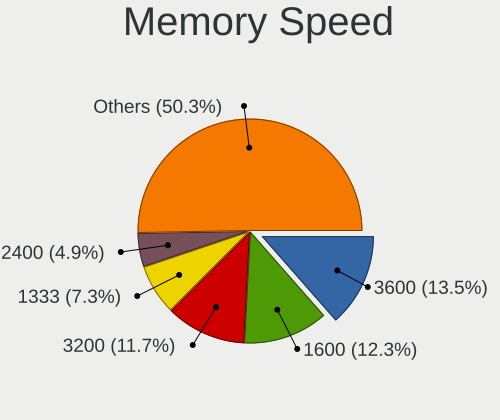

| Speed   | Desktops | Percent |
|---------|----------|---------|
| 3600    | 290      | 13.53%  |
| 1600    | 264      | 12.31%  |
| 3200    | 250      | 11.66%  |
| 1333    | 157      | 7.32%   |
| 2400    | 105      | 4.9%    |
| 2133    | 105      | 4.9%    |
| 2667    | 86       | 4.01%   |
| 3800    | 72       | 3.36%   |
| 3400    | 63       | 2.94%   |
| 3733    | 57       | 2.66%   |
| 3000    | 56       | 2.61%   |
| 800     | 50       | 2.33%   |
| 4000    | 46       | 2.15%   |
| 6000    | 44       | 2.05%   |
| 1866    | 44       | 2.05%   |
| 1867    | 37       | 1.73%   |
| 3466    | 35       | 1.63%   |
| 667     | 30       | 1.4%    |
| 2666    | 27       | 1.26%   |
| 1800    | 25       | 1.17%   |
| Unknown | 20       | 0.93%   |
| 2933    | 18       | 0.84%   |
| 5600    | 16       | 0.75%   |
| 2800    | 16       | 0.75%   |
| 1066    | 16       | 0.75%   |
| 6400    | 15       | 0.7%    |
| 3866    | 15       | 0.7%    |
| 3333    | 11       | 0.51%   |
| 4800    | 10       | 0.47%   |
| 3666    | 8        | 0.37%   |
| 3334    | 8        | 0.37%   |
| 6200    | 7        | 0.33%   |
| 5200    | 7        | 0.33%   |
| 3266    | 7        | 0.33%   |
| 3100    | 7        | 0.33%   |
| 3066    | 7        | 0.33%   |
| 1334    | 7        | 0.33%   |
| 12800   | 6        | 0.28%   |
| 2448    | 6        | 0.28%   |
| 1648    | 5        | 0.23%   |

Printers & scanners
-------------------

Printer Vendor
--------------

Printer device vendors

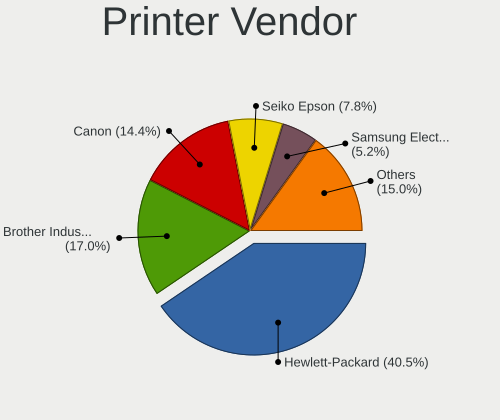

| Vendor                | Desktops | Percent |
|-----------------------|----------|---------|
| Hewlett-Packard       | 62       | 40.52%  |
| Brother Industries    | 26       | 16.99%  |
| Canon                 | 22       | 14.38%  |
| Seiko Epson           | 12       | 7.84%   |
| Samsung Electronics   | 8        | 5.23%   |
| Prolific Technology   | 3        | 1.96%   |
| Pantum                | 3        | 1.96%   |
| Apple                 | 3        | 1.96%   |
| Xerox                 | 2        | 1.31%   |
| STMicroelectronics    | 2        | 1.31%   |
| Ricoh                 | 2        | 1.31%   |
| Zebra                 | 1        | 0.65%   |
| QinHeng Electronics   | 1        | 0.65%   |
| Oki Data              | 1        | 0.65%   |
| Lexmark International | 1        | 0.65%   |
| Kyocera               | 1        | 0.65%   |
| Graphtec America      | 1        | 0.65%   |
| Dymo-CoStar           | 1        | 0.65%   |
| Dell                  | 1        | 0.65%   |

Printer Model
-------------

Printer device models

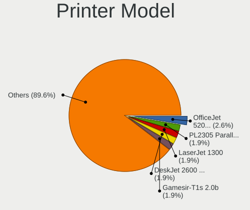

| Model                                                     | Desktops | Percent |
|-----------------------------------------------------------|----------|---------|
| HP OfficeJet 5200 series                                  | 4        | 2.6%    |
| Prolific PL2305 Parallel Port                             | 3        | 1.95%   |
| HP LaserJet 1300                                          | 3        | 1.95%   |
| HP DeskJet 2600 series                                    | 3        | 1.95%   |
| Apple Gamesir-T1s 2.0b                                    | 3        | 1.95%   |
| Xerox Phaser 3020                                         | 2        | 1.3%    |
| STMicroelectronics LED badge -- mini LED display -- 11x44 | 2        | 1.3%    |
| Seiko Epson L6270 Series                                  | 2        | 1.3%    |
| Seiko Epson L120 Series                                   | 2        | 1.3%    |
| Samsung ML-1640 Series Laser Printer                      | 2        | 1.3%    |
| Samsung M2020 Series                                      | 2        | 1.3%    |
| HP Smart Tank Plus 550 series                             | 2        | 1.3%    |
| HP Officejet 2620 series                                  | 2        | 1.3%    |
| HP LaserJet 3020                                          | 2        | 1.3%    |
| HP HP OfficeJet Pro 8020 series                           | 2        | 1.3%    |
| HP HP LaserJet Professional P1606dn                       | 2        | 1.3%    |
| HP ENVY 6000 series                                       | 2        | 1.3%    |
| HP ENVY 5000 series                                       | 2        | 1.3%    |
| HP DeskJet F4200 series                                   | 2        | 1.3%    |
| HP DeskJet 4530 series                                    | 2        | 1.3%    |
| HP DeskJet 3630 series                                    | 2        | 1.3%    |
| HP DeskJet 2700 series                                    | 2        | 1.3%    |
| HP DeskJet 2130 series                                    | 2        | 1.3%    |
| HP Color LaserJet Pro M453-4                              | 2        | 1.3%    |
| Canon PIXMA MX340                                         | 2        | 1.3%    |
| Canon PIXMA MP250                                         | 2        | 1.3%    |
| Canon PIXMA MG2500 Series                                 | 2        | 1.3%    |
| Canon MG5700 series                                       | 2        | 1.3%    |
| Canon LiDE 400                                            | 2        | 1.3%    |
| Canon G3010 series                                        | 2        | 1.3%    |
| Brother HL-5370DW series                                  | 2        | 1.3%    |
| Brother DCP-7040                                          | 2        | 1.3%    |
| Brother DCP-1610W                                         | 2        | 1.3%    |
| Zebra ZTC ZC100                                           | 1        | 0.65%   |
| Seiko Epson XP-4100 Series                                | 1        | 0.65%   |
| Seiko Epson XP-3100 Series                                | 1        | 0.65%   |
| Seiko Epson Stylus NX230/SX235W Series                    | 1        | 0.65%   |
| Seiko Epson ME 320/330 Series [Stylus SX125]              | 1        | 0.65%   |
| Seiko Epson L805 Series                                   | 1        | 0.65%   |
| Seiko Epson L380 Series                                   | 1        | 0.65%   |

Scanner Vendor
--------------

Scanner device vendors

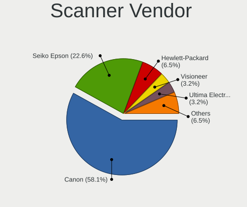

| Vendor             | Desktops | Percent |
|--------------------|----------|---------|
| Canon              | 18       | 58.06%  |
| Seiko Epson        | 7        | 22.58%  |
| Hewlett-Packard    | 2        | 6.45%   |
| Visioneer          | 1        | 3.23%   |
| Ultima Electronics | 1        | 3.23%   |
| Mustek Systems     | 1        | 3.23%   |
| AGFA-Gevaert NV    | 1        | 3.23%   |

Scanner Model
-------------

Scanner device models

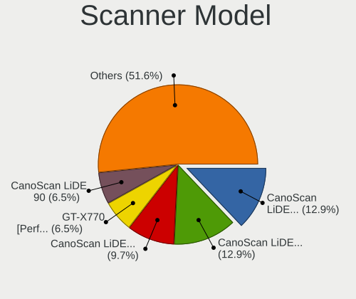

| Model                                                                                 | Desktops | Percent |
|---------------------------------------------------------------------------------------|----------|---------|
| Canon CanoScan LiDE 210                                                               | 4        | 12.9%   |
| Canon CanoScan LiDE 110                                                               | 4        | 12.9%   |
| Canon CanoScan LiDE 220                                                               | 3        | 9.68%   |
| Seiko Epson GT-X770 [Perfection V500]                                                 | 2        | 6.45%   |
| Canon CanoScan LiDE 90                                                                | 2        | 6.45%   |
| Canon CanoScan LIDE 25                                                                | 2        | 6.45%   |
| Visioneer OneTouch 5300 USB                                                           | 1        | 3.23%   |
| Ultima Artec Ultima 2000 (GT6801 based)/Lifetec LT9385/ScanMagic 1200 UB Plus Scanner | 1        | 3.23%   |
| Seiko Epson Perfection V37/V370                                                       | 1        | 3.23%   |
| Seiko Epson GT-X750 [Perfection 4490 Photo]                                           | 1        | 3.23%   |
| Seiko Epson GT-F730 [GT-S630/Perfection V33/V330 Photo]                               | 1        | 3.23%   |
| Seiko Epson GT-9700F [Perfection 2450 PHOTO]                                          | 1        | 3.23%   |
| Seiko Epson GT-7200U [Perfection 1250/1250 PHOTO]                                     | 1        | 3.23%   |
| Mustek Systems ScanExpress A3 USB 1200 PRO                                            | 1        | 3.23%   |
| HP ScanJet 3500c                                                                      | 1        | 3.23%   |
| HP ScanJet 3400cse                                                                    | 1        | 3.23%   |
| Canon CanoScan N670U/N676U/LiDE 20                                                    | 1        | 3.23%   |
| Canon CanoScan LiDE 120                                                               | 1        | 3.23%   |
| Canon CanoScan                                                                        | 1        | 3.23%   |
| AGFA-Gevaert NV SnapScan e26                                                          | 1        | 3.23%   |

Camera
------

Camera Vendor
-------------

Camera device vendors

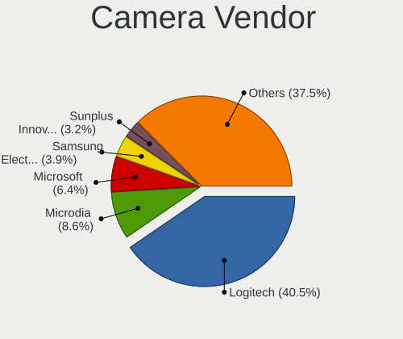

| Vendor                        | Desktops | Percent |
|-------------------------------|----------|---------|
| Logitech                      | 354      | 40.46%  |
| Microdia                      | 75       | 8.57%   |
| Microsoft                     | 56       | 6.4%    |
| Samsung Electronics           | 34       | 3.89%   |
| Sunplus Innovation Technology | 28       | 3.2%    |
| Z-Star Microelectronics       | 22       | 2.51%   |
| Creative Technology           | 18       | 2.06%   |
| Generalplus Technology        | 17       | 1.94%   |
| Apple                         | 14       | 1.6%    |
| MacroSilicon                  | 13       | 1.49%   |
| GEMBIRD                       | 12       | 1.37%   |
| Cubeternet                    | 12       | 1.37%   |
| Realtek Semiconductor         | 11       | 1.26%   |
| ARC International             | 11       | 1.26%   |
| KYE Systems (Mouse Systems)   | 9        | 1.03%   |
| Chicony Electronics           | 8        | 0.91%   |
| Razer USA                     | 7        | 0.8%    |
| Google                        | 7        | 0.8%    |
| webcam                        | 6        | 0.69%   |
| LG Electronics                | 6        | 0.69%   |
| Jieli Technology              | 6        | 0.69%   |
| Genesys Logic                 | 6        | 0.69%   |
| AVerMedia Technologies        | 6        | 0.69%   |
| Aveo Technology               | 6        | 0.69%   |
| Valve Software                | 5        | 0.57%   |
| SunplusIT                     | 5        | 0.57%   |
| Pixart Imaging                | 5        | 0.57%   |
| Huawei Technologies           | 5        | 0.57%   |
| Alcor Micro                   | 5        | 0.57%   |
| Sonix Technology              | 4        | 0.46%   |
| Linux Foundation              | 4        | 0.46%   |
| eMeet                         | 4        | 0.46%   |
| Elgato Systems                | 4        | 0.46%   |
| Arkmicro Technologies         | 4        | 0.46%   |
| A4Tech                        | 4        | 0.46%   |
| Xiongmai                      | 3        | 0.34%   |
| WCM_USB                       | 3        | 0.34%   |
| Trust                         | 3        | 0.34%   |
| SHENZHEN EMEET TECHNOLOGY     | 3        | 0.34%   |
| Philips (or NXP)              | 3        | 0.34%   |

Camera Model
------------

Camera device models

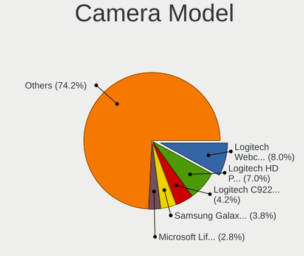

| Model                                                 | Desktops | Percent |
|-------------------------------------------------------|----------|---------|
| Logitech Webcam C270                                  | 70       | 7.95%   |
| Logitech HD Pro Webcam C920                           | 62       | 7.05%   |
| Logitech C922 Pro Stream Webcam                       | 37       | 4.2%    |
| Samsung Galaxy series, misc. (MTP mode)               | 33       | 3.75%   |
| Microsoft LifeCam HD-3000                             | 25       | 2.84%   |
| Microdia Webcam Vitade AF                             | 25       | 2.84%   |
| Microdia USB 2.0 Camera                               | 19       | 2.16%   |
| Logitech C920 PRO HD Webcam                           | 19       | 2.16%   |
| Logitech BRIO Ultra HD Webcam                         | 16       | 1.82%   |
| Logitech Webcam C310                                  | 15       | 1.7%    |
| Logitech HD Webcam C615                               | 14       | 1.59%   |
| MacroSilicon USB Video                                | 13       | 1.48%   |
| Z-Star Venus USB2.0 Camera                            | 12       | 1.36%   |
| Sunplus FULL HD webcam                                | 12       | 1.36%   |
| Logitech Webcam C170                                  | 12       | 1.36%   |
| Apple iPhone 5/5C/5S/6/SE/7/8/X                       | 12       | 1.36%   |
| Logitech Webcam C930e                                 | 11       | 1.25%   |
| Sunplus Integrated Camera                             | 10       | 1.14%   |
| ARC International Camera                              | 10       | 1.14%   |
| Logitech HD Webcam C525                               | 9        | 1.02%   |
| Microsoft LifeCam Studio                              | 8        | 0.91%   |
| Logitech StreamCam                                    | 8        | 0.91%   |
| GEMBIRD USB2.0 PC CAMERA                              | 8        | 0.91%   |
| Logitech HD Webcam C910                               | 7        | 0.8%    |
| Logitech HD Webcam C510                               | 7        | 0.8%    |
| Generalplus GENERAL WEBCAM                            | 7        | 0.8%    |
| webcam webcam                                         | 6        | 0.68%   |
| Microsoft LifeCam VX-2000                             | 6        | 0.68%   |
| Microdia Integrated Camera                            | 6        | 0.68%   |
| Logitech Webcam Pro 9000                              | 6        | 0.68%   |
| Logitech B525 HD Webcam                               | 6        | 0.68%   |
| Jieli USB PHY 2.0                                     | 6        | 0.68%   |
| Generalplus 808 Camera #9 (web-cam mode)              | 6        | 0.68%   |
| Valve Software 3D Camera                              | 5        | 0.57%   |
| Microsoft LifeCam Cinema                              | 5        | 0.57%   |
| Microdia CyberTrack H7                                | 5        | 0.57%   |
| Microdia Camera                                       | 5        | 0.57%   |
| Logitech BRIO 4K Stream Edition                       | 5        | 0.57%   |
| LG LM-X420xxx/G2/G3 Android Phone (MTP/download mode) | 5        | 0.57%   |
| KYE Systems (Mouse Systems) USB 2.0 HD1080P PC Camera | 5        | 0.57%   |

Security
--------

Fingerprint Vendor
------------------

Fingerprint sensor vendors

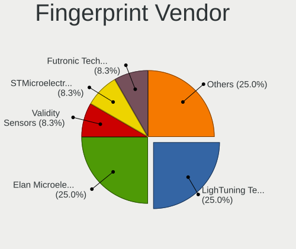

| Vendor                | Desktops | Percent |
|-----------------------|----------|---------|
| LighTuning Technology | 3        | 25%     |
| Elan Microelectronics | 3        | 25%     |
| Validity Sensors      | 1        | 8.33%   |
| STMicroelectronics    | 1        | 8.33%   |
| Futronic Technology   | 1        | 8.33%   |
| DigitalPersona        | 1        | 8.33%   |
| Dell                  | 1        | 8.33%   |
| AuthenTec             | 1        | 8.33%   |

Fingerprint Model
-----------------

Fingerprint sensor models

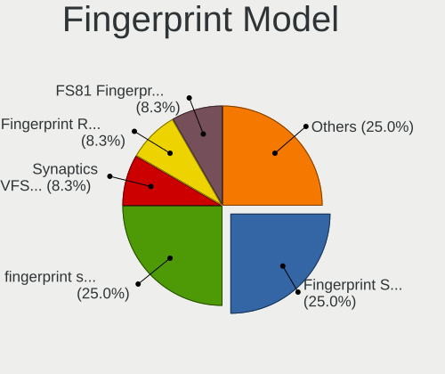

| Model                                                       | Desktops | Percent |
|-------------------------------------------------------------|----------|---------|
| LighTuning Fingerprint Sensor                               | 3        | 25%     |
| Elan fingerprint sensor [FeinTech FPS00200]                 | 3        | 25%     |
| Validity Sensors Synaptics VFS7552 Touch Fingerprint Sensor | 1        | 8.33%   |
| STMicroelectronics Fingerprint Reader                       | 1        | 8.33%   |
| Futronic FS81 Fingerprint Scanner Module                    | 1        | 8.33%   |
| DigitalPersona Fingerprint Reader                           | 1        | 8.33%   |
| Dell MS819 Wired Mouse With Fingerprint Reader              | 1        | 8.33%   |
| AuthenTec AES1600                                           | 1        | 8.33%   |

Chipcard Vendor
---------------

Chipcard module vendors

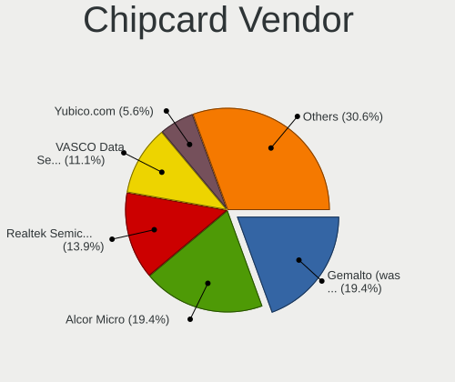

| Vendor                            | Desktops | Percent |
|-----------------------------------|----------|---------|
| Gemalto (was Gemplus)             | 7        | 19.44%  |
| Alcor Micro                       | 7        | 19.44%  |
| Realtek Semiconductor             | 5        | 13.89%  |
| VASCO Data Security International | 4        | 11.11%  |
| Yubico.com                        | 2        | 5.56%   |
| Reiner SCT Kartensysteme          | 2        | 5.56%   |
| OmniKey                           | 2        | 5.56%   |
| SCM Microsystems                  | 1        | 2.78%   |
| Giesecke & Devrient               | 1        | 2.78%   |
| Cherry                            | 1        | 2.78%   |
| Bit4id                            | 1        | 2.78%   |
| ASK-RFID                          | 1        | 2.78%   |
| Aladdin Knowledge Systems         | 1        | 2.78%   |
| Aktiv                             | 1        | 2.78%   |

Chipcard Model
--------------

Chipcard module models

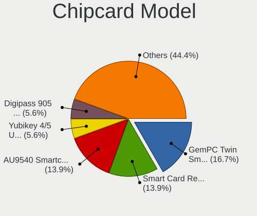

| Model                                                                      | Desktops | Percent |
|----------------------------------------------------------------------------|----------|---------|
| Gemalto (was Gemplus) GemPC Twin SmartCard Reader                          | 6        | 16.67%  |
| Realtek Semiconductor Smart Card Reader Interface                          | 5        | 13.89%  |
| Alcor Micro AU9540 Smartcard Reader                                        | 5        | 13.89%  |
| Yubico.com Yubikey 4/5 U2F+CCID                                            | 2        | 5.56%   |
| VASCO Data Security International Digipass 905 SmartCard Reader            | 2        | 5.56%   |
| Reiner SCT Kartensysteme cyberJack RFID basis contactless smartcard reader | 2        | 5.56%   |
| OmniKey 3x21 Smart Card Reader                                             | 2        | 5.56%   |
| Alcor Micro Watchdata W 1981                                               | 2        | 5.56%   |
| VASCO Data Security International DIGIPASS 920                             | 1        | 2.78%   |
| VASCO Data Security International DIGIPASS 870                             | 1        | 2.78%   |
| SCM Microsystems SCR331 SmartCard Reader                                   | 1        | 2.78%   |
| Giesecke & Devrient StarSign CUT S                                         | 1        | 2.78%   |
| Gemalto (was Gemplus) GemPC Key SmartCard Reader                           | 1        | 2.78%   |
| Cherry SmartCard Reader Keyboard KC 1000 SC                                | 1        | 2.78%   |
| Bit4id miniLector EVO                                                      | 1        | 2.78%   |
| ASK-RFID GEN5XX CCID                                                       | 1        | 2.78%   |
| Aladdin Knowledge Systems Token JC                                         | 1        | 2.78%   |
| Aktiv Rutoken lite                                                         | 1        | 2.78%   |

Unsupported
-----------

Unsupported Devices
-------------------

Total unsupported devices on board

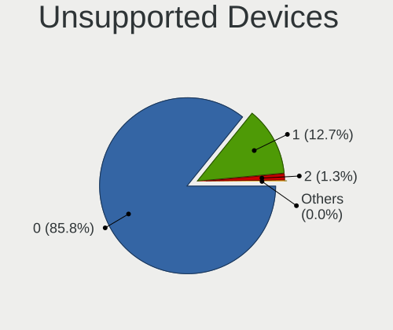

| Total | Desktops | Percent |
|-------|----------|---------|
| 0     | 3093     | 85.8%   |
| 1     | 459      | 12.73%  |
| 2     | 46       | 1.28%   |
| 3     | 5        | 0.14%   |
| 5     | 1        | 0.03%   |
| 4     | 1        | 0.03%   |

Unsupported Device Types
------------------------

Types of unsupported devices

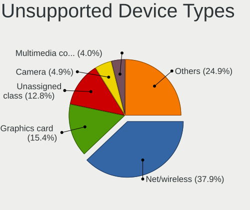

| Type                     | Desktops | Percent |
|--------------------------|----------|---------|
| Net/wireless             | 207      | 37.91%  |
| Graphics card            | 84       | 15.38%  |
| Unassigned class         | 70       | 12.82%  |
| Camera                   | 27       | 4.95%   |
| Multimedia controller    | 22       | 4.03%   |
| Chipcard                 | 22       | 4.03%   |
| Net/ethernet             | 18       | 3.3%    |
| Communication controller | 16       | 2.93%   |
| Sound                    | 14       | 2.56%   |
| Bluetooth                | 14       | 2.56%   |
| Network                  | 13       | 2.38%   |
| Dvb card                 | 12       | 2.2%    |
| Fingerprint reader       | 10       | 1.83%   |
| Storage/raid             | 9        | 1.65%   |
| Tv card                  | 2        | 0.37%   |
| Storage/ide              | 2        | 0.37%   |
| Video                    | 1        | 0.18%   |
| Storage/ata              | 1        | 0.18%   |
| Storage                  | 1        | 0.18%   |
| Modem                    | 1        | 0.18%   |

