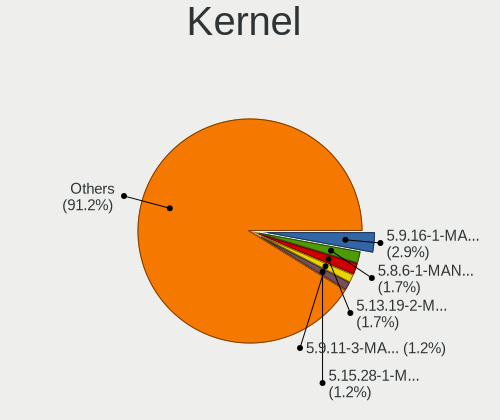
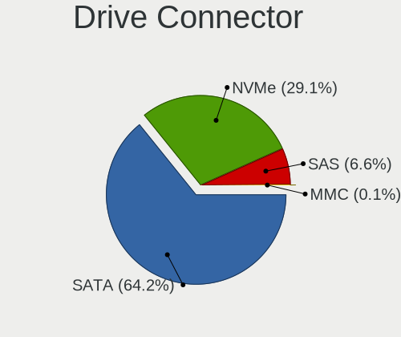
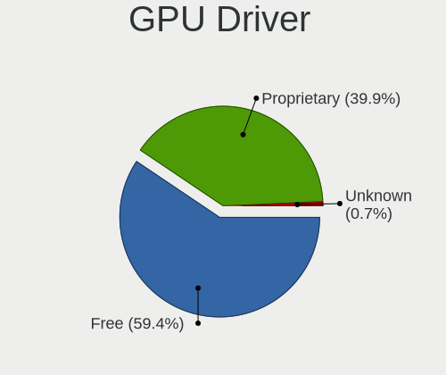
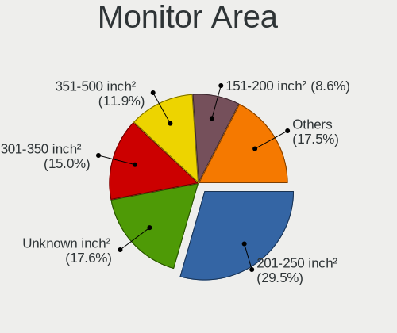
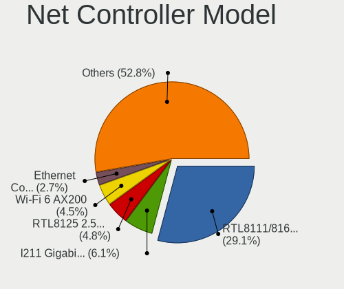

Manjaro - Tested Hardware & Statistics (Desktops)
-------------------------------------------------

A project to collect tested hardware configurations for Manjaro.

Anyone can contribute to this report by the [hw-probe](https://github.com/linuxhw/hw-probe) tool:

    sudo -E hw-probe -all -upload

Please contribute! Especially if your hardware is rare.

Contents
--------

* [ Test Cases ](#test-cases)

* [ System ](#system)
  - [ OS                       ](#os)
  - [ OS Family                ](#os-family)
  - [ Kernel                   ](#kernel)
  - [ Kernel Family            ](#kernel-family)
  - [ Kernel Major Ver.        ](#kernel-major-ver)
  - [ Arch                     ](#arch)
  - [ DE                       ](#de)
  - [ Display Server           ](#display-server)
  - [ Display Manager          ](#display-manager)
  - [ OS Lang                  ](#os-lang)
  - [ Boot Mode                ](#boot-mode)
  - [ Filesystem               ](#filesystem)
  - [ Part. scheme             ](#part-scheme)
  - [ Dual Boot with Linux/BSD ](#dual-boot-with-linuxbsd)
  - [ Dual Boot (Win)          ](#dual-boot-win)

* [ Board ](#board)
  - [ Vendor                   ](#vendor)
  - [ Model                    ](#model)
  - [ Model Family             ](#model-family)
  - [ MFG Year                 ](#mfg-year)
  - [ Form Factor              ](#form-factor)
  - [ Secure Boot              ](#secure-boot)
  - [ Coreboot                 ](#coreboot)
  - [ RAM Size                 ](#ram-size)
  - [ RAM Used                 ](#ram-used)
  - [ Total Drives             ](#total-drives)
  - [ Has CD-ROM               ](#has-cd-rom)
  - [ Has Ethernet             ](#has-ethernet)
  - [ Has WiFi                 ](#has-wifi)
  - [ Has Bluetooth            ](#has-bluetooth)

* [ Location ](#location)
  - [ Country                  ](#country)
  - [ City                     ](#city)

* [ Drives ](#drives)
  - [ Drive Vendor             ](#drive-vendor)
  - [ Drive Model              ](#drive-model)
  - [ HDD Vendor               ](#hdd-vendor)
  - [ SSD Vendor               ](#ssd-vendor)
  - [ Drive Kind               ](#drive-kind)
  - [ Drive Connector          ](#drive-connector)
  - [ Drive Size               ](#drive-size)
  - [ Space Total              ](#space-total)
  - [ Space Used               ](#space-used)
  - [ Malfunc. Drives          ](#malfunc-drives)
  - [ Malfunc. Drive Vendor    ](#malfunc-drive-vendor)
  - [ Malfunc. HDD Vendor      ](#malfunc-hdd-vendor)
  - [ Malfunc. Drive Kind      ](#malfunc-drive-kind)
  - [ Failed Drives            ](#failed-drives)
  - [ Failed Drive Vendor      ](#failed-drive-vendor)
  - [ Drive Status             ](#drive-status)

* [ Storage controller ](#storage-controller)
  - [ Storage Vendor           ](#storage-vendor)
  - [ Storage Model            ](#storage-model)
  - [ Storage Kind             ](#storage-kind)

* [ Processor ](#processor)
  - [ CPU Vendor               ](#cpu-vendor)
  - [ CPU Model                ](#cpu-model)
  - [ CPU Model Family         ](#cpu-model-family)
  - [ CPU Cores                ](#cpu-cores)
  - [ CPU Sockets              ](#cpu-sockets)
  - [ CPU Threads              ](#cpu-threads)
  - [ CPU Op-Modes             ](#cpu-op-modes)
  - [ CPU Microcode            ](#cpu-microcode)
  - [ CPU Microarch            ](#cpu-microarch)

* [ Graphics ](#graphics)
  - [ GPU Vendor               ](#gpu-vendor)
  - [ GPU Model                ](#gpu-model)
  - [ GPU Combo                ](#gpu-combo)
  - [ GPU Driver               ](#gpu-driver)
  - [ GPU Memory               ](#gpu-memory)

* [ Monitor ](#monitor)
  - [ Monitor Vendor           ](#monitor-vendor)
  - [ Monitor Model            ](#monitor-model)
  - [ Monitor Resolution       ](#monitor-resolution)
  - [ Monitor Diagonal         ](#monitor-diagonal)
  - [ Monitor Width            ](#monitor-width)
  - [ Aspect Ratio             ](#aspect-ratio)
  - [ Monitor Area             ](#monitor-area)
  - [ Pixel Density            ](#pixel-density)
  - [ Multiple Monitors        ](#multiple-monitors)

* [ Network ](#network)
  - [ Net Controller Vendor    ](#net-controller-vendor)
  - [ Net Controller Model     ](#net-controller-model)
  - [ Wireless Vendor          ](#wireless-vendor)
  - [ Wireless Model           ](#wireless-model)
  - [ Ethernet Vendor          ](#ethernet-vendor)
  - [ Ethernet Model           ](#ethernet-model)
  - [ Net Controller Kind      ](#net-controller-kind)
  - [ Used Controller          ](#used-controller)
  - [ NICs                     ](#nics)
  - [ IPv6                     ](#ipv6)

* [ Bluetooth ](#bluetooth)
  - [ Bluetooth Vendor         ](#bluetooth-vendor)
  - [ Bluetooth Model          ](#bluetooth-model)

* [ Sound ](#sound)
  - [ Sound Vendor             ](#sound-vendor)
  - [ Sound Model              ](#sound-model)

* [ Memory ](#memory)
  - [ Memory Vendor            ](#memory-vendor)
  - [ Memory Model             ](#memory-model)
  - [ Memory Kind              ](#memory-kind)
  - [ Memory Form Factor       ](#memory-form-factor)
  - [ Memory Size              ](#memory-size)
  - [ Memory Speed             ](#memory-speed)

* [ Printers & scanners ](#printers--scanners)
  - [ Printer Vendor           ](#printer-vendor)
  - [ Printer Model            ](#printer-model)
  - [ Scanner Vendor           ](#scanner-vendor)
  - [ Scanner Model            ](#scanner-model)

* [ Camera ](#camera)
  - [ Camera Vendor            ](#camera-vendor)
  - [ Camera Model             ](#camera-model)

* [ Security ](#security)
  - [ Fingerprint Vendor       ](#fingerprint-vendor)
  - [ Fingerprint Model        ](#fingerprint-model)
  - [ Chipcard Vendor          ](#chipcard-vendor)
  - [ Chipcard Model           ](#chipcard-model)

* [ Unsupported ](#unsupported)
  - [ Unsupported Devices      ](#unsupported-devices)
  - [ Unsupported Device Types ](#unsupported-device-types)

Test Cases
----------

Total: 3099

| Vendor        | Model                       | Probe                                                      | Date         |
|---------------|-----------------------------|------------------------------------------------------------|--------------|
| ASUSTek       | PRIME B350M-A               | [87542ba2c2](https://linux-hardware.org/?probe=87542ba2c2) | Apr 30, 2022 |
| Gigabyte      | H61M-S2PV                   | [6b213d6f7e](https://linux-hardware.org/?probe=6b213d6f7e) | Apr 30, 2022 |
| Gigabyte      | H310N x.x                   | [d0daa33c07](https://linux-hardware.org/?probe=d0daa33c07) | Apr 30, 2022 |
| ASUSTek       | ROG STRIX B450-F GAMING     | [da04f72dfc](https://linux-hardware.org/?probe=da04f72dfc) | Apr 30, 2022 |
| ASRock        | Z370 Gaming K6              | [63d2d272b6](https://linux-hardware.org/?probe=63d2d272b6) | Apr 30, 2022 |
| ASUSTek       | P8Z77-V LX                  | [3b8440b69f](https://linux-hardware.org/?probe=3b8440b69f) | Apr 29, 2022 |
| MSI           | MEG Z590 GODLIKE            | [d0ca0e52ad](https://linux-hardware.org/?probe=d0ca0e52ad) | Apr 28, 2022 |
| ASUSTek       | ROG CROSSHAIR VIII HERO     | [29e1e28903](https://linux-hardware.org/?probe=29e1e28903) | Apr 28, 2022 |
| MSI           | MEG Z590 GODLIKE            | [ec7e5a0314](https://linux-hardware.org/?probe=ec7e5a0314) | Apr 28, 2022 |
| MSI           | MEG Z590 GODLIKE            | [db3540f085](https://linux-hardware.org/?probe=db3540f085) | Apr 28, 2022 |
| MSI           | MEG Z590 GODLIKE            | [a2f86e2fea](https://linux-hardware.org/?probe=a2f86e2fea) | Apr 28, 2022 |
| ASUSTek       | ROG CROSSHAIR VIII HERO     | [6f7b2f6a78](https://linux-hardware.org/?probe=6f7b2f6a78) | Apr 28, 2022 |
| ASRock        | B550M Pro4                  | [1715307c13](https://linux-hardware.org/?probe=1715307c13) | Apr 28, 2022 |
| ASRock        | B550M Pro4                  | [31f358fdd0](https://linux-hardware.org/?probe=31f358fdd0) | Apr 28, 2022 |
| Gigabyte      | X570 UD                     | [67f24b974b](https://linux-hardware.org/?probe=67f24b974b) | Apr 27, 2022 |
| ASUSTek       | PRIME X570-P                | [1243ca01bb](https://linux-hardware.org/?probe=1243ca01bb) | Apr 27, 2022 |
| ASRock        | AB350M-HDV                  | [6ee4ea44a8](https://linux-hardware.org/?probe=6ee4ea44a8) | Apr 27, 2022 |
| ASUSTek       | Acacia                      | [d43c62d4ab](https://linux-hardware.org/?probe=d43c62d4ab) | Apr 27, 2022 |
| Dell          | 00V62H A01                  | [7c7b023841](https://linux-hardware.org/?probe=7c7b023841) | Apr 27, 2022 |
| Dell          | 00V62H A01                  | [eddac3b03f](https://linux-hardware.org/?probe=eddac3b03f) | Apr 27, 2022 |
| ASRock        | B550M Pro4                  | [003eab04ae](https://linux-hardware.org/?probe=003eab04ae) | Apr 26, 2022 |
| MSI           | MEG X570 UNIFY              | [4f7c3fc75d](https://linux-hardware.org/?probe=4f7c3fc75d) | Apr 26, 2022 |
| AZW           | U59                         | [ecee060925](https://linux-hardware.org/?probe=ecee060925) | Apr 26, 2022 |
| Gigabyte      | Z590 D                      | [afad17a56d](https://linux-hardware.org/?probe=afad17a56d) | Apr 26, 2022 |
| ASUSTek       | PRIME X570-P                | [6bee5ac8c6](https://linux-hardware.org/?probe=6bee5ac8c6) | Apr 26, 2022 |
| ASUSTek       | PRIME X570-P                | [a304ccdfb1](https://linux-hardware.org/?probe=a304ccdfb1) | Apr 26, 2022 |
| Alienware     | 02XRCM A01                  | [90cc83b1aa](https://linux-hardware.org/?probe=90cc83b1aa) | Apr 26, 2022 |
| ASRock        | H97 Pro4                    | [e937f129bf](https://linux-hardware.org/?probe=e937f129bf) | Apr 25, 2022 |
| Dell          | 042P49 A02                  | [cc2266d5aa](https://linux-hardware.org/?probe=cc2266d5aa) | Apr 25, 2022 |
| MSI           | MEG B550 UNIFY              | [3cf3319591](https://linux-hardware.org/?probe=3cf3319591) | Apr 25, 2022 |
| Dell          | 0KP561                      | [0467bf679e](https://linux-hardware.org/?probe=0467bf679e) | Apr 25, 2022 |
| ASRock        | H110 Pro BTC+               | [1251ef669d](https://linux-hardware.org/?probe=1251ef669d) | Apr 24, 2022 |
| ASRock        | B550 Phantom Gaming-ITX/... | [81f1c06851](https://linux-hardware.org/?probe=81f1c06851) | Apr 23, 2022 |
| Alienware     | 07HV66 A00                  | [7b889c5010](https://linux-hardware.org/?probe=7b889c5010) | Apr 23, 2022 |
| ASUSTek       | TUF Gaming B550M-PLUS       | [6af9cfacd0](https://linux-hardware.org/?probe=6af9cfacd0) | Apr 23, 2022 |
| ASUSTek       | TUF Gaming X570-PRO         | [afcef911ce](https://linux-hardware.org/?probe=afcef911ce) | Apr 23, 2022 |
| ASRock        | H97 Pro4                    | [2147b931e3](https://linux-hardware.org/?probe=2147b931e3) | Apr 22, 2022 |
| ASUSTek       | P8Z77-V LX                  | [891c8720c2](https://linux-hardware.org/?probe=891c8720c2) | Apr 22, 2022 |
| ASRock        | AB350M Pro4                 | [544c5dbbf7](https://linux-hardware.org/?probe=544c5dbbf7) | Apr 22, 2022 |
| ASUSTek       | H81M-K                      | [95a2757020](https://linux-hardware.org/?probe=95a2757020) | Apr 22, 2022 |
| MSI           | B350M MORTAR ARCTIC         | [6c6203c7ff](https://linux-hardware.org/?probe=6c6203c7ff) | Apr 22, 2022 |
| Gigabyte      | B550M AORUS ELITE           | [acc082b594](https://linux-hardware.org/?probe=acc082b594) | Apr 22, 2022 |
| Dell          | 0KP561                      | [87398af452](https://linux-hardware.org/?probe=87398af452) | Apr 22, 2022 |
| Acer          | Predator G3610              | [a53edf84d4](https://linux-hardware.org/?probe=a53edf84d4) | Apr 22, 2022 |
| ASUSTek       | PRIME A320M-K               | [822db71f7a](https://linux-hardware.org/?probe=822db71f7a) | Apr 21, 2022 |
| ASUSTek       | P8Z77-V LX                  | [878d9753ef](https://linux-hardware.org/?probe=878d9753ef) | Apr 21, 2022 |
| Gigabyte      | B450 AORUS M                | [ff11434d18](https://linux-hardware.org/?probe=ff11434d18) | Apr 20, 2022 |
| MSI           | B450 TOMAHAWK MAX           | [34c876e7e6](https://linux-hardware.org/?probe=34c876e7e6) | Apr 19, 2022 |
| Dell          | 0C522T A00                  | [8684c390a7](https://linux-hardware.org/?probe=8684c390a7) | Apr 19, 2022 |
| Dell          | 0C522T A00                  | [d6203110b3](https://linux-hardware.org/?probe=d6203110b3) | Apr 19, 2022 |
| Dell          | 09M8Y8 A01                  | [8b989c82a2](https://linux-hardware.org/?probe=8b989c82a2) | Apr 18, 2022 |
| Dell          | 09M8Y8 A01                  | [fff624b795](https://linux-hardware.org/?probe=fff624b795) | Apr 18, 2022 |
| ECS           | H61H2-M13                   | [f3d574e81e](https://linux-hardware.org/?probe=f3d574e81e) | Apr 18, 2022 |
| ASUSTek       | ROG CROSSHAIR VIII HERO     | [ff70aec1ae](https://linux-hardware.org/?probe=ff70aec1ae) | Apr 18, 2022 |
| Foxconn       | 2ABF                        | [ce158f41e2](https://linux-hardware.org/?probe=ce158f41e2) | Apr 17, 2022 |
| MSI           | B350M PRO-VDH               | [884f15c1df](https://linux-hardware.org/?probe=884f15c1df) | Apr 17, 2022 |
| BESSTAR Te... | UM250 V1.0                  | [271eb8380b](https://linux-hardware.org/?probe=271eb8380b) | Apr 17, 2022 |
| Lenovo        | 3714 NOK                    | [80ed454cc3](https://linux-hardware.org/?probe=80ed454cc3) | Apr 17, 2022 |
| ASUSTek       | P5K Deluxe                  | [e7b66178ce](https://linux-hardware.org/?probe=e7b66178ce) | Apr 17, 2022 |
| MSI           | MAG B460M MORTAR            | [278ccbaf44](https://linux-hardware.org/?probe=278ccbaf44) | Apr 17, 2022 |
| MSI           | MS-7438 100                 | [bac261ba9a](https://linux-hardware.org/?probe=bac261ba9a) | Apr 16, 2022 |
| ASRock        | B550M Phantom Gaming 4      | [3e3e2fd22f](https://linux-hardware.org/?probe=3e3e2fd22f) | Apr 16, 2022 |
| MSI           | B450M PRO-M2 MAX            | [4702e93a67](https://linux-hardware.org/?probe=4702e93a67) | Apr 16, 2022 |
| ASUSTek       | GRYPHON Z87                 | [557390f9cf](https://linux-hardware.org/?probe=557390f9cf) | Apr 15, 2022 |
| Dell          | 0C522T A00                  | [593941cc0a](https://linux-hardware.org/?probe=593941cc0a) | Apr 15, 2022 |
| BESSTAR Te... | UM250 V1.0                  | [c8afb3fce8](https://linux-hardware.org/?probe=c8afb3fce8) | Apr 14, 2022 |
| BESSTAR Te... | UM250 V1.0                  | [bd378877e0](https://linux-hardware.org/?probe=bd378877e0) | Apr 14, 2022 |
| ASRock        | B550M Pro4                  | [e1b00199f8](https://linux-hardware.org/?probe=e1b00199f8) | Apr 14, 2022 |
| ASRock        | AB350 Pro4                  | [137e25f240](https://linux-hardware.org/?probe=137e25f240) | Apr 14, 2022 |
| ASUSTek       | PRIME B360M-C               | [417d3ab696](https://linux-hardware.org/?probe=417d3ab696) | Apr 14, 2022 |
| ASUSTek       | Maximus IX HERO             | [624c5a033e](https://linux-hardware.org/?probe=624c5a033e) | Apr 14, 2022 |
| ASRock        | AB350M                      | [f79bfabcf5](https://linux-hardware.org/?probe=f79bfabcf5) | Apr 14, 2022 |
| Gigabyte      | Z97X-Gaming 3               | [5d45d7b3f7](https://linux-hardware.org/?probe=5d45d7b3f7) | Apr 13, 2022 |
| ASRock        | X570M Pro4                  | [b7373e1f8f](https://linux-hardware.org/?probe=b7373e1f8f) | Apr 13, 2022 |
| ASUSTek       | ROG STRIX Z370-G GAMING     | [0056c8d32e](https://linux-hardware.org/?probe=0056c8d32e) | Apr 13, 2022 |
| Dell          | 03V3TG A00                  | [a91e96515c](https://linux-hardware.org/?probe=a91e96515c) | Apr 13, 2022 |
| ASUSTek       | STRIX Z270G GAMING          | [e04e7a6bc9](https://linux-hardware.org/?probe=e04e7a6bc9) | Apr 13, 2022 |
| Gigabyte      | X570S AORUS PRO AX          | [157197f213](https://linux-hardware.org/?probe=157197f213) | Apr 13, 2022 |
| HP            | 18E4                        | [83cf0afd92](https://linux-hardware.org/?probe=83cf0afd92) | Apr 13, 2022 |
| HP            | 18E4                        | [61a163f744](https://linux-hardware.org/?probe=61a163f744) | Apr 13, 2022 |
| Gigabyte      | B450M DS3H-CF               | [81ef10ca5d](https://linux-hardware.org/?probe=81ef10ca5d) | Apr 13, 2022 |
| Gigabyte      | 970A-DS3P                   | [8101ed4e60](https://linux-hardware.org/?probe=8101ed4e60) | Apr 12, 2022 |
| Gigabyte      | 970A-DS3P                   | [bf61a75cfd](https://linux-hardware.org/?probe=bf61a75cfd) | Apr 12, 2022 |
| Intel         | SHARKBAY                    | [f676b9a255](https://linux-hardware.org/?probe=f676b9a255) | Apr 11, 2022 |
| ASRock        | B250M Performance           | [3d9af3df5a](https://linux-hardware.org/?probe=3d9af3df5a) | Apr 11, 2022 |
| MSI           | 760GM-P34                   | [c346a58754](https://linux-hardware.org/?probe=c346a58754) | Apr 11, 2022 |
| MSI           | H310M PRO-VDH PLUS          | [1a475ba1e6](https://linux-hardware.org/?probe=1a475ba1e6) | Apr 11, 2022 |
| ASUSTek       | TUF Z390-PLUS GAMING        | [f986565b6b](https://linux-hardware.org/?probe=f986565b6b) | Apr 10, 2022 |
| HP            | 1998                        | [28dcd611cc](https://linux-hardware.org/?probe=28dcd611cc) | Apr 10, 2022 |
| MSI           | Z370 PC PRO                 | [2d4574e9fe](https://linux-hardware.org/?probe=2d4574e9fe) | Apr 10, 2022 |
| Gigabyte      | H61M-S2PV                   | [8760e3254a](https://linux-hardware.org/?probe=8760e3254a) | Apr 10, 2022 |
| ASUSTek       | Z87-K                       | [b0ffa911b5](https://linux-hardware.org/?probe=b0ffa911b5) | Apr 10, 2022 |
| ASUSTek       | PRIME H410M-E               | [885cbd9d0c](https://linux-hardware.org/?probe=885cbd9d0c) | Apr 10, 2022 |
| ASUSTek       | P8Z77-V DELUXE              | [e890c4c2f7](https://linux-hardware.org/?probe=e890c4c2f7) | Apr 10, 2022 |
| Gigabyte      | X470 AORUS GAMING 7 WIFI... | [645fb7bb30](https://linux-hardware.org/?probe=645fb7bb30) | Apr 09, 2022 |
| ASUSTek       | Z87-K                       | [5264d55ce2](https://linux-hardware.org/?probe=5264d55ce2) | Apr 09, 2022 |
| ASRock        | Z77 Pro4                    | [38eeb648af](https://linux-hardware.org/?probe=38eeb648af) | Apr 09, 2022 |
| ASUSTek       | TUF Z390-PLUS GAMING        | [a618981311](https://linux-hardware.org/?probe=a618981311) | Apr 09, 2022 |
| MSI           | X370 XPOWER GAMING TITAN... | [2db23c062e](https://linux-hardware.org/?probe=2db23c062e) | Apr 08, 2022 |
| ASUSTek       | P8Z77-V LX                  | [94f4873110](https://linux-hardware.org/?probe=94f4873110) | Apr 06, 2022 |
| MSI           | Z370-A PRO                  | [c4f0f0573c](https://linux-hardware.org/?probe=c4f0f0573c) | Apr 06, 2022 |
| ASUSTek       | ROG STRIX B450-F GAMING ... | [091190515b](https://linux-hardware.org/?probe=091190515b) | Apr 06, 2022 |
| Dell          | 0D24M8 A00                  | [4f81a4a54a](https://linux-hardware.org/?probe=4f81a4a54a) | Apr 06, 2022 |
| ASUSTek       | A8N-VM CSM                  | [eac824e348](https://linux-hardware.org/?probe=eac824e348) | Apr 06, 2022 |
| Biostar       | TB250-BTC                   | [d6ef15453d](https://linux-hardware.org/?probe=d6ef15453d) | Apr 05, 2022 |
| ASUSTek       | Z97-A-USB31                 | [cd6f73403e](https://linux-hardware.org/?probe=cd6f73403e) | Apr 05, 2022 |
| ASRock        | B450 Pro4                   | [47ff657a18](https://linux-hardware.org/?probe=47ff657a18) | Apr 04, 2022 |
| Dell          | 0C522T A00                  | [4a42777634](https://linux-hardware.org/?probe=4a42777634) | Apr 04, 2022 |
| ASUSTek       | PRIME B350-PLUS             | [5348103896](https://linux-hardware.org/?probe=5348103896) | Apr 03, 2022 |
| Intel         | DH67BL AAG10189-207         | [2daa6a85f4](https://linux-hardware.org/?probe=2daa6a85f4) | Apr 03, 2022 |
| Gigabyte      | H61M-S2PV                   | [eebc95dcb6](https://linux-hardware.org/?probe=eebc95dcb6) | Apr 03, 2022 |
| MSI           | X470 GAMING PLUS            | [b7cf273d03](https://linux-hardware.org/?probe=b7cf273d03) | Apr 03, 2022 |
| ASRock        | 960GM-GS3 FX                | [cf80b64dad](https://linux-hardware.org/?probe=cf80b64dad) | Apr 02, 2022 |
| ASRock        | 960GM-GS3 FX                | [50c200ee58](https://linux-hardware.org/?probe=50c200ee58) | Apr 02, 2022 |
| ASUSTek       | TUF Gaming Z690-PLUS D4     | [a11d93b9d5](https://linux-hardware.org/?probe=a11d93b9d5) | Apr 02, 2022 |
| MSI           | H310M PRO-VDH PLUS          | [376ed7f486](https://linux-hardware.org/?probe=376ed7f486) | Apr 02, 2022 |
| Acer          | Aspire TC-120               | [a92d7ab62a](https://linux-hardware.org/?probe=a92d7ab62a) | Apr 02, 2022 |
| ASUSTek       | Z97-A-USB31                 | [6f40a4ebce](https://linux-hardware.org/?probe=6f40a4ebce) | Apr 02, 2022 |
| Dell          | 0N867P A02                  | [aaf4c4cf2b](https://linux-hardware.org/?probe=aaf4c4cf2b) | Apr 01, 2022 |
| ASRock        | Z390 Taichi                 | [b5995c13e5](https://linux-hardware.org/?probe=b5995c13e5) | Mar 31, 2022 |
| ASRock        | Z390 Taichi                 | [308ec93236](https://linux-hardware.org/?probe=308ec93236) | Mar 31, 2022 |
| ASUSTek       | ROG STRIX B450-F GAMING     | [101c38851b](https://linux-hardware.org/?probe=101c38851b) | Mar 31, 2022 |
| ASRock        | H97 Pro4                    | [f4ca737c25](https://linux-hardware.org/?probe=f4ca737c25) | Mar 31, 2022 |
| MSI           | MPG B550 GAMING EDGE WIF... | [5f25594023](https://linux-hardware.org/?probe=5f25594023) | Mar 31, 2022 |
| ASUSTek       | CROSSHAIR V FORMULA-Z       | [42e098223b](https://linux-hardware.org/?probe=42e098223b) | Mar 30, 2022 |
| MSI           | H310M PRO-VDH PLUS          | [caa021af45](https://linux-hardware.org/?probe=caa021af45) | Mar 30, 2022 |
| MSI           | MPG X570 GAMING EDGE WIF... | [0deba367b9](https://linux-hardware.org/?probe=0deba367b9) | Mar 30, 2022 |
| ASRock        | Z77 Extreme4                | [4ab227f4be](https://linux-hardware.org/?probe=4ab227f4be) | Mar 29, 2022 |
| Gigabyte      | Z87MX-D3H-CF                | [0401591ebc](https://linux-hardware.org/?probe=0401591ebc) | Mar 29, 2022 |
| HP            | 1998                        | [13b901f36a](https://linux-hardware.org/?probe=13b901f36a) | Mar 29, 2022 |
| ASUSTek       | M5A99FX PRO R2.0            | [a10bdc00e2](https://linux-hardware.org/?probe=a10bdc00e2) | Mar 28, 2022 |
| MSI           | MPG X570 GAMING EDGE WIF... | [0bcee9c78e](https://linux-hardware.org/?probe=0bcee9c78e) | Mar 28, 2022 |
| MSI           | H81M-E34                    | [42ff46ca6c](https://linux-hardware.org/?probe=42ff46ca6c) | Mar 28, 2022 |
| Gigabyte      | M68MT-D3P                   | [8d596570ed](https://linux-hardware.org/?probe=8d596570ed) | Mar 28, 2022 |
| ASUSTek       | M5A78L-M PLUS/USB3          | [3ed10cce06](https://linux-hardware.org/?probe=3ed10cce06) | Mar 27, 2022 |
| ASRock        | B550M Pro4                  | [4c69702c19](https://linux-hardware.org/?probe=4c69702c19) | Mar 27, 2022 |
| AMD           | 970A-D3                     | [010b978f01](https://linux-hardware.org/?probe=010b978f01) | Mar 26, 2022 |
| ASUSTek       | ROG STRIX X570-F GAMING     | [22e95f050f](https://linux-hardware.org/?probe=22e95f050f) | Mar 26, 2022 |
| ASUSTek       | P8H61-M LE/BR               | [732876bdd8](https://linux-hardware.org/?probe=732876bdd8) | Mar 26, 2022 |
| Alienware     | 0R3FWM A00                  | [46a5c111c3](https://linux-hardware.org/?probe=46a5c111c3) | Mar 25, 2022 |
| Gigabyte      | 990XA-UD3                   | [913cf55cc3](https://linux-hardware.org/?probe=913cf55cc3) | Mar 25, 2022 |
| ASUSTek       | PRIME Z370-P                | [f3cd1a314c](https://linux-hardware.org/?probe=f3cd1a314c) | Mar 25, 2022 |
| Gigabyte      | X58A-UD3R                   | [40ec2200ee](https://linux-hardware.org/?probe=40ec2200ee) | Mar 25, 2022 |
| Gigabyte      | X58A-UD3R                   | [cb639d5f0a](https://linux-hardware.org/?probe=cb639d5f0a) | Mar 25, 2022 |
| Acer          | Veriton M6660G V:1.0        | [ee5d755daf](https://linux-hardware.org/?probe=ee5d755daf) | Mar 24, 2022 |
| MSI           | MAG B550M MORTAR WIFI       | [994cca77b2](https://linux-hardware.org/?probe=994cca77b2) | Mar 24, 2022 |
| MSI           | MAG B550M MORTAR WIFI       | [fe7be471b2](https://linux-hardware.org/?probe=fe7be471b2) | Mar 24, 2022 |
| ASRock        | B550 Taichi                 | [2c71d397fd](https://linux-hardware.org/?probe=2c71d397fd) | Mar 24, 2022 |
| Unknown       | Unknown                     | [52ce856be5](https://linux-hardware.org/?probe=52ce856be5) | Mar 24, 2022 |
| Unknown       | Unknown                     | [1dd07eeee0](https://linux-hardware.org/?probe=1dd07eeee0) | Mar 24, 2022 |
| ASUSTek       | PRIME B350-PLUS             | [bb1d6b4aae](https://linux-hardware.org/?probe=bb1d6b4aae) | Mar 24, 2022 |
| Intel         | Unknown                     | [169b017d29](https://linux-hardware.org/?probe=169b017d29) | Mar 23, 2022 |
| ASUSTek       | ROG STRIX B550-F GAMING     | [c5a0300da9](https://linux-hardware.org/?probe=c5a0300da9) | Mar 23, 2022 |
| ASUSTek       | B150I PRO GAMING/AURA       | [0839d5feb0](https://linux-hardware.org/?probe=0839d5feb0) | Mar 22, 2022 |
| ASUSTek       | M4A89GTD-PRO/USB3           | [d24fcefe24](https://linux-hardware.org/?probe=d24fcefe24) | Mar 22, 2022 |
| Acer          | Veriton M6660G V:1.0        | [228974c486](https://linux-hardware.org/?probe=228974c486) | Mar 22, 2022 |
| Dell          | 0K3CM7 A00                  | [8f5ec6c004](https://linux-hardware.org/?probe=8f5ec6c004) | Mar 22, 2022 |
| Apple         | Mac-27AD2F918AE68F61        | [03e06a3a70](https://linux-hardware.org/?probe=03e06a3a70) | Mar 22, 2022 |
| Gigabyte      | G31M-ES2L                   | [90a8431fc2](https://linux-hardware.org/?probe=90a8431fc2) | Mar 22, 2022 |
| Gigabyte      | A320M-H-CF                  | [1462cd20b7](https://linux-hardware.org/?probe=1462cd20b7) | Mar 22, 2022 |
| MSI           | B450M PRO-VDH MAX           | [a6718f483b](https://linux-hardware.org/?probe=a6718f483b) | Mar 22, 2022 |
| Gigabyte      | B560M AORUS PRO AX          | [b7f10d6ec0](https://linux-hardware.org/?probe=b7f10d6ec0) | Mar 21, 2022 |
| MSI           | B450M BAZOOKA MAX WIFI      | [747e4d92cf](https://linux-hardware.org/?probe=747e4d92cf) | Mar 21, 2022 |
| ASRock        | B550 Extreme4               | [9c194b83e5](https://linux-hardware.org/?probe=9c194b83e5) | Mar 21, 2022 |
| Gigabyte      | X470 AORUS GAMING 7 WIFI... | [daa5dd8024](https://linux-hardware.org/?probe=daa5dd8024) | Mar 20, 2022 |
| ASUSTek       | H170 PRO GAMING             | [8ce1eed900](https://linux-hardware.org/?probe=8ce1eed900) | Mar 20, 2022 |
| ASUSTek       | TUF B360M-PLUS GAMING S     | [1897912bfc](https://linux-hardware.org/?probe=1897912bfc) | Mar 19, 2022 |
| TPV-INVENT... | 2AF2 A01                    | [1ab476e992](https://linux-hardware.org/?probe=1ab476e992) | Mar 18, 2022 |
| Dell          | 040DDP A01                  | [4cf633a014](https://linux-hardware.org/?probe=4cf633a014) | Mar 18, 2022 |
| ASUSTek       | ROG Maximus X HERO          | [d2378fc2ac](https://linux-hardware.org/?probe=d2378fc2ac) | Mar 18, 2022 |
| Gigabyte      | GA-MA74GM-S2                | [af8d9c8c06](https://linux-hardware.org/?probe=af8d9c8c06) | Mar 18, 2022 |
| ASUSTek       | PRIME B460M-A               | [bb8e459621](https://linux-hardware.org/?probe=bb8e459621) | Mar 17, 2022 |
| ASUSTek       | M5A78L-M PLUS/USB3          | [9ebb2a429f](https://linux-hardware.org/?probe=9ebb2a429f) | Mar 17, 2022 |
| ASUSTek       | TUF Gaming X570-PLUS        | [b844e23ce9](https://linux-hardware.org/?probe=b844e23ce9) | Mar 17, 2022 |
| Gigabyte      | B560M AORUS PRO AX          | [04e11e3668](https://linux-hardware.org/?probe=04e11e3668) | Mar 16, 2022 |
| MSI           | B75MA-P45                   | [f617b8e30b](https://linux-hardware.org/?probe=f617b8e30b) | Mar 16, 2022 |
| System76      | Thelio thelio-r2            | [ac96c74ffa](https://linux-hardware.org/?probe=ac96c74ffa) | Mar 16, 2022 |
| MSI           | MPG X570 GAMING EDGE WIF... | [ca405b99d5](https://linux-hardware.org/?probe=ca405b99d5) | Mar 16, 2022 |
| MSI           | MEG X570 UNIFY              | [0927f69114](https://linux-hardware.org/?probe=0927f69114) | Mar 15, 2022 |
| Gigabyte      | B450M DS3H-CF               | [2aa5fb5b66](https://linux-hardware.org/?probe=2aa5fb5b66) | Mar 15, 2022 |
| MSI           | B450M PRO-VDH PLUS          | [1b6764fd97](https://linux-hardware.org/?probe=1b6764fd97) | Mar 15, 2022 |
| Gigabyte      | X570 AORUS ELITE WIFI       | [a4cc8c4dda](https://linux-hardware.org/?probe=a4cc8c4dda) | Mar 15, 2022 |
| MSI           | MEG X570 UNIFY              | [a4dd59149a](https://linux-hardware.org/?probe=a4dd59149a) | Mar 15, 2022 |
| ASUSTek       | PRIME H410M-R               | [4bc060dc9d](https://linux-hardware.org/?probe=4bc060dc9d) | Mar 14, 2022 |
| MSI           | H310M PRO-VDH PLUS          | [b7cee19d72](https://linux-hardware.org/?probe=b7cee19d72) | Mar 14, 2022 |
| ASUSTek       | PRIME Z490M-PLUS            | [e0efdaa76a](https://linux-hardware.org/?probe=e0efdaa76a) | Mar 13, 2022 |
| Gigabyte      | H310M H x.x                 | [0a16c273a4](https://linux-hardware.org/?probe=0a16c273a4) | Mar 13, 2022 |
| ASRock        | H61 Pro BTC                 | [43528c8a20](https://linux-hardware.org/?probe=43528c8a20) | Mar 13, 2022 |
| Gigabyte      | B450M DS3H-CF               | [75561646a7](https://linux-hardware.org/?probe=75561646a7) | Mar 13, 2022 |
| MSI           | H310M PRO-VDH PLUS          | [693ec12319](https://linux-hardware.org/?probe=693ec12319) | Mar 12, 2022 |
| MSI           | H81M-P33                    | [138594b67f](https://linux-hardware.org/?probe=138594b67f) | Mar 12, 2022 |
| Lenovo        | 3704 SDK0J40700 WIN 3258... | [e6c507dff4](https://linux-hardware.org/?probe=e6c507dff4) | Mar 12, 2022 |
| Gigabyte      | X470 AORUS ULTRA GAMING-... | [e8c3922bb3](https://linux-hardware.org/?probe=e8c3922bb3) | Mar 12, 2022 |
| MSI           | H81M-E34                    | [8d5b326668](https://linux-hardware.org/?probe=8d5b326668) | Mar 12, 2022 |
| Gigabyte      | B450 I AORUS PRO WIFI-CF    | [bd9b6ec157](https://linux-hardware.org/?probe=bd9b6ec157) | Mar 11, 2022 |
| HP            | 1850                        | [7e0b4230d4](https://linux-hardware.org/?probe=7e0b4230d4) | Mar 11, 2022 |
| Gigabyte      | B75M-D3H                    | [30df05cc2f](https://linux-hardware.org/?probe=30df05cc2f) | Mar 11, 2022 |
| HP            | 3396                        | [7bd27c71ed](https://linux-hardware.org/?probe=7bd27c71ed) | Mar 11, 2022 |
| HP            | 3396                        | [adeef3162a](https://linux-hardware.org/?probe=adeef3162a) | Mar 11, 2022 |
| Gigabyte      | H61M-S2PV                   | [6b32e0c788](https://linux-hardware.org/?probe=6b32e0c788) | Mar 10, 2022 |
| ASRock        | H81M-VG4 R2.0               | [2d72940994](https://linux-hardware.org/?probe=2d72940994) | Mar 10, 2022 |
| Gigabyte      | X570 GAMING X               | [4f7aa0f57c](https://linux-hardware.org/?probe=4f7aa0f57c) | Mar 10, 2022 |
| HP            | 1497                        | [f67b96c14e](https://linux-hardware.org/?probe=f67b96c14e) | Mar 07, 2022 |
| ASRock        | H97 Pro4                    | [83df7fb05a](https://linux-hardware.org/?probe=83df7fb05a) | Mar 07, 2022 |
| Gigabyte      | Z68P-DS3                    | [0bb1088899](https://linux-hardware.org/?probe=0bb1088899) | Mar 06, 2022 |
| Gigabyte      | B550 AORUS PRO V2           | [783c8d9097](https://linux-hardware.org/?probe=783c8d9097) | Mar 06, 2022 |
| Fujitsu       | D3400-A1 S26361-D3400-A1    | [68250a6d74](https://linux-hardware.org/?probe=68250a6d74) | Mar 06, 2022 |
| Dell          | 0YXT71 A03                  | [b1ac4ae8e7](https://linux-hardware.org/?probe=b1ac4ae8e7) | Mar 05, 2022 |
| MSI           | X99A SLI PLUS               | [b56033aa1d](https://linux-hardware.org/?probe=b56033aa1d) | Mar 05, 2022 |
| Gigabyte      | 2AC8                        | [af655fd169](https://linux-hardware.org/?probe=af655fd169) | Mar 04, 2022 |
| ASUSTek       | ROG STRIX B550-F GAMING     | [8e27cc62b4](https://linux-hardware.org/?probe=8e27cc62b4) | Mar 04, 2022 |
| ASRock        | AB350M Pro4                 | [6ea2fbdb95](https://linux-hardware.org/?probe=6ea2fbdb95) | Mar 03, 2022 |
| ASUSTek       | ROG STRIX B450-F GAMING     | [ee8029d2c8](https://linux-hardware.org/?probe=ee8029d2c8) | Mar 03, 2022 |
| MSI           | Z170A KRAIT GAMING 3X       | [cff135fa1e](https://linux-hardware.org/?probe=cff135fa1e) | Mar 03, 2022 |
| MSI           | B450 GAMING PLUS MAX        | [eb3d721453](https://linux-hardware.org/?probe=eb3d721453) | Mar 02, 2022 |
| ASUSTek       | ROG STRIX B450-F GAMING     | [5f0757c539](https://linux-hardware.org/?probe=5f0757c539) | Mar 02, 2022 |
| ASRock        | Z77 Pro4                    | [ae5611419f](https://linux-hardware.org/?probe=ae5611419f) | Mar 02, 2022 |
| ASRock        | X370 Killer SLI/ac          | [07f8fcde55](https://linux-hardware.org/?probe=07f8fcde55) | Mar 02, 2022 |
| MSI           | X99A SLI PLUS               | [0c6f411b98](https://linux-hardware.org/?probe=0c6f411b98) | Mar 01, 2022 |
| HP            | 18E4                        | [192b302f41](https://linux-hardware.org/?probe=192b302f41) | Feb 27, 2022 |
| ASRock        | H61M-ITX                    | [081ea4e585](https://linux-hardware.org/?probe=081ea4e585) | Feb 26, 2022 |
| ASUSTek       | PRIME B450M-K               | [6f1958559b](https://linux-hardware.org/?probe=6f1958559b) | Feb 24, 2022 |
| Lenovo        | 30BC SDK0J40697 WIN 3305... | [b6891f77df](https://linux-hardware.org/?probe=b6891f77df) | Feb 24, 2022 |
| MSI           | MAG B550M MORTAR WIFI       | [f2a6491fc3](https://linux-hardware.org/?probe=f2a6491fc3) | Feb 24, 2022 |
| ASUSTek       | ROG STRIX B450-F GAMING ... | [1c8a37fb2f](https://linux-hardware.org/?probe=1c8a37fb2f) | Feb 24, 2022 |
| HP            | 21D0                        | [448912eeb9](https://linux-hardware.org/?probe=448912eeb9) | Feb 24, 2022 |
| Lenovo        | MAHOBAY NO DPK              | [1c6d204561](https://linux-hardware.org/?probe=1c6d204561) | Feb 24, 2022 |
| Dell          | 00V62H A01                  | [e6564282e5](https://linux-hardware.org/?probe=e6564282e5) | Feb 23, 2022 |
| Lenovo        | MAHOBAY 0B98401 PRO         | [2f53cef399](https://linux-hardware.org/?probe=2f53cef399) | Feb 23, 2022 |
| Lenovo        | 3102 SDK0J40697 WIN 3305... | [6d2bec51f3](https://linux-hardware.org/?probe=6d2bec51f3) | Feb 23, 2022 |
| ASUSTek       | Pro WS C621-64L SAGE Ser... | [17aa7b3d5b](https://linux-hardware.org/?probe=17aa7b3d5b) | Feb 23, 2022 |
| Gigabyte      | B460M DS3H                  | [c2ed3df75c](https://linux-hardware.org/?probe=c2ed3df75c) | Feb 23, 2022 |
| MSI           | 880G-E45                    | [e6f9c8c9f6](https://linux-hardware.org/?probe=e6f9c8c9f6) | Feb 23, 2022 |
| Gigabyte      | B250M-DS3H-CF               | [db907dad62](https://linux-hardware.org/?probe=db907dad62) | Feb 21, 2022 |
| Gigabyte      | 2AC8                        | [90d30ccc29](https://linux-hardware.org/?probe=90d30ccc29) | Feb 21, 2022 |
| Gigabyte      | H61M-DS2 DVI                | [03491eae09](https://linux-hardware.org/?probe=03491eae09) | Feb 21, 2022 |
| MSI           | B450 GAMING PRO CARBON A... | [e1943c32e9](https://linux-hardware.org/?probe=e1943c32e9) | Feb 20, 2022 |
| HP            | 1998                        | [1cd99a92d0](https://linux-hardware.org/?probe=1cd99a92d0) | Feb 20, 2022 |
| Biostar       | TB250-BTC                   | [90154b9001](https://linux-hardware.org/?probe=90154b9001) | Feb 20, 2022 |
| Biostar       | TB250-BTC                   | [b42d2ce48e](https://linux-hardware.org/?probe=b42d2ce48e) | Feb 20, 2022 |
| ASRock        | H370M-ITX/ac                | [95b177e121](https://linux-hardware.org/?probe=95b177e121) | Feb 19, 2022 |
| Gigabyte      | C246-WU4-CF                 | [e849c7b27b](https://linux-hardware.org/?probe=e849c7b27b) | Feb 19, 2022 |
| Gigabyte      | Z490I AORUS ULTRA           | [7ecf132718](https://linux-hardware.org/?probe=7ecf132718) | Feb 19, 2022 |
| Dell          | 0CRH6C A02                  | [726633bbcc](https://linux-hardware.org/?probe=726633bbcc) | Feb 18, 2022 |
| ASUSTek       | TUF GAMING B550-PLUS        | [d08ed1959b](https://linux-hardware.org/?probe=d08ed1959b) | Feb 18, 2022 |
| HP            | 1497                        | [8693cfc8c8](https://linux-hardware.org/?probe=8693cfc8c8) | Feb 17, 2022 |
| ASRock        | Z370 Extreme4               | [304e498f77](https://linux-hardware.org/?probe=304e498f77) | Feb 17, 2022 |
| HP            | 2820h                       | [f45476e17a](https://linux-hardware.org/?probe=f45476e17a) | Feb 17, 2022 |
| Gigabyte      | AB350-Gaming 3-CF           | [3dc3e4c8c8](https://linux-hardware.org/?probe=3dc3e4c8c8) | Feb 17, 2022 |
| Lenovo        | 3102 SDK0J40697 WIN 3305... | [2dece71caa](https://linux-hardware.org/?probe=2dece71caa) | Feb 17, 2022 |
| HP            | 0AA8h                       | [cb11b8e6fb](https://linux-hardware.org/?probe=cb11b8e6fb) | Feb 16, 2022 |
| ASUSTek       | Pro WS C621-64L SAGE Ser... | [922f3559c8](https://linux-hardware.org/?probe=922f3559c8) | Feb 16, 2022 |
| Gigabyte      | AB350-Gaming 3-CF           | [913928e6e9](https://linux-hardware.org/?probe=913928e6e9) | Feb 16, 2022 |
| ASUSTek       | M5A97 EVO                   | [c80545d294](https://linux-hardware.org/?probe=c80545d294) | Feb 16, 2022 |
| ASUSTek       | M5A97 EVO                   | [98e8879090](https://linux-hardware.org/?probe=98e8879090) | Feb 16, 2022 |
| MSI           | B150M PRO-VD                | [b46943492e](https://linux-hardware.org/?probe=b46943492e) | Feb 15, 2022 |
| Gigabyte      | A520M H                     | [6f8f7c786e](https://linux-hardware.org/?probe=6f8f7c786e) | Feb 14, 2022 |
| Gigabyte      | A520M H                     | [b4c976a541](https://linux-hardware.org/?probe=b4c976a541) | Feb 14, 2022 |
| ASUSTek       | P5QL/EPU                    | [2a5bcaeec9](https://linux-hardware.org/?probe=2a5bcaeec9) | Feb 14, 2022 |
| ASRock        | B450M Pro4                  | [3bbcbc62f5](https://linux-hardware.org/?probe=3bbcbc62f5) | Feb 13, 2022 |
| ASUSTek       | ROG STRIX Z370-G GAMING     | [cc35d4696d](https://linux-hardware.org/?probe=cc35d4696d) | Feb 13, 2022 |
| Gigabyte      | B450 I AORUS PRO WIFI-CF    | [a25fea3795](https://linux-hardware.org/?probe=a25fea3795) | Feb 12, 2022 |
| HP            | 8618                        | [6976caf9ed](https://linux-hardware.org/?probe=6976caf9ed) | Feb 12, 2022 |
| HP            | 8618                        | [1038885608](https://linux-hardware.org/?probe=1038885608) | Feb 12, 2022 |
| MSI           | MPG B550 GAMING CARBON W... | [73767731d9](https://linux-hardware.org/?probe=73767731d9) | Feb 11, 2022 |
| Intel         | DH67GD AAG10206-202         | [56c802164a](https://linux-hardware.org/?probe=56c802164a) | Feb 11, 2022 |
| Gigabyte      | B250M-DS3H-CF               | [040550cdaa](https://linux-hardware.org/?probe=040550cdaa) | Feb 11, 2022 |
| ASUSTek       | Maximus Formula             | [130c778a64](https://linux-hardware.org/?probe=130c778a64) | Feb 11, 2022 |
| ASUSTek       | Maximus Formula             | [36b4f54213](https://linux-hardware.org/?probe=36b4f54213) | Feb 11, 2022 |
| Acer          | Predator PO3-630            | [96dccc1214](https://linux-hardware.org/?probe=96dccc1214) | Feb 11, 2022 |
| ASUSTek       | PRIME B550-PLUS             | [afc31097cd](https://linux-hardware.org/?probe=afc31097cd) | Feb 09, 2022 |
| ASUSTek       | TUF GAMING X570-PLUS        | [a752207fe2](https://linux-hardware.org/?probe=a752207fe2) | Feb 09, 2022 |
| ASRock        | FM2A68M-HD+                 | [8545c3246e](https://linux-hardware.org/?probe=8545c3246e) | Feb 08, 2022 |
| Lenovo        | 30BC SDK0J40697 WIN 3305... | [6c60cbb4d6](https://linux-hardware.org/?probe=6c60cbb4d6) | Feb 08, 2022 |
| Dell          | 00V62H A00                  | [7135f3c638](https://linux-hardware.org/?probe=7135f3c638) | Feb 07, 2022 |
| Dell          | 00V62H A00                  | [d6aefe2df6](https://linux-hardware.org/?probe=d6aefe2df6) | Feb 07, 2022 |
| ASUSTek       | TUF GAMING Z490-PLUS        | [9dd525ae45](https://linux-hardware.org/?probe=9dd525ae45) | Feb 07, 2022 |
| ASUSTek       | PRIME H510M-A               | [b2bc043c0b](https://linux-hardware.org/?probe=b2bc043c0b) | Feb 07, 2022 |
| HP            | 2820h                       | [347b6a83de](https://linux-hardware.org/?probe=347b6a83de) | Feb 07, 2022 |
| HP            | 2820h                       | [7c5fb9c18f](https://linux-hardware.org/?probe=7c5fb9c18f) | Feb 07, 2022 |
| ASRock        | B450M Pro4                  | [9efa6de9c0](https://linux-hardware.org/?probe=9efa6de9c0) | Feb 07, 2022 |
| ASRock        | H510M-HDV/M.2               | [11b7d331bc](https://linux-hardware.org/?probe=11b7d331bc) | Feb 06, 2022 |
| Intel         | H61 V124                    | [258b472104](https://linux-hardware.org/?probe=258b472104) | Feb 06, 2022 |
| ASUSTek       | ROG STRIX B550-F GAMING     | [497f20602c](https://linux-hardware.org/?probe=497f20602c) | Feb 05, 2022 |
| Acer          | Predator PO3-630            | [7d12bf5399](https://linux-hardware.org/?probe=7d12bf5399) | Feb 05, 2022 |
| MSI           | Z270I GAMING PRO CARBON ... | [424f798e37](https://linux-hardware.org/?probe=424f798e37) | Feb 05, 2022 |
| Lenovo        | 30BC SDK0J40697 WIN 3305... | [4c27e1f600](https://linux-hardware.org/?probe=4c27e1f600) | Feb 05, 2022 |
| Gigabyte      | B560M AORUS PRO AX          | [055aea6734](https://linux-hardware.org/?probe=055aea6734) | Feb 05, 2022 |
| ASUSTek       | PRIME B450-PLUS             | [035ccaeec8](https://linux-hardware.org/?probe=035ccaeec8) | Feb 04, 2022 |
| MSI           | MEG X570 UNIFY              | [5e8f4aba70](https://linux-hardware.org/?probe=5e8f4aba70) | Feb 03, 2022 |
| Dell          | 0XR1GT A00                  | [436259c69f](https://linux-hardware.org/?probe=436259c69f) | Feb 03, 2022 |
| Gigabyte      | F2A55M-DS2                  | [05d8bff376](https://linux-hardware.org/?probe=05d8bff376) | Feb 02, 2022 |
| ASUSTek       | PRIME Z390-A                | [8086fa496d](https://linux-hardware.org/?probe=8086fa496d) | Feb 02, 2022 |
| ASRock        | B450 Pro4                   | [01eb76fa65](https://linux-hardware.org/?probe=01eb76fa65) | Feb 01, 2022 |
| Dell          | 0HD5W2 A01                  | [9d172808c8](https://linux-hardware.org/?probe=9d172808c8) | Feb 01, 2022 |
| Intel         | X99 V1.0                    | [c342bd0bba](https://linux-hardware.org/?probe=c342bd0bba) | Jan 30, 2022 |
| Huanan        | X99-TF GAMING V2.0          | [aa1fb1fa56](https://linux-hardware.org/?probe=aa1fb1fa56) | Jan 29, 2022 |
| ASUSTek       | PRIME B450M-A               | [1ce7d1b347](https://linux-hardware.org/?probe=1ce7d1b347) | Jan 29, 2022 |
| ASUSTek       | P5QL/EPU                    | [c1e858090a](https://linux-hardware.org/?probe=c1e858090a) | Jan 28, 2022 |
| MSI           | MPG B550 GAMING EDGE WIF... | [bfc2cf603f](https://linux-hardware.org/?probe=bfc2cf603f) | Jan 27, 2022 |
| ASUSTek       | TUF GAMING A520M-PLUS II    | [ad887e6da9](https://linux-hardware.org/?probe=ad887e6da9) | Jan 27, 2022 |
| Dell          | 06D7TR A00                  | [1fdcf46e3b](https://linux-hardware.org/?probe=1fdcf46e3b) | Jan 26, 2022 |
| GALAX         | B365M G10b                  | [bd83b31919](https://linux-hardware.org/?probe=bd83b31919) | Jan 26, 2022 |
| Gigabyte      | 2AC8                        | [1480b4a02f](https://linux-hardware.org/?probe=1480b4a02f) | Jan 25, 2022 |
| Gigabyte      | 970A-DS3P                   | [d0dde4a553](https://linux-hardware.org/?probe=d0dde4a553) | Jan 24, 2022 |
| Gigabyte      | 965P-S3                     | [9e4aca104e](https://linux-hardware.org/?probe=9e4aca104e) | Jan 24, 2022 |
| Gigabyte      | AB350M-Gaming 3-CF          | [f48fe5a028](https://linux-hardware.org/?probe=f48fe5a028) | Jan 24, 2022 |
| MSI           | Z170A PC MATE               | [dd98b6fbca](https://linux-hardware.org/?probe=dd98b6fbca) | Jan 23, 2022 |
| ASRock        | H510M-ITX/ac                | [606c183545](https://linux-hardware.org/?probe=606c183545) | Jan 23, 2022 |
| ASUSTek       | TUF GAMING A520M-PLUS II    | [f950d7e322](https://linux-hardware.org/?probe=f950d7e322) | Jan 23, 2022 |
| ASUSTek       | M5A78L-M PLUS/USB3          | [1c15058d91](https://linux-hardware.org/?probe=1c15058d91) | Jan 22, 2022 |
| ASUSTek       | M5A78L-M PLUS/USB3          | [6d6c1565b7](https://linux-hardware.org/?probe=6d6c1565b7) | Jan 21, 2022 |
| Lenovo        | 313C SDK0J40697 WIN 3305... | [6cad862612](https://linux-hardware.org/?probe=6cad862612) | Jan 21, 2022 |
| Gigabyte      | Z590 VISION D               | [1d8fa44afd](https://linux-hardware.org/?probe=1d8fa44afd) | Jan 20, 2022 |
| Medion        | H110H4-EM                   | [64a2a3257d](https://linux-hardware.org/?probe=64a2a3257d) | Jan 20, 2022 |
| Dell          | 0YXT71 A03                  | [3609f04919](https://linux-hardware.org/?probe=3609f04919) | Jan 19, 2022 |
| Medion        | H110H4-EM                   | [6eab6bd21a](https://linux-hardware.org/?probe=6eab6bd21a) | Jan 19, 2022 |
| MSI           | B550M PRO-VDH WIFI          | [993543545b](https://linux-hardware.org/?probe=993543545b) | Jan 18, 2022 |
| MSI           | MPG X570 GAMING EDGE WIF... | [ce0d7ad7f6](https://linux-hardware.org/?probe=ce0d7ad7f6) | Jan 18, 2022 |
| ASUSTek       | Z170 PRO GAMING             | [a7cc00f1bb](https://linux-hardware.org/?probe=a7cc00f1bb) | Jan 18, 2022 |
| MSI           | B550M PRO-VDH WIFI          | [7e0c6ebfc9](https://linux-hardware.org/?probe=7e0c6ebfc9) | Jan 18, 2022 |
| MSI           | B550M PRO-VDH WIFI          | [d531de56b2](https://linux-hardware.org/?probe=d531de56b2) | Jan 18, 2022 |
| ASUSTek       | TUF GAMING X570-PLUS        | [5cccda3e40](https://linux-hardware.org/?probe=5cccda3e40) | Jan 18, 2022 |
| Dell          | 0R230R A00                  | [484bd19da3](https://linux-hardware.org/?probe=484bd19da3) | Jan 18, 2022 |
| ASUSTek       | TUF GAMING X570-PLUS        | [2f8e734236](https://linux-hardware.org/?probe=2f8e734236) | Jan 17, 2022 |
| ASUSTek       | TUF GAMING X570-PLUS        | [42d55a089f](https://linux-hardware.org/?probe=42d55a089f) | Jan 16, 2022 |
| Dell          | 0R230R A00                  | [9b7d66cb9d](https://linux-hardware.org/?probe=9b7d66cb9d) | Jan 16, 2022 |
| MSI           | B350M MORTAR                | [5f93713b6d](https://linux-hardware.org/?probe=5f93713b6d) | Jan 16, 2022 |
| Dell          | 01XK1W A00                  | [eafa397038](https://linux-hardware.org/?probe=eafa397038) | Jan 14, 2022 |
| Acer          | Aspire XC-230               | [ba7ea12461](https://linux-hardware.org/?probe=ba7ea12461) | Jan 14, 2022 |
| ASUSTek       | TUF GAMING X570-PRO         | [8ec42ce5c6](https://linux-hardware.org/?probe=8ec42ce5c6) | Jan 14, 2022 |
| ASUSTek       | ROG STRIX B450-F GAMING     | [d0ebb55aa3](https://linux-hardware.org/?probe=d0ebb55aa3) | Jan 12, 2022 |
| MSI           | X99S GAMING 7               | [66556a15be](https://linux-hardware.org/?probe=66556a15be) | Jan 11, 2022 |
| Lenovo        | SHARKBAY SDK0E50512 STD     | [4debe87ebd](https://linux-hardware.org/?probe=4debe87ebd) | Jan 11, 2022 |
| Intel         | D2550MUD2 AAG73892-600      | [7a18fc5ecf](https://linux-hardware.org/?probe=7a18fc5ecf) | Jan 11, 2022 |
| Gigabyte      | B450M DS3H V2               | [c4d0e193e1](https://linux-hardware.org/?probe=c4d0e193e1) | Jan 11, 2022 |
| Gigabyte      | B450M DS3H-CF               | [8c319cd6fc](https://linux-hardware.org/?probe=8c319cd6fc) | Jan 11, 2022 |
| Dell          | 0KP561                      | [91846f4dc8](https://linux-hardware.org/?probe=91846f4dc8) | Jan 10, 2022 |
| ASRock        | H81M-VG4                    | [8678202106](https://linux-hardware.org/?probe=8678202106) | Jan 10, 2022 |
| ASUSTek       | P5WDG2 WS PRO               | [c22b31be4e](https://linux-hardware.org/?probe=c22b31be4e) | Jan 10, 2022 |
| Acidanther... | Mac-27AD2F918AE68F61 Mac... | [936bd6bf44](https://linux-hardware.org/?probe=936bd6bf44) | Jan 10, 2022 |
| Chatreey      | AC1-DP                      | [fb4af3e7ac](https://linux-hardware.org/?probe=fb4af3e7ac) | Jan 09, 2022 |
| Gigabyte      | B450 AORUS PRO WIFI-CF      | [c8e28c5df0](https://linux-hardware.org/?probe=c8e28c5df0) | Jan 09, 2022 |
| MSI           | B450M BAZOOKA MAX WIFI      | [6cb48fa647](https://linux-hardware.org/?probe=6cb48fa647) | Jan 08, 2022 |
| MSI           | B550-A PRO                  | [14e41b405a](https://linux-hardware.org/?probe=14e41b405a) | Jan 08, 2022 |
| Gigabyte      | H61M-S1                     | [50adc5f773](https://linux-hardware.org/?probe=50adc5f773) | Jan 08, 2022 |
| ASUSTek       | M5A78L-M/USB3               | [b5fbd6f1c9](https://linux-hardware.org/?probe=b5fbd6f1c9) | Jan 08, 2022 |
| MSI           | X470 GAMING PLUS MAX        | [4c8aea2ca5](https://linux-hardware.org/?probe=4c8aea2ca5) | Jan 08, 2022 |
| Gigabyte      | P55A-UD3                    | [46878503d2](https://linux-hardware.org/?probe=46878503d2) | Jan 07, 2022 |
| ASUSTek       | TUF GAMING B550M-PLUS       | [5b879a9c87](https://linux-hardware.org/?probe=5b879a9c87) | Jan 07, 2022 |
| ASUSTek       | M5A99X EVO R2.0             | [8a1611ac33](https://linux-hardware.org/?probe=8a1611ac33) | Jan 06, 2022 |
| MSI           | B85M-E33 V2                 | [ef65c0c144](https://linux-hardware.org/?probe=ef65c0c144) | Jan 05, 2022 |
| ASRock        | Z77 Pro4                    | [d83cbe9961](https://linux-hardware.org/?probe=d83cbe9961) | Jan 05, 2022 |
| ASUSTek       | Maximus IV GENE-Z/GEN3      | [a1e2cab707](https://linux-hardware.org/?probe=a1e2cab707) | Jan 05, 2022 |
| ASUSTek       | ROG STRIX B550-E GAMING     | [f5f5eadcd4](https://linux-hardware.org/?probe=f5f5eadcd4) | Jan 04, 2022 |
| Gigabyte      | Z390 AORUS PRO WIFI-CF      | [608b8edfd4](https://linux-hardware.org/?probe=608b8edfd4) | Jan 03, 2022 |
| Gigabyte      | Z390 AORUS PRO WIFI-CF      | [157c5615eb](https://linux-hardware.org/?probe=157c5615eb) | Jan 03, 2022 |
| Dell          | 08HPGT A01                  | [ce034fa823](https://linux-hardware.org/?probe=ce034fa823) | Jan 03, 2022 |
| Gigabyte      | 970A-DS3P                   | [5209cf627a](https://linux-hardware.org/?probe=5209cf627a) | Jan 02, 2022 |
| MSI           | X470 GAMING PLUS MAX        | [ec461a0a66](https://linux-hardware.org/?probe=ec461a0a66) | Jan 02, 2022 |
| MSI           | MPG Z690 FORCE WIFI         | [8317742b36](https://linux-hardware.org/?probe=8317742b36) | Jan 01, 2022 |
| MSI           | MPG Z490 GAMING EDGE WIF... | [255ef3cc1a](https://linux-hardware.org/?probe=255ef3cc1a) | Jan 01, 2022 |
| ASUSTek       | M51BC                       | [bdf0263352](https://linux-hardware.org/?probe=bdf0263352) | Dec 31, 2021 |
| MSI           | MAG B550 TORPEDO            | [b674024789](https://linux-hardware.org/?probe=b674024789) | Dec 30, 2021 |
| Dell          | 01XK1W A00                  | [5407438c6e](https://linux-hardware.org/?probe=5407438c6e) | Dec 30, 2021 |
| Dell          | 01XK1W A00                  | [0b80d9da29](https://linux-hardware.org/?probe=0b80d9da29) | Dec 30, 2021 |
| ASUSTek       | Rampage Formula             | [5c4181f9b7](https://linux-hardware.org/?probe=5c4181f9b7) | Dec 29, 2021 |
| MSI           | B150M PRO-VDH               | [6af03f4abc](https://linux-hardware.org/?probe=6af03f4abc) | Dec 28, 2021 |
| Gigabyte      | B560M AORUS PRO AX          | [becfdd4806](https://linux-hardware.org/?probe=becfdd4806) | Dec 28, 2021 |
| ASRock        | B550M-ITX/ac                | [ea1a58e848](https://linux-hardware.org/?probe=ea1a58e848) | Dec 26, 2021 |
| ASUSTek       | ROG STRIX B550-F GAMING     | [b482ef13ea](https://linux-hardware.org/?probe=b482ef13ea) | Dec 26, 2021 |
| MSI           | B450 GAMING PLUS MAX        | [9257b6fa8f](https://linux-hardware.org/?probe=9257b6fa8f) | Dec 26, 2021 |
| HP            | 1998                        | [fffadbe1cf](https://linux-hardware.org/?probe=fffadbe1cf) | Dec 25, 2021 |
| Acer          | Aspire XC-885 V:1.1         | [c7fcfb6f2a](https://linux-hardware.org/?probe=c7fcfb6f2a) | Dec 25, 2021 |
| HP            | 3047h                       | [71b6f0abea](https://linux-hardware.org/?probe=71b6f0abea) | Dec 25, 2021 |
| Gigabyte      | B450M DS3H V2               | [c3905a26bc](https://linux-hardware.org/?probe=c3905a26bc) | Dec 24, 2021 |
| MSI           | Z77A-G43                    | [f3b0f91998](https://linux-hardware.org/?probe=f3b0f91998) | Dec 23, 2021 |
| MSI           | Z77A-G43                    | [ec762046b0](https://linux-hardware.org/?probe=ec762046b0) | Dec 23, 2021 |
| Dell          | 0Y56T3 A00                  | [456cb4ebcc](https://linux-hardware.org/?probe=456cb4ebcc) | Dec 23, 2021 |
| HP            | 1494                        | [690d2204ea](https://linux-hardware.org/?probe=690d2204ea) | Dec 23, 2021 |
| MSI           | X470 GAMING PRO             | [d683987eea](https://linux-hardware.org/?probe=d683987eea) | Dec 23, 2021 |
| Intel         | X79 V1.3                    | [fbd3ea5fee](https://linux-hardware.org/?probe=fbd3ea5fee) | Dec 23, 2021 |
| MSI           | Z590-A PRO                  | [4b20c43b53](https://linux-hardware.org/?probe=4b20c43b53) | Dec 22, 2021 |
| Gigabyte      | B450M DS3H-CF               | [1f334f4c1c](https://linux-hardware.org/?probe=1f334f4c1c) | Dec 22, 2021 |
| ASUSTek       | TUF GAMING B560M-PLUS       | [32e8c7ccb2](https://linux-hardware.org/?probe=32e8c7ccb2) | Dec 22, 2021 |
| ASRock        | X399 Taichi                 | [2ebe7aff5f](https://linux-hardware.org/?probe=2ebe7aff5f) | Dec 21, 2021 |
| ASUSTek       | P5LD2-SE                    | [28771b0751](https://linux-hardware.org/?probe=28771b0751) | Dec 21, 2021 |
| MSI           | A78M-E45 V2                 | [abed6d2431](https://linux-hardware.org/?probe=abed6d2431) | Dec 19, 2021 |
| Gigabyte      | AB350-Gaming 3-CF           | [69570e76ba](https://linux-hardware.org/?probe=69570e76ba) | Dec 19, 2021 |
| ASUSTek       | PRIME B350M-A               | [d38d7f8ea2](https://linux-hardware.org/?probe=d38d7f8ea2) | Dec 18, 2021 |
| HP            | 8169                        | [ed47c6784c](https://linux-hardware.org/?probe=ed47c6784c) | Dec 18, 2021 |
| Lenovo        | 3141 SDK0J40700 WIN 3258... | [855061aa1a](https://linux-hardware.org/?probe=855061aa1a) | Dec 18, 2021 |
| ASRock        | H510M-HVS R2.0              | [99e3241324](https://linux-hardware.org/?probe=99e3241324) | Dec 18, 2021 |
| Gigabyte      | H61M-DS2 DVI                | [13bfd7bbd2](https://linux-hardware.org/?probe=13bfd7bbd2) | Dec 18, 2021 |
| Gigabyte      | X570 AORUS ELITE            | [856134876d](https://linux-hardware.org/?probe=856134876d) | Dec 18, 2021 |
| ASUSTek       | P5K SE                      | [bd3d222214](https://linux-hardware.org/?probe=bd3d222214) | Dec 17, 2021 |
| Samsung       | DT1234567890 SEC_SW_REVI... | [bfe957f66c](https://linux-hardware.org/?probe=bfe957f66c) | Dec 17, 2021 |
| Intel         | DX58SO2 AAG10925-205        | [952c6df001](https://linux-hardware.org/?probe=952c6df001) | Dec 16, 2021 |
| Intel         | DX58SO2 AAG10925-205        | [376eb1624e](https://linux-hardware.org/?probe=376eb1624e) | Dec 16, 2021 |
| Gigabyte      | B460M DS3H                  | [83c339b963](https://linux-hardware.org/?probe=83c339b963) | Dec 16, 2021 |
| Gigabyte      | B450M DS3H-CF               | [b7b779b709](https://linux-hardware.org/?probe=b7b779b709) | Dec 16, 2021 |
| Dell          | 0427JK A00                  | [5633e414a2](https://linux-hardware.org/?probe=5633e414a2) | Dec 16, 2021 |
| MSI           | A320M-A PRO                 | [f3f7e374e1](https://linux-hardware.org/?probe=f3f7e374e1) | Dec 16, 2021 |
| Gigabyte      | H61MS                       | [f5d1de8ec2](https://linux-hardware.org/?probe=f5d1de8ec2) | Dec 15, 2021 |
| MSI           | B550M PRO-VDH WIFI          | [9ea3459352](https://linux-hardware.org/?probe=9ea3459352) | Dec 15, 2021 |
| Lenovo        | 3708 SDK0J40700 WIN 3258... | [a6ddae1f31](https://linux-hardware.org/?probe=a6ddae1f31) | Dec 15, 2021 |
| ASUSTek       | ROG STRIX B450-F GAMING     | [3d9f848d7e](https://linux-hardware.org/?probe=3d9f848d7e) | Dec 15, 2021 |
| ASUSTek       | ROG STRIX B450-F GAMING     | [0db7a32c32](https://linux-hardware.org/?probe=0db7a32c32) | Dec 15, 2021 |
| Pegatron      | IPPPV-D3G                   | [bcdd9529a6](https://linux-hardware.org/?probe=bcdd9529a6) | Dec 15, 2021 |
| ASUSTek       | PRIME B360-PLUS             | [d0889ec2eb](https://linux-hardware.org/?probe=d0889ec2eb) | Dec 14, 2021 |
| Gigabyte      | 970A-DS3P                   | [da23db2916](https://linux-hardware.org/?probe=da23db2916) | Dec 13, 2021 |
| Dell          | 0427JK A00                  | [785650303f](https://linux-hardware.org/?probe=785650303f) | Dec 13, 2021 |
| ASUSTek       | SABERTOOTH X58              | [28e1968e2a](https://linux-hardware.org/?probe=28e1968e2a) | Dec 13, 2021 |
| Samsung       | DT1234567890 SEC_SW_REVI... | [59932384de](https://linux-hardware.org/?probe=59932384de) | Dec 13, 2021 |
| ASUSTek       | Rampage III Extreme         | [e60b9ed6dd](https://linux-hardware.org/?probe=e60b9ed6dd) | Dec 12, 2021 |
| Huanan        | X79                         | [86c899a9ae](https://linux-hardware.org/?probe=86c899a9ae) | Dec 11, 2021 |
| ASRock        | QC6000M                     | [3475206cb1](https://linux-hardware.org/?probe=3475206cb1) | Dec 10, 2021 |
| ASUSTek       | STRIX Z270F GAMING          | [89dd614f98](https://linux-hardware.org/?probe=89dd614f98) | Dec 09, 2021 |
| MSI           | B365M PLUS                  | [2b5c7216f7](https://linux-hardware.org/?probe=2b5c7216f7) | Dec 08, 2021 |
| Gigabyte      | GA-78LMT-S2P                | [d580dc1bf8](https://linux-hardware.org/?probe=d580dc1bf8) | Dec 08, 2021 |
| ASUSTek       | ProArt X570-CREATOR WIFI    | [db552307a3](https://linux-hardware.org/?probe=db552307a3) | Dec 07, 2021 |
| ASUSTek       | G20AJ                       | [8f17fe0c1e](https://linux-hardware.org/?probe=8f17fe0c1e) | Dec 07, 2021 |
| Gigabyte      | AB350-Gaming 3-CF           | [1c81e561e7](https://linux-hardware.org/?probe=1c81e561e7) | Dec 06, 2021 |
| HP            | 2B2C                        | [7a51474f1a](https://linux-hardware.org/?probe=7a51474f1a) | Dec 05, 2021 |
| ASUSTek       | ROG STRIX B460-I GAMING     | [a3209e0ed1](https://linux-hardware.org/?probe=a3209e0ed1) | Dec 04, 2021 |
| ASUSTek       | PRIME A320M-K               | [d9019c420c](https://linux-hardware.org/?probe=d9019c420c) | Dec 04, 2021 |
| MSI           | B450 GAMING PLUS            | [69b4695e8d](https://linux-hardware.org/?probe=69b4695e8d) | Dec 04, 2021 |
| ASUSTek       | Rampage III Extreme         | [50d31f61ab](https://linux-hardware.org/?probe=50d31f61ab) | Dec 04, 2021 |
| ASUSTek       | Rampage III Extreme         | [62fe653f0b](https://linux-hardware.org/?probe=62fe653f0b) | Dec 03, 2021 |
| Gigabyte      | B150M-D3H-CF                | [633a8b9f67](https://linux-hardware.org/?probe=633a8b9f67) | Dec 03, 2021 |
| Pegatron      | 2AD2A                       | [62775fc64d](https://linux-hardware.org/?probe=62775fc64d) | Dec 03, 2021 |
| Dell          | 08HPGT A01                  | [1302ff09b2](https://linux-hardware.org/?probe=1302ff09b2) | Dec 03, 2021 |
| Gigabyte      | GA-970A-DS3                 | [e22dd08488](https://linux-hardware.org/?probe=e22dd08488) | Dec 02, 2021 |
| ASUSTek       | PRIME B250-PRO              | [ca0a1ff745](https://linux-hardware.org/?probe=ca0a1ff745) | Dec 02, 2021 |
| Intel         | X99 V1.x                    | [727aef8ed6](https://linux-hardware.org/?probe=727aef8ed6) | Dec 02, 2021 |
| ASUSTek       | PRIME B250-PRO              | [51a3b8e589](https://linux-hardware.org/?probe=51a3b8e589) | Dec 02, 2021 |
| ASUSTek       | PRIME X399-A                | [069ca6ffe2](https://linux-hardware.org/?probe=069ca6ffe2) | Dec 01, 2021 |
| Gigabyte      | A320M-S2H-CF                | [55a4727c30](https://linux-hardware.org/?probe=55a4727c30) | Dec 01, 2021 |
| ASRock        | G41M-VS3                    | [e2d4b12fef](https://linux-hardware.org/?probe=e2d4b12fef) | Dec 01, 2021 |
| ASUSTek       | TUF GAMING B550M-PLUS       | [0a3e70b938](https://linux-hardware.org/?probe=0a3e70b938) | Dec 01, 2021 |
| Gigabyte      | X470 AORUS GAMING 7 WIFI... | [57587ffa8e](https://linux-hardware.org/?probe=57587ffa8e) | Dec 01, 2021 |
| ASUSTek       | ROG STRIX Z490-F GAMING     | [6807edf501](https://linux-hardware.org/?probe=6807edf501) | Dec 01, 2021 |
| ASUSTek       | H110M-A/M.2                 | [7fe28eead2](https://linux-hardware.org/?probe=7fe28eead2) | Nov 30, 2021 |
| ASUSTek       | P8Z77-V LE PLUS             | [fe3d4f5bc1](https://linux-hardware.org/?probe=fe3d4f5bc1) | Nov 30, 2021 |
| Gigabyte      | H61M-S2PV                   | [9feb65b15d](https://linux-hardware.org/?probe=9feb65b15d) | Nov 30, 2021 |
| ASUSTek       | ROG STRIX B450-F GAMING     | [6762543fa8](https://linux-hardware.org/?probe=6762543fa8) | Nov 30, 2021 |
| Gigabyte      | Z490 AORUS XTREME           | [e964d05300](https://linux-hardware.org/?probe=e964d05300) | Nov 29, 2021 |
| MSI           | B550M PRO-VDH WIFI          | [69a76fd0b6](https://linux-hardware.org/?probe=69a76fd0b6) | Nov 29, 2021 |
| Gigabyte      | X570 AORUS ELITE WIFI       | [d41428d9f6](https://linux-hardware.org/?probe=d41428d9f6) | Nov 29, 2021 |
| ASUSTek       | P8Z77-V DELUXE              | [ab1b265412](https://linux-hardware.org/?probe=ab1b265412) | Nov 29, 2021 |
| ASUSTek       | P5E-VM DO                   | [6c61c57e1d](https://linux-hardware.org/?probe=6c61c57e1d) | Nov 28, 2021 |
| Dell          | 0WN7Y6 A01                  | [f51a3541c8](https://linux-hardware.org/?probe=f51a3541c8) | Nov 28, 2021 |
| Gigabyte      | B450 AORUS PRO WIFI-CF      | [f34bca522a](https://linux-hardware.org/?probe=f34bca522a) | Nov 28, 2021 |
| ASUSTek       | TUF GAMING B550-PLUS        | [0cb5ca7e51](https://linux-hardware.org/?probe=0cb5ca7e51) | Nov 28, 2021 |
| ASUSTek       | P5E-VM DO                   | [a754ed7b33](https://linux-hardware.org/?probe=a754ed7b33) | Nov 27, 2021 |
| Dell          | 042P49 A02                  | [f6d9c481bd](https://linux-hardware.org/?probe=f6d9c481bd) | Nov 27, 2021 |
| ASUSTek       | PRIME B450M-A               | [4bbdbb4261](https://linux-hardware.org/?probe=4bbdbb4261) | Nov 27, 2021 |
| Gigabyte      | 945GCMX-S2                  | [7280b29922](https://linux-hardware.org/?probe=7280b29922) | Nov 27, 2021 |
| Gigabyte      | B450M DS3H-CF               | [9c3cc382a3](https://linux-hardware.org/?probe=9c3cc382a3) | Nov 26, 2021 |
| MSI           | X470 GAMING PLUS            | [289027e0cf](https://linux-hardware.org/?probe=289027e0cf) | Nov 26, 2021 |
| ASUSTek       | ROG CROSSHAIR VII HERO      | [e7cfc4b381](https://linux-hardware.org/?probe=e7cfc4b381) | Nov 25, 2021 |
| ASRock        | Z370 Taichi                 | [f0deb8e1ab](https://linux-hardware.org/?probe=f0deb8e1ab) | Nov 25, 2021 |
| HP            | 1589                        | [51a24550cd](https://linux-hardware.org/?probe=51a24550cd) | Nov 25, 2021 |
| ASUSTek       | ROG STRIX X570-F GAMING     | [6016236fad](https://linux-hardware.org/?probe=6016236fad) | Nov 24, 2021 |
| Acer          | Aspire X1430G               | [de61443dc4](https://linux-hardware.org/?probe=de61443dc4) | Nov 24, 2021 |
| Acer          | Aspire X1430G               | [80780aa6df](https://linux-hardware.org/?probe=80780aa6df) | Nov 24, 2021 |
| Intel         | DH67BL AAG10189-208         | [dbf2659c98](https://linux-hardware.org/?probe=dbf2659c98) | Nov 23, 2021 |
| ASUSTek       | TUF GAMING B550-PLUS        | [81a6212074](https://linux-hardware.org/?probe=81a6212074) | Nov 23, 2021 |
| ASUSTek       | SABERTOOTH X58              | [35534f78a5](https://linux-hardware.org/?probe=35534f78a5) | Nov 23, 2021 |
| Gigabyte      | B450M DS3H-CF               | [f5cadf9b2e](https://linux-hardware.org/?probe=f5cadf9b2e) | Nov 23, 2021 |
| MSI           | MPG Z690 CARBON WIFI        | [19812541db](https://linux-hardware.org/?probe=19812541db) | Nov 23, 2021 |
| MSI           | MPG Z690 CARBON WIFI        | [0eac4a44ef](https://linux-hardware.org/?probe=0eac4a44ef) | Nov 23, 2021 |
| Gigabyte      | H61M-DS2 DVI                | [bc6d62f60a](https://linux-hardware.org/?probe=bc6d62f60a) | Nov 22, 2021 |
| Gigabyte      | B460M GAMING HD             | [b15ec9f086](https://linux-hardware.org/?probe=b15ec9f086) | Nov 21, 2021 |
| Gigabyte      | Z77M-D3H                    | [2443700844](https://linux-hardware.org/?probe=2443700844) | Nov 21, 2021 |
| Gigabyte      | H270-HD3-CF                 | [de03a1c3ee](https://linux-hardware.org/?probe=de03a1c3ee) | Nov 21, 2021 |
| ASRock        | 970 Extreme4                | [8cd3929553](https://linux-hardware.org/?probe=8cd3929553) | Nov 21, 2021 |
| Gigabyte      | Z270X-Ultra Gaming-CF       | [bd12b5a969](https://linux-hardware.org/?probe=bd12b5a969) | Nov 21, 2021 |
| Gigabyte      | B550 AORUS PRO              | [ccd0498c9b](https://linux-hardware.org/?probe=ccd0498c9b) | Nov 20, 2021 |
| Lenovo        | ThinkStation S20 4157FY2    | [b05be2384d](https://linux-hardware.org/?probe=b05be2384d) | Nov 20, 2021 |
| MSI           | H81M-P33                    | [cc4ed13747](https://linux-hardware.org/?probe=cc4ed13747) | Nov 19, 2021 |
| ASUSTek       | ROG STRIX Z590-F GAMING ... | [bd795eb1c2](https://linux-hardware.org/?probe=bd795eb1c2) | Nov 19, 2021 |
| ASUSTek       | M51BC                       | [dfc2c68c8d](https://linux-hardware.org/?probe=dfc2c68c8d) | Nov 19, 2021 |
| Dell          | 0M9KCM A02                  | [0a32a05b5c](https://linux-hardware.org/?probe=0a32a05b5c) | Nov 19, 2021 |
| ASUSTek       | TUF GAMING B550M-PLUS       | [633630572c](https://linux-hardware.org/?probe=633630572c) | Nov 18, 2021 |
| HP            | 82F2                        | [864b1b1731](https://linux-hardware.org/?probe=864b1b1731) | Nov 18, 2021 |
| ASUSTek       | TUF GAMING X570-PLUS        | [2dc50bf90a](https://linux-hardware.org/?probe=2dc50bf90a) | Nov 18, 2021 |
| ASUSTek       | P8H67-M PRO                 | [019ff66515](https://linux-hardware.org/?probe=019ff66515) | Nov 18, 2021 |
| Dell          | 0M9KCM A02                  | [e19037ab0d](https://linux-hardware.org/?probe=e19037ab0d) | Nov 18, 2021 |
| MSI           | B450 TOMAHAWK               | [2e5006f24c](https://linux-hardware.org/?probe=2e5006f24c) | Nov 18, 2021 |
| ASUSTek       | P8H67-M PRO                 | [b378b1b259](https://linux-hardware.org/?probe=b378b1b259) | Nov 17, 2021 |
| Dell          | 0GXM1W A02                  | [0631623e1e](https://linux-hardware.org/?probe=0631623e1e) | Nov 17, 2021 |
| MSI           | H310M PRO-VDH               | [645d9fd97e](https://linux-hardware.org/?probe=645d9fd97e) | Nov 17, 2021 |
| MSI           | H310M PRO-VDH               | [d4f2aa5324](https://linux-hardware.org/?probe=d4f2aa5324) | Nov 17, 2021 |
| MSI           | MPG B550 GAMING PLUS        | [e4375ff53a](https://linux-hardware.org/?probe=e4375ff53a) | Nov 16, 2021 |
| MSI           | MPG B550 GAMING PLUS        | [b8aa4af077](https://linux-hardware.org/?probe=b8aa4af077) | Nov 16, 2021 |
| MSI           | MAG B550M MORTAR WIFI       | [3ffb20130b](https://linux-hardware.org/?probe=3ffb20130b) | Nov 16, 2021 |
| MSI           | MPG B550I GAMING EDGE MA... | [1ec9076975](https://linux-hardware.org/?probe=1ec9076975) | Nov 16, 2021 |
| ASRock        | B450M Pro4                  | [9070f5cc5f](https://linux-hardware.org/?probe=9070f5cc5f) | Nov 16, 2021 |
| Gigabyte      | G31M-ES2L                   | [f30f49d634](https://linux-hardware.org/?probe=f30f49d634) | Nov 16, 2021 |
| MSI           | MAG B550M MORTAR WIFI       | [960385cce0](https://linux-hardware.org/?probe=960385cce0) | Nov 15, 2021 |
| Dell          | 0C27VV A01                  | [20f3d82708](https://linux-hardware.org/?probe=20f3d82708) | Nov 15, 2021 |
| Dell          | 0C27VV A01                  | [41db42ad22](https://linux-hardware.org/?probe=41db42ad22) | Nov 15, 2021 |
| Lenovo        | SHARKBAY SDK0E50512 STD     | [0ff55f060f](https://linux-hardware.org/?probe=0ff55f060f) | Nov 14, 2021 |
| Gigabyte      | X470 AORUS ULTRA GAMING-... | [9a7d3c310f](https://linux-hardware.org/?probe=9a7d3c310f) | Nov 14, 2021 |
| Gigabyte      | B450M DS3H-CF               | [9417ebb46d](https://linux-hardware.org/?probe=9417ebb46d) | Nov 13, 2021 |
| Gigabyte      | B450M DS3H-CF               | [25fd06c06b](https://linux-hardware.org/?probe=25fd06c06b) | Nov 13, 2021 |
| MSI           | 970A-G43                    | [da61ca8b52](https://linux-hardware.org/?probe=da61ca8b52) | Nov 13, 2021 |
| MSI           | 970A-G43                    | [d27f131cce](https://linux-hardware.org/?probe=d27f131cce) | Nov 13, 2021 |
| MSI           | MPG B550I GAMING EDGE MA... | [a031da091f](https://linux-hardware.org/?probe=a031da091f) | Nov 13, 2021 |
| Dell          | 08HPGT A01                  | [933234f294](https://linux-hardware.org/?probe=933234f294) | Nov 12, 2021 |
| Gigabyte      | G31M-ES2L                   | [fccd73da9d](https://linux-hardware.org/?probe=fccd73da9d) | Nov 12, 2021 |
| ASUSTek       | SABERTOOTH 990FX R2.0       | [5a9d6ba46e](https://linux-hardware.org/?probe=5a9d6ba46e) | Nov 12, 2021 |
| Pegatron      | 2AD2A                       | [5e251eb093](https://linux-hardware.org/?probe=5e251eb093) | Nov 12, 2021 |
| Intel         | DP55WB AAE64798-207         | [f806b413c5](https://linux-hardware.org/?probe=f806b413c5) | Nov 11, 2021 |
| MSI           | H81M-P33                    | [a42a22a526](https://linux-hardware.org/?probe=a42a22a526) | Nov 11, 2021 |
| Gigabyte      | B550M DS3H                  | [51777be647](https://linux-hardware.org/?probe=51777be647) | Nov 11, 2021 |
| Acidanther... | Mac-27AD2F918AE68F61 Mac... | [7b125e4ba6](https://linux-hardware.org/?probe=7b125e4ba6) | Nov 11, 2021 |
| Acidanther... | Mac-27AD2F918AE68F61 Mac... | [b11f112034](https://linux-hardware.org/?probe=b11f112034) | Nov 11, 2021 |
| ASUSTek       | SABERTOOTH 990FX R2.0       | [d0f30ab5d2](https://linux-hardware.org/?probe=d0f30ab5d2) | Nov 10, 2021 |
| Intel         | D945GCL AAD75361-301        | [378e32942d](https://linux-hardware.org/?probe=378e32942d) | Nov 10, 2021 |
| ASUSTek       | ROG STRIX Z490-H GAMING     | [6219a911b9](https://linux-hardware.org/?probe=6219a911b9) | Nov 10, 2021 |
| ASUSTek       | PRIME X470-PRO              | [cd42c62b14](https://linux-hardware.org/?probe=cd42c62b14) | Nov 09, 2021 |
| ASUSTek       | X99-A                       | [99d97fbc79](https://linux-hardware.org/?probe=99d97fbc79) | Nov 09, 2021 |
| MSI           | MAG B550 TOMAHAWK           | [a6a6f59d46](https://linux-hardware.org/?probe=a6a6f59d46) | Nov 09, 2021 |
| MSI           | MAG B550 TOMAHAWK           | [3d661ce2df](https://linux-hardware.org/?probe=3d661ce2df) | Nov 09, 2021 |
| ASUSTek       | PRIME X570-PRO              | [a1a9bf0a7a](https://linux-hardware.org/?probe=a1a9bf0a7a) | Nov 09, 2021 |
| Acer          | Aspire XC-230               | [6ccebdc02f](https://linux-hardware.org/?probe=6ccebdc02f) | Nov 09, 2021 |
| ASUSTek       | ROG STRIX Z490-H GAMING     | [9f4639af3b](https://linux-hardware.org/?probe=9f4639af3b) | Nov 08, 2021 |
| Intel         | D945GCL AAD75361-301        | [510547811c](https://linux-hardware.org/?probe=510547811c) | Nov 08, 2021 |
| Gigabyte      | A520M S2H                   | [67a720ad20](https://linux-hardware.org/?probe=67a720ad20) | Nov 07, 2021 |
| ASUSTek       | Z97-A-USB31                 | [10a403bc34](https://linux-hardware.org/?probe=10a403bc34) | Nov 07, 2021 |
| ASRock        | B365 Pro4                   | [5010ca9e9a](https://linux-hardware.org/?probe=5010ca9e9a) | Nov 06, 2021 |
| Acer          | Aspire XC-230               | [5ec278c995](https://linux-hardware.org/?probe=5ec278c995) | Nov 05, 2021 |
| ASUSTek       | P5LD2-SE                    | [4f817c0167](https://linux-hardware.org/?probe=4f817c0167) | Nov 03, 2021 |
| ASUSTek       | PRIME B360M-A               | [e8ef49b867](https://linux-hardware.org/?probe=e8ef49b867) | Nov 03, 2021 |
| Gigabyte      | B85-HD3                     | [05eee3d7f5](https://linux-hardware.org/?probe=05eee3d7f5) | Nov 03, 2021 |
| Gigabyte      | X470 AORUS ULTRA GAMING-... | [731013ba31](https://linux-hardware.org/?probe=731013ba31) | Nov 02, 2021 |
| ASUSTek       | P5LD2-SE                    | [8ba60d9634](https://linux-hardware.org/?probe=8ba60d9634) | Nov 01, 2021 |
| MSI           | H310M PRO-VDH PLUS          | [f8a7da7b89](https://linux-hardware.org/?probe=f8a7da7b89) | Nov 01, 2021 |
| ASUSTek       | M3A78-EM                    | [f96e0bb7fc](https://linux-hardware.org/?probe=f96e0bb7fc) | Nov 01, 2021 |
| MSI           | B450M PRO-VDH MAX           | [4ecaef699b](https://linux-hardware.org/?probe=4ecaef699b) | Nov 01, 2021 |
| Gigabyte      | B550 AORUS PRO              | [b75ca3ba11](https://linux-hardware.org/?probe=b75ca3ba11) | Nov 01, 2021 |
| ASUSTek       | PRIME A320M-K               | [491d1a96cc](https://linux-hardware.org/?probe=491d1a96cc) | Oct 31, 2021 |
| Lenovo        | 30BC SDK0J40697 WIN 3305... | [f3b1068713](https://linux-hardware.org/?probe=f3b1068713) | Oct 31, 2021 |
| ASUSTek       | ROG STRIX Z590-E GAMING ... | [b9c2fec8aa](https://linux-hardware.org/?probe=b9c2fec8aa) | Oct 30, 2021 |
| MSI           | Z170A SLI PLUS              | [2d4144d0b9](https://linux-hardware.org/?probe=2d4144d0b9) | Oct 30, 2021 |
| Lenovo        | 30BC SDK0J40697 WIN 3305... | [179bbb4416](https://linux-hardware.org/?probe=179bbb4416) | Oct 29, 2021 |
| MSI           | B350M MORTAR                | [bab0e06723](https://linux-hardware.org/?probe=bab0e06723) | Oct 29, 2021 |
| ASUSTek       | LEONITE                     | [42098ee0e7](https://linux-hardware.org/?probe=42098ee0e7) | Oct 29, 2021 |
| ASUSTek       | P5Q-PRO                     | [f6317b60dd](https://linux-hardware.org/?probe=f6317b60dd) | Oct 28, 2021 |
| ASUSTek       | SABERTOOTH X79              | [2b361b1035](https://linux-hardware.org/?probe=2b361b1035) | Oct 28, 2021 |
| MSI           | MPG Z490 GAMING PLUS        | [3b46a4881d](https://linux-hardware.org/?probe=3b46a4881d) | Oct 27, 2021 |
| Huanan        | X99-F8 V2.0                 | [17b2218dab](https://linux-hardware.org/?probe=17b2218dab) | Oct 27, 2021 |
| MSI           | MAG X570 TOMAHAWK WIFI      | [688a36c9df](https://linux-hardware.org/?probe=688a36c9df) | Oct 26, 2021 |
| MSI           | B350M MORTAR                | [e94404d654](https://linux-hardware.org/?probe=e94404d654) | Oct 26, 2021 |
| ASUSTek       | P8Z77-V LX                  | [10373a3fda](https://linux-hardware.org/?probe=10373a3fda) | Oct 26, 2021 |
| Gigabyte      | AB350M-Gaming 3-CF          | [b6338a1294](https://linux-hardware.org/?probe=b6338a1294) | Oct 25, 2021 |
| Dell          | 0HY9JP A02                  | [e4cb18707b](https://linux-hardware.org/?probe=e4cb18707b) | Oct 25, 2021 |
| ASUSTek       | PRIME B450M-A               | [d7ee1e117f](https://linux-hardware.org/?probe=d7ee1e117f) | Oct 24, 2021 |
| ASUSTek       | P8Z77-V LX                  | [5bd168595f](https://linux-hardware.org/?probe=5bd168595f) | Oct 24, 2021 |
| Dell          | 0WN7Y6 A01                  | [66630328b1](https://linux-hardware.org/?probe=66630328b1) | Oct 23, 2021 |
| MSI           | MPG X570 GAMING PLUS        | [4a32abedb3](https://linux-hardware.org/?probe=4a32abedb3) | Oct 23, 2021 |
| ASRock        | B365 Pro4                   | [8061e7314a](https://linux-hardware.org/?probe=8061e7314a) | Oct 23, 2021 |
| Alienware     | 0H869M A00                  | [0c3463c65c](https://linux-hardware.org/?probe=0c3463c65c) | Oct 22, 2021 |
| Pegatron      | 2AC2A                       | [05d8adc377](https://linux-hardware.org/?probe=05d8adc377) | Oct 22, 2021 |
| ASUSTek       | Maximus VIII FORMULA        | [c7bf3fea46](https://linux-hardware.org/?probe=c7bf3fea46) | Oct 22, 2021 |
| ASUSTek       | PRIME X399-A                | [349c41d927](https://linux-hardware.org/?probe=349c41d927) | Oct 21, 2021 |
| MSI           | X299 PRO                    | [30591f341d](https://linux-hardware.org/?probe=30591f341d) | Oct 21, 2021 |
| MSI           | Z170A GAMING M7             | [532a08b7c5](https://linux-hardware.org/?probe=532a08b7c5) | Oct 21, 2021 |
| Dell          | 0YC9KY A01                  | [983c46dbbe](https://linux-hardware.org/?probe=983c46dbbe) | Oct 21, 2021 |
| Apple         | Mac-F221BEC8                | [b4c9d0ec61](https://linux-hardware.org/?probe=b4c9d0ec61) | Oct 21, 2021 |
| Gigabyte      | A320M-H-CF                  | [1ee663a97d](https://linux-hardware.org/?probe=1ee663a97d) | Oct 20, 2021 |
| HP            | 21D0                        | [1dbb2b4a2d](https://linux-hardware.org/?probe=1dbb2b4a2d) | Oct 20, 2021 |
| Acer          | Aspire TC-885 V:1.1         | [0eefebb1a4](https://linux-hardware.org/?probe=0eefebb1a4) | Oct 19, 2021 |
| Gigabyte      | M68MT-D3P                   | [701ee8ce26](https://linux-hardware.org/?probe=701ee8ce26) | Oct 19, 2021 |
| Gigabyte      | F2A55M-S1                   | [310f5898f3](https://linux-hardware.org/?probe=310f5898f3) | Oct 18, 2021 |
| Dell          | 0WN7Y6 A01                  | [3203cd6474](https://linux-hardware.org/?probe=3203cd6474) | Oct 18, 2021 |
| Gigabyte      | B450 AORUS ELITE            | [90fe8a952c](https://linux-hardware.org/?probe=90fe8a952c) | Oct 18, 2021 |
| Gigabyte      | H87-HD3                     | [b731701c16](https://linux-hardware.org/?probe=b731701c16) | Oct 18, 2021 |
| Gigabyte      | H87-HD3                     | [8f4a8b3789](https://linux-hardware.org/?probe=8f4a8b3789) | Oct 18, 2021 |
| Dell          | 0RF705                      | [07965413db](https://linux-hardware.org/?probe=07965413db) | Oct 18, 2021 |
| Lenovo        | MAHOBAY Win8 Pro DPK TPG    | [4ea9ae9f30](https://linux-hardware.org/?probe=4ea9ae9f30) | Oct 16, 2021 |
| ASUSTek       | M3A78-EM                    | [6010354fe1](https://linux-hardware.org/?probe=6010354fe1) | Oct 16, 2021 |
| ASUSTek       | Acacia                      | [bcb9322f96](https://linux-hardware.org/?probe=bcb9322f96) | Oct 16, 2021 |
| ASUSTek       | Acacia                      | [53c7eee326](https://linux-hardware.org/?probe=53c7eee326) | Oct 16, 2021 |
| ASUSTek       | P8H61/USB3 R2.0             | [df9b8ce795](https://linux-hardware.org/?probe=df9b8ce795) | Oct 15, 2021 |
| ASUSTek       | P8H61/USB3 R2.0             | [2b2014250f](https://linux-hardware.org/?probe=2b2014250f) | Oct 15, 2021 |
| Apple         | Mac-F221BEC8                | [99909129fd](https://linux-hardware.org/?probe=99909129fd) | Oct 15, 2021 |
| Gigabyte      | B450 AORUS ELITE            | [77dff3a32a](https://linux-hardware.org/?probe=77dff3a32a) | Oct 14, 2021 |
| ASRock        | X99E-ITX/ac                 | [2bf61f2ec6](https://linux-hardware.org/?probe=2bf61f2ec6) | Oct 14, 2021 |
| ASUSTek       | P8H61/USB3 R2.0             | [7292852d90](https://linux-hardware.org/?probe=7292852d90) | Oct 14, 2021 |
| Pegatron      | 2AC2A                       | [d48e266fc2](https://linux-hardware.org/?probe=d48e266fc2) | Oct 14, 2021 |
| Pegatron      | 2AC2A                       | [cf5752bb45](https://linux-hardware.org/?probe=cf5752bb45) | Oct 13, 2021 |
| Gigabyte      | Z270X-Gaming K5             | [6096718e44](https://linux-hardware.org/?probe=6096718e44) | Oct 13, 2021 |
| Gigabyte      | Z270X-Gaming K5             | [b935797d2e](https://linux-hardware.org/?probe=b935797d2e) | Oct 13, 2021 |
| Gigabyte      | F2A55M-S1                   | [ab28d0c9d9](https://linux-hardware.org/?probe=ab28d0c9d9) | Oct 12, 2021 |
| Gigabyte      | M68MT-D3P                   | [023195c0f7](https://linux-hardware.org/?probe=023195c0f7) | Oct 12, 2021 |
| Gigabyte      | M68MT-D3P                   | [e751114673](https://linux-hardware.org/?probe=e751114673) | Oct 12, 2021 |
| Gigabyte      | F2A55M-S1                   | [cf61a35aa1](https://linux-hardware.org/?probe=cf61a35aa1) | Oct 12, 2021 |
| Unknown       | GSUO H61V10C                | [c3a23ae9fb](https://linux-hardware.org/?probe=c3a23ae9fb) | Oct 12, 2021 |
| Unknown       | GSUO H61V10C                | [55fe5f3dd1](https://linux-hardware.org/?probe=55fe5f3dd1) | Oct 12, 2021 |
| ASUSTek       | PRIME B450-PLUS             | [530994c225](https://linux-hardware.org/?probe=530994c225) | Oct 11, 2021 |
| Gigabyte      | B450M DS3H WIFI-CF          | [2ae74a35c9](https://linux-hardware.org/?probe=2ae74a35c9) | Oct 11, 2021 |
| Intel         | DB75EN AAG39650-302         | [c780997373](https://linux-hardware.org/?probe=c780997373) | Oct 10, 2021 |
| Gigabyte      | J1900N-D3V                  | [29c7fa76a8](https://linux-hardware.org/?probe=29c7fa76a8) | Oct 10, 2021 |
| Gigabyte      | J1900N-D3V                  | [6818ec3abc](https://linux-hardware.org/?probe=6818ec3abc) | Oct 10, 2021 |
| Intel         | H61                         | [38f7084dac](https://linux-hardware.org/?probe=38f7084dac) | Oct 10, 2021 |
| MSI           | X470 GAMING PLUS MAX        | [aabedcd74f](https://linux-hardware.org/?probe=aabedcd74f) | Oct 10, 2021 |
| MSI           | A320M PRO-E                 | [1fd41edb49](https://linux-hardware.org/?probe=1fd41edb49) | Oct 10, 2021 |
| ASUSTek       | Acacia                      | [d065c7d528](https://linux-hardware.org/?probe=d065c7d528) | Oct 10, 2021 |
| ASUSTek       | Acacia                      | [cdc33ce722](https://linux-hardware.org/?probe=cdc33ce722) | Oct 10, 2021 |
| ASUSTek       | PRIME X570-P                | [5456e75bff](https://linux-hardware.org/?probe=5456e75bff) | Oct 09, 2021 |
| Emaxx Tech... | EMX-MCP61D3-iCafe V2.0      | [cb279cfeaf](https://linux-hardware.org/?probe=cb279cfeaf) | Oct 09, 2021 |
| Emaxx Tech... | EMX-MCP61D3-iCafe V2.0      | [2444a742a8](https://linux-hardware.org/?probe=2444a742a8) | Oct 09, 2021 |
| Gigabyte      | B450M DS3H-CF               | [cb7bf65b6c](https://linux-hardware.org/?probe=cb7bf65b6c) | Oct 08, 2021 |
| Gigabyte      | B450M DS3H-CF               | [d6d744895a](https://linux-hardware.org/?probe=d6d744895a) | Oct 08, 2021 |
| MSI           | H81M-E34                    | [bb7dad2b62](https://linux-hardware.org/?probe=bb7dad2b62) | Oct 08, 2021 |
| MSI           | Z170A SLI PLUS              | [ca217e43ff](https://linux-hardware.org/?probe=ca217e43ff) | Oct 07, 2021 |
| Gigabyte      | B450M DS3H-CF               | [74cbbcac9f](https://linux-hardware.org/?probe=74cbbcac9f) | Oct 07, 2021 |
| Gigabyte      | X399 AORUS XTREME-CF        | [f2ab7926e3](https://linux-hardware.org/?probe=f2ab7926e3) | Oct 07, 2021 |
| HP            | 212B                        | [a4318b7064](https://linux-hardware.org/?probe=a4318b7064) | Oct 06, 2021 |
| ASUSTek       | P5Q-PRO                     | [478bb5a390](https://linux-hardware.org/?probe=478bb5a390) | Oct 06, 2021 |
| Gigabyte      | M68MT-D3P                   | [e114537b7c](https://linux-hardware.org/?probe=e114537b7c) | Oct 06, 2021 |
| Gigabyte      | M68MT-D3P                   | [744382b8bf](https://linux-hardware.org/?probe=744382b8bf) | Oct 06, 2021 |
| Dell          | 0YC9KY A01                  | [b8552bd421](https://linux-hardware.org/?probe=b8552bd421) | Oct 05, 2021 |
| Dell          | 0200DY A03                  | [999feee9dc](https://linux-hardware.org/?probe=999feee9dc) | Oct 04, 2021 |
| MSI           | B360M PRO-VD                | [5d1fb1f342](https://linux-hardware.org/?probe=5d1fb1f342) | Oct 04, 2021 |
| MSI           | MPG Z390I GAMING EDGE AC    | [b89f59ad24](https://linux-hardware.org/?probe=b89f59ad24) | Oct 04, 2021 |
| Dell          | 0YC9KY A01                  | [a7fdac613d](https://linux-hardware.org/?probe=a7fdac613d) | Oct 04, 2021 |
| Dell          | 0VHRW1 A03                  | [0c3a459a0e](https://linux-hardware.org/?probe=0c3a459a0e) | Oct 03, 2021 |
| Dell          | 0VHRW1 A03                  | [b1f376b75a](https://linux-hardware.org/?probe=b1f376b75a) | Oct 03, 2021 |
| ASUSTek       | ROG STRIX X570-F GAMING     | [c9022127a9](https://linux-hardware.org/?probe=c9022127a9) | Oct 03, 2021 |
| Dell          | 0200DY A03                  | [e226210c1b](https://linux-hardware.org/?probe=e226210c1b) | Oct 03, 2021 |
| Gigabyte      | F2A68HM-DS2                 | [7a7dd8eed3](https://linux-hardware.org/?probe=7a7dd8eed3) | Oct 02, 2021 |
| MSI           | B75MA-E33                   | [8a0438f443](https://linux-hardware.org/?probe=8a0438f443) | Oct 02, 2021 |
| Dell          | 0200DY A03                  | [270938ccab](https://linux-hardware.org/?probe=270938ccab) | Oct 02, 2021 |
| ASUSTek       | Acacia                      | [401bfdffc0](https://linux-hardware.org/?probe=401bfdffc0) | Oct 02, 2021 |
| ASUSTek       | TUF Gaming X570-PLUS        | [1b8efceaa3](https://linux-hardware.org/?probe=1b8efceaa3) | Oct 02, 2021 |
| ASUSTek       | P8H61-M LX R2.0             | [688258aedb](https://linux-hardware.org/?probe=688258aedb) | Oct 01, 2021 |
| Gigabyte      | X570 AORUS ELITE            | [877b2c8628](https://linux-hardware.org/?probe=877b2c8628) | Sep 30, 2021 |
| Gigabyte      | M68MT-D3P                   | [e3263a11a6](https://linux-hardware.org/?probe=e3263a11a6) | Sep 30, 2021 |
| Gigabyte      | M68MT-D3P                   | [95630064bf](https://linux-hardware.org/?probe=95630064bf) | Sep 30, 2021 |
| Gigabyte      | X570 AORUS ELITE            | [27e698d0d3](https://linux-hardware.org/?probe=27e698d0d3) | Sep 29, 2021 |
| JGINYUE       | H97I PLUS V2.0              | [2e66de23a2](https://linux-hardware.org/?probe=2e66de23a2) | Sep 28, 2021 |
| Gigabyte      | M68MT-D3P                   | [ca2d8e0470](https://linux-hardware.org/?probe=ca2d8e0470) | Sep 27, 2021 |
| ASUSTek       | Z97-A                       | [6476a95a04](https://linux-hardware.org/?probe=6476a95a04) | Sep 27, 2021 |
| Apple         | Mac-F221BEC8                | [7bef052f59](https://linux-hardware.org/?probe=7bef052f59) | Sep 27, 2021 |
| MSI           | 970 GAMING                  | [621a61e24a](https://linux-hardware.org/?probe=621a61e24a) | Sep 26, 2021 |
| Intel         | DB75EN AAG39650-302         | [0b4dcc064a](https://linux-hardware.org/?probe=0b4dcc064a) | Sep 25, 2021 |
| MSI           | H310M PRO-VDH PLUS          | [2ebf1f2bec](https://linux-hardware.org/?probe=2ebf1f2bec) | Sep 25, 2021 |
| MSI           | 970 GAMING                  | [a358e3d4b7](https://linux-hardware.org/?probe=a358e3d4b7) | Sep 25, 2021 |
| ASRock        | B360M Xtreme                | [4a7f7f8cd0](https://linux-hardware.org/?probe=4a7f7f8cd0) | Sep 24, 2021 |
| ASRock        | H81M-VG4 R2.0               | [9973a9c2a2](https://linux-hardware.org/?probe=9973a9c2a2) | Sep 24, 2021 |
| ASUSTek       | A88XM-A                     | [72114a075d](https://linux-hardware.org/?probe=72114a075d) | Sep 24, 2021 |
| ASUSTek       | PRIME B550M-K               | [d5b698161c](https://linux-hardware.org/?probe=d5b698161c) | Sep 23, 2021 |
| ASUSTek       | ROG STRIX X570-F GAMING     | [948ac814e8](https://linux-hardware.org/?probe=948ac814e8) | Sep 23, 2021 |
| ASUSTek       | TUF B450-PLUS GAMING        | [c2bc4c2716](https://linux-hardware.org/?probe=c2bc4c2716) | Sep 22, 2021 |
| MSI           | X370 GAMING M7 ACK          | [7cbe8bb003](https://linux-hardware.org/?probe=7cbe8bb003) | Sep 22, 2021 |
| MSI           | A88X-G45 GAMING             | [a0cbc39688](https://linux-hardware.org/?probe=a0cbc39688) | Sep 22, 2021 |
| ASRock        | X370 Killer SLI             | [b3c691aae1](https://linux-hardware.org/?probe=b3c691aae1) | Sep 22, 2021 |
| HP            | 3398                        | [2b8efc01ba](https://linux-hardware.org/?probe=2b8efc01ba) | Sep 22, 2021 |
| HP            | 3398                        | [18b064d0d6](https://linux-hardware.org/?probe=18b064d0d6) | Sep 22, 2021 |
| ASUSTek       | PRIME B350-PLUS             | [f28906612f](https://linux-hardware.org/?probe=f28906612f) | Sep 21, 2021 |
| ASUSTek       | PRIME B350-PLUS             | [17ad477c6f](https://linux-hardware.org/?probe=17ad477c6f) | Sep 21, 2021 |
| Gigabyte      | F2A58M-HD2                  | [7f0754075c](https://linux-hardware.org/?probe=7f0754075c) | Sep 20, 2021 |
| Gigabyte      | A520M S2H                   | [aa80372d13](https://linux-hardware.org/?probe=aa80372d13) | Sep 20, 2021 |
| Gigabyte      | M68MT-D3P                   | [74fd2912fb](https://linux-hardware.org/?probe=74fd2912fb) | Sep 20, 2021 |
| ASUSTek       | PRIME A520M-K               | [68c27a546a](https://linux-hardware.org/?probe=68c27a546a) | Sep 20, 2021 |
| MSI           | Z270 XPOWER GAMING TITAN... | [d6ad7eca73](https://linux-hardware.org/?probe=d6ad7eca73) | Sep 20, 2021 |
| MSI           | B450 GAMING PLUS MAX        | [961e347941](https://linux-hardware.org/?probe=961e347941) | Sep 19, 2021 |
| ASUSTek       | PRIME B350-PLUS             | [a122cb5006](https://linux-hardware.org/?probe=a122cb5006) | Sep 19, 2021 |
| HP            | 3397                        | [300f6df2c4](https://linux-hardware.org/?probe=300f6df2c4) | Sep 19, 2021 |
| ASUSTek       | GRYPHON Z87                 | [464949f239](https://linux-hardware.org/?probe=464949f239) | Sep 19, 2021 |
| ASRock        | B365 Pro4                   | [bc0974da01](https://linux-hardware.org/?probe=bc0974da01) | Sep 19, 2021 |
| Dell          | 0YC9KY A01                  | [bb623e3490](https://linux-hardware.org/?probe=bb623e3490) | Sep 18, 2021 |
| Gigabyte      | X570 AORUS PRO              | [7ab07746a7](https://linux-hardware.org/?probe=7ab07746a7) | Sep 17, 2021 |
| Lenovo        | 3141 SDK0J40700 WIN 3258... | [82058974d9](https://linux-hardware.org/?probe=82058974d9) | Sep 17, 2021 |
| Gigabyte      | B550M DS3H                  | [6f6cb6043b](https://linux-hardware.org/?probe=6f6cb6043b) | Sep 15, 2021 |
| Pegatron      | IPMSB-H61A                  | [a9ed94aa19](https://linux-hardware.org/?probe=a9ed94aa19) | Sep 14, 2021 |
| ASUSTek       | M3A78-EM                    | [30634e3721](https://linux-hardware.org/?probe=30634e3721) | Sep 14, 2021 |
| Gigabyte      | H61M-S1                     | [4fece13da7](https://linux-hardware.org/?probe=4fece13da7) | Sep 14, 2021 |
| Gigabyte      | B550 AORUS MASTER           | [61e703a3e0](https://linux-hardware.org/?probe=61e703a3e0) | Sep 13, 2021 |
| ASUSTek       | TUF B450M-PLUS GAMING       | [db46242eec](https://linux-hardware.org/?probe=db46242eec) | Sep 13, 2021 |
| Gigabyte      | B450M DS3H-CF               | [63b6ade950](https://linux-hardware.org/?probe=63b6ade950) | Sep 13, 2021 |
| ASUSTek       | Maximus Formula             | [34c7038f6f](https://linux-hardware.org/?probe=34c7038f6f) | Sep 12, 2021 |
| Gigabyte      | H110M-S2HP-CF               | [88b4dd396f](https://linux-hardware.org/?probe=88b4dd396f) | Sep 12, 2021 |
| Gigabyte      | F2A58M-HD2                  | [801b6de138](https://linux-hardware.org/?probe=801b6de138) | Sep 12, 2021 |
| ASRock        | 880GM-LE FX                 | [022e5df6bd](https://linux-hardware.org/?probe=022e5df6bd) | Sep 12, 2021 |
| ASRock        | 880GM-LE FX                 | [f7706441f2](https://linux-hardware.org/?probe=f7706441f2) | Sep 12, 2021 |
| Gigabyte      | A520M S2H                   | [d8a1bf8786](https://linux-hardware.org/?probe=d8a1bf8786) | Sep 11, 2021 |
| Gigabyte      | H61M-DS2 DVI                | [0385e56112](https://linux-hardware.org/?probe=0385e56112) | Sep 11, 2021 |
| ASUSTek       | P8H61-M LX2 R2.0            | [0c8b9d0704](https://linux-hardware.org/?probe=0c8b9d0704) | Sep 10, 2021 |
| ASUSTek       | Rampage III Extreme         | [8c33c033c0](https://linux-hardware.org/?probe=8c33c033c0) | Sep 10, 2021 |
| Gigabyte      | Z77X-UD5H                   | [df5ddcca8a](https://linux-hardware.org/?probe=df5ddcca8a) | Sep 09, 2021 |
| Gigabyte      | B450M DS3H-CF               | [5ccce57d3f](https://linux-hardware.org/?probe=5ccce57d3f) | Sep 09, 2021 |
| Gigabyte      | B450M DS3H-CF               | [4b7b87adc3](https://linux-hardware.org/?probe=4b7b87adc3) | Sep 08, 2021 |
| ASUSTek       | X99-A                       | [f578a42272](https://linux-hardware.org/?probe=f578a42272) | Sep 08, 2021 |
| ASUSTek       | Z87-A                       | [0417817492](https://linux-hardware.org/?probe=0417817492) | Sep 08, 2021 |
| Intel         | DH77EB AAG39073-304         | [7e44f2ff81](https://linux-hardware.org/?probe=7e44f2ff81) | Sep 06, 2021 |
| Lenovo        | Bantry CRB 31900058 STD     | [938b16305c](https://linux-hardware.org/?probe=938b16305c) | Sep 06, 2021 |
| Lenovo        | Bantry CRB 31900058 STD     | [67630c1611](https://linux-hardware.org/?probe=67630c1611) | Sep 06, 2021 |
| Gigabyte      | B550I AORUS PRO AX          | [8647bf375d](https://linux-hardware.org/?probe=8647bf375d) | Sep 06, 2021 |
| MSI           | B350 TOMAHAWK ARCTIC        | [694b8d27de](https://linux-hardware.org/?probe=694b8d27de) | Sep 06, 2021 |
| ASUSTek       | ROG STRIX B450-F GAMING     | [e61af3ac08](https://linux-hardware.org/?probe=e61af3ac08) | Sep 05, 2021 |
| Dell          | 0YC9KY A01                  | [09c35f97f8](https://linux-hardware.org/?probe=09c35f97f8) | Sep 04, 2021 |
| Gigabyte      | H110M-S2V-CF                | [c26ea54abd](https://linux-hardware.org/?probe=c26ea54abd) | Sep 04, 2021 |
| ASUSTek       | ROG STRIX B550-E GAMING     | [a2b6653813](https://linux-hardware.org/?probe=a2b6653813) | Sep 04, 2021 |
| MSI           | MPG B550I GAMING EDGE WI... | [40be76674a](https://linux-hardware.org/?probe=40be76674a) | Sep 04, 2021 |
| ASUSTek       | PRIME X570-P                | [2249c5110d](https://linux-hardware.org/?probe=2249c5110d) | Sep 03, 2021 |
| ASUSTek       | PRIME X570-P                | [10053be0c4](https://linux-hardware.org/?probe=10053be0c4) | Sep 03, 2021 |
| ASUSTek       | PRIME A320M-K               | [0e08e4b191](https://linux-hardware.org/?probe=0e08e4b191) | Sep 03, 2021 |
| ASRock        | B450 Steel Legend           | [b548c2ffad](https://linux-hardware.org/?probe=b548c2ffad) | Sep 03, 2021 |
| Gigabyte      | B460M DS3H V2               | [059a88a1cb](https://linux-hardware.org/?probe=059a88a1cb) | Sep 02, 2021 |
| Dell          | 0YC9KY A01                  | [ec53516abc](https://linux-hardware.org/?probe=ec53516abc) | Sep 02, 2021 |
| Huanan        | X99-F8                      | [67f35844cd](https://linux-hardware.org/?probe=67f35844cd) | Sep 01, 2021 |
| ASUSTek       | Z87-K                       | [286d6314d1](https://linux-hardware.org/?probe=286d6314d1) | Sep 01, 2021 |
| ASUSTek       | X99-A                       | [7bd93377b5](https://linux-hardware.org/?probe=7bd93377b5) | Sep 01, 2021 |
| Huanan        | X99-F8                      | [33e8040986](https://linux-hardware.org/?probe=33e8040986) | Aug 31, 2021 |
| Huanan        | X99-F8                      | [adc113ad6f](https://linux-hardware.org/?probe=adc113ad6f) | Aug 31, 2021 |
| Gigabyte      | H87-HD3                     | [425d116724](https://linux-hardware.org/?probe=425d116724) | Aug 31, 2021 |
| ASUSTek       | PRIME B450M-A               | [9d7de5d91d](https://linux-hardware.org/?probe=9d7de5d91d) | Aug 31, 2021 |
| MSI           | X570-A PRO                  | [44ec15b4b9](https://linux-hardware.org/?probe=44ec15b4b9) | Aug 30, 2021 |
| MSI           | MAG B550 TOMAHAWK           | [bbe1424130](https://linux-hardware.org/?probe=bbe1424130) | Aug 30, 2021 |
| Gigabyte      | X470 AORUS ULTRA GAMING-... | [038868057d](https://linux-hardware.org/?probe=038868057d) | Aug 30, 2021 |
| MSI           | X570-A PRO                  | [b5d8eb81a4](https://linux-hardware.org/?probe=b5d8eb81a4) | Aug 29, 2021 |
| Gigabyte      | H97-HD3                     | [c72a8f9c61](https://linux-hardware.org/?probe=c72a8f9c61) | Aug 29, 2021 |
| MSI           | H510M-A PRO                 | [229e89f193](https://linux-hardware.org/?probe=229e89f193) | Aug 29, 2021 |
| ASUSTek       | PRIME B450M-A               | [88e33a1120](https://linux-hardware.org/?probe=88e33a1120) | Aug 29, 2021 |
| Gigabyte      | X570 AORUS PRO              | [445afafc69](https://linux-hardware.org/?probe=445afafc69) | Aug 29, 2021 |
| Gigabyte      | H110M-S2-CF                 | [30d745e8d3](https://linux-hardware.org/?probe=30d745e8d3) | Aug 28, 2021 |
| Gigabyte      | GA-A75M-UD2H                | [456241c002](https://linux-hardware.org/?probe=456241c002) | Aug 28, 2021 |
| Gigabyte      | B450M S2H V2                | [777faedb05](https://linux-hardware.org/?probe=777faedb05) | Aug 27, 2021 |
| Gigabyte      | A320M-H-CF                  | [5cee16a454](https://linux-hardware.org/?probe=5cee16a454) | Aug 27, 2021 |
| Gigabyte      | H310M S2V x.x               | [5df25320dd](https://linux-hardware.org/?probe=5df25320dd) | Aug 27, 2021 |
| ASRock        | B450M Steel Legend          | [1b6bd53772](https://linux-hardware.org/?probe=1b6bd53772) | Aug 26, 2021 |
| Gigabyte      | H97-HD3                     | [43d70d4502](https://linux-hardware.org/?probe=43d70d4502) | Aug 26, 2021 |
| ASRock        | H61M-ITX                    | [4f191c568f](https://linux-hardware.org/?probe=4f191c568f) | Aug 26, 2021 |
| ASUSTek       | A88XM-A                     | [608a529334](https://linux-hardware.org/?probe=608a529334) | Aug 26, 2021 |
| MSI           | MEG X570 GODLIKE            | [1440e244f6](https://linux-hardware.org/?probe=1440e244f6) | Aug 26, 2021 |
| Gigabyte      | B450 AORUS PRO WIFI-CF      | [c6bb5b219f](https://linux-hardware.org/?probe=c6bb5b219f) | Aug 25, 2021 |
| Gigabyte      | B85-HD3                     | [806404c773](https://linux-hardware.org/?probe=806404c773) | Aug 25, 2021 |
| Gigabyte      | P55-USB3                    | [6c827139ab](https://linux-hardware.org/?probe=6c827139ab) | Aug 24, 2021 |
| Gigabyte      | B550M DS3H                  | [a05b926d33](https://linux-hardware.org/?probe=a05b926d33) | Aug 24, 2021 |
| Intel         | DB75EN AAG39650-302         | [517d599afa](https://linux-hardware.org/?probe=517d599afa) | Aug 24, 2021 |
| Lenovo        | SDK0J40705 WIN 342504252... | [5141221da1](https://linux-hardware.org/?probe=5141221da1) | Aug 24, 2021 |
| MSI           | X370 GAMING PRO CARBON      | [742490d4ea](https://linux-hardware.org/?probe=742490d4ea) | Aug 23, 2021 |
| MSI           | X370 GAMING M7 ACK          | [3efdd11521](https://linux-hardware.org/?probe=3efdd11521) | Aug 23, 2021 |
| ASRock        | B550M Steel Legend          | [0ce1387ee5](https://linux-hardware.org/?probe=0ce1387ee5) | Aug 22, 2021 |
| Gigabyte      | H410M H V2                  | [84faf4af12](https://linux-hardware.org/?probe=84faf4af12) | Aug 22, 2021 |
| Gigabyte      | H410M H V2                  | [5e4047a59c](https://linux-hardware.org/?probe=5e4047a59c) | Aug 22, 2021 |
| MSI           | X299 PRO                    | [0277a177a4](https://linux-hardware.org/?probe=0277a177a4) | Aug 22, 2021 |
| MSI           | X299 PRO                    | [795630b041](https://linux-hardware.org/?probe=795630b041) | Aug 22, 2021 |
| ASUSTek       | PRIME H310M-E R2.0/BR       | [43612f16b2](https://linux-hardware.org/?probe=43612f16b2) | Aug 22, 2021 |
| Gigabyte      | B450 AORUS M                | [22899c080b](https://linux-hardware.org/?probe=22899c080b) | Aug 21, 2021 |
| Gigabyte      | B450 AORUS M                | [34bd5251b6](https://linux-hardware.org/?probe=34bd5251b6) | Aug 21, 2021 |
| ASUSTek       | VM62                        | [9452e7da05](https://linux-hardware.org/?probe=9452e7da05) | Aug 21, 2021 |
| ASUSTek       | Z87-EXPERT                  | [df9d84a892](https://linux-hardware.org/?probe=df9d84a892) | Aug 21, 2021 |
| Acer          | RS780HVF                    | [f051228785](https://linux-hardware.org/?probe=f051228785) | Aug 21, 2021 |
| Gigabyte      | Z77X-UD5H                   | [2187d44ef1](https://linux-hardware.org/?probe=2187d44ef1) | Aug 21, 2021 |
| ASUSTek       | Rampage III Extreme         | [2d342c6a1a](https://linux-hardware.org/?probe=2d342c6a1a) | Aug 19, 2021 |
| ECS           | Livermore8                  | [a86f5a7745](https://linux-hardware.org/?probe=a86f5a7745) | Aug 18, 2021 |
| ASRock        | B365 Pro4                   | [0467d0f4e8](https://linux-hardware.org/?probe=0467d0f4e8) | Aug 18, 2021 |
| ASUSTek       | M4A78-E                     | [4b4e9791f0](https://linux-hardware.org/?probe=4b4e9791f0) | Aug 18, 2021 |
| Gigabyte      | B450M DS3H V2               | [0108787fbb](https://linux-hardware.org/?probe=0108787fbb) | Aug 18, 2021 |
| MSI           | H310M PRO-VDH PLUS          | [257e2c9dd4](https://linux-hardware.org/?probe=257e2c9dd4) | Aug 18, 2021 |
| MSI           | H310M PRO-VDH PLUS          | [59f5bb4379](https://linux-hardware.org/?probe=59f5bb4379) | Aug 18, 2021 |
| ASRock        | B550 Taichi                 | [2d5673f15b](https://linux-hardware.org/?probe=2d5673f15b) | Aug 17, 2021 |
| ASRock        | FM2A68M-DG3+                | [3bfb2e6910](https://linux-hardware.org/?probe=3bfb2e6910) | Aug 17, 2021 |
| Intel         | DH61WW AAG23116-300         | [0a023d2778](https://linux-hardware.org/?probe=0a023d2778) | Aug 17, 2021 |
| ASRock        | B550M Steel Legend          | [a21a597e6e](https://linux-hardware.org/?probe=a21a597e6e) | Aug 17, 2021 |
| MSI           | ZH77A-G41                   | [3a87b575a4](https://linux-hardware.org/?probe=3a87b575a4) | Aug 17, 2021 |
| MSI           | ZH77A-G41                   | [9eb8d9150f](https://linux-hardware.org/?probe=9eb8d9150f) | Aug 17, 2021 |
| Gigabyte      | AB350M-DS3H V2-CF           | [d2470cae4e](https://linux-hardware.org/?probe=d2470cae4e) | Aug 16, 2021 |
| ASUSTek       | ROG STRIX Z370-E GAMING     | [443958ef25](https://linux-hardware.org/?probe=443958ef25) | Aug 16, 2021 |
| ASUSTek       | ROG STRIX B450-F GAMING     | [7b753e19c5](https://linux-hardware.org/?probe=7b753e19c5) | Aug 16, 2021 |
| MSI           | B450 GAMING PLUS            | [f5d2b51d19](https://linux-hardware.org/?probe=f5d2b51d19) | Aug 16, 2021 |
| HP            | 2B2C                        | [001437ec4a](https://linux-hardware.org/?probe=001437ec4a) | Aug 16, 2021 |
| ASUSTek       | PRIME B350-PLUS             | [6c75d75ebf](https://linux-hardware.org/?probe=6c75d75ebf) | Aug 15, 2021 |
| Gigabyte      | Z77M-D3H                    | [da306f5d5b](https://linux-hardware.org/?probe=da306f5d5b) | Aug 15, 2021 |
| ASUSTek       | PRIME B350-PLUS             | [e8465fe6ef](https://linux-hardware.org/?probe=e8465fe6ef) | Aug 15, 2021 |
| Acer          | RS780HVF                    | [32c3b00b51](https://linux-hardware.org/?probe=32c3b00b51) | Aug 14, 2021 |
| Acer          | RS780HVF                    | [858844ae39](https://linux-hardware.org/?probe=858844ae39) | Aug 14, 2021 |
| HP            | 0A5Ch                       | [7fba04422d](https://linux-hardware.org/?probe=7fba04422d) | Aug 14, 2021 |
| MSI           | X299 PRO                    | [a95d7ebf1a](https://linux-hardware.org/?probe=a95d7ebf1a) | Aug 14, 2021 |
| MSI           | X299 PRO                    | [7c93d91421](https://linux-hardware.org/?probe=7c93d91421) | Aug 14, 2021 |
| ASUSTek       | PRIME B350-PLUS             | [8d3fc7fc33](https://linux-hardware.org/?probe=8d3fc7fc33) | Aug 13, 2021 |
| Gigabyte      | J3455N-D3H                  | [cf27f0337d](https://linux-hardware.org/?probe=cf27f0337d) | Aug 13, 2021 |
| Intel         | DH77EB AAG39073-304         | [13fb44b235](https://linux-hardware.org/?probe=13fb44b235) | Aug 13, 2021 |
| ASUSTek       | PRIME B350-PLUS             | [3fddac7986](https://linux-hardware.org/?probe=3fddac7986) | Aug 12, 2021 |
| ASRock        | B365 Pro4                   | [4cf8cbc0f0](https://linux-hardware.org/?probe=4cf8cbc0f0) | Aug 12, 2021 |
| Dell          | 0GXM1W A02                  | [acf20e4675](https://linux-hardware.org/?probe=acf20e4675) | Aug 11, 2021 |
| Gigabyte      | B250M-D2V-CF                | [b2db3ea0a9](https://linux-hardware.org/?probe=b2db3ea0a9) | Aug 10, 2021 |
| ASUSTek       | M5A99FX PRO R2.0            | [66f8907e13](https://linux-hardware.org/?probe=66f8907e13) | Aug 09, 2021 |
| Gigabyte      | B250M-D2V-CF                | [c086b1441c](https://linux-hardware.org/?probe=c086b1441c) | Aug 09, 2021 |
| ASUSTek       | M3A78-EM                    | [2155467a9b](https://linux-hardware.org/?probe=2155467a9b) | Aug 09, 2021 |
| ASUSTek       | ROG STRIX Z370-E GAMING     | [bc4528fae5](https://linux-hardware.org/?probe=bc4528fae5) | Aug 09, 2021 |
| ASUSTek       | ROG STRIX Z370-E GAMING     | [d507058bbf](https://linux-hardware.org/?probe=d507058bbf) | Aug 09, 2021 |
| Gigabyte      | H87-HD3                     | [0db2fd9f89](https://linux-hardware.org/?probe=0db2fd9f89) | Aug 08, 2021 |
| ASRock        | H110M-DGS R3.0              | [abd20255c2](https://linux-hardware.org/?probe=abd20255c2) | Aug 08, 2021 |
| Gigabyte      | 970A-UD3                    | [9a660e5baf](https://linux-hardware.org/?probe=9a660e5baf) | Aug 07, 2021 |
| Unknown       | Unknown                     | [d35224de9f](https://linux-hardware.org/?probe=d35224de9f) | Aug 07, 2021 |
| Gigabyte      | GA-880GM-UD2H               | [b6e23e4857](https://linux-hardware.org/?probe=b6e23e4857) | Aug 07, 2021 |
| XFX           | MI-A78S-8209 Ver1.1         | [e485c3c778](https://linux-hardware.org/?probe=e485c3c778) | Aug 07, 2021 |
| HP            | 8767 A                      | [70ecb0dd03](https://linux-hardware.org/?probe=70ecb0dd03) | Aug 06, 2021 |
| ASRock        | B365 Pro4                   | [9436e8a2ea](https://linux-hardware.org/?probe=9436e8a2ea) | Aug 06, 2021 |
| Intel         | DB75EN AAG39650-302         | [21df8e00b3](https://linux-hardware.org/?probe=21df8e00b3) | Aug 05, 2021 |
| Dell          | 097YXY A00                  | [39ce9f3df5](https://linux-hardware.org/?probe=39ce9f3df5) | Aug 04, 2021 |
| Gigabyte      | B450 AORUS PRO-CF           | [ebe1293bff](https://linux-hardware.org/?probe=ebe1293bff) | Aug 04, 2021 |
| ASRock        | X570 Pro4                   | [eb9b4845c3](https://linux-hardware.org/?probe=eb9b4845c3) | Aug 04, 2021 |
| Lenovo        | SDK0J40705 WIN 342504252... | [65e0d03193](https://linux-hardware.org/?probe=65e0d03193) | Aug 03, 2021 |
| MSI           | MPG X570 GAMING PLUS        | [f847512f79](https://linux-hardware.org/?probe=f847512f79) | Aug 03, 2021 |
| ASUSTek       | Z87-A                       | [b35c2e1e83](https://linux-hardware.org/?probe=b35c2e1e83) | Aug 02, 2021 |
| HP            | 8767 A                      | [08e746a681](https://linux-hardware.org/?probe=08e746a681) | Aug 02, 2021 |
| Gigabyte      | B460M DS3H V2               | [6177f24834](https://linux-hardware.org/?probe=6177f24834) | Aug 02, 2021 |
| Gigabyte      | B460M DS3H V2               | [7fa66f2f95](https://linux-hardware.org/?probe=7fa66f2f95) | Aug 02, 2021 |
| Gigabyte      | B550M DS3H                  | [fbd8d927e6](https://linux-hardware.org/?probe=fbd8d927e6) | Aug 02, 2021 |
| ASRock        | H81M-HDS                    | [37e5e76ea0](https://linux-hardware.org/?probe=37e5e76ea0) | Aug 01, 2021 |
| MSI           | 2AE0                        | [4c2c38d8a4](https://linux-hardware.org/?probe=4c2c38d8a4) | Aug 01, 2021 |
| ASUSTek       | ROG STRIX B450-F GAMING     | [b877e6ca87](https://linux-hardware.org/?probe=b877e6ca87) | Jul 31, 2021 |
| MSI           | B450-A PRO MAX              | [0580c6e530](https://linux-hardware.org/?probe=0580c6e530) | Jul 31, 2021 |
| ASRock        | B450M-HDV R4.0              | [f15116c26a](https://linux-hardware.org/?probe=f15116c26a) | Jul 30, 2021 |
| Gigabyte      | Z270XP-SLI-CF               | [10ca0bf6bd](https://linux-hardware.org/?probe=10ca0bf6bd) | Jul 30, 2021 |
| ASRock        | H81M-HDS                    | [9dd43d1e7a](https://linux-hardware.org/?probe=9dd43d1e7a) | Jul 30, 2021 |
| ASRock        | B460 Phantom Gaming 4       | [20f550f120](https://linux-hardware.org/?probe=20f550f120) | Jul 29, 2021 |
| HP            | 3398                        | [5e7de7b4b8](https://linux-hardware.org/?probe=5e7de7b4b8) | Jul 29, 2021 |
| Dell          | 0J3C2F A02                  | [c41a93deb8](https://linux-hardware.org/?probe=c41a93deb8) | Jul 29, 2021 |
| Gigabyte      | Z270X-Gaming 5              | [b4a1e99fc0](https://linux-hardware.org/?probe=b4a1e99fc0) | Jul 28, 2021 |
| Gigabyte      | Z270X-Gaming 5              | [cc1c71078c](https://linux-hardware.org/?probe=cc1c71078c) | Jul 28, 2021 |
| HP            | 843C                        | [9b7de9f08a](https://linux-hardware.org/?probe=9b7de9f08a) | Jul 28, 2021 |
| MSI           | X570-A PRO                  | [265ab10b75](https://linux-hardware.org/?probe=265ab10b75) | Jul 27, 2021 |
| ASUSTek       | ROG STRIX X570-E GAMING     | [80a7298343](https://linux-hardware.org/?probe=80a7298343) | Jul 27, 2021 |
| Lenovo        | Board                       | [aa42758551](https://linux-hardware.org/?probe=aa42758551) | Jul 27, 2021 |
| HP            | 8437                        | [06f61b9a3f](https://linux-hardware.org/?probe=06f61b9a3f) | Jul 27, 2021 |
| HP            | 8437                        | [3e06775292](https://linux-hardware.org/?probe=3e06775292) | Jul 27, 2021 |
| Lenovo        | Board                       | [ea9486d3cb](https://linux-hardware.org/?probe=ea9486d3cb) | Jul 27, 2021 |
| Intel         | H61                         | [0c722a183c](https://linux-hardware.org/?probe=0c722a183c) | Jul 26, 2021 |
| MSI           | MAG B365M MORTAR            | [19835b0c7f](https://linux-hardware.org/?probe=19835b0c7f) | Jul 26, 2021 |
| ASUSTek       | Maximus IV GENE-Z/GEN3      | [55e20e7b26](https://linux-hardware.org/?probe=55e20e7b26) | Jul 25, 2021 |
| Lenovo        | SDK0J40705 WIN 342504252... | [71e8ceac80](https://linux-hardware.org/?probe=71e8ceac80) | Jul 25, 2021 |
| Gigabyte      | F2A68HM-H                   | [5b80d3040f](https://linux-hardware.org/?probe=5b80d3040f) | Jul 25, 2021 |
| Gigabyte      | F2A68HM-H                   | [771ef872d9](https://linux-hardware.org/?probe=771ef872d9) | Jul 25, 2021 |
| MSI           | H97 GAMING 3                | [2b30561690](https://linux-hardware.org/?probe=2b30561690) | Jul 24, 2021 |
| Gigabyte      | Z490 AORUS XTREME           | [f4e7c92416](https://linux-hardware.org/?probe=f4e7c92416) | Jul 24, 2021 |
| Lenovo        | SDK0J40705 WIN 342504252... | [f0937920ce](https://linux-hardware.org/?probe=f0937920ce) | Jul 24, 2021 |
| MSI           | H97 GAMING 3                | [d43ac798f5](https://linux-hardware.org/?probe=d43ac798f5) | Jul 24, 2021 |
| ASUSTek       | H81M-R                      | [4b99423aa2](https://linux-hardware.org/?probe=4b99423aa2) | Jul 24, 2021 |
| ASRock        | X399 Taichi                 | [5ee684a582](https://linux-hardware.org/?probe=5ee684a582) | Jul 24, 2021 |
| HP            | 18E7                        | [c0cddf4243](https://linux-hardware.org/?probe=c0cddf4243) | Jul 23, 2021 |
| Gigabyte      | F2A58M-HD2                  | [b2680c0803](https://linux-hardware.org/?probe=b2680c0803) | Jul 23, 2021 |
| ASRock        | FM2A88X-ITX+                | [93a813bbba](https://linux-hardware.org/?probe=93a813bbba) | Jul 22, 2021 |
| ASUSTek       | Rampage III Extreme         | [ddeb632fba](https://linux-hardware.org/?probe=ddeb632fba) | Jul 22, 2021 |
| ASUSTek       | P8Z77-V DELUXE              | [f1e03c6033](https://linux-hardware.org/?probe=f1e03c6033) | Jul 21, 2021 |
| ASRock        | B365 Pro4                   | [af87c52a43](https://linux-hardware.org/?probe=af87c52a43) | Jul 20, 2021 |
| MSI           | MEG X570 UNIFY              | [c503220e78](https://linux-hardware.org/?probe=c503220e78) | Jul 19, 2021 |
| ASRock        | Z75 Pro3                    | [49f8efd16b](https://linux-hardware.org/?probe=49f8efd16b) | Jul 19, 2021 |
| Unknown       | Unknown                     | [c6dea4c88d](https://linux-hardware.org/?probe=c6dea4c88d) | Jul 19, 2021 |
| Gigabyte      | B450M DS3H-CF               | [8e540a6dfa](https://linux-hardware.org/?probe=8e540a6dfa) | Jul 19, 2021 |
| Gigabyte      | B450M DS3H-CF               | [4b557e80dc](https://linux-hardware.org/?probe=4b557e80dc) | Jul 19, 2021 |
| ASRock        | H310M-HG4                   | [08454bc13f](https://linux-hardware.org/?probe=08454bc13f) | Jul 19, 2021 |
| HP            | 212A                        | [56cd9e7eaa](https://linux-hardware.org/?probe=56cd9e7eaa) | Jul 18, 2021 |
| Huanan        | X99-TF V2.0                 | [69f4400ea6](https://linux-hardware.org/?probe=69f4400ea6) | Jul 18, 2021 |
| Gigabyte      | B550 AORUS ELITE V2         | [9ceb18858a](https://linux-hardware.org/?probe=9ceb18858a) | Jul 16, 2021 |
| Gigabyte      | Z97X-UD3H-CF                | [e0c6e30dd3](https://linux-hardware.org/?probe=e0c6e30dd3) | Jul 16, 2021 |
| MSI           | MAG B550M MORTAR WIFI       | [0c938c67c6](https://linux-hardware.org/?probe=0c938c67c6) | Jul 15, 2021 |
| MSI           | B350 PC MATE                | [7b8716662b](https://linux-hardware.org/?probe=7b8716662b) | Jul 14, 2021 |
| Gigabyte      | B450M DS3H-CF               | [aae2aab87d](https://linux-hardware.org/?probe=aae2aab87d) | Jul 14, 2021 |
| Gigabyte      | X570 AORUS MASTER           | [0cc68536b5](https://linux-hardware.org/?probe=0cc68536b5) | Jul 14, 2021 |
| Dell          | 03NVJ6 A01                  | [8d1152ff75](https://linux-hardware.org/?probe=8d1152ff75) | Jul 14, 2021 |
| Dell          | 097YXY A00                  | [300a6a5871](https://linux-hardware.org/?probe=300a6a5871) | Jul 13, 2021 |
| ASUSTek       | M5A97 LE R2.0               | [1c971f47d9](https://linux-hardware.org/?probe=1c971f47d9) | Jul 13, 2021 |
| HP            | 18E7                        | [03d84525e8](https://linux-hardware.org/?probe=03d84525e8) | Jul 13, 2021 |
| ASUSTek       | TUF GAMING B550M-PLUS       | [f60f031bde](https://linux-hardware.org/?probe=f60f031bde) | Jul 13, 2021 |
| MSI           | B250M GAMING PRO            | [93f476cea0](https://linux-hardware.org/?probe=93f476cea0) | Jul 12, 2021 |
| ASRock        | B450M Pro4                  | [a7a2abffd6](https://linux-hardware.org/?probe=a7a2abffd6) | Jul 12, 2021 |
| Gigabyte      | H61M-DS2 DVI                | [abde1921e9](https://linux-hardware.org/?probe=abde1921e9) | Jul 12, 2021 |
| HP            | 3047h                       | [27e2083302](https://linux-hardware.org/?probe=27e2083302) | Jul 12, 2021 |
| MSI           | Z390-A PRO                  | [247cd4997f](https://linux-hardware.org/?probe=247cd4997f) | Jul 12, 2021 |
| HP            | 3047h                       | [dd341bf85a](https://linux-hardware.org/?probe=dd341bf85a) | Jul 12, 2021 |
| Gigabyte      | X570 AORUS MASTER           | [bc36fb9437](https://linux-hardware.org/?probe=bc36fb9437) | Jul 11, 2021 |
| Gigabyte      | X399 DESIGNARE EX-CF        | [e6255c5a59](https://linux-hardware.org/?probe=e6255c5a59) | Jul 11, 2021 |
| ASUSTek       | Maximus IX FORMULA          | [60a9c6d0bd](https://linux-hardware.org/?probe=60a9c6d0bd) | Jul 10, 2021 |
| HP            | 8643 SMVB                   | [167dd357d0](https://linux-hardware.org/?probe=167dd357d0) | Jul 09, 2021 |
| AMD           | 970A-D3                     | [95fa7132e5](https://linux-hardware.org/?probe=95fa7132e5) | Jul 09, 2021 |
| ASUSTek       | M5A99X EVO R2.0             | [e4a82a9774](https://linux-hardware.org/?probe=e4a82a9774) | Jul 09, 2021 |
| Lenovo        | 0B98401 PRO                 | [f8be96c44a](https://linux-hardware.org/?probe=f8be96c44a) | Jul 09, 2021 |
| Pegatron      | 2A99                        | [95093cac58](https://linux-hardware.org/?probe=95093cac58) | Jul 09, 2021 |
| Dell          | 0N867P A02                  | [da767a9476](https://linux-hardware.org/?probe=da767a9476) | Jul 08, 2021 |
| ASUSTek       | M2N68-AM Plus               | [222c467b30](https://linux-hardware.org/?probe=222c467b30) | Jul 08, 2021 |
| Dell          | 0N867P A02                  | [33c3239e68](https://linux-hardware.org/?probe=33c3239e68) | Jul 08, 2021 |
| Dell          | 0KV62T A00                  | [1b054bb288](https://linux-hardware.org/?probe=1b054bb288) | Jul 08, 2021 |
| Dell          | 0KV62T A00                  | [57488ccc98](https://linux-hardware.org/?probe=57488ccc98) | Jul 08, 2021 |
| Dell          | 0DR845                      | [96c970127e](https://linux-hardware.org/?probe=96c970127e) | Jul 08, 2021 |
| ASRock        | X470 Taichi                 | [24f88bad7b](https://linux-hardware.org/?probe=24f88bad7b) | Jul 07, 2021 |
| MSI           | B150M ECO                   | [c97e6af0f2](https://linux-hardware.org/?probe=c97e6af0f2) | Jul 07, 2021 |
| Gigabyte      | B450M DS3H-CF               | [5aa7505f65](https://linux-hardware.org/?probe=5aa7505f65) | Jul 07, 2021 |
| Dell          | 0KWVT8 A00                  | [d0ad741532](https://linux-hardware.org/?probe=d0ad741532) | Jul 07, 2021 |
| ASUSTek       | M3A78-EM                    | [751acf1dac](https://linux-hardware.org/?probe=751acf1dac) | Jul 06, 2021 |
| Foxconn       | 2ABF                        | [77e63e8902](https://linux-hardware.org/?probe=77e63e8902) | Jul 06, 2021 |
| ASRock        | B450M Steel Legend          | [8165fc4d95](https://linux-hardware.org/?probe=8165fc4d95) | Jul 06, 2021 |
| ASUSTek       | M5A97 R2.0                  | [4d1b1ed48f](https://linux-hardware.org/?probe=4d1b1ed48f) | Jul 05, 2021 |
| Gigabyte      | B450M DS3H-CF               | [21de58e8c0](https://linux-hardware.org/?probe=21de58e8c0) | Jul 05, 2021 |
| Gigabyte      | H61M-DS2                    | [894db66628](https://linux-hardware.org/?probe=894db66628) | Jul 05, 2021 |
| MSI           | Z370-A PRO                  | [73c9397098](https://linux-hardware.org/?probe=73c9397098) | Jul 05, 2021 |
| Intel         | DQ77MK AAG39642-500         | [4b6753e3b4](https://linux-hardware.org/?probe=4b6753e3b4) | Jul 04, 2021 |
| ASUSTek       | B85M-G                      | [56c6bcf36b](https://linux-hardware.org/?probe=56c6bcf36b) | Jul 04, 2021 |
| ASUSTek       | P7P55-M                     | [f78850b2d2](https://linux-hardware.org/?probe=f78850b2d2) | Jul 04, 2021 |
| ASUSTek       | TUF GAMING B550M-PLUS       | [7d718f3e0c](https://linux-hardware.org/?probe=7d718f3e0c) | Jul 04, 2021 |
| HP            | 212B                        | [17ed8f7604](https://linux-hardware.org/?probe=17ed8f7604) | Jul 03, 2021 |
| Gigabyte      | H310M S2H x.x               | [f17656a521](https://linux-hardware.org/?probe=f17656a521) | Jul 02, 2021 |
| Gigabyte      | Z270XP-SLI-CF               | [1ef68fcd87](https://linux-hardware.org/?probe=1ef68fcd87) | Jul 02, 2021 |
| ASUSTek       | PRIME Z270-P                | [8313d3ba2e](https://linux-hardware.org/?probe=8313d3ba2e) | Jul 02, 2021 |
| ASRock        | X570 Taichi                 | [b30925c792](https://linux-hardware.org/?probe=b30925c792) | Jul 01, 2021 |
| Intel         | DQ67SW AAG12527-310         | [d1ccd9254a](https://linux-hardware.org/?probe=d1ccd9254a) | Jul 01, 2021 |
| Gigabyte      | TRX40 AORUS MASTER          | [2400f68450](https://linux-hardware.org/?probe=2400f68450) | Jul 01, 2021 |
| Gigabyte      | B450 AORUS ELITE            | [cbda299075](https://linux-hardware.org/?probe=cbda299075) | Jul 01, 2021 |
| Dell          | 0W0CHX A01                  | [e0a09aa1a5](https://linux-hardware.org/?probe=e0a09aa1a5) | Jul 01, 2021 |
| ASUSTek       | PRIME Z390-P                | [1a2e3a6298](https://linux-hardware.org/?probe=1a2e3a6298) | Jul 01, 2021 |
| ASUSTek       | PRIME Z390-P                | [76131339cb](https://linux-hardware.org/?probe=76131339cb) | Jun 30, 2021 |
| ASRock        | Z97E-ITX/ac                 | [115ededeb2](https://linux-hardware.org/?probe=115ededeb2) | Jun 30, 2021 |
| MSI           | B450M MORTAR MAX            | [2ffe8751ce](https://linux-hardware.org/?probe=2ffe8751ce) | Jun 30, 2021 |
| ASUSTek       | H81M-PLUS                   | [cb13ff6570](https://linux-hardware.org/?probe=cb13ff6570) | Jun 30, 2021 |
| ASUSTek       | H97-PLUS                    | [985f11d604](https://linux-hardware.org/?probe=985f11d604) | Jun 29, 2021 |
| ASUSTek       | M5A97 R2.0                  | [a7417bd833](https://linux-hardware.org/?probe=a7417bd833) | Jun 28, 2021 |
| ASUSTek       | PRIME B460M-A               | [2edcde427c](https://linux-hardware.org/?probe=2edcde427c) | Jun 28, 2021 |
| HP            | 339A                        | [f7045a85f1](https://linux-hardware.org/?probe=f7045a85f1) | Jun 27, 2021 |
| HP            | 339A                        | [efc2a68df7](https://linux-hardware.org/?probe=efc2a68df7) | Jun 27, 2021 |
| ASUSTek       | M3A78-EM                    | [633004c28c](https://linux-hardware.org/?probe=633004c28c) | Jun 27, 2021 |
| ASUSTek       | ROG STRIX X570-E GAMING     | [254ec7747f](https://linux-hardware.org/?probe=254ec7747f) | Jun 25, 2021 |
| ASUSTek       | ROG STRIX X570-E GAMING     | [e6a2788612](https://linux-hardware.org/?probe=e6a2788612) | Jun 25, 2021 |
| ASRock        | B450 Pro4                   | [1ffdf184c5](https://linux-hardware.org/?probe=1ffdf184c5) | Jun 22, 2021 |
| ASUSTek       | TUF GAMING X570-PLUS        | [0d10716049](https://linux-hardware.org/?probe=0d10716049) | Jun 22, 2021 |
| MSI           | Z170A SLI PLUS              | [d715625644](https://linux-hardware.org/?probe=d715625644) | Jun 22, 2021 |
| MSI           | Z390-A PRO                  | [be0bf36f42](https://linux-hardware.org/?probe=be0bf36f42) | Jun 21, 2021 |
| ASUSTek       | P5QL PRO                    | [c76462e732](https://linux-hardware.org/?probe=c76462e732) | Jun 20, 2021 |
| MSI           | H81I                        | [9da600784e](https://linux-hardware.org/?probe=9da600784e) | Jun 20, 2021 |
| ASUSTek       | Z170I PRO GAMING            | [7fe08a233a](https://linux-hardware.org/?probe=7fe08a233a) | Jun 20, 2021 |
| MSI           | H81I                        | [ae29e406d6](https://linux-hardware.org/?probe=ae29e406d6) | Jun 19, 2021 |
| ASRock        | B360M Xtreme                | [6f72c14952](https://linux-hardware.org/?probe=6f72c14952) | Jun 19, 2021 |
| Dell          | 0PTTT9 A01                  | [1154063733](https://linux-hardware.org/?probe=1154063733) | Jun 19, 2021 |
| ASUSTek       | P5QL PRO                    | [8b9f25c98b](https://linux-hardware.org/?probe=8b9f25c98b) | Jun 19, 2021 |
| ASUSTek       | M5A97 R2.0                  | [d3eff8785e](https://linux-hardware.org/?probe=d3eff8785e) | Jun 19, 2021 |
| Intel         | H55 INTEL                   | [6c8ddcd99b](https://linux-hardware.org/?probe=6c8ddcd99b) | Jun 17, 2021 |
| Gigabyte      | P31-DS3L                    | [5b93bcdc50](https://linux-hardware.org/?probe=5b93bcdc50) | Jun 17, 2021 |
| Gigabyte      | H61MA-D2V                   | [4d09439ef7](https://linux-hardware.org/?probe=4d09439ef7) | Jun 17, 2021 |
| ASRock        | B360M Xtreme                | [9df3a36025](https://linux-hardware.org/?probe=9df3a36025) | Jun 17, 2021 |
| Dell          | 0WR7PY A03                  | [0a8a0272de](https://linux-hardware.org/?probe=0a8a0272de) | Jun 17, 2021 |
| Unknown       | Unknown                     | [fa35222ed7](https://linux-hardware.org/?probe=fa35222ed7) | Jun 16, 2021 |
| Gigabyte      | B450M S2H                   | [e33843092a](https://linux-hardware.org/?probe=e33843092a) | Jun 15, 2021 |
| ASRock        | X300M-STX                   | [f7b20c6d06](https://linux-hardware.org/?probe=f7b20c6d06) | Jun 15, 2021 |
| ASRock        | X470 Taichi                 | [5332747c68](https://linux-hardware.org/?probe=5332747c68) | Jun 15, 2021 |
| Gigabyte      | B450M DS3H V2               | [d4bdba3b19](https://linux-hardware.org/?probe=d4bdba3b19) | Jun 14, 2021 |
| MSI           | H81I                        | [5f8c385421](https://linux-hardware.org/?probe=5f8c385421) | Jun 14, 2021 |
| ASUSTek       | Z97M-PLUS/BR                | [36a736b616](https://linux-hardware.org/?probe=36a736b616) | Jun 14, 2021 |
| Lenovo        | H310                        | [309031a039](https://linux-hardware.org/?probe=309031a039) | Jun 12, 2021 |
| ASUSTek       | P8H67                       | [026e5cffe4](https://linux-hardware.org/?probe=026e5cffe4) | Jun 11, 2021 |
| HP            | 212B                        | [cccf3ad9d7](https://linux-hardware.org/?probe=cccf3ad9d7) | Jun 11, 2021 |
| Gigabyte      | Z370 HD3-CF                 | [77f9400e70](https://linux-hardware.org/?probe=77f9400e70) | Jun 11, 2021 |
| ASRock        | H97M Pro4                   | [d6db04ed89](https://linux-hardware.org/?probe=d6db04ed89) | Jun 11, 2021 |
| MSI           | MPG X570 GAMING PRO CARB... | [6075f884f6](https://linux-hardware.org/?probe=6075f884f6) | Jun 11, 2021 |
| MSI           | MPG X570 GAMING PRO CARB... | [816f7da8de](https://linux-hardware.org/?probe=816f7da8de) | Jun 10, 2021 |
| Gigabyte      | H81M-DS2V                   | [4bbf266b53](https://linux-hardware.org/?probe=4bbf266b53) | Jun 10, 2021 |
| Packard Be... | ipower G5800                | [6978d14549](https://linux-hardware.org/?probe=6978d14549) | Jun 10, 2021 |
| Gigabyte      | GA-990XA-UD3                | [af31bae015](https://linux-hardware.org/?probe=af31bae015) | Jun 10, 2021 |
| HP            | 8436                        | [f8cefa0267](https://linux-hardware.org/?probe=f8cefa0267) | Jun 09, 2021 |
| ASUSTek       | TUF GAMING Z490-PLUS        | [76219e9cca](https://linux-hardware.org/?probe=76219e9cca) | Jun 09, 2021 |
| ASUSTek       | ROG STRIX X570-E GAMING     | [72168c7c5d](https://linux-hardware.org/?probe=72168c7c5d) | Jun 09, 2021 |
| ASUSTek       | ROG STRIX X570-E GAMING     | [68ec58f92a](https://linux-hardware.org/?probe=68ec58f92a) | Jun 08, 2021 |
| MSI           | B350 PC MATE                | [1d17ef91f5](https://linux-hardware.org/?probe=1d17ef91f5) | Jun 08, 2021 |
| ASUSTek       | Z97M-PLUS/BR                | [1858917700](https://linux-hardware.org/?probe=1858917700) | Jun 08, 2021 |
| ASRock        | B450M Steel Legend          | [cc3c9e3798](https://linux-hardware.org/?probe=cc3c9e3798) | Jun 08, 2021 |
| MSI           | B350 PC MATE                | [72607c5291](https://linux-hardware.org/?probe=72607c5291) | Jun 07, 2021 |
| ASUSTek       | Z97M-PLUS/BR                | [9bf0fe4130](https://linux-hardware.org/?probe=9bf0fe4130) | Jun 07, 2021 |
| MSI           | B450 GAMING PLUS MAX        | [dd1471e42c](https://linux-hardware.org/?probe=dd1471e42c) | Jun 07, 2021 |
| MSI           | Z390-A PRO                  | [2324c596b3](https://linux-hardware.org/?probe=2324c596b3) | Jun 06, 2021 |
| Packard Be... | ipower G5800                | [22042b1727](https://linux-hardware.org/?probe=22042b1727) | Jun 06, 2021 |
| ASUSTek       | TUF GAMING Z490-PLUS        | [599b4af4cf](https://linux-hardware.org/?probe=599b4af4cf) | Jun 06, 2021 |
| Gigabyte      | B85M-D3H-A                  | [6f4295380b](https://linux-hardware.org/?probe=6f4295380b) | Jun 06, 2021 |
| Lenovo        | H310                        | [3fcd2a8ff0](https://linux-hardware.org/?probe=3fcd2a8ff0) | Jun 06, 2021 |
| Lenovo        | H310                        | [f36653c4fb](https://linux-hardware.org/?probe=f36653c4fb) | Jun 06, 2021 |
| ASUSTek       | P8H67                       | [511d902317](https://linux-hardware.org/?probe=511d902317) | Jun 06, 2021 |
| ASUSTek       | P8P67 LE                    | [19f07435fc](https://linux-hardware.org/?probe=19f07435fc) | Jun 05, 2021 |
| MSI           | A88X-G45 GAMING             | [c8f0fcf24b](https://linux-hardware.org/?probe=c8f0fcf24b) | Jun 04, 2021 |
| MSI           | B85-G43 GAMING              | [00d1d057e5](https://linux-hardware.org/?probe=00d1d057e5) | Jun 03, 2021 |
| Gigabyte      | Z390 AORUS PRO-CF           | [d0428398f6](https://linux-hardware.org/?probe=d0428398f6) | Jun 03, 2021 |
| MSI           | H81M-P33                    | [69a8b43e74](https://linux-hardware.org/?probe=69a8b43e74) | Jun 02, 2021 |
| HP            | 82F2                        | [6e39f485fa](https://linux-hardware.org/?probe=6e39f485fa) | Jun 02, 2021 |
| HP            | 82F2                        | [6f6cb7bd60](https://linux-hardware.org/?probe=6f6cb7bd60) | Jun 02, 2021 |
| MSI           | Z97-G43 GAMING              | [0a074f7196](https://linux-hardware.org/?probe=0a074f7196) | Jun 02, 2021 |
| Apple         | Mac-F42C88C8 Proto1         | [2b0f0f0333](https://linux-hardware.org/?probe=2b0f0f0333) | Jun 02, 2021 |
| Apple         | Mac-F42C88C8 Proto1         | [ca5008ebaf](https://linux-hardware.org/?probe=ca5008ebaf) | Jun 02, 2021 |
| Intel         | DQ67SW AAG12527-310         | [a25665710e](https://linux-hardware.org/?probe=a25665710e) | Jun 01, 2021 |
| Intel         | DQ67SW AAG12527-310         | [5e809e3c9c](https://linux-hardware.org/?probe=5e809e3c9c) | Jun 01, 2021 |
| Gigabyte      | AX370M-DS3H-CF              | [f544511e0a](https://linux-hardware.org/?probe=f544511e0a) | Jun 01, 2021 |
| MSI           | A68HM-E33 V2                | [01c5e2e798](https://linux-hardware.org/?probe=01c5e2e798) | May 31, 2021 |
| ASRock        | B450M Pro4-F                | [e1b676d2a4](https://linux-hardware.org/?probe=e1b676d2a4) | May 31, 2021 |
| Biostar       | G31D-M7                     | [960762905f](https://linux-hardware.org/?probe=960762905f) | May 31, 2021 |
| MSI           | MPG X570 GAMING PRO CARB... | [acd068603b](https://linux-hardware.org/?probe=acd068603b) | May 31, 2021 |
| MSI           | B450M PRO-M2 MAX            | [f7e3cd3e35](https://linux-hardware.org/?probe=f7e3cd3e35) | May 31, 2021 |
| Dell          | 0R23KR A01                  | [862b2d2013](https://linux-hardware.org/?probe=862b2d2013) | May 31, 2021 |
| Gigabyte      | B450 AORUS M                | [804cee7367](https://linux-hardware.org/?probe=804cee7367) | May 31, 2021 |
| ASUSTek       | P8H61-M LX R2.0             | [ea164260eb](https://linux-hardware.org/?probe=ea164260eb) | May 30, 2021 |
| HP            | 8054                        | [b0662fd84b](https://linux-hardware.org/?probe=b0662fd84b) | May 30, 2021 |
| ASUSTek       | B85M-E                      | [ed22adfd9f](https://linux-hardware.org/?probe=ed22adfd9f) | May 29, 2021 |
| ASRock        | A520M-ITX/ac                | [cef790f685](https://linux-hardware.org/?probe=cef790f685) | May 29, 2021 |
| ASUSTek       | PRIME X570-P                | [2cb43ec28b](https://linux-hardware.org/?probe=2cb43ec28b) | May 29, 2021 |
| Gigabyte      | G1.Sniper A88X-CF           | [707a991f9c](https://linux-hardware.org/?probe=707a991f9c) | May 29, 2021 |
| MSI           | B450 TOMAHAWK MAX           | [86d09890e7](https://linux-hardware.org/?probe=86d09890e7) | May 29, 2021 |
| ASUSTek       | H110M-A/M.2                 | [f17aef391a](https://linux-hardware.org/?probe=f17aef391a) | May 28, 2021 |
| Gigabyte      | 970-GAMING                  | [d721904b6e](https://linux-hardware.org/?probe=d721904b6e) | May 28, 2021 |
| ASUSTek       | ROG CROSSHAIR VIII HERO     | [ee70288bc8](https://linux-hardware.org/?probe=ee70288bc8) | May 27, 2021 |
| Gigabyte      | AX370-Gaming K3             | [3ca0951964](https://linux-hardware.org/?probe=3ca0951964) | May 27, 2021 |
| HP            | 8054                        | [37f65c4171](https://linux-hardware.org/?probe=37f65c4171) | May 27, 2021 |
| Intel         | DZ77SL-50K AAG55115-300     | [af06884158](https://linux-hardware.org/?probe=af06884158) | May 26, 2021 |
| ASUSTek       | Rampage III Extreme         | [e0982e1f66](https://linux-hardware.org/?probe=e0982e1f66) | May 26, 2021 |
| ASUSTek       | Rampage III Extreme         | [1e28737c91](https://linux-hardware.org/?probe=1e28737c91) | May 26, 2021 |
| ASUSTek       | PRIME A320M-K/BR            | [e866dfbe2d](https://linux-hardware.org/?probe=e866dfbe2d) | May 26, 2021 |
| MSI           | B550M PRO-VDH WIFI          | [59f94e4db6](https://linux-hardware.org/?probe=59f94e4db6) | May 25, 2021 |
| ASUSTek       | M5A99FX PRO R2.0            | [23fbf90204](https://linux-hardware.org/?probe=23fbf90204) | May 25, 2021 |
| Dell          | 0KWVT8 A00                  | [c5a9132daa](https://linux-hardware.org/?probe=c5a9132daa) | May 25, 2021 |
| MSI           | B450I GAMING PLUS AC        | [b2b10d4380](https://linux-hardware.org/?probe=b2b10d4380) | May 25, 2021 |
| ASUSTek       | P8P67 WS REVOLUTION         | [910ce6a9d9](https://linux-hardware.org/?probe=910ce6a9d9) | May 24, 2021 |
| ASUSTek       | P8H61-M LX R2.0             | [7b080b315d](https://linux-hardware.org/?probe=7b080b315d) | May 24, 2021 |
| Gigabyte      | AB350M-DS3H-CF              | [66c4430cc9](https://linux-hardware.org/?probe=66c4430cc9) | May 24, 2021 |
| Lenovo        | MAHOBAY 0B98401 PRO         | [007d661b1c](https://linux-hardware.org/?probe=007d661b1c) | May 24, 2021 |
| ASUSTek       | TUF B450M-PRO GAMING        | [43d63daff7](https://linux-hardware.org/?probe=43d63daff7) | May 24, 2021 |
| ASRock        | B450M Pro4                  | [6d8c26fb00](https://linux-hardware.org/?probe=6d8c26fb00) | May 23, 2021 |
| HP            | 3397                        | [ae9a8581c5](https://linux-hardware.org/?probe=ae9a8581c5) | May 23, 2021 |
| MSI           | X470 GAMING PRO             | [f7c5833c2a](https://linux-hardware.org/?probe=f7c5833c2a) | May 23, 2021 |
| MSI           | Z390-A PRO                  | [5f7f61234f](https://linux-hardware.org/?probe=5f7f61234f) | May 21, 2021 |
| ASRock        | FM2A68M-DG3+                | [15fa523874](https://linux-hardware.org/?probe=15fa523874) | May 21, 2021 |
| HP            | 82F2                        | [4efc31781e](https://linux-hardware.org/?probe=4efc31781e) | May 21, 2021 |
| MSI           | MPG X570 GAMING EDGE WIF... | [d6371109b2](https://linux-hardware.org/?probe=d6371109b2) | May 21, 2021 |
| Unknown       | Board                       | [1713150242](https://linux-hardware.org/?probe=1713150242) | May 20, 2021 |
| ASUSTek       | ROG STRIX Z390-E GAMING     | [e18d5bc827](https://linux-hardware.org/?probe=e18d5bc827) | May 20, 2021 |
| Colorful T... | BATTLE-AX B450M-HD V14      | [a9ea33d1f6](https://linux-hardware.org/?probe=a9ea33d1f6) | May 20, 2021 |
| ASRock        | B450 Gaming K4              | [33883a2571](https://linux-hardware.org/?probe=33883a2571) | May 20, 2021 |
| ASRock        | A300M-STX                   | [d98e02f5b1](https://linux-hardware.org/?probe=d98e02f5b1) | May 19, 2021 |
| ASUSTek       | ROG CROSSHAIR VIII HERO     | [895d614ba3](https://linux-hardware.org/?probe=895d614ba3) | May 19, 2021 |
| MSI           | B450M MORTAR MAX            | [0c53f18728](https://linux-hardware.org/?probe=0c53f18728) | May 19, 2021 |
| HP            | 1589                        | [2f621a1ba2](https://linux-hardware.org/?probe=2f621a1ba2) | May 19, 2021 |
| MSI           | MPG X570 GAMING PLUS        | [cd11019de2](https://linux-hardware.org/?probe=cd11019de2) | May 19, 2021 |
| ASRock        | X570 Phantom Gaming 4       | [1fd1fbe647](https://linux-hardware.org/?probe=1fd1fbe647) | May 19, 2021 |
| ASUSTek       | P8H61-M LE                  | [e2d82a3a62](https://linux-hardware.org/?probe=e2d82a3a62) | May 19, 2021 |
| XFX           | MI-A78S-8209 Ver1.1         | [236a9a94b1](https://linux-hardware.org/?probe=236a9a94b1) | May 19, 2021 |
| Gigabyte      | P55A-UD4                    | [e50e39f36f](https://linux-hardware.org/?probe=e50e39f36f) | May 19, 2021 |
| ASRock        | H61M-ITX                    | [e235be30d5](https://linux-hardware.org/?probe=e235be30d5) | May 19, 2021 |
| ASRock        | H61M-ITX                    | [216be38323](https://linux-hardware.org/?probe=216be38323) | May 19, 2021 |
| Dell          | 0KWVT8 A03                  | [cd49abe808](https://linux-hardware.org/?probe=cd49abe808) | May 18, 2021 |
| ASUSTek       | TUF GAMING B550-PLUS        | [384729bee7](https://linux-hardware.org/?probe=384729bee7) | May 18, 2021 |
| Dell          | 0KWVT8 A03                  | [ebf7c07ab3](https://linux-hardware.org/?probe=ebf7c07ab3) | May 18, 2021 |
| Dell          | 0N867P A02                  | [8ef532d4ec](https://linux-hardware.org/?probe=8ef532d4ec) | May 17, 2021 |
| HP            | 87D6 SMVB                   | [bd63b276ce](https://linux-hardware.org/?probe=bd63b276ce) | May 17, 2021 |
| MSI           | A68HM-E33 V2                | [6f51becb58](https://linux-hardware.org/?probe=6f51becb58) | May 16, 2021 |
| HP            | 87C3                        | [6ef8441fda](https://linux-hardware.org/?probe=6ef8441fda) | May 16, 2021 |
| Medion        | Cattle24 1M                 | [157e1f057d](https://linux-hardware.org/?probe=157e1f057d) | May 16, 2021 |
| Intel         | DG41RQ AAE54511-203         | [aba051d387](https://linux-hardware.org/?probe=aba051d387) | May 15, 2021 |
| Gigabyte      | B450M DS3H-CF               | [10dd12b38c](https://linux-hardware.org/?probe=10dd12b38c) | May 15, 2021 |
| MSI           | A68HM GRENADE               | [a2ab595336](https://linux-hardware.org/?probe=a2ab595336) | May 14, 2021 |
| ASUSTek       | PRIME B450-PLUS             | [54dd671b29](https://linux-hardware.org/?probe=54dd671b29) | May 14, 2021 |
| MSI           | H97 PC Mate                 | [14457815f8](https://linux-hardware.org/?probe=14457815f8) | May 13, 2021 |
| Gigabyte      | B450M DS3H V2               | [39f25072f9](https://linux-hardware.org/?probe=39f25072f9) | May 13, 2021 |
| Dell          | 09KPNV A00                  | [8530bb15d7](https://linux-hardware.org/?probe=8530bb15d7) | May 12, 2021 |
| Dell          | 02K9CR A02                  | [6b03c7e506](https://linux-hardware.org/?probe=6b03c7e506) | May 12, 2021 |
| ASRock        | N68-VS3 FX                  | [3eefcf4b58](https://linux-hardware.org/?probe=3eefcf4b58) | May 11, 2021 |
| Dell          | 0200DY A00                  | [38f2da4073](https://linux-hardware.org/?probe=38f2da4073) | May 11, 2021 |
| ASUSTek       | PRIME Z370-A II             | [6b8b61937f](https://linux-hardware.org/?probe=6b8b61937f) | May 10, 2021 |
| ASUSTek       | PRIME Z370-A II             | [6724960cf9](https://linux-hardware.org/?probe=6724960cf9) | May 10, 2021 |
| Gigabyte      | B450M DS3H-CF               | [55971412c7](https://linux-hardware.org/?probe=55971412c7) | May 10, 2021 |
| Gigabyte      | B450M DS3H-CF               | [c88308fb06](https://linux-hardware.org/?probe=c88308fb06) | May 09, 2021 |
| ASUSTek       | H110M-R                     | [45f902869d](https://linux-hardware.org/?probe=45f902869d) | May 09, 2021 |
| ASUSTek       | M5A99X EVO                  | [b9c914324d](https://linux-hardware.org/?probe=b9c914324d) | May 07, 2021 |
| Dell          | 0200DY A00                  | [fdf817c5f5](https://linux-hardware.org/?probe=fdf817c5f5) | May 07, 2021 |
| Gigabyte      | TRX40 AORUS MASTER          | [5927d6bfa2](https://linux-hardware.org/?probe=5927d6bfa2) | May 06, 2021 |
| HP            | 82F2                        | [94c637deae](https://linux-hardware.org/?probe=94c637deae) | May 06, 2021 |
| ASUSTek       | ROG STRIX B550-E GAMING     | [c8f8650f7f](https://linux-hardware.org/?probe=c8f8650f7f) | May 06, 2021 |
| Dell          | 04YP6J A03                  | [c31eb4d212](https://linux-hardware.org/?probe=c31eb4d212) | May 05, 2021 |
| ASUSTek       | P5G41T-M LX PLUS            | [2e99e6785b](https://linux-hardware.org/?probe=2e99e6785b) | May 05, 2021 |
| ASRock        | B450M Steel Legend          | [8467906058](https://linux-hardware.org/?probe=8467906058) | May 04, 2021 |
| Dell          | 0T0MHW A03                  | [d5a07eb379](https://linux-hardware.org/?probe=d5a07eb379) | May 04, 2021 |
| ASRock        | B450M Steel Legend          | [55bfc7d608](https://linux-hardware.org/?probe=55bfc7d608) | May 03, 2021 |
| ASRock        | Z490M Pro4                  | [d1d4f84e0a](https://linux-hardware.org/?probe=d1d4f84e0a) | May 03, 2021 |
| ASUSTek       | M5A99FX PRO R2.0            | [f89317f54a](https://linux-hardware.org/?probe=f89317f54a) | May 02, 2021 |
| ASUSTek       | Z170M-PLUS                  | [30b02cf768](https://linux-hardware.org/?probe=30b02cf768) | May 02, 2021 |
| Gigabyte      | Z390 AORUS PRO WIFI-CF      | [573b65efbd](https://linux-hardware.org/?probe=573b65efbd) | May 02, 2021 |
| HP            | 3048h                       | [74f738bae1](https://linux-hardware.org/?probe=74f738bae1) | May 01, 2021 |
| Dell          | 040DDP A01                  | [09afa10520](https://linux-hardware.org/?probe=09afa10520) | May 01, 2021 |
| ASUSTek       | ROG STRIX B550-F GAMING     | [5896a72e6f](https://linux-hardware.org/?probe=5896a72e6f) | May 01, 2021 |
| Gigabyte      | Z68A-D3-B3                  | [9021bab8e3](https://linux-hardware.org/?probe=9021bab8e3) | May 01, 2021 |
| Gigabyte      | B450M S2H                   | [84496aeea1](https://linux-hardware.org/?probe=84496aeea1) | May 01, 2021 |
| HC            | HCAR357-MI V1.0             | [cee847c753](https://linux-hardware.org/?probe=cee847c753) | Apr 30, 2021 |
| HP            | 844C                        | [913d5aff80](https://linux-hardware.org/?probe=913d5aff80) | Apr 30, 2021 |
| Dell          | 097YXY A00                  | [121ea94e76](https://linux-hardware.org/?probe=121ea94e76) | Apr 30, 2021 |
| ASRock        | H110 Pro BTC+               | [799ad15d8b](https://linux-hardware.org/?probe=799ad15d8b) | Apr 30, 2021 |
| ASUSTek       | P8P67 WS REVOLUTION         | [64d0eef5ff](https://linux-hardware.org/?probe=64d0eef5ff) | Apr 29, 2021 |
| ASUSTek       | Z170M-PLUS                  | [61235db641](https://linux-hardware.org/?probe=61235db641) | Apr 29, 2021 |
| ASUSTek       | M4A77T/USB3                 | [ae115d5ca8](https://linux-hardware.org/?probe=ae115d5ca8) | Apr 29, 2021 |
| ASUSTek       | M4A77T/USB3                 | [34733fe16f](https://linux-hardware.org/?probe=34733fe16f) | Apr 29, 2021 |
| Gigabyte      | B450M S2H                   | [1abfb429b9](https://linux-hardware.org/?probe=1abfb429b9) | Apr 28, 2021 |
| ASUSTek       | TUF B450M-PLUS GAMING       | [037a465656](https://linux-hardware.org/?probe=037a465656) | Apr 28, 2021 |
| ASRock        | X570 Phantom Gaming-ITX/... | [34b2d651e1](https://linux-hardware.org/?probe=34b2d651e1) | Apr 28, 2021 |
| Pegatron      | IPMSB-H61A                  | [393da2834d](https://linux-hardware.org/?probe=393da2834d) | Apr 28, 2021 |
| ASUSTek       | ROG STRIX Z370-F GAMING     | [d4a67740c8](https://linux-hardware.org/?probe=d4a67740c8) | Apr 28, 2021 |
| Dell          | 00V62H A01                  | [79865c9dbb](https://linux-hardware.org/?probe=79865c9dbb) | Apr 28, 2021 |
| MSI           | Z170A GAMING PRO CARBON     | [cbcd008426](https://linux-hardware.org/?probe=cbcd008426) | Apr 28, 2021 |
| Gigabyte      | B450M DS3H-CF               | [92c9fc9c46](https://linux-hardware.org/?probe=92c9fc9c46) | Apr 27, 2021 |
| ASUSTek       | Maximus VIII HERO           | [38805fbcb8](https://linux-hardware.org/?probe=38805fbcb8) | Apr 26, 2021 |
| Gigabyte      | H61M-USB3V                  | [a3a8c3f6d6](https://linux-hardware.org/?probe=a3a8c3f6d6) | Apr 26, 2021 |
| Gigabyte      | C1037UN-EU                  | [7fc828532c](https://linux-hardware.org/?probe=7fc828532c) | Apr 26, 2021 |
| ASRock        | B560 Pro4                   | [ddd384c6cb](https://linux-hardware.org/?probe=ddd384c6cb) | Apr 26, 2021 |
| ASUSTek       | M4N78 PRO                   | [dbead6c4f6](https://linux-hardware.org/?probe=dbead6c4f6) | Apr 26, 2021 |
| ASUSTek       | P8Z77-V PRO                 | [aa1913f348](https://linux-hardware.org/?probe=aa1913f348) | Apr 25, 2021 |
| ASUSTek       | A88XM-E                     | [10eeeb8da1](https://linux-hardware.org/?probe=10eeeb8da1) | Apr 24, 2021 |
| Huanan        | X99-TF V2.0                 | [0059812cf8](https://linux-hardware.org/?probe=0059812cf8) | Apr 24, 2021 |
| Gigabyte      | Z390 AORUS ULTRA-CF         | [43bc2ef593](https://linux-hardware.org/?probe=43bc2ef593) | Apr 23, 2021 |
| Gigabyte      | 970A-DS3P                   | [befb86f02f](https://linux-hardware.org/?probe=befb86f02f) | Apr 23, 2021 |
| MSI           | MAG B550 TOMAHAWK           | [47a7c2b6f3](https://linux-hardware.org/?probe=47a7c2b6f3) | Apr 22, 2021 |
| Gigabyte      | H61M-USB3V                  | [51fd34a847](https://linux-hardware.org/?probe=51fd34a847) | Apr 22, 2021 |
| Gigabyte      | X570 AORUS ELITE            | [f99e16bf71](https://linux-hardware.org/?probe=f99e16bf71) | Apr 22, 2021 |
| HP            | 3047h                       | [a99069fd7d](https://linux-hardware.org/?probe=a99069fd7d) | Apr 21, 2021 |
| Dell          | 0N867P A02                  | [cb4f6f1826](https://linux-hardware.org/?probe=cb4f6f1826) | Apr 21, 2021 |
| Dell          | 0N867P A02                  | [d5948761c4](https://linux-hardware.org/?probe=d5948761c4) | Apr 21, 2021 |
| MSI           | Z97-G43 GAMING              | [ca62d8f11b](https://linux-hardware.org/?probe=ca62d8f11b) | Apr 21, 2021 |
| MSI           | Z97-G43 GAMING              | [f71c55764e](https://linux-hardware.org/?probe=f71c55764e) | Apr 21, 2021 |
| ASUSTek       | H110M-R                     | [5d8af2080d](https://linux-hardware.org/?probe=5d8af2080d) | Apr 21, 2021 |
| Gigabyte      | AX370-Gaming-CF se1         | [a8fe0bb3fe](https://linux-hardware.org/?probe=a8fe0bb3fe) | Apr 21, 2021 |
| Gigabyte      | 990FXA-UD7                  | [f4365c697b](https://linux-hardware.org/?probe=f4365c697b) | Apr 20, 2021 |
| Gigabyte      | P67A-D3-B3                  | [a9f5686a69](https://linux-hardware.org/?probe=a9f5686a69) | Apr 19, 2021 |
| ASUSTek       | PRIME B450M-A               | [7f599e2b8c](https://linux-hardware.org/?probe=7f599e2b8c) | Apr 19, 2021 |
| ASUSTek       | P8H67                       | [8d867729f0](https://linux-hardware.org/?probe=8d867729f0) | Apr 19, 2021 |
| Gigabyte      | H61M-USB3V                  | [0ebfeb7dc6](https://linux-hardware.org/?probe=0ebfeb7dc6) | Apr 19, 2021 |
| ASUSTek       | Maximus Formula             | [f0abad1174](https://linux-hardware.org/?probe=f0abad1174) | Apr 18, 2021 |
| Gigabyte      | P67A-D3-B3                  | [c5f58b3a82](https://linux-hardware.org/?probe=c5f58b3a82) | Apr 18, 2021 |
| Gigabyte      | H61M-USB3V                  | [16759fcbfa](https://linux-hardware.org/?probe=16759fcbfa) | Apr 18, 2021 |
| Biostar       | A58MD                       | [3effc9a4ed](https://linux-hardware.org/?probe=3effc9a4ed) | Apr 18, 2021 |
| ASUSTek       | P8Z68-V GEN3                | [00c8d54652](https://linux-hardware.org/?probe=00c8d54652) | Apr 18, 2021 |
| ASUSTek       | TUF GAMING B550M-PLUS       | [4b3e231307](https://linux-hardware.org/?probe=4b3e231307) | Apr 18, 2021 |
| MSI           | B450M PRO-VDH MAX           | [abf17f0c92](https://linux-hardware.org/?probe=abf17f0c92) | Apr 17, 2021 |
| ASRock        | A320M-HDV R4.0              | [d34b8dac02](https://linux-hardware.org/?probe=d34b8dac02) | Apr 17, 2021 |
| Gigabyte      | Z68A-D3-B3                  | [1473c30db9](https://linux-hardware.org/?probe=1473c30db9) | Apr 17, 2021 |
| Gigabyte      | Z390 GAMING SLI-CF          | [e1efa9fc86](https://linux-hardware.org/?probe=e1efa9fc86) | Apr 17, 2021 |
| ASRock        | B450 Pro4                   | [0389c5caad](https://linux-hardware.org/?probe=0389c5caad) | Apr 16, 2021 |
| MSI           | MAG X570 TOMAHAWK WIFI      | [74e927acae](https://linux-hardware.org/?probe=74e927acae) | Apr 16, 2021 |
| Gigabyte      | H110M-DS2-CF                | [a96e1ef344](https://linux-hardware.org/?probe=a96e1ef344) | Apr 16, 2021 |
| ASUSTek       | P8H67                       | [248c5ed293](https://linux-hardware.org/?probe=248c5ed293) | Apr 16, 2021 |
| Gigabyte      | Z68A-D3-B3                  | [63b5731a5e](https://linux-hardware.org/?probe=63b5731a5e) | Apr 16, 2021 |
| ASUSTek       | TUF GAMING B550M-PLUS       | [5b14c882ea](https://linux-hardware.org/?probe=5b14c882ea) | Apr 15, 2021 |
| ASUSTek       | P8H67                       | [35daf1f455](https://linux-hardware.org/?probe=35daf1f455) | Apr 14, 2021 |
| ASUSTek       | Maximus Formula             | [02903c0426](https://linux-hardware.org/?probe=02903c0426) | Apr 14, 2021 |
| Gigabyte      | B450 AORUS ELITE            | [8e6097fc59](https://linux-hardware.org/?probe=8e6097fc59) | Apr 14, 2021 |
| ASUSTek       | PRIME Z270-A                | [ab16e4844b](https://linux-hardware.org/?probe=ab16e4844b) | Apr 14, 2021 |
| ASUSTek       | Pro WS C621-64L SAGE Ser... | [177bf1f346](https://linux-hardware.org/?probe=177bf1f346) | Apr 13, 2021 |
| ASUSTek       | Maximus VIII HERO           | [e0583d0fa4](https://linux-hardware.org/?probe=e0583d0fa4) | Apr 13, 2021 |
| Gigabyte      | X99-UD4-CF                  | [8e1aa2c9ab](https://linux-hardware.org/?probe=8e1aa2c9ab) | Apr 13, 2021 |
| Gigabyte      | X570 AORUS XTREME           | [136e5d26e2](https://linux-hardware.org/?probe=136e5d26e2) | Apr 13, 2021 |
| Unknown       | Unknown                     | [a13b6fcbcd](https://linux-hardware.org/?probe=a13b6fcbcd) | Apr 12, 2021 |
| ASUSTek       | PRIME B350M-A               | [1850909174](https://linux-hardware.org/?probe=1850909174) | Apr 12, 2021 |
| Gigabyte      | B450M S2H                   | [003abcb0f1](https://linux-hardware.org/?probe=003abcb0f1) | Apr 12, 2021 |
| ASRock        | B550M Pro4                  | [2345964c9a](https://linux-hardware.org/?probe=2345964c9a) | Apr 10, 2021 |
| Intel         | X99 V1.0                    | [2789e0334c](https://linux-hardware.org/?probe=2789e0334c) | Apr 10, 2021 |
| MSI           | IONA                        | [f0a9790c3f](https://linux-hardware.org/?probe=f0a9790c3f) | Apr 10, 2021 |
| ASUSTek       | ROG STRIX X570-E GAMING     | [5361654abe](https://linux-hardware.org/?probe=5361654abe) | Apr 09, 2021 |
| ASRock        | 960GM-GS3 FX                | [dfe171d104](https://linux-hardware.org/?probe=dfe171d104) | Apr 09, 2021 |
| Gigabyte      | Z490 AORUS XTREME           | [787a0bccda](https://linux-hardware.org/?probe=787a0bccda) | Apr 09, 2021 |
| ASUSTek       | PRIME H410M-A               | [ffb7b0bfdf](https://linux-hardware.org/?probe=ffb7b0bfdf) | Apr 09, 2021 |
| Gigabyte      | B450M DS3H-CF               | [a551f985b0](https://linux-hardware.org/?probe=a551f985b0) | Apr 09, 2021 |
| MSI           | Z370 TOMAHAWK               | [00cd4878a3](https://linux-hardware.org/?probe=00cd4878a3) | Apr 08, 2021 |
| Gigabyte      | P67A-D3-B3                  | [b502c3ca15](https://linux-hardware.org/?probe=b502c3ca15) | Apr 08, 2021 |
| ASUSTek       | P8H67                       | [ef5278e7c5](https://linux-hardware.org/?probe=ef5278e7c5) | Apr 08, 2021 |
| Gigabyte      | X570 AORUS XTREME           | [c2b2585e14](https://linux-hardware.org/?probe=c2b2585e14) | Apr 08, 2021 |
| Gigabyte      | Z97X-Gaming 3               | [3a66ababd9](https://linux-hardware.org/?probe=3a66ababd9) | Apr 08, 2021 |
| MSI           | A88X-G45 GAMING             | [6f21980996](https://linux-hardware.org/?probe=6f21980996) | Apr 08, 2021 |
| MSI           | B85-G43 GAMING              | [01687bd18e](https://linux-hardware.org/?probe=01687bd18e) | Apr 08, 2021 |
| MSI           | B85-G43 GAMING              | [35a99c45fd](https://linux-hardware.org/?probe=35a99c45fd) | Apr 08, 2021 |
| ASUSTek       | M3N78-EMH HDMI              | [89a28ead17](https://linux-hardware.org/?probe=89a28ead17) | Apr 07, 2021 |
| Gigabyte      | B450M DS3H-CF               | [e4e5849dc3](https://linux-hardware.org/?probe=e4e5849dc3) | Apr 07, 2021 |
| Pegatron      | 2A72h                       | [e1fff3ade4](https://linux-hardware.org/?probe=e1fff3ade4) | Apr 07, 2021 |
| ASUSTek       | ROG STRIX B450-I GAMING     | [e293d1c2a3](https://linux-hardware.org/?probe=e293d1c2a3) | Apr 07, 2021 |
| Dell          | 09M8Y8 A01                  | [240dd467a0](https://linux-hardware.org/?probe=240dd467a0) | Apr 07, 2021 |
| Gigabyte      | B450M DS3H-CF               | [bbba9f20f9](https://linux-hardware.org/?probe=bbba9f20f9) | Apr 07, 2021 |
| Medion        | Z370H4-EM                   | [34b723fd44](https://linux-hardware.org/?probe=34b723fd44) | Apr 06, 2021 |
| ASRock        | Z97M Anniversary            | [e5fc9c848e](https://linux-hardware.org/?probe=e5fc9c848e) | Apr 06, 2021 |
| Gigabyte      | H97-D3H-CF                  | [06b8185670](https://linux-hardware.org/?probe=06b8185670) | Apr 05, 2021 |
| MSI           | A88X-G45 GAMING             | [2528d0e49a](https://linux-hardware.org/?probe=2528d0e49a) | Apr 05, 2021 |
| Acer          | Nitro N50-600 V:1.1         | [e7ddf93f9f](https://linux-hardware.org/?probe=e7ddf93f9f) | Apr 04, 2021 |
| Acer          | Nitro N50-600 V:1.1         | [b281b84f5b](https://linux-hardware.org/?probe=b281b84f5b) | Apr 04, 2021 |
| ASUSTek       | GRYPHON Z87                 | [2246aad1f7](https://linux-hardware.org/?probe=2246aad1f7) | Apr 03, 2021 |
| ASUSTek       | Z170M-PLUS                  | [55b83624c4](https://linux-hardware.org/?probe=55b83624c4) | Apr 03, 2021 |
| HP            | 3047h                       | [549bfffbe7](https://linux-hardware.org/?probe=549bfffbe7) | Apr 03, 2021 |
| Gigabyte      | P35-DS3L                    | [21e15b665e](https://linux-hardware.org/?probe=21e15b665e) | Apr 02, 2021 |
| Gigabyte      | H97-D3H-CF                  | [e893803127](https://linux-hardware.org/?probe=e893803127) | Apr 02, 2021 |
| ASUSTek       | PRIME A320M-K               | [2e6f2c70fc](https://linux-hardware.org/?probe=2e6f2c70fc) | Apr 02, 2021 |
| ASUSTek       | TUF B450M-PLUS GAMING       | [603ab0f72f](https://linux-hardware.org/?probe=603ab0f72f) | Apr 02, 2021 |
| Dell          | 0KV3RP A00                  | [020cbc9f84](https://linux-hardware.org/?probe=020cbc9f84) | Apr 02, 2021 |
| Dell          | 0KV3RP A00                  | [2356f40750](https://linux-hardware.org/?probe=2356f40750) | Apr 02, 2021 |
| Gigabyte      | B450M S2H                   | [a36cdead97](https://linux-hardware.org/?probe=a36cdead97) | Apr 01, 2021 |
| Gigabyte      | X570 AORUS XTREME           | [51cca183b1](https://linux-hardware.org/?probe=51cca183b1) | Mar 31, 2021 |
| Dell          | 0C2XKD A01                  | [f7420cb319](https://linux-hardware.org/?probe=f7420cb319) | Mar 31, 2021 |
| Dell          | 0C2XKD A01                  | [d7945b5a22](https://linux-hardware.org/?probe=d7945b5a22) | Mar 31, 2021 |
| Gigabyte      | B450 AORUS ELITE V2         | [44a5d6634f](https://linux-hardware.org/?probe=44a5d6634f) | Mar 30, 2021 |
| Gigabyte      | B450 AORUS ELITE V2         | [5150b35ea9](https://linux-hardware.org/?probe=5150b35ea9) | Mar 30, 2021 |
| ASRock        | A320M-HDV R3.0              | [d68b7bce43](https://linux-hardware.org/?probe=d68b7bce43) | Mar 30, 2021 |
| ASRock        | A320M-HDV R3.0              | [bd30502858](https://linux-hardware.org/?probe=bd30502858) | Mar 30, 2021 |
| Gigabyte      | B450 AORUS ELITE V2         | [d888cc04a1](https://linux-hardware.org/?probe=d888cc04a1) | Mar 30, 2021 |
| ASUSTek       | Z97I-PLUS                   | [161ae9e17a](https://linux-hardware.org/?probe=161ae9e17a) | Mar 29, 2021 |
| ASRock        | A320M-HDV R3.0              | [fdc33e4525](https://linux-hardware.org/?probe=fdc33e4525) | Mar 29, 2021 |
| MSI           | B450M PRO-VDH PLUS          | [40d8dac897](https://linux-hardware.org/?probe=40d8dac897) | Mar 29, 2021 |
| ASUSTek       | ROG STRIX X470-F GAMING     | [71073614c3](https://linux-hardware.org/?probe=71073614c3) | Mar 29, 2021 |
| HP            | 1497                        | [9372e381c6](https://linux-hardware.org/?probe=9372e381c6) | Mar 28, 2021 |
| ASUSTek       | Maximus IX HERO             | [a4bdc70396](https://linux-hardware.org/?probe=a4bdc70396) | Mar 28, 2021 |
| ASRock        | A320M-HDV R3.0              | [a18a869429](https://linux-hardware.org/?probe=a18a869429) | Mar 28, 2021 |
| ASRock        | A320M-HDV R3.0              | [8d844d985e](https://linux-hardware.org/?probe=8d844d985e) | Mar 28, 2021 |
| Gigabyte      | A320M-S2H V2-CF             | [bfa915a9c8](https://linux-hardware.org/?probe=bfa915a9c8) | Mar 28, 2021 |
| ASRock        | B450M Pro4                  | [1dc07212db](https://linux-hardware.org/?probe=1dc07212db) | Mar 28, 2021 |
| MSI           | MAG B550 TOMAHAWK           | [3370936d2f](https://linux-hardware.org/?probe=3370936d2f) | Mar 28, 2021 |
| Dell          | 00V62H A01                  | [48b5a16690](https://linux-hardware.org/?probe=48b5a16690) | Mar 28, 2021 |
| Dell          | 00V62H A01                  | [203123557f](https://linux-hardware.org/?probe=203123557f) | Mar 28, 2021 |
| Gigabyte      | X570 AORUS MASTER           | [ed64acfdd1](https://linux-hardware.org/?probe=ed64acfdd1) | Mar 27, 2021 |
| MSI           | B450M-A PRO MAX             | [2c3b2b92a9](https://linux-hardware.org/?probe=2c3b2b92a9) | Mar 27, 2021 |
| MSI           | H61M-P21                    | [c76dd10ae4](https://linux-hardware.org/?probe=c76dd10ae4) | Mar 27, 2021 |
| Dell          | 042P49 A02                  | [d48888aa81](https://linux-hardware.org/?probe=d48888aa81) | Mar 26, 2021 |
| MSI           | MPG Z490 GAMING EDGE WIF... | [d27697c5cb](https://linux-hardware.org/?probe=d27697c5cb) | Mar 26, 2021 |
| ASUSTek       | TUF Z390M-PRO GAMING        | [8e9feab66d](https://linux-hardware.org/?probe=8e9feab66d) | Mar 26, 2021 |
| ASUSTek       | ROG STRIX B550-E GAMING     | [d1d47a33b7](https://linux-hardware.org/?probe=d1d47a33b7) | Mar 26, 2021 |
| Dell          | 0XFWHV A00                  | [7c50b7ace0](https://linux-hardware.org/?probe=7c50b7ace0) | Mar 26, 2021 |
| ASRock        | AB350M Pro4                 | [bd779f8e4e](https://linux-hardware.org/?probe=bd779f8e4e) | Mar 26, 2021 |
| Lenovo        | MAHOBAY Win8 STD MM DPK ... | [82172b538d](https://linux-hardware.org/?probe=82172b538d) | Mar 26, 2021 |
| ASUSTek       | PRIME B450M-A               | [4927d8c686](https://linux-hardware.org/?probe=4927d8c686) | Mar 25, 2021 |
| ASUSTek       | ROG STRIX B450-F GAMING     | [1cf3aa25ad](https://linux-hardware.org/?probe=1cf3aa25ad) | Mar 25, 2021 |
| Acer          | Aspire TC-885 V:1.1         | [8dafab616b](https://linux-hardware.org/?probe=8dafab616b) | Mar 25, 2021 |
| ASRock        | B450M Steel Legend          | [6e1a28e4c0](https://linux-hardware.org/?probe=6e1a28e4c0) | Mar 25, 2021 |
| ASUSTek       | H81-PLUS                    | [771f8dbc5d](https://linux-hardware.org/?probe=771f8dbc5d) | Mar 25, 2021 |
| Gigabyte      | GA-880GM-USB3               | [a0c4ee65a0](https://linux-hardware.org/?probe=a0c4ee65a0) | Mar 25, 2021 |
| HP            | 3047h                       | [54170cbd89](https://linux-hardware.org/?probe=54170cbd89) | Mar 25, 2021 |
| Gigabyte      | B550I AORUS PRO AX          | [e63b8c622f](https://linux-hardware.org/?probe=e63b8c622f) | Mar 25, 2021 |
| MSI           | B450 TOMAHAWK MAX           | [f555918663](https://linux-hardware.org/?probe=f555918663) | Mar 24, 2021 |
| Acer          | Aspire TC-885 V:1.1         | [c87efeedb4](https://linux-hardware.org/?probe=c87efeedb4) | Mar 24, 2021 |
| Acer          | Aspire TC-885 V:1.1         | [67e13c387f](https://linux-hardware.org/?probe=67e13c387f) | Mar 24, 2021 |
| ASRock        | A320M-DVS R3.0              | [509ecc6bfa](https://linux-hardware.org/?probe=509ecc6bfa) | Mar 24, 2021 |
| HP            | 18E9                        | [db74abc8b8](https://linux-hardware.org/?probe=db74abc8b8) | Mar 23, 2021 |
| MSI           | MAG Z390 TOMAHAWK           | [76d43984b4](https://linux-hardware.org/?probe=76d43984b4) | Mar 23, 2021 |
| HP            | 18E9                        | [13bfb17279](https://linux-hardware.org/?probe=13bfb17279) | Mar 23, 2021 |
| HP            | ProLiant ML10               | [1b448e4a71](https://linux-hardware.org/?probe=1b448e4a71) | Mar 23, 2021 |
| HP            | 2215                        | [baefda0ada](https://linux-hardware.org/?probe=baefda0ada) | Mar 22, 2021 |
| HP            | ProLiant ML10               | [cd6b0c3826](https://linux-hardware.org/?probe=cd6b0c3826) | Mar 22, 2021 |
| MSI           | B150 PC MATE                | [b3eab0c7ac](https://linux-hardware.org/?probe=b3eab0c7ac) | Mar 22, 2021 |
| MSI           | A88X-G45 GAMING             | [1407170cb5](https://linux-hardware.org/?probe=1407170cb5) | Mar 22, 2021 |
| MSI           | MPG X570 GAMING EDGE WIF... | [c476e15c31](https://linux-hardware.org/?probe=c476e15c31) | Mar 22, 2021 |
| Dell          | 07KY25 A00                  | [3bf7640313](https://linux-hardware.org/?probe=3bf7640313) | Mar 22, 2021 |
| ASUSTek       | PRIME B350M-A               | [3f44a4d668](https://linux-hardware.org/?probe=3f44a4d668) | Mar 22, 2021 |
| Gigabyte      | Z68M-D2H                    | [5e1051519b](https://linux-hardware.org/?probe=5e1051519b) | Mar 21, 2021 |
| Samsung       | DT_DM500T8A SAMSUNG_SW_R... | [b55dc75624](https://linux-hardware.org/?probe=b55dc75624) | Mar 20, 2021 |
| Acer          | Aspire X3400                | [08681c1e94](https://linux-hardware.org/?probe=08681c1e94) | Mar 20, 2021 |
| ASUSTek       | G20AJ                       | [5f7b0e03c9](https://linux-hardware.org/?probe=5f7b0e03c9) | Mar 20, 2021 |
| Acer          | Predator G3-605             | [daf205affb](https://linux-hardware.org/?probe=daf205affb) | Mar 20, 2021 |
| ASUSTek       | P8P67                       | [76bec8b2dc](https://linux-hardware.org/?probe=76bec8b2dc) | Mar 20, 2021 |
| ASUSTek       | Maximus Formula             | [bb5ce57e0e](https://linux-hardware.org/?probe=bb5ce57e0e) | Mar 19, 2021 |
| Gigabyte      | P35C-DS3R                   | [28b516fff4](https://linux-hardware.org/?probe=28b516fff4) | Mar 19, 2021 |
| Gigabyte      | H87-HD3                     | [9ebb974a64](https://linux-hardware.org/?probe=9ebb974a64) | Mar 19, 2021 |
| ASUSTek       | TUF GAMING B550-PLUS        | [12cabd5073](https://linux-hardware.org/?probe=12cabd5073) | Mar 18, 2021 |
| Gigabyte      | M61PME-S2P                  | [72fc5ffa15](https://linux-hardware.org/?probe=72fc5ffa15) | Mar 18, 2021 |
| ASRock        | X570 Taichi                 | [6db097ec2f](https://linux-hardware.org/?probe=6db097ec2f) | Mar 17, 2021 |
| Gigabyte      | 970A-D3                     | [0b53310585](https://linux-hardware.org/?probe=0b53310585) | Mar 17, 2021 |
| ASRock        | X570 Taichi                 | [3ef7755c22](https://linux-hardware.org/?probe=3ef7755c22) | Mar 17, 2021 |
| ASRock        | H370M-HDV                   | [d926961a40](https://linux-hardware.org/?probe=d926961a40) | Mar 17, 2021 |
| ASRock        | H370M-HDV                   | [42a50971b8](https://linux-hardware.org/?probe=42a50971b8) | Mar 17, 2021 |
| ASUSTek       | H110M-R                     | [ffa7928110](https://linux-hardware.org/?probe=ffa7928110) | Mar 17, 2021 |
| ASUSTek       | P8H61-MX                    | [8c8089f8ed](https://linux-hardware.org/?probe=8c8089f8ed) | Mar 17, 2021 |
| ASUSTek       | CROSSHAIR VI HERO           | [6279a9c7c2](https://linux-hardware.org/?probe=6279a9c7c2) | Mar 17, 2021 |
| ASUSTek       | PRIME B350-PLUS             | [a4a19eb4bb](https://linux-hardware.org/?probe=a4a19eb4bb) | Mar 17, 2021 |
| Gigabyte      | P35C-DS3R                   | [aa037ef559](https://linux-hardware.org/?probe=aa037ef559) | Mar 17, 2021 |
| Dell          | 0M9KCM A00                  | [14861d9819](https://linux-hardware.org/?probe=14861d9819) | Mar 17, 2021 |
| ASUSTek       | P8Z68-V PRO                 | [ac84082111](https://linux-hardware.org/?probe=ac84082111) | Mar 17, 2021 |
| ASUSTek       | P8Z68-V PRO                 | [3150469570](https://linux-hardware.org/?probe=3150469570) | Mar 17, 2021 |
| Intel         | X99                         | [01ebdda640](https://linux-hardware.org/?probe=01ebdda640) | Mar 17, 2021 |
| Intel         | DH67BL AAG10189-208         | [391c72b961](https://linux-hardware.org/?probe=391c72b961) | Mar 17, 2021 |
| Intel         | DH55HC AAE70933-501         | [6a44f69309](https://linux-hardware.org/?probe=6a44f69309) | Mar 17, 2021 |
| Gigabyte      | H55M-UD2H                   | [e671743616](https://linux-hardware.org/?probe=e671743616) | Mar 17, 2021 |
| ASRock        | B450M Pro4                  | [bd1075b630](https://linux-hardware.org/?probe=bd1075b630) | Mar 17, 2021 |
| Gigabyte      | P35C-DS3R                   | [6f30d0e910](https://linux-hardware.org/?probe=6f30d0e910) | Mar 17, 2021 |
| MSI           | A88X-G45 GAMING             | [a7fdfc09cc](https://linux-hardware.org/?probe=a7fdfc09cc) | Mar 16, 2021 |
| Gigabyte      | B450M DS3H-CF               | [3b6feef3b9](https://linux-hardware.org/?probe=3b6feef3b9) | Mar 16, 2021 |
| Unknown       | Unknown                     | [e9c99960d1](https://linux-hardware.org/?probe=e9c99960d1) | Mar 16, 2021 |
| ASUSTek       | P5N32-E SLI                 | [11caeb50ac](https://linux-hardware.org/?probe=11caeb50ac) | Mar 16, 2021 |
| Fujitsu       | D3230-A1 S26361-D3230-A1    | [8e366d0ac5](https://linux-hardware.org/?probe=8e366d0ac5) | Mar 16, 2021 |
| Gigabyte      | B550 AORUS PRO V2           | [1194a50093](https://linux-hardware.org/?probe=1194a50093) | Mar 16, 2021 |
| MSI           | Z370-A PRO                  | [243eab0dac](https://linux-hardware.org/?probe=243eab0dac) | Mar 16, 2021 |
| Lenovo        | Board                       | [56afa5dc8a](https://linux-hardware.org/?probe=56afa5dc8a) | Mar 15, 2021 |
| Lenovo        | Board                       | [3d55ac8d04](https://linux-hardware.org/?probe=3d55ac8d04) | Mar 15, 2021 |
| MSI           | B350M MORTAR                | [f4aa6323df](https://linux-hardware.org/?probe=f4aa6323df) | Mar 15, 2021 |
| Lenovo        | Dory CRB                    | [24b9f6e927](https://linux-hardware.org/?probe=24b9f6e927) | Mar 15, 2021 |
| MSI           | B450 TOMAHAWK MAX           | [273fba9fd2](https://linux-hardware.org/?probe=273fba9fd2) | Mar 14, 2021 |
| MSI           | B450 TOMAHAWK MAX           | [75a661f9f8](https://linux-hardware.org/?probe=75a661f9f8) | Mar 14, 2021 |
| MSI           | Z97-G45 GAMING              | [5843e7b038](https://linux-hardware.org/?probe=5843e7b038) | Mar 14, 2021 |
| MSI           | Z97-G45 GAMING              | [fc76eddc08](https://linux-hardware.org/?probe=fc76eddc08) | Mar 14, 2021 |
| ECS           | H61H2-MV                    | [6408cdb8b2](https://linux-hardware.org/?probe=6408cdb8b2) | Mar 14, 2021 |
| SYWZ          | S210H Series                | [2e8183b6eb](https://linux-hardware.org/?probe=2e8183b6eb) | Mar 14, 2021 |
| ASUSTek       | SABERTOOTH 990FX R2.0       | [d433b8baab](https://linux-hardware.org/?probe=d433b8baab) | Mar 14, 2021 |
| SYWZ          | S210H Series                | [d0f36756ab](https://linux-hardware.org/?probe=d0f36756ab) | Mar 14, 2021 |
| Gigabyte      | F2A78M-D3H                  | [240dc8c3b4](https://linux-hardware.org/?probe=240dc8c3b4) | Mar 14, 2021 |
| MSI           | A88X-G45 GAMING             | [2094427fa5](https://linux-hardware.org/?probe=2094427fa5) | Mar 14, 2021 |
| Gigabyte      | Z87X-OC-CF                  | [63175ed5f7](https://linux-hardware.org/?probe=63175ed5f7) | Mar 13, 2021 |
| Gigabyte      | Z87X-OC-CF                  | [86c38ef2d2](https://linux-hardware.org/?probe=86c38ef2d2) | Mar 13, 2021 |
| Lenovo        | Dory CRB                    | [bfabec7092](https://linux-hardware.org/?probe=bfabec7092) | Mar 13, 2021 |
| MSI           | X99A RAIDER                 | [6f27ffd7aa](https://linux-hardware.org/?probe=6f27ffd7aa) | Mar 13, 2021 |
| MSI           | A88X-G45 GAMING             | [817d4682a9](https://linux-hardware.org/?probe=817d4682a9) | Mar 13, 2021 |
| ASUSTek       | Z170-A                      | [2fe6674c71](https://linux-hardware.org/?probe=2fe6674c71) | Mar 13, 2021 |
| MSI           | B150 PC MATE                | [42f0be9696](https://linux-hardware.org/?probe=42f0be9696) | Mar 13, 2021 |
| ASUSTek       | H81M-P PLUS                 | [57c4b68c83](https://linux-hardware.org/?probe=57c4b68c83) | Mar 12, 2021 |
| Gigabyte      | Z390 AORUS PRO WIFI-CF      | [41735bfb3d](https://linux-hardware.org/?probe=41735bfb3d) | Mar 12, 2021 |
| ASUSTek       | H110M-CS                    | [ac52c3630c](https://linux-hardware.org/?probe=ac52c3630c) | Mar 12, 2021 |
| ASUSTek       | Maximus Formula             | [35ed10c5cc](https://linux-hardware.org/?probe=35ed10c5cc) | Mar 12, 2021 |
| Gigabyte      | GA-880GM-USB3               | [d704baeb91](https://linux-hardware.org/?probe=d704baeb91) | Mar 12, 2021 |
| Gigabyte      | B75M-D3H                    | [7bd2356e61](https://linux-hardware.org/?probe=7bd2356e61) | Mar 11, 2021 |
| Dell          | 0PTTT9 A01                  | [b00213d33d](https://linux-hardware.org/?probe=b00213d33d) | Mar 11, 2021 |
| Gigabyte      | B450M DS3H-CF               | [f0afedda43](https://linux-hardware.org/?probe=f0afedda43) | Mar 11, 2021 |
| MSI           | X470 GAMING PLUS MAX        | [e89740f79f](https://linux-hardware.org/?probe=e89740f79f) | Mar 11, 2021 |
| Acer          | FX58M                       | [0bafa2e2cb](https://linux-hardware.org/?probe=0bafa2e2cb) | Mar 10, 2021 |
| ASRock        | M3A770DE                    | [bca1dbaafd](https://linux-hardware.org/?probe=bca1dbaafd) | Mar 10, 2021 |
| Acer          | FX58M                       | [e0177844d2](https://linux-hardware.org/?probe=e0177844d2) | Mar 10, 2021 |
| ASUSTek       | PRIME X370-PRO              | [17740be2a1](https://linux-hardware.org/?probe=17740be2a1) | Mar 10, 2021 |
| MSI           | A320M-HDV R4.0              | [ffe183a73b](https://linux-hardware.org/?probe=ffe183a73b) | Mar 08, 2021 |
| Intel         | X79 V1.x                    | [2b98f9b956](https://linux-hardware.org/?probe=2b98f9b956) | Mar 08, 2021 |
| Dell          | 0XCR8D A03                  | [de63f8f2cd](https://linux-hardware.org/?probe=de63f8f2cd) | Mar 07, 2021 |
| ASUSTek       | PRIME B450M-A II            | [028235c250](https://linux-hardware.org/?probe=028235c250) | Mar 06, 2021 |
| ASUSTek       | PRIME B450M-A II            | [ccd14c8f38](https://linux-hardware.org/?probe=ccd14c8f38) | Mar 06, 2021 |
| Gigabyte      | H81M-D2V                    | [ec26b85bfb](https://linux-hardware.org/?probe=ec26b85bfb) | Mar 06, 2021 |
| Gigabyte      | H81M-D2V                    | [4a4f6adf43](https://linux-hardware.org/?probe=4a4f6adf43) | Mar 05, 2021 |
| MSI           | X570-A PRO                  | [1b94e032a7](https://linux-hardware.org/?probe=1b94e032a7) | Mar 05, 2021 |
| Acer          | Aspire TC-885 V:1.1         | [f0b116ac24](https://linux-hardware.org/?probe=f0b116ac24) | Mar 04, 2021 |
| ASUSTek       | Maximus Formula             | [3887a053d6](https://linux-hardware.org/?probe=3887a053d6) | Mar 04, 2021 |
| ASUSTek       | H97-PRO GAMER               | [d8d90ccfa2](https://linux-hardware.org/?probe=d8d90ccfa2) | Mar 03, 2021 |
| ASUSTek       | H97-PRO GAMER               | [fab5c7c0ab](https://linux-hardware.org/?probe=fab5c7c0ab) | Mar 03, 2021 |
| ASUSTek       | CM1735                      | [dfaf35d9ff](https://linux-hardware.org/?probe=dfaf35d9ff) | Mar 02, 2021 |
| ASUSTek       | CM1735                      | [83a3d8a0e2](https://linux-hardware.org/?probe=83a3d8a0e2) | Mar 02, 2021 |
| HP            | 2B2C                        | [4b7efb6002](https://linux-hardware.org/?probe=4b7efb6002) | Mar 02, 2021 |
| ASUSTek       | H81-PLUS                    | [8afbcaceb0](https://linux-hardware.org/?probe=8afbcaceb0) | Mar 02, 2021 |
| Dell          | 0FH884                      | [e8894d16b4](https://linux-hardware.org/?probe=e8894d16b4) | Mar 02, 2021 |
| ASRock        | X399 Taichi                 | [4dcf35f501](https://linux-hardware.org/?probe=4dcf35f501) | Mar 02, 2021 |
| Gigabyte      | B550M DS3H                  | [60389b7ffa](https://linux-hardware.org/?probe=60389b7ffa) | Mar 02, 2021 |
| Gigabyte      | Z370 HD3-CF                 | [7a590f917d](https://linux-hardware.org/?probe=7a590f917d) | Mar 01, 2021 |
| ASUSTek       | M5A97 R2.0                  | [13067d3e8a](https://linux-hardware.org/?probe=13067d3e8a) | Feb 28, 2021 |
| ASUSTek       | X99-PRO/USB                 | [fbf2c32cf1](https://linux-hardware.org/?probe=fbf2c32cf1) | Feb 28, 2021 |
| Lenovo        | Board                       | [ac9f74f328](https://linux-hardware.org/?probe=ac9f74f328) | Feb 28, 2021 |
| Lenovo        | Dory CRB                    | [d2acae617a](https://linux-hardware.org/?probe=d2acae617a) | Feb 28, 2021 |
| Lenovo        | Dory CRB                    | [383155623d](https://linux-hardware.org/?probe=383155623d) | Feb 28, 2021 |
| Gigabyte      | B450M DS3H V2               | [286aee831a](https://linux-hardware.org/?probe=286aee831a) | Feb 27, 2021 |
| ASRock        | X399 Taichi                 | [0a03286ecc](https://linux-hardware.org/?probe=0a03286ecc) | Feb 27, 2021 |
| Huanan        | X99-F8 V2.0                 | [c6c5ceee57](https://linux-hardware.org/?probe=c6c5ceee57) | Feb 27, 2021 |
| Gigabyte      | 990FXA-UD3                  | [696779c52c](https://linux-hardware.org/?probe=696779c52c) | Feb 26, 2021 |
| ASUSTek       | TUF GAMING X570-PLUS        | [2dfe1ddfc9](https://linux-hardware.org/?probe=2dfe1ddfc9) | Feb 26, 2021 |
| ASRock        | A320M-HDV R3.0              | [f8fa93e318](https://linux-hardware.org/?probe=f8fa93e318) | Feb 26, 2021 |
| ASUSTek       | ROG STRIX B360-H GAMING     | [9625a9c184](https://linux-hardware.org/?probe=9625a9c184) | Feb 26, 2021 |
| ASUSTek       | SABERTOOTH 990FX R2.0       | [505b4cd304](https://linux-hardware.org/?probe=505b4cd304) | Feb 25, 2021 |
| ASRock        | A320M-HDV R3.0              | [f8d619e3cc](https://linux-hardware.org/?probe=f8d619e3cc) | Feb 25, 2021 |
| Dell          | 0N13T1 A00                  | [7781caf2e7](https://linux-hardware.org/?probe=7781caf2e7) | Feb 25, 2021 |
| Gigabyte      | AB350-Gaming 3-CF           | [8dd1ebdfb8](https://linux-hardware.org/?probe=8dd1ebdfb8) | Feb 25, 2021 |
| Dell          | 00V62H A01                  | [6b720947b7](https://linux-hardware.org/?probe=6b720947b7) | Feb 25, 2021 |
| Dell          | 00V62H A01                  | [096fd4345c](https://linux-hardware.org/?probe=096fd4345c) | Feb 25, 2021 |
| Gigabyte      | B550M DS3H                  | [66e74bc5f6](https://linux-hardware.org/?probe=66e74bc5f6) | Feb 24, 2021 |
| ASRock        | X399 Taichi                 | [d1a75f152f](https://linux-hardware.org/?probe=d1a75f152f) | Feb 24, 2021 |
| Lenovo        | Board                       | [0ca27a0ce2](https://linux-hardware.org/?probe=0ca27a0ce2) | Feb 24, 2021 |
| Gigabyte      | B550 AORUS ELITE            | [84ddb6cbec](https://linux-hardware.org/?probe=84ddb6cbec) | Feb 24, 2021 |
| MSI           | X470 GAMING PLUS MAX        | [f02025c364](https://linux-hardware.org/?probe=f02025c364) | Feb 24, 2021 |
| Acer          | FX58M                       | [fbfcb1b10e](https://linux-hardware.org/?probe=fbfcb1b10e) | Feb 23, 2021 |
| ASUSTek       | ROG Maximus XI FORMULA      | [0b85af69c2](https://linux-hardware.org/?probe=0b85af69c2) | Feb 23, 2021 |
| ASUSTek       | ROG Maximus XI FORMULA      | [5d129c6417](https://linux-hardware.org/?probe=5d129c6417) | Feb 23, 2021 |
| MSI           | H410M PRO-VH                | [33c0defce3](https://linux-hardware.org/?probe=33c0defce3) | Feb 23, 2021 |
| ASUSTek       | Maximus VIII FORMULA        | [a877a0f4bc](https://linux-hardware.org/?probe=a877a0f4bc) | Feb 22, 2021 |
| MSI           | B150M Night Elf             | [facc53ce89](https://linux-hardware.org/?probe=facc53ce89) | Feb 21, 2021 |
| Acer          | FX58M                       | [5e7f4cb89e](https://linux-hardware.org/?probe=5e7f4cb89e) | Feb 21, 2021 |
| MSI           | MAG B550M MORTAR            | [75b029c815](https://linux-hardware.org/?probe=75b029c815) | Feb 21, 2021 |
| ASRock        | X570 Taichi                 | [c4b8167be5](https://linux-hardware.org/?probe=c4b8167be5) | Feb 20, 2021 |
| ASUSTek       | EX-A320M-GAMING             | [c12c48a673](https://linux-hardware.org/?probe=c12c48a673) | Feb 20, 2021 |
| Gigabyte      | B450M DS3H-CF               | [8f08d3592d](https://linux-hardware.org/?probe=8f08d3592d) | Feb 20, 2021 |
| ASUSTek       | TUF GAMING X570-PRO         | [1c51280c71](https://linux-hardware.org/?probe=1c51280c71) | Feb 19, 2021 |
| ASUSTek       | PRIME B350-PLUS             | [153bb12a6a](https://linux-hardware.org/?probe=153bb12a6a) | Feb 19, 2021 |
| Gigabyte      | B550M DS3H                  | [dfc9445678](https://linux-hardware.org/?probe=dfc9445678) | Feb 19, 2021 |
| ASUSTek       | P8P67 LE                    | [492632cd6f](https://linux-hardware.org/?probe=492632cd6f) | Feb 19, 2021 |
| ASUSTek       | P8P67 LE                    | [2dae363129](https://linux-hardware.org/?probe=2dae363129) | Feb 19, 2021 |
| Lenovo        | SHARKBAY NOK                | [b1157affac](https://linux-hardware.org/?probe=b1157affac) | Feb 18, 2021 |
| Lenovo        | SHARKBAY NOK                | [63294e3c46](https://linux-hardware.org/?probe=63294e3c46) | Feb 18, 2021 |
| ASUSTek       | M5A97 PRO                   | [24ab5e1b15](https://linux-hardware.org/?probe=24ab5e1b15) | Feb 18, 2021 |
| HP            | 3397                        | [97fdf07a5c](https://linux-hardware.org/?probe=97fdf07a5c) | Feb 18, 2021 |
| Gigabyte      | M61PME-S2                   | [0031d5e5f3](https://linux-hardware.org/?probe=0031d5e5f3) | Feb 17, 2021 |
| ASUSTek       | Maximus Formula             | [9b13e8deac](https://linux-hardware.org/?probe=9b13e8deac) | Feb 16, 2021 |
| HP            | 339A                        | [c40b32938a](https://linux-hardware.org/?probe=c40b32938a) | Feb 16, 2021 |
| MSI           | Z270 TOMAHAWK ARCTIC        | [1e07a50a1f](https://linux-hardware.org/?probe=1e07a50a1f) | Feb 15, 2021 |
| Gigabyte      | B450 AORUS ELITE            | [beb052cdd4](https://linux-hardware.org/?probe=beb052cdd4) | Feb 15, 2021 |
| ASRock        | G41M-VS3                    | [9e6a12d9e1](https://linux-hardware.org/?probe=9e6a12d9e1) | Feb 15, 2021 |
| Gigabyte      | B450 AORUS M                | [811e01b909](https://linux-hardware.org/?probe=811e01b909) | Feb 13, 2021 |
| Gigabyte      | H81M-H                      | [07af414e8b](https://linux-hardware.org/?probe=07af414e8b) | Feb 13, 2021 |
| Biostar       | AM1ML                       | [ad658cfe42](https://linux-hardware.org/?probe=ad658cfe42) | Feb 13, 2021 |
| ASUSTek       | P5K PRO                     | [dc1822ee72](https://linux-hardware.org/?probe=dc1822ee72) | Feb 13, 2021 |
| MSI           | Z370 GAMING PRO CARBON A... | [96ee622b51](https://linux-hardware.org/?probe=96ee622b51) | Feb 12, 2021 |
| ASUSTek       | P5K PRO                     | [8fedc4a9c1](https://linux-hardware.org/?probe=8fedc4a9c1) | Feb 12, 2021 |
| ASUSTek       | Maximus Formula             | [b5e1004909](https://linux-hardware.org/?probe=b5e1004909) | Feb 12, 2021 |
| Gigabyte      | Z87X-OC-CF                  | [00c1fceee0](https://linux-hardware.org/?probe=00c1fceee0) | Feb 12, 2021 |
| Gigabyte      | B460M DS3H                  | [e63b1cebf6](https://linux-hardware.org/?probe=e63b1cebf6) | Feb 12, 2021 |
| ASUSTek       | Z97-P                       | [c77aa95746](https://linux-hardware.org/?probe=c77aa95746) | Feb 11, 2021 |
| Lenovo        | ThinkStation D20 415892G    | [4abbaf6f5b](https://linux-hardware.org/?probe=4abbaf6f5b) | Feb 11, 2021 |
| ASRock        | B450M Steel Legend          | [d9c499a80c](https://linux-hardware.org/?probe=d9c499a80c) | Feb 11, 2021 |
| ASUSTek       | PRIME B460M-A               | [4ed65d02f4](https://linux-hardware.org/?probe=4ed65d02f4) | Feb 11, 2021 |
| Lenovo        | MAHOBAY NOK                 | [2d6363ed19](https://linux-hardware.org/?probe=2d6363ed19) | Feb 10, 2021 |
| ASUSTek       | P8H77-V LE                  | [99f3171b76](https://linux-hardware.org/?probe=99f3171b76) | Feb 10, 2021 |
| ASUSTek       | P8H77-V LE                  | [e052a51f58](https://linux-hardware.org/?probe=e052a51f58) | Feb 10, 2021 |
| Packard Be... | ipower G5800                | [427dc8145b](https://linux-hardware.org/?probe=427dc8145b) | Feb 10, 2021 |
| ASUSTek       | P8Z77-V LK                  | [c7a050e28a](https://linux-hardware.org/?probe=c7a050e28a) | Feb 10, 2021 |
| HP            | 339A                        | [2403134cc2](https://linux-hardware.org/?probe=2403134cc2) | Feb 10, 2021 |
| MSI           | A320M-A PRO                 | [2c29fdbbea](https://linux-hardware.org/?probe=2c29fdbbea) | Feb 09, 2021 |
| Intel         | X99                         | [e8309cb320](https://linux-hardware.org/?probe=e8309cb320) | Feb 09, 2021 |
| ASUSTek       | ROG CROSSHAIR VI EXTREME    | [a92dc45935](https://linux-hardware.org/?probe=a92dc45935) | Feb 09, 2021 |
| Lenovo        | 3132 SDK0J40697 WIN 3305... | [4d1748c7f4](https://linux-hardware.org/?probe=4d1748c7f4) | Feb 09, 2021 |
| Gigabyte      | X99-UD4-CF                  | [ef68b33e40](https://linux-hardware.org/?probe=ef68b33e40) | Feb 09, 2021 |
| Gigabyte      | X99-UD4-CF                  | [225ddaaec9](https://linux-hardware.org/?probe=225ddaaec9) | Feb 09, 2021 |
| MSI           | B450 GAMING PLUS MAX        | [a1e2cdf3b9](https://linux-hardware.org/?probe=a1e2cdf3b9) | Feb 08, 2021 |
| ASUSTek       | M5A99X EVO                  | [da403b7294](https://linux-hardware.org/?probe=da403b7294) | Feb 08, 2021 |
| ASUSTek       | TUF GAMING B550M-PLUS       | [90d9e866f5](https://linux-hardware.org/?probe=90d9e866f5) | Feb 08, 2021 |
| Gigabyte      | AB350M-DS3H V2-CF           | [e5bd775627](https://linux-hardware.org/?probe=e5bd775627) | Feb 08, 2021 |
| Gigabyte      | B550M DS3H                  | [d403b6cdf1](https://linux-hardware.org/?probe=d403b6cdf1) | Feb 07, 2021 |
| Gateway       | SX2110GA                    | [055d94e8b8](https://linux-hardware.org/?probe=055d94e8b8) | Feb 07, 2021 |
| ASRock        | Z97E-ITX/ac                 | [d31cec6525](https://linux-hardware.org/?probe=d31cec6525) | Feb 07, 2021 |
| Gigabyte      | F2A78M-D3H                  | [74945870b4](https://linux-hardware.org/?probe=74945870b4) | Feb 07, 2021 |
| MSI           | B450 TOMAHAWK MAX           | [ad83ed4f5a](https://linux-hardware.org/?probe=ad83ed4f5a) | Feb 07, 2021 |
| MSI           | B450 TOMAHAWK MAX           | [7c147c84e5](https://linux-hardware.org/?probe=7c147c84e5) | Feb 07, 2021 |
| Gigabyte      | B460M DS3H                  | [7b608b30e3](https://linux-hardware.org/?probe=7b608b30e3) | Feb 06, 2021 |
| ASUSTek       | ROG STRIX B450-F GAMING     | [ec26b58f63](https://linux-hardware.org/?probe=ec26b58f63) | Feb 06, 2021 |
| MSI           | ZH77A-G41                   | [920a0c0d0a](https://linux-hardware.org/?probe=920a0c0d0a) | Feb 06, 2021 |
| Dell          | 0D6H9T A00                  | [49a207c319](https://linux-hardware.org/?probe=49a207c319) | Feb 06, 2021 |
| ASUSTek       | ROG STRIX X570-E GAMING     | [57e9a321ac](https://linux-hardware.org/?probe=57e9a321ac) | Feb 06, 2021 |
| HP            | 18E4                        | [db6eb1d366](https://linux-hardware.org/?probe=db6eb1d366) | Feb 05, 2021 |
| ASRock        | H55M/USB3                   | [ee39675a0e](https://linux-hardware.org/?probe=ee39675a0e) | Feb 05, 2021 |
| ASUSTek       | PRIME A320M-K               | [21adf323e7](https://linux-hardware.org/?probe=21adf323e7) | Feb 05, 2021 |
| Gigabyte      | H370M DS3H-CF               | [9a2a30bf53](https://linux-hardware.org/?probe=9a2a30bf53) | Feb 04, 2021 |
| HP            | 0AE8h C                     | [7979049faf](https://linux-hardware.org/?probe=7979049faf) | Feb 04, 2021 |
| HP            | 0AE8h C                     | [bc53b897ba](https://linux-hardware.org/?probe=bc53b897ba) | Feb 04, 2021 |
| MSI           | B550M-A PRO                 | [b80ad03112](https://linux-hardware.org/?probe=b80ad03112) | Feb 04, 2021 |
| ASUSTek       | M11BB                       | [30ab270226](https://linux-hardware.org/?probe=30ab270226) | Feb 02, 2021 |
| ECS           | H81H3-WM                    | [7cbc2e9932](https://linux-hardware.org/?probe=7cbc2e9932) | Feb 01, 2021 |
| ASUSTek       | Maximus Formula             | [80724d2ba1](https://linux-hardware.org/?probe=80724d2ba1) | Jan 31, 2021 |
| MSI           | B350M GAMING PRO            | [c8bbdc9014](https://linux-hardware.org/?probe=c8bbdc9014) | Jan 31, 2021 |
| Gigabyte      | Z77M-D3H                    | [83de247d6e](https://linux-hardware.org/?probe=83de247d6e) | Jan 31, 2021 |
| ASUSTek       | Z97-A                       | [11a03bdc51](https://linux-hardware.org/?probe=11a03bdc51) | Jan 31, 2021 |
| Dell          | 0KRC95 A00                  | [0eb918632e](https://linux-hardware.org/?probe=0eb918632e) | Jan 31, 2021 |
| Gigabyte      | B550 AORUS PRO AC           | [171d106a5d](https://linux-hardware.org/?probe=171d106a5d) | Jan 31, 2021 |
| ASUSTek       | STRIX H270F GAMING          | [0907269800](https://linux-hardware.org/?probe=0907269800) | Jan 30, 2021 |
| ASUSTek       | P5GC-MX/MEDION/SI           | [2b8a47f04b](https://linux-hardware.org/?probe=2b8a47f04b) | Jan 30, 2021 |
| MSI           | Z270 GAMING M5              | [f4bdd12df2](https://linux-hardware.org/?probe=f4bdd12df2) | Jan 30, 2021 |
| ASRock        | X99 Extreme4                | [63917638e7](https://linux-hardware.org/?probe=63917638e7) | Jan 29, 2021 |
| ASRock        | B450M Pro4                  | [b734d26c64](https://linux-hardware.org/?probe=b734d26c64) | Jan 29, 2021 |
| ASRock        | X470 Master SLI             | [40a9303f28](https://linux-hardware.org/?probe=40a9303f28) | Jan 29, 2021 |
| HP            | 2AFE                        | [ce14a1cc58](https://linux-hardware.org/?probe=ce14a1cc58) | Jan 28, 2021 |
| Acer          | Predator PO3-600 V:1.1      | [5472812a40](https://linux-hardware.org/?probe=5472812a40) | Jan 27, 2021 |
| ASRock        | H61M/U3S3                   | [2d831a72bb](https://linux-hardware.org/?probe=2d831a72bb) | Jan 27, 2021 |
| MSI           | Z77 MPower                  | [531db75a50](https://linux-hardware.org/?probe=531db75a50) | Jan 26, 2021 |
| ASRock        | H55M/USB3                   | [a99ca54fea](https://linux-hardware.org/?probe=a99ca54fea) | Jan 26, 2021 |
| Dell          | 0PTTT9 A01                  | [13bd2b9cd5](https://linux-hardware.org/?probe=13bd2b9cd5) | Jan 26, 2021 |
| ASUSTek       | PRIME A320M-K               | [e665efd758](https://linux-hardware.org/?probe=e665efd758) | Jan 25, 2021 |
| Gigabyte      | B450M DS3H-CF               | [56e53b5ee3](https://linux-hardware.org/?probe=56e53b5ee3) | Jan 25, 2021 |
| ASRock        | H87M Pro4                   | [88e1834599](https://linux-hardware.org/?probe=88e1834599) | Jan 24, 2021 |
| Dell          | 07N90W A00                  | [af22929c46](https://linux-hardware.org/?probe=af22929c46) | Jan 24, 2021 |
| Dell          | 0PTTT9 A01                  | [15b1c6b4b4](https://linux-hardware.org/?probe=15b1c6b4b4) | Jan 24, 2021 |
| Gigabyte      | B460M DS3H                  | [2520198c21](https://linux-hardware.org/?probe=2520198c21) | Jan 24, 2021 |
| Dell          | 03NVJ6 A01                  | [6e2b81d521](https://linux-hardware.org/?probe=6e2b81d521) | Jan 23, 2021 |
| Gigabyte      | B450 AORUS PRO-CF           | [16b4c09f55](https://linux-hardware.org/?probe=16b4c09f55) | Jan 23, 2021 |
| ASRock        | B550M Steel Legend          | [cb7881f8a3](https://linux-hardware.org/?probe=cb7881f8a3) | Jan 23, 2021 |
| Gigabyte      | GA-78LMT-USB3 SEx           | [0afec90d6b](https://linux-hardware.org/?probe=0afec90d6b) | Jan 23, 2021 |
| ASRock        | B450 Pro4                   | [7177dfdace](https://linux-hardware.org/?probe=7177dfdace) | Jan 23, 2021 |
| Dell          | 00V62H A01                  | [0861b33243](https://linux-hardware.org/?probe=0861b33243) | Jan 22, 2021 |
| Gigabyte      | X570 AORUS ULTRA            | [8177211677](https://linux-hardware.org/?probe=8177211677) | Jan 21, 2021 |
| MSI           | B450-A PRO MAX              | [d2b33f007e](https://linux-hardware.org/?probe=d2b33f007e) | Jan 21, 2021 |
| Gigabyte      | G41M-Combo                  | [ec8fc2def5](https://linux-hardware.org/?probe=ec8fc2def5) | Jan 21, 2021 |
| Gigabyte      | GA-78LMT-USB3 R2 sex        | [6d02998c7c](https://linux-hardware.org/?probe=6d02998c7c) | Jan 21, 2021 |
| Gigabyte      | G41MT-S2PT                  | [835511d4d7](https://linux-hardware.org/?probe=835511d4d7) | Jan 21, 2021 |
| Gigabyte      | EP45-UD3LR                  | [577e4b805c](https://linux-hardware.org/?probe=577e4b805c) | Jan 20, 2021 |
| ASUSTek       | PRIME B350-PLUS             | [cdebb18bcc](https://linux-hardware.org/?probe=cdebb18bcc) | Jan 20, 2021 |
| ASUSTek       | PRIME H310M-R R2.0          | [698e40e5d6](https://linux-hardware.org/?probe=698e40e5d6) | Jan 18, 2021 |
| Gigabyte      | B450M DS3H-CF               | [b0085b053e](https://linux-hardware.org/?probe=b0085b053e) | Jan 17, 2021 |
| ASUSTek       | ROG STRIX B450-F GAMING     | [b85a334d03](https://linux-hardware.org/?probe=b85a334d03) | Jan 16, 2021 |
| MSI           | MPG X570 GAMING EDGE WIF... | [f32b55643e](https://linux-hardware.org/?probe=f32b55643e) | Jan 16, 2021 |
| Intel         | DB43LD AAE60577-202         | [6f88411bc0](https://linux-hardware.org/?probe=6f88411bc0) | Jan 16, 2021 |
| Biostar       | TB250-BTC                   | [2b6bbd335b](https://linux-hardware.org/?probe=2b6bbd335b) | Jan 15, 2021 |
| Gigabyte      | Z370 AORUS ULTRA GAMING ... | [21877907b1](https://linux-hardware.org/?probe=21877907b1) | Jan 15, 2021 |
| Foxconn       | H67M-S/H67M-V/H67M          | [585c1fc980](https://linux-hardware.org/?probe=585c1fc980) | Jan 14, 2021 |
| Foxconn       | H67M-S/H67M-V/H67M          | [ca728a8f0a](https://linux-hardware.org/?probe=ca728a8f0a) | Jan 14, 2021 |
| Gigabyte      | Z170-Gaming K3-CF           | [047b41257c](https://linux-hardware.org/?probe=047b41257c) | Jan 14, 2021 |
| MSI           | Z97M-G43                    | [65ae7ef0c9](https://linux-hardware.org/?probe=65ae7ef0c9) | Jan 14, 2021 |
| ALDO          | C2016-BSWI-D2               | [ed8391b5fa](https://linux-hardware.org/?probe=ed8391b5fa) | Jan 13, 2021 |
| ASUSTek       | PRIME Z270-AR               | [f497b3c314](https://linux-hardware.org/?probe=f497b3c314) | Jan 13, 2021 |
| ALDO          | C2016-BSWI-D2               | [44abb01f6d](https://linux-hardware.org/?probe=44abb01f6d) | Jan 13, 2021 |
| Gigabyte      | B450M DS3H-CF               | [11b7205a64](https://linux-hardware.org/?probe=11b7205a64) | Jan 12, 2021 |
| ASUSTek       | P8P67-M                     | [18a5491597](https://linux-hardware.org/?probe=18a5491597) | Jan 12, 2021 |
| HP            | 3047h                       | [971be1b408](https://linux-hardware.org/?probe=971be1b408) | Jan 12, 2021 |
| ASUSTek       | M5A97                       | [da09d7ccb2](https://linux-hardware.org/?probe=da09d7ccb2) | Jan 12, 2021 |
| Lenovo        | ThinkStation C20 426593U    | [78a4982d5f](https://linux-hardware.org/?probe=78a4982d5f) | Jan 11, 2021 |
| ASUSTek       | TUF B450-PLUS GAMING        | [025d4df7c0](https://linux-hardware.org/?probe=025d4df7c0) | Jan 11, 2021 |
| Gigabyte      | Z97X-UD3H-BK-CF             | [7a433d01fb](https://linux-hardware.org/?probe=7a433d01fb) | Jan 11, 2021 |
| MSI           | B450 TOMAHAWK MAX           | [1c61159977](https://linux-hardware.org/?probe=1c61159977) | Jan 11, 2021 |
| ASRock        | B550 Taichi                 | [623c2405d4](https://linux-hardware.org/?probe=623c2405d4) | Jan 11, 2021 |
| MSI           | MPG X570 GAMING PLUS        | [f873f9de55](https://linux-hardware.org/?probe=f873f9de55) | Jan 10, 2021 |
| SiYW          | V200 Series                 | [4a11345bda](https://linux-hardware.org/?probe=4a11345bda) | Jan 10, 2021 |
| Gigabyte      | P55-UD3L                    | [8c6a5c5e60](https://linux-hardware.org/?probe=8c6a5c5e60) | Jan 10, 2021 |
| Gigabyte      | X570 AORUS ELITE            | [eb54d2e2a7](https://linux-hardware.org/?probe=eb54d2e2a7) | Jan 10, 2021 |
| HP            | 3047h                       | [8426396aa6](https://linux-hardware.org/?probe=8426396aa6) | Jan 10, 2021 |
| Intel         | X79 V1.61                   | [6880c43f6a](https://linux-hardware.org/?probe=6880c43f6a) | Jan 10, 2021 |
| Gigabyte      | Z370 AORUS Gaming 7         | [b2d6d6c455](https://linux-hardware.org/?probe=b2d6d6c455) | Jan 10, 2021 |
| HP            | 3047h                       | [df5a0c2bd5](https://linux-hardware.org/?probe=df5a0c2bd5) | Jan 10, 2021 |
| ASUSTek       | Pro WS X570-ACE             | [7dbae498f7](https://linux-hardware.org/?probe=7dbae498f7) | Jan 09, 2021 |
| ASUSTek       | ROG ZENITH II EXTREME       | [9149ed7afa](https://linux-hardware.org/?probe=9149ed7afa) | Jan 09, 2021 |
| HP            | 3047h                       | [220e8e47e6](https://linux-hardware.org/?probe=220e8e47e6) | Jan 09, 2021 |
| HP            | 3047h                       | [a5d6b61e5f](https://linux-hardware.org/?probe=a5d6b61e5f) | Jan 09, 2021 |
| MSI           | MAG X570 TOMAHAWK WIFI      | [ca1596d645](https://linux-hardware.org/?probe=ca1596d645) | Jan 08, 2021 |
| ASUSTek       | M5A78L-M PLUS/USB3          | [e463427681](https://linux-hardware.org/?probe=e463427681) | Jan 08, 2021 |
| ASUSTek       | M4N68T-M-LE-V2              | [c1d5848182](https://linux-hardware.org/?probe=c1d5848182) | Jan 08, 2021 |
| ASUSTek       | P8H77-V LE                  | [e2801213d6](https://linux-hardware.org/?probe=e2801213d6) | Jan 07, 2021 |
| Lenovo        | SHARKBAY SDK0E50515 STD     | [8ae2ef5b3b](https://linux-hardware.org/?probe=8ae2ef5b3b) | Jan 07, 2021 |
| ASUSTek       | PRIME B460M-A               | [b1d4490951](https://linux-hardware.org/?probe=b1d4490951) | Jan 07, 2021 |
| ASRock        | B450 Gaming-ITX/ac          | [90104cc097](https://linux-hardware.org/?probe=90104cc097) | Jan 06, 2021 |
| Medion        | MS-7800                     | [7a4d63885f](https://linux-hardware.org/?probe=7a4d63885f) | Jan 06, 2021 |
| ASUSTek       | PRIME Z490-P                | [b6b00009f2](https://linux-hardware.org/?probe=b6b00009f2) | Jan 06, 2021 |
| Gigabyte      | Z270-HD3P-CF                | [5db133158d](https://linux-hardware.org/?probe=5db133158d) | Jan 06, 2021 |
| Intel         | HURONRIVER                  | [e8007cf3be](https://linux-hardware.org/?probe=e8007cf3be) | Jan 04, 2021 |
| Intel         | HURONRIVER                  | [2906c5c7a3](https://linux-hardware.org/?probe=2906c5c7a3) | Jan 04, 2021 |
| Gigabyte      | X79-UP4                     | [03f15793e4](https://linux-hardware.org/?probe=03f15793e4) | Jan 04, 2021 |
| MSI           | 760GM-P23                   | [92aeaa2840](https://linux-hardware.org/?probe=92aeaa2840) | Jan 04, 2021 |
| ASRock        | X399M Taichi                | [c74de8e6b2](https://linux-hardware.org/?probe=c74de8e6b2) | Jan 04, 2021 |
| ASUSTek       | PRIME X570-PRO              | [e4cba3af99](https://linux-hardware.org/?probe=e4cba3af99) | Jan 04, 2021 |
| ASRock        | 960GM-GS3 FX                | [13e7f80b8f](https://linux-hardware.org/?probe=13e7f80b8f) | Jan 03, 2021 |
| Gigabyte      | B365M DS3H                  | [14781d6ece](https://linux-hardware.org/?probe=14781d6ece) | Jan 03, 2021 |
| Gigabyte      | X570 AORUS MASTER           | [feb58a7b82](https://linux-hardware.org/?probe=feb58a7b82) | Jan 03, 2021 |
| MSI           | MPG X570 GAMING PRO CARB... | [f8e0bf93df](https://linux-hardware.org/?probe=f8e0bf93df) | Jan 03, 2021 |
| Gigabyte      | P55-USB3                    | [4bfebdda7b](https://linux-hardware.org/?probe=4bfebdda7b) | Jan 02, 2021 |
| ASRock        | H61M/U3S3                   | [b719e70369](https://linux-hardware.org/?probe=b719e70369) | Jan 02, 2021 |
| ASUSTek       | PRIME Z370-P                | [04dbbb2d51](https://linux-hardware.org/?probe=04dbbb2d51) | Jan 02, 2021 |
| ASRock        | B450M Pro4                  | [3ecb2794ed](https://linux-hardware.org/?probe=3ecb2794ed) | Jan 02, 2021 |
| ASRock        | B450M Pro4                  | [c49aa2f880](https://linux-hardware.org/?probe=c49aa2f880) | Jan 02, 2021 |
| MSI           | MAG X570 TOMAHAWK WIFI      | [e5b808ee57](https://linux-hardware.org/?probe=e5b808ee57) | Jan 02, 2021 |
| MSI           | MPG B550 GAMING EDGE WIF... | [0e392abaf7](https://linux-hardware.org/?probe=0e392abaf7) | Jan 02, 2021 |
| ASUSTek       | CROSSHAIR VI HERO           | [fd2664b098](https://linux-hardware.org/?probe=fd2664b098) | Jan 02, 2021 |
| MSI           | MPG X570 GAMING PRO CARB... | [ede624e4da](https://linux-hardware.org/?probe=ede624e4da) | Jan 01, 2021 |
| MSI           | MAG B550M MORTAR WIFI       | [0be148e478](https://linux-hardware.org/?probe=0be148e478) | Jan 01, 2021 |
| HP            | 8767 A                      | [f2418c4718](https://linux-hardware.org/?probe=f2418c4718) | Jan 01, 2021 |
| HP            | 8767 A                      | [a0ecf07384](https://linux-hardware.org/?probe=a0ecf07384) | Dec 31, 2020 |
| MSI           | G41M4                       | [a8ad1b6888](https://linux-hardware.org/?probe=a8ad1b6888) | Dec 31, 2020 |
| ASUSTek       | P8Z68-V PRO GEN3            | [52174c15fa](https://linux-hardware.org/?probe=52174c15fa) | Dec 31, 2020 |
| MSI           | Z97M-G43                    | [b56961504d](https://linux-hardware.org/?probe=b56961504d) | Dec 31, 2020 |
| MSI           | Z97M-G43                    | [5910fdd202](https://linux-hardware.org/?probe=5910fdd202) | Dec 31, 2020 |
| HP            | 2B5E                        | [7778b6569b](https://linux-hardware.org/?probe=7778b6569b) | Dec 31, 2020 |
| Gigabyte      | B365M DS3H                  | [53f7ef2f2e](https://linux-hardware.org/?probe=53f7ef2f2e) | Dec 31, 2020 |
| MSI           | MPG X570 GAMING PRO CARB... | [fc5983f5b4](https://linux-hardware.org/?probe=fc5983f5b4) | Dec 31, 2020 |
| MSI           | A78M-E45                    | [a988962453](https://linux-hardware.org/?probe=a988962453) | Dec 30, 2020 |
| Gigabyte      | B85M-D3H                    | [3f245da7e9](https://linux-hardware.org/?probe=3f245da7e9) | Dec 30, 2020 |
| ASRock        | X570 Phantom Gaming-ITX/... | [2249011658](https://linux-hardware.org/?probe=2249011658) | Dec 30, 2020 |
| MSI           | MPG X570 GAMING PRO CARB... | [3459405745](https://linux-hardware.org/?probe=3459405745) | Dec 29, 2020 |
| Gigabyte      | H310M H                     | [0b649b3965](https://linux-hardware.org/?probe=0b649b3965) | Dec 29, 2020 |
| Gigabyte      | Z390 AORUS PRO WIFI-CF      | [a747cbbc12](https://linux-hardware.org/?probe=a747cbbc12) | Dec 29, 2020 |
| ASUSTek       | A55M-E                      | [f966bda251](https://linux-hardware.org/?probe=f966bda251) | Dec 29, 2020 |
| ASUSTek       | A55M-E                      | [b60870d2e1](https://linux-hardware.org/?probe=b60870d2e1) | Dec 29, 2020 |
| Gigabyte      | G41M-ES2L                   | [540115f336](https://linux-hardware.org/?probe=540115f336) | Dec 28, 2020 |
| Gigabyte      | 965P-DS3                    | [f15691ab91](https://linux-hardware.org/?probe=f15691ab91) | Dec 28, 2020 |
| Gigabyte      | B450 I AORUS PRO WIFI-CF    | [e809c7ca9f](https://linux-hardware.org/?probe=e809c7ca9f) | Dec 28, 2020 |
| HP            | 158B                        | [d22a0fa411](https://linux-hardware.org/?probe=d22a0fa411) | Dec 28, 2020 |
| HP            | 2B3C                        | [9ff313ad1f](https://linux-hardware.org/?probe=9ff313ad1f) | Dec 28, 2020 |
| ASUSTek       | PRIME B250-PRO              | [8965576eac](https://linux-hardware.org/?probe=8965576eac) | Dec 28, 2020 |
| ASUSTek       | PRIME B250-PRO              | [6a52be4c15](https://linux-hardware.org/?probe=6a52be4c15) | Dec 28, 2020 |
| ASUSTek       | P5KPL-AM IN/GB              | [21cb3ce596](https://linux-hardware.org/?probe=21cb3ce596) | Dec 28, 2020 |
| HP            | 3047h                       | [6bb12639c2](https://linux-hardware.org/?probe=6bb12639c2) | Dec 28, 2020 |
| Gigabyte      | H310M H                     | [019226fccb](https://linux-hardware.org/?probe=019226fccb) | Dec 27, 2020 |
| Medion        | MS-7621                     | [26878cb014](https://linux-hardware.org/?probe=26878cb014) | Dec 27, 2020 |
| Dell          | 0GN6JF A01                  | [b4ea210c79](https://linux-hardware.org/?probe=b4ea210c79) | Dec 27, 2020 |
| Gigabyte      | G41M-ES2L                   | [cd0b939f13](https://linux-hardware.org/?probe=cd0b939f13) | Dec 27, 2020 |
| ASUSTek       | ROG STRIX Z370-F GAMING     | [40d12281ca](https://linux-hardware.org/?probe=40d12281ca) | Dec 27, 2020 |
| Gigabyte      | X570 AORUS PRO WIFI         | [a9f3a751fb](https://linux-hardware.org/?probe=a9f3a751fb) | Dec 26, 2020 |
| Gigabyte      | B85M-D3H                    | [202bc317fd](https://linux-hardware.org/?probe=202bc317fd) | Dec 26, 2020 |
| Biostar       | AM1ML                       | [4e44b0b434](https://linux-hardware.org/?probe=4e44b0b434) | Dec 26, 2020 |
| HP            | 3047h                       | [34e56043a7](https://linux-hardware.org/?probe=34e56043a7) | Dec 26, 2020 |
| Gigabyte      | GA-MA770T-UD3               | [1b0941ddec](https://linux-hardware.org/?probe=1b0941ddec) | Dec 26, 2020 |
| MSI           | MPG X570 GAMING EDGE WIF... | [dedae6e389](https://linux-hardware.org/?probe=dedae6e389) | Dec 25, 2020 |
| ASUSTek       | P5QL-ASUS-SE                | [cf23b1c141](https://linux-hardware.org/?probe=cf23b1c141) | Dec 25, 2020 |
| ASRock        | 970 Extreme3 R2.0           | [7e2fca3fcd](https://linux-hardware.org/?probe=7e2fca3fcd) | Dec 24, 2020 |
| ASUSTek       | M11AD                       | [09863b543a](https://linux-hardware.org/?probe=09863b543a) | Dec 24, 2020 |
| Gigabyte      | Z390 AORUS ELITE-CF         | [41b4446afd](https://linux-hardware.org/?probe=41b4446afd) | Dec 24, 2020 |
| ASRock        | H97M Pro4                   | [c153015d2f](https://linux-hardware.org/?probe=c153015d2f) | Dec 24, 2020 |
| ASUSTek       | PRIME A320M-K               | [421f097961](https://linux-hardware.org/?probe=421f097961) | Dec 23, 2020 |
| Dell          | 05DN3X A00                  | [9fed8da5e7](https://linux-hardware.org/?probe=9fed8da5e7) | Dec 23, 2020 |
| Dell          | 05DN3X A00                  | [dc7f18df58](https://linux-hardware.org/?probe=dc7f18df58) | Dec 23, 2020 |
| ASUSTek       | P8Z77-V                     | [6dca610016](https://linux-hardware.org/?probe=6dca610016) | Dec 23, 2020 |
| Gigabyte      | B85M-D3H                    | [1c1439237e](https://linux-hardware.org/?probe=1c1439237e) | Dec 23, 2020 |
| Gigabyte      | X570 AORUS ELITE            | [05a7800961](https://linux-hardware.org/?probe=05a7800961) | Dec 22, 2020 |
| Gigabyte      | X570 AORUS ELITE            | [545fe209c0](https://linux-hardware.org/?probe=545fe209c0) | Dec 22, 2020 |
| Fujitsu       | D3161-A1 S26361-D3161-A1    | [fcb554218b](https://linux-hardware.org/?probe=fcb554218b) | Dec 22, 2020 |
| Gigabyte      | B85M-D3H                    | [90a504bf57](https://linux-hardware.org/?probe=90a504bf57) | Dec 22, 2020 |
| ASUSTek       | P8Z77-V                     | [c0f7388d4b](https://linux-hardware.org/?probe=c0f7388d4b) | Dec 22, 2020 |
| ASUSTek       | P8Z77-V                     | [5bd83cbd54](https://linux-hardware.org/?probe=5bd83cbd54) | Dec 22, 2020 |
| Gigabyte      | B365M DS3H                  | [6a8fc3002d](https://linux-hardware.org/?probe=6a8fc3002d) | Dec 22, 2020 |
| ASUSTek       | ROG STRIX Z390-F GAMING     | [8366897194](https://linux-hardware.org/?probe=8366897194) | Dec 21, 2020 |
| Gigabyte      | X570 GAMING X               | [01355fa7e2](https://linux-hardware.org/?probe=01355fa7e2) | Dec 20, 2020 |
| ASRock        | Z77 Extreme4                | [3f436244d6](https://linux-hardware.org/?probe=3f436244d6) | Dec 18, 2020 |
| Lenovo        | 314F SDK0T08861 WIN 3305... | [a58d562910](https://linux-hardware.org/?probe=a58d562910) | Dec 18, 2020 |
| ASUSTek       | P8H61-M LE                  | [f3de005c85](https://linux-hardware.org/?probe=f3de005c85) | Dec 18, 2020 |
| Intel         | X79 V2.82                   | [bee7ef5d90](https://linux-hardware.org/?probe=bee7ef5d90) | Dec 17, 2020 |
| ASRock        | B450M-HDV R4.0              | [4c327207d9](https://linux-hardware.org/?probe=4c327207d9) | Dec 17, 2020 |
| MSI           | B450M PRO-VDH PLUS          | [b50a55f526](https://linux-hardware.org/?probe=b50a55f526) | Dec 16, 2020 |
| Gigabyte      | GA-880GM-UD2H               | [c74cc87e6c](https://linux-hardware.org/?probe=c74cc87e6c) | Dec 16, 2020 |
| Gigabyte      | B550 AORUS ELITE AX V2      | [9095510dc2](https://linux-hardware.org/?probe=9095510dc2) | Dec 15, 2020 |
| MSI           | B450 TOMAHAWK MAX           | [d938bc437a](https://linux-hardware.org/?probe=d938bc437a) | Dec 12, 2020 |
| ASUSTek       | ROG STRIX X399-E GAMING     | [614de0b04c](https://linux-hardware.org/?probe=614de0b04c) | Dec 12, 2020 |
| Gigabyte      | GA-78LMT-USB3 SEx           | [7ba11931d9](https://linux-hardware.org/?probe=7ba11931d9) | Dec 12, 2020 |
| ASUSTek       | P8Z77-V LE PLUS             | [f24affd04f](https://linux-hardware.org/?probe=f24affd04f) | Dec 11, 2020 |
| Gigabyte      | G41M-Combo                  | [5866279b5d](https://linux-hardware.org/?probe=5866279b5d) | Dec 10, 2020 |
| Intel         | X79 V2.82                   | [62c8defc0a](https://linux-hardware.org/?probe=62c8defc0a) | Dec 10, 2020 |
| HP            | 158A                        | [9c309002d1](https://linux-hardware.org/?probe=9c309002d1) | Dec 10, 2020 |
| Gigabyte      | B250M-D3H-CF                | [b8cf7df3c1](https://linux-hardware.org/?probe=b8cf7df3c1) | Dec 09, 2020 |
| Gigabyte      | A320M-S2H-CF                | [bb97ef4ace](https://linux-hardware.org/?probe=bb97ef4ace) | Dec 09, 2020 |
| Biostar       | J1800NH3                    | [c3a73aeeae](https://linux-hardware.org/?probe=c3a73aeeae) | Dec 09, 2020 |
| Gigabyte      | H77-DS3H                    | [3dfca9a8f7](https://linux-hardware.org/?probe=3dfca9a8f7) | Dec 09, 2020 |
| MSI           | Z170A GAMING M5             | [102eac2f22](https://linux-hardware.org/?probe=102eac2f22) | Dec 08, 2020 |
| ASUSTek       | P8Z77-V LE PLUS             | [4fec34daaf](https://linux-hardware.org/?probe=4fec34daaf) | Dec 08, 2020 |
| Gigabyte      | B450M DS3H-CF               | [cc70d315c7](https://linux-hardware.org/?probe=cc70d315c7) | Dec 08, 2020 |
| Gigabyte      | B450M DS3H-CF               | [689c10329a](https://linux-hardware.org/?probe=689c10329a) | Dec 08, 2020 |
| MSI           | MPG X570 GAMING EDGE WIF... | [9efe0dd098](https://linux-hardware.org/?probe=9efe0dd098) | Dec 08, 2020 |
| ASUSTek       | ROG STRIX B460-F GAMING     | [3673aeec97](https://linux-hardware.org/?probe=3673aeec97) | Dec 07, 2020 |
| MSI           | B450 TOMAHAWK MAX           | [50804091cc](https://linux-hardware.org/?probe=50804091cc) | Dec 07, 2020 |
| Gigabyte      | Z370 HD3-CF                 | [7e191e6e88](https://linux-hardware.org/?probe=7e191e6e88) | Dec 07, 2020 |
| ASRock        | X399 Taichi                 | [41a2c3517d](https://linux-hardware.org/?probe=41a2c3517d) | Dec 07, 2020 |
| Gigabyte      | B550M DS3H                  | [01fa23f0fc](https://linux-hardware.org/?probe=01fa23f0fc) | Dec 07, 2020 |
| MSI           | MAG X570 TOMAHAWK WIFI      | [ca915222e5](https://linux-hardware.org/?probe=ca915222e5) | Dec 07, 2020 |
| MSI           | B450 TOMAHAWK               | [2d6a5e5161](https://linux-hardware.org/?probe=2d6a5e5161) | Dec 06, 2020 |
| Gigabyte      | A320M-S2H V2-CF             | [100b3ce3ee](https://linux-hardware.org/?probe=100b3ce3ee) | Dec 06, 2020 |
| Dell          | 042P49 A01                  | [2b287ec16a](https://linux-hardware.org/?probe=2b287ec16a) | Dec 06, 2020 |
| ASUSTek       | A88XM-A                     | [35757b1c8c](https://linux-hardware.org/?probe=35757b1c8c) | Dec 06, 2020 |
| HP            | 3047h                       | [aece6415ff](https://linux-hardware.org/?probe=aece6415ff) | Dec 06, 2020 |
| MSI           | B450 TOMAHAWK               | [e5622116f9](https://linux-hardware.org/?probe=e5622116f9) | Dec 05, 2020 |
| ASUSTek       | ROG STRIX X570-F GAMING     | [2de77f2b45](https://linux-hardware.org/?probe=2de77f2b45) | Dec 04, 2020 |
| Gigabyte      | X58A-UD3R                   | [db5689f88c](https://linux-hardware.org/?probe=db5689f88c) | Dec 04, 2020 |
| Gigabyte      | B450M DS3H-CF               | [71f09fa2a4](https://linux-hardware.org/?probe=71f09fa2a4) | Dec 03, 2020 |
| Gigabyte      | A320M-S2H-CF SE1            | [647c3aab8d](https://linux-hardware.org/?probe=647c3aab8d) | Dec 03, 2020 |
| Gigabyte      | GA-78LMT-USB3 SEx           | [ceba92f466](https://linux-hardware.org/?probe=ceba92f466) | Dec 02, 2020 |
| HP            | 158A                        | [64320f7764](https://linux-hardware.org/?probe=64320f7764) | Dec 02, 2020 |
| Acer          | Veriton S6610G              | [4b6dca4fb0](https://linux-hardware.org/?probe=4b6dca4fb0) | Dec 02, 2020 |
| ASRock        | B365 Phantom Gaming 4       | [ff80509878](https://linux-hardware.org/?probe=ff80509878) | Dec 01, 2020 |
| ASUSTek       | PRIME A520M-K               | [7eb641e51d](https://linux-hardware.org/?probe=7eb641e51d) | Dec 01, 2020 |
| Gigabyte      | B450 AORUS ELITE            | [d950be920b](https://linux-hardware.org/?probe=d950be920b) | Dec 01, 2020 |
| ASUSTek       | 970 PRO GAMING/AURA         | [4b7a27fc17](https://linux-hardware.org/?probe=4b7a27fc17) | Dec 01, 2020 |
| Gigabyte      | F2A78M-DS2                  | [32f996990f](https://linux-hardware.org/?probe=32f996990f) | Dec 01, 2020 |
| ASUSTek       | STRIX H270F GAMING          | [96658412dd](https://linux-hardware.org/?probe=96658412dd) | Dec 01, 2020 |
| Dell          | 00V62H A01                  | [061e4a812e](https://linux-hardware.org/?probe=061e4a812e) | Nov 30, 2020 |
| Dell          | 00V62H A01                  | [51a482394e](https://linux-hardware.org/?probe=51a482394e) | Nov 30, 2020 |
| Huanan        | X79                         | [c05cd8e70d](https://linux-hardware.org/?probe=c05cd8e70d) | Nov 30, 2020 |
| ASRock        | X399M Taichi                | [2f3faea6c2](https://linux-hardware.org/?probe=2f3faea6c2) | Nov 30, 2020 |
| Gigabyte      | H77-DS3H                    | [bba056b587](https://linux-hardware.org/?probe=bba056b587) | Nov 30, 2020 |
| Gigabyte      | H77-DS3H                    | [55cc50eb59](https://linux-hardware.org/?probe=55cc50eb59) | Nov 30, 2020 |
| HP            | 1998                        | [33515aa889](https://linux-hardware.org/?probe=33515aa889) | Nov 29, 2020 |
| ASUSTek       | F2A55-M LK2                 | [d1174e00fb](https://linux-hardware.org/?probe=d1174e00fb) | Nov 29, 2020 |
| Dell          | 00V62H A01                  | [760709588c](https://linux-hardware.org/?probe=760709588c) | Nov 29, 2020 |
| MSI           | Z170A GAMING M5             | [8a4291c80d](https://linux-hardware.org/?probe=8a4291c80d) | Nov 29, 2020 |
| ASUSTek       | P8Z77-V                     | [7d4e4e75a5](https://linux-hardware.org/?probe=7d4e4e75a5) | Nov 29, 2020 |
| MSI           | MAG X570 TOMAHAWK WIFI      | [e7b0e54e51](https://linux-hardware.org/?probe=e7b0e54e51) | Nov 29, 2020 |
| MSI           | MAG X570 TOMAHAWK WIFI      | [b9461ebddd](https://linux-hardware.org/?probe=b9461ebddd) | Nov 29, 2020 |
| HP            | 3647h                       | [0f205d7b32](https://linux-hardware.org/?probe=0f205d7b32) | Nov 28, 2020 |
| HP            | 3647h                       | [b79fd21438](https://linux-hardware.org/?probe=b79fd21438) | Nov 28, 2020 |
| ASUSTek       | P8Z68-V                     | [67478acdb7](https://linux-hardware.org/?probe=67478acdb7) | Nov 28, 2020 |
| MSI           | B450 TOMAHAWK MAX           | [23156049be](https://linux-hardware.org/?probe=23156049be) | Nov 27, 2020 |
| ASUSTek       | H97-PRO GAMER               | [347ee23b9e](https://linux-hardware.org/?probe=347ee23b9e) | Nov 27, 2020 |
| Biostar       | G31-M7 TE                   | [a2eb4219d7](https://linux-hardware.org/?probe=a2eb4219d7) | Nov 27, 2020 |
| Gigabyte      | B450M DS3H-CF               | [f38b08db04](https://linux-hardware.org/?probe=f38b08db04) | Nov 27, 2020 |
| Gigabyte      | X570 GAMING X               | [646f020b0d](https://linux-hardware.org/?probe=646f020b0d) | Nov 27, 2020 |
| MSI           | MAG B550 TOMAHAWK           | [d7c7fe219f](https://linux-hardware.org/?probe=d7c7fe219f) | Nov 27, 2020 |
| MSI           | Z270 CAMO SQUAD             | [0e30055e37](https://linux-hardware.org/?probe=0e30055e37) | Nov 27, 2020 |
| ASUSTek       | ROG STRIX Z390-I GAMING     | [e061d39e65](https://linux-hardware.org/?probe=e061d39e65) | Nov 26, 2020 |
| Gigabyte      | H87-HD3                     | [4a69b19eaa](https://linux-hardware.org/?probe=4a69b19eaa) | Nov 26, 2020 |
| Intel         | Q3XXG4-P V1.0               | [bf89102a54](https://linux-hardware.org/?probe=bf89102a54) | Nov 26, 2020 |
| MSI           | B450 TOMAHAWK MAX           | [1bc3ced5ab](https://linux-hardware.org/?probe=1bc3ced5ab) | Nov 26, 2020 |
| Gigabyte      | P55-UD3                     | [1c07b16662](https://linux-hardware.org/?probe=1c07b16662) | Nov 26, 2020 |
| Gigabyte      | X570 AORUS MASTER           | [1237cf0043](https://linux-hardware.org/?probe=1237cf0043) | Nov 26, 2020 |
| Gigabyte      | X570 AORUS MASTER           | [b88ed0050d](https://linux-hardware.org/?probe=b88ed0050d) | Nov 26, 2020 |
| ASUSTek       | M52AD_M12AD_A_F_K31AD       | [a00037e95a](https://linux-hardware.org/?probe=a00037e95a) | Nov 25, 2020 |
| ASUSTek       | Rampage IV EXTREME          | [a3c554166c](https://linux-hardware.org/?probe=a3c554166c) | Nov 25, 2020 |
| ASUSTek       | Rampage IV EXTREME          | [a51a7fbe00](https://linux-hardware.org/?probe=a51a7fbe00) | Nov 25, 2020 |
| ASUSTek       | PRIME B250M-PLUS            | [4320343477](https://linux-hardware.org/?probe=4320343477) | Nov 24, 2020 |
| Gigabyte      | TRX40 AORUS MASTER          | [a6e62c55c4](https://linux-hardware.org/?probe=a6e62c55c4) | Nov 24, 2020 |
| Inventec      | ZQ Class A02                | [3bd06fae06](https://linux-hardware.org/?probe=3bd06fae06) | Nov 24, 2020 |
| MSI           | MPG Z390M GAMING EDGE AC    | [00e6fdeb84](https://linux-hardware.org/?probe=00e6fdeb84) | Nov 23, 2020 |
| Gigabyte      | X570 AORUS ELITE            | [58a2cd4ba7](https://linux-hardware.org/?probe=58a2cd4ba7) | Nov 23, 2020 |
| Inventec      | ZQ Class A02                | [e69571cf10](https://linux-hardware.org/?probe=e69571cf10) | Nov 23, 2020 |
| Gigabyte      | B85M-D3H                    | [3c58a25583](https://linux-hardware.org/?probe=3c58a25583) | Nov 22, 2020 |
| ASUSTek       | M4A77TD PRO                 | [395772e084](https://linux-hardware.org/?probe=395772e084) | Nov 22, 2020 |
| MSI           | H87-G41 PC Mate             | [0d071a1f2c](https://linux-hardware.org/?probe=0d071a1f2c) | Nov 22, 2020 |
| ASUSTek       | ROG STRIX B360-F GAMING     | [46edcf0c85](https://linux-hardware.org/?probe=46edcf0c85) | Nov 22, 2020 |
| Gigabyte      | X570 AORUS ELITE            | [8865abb1b9](https://linux-hardware.org/?probe=8865abb1b9) | Nov 22, 2020 |
| Gigabyte      | GA-MA790GPT-UD3H            | [27892766fa](https://linux-hardware.org/?probe=27892766fa) | Nov 21, 2020 |
| Dell          | 0WR7PY A02                  | [5902ef81ca](https://linux-hardware.org/?probe=5902ef81ca) | Nov 21, 2020 |
| Gigabyte      | B85M-HD3G                   | [e6cd2fc240](https://linux-hardware.org/?probe=e6cd2fc240) | Nov 21, 2020 |
| ASUSTek       | H97-PRO                     | [5532ead8e7](https://linux-hardware.org/?probe=5532ead8e7) | Nov 21, 2020 |
| Gigabyte      | B450M DS3H-CF               | [6e5f3102d1](https://linux-hardware.org/?probe=6e5f3102d1) | Nov 21, 2020 |
| ASRock        | B450 Steel Legend           | [80523330eb](https://linux-hardware.org/?probe=80523330eb) | Nov 21, 2020 |
| HP            | 2AFE                        | [c26c917e4f](https://linux-hardware.org/?probe=c26c917e4f) | Nov 21, 2020 |
| HP            | 2AFE                        | [e5c14e3c3d](https://linux-hardware.org/?probe=e5c14e3c3d) | Nov 21, 2020 |
| Gigabyte      | Z390 AORUS PRO WIFI-CF      | [004337c6cc](https://linux-hardware.org/?probe=004337c6cc) | Nov 21, 2020 |
| MSI           | Z170A GAMING M3             | [04df53ac79](https://linux-hardware.org/?probe=04df53ac79) | Nov 20, 2020 |
| MSI           | A88XM-E35                   | [a74ad66512](https://linux-hardware.org/?probe=a74ad66512) | Nov 20, 2020 |
| ASUSTek       | M5A97 PRO                   | [2376307934](https://linux-hardware.org/?probe=2376307934) | Nov 20, 2020 |
| ASUSTek       | PRIME X570-PRO              | [43e87ec746](https://linux-hardware.org/?probe=43e87ec746) | Nov 19, 2020 |
| Dell          | 0Y2K8N A01                  | [ef872346e2](https://linux-hardware.org/?probe=ef872346e2) | Nov 19, 2020 |
| MSI           | Z170A GAMING M5             | [270932abdc](https://linux-hardware.org/?probe=270932abdc) | Nov 18, 2020 |
| ASRock        | AB350M-HDV                  | [4a503972bc](https://linux-hardware.org/?probe=4a503972bc) | Nov 18, 2020 |
| J2 Retail ... | C92 V1.2                    | [ac813e25ec](https://linux-hardware.org/?probe=ac813e25ec) | Nov 18, 2020 |
| Gigabyte      | C1037UN-EU                  | [56d957d96d](https://linux-hardware.org/?probe=56d957d96d) | Nov 18, 2020 |
| Gigabyte      | B550 AORUS ELITE            | [9c088d97a4](https://linux-hardware.org/?probe=9c088d97a4) | Nov 18, 2020 |
| Gigabyte      | B550 AORUS ELITE            | [a25c48c816](https://linux-hardware.org/?probe=a25c48c816) | Nov 18, 2020 |
| Acer          | Aspire X1700                | [814b30f37f](https://linux-hardware.org/?probe=814b30f37f) | Nov 17, 2020 |
| MSI           | B450 TOMAHAWK               | [12ad3a5613](https://linux-hardware.org/?probe=12ad3a5613) | Nov 17, 2020 |
| Gigabyte      | B85M-D3H                    | [0fdb1b12d5](https://linux-hardware.org/?probe=0fdb1b12d5) | Nov 17, 2020 |
| MSI           | MEG X570 UNIFY              | [5ab40cc717](https://linux-hardware.org/?probe=5ab40cc717) | Nov 17, 2020 |
| MSI           | MS-B1711                    | [8d69ecec16](https://linux-hardware.org/?probe=8d69ecec16) | Nov 17, 2020 |
| MSI           | MS-B1711                    | [3c327ae485](https://linux-hardware.org/?probe=3c327ae485) | Nov 17, 2020 |
| MSI           | Z170A PC MATE               | [a8d4498e1d](https://linux-hardware.org/?probe=a8d4498e1d) | Nov 16, 2020 |
| Gigabyte      | Z97MX-Gaming 5              | [10e55b298f](https://linux-hardware.org/?probe=10e55b298f) | Nov 16, 2020 |
| Gigabyte      | A320M-S2H V2-CF             | [7973f58865](https://linux-hardware.org/?probe=7973f58865) | Nov 16, 2020 |
| ASUSTek       | TUF GAMING B550-PLUS        | [989e23df57](https://linux-hardware.org/?probe=989e23df57) | Nov 15, 2020 |
| ASUSTek       | TUF GAMING B550-PLUS        | [16de2492d0](https://linux-hardware.org/?probe=16de2492d0) | Nov 15, 2020 |
| Gigabyte      | GA-78LMT-S2P                | [8a6016e438](https://linux-hardware.org/?probe=8a6016e438) | Nov 15, 2020 |
| Gigabyte      | AX370-Gaming K7             | [db3db2dc65](https://linux-hardware.org/?probe=db3db2dc65) | Nov 15, 2020 |
| Gigabyte      | P67A-D3-B3                  | [29e2a4050a](https://linux-hardware.org/?probe=29e2a4050a) | Nov 15, 2020 |
| Gigabyte      | H87-HD3                     | [a22b675b2e](https://linux-hardware.org/?probe=a22b675b2e) | Nov 14, 2020 |
| Gigabyte      | X58A-UD3R                   | [75aeec93c4](https://linux-hardware.org/?probe=75aeec93c4) | Nov 14, 2020 |
| Biostar       | A10N-8800E                  | [5444a8df74](https://linux-hardware.org/?probe=5444a8df74) | Nov 13, 2020 |
| Foxconn       | H67M-S/H67M-V/H67M          | [e4e11fe0df](https://linux-hardware.org/?probe=e4e11fe0df) | Nov 13, 2020 |
| ASUSTek       | H87M-PLUS                   | [bb90e61e6c](https://linux-hardware.org/?probe=bb90e61e6c) | Nov 13, 2020 |
| ASRock        | FM2A68M-HD+                 | [1780fb85b3](https://linux-hardware.org/?probe=1780fb85b3) | Nov 13, 2020 |
| Gigabyte      | H87-HD3                     | [b9bce74a46](https://linux-hardware.org/?probe=b9bce74a46) | Nov 13, 2020 |
| MSI           | B450 GAMING PLUS MAX        | [b3980165c6](https://linux-hardware.org/?probe=b3980165c6) | Nov 13, 2020 |
| MSI           | X370 GAMING PLUS            | [6d37a9f469](https://linux-hardware.org/?probe=6d37a9f469) | Nov 12, 2020 |
| MSI           | X370 GAMING PLUS            | [40e9f06ba6](https://linux-hardware.org/?probe=40e9f06ba6) | Nov 12, 2020 |
| MSI           | X570-A PRO                  | [3d28186c29](https://linux-hardware.org/?probe=3d28186c29) | Nov 12, 2020 |
| ASUSTek       | P5Q                         | [5505c36fb9](https://linux-hardware.org/?probe=5505c36fb9) | Nov 11, 2020 |
| Gigabyte      | C1037UN-EU                  | [c88462145e](https://linux-hardware.org/?probe=c88462145e) | Nov 11, 2020 |
| MSI           | MPG X570 GAMING PRO CARB... | [c8784c7628](https://linux-hardware.org/?probe=c8784c7628) | Nov 11, 2020 |
| MSI           | B450 TOMAHAWK MAX           | [75a98713fd](https://linux-hardware.org/?probe=75a98713fd) | Nov 09, 2020 |
| Gigabyte      | B550 AORUS ELITE            | [5234189221](https://linux-hardware.org/?probe=5234189221) | Nov 08, 2020 |
| MSI           | Z97 GAMING 5                | [e0a5f6b43d](https://linux-hardware.org/?probe=e0a5f6b43d) | Nov 08, 2020 |
| MSI           | B450 TOMAHAWK MAX           | [8a6ca29d49](https://linux-hardware.org/?probe=8a6ca29d49) | Nov 08, 2020 |
| HP            | 0A5Ch                       | [17ab8248af](https://linux-hardware.org/?probe=17ab8248af) | Nov 08, 2020 |
| HP            | 0B4Ch D                     | [64fbbc3a2c](https://linux-hardware.org/?probe=64fbbc3a2c) | Nov 08, 2020 |
| Biostar       | A10N-8800E                  | [6304ed546b](https://linux-hardware.org/?probe=6304ed546b) | Nov 07, 2020 |
| Acer          | Aspire TC-885 V:1.1         | [6edd4bc664](https://linux-hardware.org/?probe=6edd4bc664) | Nov 07, 2020 |
| MSI           | Z170A PC MATE               | [8a2ac91a66](https://linux-hardware.org/?probe=8a2ac91a66) | Nov 07, 2020 |
| Gigabyte      | P67A-D3-B3                  | [5f297546a5](https://linux-hardware.org/?probe=5f297546a5) | Nov 07, 2020 |
| HP            | 0B4Ch D                     | [595b65bc4b](https://linux-hardware.org/?probe=595b65bc4b) | Nov 07, 2020 |
| ASUSTek       | PRIME X370-PRO              | [a5c518748c](https://linux-hardware.org/?probe=a5c518748c) | Nov 06, 2020 |
| MSI           | Z170A PC MATE               | [dd70e404e0](https://linux-hardware.org/?probe=dd70e404e0) | Nov 06, 2020 |
| Gigabyte      | B550M AORUS ELITE           | [29c70953c1](https://linux-hardware.org/?probe=29c70953c1) | Nov 06, 2020 |
| Dell          | 0200DY A02                  | [5021d10768](https://linux-hardware.org/?probe=5021d10768) | Nov 06, 2020 |
| Gigabyte      | B550M AORUS ELITE           | [b7985ba4df](https://linux-hardware.org/?probe=b7985ba4df) | Nov 05, 2020 |
| ASRock        | X470 Gaming-ITX/ac          | [d4f2eefa21](https://linux-hardware.org/?probe=d4f2eefa21) | Nov 05, 2020 |
| Dell          | 0J3C2F A02                  | [fae24a7388](https://linux-hardware.org/?probe=fae24a7388) | Nov 05, 2020 |
| ASUSTek       | PRIME X370-PRO              | [8cc1c3b402](https://linux-hardware.org/?probe=8cc1c3b402) | Nov 05, 2020 |
| Gigabyte      | 970A-DS3P                   | [e993445a95](https://linux-hardware.org/?probe=e993445a95) | Nov 05, 2020 |
| Gigabyte      | GA-MA790GPT-UD3H            | [6921b04753](https://linux-hardware.org/?probe=6921b04753) | Nov 04, 2020 |
| Positivo      | POS-PIQ77CL                 | [f1cfc62a6c](https://linux-hardware.org/?probe=f1cfc62a6c) | Nov 04, 2020 |
| Dell          | 0G3HR7 A00                  | [ff1a68b178](https://linux-hardware.org/?probe=ff1a68b178) | Nov 03, 2020 |
| ASUSTek       | Maximus VIII RANGER         | [5d1138192c](https://linux-hardware.org/?probe=5d1138192c) | Nov 03, 2020 |
| ASUSTek       | PRIME B450M-A               | [71733fbf6f](https://linux-hardware.org/?probe=71733fbf6f) | Nov 03, 2020 |
| Dell          | 0G3HR7 A00                  | [dd5d05d4f4](https://linux-hardware.org/?probe=dd5d05d4f4) | Nov 03, 2020 |
| Medion        | MS-7646                     | [9f4119f2f0](https://linux-hardware.org/?probe=9f4119f2f0) | Nov 02, 2020 |
| Gigabyte      | X570 AORUS MASTER           | [97217688bf](https://linux-hardware.org/?probe=97217688bf) | Nov 02, 2020 |
| Intel         | X99                         | [509c86ba0a](https://linux-hardware.org/?probe=509c86ba0a) | Nov 02, 2020 |
| Intel         | X99                         | [b6844a469e](https://linux-hardware.org/?probe=b6844a469e) | Nov 02, 2020 |
| Gigabyte      | H87-HD3                     | [5e2420a1b0](https://linux-hardware.org/?probe=5e2420a1b0) | Nov 01, 2020 |
| ASRock        | X399 Taichi                 | [6f24be9cf2](https://linux-hardware.org/?probe=6f24be9cf2) | Nov 01, 2020 |
| ASRock        | X399 Taichi                 | [7a2346b84d](https://linux-hardware.org/?probe=7a2346b84d) | Nov 01, 2020 |
| HP            | 0B4Ch D                     | [5621053db7](https://linux-hardware.org/?probe=5621053db7) | Nov 01, 2020 |
| ASUSTek       | ROG STRIX B450-I GAMING     | [7340e66fe2](https://linux-hardware.org/?probe=7340e66fe2) | Nov 01, 2020 |
| Acer          | Aspire TC-605               | [341fd321c2](https://linux-hardware.org/?probe=341fd321c2) | Nov 01, 2020 |
| ASUSTek       | EX-A320M-GAMING             | [d44d323649](https://linux-hardware.org/?probe=d44d323649) | Oct 31, 2020 |
| Gigabyte      | X570 GAMING X               | [62ebca752a](https://linux-hardware.org/?probe=62ebca752a) | Oct 31, 2020 |
| Gigabyte      | X570 GAMING X               | [362d74125d](https://linux-hardware.org/?probe=362d74125d) | Oct 31, 2020 |
| ASUSTek       | PRIME Z490M-PLUS            | [26899286dc](https://linux-hardware.org/?probe=26899286dc) | Oct 31, 2020 |
| Gigabyte      | GA-890GPA-UD3H              | [3c3efc4595](https://linux-hardware.org/?probe=3c3efc4595) | Oct 31, 2020 |
| Gigabyte      | H81ND2H                     | [5d76ba9ebd](https://linux-hardware.org/?probe=5d76ba9ebd) | Oct 31, 2020 |
| Gigabyte      | X570 GAMING X               | [cdd915b358](https://linux-hardware.org/?probe=cdd915b358) | Oct 30, 2020 |
| Unknown       | Unknown                     | [a5450c668e](https://linux-hardware.org/?probe=a5450c668e) | Oct 30, 2020 |
| MSI           | X370 GAMING PLUS            | [7c015fc075](https://linux-hardware.org/?probe=7c015fc075) | Oct 30, 2020 |
| Gigabyte      | X570 AORUS MASTER           | [7e1a2fb2af](https://linux-hardware.org/?probe=7e1a2fb2af) | Oct 30, 2020 |
| MSI           | B450 GAMING PRO CARBON A... | [a619d68574](https://linux-hardware.org/?probe=a619d68574) | Oct 30, 2020 |
| Dell          | 04YP6J A03                  | [c5ebe7dce2](https://linux-hardware.org/?probe=c5ebe7dce2) | Oct 30, 2020 |
| Gigabyte      | B450 AORUS PRO WIFI-CF      | [dc2ece4921](https://linux-hardware.org/?probe=dc2ece4921) | Oct 29, 2020 |
| ASRock        | A320M-HDV R3.0              | [6599258a10](https://linux-hardware.org/?probe=6599258a10) | Oct 29, 2020 |
| Intel         | BANGHO AIO 2300 ID 6185 ... | [20189fcc91](https://linux-hardware.org/?probe=20189fcc91) | Oct 29, 2020 |
| Dell          | 0WR7PY A02                  | [1d180a8826](https://linux-hardware.org/?probe=1d180a8826) | Oct 29, 2020 |
| ASRock        | AB350 Gaming-ITX/ac         | [84d73f6a37](https://linux-hardware.org/?probe=84d73f6a37) | Oct 29, 2020 |
| Dell          | 0PTTT9 A01                  | [ca0b765ec4](https://linux-hardware.org/?probe=ca0b765ec4) | Oct 29, 2020 |
| ASUSTek       | M5A78L LE                   | [b9161684ea](https://linux-hardware.org/?probe=b9161684ea) | Oct 29, 2020 |
| Gigabyte      | X79-UP4                     | [4177e5f443](https://linux-hardware.org/?probe=4177e5f443) | Oct 29, 2020 |
| Gigabyte      | X570 AORUS MASTER           | [2e111f0b77](https://linux-hardware.org/?probe=2e111f0b77) | Oct 29, 2020 |
| Dell          | 0G3HR7 A00                  | [7e6bc804cd](https://linux-hardware.org/?probe=7e6bc804cd) | Oct 28, 2020 |
| ASUSTek       | M4A78LT-M                   | [180b2ec397](https://linux-hardware.org/?probe=180b2ec397) | Oct 28, 2020 |
| ASUSTek       | P7P55D-E                    | [56203fe528](https://linux-hardware.org/?probe=56203fe528) | Oct 27, 2020 |
| Dell          | 0G3HR7 A00                  | [8b85a0d5ae](https://linux-hardware.org/?probe=8b85a0d5ae) | Oct 27, 2020 |
| Dell          | 0G3HR7 A00                  | [f6199d1d35](https://linux-hardware.org/?probe=f6199d1d35) | Oct 27, 2020 |
| MSI           | Z170A GAMING M3             | [85d2010a99](https://linux-hardware.org/?probe=85d2010a99) | Oct 27, 2020 |
| Gigabyte      | Z68A-D3-B3                  | [0e55d98869](https://linux-hardware.org/?probe=0e55d98869) | Oct 26, 2020 |
| ASUSTek       | ROG STRIX B550-I GAMING     | [20acead566](https://linux-hardware.org/?probe=20acead566) | Oct 26, 2020 |
| Fujitsu       | D3221-A1 S26361-D3221-A1    | [3319646377](https://linux-hardware.org/?probe=3319646377) | Oct 26, 2020 |
| Lenovo        | SHARKBAY NOK                | [2131fa1358](https://linux-hardware.org/?probe=2131fa1358) | Oct 26, 2020 |
| Gigabyte      | B85M-D3H                    | [8993b977a5](https://linux-hardware.org/?probe=8993b977a5) | Oct 26, 2020 |
| Gigabyte      | Z390 I AORUS PRO WIFI-CF    | [5f2613d3c1](https://linux-hardware.org/?probe=5f2613d3c1) | Oct 25, 2020 |
| Gigabyte      | Z390 I AORUS PRO WIFI-CF    | [1445e167cb](https://linux-hardware.org/?probe=1445e167cb) | Oct 25, 2020 |
| ASUSTek       | ROG CROSSHAIR VI EXTREME    | [d6c0341553](https://linux-hardware.org/?probe=d6c0341553) | Oct 25, 2020 |
| Gigabyte      | Z68A-D3-B3                  | [88196fd760](https://linux-hardware.org/?probe=88196fd760) | Oct 25, 2020 |
| ASRock        | B450 Gaming K4              | [76e61701fa](https://linux-hardware.org/?probe=76e61701fa) | Oct 24, 2020 |
| ASUSTek       | P5P43TD                     | [4c29740078](https://linux-hardware.org/?probe=4c29740078) | Oct 24, 2020 |
| Gigabyte      | B450M DS3H-CF               | [f0a799d381](https://linux-hardware.org/?probe=f0a799d381) | Oct 24, 2020 |
| Gigabyte      | B450M DS3H-CF               | [660502790b](https://linux-hardware.org/?probe=660502790b) | Oct 24, 2020 |
| ASUSTek       | ROG CROSSHAIR VI EXTREME    | [b9e64ce45d](https://linux-hardware.org/?probe=b9e64ce45d) | Oct 24, 2020 |
| ASUSTek       | P8P67                       | [17105ed101](https://linux-hardware.org/?probe=17105ed101) | Oct 23, 2020 |
| Gigabyte      | Z390 I AORUS PRO WIFI-CF    | [522fd4d41d](https://linux-hardware.org/?probe=522fd4d41d) | Oct 22, 2020 |
| Gigabyte      | B450 AORUS M                | [5f07d88f75](https://linux-hardware.org/?probe=5f07d88f75) | Oct 22, 2020 |
| ASUSTek       | ROG CROSSHAIR VIII HERO     | [b4bd017e80](https://linux-hardware.org/?probe=b4bd017e80) | Oct 22, 2020 |
| MSI           | MAG X570 TOMAHAWK WIFI      | [bf6fb3d8e5](https://linux-hardware.org/?probe=bf6fb3d8e5) | Oct 22, 2020 |
| HP            | 843C                        | [525f8e71c1](https://linux-hardware.org/?probe=525f8e71c1) | Oct 21, 2020 |
| Dell          | 096JG8 A01                  | [6c77c2fe7b](https://linux-hardware.org/?probe=6c77c2fe7b) | Oct 21, 2020 |
| Dell          | 096JG8 A01                  | [b05853b43c](https://linux-hardware.org/?probe=b05853b43c) | Oct 21, 2020 |
| ASRock        | H81M-VG4 R2.0               | [1719c8fbd1](https://linux-hardware.org/?probe=1719c8fbd1) | Oct 21, 2020 |
| ASUSTek       | PRIME B350-PLUS             | [b6aa803efb](https://linux-hardware.org/?probe=b6aa803efb) | Oct 21, 2020 |
| Gigabyte      | B450 I AORUS PRO WIFI-CF    | [fbca5c6b89](https://linux-hardware.org/?probe=fbca5c6b89) | Oct 21, 2020 |
| Gigabyte      | Z97MX-Gaming 5              | [8d78552730](https://linux-hardware.org/?probe=8d78552730) | Oct 20, 2020 |
| ASUSTek       | PRIME B450M-A               | [3b7096c49d](https://linux-hardware.org/?probe=3b7096c49d) | Oct 20, 2020 |
| ASUSTek       | PRIME B350-PLUS             | [02a2657831](https://linux-hardware.org/?probe=02a2657831) | Oct 20, 2020 |
| ASUSTek       | Maximus VI IMPACT           | [36c8fb3de6](https://linux-hardware.org/?probe=36c8fb3de6) | Oct 20, 2020 |
| Gigabyte      | B460M DS3H AC-Y1            | [d4f83ea598](https://linux-hardware.org/?probe=d4f83ea598) | Oct 19, 2020 |
| ASUSTek       | Maximus VI IMPACT           | [047afd8c7b](https://linux-hardware.org/?probe=047afd8c7b) | Oct 19, 2020 |
| MSI           | MAG B460 TOMAHAWK           | [95c80c0c6e](https://linux-hardware.org/?probe=95c80c0c6e) | Oct 18, 2020 |
| Gigabyte      | GA-790FXTA-UD5              | [48c590d5bf](https://linux-hardware.org/?probe=48c590d5bf) | Oct 17, 2020 |
| ASUSTek       | M2A74-AM                    | [8a2ebdd9c9](https://linux-hardware.org/?probe=8a2ebdd9c9) | Oct 17, 2020 |
| ASRock        | B450M Steel Legend          | [80be86783f](https://linux-hardware.org/?probe=80be86783f) | Oct 17, 2020 |
| Gigabyte      | B85M-D3H                    | [3e21dd5843](https://linux-hardware.org/?probe=3e21dd5843) | Oct 16, 2020 |
| MSI           | B450M PRO-VDH MAX           | [3b1a45d3da](https://linux-hardware.org/?probe=3b1a45d3da) | Oct 16, 2020 |
| Pegatron      | 2AC2A                       | [3d9e93b0e9](https://linux-hardware.org/?probe=3d9e93b0e9) | Oct 16, 2020 |
| ASUSTek       | PRIME X570-PRO              | [c78222dce9](https://linux-hardware.org/?probe=c78222dce9) | Oct 16, 2020 |
| ASRock        | B450 Pro4                   | [05a769d4af](https://linux-hardware.org/?probe=05a769d4af) | Oct 15, 2020 |
| Gigabyte      | 970A-DS3P                   | [7f1e2386ac](https://linux-hardware.org/?probe=7f1e2386ac) | Oct 15, 2020 |
| ASRock        | B450 Pro4                   | [2421d2e8b4](https://linux-hardware.org/?probe=2421d2e8b4) | Oct 15, 2020 |
| ASRock        | X399 Taichi                 | [47695231b7](https://linux-hardware.org/?probe=47695231b7) | Oct 15, 2020 |
| ASUSTek       | P8H77-V LE                  | [6864fb7baa](https://linux-hardware.org/?probe=6864fb7baa) | Oct 14, 2020 |
| ASRock        | B450 Pro4                   | [14c16e4c0e](https://linux-hardware.org/?probe=14c16e4c0e) | Oct 14, 2020 |
| MSI           | X470 GAMING PRO CARBON      | [5752a1dbb8](https://linux-hardware.org/?probe=5752a1dbb8) | Oct 14, 2020 |
| MSI           | MPG X570 GAMING EDGE WIF... | [11affeff47](https://linux-hardware.org/?probe=11affeff47) | Oct 14, 2020 |
| ASUSTek       | H110M-C                     | [8e61f49a7f](https://linux-hardware.org/?probe=8e61f49a7f) | Oct 14, 2020 |
| ASRock        | X399 Taichi                 | [5476418dcd](https://linux-hardware.org/?probe=5476418dcd) | Oct 14, 2020 |
| Supermicro    | C7B75                       | [34cb26f10c](https://linux-hardware.org/?probe=34cb26f10c) | Oct 14, 2020 |
| ASUSTek       | TUF GAMING X570-PLUS        | [487555078c](https://linux-hardware.org/?probe=487555078c) | Oct 14, 2020 |
| ASUSTek       | ROG STRIX B450-F GAMING     | [47796ce476](https://linux-hardware.org/?probe=47796ce476) | Oct 13, 2020 |
| Dell          | 0YXT71 A02                  | [2974023b35](https://linux-hardware.org/?probe=2974023b35) | Oct 13, 2020 |
| Gigabyte      | 970A-DS3P                   | [e5b439d44c](https://linux-hardware.org/?probe=e5b439d44c) | Oct 13, 2020 |
| Huanan        | X79 INTEL (INTEL Xeon E5... | [d864c8519e](https://linux-hardware.org/?probe=d864c8519e) | Oct 13, 2020 |
| ASRock        | H61M/U3S3                   | [9bf275c64d](https://linux-hardware.org/?probe=9bf275c64d) | Oct 13, 2020 |
| ASUSTek       | Maximus VI IMPACT           | [323bcccd39](https://linux-hardware.org/?probe=323bcccd39) | Oct 13, 2020 |
| Gigabyte      | Z390 AORUS MASTER-CF        | [4e1d74d062](https://linux-hardware.org/?probe=4e1d74d062) | Oct 12, 2020 |
| Gigabyte      | MQLP5AP-00                  | [bec4249ac9](https://linux-hardware.org/?probe=bec4249ac9) | Oct 12, 2020 |
| ASUSTek       | Z97-DELUXE                  | [5bfe608b47](https://linux-hardware.org/?probe=5bfe608b47) | Oct 12, 2020 |
| ASUSTek       | ROG STRIX Z390-E GAMING     | [e1c5dde63a](https://linux-hardware.org/?probe=e1c5dde63a) | Oct 12, 2020 |
| Gigabyte      | Z97MX-Gaming 5              | [1eb5d6b8c6](https://linux-hardware.org/?probe=1eb5d6b8c6) | Oct 12, 2020 |
| ASUSTek       | F2A55-M LK2 PLUS            | [1457975a9b](https://linux-hardware.org/?probe=1457975a9b) | Oct 12, 2020 |
| Intel         | D945GCPE AAD97209-201       | [0005f7ece5](https://linux-hardware.org/?probe=0005f7ece5) | Oct 12, 2020 |
| Intel         | D945GCPE AAD97209-201       | [5f55a12b54](https://linux-hardware.org/?probe=5f55a12b54) | Oct 11, 2020 |
| ASUSTek       | M5A78L-M/USB3               | [6b3426287c](https://linux-hardware.org/?probe=6b3426287c) | Oct 10, 2020 |
| MSI           | G41M-P23                    | [8a22019afa](https://linux-hardware.org/?probe=8a22019afa) | Oct 10, 2020 |
| ASRock        | B460M Pro4                  | [339f31e621](https://linux-hardware.org/?probe=339f31e621) | Oct 10, 2020 |
| Intel         | D946GZIS AAD66165-301       | [bb231aa749](https://linux-hardware.org/?probe=bb231aa749) | Oct 09, 2020 |
| Intel         | D946GZIS AAD66165-301       | [a89dffe004](https://linux-hardware.org/?probe=a89dffe004) | Oct 09, 2020 |
| Pegatron      | 2AC2A                       | [607108a144](https://linux-hardware.org/?probe=607108a144) | Oct 09, 2020 |
| MSI           | Z170A SLI PLUS              | [21cc5cccfe](https://linux-hardware.org/?probe=21cc5cccfe) | Oct 08, 2020 |
| ASRock        | H61iCafe                    | [a44ad4ab39](https://linux-hardware.org/?probe=a44ad4ab39) | Oct 08, 2020 |
| Gigabyte      | Z68A-D3-B3                  | [998b3cdfde](https://linux-hardware.org/?probe=998b3cdfde) | Oct 08, 2020 |
| ASUSTek       | Z87-PLUS                    | [a295a7fac6](https://linux-hardware.org/?probe=a295a7fac6) | Oct 07, 2020 |
| ASRock        | AB350M Pro4                 | [b178beac46](https://linux-hardware.org/?probe=b178beac46) | Oct 07, 2020 |
| ASUSTek       | Maximus VI EXTREME          | [a6995dcd50](https://linux-hardware.org/?probe=a6995dcd50) | Oct 07, 2020 |
| Gigabyte      | Z390 I AORUS PRO WIFI-CF    | [b3825000b9](https://linux-hardware.org/?probe=b3825000b9) | Oct 07, 2020 |
| Foxconn       | 2ADA                        | [8f3e943680](https://linux-hardware.org/?probe=8f3e943680) | Oct 07, 2020 |
| Gigabyte      | GA-78LMT-USB3 SEx           | [76ff4afb13](https://linux-hardware.org/?probe=76ff4afb13) | Oct 06, 2020 |
| Dell          | 0G3HR7 A00                  | [a98e6017dc](https://linux-hardware.org/?probe=a98e6017dc) | Oct 06, 2020 |
| ASUSTek       | P8Z68-V PRO GEN3            | [e957d20716](https://linux-hardware.org/?probe=e957d20716) | Oct 06, 2020 |
| ASUSTek       | P8Z68-V PRO GEN3            | [44e2e9b579](https://linux-hardware.org/?probe=44e2e9b579) | Oct 06, 2020 |
| ASUSTek       | PRIME A320M-K               | [ca6c1b562d](https://linux-hardware.org/?probe=ca6c1b562d) | Oct 05, 2020 |
| HP            | 1495                        | [d1cf757d40](https://linux-hardware.org/?probe=d1cf757d40) | Oct 05, 2020 |
| HP            | 1495                        | [2389a49dc0](https://linux-hardware.org/?probe=2389a49dc0) | Oct 05, 2020 |
| ASRock        | A320M-HDV R3.0              | [39c7530815](https://linux-hardware.org/?probe=39c7530815) | Oct 05, 2020 |
| ASRock        | AB350 Pro4                  | [6ba5f5a971](https://linux-hardware.org/?probe=6ba5f5a971) | Oct 05, 2020 |
| Dell          | 0XCR8D A03                  | [c0aa41e500](https://linux-hardware.org/?probe=c0aa41e500) | Oct 05, 2020 |
| ASRock        | B450 Pro4                   | [5c35494f79](https://linux-hardware.org/?probe=5c35494f79) | Oct 05, 2020 |
| MSI           | Z97 GAMING 7                | [a4fdc4bbda](https://linux-hardware.org/?probe=a4fdc4bbda) | Oct 05, 2020 |
| ASUSTek       | ROG STRIX B450-I GAMING     | [07bdbcdfbe](https://linux-hardware.org/?probe=07bdbcdfbe) | Oct 04, 2020 |
| ASUSTek       | PRIME B350M-E               | [3b99b918fc](https://linux-hardware.org/?probe=3b99b918fc) | Oct 04, 2020 |
| AMD           | 970A-D3                     | [b9b0c00b44](https://linux-hardware.org/?probe=b9b0c00b44) | Oct 04, 2020 |
| ASUSTek       | P10S-V Series               | [ab381f976a](https://linux-hardware.org/?probe=ab381f976a) | Oct 04, 2020 |
| ASUSTek       | Crosshair IV Extreme        | [7a1cab9b57](https://linux-hardware.org/?probe=7a1cab9b57) | Oct 04, 2020 |
| MSI           | A78M-E45                    | [68c2d05760](https://linux-hardware.org/?probe=68c2d05760) | Oct 04, 2020 |
| Intel         | DH55HC AAE70933-506         | [c4cdddc83b](https://linux-hardware.org/?probe=c4cdddc83b) | Oct 03, 2020 |
| ASRock        | 970A-G                      | [b2ae637fa2](https://linux-hardware.org/?probe=b2ae637fa2) | Oct 02, 2020 |
| Foxconn       | 2ADA                        | [e4de4070e7](https://linux-hardware.org/?probe=e4de4070e7) | Oct 01, 2020 |
| ASUSTek       | ROG STRIX X570-E GAMING     | [2a3fb2c73c](https://linux-hardware.org/?probe=2a3fb2c73c) | Oct 01, 2020 |
| ASUSTek       | TUF B450-PLUS GAMING        | [c5e4327934](https://linux-hardware.org/?probe=c5e4327934) | Oct 01, 2020 |
| ASUSTek       | M4N78 PRO                   | [2d7e63cf5e](https://linux-hardware.org/?probe=2d7e63cf5e) | Oct 01, 2020 |
| ASUSTek       | M4N78 PRO                   | [0001cef29f](https://linux-hardware.org/?probe=0001cef29f) | Oct 01, 2020 |
| Gigabyte      | B450 AORUS M                | [d8c256df21](https://linux-hardware.org/?probe=d8c256df21) | Oct 01, 2020 |
| ASUSTek       | PRIME Z370-A                | [1ad6b7a819](https://linux-hardware.org/?probe=1ad6b7a819) | Oct 01, 2020 |
| Gigabyte      | X470 AORUS ULTRA GAMING-... | [20faaf28e6](https://linux-hardware.org/?probe=20faaf28e6) | Oct 01, 2020 |
| ASRock        | B450M Pro4                  | [a75242fcb6](https://linux-hardware.org/?probe=a75242fcb6) | Sep 30, 2020 |
| Gigabyte      | X570 AORUS MASTER           | [34ab2deca5](https://linux-hardware.org/?probe=34ab2deca5) | Sep 30, 2020 |
| Gigabyte      | B450 AORUS M                | [daa627c589](https://linux-hardware.org/?probe=daa627c589) | Sep 30, 2020 |
| ASUSTek       | STRIX Z270H GAMING          | [85bf1284f7](https://linux-hardware.org/?probe=85bf1284f7) | Sep 30, 2020 |
| ASUSTek       | TUF GAMING X570-PLUS        | [3e4e76ba74](https://linux-hardware.org/?probe=3e4e76ba74) | Sep 30, 2020 |
| ASRock        | AB350 Gaming-ITX/ac         | [5a8ed63a50](https://linux-hardware.org/?probe=5a8ed63a50) | Sep 30, 2020 |
| ASUSTek       | Z170-DELUXE                 | [619ac1f764](https://linux-hardware.org/?probe=619ac1f764) | Sep 30, 2020 |
| ASRock        | B450 Gaming-ITX/ac          | [2c35fa260a](https://linux-hardware.org/?probe=2c35fa260a) | Sep 29, 2020 |
| Gigabyte      | X570 AORUS ELITE            | [e7a1156b7d](https://linux-hardware.org/?probe=e7a1156b7d) | Sep 29, 2020 |
| Fujitsu       | D3183-A1 S26361-D3183-A1    | [a0274682d1](https://linux-hardware.org/?probe=a0274682d1) | Sep 29, 2020 |
| ASUSTek       | ROG STRIX X570-E GAMING     | [6c41bf5293](https://linux-hardware.org/?probe=6c41bf5293) | Sep 29, 2020 |
| ASRock        | B450 Gaming-ITX/ac          | [e77ec16bac](https://linux-hardware.org/?probe=e77ec16bac) | Sep 29, 2020 |
| ASUSTek       | PRIME TRX40-PRO             | [3e56820897](https://linux-hardware.org/?probe=3e56820897) | Sep 29, 2020 |
| Gigabyte      | AB350-Gaming-CF             | [fdfbe97a1f](https://linux-hardware.org/?probe=fdfbe97a1f) | Sep 29, 2020 |
| ASUSTek       | Z97-A                       | [4cb2fb63f1](https://linux-hardware.org/?probe=4cb2fb63f1) | Sep 29, 2020 |
| Gigabyte      | AX370-Gaming 3-CF           | [b59179ae3b](https://linux-hardware.org/?probe=b59179ae3b) | Sep 29, 2020 |
| ASRock        | H87 Pro4                    | [c9e5c6c639](https://linux-hardware.org/?probe=c9e5c6c639) | Sep 29, 2020 |
| MSI           | B450 GAMING PLUS MAX        | [c509c29aba](https://linux-hardware.org/?probe=c509c29aba) | Sep 29, 2020 |
| MSI           | B450M MORTAR                | [eb4023b66b](https://linux-hardware.org/?probe=eb4023b66b) | Sep 29, 2020 |
| MSI           | Z270 CAMO SQUAD             | [8bd2f58d7a](https://linux-hardware.org/?probe=8bd2f58d7a) | Sep 29, 2020 |
| Gigabyte      | X58A-UD3R                   | [b5c570c1ed](https://linux-hardware.org/?probe=b5c570c1ed) | Sep 29, 2020 |
| MSI           | Z170A-G45 GAMING            | [30680967ed](https://linux-hardware.org/?probe=30680967ed) | Sep 28, 2020 |
| Gigabyte      | GA-970A-UD3                 | [1cdb4a8c33](https://linux-hardware.org/?probe=1cdb4a8c33) | Sep 28, 2020 |
| ASUSTek       | ROG STRIX B450-F GAMING     | [1b0c672fc6](https://linux-hardware.org/?probe=1b0c672fc6) | Sep 28, 2020 |
| ASRock        | X470 Taichi Ultimate        | [125fb163c0](https://linux-hardware.org/?probe=125fb163c0) | Sep 28, 2020 |
| ASUSTek       | PRIME X470-PRO              | [bfb9828008](https://linux-hardware.org/?probe=bfb9828008) | Sep 28, 2020 |
| Gigabyte      | B450 I AORUS PRO WIFI-CF    | [9395858220](https://linux-hardware.org/?probe=9395858220) | Sep 28, 2020 |
| ASRock        | X570 Phantom Gaming 4 Wi... | [3af8cc8832](https://linux-hardware.org/?probe=3af8cc8832) | Sep 28, 2020 |
| Gigabyte      | X570 I AORUS PRO WIFI       | [8d47c56d1b](https://linux-hardware.org/?probe=8d47c56d1b) | Sep 28, 2020 |
| Medion        | MS-7728                     | [27aa2e9b05](https://linux-hardware.org/?probe=27aa2e9b05) | Sep 28, 2020 |
| ASUSTek       | Z170-A                      | [cc4e8844d1](https://linux-hardware.org/?probe=cc4e8844d1) | Sep 28, 2020 |
| ASUSTek       | Z97-PRO GAMER               | [80ab27cc07](https://linux-hardware.org/?probe=80ab27cc07) | Sep 28, 2020 |
| Gigabyte      | H310N                       | [af0cc1312f](https://linux-hardware.org/?probe=af0cc1312f) | Sep 28, 2020 |
| MSI           | X470 GAMING PLUS            | [875506b83b](https://linux-hardware.org/?probe=875506b83b) | Sep 28, 2020 |
| MSI           | X99A RAIDER                 | [dad099d968](https://linux-hardware.org/?probe=dad099d968) | Sep 28, 2020 |
| ASRock        | X570 Phantom Gaming 4S      | [6902d6c09e](https://linux-hardware.org/?probe=6902d6c09e) | Sep 28, 2020 |
| MSI           | X470 GAMING PLUS            | [1f88d959a3](https://linux-hardware.org/?probe=1f88d959a3) | Sep 28, 2020 |
| MSI           | B450M PRO-VDH MAX           | [9951a70a1e](https://linux-hardware.org/?probe=9951a70a1e) | Sep 28, 2020 |
| ASRock        | X570 Taichi                 | [49ae573cbf](https://linux-hardware.org/?probe=49ae573cbf) | Sep 28, 2020 |
| ASUSTek       | Z170-P                      | [8b058755ba](https://linux-hardware.org/?probe=8b058755ba) | Sep 28, 2020 |
| ASRock        | X570 Taichi                 | [8cef5ce12a](https://linux-hardware.org/?probe=8cef5ce12a) | Sep 28, 2020 |
| ASUSTek       | TUF GAMING X570-PLUS_BR     | [9c86896acc](https://linux-hardware.org/?probe=9c86896acc) | Sep 28, 2020 |
| ASRock        | X570 Phantom Gaming 4S      | [df4ebcca55](https://linux-hardware.org/?probe=df4ebcca55) | Sep 28, 2020 |
| ASUSTek       | M5A78L LE                   | [7f4940b41c](https://linux-hardware.org/?probe=7f4940b41c) | Sep 28, 2020 |
| ASUSTek       | P8H61-M LX                  | [3e79f34ebf](https://linux-hardware.org/?probe=3e79f34ebf) | Sep 28, 2020 |
| Gigabyte      | AB350M-DS3H-CF              | [18ab2e789b](https://linux-hardware.org/?probe=18ab2e789b) | Sep 28, 2020 |
| MSI           | Z87M-G43                    | [4022023ee2](https://linux-hardware.org/?probe=4022023ee2) | Sep 28, 2020 |
| ASUSTek       | Maximus VIII HERO ALPHA     | [f906ef3de5](https://linux-hardware.org/?probe=f906ef3de5) | Sep 28, 2020 |
| MSI           | B360 GAMING PLUS            | [6b3915fc77](https://linux-hardware.org/?probe=6b3915fc77) | Sep 28, 2020 |
| MSI           | B450 TOMAHAWK MAX           | [05aae3d656](https://linux-hardware.org/?probe=05aae3d656) | Sep 28, 2020 |
| Gigabyte      | X470 AORUS ULTRA GAMING-... | [2cb7d5120a](https://linux-hardware.org/?probe=2cb7d5120a) | Sep 28, 2020 |
| ASUSTek       | Maximus VIII HERO           | [c88126ff9b](https://linux-hardware.org/?probe=c88126ff9b) | Sep 28, 2020 |
| ASUSTek       | Maximus VIII FORMULA        | [1fb5365014](https://linux-hardware.org/?probe=1fb5365014) | Sep 28, 2020 |
| ASRock        | 970 Pro3                    | [c4459c622c](https://linux-hardware.org/?probe=c4459c622c) | Sep 27, 2020 |
| ASUSTek       | Maximus VIII FORMULA        | [d9b2a35207](https://linux-hardware.org/?probe=d9b2a35207) | Sep 27, 2020 |
| ASRock        | X399M Taichi                | [bacbc6b646](https://linux-hardware.org/?probe=bacbc6b646) | Sep 27, 2020 |
| Pegatron      | NARRA5                      | [b66561cdd7](https://linux-hardware.org/?probe=b66561cdd7) | Sep 27, 2020 |
| Pegatron      | NARRA5                      | [d7ff70a85d](https://linux-hardware.org/?probe=d7ff70a85d) | Sep 27, 2020 |
| ASRock        | B75M-DGS                    | [9db5396138](https://linux-hardware.org/?probe=9db5396138) | Sep 27, 2020 |
| ASUSTek       | PRIME B360-PLUS             | [2efdb2957d](https://linux-hardware.org/?probe=2efdb2957d) | Sep 26, 2020 |
| ASUSTek       | PRIME B360-PLUS             | [893d264166](https://linux-hardware.org/?probe=893d264166) | Sep 26, 2020 |
| MSI           | H170A PC MATE               | [1ccbc6d2a3](https://linux-hardware.org/?probe=1ccbc6d2a3) | Sep 26, 2020 |
| ASUSTek       | M4A78 PRO                   | [36922347f6](https://linux-hardware.org/?probe=36922347f6) | Sep 25, 2020 |
| MSI           | B450 TOMAHAWK               | [0d7ff552ea](https://linux-hardware.org/?probe=0d7ff552ea) | Sep 25, 2020 |
| Gigabyte      | 970A-DS3P                   | [3a4e262cc7](https://linux-hardware.org/?probe=3a4e262cc7) | Sep 25, 2020 |
| ASRock        | X399M Taichi                | [02c6670e35](https://linux-hardware.org/?probe=02c6670e35) | Sep 24, 2020 |
| MSI           | B450 TOMAHAWK MAX           | [9b4e5ad1b6](https://linux-hardware.org/?probe=9b4e5ad1b6) | Sep 24, 2020 |
| MSI           | Z370I GAMING PRO CARBON ... | [cc5334d7f7](https://linux-hardware.org/?probe=cc5334d7f7) | Sep 24, 2020 |
| ASUSTek       | PRIME X370-PRO              | [5275c318d8](https://linux-hardware.org/?probe=5275c318d8) | Sep 24, 2020 |
| Dell          | 0WN7Y6 A01                  | [edccc7aad2](https://linux-hardware.org/?probe=edccc7aad2) | Sep 23, 2020 |
| ASUSTek       | PRIME H270-PLUS             | [9b795d90fe](https://linux-hardware.org/?probe=9b795d90fe) | Sep 23, 2020 |
| Acer          | Predator G3610              | [583ed1799f](https://linux-hardware.org/?probe=583ed1799f) | Sep 23, 2020 |
| ASUSTek       | PRIME B350-PLUS             | [6482ae824a](https://linux-hardware.org/?probe=6482ae824a) | Sep 23, 2020 |
| MSI           | H310M PRO-M2 PLUS           | [c2bf86aa14](https://linux-hardware.org/?probe=c2bf86aa14) | Sep 23, 2020 |
| ASUSTek       | M4N68T-M-LE-V2              | [0b8daeb016](https://linux-hardware.org/?probe=0b8daeb016) | Sep 23, 2020 |
| ASUSTek       | P8H67-M PRO                 | [ad6d8aa43a](https://linux-hardware.org/?probe=ad6d8aa43a) | Sep 22, 2020 |
| MSI           | B450 TOMAHAWK MAX           | [53003b52c7](https://linux-hardware.org/?probe=53003b52c7) | Sep 22, 2020 |
| Dell          | 00V62H A01                  | [1e86820881](https://linux-hardware.org/?probe=1e86820881) | Sep 22, 2020 |
| Gigabyte      | B450 AORUS M                | [18efcabe69](https://linux-hardware.org/?probe=18efcabe69) | Sep 22, 2020 |
| ASUSTek       | PRIME X370-PRO              | [b8cd68d0c1](https://linux-hardware.org/?probe=b8cd68d0c1) | Sep 21, 2020 |
| Gigabyte      | 970A-DS3P                   | [3a57aec320](https://linux-hardware.org/?probe=3a57aec320) | Sep 21, 2020 |
| ASUSTek       | ROG STRIX B350-F GAMING     | [c64c15a01d](https://linux-hardware.org/?probe=c64c15a01d) | Sep 21, 2020 |
| ASUSTek       | PRIME X470-PRO              | [6cdbdb17ef](https://linux-hardware.org/?probe=6cdbdb17ef) | Sep 21, 2020 |
| Intel         | DH55HC AAE70933-506         | [7c8236c425](https://linux-hardware.org/?probe=7c8236c425) | Sep 20, 2020 |
| MSI           | X370 GAMING PRO CARBON      | [b6abd2fa27](https://linux-hardware.org/?probe=b6abd2fa27) | Sep 20, 2020 |
| MSI           | X370 GAMING PRO CARBON      | [acf44b1752](https://linux-hardware.org/?probe=acf44b1752) | Sep 19, 2020 |
| ASUSTek       | PRIME A320M-K               | [ef257ceba6](https://linux-hardware.org/?probe=ef257ceba6) | Sep 18, 2020 |
| ASUSTek       | PRIME A320M-K               | [824fc83ef8](https://linux-hardware.org/?probe=824fc83ef8) | Sep 18, 2020 |
| MSI           | B450 TOMAHAWK MAX           | [ee06a60cc8](https://linux-hardware.org/?probe=ee06a60cc8) | Sep 18, 2020 |
| MSI           | B450 TOMAHAWK MAX           | [e7abd0164e](https://linux-hardware.org/?probe=e7abd0164e) | Sep 18, 2020 |
| ASRockRack    | C246 WS                     | [a850ac61dc](https://linux-hardware.org/?probe=a850ac61dc) | Sep 18, 2020 |
| MSI           | A320M-A PRO MAX             | [29a396052a](https://linux-hardware.org/?probe=29a396052a) | Sep 17, 2020 |
| Gigabyte      | GA-880GA-UD3H               | [dbadb15007](https://linux-hardware.org/?probe=dbadb15007) | Sep 17, 2020 |
| Gigabyte      | GA-880GA-UD3H               | [9507256552](https://linux-hardware.org/?probe=9507256552) | Sep 17, 2020 |
| Gigabyte      | Z390 I AORUS PRO WIFI-CF    | [b586c723ac](https://linux-hardware.org/?probe=b586c723ac) | Sep 16, 2020 |
| Gigabyte      | Z68A-D3-B3                  | [0c77513959](https://linux-hardware.org/?probe=0c77513959) | Sep 16, 2020 |
| ASRock        | B450M Pro4                  | [9df4d6c8b1](https://linux-hardware.org/?probe=9df4d6c8b1) | Sep 15, 2020 |
| ASUSTek       | ROG STRIX B350-F GAMING     | [eb9423a83e](https://linux-hardware.org/?probe=eb9423a83e) | Sep 15, 2020 |
| ASUSTek       | Benicia                     | [9c0dcf3d26](https://linux-hardware.org/?probe=9c0dcf3d26) | Sep 14, 2020 |
| HP            | 82F2                        | [aeed220c65](https://linux-hardware.org/?probe=aeed220c65) | Sep 14, 2020 |
| MSI           | MEG X570 UNIFY              | [5df2468ee8](https://linux-hardware.org/?probe=5df2468ee8) | Sep 14, 2020 |
| Gigabyte      | H61M-S2V-B3                 | [88e30bdbe3](https://linux-hardware.org/?probe=88e30bdbe3) | Sep 14, 2020 |
| Gigabyte      | Z270X-Gaming 7              | [006b7bd9e3](https://linux-hardware.org/?probe=006b7bd9e3) | Sep 14, 2020 |
| Gigabyte      | Z270X-Gaming 7              | [480a6752d7](https://linux-hardware.org/?probe=480a6752d7) | Sep 14, 2020 |
| Gigabyte      | Z390 I AORUS PRO WIFI-CF    | [07e9c4fd8c](https://linux-hardware.org/?probe=07e9c4fd8c) | Sep 14, 2020 |
| MSI           | X470 GAMING PRO CARBON      | [c678230ef3](https://linux-hardware.org/?probe=c678230ef3) | Sep 14, 2020 |
| MSI           | Z170A GAMING M7             | [148ef17d91](https://linux-hardware.org/?probe=148ef17d91) | Sep 13, 2020 |
| ASUSTek       | P5KPL                       | [7cc0ca606f](https://linux-hardware.org/?probe=7cc0ca606f) | Sep 13, 2020 |
| Gigabyte      | B450M DS3H-CF               | [59198d70e9](https://linux-hardware.org/?probe=59198d70e9) | Sep 12, 2020 |
| MSI           | Z97-G45 GAMING              | [57c2d247fb](https://linux-hardware.org/?probe=57c2d247fb) | Sep 12, 2020 |
| Gigabyte      | Z68A-D3-B3                  | [04c2acad2b](https://linux-hardware.org/?probe=04c2acad2b) | Sep 12, 2020 |
| Pegatron      | 2A8E                        | [9203bde1c9](https://linux-hardware.org/?probe=9203bde1c9) | Sep 12, 2020 |
| Gigabyte      | B450M DS3H-CF               | [e6bcdfd9c3](https://linux-hardware.org/?probe=e6bcdfd9c3) | Sep 10, 2020 |
| ASUSTek       | TUF B450-PLUS GAMING        | [39ec19fc79](https://linux-hardware.org/?probe=39ec19fc79) | Sep 10, 2020 |
| Gigabyte      | 945GCMX-S2                  | [de93a9609f](https://linux-hardware.org/?probe=de93a9609f) | Sep 10, 2020 |
| ASUSTek       | P6T SE                      | [188789e568](https://linux-hardware.org/?probe=188789e568) | Sep 09, 2020 |
| ASUSTek       | TUF B350M-PLUS GAMING       | [b2c176136b](https://linux-hardware.org/?probe=b2c176136b) | Sep 09, 2020 |
| ASRock        | Z77 Pro3                    | [8d6db6e2d3](https://linux-hardware.org/?probe=8d6db6e2d3) | Sep 09, 2020 |
| ASUSTek       | TUF Z370-PRO GAMING         | [fd2b790572](https://linux-hardware.org/?probe=fd2b790572) | Sep 09, 2020 |
| Gigabyte      | 970A-DS3P                   | [a189fba4a4](https://linux-hardware.org/?probe=a189fba4a4) | Sep 09, 2020 |
| MSI           | X470 GAMING PLUS            | [6fa9175db7](https://linux-hardware.org/?probe=6fa9175db7) | Sep 09, 2020 |
| ASUSTek       | P9X79 WS                    | [14142cd530](https://linux-hardware.org/?probe=14142cd530) | Sep 09, 2020 |
| ASUSTek       | P9X79 WS                    | [4734a349de](https://linux-hardware.org/?probe=4734a349de) | Sep 09, 2020 |
| Medion        | H81H3-EM2                   | [1f104761b1](https://linux-hardware.org/?probe=1f104761b1) | Sep 09, 2020 |
| Fujitsu Si... | 8P965UBH-RH-FS              | [8469018851](https://linux-hardware.org/?probe=8469018851) | Sep 09, 2020 |
| Medion        | H81H3-EM2                   | [01e4549325](https://linux-hardware.org/?probe=01e4549325) | Sep 09, 2020 |
| Fujitsu Si... | 8P965UBH-RH-FS              | [d3e1b20591](https://linux-hardware.org/?probe=d3e1b20591) | Sep 09, 2020 |
| ASRock        | A320M-HDV R3.0              | [d68227f75a](https://linux-hardware.org/?probe=d68227f75a) | Sep 09, 2020 |
| MSI           | Z370 GAMING PRO CARBON      | [5e0b3bd8c0](https://linux-hardware.org/?probe=5e0b3bd8c0) | Sep 09, 2020 |
| Gigabyte      | X570 AORUS ELITE            | [968a834a22](https://linux-hardware.org/?probe=968a834a22) | Sep 09, 2020 |
| Dell          | 0MGK50 A02                  | [f18bc90db3](https://linux-hardware.org/?probe=f18bc90db3) | Sep 08, 2020 |
| ASRock        | A320M-HDV R3.0              | [81e9a61da2](https://linux-hardware.org/?probe=81e9a61da2) | Sep 08, 2020 |
| ASUSTek       | P9X79                       | [52a401fb4d](https://linux-hardware.org/?probe=52a401fb4d) | Sep 08, 2020 |
| ASUSTek       | Maximus VIII FORMULA        | [306e3a8c9d](https://linux-hardware.org/?probe=306e3a8c9d) | Sep 08, 2020 |
| MSI           | B450M MORTAR MAX            | [9d0111ae19](https://linux-hardware.org/?probe=9d0111ae19) | Sep 07, 2020 |
| ASRock        | A320M-HDV R3.0              | [ae9c35d83a](https://linux-hardware.org/?probe=ae9c35d83a) | Sep 06, 2020 |
| Gigabyte      | H87-HD3                     | [ef4507064a](https://linux-hardware.org/?probe=ef4507064a) | Sep 06, 2020 |
| Gigabyte      | H87-HD3                     | [5e0092700d](https://linux-hardware.org/?probe=5e0092700d) | Sep 06, 2020 |
| Gigabyte      | H61M-S1                     | [41a6c60257](https://linux-hardware.org/?probe=41a6c60257) | Sep 05, 2020 |
| Gigabyte      | Z68A-D3-B3                  | [4091594bc6](https://linux-hardware.org/?probe=4091594bc6) | Sep 05, 2020 |
| ASUSTek       | P8H61-M LX                  | [4bfe571c93](https://linux-hardware.org/?probe=4bfe571c93) | Sep 05, 2020 |
| ASRock        | X570 Phantom Gaming 4       | [5197abcc56](https://linux-hardware.org/?probe=5197abcc56) | Sep 04, 2020 |
| ASUSTek       | TUF B450-PLUS GAMING        | [bd06d07022](https://linux-hardware.org/?probe=bd06d07022) | Sep 04, 2020 |
| ASUSTek       | TUF B450-PLUS GAMING        | [1ce25f27c4](https://linux-hardware.org/?probe=1ce25f27c4) | Sep 04, 2020 |
| ASUSTek       | X99-PRO/USB                 | [508bc3dcee](https://linux-hardware.org/?probe=508bc3dcee) | Sep 04, 2020 |
| Foxconn       | 2ADA                        | [f49a190f9b](https://linux-hardware.org/?probe=f49a190f9b) | Sep 04, 2020 |
| MSI           | B450 TOMAHAWK MAX           | [f909001c0e](https://linux-hardware.org/?probe=f909001c0e) | Sep 04, 2020 |
| ASRock        | X470 Taichi                 | [ec99eca757](https://linux-hardware.org/?probe=ec99eca757) | Sep 03, 2020 |
| ASRock        | B450M Pro4                  | [58a5d68d50](https://linux-hardware.org/?probe=58a5d68d50) | Sep 03, 2020 |
| HP            | 339A                        | [27e43eb333](https://linux-hardware.org/?probe=27e43eb333) | Sep 03, 2020 |
| ASUSTek       | M4A78-E                     | [2427bca8db](https://linux-hardware.org/?probe=2427bca8db) | Sep 03, 2020 |
| ASUSTek       | X99-A/USB                   | [8a3d4660b1](https://linux-hardware.org/?probe=8a3d4660b1) | Sep 03, 2020 |
| ASUSTek       | PRIME Z370-P                | [5bfd2a1403](https://linux-hardware.org/?probe=5bfd2a1403) | Sep 03, 2020 |
| MSI           | B450 TOMAHAWK MAX           | [755f86c144](https://linux-hardware.org/?probe=755f86c144) | Sep 03, 2020 |
| ASRock        | Z97 Extreme4                | [63353fe20b](https://linux-hardware.org/?probe=63353fe20b) | Sep 03, 2020 |
| MSI           | B450 GAMING PRO CARBON A... | [368ce209d9](https://linux-hardware.org/?probe=368ce209d9) | Sep 03, 2020 |
| ASUSTek       | TUF B450-PLUS GAMING        | [5c361a6bab](https://linux-hardware.org/?probe=5c361a6bab) | Sep 03, 2020 |
| HP            | 8433 11                     | [1d000792d8](https://linux-hardware.org/?probe=1d000792d8) | Sep 03, 2020 |
| ASUSTek       | PRIME A320M-K               | [d968666b2d](https://linux-hardware.org/?probe=d968666b2d) | Sep 03, 2020 |
| Gigabyte      | X570 AORUS ELITE            | [63ed157e3a](https://linux-hardware.org/?probe=63ed157e3a) | Sep 03, 2020 |
| ASRock        | A320M                       | [24bd73a83a](https://linux-hardware.org/?probe=24bd73a83a) | Sep 03, 2020 |
| MSI           | B450 GAMING PLUS MAX        | [6b21e9ea10](https://linux-hardware.org/?probe=6b21e9ea10) | Sep 03, 2020 |
| Gigabyte      | X570 AORUS PRO              | [4a6b216d3f](https://linux-hardware.org/?probe=4a6b216d3f) | Sep 03, 2020 |
| ASUSTek       | SABERTOOTH 990FX R2.0       | [24077cd964](https://linux-hardware.org/?probe=24077cd964) | Sep 03, 2020 |
| ASUSTek       | ROG STRIX B450-I GAMING     | [fb867ae10c](https://linux-hardware.org/?probe=fb867ae10c) | Sep 03, 2020 |
| Gigabyte      | X570 I AORUS PRO WIFI       | [5c442ee951](https://linux-hardware.org/?probe=5c442ee951) | Sep 03, 2020 |
| Gigabyte      | H110M-S2H-CF                | [c659b047fd](https://linux-hardware.org/?probe=c659b047fd) | Sep 03, 2020 |
| ASUSTek       | PRIME A320M-K               | [55f5a50f2f](https://linux-hardware.org/?probe=55f5a50f2f) | Sep 03, 2020 |
| ASUSTek       | ROG STRIX X370-F GAMING     | [e7feaed799](https://linux-hardware.org/?probe=e7feaed799) | Sep 03, 2020 |
| MSI           | MPG X570 GAMING EDGE WIF... | [1765bcf206](https://linux-hardware.org/?probe=1765bcf206) | Sep 03, 2020 |
| ASUSTek       | ROG STRIX X370-F GAMING     | [c22c81175a](https://linux-hardware.org/?probe=c22c81175a) | Sep 03, 2020 |
| ASUSTek       | ROG CROSSHAIR VIII HERO     | [03b12fcf36](https://linux-hardware.org/?probe=03b12fcf36) | Sep 03, 2020 |
| ASUSTek       | PRIME B350M-A               | [47bd0985fa](https://linux-hardware.org/?probe=47bd0985fa) | Sep 03, 2020 |
| ASUSTek       | PRIME B350M-A               | [8266efa101](https://linux-hardware.org/?probe=8266efa101) | Sep 03, 2020 |
| Gigabyte      | B75M-D3H                    | [027c62dc72](https://linux-hardware.org/?probe=027c62dc72) | Sep 03, 2020 |
| Dell          | 0YXT71 A02                  | [6172a6a599](https://linux-hardware.org/?probe=6172a6a599) | Sep 03, 2020 |
| ASUSTek       | Z87-PRO                     | [93536f81d1](https://linux-hardware.org/?probe=93536f81d1) | Sep 03, 2020 |
| ASUSTek       | TUF B350M-PLUS GAMING       | [3efe6e6d6d](https://linux-hardware.org/?probe=3efe6e6d6d) | Sep 03, 2020 |
| MSI           | X470 GAMING PRO CARBON      | [cc6ee719fc](https://linux-hardware.org/?probe=cc6ee719fc) | Sep 03, 2020 |
| ASUSTek       | TUF GAMING X570-PLUS        | [518c5a8e4b](https://linux-hardware.org/?probe=518c5a8e4b) | Sep 03, 2020 |
| ASUSTek       | PRIME X470-PRO              | [936f118ff2](https://linux-hardware.org/?probe=936f118ff2) | Sep 03, 2020 |
| MSI           | X470 GAMING PRO CARBON      | [4445ede88e](https://linux-hardware.org/?probe=4445ede88e) | Sep 03, 2020 |
| Gigabyte      | X470 AORUS ULTRA GAMING-... | [d1e8452e68](https://linux-hardware.org/?probe=d1e8452e68) | Sep 03, 2020 |
| Gigabyte      | X570 AORUS ULTRA            | [e644062b65](https://linux-hardware.org/?probe=e644062b65) | Sep 03, 2020 |
| ASRock        | Z370 Taichi                 | [02e9558fee](https://linux-hardware.org/?probe=02e9558fee) | Sep 03, 2020 |
| Intel         | X79 (INTEL Xeon E5/Corei... | [0014dbbead](https://linux-hardware.org/?probe=0014dbbead) | Sep 03, 2020 |
| ASRock        | X470 Taichi                 | [72a01abb4a](https://linux-hardware.org/?probe=72a01abb4a) | Sep 03, 2020 |
| ASUSTek       | PRIME B350-PLUS             | [bbdca98df0](https://linux-hardware.org/?probe=bbdca98df0) | Sep 03, 2020 |
| ASUSTek       | Z97-PRO GAMER               | [74cf5edb6d](https://linux-hardware.org/?probe=74cf5edb6d) | Sep 02, 2020 |
| ASUSTek       | Z87-A                       | [2fcda42bf6](https://linux-hardware.org/?probe=2fcda42bf6) | Sep 02, 2020 |
| Gigabyte      | X99-UD4P-CF                 | [d02201ad3c](https://linux-hardware.org/?probe=d02201ad3c) | Sep 02, 2020 |
| ASUSTek       | SABERTOOTH Z97 MARK 2       | [ea3b88b23f](https://linux-hardware.org/?probe=ea3b88b23f) | Sep 02, 2020 |
| Dell          | 096JG8 A01                  | [38adbfab91](https://linux-hardware.org/?probe=38adbfab91) | Sep 02, 2020 |
| ASRock        | B450M Steel Legend          | [d2e72c748c](https://linux-hardware.org/?probe=d2e72c748c) | Sep 01, 2020 |
| Lenovo        | 3178 SDK0J40700 WIN 3258... | [e21dcc1b23](https://linux-hardware.org/?probe=e21dcc1b23) | Aug 31, 2020 |
| Lenovo        | 3178 SDK0J40700 WIN 3258... | [cd93574726](https://linux-hardware.org/?probe=cd93574726) | Aug 31, 2020 |
| MSI           | Z370 TOMAHAWK               | [f13c27fe18](https://linux-hardware.org/?probe=f13c27fe18) | Aug 30, 2020 |
| MSI           | Z370 TOMAHAWK               | [6c84875b30](https://linux-hardware.org/?probe=6c84875b30) | Aug 30, 2020 |
| Gigabyte      | GA-A55M-S2V                 | [3ee13d40eb](https://linux-hardware.org/?probe=3ee13d40eb) | Aug 30, 2020 |
| MSI           | B350 GAMING PLUS            | [104e938f74](https://linux-hardware.org/?probe=104e938f74) | Aug 30, 2020 |
| Pegatron      | IPPCR-SS                    | [488d8ecdbc](https://linux-hardware.org/?probe=488d8ecdbc) | Aug 30, 2020 |
| ASUSTek       | ROG STRIX B360-F GAMING     | [aec0ad1a8f](https://linux-hardware.org/?probe=aec0ad1a8f) | Aug 30, 2020 |
| ASUSTek       | A88XM-A                     | [47c7bf1c93](https://linux-hardware.org/?probe=47c7bf1c93) | Aug 30, 2020 |
| ASUSTek       | A88XM-A                     | [ddcfb438a4](https://linux-hardware.org/?probe=ddcfb438a4) | Aug 29, 2020 |
| Gigabyte      | B450 AORUS ELITE            | [c4b1d4f498](https://linux-hardware.org/?probe=c4b1d4f498) | Aug 28, 2020 |
| Gigabyte      | B450 AORUS M                | [533cf2f88f](https://linux-hardware.org/?probe=533cf2f88f) | Aug 28, 2020 |
| ASRock        | X370 Gaming K4              | [7e1bcf3383](https://linux-hardware.org/?probe=7e1bcf3383) | Aug 28, 2020 |
| Pegatron      | IPMSB-H61A                  | [8a087baedc](https://linux-hardware.org/?probe=8a087baedc) | Aug 28, 2020 |
| ASUSTek       | A88XM-A                     | [35b8ab0308](https://linux-hardware.org/?probe=35b8ab0308) | Aug 27, 2020 |
| MSI           | X370 GAMING PRO CARBON      | [c0e3a17fb5](https://linux-hardware.org/?probe=c0e3a17fb5) | Aug 26, 2020 |
| ASRock        | X370 Gaming K4              | [cdfc54e628](https://linux-hardware.org/?probe=cdfc54e628) | Aug 26, 2020 |
| MSI           | Z97S SLI Krait Edition      | [c4b10f778e](https://linux-hardware.org/?probe=c4b10f778e) | Aug 25, 2020 |
| ASRock        | X470 Taichi                 | [e86adbdbd7](https://linux-hardware.org/?probe=e86adbdbd7) | Aug 25, 2020 |
| MSI           | X370 GAMING PRO CARBON      | [ef2fb4f6c3](https://linux-hardware.org/?probe=ef2fb4f6c3) | Aug 24, 2020 |
| ASRock        | X370 Gaming K4              | [3775807542](https://linux-hardware.org/?probe=3775807542) | Aug 23, 2020 |
| Gigabyte      | Z390 I AORUS PRO WIFI-CF    | [a87a1226c1](https://linux-hardware.org/?probe=a87a1226c1) | Aug 23, 2020 |
| ASUSTek       | M4N78 PRO                   | [4c42479eb7](https://linux-hardware.org/?probe=4c42479eb7) | Aug 22, 2020 |
| ASRock        | X570 Pro4                   | [1c9d946bce](https://linux-hardware.org/?probe=1c9d946bce) | Aug 22, 2020 |
| ASUSTek       | M4N78 PRO                   | [32aa010204](https://linux-hardware.org/?probe=32aa010204) | Aug 22, 2020 |
| Gigabyte      | B550 AORUS ELITE            | [422ee2d231](https://linux-hardware.org/?probe=422ee2d231) | Aug 21, 2020 |
| Gigabyte      | X570 GAMING X               | [f798d568c5](https://linux-hardware.org/?probe=f798d568c5) | Aug 21, 2020 |
| Unknown       | Unknown                     | [e9d1d17cf0](https://linux-hardware.org/?probe=e9d1d17cf0) | Aug 21, 2020 |
| Gigabyte      | 945GCMX-S2                  | [cd32a01cf3](https://linux-hardware.org/?probe=cd32a01cf3) | Aug 21, 2020 |
| Gigabyte      | P67A-UD7-B3                 | [02dd320836](https://linux-hardware.org/?probe=02dd320836) | Aug 21, 2020 |
| ASUSTek       | ROG STRIX B450-F GAMING     | [c090bc9acb](https://linux-hardware.org/?probe=c090bc9acb) | Aug 21, 2020 |
| ASRock        | X370 Gaming K4              | [e19369fcfc](https://linux-hardware.org/?probe=e19369fcfc) | Aug 21, 2020 |
| MSI           | B450 TOMAHAWK               | [9355d580e8](https://linux-hardware.org/?probe=9355d580e8) | Aug 21, 2020 |
| ASRock        | A320M-HDV R3.0              | [c43450f7fc](https://linux-hardware.org/?probe=c43450f7fc) | Aug 20, 2020 |
| ASUSTek       | PRIME B450-PLUS             | [19af27b191](https://linux-hardware.org/?probe=19af27b191) | Aug 20, 2020 |
| Medion        | P2A4-EM                     | [6edfa5966c](https://linux-hardware.org/?probe=6edfa5966c) | Aug 20, 2020 |
| ASRock        | A320M-HDV R3.0              | [617da752b9](https://linux-hardware.org/?probe=617da752b9) | Aug 20, 2020 |
| Gigabyte      | B450 AORUS M                | [29e0d2f853](https://linux-hardware.org/?probe=29e0d2f853) | Aug 20, 2020 |
| MSI           | X370 XPOWER GAMING TITAN... | [ce77556237](https://linux-hardware.org/?probe=ce77556237) | Aug 19, 2020 |
| MSI           | X370 XPOWER GAMING TITAN... | [6bb0a6577f](https://linux-hardware.org/?probe=6bb0a6577f) | Aug 19, 2020 |
| ASUSTek       | Rampage V EDITION 10        | [46919a42a3](https://linux-hardware.org/?probe=46919a42a3) | Aug 19, 2020 |
| ASUSTek       | Rampage V EDITION 10        | [f055958b36](https://linux-hardware.org/?probe=f055958b36) | Aug 19, 2020 |
| Gigabyte      | X570 UD                     | [bc8ec0fe1f](https://linux-hardware.org/?probe=bc8ec0fe1f) | Aug 19, 2020 |
| ASRock        | X370 Gaming K4              | [7b4ed35198](https://linux-hardware.org/?probe=7b4ed35198) | Aug 19, 2020 |
| Gigabyte      | X570 UD                     | [fe8d743504](https://linux-hardware.org/?probe=fe8d743504) | Aug 19, 2020 |
| Acer          | Predator G3610              | [6f359bcf73](https://linux-hardware.org/?probe=6f359bcf73) | Aug 19, 2020 |
| Acer          | Predator G3610              | [ccb04b5317](https://linux-hardware.org/?probe=ccb04b5317) | Aug 18, 2020 |
| Medion        | P2A4-EM                     | [fc442837eb](https://linux-hardware.org/?probe=fc442837eb) | Aug 18, 2020 |
| ASUSTek       | P8Z77-V DELUXE              | [7e62e702d6](https://linux-hardware.org/?probe=7e62e702d6) | Aug 17, 2020 |
| Gigabyte      | Z170X-Designare-CF          | [00e1581b07](https://linux-hardware.org/?probe=00e1581b07) | Aug 15, 2020 |
| MSI           | B450M BAZOOKA PLUS          | [abd9798aa8](https://linux-hardware.org/?probe=abd9798aa8) | Aug 15, 2020 |
| Medion        | P2A4-EM                     | [3ef9536f3b](https://linux-hardware.org/?probe=3ef9536f3b) | Aug 15, 2020 |
| MSI           | Z87-G41 PC Mate             | [909fa88618](https://linux-hardware.org/?probe=909fa88618) | Aug 15, 2020 |
| HP            | 1850                        | [608ebb649b](https://linux-hardware.org/?probe=608ebb649b) | Aug 15, 2020 |
| ASUSTek       | PRIME B250M-A               | [2c69ad1606](https://linux-hardware.org/?probe=2c69ad1606) | Aug 14, 2020 |
| ASRock        | A320M                       | [e0c8cc0af2](https://linux-hardware.org/?probe=e0c8cc0af2) | Aug 14, 2020 |
| Unknown       | Unknown                     | [e40a39dfc0](https://linux-hardware.org/?probe=e40a39dfc0) | Aug 14, 2020 |
| Lenovo        | Board                       | [c2a772ce77](https://linux-hardware.org/?probe=c2a772ce77) | Aug 14, 2020 |
| ASUSTek       | Z97-P                       | [2727f69c5b](https://linux-hardware.org/?probe=2727f69c5b) | Aug 14, 2020 |
| ASUSTek       | PRIME B250M-A               | [a32015126e](https://linux-hardware.org/?probe=a32015126e) | Aug 14, 2020 |
| ASUSTek       | P5KPL-AM SE                 | [d0f087d90e](https://linux-hardware.org/?probe=d0f087d90e) | Aug 13, 2020 |
| ASUSTek       | A88XM-A                     | [2adefb78ad](https://linux-hardware.org/?probe=2adefb78ad) | Aug 13, 2020 |
| Gigabyte      | 970A-DS3P                   | [787e72e399](https://linux-hardware.org/?probe=787e72e399) | Aug 13, 2020 |
| ASUSTek       | PRIME B450M-GAMING/BR       | [d840cf1611](https://linux-hardware.org/?probe=d840cf1611) | Aug 12, 2020 |
| ASUSTek       | PRIME X370-PRO              | [c3fe4d570a](https://linux-hardware.org/?probe=c3fe4d570a) | Aug 12, 2020 |
| Gigabyte      | 970A-DS3P                   | [fbe00b8413](https://linux-hardware.org/?probe=fbe00b8413) | Aug 11, 2020 |
| Positivo      | POS-PQ45AU                  | [9a647e72de](https://linux-hardware.org/?probe=9a647e72de) | Aug 11, 2020 |
| Dell          | 0J3C2F A02                  | [aa6d873e86](https://linux-hardware.org/?probe=aa6d873e86) | Aug 11, 2020 |
| Gigabyte      | B550 AORUS ELITE            | [01515127a6](https://linux-hardware.org/?probe=01515127a6) | Aug 11, 2020 |
| Gigabyte      | Z370 AORUS Ultra Gaming-... | [86a1f023a6](https://linux-hardware.org/?probe=86a1f023a6) | Aug 10, 2020 |
| ASUSTek       | PRIME A320M-K               | [486ad58071](https://linux-hardware.org/?probe=486ad58071) | Aug 10, 2020 |
| ASUSTek       | ROG STRIX B450-E GAMING     | [9ac43f513b](https://linux-hardware.org/?probe=9ac43f513b) | Aug 10, 2020 |
| Gigabyte      | Z390 DESIGNARE-CF           | [60b6348b70](https://linux-hardware.org/?probe=60b6348b70) | Aug 09, 2020 |
| ASRock        | B450M Steel Legend          | [e1b5497795](https://linux-hardware.org/?probe=e1b5497795) | Aug 09, 2020 |
| MSI           | MAG B550 TOMAHAWK           | [269aea18a3](https://linux-hardware.org/?probe=269aea18a3) | Aug 09, 2020 |
| MSI           | MEG X399 CREATION           | [17839383e9](https://linux-hardware.org/?probe=17839383e9) | Aug 08, 2020 |
| ASUSTek       | ROG STRIX B450-F GAMING     | [4635d05788](https://linux-hardware.org/?probe=4635d05788) | Aug 08, 2020 |
| ASUSTek       | H81M-PLUS                   | [e8afd895ba](https://linux-hardware.org/?probe=e8afd895ba) | Aug 08, 2020 |
| MSI           | X370 GAMING PRO CARBON      | [3f0b25eb1c](https://linux-hardware.org/?probe=3f0b25eb1c) | Aug 07, 2020 |
| MSI           | X470 GAMING PLUS            | [16a2e20150](https://linux-hardware.org/?probe=16a2e20150) | Aug 07, 2020 |
| ASUSTek       | PRIME B350-PLUS             | [badc5bd411](https://linux-hardware.org/?probe=badc5bd411) | Aug 07, 2020 |
| Gigabyte      | Z390 DESIGNARE-CF           | [8455b1fe6e](https://linux-hardware.org/?probe=8455b1fe6e) | Aug 07, 2020 |
| MSI           | Z370 KRAIT GAMING           | [c04081db17](https://linux-hardware.org/?probe=c04081db17) | Aug 07, 2020 |
| Gigabyte      | Z390 DESIGNARE-CF           | [e839abecce](https://linux-hardware.org/?probe=e839abecce) | Aug 06, 2020 |
| ASUSTek       | TUF Z370-PLUS GAMING        | [0d15dc2fdc](https://linux-hardware.org/?probe=0d15dc2fdc) | Aug 06, 2020 |
| MSI           | Z77A-G43                    | [ba79499032](https://linux-hardware.org/?probe=ba79499032) | Aug 05, 2020 |
| Gigabyte      | 970A-DS3P                   | [595ffdfaa2](https://linux-hardware.org/?probe=595ffdfaa2) | Aug 05, 2020 |
| Gigabyte      | 970A-DS3P                   | [dc487ee041](https://linux-hardware.org/?probe=dc487ee041) | Aug 05, 2020 |
| ASUSTek       | M5A97 LE R2.0               | [140c322eb3](https://linux-hardware.org/?probe=140c322eb3) | Aug 05, 2020 |
| ASUSTek       | M4N68T-M-LE-V2              | [9c1fbbbd00](https://linux-hardware.org/?probe=9c1fbbbd00) | Aug 05, 2020 |
| ASUSTek       | M4N68T-M-LE-V2              | [c14b811d48](https://linux-hardware.org/?probe=c14b811d48) | Aug 05, 2020 |
| ASUSTek       | Rampage V EDITION 10        | [e6749493c3](https://linux-hardware.org/?probe=e6749493c3) | Aug 04, 2020 |
| Gigabyte      | Z390 I AORUS PRO WIFI-CF    | [c6df15571d](https://linux-hardware.org/?probe=c6df15571d) | Aug 04, 2020 |
| MSI           | Z77A-G43                    | [b0e6b8219b](https://linux-hardware.org/?probe=b0e6b8219b) | Aug 03, 2020 |
| ASRock        | A320M-HDV R3.0              | [b2700d8f83](https://linux-hardware.org/?probe=b2700d8f83) | Aug 03, 2020 |
| Gigabyte      | Z390 GAMING SLI-CF          | [0c1cd1f89d](https://linux-hardware.org/?probe=0c1cd1f89d) | Aug 03, 2020 |
| Intel         | D54250WYK H13922-304        | [741a93150f](https://linux-hardware.org/?probe=741a93150f) | Aug 02, 2020 |
| MSI           | MEG X399 CREATION           | [4b6ba93a07](https://linux-hardware.org/?probe=4b6ba93a07) | Aug 02, 2020 |
| HP            | 1850                        | [40c71be4d8](https://linux-hardware.org/?probe=40c71be4d8) | Aug 01, 2020 |
| Pegatron      | IPMIP-GS                    | [7545db3bff](https://linux-hardware.org/?probe=7545db3bff) | Jul 31, 2020 |
| HP            | 1850                        | [b2b0849393](https://linux-hardware.org/?probe=b2b0849393) | Jul 31, 2020 |
| Pegatron      | IPMSB-H61A                  | [43fc922a85](https://linux-hardware.org/?probe=43fc922a85) | Jul 31, 2020 |
| Dell          | 0G3HR7 A00                  | [9cb4406ecf](https://linux-hardware.org/?probe=9cb4406ecf) | Jul 30, 2020 |
| Dell          | 0G3HR7 A00                  | [ec70361c3f](https://linux-hardware.org/?probe=ec70361c3f) | Jul 30, 2020 |
| ASRock        | AB350 Pro4                  | [09cc751897](https://linux-hardware.org/?probe=09cc751897) | Jul 30, 2020 |
| ASUSTek       | X99-A/USB                   | [f954c07ffd](https://linux-hardware.org/?probe=f954c07ffd) | Jul 29, 2020 |
| ASUSTek       | PRIME A320M-K               | [b3acfbdec4](https://linux-hardware.org/?probe=b3acfbdec4) | Jul 29, 2020 |
| Gigabyte      | X570 UD                     | [3e4bc4b3c5](https://linux-hardware.org/?probe=3e4bc4b3c5) | Jul 29, 2020 |
| Gigabyte      | B450 I AORUS PRO WIFI-CF    | [094e4854f8](https://linux-hardware.org/?probe=094e4854f8) | Jul 28, 2020 |
| Gigabyte      | B550 AORUS ELITE            | [a68b2400b4](https://linux-hardware.org/?probe=a68b2400b4) | Jul 27, 2020 |
| ASRock        | H310CM-HG4                  | [be53318ebc](https://linux-hardware.org/?probe=be53318ebc) | Jul 26, 2020 |
| Gigabyte      | H61M-S2PV                   | [c7216a691e](https://linux-hardware.org/?probe=c7216a691e) | Jul 26, 2020 |
| ASUSTek       | ROG STRIX B450-F GAMING     | [aa7c2c0299](https://linux-hardware.org/?probe=aa7c2c0299) | Jul 26, 2020 |
| ASUSTek       | M5A78L-M PLUS/USB3          | [6ddf05605e](https://linux-hardware.org/?probe=6ddf05605e) | Jul 26, 2020 |
| ASUSTek       | M5A99X EVO R2.0             | [c4da126975](https://linux-hardware.org/?probe=c4da126975) | Jul 25, 2020 |
| ASRock        | X399 Taichi                 | [325996fbbc](https://linux-hardware.org/?probe=325996fbbc) | Jul 25, 2020 |
| ASUSTek       | ROG STRIX X370-F GAMING     | [067b78aeb9](https://linux-hardware.org/?probe=067b78aeb9) | Jul 25, 2020 |
| Gigabyte      | GA-MA770T-UD3P              | [200bdd5138](https://linux-hardware.org/?probe=200bdd5138) | Jul 25, 2020 |
| PCWare        | IPMH61R3                    | [c1f9ca119c](https://linux-hardware.org/?probe=c1f9ca119c) | Jul 25, 2020 |
| Acer          | Aspire XC-885 V:1.1         | [3205511503](https://linux-hardware.org/?probe=3205511503) | Jul 25, 2020 |
| Biostar       | N68S3+                      | [0ff1fc8ae9](https://linux-hardware.org/?probe=0ff1fc8ae9) | Jul 25, 2020 |
| Foxconn       | G31MVP FAB:1.0              | [92f2d8661c](https://linux-hardware.org/?probe=92f2d8661c) | Jul 25, 2020 |
| Gigabyte      | Z370 HD3-CF                 | [edc3b74155](https://linux-hardware.org/?probe=edc3b74155) | Jul 24, 2020 |
| Gigabyte      | 970A-UD3P                   | [4c64950593](https://linux-hardware.org/?probe=4c64950593) | Jul 24, 2020 |
| ASUSTek       | H170M-PLUS/BR               | [82ed0b55db](https://linux-hardware.org/?probe=82ed0b55db) | Jul 24, 2020 |
| ASUSTek       | Z170-A                      | [f286fd24cd](https://linux-hardware.org/?probe=f286fd24cd) | Jul 24, 2020 |
| ASRock        | A320M-HD                    | [67c7675caf](https://linux-hardware.org/?probe=67c7675caf) | Jul 24, 2020 |
| Gigabyte      | F2A78M-D3H                  | [63a760a975](https://linux-hardware.org/?probe=63a760a975) | Jul 24, 2020 |
| ASUSTek       | PRIME B450M-GAMING/BR       | [fc5366f08c](https://linux-hardware.org/?probe=fc5366f08c) | Jul 24, 2020 |
| Positivo      | POS-ECIG41BS POSITIVO       | [da101a5569](https://linux-hardware.org/?probe=da101a5569) | Jul 24, 2020 |
| MSI           | B450I GAMING PLUS AC        | [8d0197924b](https://linux-hardware.org/?probe=8d0197924b) | Jul 23, 2020 |
| ASUSTek       | M5A88-M EVO                 | [469ed214fe](https://linux-hardware.org/?probe=469ed214fe) | Jul 23, 2020 |
| ZOTAC         | H55                         | [17aa43ef39](https://linux-hardware.org/?probe=17aa43ef39) | Jul 23, 2020 |
| ASRock        | AB350 Pro4                  | [0d5e4283d3](https://linux-hardware.org/?probe=0d5e4283d3) | Jul 23, 2020 |
| ZOTAC         | H55                         | [e2fdf0b587](https://linux-hardware.org/?probe=e2fdf0b587) | Jul 23, 2020 |
| Gigabyte      | H87-HD3                     | [f169705135](https://linux-hardware.org/?probe=f169705135) | Jul 22, 2020 |
| MSI           | X470 GAMING PRO             | [c12505e247](https://linux-hardware.org/?probe=c12505e247) | Jul 21, 2020 |
| MSI           | X470 GAMING PRO             | [ca1dac6b45](https://linux-hardware.org/?probe=ca1dac6b45) | Jul 21, 2020 |
| MSI           | B75MA-E33                   | [ef5102e829](https://linux-hardware.org/?probe=ef5102e829) | Jul 21, 2020 |
| Gigabyte      | X570 UD                     | [27dfae5583](https://linux-hardware.org/?probe=27dfae5583) | Jul 21, 2020 |
| ASUSTek       | PRIME X399-A                | [b4598f0bb4](https://linux-hardware.org/?probe=b4598f0bb4) | Jul 21, 2020 |
| ASUSTek       | ROG CROSSHAIR VIII FORMU... | [c53465a625](https://linux-hardware.org/?probe=c53465a625) | Jul 20, 2020 |
| Gigabyte      | B450M H                     | [0791fd6fb2](https://linux-hardware.org/?probe=0791fd6fb2) | Jul 20, 2020 |
| ASUSTek       | P5G41T-M LX3                | [ce2b0954ee](https://linux-hardware.org/?probe=ce2b0954ee) | Jul 20, 2020 |
| ASRock        | A320M-HDV R3.0              | [22ecbcbca7](https://linux-hardware.org/?probe=22ecbcbca7) | Jul 19, 2020 |
| ASRock        | A320M-HDV R3.0              | [7e387600d9](https://linux-hardware.org/?probe=7e387600d9) | Jul 19, 2020 |
| ASRock        | A320M-HDV R3.0              | [be3a5d8fe4](https://linux-hardware.org/?probe=be3a5d8fe4) | Jul 19, 2020 |
| ASRock        | A320M-HDV R3.0              | [44c0bfe456](https://linux-hardware.org/?probe=44c0bfe456) | Jul 19, 2020 |
| Gigabyte      | X570 UD                     | [ba9ca41c21](https://linux-hardware.org/?probe=ba9ca41c21) | Jul 18, 2020 |
| Gigabyte      | Z170X-Gaming 5 Modified ... | [a62f520dc3](https://linux-hardware.org/?probe=a62f520dc3) | Jul 18, 2020 |
| Gigabyte      | C246-WU4-CF                 | [a8bd029168](https://linux-hardware.org/?probe=a8bd029168) | Jul 18, 2020 |
| Intel         | DG31PR AAD97573-304         | [853d8154ca](https://linux-hardware.org/?probe=853d8154ca) | Jul 18, 2020 |
| Gigabyte      | X58A-UD3R                   | [6aa1d9783d](https://linux-hardware.org/?probe=6aa1d9783d) | Jul 17, 2020 |
| ASRock        | Z87M Extreme4               | [c964d8e6aa](https://linux-hardware.org/?probe=c964d8e6aa) | Jul 17, 2020 |
| ASRock        | Z87M Extreme4               | [647e26f9c0](https://linux-hardware.org/?probe=647e26f9c0) | Jul 17, 2020 |
| MSI           | B450M MORTAR MAX            | [06b31a06c5](https://linux-hardware.org/?probe=06b31a06c5) | Jul 15, 2020 |
| Gigabyte      | X570 UD                     | [80cd96d741](https://linux-hardware.org/?probe=80cd96d741) | Jul 15, 2020 |
| ASUSTek       | SABERTOOTH Z77              | [f0a6e43ddc](https://linux-hardware.org/?probe=f0a6e43ddc) | Jul 15, 2020 |
| Gigabyte      | X570 AORUS MASTER           | [ce07e0a768](https://linux-hardware.org/?probe=ce07e0a768) | Jul 14, 2020 |
| Gigabyte      | X470 AORUS GAMING 7 WIFI... | [35882b3820](https://linux-hardware.org/?probe=35882b3820) | Jul 13, 2020 |
| MSI           | G41M-P33 Combo              | [c50ea6e02b](https://linux-hardware.org/?probe=c50ea6e02b) | Jul 13, 2020 |
| ASUSTek       | PRIME X370-PRO              | [f186f36022](https://linux-hardware.org/?probe=f186f36022) | Jul 13, 2020 |
| ASUSTek       | A68HM-PLUS                  | [3ddc09c230](https://linux-hardware.org/?probe=3ddc09c230) | Jul 13, 2020 |
| ASUSTek       | PRIME X370-PRO              | [6acc8e2352](https://linux-hardware.org/?probe=6acc8e2352) | Jul 13, 2020 |
| ASUSTek       | M5A78L-M PLUS/USB3          | [f448206f21](https://linux-hardware.org/?probe=f448206f21) | Jul 13, 2020 |
| ASUSTek       | P5G41T-M LX3                | [b7820ff71c](https://linux-hardware.org/?probe=b7820ff71c) | Jul 12, 2020 |
| Gigabyte      | X570 UD                     | [9247cac452](https://linux-hardware.org/?probe=9247cac452) | Jul 12, 2020 |
| Gigabyte      | X570 UD                     | [eb155b34ec](https://linux-hardware.org/?probe=eb155b34ec) | Jul 12, 2020 |
| ASUSTek       | F2A55-M LK2 PLUS            | [08f2adba8a](https://linux-hardware.org/?probe=08f2adba8a) | Jul 11, 2020 |
| ASUSTek       | F2A55-M LK2 PLUS            | [c6ed1cd30d](https://linux-hardware.org/?probe=c6ed1cd30d) | Jul 11, 2020 |
| ASUSTek       | TUF GAMING X570-PLUS        | [285f5de648](https://linux-hardware.org/?probe=285f5de648) | Jul 10, 2020 |
| ASUSTek       | TUF Z370-PLUS GAMING        | [8f42b9ca4f](https://linux-hardware.org/?probe=8f42b9ca4f) | Jul 10, 2020 |
| MSI           | MPG X570 GAMING PLUS        | [af6a8cb4e4](https://linux-hardware.org/?probe=af6a8cb4e4) | Jul 09, 2020 |
| ASUSTek       | Z97-P                       | [7b8567fe01](https://linux-hardware.org/?probe=7b8567fe01) | Jul 09, 2020 |
| Dell          | 0WR7PY A02                  | [625ae85e0c](https://linux-hardware.org/?probe=625ae85e0c) | Jul 08, 2020 |
| Dell          | 0D883F A06                  | [b6b41af3a2](https://linux-hardware.org/?probe=b6b41af3a2) | Jul 08, 2020 |
| ASUSTek       | PRIME X370-PRO              | [4856a856e2](https://linux-hardware.org/?probe=4856a856e2) | Jul 08, 2020 |
| ASUSTek       | TUF GAMING X570-PLUS        | [ad7528bf7f](https://linux-hardware.org/?probe=ad7528bf7f) | Jul 08, 2020 |
| HP            | 212B                        | [8cc1b7973f](https://linux-hardware.org/?probe=8cc1b7973f) | Jul 07, 2020 |
| Shuttle       | FH67H                       | [0aba7f1a7c](https://linux-hardware.org/?probe=0aba7f1a7c) | Jul 07, 2020 |
| Shuttle       | FH67H                       | [fd472f27d3](https://linux-hardware.org/?probe=fd472f27d3) | Jul 07, 2020 |
| ASUSTek       | P8H61-M LE/BR               | [10b1060de5](https://linux-hardware.org/?probe=10b1060de5) | Jul 06, 2020 |
| ASUSTek       | P8H61-M LE/BR               | [3455948e9f](https://linux-hardware.org/?probe=3455948e9f) | Jul 06, 2020 |
| ASUSTek       | PRIME B350M-A               | [f30f93f1de](https://linux-hardware.org/?probe=f30f93f1de) | Jul 06, 2020 |
| HP            | 1587h                       | [03306ca0ab](https://linux-hardware.org/?probe=03306ca0ab) | Jul 06, 2020 |
| ASUSTek       | P5G41T-M LX3                | [0a31017fe1](https://linux-hardware.org/?probe=0a31017fe1) | Jul 05, 2020 |
| ASRock        | J4205-ITX                   | [f52e0504b7](https://linux-hardware.org/?probe=f52e0504b7) | Jul 05, 2020 |
| Biostar       | N68S3B                      | [0c22d256fe](https://linux-hardware.org/?probe=0c22d256fe) | Jul 04, 2020 |
| Gigabyte      | GA-880GM-D2H                | [84c6980d30](https://linux-hardware.org/?probe=84c6980d30) | Jul 04, 2020 |
| HP            | 1791                        | [685526db7c](https://linux-hardware.org/?probe=685526db7c) | Jul 04, 2020 |
| HP            | 1791                        | [7cfbc9a18c](https://linux-hardware.org/?probe=7cfbc9a18c) | Jul 04, 2020 |
| HP            | 81B4                        | [28ffc63321](https://linux-hardware.org/?probe=28ffc63321) | Jul 04, 2020 |
| HP            | 81B4                        | [f15eae3bc1](https://linux-hardware.org/?probe=f15eae3bc1) | Jul 04, 2020 |
| MSI           | X99A SLI PLUS               | [e94c577b72](https://linux-hardware.org/?probe=e94c577b72) | Jul 03, 2020 |
| ASUSTek       | PRIME H410M-E               | [f033f59c7f](https://linux-hardware.org/?probe=f033f59c7f) | Jul 03, 2020 |
| Gigabyte      | X570 AORUS MASTER           | [1fa9af511a](https://linux-hardware.org/?probe=1fa9af511a) | Jul 03, 2020 |
| Aleksey Da... | E5 VER:S1 V1.2              | [cd843278d0](https://linux-hardware.org/?probe=cd843278d0) | Jul 02, 2020 |
| MSI           | B450M PRO-VDH PLUS          | [9c11eee0f8](https://linux-hardware.org/?probe=9c11eee0f8) | Jul 01, 2020 |
| MSI           | X370 GAMING PRO CARBON      | [de1be51ce2](https://linux-hardware.org/?probe=de1be51ce2) | Jul 01, 2020 |
| ASRock        | B450M Pro4                  | [f96e37e18b](https://linux-hardware.org/?probe=f96e37e18b) | Jun 30, 2020 |
| ASRock        | B450M Pro4                  | [5c4141c93c](https://linux-hardware.org/?probe=5c4141c93c) | Jun 30, 2020 |
| ASUSTek       | P5K                         | [a083847a4c](https://linux-hardware.org/?probe=a083847a4c) | Jun 29, 2020 |
| MSI           | H61M-P20                    | [ff1dc7710d](https://linux-hardware.org/?probe=ff1dc7710d) | Jun 29, 2020 |
| HP            | 0A5Ch                       | [6f5665c552](https://linux-hardware.org/?probe=6f5665c552) | Jun 29, 2020 |
| ASRock        | H81M-VG4 R3.0               | [18c0f6557d](https://linux-hardware.org/?probe=18c0f6557d) | Jun 29, 2020 |
| Foxconn       | nT-330i                     | [b56b10784e](https://linux-hardware.org/?probe=b56b10784e) | Jun 28, 2020 |
| ASUSTek       | PRIME B350M-A               | [dd4d97bb7f](https://linux-hardware.org/?probe=dd4d97bb7f) | Jun 28, 2020 |
| Acer          | Aspire TC-885 V:1.1         | [4d466adc68](https://linux-hardware.org/?probe=4d466adc68) | Jun 28, 2020 |
| ASUSTek       | M5A99X EVO R2.0             | [a54e404185](https://linux-hardware.org/?probe=a54e404185) | Jun 28, 2020 |
| Intel         | DG965LV AAD36275-501        | [6f7845d735](https://linux-hardware.org/?probe=6f7845d735) | Jun 28, 2020 |
| Irbis         | MB2380                      | [ddd01e95b4](https://linux-hardware.org/?probe=ddd01e95b4) | Jun 28, 2020 |
| ASUSTek       | PRIME H310M-E R2.0/BR       | [513aa54bde](https://linux-hardware.org/?probe=513aa54bde) | Jun 28, 2020 |
| ASRock        | 960GM-GS3 FX                | [a79843ff43](https://linux-hardware.org/?probe=a79843ff43) | Jun 27, 2020 |
| ASUSTek       | P8Z68-V                     | [e2b43e3e08](https://linux-hardware.org/?probe=e2b43e3e08) | Jun 26, 2020 |
| Dell          | Board                       | [dff91e8bf1](https://linux-hardware.org/?probe=dff91e8bf1) | Jun 26, 2020 |
| Acer          | Aspire MC605 v1.0           | [9b75146b34](https://linux-hardware.org/?probe=9b75146b34) | Jun 24, 2020 |
| Gigabyte      | GA-990FXA-UD5               | [07c936d031](https://linux-hardware.org/?probe=07c936d031) | Jun 24, 2020 |
| Gigabyte      | X470 AORUS ULTRA GAMING-... | [d648794f62](https://linux-hardware.org/?probe=d648794f62) | Jun 24, 2020 |
| Gigabyte      | X470 AORUS ULTRA GAMING-... | [12601ddea5](https://linux-hardware.org/?probe=12601ddea5) | Jun 24, 2020 |
| Gigabyte      | GA-990FXA-UD5               | [d7756174f4](https://linux-hardware.org/?probe=d7756174f4) | Jun 24, 2020 |
| ASUSTek       | TUF Z370-PLUS GAMING        | [304412e334](https://linux-hardware.org/?probe=304412e334) | Jun 23, 2020 |
| Huanan        | X99-TF                      | [7c496a3fde](https://linux-hardware.org/?probe=7c496a3fde) | Jun 23, 2020 |
| ASUSTek       | ROG CROSSHAIR VII HERO      | [57b44d9673](https://linux-hardware.org/?probe=57b44d9673) | Jun 23, 2020 |
| Gigabyte      | Z87-HD3                     | [a595b0b50d](https://linux-hardware.org/?probe=a595b0b50d) | Jun 23, 2020 |
| ASUSTek       | M4A89GTD-PRO/USB3           | [2f3f3afd2b](https://linux-hardware.org/?probe=2f3f3afd2b) | Jun 22, 2020 |
| ASUSTek       | PRIME B250M-A               | [a4f6167fec](https://linux-hardware.org/?probe=a4f6167fec) | Jun 22, 2020 |
| Gigabyte      | 970A-DS3P                   | [466bcdfe27](https://linux-hardware.org/?probe=466bcdfe27) | Jun 21, 2020 |
| Gigabyte      | 990FXA-UD3                  | [3f1ca198e0](https://linux-hardware.org/?probe=3f1ca198e0) | Jun 21, 2020 |
| Lenovo        | 313C SDK0J40697 WIN 3305... | [edab290676](https://linux-hardware.org/?probe=edab290676) | Jun 20, 2020 |
| Gigabyte      | H81M-S2PH                   | [871a6364d4](https://linux-hardware.org/?probe=871a6364d4) | Jun 19, 2020 |
| ASUSTek       | ROG STRIX B450-E GAMING     | [fdabb9483a](https://linux-hardware.org/?probe=fdabb9483a) | Jun 19, 2020 |
| Gigabyte      | X570 AORUS MASTER           | [415c3a4a20](https://linux-hardware.org/?probe=415c3a4a20) | Jun 18, 2020 |
| ASRock        | A320M-HDV R4.0              | [1d7b37caf8](https://linux-hardware.org/?probe=1d7b37caf8) | Jun 17, 2020 |
| ASUSTek       | PRIME X370-PRO              | [f99d436199](https://linux-hardware.org/?probe=f99d436199) | Jun 17, 2020 |
| Gigabyte      | Z97N-WIFI                   | [e0262e5268](https://linux-hardware.org/?probe=e0262e5268) | Jun 17, 2020 |
| ASUSTek       | PRIME X370-PRO              | [4d47959be2](https://linux-hardware.org/?probe=4d47959be2) | Jun 17, 2020 |
| ASRock        | X570 Taichi                 | [d12eef2feb](https://linux-hardware.org/?probe=d12eef2feb) | Jun 16, 2020 |
| Gigabyte      | B450M DS3H-CF               | [3eb5259cd5](https://linux-hardware.org/?probe=3eb5259cd5) | Jun 16, 2020 |
| Gigabyte      | X570 AORUS MASTER           | [ae1cea8d82](https://linux-hardware.org/?probe=ae1cea8d82) | Jun 15, 2020 |
| ASUSTek       | ROG STRIX B450-E GAMING     | [a9ae9206a7](https://linux-hardware.org/?probe=a9ae9206a7) | Jun 15, 2020 |
| HP            | 339A                        | [035191fdfd](https://linux-hardware.org/?probe=035191fdfd) | Jun 15, 2020 |
| ASUSTek       | ROG STRIX B450-I GAMING     | [945229d4ae](https://linux-hardware.org/?probe=945229d4ae) | Jun 15, 2020 |
| ASUSTek       | ROG STRIX B450-I GAMING     | [ca60cfe04d](https://linux-hardware.org/?probe=ca60cfe04d) | Jun 15, 2020 |
| ASUSTek       | M4N78 PRO                   | [c0c224e58f](https://linux-hardware.org/?probe=c0c224e58f) | Jun 14, 2020 |
| ASRock        | X470 Taichi                 | [34b6f00994](https://linux-hardware.org/?probe=34b6f00994) | Jun 14, 2020 |
| Gigabyte      | Z270XP-SLI-CF               | [ef2ef345ee](https://linux-hardware.org/?probe=ef2ef345ee) | Jun 13, 2020 |
| ASUSTek       | ROG STRIX B450-E GAMING     | [1bd41519c5](https://linux-hardware.org/?probe=1bd41519c5) | Jun 13, 2020 |
| Dell          | 0N4YC8 A00                  | [caf2b54eff](https://linux-hardware.org/?probe=caf2b54eff) | Jun 12, 2020 |
| Dell          | 0N4YC8 A00                  | [9334bede4e](https://linux-hardware.org/?probe=9334bede4e) | Jun 11, 2020 |
| ASRock        | 980DE3/U3S3                 | [7d2f540c69](https://linux-hardware.org/?probe=7d2f540c69) | Jun 11, 2020 |
| ASRock        | 980DE3/U3S3                 | [8055de8a30](https://linux-hardware.org/?probe=8055de8a30) | Jun 11, 2020 |
| MSI           | B350M MORTAR                | [d81f47e85a](https://linux-hardware.org/?probe=d81f47e85a) | Jun 10, 2020 |
| MSI           | B350M MORTAR                | [7782121cd2](https://linux-hardware.org/?probe=7782121cd2) | Jun 10, 2020 |
| MSI           | Z170A GAMING M5             | [087755e401](https://linux-hardware.org/?probe=087755e401) | Jun 09, 2020 |
| Dell          | 0HN7XN A00                  | [25b814d492](https://linux-hardware.org/?probe=25b814d492) | Jun 09, 2020 |
| MSI           | MAG Z390 TOMAHAWK           | [4b3d545c72](https://linux-hardware.org/?probe=4b3d545c72) | Jun 08, 2020 |
| Biostar       | B450GT3                     | [eb48cd150b](https://linux-hardware.org/?probe=eb48cd150b) | Jun 08, 2020 |
| ASUSTek       | H81-PLUS                    | [c206a632a4](https://linux-hardware.org/?probe=c206a632a4) | Jun 08, 2020 |
| ASUSTek       | H81-PLUS                    | [7d17230c42](https://linux-hardware.org/?probe=7d17230c42) | Jun 07, 2020 |
| ASUSTek       | M5A78L-M PLUS/USB3          | [61c3c126eb](https://linux-hardware.org/?probe=61c3c126eb) | Jun 07, 2020 |
| ASUSTek       | M5A78L-M PLUS/USB3          | [c199c8c094](https://linux-hardware.org/?probe=c199c8c094) | Jun 07, 2020 |
| ASUSTek       | PRIME X470-PRO              | [b43ad5a6b1](https://linux-hardware.org/?probe=b43ad5a6b1) | Jun 07, 2020 |
| ASUSTek       | TUF B450-PRO GAMING         | [66f4aa55d4](https://linux-hardware.org/?probe=66f4aa55d4) | Jun 07, 2020 |
| Gigabyte      | Z87-HD3                     | [db7f196be9](https://linux-hardware.org/?probe=db7f196be9) | Jun 07, 2020 |
| Gigabyte      | Z87-HD3                     | [819b048062](https://linux-hardware.org/?probe=819b048062) | Jun 07, 2020 |
| ASRock        | Z370M Pro4                  | [95275fbd12](https://linux-hardware.org/?probe=95275fbd12) | Jun 07, 2020 |
| Gigabyte      | B75MS                       | [116d7e4473](https://linux-hardware.org/?probe=116d7e4473) | Jun 06, 2020 |
| HP            | 3397                        | [ff01a395c1](https://linux-hardware.org/?probe=ff01a395c1) | Jun 06, 2020 |
| ASUSTek       | P5GC-MX/MEDION/SI           | [e8b8d502fc](https://linux-hardware.org/?probe=e8b8d502fc) | Jun 06, 2020 |
| ASUSTek       | P8Z77-V LX                  | [3051f5c831](https://linux-hardware.org/?probe=3051f5c831) | Jun 05, 2020 |
| ASUSTek       | ROG STRIX B450-E GAMING     | [c83816398c](https://linux-hardware.org/?probe=c83816398c) | Jun 05, 2020 |
| MSI           | A320M-A PRO MAX             | [2595c2bff9](https://linux-hardware.org/?probe=2595c2bff9) | Jun 05, 2020 |
| Gigabyte      | X79-UP4                     | [3ca3578830](https://linux-hardware.org/?probe=3ca3578830) | Jun 05, 2020 |
| ASRock        | B450M Steel Legend          | [c8d4f8cb02](https://linux-hardware.org/?probe=c8d4f8cb02) | Jun 04, 2020 |
| ASUSTek       | H81M-P                      | [3e937e9ea4](https://linux-hardware.org/?probe=3e937e9ea4) | Jun 04, 2020 |
| ASUSTek       | H81M-P                      | [95d6addd46](https://linux-hardware.org/?probe=95d6addd46) | Jun 04, 2020 |
| Gigabyte      | B450 AORUS ELITE            | [f029800c3c](https://linux-hardware.org/?probe=f029800c3c) | Jun 04, 2020 |
| Gigabyte      | GA-78LMT-S2P                | [00edb0251c](https://linux-hardware.org/?probe=00edb0251c) | Jun 03, 2020 |
| ASRock        | B450 Gaming K4              | [24ebee7f8d](https://linux-hardware.org/?probe=24ebee7f8d) | Jun 03, 2020 |
| ASUSTek       | ROG STRIX B450-E GAMING     | [82591ffa30](https://linux-hardware.org/?probe=82591ffa30) | Jun 01, 2020 |
| Intel         | HURONRIVER                  | [dfe23bf8af](https://linux-hardware.org/?probe=dfe23bf8af) | Jun 01, 2020 |
| ASUSTek       | ROG STRIX B450-E GAMING     | [637d3d6ccc](https://linux-hardware.org/?probe=637d3d6ccc) | Jun 01, 2020 |
| HP            | 3397                        | [605b27ae06](https://linux-hardware.org/?probe=605b27ae06) | May 31, 2020 |
| HP            | 3397                        | [5526ba30df](https://linux-hardware.org/?probe=5526ba30df) | May 31, 2020 |
| ASUSTek       | ROG STRIX B450-E GAMING     | [bde3e045ca](https://linux-hardware.org/?probe=bde3e045ca) | May 31, 2020 |
| ASUSTek       | P7P55D PRO                  | [a741bca173](https://linux-hardware.org/?probe=a741bca173) | May 31, 2020 |
| Gigabyte      | AB350-Gaming 3-CF           | [d4c935a726](https://linux-hardware.org/?probe=d4c935a726) | May 30, 2020 |
| Gigabyte      | GA-78LMT-USB3 SEx           | [8f9eb75df1](https://linux-hardware.org/?probe=8f9eb75df1) | May 30, 2020 |
| ASUSTek       | P8H61-M LX2 R2.0            | [de594f8b22](https://linux-hardware.org/?probe=de594f8b22) | May 29, 2020 |
| ASUSTek       | P8H61-M LX2 R2.0            | [e1d4335166](https://linux-hardware.org/?probe=e1d4335166) | May 29, 2020 |
| ASUSTek       | P8H61-M LX2 R2.0            | [59c284aa0c](https://linux-hardware.org/?probe=59c284aa0c) | May 29, 2020 |
| Gigabyte      | X470 AORUS ULTRA GAMING-... | [c3e1142427](https://linux-hardware.org/?probe=c3e1142427) | May 28, 2020 |
| Acer          | Aspire TC-885 V:1.1         | [45c2072931](https://linux-hardware.org/?probe=45c2072931) | May 28, 2020 |
| Gigabyte      | B450M GAMING                | [2f29a817ba](https://linux-hardware.org/?probe=2f29a817ba) | May 28, 2020 |
| MSI           | B450 GAMING PRO CARBON A... | [ab6eeb6b03](https://linux-hardware.org/?probe=ab6eeb6b03) | May 28, 2020 |
| Gigabyte      | B450 AORUS ELITE            | [9c5f2de09b](https://linux-hardware.org/?probe=9c5f2de09b) | May 28, 2020 |
| ASUSTek       | Q87M-E                      | [8bee0f80e1](https://linux-hardware.org/?probe=8bee0f80e1) | May 28, 2020 |
| ASUSTek       | PRIME B350M-A               | [17597387dd](https://linux-hardware.org/?probe=17597387dd) | May 27, 2020 |
| Gigabyte      | H81M-S2PH                   | [45b32108e4](https://linux-hardware.org/?probe=45b32108e4) | May 27, 2020 |
| Gigabyte      | GA-78LMT-S2P                | [ef5aa2392b](https://linux-hardware.org/?probe=ef5aa2392b) | May 27, 2020 |
| ASUSTek       | M5A78L-M PLUS/USB3          | [71c90f0d94](https://linux-hardware.org/?probe=71c90f0d94) | May 26, 2020 |
| ASUSTek       | P7H55-M                     | [ca8ba34915](https://linux-hardware.org/?probe=ca8ba34915) | May 26, 2020 |
| ASUSTek       | M5A97 R2.0                  | [2bcd432598](https://linux-hardware.org/?probe=2bcd432598) | May 26, 2020 |
| ASUSTek       | P7H55-M                     | [1fa24dfe74](https://linux-hardware.org/?probe=1fa24dfe74) | May 26, 2020 |
| ASUSTek       | Z87-DELUXE                  | [a83ea44837](https://linux-hardware.org/?probe=a83ea44837) | May 25, 2020 |
| Dell          | 0CU409                      | [f7853569f1](https://linux-hardware.org/?probe=f7853569f1) | May 25, 2020 |
| ASUSTek       | PRIME B450-PLUS             | [670301a3f3](https://linux-hardware.org/?probe=670301a3f3) | May 25, 2020 |
| Gigabyte      | 970A-DS3P                   | [22fd82c249](https://linux-hardware.org/?probe=22fd82c249) | May 25, 2020 |
| Gigabyte      | B450M DS3H-CF               | [6836c978ad](https://linux-hardware.org/?probe=6836c978ad) | May 25, 2020 |
| ASUSTek       | A8N5X                       | [0a1b9c0d45](https://linux-hardware.org/?probe=0a1b9c0d45) | May 25, 2020 |
| ASUSTek       | ROG Maximus XI FORMULA      | [2892347213](https://linux-hardware.org/?probe=2892347213) | May 25, 2020 |
| ASRock        | 970 Pro3 R2.0               | [0b5777caf2](https://linux-hardware.org/?probe=0b5777caf2) | May 24, 2020 |
| Gigabyte      | Z87-HD3                     | [c8e2899998](https://linux-hardware.org/?probe=c8e2899998) | May 24, 2020 |
| Apple         | Mac-F60DEB81FF30ACF6 Mac... | [9a9af742c1](https://linux-hardware.org/?probe=9a9af742c1) | May 24, 2020 |
| ASRock        | 970 Pro3 R2.0               | [6ac29193c7](https://linux-hardware.org/?probe=6ac29193c7) | May 22, 2020 |
| MSI           | B450 TOMAHAWK MAX           | [ab88344754](https://linux-hardware.org/?probe=ab88344754) | May 22, 2020 |
| HP            | 3029h                       | [6973f646df](https://linux-hardware.org/?probe=6973f646df) | May 22, 2020 |
| ASUSTek       | ROG STRIX B450-E GAMING     | [8ab04c0e95](https://linux-hardware.org/?probe=8ab04c0e95) | May 22, 2020 |
| ASUSTek       | ROG STRIX B450-E GAMING     | [a1a244d013](https://linux-hardware.org/?probe=a1a244d013) | May 21, 2020 |
| ASRock        | X399 Phantom Gaming 6       | [a23c2dd033](https://linux-hardware.org/?probe=a23c2dd033) | May 21, 2020 |
| ASUSTek       | TUF GAMING X570-PLUS        | [5208f026a2](https://linux-hardware.org/?probe=5208f026a2) | May 20, 2020 |
| ASUSTek       | M4N78 PRO                   | [ef4b98dd99](https://linux-hardware.org/?probe=ef4b98dd99) | May 20, 2020 |
| ASUSTek       | TUF GAMING X570-PLUS        | [df2638f664](https://linux-hardware.org/?probe=df2638f664) | May 18, 2020 |
| MSI           | B450M MORTAR TITANIUM       | [df2b313ce9](https://linux-hardware.org/?probe=df2b313ce9) | May 17, 2020 |
| MSI           | B450M MORTAR TITANIUM       | [01e35cb482](https://linux-hardware.org/?probe=01e35cb482) | May 17, 2020 |
| ASRock        | AB350 Pro4                  | [8d35922884](https://linux-hardware.org/?probe=8d35922884) | May 17, 2020 |
| MSI           | B450M BAZOOKA PLUS          | [7b91718118](https://linux-hardware.org/?probe=7b91718118) | May 17, 2020 |
| MSI           | B450M BAZOOKA PLUS          | [78ef49f922](https://linux-hardware.org/?probe=78ef49f922) | May 17, 2020 |
| MSI           | G41M-P23                    | [06b16a5d5c](https://linux-hardware.org/?probe=06b16a5d5c) | May 16, 2020 |
| Acer          | Aspire TC-885 V:1.1         | [3520ccdfcf](https://linux-hardware.org/?probe=3520ccdfcf) | May 16, 2020 |
| Unknown       | X79A                        | [898c290e35](https://linux-hardware.org/?probe=898c290e35) | May 16, 2020 |
| MSI           | X470 GAMING PLUS            | [5d543010c2](https://linux-hardware.org/?probe=5d543010c2) | May 16, 2020 |
| ASRock        | FM2A55M-HD+                 | [21581b7a2e](https://linux-hardware.org/?probe=21581b7a2e) | May 16, 2020 |
| MSI           | B450M PRO-VDH PLUS          | [0f2de960c9](https://linux-hardware.org/?probe=0f2de960c9) | May 15, 2020 |
| MSI           | X470 GAMING PLUS            | [c879a43c25](https://linux-hardware.org/?probe=c879a43c25) | May 15, 2020 |
| ASRock        | 970 Pro3 R2.0               | [5358532960](https://linux-hardware.org/?probe=5358532960) | May 14, 2020 |
| Dell          | 0F373D A00                  | [552effd4d2](https://linux-hardware.org/?probe=552effd4d2) | May 13, 2020 |
| ASRock        | X470 Taichi                 | [a11526b13b](https://linux-hardware.org/?probe=a11526b13b) | May 12, 2020 |
| ASUSTek       | PRIME B350M-A               | [2317ac7430](https://linux-hardware.org/?probe=2317ac7430) | May 10, 2020 |
| ASUSTek       | PRIME A320M-K               | [9b764ddd5f](https://linux-hardware.org/?probe=9b764ddd5f) | May 10, 2020 |
| ASUSTek       | ROG STRIX X570-E GAMING     | [72d55800f9](https://linux-hardware.org/?probe=72d55800f9) | May 10, 2020 |
| Lenovo        | Board                       | [e529aa7702](https://linux-hardware.org/?probe=e529aa7702) | May 09, 2020 |
| Dell          | 0HJG5K A02                  | [b541b8f1fb](https://linux-hardware.org/?probe=b541b8f1fb) | May 09, 2020 |
| Lenovo        | Board                       | [b3f2567c1c](https://linux-hardware.org/?probe=b3f2567c1c) | May 09, 2020 |
| Lenovo        | Board                       | [25240fdd44](https://linux-hardware.org/?probe=25240fdd44) | May 09, 2020 |
| ASUSTek       | Q87M-E                      | [4aab40e3ef](https://linux-hardware.org/?probe=4aab40e3ef) | May 09, 2020 |
| ASRock        | EP2C602-4L/D16              | [ad22dc7b9b](https://linux-hardware.org/?probe=ad22dc7b9b) | May 09, 2020 |
| ASUSTek       | PRIME X370-PRO              | [6b703d1e7c](https://linux-hardware.org/?probe=6b703d1e7c) | May 08, 2020 |
| ASUSTek       | PRIME X370-PRO              | [937949ede6](https://linux-hardware.org/?probe=937949ede6) | May 08, 2020 |
| ASUSTek       | P6X58D PREMIUM              | [d8198019a9](https://linux-hardware.org/?probe=d8198019a9) | May 08, 2020 |
| ASRock        | EP2C602-4L/D16              | [94a0e11649](https://linux-hardware.org/?probe=94a0e11649) | May 08, 2020 |
| Gigabyte      | X570 AORUS PRO              | [da4bd8a9ef](https://linux-hardware.org/?probe=da4bd8a9ef) | May 07, 2020 |
| MSI           | B450-A PRO                  | [a47c3cdd42](https://linux-hardware.org/?probe=a47c3cdd42) | May 06, 2020 |
| Gigabyte      | X570 AORUS PRO              | [6a0f18f637](https://linux-hardware.org/?probe=6a0f18f637) | May 06, 2020 |
| Dell          | 0HY9JP A01                  | [25db0c2a5e](https://linux-hardware.org/?probe=25db0c2a5e) | May 06, 2020 |
| ASUSTek       | PRIME B350M-A               | [2261b118c1](https://linux-hardware.org/?probe=2261b118c1) | May 05, 2020 |
| ASRock        | 980DE3/U3S3 R2.0            | [38ea92c05c](https://linux-hardware.org/?probe=38ea92c05c) | May 05, 2020 |
| Gigabyte      | 970A-UD3P                   | [cf66a5a35d](https://linux-hardware.org/?probe=cf66a5a35d) | May 05, 2020 |
| Gigabyte      | Z97X-Gaming 3               | [a4c12b7e1d](https://linux-hardware.org/?probe=a4c12b7e1d) | May 05, 2020 |
| Gigabyte      | Z170X-Gaming 7              | [e3400fb2b7](https://linux-hardware.org/?probe=e3400fb2b7) | May 04, 2020 |
| HARDKERNEL    | ODROID-H2                   | [b11aa2a7c0](https://linux-hardware.org/?probe=b11aa2a7c0) | May 04, 2020 |
| HARDKERNEL    | ODROID-H2                   | [ca08d335bf](https://linux-hardware.org/?probe=ca08d335bf) | May 04, 2020 |
| Gigabyte      | H77M-D3H                    | [3c0cbfbf66](https://linux-hardware.org/?probe=3c0cbfbf66) | May 04, 2020 |
| Dell          | 0X231R A01                  | [6c175fc28c](https://linux-hardware.org/?probe=6c175fc28c) | May 04, 2020 |
| MSI           | Z87-G43                     | [673289ac85](https://linux-hardware.org/?probe=673289ac85) | May 03, 2020 |
| Gigabyte      | Z270X-Ultra Gaming-CF       | [5db0a085b6](https://linux-hardware.org/?probe=5db0a085b6) | May 03, 2020 |
| Gigabyte      | X570 AORUS PRO WIFI         | [9b3d9029ea](https://linux-hardware.org/?probe=9b3d9029ea) | May 03, 2020 |
| HP            | 18E9                        | [9863c76352](https://linux-hardware.org/?probe=9863c76352) | May 02, 2020 |
| MSI           | Z170A GAMING M5             | [b6bd347861](https://linux-hardware.org/?probe=b6bd347861) | May 02, 2020 |
| ASUSTek       | H81M-K                      | [bb1837e43e](https://linux-hardware.org/?probe=bb1837e43e) | May 02, 2020 |
| ASUSTek       | SABERTOOTH 990FX R2.0       | [dd0d7252fc](https://linux-hardware.org/?probe=dd0d7252fc) | May 02, 2020 |
| Dell          | 0NWWY0 A00                  | [deaa87b58c](https://linux-hardware.org/?probe=deaa87b58c) | May 01, 2020 |
| ASRock        | B450 Gaming K4              | [d82dc4eb4f](https://linux-hardware.org/?probe=d82dc4eb4f) | May 01, 2020 |
| ASRock        | B450 Gaming K4              | [c08ec23742](https://linux-hardware.org/?probe=c08ec23742) | May 01, 2020 |
| ASUSTek       | P5Q SE2                     | [99af8e5613](https://linux-hardware.org/?probe=99af8e5613) | May 01, 2020 |
| HP            | 18E9                        | [6584d38104](https://linux-hardware.org/?probe=6584d38104) | May 01, 2020 |
| ASRock        | B450M Steel Legend          | [08e0650da7](https://linux-hardware.org/?probe=08e0650da7) | May 01, 2020 |
| ASUSTek       | ROG STRIX X470-F GAMING     | [8462195348](https://linux-hardware.org/?probe=8462195348) | Apr 30, 2020 |
| MSI           | B350 GAMING PLUS            | [e60c66cab0](https://linux-hardware.org/?probe=e60c66cab0) | Apr 30, 2020 |
| ASRock        | X570 Phantom Gaming 4       | [c1760ffe1b](https://linux-hardware.org/?probe=c1760ffe1b) | Apr 30, 2020 |
| MSI           | A320M-A PRO MAX             | [88b104b920](https://linux-hardware.org/?probe=88b104b920) | Apr 29, 2020 |
| ASUSTek       | P5LD2-X                     | [823d3f341c](https://linux-hardware.org/?probe=823d3f341c) | Apr 29, 2020 |
| ASUSTek       | P5Q3                        | [d74c562c1a](https://linux-hardware.org/?probe=d74c562c1a) | Apr 29, 2020 |
| ASUSTek       | M2N-X Plus                  | [b4f7b75ea6](https://linux-hardware.org/?probe=b4f7b75ea6) | Apr 29, 2020 |
| MSI           | A68HM-P33 V2                | [2ea3132848](https://linux-hardware.org/?probe=2ea3132848) | Apr 29, 2020 |
| HP            | 18E9                        | [036263798d](https://linux-hardware.org/?probe=036263798d) | Apr 28, 2020 |
| MSI           | 970A-G46                    | [fb79514673](https://linux-hardware.org/?probe=fb79514673) | Apr 28, 2020 |
| Gigabyte      | B450M DS3H-CF               | [c29dec5e7a](https://linux-hardware.org/?probe=c29dec5e7a) | Apr 28, 2020 |
| Gigabyte      | B75M-D3H                    | [b10c21c02f](https://linux-hardware.org/?probe=b10c21c02f) | Apr 28, 2020 |
| ASUSTek       | P8Z68-V LE                  | [507c9eb632](https://linux-hardware.org/?probe=507c9eb632) | Apr 28, 2020 |
| Gigabyte      | F2A88XM-DS2-TE              | [2b96fc655b](https://linux-hardware.org/?probe=2b96fc655b) | Apr 28, 2020 |
| Gigabyte      | F2A88XM-DS2-TE              | [a7ad0d40e4](https://linux-hardware.org/?probe=a7ad0d40e4) | Apr 28, 2020 |
| Gigabyte      | F2A88XM-DS2-TE              | [c53b21972a](https://linux-hardware.org/?probe=c53b21972a) | Apr 28, 2020 |
| Unknown       | Unknown                     | [8adf26be4d](https://linux-hardware.org/?probe=8adf26be4d) | Apr 28, 2020 |
| ASUSTek       | P5QL PRO                    | [2b809785cb](https://linux-hardware.org/?probe=2b809785cb) | Apr 27, 2020 |
| HP            | 18E9                        | [edd012fc39](https://linux-hardware.org/?probe=edd012fc39) | Apr 26, 2020 |
| HP            | 18E9                        | [8fa0c60d59](https://linux-hardware.org/?probe=8fa0c60d59) | Apr 26, 2020 |
| Dell          | 0WG864                      | [549da2f483](https://linux-hardware.org/?probe=549da2f483) | Apr 26, 2020 |
| Dell          | 0WG864                      | [8e55465ae6](https://linux-hardware.org/?probe=8e55465ae6) | Apr 26, 2020 |
| ASUSTek       | PRIME B350M-A               | [77f54acf80](https://linux-hardware.org/?probe=77f54acf80) | Apr 26, 2020 |
| ASRock        | Z68 Pro3                    | [26355a3503](https://linux-hardware.org/?probe=26355a3503) | Apr 25, 2020 |
| HP            | 1495                        | [a1f532749d](https://linux-hardware.org/?probe=a1f532749d) | Apr 25, 2020 |
| ASUSTek       | P8Z77-V DELUXE              | [6e5f074aa9](https://linux-hardware.org/?probe=6e5f074aa9) | Apr 25, 2020 |
| HP            | 18E9                        | [af815e29bd](https://linux-hardware.org/?probe=af815e29bd) | Apr 24, 2020 |
| Foxconn       | 2A8C                        | [418f081485](https://linux-hardware.org/?probe=418f081485) | Apr 24, 2020 |
| HP            | 18E9                        | [cf8c9647f5](https://linux-hardware.org/?probe=cf8c9647f5) | Apr 24, 2020 |
| Acer          | Aspire TC-105               | [49fd1bc305](https://linux-hardware.org/?probe=49fd1bc305) | Apr 23, 2020 |
| ASUSTek       | ROG STRIX B450-F GAMING     | [1903980099](https://linux-hardware.org/?probe=1903980099) | Apr 23, 2020 |
| HP            | 158B                        | [15f0f39d17](https://linux-hardware.org/?probe=15f0f39d17) | Apr 23, 2020 |
| Intel         | DP55WB AAE64798-205         | [cbc58485b8](https://linux-hardware.org/?probe=cbc58485b8) | Apr 23, 2020 |
| ASUSTek       | P8Z77-M                     | [acad9aeaf1](https://linux-hardware.org/?probe=acad9aeaf1) | Apr 22, 2020 |
| ASRock        | M3N78D FX                   | [3df1b47d36](https://linux-hardware.org/?probe=3df1b47d36) | Apr 22, 2020 |
| Pegatron      | 2A94                        | [b441d0b3bc](https://linux-hardware.org/?probe=b441d0b3bc) | Apr 22, 2020 |
| ASUSTek       | H110M-C                     | [451ad08bd2](https://linux-hardware.org/?probe=451ad08bd2) | Apr 22, 2020 |
| Dell          | 0XR1GT A00                  | [6bc59eb1e8](https://linux-hardware.org/?probe=6bc59eb1e8) | Apr 22, 2020 |
| HP            | 212B                        | [e106326d63](https://linux-hardware.org/?probe=e106326d63) | Apr 22, 2020 |
| ASUSTek       | H81M-K                      | [c64044fc22](https://linux-hardware.org/?probe=c64044fc22) | Apr 21, 2020 |
| MSI           | 970 GAMING                  | [9f6743e8b8](https://linux-hardware.org/?probe=9f6743e8b8) | Apr 21, 2020 |
| MSI           | 970 GAMING                  | [f2d1192811](https://linux-hardware.org/?probe=f2d1192811) | Apr 21, 2020 |
| ASUSTek       | P8P67 DELUXE                | [5fcb8477e1](https://linux-hardware.org/?probe=5fcb8477e1) | Apr 21, 2020 |
| ASUSTek       | M5A97 PRO                   | [856b65674a](https://linux-hardware.org/?probe=856b65674a) | Apr 21, 2020 |
| ASUSTek       | PRIME B350M-A               | [1070c93ad3](https://linux-hardware.org/?probe=1070c93ad3) | Apr 21, 2020 |
| ASRock        | Z77 Pro3                    | [6d1f94bd8d](https://linux-hardware.org/?probe=6d1f94bd8d) | Apr 21, 2020 |
| Huanan        | X79 INTEL (INTEL Xeon E5... | [e3723d00a3](https://linux-hardware.org/?probe=e3723d00a3) | Apr 21, 2020 |
| ASRock        | Z77 Pro3                    | [08e4961327](https://linux-hardware.org/?probe=08e4961327) | Apr 21, 2020 |
| MSI           | MS-7388                     | [b94e74162a](https://linux-hardware.org/?probe=b94e74162a) | Apr 21, 2020 |
| ASUSTek       | P8Z77-V LX                  | [ff19c9f4fa](https://linux-hardware.org/?probe=ff19c9f4fa) | Apr 21, 2020 |
| MSI           | Z170A GAMING M3             | [82bb9228d9](https://linux-hardware.org/?probe=82bb9228d9) | Apr 21, 2020 |
| MSI           | Z170A GAMING M3             | [f78f531e82](https://linux-hardware.org/?probe=f78f531e82) | Apr 21, 2020 |
| Acer          | Aspire TC-105               | [88070f2fdc](https://linux-hardware.org/?probe=88070f2fdc) | Apr 21, 2020 |
| ASUSTek       | P8P67 DELUXE                | [9607ed179e](https://linux-hardware.org/?probe=9607ed179e) | Apr 20, 2020 |
| Gigabyte      | P43-ES3G                    | [2f1d6fb66d](https://linux-hardware.org/?probe=2f1d6fb66d) | Apr 20, 2020 |
| ASUSTek       | P8Z77-V LX                  | [fd01895098](https://linux-hardware.org/?probe=fd01895098) | Apr 20, 2020 |
| MSI           | Z390-A PRO                  | [855265f6a3](https://linux-hardware.org/?probe=855265f6a3) | Apr 20, 2020 |
| Gigabyte      | Z77P-D3                     | [dccdb708fb](https://linux-hardware.org/?probe=dccdb708fb) | Apr 20, 2020 |
| MSI           | B350 TOMAHAWK PLUS          | [12ff979a26](https://linux-hardware.org/?probe=12ff979a26) | Apr 20, 2020 |
| Gigabyte      | H61M-S1                     | [9b2f70c347](https://linux-hardware.org/?probe=9b2f70c347) | Apr 20, 2020 |
| Gigabyte      | P43-ES3G                    | [239a763fdb](https://linux-hardware.org/?probe=239a763fdb) | Apr 20, 2020 |
| ASUSTek       | PRIME X470-PRO              | [1275e05c7b](https://linux-hardware.org/?probe=1275e05c7b) | Apr 20, 2020 |
| Gigabyte      | H55M-S2H                    | [d319cdec66](https://linux-hardware.org/?probe=d319cdec66) | Apr 20, 2020 |
| Unknown       | Unknown                     | [9dbfbbf52c](https://linux-hardware.org/?probe=9dbfbbf52c) | Apr 20, 2020 |
| ASUSTek       | P7H55                       | [223030f71b](https://linux-hardware.org/?probe=223030f71b) | Apr 20, 2020 |
| MSI           | A88XM-E35                   | [ec6a11674b](https://linux-hardware.org/?probe=ec6a11674b) | Apr 20, 2020 |
| MSI           | A88XM-E35                   | [f4e6220a70](https://linux-hardware.org/?probe=f4e6220a70) | Apr 20, 2020 |
| ASRock        | B450M Pro4                  | [e08a09dd83](https://linux-hardware.org/?probe=e08a09dd83) | Apr 20, 2020 |
| ASRock        | A320M                       | [2dab555a16](https://linux-hardware.org/?probe=2dab555a16) | Apr 19, 2020 |
| Gigabyte      | X570 AORUS ELITE            | [91c67be918](https://linux-hardware.org/?probe=91c67be918) | Apr 19, 2020 |
| ASUSTek       | P5LD2-X                     | [bcf9bd4015](https://linux-hardware.org/?probe=bcf9bd4015) | Apr 16, 2020 |
| Acer          | Aspire TC-885 V:1.1         | [21adfda601](https://linux-hardware.org/?probe=21adfda601) | Apr 16, 2020 |
| ASUSTek       | M2A-VM                      | [88101e3d2f](https://linux-hardware.org/?probe=88101e3d2f) | Apr 16, 2020 |
| ASUSTek       | ROG STRIX X470-F GAMING     | [6276fcd138](https://linux-hardware.org/?probe=6276fcd138) | Apr 16, 2020 |
| ASUSTek       | P5LD2-X                     | [ab71658860](https://linux-hardware.org/?probe=ab71658860) | Apr 14, 2020 |
| Biostar       | GAMING H170T                | [d02b4cd4bc](https://linux-hardware.org/?probe=d02b4cd4bc) | Apr 14, 2020 |
| ASUSTek       | ROG STRIX X399-E GAMING     | [03684ce3b1](https://linux-hardware.org/?probe=03684ce3b1) | Apr 14, 2020 |
| ASUSTek       | P5LD2-X                     | [94dd753215](https://linux-hardware.org/?probe=94dd753215) | Apr 14, 2020 |
| Gigabyte      | H61M-S2PV                   | [ef63001289](https://linux-hardware.org/?probe=ef63001289) | Apr 14, 2020 |
| MSI           | 970A-G46                    | [26be08090e](https://linux-hardware.org/?probe=26be08090e) | Apr 14, 2020 |
| ASUSTek       | PRIME X370-PRO              | [28645096ea](https://linux-hardware.org/?probe=28645096ea) | Apr 14, 2020 |
| ASUSTek       | P5LD2-X                     | [2e3b3342b9](https://linux-hardware.org/?probe=2e3b3342b9) | Apr 14, 2020 |
| ASUSTek       | PRIME X370-PRO              | [1b1b94e545](https://linux-hardware.org/?probe=1b1b94e545) | Apr 13, 2020 |
| Lenovo        | SHARKBAY SDK0E50512 STD     | [67b5a2334d](https://linux-hardware.org/?probe=67b5a2334d) | Apr 13, 2020 |
| Gigabyte      | B75M-D3H                    | [2243a2e52e](https://linux-hardware.org/?probe=2243a2e52e) | Apr 13, 2020 |
| Gigabyte      | B75M-D3H                    | [a7f5f0f8e5](https://linux-hardware.org/?probe=a7f5f0f8e5) | Apr 12, 2020 |
| Gigabyte      | B75M-D3H                    | [5d26772088](https://linux-hardware.org/?probe=5d26772088) | Apr 12, 2020 |
| Gigabyte      | Z77X-UP5 TH-CF              | [2b53c2e092](https://linux-hardware.org/?probe=2b53c2e092) | Apr 12, 2020 |
| Gigabyte      | Z77X-UP5 TH-CF              | [1ae0486049](https://linux-hardware.org/?probe=1ae0486049) | Apr 12, 2020 |
| ASUSTek       | M32CD_A_F_K20CD_K31CD       | [7c58e766b8](https://linux-hardware.org/?probe=7c58e766b8) | Apr 11, 2020 |
| ASUSTek       | M32CD_A_F_K20CD_K31CD       | [5157b01553](https://linux-hardware.org/?probe=5157b01553) | Apr 11, 2020 |
| Gigabyte      | X470 AORUS ULTRA GAMING-... | [75ad4632a4](https://linux-hardware.org/?probe=75ad4632a4) | Apr 11, 2020 |
| Intel         | X79 (INTEL Xeon E5/Corei... | [21cf23bd85](https://linux-hardware.org/?probe=21cf23bd85) | Apr 10, 2020 |
| ASRock        | Z170 Pro4S                  | [063d99b2f3](https://linux-hardware.org/?probe=063d99b2f3) | Apr 10, 2020 |
| HP            | 158B                        | [0e54ce0af8](https://linux-hardware.org/?probe=0e54ce0af8) | Apr 10, 2020 |
| HP            | 158B                        | [a235df53a2](https://linux-hardware.org/?probe=a235df53a2) | Apr 10, 2020 |
| HP            | 158B                        | [74a1e0a0d3](https://linux-hardware.org/?probe=74a1e0a0d3) | Apr 10, 2020 |
| MSI           | X370 GAMING PRO CARBON      | [612a096bc0](https://linux-hardware.org/?probe=612a096bc0) | Apr 10, 2020 |
| MSI           | X370 GAMING PRO CARBON      | [33276b3390](https://linux-hardware.org/?probe=33276b3390) | Apr 10, 2020 |
| Gigabyte      | H61M-S2PV                   | [31bbf55cee](https://linux-hardware.org/?probe=31bbf55cee) | Apr 09, 2020 |
| ASUSTek       | Z170-DELUXE                 | [d7b6109b94](https://linux-hardware.org/?probe=d7b6109b94) | Apr 09, 2020 |
| Gigabyte      | H61M-S2PV                   | [db8176c96c](https://linux-hardware.org/?probe=db8176c96c) | Apr 09, 2020 |
| ASUSTek       | ROG STRIX X399-E GAMING     | [bee83fa3e6](https://linux-hardware.org/?probe=bee83fa3e6) | Apr 08, 2020 |
| Gigabyte      | GA-MA770-DS3                | [f1bb24dd02](https://linux-hardware.org/?probe=f1bb24dd02) | Apr 08, 2020 |
| Gigabyte      | GA-MA770-DS3                | [22427732f6](https://linux-hardware.org/?probe=22427732f6) | Apr 08, 2020 |
| HP            | 2AAC                        | [fc1e1bd245](https://linux-hardware.org/?probe=fc1e1bd245) | Apr 07, 2020 |
| ASUSTek       | TUF GAMING X570-PLUS        | [744d6eeea5](https://linux-hardware.org/?probe=744d6eeea5) | Apr 07, 2020 |
| Gigabyte      | H61M-S2PV                   | [dd70bc5334](https://linux-hardware.org/?probe=dd70bc5334) | Apr 06, 2020 |
| Gigabyte      | 970A-UD3P 1917              | [0705352b95](https://linux-hardware.org/?probe=0705352b95) | Apr 06, 2020 |
| ASUSTek       | P8B75-V                     | [13598fcfda](https://linux-hardware.org/?probe=13598fcfda) | Apr 06, 2020 |
| Gigabyte      | X470 AORUS ULTRA GAMING-... | [a9d38a0026](https://linux-hardware.org/?probe=a9d38a0026) | Apr 06, 2020 |
| Gigabyte      | X470 AORUS ULTRA GAMING-... | [5ae16e560f](https://linux-hardware.org/?probe=5ae16e560f) | Apr 06, 2020 |
| Intel         | X79 (INTEL Xeon E5/Corei... | [e27a3990b6](https://linux-hardware.org/?probe=e27a3990b6) | Apr 05, 2020 |
| Gigabyte      | X470 AORUS ULTRA GAMING-... | [decad4efc1](https://linux-hardware.org/?probe=decad4efc1) | Apr 05, 2020 |
| Gigabyte      | X470 AORUS ULTRA GAMING-... | [d52f0a8983](https://linux-hardware.org/?probe=d52f0a8983) | Apr 05, 2020 |
| ASRock        | B450 Steel Legend           | [500daf2f32](https://linux-hardware.org/?probe=500daf2f32) | Apr 04, 2020 |
| Gigabyte      | X570 AORUS MASTER           | [993050d9df](https://linux-hardware.org/?probe=993050d9df) | Apr 04, 2020 |
| Gigabyte      | H61M-S2PV                   | [51436de18f](https://linux-hardware.org/?probe=51436de18f) | Apr 04, 2020 |
| Gigabyte      | Z390 AORUS PRO WIFI-CF      | [2e6e644439](https://linux-hardware.org/?probe=2e6e644439) | Apr 03, 2020 |
| HP            | 3029h                       | [79951d69d3](https://linux-hardware.org/?probe=79951d69d3) | Apr 03, 2020 |
| ASUSTek       | H87I-PLUS                   | [0f8a987ceb](https://linux-hardware.org/?probe=0f8a987ceb) | Apr 03, 2020 |
| Gigabyte      | H61M-S2PV                   | [3bd2651902](https://linux-hardware.org/?probe=3bd2651902) | Apr 03, 2020 |
| Pegatron      | Narra6                      | [12207a4617](https://linux-hardware.org/?probe=12207a4617) | Apr 03, 2020 |
| Gigabyte      | X470 AORUS ULTRA GAMING-... | [e1c078f367](https://linux-hardware.org/?probe=e1c078f367) | Apr 03, 2020 |
| Gigabyte      | X470 AORUS ULTRA GAMING-... | [f57ec67c79](https://linux-hardware.org/?probe=f57ec67c79) | Apr 03, 2020 |
| ASRock        | X470 Taichi Ultimate        | [a7f7938a12](https://linux-hardware.org/?probe=a7f7938a12) | Apr 02, 2020 |
| MSI           | B150M PRO-VD                | [84cb6cd942](https://linux-hardware.org/?probe=84cb6cd942) | Mar 31, 2020 |
| Dell          | 040DDP A01                  | [ab41c29212](https://linux-hardware.org/?probe=ab41c29212) | Mar 31, 2020 |
| Gigabyte      | Z370P D3-CF                 | [0a134f8975](https://linux-hardware.org/?probe=0a134f8975) | Mar 30, 2020 |
| ASUSTek       | M5A97 PLUS                  | [a4d1612137](https://linux-hardware.org/?probe=a4d1612137) | Mar 30, 2020 |
| MSI           | B150M Night Elf             | [3deed250fb](https://linux-hardware.org/?probe=3deed250fb) | Mar 30, 2020 |
| Lenovo        | Board                       | [6af7192843](https://linux-hardware.org/?probe=6af7192843) | Mar 30, 2020 |
| MSI           | Z87-G45 GAMING              | [c813b0806a](https://linux-hardware.org/?probe=c813b0806a) | Mar 29, 2020 |
| Gigabyte      | H170-HD3-CF                 | [05dfe328b6](https://linux-hardware.org/?probe=05dfe328b6) | Mar 28, 2020 |
| MSI           | X470 GAMING PLUS            | [70ce792743](https://linux-hardware.org/?probe=70ce792743) | Mar 26, 2020 |
| MSI           | X470 GAMING PLUS            | [9a89d90553](https://linux-hardware.org/?probe=9a89d90553) | Mar 26, 2020 |
| MSI           | X470 GAMING PLUS            | [df41ffc13c](https://linux-hardware.org/?probe=df41ffc13c) | Mar 25, 2020 |
| MSI           | X470 GAMING PLUS            | [c818eb5cb4](https://linux-hardware.org/?probe=c818eb5cb4) | Mar 25, 2020 |
| MSI           | X470 GAMING PLUS            | [945dcaa2c1](https://linux-hardware.org/?probe=945dcaa2c1) | Mar 25, 2020 |
| MSI           | X470 GAMING PLUS            | [fb791dcace](https://linux-hardware.org/?probe=fb791dcace) | Mar 24, 2020 |
| MSI           | X470 GAMING PLUS            | [6369e2b1a7](https://linux-hardware.org/?probe=6369e2b1a7) | Mar 24, 2020 |
| ASRock        | B450M Pro4                  | [191a641aef](https://linux-hardware.org/?probe=191a641aef) | Mar 23, 2020 |
| ASUSTek       | ROG STRIX B450-E GAMING     | [fbc59a267b](https://linux-hardware.org/?probe=fbc59a267b) | Mar 23, 2020 |
| ASUSTek       | ROG STRIX X399-E GAMING     | [647341485a](https://linux-hardware.org/?probe=647341485a) | Mar 22, 2020 |
| MSI           | X470 GAMING PLUS            | [9a70ae8065](https://linux-hardware.org/?probe=9a70ae8065) | Mar 22, 2020 |
| MSI           | X470 GAMING PLUS            | [9bd2375c7e](https://linux-hardware.org/?probe=9bd2375c7e) | Mar 22, 2020 |
| Gigabyte      | B450M DS3H-CF               | [e24fe4e6fe](https://linux-hardware.org/?probe=e24fe4e6fe) | Mar 22, 2020 |
| MSI           | X470 GAMING PLUS            | [39b6739a9e](https://linux-hardware.org/?probe=39b6739a9e) | Mar 22, 2020 |
| ASUSTek       | ROG STRIX X399-E GAMING     | [18c07565e0](https://linux-hardware.org/?probe=18c07565e0) | Mar 22, 2020 |
| ASUSTek       | ROG STRIX B450-E GAMING     | [548b742928](https://linux-hardware.org/?probe=548b742928) | Mar 22, 2020 |
| MSI           | X470 GAMING PLUS            | [a874346746](https://linux-hardware.org/?probe=a874346746) | Mar 22, 2020 |
| MSI           | X470 GAMING PLUS            | [6fda9d54ca](https://linux-hardware.org/?probe=6fda9d54ca) | Mar 22, 2020 |
| MSI           | Z270 GAMING PRO CARBON      | [a5c1f26d9c](https://linux-hardware.org/?probe=a5c1f26d9c) | Mar 21, 2020 |
| Unknown       | Intel X79                   | [5bc2174e1d](https://linux-hardware.org/?probe=5bc2174e1d) | Mar 21, 2020 |
| Unknown       | Intel X79                   | [60b8a0fd48](https://linux-hardware.org/?probe=60b8a0fd48) | Mar 21, 2020 |
| ASUSTek       | ROG STRIX Z390-E GAMING     | [401f95eb7d](https://linux-hardware.org/?probe=401f95eb7d) | Mar 21, 2020 |
| MSI           | X470 GAMING PLUS            | [ebd9dca611](https://linux-hardware.org/?probe=ebd9dca611) | Mar 21, 2020 |
| MSI           | X470 GAMING PLUS            | [5dd68f0a5a](https://linux-hardware.org/?probe=5dd68f0a5a) | Mar 21, 2020 |
| MSI           | X470 GAMING PLUS            | [a48757e916](https://linux-hardware.org/?probe=a48757e916) | Mar 21, 2020 |
| MSI           | X470 GAMING PLUS            | [35158e02d2](https://linux-hardware.org/?probe=35158e02d2) | Mar 21, 2020 |
| MSI           | X470 GAMING PLUS            | [65be1df050](https://linux-hardware.org/?probe=65be1df050) | Mar 21, 2020 |
| MSI           | X470 GAMING PLUS            | [be8e5fd9b5](https://linux-hardware.org/?probe=be8e5fd9b5) | Mar 20, 2020 |
| Gigabyte      | Z270X-Ultra Gaming-CF       | [0d2e81fb9b](https://linux-hardware.org/?probe=0d2e81fb9b) | Mar 20, 2020 |
| ASUSTek       | PRIME Z370-A                | [29e5b3da4d](https://linux-hardware.org/?probe=29e5b3da4d) | Mar 20, 2020 |
| ASRock        | A320M-HD                    | [902ddd0b75](https://linux-hardware.org/?probe=902ddd0b75) | Mar 19, 2020 |
| MSI           | X470 GAMING PLUS            | [81a71d01c3](https://linux-hardware.org/?probe=81a71d01c3) | Mar 19, 2020 |
| MSI           | X470 GAMING PLUS            | [0d361d8eb6](https://linux-hardware.org/?probe=0d361d8eb6) | Mar 18, 2020 |
| MSI           | Z270 GAMING PRO CARBON      | [731ed47f34](https://linux-hardware.org/?probe=731ed47f34) | Mar 17, 2020 |
| Shuttle       | FH87                        | [8c64452da6](https://linux-hardware.org/?probe=8c64452da6) | Mar 17, 2020 |
| ASUSTek       | ROG CROSSHAIR VIII HERO     | [5741c28e61](https://linux-hardware.org/?probe=5741c28e61) | Mar 17, 2020 |
| ASUSTek       | ROG CROSSHAIR VIII HERO     | [3ff694a87e](https://linux-hardware.org/?probe=3ff694a87e) | Mar 17, 2020 |
| MSI           | X470 GAMING PLUS            | [52ed86cd9a](https://linux-hardware.org/?probe=52ed86cd9a) | Mar 15, 2020 |
| HP            | 2AF7                        | [6a7a82cc77](https://linux-hardware.org/?probe=6a7a82cc77) | Mar 15, 2020 |
| Gigabyte      | B250M-DS3H-CF               | [b472289c8c](https://linux-hardware.org/?probe=b472289c8c) | Mar 14, 2020 |
| ASRock        | B450 Steel Legend           | [d68b621936](https://linux-hardware.org/?probe=d68b621936) | Mar 13, 2020 |
| ASUSTek       | Z97-P                       | [ac2df152b8](https://linux-hardware.org/?probe=ac2df152b8) | Mar 12, 2020 |
| ASRock        | AB350M Pro4                 | [0e2d809548](https://linux-hardware.org/?probe=0e2d809548) | Mar 11, 2020 |
| Gigabyte      | AB350-Gaming-CF             | [c550370efa](https://linux-hardware.org/?probe=c550370efa) | Mar 11, 2020 |
| Dell          | 0T10XW A01                  | [b8a00094a2](https://linux-hardware.org/?probe=b8a00094a2) | Mar 10, 2020 |
| Gigabyte      | X570 AORUS MASTER           | [486587d8d2](https://linux-hardware.org/?probe=486587d8d2) | Mar 10, 2020 |
| MSI           | X470 GAMING PLUS            | [a7fc2794ee](https://linux-hardware.org/?probe=a7fc2794ee) | Mar 09, 2020 |
| MSI           | X470 GAMING PLUS            | [85c3c0f912](https://linux-hardware.org/?probe=85c3c0f912) | Mar 09, 2020 |
| Lenovo        | SHARKBAY 0B98401 WIN        | [5c3dc2dfe8](https://linux-hardware.org/?probe=5c3dc2dfe8) | Mar 09, 2020 |
| MSI           | X470 GAMING PLUS            | [e462ecfebe](https://linux-hardware.org/?probe=e462ecfebe) | Mar 09, 2020 |
| HP            | 8433 11                     | [226ceda2f9](https://linux-hardware.org/?probe=226ceda2f9) | Mar 07, 2020 |
| MSI           | X470 GAMING PLUS            | [22d5dcfad6](https://linux-hardware.org/?probe=22d5dcfad6) | Mar 06, 2020 |
| Gigabyte      | Z87X-UD7 TH-CF              | [e9dfffbdb0](https://linux-hardware.org/?probe=e9dfffbdb0) | Mar 06, 2020 |
| Gigabyte      | B450M DS3H-CF               | [590b7a87bc](https://linux-hardware.org/?probe=590b7a87bc) | Mar 06, 2020 |
| MSI           | X470 GAMING PLUS            | [170d995fce](https://linux-hardware.org/?probe=170d995fce) | Mar 06, 2020 |
| ASRock        | X570 Steel Legend WiFi a... | [d467dae5c8](https://linux-hardware.org/?probe=d467dae5c8) | Mar 05, 2020 |
| ASUSTek       | M4N78 PRO                   | [8c639846b6](https://linux-hardware.org/?probe=8c639846b6) | Mar 04, 2020 |
| MSI           | X470 GAMING PLUS            | [cbd801cb96](https://linux-hardware.org/?probe=cbd801cb96) | Mar 04, 2020 |
| IntegralTe... | 35404V4C4D0S 35404V4C4D0... | [64a9c1d635](https://linux-hardware.org/?probe=64a9c1d635) | Mar 04, 2020 |
| MSI           | X470 GAMING PLUS            | [58d234cc2a](https://linux-hardware.org/?probe=58d234cc2a) | Mar 04, 2020 |
| Biostar       | B350ET2                     | [19747b8cb5](https://linux-hardware.org/?probe=19747b8cb5) | Mar 03, 2020 |
| Biostar       | B350ET2                     | [51c43cd3a5](https://linux-hardware.org/?probe=51c43cd3a5) | Mar 03, 2020 |
| ASUSTek       | P5G41T-M LX                 | [ef194ecc3b](https://linux-hardware.org/?probe=ef194ecc3b) | Mar 03, 2020 |
| ASUSTek       | P5G41T-M LX                 | [2e61fd9e0b](https://linux-hardware.org/?probe=2e61fd9e0b) | Mar 03, 2020 |
| ASUSTek       | TUF Z370-PLUS GAMING        | [8938b766cf](https://linux-hardware.org/?probe=8938b766cf) | Mar 03, 2020 |
| ASUSTek       | TUF Z370-PLUS GAMING        | [58fc893bae](https://linux-hardware.org/?probe=58fc893bae) | Mar 03, 2020 |
| Lenovo        | 3132 SDK0J40697 WIN 3305... | [27550891b3](https://linux-hardware.org/?probe=27550891b3) | Mar 03, 2020 |
| Gigabyte      | Q270M-D3H                   | [8d63f92e6f](https://linux-hardware.org/?probe=8d63f92e6f) | Mar 03, 2020 |
| Gigabyte      | Q270M-D3H                   | [1a69b0489c](https://linux-hardware.org/?probe=1a69b0489c) | Mar 03, 2020 |
| MSI           | X470 GAMING PLUS            | [d004753a68](https://linux-hardware.org/?probe=d004753a68) | Mar 02, 2020 |
| MSI           | X470 GAMING PLUS            | [8d11f4eaea](https://linux-hardware.org/?probe=8d11f4eaea) | Mar 02, 2020 |
| MSI           | X470 GAMING PLUS            | [383d5b106e](https://linux-hardware.org/?probe=383d5b106e) | Mar 02, 2020 |
| MSI           | X470 GAMING PLUS            | [93fc10c33c](https://linux-hardware.org/?probe=93fc10c33c) | Mar 02, 2020 |
| MSI           | X470 GAMING PLUS            | [368e112e38](https://linux-hardware.org/?probe=368e112e38) | Mar 02, 2020 |
| MSI           | X470 GAMING PLUS            | [e2f4fef268](https://linux-hardware.org/?probe=e2f4fef268) | Mar 02, 2020 |
| Gigabyte      | Z87X-UD7 TH-CF              | [7b529a6d47](https://linux-hardware.org/?probe=7b529a6d47) | Mar 02, 2020 |
| MSI           | Z170A GAMING M5             | [f1eb3e7e12](https://linux-hardware.org/?probe=f1eb3e7e12) | Mar 01, 2020 |
| MSI           | Z170A GAMING M5             | [7058bdb7d6](https://linux-hardware.org/?probe=7058bdb7d6) | Mar 01, 2020 |
| Medion        | MS-7621                     | [602c3d223e](https://linux-hardware.org/?probe=602c3d223e) | Mar 01, 2020 |
| Gigabyte      | Z87X-UD7 TH-CF              | [d929e28154](https://linux-hardware.org/?probe=d929e28154) | Feb 29, 2020 |
| MSI           | X470 GAMING PLUS            | [4e0f79d0c2](https://linux-hardware.org/?probe=4e0f79d0c2) | Feb 29, 2020 |
| MSI           | X470 GAMING PLUS            | [aa48bfbbcb](https://linux-hardware.org/?probe=aa48bfbbcb) | Feb 28, 2020 |
| MSI           | X470 GAMING PLUS            | [4350ee8318](https://linux-hardware.org/?probe=4350ee8318) | Feb 28, 2020 |
| MSI           | X470 GAMING PLUS            | [1d6086a979](https://linux-hardware.org/?probe=1d6086a979) | Feb 28, 2020 |
| MSI           | X470 GAMING PLUS            | [bee08157fe](https://linux-hardware.org/?probe=bee08157fe) | Feb 28, 2020 |
| MSI           | X470 GAMING PLUS            | [596a57c8d2](https://linux-hardware.org/?probe=596a57c8d2) | Feb 28, 2020 |
| MSI           | X470 GAMING PLUS            | [519f081c37](https://linux-hardware.org/?probe=519f081c37) | Feb 28, 2020 |
| MSI           | X470 GAMING PLUS            | [ce2b0e2e52](https://linux-hardware.org/?probe=ce2b0e2e52) | Feb 28, 2020 |
| Lenovo        | 30C9 SDK0J40705 WIN 3425... | [05a3d5d31f](https://linux-hardware.org/?probe=05a3d5d31f) | Feb 28, 2020 |
| MSI           | X470 GAMING PLUS            | [fc6ee8136d](https://linux-hardware.org/?probe=fc6ee8136d) | Feb 28, 2020 |
| ASUSTek       | P8H61                       | [06296ec4a7](https://linux-hardware.org/?probe=06296ec4a7) | Feb 28, 2020 |
| ASUSTek       | P8H61                       | [429f5d5152](https://linux-hardware.org/?probe=429f5d5152) | Feb 28, 2020 |
| ASUSTek       | A58M-A/BR                   | [ae61600856](https://linux-hardware.org/?probe=ae61600856) | Feb 27, 2020 |
| ASUSTek       | P5Q SE                      | [0fca8837d0](https://linux-hardware.org/?probe=0fca8837d0) | Feb 26, 2020 |
| ASRock        | Z170 Pro4S                  | [9d4402650d](https://linux-hardware.org/?probe=9d4402650d) | Feb 26, 2020 |
| ASUSTek       | M51BC                       | [80913695b6](https://linux-hardware.org/?probe=80913695b6) | Feb 26, 2020 |
| ASUSTek       | M51BC                       | [e3fcc330b8](https://linux-hardware.org/?probe=e3fcc330b8) | Feb 26, 2020 |
| ASUSTek       | CROSSHAIR VI HERO           | [52aa1f1c21](https://linux-hardware.org/?probe=52aa1f1c21) | Feb 25, 2020 |
| MSI           | 990FXA-GD65                 | [adc15c7147](https://linux-hardware.org/?probe=adc15c7147) | Feb 24, 2020 |
| ASUSTek       | TUF GAMING X570-PLUS        | [c2fa0deac4](https://linux-hardware.org/?probe=c2fa0deac4) | Feb 24, 2020 |
| MSI           | X370 GAMING PRO CARBON      | [f23d94b767](https://linux-hardware.org/?probe=f23d94b767) | Feb 24, 2020 |
| MSI           | X370 GAMING PRO CARBON      | [3ccb9cae39](https://linux-hardware.org/?probe=3ccb9cae39) | Feb 24, 2020 |
| MSI           | X370 GAMING PRO CARBON      | [ba97cd044b](https://linux-hardware.org/?probe=ba97cd044b) | Feb 24, 2020 |
| MSI           | X370 GAMING PRO CARBON      | [4b6ba57c03](https://linux-hardware.org/?probe=4b6ba57c03) | Feb 24, 2020 |
| ASUSTek       | PRIME X370-PRO              | [da2608360d](https://linux-hardware.org/?probe=da2608360d) | Feb 23, 2020 |
| Gigabyte      | H61M-S2PV                   | [7b9823cc6d](https://linux-hardware.org/?probe=7b9823cc6d) | Feb 23, 2020 |
| MSI           | Z270 SLI PLUS               | [1f2be50dd0](https://linux-hardware.org/?probe=1f2be50dd0) | Feb 23, 2020 |
| HP            | 1589                        | [0c9be85544](https://linux-hardware.org/?probe=0c9be85544) | Feb 21, 2020 |
| Gigabyte      | B450 AORUS ELITE            | [b17f2abd3e](https://linux-hardware.org/?probe=b17f2abd3e) | Feb 20, 2020 |
| Dell          | 0F5C5X A00                  | [2472097009](https://linux-hardware.org/?probe=2472097009) | Feb 19, 2020 |
| Dell          | 0F5C5X A00                  | [9dbdd5b070](https://linux-hardware.org/?probe=9dbdd5b070) | Feb 19, 2020 |
| Biostar       | NF61D-A2                    | [50ca62c3ee](https://linux-hardware.org/?probe=50ca62c3ee) | Feb 18, 2020 |
| MSI           | Z390-A PRO                  | [a9d4620435](https://linux-hardware.org/?probe=a9d4620435) | Feb 16, 2020 |
| MSI           | Z390-A PRO                  | [a62e8b3bba](https://linux-hardware.org/?probe=a62e8b3bba) | Feb 16, 2020 |
| MSI           | Z390-A PRO                  | [cbfa1ae1ad](https://linux-hardware.org/?probe=cbfa1ae1ad) | Feb 16, 2020 |
| ASUSTek       | M11BB                       | [669916ac04](https://linux-hardware.org/?probe=669916ac04) | Feb 15, 2020 |
| ASUSTek       | M4N78 PRO                   | [907cade0ea](https://linux-hardware.org/?probe=907cade0ea) | Feb 15, 2020 |
| ASUSTek       | ROG Maximus XI HERO         | [acab338489](https://linux-hardware.org/?probe=acab338489) | Feb 15, 2020 |
| ASUSTek       | M5A78L LE                   | [ba36629619](https://linux-hardware.org/?probe=ba36629619) | Feb 15, 2020 |
| HP            | 86D3                        | [83613548dc](https://linux-hardware.org/?probe=83613548dc) | Feb 13, 2020 |
| ASUSTek       | H110-PLUS                   | [b7adb7e007](https://linux-hardware.org/?probe=b7adb7e007) | Feb 12, 2020 |
| ASUSTek       | M11BB                       | [bb11d3fd4d](https://linux-hardware.org/?probe=bb11d3fd4d) | Feb 11, 2020 |
| Gigabyte      | 970A-DS3P                   | [8b5e9a1a43](https://linux-hardware.org/?probe=8b5e9a1a43) | Feb 09, 2020 |
| Gigabyte      | 970A-DS3P                   | [0f3fbe8987](https://linux-hardware.org/?probe=0f3fbe8987) | Feb 09, 2020 |
| Gigabyte      | 970A-DS3P                   | [66389ecac9](https://linux-hardware.org/?probe=66389ecac9) | Feb 09, 2020 |
| ASRock        | B75M                        | [d4898e4c6a](https://linux-hardware.org/?probe=d4898e4c6a) | Feb 09, 2020 |
| Gigabyte      | G1.Sniper B6-CF             | [34bc4e6ef8](https://linux-hardware.org/?probe=34bc4e6ef8) | Feb 07, 2020 |
| Gigabyte      | G1.Sniper B6-CF             | [dcb876e046](https://linux-hardware.org/?probe=dcb876e046) | Feb 07, 2020 |
| MSI           | MS-7360                     | [6d12cb13d4](https://linux-hardware.org/?probe=6d12cb13d4) | Feb 06, 2020 |
| MSI           | Z87-G45 GAMING              | [7bcfe49dba](https://linux-hardware.org/?probe=7bcfe49dba) | Feb 06, 2020 |
| ASUSTek       | Rampage IV EXTREME          | [3b24555907](https://linux-hardware.org/?probe=3b24555907) | Feb 05, 2020 |
| ASUSTek       | Maximus IX HERO             | [e4904effa1](https://linux-hardware.org/?probe=e4904effa1) | Feb 05, 2020 |
| ASUSTek       | Maximus IX HERO             | [91c8a51232](https://linux-hardware.org/?probe=91c8a51232) | Feb 05, 2020 |
| HP            | 0B4Ch D                     | [0b2c67144d](https://linux-hardware.org/?probe=0b2c67144d) | Feb 04, 2020 |
| Intel         | DH61WW AAG23116-303         | [fed0d77a30](https://linux-hardware.org/?probe=fed0d77a30) | Feb 04, 2020 |
| Gigabyte      | A320M-S2H V2-CF             | [35040a6d6f](https://linux-hardware.org/?probe=35040a6d6f) | Feb 04, 2020 |
| ASUSTek       | PRIME Z390-A                | [ff49a8508b](https://linux-hardware.org/?probe=ff49a8508b) | Feb 04, 2020 |
| MSI           | A320M PRO-VD PLUS           | [3b23ebaf4a](https://linux-hardware.org/?probe=3b23ebaf4a) | Feb 04, 2020 |
| ASUSTek       | Z87-C                       | [bbb2eb49a1](https://linux-hardware.org/?probe=bbb2eb49a1) | Feb 04, 2020 |
| ASUSTek       | ROG STRIX X470-F GAMING     | [174e1402cf](https://linux-hardware.org/?probe=174e1402cf) | Feb 03, 2020 |
| ASRock        | X470 Taichi                 | [01d2e523f8](https://linux-hardware.org/?probe=01d2e523f8) | Feb 03, 2020 |
| Gigabyte      | B250M-DS3H-CF               | [96d27a34d3](https://linux-hardware.org/?probe=96d27a34d3) | Feb 03, 2020 |
| Gigabyte      | EP35-DS3                    | [5a3ef0f23c](https://linux-hardware.org/?probe=5a3ef0f23c) | Feb 03, 2020 |
| ASUSTek       | Maximus IX FORMULA          | [ee147d45fb](https://linux-hardware.org/?probe=ee147d45fb) | Feb 03, 2020 |
| ASUSTek       | ROG CROSSHAIR VII HERO      | [ddf95695ab](https://linux-hardware.org/?probe=ddf95695ab) | Feb 03, 2020 |
| ASUSTek       | PRIME X470-PRO              | [59ac1d5f74](https://linux-hardware.org/?probe=59ac1d5f74) | Feb 03, 2020 |
| ASUSTek       | Rampage IV EXTREME          | [c2bebe9cae](https://linux-hardware.org/?probe=c2bebe9cae) | Feb 03, 2020 |
| MSI           | MPG X570 GAMING PLUS        | [456e54be4b](https://linux-hardware.org/?probe=456e54be4b) | Feb 03, 2020 |
| ASUSTek       | H110M-K                     | [622b7a3dee](https://linux-hardware.org/?probe=622b7a3dee) | Feb 03, 2020 |
| ASUSTek       | Z87-PLUS                    | [21d443fa57](https://linux-hardware.org/?probe=21d443fa57) | Feb 03, 2020 |
| MSI           | MPG X570 GAMING PLUS        | [9fe13caba7](https://linux-hardware.org/?probe=9fe13caba7) | Feb 03, 2020 |
| MSI           | B75MA-E33                   | [90ebd8889f](https://linux-hardware.org/?probe=90ebd8889f) | Feb 03, 2020 |
| MSI           | B75MA-E33                   | [550af9da0f](https://linux-hardware.org/?probe=550af9da0f) | Feb 03, 2020 |
| MSI           | B75MA-E33                   | [e463d38f96](https://linux-hardware.org/?probe=e463d38f96) | Feb 03, 2020 |
| ASUSTek       | Z87-A                       | [6cb00762ec](https://linux-hardware.org/?probe=6cb00762ec) | Feb 02, 2020 |
| Gigabyte      | X570 AORUS MASTER           | [2fdfff2aeb](https://linux-hardware.org/?probe=2fdfff2aeb) | Feb 02, 2020 |
| ASUSTek       | Z170-P                      | [815707cf6c](https://linux-hardware.org/?probe=815707cf6c) | Feb 02, 2020 |
| ASUSTek       | P9X79 DELUXE                | [c37f970528](https://linux-hardware.org/?probe=c37f970528) | Feb 01, 2020 |
| ASRock        | X570 Phantom Gaming 4       | [fefc777818](https://linux-hardware.org/?probe=fefc777818) | Feb 01, 2020 |
| ASUSTek       | M11BB                       | [53208842fc](https://linux-hardware.org/?probe=53208842fc) | Jan 30, 2020 |
| Gigabyte      | GA-970A-D3                  | [6b9ff2800a](https://linux-hardware.org/?probe=6b9ff2800a) | Jan 30, 2020 |
| ASUSTek       | PRIME A320M-K               | [63d9788f53](https://linux-hardware.org/?probe=63d9788f53) | Jan 29, 2020 |
| Gigabyte      | A320M-S2H V2-CF             | [fb95c2474e](https://linux-hardware.org/?probe=fb95c2474e) | Jan 29, 2020 |
| MSI           | X99S GAMING 7               | [fdd943fb5e](https://linux-hardware.org/?probe=fdd943fb5e) | Jan 29, 2020 |
| MSI           | X99S GAMING 7               | [e326802e28](https://linux-hardware.org/?probe=e326802e28) | Jan 29, 2020 |
| MSI           | X99S GAMING 7               | [7378e9ac9b](https://linux-hardware.org/?probe=7378e9ac9b) | Jan 29, 2020 |
| Gigabyte      | Z390 DESIGNARE-CF           | [693c62d279](https://linux-hardware.org/?probe=693c62d279) | Jan 29, 2020 |
| Gigabyte      | GA-970A-D3                  | [41e9433682](https://linux-hardware.org/?probe=41e9433682) | Jan 29, 2020 |
| Gigabyte      | X570 AORUS PRO              | [480ff2ed97](https://linux-hardware.org/?probe=480ff2ed97) | Jan 29, 2020 |
| Gigabyte      | Z97X-UD3H-CF                | [52410be47e](https://linux-hardware.org/?probe=52410be47e) | Jan 28, 2020 |
| MSI           | Z87-G45 GAMING              | [9adaa65f19](https://linux-hardware.org/?probe=9adaa65f19) | Jan 26, 2020 |
| MSI           | B450M MORTAR MAX            | [b122402fdd](https://linux-hardware.org/?probe=b122402fdd) | Jan 26, 2020 |
| MSI           | B450M MORTAR MAX            | [1a1f1ea8f8](https://linux-hardware.org/?probe=1a1f1ea8f8) | Jan 26, 2020 |
| MSI           | B450M MORTAR MAX            | [d12bb8c2e2](https://linux-hardware.org/?probe=d12bb8c2e2) | Jan 26, 2020 |
| Dell          | 0XJ8C4 A00                  | [143816cc83](https://linux-hardware.org/?probe=143816cc83) | Jan 26, 2020 |
| Gigabyte      | Z390 DESIGNARE-CF           | [38f35c3d58](https://linux-hardware.org/?probe=38f35c3d58) | Jan 26, 2020 |
| ASRock        | Z390 Taichi                 | [ef7ddebc0d](https://linux-hardware.org/?probe=ef7ddebc0d) | Jan 25, 2020 |
| ASUSTek       | M5A78L-M/USB3               | [04bfacb4a7](https://linux-hardware.org/?probe=04bfacb4a7) | Jan 25, 2020 |
| MSI           | B350M GAMING PRO            | [6c1f9a5984](https://linux-hardware.org/?probe=6c1f9a5984) | Jan 25, 2020 |
| Gigabyte      | B360M DS3H                  | [eab9be2c36](https://linux-hardware.org/?probe=eab9be2c36) | Jan 25, 2020 |
| ASUSTek       | PRIME X370-PRO              | [4e9e3904fb](https://linux-hardware.org/?probe=4e9e3904fb) | Jan 25, 2020 |
| MSI           | B350 TOMAHAWK               | [b60f9e1ae7](https://linux-hardware.org/?probe=b60f9e1ae7) | Jan 25, 2020 |
| Fujitsu       | D3674-B1 S26361-D3674-B1    | [6afc15ec1f](https://linux-hardware.org/?probe=6afc15ec1f) | Jan 25, 2020 |
| Dell          | 0F8098                      | [0e04c6dc4a](https://linux-hardware.org/?probe=0e04c6dc4a) | Jan 25, 2020 |
| ASUSTek       | Z170 PRO GAMING             | [f2238dcf80](https://linux-hardware.org/?probe=f2238dcf80) | Jan 25, 2020 |
| ASUSTek       | PRIME X470-PRO              | [dde5c3fadf](https://linux-hardware.org/?probe=dde5c3fadf) | Jan 24, 2020 |
| ASRock        | B85M Pro4                   | [a549418e21](https://linux-hardware.org/?probe=a549418e21) | Jan 24, 2020 |
| ASUSTek       | Z170-P                      | [684215d05c](https://linux-hardware.org/?probe=684215d05c) | Jan 24, 2020 |
| Gigabyte      | Z270-Gaming K3              | [6339c15685](https://linux-hardware.org/?probe=6339c15685) | Jan 24, 2020 |
| ASUSTek       | PRIME X570-P                | [f36075aaa0](https://linux-hardware.org/?probe=f36075aaa0) | Jan 23, 2020 |
| ASRock        | B450M Pro4                  | [7f5579eb56](https://linux-hardware.org/?probe=7f5579eb56) | Jan 23, 2020 |
| ASRock        | B450M Pro4                  | [4b6ae7a4e9](https://linux-hardware.org/?probe=4b6ae7a4e9) | Jan 23, 2020 |
| ASRock        | B450M Pro4                  | [aadeb740ee](https://linux-hardware.org/?probe=aadeb740ee) | Jan 23, 2020 |
| ASRock        | X399 Professional Gaming    | [6e88aba676](https://linux-hardware.org/?probe=6e88aba676) | Jan 23, 2020 |
| ASUSTek       | P8H77-V LE                  | [dd69cac989](https://linux-hardware.org/?probe=dd69cac989) | Jan 20, 2020 |
| Fujitsu       | D3674-B1 S26361-D3674-B1    | [29e8ed964b](https://linux-hardware.org/?probe=29e8ed964b) | Jan 20, 2020 |
| Fujitsu       | D3674-B1 S26361-D3674-B1    | [9cd55d6e40](https://linux-hardware.org/?probe=9cd55d6e40) | Jan 20, 2020 |
| ASRock        | Z390 Taichi                 | [04dbe838b3](https://linux-hardware.org/?probe=04dbe838b3) | Jan 19, 2020 |
| ASUSTek       | P8H77-V LE                  | [158c1edba4](https://linux-hardware.org/?probe=158c1edba4) | Jan 19, 2020 |
| Biostar       | A10N-8800E                  | [1b678941da](https://linux-hardware.org/?probe=1b678941da) | Jan 19, 2020 |
| ASUSTek       | M5A97                       | [e81810834f](https://linux-hardware.org/?probe=e81810834f) | Jan 19, 2020 |
| ASUSTek       | PRIME X470-PRO              | [eb0d14b4ad](https://linux-hardware.org/?probe=eb0d14b4ad) | Jan 18, 2020 |
| Gigabyte      | Z390 GAMING SLI-CF          | [7f686fc193](https://linux-hardware.org/?probe=7f686fc193) | Jan 18, 2020 |
| ASRock        | H81 Pro BTC R2.0            | [5486ff4321](https://linux-hardware.org/?probe=5486ff4321) | Jan 18, 2020 |
| Gigabyte      | AX370-Gaming 5              | [25c8c37228](https://linux-hardware.org/?probe=25c8c37228) | Jan 16, 2020 |
| ASRock        | X570 Phantom Gaming 4       | [3e909d3d37](https://linux-hardware.org/?probe=3e909d3d37) | Jan 15, 2020 |
| Gigabyte      | Z390 GAMING SLI-CF          | [6d5f32273e](https://linux-hardware.org/?probe=6d5f32273e) | Jan 14, 2020 |
| Gigabyte      | EP45-DS4                    | [4bd613ef39](https://linux-hardware.org/?probe=4bd613ef39) | Jan 14, 2020 |
| MSI           | Z370 GAMING PRO CARBON      | [3639935f7d](https://linux-hardware.org/?probe=3639935f7d) | Jan 14, 2020 |
| Acer          | F672CR R01-A4               | [cc9e9816eb](https://linux-hardware.org/?probe=cc9e9816eb) | Jan 14, 2020 |
| Gigabyte      | EP45-DS4                    | [081fbf92ef](https://linux-hardware.org/?probe=081fbf92ef) | Jan 14, 2020 |
| Dell          | 0WR7PY A02                  | [de31924cc3](https://linux-hardware.org/?probe=de31924cc3) | Jan 13, 2020 |
| Gigabyte      | Z390 GAMING SLI-CF          | [8b04eb39a8](https://linux-hardware.org/?probe=8b04eb39a8) | Jan 12, 2020 |
| MSI           | A55M-P33                    | [96778949af](https://linux-hardware.org/?probe=96778949af) | Jan 12, 2020 |
| ASUSTek       | P7H55-M PRO                 | [8f6541c269](https://linux-hardware.org/?probe=8f6541c269) | Jan 10, 2020 |
| MSI           | B450M MORTAR                | [eb4106d83f](https://linux-hardware.org/?probe=eb4106d83f) | Jan 10, 2020 |
| ASUSTek       | P7H55-M PRO                 | [025a73d4e0](https://linux-hardware.org/?probe=025a73d4e0) | Jan 07, 2020 |
| HP            | 805D                        | [0186c3baa6](https://linux-hardware.org/?probe=0186c3baa6) | Jan 07, 2020 |
| ASRock        | FM2A58M-VG3+                | [1cde7d3554](https://linux-hardware.org/?probe=1cde7d3554) | Jan 06, 2020 |
| Gigabyte      | X570 AORUS PRO              | [1c9c16a2df](https://linux-hardware.org/?probe=1c9c16a2df) | Jan 06, 2020 |
| Gigabyte      | X570 AORUS PRO              | [4664beeb11](https://linux-hardware.org/?probe=4664beeb11) | Jan 06, 2020 |
| ASUSTek       | M5A78L LE                   | [6c0bf83741](https://linux-hardware.org/?probe=6c0bf83741) | Jan 01, 2020 |
| Gigabyte      | H61M-S2PV                   | [c52ab16330](https://linux-hardware.org/?probe=c52ab16330) | Dec 31, 2019 |
| ASUSTek       | P9X79 PRO                   | [5cf8f23dd3](https://linux-hardware.org/?probe=5cf8f23dd3) | Dec 31, 2019 |
| Apple         | Mac-F221BEC8                | [8da52761ca](https://linux-hardware.org/?probe=8da52761ca) | Dec 28, 2019 |
| ASUSTek       | P8H61-M LE/CSM              | [57b506eaae](https://linux-hardware.org/?probe=57b506eaae) | Dec 28, 2019 |
| Gigabyte      | Z370N WIFI-CF               | [7a681c07f2](https://linux-hardware.org/?probe=7a681c07f2) | Dec 28, 2019 |
| Gigabyte      | Z170X-UD5 TH-CF             | [6e3146d05a](https://linux-hardware.org/?probe=6e3146d05a) | Dec 27, 2019 |
| ASRock        | Z390 Taichi Ultimate        | [b0161e1e77](https://linux-hardware.org/?probe=b0161e1e77) | Dec 22, 2019 |
| ASRock        | Z390 Taichi Ultimate        | [7ce0191a17](https://linux-hardware.org/?probe=7ce0191a17) | Dec 22, 2019 |
| Intel         | DG965LV AAD36275-501        | [41e70bf30b](https://linux-hardware.org/?probe=41e70bf30b) | Dec 19, 2019 |
| Gigabyte      | B450 I AORUS PRO WIFI-CF    | [8f2f1d6173](https://linux-hardware.org/?probe=8f2f1d6173) | Dec 16, 2019 |
| Acer          | F672CR R01-A4               | [f9ae2dabf4](https://linux-hardware.org/?probe=f9ae2dabf4) | Dec 14, 2019 |
| ASRock        | Z370 Gaming-ITX/ac          | [67fa1c4688](https://linux-hardware.org/?probe=67fa1c4688) | Dec 13, 2019 |
| MSI           | Z270 SLI PLUS               | [851ff60610](https://linux-hardware.org/?probe=851ff60610) | Dec 12, 2019 |
| ASUSTek       | K30BF_M32BF_A_F_K31BF_6     | [e99b34265e](https://linux-hardware.org/?probe=e99b34265e) | Dec 04, 2019 |
| Gigabyte      | B150M-HD3-CF                | [5d0d0f438c](https://linux-hardware.org/?probe=5d0d0f438c) | Dec 03, 2019 |
| Gigabyte      | Z68P-DS3                    | [8444d1b8a5](https://linux-hardware.org/?probe=8444d1b8a5) | Dec 02, 2019 |
| ASUSTek       | P8Z68-V                     | [1f44759168](https://linux-hardware.org/?probe=1f44759168) | Dec 02, 2019 |
| ASUSTek       | P8H61-M LE R2.0             | [d89bba8d23](https://linux-hardware.org/?probe=d89bba8d23) | Dec 02, 2019 |
| MSI           | H81M-E33                    | [5697a7e164](https://linux-hardware.org/?probe=5697a7e164) | Dec 02, 2019 |
| ASUSTek       | M5A78L-M/USB3               | [75283131dd](https://linux-hardware.org/?probe=75283131dd) | Dec 02, 2019 |
| ASRock        | 870 Extreme3 R2.0           | [6e9f465b58](https://linux-hardware.org/?probe=6e9f465b58) | Dec 01, 2019 |
| Gigabyte      | B450M S2H                   | [59f69b0744](https://linux-hardware.org/?probe=59f69b0744) | Nov 29, 2019 |
| Gigabyte      | B450M S2H                   | [84ea8d2f9e](https://linux-hardware.org/?probe=84ea8d2f9e) | Nov 29, 2019 |
| Gigabyte      | B450M S2H                   | [f92e951d16](https://linux-hardware.org/?probe=f92e951d16) | Nov 29, 2019 |
| Gigabyte      | B450M S2H                   | [1fc5f15d9a](https://linux-hardware.org/?probe=1fc5f15d9a) | Nov 23, 2019 |
| Gigabyte      | B450M S2H                   | [99fa93c4d5](https://linux-hardware.org/?probe=99fa93c4d5) | Nov 23, 2019 |
| Gigabyte      | B450M S2H                   | [4de9a6fdb0](https://linux-hardware.org/?probe=4de9a6fdb0) | Nov 23, 2019 |
| ASRock        | B365M Pro4                  | [7887992116](https://linux-hardware.org/?probe=7887992116) | Nov 20, 2019 |
| MSI           | Z87-G45 GAMING              | [542aef8e5c](https://linux-hardware.org/?probe=542aef8e5c) | Nov 17, 2019 |
| ASUSTek       | P8H61-M LE/CSM              | [dd3b201bce](https://linux-hardware.org/?probe=dd3b201bce) | Nov 16, 2019 |
| ASUSTek       | P8H61-M LE/CSM              | [636cddb5a8](https://linux-hardware.org/?probe=636cddb5a8) | Nov 16, 2019 |
| ASUSTek       | P8H61-M LE/CSM              | [f5160715e7](https://linux-hardware.org/?probe=f5160715e7) | Nov 16, 2019 |
| Gigabyte      | B450M S2H                   | [a7fcee3095](https://linux-hardware.org/?probe=a7fcee3095) | Nov 16, 2019 |
| ASUSTek       | M4A87TD/USB3                | [babed808e1](https://linux-hardware.org/?probe=babed808e1) | Nov 15, 2019 |
| ASUSTek       | M4A87TD/USB3                | [7e522ab38b](https://linux-hardware.org/?probe=7e522ab38b) | Nov 15, 2019 |
| Intel         | DG965LV AAD36275-501        | [b380129d0f](https://linux-hardware.org/?probe=b380129d0f) | Nov 15, 2019 |
| ASUSTek       | PRIME X370-PRO              | [da11b59f77](https://linux-hardware.org/?probe=da11b59f77) | Nov 14, 2019 |
| Intel         | DG965LV AAD36275-501        | [14fb3f351f](https://linux-hardware.org/?probe=14fb3f351f) | Nov 14, 2019 |
| Gigabyte      | B450M S2H                   | [19b599e71b](https://linux-hardware.org/?probe=19b599e71b) | Nov 13, 2019 |
| ASUSTek       | PRIME X370-PRO              | [6d763cae38](https://linux-hardware.org/?probe=6d763cae38) | Nov 13, 2019 |
| Gigabyte      | H61M-S2PV                   | [bed1077d5a](https://linux-hardware.org/?probe=bed1077d5a) | Nov 12, 2019 |
| Gigabyte      | B450M S2H                   | [5a48f978ea](https://linux-hardware.org/?probe=5a48f978ea) | Nov 12, 2019 |
| Gigabyte      | B450M S2H                   | [ddcad97566](https://linux-hardware.org/?probe=ddcad97566) | Nov 11, 2019 |
| Acer          | RS740DVF                    | [b503411c40](https://linux-hardware.org/?probe=b503411c40) | Nov 10, 2019 |
| Acer          | RS740DVF                    | [678b65074b](https://linux-hardware.org/?probe=678b65074b) | Nov 10, 2019 |
| ASUSTek       | TUF Z370-PLUS GAMING        | [98693fb1eb](https://linux-hardware.org/?probe=98693fb1eb) | Nov 09, 2019 |
| ASUSTek       | TUF Z370-PLUS GAMING        | [644eced5b2](https://linux-hardware.org/?probe=644eced5b2) | Nov 09, 2019 |
| ASRock        | B365M Pro4                  | [21c338d7ca](https://linux-hardware.org/?probe=21c338d7ca) | Nov 09, 2019 |
| ASRock        | B365M Pro4                  | [000a036ebf](https://linux-hardware.org/?probe=000a036ebf) | Nov 05, 2019 |
| Gigabyte      | X470 AORUS ULTRA GAMING-... | [b6a7b9e384](https://linux-hardware.org/?probe=b6a7b9e384) | Nov 04, 2019 |
| ASRock        | B365M Pro4                  | [eead8d2b15](https://linux-hardware.org/?probe=eead8d2b15) | Nov 02, 2019 |
| Gigabyte      | B450 AORUS M                | [d8d0fbb0e1](https://linux-hardware.org/?probe=d8d0fbb0e1) | Nov 02, 2019 |
| ASRock        | B365M Pro4                  | [d3a8e1710c](https://linux-hardware.org/?probe=d3a8e1710c) | Nov 02, 2019 |
| ASRock        | B365M Pro4                  | [b323798bad](https://linux-hardware.org/?probe=b323798bad) | Nov 02, 2019 |
| MSI           | Z170-A PRO                  | [8cb82bfeac](https://linux-hardware.org/?probe=8cb82bfeac) | Nov 01, 2019 |
| ASUSTek       | X99-DELUXE                  | [56478e0933](https://linux-hardware.org/?probe=56478e0933) | Oct 31, 2019 |
| ASUSTek       | TUF B450M-PLUS GAMING       | [856664a31a](https://linux-hardware.org/?probe=856664a31a) | Oct 27, 2019 |
| ASUSTek       | TUF B450M-PLUS GAMING       | [ef7804bfc8](https://linux-hardware.org/?probe=ef7804bfc8) | Oct 27, 2019 |
| ASUSTek       | PRIME B350-PLUS             | [94eaae4a60](https://linux-hardware.org/?probe=94eaae4a60) | Oct 25, 2019 |
| Intel         | DG965LV AAD36275-501        | [abc49b0d41](https://linux-hardware.org/?probe=abc49b0d41) | Oct 23, 2019 |
| Intel         | DG965LV AAD36275-501        | [94d6f6da8f](https://linux-hardware.org/?probe=94d6f6da8f) | Oct 22, 2019 |
| ASRock        | Z390 Taichi Ultimate        | [e160490c95](https://linux-hardware.org/?probe=e160490c95) | Oct 20, 2019 |
| Intel         | DG965LV AAD36275-501        | [9f891713a9](https://linux-hardware.org/?probe=9f891713a9) | Oct 19, 2019 |
| Intel         | DG965LV AAD36275-501        | [ee8dcb3570](https://linux-hardware.org/?probe=ee8dcb3570) | Oct 19, 2019 |
| Intel         | DG965LV AAD36275-501        | [46c79179b4](https://linux-hardware.org/?probe=46c79179b4) | Oct 19, 2019 |
| ASRock        | Z390 Taichi Ultimate        | [fd17d8d205](https://linux-hardware.org/?probe=fd17d8d205) | Oct 19, 2019 |
| HP            | 2B47                        | [1816d622a1](https://linux-hardware.org/?probe=1816d622a1) | Oct 18, 2019 |
| ASRock        | B365M Pro4                  | [5d7321f09b](https://linux-hardware.org/?probe=5d7321f09b) | Oct 16, 2019 |
| ASUSTek       | B85M-K                      | [f08476c187](https://linux-hardware.org/?probe=f08476c187) | Oct 15, 2019 |
| ASUSTek       | B85M-K                      | [454cefeb61](https://linux-hardware.org/?probe=454cefeb61) | Oct 15, 2019 |
| Intel         | DG965LV AAD36275-501        | [7856519758](https://linux-hardware.org/?probe=7856519758) | Oct 15, 2019 |
| Gigabyte      | H61M-S2PV                   | [196f154398](https://linux-hardware.org/?probe=196f154398) | Oct 11, 2019 |
| OEM           | H81U                        | [cd430ca9b3](https://linux-hardware.org/?probe=cd430ca9b3) | Oct 10, 2019 |
| ASRock        | B75M-GL R2.0                | [7cd919efca](https://linux-hardware.org/?probe=7cd919efca) | Oct 08, 2019 |
| MSI           | B450M MORTAR                | [01693744fc](https://linux-hardware.org/?probe=01693744fc) | Oct 05, 2019 |
| Gigabyte      | B450M DS3H-CF               | [a1e00637c7](https://linux-hardware.org/?probe=a1e00637c7) | Oct 02, 2019 |
| ASRock        | H81M-VG4 R3.0               | [98cecfe091](https://linux-hardware.org/?probe=98cecfe091) | Oct 02, 2019 |
| MSI           | 870A-G54                    | [6dcca89fca](https://linux-hardware.org/?probe=6dcca89fca) | Sep 30, 2019 |
| Unknown       | SKYBAY                      | [afe11ef057](https://linux-hardware.org/?probe=afe11ef057) | Sep 30, 2019 |
| ASUSTek       | ROG STRIX X399-E GAMING     | [1000481f4a](https://linux-hardware.org/?probe=1000481f4a) | Sep 29, 2019 |
| ASUSTek       | Z170-A                      | [8a875af2b7](https://linux-hardware.org/?probe=8a875af2b7) | Sep 28, 2019 |
| ASUSTek       | ROG STRIX X399-E GAMING     | [ab7f90fec1](https://linux-hardware.org/?probe=ab7f90fec1) | Sep 27, 2019 |
| Intel         | DG965LV AAD36275-501        | [dd3d8a49c8](https://linux-hardware.org/?probe=dd3d8a49c8) | Sep 27, 2019 |
| ASUSTek       | PRIME B450M-A               | [cf7f9bba82](https://linux-hardware.org/?probe=cf7f9bba82) | Sep 27, 2019 |
| ASUSTek       | ROG STRIX X399-E GAMING     | [56ec044198](https://linux-hardware.org/?probe=56ec044198) | Sep 27, 2019 |
| ASUSTek       | Z170-A                      | [b5c466bde4](https://linux-hardware.org/?probe=b5c466bde4) | Sep 25, 2019 |
| Gigabyte      | AB350-Gaming 3-CF           | [4c3108daed](https://linux-hardware.org/?probe=4c3108daed) | Sep 22, 2019 |
| Gigabyte      | H61M-S2PV                   | [f117795171](https://linux-hardware.org/?probe=f117795171) | Sep 20, 2019 |
| Gigabyte      | H61M-S2PV                   | [8fc9a76884](https://linux-hardware.org/?probe=8fc9a76884) | Sep 20, 2019 |
| Gigabyte      | H61M-S2PV                   | [647c749064](https://linux-hardware.org/?probe=647c749064) | Sep 20, 2019 |
| Gigabyte      | H61M-S2PV                   | [9e7175e725](https://linux-hardware.org/?probe=9e7175e725) | Sep 20, 2019 |
| Gigabyte      | H61M-S2PV                   | [9b203f21ed](https://linux-hardware.org/?probe=9b203f21ed) | Sep 18, 2019 |
| Gigabyte      | H61M-S2PV                   | [f6c5c54a49](https://linux-hardware.org/?probe=f6c5c54a49) | Sep 18, 2019 |
| Gigabyte      | H61M-S2PV                   | [76b7fdc349](https://linux-hardware.org/?probe=76b7fdc349) | Sep 18, 2019 |
| Gigabyte      | H61M-S2PV                   | [f75238bcae](https://linux-hardware.org/?probe=f75238bcae) | Sep 18, 2019 |
| Gigabyte      | H61M-S2PV                   | [ea61af7644](https://linux-hardware.org/?probe=ea61af7644) | Sep 18, 2019 |
| Gigabyte      | H61M-S2PV                   | [be38c9abe2](https://linux-hardware.org/?probe=be38c9abe2) | Sep 17, 2019 |
| Gigabyte      | H61M-S2PV                   | [2eed3b8ab9](https://linux-hardware.org/?probe=2eed3b8ab9) | Sep 17, 2019 |
| Gigabyte      | H61M-S2PV                   | [95ea9a75c4](https://linux-hardware.org/?probe=95ea9a75c4) | Sep 17, 2019 |
| Gigabyte      | H61M-S2PV                   | [228b169300](https://linux-hardware.org/?probe=228b169300) | Sep 17, 2019 |
| Gigabyte      | H61M-S2PV                   | [e32d4f0013](https://linux-hardware.org/?probe=e32d4f0013) | Sep 17, 2019 |
| Dell          | 0PTTT9 A01                  | [f1d5b6204e](https://linux-hardware.org/?probe=f1d5b6204e) | Sep 16, 2019 |
| Unknown       | Unknown                     | [15a0ff2280](https://linux-hardware.org/?probe=15a0ff2280) | Sep 16, 2019 |
| ASUSTek       | TUF X470-PLUS GAMING        | [2f41136472](https://linux-hardware.org/?probe=2f41136472) | Sep 14, 2019 |
| Intel         | DP67BG AAG10491-305         | [65629ccf94](https://linux-hardware.org/?probe=65629ccf94) | Sep 12, 2019 |
| ASUSTek       | M5A78L-M/USB3               | [78da220b16](https://linux-hardware.org/?probe=78da220b16) | Sep 09, 2019 |
| Aleksey Da... | E5 VER:S1 V1.2              | [899f985306](https://linux-hardware.org/?probe=899f985306) | Sep 09, 2019 |
| ASUSTek       | ROG Maximus X HERO          | [c090add0c0](https://linux-hardware.org/?probe=c090add0c0) | Sep 04, 2019 |
| ASUSTek       | M3N78-EH                    | [0ded7435b9](https://linux-hardware.org/?probe=0ded7435b9) | Sep 04, 2019 |
| ASUSTek       | ROG Maximus X HERO          | [f6c7aa7735](https://linux-hardware.org/?probe=f6c7aa7735) | Sep 02, 2019 |
| Biostar       | A880GZ                      | [e755c0fac1](https://linux-hardware.org/?probe=e755c0fac1) | Aug 28, 2019 |
| Gigabyte      | PA65-UD3-B3                 | [340c34926f](https://linux-hardware.org/?probe=340c34926f) | Aug 22, 2019 |
| Gigabyte      | PA65-UD3-B3                 | [45ecece23b](https://linux-hardware.org/?probe=45ecece23b) | Aug 22, 2019 |
| Gigabyte      | GA-970A-UD3                 | [ca3a644027](https://linux-hardware.org/?probe=ca3a644027) | Aug 21, 2019 |
| Gigabyte      | GA-970A-UD3                 | [5fbf854303](https://linux-hardware.org/?probe=5fbf854303) | Aug 21, 2019 |
| Gigabyte      | PA65-UD3-B3                 | [d1e5249043](https://linux-hardware.org/?probe=d1e5249043) | Aug 19, 2019 |
| Gigabyte      | PA65-UD3-B3                 | [0a0e0f1aa2](https://linux-hardware.org/?probe=0a0e0f1aa2) | Aug 05, 2019 |
| MSI           | B350 TOMAHAWK               | [eb896d548a](https://linux-hardware.org/?probe=eb896d548a) | Aug 03, 2019 |
| Intel         | DG965LV AAD36275-501        | [a7d0471f6a](https://linux-hardware.org/?probe=a7d0471f6a) | Jul 31, 2019 |
| Intel         | DG965LV AAD36275-501        | [fe7535550f](https://linux-hardware.org/?probe=fe7535550f) | Jul 27, 2019 |
| ASUSTek       | Z97-A                       | [509107d2b9](https://linux-hardware.org/?probe=509107d2b9) | Jul 21, 2019 |
| Gigabyte      | AB350-Gaming 3-CF           | [e3fd7d5295](https://linux-hardware.org/?probe=e3fd7d5295) | Jul 21, 2019 |
| ASUSTek       | Z97-A                       | [9f37bd239c](https://linux-hardware.org/?probe=9f37bd239c) | Jul 20, 2019 |
| ASUSTek       | Z97-A                       | [4f5314b69f](https://linux-hardware.org/?probe=4f5314b69f) | Jul 20, 2019 |
| ASUSTek       | Z97-A                       | [b859632f3e](https://linux-hardware.org/?probe=b859632f3e) | Jul 20, 2019 |
| Intel         | DG965LV AAD36275-501        | [c64496b0ca](https://linux-hardware.org/?probe=c64496b0ca) | Jul 18, 2019 |
| Intel         | DG965LV AAD36275-501        | [d49c7b3d9e](https://linux-hardware.org/?probe=d49c7b3d9e) | Jul 16, 2019 |
| Intel         | DG965LV AAD36275-501        | [3ab3fdfb1f](https://linux-hardware.org/?probe=3ab3fdfb1f) | Jul 16, 2019 |
| Intel         | DG965LV AAD36275-501        | [cca71067aa](https://linux-hardware.org/?probe=cca71067aa) | Jul 16, 2019 |
| MSI           | 970A-G43                    | [d9d11eac34](https://linux-hardware.org/?probe=d9d11eac34) | Jul 09, 2019 |
| Gigabyte      | AB350-Gaming 3-CF           | [6c54d531b5](https://linux-hardware.org/?probe=6c54d531b5) | Jul 05, 2019 |
| Gigabyte      | AB350-Gaming 3-CF           | [ab3d7d926d](https://linux-hardware.org/?probe=ab3d7d926d) | Jul 05, 2019 |
| Gigabyte      | PA65-UD3-B3                 | [706e1e0baf](https://linux-hardware.org/?probe=706e1e0baf) | Jun 30, 2019 |
| Gigabyte      | GA-MA69VM-S2                | [840f9c2a9c](https://linux-hardware.org/?probe=840f9c2a9c) | Jun 26, 2019 |
| Unknown       | SKYBAY                      | [3fa1f2131b](https://linux-hardware.org/?probe=3fa1f2131b) | Jun 26, 2019 |
| Gigabyte      | PA65-UD3-B3                 | [11a091fb81](https://linux-hardware.org/?probe=11a091fb81) | Jun 22, 2019 |
| ASUSTek       | PRIME A320M-K               | [068c329eb2](https://linux-hardware.org/?probe=068c329eb2) | Jun 21, 2019 |
| ASUSTek       | PRIME A320M-K               | [3b8aebef85](https://linux-hardware.org/?probe=3b8aebef85) | Jun 21, 2019 |
| ECS           | H55H-M                      | [d7cc0778fc](https://linux-hardware.org/?probe=d7cc0778fc) | Jun 19, 2019 |
| Gigabyte      | PA65-UD3-B3                 | [8fc47ce184](https://linux-hardware.org/?probe=8fc47ce184) | Jun 15, 2019 |
| Intel         | DP67BG AAG10491-305         | [2f37cff8b0](https://linux-hardware.org/?probe=2f37cff8b0) | Jun 14, 2019 |
| Gigabyte      | PA65-UD3-B3                 | [7ba347026e](https://linux-hardware.org/?probe=7ba347026e) | Jun 13, 2019 |
| Gigabyte      | PA65-UD3-B3                 | [5fbb818834](https://linux-hardware.org/?probe=5fbb818834) | Jun 13, 2019 |
| Gigabyte      | PA65-UD3-B3                 | [3f7e0702b6](https://linux-hardware.org/?probe=3f7e0702b6) | Jun 12, 2019 |
| Apple         | Mac-F42C88C8 Proto1         | [a3ac5b74cf](https://linux-hardware.org/?probe=a3ac5b74cf) | Jun 08, 2019 |
| MSI           | 970 GAMING                  | [16087e861a](https://linux-hardware.org/?probe=16087e861a) | Jun 08, 2019 |
| ASUSTek       | SABERTOOTH Z170 S           | [c09e006619](https://linux-hardware.org/?probe=c09e006619) | Jun 06, 2019 |
| ASUSTek       | SABERTOOTH Z170 S           | [e854740490](https://linux-hardware.org/?probe=e854740490) | Jun 06, 2019 |
| ASRock        | B450M Pro4                  | [7e246ee562](https://linux-hardware.org/?probe=7e246ee562) | Jun 06, 2019 |
| ASUSTek       | M5A78L-M/USB3               | [c2703245e8](https://linux-hardware.org/?probe=c2703245e8) | Jun 05, 2019 |
| Gigabyte      | B250M-DS3H-CF               | [fd394cc113](https://linux-hardware.org/?probe=fd394cc113) | Jun 05, 2019 |
| HP            | 1587h                       | [e74c8ab762](https://linux-hardware.org/?probe=e74c8ab762) | Jun 05, 2019 |
| Gigabyte      | Z170X-UD5 TH-CF             | [a85443a8bb](https://linux-hardware.org/?probe=a85443a8bb) | Jun 04, 2019 |
| Foxconn       | 945 7MD Series              | [1acc3bbabb](https://linux-hardware.org/?probe=1acc3bbabb) | Jun 04, 2019 |
| ASRock        | H110M-ITX/ac                | [6f2ecbf51c](https://linux-hardware.org/?probe=6f2ecbf51c) | Jun 04, 2019 |
| ASUSTek       | Z87-A                       | [c93b20f11a](https://linux-hardware.org/?probe=c93b20f11a) | Jun 04, 2019 |
| ASUSTek       | P8Z68-V                     | [bcf1d99475](https://linux-hardware.org/?probe=bcf1d99475) | Jun 04, 2019 |
| ASUSTek       | P8Z68-V                     | [5b90036a75](https://linux-hardware.org/?probe=5b90036a75) | Jun 04, 2019 |
| ASRock        | H61M-HG4                    | [3f32d83e03](https://linux-hardware.org/?probe=3f32d83e03) | Jun 04, 2019 |
| ASUSTek       | P8Z68-V                     | [e6c65a34ff](https://linux-hardware.org/?probe=e6c65a34ff) | Jun 04, 2019 |
| ASUSTek       | P8Z68-V                     | [200ff40436](https://linux-hardware.org/?probe=200ff40436) | Jun 04, 2019 |
| Dell          | 0PC5F7 A02                  | [d5c119cb28](https://linux-hardware.org/?probe=d5c119cb28) | Jun 04, 2019 |
| Gigabyte      | AB350N-Gaming WIFI-CF       | [d2e0085e5f](https://linux-hardware.org/?probe=d2e0085e5f) | Jun 04, 2019 |
| Gigabyte      | AB350N-Gaming WIFI-CF       | [f96a5f5393](https://linux-hardware.org/?probe=f96a5f5393) | Jun 04, 2019 |
| ASUSTek       | PRIME Z270M-PLUS            | [b73ab7e35a](https://linux-hardware.org/?probe=b73ab7e35a) | May 29, 2019 |
| HP            | 3048h                       | [44ffc77631](https://linux-hardware.org/?probe=44ffc77631) | May 29, 2019 |

...

See full list of test cases in the file [Test_Cases.md](</Dist/Manjaro/Desktop/Test_Cases.md>).

System
------

OS
--

Installed operating systems

| Name                | Desktops | Percent |
|---------------------|----------|---------|
| Manjaro             | 802      | 38.54%  |
| Manjaro 20.1        | 135      | 6.49%   |
| Manjaro 20.2.1      | 108      | 5.19%   |
| Manjaro 20.2        | 89       | 4.28%   |
| Manjaro 20.0.3      | 81       | 3.89%   |
| Manjaro 18.1.5      | 56       | 2.69%   |
| Manjaro 21.1.0      | 53       | 2.55%   |
| Manjaro 21.2.5      | 52       | 2.5%    |
| Manjaro 18.0.4      | 46       | 2.21%   |
| Manjaro 21.2.0      | 45       | 2.16%   |
| Manjaro 20.0        | 45       | 2.16%   |
| Manjaro 21.1.6      | 38       | 1.83%   |
| Manjaro 21.0.7      | 36       | 1.73%   |
| Manjaro 21.0.5      | 35       | 1.68%   |
| Manjaro 21.0        | 35       | 1.68%   |
| Manjaro 19.0.2      | 31       | 1.49%   |
| Manjaro 20.1.2      | 29       | 1.39%   |
| Manjaro 20.0.1      | 29       | 1.39%   |
| Manjaro 21.2.3      | 27       | 1.3%    |
| Manjaro 20.1.1      | 24       | 1.15%   |
| Manjaro 21.2.1      | 23       | 1.11%   |
| Manjaro 21.0.4      | 16       | 0.77%   |
| Manjaro 21.0.1      | 14       | 0.67%   |
| Manjaro 21.0.2      | 13       | 0.62%   |
| Manjaro 21.2rc      | 12       | 0.58%   |
| Manjaro 21.2.6      | 12       | 0.58%   |
| Manjaro 21.2.4      | 12       | 0.58%   |
| Manjaro 21.1.2      | 12       | 0.58%   |
| Manjaro 21.0.3      | 12       | 0.58%   |
| Manjaro 18.0.0-rc   | 12       | 0.58%   |
| Manjaro 21.2.2      | 10       | 0.48%   |
| Manjaro 21.1.5      | 10       | 0.48%   |
| Manjaro 21.1.4      | 10       | 0.48%   |
| Manjaro 18.1.3      | 9        | 0.43%   |
| Manjaro 18.0.0      | 9        | 0.43%   |
| Manjaro 21.1.3      | 8        | 0.38%   |
| Manjaro 21.1.1      | 8        | 0.38%   |
| Manjaro 20.0.2      | 8        | 0.38%   |
| Manjaro 18.1.0      | 8        | 0.38%   |
| Manjaro 21.0.6      | 7        | 0.34%   |
| Manjaro 18.1.4      | 7        | 0.34%   |
| Manjaro 18.1.1      | 6        | 0.29%   |
| Manjaro 19.0        | 5        | 0.24%   |
| Manjaro 17.1.12     | 5        | 0.24%   |
| Manjaro 18.0.2      | 4        | 0.19%   |
| Manjaro 19.0.1      | 3        | 0.14%   |
| Manjaro 19.0.0      | 3        | 0.14%   |
| Manjaro 18.1.2      | 3        | 0.14%   |
| Manjaro 17.1.11     | 3        | 0.14%   |
| Manjaro 21.2pre1    | 2        | 0.1%    |
| Manjaro 18.0.3      | 2        | 0.1%    |
| Manjaro 21.2rc2     | 1        | 0.05%   |
| Manjaro 21.2rc1     | 1        | 0.05%   |
| Manjaro 20.2-rc1    | 1        | 0.05%   |
| Manjaro 20.2-pre2   | 1        | 0.05%   |
| Manjaro 20.0-rc1    | 1        | 0.05%   |
| Manjaro 19.0-pre2   | 1        | 0.05%   |
| Manjaro 18.1.0-rc1  | 1        | 0.05%   |
| Manjaro 18.1.0-pre1 | 1        | 0.05%   |
| Manjaro 18.0-beta2  | 1        | 0.05%   |

OS Family
---------

OS without a version

| Name    | Desktops | Percent |
|---------|----------|---------|
| Manjaro | 1918     | 100%    |

Kernel
------

Version of the Linux kernel

| Version           | Desktops | Percent |
|-------------------|----------|---------|
| 5.9.16-1-MANJARO  | 114      | 4.96%   |
| 5.8.6-1-MANJARO   | 69       | 3%      |
| 5.13.19-2-MANJARO | 63       | 2.74%   |
| 5.15.28-1-MANJARO | 49       | 2.13%   |
| 5.8.11-1-MANJARO  | 48       | 2.09%   |
| 5.9.11-3-MANJARO  | 47       | 2.05%   |
| 5.8.18-1-MANJARO  | 41       | 1.78%   |
| 5.10.42-1-MANJARO | 40       | 1.74%   |
| 5.6.16-1-MANJARO  | 31       | 1.35%   |
| 5.10.36-2-MANJARO | 31       | 1.35%   |
| 5.7.9-1-MANJARO   | 29       | 1.26%   |
| 5.15.12-1-MANJARO | 29       | 1.26%   |
| 5.8.16-2-MANJARO  | 26       | 1.13%   |
| 5.8.3-2-MANJARO   | 25       | 1.09%   |
| 5.6.19-2-MANJARO  | 24       | 1.04%   |
| 5.6.15-1-MANJARO  | 24       | 1.04%   |
| 5.7.0-3-MANJARO   | 23       | 1%      |
| 5.10.2-2-MANJARO  | 23       | 1%      |
| 5.6.7-1-MANJARO   | 22       | 0.96%   |
| 5.6.12-1-MANJARO  | 22       | 0.96%   |
| 5.16.14-1-MANJARO | 22       | 0.96%   |
| 5.15.2-2-MANJARO  | 22       | 0.96%   |
| 5.11.6-1-MANJARO  | 22       | 0.96%   |
| 5.10.23-1-MANJARO | 21       | 0.91%   |
| 5.4.15-2-MANJARO  | 20       | 0.87%   |
| 5.15.32-1-MANJARO | 20       | 0.87%   |
| 5.9.1-1-MANJARO   | 19       | 0.83%   |
| 5.7.17-2-MANJARO  | 19       | 0.83%   |
| 5.4.6-2-MANJARO   | 19       | 0.83%   |
| 5.10.7-3-MANJARO  | 19       | 0.83%   |
| 5.10.15-1-MANJARO | 19       | 0.83%   |
| 5.14.10-1-MANJARO | 18       | 0.78%   |
| 5.11.2-1-MANJARO  | 17       | 0.74%   |
| 5.10.53-1-MANJARO | 17       | 0.74%   |
| 5.9.3-1-MANJARO   | 16       | 0.7%    |
| 5.15.7-1-MANJARO  | 16       | 0.7%    |
| 5.12.9-1-MANJARO  | 16       | 0.7%    |
| 5.10.70-1-MANJARO | 16       | 0.7%    |
| 5.6.11-1-MANJARO  | 15       | 0.65%   |
| 5.12.2-1-MANJARO  | 15       | 0.65%   |
| 5.10.34-1-MANJARO | 15       | 0.65%   |
| 5.15.25-1-MANJARO | 14       | 0.61%   |
| 5.10.79-1-MANJARO | 14       | 0.61%   |
| 5.7.19-2-MANJARO  | 13       | 0.57%   |
| 5.4.33-3-MANJARO  | 13       | 0.57%   |
| 5.4.18-1-MANJARO  | 13       | 0.57%   |
| 5.15.6-2-MANJARO  | 13       | 0.57%   |
| 5.13.11-1-MANJARO | 13       | 0.57%   |
| 5.10.32-1-MANJARO | 13       | 0.57%   |
| 5.15.21-1-MANJARO | 12       | 0.52%   |
| 5.4.80-2-MANJARO  | 11       | 0.48%   |
| 5.4.64-1-MANJARO  | 11       | 0.48%   |
| 5.4.44-1-MANJARO  | 11       | 0.48%   |
| 5.4.13-3-MANJARO  | 11       | 0.48%   |
| 5.15.19-1-MANJARO | 11       | 0.48%   |
| 5.14.0-0-MANJARO  | 11       | 0.48%   |
| 5.13.13-1-MANJARO | 11       | 0.48%   |
| 5.13.12-1-MANJARO | 11       | 0.48%   |
| 5.11.10-1-MANJARO | 11       | 0.48%   |
| 5.10.56-1-MANJARO | 11       | 0.48%   |

Kernel Family
-------------

Linux kernel without a distro release

| Version | Desktops | Percent |
|---------|----------|---------|
| 5.9.16  | 114      | 4.96%   |
| 5.8.6   | 69       | 3%      |
| 5.13.19 | 63       | 2.74%   |
| 5.9.11  | 49       | 2.13%   |
| 5.8.11  | 49       | 2.13%   |
| 5.15.28 | 49       | 2.13%   |
| 5.8.18  | 41       | 1.78%   |
| 5.10.42 | 40       | 1.74%   |
| 5.6.16  | 31       | 1.35%   |
| 5.10.36 | 31       | 1.35%   |
| 5.7.9   | 29       | 1.26%   |
| 5.7.0   | 29       | 1.26%   |
| 5.15.12 | 29       | 1.26%   |
| 5.6.19  | 27       | 1.18%   |
| 5.9.1   | 26       | 1.13%   |
| 5.8.3   | 26       | 1.13%   |
| 5.8.16  | 26       | 1.13%   |
| 5.6.15  | 24       | 1.04%   |
| 5.6.12  | 23       | 1%      |
| 5.15.2  | 23       | 1%      |
| 5.10.2  | 23       | 1%      |
| 5.6.7   | 22       | 0.96%   |
| 5.16.14 | 22       | 0.96%   |
| 5.11.6  | 22       | 0.96%   |
| 5.10.23 | 21       | 0.91%   |
| 5.7.17  | 20       | 0.87%   |
| 5.4.15  | 20       | 0.87%   |
| 5.15.32 | 20       | 0.87%   |
| 5.10.7  | 20       | 0.87%   |
| 5.4.6   | 19       | 0.83%   |
| 5.10.15 | 19       | 0.83%   |
| 5.14.10 | 18       | 0.78%   |
| 5.14.0  | 18       | 0.78%   |
| 5.15.7  | 17       | 0.74%   |
| 5.11.2  | 17       | 0.74%   |
| 5.10.53 | 17       | 0.74%   |
| 5.9.3   | 16       | 0.7%    |
| 5.12.9  | 16       | 0.7%    |
| 5.10.70 | 16       | 0.7%    |
| 5.6.11  | 15       | 0.65%   |
| 5.4.33  | 15       | 0.65%   |
| 5.12.2  | 15       | 0.65%   |
| 5.10.34 | 15       | 0.65%   |
| 5.7.19  | 14       | 0.61%   |
| 5.15.6  | 14       | 0.61%   |
| 5.15.25 | 14       | 0.61%   |
| 5.10.79 | 14       | 0.61%   |
| 5.4.18  | 13       | 0.57%   |
| 5.13.11 | 13       | 0.57%   |
| 5.10.32 | 13       | 0.57%   |
| 5.4.80  | 12       | 0.52%   |
| 5.4.44  | 12       | 0.52%   |
| 5.4.13  | 12       | 0.52%   |
| 5.17.1  | 12       | 0.52%   |
| 5.16.2  | 12       | 0.52%   |
| 5.15.21 | 12       | 0.52%   |
| 5.8.0   | 11       | 0.48%   |
| 5.4.64  | 11       | 0.48%   |
| 5.15.19 | 11       | 0.48%   |
| 5.13.13 | 11       | 0.48%   |

Kernel Major Ver.
-----------------

Linux kernel major version

| Version | Desktops | Percent |
|---------|----------|---------|
| 5.10    | 335      | 15.58%  |
| 5.4     | 248      | 11.53%  |
| 5.8     | 230      | 10.7%   |
| 5.9     | 226      | 10.51%  |
| 5.15    | 202      | 9.4%    |
| 5.6     | 172      | 8%      |
| 5.13    | 124      | 5.77%   |
| 5.7     | 109      | 5.07%   |
| 5.11    | 92       | 4.28%   |
| 4.19    | 65       | 3.02%   |
| 5.14    | 61       | 2.84%   |
| 5.16    | 57       | 2.65%   |
| 5.12    | 51       | 2.37%   |
| 5.5     | 39       | 1.81%   |
| 4.14    | 33       | 1.53%   |
| 5.3     | 23       | 1.07%   |
| 5.17    | 20       | 0.93%   |
| 5.2     | 17       | 0.79%   |
| 5.1     | 13       | 0.6%    |
| 5.0     | 11       | 0.51%   |
| 4.20    | 5        | 0.23%   |
| 4.18    | 5        | 0.23%   |
| 4.17    | 3        | 0.14%   |
| 4.16    | 3        | 0.14%   |
| 4.9     | 2        | 0.09%   |
| 4.7     | 2        | 0.09%   |
| 4.4     | 2        | 0.09%   |

Arch
----

OS architecture (x86_64, i586, etc.)

| Name   | Desktops | Percent |
|--------|----------|---------|
| x86_64 | 1918     | 100%    |

DE
--

Desktop Environment

| Name                     | Desktops | Percent |
|--------------------------|----------|---------|
| KDE5                     | 612      | 30.46%  |
| XFCE                     | 480      | 23.89%  |
| GNOME                    | 392      | 19.51%  |
| KDE                      | 244      | 12.15%  |
| Unknown                  | 91       | 4.53%   |
| X-Cinnamon               | 63       | 3.14%   |
| i3                       | 37       | 1.84%   |
| Cinnamon                 | 22       | 1.1%    |
| Deepin                   | 21       | 1.05%   |
| MATE                     | 18       | 0.9%    |
| Budgie                   | 9        | 0.45%   |
| LXQt                     | 7        | 0.35%   |
| bspwm                    | 3        | 0.15%   |
| Awesome                  | 3        | 0.15%   |
| GNOME Classic            | 2        | 0.1%    |
| openbox                  | 1        | 0.05%   |
| LXDE                     | 1        | 0.05%   |
| ICEWM                    | 1        | 0.05%   |
| dwm                      | 1        | 0.05%   |
| /usr/bin/openbox-session | 1        | 0.05%   |

Display Server
--------------

X11 or Wayland

| Name    | Desktops | Percent |
|---------|----------|---------|
| X11     | 1771     | 91.05%  |
| Wayland | 123      | 6.32%   |
| Unknown | 32       | 1.65%   |
| Tty     | 19       | 0.98%   |

Display Manager
---------------

SDDM, LightDM, etc.

| Name    | Desktops | Percent |
|---------|----------|---------|
| Unknown | 795      | 40.11%  |
| SDDM    | 507      | 25.58%  |
| LightDM | 352      | 17.76%  |
| GDM     | 230      | 11.6%   |
| TDM     | 90       | 4.54%   |
| LXDM    | 4        | 0.2%    |
| SLiM    | 2        | 0.1%    |
| XDM     | 1        | 0.05%   |
| GREETD  | 1        | 0.05%   |

OS Lang
-------

Language

| Lang    | Desktops | Percent |
|---------|----------|---------|
| en_US   | 761      | 38.99%  |
| de_DE   | 163      | 8.35%   |
| ru_RU   | 162      | 8.3%    |
| Unknown | 150      | 7.68%   |
| en_GB   | 115      | 5.89%   |
| pt_BR   | 84       | 4.3%    |
| en_CA   | 54       | 2.77%   |
| es_ES   | 49       | 2.51%   |
| fr_FR   | 45       | 2.31%   |
| pl_PL   | 40       | 2.05%   |
| it_IT   | 34       | 1.74%   |
| en_AU   | 27       | 1.38%   |
| ru_UA   | 17       | 0.87%   |
| en_IN   | 17       | 0.87%   |
| nl_NL   | 15       | 0.77%   |
| sv_SE   | 14       | 0.72%   |
| zh_CN   | 12       | 0.61%   |
| fi_FI   | 11       | 0.56%   |
| de_AT   | 11       | 0.56%   |
| es_MX   | 10       | 0.51%   |
| es_AR   | 9        | 0.46%   |
| en_IE   | 9        | 0.46%   |
| hu_HU   | 8        | 0.41%   |
| en_NZ   | 8        | 0.41%   |
| da_DK   | 8        | 0.41%   |
| fr_CA   | 7        | 0.36%   |
| pt_PT   | 6        | 0.31%   |
| es_CL   | 6        | 0.31%   |
| en_ZA   | 6        | 0.31%   |
| cs_CZ   | 6        | 0.31%   |
| uk_UA   | 5        | 0.26%   |
| ja_JP   | 5        | 0.26%   |
| nb_NO   | 4        | 0.2%    |
| en_PH   | 4        | 0.2%    |
| en_IL   | 4        | 0.2%    |
| en_DK   | 4        | 0.2%    |
| en_DE   | 4        | 0.2%    |
| bg_BG   | 4        | 0.2%    |
| sk_SK   | 3        | 0.15%   |
| ro_RO   | 3        | 0.15%   |
| nl_BE   | 3        | 0.15%   |
| fr_BE   | 3        | 0.15%   |
| es_PE   | 3        | 0.15%   |
| es_CO   | 3        | 0.15%   |
| en_SG   | 3        | 0.15%   |
| el_GR   | 3        | 0.15%   |
| C       | 3        | 0.15%   |
| tr_TR   | 2        | 0.1%    |
| es_BO   | 2        | 0.1%    |
| de_CH   | 2        | 0.1%    |
| zh_TW   | 1        | 0.05%   |
| vi_VN   | 1        | 0.05%   |
| th_TH   | 1        | 0.05%   |
| szl_PL  | 1        | 0.05%   |
| sma_SE  | 1        | 0.05%   |
| quc_GT  | 1        | 0.05%   |
| li_BE   | 1        | 0.05%   |
| ko_KR   | 1        | 0.05%   |
| fr_CH   | 1        | 0.05%   |
| eu_ES   | 1        | 0.05%   |

Boot Mode
---------

EFI or BIOS

| Mode | Desktops | Percent |
|------|----------|---------|
| BIOS | 1212     | 61.9%   |
| EFI  | 746      | 38.1%   |

Filesystem
----------

Type of filesystem

| Type    | Desktops | Percent |
|---------|----------|---------|
| Ext4    | 1676     | 86.08%  |
| Btrfs   | 140      | 7.19%   |
| Unknown | 40       | 2.05%   |
| Overlay | 32       | 1.64%   |
| Xfs     | 29       | 1.49%   |
| F2fs    | 11       | 0.56%   |
| Tmpfs   | 8        | 0.41%   |
| Zfs     | 4        | 0.21%   |
| Ext2    | 3        | 0.15%   |
| Ext3    | 2        | 0.1%    |
| XXXX    | 1        | 0.05%   |
| XXXfs   | 1        | 0.05%   |

Part. scheme
------------

Scheme of partitioning

| Type    | Desktops | Percent |
|---------|----------|---------|
| Unknown | 883      | 45.01%  |
| GPT     | 839      | 42.76%  |
| MBR     | 240      | 12.23%  |

Dual Boot with Linux/BSD
------------------------

Hosting more than one Linux/BSD

| Dual boot | Desktops | Percent |
|-----------|----------|---------|
| No        | 1617     | 82.75%  |
| Yes       | 337      | 17.25%  |

Dual Boot (Win)
---------------

Hosting Linux and Windows

| Dual boot | Desktops | Percent |
|-----------|----------|---------|
| No        | 1164     | 59.54%  |
| Yes       | 791      | 40.46%  |

Board
-----

Vendor
------

Motherboard manufacturer

| Name                | Desktops | Percent |
|---------------------|----------|---------|
| ASUSTek Computer    | 570      | 29.72%  |
| Gigabyte Technology | 406      | 21.17%  |
| MSI                 | 299      | 15.59%  |
| ASRock              | 214      | 11.16%  |
| Dell                | 99       | 5.16%   |
| Hewlett-Packard     | 89       | 4.64%   |
| Intel               | 48       | 2.5%    |
| Lenovo              | 37       | 1.93%   |
| Acer                | 25       | 1.3%    |
| Biostar             | 17       | 0.89%   |
| Unknown             | 14       | 0.73%   |
| Pegatron            | 13       | 0.68%   |
| Huanan              | 10       | 0.52%   |
| Medion              | 8        | 0.42%   |
| Foxconn             | 8        | 0.42%   |
| Apple               | 7        | 0.36%   |
| Fujitsu             | 6        | 0.31%   |
| ECS                 | 6        | 0.31%   |
| Alienware           | 4        | 0.21%   |
| Positivo            | 3        | 0.16%   |
| Shuttle             | 2        | 0.1%    |
| PCWare              | 2        | 0.1%    |
| Fujitsu Siemens     | 2        | 0.1%    |
| ZOTAC               | 1        | 0.05%   |
| XFX                 | 1        | 0.05%   |
| TPV-INVENTA         | 1        | 0.05%   |
| SYWZ                | 1        | 0.05%   |
| System76            | 1        | 0.05%   |
| Supermicro          | 1        | 0.05%   |
| SiYW                | 1        | 0.05%   |
| Samsung Electronics | 1        | 0.05%   |
| Packard Bell        | 1        | 0.05%   |
| OEM                 | 1        | 0.05%   |
| JGINYUE             | 1        | 0.05%   |
| J2 Retail Systems   | 1        | 0.05%   |
| Irbis               | 1        | 0.05%   |
| Inventec            | 1        | 0.05%   |
| IntegralTech        | 1        | 0.05%   |
| HC                  | 1        | 0.05%   |
| HARDKERNEL          | 1        | 0.05%   |
| Gateway             | 1        | 0.05%   |
| GALAX               | 1        | 0.05%   |
| Emaxx Technologies  | 1        | 0.05%   |
| Colorful Technology | 1        | 0.05%   |
| Chatreey            | 1        | 0.05%   |
| BESSTAR Tech        | 1        | 0.05%   |
| AZW                 | 1        | 0.05%   |
| ASRockRack          | 1        | 0.05%   |
| AMD                 | 1        | 0.05%   |
| Aleksey Dankov      | 1        | 0.05%   |
| ALDO                | 1        | 0.05%   |
| Acidanthera         | 1        | 0.05%   |

Model
-----

Motherboard model

| Name                             | Desktops | Percent |
|----------------------------------|----------|---------|
| ASUS All Series                  | 60       | 3.13%   |
| Gigabyte B450M DS3H              | 23       | 1.2%    |
| MSI MS-7C37                      | 19       | 0.99%   |
| MSI MS-7C02                      | 19       | 0.99%   |
| ASUS PRIME A320M-K               | 15       | 0.78%   |
| Unknown                          | 15       | 0.78%   |
| MSI MS-7B79                      | 14       | 0.73%   |
| ASRock B450M Pro4                | 14       | 0.73%   |
| ASUS TUF GAMING X570-PLUS        | 13       | 0.68%   |
| ASUS ROG STRIX B450-F GAMING     | 13       | 0.68%   |
| MSI MS-7B86                      | 12       | 0.63%   |
| ASUS PRIME B350-PLUS             | 11       | 0.57%   |
| Gigabyte X470 AORUS ULTRA GAMING | 10       | 0.52%   |
| Gigabyte 970A-DS3P               | 10       | 0.52%   |
| Dell OptiPlex 9020               | 10       | 0.52%   |
| ASUS PRIME B450M-A               | 10       | 0.52%   |
| MSI MS-7C91                      | 9        | 0.47%   |
| MSI MS-7A38                      | 9        | 0.47%   |
| Gigabyte X570 AORUS MASTER       | 9        | 0.47%   |
| Gigabyte X570 AORUS ELITE        | 9        | 0.47%   |
| MSI MS-7B89                      | 8        | 0.42%   |
| Gigabyte B450 AORUS M            | 8        | 0.42%   |
| Dell OptiPlex 7010               | 8        | 0.42%   |
| ASUS TUF GAMING B550M-PLUS       | 8        | 0.42%   |
| ASUS PRIME X470-PRO              | 8        | 0.42%   |
| MSI MS-7A34                      | 7        | 0.36%   |
| MSI MS-7817                      | 7        | 0.36%   |
| MSI MS-7693                      | 7        | 0.36%   |
| ASUS ROG STRIX X570-E GAMING     | 7        | 0.36%   |
| ASUS ROG CROSSHAIR VIII HERO     | 7        | 0.36%   |
| ASUS PRIME X370-PRO              | 7        | 0.36%   |
| ASUS PRIME B350M-A               | 7        | 0.36%   |
| ASRock B450 Pro4                 | 7        | 0.36%   |
| Gigabyte X570 AORUS PRO          | 6        | 0.31%   |
| Gigabyte B450 AORUS ELITE        | 6        | 0.31%   |
| Dell OptiPlex 780                | 6        | 0.31%   |
| ASUS M5A78L-M PLUS/USB3          | 6        | 0.31%   |
| ASRock B450M Steel Legend        | 6        | 0.31%   |
| MSI MS-7C94                      | 5        | 0.26%   |
| MSI MS-7C84                      | 5        | 0.26%   |
| MSI MS-7A37                      | 5        | 0.26%   |
| MSI MS-7A32                      | 5        | 0.26%   |
| MSI MS-7971                      | 5        | 0.26%   |
| MSI MS-7885                      | 5        | 0.26%   |
| MSI MS-7821                      | 5        | 0.26%   |
| Gigabyte X570 GAMING X           | 5        | 0.26%   |
| Gigabyte B450M DS3H V2           | 5        | 0.26%   |
| Gigabyte B450 I AORUS PRO WIFI   | 5        | 0.26%   |
| Gigabyte B250M-DS3H              | 5        | 0.26%   |
| Gigabyte AB350-Gaming 3          | 5        | 0.26%   |
| Dell OptiPlex 3010               | 5        | 0.26%   |
| ASUS Z170-A                      | 5        | 0.26%   |
| ASUS ROG STRIX B450-I GAMING     | 5        | 0.26%   |
| ASUS PRIME X570-P                | 5        | 0.26%   |
| ASUS PRIME B450-PLUS             | 5        | 0.26%   |
| ASUS P8Z77-V DELUXE              | 5        | 0.26%   |
| ASRock X570 Phantom Gaming 4     | 5        | 0.26%   |
| ASRock X470 Taichi               | 5        | 0.26%   |
| MSI MS-7C35                      | 4        | 0.21%   |
| MSI MS-7C09                      | 4        | 0.21%   |

Model Family
------------

Motherboard model prefix

| Name                  | Desktops | Percent |
|-----------------------|----------|---------|
| ASUS PRIME            | 118      | 6.15%   |
| ASUS ROG              | 91       | 4.74%   |
| Dell OptiPlex         | 60       | 3.13%   |
| ASUS All              | 60       | 3.13%   |
| ASUS TUF              | 52       | 2.71%   |
| Gigabyte X570         | 39       | 2.03%   |
| Gigabyte B450M        | 36       | 1.88%   |
| HP Compaq             | 30       | 1.56%   |
| Gigabyte B450         | 25       | 1.3%    |
| ASRock B450M          | 21       | 1.09%   |
| MSI MS-7C37           | 19       | 0.99%   |
| MSI MS-7C02           | 19       | 0.99%   |
| Lenovo ThinkCentre    | 19       | 0.99%   |
| ASRock B450           | 16       | 0.83%   |
| Acer Aspire           | 16       | 0.83%   |
| Dell Precision        | 15       | 0.78%   |
| ASUS P8Z77-V          | 15       | 0.78%   |
| Unknown               | 15       | 0.78%   |
| MSI MS-7B79           | 14       | 0.73%   |
| ASRock X570           | 14       | 0.73%   |
| Gigabyte Z390         | 13       | 0.68%   |
| MSI MS-7B86           | 12       | 0.63%   |
| Gigabyte X470         | 12       | 0.63%   |
| HP EliteDesk          | 11       | 0.57%   |
| ASUS P8H61-M          | 11       | 0.57%   |
| ASUS Maximus          | 11       | 0.57%   |
| Gigabyte B550         | 10       | 0.52%   |
| Gigabyte 970A-DS3P    | 10       | 0.52%   |
| ASUS M5A97            | 10       | 0.52%   |
| ASUS M5A78L-M         | 10       | 0.52%   |
| MSI MS-7C91           | 9        | 0.47%   |
| MSI MS-7A38           | 9        | 0.47%   |
| ASRock X470           | 9        | 0.47%   |
| MSI MS-7B89           | 8        | 0.42%   |
| HP Pavilion           | 8        | 0.42%   |
| ASUS SABERTOOTH       | 8        | 0.42%   |
| MSI MS-7A34           | 7        | 0.36%   |
| MSI MS-7817           | 7        | 0.36%   |
| MSI MS-7693           | 7        | 0.36%   |
| Gigabyte AB350-Gaming | 7        | 0.36%   |
| ASUS P8Z68-V          | 7        | 0.36%   |
| ASRock X399           | 7        | 0.36%   |
| ASRock B550M          | 7        | 0.36%   |
| Intel X99             | 6        | 0.31%   |
| HP ProDesk            | 6        | 0.31%   |
| Gigabyte A320M-S2H    | 6        | 0.31%   |
| Dell XPS              | 6        | 0.31%   |
| Dell Inspiron         | 6        | 0.31%   |
| ASUS P8P67            | 6        | 0.31%   |
| ASUS Crosshair        | 6        | 0.31%   |
| ASRock H81M-VG4       | 6        | 0.31%   |
| ASRock AB350          | 6        | 0.31%   |
| ASRock 970            | 6        | 0.31%   |
| MSI MS-7C94           | 5        | 0.26%   |
| MSI MS-7C84           | 5        | 0.26%   |
| MSI MS-7A37           | 5        | 0.26%   |
| MSI MS-7A32           | 5        | 0.26%   |
| MSI MS-7971           | 5        | 0.26%   |
| MSI MS-7885           | 5        | 0.26%   |
| MSI MS-7821           | 5        | 0.26%   |

MFG Year
--------

Motherboard manufacture year

| Year    | Desktops | Percent |
|---------|----------|---------|
| 2018    | 335      | 17.47%  |
| 2019    | 242      | 12.62%  |
| 2020    | 186      | 9.7%    |
| 2012    | 173      | 9.02%   |
| 2017    | 171      | 8.92%   |
| 2013    | 141      | 7.35%   |
| 2014    | 123      | 6.41%   |
| 2011    | 109      | 5.68%   |
| 2015    | 88       | 4.59%   |
| 2016    | 80       | 4.17%   |
| 2010    | 77       | 4.01%   |
| 2009    | 63       | 3.28%   |
| 2008    | 39       | 2.03%   |
| 2021    | 37       | 1.93%   |
| 2007    | 35       | 1.82%   |
| 2006    | 12       | 0.63%   |
| 2005    | 4        | 0.21%   |
| 2022    | 2        | 0.1%    |
| Unknown | 1        | 0.05%   |

Form Factor
-----------

Physical design of the computer

| Name    | Desktops | Percent |
|---------|----------|---------|
| Desktop | 1918     | 100%    |

Secure Boot
-----------

Enabled or disabled

| State    | Desktops | Percent |
|----------|----------|---------|
| Disabled | 1918     | 100%    |

Coreboot
--------

Have coreboot on board

| Used | Desktops | Percent |
|------|----------|---------|
| No   | 1918     | 100%    |

RAM Size
--------

Total RAM memory

| Size in GB  | Desktops | Percent |
|-------------|----------|---------|
| 16.01-24.0  | 732      | 37.52%  |
| 8.01-16.0   | 379      | 19.43%  |
| 32.01-64.0  | 352      | 18.04%  |
| 4.01-8.0    | 183      | 9.38%   |
| 3.01-4.0    | 148      | 7.59%   |
| 64.01-256.0 | 79       | 4.05%   |
| 24.01-32.0  | 48       | 2.46%   |
| 1.01-2.0    | 25       | 1.28%   |
| 2.01-3.0    | 5        | 0.26%   |

RAM Used
--------

Used RAM memory

| Used GB     | Desktops | Percent |
|-------------|----------|---------|
| 1.01-2.0    | 532      | 24.72%  |
| 4.01-8.0    | 501      | 23.28%  |
| 2.01-3.0    | 501      | 23.28%  |
| 3.01-4.0    | 333      | 15.47%  |
| 8.01-16.0   | 166      | 7.71%   |
| 0.51-1.0    | 65       | 3.02%   |
| 16.01-24.0  | 31       | 1.44%   |
| 0.01-0.5    | 11       | 0.51%   |
| 24.01-32.0  | 6        | 0.28%   |
| 32.01-64.0  | 5        | 0.23%   |
| 64.01-256.0 | 1        | 0.05%   |

Total Drives
------------

Number of drives on board

| Drives | Desktops | Percent |
|--------|----------|---------|
| 2      | 594      | 29.61%  |
| 1      | 481      | 23.98%  |
| 3      | 413      | 20.59%  |
| 4      | 262      | 13.06%  |
| 5      | 139      | 6.93%   |
| 6      | 59       | 2.94%   |
| 7      | 29       | 1.45%   |
| 8      | 10       | 0.5%    |
| 0      | 9        | 0.45%   |
| 9      | 5        | 0.25%   |
| 11     | 3        | 0.15%   |
| 12     | 1        | 0.05%   |
| 10     | 1        | 0.05%   |

Has CD-ROM
----------

Has CD-ROM on board

| Presented | Desktops | Percent |
|-----------|----------|---------|
| No        | 1254     | 64.51%  |
| Yes       | 690      | 35.49%  |

Has Ethernet
------------

Has Ethernet on board

| Presented | Desktops | Percent |
|-----------|----------|---------|
| Yes       | 1895     | 98.8%   |
| No        | 23       | 1.2%    |

Has WiFi
--------

Has WiFi module

| Presented | Desktops | Percent |
|-----------|----------|---------|
| No        | 1070     | 55.15%  |
| Yes       | 870      | 44.85%  |

Has Bluetooth
-------------

Has Bluetooth module

| Presented | Desktops | Percent |
|-----------|----------|---------|
| No        | 1210     | 62.24%  |
| Yes       | 734      | 37.76%  |

Location
--------

Country
-------

Geographic location (country)

| Country      | Desktops | Percent |
|--------------|----------|---------|
| USA          | 356      | 18.48%  |
| Germany      | 235      | 12.2%   |
| Russia       | 188      | 9.76%   |
| Brazil       | 119      | 6.18%   |
| Canada       | 85       | 4.41%   |
| Spain        | 67       | 3.48%   |
| France       | 65       | 3.37%   |
| UK           | 61       | 3.17%   |
| Poland       | 60       | 3.12%   |
| Italy        | 51       | 2.65%   |
| Ukraine      | 47       | 2.44%   |
| Sweden       | 37       | 1.92%   |
| Netherlands  | 37       | 1.92%   |
| Australia    | 29       | 1.51%   |
| Finland      | 27       | 1.4%    |
| Belgium      | 21       | 1.09%   |
| Austria      | 21       | 1.09%   |
| Romania      | 20       | 1.04%   |
| Mexico       | 20       | 1.04%   |
| India        | 18       | 0.93%   |
| Portugal     | 16       | 0.83%   |
| Norway       | 16       | 0.83%   |
| Greece       | 16       | 0.83%   |
| Argentina    | 16       | 0.83%   |
| Hungary      | 15       | 0.78%   |
| Bulgaria     | 15       | 0.78%   |
| Denmark      | 14       | 0.73%   |
| Switzerland  | 13       | 0.67%   |
| Belarus      | 12       | 0.62%   |
| South Africa | 10       | 0.52%   |
| New Zealand  | 10       | 0.52%   |
| Czechia      | 10       | 0.52%   |
| China        | 10       | 0.52%   |
| Lithuania    | 9        | 0.47%   |
| Israel       | 9        | 0.47%   |
| Saudi Arabia | 8        | 0.42%   |
| Ireland      | 8        | 0.42%   |
| Bangladesh   | 8        | 0.42%   |
| Turkey       | 7        | 0.36%   |
| Thailand     | 6        | 0.31%   |
| Slovakia     | 6        | 0.31%   |
| Japan        | 6        | 0.31%   |
| Estonia      | 6        | 0.31%   |
| Chile        | 6        | 0.31%   |
| Vietnam      | 5        | 0.26%   |
| Serbia       | 5        | 0.26%   |
| Indonesia    | 5        | 0.26%   |
| Croatia      | 5        | 0.26%   |
| Slovenia     | 4        | 0.21%   |
| Puerto Rico  | 4        | 0.21%   |
| Philippines  | 4        | 0.21%   |
| Kazakhstan   | 4        | 0.21%   |
| Egypt        | 4        | 0.21%   |
| Colombia     | 4        | 0.21%   |
| Singapore    | 3        | 0.16%   |
| Peru         | 3        | 0.16%   |
| Malaysia     | 3        | 0.16%   |
| Iceland      | 3        | 0.16%   |
| Hong Kong    | 3        | 0.16%   |
| Algeria      | 3        | 0.16%   |

City
----

Geographic location (city)

| City              | Desktops | Percent |
|-------------------|----------|---------|
| Moscow            | 43       | 2.13%   |
| St Petersburg     | 18       | 0.89%   |
| Madrid            | 14       | 0.69%   |
| Berlin            | 14       | 0.69%   |
| Athens            | 13       | 0.64%   |
| Toronto           | 12       | 0.59%   |
| Warsaw            | 11       | 0.55%   |
| Vienna            | 11       | 0.55%   |
| Sao Paulo         | 10       | 0.5%    |
| Kyiv              | 10       | 0.5%    |
| Helsinki          | 10       | 0.5%    |
| Rio de Janeiro    | 9        | 0.45%   |
| Portland          | 9        | 0.45%   |
| Paris             | 9        | 0.45%   |
| Austin            | 9        | 0.45%   |
| Yekaterinburg     | 8        | 0.4%    |
| Montreal          | 8        | 0.4%    |
| Miami             | 8        | 0.4%    |
| Frankfurt am Main | 8        | 0.4%    |
| Copenhagen        | 8        | 0.4%    |
| Bucharest         | 8        | 0.4%    |
| Barcelona         | 8        | 0.4%    |
| Stockholm         | 7        | 0.35%   |
| Sofia             | 7        | 0.35%   |
| Rome              | 7        | 0.35%   |
| Omsk              | 7        | 0.35%   |
| Hamburg           | 7        | 0.35%   |
| Wroclaw           | 6        | 0.3%    |
| Vilnius           | 6        | 0.3%    |
| Sydney            | 6        | 0.3%    |
| Stuttgart         | 6        | 0.3%    |
| Riyadh            | 6        | 0.3%    |
| Minsk             | 6        | 0.3%    |
| Krakow            | 6        | 0.3%    |
| Karlsruhe         | 6        | 0.3%    |
| Amsterdam         | 6        | 0.3%    |
| Vancouver         | 5        | 0.25%   |
| Toulouse          | 5        | 0.25%   |
| Seattle           | 5        | 0.25%   |
| Rostov-on-Don     | 5        | 0.25%   |
| Oslo              | 5        | 0.25%   |
| New York          | 5        | 0.25%   |
| Minneapolis       | 5        | 0.25%   |
| Indianapolis      | 5        | 0.25%   |
| Gothenburg        | 5        | 0.25%   |
| Ghent             | 5        | 0.25%   |
| Dublin            | 5        | 0.25%   |
| Dhaka             | 5        | 0.25%   |
| Denver            | 5        | 0.25%   |
| Curitiba          | 5        | 0.25%   |
| Cape Town         | 5        | 0.25%   |
| Calgary           | 5        | 0.25%   |
| Buenos Aires      | 5        | 0.25%   |
| Bengaluru         | 5        | 0.25%   |
| Belo Horizonte    | 5        | 0.25%   |
| Atlanta           | 5        | 0.25%   |
| Tucson            | 4        | 0.2%    |
| Odessa            | 4        | 0.2%    |
| Nuremberg         | 4        | 0.2%    |
| Nijmegen          | 4        | 0.2%    |

Drives
------

Drive Vendor
------------

Hard drive vendors

| Vendor                    | Desktops | Drives | Percent |
|---------------------------|----------|--------|---------|
| Seagate                   | 773      | 1242   | 18.51%  |
| WDC                       | 764      | 1259   | 18.3%   |
| Samsung Electronics       | 707      | 1172   | 16.93%  |
| Kingston                  | 270      | 377    | 6.47%   |
| Toshiba                   | 237      | 298    | 5.68%   |
| Crucial                   | 217      | 329    | 5.2%    |
| Sandisk                   | 182      | 228    | 4.36%   |
| Hitachi                   | 110      | 159    | 2.63%   |
| Intel                     | 85       | 118    | 2.04%   |
| Phison                    | 66       | 92     | 1.58%   |
| A-DATA Technology         | 60       | 84     | 1.44%   |
| HGST                      | 52       | 84     | 1.25%   |
| PNY                       | 34       | 49     | 0.81%   |
| OCZ                       | 34       | 39     | 0.81%   |
| China                     | 33       | 52     | 0.79%   |
| SPCC                      | 32       | 39     | 0.77%   |
| XPG                       | 31       | 31     | 0.74%   |
| Silicon Motion            | 31       | 42     | 0.74%   |
| Patriot                   | 29       | 35     | 0.69%   |
| Intenso                   | 29       | 44     | 0.69%   |
| Unknown                   | 26       | 42     | 0.62%   |
| Corsair                   | 26       | 35     | 0.62%   |
| SK Hynix                  | 21       | 22     | 0.5%    |
| PLEXTOR                   | 19       | 22     | 0.45%   |
| Transcend                 | 18       | 18     | 0.43%   |
| Micron/Crucial Technology | 18       | 24     | 0.43%   |
| Micron Technology         | 16       | 20     | 0.38%   |
| JMicron                   | 15       | 21     | 0.36%   |
| Lexar                     | 13       | 15     | 0.31%   |
| Apacer                    | 12       | 13     | 0.29%   |
| Realtek Semiconductor     | 11       | 12     | 0.26%   |
| MAXTOR                    | 11       | 14     | 0.26%   |
| Team                      | 10       | 13     | 0.24%   |
| KingDian                  | 10       | 10     | 0.24%   |
| GOODRAM                   | 10       | 11     | 0.24%   |
| Gigabyte Technology       | 9        | 14     | 0.22%   |
| Hewlett-Packard           | 8        | 11     | 0.19%   |
| ASMT                      | 8        | 15     | 0.19%   |
| Apple                     | 8        | 11     | 0.19%   |
| SABRENT                   | 7        | 7      | 0.17%   |
| LITEON                    | 6        | 6      | 0.14%   |
| KingSpec                  | 6        | 7      | 0.14%   |
| Fujitsu                   | 6        | 6      | 0.14%   |
| Mushkin                   | 5        | 5      | 0.12%   |
| Leven                     | 5        | 5      | 0.12%   |
| LITEONIT                  | 4        | 5      | 0.1%    |
| External                  | 4        | 5      | 0.1%    |
| USB3.0                    | 3        | 3      | 0.07%   |
| KIOXIA                    | 3        | 4      | 0.07%   |
| Kingmax                   | 3        | 4      | 0.07%   |
| Hoodisk                   | 3        | 3      | 0.07%   |
| Unknown                   | 3        | 3      | 0.07%   |
| TO Exter                  | 2        | 2      | 0.05%   |
| Smartbuy                  | 2        | 2      | 0.05%   |
| Pioneer                   | 2        | 2      | 0.05%   |
| NGFF                      | 2        | 2      | 0.05%   |
| Netac                     | 2        | 2      | 0.05%   |
| Lenovo                    | 2        | 2      | 0.05%   |
| HGST HTS                  | 2        | 2      | 0.05%   |
| GALAX                     | 2        | 2      | 0.05%   |

Drive Model
-----------

Hard drive models

| Model                              | Desktops | Percent |
|------------------------------------|----------|---------|
| Kingston SA400S37240G 240GB SSD    | 69       | 1.39%   |
| Samsung SSD 860 EVO 500GB          | 66       | 1.33%   |
| Seagate ST1000DM010-2EP102 1TB     | 59       | 1.19%   |
| Seagate ST2000DM008-2FR102 2TB     | 57       | 1.15%   |
| Samsung NVMe SSD Drive 500GB       | 56       | 1.13%   |
| Samsung SSD 850 EVO 500GB          | 55       | 1.11%   |
| Samsung SSD 850 EVO 250GB          | 53       | 1.07%   |
| Kingston SA400S37120G 120GB SSD    | 49       | 0.99%   |
| Toshiba DT01ACA100 1TB             | 45       | 0.91%   |
| Samsung SSD 860 EVO 1TB            | 42       | 0.85%   |
| WDC WD10EZEX-08WN4A0 1TB           | 39       | 0.78%   |
| Samsung NVMe SSD Drive 1TB         | 39       | 0.78%   |
| Crucial CT500MX500SSD1 500GB       | 36       | 0.72%   |
| Seagate ST500DM002-1BD142 500GB    | 35       | 0.7%    |
| Seagate ST1000DM003-1ER162 1TB     | 34       | 0.68%   |
| Seagate ST2000DM006-2DM164 2TB     | 33       | 0.66%   |
| WDC WD10EZEX-00BN5A0 1TB           | 31       | 0.62%   |
| Samsung SSD 860 EVO 250GB          | 31       | 0.62%   |
| Crucial CT240BX500SSD1 240GB       | 31       | 0.62%   |
| Crucial CT1000MX500SSD1 1TB        | 31       | 0.62%   |
| Seagate ST2000DM001-1ER164 2TB     | 29       | 0.58%   |
| Toshiba HDWD110 1TB                | 28       | 0.56%   |
| Seagate ST1000DM003-1CH162 1TB     | 28       | 0.56%   |
| Kingston SA400S37480G 480GB SSD    | 28       | 0.56%   |
| Kingston SV300S37A120G 120GB SSD   | 27       | 0.54%   |
| Seagate ST3500418AS 500GB          | 26       | 0.52%   |
| Seagate Expansion+ 2TB             | 25       | 0.5%    |
| Sandisk NVMe SSD Drive 500GB       | 24       | 0.48%   |
| Seagate ST2000DM001-1CH164 2TB     | 23       | 0.46%   |
| WDC WD20EZRZ-00Z5HB0 2TB           | 22       | 0.44%   |
| Toshiba DT01ACA200 2TB             | 22       | 0.44%   |
| Toshiba DT01ACA050 500GB           | 22       | 0.44%   |
| Samsung SSD 970 EVO Plus 500GB     | 22       | 0.44%   |
| Samsung SSD 970 EVO 500GB          | 21       | 0.42%   |
| Seagate ST31000524AS 1TB           | 20       | 0.4%    |
| Samsung SSD 970 EVO 1TB            | 20       | 0.4%    |
| Samsung SSD 840 EVO 250GB          | 20       | 0.4%    |
| Samsung NVMe SSD Drive 250GB       | 20       | 0.4%    |
| Seagate ST4000DM004-2CV104 4TB     | 19       | 0.38%   |
| Samsung SSD 840 EVO 120GB          | 19       | 0.38%   |
| Seagate ST1000LM024 HN-M101MBB 1TB | 18       | 0.36%   |
| Phison NVMe SSD Drive 1TB          | 18       | 0.36%   |
| WDC WDS500G2B0A-00SM50 500GB SSD   | 17       | 0.34%   |
| WDC WD10EARS-00Y5B1 1TB            | 17       | 0.34%   |
| WDC WD5000AAKX-001CA0 500GB        | 16       | 0.32%   |
| Seagate ST1000DM003-1SB102 1TB     | 16       | 0.32%   |
| Samsung HD103SJ 1TB                | 16       | 0.32%   |
| WDC WDS240G2G0A-00JH30 240GB SSD   | 15       | 0.3%    |
| WDC WD20EARX-00PASB0 2TB           | 15       | 0.3%    |
| Seagate ST2000DX002-2DV164 2TB     | 15       | 0.3%    |
| Seagate Expansion Desk 4TB         | 15       | 0.3%    |
| Samsung SSD 960 EVO 250GB          | 15       | 0.3%    |
| Samsung SSD 840 PRO Series 256GB   | 15       | 0.3%    |
| WDC WD1003FZEX-00MK2A0 1TB         | 14       | 0.28%   |
| WDC WD1002FAEX-00Z3A0 1TB          | 14       | 0.28%   |
| Seagate ST1000DM003-9YN162 1TB     | 14       | 0.28%   |
| Crucial CT1000P1SSD8 1TB           | 14       | 0.28%   |
| Seagate ST3000DM001-1CH166 3TB     | 13       | 0.26%   |
| Sandisk NVMe SSD Drive 1TB         | 13       | 0.26%   |
| Samsung SSD 860 QVO 1TB            | 13       | 0.26%   |

HDD Vendor
----------

Hard disk drive vendors

| Vendor              | Desktops | Drives | Percent |
|---------------------|----------|--------|---------|
| Seagate             | 759      | 1217   | 37.99%  |
| WDC                 | 682      | 1087   | 34.13%  |
| Toshiba             | 210      | 258    | 10.51%  |
| Samsung Electronics | 122      | 181    | 6.11%   |
| Hitachi             | 110      | 159    | 5.51%   |
| HGST                | 51       | 83     | 2.55%   |
| Unknown             | 13       | 19     | 0.65%   |
| MAXTOR              | 11       | 14     | 0.55%   |
| SABRENT             | 7        | 7      | 0.35%   |
| Fujitsu             | 6        | 6      | 0.3%    |
| ASMT                | 5        | 7      | 0.25%   |
| Apple               | 5        | 8      | 0.25%   |
| Intenso             | 4        | 7      | 0.2%    |
| JMicron             | 2        | 4      | 0.1%    |
| HGST HTS            | 2        | 2      | 0.1%    |
| Hewlett-Packard     | 2        | 2      | 0.1%    |
| ASMedia             | 2        | 2      | 0.1%    |
| USB3.0              | 1        | 1      | 0.05%   |
| Maxone              | 1        | 1      | 0.05%   |
| MaxDigital          | 1        | 1      | 0.05%   |
| Lenovo              | 1        | 1      | 0.05%   |
| IBM/Hitachi         | 1        | 1      | 0.05%   |

SSD Vendor
----------

Solid state drive vendors

| Vendor              | Desktops | Drives | Percent |
|---------------------|----------|--------|---------|
| Samsung Electronics | 427      | 624    | 26.77%  |
| Kingston            | 242      | 330    | 15.17%  |
| Crucial             | 195      | 298    | 12.23%  |
| SanDisk             | 131      | 164    | 8.21%   |
| WDC                 | 95       | 130    | 5.96%   |
| A-DATA Technology   | 49       | 68     | 3.07%   |
| Intel               | 46       | 61     | 2.88%   |
| OCZ                 | 34       | 39     | 2.13%   |
| China               | 32       | 51     | 2.01%   |
| PNY                 | 30       | 45     | 1.88%   |
| SPCC                | 27       | 34     | 1.69%   |
| Patriot             | 27       | 33     | 1.69%   |
| Toshiba             | 21       | 32     | 1.32%   |
| Intenso             | 20       | 30     | 1.25%   |
| Corsair             | 18       | 25     | 1.13%   |
| PLEXTOR             | 17       | 20     | 1.07%   |
| Transcend           | 15       | 15     | 0.94%   |
| Lexar               | 13       | 15     | 0.82%   |
| Apacer              | 12       | 13     | 0.75%   |
| Micron Technology   | 10       | 11     | 0.63%   |
| KingDian            | 10       | 10     | 0.63%   |
| GOODRAM             | 9        | 10     | 0.56%   |
| Team                | 8        | 11     | 0.5%    |
| SK Hynix            | 8        | 9      | 0.5%    |
| Seagate             | 7        | 10     | 0.44%   |
| Gigabyte Technology | 7        | 7      | 0.44%   |
| KingSpec            | 5        | 6      | 0.31%   |
| JMicron             | 5        | 6      | 0.31%   |
| Mushkin             | 4        | 4      | 0.25%   |
| LITEONIT            | 4        | 5      | 0.25%   |
| LITEON              | 4        | 4      | 0.25%   |
| Leven               | 4        | 4      | 0.25%   |
| External            | 4        | 5      | 0.25%   |
| Kingmax             | 3        | 4      | 0.19%   |
| Hoodisk             | 3        | 3      | 0.19%   |
| ASMT                | 3        | 8      | 0.19%   |
| Apple               | 3        | 3      | 0.19%   |
| USB3.0              | 2        | 2      | 0.13%   |
| TO Exter            | 2        | 2      | 0.13%   |
| Smartbuy            | 2        | 2      | 0.13%   |
| Pioneer             | 2        | 2      | 0.13%   |
| NGFF                | 2        | 2      | 0.13%   |
| Netac               | 2        | 2      | 0.13%   |
| Hewlett-Packard     | 2        | 2      | 0.13%   |
| GALAX               | 2        | 2      | 0.13%   |
| Drevo               | 2        | 3      | 0.13%   |
| Zheino              | 1        | 1      | 0.06%   |
| Verbatim            | 1        | 1      | 0.06%   |
| Vaseky              | 1        | 1      | 0.06%   |
| Unknown             | 1        | 1      | 0.06%   |
| tigo                | 1        | 1      | 0.06%   |
| TEUTONS             | 1        | 2      | 0.06%   |
| TCSUNBOW            | 1        | 1      | 0.06%   |
| T-FORCE             | 1        | 1      | 0.06%   |
| SMART               | 1        | 2      | 0.06%   |
| PNY USB             | 1        | 1      | 0.06%   |
| OCZ-VERTEX3         | 1        | 1      | 0.06%   |
| MyDigitalSSD        | 1        | 2      | 0.06%   |
| LONDISK             | 1        | 1      | 0.06%   |
| JUHOR               | 1        | 1      | 0.06%   |

Drive Kind
----------

HDD or SSD

| Kind    | Desktops | Drives | Percent |
|---------|----------|--------|---------|
| HDD     | 1448     | 3068   | 43.02%  |
| SSD     | 1239     | 2195   | 36.81%  |
| NVMe    | 618      | 919    | 18.36%  |
| Unknown | 59       | 77     | 1.75%   |
| MMC     | 2        | 2      | 0.06%   |

Drive Connector
---------------

SATA, SAS, NVMe, etc.

| Type | Desktops | Drives | Percent |
|------|----------|--------|---------|
| SATA | 1799     | 5086   | 69.59%  |
| NVMe | 618      | 919    | 23.91%  |
| SAS  | 166      | 254    | 6.42%   |
| MMC  | 2        | 2      | 0.08%   |

Drive Size
----------

Size of hard drive

| Size in TB | Desktops | Drives | Percent |
|------------|----------|--------|---------|
| 0.01-0.5   | 1362     | 2599   | 44.64%  |
| 0.51-1.0   | 941      | 1526   | 30.84%  |
| 1.01-2.0   | 423      | 622    | 13.86%  |
| 3.01-4.0   | 143      | 211    | 4.69%   |
| 2.01-3.0   | 104      | 168    | 3.41%   |
| 4.01-10.0  | 67       | 116    | 2.2%    |
| 10.01-20.0 | 11       | 21     | 0.36%   |

Space Total
-----------

Amount of disk space available on the file system

| Size in GB     | Desktops | Percent |
|----------------|----------|---------|
| 101-250        | 370      | 18.2%   |
| 251-500        | 346      | 17.02%  |
| 1001-2000      | 335      | 16.48%  |
| 501-1000       | 330      | 16.23%  |
| More than 3000 | 269      | 13.23%  |
| 2001-3000      | 175      | 8.61%   |
| 51-100         | 77       | 3.79%   |
| Unknown        | 65       | 3.2%    |
| 1-20           | 36       | 1.77%   |
| 21-50          | 30       | 1.48%   |

Space Used
----------

Amount of used disk space

| Used GB        | Desktops | Percent |
|----------------|----------|---------|
| 1-20           | 336      | 15.96%  |
| 101-250        | 324      | 15.39%  |
| 21-50          | 265      | 12.59%  |
| 501-1000       | 258      | 12.26%  |
| 251-500        | 232      | 11.02%  |
| 51-100         | 228      | 10.83%  |
| 1001-2000      | 201      | 9.55%   |
| More than 3000 | 114      | 5.42%   |
| 2001-3000      | 81       | 3.85%   |
| Unknown        | 65       | 3.09%   |
| 0              | 1        | 0.05%   |

Malfunc. Drives
---------------

Drive models with a malfunction

| Model                                 | Desktops | Drives | Percent |
|---------------------------------------|----------|--------|---------|
| Seagate ST500DM002-1BD142 500GB       | 7        | 9      | 2.55%   |
| WDC WD5000AAKX-001CA0 500GB           | 5        | 7      | 1.82%   |
| WDC WD10EARS-00Y5B1 1TB               | 5        | 5      | 1.82%   |
| Samsung Electronics HD103SJ 1TB       | 5        | 5      | 1.82%   |
| Seagate ST3500413AS 500GB             | 4        | 5      | 1.45%   |
| Samsung Electronics SSD 960 EVO 250GB | 4        | 5      | 1.45%   |
| Samsung Electronics HD103UJ 1TB       | 4        | 5      | 1.45%   |
| Hitachi HDS721010CLA332 1TB           | 4        | 4      | 1.45%   |
| WDC WD15EARS-00MVWB0 1TB              | 3        | 3      | 1.09%   |
| WDC WD10EZEX-00RKKA0 1TB              | 3        | 3      | 1.09%   |
| WDC WD10EZEX-00BN5A0 1TB              | 3        | 3      | 1.09%   |
| WDC WD10EARX-00N0YB0 1TB              | 3        | 4      | 1.09%   |
| WDC WD1002FAEX-00Z3A0 1TB             | 3        | 3      | 1.09%   |
| Toshiba MQ01ABD050 500GB              | 3        | 3      | 1.09%   |
| Seagate ST4000DM000-1F2168 4TB        | 3        | 4      | 1.09%   |
| Seagate ST2000DM001-1CH164 2TB        | 3        | 3      | 1.09%   |
| Seagate ST1000DX001-1CM162 1TB        | 3        | 5      | 1.09%   |
| Kingston SV300S37A120G 120GB SSD      | 3        | 3      | 1.09%   |
| WDC WD5000AAKX-00ERMA0 500GB          | 2        | 2      | 0.73%   |
| WDC WD5000AAKX-003CA0 500GB           | 2        | 2      | 0.73%   |
| WDC WD5000AACS-00G8B1 500GB           | 2        | 2      | 0.73%   |
| WDC WD40EFRX-68WT0N0 4TB              | 2        | 3      | 0.73%   |
| WDC WD20EARX-00PASB0 2TB              | 2        | 2      | 0.73%   |
| WDC WD20EARS-00MVWB0 2TB              | 2        | 2      | 0.73%   |
| Seagate ST3250318AS 250GB             | 2        | 2      | 0.73%   |
| Seagate ST3250310AS 250GB             | 2        | 2      | 0.73%   |
| Seagate ST31000524AS 1TB              | 2        | 4      | 0.73%   |
| Seagate ST31000340NS 1TB              | 2        | 3      | 0.73%   |
| Seagate ST2000DM008-2FR102 2TB        | 2        | 2      | 0.73%   |
| Seagate ST2000DM001-1ER164 2TB        | 2        | 7      | 0.73%   |
| Seagate ST1000LM024 HN-M101MBB 1TB    | 2        | 2      | 0.73%   |
| Seagate ST1000DX001-1NS162 1TB        | 2        | 3      | 0.73%   |
| Seagate ST1000DM003-9YN162 1TB        | 2        | 3      | 0.73%   |
| Samsung Electronics HD501LJ 500GB     | 2        | 2      | 0.73%   |
| Samsung Electronics HD322HJ 320GB     | 2        | 2      | 0.73%   |
| Kingston SA400S37480G 480GB SSD       | 2        | 2      | 0.73%   |
| Kingston SA400S37240G 240GB SSD       | 2        | 2      | 0.73%   |
| Kingston SA400S37120G 120GB SSD       | 2        | 2      | 0.73%   |
| Intel SSDSC2CW120A3 120GB             | 2        | 2      | 0.73%   |
| Intel SSDSC2CT120A3 120GB             | 2        | 2      | 0.73%   |
| HGST HTS541010A9E680 1TB              | 2        | 2      | 0.73%   |
| Crucial CT525MX300SSD1 528GB          | 2        | 2      | 0.73%   |
| WDC WDS240G2G0A-00JH30 240GB SSD      | 1        | 1      | 0.36%   |
| WDC WD800BD-22MRA1 80GB               | 1        | 1      | 0.36%   |
| WDC WD7500AADS-00M2B0 752GB           | 1        | 1      | 0.36%   |
| WDC WD740GD-00FLA0 74GB               | 1        | 1      | 0.36%   |
| WDC WD6401AALS-00E3A0 640GB           | 1        | 1      | 0.36%   |
| WDC WD60EFRX-68MYMN1 6TB              | 1        | 1      | 0.36%   |
| WDC WD50EZRZ-32RWYB1 5TB              | 1        | 1      | 0.36%   |
| WDC WD50EFRX-68MYMN1 5TB              | 1        | 1      | 0.36%   |
| WDC WD5002AALX-00J37A0 500GB          | 1        | 1      | 0.36%   |
| WDC WD5000BEVT-60A0RT0 500GB          | 1        | 1      | 0.36%   |
| WDC WD5000BEVT-24A0RT0 500GB          | 1        | 1      | 0.36%   |
| WDC WD5000AURX-63UY4Y0 500GB          | 1        | 1      | 0.36%   |
| WDC WD5000AAKX-00U6AA0 500GB          | 1        | 1      | 0.36%   |
| WDC WD5000AAKX-004EA0 500GB           | 1        | 1      | 0.36%   |
| WDC WD5000AAKS-60Z1A0 500GB           | 1        | 1      | 0.36%   |
| WDC WD5000AAKS-22A7B2 500GB           | 1        | 1      | 0.36%   |
| WDC WD5000AAKS-00UU3A0 500GB          | 1        | 1      | 0.36%   |
| WDC WD5000AAKS-00A7B0 500GB           | 1        | 4      | 0.36%   |

Malfunc. Drive Vendor
---------------------

Vendors of faulty drives

| Vendor              | Desktops | Drives | Percent |
|---------------------|----------|--------|---------|
| WDC                 | 86       | 99     | 32.7%   |
| Seagate             | 76       | 108    | 28.9%   |
| Samsung Electronics | 24       | 29     | 9.13%   |
| Hitachi             | 16       | 18     | 6.08%   |
| Kingston            | 11       | 11     | 4.18%   |
| Toshiba             | 10       | 11     | 3.8%    |
| Intel               | 8        | 9      | 3.04%   |
| HGST                | 6        | 6      | 2.28%   |
| Crucial             | 6        | 6      | 2.28%   |
| SanDisk             | 5        | 8      | 1.9%    |
| A-DATA Technology   | 3        | 3      | 1.14%   |
| SPCC                | 1        | 1      | 0.38%   |
| SK Hynix            | 1        | 2      | 0.38%   |
| Phison              | 1        | 2      | 0.38%   |
| Patriot             | 1        | 1      | 0.38%   |
| OCZ                 | 1        | 1      | 0.38%   |
| MAXTOR              | 1        | 1      | 0.38%   |
| MaxDigital          | 1        | 1      | 0.38%   |
| Intenso             | 1        | 4      | 0.38%   |
| Fujitsu             | 1        | 1      | 0.38%   |
| DREVO               | 1        | 1      | 0.38%   |
| Corsair             | 1        | 5      | 0.38%   |
| ASMT                | 1        | 5      | 0.38%   |

Malfunc. HDD Vendor
-------------------

Vendors of faulty HDD drives

| Vendor              | Desktops | Drives | Percent |
|---------------------|----------|--------|---------|
| WDC                 | 85       | 98     | 39.91%  |
| Seagate             | 75       | 105    | 35.21%  |
| Samsung Electronics | 18       | 22     | 8.45%   |
| Hitachi             | 16       | 18     | 7.51%   |
| Toshiba             | 10       | 11     | 4.69%   |
| HGST                | 6        | 6      | 2.82%   |
| MAXTOR              | 1        | 1      | 0.47%   |
| MaxDigital          | 1        | 1      | 0.47%   |
| Fujitsu             | 1        | 1      | 0.47%   |

Malfunc. Drive Kind
-------------------

Kinds of faulty drives

| Kind | Desktops | Drives | Percent |
|------|----------|--------|---------|
| HDD  | 195      | 263    | 80.25%  |
| SSD  | 42       | 62     | 17.28%  |
| NVMe | 6        | 8      | 2.47%   |

Failed Drives
-------------

Failed drive models

| Model                             | Desktops | Drives | Percent |
|-----------------------------------|----------|--------|---------|
| WDC WDS256G1X0C-00ENX0 256GB      | 1        | 1      | 9.09%   |
| WDC WD1600AAJS-65WAA0 160GB       | 1        | 1      | 9.09%   |
| Toshiba MQ01ABF050 500GB          | 1        | 1      | 9.09%   |
| Toshiba MK1059GSM 1TB             | 1        | 1      | 9.09%   |
| Seagate ST9640320AS 640GB         | 1        | 1      | 9.09%   |
| Seagate ST3500418AS 500GB         | 1        | 1      | 9.09%   |
| Seagate ST3250318AS 250GB         | 1        | 1      | 9.09%   |
| Seagate ST31000524AS 1TB          | 1        | 2      | 9.09%   |
| Samsung Electronics HD321HJ 320GB | 1        | 1      | 9.09%   |
| Kingston SV300S37A120G 120GB SSD  | 1        | 1      | 9.09%   |
| Hitachi HDS721010CLA332 1TB       | 1        | 1      | 9.09%   |

Failed Drive Vendor
-------------------

Failed drive vendors

| Vendor              | Desktops | Drives | Percent |
|---------------------|----------|--------|---------|
| Seagate             | 4        | 5      | 36.36%  |
| WDC                 | 2        | 2      | 18.18%  |
| Toshiba             | 2        | 2      | 18.18%  |
| Samsung Electronics | 1        | 1      | 9.09%   |
| Kingston            | 1        | 1      | 9.09%   |
| Hitachi             | 1        | 1      | 9.09%   |

Drive Status
------------

Number of failed and malfunc. drives

| Status   | Desktops | Drives | Percent |
|----------|----------|--------|---------|
| Detected | 1218     | 3778   | 54.47%  |
| Works    | 776      | 2138   | 34.7%   |
| Malfunc  | 231      | 333    | 10.33%  |
| Failed   | 11       | 12     | 0.49%   |

Storage controller
------------------

Storage Vendor
--------------

Storage controller vendors

| Vendor                           | Desktops | Percent |
|----------------------------------|----------|---------|
| Intel                            | 1031     | 36.07%  |
| AMD                              | 878      | 30.72%  |
| Samsung Electronics              | 273      | 9.55%   |
| ASMedia Technology               | 124      | 4.34%   |
| Phison Electronics               | 83       | 2.9%    |
| Sandisk                          | 82       | 2.87%   |
| Marvell Technology Group         | 61       | 2.13%   |
| JMicron Technology               | 49       | 1.71%   |
| Micron/Crucial Technology        | 44       | 1.54%   |
| Silicon Motion                   | 41       | 1.43%   |
| Kingston Technology Company      | 34       | 1.19%   |
| ADATA Technology                 | 34       | 1.19%   |
| Nvidia                           | 30       | 1.05%   |
| Realtek Semiconductor            | 20       | 0.7%    |
| SK Hynix                         | 13       | 0.45%   |
| Toshiba America Info Systems     | 7        | 0.24%   |
| VIA Technologies                 | 6        | 0.21%   |
| Micron Technology                | 6        | 0.21%   |
| LSI Logic / Symbios Logic        | 6        | 0.21%   |
| Seagate Technology               | 5        | 0.17%   |
| Lite-On Technology               | 5        | 0.17%   |
| KIOXIA                           | 5        | 0.17%   |
| Silicon Image                    | 4        | 0.14%   |
| Adaptec                          | 4        | 0.14%   |
| Integrated Technology Express    | 3        | 0.1%    |
| Broadcom / LSI                   | 3        | 0.1%    |
| Shenzhen Longsys Electronics     | 2        | 0.07%   |
| Silicon Integrated Systems [SiS] | 1        | 0.03%   |
| OCZ Technology Group             | 1        | 0.03%   |
| Lenovo                           | 1        | 0.03%   |
| HighPoint Technologies           | 1        | 0.03%   |
| Dell                             | 1        | 0.03%   |

Storage Model
-------------

Storage controller models

| Model                                                                                   | Desktops | Percent |
|-----------------------------------------------------------------------------------------|----------|---------|
| AMD FCH SATA Controller [AHCI mode]                                                     | 615      | 16.94%  |
| AMD 400 Series Chipset SATA Controller                                                  | 276      | 7.6%    |
| Samsung NVMe SSD Controller SM981/PM981/PM983                                           | 185      | 5.1%    |
| Intel 8 Series/C220 Series Chipset Family 6-port SATA Controller 1 [AHCI mode]          | 127      | 3.5%    |
| ASMedia ASM1062 Serial ATA Controller                                                   | 123      | 3.39%   |
| Intel 200 Series PCH SATA controller [AHCI mode]                                        | 108      | 2.98%   |
| AMD SB7x0/SB8x0/SB9x0 SATA Controller [AHCI mode]                                       | 92       | 2.53%   |
| Intel Q170/Q150/B150/H170/H110/Z170/CM236 Chipset SATA Controller [AHCI Mode]           | 89       | 2.45%   |
| Intel 6 Series/C200 Series Chipset Family 6 port Desktop SATA AHCI Controller           | 89       | 2.45%   |
| Intel 7 Series/C210 Series Chipset Family 6-port SATA Controller [AHCI mode]            | 87       | 2.4%    |
| AMD SB7x0/SB8x0/SB9x0 IDE Controller                                                    | 82       | 2.26%   |
| AMD 500 Series Chipset SATA Controller                                                  | 80       | 2.2%    |
| AMD 300 Series Chipset SATA Controller                                                  | 72       | 1.98%   |
| Intel SATA Controller [RAID mode]                                                       | 64       | 1.76%   |
| Intel Cannon Lake PCH SATA AHCI Controller                                              | 62       | 1.71%   |
| Samsung NVMe SSD Controller SM961/PM961/SM963                                           | 56       | 1.54%   |
| AMD SB7x0/SB8x0/SB9x0 SATA Controller [IDE mode]                                        | 53       | 1.46%   |
| Intel NM10/ICH7 Family SATA Controller [IDE mode]                                       | 47       | 1.29%   |
| Phison E12 NVMe Controller                                                              | 41       | 1.13%   |
| Intel 9 Series Chipset Family SATA Controller [AHCI Mode]                               | 40       | 1.1%    |
| AMD FCH SATA Controller D                                                               | 39       | 1.07%   |
| Intel 82801G (ICH7 Family) IDE Controller                                               | 36       | 0.99%   |
| AMD X370 Series Chipset SATA Controller                                                 | 36       | 0.99%   |
| Intel 6 Series/C200 Series Chipset Family Desktop SATA Controller (IDE mode, ports 4-5) | 34       | 0.94%   |
| Intel 6 Series/C200 Series Chipset Family Desktop SATA Controller (IDE mode, ports 0-3) | 34       | 0.94%   |
| ADATA XPG SX8200 Pro PCIe Gen3x4 M.2 2280 Solid State Drive                             | 34       | 0.94%   |
| Intel 82801JI (ICH10 Family) SATA AHCI Controller                                       | 30       | 0.83%   |
| Silicon Motion SM2263EN/SM2263XT SSD Controller                                         | 29       | 0.8%    |
| Phison E16 PCIe4 NVMe Controller                                                        | 26       | 0.72%   |
| Kingston Company A2000 NVMe SSD                                                         | 26       | 0.72%   |
| Sandisk WD Blue SN550 NVMe SSD                                                          | 24       | 0.66%   |
| Intel SSD 660P Series                                                                   | 24       | 0.66%   |
| Intel C610/X99 series chipset sSATA Controller [AHCI mode]                              | 24       | 0.66%   |
| Micron/Crucial P1 NVMe PCIe SSD                                                         | 23       | 0.63%   |
| Intel C610/X99 series chipset 6-Port SATA Controller [AHCI mode]                        | 23       | 0.63%   |
| Sandisk WD Black SN750 / PC SN730 NVMe SSD                                              | 22       | 0.61%   |
| Intel C600/X79 series chipset 6-Port SATA AHCI Controller                               | 22       | 0.61%   |
| Intel Comet Lake SATA AHCI Controller                                                   | 20       | 0.55%   |
| Sandisk WD Black 2018/SN750 / PC SN720 NVMe SSD                                         | 19       | 0.52%   |
| Samsung NVMe SSD Controller PM9A1/PM9A3/980PRO                                          | 19       | 0.52%   |
| JMicron JMB363 SATA/IDE Controller                                                      | 19       | 0.52%   |
| Nvidia MCP61 SATA Controller                                                            | 17       | 0.47%   |
| JMicron JMB368 IDE controller                                                           | 17       | 0.47%   |
| AMD X399 Series Chipset SATA Controller                                                 | 17       | 0.47%   |
| Micron/Crucial P2 NVMe PCIe SSD                                                         | 16       | 0.44%   |
| Intel 5 Series/3400 Series Chipset 6 port SATA AHCI Controller                          | 16       | 0.44%   |
| Samsung NVMe SSD Controller 980                                                         | 15       | 0.41%   |
| Marvell Group 88SE9172 SATA 6Gb/s Controller                                            | 14       | 0.39%   |
| Intel 500 Series Chipset Family SATA AHCI Controller                                    | 14       | 0.39%   |
| Intel 400 Series Chipset Family SATA AHCI Controller                                    | 14       | 0.39%   |
| Silicon Motion SM2262/SM2262EN SSD Controller                                           | 13       | 0.36%   |
| Samsung NVMe SSD Controller SM951/PM951                                                 | 13       | 0.36%   |
| Realtek RTS5763DL NVMe SSD Controller                                                   | 12       | 0.33%   |
| Marvell Group 88SE9128 PCIe SATA 6 Gb/s RAID controller with HyperDuo                   | 11       | 0.3%    |
| JMicron JMB362 SATA Controller                                                          | 11       | 0.3%    |
| AMD FCH IDE Controller                                                                  | 11       | 0.3%    |
| Nvidia MCP61 IDE                                                                        | 10       | 0.28%   |
| Intel 82801JI (ICH10 Family) 4 port SATA IDE Controller #1                              | 10       | 0.28%   |
| Intel 82801JI (ICH10 Family) 2 port SATA IDE Controller #2                              | 10       | 0.28%   |
| Intel 5 Series/3400 Series Chipset 4 port SATA IDE Controller                           | 10       | 0.28%   |

Storage Kind
------------

Kind of storage controller (IDE, SATA, NVMe, SAS, ...)

| Kind | Desktops | Percent |
|------|----------|---------|
| SATA | 1687     | 61.66%  |
| NVMe | 622      | 22.73%  |
| IDE  | 313      | 11.44%  |
| RAID | 99       | 3.62%   |
| SAS  | 12       | 0.44%   |
| SCSI | 3        | 0.11%   |

Processor
---------

CPU Vendor
----------

Processor vendors

| Vendor | Desktops | Percent |
|--------|----------|---------|
| Intel  | 1012     | 52.76%  |
| AMD    | 906      | 47.24%  |

CPU Model
---------

Processor models

| Model                                       | Desktops | Percent |
|---------------------------------------------|----------|---------|
| AMD Ryzen 5 3600 6-Core Processor           | 99       | 5.15%   |
| AMD Ryzen 7 3700X 8-Core Processor          | 61       | 3.17%   |
| AMD Ryzen 7 2700X Eight-Core Processor      | 56       | 2.91%   |
| AMD Ryzen 5 2600 Six-Core Processor         | 48       | 2.49%   |
| AMD Ryzen 9 3900X 12-Core Processor         | 37       | 1.92%   |
| AMD Ryzen 7 2700 Eight-Core Processor       | 26       | 1.35%   |
| AMD Ryzen 5 1600 Six-Core Processor         | 25       | 1.3%    |
| Intel Core i7-6700K CPU @ 4.00GHz           | 23       | 1.2%    |
| Intel Core i7-8700K CPU @ 3.70GHz           | 21       | 1.09%   |
| AMD FX-8350 Eight-Core Processor            | 21       | 1.09%   |
| Intel Core i7-7700K CPU @ 4.20GHz           | 20       | 1.04%   |
| AMD Ryzen 5 3600X 6-Core Processor          | 20       | 1.04%   |
| Intel Core i5-9400F CPU @ 2.90GHz           | 19       | 0.99%   |
| Intel Core i5-3470 CPU @ 3.20GHz            | 19       | 0.99%   |
| AMD Ryzen 5 5600X 6-Core Processor          | 19       | 0.99%   |
| AMD FX-6300 Six-Core Processor              | 19       | 0.99%   |
| AMD Ryzen 5 3400G with Radeon Vega Graphics | 18       | 0.94%   |
| AMD Ryzen 5 2600X Six-Core Processor        | 18       | 0.94%   |
| Intel Core i7-8700 CPU @ 3.20GHz            | 17       | 0.88%   |
| Intel Core i7-4790 CPU @ 3.60GHz            | 17       | 0.88%   |
| AMD Ryzen 7 1700 Eight-Core Processor       | 17       | 0.88%   |
| Intel Core i5-2500 CPU @ 3.30GHz            | 16       | 0.83%   |
| Intel Core i7-3770 CPU @ 3.40GHz            | 15       | 0.78%   |
| Intel Core i5-4670K CPU @ 3.40GHz           | 15       | 0.78%   |
| Intel Core i5-4570 CPU @ 3.20GHz            | 15       | 0.78%   |
| Intel Core i5-2400 CPU @ 3.10GHz            | 15       | 0.78%   |
| AMD Ryzen 3 2200G with Radeon Vega Graphics | 15       | 0.78%   |
| Intel Core i7-2600K CPU @ 3.40GHz           | 14       | 0.73%   |
| Intel Core i5-6600K CPU @ 3.50GHz           | 14       | 0.73%   |
| Intel Core i5-4590 CPU @ 3.30GHz            | 14       | 0.73%   |
| AMD Ryzen 9 5900X 12-Core Processor         | 14       | 0.73%   |
| AMD Ryzen 7 3800X 8-Core Processor          | 14       | 0.73%   |
| Intel Core i7-4790K CPU @ 4.00GHz           | 13       | 0.68%   |
| Intel Core i5-6500 CPU @ 3.20GHz            | 13       | 0.68%   |
| AMD Ryzen 7 1700X Eight-Core Processor      | 13       | 0.68%   |
| AMD Ryzen 5 2400G with Radeon Vega Graphics | 13       | 0.68%   |
| Intel Core i7-6700 CPU @ 3.40GHz            | 12       | 0.62%   |
| Intel Core i3-2120 CPU @ 3.30GHz            | 12       | 0.62%   |
| Intel Core 2 Duo CPU E8400 @ 3.00GHz        | 12       | 0.62%   |
| AMD Ryzen 9 3950X 16-Core Processor         | 12       | 0.62%   |
| Intel Core i7-4770 CPU @ 3.40GHz            | 11       | 0.57%   |
| Intel Core i5-8600K CPU @ 3.60GHz           | 11       | 0.57%   |
| Intel Core i5-4460 CPU @ 3.20GHz            | 11       | 0.57%   |
| AMD Ryzen 5 1600X Six-Core Processor        | 11       | 0.57%   |
| Intel Core i7-9700K CPU @ 3.60GHz           | 10       | 0.52%   |
| Intel Core i5-4690K CPU @ 3.50GHz           | 10       | 0.52%   |
| Intel Core i3-3220 CPU @ 3.30GHz            | 10       | 0.52%   |
| Intel Core i7-5820K CPU @ 3.30GHz           | 9        | 0.47%   |
| Intel Core i5-7400 CPU @ 3.00GHz            | 9        | 0.47%   |
| Intel Core i5-4690 CPU @ 3.50GHz            | 9        | 0.47%   |
| Intel Core i5-2500K CPU @ 3.30GHz           | 9        | 0.47%   |
| Intel Core i3-8100 CPU @ 3.60GHz            | 9        | 0.47%   |
| Intel Core i3-2100 CPU @ 3.10GHz            | 9        | 0.47%   |
| AMD Ryzen 9 5950X 16-Core Processor         | 9        | 0.47%   |
| AMD Ryzen 7 5800X 8-Core Processor          | 9        | 0.47%   |
| AMD Ryzen 3 3200G with Radeon Vega Graphics | 9        | 0.47%   |
| Intel Core i7-3770K CPU @ 3.50GHz           | 8        | 0.42%   |
| Intel Core i5-6400 CPU @ 2.70GHz            | 8        | 0.42%   |
| Intel Core i5-3570K CPU @ 3.40GHz           | 8        | 0.42%   |
| Intel Core i5-3450 CPU @ 3.10GHz            | 8        | 0.42%   |

CPU Model Family
----------------

Processor model prefix

| Model                   | Desktops | Percent |
|-------------------------|----------|---------|
| Intel Core i5           | 343      | 17.86%  |
| AMD Ryzen 5             | 297      | 15.47%  |
| Intel Core i7           | 273      | 14.22%  |
| AMD Ryzen 7             | 214      | 11.15%  |
| Intel Core i3           | 109      | 5.68%   |
| Intel Xeon              | 91       | 4.74%   |
| AMD FX                  | 89       | 4.64%   |
| AMD Ryzen 9             | 75       | 3.91%   |
| AMD Ryzen 3             | 37       | 1.93%   |
| Intel Core 2 Duo        | 36       | 1.88%   |
| Intel Pentium           | 28       | 1.46%   |
| AMD Phenom II X4        | 25       | 1.3%    |
| Intel Celeron           | 24       | 1.25%   |
| AMD Ryzen Threadripper  | 22       | 1.15%   |
| Intel Pentium Dual-Core | 21       | 1.09%   |
| Intel Core 2 Quad       | 20       | 1.04%   |
| Other                   | 17       | 0.89%   |
| AMD Athlon II X2        | 16       | 0.83%   |
| AMD A8                  | 16       | 0.83%   |
| AMD A10                 | 16       | 0.83%   |
| Intel Core i9           | 15       | 0.78%   |
| AMD A4                  | 13       | 0.68%   |
| AMD Phenom II X6        | 11       | 0.57%   |
| AMD Athlon 64 X2        | 11       | 0.57%   |
| Intel Core 2            | 10       | 0.52%   |
| AMD Athlon              | 9        | 0.47%   |
| AMD Athlon X4           | 8        | 0.42%   |
| AMD Athlon II X4        | 8        | 0.42%   |
| AMD Ryzen 5 PRO         | 7        | 0.36%   |
| Intel Atom              | 6        | 0.31%   |
| AMD Phenom              | 6        | 0.31%   |
| Intel Pentium Gold      | 5        | 0.26%   |
| Intel Pentium Dual      | 5        | 0.26%   |
| Intel Genuine           | 5        | 0.26%   |
| Intel Pentium D         | 4        | 0.21%   |
| AMD Athlon II X3        | 4        | 0.21%   |
| AMD Sempron             | 3        | 0.16%   |
| AMD Ryzen 7 PRO         | 3        | 0.16%   |
| AMD Phenom II X2        | 3        | 0.16%   |
| AMD E1                  | 3        | 0.16%   |
| AMD Ryzen 3 PRO         | 2        | 0.1%    |
| AMD A6                  | 2        | 0.1%    |
| Intel Pentium Silver    | 1        | 0.05%   |
| AMD Ryzen Embedded      | 1        | 0.05%   |
| AMD GX                  | 1        | 0.05%   |
| AMD E2                  | 1        | 0.05%   |
| AMD E                   | 1        | 0.05%   |
| AMD Dual Core Opteron   | 1        | 0.05%   |
| AMD Athlon Dual Core    | 1        | 0.05%   |
| AMD Athlon 64           | 1        | 0.05%   |

CPU Cores
---------

Number of processor cores

| Number  | Desktops | Percent |
|---------|----------|---------|
| 4       | 706      | 36.73%  |
| 6       | 434      | 22.58%  |
| 2       | 322      | 16.75%  |
| 8       | 274      | 14.26%  |
| 12      | 69       | 3.59%   |
| 16      | 39       | 2.03%   |
| 3       | 36       | 1.87%   |
| 1       | 23       | 1.2%    |
| 10      | 9        | 0.47%   |
| 32      | 3        | 0.16%   |
| 24      | 3        | 0.16%   |
| Unknown | 2        | 0.1%    |
| 20      | 1        | 0.05%   |
| 14      | 1        | 0.05%   |

CPU Sockets
-----------

Number of sockets

| Number | Desktops | Percent |
|--------|----------|---------|
| 1      | 1903     | 99.22%  |
| 2      | 15       | 0.78%   |

CPU Threads
-----------

Threads per core (Hyper-Threading)

| Number  | Desktops | Percent |
|---------|----------|---------|
| 2       | 1255     | 65.3%   |
| 1       | 665      | 34.6%   |
| Unknown | 2        | 0.1%    |

CPU Op-Modes
------------

CPU Operation Modes (32-bit, 64-bit)

| Op mode        | Desktops | Percent |
|----------------|----------|---------|
| 32-bit, 64-bit | 1890     | 98.28%  |
| Unknown        | 33       | 1.72%   |

CPU Microcode
-------------

Microcode number

| Number     | Desktops | Percent |
|------------|----------|---------|
| Unknown    | 922      | 46.5%   |
| 0x08701021 | 104      | 5.24%   |
| 0x0800820d | 91       | 4.59%   |
| 0x306c3    | 85       | 4.29%   |
| 0x08701013 | 71       | 3.58%   |
| 0x306a9    | 58       | 2.92%   |
| 0x206a7    | 55       | 2.77%   |
| 0x906ea    | 49       | 2.47%   |
| 0x506e3    | 47       | 2.37%   |
| 0x06000852 | 41       | 2.07%   |
| 0x1067a    | 34       | 1.71%   |
| 0x08001138 | 26       | 1.31%   |
| 0x906e9    | 24       | 1.21%   |
| 0x010000c8 | 21       | 1.06%   |
| 0x306f2    | 19       | 0.96%   |
| 0x0a201009 | 18       | 0.91%   |
| 0x08108109 | 18       | 0.91%   |
| 0x206d7    | 16       | 0.81%   |
| 0x08001137 | 16       | 0.81%   |
| 0x0a201016 | 13       | 0.66%   |
| 0x06003106 | 13       | 0.66%   |
| 0x06001119 | 12       | 0.61%   |
| 0xa0655    | 11       | 0.55%   |
| 0x08101016 | 11       | 0.55%   |
| 0x106e5    | 10       | 0.5%    |
| 0x906ed    | 9        | 0.45%   |
| 0x08001129 | 9        | 0.45%   |
| 0x906eb    | 8        | 0.4%    |
| 0xa0653    | 7        | 0.35%   |
| 0x906ec    | 7        | 0.35%   |
| 0x6fd      | 7        | 0.35%   |
| 0x10676    | 7        | 0.35%   |
| 0x0a50000c | 7        | 0.35%   |
| 0x010000dc | 7        | 0.35%   |
| 0xa0671    | 6        | 0.3%    |
| 0x206c2    | 6        | 0.3%    |
| 0x08600106 | 6        | 0.3%    |
| 0x0810100b | 6        | 0.3%    |
| 0x6f6      | 5        | 0.25%   |
| 0x6fb      | 4        | 0.2%    |
| 0x20655    | 4        | 0.2%    |
| 0x0800111c | 4        | 0.2%    |
| 0x06000822 | 4        | 0.2%    |
| 0x0600063e | 4        | 0.2%    |
| 0x010000db | 4        | 0.2%    |
| 0x01000083 | 4        | 0.2%    |
| 0x6f2      | 3        | 0.15%   |
| 0x50657    | 3        | 0.15%   |
| 0x406f1    | 3        | 0.15%   |
| 0x20652    | 3        | 0.15%   |
| 0x106a5    | 3        | 0.15%   |
| 0x10677    | 3        | 0.15%   |
| 0x08101013 | 3        | 0.15%   |
| 0x0800820b | 3        | 0.15%   |
| 0x08001126 | 3        | 0.15%   |
| 0x0600611a | 3        | 0.15%   |
| 0x03000027 | 3        | 0.15%   |
| 0x01000095 | 3        | 0.15%   |
| 0x706a8    | 2        | 0.1%    |
| 0x506c9    | 2        | 0.1%    |

CPU Microarch
-------------

Microarchitecture

| Name          | Desktops | Percent |
|---------------|----------|---------|
| Zen 2         | 273      | 14.2%   |
| Haswell       | 211      | 10.98%  |
| KabyLake      | 201      | 10.46%  |
| Zen+          | 196      | 10.2%   |
| Zen           | 135      | 7.02%   |
| SandyBridge   | 133      | 6.92%   |
| IvyBridge     | 122      | 6.35%   |
| Piledriver    | 99       | 5.15%   |
| Skylake       | 92       | 4.79%   |
| Penryn        | 79       | 4.11%   |
| K10           | 72       | 3.75%   |
| Zen 3         | 64       | 3.33%   |
| CometLake     | 40       | 2.08%   |
| Core          | 32       | 1.66%   |
| Nehalem       | 28       | 1.46%   |
| Westmere      | 25       | 1.3%    |
| Steamroller   | 21       | 1.09%   |
| Bulldozer     | 15       | 0.78%   |
| K8 Hammer     | 14       | 0.73%   |
| Unknown       | 13       | 0.68%   |
| Excavator     | 8        | 0.42%   |
| Broadwell     | 8        | 0.42%   |
| NetBurst      | 6        | 0.31%   |
| Bonnell       | 6        | 0.31%   |
| Silvermont    | 4        | 0.21%   |
| K10 Llano     | 4        | 0.21%   |
| Jaguar        | 4        | 0.21%   |
| Icelake       | 4        | 0.21%   |
| Goldmont plus | 4        | 0.21%   |
| Goldmont      | 4        | 0.21%   |
| Bobcat        | 3        | 0.16%   |
| Puma          | 2        | 0.1%    |

Graphics
--------

GPU Vendor
----------

Vendors of graphics cards

| Vendor                     | Desktops | Percent |
|----------------------------|----------|---------|
| Nvidia                     | 988      | 47.85%  |
| AMD                        | 717      | 34.72%  |
| Intel                      | 358      | 17.34%  |
| Matrox Electronics Systems | 1        | 0.05%   |
| ATI Technologies           | 1        | 0.05%   |

GPU Model
---------

Graphics card models

| Model                                                                       | Desktops | Percent |
|-----------------------------------------------------------------------------|----------|---------|
| AMD Ellesmere [Radeon RX 470/480/570/570X/580/580X/590]                     | 194      | 9.15%   |
| AMD Navi 10 [Radeon RX 5600 OEM/5600 XT / 5700/5700 XT]                     | 77       | 3.63%   |
| Nvidia GP106 [GeForce GTX 1060 6GB]                                         | 71       | 3.35%   |
| Nvidia GP107 [GeForce GTX 1050 Ti]                                          | 70       | 3.3%    |
| Intel Xeon E3-1200 v3/4th Gen Core Processor Integrated Graphics Controller | 68       | 3.21%   |
| Nvidia GP104 [GeForce GTX 1070]                                             | 49       | 2.31%   |
| Nvidia GM204 [GeForce GTX 970]                                              | 46       | 2.17%   |
| Nvidia GK208B [GeForce GT 710]                                              | 45       | 2.12%   |
| Intel CoffeeLake-S GT2 [UHD Graphics 630]                                   | 43       | 2.03%   |
| Intel Xeon E3-1200 v2/3rd Gen Core processor Graphics Controller            | 40       | 1.89%   |
| AMD Vega 10 XL/XT [Radeon RX Vega 56/64]                                    | 37       | 1.75%   |
| Nvidia GP104 [GeForce GTX 1080]                                             | 34       | 1.6%    |
| Nvidia GP108 [GeForce GT 1030]                                              | 33       | 1.56%   |
| Nvidia GM107 [GeForce GTX 750 Ti]                                           | 31       | 1.46%   |
| Nvidia GM206 [GeForce GTX 960]                                              | 30       | 1.42%   |
| Intel 2nd Generation Core Processor Family Integrated Graphics Controller   | 30       | 1.42%   |
| Nvidia GP106 [GeForce GTX 1060 3GB]                                         | 29       | 1.37%   |
| Nvidia GP102 [GeForce GTX 1080 Ti]                                          | 27       | 1.27%   |
| AMD Raven Ridge [Radeon Vega Series / Radeon Vega Mobile Series]            | 24       | 1.13%   |
| AMD Picasso/Raven 2 [Radeon Vega Series / Radeon Vega Mobile Series]        | 24       | 1.13%   |
| Nvidia TU104 [GeForce RTX 2070 SUPER]                                       | 23       | 1.08%   |
| Nvidia TU116 [GeForce GTX 1660 SUPER]                                       | 22       | 1.04%   |
| Intel 4 Series Chipset Integrated Graphics Controller                       | 22       | 1.04%   |
| Nvidia TU117 [GeForce GTX 1650]                                             | 21       | 0.99%   |
| Intel HD Graphics 530                                                       | 21       | 0.99%   |
| Nvidia GP107 [GeForce GTX 1050]                                             | 20       | 0.94%   |
| AMD Baffin [Radeon RX 550 640SP / RX 560/560X]                              | 20       | 0.94%   |
| Nvidia GK208B [GeForce GT 730]                                              | 18       | 0.85%   |
| Intel HD Graphics 630                                                       | 18       | 0.85%   |
| AMD Baffin [Radeon RX 460/560D / Pro 450/455/460/555/555X/560/560X]         | 18       | 0.85%   |
| Nvidia TU106 [GeForce RTX 2060 Rev. A]                                      | 16       | 0.75%   |
| Nvidia GK104 [GeForce GTX 760]                                              | 16       | 0.75%   |
| Intel IvyBridge GT2 [HD Graphics 4000]                                      | 16       | 0.75%   |
| Intel CometLake-S GT2 [UHD Graphics 630]                                    | 16       | 0.75%   |
| Nvidia GP104 [GeForce GTX 1070 Ti]                                          | 15       | 0.71%   |
| Nvidia GF119 [GeForce GT 610]                                               | 15       | 0.71%   |
| Nvidia GT218 [GeForce 210]                                                  | 14       | 0.66%   |
| AMD Lexa PRO [Radeon 540/540X/550/550X / RX 540X/550/550X]                  | 14       | 0.66%   |
| Nvidia GA104 [GeForce RTX 3070]                                             | 13       | 0.61%   |
| Intel 4th Generation Core Processor Family Integrated Graphics Controller   | 13       | 0.61%   |
| Nvidia TU116 [GeForce GTX 1660 Ti]                                          | 12       | 0.57%   |
| Nvidia GM107 [GeForce GTX 750]                                              | 12       | 0.57%   |
| AMD Navi 21 [Radeon RX 6800/6800 XT / 6900 XT]                              | 12       | 0.57%   |
| AMD Navi 14 [Radeon RX 5500/5500M / Pro 5500M]                              | 12       | 0.57%   |
| AMD Kaveri [Radeon R7 Graphics]                                             | 12       | 0.57%   |
| AMD Hawaii PRO [Radeon R9 290/390]                                          | 12       | 0.57%   |
| Nvidia GM200 [GeForce GTX 980 Ti]                                           | 11       | 0.52%   |
| AMD Cezanne                                                                 | 11       | 0.52%   |
| AMD Cape Verde XT [Radeon HD 7770/8760 / R7 250X]                           | 11       | 0.52%   |
| AMD Caicos [Radeon HD 6450/7450/8450 / R5 230 OEM]                          | 11       | 0.52%   |
| Nvidia GM206 [GeForce GTX 950]                                              | 10       | 0.47%   |
| Nvidia GK106 [GeForce GTX 660]                                              | 10       | 0.47%   |
| AMD Trinity 2 [Radeon HD 7480D]                                             | 10       | 0.47%   |
| AMD Cedar [Radeon HD 5000/6000/7350/8350 Series]                            | 10       | 0.47%   |
| Nvidia TU116 [GeForce GTX 1660]                                             | 9        | 0.42%   |
| Nvidia TU106 [GeForce RTX 2070]                                             | 9        | 0.42%   |
| Nvidia GM204 [GeForce GTX 980]                                              | 9        | 0.42%   |
| AMD Juniper XT [Radeon HD 5770]                                             | 9        | 0.42%   |
| Nvidia TU116 [GeForce GTX 1650 SUPER]                                       | 8        | 0.38%   |
| Nvidia TU106 [GeForce RTX 2060 SUPER]                                       | 8        | 0.38%   |

GPU Combo
---------

Combinations of graphics cards

| Name               | Desktops | Percent |
|--------------------|----------|---------|
| 1 x Nvidia         | 906      | 46.56%  |
| 1 x AMD            | 659      | 33.86%  |
| 1 x Intel          | 262      | 13.46%  |
| Intel + Nvidia     | 32       | 1.64%   |
| AMD + Nvidia       | 29       | 1.49%   |
| 2 x AMD            | 26       | 1.34%   |
| 2 x Nvidia         | 21       | 1.08%   |
| Intel + AMD        | 8        | 0.41%   |
| 1 x Matrox         | 1        | 0.05%   |
| Intel + 2 x Nvidia | 1        | 0.05%   |
| Intel + 2 x AMD    | 1        | 0.05%   |

GPU Driver
----------

Free vs proprietary

| Driver      | Desktops | Percent |
|-------------|----------|---------|
| Free        | 1130     | 58.22%  |
| Proprietary | 801      | 41.27%  |
| Unknown     | 10       | 0.52%   |

GPU Memory
----------

Total video memory

| Size in GB | Desktops | Percent |
|------------|----------|---------|
| Unknown    | 751      | 38.14%  |
| 7.01-8.0   | 306      | 15.54%  |
| 1.01-2.0   | 266      | 13.51%  |
| 3.01-4.0   | 204      | 10.36%  |
| 5.01-6.0   | 149      | 7.57%   |
| 0.51-1.0   | 128      | 6.5%    |
| 0.01-0.5   | 69       | 3.5%    |
| 8.01-16.0  | 54       | 2.74%   |
| 2.01-3.0   | 36       | 1.83%   |
| 16.01-24.0 | 4        | 0.2%    |
| 4.01-5.0   | 2        | 0.1%    |

Monitor
-------

Monitor Vendor
--------------

Monitor vendors

| Vendor               | Desktops | Percent |
|----------------------|----------|---------|
| Samsung Electronics  | 344      | 15%     |
| Goldstar             | 273      | 11.91%  |
| Dell                 | 220      | 9.59%   |
| Acer                 | 193      | 8.42%   |
| Ancor Communications | 146      | 6.37%   |
| BenQ                 | 136      | 5.93%   |
| AOC                  | 131      | 5.71%   |
| Hewlett-Packard      | 109      | 4.75%   |
| Philips              | 98       | 4.27%   |
| LG Electronics       | 68       | 2.97%   |
| ViewSonic            | 52       | 2.27%   |
| ASUSTek Computer     | 45       | 1.96%   |
| Lenovo               | 38       | 1.66%   |
| Unknown              | 32       | 1.4%    |
| Iiyama               | 31       | 1.35%   |
| Sony                 | 21       | 0.92%   |
| Vizio                | 17       | 0.74%   |
| AUS                  | 15       | 0.65%   |
| Eizo                 | 14       | 0.61%   |
| MSI                  | 12       | 0.52%   |
| Sceptre Tech         | 11       | 0.48%   |
| NEC Computers        | 11       | 0.48%   |
| Medion               | 11       | 0.48%   |
| Idek Iiyama          | 10       | 0.44%   |
| Fujitsu Siemens      | 10       | 0.44%   |
| Unknown              | 9        | 0.39%   |
| Sharp                | 8        | 0.35%   |
| Vestel Elektronik    | 7        | 0.31%   |
| HannStar             | 7        | 0.31%   |
| Microstep            | 6        | 0.26%   |
| Gigabyte Technology  | 6        | 0.26%   |
| Apple                | 6        | 0.26%   |
| Vestel               | 5        | 0.22%   |
| Toshiba              | 5        | 0.22%   |
| Pixio                | 5        | 0.22%   |
| Packard Bell         | 5        | 0.22%   |
| Denver               | 5        | 0.22%   |
| UGD                  | 4        | 0.17%   |
| RTK                  | 4        | 0.17%   |
| Plain Tree Systems   | 4        | 0.17%   |
| Pioneer              | 4        | 0.17%   |
| Panasonic            | 4        | 0.17%   |
| HPN                  | 4        | 0.17%   |
| Gateway              | 4        | 0.17%   |
| eMachines            | 4        | 0.17%   |
| Belinea              | 4        | 0.17%   |
| Viotek               | 3        | 0.13%   |
| Tech Concepts        | 3        | 0.13%   |
| PKB                  | 3        | 0.13%   |
| MiTAC                | 3        | 0.13%   |
| KTC                  | 3        | 0.13%   |
| Huion                | 3        | 0.13%   |
| Hitachi              | 3        | 0.13%   |
| Grundig              | 3        | 0.13%   |
| CND                  | 3        | 0.13%   |
| ___                  | 2        | 0.09%   |
| VIZ                  | 2        | 0.09%   |
| TCL                  | 2        | 0.09%   |
| Sceptre              | 2        | 0.09%   |
| Sanyo                | 2        | 0.09%   |

Monitor Model
-------------

Monitor models

| Model                                                                 | Desktops | Percent |
|-----------------------------------------------------------------------|----------|---------|
| Goldstar ULTRAWIDE GSM59F1 2560x1080 677x290mm 29.0-inch              | 16       | 0.64%   |
| Goldstar LCD Monitor GSM5AB8 1920x1080 480x270mm 21.7-inch            | 16       | 0.64%   |
| Goldstar FULL HD GSM5B55 1920x1080 480x270mm 21.7-inch                | 14       | 0.56%   |
| Samsung Electronics C24F390 SAM0D2C 1920x1080 521x293mm 23.5-inch     | 9        | 0.36%   |
| BenQ GL2450H BNQ78A7 1920x1080 531x298mm 24.0-inch                    | 9        | 0.36%   |
| AOC 27G2G3 AOC2702 1920x1080 598x336mm 27.0-inch                      | 9        | 0.36%   |
| Unknown                                                               | 9        | 0.36%   |
| Goldstar LG HDR 4K GSM7707 3840x2160 600x340mm 27.2-inch              | 8        | 0.32%   |
| Vestel Elektronik 40UHD_LCD_TV VES3700 3840x2160 890x500mm 40.2-inch  | 7        | 0.28%   |
| Samsung Electronics U28E590 SAM0C4D 3840x2160 610x350mm 27.7-inch     | 7        | 0.28%   |
| Goldstar Ultra HD GSM5B09 3780x2160 600x340mm 27.2-inch               | 7        | 0.28%   |
| Goldstar HDR WFHD GSM7715 2560x1080 798x334mm 34.1-inch               | 7        | 0.28%   |
| Goldstar HDR 4K GSM7706 3840x2160 600x340mm 27.2-inch                 | 7        | 0.28%   |
| BenQ GW2270 BNQ78DB 1920x1080 476x268mm 21.5-inch                     | 7        | 0.28%   |
| AOC G2460 AOC2460 1920x1080 531x299mm 24.0-inch                       | 7        | 0.28%   |
| LG Electronics LCD Monitor LG FULL HD 1920x1080                       | 6        | 0.24%   |
| Goldstar E2350 GSM5791 1920x1080 510x290mm 23.1-inch                  | 6        | 0.24%   |
| ASUSTek Computer VA326 AUS32FA 1920x1080 698x393mm 31.5-inch          | 6        | 0.24%   |
| AOC 24E1W1 AOC2401 1920x1080 527x296mm 23.8-inch                      | 6        | 0.24%   |
| Ancor Communications VE247 ACI2493 1920x1080 531x299mm 24.0-inch      | 6        | 0.24%   |
| Ancor Communications ASUS VS228 ACI22FD 1920x1080 476x268mm 21.5-inch | 6        | 0.24%   |
| Ancor Communications ASUS MG279 ACI27A7 2560x1440 597x336mm 27.0-inch | 6        | 0.24%   |
| Samsung Electronics S24F350 SAM0D20 1920x1080 520x290mm 23.4-inch     | 5        | 0.2%    |
| Samsung Electronics LCD Monitor SyncMaster                            | 5        | 0.2%    |
| Samsung Electronics C27F390 SAM0D32 1920x1080 598x336mm 27.0-inch     | 5        | 0.2%    |
| Philips PHL 243V7 PHLC155 1920x1080 527x296mm 23.8-inch               | 5        | 0.2%    |
| Goldstar 2D HD TV GSM59CA 1366x768 509x286mm 23.0-inch                | 5        | 0.2%    |
| Dell U2412M DELA07A 1920x1200 518x324mm 24.1-inch                     | 5        | 0.2%    |
| BenQ GL2460 BNQ78CE 1920x1080 531x299mm 24.0-inch                     | 5        | 0.2%    |
| AOC 2460G5 AOC0001 1920x1080 530x300mm 24.0-inch                      | 5        | 0.2%    |
| Ancor Communications VX248 ACI24C5 1920x1080 531x299mm 24.0-inch      | 5        | 0.2%    |
| Ancor Communications VG248 ACI24A4 1920x1080 531x299mm 24.0-inch      | 5        | 0.2%    |
| Sceptre Tech E24 SPT099D 1920x1080 521x293mm 23.5-inch                | 4        | 0.16%   |
| Samsung Electronics SyncMaster SAM01E1 1280x1024 376x301mm 19.0-inch  | 4        | 0.16%   |
| Samsung Electronics S24D330 SAM0D92 1920x1080 531x299mm 24.0-inch     | 4        | 0.16%   |
| Samsung Electronics S24D300 SAM0B43 1920x1080 531x299mm 24.0-inch     | 4        | 0.16%   |
| Philips FTV PHL01EA 1920x1080 640x360mm 28.9-inch                     | 4        | 0.16%   |
| MSI MAG341CQ MSI1462 3440x1440 797x333mm 34.0-inch                    | 4        | 0.16%   |
| LG Electronics LCD Monitor LG ULTRAWIDE 2560x1080                     | 4        | 0.16%   |
| Iiyama PLX2483H IVM6114 1920x1080 531x299mm 24.0-inch                 | 4        | 0.16%   |
| Goldstar ULTRAWIDE GSM76FA 2560x1080 798x334mm 34.1-inch              | 4        | 0.16%   |
| Goldstar ULTRAWIDE GSM59F2 2560x1080 798x334mm 34.1-inch              | 4        | 0.16%   |
| Goldstar Ultra HD GSM5B08 3840x2160 600x340mm 27.2-inch               | 4        | 0.16%   |
| Goldstar MP59HT GSM5B44 1920x1080 480x270mm 21.7-inch                 | 4        | 0.16%   |
| Goldstar MP59G GSM5B35 1920x1080 480x270mm 21.7-inch                  | 4        | 0.16%   |
| Goldstar MP59G GSM5B34 1920x1080 480x270mm 21.7-inch                  | 4        | 0.16%   |
| Goldstar LG ULTRAWIDE GSM76F9 2560x1080 800x340mm 34.2-inch           | 4        | 0.16%   |
| Goldstar HDR WFHD GSM7714 2560x1080 798x334mm 34.1-inch               | 4        | 0.16%   |
| Goldstar FULL HD GSM5B54 1920x1080 480x270mm 21.7-inch                | 4        | 0.16%   |
| Goldstar 27GL850 GSM5B7F 2560x1440 597x336mm 27.0-inch                | 4        | 0.16%   |
| Dell U2515H DELD06E 2560x1440 550x310mm 24.9-inch                     | 4        | 0.16%   |
| BenQ RL2455 BNQ7F1C 1920x1080 531x298mm 24.0-inch                     | 4        | 0.16%   |
| BenQ LCD Monitor GW2780 1920x1080                                     | 4        | 0.16%   |
| BenQ G2420HD BNQ7840 1920x1080 531x299mm 24.0-inch                    | 4        | 0.16%   |
| AOC 27G1G4 AOC2701 1920x1080 598x336mm 27.0-inch                      | 4        | 0.16%   |
| AOC 2752 AOC2752 1920x1080 579x336mm 26.4-inch                        | 4        | 0.16%   |
| AOC 2260W AOC2260 1920x1080 477x268mm 21.5-inch                       | 4        | 0.16%   |
| AOC 1970W AOC1970 1366x768 410x230mm 18.5-inch                        | 4        | 0.16%   |
| Ancor Communications VS248 ACI2498 1920x1080 530x300mm 24.0-inch      | 4        | 0.16%   |
| Ancor Communications ROG PG279Q ACI27EC 2560x1440 600x340mm 27.2-inch | 4        | 0.16%   |

Monitor Resolution
------------------

Monitor screen resolution

| Resolution         | Desktops | Percent |
|--------------------|----------|---------|
| 1920x1080 (FHD)    | 1000     | 44.92%  |
| 2560x1440 (QHD)    | 203      | 9.12%   |
| 3840x2160 (4K)     | 197      | 8.85%   |
| Unknown            | 104      | 4.67%   |
| 1680x1050 (WSXGA+) | 98       | 4.4%    |
| 1280x1024 (SXGA)   | 97       | 4.36%   |
| 1920x1200 (WUXGA)  | 67       | 3.01%   |
| 1366x768 (WXGA)    | 62       | 2.79%   |
| 1440x900 (WXGA+)   | 59       | 2.65%   |
| 1600x900 (HD+)     | 52       | 2.34%   |
| 2560x1080          | 51       | 2.29%   |
| 3440x1440          | 48       | 2.16%   |
| 3840x1080          | 45       | 2.02%   |
| 1360x768           | 23       | 1.03%   |
| 1920x540           | 9        | 0.4%    |
| 1024x768 (XGA)     | 8        | 0.36%   |
| 4480x1440          | 7        | 0.31%   |
| 1280x720 (HD)      | 7        | 0.31%   |
| 5760x1080          | 6        | 0.27%   |
| 5760x2160          | 5        | 0.22%   |
| 3600x1080          | 5        | 0.22%   |
| 2560x1600          | 5        | 0.22%   |
| 3840x1600          | 4        | 0.18%   |
| 3200x1080          | 4        | 0.18%   |
| 6400x2160          | 3        | 0.13%   |
| 5120x1440          | 3        | 0.13%   |
| 3840x1200          | 3        | 0.13%   |
| 3360x1080          | 3        | 0.13%   |
| 1600x1200          | 3        | 0.13%   |
| 4240x1440          | 2        | 0.09%   |
| 3520x1080          | 2        | 0.09%   |
| 3360x1050          | 2        | 0.09%   |
| 3286x1080          | 2        | 0.09%   |
| 2880x900           | 2        | 0.09%   |
| 2720x1024          | 2        | 0.09%   |
| 2160x1200          | 2        | 0.09%   |
| 2048x1152          | 2        | 0.09%   |
| 1400x1050          | 2        | 0.09%   |
| 1280x768           | 2        | 0.09%   |
| 7680x2160          | 1        | 0.04%   |
| 7680x1440          | 1        | 0.04%   |
| 7680x1080          | 1        | 0.04%   |
| 7040x1440          | 1        | 0.04%   |
| 6720x1440          | 1        | 0.04%   |
| 6400x1440          | 1        | 0.04%   |
| 5760x1600          | 1        | 0.04%   |
| 5520x2160          | 1        | 0.04%   |
| 5360x1440          | 1        | 0.04%   |
| 5280x1200          | 1        | 0.04%   |
| 5200x1080          | 1        | 0.04%   |
| 5120x1080          | 1        | 0.04%   |
| 4920x1200          | 1        | 0.04%   |
| 4800x900           | 1        | 0.04%   |
| 4640x1080          | 1        | 0.04%   |
| 4480x1200          | 1        | 0.04%   |
| 4480x1080          | 1        | 0.04%   |
| 4160x1080          | 1        | 0.04%   |
| 3280x1050          | 1        | 0.04%   |
| 2944x1080          | 1        | 0.04%   |
| 2880x1080          | 1        | 0.04%   |

Monitor Diagonal
----------------

Diagonal size in inches

| Inches  | Desktops | Percent |
|---------|----------|---------|
| Unknown | 355      | 15.97%  |
| 27      | 324      | 14.57%  |
| 24      | 323      | 14.53%  |
| 23      | 263      | 11.83%  |
| 21      | 236      | 10.62%  |
| 19      | 110      | 4.95%   |
| 34      | 78       | 3.51%   |
| 31      | 78       | 3.51%   |
| 22      | 68       | 3.06%   |
| 18      | 61       | 2.74%   |
| 20      | 58       | 2.61%   |
| 17      | 38       | 1.71%   |
| 84      | 32       | 1.44%   |
| 25      | 19       | 0.85%   |
| 54      | 17       | 0.76%   |
| 32      | 16       | 0.72%   |
| 72      | 13       | 0.58%   |
| 15      | 13       | 0.58%   |
| 40      | 10       | 0.45%   |
| 49      | 9        | 0.4%    |
| 43      | 8        | 0.36%   |
| 65      | 6        | 0.27%   |
| 48      | 6        | 0.27%   |
| 37      | 6        | 0.27%   |
| 33      | 6        | 0.27%   |
| 28      | 6        | 0.27%   |
| 26      | 6        | 0.27%   |
| 46      | 5        | 0.22%   |
| 39      | 5        | 0.22%   |
| 35      | 5        | 0.22%   |
| 14      | 5        | 0.22%   |
| 64      | 3        | 0.13%   |
| 47      | 3        | 0.13%   |
| 42      | 3        | 0.13%   |
| 38      | 3        | 0.13%   |
| 29      | 3        | 0.13%   |
| 12      | 3        | 0.13%   |
| 55      | 2        | 0.09%   |
| 52      | 2        | 0.09%   |
| 41      | 2        | 0.09%   |
| 36      | 2        | 0.09%   |
| 16      | 2        | 0.09%   |
| 11      | 2        | 0.09%   |
| 75      | 1        | 0.04%   |
| 74      | 1        | 0.04%   |
| 69      | 1        | 0.04%   |
| 60      | 1        | 0.04%   |
| 59      | 1        | 0.04%   |
| 44      | 1        | 0.04%   |
| 30      | 1        | 0.04%   |
| 13      | 1        | 0.04%   |

Monitor Width
-------------

Physical width

| Width in mm | Desktops | Percent |
|-------------|----------|---------|
| 501-600     | 811      | 38.36%  |
| 401-500     | 461      | 21.81%  |
| Unknown     | 355      | 16.79%  |
| 601-700     | 113      | 5.35%   |
| 701-800     | 101      | 4.78%   |
| 351-400     | 69       | 3.26%   |
| 1001-1500   | 53       | 2.51%   |
| 301-350     | 49       | 2.32%   |
| 1501-2000   | 48       | 2.27%   |
| 801-900     | 30       | 1.42%   |
| 901-1000    | 13       | 0.61%   |
| 201-300     | 11       | 0.52%   |

Aspect Ratio
------------

Proportional relationship between the width and the height

| Ratio   | Desktops | Percent |
|---------|----------|---------|
| 16/9    | 1236     | 61.46%  |
| Unknown | 326      | 16.21%  |
| 16/10   | 212      | 10.54%  |
| 5/4     | 93       | 4.62%   |
| 21/9    | 86       | 4.28%   |
| 4/3     | 25       | 1.24%   |
| 3/2     | 16       | 0.8%    |
| 32/9    | 9        | 0.45%   |
| 6/5     | 5        | 0.25%   |
| 3.20    | 1        | 0.05%   |
| 1.96    | 1        | 0.05%   |
| 0.80    | 1        | 0.05%   |

Monitor Area
------------

Area in inch

| Area in inch | Desktops | Percent |
|----------------|----------|---------|
| 201-250        | 717      | 32.87%  |
| Unknown        | 355      | 16.28%  |
| 301-350        | 327      | 14.99%  |
| 151-200        | 222      | 10.18%  |
| 351-500        | 189      | 8.67%   |
| 251-300        | 119      | 5.46%   |
| More than 1000 | 86       | 3.94%   |
| 141-150        | 80       | 3.67%   |
| 501-1000       | 56       | 2.57%   |
| 101-110        | 15       | 0.69%   |
| 131-140        | 5        | 0.23%   |
| 71-80          | 3        | 0.14%   |
| 81-90          | 2        | 0.09%   |
| 51-60          | 2        | 0.09%   |
| 91-100         | 2        | 0.09%   |
| 121-130        | 1        | 0.05%   |

Pixel Density
-------------

Pixels per inch

| Density | Desktops | Percent |
|---------|----------|---------|
| 51-100  | 1132     | 55.17%  |
| 101-120 | 392      | 19.1%   |
| Unknown | 355      | 17.3%   |
| 1-50    | 63       | 3.07%   |
| 121-160 | 62       | 3.02%   |
| 161-240 | 48       | 2.34%   |

Multiple Monitors
-----------------

Total monitors connected

| Total | Desktops | Percent |
|-------|----------|---------|
| 1     | 1429     | 73.21%  |
| 2     | 425      | 21.77%  |
| 3     | 65       | 3.33%   |
| 0     | 28       | 1.43%   |
| 4     | 5        | 0.26%   |

Network
-------

Net Controller Vendor
---------------------

Controller vendors

| Vendor                                 | Desktops | Percent |
|----------------------------------------|----------|---------|
| Realtek Semiconductor                  | 1165     | 43%     |
| Intel                                  | 843      | 31.12%  |
| Qualcomm Atheros                       | 153      | 5.65%   |
| Ralink Technology                      | 78       | 2.88%   |
| Broadcom                               | 77       | 2.84%   |
| TP-Link                                | 57       | 2.1%    |
| Microsoft                              | 33       | 1.22%   |
| Nvidia                                 | 26       | 0.96%   |
| Aquantia                               | 23       | 0.85%   |
| Qualcomm Atheros Communications        | 22       | 0.81%   |
| Ralink                                 | 21       | 0.78%   |
| ASUSTek Computer                       | 15       | 0.55%   |
| Xiaomi                                 | 14       | 0.52%   |
| Samsung Electronics                    | 14       | 0.52%   |
| D-Link                                 | 13       | 0.48%   |
| Marvell Technology Group               | 12       | 0.44%   |
| NetGear                                | 11       | 0.41%   |
| Broadcom Limited                       | 11       | 0.41%   |
| Huawei Technologies                    | 10       | 0.37%   |
| MediaTek                               | 8        | 0.3%    |
| Linksys                                | 6        | 0.22%   |
| Edimax Technology                      | 6        | 0.22%   |
| D-Link System                          | 6        | 0.22%   |
| Microchip Technology                   | 5        | 0.18%   |
| ASIX Electronics                       | 5        | 0.18%   |
| ZyXEL Communications                   | 4        | 0.15%   |
| Mellanox Technologies                  | 4        | 0.15%   |
| Sony Ericsson Mobile Communications AB | 3        | 0.11%   |
| SEGGER                                 | 3        | 0.11%   |
| Qualcomm                               | 3        | 0.11%   |
| Motorola PCS                           | 3        | 0.11%   |
| JMicron Technology                     | 3        | 0.11%   |
| InterBiometrics                        | 3        | 0.11%   |
| IMC Networks                           | 3        | 0.11%   |
| Google                                 | 3        | 0.11%   |
| 802.11g Adapter [Linksys WUSB54GC v3]  | 3        | 0.11%   |
| T & A Mobile Phones                    | 2        | 0.07%   |
| OPPO Electronics                       | 2        | 0.07%   |
| National Semiconductor                 | 2        | 0.07%   |
| Input Club                             | 2        | 0.07%   |
| HMD Global                             | 2        | 0.07%   |
| Belkin Components                      | 2        | 0.07%   |
| Arduino SA                             | 2        | 0.07%   |
| ZyDAS                                  | 1        | 0.04%   |
| Winbond Electronics                    | 1        | 0.04%   |
| Wacom                                  | 1        | 0.04%   |
| VIA Technologies                       | 1        | 0.04%   |
| U-Blox                                 | 1        | 0.04%   |
| Texas Instruments                      | 1        | 0.04%   |
| Tenda                                  | 1        | 0.04%   |
| Sundance Technology Inc / IC Plus      | 1        | 0.04%   |
| Silicon Integrated Systems [SiS]       | 1        | 0.04%   |
| Senao                                  | 1        | 0.04%   |
| Seeed                                  | 1        | 0.04%   |
| PEAK-System Technik                    | 1        | 0.04%   |
| Padix (Rockfire)                       | 1        | 0.04%   |
| OnePlus Technology (Shenzhen)          | 1        | 0.04%   |
| OnePlus                                | 1        | 0.04%   |
| Oculus VR                              | 1        | 0.04%   |
| NetXen Incorporated                    | 1        | 0.04%   |

Net Controller Model
--------------------

Controller models

| Model                                                             | Desktops | Percent |
|-------------------------------------------------------------------|----------|---------|
| Realtek RTL8111/8168/8411 PCI Express Gigabit Ethernet Controller | 974      | 31.5%   |
| Intel I211 Gigabit Network Connection                             | 223      | 7.21%   |
| Intel Wi-Fi 6 AX200                                               | 138      | 4.46%   |
| Intel Ethernet Connection (2) I219-V                              | 108      | 3.49%   |
| Realtek RTL8125 2.5GbE Controller                                 | 79       | 2.55%   |
| Intel 82579LM Gigabit Network Connection (Lewisville)             | 63       | 2.04%   |
| Intel Dual Band Wireless-AC 3168NGW [Stone Peak]                  | 51       | 1.65%   |
| Intel 82579V Gigabit Network Connection                           | 42       | 1.36%   |
| Intel Ethernet Connection (7) I219-V                              | 41       | 1.33%   |
| Intel Ethernet Connection (2) I218-V                              | 39       | 1.26%   |
| Intel Wireless-AC 9260                                            | 38       | 1.23%   |
| Intel Ethernet Controller I225-V                                  | 32       | 1.03%   |
| Intel Ethernet Connection I217-V                                  | 29       | 0.94%   |
| Intel Ethernet Connection I217-LM                                 | 29       | 0.94%   |
| Realtek RTL810xE PCI Express Fast Ethernet controller             | 27       | 0.87%   |
| Realtek RTL8188EUS 802.11n Wireless Network Adapter               | 26       | 0.84%   |
| Realtek RTL88x2bu [AC1200 Techkey]                                | 24       | 0.78%   |
| Ralink MT7601U Wireless Adapter                                   | 24       | 0.78%   |
| Intel Cannon Lake PCH CNVi WiFi                                   | 24       | 0.78%   |
| Ralink RT2870/RT3070 Wireless Adapter                             | 22       | 0.71%   |
| Qualcomm Atheros AR9271 802.11n                                   | 22       | 0.71%   |
| Microsoft Xbox 360 Wireless Adapter                               | 22       | 0.71%   |
| Qualcomm Atheros Killer E220x Gigabit Ethernet Controller         | 21       | 0.68%   |
| Broadcom BCM4360 802.11ac Wireless Network Adapter                | 21       | 0.68%   |
| Realtek RTL8822BE 802.11a/b/g/n/ac WiFi adapter                   | 19       | 0.61%   |
| Realtek 802.11ac NIC                                              | 16       | 0.52%   |
| Qualcomm Atheros AR8151 v2.0 Gigabit Ethernet                     | 16       | 0.52%   |
| Nvidia MCP61 Ethernet                                             | 16       | 0.52%   |
| Intel 82574L Gigabit Network Connection                           | 16       | 0.52%   |
| Aquantia AQC107 NBase-T/IEEE 802.3bz Ethernet Controller [AQtion] | 16       | 0.52%   |
| Broadcom BCM4352 802.11ac Wireless Network Adapter                | 15       | 0.49%   |
| Realtek RTL-8100/8101L/8139 PCI Fast Ethernet Adapter             | 14       | 0.45%   |
| Qualcomm Atheros AR9485 Wireless Network Adapter                  | 14       | 0.45%   |
| Intel Wireless 8265 / 8275                                        | 14       | 0.45%   |
| Ralink RT5370 Wireless Adapter                                    | 13       | 0.42%   |
| Qualcomm Atheros Killer E2500 Gigabit Ethernet Controller         | 13       | 0.42%   |
| Qualcomm Atheros AR93xx Wireless Network Adapter                  | 13       | 0.42%   |
| Qualcomm Atheros AR9287 Wireless Network Adapter (PCI-Express)    | 13       | 0.42%   |
| Intel 82567LM-3 Gigabit Network Connection                        | 13       | 0.42%   |
| Intel Wireless 7265                                               | 12       | 0.39%   |
| Xiaomi Mi/Redmi series (RNDIS)                                    | 11       | 0.36%   |
| TP-Link TL-WN722N v2/v3 [Realtek RTL8188EUS]                      | 11       | 0.36%   |
| Realtek RTL8192EE PCIe Wireless Network Adapter                   | 11       | 0.36%   |
| Qualcomm Atheros Killer E2400 Gigabit Ethernet Controller         | 11       | 0.36%   |
| Realtek RTL8821CE 802.11ac PCIe Wireless Network Adapter          | 10       | 0.32%   |
| Intel Ethernet Connection (11) I219-V                             | 10       | 0.32%   |
| Realtek RTL8812AU 802.11a/b/g/n/ac 2T2R DB WLAN Adapter           | 9        | 0.29%   |
| Realtek RTL8192CU 802.11n WLAN Adapter                            | 9        | 0.29%   |
| Intel Wireless 7260                                               | 9        | 0.29%   |
| Intel Wireless 3165                                               | 9        | 0.29%   |
| Intel Wi-Fi 6 AX210/AX211/AX411 160MHz                            | 9        | 0.29%   |
| Samsung GT-I9070 (network tethering, USB debugging enabled)       | 8        | 0.26%   |
| Realtek RTL8821AE 802.11ac PCIe Wireless Network Adapter          | 8        | 0.26%   |
| Realtek RTL8812AE 802.11ac PCIe Wireless Network Adapter          | 8        | 0.26%   |
| Realtek RTL8192CE PCIe Wireless Network Adapter                   | 8        | 0.26%   |
| Realtek RTL8153 Gigabit Ethernet Adapter                          | 8        | 0.26%   |
| Qualcomm Atheros AR9227 Wireless Network Adapter                  | 8        | 0.26%   |
| Qualcomm Atheros AR8121/AR8113/AR8114 Gigabit or Fast Ethernet    | 8        | 0.26%   |
| Microsoft XBOX ACC                                                | 8        | 0.26%   |
| Marvell Group 88E8056 PCI-E Gigabit Ethernet Controller           | 8        | 0.26%   |

Wireless Vendor
---------------

Wireless vendors

| Vendor                                | Desktops | Percent |
|---------------------------------------|----------|---------|
| Intel                                 | 325      | 34.5%   |
| Realtek Semiconductor                 | 192      | 20.38%  |
| Qualcomm Atheros                      | 79       | 8.39%   |
| Ralink Technology                     | 78       | 8.28%   |
| TP-Link                               | 56       | 5.94%   |
| Broadcom                              | 50       | 5.31%   |
| Microsoft                             | 33       | 3.5%    |
| Qualcomm Atheros Communications       | 22       | 2.34%   |
| Ralink                                | 21       | 2.23%   |
| ASUSTek Computer                      | 15       | 1.59%   |
| D-Link                                | 13       | 1.38%   |
| NetGear                               | 11       | 1.17%   |
| Linksys                               | 6        | 0.64%   |
| Edimax Technology                     | 6        | 0.64%   |
| MEDIATEK                              | 5        | 0.53%   |
| Broadcom Limited                      | 5        | 0.53%   |
| ZyXEL Communications                  | 4        | 0.42%   |
| D-Link System                         | 4        | 0.42%   |
| IMC Networks                          | 3        | 0.32%   |
| 802.11g Adapter [Linksys WUSB54GC v3] | 3        | 0.32%   |
| Belkin Components                     | 2        | 0.21%   |
| ZyDAS                                 | 1        | 0.11%   |
| Xiaomi                                | 1        | 0.11%   |
| Wacom                                 | 1        | 0.11%   |
| Tenda                                 | 1        | 0.11%   |
| Senao                                 | 1        | 0.11%   |
| Mercucys                              | 1        | 0.11%   |
| Marvell Technology Group              | 1        | 0.11%   |
| Fujitsu Siemens Computers             | 1        | 0.11%   |
| Encore Electronics                    | 1        | 0.11%   |

Wireless Model
--------------

Wireless models

| Model                                                          | Desktops | Percent |
|----------------------------------------------------------------|----------|---------|
| Intel Wi-Fi 6 AX200                                            | 138      | 14.51%  |
| Intel Dual Band Wireless-AC 3168NGW [Stone Peak]               | 51       | 5.36%   |
| Intel Wireless-AC 9260                                         | 38       | 4%      |
| Realtek RTL8188EUS 802.11n Wireless Network Adapter            | 26       | 2.73%   |
| Realtek RTL88x2bu [AC1200 Techkey]                             | 24       | 2.52%   |
| Ralink MT7601U Wireless Adapter                                | 24       | 2.52%   |
| Intel Cannon Lake PCH CNVi WiFi                                | 24       | 2.52%   |
| Ralink RT2870/RT3070 Wireless Adapter                          | 22       | 2.31%   |
| Qualcomm Atheros AR9271 802.11n                                | 22       | 2.31%   |
| Microsoft Xbox 360 Wireless Adapter                            | 22       | 2.31%   |
| Broadcom BCM4360 802.11ac Wireless Network Adapter             | 21       | 2.21%   |
| Realtek RTL8822BE 802.11a/b/g/n/ac WiFi adapter                | 19       | 2%      |
| Realtek 802.11ac NIC                                           | 16       | 1.68%   |
| Broadcom BCM4352 802.11ac Wireless Network Adapter             | 15       | 1.58%   |
| Qualcomm Atheros AR9485 Wireless Network Adapter               | 14       | 1.47%   |
| Intel Wireless 8265 / 8275                                     | 14       | 1.47%   |
| Ralink RT5370 Wireless Adapter                                 | 13       | 1.37%   |
| Qualcomm Atheros AR93xx Wireless Network Adapter               | 13       | 1.37%   |
| Qualcomm Atheros AR9287 Wireless Network Adapter (PCI-Express) | 13       | 1.37%   |
| Intel Wireless 7265                                            | 12       | 1.26%   |
| TP-Link TL-WN722N v2/v3 [Realtek RTL8188EUS]                   | 11       | 1.16%   |
| Realtek RTL8192EE PCIe Wireless Network Adapter                | 11       | 1.16%   |
| Realtek RTL8821CE 802.11ac PCIe Wireless Network Adapter       | 10       | 1.05%   |
| Realtek RTL8812AU 802.11a/b/g/n/ac 2T2R DB WLAN Adapter        | 9        | 0.95%   |
| Realtek RTL8192CU 802.11n WLAN Adapter                         | 9        | 0.95%   |
| Intel Wireless 7260                                            | 9        | 0.95%   |
| Intel Wireless 3165                                            | 9        | 0.95%   |
| Intel Wi-Fi 6 AX210/AX211/AX411 160MHz                         | 9        | 0.95%   |
| Realtek RTL8821AE 802.11ac PCIe Wireless Network Adapter       | 8        | 0.84%   |
| Realtek RTL8812AE 802.11ac PCIe Wireless Network Adapter       | 8        | 0.84%   |
| Realtek RTL8192CE PCIe Wireless Network Adapter                | 8        | 0.84%   |
| Qualcomm Atheros AR9227 Wireless Network Adapter               | 8        | 0.84%   |
| Microsoft XBOX ACC                                             | 8        | 0.84%   |
| Realtek RTL8188CUS 802.11n WLAN Adapter                        | 7        | 0.74%   |
| Ralink MT7610U ("Archer T2U" 2.4G+5G WLAN Adapter              | 7        | 0.74%   |
| Qualcomm Atheros QCA6174 802.11ac Wireless Network Adapter     | 7        | 0.74%   |
| Intel Comet Lake PCH CNVi WiFi                                 | 7        | 0.74%   |
| ASUS 802.11ac NIC                                              | 7        | 0.74%   |
| TP-Link TL-WN821N v5/v6 [RTL8192EU]                            | 6        | 0.63%   |
| Realtek RTL8811AU 802.11a/b/g/n/ac WLAN Adapter                | 6        | 0.63%   |
| Realtek 802.11n WLAN Adapter                                   | 6        | 0.63%   |
| Ralink RT5572 Wireless Adapter                                 | 6        | 0.63%   |
| Qualcomm Atheros AR9462 Wireless Network Adapter               | 6        | 0.63%   |
| Intel Wireless 8260                                            | 6        | 0.63%   |
| Broadcom BCM43228 802.11a/b/g/n                                | 6        | 0.63%   |
| TP-Link Archer T3U [Realtek RTL8812BU]                         | 5        | 0.53%   |
| TP-Link Archer T2U PLUS [RTL8821AU]                            | 5        | 0.53%   |
| TP-Link AC600 wireless Realtek RTL8811AU [Archer T2U Nano]     | 5        | 0.53%   |
| TP-Link 802.11ac NIC                                           | 5        | 0.53%   |
| ZyXEL ZyXEL Dual-Band Wireless AC USB Adapter                  | 4        | 0.42%   |
| TP-Link TL-WN823N v2/v3 [Realtek RTL8192EU]                    | 4        | 0.42%   |
| TP-Link 802.11ac WLAN Adapter                                  | 4        | 0.42%   |
| Realtek RTL8723BU 802.11b/g/n WLAN Adapter                     | 4        | 0.42%   |
| Realtek RTL8188EE Wireless Network Adapter                     | 4        | 0.42%   |
| Ralink RT3090 Wireless 802.11n 1T/1R PCIe                      | 4        | 0.42%   |
| Qualcomm Atheros AR9285 Wireless Network Adapter (PCI-Express) | 4        | 0.42%   |
| Microsoft Wireless XBox Controller Dongle                      | 4        | 0.42%   |
| Linksys WUSB6400M                                              | 4        | 0.42%   |
| Intel Wireless 3160                                            | 4        | 0.42%   |
| TP-Link TL-WN822N Version 4 RTL8192EU                          | 3        | 0.32%   |

Ethernet Vendor
---------------

Ethernet vendors

| Vendor                                 | Desktops | Percent |
|----------------------------------------|----------|---------|
| Realtek Semiconductor                  | 1098     | 53.64%  |
| Intel                                  | 692      | 33.81%  |
| Qualcomm Atheros                       | 87       | 4.25%   |
| Broadcom                               | 28       | 1.37%   |
| Nvidia                                 | 26       | 1.27%   |
| Aquantia                               | 23       | 1.12%   |
| Samsung Electronics                    | 14       | 0.68%   |
| Xiaomi                                 | 13       | 0.64%   |
| Marvell Technology Group               | 11       | 0.54%   |
| Huawei Technologies                    | 8        | 0.39%   |
| Broadcom Limited                       | 6        | 0.29%   |
| ASIX Electronics                       | 5        | 0.24%   |
| Mellanox Technologies                  | 4        | 0.2%    |
| Sony Ericsson Mobile Communications AB | 3        | 0.15%   |
| JMicron Technology                     | 3        | 0.15%   |
| Google                                 | 3        | 0.15%   |
| Qualcomm                               | 2        | 0.1%    |
| OPPO Electronics                       | 2        | 0.1%    |
| National Semiconductor                 | 2        | 0.1%    |
| MediaTek                               | 2        | 0.1%    |
| HMD Global                             | 2        | 0.1%    |
| D-Link System                          | 2        | 0.1%    |
| VIA Technologies                       | 1        | 0.05%   |
| TP-Link                                | 1        | 0.05%   |
| T & A Mobile Phones                    | 1        | 0.05%   |
| Sundance Technology Inc / IC Plus      | 1        | 0.05%   |
| Silicon Integrated Systems [SiS]       | 1        | 0.05%   |
| OnePlus Technology (Shenzhen)          | 1        | 0.05%   |
| NetXen Incorporated                    | 1        | 0.05%   |
| LG Electronics                         | 1        | 0.05%   |
| Foxconn / Hon Hai                      | 1        | 0.05%   |
| Apple                                  | 1        | 0.05%   |
| Accton Technology                      | 1        | 0.05%   |

Ethernet Model
--------------

Ethernet models

| Model                                                                         | Desktops | Percent |
|-------------------------------------------------------------------------------|----------|---------|
| Realtek RTL8111/8168/8411 PCI Express Gigabit Ethernet Controller             | 974      | 46.2%   |
| Intel I211 Gigabit Network Connection                                         | 223      | 10.58%  |
| Intel Ethernet Connection (2) I219-V                                          | 108      | 5.12%   |
| Realtek RTL8125 2.5GbE Controller                                             | 79       | 3.75%   |
| Intel 82579LM Gigabit Network Connection (Lewisville)                         | 63       | 2.99%   |
| Intel 82579V Gigabit Network Connection                                       | 42       | 1.99%   |
| Intel Ethernet Connection (7) I219-V                                          | 41       | 1.94%   |
| Intel Ethernet Connection (2) I218-V                                          | 39       | 1.85%   |
| Intel Ethernet Controller I225-V                                              | 32       | 1.52%   |
| Intel Ethernet Connection I217-V                                              | 29       | 1.38%   |
| Intel Ethernet Connection I217-LM                                             | 29       | 1.38%   |
| Realtek RTL810xE PCI Express Fast Ethernet controller                         | 27       | 1.28%   |
| Qualcomm Atheros Killer E220x Gigabit Ethernet Controller                     | 21       | 1%      |
| Qualcomm Atheros AR8151 v2.0 Gigabit Ethernet                                 | 16       | 0.76%   |
| Nvidia MCP61 Ethernet                                                         | 16       | 0.76%   |
| Intel 82574L Gigabit Network Connection                                       | 16       | 0.76%   |
| Aquantia AQC107 NBase-T/IEEE 802.3bz Ethernet Controller [AQtion]             | 16       | 0.76%   |
| Realtek RTL-8100/8101L/8139 PCI Fast Ethernet Adapter                         | 14       | 0.66%   |
| Qualcomm Atheros Killer E2500 Gigabit Ethernet Controller                     | 13       | 0.62%   |
| Intel 82567LM-3 Gigabit Network Connection                                    | 13       | 0.62%   |
| Xiaomi Mi/Redmi series (RNDIS)                                                | 11       | 0.52%   |
| Qualcomm Atheros Killer E2400 Gigabit Ethernet Controller                     | 11       | 0.52%   |
| Intel Ethernet Connection (11) I219-V                                         | 10       | 0.47%   |
| Samsung GT-I9070 (network tethering, USB debugging enabled)                   | 8        | 0.38%   |
| Realtek RTL8153 Gigabit Ethernet Adapter                                      | 8        | 0.38%   |
| Qualcomm Atheros AR8121/AR8113/AR8114 Gigabit or Fast Ethernet                | 8        | 0.38%   |
| Marvell Group 88E8056 PCI-E Gigabit Ethernet Controller                       | 8        | 0.38%   |
| Intel Ethernet Connection (2) I219-LM                                         | 8        | 0.38%   |
| Samsung Galaxy series, misc. (tethering mode)                                 | 7        | 0.33%   |
| Intel 82566DM-2 Gigabit Network Connection                                    | 7        | 0.33%   |
| Realtek RTL8169 PCI Gigabit Ethernet Controller                               | 6        | 0.28%   |
| Realtek RTL-8110SC/8169SC Gigabit Ethernet                                    | 6        | 0.28%   |
| Intel I210 Gigabit Network Connection                                         | 6        | 0.28%   |
| Intel Ethernet Connection (7) I219-LM                                         | 6        | 0.28%   |
| Broadcom NetXtreme BCM5761 Gigabit Ethernet PCIe                              | 6        | 0.28%   |
| Realtek Killer E2600 Gigabit Ethernet Controller                              | 5        | 0.24%   |
| Qualcomm Atheros AR8161 Gigabit Ethernet                                      | 5        | 0.24%   |
| Nvidia MCP77 Ethernet                                                         | 5        | 0.24%   |
| Intel 82578DC Gigabit Network Connection                                      | 5        | 0.24%   |
| Aquantia AQC111 NBase-T/IEEE 802.3bz Ethernet Controller [AQtion]             | 5        | 0.24%   |
| Intel Ethernet Connection (2) I218-LM                                         | 4        | 0.19%   |
| Intel Ethernet Connection (14) I219-V                                         | 4        | 0.19%   |
| Intel Ethernet Connection (12) I219-V                                         | 4        | 0.19%   |
| Intel 82571EB/82571GB Gigabit Ethernet Controller D0/D1 (copper applications) | 4        | 0.19%   |
| Huawei JNY-LX1                                                                | 4        | 0.19%   |
| Huawei E353/E3131                                                             | 4        | 0.19%   |
| Broadcom NetXtreme BCM5764M Gigabit Ethernet PCIe                             | 4        | 0.19%   |
| Broadcom NetLink BCM57780 Gigabit Ethernet PCIe                               | 4        | 0.19%   |
| Qualcomm Atheros Attansic L2 Fast Ethernet                                    | 3        | 0.14%   |
| Qualcomm Atheros AR8152 v2.0 Fast Ethernet                                    | 3        | 0.14%   |
| Qualcomm Atheros AR8131 Gigabit Ethernet                                      | 3        | 0.14%   |
| Intel 82583V Gigabit Network Connection                                       | 3        | 0.14%   |
| Intel 80003ES2LAN Gigabit Ethernet Controller (Copper)                        | 3        | 0.14%   |
| Google Nexus/Pixel Device (tether)                                            | 3        | 0.14%   |
| ASIX AX88772A Fast Ethernet                                                   | 3        | 0.14%   |
| Xiaomi Mi/Redmi series (RNDIS + ADB)                                          | 2        | 0.09%   |
| Qualcomm Atheros QCA8171 Gigabit Ethernet                                     | 2        | 0.09%   |
| Qualcomm Atheros Attansic L1 Gigabit Ethernet                                 | 2        | 0.09%   |
| OPPO SDM665-IDP _SN:18689828                                                  | 2        | 0.09%   |
| Nvidia CK804 Ethernet Controller                                              | 2        | 0.09%   |

Net Controller Kind
-------------------

Ethernet, WiFi or modem

| Kind     | Desktops | Percent |
|----------|----------|---------|
| Ethernet | 1895     | 67.82%  |
| WiFi     | 868      | 31.07%  |
| Modem    | 24       | 0.86%   |
| Unknown  | 7        | 0.25%   |

Used Controller
---------------

Currently used network controller

| Kind     | Desktops | Percent |
|----------|----------|---------|
| Ethernet | 1642     | 74.3%   |
| WiFi     | 568      | 25.7%   |

NICs
----

Total network controllers on board

| Total | Desktops | Percent |
|-------|----------|---------|
| 1     | 1266     | 65.43%  |
| 2     | 562      | 29.04%  |
| 3     | 78       | 4.03%   |
| 0     | 17       | 0.88%   |
| 5     | 5        | 0.26%   |
| 4     | 5        | 0.26%   |
| 8     | 1        | 0.05%   |
| 7     | 1        | 0.05%   |

IPv6
----

IPv6 vs IPv4

| Used | Desktops | Percent |
|------|----------|---------|
| No   | 1681     | 86.25%  |
| Yes  | 268      | 13.75%  |

Bluetooth
---------

Bluetooth Vendor
----------------

Controller vendors

| Vendor                          | Desktops | Percent |
|---------------------------------|----------|---------|
| Intel                           | 304      | 40.05%  |
| Cambridge Silicon Radio         | 228      | 30.04%  |
| ASUSTek Computer                | 76       | 10.01%  |
| Realtek Semiconductor           | 44       | 5.8%    |
| Broadcom                        | 43       | 5.67%   |
| Qualcomm Atheros Communications | 12       | 1.58%   |
| Apple                           | 11       | 1.45%   |
| IMC Networks                    | 9        | 1.19%   |
| HTC (High Tech Computer)        | 4        | 0.53%   |
| Dynex                           | 4        | 0.53%   |
| Conwise Technology              | 4        | 0.53%   |
| Lite-On Technology              | 3        | 0.4%    |
| Belkin Components               | 3        | 0.4%    |
| MediaTek                        | 2        | 0.26%   |
| Integrated System Solution      | 2        | 0.26%   |
| Foxconn / Hon Hai               | 2        | 0.26%   |
| Edimax Technology               | 2        | 0.26%   |
| TP-Link                         | 1        | 0.13%   |
| Sitecom Europe                  | 1        | 0.13%   |
| SINO WEALTH                     | 1        | 0.13%   |
| Realtek                         | 1        | 0.13%   |
| Ralink                          | 1        | 0.13%   |
| Micro Star International        | 1        | 0.13%   |

Bluetooth Model
---------------

Controller models

| Model                                                                | Desktops | Percent |
|----------------------------------------------------------------------|----------|---------|
| Cambridge Silicon Radio Bluetooth Dongle (HCI mode)                  | 228      | 29.92%  |
| Intel AX200 Bluetooth                                                | 127      | 16.67%  |
| Intel Wireless-AC 3168 Bluetooth                                     | 50       | 6.56%   |
| Intel Bluetooth wireless interface                                   | 50       | 6.56%   |
| Intel Wireless-AC 9260 Bluetooth Adapter                             | 37       | 4.86%   |
| Realtek Bluetooth Radio                                              | 34       | 4.46%   |
| Broadcom BCM20702A0 Bluetooth 4.0                                    | 32       | 4.2%    |
| ASUS Broadcom BCM20702A0 Bluetooth                                   | 30       | 3.94%   |
| Intel Bluetooth 9460/9560 Jefferson Peak (JfP)                       | 24       | 3.15%   |
| ASUS Bluetooth Radio                                                 | 13       | 1.71%   |
| ASUS Bluetooth Adapter                                               | 11       | 1.44%   |
| ASUS BCM20702A0                                                      | 9        | 1.18%   |
| Realtek  Bluetooth 4.2 Adapter                                       | 8        | 1.05%   |
| Intel Bluetooth Device                                               | 8        | 1.05%   |
| Intel AX210 Bluetooth                                                | 8        | 1.05%   |
| IMC Networks Bluetooth Radio                                         | 6        | 0.79%   |
| Apple Bluetooth USB Host Controller                                  | 6        | 0.79%   |
| Qualcomm Atheros  Bluetooth Device                                   | 5        | 0.66%   |
| ASUS Qualcomm Bluetooth 4.1                                          | 5        | 0.66%   |
| ASUS ASUS USB-BT500                                                  | 5        | 0.66%   |
| Qualcomm Atheros AR3011 Bluetooth                                    | 4        | 0.52%   |
| HTC (High Tech Computer) Vive Hub Bluetooth 4.1 (Broadcom BCM920703) | 4        | 0.52%   |
| Dynex Bluetooth 4.0 Adapter [Broadcom, 1.12, BCM20702A0]             | 4        | 0.52%   |
| Conwise CW6622                                                       | 4        | 0.52%   |
| Apple Bluetooth HCI MacBookPro (HID mode)                            | 3        | 0.39%   |
| MediaTek Wireless_Device                                             | 2        | 0.26%   |
| Lite-On Bluetooth Device                                             | 2        | 0.26%   |
| Intel Centrino Bluetooth Wireless Transceiver                        | 2        | 0.26%   |
| IMC Networks BCM20702A0                                              | 2        | 0.26%   |
| Edimax EW-7611ULB 802.11b/g/n and Bluetooth 4.0 Adapter              | 2        | 0.26%   |
| Broadcom Bluetooth Controller                                        | 2        | 0.26%   |
| Broadcom Bluetooth 3.0 Device                                        | 2        | 0.26%   |
| Belkin Components Bluetooth Mini Dongle                              | 2        | 0.26%   |
| ASUS Broadcom BCM20702 Single-Chip Bluetooth 4.0 + LE                | 2        | 0.26%   |
| Apple Built-in Bluetooth 2.0+EDR HCI                                 | 2        | 0.26%   |
| TP-Link UB500 Adapter                                                | 1        | 0.13%   |
| Sitecom Europe Sitecom bluetooth2.0 class 1 dongle CN-521            | 1        | 0.13%   |
| SINO WEALTH RK Bluetooth Keyboar                                     | 1        | 0.13%   |
| Realtek RTL8822BE Bluetooth 4.2 Adapter                              | 1        | 0.13%   |
| Realtek RTL8821A Bluetooth                                           | 1        | 0.13%   |
| Realtek Bluetooth Radio                                              | 1        | 0.13%   |
| Ralink RT3290 Bluetooth                                              | 1        | 0.13%   |
| Qualcomm Atheros QCA61x4 Bluetooth 4.0                               | 1        | 0.13%   |
| Qualcomm Atheros Bluetooth USB Host Controller                       | 1        | 0.13%   |
| Qualcomm Atheros AR3012 Bluetooth 4.0                                | 1        | 0.13%   |
| Micro Star International MS-6970 BToes Bluetooth adapter             | 1        | 0.13%   |
| Lite-On Atheros AR3012 Bluetooth                                     | 1        | 0.13%   |
| Integrated System Solution KY-BT100 Bluetooth Adapter                | 1        | 0.13%   |
| Integrated System Solution Bluetooth Device                          | 1        | 0.13%   |
| IMC Networks Bluetooth Device                                        | 1        | 0.13%   |
| Foxconn / Hon Hai Bluetooth Device                                   | 1        | 0.13%   |
| Foxconn / Hon Hai BCM43142A0                                         | 1        | 0.13%   |
| Broadcom HP Portable Bumble Bee                                      | 1        | 0.13%   |
| Broadcom Bluetooth 2.0+eDR dongle                                    | 1        | 0.13%   |
| Broadcom BCM92046DG-CL1ROM Bluetooth 2.1 Adapter                     | 1        | 0.13%   |
| Broadcom BCM43142A0 Bluetooth Device                                 | 1        | 0.13%   |
| Broadcom BCM43142A0 Bluetooth 4.0                                    | 1        | 0.13%   |
| Broadcom BCM2210 Bluetooth                                           | 1        | 0.13%   |
| Broadcom BCM2045 Bluetooth                                           | 1        | 0.13%   |
| Belkin Components F8T065BF Mini Bluetooth 4.0 Adapter                | 1        | 0.13%   |

Sound
-----

Sound Vendor
------------

Sound card vendors

| Vendor                                          | Desktops | Percent |
|-------------------------------------------------|----------|---------|
| AMD                                             | 1079     | 29.3%   |
| Intel                                           | 976      | 26.5%   |
| Nvidia                                          | 940      | 25.52%  |
| C-Media Electronics                             | 124      | 3.37%   |
| Creative Labs                                   | 54       | 1.47%   |
| Logitech                                        | 50       | 1.36%   |
| Kingston Technology                             | 31       | 0.84%   |
| Texas Instruments                               | 29       | 0.79%   |
| JMTek                                           | 28       | 0.76%   |
| Corsair                                         | 26       | 0.71%   |
| SteelSeries ApS                                 | 21       | 0.57%   |
| Focusrite-Novation                              | 20       | 0.54%   |
| Creative Technology                             | 20       | 0.54%   |
| Blue Microphones                                | 20       | 0.54%   |
| Generalplus Technology                          | 18       | 0.49%   |
| Razer USA                                       | 14       | 0.38%   |
| Plantronics                                     | 14       | 0.38%   |
| ASUSTek Computer                                | 13       | 0.35%   |
| BEHRINGER International                         | 11       | 0.3%    |
| Sony                                            | 10       | 0.27%   |
| Realtek Semiconductor                           | 9        | 0.24%   |
| M-Audio                                         | 8        | 0.22%   |
| GYROCOM C&C                                     | 8        | 0.22%   |
| Turtle Beach                                    | 7        | 0.19%   |
| Sennheiser Communications                       | 7        | 0.19%   |
| Samson Technologies                             | 7        | 0.19%   |
| VIA Technologies                                | 6        | 0.16%   |
| SAVITECH                                        | 6        | 0.16%   |
| RODE Microphones                                | 6        | 0.16%   |
| Yamaha                                          | 5        | 0.14%   |
| GN Netcom                                       | 5        | 0.14%   |
| Dell                                            | 5        | 0.14%   |
| XMOS                                            | 4        | 0.11%   |
| Valve Software                                  | 4        | 0.11%   |
| Giga-Byte Technology                            | 4        | 0.11%   |
| Astro Gaming                                    | 4        | 0.11%   |
| Arturia                                         | 4        | 0.11%   |
| Thesycon Systemsoftware & Consulting            | 3        | 0.08%   |
| Tenx Technology                                 | 3        | 0.08%   |
| Micro Star International                        | 3        | 0.08%   |
| Licensed by Sony Computer Entertainment America | 3        | 0.08%   |
| Cambridge Silicon Radio                         | 3        | 0.08%   |
| Bose                                            | 3        | 0.08%   |
| Barco Display Systems                           | 3        | 0.08%   |
| Audio-Technica                                  | 3        | 0.08%   |
| Audient                                         | 3        | 0.08%   |
| USB MICROPHONE                                  | 2        | 0.05%   |
| OPPO Electronics                                | 2        | 0.05%   |
| FiiO Electronics Technology                     | 2        | 0.05%   |
| Elite Silicon                                   | 2        | 0.05%   |
| Elgato Systems                                  | 2        | 0.05%   |
| Cooler Master                                   | 2        | 0.05%   |
| AudioQuest                                      | 2        | 0.05%   |
| Apple                                           | 2        | 0.05%   |
| Xilinx                                          | 1        | 0.03%   |
| WinChipHead                                     | 1        | 0.03%   |
| Vitana                                          | 1        | 0.03%   |
| USB-MIC                                         | 1        | 0.03%   |
| Trust                                           | 1        | 0.03%   |
| Thomann                                         | 1        | 0.03%   |

Sound Model
-----------

Sound card models

| Model                                                                             | Desktops | Percent |
|-----------------------------------------------------------------------------------|----------|---------|
| AMD Starship/Matisse HD Audio Controller                                          | 306      | 7.13%   |
| AMD Family 17h (Models 00h-0fh) HD Audio Controller                               | 253      | 5.9%    |
| AMD Ellesmere HDMI Audio [Radeon RX 470/480 / 570/580/590]                        | 194      | 4.52%   |
| AMD SBx00 Azalia (Intel HDA)                                                      | 138      | 3.22%   |
| Intel 8 Series/C220 Series Chipset High Definition Audio Controller               | 135      | 3.15%   |
| Intel 6 Series/C200 Series Chipset Family High Definition Audio Controller        | 125      | 2.91%   |
| Intel 200 Series PCH HD Audio                                                     | 114      | 2.66%   |
| Nvidia GP106 High Definition Audio Controller                                     | 102      | 2.38%   |
| Nvidia GP104 High Definition Audio Controller                                     | 101      | 2.35%   |
| Intel 7 Series/C216 Chipset Family High Definition Audio Controller               | 93       | 2.17%   |
| Nvidia GP107GL High Definition Audio Controller                                   | 90       | 2.1%    |
| AMD Family 17h/19h HD Audio Controller                                            | 90       | 2.1%    |
| AMD Navi 10 HDMI Audio                                                            | 89       | 2.08%   |
| Intel 100 Series/C230 Series Chipset Family HD Audio Controller                   | 87       | 2.03%   |
| Intel Cannon Lake PCH cAVS                                                        | 75       | 1.75%   |
| Intel Xeon E3-1200 v3/4th Gen Core Processor HD Audio Controller                  | 72       | 1.68%   |
| Nvidia GK208 HDMI/DP Audio Controller                                             | 65       | 1.52%   |
| AMD FCH Azalia Controller                                                         | 58       | 1.35%   |
| AMD Oland/Hainan/Cape Verde/Pitcairn HDMI Audio [Radeon HD 7000 Series]           | 55       | 1.28%   |
| AMD Baffin HDMI/DP Audio [Radeon RX 550 640SP / RX 560/560X]                      | 55       | 1.28%   |
| Nvidia GM204 High Definition Audio Controller                                     | 54       | 1.26%   |
| Nvidia TU116 High Definition Audio Controller                                     | 53       | 1.24%   |
| Nvidia GM107 High Definition Audio Controller [GeForce 940MX]                     | 49       | 1.14%   |
| Nvidia TU104 HD Audio Controller                                                  | 48       | 1.12%   |
| AMD Raven/Raven2/Fenghuang HDMI/DP Audio Controller                               | 48       | 1.12%   |
| Intel NM10/ICH7 Family High Definition Audio Controller                           | 46       | 1.07%   |
| Intel 9 Series Chipset Family HD Audio Controller                                 | 44       | 1.03%   |
| Nvidia TU106 High Definition Audio Controller                                     | 39       | 0.91%   |
| AMD Vega 10 HDMI Audio [Radeon Vega 56/64]                                        | 39       | 0.91%   |
| Nvidia GM206 High Definition Audio Controller                                     | 37       | 0.86%   |
| Intel 82801JI (ICH10 Family) HD Audio Controller                                  | 37       | 0.86%   |
| Nvidia GK104 HDMI Audio Controller                                                | 35       | 0.82%   |
| Nvidia GP108 High Definition Audio Controller                                     | 33       | 0.77%   |
| Intel C610/X99 series chipset HD Audio Controller                                 | 32       | 0.75%   |
| Nvidia GP102 HDMI Audio Controller                                                | 29       | 0.68%   |
| Intel C600/X79 series chipset High Definition Audio Controller                    | 29       | 0.68%   |
| Intel 5 Series/3400 Series Chipset High Definition Audio                          | 29       | 0.68%   |
| Nvidia High Definition Audio Controller                                           | 26       | 0.61%   |
| Texas Instruments PCM2902 Audio Codec                                             | 23       | 0.54%   |
| C-Media Electronics Blue Snowball                                                 | 23       | 0.54%   |
| Nvidia GF119 HDMI Audio Controller                                                | 22       | 0.51%   |
| Nvidia GF108 High Definition Audio Controller                                     | 22       | 0.51%   |
| AMD Renoir Radeon High Definition Audio Controller                                | 22       | 0.51%   |
| Nvidia TU107 GeForce GTX 1650 High Definition Audio Controller                    | 21       | 0.49%   |
| Nvidia GA104 High Definition Audio Controller                                     | 21       | 0.49%   |
| Creative Labs Sound Core3D [Sound Blaster Recon3D / Z-Series]                     | 21       | 0.49%   |
| Kingston Technology HyperX 7.1 Audio                                              | 20       | 0.47%   |
| JMTek USB PnP Audio Device                                                        | 20       | 0.47%   |
| AMD Navi 21/23 HDMI/DP Audio Controller                                           | 20       | 0.47%   |
| Intel 82801I (ICH9 Family) HD Audio Controller                                    | 19       | 0.44%   |
| Nvidia GK106 HDMI Audio Controller                                                | 18       | 0.42%   |
| Intel Comet Lake PCH cAVS                                                         | 18       | 0.42%   |
| AMD Caicos HDMI Audio [Radeon HD 6450 / 7450/8450/8490 OEM / R5 230/235/235X OEM] | 18       | 0.42%   |
| Nvidia MCP61 High Definition Audio                                                | 17       | 0.4%    |
| Intel Comet Lake PCH-V cAVS                                                       | 17       | 0.4%    |
| Generalplus Technology USB Audio Device                                           | 17       | 0.4%    |
| C-Media Electronics Audio Adapter (Unitek Y-247A)                                 | 16       | 0.37%   |
| Blue Microphones Yeti Stereo Microphone                                           | 16       | 0.37%   |
| AMD Juniper HDMI Audio [Radeon HD 5700 Series]                                    | 16       | 0.37%   |
| Nvidia GK107 HDMI Audio Controller                                                | 15       | 0.35%   |

Memory
------

Memory Vendor
-------------

Memory module vendors

| Vendor                       | Desktops | Percent |
|------------------------------|----------|---------|
| Corsair                      | 248      | 18.7%   |
| Kingston                     | 234      | 17.65%  |
| G.Skill                      | 190      | 14.33%  |
| Unknown                      | 179      | 13.5%   |
| Crucial                      | 115      | 8.67%   |
| Samsung Electronics          | 76       | 5.73%   |
| SK Hynix                     | 55       | 4.15%   |
| Micron Technology            | 38       | 2.87%   |
| A-DATA Technology            | 34       | 2.56%   |
| Team                         | 29       | 2.19%   |
| Patriot                      | 26       | 1.96%   |
| Nanya Technology             | 10       | 0.75%   |
| GOODRAM                      | 7        | 0.53%   |
| Ramaxel Technology           | 6        | 0.45%   |
| Elpida                       | 6        | 0.45%   |
| Transcend                    | 4        | 0.3%    |
| PNY                          | 4        | 0.3%    |
| Kllisre                      | 4        | 0.3%    |
| Unknown (ABCD)               | 3        | 0.23%   |
| Smart                        | 3        | 0.23%   |
| Silicon Power                | 3        | 0.23%   |
| Kingmax                      | 3        | 0.23%   |
| GeIL                         | 3        | 0.23%   |
| CSX                          | 3        | 0.23%   |
| Apacer                       | 3        | 0.23%   |
| AMD                          | 3        | 0.23%   |
| Unknown                      | 3        | 0.23%   |
| Patriot Memory               | 2        | 0.15%   |
| Neo Forza                    | 2        | 0.15%   |
| Wilk Elektronik              | 1        | 0.08%   |
| Unknown (0xAD44594E45540000) | 1        | 0.08%   |
| Unknown (0x8551)             | 1        | 0.08%   |
| Unknown (0x0416)             | 1        | 0.08%   |
| Unknown (08C8)               | 1        | 0.08%   |
| TwinMOS                      | 1        | 0.08%   |
| Thermaltake                  | 1        | 0.08%   |
| Super Talent                 | 1        | 0.08%   |
| SemsoTai                     | 1        | 0.08%   |
| S                            | 1        | 0.08%   |
| RZX                          | 1        | 0.08%   |
| Ramsta                       | 1        | 0.08%   |
| Qumo                         | 1        | 0.08%   |
| Patriot Memory (PDP Systems) | 1        | 0.08%   |
| OCZ                          | 1        | 0.08%   |
| MARKVISION                   | 1        | 0.08%   |
| Magnum Tech                  | 1        | 0.08%   |
| Kreton                       | 1        | 0.08%   |
| KLEVV                        | 1        | 0.08%   |
| Kingmax Semiconductor        | 1        | 0.08%   |
| Huanan                       | 1        | 0.08%   |
| H                            | 1        | 0.08%   |
| Goldenmars                   | 1        | 0.08%   |
| Gigabyte Technology          | 1        | 0.08%   |
| Foxline                      | 1        | 0.08%   |
| Exceleram                    | 1        | 0.08%   |
| Cors                         | 1        | 0.08%   |
| atermiter                    | 1        | 0.08%   |
| ASint Technology             | 1        | 0.08%   |
| 48spaces                     | 1        | 0.08%   |

Memory Model
------------

Memory module models

| Model                                                     | Desktops | Percent |
|-----------------------------------------------------------|----------|---------|
| Corsair RAM CMK16GX4M2B3200C16 8GB DIMM DDR4 3600MT/s     | 35       | 2.37%   |
| Corsair RAM CMK16GX4M2B3000C15 8GB DIMM DDR4 3000MT/s     | 30       | 2.03%   |
| G.Skill RAM F4-3200C16-8GVKB 8192MB DIMM DDR4 3200MT/s    | 19       | 1.29%   |
| Kingston RAM KHX2666C16/8G 8GB DIMM DDR4 3466MT/s         | 18       | 1.22%   |
| Kingston RAM KHX2400C15/8G 8GB DIMM DDR4 2933MT/s         | 14       | 0.95%   |
| Kingston RAM KHX1600C10D3/8G 8GB DIMM DDR3 1600MT/s       | 14       | 0.95%   |
| G.Skill RAM F4-3200C16-16GVK 16GB DIMM DDR4 3600MT/s      | 14       | 0.95%   |
| G.Skill RAM F4-3000C16-8GISB 8GB DIMM DDR4 3200MT/s       | 14       | 0.95%   |
| Corsair RAM CMK32GX4M2B3200C16 16GB DIMM DDR4 3400MT/s    | 12       | 0.81%   |
| Unknown RAM Module 4096MB DIMM 1333MT/s                   | 10       | 0.68%   |
| Unknown RAM Module 4GB DIMM 1333MT/s                      | 9        | 0.61%   |
| Team RAM TEAMGROUP-UD4-3200 8GB DIMM DDR4 3200MT/s        | 9        | 0.61%   |
| Kingston RAM KHX2133C14D4/8G 8GB DIMM DDR4 2667MT/s       | 9        | 0.61%   |
| Kingston RAM KHX1600C9D3/4GX 4GB DIMM DDR3 2400MT/s       | 9        | 0.61%   |
| Corsair RAM CMK16GX4M2A2666C16 8GB DIMM DDR4 3200MT/s     | 9        | 0.61%   |
| A-DATA RAM DDR4 3000 8GB DIMM DDR4 3600MT/s               | 9        | 0.61%   |
| Kingston RAM KHX3200C16D4/8GX 8GB DIMM DDR4 3533MT/s      | 8        | 0.54%   |
| Kingston RAM KHX1866C10D3/8G 8GB DIMM DDR3 1867MT/s       | 8        | 0.54%   |
| Kingston RAM 99U5471-012.A00LF 4096MB DIMM DDR3 1600MT/s  | 8        | 0.54%   |
| Corsair RAM CMK16GX4M2D3000C16 8192MB DIMM DDR4 3200MT/s  | 8        | 0.54%   |
| Unknown RAM Module 8GB DIMM DDR3 1600MT/s                 | 7        | 0.47%   |
| Unknown RAM Module 2048MB DIMM 1333MT/s                   | 7        | 0.47%   |
| Patriot RAM 3200 C16 Series 8GB DIMM DDR4 3200MT/s        | 7        | 0.47%   |
| G.Skill RAM F4-3200C16-8GVGB 8GB DIMM DDR4 3200MT/s       | 7        | 0.47%   |
| Corsair RAM CMZ8GX3M2A1600C9 4096MB DIMM DDR3 1600MT/s    | 7        | 0.47%   |
| Unknown RAM Module 2048MB DIMM DDR2 800MT/s               | 6        | 0.41%   |
| Team RAM TEAMGROUP-UD4-3000 8GB DIMM DDR4 3067MT/s        | 6        | 0.41%   |
| Kingston RAM KHX3200C16D4/16GX 16GB DIMM DDR4 3600MT/s    | 6        | 0.41%   |
| Kingston RAM KHX1866C10D3/4G 4GB DIMM DDR3 1867MT/s       | 6        | 0.41%   |
| G.Skill RAM F4-3200C16-8GTZR 8GB DIMM DDR4 3200MT/s       | 6        | 0.41%   |
| G.Skill RAM F4-3200C14-8GFX 8GB DIMM DDR4 3733MT/s        | 6        | 0.41%   |
| Unknown RAM Module 2048MB DIMM 800MT/s                    | 5        | 0.34%   |
| Unknown RAM 3000 C16 Series 8192MB DIMM DDR4 2133MT/s     | 5        | 0.34%   |
| SK Hynix RAM HMT451U6BFR8A-PB 4GB DIMM DDR3 1600MT/s      | 5        | 0.34%   |
| Samsung RAM M378B5173DB0-CK0 4GB DIMM DDR3 1600MT/s       | 5        | 0.34%   |
| Kingston RAM KHX2666C15D4/4G 4096MB DIMM DDR4 3200MT/s    | 5        | 0.34%   |
| G.Skill RAM F4-3600C16-16GVKC 16GB DIMM DDR4 3866MT/s     | 5        | 0.34%   |
| G.Skill RAM F4-3600C16-16GTZNC 16GB DIMM DDR4 3600MT/s    | 5        | 0.34%   |
| G.Skill RAM F3-12800CL9-4GBXL 4GB DIMM DDR3 1867MT/s      | 5        | 0.34%   |
| Corsair RAM CMW32GX4M2C3200C16 16384MB DIMM DDR4 3200MT/s | 5        | 0.34%   |
| Corsair RAM CMK16GX4M1D3000C16 16GB DIMM DDR4 3000MT/s    | 5        | 0.34%   |
| Unknown RAM Module 4GB DIMM DDR3 1333MT/s                 | 4        | 0.27%   |
| Unknown RAM Module 2GB DIMM SDRAM                         | 4        | 0.27%   |
| Unknown RAM Module 2GB DIMM DDR2 800MT/s                  | 4        | 0.27%   |
| Unknown RAM Module 2GB DIMM 800MT/s                       | 4        | 0.27%   |
| Unknown RAM Module 1024MB DIMM 800MT/s                    | 4        | 0.27%   |
| SK Hynix RAM HMT451U6BFR8C-PB 4096MB DIMM DDR3 1600MT/s   | 4        | 0.27%   |
| Samsung RAM M378B5673FH0-CH9 2GB DIMM DDR3 1600MT/s       | 4        | 0.27%   |
| Samsung RAM M378B5273DH0-CH9 4GB DIMM DDR3 2133MT/s       | 4        | 0.27%   |
| Samsung RAM M378A1K43CB2-CRC 8192MB DIMM DDR4 3500MT/s    | 4        | 0.27%   |
| Kingston RAM KHX2666C16/16G 16GB DIMM DDR4 3200MT/s       | 4        | 0.27%   |
| Kingston RAM KHX2666C15D4/8G 8GB DIMM DDR4 2667MT/s       | 4        | 0.27%   |
| Kingston RAM KHX2133C14D4/4G 4096MB DIMM DDR4 2933MT/s    | 4        | 0.27%   |
| G.Skill RAM F4-3200C16-8GIS 8GB DIMM DDR4 3200MT/s        | 4        | 0.27%   |
| G.Skill RAM F4-2400C15-8GVR 8GB DIMM DDR4 3200MT/s        | 4        | 0.27%   |
| Elpida RAM EBJ21UE8BDF0-DJ-F 2048MB DIMM DDR3 1333MT/s    | 4        | 0.27%   |
| Crucial RAM BLS8G4D30AESBK.M8FE 8GB DIMM DDR4 3600MT/s    | 4        | 0.27%   |
| Crucial RAM BLS4G3D1609DS1S00. 4GB DIMM DDR3 1600MT/s     | 4        | 0.27%   |
| Corsair RAM CMZ16GX3M2A1600C10 8GB DIMM DDR3 1600MT/s     | 4        | 0.27%   |
| Corsair RAM CMK16GX4M2Z3200C16 8GB DIMM DDR4 3200MT/s     | 4        | 0.27%   |

Memory Kind
-----------

Memory module kinds

| Kind    | Desktops | Percent |
|---------|----------|---------|
| DDR4    | 682      | 57.26%  |
| DDR3    | 351      | 29.47%  |
| Unknown | 72       | 6.05%   |
| DDR2    | 38       | 3.19%   |
| SDRAM   | 34       | 2.85%   |
| DDR     | 11       | 0.92%   |
| LPDDR4  | 3        | 0.25%   |

Memory Form Factor
------------------

Physical design of the memory module

| Name    | Desktops | Percent |
|---------|----------|---------|
| DIMM    | 1153     | 97.71%  |
| SODIMM  | 24       | 2.03%   |
| FB-DIMM | 3        | 0.25%   |

Memory Size
-----------

Memory module size

| Size  | Desktops | Percent |
|-------|----------|---------|
| 8192  | 584      | 45.13%  |
| 4096  | 282      | 21.79%  |
| 16384 | 217      | 16.77%  |
| 2048  | 129      | 9.97%   |
| 32768 | 40       | 3.09%   |
| 1024  | 38       | 2.94%   |
| 512   | 4        | 0.31%   |

Memory Speed
------------

Memory module speed

| Speed   | Desktops | Percent |
|---------|----------|---------|
| 1600    | 193      | 14.69%  |
| 3200    | 188      | 14.31%  |
| 1333    | 129      | 9.82%   |
| 3600    | 122      | 9.28%   |
| 2400    | 78       | 5.94%   |
| 3466    | 71       | 5.4%    |
| 2667    | 62       | 4.72%   |
| 2133    | 61       | 4.64%   |
| 1867    | 44       | 3.35%   |
| 800     | 43       | 3.27%   |
| 3000    | 39       | 2.97%   |
| 2933    | 30       | 2.28%   |
| 667     | 27       | 2.05%   |
| 1866    | 25       | 1.9%    |
| 3400    | 18       | 1.37%   |
| 3733    | 17       | 1.29%   |
| Unknown | 15       | 1.14%   |
| 2666    | 13       | 0.99%   |
| 3800    | 12       | 0.91%   |
| 1066    | 12       | 0.91%   |
| 2800    | 9        | 0.68%   |
| 3533    | 8        | 0.61%   |
| 1800    | 8        | 0.61%   |
| 3067    | 6        | 0.46%   |
| 3866    | 5        | 0.38%   |
| 1334    | 5        | 0.38%   |
| 1067    | 5        | 0.38%   |
| 333     | 5        | 0.38%   |
| 3500    | 4        | 0.3%    |
| 3100    | 4        | 0.3%    |
| 2048    | 4        | 0.3%    |
| 533     | 4        | 0.3%    |
| 400     | 4        | 0.3%    |
| 49926   | 3        | 0.23%   |
| 3666    | 3        | 0.23%   |
| 3334    | 3        | 0.23%   |
| 3266    | 3        | 0.23%   |
| 3066    | 3        | 0.23%   |
| 4000    | 2        | 0.15%   |
| 3333    | 2        | 0.15%   |
| 3151    | 2        | 0.15%   |
| 1639    | 2        | 0.15%   |
| 57535   | 1        | 0.08%   |
| 5354    | 1        | 0.08%   |
| 4400    | 1        | 0.08%   |
| 4133    | 1        | 0.08%   |
| 3734    | 1        | 0.08%   |
| 3020    | 1        | 0.08%   |
| 3007    | 1        | 0.08%   |
| 2747    | 1        | 0.08%   |
| 2733    | 1        | 0.08%   |
| 2600    | 1        | 0.08%   |
| 2187    | 1        | 0.08%   |
| 2176    | 1        | 0.08%   |
| 2000    | 1        | 0.08%   |
| 1778    | 1        | 0.08%   |
| 1450    | 1        | 0.08%   |
| 1419    | 1        | 0.08%   |
| 1400    | 1        | 0.08%   |
| 1280    | 1        | 0.08%   |

Printers & scanners
-------------------

Printer Vendor
--------------

Printer device vendors

| Vendor                | Desktops | Percent |
|-----------------------|----------|---------|
| Hewlett-Packard       | 35       | 43.21%  |
| Brother Industries    | 17       | 20.99%  |
| Canon                 | 7        | 8.64%   |
| Seiko Epson           | 6        | 7.41%   |
| Samsung Electronics   | 5        | 6.17%   |
| Xerox                 | 2        | 2.47%   |
| Prolific Technology   | 2        | 2.47%   |
| Pantum                | 2        | 2.47%   |
| QinHeng Electronics   | 1        | 1.23%   |
| Oki Data              | 1        | 1.23%   |
| Lexmark International | 1        | 1.23%   |
| Dymo-CoStar           | 1        | 1.23%   |
| Apple                 | 1        | 1.23%   |

Printer Model
-------------

Printer device models

| Model                                        | Desktops | Percent |
|----------------------------------------------|----------|---------|
| HP OfficeJet 5200 series                     | 3        | 3.66%   |
| HP LaserJet 1300                             | 3        | 3.66%   |
| Xerox Phaser 3020                            | 2        | 2.44%   |
| Seiko Epson L120 Series                      | 2        | 2.44%   |
| Prolific PL2305 Parallel Port                | 2        | 2.44%   |
| HP Officejet 2620 series                     | 2        | 2.44%   |
| HP DeskJet 2130 series                       | 2        | 2.44%   |
| HP Color LaserJet Pro M453-4                 | 2        | 2.44%   |
| Brother HL-5370DW series                     | 2        | 2.44%   |
| Seiko Epson Stylus NX230/SX235W Series       | 1        | 1.22%   |
| Seiko Epson ME 320/330 Series [Stylus SX125] | 1        | 1.22%   |
| Seiko Epson L805 Series                      | 1        | 1.22%   |
| Seiko Epson ET-4760 Series                   | 1        | 1.22%   |
| Seiko Epson ET-3850 Series                   | 1        | 1.22%   |
| Samsung ML-1660 Series                       | 1        | 1.22%   |
| Samsung ML-1640 Series Laser Printer         | 1        | 1.22%   |
| Samsung M2020 Series                         | 1        | 1.22%   |
| Samsung CLX-3300 Series                      | 1        | 1.22%   |
| Samsung CLP-310 Color Laser Printer          | 1        | 1.22%   |
| QinHeng CH340S                               | 1        | 1.22%   |
| Pantum P2500W series                         | 1        | 1.22%   |
| Pantum M6500 series                          | 1        | 1.22%   |
| Oki Data USB Device                          | 1        | 1.22%   |
| Lexmark International Lexmark MS312dn        | 1        | 1.22%   |
| HP OfficeJet Pro 8020 series                 | 1        | 1.22%   |
| HP LaserJet P2015 series                     | 1        | 1.22%   |
| HP LaserJet P1005                            | 1        | 1.22%   |
| HP LaserJet 200 colorMFP M276nw              | 1        | 1.22%   |
| HP LaserJet 1020                             | 1        | 1.22%   |
| HP LaserJet 1012                             | 1        | 1.22%   |
| HP LaserJet 1010                             | 1        | 1.22%   |
| HP ENVY Photo 7100 series                    | 1        | 1.22%   |
| HP ENVY 6000 series                          | 1        | 1.22%   |
| HP ENVY 5000 series                          | 1        | 1.22%   |
| HP ENVY 4520 series                          | 1        | 1.22%   |
| HP ENVY 4500 series                          | 1        | 1.22%   |
| HP Deskjet F4500 series                      | 1        | 1.22%   |
| HP DeskJet F4200 series                      | 1        | 1.22%   |
| HP DeskJet F4100 Printer series              | 1        | 1.22%   |
| HP DeskJet F2100 Printer series              | 1        | 1.22%   |
| HP Deskjet D1600 series                      | 1        | 1.22%   |
| HP DeskJet 930c                              | 1        | 1.22%   |
| HP DeskJet 4530 series                       | 1        | 1.22%   |
| HP DeskJet 3830 series                       | 1        | 1.22%   |
| HP DeskJet 3630 series                       | 1        | 1.22%   |
| HP DeskJet 2620 All-in-One Printer           | 1        | 1.22%   |
| HP Deskjet 1050 J410                         | 1        | 1.22%   |
| Dymo-CoStar DYMO LabelWriter 450 Turbo       | 1        | 1.22%   |
| Canon TS3100 series                          | 1        | 1.22%   |
| Canon PIXMA MP250                            | 1        | 1.22%   |
| Canon PIXMA MG2500 Series                    | 1        | 1.22%   |
| Canon MG5700 series                          | 1        | 1.22%   |
| Canon MF4800 Series                          | 1        | 1.22%   |
| Canon LiDE 400                               | 1        | 1.22%   |
| Canon LBP2900                                | 1        | 1.22%   |
| Brother MFC-L2710DW series                   | 1        | 1.22%   |
| Brother MFC-J497DW                           | 1        | 1.22%   |
| Brother HL-L5102DW                           | 1        | 1.22%   |
| Brother HL-L2395DW series                    | 1        | 1.22%   |
| Brother HL-5440D series                      | 1        | 1.22%   |

Scanner Vendor
--------------

Scanner device vendors

| Vendor             | Desktops | Percent |
|--------------------|----------|---------|
| Canon              | 9        | 47.37%  |
| Seiko Epson        | 5        | 26.32%  |
| Hewlett-Packard    | 2        | 10.53%  |
| Visioneer          | 1        | 5.26%   |
| Ultima Electronics | 1        | 5.26%   |
| AGFA-Gevaert NV    | 1        | 5.26%   |

Scanner Model
-------------

Scanner device models

| Model                                                                                 | Desktops | Percent |
|---------------------------------------------------------------------------------------|----------|---------|
| Canon CanoScan LiDE 110                                                               | 4        | 21.05%  |
| Seiko Epson GT-X770 [Perfection V500]                                                 | 2        | 10.53%  |
| Canon CanoScan LIDE 25                                                                | 2        | 10.53%  |
| Canon CanoScan LiDE 220                                                               | 2        | 10.53%  |
| Visioneer OneTouch 5300 USB                                                           | 1        | 5.26%   |
| Ultima Artec Ultima 2000 (GT6801 based)/Lifetec LT9385/ScanMagic 1200 UB Plus Scanner | 1        | 5.26%   |
| Seiko Epson GT-F730 [GT-S630/Perfection V33/V330 Photo]                               | 1        | 5.26%   |
| Seiko Epson GT-9700F [Perfection 2450 PHOTO]                                          | 1        | 5.26%   |
| Seiko Epson GT-7200U [Perfection 1250/1250 PHOTO]                                     | 1        | 5.26%   |
| HP ScanJet 3500c                                                                      | 1        | 5.26%   |
| HP ScanJet 3400cse                                                                    | 1        | 5.26%   |
| Canon CanoScan LiDE 120                                                               | 1        | 5.26%   |
| AGFA-Gevaert NV SnapScan e26                                                          | 1        | 5.26%   |

Camera
------

Camera Vendor
-------------

Camera device vendors

| Vendor                                 | Desktops | Percent |
|----------------------------------------|----------|---------|
| Logitech                               | 181      | 41.9%   |
| Microsoft                              | 36       | 8.33%   |
| Microdia                               | 32       | 7.41%   |
| Z-Star Microelectronics                | 16       | 3.7%    |
| Samsung Electronics                    | 16       | 3.7%    |
| Sunplus Innovation Technology          | 11       | 2.55%   |
| Creative Technology                    | 10       | 2.31%   |
| Apple                                  | 9        | 2.08%   |
| MacroSilicon                           | 6        | 1.39%   |
| GEMBIRD                                | 6        | 1.39%   |
| Cubeternet                             | 6        | 1.39%   |
| Chicony Electronics                    | 6        | 1.39%   |
| LG Electronics                         | 5        | 1.16%   |
| Google                                 | 5        | 1.16%   |
| Generalplus Technology                 | 5        | 1.16%   |
| Valve Software                         | 4        | 0.93%   |
| Genesys Logic                          | 4        | 0.93%   |
| Aveo Technology                        | 4        | 0.93%   |
| ARC International                      | 4        | 0.93%   |
| Xiongmai                               | 3        | 0.69%   |
| webcam                                 | 3        | 0.69%   |
| Realtek Semiconductor                  | 3        | 0.69%   |
| KYE Systems (Mouse Systems)            | 3        | 0.69%   |
| Huawei Technologies                    | 3        | 0.69%   |
| Arkmicro Technologies                  | 3        | 0.69%   |
| Alcor Micro                            | 3        | 0.69%   |
| WCM_USB                                | 2        | 0.46%   |
| Sonix Technology                       | 2        | 0.46%   |
| SJ-180517-N                            | 2        | 0.46%   |
| Silicon Motion                         | 2        | 0.46%   |
| SHENZHEN EMEET TECHNOLOGY              | 2        | 0.46%   |
| Razer USA                              | 2        | 0.46%   |
| Pixart Imaging                         | 2        | 0.46%   |
| Jieli Technology                       | 2        | 0.46%   |
| Cheng Uei Precision Industry (Foxlink) | 2        | 0.46%   |
| AVerMedia Technologies                 | 2        | 0.46%   |
| Acer                                   | 2        | 0.46%   |
| YGTek                                  | 1        | 0.23%   |
| Xiaomi                                 | 1        | 0.23%   |
| WaveRider Communications               | 1        | 0.23%   |
| Unknown                                | 1        | 0.23%   |
| Suyin                                  | 1        | 0.23%   |
| Sunplus IT                             | 1        | 0.23%   |
| Solid Year                             | 1        | 0.23%   |
| Quanta                                 | 1        | 0.23%   |
| Philips (or NXP)                       | 1        | 0.23%   |
| Panasonic (Matsushita)                 | 1        | 0.23%   |
| Oculus VR                              | 1        | 0.23%   |
| Novatel Wireless                       | 1        | 0.23%   |
| Nikon                                  | 1        | 0.23%   |
| Lite-On Technology                     | 1        | 0.23%   |
| IMC Networks                           | 1        | 0.23%   |
| Hewlett-Packard                        | 1        | 0.23%   |
| Guillemot                              | 1        | 0.23%   |
| Fushicai                               | 1        | 0.23%   |
| Etron Technology                       | 1        | 0.23%   |
| Asuscom Network                        | 1        | 0.23%   |
| ANYKA                                  | 1        | 0.23%   |
| AlcorMicroCorp                         | 1        | 0.23%   |
| A4Tech                                 | 1        | 0.23%   |

Camera Model
------------

Camera device models

| Model                                                 | Desktops | Percent |
|-------------------------------------------------------|----------|---------|
| Logitech Webcam C270                                  | 48       | 11.09%  |
| Logitech HD Pro Webcam C920                           | 33       | 7.62%   |
| Microsoft LifeCam HD-3000                             | 20       | 4.62%   |
| Samsung Galaxy A5 (MTP)                               | 16       | 3.7%    |
| Microdia Webcam Vitade AF                             | 12       | 2.77%   |
| Logitech Webcam C310                                  | 9        | 2.08%   |
| Logitech C922 Pro Stream Webcam                       | 9        | 2.08%   |
| Z-Star Venus USB2.0 Camera                            | 8        | 1.85%   |
| Logitech Webcam C930e                                 | 7        | 1.62%   |
| Logitech HD Webcam C615                               | 7        | 1.62%   |
| Logitech HD Webcam C525                               | 7        | 1.62%   |
| Apple iPhone 5/5C/5S/6/SE                             | 7        | 1.62%   |
| Sunplus Integrated_Webcam_HD                          | 6        | 1.39%   |
| MacroSilicon USB Video                                | 6        | 1.39%   |
| Logitech Webcam C170                                  | 6        | 1.39%   |
| Microsoft LifeCam VX-2000                             | 5        | 1.15%   |
| Logitech Webcam Pro 9000                              | 5        | 1.15%   |
| Logitech StreamCam                                    | 5        | 1.15%   |
| Logitech HD Webcam C910                               | 5        | 1.15%   |
| Valve Software 3D Camera                              | 4        | 0.92%   |
| Sunplus Live Camera                                   | 4        | 0.92%   |
| Microdia JP001                                        | 4        | 0.92%   |
| Logitech BRIO Ultra HD Webcam                         | 4        | 0.92%   |
| LG LM-X420xxx/G2/G3 Android Phone (MTP/download mode) | 4        | 0.92%   |
| Z-Star Vimicro USB Camera (Altair)                    | 3        | 0.69%   |
| Xiongmai web camera                                   | 3        | 0.69%   |
| webcam webcam                                         | 3        | 0.69%   |
| Microsoft Microsoft LifeCam Studio                  | 3        | 0.69%   |
| Microdia USB 2.0 Camera                               | 3        | 0.69%   |
| Microdia Camera                                       | 3        | 0.69%   |
| Logitech QuickCam Pro 9000                            | 3        | 0.69%   |
| Logitech HD Webcam C510                               | 3        | 0.69%   |
| Logitech HD Webcam B910                               | 3        | 0.69%   |
| Logitech B525 HD Webcam                               | 3        | 0.69%   |
| Huawei UVC Camera                                     | 3        | 0.69%   |
| Google Nexus/Pixel Device (MTP + debug)               | 3        | 0.69%   |
| Genesys Logic Digital Microscope                      | 3        | 0.69%   |
| Generalplus 808 Camera #9 (web-cam mode)              | 3        | 0.69%   |
| GEMBIRD USB2.0 PC CAMERA                              | 3        | 0.69%   |
| Cubeternet WebCam                                     | 3        | 0.69%   |
| Creative Live! Cam Sync 1080p                         | 3        | 0.69%   |
| Creative Live! Cam Chat HD [VF0700]                   | 3        | 0.69%   |
| Arkmicro USB2.0 PC CAMERA                             | 3        | 0.69%   |
| ARC International Camera                              | 3        | 0.69%   |
| Alcor Micro USB 2.0 PC Camera                         | 3        | 0.69%   |
| Z-Star Integrated Camera                              | 2        | 0.46%   |
| WCM_USB WEB CAM                                       | 2        | 0.46%   |
| SJ-180517-N 1080P Webcam                              | 2        | 0.46%   |
| SHENZHEN EMEET TECHNOLOGY HD Webcam eMeet C960        | 2        | 0.46%   |
| Razer USA Gaming Webcam [Kiyo]                        | 2        | 0.46%   |
| Pixart Imaging USB2.0_Camera                          | 2        | 0.46%   |
| Microsoft LifeCam Cinema                              | 2        | 0.46%   |
| Microdia Laptop_Integrated_Webcam_FHD                 | 2        | 0.46%   |
| Logitech Webcam C210                                  | 2        | 0.46%   |
| Logitech Webcam C200                                  | 2        | 0.46%   |
| Logitech Webcam C120                                  | 2        | 0.46%   |
| Logitech QuickCam Pro for Notebooks                   | 2        | 0.46%   |
| Logitech BRIO 4K Stream Edition                       | 2        | 0.46%   |
| KYE Systems (Mouse Systems) iSlim 1320                | 2        | 0.46%   |
| Jieli USB PHY 2.0                                     | 2        | 0.46%   |

Security
--------

Fingerprint Vendor
------------------

Fingerprint sensor vendors

| Vendor                | Desktops | Percent |
|-----------------------|----------|---------|
| Elan Microelectronics | 2        | 40%     |
| STMicroelectronics    | 1        | 20%     |
| Futronic Technology   | 1        | 20%     |
| AuthenTec             | 1        | 20%     |

Fingerprint Model
-----------------

Fingerprint sensor models

| Model                                    | Desktops | Percent |
|------------------------------------------|----------|---------|
| Elan ELAN:Fingerprint                    | 2        | 40%     |
| STMicroelectronics Fingerprint Reader    | 1        | 20%     |
| Futronic FS81 Fingerprint Scanner Module | 1        | 20%     |
| AuthenTec AES1600                        | 1        | 20%     |

Chipcard Vendor
---------------

Chipcard module vendors

| Vendor                            | Desktops | Percent |
|-----------------------------------|----------|---------|
| Alcor Micro                       | 4        | 25%     |
| Realtek Semiconductor             | 3        | 18.75%  |
| Gemalto (was Gemplus)             | 3        | 18.75%  |
| VASCO Data Security International | 2        | 12.5%   |
| SCM Microsystems                  | 1        | 6.25%   |
| OmniKey                           | 1        | 6.25%   |
| Cherry                            | 1        | 6.25%   |
| BIT4ID                            | 1        | 6.25%   |

Chipcard Model
--------------

Chipcard module models

| Model                                                           | Desktops | Percent |
|-----------------------------------------------------------------|----------|---------|
| Realtek Semiconductor Smart Card Reader Interface               | 3        | 18.75%  |
| Gemalto (was Gemplus) GemPC Twin SmartCard Reader               | 3        | 18.75%  |
| Alcor Micro AU9540 Smartcard Reader                             | 3        | 18.75%  |
| VASCO Data Security International Digipass 905 SmartCard Reader | 1        | 6.25%   |
| VASCO Data Security International DIGIPASS 870                  | 1        | 6.25%   |
| SCM Microsystems SCR331 SmartCard Reader                        | 1        | 6.25%   |
| OmniKey 3x21 Smart Card Reader                                  | 1        | 6.25%   |
| Cherry SmartCard Reader Keyboard KC 1000 SC                     | 1        | 6.25%   |
| BIT4ID miniLector EVO                                           | 1        | 6.25%   |
| Alcor Micro Watchdata W 1981                                    | 1        | 6.25%   |

Unsupported
-----------

Unsupported Devices
-------------------

Total unsupported devices on board

| Total | Desktops | Percent |
|-------|----------|---------|
| 0     | 1691     | 86.72%  |
| 1     | 233      | 11.95%  |
| 2     | 22       | 1.13%   |
| 3     | 4        | 0.21%   |

Unsupported Device Types
------------------------

Types of unsupported devices

| Type                     | Desktops | Percent |
|--------------------------|----------|---------|
| Net/wireless             | 110      | 40%     |
| Graphics card            | 37       | 13.45%  |
| Unassigned class         | 35       | 12.73%  |
| Camera                   | 14       | 5.09%   |
| Chipcard                 | 13       | 4.73%   |
| Sound                    | 10       | 3.64%   |
| Multimedia controller    | 10       | 3.64%   |
| Net/ethernet             | 9        | 3.27%   |
| Communication controller | 9        | 3.27%   |
| Bluetooth                | 7        | 2.55%   |
| Dvb card                 | 6        | 2.18%   |
| Storage/raid             | 4        | 1.45%   |
| Network                  | 4        | 1.45%   |
| Fingerprint reader       | 4        | 1.45%   |
| Storage/ide              | 2        | 0.73%   |
| Storage                  | 1        | 0.36%   |

