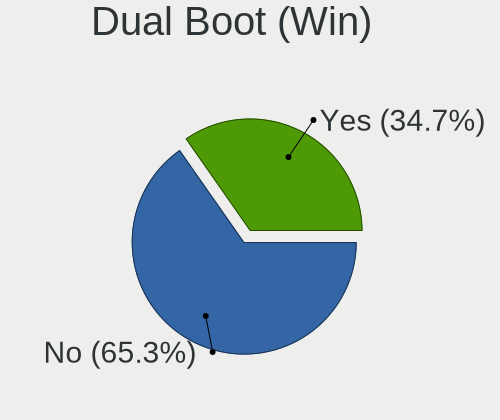
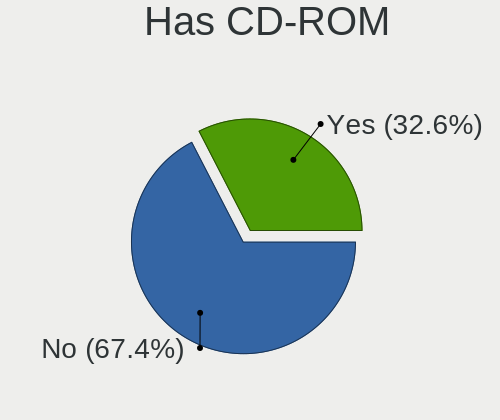
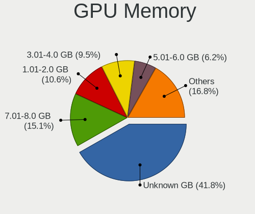

Manjaro - Tested Hardware & Statistics (Desktops)
-------------------------------------------------

A project to collect tested hardware configurations for Manjaro.

Anyone can contribute to this report by the [hw-probe](https://github.com/linuxhw/hw-probe) tool:

    sudo -E hw-probe -all -upload

Please contribute! Especially if your hardware is rare.

Contents
--------

* [ Test Cases ](#test-cases)

* [ System ](#system)
  - [ OS                       ](#os)
  - [ OS Family                ](#os-family)
  - [ Kernel                   ](#kernel)
  - [ Kernel Family            ](#kernel-family)
  - [ Kernel Major Ver.        ](#kernel-major-ver)
  - [ Arch                     ](#arch)
  - [ DE                       ](#de)
  - [ Display Server           ](#display-server)
  - [ Display Manager          ](#display-manager)
  - [ OS Lang                  ](#os-lang)
  - [ Boot Mode                ](#boot-mode)
  - [ Filesystem               ](#filesystem)
  - [ Part. scheme             ](#part-scheme)
  - [ Dual Boot with Linux/BSD ](#dual-boot-with-linuxbsd)
  - [ Dual Boot (Win)          ](#dual-boot-win)

* [ Board ](#board)
  - [ Vendor                   ](#vendor)
  - [ Model                    ](#model)
  - [ Model Family             ](#model-family)
  - [ MFG Year                 ](#mfg-year)
  - [ Form Factor              ](#form-factor)
  - [ Secure Boot              ](#secure-boot)
  - [ Coreboot                 ](#coreboot)
  - [ RAM Size                 ](#ram-size)
  - [ RAM Used                 ](#ram-used)
  - [ Total Drives             ](#total-drives)
  - [ Has CD-ROM               ](#has-cd-rom)
  - [ Has Ethernet             ](#has-ethernet)
  - [ Has WiFi                 ](#has-wifi)
  - [ Has Bluetooth            ](#has-bluetooth)

* [ Location ](#location)
  - [ Country                  ](#country)
  - [ City                     ](#city)

* [ Drives ](#drives)
  - [ Drive Vendor             ](#drive-vendor)
  - [ Drive Model              ](#drive-model)
  - [ HDD Vendor               ](#hdd-vendor)
  - [ SSD Vendor               ](#ssd-vendor)
  - [ Drive Kind               ](#drive-kind)
  - [ Drive Connector          ](#drive-connector)
  - [ Drive Size               ](#drive-size)
  - [ Space Total              ](#space-total)
  - [ Space Used               ](#space-used)
  - [ Malfunc. Drives          ](#malfunc-drives)
  - [ Malfunc. Drive Vendor    ](#malfunc-drive-vendor)
  - [ Malfunc. HDD Vendor      ](#malfunc-hdd-vendor)
  - [ Malfunc. Drive Kind      ](#malfunc-drive-kind)
  - [ Failed Drives            ](#failed-drives)
  - [ Failed Drive Vendor      ](#failed-drive-vendor)
  - [ Drive Status             ](#drive-status)

* [ Storage controller ](#storage-controller)
  - [ Storage Vendor           ](#storage-vendor)
  - [ Storage Model            ](#storage-model)
  - [ Storage Kind             ](#storage-kind)

* [ Processor ](#processor)
  - [ CPU Vendor               ](#cpu-vendor)
  - [ CPU Model                ](#cpu-model)
  - [ CPU Model Family         ](#cpu-model-family)
  - [ CPU Cores                ](#cpu-cores)
  - [ CPU Sockets              ](#cpu-sockets)
  - [ CPU Threads              ](#cpu-threads)
  - [ CPU Op-Modes             ](#cpu-op-modes)
  - [ CPU Microcode            ](#cpu-microcode)
  - [ CPU Microarch            ](#cpu-microarch)

* [ Graphics ](#graphics)
  - [ GPU Vendor               ](#gpu-vendor)
  - [ GPU Model                ](#gpu-model)
  - [ GPU Combo                ](#gpu-combo)
  - [ GPU Driver               ](#gpu-driver)
  - [ GPU Memory               ](#gpu-memory)

* [ Monitor ](#monitor)
  - [ Monitor Vendor           ](#monitor-vendor)
  - [ Monitor Model            ](#monitor-model)
  - [ Monitor Resolution       ](#monitor-resolution)
  - [ Monitor Diagonal         ](#monitor-diagonal)
  - [ Monitor Width            ](#monitor-width)
  - [ Aspect Ratio             ](#aspect-ratio)
  - [ Monitor Area             ](#monitor-area)
  - [ Pixel Density            ](#pixel-density)
  - [ Multiple Monitors        ](#multiple-monitors)

* [ Network ](#network)
  - [ Net Controller Vendor    ](#net-controller-vendor)
  - [ Net Controller Model     ](#net-controller-model)
  - [ Wireless Vendor          ](#wireless-vendor)
  - [ Wireless Model           ](#wireless-model)
  - [ Ethernet Vendor          ](#ethernet-vendor)
  - [ Ethernet Model           ](#ethernet-model)
  - [ Net Controller Kind      ](#net-controller-kind)
  - [ Used Controller          ](#used-controller)
  - [ NICs                     ](#nics)
  - [ IPv6                     ](#ipv6)

* [ Bluetooth ](#bluetooth)
  - [ Bluetooth Vendor         ](#bluetooth-vendor)
  - [ Bluetooth Model          ](#bluetooth-model)

* [ Sound ](#sound)
  - [ Sound Vendor             ](#sound-vendor)
  - [ Sound Model              ](#sound-model)

* [ Memory ](#memory)
  - [ Memory Vendor            ](#memory-vendor)
  - [ Memory Model             ](#memory-model)
  - [ Memory Kind              ](#memory-kind)
  - [ Memory Form Factor       ](#memory-form-factor)
  - [ Memory Size              ](#memory-size)
  - [ Memory Speed             ](#memory-speed)

* [ Printers & scanners ](#printers--scanners)
  - [ Printer Vendor           ](#printer-vendor)
  - [ Printer Model            ](#printer-model)
  - [ Scanner Vendor           ](#scanner-vendor)
  - [ Scanner Model            ](#scanner-model)

* [ Camera ](#camera)
  - [ Camera Vendor            ](#camera-vendor)
  - [ Camera Model             ](#camera-model)

* [ Security ](#security)
  - [ Fingerprint Vendor       ](#fingerprint-vendor)
  - [ Fingerprint Model        ](#fingerprint-model)
  - [ Chipcard Vendor          ](#chipcard-vendor)
  - [ Chipcard Model           ](#chipcard-model)

* [ Unsupported ](#unsupported)
  - [ Unsupported Devices      ](#unsupported-devices)
  - [ Unsupported Device Types ](#unsupported-device-types)

Test Cases
----------

Total: 4607

| Vendor        | Model                       | Probe                                                      | Date         |
|---------------|-----------------------------|------------------------------------------------------------|--------------|
| ASRock        | B450 Gaming K4              | [5283cfbe48](https://linux-hardware.org/?probe=5283cfbe48) | May 08, 2024 |
| Huanan        | X99-F8 GAMING V5.0          | [541eebe872](https://linux-hardware.org/?probe=541eebe872) | May 08, 2024 |
| Gigabyte      | B550 AORUS ELITE V2         | [ab440c0aca](https://linux-hardware.org/?probe=ab440c0aca) | May 08, 2024 |
| ASUSTek       | B150 PRO GAMING             | [d559ef5203](https://linux-hardware.org/?probe=d559ef5203) | May 08, 2024 |
| Gigabyte      | B450 AORUS ELITE            | [af6bde9c97](https://linux-hardware.org/?probe=af6bde9c97) | May 07, 2024 |
| Gigabyte      | B450 AORUS ELITE            | [1755d8da2b](https://linux-hardware.org/?probe=1755d8da2b) | May 07, 2024 |
| ASUSTek       | P8Z77-I DELUXE              | [6aa44077ff](https://linux-hardware.org/?probe=6aa44077ff) | May 07, 2024 |
| ASUSTek       | PRIME Z490-A                | [a68c1a8752](https://linux-hardware.org/?probe=a68c1a8752) | May 07, 2024 |
| Dell          | 0V8WGR A00                  | [826e11d8af](https://linux-hardware.org/?probe=826e11d8af) | May 05, 2024 |
| Dell          | 06FW8P A01                  | [41be164658](https://linux-hardware.org/?probe=41be164658) | May 04, 2024 |
| HP            | 1494                        | [7b5806585f](https://linux-hardware.org/?probe=7b5806585f) | May 04, 2024 |
| ASRock        | B650E PG Riptide WiFi       | [3c5e2db28c](https://linux-hardware.org/?probe=3c5e2db28c) | May 04, 2024 |
| Gigabyte      | X570S AORUS ELITE AX        | [58453faaf6](https://linux-hardware.org/?probe=58453faaf6) | May 03, 2024 |
| ASUSTek       | PRIME H310M-E R2.0          | [024f668f69](https://linux-hardware.org/?probe=024f668f69) | May 03, 2024 |
| ECS           | H110M-SI02                  | [6e2344c648](https://linux-hardware.org/?probe=6e2344c648) | May 03, 2024 |
| Dell          | 0HD5W2 A01                  | [b44b5a5556](https://linux-hardware.org/?probe=b44b5a5556) | May 03, 2024 |
| ASUSTek       | B150 PRO GAMING             | [94e57165f0](https://linux-hardware.org/?probe=94e57165f0) | May 03, 2024 |
| ASUSTek       | B150 PRO GAMING             | [4d38c7926c](https://linux-hardware.org/?probe=4d38c7926c) | May 02, 2024 |
| HP            | 8643 SMVB                   | [8c77e42bdd](https://linux-hardware.org/?probe=8c77e42bdd) | May 02, 2024 |
| ASUSTek       | A88XM-E                     | [df8ef63dc3](https://linux-hardware.org/?probe=df8ef63dc3) | May 02, 2024 |
| Gigabyte      | B450 AORUS PRO-CF           | [1b914f7922](https://linux-hardware.org/?probe=1b914f7922) | May 01, 2024 |
| Acer          | RS880M05                    | [bc549ed290](https://linux-hardware.org/?probe=bc549ed290) | Apr 30, 2024 |
| EVGA          | Z790 CLASSIFIED.0           | [10ac75bfd8](https://linux-hardware.org/?probe=10ac75bfd8) | Apr 30, 2024 |
| MSI           | B450M BAZOOKA V2            | [12ec4389e8](https://linux-hardware.org/?probe=12ec4389e8) | Apr 30, 2024 |
| Gigabyte      | B550M DS3H AC               | [2d51e08cd6](https://linux-hardware.org/?probe=2d51e08cd6) | Apr 29, 2024 |
| ASUSTek       | TUF Gaming B550M-PLUS       | [74c797eef3](https://linux-hardware.org/?probe=74c797eef3) | Apr 29, 2024 |
| HP            | 89EB 11                     | [dd5549c4d7](https://linux-hardware.org/?probe=dd5549c4d7) | Apr 28, 2024 |
| ASUSTek       | PRIME A520M-K               | [e76da56567](https://linux-hardware.org/?probe=e76da56567) | Apr 28, 2024 |
| Gigabyte      | F2A68HM-H                   | [03f841c32a](https://linux-hardware.org/?probe=03f841c32a) | Apr 26, 2024 |
| ASUSTek       | TUF Gaming B660M-PLUS WI... | [fbeb4be390](https://linux-hardware.org/?probe=fbeb4be390) | Apr 25, 2024 |
| Gigabyte      | B660 GAMING X AX DDR4       | [84b2ad73d1](https://linux-hardware.org/?probe=84b2ad73d1) | Apr 25, 2024 |
| ASRock        | B75 Pro3                    | [87a8013072](https://linux-hardware.org/?probe=87a8013072) | Apr 24, 2024 |
| Gigabyte      | H110M-S2PH-CF               | [f35a83875e](https://linux-hardware.org/?probe=f35a83875e) | Apr 24, 2024 |
| ASRock        | B450M Pro4-F                | [e8d54dd61b](https://linux-hardware.org/?probe=e8d54dd61b) | Apr 23, 2024 |
| MSI           | PRO B650-P WIFI             | [2edbe2e138](https://linux-hardware.org/?probe=2edbe2e138) | Apr 23, 2024 |
| Gigabyte      | Z790 AORUS ELITE AX         | [4485a9e6db](https://linux-hardware.org/?probe=4485a9e6db) | Apr 22, 2024 |
| Dell          | 0N185P A02                  | [1193feda44](https://linux-hardware.org/?probe=1193feda44) | Apr 22, 2024 |
| ASUSTek       | TUF Gaming B550-PLUS        | [5b37288076](https://linux-hardware.org/?probe=5b37288076) | Apr 21, 2024 |
| MSI           | PRO Z690-A DDR4             | [f426cfb62e](https://linux-hardware.org/?probe=f426cfb62e) | Apr 21, 2024 |
| ASUSTek       | PRIME H310M-E R2.0          | [03eb665cce](https://linux-hardware.org/?probe=03eb665cce) | Apr 20, 2024 |
| Gigabyte      | B85-HD3                     | [110fafe0b0](https://linux-hardware.org/?probe=110fafe0b0) | Apr 20, 2024 |
| ASUSTek       | H81M-A                      | [1ef3d038c5](https://linux-hardware.org/?probe=1ef3d038c5) | Apr 19, 2024 |
| ASUSTek       | A68HM-PLUS                  | [94cd362057](https://linux-hardware.org/?probe=94cd362057) | Apr 19, 2024 |
| ASUSTek       | G10CES                      | [a040e8acd4](https://linux-hardware.org/?probe=a040e8acd4) | Apr 18, 2024 |
| Gigabyte      | GA-870A-UD3                 | [7cd79d20e0](https://linux-hardware.org/?probe=7cd79d20e0) | Apr 18, 2024 |
| Gigabyte      | B360M D3H-CF                | [708c7e8551](https://linux-hardware.org/?probe=708c7e8551) | Apr 18, 2024 |
| Gigabyte      | B360M D3H-CF                | [42b026296c](https://linux-hardware.org/?probe=42b026296c) | Apr 18, 2024 |
| ASRock        | B450M Pro4                  | [36dcccf3ea](https://linux-hardware.org/?probe=36dcccf3ea) | Apr 17, 2024 |
| ASRock        | X670E Taichi                | [aebc928b10](https://linux-hardware.org/?probe=aebc928b10) | Apr 17, 2024 |
| ASUSTek       | A68HM-PLUS                  | [ff144e4ebc](https://linux-hardware.org/?probe=ff144e4ebc) | Apr 17, 2024 |
| ASUSTek       | PRIME Z490-A                | [1e41083adc](https://linux-hardware.org/?probe=1e41083adc) | Apr 17, 2024 |
| Gigabyte      | H110M-S2-CF                 | [8b14a90950](https://linux-hardware.org/?probe=8b14a90950) | Apr 16, 2024 |
| Dell          | 09WH54 A01                  | [a444b54a3b](https://linux-hardware.org/?probe=a444b54a3b) | Apr 14, 2024 |
| Dell          | 09WH54 A01                  | [bc7aeec1d0](https://linux-hardware.org/?probe=bc7aeec1d0) | Apr 14, 2024 |
| MSI           | B360M MORTAR                | [e915eb334e](https://linux-hardware.org/?probe=e915eb334e) | Apr 14, 2024 |
| HP            | 304Ah                       | [912a8508e6](https://linux-hardware.org/?probe=912a8508e6) | Apr 13, 2024 |
| Gigabyte      | GA-870A-UD3                 | [bd4be0124b](https://linux-hardware.org/?probe=bd4be0124b) | Apr 12, 2024 |
| MSI           | MAG B550 TOMAHAWK           | [66b49c3998](https://linux-hardware.org/?probe=66b49c3998) | Apr 12, 2024 |
| Gigabyte      | B550 AORUS PRO              | [5858a2ed28](https://linux-hardware.org/?probe=5858a2ed28) | Apr 12, 2024 |
| ASUSTek       | TUF Gaming X570-PLUS_BR     | [c19812eddd](https://linux-hardware.org/?probe=c19812eddd) | Apr 11, 2024 |
| ASRock        | B450 Gaming K4              | [57a6443eb0](https://linux-hardware.org/?probe=57a6443eb0) | Apr 11, 2024 |
| ASRock        | B450M Pro4-F                | [72a3752add](https://linux-hardware.org/?probe=72a3752add) | Apr 11, 2024 |
| ASRock        | Z790 Riptide WiFi           | [778af9df5e](https://linux-hardware.org/?probe=778af9df5e) | Apr 11, 2024 |
| MSI           | B560M PRO                   | [8fb8045266](https://linux-hardware.org/?probe=8fb8045266) | Apr 10, 2024 |
| MSI           | NF725M-P43                  | [ff3656c7c8](https://linux-hardware.org/?probe=ff3656c7c8) | Apr 10, 2024 |
| MSI           | B560M PRO                   | [9f35872df2](https://linux-hardware.org/?probe=9f35872df2) | Apr 09, 2024 |
| HP            | 2215                        | [7e6e6d5a8e](https://linux-hardware.org/?probe=7e6e6d5a8e) | Apr 09, 2024 |
| ASUSTek       | PRIME X470-PRO              | [35615a89f1](https://linux-hardware.org/?probe=35615a89f1) | Apr 09, 2024 |
| ASUSTek       | PRIME X470-PRO              | [dfc1c56c57](https://linux-hardware.org/?probe=dfc1c56c57) | Apr 09, 2024 |
| Dell          | 0NW73C A00                  | [f6bbc9ee86](https://linux-hardware.org/?probe=f6bbc9ee86) | Apr 08, 2024 |
| MSI           | X470 GAMING PLUS MAX        | [078e1e4a08](https://linux-hardware.org/?probe=078e1e4a08) | Apr 07, 2024 |
| HP            | 2215                        | [eb7f7c122d](https://linux-hardware.org/?probe=eb7f7c122d) | Apr 07, 2024 |
| MSI           | PRO B550M-VC WIFI           | [f8d2db509c](https://linux-hardware.org/?probe=f8d2db509c) | Apr 05, 2024 |
| HP            | 18E7                        | [32fb4595f3](https://linux-hardware.org/?probe=32fb4595f3) | Apr 05, 2024 |
| Biostar       | H410MH S2                   | [c2d62789b8](https://linux-hardware.org/?probe=c2d62789b8) | Apr 04, 2024 |
| ASRock        | B650E PG Riptide WiFi       | [57bfb487f6](https://linux-hardware.org/?probe=57bfb487f6) | Apr 04, 2024 |
| ASUSTek       | ROG STRIX B650E-I GAMING... | [66aa317734](https://linux-hardware.org/?probe=66aa317734) | Apr 03, 2024 |
| Gigabyte      | X570 AORUS ULTRA            | [0ddecde36c](https://linux-hardware.org/?probe=0ddecde36c) | Apr 02, 2024 |
| ASRock        | B450 Gaming K4              | [999ca6d09e](https://linux-hardware.org/?probe=999ca6d09e) | Apr 02, 2024 |
| Intel         | X99                         | [b9d21bc637](https://linux-hardware.org/?probe=b9d21bc637) | Apr 02, 2024 |
| Dell          | 0PTTT9 A01                  | [00d2c75a39](https://linux-hardware.org/?probe=00d2c75a39) | Apr 01, 2024 |
| Huanan        | X99-8M-F V1.2               | [3005ead43c](https://linux-hardware.org/?probe=3005ead43c) | Apr 01, 2024 |
| ASUSTek       | A68HM-PLUS                  | [d346c3ccc9](https://linux-hardware.org/?probe=d346c3ccc9) | Mar 31, 2024 |
| ASRock        | B450M Pro4                  | [58b0db3dfb](https://linux-hardware.org/?probe=58b0db3dfb) | Mar 29, 2024 |
| ASRock        | H310CM-HDV/M.2 SE           | [89b9fc26fd](https://linux-hardware.org/?probe=89b9fc26fd) | Mar 29, 2024 |
| Apple         | Mac-F221BEC8                | [806306c660](https://linux-hardware.org/?probe=806306c660) | Mar 28, 2024 |
| Dell          | 00V62H A01                  | [01dc610c0f](https://linux-hardware.org/?probe=01dc610c0f) | Mar 26, 2024 |
| MSI           | MPG X570 GAMING EDGE WIF... | [9cd1b54ee4](https://linux-hardware.org/?probe=9cd1b54ee4) | Mar 26, 2024 |
| MSI           | MPG X570 GAMING EDGE WIF... | [94f974defe](https://linux-hardware.org/?probe=94f974defe) | Mar 26, 2024 |
| ASUSTek       | P8B75-M                     | [a67e18a770](https://linux-hardware.org/?probe=a67e18a770) | Mar 25, 2024 |
| ASRock        | B550 Taichi                 | [2e2354955b](https://linux-hardware.org/?probe=2e2354955b) | Mar 25, 2024 |
| ASUSTek       | TUF Gaming X670E-PLUS       | [932ab537fb](https://linux-hardware.org/?probe=932ab537fb) | Mar 24, 2024 |
| Unknown       | Unknown                     | [a510e47285](https://linux-hardware.org/?probe=a510e47285) | Mar 24, 2024 |
| Dell          | 00V62H A01                  | [ba1cc89018](https://linux-hardware.org/?probe=ba1cc89018) | Mar 24, 2024 |
| MSI           | Z87-G45 GAMING              | [8a396f9c6f](https://linux-hardware.org/?probe=8a396f9c6f) | Mar 24, 2024 |
| Gigabyte      | A520M S2H                   | [9e6a2e1fee](https://linux-hardware.org/?probe=9e6a2e1fee) | Mar 24, 2024 |
| ASUSTek       | P8H61-M LX2 R2.0            | [2eb4acdd5d](https://linux-hardware.org/?probe=2eb4acdd5d) | Mar 23, 2024 |
| MSI           | PRO X670-P WIFI             | [a4cf76123c](https://linux-hardware.org/?probe=a4cf76123c) | Mar 23, 2024 |
| ASRock        | B650E PG Riptide WiFi       | [085d42e647](https://linux-hardware.org/?probe=085d42e647) | Mar 23, 2024 |
| HP            | 83EF                        | [34c1c23a84](https://linux-hardware.org/?probe=34c1c23a84) | Mar 23, 2024 |
| MSI           | MEG X570 UNIFY              | [4c1e8684a4](https://linux-hardware.org/?probe=4c1e8684a4) | Mar 23, 2024 |
| Gigabyte      | Z170X-Gaming 6              | [741bd1ee57](https://linux-hardware.org/?probe=741bd1ee57) | Mar 23, 2024 |
| Fujitsu       | D3430-A1 S26361-D3430-A1    | [d6d7a1ee5c](https://linux-hardware.org/?probe=d6d7a1ee5c) | Mar 23, 2024 |
| ASUSTek       | ROG STRIX B550-XE GAMING... | [d2f79931db](https://linux-hardware.org/?probe=d2f79931db) | Mar 21, 2024 |
| ASRock        | B650E Taichi Lite           | [c8860b992b](https://linux-hardware.org/?probe=c8860b992b) | Mar 21, 2024 |
| Gigabyte      | GA-78LMT-USB3 x.x           | [1971c7bb7b](https://linux-hardware.org/?probe=1971c7bb7b) | Mar 21, 2024 |
| Gigabyte      | GA-78LMT-USB3 x.x           | [527f84d0be](https://linux-hardware.org/?probe=527f84d0be) | Mar 21, 2024 |
| ASRock        | B550M Pro4                  | [2b2b92392e](https://linux-hardware.org/?probe=2b2b92392e) | Mar 20, 2024 |
| MSI           | H97 PC Mate                 | [aea5049f9f](https://linux-hardware.org/?probe=aea5049f9f) | Mar 19, 2024 |
| MSI           | PRO B760-P WIFI             | [f23497e346](https://linux-hardware.org/?probe=f23497e346) | Mar 19, 2024 |
| ASUSTek       | ROG STRIX B550-F GAMING     | [dc6ef0d174](https://linux-hardware.org/?probe=dc6ef0d174) | Mar 19, 2024 |
| Fujitsu       | D3430-A1 S26361-D3430-A1    | [6f5261ec20](https://linux-hardware.org/?probe=6f5261ec20) | Mar 19, 2024 |
| ASUSTek       | TUF Gaming B550-PLUS        | [34e98be7ae](https://linux-hardware.org/?probe=34e98be7ae) | Mar 18, 2024 |
| Dell          | 0WMJ54 A00                  | [306aac13ae](https://linux-hardware.org/?probe=306aac13ae) | Mar 18, 2024 |
| Gigabyte      | B360HD3                     | [a82720d3a4](https://linux-hardware.org/?probe=a82720d3a4) | Mar 18, 2024 |
| MSI           | MEG X570 UNIFY              | [45753de529](https://linux-hardware.org/?probe=45753de529) | Mar 17, 2024 |
| ASUSTek       | PRIME B350-PLUS             | [5d30af07da](https://linux-hardware.org/?probe=5d30af07da) | Mar 16, 2024 |
| ASRock        | X570 Phantom Gaming 4       | [cf14560ac7](https://linux-hardware.org/?probe=cf14560ac7) | Mar 16, 2024 |
| Gigabyte      | Z370 AORUS ULTRA GAMING-... | [7953afffd9](https://linux-hardware.org/?probe=7953afffd9) | Mar 16, 2024 |
| MSI           | B560M PRO                   | [c51f942cae](https://linux-hardware.org/?probe=c51f942cae) | Mar 15, 2024 |
| ASUSTek       | PRIME B350-PLUS             | [6c0b3fb84c](https://linux-hardware.org/?probe=6c0b3fb84c) | Mar 15, 2024 |
| MSI           | B450M-A PRO MAX             | [80f8e06be3](https://linux-hardware.org/?probe=80f8e06be3) | Mar 15, 2024 |
| HP            | 83EE                        | [3c8891b8fd](https://linux-hardware.org/?probe=3c8891b8fd) | Mar 14, 2024 |
| ASUSTek       | ROG STRIX X670E-F GAMING... | [a507f29fed](https://linux-hardware.org/?probe=a507f29fed) | Mar 14, 2024 |
| Gigabyte      | B550M DS3H                  | [3842a72ce8](https://linux-hardware.org/?probe=3842a72ce8) | Mar 14, 2024 |
| AZW           | MINI S 10                   | [605b7f6b25](https://linux-hardware.org/?probe=605b7f6b25) | Mar 13, 2024 |
| Gigabyte      | Z370 HD3-CF                 | [fe9632e966](https://linux-hardware.org/?probe=fe9632e966) | Mar 13, 2024 |
| Gigabyte      | B550M DS3H                  | [26e6e1854e](https://linux-hardware.org/?probe=26e6e1854e) | Mar 13, 2024 |
| Gigabyte      | Z170-HD3 DDR3-CF            | [5790181302](https://linux-hardware.org/?probe=5790181302) | Mar 12, 2024 |
| ASUSTek       | STRIX Z270G GAMING          | [cd02271f4a](https://linux-hardware.org/?probe=cd02271f4a) | Mar 11, 2024 |
| Gigabyte      | B365M DS3H                  | [f8eeb3ce24](https://linux-hardware.org/?probe=f8eeb3ce24) | Mar 09, 2024 |
| ASRock        | B660 Steel Legend           | [4905884d5a](https://linux-hardware.org/?probe=4905884d5a) | Mar 09, 2024 |
| ASRock        | B660 Steel Legend           | [e439bd4f0e](https://linux-hardware.org/?probe=e439bd4f0e) | Mar 09, 2024 |
| MSI           | GF615M-P33                  | [e90ec20e06](https://linux-hardware.org/?probe=e90ec20e06) | Mar 09, 2024 |
| Gigabyte      | G1.Guerrilla                | [24f2da961a](https://linux-hardware.org/?probe=24f2da961a) | Mar 08, 2024 |
| ASUSTek       | Q87M-E                      | [6c1f8f0b34](https://linux-hardware.org/?probe=6c1f8f0b34) | Mar 08, 2024 |
| ASUSTek       | SABERTOOTH X99              | [c79364c133](https://linux-hardware.org/?probe=c79364c133) | Mar 08, 2024 |
| ASRock        | B450 Gaming K4              | [9f6eb2e3c7](https://linux-hardware.org/?probe=9f6eb2e3c7) | Mar 08, 2024 |
| Gigabyte      | B460M DS3H                  | [334ee373c4](https://linux-hardware.org/?probe=334ee373c4) | Mar 08, 2024 |
| ASUSTek       | PRIME Z790-V WIFI           | [659032a1ad](https://linux-hardware.org/?probe=659032a1ad) | Mar 06, 2024 |
| Huanan        | X99-TF                      | [37d9e7a46b](https://linux-hardware.org/?probe=37d9e7a46b) | Mar 06, 2024 |
| Huanan        | X99-TF                      | [8adcbbcd8e](https://linux-hardware.org/?probe=8adcbbcd8e) | Mar 06, 2024 |
| ASUSTek       | TUF Gaming X570-PLUS_BR     | [eb80b5ba45](https://linux-hardware.org/?probe=eb80b5ba45) | Mar 05, 2024 |
| Gigabyte      | G1.Guerrilla                | [a6cb9cdd68](https://linux-hardware.org/?probe=a6cb9cdd68) | Mar 05, 2024 |
| ASUSTek       | PRIME Z790-V WIFI           | [32d4f3439c](https://linux-hardware.org/?probe=32d4f3439c) | Mar 04, 2024 |
| Dell          | 09M8Y8 A01                  | [19c0ac380a](https://linux-hardware.org/?probe=19c0ac380a) | Mar 03, 2024 |
| Gigabyte      | B365M H                     | [513d4bbee5](https://linux-hardware.org/?probe=513d4bbee5) | Mar 02, 2024 |
| Dell          | 0J3C2F A01                  | [9bd2d372ef](https://linux-hardware.org/?probe=9bd2d372ef) | Mar 02, 2024 |
| ASRock        | X470 Master SLI/ac          | [d35d9477d1](https://linux-hardware.org/?probe=d35d9477d1) | Mar 01, 2024 |
| Dell          | 0J3C2F A01                  | [b24ab60b59](https://linux-hardware.org/?probe=b24ab60b59) | Feb 29, 2024 |
| ASUSTek       | Maximus VIII HERO           | [bc62cff5e5](https://linux-hardware.org/?probe=bc62cff5e5) | Feb 28, 2024 |
| ASRock        | Z170 Extreme4               | [20b4c67043](https://linux-hardware.org/?probe=20b4c67043) | Feb 28, 2024 |
| Gigabyte      | 970A-UD3P                   | [b104cb1d44](https://linux-hardware.org/?probe=b104cb1d44) | Feb 28, 2024 |
| Unknown       | Unknown                     | [9c1c3068b1](https://linux-hardware.org/?probe=9c1c3068b1) | Feb 27, 2024 |
| ASUSTek       | H61M-K                      | [9bf9a75794](https://linux-hardware.org/?probe=9bf9a75794) | Feb 26, 2024 |
| ASUSTek       | H61M-K                      | [4fa6f03992](https://linux-hardware.org/?probe=4fa6f03992) | Feb 26, 2024 |
| ASUSTek       | H81M-K                      | [2e7804bd0c](https://linux-hardware.org/?probe=2e7804bd0c) | Feb 25, 2024 |
| ASUSTek       | TUF Gaming X570-PLUS        | [48f560e40a](https://linux-hardware.org/?probe=48f560e40a) | Feb 25, 2024 |
| MSI           | A320M GRENADE               | [540e4beff6](https://linux-hardware.org/?probe=540e4beff6) | Feb 25, 2024 |
| Gigabyte      | B450 AORUS ELITE            | [a8f2561414](https://linux-hardware.org/?probe=a8f2561414) | Feb 25, 2024 |
| MSI           | Z170A PC MATE               | [f2f9a7b540](https://linux-hardware.org/?probe=f2f9a7b540) | Feb 25, 2024 |
| HP            | 158A                        | [dfc6ee3932](https://linux-hardware.org/?probe=dfc6ee3932) | Feb 25, 2024 |
| HP            | 158A                        | [a31b6f549f](https://linux-hardware.org/?probe=a31b6f549f) | Feb 25, 2024 |
| ASUSTek       | H81M-K                      | [0319862f8e](https://linux-hardware.org/?probe=0319862f8e) | Feb 24, 2024 |
| ASUSTek       | PRIME B660-PLUS D4          | [623fa9174e](https://linux-hardware.org/?probe=623fa9174e) | Feb 24, 2024 |
| MSI           | B560M PRO                   | [baf7dd1c4f](https://linux-hardware.org/?probe=baf7dd1c4f) | Feb 23, 2024 |
| ASUSTek       | TUF Gaming X670E-PLUS WI... | [b5c3a0469b](https://linux-hardware.org/?probe=b5c3a0469b) | Feb 23, 2024 |
| ASUSTek       | PRIME Z490M-PLUS            | [30442eac39](https://linux-hardware.org/?probe=30442eac39) | Feb 23, 2024 |
| MSI           | MAG B550M MORTAR            | [143d44040c](https://linux-hardware.org/?probe=143d44040c) | Feb 23, 2024 |
| Lenovo        | 1046 SBB1C50523 WIN 3556... | [5f1e566662](https://linux-hardware.org/?probe=5f1e566662) | Feb 22, 2024 |
| Gigabyte      | B450 AORUS M                | [6d096929a9](https://linux-hardware.org/?probe=6d096929a9) | Feb 22, 2024 |
| MSI           | MAG B550 TOMAHAWK           | [b9e21044bf](https://linux-hardware.org/?probe=b9e21044bf) | Feb 21, 2024 |
| HP            | 3047h                       | [c427822595](https://linux-hardware.org/?probe=c427822595) | Feb 20, 2024 |
| HP            | 3047h                       | [ea79dc34bf](https://linux-hardware.org/?probe=ea79dc34bf) | Feb 20, 2024 |
| ASUSTek       | ROG STRIX X670E-E GAMING... | [9ce3fca007](https://linux-hardware.org/?probe=9ce3fca007) | Feb 19, 2024 |
| Intel         | H61 V1.1                    | [b737c0174f](https://linux-hardware.org/?probe=b737c0174f) | Feb 18, 2024 |
| ASUSTek       | P7H55-M BR                  | [3b30479368](https://linux-hardware.org/?probe=3b30479368) | Feb 18, 2024 |
| ASUSTek       | ROG STRIX B650E-I GAMING... | [efd4bd356f](https://linux-hardware.org/?probe=efd4bd356f) | Feb 17, 2024 |
| ASUSTek       | H81M-C                      | [0c55d1c68f](https://linux-hardware.org/?probe=0c55d1c68f) | Feb 17, 2024 |
| HP            | 1998                        | [88acae11a0](https://linux-hardware.org/?probe=88acae11a0) | Feb 16, 2024 |
| MSI           | P55-GD55                    | [d6f0f7a03b](https://linux-hardware.org/?probe=d6f0f7a03b) | Feb 16, 2024 |
| ASUSTek       | PRIME B450-PLUS             | [b5a153ca03](https://linux-hardware.org/?probe=b5a153ca03) | Feb 15, 2024 |
| ASUSTek       | ROG STRIX X670E-E GAMING... | [5f0c5d682f](https://linux-hardware.org/?probe=5f0c5d682f) | Feb 15, 2024 |
| Medion        | MS-7797                     | [b557534cdc](https://linux-hardware.org/?probe=b557534cdc) | Feb 14, 2024 |
| HP            | 8643 SMVB                   | [74b837c864](https://linux-hardware.org/?probe=74b837c864) | Feb 13, 2024 |
| Gigabyte      | B550 AORUS ELITE V2         | [89dc16a204](https://linux-hardware.org/?probe=89dc16a204) | Feb 12, 2024 |
| Gigabyte      | B550 AORUS ELITE V2         | [d8095f4230](https://linux-hardware.org/?probe=d8095f4230) | Feb 12, 2024 |
| MSI           | Z390-A PRO                  | [310c126d3c](https://linux-hardware.org/?probe=310c126d3c) | Feb 12, 2024 |
| ASUSTek       | TUF Gaming B650M-E WIFI     | [2ae73a83dc](https://linux-hardware.org/?probe=2ae73a83dc) | Feb 12, 2024 |
| Lenovo        | SHARKBAY SDK0E50510 WIN     | [a964ee2b60](https://linux-hardware.org/?probe=a964ee2b60) | Feb 12, 2024 |
| MSI           | B560M PRO                   | [8d6bc7570e](https://linux-hardware.org/?probe=8d6bc7570e) | Feb 10, 2024 |
| Shenzhen M... | F7BSC                       | [ea6f15d115](https://linux-hardware.org/?probe=ea6f15d115) | Feb 10, 2024 |
| ASUSTek       | PRIME A320M-K               | [07c2f9cf19](https://linux-hardware.org/?probe=07c2f9cf19) | Feb 09, 2024 |
| Dell          | 0WN7Y6 A01                  | [8b5a2a98cf](https://linux-hardware.org/?probe=8b5a2a98cf) | Feb 06, 2024 |
| ASRock        | X300M-STX                   | [7e8a301da3](https://linux-hardware.org/?probe=7e8a301da3) | Feb 06, 2024 |
| Gigabyte      | B550M H                     | [a2e43ce689](https://linux-hardware.org/?probe=a2e43ce689) | Feb 05, 2024 |
| MSI           | Z370 PC PRO                 | [980dc7c8ae](https://linux-hardware.org/?probe=980dc7c8ae) | Feb 04, 2024 |
| HP            | 1998                        | [093236a7d8](https://linux-hardware.org/?probe=093236a7d8) | Feb 04, 2024 |
| ASRock        | B450M Pro4                  | [25223a0282](https://linux-hardware.org/?probe=25223a0282) | Feb 03, 2024 |
| Gigabyte      | B450 AORUS ELITE            | [aaebf4ea23](https://linux-hardware.org/?probe=aaebf4ea23) | Feb 02, 2024 |
| MSI           | B450-A PRO                  | [10f58dc52e](https://linux-hardware.org/?probe=10f58dc52e) | Feb 01, 2024 |
| MSI           | MPG X570 GAMING PLUS        | [0d5790b907](https://linux-hardware.org/?probe=0d5790b907) | Feb 01, 2024 |
| MSI           | MPG X570 GAMING PLUS        | [5ec61e07a8](https://linux-hardware.org/?probe=5ec61e07a8) | Feb 01, 2024 |
| MSI           | B450-A PRO                  | [aecf5f7bf1](https://linux-hardware.org/?probe=aecf5f7bf1) | Feb 01, 2024 |
| Gigabyte      | B550M K                     | [1ead3418ae](https://linux-hardware.org/?probe=1ead3418ae) | Jan 31, 2024 |
| Gigabyte      | B450 I AORUS PRO WIFI-CF    | [78b2648ff3](https://linux-hardware.org/?probe=78b2648ff3) | Jan 30, 2024 |
| ASUSTek       | PRIME X670-P WIFI           | [d1d5004095](https://linux-hardware.org/?probe=d1d5004095) | Jan 30, 2024 |
| ASUSTek       | P8H61-MX                    | [1d7356527b](https://linux-hardware.org/?probe=1d7356527b) | Jan 30, 2024 |
| MSI           | B450-A PRO                  | [afb7d75f84](https://linux-hardware.org/?probe=afb7d75f84) | Jan 28, 2024 |
| Gigabyte      | A520M S2H                   | [960d1543c0](https://linux-hardware.org/?probe=960d1543c0) | Jan 28, 2024 |
| Gigabyte      | GA-MA770T-UD3P              | [13d6b2dc0a](https://linux-hardware.org/?probe=13d6b2dc0a) | Jan 27, 2024 |
| MSI           | B560M PRO                   | [773f3d7e1c](https://linux-hardware.org/?probe=773f3d7e1c) | Jan 27, 2024 |
| ASUSTek       | M5A97 PLUS                  | [f06a700136](https://linux-hardware.org/?probe=f06a700136) | Jan 27, 2024 |
| Gigabyte      | B450M DS3H-CF               | [2d860764f7](https://linux-hardware.org/?probe=2d860764f7) | Jan 27, 2024 |
| ASRock        | AB350M Pro4                 | [ab39d263d5](https://linux-hardware.org/?probe=ab39d263d5) | Jan 27, 2024 |
| MSI           | MAG B550 TORPEDO            | [73f56ca35a](https://linux-hardware.org/?probe=73f56ca35a) | Jan 26, 2024 |
| MSI           | MS-B9181                    | [6575c3c5ad](https://linux-hardware.org/?probe=6575c3c5ad) | Jan 25, 2024 |
| MSI           | B560M PRO-E                 | [898383016a](https://linux-hardware.org/?probe=898383016a) | Jan 25, 2024 |
| ASUSTek       | PRIME A320M-K               | [0bdecdf839](https://linux-hardware.org/?probe=0bdecdf839) | Jan 24, 2024 |
| MSI           | MAG X670E TOMAHAWK WIFI     | [89d705627b](https://linux-hardware.org/?probe=89d705627b) | Jan 24, 2024 |
| ASUSTek       | A55BM-E                     | [3d3b63f7c5](https://linux-hardware.org/?probe=3d3b63f7c5) | Jan 22, 2024 |
| Gigabyte      | A520M S2H                   | [bbfb471169](https://linux-hardware.org/?probe=bbfb471169) | Jan 22, 2024 |
| ASRock        | B460M Pro4                  | [65b69b2422](https://linux-hardware.org/?probe=65b69b2422) | Jan 21, 2024 |
| MSI           | B350M MORTAR                | [e65dc0f60c](https://linux-hardware.org/?probe=e65dc0f60c) | Jan 21, 2024 |
| MSI           | B450-A PRO                  | [e11e6780da](https://linux-hardware.org/?probe=e11e6780da) | Jan 20, 2024 |
| Apple         | Mac-F221BEC8                | [e435385c77](https://linux-hardware.org/?probe=e435385c77) | Jan 20, 2024 |
| MSI           | H510M-A PRO                 | [d82c1229a9](https://linux-hardware.org/?probe=d82c1229a9) | Jan 20, 2024 |
| Gigabyte      | B450M DS3H-CF               | [30d4375ab2](https://linux-hardware.org/?probe=30d4375ab2) | Jan 20, 2024 |
| HP            | 8298                        | [9702f87120](https://linux-hardware.org/?probe=9702f87120) | Jan 18, 2024 |
| ASUSTek       | PRIME X570-PRO              | [fe59a3038f](https://linux-hardware.org/?probe=fe59a3038f) | Jan 16, 2024 |
| ASUSTek       | Z87-PLUS                    | [8636e544df](https://linux-hardware.org/?probe=8636e544df) | Jan 15, 2024 |
| MSI           | Z170A PC MATE               | [9df326ae6f](https://linux-hardware.org/?probe=9df326ae6f) | Jan 15, 2024 |
| ASUSTek       | H81M-C                      | [3437acb566](https://linux-hardware.org/?probe=3437acb566) | Jan 15, 2024 |
| ASRock        | X300M-STX                   | [2802b8b35f](https://linux-hardware.org/?probe=2802b8b35f) | Jan 14, 2024 |
| Intel         | H81                         | [fee8b2f668](https://linux-hardware.org/?probe=fee8b2f668) | Jan 13, 2024 |
| Lenovo        | 3141 SDK0J40700 WIN 3258... | [5688ffafb8](https://linux-hardware.org/?probe=5688ffafb8) | Jan 13, 2024 |
| Dell          | 0YXT71 A00                  | [c82074b2f4](https://linux-hardware.org/?probe=c82074b2f4) | Jan 12, 2024 |
| ASRock        | B450M Pro4-F                | [99dfb1abed](https://linux-hardware.org/?probe=99dfb1abed) | Jan 11, 2024 |
| Gigabyte      | Z790 GAMING X AX            | [80799f979c](https://linux-hardware.org/?probe=80799f979c) | Jan 10, 2024 |
| MSI           | B450M-A PRO MAX             | [09ec307e39](https://linux-hardware.org/?probe=09ec307e39) | Jan 10, 2024 |
| ASUSTek       | H81M-C                      | [234e6e24b3](https://linux-hardware.org/?probe=234e6e24b3) | Jan 10, 2024 |
| ASUSTek       | SABERTOOTH X99              | [a8116aaf03](https://linux-hardware.org/?probe=a8116aaf03) | Jan 10, 2024 |
| ASRock        | B550M Pro SE                | [2a7c9822b3](https://linux-hardware.org/?probe=2a7c9822b3) | Jan 10, 2024 |
| MSI           | H510M-A PRO                 | [625e6af2b6](https://linux-hardware.org/?probe=625e6af2b6) | Jan 09, 2024 |
| ASRock        | B450 Gaming K4              | [9446a22c53](https://linux-hardware.org/?probe=9446a22c53) | Jan 09, 2024 |
| ASUSTek       | M5A97 PLUS                  | [d22d465f0f](https://linux-hardware.org/?probe=d22d465f0f) | Jan 09, 2024 |
| MSI           | 970 GAMING                  | [68c61980ac](https://linux-hardware.org/?probe=68c61980ac) | Jan 08, 2024 |
| ASUSTek       | Maximus V FORMULA           | [4380071e4e](https://linux-hardware.org/?probe=4380071e4e) | Jan 08, 2024 |
| ASUSTek       | ROG STRIX B550-XE GAMING... | [5f59758f89](https://linux-hardware.org/?probe=5f59758f89) | Jan 05, 2024 |
| ASUSTek       | TUF Gaming B550M-PLUS       | [345ae1cb3d](https://linux-hardware.org/?probe=345ae1cb3d) | Jan 05, 2024 |
| ASUSTek       | TUF Gaming B550M-PLUS       | [280d389295](https://linux-hardware.org/?probe=280d389295) | Jan 05, 2024 |
| ASUSTek       | B85M-E                      | [6207f6a6cc](https://linux-hardware.org/?probe=6207f6a6cc) | Jan 04, 2024 |
| Dell          | 0NDYHG A00                  | [3eb6487c6e](https://linux-hardware.org/?probe=3eb6487c6e) | Jan 04, 2024 |
| ASUSTek       | Maximus V FORMULA           | [6c4433d5e3](https://linux-hardware.org/?probe=6c4433d5e3) | Jan 03, 2024 |
| HP            | 2B36                        | [adbdd18377](https://linux-hardware.org/?probe=adbdd18377) | Jan 03, 2024 |
| HP            | 2B36                        | [5c8c804c7e](https://linux-hardware.org/?probe=5c8c804c7e) | Jan 03, 2024 |
| ASUSTek       | PRIME B550M-K               | [54c131d794](https://linux-hardware.org/?probe=54c131d794) | Jan 03, 2024 |
| ASRock        | 970 Pro3 R2.0               | [508424d991](https://linux-hardware.org/?probe=508424d991) | Jan 02, 2024 |
| ASUSTek       | ROG STRIX B650E-I GAMING... | [769bd9153a](https://linux-hardware.org/?probe=769bd9153a) | Jan 01, 2024 |
| ASRock        | B650E PG Riptide WiFi       | [9c99c1bf71](https://linux-hardware.org/?probe=9c99c1bf71) | Dec 31, 2023 |
| ASRock        | B75M-DGS                    | [3a2df88d60](https://linux-hardware.org/?probe=3a2df88d60) | Dec 31, 2023 |
| Lenovo        | 1046 SBB1C50523 WIN 3556... | [080172526c](https://linux-hardware.org/?probe=080172526c) | Dec 31, 2023 |
| HP            | 8949 11                     | [1add0bc0e2](https://linux-hardware.org/?probe=1add0bc0e2) | Dec 30, 2023 |
| ASRock        | 970 Pro3 R2.0               | [2f24e45b02](https://linux-hardware.org/?probe=2f24e45b02) | Dec 29, 2023 |
| MSI           | MAG Z690 TOMAHAWK WIFI D... | [0daa9bd3eb](https://linux-hardware.org/?probe=0daa9bd3eb) | Dec 29, 2023 |
| ASRock        | B650E PG Riptide WiFi       | [3bf93539f3](https://linux-hardware.org/?probe=3bf93539f3) | Dec 28, 2023 |
| ASUSTek       | H170-PRO                    | [969aa3e243](https://linux-hardware.org/?probe=969aa3e243) | Dec 26, 2023 |
| MSI           | H510M-A PRO                 | [0260c1a342](https://linux-hardware.org/?probe=0260c1a342) | Dec 26, 2023 |
| Gigabyte      | Z370 HD3-CF                 | [25e443386a](https://linux-hardware.org/?probe=25e443386a) | Dec 26, 2023 |
| ASUSTek       | PRIME Z370-A II             | [2013c4457a](https://linux-hardware.org/?probe=2013c4457a) | Dec 26, 2023 |
| ASRock        | X670E Taichi                | [281602cb0e](https://linux-hardware.org/?probe=281602cb0e) | Dec 26, 2023 |
| MSI           | GF615M-P33                  | [9e99d63708](https://linux-hardware.org/?probe=9e99d63708) | Dec 25, 2023 |
| MSI           | H510M-A PRO                 | [9f369b34fa](https://linux-hardware.org/?probe=9f369b34fa) | Dec 24, 2023 |
| ASUSTek       | M5A97 EVO R2.0              | [cccb18ead9](https://linux-hardware.org/?probe=cccb18ead9) | Dec 24, 2023 |
| MSI           | B350M PRO-VDH               | [d845a3492b](https://linux-hardware.org/?probe=d845a3492b) | Dec 24, 2023 |
| MSI           | B350M PRO-VDH               | [a6e1fc3b29](https://linux-hardware.org/?probe=a6e1fc3b29) | Dec 24, 2023 |
| MSI           | PRO B650-S WIFI             | [c084478d6e](https://linux-hardware.org/?probe=c084478d6e) | Dec 24, 2023 |
| MSI           | H510M-A PRO                 | [fe19f4de86](https://linux-hardware.org/?probe=fe19f4de86) | Dec 23, 2023 |
| MSI           | B560M PRO                   | [3885df62ab](https://linux-hardware.org/?probe=3885df62ab) | Dec 23, 2023 |
| Gigabyte      | Z790 GAMING X AX            | [155e0f1c37](https://linux-hardware.org/?probe=155e0f1c37) | Dec 22, 2023 |
| ASUSTek       | Maximus VI GENE             | [178aab1062](https://linux-hardware.org/?probe=178aab1062) | Dec 22, 2023 |
| ASUSTek       | ROG CROSSHAIR VIII HERO     | [98298e164f](https://linux-hardware.org/?probe=98298e164f) | Dec 20, 2023 |
| HP            | 83E0                        | [8f41483d26](https://linux-hardware.org/?probe=8f41483d26) | Dec 19, 2023 |
| MSI           | B450M PRO-VDH PLUS          | [df369cf5be](https://linux-hardware.org/?probe=df369cf5be) | Dec 19, 2023 |
| Lenovo        | 3704 SDK0K17763 WIN 1801... | [9a2472e628](https://linux-hardware.org/?probe=9a2472e628) | Dec 19, 2023 |
| ASUSTek       | PRIME B350-PLUS             | [448a2dec7d](https://linux-hardware.org/?probe=448a2dec7d) | Dec 17, 2023 |
| ASUSTek       | PRIME B350-PLUS             | [ebfec06632](https://linux-hardware.org/?probe=ebfec06632) | Dec 17, 2023 |
| ASRock        | H310CM-HG4                  | [4e47d91bc7](https://linux-hardware.org/?probe=4e47d91bc7) | Dec 17, 2023 |
| Dell          | 0VHWTR A01                  | [78ef6792a1](https://linux-hardware.org/?probe=78ef6792a1) | Dec 16, 2023 |
| ASRock        | 760GM-HDV                   | [c1403f5d52](https://linux-hardware.org/?probe=c1403f5d52) | Dec 15, 2023 |
| ASUSTek       | Pro WS X570-ACE             | [ebfb65701f](https://linux-hardware.org/?probe=ebfb65701f) | Dec 14, 2023 |
| ASUSTek       | ROG STRIX X670E-F GAMING... | [25b995fdda](https://linux-hardware.org/?probe=25b995fdda) | Dec 12, 2023 |
| ASUSTek       | ROG STRIX X670E-F GAMING... | [52ffec69ce](https://linux-hardware.org/?probe=52ffec69ce) | Dec 12, 2023 |
| Gigabyte      | Z97N-WIFI                   | [514227865f](https://linux-hardware.org/?probe=514227865f) | Dec 12, 2023 |
| MSI           | MAG X570 TOMAHAWK WIFI      | [2cfceea8dc](https://linux-hardware.org/?probe=2cfceea8dc) | Dec 12, 2023 |
| Gigabyte      | Z270-Gaming K3 2017-06-1... | [5292573e8d](https://linux-hardware.org/?probe=5292573e8d) | Dec 11, 2023 |
| ASUSTek       | TUF Gaming X570-PLUS        | [098d790720](https://linux-hardware.org/?probe=098d790720) | Dec 10, 2023 |
| ASUSTek       | TUF Gaming Z690-PLUS WIF... | [090ebbd9dd](https://linux-hardware.org/?probe=090ebbd9dd) | Dec 10, 2023 |
| ASRock        | B450 Gaming K4              | [581807905e](https://linux-hardware.org/?probe=581807905e) | Dec 10, 2023 |
| Dell          | 0NDYHG A01                  | [f7f70db230](https://linux-hardware.org/?probe=f7f70db230) | Dec 08, 2023 |
| ASRock        | B550M Steel Legend          | [eac155f5e6](https://linux-hardware.org/?probe=eac155f5e6) | Dec 08, 2023 |
| Unknown       | Unknown                     | [c652e80145](https://linux-hardware.org/?probe=c652e80145) | Dec 08, 2023 |
| Gigabyte      | B550M DS3H                  | [650771c55d](https://linux-hardware.org/?probe=650771c55d) | Dec 07, 2023 |
| Unknown       | Unknown                     | [1dd3b89bd1](https://linux-hardware.org/?probe=1dd3b89bd1) | Dec 07, 2023 |
| HP            | 83E0                        | [a4266f2a5e](https://linux-hardware.org/?probe=a4266f2a5e) | Dec 06, 2023 |
| ASUSTek       | ROG STRIX X570-E GAMING     | [7d7cf8fd3d](https://linux-hardware.org/?probe=7d7cf8fd3d) | Dec 06, 2023 |
| ASRock        | B450 Pro4                   | [1d99a563c9](https://linux-hardware.org/?probe=1d99a563c9) | Dec 05, 2023 |
| ASUSTek       | ROG CROSSHAIR X670E EXTR... | [3a8de1659a](https://linux-hardware.org/?probe=3a8de1659a) | Dec 05, 2023 |
| ASUSTek       | Z97-PRO GAMER               | [362161fd73](https://linux-hardware.org/?probe=362161fd73) | Dec 04, 2023 |
| Gigabyte      | Z97N-WIFI                   | [aeae361474](https://linux-hardware.org/?probe=aeae361474) | Dec 04, 2023 |
| ASUSTek       | PRIME Z790-P WIFI           | [8b11ad9f77](https://linux-hardware.org/?probe=8b11ad9f77) | Dec 02, 2023 |
| Gigabyte      | B450M DS3H-CF               | [ae8ecce4bd](https://linux-hardware.org/?probe=ae8ecce4bd) | Dec 02, 2023 |
| Gigabyte      | B450M DS3H-CF               | [0b017377f1](https://linux-hardware.org/?probe=0b017377f1) | Dec 02, 2023 |
| ASUSTek       | ROG STRIX X670E-A GAMING... | [0338afa4db](https://linux-hardware.org/?probe=0338afa4db) | Dec 01, 2023 |
| ASUSTek       | Pro WS X570-ACE             | [940148ec06](https://linux-hardware.org/?probe=940148ec06) | Dec 01, 2023 |
| Unknown       | Unknown                     | [cd167c532c](https://linux-hardware.org/?probe=cd167c532c) | Dec 01, 2023 |
| ASUSTek       | ROG STRIX B550-A GAMING     | [bb6640572b](https://linux-hardware.org/?probe=bb6640572b) | Nov 30, 2023 |
| ASUSTek       | P8Z77-I DELUXE              | [a139e1830c](https://linux-hardware.org/?probe=a139e1830c) | Nov 29, 2023 |
| ASRock        | H310CM-HG4                  | [bd3a1b9c9a](https://linux-hardware.org/?probe=bd3a1b9c9a) | Nov 28, 2023 |
| Gigabyte      | A55M-DS2                    | [bb5c7bef3f](https://linux-hardware.org/?probe=bb5c7bef3f) | Nov 27, 2023 |
| MSI           | B450 TOMAHAWK MAX           | [77e8b3479a](https://linux-hardware.org/?probe=77e8b3479a) | Nov 27, 2023 |
| HP            | 2820h                       | [e9bdfab0be](https://linux-hardware.org/?probe=e9bdfab0be) | Nov 27, 2023 |
| HP            | 2B36                        | [3e8b681ec7](https://linux-hardware.org/?probe=3e8b681ec7) | Nov 27, 2023 |
| ASUSTek       | P8Z77-I DELUXE              | [bb98eb3ce9](https://linux-hardware.org/?probe=bb98eb3ce9) | Nov 26, 2023 |
| ASRock        | N68C-S UCC                  | [a5b04f6fdb](https://linux-hardware.org/?probe=a5b04f6fdb) | Nov 24, 2023 |
| Apple         | Mac-F221BEC8                | [b11d29c96b](https://linux-hardware.org/?probe=b11d29c96b) | Nov 24, 2023 |
| MSI           | B550M PRO                   | [e834bc66b9](https://linux-hardware.org/?probe=e834bc66b9) | Nov 24, 2023 |
| ASUSTek       | ROG STRIX B650E-E GAMING... | [2a14b62cf5](https://linux-hardware.org/?probe=2a14b62cf5) | Nov 24, 2023 |
| ASRock        | B450 Gaming K4              | [ee82d7417c](https://linux-hardware.org/?probe=ee82d7417c) | Nov 23, 2023 |
| Lenovo        | SHARKBAY 31900059 STD       | [bc11e1264c](https://linux-hardware.org/?probe=bc11e1264c) | Nov 22, 2023 |
| Dell          | 0WPMFG A00                  | [9cf9520fc3](https://linux-hardware.org/?probe=9cf9520fc3) | Nov 20, 2023 |
| ASUSTek       | ROG STRIX Z590-F GAMING ... | [7a4e5e7709](https://linux-hardware.org/?probe=7a4e5e7709) | Nov 19, 2023 |
| Lenovo        | SHARKBAY 31900059 STD       | [5368b237d8](https://linux-hardware.org/?probe=5368b237d8) | Nov 18, 2023 |
| Gigabyte      | P35-DS3                     | [ece45e3b1c](https://linux-hardware.org/?probe=ece45e3b1c) | Nov 18, 2023 |
| Gigabyte      | P35-DS3                     | [1f7e5feb84](https://linux-hardware.org/?probe=1f7e5feb84) | Nov 17, 2023 |
| Lenovo        | SHARKBAY 31900059 STD       | [7af93dbd28](https://linux-hardware.org/?probe=7af93dbd28) | Nov 17, 2023 |
| MSI           | MPG X570 GAMING EDGE WIF... | [e57d2d64f5](https://linux-hardware.org/?probe=e57d2d64f5) | Nov 17, 2023 |
| Unknown       | Unknown                     | [90f5f3a274](https://linux-hardware.org/?probe=90f5f3a274) | Nov 14, 2023 |
| ASRock        | A320M-HDV R4.0              | [a09eca53d5](https://linux-hardware.org/?probe=a09eca53d5) | Nov 14, 2023 |
| Gigabyte      | P35-DS3                     | [fac1d1b119](https://linux-hardware.org/?probe=fac1d1b119) | Nov 14, 2023 |
| Gigabyte      | Z370 HD3-CF                 | [f29ef35eec](https://linux-hardware.org/?probe=f29ef35eec) | Nov 13, 2023 |
| Gigabyte      | H510M S2H V2                | [8599ff1b2c](https://linux-hardware.org/?probe=8599ff1b2c) | Nov 13, 2023 |
| ASUSTek       | Z87-A                       | [08f1651d1f](https://linux-hardware.org/?probe=08f1651d1f) | Nov 12, 2023 |
| Gigabyte      | H510M S2H V2                | [238ea043b4](https://linux-hardware.org/?probe=238ea043b4) | Nov 10, 2023 |
| Dell          | 04YP6J A02                  | [b7f860630b](https://linux-hardware.org/?probe=b7f860630b) | Nov 10, 2023 |
| ASRock        | B760M PG Riptide            | [6c0d3672d5](https://linux-hardware.org/?probe=6c0d3672d5) | Nov 10, 2023 |
| Lenovo        | 3100 SDK0J40700 WIN 3258... | [10234424e1](https://linux-hardware.org/?probe=10234424e1) | Nov 09, 2023 |
| ASUSTek       | P8Z68-V PRO GEN3            | [14438106c9](https://linux-hardware.org/?probe=14438106c9) | Nov 09, 2023 |
| ASRock        | A320M-HDV R4.0              | [8ba89e650a](https://linux-hardware.org/?probe=8ba89e650a) | Nov 08, 2023 |
| HP            | 158B                        | [b8bd2429fa](https://linux-hardware.org/?probe=b8bd2429fa) | Nov 07, 2023 |
| MSI           | MAG B550 TORPEDO            | [fc34295ec7](https://linux-hardware.org/?probe=fc34295ec7) | Nov 07, 2023 |
| HP            | 8053                        | [c46468ecb6](https://linux-hardware.org/?probe=c46468ecb6) | Nov 07, 2023 |
| Lenovo        | SHARKBAY 0B98401 PRO        | [7152c7ed2c](https://linux-hardware.org/?probe=7152c7ed2c) | Nov 05, 2023 |
| ASUSTek       | PRIME B460M-A               | [034b113ac8](https://linux-hardware.org/?probe=034b113ac8) | Nov 05, 2023 |
| Gigabyte      | B650M DS3H                  | [a424739d4f](https://linux-hardware.org/?probe=a424739d4f) | Nov 05, 2023 |
| HP            | 1998                        | [d454314b77](https://linux-hardware.org/?probe=d454314b77) | Nov 05, 2023 |
| ASUSTek       | PRIME B450M-GAMING/BR       | [f45893cbf7](https://linux-hardware.org/?probe=f45893cbf7) | Nov 05, 2023 |
| MSI           | H110I PRO                   | [c335c71c4b](https://linux-hardware.org/?probe=c335c71c4b) | Nov 05, 2023 |
| Lenovo        | SHARKBAY 0B98401 PRO        | [8841ab599e](https://linux-hardware.org/?probe=8841ab599e) | Nov 04, 2023 |
| MSI           | B560M PRO                   | [903907b7c0](https://linux-hardware.org/?probe=903907b7c0) | Nov 04, 2023 |
| Lenovo        | 317E NOK                    | [1d038af880](https://linux-hardware.org/?probe=1d038af880) | Nov 04, 2023 |
| ASRock        | B550M Pro4                  | [f0354d2416](https://linux-hardware.org/?probe=f0354d2416) | Nov 04, 2023 |
| ASUSTek       | M5A97 R2.0                  | [798cba826c](https://linux-hardware.org/?probe=798cba826c) | Nov 04, 2023 |
| ASUSTek       | M5A97 R2.0                  | [2c601304f7](https://linux-hardware.org/?probe=2c601304f7) | Nov 04, 2023 |
| HP            | 0B54h D                     | [574e5fd946](https://linux-hardware.org/?probe=574e5fd946) | Nov 03, 2023 |
| ASRock        | A320M-HDV R4.0              | [44890192a1](https://linux-hardware.org/?probe=44890192a1) | Nov 03, 2023 |
| ASUSTek       | TUF Gaming X570-PLUS_BR     | [2aa4f1a7f7](https://linux-hardware.org/?probe=2aa4f1a7f7) | Nov 03, 2023 |
| ASUSTek       | PRIME H770-PLUS D4          | [62645c6b56](https://linux-hardware.org/?probe=62645c6b56) | Nov 02, 2023 |
| Dell          | 0200DY A02                  | [f07206a75c](https://linux-hardware.org/?probe=f07206a75c) | Nov 02, 2023 |
| MSI           | B560M PRO                   | [adf6c161fa](https://linux-hardware.org/?probe=adf6c161fa) | Nov 02, 2023 |
| Unknown       | 1.0                         | [6265787d93](https://linux-hardware.org/?probe=6265787d93) | Nov 01, 2023 |
| ASUSTek       | PRIME B450M-A II            | [08ee10dc83](https://linux-hardware.org/?probe=08ee10dc83) | Nov 01, 2023 |
| MSI           | PRO Z790-P WIFI DDR4        | [e03b553957](https://linux-hardware.org/?probe=e03b553957) | Nov 01, 2023 |
| ASUSTek       | PRIME B350-PLUS             | [7b71031ba1](https://linux-hardware.org/?probe=7b71031ba1) | Oct 31, 2023 |
| ASUSTek       | PRIME B350-PLUS             | [3ab77e3324](https://linux-hardware.org/?probe=3ab77e3324) | Oct 31, 2023 |
| ASRock        | A320M-HDV R4.0              | [7941dfd8cf](https://linux-hardware.org/?probe=7941dfd8cf) | Oct 31, 2023 |
| ASRock        | B550M Steel Legend          | [f123c19bb4](https://linux-hardware.org/?probe=f123c19bb4) | Oct 30, 2023 |
| ASUSTek       | PRIME B450M-A II            | [6cafea6b4c](https://linux-hardware.org/?probe=6cafea6b4c) | Oct 30, 2023 |
| GEEKOM        | Mini IT12                   | [b9509f49f1](https://linux-hardware.org/?probe=b9509f49f1) | Oct 28, 2023 |
| MSI           | GF615M-P33                  | [10af2377c2](https://linux-hardware.org/?probe=10af2377c2) | Oct 28, 2023 |
| Gigabyte      | B450M DS3H-CF               | [80b9cb5e56](https://linux-hardware.org/?probe=80b9cb5e56) | Oct 28, 2023 |
| Lenovo        | ThinkCentre A70z 0401G6G    | [52e07e7ffe](https://linux-hardware.org/?probe=52e07e7ffe) | Oct 28, 2023 |
| Gigabyte      | B660M DS3H AX DDR4          | [7610254116](https://linux-hardware.org/?probe=7610254116) | Oct 27, 2023 |
| ASUSTek       | M5A97 PLUS                  | [484d866dc6](https://linux-hardware.org/?probe=484d866dc6) | Oct 27, 2023 |
| ASUSTek       | M5A97 PLUS                  | [a619c8a955](https://linux-hardware.org/?probe=a619c8a955) | Oct 27, 2023 |
| ASRock        | B450 Gaming K4              | [15488b723a](https://linux-hardware.org/?probe=15488b723a) | Oct 27, 2023 |
| Gigabyte      | B550 AORUS PRO V2           | [e8432e79c8](https://linux-hardware.org/?probe=e8432e79c8) | Oct 26, 2023 |
| MSI           | B450-A PRO                  | [e71634ac32](https://linux-hardware.org/?probe=e71634ac32) | Oct 26, 2023 |
| MSI           | MAG B650 TOMAHAWK WIFI      | [3a1039b4b6](https://linux-hardware.org/?probe=3a1039b4b6) | Oct 26, 2023 |
| ASUSTek       | PRIME X370-PRO              | [9cb0b1ec27](https://linux-hardware.org/?probe=9cb0b1ec27) | Oct 26, 2023 |
| ASUSTek       | Z170-P                      | [62bbdaec23](https://linux-hardware.org/?probe=62bbdaec23) | Oct 24, 2023 |
| HP            | 212B                        | [714373878e](https://linux-hardware.org/?probe=714373878e) | Oct 24, 2023 |
| HP            | 83EF                        | [9953e14c0a](https://linux-hardware.org/?probe=9953e14c0a) | Oct 24, 2023 |
| ASUSTek       | Z170-P                      | [47b5a808aa](https://linux-hardware.org/?probe=47b5a808aa) | Oct 24, 2023 |
| MSI           | Z390-A PRO                  | [48233204f6](https://linux-hardware.org/?probe=48233204f6) | Oct 23, 2023 |
| ASUSTek       | PRIME H670-PLUS D4          | [07e8b4df09](https://linux-hardware.org/?probe=07e8b4df09) | Oct 23, 2023 |
| ASRock        | B760M PG Riptide            | [d1f12415b9](https://linux-hardware.org/?probe=d1f12415b9) | Oct 23, 2023 |
| Gigabyte      | B550 AORUS ELITE AX V2      | [cb6130951a](https://linux-hardware.org/?probe=cb6130951a) | Oct 23, 2023 |
| Gigabyte      | B760 GAMING X DDR4          | [ce9770538c](https://linux-hardware.org/?probe=ce9770538c) | Oct 22, 2023 |
| Dell          | 09WH54 A01                  | [4211349cc4](https://linux-hardware.org/?probe=4211349cc4) | Oct 22, 2023 |
| ASUSTek       | TUF Gaming B650M-PLUS       | [67c6d6e482](https://linux-hardware.org/?probe=67c6d6e482) | Oct 21, 2023 |
| ASRock        | H97M Pro4                   | [04f6bc7f0c](https://linux-hardware.org/?probe=04f6bc7f0c) | Oct 21, 2023 |
| Gigabyte      | X570 AORUS PRO WIFI         | [1ae8f16052](https://linux-hardware.org/?probe=1ae8f16052) | Oct 21, 2023 |
| ASUSTek       | PRIME B450M-K               | [a0b48d8a7e](https://linux-hardware.org/?probe=a0b48d8a7e) | Oct 20, 2023 |
| ASRock        | A320M-HDV R4.0              | [17f5bf3cef](https://linux-hardware.org/?probe=17f5bf3cef) | Oct 20, 2023 |
| ASRock        | B450 Gaming K4              | [65f3d76afa](https://linux-hardware.org/?probe=65f3d76afa) | Oct 19, 2023 |
| MSI           | Z390-A PRO                  | [7fd0eeaeec](https://linux-hardware.org/?probe=7fd0eeaeec) | Oct 19, 2023 |
| Biostar       | A320MH                      | [e2c20a6c0c](https://linux-hardware.org/?probe=e2c20a6c0c) | Oct 19, 2023 |
| ASUSTek       | PRIME X570-PRO              | [84517c1f4c](https://linux-hardware.org/?probe=84517c1f4c) | Oct 19, 2023 |
| Biostar       | A320MH                      | [62a3d049b2](https://linux-hardware.org/?probe=62a3d049b2) | Oct 18, 2023 |
| ASRock        | AB350 Pro4                  | [71eba7e232](https://linux-hardware.org/?probe=71eba7e232) | Oct 18, 2023 |
| Lenovo        | 1046 SBB1C50523 WIN 3556... | [f824921cbb](https://linux-hardware.org/?probe=f824921cbb) | Oct 17, 2023 |
| MSI           | MAG B550 TOMAHAWK           | [5f780203e2](https://linux-hardware.org/?probe=5f780203e2) | Oct 17, 2023 |
| ASUSTek       | TUF Gaming B550-PLUS WIF... | [9b7bc3fc9d](https://linux-hardware.org/?probe=9b7bc3fc9d) | Oct 16, 2023 |
| Gigabyte      | X570 AORUS ELITE WIFI       | [c976b314a2](https://linux-hardware.org/?probe=c976b314a2) | Oct 16, 2023 |
| ASUSTek       | PRIME Z790-A WIFI           | [af4857609e](https://linux-hardware.org/?probe=af4857609e) | Oct 15, 2023 |
| Gigabyte      | X670 AORUS ELITE AX         | [f71ad29f6a](https://linux-hardware.org/?probe=f71ad29f6a) | Oct 15, 2023 |
| Gigabyte      | A520M DS3H                  | [e79f4b834d](https://linux-hardware.org/?probe=e79f4b834d) | Oct 13, 2023 |
| ASRock        | B550M Pro4                  | [c1e1d017af](https://linux-hardware.org/?probe=c1e1d017af) | Oct 13, 2023 |
| ASUSTek       | PRIME B450M-A II            | [ac840f060f](https://linux-hardware.org/?probe=ac840f060f) | Oct 13, 2023 |
| ASRock        | B550M Pro4                  | [d1386e080d](https://linux-hardware.org/?probe=d1386e080d) | Oct 12, 2023 |
| MSI           | B560M PRO                   | [3ad673132a](https://linux-hardware.org/?probe=3ad673132a) | Oct 12, 2023 |
| Gigabyte      | GA-880GMA-UD2H              | [17b8025f8d](https://linux-hardware.org/?probe=17b8025f8d) | Oct 11, 2023 |
| Lenovo        | 317E NOK                    | [618b7ebe59](https://linux-hardware.org/?probe=618b7ebe59) | Oct 11, 2023 |
| MSI           | H310M PRO-M2 PLUS           | [e185192929](https://linux-hardware.org/?probe=e185192929) | Oct 11, 2023 |
| ASUSTek       | PRIME B450-PLUS             | [a5c5f58ddb](https://linux-hardware.org/?probe=a5c5f58ddb) | Oct 11, 2023 |
| ASRock        | Z390 Phantom Gaming-ITX/... | [2c7e31eb6f](https://linux-hardware.org/?probe=2c7e31eb6f) | Oct 09, 2023 |
| ASRock        | B760M PG Riptide            | [9b5474fee0](https://linux-hardware.org/?probe=9b5474fee0) | Oct 09, 2023 |
| MSI           | MPG X570 GAMING PRO CARB... | [90041fa012](https://linux-hardware.org/?probe=90041fa012) | Oct 09, 2023 |
| ASUSTek       | P8H67-M EVO                 | [146bc4cb2c](https://linux-hardware.org/?probe=146bc4cb2c) | Oct 08, 2023 |
| MSI           | B450M MORTAR MAX            | [b03eea6d75](https://linux-hardware.org/?probe=b03eea6d75) | Oct 08, 2023 |
| HP            | 212B                        | [faa56daf1d](https://linux-hardware.org/?probe=faa56daf1d) | Oct 07, 2023 |
| HP            | 83E8                        | [c1028de72b](https://linux-hardware.org/?probe=c1028de72b) | Oct 07, 2023 |
| ASUSTek       | TUF Gaming X670E-PLUS WI... | [e401b0c370](https://linux-hardware.org/?probe=e401b0c370) | Oct 07, 2023 |
| MSI           | B450 TOMAHAWK MAX II        | [ad60cd6e18](https://linux-hardware.org/?probe=ad60cd6e18) | Oct 06, 2023 |
| ASUSTek       | B85-PRO GAMER               | [10baa7a046](https://linux-hardware.org/?probe=10baa7a046) | Oct 06, 2023 |
| MSI           | MPG B760I EDGE WIFI DDR4    | [f68374e7cd](https://linux-hardware.org/?probe=f68374e7cd) | Oct 05, 2023 |
| Gigabyte      | B450M DS3H-CF               | [cbf93da8d0](https://linux-hardware.org/?probe=cbf93da8d0) | Oct 04, 2023 |
| ASUSTek       | PRIME X370-PRO              | [573f1da6a9](https://linux-hardware.org/?probe=573f1da6a9) | Oct 03, 2023 |
| Gigabyte      | X570S UD                    | [5d8ef7c003](https://linux-hardware.org/?probe=5d8ef7c003) | Oct 03, 2023 |
| ASUSTek       | M5A97 R2.0                  | [2e1316fb48](https://linux-hardware.org/?probe=2e1316fb48) | Oct 03, 2023 |
| ASUSTek       | SABERTOOTH Z77              | [6a2fa93249](https://linux-hardware.org/?probe=6a2fa93249) | Oct 03, 2023 |
| Gigabyte      | B365M DS3H                  | [c9a7b94ace](https://linux-hardware.org/?probe=c9a7b94ace) | Oct 03, 2023 |
| MSI           | B560M PRO                   | [1312550a66](https://linux-hardware.org/?probe=1312550a66) | Oct 02, 2023 |
| ASRock        | B450 Gaming K4              | [8311d775a9](https://linux-hardware.org/?probe=8311d775a9) | Oct 01, 2023 |
| MSI           | B560M PRO                   | [1dc06a927c](https://linux-hardware.org/?probe=1dc06a927c) | Sep 29, 2023 |
| MSI           | H97 GAMING 3                | [51f3cd7354](https://linux-hardware.org/?probe=51f3cd7354) | Sep 29, 2023 |
| MSI           | B560M PRO                   | [ce2f5b7349](https://linux-hardware.org/?probe=ce2f5b7349) | Sep 29, 2023 |
| Gigabyte      | H610M S2H DDR4              | [9d767beb12](https://linux-hardware.org/?probe=9d767beb12) | Sep 27, 2023 |
| ASUSTek       | ROG STRIX B550-A GAMING     | [7ed50e5e43](https://linux-hardware.org/?probe=7ed50e5e43) | Sep 27, 2023 |
| Gigabyte      | B550 AORUS ELITE AX V2      | [7cfa1007ee](https://linux-hardware.org/?probe=7cfa1007ee) | Sep 27, 2023 |
| Gigabyte      | H61MA-D3V                   | [a9c8158139](https://linux-hardware.org/?probe=a9c8158139) | Sep 27, 2023 |
| ASUSTek       | ROG STRIX B550-A GAMING     | [65369ae480](https://linux-hardware.org/?probe=65369ae480) | Sep 25, 2023 |
| HP            | 8949 11                     | [acb62cff2b](https://linux-hardware.org/?probe=acb62cff2b) | Sep 25, 2023 |
| ASUSTek       | P5G41T-M LX3                | [5735f79e4f](https://linux-hardware.org/?probe=5735f79e4f) | Sep 23, 2023 |
| Gigabyte      | GA-880GMA-UD2H              | [fbeac0cab4](https://linux-hardware.org/?probe=fbeac0cab4) | Sep 23, 2023 |
| HP            | 8055                        | [d8ea4bc33a](https://linux-hardware.org/?probe=d8ea4bc33a) | Sep 23, 2023 |
| Gigabyte      | B450M DS3H-CF               | [537e551c45](https://linux-hardware.org/?probe=537e551c45) | Sep 23, 2023 |
| ASUSTek       | TUF Gaming X670E-PLUS WI... | [a9f9ccb4f9](https://linux-hardware.org/?probe=a9f9ccb4f9) | Sep 22, 2023 |
| MSI           | B550M PRO-VDH WIFI          | [c2c49834e5](https://linux-hardware.org/?probe=c2c49834e5) | Sep 21, 2023 |
| Gigabyte      | B550 AORUS ELITE            | [8b39e51416](https://linux-hardware.org/?probe=8b39e51416) | Sep 21, 2023 |
| ASUSTek       | ROG STRIX B650E-I GAMING... | [816502caea](https://linux-hardware.org/?probe=816502caea) | Sep 21, 2023 |
| Dell          | 00V62H A00                  | [66262df4c4](https://linux-hardware.org/?probe=66262df4c4) | Sep 21, 2023 |
| ASRock        | A320M-HD                    | [01d8f27500](https://linux-hardware.org/?probe=01d8f27500) | Sep 20, 2023 |
| HP            | 212B                        | [1d71ef5e64](https://linux-hardware.org/?probe=1d71ef5e64) | Sep 19, 2023 |
| Lenovo        | 3141 SDK0J40700 WIN 3258... | [6088e9b2fa](https://linux-hardware.org/?probe=6088e9b2fa) | Sep 19, 2023 |
| HP            | 3047h                       | [f684816e88](https://linux-hardware.org/?probe=f684816e88) | Sep 19, 2023 |
| Gigabyte      | B450M S2H                   | [75f2d2b31d](https://linux-hardware.org/?probe=75f2d2b31d) | Sep 18, 2023 |
| ASRock        | B450M-HDV R4.0              | [e517de2d8f](https://linux-hardware.org/?probe=e517de2d8f) | Sep 18, 2023 |
| Lenovo        | SHARKBAY SDK0E50510 WIN     | [78535377d6](https://linux-hardware.org/?probe=78535377d6) | Sep 18, 2023 |
| HP            | 212B                        | [a041c8b5a9](https://linux-hardware.org/?probe=a041c8b5a9) | Sep 17, 2023 |
| ASRock        | B450 Gaming K4              | [ad66bafcae](https://linux-hardware.org/?probe=ad66bafcae) | Sep 17, 2023 |
| ASUSTek       | B85M-G                      | [1398fa87b2](https://linux-hardware.org/?probe=1398fa87b2) | Sep 17, 2023 |
| ASRock        | A320M-HD                    | [8db77afc82](https://linux-hardware.org/?probe=8db77afc82) | Sep 17, 2023 |
| HP            | 3647h                       | [89c406366a](https://linux-hardware.org/?probe=89c406366a) | Sep 16, 2023 |
| Gigabyte      | 990FXA-UD3                  | [b7ff5a9cf2](https://linux-hardware.org/?probe=b7ff5a9cf2) | Sep 16, 2023 |
| Shenzhen M... | F7BSC                       | [a6d51b9c90](https://linux-hardware.org/?probe=a6d51b9c90) | Sep 16, 2023 |
| Gigabyte      | 990FXA-UD3                  | [c40357b67a](https://linux-hardware.org/?probe=c40357b67a) | Sep 16, 2023 |
| Biostar       | X370GTN                     | [1ac44acadd](https://linux-hardware.org/?probe=1ac44acadd) | Sep 16, 2023 |
| MSI           | PRO B660M-B DDR4            | [9463a6f106](https://linux-hardware.org/?probe=9463a6f106) | Sep 14, 2023 |
| Dell          | 0VHWTR A01                  | [43f6a3bfc1](https://linux-hardware.org/?probe=43f6a3bfc1) | Sep 14, 2023 |
| Dell          | 0VHWTR A01                  | [dcd2b90824](https://linux-hardware.org/?probe=dcd2b90824) | Sep 14, 2023 |
| Gigabyte      | 990FXA-UD3                  | [ba15fb6ed7](https://linux-hardware.org/?probe=ba15fb6ed7) | Sep 14, 2023 |
| Gigabyte      | X570 AORUS ELITE            | [7769de42b0](https://linux-hardware.org/?probe=7769de42b0) | Sep 13, 2023 |
| HP            | 0A60h                       | [107f849e6b](https://linux-hardware.org/?probe=107f849e6b) | Sep 13, 2023 |
| ASUSTek       | PRIME X570-P                | [c6f2b822c7](https://linux-hardware.org/?probe=c6f2b822c7) | Sep 12, 2023 |
| HP            | 870C                        | [3de222afdb](https://linux-hardware.org/?probe=3de222afdb) | Sep 12, 2023 |
| ASUSTek       | ROG STRIX B550-F GAMING     | [0ac203a0c5](https://linux-hardware.org/?probe=0ac203a0c5) | Sep 11, 2023 |
| ASUSTek       | ROG STRIX B550-F GAMING     | [793d3e47ff](https://linux-hardware.org/?probe=793d3e47ff) | Sep 10, 2023 |
| Foxconn       | G41MXE/G41MXE-K             | [6e5224fa1d](https://linux-hardware.org/?probe=6e5224fa1d) | Sep 09, 2023 |
| ASUSTek       | ROG STRIX B550-F GAMING     | [3f937bad2e](https://linux-hardware.org/?probe=3f937bad2e) | Sep 09, 2023 |
| Dell          | 00V62H A00                  | [1474c70336](https://linux-hardware.org/?probe=1474c70336) | Sep 09, 2023 |
| HP            | 2B36                        | [20552523c6](https://linux-hardware.org/?probe=20552523c6) | Sep 08, 2023 |
| HP            | 339A                        | [4ba272aaf9](https://linux-hardware.org/?probe=4ba272aaf9) | Sep 08, 2023 |
| HP            | 2B36                        | [7697b6ff27](https://linux-hardware.org/?probe=7697b6ff27) | Sep 08, 2023 |
| MSI           | MAG B550 TOMAHAWK           | [b5ea617856](https://linux-hardware.org/?probe=b5ea617856) | Sep 08, 2023 |
| MSI           | MAG B550M MORTAR WIFI       | [7cbd11709c](https://linux-hardware.org/?probe=7cbd11709c) | Sep 07, 2023 |
| MSI           | B360M GAMING PLUS           | [1faaa87b61](https://linux-hardware.org/?probe=1faaa87b61) | Sep 07, 2023 |
| MSI           | B450 TOMAHAWK MAX           | [9e7c97275d](https://linux-hardware.org/?probe=9e7c97275d) | Sep 06, 2023 |
| ASUSTek       | PRIME A320M-K               | [04d60f1b2d](https://linux-hardware.org/?probe=04d60f1b2d) | Sep 06, 2023 |
| MSI           | 2A9Ch                       | [68fe74d684](https://linux-hardware.org/?probe=68fe74d684) | Sep 06, 2023 |
| HP            | 1905                        | [e0da3a1a45](https://linux-hardware.org/?probe=e0da3a1a45) | Sep 06, 2023 |
| MSI           | B550-A PRO                  | [4a5a98638e](https://linux-hardware.org/?probe=4a5a98638e) | Sep 06, 2023 |
| ASRock        | Z690 PG Velocita            | [0064d9d9e2](https://linux-hardware.org/?probe=0064d9d9e2) | Sep 06, 2023 |
| ASRock        | A320M-HDV R4.0              | [0f5597eb7e](https://linux-hardware.org/?probe=0f5597eb7e) | Sep 05, 2023 |
| MSI           | MS-B0A81                    | [2c4cc9e78f](https://linux-hardware.org/?probe=2c4cc9e78f) | Sep 05, 2023 |
| ASRock        | 970 Pro3 R2.0               | [590b5224d9](https://linux-hardware.org/?probe=590b5224d9) | Sep 04, 2023 |
| ASRock        | Z790 Taichi Carrara         | [80f9f3915b](https://linux-hardware.org/?probe=80f9f3915b) | Sep 04, 2023 |
| Lenovo        | ThinkCentre M58e 7303AZ2    | [908a64b09a](https://linux-hardware.org/?probe=908a64b09a) | Sep 04, 2023 |
| MSI           | B350M PRO-VDH               | [4ee783a52f](https://linux-hardware.org/?probe=4ee783a52f) | Sep 03, 2023 |
| Gigabyte      | B460M AORUS PRO             | [49101faf53](https://linux-hardware.org/?probe=49101faf53) | Sep 02, 2023 |
| Biostar       | A320MH                      | [8791e4dd20](https://linux-hardware.org/?probe=8791e4dd20) | Sep 02, 2023 |
| ASUSTek       | ROG Maximus XI HERO         | [a19ece12f0](https://linux-hardware.org/?probe=a19ece12f0) | Sep 01, 2023 |
| HP            | 82F1                        | [6fca2da71a](https://linux-hardware.org/?probe=6fca2da71a) | Sep 01, 2023 |
| ASRock        | B550M-ITX/ac                | [42eb5f3ad4](https://linux-hardware.org/?probe=42eb5f3ad4) | Aug 31, 2023 |
| ASUSTek       | TUF Gaming B550-PLUS        | [88b6c0365c](https://linux-hardware.org/?probe=88b6c0365c) | Aug 31, 2023 |
| ASUSTek       | PRIME B450M-A II            | [bec8171350](https://linux-hardware.org/?probe=bec8171350) | Aug 30, 2023 |
| Dell          | 07KY25 A00                  | [9346896df5](https://linux-hardware.org/?probe=9346896df5) | Aug 30, 2023 |
| Gigabyte      | P55-UD4                     | [071fa35482](https://linux-hardware.org/?probe=071fa35482) | Aug 29, 2023 |
| Intel         | DH61CR AAG14064-204         | [2fa0bbc7ec](https://linux-hardware.org/?probe=2fa0bbc7ec) | Aug 28, 2023 |
| Gigabyte      | B450 AORUS ELITE            | [85640356ad](https://linux-hardware.org/?probe=85640356ad) | Aug 28, 2023 |
| MSI           | 970A-G46                    | [5b4c3411dc](https://linux-hardware.org/?probe=5b4c3411dc) | Aug 28, 2023 |
| Gigabyte      | P55-UD4                     | [db36b0429d](https://linux-hardware.org/?probe=db36b0429d) | Aug 27, 2023 |
| ASRock        | B450 Gaming K4              | [569d6b6121](https://linux-hardware.org/?probe=569d6b6121) | Aug 27, 2023 |
| ASRock        | B450 Gaming K4              | [a0c3124b6a](https://linux-hardware.org/?probe=a0c3124b6a) | Aug 27, 2023 |
| ASRock        | X670E Steel Legend          | [c675cc9767](https://linux-hardware.org/?probe=c675cc9767) | Aug 27, 2023 |
| ASUSTek       | H61M-K                      | [9c34344e6d](https://linux-hardware.org/?probe=9c34344e6d) | Aug 26, 2023 |
| Lenovo        | ThinkCentre M58e 7303AZ2    | [2eb35196a6](https://linux-hardware.org/?probe=2eb35196a6) | Aug 26, 2023 |
| ASUSTek       | ROG STRIX B550-F GAMING     | [99448eedb6](https://linux-hardware.org/?probe=99448eedb6) | Aug 21, 2023 |
| ASUSTek       | ROG STRIX X670E-F GAMING... | [50af29acb9](https://linux-hardware.org/?probe=50af29acb9) | Aug 19, 2023 |
| Gigabyte      | B550 AORUS ELITE            | [28b621194b](https://linux-hardware.org/?probe=28b621194b) | Aug 18, 2023 |
| ASRock        | H61M-HG4                    | [6fbc46fea9](https://linux-hardware.org/?probe=6fbc46fea9) | Aug 17, 2023 |
| ASRock        | 970 Pro3 R2.0               | [54a5786749](https://linux-hardware.org/?probe=54a5786749) | Aug 17, 2023 |
| Gigabyte      | GA-78LMT-S2P                | [b63e7d3466](https://linux-hardware.org/?probe=b63e7d3466) | Aug 17, 2023 |
| Gigabyte      | B450 AORUS ELITE            | [c093ae6eb5](https://linux-hardware.org/?probe=c093ae6eb5) | Aug 17, 2023 |
| Gigabyte      | X570 AORUS ELITE            | [4907b10657](https://linux-hardware.org/?probe=4907b10657) | Aug 15, 2023 |
| ASRock        | B760M PG Riptide            | [0d11484b59](https://linux-hardware.org/?probe=0d11484b59) | Aug 15, 2023 |
| ASUSTek       | PRIME X570-PRO              | [f4bcea527c](https://linux-hardware.org/?probe=f4bcea527c) | Aug 14, 2023 |
| ASUSTek       | G15CE                       | [a9ac3a3ce4](https://linux-hardware.org/?probe=a9ac3a3ce4) | Aug 13, 2023 |
| Dell          | 0TTDMJ A00                  | [e0c6e5b185](https://linux-hardware.org/?probe=e0c6e5b185) | Aug 13, 2023 |
| ASRock        | B550M Pro4                  | [182445f47d](https://linux-hardware.org/?probe=182445f47d) | Aug 13, 2023 |
| Dell          | 0NC2VH A01                  | [e39fddb92c](https://linux-hardware.org/?probe=e39fddb92c) | Aug 12, 2023 |
| Gigabyte      | B550 GAMING X V2            | [1f4aa5bf97](https://linux-hardware.org/?probe=1f4aa5bf97) | Aug 12, 2023 |
| Gigabyte      | M720-US3                    | [222bc02e4f](https://linux-hardware.org/?probe=222bc02e4f) | Aug 11, 2023 |
| HP            | 83E8                        | [a782638343](https://linux-hardware.org/?probe=a782638343) | Aug 11, 2023 |
| Gigabyte      | X570S AERO G                | [22916d4c12](https://linux-hardware.org/?probe=22916d4c12) | Aug 10, 2023 |
| MSI           | MPG X570 GAMING PRO CARB... | [0521e62bf9](https://linux-hardware.org/?probe=0521e62bf9) | Aug 10, 2023 |
| MSI           | MPG X570 GAMING PRO CARB... | [198fcb1fc2](https://linux-hardware.org/?probe=198fcb1fc2) | Aug 10, 2023 |
| MSI           | X370 GAMING M7 ACK          | [00bb870b78](https://linux-hardware.org/?probe=00bb870b78) | Aug 09, 2023 |
| ASUSTek       | TUF Gaming X570-PLUS        | [4a7cc2835f](https://linux-hardware.org/?probe=4a7cc2835f) | Aug 09, 2023 |
| MSI           | PRO B660M-A WIFI DDR4       | [f50b51555f](https://linux-hardware.org/?probe=f50b51555f) | Aug 09, 2023 |
| ASUSTek       | M5A97 PLUS                  | [0c755e3349](https://linux-hardware.org/?probe=0c755e3349) | Aug 09, 2023 |
| Gigabyte      | B550M DS3H                  | [7889f62638](https://linux-hardware.org/?probe=7889f62638) | Aug 08, 2023 |
| MSI           | MAG B550 TOMAHAWK           | [121b892fa8](https://linux-hardware.org/?probe=121b892fa8) | Aug 08, 2023 |
| MSI           | B550-A PRO                  | [61c59e48d2](https://linux-hardware.org/?probe=61c59e48d2) | Aug 08, 2023 |
| AZW           | U59                         | [d7b7b7641b](https://linux-hardware.org/?probe=d7b7b7641b) | Aug 07, 2023 |
| Gigabyte      | F2A68HM-H                   | [4323af2ade](https://linux-hardware.org/?probe=4323af2ade) | Aug 07, 2023 |
| ASUSTek       | ROG STRIX B550-A GAMING     | [164e109040](https://linux-hardware.org/?probe=164e109040) | Aug 06, 2023 |
| Gigabyte      | B450 AORUS ELITE            | [230032816b](https://linux-hardware.org/?probe=230032816b) | Aug 06, 2023 |
| Gigabyte      | Z370 HD3-CF                 | [97505d521e](https://linux-hardware.org/?probe=97505d521e) | Aug 06, 2023 |
| Gigabyte      | X570 GAMING X               | [34dc1bc754](https://linux-hardware.org/?probe=34dc1bc754) | Aug 06, 2023 |
| Gigabyte      | X470 AORUS ULTRA GAMING-... | [66d6565a06](https://linux-hardware.org/?probe=66d6565a06) | Aug 05, 2023 |
| Gigabyte      | X470 AORUS ULTRA GAMING-... | [70aa79986f](https://linux-hardware.org/?probe=70aa79986f) | Aug 05, 2023 |
| HP            | 8055                        | [21c8e1fdc2](https://linux-hardware.org/?probe=21c8e1fdc2) | Aug 03, 2023 |
| ASRock        | B650M PG Riptide            | [2e309e76d7](https://linux-hardware.org/?probe=2e309e76d7) | Aug 03, 2023 |
| HP            | 2215                        | [f0589325fc](https://linux-hardware.org/?probe=f0589325fc) | Aug 03, 2023 |
| Unknown       | Unknown                     | [92f3b39535](https://linux-hardware.org/?probe=92f3b39535) | Aug 02, 2023 |
| MSI           | X570-A PRO                  | [1acfa69d70](https://linux-hardware.org/?probe=1acfa69d70) | Aug 02, 2023 |
| ASUSTek       | P8Z77-V                     | [65dcccd422](https://linux-hardware.org/?probe=65dcccd422) | Jul 30, 2023 |
| MSI           | PRO X670-P WIFI             | [19b97459c1](https://linux-hardware.org/?probe=19b97459c1) | Jul 30, 2023 |
| ASUSTek       | ROG STRIX Z690-E GAMING ... | [c8116c748a](https://linux-hardware.org/?probe=c8116c748a) | Jul 29, 2023 |
| Dell          | 0PU052                      | [f51bdc3bf5](https://linux-hardware.org/?probe=f51bdc3bf5) | Jul 28, 2023 |
| ASUSTek       | ROG STRIX B450-F GAMING ... | [06731541dd](https://linux-hardware.org/?probe=06731541dd) | Jul 28, 2023 |
| ASUSTek       | PRIME X570-P                | [fd41467554](https://linux-hardware.org/?probe=fd41467554) | Jul 28, 2023 |
| ASUSTek       | P8Z77-V                     | [e550626a11](https://linux-hardware.org/?probe=e550626a11) | Jul 27, 2023 |
| Gigabyte      | B360M HD3                   | [900f299e10](https://linux-hardware.org/?probe=900f299e10) | Jul 26, 2023 |
| ASRock        | X570 Pro4                   | [96dcaad094](https://linux-hardware.org/?probe=96dcaad094) | Jul 26, 2023 |
| ASUSTek       | M5A97 LE R2.0               | [cfdb26e14f](https://linux-hardware.org/?probe=cfdb26e14f) | Jul 25, 2023 |
| MSI           | ZH77A-G41                   | [8528da5360](https://linux-hardware.org/?probe=8528da5360) | Jul 24, 2023 |
| MSI           | PRO Z690-A WIFI             | [8f3dc1cb65](https://linux-hardware.org/?probe=8f3dc1cb65) | Jul 24, 2023 |
| ASUSTek       | P8Z77-V                     | [a8f7397fcf](https://linux-hardware.org/?probe=a8f7397fcf) | Jul 23, 2023 |
| ASUSTek       | TUF Gaming B550-PLUS WIF... | [6094ce5501](https://linux-hardware.org/?probe=6094ce5501) | Jul 23, 2023 |
| Gigabyte      | X570 GAMING X               | [b0e064a98a](https://linux-hardware.org/?probe=b0e064a98a) | Jul 23, 2023 |
| MSI           | B450 TOMAHAWK               | [bda4392623](https://linux-hardware.org/?probe=bda4392623) | Jul 22, 2023 |
| AMI           | Intel                       | [fe2999b2aa](https://linux-hardware.org/?probe=fe2999b2aa) | Jul 22, 2023 |
| Lenovo        | ThinkCentre M58e 7303AZ2    | [6285ba6300](https://linux-hardware.org/?probe=6285ba6300) | Jul 22, 2023 |
| ASUSTek       | PRIME A320M-K               | [42fc5ff144](https://linux-hardware.org/?probe=42fc5ff144) | Jul 21, 2023 |
| ASUSTek       | TUF Gaming X570-PLUS        | [65972dbe80](https://linux-hardware.org/?probe=65972dbe80) | Jul 21, 2023 |
| ASRock        | B450 Pro4                   | [6df8743ac8](https://linux-hardware.org/?probe=6df8743ac8) | Jul 21, 2023 |
| ASUSTek       | ROG STRIX B650E-I GAMING... | [2dbb6f2466](https://linux-hardware.org/?probe=2dbb6f2466) | Jul 20, 2023 |
| ASUSTek       | SABERTOOTH X99              | [3014bea7d8](https://linux-hardware.org/?probe=3014bea7d8) | Jul 20, 2023 |
| ASUSTek       | PRIME X570-PRO              | [765ac65603](https://linux-hardware.org/?probe=765ac65603) | Jul 20, 2023 |
| ASUSTek       | PRIME X570-P                | [e6bbbc4d41](https://linux-hardware.org/?probe=e6bbbc4d41) | Jul 20, 2023 |
| Gigabyte      | X570 AORUS ELITE            | [3d605ad77f](https://linux-hardware.org/?probe=3d605ad77f) | Jul 19, 2023 |
| ASRock        | B450 Gaming K4              | [ad2c07dc8e](https://linux-hardware.org/?probe=ad2c07dc8e) | Jul 17, 2023 |
| HP            | 83E0                        | [35abf30fff](https://linux-hardware.org/?probe=35abf30fff) | Jul 16, 2023 |
| ASUSTek       | ROG STRIX B650E-I GAMING... | [a01053a59a](https://linux-hardware.org/?probe=a01053a59a) | Jul 15, 2023 |
| ASUSTek       | PRIME Z690-P D4             | [b8b0b27baf](https://linux-hardware.org/?probe=b8b0b27baf) | Jul 14, 2023 |
| ASRock        | B760M PG Riptide            | [4092f45d41](https://linux-hardware.org/?probe=4092f45d41) | Jul 14, 2023 |
| ASRock        | B760M PG Riptide            | [1ee27caac4](https://linux-hardware.org/?probe=1ee27caac4) | Jul 14, 2023 |
| HP            | 3397                        | [d20efc761c](https://linux-hardware.org/?probe=d20efc761c) | Jul 13, 2023 |
| ASRock        | B450 Gaming K4              | [1c43d30f02](https://linux-hardware.org/?probe=1c43d30f02) | Jul 13, 2023 |
| Dell          | 0T10XW A01                  | [51cf410b69](https://linux-hardware.org/?probe=51cf410b69) | Jul 12, 2023 |
| MSI           | X370 GAMING M7 ACK          | [e62935623d](https://linux-hardware.org/?probe=e62935623d) | Jul 12, 2023 |
| MSI           | MAG X570 TOMAHAWK WIFI      | [611ea83c30](https://linux-hardware.org/?probe=611ea83c30) | Jul 11, 2023 |
| Gigabyte      | Z390 AORUS PRO-CF           | [8aadac9d4b](https://linux-hardware.org/?probe=8aadac9d4b) | Jul 11, 2023 |
| ASUSTek       | SABERTOOTH X99              | [1473d3cd3b](https://linux-hardware.org/?probe=1473d3cd3b) | Jul 10, 2023 |
| ASUSTek       | P8Z77-V                     | [1e5cf5e071](https://linux-hardware.org/?probe=1e5cf5e071) | Jul 10, 2023 |
| Gigabyte      | B450 I AORUS PRO WIFI-CF    | [2d5d457159](https://linux-hardware.org/?probe=2d5d457159) | Jul 09, 2023 |
| ASUSTek       | B75M-A                      | [9120c3aa90](https://linux-hardware.org/?probe=9120c3aa90) | Jul 09, 2023 |
| ASUSTek       | B75M-A                      | [b48f49fab3](https://linux-hardware.org/?probe=b48f49fab3) | Jul 09, 2023 |
| Gigabyte      | B650M AORUS ELITE AX        | [290c9aca96](https://linux-hardware.org/?probe=290c9aca96) | Jul 09, 2023 |
| ASUSTek       | P5Q PRO TURBO               | [362fd95251](https://linux-hardware.org/?probe=362fd95251) | Jul 08, 2023 |
| Gigabyte      | AB350-Gaming 3-CF           | [e394b88e49](https://linux-hardware.org/?probe=e394b88e49) | Jul 08, 2023 |
| Gigabyte      | B650 AORUS ELITE AX         | [2378ebea87](https://linux-hardware.org/?probe=2378ebea87) | Jul 07, 2023 |
| MSI           | MPG X670E CARBON WIFI       | [b67973ece1](https://linux-hardware.org/?probe=b67973ece1) | Jul 04, 2023 |
| ASUSTek       | ROG STRIX B650E-I GAMING... | [7aaa5d2eec](https://linux-hardware.org/?probe=7aaa5d2eec) | Jul 03, 2023 |
| ASUSTek       | PRIME A320M-K               | [b66a2be1fe](https://linux-hardware.org/?probe=b66a2be1fe) | Jul 03, 2023 |
| HP            | 8918                        | [da7b695c7b](https://linux-hardware.org/?probe=da7b695c7b) | Jul 02, 2023 |
| ASUSTek       | Crosshair V Formula         | [e0810c9450](https://linux-hardware.org/?probe=e0810c9450) | Jul 02, 2023 |
| Gigabyte      | P55M-UD2                    | [babec703df](https://linux-hardware.org/?probe=babec703df) | Jul 02, 2023 |
| ASUSTek       | ROG STRIX B450-F GAMING     | [277a9bb8e4](https://linux-hardware.org/?probe=277a9bb8e4) | Jul 02, 2023 |
| MSI           | H61MA-E35                   | [a5b11bc53c](https://linux-hardware.org/?probe=a5b11bc53c) | Jul 01, 2023 |
| ASUSTek       | TUF Gaming Z690-PLUS D4     | [292b7f6f0f](https://linux-hardware.org/?probe=292b7f6f0f) | Jun 30, 2023 |
| MSI           | MPG X570 GAMING PRO CARB... | [661dc06ef7](https://linux-hardware.org/?probe=661dc06ef7) | Jun 30, 2023 |
| MSI           | MAG B550 TOMAHAWK           | [265cbaedcc](https://linux-hardware.org/?probe=265cbaedcc) | Jun 30, 2023 |
| HP            | 89B5 A                      | [f0330163de](https://linux-hardware.org/?probe=f0330163de) | Jun 30, 2023 |
| ASUSTek       | ROG STRIX B450-F GAMING ... | [b94582735c](https://linux-hardware.org/?probe=b94582735c) | Jun 28, 2023 |
| Gigabyte      | X470 AORUS ULTRA GAMING-... | [81bbfe3459](https://linux-hardware.org/?probe=81bbfe3459) | Jun 28, 2023 |
| Gigabyte      | X470 AORUS ULTRA GAMING-... | [ebb41279ae](https://linux-hardware.org/?probe=ebb41279ae) | Jun 28, 2023 |
| Gigabyte      | X670 AORUS ELITE AX         | [32e4f74711](https://linux-hardware.org/?probe=32e4f74711) | Jun 28, 2023 |
| MSI           | B550M PRO-VDH WIFI          | [6f96789257](https://linux-hardware.org/?probe=6f96789257) | Jun 27, 2023 |
| MSI           | B550M PRO-VDH WIFI          | [f46408c9b6](https://linux-hardware.org/?probe=f46408c9b6) | Jun 27, 2023 |
| ASRock        | Z270 Gaming K6              | [f94b4ddd1b](https://linux-hardware.org/?probe=f94b4ddd1b) | Jun 27, 2023 |
| ASRock        | H370M-ITX/ac                | [5e1d8d04f2](https://linux-hardware.org/?probe=5e1d8d04f2) | Jun 26, 2023 |
| HP            | 1493                        | [b22e0342bc](https://linux-hardware.org/?probe=b22e0342bc) | Jun 25, 2023 |
| Gigabyte      | B450M DS3H-CF               | [14bd8b577f](https://linux-hardware.org/?probe=14bd8b577f) | Jun 25, 2023 |
| MSI           | MPG X570 GAMING PLUS        | [bd418c39bf](https://linux-hardware.org/?probe=bd418c39bf) | Jun 25, 2023 |
| HP            | 8437                        | [477b6d5623](https://linux-hardware.org/?probe=477b6d5623) | Jun 24, 2023 |
| Gigabyte      | B560M AORUS PRO AX          | [090549881a](https://linux-hardware.org/?probe=090549881a) | Jun 24, 2023 |
| ASUSTek       | PRIME B450M-A II            | [85221c654f](https://linux-hardware.org/?probe=85221c654f) | Jun 24, 2023 |
| ASUSTek       | TUF Gaming B650M-PLUS WI... | [74b9f1b367](https://linux-hardware.org/?probe=74b9f1b367) | Jun 24, 2023 |
| MSI           | Z170A GAMING M3             | [96c2d6503c](https://linux-hardware.org/?probe=96c2d6503c) | Jun 24, 2023 |
| MSI           | MPG X570 GAMING PLUS        | [0e23ab4ba9](https://linux-hardware.org/?probe=0e23ab4ba9) | Jun 24, 2023 |
| ASUSTek       | Z170M-PLUS                  | [a3a840a283](https://linux-hardware.org/?probe=a3a840a283) | Jun 23, 2023 |
| Gigabyte      | B650I AORUS ULTRA           | [e72c8358c4](https://linux-hardware.org/?probe=e72c8358c4) | Jun 22, 2023 |
| ASRock        | B760M PG Riptide            | [08974b3246](https://linux-hardware.org/?probe=08974b3246) | Jun 22, 2023 |
| ASRock        | B760M PG Riptide            | [a6a3ed2eae](https://linux-hardware.org/?probe=a6a3ed2eae) | Jun 21, 2023 |
| ASRock        | B450 Gaming K4              | [edf3326608](https://linux-hardware.org/?probe=edf3326608) | Jun 21, 2023 |
| ASUSTek       | P8P67 PRO                   | [ba4e83abed](https://linux-hardware.org/?probe=ba4e83abed) | Jun 20, 2023 |
| ASRock        | Z590M-ITX/ax                | [5160dd29d0](https://linux-hardware.org/?probe=5160dd29d0) | Jun 20, 2023 |
| ASUSTek       | ROG STRIX B550-F GAMING     | [5a51d4431b](https://linux-hardware.org/?probe=5a51d4431b) | Jun 20, 2023 |
| MSI           | B450 TOMAHAWK MAX           | [bfe09e12f0](https://linux-hardware.org/?probe=bfe09e12f0) | Jun 18, 2023 |
| Positivo      | POS-EIQ87CY POSITIVO        | [b4cd8c843f](https://linux-hardware.org/?probe=b4cd8c843f) | Jun 17, 2023 |
| MSI           | MAG B550 TOMAHAWK           | [bcb3a62b53](https://linux-hardware.org/?probe=bcb3a62b53) | Jun 17, 2023 |
| ASRock        | 970M Pro3                   | [777a9e4f49](https://linux-hardware.org/?probe=777a9e4f49) | Jun 17, 2023 |
| ASUSTek       | TUF Gaming B650M-PLUS WI... | [8124f64b22](https://linux-hardware.org/?probe=8124f64b22) | Jun 16, 2023 |
| ASUSTek       | M5A78L-M/USB3               | [c5491fb02f](https://linux-hardware.org/?probe=c5491fb02f) | Jun 16, 2023 |
| MSI           | X299 GAMING PRO CARBON A... | [6385c09651](https://linux-hardware.org/?probe=6385c09651) | Jun 15, 2023 |
| Fujitsu       | D3162-C1 S26361-D3162-C1    | [31d4ce59c3](https://linux-hardware.org/?probe=31d4ce59c3) | Jun 15, 2023 |
| ASUSTek       | M5A97 R2.0                  | [da6bfc34aa](https://linux-hardware.org/?probe=da6bfc34aa) | Jun 15, 2023 |
| MSI           | MPG X570 GAMING PLUS        | [f6175fd764](https://linux-hardware.org/?probe=f6175fd764) | Jun 14, 2023 |
| ASRock        | B450 Gaming-ITX/ac          | [09b0f43143](https://linux-hardware.org/?probe=09b0f43143) | Jun 14, 2023 |
| Foxconn       | 2ADA                        | [4402afe7ad](https://linux-hardware.org/?probe=4402afe7ad) | Jun 14, 2023 |
| Foxconn       | 2ADA                        | [78c4871863](https://linux-hardware.org/?probe=78c4871863) | Jun 14, 2023 |
| ASRock        | B450 Gaming K4              | [9ef5114c59](https://linux-hardware.org/?probe=9ef5114c59) | Jun 14, 2023 |
| Gigabyte      | 970A-D3                     | [1c62ecb77d](https://linux-hardware.org/?probe=1c62ecb77d) | Jun 14, 2023 |
| ASUSTek       | PRIME B560M-K               | [e18c667ddc](https://linux-hardware.org/?probe=e18c667ddc) | Jun 13, 2023 |
| ASUSTek       | M5A97 R2.0                  | [cda9f3da9c](https://linux-hardware.org/?probe=cda9f3da9c) | Jun 13, 2023 |
| ASRock        | X370 Gaming-ITX/ac          | [9347870cd0](https://linux-hardware.org/?probe=9347870cd0) | Jun 13, 2023 |
| ASUSTek       | PRIME B450-PLUS             | [3918c9dc55](https://linux-hardware.org/?probe=3918c9dc55) | Jun 12, 2023 |
| Gigabyte      | X570S I AORUS PRO AX        | [5275807836](https://linux-hardware.org/?probe=5275807836) | Jun 11, 2023 |
| Gigabyte      | A520M H                     | [af18d05812](https://linux-hardware.org/?probe=af18d05812) | Jun 10, 2023 |
| MSI           | X370 GAMING M7 ACK          | [450b8ab5a7](https://linux-hardware.org/?probe=450b8ab5a7) | Jun 10, 2023 |
| Dell          | 0KC9NP A01                  | [ab5b79d6fd](https://linux-hardware.org/?probe=ab5b79d6fd) | Jun 10, 2023 |
| Unknown       | Unknown                     | [4c9c3d929b](https://linux-hardware.org/?probe=4c9c3d929b) | Jun 10, 2023 |
| Gigabyte      | B550 GAMING X V2            | [03ef8fea42](https://linux-hardware.org/?probe=03ef8fea42) | Jun 10, 2023 |
| HP            | 82C9                        | [b696990030](https://linux-hardware.org/?probe=b696990030) | Jun 09, 2023 |
| Gigabyte      | Z790 AORUS ELITE AX         | [f4f543eaa6](https://linux-hardware.org/?probe=f4f543eaa6) | Jun 09, 2023 |
| HP            | 3397                        | [c754fea198](https://linux-hardware.org/?probe=c754fea198) | Jun 08, 2023 |
| ASRock        | Z270 Gaming K6              | [31a7447d8b](https://linux-hardware.org/?probe=31a7447d8b) | Jun 08, 2023 |
| ASRock        | Z270 Gaming K6              | [267154b0d2](https://linux-hardware.org/?probe=267154b0d2) | Jun 08, 2023 |
| Gigabyte      | A520M H                     | [302bb0628a](https://linux-hardware.org/?probe=302bb0628a) | Jun 08, 2023 |
| HP            | 3397                        | [d86a6fc258](https://linux-hardware.org/?probe=d86a6fc258) | Jun 07, 2023 |
| HP            | 2B36                        | [45ee697eed](https://linux-hardware.org/?probe=45ee697eed) | Jun 07, 2023 |
| HP            | 2B36                        | [0f36ecaa7e](https://linux-hardware.org/?probe=0f36ecaa7e) | Jun 07, 2023 |
| DIEBOLD       | B85H3-M5                    | [7e56b1fd68](https://linux-hardware.org/?probe=7e56b1fd68) | Jun 07, 2023 |
| ASUSTek       | M4A89GTD-PRO/USB3           | [ae164f9998](https://linux-hardware.org/?probe=ae164f9998) | Jun 06, 2023 |
| ASUSTek       | M4A89GTD-PRO/USB3           | [6ae325ff9d](https://linux-hardware.org/?probe=6ae325ff9d) | Jun 06, 2023 |
| ASUSTek       | ROG STRIX X470-I GAMING     | [77e1fa9533](https://linux-hardware.org/?probe=77e1fa9533) | Jun 06, 2023 |
| ASUSTek       | ROG STRIX X470-I GAMING     | [c33bc572fd](https://linux-hardware.org/?probe=c33bc572fd) | Jun 06, 2023 |
| ASUSTek       | PRIME H370M-PLUS            | [bbbe24d6b6](https://linux-hardware.org/?probe=bbbe24d6b6) | Jun 06, 2023 |
| HP            | 8918                        | [6f94c9caa9](https://linux-hardware.org/?probe=6f94c9caa9) | Jun 06, 2023 |
| Dell          | 055H3G A01                  | [3fc296df33](https://linux-hardware.org/?probe=3fc296df33) | Jun 05, 2023 |
| MSI           | GF615M-P33                  | [84f237f434](https://linux-hardware.org/?probe=84f237f434) | Jun 04, 2023 |
| HP            | 8643 SMVB                   | [88fbd57dac](https://linux-hardware.org/?probe=88fbd57dac) | Jun 04, 2023 |
| MSI           | B450 TOMAHAWK MAX           | [06752ca793](https://linux-hardware.org/?probe=06752ca793) | Jun 04, 2023 |
| Biostar       | B450MX-S                    | [ccc6b5c4b5](https://linux-hardware.org/?probe=ccc6b5c4b5) | Jun 03, 2023 |
| Biostar       | B450MX-S                    | [6a01df1d69](https://linux-hardware.org/?probe=6a01df1d69) | Jun 03, 2023 |
| HP            | 3397                        | [530b98edd5](https://linux-hardware.org/?probe=530b98edd5) | Jun 03, 2023 |
| HP            | 8918                        | [b03f8a6eb3](https://linux-hardware.org/?probe=b03f8a6eb3) | Jun 02, 2023 |
| Pegatron      | H81-M1                      | [cdb426bfb4](https://linux-hardware.org/?probe=cdb426bfb4) | Jun 02, 2023 |
| Pegatron      | H81-M1                      | [35eb509619](https://linux-hardware.org/?probe=35eb509619) | Jun 02, 2023 |
| ASRock        | B450 Gaming K4              | [24ccc7665f](https://linux-hardware.org/?probe=24ccc7665f) | Jun 01, 2023 |
| ASRock        | B450 Gaming K4              | [af6c8f3355](https://linux-hardware.org/?probe=af6c8f3355) | Jun 01, 2023 |
| MSI           | P55-GD55                    | [1400fdf705](https://linux-hardware.org/?probe=1400fdf705) | May 31, 2023 |
| MSI           | PRO X670-P WIFI             | [10f4ef3e86](https://linux-hardware.org/?probe=10f4ef3e86) | May 31, 2023 |
| MSI           | PRO Z790-A WIFI             | [676d83919f](https://linux-hardware.org/?probe=676d83919f) | May 30, 2023 |
| HP            | 0B54h D                     | [c7813156eb](https://linux-hardware.org/?probe=c7813156eb) | May 30, 2023 |
| HP            | 2B36                        | [8e4fc0d41f](https://linux-hardware.org/?probe=8e4fc0d41f) | May 29, 2023 |
| ASUSTek       | TUF Gaming B650M-PLUS WI... | [e29eb3dfcc](https://linux-hardware.org/?probe=e29eb3dfcc) | May 29, 2023 |
| ASUSTek       | TUF Gaming B650M-PLUS WI... | [40ba623a3e](https://linux-hardware.org/?probe=40ba623a3e) | May 28, 2023 |
| MSI           | A520M-A PRO                 | [c78b5e28f1](https://linux-hardware.org/?probe=c78b5e28f1) | May 28, 2023 |
| ASUSTek       | ROG STRIX X399-E GAMING     | [4f1ff269d2](https://linux-hardware.org/?probe=4f1ff269d2) | May 28, 2023 |
| ASUSTek       | PRIME H510M-A               | [4945ea3fba](https://linux-hardware.org/?probe=4945ea3fba) | May 26, 2023 |
| Intel         | DN2820FYK H24582-204        | [1987af2458](https://linux-hardware.org/?probe=1987af2458) | May 25, 2023 |
| ASUSTek       | TUF Gaming X570-PLUS        | [5c4649a83e](https://linux-hardware.org/?probe=5c4649a83e) | May 24, 2023 |
| Unknown       | Unknown                     | [957b9f9de8](https://linux-hardware.org/?probe=957b9f9de8) | May 23, 2023 |
| HP            | 8876 11                     | [889144e990](https://linux-hardware.org/?probe=889144e990) | May 23, 2023 |
| AMI           | Intel                       | [9ddb291be3](https://linux-hardware.org/?probe=9ddb291be3) | May 22, 2023 |
| ASUSTek       | M5A78L-M/USB3               | [781e226978](https://linux-hardware.org/?probe=781e226978) | May 22, 2023 |
| ASUSTek       | M5A78L-M/USB3               | [68caefd4e9](https://linux-hardware.org/?probe=68caefd4e9) | May 22, 2023 |
| Lenovo        | 3753 NOK                    | [f2971c14a7](https://linux-hardware.org/?probe=f2971c14a7) | May 21, 2023 |
| AMI           | Intel                       | [13f87e64f1](https://linux-hardware.org/?probe=13f87e64f1) | May 21, 2023 |
| Positivo      | POS-EIQ87CY POSITIVO        | [2a95b22ac3](https://linux-hardware.org/?probe=2a95b22ac3) | May 21, 2023 |
| Unknown       | HX90                        | [d640a32296](https://linux-hardware.org/?probe=d640a32296) | May 21, 2023 |
| Lenovo        | 3714 NOK                    | [0da1ff78c6](https://linux-hardware.org/?probe=0da1ff78c6) | May 20, 2023 |
| MSI           | X370 GAMING M7 ACK          | [c59f2a4b1e](https://linux-hardware.org/?probe=c59f2a4b1e) | May 19, 2023 |
| MSI           | GF615M-P33                  | [09ae9aca26](https://linux-hardware.org/?probe=09ae9aca26) | May 19, 2023 |
| ASRock        | 890FX Deluxe4               | [c00eb20149](https://linux-hardware.org/?probe=c00eb20149) | May 18, 2023 |
| Gigabyte      | A520M H                     | [a776d86dad](https://linux-hardware.org/?probe=a776d86dad) | May 17, 2023 |
| Gigabyte      | X99-Gaming 5                | [81eee33114](https://linux-hardware.org/?probe=81eee33114) | May 17, 2023 |
| Dell          | 0W0CHX A00                  | [a74974308d](https://linux-hardware.org/?probe=a74974308d) | May 16, 2023 |
| Intel         | X79 (INTEL Xeon E5/Corei... | [9dd2c4cbee](https://linux-hardware.org/?probe=9dd2c4cbee) | May 16, 2023 |
| Intel         | X79 (INTEL Xeon E5/Corei... | [dfc49eb820](https://linux-hardware.org/?probe=dfc49eb820) | May 16, 2023 |
| ASUSTek       | ROG STRIX B650E-E GAMING... | [a4cbf66286](https://linux-hardware.org/?probe=a4cbf66286) | May 16, 2023 |
| MSI           | B450 TOMAHAWK               | [a1d85d1caf](https://linux-hardware.org/?probe=a1d85d1caf) | May 16, 2023 |
| Gigabyte      | X570 AORUS ELITE            | [aeb8c0e04f](https://linux-hardware.org/?probe=aeb8c0e04f) | May 16, 2023 |
| ASUSTek       | TUF Gaming B550-PRO         | [9ed74f5d63](https://linux-hardware.org/?probe=9ed74f5d63) | May 15, 2023 |
| ASUSTek       | TUF Gaming B550-PRO         | [b4ffbbf7d3](https://linux-hardware.org/?probe=b4ffbbf7d3) | May 15, 2023 |
| MSI           | 760GM-P23                   | [970443eea3](https://linux-hardware.org/?probe=970443eea3) | May 14, 2023 |
| ASUSTek       | TUF Gaming B650-PLUS WIF... | [beb403e4e0](https://linux-hardware.org/?probe=beb403e4e0) | May 14, 2023 |
| ASUSTek       | M5A78L-M LX/BR              | [65374a707a](https://linux-hardware.org/?probe=65374a707a) | May 14, 2023 |
| Intel         | X79F1 V2.0                  | [a2446b63b3](https://linux-hardware.org/?probe=a2446b63b3) | May 14, 2023 |
| Intel         | H61 V1.1                    | [f5cbf650c3](https://linux-hardware.org/?probe=f5cbf650c3) | May 14, 2023 |
| ASUSTek       | ROG CROSSHAIR VIII DARK ... | [58c658819c](https://linux-hardware.org/?probe=58c658819c) | May 13, 2023 |
| MSI           | MAG B550M BAZOOKA           | [ef9c6905f1](https://linux-hardware.org/?probe=ef9c6905f1) | May 13, 2023 |
| ASRock        | H370M-ITX/ac                | [7f4f38aeb1](https://linux-hardware.org/?probe=7f4f38aeb1) | May 13, 2023 |
| HP            | 3047h                       | [bb0087d307](https://linux-hardware.org/?probe=bb0087d307) | May 12, 2023 |
| ASUSTek       | F1A75-M PRO/CSM             | [f9a67e4a1f](https://linux-hardware.org/?probe=f9a67e4a1f) | May 11, 2023 |
| Gigabyte      | B550 GAMING X V2            | [4d4946eec9](https://linux-hardware.org/?probe=4d4946eec9) | May 11, 2023 |
| ASUSTek       | F1A75-M PRO/CSM             | [18a4110763](https://linux-hardware.org/?probe=18a4110763) | May 11, 2023 |
| ASUSTek       | ROG CROSSHAIR VIII DARK ... | [ec8e4b5f19](https://linux-hardware.org/?probe=ec8e4b5f19) | May 11, 2023 |
| Lenovo        | ThinkCentre M71z 1761E4U    | [a865f3d92e](https://linux-hardware.org/?probe=a865f3d92e) | May 11, 2023 |
| Gigabyte      | 970A-DS3P                   | [1e4f2a0daf](https://linux-hardware.org/?probe=1e4f2a0daf) | May 10, 2023 |
| Gigabyte      | Z97X-SLI-CF                 | [5921d78ceb](https://linux-hardware.org/?probe=5921d78ceb) | May 10, 2023 |
| Gigabyte      | Z590 UD AC                  | [532e5b78de](https://linux-hardware.org/?probe=532e5b78de) | May 09, 2023 |
| MSI           | B85-G43                     | [878fbbb243](https://linux-hardware.org/?probe=878fbbb243) | May 09, 2023 |
| Gigabyte      | AX370-Gaming 5              | [462a9b182b](https://linux-hardware.org/?probe=462a9b182b) | May 09, 2023 |
| ASRock        | N68-S3 UCC                  | [8a1fbe8e3c](https://linux-hardware.org/?probe=8a1fbe8e3c) | May 09, 2023 |
| Gateway       | RS780                       | [e04207a390](https://linux-hardware.org/?probe=e04207a390) | May 07, 2023 |
| Gigabyte      | B450 AORUS M                | [87e972803c](https://linux-hardware.org/?probe=87e972803c) | May 07, 2023 |
| Intel         | H61                         | [c359f42a22](https://linux-hardware.org/?probe=c359f42a22) | May 07, 2023 |
| ASRock        | X670E Steel Legend          | [0c0ad48cc6](https://linux-hardware.org/?probe=0c0ad48cc6) | May 07, 2023 |
| Positivo      | POS-EIQ87CY POSITIVO        | [812ae9a763](https://linux-hardware.org/?probe=812ae9a763) | May 06, 2023 |
| ASUSTek       | ROG STRIX B650E-F GAMING... | [4d21a72bfb](https://linux-hardware.org/?probe=4d21a72bfb) | May 05, 2023 |
| ASUSTek       | ROG STRIX B450-F GAMING     | [ffab85a31a](https://linux-hardware.org/?probe=ffab85a31a) | May 05, 2023 |
| Gigabyte      | X99-Gaming 5                | [e1d1bdef81](https://linux-hardware.org/?probe=e1d1bdef81) | May 04, 2023 |
| ASUSTek       | ProArt B550-CREATOR         | [5989cc1ac0](https://linux-hardware.org/?probe=5989cc1ac0) | May 03, 2023 |
| ASUSTek       | ProArt B550-CREATOR         | [9258699383](https://linux-hardware.org/?probe=9258699383) | May 03, 2023 |
| ASRock        | A320M-HDV R4.0              | [1909560f36](https://linux-hardware.org/?probe=1909560f36) | May 02, 2023 |
| ASUSTek       | ROG STRIX X299-E GAMING     | [553a101cf8](https://linux-hardware.org/?probe=553a101cf8) | May 02, 2023 |
| ASRock        | A320M-HDV R4.0              | [17097573de](https://linux-hardware.org/?probe=17097573de) | May 02, 2023 |
| Dell          | 073MMW A02                  | [09a404ced5](https://linux-hardware.org/?probe=09a404ced5) | May 02, 2023 |
| MSI           | MPG X570 GAMING PLUS        | [7ffccfda78](https://linux-hardware.org/?probe=7ffccfda78) | May 01, 2023 |
| Gigabyte      | A320M-S2H V2-CF             | [cf6a478eb1](https://linux-hardware.org/?probe=cf6a478eb1) | May 01, 2023 |
| ASRock        | B650 LiveMixer              | [aecb4b61b4](https://linux-hardware.org/?probe=aecb4b61b4) | May 01, 2023 |
| Shuttle       | DL20N                       | [3f97bcaa08](https://linux-hardware.org/?probe=3f97bcaa08) | Apr 30, 2023 |
| Positivo      | POS-EIQ87CY POSITIVO        | [2e2b57b3ae](https://linux-hardware.org/?probe=2e2b57b3ae) | Apr 30, 2023 |
| Gigabyte      | X399 DESIGNARE EX-CF        | [e47ae2080c](https://linux-hardware.org/?probe=e47ae2080c) | Apr 29, 2023 |
| MSI           | B450M MORTAR MAX            | [3586d79ce4](https://linux-hardware.org/?probe=3586d79ce4) | Apr 29, 2023 |
| HP            | 845A                        | [d0aa2a4a7a](https://linux-hardware.org/?probe=d0aa2a4a7a) | Apr 29, 2023 |
| HP            | 845A                        | [f8bc4601ef](https://linux-hardware.org/?probe=f8bc4601ef) | Apr 29, 2023 |
| Pegatron      | Benicia                     | [930452646c](https://linux-hardware.org/?probe=930452646c) | Apr 28, 2023 |
| ASUSTek       | ROG STRIX Z370-I GAMING     | [e8886a7521](https://linux-hardware.org/?probe=e8886a7521) | Apr 28, 2023 |
| Apple         | Mac-F221BEC8                | [3342a295e8](https://linux-hardware.org/?probe=3342a295e8) | Apr 28, 2023 |
| Dell          | 0200DY A02                  | [2499c633a5](https://linux-hardware.org/?probe=2499c633a5) | Apr 27, 2023 |
| Gigabyte      | H61MA-D3V                   | [3a1d89d5a0](https://linux-hardware.org/?probe=3a1d89d5a0) | Apr 27, 2023 |
| ASUSTek       | ROG STRIX B760-I GAMING ... | [6dec479f55](https://linux-hardware.org/?probe=6dec479f55) | Apr 25, 2023 |
| ASUSTek       | Z170I PRO GAMING            | [a2875a31b2](https://linux-hardware.org/?probe=a2875a31b2) | Apr 25, 2023 |
| Biostar       | B450MX-S                    | [5ac7debff3](https://linux-hardware.org/?probe=5ac7debff3) | Apr 25, 2023 |
| ASUSTek       | ROG STRIX B450-F GAMING ... | [25ac3a297e](https://linux-hardware.org/?probe=25ac3a297e) | Apr 24, 2023 |
| ASUSTek       | M5A78L-M LX/BR              | [0e85243397](https://linux-hardware.org/?probe=0e85243397) | Apr 23, 2023 |
| Gigabyte      | B550 AORUS PRO V2           | [e5c6fc2738](https://linux-hardware.org/?probe=e5c6fc2738) | Apr 23, 2023 |
| HUAWEI        | PUM-WDX9-PCB-B1 M1060       | [2c8835f2e2](https://linux-hardware.org/?probe=2c8835f2e2) | Apr 22, 2023 |
| ASUSTek       | ROG STRIX B550-A GAMING     | [519c11a569](https://linux-hardware.org/?probe=519c11a569) | Apr 21, 2023 |
| MSI           | B450-A PRO MAX              | [51ef82c2fd](https://linux-hardware.org/?probe=51ef82c2fd) | Apr 21, 2023 |
| Dell          | 0WN7Y6 A01                  | [cc1233b9b9](https://linux-hardware.org/?probe=cc1233b9b9) | Apr 21, 2023 |
| Lenovo        | 102F SDK0J40705 WIN 3425... | [15cc4335c7](https://linux-hardware.org/?probe=15cc4335c7) | Apr 21, 2023 |
| Gigabyte      | A320M-H-CF                  | [b0b94f2462](https://linux-hardware.org/?probe=b0b94f2462) | Apr 21, 2023 |
| Gigabyte      | A320M-H-CF                  | [d429a2c865](https://linux-hardware.org/?probe=d429a2c865) | Apr 21, 2023 |
| ASUSTek       | TUF Gaming B550-PLUS        | [5a9a6c553f](https://linux-hardware.org/?probe=5a9a6c553f) | Apr 20, 2023 |
| ASRock        | FM2A68M-DG3+                | [f8519c5a20](https://linux-hardware.org/?probe=f8519c5a20) | Apr 20, 2023 |
| Gigabyte      | B550 GAMING X               | [a815ec2fa2](https://linux-hardware.org/?probe=a815ec2fa2) | Apr 19, 2023 |
| ASRock        | FM2A68M-DG3+                | [701110cf4e](https://linux-hardware.org/?probe=701110cf4e) | Apr 19, 2023 |
| Gigabyte      | B550M AORUS PRO-P           | [023e96a6fd](https://linux-hardware.org/?probe=023e96a6fd) | Apr 18, 2023 |
| Dell          | 0200DY A02                  | [6041b126fa](https://linux-hardware.org/?probe=6041b126fa) | Apr 18, 2023 |
| ASRock        | 970 Pro3 R2.0               | [e816e4de38](https://linux-hardware.org/?probe=e816e4de38) | Apr 18, 2023 |
| ASRock        | Z790 Taichi                 | [0d25cf28bc](https://linux-hardware.org/?probe=0d25cf28bc) | Apr 17, 2023 |
| MSI           | MS-B0A41                    | [5950f6e73c](https://linux-hardware.org/?probe=5950f6e73c) | Apr 17, 2023 |
| ASUSTek       | X99-PRO/USB                 | [058029e9f7](https://linux-hardware.org/?probe=058029e9f7) | Apr 17, 2023 |
| Dell          | 0P01GV A03                  | [ed2675881e](https://linux-hardware.org/?probe=ed2675881e) | Apr 17, 2023 |
| ASUSTek       | Z170I PRO GAMING            | [286c8ef93c](https://linux-hardware.org/?probe=286c8ef93c) | Apr 16, 2023 |
| HP            | 158A                        | [56694ce9a3](https://linux-hardware.org/?probe=56694ce9a3) | Apr 16, 2023 |
| ASUSTek       | PRIME Z490-A                | [3924bb4eb5](https://linux-hardware.org/?probe=3924bb4eb5) | Apr 16, 2023 |
| ASUSTek       | PRIME A320M-K               | [2eb96e4d6e](https://linux-hardware.org/?probe=2eb96e4d6e) | Apr 16, 2023 |
| ASUSTek       | PRIME A320M-K               | [7d34909c86](https://linux-hardware.org/?probe=7d34909c86) | Apr 16, 2023 |
| HP            | 802E                        | [d6a1c8ad74](https://linux-hardware.org/?probe=d6a1c8ad74) | Apr 15, 2023 |
| ASUSTek       | TUF Gaming X570-PLUS        | [3a6ad12afa](https://linux-hardware.org/?probe=3a6ad12afa) | Apr 15, 2023 |
| ASUSTek       | GR6                         | [9cccf46449](https://linux-hardware.org/?probe=9cccf46449) | Apr 15, 2023 |
| MSI           | Z97 GAMING 5                | [988cd72346](https://linux-hardware.org/?probe=988cd72346) | Apr 15, 2023 |
| ASUSTek       | TUF Gaming Z690-PLUS WIF... | [8aa8fd23c6](https://linux-hardware.org/?probe=8aa8fd23c6) | Apr 15, 2023 |
| MSI           | X399 GAMING PRO CARBON A... | [c99626b458](https://linux-hardware.org/?probe=c99626b458) | Apr 14, 2023 |
| MSI           | B85-G43                     | [0363360efa](https://linux-hardware.org/?probe=0363360efa) | Apr 14, 2023 |
| Gigabyte      | F2A68HM-S1                  | [b5ce8ee6ec](https://linux-hardware.org/?probe=b5ce8ee6ec) | Apr 13, 2023 |
| ASUSTek       | PRIME A320M-K               | [bbc081e43e](https://linux-hardware.org/?probe=bbc081e43e) | Apr 13, 2023 |
| ASUSTek       | PRIME A320M-K               | [a59a28162e](https://linux-hardware.org/?probe=a59a28162e) | Apr 13, 2023 |
| Intel         | H61 V1.1                    | [1b97e4ffc5](https://linux-hardware.org/?probe=1b97e4ffc5) | Apr 12, 2023 |
| Intel         | H61 V1.1                    | [402a94b1c0](https://linux-hardware.org/?probe=402a94b1c0) | Apr 12, 2023 |
| Gigabyte      | X570S UD                    | [2d599510b8](https://linux-hardware.org/?probe=2d599510b8) | Apr 12, 2023 |
| Daten Tecn... | DH110MXV                    | [6a1c34f539](https://linux-hardware.org/?probe=6a1c34f539) | Apr 12, 2023 |
| ASUSTek       | ROG STRIX B450-F GAMING     | [1429799ca6](https://linux-hardware.org/?probe=1429799ca6) | Apr 11, 2023 |
| HP            | 1495                        | [762886dcb0](https://linux-hardware.org/?probe=762886dcb0) | Apr 11, 2023 |
| ASUSTek       | ROG STRIX B450-F GAMING     | [8b8b7e1e4e](https://linux-hardware.org/?probe=8b8b7e1e4e) | Apr 11, 2023 |
| Gigabyte      | B450 AORUS ELITE            | [192ca29359](https://linux-hardware.org/?probe=192ca29359) | Apr 11, 2023 |
| Dell          | 0K240Y A01                  | [1daf1b0ff6](https://linux-hardware.org/?probe=1daf1b0ff6) | Apr 10, 2023 |
| MSI           | MPG X570 GAMING PLUS        | [1dad85ccf1](https://linux-hardware.org/?probe=1dad85ccf1) | Apr 10, 2023 |
| Intel         | H61 V1.1                    | [1c3cfd94a3](https://linux-hardware.org/?probe=1c3cfd94a3) | Apr 09, 2023 |
| ASUSTek       | PRIME B350-PLUS             | [6aae769b7a](https://linux-hardware.org/?probe=6aae769b7a) | Apr 09, 2023 |
| Intel         | H61 V1.1                    | [e553db41a3](https://linux-hardware.org/?probe=e553db41a3) | Apr 08, 2023 |
| Huanan        | X99-F8                      | [4b020d6c5a](https://linux-hardware.org/?probe=4b020d6c5a) | Apr 08, 2023 |
| Gigabyte      | B450M DS3H-CF               | [15c7f69a52](https://linux-hardware.org/?probe=15c7f69a52) | Apr 07, 2023 |
| ASUSTek       | Z170M-PLUS                  | [be741560b8](https://linux-hardware.org/?probe=be741560b8) | Apr 06, 2023 |
| HP            | 21D0                        | [be69723341](https://linux-hardware.org/?probe=be69723341) | Apr 06, 2023 |
| ASUSTek       | PRIME Z490M-PLUS            | [1190aa9be8](https://linux-hardware.org/?probe=1190aa9be8) | Apr 06, 2023 |
| HP            | 84FD                        | [7e80c3baf0](https://linux-hardware.org/?probe=7e80c3baf0) | Apr 05, 2023 |
| Gigabyte      | H61MA-D3V                   | [ba4ee67415](https://linux-hardware.org/?probe=ba4ee67415) | Apr 05, 2023 |
| ASUSTek       | X99-A II                    | [882dc981fb](https://linux-hardware.org/?probe=882dc981fb) | Apr 04, 2023 |
| Foxconn       | 2ADA                        | [0d1d784767](https://linux-hardware.org/?probe=0d1d784767) | Apr 04, 2023 |
| Dell          | 042P49 A02                  | [74a232499a](https://linux-hardware.org/?probe=74a232499a) | Apr 04, 2023 |
| MSI           | H81M-E34                    | [5e24c6a44a](https://linux-hardware.org/?probe=5e24c6a44a) | Apr 03, 2023 |
| MSI           | B450-A PRO                  | [c487bcedab](https://linux-hardware.org/?probe=c487bcedab) | Apr 03, 2023 |
| ASRock        | B550M Pro4                  | [161e53a104](https://linux-hardware.org/?probe=161e53a104) | Apr 03, 2023 |
| MSI           | GF615M-P33                  | [022324033e](https://linux-hardware.org/?probe=022324033e) | Apr 02, 2023 |
| ASRock        | B550M Pro4                  | [9ccae5a498](https://linux-hardware.org/?probe=9ccae5a498) | Apr 02, 2023 |
| ASUSTek       | M5A97 R2.0                  | [fe4d7e3bd0](https://linux-hardware.org/?probe=fe4d7e3bd0) | Apr 02, 2023 |
| Gigabyte      | X670E AORUS MASTER          | [bb490db4a9](https://linux-hardware.org/?probe=bb490db4a9) | Apr 02, 2023 |
| ASRock        | B550 Taichi                 | [cff286981b](https://linux-hardware.org/?probe=cff286981b) | Apr 01, 2023 |
| ASRock        | B550 Taichi                 | [01517a396d](https://linux-hardware.org/?probe=01517a396d) | Apr 01, 2023 |
| HP            | 1495                        | [96ea87fbce](https://linux-hardware.org/?probe=96ea87fbce) | Apr 01, 2023 |
| MSI           | X570-A PRO                  | [3093c50d3d](https://linux-hardware.org/?probe=3093c50d3d) | Mar 31, 2023 |
| Intel         | H61 V1.1                    | [e670f092d7](https://linux-hardware.org/?probe=e670f092d7) | Mar 31, 2023 |
| ASRock        | H61M-HVS                    | [0672578da7](https://linux-hardware.org/?probe=0672578da7) | Mar 30, 2023 |
| Intel         | X99 V1.0                    | [13c66b0e69](https://linux-hardware.org/?probe=13c66b0e69) | Mar 30, 2023 |
| MSI           | H81M-E34                    | [ac06c6037f](https://linux-hardware.org/?probe=ac06c6037f) | Mar 30, 2023 |
| MSI           | X570-A PRO                  | [0921fd9096](https://linux-hardware.org/?probe=0921fd9096) | Mar 28, 2023 |
| ASRock        | B550 Taichi                 | [94d97c5e0c](https://linux-hardware.org/?probe=94d97c5e0c) | Mar 28, 2023 |
| Intel         | H61 V1.1                    | [497266ad29](https://linux-hardware.org/?probe=497266ad29) | Mar 28, 2023 |
| ASRock        | FM2A55M-HD+ R2.0            | [a45bc637c9](https://linux-hardware.org/?probe=a45bc637c9) | Mar 27, 2023 |
| ASUSTek       | TUF Gaming Z690-PLUS WIF... | [aaae412a63](https://linux-hardware.org/?probe=aaae412a63) | Mar 26, 2023 |
| ASUSTek       | PRIME Z690-P WIFI           | [9e318501f5](https://linux-hardware.org/?probe=9e318501f5) | Mar 25, 2023 |
| Lenovo        | 30D2 NOK                    | [dc62baadff](https://linux-hardware.org/?probe=dc62baadff) | Mar 25, 2023 |
| MSI           | GF615M-P33                  | [51276a5f00](https://linux-hardware.org/?probe=51276a5f00) | Mar 25, 2023 |
| Intel         | H61 V1.1                    | [e678dd580c](https://linux-hardware.org/?probe=e678dd580c) | Mar 25, 2023 |
| Dell          | 08NPPY A00                  | [38079fceb0](https://linux-hardware.org/?probe=38079fceb0) | Mar 24, 2023 |
| ASUSTek       | ROG STRIX X570-E GAMING     | [4731c6e59f](https://linux-hardware.org/?probe=4731c6e59f) | Mar 23, 2023 |
| ASUSTek       | ROG STRIX X570-E GAMING     | [127173d60b](https://linux-hardware.org/?probe=127173d60b) | Mar 23, 2023 |
| Intel         | H61 V1.1                    | [f1292785cd](https://linux-hardware.org/?probe=f1292785cd) | Mar 23, 2023 |
| Dell          | 0X9M3X A01                  | [38f83864e4](https://linux-hardware.org/?probe=38f83864e4) | Mar 22, 2023 |
| OEM           | H110 Ver:2.21               | [4b80817d4b](https://linux-hardware.org/?probe=4b80817d4b) | Mar 22, 2023 |
| OEM           | H110 Ver:2.21               | [9c01b0ee80](https://linux-hardware.org/?probe=9c01b0ee80) | Mar 22, 2023 |
| Lenovo        | Dory CRB                    | [821914dc88](https://linux-hardware.org/?probe=821914dc88) | Mar 22, 2023 |
| ASUSTek       | Z170M-PLUS                  | [a1e76aa5c1](https://linux-hardware.org/?probe=a1e76aa5c1) | Mar 21, 2023 |
| MSI           | PRO B660M-A WIFI            | [2184cf01f3](https://linux-hardware.org/?probe=2184cf01f3) | Mar 21, 2023 |
| ASUSTek       | ROG STRIX B450-F GAMING ... | [cd12accab0](https://linux-hardware.org/?probe=cd12accab0) | Mar 21, 2023 |
| MSI           | MAG Z690 TOMAHAWK WIFI D... | [5eee23b1db](https://linux-hardware.org/?probe=5eee23b1db) | Mar 20, 2023 |
| ASUSTek       | PRIME Z370-P II             | [3b81f87409](https://linux-hardware.org/?probe=3b81f87409) | Mar 20, 2023 |
| ASRock        | X570 Taichi                 | [a6fa212cf2](https://linux-hardware.org/?probe=a6fa212cf2) | Mar 19, 2023 |
| ASRock        | B360M Pro4                  | [e5be65dd5e](https://linux-hardware.org/?probe=e5be65dd5e) | Mar 19, 2023 |
| HP            | 8056                        | [fa7f589aea](https://linux-hardware.org/?probe=fa7f589aea) | Mar 19, 2023 |
| ASUSTek       | Z170 PRO GAMING             | [add9634ad5](https://linux-hardware.org/?probe=add9634ad5) | Mar 19, 2023 |
| ASUSTek       | Z170 PRO GAMING             | [e2cfab15ef](https://linux-hardware.org/?probe=e2cfab15ef) | Mar 19, 2023 |
| ASUSTek       | TUF Gaming B560M-PLUS       | [75dd9244fb](https://linux-hardware.org/?probe=75dd9244fb) | Mar 18, 2023 |
| Gigabyte      | GA-970A-DS3                 | [8a94a38026](https://linux-hardware.org/?probe=8a94a38026) | Mar 18, 2023 |
| Gigabyte      | GA-970A-DS3                 | [31851c4e15](https://linux-hardware.org/?probe=31851c4e15) | Mar 18, 2023 |
| HP            | 1495                        | [d83e879ba0](https://linux-hardware.org/?probe=d83e879ba0) | Mar 18, 2023 |
| HP            | 1495                        | [b7b5d46ce0](https://linux-hardware.org/?probe=b7b5d46ce0) | Mar 18, 2023 |
| Dell          | 0GY6Y8 A01                  | [3b10072541](https://linux-hardware.org/?probe=3b10072541) | Mar 18, 2023 |
| HP            | 2B36                        | [85c11ec746](https://linux-hardware.org/?probe=85c11ec746) | Mar 17, 2023 |
| ASUSTek       | PRIME B450M-A               | [fbf7dd9d94](https://linux-hardware.org/?probe=fbf7dd9d94) | Mar 17, 2023 |
| Gigabyte      | B550M AORUS PRO-P           | [e41f82bcfd](https://linux-hardware.org/?probe=e41f82bcfd) | Mar 16, 2023 |
| Gigabyte      | B550M AORUS PRO-P           | [d6def0b0aa](https://linux-hardware.org/?probe=d6def0b0aa) | Mar 16, 2023 |
| Gigabyte      | X470 AORUS ULTRA GAMING-... | [abe67692b9](https://linux-hardware.org/?probe=abe67692b9) | Mar 16, 2023 |
| Gigabyte      | B550M AORUS ELITE           | [1a4e62a4a5](https://linux-hardware.org/?probe=1a4e62a4a5) | Mar 16, 2023 |
| Dell          | 0WR7PY A01                  | [b34a55307e](https://linux-hardware.org/?probe=b34a55307e) | Mar 16, 2023 |
| Intel         | H61 V1.1                    | [175eb36378](https://linux-hardware.org/?probe=175eb36378) | Mar 16, 2023 |
| Dell          | 0WR7PY A01                  | [73a4a38e57](https://linux-hardware.org/?probe=73a4a38e57) | Mar 15, 2023 |
| Intel         | H61 V1.1                    | [eaa24cb538](https://linux-hardware.org/?probe=eaa24cb538) | Mar 15, 2023 |
| MSI           | X570-A PRO                  | [c4be4f7d67](https://linux-hardware.org/?probe=c4be4f7d67) | Mar 14, 2023 |
| ASUSTek       | PRIME B550-PLUS             | [39ded01df5](https://linux-hardware.org/?probe=39ded01df5) | Mar 14, 2023 |
| ASUSTek       | PRIME B550-PLUS             | [529e83761c](https://linux-hardware.org/?probe=529e83761c) | Mar 14, 2023 |
| ASRock        | Z270 Gaming K6              | [3afad06d79](https://linux-hardware.org/?probe=3afad06d79) | Mar 14, 2023 |
| Gigabyte      | P55M-UD2                    | [74cdc2f679](https://linux-hardware.org/?probe=74cdc2f679) | Mar 14, 2023 |
| ASUSTek       | ROG STRIX B450-F GAMING ... | [e1fc53bd25](https://linux-hardware.org/?probe=e1fc53bd25) | Mar 13, 2023 |
| ASUSTek       | B85M-G                      | [22ae0716b2](https://linux-hardware.org/?probe=22ae0716b2) | Mar 13, 2023 |
| Biostar       | A960D+V3                    | [e18f6a3a84](https://linux-hardware.org/?probe=e18f6a3a84) | Mar 13, 2023 |
| ASUSTek       | ROG STRIX B450-F GAMING ... | [abb73d2e5f](https://linux-hardware.org/?probe=abb73d2e5f) | Mar 13, 2023 |
| ASUSTek       | P5Q PRO TURBO               | [44fc80c7d5](https://linux-hardware.org/?probe=44fc80c7d5) | Mar 13, 2023 |
| Huanan        | X99-F8                      | [2bd21ce3b3](https://linux-hardware.org/?probe=2bd21ce3b3) | Mar 13, 2023 |
| ASUSTek       | ROG STRIX Z370-F GAMING     | [8f1fe0703b](https://linux-hardware.org/?probe=8f1fe0703b) | Mar 12, 2023 |
| ASUSTek       | PRIME B450M-K               | [d5a4dbf55c](https://linux-hardware.org/?probe=d5a4dbf55c) | Mar 12, 2023 |
| EVGA          | X570 FTW WIFI.0             | [ebb7252eb5](https://linux-hardware.org/?probe=ebb7252eb5) | Mar 12, 2023 |
| EVGA          | X570 FTW WIFI.0             | [74001bfcc3](https://linux-hardware.org/?probe=74001bfcc3) | Mar 12, 2023 |
| ASUSTek       | X99-PRO/USB                 | [f4d8b766a9](https://linux-hardware.org/?probe=f4d8b766a9) | Mar 12, 2023 |
| HP            | 212B                        | [0d3860ffc6](https://linux-hardware.org/?probe=0d3860ffc6) | Mar 11, 2023 |
| MSI           | X99A SLI PLUS               | [77566542fd](https://linux-hardware.org/?probe=77566542fd) | Mar 11, 2023 |
| ASUSTek       | ROG STRIX X670E-F GAMING... | [e7682656f1](https://linux-hardware.org/?probe=e7682656f1) | Mar 11, 2023 |
| Gigabyte      | Z370 HD3-CF                 | [b53c65e6c9](https://linux-hardware.org/?probe=b53c65e6c9) | Mar 10, 2023 |
| ASUSTek       | ProArt X670E-CREATOR WIF... | [29a2c22865](https://linux-hardware.org/?probe=29a2c22865) | Mar 09, 2023 |
| Gigabyte      | B550M DS3H                  | [dba3d6498b](https://linux-hardware.org/?probe=dba3d6498b) | Mar 09, 2023 |
| MSI           | B550M PRO-VDH WIFI          | [add9ea7c34](https://linux-hardware.org/?probe=add9ea7c34) | Mar 09, 2023 |
| MSI           | B75MA-P45                   | [f066452d7d](https://linux-hardware.org/?probe=f066452d7d) | Mar 08, 2023 |
| ASUSTek       | ROG Maximus XI HERO         | [4cc3cc4c17](https://linux-hardware.org/?probe=4cc3cc4c17) | Mar 08, 2023 |
| Dell          | 0TTDMJ A00                  | [3d321d8069](https://linux-hardware.org/?probe=3d321d8069) | Mar 07, 2023 |
| ASRock        | H97 Pro4                    | [9ef8ff0b68](https://linux-hardware.org/?probe=9ef8ff0b68) | Mar 06, 2023 |
| ASUSTek       | PRIME A520M-E               | [be51d02a20](https://linux-hardware.org/?probe=be51d02a20) | Mar 06, 2023 |
| ASRock        | AB350 Gaming K4             | [896ea5798f](https://linux-hardware.org/?probe=896ea5798f) | Mar 06, 2023 |
| HP            | 8597                        | [17c1e6efd7](https://linux-hardware.org/?probe=17c1e6efd7) | Mar 05, 2023 |
| MSI           | B450-A PRO MAX              | [ec707b621c](https://linux-hardware.org/?probe=ec707b621c) | Mar 05, 2023 |
| MSI           | B450-A PRO MAX              | [36699f94c9](https://linux-hardware.org/?probe=36699f94c9) | Mar 05, 2023 |
| ASUSTek       | PRIME Z390-A                | [859a660d90](https://linux-hardware.org/?probe=859a660d90) | Mar 05, 2023 |
| ASUSTek       | PRIME X470-PRO              | [cb13decef3](https://linux-hardware.org/?probe=cb13decef3) | Mar 05, 2023 |
| ASUSTek       | PRIME Z390-P                | [ab48c17484](https://linux-hardware.org/?probe=ab48c17484) | Mar 04, 2023 |
| MSI           | B450 TOMAHAWK MAX           | [ce8df757cc](https://linux-hardware.org/?probe=ce8df757cc) | Mar 04, 2023 |
| Biostar       | B450MX-S                    | [7dfed91b1f](https://linux-hardware.org/?probe=7dfed91b1f) | Mar 03, 2023 |
| HP            | 212B                        | [45dec8a39c](https://linux-hardware.org/?probe=45dec8a39c) | Mar 03, 2023 |
| Gigabyte      | B550M DS3H                  | [150a75757b](https://linux-hardware.org/?probe=150a75757b) | Mar 02, 2023 |
| MSI           | B550M PRO-VDH WIFI          | [8bc604606b](https://linux-hardware.org/?probe=8bc604606b) | Mar 02, 2023 |
| ASUSTek       | ROG CROSSHAIR VIII DARK ... | [d209549d77](https://linux-hardware.org/?probe=d209549d77) | Mar 02, 2023 |
| ASUSTek       | PRO A320M-R WI-FI           | [2b64b38f7a](https://linux-hardware.org/?probe=2b64b38f7a) | Mar 01, 2023 |
| Dell          | 08NPPY A00                  | [66b1256bd3](https://linux-hardware.org/?probe=66b1256bd3) | Feb 27, 2023 |
| ASUSTek       | TUF Gaming Z690-PLUS WIF... | [4630f9a67c](https://linux-hardware.org/?probe=4630f9a67c) | Feb 27, 2023 |
| Gigabyte      | B450M S2H                   | [4f55a08266](https://linux-hardware.org/?probe=4f55a08266) | Feb 27, 2023 |
| Kllisre       | X79 V2.72S                  | [eb7e4b521c](https://linux-hardware.org/?probe=eb7e4b521c) | Feb 26, 2023 |
| ASRock        | B450M Steel Legend          | [f80e5503fc](https://linux-hardware.org/?probe=f80e5503fc) | Feb 25, 2023 |
| MSI           | B450M PRO-M2                | [e63cbac447](https://linux-hardware.org/?probe=e63cbac447) | Feb 25, 2023 |
| MSI           | B450M PRO-M2                | [4af0524a44](https://linux-hardware.org/?probe=4af0524a44) | Feb 25, 2023 |
| Gigabyte      | Z77M-D3H-MVP                | [e27e1cd0e8](https://linux-hardware.org/?probe=e27e1cd0e8) | Feb 24, 2023 |
| ASUSTek       | ROG STRIX B450-F GAMING     | [fea6031cfe](https://linux-hardware.org/?probe=fea6031cfe) | Feb 24, 2023 |
| ASUSTek       | ROG STRIX B450-F GAMING     | [4cf00365ff](https://linux-hardware.org/?probe=4cf00365ff) | Feb 24, 2023 |
| ASUSTek       | ROG STRIX Z370-F GAMING     | [79aa51c612](https://linux-hardware.org/?probe=79aa51c612) | Feb 23, 2023 |
| ASRock        | H370M-ITX/ac                | [300d88af87](https://linux-hardware.org/?probe=300d88af87) | Feb 23, 2023 |
| Positivo      | POS-EIH61CE POSITIVO        | [f3bb3aa940](https://linux-hardware.org/?probe=f3bb3aa940) | Feb 23, 2023 |
| Positivo      | POS-EIH61CE POSITIVO        | [7d1b0e3db5](https://linux-hardware.org/?probe=7d1b0e3db5) | Feb 23, 2023 |
| ASUSTek       | PRIME B660M-A WIFI D4       | [af2a414265](https://linux-hardware.org/?probe=af2a414265) | Feb 23, 2023 |
| Dell          | 0200DY A02                  | [a39eba7e6a](https://linux-hardware.org/?probe=a39eba7e6a) | Feb 22, 2023 |
| MSI           | MPG X570 GAMING EDGE WIF... | [64b7226700](https://linux-hardware.org/?probe=64b7226700) | Feb 21, 2023 |
| Gigabyte      | B450 AORUS ELITE            | [c61a513a81](https://linux-hardware.org/?probe=c61a513a81) | Feb 20, 2023 |
| ASUSTek       | H81M-K                      | [cb6168e276](https://linux-hardware.org/?probe=cb6168e276) | Feb 20, 2023 |
| ASUSTek       | X99-M WS                    | [69eb540783](https://linux-hardware.org/?probe=69eb540783) | Feb 20, 2023 |
| ASRock        | X570 Taichi Razer Editio... | [3f44c52c3e](https://linux-hardware.org/?probe=3f44c52c3e) | Feb 20, 2023 |
| ASUSTek       | PRIME X370-PRO              | [35d0544ea5](https://linux-hardware.org/?probe=35d0544ea5) | Feb 19, 2023 |
| ASUSTek       | BT6130                      | [470ceee356](https://linux-hardware.org/?probe=470ceee356) | Feb 19, 2023 |
| ASUSTek       | PRIME X370-PRO              | [703cc27199](https://linux-hardware.org/?probe=703cc27199) | Feb 19, 2023 |
| MSI           | B85M-P33 V2                 | [b78aee1c5a](https://linux-hardware.org/?probe=b78aee1c5a) | Feb 19, 2023 |
| ASUSTek       | X99-PRO/USB                 | [45631ae666](https://linux-hardware.org/?probe=45631ae666) | Feb 18, 2023 |
| Dell          | 0X9M3X A04                  | [9b13a670c5](https://linux-hardware.org/?probe=9b13a670c5) | Feb 18, 2023 |
| Gigabyte      | B550 AORUS ELITE V2         | [ab3e07326a](https://linux-hardware.org/?probe=ab3e07326a) | Feb 18, 2023 |
| ASRock        | B450 Pro4                   | [d6b212b427](https://linux-hardware.org/?probe=d6b212b427) | Feb 18, 2023 |
| ASUSTek       | PRIME Z270-K                | [5ecce23878](https://linux-hardware.org/?probe=5ecce23878) | Feb 18, 2023 |
| MSI           | B450-A PRO MAX              | [13485dcee3](https://linux-hardware.org/?probe=13485dcee3) | Feb 18, 2023 |
| ASUSTek       | ROG STRIX B550-A GAMING     | [06d9c4427a](https://linux-hardware.org/?probe=06d9c4427a) | Feb 18, 2023 |
| Intel         | H61                         | [c1a0ccd450](https://linux-hardware.org/?probe=c1a0ccd450) | Feb 17, 2023 |
| MSI           | 970A-G43                    | [e02e6e5509](https://linux-hardware.org/?probe=e02e6e5509) | Feb 17, 2023 |
| HP            | 8053                        | [adbabb5537](https://linux-hardware.org/?probe=adbabb5537) | Feb 17, 2023 |
| ASUSTek       | ROG Maximus X HERO          | [7e8c7de460](https://linux-hardware.org/?probe=7e8c7de460) | Feb 17, 2023 |
| MSI           | H310M PRO-VDH PLUS          | [dc2acd10eb](https://linux-hardware.org/?probe=dc2acd10eb) | Feb 17, 2023 |
| ASUSTek       | ROG Maximus X HERO          | [e01cd81ae1](https://linux-hardware.org/?probe=e01cd81ae1) | Feb 16, 2023 |
| ASUSTek       | PRIME B450-PLUS             | [d98e6087da](https://linux-hardware.org/?probe=d98e6087da) | Feb 16, 2023 |
| ASRock        | Z77 Extreme3                | [baa2750a13](https://linux-hardware.org/?probe=baa2750a13) | Feb 16, 2023 |
| Dell          | 0W2F8G A00                  | [aa7bf98168](https://linux-hardware.org/?probe=aa7bf98168) | Feb 16, 2023 |
| ASUSTek       | P5QPL-AM                    | [a3b4daa09d](https://linux-hardware.org/?probe=a3b4daa09d) | Feb 16, 2023 |
| MSI           | MAG B550 TOMAHAWK           | [e8dc5253a3](https://linux-hardware.org/?probe=e8dc5253a3) | Feb 15, 2023 |
| MSI           | Z390-A PRO                  | [713f522b92](https://linux-hardware.org/?probe=713f522b92) | Feb 14, 2023 |
| Acer          | H410H6-M17 P21-A1           | [beaef7f0ab](https://linux-hardware.org/?probe=beaef7f0ab) | Feb 14, 2023 |
| ASUSTek       | PRIME B560-PLUS             | [348fef3dbb](https://linux-hardware.org/?probe=348fef3dbb) | Feb 13, 2023 |
| Shuttle       | FX79R                       | [b1631ebb53](https://linux-hardware.org/?probe=b1631ebb53) | Feb 13, 2023 |
| ASUSTek       | PRIME H510M-A               | [8583704242](https://linux-hardware.org/?probe=8583704242) | Feb 13, 2023 |
| ASUSTek       | ROG STRIX B550-F GAMING     | [88b290f249](https://linux-hardware.org/?probe=88b290f249) | Feb 13, 2023 |
| ASRock        | B460 Phantom Gaming 4       | [785e6e2876](https://linux-hardware.org/?probe=785e6e2876) | Feb 12, 2023 |
| MSI           | MAG B550 TOMAHAWK           | [35781b31c5](https://linux-hardware.org/?probe=35781b31c5) | Feb 12, 2023 |

...

See full list of test cases in the file [Test_Cases.md](</Dist/Manjaro/Desktop/Test_Cases.md>).

System
------

OS
--

Installed operating systems

| Name           | Desktops | Percent |
|----------------|----------|---------|
| Manjaro        | 1376     | 42.91%  |
| Manjaro 20.1   | 135      | 4.21%   |
| Manjaro 20.2.1 | 108      | 3.37%   |
| Manjaro 22.0.0 | 102      | 3.18%   |
| Manjaro 20.2   | 89       | 2.78%   |
| Manjaro 20.0.3 | 81       | 2.53%   |
| Manjaro 23.0.0 | 62       | 1.93%   |
| Manjaro 18.1.5 | 56       | 1.75%   |
| Manjaro 21.2.6 | 53       | 1.65%   |
| Manjaro 21.2.5 | 53       | 1.65%   |
| Manjaro 21.1.0 | 53       | 1.65%   |
| Manjaro 23.1.3 | 48       | 1.5%    |
| Manjaro 18.0.4 | 46       | 1.43%   |
| Manjaro 21.2.0 | 45       | 1.4%    |
| Manjaro 20.0   | 45       | 1.4%    |
| Manjaro 21.1.6 | 38       | 1.18%   |
| Manjaro 21.0.7 | 36       | 1.12%   |
| Manjaro 21.0.5 | 35       | 1.09%   |
| Manjaro 21.0   | 35       | 1.09%   |
| Manjaro 23.1.0 | 33       | 1.03%   |
| Manjaro 19.0.2 | 31       | 0.97%   |
| Manjaro 20.1.2 | 29       | 0.9%    |
| Manjaro 20.0.1 | 29       | 0.9%    |
| Manjaro 21.2.3 | 27       | 0.84%   |
| Manjaro 23.1.4 | 25       | 0.78%   |
| Manjaro 22.1.0 | 25       | 0.78%   |
| Manjaro 20.1.1 | 24       | 0.75%   |
| Manjaro 21.2.1 | 23       | 0.72%   |
| Manjaro 21.3.7 | 20       | 0.62%   |
| Manjaro 21.3.6 | 18       | 0.56%   |
| Manjaro 23.0.4 | 17       | 0.53%   |
| Manjaro 22.0.4 | 16       | 0.5%    |
| Manjaro 21.0.4 | 16       | 0.5%    |
| Manjaro 21.0.1 | 14       | 0.44%   |
| Manjaro 21.0.2 | 13       | 0.41%   |
| Manjaro 22.1.1 | 12       | 0.37%   |
| Manjaro 21.2rc | 12       | 0.37%   |
| Manjaro 21.2.4 | 12       | 0.37%   |
| Manjaro 21.1.2 | 12       | 0.37%   |
| Manjaro 21.0.3 | 12       | 0.37%   |

OS Family
---------

OS without a version

| Name    | Desktops | Percent |
|---------|----------|---------|
| Manjaro | 2938     | 100%    |

Kernel
------

Version of the Linux kernel

| Version           | Desktops | Percent |
|-------------------|----------|---------|
| 5.9.16-1-MANJARO  | 115      | 3.18%   |
| 5.8.6-1-MANJARO   | 68       | 1.88%   |
| 5.13.19-2-MANJARO | 67       | 1.85%   |
| 5.9.11-3-MANJARO  | 48       | 1.33%   |
| 5.15.28-1-MANJARO | 48       | 1.33%   |
| 5.8.11-1-MANJARO  | 46       | 1.27%   |
| 5.10.42-1-MANJARO | 40       | 1.11%   |
| 6.1.1-1-MANJARO   | 38       | 1.05%   |
| 5.8.18-1-MANJARO  | 38       | 1.05%   |
| 6.5.5-1-MANJARO   | 34       | 0.94%   |
| 5.15.32-1-MANJARO | 33       | 0.91%   |
| 6.1.31-2-MANJARO  | 32       | 0.89%   |
| 6.1.12-1-MANJARO  | 32       | 0.89%   |
| 5.6.16-1-MANJARO  | 31       | 0.86%   |
| 5.10.36-2-MANJARO | 30       | 0.83%   |
| 5.7.9-1-MANJARO   | 29       | 0.8%    |
| 5.15.60-1-MANJARO | 29       | 0.8%    |
| 6.6.19-1-MANJARO  | 28       | 0.77%   |
| 5.15.12-1-MANJARO | 28       | 0.77%   |
| 6.6.10-1-MANJARO  | 27       | 0.75%   |
| 5.8.3-2-MANJARO   | 25       | 0.69%   |
| 5.8.16-2-MANJARO  | 25       | 0.69%   |
| 5.6.19-2-MANJARO  | 24       | 0.66%   |
| 5.6.15-1-MANJARO  | 24       | 0.66%   |
| 5.17.1-3-MANJARO  | 24       | 0.66%   |
| 6.6.26-1-MANJARO  | 23       | 0.64%   |
| 5.7.0-3-MANJARO   | 23       | 0.64%   |
| 5.10.2-2-MANJARO  | 23       | 0.64%   |
| 5.6.7-1-MANJARO   | 22       | 0.61%   |
| 5.6.12-1-MANJARO  | 22       | 0.61%   |
| 5.16.14-1-MANJARO | 22       | 0.61%   |
| 5.15.2-2-MANJARO  | 22       | 0.61%   |
| 5.10.23-1-MANJARO | 22       | 0.61%   |
| 5.9.1-1-MANJARO   | 21       | 0.58%   |
| 5.11.6-1-MANJARO  | 21       | 0.58%   |
| 5.4.15-2-MANJARO  | 20       | 0.55%   |
| 5.7.17-2-MANJARO  | 19       | 0.53%   |
| 5.10.7-3-MANJARO  | 19       | 0.53%   |
| 5.10.15-1-MANJARO | 19       | 0.53%   |
| 5.4.6-2-MANJARO   | 18       | 0.5%    |

Kernel Family
-------------

Linux kernel without a distro release

| Version | Desktops | Percent |
|---------|----------|---------|
| 5.9.16  | 115      | 3.18%   |
| 5.8.6   | 68       | 1.88%   |
| 5.13.19 | 67       | 1.86%   |
| 5.9.11  | 51       | 1.41%   |
| 5.15.28 | 48       | 1.33%   |
| 5.8.11  | 47       | 1.3%    |
| 5.10.42 | 40       | 1.11%   |
| 6.1.1   | 38       | 1.05%   |
| 5.8.18  | 38       | 1.05%   |
| 6.5.5   | 35       | 0.97%   |
| 6.1.31  | 33       | 0.91%   |
| 5.15.32 | 33       | 0.91%   |
| 6.1.12  | 32       | 0.89%   |
| 5.6.16  | 31       | 0.86%   |
| 5.10.36 | 30       | 0.83%   |
| 5.7.9   | 29       | 0.8%    |
| 5.7.0   | 29       | 0.8%    |
| 5.17.1  | 29       | 0.8%    |
| 5.15.60 | 29       | 0.8%    |
| 6.6.19  | 28       | 0.78%   |
| 6.6.10  | 28       | 0.78%   |
| 5.9.1   | 28       | 0.78%   |
| 5.15.12 | 28       | 0.78%   |
| 5.6.19  | 27       | 0.75%   |
| 5.8.3   | 26       | 0.72%   |
| 5.8.16  | 25       | 0.69%   |
| 5.6.15  | 24       | 0.66%   |
| 6.6.26  | 23       | 0.64%   |
| 6.5.13  | 23       | 0.64%   |
| 5.6.12  | 23       | 0.64%   |
| 5.15.2  | 23       | 0.64%   |
| 5.10.2  | 23       | 0.64%   |
| 5.6.7   | 22       | 0.61%   |
| 5.16.14 | 22       | 0.61%   |
| 5.10.23 | 22       | 0.61%   |
| 5.11.6  | 21       | 0.58%   |
| 5.7.17  | 20       | 0.55%   |
| 5.4.15  | 20       | 0.55%   |
| 5.10.7  | 20       | 0.55%   |
| 5.10.15 | 19       | 0.53%   |

Kernel Major Ver.
-----------------

Linux kernel major version

| Version | Desktops | Percent |
|---------|----------|---------|
| 5.15    | 458      | 13.62%  |
| 5.10    | 365      | 10.85%  |
| 6.1     | 280      | 8.33%   |
| 5.4     | 254      | 7.55%   |
| 5.9     | 230      | 6.84%   |
| 5.8     | 228      | 6.78%   |
| 5.6     | 172      | 5.11%   |
| 6.6     | 143      | 4.25%   |
| 5.13    | 127      | 3.78%   |
| 5.7     | 109      | 3.24%   |
| 6.5     | 103      | 3.06%   |
| 5.11    | 91       | 2.71%   |
| 4.19    | 68       | 2.02%   |
| 5.17    | 65       | 1.93%   |
| 5.16    | 63       | 1.87%   |
| 6.0     | 62       | 1.84%   |
| 5.14    | 61       | 1.81%   |
| 5.19    | 55       | 1.64%   |
| 5.18    | 55       | 1.64%   |
| 5.12    | 49       | 1.46%   |
| 6.7     | 39       | 1.16%   |
| 6.3     | 39       | 1.16%   |
| 6.2     | 39       | 1.16%   |
| 5.5     | 39       | 1.16%   |
| 4.14    | 32       | 0.95%   |
| 6.4     | 27       | 0.8%    |
| 6.8     | 23       | 0.68%   |
| 5.3     | 23       | 0.68%   |
| 5.2     | 17       | 0.51%   |
| 5.1     | 13       | 0.39%   |
| 5.0     | 11       | 0.33%   |
| 4.20    | 5        | 0.15%   |
| 4.18    | 5        | 0.15%   |
| 4.17    | 3        | 0.09%   |
| 4.16    | 3        | 0.09%   |
| 4.9     | 2        | 0.06%   |
| 4.7     | 2        | 0.06%   |
| 4.4     | 2        | 0.06%   |
| 4.15    | 1        | 0.03%   |

Arch
----

OS architecture (x86_64, i586, etc.)

| Name   | Desktops | Percent |
|--------|----------|---------|
| x86_64 | 2938     | 100%    |

DE
--

Desktop Environment

| Name                     | Desktops | Percent |
|--------------------------|----------|---------|
| KDE5                     | 1246     | 40.67%  |
| XFCE                     | 630      | 20.56%  |
| GNOME                    | 568      | 18.54%  |
| KDE                      | 249      | 8.13%   |
| Unknown                  | 112      | 3.66%   |
| X-Cinnamon               | 89       | 2.9%    |
| i3                       | 48       | 1.57%   |
| MATE                     | 27       | 0.88%   |
| Cinnamon                 | 22       | 0.72%   |
| Deepin                   | 21       | 0.69%   |
| Budgie                   | 14       | 0.46%   |
| LXQt                     | 8        | 0.26%   |
| sway                     | 5        | 0.16%   |
| awesome                  | 5        | 0.16%   |
| KDE6                     | 4        | 0.13%   |
| GNOME Classic            | 3        | 0.1%    |
| bspwm                    | 3        | 0.1%    |
| ICEWM                    | 2        | 0.07%   |
| Yaru:ubuntu:GNOME        | 1        | 0.03%   |
| qtile                    | 1        | 0.03%   |
| openbox                  | 1        | 0.03%   |
| LXDE                     | 1        | 0.03%   |
| Hyprland                 | 1        | 0.03%   |
| Enlightenment            | 1        | 0.03%   |
| DWM                      | 1        | 0.03%   |
| /usr/bin/openbox-session | 1        | 0.03%   |

Display Server
--------------

X11 or Wayland

| Name    | Desktops | Percent |
|---------|----------|---------|
| X11     | 2637     | 87.84%  |
| Wayland | 287      | 9.56%   |
| Unknown | 49       | 1.63%   |
| Tty     | 29       | 0.97%   |

Display Manager
---------------

SDDM, LightDM, etc.

| Name    | Desktops | Percent |
|---------|----------|---------|
| Unknown | 1371     | 45.25%  |
| SDDM    | 757      | 24.98%  |
| LightDM | 486      | 16.04%  |
| GDM     | 315      | 10.4%   |
| TDM     | 89       | 2.94%   |
| LXDM    | 5        | 0.17%   |
| GREETD  | 3        | 0.1%    |
| SLiM    | 2        | 0.07%   |
| XDM     | 1        | 0.03%   |
| LYNDE   | 1        | 0.03%   |

OS Lang
-------

Language

| Lang    | Desktops | Percent |
|---------|----------|---------|
| en_US   | 1169     | 39.19%  |
| de_DE   | 264      | 8.85%   |
| ru_RU   | 227      | 7.61%   |
| en_GB   | 195      | 6.54%   |
| Unknown | 159      | 5.33%   |
| pt_BR   | 136      | 4.56%   |
| fr_FR   | 87       | 2.92%   |
| en_CA   | 79       | 2.65%   |
| it_IT   | 76       | 2.55%   |
| es_ES   | 70       | 2.35%   |
| pl_PL   | 54       | 1.81%   |
| en_AU   | 44       | 1.48%   |
| en_IN   | 22       | 0.74%   |
| nl_NL   | 21       | 0.7%    |
| de_AT   | 21       | 0.7%    |
| es_AR   | 20       | 0.67%   |
| zh_CN   | 19       | 0.64%   |
| ru_UA   | 18       | 0.6%    |
| es_MX   | 17       | 0.57%   |
| sv_SE   | 15       | 0.5%    |
| fi_FI   | 15       | 0.5%    |
| hu_HU   | 13       | 0.44%   |
| fr_CA   | 13       | 0.44%   |
| en_PH   | 12       | 0.4%    |
| en_IE   | 11       | 0.37%   |
| cs_CZ   | 11       | 0.37%   |
| en_ZA   | 9        | 0.3%    |
| en_NZ   | 9        | 0.3%    |
| da_DK   | 9        | 0.3%    |
| tr_TR   | 8        | 0.27%   |
| pt_PT   | 8        | 0.27%   |
| es_CL   | 8        | 0.27%   |
| en_DK   | 8        | 0.27%   |
| de_CH   | 8        | 0.27%   |
| es_UY   | 7        | 0.23%   |
| uk_UA   | 6        | 0.2%    |
| ja_JP   | 6        | 0.2%    |
| en_IL   | 6        | 0.2%    |
| el_GR   | 6        | 0.2%    |
| sk_SK   | 5        | 0.17%   |

Boot Mode
---------

EFI or BIOS

| Mode | Desktops | Percent |
|------|----------|---------|
| BIOS | 1890     | 62.85%  |
| EFI  | 1117     | 37.15%  |

Filesystem
----------

Type of filesystem

| Type     | Desktops | Percent |
|----------|----------|---------|
| Ext4     | 2456     | 81.84%  |
| Btrfs    | 338      | 11.26%  |
| Tmpfs    | 58       | 1.93%   |
| Xfs      | 48       | 1.6%    |
| Unknown  | 40       | 1.33%   |
| Overlay  | 37       | 1.23%   |
| F2fs     | 12       | 0.4%    |
| Zfs      | 4        | 0.13%   |
| Ext2     | 3        | 0.1%    |
| Ext3     | 2        | 0.07%   |
| XXXX     | 1        | 0.03%   |
| XXXfs    | 1        | 0.03%   |
| Reiserfs | 1        | 0.03%   |

Part. scheme
------------

Scheme of partitioning

| Type    | Desktops | Percent |
|---------|----------|---------|
| Unknown | 1460     | 48.41%  |
| GPT     | 1267     | 42.01%  |
| MBR     | 289      | 9.58%   |

Dual Boot with Linux/BSD
------------------------

Hosting more than one Linux/BSD

| Dual boot | Desktops | Percent |
|-----------|----------|---------|
| No        | 2493     | 82.96%  |
| Yes       | 512      | 17.04%  |

Dual Boot (Win)
---------------

Hosting Linux and Windows

| Dual boot | Desktops | Percent |
|-----------|----------|---------|
| No        | 1924     | 64.18%  |
| Yes       | 1074     | 35.82%  |

Board
-----

Vendor
------

Motherboard manufacturer

| Name                                 | Desktops | Percent |
|--------------------------------------|----------|---------|
| ASUSTek Computer                     | 858      | 29.2%   |
| Gigabyte Technology                  | 597      | 20.32%  |
| MSI                                  | 480      | 16.34%  |
| ASRock                               | 328      | 11.16%  |
| Dell                                 | 156      | 5.31%   |
| Hewlett-Packard                      | 152      | 5.17%   |
| Intel                                | 65       | 2.21%   |
| Lenovo                               | 62       | 2.11%   |
| Acer                                 | 28       | 0.95%   |
| Unknown                              | 27       | 0.92%   |
| Biostar                              | 24       | 0.82%   |
| Pegatron                             | 16       | 0.54%   |
| Huanan                               | 15       | 0.51%   |
| Foxconn                              | 12       | 0.41%   |
| Apple                                | 11       | 0.37%   |
| Medion                               | 9        | 0.31%   |
| Fujitsu                              | 9        | 0.31%   |
| ECS                                  | 8        | 0.27%   |
| Shuttle                              | 5        | 0.17%   |
| Positivo                             | 5        | 0.17%   |
| BESSTAR Tech                         | 5        | 0.17%   |
| AZW                                  | 5        | 0.17%   |
| Shenzhen Meigao Electronic Equipment | 4        | 0.14%   |
| Alienware                            | 4        | 0.14%   |
| PCWare                               | 3        | 0.1%    |
| ZOTAC                                | 2        | 0.07%   |
| OEM                                  | 2        | 0.07%   |
| Minix                                | 2        | 0.07%   |
| MACHINIST                            | 2        | 0.07%   |
| Inventec                             | 2        | 0.07%   |
| Google                               | 2        | 0.07%   |
| Gateway                              | 2        | 0.07%   |
| Fujitsu Siemens                      | 2        | 0.07%   |
| EVGA                                 | 2        | 0.07%   |
| XFX                                  | 1        | 0.03%   |
| VS Company                           | 1        | 0.03%   |
| TPV-INVENTA                          | 1        | 0.03%   |
| SYWZ                                 | 1        | 0.03%   |
| System76                             | 1        | 0.03%   |
| Supermicro                           | 1        | 0.03%   |

Model
-----

Motherboard model

| Name                             | Desktops | Percent |
|----------------------------------|----------|---------|
| ASUS All Series                  | 82       | 2.79%   |
| MSI MS-7C37                      | 34       | 1.16%   |
| MSI MS-7C02                      | 30       | 1.02%   |
| Gigabyte B450M DS3H              | 30       | 1.02%   |
| Unknown                          | 29       | 0.99%   |
| ASUS TUF Gaming X570-PLUS        | 25       | 0.85%   |
| MSI MS-7C91                      | 23       | 0.78%   |
| ASUS PRIME A320M-K               | 22       | 0.75%   |
| ASRock B450M Pro4                | 19       | 0.65%   |
| MSI MS-7B86                      | 18       | 0.61%   |
| MSI MS-7B79                      | 16       | 0.54%   |
| MSI MS-7A38                      | 16       | 0.54%   |
| Gigabyte X570 AORUS ELITE        | 16       | 0.54%   |
| ASUS ROG STRIX B550-F GAMING     | 15       | 0.51%   |
| ASUS ROG STRIX B450-F GAMING     | 15       | 0.51%   |
| Dell OptiPlex 9020               | 14       | 0.48%   |
| Dell OptiPlex 7010               | 13       | 0.44%   |
| ASUS TUF Gaming B550M-PLUS       | 13       | 0.44%   |
| ASUS PRIME B350-PLUS             | 13       | 0.44%   |
| Gigabyte B450 AORUS M            | 12       | 0.41%   |
| Gigabyte B450 AORUS ELITE        | 12       | 0.41%   |
| ASUS PRIME B450M-A               | 12       | 0.41%   |
| MSI MS-7B89                      | 11       | 0.37%   |
| MSI MS-7693                      | 11       | 0.37%   |
| Gigabyte 970A-DS3P               | 11       | 0.37%   |
| Gigabyte X570 AORUS MASTER       | 10       | 0.34%   |
| Gigabyte X470 AORUS ULTRA GAMING | 10       | 0.34%   |
| ASUS ROG STRIX X570-E GAMING     | 10       | 0.34%   |
| ASUS ROG CROSSHAIR VIII HERO     | 10       | 0.34%   |
| ASUS PRIME X470-PRO              | 10       | 0.34%   |
| ASUS PRIME X370-PRO              | 10       | 0.34%   |
| ASUS PRIME B450-PLUS             | 10       | 0.34%   |
| MSI MS-7C94                      | 9        | 0.31%   |
| MSI MS-7817                      | 9        | 0.31%   |
| ASUS TUF Gaming B550-PLUS        | 9        | 0.31%   |
| ASUS M5A97 R2.0                  | 9        | 0.31%   |
| ASRock B450 Pro4                 | 9        | 0.31%   |
| MSI MS-7C95                      | 8        | 0.27%   |
| MSI MS-7C84                      | 8        | 0.27%   |
| MSI MS-7A34                      | 8        | 0.27%   |

Model Family
------------

Motherboard model prefix

| Name                | Desktops | Percent |
|---------------------|----------|---------|
| ASUS PRIME          | 192      | 6.54%   |
| ASUS ROG            | 165      | 5.62%   |
| ASUS TUF            | 96       | 3.27%   |
| Dell OptiPlex       | 95       | 3.23%   |
| ASUS All            | 82       | 2.79%   |
| Gigabyte X570       | 54       | 1.84%   |
| Gigabyte B450M      | 47       | 1.6%    |
| HP Compaq           | 43       | 1.46%   |
| Gigabyte B450       | 40       | 1.36%   |
| MSI MS-7C37         | 34       | 1.16%   |
| ASRock B450M        | 31       | 1.06%   |
| MSI MS-7C02         | 30       | 1.02%   |
| Unknown             | 29       | 0.99%   |
| Lenovo ThinkCentre  | 28       | 0.95%   |
| Gigabyte B550       | 28       | 0.95%   |
| Dell Precision      | 28       | 0.95%   |
| HP EliteDesk        | 26       | 0.88%   |
| MSI MS-7C91         | 23       | 0.78%   |
| ASRock X570         | 21       | 0.71%   |
| ASRock B450         | 20       | 0.68%   |
| ASUS M5A97          | 19       | 0.65%   |
| MSI MS-7B86         | 18       | 0.61%   |
| ASUS M5A78L-M       | 17       | 0.58%   |
| Acer Aspire         | 17       | 0.58%   |
| MSI MS-7B79         | 16       | 0.54%   |
| MSI MS-7A38         | 16       | 0.54%   |
| ASUS P8Z77-V        | 16       | 0.54%   |
| Gigabyte Z390       | 15       | 0.51%   |
| Gigabyte B550M      | 15       | 0.51%   |
| ASUS Maximus        | 14       | 0.48%   |
| ASRock B550M        | 13       | 0.44%   |
| HP ProDesk          | 12       | 0.41%   |
| Gigabyte X470       | 12       | 0.41%   |
| Gigabyte 970A-DS3P  | 12       | 0.41%   |
| ASUS P8H61-M        | 12       | 0.41%   |
| MSI MS-7B89         | 11       | 0.37%   |
| MSI MS-7693         | 11       | 0.37%   |
| Lenovo ThinkStation | 10       | 0.34%   |
| HP Pavilion         | 10       | 0.34%   |
| HP OMEN             | 10       | 0.34%   |

MFG Year
--------

Motherboard manufacture year

| Year    | Desktops | Percent |
|---------|----------|---------|
| 2018    | 466      | 15.86%  |
| 2019    | 353      | 12.01%  |
| 2020    | 328      | 11.16%  |
| 2017    | 236      | 8.03%   |
| 2012    | 230      | 7.83%   |
| 2013    | 200      | 6.81%   |
| 2014    | 174      | 5.92%   |
| 2011    | 155      | 5.28%   |
| 2021    | 130      | 4.42%   |
| 2016    | 126      | 4.29%   |
| 2015    | 123      | 4.19%   |
| 2010    | 99       | 3.37%   |
| 2022    | 86       | 2.93%   |
| 2009    | 86       | 2.93%   |
| 2008    | 48       | 1.63%   |
| 2007    | 47       | 1.6%    |
| 2023    | 31       | 1.06%   |
| 2006    | 13       | 0.44%   |
| 2005    | 4        | 0.14%   |
| 2024    | 2        | 0.07%   |
| Unknown | 1        | 0.03%   |

Form Factor
-----------

Physical design of the computer

| Name    | Desktops | Percent |
|---------|----------|---------|
| Desktop | 2938     | 100%    |

Secure Boot
-----------

Enabled or disabled

| State    | Desktops | Percent |
|----------|----------|---------|
| Disabled | 2936     | 99.9%   |
| Enabled  | 3        | 0.1%    |

Coreboot
--------

Have coreboot on board

| Used | Desktops | Percent |
|------|----------|---------|
| No   | 2936     | 99.93%  |
| Yes  | 2        | 0.07%   |

RAM Size
--------

Total RAM memory

| Size in GB  | Desktops | Percent |
|-------------|----------|---------|
| 16.01-24.0  | 1060     | 35.33%  |
| 32.01-64.0  | 652      | 21.73%  |
| 8.01-16.0   | 508      | 16.93%  |
| 4.01-8.0    | 271      | 9.03%   |
| 3.01-4.0    | 185      | 6.17%   |
| 64.01-256.0 | 173      | 5.77%   |
| 24.01-32.0  | 114      | 3.8%    |
| 1.01-2.0    | 30       | 1%      |
| 2.01-3.0    | 7        | 0.23%   |

RAM Used
--------

Used RAM memory

| Used GB     | Desktops | Percent |
|-------------|----------|---------|
| 4.01-8.0    | 906      | 26.96%  |
| 2.01-3.0    | 726      | 21.61%  |
| 1.01-2.0    | 690      | 20.54%  |
| 3.01-4.0    | 562      | 16.73%  |
| 8.01-16.0   | 299      | 8.9%    |
| 0.51-1.0    | 78       | 2.32%   |
| 16.01-24.0  | 58       | 1.73%   |
| 24.01-32.0  | 16       | 0.48%   |
| 32.01-64.0  | 13       | 0.39%   |
| 0.01-0.5    | 11       | 0.33%   |
| 64.01-256.0 | 1        | 0.03%   |

Total Drives
------------

Number of drives on board

| Drives | Desktops | Percent |
|--------|----------|---------|
| 2      | 929      | 29.97%  |
| 1      | 713      | 23%     |
| 3      | 640      | 20.65%  |
| 4      | 411      | 13.26%  |
| 5      | 224      | 7.23%   |
| 6      | 92       | 2.97%   |
| 7      | 39       | 1.26%   |
| 8      | 17       | 0.55%   |
| 0      | 12       | 0.39%   |
| 9      | 11       | 0.35%   |
| 11     | 5        | 0.16%   |
| 10     | 3        | 0.1%    |
| 12     | 2        | 0.06%   |
| 27     | 1        | 0.03%   |
| 20     | 1        | 0.03%   |

Has CD-ROM
----------

Has CD-ROM on board

| Presented | Desktops | Percent |
|-----------|----------|---------|
| No        | 2000     | 67.07%  |
| Yes       | 982      | 32.93%  |

Has Ethernet
------------

Has Ethernet on board

| Presented | Desktops | Percent |
|-----------|----------|---------|
| Yes       | 2903     | 98.81%  |
| No        | 35       | 1.19%   |

Has WiFi
--------

Has WiFi module

| Presented | Desktops | Percent |
|-----------|----------|---------|
| No        | 1567     | 52.43%  |
| Yes       | 1422     | 47.57%  |

Has Bluetooth
-------------

Has Bluetooth module

| Presented | Desktops | Percent |
|-----------|----------|---------|
| No        | 1723     | 57.63%  |
| Yes       | 1267     | 42.37%  |

Location
--------

Country
-------

Geographic location (country)

| Country      | Desktops | Percent |
|--------------|----------|---------|
| USA          | 571      | 19.29%  |
| Germany      | 365      | 12.33%  |
| Russia       | 270      | 9.12%   |
| Brazil       | 181      | 6.11%   |
| Canada       | 120      | 4.05%   |
| France       | 113      | 3.82%   |
| Italy        | 99       | 3.34%   |
| UK           | 98       | 3.31%   |
| Spain        | 93       | 3.14%   |
| Poland       | 86       | 2.91%   |
| Netherlands  | 55       | 1.86%   |
| Ukraine      | 54       | 1.82%   |
| Sweden       | 50       | 1.69%   |
| Australia    | 46       | 1.55%   |
| Austria      | 38       | 1.28%   |
| Finland      | 34       | 1.15%   |
| Argentina    | 30       | 1.01%   |
| Mexico       | 28       | 0.95%   |
| India        | 26       | 0.88%   |
| Belgium      | 26       | 0.88%   |
| Romania      | 25       | 0.84%   |
| Hungary      | 25       | 0.84%   |
| Greece       | 24       | 0.81%   |
| Switzerland  | 23       | 0.78%   |
| Bulgaria     | 22       | 0.74%   |
| Norway       | 21       | 0.71%   |
| Denmark      | 21       | 0.71%   |
| Portugal     | 20       | 0.68%   |
| Czechia      | 17       | 0.57%   |
| Turkey       | 16       | 0.54%   |
| South Africa | 16       | 0.54%   |
| China        | 15       | 0.51%   |
| Belarus      | 14       | 0.47%   |
| Israel       | 13       | 0.44%   |
| Philippines  | 12       | 0.41%   |
| New Zealand  | 11       | 0.37%   |
| Lithuania    | 11       | 0.37%   |
| Bangladesh   | 11       | 0.37%   |
| Saudi Arabia | 10       | 0.34%   |
| Ireland      | 10       | 0.34%   |

City
----

Geographic location (city)

| City              | Desktops | Percent |
|-------------------|----------|---------|
| Moscow            | 64       | 2.04%   |
| St Petersburg     | 29       | 0.92%   |
| Warsaw            | 22       | 0.7%    |
| Berlin            | 21       | 0.67%   |
| Sao Paulo         | 19       | 0.61%   |
| Vienna            | 18       | 0.57%   |
| Toronto           | 18       | 0.57%   |
| Kyiv              | 17       | 0.54%   |
| Sydney            | 15       | 0.48%   |
| Madrid            | 15       | 0.48%   |
| Athens            | 15       | 0.48%   |
| Stockholm         | 14       | 0.45%   |
| Rome              | 14       | 0.45%   |
| Paris             | 14       | 0.45%   |
| Hamburg           | 14       | 0.45%   |
| Amsterdam         | 14       | 0.45%   |
| Rio de Janeiro    | 13       | 0.41%   |
| Portland          | 13       | 0.41%   |
| Frankfurt am Main | 13       | 0.41%   |
| Milan             | 12       | 0.38%   |
| Helsinki          | 12       | 0.38%   |
| Stuttgart         | 10       | 0.32%   |
| Sofia             | 10       | 0.32%   |
| Melbourne         | 10       | 0.32%   |
| Krakow            | 10       | 0.32%   |
| Copenhagen        | 10       | 0.32%   |
| Bucharest         | 10       | 0.32%   |
| Barcelona         | 10       | 0.32%   |
| Austin            | 10       | 0.32%   |
| Yekaterinburg     | 9        | 0.29%   |
| New York          | 9        | 0.29%   |
| Munich            | 9        | 0.29%   |
| Montreal          | 9        | 0.29%   |
| Minsk             | 9        | 0.29%   |
| Miami             | 9        | 0.29%   |
| Dallas            | 9        | 0.29%   |
| Chicago           | 9        | 0.29%   |
| Seattle           | 8        | 0.25%   |
| Montevideo        | 8        | 0.25%   |
| London            | 8        | 0.25%   |

Drives
------

Drive Vendor
------------

Hard drive vendors

| Vendor                      | Desktops | Drives | Percent |
|-----------------------------|----------|--------|---------|
| WDC                         | 1117     | 1898   | 17.18%  |
| Seagate                     | 1098     | 1811   | 16.88%  |
| Samsung Electronics         | 1069     | 1931   | 16.44%  |
| Kingston                    | 421      | 601    | 6.47%   |
| Toshiba                     | 348      | 488    | 5.35%   |
| Sandisk                     | 346      | 490    | 5.32%   |
| Crucial                     | 333      | 502    | 5.12%   |
| Hitachi                     | 154      | 220    | 2.37%   |
| Intel                       | 127      | 171    | 1.95%   |
| A-DATA Technology           | 101      | 148    | 1.55%   |
| Phison                      | 86       | 114    | 1.32%   |
| HGST                        | 70       | 108    | 1.08%   |
| China                       | 69       | 101    | 1.06%   |
| Phison Electronics          | 63       | 76     | 0.97%   |
| Micron/Crucial Technology   | 60       | 77     | 0.92%   |
| Silicon Motion              | 56       | 77     | 0.86%   |
| PNY                         | 49       | 75     | 0.75%   |
| Unknown                     | 44       | 97     | 0.68%   |
| SPCC                        | 44       | 53     | 0.68%   |
| Patriot                     | 40       | 59     | 0.62%   |
| OCZ                         | 40       | 56     | 0.62%   |
| Intenso                     | 40       | 61     | 0.62%   |
| SK hynix                    | 37       | 41     | 0.57%   |
| Micron Technology           | 33       | 42     | 0.51%   |
| XPG                         | 32       | 36     | 0.49%   |
| Realtek Semiconductor       | 29       | 36     | 0.45%   |
| Corsair                     | 28       | 39     | 0.43%   |
| Transcend                   | 27       | 28     | 0.42%   |
| Kingston Technology Company | 27       | 30     | 0.42%   |
| JMicron Technology          | 25       | 31     | 0.38%   |
| Team                        | 22       | 28     | 0.34%   |
| Lexar                       | 22       | 27     | 0.34%   |
| Plextor                     | 21       | 25     | 0.32%   |
| GOODRAM                     | 21       | 36     | 0.32%   |
| ADATA Technology            | 21       | 30     | 0.32%   |
| Maxtor                      | 17       | 19     | 0.26%   |
| Gigabyte Technology         | 17       | 28     | 0.26%   |
| Apacer                      | 17       | 19     | 0.26%   |
| ASMT                        | 13       | 21     | 0.2%    |
| Hewlett-Packard             | 12       | 16     | 0.18%   |

Drive Model
-----------

Hard drive models

| Model                                              | Desktops | Percent |
|----------------------------------------------------|----------|---------|
| Kingston SA400S37240G 240GB SSD                    | 106      | 1.36%   |
| Samsung SSD 860 EVO 500GB                          | 97       | 1.25%   |
| Seagate ST1000DM010-2EP102 1TB                     | 90       | 1.16%   |
| Seagate ST2000DM008-2FR102 2TB                     | 88       | 1.13%   |
| Samsung NVMe SSD Controller SM981/PM981/PM983 1TB  | 75       | 0.97%   |
| Samsung SSD 850 EVO 500GB                          | 70       | 0.9%    |
| Samsung SSD 850 EVO 250GB                          | 67       | 0.86%   |
| Toshiba DT01ACA100 1TB                             | 66       | 0.85%   |
| WDC WD10EZEX-08WN4A0 1TB                           | 65       | 0.84%   |
| Samsung NVMe SSD Drive 500GB                       | 63       | 0.81%   |
| Crucial CT500MX500SSD1 500GB                       | 62       | 0.8%    |
| Kingston SA400S37120G 120GB SSD                    | 59       | 0.76%   |
| Samsung NVMe SSD Controller PM9A1/PM9A3/980PRO 1TB | 58       | 0.75%   |
| Samsung SSD 860 EVO 1TB                            | 54       | 0.7%    |
| Kingston SA400S37480G 480GB SSD                    | 52       | 0.67%   |
| Seagate ST500DM002-1BD142 500GB                    | 51       | 0.66%   |
| Samsung NVMe SSD Drive 1TB                         | 49       | 0.63%   |
| Crucial CT1000MX500SSD1 1TB                        | 48       | 0.62%   |
| Toshiba HDWD110 1TB                                | 45       | 0.58%   |
| Seagate ST1000DM003-1ER162 1TB                     | 45       | 0.58%   |
| Seagate ST2000DM006-2DM164 2TB                     | 44       | 0.57%   |
| Samsung SSD 860 EVO 250GB                          | 42       | 0.54%   |
| Crucial CT240BX500SSD1 240GB                       | 42       | 0.54%   |
| Seagate ST1000DM003-1CH162 1TB                     | 41       | 0.53%   |
| WDC WD10EZEX-00BN5A0 1TB                           | 40       | 0.51%   |
| Seagate ST4000DM004-2CV104 4TB                     | 35       | 0.45%   |
| Seagate ST2000DM001-1ER164 2TB                     | 35       | 0.45%   |
| Samsung SSD 980 1TB                                | 34       | 0.44%   |
| Seagate ST3500418AS 500GB                          | 33       | 0.42%   |
| Kingston SV300S37A120G 120GB SSD                   | 33       | 0.42%   |
| Toshiba DT01ACA200 2TB                             | 31       | 0.4%    |
| SanDisk NVMe SSD Drive 500GB                       | 31       | 0.4%    |
| WDC WD20EZRZ-00Z5HB0 2TB                           | 30       | 0.39%   |
| Seagate Expansion 2TB                              | 29       | 0.37%   |
| Toshiba DT01ACA050 500GB                           | 28       | 0.36%   |
| Seagate ST31000524AS 1TB                           | 28       | 0.36%   |
| Samsung SSD 840 EVO 250GB                          | 28       | 0.36%   |
| Seagate ST2000DM001-1CH164 2TB                     | 27       | 0.35%   |
| WDC WDS240G2G0A-00JH30 240GB SSD                   | 26       | 0.33%   |
| Seagate ST1000LM024 HN-M101MBB 1TB                 | 26       | 0.33%   |

HDD Vendor
----------

Hard disk drive vendors

| Vendor              | Desktops | Drives | Percent |
|---------------------|----------|--------|---------|
| Seagate             | 1074     | 1759   | 37.46%  |
| WDC                 | 996      | 1640   | 34.74%  |
| Toshiba             | 313      | 431    | 10.92%  |
| Hitachi             | 154      | 220    | 5.37%   |
| Samsung Electronics | 148      | 233    | 5.16%   |
| HGST                | 68       | 106    | 2.37%   |
| Unknown             | 19       | 28     | 0.66%   |
| Maxtor              | 16       | 18     | 0.56%   |
| JMicron Technology  | 14       | 18     | 0.49%   |
| Fujitsu             | 10       | 23     | 0.35%   |
| SABRENT             | 8        | 8      | 0.28%   |
| Intenso             | 7        | 14     | 0.24%   |
| Apple               | 5        | 8      | 0.17%   |
| TO Exter            | 4        | 5      | 0.14%   |
| Hewlett-Packard     | 4        | 4      | 0.14%   |
| ASMT                | 4        | 8      | 0.14%   |
| MaxDigital          | 3        | 3      | 0.1%    |
| HGST HTS            | 3        | 3      | 0.1%    |
| ASMedia             | 3        | 3      | 0.1%    |
| USB                 | 2        | 2      | 0.07%   |
| Maxone              | 2        | 3      | 0.07%   |
| USB3.0              | 1        | 1      | 0.03%   |
| TPH01204000GB       | 1        | 1      | 0.03%   |
| StoreJet            | 1        | 1      | 0.03%   |
| Lenovo              | 1        | 1      | 0.03%   |
| Initio              | 1        | 1      | 0.03%   |
| IBM/Hitachi         | 1        | 1      | 0.03%   |
| IBM-ESXS            | 1        | 2      | 0.03%   |
| IB-377U3            | 1        | 1      | 0.03%   |
| HPE                 | 1        | 1      | 0.03%   |
| Unknown             | 1        | 2      | 0.03%   |

SSD Vendor
----------

Solid state drive vendors

| Vendor              | Desktops | Drives | Percent |
|---------------------|----------|--------|---------|
| Samsung Electronics | 631      | 983    | 25.92%  |
| Kingston            | 357      | 496    | 14.67%  |
| Crucial             | 306      | 466    | 12.57%  |
| SanDisk             | 201      | 262    | 8.26%   |
| WDC                 | 151      | 211    | 6.2%    |
| A-DATA Technology   | 87       | 129    | 3.57%   |
| China               | 69       | 101    | 2.83%   |
| Intel               | 59       | 78     | 2.42%   |
| PNY                 | 44       | 70     | 1.81%   |
| OCZ                 | 40       | 56     | 1.64%   |
| SPCC                | 38       | 47     | 1.56%   |
| Patriot             | 38       | 57     | 1.56%   |
| Toshiba             | 24       | 36     | 0.99%   |
| Intenso             | 24       | 36     | 0.99%   |
| Transcend           | 22       | 23     | 0.9%    |
| Lexar               | 22       | 27     | 0.9%    |
| GOODRAM             | 20       | 35     | 0.82%   |
| Corsair             | 20       | 29     | 0.82%   |
| Plextor             | 19       | 23     | 0.78%   |
| Team                | 18       | 24     | 0.74%   |
| Micron Technology   | 18       | 21     | 0.74%   |
| Apacer              | 17       | 19     | 0.7%    |
| Gigabyte Technology | 15       | 21     | 0.62%   |
| SK hynix            | 14       | 15     | 0.58%   |
| Seagate             | 11       | 14     | 0.45%   |
| Leven               | 10       | 10     | 0.41%   |
| KingDian            | 10       | 10     | 0.41%   |
| KingSpec            | 9        | 11     | 0.37%   |
| ASMT                | 9        | 13     | 0.37%   |
| LITEONIT            | 6        | 9      | 0.25%   |
| LITEON              | 6        | 10     | 0.25%   |
| Apple               | 6        | 6      | 0.25%   |
| Verbatim            | 4        | 5      | 0.16%   |
| USB3.0              | 4        | 4      | 0.16%   |
| NGFF                | 4        | 4      | 0.16%   |
| Mushkin             | 4        | 4      | 0.16%   |
| Hoodisk             | 4        | 5      | 0.16%   |
| External            | 4        | 5      | 0.16%   |
| Drevo               | 4        | 5      | 0.16%   |
| T-FORCE             | 3        | 4      | 0.12%   |

Drive Kind
----------

HDD or SSD

| Kind    | Desktops | Drives | Percent |
|---------|----------|--------|---------|
| HDD     | 2083     | 4549   | 39.74%  |
| SSD     | 1883     | 3495   | 35.93%  |
| NVMe    | 1164     | 1921   | 22.21%  |
| Unknown | 105      | 171    | 2%      |
| MMC     | 6        | 6      | 0.11%   |

Drive Connector
---------------

SATA, SAS, NVMe, etc.

| Type | Desktops | Drives | Percent |
|------|----------|--------|---------|
| SATA | 2678     | 7734   | 65.05%  |
| NVMe | 1163     | 1917   | 28.25%  |
| SAS  | 270      | 485    | 6.56%   |
| MMC  | 6        | 6      | 0.15%   |

Drive Size
----------

Size of hard drive

| Size in TB | Desktops | Drives | Percent |
|------------|----------|--------|---------|
| 0.01-0.5   | 1968     | 3906   | 43.57%  |
| 0.51-1.0   | 1390     | 2304   | 30.77%  |
| 1.01-2.0   | 636      | 958    | 14.08%  |
| 3.01-4.0   | 225      | 355    | 4.98%   |
| 2.01-3.0   | 156      | 248    | 3.45%   |
| 4.01-10.0  | 119      | 232    | 2.63%   |
| 10.01-20.0 | 23       | 41     | 0.51%   |

Space Total
-----------

Amount of disk space available on the file system

| Size in GB     | Desktops | Percent |
|----------------|----------|---------|
| 251-500        | 540      | 17.19%  |
| 1001-2000      | 532      | 16.94%  |
| 501-1000       | 532      | 16.94%  |
| 101-250        | 511      | 16.27%  |
| More than 3000 | 462      | 14.71%  |
| 2001-3000      | 268      | 8.53%   |
| Unknown        | 111      | 3.53%   |
| 51-100         | 106      | 3.37%   |
| 1-20           | 43       | 1.37%   |
| 21-50          | 36       | 1.15%   |

Space Used
----------

Amount of used disk space

| Used GB        | Desktops | Percent |
|----------------|----------|---------|
| 101-250        | 505      | 15.42%  |
| 1-20           | 452      | 13.8%   |
| 501-1000       | 431      | 13.16%  |
| 251-500        | 410      | 12.52%  |
| 21-50          | 392      | 11.97%  |
| 51-100         | 346      | 10.56%  |
| 1001-2000      | 319      | 9.74%   |
| More than 3000 | 187      | 5.71%   |
| 2001-3000      | 122      | 3.72%   |
| Unknown        | 111      | 3.39%   |
| 0              | 1        | 0.03%   |

Malfunc. Drives
---------------

Drive models with a malfunction

| Model                                 | Desktops | Drives | Percent |
|---------------------------------------|----------|--------|---------|
| Seagate ST500DM002-1BD142 500GB       | 9        | 12     | 2.4%    |
| WDC WD5000AAKX-001CA0 500GB           | 6        | 8      | 1.6%    |
| WDC WD10EARS-00Y5B1 1TB               | 6        | 6      | 1.6%    |
| Seagate ST2000DM008-2FR102 2TB        | 5        | 5      | 1.33%   |
| Samsung Electronics HD103SJ 1TB       | 5        | 5      | 1.33%   |
| Hitachi HDS721010CLA332 1TB           | 5        | 5      | 1.33%   |
| WDC WD1002FAEX-00Z3A0 1TB             | 4        | 4      | 1.07%   |
| Seagate ST3500413AS 500GB             | 4        | 5      | 1.07%   |
| Seagate ST1000LM024 HN-M101MBB 1TB    | 4        | 4      | 1.07%   |
| Seagate ST1000DX001-1CM162 1TB        | 4        | 6      | 1.07%   |
| Seagate ST1000DM003-9YN162 1TB        | 4        | 6      | 1.07%   |
| Samsung Electronics SSD 960 EVO 250GB | 4        | 5      | 1.07%   |
| Samsung Electronics HD103UJ 1TB       | 4        | 6      | 1.07%   |
| Kingston SV300S37A120G 120GB SSD      | 4        | 4      | 1.07%   |
| WDC WD20EARS-00MVWB0 2TB              | 3        | 3      | 0.8%    |
| WDC WD15EARS-00MVWB0 1TB              | 3        | 3      | 0.8%    |
| WDC WD10EZEX-00RKKA0 1TB              | 3        | 3      | 0.8%    |
| WDC WD10EZEX-00BN5A0 1TB              | 3        | 3      | 0.8%    |
| WDC WD10EARX-00N0YB0 1TB              | 3        | 4      | 0.8%    |
| Toshiba MQ01ABD050 500GB              | 3        | 3      | 0.8%    |
| Seagate ST4000DM000-1F2168 4TB        | 3        | 13     | 0.8%    |
| Seagate ST3250318AS 250GB             | 3        | 3      | 0.8%    |
| Seagate ST31000524AS 1TB              | 3        | 5      | 0.8%    |
| Seagate ST2000DX001-1CM164 2TB        | 3        | 3      | 0.8%    |
| Seagate ST2000DM001-1CH164 2TB        | 3        | 3      | 0.8%    |
| Samsung Electronics SSD 870 EVO 1TB   | 3        | 3      | 0.8%    |
| Kingston SA400S37240G 240GB SSD       | 3        | 3      | 0.8%    |
| Crucial CT525MX300SSD1 528GB          | 3        | 3      | 0.8%    |
| WDC WD5000AAKX-00ERMA0 500GB          | 2        | 2      | 0.53%   |
| WDC WD5000AAKX-003CA0 500GB           | 2        | 2      | 0.53%   |
| WDC WD5000AACS-00G8B1 500GB           | 2        | 2      | 0.53%   |
| WDC WD40EFRX-68WT0N0 4TB              | 2        | 3      | 0.53%   |
| WDC WD30EZRZ-00Z5HB0 3TB              | 2        | 2      | 0.53%   |
| WDC WD30EFRX-68EUZN0 3TB              | 2        | 2      | 0.53%   |
| WDC WD20EZRX-00DC0B0 2TB              | 2        | 2      | 0.53%   |
| WDC WD20EFRX-68EUZN0 2TB              | 2        | 3      | 0.53%   |
| WDC WD20EARX-00PASB0 2TB              | 2        | 2      | 0.53%   |
| WDC WD10EZEX-22MFCA0 1TB              | 2        | 2      | 0.53%   |
| Seagate ST3500418AS 500GB             | 2        | 2      | 0.53%   |
| Seagate ST3250310AS 250GB             | 2        | 2      | 0.53%   |

Malfunc. Drive Vendor
---------------------

Vendors of faulty drives

| Vendor                | Desktops | Drives | Percent |
|-----------------------|----------|--------|---------|
| WDC                   | 115      | 135    | 31.94%  |
| Seagate               | 104      | 154    | 28.89%  |
| Samsung Electronics   | 30       | 36     | 8.33%   |
| Hitachi               | 19       | 21     | 5.28%   |
| Toshiba               | 13       | 16     | 3.61%   |
| Kingston              | 13       | 13     | 3.61%   |
| Intel                 | 10       | 11     | 2.78%   |
| SanDisk               | 9        | 12     | 2.5%    |
| HGST                  | 7        | 7      | 1.94%   |
| Crucial               | 7        | 7      | 1.94%   |
| A-DATA Technology     | 5        | 5      | 1.39%   |
| SK hynix              | 2        | 3      | 0.56%   |
| OCZ                   | 2        | 2      | 0.56%   |
| Micron Technology     | 2        | 2      | 0.56%   |
| Maxtor                | 2        | 2      | 0.56%   |
| Apacer                | 2        | 2      | 0.56%   |
| Unknown               | 2        | 3      | 0.56%   |
| Transcend             | 1        | 1      | 0.28%   |
| SPCC                  | 1        | 1      | 0.28%   |
| Realtek Semiconductor | 1        | 1      | 0.28%   |
| Phison Electronics    | 1        | 1      | 0.28%   |
| Phison                | 1        | 2      | 0.28%   |
| Patriot               | 1        | 1      | 0.28%   |
| MaxDigital            | 1        | 1      | 0.28%   |
| KingSpec              | 1        | 2      | 0.28%   |
| JMicron Technology    | 1        | 1      | 0.28%   |
| Intenso               | 1        | 4      | 0.28%   |
| Hewlett-Packard       | 1        | 1      | 0.28%   |
| Fujitsu               | 1        | 1      | 0.28%   |
| Drevo                 | 1        | 1      | 0.28%   |
| Corsair               | 1        | 5      | 0.28%   |
| China                 | 1        | 2      | 0.28%   |
| ASMT                  | 1        | 5      | 0.28%   |

Malfunc. HDD Vendor
-------------------

Vendors of faulty HDD drives

| Vendor              | Desktops | Drives | Percent |
|---------------------|----------|--------|---------|
| WDC                 | 114      | 134    | 40.57%  |
| Seagate             | 103      | 151    | 36.65%  |
| Samsung Electronics | 19       | 24     | 6.76%   |
| Hitachi             | 19       | 21     | 6.76%   |
| Toshiba             | 13       | 16     | 4.63%   |
| HGST                | 7        | 7      | 2.49%   |
| Maxtor              | 2        | 2      | 0.71%   |
| MaxDigital          | 1        | 1      | 0.36%   |
| JMicron Technology  | 1        | 1      | 0.36%   |
| Fujitsu             | 1        | 1      | 0.36%   |
| Unknown             | 1        | 2      | 0.36%   |

Malfunc. Drive Kind
-------------------

Kinds of faulty drives

| Kind | Desktops | Drives | Percent |
|------|----------|--------|---------|
| HDD  | 259      | 360    | 77.08%  |
| SSD  | 63       | 85     | 18.75%  |
| NVMe | 14       | 16     | 4.17%   |

Failed Drives
-------------

Failed drive models

| Model                             | Desktops | Drives | Percent |
|-----------------------------------|----------|--------|---------|
| WDC WDS256G1X0C-00ENX0 256GB      | 1        | 1      | 8.33%   |
| WDC WD3200BPVT-24ZEST0 320GB      | 1        | 1      | 8.33%   |
| WDC WD1600AAJS-65WAA0 160GB       | 1        | 1      | 8.33%   |
| Toshiba MQ01ABF050 500GB          | 1        | 1      | 8.33%   |
| Toshiba MK1059GSM 1TB             | 1        | 1      | 8.33%   |
| Seagate ST9640320AS 640GB         | 1        | 1      | 8.33%   |
| Seagate ST3500418AS 500GB         | 1        | 1      | 8.33%   |
| Seagate ST3250318AS 250GB         | 1        | 1      | 8.33%   |
| Seagate ST31000524AS 1TB          | 1        | 2      | 8.33%   |
| Samsung Electronics HD321HJ 320GB | 1        | 1      | 8.33%   |
| Kingston SV300S37A120G 120GB SSD  | 1        | 1      | 8.33%   |
| Hitachi HDS721010CLA332 1TB       | 1        | 1      | 8.33%   |

Failed Drive Vendor
-------------------

Failed drive vendors

| Vendor              | Desktops | Drives | Percent |
|---------------------|----------|--------|---------|
| Seagate             | 4        | 5      | 33.33%  |
| WDC                 | 3        | 3      | 25%     |
| Toshiba             | 2        | 2      | 16.67%  |
| Samsung Electronics | 1        | 1      | 8.33%   |
| Kingston            | 1        | 1      | 8.33%   |
| Hitachi             | 1        | 1      | 8.33%   |

Drive Status
------------

Number of failed and malfunc. drives

| Status   | Desktops | Drives | Percent |
|----------|----------|--------|---------|
| Detected | 1961     | 6434   | 57.61%  |
| Works    | 1111     | 3234   | 32.64%  |
| Malfunc  | 320      | 461    | 9.4%    |
| Failed   | 12       | 13     | 0.35%   |

Storage controller
------------------

Storage Vendor
--------------

Storage controller vendors

| Vendor                           | Desktops | Percent |
|----------------------------------|----------|---------|
| Intel                            | 1538     | 33.1%   |
| AMD                              | 1384     | 29.79%  |
| Samsung Electronics              | 478      | 10.29%  |
| ASMedia Technology               | 196      | 4.22%   |
| SanDisk                          | 185      | 3.98%   |
| Phison Electronics               | 157      | 3.38%   |
| Kingston Technology Company      | 99       | 2.13%   |
| Micron/Crucial Technology        | 89       | 1.92%   |
| Marvell Technology Group         | 77       | 1.66%   |
| Silicon Motion                   | 72       | 1.55%   |
| JMicron Technology               | 70       | 1.51%   |
| ADATA Technology                 | 54       | 1.16%   |
| Realtek Semiconductor            | 40       | 0.86%   |
| Nvidia                           | 40       | 0.86%   |
| SK hynix                         | 23       | 0.5%    |
| Micron Technology                | 15       | 0.32%   |
| Toshiba America Info Systems     | 14       | 0.3%    |
| LSI Logic / Symbios Logic        | 12       | 0.26%   |
| Seagate Technology               | 11       | 0.24%   |
| MAXIO Technology (Hangzhou)      | 10       | 0.22%   |
| KIOXIA                           | 10       | 0.22%   |
| Shenzhen Longsys Electronics     | 9        | 0.19%   |
| VIA Technologies                 | 8        | 0.17%   |
| Lite-On Technology               | 8        | 0.17%   |
| Broadcom / LSI                   | 8        | 0.17%   |
| Silicon Image                    | 5        | 0.11%   |
| INNOGRIT                         | 4        | 0.09%   |
| Adaptec                          | 4        | 0.09%   |
| Integrated Technology Express    | 3        | 0.06%   |
| Yangtze Memory Technologies      | 2        | 0.04%   |
| Union Memory (Shenzhen)          | 2        | 0.04%   |
| Transcend                        | 2        | 0.04%   |
| Netac Technology                 | 2        | 0.04%   |
| Lenovo                           | 2        | 0.04%   |
| HighPoint Technologies           | 2        | 0.04%   |
| Solidigm                         | 1        | 0.02%   |
| Silicon Integrated Systems [SiS] | 1        | 0.02%   |
| Promise Technology               | 1        | 0.02%   |
| PMC-Sierra                       | 1        | 0.02%   |
| OCZ Technology Group             | 1        | 0.02%   |

Storage Model
-------------

Storage controller models

| Model                                                                                   | Desktops | Percent |
|-----------------------------------------------------------------------------------------|----------|---------|
| AMD FCH SATA Controller [AHCI mode]                                                     | 853      | 14.89%  |
| AMD 400 Series Chipset SATA Controller                                                  | 377      | 6.58%   |
| Samsung NVMe SSD Controller SM981/PM981/PM983                                           | 271      | 4.73%   |
| AMD 500 Series Chipset SATA Controller                                                  | 201      | 3.51%   |
| ASMedia ASM1061/ASM1062 Serial ATA Controller                                           | 189      | 3.3%    |
| Intel 8 Series/C220 Series Chipset Family 6-port SATA Controller 1 [AHCI mode]          | 180      | 3.14%   |
| Intel 200 Series PCH SATA controller [AHCI mode]                                        | 147      | 2.57%   |
| Intel Q170/Q150/B150/H170/H110/Z170/CM236 Chipset SATA Controller [AHCI Mode]           | 128      | 2.23%   |
| AMD SB7x0/SB8x0/SB9x0 SATA Controller [AHCI mode]                                       | 123      | 2.15%   |
| Intel 6 Series/C200 Series Chipset Family 6 port Desktop SATA AHCI Controller           | 121      | 2.11%   |
| Intel 7 Series/C210 Series Chipset Family 6-port SATA Controller [AHCI mode]            | 116      | 2.02%   |
| Intel SATA Controller [RAID mode]                                                       | 110      | 1.92%   |
| AMD SB7x0/SB8x0/SB9x0 IDE Controller                                                    | 109      | 1.9%    |
| Intel Cannon Lake PCH SATA AHCI Controller                                              | 97       | 1.69%   |
| AMD 300 Series Chipset SATA Controller                                                  | 95       | 1.66%   |
| Samsung NVMe SSD Controller PM9A1/PM9A3/980PRO                                          | 89       | 1.55%   |
| Samsung NVMe SSD Controller SM961/PM961/SM963                                           | 76       | 1.33%   |
| Phison E12 NVMe Controller                                                              | 73       | 1.27%   |
| AMD SB7x0/SB8x0/SB9x0 SATA Controller [IDE mode]                                        | 71       | 1.24%   |
| AMD FCH SATA Controller D                                                               | 65       | 1.13%   |
| Intel 9 Series Chipset Family SATA Controller [AHCI Mode]                               | 59       | 1.03%   |
| Intel NM10/ICH7 Family SATA Controller [IDE mode]                                       | 57       | 0.99%   |
| Samsung NVMe SSD Controller 980 (DRAM-less)                                             | 56       | 0.98%   |
| AMD 600 Series Chipset SATA Controller                                                  | 53       | 0.93%   |
| Silicon Motion SM2263EN/SM2263XT (DRAM-less) NVMe SSD Controllers                       | 48       | 0.84%   |
| Phison E16 PCIe4 NVMe Controller                                                        | 47       | 0.82%   |
| AMD X370 Series Chipset SATA Controller                                                 | 47       | 0.82%   |
| ADATA XPG SX8200 Pro PCIe Gen3x4 M.2 2280 Solid State Drive                             | 45       | 0.79%   |
| Intel 82801G (ICH7 Family) IDE Controller                                               | 44       | 0.77%   |
| Kingston Company A2000 NVMe SSD SM2263EN                                                | 43       | 0.75%   |
| Intel 6 Series/C200 Series Chipset Family Desktop SATA Controller (IDE mode, ports 4-5) | 43       | 0.75%   |
| Intel 6 Series/C200 Series Chipset Family Desktop SATA Controller (IDE mode, ports 0-3) | 43       | 0.75%   |
| SanDisk Ultra 3D / WD Blue SN550 NVMe SSD                                               | 42       | 0.73%   |
| Micron/Crucial P2 [Nick P2] / P3 / P3 Plus NVMe PCIe SSD (DRAM-less)                    | 42       | 0.73%   |
| Intel Alder Lake-S PCH SATA Controller [AHCI Mode]                                      | 42       | 0.73%   |
| Intel 82801JI (ICH10 Family) SATA AHCI Controller                                       | 41       | 0.72%   |
| SanDisk Extreme Pro / WD Black SN750 / PC SN730 / Red SN700 NVMe SSD                    | 40       | 0.7%    |
| Intel SSD 660P Series                                                                   | 40       | 0.7%    |
| Intel 500 Series Chipset Family SATA AHCI Controller                                    | 38       | 0.66%   |
| Intel C610/X99 series chipset 6-Port SATA Controller [AHCI mode]                        | 37       | 0.65%   |

Storage Kind
------------

Kind of storage controller (IDE, SATA, NVMe, SAS, ...)

| Kind | Desktops | Percent |
|------|----------|---------|
| SATA | 2616     | 59.4%   |
| NVMe | 1168     | 26.52%  |
| IDE  | 417      | 9.47%   |
| RAID | 175      | 3.97%   |
| SAS  | 24       | 0.54%   |
| SCSI | 4        | 0.09%   |

Processor
---------

CPU Vendor
----------

Processor vendors

| Vendor | Desktops | Percent |
|--------|----------|---------|
| Intel  | 1510     | 51.38%  |
| AMD    | 1429     | 48.62%  |

CPU Model
---------

Processor models

| Model                                       | Desktops | Percent |
|---------------------------------------------|----------|---------|
| AMD Ryzen 5 3600 6-Core Processor           | 143      | 4.84%   |
| AMD Ryzen 7 3700X 8-Core Processor          | 86       | 2.91%   |
| AMD Ryzen 7 2700X Eight-Core Processor      | 66       | 2.23%   |
| AMD Ryzen 5 2600 Six-Core Processor         | 66       | 2.23%   |
| AMD Ryzen 5 5600X 6-Core Processor          | 49       | 1.66%   |
| AMD Ryzen 9 3900X 12-Core Processor         | 48       | 1.62%   |
| AMD Ryzen 7 5800X 8-Core Processor          | 38       | 1.29%   |
| AMD Ryzen 5 1600 Six-Core Processor         | 38       | 1.29%   |
| AMD Ryzen 9 5900X 12-Core Processor         | 34       | 1.15%   |
| AMD Ryzen 7 2700 Eight-Core Processor       | 31       | 1.05%   |
| AMD FX-8350 Eight-Core Processor            | 31       | 1.05%   |
| AMD FX-6300 Six-Core Processor              | 30       | 1.02%   |
| Intel Core i7-4790 CPU @ 3.60GHz            | 29       | 0.98%   |
| Intel Core i7-6700K CPU @ 4.00GHz           | 28       | 0.95%   |
| AMD Ryzen 5 5600G with Radeon Graphics      | 28       | 0.95%   |
| AMD Ryzen 5 3600X 6-Core Processor          | 27       | 0.91%   |
| Intel Core i7-8700K CPU @ 3.70GHz           | 26       | 0.88%   |
| Intel Core i5-3470 CPU @ 3.20GHz            | 26       | 0.88%   |
| Intel Core i5-9400F CPU @ 2.90GHz           | 25       | 0.85%   |
| AMD Ryzen 5 2600X Six-Core Processor        | 25       | 0.85%   |
| Intel Core i7-7700K CPU @ 4.20GHz           | 24       | 0.81%   |
| Intel Core i7-6700 CPU @ 3.40GHz            | 24       | 0.81%   |
| Intel Core i7-3770 CPU @ 3.40GHz            | 24       | 0.81%   |
| AMD Ryzen 7 3800X 8-Core Processor          | 24       | 0.81%   |
| AMD Ryzen 5 3400G with Radeon Vega Graphics | 24       | 0.81%   |
| Intel Core i7-8700 CPU @ 3.20GHz            | 23       | 0.78%   |
| AMD Ryzen 9 5950X 16-Core Processor         | 23       | 0.78%   |
| AMD Ryzen 7 5700G with Radeon Graphics      | 23       | 0.78%   |
| AMD Ryzen 3 2200G with Radeon Vega Graphics | 23       | 0.78%   |
| Intel Core i5-4570 CPU @ 3.20GHz            | 21       | 0.71%   |
| Intel Core i5-4460 CPU @ 3.20GHz            | 21       | 0.71%   |
| AMD Ryzen 7 1700 Eight-Core Processor       | 21       | 0.71%   |
| Intel Core i5-6500 CPU @ 3.20GHz            | 20       | 0.68%   |
| Intel Core i5-2400 CPU @ 3.10GHz            | 20       | 0.68%   |
| Intel Core i7-4790K CPU @ 4.00GHz           | 19       | 0.64%   |
| Intel Core i5-6600K CPU @ 3.50GHz           | 18       | 0.61%   |
| Intel Core i5-4590 CPU @ 3.30GHz            | 18       | 0.61%   |
| Intel Core i5-2500 CPU @ 3.30GHz            | 18       | 0.61%   |
| AMD Ryzen 5 2400G with Radeon Vega Graphics | 18       | 0.61%   |
| Intel Core i5-4670K CPU @ 3.40GHz           | 17       | 0.58%   |

CPU Model Family
----------------

Processor model prefix

| Model                   | Desktops | Percent |
|-------------------------|----------|---------|
| AMD Ryzen 5             | 491      | 16.65%  |
| Intel Core i5           | 478      | 16.21%  |
| Intel Core i7           | 395      | 13.39%  |
| AMD Ryzen 7             | 349      | 11.83%  |
| AMD Ryzen 9             | 159      | 5.39%   |
| Intel Core i3           | 154      | 5.22%   |
| Intel Xeon              | 142      | 4.82%   |
| AMD FX                  | 125      | 4.24%   |
| Other                   | 101      | 3.42%   |
| AMD Ryzen 3             | 57       | 1.93%   |
| Intel Core 2 Duo        | 47       | 1.59%   |
| Intel Celeron           | 39       | 1.32%   |
| Intel Pentium           | 36       | 1.22%   |
| Intel Core 2 Quad       | 30       | 1.02%   |
| AMD Ryzen Threadripper  | 30       | 1.02%   |
| AMD Phenom II X4        | 30       | 1.02%   |
| Intel Core i9           | 25       | 0.85%   |
| Intel Pentium Dual-Core | 24       | 0.81%   |
| AMD Athlon II X2        | 21       | 0.71%   |
| AMD A8                  | 20       | 0.68%   |
| AMD A10                 | 19       | 0.64%   |
| AMD A4                  | 18       | 0.61%   |
| AMD Athlon              | 15       | 0.51%   |
| AMD Phenom II X6        | 14       | 0.47%   |
| AMD Athlon 64 X2        | 12       | 0.41%   |
| Intel Core 2            | 11       | 0.37%   |
| AMD Athlon II X4        | 11       | 0.37%   |
| AMD Ryzen 5 PRO         | 9        | 0.31%   |
| AMD Athlon X4           | 9        | 0.31%   |
| Intel Atom              | 8        | 0.27%   |
| Intel Pentium Dual      | 7        | 0.24%   |
| AMD Phenom              | 7        | 0.24%   |
| Intel Pentium Gold      | 6        | 0.2%    |
| AMD Ryzen 7 PRO         | 6        | 0.2%    |
| Intel Genuine           | 5        | 0.17%   |
| AMD Athlon II X3        | 5        | 0.17%   |
| Intel Pentium D         | 4        | 0.14%   |
| AMD Sempron             | 4        | 0.14%   |
| AMD A6                  | 4        | 0.14%   |
| AMD Phenom II X2        | 3        | 0.1%    |

CPU Cores
---------

Number of processor cores

| Number  | Desktops | Percent |
|---------|----------|---------|
| 4       | 995      | 33.73%  |
| 6       | 698      | 23.66%  |
| 8       | 459      | 15.56%  |
| 2       | 426      | 14.44%  |
| 12      | 145      | 4.92%   |
| 16      | 94       | 3.19%   |
| 3       | 51       | 1.73%   |
| 1       | 31       | 1.05%   |
| 10      | 23       | 0.78%   |
| 24      | 10       | 0.34%   |
| 14      | 8        | 0.27%   |
| 32      | 3        | 0.1%    |
| 20      | 3        | 0.1%    |
| Unknown | 2        | 0.07%   |
| 40      | 1        | 0.03%   |
| 22      | 1        | 0.03%   |

CPU Sockets
-----------

Number of sockets

| Number | Desktops | Percent |
|--------|----------|---------|
| 1      | 2908     | 98.98%  |
| 2      | 30       | 1.02%   |

CPU Threads
-----------

Threads per core (Hyper-Threading)

| Number  | Desktops | Percent |
|---------|----------|---------|
| 2       | 2029     | 68.87%  |
| 1       | 915      | 31.06%  |
| Unknown | 2        | 0.07%   |

CPU Op-Modes
------------

CPU Operation Modes (32-bit, 64-bit)

| Op mode        | Desktops | Percent |
|----------------|----------|---------|
| 32-bit, 64-bit | 2910     | 98.88%  |
| Unknown        | 33       | 1.12%   |

CPU Microcode
-------------

Microcode number

| Number     | Desktops | Percent |
|------------|----------|---------|
| Unknown    | 1629     | 53.36%  |
| 0x08701021 | 146      | 4.78%   |
| 0x306c3    | 108      | 3.54%   |
| 0x0800820d | 108      | 3.54%   |
| 0x08701013 | 76       | 2.49%   |
| 0x306a9    | 69       | 2.26%   |
| 0x206a7    | 64       | 2.1%    |
| 0x906ea    | 60       | 1.97%   |
| 0x06000852 | 54       | 1.77%   |
| 0x506e3    | 51       | 1.67%   |
| 0x1067a    | 35       | 1.15%   |
| 0x08001138 | 33       | 1.08%   |
| 0x906e9    | 28       | 0.92%   |
| 0x0a201016 | 26       | 0.85%   |
| 0x0a201009 | 24       | 0.79%   |
| 0x08108109 | 24       | 0.79%   |
| 0x010000c8 | 24       | 0.79%   |
| 0x306f2    | 23       | 0.75%   |
| 0x0a601203 | 21       | 0.69%   |
| 0x206d7    | 20       | 0.66%   |
| 0x08001137 | 20       | 0.66%   |
| 0x0a20120a | 19       | 0.62%   |
| 0x08101016 | 19       | 0.62%   |
| 0x0a50000d | 16       | 0.52%   |
| 0x90672    | 15       | 0.49%   |
| 0x06003106 | 15       | 0.49%   |
| 0xa0655    | 14       | 0.46%   |
| 0x0a50000c | 14       | 0.46%   |
| 0x906ed    | 13       | 0.43%   |
| 0x106e5    | 13       | 0.43%   |
| 0x06001119 | 13       | 0.43%   |
| 0x08600106 | 11       | 0.36%   |
| 0xa0671    | 9        | 0.29%   |
| 0x906eb    | 9        | 0.29%   |
| 0x206c2    | 9        | 0.29%   |
| 0x08001129 | 9        | 0.29%   |
| 0xa0653    | 8        | 0.26%   |
| 0x906ec    | 8        | 0.26%   |
| 0x6fd      | 8        | 0.26%   |
| 0x010000dc | 8        | 0.26%   |

CPU Microarch
-------------

Microarchitecture

| Name             | Desktops | Percent |
|------------------|----------|---------|
| Zen 2            | 391      | 13.25%  |
| Haswell          | 298      | 10.09%  |
| KabyLake         | 290      | 9.82%   |
| Zen+             | 259      | 8.77%   |
| Zen 3            | 229      | 7.76%   |
| Zen              | 184      | 6.23%   |
| IvyBridge        | 176      | 5.96%   |
| SandyBridge      | 173      | 5.86%   |
| Piledriver       | 137      | 4.64%   |
| Skylake          | 133      | 4.51%   |
| Unknown          | 120      | 4.07%   |
| Penryn           | 98       | 3.32%   |
| K10              | 92       | 3.12%   |
| CometLake        | 65       | 2.2%    |
| Core             | 42       | 1.42%   |
| Westmere         | 40       | 1.36%   |
| Nehalem          | 35       | 1.19%   |
| Steamroller      | 29       | 0.98%   |
| Alderlake Hybrid | 29       | 0.98%   |
| Broadwell        | 23       | 0.78%   |
| Bulldozer        | 19       | 0.64%   |
| K8 Hammer        | 15       | 0.51%   |
| Icelake          | 11       | 0.37%   |
| Excavator        | 10       | 0.34%   |
| Silvermont       | 7        | 0.24%   |
| Goldmont plus    | 7        | 0.24%   |
| Bonnell          | 7        | 0.24%   |
| NetBurst         | 6        | 0.2%    |
| K10 Llano        | 6        | 0.2%    |
| Goldmont         | 6        | 0.2%    |
| Jaguar           | 4        | 0.14%   |
| Bobcat           | 4        | 0.14%   |
| TigerLake        | 2        | 0.07%   |
| Puma             | 2        | 0.07%   |
| Gracemont        | 2        | 0.07%   |
| Tremont          | 1        | 0.03%   |

Graphics
--------

GPU Vendor
----------

Vendors of graphics cards

| Vendor                     | Desktops | Percent |
|----------------------------|----------|---------|
| Nvidia                     | 1472     | 46.23%  |
| AMD                        | 1152     | 36.18%  |
| Intel                      | 558      | 17.53%  |
| Matrox Electronics Systems | 1        | 0.03%   |
| ATI Technologies           | 1        | 0.03%   |

GPU Model
---------

Graphics card models

| Model                                                                       | Desktops | Percent |
|-----------------------------------------------------------------------------|----------|---------|
| AMD Ellesmere [Radeon RX 470/480/570/570X/580/580X/590]                     | 263      | 7.97%   |
| AMD Navi 10 [Radeon RX 5600 OEM/5600 XT / 5700/5700 XT]                     | 103      | 3.12%   |
| Intel Xeon E3-1200 v3/4th Gen Core Processor Integrated Graphics Controller | 101      | 3.06%   |
| Nvidia GP107 [GeForce GTX 1050 Ti]                                          | 98       | 2.97%   |
| Nvidia GP106 [GeForce GTX 1060 6GB]                                         | 91       | 2.76%   |
| Nvidia GP104 [GeForce GTX 1070]                                             | 68       | 2.06%   |
| Intel CoffeeLake-S GT2 [UHD Graphics 630]                                   | 65       | 1.97%   |
| Nvidia GK208B [GeForce GT 710]                                              | 58       | 1.76%   |
| Nvidia GM204 [GeForce GTX 970]                                              | 56       | 1.7%    |
| Intel Xeon E3-1200 v2/3rd Gen Core processor Graphics Controller            | 54       | 1.64%   |
| Nvidia GP108 [GeForce GT 1030]                                              | 51       | 1.55%   |
| Nvidia GP104 [GeForce GTX 1080]                                             | 46       | 1.39%   |
| Intel 2nd Generation Core Processor Family Integrated Graphics Controller   | 46       | 1.39%   |
| AMD Vega 10 XL/XT [Radeon RX Vega 56/64]                                    | 44       | 1.33%   |
| Nvidia GM107 [GeForce GTX 750 Ti]                                           | 43       | 1.3%    |
| AMD Cezanne [Radeon Vega Series / Radeon Vega Mobile Series]                | 43       | 1.3%    |
| Nvidia GP106 [GeForce GTX 1060 3GB]                                         | 40       | 1.21%   |
| AMD Raphael                                                                 | 40       | 1.21%   |
| Intel HD Graphics 530                                                       | 39       | 1.18%   |
| Nvidia GP102 [GeForce GTX 1080 Ti]                                          | 38       | 1.15%   |
| Nvidia TU117 [GeForce GTX 1650]                                             | 36       | 1.09%   |
| AMD Navi 22 [Radeon RX 6700/6700 XT/6750 XT / 6800M/6850M XT]               | 36       | 1.09%   |
| Nvidia GM206 [GeForce GTX 960]                                              | 35       | 1.06%   |
| AMD Navi 23 [Radeon RX 6600/6600 XT/6600M]                                  | 35       | 1.06%   |
| AMD Picasso/Raven 2 [Radeon Vega Series / Radeon Vega Mobile Series]        | 34       | 1.03%   |
| Nvidia TU116 [GeForce GTX 1660 SUPER]                                       | 33       | 1%      |
| AMD Raven Ridge [Radeon Vega Series / Radeon Vega Mobile Series]            | 33       | 1%      |
| AMD Navi 21 [Radeon RX 6800/6800 XT / 6900 XT]                              | 30       | 0.91%   |
| Nvidia TU104 [GeForce RTX 2070 SUPER]                                       | 28       | 0.85%   |
| Intel 4 Series Chipset Integrated Graphics Controller                       | 27       | 0.82%   |
| Nvidia GP107 [GeForce GTX 1050]                                             | 26       | 0.79%   |
| Intel HD Graphics 630                                                       | 26       | 0.79%   |
| AMD Lexa PRO [Radeon 540/540X/550/550X / RX 540X/550/550X]                  | 26       | 0.79%   |
| AMD Baffin [Radeon RX 550 640SP / RX 560/560X]                              | 26       | 0.79%   |
| Nvidia GK208B [GeForce GT 730]                                              | 25       | 0.76%   |
| Nvidia GA106 [GeForce RTX 3060 Lite Hash Rate]                              | 24       | 0.73%   |
| AMD Baffin [Radeon RX 460/560D / Pro 450/455/460/555/555X/560/560X]         | 23       | 0.7%    |
| Intel IvyBridge GT2 [HD Graphics 4000]                                      | 22       | 0.67%   |
| Intel CometLake-S GT2 [UHD Graphics 630]                                    | 22       | 0.67%   |
| AMD Navi 14 [Radeon RX 5500/5500M / Pro 5500M]                              | 22       | 0.67%   |

GPU Combo
---------

Combinations of graphics cards

| Name               | Desktops | Percent |
|--------------------|----------|---------|
| 1 x Nvidia         | 1325     | 44.33%  |
| 1 x AMD            | 1024     | 34.26%  |
| 1 x Intel          | 412      | 13.78%  |
| AMD + Nvidia       | 59       | 1.97%   |
| Intel + Nvidia     | 57       | 1.91%   |
| 2 x AMD            | 56       | 1.87%   |
| 2 x Nvidia         | 31       | 1.04%   |
| Intel + AMD        | 19       | 0.64%   |
| 3 x AMD            | 1        | 0.03%   |
| 2 x Intel          | 1        | 0.03%   |
| 1 x Matrox         | 1        | 0.03%   |
| Intel + 2 x Nvidia | 1        | 0.03%   |
| Intel + 2 x AMD    | 1        | 0.03%   |
| AMD + 2 x Nvidia   | 1        | 0.03%   |

GPU Driver
----------

Free vs proprietary

| Driver      | Desktops | Percent |
|-------------|----------|---------|
| Free        | 1759     | 59.05%  |
| Proprietary | 1204     | 40.42%  |
| Unknown     | 16       | 0.54%   |

GPU Memory
----------

Total video memory

| Size in GB | Desktops | Percent |
|------------|----------|---------|
| Unknown    | 1233     | 40.59%  |
| 7.01-8.0   | 465      | 15.31%  |
| 1.01-2.0   | 343      | 11.29%  |
| 3.01-4.0   | 303      | 9.97%   |
| 5.01-6.0   | 195      | 6.42%   |
| 0.51-1.0   | 164      | 5.4%    |
| 8.01-16.0  | 160      | 5.27%   |
| 0.01-0.5   | 91       | 3%      |
| 2.01-3.0   | 51       | 1.68%   |
| 16.01-24.0 | 31       | 1.02%   |
| 4.01-5.0   | 2        | 0.07%   |

Monitor
-------

Monitor Vendor
--------------

Monitor vendors

| Vendor               | Desktops | Percent |
|----------------------|----------|---------|
| Samsung Electronics  | 565      | 15.85%  |
| Goldstar             | 380      | 10.66%  |
| Dell                 | 331      | 9.29%   |
| Acer                 | 282      | 7.91%   |
| AOC                  | 216      | 6.06%   |
| BenQ                 | 200      | 5.61%   |
| Ancor Communications | 196      | 5.5%    |
| Hewlett-Packard      | 176      | 4.94%   |
| Philips              | 143      | 4.01%   |
| LG Electronics       | 118      | 3.31%   |
| ASUSTek Computer     | 81       | 2.27%   |
| ViewSonic            | 80       | 2.24%   |
| Unknown              | 61       | 1.71%   |
| Lenovo               | 52       | 1.46%   |
| Iiyama               | 52       | 1.46%   |
| Unknown              | 51       | 1.43%   |
| Sony                 | 30       | 0.84%   |
| MSI                  | 27       | 0.76%   |
| Gigabyte Technology  | 24       | 0.67%   |
| Vizio                | 21       | 0.59%   |
| Eizo                 | 21       | 0.59%   |
| Fujitsu Siemens      | 18       | 0.51%   |
| Sceptre Tech         | 17       | 0.48%   |
| NEC Computers        | 17       | 0.48%   |
| AUS                  | 17       | 0.48%   |
| Idek Iiyama          | 16       | 0.45%   |
| Medion               | 15       | 0.42%   |
| Vestel Elektronik    | 10       | 0.28%   |
| Sharp                | 10       | 0.28%   |
| Panasonic            | 9        | 0.25%   |
| Microstep            | 9        | 0.25%   |
| HannStar             | 9        | 0.25%   |
| Lenovo Group Limited | 8        | 0.22%   |
| Apple                | 8        | 0.22%   |
| Toshiba              | 7        | 0.2%    |
| Pixio                | 7        | 0.2%    |
| Mi                   | 7        | 0.2%    |
| HPN                  | 7        | 0.2%    |
| KTC                  | 6        | 0.17%   |
| HUAWEI               | 6        | 0.17%   |

Monitor Model
-------------

Monitor models

| Model                                                                 | Desktops | Percent |
|-----------------------------------------------------------------------|----------|---------|
| Unknown                                                               | 51       | 1.31%   |
| Goldstar FULL HD GSM5B55 1920x1080 480x270mm 21.7-inch                | 24       | 0.62%   |
| Goldstar IPS FULLHD GSM5AB8 1920x1080 480x270mm 21.7-inch             | 21       | 0.54%   |
| Goldstar ULTRAWIDE GSM59F1 2560x1080 673x284mm 28.8-inch              | 20       | 0.51%   |
| Samsung Electronics C24F390 SAM0D2C 1920x1080 521x293mm 23.5-inch     | 17       | 0.44%   |
| AOC 27G2G3 AOC2702 1920x1080 598x336mm 27.0-inch                      | 15       | 0.39%   |
| Samsung Electronics C27F390 SAM0D32 1920x1080 598x336mm 27.0-inch     | 13       | 0.33%   |
| Samsung Electronics U28E590 SAM0C4D 3840x2160 607x345mm 27.5-inch     | 12       | 0.31%   |
| Unknown LCD Monitor FFFF 2288x1287 2550x2550mm 142.0-inch             | 11       | 0.28%   |
| Goldstar Ultra HD GSM5B09 3840x2160 600x340mm 27.2-inch               | 11       | 0.28%   |
| Vestel Elektronik 22W_LCD_TV VES3700 1920x540                         | 10       | 0.26%   |
| Samsung Electronics S24F350 SAM0D20 1920x1080 521x293mm 23.5-inch     | 10       | 0.26%   |
| AOC 24B1W1G5 AOC2401 1920x1080 527x296mm 23.8-inch                    | 10       | 0.26%   |
| Goldstar HDR WFHD GSM7715 2560x1080 798x334mm 34.1-inch               | 9        | 0.23%   |
| BenQ GL2450H BNQ78A7 1920x1080 531x298mm 24.0-inch                    | 9        | 0.23%   |
| AOC Q27P1B AOC2701 2560x1440 597x336mm 27.0-inch                      | 9        | 0.23%   |
| AOC G2460PG AOC2460 1920x1080 531x299mm 24.0-inch                     | 9        | 0.23%   |
| Philips PHL 243V7 PHLC155 1920x1080 527x296mm 23.8-inch               | 8        | 0.21%   |
| Goldstar HDR WFHD GSM7714 2560x1080 798x334mm 34.1-inch               | 8        | 0.21%   |
| BenQ GW2270 BNQ78DB 1920x1080 476x268mm 21.5-inch                     | 8        | 0.21%   |
| BenQ GL2460 BNQ78CE 1920x1080 531x299mm 24.0-inch                     | 8        | 0.21%   |
| Ancor Communications VG248 ACI24A4 1920x1080 531x299mm 24.0-inch      | 8        | 0.21%   |
| Samsung Electronics LCD Monitor SyncMaster                            | 7        | 0.18%   |
| Goldstar HDR 4K GSM7706 3840x2160 600x340mm 27.2-inch                 | 7        | 0.18%   |
| Goldstar 2D HD TV GSM59CA 1366x768 509x286mm 23.0-inch                | 7        | 0.18%   |
| Dell P2419H DELD0D9 1920x1080 527x296mm 23.8-inch                     | 7        | 0.18%   |
| AOC 24B2W1 AOC2402 1920x1080 527x296mm 23.8-inch                      | 7        | 0.18%   |
| Ancor Communications VE247 ACI2493 1920x1080 531x299mm 24.0-inch      | 7        | 0.18%   |
| Ancor Communications ROG PG279Q ACI27EC 2560x1440 598x336mm 27.0-inch | 7        | 0.18%   |
| Samsung Electronics S24D330 SAM0D92 1920x1080 531x299mm 24.0-inch     | 6        | 0.15%   |
| LG Electronics LCD Monitor LG ULTRAWIDE 2560x1080                     | 6        | 0.15%   |
| LG Electronics LCD Monitor LG FULL HD 1920x1080                       | 6        | 0.15%   |
| Goldstar MP59G GSM5B35 1920x1080 480x270mm 21.7-inch                  | 6        | 0.15%   |
| Goldstar FULL HD GSM5B54 1920x1080 480x270mm 21.7-inch                | 6        | 0.15%   |
| Goldstar E2350 GSM5791 1920x1080 510x290mm 23.1-inch                  | 6        | 0.15%   |
| Dell U2412M DELA07A 1920x1200 518x324mm 24.1-inch                     | 6        | 0.15%   |
| BenQ GW2480 BNQ78E7 1920x1080 527x296mm 23.8-inch                     | 6        | 0.15%   |
| ASUSTek Computer VA326 AUS32FA 1920x1080 698x393mm 31.5-inch          | 6        | 0.15%   |
| AOC Q3279WG5B AOC3279 2560x1440 725x428mm 33.1-inch                   | 6        | 0.15%   |
| AOC 2260WG5 AOC2260 1920x1080 477x268mm 21.5-inch                     | 6        | 0.15%   |

Monitor Resolution
------------------

Monitor screen resolution

| Resolution         | Desktops | Percent |
|--------------------|----------|---------|
| 1920x1080 (FHD)    | 1473     | 42.45%  |
| 2560x1440 (QHD)    | 359      | 10.35%  |
| 3840x2160 (4K)     | 337      | 9.71%   |
| Unknown            | 196      | 5.65%   |
| 1280x1024 (SXGA)   | 135      | 3.89%   |
| 1680x1050 (WSXGA+) | 133      | 3.83%   |
| 3440x1440          | 100      | 2.88%   |
| 1366x768 (WXGA)    | 89       | 2.56%   |
| 1920x1200 (WUXGA)  | 87       | 2.51%   |
| 1440x900 (WXGA+)   | 85       | 2.45%   |
| 2560x1080          | 78       | 2.25%   |
| 3840x1080          | 73       | 2.1%    |
| 1600x900 (HD+)     | 69       | 1.99%   |
| 1360x768           | 31       | 0.89%   |
| 5120x1440          | 16       | 0.46%   |
| 4480x1440          | 16       | 0.46%   |
| 1920x540           | 12       | 0.35%   |
| 1280x720 (HD)      | 12       | 0.35%   |
| 2288x1287          | 11       | 0.32%   |
| 1024x768 (XGA)     | 11       | 0.32%   |
| 5760x1080          | 10       | 0.29%   |
| 2560x1600          | 10       | 0.29%   |
| 3600x1080          | 8        | 0.23%   |
| 5760x2160          | 7        | 0.2%    |
| 1600x1200          | 7        | 0.2%    |
| 3840x1600          | 6        | 0.17%   |
| 6400x2160          | 5        | 0.14%   |
| 3360x1080          | 5        | 0.14%   |
| 3200x1080          | 5        | 0.14%   |
| 7680x2160          | 4        | 0.12%   |
| 7680x1080          | 4        | 0.12%   |
| 3840x1200          | 4        | 0.12%   |
| 3520x1080          | 4        | 0.12%   |
| 3360x1050          | 3        | 0.09%   |
| 3286x1080          | 3        | 0.09%   |
| 6000x1440          | 2        | 0.06%   |
| 5504x1440          | 2        | 0.06%   |
| 5120x1080          | 2        | 0.06%   |
| 4480x1080          | 2        | 0.06%   |
| 4240x1440          | 2        | 0.06%   |

Monitor Diagonal
----------------

Diagonal size in inches

| Inches  | Desktops | Percent |
|---------|----------|---------|
| Unknown | 614      | 17.93%  |
| 27      | 487      | 14.22%  |
| 24      | 486      | 14.19%  |
| 23      | 359      | 10.48%  |
| 21      | 334      | 9.75%   |
| 31      | 158      | 4.61%   |
| 19      | 146      | 4.26%   |
| 34      | 137      | 4%      |
| 22      | 93       | 2.72%   |
| 20      | 78       | 2.28%   |
| 18      | 78       | 2.28%   |
| 17      | 60       | 1.75%   |
| 84      | 41       | 1.2%    |
| 40      | 31       | 0.91%   |
| 54      | 28       | 0.82%   |
| 32      | 28       | 0.82%   |
| 72      | 25       | 0.73%   |
| 25      | 23       | 0.67%   |
| 15      | 19       | 0.55%   |
| 28      | 16       | 0.47%   |
| 65      | 13       | 0.38%   |
| 48      | 13       | 0.38%   |
| 142     | 11       | 0.32%   |
| 33      | 11       | 0.32%   |
| 42      | 10       | 0.29%   |
| 26      | 10       | 0.29%   |
| 29      | 9        | 0.26%   |
| 49      | 8        | 0.23%   |
| 43      | 8        | 0.23%   |
| 37      | 8        | 0.23%   |
| 46      | 7        | 0.2%    |
| 35      | 7        | 0.2%    |
| 14      | 7        | 0.2%    |
| 12      | 7        | 0.2%    |
| 39      | 6        | 0.18%   |
| 47      | 5        | 0.15%   |
| 36      | 5        | 0.15%   |
| 16      | 5        | 0.15%   |
| 60      | 4        | 0.12%   |
| 52      | 4        | 0.12%   |

Monitor Width
-------------

Physical width

| Width in mm    | Desktops | Percent |
|----------------|----------|---------|
| 501-600        | 1191     | 36.27%  |
| 401-500        | 636      | 19.37%  |
| Unknown        | 614      | 18.7%   |
| 601-700        | 231      | 7.03%   |
| 701-800        | 181      | 5.51%   |
| 351-400        | 91       | 2.77%   |
| 1001-1500      | 87       | 2.65%   |
| 301-350        | 75       | 2.28%   |
| 1501-2000      | 73       | 2.22%   |
| 801-900        | 57       | 1.74%   |
| 901-1000       | 19       | 0.58%   |
| 201-300        | 17       | 0.52%   |
| More than 2000 | 11       | 0.33%   |
| 101-200        | 1        | 0.03%   |

Aspect Ratio
------------

Proportional relationship between the width and the height

| Ratio   | Desktops | Percent |
|---------|----------|---------|
| 16/9    | 1848     | 59.73%  |
| Unknown | 575      | 18.58%  |
| 16/10   | 302      | 9.76%   |
| 21/9    | 151      | 4.88%   |
| 5/4     | 125      | 4.04%   |
| 4/3     | 35       | 1.13%   |
| 3/2     | 21       | 0.68%   |
| 32/9    | 13       | 0.42%   |
| 1.00    | 12       | 0.39%   |
| 6/5     | 5        | 0.16%   |
| 1.96    | 2        | 0.06%   |
| 3.20    | 1        | 0.03%   |
| 1.03    | 1        | 0.03%   |
| 0.89    | 1        | 0.03%   |
| 0.80    | 1        | 0.03%   |
| 0.56    | 1        | 0.03%   |

Monitor Area
------------

Area in inch

| Area in inch | Desktops | Percent |
|----------------|----------|---------|
| 201-250        | 1020     | 30.41%  |
| Unknown        | 614      | 18.31%  |
| 301-350        | 492      | 14.67%  |
| 351-500        | 358      | 10.67%  |
| 151-200        | 289      | 8.62%   |
| 251-300        | 175      | 5.22%   |
| More than 1000 | 147      | 4.38%   |
| 141-150        | 111      | 3.31%   |
| 501-1000       | 97       | 2.89%   |
| 101-110        | 23       | 0.69%   |
| 131-140        | 9        | 0.27%   |
| 71-80          | 7        | 0.21%   |
| 81-90          | 3        | 0.09%   |
| 51-60          | 2        | 0.06%   |
| 121-130        | 2        | 0.06%   |
| 111-120        | 2        | 0.06%   |
| 91-100         | 2        | 0.06%   |
| 1-40           | 1        | 0.03%   |

Pixel Density
-------------

Pixels per inch

| Density | Desktops | Percent |
|---------|----------|---------|
| 51-100  | 1660     | 52.27%  |
| Unknown | 614      | 19.33%  |
| 101-120 | 602      | 18.95%  |
| 121-160 | 128      | 4.03%   |
| 1-50    | 116      | 3.65%   |
| 161-240 | 56       | 1.76%   |

Multiple Monitors
-----------------

Total monitors connected

| Total | Desktops | Percent |
|-------|----------|---------|
| 1     | 2142     | 71.04%  |
| 2     | 713      | 23.65%  |
| 3     | 109      | 3.62%   |
| 0     | 39       | 1.29%   |
| 4     | 12       | 0.4%    |

Network
-------

Net Controller Vendor
---------------------

Controller vendors

| Vendor                                 | Desktops | Percent |
|----------------------------------------|----------|---------|
| Realtek Semiconductor                  | 1824     | 43.12%  |
| Intel                                  | 1322     | 31.25%  |
| Qualcomm Atheros                       | 209      | 4.94%   |
| Broadcom                               | 117      | 2.77%   |
| TP-Link                                | 104      | 2.46%   |
| Ralink Technology                      | 103      | 2.43%   |
| MediaTek                               | 76       | 1.8%    |
| Microsoft                              | 47       | 1.11%   |
| Aquantia                               | 34       | 0.8%    |
| Nvidia                                 | 32       | 0.76%   |
| Samsung Electronics                    | 30       | 0.71%   |
| Ralink                                 | 30       | 0.71%   |
| Qualcomm Atheros Communications        | 26       | 0.61%   |
| Xiaomi                                 | 21       | 0.5%    |
| ASUSTek Computer                       | 18       | 0.43%   |
| D-Link                                 | 17       | 0.4%    |
| NetGear                                | 16       | 0.38%   |
| Marvell Technology Group               | 16       | 0.38%   |
| Huawei Technologies                    | 14       | 0.33%   |
| Broadcom Limited                       | 14       | 0.33%   |
| Linksys                                | 11       | 0.26%   |
| Mellanox Technologies                  | 9        | 0.21%   |
| D-Link System                          | 9        | 0.21%   |
| Microchip Technology                   | 8        | 0.19%   |
| Edimax Technology                      | 8        | 0.19%   |
| ZyXEL Communications                   | 6        | 0.14%   |
| Motorola PCS                           | 6        | 0.14%   |
| OPPO Electronics                       | 5        | 0.12%   |
| ASIX Electronics                       | 5        | 0.12%   |
| Qualcomm                               | 4        | 0.09%   |
| InterBiometrics                        | 4        | 0.09%   |
| Google                                 | 4        | 0.09%   |
| AVM                                    | 4        | 0.09%   |
| T & A Mobile Phones                    | 3        | 0.07%   |
| Sony Ericsson Mobile Communications AB | 3        | 0.07%   |
| SEGGER                                 | 3        | 0.07%   |
| OnePlus Technology (Shenzhen)          | 3        | 0.07%   |
| JMicron Technology                     | 3        | 0.07%   |
| IMC Networks                           | 3        | 0.07%   |
| HMD Global                             | 3        | 0.07%   |

Net Controller Model
--------------------

Controller models

| Model                                                                          | Desktops | Percent |
|--------------------------------------------------------------------------------|----------|---------|
| Realtek RTL8111/8168/8211/8411 PCI Express Gigabit Ethernet Controller         | 1448     | 29.75%  |
| Intel I211 Gigabit Network Connection                                          | 306      | 6.29%   |
| Realtek RTL8125 2.5GbE Controller                                              | 215      | 4.42%   |
| Intel Wi-Fi 6 AX200                                                            | 212      | 4.36%   |
| Intel Ethernet Connection (2) I219-V                                           | 138      | 2.84%   |
| Intel Ethernet Controller I225-V                                               | 108      | 2.22%   |
| Intel 82579LM Gigabit Network Connection (Lewisville)                          | 91       | 1.87%   |
| Intel Dual Band Wireless-AC 3168NGW [Stone Peak]                               | 71       | 1.46%   |
| Intel Ethernet Connection (7) I219-V                                           | 63       | 1.29%   |
| Intel Wi-Fi 5(802.11ac) Wireless-AC 9x6x [Thunder Peak]                        | 54       | 1.11%   |
| Intel 82579V Gigabit Network Connection                                        | 53       | 1.09%   |
| Intel Ethernet Connection I217-LM                                              | 47       | 0.97%   |
| Intel Ethernet Connection (2) I218-V                                           | 46       | 0.95%   |
| Intel Ethernet Connection I217-V                                               | 42       | 0.86%   |
| Intel Wi-Fi 6E(802.11ax) AX210/AX1675* 2x2 [Typhoon Peak]                      | 39       | 0.8%    |
| Broadcom BCM4360 802.11ac Dual Band Wireless Network Adapter                   | 36       | 0.74%   |
| Realtek RTL88x2bu [AC1200 Techkey]                                             | 35       | 0.72%   |
| Ralink MT7601U Wireless Adapter                                                | 35       | 0.72%   |
| Realtek RTL810xE PCI Express Fast Ethernet controller                          | 33       | 0.68%   |
| Realtek 802.11ac NIC                                                           | 33       | 0.68%   |
| Intel Cannon Lake PCH CNVi WiFi                                                | 33       | 0.68%   |
| Realtek RTL8188EUS 802.11n Wireless Network Adapter                            | 32       | 0.66%   |
| Qualcomm Atheros Killer E220x Gigabit Ethernet Controller                      | 30       | 0.62%   |
| MediaTek MT7922 802.11ax PCI Express Wireless Network Adapter                  | 29       | 0.6%    |
| Intel 82574L Gigabit Network Connection                                        | 28       | 0.58%   |
| Qualcomm Atheros AR9271 802.11n                                                | 26       | 0.53%   |
| Microsoft Xbox 360 Wireless Adapter                                            | 26       | 0.53%   |
| Realtek RTL8822BE 802.11a/b/g/n/ac WiFi adapter                                | 25       | 0.51%   |
| Ralink RT2870/RT3070 Wireless Adapter                                          | 24       | 0.49%   |
| MediaTek MT7921K (RZ608) Wi-Fi 6E 80MHz                                        | 24       | 0.49%   |
| Intel Wireless 8265 / 8275                                                     | 24       | 0.49%   |
| Intel Wireless 7265                                                            | 24       | 0.49%   |
| Realtek RTL8153 Gigabit Ethernet Adapter                                       | 21       | 0.43%   |
| Nvidia MCP61 Ethernet                                                          | 21       | 0.43%   |
| Intel Alder Lake-S PCH CNVi WiFi                                               | 21       | 0.43%   |
| Qualcomm Atheros AR9485 Wireless Network Adapter                               | 20       | 0.41%   |
| Ralink RT5370 Wireless Adapter                                                 | 19       | 0.39%   |
| Qualcomm Atheros Killer E2500 Gigabit Ethernet Controller                      | 19       | 0.39%   |
| Broadcom BCM4352 802.11ac Dual Band Wireless Network Adapter                   | 19       | 0.39%   |
| Aquantia AQtion AQC107 NBase-T/IEEE 802.3an Ethernet Controller [Atlantic 10G] | 19       | 0.39%   |

Wireless Vendor
---------------

Wireless vendors

| Vendor                                | Desktops | Percent |
|---------------------------------------|----------|---------|
| Intel                                 | 555      | 36.13%  |
| Realtek Semiconductor                 | 304      | 19.79%  |
| Qualcomm Atheros                      | 106      | 6.9%    |
| TP-Link                               | 103      | 6.71%   |
| Ralink Technology                     | 103      | 6.71%   |
| Broadcom                              | 77       | 5.01%   |
| MediaTek                              | 69       | 4.49%   |
| Microsoft                             | 47       | 3.06%   |
| Ralink                                | 30       | 1.95%   |
| Qualcomm Atheros Communications       | 26       | 1.69%   |
| ASUSTek Computer                      | 18       | 1.17%   |
| D-Link                                | 17       | 1.11%   |
| NetGear                               | 16       | 1.04%   |
| Linksys                               | 11       | 0.72%   |
| Edimax Technology                     | 8        | 0.52%   |
| ZyXEL Communications                  | 6        | 0.39%   |
| D-Link System                         | 6        | 0.39%   |
| Broadcom Limited                      | 6        | 0.39%   |
| AVM                                   | 4        | 0.26%   |
| IMC Networks                          | 3        | 0.2%    |
| Belkin Components                     | 3        | 0.2%    |
| 802.11g Adapter [Linksys WUSB54GC v3] | 3        | 0.2%    |
| ZyDAS                                 | 2        | 0.13%   |
| Xiaomi                                | 2        | 0.13%   |
| Tenda                                 | 2        | 0.13%   |
| Mercucys                              | 2        | 0.13%   |
| Wacom                                 | 1        | 0.07%   |
| Senao                                 | 1        | 0.07%   |
| Samsung Electronics                   | 1        | 0.07%   |
| Philips (or NXP)                      | 1        | 0.07%   |
| Marvell Technology Group              | 1        | 0.07%   |
| Fujitsu Siemens Computers             | 1        | 0.07%   |
| Encore Electronics                    | 1        | 0.07%   |

Wireless Model
--------------

Wireless models

| Model                                                          | Desktops | Percent |
|----------------------------------------------------------------|----------|---------|
| Intel Wi-Fi 6 AX200                                            | 212      | 13.67%  |
| Intel Dual Band Wireless-AC 3168NGW [Stone Peak]               | 71       | 4.58%   |
| Intel Wi-Fi 5(802.11ac) Wireless-AC 9x6x [Thunder Peak]        | 54       | 3.48%   |
| Intel Wi-Fi 6E(802.11ax) AX210/AX1675* 2x2 [Typhoon Peak]      | 39       | 2.51%   |
| Broadcom BCM4360 802.11ac Dual Band Wireless Network Adapter   | 36       | 2.32%   |
| Realtek RTL88x2bu [AC1200 Techkey]                             | 35       | 2.26%   |
| Ralink MT7601U Wireless Adapter                                | 35       | 2.26%   |
| Realtek 802.11ac NIC                                           | 33       | 2.13%   |
| Intel Cannon Lake PCH CNVi WiFi                                | 33       | 2.13%   |
| Realtek RTL8188EUS 802.11n Wireless Network Adapter            | 32       | 2.06%   |
| MediaTek MT7922 802.11ax PCI Express Wireless Network Adapter  | 29       | 1.87%   |
| Qualcomm Atheros AR9271 802.11n                                | 26       | 1.68%   |
| Microsoft Xbox 360 Wireless Adapter                            | 26       | 1.68%   |
| Realtek RTL8822BE 802.11a/b/g/n/ac WiFi adapter                | 25       | 1.61%   |
| Ralink RT2870/RT3070 Wireless Adapter                          | 24       | 1.55%   |
| MediaTek MT7921K (RZ608) Wi-Fi 6E 80MHz                        | 24       | 1.55%   |
| Intel Wireless 8265 / 8275                                     | 24       | 1.55%   |
| Intel Wireless 7265                                            | 24       | 1.55%   |
| Intel Alder Lake-S PCH CNVi WiFi                               | 21       | 1.35%   |
| Qualcomm Atheros AR9485 Wireless Network Adapter               | 20       | 1.29%   |
| Ralink RT5370 Wireless Adapter                                 | 19       | 1.23%   |
| Broadcom BCM4352 802.11ac Dual Band Wireless Network Adapter   | 19       | 1.23%   |
| Realtek RTL8192EE PCIe Wireless Network Adapter                | 18       | 1.16%   |
| Qualcomm Atheros AR93xx Wireless Network Adapter               | 18       | 1.16%   |
| Realtek RTL8821CE 802.11ac PCIe Wireless Network Adapter       | 16       | 1.03%   |
| Qualcomm Atheros AR9287 Wireless Network Adapter (PCI-Express) | 16       | 1.03%   |
| TP-Link Archer T3U [Realtek RTL8812BU]                         | 15       | 0.97%   |
| Intel Wireless 3165                                            | 14       | 0.9%    |
| Intel Raptor Lake-S PCH CNVi WiFi                              | 14       | 0.9%    |
| TP-Link TL-WN722N v2/v3 [Realtek RTL8188EUS]                   | 13       | 0.84%   |
| Microsoft XBOX ACC                                             | 13       | 0.84%   |
| Intel Wireless 7260                                            | 13       | 0.84%   |
| TP-Link TL-WN823N v2/v3 [Realtek RTL8192EU]                    | 11       | 0.71%   |
| Realtek RTL8821AE 802.11ac PCIe Wireless Network Adapter       | 11       | 0.71%   |
| Realtek RTL8812AU 802.11a/b/g/n/ac 2T2R DB WLAN Adapter        | 11       | 0.71%   |
| Realtek RTL8192CE PCIe Wireless Network Adapter                | 11       | 0.71%   |
| TP-Link Archer T2U PLUS [RTL8821AU]                            | 10       | 0.64%   |
| TP-Link 802.11ac NIC                                           | 10       | 0.64%   |
| Realtek RTL8822CE 802.11ac PCIe Wireless Network Adapter       | 10       | 0.64%   |
| Realtek RTL8192CU 802.11n WLAN Adapter                         | 10       | 0.64%   |

Ethernet Vendor
---------------

Ethernet vendors

| Vendor                                 | Desktops | Percent |
|----------------------------------------|----------|---------|
| Realtek Semiconductor                  | 1721     | 54.51%  |
| Intel                                  | 1059     | 33.54%  |
| Qualcomm Atheros                       | 118      | 3.74%   |
| Broadcom                               | 43       | 1.36%   |
| Aquantia                               | 34       | 1.08%   |
| Nvidia                                 | 32       | 1.01%   |
| Samsung Electronics                    | 29       | 0.92%   |
| Xiaomi                                 | 19       | 0.6%    |
| Marvell Technology Group               | 15       | 0.48%   |
| Huawei Technologies                    | 11       | 0.35%   |
| Mellanox Technologies                  | 9        | 0.29%   |
| Broadcom Limited                       | 8        | 0.25%   |
| OPPO Electronics                       | 5        | 0.16%   |
| MediaTek                               | 5        | 0.16%   |
| ASIX Electronics                       | 5        | 0.16%   |
| Google                                 | 4        | 0.13%   |
| Sony Ericsson Mobile Communications AB | 3        | 0.1%    |
| Qualcomm                               | 3        | 0.1%    |
| Motorola PCS                           | 3        | 0.1%    |
| JMicron Technology                     | 3        | 0.1%    |
| HMD Global                             | 3        | 0.1%    |
| DisplayLink                            | 3        | 0.1%    |
| D-Link System                          | 3        | 0.1%    |
| T & A Mobile Phones                    | 2        | 0.06%   |
| Sundance Technology Inc / IC Plus      | 2        | 0.06%   |
| OnePlus Technology (Shenzhen)          | 2        | 0.06%   |
| National Semiconductor                 | 2        | 0.06%   |
| ZTE WCDMA Technologies MSM             | 1        | 0.03%   |
| VIA Technologies                       | 1        | 0.03%   |
| TP-Link                                | 1        | 0.03%   |
| Silicon Integrated Systems [SiS]       | 1        | 0.03%   |
| NetXen Incorporated                    | 1        | 0.03%   |
| LG Electronics                         | 1        | 0.03%   |
| ICS Advent                             | 1        | 0.03%   |
| Foxconn / Hon Hai                      | 1        | 0.03%   |
| Apple                                  | 1        | 0.03%   |
| Accton Technology                      | 1        | 0.03%   |
| 3Com                                   | 1        | 0.03%   |

Ethernet Model
--------------

Ethernet models

| Model                                                                          | Desktops | Percent |
|--------------------------------------------------------------------------------|----------|---------|
| Realtek RTL8111/8168/8211/8411 PCI Express Gigabit Ethernet Controller         | 1448     | 44.32%  |
| Intel I211 Gigabit Network Connection                                          | 306      | 9.37%   |
| Realtek RTL8125 2.5GbE Controller                                              | 215      | 6.58%   |
| Intel Ethernet Connection (2) I219-V                                           | 138      | 4.22%   |
| Intel Ethernet Controller I225-V                                               | 108      | 3.31%   |
| Intel 82579LM Gigabit Network Connection (Lewisville)                          | 91       | 2.79%   |
| Intel Ethernet Connection (7) I219-V                                           | 63       | 1.93%   |
| Intel 82579V Gigabit Network Connection                                        | 53       | 1.62%   |
| Intel Ethernet Connection I217-LM                                              | 47       | 1.44%   |
| Intel Ethernet Connection (2) I218-V                                           | 46       | 1.41%   |
| Intel Ethernet Connection I217-V                                               | 42       | 1.29%   |
| Realtek RTL810xE PCI Express Fast Ethernet controller                          | 33       | 1.01%   |
| Qualcomm Atheros Killer E220x Gigabit Ethernet Controller                      | 30       | 0.92%   |
| Intel 82574L Gigabit Network Connection                                        | 28       | 0.86%   |
| Realtek RTL8153 Gigabit Ethernet Adapter                                       | 21       | 0.64%   |
| Nvidia MCP61 Ethernet                                                          | 21       | 0.64%   |
| Qualcomm Atheros Killer E2500 Gigabit Ethernet Controller                      | 19       | 0.58%   |
| Aquantia AQtion AQC107 NBase-T/IEEE 802.3an Ethernet Controller [Atlantic 10G] | 19       | 0.58%   |
| Qualcomm Atheros AR8151 v2.0 Gigabit Ethernet                                  | 18       | 0.55%   |
| Intel Ethernet Connection (2) I219-LM                                          | 18       | 0.55%   |
| Samsung Galaxy series, misc. (tethering mode)                                  | 16       | 0.49%   |
| Realtek RTL-8100/8101L/8139 PCI Fast Ethernet Adapter                          | 16       | 0.49%   |
| Intel 82567LM-3 Gigabit Network Connection                                     | 16       | 0.49%   |
| Xiaomi Mi/Redmi series (RNDIS)                                                 | 15       | 0.46%   |
| Qualcomm Atheros Killer E2400 Gigabit Ethernet Controller                      | 15       | 0.46%   |
| Intel Ethernet Connection (7) I219-LM                                          | 15       | 0.46%   |
| Samsung GT-I9070 (network tethering, USB debugging enabled)                    | 14       | 0.43%   |
| Intel I210 Gigabit Network Connection                                          | 13       | 0.4%    |
| Intel Ethernet Connection (14) I219-V                                          | 13       | 0.4%    |
| Realtek Killer E3000 2.5GbE Controller                                         | 12       | 0.37%   |
| Marvell Group 88E8056 PCI-E Gigabit Ethernet Controller                        | 11       | 0.34%   |
| Intel 82566DM-2 Gigabit Network Connection                                     | 11       | 0.34%   |
| Qualcomm Atheros AR8161 Gigabit Ethernet                                       | 10       | 0.31%   |
| Intel Ethernet Connection (11) I219-V                                          | 10       | 0.31%   |
| Qualcomm Atheros AR8121/AR8113/AR8114 Gigabit or Fast Ethernet                 | 9        | 0.28%   |
| Intel Ethernet Connection (2) I218-LM                                          | 9        | 0.28%   |
| Realtek RTL8169 PCI Gigabit Ethernet Controller                                | 8        | 0.24%   |
| Realtek RTL8111/8168/8411 PCI Express Gigabit Ethernet Controller              | 8        | 0.24%   |
| Intel Ethernet Connection (12) I219-V                                          | 8        | 0.24%   |
| Broadcom NetXtreme BCM5761 Gigabit Ethernet PCIe                               | 8        | 0.24%   |

Net Controller Kind
-------------------

Ethernet, WiFi or modem

| Kind     | Desktops | Percent |
|----------|----------|---------|
| Ethernet | 2904     | 66.44%  |
| WiFi     | 1421     | 32.51%  |
| Modem    | 36       | 0.82%   |
| Unknown  | 10       | 0.23%   |

Used Controller
---------------

Currently used network controller

| Kind     | Desktops | Percent |
|----------|----------|---------|
| Ethernet | 2330     | 75.82%  |
| WiFi     | 742      | 24.15%  |
| Modem    | 1        | 0.03%   |

NICs
----

Total network controllers on board

| Total | Desktops | Percent |
|-------|----------|---------|
| 1     | 1838     | 61.89%  |
| 2     | 957      | 32.22%  |
| 3     | 131      | 4.41%   |
| 0     | 25       | 0.84%   |
| 5     | 9        | 0.3%    |
| 4     | 8        | 0.27%   |
| 8     | 1        | 0.03%   |
| 7     | 1        | 0.03%   |

IPv6
----

IPv6 vs IPv4

| Used | Desktops | Percent |
|------|----------|---------|
| No   | 2405     | 80.27%  |
| Yes  | 591      | 19.73%  |

Bluetooth
---------

Bluetooth Vendor
----------------

Controller vendors

| Vendor                          | Desktops | Percent |
|---------------------------------|----------|---------|
| Intel                           | 525      | 39.8%   |
| Cambridge Silicon Radio         | 347      | 26.31%  |
| ASUSTek Computer                | 113      | 8.57%   |
| Realtek Semiconductor           | 89       | 6.75%   |
| Broadcom                        | 61       | 4.62%   |
| MediaTek                        | 33       | 2.5%    |
| TP-Link                         | 25       | 1.9%    |
| IMC Networks                    | 20       | 1.52%   |
| Apple                           | 19       | 1.44%   |
| Qualcomm Atheros Communications | 18       | 1.36%   |
| Foxconn / Hon Hai               | 15       | 1.14%   |
| Edimax Technology               | 11       | 0.83%   |
| Dynex                           | 7        | 0.53%   |
| Realtek                         | 6        | 0.45%   |
| Integrated System Solution      | 5        | 0.38%   |
| HTC (High Tech Computer)        | 5        | 0.38%   |
| Lite-On Technology              | 4        | 0.3%    |
| Conwise Technology              | 4        | 0.3%    |
| Belkin Components               | 4        | 0.3%    |
| SINO WEALTH                     | 3        | 0.23%   |
| Ralink                          | 2        | 0.15%   |
| Sitecom Europe                  | 1        | 0.08%   |
| Micro Star International        | 1        | 0.08%   |
| D-Link                          | 1        | 0.08%   |

Bluetooth Model
---------------

Controller models

| Model                                                                | Desktops | Percent |
|----------------------------------------------------------------------|----------|---------|
| Cambridge Silicon Radio Bluetooth Dongle (HCI mode)                  | 347      | 26.23%  |
| Intel AX200 Bluetooth                                                | 198      | 14.97%  |
| Realtek Bluetooth Radio                                              | 71       | 5.37%   |
| Intel Wireless-AC 3168 Bluetooth                                     | 70       | 5.29%   |
| Intel Wireless-AC 9260 Bluetooth Adapter                             | 54       | 4.08%   |
| Intel Bluetooth wireless interface                                   | 53       | 4.01%   |
| Broadcom BCM20702A0 Bluetooth 4.0                                    | 44       | 3.33%   |
| ASUS Broadcom BCM20702A0 Bluetooth                                   | 36       | 2.72%   |
| Intel Bluetooth 9460/9560 Jefferson Peak (JfP)                       | 35       | 2.65%   |
| Intel AX210 Bluetooth                                                | 35       | 2.65%   |
| MediaTek Wireless_Device                                             | 33       | 2.49%   |
| Intel AX201 Bluetooth                                                | 32       | 2.42%   |
| Intel Bluetooth Device                                               | 31       | 2.34%   |
| TP-Link UB500 Adapter                                                | 25       | 1.89%   |
| ASUS ASUS USB-BT500                                                  | 21       | 1.59%   |
| Intel AX211 Bluetooth                                                | 17       | 1.28%   |
| ASUS Bluetooth Radio                                                 | 17       | 1.28%   |
| ASUS Bluetooth Adapter                                               | 14       | 1.06%   |
| IMC Networks Bluetooth Radio                                         | 12       | 0.91%   |
| ASUS BCM20702A0                                                      | 12       | 0.91%   |
| Foxconn / Hon Hai Wireless_Device                                    | 11       | 0.83%   |
| Edimax Edimax Bluetooth Adapter                                      | 9        | 0.68%   |
| Apple Bluetooth Host Controller                                      | 9        | 0.68%   |
| Qualcomm Atheros  Bluetooth Device                                   | 8        | 0.6%    |
| Realtek  Bluetooth 4.2 Adapter                                       | 7        | 0.53%   |
| Dynex Bluetooth 4.0 Adapter [Broadcom, 1.12, BCM20702A0]             | 7        | 0.53%   |
| ASUS Qualcomm Bluetooth 4.1                                          | 7        | 0.53%   |
| Realtek Bluetooth Radio                                              | 6        | 0.45%   |
| Realtek 802.11ac WLAN Adapter                                        | 5        | 0.38%   |
| HTC (High Tech Computer) Vive Hub Bluetooth 4.1 (Broadcom BCM920703) | 5        | 0.38%   |
| Apple Built-in Bluetooth 2.0+EDR HCI                                 | 5        | 0.38%   |
| Qualcomm Atheros AR3011 Bluetooth                                    | 4        | 0.3%    |
| Integrated System Solution Bluetooth Device                          | 4        | 0.3%    |
| IMC Networks Wireless_Device                                         | 4        | 0.3%    |
| Conwise CW6622                                                       | 4        | 0.3%    |
| ASUS Broadcom BCM20702 Single-Chip Bluetooth 4.0 + LE                | 4        | 0.3%    |
| SINO WEALTH RK Bluetooth Keyboar                                     | 3        | 0.23%   |
| Qualcomm Atheros Bluetooth USB Host Controller                       | 3        | 0.23%   |
| Intel Centrino Bluetooth Wireless Transceiver                        | 3        | 0.23%   |
| IMC Networks BCM20702A0                                              | 3        | 0.23%   |

Sound
-----

Sound Vendor
------------

Sound card vendors

| Vendor                               | Desktops | Percent |
|--------------------------------------|----------|---------|
| AMD                                  | 1692     | 29.38%  |
| Intel                                | 1463     | 25.4%   |
| Nvidia                               | 1417     | 24.6%   |
| C-Media Electronics                  | 200      | 3.47%   |
| Logitech                             | 84       | 1.46%   |
| Creative Labs                        | 73       | 1.27%   |
| Kingston Technology                  | 54       | 0.94%   |
| JMTek                                | 48       | 0.83%   |
| Texas Instruments                    | 44       | 0.76%   |
| Corsair                              | 39       | 0.68%   |
| ASUSTek Computer                     | 39       | 0.68%   |
| Focusrite-Novation                   | 38       | 0.66%   |
| Creative Technology                  | 33       | 0.57%   |
| SteelSeries ApS                      | 32       | 0.56%   |
| Razer USA                            | 32       | 0.56%   |
| Blue Microphones                     | 27       | 0.47%   |
| Generalplus Technology               | 26       | 0.45%   |
| BEHRINGER International              | 22       | 0.38%   |
| Sony                                 | 15       | 0.26%   |
| Plantronics                          | 15       | 0.26%   |
| Realtek Semiconductor                | 14       | 0.24%   |
| GN Netcom                            | 13       | 0.23%   |
| Micro Star International             | 12       | 0.21%   |
| GYROCOM C&C                          | 12       | 0.21%   |
| Samson Technologies                  | 11       | 0.19%   |
| RODE Microphones                     | 10       | 0.17%   |
| Yamaha                               | 9        | 0.16%   |
| VIA Technologies                     | 9        | 0.16%   |
| M-Audio                              | 9        | 0.16%   |
| Turtle Beach                         | 8        | 0.14%   |
| SAVITECH                             | 8        | 0.14%   |
| Giga-Byte Technology                 | 8        | 0.14%   |
| Dell                                 | 8        | 0.14%   |
| Audio-Technica                       | 8        | 0.14%   |
| XMOS                                 | 7        | 0.12%   |
| Thesycon Systemsoftware & Consulting | 7        | 0.12%   |
| Microsoft                            | 7        | 0.12%   |
| Elgato Systems                       | 7        | 0.12%   |
| DSEA A/S                             | 7        | 0.12%   |
| DCMT Technology                      | 7        | 0.12%   |

Sound Model
-----------

Sound card models

| Model                                                                      | Desktops | Percent |
|----------------------------------------------------------------------------|----------|---------|
| AMD Starship/Matisse HD Audio Controller                                   | 515      | 7.59%   |
| AMD Family 17h (Models 00h-0fh) HD Audio Controller                        | 327      | 4.82%   |
| AMD Ellesmere HDMI Audio [Radeon RX 470/480 / 570/580/590]                 | 269      | 3.97%   |
| AMD Family 17h/19h HD Audio Controller                                     | 222      | 3.27%   |
| Intel 8 Series/C220 Series Chipset High Definition Audio Controller        | 189      | 2.79%   |
| AMD SBx00 Azalia (Intel HDA)                                               | 186      | 2.74%   |
| Intel 6 Series/C200 Series Chipset Family High Definition Audio Controller | 168      | 2.48%   |
| Intel 200 Series PCH HD Audio                                              | 155      | 2.28%   |
| Nvidia GP104 High Definition Audio Controller                              | 140      | 2.06%   |
| Nvidia GP106 High Definition Audio Controller                              | 134      | 1.98%   |
| Intel 100 Series/C230 Series Chipset Family HD Audio Controller            | 132      | 1.95%   |
| Intel 7 Series/C216 Chipset Family High Definition Audio Controller        | 128      | 1.89%   |
| AMD Navi 10 HDMI Audio                                                     | 125      | 1.84%   |
| Nvidia GP107GL High Definition Audio Controller                            | 124      | 1.83%   |
| AMD Navi 21/23 HDMI/DP Audio Controller                                    | 120      | 1.77%   |
| Intel Cannon Lake PCH cAVS                                                 | 115      | 1.7%    |
| Intel Xeon E3-1200 v3/4th Gen Core Processor HD Audio Controller           | 110      | 1.62%   |
| Nvidia GK208 HDMI/DP Audio Controller                                      | 86       | 1.27%   |
| Nvidia TU116 High Definition Audio Controller                              | 82       | 1.21%   |
| AMD Baffin HDMI/DP Audio [Radeon RX 550 640SP / RX 560/560X]               | 80       | 1.18%   |
| AMD Renoir Radeon High Definition Audio Controller                         | 78       | 1.15%   |
| AMD Oland/Hainan/Cape Verde/Pitcairn HDMI Audio [Radeon HD 7000 Series]    | 75       | 1.11%   |
| AMD FCH Azalia Controller                                                  | 74       | 1.09%   |
| Nvidia GM107 High Definition Audio Controller [GeForce 940MX]              | 71       | 1.05%   |
| Nvidia GA104 High Definition Audio Controller                              | 67       | 0.99%   |
| AMD Raven/Raven2/Fenghuang HDMI/DP Audio Controller                        | 67       | 0.99%   |
| Nvidia TU106 High Definition Audio Controller                              | 66       | 0.97%   |
| Nvidia TU104 HD Audio Controller                                           | 66       | 0.97%   |
| Nvidia GM204 High Definition Audio Controller                              | 65       | 0.96%   |
| Intel 9 Series Chipset Family HD Audio Controller                          | 64       | 0.94%   |
| Intel NM10/ICH7 Family High Definition Audio Controller                    | 56       | 0.83%   |
| Nvidia GP108 High Definition Audio Controller                              | 51       | 0.75%   |
| Intel C610/X99 series chipset HD Audio Controller                          | 51       | 0.75%   |
| Intel 82801JI (ICH10 Family) HD Audio Controller                           | 51       | 0.75%   |
| AMD Vega 10 HDMI Audio [Radeon Vega 56/64]                                 | 45       | 0.66%   |
| Nvidia GM206 High Definition Audio Controller                              | 44       | 0.65%   |
| Nvidia GK104 HDMI Audio Controller                                         | 44       | 0.65%   |
| AMD Rembrandt Radeon High Definition Audio Controller                      | 44       | 0.65%   |
| Intel Alder Lake-S HD Audio Controller                                     | 42       | 0.62%   |
| Nvidia GP102 HDMI Audio Controller                                         | 41       | 0.6%    |

Memory
------

Memory Vendor
-------------

Memory module vendors

| Vendor                       | Desktops | Percent |
|------------------------------|----------|---------|
| Corsair                      | 341      | 18.7%   |
| Kingston                     | 339      | 18.59%  |
| G.Skill                      | 251      | 13.76%  |
| Unknown                      | 202      | 11.07%  |
| Crucial                      | 161      | 8.83%   |
| Samsung Electronics          | 105      | 5.76%   |
| SK hynix                     | 70       | 3.84%   |
| Micron Technology            | 61       | 3.34%   |
| Team                         | 50       | 2.74%   |
| A-DATA Technology            | 45       | 2.47%   |
| Patriot                      | 33       | 1.81%   |
| Unknown                      | 13       | 0.71%   |
| Nanya Technology             | 12       | 0.66%   |
| GOODRAM                      | 12       | 0.66%   |
| Elpida                       | 11       | 0.6%    |
| Ramaxel Technology           | 8        | 0.44%   |
| Unknown (ABCD)               | 7        | 0.38%   |
| Patriot Memory (PDP Systems) | 5        | 0.27%   |
| Kllisre                      | 5        | 0.27%   |
| GeIL                         | 5        | 0.27%   |
| AMD                          | 5        | 0.27%   |
| Transcend                    | 4        | 0.22%   |
| Smart                        | 4        | 0.22%   |
| Silicon Power                | 4        | 0.22%   |
| PNY                          | 4        | 0.22%   |
| Neo Forza                    | 4        | 0.22%   |
| Kingmax                      | 4        | 0.22%   |
| KLEVV                        | 3        | 0.16%   |
| CSX                          | 3        | 0.16%   |
| Apacer                       | 3        | 0.16%   |
| Unknown (08C8)               | 2        | 0.11%   |
| SemsoTai                     | 2        | 0.11%   |
| Qumo                         | 2        | 0.11%   |
| Patriot Memory               | 2        | 0.11%   |
| Lexar Co Limited             | 2        | 0.11%   |
| Wilk Elektronik              | 1        | 0.05%   |
| Wilk                         | 1        | 0.05%   |
| Unknown (AB)                 | 1        | 0.05%   |
| Unknown (0xAD44594E45540000) | 1        | 0.05%   |
| Unknown (0x8551)             | 1        | 0.05%   |

Memory Model
------------

Memory module models

| Model                                                        | Desktops | Percent |
|--------------------------------------------------------------|----------|---------|
| Corsair RAM CMK16GX4M2B3200C16 8GB DIMM DDR4 3600MT/s        | 47       | 2.33%   |
| Corsair RAM CMK16GX4M2B3000C15 8GB DIMM DDR4 3600MT/s        | 35       | 1.73%   |
| G.Skill RAM F4-3200C16-8GVKB 8GB DIMM DDR4 3866MT/s          | 22       | 1.09%   |
| Kingston RAM KHX2666C16/8G 8GB DIMM DDR4 3466MT/s            | 21       | 1.04%   |
| Kingston RAM KHX1600C10D3/8G 8GB DIMM DDR3 1648MT/s          | 19       | 0.94%   |
| Kingston RAM KHX3200C16D4/8GX 8GB DIMM DDR4 3733MT/s         | 18       | 0.89%   |
| G.Skill RAM F4-3200C16-16GVK 16GB DIMM DDR4 3600MT/s         | 17       | 0.84%   |
| G.Skill RAM F4-3000C16-8GISB 8192MB DIMM DDR4 3200MT/s       | 17       | 0.84%   |
| Kingston RAM KHX2400C15/8G 8GB DIMM DDR4 3400MT/s            | 15       | 0.74%   |
| Unknown RAM Module 4GB DIMM 1333MT/s                         | 14       | 0.69%   |
| Corsair RAM CMK32GX4M2B3200C16 16GB DIMM DDR4 3800MT/s       | 14       | 0.69%   |
| Team RAM TEAMGROUP-UD4-3200 8GB DIMM DDR4 3800MT/s           | 13       | 0.64%   |
| Unknown                                                      | 13       | 0.64%   |
| Patriot RAM 3200 C16 Series 8GB DIMM DDR4 3600MT/s           | 11       | 0.55%   |
| Kingston RAM KHX3200C16D4/16GX 16GB DIMM DDR4 3600MT/s       | 11       | 0.55%   |
| Corsair RAM CMK16GX4M2A2666C16 8GB DIMM DDR4 3400MT/s        | 11       | 0.55%   |
| A-DATA RAM DDR4 3000 8GB DIMM DDR4 3600MT/s                  | 11       | 0.55%   |
| Unknown RAM Module 4096MB DIMM 1333MT/s                      | 10       | 0.5%    |
| Kingston RAM KHX1600C9D3/4GX 4GB DIMM DDR3 1600MT/s          | 10       | 0.5%    |
| Unknown RAM Module 8GB DIMM DDR3 1600MT/s                    | 9        | 0.45%   |
| Kingston RAM KHX2133C14D4/8G 8GB DIMM DDR4 2667MT/s          | 9        | 0.45%   |
| Kingston RAM KHX1866C10D3/8G 8GB DIMM DDR3 2133MT/s          | 9        | 0.45%   |
| Corsair RAM CMZ8GX3M2A1600C9 4GB DIMM DDR3 1800MT/s          | 9        | 0.45%   |
| Corsair RAM CMK16GX4M2D3000C16 8GB DIMM DDR4 3200MT/s        | 9        | 0.45%   |
| Team RAM TEAMGROUP-UD4-3000 8GB DIMM DDR4 3200MT/s           | 8        | 0.4%    |
| Kingston RAM KHX1866C10D3/4G 4GB DIMM DDR3 1923MT/s          | 8        | 0.4%    |
| Kingston RAM 99U5471-012.A00LF 4GB DIMM DDR3 1600MT/s        | 8        | 0.4%    |
| G.Skill RAM F4-3200C16-8GTZR 8GB DIMM DDR4 3200MT/s          | 8        | 0.4%    |
| G.Skill RAM F4-3200C16-8GIS 8GB DIMM DDR4 3200MT/s           | 8        | 0.4%    |
| Unknown RAM Module 2048MB DIMM 1333MT/s                      | 7        | 0.35%   |
| Unknown (ABCD) RAM 123456789012345678 4GB DIMM DDR4 2400MT/s | 7        | 0.35%   |
| Micron RAM 8JTF51264AZ-1G6E1 4GB DIMM DDR3 1600MT/s          | 7        | 0.35%   |
| G.Skill RAM F4-3600C16-16GVKC 16GB DIMM DDR4 3866MT/s        | 7        | 0.35%   |
| G.Skill RAM F4-3200C16-8GVGB 8GB DIMM DDR4 3200MT/s          | 7        | 0.35%   |
| Corsair RAM CMW32GX4M2C3200C16 16GB DIMM DDR4 3400MT/s       | 7        | 0.35%   |
| Corsair RAM CMK32GX4M2E3200C16 16GB DIMM DDR4 3534MT/s       | 7        | 0.35%   |
| Unknown RAM Module 2048MB DIMM DDR2 800MT/s                  | 6        | 0.3%    |
| Unknown RAM 3000 C16 Series 8192MB DIMM DDR4 2133MT/s        | 6        | 0.3%    |
| Team RAM TEAMGROUP-UD4-3600 16GB DIMM DDR4 3600MT/s          | 6        | 0.3%    |
| Samsung RAM M378B5173DB0-CK0 4GB DIMM DDR3 1600MT/s          | 6        | 0.3%    |

Memory Kind
-----------

Memory module kinds

| Kind    | Desktops | Percent |
|---------|----------|---------|
| DDR4    | 963      | 58.68%  |
| DDR3    | 445      | 27.12%  |
| Unknown | 83       | 5.06%   |
| DDR2    | 43       | 2.62%   |
| DDR5    | 42       | 2.56%   |
| SDRAM   | 41       | 2.5%    |
| DDR     | 11       | 0.67%   |
| LPDDR4  | 7        | 0.43%   |
| DRAM    | 4        | 0.24%   |
| LPDDR5  | 1        | 0.06%   |
| LPDDR3  | 1        | 0.06%   |

Memory Form Factor
------------------

Physical design of the memory module

| Name         | Desktops | Percent |
|--------------|----------|---------|
| DIMM         | 1571     | 96.86%  |
| SODIMM       | 44       | 2.71%   |
| RIMM         | 3        | 0.18%   |
| FB-DIMM      | 3        | 0.18%   |
| Row Of Chips | 1        | 0.06%   |

Memory Size
-----------

Memory module size

| Size  | Desktops | Percent |
|-------|----------|---------|
| 8192  | 756      | 42.47%  |
| 16384 | 385      | 21.63%  |
| 4096  | 345      | 19.38%  |
| 2048  | 150      | 8.43%   |
| 32768 | 100      | 5.62%   |
| 1024  | 39       | 2.19%   |
| 512   | 4        | 0.22%   |
| 3072  | 1        | 0.06%   |

Memory Speed
------------

Memory module speed

| Speed   | Desktops | Percent |
|---------|----------|---------|
| 1600    | 244      | 13.32%  |
| 3600    | 227      | 12.39%  |
| 3200    | 217      | 11.84%  |
| 1333    | 151      | 8.24%   |
| 2400    | 101      | 5.51%   |
| 2667    | 77       | 4.2%    |
| 2133    | 77       | 4.2%    |
| 1867    | 56       | 3.06%   |
| 3800    | 55       | 3%      |
| 3400    | 54       | 2.95%   |
| 3733    | 53       | 2.89%   |
| 800     | 48       | 2.62%   |
| 3000    | 47       | 2.57%   |
| 1866    | 36       | 1.97%   |
| 3866    | 34       | 1.86%   |
| 667     | 30       | 1.64%   |
| 3466    | 27       | 1.47%   |
| 1800    | 27       | 1.47%   |
| 2666    | 23       | 1.26%   |
| 2933    | 21       | 1.15%   |
| Unknown | 17       | 0.93%   |
| 1066    | 14       | 0.76%   |
| 3666    | 13       | 0.71%   |
| 2800    | 13       | 0.71%   |
| 6000    | 12       | 0.66%   |
| 4800    | 10       | 0.55%   |
| 5200    | 8        | 0.44%   |
| 3534    | 8        | 0.44%   |
| 3066    | 8        | 0.44%   |
| 3334    | 7        | 0.38%   |
| 1334    | 7        | 0.38%   |
| 3266    | 6        | 0.33%   |
| 3100    | 6        | 0.33%   |
| 2448    | 6        | 0.33%   |
| 6400    | 5        | 0.27%   |
| 5600    | 5        | 0.27%   |
| 4000    | 5        | 0.27%   |
| 1067    | 5        | 0.27%   |
| 333     | 5        | 0.27%   |
| 3500    | 4        | 0.22%   |

Printers & scanners
-------------------

Printer Vendor
--------------

Printer device vendors

| Vendor                | Desktops | Percent |
|-----------------------|----------|---------|
| Hewlett-Packard       | 49       | 38.89%  |
| Brother Industries    | 23       | 18.25%  |
| Canon                 | 18       | 14.29%  |
| Seiko Epson           | 10       | 7.94%   |
| Samsung Electronics   | 7        | 5.56%   |
| Pantum                | 3        | 2.38%   |
| Apple                 | 3        | 2.38%   |
| Xerox                 | 2        | 1.59%   |
| Ricoh                 | 2        | 1.59%   |
| Prolific Technology   | 2        | 1.59%   |
| Zebra                 | 1        | 0.79%   |
| STMicroelectronics    | 1        | 0.79%   |
| QinHeng Electronics   | 1        | 0.79%   |
| Oki Data              | 1        | 0.79%   |
| Lexmark International | 1        | 0.79%   |
| Graphtec America      | 1        | 0.79%   |
| Dymo-CoStar           | 1        | 0.79%   |

Printer Model
-------------

Printer device models

| Model                                                     | Desktops | Percent |
|-----------------------------------------------------------|----------|---------|
| HP OfficeJet 5200 series                                  | 4        | 3.15%   |
| HP LaserJet 1300                                          | 3        | 2.36%   |
| Apple Gamesir-T1s 2.0b                                    | 3        | 2.36%   |
| Xerox Phaser 3020                                         | 2        | 1.57%   |
| Seiko Epson L120 Series                                   | 2        | 1.57%   |
| Seiko Epson ET-3850 Series                                | 2        | 1.57%   |
| Samsung ML-1640 Series Laser Printer                      | 2        | 1.57%   |
| Samsung M2020 Series                                      | 2        | 1.57%   |
| Prolific PL2305 Parallel Port                             | 2        | 1.57%   |
| HP Officejet 2620 series                                  | 2        | 1.57%   |
| HP LaserJet 3020                                          | 2        | 1.57%   |
| HP DeskJet 4530 series                                    | 2        | 1.57%   |
| HP DeskJet 3630 series                                    | 2        | 1.57%   |
| HP DeskJet 2600 series                                    | 2        | 1.57%   |
| HP DeskJet 2130 series                                    | 2        | 1.57%   |
| HP Color LaserJet Pro M453-4                              | 2        | 1.57%   |
| Canon PIXMA MX340                                         | 2        | 1.57%   |
| Canon PIXMA MP250                                         | 2        | 1.57%   |
| Canon PIXMA MG2500 Series                                 | 2        | 1.57%   |
| Canon MG5700 series                                       | 2        | 1.57%   |
| Canon LiDE 400                                            | 2        | 1.57%   |
| Canon G3010 series                                        | 2        | 1.57%   |
| Brother HL-5370DW series                                  | 2        | 1.57%   |
| Brother DCP-7040                                          | 2        | 1.57%   |
| Zebra ZTC ZC100                                           | 1        | 0.79%   |
| STMicroelectronics LED badge -- mini LED display -- 11x44 | 1        | 0.79%   |
| Seiko Epson XP-4100 Series                                | 1        | 0.79%   |
| Seiko Epson XP-3100 Series                                | 1        | 0.79%   |
| Seiko Epson Stylus NX230/SX235W Series                    | 1        | 0.79%   |
| Seiko Epson ME 320/330 Series [Stylus SX125]              | 1        | 0.79%   |
| Seiko Epson L805 Series                                   | 1        | 0.79%   |
| Seiko Epson ET-4760 Series                                | 1        | 0.79%   |
| Seiko Epson ET-2710 Series                                | 1        | 0.79%   |
| Samsung ML-1660 Series                                    | 1        | 0.79%   |
| Samsung CLX-3300 Series                                   | 1        | 0.79%   |
| Samsung CLP-310 Color Laser Printer                       | 1        | 0.79%   |
| Ricoh SP 112SU                                            | 1        | 0.79%   |
| Ricoh Printing Support                                    | 1        | 0.79%   |
| QinHeng CH340S                                            | 1        | 0.79%   |
| Pantum P2500W series                                      | 1        | 0.79%   |

Scanner Vendor
--------------

Scanner device vendors

| Vendor             | Desktops | Percent |
|--------------------|----------|---------|
| Canon              | 16       | 57.14%  |
| Seiko Epson        | 6        | 21.43%  |
| Hewlett-Packard    | 2        | 7.14%   |
| Visioneer          | 1        | 3.57%   |
| Ultima Electronics | 1        | 3.57%   |
| Mustek Systems     | 1        | 3.57%   |
| AGFA-Gevaert NV    | 1        | 3.57%   |

Scanner Model
-------------

Scanner device models

| Model                                                                                 | Desktops | Percent |
|---------------------------------------------------------------------------------------|----------|---------|
| Canon CanoScan LiDE 110                                                               | 4        | 14.29%  |
| Canon CanoScan LiDE 220                                                               | 3        | 10.71%  |
| Canon CanoScan LiDE 210                                                               | 3        | 10.71%  |
| Seiko Epson GT-X770 [Perfection V500]                                                 | 2        | 7.14%   |
| Canon CanoScan LIDE 25                                                                | 2        | 7.14%   |
| Visioneer OneTouch 5300 USB                                                           | 1        | 3.57%   |
| Ultima Artec Ultima 2000 (GT6801 based)/Lifetec LT9385/ScanMagic 1200 UB Plus Scanner | 1        | 3.57%   |
| Seiko Epson GT-X750 [Perfection 4490 Photo]                                           | 1        | 3.57%   |
| Seiko Epson GT-F730 [GT-S630/Perfection V33/V330 Photo]                               | 1        | 3.57%   |
| Seiko Epson GT-9700F [Perfection 2450 PHOTO]                                          | 1        | 3.57%   |
| Seiko Epson GT-7200U [Perfection 1250/1250 PHOTO]                                     | 1        | 3.57%   |
| Mustek Systems ScanExpress A3 USB 1200 PRO                                            | 1        | 3.57%   |
| HP ScanJet 3500c                                                                      | 1        | 3.57%   |
| HP ScanJet 3400cse                                                                    | 1        | 3.57%   |
| Canon CanoScan N670U/N676U/LiDE 20                                                    | 1        | 3.57%   |
| Canon CanoScan LiDE 90                                                                | 1        | 3.57%   |
| Canon CanoScan LiDE 120                                                               | 1        | 3.57%   |
| Canon CanoScan                                                                        | 1        | 3.57%   |
| AGFA-Gevaert NV SnapScan e26                                                          | 1        | 3.57%   |

Camera
------

Camera Vendor
-------------

Camera device vendors

| Vendor                        | Desktops | Percent |
|-------------------------------|----------|---------|
| Logitech                      | 285      | 40.14%  |
| Microdia                      | 60       | 8.45%   |
| Microsoft                     | 52       | 7.32%   |
| Samsung Electronics           | 28       | 3.94%   |
| Sunplus Innovation Technology | 22       | 3.1%    |
| Z-Star Microelectronics       | 20       | 2.82%   |
| Creative Technology           | 15       | 2.11%   |
| Apple                         | 12       | 1.69%   |
| MacroSilicon                  | 11       | 1.55%   |
| Cubeternet                    | 11       | 1.55%   |
| GEMBIRD                       | 10       | 1.41%   |
| Generalplus Technology        | 9        | 1.27%   |
| Chicony Electronics           | 8        | 1.13%   |
| ARC International             | 8        | 1.13%   |
| Realtek Semiconductor         | 7        | 0.99%   |
| KYE Systems (Mouse Systems)   | 7        | 0.99%   |
| LG Electronics                | 6        | 0.85%   |
| Google                        | 6        | 0.85%   |
| Genesys Logic                 | 6        | 0.85%   |
| Aveo Technology               | 6        | 0.85%   |
| Valve Software                | 5        | 0.7%    |
| Razer USA                     | 5        | 0.7%    |
| Pixart Imaging                | 5        | 0.7%    |
| Huawei Technologies           | 5        | 0.7%    |
| 2M UVC CAMERA                 | 5        | 0.7%    |
| Sunplus IT                    | 4        | 0.56%   |
| Sonix Technology              | 4        | 0.56%   |
| Linux Foundation              | 4        | 0.56%   |
| Jieli Technology              | 4        | 0.56%   |
| Elgato Systems                | 4        | 0.56%   |
| Alcor Micro                   | 4        | 0.56%   |
| Xiongmai                      | 3        | 0.42%   |
| WCM_USB                       | 3        | 0.42%   |
| SHENZHEN EMEET TECHNOLOGY     | 3        | 0.42%   |
| Philips (or NXP)              | 3        | 0.42%   |
| eMeet                         | 3        | 0.42%   |
| AVerMedia Technologies        | 3        | 0.42%   |
| Arkmicro Technologies         | 3        | 0.42%   |
| A4Tech                        | 3        | 0.42%   |
| Xiaomi                        | 2        | 0.28%   |

Camera Model
------------

Camera device models

| Model                                                 | Desktops | Percent |
|-------------------------------------------------------|----------|---------|
| Logitech Webcam C270                                  | 62       | 8.68%   |
| Logitech HD Pro Webcam C920                           | 53       | 7.42%   |
| Samsung Galaxy series, misc. (MTP mode)               | 28       | 3.92%   |
| Logitech C922 Pro Stream Webcam                       | 25       | 3.5%    |
| Microsoft LifeCam HD-3000                             | 23       | 3.22%   |
| Microdia Webcam Vitade AF                             | 22       | 3.08%   |
| Microdia USB 2.0 Camera                               | 18       | 2.52%   |
| Logitech HD Webcam C615                               | 13       | 1.82%   |
| Logitech Webcam C310                                  | 12       | 1.68%   |
| Logitech Webcam C170                                  | 12       | 1.68%   |
| Logitech C920 PRO HD Webcam                           | 12       | 1.68%   |
| Z-Star Venus USB2.0 Camera                            | 11       | 1.54%   |
| MacroSilicon MiraBox Capture                          | 11       | 1.54%   |
| Logitech BRIO Ultra HD Webcam                         | 10       | 1.4%    |
| Apple iPhone 5/5C/5S/6/SE/7/8/X                       | 10       | 1.4%    |
| Sunplus PC Camera                                     | 9        | 1.26%   |
| Logitech Webcam C930e                                 | 8        | 1.12%   |
| Logitech HD Webcam C525                               | 8        | 1.12%   |
| ARC International Camera                              | 7        | 0.98%   |
| Sunplus Full HD webcam                                | 6        | 0.84%   |
| Microsoft LifeCam VX-2000                             | 6        | 0.84%   |
| Logitech StreamCam                                    | 6        | 0.84%   |
| Logitech HD Webcam C910                               | 6        | 0.84%   |
| Logitech HD Webcam C510                               | 6        | 0.84%   |
| Logitech B525 HD Webcam                               | 6        | 0.84%   |
| GEMBIRD USB2.0 PC CAMERA                              | 6        | 0.84%   |
| Valve Software 3D Camera                              | 5        | 0.7%    |
| Microsoft LifeCam Cinema                              | 5        | 0.7%    |
| Microdia Camera                                       | 5        | 0.7%    |
| Logitech Webcam Pro 9000                              | 5        | 0.7%    |
| Logitech BRIO 4K Stream Edition                       | 5        | 0.7%    |
| LG LM-X420xxx/G2/G3 Android Phone (MTP/download mode) | 5        | 0.7%    |
| Huawei HiCamera                                       | 5        | 0.7%    |
| 2M UVC CAMERA NexiGo N60 FHD Webcam                   | 5        | 0.7%    |
| Pixart Imaging GE 1.3 MP MiniCam Pro                  | 4        | 0.56%   |
| Linux Foundation EEM Gadget                           | 4        | 0.56%   |
| KYE Systems (Mouse Systems) Genius Webcam             | 4        | 0.56%   |
| Jieli USB PHY 2.0                                     | 4        | 0.56%   |
| Google Nexus/Pixel Device (MTP + debug)               | 4        | 0.56%   |
| Genesys Logic Digital Microscope                      | 4        | 0.56%   |

Security
--------

Fingerprint Vendor
------------------

Fingerprint sensor vendors

| Vendor                | Desktops | Percent |
|-----------------------|----------|---------|
| Elan Microelectronics | 3        | 37.5%   |
| STMicroelectronics    | 1        | 12.5%   |
| LighTuning Technology | 1        | 12.5%   |
| Futronic Technology   | 1        | 12.5%   |
| Dell                  | 1        | 12.5%   |
| AuthenTec             | 1        | 12.5%   |

Fingerprint Model
-----------------

Fingerprint sensor models

| Model                                               | Desktops | Percent |
|-----------------------------------------------------|----------|---------|
| Elan fingerprint sensor [FeinTech FPS00200]         | 3        | 37.5%   |
| STMicroelectronics Fingerprint Reader               | 1        | 12.5%   |
| LighTuning Fingerprint Sensor                       | 1        | 12.5%   |
| Futronic FS81 Fingerprint Scanner Module            | 1        | 12.5%   |
| Dell MS819 Dell Wired Mouse With Fingerprint Reader | 1        | 12.5%   |
| AuthenTec AES1600                                   | 1        | 12.5%   |

Chipcard Vendor
---------------

Chipcard module vendors

| Vendor                            | Desktops | Percent |
|-----------------------------------|----------|---------|
| Gemalto (was Gemplus)             | 6        | 21.43%  |
| Alcor Micro                       | 6        | 21.43%  |
| VASCO Data Security International | 4        | 14.29%  |
| Realtek Semiconductor             | 4        | 14.29%  |
| OmniKey                           | 2        | 7.14%   |
| Yubico.com                        | 1        | 3.57%   |
| SCM Microsystems                  | 1        | 3.57%   |
| CHERRY                            | 1        | 3.57%   |
| Bit4id                            | 1        | 3.57%   |
| Aladdin Knowledge Systems         | 1        | 3.57%   |
| Aktiv                             | 1        | 3.57%   |

Chipcard Model
--------------

Chipcard module models

| Model                                                           | Desktops | Percent |
|-----------------------------------------------------------------|----------|---------|
| Gemalto (was Gemplus) GemPC Twin SmartCard Reader               | 5        | 17.86%  |
| Realtek Semiconductor Smart Card Reader Interface               | 4        | 14.29%  |
| Alcor Micro AU9540 Smartcard Reader                             | 4        | 14.29%  |
| VASCO Data Security International Digipass 905 SmartCard Reader | 2        | 7.14%   |
| OmniKey 3x21 Smart Card Reader                                  | 2        | 7.14%   |
| Alcor Micro Watchdata W 1981                                    | 2        | 7.14%   |
| Yubico.com Yubikey 4/5 U2F+CCID                                 | 1        | 3.57%   |
| VASCO Data Security International DIGIPASS 920                  | 1        | 3.57%   |
| VASCO Data Security International DIGIPASS 870                  | 1        | 3.57%   |
| SCM Microsystems SCR331 SmartCard Reader                        | 1        | 3.57%   |
| Gemalto (was Gemplus) GemPC Key SmartCard Reader                | 1        | 3.57%   |
| CHERRY SmartCard Reader Keyboard KC 1000 SC                     | 1        | 3.57%   |
| Bit4id miniLector EVO                                           | 1        | 3.57%   |
| Aladdin Knowledge Systems Token JC                              | 1        | 3.57%   |
| Aktiv Rutoken lite                                              | 1        | 3.57%   |

Unsupported
-----------

Unsupported Devices
-------------------

Total unsupported devices on board

| Total | Desktops | Percent |
|-------|----------|---------|
| 0     | 2584     | 86.16%  |
| 1     | 371      | 12.37%  |
| 2     | 38       | 1.27%   |
| 3     | 5        | 0.17%   |
| 5     | 1        | 0.03%   |

Unsupported Device Types
------------------------

Types of unsupported devices

| Type                     | Desktops | Percent |
|--------------------------|----------|---------|
| Net/wireless             | 168      | 38.01%  |
| Graphics card            | 69       | 15.61%  |
| Unassigned class         | 59       | 13.35%  |
| Camera                   | 22       | 4.98%   |
| Chipcard                 | 19       | 4.3%    |
| Multimedia controller    | 16       | 3.62%   |
| Net/ethernet             | 15       | 3.39%   |
| Sound                    | 13       | 2.94%   |
| Communication controller | 13       | 2.94%   |
| Bluetooth                | 11       | 2.49%   |
| Dvb card                 | 10       | 2.26%   |
| Storage/raid             | 8        | 1.81%   |
| Network                  | 6        | 1.36%   |
| Fingerprint reader       | 6        | 1.36%   |
| Storage/ide              | 2        | 0.45%   |
| Video                    | 1        | 0.23%   |
| Tv card                  | 1        | 0.23%   |
| Storage/ata              | 1        | 0.23%   |
| Storage                  | 1        | 0.23%   |
| Modem                    | 1        | 0.23%   |

