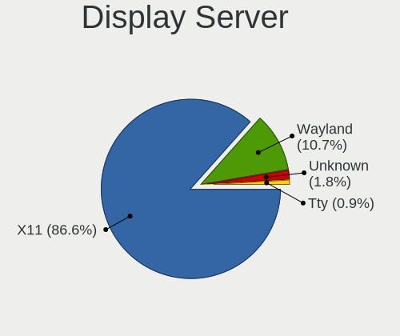
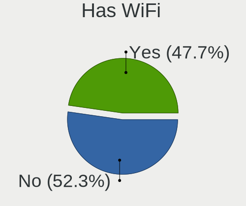
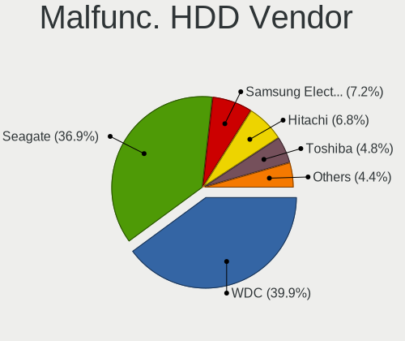
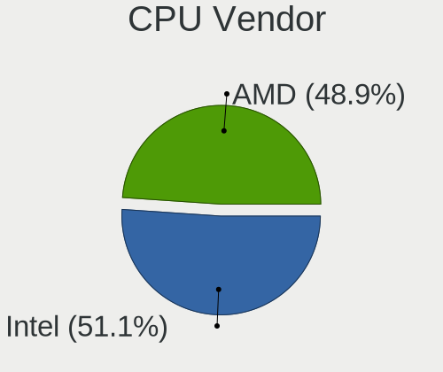
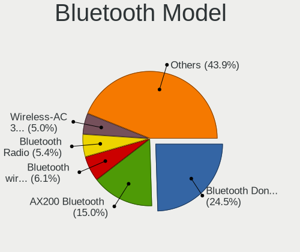
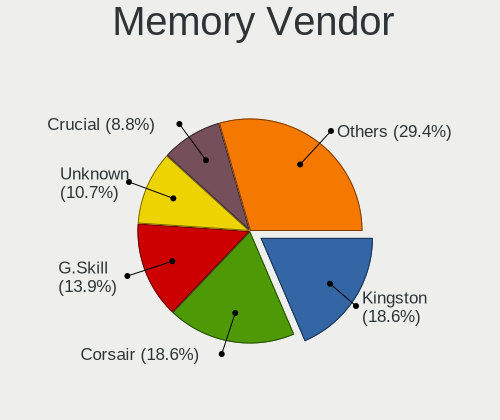
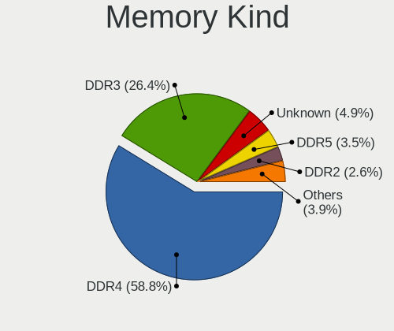
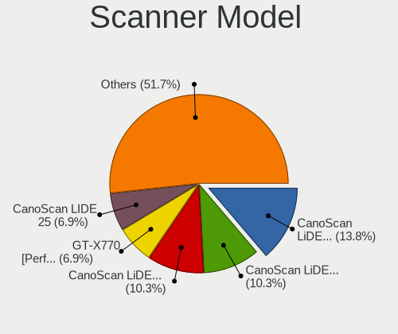
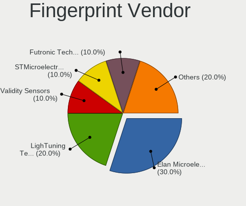
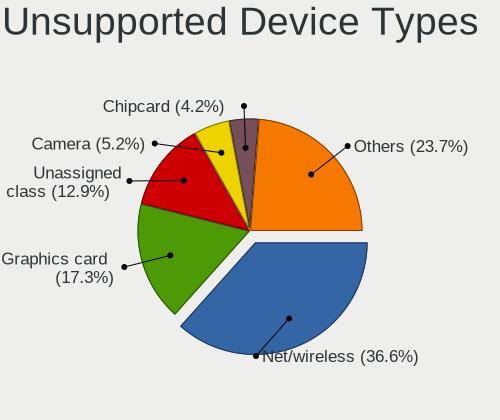

Manjaro - Tested Hardware & Statistics (Desktops)
-------------------------------------------------

A project to collect tested hardware configurations for Manjaro.

Anyone can contribute to this report by the [hw-probe](https://github.com/linuxhw/hw-probe) tool:

    sudo -E hw-probe -all -upload

Please contribute! Especially if your hardware is rare.

Contents
--------

* [ Test Cases ](#test-cases)

* [ System ](#system)
  - [ OS                       ](#os)
  - [ OS Family                ](#os-family)
  - [ Kernel                   ](#kernel)
  - [ Kernel Family            ](#kernel-family)
  - [ Kernel Major Ver.        ](#kernel-major-ver)
  - [ Arch                     ](#arch)
  - [ DE                       ](#de)
  - [ Display Server           ](#display-server)
  - [ Display Manager          ](#display-manager)
  - [ OS Lang                  ](#os-lang)
  - [ Boot Mode                ](#boot-mode)
  - [ Filesystem               ](#filesystem)
  - [ Part. scheme             ](#part-scheme)
  - [ Dual Boot with Linux/BSD ](#dual-boot-with-linuxbsd)
  - [ Dual Boot (Win)          ](#dual-boot-win)

* [ Board ](#board)
  - [ Vendor                   ](#vendor)
  - [ Model                    ](#model)
  - [ Model Family             ](#model-family)
  - [ MFG Year                 ](#mfg-year)
  - [ Form Factor              ](#form-factor)
  - [ Secure Boot              ](#secure-boot)
  - [ Coreboot                 ](#coreboot)
  - [ RAM Size                 ](#ram-size)
  - [ RAM Used                 ](#ram-used)
  - [ Total Drives             ](#total-drives)
  - [ Has CD-ROM               ](#has-cd-rom)
  - [ Has Ethernet             ](#has-ethernet)
  - [ Has WiFi                 ](#has-wifi)
  - [ Has Bluetooth            ](#has-bluetooth)

* [ Location ](#location)
  - [ Country                  ](#country)
  - [ City                     ](#city)

* [ Drives ](#drives)
  - [ Drive Vendor             ](#drive-vendor)
  - [ Drive Model              ](#drive-model)
  - [ HDD Vendor               ](#hdd-vendor)
  - [ SSD Vendor               ](#ssd-vendor)
  - [ Drive Kind               ](#drive-kind)
  - [ Drive Connector          ](#drive-connector)
  - [ Drive Size               ](#drive-size)
  - [ Space Total              ](#space-total)
  - [ Space Used               ](#space-used)
  - [ Malfunc. Drives          ](#malfunc-drives)
  - [ Malfunc. Drive Vendor    ](#malfunc-drive-vendor)
  - [ Malfunc. HDD Vendor      ](#malfunc-hdd-vendor)
  - [ Malfunc. Drive Kind      ](#malfunc-drive-kind)
  - [ Failed Drives            ](#failed-drives)
  - [ Failed Drive Vendor      ](#failed-drive-vendor)
  - [ Drive Status             ](#drive-status)

* [ Storage controller ](#storage-controller)
  - [ Storage Vendor           ](#storage-vendor)
  - [ Storage Model            ](#storage-model)
  - [ Storage Kind             ](#storage-kind)

* [ Processor ](#processor)
  - [ CPU Vendor               ](#cpu-vendor)
  - [ CPU Model                ](#cpu-model)
  - [ CPU Model Family         ](#cpu-model-family)
  - [ CPU Cores                ](#cpu-cores)
  - [ CPU Sockets              ](#cpu-sockets)
  - [ CPU Threads              ](#cpu-threads)
  - [ CPU Op-Modes             ](#cpu-op-modes)
  - [ CPU Microcode            ](#cpu-microcode)
  - [ CPU Microarch            ](#cpu-microarch)

* [ Graphics ](#graphics)
  - [ GPU Vendor               ](#gpu-vendor)
  - [ GPU Model                ](#gpu-model)
  - [ GPU Combo                ](#gpu-combo)
  - [ GPU Driver               ](#gpu-driver)
  - [ GPU Memory               ](#gpu-memory)

* [ Monitor ](#monitor)
  - [ Monitor Vendor           ](#monitor-vendor)
  - [ Monitor Model            ](#monitor-model)
  - [ Monitor Resolution       ](#monitor-resolution)
  - [ Monitor Diagonal         ](#monitor-diagonal)
  - [ Monitor Width            ](#monitor-width)
  - [ Aspect Ratio             ](#aspect-ratio)
  - [ Monitor Area             ](#monitor-area)
  - [ Pixel Density            ](#pixel-density)
  - [ Multiple Monitors        ](#multiple-monitors)

* [ Network ](#network)
  - [ Net Controller Vendor    ](#net-controller-vendor)
  - [ Net Controller Model     ](#net-controller-model)
  - [ Wireless Vendor          ](#wireless-vendor)
  - [ Wireless Model           ](#wireless-model)
  - [ Ethernet Vendor          ](#ethernet-vendor)
  - [ Ethernet Model           ](#ethernet-model)
  - [ Net Controller Kind      ](#net-controller-kind)
  - [ Used Controller          ](#used-controller)
  - [ NICs                     ](#nics)
  - [ IPv6                     ](#ipv6)

* [ Bluetooth ](#bluetooth)
  - [ Bluetooth Vendor         ](#bluetooth-vendor)
  - [ Bluetooth Model          ](#bluetooth-model)

* [ Sound ](#sound)
  - [ Sound Vendor             ](#sound-vendor)
  - [ Sound Model              ](#sound-model)

* [ Memory ](#memory)
  - [ Memory Vendor            ](#memory-vendor)
  - [ Memory Model             ](#memory-model)
  - [ Memory Kind              ](#memory-kind)
  - [ Memory Form Factor       ](#memory-form-factor)
  - [ Memory Size              ](#memory-size)
  - [ Memory Speed             ](#memory-speed)

* [ Printers & scanners ](#printers--scanners)
  - [ Printer Vendor           ](#printer-vendor)
  - [ Printer Model            ](#printer-model)
  - [ Scanner Vendor           ](#scanner-vendor)
  - [ Scanner Model            ](#scanner-model)

* [ Camera ](#camera)
  - [ Camera Vendor            ](#camera-vendor)
  - [ Camera Model             ](#camera-model)

* [ Security ](#security)
  - [ Fingerprint Vendor       ](#fingerprint-vendor)
  - [ Fingerprint Model        ](#fingerprint-model)
  - [ Chipcard Vendor          ](#chipcard-vendor)
  - [ Chipcard Model           ](#chipcard-model)

* [ Unsupported ](#unsupported)
  - [ Unsupported Devices      ](#unsupported-devices)
  - [ Unsupported Device Types ](#unsupported-device-types)

Test Cases
----------

Total: 3575

| Vendor        | Model                       | Probe                                                      | Date         |
|---------------|-----------------------------|------------------------------------------------------------|--------------|
| Gigabyte      | Z690 AORUS ELITE AX DDR4    | [115de2faed](https://linux-hardware.org/?probe=115de2faed) | Feb 01, 2023 |
| Gigabyte      | X670 AORUS ELITE AX         | [4e438c4768](https://linux-hardware.org/?probe=4e438c4768) | Jan 31, 2023 |
| Gigabyte      | X670 AORUS ELITE AX         | [66459fc07c](https://linux-hardware.org/?probe=66459fc07c) | Jan 31, 2023 |
| Gigabyte      | 945GCM-S2C                  | [41ad246a0b](https://linux-hardware.org/?probe=41ad246a0b) | Jan 31, 2023 |
| MSI           | B450 TOMAHAWK MAX           | [f2a2476d45](https://linux-hardware.org/?probe=f2a2476d45) | Jan 31, 2023 |
| Gigabyte      | Z390 DESIGNARE-CF           | [02c8ae01d1](https://linux-hardware.org/?probe=02c8ae01d1) | Jan 30, 2023 |
| ASUSTek       | ROG Maximus X HERO          | [070a09add8](https://linux-hardware.org/?probe=070a09add8) | Jan 30, 2023 |
| ASUSTek       | ROG Maximus X HERO          | [8cca3cb036](https://linux-hardware.org/?probe=8cca3cb036) | Jan 30, 2023 |
| MSI           | B550M PRO-VDH WIFI          | [02580dd501](https://linux-hardware.org/?probe=02580dd501) | Jan 30, 2023 |
| ASUSTek       | P5Q PRO TURBO               | [72e0a3fde5](https://linux-hardware.org/?probe=72e0a3fde5) | Jan 28, 2023 |
| ASUSTek       | P5Q PRO TURBO               | [a1cb8edb5a](https://linux-hardware.org/?probe=a1cb8edb5a) | Jan 28, 2023 |
| Gigabyte      | B550I AORUS PRO AX          | [8b5c80cad4](https://linux-hardware.org/?probe=8b5c80cad4) | Jan 28, 2023 |
| ASRock        | Z97 Killer                  | [2658d00cd2](https://linux-hardware.org/?probe=2658d00cd2) | Jan 28, 2023 |
| ASUSTek       | ROG STRIX B550-F GAMING     | [31bda5eb31](https://linux-hardware.org/?probe=31bda5eb31) | Jan 28, 2023 |
| ASRock        | Z97 Killer                  | [d4c609c373](https://linux-hardware.org/?probe=d4c609c373) | Jan 27, 2023 |
| ASUSTek       | PRIME B450M-A               | [4a33dd0b76](https://linux-hardware.org/?probe=4a33dd0b76) | Jan 27, 2023 |
| ASRock        | X570 Taichi                 | [bdfb4aecf9](https://linux-hardware.org/?probe=bdfb4aecf9) | Jan 27, 2023 |
| ASUSTek       | PRIME Z790-P WIFI           | [65e298b3ee](https://linux-hardware.org/?probe=65e298b3ee) | Jan 27, 2023 |
| Gigabyte      | X470 AORUS ULTRA GAMING-... | [5269e78083](https://linux-hardware.org/?probe=5269e78083) | Jan 26, 2023 |
| Lenovo        | NO DPK                      | [b1e29a464f](https://linux-hardware.org/?probe=b1e29a464f) | Jan 26, 2023 |
| ASUSTek       | PRIME Z790-P WIFI           | [5c55d923ff](https://linux-hardware.org/?probe=5c55d923ff) | Jan 26, 2023 |
| Intel         | DG965SS AAD41678-306        | [fde41db330](https://linux-hardware.org/?probe=fde41db330) | Jan 26, 2023 |
| ASUSTek       | PRIME B560M-A               | [78a1bfaac7](https://linux-hardware.org/?probe=78a1bfaac7) | Jan 25, 2023 |
| Gigabyte      | B550 AORUS ELITE AX         | [026efbc485](https://linux-hardware.org/?probe=026efbc485) | Jan 25, 2023 |
| Gigabyte      | B550 AORUS ELITE AX         | [184de230c5](https://linux-hardware.org/?probe=184de230c5) | Jan 25, 2023 |
| ASUSTek       | M32CD_A_F_K20CD_K31CD       | [996a0567b6](https://linux-hardware.org/?probe=996a0567b6) | Jan 23, 2023 |
| ASUSTek       | PRIME X570-PRO              | [b67d126993](https://linux-hardware.org/?probe=b67d126993) | Jan 23, 2023 |
| Gigabyte      | X470 AORUS ULTRA GAMING-... | [7f1bb5c3c3](https://linux-hardware.org/?probe=7f1bb5c3c3) | Jan 23, 2023 |
| Gigabyte      | X470 AORUS ULTRA GAMING-... | [f74d2ca84b](https://linux-hardware.org/?probe=f74d2ca84b) | Jan 23, 2023 |
| ASUSTek       | A68HM-PLUS                  | [3afbe94c21](https://linux-hardware.org/?probe=3afbe94c21) | Jan 23, 2023 |
| Gigabyte      | GA-970A-UD3                 | [a8d203f94b](https://linux-hardware.org/?probe=a8d203f94b) | Jan 23, 2023 |
| ASUSTek       | PRIME B450M-K               | [8a68388e16](https://linux-hardware.org/?probe=8a68388e16) | Jan 22, 2023 |
| Dell          | 0D28YY A00                  | [394be1956b](https://linux-hardware.org/?probe=394be1956b) | Jan 22, 2023 |
| ASUSTek       | Z97-K                       | [1261e08a8a](https://linux-hardware.org/?probe=1261e08a8a) | Jan 22, 2023 |
| Apple         | Mac-F60DEB81FF30ACF6 Mac... | [d1e0b2e009](https://linux-hardware.org/?probe=d1e0b2e009) | Jan 22, 2023 |
| Gigabyte      | Z97X-Gaming 7               | [a51b58dfbb](https://linux-hardware.org/?probe=a51b58dfbb) | Jan 22, 2023 |
| Shenzhen M... | F6BFC                       | [21f62b0eac](https://linux-hardware.org/?probe=21f62b0eac) | Jan 21, 2023 |
| ASUSTek       | ROG STRIX X570-F GAMING     | [be39389c7f](https://linux-hardware.org/?probe=be39389c7f) | Jan 21, 2023 |
| ASUSTek       | ROG STRIX B450-I GAMING     | [0d8275b0de](https://linux-hardware.org/?probe=0d8275b0de) | Jan 21, 2023 |
| Gigabyte      | Z87N-WIFI                   | [d77592ccf0](https://linux-hardware.org/?probe=d77592ccf0) | Jan 20, 2023 |
| ASUSTek       | M5A97 R2.0                  | [19eabab270](https://linux-hardware.org/?probe=19eabab270) | Jan 19, 2023 |
| MSI           | MPG X570 GAMING PLUS        | [d0a387f425](https://linux-hardware.org/?probe=d0a387f425) | Jan 18, 2023 |
| Gigabyte      | H77-D3H                     | [15da5de3ae](https://linux-hardware.org/?probe=15da5de3ae) | Jan 18, 2023 |
| MSI           | H81I                        | [f51db4589d](https://linux-hardware.org/?probe=f51db4589d) | Jan 18, 2023 |
| Gigabyte      | 990FXA-UD3                  | [39591416ac](https://linux-hardware.org/?probe=39591416ac) | Jan 18, 2023 |
| Gigabyte      | Z87N-WIFI                   | [b796ac9a1d](https://linux-hardware.org/?probe=b796ac9a1d) | Jan 17, 2023 |
| Gigabyte      | F2A68HM-H                   | [d8d6e517e0](https://linux-hardware.org/?probe=d8d6e517e0) | Jan 17, 2023 |
| HP            | 805A                        | [0f9521809b](https://linux-hardware.org/?probe=0f9521809b) | Jan 17, 2023 |
| HP            | 805A                        | [4061c209e2](https://linux-hardware.org/?probe=4061c209e2) | Jan 17, 2023 |
| ASUSTek       | PRIME B560M-A AC            | [8cd20f181b](https://linux-hardware.org/?probe=8cd20f181b) | Jan 16, 2023 |
| Biostar       | A320MH                      | [1736406da7](https://linux-hardware.org/?probe=1736406da7) | Jan 16, 2023 |
| Intel         | X99                         | [9c0ea1f762](https://linux-hardware.org/?probe=9c0ea1f762) | Jan 16, 2023 |
| MSI           | MPG X570 GAMING PLUS        | [02178066f5](https://linux-hardware.org/?probe=02178066f5) | Jan 16, 2023 |
| ASUSTek       | GD30CI                      | [7d1227f25f](https://linux-hardware.org/?probe=7d1227f25f) | Jan 15, 2023 |
| ASUSTek       | GD30CI                      | [2ed7e76dbe](https://linux-hardware.org/?probe=2ed7e76dbe) | Jan 15, 2023 |
| ASUSTek       | ROG STRIX X570-F GAMING     | [ebe7fa8c2a](https://linux-hardware.org/?probe=ebe7fa8c2a) | Jan 14, 2023 |
| Dell          | 00V62H A01                  | [47aa34eddd](https://linux-hardware.org/?probe=47aa34eddd) | Jan 14, 2023 |
| Gigabyte      | B450M S2H                   | [e92f01ff78](https://linux-hardware.org/?probe=e92f01ff78) | Jan 14, 2023 |
| ASRock        | B450 Gaming K4              | [5bcda073b3](https://linux-hardware.org/?probe=5bcda073b3) | Jan 13, 2023 |
| Shuttle       | FS61                        | [9034ce313b](https://linux-hardware.org/?probe=9034ce313b) | Jan 12, 2023 |
| ASUSTek       | ROG CROSSHAIR VIII DARK ... | [4cb06b24fd](https://linux-hardware.org/?probe=4cb06b24fd) | Jan 11, 2023 |
| Gigabyte      | A320M-S2H-CF                | [d26bcd74b2](https://linux-hardware.org/?probe=d26bcd74b2) | Jan 10, 2023 |
| Gigabyte      | A320M-S2H-CF                | [faf7e2eae9](https://linux-hardware.org/?probe=faf7e2eae9) | Jan 10, 2023 |
| ASRock        | Z87M Extreme4               | [4aa4793173](https://linux-hardware.org/?probe=4aa4793173) | Jan 10, 2023 |
| ASUSTek       | PRIME Z270-A                | [b4c192526f](https://linux-hardware.org/?probe=b4c192526f) | Jan 08, 2023 |
| MSI           | B450 TOMAHAWK MAX           | [874ab2d9a6](https://linux-hardware.org/?probe=874ab2d9a6) | Jan 07, 2023 |
| ASUSTek       | TUF Gaming X570-PLUS        | [f09e26eaa3](https://linux-hardware.org/?probe=f09e26eaa3) | Jan 07, 2023 |
| Intel         | DG35EC AAE29266-205         | [29654c0c64](https://linux-hardware.org/?probe=29654c0c64) | Jan 06, 2023 |
| Gigabyte      | B450M S2H                   | [bf90b7d77d](https://linux-hardware.org/?probe=bf90b7d77d) | Jan 06, 2023 |
| ASUSTek       | K30AD_M31AD_M51AD_M32AD     | [f188e7e419](https://linux-hardware.org/?probe=f188e7e419) | Jan 04, 2023 |
| Lenovo        | 31900058 STD or WIN         | [21cdab1361](https://linux-hardware.org/?probe=21cdab1361) | Jan 03, 2023 |
| MSI           | H310M PRO-VDH PLUS          | [32e666defa](https://linux-hardware.org/?probe=32e666defa) | Jan 03, 2023 |
| ASUSTek       | M5A97 EVO R2.0              | [c2c723d7b2](https://linux-hardware.org/?probe=c2c723d7b2) | Jan 03, 2023 |
| ASUSTek       | PRIME B550M-K               | [395606c638](https://linux-hardware.org/?probe=395606c638) | Jan 03, 2023 |
| ASUSTek       | B85M-E/BR                   | [88f7654113](https://linux-hardware.org/?probe=88f7654113) | Jan 02, 2023 |
| Lenovo        | Dory CRB                    | [c87645ef7b](https://linux-hardware.org/?probe=c87645ef7b) | Jan 02, 2023 |
| MSI           | A520M-A PRO                 | [28a0c6dda9](https://linux-hardware.org/?probe=28a0c6dda9) | Jan 02, 2023 |
| ASRock        | B450M Pro4                  | [7b9bc5bc99](https://linux-hardware.org/?probe=7b9bc5bc99) | Jan 02, 2023 |
| Dell          | 0PU052                      | [82740aac1d](https://linux-hardware.org/?probe=82740aac1d) | Jan 02, 2023 |
| Dell          | 0PU052                      | [e40981850d](https://linux-hardware.org/?probe=e40981850d) | Jan 02, 2023 |
| Dell          | 04YP6J A02                  | [ee7f6ddcc1](https://linux-hardware.org/?probe=ee7f6ddcc1) | Jan 01, 2023 |
| ASUSTek       | M5A97 R2.0                  | [e877a9f9e3](https://linux-hardware.org/?probe=e877a9f9e3) | Jan 01, 2023 |
| AZW           | GTR V02                     | [5c08e4403a](https://linux-hardware.org/?probe=5c08e4403a) | Jan 01, 2023 |
| ASRock        | B550M Pro4                  | [ddab7428a1](https://linux-hardware.org/?probe=ddab7428a1) | Jan 01, 2023 |
| ASRock        | B550M Pro4                  | [7389925566](https://linux-hardware.org/?probe=7389925566) | Jan 01, 2023 |
| ASUSTek       | ROG STRIX X570-F GAMING     | [7e22db9b23](https://linux-hardware.org/?probe=7e22db9b23) | Dec 31, 2022 |
| ASRock        | B550 Steel Legend           | [8705e10ac6](https://linux-hardware.org/?probe=8705e10ac6) | Dec 31, 2022 |
| ASUSTek       | PRIME X670-P WIFI           | [cecef0575d](https://linux-hardware.org/?probe=cecef0575d) | Dec 30, 2022 |
| Gigabyte      | Z87-HD3                     | [97f08bd689](https://linux-hardware.org/?probe=97f08bd689) | Dec 30, 2022 |
| Gigabyte      | H510M H                     | [24574296e5](https://linux-hardware.org/?probe=24574296e5) | Dec 29, 2022 |
| Gigabyte      | B550 AORUS PRO V2           | [7a7f335c4a](https://linux-hardware.org/?probe=7a7f335c4a) | Dec 29, 2022 |
| MSI           | X370 GAMING M7 ACK          | [60fe0d0b31](https://linux-hardware.org/?probe=60fe0d0b31) | Dec 29, 2022 |
| MSI           | PRO B660M-A DDR4            | [dbc37ff826](https://linux-hardware.org/?probe=dbc37ff826) | Dec 29, 2022 |
| Dell          | 0TTDMJ A00                  | [198e723dc2](https://linux-hardware.org/?probe=198e723dc2) | Dec 28, 2022 |
| Gigabyte      | B550 AORUS PRO V2           | [6d56c4c392](https://linux-hardware.org/?probe=6d56c4c392) | Dec 27, 2022 |
| Gigabyte      | B550 AORUS PRO V2           | [d6a12148ec](https://linux-hardware.org/?probe=d6a12148ec) | Dec 27, 2022 |
| Gigabyte      | B550M AORUS PRO-P           | [bd232cd937](https://linux-hardware.org/?probe=bd232cd937) | Dec 27, 2022 |
| Gigabyte      | Z370 HD3-CF                 | [ac6571db76](https://linux-hardware.org/?probe=ac6571db76) | Dec 27, 2022 |
| ASRock        | Z690 Taichi                 | [4a4e2975d2](https://linux-hardware.org/?probe=4a4e2975d2) | Dec 27, 2022 |
| ASUSTek       | M5A78L-M LX3                | [a6c0667059](https://linux-hardware.org/?probe=a6c0667059) | Dec 27, 2022 |
| ASUSTek       | M5A78L-M LX3                | [ad94a727ab](https://linux-hardware.org/?probe=ad94a727ab) | Dec 27, 2022 |
| ASRock        | AB350M-HDV                  | [666ea6d820](https://linux-hardware.org/?probe=666ea6d820) | Dec 26, 2022 |
| ASUSTek       | M5A97 R2.0                  | [be1ace7f20](https://linux-hardware.org/?probe=be1ace7f20) | Dec 26, 2022 |
| MSI           | B450 GAMING PRO CARBON A... | [82de75771e](https://linux-hardware.org/?probe=82de75771e) | Dec 25, 2022 |
| ASRock        | X670E Pro RS                | [b7a0a3d703](https://linux-hardware.org/?probe=b7a0a3d703) | Dec 24, 2022 |
| ASUSTek       | PRIME B450-PLUS             | [e3e2773bde](https://linux-hardware.org/?probe=e3e2773bde) | Dec 24, 2022 |
| Gigabyte      | H510M H                     | [d592546f0a](https://linux-hardware.org/?probe=d592546f0a) | Dec 23, 2022 |
| Gigabyte      | H510M H                     | [52f1e32fc8](https://linux-hardware.org/?probe=52f1e32fc8) | Dec 23, 2022 |
| Dell          | 0GY6Y8 A02                  | [1044231936](https://linux-hardware.org/?probe=1044231936) | Dec 22, 2022 |
| HP            | 8053                        | [38b3012a7c](https://linux-hardware.org/?probe=38b3012a7c) | Dec 22, 2022 |
| ASRock        | X670E Taichi                | [e1b13226a4](https://linux-hardware.org/?probe=e1b13226a4) | Dec 21, 2022 |
| ASRock        | AB350 Pro4                  | [c7005e1e89](https://linux-hardware.org/?probe=c7005e1e89) | Dec 21, 2022 |
| Gigabyte      | Z690 AORUS PRO              | [dbefd12c1c](https://linux-hardware.org/?probe=dbefd12c1c) | Dec 19, 2022 |
| ASUSTek       | ROG STRIX B650-A GAMING ... | [9fb0357e3e](https://linux-hardware.org/?probe=9fb0357e3e) | Dec 19, 2022 |
| ASRock        | Z390 Pro4                   | [478165e478](https://linux-hardware.org/?probe=478165e478) | Dec 18, 2022 |
| Gigabyte      | B550M DS3H                  | [d868b73cfb](https://linux-hardware.org/?probe=d868b73cfb) | Dec 18, 2022 |
| Gigabyte      | B460M AORUS PRO             | [6deb38fb48](https://linux-hardware.org/?probe=6deb38fb48) | Dec 17, 2022 |
| MSI           | X370 GAMING M7 ACK          | [71dabd9e44](https://linux-hardware.org/?probe=71dabd9e44) | Dec 17, 2022 |
| MSI           | A68HM-E33                   | [0df6f80110](https://linux-hardware.org/?probe=0df6f80110) | Dec 17, 2022 |
| MSI           | X370 GAMING M7 ACK          | [3b245437e5](https://linux-hardware.org/?probe=3b245437e5) | Dec 17, 2022 |
| Gigabyte      | X570 AORUS ELITE            | [d2dce9cbfd](https://linux-hardware.org/?probe=d2dce9cbfd) | Dec 16, 2022 |
| Gigabyte      | H510M H                     | [ccb746cd73](https://linux-hardware.org/?probe=ccb746cd73) | Dec 15, 2022 |
| ZOTAC         | ION                         | [f02f6b8382](https://linux-hardware.org/?probe=f02f6b8382) | Dec 15, 2022 |
| Dell          | 0D6H9T A02                  | [6266999282](https://linux-hardware.org/?probe=6266999282) | Dec 15, 2022 |
| Gigabyte      | B450M H                     | [c888c743e3](https://linux-hardware.org/?probe=c888c743e3) | Dec 15, 2022 |
| ASUSTek       | TUF Gaming X570-PLUS        | [7d15ecff86](https://linux-hardware.org/?probe=7d15ecff86) | Dec 15, 2022 |
| ASUSTek       | TUF Gaming B650-PLUS WIF... | [72175490ae](https://linux-hardware.org/?probe=72175490ae) | Dec 15, 2022 |
| MSI           | B250 GAMING M3              | [cf050915a5](https://linux-hardware.org/?probe=cf050915a5) | Dec 14, 2022 |
| MSI           | MAG X570S TORPEDO MAX       | [39d58ec9aa](https://linux-hardware.org/?probe=39d58ec9aa) | Dec 13, 2022 |
| ASUSTek       | X99-A II                    | [a6e0258bbe](https://linux-hardware.org/?probe=a6e0258bbe) | Dec 13, 2022 |
| ASUSTek       | ROG STRIX X670E-I GAMING... | [8fd3c60681](https://linux-hardware.org/?probe=8fd3c60681) | Dec 13, 2022 |
| Intel         | Eaglelake Fab D             | [ed5c44a200](https://linux-hardware.org/?probe=ed5c44a200) | Dec 13, 2022 |
| MSI           | B450I GAMING PLUS MAX WI... | [0973466d88](https://linux-hardware.org/?probe=0973466d88) | Dec 13, 2022 |
| MSI           | B450I GAMING PLUS MAX WI... | [9d2ef8adf1](https://linux-hardware.org/?probe=9d2ef8adf1) | Dec 13, 2022 |
| MSI           | MAG X570S TORPEDO MAX       | [c5501c208c](https://linux-hardware.org/?probe=c5501c208c) | Dec 11, 2022 |
| Gigabyte      | B550M AORUS PRO-P           | [6964e348d6](https://linux-hardware.org/?probe=6964e348d6) | Dec 11, 2022 |
| ASUSTek       | X99-A II                    | [09f8da551c](https://linux-hardware.org/?probe=09f8da551c) | Dec 11, 2022 |
| ASUSTek       | ROG STRIX B550-F GAMING     | [23be4288bb](https://linux-hardware.org/?probe=23be4288bb) | Dec 11, 2022 |
| ASUSTek       | ROG STRIX B550-F GAMING     | [121359234c](https://linux-hardware.org/?probe=121359234c) | Dec 11, 2022 |
| ASUSTek       | PRIME X570-P                | [6b00f35a38](https://linux-hardware.org/?probe=6b00f35a38) | Dec 10, 2022 |
| MSI           | MAG B550 TOMAHAWK           | [deab1a46db](https://linux-hardware.org/?probe=deab1a46db) | Dec 10, 2022 |
| ASUSTek       | PRIME B550M-A               | [e843a9c61d](https://linux-hardware.org/?probe=e843a9c61d) | Dec 10, 2022 |
| Gigabyte      | Z170-HD3P-CF                | [27fdfb657e](https://linux-hardware.org/?probe=27fdfb657e) | Dec 09, 2022 |
| Gigabyte      | B550M S2H                   | [5e56097f25](https://linux-hardware.org/?probe=5e56097f25) | Dec 08, 2022 |
| MSI           | PRO B650-P WIFI             | [b74866314e](https://linux-hardware.org/?probe=b74866314e) | Dec 08, 2022 |
| Gigabyte      | X570 AORUS ELITE            | [d6666dccec](https://linux-hardware.org/?probe=d6666dccec) | Dec 08, 2022 |
| Lenovo        | 3717 SDK0J40700 WIN 3258... | [c6895362e6](https://linux-hardware.org/?probe=c6895362e6) | Dec 07, 2022 |
| Lenovo        | ThinkStation S20 4157DT6    | [7c45cf5115](https://linux-hardware.org/?probe=7c45cf5115) | Dec 07, 2022 |
| Gigabyte      | B450 AORUS PRO-CF           | [037c8e9cbc](https://linux-hardware.org/?probe=037c8e9cbc) | Dec 06, 2022 |
| Gigabyte      | F2A58M-HD2                  | [61c23e2501](https://linux-hardware.org/?probe=61c23e2501) | Dec 06, 2022 |
| ASUSTek       | TUF Gaming B660-PLUS WIF... | [689479ce87](https://linux-hardware.org/?probe=689479ce87) | Dec 06, 2022 |
| MSI           | B450 TOMAHAWK MAX           | [f11d4ebe40](https://linux-hardware.org/?probe=f11d4ebe40) | Dec 05, 2022 |
| ASUSTek       | ROG STRIX Z690-A GAMING ... | [ddd1487d81](https://linux-hardware.org/?probe=ddd1487d81) | Dec 05, 2022 |
| HP            | 8053                        | [5fad592ef3](https://linux-hardware.org/?probe=5fad592ef3) | Dec 05, 2022 |
| Gigabyte      | B550M S2H                   | [dd012c9f92](https://linux-hardware.org/?probe=dd012c9f92) | Dec 04, 2022 |
| MSI           | MAG B550 TOMAHAWK           | [9eb248d38e](https://linux-hardware.org/?probe=9eb248d38e) | Dec 04, 2022 |
| ASUSTek       | M5A97 R2.0                  | [b3b5eb90e5](https://linux-hardware.org/?probe=b3b5eb90e5) | Dec 03, 2022 |
| ASRock        | Z87 Extreme4                | [422dde5ae5](https://linux-hardware.org/?probe=422dde5ae5) | Dec 03, 2022 |
| MSI           | B450I GAMING PLUS AC        | [366f9ae2aa](https://linux-hardware.org/?probe=366f9ae2aa) | Dec 03, 2022 |
| Gigabyte      | B550M AORUS PRO-P           | [ec36ceb3fd](https://linux-hardware.org/?probe=ec36ceb3fd) | Dec 02, 2022 |
| MSI           | A68HM-E33                   | [4e2313d8b7](https://linux-hardware.org/?probe=4e2313d8b7) | Dec 02, 2022 |
| ASUSTek       | ROG STRIX Z690-A GAMING ... | [8cf4925f08](https://linux-hardware.org/?probe=8cf4925f08) | Dec 01, 2022 |
| ASRock        | X300M-STX                   | [97ceee65f3](https://linux-hardware.org/?probe=97ceee65f3) | Dec 01, 2022 |
| ASRock        | X300M-STX                   | [5b7f983a24](https://linux-hardware.org/?probe=5b7f983a24) | Dec 01, 2022 |
| ASRock        | X300M-STX                   | [42ddb2463e](https://linux-hardware.org/?probe=42ddb2463e) | Dec 01, 2022 |
| Gigabyte      | Z370 HD3-CF                 | [ece7618688](https://linux-hardware.org/?probe=ece7618688) | Nov 30, 2022 |
| ASRock        | B550M Pro4                  | [f48969af69](https://linux-hardware.org/?probe=f48969af69) | Nov 29, 2022 |
| Dell          | 09WH54 A00                  | [2700be5b4a](https://linux-hardware.org/?probe=2700be5b4a) | Nov 28, 2022 |
| Gigabyte      | M61PME-S2P                  | [4aa3d8ee32](https://linux-hardware.org/?probe=4aa3d8ee32) | Nov 27, 2022 |
| HP            | 3397                        | [e264b68f30](https://linux-hardware.org/?probe=e264b68f30) | Nov 27, 2022 |
| Gigabyte      | 970A-DS3P FX                | [4ded1fb943](https://linux-hardware.org/?probe=4ded1fb943) | Nov 26, 2022 |
| Gigabyte      | GA-78LMT-USB3               | [bb0d4b34af](https://linux-hardware.org/?probe=bb0d4b34af) | Nov 26, 2022 |
| Gigabyte      | A320M-H-CF                  | [5f1188d448](https://linux-hardware.org/?probe=5f1188d448) | Nov 26, 2022 |
| ASRock        | B550M Pro4                  | [0828e5929e](https://linux-hardware.org/?probe=0828e5929e) | Nov 26, 2022 |
| Gigabyte      | A320M-H-CF                  | [771019bcc6](https://linux-hardware.org/?probe=771019bcc6) | Nov 26, 2022 |
| Gigabyte      | B550M S2H                   | [8ea3c120c6](https://linux-hardware.org/?probe=8ea3c120c6) | Nov 23, 2022 |
| ASUSTek       | ROG Maximus XI HERO         | [6cd720c62c](https://linux-hardware.org/?probe=6cd720c62c) | Nov 23, 2022 |
| MSI           | PRO Z690-A DDR4             | [fc53a66047](https://linux-hardware.org/?probe=fc53a66047) | Nov 22, 2022 |
| ASUSTek       | Maximus VI GENE             | [62b0cb4c94](https://linux-hardware.org/?probe=62b0cb4c94) | Nov 22, 2022 |
| ASUSTek       | Maximus VI GENE             | [26e7d04331](https://linux-hardware.org/?probe=26e7d04331) | Nov 22, 2022 |
| Gigabyte      | B550M AORUS PRO-P           | [a22e271ac2](https://linux-hardware.org/?probe=a22e271ac2) | Nov 21, 2022 |
| ASUSTek       | ROG STRIX X670E-F GAMING... | [64cff39a82](https://linux-hardware.org/?probe=64cff39a82) | Nov 21, 2022 |
| ASRock        | B550M Pro4                  | [7d1d0390ba](https://linux-hardware.org/?probe=7d1d0390ba) | Nov 20, 2022 |
| MSI           | 970A-G43                    | [6c04d813ff](https://linux-hardware.org/?probe=6c04d813ff) | Nov 20, 2022 |
| ASUSTek       | TUF Gaming Z690-PLUS WIF... | [d40491a06a](https://linux-hardware.org/?probe=d40491a06a) | Nov 19, 2022 |
| Intel         | DH55PJ AAE93812-303         | [bebe890c96](https://linux-hardware.org/?probe=bebe890c96) | Nov 19, 2022 |
| ASUSTek       | PRIME A320M-K               | [6d02e2a960](https://linux-hardware.org/?probe=6d02e2a960) | Nov 19, 2022 |
| ASUSTek       | ROG STRIX X670E-F GAMING... | [598f8e7c34](https://linux-hardware.org/?probe=598f8e7c34) | Nov 19, 2022 |
| Lenovo        | 3717 SDK0J40700 WIN 3258... | [c8fc039301](https://linux-hardware.org/?probe=c8fc039301) | Nov 19, 2022 |
| Lenovo        | 3717 SDK0J40700 WIN 3258... | [1ffee02fee](https://linux-hardware.org/?probe=1ffee02fee) | Nov 19, 2022 |
| Gigabyte      | B550M AORUS PRO-P           | [312da35b57](https://linux-hardware.org/?probe=312da35b57) | Nov 17, 2022 |
| ASUSTek       | Maximus VIII GENE           | [8b542ffc42](https://linux-hardware.org/?probe=8b542ffc42) | Nov 17, 2022 |
| MSI           | X79A-GD45                   | [7f7b7354b8](https://linux-hardware.org/?probe=7f7b7354b8) | Nov 17, 2022 |
| MSI           | X79A-GD45                   | [42d08e1136](https://linux-hardware.org/?probe=42d08e1136) | Nov 17, 2022 |
| ASUSTek       | ROG STRIX B550-F GAMING     | [f5fd3e9e4b](https://linux-hardware.org/?probe=f5fd3e9e4b) | Nov 16, 2022 |
| Gigabyte      | X570 AORUS ULTRA            | [07d80f1783](https://linux-hardware.org/?probe=07d80f1783) | Nov 16, 2022 |
| Gigabyte      | GA-A75M-UD2H                | [4da8ff348a](https://linux-hardware.org/?probe=4da8ff348a) | Nov 15, 2022 |
| ASRock        | A320M-HDV R4.0              | [7764c0fea2](https://linux-hardware.org/?probe=7764c0fea2) | Nov 15, 2022 |
| ASUSTek       | ROG STRIX B550-F GAMING     | [c8c74ea1ec](https://linux-hardware.org/?probe=c8c74ea1ec) | Nov 15, 2022 |
| Gigabyte      | X570 AORUS ULTRA            | [567b81705d](https://linux-hardware.org/?probe=567b81705d) | Nov 15, 2022 |
| Gigabyte      | X570 AORUS ULTRA            | [389d8cf0e0](https://linux-hardware.org/?probe=389d8cf0e0) | Nov 15, 2022 |
| ASUSTek       | PRIME B350M-A               | [aabc2148da](https://linux-hardware.org/?probe=aabc2148da) | Nov 15, 2022 |
| MSI           | Z97A GAMING 7               | [275a1c28dd](https://linux-hardware.org/?probe=275a1c28dd) | Nov 13, 2022 |
| ASUSTek       | PRIME X470-PRO              | [370fb87faa](https://linux-hardware.org/?probe=370fb87faa) | Nov 13, 2022 |
| MSI           | B85M-P33 V2                 | [d633461307](https://linux-hardware.org/?probe=d633461307) | Nov 13, 2022 |
| ASRock        | X300M-STX                   | [6b2e935e07](https://linux-hardware.org/?probe=6b2e935e07) | Nov 12, 2022 |
| ASRock        | X300M-STX                   | [b071af765d](https://linux-hardware.org/?probe=b071af765d) | Nov 12, 2022 |
| ASUSTek       | TUF Gaming Z690-PLUS WIF... | [87b7416681](https://linux-hardware.org/?probe=87b7416681) | Nov 12, 2022 |
| ASUSTek       | PRIME A320M-K               | [f4ed581802](https://linux-hardware.org/?probe=f4ed581802) | Nov 11, 2022 |
| ASUSTek       | PRIME A320M-K               | [e06ab9c0b9](https://linux-hardware.org/?probe=e06ab9c0b9) | Nov 11, 2022 |
| Gigabyte      | H410M S2H V3                | [2172ca7325](https://linux-hardware.org/?probe=2172ca7325) | Nov 11, 2022 |
| MSI           | X79A-GD45                   | [cb82895374](https://linux-hardware.org/?probe=cb82895374) | Nov 11, 2022 |
| Gigabyte      | Z690 AORUS PRO              | [8dcd548e89](https://linux-hardware.org/?probe=8dcd548e89) | Nov 10, 2022 |
| Gigabyte      | Z690 AORUS PRO              | [e95608162f](https://linux-hardware.org/?probe=e95608162f) | Nov 10, 2022 |
| ASUSTek       | H110M-A                     | [4868cf87f5](https://linux-hardware.org/?probe=4868cf87f5) | Nov 09, 2022 |
| MSI           | MAG B550 TOMAHAWK           | [9571026291](https://linux-hardware.org/?probe=9571026291) | Nov 08, 2022 |
| ASRock        | X300M-STX                   | [1fee3f08a9](https://linux-hardware.org/?probe=1fee3f08a9) | Nov 07, 2022 |
| MSI           | B550-A PRO                  | [6c4ff211d1](https://linux-hardware.org/?probe=6c4ff211d1) | Nov 07, 2022 |
| HP            | 844C                        | [5b8b05d13d](https://linux-hardware.org/?probe=5b8b05d13d) | Nov 07, 2022 |
| ASRock        | AB350M                      | [fae0de4ece](https://linux-hardware.org/?probe=fae0de4ece) | Nov 07, 2022 |
| Pegatron      | 2AB6                        | [c55efc41db](https://linux-hardware.org/?probe=c55efc41db) | Nov 06, 2022 |
| HP            | 828A                        | [42d15a94b0](https://linux-hardware.org/?probe=42d15a94b0) | Nov 06, 2022 |
| ASRock        | H310CM-HDV                  | [cb1cecc5e1](https://linux-hardware.org/?probe=cb1cecc5e1) | Nov 05, 2022 |
| ASUSTek       | P8H61-M LE/CSM              | [fb29e83d2d](https://linux-hardware.org/?probe=fb29e83d2d) | Nov 05, 2022 |
| ASUSTek       | P8H67                       | [0d98e4b3b3](https://linux-hardware.org/?probe=0d98e4b3b3) | Nov 05, 2022 |
| Lenovo        | 3728 SDK0J40700 WIN 3258... | [6700909ef7](https://linux-hardware.org/?probe=6700909ef7) | Nov 03, 2022 |
| ASUSTek       | M5A97 R2.0                  | [fecd8f06dd](https://linux-hardware.org/?probe=fecd8f06dd) | Nov 02, 2022 |
| HP            | 8054                        | [0f866b3605](https://linux-hardware.org/?probe=0f866b3605) | Nov 02, 2022 |
| ASUSTek       | P5K-E                       | [6b48759d1d](https://linux-hardware.org/?probe=6b48759d1d) | Nov 02, 2022 |
| MSI           | Z370 GAMING PLUS            | [527c779cfb](https://linux-hardware.org/?probe=527c779cfb) | Nov 01, 2022 |
| MSI           | MAG B550 TOMAHAWK           | [8ce0b9271b](https://linux-hardware.org/?probe=8ce0b9271b) | Nov 01, 2022 |
| MSI           | MAG B660M MORTAR WIFI DD... | [115e9027d0](https://linux-hardware.org/?probe=115e9027d0) | Nov 01, 2022 |
| Acer          | H410H6-M17 P21-A1           | [9333be5120](https://linux-hardware.org/?probe=9333be5120) | Nov 01, 2022 |
| ASUSTek       | TUF Gaming X570-PLUS        | [6e577f6de5](https://linux-hardware.org/?probe=6e577f6de5) | Nov 01, 2022 |
| HP            | 3397                        | [942cfa2a25](https://linux-hardware.org/?probe=942cfa2a25) | Oct 31, 2022 |
| Gigabyte      | X570 AORUS ELITE            | [f497e98b58](https://linux-hardware.org/?probe=f497e98b58) | Oct 31, 2022 |
| Gigabyte      | Z77M-D3H                    | [83cd207e4e](https://linux-hardware.org/?probe=83cd207e4e) | Oct 30, 2022 |
| ASRock        | X570 Pro4                   | [d2407c253b](https://linux-hardware.org/?probe=d2407c253b) | Oct 30, 2022 |
| ASUSTek       | ROG CROSSHAIR VIII HERO     | [7d6c392e74](https://linux-hardware.org/?probe=7d6c392e74) | Oct 29, 2022 |
| Gigabyte      | Z370 HD3-CF                 | [06cb3f01ba](https://linux-hardware.org/?probe=06cb3f01ba) | Oct 29, 2022 |
| ASUSTek       | PRIME A320M-K               | [25caeb6d9e](https://linux-hardware.org/?probe=25caeb6d9e) | Oct 29, 2022 |
| ASUSTek       | PRIME B365M-C               | [ccf9650f9a](https://linux-hardware.org/?probe=ccf9650f9a) | Oct 29, 2022 |
| Acer          | Aspire TC-885 V:1.1         | [81ccab7297](https://linux-hardware.org/?probe=81ccab7297) | Oct 29, 2022 |
| ASUSTek       | PRIME A320M-K               | [5876a2f3d6](https://linux-hardware.org/?probe=5876a2f3d6) | Oct 28, 2022 |
| ASUSTek       | P9X79-WS-SYS                | [8b10d380a5](https://linux-hardware.org/?probe=8b10d380a5) | Oct 28, 2022 |
| ASRock        | B550M Pro4                  | [b21b6b2908](https://linux-hardware.org/?probe=b21b6b2908) | Oct 27, 2022 |
| ASUSTek       | ROG STRIX B550-F GAMING     | [2227bb9824](https://linux-hardware.org/?probe=2227bb9824) | Oct 25, 2022 |
| Gigabyte      | H370 AORUS GAMING 3 WIFI... | [1f3561258a](https://linux-hardware.org/?probe=1f3561258a) | Oct 25, 2022 |
| Unknown       | 1.0                         | [cf3a9de207](https://linux-hardware.org/?probe=cf3a9de207) | Oct 25, 2022 |
| MSI           | H97 PC Mate                 | [1916f5c048](https://linux-hardware.org/?probe=1916f5c048) | Oct 25, 2022 |
| Acer          | Aspire MC605 v1.0           | [9544ff7787](https://linux-hardware.org/?probe=9544ff7787) | Oct 24, 2022 |
| Gigabyte      | B550M AORUS PRO-P           | [4b88876126](https://linux-hardware.org/?probe=4b88876126) | Oct 24, 2022 |
| HP            | 828A                        | [2123f2610c](https://linux-hardware.org/?probe=2123f2610c) | Oct 24, 2022 |
| MSI           | Z68MA-G45                   | [3f398756eb](https://linux-hardware.org/?probe=3f398756eb) | Oct 23, 2022 |
| MSI           | Z68MA-G45                   | [d96627943d](https://linux-hardware.org/?probe=d96627943d) | Oct 23, 2022 |
| Lenovo        | ThinkCentre A57 9851CDF     | [8910fecc7d](https://linux-hardware.org/?probe=8910fecc7d) | Oct 23, 2022 |
| Gigabyte      | Z690 AORUS PRO              | [7cb3500943](https://linux-hardware.org/?probe=7cb3500943) | Oct 22, 2022 |
| Gigabyte      | B365M DS3H                  | [d5f16dde87](https://linux-hardware.org/?probe=d5f16dde87) | Oct 22, 2022 |
| ASUSTek       | P8Z68-V GEN3                | [e1dedae10a](https://linux-hardware.org/?probe=e1dedae10a) | Oct 22, 2022 |
| ASRock        | H310CM-HDV                  | [afe54b52c9](https://linux-hardware.org/?probe=afe54b52c9) | Oct 21, 2022 |
| ASUSTek       | ROG STRIX B360-G GAMING     | [eaad7f0757](https://linux-hardware.org/?probe=eaad7f0757) | Oct 20, 2022 |
| Gigabyte      | H61M-S2V-B3                 | [9e7b79bfbb](https://linux-hardware.org/?probe=9e7b79bfbb) | Oct 20, 2022 |
| ASUSTek       | Pro WS X570-ACE             | [7f069e1021](https://linux-hardware.org/?probe=7f069e1021) | Oct 20, 2022 |
| ASUSTek       | H110M-K                     | [a43f7f6601](https://linux-hardware.org/?probe=a43f7f6601) | Oct 19, 2022 |
| ASUSTek       | H170 PRO GAMING             | [cb86d1ba99](https://linux-hardware.org/?probe=cb86d1ba99) | Oct 18, 2022 |
| ASRock        | X670E PG Lightning          | [c3ce6dce01](https://linux-hardware.org/?probe=c3ce6dce01) | Oct 18, 2022 |
| Foxconn       | 2ABF                        | [ac2c9383c0](https://linux-hardware.org/?probe=ac2c9383c0) | Oct 18, 2022 |
| ASRock        | H310CM-HDV                  | [2426012acb](https://linux-hardware.org/?probe=2426012acb) | Oct 18, 2022 |
| ASRock        | X570 Phantom Gaming 4       | [98024d1066](https://linux-hardware.org/?probe=98024d1066) | Oct 17, 2022 |
| MACHINIST     | X79 V2.82H                  | [5d99fbefc1](https://linux-hardware.org/?probe=5d99fbefc1) | Oct 17, 2022 |
| ASUSTek       | ROG Maximus XI HERO         | [7de3eff9df](https://linux-hardware.org/?probe=7de3eff9df) | Oct 16, 2022 |
| Gigabyte      | X399 AORUS PRO-CF           | [93e82a30ac](https://linux-hardware.org/?probe=93e82a30ac) | Oct 16, 2022 |
| Gigabyte      | X399 AORUS PRO-CF           | [eb9b7e329b](https://linux-hardware.org/?probe=eb9b7e329b) | Oct 16, 2022 |
| ASUSTek       | P8H77-V                     | [d6af5204e6](https://linux-hardware.org/?probe=d6af5204e6) | Oct 14, 2022 |
| Gigabyte      | H510M H                     | [28a0b7d55f](https://linux-hardware.org/?probe=28a0b7d55f) | Oct 14, 2022 |
| HP            | 802E                        | [6231a344aa](https://linux-hardware.org/?probe=6231a344aa) | Oct 14, 2022 |
| Dell          | 0HN7XN A01                  | [a71fb08b36](https://linux-hardware.org/?probe=a71fb08b36) | Oct 14, 2022 |
| Dell          | 0HN7XN A01                  | [abf7c780d2](https://linux-hardware.org/?probe=abf7c780d2) | Oct 13, 2022 |
| ASUSTek       | M5A78L-M PLUS/USB3          | [f55bb836c3](https://linux-hardware.org/?probe=f55bb836c3) | Oct 13, 2022 |
| ASUSTek       | ROG STRIX X570-E GAMING ... | [8e2b577a03](https://linux-hardware.org/?probe=8e2b577a03) | Oct 13, 2022 |
| Gigabyte      | X470 AORUS ULTRA GAMING-... | [dd9695948c](https://linux-hardware.org/?probe=dd9695948c) | Oct 11, 2022 |
| ASUSTek       | ROG STRIX X570-E GAMING     | [d006fa9a19](https://linux-hardware.org/?probe=d006fa9a19) | Oct 11, 2022 |
| Gigabyte      | B450M H                     | [36fc5f2c90](https://linux-hardware.org/?probe=36fc5f2c90) | Oct 10, 2022 |
| Gigabyte      | B450M H                     | [c3dc2e33df](https://linux-hardware.org/?probe=c3dc2e33df) | Oct 10, 2022 |
| HP            | 8460                        | [08601807cc](https://linux-hardware.org/?probe=08601807cc) | Oct 10, 2022 |
| HP            | 8460                        | [5be586f271](https://linux-hardware.org/?probe=5be586f271) | Oct 10, 2022 |
| ASUSTek       | P6X58-E-WS                  | [786a8ba316](https://linux-hardware.org/?probe=786a8ba316) | Oct 09, 2022 |
| Dell          | 0TTDMJ A00                  | [656b9369be](https://linux-hardware.org/?probe=656b9369be) | Oct 09, 2022 |
| ASRock        | B550M Steel Legend          | [740a5f78d8](https://linux-hardware.org/?probe=740a5f78d8) | Oct 09, 2022 |
| Gigabyte      | B450 GAMING X               | [a297c351ed](https://linux-hardware.org/?probe=a297c351ed) | Oct 09, 2022 |
| Dell          | 0NW73C A00                  | [2b0a3f91ea](https://linux-hardware.org/?probe=2b0a3f91ea) | Oct 08, 2022 |
| Dell          | 0M9KCM A01                  | [6fa93f6da5](https://linux-hardware.org/?probe=6fa93f6da5) | Oct 07, 2022 |
| Gigabyte      | P55M-UD2                    | [e9627c4c34](https://linux-hardware.org/?probe=e9627c4c34) | Oct 07, 2022 |
| Dell          | 0D24M8 A00                  | [8130af2fab](https://linux-hardware.org/?probe=8130af2fab) | Oct 06, 2022 |
| HP            | 87D6 SMVB                   | [03cf885086](https://linux-hardware.org/?probe=03cf885086) | Oct 05, 2022 |
| Gigabyte      | H510M H                     | [a4c0e2324f](https://linux-hardware.org/?probe=a4c0e2324f) | Oct 04, 2022 |
| HP            | 21D0                        | [6815e2bba2](https://linux-hardware.org/?probe=6815e2bba2) | Oct 04, 2022 |
| Dell          | 0HN7XN A00                  | [77776da6f7](https://linux-hardware.org/?probe=77776da6f7) | Oct 03, 2022 |
| Dell          | 0HN7XN A00                  | [84d4748b3e](https://linux-hardware.org/?probe=84d4748b3e) | Oct 03, 2022 |
| ASUSTek       | TUF Gaming X570-PLUS        | [668ad3e30a](https://linux-hardware.org/?probe=668ad3e30a) | Oct 02, 2022 |
| ASRock        | B450 Pro4                   | [402a7995c4](https://linux-hardware.org/?probe=402a7995c4) | Oct 02, 2022 |
| ASUSTek       | TUF Gaming B550M-PLUS       | [15a068e26b](https://linux-hardware.org/?probe=15a068e26b) | Oct 01, 2022 |
| ASUSTek       | TUF Gaming B550M-PLUS       | [3a9d882d91](https://linux-hardware.org/?probe=3a9d882d91) | Oct 01, 2022 |
| Gigabyte      | B450 AORUS ELITE            | [dda857d7e6](https://linux-hardware.org/?probe=dda857d7e6) | Oct 01, 2022 |
| Gigabyte      | Z170X-Gaming GT             | [991ea6c93f](https://linux-hardware.org/?probe=991ea6c93f) | Oct 01, 2022 |
| ASUSTek       | ROG Maximus XI HERO         | [32a742b50d](https://linux-hardware.org/?probe=32a742b50d) | Oct 01, 2022 |
| Dell          | 07PR60 A01                  | [812cb18129](https://linux-hardware.org/?probe=812cb18129) | Sep 30, 2022 |
| Dell          | 0HN7XN A00                  | [c9126cd382](https://linux-hardware.org/?probe=c9126cd382) | Sep 30, 2022 |
| ASRock        | X399M Taichi                | [b7943d1645](https://linux-hardware.org/?probe=b7943d1645) | Sep 29, 2022 |
| Gigabyte      | Z690 GAMING X DDR4          | [b372f8126f](https://linux-hardware.org/?probe=b372f8126f) | Sep 29, 2022 |
| ASRock        | J3160DC-ITX                 | [7e1818288f](https://linux-hardware.org/?probe=7e1818288f) | Sep 29, 2022 |
| MSI           | B450 TOMAHAWK MAX           | [c83049a0f6](https://linux-hardware.org/?probe=c83049a0f6) | Sep 29, 2022 |
| ASRock        | Z97 Pro3                    | [7b34a50df8](https://linux-hardware.org/?probe=7b34a50df8) | Sep 28, 2022 |
| ASRock        | B450 Pro4                   | [6a9066019c](https://linux-hardware.org/?probe=6a9066019c) | Sep 28, 2022 |
| ASUSTek       | ROG CROSSHAIR VIII HERO     | [76aac25208](https://linux-hardware.org/?probe=76aac25208) | Sep 28, 2022 |
| Gigabyte      | B450 AORUS PRO WIFI-CF      | [27ce89f701](https://linux-hardware.org/?probe=27ce89f701) | Sep 28, 2022 |
| MSI           | MPG X570 GAMING EDGE WIF... | [30507c8461](https://linux-hardware.org/?probe=30507c8461) | Sep 27, 2022 |
| Gigabyte      | B550M AORUS ELITE           | [e5b4fe8914](https://linux-hardware.org/?probe=e5b4fe8914) | Sep 25, 2022 |
| ASUSTek       | Rampage V EDITION 10        | [c65cbf84dc](https://linux-hardware.org/?probe=c65cbf84dc) | Sep 25, 2022 |
| MSI           | MPG B550 GAMING EDGE WIF... | [e47b2b85dc](https://linux-hardware.org/?probe=e47b2b85dc) | Sep 24, 2022 |
| MSI           | MPG B550 GAMING EDGE WIF... | [719b20fd4e](https://linux-hardware.org/?probe=719b20fd4e) | Sep 24, 2022 |
| Huanan        | X99-TF                      | [1361d73bcd](https://linux-hardware.org/?probe=1361d73bcd) | Sep 22, 2022 |
| ASUSTek       | ROG STRIX Z390-E GAMING     | [1faf714086](https://linux-hardware.org/?probe=1faf714086) | Sep 21, 2022 |
| Minix         | NEO G41V-4 Max              | [a1640603ca](https://linux-hardware.org/?probe=a1640603ca) | Sep 20, 2022 |
| Gigabyte      | GA-78LMT-USB3 R2 sex        | [6c7d6ef178](https://linux-hardware.org/?probe=6c7d6ef178) | Sep 20, 2022 |
| Dell          | 040DDP A01                  | [635c6895e1](https://linux-hardware.org/?probe=635c6895e1) | Sep 20, 2022 |
| Intel         | X99 V1.0                    | [02bfe94d24](https://linux-hardware.org/?probe=02bfe94d24) | Sep 19, 2022 |
| Gigabyte      | B550M AORUS PRO-P           | [25d7dc8f0d](https://linux-hardware.org/?probe=25d7dc8f0d) | Sep 19, 2022 |
| Gigabyte      | A320M-H-CF                  | [a3e30957c7](https://linux-hardware.org/?probe=a3e30957c7) | Sep 19, 2022 |
| HP            | 212B                        | [c823e0060e](https://linux-hardware.org/?probe=c823e0060e) | Sep 19, 2022 |
| MSI           | B250M PRO-VDH               | [b0836f0c26](https://linux-hardware.org/?probe=b0836f0c26) | Sep 19, 2022 |
| ASRock        | X399 Phantom Gaming 6       | [a28b408f4a](https://linux-hardware.org/?probe=a28b408f4a) | Sep 19, 2022 |
| MSI           | B250M PRO-VDH               | [3b6b90fee6](https://linux-hardware.org/?probe=3b6b90fee6) | Sep 18, 2022 |
| Gigabyte      | B550M AORUS PRO-P           | [d11c4e27df](https://linux-hardware.org/?probe=d11c4e27df) | Sep 18, 2022 |
| Intel         | X99 V1.0                    | [735c794db9](https://linux-hardware.org/?probe=735c794db9) | Sep 17, 2022 |
| Foxconn       | 2ADA                        | [b136916fb3](https://linux-hardware.org/?probe=b136916fb3) | Sep 16, 2022 |
| BESSTAR Te... | UM700                       | [f6ccaeed5e](https://linux-hardware.org/?probe=f6ccaeed5e) | Sep 16, 2022 |
| ASRock        | B450M Pro4                  | [19a46a2f8e](https://linux-hardware.org/?probe=19a46a2f8e) | Sep 16, 2022 |
| ASUSTek       | PRIME H410M-E               | [91f1fdc978](https://linux-hardware.org/?probe=91f1fdc978) | Sep 14, 2022 |
| Exo           | H310CH5-M2                  | [9154b5149b](https://linux-hardware.org/?probe=9154b5149b) | Sep 14, 2022 |
| ASUSTek       | PRIME B450-PLUS             | [4a436fb179](https://linux-hardware.org/?probe=4a436fb179) | Sep 14, 2022 |
| ASUSTek       | X99-DELUXE II               | [8c9013ec12](https://linux-hardware.org/?probe=8c9013ec12) | Sep 13, 2022 |
| Dell          | 04YP6J A00                  | [ef4ae2baac](https://linux-hardware.org/?probe=ef4ae2baac) | Sep 13, 2022 |
| Gigabyte      | H77M-D3H                    | [3767b84078](https://linux-hardware.org/?probe=3767b84078) | Sep 12, 2022 |
| Foxconn       | 2ADA                        | [1b43b0d291](https://linux-hardware.org/?probe=1b43b0d291) | Sep 11, 2022 |
| MSI           | B350M BAZOOKA               | [ff7d2e74a5](https://linux-hardware.org/?probe=ff7d2e74a5) | Sep 11, 2022 |
| ASRock        | J3160DC-ITX                 | [e854b82ab9](https://linux-hardware.org/?probe=e854b82ab9) | Sep 10, 2022 |
| Gigabyte      | B450M DS3H-CF               | [6248f4732d](https://linux-hardware.org/?probe=6248f4732d) | Sep 10, 2022 |
| Gigabyte      | B550M AORUS PRO-P           | [70f5e3d77c](https://linux-hardware.org/?probe=70f5e3d77c) | Sep 08, 2022 |
| HP            | 3397                        | [0ebeef29bf](https://linux-hardware.org/?probe=0ebeef29bf) | Sep 07, 2022 |
| Intel         | Unknown                     | [2758407d23](https://linux-hardware.org/?probe=2758407d23) | Sep 07, 2022 |
| ASUSTek       | PRIME B360-PLUS             | [d35810173c](https://linux-hardware.org/?probe=d35810173c) | Sep 07, 2022 |
| ASUSTek       | ROG STRIX X470-F GAMING     | [038f57c2d8](https://linux-hardware.org/?probe=038f57c2d8) | Sep 06, 2022 |
| MSI           | Z87-G41 PC Mate             | [775e007fc8](https://linux-hardware.org/?probe=775e007fc8) | Sep 05, 2022 |
| Intel         | B75                         | [eca0b46101](https://linux-hardware.org/?probe=eca0b46101) | Sep 05, 2022 |
| ASUSTek       | TUF B450M-PLUS GAMING       | [43267285d4](https://linux-hardware.org/?probe=43267285d4) | Sep 04, 2022 |
| Gigabyte      | X570 AORUS ULTRA            | [518aa50eb0](https://linux-hardware.org/?probe=518aa50eb0) | Sep 04, 2022 |
| Gigabyte      | B360 AORUS GAMING 3 WIFI... | [4a27f8b033](https://linux-hardware.org/?probe=4a27f8b033) | Sep 04, 2022 |
| HP            | 8054                        | [878115f808](https://linux-hardware.org/?probe=878115f808) | Sep 04, 2022 |
| Gigabyte      | B360 AORUS GAMING 3 WIFI... | [65562b09e0](https://linux-hardware.org/?probe=65562b09e0) | Sep 03, 2022 |
| BESSTAR Te... | UM700                       | [f1198508de](https://linux-hardware.org/?probe=f1198508de) | Sep 03, 2022 |
| Dell          | 07PR60 A01                  | [d37a4374eb](https://linux-hardware.org/?probe=d37a4374eb) | Sep 02, 2022 |
| ASUSTek       | P6X58D-E                    | [cf774b3e03](https://linux-hardware.org/?probe=cf774b3e03) | Sep 02, 2022 |
| HP            | 8054                        | [1586ce33d1](https://linux-hardware.org/?probe=1586ce33d1) | Sep 02, 2022 |
| ASRock        | N68-S                       | [df5d34428a](https://linux-hardware.org/?probe=df5d34428a) | Sep 01, 2022 |
| ASUSTek       | M5A78L-M LX3                | [5ba264dfb2](https://linux-hardware.org/?probe=5ba264dfb2) | Sep 01, 2022 |
| ASUSTek       | M5A78L-M LX3                | [169c9af937](https://linux-hardware.org/?probe=169c9af937) | Sep 01, 2022 |
| Lenovo        | SHARKBAY NO DPK             | [f872d36cd5](https://linux-hardware.org/?probe=f872d36cd5) | Sep 01, 2022 |
| Gigabyte      | B450 AORUS PRO-CF           | [37695eb7e5](https://linux-hardware.org/?probe=37695eb7e5) | Aug 31, 2022 |
| ASUSTek       | TUF Gaming X570-PLUS        | [d816d2ade0](https://linux-hardware.org/?probe=d816d2ade0) | Aug 30, 2022 |
| ASRock        | N68-S                       | [6aabf89438](https://linux-hardware.org/?probe=6aabf89438) | Aug 30, 2022 |
| ASUSTek       | PRIME Z590-P                | [e05dcd4a08](https://linux-hardware.org/?probe=e05dcd4a08) | Aug 29, 2022 |
| ASRock        | FM2A58M-VG3+ R2.0           | [422af9d6b5](https://linux-hardware.org/?probe=422af9d6b5) | Aug 29, 2022 |
| ASRock        | N68-S                       | [4fff0a6104](https://linux-hardware.org/?probe=4fff0a6104) | Aug 29, 2022 |
| ASUSTek       | ProArt B550-CREATOR         | [ec9f8ea30e](https://linux-hardware.org/?probe=ec9f8ea30e) | Aug 28, 2022 |
| ASRock        | B550M Pro4                  | [8c6b85a46c](https://linux-hardware.org/?probe=8c6b85a46c) | Aug 27, 2022 |
| ASRock        | B450M Pro4                  | [f4fe5fd168](https://linux-hardware.org/?probe=f4fe5fd168) | Aug 27, 2022 |
| Gigabyte      | B550 GAMING X V2            | [94e2f7cedc](https://linux-hardware.org/?probe=94e2f7cedc) | Aug 27, 2022 |
| Dell          | 0KWVT8 A02                  | [3f9c00b0da](https://linux-hardware.org/?probe=3f9c00b0da) | Aug 27, 2022 |
| ASRock        | X99 WS                      | [d16d59fab2](https://linux-hardware.org/?probe=d16d59fab2) | Aug 26, 2022 |
| ASUSTek       | Z170-P                      | [0bd08aee88](https://linux-hardware.org/?probe=0bd08aee88) | Aug 24, 2022 |
| Gigabyte      | B550M S2H                   | [8b5fe2494e](https://linux-hardware.org/?probe=8b5fe2494e) | Aug 23, 2022 |
| ASUSTek       | PRIME B450M-A               | [bfdd1ab294](https://linux-hardware.org/?probe=bfdd1ab294) | Aug 23, 2022 |
| ASUSTek       | TUF Gaming X570-PLUS        | [0dbe2c5dfd](https://linux-hardware.org/?probe=0dbe2c5dfd) | Aug 22, 2022 |
| MACHINIST     | H81M-PRO S1 V2.0            | [12be75fa90](https://linux-hardware.org/?probe=12be75fa90) | Aug 21, 2022 |
| ASUSTek       | ROG STRIX Z390-E GAMING     | [3b799e56c6](https://linux-hardware.org/?probe=3b799e56c6) | Aug 21, 2022 |
| MSI           | P55-GD55                    | [89f2c92fa1](https://linux-hardware.org/?probe=89f2c92fa1) | Aug 21, 2022 |
| ASUSTek       | PRIME B365M-C               | [8ae386a7a0](https://linux-hardware.org/?probe=8ae386a7a0) | Aug 20, 2022 |
| ASUSTek       | ROG STRIX Z390-E GAMING     | [1d1f39fd1b](https://linux-hardware.org/?probe=1d1f39fd1b) | Aug 19, 2022 |
| ASUSTek       | ROG STRIX X570-F GAMING     | [d59342b7a4](https://linux-hardware.org/?probe=d59342b7a4) | Aug 19, 2022 |
| ASUSTek       | ROG Maximus XI HERO         | [e61c3cee8a](https://linux-hardware.org/?probe=e61c3cee8a) | Aug 18, 2022 |
| ASRock        | B550M Pro4                  | [41b271c4e7](https://linux-hardware.org/?probe=41b271c4e7) | Aug 17, 2022 |
| Gigabyte      | H61M-S2P                    | [49aedf1cf8](https://linux-hardware.org/?probe=49aedf1cf8) | Aug 17, 2022 |
| Gigabyte      | B550M S2H                   | [e04617befa](https://linux-hardware.org/?probe=e04617befa) | Aug 17, 2022 |
| MSI           | Z87-G41 PC Mate             | [08e79a0a1c](https://linux-hardware.org/?probe=08e79a0a1c) | Aug 16, 2022 |
| MSI           | X470 GAMING PRO             | [52b08fd4ba](https://linux-hardware.org/?probe=52b08fd4ba) | Aug 16, 2022 |
| ASRock        | Z77 Extreme4                | [07e825ed5b](https://linux-hardware.org/?probe=07e825ed5b) | Aug 16, 2022 |
| VS Company    | H61H2                       | [a0b88242a4](https://linux-hardware.org/?probe=a0b88242a4) | Aug 16, 2022 |
| Gigabyte      | B450 AORUS M                | [bdf5ba285f](https://linux-hardware.org/?probe=bdf5ba285f) | Aug 15, 2022 |
| Gigabyte      | B550M S2H                   | [db7b7b3126](https://linux-hardware.org/?probe=db7b7b3126) | Aug 15, 2022 |
| ASUSTek       | ROG Maximus Z690 HERO       | [2fb0eea98c](https://linux-hardware.org/?probe=2fb0eea98c) | Aug 15, 2022 |
| ASUSTek       | TUF Gaming X570-PLUS        | [76e185a2e5](https://linux-hardware.org/?probe=76e185a2e5) | Aug 15, 2022 |
| ASUSTek       | ROG STRIX B550-I GAMING     | [59b6bdadd3](https://linux-hardware.org/?probe=59b6bdadd3) | Aug 14, 2022 |
| ASUSTek       | ProArt X570-CREATOR WIFI    | [45ddbf814d](https://linux-hardware.org/?probe=45ddbf814d) | Aug 14, 2022 |
| ASUSTek       | TUF Gaming X570-PLUS        | [e63db5769a](https://linux-hardware.org/?probe=e63db5769a) | Aug 14, 2022 |
| ASRock        | 990FX Extreme3              | [646169ae62](https://linux-hardware.org/?probe=646169ae62) | Aug 14, 2022 |
| HP            | 82A2                        | [bc3d667d42](https://linux-hardware.org/?probe=bc3d667d42) | Aug 13, 2022 |
| MSI           | B350M PRO-VD PLUS           | [ba65d9b67e](https://linux-hardware.org/?probe=ba65d9b67e) | Aug 13, 2022 |
| MSI           | 970A SLI Krait Edition      | [a94fe940b1](https://linux-hardware.org/?probe=a94fe940b1) | Aug 13, 2022 |
| ASUSTek       | ROG STRIX Z490-E GAMING     | [41560e8e13](https://linux-hardware.org/?probe=41560e8e13) | Aug 12, 2022 |
| MSI           | MPG X570 GAMING PLUS        | [f82761570b](https://linux-hardware.org/?probe=f82761570b) | Aug 12, 2022 |
| AZW           | U59                         | [344d4587f6](https://linux-hardware.org/?probe=344d4587f6) | Aug 12, 2022 |
| ASRock        | 990FX Extreme3              | [e3006f6ca1](https://linux-hardware.org/?probe=e3006f6ca1) | Aug 11, 2022 |
| ASUSTek       | Z87-PRO                     | [f8a688c41e](https://linux-hardware.org/?probe=f8a688c41e) | Aug 11, 2022 |
| MSI           | B450 TOMAHAWK MAX           | [3219cc3946](https://linux-hardware.org/?probe=3219cc3946) | Aug 10, 2022 |
| HP            | 8053                        | [db80dc0ee1](https://linux-hardware.org/?probe=db80dc0ee1) | Aug 10, 2022 |
| Lenovo        | 3141 SDK0J40700 WIN 3258... | [48b0dfdee0](https://linux-hardware.org/?probe=48b0dfdee0) | Aug 10, 2022 |
| Unknown       | Unknown                     | [e4c7906333](https://linux-hardware.org/?probe=e4c7906333) | Aug 09, 2022 |
| Lenovo        | Bantry CRB NOK              | [fbeb21c99a](https://linux-hardware.org/?probe=fbeb21c99a) | Aug 09, 2022 |
| ASUSTek       | G10DK                       | [2401d4af44](https://linux-hardware.org/?probe=2401d4af44) | Aug 08, 2022 |
| MSI           | MAG B550M MORTAR            | [7cf010b820](https://linux-hardware.org/?probe=7cf010b820) | Aug 08, 2022 |
| ASRock        | B450 Pro4                   | [b87492e7c7](https://linux-hardware.org/?probe=b87492e7c7) | Aug 08, 2022 |
| Gigabyte      | B150M-D3H-CF                | [5235533a87](https://linux-hardware.org/?probe=5235533a87) | Aug 07, 2022 |
| MSI           | B550-A PRO                  | [a3aa8d0879](https://linux-hardware.org/?probe=a3aa8d0879) | Aug 05, 2022 |
| Dell          | 0XR1GT A00                  | [2e069ba5c2](https://linux-hardware.org/?probe=2e069ba5c2) | Aug 04, 2022 |
| Gigabyte      | X570 AORUS ELITE            | [e963ce265b](https://linux-hardware.org/?probe=e963ce265b) | Aug 04, 2022 |
| ASUSTek       | ROG STRIX Z490-E GAMING     | [22b43d3149](https://linux-hardware.org/?probe=22b43d3149) | Aug 04, 2022 |
| ECS           | H61H2-MV                    | [6b2a77a281](https://linux-hardware.org/?probe=6b2a77a281) | Aug 02, 2022 |
| MSI           | B450 GAMING PRO CARBON M... | [5951f66289](https://linux-hardware.org/?probe=5951f66289) | Aug 02, 2022 |
| ASUSTek       | TUF Gaming B550-PLUS        | [30e0a23365](https://linux-hardware.org/?probe=30e0a23365) | Aug 01, 2022 |
| ASUSTek       | F2A55-M LK2                 | [97a5e9c390](https://linux-hardware.org/?probe=97a5e9c390) | Aug 01, 2022 |
| Dell          | 0D24M8 A00                  | [6367e245e6](https://linux-hardware.org/?probe=6367e245e6) | Jul 31, 2022 |
| ASUSTek       | TUF Gaming X570-PLUS        | [9ea9e6f737](https://linux-hardware.org/?probe=9ea9e6f737) | Jul 30, 2022 |
| MSI           | X470 GAMING PRO MAX         | [5651db0a63](https://linux-hardware.org/?probe=5651db0a63) | Jul 30, 2022 |
| ASRock        | H81M-VG4                    | [1fd9e0ca3a](https://linux-hardware.org/?probe=1fd9e0ca3a) | Jul 30, 2022 |
| ASRock        | H81M-VG4                    | [309df31c47](https://linux-hardware.org/?probe=309df31c47) | Jul 30, 2022 |
| ASUSTek       | PRIME Z590-P                | [fa38197b4d](https://linux-hardware.org/?probe=fa38197b4d) | Jul 29, 2022 |
| Lenovo        | 3133 SDK0J40675 WIN 3305... | [4434d4d78a](https://linux-hardware.org/?probe=4434d4d78a) | Jul 29, 2022 |
| Gigabyte      | AB350-Gaming 3-CF           | [f666b16fde](https://linux-hardware.org/?probe=f666b16fde) | Jul 28, 2022 |
| Gigabyte      | H97-Gaming 3                | [90656d8ef4](https://linux-hardware.org/?probe=90656d8ef4) | Jul 27, 2022 |
| Lenovo        | 3717 SDK0J40697 WIN 3305... | [701f519b4c](https://linux-hardware.org/?probe=701f519b4c) | Jul 27, 2022 |
| ASUSTek       | ROG STRIX X570-I GAMING     | [b41540a078](https://linux-hardware.org/?probe=b41540a078) | Jul 26, 2022 |
| Gigabyte      | X570 AORUS ULTRA            | [331a99ef9a](https://linux-hardware.org/?probe=331a99ef9a) | Jul 26, 2022 |
| Gigabyte      | X570 AORUS ULTRA            | [1f3433b9e1](https://linux-hardware.org/?probe=1f3433b9e1) | Jul 26, 2022 |
| Gigabyte      | 990XA-UD3                   | [803bd277e7](https://linux-hardware.org/?probe=803bd277e7) | Jul 26, 2022 |
| ASUSTek       | ROG STRIX X470-F GAMING     | [0c310749f1](https://linux-hardware.org/?probe=0c310749f1) | Jul 26, 2022 |
| Gigabyte      | H61M-D2P-B3                 | [8f0769b485](https://linux-hardware.org/?probe=8f0769b485) | Jul 25, 2022 |
| Gigabyte      | Z68P-DS3                    | [b03f1fee53](https://linux-hardware.org/?probe=b03f1fee53) | Jul 24, 2022 |
| ASUSTek       | ROG STRIX B550-F GAMING     | [e512b2f9f2](https://linux-hardware.org/?probe=e512b2f9f2) | Jul 23, 2022 |
| Dell          | 0GM819                      | [8c617c1c3f](https://linux-hardware.org/?probe=8c617c1c3f) | Jul 23, 2022 |
| BESSTAR Te... | HM90                        | [cb4da5b649](https://linux-hardware.org/?probe=cb4da5b649) | Jul 23, 2022 |
| MSI           | B450M PRO-VDH MAX           | [9002ca2e54](https://linux-hardware.org/?probe=9002ca2e54) | Jul 23, 2022 |
| ASUSTek       | Maximus Formula             | [2e71fca3d5](https://linux-hardware.org/?probe=2e71fca3d5) | Jul 22, 2022 |
| BESSTAR Te... | HM90                        | [380230bbf6](https://linux-hardware.org/?probe=380230bbf6) | Jul 22, 2022 |
| MSI           | MAG B550M MORTAR WIFI       | [51c2b5bc3b](https://linux-hardware.org/?probe=51c2b5bc3b) | Jul 22, 2022 |
| MACHINIST     | X79 V2.82H                  | [da4a098248](https://linux-hardware.org/?probe=da4a098248) | Jul 22, 2022 |
| MACHINIST     | X79 V2.82H                  | [0e06f3fdf5](https://linux-hardware.org/?probe=0e06f3fdf5) | Jul 22, 2022 |
| ASUSTek       | P9X79                       | [5ff04691ce](https://linux-hardware.org/?probe=5ff04691ce) | Jul 21, 2022 |
| ASUSTek       | P9X79                       | [1bcee43b6e](https://linux-hardware.org/?probe=1bcee43b6e) | Jul 21, 2022 |
| ASRock        | Z77 Extreme4                | [492529f973](https://linux-hardware.org/?probe=492529f973) | Jul 21, 2022 |
| PCWare        | IPMH81G1                    | [cb66716a63](https://linux-hardware.org/?probe=cb66716a63) | Jul 21, 2022 |
| ASUSTek       | ROG STRIX B550-I GAMING     | [1a28383fee](https://linux-hardware.org/?probe=1a28383fee) | Jul 19, 2022 |
| MSI           | MAG B550 TOMAHAWK           | [63489ff6e5](https://linux-hardware.org/?probe=63489ff6e5) | Jul 19, 2022 |
| Gigabyte      | X570 AORUS MASTER           | [fd46c32d92](https://linux-hardware.org/?probe=fd46c32d92) | Jul 19, 2022 |
| ASUSTek       | Maximus Formula             | [3c600cafa6](https://linux-hardware.org/?probe=3c600cafa6) | Jul 17, 2022 |
| ASUSTek       | TUF Z390-PLUS GAMING        | [b28f8248b4](https://linux-hardware.org/?probe=b28f8248b4) | Jul 17, 2022 |
| MSI           | MAG B550 TOMAHAWK           | [84d62872f5](https://linux-hardware.org/?probe=84d62872f5) | Jul 17, 2022 |
| ASUSTek       | PRIME B450-PLUS             | [3b1f082065](https://linux-hardware.org/?probe=3b1f082065) | Jul 16, 2022 |
| ASUSTek       | ROG STRIX Z490-E GAMING     | [3605f29c73](https://linux-hardware.org/?probe=3605f29c73) | Jul 16, 2022 |
| ASUSTek       | ROG STRIX Z490-E GAMING     | [533392d790](https://linux-hardware.org/?probe=533392d790) | Jul 16, 2022 |
| Gigabyte      | A520M S2H                   | [dfc64d417f](https://linux-hardware.org/?probe=dfc64d417f) | Jul 15, 2022 |
| ASUSTek       | M5A97 R2.0                  | [06992e615b](https://linux-hardware.org/?probe=06992e615b) | Jul 15, 2022 |
| BESSTAR Te... | TL50                        | [c77ff65710](https://linux-hardware.org/?probe=c77ff65710) | Jul 15, 2022 |
| ASRock        | B550M Pro4                  | [dcdc04db9f](https://linux-hardware.org/?probe=dcdc04db9f) | Jul 14, 2022 |
| Gigabyte      | Z97-D3H-CF                  | [55f956b817](https://linux-hardware.org/?probe=55f956b817) | Jul 14, 2022 |
| MSI           | A320M-A PRO MAX             | [31127e76f8](https://linux-hardware.org/?probe=31127e76f8) | Jul 14, 2022 |
| MSI           | X470 GAMING PRO             | [716dd72eeb](https://linux-hardware.org/?probe=716dd72eeb) | Jul 13, 2022 |
| ASUSTek       | Maximus Formula             | [cd81bcaf19](https://linux-hardware.org/?probe=cd81bcaf19) | Jul 13, 2022 |
| MSI           | A320M-A PRO MAX             | [ed83060c1a](https://linux-hardware.org/?probe=ed83060c1a) | Jul 13, 2022 |
| ASUSTek       | M5A97 R2.0                  | [8bdaa5b844](https://linux-hardware.org/?probe=8bdaa5b844) | Jul 13, 2022 |
| BESSTAR Te... | UM350                       | [7437e30da5](https://linux-hardware.org/?probe=7437e30da5) | Jul 11, 2022 |
| MSI           | Z77A-G45                    | [ff2bae4518](https://linux-hardware.org/?probe=ff2bae4518) | Jul 11, 2022 |
| MSI           | MAG B550 TOMAHAWK           | [5c8deeb62c](https://linux-hardware.org/?probe=5c8deeb62c) | Jul 10, 2022 |
| MSI           | H110M PRO-VH PLUS           | [02cbc3a4ae](https://linux-hardware.org/?probe=02cbc3a4ae) | Jul 10, 2022 |
| MSI           | Z77A-G45                    | [2d4a011972](https://linux-hardware.org/?probe=2d4a011972) | Jul 10, 2022 |
| Gigabyte      | B365M DS3H                  | [8c2d8a89d0](https://linux-hardware.org/?probe=8c2d8a89d0) | Jul 10, 2022 |
| MSI           | MPG X570 GAMING PRO CARB... | [5dc09a66d8](https://linux-hardware.org/?probe=5dc09a66d8) | Jul 08, 2022 |
| ASUSTek       | M5A97 R2.0                  | [b46404cc89](https://linux-hardware.org/?probe=b46404cc89) | Jul 07, 2022 |
| Dell          | 0NK5PH A00                  | [6e17948aa5](https://linux-hardware.org/?probe=6e17948aa5) | Jul 07, 2022 |
| Dell          | 0NK5PH A00                  | [56b772ade4](https://linux-hardware.org/?probe=56b772ade4) | Jul 07, 2022 |
| ASRock        | B450M Pro4 R2.0             | [d9dc513be7](https://linux-hardware.org/?probe=d9dc513be7) | Jul 06, 2022 |
| Fujitsu       | D2981-A1 S26361-D2981-A1    | [5e40d26a2b](https://linux-hardware.org/?probe=5e40d26a2b) | Jul 06, 2022 |
| Inventec      | D CLASS A02                 | [ac1652fd54](https://linux-hardware.org/?probe=ac1652fd54) | Jul 06, 2022 |
| ASUSTek       | PRIME B550M-A               | [a5e8e3a046](https://linux-hardware.org/?probe=a5e8e3a046) | Jul 05, 2022 |
| ASRock        | B550M Pro4                  | [39803eaf94](https://linux-hardware.org/?probe=39803eaf94) | Jul 04, 2022 |
| ASRock        | B550M Pro4                  | [747051c1fc](https://linux-hardware.org/?probe=747051c1fc) | Jul 04, 2022 |
| MSI           | B250M PRO-VDH               | [fb76db49bd](https://linux-hardware.org/?probe=fb76db49bd) | Jul 04, 2022 |
| ASUSTek       | TUF Gaming X570-PLUS        | [327086a8b8](https://linux-hardware.org/?probe=327086a8b8) | Jul 04, 2022 |
| ASRock        | IMB-1213                    | [6e1ba0ba69](https://linux-hardware.org/?probe=6e1ba0ba69) | Jul 04, 2022 |
| HP            | 0A9Ch                       | [3dafdd1a3f](https://linux-hardware.org/?probe=3dafdd1a3f) | Jul 03, 2022 |
| Gigabyte      | GA-78LMT-USB3 R2 sex        | [6918411ee2](https://linux-hardware.org/?probe=6918411ee2) | Jul 03, 2022 |
| ASUSTek       | PRIME A320M-K               | [a381b573f6](https://linux-hardware.org/?probe=a381b573f6) | Jul 03, 2022 |
| ASUSTek       | PRIME X570-P                | [1a729c627d](https://linux-hardware.org/?probe=1a729c627d) | Jul 03, 2022 |
| ASUSTek       | PRIME B350-PLUS             | [c633887935](https://linux-hardware.org/?probe=c633887935) | Jul 02, 2022 |
| MSI           | X370 GAMING PRO CARBON      | [5763cb4576](https://linux-hardware.org/?probe=5763cb4576) | Jul 01, 2022 |
| MSI           | B450 TOMAHAWK MAX           | [21dd020507](https://linux-hardware.org/?probe=21dd020507) | Jul 01, 2022 |
| MSI           | PRESTIGE X570 CREATION      | [7f17faf180](https://linux-hardware.org/?probe=7f17faf180) | Jun 30, 2022 |
| HP            | 0B54h D                     | [bef89f554e](https://linux-hardware.org/?probe=bef89f554e) | Jun 30, 2022 |
| Gigabyte      | B450M DS3H-CF               | [6a2f1d22f1](https://linux-hardware.org/?probe=6a2f1d22f1) | Jun 29, 2022 |
| Gigabyte      | B450M DS3H-CF               | [0a976062da](https://linux-hardware.org/?probe=0a976062da) | Jun 29, 2022 |
| ASRock        | H61M-ITX                    | [e8d5e4ff14](https://linux-hardware.org/?probe=e8d5e4ff14) | Jun 29, 2022 |
| ASUSTek       | PRIME Z390-P                | [97613877b7](https://linux-hardware.org/?probe=97613877b7) | Jun 29, 2022 |
| Gigabyte      | B550 AORUS MASTER           | [be4dd3360f](https://linux-hardware.org/?probe=be4dd3360f) | Jun 28, 2022 |
| Gigabyte      | A520M DS3H                  | [b56fe3beb3](https://linux-hardware.org/?probe=b56fe3beb3) | Jun 28, 2022 |
| ASUSTek       | PRIME Z690-P WIFI           | [0441b2cf28](https://linux-hardware.org/?probe=0441b2cf28) | Jun 27, 2022 |
| HP            | 212B                        | [687ca162d2](https://linux-hardware.org/?probe=687ca162d2) | Jun 27, 2022 |
| ASUSTek       | PRIME Z690-P WIFI           | [ca055793c5](https://linux-hardware.org/?probe=ca055793c5) | Jun 27, 2022 |
| ASUSTek       | PRIME B450M-K               | [441cba3212](https://linux-hardware.org/?probe=441cba3212) | Jun 27, 2022 |
| Gigabyte      | H370M DS3H-CF               | [862d58f1a4](https://linux-hardware.org/?probe=862d58f1a4) | Jun 27, 2022 |
| MSI           | A320M PRO-M2 V2             | [a801c7c2ba](https://linux-hardware.org/?probe=a801c7c2ba) | Jun 27, 2022 |
| ASUSTek       | TUF Gaming B550M-PLUS       | [da1c9472bd](https://linux-hardware.org/?probe=da1c9472bd) | Jun 27, 2022 |
| ASRock        | A320M-HDV R4.0              | [0e8993f232](https://linux-hardware.org/?probe=0e8993f232) | Jun 27, 2022 |
| ASRock        | B550M Pro4                  | [92d424a6b5](https://linux-hardware.org/?probe=92d424a6b5) | Jun 26, 2022 |
| Minix         | NEO Z83-4 V1.1              | [4fd5881226](https://linux-hardware.org/?probe=4fd5881226) | Jun 26, 2022 |
| Minix         | NEO Z83-4 V1.1              | [01e2541b47](https://linux-hardware.org/?probe=01e2541b47) | Jun 26, 2022 |
| Dell          | 088DT1 A01                  | [6b2aa6c257](https://linux-hardware.org/?probe=6b2aa6c257) | Jun 26, 2022 |
| Dell          | 088DT1 A01                  | [dae78cdc9e](https://linux-hardware.org/?probe=dae78cdc9e) | Jun 26, 2022 |
| ASRock        | Z77 Extreme4                | [b397f63621](https://linux-hardware.org/?probe=b397f63621) | Jun 26, 2022 |
| ASRock        | H61M-ITX                    | [6c9ee0dadd](https://linux-hardware.org/?probe=6c9ee0dadd) | Jun 26, 2022 |
| ASRock        | B450M Pro4 R2.0             | [f1e0998426](https://linux-hardware.org/?probe=f1e0998426) | Jun 25, 2022 |
| ASRock        | B450M Pro4 R2.0             | [abdb925c2a](https://linux-hardware.org/?probe=abdb925c2a) | Jun 24, 2022 |
| Gigabyte      | MQLP5AP-00                  | [fad6b4b320](https://linux-hardware.org/?probe=fad6b4b320) | Jun 24, 2022 |
| Gigabyte      | B450M S2H V2                | [e0e21604de](https://linux-hardware.org/?probe=e0e21604de) | Jun 24, 2022 |
| Gigabyte      | B550M AORUS ELITE           | [4a8c282d59](https://linux-hardware.org/?probe=4a8c282d59) | Jun 24, 2022 |
| ASRock        | H510M-ITX/ac                | [f1e5f3d686](https://linux-hardware.org/?probe=f1e5f3d686) | Jun 23, 2022 |
| ECS           | H61H2-MV                    | [6035d3cf75](https://linux-hardware.org/?probe=6035d3cf75) | Jun 22, 2022 |
| Gigabyte      | 970A-DS3P                   | [43c1598008](https://linux-hardware.org/?probe=43c1598008) | Jun 22, 2022 |
| ASUSTek       | TUF Z390-PLUS GAMING        | [0e6a585307](https://linux-hardware.org/?probe=0e6a585307) | Jun 21, 2022 |
| MSI           | MPG X570 GAMING EDGE WIF... | [7063b6a7ef](https://linux-hardware.org/?probe=7063b6a7ef) | Jun 21, 2022 |
| ASRock        | B550M Pro4                  | [ab46a92e42](https://linux-hardware.org/?probe=ab46a92e42) | Jun 20, 2022 |
| ASUSTek       | M5A78L-M PLUS/USB3          | [1bd776020e](https://linux-hardware.org/?probe=1bd776020e) | Jun 20, 2022 |
| ASUSTek       | ROG STRIX X570-E GAMING     | [75d908e7db](https://linux-hardware.org/?probe=75d908e7db) | Jun 19, 2022 |
| ASUSTek       | M5A97 R2.0                  | [df832fa379](https://linux-hardware.org/?probe=df832fa379) | Jun 18, 2022 |
| Gigabyte      | B450 AORUS M                | [8b1fb7056f](https://linux-hardware.org/?probe=8b1fb7056f) | Jun 17, 2022 |
| Gigabyte      | B450 AORUS M                | [277df992e4](https://linux-hardware.org/?probe=277df992e4) | Jun 17, 2022 |
| ASUSTek       | ROG CROSSHAIR VIII HERO     | [530c081484](https://linux-hardware.org/?probe=530c081484) | Jun 17, 2022 |
| ASRock        | AB350M-HDV                  | [65478d1857](https://linux-hardware.org/?probe=65478d1857) | Jun 17, 2022 |
| Gigabyte      | X399 AORUS Gaming 7         | [b9de371265](https://linux-hardware.org/?probe=b9de371265) | Jun 17, 2022 |
| Gigabyte      | X399 AORUS Gaming 7         | [d987e4522e](https://linux-hardware.org/?probe=d987e4522e) | Jun 17, 2022 |
| ASUSTek       | ROG STRIX B550-F GAMING     | [4a8163d07f](https://linux-hardware.org/?probe=4a8163d07f) | Jun 17, 2022 |
| Lenovo        | 3102 SDK0J40697 WIN 3305... | [cee122d15f](https://linux-hardware.org/?probe=cee122d15f) | Jun 16, 2022 |
| AZW           | U59                         | [5a661910dc](https://linux-hardware.org/?probe=5a661910dc) | Jun 16, 2022 |
| Unknown       | Unknown                     | [87eb57392c](https://linux-hardware.org/?probe=87eb57392c) | Jun 16, 2022 |
| MSI           | B360M PRO-VD                | [fa86b2da10](https://linux-hardware.org/?probe=fa86b2da10) | Jun 15, 2022 |
| Gigabyte      | B560M AORUS PRO AX          | [a46a8033f8](https://linux-hardware.org/?probe=a46a8033f8) | Jun 15, 2022 |
| ASRock        | B550M Pro4                  | [4dc0746a65](https://linux-hardware.org/?probe=4dc0746a65) | Jun 15, 2022 |
| Gigabyte      | B450 AORUS ELITE            | [7587cca95a](https://linux-hardware.org/?probe=7587cca95a) | Jun 14, 2022 |
| ASUSTek       | TUF Gaming B660M-PLUS WI... | [0b792ecaef](https://linux-hardware.org/?probe=0b792ecaef) | Jun 14, 2022 |
| Gigabyte      | B550 AORUS ELITE AX V2      | [d0050d4fcd](https://linux-hardware.org/?probe=d0050d4fcd) | Jun 14, 2022 |
| ASUSTek       | TUF Gaming B660M-PLUS WI... | [9dae5c70a5](https://linux-hardware.org/?probe=9dae5c70a5) | Jun 14, 2022 |
| Dell          | 0D28YY A00                  | [18487dbcb1](https://linux-hardware.org/?probe=18487dbcb1) | Jun 14, 2022 |
| ASRock        | B550M Pro4                  | [5c9ca9542b](https://linux-hardware.org/?probe=5c9ca9542b) | Jun 13, 2022 |
| HP            | 212B                        | [2680c53ca7](https://linux-hardware.org/?probe=2680c53ca7) | Jun 13, 2022 |
| ASRock        | B550M Pro4                  | [275c522503](https://linux-hardware.org/?probe=275c522503) | Jun 13, 2022 |
| Unknown       | 1.0                         | [8c8f612260](https://linux-hardware.org/?probe=8c8f612260) | Jun 13, 2022 |
| Huanan        | X99-TF V2.0                 | [cf8091c979](https://linux-hardware.org/?probe=cf8091c979) | Jun 13, 2022 |
| MSI           | MAG X570 TOMAHAWK WIFI      | [feca5f6bb5](https://linux-hardware.org/?probe=feca5f6bb5) | Jun 12, 2022 |
| ASUSTek       | TUF Gaming B660M-PLUS WI... | [1d0ca4cb7a](https://linux-hardware.org/?probe=1d0ca4cb7a) | Jun 12, 2022 |
| ASUSTek       | TUF Gaming B660M-PLUS WI... | [ded6b87e98](https://linux-hardware.org/?probe=ded6b87e98) | Jun 12, 2022 |
| HP            | 0A9Ch                       | [bd8345d324](https://linux-hardware.org/?probe=bd8345d324) | Jun 12, 2022 |
| Gigabyte      | H510M H                     | [7b1a78a681](https://linux-hardware.org/?probe=7b1a78a681) | Jun 11, 2022 |
| Gigabyte      | Z68P-DS3                    | [03554389d5](https://linux-hardware.org/?probe=03554389d5) | Jun 11, 2022 |
| Gigabyte      | X570 AORUS ELITE WIFI       | [568b23271e](https://linux-hardware.org/?probe=568b23271e) | Jun 11, 2022 |
| Gigabyte      | B550M DS3H                  | [32415f8bd1](https://linux-hardware.org/?probe=32415f8bd1) | Jun 10, 2022 |
| ASUSTek       | ROG STRIX X570-E GAMING     | [0dd5653fc1](https://linux-hardware.org/?probe=0dd5653fc1) | Jun 10, 2022 |
| Gigabyte      | Z97X-SLI-CF                 | [294890a076](https://linux-hardware.org/?probe=294890a076) | Jun 10, 2022 |
| ASUSTek       | ROG STRIX B360-I GAMING     | [1b4307a298](https://linux-hardware.org/?probe=1b4307a298) | Jun 09, 2022 |
| Gigabyte      | AB350M-Gaming 3-CF          | [c18fee9219](https://linux-hardware.org/?probe=c18fee9219) | Jun 08, 2022 |
| MSI           | H81M-E33                    | [49191a1c98](https://linux-hardware.org/?probe=49191a1c98) | Jun 08, 2022 |
| MSI           | B350 GAMING PRO CARBON      | [2f1acce421](https://linux-hardware.org/?probe=2f1acce421) | Jun 08, 2022 |
| HP            | 1998                        | [fd5184fe12](https://linux-hardware.org/?probe=fd5184fe12) | Jun 08, 2022 |
| ASRock        | B550M Pro4                  | [10fbde5027](https://linux-hardware.org/?probe=10fbde5027) | Jun 07, 2022 |
| MSI           | MAG X570 TOMAHAWK WIFI      | [25213ed098](https://linux-hardware.org/?probe=25213ed098) | Jun 07, 2022 |
| Gigabyte      | Z690 AORUS PRO DDR4         | [1196dd3b41](https://linux-hardware.org/?probe=1196dd3b41) | Jun 06, 2022 |
| MSI           | B350M PRO-VDH               | [ae45bf67a3](https://linux-hardware.org/?probe=ae45bf67a3) | Jun 06, 2022 |
| Gigabyte      | Z690 AORUS PRO DDR4         | [15efe8a0a2](https://linux-hardware.org/?probe=15efe8a0a2) | Jun 06, 2022 |
| MSI           | H81M-E33                    | [6a2d6cbe74](https://linux-hardware.org/?probe=6a2d6cbe74) | Jun 04, 2022 |
| BESSTAR Te... | UM700                       | [ea24f8341e](https://linux-hardware.org/?probe=ea24f8341e) | Jun 02, 2022 |
| BESSTAR Te... | UM700                       | [d3799b37d7](https://linux-hardware.org/?probe=d3799b37d7) | Jun 02, 2022 |
| ASUSTek       | TUF Gaming B550M-PLUS       | [829ee446bd](https://linux-hardware.org/?probe=829ee446bd) | Jun 02, 2022 |
| MSI           | B350 TOMAHAWK               | [b9cdc775ea](https://linux-hardware.org/?probe=b9cdc775ea) | Jun 02, 2022 |
| ASRock        | B550M Pro4                  | [9ac2f5ba04](https://linux-hardware.org/?probe=9ac2f5ba04) | Jun 01, 2022 |
| MSI           | H81I                        | [6b4e34a35e](https://linux-hardware.org/?probe=6b4e34a35e) | Jun 01, 2022 |
| MSI           | B250M PRO-VDH               | [eede963720](https://linux-hardware.org/?probe=eede963720) | May 31, 2022 |
| MSI           | B250M PRO-VDH               | [e2dd690b16](https://linux-hardware.org/?probe=e2dd690b16) | May 31, 2022 |
| MSI           | B450 TOMAHAWK MAX           | [a6506e0582](https://linux-hardware.org/?probe=a6506e0582) | May 30, 2022 |
| ASRock        | B550M Pro4                  | [a5eee874a5](https://linux-hardware.org/?probe=a5eee874a5) | May 30, 2022 |
| ASUSTek       | TUF Gaming X570-PLUS        | [0050247c85](https://linux-hardware.org/?probe=0050247c85) | May 29, 2022 |
| ASUSTek       | ROG STRIX Z690-A GAMING ... | [1416d5a87d](https://linux-hardware.org/?probe=1416d5a87d) | May 29, 2022 |
| Google        | Guado                       | [d026c0565d](https://linux-hardware.org/?probe=d026c0565d) | May 29, 2022 |
| ASRock        | B550M Pro4                  | [4e2d37a90d](https://linux-hardware.org/?probe=4e2d37a90d) | May 29, 2022 |
| ASRock        | B550M Pro4                  | [b861a73ade](https://linux-hardware.org/?probe=b861a73ade) | May 28, 2022 |
| Gigabyte      | B450M DS3H-CF               | [c3d1916e14](https://linux-hardware.org/?probe=c3d1916e14) | May 28, 2022 |
| Gigabyte      | MCMLUCB-00                  | [90c886e471](https://linux-hardware.org/?probe=90c886e471) | May 27, 2022 |
| Dell          | 0KP561                      | [2435960bba](https://linux-hardware.org/?probe=2435960bba) | May 27, 2022 |
| Gigabyte      | AB350-Gaming 3-CF           | [63690e08a1](https://linux-hardware.org/?probe=63690e08a1) | May 27, 2022 |
| MSI           | MAG B550 TOMAHAWK           | [d1891c2d3b](https://linux-hardware.org/?probe=d1891c2d3b) | May 27, 2022 |
| ASUSTek       | TUF Gaming B550M-PLUS       | [bf3f9d0ed3](https://linux-hardware.org/?probe=bf3f9d0ed3) | May 26, 2022 |
| Gigabyte      | AB350-Gaming 3-CF           | [c9c34c5c6f](https://linux-hardware.org/?probe=c9c34c5c6f) | May 26, 2022 |
| Gigabyte      | X570 AORUS ELITE            | [c8f47b62d2](https://linux-hardware.org/?probe=c8f47b62d2) | May 26, 2022 |
| ASRock        | B550M Pro4                  | [d5df82a4ce](https://linux-hardware.org/?probe=d5df82a4ce) | May 25, 2022 |
| ASRock        | H670M-ITX/ax                | [c11c9ac073](https://linux-hardware.org/?probe=c11c9ac073) | May 25, 2022 |
| Gigabyte      | B550 AORUS PRO AC           | [0390e0a7c2](https://linux-hardware.org/?probe=0390e0a7c2) | May 25, 2022 |
| MSI           | X470 GAMING PRO             | [8409fe7eab](https://linux-hardware.org/?probe=8409fe7eab) | May 24, 2022 |
| ASRock        | B550M Pro4                  | [35ba2b5a7a](https://linux-hardware.org/?probe=35ba2b5a7a) | May 24, 2022 |
| Gigabyte      | B550I AORUS PRO AX          | [7375e6d7ec](https://linux-hardware.org/?probe=7375e6d7ec) | May 24, 2022 |
| Unknown       | Unknown                     | [62b61f57ef](https://linux-hardware.org/?probe=62b61f57ef) | May 24, 2022 |
| Gigabyte      | Z77M-D3H                    | [b7369242f9](https://linux-hardware.org/?probe=b7369242f9) | May 23, 2022 |
| Google        | Guado                       | [3245615e95](https://linux-hardware.org/?probe=3245615e95) | May 23, 2022 |
| MSI           | H310M PRO-VDH PLUS          | [de3cd5c495](https://linux-hardware.org/?probe=de3cd5c495) | May 23, 2022 |
| ASRock        | Z77 Extreme4                | [198a8b039a](https://linux-hardware.org/?probe=198a8b039a) | May 22, 2022 |
| ASRock        | Z77 Extreme4                | [3c45f702eb](https://linux-hardware.org/?probe=3c45f702eb) | May 22, 2022 |
| MSI           | H97M-G43                    | [3869b1146e](https://linux-hardware.org/?probe=3869b1146e) | May 22, 2022 |
| ASRock        | B550M Pro4                  | [85974104c5](https://linux-hardware.org/?probe=85974104c5) | May 21, 2022 |
| MSI           | Z390-A PRO                  | [8baf319c52](https://linux-hardware.org/?probe=8baf319c52) | May 21, 2022 |
| Gigabyte      | H61M-S2PV                   | [4dce3bdb3a](https://linux-hardware.org/?probe=4dce3bdb3a) | May 21, 2022 |
| Chatreey      | AC1-DP                      | [aefe90ce82](https://linux-hardware.org/?probe=aefe90ce82) | May 20, 2022 |
| HP            | 212B                        | [a52da35d02](https://linux-hardware.org/?probe=a52da35d02) | May 20, 2022 |
| Gigabyte      | Z270-HD3P-CF                | [1efa62dcdb](https://linux-hardware.org/?probe=1efa62dcdb) | May 19, 2022 |
| ASUSTek       | ROG STRIX X570-F GAMING     | [bcb2dd930d](https://linux-hardware.org/?probe=bcb2dd930d) | May 19, 2022 |
| HP            | 8053                        | [67ea3799ad](https://linux-hardware.org/?probe=67ea3799ad) | May 18, 2022 |
| MSI           | X99S GAMING 7               | [ff6fe109c0](https://linux-hardware.org/?probe=ff6fe109c0) | May 17, 2022 |
| ASUSTek       | PRIME X570-P                | [0e0b2d38d8](https://linux-hardware.org/?probe=0e0b2d38d8) | May 17, 2022 |
| ASUSTek       | PRIME X570-P                | [a80d230e6e](https://linux-hardware.org/?probe=a80d230e6e) | May 17, 2022 |
| ASRock        | B550M Pro4                  | [acd5c94fc8](https://linux-hardware.org/?probe=acd5c94fc8) | May 16, 2022 |
| HP            | 3031h                       | [9a6723ea52](https://linux-hardware.org/?probe=9a6723ea52) | May 16, 2022 |
| HP            | 3031h                       | [414614ec5d](https://linux-hardware.org/?probe=414614ec5d) | May 16, 2022 |
| ASUSTek       | TUF Gaming X570-PLUS        | [798d2cee16](https://linux-hardware.org/?probe=798d2cee16) | May 16, 2022 |
| Gigabyte      | MCMLUCB-00                  | [1ad57be6ad](https://linux-hardware.org/?probe=1ad57be6ad) | May 16, 2022 |
| ASUSTek       | PRIME Z390-P                | [a0c15e2a2f](https://linux-hardware.org/?probe=a0c15e2a2f) | May 16, 2022 |
| Gigabyte      | B550M AORUS ELITE           | [6d1b1bca17](https://linux-hardware.org/?probe=6d1b1bca17) | May 16, 2022 |
| HP            | 8053                        | [35d3caac96](https://linux-hardware.org/?probe=35d3caac96) | May 16, 2022 |
| ASUSTek       | PRIME B350-PLUS             | [178d910ec8](https://linux-hardware.org/?probe=178d910ec8) | May 15, 2022 |
| Gigabyte      | Z97M-DS3H                   | [82b98a2f7e](https://linux-hardware.org/?probe=82b98a2f7e) | May 15, 2022 |
| ASRock        | B550M Pro4                  | [289c04b1dd](https://linux-hardware.org/?probe=289c04b1dd) | May 14, 2022 |
| Dell          | 0C27VV A01                  | [bf0f5c5d07](https://linux-hardware.org/?probe=bf0f5c5d07) | May 14, 2022 |
| ASRock        | X570 Taichi                 | [4d3e26ea12](https://linux-hardware.org/?probe=4d3e26ea12) | May 14, 2022 |
| MSI           | B450M MORTAR MAX            | [0d7682cb61](https://linux-hardware.org/?probe=0d7682cb61) | May 14, 2022 |
| ASUSTek       | Acacia                      | [4b633150fa](https://linux-hardware.org/?probe=4b633150fa) | May 14, 2022 |
| ASUSTek       | ROG STRIX B350-F GAMING     | [7a7065c273](https://linux-hardware.org/?probe=7a7065c273) | May 13, 2022 |
| MSI           | MPG Z390 GAMING EDGE AC     | [25654025a8](https://linux-hardware.org/?probe=25654025a8) | May 13, 2022 |
| ASRock        | B550M Pro4                  | [9f9e071e39](https://linux-hardware.org/?probe=9f9e071e39) | May 12, 2022 |
| ASRock        | B550M Pro4                  | [fad48ff5dd](https://linux-hardware.org/?probe=fad48ff5dd) | May 12, 2022 |
| ASUSTek       | P8P67 DELUXE                | [4293bc4b1c](https://linux-hardware.org/?probe=4293bc4b1c) | May 12, 2022 |
| ASUSTek       | P8Z77-V LX                  | [1c124eec80](https://linux-hardware.org/?probe=1c124eec80) | May 12, 2022 |
| Gigabyte      | B550 GAMING X V2            | [326b50009b](https://linux-hardware.org/?probe=326b50009b) | May 12, 2022 |
| ASUSTek       | PRIME X570-PRO              | [23b8b07484](https://linux-hardware.org/?probe=23b8b07484) | May 11, 2022 |
| ASUSTek       | PRIME X570-PRO              | [3fa341f81f](https://linux-hardware.org/?probe=3fa341f81f) | May 11, 2022 |
| Gigabyte      | H97M-HD3                    | [5b0d379b54](https://linux-hardware.org/?probe=5b0d379b54) | May 11, 2022 |
| HP            | 1905                        | [91a5807da1](https://linux-hardware.org/?probe=91a5807da1) | May 10, 2022 |
| HP            | 1905                        | [40dbe34df3](https://linux-hardware.org/?probe=40dbe34df3) | May 10, 2022 |
| MSI           | Z170A GAMING M5             | [766ec913a6](https://linux-hardware.org/?probe=766ec913a6) | May 09, 2022 |
| BESSTAR Te... | UM350                       | [c5234552de](https://linux-hardware.org/?probe=c5234552de) | May 09, 2022 |
| Lenovo        | MAHOBAY NO DPK              | [1906da1cb4](https://linux-hardware.org/?probe=1906da1cb4) | May 08, 2022 |
| Intel         | X79M-S                      | [770b00ef16](https://linux-hardware.org/?probe=770b00ef16) | May 08, 2022 |
| ASRock        | B550M Steel Legend          | [a384972a7a](https://linux-hardware.org/?probe=a384972a7a) | May 08, 2022 |
| ASUSTek       | ROG STRIX B450-F GAMING ... | [21486c437b](https://linux-hardware.org/?probe=21486c437b) | May 08, 2022 |
| Pegatron      | NARRA5                      | [bfe1e3f80d](https://linux-hardware.org/?probe=bfe1e3f80d) | May 07, 2022 |
| ASUSTek       | P8Z77-V LX                  | [027968f6e4](https://linux-hardware.org/?probe=027968f6e4) | May 07, 2022 |
| ASUSTek       | P8Z77-V LX                  | [72ae77348e](https://linux-hardware.org/?probe=72ae77348e) | May 07, 2022 |
| ASRock        | X370 Taichi                 | [256b60b267](https://linux-hardware.org/?probe=256b60b267) | May 07, 2022 |
| ASUSTek       | TUF B450-PLUS GAMING        | [093d7ea1c9](https://linux-hardware.org/?probe=093d7ea1c9) | May 06, 2022 |
| ASRock        | H470M-HDV                   | [14d8e1d537](https://linux-hardware.org/?probe=14d8e1d537) | May 06, 2022 |
| MSI           | MEG Z590 GODLIKE            | [0b88e8e449](https://linux-hardware.org/?probe=0b88e8e449) | May 06, 2022 |
| ASRock        | AB350 Pro4                  | [2ce796a070](https://linux-hardware.org/?probe=2ce796a070) | May 05, 2022 |
| MSI           | MEG Z590 GODLIKE            | [ce253bc962](https://linux-hardware.org/?probe=ce253bc962) | May 05, 2022 |
| Gigabyte      | B550M AORUS ELITE           | [3a3a4e634d](https://linux-hardware.org/?probe=3a3a4e634d) | May 05, 2022 |
| ASUSTek       | TUF Gaming B550-PLUS        | [9a2b895663](https://linux-hardware.org/?probe=9a2b895663) | May 04, 2022 |
| MSI           | MAG B550M MORTAR WIFI       | [0a2ba1d529](https://linux-hardware.org/?probe=0a2ba1d529) | May 04, 2022 |
| ASUSTek       | P8Z77-V LX                  | [97185f1809](https://linux-hardware.org/?probe=97185f1809) | May 04, 2022 |
| ASUSTek       | TUF Gaming B550-PLUS        | [473e906b63](https://linux-hardware.org/?probe=473e906b63) | May 03, 2022 |
| ASUSTek       | TUF Gaming B550-PLUS        | [9176b48887](https://linux-hardware.org/?probe=9176b48887) | May 03, 2022 |
| ASUSTek       | ROG STRIX B550-F GAMING     | [2089066a7d](https://linux-hardware.org/?probe=2089066a7d) | May 03, 2022 |
| MSI           | B450M BAZOOKA PLUS          | [edc5f16866](https://linux-hardware.org/?probe=edc5f16866) | May 03, 2022 |
| MSI           | MAG Z690 TOMAHAWK WIFI D... | [26aa108efd](https://linux-hardware.org/?probe=26aa108efd) | May 03, 2022 |
| ASUSTek       | PRIME X570-PRO              | [142c1f1a2f](https://linux-hardware.org/?probe=142c1f1a2f) | May 03, 2022 |
| ASUSTek       | CROSSHAIR VI HERO           | [1fea9af929](https://linux-hardware.org/?probe=1fea9af929) | May 03, 2022 |
| ASUSTek       | CROSSHAIR VI HERO           | [d49d0283d4](https://linux-hardware.org/?probe=d49d0283d4) | May 03, 2022 |
| Gigabyte      | H81M-S1                     | [8a7d82f85b](https://linux-hardware.org/?probe=8a7d82f85b) | May 03, 2022 |
| ASUSTek       | ROG STRIX B550-A GAMING     | [935eb1722b](https://linux-hardware.org/?probe=935eb1722b) | May 02, 2022 |
| ASRock        | AB350 Gaming-ITX/ac         | [9967806049](https://linux-hardware.org/?probe=9967806049) | May 02, 2022 |
| Gigabyte      | A520M H                     | [80f3ccadb9](https://linux-hardware.org/?probe=80f3ccadb9) | May 02, 2022 |
| MSI           | B450 GAMING PLUS            | [a792e309de](https://linux-hardware.org/?probe=a792e309de) | May 02, 2022 |
| ASRock        | B550AM Gaming               | [e31ad2a03f](https://linux-hardware.org/?probe=e31ad2a03f) | May 02, 2022 |
| ASUSTek       | ROG STRIX B550-F GAMING     | [45a9821bc8](https://linux-hardware.org/?probe=45a9821bc8) | May 02, 2022 |
| ASUSTek       | PRIME X470-PRO              | [a19c88dc27](https://linux-hardware.org/?probe=a19c88dc27) | May 02, 2022 |
| MSI           | Z77A-G43                    | [2c6195f0b8](https://linux-hardware.org/?probe=2c6195f0b8) | May 02, 2022 |
| MSI           | B450M BAZOOKA               | [a913401ce9](https://linux-hardware.org/?probe=a913401ce9) | May 02, 2022 |
| MSI           | B450M BAZOOKA               | [726be8a4f1](https://linux-hardware.org/?probe=726be8a4f1) | May 02, 2022 |
| ASUSTek       | PRIME B350M-A               | [87542ba2c2](https://linux-hardware.org/?probe=87542ba2c2) | Apr 30, 2022 |
| Gigabyte      | H310N x.x                   | [d0daa33c07](https://linux-hardware.org/?probe=d0daa33c07) | Apr 30, 2022 |
| ASUSTek       | ROG STRIX B450-F GAMING     | [da04f72dfc](https://linux-hardware.org/?probe=da04f72dfc) | Apr 30, 2022 |
| ASRock        | Z370 Gaming K6              | [63d2d272b6](https://linux-hardware.org/?probe=63d2d272b6) | Apr 30, 2022 |
| MSI           | MEG Z590 GODLIKE            | [d0ca0e52ad](https://linux-hardware.org/?probe=d0ca0e52ad) | Apr 28, 2022 |
| ASUSTek       | ROG CROSSHAIR VIII HERO     | [29e1e28903](https://linux-hardware.org/?probe=29e1e28903) | Apr 28, 2022 |
| MSI           | MEG Z590 GODLIKE            | [a2f86e2fea](https://linux-hardware.org/?probe=a2f86e2fea) | Apr 28, 2022 |
| ASUSTek       | ROG CROSSHAIR VIII HERO     | [6f7b2f6a78](https://linux-hardware.org/?probe=6f7b2f6a78) | Apr 28, 2022 |
| ASRock        | B550M Pro4                  | [31f358fdd0](https://linux-hardware.org/?probe=31f358fdd0) | Apr 28, 2022 |
| Gigabyte      | X570 UD                     | [67f24b974b](https://linux-hardware.org/?probe=67f24b974b) | Apr 27, 2022 |
| ASRock        | AB350M-HDV                  | [6ee4ea44a8](https://linux-hardware.org/?probe=6ee4ea44a8) | Apr 27, 2022 |
| Dell          | 00V62H A01                  | [7c7b023841](https://linux-hardware.org/?probe=7c7b023841) | Apr 27, 2022 |
| Dell          | 00V62H A01                  | [eddac3b03f](https://linux-hardware.org/?probe=eddac3b03f) | Apr 27, 2022 |
| ASRock        | B550M Pro4                  | [003eab04ae](https://linux-hardware.org/?probe=003eab04ae) | Apr 26, 2022 |
| MSI           | MEG X570 UNIFY              | [4f7c3fc75d](https://linux-hardware.org/?probe=4f7c3fc75d) | Apr 26, 2022 |
| AZW           | U59                         | [ecee060925](https://linux-hardware.org/?probe=ecee060925) | Apr 26, 2022 |
| Gigabyte      | Z590 D                      | [afad17a56d](https://linux-hardware.org/?probe=afad17a56d) | Apr 26, 2022 |
| ASUSTek       | PRIME X570-P                | [6bee5ac8c6](https://linux-hardware.org/?probe=6bee5ac8c6) | Apr 26, 2022 |
| ASUSTek       | PRIME X570-P                | [a304ccdfb1](https://linux-hardware.org/?probe=a304ccdfb1) | Apr 26, 2022 |
| Alienware     | 02XRCM A01                  | [90cc83b1aa](https://linux-hardware.org/?probe=90cc83b1aa) | Apr 26, 2022 |
| ASRock        | H97 Pro4                    | [e937f129bf](https://linux-hardware.org/?probe=e937f129bf) | Apr 25, 2022 |
| Dell          | 042P49 A02                  | [cc2266d5aa](https://linux-hardware.org/?probe=cc2266d5aa) | Apr 25, 2022 |
| MSI           | MEG B550 UNIFY              | [3cf3319591](https://linux-hardware.org/?probe=3cf3319591) | Apr 25, 2022 |
| Dell          | 0KP561                      | [0467bf679e](https://linux-hardware.org/?probe=0467bf679e) | Apr 25, 2022 |
| ASRock        | H110 Pro BTC+               | [1251ef669d](https://linux-hardware.org/?probe=1251ef669d) | Apr 24, 2022 |
| ASRock        | B550 Phantom Gaming-ITX/... | [81f1c06851](https://linux-hardware.org/?probe=81f1c06851) | Apr 23, 2022 |
| Alienware     | 07HV66 A00                  | [7b889c5010](https://linux-hardware.org/?probe=7b889c5010) | Apr 23, 2022 |
| ASUSTek       | TUF Gaming B550M-PLUS       | [6af9cfacd0](https://linux-hardware.org/?probe=6af9cfacd0) | Apr 23, 2022 |
| ASUSTek       | TUF Gaming X570-PRO         | [afcef911ce](https://linux-hardware.org/?probe=afcef911ce) | Apr 23, 2022 |
| ASRock        | AB350M Pro4                 | [544c5dbbf7](https://linux-hardware.org/?probe=544c5dbbf7) | Apr 22, 2022 |
| ASUSTek       | H81M-K                      | [95a2757020](https://linux-hardware.org/?probe=95a2757020) | Apr 22, 2022 |
| MSI           | B350M MORTAR ARCTIC         | [6c6203c7ff](https://linux-hardware.org/?probe=6c6203c7ff) | Apr 22, 2022 |
| Gigabyte      | B550M AORUS ELITE           | [acc082b594](https://linux-hardware.org/?probe=acc082b594) | Apr 22, 2022 |
| Acer          | Predator G3610              | [a53edf84d4](https://linux-hardware.org/?probe=a53edf84d4) | Apr 22, 2022 |
| ASUSTek       | PRIME A320M-K               | [822db71f7a](https://linux-hardware.org/?probe=822db71f7a) | Apr 21, 2022 |
| Gigabyte      | B450 AORUS M                | [ff11434d18](https://linux-hardware.org/?probe=ff11434d18) | Apr 20, 2022 |
| MSI           | B450 TOMAHAWK MAX           | [34c876e7e6](https://linux-hardware.org/?probe=34c876e7e6) | Apr 19, 2022 |
| Dell          | 0C522T A00                  | [8684c390a7](https://linux-hardware.org/?probe=8684c390a7) | Apr 19, 2022 |
| Dell          | 09M8Y8 A01                  | [8b989c82a2](https://linux-hardware.org/?probe=8b989c82a2) | Apr 18, 2022 |
| Dell          | 09M8Y8 A01                  | [fff624b795](https://linux-hardware.org/?probe=fff624b795) | Apr 18, 2022 |
| ECS           | H61H2-M13                   | [f3d574e81e](https://linux-hardware.org/?probe=f3d574e81e) | Apr 18, 2022 |
| ASUSTek       | ROG CROSSHAIR VIII HERO     | [ff70aec1ae](https://linux-hardware.org/?probe=ff70aec1ae) | Apr 18, 2022 |
| Foxconn       | 2ABF                        | [ce158f41e2](https://linux-hardware.org/?probe=ce158f41e2) | Apr 17, 2022 |
| MSI           | B350M PRO-VDH               | [884f15c1df](https://linux-hardware.org/?probe=884f15c1df) | Apr 17, 2022 |
| BESSTAR Te... | UM250 V1.0                  | [271eb8380b](https://linux-hardware.org/?probe=271eb8380b) | Apr 17, 2022 |
| Lenovo        | 3714 NOK                    | [80ed454cc3](https://linux-hardware.org/?probe=80ed454cc3) | Apr 17, 2022 |
| Gigabyte      | B550 AORUS PRO V2           | [e7b66178ce](https://linux-hardware.org/?probe=e7b66178ce) | Apr 17, 2022 |
| MSI           | MAG B460M MORTAR            | [278ccbaf44](https://linux-hardware.org/?probe=278ccbaf44) | Apr 17, 2022 |
| MSI           | MS-7438 100                 | [bac261ba9a](https://linux-hardware.org/?probe=bac261ba9a) | Apr 16, 2022 |
| ASRock        | B550M Phantom Gaming 4      | [3e3e2fd22f](https://linux-hardware.org/?probe=3e3e2fd22f) | Apr 16, 2022 |
| MSI           | B450M PRO-M2 MAX            | [4702e93a67](https://linux-hardware.org/?probe=4702e93a67) | Apr 16, 2022 |
| ASUSTek       | GRYPHON Z87                 | [557390f9cf](https://linux-hardware.org/?probe=557390f9cf) | Apr 15, 2022 |
| Dell          | 0C522T A00                  | [593941cc0a](https://linux-hardware.org/?probe=593941cc0a) | Apr 15, 2022 |
| BESSTAR Te... | UM250 V1.0                  | [bd378877e0](https://linux-hardware.org/?probe=bd378877e0) | Apr 14, 2022 |
| ASRock        | B550M Pro4                  | [e1b00199f8](https://linux-hardware.org/?probe=e1b00199f8) | Apr 14, 2022 |
| ASRock        | AB350 Pro4                  | [137e25f240](https://linux-hardware.org/?probe=137e25f240) | Apr 14, 2022 |
| ASUSTek       | PRIME B360M-C               | [417d3ab696](https://linux-hardware.org/?probe=417d3ab696) | Apr 14, 2022 |
| ASUSTek       | Maximus IX HERO             | [624c5a033e](https://linux-hardware.org/?probe=624c5a033e) | Apr 14, 2022 |
| ASRock        | AB350M                      | [f79bfabcf5](https://linux-hardware.org/?probe=f79bfabcf5) | Apr 14, 2022 |
| Gigabyte      | Z97X-Gaming 3               | [5d45d7b3f7](https://linux-hardware.org/?probe=5d45d7b3f7) | Apr 13, 2022 |
| ASRock        | X570M Pro4                  | [b7373e1f8f](https://linux-hardware.org/?probe=b7373e1f8f) | Apr 13, 2022 |
| ASUSTek       | ROG STRIX Z370-G GAMING     | [0056c8d32e](https://linux-hardware.org/?probe=0056c8d32e) | Apr 13, 2022 |
| Dell          | 03V3TG A00                  | [a91e96515c](https://linux-hardware.org/?probe=a91e96515c) | Apr 13, 2022 |
| ASUSTek       | STRIX Z270G GAMING          | [e04e7a6bc9](https://linux-hardware.org/?probe=e04e7a6bc9) | Apr 13, 2022 |
| Gigabyte      | X570S AORUS PRO AX          | [157197f213](https://linux-hardware.org/?probe=157197f213) | Apr 13, 2022 |
| HP            | 18E4                        | [83cf0afd92](https://linux-hardware.org/?probe=83cf0afd92) | Apr 13, 2022 |
| HP            | 18E4                        | [61a163f744](https://linux-hardware.org/?probe=61a163f744) | Apr 13, 2022 |
| Gigabyte      | B450M DS3H-CF               | [81ef10ca5d](https://linux-hardware.org/?probe=81ef10ca5d) | Apr 13, 2022 |
| Gigabyte      | 970A-DS3P                   | [8101ed4e60](https://linux-hardware.org/?probe=8101ed4e60) | Apr 12, 2022 |
| Gigabyte      | 970A-DS3P                   | [bf61a75cfd](https://linux-hardware.org/?probe=bf61a75cfd) | Apr 12, 2022 |
| Intel         | SHARKBAY                    | [f676b9a255](https://linux-hardware.org/?probe=f676b9a255) | Apr 11, 2022 |
| ASRock        | B250M Performance           | [3d9af3df5a](https://linux-hardware.org/?probe=3d9af3df5a) | Apr 11, 2022 |
| MSI           | 760GM-P34                   | [c346a58754](https://linux-hardware.org/?probe=c346a58754) | Apr 11, 2022 |
| MSI           | H310M PRO-VDH PLUS          | [1a475ba1e6](https://linux-hardware.org/?probe=1a475ba1e6) | Apr 11, 2022 |
| HP            | 1998                        | [28dcd611cc](https://linux-hardware.org/?probe=28dcd611cc) | Apr 10, 2022 |
| MSI           | Z370 PC PRO                 | [2d4574e9fe](https://linux-hardware.org/?probe=2d4574e9fe) | Apr 10, 2022 |
| Gigabyte      | H61M-S2PV                   | [8760e3254a](https://linux-hardware.org/?probe=8760e3254a) | Apr 10, 2022 |
| ASUSTek       | Z87-K                       | [b0ffa911b5](https://linux-hardware.org/?probe=b0ffa911b5) | Apr 10, 2022 |
| ASUSTek       | PRIME H410M-E               | [885cbd9d0c](https://linux-hardware.org/?probe=885cbd9d0c) | Apr 10, 2022 |
| ASUSTek       | P8Z77-V DELUXE              | [e890c4c2f7](https://linux-hardware.org/?probe=e890c4c2f7) | Apr 10, 2022 |
| Gigabyte      | X470 AORUS GAMING 7 WIFI... | [645fb7bb30](https://linux-hardware.org/?probe=645fb7bb30) | Apr 09, 2022 |
| ASUSTek       | Z87-K                       | [5264d55ce2](https://linux-hardware.org/?probe=5264d55ce2) | Apr 09, 2022 |
| ASRock        | Z77 Pro4                    | [38eeb648af](https://linux-hardware.org/?probe=38eeb648af) | Apr 09, 2022 |
| ASUSTek       | TUF Z390-PLUS GAMING        | [a618981311](https://linux-hardware.org/?probe=a618981311) | Apr 09, 2022 |
| MSI           | X370 XPOWER GAMING TITAN... | [2db23c062e](https://linux-hardware.org/?probe=2db23c062e) | Apr 08, 2022 |
| ASUSTek       | P8Z77-V LX                  | [94f4873110](https://linux-hardware.org/?probe=94f4873110) | Apr 06, 2022 |
| MSI           | Z370-A PRO                  | [c4f0f0573c](https://linux-hardware.org/?probe=c4f0f0573c) | Apr 06, 2022 |
| ASUSTek       | ROG STRIX B450-F GAMING ... | [091190515b](https://linux-hardware.org/?probe=091190515b) | Apr 06, 2022 |
| Dell          | 0D24M8 A00                  | [4f81a4a54a](https://linux-hardware.org/?probe=4f81a4a54a) | Apr 06, 2022 |
| ASUSTek       | A8N-VM CSM                  | [eac824e348](https://linux-hardware.org/?probe=eac824e348) | Apr 06, 2022 |
| Biostar       | TB250-BTC                   | [d6ef15453d](https://linux-hardware.org/?probe=d6ef15453d) | Apr 05, 2022 |
| ASUSTek       | Z97-A-USB31                 | [cd6f73403e](https://linux-hardware.org/?probe=cd6f73403e) | Apr 05, 2022 |
| ASRock        | B450 Pro4                   | [47ff657a18](https://linux-hardware.org/?probe=47ff657a18) | Apr 04, 2022 |
| Dell          | 0C522T A00                  | [4a42777634](https://linux-hardware.org/?probe=4a42777634) | Apr 04, 2022 |
| ASUSTek       | PRIME B350-PLUS             | [5348103896](https://linux-hardware.org/?probe=5348103896) | Apr 03, 2022 |
| Intel         | DH67BL AAG10189-207         | [2daa6a85f4](https://linux-hardware.org/?probe=2daa6a85f4) | Apr 03, 2022 |
| MSI           | X470 GAMING PLUS            | [b7cf273d03](https://linux-hardware.org/?probe=b7cf273d03) | Apr 03, 2022 |
| ASRock        | 960GM-GS3 FX                | [cf80b64dad](https://linux-hardware.org/?probe=cf80b64dad) | Apr 02, 2022 |
| ASRock        | 960GM-GS3 FX                | [50c200ee58](https://linux-hardware.org/?probe=50c200ee58) | Apr 02, 2022 |
| ASUSTek       | TUF Gaming Z690-PLUS D4     | [a11d93b9d5](https://linux-hardware.org/?probe=a11d93b9d5) | Apr 02, 2022 |
| Acer          | Aspire TC-120               | [a92d7ab62a](https://linux-hardware.org/?probe=a92d7ab62a) | Apr 02, 2022 |
| ASUSTek       | Z97-A-USB31                 | [6f40a4ebce](https://linux-hardware.org/?probe=6f40a4ebce) | Apr 02, 2022 |
| Dell          | 0N867P A02                  | [aaf4c4cf2b](https://linux-hardware.org/?probe=aaf4c4cf2b) | Apr 01, 2022 |
| ASRock        | Z390 Taichi                 | [b5995c13e5](https://linux-hardware.org/?probe=b5995c13e5) | Mar 31, 2022 |
| ASRock        | Z390 Taichi                 | [308ec93236](https://linux-hardware.org/?probe=308ec93236) | Mar 31, 2022 |
| ASUSTek       | ROG STRIX B450-F GAMING     | [101c38851b](https://linux-hardware.org/?probe=101c38851b) | Mar 31, 2022 |
| MSI           | MPG B550 GAMING EDGE WIF... | [5f25594023](https://linux-hardware.org/?probe=5f25594023) | Mar 31, 2022 |
| ASUSTek       | CROSSHAIR V FORMULA-Z       | [42e098223b](https://linux-hardware.org/?probe=42e098223b) | Mar 30, 2022 |
| MSI           | MPG X570 GAMING EDGE WIF... | [0deba367b9](https://linux-hardware.org/?probe=0deba367b9) | Mar 30, 2022 |
| ASRock        | Z77 Extreme4                | [4ab227f4be](https://linux-hardware.org/?probe=4ab227f4be) | Mar 29, 2022 |
| Gigabyte      | Z87MX-D3H-CF                | [0401591ebc](https://linux-hardware.org/?probe=0401591ebc) | Mar 29, 2022 |
| HP            | 1998                        | [13b901f36a](https://linux-hardware.org/?probe=13b901f36a) | Mar 29, 2022 |
| ASUSTek       | M5A99FX PRO R2.0            | [a10bdc00e2](https://linux-hardware.org/?probe=a10bdc00e2) | Mar 28, 2022 |
| MSI           | MPG X570 GAMING EDGE WIF... | [0bcee9c78e](https://linux-hardware.org/?probe=0bcee9c78e) | Mar 28, 2022 |
| MSI           | H81M-E34                    | [42ff46ca6c](https://linux-hardware.org/?probe=42ff46ca6c) | Mar 28, 2022 |
| Gigabyte      | M68MT-D3P                   | [8d596570ed](https://linux-hardware.org/?probe=8d596570ed) | Mar 28, 2022 |
| ASUSTek       | M5A78L-M PLUS/USB3          | [3ed10cce06](https://linux-hardware.org/?probe=3ed10cce06) | Mar 27, 2022 |
| ASRock        | B550M Pro4                  | [4c69702c19](https://linux-hardware.org/?probe=4c69702c19) | Mar 27, 2022 |
| AMD           | 970A-D3                     | [010b978f01](https://linux-hardware.org/?probe=010b978f01) | Mar 26, 2022 |
| ASUSTek       | ROG STRIX X570-F GAMING     | [22e95f050f](https://linux-hardware.org/?probe=22e95f050f) | Mar 26, 2022 |
| ASUSTek       | P8H61-M LE/BR               | [732876bdd8](https://linux-hardware.org/?probe=732876bdd8) | Mar 26, 2022 |
| Alienware     | 0R3FWM A00                  | [46a5c111c3](https://linux-hardware.org/?probe=46a5c111c3) | Mar 25, 2022 |
| Gigabyte      | 990XA-UD3                   | [913cf55cc3](https://linux-hardware.org/?probe=913cf55cc3) | Mar 25, 2022 |
| ASUSTek       | PRIME Z370-P                | [f3cd1a314c](https://linux-hardware.org/?probe=f3cd1a314c) | Mar 25, 2022 |
| Gigabyte      | X58A-UD3R                   | [40ec2200ee](https://linux-hardware.org/?probe=40ec2200ee) | Mar 25, 2022 |
| Gigabyte      | X58A-UD3R                   | [cb639d5f0a](https://linux-hardware.org/?probe=cb639d5f0a) | Mar 25, 2022 |
| Acer          | Veriton M6660G V:1.0        | [ee5d755daf](https://linux-hardware.org/?probe=ee5d755daf) | Mar 24, 2022 |
| MSI           | MAG B550M MORTAR WIFI       | [994cca77b2](https://linux-hardware.org/?probe=994cca77b2) | Mar 24, 2022 |
| MSI           | MAG B550M MORTAR WIFI       | [fe7be471b2](https://linux-hardware.org/?probe=fe7be471b2) | Mar 24, 2022 |
| ASRock        | B550 Taichi                 | [2c71d397fd](https://linux-hardware.org/?probe=2c71d397fd) | Mar 24, 2022 |
| Unknown       | Unknown                     | [52ce856be5](https://linux-hardware.org/?probe=52ce856be5) | Mar 24, 2022 |
| Unknown       | Unknown                     | [1dd07eeee0](https://linux-hardware.org/?probe=1dd07eeee0) | Mar 24, 2022 |
| ASUSTek       | PRIME B350-PLUS             | [bb1d6b4aae](https://linux-hardware.org/?probe=bb1d6b4aae) | Mar 24, 2022 |
| Intel         | Unknown                     | [169b017d29](https://linux-hardware.org/?probe=169b017d29) | Mar 23, 2022 |
| ASUSTek       | ROG STRIX B550-F GAMING     | [c5a0300da9](https://linux-hardware.org/?probe=c5a0300da9) | Mar 23, 2022 |
| ASUSTek       | B150I PRO GAMING/AURA       | [0839d5feb0](https://linux-hardware.org/?probe=0839d5feb0) | Mar 22, 2022 |
| ASUSTek       | M4A89GTD-PRO/USB3           | [d24fcefe24](https://linux-hardware.org/?probe=d24fcefe24) | Mar 22, 2022 |
| Acer          | Veriton M6660G V:1.0        | [228974c486](https://linux-hardware.org/?probe=228974c486) | Mar 22, 2022 |
| Dell          | 0K3CM7 A00                  | [8f5ec6c004](https://linux-hardware.org/?probe=8f5ec6c004) | Mar 22, 2022 |
| Apple         | Mac-27AD2F918AE68F61        | [03e06a3a70](https://linux-hardware.org/?probe=03e06a3a70) | Mar 22, 2022 |
| Gigabyte      | G31M-ES2L                   | [90a8431fc2](https://linux-hardware.org/?probe=90a8431fc2) | Mar 22, 2022 |
| Gigabyte      | A320M-H-CF                  | [1462cd20b7](https://linux-hardware.org/?probe=1462cd20b7) | Mar 22, 2022 |
| MSI           | B450M PRO-VDH MAX           | [a6718f483b](https://linux-hardware.org/?probe=a6718f483b) | Mar 22, 2022 |
| Gigabyte      | B560M AORUS PRO AX          | [b7f10d6ec0](https://linux-hardware.org/?probe=b7f10d6ec0) | Mar 21, 2022 |
| MSI           | B450M BAZOOKA MAX WIFI      | [747e4d92cf](https://linux-hardware.org/?probe=747e4d92cf) | Mar 21, 2022 |
| ASRock        | B550 Extreme4               | [9c194b83e5](https://linux-hardware.org/?probe=9c194b83e5) | Mar 21, 2022 |
| Gigabyte      | X470 AORUS GAMING 7 WIFI... | [daa5dd8024](https://linux-hardware.org/?probe=daa5dd8024) | Mar 20, 2022 |
| ASUSTek       | H170 PRO GAMING             | [8ce1eed900](https://linux-hardware.org/?probe=8ce1eed900) | Mar 20, 2022 |
| ASUSTek       | TUF B360M-PLUS GAMING S     | [1897912bfc](https://linux-hardware.org/?probe=1897912bfc) | Mar 19, 2022 |
| TPV-INVENT... | 2AF2 A01                    | [1ab476e992](https://linux-hardware.org/?probe=1ab476e992) | Mar 18, 2022 |
| Dell          | 040DDP A01                  | [4cf633a014](https://linux-hardware.org/?probe=4cf633a014) | Mar 18, 2022 |
| ASUSTek       | ROG Maximus X HERO          | [d2378fc2ac](https://linux-hardware.org/?probe=d2378fc2ac) | Mar 18, 2022 |
| Gigabyte      | GA-MA74GM-S2                | [af8d9c8c06](https://linux-hardware.org/?probe=af8d9c8c06) | Mar 18, 2022 |
| ASUSTek       | PRIME B460M-A               | [bb8e459621](https://linux-hardware.org/?probe=bb8e459621) | Mar 17, 2022 |
| ASUSTek       | M5A78L-M PLUS/USB3          | [9ebb2a429f](https://linux-hardware.org/?probe=9ebb2a429f) | Mar 17, 2022 |
| ASUSTek       | TUF Gaming X570-PLUS        | [b844e23ce9](https://linux-hardware.org/?probe=b844e23ce9) | Mar 17, 2022 |
| Gigabyte      | B560M AORUS PRO AX          | [04e11e3668](https://linux-hardware.org/?probe=04e11e3668) | Mar 16, 2022 |
| MSI           | B75MA-P45                   | [f617b8e30b](https://linux-hardware.org/?probe=f617b8e30b) | Mar 16, 2022 |
| System76      | Thelio thelio-r2            | [ac96c74ffa](https://linux-hardware.org/?probe=ac96c74ffa) | Mar 16, 2022 |
| MSI           | MPG X570 GAMING EDGE WIF... | [ca405b99d5](https://linux-hardware.org/?probe=ca405b99d5) | Mar 16, 2022 |
| MSI           | MEG X570 UNIFY              | [0927f69114](https://linux-hardware.org/?probe=0927f69114) | Mar 15, 2022 |
| MSI           | B450M PRO-VDH PLUS          | [1b6764fd97](https://linux-hardware.org/?probe=1b6764fd97) | Mar 15, 2022 |
| Gigabyte      | X570 AORUS ELITE WIFI       | [a4cc8c4dda](https://linux-hardware.org/?probe=a4cc8c4dda) | Mar 15, 2022 |
| MSI           | MEG X570 UNIFY              | [a4dd59149a](https://linux-hardware.org/?probe=a4dd59149a) | Mar 15, 2022 |
| ASUSTek       | PRIME H410M-R               | [4bc060dc9d](https://linux-hardware.org/?probe=4bc060dc9d) | Mar 14, 2022 |
| ASUSTek       | PRIME Z490M-PLUS            | [e0efdaa76a](https://linux-hardware.org/?probe=e0efdaa76a) | Mar 13, 2022 |
| Gigabyte      | H310M H x.x                 | [0a16c273a4](https://linux-hardware.org/?probe=0a16c273a4) | Mar 13, 2022 |
| ASRock        | H61 Pro BTC                 | [43528c8a20](https://linux-hardware.org/?probe=43528c8a20) | Mar 13, 2022 |
| Gigabyte      | B450M DS3H-CF               | [75561646a7](https://linux-hardware.org/?probe=75561646a7) | Mar 13, 2022 |
| MSI           | H310M PRO-VDH PLUS          | [693ec12319](https://linux-hardware.org/?probe=693ec12319) | Mar 12, 2022 |
| MSI           | H81M-P33                    | [138594b67f](https://linux-hardware.org/?probe=138594b67f) | Mar 12, 2022 |
| Lenovo        | 3704 SDK0J40700 WIN 3258... | [e6c507dff4](https://linux-hardware.org/?probe=e6c507dff4) | Mar 12, 2022 |
| Gigabyte      | X470 AORUS ULTRA GAMING-... | [e8c3922bb3](https://linux-hardware.org/?probe=e8c3922bb3) | Mar 12, 2022 |
| MSI           | H81M-E34                    | [8d5b326668](https://linux-hardware.org/?probe=8d5b326668) | Mar 12, 2022 |
| Gigabyte      | B450 I AORUS PRO WIFI-CF    | [bd9b6ec157](https://linux-hardware.org/?probe=bd9b6ec157) | Mar 11, 2022 |
| HP            | 1850                        | [7e0b4230d4](https://linux-hardware.org/?probe=7e0b4230d4) | Mar 11, 2022 |
| Gigabyte      | B75M-D3H                    | [30df05cc2f](https://linux-hardware.org/?probe=30df05cc2f) | Mar 11, 2022 |
| HP            | 3396                        | [7bd27c71ed](https://linux-hardware.org/?probe=7bd27c71ed) | Mar 11, 2022 |
| HP            | 3396                        | [adeef3162a](https://linux-hardware.org/?probe=adeef3162a) | Mar 11, 2022 |
| Gigabyte      | H61M-S2PV                   | [6b32e0c788](https://linux-hardware.org/?probe=6b32e0c788) | Mar 10, 2022 |
| ASRock        | H81M-VG4 R2.0               | [2d72940994](https://linux-hardware.org/?probe=2d72940994) | Mar 10, 2022 |
| Gigabyte      | X570 GAMING X               | [4f7aa0f57c](https://linux-hardware.org/?probe=4f7aa0f57c) | Mar 10, 2022 |
| HP            | 1497                        | [f67b96c14e](https://linux-hardware.org/?probe=f67b96c14e) | Mar 07, 2022 |
| ASRock        | H97 Pro4                    | [83df7fb05a](https://linux-hardware.org/?probe=83df7fb05a) | Mar 07, 2022 |
| Gigabyte      | Z68P-DS3                    | [0bb1088899](https://linux-hardware.org/?probe=0bb1088899) | Mar 06, 2022 |
| Gigabyte      | B550 AORUS PRO V2           | [783c8d9097](https://linux-hardware.org/?probe=783c8d9097) | Mar 06, 2022 |
| Fujitsu       | D3400-A1 S26361-D3400-A1    | [68250a6d74](https://linux-hardware.org/?probe=68250a6d74) | Mar 06, 2022 |
| Dell          | 0YXT71 A03                  | [b1ac4ae8e7](https://linux-hardware.org/?probe=b1ac4ae8e7) | Mar 05, 2022 |
| MSI           | X99A SLI PLUS               | [b56033aa1d](https://linux-hardware.org/?probe=b56033aa1d) | Mar 05, 2022 |
| Gigabyte      | 2AC8                        | [af655fd169](https://linux-hardware.org/?probe=af655fd169) | Mar 04, 2022 |
| ASUSTek       | ROG STRIX B550-F GAMING     | [8e27cc62b4](https://linux-hardware.org/?probe=8e27cc62b4) | Mar 04, 2022 |
| ASRock        | AB350M Pro4                 | [6ea2fbdb95](https://linux-hardware.org/?probe=6ea2fbdb95) | Mar 03, 2022 |
| ASUSTek       | ROG STRIX B450-F GAMING     | [ee8029d2c8](https://linux-hardware.org/?probe=ee8029d2c8) | Mar 03, 2022 |
| MSI           | Z170A KRAIT GAMING 3X       | [cff135fa1e](https://linux-hardware.org/?probe=cff135fa1e) | Mar 03, 2022 |
| MSI           | B450 GAMING PLUS MAX        | [eb3d721453](https://linux-hardware.org/?probe=eb3d721453) | Mar 02, 2022 |
| ASUSTek       | ROG STRIX B450-F GAMING     | [5f0757c539](https://linux-hardware.org/?probe=5f0757c539) | Mar 02, 2022 |
| ASRock        | Z77 Pro4                    | [ae5611419f](https://linux-hardware.org/?probe=ae5611419f) | Mar 02, 2022 |
| ASRock        | X370 Killer SLI/ac          | [07f8fcde55](https://linux-hardware.org/?probe=07f8fcde55) | Mar 02, 2022 |
| HP            | 18E4                        | [192b302f41](https://linux-hardware.org/?probe=192b302f41) | Feb 27, 2022 |
| ASRock        | H61M-ITX                    | [081ea4e585](https://linux-hardware.org/?probe=081ea4e585) | Feb 26, 2022 |
| AIO           | H61H-G11                    | [137ec871e7](https://linux-hardware.org/?probe=137ec871e7) | Feb 25, 2022 |
| ASUSTek       | PRIME B450M-K               | [6f1958559b](https://linux-hardware.org/?probe=6f1958559b) | Feb 24, 2022 |
| Lenovo        | 30BC SDK0J40697 WIN 3305... | [b6891f77df](https://linux-hardware.org/?probe=b6891f77df) | Feb 24, 2022 |
| MSI           | MAG B550M MORTAR WIFI       | [f2a6491fc3](https://linux-hardware.org/?probe=f2a6491fc3) | Feb 24, 2022 |
| ASUSTek       | ROG STRIX B450-F GAMING ... | [1c8a37fb2f](https://linux-hardware.org/?probe=1c8a37fb2f) | Feb 24, 2022 |
| HP            | 21D0                        | [448912eeb9](https://linux-hardware.org/?probe=448912eeb9) | Feb 24, 2022 |
| Lenovo        | MAHOBAY NO DPK              | [1c6d204561](https://linux-hardware.org/?probe=1c6d204561) | Feb 24, 2022 |
| Dell          | 00V62H A01                  | [e6564282e5](https://linux-hardware.org/?probe=e6564282e5) | Feb 23, 2022 |
| Lenovo        | MAHOBAY 0B98401 PRO         | [2f53cef399](https://linux-hardware.org/?probe=2f53cef399) | Feb 23, 2022 |
| Lenovo        | 3102 SDK0J40697 WIN 3305... | [6d2bec51f3](https://linux-hardware.org/?probe=6d2bec51f3) | Feb 23, 2022 |
| ASUSTek       | Pro WS C621-64L SAGE Ser... | [17aa7b3d5b](https://linux-hardware.org/?probe=17aa7b3d5b) | Feb 23, 2022 |
| Gigabyte      | B460M DS3H                  | [c2ed3df75c](https://linux-hardware.org/?probe=c2ed3df75c) | Feb 23, 2022 |
| MSI           | 880G-E45                    | [e6f9c8c9f6](https://linux-hardware.org/?probe=e6f9c8c9f6) | Feb 23, 2022 |
| Gigabyte      | B250M-DS3H-CF               | [db907dad62](https://linux-hardware.org/?probe=db907dad62) | Feb 21, 2022 |
| Gigabyte      | 2AC8                        | [90d30ccc29](https://linux-hardware.org/?probe=90d30ccc29) | Feb 21, 2022 |
| Gigabyte      | H61M-DS2 DVI                | [03491eae09](https://linux-hardware.org/?probe=03491eae09) | Feb 21, 2022 |
| MSI           | B450 GAMING PRO CARBON A... | [e1943c32e9](https://linux-hardware.org/?probe=e1943c32e9) | Feb 20, 2022 |
| HP            | 1998                        | [1cd99a92d0](https://linux-hardware.org/?probe=1cd99a92d0) | Feb 20, 2022 |
| Biostar       | TB250-BTC                   | [90154b9001](https://linux-hardware.org/?probe=90154b9001) | Feb 20, 2022 |
| Biostar       | TB250-BTC                   | [b42d2ce48e](https://linux-hardware.org/?probe=b42d2ce48e) | Feb 20, 2022 |
| ASRock        | H370M-ITX/ac                | [95b177e121](https://linux-hardware.org/?probe=95b177e121) | Feb 19, 2022 |
| Gigabyte      | C246-WU4-CF                 | [e849c7b27b](https://linux-hardware.org/?probe=e849c7b27b) | Feb 19, 2022 |
| Gigabyte      | Z490I AORUS ULTRA           | [7ecf132718](https://linux-hardware.org/?probe=7ecf132718) | Feb 19, 2022 |
| Dell          | 0CRH6C A02                  | [726633bbcc](https://linux-hardware.org/?probe=726633bbcc) | Feb 18, 2022 |
| ASUSTek       | TUF Gaming B550-PLUS        | [d08ed1959b](https://linux-hardware.org/?probe=d08ed1959b) | Feb 18, 2022 |
| HP            | 1497                        | [8693cfc8c8](https://linux-hardware.org/?probe=8693cfc8c8) | Feb 17, 2022 |
| ASRock        | Z370 Extreme4               | [304e498f77](https://linux-hardware.org/?probe=304e498f77) | Feb 17, 2022 |
| HP            | 2820h                       | [f45476e17a](https://linux-hardware.org/?probe=f45476e17a) | Feb 17, 2022 |
| Gigabyte      | AB350-Gaming 3-CF           | [3dc3e4c8c8](https://linux-hardware.org/?probe=3dc3e4c8c8) | Feb 17, 2022 |
| Lenovo        | 3102 SDK0J40697 WIN 3305... | [2dece71caa](https://linux-hardware.org/?probe=2dece71caa) | Feb 17, 2022 |
| HP            | 0AA8h                       | [cb11b8e6fb](https://linux-hardware.org/?probe=cb11b8e6fb) | Feb 16, 2022 |
| ASUSTek       | Pro WS C621-64L SAGE Ser... | [922f3559c8](https://linux-hardware.org/?probe=922f3559c8) | Feb 16, 2022 |
| Gigabyte      | AB350-Gaming 3-CF           | [913928e6e9](https://linux-hardware.org/?probe=913928e6e9) | Feb 16, 2022 |
| ASUSTek       | M5A97 EVO                   | [c80545d294](https://linux-hardware.org/?probe=c80545d294) | Feb 16, 2022 |
| ASUSTek       | M5A97 EVO                   | [98e8879090](https://linux-hardware.org/?probe=98e8879090) | Feb 16, 2022 |
| MSI           | B150M PRO-VD                | [b46943492e](https://linux-hardware.org/?probe=b46943492e) | Feb 15, 2022 |
| Gigabyte      | A520M H                     | [6f8f7c786e](https://linux-hardware.org/?probe=6f8f7c786e) | Feb 14, 2022 |
| Gigabyte      | A520M H                     | [b4c976a541](https://linux-hardware.org/?probe=b4c976a541) | Feb 14, 2022 |
| ASUSTek       | P5QL/EPU                    | [2a5bcaeec9](https://linux-hardware.org/?probe=2a5bcaeec9) | Feb 14, 2022 |
| ASRock        | B450M Pro4                  | [3bbcbc62f5](https://linux-hardware.org/?probe=3bbcbc62f5) | Feb 13, 2022 |
| ASUSTek       | ROG STRIX Z370-G GAMING     | [cc35d4696d](https://linux-hardware.org/?probe=cc35d4696d) | Feb 13, 2022 |
| Gigabyte      | B450 I AORUS PRO WIFI-CF    | [a25fea3795](https://linux-hardware.org/?probe=a25fea3795) | Feb 12, 2022 |
| HP            | 8618                        | [6976caf9ed](https://linux-hardware.org/?probe=6976caf9ed) | Feb 12, 2022 |
| HP            | 8618                        | [1038885608](https://linux-hardware.org/?probe=1038885608) | Feb 12, 2022 |
| MSI           | MPG B550 GAMING CARBON W... | [73767731d9](https://linux-hardware.org/?probe=73767731d9) | Feb 11, 2022 |
| Intel         | DH67GD AAG10206-202         | [56c802164a](https://linux-hardware.org/?probe=56c802164a) | Feb 11, 2022 |
| Gigabyte      | B250M-DS3H-CF               | [040550cdaa](https://linux-hardware.org/?probe=040550cdaa) | Feb 11, 2022 |
| ASUSTek       | Maximus Formula             | [130c778a64](https://linux-hardware.org/?probe=130c778a64) | Feb 11, 2022 |
| Acer          | Predator PO3-630            | [96dccc1214](https://linux-hardware.org/?probe=96dccc1214) | Feb 11, 2022 |
| ASUSTek       | PRIME B550-PLUS             | [afc31097cd](https://linux-hardware.org/?probe=afc31097cd) | Feb 09, 2022 |
| ASUSTek       | TUF Gaming X570-PLUS        | [a752207fe2](https://linux-hardware.org/?probe=a752207fe2) | Feb 09, 2022 |
| ASRock        | FM2A68M-HD+                 | [8545c3246e](https://linux-hardware.org/?probe=8545c3246e) | Feb 08, 2022 |
| Dell          | 00V62H A00                  | [7135f3c638](https://linux-hardware.org/?probe=7135f3c638) | Feb 07, 2022 |
| Dell          | 00V62H A00                  | [d6aefe2df6](https://linux-hardware.org/?probe=d6aefe2df6) | Feb 07, 2022 |
| ASUSTek       | TUF Gaming Z490-PLUS        | [9dd525ae45](https://linux-hardware.org/?probe=9dd525ae45) | Feb 07, 2022 |
| ASUSTek       | PRIME H510M-A               | [b2bc043c0b](https://linux-hardware.org/?probe=b2bc043c0b) | Feb 07, 2022 |
| HP            | 2820h                       | [347b6a83de](https://linux-hardware.org/?probe=347b6a83de) | Feb 07, 2022 |
| HP            | 2820h                       | [7c5fb9c18f](https://linux-hardware.org/?probe=7c5fb9c18f) | Feb 07, 2022 |
| ASRock        | B450M Pro4                  | [9efa6de9c0](https://linux-hardware.org/?probe=9efa6de9c0) | Feb 07, 2022 |
| ASRock        | H510M-HDV/M.2               | [11b7d331bc](https://linux-hardware.org/?probe=11b7d331bc) | Feb 06, 2022 |
| Intel         | H61 V124                    | [258b472104](https://linux-hardware.org/?probe=258b472104) | Feb 06, 2022 |
| ASUSTek       | ROG STRIX B550-F GAMING     | [497f20602c](https://linux-hardware.org/?probe=497f20602c) | Feb 05, 2022 |
| Acer          | Predator PO3-630            | [7d12bf5399](https://linux-hardware.org/?probe=7d12bf5399) | Feb 05, 2022 |
| MSI           | Z270I GAMING PRO CARBON ... | [424f798e37](https://linux-hardware.org/?probe=424f798e37) | Feb 05, 2022 |
| Lenovo        | 30BC SDK0J40697 WIN 3305... | [4c27e1f600](https://linux-hardware.org/?probe=4c27e1f600) | Feb 05, 2022 |
| Gigabyte      | B560M AORUS PRO AX          | [055aea6734](https://linux-hardware.org/?probe=055aea6734) | Feb 05, 2022 |
| ASUSTek       | PRIME B450-PLUS             | [035ccaeec8](https://linux-hardware.org/?probe=035ccaeec8) | Feb 04, 2022 |
| MSI           | MEG X570 UNIFY              | [5e8f4aba70](https://linux-hardware.org/?probe=5e8f4aba70) | Feb 03, 2022 |
| Dell          | 0XR1GT A00                  | [436259c69f](https://linux-hardware.org/?probe=436259c69f) | Feb 03, 2022 |
| Gigabyte      | F2A55M-DS2                  | [05d8bff376](https://linux-hardware.org/?probe=05d8bff376) | Feb 02, 2022 |
| ASUSTek       | PRIME Z390-A                | [8086fa496d](https://linux-hardware.org/?probe=8086fa496d) | Feb 02, 2022 |
| ASRock        | B450 Pro4                   | [01eb76fa65](https://linux-hardware.org/?probe=01eb76fa65) | Feb 01, 2022 |
| Dell          | 0HD5W2 A01                  | [9d172808c8](https://linux-hardware.org/?probe=9d172808c8) | Feb 01, 2022 |
| Intel         | X99 V1.0                    | [c342bd0bba](https://linux-hardware.org/?probe=c342bd0bba) | Jan 30, 2022 |
| Huanan        | X99-TF GAMING V2.0          | [aa1fb1fa56](https://linux-hardware.org/?probe=aa1fb1fa56) | Jan 29, 2022 |
| ASUSTek       | PRIME B450M-A               | [1ce7d1b347](https://linux-hardware.org/?probe=1ce7d1b347) | Jan 29, 2022 |
| ASUSTek       | P5QL/EPU                    | [c1e858090a](https://linux-hardware.org/?probe=c1e858090a) | Jan 28, 2022 |
| MSI           | MPG B550 GAMING EDGE WIF... | [bfc2cf603f](https://linux-hardware.org/?probe=bfc2cf603f) | Jan 27, 2022 |
| ASUSTek       | TUF Gaming A520M-PLUS II    | [ad887e6da9](https://linux-hardware.org/?probe=ad887e6da9) | Jan 27, 2022 |
| Dell          | 06D7TR A00                  | [1fdcf46e3b](https://linux-hardware.org/?probe=1fdcf46e3b) | Jan 26, 2022 |
| GALAX         | B365M G10b                  | [bd83b31919](https://linux-hardware.org/?probe=bd83b31919) | Jan 26, 2022 |
| Gigabyte      | 2AC8                        | [1480b4a02f](https://linux-hardware.org/?probe=1480b4a02f) | Jan 25, 2022 |
| Gigabyte      | 970A-DS3P                   | [d0dde4a553](https://linux-hardware.org/?probe=d0dde4a553) | Jan 24, 2022 |
| Gigabyte      | 965P-S3                     | [9e4aca104e](https://linux-hardware.org/?probe=9e4aca104e) | Jan 24, 2022 |
| Gigabyte      | AB350M-Gaming 3-CF          | [f48fe5a028](https://linux-hardware.org/?probe=f48fe5a028) | Jan 24, 2022 |
| MSI           | Z170A PC MATE               | [dd98b6fbca](https://linux-hardware.org/?probe=dd98b6fbca) | Jan 23, 2022 |
| ASRock        | H510M-ITX/ac                | [606c183545](https://linux-hardware.org/?probe=606c183545) | Jan 23, 2022 |
| ASUSTek       | TUF Gaming A520M-PLUS II    | [f950d7e322](https://linux-hardware.org/?probe=f950d7e322) | Jan 23, 2022 |
| ASUSTek       | M5A78L-M PLUS/USB3          | [1c15058d91](https://linux-hardware.org/?probe=1c15058d91) | Jan 22, 2022 |
| ASUSTek       | M5A78L-M PLUS/USB3          | [6d6c1565b7](https://linux-hardware.org/?probe=6d6c1565b7) | Jan 21, 2022 |
| Lenovo        | 313C SDK0J40697 WIN 3305... | [6cad862612](https://linux-hardware.org/?probe=6cad862612) | Jan 21, 2022 |
| Gigabyte      | Z590 VISION D               | [1d8fa44afd](https://linux-hardware.org/?probe=1d8fa44afd) | Jan 20, 2022 |
| Medion        | H110H4-EM                   | [64a2a3257d](https://linux-hardware.org/?probe=64a2a3257d) | Jan 20, 2022 |
| Dell          | 0YXT71 A03                  | [3609f04919](https://linux-hardware.org/?probe=3609f04919) | Jan 19, 2022 |
| Medion        | H110H4-EM                   | [6eab6bd21a](https://linux-hardware.org/?probe=6eab6bd21a) | Jan 19, 2022 |
| MSI           | B550M PRO-VDH WIFI          | [993543545b](https://linux-hardware.org/?probe=993543545b) | Jan 18, 2022 |
| MSI           | MPG X570 GAMING EDGE WIF... | [ce0d7ad7f6](https://linux-hardware.org/?probe=ce0d7ad7f6) | Jan 18, 2022 |
| ASUSTek       | Z170 PRO GAMING             | [a7cc00f1bb](https://linux-hardware.org/?probe=a7cc00f1bb) | Jan 18, 2022 |
| MSI           | B550M PRO-VDH WIFI          | [7e0c6ebfc9](https://linux-hardware.org/?probe=7e0c6ebfc9) | Jan 18, 2022 |
| MSI           | B550M PRO-VDH WIFI          | [d531de56b2](https://linux-hardware.org/?probe=d531de56b2) | Jan 18, 2022 |
| ASUSTek       | TUF Gaming X570-PLUS        | [5cccda3e40](https://linux-hardware.org/?probe=5cccda3e40) | Jan 18, 2022 |
| Dell          | 0R230R A00                  | [484bd19da3](https://linux-hardware.org/?probe=484bd19da3) | Jan 18, 2022 |

...

See full list of test cases in the file [Test_Cases.md](</Dist/Manjaro/Desktop/Test_Cases.md>).

System
------

OS
--

Installed operating systems

| Name              | Desktops | Percent |
|-------------------|----------|---------|
| Manjaro           | 1017     | 40.02%  |
| Manjaro 20.1      | 135      | 5.31%   |
| Manjaro 20.2.1    | 108      | 4.25%   |
| Manjaro 22.0.0    | 102      | 4.01%   |
| Manjaro 20.2      | 89       | 3.5%    |
| Manjaro 20.0.3    | 81       | 3.19%   |
| Manjaro 18.1.5    | 56       | 2.2%    |
| Manjaro 21.2.6    | 53       | 2.09%   |
| Manjaro 21.2.5    | 53       | 2.09%   |
| Manjaro 21.1.0    | 53       | 2.09%   |
| Manjaro 18.0.4    | 46       | 1.81%   |
| Manjaro 21.2.0    | 45       | 1.77%   |
| Manjaro 20.0      | 45       | 1.77%   |
| Manjaro 21.1.6    | 38       | 1.5%    |
| Manjaro 21.0.7    | 36       | 1.42%   |
| Manjaro 21.0.5    | 35       | 1.38%   |
| Manjaro 21.0      | 35       | 1.38%   |
| Manjaro 19.0.2    | 31       | 1.22%   |
| Manjaro 20.1.2    | 29       | 1.14%   |
| Manjaro 20.0.1    | 29       | 1.14%   |
| Manjaro 21.2.3    | 27       | 1.06%   |
| Manjaro 20.1.1    | 24       | 0.94%   |
| Manjaro 21.2.1    | 23       | 0.91%   |
| Manjaro 21.3.7    | 20       | 0.79%   |
| Manjaro 21.3.6    | 17       | 0.67%   |
| Manjaro 21.0.4    | 16       | 0.63%   |
| Manjaro 21.0.1    | 14       | 0.55%   |
| Manjaro 21.0.2    | 13       | 0.51%   |
| Manjaro 21.2rc    | 12       | 0.47%   |
| Manjaro 21.2.4    | 12       | 0.47%   |
| Manjaro 21.1.2    | 12       | 0.47%   |
| Manjaro 21.0.3    | 12       | 0.47%   |
| Manjaro 18.0.0-rc | 12       | 0.47%   |
| Manjaro 22.0      | 11       | 0.43%   |
| Manjaro 21.3.1    | 11       | 0.43%   |
| Manjaro 21.1.5    | 11       | 0.43%   |
| Manjaro 21.3.0    | 10       | 0.39%   |
| Manjaro 21.2.2    | 10       | 0.39%   |
| Manjaro 21.1.4    | 10       | 0.39%   |
| Manjaro 18.1.3    | 9        | 0.35%   |

OS Family
---------

OS without a version

| Name    | Desktops | Percent |
|---------|----------|---------|
| Manjaro | 2333     | 100%    |

Kernel
------

Version of the Linux kernel

| Version           | Desktops | Percent |
|-------------------|----------|---------|
| 5.9.16-1-MANJARO  | 115      | 4.09%   |
| 5.8.6-1-MANJARO   | 68       | 2.42%   |
| 5.13.19-2-MANJARO | 65       | 2.31%   |
| 5.15.28-1-MANJARO | 49       | 1.74%   |
| 5.9.11-3-MANJARO  | 47       | 1.67%   |
| 5.8.11-1-MANJARO  | 46       | 1.64%   |
| 5.10.42-1-MANJARO | 40       | 1.42%   |
| 6.1.1-1-MANJARO   | 38       | 1.35%   |
| 5.8.18-1-MANJARO  | 38       | 1.35%   |
| 5.15.32-1-MANJARO | 32       | 1.14%   |
| 5.6.16-1-MANJARO  | 31       | 1.1%    |
| 5.15.60-1-MANJARO | 30       | 1.07%   |
| 5.10.36-2-MANJARO | 30       | 1.07%   |
| 5.7.9-1-MANJARO   | 29       | 1.03%   |
| 5.15.12-1-MANJARO | 29       | 1.03%   |
| 5.8.3-2-MANJARO   | 25       | 0.89%   |
| 5.8.16-2-MANJARO  | 25       | 0.89%   |
| 5.6.19-2-MANJARO  | 24       | 0.85%   |
| 5.6.15-1-MANJARO  | 24       | 0.85%   |
| 5.17.1-3-MANJARO  | 24       | 0.85%   |
| 5.7.0-3-MANJARO   | 23       | 0.82%   |
| 5.10.2-2-MANJARO  | 23       | 0.82%   |
| 5.6.7-1-MANJARO   | 22       | 0.78%   |
| 5.6.12-1-MANJARO  | 22       | 0.78%   |
| 5.16.14-1-MANJARO | 22       | 0.78%   |
| 5.15.2-2-MANJARO  | 22       | 0.78%   |
| 5.10.23-1-MANJARO | 22       | 0.78%   |
| 5.9.1-1-MANJARO   | 21       | 0.75%   |
| 5.11.6-1-MANJARO  | 21       | 0.75%   |
| 5.4.15-2-MANJARO  | 20       | 0.71%   |
| 5.7.17-2-MANJARO  | 19       | 0.68%   |
| 5.4.6-2-MANJARO   | 19       | 0.68%   |
| 5.10.7-3-MANJARO  | 19       | 0.68%   |
| 5.10.15-1-MANJARO | 19       | 0.68%   |
| 5.14.10-1-MANJARO | 17       | 0.6%    |
| 5.11.2-1-MANJARO  | 17       | 0.6%    |
| 5.10.53-1-MANJARO | 17       | 0.6%    |
| 5.9.3-1-MANJARO   | 16       | 0.57%   |
| 5.6.11-1-MANJARO  | 16       | 0.57%   |
| 5.15.7-1-MANJARO  | 16       | 0.57%   |

Kernel Family
-------------

Linux kernel without a distro release

| Version | Desktops | Percent |
|---------|----------|---------|
| 5.9.16  | 115      | 4.09%   |
| 5.8.6   | 68       | 2.42%   |
| 5.13.19 | 65       | 2.31%   |
| 5.9.11  | 50       | 1.78%   |
| 5.15.28 | 49       | 1.74%   |
| 5.8.11  | 47       | 1.67%   |
| 5.10.42 | 40       | 1.42%   |
| 6.1.1   | 38       | 1.35%   |
| 5.8.18  | 38       | 1.35%   |
| 5.15.32 | 32       | 1.14%   |
| 5.6.16  | 31       | 1.1%    |
| 5.15.60 | 30       | 1.07%   |
| 5.10.36 | 30       | 1.07%   |
| 5.7.9   | 29       | 1.03%   |
| 5.7.0   | 29       | 1.03%   |
| 5.17.1  | 29       | 1.03%   |
| 5.15.12 | 29       | 1.03%   |
| 5.9.1   | 28       | 1%      |
| 5.6.19  | 27       | 0.96%   |
| 5.8.3   | 26       | 0.92%   |
| 5.8.16  | 25       | 0.89%   |
| 5.6.15  | 24       | 0.85%   |
| 5.6.12  | 23       | 0.82%   |
| 5.15.2  | 23       | 0.82%   |
| 5.10.2  | 23       | 0.82%   |
| 5.6.7   | 22       | 0.78%   |
| 5.16.14 | 22       | 0.78%   |
| 5.10.23 | 22       | 0.78%   |
| 5.11.6  | 21       | 0.75%   |
| 5.7.17  | 20       | 0.71%   |
| 5.4.15  | 20       | 0.71%   |
| 5.10.7  | 20       | 0.71%   |
| 5.4.6   | 19       | 0.68%   |
| 5.10.15 | 19       | 0.68%   |
| 5.15.7  | 17       | 0.6%    |
| 5.14.10 | 17       | 0.6%    |
| 5.14.0  | 17       | 0.6%    |
| 5.11.2  | 17       | 0.6%    |
| 5.10.53 | 17       | 0.6%    |
| 5.9.3   | 16       | 0.57%   |

Kernel Major Ver.
-----------------

Linux kernel major version

| Version | Desktops | Percent |
|---------|----------|---------|
| 5.15    | 398      | 15.09%  |
| 5.10    | 357      | 13.54%  |
| 5.4     | 252      | 9.56%   |
| 5.9     | 229      | 8.68%   |
| 5.8     | 228      | 8.65%   |
| 5.6     | 172      | 6.52%   |
| 5.13    | 125      | 4.74%   |
| 5.7     | 109      | 4.13%   |
| 5.11    | 91       | 3.45%   |
| 4.19    | 66       | 2.5%    |
| 5.17    | 64       | 2.43%   |
| 5.16    | 64       | 2.43%   |
| 5.14    | 61       | 2.31%   |
| 5.18    | 55       | 2.09%   |
| 6.1     | 54       | 2.05%   |
| 5.19    | 53       | 2.01%   |
| 6.0     | 52       | 1.97%   |
| 5.12    | 49       | 1.86%   |
| 5.5     | 39       | 1.48%   |
| 4.14    | 33       | 1.25%   |
| 5.3     | 23       | 0.87%   |
| 5.2     | 17       | 0.64%   |
| 5.1     | 13       | 0.49%   |
| 5.0     | 11       | 0.42%   |
| 4.20    | 5        | 0.19%   |
| 4.18    | 5        | 0.19%   |
| 4.17    | 3        | 0.11%   |
| 4.16    | 3        | 0.11%   |
| 4.9     | 2        | 0.08%   |
| 4.7     | 2        | 0.08%   |
| 4.4     | 2        | 0.08%   |

Arch
----

OS architecture (x86_64, i586, etc.)

| Name   | Desktops | Percent |
|--------|----------|---------|
| x86_64 | 2333     | 100%    |

DE
--

Desktop Environment

| Name                     | Desktops | Percent |
|--------------------------|----------|---------|
| KDE5                     | 862      | 35.26%  |
| XFCE                     | 542      | 22.17%  |
| GNOME                    | 472      | 19.3%   |
| KDE                      | 246      | 10.06%  |
| Unknown                  | 100      | 4.09%   |
| X-Cinnamon               | 77       | 3.15%   |
| i3                       | 43       | 1.76%   |
| Cinnamon                 | 22       | 0.9%    |
| MATE                     | 21       | 0.86%   |
| Deepin                   | 21       | 0.86%   |
| Budgie                   | 13       | 0.53%   |
| LXQt                     | 7        | 0.29%   |
| Awesome                  | 4        | 0.16%   |
| sway                     | 3        | 0.12%   |
| Bspwm                    | 3        | 0.12%   |
| ICEWM                    | 2        | 0.08%   |
| GNOME Classic            | 2        | 0.08%   |
| openbox                  | 1        | 0.04%   |
| LXDE                     | 1        | 0.04%   |
| Enlightenment            | 1        | 0.04%   |
| DWM                      | 1        | 0.04%   |
| /usr/bin/openbox-session | 1        | 0.04%   |

Display Server
--------------

X11 or Wayland

| Name    | Desktops | Percent |
|---------|----------|---------|
| X11     | 2136     | 89.94%  |
| Wayland | 179      | 7.54%   |
| Unknown | 37       | 1.56%   |
| Tty     | 23       | 0.97%   |

Display Manager
---------------

SDDM, LightDM, etc.

| Name    | Desktops | Percent |
|---------|----------|---------|
| Unknown | 1011     | 41.93%  |
| SDDM    | 616      | 25.55%  |
| LightDM | 415      | 17.21%  |
| GDM     | 270      | 11.2%   |
| TDM     | 89       | 3.69%   |
| LXDM    | 4        | 0.17%   |
| SLiM    | 2        | 0.08%   |
| GREETD  | 2        | 0.08%   |
| XDM     | 1        | 0.04%   |
| LYNDE   | 1        | 0.04%   |

OS Lang
-------

Language

| Lang    | Desktops | Percent |
|---------|----------|---------|
| en_US   | 937      | 39.5%   |
| de_DE   | 201      | 8.47%   |
| ru_RU   | 186      | 7.84%   |
| Unknown | 152      | 6.41%   |
| en_GB   | 145      | 6.11%   |
| pt_BR   | 96       | 4.05%   |
| en_CA   | 65       | 2.74%   |
| fr_FR   | 63       | 2.66%   |
| es_ES   | 59       | 2.49%   |
| it_IT   | 52       | 2.19%   |
| pl_PL   | 46       | 1.94%   |
| en_AU   | 34       | 1.43%   |
| nl_NL   | 19       | 0.8%    |
| en_IN   | 19       | 0.8%    |
| ru_UA   | 18       | 0.76%   |
| de_AT   | 17       | 0.72%   |
| sv_SE   | 15       | 0.63%   |
| es_AR   | 15       | 0.63%   |
| zh_CN   | 13       | 0.55%   |
| es_MX   | 13       | 0.55%   |
| fi_FI   | 12       | 0.51%   |
| en_IE   | 11       | 0.46%   |
| fr_CA   | 9        | 0.38%   |
| en_ZA   | 9        | 0.38%   |
| hu_HU   | 8        | 0.34%   |
| en_NZ   | 8        | 0.34%   |
| da_DK   | 8        | 0.34%   |
| pt_PT   | 7        | 0.3%    |
| es_CL   | 7        | 0.3%    |
| en_PH   | 7        | 0.3%    |
| cs_CZ   | 7        | 0.3%    |
| en_IL   | 6        | 0.25%   |
| en_DK   | 6        | 0.25%   |
| uk_UA   | 5        | 0.21%   |
| ja_JP   | 5        | 0.21%   |
| fr_BE   | 5        | 0.21%   |
| tr_TR   | 4        | 0.17%   |
| nb_NO   | 4        | 0.17%   |
| es_UY   | 4        | 0.17%   |
| es_PE   | 4        | 0.17%   |

Boot Mode
---------

EFI or BIOS

| Mode | Desktops | Percent |
|------|----------|---------|
| BIOS | 1480     | 62.03%  |
| EFI  | 906      | 37.97%  |

Filesystem
----------

Type of filesystem

| Type    | Desktops | Percent |
|---------|----------|---------|
| Ext4    | 2003     | 84.44%  |
| Btrfs   | 221      | 9.32%   |
| Unknown | 40       | 1.69%   |
| Xfs     | 39       | 1.64%   |
| Overlay | 36       | 1.52%   |
| F2fs    | 12       | 0.51%   |
| Tmpfs   | 10       | 0.42%   |
| Zfs     | 4        | 0.17%   |
| Ext2    | 3        | 0.13%   |
| Ext3    | 2        | 0.08%   |
| XXXX    | 1        | 0.04%   |
| XXXfs   | 1        | 0.04%   |

Part. scheme
------------

Scheme of partitioning

| Type    | Desktops | Percent |
|---------|----------|---------|
| Unknown | 1114     | 46.53%  |
| GPT     | 1017     | 42.48%  |
| MBR     | 263      | 10.99%  |

Dual Boot with Linux/BSD
------------------------

Hosting more than one Linux/BSD

| Dual boot | Desktops | Percent |
|-----------|----------|---------|
| No        | 1963     | 82.34%  |
| Yes       | 421      | 17.66%  |

Dual Boot (Win)
---------------

Hosting Linux and Windows

| Dual boot | Desktops | Percent |
|-----------|----------|---------|
| No        | 1464     | 61.44%  |
| Yes       | 919      | 38.56%  |

Board
-----

Vendor
------

Motherboard manufacturer

| Name                                 | Desktops | Percent |
|--------------------------------------|----------|---------|
| ASUSTek Computer                     | 689      | 29.53%  |
| Gigabyte Technology                  | 491      | 21.05%  |
| MSI                                  | 372      | 15.95%  |
| ASRock                               | 258      | 11.06%  |
| Dell                                 | 118      | 5.06%   |
| Hewlett-Packard                      | 107      | 4.59%   |
| Intel                                | 55       | 2.36%   |
| Lenovo                               | 49       | 2.1%    |
| Acer                                 | 27       | 1.16%   |
| Unknown                              | 19       | 0.81%   |
| Biostar                              | 18       | 0.77%   |
| Pegatron                             | 15       | 0.64%   |
| Huanan                               | 12       | 0.51%   |
| Foxconn                              | 10       | 0.43%   |
| Medion                               | 8        | 0.34%   |
| Apple                                | 8        | 0.34%   |
| Fujitsu                              | 7        | 0.3%    |
| ECS                                  | 7        | 0.3%    |
| BESSTAR Tech                         | 5        | 0.21%   |
| AZW                                  | 4        | 0.17%   |
| Alienware                            | 4        | 0.17%   |
| Shuttle                              | 3        | 0.13%   |
| Positivo                             | 3        | 0.13%   |
| PCWare                               | 3        | 0.13%   |
| ZOTAC                                | 2        | 0.09%   |
| Minix                                | 2        | 0.09%   |
| MACHINIST                            | 2        | 0.09%   |
| Inventec                             | 2        | 0.09%   |
| Google                               | 2        | 0.09%   |
| Fujitsu Siemens                      | 2        | 0.09%   |
| XFX                                  | 1        | 0.04%   |
| VS Company                           | 1        | 0.04%   |
| TPV-INVENTA                          | 1        | 0.04%   |
| SYWZ                                 | 1        | 0.04%   |
| System76                             | 1        | 0.04%   |
| Supermicro                           | 1        | 0.04%   |
| SiYW                                 | 1        | 0.04%   |
| Shenzhen Meigao Electronic Equipment | 1        | 0.04%   |
| Samsung Electronics                  | 1        | 0.04%   |
| Packard Bell                         | 1        | 0.04%   |

Model
-----

Motherboard model

| Name                             | Desktops | Percent |
|----------------------------------|----------|---------|
| ASUS All Series                  | 67       | 2.87%   |
| Gigabyte B450M DS3H              | 25       | 1.07%   |
| MSI MS-7C37                      | 23       | 0.99%   |
| MSI MS-7C02                      | 23       | 0.99%   |
| Unknown                          | 21       | 0.9%    |
| ASUS TUF Gaming X570-PLUS        | 20       | 0.86%   |
| ASUS PRIME A320M-K               | 18       | 0.77%   |
| ASRock B450M Pro4                | 16       | 0.69%   |
| MSI MS-7C91                      | 15       | 0.64%   |
| MSI MS-7B79                      | 15       | 0.64%   |
| MSI MS-7B86                      | 13       | 0.56%   |
| ASUS ROG STRIX B450-F GAMING     | 13       | 0.56%   |
| MSI MS-7A38                      | 12       | 0.51%   |
| Gigabyte X570 AORUS ELITE        | 12       | 0.51%   |
| ASUS TUF Gaming B550M-PLUS       | 12       | 0.51%   |
| ASUS PRIME B450M-A               | 12       | 0.51%   |
| Dell OptiPlex 9020               | 11       | 0.47%   |
| ASUS ROG STRIX B550-F GAMING     | 11       | 0.47%   |
| ASUS PRIME B350-PLUS             | 11       | 0.47%   |
| Gigabyte X570 AORUS MASTER       | 10       | 0.43%   |
| Gigabyte X470 AORUS ULTRA GAMING | 10       | 0.43%   |
| Gigabyte B450 AORUS M            | 10       | 0.43%   |
| Gigabyte 970A-DS3P               | 10       | 0.43%   |
| MSI MS-7B89                      | 9        | 0.39%   |
| MSI MS-7693                      | 9        | 0.39%   |
| Dell OptiPlex 7010               | 9        | 0.39%   |
| ASUS ROG STRIX X570-E GAMING     | 9        | 0.39%   |
| ASUS ROG CROSSHAIR VIII HERO     | 9        | 0.39%   |
| ASUS PRIME X470-PRO              | 9        | 0.39%   |
| MSI MS-7C94                      | 8        | 0.34%   |
| MSI MS-7A34                      | 8        | 0.34%   |
| MSI MS-7817                      | 8        | 0.34%   |
| ASUS PRIME B450-PLUS             | 8        | 0.34%   |
| ASUS PRIME B350M-A               | 8        | 0.34%   |
| ASRock B450 Pro4                 | 8        | 0.34%   |
| Gigabyte B450 AORUS ELITE        | 7        | 0.3%    |
| ASUS PRIME X370-PRO              | 7        | 0.3%    |
| ASUS M5A78L-M PLUS/USB3          | 7        | 0.3%    |
| MSI MS-7C84                      | 6        | 0.26%   |
| MSI MS-7B85                      | 6        | 0.26%   |

Model Family
------------

Motherboard model prefix

| Name               | Desktops | Percent |
|--------------------|----------|---------|
| ASUS PRIME         | 146      | 6.26%   |
| ASUS ROG           | 127      | 5.44%   |
| Dell OptiPlex      | 73       | 3.13%   |
| ASUS TUF           | 70       | 3%      |
| ASUS All           | 67       | 2.87%   |
| Gigabyte X570      | 46       | 1.97%   |
| Gigabyte B450M     | 42       | 1.8%    |
| HP Compaq          | 33       | 1.41%   |
| Gigabyte B450      | 31       | 1.33%   |
| ASRock B450M       | 24       | 1.03%   |
| MSI MS-7C37        | 23       | 0.99%   |
| MSI MS-7C02        | 23       | 0.99%   |
| Lenovo ThinkCentre | 23       | 0.99%   |
| Unknown            | 21       | 0.9%    |
| ASRock X570        | 18       | 0.77%   |
| ASRock B450        | 18       | 0.77%   |
| Dell Precision     | 17       | 0.73%   |
| Acer Aspire        | 17       | 0.73%   |
| HP EliteDesk       | 16       | 0.69%   |
| MSI MS-7C91        | 15       | 0.64%   |
| MSI MS-7B79        | 15       | 0.64%   |
| Gigabyte B550      | 15       | 0.64%   |
| ASUS P8Z77-V       | 15       | 0.64%   |
| Gigabyte Z390      | 14       | 0.6%    |
| ASUS M5A97         | 14       | 0.6%    |
| MSI MS-7B86        | 13       | 0.56%   |
| ASUS M5A78L-M      | 13       | 0.56%   |
| MSI MS-7A38        | 12       | 0.51%   |
| Gigabyte X470      | 12       | 0.51%   |
| ASUS Maximus       | 12       | 0.51%   |
| Gigabyte 970A-DS3P | 11       | 0.47%   |
| ASUS P8H61-M       | 11       | 0.47%   |
| Gigabyte B550M     | 10       | 0.43%   |
| MSI MS-7B89        | 9        | 0.39%   |
| MSI MS-7693        | 9        | 0.39%   |
| HP Pavilion        | 9        | 0.39%   |
| ASRock X470        | 9        | 0.39%   |
| ASRock B550M       | 9        | 0.39%   |
| MSI MS-7C94        | 8        | 0.34%   |
| MSI MS-7A34        | 8        | 0.34%   |

MFG Year
--------

Motherboard manufacture year

| Year    | Desktops | Percent |
|---------|----------|---------|
| 2018    | 388      | 16.63%  |
| 2019    | 296      | 12.69%  |
| 2020    | 252      | 10.8%   |
| 2017    | 200      | 8.57%   |
| 2012    | 199      | 8.53%   |
| 2013    | 168      | 7.2%    |
| 2014    | 141      | 6.04%   |
| 2011    | 127      | 5.44%   |
| 2016    | 102      | 4.37%   |
| 2015    | 101      | 4.33%   |
| 2010    | 83       | 3.56%   |
| 2021    | 77       | 3.3%    |
| 2009    | 70       | 3%      |
| 2008    | 44       | 1.89%   |
| 2007    | 43       | 1.84%   |
| 2022    | 25       | 1.07%   |
| 2006    | 12       | 0.51%   |
| 2005    | 4        | 0.17%   |
| Unknown | 1        | 0.04%   |

Form Factor
-----------

Physical design of the computer

| Name    | Desktops | Percent |
|---------|----------|---------|
| Desktop | 2333     | 100%    |

Secure Boot
-----------

Enabled or disabled

| State    | Desktops | Percent |
|----------|----------|---------|
| Disabled | 2332     | 99.91%  |
| Enabled  | 2        | 0.09%   |

Coreboot
--------

Have coreboot on board

| Used | Desktops | Percent |
|------|----------|---------|
| No   | 2331     | 99.91%  |
| Yes  | 2        | 0.09%   |

RAM Size
--------

Total RAM memory

| Size in GB  | Desktops | Percent |
|-------------|----------|---------|
| 16.01-24.0  | 865      | 36.41%  |
| 32.01-64.0  | 469      | 19.74%  |
| 8.01-16.0   | 441      | 18.56%  |
| 4.01-8.0    | 220      | 9.26%   |
| 3.01-4.0    | 163      | 6.86%   |
| 64.01-256.0 | 112      | 4.71%   |
| 24.01-32.0  | 72       | 3.03%   |
| 1.01-2.0    | 29       | 1.22%   |
| 2.01-3.0    | 5        | 0.21%   |

RAM Used
--------

Used RAM memory

| Used GB     | Desktops | Percent |
|-------------|----------|---------|
| 4.01-8.0    | 647      | 24.57%  |
| 1.01-2.0    | 603      | 22.9%   |
| 2.01-3.0    | 593      | 22.52%  |
| 3.01-4.0    | 431      | 16.37%  |
| 8.01-16.0   | 220      | 8.36%   |
| 0.51-1.0    | 70       | 2.66%   |
| 16.01-24.0  | 39       | 1.48%   |
| 0.01-0.5    | 11       | 0.42%   |
| 32.01-64.0  | 9        | 0.34%   |
| 24.01-32.0  | 9        | 0.34%   |
| 64.01-256.0 | 1        | 0.04%   |

Total Drives
------------

Number of drives on board

| Drives | Desktops | Percent |
|--------|----------|---------|
| 2      | 732      | 29.85%  |
| 1      | 580      | 23.65%  |
| 3      | 497      | 20.27%  |
| 4      | 318      | 12.97%  |
| 5      | 183      | 7.46%   |
| 6      | 68       | 2.77%   |
| 7      | 36       | 1.47%   |
| 8      | 11       | 0.45%   |
| 9      | 9        | 0.37%   |
| 0      | 9        | 0.37%   |
| 11     | 4        | 0.16%   |
| 12     | 2        | 0.08%   |
| 10     | 2        | 0.08%   |
| 20     | 1        | 0.04%   |

Has CD-ROM
----------

Has CD-ROM on board

| Presented | Desktops | Percent |
|-----------|----------|---------|
| No        | 1554     | 65.49%  |
| Yes       | 819      | 34.51%  |

Has Ethernet
------------

Has Ethernet on board

| Presented | Desktops | Percent |
|-----------|----------|---------|
| Yes       | 2307     | 98.89%  |
| No        | 26       | 1.11%   |

Has WiFi
--------

Has WiFi module

| Presented | Desktops | Percent |
|-----------|----------|---------|
| No        | 1263     | 53.4%   |
| Yes       | 1102     | 46.6%   |

Has Bluetooth
-------------

Has Bluetooth module

| Presented | Desktops | Percent |
|-----------|----------|---------|
| No        | 1417     | 59.79%  |
| Yes       | 953      | 40.21%  |

Location
--------

Country
-------

Geographic location (country)

| Country      | Desktops | Percent |
|--------------|----------|---------|
| USA          | 443      | 18.88%  |
| Germany      | 280      | 11.93%  |
| Russia       | 218      | 9.29%   |
| Brazil       | 135      | 5.75%   |
| Canada       | 96       | 4.09%   |
| France       | 85       | 3.62%   |
| Spain        | 79       | 3.37%   |
| UK           | 76       | 3.24%   |
| Italy        | 73       | 3.11%   |
| Poland       | 71       | 3.03%   |
| Ukraine      | 53       | 2.26%   |
| Netherlands  | 44       | 1.87%   |
| Sweden       | 42       | 1.79%   |
| Australia    | 36       | 1.53%   |
| Austria      | 33       | 1.41%   |
| Finland      | 29       | 1.24%   |
| Belgium      | 26       | 1.11%   |
| Mexico       | 25       | 1.07%   |
| Romania      | 22       | 0.94%   |
| India        | 22       | 0.94%   |
| Argentina    | 22       | 0.94%   |
| Greece       | 20       | 0.85%   |
| Bulgaria     | 19       | 0.81%   |
| Norway       | 18       | 0.77%   |
| Portugal     | 17       | 0.72%   |
| Hungary      | 16       | 0.68%   |
| Denmark      | 16       | 0.68%   |
| Switzerland  | 15       | 0.64%   |
| South Africa | 13       | 0.55%   |
| Belarus      | 13       | 0.55%   |
| China        | 12       | 0.51%   |
| Turkey       | 11       | 0.47%   |
| Israel       | 11       | 0.47%   |
| Czechia      | 11       | 0.47%   |
| New Zealand  | 10       | 0.43%   |
| Lithuania    | 10       | 0.43%   |
| Ireland      | 10       | 0.43%   |
| Saudi Arabia | 9        | 0.38%   |
| Chile        | 9        | 0.38%   |
| Bangladesh   | 9        | 0.38%   |

City
----

Geographic location (city)

| City              | Desktops | Percent |
|-------------------|----------|---------|
| Moscow            | 51       | 2.06%   |
| St Petersburg     | 22       | 0.89%   |
| Vienna            | 18       | 0.73%   |
| Warsaw            | 17       | 0.69%   |
| Kyiv              | 17       | 0.69%   |
| Berlin            | 17       | 0.69%   |
| Madrid            | 15       | 0.61%   |
| Toronto           | 14       | 0.57%   |
| Athens            | 14       | 0.57%   |
| Sao Paulo         | 13       | 0.53%   |
| Stockholm         | 12       | 0.49%   |
| Rome              | 12       | 0.49%   |
| Rio de Janeiro    | 11       | 0.45%   |
| Helsinki          | 11       | 0.45%   |
| Amsterdam         | 11       | 0.45%   |
| Paris             | 10       | 0.4%    |
| Krakow            | 10       | 0.4%    |
| Hamburg           | 10       | 0.4%    |
| Frankfurt am Main | 10       | 0.4%    |
| Sydney            | 9        | 0.36%   |
| Sofia             | 9        | 0.36%   |
| Portland          | 9        | 0.36%   |
| Milan             | 9        | 0.36%   |
| Dallas            | 9        | 0.36%   |
| Copenhagen        | 9        | 0.36%   |
| Bucharest         | 9        | 0.36%   |
| Barcelona         | 9        | 0.36%   |
| Stuttgart         | 8        | 0.32%   |
| New York          | 8        | 0.32%   |
| Minsk             | 8        | 0.32%   |
| Miami             | 8        | 0.32%   |
| Melbourne         | 8        | 0.32%   |
| Indianapolis      | 8        | 0.32%   |
| Austin            | 8        | 0.32%   |
| Yekaterinburg     | 7        | 0.28%   |
| Omsk              | 7        | 0.28%   |
| Montreal          | 7        | 0.28%   |
| Istanbul          | 7        | 0.28%   |
| Vilnius           | 6        | 0.24%   |
| Riyadh            | 6        | 0.24%   |

Drives
------

Drive Vendor
------------

Hard drive vendors

| Vendor                      | Desktops | Drives | Percent |
|-----------------------------|----------|--------|---------|
| WDC                         | 922      | 1544   | 17.99%  |
| Seagate                     | 901      | 1453   | 17.58%  |
| Samsung Electronics         | 852      | 1478   | 16.62%  |
| Kingston                    | 327      | 460    | 6.38%   |
| Toshiba                     | 284      | 365    | 5.54%   |
| Crucial                     | 270      | 412    | 5.27%   |
| SanDisk                     | 253      | 336    | 4.94%   |
| Hitachi                     | 130      | 188    | 2.54%   |
| Intel                       | 101      | 138    | 1.97%   |
| Phison                      | 83       | 111    | 1.62%   |
| A-DATA Technology           | 80       | 110    | 1.56%   |
| HGST                        | 58       | 93     | 1.13%   |
| China                       | 46       | 65     | 0.9%    |
| Silicon Motion              | 43       | 56     | 0.84%   |
| PNY                         | 41       | 59     | 0.8%    |
| OCZ                         | 39       | 50     | 0.76%   |
| Unknown                     | 35       | 58     | 0.68%   |
| SPCC                        | 34       | 41     | 0.66%   |
| Patriot                     | 33       | 40     | 0.64%   |
| Intenso                     | 33       | 48     | 0.64%   |
| XPG                         | 32       | 36     | 0.62%   |
| Micron/Crucial Technology   | 31       | 40     | 0.6%    |
| SK hynix                    | 29       | 33     | 0.57%   |
| Corsair                     | 27       | 38     | 0.53%   |
| Micron Technology           | 23       | 28     | 0.45%   |
| Transcend                   | 21       | 21     | 0.41%   |
| Plextor                     | 20       | 23     | 0.39%   |
| Team                        | 18       | 23     | 0.35%   |
| Lexar                       | 18       | 20     | 0.35%   |
| JMicron Technology          | 18       | 24     | 0.35%   |
| GOODRAM                     | 18       | 22     | 0.35%   |
| Realtek Semiconductor       | 16       | 21     | 0.31%   |
| Apacer                      | 14       | 16     | 0.27%   |
| Maxtor                      | 13       | 15     | 0.25%   |
| Phison Electronics          | 12       | 14     | 0.23%   |
| Kingston Technology Company | 12       | 13     | 0.23%   |
| Gigabyte Technology         | 11       | 19     | 0.21%   |
| KingDian                    | 10       | 10     | 0.2%    |
| ASMT                        | 10       | 17     | 0.2%    |
| Leven                       | 9        | 9      | 0.18%   |

Drive Model
-----------

Hard drive models

| Model                                               | Desktops | Percent |
|-----------------------------------------------------|----------|---------|
| Kingston SA400S37240G 240GB SSD                     | 84       | 1.38%   |
| Samsung SSD 860 EVO 500GB                           | 78       | 1.28%   |
| Seagate ST1000DM010-2EP102 1TB                      | 73       | 1.19%   |
| Seagate ST2000DM008-2FR102 2TB                      | 70       | 1.15%   |
| Samsung NVMe SSD Drive 500GB                        | 63       | 1.03%   |
| Samsung SSD 850 EVO 500GB                           | 60       | 0.98%   |
| Samsung SSD 850 EVO 250GB                           | 59       | 0.97%   |
| Toshiba DT01ACA100 1TB                              | 52       | 0.85%   |
| Kingston SA400S37120G 120GB SSD                     | 52       | 0.85%   |
| WDC WD10EZEX-08WN4A0 1TB                            | 51       | 0.83%   |
| Samsung NVMe SSD Drive 1TB                          | 49       | 0.8%    |
| Samsung SSD 860 EVO 1TB                             | 48       | 0.79%   |
| Crucial CT500MX500SSD1 500GB                        | 48       | 0.79%   |
| Seagate ST500DM002-1BD142 500GB                     | 39       | 0.64%   |
| Seagate ST2000DM006-2DM164 2TB                      | 39       | 0.64%   |
| Seagate ST1000DM003-1ER162 1TB                      | 39       | 0.64%   |
| Samsung SSD 860 EVO 250GB                           | 39       | 0.64%   |
| Kingston SA400S37480G 480GB SSD                     | 39       | 0.64%   |
| WDC WD10EZEX-00BN5A0 1TB                            | 36       | 0.59%   |
| Crucial CT1000MX500SSD1 1TB                         | 36       | 0.59%   |
| Toshiba HDWD110 1TB                                 | 35       | 0.57%   |
| Crucial CT240BX500SSD1 240GB                        | 35       | 0.57%   |
| Seagate ST1000DM003-1CH162 1TB                      | 32       | 0.52%   |
| Seagate ST2000DM001-1ER164 2TB                      | 31       | 0.51%   |
| SanDisk NVMe SSD Drive 500GB                        | 31       | 0.51%   |
| Kingston SV300S37A120G 120GB SSD                    | 31       | 0.51%   |
| Seagate ST3500418AS 500GB                           | 29       | 0.47%   |
| WDC WD20EZRZ-00Z5HB0 2TB                            | 28       | 0.46%   |
| Seagate ST4000DM004-2CV104 4TB                      | 27       | 0.44%   |
| Toshiba DT01ACA200 2TB                              | 26       | 0.43%   |
| Seagate Expansion 240GB                             | 26       | 0.43%   |
| Toshiba DT01ACA050 500GB                            | 25       | 0.41%   |
| Seagate ST2000DM001-1CH164 2TB                      | 25       | 0.41%   |
| Samsung SSD 970 EVO Plus 500GB                      | 24       | 0.39%   |
| Samsung SSD 840 EVO 250GB                           | 24       | 0.39%   |
| Samsung NVMe SSD Controller SM981/PM981/PM983 500GB | 24       | 0.39%   |
| Samsung SM963 2.5" NVMe PCIe SSD 250GB              | 23       | 0.38%   |
| WDC WDS240G2G0A-00JH30 240GB SSD                    | 22       | 0.36%   |
| Seagate ST1000LM024 HN-M101MBB 1TB                  | 22       | 0.36%   |
| Phison NVMe SSD Drive 1TB                           | 22       | 0.36%   |

HDD Vendor
----------

Hard disk drive vendors

| Vendor              | Desktops | Drives | Percent |
|---------------------|----------|--------|---------|
| Seagate             | 883      | 1416   | 37.43%  |
| WDC                 | 819      | 1321   | 34.72%  |
| Toshiba             | 253      | 321    | 10.72%  |
| Samsung Electronics | 133      | 203    | 5.64%   |
| Hitachi             | 130      | 188    | 5.51%   |
| HGST                | 57       | 92     | 2.42%   |
| Unknown             | 16       | 24     | 0.68%   |
| Maxtor              | 13       | 15     | 0.55%   |
| ASMT                | 9        | 16     | 0.38%   |
| SABRENT             | 8        | 8      | 0.34%   |
| Intenso             | 6        | 9      | 0.25%   |
| Fujitsu             | 6        | 6      | 0.25%   |
| Apple               | 5        | 8      | 0.21%   |
| USB3.0              | 4        | 4      | 0.17%   |
| HGST HTS            | 3        | 3      | 0.13%   |
| ASMedia             | 3        | 3      | 0.13%   |
| USB                 | 2        | 2      | 0.08%   |
| Maxone              | 2        | 2      | 0.08%   |
| JMicron Technology  | 2        | 4      | 0.08%   |
| Hewlett-Packard     | 2        | 2      | 0.08%   |
| MaxDigital          | 1        | 1      | 0.04%   |
| Lenovo              | 1        | 1      | 0.04%   |
| IBM/Hitachi         | 1        | 1      | 0.04%   |

SSD Vendor
----------

Solid state drive vendors

| Vendor              | Desktops | Drives | Percent |
|---------------------|----------|--------|---------|
| Samsung Electronics | 509      | 770    | 26.28%  |
| Kingston            | 288      | 396    | 14.87%  |
| Crucial             | 243      | 376    | 12.55%  |
| SanDisk             | 159      | 209    | 8.21%   |
| WDC                 | 124      | 177    | 6.4%    |
| A-DATA Technology   | 66       | 91     | 3.41%   |
| Intel               | 51       | 68     | 2.63%   |
| China               | 45       | 64     | 2.32%   |
| OCZ                 | 39       | 50     | 2.01%   |
| PNY                 | 36       | 54     | 1.86%   |
| Patriot             | 31       | 38     | 1.6%    |
| SPCC                | 28       | 35     | 1.45%   |
| Toshiba             | 22       | 32     | 1.14%   |
| Intenso             | 20       | 30     | 1.03%   |
| Corsair             | 19       | 28     | 0.98%   |
| Plextor             | 18       | 21     | 0.93%   |
| Lexar               | 18       | 20     | 0.93%   |
| GOODRAM             | 17       | 21     | 0.88%   |
| Transcend           | 16       | 16     | 0.83%   |
| Micron Technology   | 15       | 16     | 0.77%   |
| Team                | 14       | 19     | 0.72%   |
| Apacer              | 14       | 16     | 0.72%   |
| SK hynix            | 10       | 11     | 0.52%   |
| KingDian            | 10       | 10     | 0.52%   |
| Seagate             | 9        | 12     | 0.46%   |
| Gigabyte Technology | 9        | 12     | 0.46%   |
| Leven               | 8        | 8      | 0.41%   |
| KingSpec            | 6        | 7      | 0.31%   |
| JMicron Technology  | 6        | 7      | 0.31%   |
| Mushkin             | 4        | 4      | 0.21%   |
| LITEONIT            | 4        | 5      | 0.21%   |
| LITEON              | 4        | 4      | 0.21%   |
| Hoodisk             | 4        | 4      | 0.21%   |
| Apple               | 4        | 4      | 0.21%   |
| TO Exter            | 3        | 3      | 0.15%   |
| NGFF                | 3        | 3      | 0.15%   |
| Kingmax             | 3        | 4      | 0.15%   |
| Verbatim            | 2        | 2      | 0.1%    |
| Smartbuy            | 2        | 2      | 0.1%    |
| Pioneer             | 2        | 2      | 0.1%    |

Drive Kind
----------

HDD or SSD

| Kind    | Desktops | Drives | Percent |
|---------|----------|--------|---------|
| HDD     | 1706     | 3650   | 41.37%  |
| SSD     | 1503     | 2723   | 36.45%  |
| NVMe    | 828      | 1299   | 20.08%  |
| Unknown | 82       | 113    | 1.99%   |
| MMC     | 5        | 5      | 0.12%   |

Drive Connector
---------------

SATA, SAS, NVMe, etc.

| Type | Desktops | Drives | Percent |
|------|----------|--------|---------|
| SATA | 2163     | 6150   | 67.45%  |
| NVMe | 824      | 1294   | 25.69%  |
| SAS  | 215      | 341    | 6.7%    |
| MMC  | 5        | 5      | 0.16%   |

Drive Size
----------

Size of hard drive

| Size in TB | Desktops | Drives | Percent |
|------------|----------|--------|---------|
| 0.01-0.5   | 1629     | 3144   | 44.5%   |
| 0.51-1.0   | 1128     | 1830   | 30.81%  |
| 1.01-2.0   | 488      | 723    | 13.33%  |
| 3.01-4.0   | 158      | 243    | 4.32%   |
| 4.01-10.0  | 125      | 224    | 3.41%   |
| 2.01-3.0   | 118      | 184    | 3.22%   |
| 10.01-20.0 | 15       | 25     | 0.41%   |

Space Total
-----------

Amount of disk space available on the file system

| Size in GB     | Desktops | Percent |
|----------------|----------|---------|
| 101-250        | 429      | 17.24%  |
| 251-500        | 428      | 17.2%   |
| 1001-2000      | 414      | 16.64%  |
| 501-1000       | 405      | 16.28%  |
| More than 3000 | 350      | 14.07%  |
| 2001-3000      | 213      | 8.56%   |
| 51-100         | 88       | 3.54%   |
| Unknown        | 88       | 3.54%   |
| 1-20           | 40       | 1.61%   |
| 21-50          | 33       | 1.33%   |

Space Used
----------

Amount of used disk space

| Used GB        | Desktops | Percent |
|----------------|----------|---------|
| 101-250        | 398      | 15.44%  |
| 1-20           | 383      | 14.86%  |
| 501-1000       | 326      | 12.65%  |
| 21-50          | 305      | 11.84%  |
| 251-500        | 301      | 11.68%  |
| 51-100         | 275      | 10.67%  |
| 1001-2000      | 252      | 9.78%   |
| More than 3000 | 148      | 5.74%   |
| 2001-3000      | 100      | 3.88%   |
| Unknown        | 88       | 3.41%   |
| 0              | 1        | 0.04%   |

Malfunc. Drives
---------------

Drive models with a malfunction

| Model                                 | Desktops | Drives | Percent |
|---------------------------------------|----------|--------|---------|
| Seagate ST500DM002-1BD142 500GB       | 7        | 9      | 2.25%   |
| WDC WD5000AAKX-001CA0 500GB           | 5        | 7      | 1.61%   |
| WDC WD10EARS-00Y5B1 1TB               | 5        | 5      | 1.61%   |
| Samsung Electronics HD103SJ 1TB       | 5        | 5      | 1.61%   |
| Hitachi HDS721010CLA332 1TB           | 5        | 5      | 1.61%   |
| Seagate ST3500413AS 500GB             | 4        | 5      | 1.29%   |
| Seagate ST1000DX001-1CM162 1TB        | 4        | 6      | 1.29%   |
| Samsung Electronics SSD 960 EVO 250GB | 4        | 5      | 1.29%   |
| Samsung Electronics HD103UJ 1TB       | 4        | 6      | 1.29%   |
| WDC WD15EARS-00MVWB0 1TB              | 3        | 3      | 0.96%   |
| WDC WD10EZEX-00RKKA0 1TB              | 3        | 3      | 0.96%   |
| WDC WD10EZEX-00BN5A0 1TB              | 3        | 3      | 0.96%   |
| WDC WD10EARX-00N0YB0 1TB              | 3        | 4      | 0.96%   |
| WDC WD1002FAEX-00Z3A0 1TB             | 3        | 3      | 0.96%   |
| Toshiba MQ01ABD050 500GB              | 3        | 3      | 0.96%   |
| Seagate ST4000DM000-1F2168 4TB        | 3        | 8      | 0.96%   |
| Seagate ST2000DM001-1CH164 2TB        | 3        | 3      | 0.96%   |
| Seagate ST1000LM024 HN-M101MBB 1TB    | 3        | 3      | 0.96%   |
| Kingston SV300S37A120G 120GB SSD      | 3        | 3      | 0.96%   |
| Crucial CT525MX300SSD1 528GB          | 3        | 3      | 0.96%   |
| WDC WD5000AAKX-00ERMA0 500GB          | 2        | 2      | 0.64%   |
| WDC WD5000AAKX-003CA0 500GB           | 2        | 2      | 0.64%   |
| WDC WD5000AACS-00G8B1 500GB           | 2        | 2      | 0.64%   |
| WDC WD40EFRX-68WT0N0 4TB              | 2        | 3      | 0.64%   |
| WDC WD30EZRZ-00Z5HB0 3TB              | 2        | 2      | 0.64%   |
| WDC WD30EFRX-68EUZN0 3TB              | 2        | 2      | 0.64%   |
| WDC WD20EARX-00PASB0 2TB              | 2        | 2      | 0.64%   |
| WDC WD20EARS-00MVWB0 2TB              | 2        | 2      | 0.64%   |
| Seagate ST3250318AS 249GB             | 2        | 2      | 0.64%   |
| Seagate ST3250310AS 250GB             | 2        | 2      | 0.64%   |
| Seagate ST31000524AS 1TB              | 2        | 4      | 0.64%   |
| Seagate ST31000340NS 1TB              | 2        | 3      | 0.64%   |
| Seagate ST2000DX001-1CM164 2TB        | 2        | 2      | 0.64%   |
| Seagate ST2000DM008-2FR102 2TB        | 2        | 2      | 0.64%   |
| Seagate ST2000DM001-1ER164 2TB        | 2        | 7      | 0.64%   |
| Seagate ST1000DX001-1NS162 1TB        | 2        | 3      | 0.64%   |
| Seagate ST1000DM010-2EP102 1TB        | 2        | 2      | 0.64%   |
| Seagate ST1000DM003-9YN162 1TB        | 2        | 3      | 0.64%   |
| SanDisk SSD PLUS 240GB                | 2        | 2      | 0.64%   |
| Samsung Electronics HD501LJ 500GB     | 2        | 2      | 0.64%   |

Malfunc. Drive Vendor
---------------------

Vendors of faulty drives

| Vendor              | Desktops | Drives | Percent |
|---------------------|----------|--------|---------|
| WDC                 | 96       | 111    | 32.11%  |
| Seagate             | 83       | 119    | 27.76%  |
| Samsung Electronics | 26       | 32     | 8.7%    |
| Hitachi             | 19       | 21     | 6.35%   |
| Toshiba             | 11       | 14     | 3.68%   |
| Kingston            | 11       | 11     | 3.68%   |
| Intel               | 9        | 10     | 3.01%   |
| SanDisk             | 8        | 11     | 2.68%   |
| HGST                | 7        | 7      | 2.34%   |
| Crucial             | 7        | 7      | 2.34%   |
| A-DATA Technology   | 4        | 4      | 1.34%   |
| OCZ                 | 2        | 2      | 0.67%   |
| Apacer              | 2        | 2      | 0.67%   |
| Transcend           | 1        | 1      | 0.33%   |
| SPCC                | 1        | 1      | 0.33%   |
| SK hynix            | 1        | 2      | 0.33%   |
| Phison              | 1        | 2      | 0.33%   |
| Patriot             | 1        | 1      | 0.33%   |
| Maxtor              | 1        | 1      | 0.33%   |
| MaxDigital          | 1        | 1      | 0.33%   |
| KingSpec            | 1        | 1      | 0.33%   |
| Intenso             | 1        | 4      | 0.33%   |
| Hewlett-Packard     | 1        | 1      | 0.33%   |
| Fujitsu             | 1        | 1      | 0.33%   |
| Drevo               | 1        | 1      | 0.33%   |
| Corsair             | 1        | 5      | 0.33%   |
| ASMT                | 1        | 5      | 0.33%   |

Malfunc. HDD Vendor
-------------------

Vendors of faulty HDD drives

| Vendor              | Desktops | Drives | Percent |
|---------------------|----------|--------|---------|
| WDC                 | 95       | 110    | 40.08%  |
| Seagate             | 82       | 116    | 34.6%   |
| Samsung Electronics | 19       | 24     | 8.02%   |
| Hitachi             | 19       | 21     | 8.02%   |
| Toshiba             | 11       | 14     | 4.64%   |
| HGST                | 7        | 7      | 2.95%   |
| Maxtor              | 1        | 1      | 0.42%   |
| MaxDigital          | 1        | 1      | 0.42%   |
| Fujitsu             | 1        | 1      | 0.42%   |
| ASMT                | 1        | 5      | 0.42%   |

Malfunc. Drive Kind
-------------------

Kinds of faulty drives

| Kind | Desktops | Drives | Percent |
|------|----------|--------|---------|
| HDD  | 218      | 300    | 78.42%  |
| SSD  | 51       | 67     | 18.35%  |
| NVMe | 9        | 11     | 3.24%   |

Failed Drives
-------------

Failed drive models

| Model                             | Desktops | Drives | Percent |
|-----------------------------------|----------|--------|---------|
| WDC WDS256G1X0C-00ENX0 256GB      | 1        | 1      | 8.33%   |
| WDC WD3200BPVT-24ZEST0 320GB      | 1        | 1      | 8.33%   |
| WDC WD1600AAJS-65WAA0 160GB       | 1        | 1      | 8.33%   |
| Toshiba MQ01ABF050 500GB          | 1        | 1      | 8.33%   |
| Toshiba MK1059GSM 1TB             | 1        | 1      | 8.33%   |
| Seagate ST9640320AS 640GB         | 1        | 1      | 8.33%   |
| Seagate ST3500418AS 500GB         | 1        | 1      | 8.33%   |
| Seagate ST3250318AS 249GB         | 1        | 1      | 8.33%   |
| Seagate ST31000524AS 1TB          | 1        | 2      | 8.33%   |
| Samsung Electronics HD321HJ 320GB | 1        | 1      | 8.33%   |
| Kingston SV300S37A120G 120GB SSD  | 1        | 1      | 8.33%   |
| Hitachi HDS721010CLA332 1TB       | 1        | 1      | 8.33%   |

Failed Drive Vendor
-------------------

Failed drive vendors

| Vendor              | Desktops | Drives | Percent |
|---------------------|----------|--------|---------|
| Seagate             | 4        | 5      | 33.33%  |
| WDC                 | 3        | 3      | 25%     |
| Toshiba             | 2        | 2      | 16.67%  |
| Samsung Electronics | 1        | 1      | 8.33%   |
| Kingston            | 1        | 1      | 8.33%   |
| Hitachi             | 1        | 1      | 8.33%   |

Drive Status
------------

Number of failed and malfunc. drives

| Status   | Desktops | Drives | Percent |
|----------|----------|--------|---------|
| Detected | 1522     | 4788   | 56.02%  |
| Works    | 920      | 2611   | 33.86%  |
| Malfunc  | 263      | 378    | 9.68%   |
| Failed   | 12       | 13     | 0.44%   |

Storage controller
------------------

Storage Vendor
--------------

Storage controller vendors

| Vendor                           | Desktops | Percent |
|----------------------------------|----------|---------|
| Intel                            | 1234     | 34.56%  |
| AMD                              | 1091     | 30.55%  |
| Samsung Electronics              | 357      | 10%     |
| ASMedia Technology               | 151      | 4.23%   |
| SanDisk                          | 128      | 3.58%   |
| Phison Electronics               | 110      | 3.08%   |
| Marvell Technology Group         | 68       | 1.9%    |
| Micron/Crucial Technology        | 60       | 1.68%   |
| Silicon Motion                   | 58       | 1.62%   |
| Kingston Technology Company      | 55       | 1.54%   |
| JMicron Technology               | 55       | 1.54%   |
| ADATA Technology                 | 42       | 1.18%   |
| Nvidia                           | 34       | 0.95%   |
| Realtek Semiconductor            | 27       | 0.76%   |
| SK hynix                         | 19       | 0.53%   |
| Toshiba America Info Systems     | 9        | 0.25%   |
| Micron Technology                | 8        | 0.22%   |
| LSI Logic / Symbios Logic        | 8        | 0.22%   |
| KIOXIA                           | 8        | 0.22%   |
| VIA Technologies                 | 7        | 0.2%    |
| Seagate Technology               | 7        | 0.2%    |
| Silicon Image                    | 5        | 0.14%   |
| Lite-On Technology               | 5        | 0.14%   |
| Broadcom / LSI                   | 4        | 0.11%   |
| Adaptec                          | 4        | 0.11%   |
| Integrated Technology Express    | 3        | 0.08%   |
| Shenzhen Longsys Electronics     | 2        | 0.06%   |
| Union Memory (Shenzhen)          | 1        | 0.03%   |
| Transcend                        | 1        | 0.03%   |
| Silicon Integrated Systems [SiS] | 1        | 0.03%   |
| Promise Technology               | 1        | 0.03%   |
| PMC-Sierra                       | 1        | 0.03%   |
| OCZ Technology Group             | 1        | 0.03%   |
| MAXIO Technology (Hangzhou)      | 1        | 0.03%   |
| Lenovo                           | 1        | 0.03%   |
| INNOGRIT                         | 1        | 0.03%   |
| HighPoint Technologies           | 1        | 0.03%   |
| Dell                             | 1        | 0.03%   |
| Biwin Storage Technology         | 1        | 0.03%   |

Storage Model
-------------

Storage controller models

| Model                                                                                   | Desktops | Percent |
|-----------------------------------------------------------------------------------------|----------|---------|
| AMD FCH SATA Controller [AHCI mode]                                                     | 732      | 16.37%  |
| AMD 400 Series Chipset SATA Controller                                                  | 321      | 7.18%   |
| Samsung NVMe SSD Controller SM981/PM981/PM983                                           | 221      | 4.94%   |
| Intel 8 Series/C220 Series Chipset Family 6-port SATA Controller 1 [AHCI mode]          | 151      | 3.38%   |
| ASMedia ASM1062 Serial ATA Controller                                                   | 148      | 3.31%   |
| AMD 500 Series Chipset SATA Controller                                                  | 131      | 2.93%   |
| Intel 200 Series PCH SATA controller [AHCI mode]                                        | 121      | 2.71%   |
| AMD SB7x0/SB8x0/SB9x0 SATA Controller [AHCI mode]                                       | 105      | 2.35%   |
| Intel Q170/Q150/B150/H170/H110/Z170/CM236 Chipset SATA Controller [AHCI Mode]           | 103      | 2.3%    |
| Intel 6 Series/C200 Series Chipset Family 6 port Desktop SATA AHCI Controller           | 101      | 2.26%   |
| Intel 7 Series/C210 Series Chipset Family 6-port SATA Controller [AHCI mode]            | 98       | 2.19%   |
| AMD SB7x0/SB8x0/SB9x0 IDE Controller                                                    | 92       | 2.06%   |
| AMD 300 Series Chipset SATA Controller                                                  | 84       | 1.88%   |
| Intel Cannon Lake PCH SATA AHCI Controller                                              | 77       | 1.72%   |
| Intel SATA Controller [RAID mode]                                                       | 72       | 1.61%   |
| Samsung NVMe SSD Controller SM961/PM961/SM963                                           | 65       | 1.45%   |
| AMD SB7x0/SB8x0/SB9x0 SATA Controller [IDE mode]                                        | 60       | 1.34%   |
| Phison E12 NVMe Controller                                                              | 55       | 1.23%   |
| Intel 9 Series Chipset Family SATA Controller [AHCI Mode]                               | 52       | 1.16%   |
| Intel NM10/ICH7 Family SATA Controller [IDE mode]                                       | 51       | 1.14%   |
| AMD FCH SATA Controller D                                                               | 50       | 1.12%   |
| Samsung NVMe SSD Controller PM9A1/PM9A3/980PRO                                          | 45       | 1.01%   |
| ADATA XPG SX8200 Pro PCIe Gen3x4 M.2 2280 Solid State Drive                             | 42       | 0.94%   |
| Intel 6 Series/C200 Series Chipset Family Desktop SATA Controller (IDE mode, ports 4-5) | 41       | 0.92%   |
| Intel 6 Series/C200 Series Chipset Family Desktop SATA Controller (IDE mode, ports 0-3) | 41       | 0.92%   |
| AMD X370 Series Chipset SATA Controller                                                 | 41       | 0.92%   |
| Intel 82801G (ICH7 Family) IDE Controller                                               | 39       | 0.87%   |
| Silicon Motion SM2263EN/SM2263XT SSD Controller                                         | 37       | 0.83%   |
| Kingston Company A2000 NVMe SSD                                                         | 37       | 0.83%   |
| Phison E16 PCIe4 NVMe Controller                                                        | 36       | 0.81%   |
| Intel 82801JI (ICH10 Family) SATA AHCI Controller                                       | 34       | 0.76%   |
| Samsung NVMe SSD Controller 980                                                         | 33       | 0.74%   |
| Intel SSD 660P Series                                                                   | 32       | 0.72%   |
| SanDisk WD Blue SN550 NVMe SSD                                                          | 31       | 0.69%   |
| Intel C610/X99 series chipset 6-Port SATA Controller [AHCI mode]                        | 30       | 0.67%   |
| Intel C610/X99 series chipset sSATA Controller [AHCI mode]                              | 28       | 0.63%   |
| SanDisk WD Black SN750 / PC SN730 NVMe SSD                                              | 27       | 0.6%    |
| Micron/Crucial P1 NVMe PCIe SSD                                                         | 26       | 0.58%   |
| Intel C600/X79 series chipset 6-Port SATA AHCI Controller                               | 26       | 0.58%   |
| SanDisk WD Black 2018/SN750 / PC SN720 NVMe SSD                                         | 25       | 0.56%   |

Storage Kind
------------

Kind of storage controller (IDE, SATA, NVMe, SAS, ...)

| Kind | Desktops | Percent |
|------|----------|---------|
| SATA | 2074     | 61.14%  |
| NVMe | 829      | 24.44%  |
| IDE  | 350      | 10.32%  |
| RAID | 119      | 3.51%   |
| SAS  | 17       | 0.5%    |
| SCSI | 3        | 0.09%   |

Processor
---------

CPU Vendor
----------

Processor vendors

| Vendor | Desktops | Percent |
|--------|----------|---------|
| Intel  | 1210     | 51.84%  |
| AMD    | 1124     | 48.16%  |

CPU Model
---------

Processor models

| Model                                       | Desktops | Percent |
|---------------------------------------------|----------|---------|
| AMD Ryzen 5 3600 6-Core Processor           | 122      | 5.21%   |
| AMD Ryzen 7 3700X 8-Core Processor          | 72       | 3.07%   |
| AMD Ryzen 7 2700X Eight-Core Processor      | 61       | 2.6%    |
| AMD Ryzen 5 2600 Six-Core Processor         | 59       | 2.52%   |
| AMD Ryzen 9 3900X 12-Core Processor         | 44       | 1.88%   |
| AMD Ryzen 5 5600X 6-Core Processor          | 30       | 1.28%   |
| AMD Ryzen 5 1600 Six-Core Processor         | 29       | 1.24%   |
| AMD Ryzen 7 2700 Eight-Core Processor       | 28       | 1.2%    |
| AMD Ryzen 5 3600X 6-Core Processor          | 26       | 1.11%   |
| Intel Core i7-6700K CPU @ 4.00GHz           | 25       | 1.07%   |
| AMD FX-8350 Eight-Core Processor            | 25       | 1.07%   |
| Intel Core i5-3470 CPU @ 3.20GHz            | 23       | 0.98%   |
| Intel Core i7-8700K CPU @ 3.70GHz           | 22       | 0.94%   |
| Intel Core i7-4790 CPU @ 3.60GHz            | 22       | 0.94%   |
| Intel Core i5-9400F CPU @ 2.90GHz           | 22       | 0.94%   |
| AMD Ryzen 5 3400G with Radeon Vega Graphics | 22       | 0.94%   |
| Intel Core i7-7700K CPU @ 4.20GHz           | 21       | 0.9%    |
| AMD Ryzen 9 5900X 12-Core Processor         | 21       | 0.9%    |
| AMD FX-6300 Six-Core Processor              | 21       | 0.9%    |
| Intel Core i7-8700 CPU @ 3.20GHz            | 20       | 0.85%   |
| Intel Core i7-3770 CPU @ 3.40GHz            | 20       | 0.85%   |
| Intel Core i5-2400 CPU @ 3.10GHz            | 19       | 0.81%   |
| AMD Ryzen 7 3800X 8-Core Processor          | 19       | 0.81%   |
| AMD Ryzen 7 1700 Eight-Core Processor       | 19       | 0.81%   |
| AMD Ryzen 5 2600X Six-Core Processor        | 19       | 0.81%   |
| Intel Core i5-4570 CPU @ 3.20GHz            | 18       | 0.77%   |
| AMD Ryzen 9 5950X 16-Core Processor         | 18       | 0.77%   |
| AMD Ryzen 7 5800X 8-Core Processor          | 18       | 0.77%   |
| Intel Core i7-4790K CPU @ 4.00GHz           | 17       | 0.73%   |
| Intel Core i5-4670K CPU @ 3.40GHz           | 17       | 0.73%   |
| Intel Core i5-2500 CPU @ 3.30GHz            | 17       | 0.73%   |
| AMD Ryzen 5 5600G with Radeon Graphics      | 17       | 0.73%   |
| AMD Ryzen 3 2200G with Radeon Vega Graphics | 17       | 0.73%   |
| Intel Core i7-6700 CPU @ 3.40GHz            | 16       | 0.68%   |
| Intel Core i5-6600K CPU @ 3.50GHz           | 15       | 0.64%   |
| Intel Core i5-6500 CPU @ 3.20GHz            | 15       | 0.64%   |
| Intel Core i5-4590 CPU @ 3.30GHz            | 15       | 0.64%   |
| Intel Core i5-4460 CPU @ 3.20GHz            | 15       | 0.64%   |
| AMD Ryzen 7 1700X Eight-Core Processor      | 15       | 0.64%   |
| AMD Ryzen 5 2400G with Radeon Vega Graphics | 15       | 0.64%   |

CPU Model Family
----------------

Processor model prefix

| Model                   | Desktops | Percent |
|-------------------------|----------|---------|
| Intel Core i5           | 402      | 17.19%  |
| AMD Ryzen 5             | 385      | 16.47%  |
| Intel Core i7           | 326      | 13.94%  |
| AMD Ryzen 7             | 266      | 11.38%  |
| Intel Core i3           | 122      | 5.22%   |
| Intel Xeon              | 112      | 4.79%   |
| AMD Ryzen 9             | 105      | 4.49%   |
| AMD FX                  | 104      | 4.45%   |
| AMD Ryzen 3             | 44       | 1.88%   |
| Intel Core 2 Duo        | 43       | 1.84%   |
| Other                   | 39       | 1.67%   |
| Intel Celeron           | 33       | 1.41%   |
| Intel Pentium           | 30       | 1.28%   |
| AMD Ryzen Threadripper  | 26       | 1.11%   |
| AMD Phenom II X4        | 26       | 1.11%   |
| Intel Core 2 Quad       | 24       | 1.03%   |
| Intel Pentium Dual-Core | 21       | 0.9%    |
| Intel Core i9           | 19       | 0.81%   |
| AMD Athlon II X2        | 18       | 0.77%   |
| AMD A8                  | 18       | 0.77%   |
| AMD A10                 | 18       | 0.77%   |
| AMD A4                  | 15       | 0.64%   |
| AMD Athlon              | 12       | 0.51%   |
| Intel Core 2            | 11       | 0.47%   |
| AMD Phenom II X6        | 11       | 0.47%   |
| AMD Athlon 64 X2        | 11       | 0.47%   |
| AMD Athlon II X4        | 9        | 0.38%   |
| Intel Atom              | 8        | 0.34%   |
| AMD Ryzen 5 PRO         | 8        | 0.34%   |
| AMD Athlon X4           | 8        | 0.34%   |
| AMD Phenom              | 7        | 0.3%    |
| Intel Pentium Gold      | 6        | 0.26%   |
| Intel Pentium Dual      | 6        | 0.26%   |
| AMD Ryzen 7 PRO         | 6        | 0.26%   |
| Intel Genuine           | 5        | 0.21%   |
| AMD Athlon II X3        | 5        | 0.21%   |
| Intel Pentium D         | 4        | 0.17%   |
| AMD Sempron             | 3        | 0.13%   |
| AMD Phenom II X2        | 3        | 0.13%   |
| AMD E1                  | 3        | 0.13%   |

CPU Cores
---------

Number of processor cores

| Number  | Desktops | Percent |
|---------|----------|---------|
| 4       | 835      | 35.7%   |
| 6       | 543      | 23.22%  |
| 2       | 365      | 15.6%   |
| 8       | 348      | 14.88%  |
| 12      | 95       | 4.06%   |
| 16      | 58       | 2.48%   |
| 3       | 40       | 1.71%   |
| 1       | 26       | 1.11%   |
| 10      | 17       | 0.73%   |
| 24      | 5        | 0.21%   |
| 32      | 3        | 0.13%   |
| Unknown | 2        | 0.09%   |
| 20      | 1        | 0.04%   |
| 14      | 1        | 0.04%   |

CPU Sockets
-----------

Number of sockets

| Number | Desktops | Percent |
|--------|----------|---------|
| 1      | 2315     | 99.23%  |
| 2      | 18       | 0.77%   |

CPU Threads
-----------

Threads per core (Hyper-Threading)

| Number  | Desktops | Percent |
|---------|----------|---------|
| 2       | 1562     | 66.75%  |
| 1       | 776      | 33.16%  |
| Unknown | 2        | 0.09%   |

CPU Op-Modes
------------

CPU Operation Modes (32-bit, 64-bit)

| Op mode        | Desktops | Percent |
|----------------|----------|---------|
| 32-bit, 64-bit | 2305     | 98.59%  |
| Unknown        | 33       | 1.41%   |

CPU Microcode
-------------

Microcode number

| Number     | Desktops | Percent |
|------------|----------|---------|
| Unknown    | 1179     | 48.76%  |
| 0x08701021 | 129      | 5.33%   |
| 0x306c3    | 100      | 4.14%   |
| 0x0800820d | 99       | 4.09%   |
| 0x08701013 | 75       | 3.1%    |
| 0x306a9    | 65       | 2.69%   |
| 0x206a7    | 59       | 2.44%   |
| 0x906ea    | 56       | 2.32%   |
| 0x506e3    | 50       | 2.07%   |
| 0x06000852 | 46       | 1.9%    |
| 0x1067a    | 34       | 1.41%   |
| 0x08001138 | 30       | 1.24%   |
| 0x906e9    | 26       | 1.08%   |
| 0x306f2    | 22       | 0.91%   |
| 0x0a201009 | 22       | 0.91%   |
| 0x010000c8 | 22       | 0.91%   |
| 0x0a201016 | 21       | 0.87%   |
| 0x08108109 | 20       | 0.83%   |
| 0x08001137 | 19       | 0.79%   |
| 0x206d7    | 18       | 0.74%   |
| 0x06003106 | 14       | 0.58%   |
| 0xa0655    | 12       | 0.5%    |
| 0x106e5    | 12       | 0.5%    |
| 0x08101016 | 12       | 0.5%    |
| 0x06001119 | 12       | 0.5%    |
| 0x906ed    | 10       | 0.41%   |
| 0x08600106 | 10       | 0.41%   |
| 0x90672    | 9        | 0.37%   |
| 0x0a50000c | 9        | 0.37%   |
| 0x08001129 | 9        | 0.37%   |
| 0xa0653    | 8        | 0.33%   |
| 0x906ec    | 8        | 0.33%   |
| 0x906eb    | 8        | 0.33%   |
| 0x6fd      | 8        | 0.33%   |
| 0xa0671    | 7        | 0.29%   |
| 0x10676    | 7        | 0.29%   |
| 0x0a50000d | 7        | 0.29%   |
| 0x0a20120a | 7        | 0.29%   |
| 0x010000dc | 7        | 0.29%   |
| 0x206c2    | 6        | 0.25%   |

CPU Microarch
-------------

Microarchitecture

| Name             | Desktops | Percent |
|------------------|----------|---------|
| Zen 2            | 338      | 14.44%  |
| Haswell          | 252      | 10.77%  |
| KabyLake         | 235      | 10.04%  |
| Zen+             | 227      | 9.7%    |
| Zen              | 154      | 6.58%   |
| SandyBridge      | 150      | 6.41%   |
| IvyBridge        | 144      | 6.15%   |
| Zen 3            | 127      | 5.43%   |
| Piledriver       | 115      | 4.91%   |
| Skylake          | 105      | 4.49%   |
| Penryn           | 86       | 3.68%   |
| K10              | 79       | 3.38%   |
| CometLake        | 51       | 2.18%   |
| Core             | 39       | 1.67%   |
| Unknown          | 36       | 1.54%   |
| Nehalem          | 32       | 1.37%   |
| Westmere         | 28       | 1.2%    |
| Steamroller      | 24       | 1.03%   |
| Bulldozer        | 18       | 0.77%   |
| Broadwell        | 15       | 0.64%   |
| K8 Hammer        | 14       | 0.6%    |
| Alderlake Hybrid | 9        | 0.38%   |
| Excavator        | 8        | 0.34%   |
| Goldmont plus    | 7        | 0.3%    |
| Bonnell          | 7        | 0.3%    |
| Silvermont       | 6        | 0.26%   |
| NetBurst         | 6        | 0.26%   |
| Goldmont         | 6        | 0.26%   |
| K10 Llano        | 5        | 0.21%   |
| Icelake          | 5        | 0.21%   |
| Jaguar           | 4        | 0.17%   |
| Bobcat           | 4        | 0.17%   |
| Puma             | 2        | 0.09%   |
| Tremont          | 1        | 0.04%   |
| TigerLake        | 1        | 0.04%   |

Graphics
--------

GPU Vendor
----------

Vendors of graphics cards

| Vendor                     | Desktops | Percent |
|----------------------------|----------|---------|
| Nvidia                     | 1186     | 47.19%  |
| AMD                        | 889      | 35.38%  |
| Intel                      | 436      | 17.35%  |
| Matrox Electronics Systems | 1        | 0.04%   |
| ATI Technologies           | 1        | 0.04%   |

GPU Model
---------

Graphics card models

| Model                                                                       | Desktops | Percent |
|-----------------------------------------------------------------------------|----------|---------|
| AMD Ellesmere [Radeon RX 470/480/570/570X/580/580X/590]                     | 225      | 8.7%    |
| AMD Navi 10 [Radeon RX 5600 OEM/5600 XT / 5700/5700 XT]                     | 89       | 3.44%   |
| Intel Xeon E3-1200 v3/4th Gen Core Processor Integrated Graphics Controller | 83       | 3.21%   |
| Nvidia GP107 [GeForce GTX 1050 Ti]                                          | 80       | 3.09%   |
| Nvidia GP106 [GeForce GTX 1060 6GB]                                         | 80       | 3.09%   |
| Nvidia GP104 [GeForce GTX 1070]                                             | 62       | 2.4%    |
| Nvidia GM204 [GeForce GTX 970]                                              | 52       | 2.01%   |
| Intel CoffeeLake-S GT2 [UHD Graphics 630]                                   | 52       | 2.01%   |
| Nvidia GK208B [GeForce GT 710]                                              | 49       | 1.89%   |
| Intel Xeon E3-1200 v2/3rd Gen Core processor Graphics Controller            | 46       | 1.78%   |
| AMD Vega 10 XL/XT [Radeon RX Vega 56/64]                                    | 41       | 1.58%   |
| Nvidia GP108 [GeForce GT 1030]                                              | 40       | 1.55%   |
| Nvidia GP104 [GeForce GTX 1080]                                             | 38       | 1.47%   |
| Nvidia GM107 [GeForce GTX 750 Ti]                                           | 37       | 1.43%   |
| Nvidia GM206 [GeForce GTX 960]                                              | 34       | 1.31%   |
| Intel 2nd Generation Core Processor Family Integrated Graphics Controller   | 33       | 1.28%   |
| Nvidia GP106 [GeForce GTX 1060 3GB]                                         | 32       | 1.24%   |
| Nvidia GP102 [GeForce GTX 1080 Ti]                                          | 31       | 1.2%    |
| AMD Picasso/Raven 2 [Radeon Vega Series / Radeon Vega Mobile Series]        | 30       | 1.16%   |
| Nvidia TU116 [GeForce GTX 1660 SUPER]                                       | 28       | 1.08%   |
| AMD Raven Ridge [Radeon Vega Series / Radeon Vega Mobile Series]            | 28       | 1.08%   |
| Nvidia TU117 [GeForce GTX 1650]                                             | 26       | 1.01%   |
| Nvidia TU104 [GeForce RTX 2070 SUPER]                                       | 26       | 1.01%   |
| Intel HD Graphics 530                                                       | 26       | 1.01%   |
| AMD Cezanne [Radeon Vega Series / Radeon Vega Mobile Series]                | 26       | 1.01%   |
| AMD Baffin [Radeon RX 550 640SP / RX 560/560X]                              | 24       | 0.93%   |
| Intel 4 Series Chipset Integrated Graphics Controller                       | 23       | 0.89%   |
| Nvidia GP107 [GeForce GTX 1050]                                             | 22       | 0.85%   |
| Intel HD Graphics 630                                                       | 21       | 0.81%   |
| AMD Navi 21 [Radeon RX 6800/6800 XT / 6900 XT]                              | 21       | 0.81%   |
| Nvidia TU106 [GeForce RTX 2060 Rev. A]                                      | 19       | 0.73%   |
| Nvidia GP104 [GeForce GTX 1070 Ti]                                          | 19       | 0.73%   |
| Nvidia GK208B [GeForce GT 730]                                              | 19       | 0.73%   |
| Intel IvyBridge GT2 [HD Graphics 4000]                                      | 19       | 0.73%   |
| Intel CometLake-S GT2 [UHD Graphics 630]                                    | 19       | 0.73%   |
| AMD Lexa PRO [Radeon 540/540X/550/550X / RX 540X/550/550X]                  | 18       | 0.7%    |
| AMD Baffin [Radeon RX 460/560D / Pro 450/455/460/555/555X/560/560X]         | 18       | 0.7%    |
| Nvidia GK104 [GeForce GTX 760]                                              | 17       | 0.66%   |
| Nvidia GF119 [GeForce GT 610]                                               | 17       | 0.66%   |
| Nvidia GT218 [GeForce 210]                                                  | 16       | 0.62%   |

GPU Combo
---------

Combinations of graphics cards

| Name               | Desktops | Percent |
|--------------------|----------|---------|
| 1 x Nvidia         | 1085     | 45.8%   |
| 1 x AMD            | 810      | 34.19%  |
| 1 x Intel          | 320      | 13.51%  |
| Intel + Nvidia     | 42       | 1.77%   |
| 2 x AMD            | 36       | 1.52%   |
| AMD + Nvidia       | 35       | 1.48%   |
| 2 x Nvidia         | 25       | 1.06%   |
| Intel + AMD        | 13       | 0.55%   |
| 1 x Matrox         | 1        | 0.04%   |
| Intel + 2 x Nvidia | 1        | 0.04%   |
| Intel + 2 x AMD    | 1        | 0.04%   |

GPU Driver
----------

Free vs proprietary

| Driver      | Desktops | Percent |
|-------------|----------|---------|
| Free        | 1385     | 58.61%  |
| Proprietary | 968      | 40.96%  |
| Unknown     | 10       | 0.42%   |

GPU Memory
----------

Total video memory

| Size in GB | Desktops | Percent |
|------------|----------|---------|
| Unknown    | 937      | 38.98%  |
| 7.01-8.0   | 373      | 15.52%  |
| 1.01-2.0   | 301      | 12.52%  |
| 3.01-4.0   | 252      | 10.48%  |
| 5.01-6.0   | 171      | 7.11%   |
| 0.51-1.0   | 144      | 5.99%   |
| 8.01-16.0  | 88       | 3.66%   |
| 0.01-0.5   | 82       | 3.41%   |
| 2.01-3.0   | 44       | 1.83%   |
| 16.01-24.0 | 10       | 0.42%   |
| 4.01-5.0   | 2        | 0.08%   |

Monitor
-------

Monitor Vendor
--------------

Monitor vendors

| Vendor               | Desktops | Percent |
|----------------------|----------|---------|
| Samsung Electronics  | 434      | 15.45%  |
| Goldstar             | 314      | 11.18%  |
| Dell                 | 263      | 9.36%   |
| Acer                 | 227      | 8.08%   |
| AOC                  | 172      | 6.12%   |
| Ancor Communications | 170      | 6.05%   |
| BenQ                 | 169      | 6.02%   |
| Hewlett-Packard      | 130      | 4.63%   |
| Philips              | 118      | 4.2%    |
| LG Electronics       | 96       | 3.42%   |
| ViewSonic            | 63       | 2.24%   |
| ASUSTek Computer     | 60       | 2.14%   |
| Lenovo               | 43       | 1.53%   |
| Unknown              | 40       | 1.42%   |
| Iiyama               | 38       | 1.35%   |
| Sony                 | 26       | 0.93%   |
| Vizio                | 21       | 0.75%   |
| Unknown              | 21       | 0.75%   |
| AUS                  | 17       | 0.61%   |
| MSI                  | 16       | 0.57%   |
| Eizo                 | 15       | 0.53%   |
| NEC Computers        | 14       | 0.5%    |
| Fujitsu Siemens      | 14       | 0.5%    |
| Sceptre Tech         | 12       | 0.43%   |
| Medion               | 12       | 0.43%   |
| Idek Iiyama          | 12       | 0.43%   |
| Sharp                | 9        | 0.32%   |
| Gigabyte Technology  | 9        | 0.32%   |
| Vestel Elektronik    | 8        | 0.28%   |
| Microstep            | 8        | 0.28%   |
| Toshiba              | 7        | 0.25%   |
| Panasonic            | 7        | 0.25%   |
| HannStar             | 7        | 0.25%   |
| Pixio                | 6        | 0.21%   |
| Lenovo Group Limited | 6        | 0.21%   |
| HPN                  | 6        | 0.21%   |
| Apple                | 6        | 0.21%   |
| Vestel               | 5        | 0.18%   |
| Plain Tree Systems   | 5        | 0.18%   |
| Packard Bell         | 5        | 0.18%   |

Monitor Model
-------------

Monitor models

| Model                                                                 | Desktops | Percent |
|-----------------------------------------------------------------------|----------|---------|
| Unknown                                                               | 21       | 0.69%   |
| Goldstar LG ULTRAWIDE GSM59F1 2560x1080 670x280mm 28.6-inch           | 18       | 0.59%   |
| Goldstar IPS FULLHD GSM5AB8 1920x1080 480x270mm 21.7-inch             | 17       | 0.56%   |
| Goldstar FULL HD GSM5B55 1920x1080 480x270mm 21.7-inch                | 16       | 0.52%   |
| Samsung Electronics C24F390 SAM0D2C 1920x1080 521x293mm 23.5-inch     | 12       | 0.39%   |
| Goldstar HDR 4K GSM7707 3840x2160 600x340mm 27.2-inch                 | 10       | 0.33%   |
| AOC 27G2G4 AOC2702 1920x1080 598x336mm 27.0-inch                      | 10       | 0.33%   |
| Samsung Electronics U28E590 SAM0C4D 3840x2160 607x345mm 27.5-inch     | 9        | 0.29%   |
| Samsung Electronics C27F390 SAM0D32 1920x1080 598x336mm 27.0-inch     | 9        | 0.29%   |
| BenQ GL2450H BNQ78A7 1920x1080 531x298mm 24.0-inch                    | 9        | 0.29%   |
| Vestel Elektronik 50FHD_LCD_TV VES3700 1920x1080 1280x720mm 57.8-inch | 8        | 0.26%   |
| Samsung Electronics S24F350 SAM0D20 1920x1080 521x293mm 23.5-inch     | 8        | 0.26%   |
| Goldstar HDR WFHD GSM7715 2560x1080 798x334mm 34.1-inch               | 8        | 0.26%   |
| BenQ GL2460 BNQ78CE 1920x1080 531x299mm 24.0-inch                     | 8        | 0.26%   |
| AOC 2460 AOC2460 1920x1080 531x299mm 24.0-inch                        | 8        | 0.26%   |
| Philips PHL 243V7 PHLC155 1920x1080 527x296mm 23.8-inch               | 7        | 0.23%   |
| Goldstar Ultra HD GSM5B09 3840x2160 600x340mm 27.2-inch               | 7        | 0.23%   |
| Goldstar HDR 4K GSM7706 3840x2160 600x340mm 27.2-inch                 | 7        | 0.23%   |
| BenQ GW2270 BNQ78DB 1920x1080 480x270mm 21.7-inch                     | 7        | 0.23%   |
| Ancor Communications VE247 ACI2493 1920x1080 531x299mm 24.0-inch      | 7        | 0.23%   |
| Samsung Electronics LCD Monitor SyncMaster                            | 6        | 0.2%    |
| LG Electronics LCD Monitor LG FULL HD 1920x1080                       | 6        | 0.2%    |
| Goldstar FULL HD GSM5B54 1920x1080 480x270mm 21.7-inch                | 6        | 0.2%    |
| Goldstar E2350 GSM5791 1920x1080 510x290mm 23.1-inch                  | 6        | 0.2%    |
| Goldstar 2D HD LG TV GSM59CA 1366x768 510x290mm 23.1-inch             | 6        | 0.2%    |
| BenQ GW2480 BNQ78E7 1920x1080 530x300mm 24.0-inch                     | 6        | 0.2%    |
| ASUSTek Computer VA326 AUS32FA 1920x1080 698x393mm 31.5-inch          | 6        | 0.2%    |
| AOC Q27P1B AOC2701 2560x1440 597x336mm 27.0-inch                      | 6        | 0.2%    |
| AOC 24B1W1G5 AOC2401 1920x1080 527x296mm 23.8-inch                    | 6        | 0.2%    |
| AOC 1970W AOC1970 1366x768 410x230mm 18.5-inch                        | 6        | 0.2%    |
| Ancor Communications VS248 ACI2498 1920x1080 531x299mm 24.0-inch      | 6        | 0.2%    |
| Ancor Communications VG248 ACI24A4 1920x1080 531x299mm 24.0-inch      | 6        | 0.2%    |
| Ancor Communications ROG PG279Q ACI27EC 2560x1440 598x336mm 27.0-inch | 6        | 0.2%    |
| Ancor Communications ASUS VS228 ACI22FD 1920x1080 476x268mm 21.5-inch | 6        | 0.2%    |
| Ancor Communications ASUS MG279 ACI27A7 2560x1440 597x336mm 27.0-inch | 6        | 0.2%    |
| Samsung Electronics SyncMaster SAM03E5 1680x1050 474x296mm 22.0-inch  | 5        | 0.16%   |
| LG Electronics LCD Monitor LG ULTRAWIDE 2560x1080                     | 5        | 0.16%   |
| Goldstar ULTRAWIDE GSM76F9 2560x1080 531x298mm 24.0-inch              | 5        | 0.16%   |
| Goldstar Ultra HD GSM5B08 3840x2160 600x340mm 27.2-inch               | 5        | 0.16%   |
| Goldstar MP59G GSM5B35 1920x1080 480x270mm 21.7-inch                  | 5        | 0.16%   |

Monitor Resolution
------------------

Monitor screen resolution

| Resolution         | Desktops | Percent |
|--------------------|----------|---------|
| 1920x1080 (FHD)    | 1202     | 43.98%  |
| 3840x2160 (4K)     | 255      | 9.33%   |
| 2560x1440 (QHD)    | 252      | 9.22%   |
| Unknown            | 151      | 5.53%   |
| 1680x1050 (WSXGA+) | 113      | 4.13%   |
| 1280x1024 (SXGA)   | 110      | 4.02%   |
| 1920x1200 (WUXGA)  | 73       | 2.67%   |
| 1366x768 (WXGA)    | 73       | 2.67%   |
| 3440x1440          | 70       | 2.56%   |
| 1440x900 (WXGA+)   | 67       | 2.45%   |
| 3840x1080          | 65       | 2.38%   |
| 2560x1080          | 62       | 2.27%   |
| 1600x900 (HD+)     | 55       | 2.01%   |
| 1360x768           | 24       | 0.88%   |
| 4480x1440          | 10       | 0.37%   |
| 1920x540           | 10       | 0.37%   |
| 5120x1440          | 9        | 0.33%   |
| 1280x720 (HD)      | 9        | 0.33%   |
| 1024x768 (XGA)     | 9        | 0.33%   |
| 5760x1080          | 8        | 0.29%   |
| 5760x2160          | 6        | 0.22%   |
| 3600x1080          | 6        | 0.22%   |
| 2560x1600          | 6        | 0.22%   |
| 3840x1600          | 5        | 0.18%   |
| 3360x1080          | 5        | 0.18%   |
| 3200x1080          | 5        | 0.18%   |
| 7680x2160          | 4        | 0.15%   |
| 6400x2160          | 4        | 0.15%   |
| 3840x1200          | 4        | 0.15%   |
| 3520x1080          | 4        | 0.15%   |
| 3286x1080          | 3        | 0.11%   |
| 1600x1200          | 3        | 0.11%   |
| 5504x1440          | 2        | 0.07%   |
| 5120x1080          | 2        | 0.07%   |
| 4480x1080          | 2        | 0.07%   |
| 4240x1440          | 2        | 0.07%   |
| 3360x1050          | 2        | 0.07%   |
| 2944x1080          | 2        | 0.07%   |
| 2880x900           | 2        | 0.07%   |
| 2720x1024          | 2        | 0.07%   |

Monitor Diagonal
----------------

Diagonal size in inches

| Inches  | Desktops | Percent |
|---------|----------|---------|
| Unknown | 458      | 16.93%  |
| 24      | 391      | 14.45%  |
| 27      | 385      | 14.23%  |
| 23      | 320      | 11.83%  |
| 21      | 277      | 10.24%  |
| 19      | 122      | 4.51%   |
| 31      | 106      | 3.92%   |
| 34      | 103      | 3.81%   |
| 22      | 77       | 2.85%   |
| 18      | 67       | 2.48%   |
| 20      | 61       | 2.26%   |
| 17      | 45       | 1.66%   |
| 84      | 34       | 1.26%   |
| 72      | 21       | 0.78%   |
| 32      | 21       | 0.78%   |
| 54      | 20       | 0.74%   |
| 25      | 20       | 0.74%   |
| 40      | 18       | 0.67%   |
| 15      | 15       | 0.55%   |
| 48      | 11       | 0.41%   |
| 49      | 10       | 0.37%   |
| 28      | 10       | 0.37%   |
| 65      | 9        | 0.33%   |
| 43      | 8        | 0.3%    |
| 33      | 8        | 0.3%    |
| 46      | 7        | 0.26%   |
| 37      | 7        | 0.26%   |
| 26      | 6        | 0.22%   |
| 14      | 6        | 0.22%   |
| 39      | 5        | 0.18%   |
| 35      | 5        | 0.18%   |
| 29      | 5        | 0.18%   |
| 12      | 5        | 0.18%   |
| 60      | 4        | 0.15%   |
| 47      | 4        | 0.15%   |
| 42      | 4        | 0.15%   |
| 36      | 4        | 0.15%   |
| 64      | 3        | 0.11%   |
| 55      | 3        | 0.11%   |
| 38      | 3        | 0.11%   |

Monitor Width
-------------

Physical width

| Width in mm | Desktops | Percent |
|-------------|----------|---------|
| 501-600     | 975      | 37.79%  |
| 401-500     | 524      | 20.31%  |
| Unknown     | 458      | 17.75%  |
| 601-700     | 156      | 6.05%   |
| 701-800     | 136      | 5.27%   |
| 351-400     | 76       | 2.95%   |
| 1001-1500   | 71       | 2.75%   |
| 1501-2000   | 60       | 2.33%   |
| 301-350     | 58       | 2.25%   |
| 801-900     | 40       | 1.55%   |
| 201-300     | 14       | 0.54%   |
| 901-1000    | 12       | 0.47%   |

Aspect Ratio
------------

Proportional relationship between the width and the height

| Ratio   | Desktops | Percent |
|---------|----------|---------|
| 16/9    | 1491     | 60.91%  |
| Unknown | 427      | 17.44%  |
| 16/10   | 242      | 9.89%   |
| 21/9    | 113      | 4.62%   |
| 5/4     | 104      | 4.25%   |
| 4/3     | 28       | 1.14%   |
| 3/2     | 18       | 0.74%   |
| 32/9    | 15       | 0.61%   |
| 6/5     | 5        | 0.2%    |
| 3.20    | 1        | 0.04%   |
| 1.96    | 1        | 0.04%   |
| 1.03    | 1        | 0.04%   |
| 0.80    | 1        | 0.04%   |
| 0.56    | 1        | 0.04%   |

Monitor Area
------------

Area in inch

| Area in inch | Desktops | Percent |
|----------------|----------|---------|
| 201-250        | 853      | 32.2%   |
| Unknown        | 458      | 17.29%  |
| 301-350        | 387      | 14.61%  |
| 351-500        | 254      | 9.59%   |
| 151-200        | 247      | 9.32%   |
| 251-300        | 140      | 5.29%   |
| More than 1000 | 109      | 4.11%   |
| 141-150        | 90       | 3.4%    |
| 501-1000       | 74       | 2.79%   |
| 101-110        | 18       | 0.68%   |
| 131-140        | 6        | 0.23%   |
| 71-80          | 5        | 0.19%   |
| 81-90          | 2        | 0.08%   |
| 51-60          | 2        | 0.08%   |
| 91-100         | 2        | 0.08%   |
| 121-130        | 1        | 0.04%   |
| 111-120        | 1        | 0.04%   |

Pixel Density
-------------

Pixels per inch

| Density | Desktops | Percent |
|---------|----------|---------|
| 51-100  | 1349     | 53.66%  |
| 101-120 | 476      | 18.93%  |
| Unknown | 458      | 18.22%  |
| 121-160 | 87       | 3.46%   |
| 1-50    | 86       | 3.42%   |
| 161-240 | 58       | 2.31%   |

Multiple Monitors
-----------------

Total monitors connected

| Total | Desktops | Percent |
|-------|----------|---------|
| 1     | 1726     | 72.34%  |
| 2     | 546      | 22.88%  |
| 3     | 77       | 3.23%   |
| 0     | 32       | 1.34%   |
| 4     | 5        | 0.21%   |

Network
-------

Net Controller Vendor
---------------------

Controller vendors

| Vendor                                 | Desktops | Percent |
|----------------------------------------|----------|---------|
| Realtek Semiconductor                  | 1428     | 42.77%  |
| Intel                                  | 1049     | 31.42%  |
| Qualcomm Atheros                       | 179      | 5.36%   |
| Broadcom                               | 94       | 2.82%   |
| Ralink Technology                      | 86       | 2.58%   |
| TP-Link                                | 81       | 2.43%   |
| Microsoft                              | 45       | 1.35%   |
| Nvidia                                 | 30       | 0.9%    |
| Aquantia                               | 28       | 0.84%   |
| Ralink                                 | 25       | 0.75%   |
| Qualcomm Atheros Communications        | 23       | 0.69%   |
| MediaTek                               | 21       | 0.63%   |
| Xiaomi                                 | 18       | 0.54%   |
| Samsung Electronics                    | 17       | 0.51%   |
| ASUSTek Computer                       | 17       | 0.51%   |
| Marvell Technology Group               | 15       | 0.45%   |
| D-Link                                 | 15       | 0.45%   |
| NetGear                                | 13       | 0.39%   |
| Linksys                                | 12       | 0.36%   |
| Huawei Technologies                    | 12       | 0.36%   |
| Broadcom Limited                       | 12       | 0.36%   |
| D-Link System                          | 8        | 0.24%   |
| Microchip Technology                   | 7        | 0.21%   |
| Edimax Technology                      | 7        | 0.21%   |
| Mellanox Technologies                  | 6        | 0.18%   |
| Motorola PCS                           | 5        | 0.15%   |
| ASIX Electronics                       | 5        | 0.15%   |
| ZyXEL Communications                   | 4        | 0.12%   |
| InterBiometrics                        | 4        | 0.12%   |
| T & A Mobile Phones                    | 3        | 0.09%   |
| Sony Ericsson Mobile Communications AB | 3        | 0.09%   |
| SEGGER                                 | 3        | 0.09%   |
| Qualcomm                               | 3        | 0.09%   |
| OPPO Electronics                       | 3        | 0.09%   |
| OnePlus Technology (Shenzhen)          | 3        | 0.09%   |
| JMicron Technology                     | 3        | 0.09%   |
| IMC Networks                           | 3        | 0.09%   |
| Google                                 | 3        | 0.09%   |
| Belkin Components                      | 3        | 0.09%   |
| ZyDAS                                  | 2        | 0.06%   |

Net Controller Model
--------------------

Controller models

| Model                                                             | Desktops | Percent |
|-------------------------------------------------------------------|----------|---------|
| Realtek RTL8111/8168/8411 PCI Express Gigabit Ethernet Controller | 1173     | 30.55%  |
| Intel I211 Gigabit Network Connection                             | 268      | 6.98%   |
| Intel Wi-Fi 6 AX200                                               | 179      | 4.66%   |
| Realtek RTL8125 2.5GbE Controller                                 | 128      | 3.33%   |
| Intel Ethernet Connection (2) I219-V                              | 117      | 3.05%   |
| Intel 82579LM Gigabit Network Connection (Lewisville)             | 71       | 1.85%   |
| Intel Dual Band Wireless-AC 3168NGW [Stone Peak]                  | 64       | 1.67%   |
| Intel Ethernet Controller I225-V                                  | 63       | 1.64%   |
| Intel Ethernet Connection (7) I219-V                              | 52       | 1.35%   |
| Intel 82579V Gigabit Network Connection                           | 47       | 1.22%   |
| Intel Wireless-AC 9260                                            | 46       | 1.2%    |
| Intel Ethernet Connection (2) I218-V                              | 41       | 1.07%   |
| Intel Ethernet Connection I217-V                                  | 37       | 0.96%   |
| Intel Ethernet Connection I217-LM                                 | 35       | 0.91%   |
| Realtek RTL810xE PCI Express Fast Ethernet controller             | 30       | 0.78%   |
| Intel Cannon Lake PCH CNVi WiFi                                   | 30       | 0.78%   |
| Realtek RTL88x2bu [AC1200 Techkey]                                | 29       | 0.76%   |
| Realtek RTL8188EUS 802.11n Wireless Network Adapter               | 28       | 0.73%   |
| Broadcom BCM4360 802.11ac Wireless Network Adapter                | 28       | 0.73%   |
| Ralink MT7601U Wireless Adapter                                   | 27       | 0.7%    |
| Qualcomm Atheros Killer E220x Gigabit Ethernet Controller         | 25       | 0.65%   |
| Microsoft Xbox 360 Wireless Adapter                               | 25       | 0.65%   |
| Realtek 802.11ac NIC                                              | 23       | 0.6%    |
| Qualcomm Atheros AR9271 802.11n                                   | 23       | 0.6%    |
| Ralink RT2870/RT3070 Wireless Adapter                             | 22       | 0.57%   |
| Intel Wireless 7265                                               | 22       | 0.57%   |
| Intel 82574L Gigabit Network Connection                           | 21       | 0.55%   |
| Realtek RTL8822BE 802.11a/b/g/n/ac WiFi adapter                   | 20       | 0.52%   |
| Nvidia MCP61 Ethernet                                             | 19       | 0.49%   |
| Aquantia AQC107 NBase-T/IEEE 802.3bz Ethernet Controller [AQtion] | 19       | 0.49%   |
| Qualcomm Atheros AR8151 v2.0 Gigabit Ethernet                     | 18       | 0.47%   |
| Intel Wireless 8265 / 8275                                        | 18       | 0.47%   |
| Realtek RTL8153 Gigabit Ethernet Adapter                          | 16       | 0.42%   |
| Realtek RTL-8100/8101L/8139 PCI Fast Ethernet Adapter             | 16       | 0.42%   |
| Qualcomm Atheros Killer E2500 Gigabit Ethernet Controller         | 16       | 0.42%   |
| Qualcomm Atheros AR93xx Wireless Network Adapter                  | 16       | 0.42%   |
| Intel Wi-Fi 6 AX210/AX211/AX411 160MHz                            | 16       | 0.42%   |
| Broadcom BCM4352 802.11ac Wireless Network Adapter                | 16       | 0.42%   |
| Qualcomm Atheros AR9485 Wireless Network Adapter                  | 15       | 0.39%   |
| Qualcomm Atheros AR9287 Wireless Network Adapter (PCI-Express)    | 15       | 0.39%   |

Wireless Vendor
---------------

Wireless vendors

| Vendor                                | Desktops | Percent |
|---------------------------------------|----------|---------|
| Intel                                 | 435      | 36.34%  |
| Realtek Semiconductor                 | 235      | 19.63%  |
| Qualcomm Atheros                      | 91       | 7.6%    |
| Ralink Technology                     | 86       | 7.18%   |
| TP-Link                               | 80       | 6.68%   |
| Broadcom                              | 59       | 4.93%   |
| Microsoft                             | 45       | 3.76%   |
| Ralink                                | 25       | 2.09%   |
| Qualcomm Atheros Communications       | 23       | 1.92%   |
| MediaTek                              | 17       | 1.42%   |
| ASUSTek Computer                      | 17       | 1.42%   |
| D-Link                                | 15       | 1.25%   |
| NetGear                               | 13       | 1.09%   |
| Linksys                               | 12       | 1%      |
| Edimax Technology                     | 7        | 0.58%   |
| D-Link System                         | 5        | 0.42%   |
| Broadcom Limited                      | 5        | 0.42%   |
| ZyXEL Communications                  | 4        | 0.33%   |
| IMC Networks                          | 3        | 0.25%   |
| Belkin Components                     | 3        | 0.25%   |
| ZyDAS                                 | 2        | 0.17%   |
| Tenda                                 | 2        | 0.17%   |
| Mercucys                              | 2        | 0.17%   |
| AVM                                   | 2        | 0.17%   |
| 802.11g Adapter [Linksys WUSB54GC v3] | 2        | 0.17%   |
| Xiaomi                                | 1        | 0.08%   |
| Wacom                                 | 1        | 0.08%   |
| Senao                                 | 1        | 0.08%   |
| Philips (or NXP)                      | 1        | 0.08%   |
| Marvell Technology Group              | 1        | 0.08%   |
| Fujitsu Siemens Computers             | 1        | 0.08%   |
| Encore Electronics                    | 1        | 0.08%   |

Wireless Model
--------------

Wireless models

| Model                                                          | Desktops | Percent |
|----------------------------------------------------------------|----------|---------|
| Intel Wi-Fi 6 AX200                                            | 179      | 14.81%  |
| Intel Dual Band Wireless-AC 3168NGW [Stone Peak]               | 64       | 5.29%   |
| Intel Wireless-AC 9260                                         | 46       | 3.8%    |
| Intel Cannon Lake PCH CNVi WiFi                                | 30       | 2.48%   |
| Realtek RTL88x2bu [AC1200 Techkey]                             | 29       | 2.4%    |
| Realtek RTL8188EUS 802.11n Wireless Network Adapter            | 28       | 2.32%   |
| Broadcom BCM4360 802.11ac Wireless Network Adapter             | 28       | 2.32%   |
| Ralink MT7601U Wireless Adapter                                | 27       | 2.23%   |
| Microsoft Xbox 360 Wireless Adapter                            | 25       | 2.07%   |
| Realtek 802.11ac NIC                                           | 23       | 1.9%    |
| Qualcomm Atheros AR9271 802.11n                                | 23       | 1.9%    |
| Ralink RT2870/RT3070 Wireless Adapter                          | 22       | 1.82%   |
| Intel Wireless 7265                                            | 22       | 1.82%   |
| Realtek RTL8822BE 802.11a/b/g/n/ac WiFi adapter                | 20       | 1.65%   |
| Intel Wireless 8265 / 8275                                     | 18       | 1.49%   |
| Qualcomm Atheros AR93xx Wireless Network Adapter               | 16       | 1.32%   |
| Intel Wi-Fi 6 AX210/AX211/AX411 160MHz                         | 16       | 1.32%   |
| Broadcom BCM4352 802.11ac Wireless Network Adapter             | 16       | 1.32%   |
| Qualcomm Atheros AR9485 Wireless Network Adapter               | 15       | 1.24%   |
| Qualcomm Atheros AR9287 Wireless Network Adapter (PCI-Express) | 15       | 1.24%   |
| Ralink RT5370 Wireless Adapter                                 | 14       | 1.16%   |
| TP-Link TL-WN722N v2/v3 [Realtek RTL8188EUS]                   | 13       | 1.08%   |
| Realtek RTL8192EE PCIe Wireless Network Adapter                | 13       | 1.08%   |
| Microsoft XBOX ACC                                             | 13       | 1.08%   |
| Realtek RTL8821CE 802.11ac PCIe Wireless Network Adapter       | 12       | 0.99%   |
| Intel Wireless 3165                                            | 12       | 0.99%   |
| Intel Wireless 7260                                            | 11       | 0.91%   |
| TP-Link Archer T3U [Realtek RTL8812BU]                         | 10       | 0.83%   |
| Realtek RTL8821AE 802.11ac PCIe Wireless Network Adapter       | 10       | 0.83%   |
| Realtek RTL8192CE PCIe Wireless Network Adapter                | 10       | 0.83%   |
| Intel Alder Lake-S PCH CNVi WiFi                               | 10       | 0.83%   |
| Realtek RTL8812AU 802.11a/b/g/n/ac 2T2R DB WLAN Adapter        | 9        | 0.74%   |
| Realtek RTL8812AE 802.11ac PCIe Wireless Network Adapter       | 9        | 0.74%   |
| Realtek RTL8192CU 802.11n WLAN Adapter                         | 9        | 0.74%   |
| Qualcomm Atheros AR9227 Wireless Network Adapter               | 9        | 0.74%   |
| TP-Link TL-WN821N v5/v6 [RTL8192EU]                            | 8        | 0.66%   |
| TP-Link Archer T2U PLUS [RTL8821AU]                            | 8        | 0.66%   |
| TP-Link 802.11ac NIC                                           | 8        | 0.66%   |
| Realtek RTL8188CUS 802.11n WLAN Adapter                        | 8        | 0.66%   |
| Qualcomm Atheros QCA6174 802.11ac Wireless Network Adapter     | 8        | 0.66%   |

Ethernet Vendor
---------------

Ethernet vendors

| Vendor                                 | Desktops | Percent |
|----------------------------------------|----------|---------|
| Realtek Semiconductor                  | 1347     | 53.73%  |
| Intel                                  | 844      | 33.67%  |
| Qualcomm Atheros                       | 103      | 4.11%   |
| Broadcom                               | 38       | 1.52%   |
| Nvidia                                 | 30       | 1.2%    |
| Aquantia                               | 28       | 1.12%   |
| Xiaomi                                 | 17       | 0.68%   |
| Samsung Electronics                    | 17       | 0.68%   |
| Marvell Technology Group               | 14       | 0.56%   |
| Huawei Technologies                    | 10       | 0.4%    |
| Broadcom Limited                       | 7        | 0.28%   |
| Mellanox Technologies                  | 6        | 0.24%   |
| ASIX Electronics                       | 5        | 0.2%    |
| Sony Ericsson Mobile Communications AB | 3        | 0.12%   |
| OPPO Electronics                       | 3        | 0.12%   |
| MediaTek                               | 3        | 0.12%   |
| JMicron Technology                     | 3        | 0.12%   |
| Google                                 | 3        | 0.12%   |
| D-Link System                          | 3        | 0.12%   |
| T & A Mobile Phones                    | 2        | 0.08%   |
| Qualcomm                               | 2        | 0.08%   |
| OnePlus Technology (Shenzhen)          | 2        | 0.08%   |
| National Semiconductor                 | 2        | 0.08%   |
| Motorola PCS                           | 2        | 0.08%   |
| HMD Global                             | 2        | 0.08%   |
| ZTE WCDMA Technologies MSM             | 1        | 0.04%   |
| VIA Technologies                       | 1        | 0.04%   |
| TP-Link                                | 1        | 0.04%   |
| Sundance Technology Inc / IC Plus      | 1        | 0.04%   |
| Silicon Integrated Systems [SiS]       | 1        | 0.04%   |
| NetXen Incorporated                    | 1        | 0.04%   |
| LG Electronics                         | 1        | 0.04%   |
| Foxconn / Hon Hai                      | 1        | 0.04%   |
| DisplayLink                            | 1        | 0.04%   |
| Apple                                  | 1        | 0.04%   |
| Accton Technology                      | 1        | 0.04%   |

Ethernet Model
--------------

Ethernet models

| Model                                                             | Desktops | Percent |
|-------------------------------------------------------------------|----------|---------|
| Realtek RTL8111/8168/8411 PCI Express Gigabit Ethernet Controller | 1173     | 45.22%  |
| Intel I211 Gigabit Network Connection                             | 268      | 10.33%  |
| Realtek RTL8125 2.5GbE Controller                                 | 128      | 4.93%   |
| Intel Ethernet Connection (2) I219-V                              | 117      | 4.51%   |
| Intel 82579LM Gigabit Network Connection (Lewisville)             | 71       | 2.74%   |
| Intel Ethernet Controller I225-V                                  | 63       | 2.43%   |
| Intel Ethernet Connection (7) I219-V                              | 52       | 2%      |
| Intel 82579V Gigabit Network Connection                           | 47       | 1.81%   |
| Intel Ethernet Connection (2) I218-V                              | 41       | 1.58%   |
| Intel Ethernet Connection I217-V                                  | 37       | 1.43%   |
| Intel Ethernet Connection I217-LM                                 | 35       | 1.35%   |
| Realtek RTL810xE PCI Express Fast Ethernet controller             | 30       | 1.16%   |
| Qualcomm Atheros Killer E220x Gigabit Ethernet Controller         | 25       | 0.96%   |
| Intel 82574L Gigabit Network Connection                           | 21       | 0.81%   |
| Nvidia MCP61 Ethernet                                             | 19       | 0.73%   |
| Aquantia AQC107 NBase-T/IEEE 802.3bz Ethernet Controller [AQtion] | 19       | 0.73%   |
| Qualcomm Atheros AR8151 v2.0 Gigabit Ethernet                     | 18       | 0.69%   |
| Realtek RTL8153 Gigabit Ethernet Adapter                          | 16       | 0.62%   |
| Realtek RTL-8100/8101L/8139 PCI Fast Ethernet Adapter             | 16       | 0.62%   |
| Qualcomm Atheros Killer E2500 Gigabit Ethernet Controller         | 16       | 0.62%   |
| Xiaomi Mi/Redmi series (RNDIS)                                    | 14       | 0.54%   |
| Intel 82567LM-3 Gigabit Network Connection                        | 14       | 0.54%   |
| Qualcomm Atheros Killer E2400 Gigabit Ethernet Controller         | 13       | 0.5%    |
| Intel Ethernet Connection (2) I219-LM                             | 12       | 0.46%   |
| Marvell Group 88E8056 PCI-E Gigabit Ethernet Controller           | 11       | 0.42%   |
| Intel I210 Gigabit Network Connection                             | 11       | 0.42%   |
| Intel Ethernet Connection (11) I219-V                             | 10       | 0.39%   |
| Intel 82566DM-2 Gigabit Network Connection                        | 10       | 0.39%   |
| Samsung GT-I9070 (network tethering, USB debugging enabled)       | 9        | 0.35%   |
| Samsung Galaxy series, misc. (tethering mode)                     | 9        | 0.35%   |
| Qualcomm Atheros AR8121/AR8113/AR8114 Gigabit or Fast Ethernet    | 9        | 0.35%   |
| Realtek RTL8169 PCI Gigabit Ethernet Controller                   | 8        | 0.31%   |
| Qualcomm Atheros AR8161 Gigabit Ethernet                          | 8        | 0.31%   |
| Intel Ethernet Connection (7) I219-LM                             | 8        | 0.31%   |
| Intel Ethernet Connection (14) I219-V                             | 7        | 0.27%   |
| Broadcom NetXtreme BCM5761 Gigabit Ethernet PCIe                  | 7        | 0.27%   |
| Realtek RTL-8110SC/8169SC Gigabit Ethernet                        | 6        | 0.23%   |
| Intel Ethernet Connection (2) I218-LM                             | 6        | 0.23%   |
| Intel 82578DC Gigabit Network Connection                          | 6        | 0.23%   |
| Huawei ELS-NX9                                                    | 6        | 0.23%   |

Net Controller Kind
-------------------

Ethernet, WiFi or modem

| Kind     | Desktops | Percent |
|----------|----------|---------|
| Ethernet | 2308     | 67%     |
| WiFi     | 1102     | 31.99%  |
| Modem    | 27       | 0.78%   |
| Unknown  | 8        | 0.23%   |

Used Controller
---------------

Currently used network controller

| Kind     | Desktops | Percent |
|----------|----------|---------|
| Ethernet | 1855     | 76.4%   |
| WiFi     | 573      | 23.6%   |

NICs
----

Total network controllers on board

| Total | Desktops | Percent |
|-------|----------|---------|
| 1     | 1491     | 63.34%  |
| 2     | 725      | 30.8%   |
| 3     | 104      | 4.42%   |
| 0     | 18       | 0.76%   |
| 5     | 7        | 0.3%    |
| 4     | 7        | 0.3%    |
| 8     | 1        | 0.04%   |
| 7     | 1        | 0.04%   |

IPv6
----

IPv6 vs IPv4

| Used | Desktops | Percent |
|------|----------|---------|
| No   | 1986     | 83.59%  |
| Yes  | 390      | 16.41%  |

Bluetooth
---------

Bluetooth Vendor
----------------

Controller vendors

| Vendor                          | Desktops | Percent |
|---------------------------------|----------|---------|
| Intel                           | 408      | 41.34%  |
| Cambridge Silicon Radio         | 275      | 27.86%  |
| ASUSTek Computer                | 90       | 9.12%   |
| Realtek Semiconductor           | 62       | 6.28%   |
| Broadcom                        | 51       | 5.17%   |
| Qualcomm Atheros Communications | 15       | 1.52%   |
| Apple                           | 13       | 1.32%   |
| IMC Networks                    | 12       | 1.22%   |
| TP-Link                         | 7        | 0.71%   |
| MediaTek                        | 7        | 0.71%   |
| Edimax Technology               | 6        | 0.61%   |
| Dynex                           | 6        | 0.61%   |
| HTC (High Tech Computer)        | 5        | 0.51%   |
| Foxconn / Hon Hai               | 5        | 0.51%   |
| Lite-On Technology              | 4        | 0.41%   |
| Conwise Technology              | 4        | 0.41%   |
| SIN                             | 3        | 0.3%    |
| Realtek                         | 3        | 0.3%    |
| Integrated System Solution      | 3        | 0.3%    |
| Belkin Components               | 3        | 0.3%    |
| Ralink                          | 2        | 0.2%    |
| Sitecom Europe                  | 1        | 0.1%    |
| Micro Star International        | 1        | 0.1%    |
| D-Link                          | 1        | 0.1%    |

Bluetooth Model
---------------

Controller models

| Model                                                                | Desktops | Percent |
|----------------------------------------------------------------------|----------|---------|
| Cambridge Silicon Radio Bluetooth Dongle (HCI mode)                  | 275      | 27.78%  |
| Intel AX200 Bluetooth                                                | 164      | 16.57%  |
| Intel Bluetooth wireless interface                                   | 69       | 6.97%   |
| Intel Wireless-AC 3168 Bluetooth                                     | 63       | 6.36%   |
| Realtek Bluetooth Radio                                              | 51       | 5.15%   |
| Intel Wireless-AC 9260 Bluetooth Adapter                             | 46       | 4.65%   |
| Broadcom BCM20702A0 Bluetooth 4.0                                    | 38       | 3.84%   |
| ASUS Broadcom BCM20702A0 Bluetooth                                   | 34       | 3.43%   |
| Intel Bluetooth 9460/9560 Jefferson Peak (JfP)                       | 31       | 3.13%   |
| Intel Bluetooth Device                                               | 20       | 2.02%   |
| Intel AX210 Bluetooth                                                | 14       | 1.41%   |
| ASUS Bluetooth Radio                                                 | 14       | 1.41%   |
| ASUS Bluetooth Adapter                                               | 13       | 1.31%   |
| ASUS ASUS USB-BT500                                                  | 11       | 1.11%   |
| Realtek  Bluetooth 4.2 Adapter                                       | 9        | 0.91%   |
| ASUS BCM20702A0                                                      | 9        | 0.91%   |
| IMC Networks Bluetooth Radio                                         | 8        | 0.81%   |
| TP-Link TPuLink UB500 Adapter                                        | 7        | 0.71%   |
| MediaTek Wireless_Device                                             | 7        | 0.71%   |
| Apple Bluetooth USB Host Controller                                  | 7        | 0.71%   |
| Qualcomm Atheros  Bluetooth Device                                   | 6        | 0.61%   |
| Dynex Bluetooth 4.0 Adapter [Broadcom, 1.12, BCM20702A0]             | 6        | 0.61%   |
| HTC (High Tech Computer) Vive Hub Bluetooth 4.1 (Broadcom BCM920703) | 5        | 0.51%   |
| ASUS Qualcomm Bluetooth 4.1                                          | 5        | 0.51%   |
| Qualcomm Atheros AR3011 Bluetooth                                    | 4        | 0.4%    |
| Edimax Bluetooth Adapter                                             | 4        | 0.4%    |
| Conwise CW6622                                                       | 4        | 0.4%    |
| SIN Bluetooth Keyboard                                               | 3        | 0.3%    |
| Realtek Bluetooth Radio                                              | 3        | 0.3%    |
| Intel Centrino Bluetooth Wireless Transceiver                        | 3        | 0.3%    |
| ASUS Broadcom BCM20702 Single-Chip Bluetooth 4.0 + LE                | 3        | 0.3%    |
| Apple Bluetooth HCI MacBookPro (HID mode)                            | 3        | 0.3%    |
| Ralink RT3290 Bluetooth                                              | 2        | 0.2%    |
| Qualcomm Atheros Bluetooth USB Host Controller                       | 2        | 0.2%    |
| Lite-On Bluetooth Device                                             | 2        | 0.2%    |
| Integrated System Solution Bluetooth Device                          | 2        | 0.2%    |
| IMC Networks BCM20702A0                                              | 2        | 0.2%    |
| Foxconn / Hon Hai Wireless_Device                                    | 2        | 0.2%    |
| Foxconn / Hon Hai Bluetooth Device                                   | 2        | 0.2%    |
| Edimax EW-7611ULB 802.11b/g/n and Bluetooth 4.0 Adapter              | 2        | 0.2%    |

Sound
-----

Sound Vendor
------------

Sound card vendors

| Vendor                                          | Desktops | Percent |
|-------------------------------------------------|----------|---------|
| AMD                                             | 1328     | 29.26%  |
| Intel                                           | 1166     | 25.69%  |
| Nvidia                                          | 1133     | 24.97%  |
| C-Media Electronics                             | 166      | 3.66%   |
| Creative Labs                                   | 66       | 1.45%   |
| Logitech                                        | 65       | 1.43%   |
| Kingston Technology                             | 43       | 0.95%   |
| JMTek                                           | 36       | 0.79%   |
| Texas Instruments                               | 32       | 0.71%   |
| Corsair                                         | 31       | 0.68%   |
| SteelSeries ApS                                 | 28       | 0.62%   |
| Focusrite-Novation                              | 27       | 0.59%   |
| Creative Technology                             | 27       | 0.59%   |
| Blue Microphones                                | 26       | 0.57%   |
| Razer USA                                       | 22       | 0.48%   |
| ASUSTek Computer                                | 22       | 0.48%   |
| Generalplus Technology                          | 21       | 0.46%   |
| BEHRINGER International                         | 20       | 0.44%   |
| Plantronics                                     | 14       | 0.31%   |
| Sony                                            | 13       | 0.29%   |
| Realtek Semiconductor                           | 11       | 0.24%   |
| GYROCOM C&C                                     | 11       | 0.24%   |
| VIA Technologies                                | 9        | 0.2%    |
| M-Audio                                         | 9        | 0.2%    |
| Sennheiser Communications                       | 8        | 0.18%   |
| Turtle Beach                                    | 7        | 0.15%   |
| SAVITECH                                        | 7        | 0.15%   |
| Samson Technologies                             | 7        | 0.15%   |
| RODE Microphones                                | 7        | 0.15%   |
| GN Netcom                                       | 7        | 0.15%   |
| Giga-Byte Technology                            | 7        | 0.15%   |
| Yamaha                                          | 6        | 0.13%   |
| Dell                                            | 6        | 0.13%   |
| XMOS                                            | 5        | 0.11%   |
| Valve Software                                  | 5        | 0.11%   |
| Micro Star International                        | 5        | 0.11%   |
| Elgato Systems                                  | 5        | 0.11%   |
| Astro Gaming                                    | 5        | 0.11%   |
| Thesycon Systemsoftware & Consulting            | 4        | 0.09%   |
| Licensed by Sony Computer Entertainment America | 4        | 0.09%   |

Sound Model
-----------

Sound card models

| Model                                                                      | Desktops | Percent |
|----------------------------------------------------------------------------|----------|---------|
| AMD Starship/Matisse HD Audio Controller                                   | 400      | 7.53%   |
| AMD Family 17h (Models 00h-0fh) HD Audio Controller                        | 287      | 5.4%    |
| AMD Ellesmere HDMI Audio [Radeon RX 470/480 / 570/580/590]                 | 225      | 4.23%   |
| Intel 8 Series/C220 Series Chipset High Definition Audio Controller        | 158      | 2.97%   |
| AMD SBx00 Azalia (Intel HDA)                                               | 158      | 2.97%   |
| Intel 6 Series/C200 Series Chipset Family High Definition Audio Controller | 144      | 2.71%   |
| AMD Family 17h/19h HD Audio Controller                                     | 141      | 2.65%   |
| Intel 200 Series PCH HD Audio                                              | 127      | 2.39%   |
| Nvidia GP104 High Definition Audio Controller                              | 123      | 2.32%   |
| Nvidia GP106 High Definition Audio Controller                              | 114      | 2.15%   |
| Intel 7 Series/C216 Chipset Family High Definition Audio Controller        | 106      | 2%      |
| AMD Navi 10 HDMI Audio                                                     | 104      | 1.96%   |
| Nvidia GP107GL High Definition Audio Controller                            | 102      | 1.92%   |
| Intel 100 Series/C230 Series Chipset Family HD Audio Controller            | 102      | 1.92%   |
| Intel Cannon Lake PCH cAVS                                                 | 91       | 1.71%   |
| Intel Xeon E3-1200 v3/4th Gen Core Processor HD Audio Controller           | 90       | 1.69%   |
| Nvidia GK208 HDMI/DP Audio Controller                                      | 70       | 1.32%   |
| AMD Oland/Hainan/Cape Verde/Pitcairn HDMI Audio [Radeon HD 7000 Series]    | 68       | 1.28%   |
| Nvidia TU116 High Definition Audio Controller                              | 67       | 1.26%   |
| AMD FCH Azalia Controller                                                  | 66       | 1.24%   |
| AMD Baffin HDMI/DP Audio [Radeon RX 550 640SP / RX 560/560X]               | 63       | 1.19%   |
| Nvidia GM204 High Definition Audio Controller                              | 61       | 1.15%   |
| Nvidia GM107 High Definition Audio Controller [GeForce 940MX]              | 60       | 1.13%   |
| AMD Raven/Raven2/Fenghuang HDMI/DP Audio Controller                        | 58       | 1.09%   |
| Nvidia TU104 HD Audio Controller                                           | 57       | 1.07%   |
| Intel 9 Series Chipset Family HD Audio Controller                          | 56       | 1.05%   |
| AMD Navi 21/23 HDMI/DP Audio Controller                                    | 54       | 1.02%   |
| AMD Renoir Radeon High Definition Audio Controller                         | 51       | 0.96%   |
| Nvidia TU106 High Definition Audio Controller                              | 50       | 0.94%   |
| Intel NM10/ICH7 Family High Definition Audio Controller                    | 50       | 0.94%   |
| Intel 82801JI (ICH10 Family) HD Audio Controller                           | 42       | 0.79%   |
| AMD Vega 10 HDMI Audio [Radeon Vega 56/64]                                 | 42       | 0.79%   |
| Nvidia GM206 High Definition Audio Controller                              | 41       | 0.77%   |
| Nvidia GP108 High Definition Audio Controller                              | 40       | 0.75%   |
| Nvidia GK104 HDMI Audio Controller                                         | 40       | 0.75%   |
| Intel C610/X99 series chipset HD Audio Controller                          | 39       | 0.73%   |
| Nvidia GA104 High Definition Audio Controller                              | 34       | 0.64%   |
| Intel C600/X79 series chipset High Definition Audio Controller             | 34       | 0.64%   |
| Nvidia GP102 HDMI Audio Controller                                         | 33       | 0.62%   |
| Intel 5 Series/3400 Series Chipset High Definition Audio                   | 32       | 0.6%    |

Memory
------

Memory Vendor
-------------

Memory module vendors

| Vendor                       | Desktops | Percent |
|------------------------------|----------|---------|
| Corsair                      | 288      | 18.56%  |
| Kingston                     | 280      | 18.04%  |
| G.Skill                      | 215      | 13.85%  |
| Unknown                      | 190      | 12.24%  |
| Crucial                      | 142      | 9.15%   |
| Samsung Electronics          | 88       | 5.67%   |
| SK hynix                     | 59       | 3.8%    |
| Micron Technology            | 46       | 2.96%   |
| Team                         | 40       | 2.58%   |
| A-DATA Technology            | 39       | 2.51%   |
| Patriot                      | 30       | 1.93%   |
| Nanya Technology             | 11       | 0.71%   |
| Goodram                      | 11       | 0.71%   |
| Unknown                      | 11       | 0.71%   |
| Unknown (ABCD)               | 7        | 0.45%   |
| Ramaxel Technology           | 7        | 0.45%   |
| Elpida                       | 7        | 0.45%   |
| Kllisre                      | 5        | 0.32%   |
| GeIL                         | 5        | 0.32%   |
| Transcend                    | 4        | 0.26%   |
| Smart                        | 4        | 0.26%   |
| Silicon Power                | 4        | 0.26%   |
| PNY                          | 4        | 0.26%   |
| AMD                          | 4        | 0.26%   |
| Kingmax                      | 3        | 0.19%   |
| CSX                          | 3        | 0.19%   |
| Apacer                       | 3        | 0.19%   |
| Unknown (08C8)               | 2        | 0.13%   |
| Qumo                         | 2        | 0.13%   |
| Patriot Memory (PDP Systems) | 2        | 0.13%   |
| Patriot Memory               | 2        | 0.13%   |
| Neo Forza                    | 2        | 0.13%   |
| Wilk Elektronik              | 1        | 0.06%   |
| Unknown (AB)                 | 1        | 0.06%   |
| Unknown (0xAD44594E45540000) | 1        | 0.06%   |
| Unknown (0x8551)             | 1        | 0.06%   |
| Unknown (0x0416)             | 1        | 0.06%   |
| TwinMOS                      | 1        | 0.06%   |
| Thermaltake                  | 1        | 0.06%   |
| TEXTORM                      | 1        | 0.06%   |

Memory Model
------------

Memory module models

| Model                                                        | Desktops | Percent |
|--------------------------------------------------------------|----------|---------|
| Corsair RAM CMK16GX4M2B3200C16 8GB DIMM DDR4 3600MT/s        | 40       | 2.33%   |
| Corsair RAM CMK16GX4M2B3000C15 8GB DIMM DDR4 3200MT/s        | 31       | 1.81%   |
| Kingston RAM KHX2666C16/8G 8GB DIMM DDR4 3466MT/s            | 20       | 1.16%   |
| G.Skill RAM F4-3200C16-8GVKB 8GB DIMM DDR4 3866MT/s          | 20       | 1.16%   |
| Kingston RAM KHX1600C10D3/8G 8GB DIMM DDR3                   | 17       | 0.99%   |
| G.Skill RAM F4-3000C16-8GISB 8GB DIMM DDR4 3200MT/s          | 16       | 0.93%   |
| G.Skill RAM F4-3200C16-16GVK 16GB DIMM DDR4 3600MT/s         | 15       | 0.87%   |
| Kingston RAM KHX2400C15/8G 8GB DIMM DDR4 3400MT/s            | 14       | 0.82%   |
| Corsair RAM CMK32GX4M2B3200C16 16GB DIMM DDR4 3400MT/s       | 14       | 0.82%   |
| Unknown RAM Module 4GB DIMM 1333MT/s                         | 12       | 0.7%    |
| Team RAM TEAMGROUP-UD4-3200 16GB DIMM DDR4 3800MT/s          | 11       | 0.64%   |
| Kingston RAM KHX3200C16D4/8GX 8GB DIMM DDR4 3600MT/s         | 11       | 0.64%   |
| Unknown                                                      | 11       | 0.64%   |
| Unknown RAM Module 4096MB DIMM 1333MT/s                      | 10       | 0.58%   |
| Patriot RAM 3200 C16 Series 32GB DIMM DDR4 3266MT/s          | 10       | 0.58%   |
| Kingston RAM KHX1600C9D3/4GX 4GB DIMM DDR3 2400MT/s          | 10       | 0.58%   |
| A-DATA RAM DDR4 3000 8GB DIMM DDR4 3600MT/s                  | 10       | 0.58%   |
| Kingston RAM KHX3200C16D4/16GX 16GB DIMM DDR4 3600MT/s       | 9        | 0.52%   |
| Kingston RAM KHX2133C14D4/8G 8GB DIMM DDR4 2667MT/s          | 9        | 0.52%   |
| Kingston RAM KHX1866C10D3/8G 8192MB DIMM DDR3 2133MT/s       | 9        | 0.52%   |
| Corsair RAM CMK16GX4M2D3000C16 8GB DIMM DDR4 3200MT/s        | 9        | 0.52%   |
| Corsair RAM CMK16GX4M2A2666C16 8GB DIMM DDR4 3400MT/s        | 9        | 0.52%   |
| Team RAM TEAMGROUP-UD4-3000 8GB DIMM DDR4 3200MT/s           | 8        | 0.47%   |
| Kingston RAM 99U5471-012.A00LF 4GB DIMM DDR3 1600MT/s        | 8        | 0.47%   |
| Corsair RAM CMZ8GX3M2A1600C9 4GB DIMM DDR3 1600MT/s          | 8        | 0.47%   |
| Unknown RAM Module 8GB DIMM DDR3 1600MT/s                    | 7        | 0.41%   |
| Unknown RAM Module 2048MB DIMM 1333MT/s                      | 7        | 0.41%   |
| Unknown (ABCD) RAM 123456789012345678 4GB DIMM DDR4 2400MT/s | 7        | 0.41%   |
| Kingston RAM KHX1866C10D3/4G 4GB DIMM DDR3 1867MT/s          | 7        | 0.41%   |
| G.Skill RAM F4-3200C16-8GVGB 8GB DIMM DDR4 3200MT/s          | 7        | 0.41%   |
| G.Skill RAM F4-3200C16-8GTZR 8GB DIMM DDR4 3200MT/s          | 7        | 0.41%   |
| Unknown RAM Module 2048MB DIMM DDR2 800MT/s                  | 6        | 0.35%   |
| Unknown RAM 3000 C16 Series 8192MB DIMM DDR4 2133MT/s        | 6        | 0.35%   |
| Samsung RAM M378B5173DB0-CK0 4GB DIMM DDR3 1600MT/s          | 6        | 0.35%   |
| Kingston RAM KHX2666C15D4/4G 4GB DIMM DDR4 3200MT/s          | 6        | 0.35%   |
| G.Skill RAM F4-3600C16-16GVKC 16GB DIMM DDR4 3866MT/s        | 6        | 0.35%   |
| G.Skill RAM F4-3200C14-8GFX 8GB DIMM DDR4 3733MT/s           | 6        | 0.35%   |
| Corsair RAM CMW32GX4M2C3200C16 16GB DIMM DDR4 3200MT/s       | 6        | 0.35%   |
| Unknown RAM Module 2048MB DIMM 800MT/s                       | 5        | 0.29%   |
| Samsung RAM M378B5673FH0-CH9 2GB DIMM DDR3 1600MT/s          | 5        | 0.29%   |

Memory Kind
-----------

Memory module kinds

| Kind    | Desktops | Percent |
|---------|----------|---------|
| DDR4    | 809      | 57.99%  |
| DDR3    | 398      | 28.53%  |
| Unknown | 77       | 5.52%   |
| DDR2    | 41       | 2.94%   |
| SDRAM   | 38       | 2.72%   |
| DDR     | 12       | 0.86%   |
| DDR5    | 11       | 0.79%   |
| LPDDR4  | 7        | 0.5%    |
| LPDDR3  | 1        | 0.07%   |
| DRAM    | 1        | 0.07%   |

Memory Form Factor
------------------

Physical design of the memory module

| Name    | Desktops | Percent |
|---------|----------|---------|
| DIMM    | 1343     | 97.39%  |
| SODIMM  | 32       | 2.32%   |
| FB-DIMM | 3        | 0.22%   |
| RIMM    | 1        | 0.07%   |

Memory Size
-----------

Memory module size

| Size  | Desktops | Percent |
|-------|----------|---------|
| 8192  | 675      | 44.64%  |
| 4096  | 312      | 20.63%  |
| 16384 | 271      | 17.92%  |
| 2048  | 140      | 9.26%   |
| 32768 | 69       | 4.56%   |
| 1024  | 40       | 2.65%   |
| 512   | 4        | 0.26%   |
| 3072  | 1        | 0.07%   |

Memory Speed
------------

Memory module speed

| Speed   | Desktops | Percent |
|---------|----------|---------|
| 1600    | 223      | 14.41%  |
| 3200    | 203      | 13.11%  |
| 3600    | 161      | 10.4%   |
| 1333    | 139      | 8.98%   |
| 2400    | 91       | 5.88%   |
| 2133    | 69       | 4.46%   |
| 2667    | 68       | 4.39%   |
| 3466    | 55       | 3.55%   |
| 3400    | 54       | 3.49%   |
| 1867    | 52       | 3.36%   |
| 3000    | 49       | 3.17%   |
| 800     | 43       | 2.78%   |
| 1866    | 30       | 1.94%   |
| 667     | 28       | 1.81%   |
| 3800    | 27       | 1.74%   |
| 3866    | 26       | 1.68%   |
| 3733    | 25       | 1.61%   |
| 2933    | 19       | 1.23%   |
| 2666    | 16       | 1.03%   |
| Unknown | 16       | 1.03%   |
| 1066    | 14       | 0.9%    |
| 2800    | 12       | 0.78%   |
| 3266    | 11       | 0.71%   |
| 1800    | 11       | 0.71%   |
| 4800    | 7        | 0.45%   |
| 3666    | 6        | 0.39%   |
| 3334    | 6        | 0.39%   |
| 1334    | 6        | 0.39%   |
| 1067    | 5        | 0.32%   |
| 333     | 5        | 0.32%   |
| 3500    | 4        | 0.26%   |
| 3100    | 4        | 0.26%   |
| 2448    | 4        | 0.26%   |
| 2048    | 4        | 0.26%   |
| 1648    | 4        | 0.26%   |
| 533     | 4        | 0.26%   |
| 400     | 4        | 0.26%   |
| 49926   | 3        | 0.19%   |
| 3151    | 3        | 0.19%   |
| 3066    | 3        | 0.19%   |

Printers & scanners
-------------------

Printer Vendor
--------------

Printer device vendors

| Vendor                | Desktops | Percent |
|-----------------------|----------|---------|
| Hewlett-Packard       | 41       | 41.41%  |
| Brother Industries    | 19       | 19.19%  |
| Canon                 | 11       | 11.11%  |
| Seiko Epson           | 6        | 6.06%   |
| Samsung Electronics   | 6        | 6.06%   |
| Pantum                | 3        | 3.03%   |
| Xerox                 | 2        | 2.02%   |
| Ricoh                 | 2        | 2.02%   |
| Prolific Technology   | 2        | 2.02%   |
| Apple                 | 2        | 2.02%   |
| QinHeng Electronics   | 1        | 1.01%   |
| Oki Data              | 1        | 1.01%   |
| Lexmark International | 1        | 1.01%   |
| Graphtec America      | 1        | 1.01%   |
| Dymo-CoStar           | 1        | 1.01%   |

Printer Model
-------------

Printer device models

| Model                                        | Desktops | Percent |
|----------------------------------------------|----------|---------|
| HP OfficeJet 5200 series                     | 3        | 3%      |
| HP LaserJet 1300                             | 3        | 3%      |
| Xerox Phaser 3020                            | 2        | 2%      |
| Seiko Epson L120 Series                      | 2        | 2%      |
| Samsung ML-1640 Series Laser Printer         | 2        | 2%      |
| Prolific PL2305 Parallel Port                | 2        | 2%      |
| HP Officejet 2620 series                     | 2        | 2%      |
| HP DeskJet 4530 series                       | 2        | 2%      |
| HP DeskJet 2600 series                       | 2        | 2%      |
| HP DeskJet 2130 series                       | 2        | 2%      |
| HP Color LaserJet Pro M453-4                 | 2        | 2%      |
| Canon MG5700 series                          | 2        | 2%      |
| Brother HL-5370DW series                     | 2        | 2%      |
| Brother DCP-7040                             | 2        | 2%      |
| Apple Gamesir-G3s 2.15                       | 2        | 2%      |
| Seiko Epson Stylus NX230/SX235W Series       | 1        | 1%      |
| Seiko Epson ME 320/330 Series [Stylus SX125] | 1        | 1%      |
| Seiko Epson L805 Series                      | 1        | 1%      |
| Seiko Epson ET-4760 Series                   | 1        | 1%      |
| Seiko Epson ET-3850 Series                   | 1        | 1%      |
| Samsung ML-1660 Series                       | 1        | 1%      |
| Samsung M2020 Series                         | 1        | 1%      |
| Samsung CLX-3300 Series                      | 1        | 1%      |
| Samsung CLP-310 Color Laser Printer          | 1        | 1%      |
| Ricoh SP 112SU                               | 1        | 1%      |
| Ricoh Printing Support                       | 1        | 1%      |
| QinHeng CH340S                               | 1        | 1%      |
| Pantum P2500W series                         | 1        | 1%      |
| Pantum P2200 series                          | 1        | 1%      |
| Pantum M6500 series                          | 1        | 1%      |
| Oki Data USB Device                          | 1        | 1%      |
| Lexmark International Lexmark MS312dn        | 1        | 1%      |
| HP Smart Install                             | 1        | 1%      |
| HP OfficeJet Pro 8020 series                 | 1        | 1%      |
| HP LaserJet P2015 series                     | 1        | 1%      |
| HP Laserjet P1505                            | 1        | 1%      |
| HP LaserJet P1005                            | 1        | 1%      |
| HP LaserJet 200 colorMFP M276nw              | 1        | 1%      |
| HP LaserJet 1020                             | 1        | 1%      |
| HP LaserJet 1018                             | 1        | 1%      |

Scanner Vendor
--------------

Scanner device vendors

| Vendor             | Desktops | Percent |
|--------------------|----------|---------|
| Canon              | 11       | 50%     |
| Seiko Epson        | 5        | 22.73%  |
| Hewlett-Packard    | 2        | 9.09%   |
| Visioneer          | 1        | 4.55%   |
| Ultima Electronics | 1        | 4.55%   |
| Mustek Systems     | 1        | 4.55%   |
| AGFA-Gevaert NV    | 1        | 4.55%   |

Scanner Model
-------------

Scanner device models

| Model                                                                                 | Desktops | Percent |
|---------------------------------------------------------------------------------------|----------|---------|
| Canon CanoScan LiDE 110                                                               | 4        | 18.18%  |
| Canon CanoScan LiDE 220                                                               | 3        | 13.64%  |
| Seiko Epson GT-X770 [Perfection V500]                                                 | 2        | 9.09%   |
| Canon CanoScan LIDE 25                                                                | 2        | 9.09%   |
| Visioneer OneTouch 5300 USB                                                           | 1        | 4.55%   |
| Ultima Artec Ultima 2000 (GT6801 based)/Lifetec LT9385/ScanMagic 1200 UB Plus Scanner | 1        | 4.55%   |
| Seiko Epson GT-F730 [GT-S630/Perfection V33/V330 Photo]                               | 1        | 4.55%   |
| Seiko Epson GT-9700F [Perfection 2450 PHOTO]                                          | 1        | 4.55%   |
| Seiko Epson GT-7200U [Perfection 1250/1250 PHOTO]                                     | 1        | 4.55%   |
| Mustek Systems ScanExpress A3 USB 1200 PRO                                            | 1        | 4.55%   |
| HP ScanJet 3500c                                                                      | 1        | 4.55%   |
| HP ScanJet 3400cse                                                                    | 1        | 4.55%   |
| Canon CanoScan LiDE 90                                                                | 1        | 4.55%   |
| Canon CanoScan LiDE 120                                                               | 1        | 4.55%   |
| AGFA-Gevaert NV SnapScan e26                                                          | 1        | 4.55%   |

Camera
------

Camera Vendor
-------------

Camera device vendors

| Vendor                                 | Desktops | Percent |
|----------------------------------------|----------|---------|
| Logitech                               | 227      | 41.96%  |
| Microsoft                              | 46       | 8.5%    |
| Microdia                               | 42       | 7.76%   |
| Samsung Electronics                    | 22       | 4.07%   |
| Z-Star Microelectronics                | 17       | 3.14%   |
| Sunplus Innovation Technology          | 13       | 2.4%    |
| Creative Technology                    | 11       | 2.03%   |
| Apple                                  | 10       | 1.85%   |
| Generalplus Technology                 | 8        | 1.48%   |
| MacroSilicon                           | 7        | 1.29%   |
| GEMBIRD                                | 7        | 1.29%   |
| Cubeternet                             | 7        | 1.29%   |
| Realtek Semiconductor                  | 6        | 1.11%   |
| Google                                 | 6        | 1.11%   |
| Chicony Electronics                    | 6        | 1.11%   |
| ARC International                      | 6        | 1.11%   |
| Valve Software                         | 5        | 0.92%   |
| LG Electronics                         | 5        | 0.92%   |
| KYE Systems (Mouse Systems)            | 4        | 0.74%   |
| Genesys Logic                          | 4        | 0.74%   |
| Aveo Technology                        | 4        | 0.74%   |
| Alcor Micro                            | 4        | 0.74%   |
| Xiongmai                               | 3        | 0.55%   |
| Sonix Technology                       | 3        | 0.55%   |
| SHENZHEN EMEET TECHNOLOGY              | 3        | 0.55%   |
| Razer USA                              | 3        | 0.55%   |
| Pixart Imaging                         | 3        | 0.55%   |
| Jieli Technology                       | 3        | 0.55%   |
| Huawei Technologies                    | 3        | 0.55%   |
| AVerMedia Technologies                 | 3        | 0.55%   |
| Arkmicro Technologies                  | 3        | 0.55%   |
| 2M UVC CAMERA                          | 3        | 0.55%   |
| WCM_USB                                | 2        | 0.37%   |
| WaveRider Communications               | 2        | 0.37%   |
| SunplusIT                              | 2        | 0.37%   |
| Silicon Motion                         | 2        | 0.37%   |
| Philips (or NXP)                       | 2        | 0.37%   |
| Elgato Systems                         | 2        | 0.37%   |
| Cheng Uei Precision Industry (Foxlink) | 2        | 0.37%   |
| Acer                                   | 2        | 0.37%   |

Camera Model
------------

Camera device models

| Model                                                 | Desktops | Percent |
|-------------------------------------------------------|----------|---------|
| Logitech Webcam C270                                  | 56       | 10.31%  |
| Logitech HD Pro Webcam C920                           | 41       | 7.55%   |
| Samsung Galaxy A5 (MTP)                               | 22       | 4.05%   |
| Microsoft LifeCam HD-3000                             | 21       | 3.87%   |
| Logitech C922 Pro Stream Webcam                       | 17       | 3.13%   |
| Microdia Webcam Vitade AF                             | 15       | 2.76%   |
| Microdia USB 2.0 Camera                               | 13       | 2.39%   |
| Logitech Webcam C310                                  | 10       | 1.84%   |
| Z-Star Venus USB2.0 Camera                            | 9        | 1.66%   |
| Logitech HD Webcam C615                               | 9        | 1.66%   |
| Logitech Webcam C170                                  | 8        | 1.47%   |
| Apple iPhone 5/5C/5S/6/SE                             | 8        | 1.47%   |
| MacroSilicon USB Video                                | 7        | 1.29%   |
| Logitech Webcam C930e                                 | 7        | 1.29%   |
| Logitech HD Webcam C525                               | 7        | 1.29%   |
| Logitech C920 PRO HD Webcam                           | 7        | 1.29%   |
| Logitech BRIO Ultra HD Webcam                         | 7        | 1.29%   |
| Sunplus FHD Camera Microphone                         | 6        | 1.1%    |
| Microsoft LifeCam VX-2000                             | 6        | 1.1%    |
| Logitech StreamCam                                    | 6        | 1.1%    |
| Valve Software 3D Camera                              | 5        | 0.92%   |
| Logitech Webcam Pro 9000                              | 5        | 0.92%   |
| Logitech HD Webcam C910                               | 5        | 0.92%   |
| ARC International Camera                              | 5        | 0.92%   |
| Sunplus Full HD webcam                                | 4        | 0.74%   |
| Logitech HD Webcam C510                               | 4        | 0.74%   |
| Logitech B525 HD Webcam                               | 4        | 0.74%   |
| LG LM-X420xxx/G2/G3 Android Phone (MTP/download mode) | 4        | 0.74%   |
| Google Nexus/Pixel Device (MTP + debug)               | 4        | 0.74%   |
| Generalplus 808 Camera #9 (web-cam mode)              | 4        | 0.74%   |
| GEMBIRD USB2.0 PC CAMERA                              | 4        | 0.74%   |
| Creative Live! Cam Chat HD [VF0700]                   | 4        | 0.74%   |
| Z-Star Vimicro USB Camera (Altair)                    | 3        | 0.55%   |
| Xiongmai web camera                                   | 3        | 0.55%   |
| SHENZHEN EMEET TECHNOLOGY HD Webcam eMeet C960        | 3        | 0.55%   |
| Pixart Imaging GE 1.3 MP MiniCam Pro                  | 3        | 0.55%   |
| Microsoft Microsoft LifeCam Studio                  | 3        | 0.55%   |
| Microsoft LifeCam VX-800                              | 3        | 0.55%   |
| Microsoft LifeCam Studio                              | 3        | 0.55%   |
| Microsoft LifeCam HD-5000                             | 3        | 0.55%   |

Security
--------

Fingerprint Vendor
------------------

Fingerprint sensor vendors

| Vendor                | Desktops | Percent |
|-----------------------|----------|---------|
| Elan Microelectronics | 3        | 42.86%  |
| STMicroelectronics    | 1        | 14.29%  |
| LighTuning Technology | 1        | 14.29%  |
| Futronic Technology   | 1        | 14.29%  |
| AuthenTec             | 1        | 14.29%  |

Fingerprint Model
-----------------

Fingerprint sensor models

| Model                                       | Desktops | Percent |
|---------------------------------------------|----------|---------|
| Elan fingerprint sensor [FeinTech FPS00200] | 3        | 42.86%  |
| STMicroelectronics Fingerprint Reader       | 1        | 14.29%  |
| LighTuning Fingerprint Sensor               | 1        | 14.29%  |
| Futronic FS81 Fingerprint Scanner Module    | 1        | 14.29%  |
| AuthenTec AES1600                           | 1        | 14.29%  |

Chipcard Vendor
---------------

Chipcard module vendors

| Vendor                            | Desktops | Percent |
|-----------------------------------|----------|---------|
| Gemalto (was Gemplus)             | 5        | 22.73%  |
| Alcor Micro                       | 5        | 22.73%  |
| Realtek Semiconductor             | 4        | 18.18%  |
| VASCO Data Security International | 3        | 13.64%  |
| OmniKey                           | 2        | 9.09%   |
| SCM Microsystems                  | 1        | 4.55%   |
| Cherry                            | 1        | 4.55%   |
| BIT4ID                            | 1        | 4.55%   |

Chipcard Model
--------------

Chipcard module models

| Model                                                           | Desktops | Percent |
|-----------------------------------------------------------------|----------|---------|
| Gemalto (was Gemplus) GemPC Twin SmartCard Reader               | 5        | 22.73%  |
| Realtek Semiconductor Smart Card Reader Interface               | 4        | 18.18%  |
| Alcor Micro AU9540 Smartcard Reader                             | 4        | 18.18%  |
| OmniKey 3x21 Smart Card Reader                                  | 2        | 9.09%   |
| VASCO Data Security International DIGIPASS 920                  | 1        | 4.55%   |
| VASCO Data Security International Digipass 905 SmartCard Reader | 1        | 4.55%   |
| VASCO Data Security International DIGIPASS 870                  | 1        | 4.55%   |
| SCM Microsystems SCR331 SmartCard Reader                        | 1        | 4.55%   |
| Cherry SmartCard Reader Keyboard KC 1000 SC                     | 1        | 4.55%   |
| BIT4ID miniLector EVO                                           | 1        | 4.55%   |
| Alcor Micro Watchdata W 1981                                    | 1        | 4.55%   |

Unsupported
-----------

Unsupported Devices
-------------------

Total unsupported devices on board

| Total | Desktops | Percent |
|-------|----------|---------|
| 0     | 2043     | 85.91%  |
| 1     | 299      | 12.57%  |
| 2     | 33       | 1.39%   |
| 3     | 3        | 0.13%   |

Unsupported Device Types
------------------------

Types of unsupported devices

| Type                     | Desktops | Percent |
|--------------------------|----------|---------|
| Net/wireless             | 141      | 39.83%  |
| Graphics card            | 49       | 13.84%  |
| Unassigned class         | 45       | 12.71%  |
| Camera                   | 18       | 5.08%   |
| Chipcard                 | 14       | 3.95%   |
| Net/ethernet             | 12       | 3.39%   |
| Multimedia controller    | 12       | 3.39%   |
| Sound                    | 11       | 3.11%   |
| Communication controller | 11       | 3.11%   |
| Bluetooth                | 10       | 2.82%   |
| Dvb card                 | 9        | 2.54%   |
| Storage/raid             | 6        | 1.69%   |
| Fingerprint reader       | 6        | 1.69%   |
| Network                  | 5        | 1.41%   |
| Storage/ide              | 2        | 0.56%   |
| Video                    | 1        | 0.28%   |
| Storage/ata              | 1        | 0.28%   |
| Storage                  | 1        | 0.28%   |

