Manjaro - Tested Hardware & Statistics (Notebooks)
--------------------------------------------------

A project to collect tested hardware configurations for Manjaro.

Anyone can contribute to this report by the [hw-probe](https://github.com/linuxhw/hw-probe) tool:

    sudo -E hw-probe -all -upload

Please contribute! Especially if your hardware is rare.

Contents
--------

* [ Test Cases ](#test-cases)

* [ System ](#system)
  - [ OS                       ](#os)
  - [ OS Family                ](#os-family)
  - [ Kernel                   ](#kernel)
  - [ Kernel Family            ](#kernel-family)
  - [ Kernel Major Ver.        ](#kernel-major-ver)
  - [ Arch                     ](#arch)
  - [ DE                       ](#de)
  - [ Display Server           ](#display-server)
  - [ Display Manager          ](#display-manager)
  - [ OS Lang                  ](#os-lang)
  - [ Boot Mode                ](#boot-mode)
  - [ Filesystem               ](#filesystem)
  - [ Part. scheme             ](#part-scheme)
  - [ Dual Boot with Linux/BSD ](#dual-boot-with-linuxbsd)
  - [ Dual Boot (Win)          ](#dual-boot-win)

* [ Board ](#board)
  - [ Vendor                   ](#vendor)
  - [ Model                    ](#model)
  - [ Model Family             ](#model-family)
  - [ MFG Year                 ](#mfg-year)
  - [ Form Factor              ](#form-factor)
  - [ Secure Boot              ](#secure-boot)
  - [ Coreboot                 ](#coreboot)
  - [ RAM Size                 ](#ram-size)
  - [ RAM Used                 ](#ram-used)
  - [ Total Drives             ](#total-drives)
  - [ Has CD-ROM               ](#has-cd-rom)
  - [ Has Ethernet             ](#has-ethernet)
  - [ Has WiFi                 ](#has-wifi)
  - [ Has Bluetooth            ](#has-bluetooth)

* [ Location ](#location)
  - [ Country                  ](#country)
  - [ City                     ](#city)

* [ Drives ](#drives)
  - [ Drive Vendor             ](#drive-vendor)
  - [ Drive Model              ](#drive-model)
  - [ HDD Vendor               ](#hdd-vendor)
  - [ SSD Vendor               ](#ssd-vendor)
  - [ Drive Kind               ](#drive-kind)
  - [ Drive Connector          ](#drive-connector)
  - [ Drive Size               ](#drive-size)
  - [ Space Total              ](#space-total)
  - [ Space Used               ](#space-used)
  - [ Malfunc. Drives          ](#malfunc-drives)
  - [ Malfunc. Drive Vendor    ](#malfunc-drive-vendor)
  - [ Malfunc. HDD Vendor      ](#malfunc-hdd-vendor)
  - [ Malfunc. Drive Kind      ](#malfunc-drive-kind)
  - [ Failed Drives            ](#failed-drives)
  - [ Failed Drive Vendor      ](#failed-drive-vendor)
  - [ Drive Status             ](#drive-status)

* [ Storage controller ](#storage-controller)
  - [ Storage Vendor           ](#storage-vendor)
  - [ Storage Model            ](#storage-model)
  - [ Storage Kind             ](#storage-kind)

* [ Processor ](#processor)
  - [ CPU Vendor               ](#cpu-vendor)
  - [ CPU Model                ](#cpu-model)
  - [ CPU Model Family         ](#cpu-model-family)
  - [ CPU Cores                ](#cpu-cores)
  - [ CPU Sockets              ](#cpu-sockets)
  - [ CPU Threads              ](#cpu-threads)
  - [ CPU Op-Modes             ](#cpu-op-modes)
  - [ CPU Microcode            ](#cpu-microcode)
  - [ CPU Microarch            ](#cpu-microarch)

* [ Graphics ](#graphics)
  - [ GPU Vendor               ](#gpu-vendor)
  - [ GPU Model                ](#gpu-model)
  - [ GPU Combo                ](#gpu-combo)
  - [ GPU Driver               ](#gpu-driver)
  - [ GPU Memory               ](#gpu-memory)

* [ Monitor ](#monitor)
  - [ Monitor Vendor           ](#monitor-vendor)
  - [ Monitor Model            ](#monitor-model)
  - [ Monitor Resolution       ](#monitor-resolution)
  - [ Monitor Diagonal         ](#monitor-diagonal)
  - [ Monitor Width            ](#monitor-width)
  - [ Aspect Ratio             ](#aspect-ratio)
  - [ Monitor Area             ](#monitor-area)
  - [ Pixel Density            ](#pixel-density)
  - [ Multiple Monitors        ](#multiple-monitors)

* [ Network ](#network)
  - [ Net Controller Vendor    ](#net-controller-vendor)
  - [ Net Controller Model     ](#net-controller-model)
  - [ Wireless Vendor          ](#wireless-vendor)
  - [ Wireless Model           ](#wireless-model)
  - [ Ethernet Vendor          ](#ethernet-vendor)
  - [ Ethernet Model           ](#ethernet-model)
  - [ Net Controller Kind      ](#net-controller-kind)
  - [ Used Controller          ](#used-controller)
  - [ NICs                     ](#nics)
  - [ IPv6                     ](#ipv6)

* [ Bluetooth ](#bluetooth)
  - [ Bluetooth Vendor         ](#bluetooth-vendor)
  - [ Bluetooth Model          ](#bluetooth-model)

* [ Sound ](#sound)
  - [ Sound Vendor             ](#sound-vendor)
  - [ Sound Model              ](#sound-model)

* [ Memory ](#memory)
  - [ Memory Vendor            ](#memory-vendor)
  - [ Memory Model             ](#memory-model)
  - [ Memory Kind              ](#memory-kind)
  - [ Memory Form Factor       ](#memory-form-factor)
  - [ Memory Size              ](#memory-size)
  - [ Memory Speed             ](#memory-speed)

* [ Printers & scanners ](#printers--scanners)
  - [ Printer Vendor           ](#printer-vendor)
  - [ Printer Model            ](#printer-model)
  - [ Scanner Vendor           ](#scanner-vendor)
  - [ Scanner Model            ](#scanner-model)

* [ Camera ](#camera)
  - [ Camera Vendor            ](#camera-vendor)
  - [ Camera Model             ](#camera-model)

* [ Security ](#security)
  - [ Fingerprint Vendor       ](#fingerprint-vendor)
  - [ Fingerprint Model        ](#fingerprint-model)
  - [ Chipcard Vendor          ](#chipcard-vendor)
  - [ Chipcard Model           ](#chipcard-model)

* [ Unsupported ](#unsupported)
  - [ Unsupported Devices      ](#unsupported-devices)
  - [ Unsupported Device Types ](#unsupported-device-types)

Test Cases
----------

Total: 4915

| Vendor        | Model                       | Probe                                                      | Date         |
|---------------|-----------------------------|------------------------------------------------------------|--------------|
| Unknown       | Unknown                     | [10496680a5](https://linux-hardware.org/?probe=10496680a5) | Dec 31, 2022 |
| Dell          | XPS 9320                    | [c98fd80f29](https://linux-hardware.org/?probe=c98fd80f29) | Dec 31, 2022 |
| ASUSTek       | X550VXK                     | [b8cd38522a](https://linux-hardware.org/?probe=b8cd38522a) | Dec 31, 2022 |
| Lenovo        | ThinkPad T14 Gen 1 20UDC... | [ac397dc318](https://linux-hardware.org/?probe=ac397dc318) | Dec 31, 2022 |
| HP            | EliteBook 845 14 inch G9... | [5b5e58e433](https://linux-hardware.org/?probe=5b5e58e433) | Dec 31, 2022 |
| HP            | Pavilion Aero Laptop 13-... | [c2a949b725](https://linux-hardware.org/?probe=c2a949b725) | Dec 31, 2022 |
| Lenovo        | ThinkPad T480 20L50000UK    | [5043868e71](https://linux-hardware.org/?probe=5043868e71) | Dec 30, 2022 |
| ASUSTek       | ASUS TUF Gaming A15 FA50... | [614187020c](https://linux-hardware.org/?probe=614187020c) | Dec 29, 2022 |
| HP            | Pavilion Sleekbook 14 PC    | [11d4e1f9a1](https://linux-hardware.org/?probe=11d4e1f9a1) | Dec 29, 2022 |
| HP            | Pavilion Sleekbook 14 PC    | [b60b954dc4](https://linux-hardware.org/?probe=b60b954dc4) | Dec 29, 2022 |
| Lenovo        | ThinkBook 13s G4 ARB 21A... | [29bca2b322](https://linux-hardware.org/?probe=29bca2b322) | Dec 29, 2022 |
| ASUSTek       | ASUS TUF Gaming F15 FX50... | [8702939897](https://linux-hardware.org/?probe=8702939897) | Dec 29, 2022 |
| GPU Compan... | GWNR71517                   | [bc9e41ea0d](https://linux-hardware.org/?probe=bc9e41ea0d) | Dec 29, 2022 |
| GPU Compan... | GWNR71517                   | [65f3d3dd65](https://linux-hardware.org/?probe=65f3d3dd65) | Dec 29, 2022 |
| Apple         | MacBookAir6,2               | [af9ab4ba4d](https://linux-hardware.org/?probe=af9ab4ba4d) | Dec 29, 2022 |
| Lenovo        | ThinkPad T480 20L50000UK    | [f5cbe897b8](https://linux-hardware.org/?probe=f5cbe897b8) | Dec 29, 2022 |
| Lenovo        | ThinkPad T480 20L50000UK    | [f19e16b1ac](https://linux-hardware.org/?probe=f19e16b1ac) | Dec 28, 2022 |
| Lenovo        | ThinkPad T480 20L50000UK    | [41f77d037b](https://linux-hardware.org/?probe=41f77d037b) | Dec 28, 2022 |
| Lenovo        | ThinkPad E14 Gen 2 20T60... | [b62b4d2134](https://linux-hardware.org/?probe=b62b4d2134) | Dec 27, 2022 |
| Dell          | XPS 9320                    | [7a2537eba2](https://linux-hardware.org/?probe=7a2537eba2) | Dec 27, 2022 |
| Lenovo        | ThinkPad X1 Carbon 6th 2... | [eb5e0b8201](https://linux-hardware.org/?probe=eb5e0b8201) | Dec 27, 2022 |
| Lenovo        | ThinkPad X1 Carbon 6th 2... | [4ea69511df](https://linux-hardware.org/?probe=4ea69511df) | Dec 27, 2022 |
| HP            | Pavilion Gaming Laptop 1... | [c8b85cb0cd](https://linux-hardware.org/?probe=c8b85cb0cd) | Dec 26, 2022 |
| Dell          | Inspiron N5010              | [69ac8a9522](https://linux-hardware.org/?probe=69ac8a9522) | Dec 26, 2022 |
| Lenovo        | IdeaPad 5 15ARE05 81YQ      | [06027a53fb](https://linux-hardware.org/?probe=06027a53fb) | Dec 26, 2022 |
| Chuwi         | HeroBook Air                | [1f96a04f20](https://linux-hardware.org/?probe=1f96a04f20) | Dec 25, 2022 |
| HUAWEI        | HVY-WXX9                    | [649291f277](https://linux-hardware.org/?probe=649291f277) | Dec 25, 2022 |
| ASUSTek       | ROG Zephyrus G14 GA402RK... | [6cc10dd6de](https://linux-hardware.org/?probe=6cc10dd6de) | Dec 25, 2022 |
| TUXEDO        | Pulse 14 Gen1               | [8d2d8be057](https://linux-hardware.org/?probe=8d2d8be057) | Dec 25, 2022 |
| MSI           | GS60 6QE                    | [aa2f6b0f24](https://linux-hardware.org/?probe=aa2f6b0f24) | Dec 24, 2022 |
| Dell          | XPS 9320                    | [f55956cac2](https://linux-hardware.org/?probe=f55956cac2) | Dec 24, 2022 |
| Lenovo        | ThinkBook 15-IIL 20SM       | [81fcc00d18](https://linux-hardware.org/?probe=81fcc00d18) | Dec 24, 2022 |
| HP            | ProBook 6470b               | [880f8d51d3](https://linux-hardware.org/?probe=880f8d51d3) | Dec 24, 2022 |
| HP            | ProBook 6470b               | [315e362044](https://linux-hardware.org/?probe=315e362044) | Dec 24, 2022 |
| Medion        | E4251 MD61435               | [0ef8f76193](https://linux-hardware.org/?probe=0ef8f76193) | Dec 23, 2022 |
| HP            | Laptop 15-bs0xx             | [3d50b74a6b](https://linux-hardware.org/?probe=3d50b74a6b) | Dec 23, 2022 |
| HUAWEI        | KPR-WX9                     | [e2b01c4a0f](https://linux-hardware.org/?probe=e2b01c4a0f) | Dec 23, 2022 |
| Acer          | Aspire A515-52G             | [586dd36eed](https://linux-hardware.org/?probe=586dd36eed) | Dec 23, 2022 |
| Framework     | Laptop (12th Gen Intel C... | [e2e9b14a43](https://linux-hardware.org/?probe=e2e9b14a43) | Dec 23, 2022 |
| Dell          | Precision M6600             | [00840d085c](https://linux-hardware.org/?probe=00840d085c) | Dec 23, 2022 |
| Dell          | Inspiron 15 7000 Gaming     | [668dac3d4c](https://linux-hardware.org/?probe=668dac3d4c) | Dec 23, 2022 |
| Dell          | XPS 9320                    | [7bb7ba7202](https://linux-hardware.org/?probe=7bb7ba7202) | Dec 23, 2022 |
| Lenovo        | ThinkPad T470s 20HF005QM... | [b934598049](https://linux-hardware.org/?probe=b934598049) | Dec 22, 2022 |
| MSI           | Katana GF66 11UE            | [b993283081](https://linux-hardware.org/?probe=b993283081) | Dec 22, 2022 |
| HUAWEI        | VLT-WX0                     | [6f2d542a6e](https://linux-hardware.org/?probe=6f2d542a6e) | Dec 22, 2022 |
| ASUSTek       | K45VM                       | [ee344993aa](https://linux-hardware.org/?probe=ee344993aa) | Dec 22, 2022 |
| ASUSTek       | K45VM                       | [cc9fb3fd05](https://linux-hardware.org/?probe=cc9fb3fd05) | Dec 22, 2022 |
| Lenovo        | ThinkPad T540p 20BFS0MQ0... | [94e5bdb2cb](https://linux-hardware.org/?probe=94e5bdb2cb) | Dec 22, 2022 |
| HP            | Laptop 15-dy2xxx            | [482001243a](https://linux-hardware.org/?probe=482001243a) | Dec 22, 2022 |
| HP            | Laptop 15-dy2xxx            | [95a82bb7e0](https://linux-hardware.org/?probe=95a82bb7e0) | Dec 22, 2022 |
| Lenovo        | ThinkPad X1 Carbon 4th 2... | [214d584e36](https://linux-hardware.org/?probe=214d584e36) | Dec 21, 2022 |
| HP            | Pavilion Laptop 15-cs2xx... | [c4f6f99d36](https://linux-hardware.org/?probe=c4f6f99d36) | Dec 21, 2022 |
| HP            | ENVY Laptop 16-h0xxx        | [4e38f93dd3](https://linux-hardware.org/?probe=4e38f93dd3) | Dec 21, 2022 |
| Lenovo        | ThinkPad T490 20N20048GE    | [629a725afa](https://linux-hardware.org/?probe=629a725afa) | Dec 21, 2022 |
| Acer          | Aspire E5-575G              | [56a3b5ff2b](https://linux-hardware.org/?probe=56a3b5ff2b) | Dec 21, 2022 |
| Lenovo        | Yoga Slim 7 Pro 16ACH6 8... | [b6252c3e0e](https://linux-hardware.org/?probe=b6252c3e0e) | Dec 20, 2022 |
| Lenovo        | ThinkPad P73 20QR0028GE     | [9e860431a0](https://linux-hardware.org/?probe=9e860431a0) | Dec 20, 2022 |
| ASUSTek       | ROG Zephyrus M16 GU603HE... | [bdb2887598](https://linux-hardware.org/?probe=bdb2887598) | Dec 20, 2022 |
| Lenovo        | ThinkPad T480 20L50004GE    | [90d1d153a4](https://linux-hardware.org/?probe=90d1d153a4) | Dec 20, 2022 |
| Acer          | Aspire A715-51G             | [93eff781da](https://linux-hardware.org/?probe=93eff781da) | Dec 20, 2022 |
| Acer          | Aspire A715-51G             | [0b7352a343](https://linux-hardware.org/?probe=0b7352a343) | Dec 20, 2022 |
| Samsung       | 355V4C/355V4X/355V5C/355... | [654a04cdc4](https://linux-hardware.org/?probe=654a04cdc4) | Dec 20, 2022 |
| Toshiba       | Satellite L10W-B-101        | [94e7515168](https://linux-hardware.org/?probe=94e7515168) | Dec 19, 2022 |
| HUAWEI        | HVY-WXX9                    | [ebf2594631](https://linux-hardware.org/?probe=ebf2594631) | Dec 19, 2022 |
| K.A.Techno... | TM1                         | [88e36a5d00](https://linux-hardware.org/?probe=88e36a5d00) | Dec 19, 2022 |
| Chuwi         | GemiBook Pro                | [aaaf436994](https://linux-hardware.org/?probe=aaaf436994) | Dec 19, 2022 |
| Dell          | XPS 13 9350                 | [d414748117](https://linux-hardware.org/?probe=d414748117) | Dec 18, 2022 |
| Lenovo        | IdeaPad 3 15ALC6 82MF       | [c45ca502c5](https://linux-hardware.org/?probe=c45ca502c5) | Dec 18, 2022 |
| Lenovo        | ThinkPad E15 Gen 4 21EDC... | [2d6dff8209](https://linux-hardware.org/?probe=2d6dff8209) | Dec 18, 2022 |
| Lenovo        | IdeaPad 3 15ALC6 82MF       | [0d67c53553](https://linux-hardware.org/?probe=0d67c53553) | Dec 18, 2022 |
| HP            | 2000                        | [6273a792ae](https://linux-hardware.org/?probe=6273a792ae) | Dec 18, 2022 |
| Acer          | Aspire A515-46              | [fab35bfa42](https://linux-hardware.org/?probe=fab35bfa42) | Dec 18, 2022 |
| Dell          | Inspiron N5110              | [9b8756cdd0](https://linux-hardware.org/?probe=9b8756cdd0) | Dec 17, 2022 |
| Lenovo        | ThinkPad X1 Extreme 2nd ... | [86fbbf1bc2](https://linux-hardware.org/?probe=86fbbf1bc2) | Dec 17, 2022 |
| Lenovo        | ThinkPad P73 20QR0028GE     | [8e689417f3](https://linux-hardware.org/?probe=8e689417f3) | Dec 16, 2022 |
| Alienware     | 15                          | [6da8e1748a](https://linux-hardware.org/?probe=6da8e1748a) | Dec 16, 2022 |
| Lenovo        | ThinkPad T14 Gen 1 20UD0... | [8f50c0d881](https://linux-hardware.org/?probe=8f50c0d881) | Dec 15, 2022 |
| Dell          | Vostro 7590                 | [c758af3223](https://linux-hardware.org/?probe=c758af3223) | Dec 15, 2022 |
| HP            | OMEN Laptop 15-ek0xxx       | [4f63e7b8d1](https://linux-hardware.org/?probe=4f63e7b8d1) | Dec 15, 2022 |
| HUAWEI        | BOM-WXX9                    | [ca39e55353](https://linux-hardware.org/?probe=ca39e55353) | Dec 15, 2022 |
| Dell          | Latitude 5420               | [5fa4cbba73](https://linux-hardware.org/?probe=5fa4cbba73) | Dec 15, 2022 |
| Dell          | Inspiron 5370               | [dd8f3feae5](https://linux-hardware.org/?probe=dd8f3feae5) | Dec 15, 2022 |
| Lenovo        | ThinkPad E15 Gen 2 20TDS... | [9495189605](https://linux-hardware.org/?probe=9495189605) | Dec 15, 2022 |
| Razer         | Blade 15 (2022) - RZ09-0... | [3878d884cb](https://linux-hardware.org/?probe=3878d884cb) | Dec 15, 2022 |
| Razer         | Blade 15 (2022) - RZ09-0... | [98f6e27cac](https://linux-hardware.org/?probe=98f6e27cac) | Dec 14, 2022 |
| Toshiba       | Satellite Pro L300          | [6db5b50a6b](https://linux-hardware.org/?probe=6db5b50a6b) | Dec 14, 2022 |
| HP            | EliteBook 850 G8 Noteboo... | [db7a82e46c](https://linux-hardware.org/?probe=db7a82e46c) | Dec 14, 2022 |
| Dell          | XPS L501X                   | [f540185d6c](https://linux-hardware.org/?probe=f540185d6c) | Dec 14, 2022 |
| K.A.Techno... | TM1                         | [a27835f164](https://linux-hardware.org/?probe=a27835f164) | Dec 14, 2022 |
| Dell          | XPS L501X                   | [32e195f4c6](https://linux-hardware.org/?probe=32e195f4c6) | Dec 14, 2022 |
| Acer          | Aspire ES1-111M             | [0d527c1b1d](https://linux-hardware.org/?probe=0d527c1b1d) | Dec 13, 2022 |
| Dell          | XPS 17 9700                 | [46c656a547](https://linux-hardware.org/?probe=46c656a547) | Dec 13, 2022 |
| Acer          | Nitro AN517-41              | [468d665801](https://linux-hardware.org/?probe=468d665801) | Dec 12, 2022 |
| HP            | OMEN by Gaming Laptop 16... | [559c3f32f8](https://linux-hardware.org/?probe=559c3f32f8) | Dec 12, 2022 |
| HP            | OMEN by Gaming Laptop 16... | [eb0d410f64](https://linux-hardware.org/?probe=eb0d410f64) | Dec 12, 2022 |
| Apple         | MacBookPro11,2              | [6048cffe66](https://linux-hardware.org/?probe=6048cffe66) | Dec 12, 2022 |
| Unknown       | X133                        | [694e264bcf](https://linux-hardware.org/?probe=694e264bcf) | Dec 12, 2022 |
| MSI           | Prestige 14 A11SC           | [7fa118f812](https://linux-hardware.org/?probe=7fa118f812) | Dec 11, 2022 |
| Medion        | E4251                       | [f7303bf4c9](https://linux-hardware.org/?probe=f7303bf4c9) | Dec 11, 2022 |
| Apple         | MacBookPro11,1              | [492b382af1](https://linux-hardware.org/?probe=492b382af1) | Dec 11, 2022 |
| Acer          | Aspire E5-571G              | [5ddea1e0e0](https://linux-hardware.org/?probe=5ddea1e0e0) | Dec 11, 2022 |
| Lenovo        | ThinkPad T470s 20HF005QM... | [32ce05790e](https://linux-hardware.org/?probe=32ce05790e) | Dec 11, 2022 |
| HUAWEI        | CREM-WXX9                   | [1b6dee1e4a](https://linux-hardware.org/?probe=1b6dee1e4a) | Dec 10, 2022 |
| HUAWEI        | NBLB-WAX9N                  | [61b2bab886](https://linux-hardware.org/?probe=61b2bab886) | Dec 10, 2022 |
| Medion        | E4251                       | [a16b01515b](https://linux-hardware.org/?probe=a16b01515b) | Dec 10, 2022 |
| Lenovo        | IdeaPad 5 15ARE05 81YQ      | [173f4b722f](https://linux-hardware.org/?probe=173f4b722f) | Dec 10, 2022 |
| HUAWEI        | CREM-WXX9                   | [fdda7ba30e](https://linux-hardware.org/?probe=fdda7ba30e) | Dec 10, 2022 |
| Lenovo        | IdeaPad Slim 7 14ITL05 8... | [16232a46ed](https://linux-hardware.org/?probe=16232a46ed) | Dec 10, 2022 |
| Lenovo        | ThinkPad L14 Gen 3 21C5S... | [7772d8b9f8](https://linux-hardware.org/?probe=7772d8b9f8) | Dec 10, 2022 |
| GPU Compan... | GWNR71517                   | [148040d1fd](https://linux-hardware.org/?probe=148040d1fd) | Dec 09, 2022 |
| Lenovo        | IdeaPad 5 Pro 16ACH6 82L... | [9d240437ee](https://linux-hardware.org/?probe=9d240437ee) | Dec 08, 2022 |
| IPASON        | MaxBook P1X                 | [c699081c87](https://linux-hardware.org/?probe=c699081c87) | Dec 08, 2022 |
| BESSTAR Te... | U820                        | [ea466e46b1](https://linux-hardware.org/?probe=ea466e46b1) | Dec 07, 2022 |
| HP            | 245 G8                      | [2fbc616550](https://linux-hardware.org/?probe=2fbc616550) | Dec 07, 2022 |
| Clevo         | P150HMx                     | [f1500b1665](https://linux-hardware.org/?probe=f1500b1665) | Dec 06, 2022 |
| Dell          | Inspiron N5110              | [9815b67f0b](https://linux-hardware.org/?probe=9815b67f0b) | Dec 06, 2022 |
| Dell          | G15 5515                    | [63fed6d448](https://linux-hardware.org/?probe=63fed6d448) | Dec 06, 2022 |
| Schenker      | VISION 15 (SVS15E21)        | [3e1e88ac7a](https://linux-hardware.org/?probe=3e1e88ac7a) | Dec 06, 2022 |
| Lenovo        | ThinkPad T450s 20BWS2KM0... | [792c537a38](https://linux-hardware.org/?probe=792c537a38) | Dec 06, 2022 |
| HP            | ProBook 440 G5              | [7f9c0a0974](https://linux-hardware.org/?probe=7f9c0a0974) | Dec 06, 2022 |
| Dell          | G5 5505                     | [c36399d764](https://linux-hardware.org/?probe=c36399d764) | Dec 06, 2022 |
| Medion        | E4251                       | [a515c5c071](https://linux-hardware.org/?probe=a515c5c071) | Dec 05, 2022 |
| Apple         | MacBookPro11,1              | [5b0565920f](https://linux-hardware.org/?probe=5b0565920f) | Dec 05, 2022 |
| Lenovo        | ThinkPad E15 Gen 2 20TD0... | [05f6a48b4a](https://linux-hardware.org/?probe=05f6a48b4a) | Dec 05, 2022 |
| ASUSTek       | VivoBook_ASUS Laptop E40... | [504a0286fb](https://linux-hardware.org/?probe=504a0286fb) | Dec 05, 2022 |
| Lenovo        | IdeaPad 3 15ITL05 81X8      | [8a91af8c9d](https://linux-hardware.org/?probe=8a91af8c9d) | Dec 05, 2022 |
| Toshiba       | Satellite C650D             | [694d2c9099](https://linux-hardware.org/?probe=694d2c9099) | Dec 05, 2022 |
| Medion        | E4251 MD61435               | [481a9c958a](https://linux-hardware.org/?probe=481a9c958a) | Dec 04, 2022 |
| HP            | EliteBook 855 G8 Noteboo... | [3ee55cc441](https://linux-hardware.org/?probe=3ee55cc441) | Dec 04, 2022 |
| ASUSTek       | VivoBook_ASUS Laptop E40... | [4a2e796be8](https://linux-hardware.org/?probe=4a2e796be8) | Dec 04, 2022 |
| HP            | ProBook 440 G5              | [a8e17ad39c](https://linux-hardware.org/?probe=a8e17ad39c) | Dec 04, 2022 |
| MECHREVO      | X3 Series GK7CP6R           | [7990b26bbf](https://linux-hardware.org/?probe=7990b26bbf) | Dec 04, 2022 |
| Acer          | Aspire 4736Z                | [05ae64c1b8](https://linux-hardware.org/?probe=05ae64c1b8) | Dec 04, 2022 |
| Acer          | Aspire 4736Z                | [ae6745045a](https://linux-hardware.org/?probe=ae6745045a) | Dec 04, 2022 |
| HP            | ZBook 15 G4                 | [9950cb061d](https://linux-hardware.org/?probe=9950cb061d) | Dec 03, 2022 |
| HP            | Pavilion Laptop 15-cw1xx... | [2cf560b162](https://linux-hardware.org/?probe=2cf560b162) | Dec 03, 2022 |
| Medion        | E4251 MD61435               | [c3f4fd226e](https://linux-hardware.org/?probe=c3f4fd226e) | Dec 03, 2022 |
| Medion        | E4251                       | [3167cbece1](https://linux-hardware.org/?probe=3167cbece1) | Dec 03, 2022 |
| HP            | Pavilion Laptop             | [2e2f1d44c1](https://linux-hardware.org/?probe=2e2f1d44c1) | Dec 03, 2022 |
| Lenovo        | ThinkPad L15 Gen 2 20X4S... | [3b87d266c2](https://linux-hardware.org/?probe=3b87d266c2) | Dec 02, 2022 |
| Valve         | Jupiter                     | [1fdf6ffce7](https://linux-hardware.org/?probe=1fdf6ffce7) | Dec 01, 2022 |
| Dell          | Precision 5540              | [030dbd45f0](https://linux-hardware.org/?probe=030dbd45f0) | Dec 01, 2022 |
| Acer          | TravelMate P614-51T-G2      | [952e89e25d](https://linux-hardware.org/?probe=952e89e25d) | Dec 01, 2022 |
| Lenovo        | ThinkPad E15 Gen 2 20TDS... | [9bd70d2025](https://linux-hardware.org/?probe=9bd70d2025) | Nov 30, 2022 |
| Lenovo        | ThinkPad E15 Gen 2 20TDS... | [bd0ca3e793](https://linux-hardware.org/?probe=bd0ca3e793) | Nov 30, 2022 |
| Toshiba       | TECRA S11                   | [3d2414e47b](https://linux-hardware.org/?probe=3d2414e47b) | Nov 30, 2022 |
| Lenovo        | Legion 5 17ACH6H 82JY       | [f5f86becf7](https://linux-hardware.org/?probe=f5f86becf7) | Nov 30, 2022 |
| ASUSTek       | ASUS TUF Gaming F15 FX50... | [f4de100586](https://linux-hardware.org/?probe=f4de100586) | Nov 29, 2022 |
| Dell          | Precision 7520              | [2c0cb92f23](https://linux-hardware.org/?probe=2c0cb92f23) | Nov 29, 2022 |
| HP            | ProBook 440 G5              | [45097ff070](https://linux-hardware.org/?probe=45097ff070) | Nov 29, 2022 |
| HP            | Notebook                    | [79929c5c49](https://linux-hardware.org/?probe=79929c5c49) | Nov 29, 2022 |
| Lenovo        | ThinkPad T460s 20FAS16J0... | [142a1e8a94](https://linux-hardware.org/?probe=142a1e8a94) | Nov 29, 2022 |
| Samsung       | 350V5C/351V5C/3540VC/344... | [e0bdd2fbd2](https://linux-hardware.org/?probe=e0bdd2fbd2) | Nov 29, 2022 |
| Lenovo        | ThinkPad X1 Carbon 3rd 2... | [69a6535286](https://linux-hardware.org/?probe=69a6535286) | Nov 28, 2022 |
| Razer         | Blade                       | [de6f0ebcad](https://linux-hardware.org/?probe=de6f0ebcad) | Nov 28, 2022 |
| HP            | EliteBook 8460p             | [6f3bf3fe46](https://linux-hardware.org/?probe=6f3bf3fe46) | Nov 28, 2022 |
| HP            | Laptop 15-dy2xxx            | [a1c088bc35](https://linux-hardware.org/?probe=a1c088bc35) | Nov 28, 2022 |
| Lenovo        | ThinkPad T430 2344BZU       | [0dcd2bdc50](https://linux-hardware.org/?probe=0dcd2bdc50) | Nov 28, 2022 |
| Lenovo        | ThinkPad T14 Gen 2i 20W1... | [620cab185f](https://linux-hardware.org/?probe=620cab185f) | Nov 27, 2022 |
| Lenovo        | IdeaPad 320-15AST 80XV      | [76087ad674](https://linux-hardware.org/?probe=76087ad674) | Nov 27, 2022 |
| HUAWEI        | KLVL-WXXW                   | [7e65f428cc](https://linux-hardware.org/?probe=7e65f428cc) | Nov 27, 2022 |
| MSI           | GL62 7QF                    | [abd74be332](https://linux-hardware.org/?probe=abd74be332) | Nov 27, 2022 |
| HP            | OMEN by Laptop 16-c0xxx     | [5bd5bcabdb](https://linux-hardware.org/?probe=5bd5bcabdb) | Nov 26, 2022 |
| Dell          | Latitude E6420              | [c3e8903f19](https://linux-hardware.org/?probe=c3e8903f19) | Nov 25, 2022 |
| ASUSTek       | X555YI                      | [2626d57c13](https://linux-hardware.org/?probe=2626d57c13) | Nov 25, 2022 |
| MSI           | GS60 6QE                    | [80d61ee685](https://linux-hardware.org/?probe=80d61ee685) | Nov 25, 2022 |
| Alienware     | 15                          | [3423725ae2](https://linux-hardware.org/?probe=3423725ae2) | Nov 24, 2022 |
| MSI           | GP63 Leopard 8RE            | [f8bb75758e](https://linux-hardware.org/?probe=f8bb75758e) | Nov 24, 2022 |
| Lenovo        | ThinkPad X1 Carbon 2nd 2... | [c799c028af](https://linux-hardware.org/?probe=c799c028af) | Nov 23, 2022 |
| Lenovo        | ThinkPad P14s Gen 3 21AK... | [96205eb8d4](https://linux-hardware.org/?probe=96205eb8d4) | Nov 22, 2022 |
| Lenovo        | ThinkPad P14s Gen 3 21AK... | [97571585cd](https://linux-hardware.org/?probe=97571585cd) | Nov 22, 2022 |
| TUXEDO        | Pulse 15 Gen1               | [e9ba2ff234](https://linux-hardware.org/?probe=e9ba2ff234) | Nov 22, 2022 |
| ASUSTek       | PRIME Z690-P                | [436bd74a38](https://linux-hardware.org/?probe=436bd74a38) | Nov 22, 2022 |
| Lenovo        | Legion 5 Pro 16ARH7H 82R... | [bdf1794487](https://linux-hardware.org/?probe=bdf1794487) | Nov 22, 2022 |
| Acer          | Aspire A715-74G             | [7e8b56ff73](https://linux-hardware.org/?probe=7e8b56ff73) | Nov 21, 2022 |
| Lenovo        | ThinkPad P14s Gen 1 20Y1... | [54d3eed278](https://linux-hardware.org/?probe=54d3eed278) | Nov 21, 2022 |
| ASUSTek       | VivoBook_ASUSLaptop X509... | [437c6e491d](https://linux-hardware.org/?probe=437c6e491d) | Nov 21, 2022 |
| HP            | EliteBook 855 G8 Noteboo... | [60c1698203](https://linux-hardware.org/?probe=60c1698203) | Nov 21, 2022 |
| ASUSTek       | VivoBook_ASUSLaptop X512... | [6722142846](https://linux-hardware.org/?probe=6722142846) | Nov 20, 2022 |
| Lenovo        | ThinkPad T490 20N3S7BC02    | [76a37f4e66](https://linux-hardware.org/?probe=76a37f4e66) | Nov 19, 2022 |
| Lenovo        | IdeaPad 720S-13IKB 81BV     | [b39151a5a7](https://linux-hardware.org/?probe=b39151a5a7) | Nov 19, 2022 |
| Lenovo        | IdeaPad 720S-13IKB 81BV     | [b0babeaa2b](https://linux-hardware.org/?probe=b0babeaa2b) | Nov 19, 2022 |
| Lenovo        | ThinkPad E14 Gen 3 20YDS... | [ebceee7ddf](https://linux-hardware.org/?probe=ebceee7ddf) | Nov 18, 2022 |
| Fujitsu       | LIFEBOOK E756               | [144470ec16](https://linux-hardware.org/?probe=144470ec16) | Nov 18, 2022 |
| ASUSTek       | ZenBook UX450FDX_UX450FD... | [27084d9125](https://linux-hardware.org/?probe=27084d9125) | Nov 17, 2022 |
| Lenovo        | ThinkPad T430 2349KQ3       | [aacdefc31b](https://linux-hardware.org/?probe=aacdefc31b) | Nov 17, 2022 |
| Timi          | Xiaomi Book Pro 16 2022     | [08db92bff6](https://linux-hardware.org/?probe=08db92bff6) | Nov 17, 2022 |
| HP            | Compaq 15                   | [d437023699](https://linux-hardware.org/?probe=d437023699) | Nov 16, 2022 |
| Lenovo        | ThinkBook 13s G2 ITL 20V... | [922ce95539](https://linux-hardware.org/?probe=922ce95539) | Nov 16, 2022 |
| Google        | Boten                       | [105e91dd04](https://linux-hardware.org/?probe=105e91dd04) | Nov 16, 2022 |
| Lenovo        | ThinkBook 15-IIL 20SM       | [3e46bbaa1b](https://linux-hardware.org/?probe=3e46bbaa1b) | Nov 15, 2022 |
| Lenovo        | ThinkBook 15-IIL 20SM       | [cf97226a28](https://linux-hardware.org/?probe=cf97226a28) | Nov 15, 2022 |
| HP            | ProBook 450 G7              | [612006bada](https://linux-hardware.org/?probe=612006bada) | Nov 15, 2022 |
| Dell          | Latitude E6220              | [b1270460e6](https://linux-hardware.org/?probe=b1270460e6) | Nov 15, 2022 |
| HP            | ProBook 450 G7              | [2e122b28c4](https://linux-hardware.org/?probe=2e122b28c4) | Nov 15, 2022 |
| Schenker      | VISION 15 (SVS15E21)        | [dcffe478fe](https://linux-hardware.org/?probe=dcffe478fe) | Nov 14, 2022 |
| HP            | EliteBook 855 G8 Noteboo... | [e6ef3b56eb](https://linux-hardware.org/?probe=e6ef3b56eb) | Nov 14, 2022 |
| Lenovo        | ThinkPad T450s 20BW000DH... | [b9913c760a](https://linux-hardware.org/?probe=b9913c760a) | Nov 14, 2022 |
| Schenker      | VISION 15 (SVS15E21)        | [41dbab85c0](https://linux-hardware.org/?probe=41dbab85c0) | Nov 13, 2022 |
| ASUSTek       | VivoBook_ASUSLaptop X509... | [b3473a1862](https://linux-hardware.org/?probe=b3473a1862) | Nov 13, 2022 |
| Lenovo        | ThinkPad X13 Gen 2a 20XH... | [ca85c59fad](https://linux-hardware.org/?probe=ca85c59fad) | Nov 13, 2022 |
| Acer          | TravelMate 5730             | [cee6d10d17](https://linux-hardware.org/?probe=cee6d10d17) | Nov 13, 2022 |
| Lenovo        | G580 20150                  | [7a628290f2](https://linux-hardware.org/?probe=7a628290f2) | Nov 13, 2022 |
| Dell          | G15 5510                    | [641a09f9cc](https://linux-hardware.org/?probe=641a09f9cc) | Nov 13, 2022 |
| Lenovo        | G500 20236                  | [b156c32896](https://linux-hardware.org/?probe=b156c32896) | Nov 12, 2022 |
| MSI           | GS60 6QE                    | [a571dc503c](https://linux-hardware.org/?probe=a571dc503c) | Nov 11, 2022 |
| Lenovo        | G580 20150                  | [11344e1661](https://linux-hardware.org/?probe=11344e1661) | Nov 11, 2022 |
| HP            | EliteBook 855 G8 Noteboo... | [7827dd0f86](https://linux-hardware.org/?probe=7827dd0f86) | Nov 11, 2022 |
| HP            | EliteBook 855 G8 Noteboo... | [64d896b971](https://linux-hardware.org/?probe=64d896b971) | Nov 11, 2022 |
| HP            | Victus by Laptop 16-e0xx... | [c3612a66aa](https://linux-hardware.org/?probe=c3612a66aa) | Nov 10, 2022 |
| HP            | EliteBook 840 14 inch G9... | [950c263b8a](https://linux-hardware.org/?probe=950c263b8a) | Nov 10, 2022 |
| Dell          | Latitude E6330              | [04113ad3de](https://linux-hardware.org/?probe=04113ad3de) | Nov 10, 2022 |
| Acer          | Aspire V5-123               | [7e9ca0bb77](https://linux-hardware.org/?probe=7e9ca0bb77) | Nov 09, 2022 |
| HP            | ENVY 15                     | [716fe10a4a](https://linux-hardware.org/?probe=716fe10a4a) | Nov 09, 2022 |
| MSI           | GS60 6QE                    | [c843b1ff5e](https://linux-hardware.org/?probe=c843b1ff5e) | Nov 08, 2022 |
| Lenovo        | V15-IIL 82C5                | [7f372be9dc](https://linux-hardware.org/?probe=7f372be9dc) | Nov 07, 2022 |
| Dell          | Inspiron 5379               | [f18d0b8b8a](https://linux-hardware.org/?probe=f18d0b8b8a) | Nov 06, 2022 |
| Dell          | Inspiron 5379               | [141de7e9a7](https://linux-hardware.org/?probe=141de7e9a7) | Nov 06, 2022 |
| Lenovo        | IdeaPad 5 15ARE05 81YQ      | [3d53b3616f](https://linux-hardware.org/?probe=3d53b3616f) | Nov 06, 2022 |
| HP            | ProBook 455 G7              | [4432a70f95](https://linux-hardware.org/?probe=4432a70f95) | Nov 06, 2022 |
| Lenovo        | Legion R9000P2021H 82JQ     | [e5abd4f928](https://linux-hardware.org/?probe=e5abd4f928) | Nov 06, 2022 |
| Dell          | Latitude E6430              | [fcd82d5966](https://linux-hardware.org/?probe=fcd82d5966) | Nov 06, 2022 |
| Dell          | Inspiron 5502               | [204c296466](https://linux-hardware.org/?probe=204c296466) | Nov 04, 2022 |
| ASUSTek       | X553MA                      | [d70f962654](https://linux-hardware.org/?probe=d70f962654) | Nov 04, 2022 |
| ASUSTek       | ROG Strix G512LW_G512LW     | [ca5335acd5](https://linux-hardware.org/?probe=ca5335acd5) | Nov 03, 2022 |
| Dell          | Latitude 7280               | [ec1ac4ec28](https://linux-hardware.org/?probe=ec1ac4ec28) | Nov 03, 2022 |
| Acer          | Swift SF314-57              | [8ab3b70362](https://linux-hardware.org/?probe=8ab3b70362) | Nov 03, 2022 |
| Schenker      | VISION 15 (SVS15E21)        | [2b5c165e30](https://linux-hardware.org/?probe=2b5c165e30) | Nov 02, 2022 |
| Dell          | XPS 13 9305                 | [4ffebc50a0](https://linux-hardware.org/?probe=4ffebc50a0) | Nov 02, 2022 |
| Dell          | Precision 7530              | [b1b5f7678c](https://linux-hardware.org/?probe=b1b5f7678c) | Nov 01, 2022 |
| Apple         | MacBookAir6,2               | [053e74af53](https://linux-hardware.org/?probe=053e74af53) | Nov 01, 2022 |
| Acer          | Aspire A515-46              | [ef6bcab217](https://linux-hardware.org/?probe=ef6bcab217) | Nov 01, 2022 |
| Lenovo        | ThinkPad L460 20FVS1Y500    | [5fc669ddbe](https://linux-hardware.org/?probe=5fc669ddbe) | Nov 01, 2022 |
| SANTECH       | NL5xRU                      | [63e1b4298d](https://linux-hardware.org/?probe=63e1b4298d) | Oct 31, 2022 |
| ASUSTek       | X510UNR                     | [6a28e2929d](https://linux-hardware.org/?probe=6a28e2929d) | Oct 31, 2022 |
| Lenovo        | ThinkPad T440p 20AW005BG... | [b25134edde](https://linux-hardware.org/?probe=b25134edde) | Oct 31, 2022 |
| ASUSTek       | ROG Strix G713RW_G713RW     | [5355a5547a](https://linux-hardware.org/?probe=5355a5547a) | Oct 31, 2022 |
| Alienware     | 15 R3                       | [4659975000](https://linux-hardware.org/?probe=4659975000) | Oct 31, 2022 |
| Lenovo        | ThinkPad S1 Yoga 20CD00B... | [0e06dcc642](https://linux-hardware.org/?probe=0e06dcc642) | Oct 31, 2022 |
| ASUSTek       | X510UNR                     | [41a0a441d3](https://linux-hardware.org/?probe=41a0a441d3) | Oct 30, 2022 |
| Lenovo        | IdeaPad 320-15IAP 80XR      | [c49a76df2a](https://linux-hardware.org/?probe=c49a76df2a) | Oct 30, 2022 |
| ASUSTek       | X550JX                      | [56e2dbb09b](https://linux-hardware.org/?probe=56e2dbb09b) | Oct 30, 2022 |
| Lenovo        | IdeaPad Y700-15ISK 80NV     | [eb22113dae](https://linux-hardware.org/?probe=eb22113dae) | Oct 29, 2022 |
| HP            | InsydeH2O EFI BIOS          | [d157bdbc2b](https://linux-hardware.org/?probe=d157bdbc2b) | Oct 29, 2022 |
| ASUSTek       | X541UV                      | [cef88d9d62](https://linux-hardware.org/?probe=cef88d9d62) | Oct 29, 2022 |
| Acer          | Aspire 4745Z                | [baf4fe6e63](https://linux-hardware.org/?probe=baf4fe6e63) | Oct 29, 2022 |
| Chuwi         | LapBook Pro                 | [d362ed14bf](https://linux-hardware.org/?probe=d362ed14bf) | Oct 28, 2022 |
| Lenovo        | ThinkBook 14p Gen 2 20YN    | [806e4d754d](https://linux-hardware.org/?probe=806e4d754d) | Oct 28, 2022 |
| Lenovo        | ThinkBook 14p Gen 2 20YN    | [d6ccf0a2d8](https://linux-hardware.org/?probe=d6ccf0a2d8) | Oct 28, 2022 |
| Lenovo        | IdeaPad Slim 7 14ITL05 8... | [d5c2f29c22](https://linux-hardware.org/?probe=d5c2f29c22) | Oct 28, 2022 |
| MSI           | GP66 Leopard 11UG           | [aec6edc8a0](https://linux-hardware.org/?probe=aec6edc8a0) | Oct 28, 2022 |
| Dell          | Inspiron 11 - 3147          | [58d46fb47f](https://linux-hardware.org/?probe=58d46fb47f) | Oct 28, 2022 |
| Acer          | Aspire E5-573G              | [f575803f23](https://linux-hardware.org/?probe=f575803f23) | Oct 28, 2022 |
| Lenovo        | G470 20078                  | [c923b6d506](https://linux-hardware.org/?probe=c923b6d506) | Oct 27, 2022 |
| HP            | ProBook 450 G5              | [664bf1184f](https://linux-hardware.org/?probe=664bf1184f) | Oct 27, 2022 |
| HP            | Laptop 15s-eq2xxx           | [0e69671817](https://linux-hardware.org/?probe=0e69671817) | Oct 27, 2022 |
| HUAWEI        | BOM-WXX9                    | [5548027da3](https://linux-hardware.org/?probe=5548027da3) | Oct 27, 2022 |
| HP            | EliteBook 855 G8 Noteboo... | [b9c616b406](https://linux-hardware.org/?probe=b9c616b406) | Oct 27, 2022 |
| HP            | Laptop 15-dy2xxx            | [16b3338525](https://linux-hardware.org/?probe=16b3338525) | Oct 27, 2022 |
| HP            | ProBook 445 G7              | [d9f63cbff8](https://linux-hardware.org/?probe=d9f63cbff8) | Oct 26, 2022 |
| HP            | EliteBook 855 G8 Noteboo... | [ffa2d93859](https://linux-hardware.org/?probe=ffa2d93859) | Oct 26, 2022 |
| HP            | EliteBook 855 G8 Noteboo... | [642cfbc2d7](https://linux-hardware.org/?probe=642cfbc2d7) | Oct 26, 2022 |
| Lenovo        | ThinkPad R500 2716W2K       | [c9a59d0ee9](https://linux-hardware.org/?probe=c9a59d0ee9) | Oct 26, 2022 |
| HP            | Spectre Laptop 13-af0xx     | [1ded224c69](https://linux-hardware.org/?probe=1ded224c69) | Oct 26, 2022 |
| Acer          | Swift SFX14-41G             | [a490ccddeb](https://linux-hardware.org/?probe=a490ccddeb) | Oct 25, 2022 |
| Lenovo        | ThinkPad T440p 20AN0069U... | [bb90eb1ad1](https://linux-hardware.org/?probe=bb90eb1ad1) | Oct 25, 2022 |
| ASUSTek       | VivoBook_ASUSLaptop X512... | [b2bb88f27f](https://linux-hardware.org/?probe=b2bb88f27f) | Oct 25, 2022 |
| Lenovo        | ThinkBook 15-IIL 20SM       | [e5d5599bc7](https://linux-hardware.org/?probe=e5d5599bc7) | Oct 25, 2022 |
| Lenovo        | ThinkBook 15-IIL 20SM       | [9cc8a69671](https://linux-hardware.org/?probe=9cc8a69671) | Oct 25, 2022 |
| HP            | Spectre Laptop 13-af0xx     | [7e6d814d87](https://linux-hardware.org/?probe=7e6d814d87) | Oct 25, 2022 |
| HP            | Pavilion Gaming Laptop 1... | [15ced71b20](https://linux-hardware.org/?probe=15ced71b20) | Oct 24, 2022 |
| HUAWEI        | KLVL-WXX9                   | [8994af98ff](https://linux-hardware.org/?probe=8994af98ff) | Oct 24, 2022 |
| HUAWEI        | KLVL-WXX9                   | [fc7326f81b](https://linux-hardware.org/?probe=fc7326f81b) | Oct 24, 2022 |
| Lenovo        | ThinkPad T440p 20AN0069U... | [37028111aa](https://linux-hardware.org/?probe=37028111aa) | Oct 24, 2022 |
| HONOR         | BBR-WAX9                    | [bc30c6555a](https://linux-hardware.org/?probe=bc30c6555a) | Oct 24, 2022 |
| HONOR         | BBR-WAX9                    | [667d235a8f](https://linux-hardware.org/?probe=667d235a8f) | Oct 24, 2022 |
| MSI           | Pulse GL76 12UEK            | [bb06dc4756](https://linux-hardware.org/?probe=bb06dc4756) | Oct 24, 2022 |
| Tactus        | GeoBook_240                 | [5331bf15bd](https://linux-hardware.org/?probe=5331bf15bd) | Oct 23, 2022 |
| Lenovo        | ThinkPad T410s 2912AJ7      | [efb2913d22](https://linux-hardware.org/?probe=efb2913d22) | Oct 23, 2022 |
| HP            | ZBook 17 G6                 | [d28d720a26](https://linux-hardware.org/?probe=d28d720a26) | Oct 23, 2022 |
| ASUSTek       | VivoBook_ASUSLaptop X512... | [7cafd024ea](https://linux-hardware.org/?probe=7cafd024ea) | Oct 22, 2022 |
| Global Dis... | W11651                      | [9cf1e2df07](https://linux-hardware.org/?probe=9cf1e2df07) | Oct 22, 2022 |
| Lenovo        | ThinkPad E14 Gen 3 20YDS... | [9f16b5a7e2](https://linux-hardware.org/?probe=9f16b5a7e2) | Oct 22, 2022 |
| Lenovo        | IdeaPad Y700-15ISK 80NV     | [025f4fa8ab](https://linux-hardware.org/?probe=025f4fa8ab) | Oct 22, 2022 |
| Lenovo        | Legion 5 82B5               | [3d67f01531](https://linux-hardware.org/?probe=3d67f01531) | Oct 22, 2022 |
| HP            | ProBook 6550b               | [cc300bedc8](https://linux-hardware.org/?probe=cc300bedc8) | Oct 21, 2022 |
| MSI           | Katana GF76 11UG            | [ab90111e61](https://linux-hardware.org/?probe=ab90111e61) | Oct 21, 2022 |
| Dell          | Latitude E6400              | [d899ab2ef4](https://linux-hardware.org/?probe=d899ab2ef4) | Oct 21, 2022 |
| Medion        | S15449                      | [c737a8be4a](https://linux-hardware.org/?probe=c737a8be4a) | Oct 20, 2022 |
| ASUSTek       | VivoBook_ASUSLaptop M350... | [669c715fa8](https://linux-hardware.org/?probe=669c715fa8) | Oct 20, 2022 |
| HP            | ProBook 6550b               | [176fc347d2](https://linux-hardware.org/?probe=176fc347d2) | Oct 20, 2022 |
| Acer          | Aspire E5-553G              | [8e75bbadf5](https://linux-hardware.org/?probe=8e75bbadf5) | Oct 20, 2022 |
| HP            | Pavilion Laptop 15-cs3xx... | [30bf540299](https://linux-hardware.org/?probe=30bf540299) | Oct 19, 2022 |
| MSI           | Modern 15 A11MU             | [2413dd813b](https://linux-hardware.org/?probe=2413dd813b) | Oct 19, 2022 |
| ASUSTek       | ZenBook UX325EA_UX325EA     | [56089b3625](https://linux-hardware.org/?probe=56089b3625) | Oct 19, 2022 |
| Acer          | Aspire 4750                 | [e07159c158](https://linux-hardware.org/?probe=e07159c158) | Oct 19, 2022 |
| Dell          | Latitude E6220              | [66badd4e9a](https://linux-hardware.org/?probe=66badd4e9a) | Oct 18, 2022 |
| Acer          | Aspire 4750                 | [0910d29ded](https://linux-hardware.org/?probe=0910d29ded) | Oct 18, 2022 |
| Lenovo        | ThinkPad T410s 2912AJ7      | [8c97c331b9](https://linux-hardware.org/?probe=8c97c331b9) | Oct 18, 2022 |
| Lenovo        | G580 20150                  | [7639ea3b73](https://linux-hardware.org/?probe=7639ea3b73) | Oct 18, 2022 |
| Lenovo        | IdeaPad 110-15ACL 80TJ      | [469118097a](https://linux-hardware.org/?probe=469118097a) | Oct 18, 2022 |
| HP            | ZBook 17 G6                 | [2f27f08ce8](https://linux-hardware.org/?probe=2f27f08ce8) | Oct 17, 2022 |
| Chuwi         | HeroBook Air                | [21c0a75b93](https://linux-hardware.org/?probe=21c0a75b93) | Oct 17, 2022 |
| Acer          | Aspire V3-771               | [91e4682f34](https://linux-hardware.org/?probe=91e4682f34) | Oct 17, 2022 |
| Dell          | Inspiron 7520               | [732f4ea8fe](https://linux-hardware.org/?probe=732f4ea8fe) | Oct 17, 2022 |
| HP            | ENVY 15                     | [17681478e1](https://linux-hardware.org/?probe=17681478e1) | Oct 17, 2022 |
| Dell          | Inspiron 3542               | [55f7f983c4](https://linux-hardware.org/?probe=55f7f983c4) | Oct 17, 2022 |
| Lenovo        | Y50-70 20378                | [fa5c67a5b1](https://linux-hardware.org/?probe=fa5c67a5b1) | Oct 16, 2022 |
| Lenovo        | Y50-70 20378                | [a17c987ea8](https://linux-hardware.org/?probe=a17c987ea8) | Oct 16, 2022 |
| MSI           | Katana GF76 11UG            | [460ceb1307](https://linux-hardware.org/?probe=460ceb1307) | Oct 16, 2022 |
| ASUSTek       | VivoBook 14_ASUS Laptop ... | [e515cd0e66](https://linux-hardware.org/?probe=e515cd0e66) | Oct 15, 2022 |
| HP            | ProBook 455 G7              | [bb58a322f3](https://linux-hardware.org/?probe=bb58a322f3) | Oct 14, 2022 |
| ASUSTek       | ROG Zephyrus G14 GA401QM... | [89b3dc8edd](https://linux-hardware.org/?probe=89b3dc8edd) | Oct 14, 2022 |
| Acer          | Aspire E5-553G              | [fcf93f53f4](https://linux-hardware.org/?probe=fcf93f53f4) | Oct 13, 2022 |
| Lenovo        | G580 20150                  | [8e564b93cb](https://linux-hardware.org/?probe=8e564b93cb) | Oct 13, 2022 |
| Schenker      | VISION 15 (SVS15E21)        | [705931711b](https://linux-hardware.org/?probe=705931711b) | Oct 13, 2022 |
| Dell          | Latitude E7250              | [f397f81353](https://linux-hardware.org/?probe=f397f81353) | Oct 12, 2022 |
| Lenovo        | IdeaPad Y700-15ISK 80NV     | [5074f8e471](https://linux-hardware.org/?probe=5074f8e471) | Oct 12, 2022 |
| ASUSTek       | VivoBook_ASUSLaptop X512... | [318b3ef82b](https://linux-hardware.org/?probe=318b3ef82b) | Oct 12, 2022 |
| Lenovo        | Yoga Slim 7 ProX 14ARH7 ... | [cbc3888844](https://linux-hardware.org/?probe=cbc3888844) | Oct 12, 2022 |
| Lenovo        | IdeaPad Y700-15ISK 80NV     | [fb97ad01eb](https://linux-hardware.org/?probe=fb97ad01eb) | Oct 12, 2022 |
| Lenovo        | ThinkPad E14 Gen 3 20YDS... | [17feafd680](https://linux-hardware.org/?probe=17feafd680) | Oct 12, 2022 |
| ASUSTek       | ASUS TUF Dash F15 FX516P... | [e940ddf8a7](https://linux-hardware.org/?probe=e940ddf8a7) | Oct 12, 2022 |
| ASUSTek       | VivoBook_ASUSLaptop E410... | [1bbc611d89](https://linux-hardware.org/?probe=1bbc611d89) | Oct 12, 2022 |
| AVITA         | NS14A6                      | [0ed9ac0a2b](https://linux-hardware.org/?probe=0ed9ac0a2b) | Oct 11, 2022 |
| AVITA         | NS14A6                      | [27412eff74](https://linux-hardware.org/?probe=27412eff74) | Oct 11, 2022 |
| Dell          | Vostro 5490                 | [8263bf7d5b](https://linux-hardware.org/?probe=8263bf7d5b) | Oct 11, 2022 |
| HUAWEI        | HVY-WXX9                    | [10ab944320](https://linux-hardware.org/?probe=10ab944320) | Oct 11, 2022 |
| HP            | Pavilion g6                 | [943ee204e0](https://linux-hardware.org/?probe=943ee204e0) | Oct 10, 2022 |
| Lenovo        | Z50-75 80EC                 | [3837291e33](https://linux-hardware.org/?probe=3837291e33) | Oct 10, 2022 |
| Lenovo        | Yoga Slim 7 Pro 14IAP7 8... | [cc663da2bc](https://linux-hardware.org/?probe=cc663da2bc) | Oct 10, 2022 |
| Dell          | Inspiron 7520               | [05e8d3583c](https://linux-hardware.org/?probe=05e8d3583c) | Oct 10, 2022 |
| Acer          | Aspire 5750                 | [f335fc684d](https://linux-hardware.org/?probe=f335fc684d) | Oct 09, 2022 |
| Apple         | MacBookPro10,2              | [379590d053](https://linux-hardware.org/?probe=379590d053) | Oct 09, 2022 |
| Dell          | Precision 5560              | [001c5b0c94](https://linux-hardware.org/?probe=001c5b0c94) | Oct 09, 2022 |
| Dell          | Latitude 5310               | [f694e6b10e](https://linux-hardware.org/?probe=f694e6b10e) | Oct 09, 2022 |
| Chuwi         | HeroBook Air                | [4b263aaaae](https://linux-hardware.org/?probe=4b263aaaae) | Oct 09, 2022 |
| Acer          | Extensa 215-32              | [3e6ce67bb5](https://linux-hardware.org/?probe=3e6ce67bb5) | Oct 08, 2022 |
| ASUSTek       | VivoBook_ASUSLaptop E410... | [49802b54cd](https://linux-hardware.org/?probe=49802b54cd) | Oct 08, 2022 |
| Acer          | Extensa 215-32              | [366f0e7930](https://linux-hardware.org/?probe=366f0e7930) | Oct 08, 2022 |
| ASUSTek       | X550CL                      | [4afa1df235](https://linux-hardware.org/?probe=4afa1df235) | Oct 08, 2022 |
| ASUSTek       | X550CL                      | [d0584d3672](https://linux-hardware.org/?probe=d0584d3672) | Oct 08, 2022 |
| HP            | Pavilion dv6                | [0c2329c8d6](https://linux-hardware.org/?probe=0c2329c8d6) | Oct 07, 2022 |
| HP            | Pavilion Gaming Laptop 1... | [2e020fe882](https://linux-hardware.org/?probe=2e020fe882) | Oct 07, 2022 |
| Toshiba       | Satellite P755              | [9b8147c1f7](https://linux-hardware.org/?probe=9b8147c1f7) | Oct 05, 2022 |
| MSI           | Raider GE76 12UGS           | [4586e7ece8](https://linux-hardware.org/?probe=4586e7ece8) | Oct 05, 2022 |
| Toshiba       | Encore                      | [a11bf538ec](https://linux-hardware.org/?probe=a11bf538ec) | Oct 05, 2022 |
| CyberPower... | FANG Pro                    | [e8734135b0](https://linux-hardware.org/?probe=e8734135b0) | Oct 05, 2022 |
| Lenovo        | Yoga Slim 7 14ARE05 82A2    | [4ba2e11c73](https://linux-hardware.org/?probe=4ba2e11c73) | Oct 05, 2022 |
| Lenovo        | Legion 5 15ACH6H 82JU       | [8d863ae2d8](https://linux-hardware.org/?probe=8d863ae2d8) | Oct 04, 2022 |
| Lenovo        | ThinkPad T14 Gen 3 21CFC... | [f913d9cde2](https://linux-hardware.org/?probe=f913d9cde2) | Oct 04, 2022 |
| Lenovo        | ThinkPad T490 20RYS07R00    | [d6be1b9cf9](https://linux-hardware.org/?probe=d6be1b9cf9) | Oct 04, 2022 |
| ASUSTek       | ROG Strix G713RW_G713RW     | [ca89628082](https://linux-hardware.org/?probe=ca89628082) | Oct 03, 2022 |
| GPD           | G1621-02                    | [1f88eb2bec](https://linux-hardware.org/?probe=1f88eb2bec) | Oct 03, 2022 |
| ASUSTek       | ROG Strix G713RW_G713RW     | [9c3f9bb60e](https://linux-hardware.org/?probe=9c3f9bb60e) | Oct 03, 2022 |
| MSI           | Katana GF76 11UG            | [d433417836](https://linux-hardware.org/?probe=d433417836) | Oct 03, 2022 |
| Lenovo        | Yoga Slim 7 Pro 14IAP7 8... | [0d67980efe](https://linux-hardware.org/?probe=0d67980efe) | Oct 03, 2022 |
| Acer          | Aspire F5-573G              | [a9f0d894af](https://linux-hardware.org/?probe=a9f0d894af) | Oct 03, 2022 |
| Dell          | XPS 13 9310                 | [f58849d2c7](https://linux-hardware.org/?probe=f58849d2c7) | Oct 03, 2022 |
| HP            | Laptop 14-dk0xxx            | [4283f9a4bd](https://linux-hardware.org/?probe=4283f9a4bd) | Oct 02, 2022 |
| HP            | Laptop 15-da0xxx            | [831cd8e80f](https://linux-hardware.org/?probe=831cd8e80f) | Oct 02, 2022 |
| HP            | ProBook 6470b               | [10438199c4](https://linux-hardware.org/?probe=10438199c4) | Oct 02, 2022 |
| Chuwi         | HeroBook Air                | [8de9e9df4a](https://linux-hardware.org/?probe=8de9e9df4a) | Oct 01, 2022 |
| HP            | 250 G3                      | [753ef53a5a](https://linux-hardware.org/?probe=753ef53a5a) | Oct 01, 2022 |
| Lenovo        | IdeaPad 3 17IML05 81WC      | [e722d17a52](https://linux-hardware.org/?probe=e722d17a52) | Oct 01, 2022 |
| Lenovo        | ThinkPad X270 W10DG 20K5... | [012add7349](https://linux-hardware.org/?probe=012add7349) | Oct 01, 2022 |
| Sony          | SVF15N17CXB                 | [5082dde27d](https://linux-hardware.org/?probe=5082dde27d) | Oct 01, 2022 |
| Irbis         | NB121                       | [a2eb8c8af1](https://linux-hardware.org/?probe=a2eb8c8af1) | Sep 30, 2022 |
| HP            | EliteBook 850 G1            | [9667dac801](https://linux-hardware.org/?probe=9667dac801) | Sep 30, 2022 |
| Irbis         | NB121                       | [90a0ae1cf9](https://linux-hardware.org/?probe=90a0ae1cf9) | Sep 30, 2022 |
| Lenovo        | ThinkPad X1 Extreme 20MF... | [3ad60e2d21](https://linux-hardware.org/?probe=3ad60e2d21) | Sep 30, 2022 |
| Toshiba       | Satellite NB10t-A-102       | [5a8032ee05](https://linux-hardware.org/?probe=5a8032ee05) | Sep 30, 2022 |
| Intel Clie... | LAPQC71A                    | [6d7beecaf6](https://linux-hardware.org/?probe=6d7beecaf6) | Sep 30, 2022 |
| HP            | Notebook                    | [e172f83238](https://linux-hardware.org/?probe=e172f83238) | Sep 30, 2022 |
| Toshiba       | Satellite NB10t-A-102       | [4e9248b1eb](https://linux-hardware.org/?probe=4e9248b1eb) | Sep 30, 2022 |
| ASUSTek       | ROG Zephyrus G15 GA503QR... | [353324cbfd](https://linux-hardware.org/?probe=353324cbfd) | Sep 30, 2022 |
| Lenovo        | ThinkPad X1 Carbon 5th 2... | [a1bee52021](https://linux-hardware.org/?probe=a1bee52021) | Sep 29, 2022 |
| HP            | Victus by Laptop 16-e0xx... | [85b6d03edb](https://linux-hardware.org/?probe=85b6d03edb) | Sep 29, 2022 |
| Lenovo        | IdeaPad Gaming 3 15ARH05... | [dfea1c9f70](https://linux-hardware.org/?probe=dfea1c9f70) | Sep 29, 2022 |
| ASUSTek       | ROG Zephyrus G15 GA503QR... | [25d3fc37f5](https://linux-hardware.org/?probe=25d3fc37f5) | Sep 29, 2022 |
| ASUSTek       | ROG Strix G713RW_G713RW     | [f5ddf4a2b4](https://linux-hardware.org/?probe=f5ddf4a2b4) | Sep 29, 2022 |
| HP            | ProBook 430 G6              | [5c133ac35b](https://linux-hardware.org/?probe=5c133ac35b) | Sep 29, 2022 |
| HUAWEI        | KLVD-WXX9                   | [72d80e02c9](https://linux-hardware.org/?probe=72d80e02c9) | Sep 29, 2022 |
| HUAWEI        | KLVD-WXX9                   | [47b22afda2](https://linux-hardware.org/?probe=47b22afda2) | Sep 29, 2022 |
| Toshiba       | Satellite C650D             | [0fce536c7d](https://linux-hardware.org/?probe=0fce536c7d) | Sep 28, 2022 |
| HP            | Laptop 14-dq1xxx            | [9b3a3858bc](https://linux-hardware.org/?probe=9b3a3858bc) | Sep 28, 2022 |
| Samsung       | RV420/RV520/RV720/E3530/... | [9a1e3a98ab](https://linux-hardware.org/?probe=9a1e3a98ab) | Sep 28, 2022 |
| ASUSTek       | VivoBook_ASUSLaptop E410... | [ebfbdd37b8](https://linux-hardware.org/?probe=ebfbdd37b8) | Sep 27, 2022 |
| ASUSTek       | ROG Zephyrus G15 GA503QR... | [09d154c2f2](https://linux-hardware.org/?probe=09d154c2f2) | Sep 27, 2022 |
| HP            | Pavilion Laptop 15-cc1xx    | [e27e7bfd76](https://linux-hardware.org/?probe=e27e7bfd76) | Sep 27, 2022 |
| Dell          | Latitude E7440              | [d211ff97c6](https://linux-hardware.org/?probe=d211ff97c6) | Sep 27, 2022 |
| Lenovo        | IdeaPad 5 Pro 14ARH7 82S... | [a31db51878](https://linux-hardware.org/?probe=a31db51878) | Sep 26, 2022 |
| Dell          | Latitude E6400              | [c1190109d0](https://linux-hardware.org/?probe=c1190109d0) | Sep 26, 2022 |
| Lenovo        | ThinkPad T460p 20FW000EG... | [60138ee2f9](https://linux-hardware.org/?probe=60138ee2f9) | Sep 26, 2022 |
| Timi          | RedmiBook Pro 15S           | [533cc3b3ae](https://linux-hardware.org/?probe=533cc3b3ae) | Sep 26, 2022 |
| ASUSTek       | N45SF                       | [7461bd2562](https://linux-hardware.org/?probe=7461bd2562) | Sep 25, 2022 |
| Apple         | MacBookAir7,2               | [0d1b8fe301](https://linux-hardware.org/?probe=0d1b8fe301) | Sep 25, 2022 |
| ASUSTek       | ROG Strix G713QM_G713QM     | [786063cdde](https://linux-hardware.org/?probe=786063cdde) | Sep 24, 2022 |
| Lenovo        | Yoga Slim 7 Pro 14IAP7 8... | [ccba8f6c1a](https://linux-hardware.org/?probe=ccba8f6c1a) | Sep 24, 2022 |
| ASUSTek       | X556UF                      | [47f145c034](https://linux-hardware.org/?probe=47f145c034) | Sep 23, 2022 |
| Acer          | Swift SF314-71              | [321edce78d](https://linux-hardware.org/?probe=321edce78d) | Sep 23, 2022 |
| Lenovo        | ThinkPad Edge E531 68852... | [5e91cc6f07](https://linux-hardware.org/?probe=5e91cc6f07) | Sep 21, 2022 |
| Unknown       | Unknown                     | [af65739ccc](https://linux-hardware.org/?probe=af65739ccc) | Sep 21, 2022 |
| ASUSTek       | ASUS TUF Gaming A15 FA50... | [2f16f0177f](https://linux-hardware.org/?probe=2f16f0177f) | Sep 21, 2022 |
| ASUSTek       | ROG Zephyrus G14 GA402RJ... | [967110ef60](https://linux-hardware.org/?probe=967110ef60) | Sep 21, 2022 |
| Lenovo        | ThinkPad T430 2349A17       | [ba2eadfd53](https://linux-hardware.org/?probe=ba2eadfd53) | Sep 21, 2022 |
| HP            | Laptop                      | [0cbc7e4f5a](https://linux-hardware.org/?probe=0cbc7e4f5a) | Sep 21, 2022 |
| HP            | ENVY 15                     | [388547d18c](https://linux-hardware.org/?probe=388547d18c) | Sep 21, 2022 |
| Lenovo        | ThinkPad E560 20EV002FUS    | [6ffce551a0](https://linux-hardware.org/?probe=6ffce551a0) | Sep 21, 2022 |
| HP            | ProBook 4520s               | [af4a575c52](https://linux-hardware.org/?probe=af4a575c52) | Sep 20, 2022 |
| Apple         | MacBookAir7,2               | [f9f1973349](https://linux-hardware.org/?probe=f9f1973349) | Sep 20, 2022 |
| Gateway       | NV57H                       | [8fb75d738c](https://linux-hardware.org/?probe=8fb75d738c) | Sep 20, 2022 |
| ASUSTek       | ROG Zephyrus G14 GA402RK... | [82fc38716c](https://linux-hardware.org/?probe=82fc38716c) | Sep 19, 2022 |
| Lenovo        | ThinkPad E14 Gen 3 20Y70... | [75cc4fa084](https://linux-hardware.org/?probe=75cc4fa084) | Sep 19, 2022 |
| Acer          | Nitro AN515-42              | [97e2956728](https://linux-hardware.org/?probe=97e2956728) | Sep 19, 2022 |
| Timi          | Redmi Book Pro 15 2022      | [1cbec0f70e](https://linux-hardware.org/?probe=1cbec0f70e) | Sep 19, 2022 |
| Lenovo        | B580 20144                  | [093692b5ab](https://linux-hardware.org/?probe=093692b5ab) | Sep 19, 2022 |
| Lenovo        | Legion 5 15ACH6 82QJ        | [e2c5e4775c](https://linux-hardware.org/?probe=e2c5e4775c) | Sep 19, 2022 |
| Apple         | MacBookPro15,1              | [b0e746792f](https://linux-hardware.org/?probe=b0e746792f) | Sep 19, 2022 |
| Sony          | VPCF236FM                   | [397f485cfc](https://linux-hardware.org/?probe=397f485cfc) | Sep 19, 2022 |
| Dell          | Precision M4800             | [73d00fe344](https://linux-hardware.org/?probe=73d00fe344) | Sep 19, 2022 |
| ASUSTek       | G752VT                      | [bbd1eb7810](https://linux-hardware.org/?probe=bbd1eb7810) | Sep 18, 2022 |
| ASUSTek       | VivoBook_ASUS Laptop E41... | [13b23fabb7](https://linux-hardware.org/?probe=13b23fabb7) | Sep 18, 2022 |
| Chuwi         | HeroBook Air                | [26967f1d9e](https://linux-hardware.org/?probe=26967f1d9e) | Sep 17, 2022 |
| HP            | ProBook 450 G1              | [b4b9ca9ae4](https://linux-hardware.org/?probe=b4b9ca9ae4) | Sep 17, 2022 |
| HP            | ProBook 450 G1              | [bb2c7c1b05](https://linux-hardware.org/?probe=bb2c7c1b05) | Sep 17, 2022 |
| HP            | ProBook 450 G1              | [a6082da5f7](https://linux-hardware.org/?probe=a6082da5f7) | Sep 17, 2022 |
| HP            | ENVY Laptop 13-ad1xx        | [59369fa3fb](https://linux-hardware.org/?probe=59369fa3fb) | Sep 17, 2022 |
| Dell          | Inspiron MP061              | [f045e1f138](https://linux-hardware.org/?probe=f045e1f138) | Sep 17, 2022 |
| AXDIA Inte... | WINPAD V10                  | [ef71c6cd50](https://linux-hardware.org/?probe=ef71c6cd50) | Sep 15, 2022 |
| Lenovo        | ThinkPad X270 W10DG 20K5... | [31c810e744](https://linux-hardware.org/?probe=31c810e744) | Sep 15, 2022 |
| Lenovo        | ThinkPad T430 2347G4U       | [8e62e03e0b](https://linux-hardware.org/?probe=8e62e03e0b) | Sep 15, 2022 |
| Lenovo        | IdeaPad 700-15ISK 80RU      | [00bcfb51bd](https://linux-hardware.org/?probe=00bcfb51bd) | Sep 15, 2022 |
| ASUSTek       | ROG Strix G513QY_G513QY     | [45309244c3](https://linux-hardware.org/?probe=45309244c3) | Sep 15, 2022 |
| Chuwi         | HeroBook Air                | [fdf38c7fb0](https://linux-hardware.org/?probe=fdf38c7fb0) | Sep 14, 2022 |
| Lenovo        | V310-15ISK 80SY             | [fbd66d36f4](https://linux-hardware.org/?probe=fbd66d36f4) | Sep 14, 2022 |
| ASUSTek       | X550VXK                     | [df5d5b4f0d](https://linux-hardware.org/?probe=df5d5b4f0d) | Sep 13, 2022 |
| Lenovo        | Legion 5 15ACH6 82JW        | [c9df1f2514](https://linux-hardware.org/?probe=c9df1f2514) | Sep 13, 2022 |
| Lenovo        | Legion 5 15ACH6 82JW        | [b62bd233c2](https://linux-hardware.org/?probe=b62bd233c2) | Sep 13, 2022 |
| Schenker      | VISION 15 (SVS15E21)        | [dee9d6b81f](https://linux-hardware.org/?probe=dee9d6b81f) | Sep 13, 2022 |
| ASUSTek       | X541UJ                      | [9745e99a08](https://linux-hardware.org/?probe=9745e99a08) | Sep 13, 2022 |
| ASUSTek       | ROG Zephyrus G15 GA503RM... | [82b9d1247e](https://linux-hardware.org/?probe=82b9d1247e) | Sep 13, 2022 |
| Lenovo        | Yoga Slim 7 Pro 14IAP7 8... | [b7eb07ec8d](https://linux-hardware.org/?probe=b7eb07ec8d) | Sep 12, 2022 |
| HP            | Pavilion dm1                | [eec30e7c48](https://linux-hardware.org/?probe=eec30e7c48) | Sep 12, 2022 |
| HP            | ENVY 15                     | [97caacee16](https://linux-hardware.org/?probe=97caacee16) | Sep 12, 2022 |
| ASUSTek       | ROG Zephyrus G15 GA503RM... | [3d1d8301c3](https://linux-hardware.org/?probe=3d1d8301c3) | Sep 12, 2022 |
| HP            | EliteBook 840 G5            | [4083f9d2c9](https://linux-hardware.org/?probe=4083f9d2c9) | Sep 11, 2022 |
| Timi          | RedmiBook Pro 15S           | [20b9167fee](https://linux-hardware.org/?probe=20b9167fee) | Sep 11, 2022 |
| ASUSTek       | TUF Gaming FX504GM_FX80G... | [0d1c08d02b](https://linux-hardware.org/?probe=0d1c08d02b) | Sep 11, 2022 |
| HP            | Pavilion Gaming Laptop 1... | [1ecadc5740](https://linux-hardware.org/?probe=1ecadc5740) | Sep 11, 2022 |
| ASUSTek       | ROG Zephyrus G15 GA503RM... | [8df1767beb](https://linux-hardware.org/?probe=8df1767beb) | Sep 10, 2022 |
| Lenovo        | Legion S7 15ACH6 82K8       | [d477c1084d](https://linux-hardware.org/?probe=d477c1084d) | Sep 10, 2022 |
| ASUSTek       | ZenBook UX325EA_UX325EA     | [f145a7915c](https://linux-hardware.org/?probe=f145a7915c) | Sep 10, 2022 |
| Dell          | Latitude E6430              | [323203ec1c](https://linux-hardware.org/?probe=323203ec1c) | Sep 09, 2022 |
| Lenovo        | ThinkPad T540p 20BFA05FU... | [e953e3c331](https://linux-hardware.org/?probe=e953e3c331) | Sep 09, 2022 |
| ASUSTek       | ZenBook UX325JA_UX325JA     | [2f23958df0](https://linux-hardware.org/?probe=2f23958df0) | Sep 09, 2022 |
| ASUSTek       | ASUS TUF Gaming A15 FA50... | [f752846656](https://linux-hardware.org/?probe=f752846656) | Sep 09, 2022 |
| CyberPower... | FANG Pro                    | [4bb2815c31](https://linux-hardware.org/?probe=4bb2815c31) | Sep 07, 2022 |
| ASUSTek       | X541UJ                      | [84b26ca406](https://linux-hardware.org/?probe=84b26ca406) | Sep 07, 2022 |
| HP            | EliteBook 840 G5            | [bd15d55792](https://linux-hardware.org/?probe=bd15d55792) | Sep 07, 2022 |
| ASUSTek       | ASUS EXPERTBOOK L1500CDA... | [58e55d314a](https://linux-hardware.org/?probe=58e55d314a) | Sep 06, 2022 |
| Lenovo        | G580 20150                  | [e0bb6ae251](https://linux-hardware.org/?probe=e0bb6ae251) | Sep 05, 2022 |
| Lenovo        | Yoga Slim 7 14ARE05 82A2    | [11bdade1e5](https://linux-hardware.org/?probe=11bdade1e5) | Sep 05, 2022 |
| Acer          | Nitro AN515-54              | [5b76bade7e](https://linux-hardware.org/?probe=5b76bade7e) | Sep 05, 2022 |
| Lenovo        | IdeaPad 3 14ADA05 81W0      | [cc43cdda9a](https://linux-hardware.org/?probe=cc43cdda9a) | Sep 04, 2022 |
| Lenovo        | IdeaPad Slim 1-14AST-05 ... | [8d611bed12](https://linux-hardware.org/?probe=8d611bed12) | Sep 04, 2022 |
| HUAWEI        | VLT-WX0                     | [f9881e0b9b](https://linux-hardware.org/?probe=f9881e0b9b) | Sep 03, 2022 |
| Dell          | XPS 15 9510                 | [3e057c7bbb](https://linux-hardware.org/?probe=3e057c7bbb) | Sep 03, 2022 |
| Acer          | Nitro AN515-54              | [5b5cc6b013](https://linux-hardware.org/?probe=5b5cc6b013) | Sep 03, 2022 |
| ASUSTek       | X510UNR                     | [ca761f1ee7](https://linux-hardware.org/?probe=ca761f1ee7) | Sep 03, 2022 |
| Acer          | Nitro AN515-42              | [74cdbd53f7](https://linux-hardware.org/?probe=74cdbd53f7) | Sep 03, 2022 |
| Dell          | Inspiron 5566               | [3c2359f16d](https://linux-hardware.org/?probe=3c2359f16d) | Sep 03, 2022 |
| Intel Clie... | LAPQC71A                    | [9bc39724f8](https://linux-hardware.org/?probe=9bc39724f8) | Sep 02, 2022 |
| MSI           | Delta 15 A5EFK              | [b7de6bff83](https://linux-hardware.org/?probe=b7de6bff83) | Sep 02, 2022 |
| ASUSTek       | TUF Gaming FX505DY_FX505... | [9cabeefea8](https://linux-hardware.org/?probe=9cabeefea8) | Sep 01, 2022 |
| Unknown       | Unknown                     | [cba954794c](https://linux-hardware.org/?probe=cba954794c) | Aug 31, 2022 |
| TUXEDO        | Polaris AMD Gen2 (REN)      | [df1e70349c](https://linux-hardware.org/?probe=df1e70349c) | Aug 29, 2022 |
| Lenovo        | IdeaPad Gaming 3 15ACH6 ... | [6f169db96b](https://linux-hardware.org/?probe=6f169db96b) | Aug 29, 2022 |
| Lenovo        | V14-ADA 82C6                | [1d3dfbba56](https://linux-hardware.org/?probe=1d3dfbba56) | Aug 27, 2022 |
| ASUSTek       | ROG Strix G733ZW_G733ZW     | [4384be22c4](https://linux-hardware.org/?probe=4384be22c4) | Aug 27, 2022 |
| Lenovo        | IdeaPad Flex-14API 81SS     | [85e0bc5d57](https://linux-hardware.org/?probe=85e0bc5d57) | Aug 27, 2022 |
| Lenovo        | G580 20150                  | [1813b94682](https://linux-hardware.org/?probe=1813b94682) | Aug 27, 2022 |
| Dell          | Vostro 5625                 | [741abbfe3d](https://linux-hardware.org/?probe=741abbfe3d) | Aug 26, 2022 |
| Lenovo        | ThinkPad E580 20KS003GMH    | [5cadf3c5d2](https://linux-hardware.org/?probe=5cadf3c5d2) | Aug 26, 2022 |
| Lenovo        | IdeaPad 5 15ALC05 82LN      | [d988e1aeb9](https://linux-hardware.org/?probe=d988e1aeb9) | Aug 25, 2022 |
| ASUSTek       | ROG Strix G513QY_G513QY     | [9e3b6f2140](https://linux-hardware.org/?probe=9e3b6f2140) | Aug 24, 2022 |
| Dell          | Inspiron 5505               | [4ea2e79611](https://linux-hardware.org/?probe=4ea2e79611) | Aug 24, 2022 |
| ASUSTek       | ROG Strix G513QY_G513QY     | [15960dc164](https://linux-hardware.org/?probe=15960dc164) | Aug 24, 2022 |
| Lenovo        | IdeaPad 5 Pro 14ACN6 82L... | [eed44ba087](https://linux-hardware.org/?probe=eed44ba087) | Aug 24, 2022 |
| ASUSTek       | X202E                       | [b814b9f427](https://linux-hardware.org/?probe=b814b9f427) | Aug 24, 2022 |
| Dell          | XPS 15 9520                 | [e4f7ce1ec7](https://linux-hardware.org/?probe=e4f7ce1ec7) | Aug 23, 2022 |
| ASUSTek       | VivoBook_ASUSLaptop X515... | [beb772b7f1](https://linux-hardware.org/?probe=beb772b7f1) | Aug 23, 2022 |
| HUAWEI        | NBD-WXX9                    | [254b378771](https://linux-hardware.org/?probe=254b378771) | Aug 23, 2022 |
| HP            | Laptop 14-dq1xxx            | [975461703e](https://linux-hardware.org/?probe=975461703e) | Aug 23, 2022 |
| Acer          | Aspire A515-43              | [bc23fbec2a](https://linux-hardware.org/?probe=bc23fbec2a) | Aug 22, 2022 |
| Lenovo        | ThinkPad T14 Gen 2a 20XL... | [47cae9ef99](https://linux-hardware.org/?probe=47cae9ef99) | Aug 22, 2022 |
| MSI           | PS63 Modern 8RC             | [ae3bcc6b88](https://linux-hardware.org/?probe=ae3bcc6b88) | Aug 22, 2022 |
| MSI           | PS63 Modern 8RC             | [b45c0fb9fa](https://linux-hardware.org/?probe=b45c0fb9fa) | Aug 22, 2022 |
| Dell          | Vostro 3550                 | [230033da23](https://linux-hardware.org/?probe=230033da23) | Aug 22, 2022 |
| HP            | ENVY m6 Notebook            | [c51af546e7](https://linux-hardware.org/?probe=c51af546e7) | Aug 22, 2022 |
| Lenovo        | IdeaPad S145-15IIL 82DJ     | [64b9832653](https://linux-hardware.org/?probe=64b9832653) | Aug 22, 2022 |
| ASUSTek       | VivoBook_ASUSLaptop X521... | [77a2156c5a](https://linux-hardware.org/?probe=77a2156c5a) | Aug 21, 2022 |
| HP            | Pavilion Laptop 14-ec0xx... | [32e59cda1c](https://linux-hardware.org/?probe=32e59cda1c) | Aug 20, 2022 |
| Acer          | Aspire R3-131T              | [3f6370f978](https://linux-hardware.org/?probe=3f6370f978) | Aug 20, 2022 |
| Dell          | Latitude 5290 2-in-1        | [bafc4d3392](https://linux-hardware.org/?probe=bafc4d3392) | Aug 20, 2022 |
| HP            | ProBook 450 G7              | [c636c0401e](https://linux-hardware.org/?probe=c636c0401e) | Aug 18, 2022 |
| HP            | ZBook 17 G6                 | [fdcb40d147](https://linux-hardware.org/?probe=fdcb40d147) | Aug 18, 2022 |
| HP            | ZBook 17 G6                 | [cf5500d7b1](https://linux-hardware.org/?probe=cf5500d7b1) | Aug 18, 2022 |
| HUAWEI        | MACHC-WAX9                  | [95a5dd6af3](https://linux-hardware.org/?probe=95a5dd6af3) | Aug 18, 2022 |
| HUAWEI        | MACHC-WAX9                  | [0a9d130f45](https://linux-hardware.org/?probe=0a9d130f45) | Aug 18, 2022 |
| Chuwi         | HeroBook Air                | [6e13e6abe8](https://linux-hardware.org/?probe=6e13e6abe8) | Aug 18, 2022 |
| HP            | Dratini                     | [134a2600be](https://linux-hardware.org/?probe=134a2600be) | Aug 16, 2022 |
| HP            | EliteBook 755 G5            | [795c2046ba](https://linux-hardware.org/?probe=795c2046ba) | Aug 16, 2022 |
| ASUSTek       | ZenBook UX435EG_UX435EG     | [c3fee5819a](https://linux-hardware.org/?probe=c3fee5819a) | Aug 14, 2022 |
| HP            | EliteBook 2760p             | [bb4c1e4c3a](https://linux-hardware.org/?probe=bb4c1e4c3a) | Aug 13, 2022 |
| Lenovo        | IdeaPad 3 15IML05 D1 81W... | [59b3324e73](https://linux-hardware.org/?probe=59b3324e73) | Aug 13, 2022 |
| Lenovo        | IdeaPad 5 15ITL05 82FG      | [6b83355dfa](https://linux-hardware.org/?probe=6b83355dfa) | Aug 13, 2022 |
| MSI           | GE75 Raider 10SF            | [0fafeaaa76](https://linux-hardware.org/?probe=0fafeaaa76) | Aug 13, 2022 |
| HP            | EliteBook 8460p             | [b7418c601b](https://linux-hardware.org/?probe=b7418c601b) | Aug 13, 2022 |
| ASUSTek       | ROG Zephyrus G15 GA503QR... | [601732f75e](https://linux-hardware.org/?probe=601732f75e) | Aug 13, 2022 |
| Dell          | Precision M6600             | [9c860085a8](https://linux-hardware.org/?probe=9c860085a8) | Aug 12, 2022 |
| ASUSTek       | ROG Zephyrus G15 GA503QR... | [59892dec35](https://linux-hardware.org/?probe=59892dec35) | Aug 12, 2022 |
| Chuwi         | HeroBook Air                | [5640964630](https://linux-hardware.org/?probe=5640964630) | Aug 12, 2022 |
| ASUSTek       | ROG Strix G733ZW_G733ZW     | [2f45536688](https://linux-hardware.org/?probe=2f45536688) | Aug 12, 2022 |
| Lenovo        | Z710 20250                  | [8c7b1d0773](https://linux-hardware.org/?probe=8c7b1d0773) | Aug 11, 2022 |
| Lenovo        | G580 20150                  | [6a07e79eb7](https://linux-hardware.org/?probe=6a07e79eb7) | Aug 11, 2022 |
| Lenovo        | G580 20150                  | [7e83b07cca](https://linux-hardware.org/?probe=7e83b07cca) | Aug 11, 2022 |
| HP            | 255 G4                      | [3ed3978b93](https://linux-hardware.org/?probe=3ed3978b93) | Aug 11, 2022 |
| Dell          | Latitude 5421               | [b088f6b599](https://linux-hardware.org/?probe=b088f6b599) | Aug 10, 2022 |
| ASUSTek       | ROG Strix G513QR            | [3b19026468](https://linux-hardware.org/?probe=3b19026468) | Aug 09, 2022 |
| Acer          | Aspire 5732Z                | [20746ad23d](https://linux-hardware.org/?probe=20746ad23d) | Aug 09, 2022 |
| ASUSTek       | ZenBook Pro Duo UX582LR_... | [7dab66307c](https://linux-hardware.org/?probe=7dab66307c) | Aug 09, 2022 |
| Lenovo        | ThinkPad T450s 20BXCTO1W... | [49f045d747](https://linux-hardware.org/?probe=49f045d747) | Aug 09, 2022 |
| ASUSTek       | ROG Strix G513QR            | [7aa074e467](https://linux-hardware.org/?probe=7aa074e467) | Aug 08, 2022 |
| HP            | Laptop 15-dw3xxx            | [e7a185eb28](https://linux-hardware.org/?probe=e7a185eb28) | Aug 08, 2022 |
| Razer         | Blade                       | [e2d9f80c98](https://linux-hardware.org/?probe=e2d9f80c98) | Aug 08, 2022 |
| HP            | Laptop 15-dw3xxx            | [7d20ee4549](https://linux-hardware.org/?probe=7d20ee4549) | Aug 08, 2022 |
| Framework     | Laptop                      | [da39a41b6b](https://linux-hardware.org/?probe=da39a41b6b) | Aug 08, 2022 |
| Framework     | Laptop                      | [f754ffd1d1](https://linux-hardware.org/?probe=f754ffd1d1) | Aug 08, 2022 |
| Dell          | XPS 15 9500                 | [d8486d3371](https://linux-hardware.org/?probe=d8486d3371) | Aug 07, 2022 |
| Razer         | Book 13 - RZ09-0357         | [c4a323d350](https://linux-hardware.org/?probe=c4a323d350) | Aug 06, 2022 |
| MSI           | GS66 Stealth 10SGS          | [24fbb2877c](https://linux-hardware.org/?probe=24fbb2877c) | Aug 06, 2022 |
| Lenovo        | ThinkPad X250 20CLS3UW00    | [ddefadf8f1](https://linux-hardware.org/?probe=ddefadf8f1) | Aug 06, 2022 |
| Google        | Blorb                       | [b893b34702](https://linux-hardware.org/?probe=b893b34702) | Aug 06, 2022 |
| Lenovo        | Legion 5 15ARH05H 82B1      | [7151e1746a](https://linux-hardware.org/?probe=7151e1746a) | Aug 05, 2022 |
| ASUSTek       | ROG Strix G513RM_G513RM     | [a2733a0f87](https://linux-hardware.org/?probe=a2733a0f87) | Aug 05, 2022 |
| ASUSTek       | ASUS TUF Gaming A15 FA50... | [66c9a8d0f6](https://linux-hardware.org/?probe=66c9a8d0f6) | Aug 05, 2022 |
| ASUSTek       | ASUS TUF Gaming A15 FA50... | [417c72557c](https://linux-hardware.org/?probe=417c72557c) | Aug 05, 2022 |
| GPD           | G1621-02                    | [58586a10a3](https://linux-hardware.org/?probe=58586a10a3) | Aug 04, 2022 |
| Lenovo        | IdeaPad S145-15API 81V7     | [0ef9fef16d](https://linux-hardware.org/?probe=0ef9fef16d) | Aug 04, 2022 |
| Dell          | XPS 15 9500                 | [840cb1763f](https://linux-hardware.org/?probe=840cb1763f) | Aug 04, 2022 |
| HP            | Pavilion Gaming Laptop 1... | [ed6b6ce93e](https://linux-hardware.org/?probe=ed6b6ce93e) | Aug 03, 2022 |
| ASUSTek       | VivoBook_ASUSLaptop X712... | [8f15b50066](https://linux-hardware.org/?probe=8f15b50066) | Aug 03, 2022 |
| ASUSTek       | ROG Zephyrus G14 GA402RK... | [41189cd175](https://linux-hardware.org/?probe=41189cd175) | Aug 03, 2022 |
| Daten Tecn... | DT02-M4                     | [1dfd4fe5ba](https://linux-hardware.org/?probe=1dfd4fe5ba) | Aug 03, 2022 |
| Dell          | XPS 13 7390                 | [05e8b8d782](https://linux-hardware.org/?probe=05e8b8d782) | Aug 03, 2022 |
| Dell          | Latitude 7490               | [0df5a838bf](https://linux-hardware.org/?probe=0df5a838bf) | Aug 03, 2022 |
| Timi          | RedmiBook 14                | [10c33f11cf](https://linux-hardware.org/?probe=10c33f11cf) | Aug 02, 2022 |
| Lenovo        | IdeaPad 1 15ALC7 82R4       | [c2520e642a](https://linux-hardware.org/?probe=c2520e642a) | Aug 02, 2022 |
| HP            | Unknown                     | [bd6c9221e7](https://linux-hardware.org/?probe=bd6c9221e7) | Aug 02, 2022 |
| Digma         | EVE 15 C407 ES5054EW        | [7b597ebcc8](https://linux-hardware.org/?probe=7b597ebcc8) | Aug 01, 2022 |
| ASUSTek       | ROG Strix G513QY_G513QY     | [370b872aa5](https://linux-hardware.org/?probe=370b872aa5) | Aug 01, 2022 |
| Dell          | G15 Special Edition 5521    | [c680e6f144](https://linux-hardware.org/?probe=c680e6f144) | Aug 01, 2022 |
| Dell          | Latitude 5290 2-in-1        | [838be3a87a](https://linux-hardware.org/?probe=838be3a87a) | Jul 31, 2022 |
| ASUSTek       | ASUS TUF Gaming A17 FA70... | [249d407b66](https://linux-hardware.org/?probe=249d407b66) | Jul 30, 2022 |
| Dell          | Inspiron 5520               | [a4baade53f](https://linux-hardware.org/?probe=a4baade53f) | Jul 30, 2022 |
| Dell          | Inspiron 7577               | [a2909a87b1](https://linux-hardware.org/?probe=a2909a87b1) | Jul 30, 2022 |
| Schenker      | VISION 15 (SVS15E21)        | [aa446a0409](https://linux-hardware.org/?probe=aa446a0409) | Jul 29, 2022 |
| Dell          | Latitude 5290 2-in-1        | [8d93753bc7](https://linux-hardware.org/?probe=8d93753bc7) | Jul 29, 2022 |
| Dell          | Latitude 5290 2-in-1        | [910241c92e](https://linux-hardware.org/?probe=910241c92e) | Jul 29, 2022 |
| Samsung       | 340XAA/350XAA/550XAA        | [fdb481a551](https://linux-hardware.org/?probe=fdb481a551) | Jul 28, 2022 |
| Acer          | Aspire A515-43              | [230cf1bf3d](https://linux-hardware.org/?probe=230cf1bf3d) | Jul 28, 2022 |
| Lenovo        | IdeaPad U430 Touch 20270    | [d73469794d](https://linux-hardware.org/?probe=d73469794d) | Jul 28, 2022 |
| Alienware     | 17                          | [6a4212d19d](https://linux-hardware.org/?probe=6a4212d19d) | Jul 27, 2022 |
| Dell          | Inspiron 5502               | [f84c29c4b6](https://linux-hardware.org/?probe=f84c29c4b6) | Jul 27, 2022 |
| Lenovo        | ThinkPad T480s 20L8S31T0... | [60449c872b](https://linux-hardware.org/?probe=60449c872b) | Jul 27, 2022 |
| HP            | Pavilion Gaming Laptop 1... | [f4f4bdfefd](https://linux-hardware.org/?probe=f4f4bdfefd) | Jul 27, 2022 |
| MSI           | GF63 Thin 9SC               | [6d42baa166](https://linux-hardware.org/?probe=6d42baa166) | Jul 26, 2022 |
| Lenovo        | ThinkPad E585 20KV000YUS    | [0c8cde264e](https://linux-hardware.org/?probe=0c8cde264e) | Jul 26, 2022 |
| Acer          | Aspire A315-42              | [78415dc6be](https://linux-hardware.org/?probe=78415dc6be) | Jul 25, 2022 |
| Acer          | Predator PH315-52           | [a1346acc8a](https://linux-hardware.org/?probe=a1346acc8a) | Jul 25, 2022 |
| Dell          | Inspiron 15-5578            | [7621729bff](https://linux-hardware.org/?probe=7621729bff) | Jul 25, 2022 |
| ASUSTek       | VivoBook_ASUSLaptop X435... | [123fc55893](https://linux-hardware.org/?probe=123fc55893) | Jul 24, 2022 |
| MSI           | GF63 Thin 9SC               | [1a2403b95a](https://linux-hardware.org/?probe=1a2403b95a) | Jul 24, 2022 |
| ASUSTek       | ROG Zephyrus G14 GA402RK... | [83e5824a05](https://linux-hardware.org/?probe=83e5824a05) | Jul 24, 2022 |
| ASUSTek       | Q504UA                      | [373dce5a6f](https://linux-hardware.org/?probe=373dce5a6f) | Jul 24, 2022 |
| System76      | Serval WS                   | [18259132ff](https://linux-hardware.org/?probe=18259132ff) | Jul 22, 2022 |
| MSI           | GS66 Stealth 10SGS          | [8d7172fe7e](https://linux-hardware.org/?probe=8d7172fe7e) | Jul 22, 2022 |
| ASUSTek       | X450LCP                     | [0617861116](https://linux-hardware.org/?probe=0617861116) | Jul 22, 2022 |
| Lenovo        | IdeaPad S145-14IIL 81W6     | [4e47525879](https://linux-hardware.org/?probe=4e47525879) | Jul 22, 2022 |
| Lenovo        | IdeaPad U330p 20267         | [1775f75940](https://linux-hardware.org/?probe=1775f75940) | Jul 22, 2022 |
| HP            | ZBook 15 G5                 | [771428353e](https://linux-hardware.org/?probe=771428353e) | Jul 21, 2022 |
| Lenovo        | IdeaPad Z510 20287          | [e632ef83da](https://linux-hardware.org/?probe=e632ef83da) | Jul 20, 2022 |
| HP            | EliteBook 840 G5            | [03afe0a303](https://linux-hardware.org/?probe=03afe0a303) | Jul 20, 2022 |
| Lenovo        | IdeaPad 120S-14IAP 81A5     | [5859932a73](https://linux-hardware.org/?probe=5859932a73) | Jul 20, 2022 |
| Dell          | Vostro 15 3510              | [8327d57f7b](https://linux-hardware.org/?probe=8327d57f7b) | Jul 20, 2022 |
| Notebook      | W350STQ/W370ST              | [613b1f9d19](https://linux-hardware.org/?probe=613b1f9d19) | Jul 20, 2022 |
| HP            | Pavilion Laptop 14-ce0xx... | [29847a6864](https://linux-hardware.org/?probe=29847a6864) | Jul 20, 2022 |
| Lenovo        | ThinkPad E585 20KVCTO1WW    | [0602b2d850](https://linux-hardware.org/?probe=0602b2d850) | Jul 19, 2022 |
| Dell          | Latitude E5530 non-vPro     | [27a607d6ba](https://linux-hardware.org/?probe=27a607d6ba) | Jul 19, 2022 |
| HP            | EliteBook 850 G1            | [383ec7a7fd](https://linux-hardware.org/?probe=383ec7a7fd) | Jul 18, 2022 |
| Apple         | MacBookPro14,2              | [4f1ce227b5](https://linux-hardware.org/?probe=4f1ce227b5) | Jul 18, 2022 |
| Dell          | Inspiron 3421               | [d4c15eb5fd](https://linux-hardware.org/?probe=d4c15eb5fd) | Jul 18, 2022 |
| Lenovo        | ThinkPad SL510 28479XU      | [092a752a62](https://linux-hardware.org/?probe=092a752a62) | Jul 18, 2022 |
| Lenovo        | ThinkPad SL510 28479XU      | [5eea2f8d37](https://linux-hardware.org/?probe=5eea2f8d37) | Jul 18, 2022 |
| Lenovo        | ThinkPad Edge E430 32543... | [75cfb6ffa8](https://linux-hardware.org/?probe=75cfb6ffa8) | Jul 17, 2022 |
| Dell          | Latitude 7490               | [bed5644964](https://linux-hardware.org/?probe=bed5644964) | Jul 17, 2022 |
| HP            | Laptop 15-dy0xxx            | [cfd2b5a69c](https://linux-hardware.org/?probe=cfd2b5a69c) | Jul 17, 2022 |
| Schenker      | XMG PRO (Late 2021)         | [a59796b464](https://linux-hardware.org/?probe=a59796b464) | Jul 17, 2022 |
| Schenker      | XMG PRO (Late 2021)         | [d739731ef5](https://linux-hardware.org/?probe=d739731ef5) | Jul 17, 2022 |
| Google        | Coral                       | [ebf34e57e6](https://linux-hardware.org/?probe=ebf34e57e6) | Jul 17, 2022 |
| HP            | ProBook 4520s               | [580f66ae82](https://linux-hardware.org/?probe=580f66ae82) | Jul 16, 2022 |
| Lenovo        | Legion S7 15ACH6 82K8       | [1bb517b788](https://linux-hardware.org/?probe=1bb517b788) | Jul 16, 2022 |
| ASUSTek       | N552VW                      | [b29b2f27df](https://linux-hardware.org/?probe=b29b2f27df) | Jul 16, 2022 |
| ASUSTek       | ASUS EXPERTBOOK B9450FA_... | [aa025d852d](https://linux-hardware.org/?probe=aa025d852d) | Jul 16, 2022 |
| Lenovo        | IdeaPad 120S-14IAP 81A5     | [27f6399025](https://linux-hardware.org/?probe=27f6399025) | Jul 16, 2022 |
| ASUSTek       | X555LN                      | [0d6d6728ba](https://linux-hardware.org/?probe=0d6d6728ba) | Jul 15, 2022 |
| Chuwi         | HeroBook Air                | [8f50476a9d](https://linux-hardware.org/?probe=8f50476a9d) | Jul 15, 2022 |
| HP            | Laptop 17-cp0xxx            | [476ab880f4](https://linux-hardware.org/?probe=476ab880f4) | Jul 15, 2022 |
| Notebook      | W350STQ/W370ST              | [86daf7b30d](https://linux-hardware.org/?probe=86daf7b30d) | Jul 15, 2022 |
| Lenovo        | G580 20150                  | [d6b737940e](https://linux-hardware.org/?probe=d6b737940e) | Jul 15, 2022 |
| Apple         | MacBookAir6,2               | [fe231e27cf](https://linux-hardware.org/?probe=fe231e27cf) | Jul 14, 2022 |
| Lenovo        | IdeaPad 5 14ALC05 82LM      | [367adf8f50](https://linux-hardware.org/?probe=367adf8f50) | Jul 14, 2022 |
| HP            | Laptop 15-dy0xxx            | [a7eb387b79](https://linux-hardware.org/?probe=a7eb387b79) | Jul 14, 2022 |
| Chuwi         | HeroBook Air                | [d76b0db2ca](https://linux-hardware.org/?probe=d76b0db2ca) | Jul 13, 2022 |
| HUAWEI        | CREM-WXX9                   | [f764827707](https://linux-hardware.org/?probe=f764827707) | Jul 13, 2022 |
| Dell          | Inspiron 7460               | [316285fb12](https://linux-hardware.org/?probe=316285fb12) | Jul 13, 2022 |
| Dell          | XPS 15 9510                 | [3207d8f9e9](https://linux-hardware.org/?probe=3207d8f9e9) | Jul 12, 2022 |
| Dell          | XPS 15 9510                 | [0f3d24f508](https://linux-hardware.org/?probe=0f3d24f508) | Jul 12, 2022 |
| HUAWEI        | KLVL-WXXW                   | [ded0cc5604](https://linux-hardware.org/?probe=ded0cc5604) | Jul 12, 2022 |
| Acer          | Aspire ES1-523              | [109bec9fa8](https://linux-hardware.org/?probe=109bec9fa8) | Jul 12, 2022 |
| Lenovo        | ThinkPad P15v Gen 1 20TQ... | [4d9388058d](https://linux-hardware.org/?probe=4d9388058d) | Jul 12, 2022 |
| Lenovo        | ThinkPad L470 20J5S01L00    | [401e13e2a6](https://linux-hardware.org/?probe=401e13e2a6) | Jul 12, 2022 |
| ASUSTek       | X202E                       | [102f50d1a3](https://linux-hardware.org/?probe=102f50d1a3) | Jul 12, 2022 |
| Apple         | MacBookPro14,1              | [32cbf49371](https://linux-hardware.org/?probe=32cbf49371) | Jul 11, 2022 |
| ASUSTek       | VivoBook_ASUSLaptop X571... | [98d0043f0e](https://linux-hardware.org/?probe=98d0043f0e) | Jul 10, 2022 |
| Lenovo        | ThinkPad L13 Gen 2 20VH0... | [b0f6891a0b](https://linux-hardware.org/?probe=b0f6891a0b) | Jul 10, 2022 |
| Lenovo        | ThinkPad L13 Gen 2 20VH0... | [5d31b181fd](https://linux-hardware.org/?probe=5d31b181fd) | Jul 10, 2022 |
| Timi          | TM1701                      | [8786fe1e91](https://linux-hardware.org/?probe=8786fe1e91) | Jul 10, 2022 |
| ASUSTek       | VivoBook 15_ASUS Laptop ... | [ec2174a329](https://linux-hardware.org/?probe=ec2174a329) | Jul 10, 2022 |
| HP            | EliteBook 8540p             | [b161f9e458](https://linux-hardware.org/?probe=b161f9e458) | Jul 10, 2022 |
| Lenovo        | IdeaPad Gaming 3 15ARH05... | [567077c28d](https://linux-hardware.org/?probe=567077c28d) | Jul 08, 2022 |
| Dell          | XPS 13 9333                 | [e464cd5823](https://linux-hardware.org/?probe=e464cd5823) | Jul 08, 2022 |
| Lenovo        | ThinkBook 14 G2 ITL 20VD    | [5fa7449343](https://linux-hardware.org/?probe=5fa7449343) | Jul 08, 2022 |
| HP            | ProBook 4540s               | [6b67ccac52](https://linux-hardware.org/?probe=6b67ccac52) | Jul 08, 2022 |
| Lenovo        | ThinkPad X230 2325TXB       | [1bf8e19c53](https://linux-hardware.org/?probe=1bf8e19c53) | Jul 08, 2022 |
| Dell          | Latitude E6430              | [9375063ae6](https://linux-hardware.org/?probe=9375063ae6) | Jul 08, 2022 |
| Acer          | Swift SF514-54GT            | [554171275d](https://linux-hardware.org/?probe=554171275d) | Jul 07, 2022 |
| ASUSTek       | TUF Gaming FX505DV_FX505... | [c9eb8f9a5f](https://linux-hardware.org/?probe=c9eb8f9a5f) | Jul 07, 2022 |
| Dell          | Inspiron 7572               | [e249d01b2b](https://linux-hardware.org/?probe=e249d01b2b) | Jul 06, 2022 |
| HUAWEI        | VLT-WX0                     | [9467db0d89](https://linux-hardware.org/?probe=9467db0d89) | Jul 06, 2022 |
| Toshiba       | Satellite A100              | [460363ac20](https://linux-hardware.org/?probe=460363ac20) | Jul 06, 2022 |
| Lenovo        | Legion 5 15ACH6H 82JU       | [d58dd09f25](https://linux-hardware.org/?probe=d58dd09f25) | Jul 06, 2022 |
| Lenovo        | Legion 5 17ACH6 82K0        | [53417c8761](https://linux-hardware.org/?probe=53417c8761) | Jul 06, 2022 |
| Toshiba       | Satellite A100              | [2b25713a3d](https://linux-hardware.org/?probe=2b25713a3d) | Jul 05, 2022 |
| HP            | ProBook 430 G6              | [4281fab7fd](https://linux-hardware.org/?probe=4281fab7fd) | Jul 05, 2022 |
| Lenovo        | IdeaPad 700-15ISK 80RU      | [61d8d4b071](https://linux-hardware.org/?probe=61d8d4b071) | Jul 05, 2022 |
| HP            | Pavilion g6                 | [0cd693879d](https://linux-hardware.org/?probe=0cd693879d) | Jul 05, 2022 |
| Dell          | Latitude E6410              | [51fa58eb7d](https://linux-hardware.org/?probe=51fa58eb7d) | Jul 05, 2022 |
| Dell          | Inspiron 1764               | [3fa5f4d0a8](https://linux-hardware.org/?probe=3fa5f4d0a8) | Jul 05, 2022 |
| HP            | Pavilion Gaming Laptop 1... | [d285ee1f39](https://linux-hardware.org/?probe=d285ee1f39) | Jul 05, 2022 |
| Sony          | VJF153                      | [a1efa9107c](https://linux-hardware.org/?probe=a1efa9107c) | Jul 05, 2022 |
| ASUSTek       | ASUS TUF Gaming A17 FA70... | [7d1eafc534](https://linux-hardware.org/?probe=7d1eafc534) | Jul 04, 2022 |
| ASUSTek       | ASUS TUF Gaming A17 FA70... | [341512bec5](https://linux-hardware.org/?probe=341512bec5) | Jul 04, 2022 |
| LG Electro... | 17Z90N-V.AA55A1             | [272164819f](https://linux-hardware.org/?probe=272164819f) | Jul 04, 2022 |
| ASUSTek       | X55U                        | [ed55b4ef39](https://linux-hardware.org/?probe=ed55b4ef39) | Jul 03, 2022 |
| Dell          | XPS 15 9570                 | [f5b850a82c](https://linux-hardware.org/?probe=f5b850a82c) | Jul 03, 2022 |
| ASUSTek       | ZenBook UX435EG_UX435EG     | [9e7e4a5d8d](https://linux-hardware.org/?probe=9e7e4a5d8d) | Jul 03, 2022 |
| Timi          | Mi NoteBook Pro             | [046a18dc14](https://linux-hardware.org/?probe=046a18dc14) | Jul 03, 2022 |
| Lenovo        | Legion 5 17ACH6 82K0        | [c55ade019d](https://linux-hardware.org/?probe=c55ade019d) | Jul 02, 2022 |
| Lenovo        | ThinkPad X240 20AMS1JQ11    | [d90a910042](https://linux-hardware.org/?probe=d90a910042) | Jul 02, 2022 |
| Dell          | Latitude E6410              | [325a691029](https://linux-hardware.org/?probe=325a691029) | Jul 02, 2022 |
| TENKU         | SB14                        | [cbe2900f4f](https://linux-hardware.org/?probe=cbe2900f4f) | Jul 02, 2022 |
| HP            | ProBook 440 G4              | [ffaa37530b](https://linux-hardware.org/?probe=ffaa37530b) | Jul 02, 2022 |
| HP            | ProBook 4540s               | [c47e971697](https://linux-hardware.org/?probe=c47e971697) | Jul 01, 2022 |
| ASUSTek       | TUF Gaming FX505DT_FX505... | [9034bf7260](https://linux-hardware.org/?probe=9034bf7260) | Jul 01, 2022 |
| Dell          | Inspiron 1764               | [dd5c77d711](https://linux-hardware.org/?probe=dd5c77d711) | Jul 01, 2022 |
| Chuwi         | HeroBook Air                | [217dcb770c](https://linux-hardware.org/?probe=217dcb770c) | Jul 01, 2022 |
| Dell          | Inspiron 5520               | [15b5edddd3](https://linux-hardware.org/?probe=15b5edddd3) | Jun 30, 2022 |
| Lenovo        | G580 20150                  | [dbe5fe496a](https://linux-hardware.org/?probe=dbe5fe496a) | Jun 29, 2022 |
| HP            | OMEN Laptop 15-en0xxx       | [53842b1b7d](https://linux-hardware.org/?probe=53842b1b7d) | Jun 29, 2022 |
| Dell          | Latitude 3590               | [b5d4509068](https://linux-hardware.org/?probe=b5d4509068) | Jun 29, 2022 |
| Dell          | Inspiron 3593               | [5b091180ec](https://linux-hardware.org/?probe=5b091180ec) | Jun 28, 2022 |
| SLIMBOOK      | PROX14-AMD                  | [1b58bbb69c](https://linux-hardware.org/?probe=1b58bbb69c) | Jun 28, 2022 |
| ASUSTek       | X507UB                      | [0ba0fc4089](https://linux-hardware.org/?probe=0ba0fc4089) | Jun 28, 2022 |
| Lenovo        | ThinkPad E14 Gen 3 20YDS... | [ec155fca3f](https://linux-hardware.org/?probe=ec155fca3f) | Jun 28, 2022 |
| Lenovo        | ThinkPad E14 Gen 3 20YDS... | [016ee6ec73](https://linux-hardware.org/?probe=016ee6ec73) | Jun 28, 2022 |
| HP            | Laptop 14s-fq0xxx           | [c442dd3af1](https://linux-hardware.org/?probe=c442dd3af1) | Jun 28, 2022 |
| Lenovo        | ThinkBook 15-IIL 20SM       | [95db2f9536](https://linux-hardware.org/?probe=95db2f9536) | Jun 27, 2022 |
| Lenovo        | IdeaPad 320-14AST 80XU      | [78eaeff700](https://linux-hardware.org/?probe=78eaeff700) | Jun 27, 2022 |
| Fujitsu       | LIFEBOOK A512               | [8fb8607282](https://linux-hardware.org/?probe=8fb8607282) | Jun 27, 2022 |
| Lenovo        | ThinkPad E15 Gen 4 21EES... | [2595b295a9](https://linux-hardware.org/?probe=2595b295a9) | Jun 27, 2022 |
| Intel Clie... | LAPKC71F                    | [1a50f7c080](https://linux-hardware.org/?probe=1a50f7c080) | Jun 27, 2022 |
| Lenovo        | Legion 5 Pro 16ACH6H 82J... | [8a6b59bd5d](https://linux-hardware.org/?probe=8a6b59bd5d) | Jun 25, 2022 |
| Lenovo        | Legion 5 Pro 16ACH6H 82J... | [9d53805c9a](https://linux-hardware.org/?probe=9d53805c9a) | Jun 25, 2022 |
| Sony          | VPCF236FM                   | [b2af243689](https://linux-hardware.org/?probe=b2af243689) | Jun 25, 2022 |
| Lenovo        | IdeaPad Gaming 3 15IMH05... | [072acf05a0](https://linux-hardware.org/?probe=072acf05a0) | Jun 24, 2022 |
| Lenovo        | Legion 5 82B5               | [f0b00bb55e](https://linux-hardware.org/?probe=f0b00bb55e) | Jun 24, 2022 |
| Lenovo        | ThinkPad S2 20GJA00S00      | [44eb58334d](https://linux-hardware.org/?probe=44eb58334d) | Jun 24, 2022 |
| LG Electro... | 14Z90N-VA76K                | [9e606a176f](https://linux-hardware.org/?probe=9e606a176f) | Jun 24, 2022 |
| ASUSTek       | X751LK                      | [d7f4b1678b](https://linux-hardware.org/?probe=d7f4b1678b) | Jun 24, 2022 |
| ASUSTek       | X751LK                      | [09dfab066c](https://linux-hardware.org/?probe=09dfab066c) | Jun 24, 2022 |
| Lenovo        | IdeaPad 5 15ARE05 81YQ      | [97222f18a0](https://linux-hardware.org/?probe=97222f18a0) | Jun 23, 2022 |
| HP            | EliteBook 8470p             | [2ba22aa099](https://linux-hardware.org/?probe=2ba22aa099) | Jun 22, 2022 |
| HP            | EliteBook 8470p             | [eea8da46bd](https://linux-hardware.org/?probe=eea8da46bd) | Jun 22, 2022 |
| Dell          | Vostro 5470                 | [9a5e42fa6f](https://linux-hardware.org/?probe=9a5e42fa6f) | Jun 22, 2022 |
| Lenovo        | ThinkPad T420 4177Q5U       | [cf27027c76](https://linux-hardware.org/?probe=cf27027c76) | Jun 22, 2022 |
| Lenovo        | ThinkPad T14s Gen 1 20T0... | [887fcf4e6d](https://linux-hardware.org/?probe=887fcf4e6d) | Jun 21, 2022 |
| Lenovo        | ThinkPad T14s Gen 1 20T0... | [9715c826f4](https://linux-hardware.org/?probe=9715c826f4) | Jun 21, 2022 |
| HP            | Laptop 15-bs0xx             | [30befabf68](https://linux-hardware.org/?probe=30befabf68) | Jun 21, 2022 |
| ASUSTek       | VivoBook_ASUSLaptop M340... | [f3ebefa03f](https://linux-hardware.org/?probe=f3ebefa03f) | Jun 21, 2022 |
| Dell          | Latitude 3590               | [fdfd4be1e2](https://linux-hardware.org/?probe=fdfd4be1e2) | Jun 21, 2022 |
| Lenovo        | ThinkPad E14 Gen 3 20Y7C... | [fd65aaa4b3](https://linux-hardware.org/?probe=fd65aaa4b3) | Jun 21, 2022 |
| System76      | Lemur Pro                   | [81f0e790fd](https://linux-hardware.org/?probe=81f0e790fd) | Jun 20, 2022 |
| ASUSTek       | ROG Zephyrus G14 GA401IU... | [87abe6b88c](https://linux-hardware.org/?probe=87abe6b88c) | Jun 20, 2022 |
| Razer         | Blade 15 Advanced Model ... | [de5d975c12](https://linux-hardware.org/?probe=de5d975c12) | Jun 20, 2022 |
| Lenovo        | ThinkPad T14 Gen 1 20UDC... | [fd1361c7b9](https://linux-hardware.org/?probe=fd1361c7b9) | Jun 20, 2022 |
| ASUSTek       | VivoBook_ASUSLaptop M350... | [b3da04a3af](https://linux-hardware.org/?probe=b3da04a3af) | Jun 20, 2022 |
| Lenovo        | Legion S7 15IMH5 82BC       | [6ed235813a](https://linux-hardware.org/?probe=6ed235813a) | Jun 19, 2022 |
| ASUSTek       | Zenbook UM5302TA_UM5302T... | [385b65c320](https://linux-hardware.org/?probe=385b65c320) | Jun 19, 2022 |
| Lenovo        | Legion S7 15IMH5 82BC       | [af51b1d9da](https://linux-hardware.org/?probe=af51b1d9da) | Jun 19, 2022 |
| MSI           | GE75 Raider 10SF            | [eee0889229](https://linux-hardware.org/?probe=eee0889229) | Jun 19, 2022 |
| Samsung       | 300E5M/300E5L               | [9191469ae0](https://linux-hardware.org/?probe=9191469ae0) | Jun 19, 2022 |
| ASUSTek       | TUF Gaming FX504GD_FX80G... | [4e35a154b5](https://linux-hardware.org/?probe=4e35a154b5) | Jun 18, 2022 |
| Dell          | Inspiron 7437               | [2ac68c5d39](https://linux-hardware.org/?probe=2ac68c5d39) | Jun 18, 2022 |
| Lenovo        | ThinkPad P15v Gen 1 20TQ... | [6dfa236f76](https://linux-hardware.org/?probe=6dfa236f76) | Jun 18, 2022 |
| HP            | 255 G8 Notebook PC          | [cae0332804](https://linux-hardware.org/?probe=cae0332804) | Jun 17, 2022 |
| HP            | 255 G8 Notebook PC          | [e65ead281f](https://linux-hardware.org/?probe=e65ead281f) | Jun 17, 2022 |
| Dell          | Latitude E7440              | [41acc5e2ba](https://linux-hardware.org/?probe=41acc5e2ba) | Jun 17, 2022 |
| ASUSTek       | VivoBook_ASUS Laptop E51... | [6941a8232a](https://linux-hardware.org/?probe=6941a8232a) | Jun 17, 2022 |
| HP            | EliteBook 8470p             | [f72ab26d6f](https://linux-hardware.org/?probe=f72ab26d6f) | Jun 17, 2022 |
| ASUSTek       | K46CB                       | [fe4f649d9b](https://linux-hardware.org/?probe=fe4f649d9b) | Jun 17, 2022 |
| HP            | Pavilion Notebook           | [06c982ad14](https://linux-hardware.org/?probe=06c982ad14) | Jun 16, 2022 |
| HONOR         | BMH-WCX9                    | [0ddbf275c2](https://linux-hardware.org/?probe=0ddbf275c2) | Jun 16, 2022 |
| Dell          | Latitude E7440              | [612f30d834](https://linux-hardware.org/?probe=612f30d834) | Jun 16, 2022 |
| Lenovo        | ThinkPad X230 23252EG       | [8e0da08d4d](https://linux-hardware.org/?probe=8e0da08d4d) | Jun 15, 2022 |
| Lenovo        | ThinkPad X230 23252EG       | [cf4df37657](https://linux-hardware.org/?probe=cf4df37657) | Jun 15, 2022 |
| HP            | EliteBook 840 G5            | [33f68db1fa](https://linux-hardware.org/?probe=33f68db1fa) | Jun 15, 2022 |
| ASUSTek       | VivoBook_ASUSLaptop X340... | [32adc7acf9](https://linux-hardware.org/?probe=32adc7acf9) | Jun 15, 2022 |
| MSI           | GP60 2OD                    | [6edff2c2ad](https://linux-hardware.org/?probe=6edff2c2ad) | Jun 14, 2022 |
| Lenovo        | ThinkPad T550 20CK003HMD    | [ea8155f580](https://linux-hardware.org/?probe=ea8155f580) | Jun 14, 2022 |
| Lenovo        | ThinkBook 14 G4+ ARA 21D... | [f4c7f13ff8](https://linux-hardware.org/?probe=f4c7f13ff8) | Jun 14, 2022 |
| HP            | Laptop 15-dy0xxx            | [d63a037918](https://linux-hardware.org/?probe=d63a037918) | Jun 14, 2022 |
| ASUSTek       | G751JT                      | [208fe1ea69](https://linux-hardware.org/?probe=208fe1ea69) | Jun 14, 2022 |
| HP            | EliteBook 850 G2            | [10b796ad9c](https://linux-hardware.org/?probe=10b796ad9c) | Jun 13, 2022 |
| Lenovo        | ThinkPad T14 Gen 1 20UD0... | [e26e612120](https://linux-hardware.org/?probe=e26e612120) | Jun 13, 2022 |
| Lenovo        | ThinkPad X1 Carbon 7th 2... | [cbf5603095](https://linux-hardware.org/?probe=cbf5603095) | Jun 13, 2022 |
| Dell          | XPS 15 9500                 | [197482fd83](https://linux-hardware.org/?probe=197482fd83) | Jun 13, 2022 |
| HP            | ProBook 455 G8 Notebook ... | [5c07fd1664](https://linux-hardware.org/?probe=5c07fd1664) | Jun 12, 2022 |
| HP            | ProBook 455 G8 Notebook ... | [44704fc87d](https://linux-hardware.org/?probe=44704fc87d) | Jun 12, 2022 |
| HP            | ProBook 455 G7              | [60bf6f8388](https://linux-hardware.org/?probe=60bf6f8388) | Jun 12, 2022 |
| Dell          | Latitude E7440              | [d2861687ff](https://linux-hardware.org/?probe=d2861687ff) | Jun 12, 2022 |
| Dell          | Latitude E6410              | [005799b9bf](https://linux-hardware.org/?probe=005799b9bf) | Jun 12, 2022 |
| Lenovo        | IdeaPad Slim 7 Carbon 14... | [9382b4e2c0](https://linux-hardware.org/?probe=9382b4e2c0) | Jun 12, 2022 |
| Lenovo        | IdeaPad Slim 7 Carbon 14... | [06526726ca](https://linux-hardware.org/?probe=06526726ca) | Jun 11, 2022 |
| ASUSTek       | TUF Gaming FX504GD_FX80G... | [82258ff9e9](https://linux-hardware.org/?probe=82258ff9e9) | Jun 11, 2022 |
| HP            | Laptop 17-cn0xxx            | [f1791f8dd5](https://linux-hardware.org/?probe=f1791f8dd5) | Jun 11, 2022 |
| Samsung       | 355V4C/355V4X/355V5C/355... | [29bf5546d5](https://linux-hardware.org/?probe=29bf5546d5) | Jun 10, 2022 |
| HP            | Laptop 15s-fq3xxx           | [d3a75d599a](https://linux-hardware.org/?probe=d3a75d599a) | Jun 10, 2022 |
| Dell          | Latitude E6420              | [a92cd16ef7](https://linux-hardware.org/?probe=a92cd16ef7) | Jun 10, 2022 |
| Lenovo        | ThinkPad X250 20CLS06L00    | [11202fb63f](https://linux-hardware.org/?probe=11202fb63f) | Jun 09, 2022 |
| ASUSTek       | X550VXK                     | [5820774a86](https://linux-hardware.org/?probe=5820774a86) | Jun 08, 2022 |
| Dell          | Vostro 3560                 | [4faa4230bd](https://linux-hardware.org/?probe=4faa4230bd) | Jun 08, 2022 |
| Dell          | Vostro 3560                 | [9eb42db4b8](https://linux-hardware.org/?probe=9eb42db4b8) | Jun 08, 2022 |
| HP            | ProBook 455 G7              | [81335c6978](https://linux-hardware.org/?probe=81335c6978) | Jun 08, 2022 |
| HP            | ProBook 455 G7              | [62d39f4677](https://linux-hardware.org/?probe=62d39f4677) | Jun 08, 2022 |
| HP            | Laptop 15s-fq3xxx           | [2646216b05](https://linux-hardware.org/?probe=2646216b05) | Jun 07, 2022 |
| ASUSTek       | ROG Strix G513QM_G513QM     | [fdda1deb12](https://linux-hardware.org/?probe=fdda1deb12) | Jun 07, 2022 |
| Lenovo        | ThinkBook 15 G3 ACL 21A4    | [24da0cf09c](https://linux-hardware.org/?probe=24da0cf09c) | Jun 06, 2022 |
| MSI           | Bravo 15 A4DDR              | [3281dce7d5](https://linux-hardware.org/?probe=3281dce7d5) | Jun 06, 2022 |
| HP            | Laptop 15s-fq3xxx           | [fca50a2737](https://linux-hardware.org/?probe=fca50a2737) | Jun 06, 2022 |
| MSI           | Bravo 15 A4DDR              | [f1bad1050e](https://linux-hardware.org/?probe=f1bad1050e) | Jun 06, 2022 |
| Lenovo        | ThinkPad T470s 20HGS2KW1... | [686fcbebd3](https://linux-hardware.org/?probe=686fcbebd3) | Jun 06, 2022 |
| HP            | Laptop 15-dy2xxx            | [ecc580e75f](https://linux-hardware.org/?probe=ecc580e75f) | Jun 06, 2022 |
| HP            | Laptop 15-dy2xxx            | [e737d522f2](https://linux-hardware.org/?probe=e737d522f2) | Jun 06, 2022 |
| Lenovo        | ThinkPad X61 Tablet 7762... | [d2efe762b7](https://linux-hardware.org/?probe=d2efe762b7) | Jun 06, 2022 |
| ASUSTek       | ASUS TUF Gaming A15 FA50... | [f5ca696120](https://linux-hardware.org/?probe=f5ca696120) | Jun 04, 2022 |
| Purism        | Librem 14                   | [6dad17c85e](https://linux-hardware.org/?probe=6dad17c85e) | Jun 04, 2022 |
| Dell          | Latitude E6400              | [67a5bdc1aa](https://linux-hardware.org/?probe=67a5bdc1aa) | Jun 04, 2022 |
| HP            | ProBook 6550b               | [005fa13ca2](https://linux-hardware.org/?probe=005fa13ca2) | Jun 04, 2022 |
| ASUSTek       | ROG Strix G531GT_G531GT     | [7583c09b9d](https://linux-hardware.org/?probe=7583c09b9d) | Jun 04, 2022 |
| HP            | Laptop 15s-fq2xxx           | [5bcb742cbe](https://linux-hardware.org/?probe=5bcb742cbe) | Jun 04, 2022 |
| Lenovo        | ThinkPad T450 20BV0005US    | [a795ed872f](https://linux-hardware.org/?probe=a795ed872f) | Jun 03, 2022 |
| Acer          | Nitro AN517-52              | [fff36b3fae](https://linux-hardware.org/?probe=fff36b3fae) | Jun 03, 2022 |
| Lenovo        | G580 20150                  | [ca44145e04](https://linux-hardware.org/?probe=ca44145e04) | Jun 03, 2022 |
| Dell          | Latitude 5480               | [e78587e156](https://linux-hardware.org/?probe=e78587e156) | Jun 03, 2022 |
| HP            | Pavilion Laptop 15-cs1xx... | [09ccc0899e](https://linux-hardware.org/?probe=09ccc0899e) | Jun 03, 2022 |
| HP            | ProBook 430 G2              | [97edec8a04](https://linux-hardware.org/?probe=97edec8a04) | Jun 02, 2022 |
| HP            | ProBook 455 G7              | [658e8ce62f](https://linux-hardware.org/?probe=658e8ce62f) | Jun 02, 2022 |
| Acer          | Aspire E5-475G              | [4692c93a71](https://linux-hardware.org/?probe=4692c93a71) | Jun 02, 2022 |
| ASUSTek       | ROG Strix G713QM_G713QM     | [185587d5e1](https://linux-hardware.org/?probe=185587d5e1) | Jun 01, 2022 |
| Samsung       | RC420/RC520/RC720           | [0a87c33624](https://linux-hardware.org/?probe=0a87c33624) | Jun 01, 2022 |
| HP            | Laptop 15s-fq3xxx           | [b089cb1095](https://linux-hardware.org/?probe=b089cb1095) | Jun 01, 2022 |
| ASUSTek       | VivoBook_ASUSLaptop X509... | [164d02e437](https://linux-hardware.org/?probe=164d02e437) | Jun 01, 2022 |
| ASUSTek       | VivoBook_ASUSLaptop X515... | [a3e63f04e7](https://linux-hardware.org/?probe=a3e63f04e7) | May 31, 2022 |
| HP            | ProBook 455 G7              | [d95897f938](https://linux-hardware.org/?probe=d95897f938) | May 31, 2022 |
| HP            | EliteBook 850 G8 Noteboo... | [a08d3e5d4b](https://linux-hardware.org/?probe=a08d3e5d4b) | May 31, 2022 |
| Notebook      | Multicom Xishan NL50        | [9ffa89c7a9](https://linux-hardware.org/?probe=9ffa89c7a9) | May 31, 2022 |
| Razer         | Blade                       | [d7271bb7c4](https://linux-hardware.org/?probe=d7271bb7c4) | May 30, 2022 |
| Acer          | Aspire E5-573               | [467494fb1a](https://linux-hardware.org/?probe=467494fb1a) | May 30, 2022 |
| Notebook      | Multicom Xishan NL50        | [0c45263f11](https://linux-hardware.org/?probe=0c45263f11) | May 30, 2022 |
| Toshiba       | Satellite L10W-B-101        | [4fadee73e4](https://linux-hardware.org/?probe=4fadee73e4) | May 29, 2022 |
| Lenovo        | ThinkPad T14 Gen 2i 20W0... | [5e77f9d2f9](https://linux-hardware.org/?probe=5e77f9d2f9) | May 29, 2022 |
| ASUSTek       | N53SM                       | [83209051cb](https://linux-hardware.org/?probe=83209051cb) | May 29, 2022 |
| Dell          | XPS 15 9500                 | [ec336b7bfb](https://linux-hardware.org/?probe=ec336b7bfb) | May 28, 2022 |
| Acer          | Aspire A715-75G             | [30fc2ddbf0](https://linux-hardware.org/?probe=30fc2ddbf0) | May 28, 2022 |
| Schenker      | XMG_APEX15_XAP15E20         | [475315dc10](https://linux-hardware.org/?probe=475315dc10) | May 28, 2022 |
| Toshiba       | Satellite L10W-B-101        | [774d5a9eae](https://linux-hardware.org/?probe=774d5a9eae) | May 28, 2022 |
| Lenovo        | ThinkPad L490 20Q50021MX    | [018e2a8bff](https://linux-hardware.org/?probe=018e2a8bff) | May 26, 2022 |
| Lenovo        | ThinkPad L490 20Q50021MX    | [6d4ab67cb8](https://linux-hardware.org/?probe=6d4ab67cb8) | May 26, 2022 |
| HUAWEI        | BOHK-WAX9X                  | [3a8329a411](https://linux-hardware.org/?probe=3a8329a411) | May 26, 2022 |
| Acer          | Aspire A517-51G             | [ad47cf8631](https://linux-hardware.org/?probe=ad47cf8631) | May 26, 2022 |
| Lenovo        | IdeaPad 5 15ITL05 82FG      | [110903519d](https://linux-hardware.org/?probe=110903519d) | May 26, 2022 |
| ASUSTek       | N552VW                      | [1bc0990250](https://linux-hardware.org/?probe=1bc0990250) | May 25, 2022 |
| HONOR         | NMH-WCX9                    | [afdda4edc0](https://linux-hardware.org/?probe=afdda4edc0) | May 25, 2022 |
| Packard Be... | EasyNote LM98               | [0024e410e9](https://linux-hardware.org/?probe=0024e410e9) | May 25, 2022 |
| Lenovo        | ThinkPad P14s Gen 1 20Y1... | [0a468b99d2](https://linux-hardware.org/?probe=0a468b99d2) | May 25, 2022 |
| HP            | EliteBook 2560p             | [00b2e6d758](https://linux-hardware.org/?probe=00b2e6d758) | May 24, 2022 |
| ASUSTek       | TUF Gaming X570-PRO         | [a6626edfaa](https://linux-hardware.org/?probe=a6626edfaa) | May 24, 2022 |
| ASUSTek       | TUF Gaming X570-PRO         | [fca93c5473](https://linux-hardware.org/?probe=fca93c5473) | May 24, 2022 |
| Lenovo        | ThinkPad P14s Gen 1 20Y1... | [8b214b9114](https://linux-hardware.org/?probe=8b214b9114) | May 24, 2022 |
| ASUSTek       | N53SM                       | [3115570400](https://linux-hardware.org/?probe=3115570400) | May 24, 2022 |
| Acer          | Aspire A715-42G             | [2979dfecb7](https://linux-hardware.org/?probe=2979dfecb7) | May 24, 2022 |
| Toshiba       | Satellite L10W-B-101        | [bb4ce9afdd](https://linux-hardware.org/?probe=bb4ce9afdd) | May 24, 2022 |
| Schenker      | VISION 15 (SVS15E21)        | [eb3ad5999e](https://linux-hardware.org/?probe=eb3ad5999e) | May 24, 2022 |
| HP            | OMEN by Laptop 16-b0xxx     | [9eef1e277c](https://linux-hardware.org/?probe=9eef1e277c) | May 23, 2022 |
| Packard Be... | EasyNote LM98               | [5730a17a5e](https://linux-hardware.org/?probe=5730a17a5e) | May 23, 2022 |
| Fujitsu       | CELSIUS H7510               | [5380d9bfca](https://linux-hardware.org/?probe=5380d9bfca) | May 23, 2022 |
| Dell          | XPS 13 9310                 | [c7cf536a61](https://linux-hardware.org/?probe=c7cf536a61) | May 23, 2022 |
| ASUSTek       | ROG Zephyrus G14 GA401IV    | [50a0ed5e81](https://linux-hardware.org/?probe=50a0ed5e81) | May 22, 2022 |
| Lenovo        | Yoga Slim 7 14ARE05 82A2    | [952fd6afe9](https://linux-hardware.org/?probe=952fd6afe9) | May 22, 2022 |
| ASUSTek       | G752VL                      | [6cb02316f1](https://linux-hardware.org/?probe=6cb02316f1) | May 22, 2022 |
| Apple         | MacBookPro8,1               | [1af89e5ffb](https://linux-hardware.org/?probe=1af89e5ffb) | May 22, 2022 |
| Standard      | B14HM21                     | [cc85dd7b32](https://linux-hardware.org/?probe=cc85dd7b32) | May 21, 2022 |
| Dell          | Inspiron 3542               | [949f8f3e50](https://linux-hardware.org/?probe=949f8f3e50) | May 20, 2022 |
| HP            | ProBook 470 G2              | [9d14cc23ca](https://linux-hardware.org/?probe=9d14cc23ca) | May 20, 2022 |
| ASUSTek       | ASUS TUF Gaming A15 FA50... | [d226cdf436](https://linux-hardware.org/?probe=d226cdf436) | May 20, 2022 |
| Lenovo        | B590 20208                  | [04c26fdb1b](https://linux-hardware.org/?probe=04c26fdb1b) | May 19, 2022 |
| Lenovo        | V145-15AST 81MT             | [ab767eaa59](https://linux-hardware.org/?probe=ab767eaa59) | May 19, 2022 |
| Dell          | XPS 17 9720                 | [4481be171e](https://linux-hardware.org/?probe=4481be171e) | May 19, 2022 |
| Apple         | MacBookPro16,1              | [a60048a58a](https://linux-hardware.org/?probe=a60048a58a) | May 19, 2022 |
| ASUSTek       | VivoBook 14_ASUS Laptop ... | [b85af00b16](https://linux-hardware.org/?probe=b85af00b16) | May 18, 2022 |
| Lenovo        | ThinkPad X1 Carbon 6th 2... | [1e61b49f67](https://linux-hardware.org/?probe=1e61b49f67) | May 18, 2022 |
| Acer          | Aspire A315-42              | [cd2a742b8c](https://linux-hardware.org/?probe=cd2a742b8c) | May 18, 2022 |
| Dell          | XPS 15 9500                 | [671279f960](https://linux-hardware.org/?probe=671279f960) | May 18, 2022 |
| Apple         | MacBookPro16,1              | [e5c6c46d14](https://linux-hardware.org/?probe=e5c6c46d14) | May 18, 2022 |
| Sony          | SVS1512U1RW                 | [491818d2e0](https://linux-hardware.org/?probe=491818d2e0) | May 18, 2022 |
| ASUSTek       | ROG Strix G513QY_G513QY     | [716443586f](https://linux-hardware.org/?probe=716443586f) | May 18, 2022 |
| Lenovo        | Legion 5 82B5               | [40b039a144](https://linux-hardware.org/?probe=40b039a144) | May 17, 2022 |
| Lenovo        | IdeaPad S540-14API 81NH     | [5e0b60c547](https://linux-hardware.org/?probe=5e0b60c547) | May 17, 2022 |
| Chuwi         | HeroBook Air                | [7d96e10672](https://linux-hardware.org/?probe=7d96e10672) | May 17, 2022 |
| Lenovo        | Legion 5 Pro 16ACH6H 82J... | [1ccddf153e](https://linux-hardware.org/?probe=1ccddf153e) | May 17, 2022 |
| Razer         | Blade 15 Advanced Model ... | [9ee25daa97](https://linux-hardware.org/?probe=9ee25daa97) | May 17, 2022 |
| HP            | ProBook 455 G7              | [95daa19596](https://linux-hardware.org/?probe=95daa19596) | May 17, 2022 |
| HP            | ProBook 455 G7              | [a96c7163a5](https://linux-hardware.org/?probe=a96c7163a5) | May 17, 2022 |
| Lenovo        | IdeaPad 330S-15IKB 81F5     | [39581d3868](https://linux-hardware.org/?probe=39581d3868) | May 17, 2022 |
| Lenovo        | IdeaPad 330S-15IKB 81F5     | [dd2fb5f70b](https://linux-hardware.org/?probe=dd2fb5f70b) | May 17, 2022 |
| ASUSTek       | G752VL                      | [8295577f79](https://linux-hardware.org/?probe=8295577f79) | May 17, 2022 |
| Lenovo        | IdeaPad Y700-17ISK 80Q0     | [cee7de1ac8](https://linux-hardware.org/?probe=cee7de1ac8) | May 16, 2022 |
| Lenovo        | ThinkPad E14 Gen 3 20YDS... | [09c8ff393f](https://linux-hardware.org/?probe=09c8ff393f) | May 16, 2022 |
| Lenovo        | ThinkPad P15s Gen 2i 20W... | [a32c82c654](https://linux-hardware.org/?probe=a32c82c654) | May 16, 2022 |
| Apple         | MacBookAir7,1               | [fb9fa22053](https://linux-hardware.org/?probe=fb9fa22053) | May 16, 2022 |
| Samsung       | 530XBB                      | [97c9209a74](https://linux-hardware.org/?probe=97c9209a74) | May 16, 2022 |
| Dell          | Inspiron 7559               | [90bfbc9f6b](https://linux-hardware.org/?probe=90bfbc9f6b) | May 16, 2022 |
| Lenovo        | IdeaPad 3 15ITL6 82H8       | [71e5fcaa52](https://linux-hardware.org/?probe=71e5fcaa52) | May 15, 2022 |
| ASUSTek       | X555LB                      | [2c2e8fcf67](https://linux-hardware.org/?probe=2c2e8fcf67) | May 15, 2022 |
| Dell          | Inspiron 5505               | [c1353ba170](https://linux-hardware.org/?probe=c1353ba170) | May 15, 2022 |
| Lenovo        | ThinkBook 16p Gen 2 20YM    | [286db103cd](https://linux-hardware.org/?probe=286db103cd) | May 15, 2022 |
| Dell          | Inspiron 5557               | [b0f50a8bcb](https://linux-hardware.org/?probe=b0f50a8bcb) | May 15, 2022 |
| ASUSTek       | N53SM                       | [7781811703](https://linux-hardware.org/?probe=7781811703) | May 14, 2022 |
| ASUSTek       | N53SM                       | [6846e2d548](https://linux-hardware.org/?probe=6846e2d548) | May 14, 2022 |
| Notebook      | NLx0MU                      | [b46632bd9a](https://linux-hardware.org/?probe=b46632bd9a) | May 14, 2022 |
| Acer          | Aspire E5-575G              | [55a5fb9d6e](https://linux-hardware.org/?probe=55a5fb9d6e) | May 14, 2022 |
| Toshiba       | Satellite C850-D1W          | [7d7d976bad](https://linux-hardware.org/?probe=7d7d976bad) | May 13, 2022 |
| ASUSTek       | VivoBook_ASUSLaptop X570... | [b6cb96e1d0](https://linux-hardware.org/?probe=b6cb96e1d0) | May 13, 2022 |
| HP            | Pavilion dm1                | [7acb944db2](https://linux-hardware.org/?probe=7acb944db2) | May 13, 2022 |
| Pegatron      | H36ST                       | [7795d9059b](https://linux-hardware.org/?probe=7795d9059b) | May 13, 2022 |
| Star Labs     | Lite                        | [dbe031aada](https://linux-hardware.org/?probe=dbe031aada) | May 13, 2022 |
| Lenovo        | ThinkBook 16p Gen 2 20YM    | [7e1a423d8b](https://linux-hardware.org/?probe=7e1a423d8b) | May 13, 2022 |
| Dell          | Inspiron 3542               | [550824d592](https://linux-hardware.org/?probe=550824d592) | May 12, 2022 |
| Packard Be... | EasyNote TE69CXP            | [de4486e0e1](https://linux-hardware.org/?probe=de4486e0e1) | May 12, 2022 |
| HP            | EliteBook 840 G1            | [a57e3f28c2](https://linux-hardware.org/?probe=a57e3f28c2) | May 12, 2022 |
| Fujitsu       | LIFEBOOK E756               | [5cda1364ad](https://linux-hardware.org/?probe=5cda1364ad) | May 12, 2022 |
| Lenovo        | ThinkPad T14s Gen 1 20T1... | [d3d6871bf7](https://linux-hardware.org/?probe=d3d6871bf7) | May 12, 2022 |
| ICL           | Unknown                     | [858558d9fe](https://linux-hardware.org/?probe=858558d9fe) | May 12, 2022 |
| HP            | Pavilion g6                 | [5662b515c3](https://linux-hardware.org/?probe=5662b515c3) | May 12, 2022 |
| HP            | Laptop 15s-fq3xxx           | [d01456558c](https://linux-hardware.org/?probe=d01456558c) | May 12, 2022 |
| HP            | ENVY dv6                    | [81f03e297f](https://linux-hardware.org/?probe=81f03e297f) | May 10, 2022 |
| Sony          | SVS13137PGB                 | [6dd2b49c52](https://linux-hardware.org/?probe=6dd2b49c52) | May 10, 2022 |
| Lenovo        | ThinkBook 14 G2 ITL 20VD    | [52fa4973d5](https://linux-hardware.org/?probe=52fa4973d5) | May 10, 2022 |
| MSI           | Modern 14 B11MO             | [75bc7c18db](https://linux-hardware.org/?probe=75bc7c18db) | May 10, 2022 |
| Positivo B... | VJFE43F11X-XXXXXX           | [6b22a6e3db](https://linux-hardware.org/?probe=6b22a6e3db) | May 10, 2022 |
| Lenovo        | ThinkBook 15-IIL 20SM       | [25787f8eb3](https://linux-hardware.org/?probe=25787f8eb3) | May 10, 2022 |
| Lenovo        | Legion S7 15ACH6 82K8       | [7d146e5dec](https://linux-hardware.org/?probe=7d146e5dec) | May 10, 2022 |
| HP            | 255 G8 Notebook PC          | [d45bb1569a](https://linux-hardware.org/?probe=d45bb1569a) | May 10, 2022 |
| HP            | Laptop 15s-fq3xxx           | [b016f7ad1e](https://linux-hardware.org/?probe=b016f7ad1e) | May 10, 2022 |
| ASUSTek       | ROG Strix G513QY_G513QY     | [48678afa40](https://linux-hardware.org/?probe=48678afa40) | May 09, 2022 |
| HP            | Laptop 15s-eq2xxx           | [427af3e3a0](https://linux-hardware.org/?probe=427af3e3a0) | May 09, 2022 |
| Dell          | XPS 15 9570                 | [43760b2df8](https://linux-hardware.org/?probe=43760b2df8) | May 09, 2022 |
| Dell          | Inspiron 3542               | [324d1abe3b](https://linux-hardware.org/?probe=324d1abe3b) | May 08, 2022 |
| Lenovo        | ThinkPad X230 2325SU3       | [b6d1786548](https://linux-hardware.org/?probe=b6d1786548) | May 08, 2022 |
| Dell          | XPS 15 9570                 | [8e6eed83cb](https://linux-hardware.org/?probe=8e6eed83cb) | May 08, 2022 |
| TUXEDO        | InfinityBook Pro 14 Gen6    | [36ac7ebe13](https://linux-hardware.org/?probe=36ac7ebe13) | May 08, 2022 |
| Lenovo        | Y40-70 20347                | [3c9abd80e9](https://linux-hardware.org/?probe=3c9abd80e9) | May 08, 2022 |
| Lenovo        | IdeaPad S145-15API 81V7     | [89ecde894a](https://linux-hardware.org/?probe=89ecde894a) | May 07, 2022 |
| ASUSTek       | N552VW                      | [ee99a66c19](https://linux-hardware.org/?probe=ee99a66c19) | May 07, 2022 |
| Samsung       | 550XDA                      | [271c745a5a](https://linux-hardware.org/?probe=271c745a5a) | May 07, 2022 |
| Chuwi         | HeroBook Air                | [255ff705ac](https://linux-hardware.org/?probe=255ff705ac) | May 07, 2022 |
| MSI           | Modern 14 B10MW             | [0f0a3c0728](https://linux-hardware.org/?probe=0f0a3c0728) | May 07, 2022 |
| Samsung       | 750XDA                      | [466689475e](https://linux-hardware.org/?probe=466689475e) | May 07, 2022 |
| HP            | ProBook 645 G1              | [c8bd8caf2f](https://linux-hardware.org/?probe=c8bd8caf2f) | May 07, 2022 |
| Acer          | Nitro AN515-45              | [6ae88a39dd](https://linux-hardware.org/?probe=6ae88a39dd) | May 06, 2022 |
| Lenovo        | ThinkPad T460s 20FAS0F40... | [9d6a8926ec](https://linux-hardware.org/?probe=9d6a8926ec) | May 06, 2022 |
| Avell High... | G1713/C55 Fox               | [3967b8c677](https://linux-hardware.org/?probe=3967b8c677) | May 06, 2022 |
| TUXEDO        | Pulse 14 Gen1               | [ca9c5a57a8](https://linux-hardware.org/?probe=ca9c5a57a8) | May 06, 2022 |
| ASUSTek       | GL552VW                     | [e1ece84cc1](https://linux-hardware.org/?probe=e1ece84cc1) | May 05, 2022 |
| Lenovo        | IdeaPad Gaming 3 15ACH6 ... | [b6dc8a3fc8](https://linux-hardware.org/?probe=b6dc8a3fc8) | May 05, 2022 |
| HP            | Notebook                    | [e72ad22650](https://linux-hardware.org/?probe=e72ad22650) | May 05, 2022 |
| Dell          | Inspiron 3580               | [51d4e9a2e2](https://linux-hardware.org/?probe=51d4e9a2e2) | May 05, 2022 |
| HP            | Notebook                    | [db14ab3fc7](https://linux-hardware.org/?probe=db14ab3fc7) | May 05, 2022 |
| Lenovo        | IdeaPad L340-15API 81LW     | [7c8dbdcffc](https://linux-hardware.org/?probe=7c8dbdcffc) | May 05, 2022 |
| Panasonic     | CF-19THRAXF9                | [3e2d64f517](https://linux-hardware.org/?probe=3e2d64f517) | May 04, 2022 |
| Lenovo        | ThinkBook 16p Gen 2 20YM    | [ccb21427bf](https://linux-hardware.org/?probe=ccb21427bf) | May 04, 2022 |
| ASUSTek       | ASUS TUF Gaming F15 FX50... | [bb2ffeb78a](https://linux-hardware.org/?probe=bb2ffeb78a) | May 04, 2022 |
| ASUSTek       | ASUS TUF Gaming F15 FX50... | [bb73f6aa37](https://linux-hardware.org/?probe=bb73f6aa37) | May 04, 2022 |
| Apple         | MacBookPro11,3              | [21f611f3c7](https://linux-hardware.org/?probe=21f611f3c7) | May 03, 2022 |
| Dell          | Vostro 3500                 | [00add28269](https://linux-hardware.org/?probe=00add28269) | May 03, 2022 |
| HP            | Laptop 15-bs1xx             | [aa3fb50ed5](https://linux-hardware.org/?probe=aa3fb50ed5) | May 03, 2022 |
| Lenovo        | ThinkPad X1 Carbon 6th 2... | [26cfc77ab9](https://linux-hardware.org/?probe=26cfc77ab9) | May 02, 2022 |
| MSI           | MS-16Y1                     | [7a8ff17e6c](https://linux-hardware.org/?probe=7a8ff17e6c) | May 02, 2022 |
| ASUSTek       | TUF Gaming FX505GE_FX505... | [ec5dbcb034](https://linux-hardware.org/?probe=ec5dbcb034) | May 02, 2022 |
| Sony          | VPCF236FM                   | [ec0af02205](https://linux-hardware.org/?probe=ec0af02205) | May 02, 2022 |
| Acer          | Aspire A315-41              | [1bd7f7cd93](https://linux-hardware.org/?probe=1bd7f7cd93) | May 02, 2022 |
| Apple         | MacBookAir5,2               | [7bee091d47](https://linux-hardware.org/?probe=7bee091d47) | May 02, 2022 |
| Lenovo        | ThinkPad X250 20CMCTO1WW    | [6a9dfa32d3](https://linux-hardware.org/?probe=6a9dfa32d3) | May 02, 2022 |
| Acer          | Aspire V5-561               | [e9dfda82d4](https://linux-hardware.org/?probe=e9dfda82d4) | May 02, 2022 |
| ASUSTek       | UX310UA                     | [80fce5caed](https://linux-hardware.org/?probe=80fce5caed) | May 01, 2022 |
| Dell          | Latitude E6540              | [ad5bf6fab1](https://linux-hardware.org/?probe=ad5bf6fab1) | May 01, 2022 |
| HUAWEI        | KLVL-WXX9                   | [b152a1215a](https://linux-hardware.org/?probe=b152a1215a) | Apr 30, 2022 |
| Lenovo        | ThinkPad E15 Gen 3 20YG0... | [6710b89c52](https://linux-hardware.org/?probe=6710b89c52) | Apr 30, 2022 |
| Lenovo        | ThinkPad P15v Gen 1 20TQ... | [ac5b1123ad](https://linux-hardware.org/?probe=ac5b1123ad) | Apr 30, 2022 |
| HP            | ZBook 15 G5                 | [133b6e19a9](https://linux-hardware.org/?probe=133b6e19a9) | Apr 30, 2022 |
| HP            | ZBook 15 G5                 | [ce42a9f877](https://linux-hardware.org/?probe=ce42a9f877) | Apr 30, 2022 |
| Lenovo        | IdeaPad 100-15IBD 80QQ      | [4af637024a](https://linux-hardware.org/?probe=4af637024a) | Apr 29, 2022 |
| Acer          | Nitro AN515-45              | [aee7cca97f](https://linux-hardware.org/?probe=aee7cca97f) | Apr 28, 2022 |
| Dell          | Inspiron 3580               | [794ab7ba41](https://linux-hardware.org/?probe=794ab7ba41) | Apr 28, 2022 |
| Dell          | XPS 13 7390                 | [37b195945a](https://linux-hardware.org/?probe=37b195945a) | Apr 28, 2022 |
| Dell          | Inspiron 3543               | [6165b0554d](https://linux-hardware.org/?probe=6165b0554d) | Apr 28, 2022 |
| Sony          | VPCF120FL                   | [1636c68c92](https://linux-hardware.org/?probe=1636c68c92) | Apr 27, 2022 |
| Timi          | A35S                        | [8a3195e10c](https://linux-hardware.org/?probe=8a3195e10c) | Apr 27, 2022 |
| ASUSTek       | X550VX                      | [b72fe24642](https://linux-hardware.org/?probe=b72fe24642) | Apr 27, 2022 |
| ASUSTek       | X550VX                      | [4dc675b81c](https://linux-hardware.org/?probe=4dc675b81c) | Apr 27, 2022 |
| Lenovo        | IdeaPad S340-15API 81NC     | [1a773927c4](https://linux-hardware.org/?probe=1a773927c4) | Apr 27, 2022 |
| ASUSTek       | ZenBook UX450FDX_UX450FD... | [afe44fa080](https://linux-hardware.org/?probe=afe44fa080) | Apr 27, 2022 |
| Lenovo        | IdeaPadFlex 15 20309        | [d23e7110f6](https://linux-hardware.org/?probe=d23e7110f6) | Apr 27, 2022 |
| Lenovo        | IdeaPadFlex 15 20309        | [3390e01a9c](https://linux-hardware.org/?probe=3390e01a9c) | Apr 27, 2022 |
| Timi          | RedmiBook Pro 15S           | [d060ed71c3](https://linux-hardware.org/?probe=d060ed71c3) | Apr 26, 2022 |
| Lenovo        | ThinkPad T440p 20AWS1EH0... | [fae5ee6551](https://linux-hardware.org/?probe=fae5ee6551) | Apr 26, 2022 |
| Acer          | Aspire E1-571               | [009a9c8ce0](https://linux-hardware.org/?probe=009a9c8ce0) | Apr 25, 2022 |
| ASUSTek       | ASUS TUF Gaming F15 FX50... | [8104edaf22](https://linux-hardware.org/?probe=8104edaf22) | Apr 24, 2022 |
| ASUSTek       | X550VX                      | [2e5a3b2158](https://linux-hardware.org/?probe=2e5a3b2158) | Apr 24, 2022 |
| Dell          | XPS 12-9Q33                 | [5cbe457f54](https://linux-hardware.org/?probe=5cbe457f54) | Apr 24, 2022 |
| Dell          | Vostro 3500                 | [33a9b533e8](https://linux-hardware.org/?probe=33a9b533e8) | Apr 23, 2022 |
| Dell          | Vostro 3500                 | [ffb0508bd2](https://linux-hardware.org/?probe=ffb0508bd2) | Apr 23, 2022 |
| Acer          | Aspire E1-571               | [4a76d57188](https://linux-hardware.org/?probe=4a76d57188) | Apr 23, 2022 |
| Acer          | Aspire E1-571               | [ee546b53aa](https://linux-hardware.org/?probe=ee546b53aa) | Apr 23, 2022 |
| ASUSTek       | ZenBook UX433FA_UX433FA     | [0ca0b999d6](https://linux-hardware.org/?probe=0ca0b999d6) | Apr 23, 2022 |
| Lenovo        | Yoga 300-11IBY 80M0         | [998ea03b05](https://linux-hardware.org/?probe=998ea03b05) | Apr 22, 2022 |
| Apple         | MacBookPro9,2               | [2ceab75e03](https://linux-hardware.org/?probe=2ceab75e03) | Apr 22, 2022 |
| HP            | Notebook                    | [e6099e9fd5](https://linux-hardware.org/?probe=e6099e9fd5) | Apr 22, 2022 |
| A-DATA Tec... | XENIAXe15TI7G11GXELX        | [a1e3d6d19a](https://linux-hardware.org/?probe=a1e3d6d19a) | Apr 22, 2022 |
| HP            | Laptop 15-bs0xx             | [a1636896d9](https://linux-hardware.org/?probe=a1636896d9) | Apr 22, 2022 |
| HP            | Laptop 15-bs0xx             | [03481a94b3](https://linux-hardware.org/?probe=03481a94b3) | Apr 22, 2022 |
| Dell          | Inspiron 1764               | [4c6e3f36dd](https://linux-hardware.org/?probe=4c6e3f36dd) | Apr 21, 2022 |
| HP            | Pavilion Laptop 14-dv0xx... | [aa08ee444f](https://linux-hardware.org/?probe=aa08ee444f) | Apr 21, 2022 |
| Lenovo        | ThinkBook 16p Gen 2 20YM    | [e0d5f104b9](https://linux-hardware.org/?probe=e0d5f104b9) | Apr 21, 2022 |
| HP            | Laptop 15-bw0xx             | [bf030ccfa0](https://linux-hardware.org/?probe=bf030ccfa0) | Apr 21, 2022 |
| MSI           | Modern 15 A11MU             | [9fc8be1cac](https://linux-hardware.org/?probe=9fc8be1cac) | Apr 21, 2022 |
| HP            | ZBook 15 G3                 | [3b23a0c003](https://linux-hardware.org/?probe=3b23a0c003) | Apr 20, 2022 |
| Dell          | XPS 13 9333                 | [e3fcba68df](https://linux-hardware.org/?probe=e3fcba68df) | Apr 20, 2022 |
| Lenovo        | IdeaPad C340-14API 81N6     | [0ebad8c6f7](https://linux-hardware.org/?probe=0ebad8c6f7) | Apr 20, 2022 |
| Dell          | Latitude 5480               | [811930e65e](https://linux-hardware.org/?probe=811930e65e) | Apr 20, 2022 |
| HP            | Laptop 15-bw0xx             | [790b162fa0](https://linux-hardware.org/?probe=790b162fa0) | Apr 20, 2022 |
| Toshiba       | Satellite L50-C             | [9e2b287533](https://linux-hardware.org/?probe=9e2b287533) | Apr 20, 2022 |
| HP            | Laptop 17-cn0xxx            | [2851261ddb](https://linux-hardware.org/?probe=2851261ddb) | Apr 20, 2022 |
| MSI           | GS60 2PE                    | [89a2ef83fd](https://linux-hardware.org/?probe=89a2ef83fd) | Apr 20, 2022 |
| Lenovo        | ThinkPad T400 6474WBN       | [8bac0a70d6](https://linux-hardware.org/?probe=8bac0a70d6) | Apr 20, 2022 |
| Lenovo        | ThinkPad T400 6474WBN       | [b7f4f882f3](https://linux-hardware.org/?probe=b7f4f882f3) | Apr 19, 2022 |
| Lenovo        | 3000 N100 076835U           | [31a5dc6cf6](https://linux-hardware.org/?probe=31a5dc6cf6) | Apr 19, 2022 |
| Lenovo        | ThinkPad T440p 20AWS03H0... | [0458ae6c71](https://linux-hardware.org/?probe=0458ae6c71) | Apr 19, 2022 |
| Timi          | A35S                        | [e7d8adf61f](https://linux-hardware.org/?probe=e7d8adf61f) | Apr 19, 2022 |
| Apple         | MacBookPro11,1              | [a010271a3d](https://linux-hardware.org/?probe=a010271a3d) | Apr 19, 2022 |
| Dell          | Inspiron 5558               | [51a3d5d920](https://linux-hardware.org/?probe=51a3d5d920) | Apr 19, 2022 |
| HP            | Pavilion Laptop 15-cw1xx... | [a33d067e62](https://linux-hardware.org/?probe=a33d067e62) | Apr 18, 2022 |
| Dell          | Latitude E7440              | [8609968661](https://linux-hardware.org/?probe=8609968661) | Apr 18, 2022 |
| MSI           | Modern 14 B10MW             | [3ad8717f9a](https://linux-hardware.org/?probe=3ad8717f9a) | Apr 18, 2022 |
| Apple         | MacBookAir5,2               | [2cca37f312](https://linux-hardware.org/?probe=2cca37f312) | Apr 18, 2022 |
| Dell          | Inspiron 5567               | [e9f6594677](https://linux-hardware.org/?probe=e9f6594677) | Apr 18, 2022 |
| Dell          | Inspiron 5567               | [d6b72a0160](https://linux-hardware.org/?probe=d6b72a0160) | Apr 18, 2022 |
| HP            | ProBook 4535s               | [23ab986b5e](https://linux-hardware.org/?probe=23ab986b5e) | Apr 18, 2022 |
| Apple         | MacBookPro11,1              | [c9e6f401ab](https://linux-hardware.org/?probe=c9e6f401ab) | Apr 18, 2022 |

...

See full list of test cases in the file [Test_Cases.md](</Dist/Manjaro/Notebook/Test_Cases.md>).

System
------

OS
--

Installed operating systems

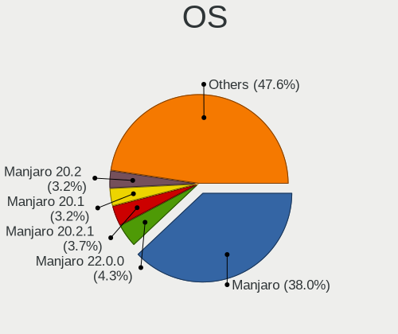

| Name           | Notebooks | Percent |
|----------------|-----------|---------|
| Manjaro        | 1321      | 36.69%  |
| Manjaro 20.2.1 | 163       | 4.53%   |
| Manjaro 22.0.0 | 161       | 4.47%   |
| Manjaro 20.1   | 142       | 3.94%   |
| Manjaro 20.2   | 140       | 3.89%   |
| Manjaro 20.0.3 | 125       | 3.47%   |
| Manjaro 21.2.6 | 113       | 3.14%   |
| Manjaro 21.1.0 | 89        | 2.47%   |
| Manjaro 18.1.5 | 83        | 2.31%   |
| Manjaro 21.2.0 | 72        | 2%      |
| Manjaro 21.0.7 | 69        | 1.92%   |
| Manjaro 21.2.5 | 65        | 1.81%   |
| Manjaro 21.1.6 | 63        | 1.75%   |
| Manjaro 19.0.2 | 55        | 1.53%   |
| Manjaro 20.0   | 52        | 1.44%   |
| Manjaro 21.2.1 | 48        | 1.33%   |
| Manjaro 18.0.4 | 47        | 1.31%   |
| Manjaro 21.0   | 46        | 1.28%   |
| Manjaro 21.0.5 | 44        | 1.22%   |
| Manjaro 20.1.1 | 41        | 1.14%   |
| Manjaro 20.1.2 | 40        | 1.11%   |
| Manjaro 21.2.3 | 37        | 1.03%   |
| Manjaro 20.0.1 | 36        | 1%      |
| Manjaro 21.3.7 | 34        | 0.94%   |
| Manjaro 21.2.2 | 31        | 0.86%   |
| Manjaro 21.0.4 | 31        | 0.86%   |
| Manjaro 21.3.6 | 29        | 0.81%   |
| Manjaro 21.2.4 | 29        | 0.81%   |
| Manjaro 21.1.2 | 25        | 0.69%   |
| Manjaro 21.1.4 | 24        | 0.67%   |
| Manjaro 21.0.1 | 20        | 0.56%   |
| Manjaro 18.1.4 | 20        | 0.56%   |
| Manjaro 21.3.1 | 19        | 0.53%   |
| Manjaro 21.3.0 | 19        | 0.53%   |
| Manjaro 21.1.3 | 19        | 0.53%   |
| Manjaro 21.1.1 | 19        | 0.53%   |
| Manjaro 21.0.2 | 17        | 0.47%   |
| Manjaro 21.0.3 | 16        | 0.44%   |
| Manjaro 21.3.2 | 15        | 0.42%   |
| Manjaro 18.1.0 | 15        | 0.42%   |

OS Family
---------

OS without a version

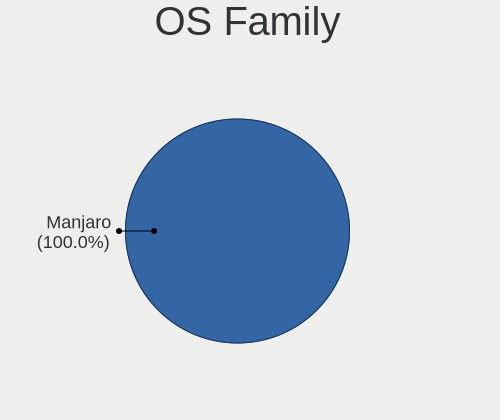

| Name    | Notebooks | Percent |
|---------|-----------|---------|
| Manjaro | 3313      | 100%    |

Kernel
------

Version of the Linux kernel

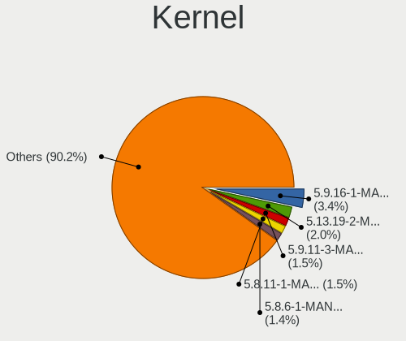

| Version           | Notebooks | Percent |
|-------------------|-----------|---------|
| 5.9.16-1-MANJARO  | 161       | 4.17%   |
| 5.13.19-2-MANJARO | 95        | 2.46%   |
| 5.9.11-3-MANJARO  | 73        | 1.89%   |
| 5.8.11-1-MANJARO  | 69        | 1.79%   |
| 5.8.6-1-MANJARO   | 68        | 1.76%   |
| 5.15.32-1-MANJARO | 63        | 1.63%   |
| 5.15.28-1-MANJARO | 61        | 1.58%   |
| 5.10.42-1-MANJARO | 56        | 1.45%   |
| 5.8.18-1-MANJARO  | 55        | 1.42%   |
| 5.15.12-1-MANJARO | 52        | 1.35%   |
| 5.8.16-2-MANJARO  | 41        | 1.06%   |
| 5.15.65-1-MANJARO | 40        | 1.04%   |
| 5.10.2-2-MANJARO  | 40        | 1.04%   |
| 5.6.16-1-MANJARO  | 39        | 1.01%   |
| 5.15.60-1-MANJARO | 39        | 1.01%   |
| 5.10.7-3-MANJARO  | 38        | 0.98%   |
| 5.12.9-1-MANJARO  | 36        | 0.93%   |
| 5.6.19-2-MANJARO  | 33        | 0.85%   |
| 5.15.74-3-MANJARO | 31        | 0.8%    |
| 5.15.7-1-MANJARO  | 31        | 0.8%    |
| 5.7.9-1-MANJARO   | 30        | 0.78%   |
| 5.6.15-1-MANJARO  | 30        | 0.78%   |
| 5.15.81-1-MANJARO | 30        | 0.78%   |
| 5.15.78-1-MANJARO | 30        | 0.78%   |
| 5.15.41-1-MANJARO | 30        | 0.78%   |
| 5.10.36-2-MANJARO | 30        | 0.78%   |
| 5.7.17-2-MANJARO  | 29        | 0.75%   |
| 5.7.0-3-MANJARO   | 29        | 0.75%   |
| 5.8.3-2-MANJARO   | 28        | 0.73%   |
| 5.15.25-1-MANJARO | 28        | 0.73%   |
| 5.14.10-1-MANJARO | 28        | 0.73%   |
| 5.10.34-1-MANJARO | 27        | 0.7%    |
| 5.16.14-1-MANJARO | 25        | 0.65%   |
| 5.10.70-1-MANJARO | 25        | 0.65%   |
| 5.10.53-1-MANJARO | 25        | 0.65%   |
| 5.9.3-1-MANJARO   | 23        | 0.6%    |
| 5.17.1-3-MANJARO  | 23        | 0.6%    |
| 5.15.38-1-MANJARO | 23        | 0.6%    |
| 5.4.6-2-MANJARO   | 22        | 0.57%   |
| 5.15.21-1-MANJARO | 22        | 0.57%   |

Kernel Family
-------------

Linux kernel without a distro release

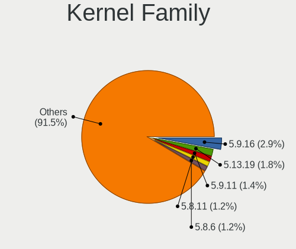

| Version | Notebooks | Percent |
|---------|-----------|---------|
| 5.9.16  | 161       | 4.17%   |
| 5.13.19 | 96        | 2.49%   |
| 5.9.11  | 77        | 2%      |
| 5.8.11  | 69        | 1.79%   |
| 5.8.6   | 68        | 1.76%   |
| 5.15.32 | 64        | 1.66%   |
| 5.15.28 | 61        | 1.58%   |
| 5.10.42 | 56        | 1.45%   |
| 5.8.18  | 55        | 1.43%   |
| 5.15.12 | 52        | 1.35%   |
| 5.8.16  | 42        | 1.09%   |
| 5.15.65 | 40        | 1.04%   |
| 5.10.2  | 40        | 1.04%   |
| 5.6.16  | 39        | 1.01%   |
| 5.15.60 | 39        | 1.01%   |
| 5.10.7  | 39        | 1.01%   |
| 5.7.0   | 36        | 0.93%   |
| 5.12.9  | 36        | 0.93%   |
| 5.6.19  | 35        | 0.91%   |
| 5.9.1   | 33        | 0.86%   |
| 5.15.7  | 32        | 0.83%   |
| 5.15.74 | 31        | 0.8%    |
| 5.7.9   | 30        | 0.78%   |
| 5.6.15  | 30        | 0.78%   |
| 5.17.1  | 30        | 0.78%   |
| 5.15.81 | 30        | 0.78%   |
| 5.15.78 | 30        | 0.78%   |
| 5.15.41 | 30        | 0.78%   |
| 5.10.36 | 30        | 0.78%   |
| 5.7.17  | 29        | 0.75%   |
| 5.8.3   | 28        | 0.73%   |
| 5.15.25 | 28        | 0.73%   |
| 5.14.10 | 28        | 0.73%   |
| 5.10.34 | 27        | 0.7%    |
| 5.19.0  | 25        | 0.65%   |
| 5.16.14 | 25        | 0.65%   |
| 5.10.70 | 25        | 0.65%   |
| 5.10.53 | 25        | 0.65%   |
| 5.9.3   | 24        | 0.62%   |
| 5.15.38 | 23        | 0.6%    |

Kernel Major Ver.
-----------------

Linux kernel major version

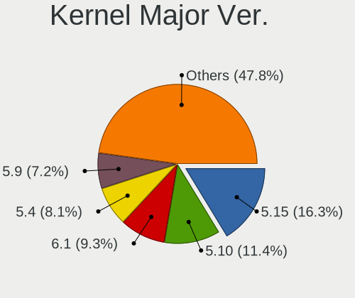

| Version | Notebooks | Percent |
|---------|-----------|---------|
| 5.15    | 648       | 17.71%  |
| 5.10    | 497       | 13.58%  |
| 5.4     | 356       | 9.73%   |
| 5.9     | 322       | 8.8%    |
| 5.8     | 291       | 7.95%   |
| 5.13    | 204       | 5.58%   |
| 5.6     | 199       | 5.44%   |
| 5.7     | 137       | 3.74%   |
| 4.19    | 121       | 3.31%   |
| 5.16    | 99        | 2.71%   |
| 5.12    | 94        | 2.57%   |
| 5.11    | 81        | 2.21%   |
| 5.14    | 75        | 2.05%   |
| 6.0     | 70        | 1.91%   |
| 5.19    | 70        | 1.91%   |
| 5.17    | 70        | 1.91%   |
| 5.18    | 68        | 1.86%   |
| 5.3     | 64        | 1.75%   |
| 5.5     | 62        | 1.69%   |
| 6.1     | 34        | 0.93%   |
| 4.14    | 25        | 0.68%   |
| 5.2     | 23        | 0.63%   |
| 5.0     | 17        | 0.46%   |
| 5.1     | 13        | 0.36%   |
| 4.20    | 9         | 0.25%   |
| 4.18    | 7         | 0.19%   |
| 4.9     | 2         | 0.05%   |
| 4.16    | 1         | 0.03%   |

Arch
----

OS architecture (x86_64, i586, etc.)

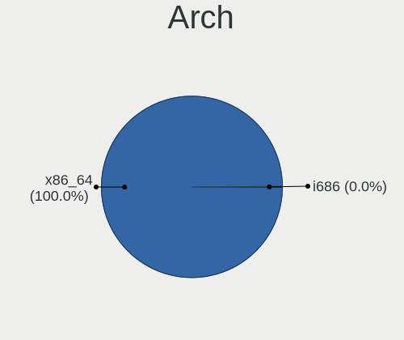

| Name   | Notebooks | Percent |
|--------|-----------|---------|
| x86_64 | 3311      | 99.94%  |
| i686   | 2         | 0.06%   |

DE
--

Desktop Environment

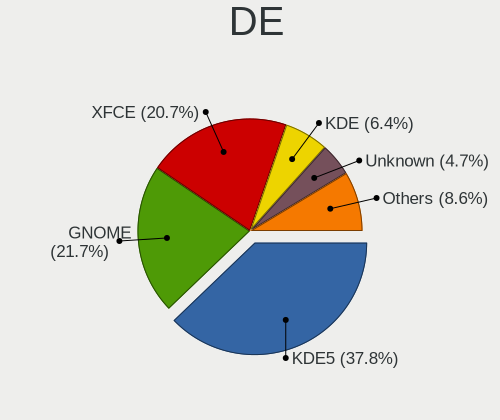

| Name                 | Notebooks | Percent |
|----------------------|-----------|---------|
| KDE5                 | 1134      | 33.28%  |
| XFCE                 | 772       | 22.66%  |
| GNOME                | 738       | 21.66%  |
| KDE                  | 273       | 8.01%   |
| Unknown              | 189       | 5.55%   |
| i3                   | 76        | 2.23%   |
| X-Cinnamon           | 73        | 2.14%   |
| MATE                 | 35        | 1.03%   |
| Cinnamon             | 30        | 0.88%   |
| Deepin               | 24        | 0.7%    |
| Budgie               | 14        | 0.41%   |
| awesome              | 11        | 0.32%   |
| LXQt                 | 7         | 0.21%   |
| sway                 | 6         | 0.18%   |
| LXDE                 | 6         | 0.18%   |
| i3-with-shmlog       | 3         | 0.09%   |
| leftwm               | 2         | 0.06%   |
| GNOME Flashback      | 2         | 0.06%   |
| DWM                  | 2         | 0.06%   |
| bspwm                | 2         | 0.06%   |
| Yaru:ubuntu:GNOME    | 1         | 0.03%   |
| xinitrc              | 1         | 0.03%   |
| Unity                | 1         | 0.03%   |
| swayLANG=en_CA.UTF-8 | 1         | 0.03%   |
| qtile                | 1         | 0.03%   |
| herbstluftwm         | 1         | 0.03%   |
| GNOME Classic        | 1         | 0.03%   |
| Enlightenment        | 1         | 0.03%   |

Display Server
--------------

X11 or Wayland

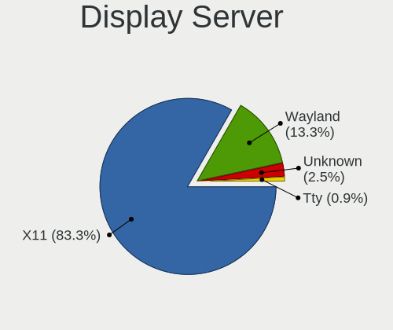

| Name    | Notebooks | Percent |
|---------|-----------|---------|
| X11     | 2800      | 83.41%  |
| Wayland | 442       | 13.17%  |
| Unknown | 86        | 2.56%   |
| Tty     | 29        | 0.86%   |

Display Manager
---------------

SDDM, LightDM, etc.

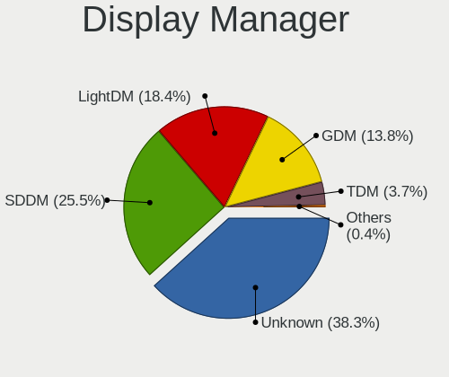

| Name    | Notebooks | Percent |
|---------|-----------|---------|
| Unknown | 1308      | 38.58%  |
| SDDM    | 859       | 25.34%  |
| LightDM | 619       | 18.26%  |
| GDM     | 469       | 13.83%  |
| TDM     | 123       | 3.63%   |
| LXDM    | 5         | 0.15%   |
| Ly      | 2         | 0.06%   |
| GREETD  | 2         | 0.06%   |
| XDM     | 1         | 0.03%   |
| SLiM    | 1         | 0.03%   |
| CDM     | 1         | 0.03%   |

OS Lang
-------

Language

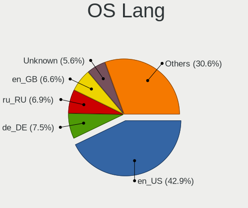

| Lang    | Notebooks | Percent |
|---------|-----------|---------|
| en_US   | 1438      | 42.91%  |
| de_DE   | 238       | 7.1%    |
| Unknown | 236       | 7.04%   |
| ru_RU   | 232       | 6.92%   |
| en_GB   | 212       | 6.33%   |
| pt_BR   | 134       | 4%      |
| fr_FR   | 86        | 2.57%   |
| it_IT   | 68        | 2.03%   |
| es_ES   | 64        | 1.91%   |
| pl_PL   | 60        | 1.79%   |
| en_CA   | 58        | 1.73%   |
| en_IN   | 50        | 1.49%   |
| en_AU   | 36        | 1.07%   |
| es_MX   | 34        | 1.01%   |
| zh_CN   | 29        | 0.87%   |
| ru_UA   | 20        | 0.6%    |
| de_AT   | 20        | 0.6%    |
| es_AR   | 15        | 0.45%   |
| C       | 15        | 0.45%   |
| en_IE   | 14        | 0.42%   |
| pt_PT   | 13        | 0.39%   |
| nl_NL   | 13        | 0.39%   |
| en_DK   | 13        | 0.39%   |
| tr_TR   | 12        | 0.36%   |
| cs_CZ   | 12        | 0.36%   |
| es_CL   | 11        | 0.33%   |
| uk_UA   | 10        | 0.3%    |
| es_CO   | 10        | 0.3%    |
| en_ZA   | 10        | 0.3%    |
| sv_SE   | 9         | 0.27%   |
| nl_BE   | 8         | 0.24%   |
| hu_HU   | 8         | 0.24%   |
| fi_FI   | 8         | 0.24%   |
| en_NZ   | 8         | 0.24%   |
| el_GR   | 8         | 0.24%   |
| de_CH   | 8         | 0.24%   |
| en_PH   | 7         | 0.21%   |
| en_DE   | 7         | 0.21%   |
| zh_TW   | 6         | 0.18%   |
| en_IL   | 6         | 0.18%   |

Boot Mode
---------

EFI or BIOS

| Mode | Notebooks | Percent |
|------|-----------|---------|
| BIOS | 1722      | 51.17%  |
| EFI  | 1643      | 48.83%  |

Filesystem
----------

Type of filesystem

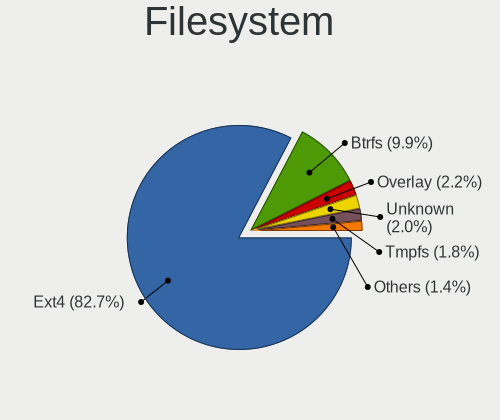

| Type     | Notebooks | Percent |
|----------|-----------|---------|
| Ext4     | 2821      | 84.51%  |
| Btrfs    | 288       | 8.63%   |
| Overlay  | 83        | 2.49%   |
| Unknown  | 82        | 2.46%   |
| Xfs      | 33        | 0.99%   |
| Tmpfs    | 12        | 0.36%   |
| F2fs     | 11        | 0.33%   |
| Reiserfs | 3         | 0.09%   |
| Ext3     | 3         | 0.09%   |
| Jfs      | 1         | 0.03%   |
| Ext2     | 1         | 0.03%   |

Part. scheme
------------

Scheme of partitioning

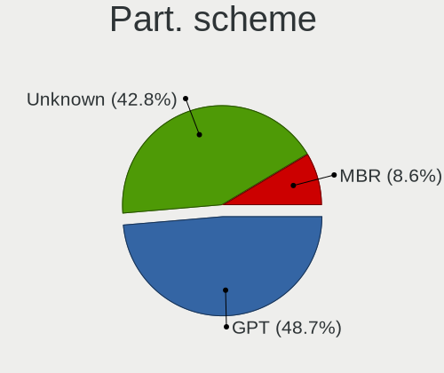

| Type    | Notebooks | Percent |
|---------|-----------|---------|
| GPT     | 1625      | 48.26%  |
| Unknown | 1445      | 42.92%  |
| MBR     | 297       | 8.82%   |

Dual Boot with Linux/BSD
------------------------

Hosting more than one Linux/BSD

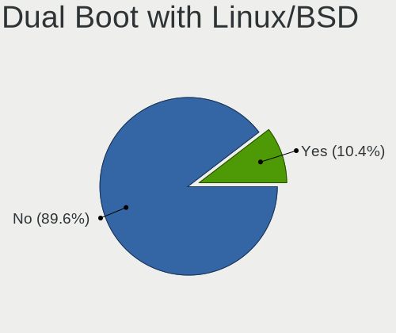

| Dual boot | Notebooks | Percent |
|-----------|-----------|---------|
| No        | 3009      | 89.77%  |
| Yes       | 343       | 10.23%  |

Dual Boot (Win)
---------------

Hosting Linux and Windows

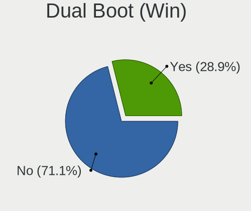

| Dual boot | Notebooks | Percent |
|-----------|-----------|---------|
| No        | 2360      | 70.15%  |
| Yes       | 1004      | 29.85%  |

Board
-----

Vendor
------

Motherboard manufacturer

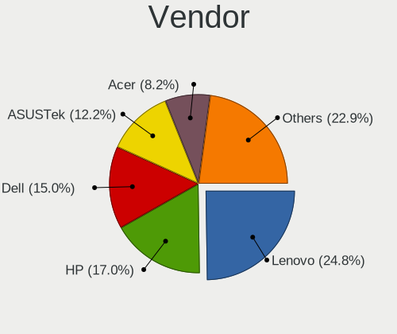

| Name                 | Notebooks | Percent |
|----------------------|-----------|---------|
| Lenovo               | 847       | 25.57%  |
| Hewlett-Packard      | 561       | 16.93%  |
| Dell                 | 495       | 14.94%  |
| ASUSTek Computer     | 413       | 12.47%  |
| Acer                 | 264       | 7.97%   |
| MSI                  | 95        | 2.87%   |
| Apple                | 80        | 2.41%   |
| Toshiba              | 59        | 1.78%   |
| Samsung Electronics  | 55        | 1.66%   |
| HUAWEI               | 55        | 1.66%   |
| Timi                 | 36        | 1.09%   |
| Notebook             | 28        | 0.85%   |
| Sony                 | 27        | 0.81%   |
| Fujitsu              | 25        | 0.75%   |
| Google               | 22        | 0.66%   |
| Unknown              | 16        | 0.48%   |
| TUXEDO               | 14        | 0.42%   |
| Razer                | 14        | 0.42%   |
| Alienware            | 12        | 0.36%   |
| Schenker             | 10        | 0.3%    |
| Packard Bell         | 9         | 0.27%   |
| LG Electronics       | 8         | 0.24%   |
| Panasonic            | 7         | 0.21%   |
| Medion               | 7         | 0.21%   |
| HONOR                | 7         | 0.21%   |
| Gigabyte Technology  | 7         | 0.21%   |
| Clevo                | 7         | 0.21%   |
| Chuwi                | 7         | 0.21%   |
| System76             | 6         | 0.18%   |
| Monster              | 6         | 0.18%   |
| Positivo             | 5         | 0.15%   |
| Multilaser           | 5         | 0.15%   |
| PC Specialist        | 4         | 0.12%   |
| Intel Client Systems | 4         | 0.12%   |
| GPD                  | 4         | 0.12%   |
| TrekStor             | 3         | 0.09%   |
| Star Labs            | 3         | 0.09%   |
| MECHREVO             | 3         | 0.09%   |
| Gateway              | 3         | 0.09%   |
| Framework            | 3         | 0.09%   |

Model
-----

Motherboard model

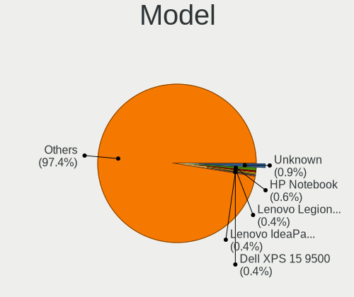

| Name                                 | Notebooks | Percent |
|--------------------------------------|-----------|---------|
| Unknown                              | 26        | 0.78%   |
| HP Notebook                          | 20        | 0.6%    |
| Lenovo Legion 5 15ARH05 82B5         | 13        | 0.39%   |
| Lenovo IdeaPad 5 15ARE05 81YQ        | 13        | 0.39%   |
| Dell XPS 13 9310                     | 13        | 0.39%   |
| HP Pavilion Gaming Laptop 15-ec1xxx  | 11        | 0.33%   |
| Dell XPS 15 9500                     | 11        | 0.33%   |
| HP Pavilion Notebook                 | 10        | 0.3%    |
| HP Laptop 15-bs0xx                   | 10        | 0.3%    |
| HP Pavilion dv7                      | 9         | 0.27%   |
| Dell XPS 15 9560                     | 9         | 0.27%   |
| Dell Inspiron 3542                   | 9         | 0.27%   |
| Lenovo IdeaPad Gaming 3 15ARH05 82EY | 8         | 0.24%   |
| HP Pavilion g6                       | 8         | 0.24%   |
| HP Pavilion dv6                      | 8         | 0.24%   |
| HP Pavilion 15                       | 8         | 0.24%   |
| HP 15                                | 8         | 0.24%   |
| Dell XPS 15 9570                     | 8         | 0.24%   |
| Dell XPS 13 7390                     | 8         | 0.24%   |
| Dell Latitude E6430                  | 8         | 0.24%   |
| Timi TM1701                          | 7         | 0.21%   |
| Lenovo Z50-70 20354                  | 7         | 0.21%   |
| Lenovo Yoga Slim 7 14ARE05 82A2      | 7         | 0.21%   |
| Lenovo Y520-15IKBN 80WK              | 7         | 0.21%   |
| HP OMEN by Laptop                    | 7         | 0.21%   |
| Dell XPS 15 7590                     | 7         | 0.21%   |
| Dell Inspiron N5110                  | 7         | 0.21%   |
| Apple MacBookPro9,2                  | 7         | 0.21%   |
| Apple MacBookPro15,1                 | 7         | 0.21%   |
| Acer Swift SF314-42                  | 7         | 0.21%   |
| Lenovo ThinkBook 15-IIL 20SM         | 6         | 0.18%   |
| Lenovo Legion 5 15ACH6H 82JU         | 6         | 0.18%   |
| Lenovo IdeaPad S540-14API 81NH       | 6         | 0.18%   |
| Lenovo IdeaPad 5 14ARE05 81YM        | 6         | 0.18%   |
| Lenovo G580 20150                    | 6         | 0.18%   |
| HUAWEI KLVL-WXX9                     | 6         | 0.18%   |
| HUAWEI BOHK-WAX9X                    | 6         | 0.18%   |
| HP ProBook 455 G7                    | 6         | 0.18%   |
| HP ProBook 450 G5                    | 6         | 0.18%   |
| HP Pavilion Laptop 15-cw1xxx         | 6         | 0.18%   |

Model Family
------------

Motherboard model prefix

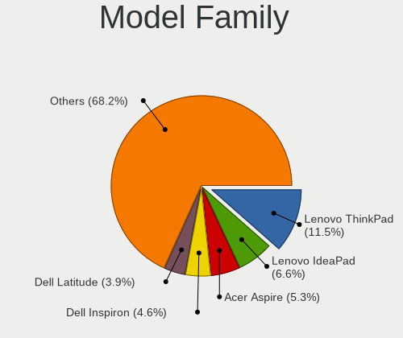

| Name                  | Notebooks | Percent |
|-----------------------|-----------|---------|
| Lenovo ThinkPad       | 392       | 11.83%  |
| Lenovo IdeaPad        | 229       | 6.91%   |
| Acer Aspire           | 174       | 5.25%   |
| Dell Inspiron         | 165       | 4.98%   |
| HP Pavilion           | 133       | 4.01%   |
| Dell Latitude         | 129       | 3.89%   |
| Dell XPS              | 92        | 2.78%   |
| HP ProBook            | 87        | 2.63%   |
| HP Laptop             | 83        | 2.51%   |
| HP EliteBook          | 80        | 2.41%   |
| ASUS VivoBook         | 64        | 1.93%   |
| Lenovo Legion         | 60        | 1.81%   |
| Toshiba Satellite     | 53        | 1.6%    |
| ASUS ROG              | 47        | 1.42%   |
| Dell Precision        | 38        | 1.15%   |
| Dell Vostro           | 34        | 1.03%   |
| Acer Swift            | 33        | 1%      |
| ASUS ZenBook          | 31        | 0.94%   |
| ASUS TUF              | 31        | 0.94%   |
| Unknown               | 26        | 0.78%   |
| Lenovo ThinkBook      | 25        | 0.75%   |
| HP ENVY               | 24        | 0.72%   |
| Acer Nitro            | 24        | 0.72%   |
| HP OMEN               | 23        | 0.69%   |
| ASUS ASUS             | 22        | 0.66%   |
| Fujitsu LIFEBOOK      | 21        | 0.63%   |
| HP Notebook           | 20        | 0.6%    |
| Lenovo Yoga           | 19        | 0.57%   |
| HP ZBook              | 19        | 0.57%   |
| Timi RedmiBook        | 16        | 0.48%   |
| HP 250                | 16        | 0.48%   |
| Dell G3               | 14        | 0.42%   |
| Razer Blade           | 13        | 0.39%   |
| HP Compaq             | 13        | 0.39%   |
| HP 15                 | 12        | 0.36%   |
| Acer TravelMate       | 12        | 0.36%   |
| HP 255                | 11        | 0.33%   |
| Apple MacBookPro11    | 11        | 0.33%   |
| Packard Bell EasyNote | 9         | 0.27%   |
| Apple MacBookPro9     | 8         | 0.24%   |

MFG Year
--------

Motherboard manufacture year

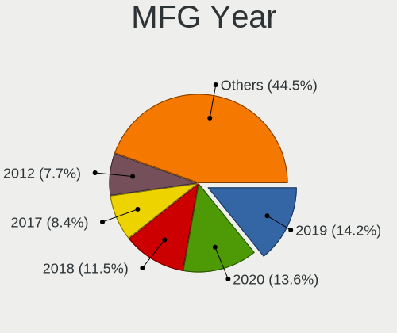

| Year    | Notebooks | Percent |
|---------|-----------|---------|
| 2019    | 452       | 13.64%  |
| 2020    | 445       | 13.43%  |
| 2018    | 354       | 10.69%  |
| 2021    | 288       | 8.69%   |
| 2017    | 268       | 8.09%   |
| 2012    | 241       | 7.27%   |
| 2015    | 203       | 6.13%   |
| 2013    | 196       | 5.92%   |
| 2014    | 189       | 5.7%    |
| 2016    | 187       | 5.64%   |
| 2011    | 184       | 5.55%   |
| 2010    | 105       | 3.17%   |
| 2008    | 67        | 2.02%   |
| 2022    | 49        | 1.48%   |
| 2009    | 48        | 1.45%   |
| 2007    | 26        | 0.78%   |
| 2006    | 7         | 0.21%   |
| Unknown | 3         | 0.09%   |
| 2005    | 1         | 0.03%   |

Form Factor
-----------

Physical design of the computer

| Name     | Notebooks | Percent |
|----------|-----------|---------|
| Notebook | 3313      | 100%    |

Secure Boot
-----------

Enabled or disabled

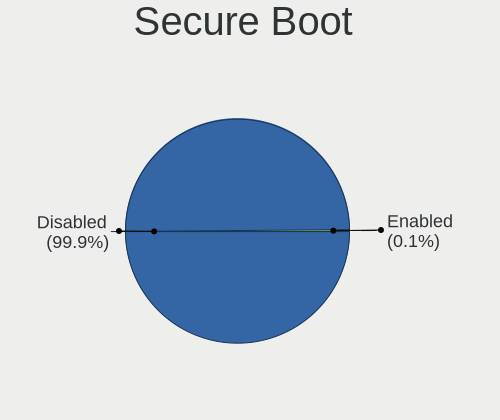

| State    | Notebooks | Percent |
|----------|-----------|---------|
| Disabled | 3311      | 99.88%  |
| Enabled  | 4         | 0.12%   |

Coreboot
--------

Have coreboot on board

| Used | Notebooks | Percent |
|------|-----------|---------|
| No   | 3274      | 98.82%  |
| Yes  | 39        | 1.18%   |

RAM Size
--------

Total RAM memory

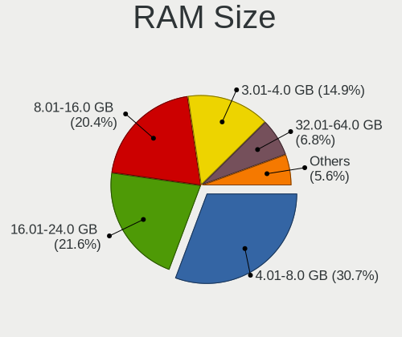

| Size in GB  | Notebooks | Percent |
|-------------|-----------|---------|
| 4.01-8.0    | 1025      | 30.59%  |
| 16.01-24.0  | 718       | 21.43%  |
| 8.01-16.0   | 694       | 20.71%  |
| 3.01-4.0    | 489       | 14.59%  |
| 32.01-64.0  | 238       | 7.1%    |
| 1.01-2.0    | 68        | 2.03%   |
| 24.01-32.0  | 55        | 1.64%   |
| 64.01-256.0 | 36        | 1.07%   |
| 2.01-3.0    | 27        | 0.81%   |
| 0.51-1.0    | 1         | 0.03%   |

RAM Used
--------

Used RAM memory

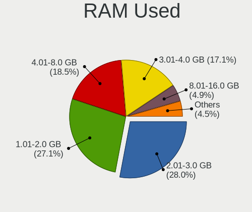

| Used GB    | Notebooks | Percent |
|------------|-----------|---------|
| 2.01-3.0   | 1017      | 27.96%  |
| 1.01-2.0   | 960       | 26.4%   |
| 4.01-8.0   | 690       | 18.97%  |
| 3.01-4.0   | 627       | 17.24%  |
| 8.01-16.0  | 187       | 5.14%   |
| 0.51-1.0   | 131       | 3.6%    |
| 16.01-24.0 | 13        | 0.36%   |
| 0.01-0.5   | 6         | 0.16%   |
| 24.01-32.0 | 5         | 0.14%   |
| 32.01-64.0 | 1         | 0.03%   |

Total Drives
------------

Number of drives on board

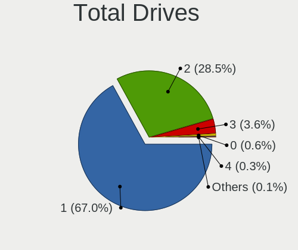

| Drives | Notebooks | Percent |
|--------|-----------|---------|
| 1      | 2281      | 67.61%  |
| 2      | 942       | 27.92%  |
| 3      | 121       | 3.59%   |
| 0      | 18        | 0.53%   |
| 4      | 10        | 0.3%    |
| 7      | 1         | 0.03%   |
| 6      | 1         | 0.03%   |

Has CD-ROM
----------

Has CD-ROM on board

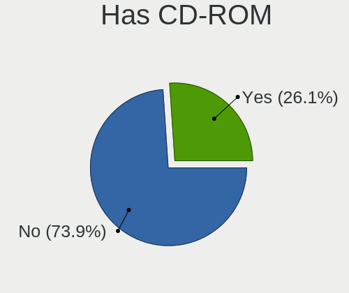

| Presented | Notebooks | Percent |
|-----------|-----------|---------|
| No        | 2451      | 73.58%  |
| Yes       | 880       | 26.42%  |

Has Ethernet
------------

Has Ethernet on board

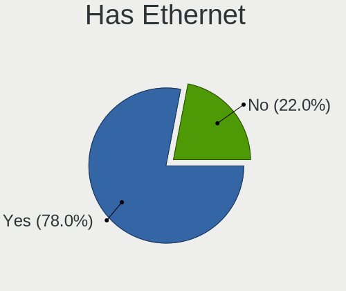

| Presented | Notebooks | Percent |
|-----------|-----------|---------|
| Yes       | 2556      | 76.9%   |
| No        | 768       | 23.1%   |

Has WiFi
--------

Has WiFi module

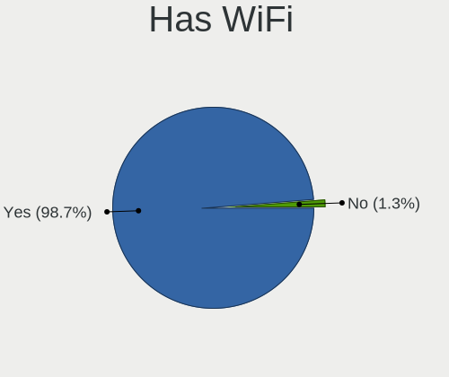

| Presented | Notebooks | Percent |
|-----------|-----------|---------|
| Yes       | 3274      | 98.73%  |
| No        | 42        | 1.27%   |

Has Bluetooth
-------------

Has Bluetooth module

| Presented | Notebooks | Percent |
|-----------|-----------|---------|
| Yes       | 2701      | 81.06%  |
| No        | 631       | 18.94%  |

Location
--------

Country
-------

Geographic location (country)

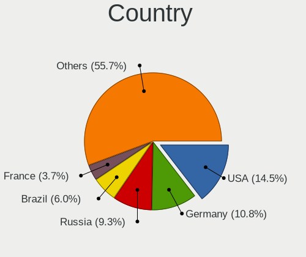

| Country      | Notebooks | Percent |
|--------------|-----------|---------|
| USA          | 486       | 14.59%  |
| Germany      | 355       | 10.65%  |
| Russia       | 306       | 9.18%   |
| Brazil       | 200       | 6%      |
| France       | 125       | 3.75%   |
| UK           | 116       | 3.48%   |
| Italy        | 110       | 3.3%    |
| Poland       | 102       | 3.06%   |
| Canada       | 92        | 2.76%   |
| Spain        | 89        | 2.67%   |
| Ukraine      | 88        | 2.64%   |
| India        | 87        | 2.61%   |
| Netherlands  | 77        | 2.31%   |
| Mexico       | 58        | 1.74%   |
| China        | 48        | 1.44%   |
| Austria      | 48        | 1.44%   |
| Turkey       | 42        | 1.26%   |
| Australia    | 42        | 1.26%   |
| Sweden       | 35        | 1.05%   |
| Indonesia    | 33        | 0.99%   |
| Switzerland  | 32        | 0.96%   |
| Romania      | 32        | 0.96%   |
| Belgium      | 32        | 0.96%   |
| Portugal     | 30        | 0.9%    |
| Czechia      | 29        | 0.87%   |
| Belarus      | 28        | 0.84%   |
| Finland      | 24        | 0.72%   |
| Norway       | 23        | 0.69%   |
| Hungary      | 23        | 0.69%   |
| Greece       | 23        | 0.69%   |
| Argentina    | 22        | 0.66%   |
| Colombia     | 21        | 0.63%   |
| Bulgaria     | 20        | 0.6%    |
| Taiwan       | 19        | 0.57%   |
| Denmark      | 19        | 0.57%   |
| Iran         | 17        | 0.51%   |
| Bangladesh   | 17        | 0.51%   |
| Croatia      | 15        | 0.45%   |
| South Africa | 13        | 0.39%   |
| Chile        | 13        | 0.39%   |

City
----

Geographic location (city)

| City              | Notebooks | Percent |
|-------------------|-----------|---------|
| Moscow            | 67        | 1.91%   |
| St Petersburg     | 45        | 1.29%   |
| Vienna            | 33        | 0.94%   |
| Paris             | 32        | 0.91%   |
| Kyiv              | 25        | 0.71%   |
| Berlin            | 25        | 0.71%   |
| Sao Paulo         | 24        | 0.69%   |
| Amsterdam         | 21        | 0.6%    |
| Warsaw            | 18        | 0.51%   |
| Munich            | 18        | 0.51%   |
| Milan             | 18        | 0.51%   |
| Minsk             | 16        | 0.46%   |
| Bengaluru         | 16        | 0.46%   |
| Toronto           | 15        | 0.43%   |
| Novosibirsk       | 15        | 0.43%   |
| Istanbul          | 15        | 0.43%   |
| Helsinki          | 14        | 0.4%    |
| Frankfurt am Main | 14        | 0.4%    |
| Prague            | 13        | 0.37%   |
| Barcelona         | 13        | 0.37%   |
| Rome              | 12        | 0.34%   |
| Madrid            | 12        | 0.34%   |
| London            | 12        | 0.34%   |
| Hamburg           | 12        | 0.34%   |
| Budapest          | 12        | 0.34%   |
| Yekaterinburg     | 11        | 0.31%   |
| Mexico City       | 11        | 0.31%   |
| Melbourne         | 11        | 0.31%   |
| Dhaka             | 11        | 0.31%   |
| Cologne           | 11        | 0.31%   |
| Bucharest         | 11        | 0.31%   |
| Athens            | 11        | 0.31%   |
| Zagreb            | 10        | 0.29%   |
| Stockholm         | 10        | 0.29%   |
| Sofia             | 10        | 0.29%   |
| Seattle           | 10        | 0.29%   |
| Krasnodar         | 10        | 0.29%   |
| Krakow            | 10        | 0.29%   |
| Bogotá           | 10        | 0.29%   |
| Belo Horizonte    | 10        | 0.29%   |

Drives
------

Drive Vendor
------------

Hard drive vendors

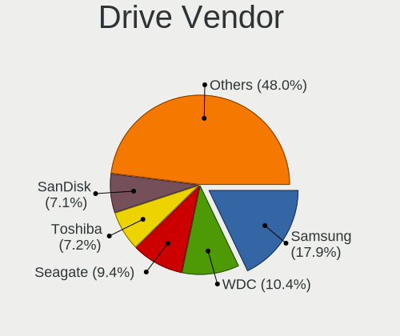

| Vendor                         | Notebooks | Drives | Percent |
|--------------------------------|-----------|--------|---------|
| Samsung Electronics            | 759       | 999    | 17.43%  |
| WDC                            | 488       | 582    | 11.21%  |
| Seagate                        | 445       | 574    | 10.22%  |
| Toshiba                        | 338       | 389    | 7.76%   |
| SanDisk                        | 277       | 352    | 6.36%   |
| Kingston                       | 245       | 282    | 5.63%   |
| Unknown                        | 221       | 266    | 5.08%   |
| SK hynix                       | 219       | 262    | 5.03%   |
| Crucial                        | 153       | 187    | 3.51%   |
| Intel                          | 148       | 183    | 3.4%    |
| HGST                           | 133       | 159    | 3.05%   |
| Micron Technology              | 115       | 144    | 2.64%   |
| Hitachi                        | 86        | 100    | 1.98%   |
| A-DATA Technology              | 54        | 63     | 1.24%   |
| KIOXIA                         | 53        | 60     | 1.22%   |
| Apple                          | 50        | 57     | 1.15%   |
| Phison                         | 43        | 61     | 0.99%   |
| China                          | 35        | 38     | 0.8%    |
| Transcend                      | 30        | 36     | 0.69%   |
| LITEONIT                       | 26        | 31     | 0.6%    |
| GOODRAM                        | 25        | 43     | 0.57%   |
| LITEON                         | 23        | 26     | 0.53%   |
| Silicon Motion                 | 19        | 22     | 0.44%   |
| JMicron Technology             | 18        | 19     | 0.41%   |
| Micron/Crucial Technology      | 17        | 19     | 0.39%   |
| Plextor                        | 13        | 21     | 0.3%    |
| Patriot                        | 12        | 12     | 0.28%   |
| SPCC                           | 11        | 13     | 0.25%   |
| Phison Electronics             | 11        | 11     | 0.25%   |
| Intenso                        | 11        | 12     | 0.25%   |
| Union Memory (Shenzhen)        | 10        | 10     | 0.23%   |
| Fujitsu                        | 10        | 10     | 0.23%   |
| XPG                            | 9         | 15     | 0.21%   |
| Solid State Storage Technology | 9         | 16     | 0.21%   |
| Hewlett-Packard                | 9         | 13     | 0.21%   |
| Unknown                        | 9         | 9      | 0.21%   |
| PNY                            | 8         | 12     | 0.18%   |
| Netac                          | 8         | 14     | 0.18%   |
| Corsair                        | 8         | 8      | 0.18%   |
| OCZ                            | 7         | 8      | 0.16%   |

Drive Model
-----------

Hard drive models

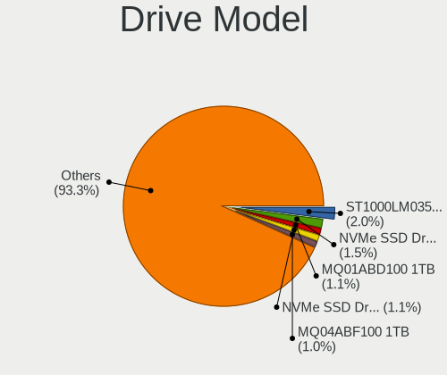

| Model                                               | Notebooks | Percent |
|-----------------------------------------------------|-----------|---------|
| Seagate ST1000LM035-1RK172 1TB                      | 87        | 1.92%   |
| Samsung NVMe SSD Drive 512GB                        | 64        | 1.41%   |
| Toshiba MQ01ABD100 1TB                              | 48        | 1.06%   |
| HGST HTS721010A9E630 1TB                            | 47        | 1.04%   |
| Toshiba MQ04ABF100 1TB                              | 46        | 1.02%   |
| SK hynix NVMe SSD Drive 512GB                       | 46        | 1.02%   |
| SanDisk NVMe SSD Drive 512GB                        | 43        | 0.95%   |
| Samsung SM963 2.5" NVMe PCIe SSD 256GB              | 43        | 0.95%   |
| Seagate ST1000LM024 HN-M101MBB 1TB                  | 41        | 0.91%   |
| Kingston SA400S37240G 240GB SSD                     | 38        | 0.84%   |
| Toshiba MQ01ABF050 500GB                            | 37        | 0.82%   |
| Unknown MMC Card  32GB                              | 30        | 0.66%   |
| Intel NVMe SSD Drive 512GB                          | 30        | 0.66%   |
| Samsung NVMe SSD Drive 1TB                          | 29        | 0.64%   |
| Unknown SD/MMC/MS PRO 64GB                          | 28        | 0.62%   |
| Samsung NVMe SSD Controller SM981/PM981/PM983 500GB | 27        | 0.6%    |
| SanDisk NVMe SSD Drive 256GB                        | 26        | 0.57%   |
| Unknown MMC Card  64GB                              | 25        | 0.55%   |
| Crucial CT500MX500SSD1 500GB                        | 25        | 0.55%   |
| Seagate ST500LT012-1DG142 500GB                     | 24        | 0.53%   |
| Seagate ST1000LM049-2GH172 1TB                      | 23        | 0.51%   |
| Samsung NVMe SSD Drive 1024GB                       | 23        | 0.51%   |
| Kingston SA400S37120G 120GB SSD                     | 23        | 0.51%   |
| SK hynix NVMe SSD Drive 256GB                       | 22        | 0.49%   |
| Samsung SSD 860 EVO 500GB                           | 22        | 0.49%   |
| Samsung SSD 850 EVO 500GB                           | 22        | 0.49%   |
| HGST HTS545050A7E680 500GB                          | 22        | 0.49%   |
| Seagate Expansion 4TB                               | 21        | 0.46%   |
| Kingston SA400S37480G 480GB SSD                     | 20        | 0.44%   |
| SanDisk NVMe SSD Drive 1TB                          | 19        | 0.42%   |
| Micron NVMe SSD Drive 512GB                         | 19        | 0.42%   |
| Kingston NVMe SSD Drive 512GB                       | 19        | 0.42%   |
| WDC WD10SPZX-21Z10T0 1TB                            | 18        | 0.4%    |
| Toshiba NVMe SSD Drive 512GB                        | 18        | 0.4%    |
| Seagate ST500LM012 HN-M500MBB 500GB                 | 18        | 0.4%    |
| Intel SSDPEKNW512G8 512GB                           | 18        | 0.4%    |
| Crucial CT1000MX500SSD1 1TB                         | 18        | 0.4%    |
| WDC WD10SPZX-24Z10 1TB                              | 17        | 0.38%   |
| WDC WD10JPVX-22JC3T0 1TB                            | 17        | 0.38%   |
| Seagate ST9500325AS 500GB                           | 17        | 0.38%   |

HDD Vendor
----------

Hard disk drive vendors

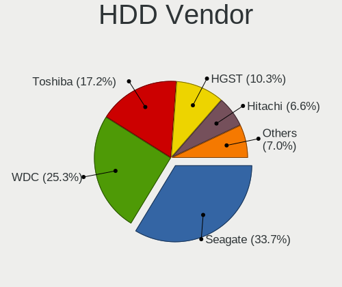

| Vendor              | Notebooks | Drives | Percent |
|---------------------|-----------|--------|---------|
| Seagate             | 435       | 556    | 34.63%  |
| WDC                 | 312       | 363    | 24.84%  |
| Toshiba             | 216       | 247    | 17.2%   |
| HGST                | 133       | 159    | 10.59%  |
| Hitachi             | 86        | 100    | 6.85%   |
| Unknown             | 30        | 33     | 2.39%   |
| Samsung Electronics | 13        | 15     | 1.04%   |
| Fujitsu             | 10        | 10     | 0.8%    |
| Apple               | 5         | 6      | 0.4%    |
| USB3.0              | 2         | 2      | 0.16%   |
| Intenso             | 2         | 2      | 0.16%   |
| ASMT                | 2         | 2      | 0.16%   |
| QNAP                | 1         | 1      | 0.08%   |
| Pioneer             | 1         | 3      | 0.08%   |
| PHD 3.0             | 1         | 1      | 0.08%   |
| KESU                | 1         | 1      | 0.08%   |
| Inateck             | 1         | 1      | 0.08%   |
| Hewlett-Packard     | 1         | 1      | 0.08%   |
| ASMedia             | 1         | 1      | 0.08%   |
| Apricorn            | 1         | 1      | 0.08%   |
| ACASIS              | 1         | 1      | 0.08%   |
| Unknown             | 1         | 1      | 0.08%   |

SSD Vendor
----------

Solid state drive vendors

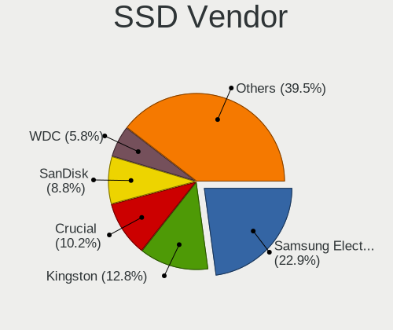

| Vendor              | Notebooks | Drives | Percent |
|---------------------|-----------|--------|---------|
| Samsung Electronics | 316       | 398    | 23.08%  |
| Kingston            | 177       | 202    | 12.93%  |
| Crucial             | 140       | 174    | 10.23%  |
| SanDisk             | 116       | 152    | 8.47%   |
| WDC                 | 81        | 97     | 5.92%   |
| Micron Technology   | 51        | 64     | 3.73%   |
| A-DATA Technology   | 39        | 43     | 2.85%   |
| Intel               | 37        | 43     | 2.7%    |
| SK hynix            | 35        | 43     | 2.56%   |
| China               | 35        | 38     | 2.56%   |
| Apple               | 33        | 37     | 2.41%   |
| Toshiba             | 30        | 31     | 2.19%   |
| Transcend           | 28        | 33     | 2.05%   |
| LITEONIT            | 26        | 31     | 1.9%    |
| GOODRAM             | 24        | 42     | 1.75%   |
| LITEON              | 20        | 23     | 1.46%   |
| Plextor             | 12        | 20     | 0.88%   |
| Patriot             | 11        | 11     | 0.8%    |
| Intenso             | 9         | 10     | 0.66%   |
| Netac               | 8         | 14     | 0.58%   |
| JMicron Technology  | 8         | 8      | 0.58%   |
| PNY                 | 7         | 11     | 0.51%   |
| OCZ                 | 7         | 8      | 0.51%   |
| KingSpec            | 7         | 7      | 0.51%   |
| SPCC                | 6         | 7      | 0.44%   |
| Seagate             | 6         | 10     | 0.44%   |
| Hewlett-Packard     | 5         | 8      | 0.37%   |
| Corsair             | 5         | 5      | 0.37%   |
| Unknown             | 5         | 5      | 0.37%   |
| TO Exter            | 4         | 5      | 0.29%   |
| FORESEE             | 4         | 4      | 0.29%   |
| Apacer              | 4         | 4      | 0.29%   |
| Team                | 3         | 4      | 0.22%   |
| Mushkin             | 3         | 4      | 0.22%   |
| Lexar               | 3         | 3      | 0.22%   |
| Vaseky              | 2         | 2      | 0.15%   |
| Unknown             | 2         | 3      | 0.15%   |
| TwinMOS             | 2         | 3      | 0.15%   |
| OWC                 | 2         | 4      | 0.15%   |
| NGFF                | 2         | 2      | 0.15%   |

Drive Kind
----------

HDD or SSD

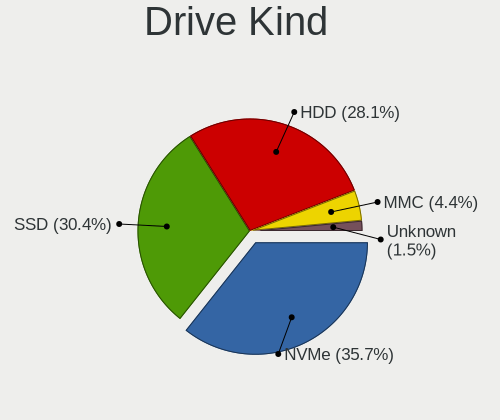

| Kind    | Notebooks | Drives | Percent |
|---------|-----------|--------|---------|
| NVMe    | 1406      | 1885   | 34.05%  |
| SSD     | 1281      | 1680   | 31.02%  |
| HDD     | 1204      | 1507   | 29.16%  |
| MMC     | 182       | 225    | 4.41%   |
| Unknown | 56        | 64     | 1.36%   |

Drive Connector
---------------

SATA, SAS, NVMe, etc.

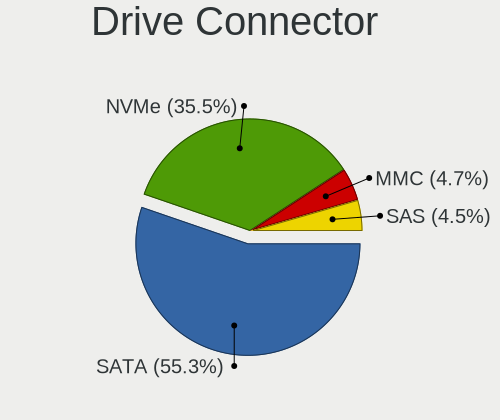

| Type | Notebooks | Drives | Percent |
|------|-----------|--------|---------|
| SATA | 2128      | 3044   | 54.77%  |
| NVMe | 1405      | 1877   | 36.16%  |
| MMC  | 182       | 225    | 4.68%   |
| SAS  | 170       | 215    | 4.38%   |

Drive Size
----------

Size of hard drive

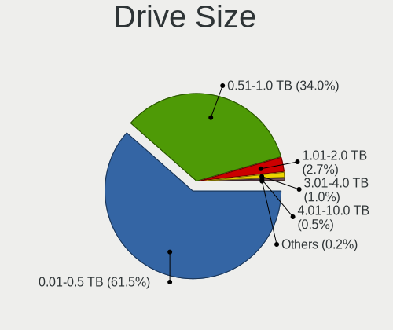

| Size in TB | Notebooks | Drives | Percent |
|------------|-----------|--------|---------|
| 0.01-0.5   | 1520      | 2028   | 62.09%  |
| 0.51-1.0   | 814       | 999    | 33.25%  |
| 1.01-2.0   | 71        | 94     | 2.9%    |
| 3.01-4.0   | 28        | 45     | 1.14%   |
| 4.01-10.0  | 14        | 20     | 0.57%   |
| 20.01-50.0 | 1         | 1      | 0.04%   |

Space Total
-----------

Amount of disk space available on the file system

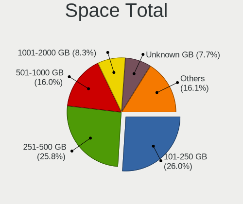

| Size in GB     | Notebooks | Percent |
|----------------|-----------|---------|
| 101-250        | 939       | 27.36%  |
| 251-500        | 885       | 25.79%  |
| 501-1000       | 538       | 15.68%  |
| 1001-2000      | 269       | 7.84%   |
| Unknown        | 237       | 6.91%   |
| 51-100         | 223       | 6.5%    |
| 1-20           | 126       | 3.67%   |
| 21-50          | 107       | 3.12%   |
| More than 3000 | 57        | 1.66%   |
| 2001-3000      | 51        | 1.49%   |

Space Used
----------

Amount of used disk space

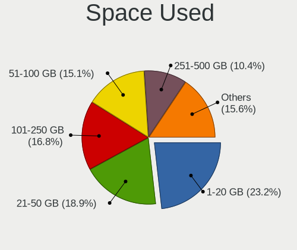

| Used GB        | Notebooks | Percent |
|----------------|-----------|---------|
| 1-20           | 847       | 23.69%  |
| 21-50          | 682       | 19.08%  |
| 101-250        | 609       | 17.03%  |
| 51-100         | 538       | 15.05%  |
| 251-500        | 367       | 10.27%  |
| Unknown        | 237       | 6.63%   |
| 501-1000       | 202       | 5.65%   |
| 1001-2000      | 65        | 1.82%   |
| More than 3000 | 14        | 0.39%   |
| 2001-3000      | 12        | 0.34%   |
| 0              | 2         | 0.06%   |

Malfunc. Drives
---------------

Drive models with a malfunction

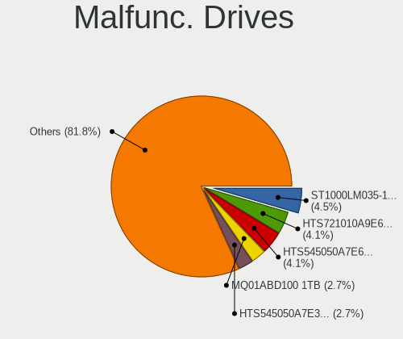

| Model                                               | Notebooks | Drives | Percent |
|-----------------------------------------------------|-----------|--------|---------|
| Seagate ST1000LM035-1RK172 1TB                      | 10        | 11     | 4.98%   |
| HGST HTS545050A7E680 500GB                          | 8         | 8      | 3.98%   |
| HGST HTS721010A9E630 1TB                            | 7         | 7      | 3.48%   |
| Toshiba MQ01ABD100 1TB                              | 6         | 8      | 2.99%   |
| HGST HTS545050A7E380 500GB                          | 6         | 6      | 2.99%   |
| Seagate ST500LT012-9WS142 500GB                     | 5         | 22     | 2.49%   |
| Seagate ST1000LM024 HN-M101MBB 1TB                  | 5         | 5      | 2.49%   |
| HGST HTS725050A7E630 500GB                          | 4         | 4      | 1.99%   |
| WDC WD10JPVX-75JC3T0 1TB                            | 3         | 4      | 1.49%   |
| Toshiba MQ01ABD050 500GB                            | 3         | 3      | 1.49%   |
| Seagate ST9500325AS 500GB                           | 3         | 4      | 1.49%   |
| Seagate ST9320325AS 320GB                           | 3         | 4      | 1.49%   |
| Seagate ST500LM021-1KJ152 500GB                     | 3         | 4      | 1.49%   |
| LITEON CV8-8E128-HP 128GB SSD                       | 3         | 3      | 1.49%   |
| Hitachi HTS723232A7A364 320GB                       | 3         | 3      | 1.49%   |
| Hitachi HTS545050A7E380 500GB                       | 3         | 3      | 1.49%   |
| WDC WD10JPVX-22JC3T0 1TB                            | 2         | 3      | 1%      |
| Toshiba THNSNK128GVN8 M.2 2280 128GB SSD            | 2         | 2      | 1%      |
| Toshiba MQ01ABF050 500GB                            | 2         | 2      | 1%      |
| Seagate ST9750420AS 752GB                           | 2         | 2      | 1%      |
| Seagate ST500LM012 HN-M500MBB 500GB                 | 2         | 2      | 1%      |
| Seagate ST1000LX015-1U7172 1TB                      | 2         | 5      | 1%      |
| Seagate ST1000LM049-2GH172 1TB                      | 2         | 2      | 1%      |
| Samsung Electronics SSD 870 EVO 1TB                 | 2         | 2      | 1%      |
| Micron Technology MTFDDAV256TDL-1AW1ZABHA 256GB SSD | 2         | 2      | 1%      |
| HGST HTS541010A9E680 1TB                            | 2         | 2      | 1%      |
| Crucial CT525MX300SSD1 528GB                        | 2         | 2      | 1%      |
| WDC WDS240G2G0B-00EPW0 240GB SSD                    | 1         | 1      | 0.5%    |
| WDC WD800BEVS-22RST0 80GB                           | 1         | 1      | 0.5%    |
| WDC WD7500BPVX-60JC3T0 752GB                        | 1         | 1      | 0.5%    |
| WDC WD5000LPVX-08V0TT5 500GB                        | 1         | 1      | 0.5%    |
| WDC WD5000LPLX-00ZNTT0 500GB                        | 1         | 1      | 0.5%    |
| WDC WD5000LPCX-22VHAT0 500GB                        | 1         | 1      | 0.5%    |
| WDC WD5000LPCX-21VHAT0 500GB                        | 1         | 1      | 0.5%    |
| WDC WD5000BPVT-60HXZT3 500GB                        | 1         | 1      | 0.5%    |
| WDC WD5000BPVT-22HXZT3 500GB                        | 1         | 1      | 0.5%    |
| WDC WD5000BEVT-75A0RT0 500GB                        | 1         | 1      | 0.5%    |
| WDC WD3200BPVT-22JJ5T0 320GB                        | 1         | 1      | 0.5%    |
| WDC WD3200BEVT-60ZCT1 320GB                         | 1         | 1      | 0.5%    |
| WDC WD2500LPCX-24C6HT0 250GB                        | 1         | 1      | 0.5%    |

Malfunc. Drive Vendor
---------------------

Vendors of faulty drives

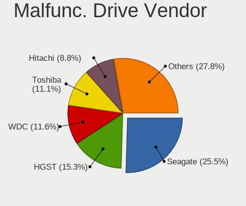

| Vendor              | Notebooks | Drives | Percent |
|---------------------|-----------|--------|---------|
| Seagate             | 53        | 81     | 26.5%   |
| HGST                | 29        | 29     | 14.5%   |
| WDC                 | 24        | 26     | 12%     |
| Toshiba             | 23        | 26     | 11.5%   |
| Hitachi             | 19        | 20     | 9.5%    |
| Crucial             | 8         | 11     | 4%      |
| Samsung Electronics | 7         | 8      | 3.5%    |
| SanDisk             | 6         | 6      | 3%      |
| SK hynix            | 5         | 9      | 2.5%    |
| Intel               | 5         | 6      | 2.5%    |
| Micron Technology   | 4         | 6      | 2%      |
| LITEON              | 3         | 3      | 1.5%    |
| Kingston            | 3         | 3      | 1.5%    |
| A-DATA Technology   | 3         | 4      | 1.5%    |
| LITEONIT            | 1         | 1      | 0.5%    |
| KingSpec            | 1         | 1      | 0.5%    |
| IM3D                | 1         | 1      | 0.5%    |
| Faspeed             | 1         | 1      | 0.5%    |
| Corsair             | 1         | 1      | 0.5%    |
| ASMT                | 1         | 1      | 0.5%    |
| Apple               | 1         | 1      | 0.5%    |
| Unknown             | 1         | 1      | 0.5%    |

Malfunc. HDD Vendor
-------------------

Vendors of faulty HDD drives

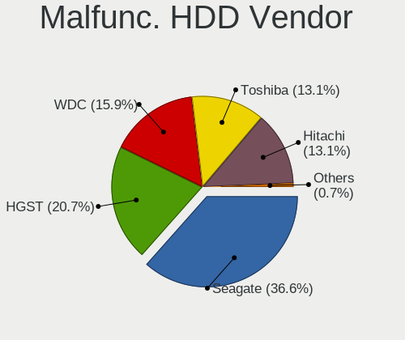

| Vendor              | Notebooks | Drives | Percent |
|---------------------|-----------|--------|---------|
| Seagate             | 53        | 81     | 36.55%  |
| HGST                | 29        | 29     | 20%     |
| WDC                 | 23        | 25     | 15.86%  |
| Toshiba             | 19        | 22     | 13.1%   |
| Hitachi             | 19        | 20     | 13.1%   |
| Samsung Electronics | 1         | 1      | 0.69%   |
| ASMT                | 1         | 1      | 0.69%   |

Malfunc. Drive Kind
-------------------

Kinds of faulty drives

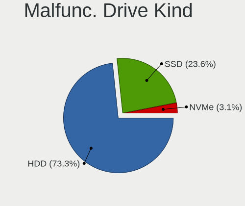

| Kind | Notebooks | Drives | Percent |
|------|-----------|--------|---------|
| HDD  | 144       | 179    | 72.73%  |
| SSD  | 47        | 59     | 23.74%  |
| NVMe | 7         | 8      | 3.54%   |

Failed Drives
-------------

Failed drive models

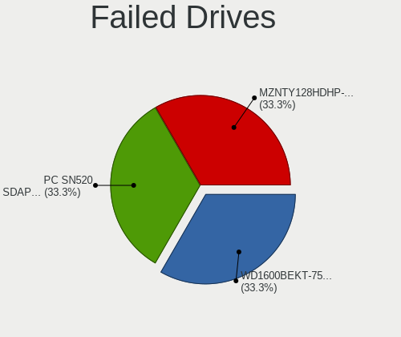

| Model                                            | Notebooks | Drives | Percent |
|--------------------------------------------------|-----------|--------|---------|
| WDC WD1600BEKT-75PVMT0 160GB                     | 1         | 1      | 33.33%  |
| WDC PC SN520 SDAPNUW-256G-1102 256GB             | 1         | 1      | 33.33%  |
| Samsung Electronics MZNTY128HDHP-000H1 128GB SSD | 1         | 1      | 33.33%  |

Failed Drive Vendor
-------------------

Failed drive vendors

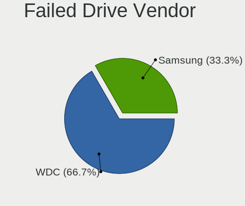

| Vendor              | Notebooks | Drives | Percent |
|---------------------|-----------|--------|---------|
| WDC                 | 2         | 2      | 66.67%  |
| Samsung Electronics | 1         | 1      | 33.33%  |

Drive Status
------------

Number of failed and malfunc. drives

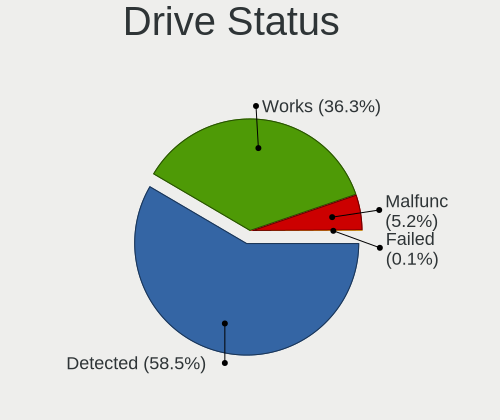

| Status   | Notebooks | Drives | Percent |
|----------|-----------|--------|---------|
| Detected | 2061      | 3174   | 57.76%  |
| Works    | 1310      | 1938   | 36.72%  |
| Malfunc  | 194       | 246    | 5.44%   |
| Failed   | 3         | 3      | 0.08%   |

Storage controller
------------------

Storage Vendor
--------------

Storage controller vendors

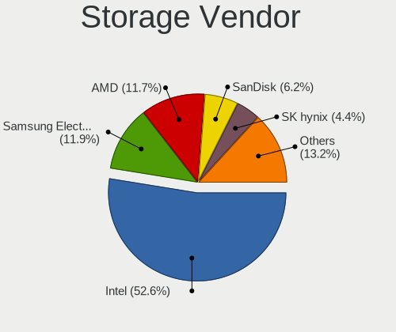

| Vendor                           | Notebooks | Percent |
|----------------------------------|-----------|---------|
| Intel                            | 2185      | 53.11%  |
| AMD                              | 484       | 11.76%  |
| Samsung Electronics              | 483       | 11.74%  |
| SanDisk                          | 250       | 6.08%   |
| SK hynix                         | 182       | 4.42%   |
| Toshiba America Info Systems     | 87        | 2.11%   |
| Kingston Technology Company      | 72        | 1.75%   |
| Micron Technology                | 63        | 1.53%   |
| KIOXIA                           | 61        | 1.48%   |
| Phison Electronics               | 59        | 1.43%   |
| Micron/Crucial Technology        | 29        | 0.7%    |
| ADATA Technology                 | 25        | 0.61%   |
| Union Memory (Shenzhen)          | 23        | 0.56%   |
| Silicon Motion                   | 22        | 0.53%   |
| Nvidia                           | 17        | 0.41%   |
| Solid State Storage Technology   | 16        | 0.39%   |
| Apple                            | 11        | 0.27%   |
| Lite-On Technology               | 10        | 0.24%   |
| Realtek Semiconductor            | 7         | 0.17%   |
| Shenzhen Longsys Electronics     | 6         | 0.15%   |
| Marvell Technology Group         | 5         | 0.12%   |
| Lenovo                           | 4         | 0.1%    |
| JMicron Technology               | 3         | 0.07%   |
| Yangtze Memory Technologies      | 2         | 0.05%   |
| Seagate Technology               | 2         | 0.05%   |
| Biwin Storage Technology         | 2         | 0.05%   |
| Transcend                        | 1         | 0.02%   |
| Silicon Integrated Systems [SiS] | 1         | 0.02%   |
| Silicon Image                    | 1         | 0.02%   |
| ASMedia Technology               | 1         | 0.02%   |

Storage Model
-------------

Storage controller models

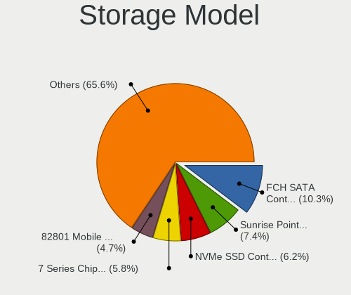

| Model                                                                          | Notebooks | Percent |
|--------------------------------------------------------------------------------|-----------|---------|
| AMD FCH SATA Controller [AHCI mode]                                            | 445       | 10.39%  |
| Intel Sunrise Point-LP SATA Controller [AHCI mode]                             | 307       | 7.17%   |
| Samsung NVMe SSD Controller SM981/PM981/PM983                                  | 267       | 6.23%   |
| Intel 7 Series Chipset Family 6-port SATA Controller [AHCI mode]               | 235       | 5.49%   |
| Intel 82801 Mobile SATA Controller [RAID mode]                                 | 204       | 4.76%   |
| Intel 6 Series/C200 Series Chipset Family 6 port Mobile SATA AHCI Controller   | 151       | 3.52%   |
| Intel Cannon Lake Mobile PCH SATA AHCI Controller                              | 150       | 3.5%    |
| Intel 8 Series SATA Controller 1 [AHCI mode]                                   | 140       | 3.27%   |
| Intel HM170/QM170 Chipset SATA Controller [AHCI Mode]                          | 126       | 2.94%   |
| Intel Wildcat Point-LP SATA Controller [AHCI Mode]                             | 113       | 2.64%   |
| Intel 8 Series/C220 Series Chipset Family 6-port SATA Controller 1 [AHCI mode] | 102       | 2.38%   |
| Samsung NVMe SSD Controller 980                                                | 94        | 2.19%   |
| SanDisk WD Black SN750 / PC SN730 NVMe SSD                                     | 81        | 1.89%   |
| Intel Volume Management Device NVMe RAID Controller                            | 70        | 1.63%   |
| Micron Non-Volatile memory controller                                          | 63        | 1.47%   |
| Intel SSD 660P Series                                                          | 63        | 1.47%   |
| Intel Cannon Point-LP SATA Controller [AHCI Mode]                              | 59        | 1.38%   |
| Samsung NVMe SSD Controller SM961/PM961/SM963                                  | 56        | 1.31%   |
| KIOXIA NVMe SSD Controller BG4                                                 | 55        | 1.28%   |
| SK hynix Gold P31/PC711 NVMe Solid State Drive                                 | 52        | 1.21%   |
| Intel 82801IBM/IEM (ICH9M/ICH9M-E) 4 port SATA Controller [AHCI mode]          | 52        | 1.21%   |
| Intel 5 Series/3400 Series Chipset 4 port SATA AHCI Controller                 | 49        | 1.14%   |
| Intel Celeron/Pentium Silver Processor SATA Controller                         | 44        | 1.03%   |
| SanDisk WD Blue SN550 NVMe SSD                                                 | 43        | 1%      |
| Intel Comet Lake SATA AHCI Controller                                          | 42        | 0.98%   |
| SK hynix BC511                                                                 | 41        | 0.96%   |
| SK hynix BC501 NVMe Solid State Drive                                          | 39        | 0.91%   |
| SanDisk WD Blue SN500 / PC SN520 NVMe SSD                                      | 39        | 0.91%   |
| Toshiba America Info Systems XG6 NVMe SSD Controller                           | 36        | 0.84%   |
| Intel 5 Series/3400 Series Chipset 6 port SATA AHCI Controller                 | 36        | 0.84%   |
| SanDisk Non-Volatile memory controller                                         | 34        | 0.79%   |
| Samsung NVMe SSD Controller PM9A1/PM9A3/980PRO                                 | 34        | 0.79%   |
| Intel Ice Lake-LP SATA Controller [AHCI mode]                                  | 34        | 0.79%   |
| SK hynix Non-Volatile memory controller                                        | 30        | 0.7%    |
| Intel Atom Processor E3800 Series SATA AHCI Controller                         | 30        | 0.7%    |
| Phison E12 NVMe Controller                                                     | 29        | 0.68%   |
| SanDisk WD Black 2018/SN750 / PC SN720 NVMe SSD                                | 27        | 0.63%   |
| Kingston Company Company Non-Volatile memory controller                        | 26        | 0.61%   |
| Intel Celeron N3350/Pentium N4200/Atom E3900 Series SATA AHCI Controller       | 26        | 0.61%   |
| Intel 400 Series Chipset Family SATA AHCI Controller                           | 26        | 0.61%   |

Storage Kind
------------

Kind of storage controller (IDE, SATA, NVMe, SAS, ...)

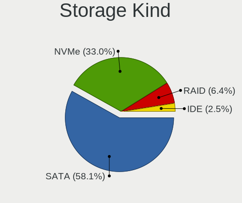

| Kind | Notebooks | Percent |
|------|-----------|---------|
| SATA | 2353      | 56.89%  |
| NVMe | 1412      | 34.14%  |
| RAID | 275       | 6.65%   |
| IDE  | 96        | 2.32%   |

Processor
---------

CPU Vendor
----------

Processor vendors

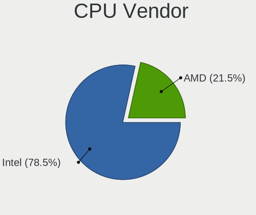

| Vendor | Notebooks | Percent |
|--------|-----------|---------|
| Intel  | 2577      | 77.78%  |
| AMD    | 736       | 22.22%  |

CPU Model
---------

Processor models

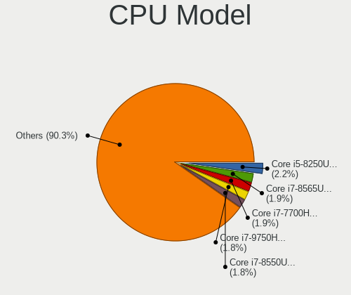

| Model                                         | Notebooks | Percent |
|-----------------------------------------------|-----------|---------|
| Intel Core i5-8250U CPU @ 1.60GHz             | 78        | 2.35%   |
| Intel Core i7-7700HQ CPU @ 2.80GHz            | 67        | 2.02%   |
| Intel Core i7-8565U CPU @ 1.80GHz             | 66        | 1.99%   |
| Intel Core i7-8550U CPU @ 1.80GHz             | 64        | 1.93%   |
| Intel Core i7-9750H CPU @ 2.60GHz             | 62        | 1.87%   |
| AMD Ryzen 5 3500U with Radeon Vega Mobile Gfx | 62        | 1.87%   |
| Intel Core i5-7200U CPU @ 2.50GHz             | 60        | 1.81%   |
| Intel Core i5-8265U CPU @ 1.60GHz             | 59        | 1.78%   |
| Intel Core i7-8750H CPU @ 2.20GHz             | 55        | 1.66%   |
| Intel 11th Gen Core i7-1165G7 @ 2.80GHz       | 48        | 1.45%   |
| AMD Ryzen 7 4800H with Radeon Graphics        | 48        | 1.45%   |
| Intel Core i7-6700HQ CPU @ 2.60GHz            | 46        | 1.39%   |
| Intel Core i5-6200U CPU @ 2.30GHz             | 42        | 1.27%   |
| Intel 11th Gen Core i5-1135G7 @ 2.40GHz       | 42        | 1.27%   |
| Intel Core i5-3320M CPU @ 2.60GHz             | 41        | 1.24%   |
| AMD Ryzen 7 5800H with Radeon Graphics        | 40        | 1.21%   |
| Intel Core i7-10510U CPU @ 1.80GHz            | 39        | 1.18%   |
| Intel Core i5-5200U CPU @ 2.20GHz             | 38        | 1.15%   |
| Intel Core i7-10750H CPU @ 2.60GHz            | 34        | 1.02%   |
| AMD Ryzen 5 4500U with Radeon Graphics        | 34        | 1.02%   |
| Intel Core i5-4210U CPU @ 1.70GHz             | 33        | 0.99%   |
| AMD Ryzen 5 4600H with Radeon Graphics        | 33        | 0.99%   |
| Intel Core i7-7500U CPU @ 2.70GHz             | 31        | 0.93%   |
| AMD Ryzen 7 4700U with Radeon Graphics        | 31        | 0.93%   |
| Intel Core i5-3230M CPU @ 2.60GHz             | 30        | 0.9%    |
| Intel Core i5-10210U CPU @ 1.60GHz            | 29        | 0.87%   |
| Intel Core i5-8300H CPU @ 2.30GHz             | 27        | 0.81%   |
| Intel Core i5-4200U CPU @ 1.60GHz             | 27        | 0.81%   |
| Intel Core i5-1035G1 CPU @ 1.00GHz            | 27        | 0.81%   |
| AMD Ryzen 7 3700U with Radeon Vega Mobile Gfx | 26        | 0.78%   |
| Intel Core i3-5005U CPU @ 2.00GHz             | 25        | 0.75%   |
| Intel Core i5-9300H CPU @ 2.40GHz             | 24        | 0.72%   |
| AMD Ryzen 5 5500U with Radeon Graphics        | 24        | 0.72%   |
| Intel Core i5-3210M CPU @ 2.50GHz             | 23        | 0.69%   |
| Intel Core i5-2410M CPU @ 2.30GHz             | 23        | 0.69%   |
| AMD Ryzen 7 PRO 4750U with Radeon Graphics    | 22        | 0.66%   |
| Intel Core i5-2520M CPU @ 2.50GHz             | 20        | 0.6%    |
| AMD Ryzen 7 5700U with Radeon Graphics        | 20        | 0.6%    |
| Intel Core i7-1065G7 CPU @ 1.30GHz            | 19        | 0.57%   |
| AMD Ryzen 3 3200U with Radeon Vega Mobile Gfx | 19        | 0.57%   |

CPU Model Family
----------------

Processor model prefix

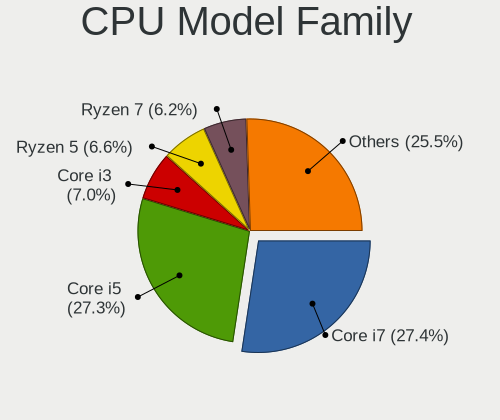

| Model                          | Notebooks | Percent |
|--------------------------------|-----------|---------|
| Intel Core i5                  | 890       | 26.82%  |
| Intel Core i7                  | 889       | 26.79%  |
| Intel Core i3                  | 224       | 6.75%   |
| AMD Ryzen 5                    | 223       | 6.72%   |
| AMD Ryzen 7                    | 219       | 6.6%    |
| Other                          | 196       | 5.91%   |
| Intel Celeron                  | 127       | 3.83%   |
| Intel Core 2 Duo               | 83        | 2.5%    |
| Intel Pentium                  | 78        | 2.35%   |
| AMD Ryzen 3                    | 45        | 1.36%   |
| AMD Ryzen 7 PRO                | 32        | 0.96%   |
| AMD Ryzen 9                    | 29        | 0.87%   |
| AMD A6                         | 27        | 0.81%   |
| Intel Atom                     | 23        | 0.69%   |
| Intel Core i9                  | 20        | 0.6%    |
| AMD A8                         | 20        | 0.6%    |
| AMD A10                        | 20        | 0.6%    |
| Intel Pentium Dual-Core        | 19        | 0.57%   |
| AMD A4                         | 19        | 0.57%   |
| AMD E                          | 17        | 0.51%   |
| AMD E1                         | 15        | 0.45%   |
| Intel Pentium Silver           | 14        | 0.42%   |
| Intel Core 2                   | 10        | 0.3%    |
| AMD Turion 64 X2 Mobile        | 7         | 0.21%   |
| AMD E2                         | 7         | 0.21%   |
| AMD Athlon                     | 7         | 0.21%   |
| Intel Core m3                  | 6         | 0.18%   |
| AMD A12                        | 5         | 0.15%   |
| Intel Genuine                  | 4         | 0.12%   |
| AMD Ryzen 5 PRO                | 4         | 0.12%   |
| Intel Xeon                     | 3         | 0.09%   |
| Intel Core m5                  | 3         | 0.09%   |
| AMD FX                         | 3         | 0.09%   |
| AMD Athlon X2                  | 3         | 0.09%   |
| Intel Core m7                  | 2         | 0.06%   |
| Intel Core M                   | 2         | 0.06%   |
| Intel Core 2 Quad              | 2         | 0.06%   |
| AMD Turion X2 Dual-Core Mobile | 2         | 0.06%   |
| AMD Turion II                  | 2         | 0.06%   |
| AMD Phenom II                  | 2         | 0.06%   |

CPU Cores
---------

Number of processor cores

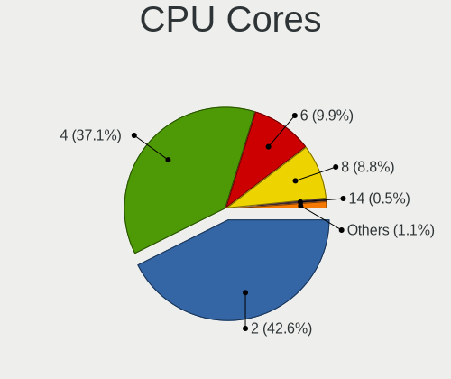

| Number  | Notebooks | Percent |
|---------|-----------|---------|
| 2       | 1430      | 43.15%  |
| 4       | 1242      | 37.48%  |
| 6       | 321       | 9.69%   |
| 8       | 281       | 8.48%   |
| 1       | 16        | 0.48%   |
| 12      | 10        | 0.3%    |
| 14      | 9         | 0.27%   |
| 16      | 2         | 0.06%   |
| 3       | 2         | 0.06%   |
| Unknown | 1         | 0.03%   |

CPU Sockets
-----------

Number of sockets

| Number | Notebooks | Percent |
|--------|-----------|---------|
| 1      | 3313      | 100%    |

CPU Threads
-----------

Threads per core (Hyper-Threading)

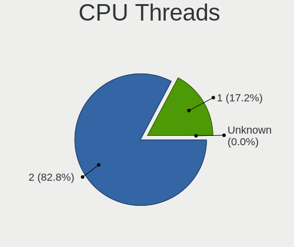

| Number  | Notebooks | Percent |
|---------|-----------|---------|
| 2       | 2717      | 81.96%  |
| 1       | 597       | 18.01%  |
| Unknown | 1         | 0.03%   |

CPU Op-Modes
------------

CPU Operation Modes (32-bit, 64-bit)

| Op mode        | Notebooks | Percent |
|----------------|-----------|---------|
| 32-bit, 64-bit | 3250      | 98.04%  |
| Unknown        | 65        | 1.96%   |

CPU Microcode
-------------

Microcode number

| Number     | Notebooks | Percent |
|------------|-----------|---------|
| Unknown    | 1624      | 47.46%  |
| 0x306a9    | 134       | 3.92%   |
| 0x906ea    | 111       | 3.24%   |
| 0x806ea    | 109       | 3.19%   |
| 0x806ec    | 99        | 2.89%   |
| 0x806c1    | 80        | 2.34%   |
| 0x206a7    | 76        | 2.22%   |
| 0x806e9    | 74        | 2.16%   |
| 0x40651    | 70        | 2.05%   |
| 0x406e3    | 67        | 1.96%   |
| 0x08108102 | 62        | 1.81%   |
| 0x306c3    | 57        | 1.67%   |
| 0x306d4    | 55        | 1.61%   |
| 0x906e9    | 53        | 1.55%   |
| 0x08600106 | 49        | 1.43%   |
| 0x0a50000c | 47        | 1.37%   |
| 0x08600103 | 43        | 1.26%   |
| 0xa0652    | 41        | 1.2%    |
| 0x806eb    | 40        | 1.17%   |
| 0x08108109 | 39        | 1.14%   |
| 0x706e5    | 37        | 1.08%   |
| 0x08600104 | 34        | 0.99%   |
| 0x20655    | 28        | 0.82%   |
| 0x506e3    | 27        | 0.79%   |
| 0x1067a    | 27        | 0.79%   |
| 0x08608103 | 23        | 0.67%   |
| 0x30678    | 17        | 0.5%    |
| 0x0810100b | 16        | 0.47%   |
| 0x806d1    | 15        | 0.44%   |
| 0x06006705 | 15        | 0.44%   |
| 0x506c9    | 14        | 0.41%   |
| 0x406c4    | 14        | 0.41%   |
| 0x706a1    | 12        | 0.35%   |
| 0x906ed    | 11        | 0.32%   |
| 0x906a3    | 11        | 0.32%   |
| 0x08600102 | 11        | 0.32%   |
| 0x0600611a | 10        | 0.29%   |
| 0x06001119 | 10        | 0.29%   |
| 0x0a50000b | 9         | 0.26%   |
| 0x20652    | 8         | 0.23%   |

CPU Microarch
-------------

Microarchitecture

| Name             | Notebooks | Percent |
|------------------|-----------|---------|
| KabyLake         | 835       | 25.2%   |
| Haswell          | 271       | 8.18%   |
| IvyBridge        | 246       | 7.42%   |
| Zen 2            | 202       | 6.1%    |
| SandyBridge      | 192       | 5.79%   |
| Skylake          | 191       | 5.76%   |
| Zen+             | 158       | 4.77%   |
| TigerLake        | 134       | 4.04%   |
| Broadwell        | 134       | 4.04%   |
| Zen 3            | 102       | 3.08%   |
| Unknown          | 90        | 2.72%   |
| Westmere         | 88        | 2.66%   |
| Penryn           | 85        | 2.56%   |
| Silvermont       | 82        | 2.47%   |
| CometLake        | 82        | 2.47%   |
| IceLake          | 76        | 2.29%   |
| Excavator        | 53        | 1.6%    |
| Goldmont plus    | 47        | 1.42%   |
| Zen              | 37        | 1.12%   |
| Core             | 35        | 1.06%   |
| Goldmont         | 28        | 0.84%   |
| Bobcat           | 27        | 0.81%   |
| Piledriver       | 23        | 0.69%   |
| Puma             | 20        | 0.6%    |
| Jaguar           | 18        | 0.54%   |
| Nehalem          | 10        | 0.3%    |
| K8 Hammer        | 9         | 0.27%   |
| K10 Llano        | 9         | 0.27%   |
| Alderlake Hybrid | 9         | 0.27%   |
| K10              | 7         | 0.21%   |
| K8 & K10 hybrid  | 5         | 0.15%   |
| Bonnell          | 5         | 0.15%   |
| Steamroller      | 3         | 0.09%   |
| Tremont          | 1         | 0.03%   |

Graphics
--------

GPU Vendor
----------

Vendors of graphics cards

| Vendor | Notebooks | Percent |
|--------|-----------|---------|
| Intel  | 2396      | 53.87%  |
| Nvidia | 1169      | 26.28%  |
| AMD    | 883       | 19.85%  |

GPU Model
---------

Graphics card models

| Model                                                                                    | Notebooks | Percent |
|------------------------------------------------------------------------------------------|-----------|---------|
| Intel 3rd Gen Core processor Graphics Controller                                         | 234       | 5.15%   |
| AMD Renoir                                                                               | 192       | 4.23%   |
| Intel CoffeeLake-H GT2 [UHD Graphics 630]                                                | 185       | 4.07%   |
| Intel 2nd Generation Core Processor Family Integrated Graphics Controller                | 169       | 3.72%   |
| Intel UHD Graphics 620                                                                   | 167       | 3.68%   |
| AMD Picasso/Raven 2 [Radeon Vega Series / Radeon Vega Mobile Series]                     | 160       | 3.52%   |
| Intel Haswell-ULT Integrated Graphics Controller                                         | 153       | 3.37%   |
| Intel WhiskeyLake-U GT2 [UHD Graphics 620]                                               | 142       | 3.13%   |
| Intel TigerLake-LP GT2 [Iris Xe Graphics]                                                | 118       | 2.6%    |
| Intel HD Graphics 620                                                                    | 117       | 2.58%   |
| Intel HD Graphics 5500                                                                   | 115       | 2.53%   |
| Intel Skylake GT2 [HD Graphics 520]                                                      | 105       | 2.31%   |
| Intel 4th Gen Core Processor Integrated Graphics Controller                              | 92        | 2.03%   |
| Intel HD Graphics 630                                                                    | 86        | 1.89%   |
| AMD Cezanne [Radeon Vega Series / Radeon Vega Mobile Series]                             | 86        | 1.89%   |
| Intel CometLake-U GT2 [UHD Graphics]                                                     | 83        | 1.83%   |
| Intel Core Processor Integrated Graphics Controller                                      | 66        | 1.45%   |
| Nvidia GP107M [GeForce GTX 1050 Mobile]                                                  | 63        | 1.39%   |
| Intel CometLake-H GT2 [UHD Graphics]                                                     | 62        | 1.37%   |
| Nvidia TU117M [GeForce GTX 1650 Mobile / Max-Q]                                          | 60        | 1.32%   |
| Intel HD Graphics 530                                                                    | 58        | 1.28%   |
| Nvidia GP107M [GeForce GTX 1050 Ti Mobile]                                               | 56        | 1.23%   |
| AMD Lucienne                                                                             | 48        | 1.06%   |
| Intel Mobile 4 Series Chipset Integrated Graphics Controller                             | 47        | 1.04%   |
| Intel Atom/Celeron/Pentium Processor x5-E8000/J3xxx/N3xxx Integrated Graphics Controller | 45        | 0.99%   |
| Nvidia TU116M [GeForce GTX 1660 Ti Mobile]                                               | 41        | 0.9%    |
| Nvidia GP108M [GeForce MX150]                                                            | 40        | 0.88%   |
| Nvidia GF117M [GeForce 610M/710M/810M/820M / GT 620M/625M/630M/720M]                     | 39        | 0.86%   |
| Nvidia TU106M [GeForce RTX 2060 Mobile]                                                  | 38        | 0.84%   |
| Nvidia GA106M [GeForce RTX 3060 Mobile / Max-Q]                                          | 37        | 0.81%   |
| Intel Atom Processor Z36xxx/Z37xxx Series Graphics & Display                             | 37        | 0.81%   |
| Intel Iris Plus Graphics G1 (Ice Lake)                                                   | 35        | 0.77%   |
| Intel GeminiLake [UHD Graphics 600]                                                      | 35        | 0.77%   |
| Nvidia TU117M                                                                            | 34        | 0.75%   |
| AMD Raven Ridge [Radeon Vega Series / Radeon Vega Mobile Series]                         | 34        | 0.75%   |
| Nvidia TU117M [GeForce GTX 1650 Ti Mobile]                                               | 33        | 0.73%   |
| Nvidia GP106M [GeForce GTX 1060 Mobile]                                                  | 33        | 0.73%   |
| Nvidia GM107M [GeForce GTX 960M]                                                         | 33        | 0.73%   |
| AMD Stoney [Radeon R2/R3/R4/R5 Graphics]                                                 | 32        | 0.7%    |
| AMD Sun XT [Radeon HD 8670A/8670M/8690M / R5 M330 / M430 / Radeon 520 Mobile]            | 31        | 0.68%   |

GPU Combo
---------

Combinations of graphics cards

| Name               | Notebooks | Percent |
|--------------------|-----------|---------|
| 1 x Intel          | 1402      | 42.23%  |
| Intel + Nvidia     | 879       | 26.48%  |
| 1 x AMD            | 573       | 17.26%  |
| 1 x Nvidia         | 150       | 4.52%   |
| AMD + Nvidia       | 135       | 4.07%   |
| Intel + AMD        | 112       | 3.37%   |
| 2 x AMD            | 64        | 1.93%   |
| 2 x Nvidia         | 3         | 0.09%   |
| Other              | 1         | 0.03%   |
| Intel + 2 x Nvidia | 1         | 0.03%   |

GPU Driver
----------

Free vs proprietary

| Driver      | Notebooks | Percent |
|-------------|-----------|---------|
| Free        | 2675      | 79.9%   |
| Proprietary | 672       | 20.07%  |
| Unknown     | 1         | 0.03%   |

GPU Memory
----------

Total video memory

| Size in GB | Notebooks | Percent |
|------------|-----------|---------|
| Unknown    | 2556      | 76.07%  |
| 0.01-0.5   | 269       | 8.01%   |
| 1.01-2.0   | 222       | 6.61%   |
| 0.51-1.0   | 109       | 3.24%   |
| 3.01-4.0   | 107       | 3.18%   |
| 5.01-6.0   | 52        | 1.55%   |
| 7.01-8.0   | 26        | 0.77%   |
| 2.01-3.0   | 11        | 0.33%   |
| 8.01-16.0  | 7         | 0.21%   |
| 16.01-24.0 | 1         | 0.03%   |

Monitor
-------

Monitor Vendor
--------------

Monitor vendors

| Vendor                  | Notebooks | Percent |
|-------------------------|-----------|---------|
| AU Optronics            | 695       | 17.69%  |
| LG Display              | 608       | 15.48%  |
| Chimei Innolux          | 572       | 14.56%  |
| BOE                     | 568       | 14.46%  |
| Samsung Electronics     | 308       | 7.84%   |
| Sharp                   | 125       | 3.18%   |
| Dell                    | 109       | 2.77%   |
| Goldstar                | 98        | 2.49%   |
| PANDA                   | 88        | 2.24%   |
| Apple                   | 81        | 2.06%   |
| Chi Mei Optoelectronics | 75        | 1.91%   |
| Lenovo                  | 66        | 1.68%   |
| Hewlett-Packard         | 42        | 1.07%   |
| Philips                 | 38        | 0.97%   |
| Ancor Communications    | 36        | 0.92%   |
| Acer                    | 35        | 0.89%   |
| BenQ                    | 32        | 0.81%   |
| AOC                     | 30        | 0.76%   |
| InfoVision              | 27        | 0.69%   |
| CSO                     | 23        | 0.59%   |
| ViewSonic               | 20        | 0.51%   |
| LGD                     | 17        | 0.43%   |
| TMX                     | 16        | 0.41%   |
| Iiyama                  | 16        | 0.41%   |
| LG Philips              | 14        | 0.36%   |
| ASUSTek Computer        | 14        | 0.36%   |
| Sony                    | 13        | 0.33%   |
| Panasonic               | 10        | 0.25%   |
| CPT                     | 10        | 0.25%   |
| Toshiba                 | 7         | 0.18%   |
| Insignia                | 6         | 0.15%   |
| Unknown                 | 5         | 0.13%   |
| NEC Computers           | 5         | 0.13%   |
| HannStar                | 5         | 0.13%   |
| MSI                     | 4         | 0.1%    |
| LG Electronics          | 4         | 0.1%    |
| KDC                     | 4         | 0.1%    |
| JDI                     | 4         | 0.1%    |
| InnoLux Display         | 4         | 0.1%    |
| Fujitsu Siemens         | 4         | 0.1%    |

Monitor Model
-------------

Monitor models

| Model                                                                    | Notebooks | Percent |
|--------------------------------------------------------------------------|-----------|---------|
| AU Optronics LCD Monitor AUO38ED 1920x1080 344x193mm 15.5-inch           | 42        | 1.06%   |
| Chimei Innolux LCD Monitor CMN14D4 1920x1080 309x173mm 13.9-inch         | 37        | 0.93%   |
| Chimei Innolux LCD Monitor CMN15F5 1920x1080 344x193mm 15.5-inch         | 35        | 0.88%   |
| AU Optronics LCD Monitor AUO21ED 1920x1080 344x193mm 15.5-inch           | 29        | 0.73%   |
| AU Optronics LCD Monitor AUO61ED 1920x1080 344x194mm 15.5-inch           | 28        | 0.7%    |
| LG Display LCD Monitor LGD046F 1920x1080 344x194mm 15.5-inch             | 20        | 0.5%    |
| Chimei Innolux LCD Monitor CMN14D5 1920x1080 309x173mm 13.9-inch         | 20        | 0.5%    |
| AU Optronics LCD Monitor AUO403D 1920x1080 309x173mm 13.9-inch           | 20        | 0.5%    |
| Chimei Innolux LCD Monitor CMN15E7 1920x1080 344x193mm 15.5-inch         | 17        | 0.43%   |
| BOE LCD Monitor BOE0687 1920x1080 344x193mm 15.5-inch                    | 17        | 0.43%   |
| PANDA LCD Monitor NCP004D 1920x1080 344x194mm 15.5-inch                  | 16        | 0.4%    |
| LG Display LCD Monitor LGD02DC 1366x768 344x194mm 15.5-inch              | 15        | 0.38%   |
| AU Optronics LCD Monitor AUO71EC 1366x768 344x193mm 15.5-inch            | 15        | 0.38%   |
| Samsung Electronics LCD Monitor SEC5441 1366x768 344x194mm 15.5-inch     | 14        | 0.35%   |
| LG Display LCD Monitor LGD053F 1920x1080 344x194mm 15.5-inch             | 14        | 0.35%   |
| LG Display LCD Monitor LGD033A 1366x768 344x194mm 15.5-inch              | 14        | 0.35%   |
| Chimei Innolux LCD Monitor CMN14C9 1920x1080 309x173mm 13.9-inch         | 14        | 0.35%   |
| Chimei Innolux LCD Monitor CMN15E8 1920x1080 344x193mm 15.5-inch         | 13        | 0.33%   |
| Chi Mei Optoelectronics LCD Monitor CMO15A7 1366x768 344x193mm 15.5-inch | 13        | 0.33%   |
| BOE LCD Monitor BOE0700 1920x1080 344x194mm 15.5-inch                    | 13        | 0.33%   |
| LG Display LCD Monitor LGD0456 1366x768 344x194mm 15.5-inch              | 12        | 0.3%    |
| Chimei Innolux LCD Monitor CMN15C4 1920x1080 344x193mm 15.5-inch         | 12        | 0.3%    |
| BOE LCD Monitor BOE06A4 1366x768 344x194mm 15.5-inch                     | 12        | 0.3%    |
| AU Optronics LCD Monitor AUO22EC 1366x768 344x193mm 15.5-inch            | 12        | 0.3%    |
| LG Display LCD Monitor LGD05E5 1920x1080 340x190mm 15.3-inch             | 11        | 0.28%   |
| Chimei Innolux LCD Monitor CMN15D5 1920x1080 344x193mm 15.5-inch         | 11        | 0.28%   |
| BOE LCD Monitor BOE08E8 1920x1080 344x194mm 15.5-inch                    | 11        | 0.28%   |
| BOE LCD Monitor BOE08D7 1920x1080 309x174mm 14.0-inch                    | 11        | 0.28%   |
| AU Optronics LCD Monitor AUO123D 1920x1080 309x173mm 13.9-inch           | 11        | 0.28%   |
| AU Optronics LCD Monitor AUO10EC 1366x768 344x193mm 15.5-inch            | 11        | 0.28%   |
| LG Display LCD Monitor LGD0521 1920x1080 309x174mm 14.0-inch             | 10        | 0.25%   |
| Chimei Innolux LCD Monitor CMN1738 1920x1080 381x214mm 17.2-inch         | 10        | 0.25%   |
| Chimei Innolux LCD Monitor CMN15DB 1366x768 344x193mm 15.5-inch          | 10        | 0.25%   |
| Chimei Innolux LCD Monitor CMN1521 1920x1080 344x193mm 15.5-inch         | 10        | 0.25%   |
| AU Optronics LCD Monitor AUOD1ED 1920x1080 344x193mm 15.5-inch           | 10        | 0.25%   |
| AU Optronics LCD Monitor 1920x1080                                       | 10        | 0.25%   |
| TMX TL156MDMP01-0 TMX1560 3200x2000 336x210mm 15.6-inch                  | 9         | 0.23%   |
| Samsung Electronics LCD Monitor SEC544B 1600x900 382x214mm 17.2-inch     | 9         | 0.23%   |
| LG Display LCD Monitor LGD062E 1920x1080 344x194mm 15.5-inch             | 9         | 0.23%   |
| LG Display LCD Monitor LGD05FA 1920x1080 309x174mm 14.0-inch             | 9         | 0.23%   |

Monitor Resolution
------------------

Monitor screen resolution

| Resolution         | Notebooks | Percent |
|--------------------|-----------|---------|
| 1920x1080 (FHD)    | 1835      | 50.04%  |
| 1366x768 (WXGA)    | 915       | 24.95%  |
| 3840x2160 (4K)     | 152       | 4.15%   |
| 1600x900 (HD+)     | 135       | 3.68%   |
| 2560x1440 (QHD)    | 102       | 2.78%   |
| 1280x800 (WXGA)    | 78        | 2.13%   |
| 1920x1200 (WUXGA)  | 60        | 1.64%   |
| 1440x900 (WXGA+)   | 54        | 1.47%   |
| 2560x1600          | 37        | 1.01%   |
| 1680x1050 (WSXGA+) | 33        | 0.9%    |
| 2880x1800          | 30        | 0.82%   |
| 2560x1080          | 24        | 0.65%   |
| 3840x2400          | 19        | 0.52%   |
| 2160x1440          | 18        | 0.49%   |
| 1280x1024 (SXGA)   | 18        | 0.49%   |
| Unknown            | 18        | 0.49%   |
| 1360x768           | 16        | 0.44%   |
| 3440x1440          | 14        | 0.38%   |
| 3840x1080          | 13        | 0.35%   |
| 3200x1800 (QHD+)   | 11        | 0.3%    |
| 3456x2160          | 9         | 0.25%   |
| 3200x2000          | 9         | 0.25%   |
| 1920x540           | 6         | 0.16%   |
| 3840x1600          | 5         | 0.14%   |
| 3000x2000          | 5         | 0.14%   |
| 2256x1504          | 5         | 0.14%   |
| 1920x1280          | 5         | 0.14%   |
| 3286x1080          | 4         | 0.11%   |
| 2240x1400          | 4         | 0.11%   |
| 2880x1920          | 3         | 0.08%   |
| 2520x1680          | 3         | 0.08%   |
| 1600x1200          | 3         | 0.08%   |
| 1024x600           | 3         | 0.08%   |
| 3840x1100          | 2         | 0.05%   |
| 3072x1920          | 2         | 0.05%   |
| 2560x1700          | 2         | 0.05%   |
| 800x1280           | 1         | 0.03%   |
| 7680x1080          | 1         | 0.03%   |
| 720x1280           | 1         | 0.03%   |
| 5760x2160          | 1         | 0.03%   |

Monitor Diagonal
----------------

Diagonal size in inches

| Inches  | Notebooks | Percent |
|---------|-----------|---------|
| 15      | 1701      | 43.53%  |
| 13      | 566       | 14.48%  |
| 14      | 488       | 12.49%  |
| 17      | 240       | 6.14%   |
| 27      | 137       | 3.51%   |
| 24      | 124       | 3.17%   |
| 23      | 102       | 2.61%   |
| 12      | 85        | 2.18%   |
| 21      | 77        | 1.97%   |
| Unknown | 67        | 1.71%   |
| 11      | 49        | 1.25%   |
| 31      | 44        | 1.13%   |
| 16      | 39        | 1%      |
| 34      | 32        | 0.82%   |
| 18      | 21        | 0.54%   |
| 19      | 19        | 0.49%   |
| 22      | 17        | 0.44%   |
| 20      | 12        | 0.31%   |
| 84      | 9         | 0.23%   |
| 32      | 8         | 0.2%    |
| 72      | 7         | 0.18%   |
| 37      | 6         | 0.15%   |
| 54      | 5         | 0.13%   |
| 48      | 5         | 0.13%   |
| 40      | 5         | 0.13%   |
| 26      | 5         | 0.13%   |
| 52      | 4         | 0.1%    |
| 49      | 4         | 0.1%    |
| 25      | 4         | 0.1%    |
| 10      | 4         | 0.1%    |
| 74      | 3         | 0.08%   |
| 28      | 3         | 0.08%   |
| 42      | 2         | 0.05%   |
| 35      | 2         | 0.05%   |
| 33      | 2         | 0.05%   |
| 8       | 2         | 0.05%   |
| 86      | 1         | 0.03%   |
| 75      | 1         | 0.03%   |
| 60      | 1         | 0.03%   |
| 50      | 1         | 0.03%   |

Monitor Width
-------------

Physical width

| Width in mm | Notebooks | Percent |
|-------------|-----------|---------|
| 301-350     | 2496      | 64.4%   |
| 201-300     | 387       | 9.98%   |
| 501-600     | 333       | 8.59%   |
| 351-400     | 286       | 7.38%   |
| 401-500     | 137       | 3.53%   |
| 601-700     | 67        | 1.73%   |
| Unknown     | 67        | 1.73%   |
| 701-800     | 42        | 1.08%   |
| 1501-2000   | 21        | 0.54%   |
| 1001-1500   | 20        | 0.52%   |
| 801-900     | 14        | 0.36%   |
| 901-1000    | 3         | 0.08%   |
| 101-200     | 2         | 0.05%   |
| 1-100       | 1         | 0.03%   |

Aspect Ratio
------------

Proportional relationship between the width and the height

| Ratio   | Notebooks | Percent |
|---------|-----------|---------|
| 16/9    | 2911      | 84.87%  |
| 16/10   | 335       | 9.77%   |
| Unknown | 54        | 1.57%   |
| 3/2     | 48        | 1.4%    |
| 21/9    | 40        | 1.17%   |
| 5/4     | 15        | 0.44%   |
| 4/3     | 10        | 0.29%   |
| 32/9    | 10        | 0.29%   |
| 3.40    | 2         | 0.06%   |
| 0.62    | 2         | 0.06%   |
| 6/5     | 1         | 0.03%   |
| 0.67    | 1         | 0.03%   |
| 0.56    | 1         | 0.03%   |

Monitor Area
------------

Area in inch²

| Area in inch² | Notebooks | Percent |
|----------------|-----------|---------|
| 101-110        | 1705      | 43.75%  |
| 81-90          | 853       | 21.89%  |
| 201-250        | 266       | 6.83%   |
| 121-130        | 203       | 5.21%   |
| 71-80          | 201       | 5.16%   |
| 301-350        | 140       | 3.59%   |
| 351-500        | 91        | 2.34%   |
| 61-70          | 80        | 2.05%   |
| Unknown        | 67        | 1.72%   |
| 51-60          | 51        | 1.31%   |
| 151-200        | 46        | 1.18%   |
| 251-300        | 37        | 0.95%   |
| More than 1000 | 35        | 0.9%    |
| 131-140        | 30        | 0.77%   |
| 141-150        | 26        | 0.67%   |
| 111-120        | 26        | 0.67%   |
| 501-1000       | 19        | 0.49%   |
| 91-100         | 14        | 0.36%   |
| 41-50          | 4         | 0.1%    |
| 1-40           | 3         | 0.08%   |

Pixel Density
-------------

Pixels per inch

| Density       | Notebooks | Percent |
|---------------|-----------|---------|
| 121-160       | 1756      | 45.85%  |
| 101-120       | 993       | 25.93%  |
| 51-100        | 552       | 14.41%  |
| 161-240       | 287       | 7.49%   |
| More than 240 | 141       | 3.68%   |
| Unknown       | 67        | 1.75%   |
| 1-50          | 34        | 0.89%   |

Multiple Monitors
-----------------

Total monitors connected

| Total | Notebooks | Percent |
|-------|-----------|---------|
| 1     | 2703      | 80.09%  |
| 2     | 593       | 17.57%  |
| 3     | 58        | 1.72%   |
| 0     | 16        | 0.47%   |
| 4     | 5         | 0.15%   |

Network
-------

Net Controller Vendor
---------------------

Controller vendors

| Vendor                            | Notebooks | Percent |
|-----------------------------------|-----------|---------|
| Intel                             | 1842      | 35.46%  |
| Realtek Semiconductor             | 1829      | 35.21%  |
| Qualcomm Atheros                  | 714       | 13.75%  |
| Broadcom                          | 252       | 4.85%   |
| Broadcom Limited                  | 68        | 1.31%   |
| MediaTek                          | 65        | 1.25%   |
| Ralink                            | 43        | 0.83%   |
| TP-Link                           | 33        | 0.64%   |
| Ralink Technology                 | 30        | 0.58%   |
| ASIX Electronics                  | 26        | 0.5%    |
| Xiaomi                            | 23        | 0.44%   |
| Sierra Wireless                   | 23        | 0.44%   |
| Marvell Technology Group          | 23        | 0.44%   |
| Dell                              | 21        | 0.4%    |
| Lenovo                            | 20        | 0.39%   |
| DisplayLink                       | 17        | 0.33%   |
| Hewlett-Packard                   | 14        | 0.27%   |
| Huawei Technologies               | 13        | 0.25%   |
| JMicron Technology                | 12        | 0.23%   |
| Samsung Electronics               | 11        | 0.21%   |
| Qualcomm                          | 11        | 0.21%   |
| Ericsson Business Mobile Networks | 10        | 0.19%   |
| Nvidia                            | 9         | 0.17%   |
| ASUSTek Computer                  | 8         | 0.15%   |
| Linksys                           | 7         | 0.13%   |
| Qualcomm Atheros Communications   | 6         | 0.12%   |
| NetGear                           | 6         | 0.12%   |
| Fibocom                           | 6         | 0.12%   |
| D-Link                            | 6         | 0.12%   |
| OnePlus Technology (Shenzhen)     | 5         | 0.1%    |
| Edimax Technology                 | 4         | 0.08%   |
| Apple                             | 4         | 0.08%   |
| ZTE WCDMA Technologies MSM        | 3         | 0.06%   |
| Quectel Wireless Solutions        | 3         | 0.06%   |
| Google                            | 3         | 0.06%   |
| ZyXEL Communications              | 2         | 0.04%   |
| Spreadtrum Communications         | 2         | 0.04%   |
| Motorola PCS                      | 2         | 0.04%   |
| Microsoft                         | 2         | 0.04%   |
| ICS Advent                        | 2         | 0.04%   |

Net Controller Model
--------------------

Controller models

| Model                                                             | Notebooks | Percent |
|-------------------------------------------------------------------|-----------|---------|
| Realtek RTL8111/8168/8411 PCI Express Gigabit Ethernet Controller | 1193      | 19.24%  |
| Realtek RTL810xE PCI Express Fast Ethernet controller             | 299       | 4.82%   |
| Intel Wi-Fi 6 AX200                                               | 261       | 4.21%   |
| Intel Wireless 8265 / 8275                                        | 167       | 2.69%   |
| Qualcomm Atheros QCA9377 802.11ac Wireless Network Adapter        | 158       | 2.55%   |
| Realtek RTL8822CE 802.11ac PCIe Wireless Network Adapter          | 129       | 2.08%   |
| Realtek RTL8153 Gigabit Ethernet Adapter                          | 125       | 2.02%   |
| Intel Wireless 7260                                               | 123       | 1.98%   |
| Intel Wireless 7265                                               | 121       | 1.95%   |
| Intel 82579LM Gigabit Network Connection (Lewisville)             | 117       | 1.89%   |
| Intel Cannon Lake PCH CNVi WiFi                                   | 112       | 1.81%   |
| Qualcomm Atheros QCA9565 / AR9565 Wireless Network Adapter        | 110       | 1.77%   |
| Realtek RTL8821CE 802.11ac PCIe Wireless Network Adapter          | 108       | 1.74%   |
| Intel Wi-Fi 6 AX201                                               | 101       | 1.63%   |
| Qualcomm Atheros QCA6174 802.11ac Wireless Network Adapter        | 99        | 1.6%    |
| Intel Cannon Point-LP CNVi [Wireless-AC]                          | 91        | 1.47%   |
| Qualcomm Atheros AR9485 Wireless Network Adapter                  | 85        | 1.37%   |
| Qualcomm Atheros AR9285 Wireless Network Adapter (PCI-Express)    | 78        | 1.26%   |
| Intel Centrino Advanced-N 6205 [Taylor Peak]                      | 77        | 1.24%   |
| Intel Wireless 8260                                               | 75        | 1.21%   |
| Intel Comet Lake PCH-LP CNVi WiFi                                 | 70        | 1.13%   |
| Realtek RTL8723BE PCIe Wireless Network Adapter                   | 66        | 1.06%   |
| Intel Wireless 3165                                               | 63        | 1.02%   |
| Intel Comet Lake PCH CNVi WiFi                                    | 57        | 0.92%   |
| Realtek RTL8822BE 802.11a/b/g/n/ac WiFi adapter                   | 54        | 0.87%   |
| Intel Dual Band Wireless-AC 3168NGW [Stone Peak]                  | 40        | 0.65%   |
| Broadcom BCM4313 802.11bgn Wireless Network Adapter               | 40        | 0.65%   |
| Intel Wireless 3160                                               | 39        | 0.63%   |
| MediaTek MT7921 802.11ax PCI Express Wireless Network Adapter     | 38        | 0.61%   |
| Intel Ice Lake-LP PCH CNVi WiFi                                   | 38        | 0.61%   |
| Intel Ethernet Connection (3) I218-LM                             | 38        | 0.61%   |
| Intel Wireless-AC 9260                                            | 37        | 0.6%    |
| Intel Ethernet Connection (4) I219-LM                             | 36        | 0.58%   |
| Intel Dual Band Wireless-AC 3165 Plus Bluetooth                   | 36        | 0.58%   |
| Intel Ethernet Connection (4) I219-V                              | 35        | 0.56%   |
| Intel Wi-Fi 6 AX210/AX211/AX411 160MHz                            | 34        | 0.55%   |
| Intel Centrino Wireless-N 2230                                    | 34        | 0.55%   |
| Broadcom BCM43142 802.11b/g/n                                     | 34        | 0.55%   |
| Realtek RTL8852AE 802.11ax PCIe Wireless Network Adapter          | 33        | 0.53%   |
| Qualcomm Atheros AR9462 Wireless Network Adapter                  | 33        | 0.53%   |

Wireless Vendor
---------------

Wireless vendors

| Vendor                                | Notebooks | Percent |
|---------------------------------------|-----------|---------|
| Intel                                 | 1791      | 51.94%  |
| Qualcomm Atheros                      | 601       | 17.43%  |
| Realtek Semiconductor                 | 550       | 15.95%  |
| Broadcom                              | 193       | 5.6%    |
| MediaTek                              | 59        | 1.71%   |
| Broadcom Limited                      | 53        | 1.54%   |
| Ralink                                | 43        | 1.25%   |
| Ralink Technology                     | 30        | 0.87%   |
| TP-Link                               | 28        | 0.81%   |
| Sierra Wireless                       | 23        | 0.67%   |
| Dell                                  | 15        | 0.44%   |
| Linksys                               | 7         | 0.2%    |
| Qualcomm Atheros Communications       | 6         | 0.17%   |
| NetGear                               | 6         | 0.17%   |
| D-Link                                | 6         | 0.17%   |
| ASUSTek Computer                      | 6         | 0.17%   |
| Qualcomm                              | 5         | 0.15%   |
| Fibocom                               | 5         | 0.15%   |
| Hewlett-Packard                       | 4         | 0.12%   |
| Edimax Technology                     | 4         | 0.12%   |
| Quectel Wireless Solutions            | 3         | 0.09%   |
| ZyXEL Communications                  | 2         | 0.06%   |
| Microsoft                             | 2         | 0.06%   |
| Samsung Electronics                   | 1         | 0.03%   |
| Mercucys                              | 1         | 0.03%   |
| D-Link System                         | 1         | 0.03%   |
| Belkin Components                     | 1         | 0.03%   |
| Apple                                 | 1         | 0.03%   |
| 802.11g Adapter [Linksys WUSB54GC v3] | 1         | 0.03%   |

Wireless Model
--------------

Wireless models

| Model                                                          | Notebooks | Percent |
|----------------------------------------------------------------|-----------|---------|
| Intel Wi-Fi 6 AX200                                            | 261       | 7.51%   |
| Intel Wireless 8265 / 8275                                     | 167       | 4.81%   |
| Qualcomm Atheros QCA9377 802.11ac Wireless Network Adapter     | 158       | 4.55%   |
| Realtek RTL8822CE 802.11ac PCIe Wireless Network Adapter       | 129       | 3.71%   |
| Intel Wireless 7260                                            | 123       | 3.54%   |
| Intel Wireless 7265                                            | 121       | 3.48%   |
| Intel Cannon Lake PCH CNVi WiFi                                | 112       | 3.22%   |
| Qualcomm Atheros QCA9565 / AR9565 Wireless Network Adapter     | 110       | 3.17%   |
| Realtek RTL8821CE 802.11ac PCIe Wireless Network Adapter       | 108       | 3.11%   |
| Intel Wi-Fi 6 AX201                                            | 101       | 2.91%   |
| Qualcomm Atheros QCA6174 802.11ac Wireless Network Adapter     | 99        | 2.85%   |
| Intel Cannon Point-LP CNVi [Wireless-AC]                       | 91        | 2.62%   |
| Qualcomm Atheros AR9485 Wireless Network Adapter               | 85        | 2.45%   |
| Qualcomm Atheros AR9285 Wireless Network Adapter (PCI-Express) | 78        | 2.24%   |
| Intel Centrino Advanced-N 6205 [Taylor Peak]                   | 77        | 2.22%   |
| Intel Wireless 8260                                            | 75        | 2.16%   |
| Intel Comet Lake PCH-LP CNVi WiFi                              | 70        | 2.01%   |
| Realtek RTL8723BE PCIe Wireless Network Adapter                | 66        | 1.9%    |
| Intel Wireless 3165                                            | 63        | 1.81%   |
| Intel Comet Lake PCH CNVi WiFi                                 | 57        | 1.64%   |
| Realtek RTL8822BE 802.11a/b/g/n/ac WiFi adapter                | 54        | 1.55%   |
| Intel Dual Band Wireless-AC 3168NGW [Stone Peak]               | 40        | 1.15%   |
| Broadcom BCM4313 802.11bgn Wireless Network Adapter            | 40        | 1.15%   |
| Intel Wireless 3160                                            | 39        | 1.12%   |
| MediaTek MT7921 802.11ax PCI Express Wireless Network Adapter  | 38        | 1.09%   |
| Intel Ice Lake-LP PCH CNVi WiFi                                | 38        | 1.09%   |
| Intel Wireless-AC 9260                                         | 37        | 1.06%   |
| Intel Dual Band Wireless-AC 3165 Plus Bluetooth                | 36        | 1.04%   |
| Intel Wi-Fi 6 AX210/AX211/AX411 160MHz                         | 34        | 0.98%   |
| Intel Centrino Wireless-N 2230                                 | 34        | 0.98%   |
| Broadcom BCM43142 802.11b/g/n                                  | 34        | 0.98%   |
| Realtek RTL8852AE 802.11ax PCIe Wireless Network Adapter       | 33        | 0.95%   |
| Qualcomm Atheros AR9462 Wireless Network Adapter               | 33        | 0.95%   |
| Intel Centrino Ultimate-N 6300                                 | 26        | 0.75%   |
| Intel Centrino Advanced-N 6235                                 | 25        | 0.72%   |
| Ralink RT3290 Wireless 802.11n 1T/1R PCIe                      | 22        | 0.63%   |
| Realtek RTL8821AE 802.11ac PCIe Wireless Network Adapter       | 21        | 0.6%    |
| Realtek RTL8188EE Wireless Network Adapter                     | 20        | 0.58%   |
| Realtek RTL8188CE 802.11b/g/n WiFi Adapter                     | 20        | 0.58%   |
| Qualcomm Atheros AR9287 Wireless Network Adapter (PCI-Express) | 20        | 0.58%   |

Ethernet Vendor
---------------

Ethernet vendors

| Vendor                                 | Notebooks | Percent |
|----------------------------------------|-----------|---------|
| Realtek Semiconductor                  | 1635      | 61.63%  |
| Intel                                  | 538       | 20.28%  |
| Qualcomm Atheros                       | 179       | 6.75%   |
| Broadcom                               | 90        | 3.39%   |
| ASIX Electronics                       | 26        | 0.98%   |
| Marvell Technology Group               | 23        | 0.87%   |
| Xiaomi                                 | 22        | 0.83%   |
| Lenovo                                 | 20        | 0.75%   |
| Broadcom Limited                       | 18        | 0.68%   |
| DisplayLink                            | 17        | 0.64%   |
| JMicron Technology                     | 12        | 0.45%   |
| Samsung Electronics                    | 10        | 0.38%   |
| Nvidia                                 | 9         | 0.34%   |
| Qualcomm                               | 6         | 0.23%   |
| MediaTek                               | 6         | 0.23%   |
| Huawei Technologies                    | 6         | 0.23%   |
| TP-Link                                | 5         | 0.19%   |
| OnePlus Technology (Shenzhen)          | 4         | 0.15%   |
| ZTE WCDMA Technologies MSM             | 3         | 0.11%   |
| Hewlett-Packard                        | 3         | 0.11%   |
| Google                                 | 3         | 0.11%   |
| Apple                                  | 3         | 0.11%   |
| Spreadtrum Communications              | 2         | 0.08%   |
| Motorola PCS                           | 2         | 0.08%   |
| ICS Advent                             | 2         | 0.08%   |
| Attansic Technology                    | 2         | 0.08%   |
| ASUSTek Computer                       | 2         | 0.08%   |
| T & A Mobile Phones                    | 1         | 0.04%   |
| Sony Ericsson Mobile Communications AB | 1         | 0.04%   |
| Microchip Technology                   | 1         | 0.04%   |
| HTC (High Tech Computer)               | 1         | 0.04%   |
| Foxconn / Hon Hai                      | 1         | 0.04%   |

Ethernet Model
--------------

Ethernet models

| Model                                                             | Notebooks | Percent |
|-------------------------------------------------------------------|-----------|---------|
| Realtek RTL8111/8168/8411 PCI Express Gigabit Ethernet Controller | 1193      | 44.37%  |
| Realtek RTL810xE PCI Express Fast Ethernet controller             | 299       | 11.12%  |
| Realtek RTL8153 Gigabit Ethernet Adapter                          | 125       | 4.65%   |
| Intel 82579LM Gigabit Network Connection (Lewisville)             | 117       | 4.35%   |
| Intel Ethernet Connection (3) I218-LM                             | 38        | 1.41%   |
| Intel Ethernet Connection (4) I219-LM                             | 36        | 1.34%   |
| Intel Ethernet Connection (4) I219-V                              | 35        | 1.3%    |
| Qualcomm Atheros AR8151 v2.0 Gigabit Ethernet                     | 33        | 1.23%   |
| Intel Ethernet Connection I218-LM                                 | 33        | 1.23%   |
| Intel Ethernet Connection I217-LM                                 | 32        | 1.19%   |
| Qualcomm Atheros QCA8171 Gigabit Ethernet                         | 27        | 1%      |
| Intel 82577LM Gigabit Network Connection                          | 26        | 0.97%   |
| Intel Ethernet Connection (6) I219-V                              | 23        | 0.86%   |
| Broadcom NetLink BCM57785 Gigabit Ethernet PCIe                   | 23        | 0.86%   |
| Intel Ethernet Connection I219-LM                                 | 21        | 0.78%   |
| ASIX AX88179 Gigabit Ethernet                                     | 21        | 0.78%   |
| Intel Ethernet Connection (7) I219-LM                             | 20        | 0.74%   |
| Qualcomm Atheros Killer E2400 Gigabit Ethernet Controller         | 18        | 0.67%   |
| Xiaomi Mi/Redmi series (RNDIS)                                    | 16        | 0.6%    |
| Qualcomm Atheros AR8162 Fast Ethernet                             | 16        | 0.6%    |
| Intel Ethernet Connection I219-V                                  | 16        | 0.6%    |
| Intel Ethernet Connection (6) I219-LM                             | 16        | 0.6%    |
| Intel 82567LM Gigabit Network Connection                          | 16        | 0.6%    |
| Broadcom NetXtreme BCM57765 Gigabit Ethernet PCIe                 | 16        | 0.6%    |
| Realtek RTL8125 2.5GbE Controller                                 | 15        | 0.56%   |
| Qualcomm Atheros Killer E2500 Gigabit Ethernet Controller         | 15        | 0.56%   |
| Qualcomm Atheros AR8161 Gigabit Ethernet                          | 14        | 0.52%   |
| Intel Ethernet Connection (10) I219-V                             | 14        | 0.52%   |
| Realtek Killer E2600 Gigabit Ethernet Controller                  | 13        | 0.48%   |
| Broadcom NetLink BCM57780 Gigabit Ethernet PCIe                   | 13        | 0.48%   |
| Marvell Group 88E8040 PCI-E Fast Ethernet Controller              | 12        | 0.45%   |
| JMicron JMC250 PCI Express Gigabit Ethernet Controller            | 12        | 0.45%   |
| Qualcomm Atheros QCA8172 Fast Ethernet                            | 10        | 0.37%   |
| Qualcomm Atheros Killer E220x Gigabit Ethernet Controller         | 10        | 0.37%   |
| Qualcomm Atheros AR8152 v2.0 Fast Ethernet                        | 10        | 0.37%   |
| Realtek RTL8152 Fast Ethernet Adapter                             | 9         | 0.33%   |
| Qualcomm Atheros AR8131 Gigabit Ethernet                          | 9         | 0.33%   |
| Intel Ethernet Connection (2) I219-LM                             | 9         | 0.33%   |
| Intel Ethernet Connection (13) I219-V                             | 9         | 0.33%   |
| Intel 82579V Gigabit Network Connection                           | 9         | 0.33%   |

Net Controller Kind
-------------------

Ethernet, WiFi or modem

| Kind     | Notebooks | Percent |
|----------|-----------|---------|
| WiFi     | 3274      | 55.9%   |
| Ethernet | 2547      | 43.49%  |
| Modem    | 33        | 0.56%   |
| Unknown  | 3         | 0.05%   |

Used Controller
---------------

Currently used network controller

| Kind     | Notebooks | Percent |
|----------|-----------|---------|
| WiFi     | 2840      | 81.52%  |
| Ethernet | 644       | 18.48%  |

NICs
----

Total network controllers on board

| Total | Notebooks | Percent |
|-------|-----------|---------|
| 2     | 2326      | 70.14%  |
| 1     | 928       | 27.99%  |
| 0     | 35        | 1.06%   |
| 3     | 27        | 0.81%   |

IPv6
----

IPv6 vs IPv4

| Used | Notebooks | Percent |
|------|-----------|---------|
| No   | 2861      | 85.22%  |
| Yes  | 496       | 14.78%  |

Bluetooth
---------

Bluetooth Vendor
----------------

Controller vendors

| Vendor                          | Notebooks | Percent |
|---------------------------------|-----------|---------|
| Intel                           | 1454      | 53.46%  |
| Realtek Semiconductor           | 313       | 11.51%  |
| Qualcomm Atheros Communications | 283       | 10.4%   |
| IMC Networks                    | 141       | 5.18%   |
| Lite-On Technology              | 122       | 4.49%   |
| Broadcom                        | 91        | 3.35%   |
| Apple                           | 66        | 2.43%   |
| Foxconn / Hon Hai               | 65        | 2.39%   |
| Realtek                         | 35        | 1.29%   |
| Cambridge Silicon Radio         | 28        | 1.03%   |
| Dell                            | 23        | 0.85%   |
| Ralink                          | 22        | 0.81%   |
| Hewlett-Packard                 | 16        | 0.59%   |
| Toshiba                         | 12        | 0.44%   |
| Foxconn International           | 9         | 0.33%   |
| ASUSTek Computer                | 7         | 0.26%   |
| Ralink Technology               | 6         | 0.22%   |
| Opticis                         | 5         | 0.18%   |
| Alps Electric                   | 5         | 0.18%   |
| Askey Computer                  | 4         | 0.15%   |
| MediaTek                        | 3         | 0.11%   |
| Fujitsu                         | 2         | 0.07%   |
| Belkin Components               | 2         | 0.07%   |
| USI                             | 1         | 0.04%   |
| TP-Link                         | 1         | 0.04%   |
| SINO WEALTH                     | 1         | 0.04%   |
| Qcom                            | 1         | 0.04%   |
| Dynex                           | 1         | 0.04%   |
| Chicony Electronics             | 1         | 0.04%   |

Bluetooth Model
---------------

Controller models

| Model                                               | Notebooks | Percent |
|-----------------------------------------------------|-----------|---------|
| Intel Bluetooth wireless interface                  | 542       | 19.91%  |
| Intel Bluetooth 9460/9560 Jefferson Peak (JfP)      | 259       | 9.52%   |
| Intel AX200 Bluetooth                               | 251       | 9.22%   |
| Intel AX201 Bluetooth                               | 223       | 8.19%   |
| Realtek Bluetooth Radio                             | 204       | 7.49%   |
| Qualcomm Atheros  Bluetooth Device                  | 138       | 5.07%   |
| Realtek  Bluetooth 4.2 Adapter                      | 81        | 2.98%   |
| IMC Networks Bluetooth Radio                        | 60        | 2.2%    |
| Intel Centrino Bluetooth Wireless Transceiver       | 52        | 1.91%   |
| Lite-On Qualcomm Atheros QCA9377 Bluetooth          | 44        | 1.62%   |
| Qualcomm Atheros AR3012 Bluetooth 4.0               | 42        | 1.54%   |
| Lite-On Bluetooth Device                            | 37        | 1.36%   |
| Intel Wireless-AC 3168 Bluetooth                    | 37        | 1.36%   |
| Realtek Bluetooth Radio                             | 35        | 1.29%   |
| IMC Networks Bluetooth Device                       | 34        | 1.25%   |
| Apple Bluetooth Host Controller                     | 34        | 1.25%   |
| Qualcomm Atheros QCA61x4 Bluetooth 4.0              | 33        | 1.21%   |
| Intel AX210 Bluetooth                               | 33        | 1.21%   |
| Intel Wireless-AC 9260 Bluetooth Adapter            | 32        | 1.18%   |
| Qualcomm Atheros AR3011 Bluetooth                   | 31        | 1.14%   |
| Cambridge Silicon Radio Bluetooth Dongle (HCI mode) | 28        | 1.03%   |
| Foxconn / Hon Hai Bluetooth Device                  | 27        | 0.99%   |
| Apple Bluetooth USB Host Controller                 | 26        | 0.96%   |
| Ralink RT3290 Bluetooth                             | 22        | 0.81%   |
| IMC Networks Wireless_Device                        | 22        | 0.81%   |
| Qualcomm Atheros AR9462 Bluetooth                   | 20        | 0.73%   |
| Intel Centrino Advanced-N 6230 Bluetooth adapter    | 16        | 0.59%   |
| Foxconn / Hon Hai Wireless_Device                   | 16        | 0.59%   |
| Broadcom BCM20702 Bluetooth 4.0 [ThinkPad]          | 16        | 0.59%   |
| Realtek RTL8821A Bluetooth                          | 15        | 0.55%   |
| Lite-On Atheros AR3012 Bluetooth                    | 14        | 0.51%   |
| Broadcom HP Portable SoftSailing                    | 12        | 0.44%   |
| Realtek RTL8723B Bluetooth                          | 11        | 0.4%    |
| Intel Bluetooth Device                              | 11        | 0.4%    |
| Broadcom BCM2045B (BDC-2.1)                         | 10        | 0.37%   |
| Qualcomm Atheros Bluetooth USB Host Controller      | 9         | 0.33%   |
| Lite-On Wireless_Device                             | 9         | 0.33%   |
| HP Broadcom 2070 Bluetooth Combo                    | 9         | 0.33%   |
| Foxconn International BCM43142A0 Bluetooth module   | 9         | 0.33%   |
| IMC Networks Atheros AR3012 Bluetooth 4.0 Adapter   | 8         | 0.29%   |

Sound
-----

Sound Vendor
------------

Sound card vendors

| Vendor                               | Notebooks | Percent |
|--------------------------------------|-----------|---------|
| Intel                                | 2535      | 62.5%   |
| AMD                                  | 794       | 19.58%  |
| Nvidia                               | 459       | 11.32%  |
| C-Media Electronics                  | 32        | 0.79%   |
| Realtek Semiconductor                | 23        | 0.57%   |
| Logitech                             | 22        | 0.54%   |
| Lenovo                               | 20        | 0.49%   |
| GN Netcom                            | 17        | 0.42%   |
| Kingston Technology                  | 12        | 0.3%    |
| JMTek                                | 11        | 0.27%   |
| Texas Instruments                    | 9         | 0.22%   |
| SteelSeries ApS                      | 9         | 0.22%   |
| Plantronics                          | 9         | 0.22%   |
| Generalplus Technology               | 8         | 0.2%    |
| Apple                                | 8         | 0.2%    |
| Focusrite-Novation                   | 6         | 0.15%   |
| GYROCOM C&C                          | 5         | 0.12%   |
| Samson Technologies                  | 4         | 0.1%    |
| Creative Technology                  | 4         | 0.1%    |
| Thesycon Systemsoftware & Consulting | 3         | 0.07%   |
| RODE Microphones                     | 3         | 0.07%   |
| Razer USA                            | 3         | 0.07%   |
| Huawei Technologies                  | 3         | 0.07%   |
| Hewlett-Packard                      | 3         | 0.07%   |
| DSEA A/S                             | 3         | 0.07%   |
| Corsair                              | 3         | 0.07%   |
| Sony                                 | 2         | 0.05%   |
| KTMicro                              | 2         | 0.05%   |
| Cambridge Silicon Radio              | 2         | 0.05%   |
| Blue Microphones                     | 2         | 0.05%   |
| Astro Gaming                         | 2         | 0.05%   |
| Alesis                               | 2         | 0.05%   |
| Yealink Network Technology           | 1         | 0.02%   |
| Yamaha                               | 1         | 0.02%   |
| VIA Technologies                     | 1         | 0.02%   |
| Trust                                | 1         | 0.02%   |
| TC Electronic                        | 1         | 0.02%   |
| Syntek                               | 1         | 0.02%   |
| SlrTek                               | 1         | 0.02%   |
| Silicon Integrated Systems [SiS]     | 1         | 0.02%   |

Sound Model
-----------

Sound card models

| Model                                                                                             | Notebooks | Percent |
|---------------------------------------------------------------------------------------------------|-----------|---------|
| AMD Family 17h/19h HD Audio Controller                                                            | 547       | 10.79%  |
| Intel Sunrise Point-LP HD Audio                                                                   | 422       | 8.33%   |
| Intel 7 Series/C216 Chipset Family High Definition Audio Controller                               | 277       | 5.47%   |
| AMD Renoir Radeon High Definition Audio Controller                                                | 269       | 5.31%   |
| Intel Cannon Lake PCH cAVS                                                                        | 199       | 3.93%   |
| AMD Raven/Raven2/Fenghuang HDMI/DP Audio Controller                                               | 176       | 3.47%   |
| Intel 6 Series/C200 Series Chipset Family High Definition Audio Controller                        | 161       | 3.18%   |
| Intel 8 Series HD Audio Controller                                                                | 155       | 3.06%   |
| Intel Haswell-ULT HD Audio Controller                                                             | 154       | 3.04%   |
| Intel Cannon Point-LP High Definition Audio Controller                                            | 146       | 2.88%   |
| Intel Tiger Lake-LP Smart Sound Technology Audio Controller                                       | 134       | 2.64%   |
| Intel Broadwell-U Audio Controller                                                                | 134       | 2.64%   |
| Intel Wildcat Point-LP High Definition Audio Controller                                           | 133       | 2.62%   |
| Intel 8 Series/C220 Series Chipset High Definition Audio Controller                               | 115       | 2.27%   |
| Intel Comet Lake PCH-LP cAVS                                                                      | 98        | 1.93%   |
| Intel 5 Series/3400 Series Chipset High Definition Audio                                          | 98        | 1.93%   |
| Intel CM238 HD Audio Controller                                                                   | 93        | 1.84%   |
| Intel Xeon E3-1200 v3/4th Gen Core Processor HD Audio Controller                                  | 90        | 1.78%   |
| AMD FCH Azalia Controller                                                                         | 83        | 1.64%   |
| Intel Comet Lake PCH cAVS                                                                         | 70        | 1.38%   |
| Intel 100 Series/C230 Series Chipset Family HD Audio Controller                                   | 69        | 1.36%   |
| Intel 82801I (ICH9 Family) HD Audio Controller                                                    | 66        | 1.3%    |
| Intel Ice Lake-LP Smart Sound Technology Audio Controller                                         | 62        | 1.22%   |
| Nvidia TU107 GeForce GTX 1650 High Definition Audio Controller                                    | 60        | 1.18%   |
| AMD Kabini HDMI/DP Audio                                                                          | 59        | 1.16%   |
| AMD Family 15h (Models 60h-6fh) Audio Controller                                                  | 52        | 1.03%   |
| Nvidia GF108 High Definition Audio Controller                                                     | 51        | 1.01%   |
| Intel Celeron/Pentium Silver Processor High Definition Audio                                      | 47        | 0.93%   |
| Nvidia TU106 High Definition Audio Controller                                                     | 40        | 0.79%   |
| Nvidia GP107GL High Definition Audio Controller                                                   | 39        | 0.77%   |
| AMD SBx00 Azalia (Intel HDA)                                                                      | 35        | 0.69%   |
| Nvidia GA106 High Definition Audio Controller                                                     | 33        | 0.65%   |
| Intel Atom/Celeron/Pentium Processor x5-E8000/J3xxx/N3xxx Series High Definition Audio Controller | 33        | 0.65%   |
| Intel Atom Processor Z36xxx/Z37xxx Series High Definition Audio Controller                        | 33        | 0.65%   |
| AMD High Definition Audio Controller                                                              | 32        | 0.63%   |
| Intel 82801H (ICH8 Family) HD Audio Controller                                                    | 29        | 0.57%   |
| Nvidia TU116 High Definition Audio Controller                                                     | 28        | 0.55%   |
| Nvidia GA104 High Definition Audio Controller                                                     | 28        | 0.55%   |
| Intel Celeron N3350/Pentium N4200/Atom E3900 Series Audio Cluster                                 | 28        | 0.55%   |
| Intel Tiger Lake-H HD Audio Controller                                                            | 26        | 0.51%   |

Memory
------

Memory Vendor
-------------

Memory module vendors

| Vendor              | Notebooks | Percent |
|---------------------|-----------|---------|
| Samsung Electronics | 810       | 32.27%  |
| SK hynix            | 540       | 21.51%  |
| Micron Technology   | 342       | 13.63%  |
| Kingston            | 223       | 8.88%   |
| Crucial             | 112       | 4.46%   |
| Unknown             | 93        | 3.71%   |
| Ramaxel Technology  | 61        | 2.43%   |
| A-DATA Technology   | 59        | 2.35%   |
| Elpida              | 41        | 1.63%   |
| Corsair             | 31        | 1.24%   |
| Nanya Technology    | 29        | 1.16%   |
| G.Skill             | 22        | 0.88%   |
| Smart               | 17        | 0.68%   |
| Unknown (ABCD)      | 15        | 0.6%    |
| GOODRAM             | 15        | 0.6%    |
| Transcend           | 13        | 0.52%   |
| Patriot             | 11        | 0.44%   |
| Team                | 9         | 0.36%   |
| Apacer              | 7         | 0.28%   |
| ASint Technology    | 6         | 0.24%   |
| AMD                 | 5         | 0.2%    |
| Unknown             | 5         | 0.2%    |
| Teikon              | 4         | 0.16%   |
| Goldkey             | 4         | 0.16%   |
| Smart Brazil        | 3         | 0.12%   |
| SHARETRONIC         | 3         | 0.12%   |
| Avant               | 3         | 0.12%   |
| Atermiter           | 3         | 0.12%   |
| Timetec             | 2         | 0.08%   |
| Silicon Power       | 2         | 0.08%   |
| Qumo                | 2         | 0.08%   |
| Qimonda             | 2         | 0.08%   |
| Kllisre             | 2         | 0.08%   |
| V-Color             | 1         | 0.04%   |
| Unknown (768A)      | 1         | 0.04%   |
| Unknown (0x0B6B)    | 1         | 0.04%   |
| Unknown (0x02BA)    | 1         | 0.04%   |
| Unknown (08B5)      | 1         | 0.04%   |
| Unknown (08AE)      | 1         | 0.04%   |
| Unifosa             | 1         | 0.04%   |

Memory Model
------------

Memory module models

| Model                                                            | Notebooks | Percent |
|------------------------------------------------------------------|-----------|---------|
| SK hynix RAM HMA81GS6AFR8N-UH 8GB SODIMM DDR4 2667MT/s           | 55        | 2.08%   |
| Samsung RAM M471A5244CB0-CTD 4GB SODIMM DDR4 3266MT/s            | 50        | 1.89%   |
| Samsung RAM M471A1G44AB0-CWE 8GB SODIMM DDR4 3200MT/s            | 43        | 1.63%   |
| Samsung RAM M471A1K43DB1-CWE 8GB SODIMM DDR4 3200MT/s            | 39        | 1.48%   |
| Samsung RAM M471A1K43CB1-CRC 8GB SODIMM DDR4 2667MT/s            | 34        | 1.29%   |
| Samsung RAM M471A1K43CB1-CTD 8GB SODIMM DDR4 2667MT/s            | 33        | 1.25%   |
| Samsung RAM M471B5173QH0-YK0 4GB SODIMM DDR3 1600MT/s            | 29        | 1.1%    |
| Samsung RAM M471A5244CB0-CRC 4GB SODIMM DDR4 2667MT/s            | 29        | 1.1%    |
| Samsung RAM M471A1G44AB0-CWE 8GB Row Of Chips DDR4 3200MT/s      | 27        | 1.02%   |
| SK hynix RAM HMT41GS6BFR8A-PB 8GB SODIMM DDR3 1600MT/s           | 26        | 0.98%   |
| SK hynix RAM HMT451S6BFR8A-PB 4GB SODIMM DDR3 1600MT/s           | 25        | 0.95%   |
| Samsung RAM M471A1K43BB1-CRC 8192MB SODIMM DDR4 2667MT/s         | 25        | 0.95%   |
| Micron RAM 4ATF51264HZ-2G6E1 4GB SODIMM DDR4 2667MT/s            | 25        | 0.95%   |
| SK hynix RAM HMA81GS6CJR8N-VK 8GB SODIMM DDR4 2667MT/s           | 24        | 0.91%   |
| Micron RAM 8ATF1G64HZ-3G2J1 8GB SODIMM DDR4 3200MT/s             | 23        | 0.87%   |
| SK hynix RAM HMA81GS6JJR8N-VK 8GB SODIMM DDR4 2667MT/s           | 22        | 0.83%   |
| Samsung RAM M471B5173DB0-YK0 4GB SODIMM DDR3 1600MT/s            | 22        | 0.83%   |
| Samsung RAM M471B1G73QH0-YK0 8192MB SODIMM DDR3 1600MT/s         | 19        | 0.72%   |
| SK hynix RAM HMA851S6AFR6N-UH 2GB SODIMM LPDDR4 2667MT/s         | 17        | 0.64%   |
| Samsung RAM M471B5173EB0-YK0 4GB SODIMM DDR3 1600MT/s            | 17        | 0.64%   |
| Samsung RAM M471B1G73DB0-YK0 8GB SODIMM DDR3 1600MT/s            | 17        | 0.64%   |
| SK hynix RAM HMA81GS6DJR8N-XN 8GB SODIMM DDR4 3200MT/s           | 16        | 0.61%   |
| Samsung RAM M471B5273DH0-CH9 4096MB SODIMM DDR3 1334MT/s         | 16        | 0.61%   |
| Samsung RAM M471A2K43DB1-CWE 16GB SODIMM DDR4 3200MT/s           | 16        | 0.61%   |
| Samsung RAM M471A1K43DB1-CTD 8GB SODIMM DDR4 2667MT/s            | 16        | 0.61%   |
| SK hynix RAM HMT351S6CFR8C-PB 4GB SODIMM DDR3 1600MT/s           | 15        | 0.57%   |
| SK hynix RAM HMT451S6AFR8A-PB 4GB SODIMM DDR3 1600MT/s           | 14        | 0.53%   |
| Micron RAM 4ATF1G64HZ-3G2E1 8GB Row Of Chips DDR4 3200MT/s       | 14        | 0.53%   |
| Unknown (ABCD) RAM 123456789012345678 2GB SODIMM LPDDR4 2400MT/s | 13        | 0.49%   |
| SK hynix RAM HMA851S6CJR6N-VK 4GB SODIMM DDR4 2667MT/s           | 13        | 0.49%   |
| Micron RAM 4ATF1G64HZ-3G2E1 8GB SODIMM DDR4 3200MT/s             | 13        | 0.49%   |
| SK hynix RAM HMA851S6JJR6N-VK 4GB SODIMM DDR4 2667MT/s           | 12        | 0.45%   |
| Samsung RAM M471A5244CB0-CWE 4GB SODIMM DDR4 3200MT/s            | 12        | 0.45%   |
| Samsung RAM M471A5244CB0-CTD 4GB Row Of Chips DDR4 2667MT/s      | 12        | 0.45%   |
| Micron RAM 8ATF1G64HZ-2G6E1 8GB SODIMM DDR4 2667MT/s             | 12        | 0.45%   |
| Micron RAM 4ATF51264HZ-3G2J1 4GB SODIMM DDR4 3200MT/s            | 12        | 0.45%   |
| Micron RAM 4ATF51264HZ-2G3B1 4GB SODIMM DDR4 2400MT/s            | 12        | 0.45%   |
| SK hynix RAM HMAA1GS6CJR6N-XN 8GB SODIMM DDR4 3200MT/s           | 11        | 0.42%   |
| SK hynix RAM HMA82GS6CJR8N-VK 16GB SODIMM DDR4 2667MT/s          | 11        | 0.42%   |
| Samsung RAM M471B5273DH0-CK0 4GB SODIMM DDR3 1600MT/s            | 11        | 0.42%   |

Memory Kind
-----------

Memory module kinds

| Kind    | Notebooks | Percent |
|---------|-----------|---------|
| DDR4    | 1154      | 55.03%  |
| DDR3    | 650       | 31%     |
| LPDDR4  | 106       | 5.05%   |
| LPDDR3  | 95        | 4.53%   |
| SDRAM   | 33        | 1.57%   |
| DDR2    | 31        | 1.48%   |
| DDR5    | 12        | 0.57%   |
| LPDDR5  | 8         | 0.38%   |
| Unknown | 4         | 0.19%   |
| DRAM    | 2         | 0.1%    |
| DDR     | 2         | 0.1%    |

Memory Form Factor
------------------

Physical design of the memory module

| Name         | Notebooks | Percent |
|--------------|-----------|---------|
| SODIMM       | 1821      | 86.67%  |
| Row Of Chips | 249       | 11.85%  |
| Chip         | 17        | 0.81%   |
| Unknown      | 8         | 0.38%   |
| DIMM         | 6         | 0.29%   |

Memory Size
-----------

Memory module size

| Size  | Notebooks | Percent |
|-------|-----------|---------|
| 8192  | 995       | 43.41%  |
| 4096  | 733       | 31.98%  |
| 16384 | 296       | 12.91%  |
| 2048  | 188       | 8.2%    |
| 32768 | 54        | 2.36%   |
| 1024  | 25        | 1.09%   |
| 512   | 1         | 0.04%   |

Memory Speed
------------

Memory module speed

| Speed   | Notebooks | Percent |
|---------|-----------|---------|
| 2667    | 590       | 25.65%  |
| 1600    | 499       | 21.7%   |
| 3200    | 407       | 17.7%   |
| 2400    | 202       | 8.78%   |
| 2133    | 147       | 6.39%   |
| 1334    | 89        | 3.87%   |
| 1333    | 57        | 2.48%   |
| 3266    | 50        | 2.17%   |
| 4267    | 46        | 2%      |
| 1867    | 31        | 1.35%   |
| 4199    | 25        | 1.09%   |
| 1067    | 24        | 1.04%   |
| 667     | 19        | 0.83%   |
| Unknown | 18        | 0.78%   |
| 4266    | 14        | 0.61%   |
| 4800    | 13        | 0.57%   |
| 800     | 12        | 0.52%   |
| 975     | 9         | 0.39%   |
| 6400    | 7         | 0.3%    |
| 1066    | 7         | 0.3%    |
| 8400    | 6         | 0.26%   |
| 3733    | 6         | 0.26%   |
| 2048    | 6         | 0.26%   |
| 2933    | 3         | 0.13%   |
| 1866    | 3         | 0.13%   |
| 333     | 2         | 0.09%   |
| 65535   | 1         | 0.04%   |
| 3600    | 1         | 0.04%   |
| 2134    | 1         | 0.04%   |
| 1639    | 1         | 0.04%   |
| 1200    | 1         | 0.04%   |
| 933     | 1         | 0.04%   |
| 888     | 1         | 0.04%   |
| 666     | 1         | 0.04%   |

Printers & scanners
-------------------

Printer Vendor
--------------

Printer device vendors

| Vendor              | Notebooks | Percent |
|---------------------|-----------|---------|
| Hewlett-Packard     | 8         | 30.77%  |
| Seiko Epson         | 5         | 19.23%  |
| Brother Industries  | 4         | 15.38%  |
| Canon               | 3         | 11.54%  |
| Samsung Electronics | 2         | 7.69%   |
| Xiaomi              | 1         | 3.85%   |
| Sagem               | 1         | 3.85%   |
| Kyocera             | 1         | 3.85%   |
| Dymo-CoStar         | 1         | 3.85%   |

Printer Model
-------------

Printer device models

| Model                                                  | Notebooks | Percent |
|--------------------------------------------------------|-----------|---------|
| HP ENVY 4520 series                                    | 2         | 7.69%   |
| Brother HL-L2300D series                               | 2         | 7.69%   |
| Xiaomi MiMouse 2                                       | 1         | 3.85%   |
| Seiko Epson Printer                                    | 1         | 3.85%   |
| Seiko Epson ME Office 600F/Stylus Office BX300F/TX300F | 1         | 3.85%   |
| Seiko Epson L365 Series                                | 1         | 3.85%   |
| Seiko Epson L355 Series                                | 1         | 3.85%   |
| Seiko Epson L3150 Series                               | 1         | 3.85%   |
| Samsung ML-1865                                        | 1         | 3.85%   |
| Samsung CLX-3180 Series                                | 1         | 3.85%   |
| Sagem Laser Pro LL                                     | 1         | 3.85%   |
| Kyocera FS-1030D printer                               | 1         | 3.85%   |
| HP Officejet 4500 G510g-m                              | 1         | 3.85%   |
| HP LaserJet P1102                                      | 1         | 3.85%   |
| HP Ink Tank Wireless 410 series                        | 1         | 3.85%   |
| HP Ink Tank 310 series                                 | 1         | 3.85%   |
| HP DeskJet 2700 series                                 | 1         | 3.85%   |
| HP DeskJet 1110 series                                 | 1         | 3.85%   |
| Dymo-CoStar DYMO LabelWriter 450 Twin Turbo            | 1         | 3.85%   |
| Canon TS300 series                                     | 1         | 3.85%   |
| Canon TR4500 series                                    | 1         | 3.85%   |
| Canon G4010 series                                     | 1         | 3.85%   |
| Brother QL-500 label printer                           | 1         | 3.85%   |
| Brother MFC-L2710DW series                             | 1         | 3.85%   |

Scanner Vendor
--------------

Scanner device vendors

| Vendor | Notebooks | Percent |
|--------|-----------|---------|
| Canon  | 7         | 100%    |

Scanner Model
-------------

Scanner device models

| Model                                  | Notebooks | Percent |
|----------------------------------------|-----------|---------|
| Canon CanoScan N670U/N676U/LiDE 20     | 2         | 28.57%  |
| Canon CanoScan LiDE 220                | 2         | 28.57%  |
| Canon CanoScan LiDE 500F               | 1         | 14.29%  |
| Canon CanoScan LiDE 50/LiDE 35/LiDE 40 | 1         | 14.29%  |
| Canon CanoScan LiDE 110                | 1         | 14.29%  |

Camera
------

Camera Vendor
-------------

Camera device vendors

| Vendor                                 | Notebooks | Percent |
|----------------------------------------|-----------|---------|
| Chicony Electronics                    | 723       | 23.92%  |
| IMC Networks                           | 432       | 14.29%  |
| Acer                                   | 264       | 8.73%   |
| Realtek Semiconductor                  | 258       | 8.53%   |
| Microdia                               | 232       | 7.67%   |
| Quanta                                 | 166       | 5.49%   |
| Sunplus Innovation Technology          | 158       | 5.23%   |
| Cheng Uei Precision Industry (Foxlink) | 118       | 3.9%    |
| Lite-On Technology                     | 98        | 3.24%   |
| Syntek                                 | 93        | 3.08%   |
| Suyin                                  | 82        | 2.71%   |
| Apple                                  | 57        | 1.89%   |
| Silicon Motion                         | 51        | 1.69%   |
| Logitech                               | 38        | 1.26%   |
| Alcor Micro                            | 37        | 1.22%   |
| Luxvisions Innotech Limited            | 32        | 1.06%   |
| Samsung Electronics                    | 19        | 0.63%   |
| Ricoh                                  | 18        | 0.6%    |
| Lenovo                                 | 14        | 0.46%   |
| Microsoft                              | 10        | 0.33%   |
| Importek                               | 10        | 0.33%   |
| Sonix Technology                       | 9         | 0.3%    |
| Primax Electronics                     | 9         | 0.3%    |
| DJJHFA1BIF5595                         | 6         | 0.2%    |
| DigiTech                               | 6         | 0.2%    |
| ALi                                    | 6         | 0.2%    |
| Intel                                  | 5         | 0.17%   |
| Denron                                 | 5         | 0.17%   |
| Z-Star Microelectronics                | 4         | 0.13%   |
| USB Camera                             | 4         | 0.13%   |
| OmniVision Technologies                | 4         | 0.13%   |
| Genesys Logic                          | 4         | 0.13%   |
| GEMBIRD                                | 4         | 0.13%   |
| Y Media                                | 3         | 0.1%    |
| SunplusIT                              | 3         | 0.1%    |
| Creative Technology                    | 3         | 0.1%    |
| ARC International                      | 3         | 0.1%    |
| USB Camera CS                          | 2         | 0.07%   |
| Unknown                                | 2         | 0.07%   |
| MacroSilicon                           | 2         | 0.07%   |

Camera Model
------------

Camera device models

| Model                                                   | Notebooks | Percent |
|---------------------------------------------------------|-----------|---------|
| Chicony Integrated Camera                               | 190       | 6.25%   |
| IMC Networks Integrated Camera                          | 136       | 4.48%   |
| Microdia Integrated_Webcam_HD                           | 122       | 4.01%   |
| IMC Networks USB2.0 HD UVC WebCam                       | 107       | 3.52%   |
| Realtek Integrated_Webcam_HD                            | 97        | 3.19%   |
| Acer Integrated Camera                                  | 91        | 2.99%   |
| Chicony HD Webcam                                       | 88        | 2.9%    |
| Syntek Integrated Camera                                | 60        | 1.97%   |
| Sunplus Integrated_Webcam_HD                            | 49        | 1.61%   |
| IMC Networks USB2.0 VGA UVC WebCam                      | 41        | 1.35%   |
| Lite-On Integrated Camera                               | 37        | 1.22%   |
| Acer HD Webcam                                          | 31        | 1.02%   |
| Quanta HP TrueVision HD Camera                          | 28        | 0.92%   |
| Chicony HP HD Camera                                    | 27        | 0.89%   |
| Acer Lenovo EasyCamera                                  | 27        | 0.89%   |
| Quanta HD User Facing                                   | 26        | 0.86%   |
| Lite-On HP HD Camera                                    | 26        | 0.86%   |
| Chicony USB2.0 Camera                                   | 26        | 0.86%   |
| Quanta HD Webcam                                        | 23        | 0.76%   |
| Microdia Integrated Webcam                              | 23        | 0.76%   |
| Acer SunplusIT Integrated Camera                        | 23        | 0.76%   |
| Realtek USB Camera                                      | 22        | 0.72%   |
| Chicony USB2.0 HD UVC WebCam                            | 22        | 0.72%   |
| Chicony Lenovo EasyCamera                               | 22        | 0.72%   |
| Sunplus HD WebCam                                       | 21        | 0.69%   |
| IMC Networks HD Camera                                  | 21        | 0.69%   |
| Chicony EasyCamera                                      | 21        | 0.69%   |
| Acer BisonCam, NB Pro                                   | 21        | 0.69%   |
| Syntek Lenovo EasyCamera                                | 20        | 0.66%   |
| Chicony HD User Facing                                  | 20        | 0.66%   |
| Samsung Galaxy A5 (MTP)                                 | 19        | 0.63%   |
| Realtek USB2.0 HD UVC WebCam                            | 19        | 0.63%   |
| Luxvisions Innotech Limited HP TrueVision HD Camera     | 19        | 0.63%   |
| Chicony HP Wide Vision HD Camera                        | 18        | 0.59%   |
| Chicony HP Truevision HD                                | 18        | 0.59%   |
| Cheng Uei Precision Industry (Foxlink) HP Truevision HD | 18        | 0.59%   |
| Apple iPhone5/5C/5S/6                                   | 18        | 0.59%   |
| Acer EasyCamera                                         | 18        | 0.59%   |
| Quanta HP Wide Vision HD Camera                         | 17        | 0.56%   |
| Microdia Laptop_Integrated_Webcam_HD                    | 17        | 0.56%   |

Security
--------

Fingerprint Vendor
------------------

Fingerprint sensor vendors

| Vendor                     | Notebooks | Percent |
|----------------------------|-----------|---------|
| Validity Sensors           | 214       | 31.38%  |
| Synaptics                  | 179       | 26.25%  |
| Shenzhen Goodix Technology | 144       | 21.11%  |
| Elan Microelectronics      | 52        | 7.62%   |
| LighTuning Technology      | 31        | 4.55%   |
| Upek                       | 27        | 3.96%   |
| AuthenTec                  | 18        | 2.64%   |
| STMicroelectronics         | 7         | 1.03%   |
| Focal-systems.Corp         | 4         | 0.59%   |
| Samsung Electronics        | 3         | 0.44%   |
| DigitalPersona             | 2         | 0.29%   |
| HOLTEK                     | 1         | 0.15%   |

Fingerprint Model
-----------------

Fingerprint sensor models

| Model                                                                      | Notebooks | Percent |
|----------------------------------------------------------------------------|-----------|---------|
| Shenzhen Goodix  FingerPrint Device                                        | 79        | 11.58%  |
| Synaptics Prometheus MIS Touch Fingerprint Reader                          | 59        | 8.65%   |
| Validity Sensors VFS495 Fingerprint Reader                                 | 47        | 6.89%   |
| Unknown                                                                    | 41        | 6.01%   |
| Shenzhen Goodix Fingerprint Reader                                         | 38        | 5.57%   |
| Elan ELAN:Fingerprint                                                      | 35        | 5.13%   |
| Validity Sensors VFS 5011 fingerprint sensor                               | 33        | 4.84%   |
| Shenzhen Goodix FingerPrint                                                | 27        | 3.96%   |
| Upek Biometric Touchchip/Touchstrip Fingerprint Sensor                     | 24        | 3.52%   |
| Synaptics Metallica MIS Touch Fingerprint Reader                           | 23        | 3.37%   |
| LighTuning EgisTec Touch Fingerprint Sensor                                | 21        | 3.08%   |
| Synaptics  VFS7552 Touch Fingerprint Sensor with PurePrint                 | 19        | 2.79%   |
| Validity Sensors Synaptics WBDI                                            | 18        | 2.64%   |
| Synaptics  FS7604 Touch Fingerprint Sensor with PurePrint                  | 16        | 2.35%   |
| Elan ELAN:ARM-M4                                                           | 16        | 2.35%   |
| Validity Sensors VFS5011 Fingerprint Reader                                | 15        | 2.2%    |
| Validity Sensors VFS7500 Touch Fingerprint Sensor                          | 14        | 2.05%   |
| Validity Sensors Fingerprint scanner                                       | 14        | 2.05%   |
| Validity Sensors VFS491                                                    | 13        | 1.91%   |
| Validity Sensors VFS471 Fingerprint Reader                                 | 12        | 1.76%   |
| Validity Sensors Swipe Fingerprint Sensor                                  | 12        | 1.76%   |
| Validity Sensors VFS451 Fingerprint Reader                                 | 11        | 1.61%   |
| Synaptics  WBDI                                                            | 9         | 1.32%   |
| Validity Sensors Synaptics VFS7552 Touch Fingerprint Sensor with PurePrint | 8         | 1.17%   |
| Synaptics Metallica MOH Touch Fingerprint Reader                           | 8         | 1.17%   |
| STMicroelectronics Fingerprint Reader                                      | 7         | 1.03%   |
| LighTuning ES603 Swipe Fingerprint Sensor                                  | 7         | 1.03%   |
| AuthenTec Fingerprint Sensor                                               | 7         | 1.03%   |
| Validity Sensors VFS101 Fingerprint Reader                                 | 5         | 0.73%   |
| Validity Sensors VFS7552 Touch Fingerprint Sensor                          | 4         | 0.59%   |
| Synaptics WBDI Device                                                      | 4         | 0.59%   |
| Focal-systems.Corp FT9201Fingerprint.                                      | 4         | 0.59%   |
| AuthenTec AES2810                                                          | 4         | 0.59%   |
| AuthenTec AES2501 Fingerprint Sensor                                       | 4         | 0.59%   |
| Validity Sensors VFS301 Fingerprint Reader                                 | 3         | 0.44%   |
| Validity Sensors VFS Fingerprint sensor                                    | 3         | 0.44%   |
| Upek TCS5B Fingerprint sensor                                              | 3         | 0.44%   |
| Validity Sensors Synaptics VFS7552 Touch Fingerprint Sensor                | 2         | 0.29%   |
| Samsung Fingerprint Device                                                 | 2         | 0.29%   |
| LighTuning Fingerprint Reader                                              | 2         | 0.29%   |

Chipcard Vendor
---------------

Chipcard module vendors

| Vendor                    | Notebooks | Percent |
|---------------------------|-----------|---------|
| Broadcom                  | 80        | 36.36%  |
| Alcor Micro               | 77        | 35%     |
| O2 Micro                  | 16        | 7.27%   |
| Lenovo                    | 16        | 7.27%   |
| Upek                      | 14        | 6.36%   |
| Yubico.com                | 8         | 3.64%   |
| Gemalto (was Gemplus)     | 3         | 1.36%   |
| Reiner SCT Kartensysteme  | 1         | 0.45%   |
| OmniKey                   | 1         | 0.45%   |
| Hewlett-Packard           | 1         | 0.45%   |
| Clay Logic                | 1         | 0.45%   |
| C3PO                      | 1         | 0.45%   |
| Aladdin Knowledge Systems | 1         | 0.45%   |

Chipcard Model
--------------

Chipcard module models

| Model                                                                        | Notebooks | Percent |
|------------------------------------------------------------------------------|-----------|---------|
| Alcor Micro AU9540 Smartcard Reader                                          | 77        | 35%     |
| Broadcom BCM5880 Secure Applications Processor                               | 34        | 15.45%  |
| Broadcom 5880                                                                | 22        | 10%     |
| Lenovo Integrated Smart Card Reader                                          | 16        | 7.27%   |
| O2 Micro OZ776 CCID Smartcard Reader                                         | 15        | 6.82%   |
| Upek TouchChip Fingerprint Coprocessor (WBF advanced mode)                   | 14        | 6.36%   |
| Broadcom BCM5880 Secure Applications Processor with fingerprint swipe sensor | 12        | 5.45%   |
| Broadcom 58200                                                               | 12        | 5.45%   |
| Yubico.com Yubikey NEO(-N) OTP+CCID                                          | 7         | 3.18%   |
| Gemalto (was Gemplus) Compact Smart Card Reader Writer                       | 2         | 0.91%   |
| Yubico.com Yubikey 4/5 U2F+CCID                                              | 1         | 0.45%   |
| Reiner SCT Kartensysteme cyberJack RFID basis contactless smartcard reader   | 1         | 0.45%   |
| OmniKey 3x21 Smart Card Reader                                               | 1         | 0.45%   |
| O2 Micro Oz776 SmartCard Reader                                              | 1         | 0.45%   |
| Hewlett-Packard SC Keyboard - Apollo (Liteon)                                | 1         | 0.45%   |
| Gemalto (was Gemplus) Prox SU USB PC Link Reader                             | 1         | 0.45%   |
| Clay Logic Nitrokey Pro                                                      | 1         | 0.45%   |
| C3PO USB SMART CARD READER                                                   | 1         | 0.45%   |
| Aladdin Knowledge Systems Token JC                                           | 1         | 0.45%   |

Unsupported
-----------

Unsupported Devices
-------------------

Total unsupported devices on board

| Total | Notebooks | Percent |
|-------|-----------|---------|
| 0     | 2008      | 59.43%  |
| 1     | 1089      | 32.23%  |
| 2     | 257       | 7.61%   |
| 3     | 23        | 0.68%   |
| 4     | 2         | 0.06%   |

Unsupported Device Types
------------------------

Types of unsupported devices

| Type                     | Notebooks | Percent |
|--------------------------|-----------|---------|
| Fingerprint reader       | 667       | 41.1%   |
| Graphics card            | 316       | 19.47%  |
| Chipcard                 | 196       | 12.08%  |
| Multimedia controller    | 125       | 7.7%    |
| Net/wireless             | 123       | 7.58%   |
| Camera                   | 56        | 3.45%   |
| Net/ethernet             | 46        | 2.83%   |
| Bluetooth                | 34        | 2.09%   |
| Storage                  | 19        | 1.17%   |
| Card reader              | 15        | 0.92%   |
| Sound                    | 8         | 0.49%   |
| Communication controller | 7         | 0.43%   |
| Modem                    | 4         | 0.25%   |
| Network                  | 3         | 0.18%   |
| Storage/nvme             | 2         | 0.12%   |
| Dvb card                 | 2         | 0.12%   |

