Manjaro - Tested Hardware & Statistics (Notebooks)
--------------------------------------------------

A project to collect tested hardware configurations for Manjaro.

Anyone can contribute to this report by the [hw-probe](https://github.com/linuxhw/hw-probe) tool:

    sudo -E hw-probe -all -upload

Please contribute! Especially if your hardware is rare.

Contents
--------

* [ Test Cases ](#test-cases)

* [ System ](#system)
  - [ OS                       ](#os)
  - [ OS Family                ](#os-family)
  - [ Kernel                   ](#kernel)
  - [ Kernel Family            ](#kernel-family)
  - [ Kernel Major Ver.        ](#kernel-major-ver)
  - [ Arch                     ](#arch)
  - [ DE                       ](#de)
  - [ Display Server           ](#display-server)
  - [ Display Manager          ](#display-manager)
  - [ OS Lang                  ](#os-lang)
  - [ Boot Mode                ](#boot-mode)
  - [ Filesystem               ](#filesystem)
  - [ Part. scheme             ](#part-scheme)
  - [ Dual Boot with Linux/BSD ](#dual-boot-with-linuxbsd)
  - [ Dual Boot (Win)          ](#dual-boot-win)

* [ Board ](#board)
  - [ Vendor                   ](#vendor)
  - [ Model                    ](#model)
  - [ Model Family             ](#model-family)
  - [ MFG Year                 ](#mfg-year)
  - [ Form Factor              ](#form-factor)
  - [ Secure Boot              ](#secure-boot)
  - [ Coreboot                 ](#coreboot)
  - [ RAM Size                 ](#ram-size)
  - [ RAM Used                 ](#ram-used)
  - [ Total Drives             ](#total-drives)
  - [ Has CD-ROM               ](#has-cd-rom)
  - [ Has Ethernet             ](#has-ethernet)
  - [ Has WiFi                 ](#has-wifi)
  - [ Has Bluetooth            ](#has-bluetooth)

* [ Location ](#location)
  - [ Country                  ](#country)
  - [ City                     ](#city)

* [ Drives ](#drives)
  - [ Drive Vendor             ](#drive-vendor)
  - [ Drive Model              ](#drive-model)
  - [ HDD Vendor               ](#hdd-vendor)
  - [ SSD Vendor               ](#ssd-vendor)
  - [ Drive Kind               ](#drive-kind)
  - [ Drive Connector          ](#drive-connector)
  - [ Drive Size               ](#drive-size)
  - [ Space Total              ](#space-total)
  - [ Space Used               ](#space-used)
  - [ Malfunc. Drives          ](#malfunc-drives)
  - [ Malfunc. Drive Vendor    ](#malfunc-drive-vendor)
  - [ Malfunc. HDD Vendor      ](#malfunc-hdd-vendor)
  - [ Malfunc. Drive Kind      ](#malfunc-drive-kind)
  - [ Failed Drives            ](#failed-drives)
  - [ Failed Drive Vendor      ](#failed-drive-vendor)
  - [ Drive Status             ](#drive-status)

* [ Storage controller ](#storage-controller)
  - [ Storage Vendor           ](#storage-vendor)
  - [ Storage Model            ](#storage-model)
  - [ Storage Kind             ](#storage-kind)

* [ Processor ](#processor)
  - [ CPU Vendor               ](#cpu-vendor)
  - [ CPU Model                ](#cpu-model)
  - [ CPU Model Family         ](#cpu-model-family)
  - [ CPU Cores                ](#cpu-cores)
  - [ CPU Sockets              ](#cpu-sockets)
  - [ CPU Threads              ](#cpu-threads)
  - [ CPU Op-Modes             ](#cpu-op-modes)
  - [ CPU Microcode            ](#cpu-microcode)
  - [ CPU Microarch            ](#cpu-microarch)

* [ Graphics ](#graphics)
  - [ GPU Vendor               ](#gpu-vendor)
  - [ GPU Model                ](#gpu-model)
  - [ GPU Combo                ](#gpu-combo)
  - [ GPU Driver               ](#gpu-driver)
  - [ GPU Memory               ](#gpu-memory)

* [ Monitor ](#monitor)
  - [ Monitor Vendor           ](#monitor-vendor)
  - [ Monitor Model            ](#monitor-model)
  - [ Monitor Resolution       ](#monitor-resolution)
  - [ Monitor Diagonal         ](#monitor-diagonal)
  - [ Monitor Width            ](#monitor-width)
  - [ Aspect Ratio             ](#aspect-ratio)
  - [ Monitor Area             ](#monitor-area)
  - [ Pixel Density            ](#pixel-density)
  - [ Multiple Monitors        ](#multiple-monitors)

* [ Network ](#network)
  - [ Net Controller Vendor    ](#net-controller-vendor)
  - [ Net Controller Model     ](#net-controller-model)
  - [ Wireless Vendor          ](#wireless-vendor)
  - [ Wireless Model           ](#wireless-model)
  - [ Ethernet Vendor          ](#ethernet-vendor)
  - [ Ethernet Model           ](#ethernet-model)
  - [ Net Controller Kind      ](#net-controller-kind)
  - [ Used Controller          ](#used-controller)
  - [ NICs                     ](#nics)
  - [ IPv6                     ](#ipv6)

* [ Bluetooth ](#bluetooth)
  - [ Bluetooth Vendor         ](#bluetooth-vendor)
  - [ Bluetooth Model          ](#bluetooth-model)

* [ Sound ](#sound)
  - [ Sound Vendor             ](#sound-vendor)
  - [ Sound Model              ](#sound-model)

* [ Memory ](#memory)
  - [ Memory Vendor            ](#memory-vendor)
  - [ Memory Model             ](#memory-model)
  - [ Memory Kind              ](#memory-kind)
  - [ Memory Form Factor       ](#memory-form-factor)
  - [ Memory Size              ](#memory-size)
  - [ Memory Speed             ](#memory-speed)

* [ Printers & scanners ](#printers--scanners)
  - [ Printer Vendor           ](#printer-vendor)
  - [ Printer Model            ](#printer-model)
  - [ Scanner Vendor           ](#scanner-vendor)
  - [ Scanner Model            ](#scanner-model)

* [ Camera ](#camera)
  - [ Camera Vendor            ](#camera-vendor)
  - [ Camera Model             ](#camera-model)

* [ Security ](#security)
  - [ Fingerprint Vendor       ](#fingerprint-vendor)
  - [ Fingerprint Model        ](#fingerprint-model)
  - [ Chipcard Vendor          ](#chipcard-vendor)
  - [ Chipcard Model           ](#chipcard-model)

* [ Unsupported ](#unsupported)
  - [ Unsupported Devices      ](#unsupported-devices)
  - [ Unsupported Device Types ](#unsupported-device-types)

Test Cases
----------

Total: 7607

| Vendor        | Model                       | Probe                                                      | Date         |
|---------------|-----------------------------|------------------------------------------------------------|--------------|
| Lenovo        | ThinkPad L570 20J9S2U400    | [399af3e91f](https://linux-hardware.org/?probe=399af3e91f) | Jan 03, 2026 |
| Lenovo        | ThinkBook 16 G7 IML 21MS    | [72c7b716cb](https://linux-hardware.org/?probe=72c7b716cb) | Jan 02, 2026 |
| Lenovo        | ThinkBook 16 G7 IML 21MS    | [3171162e7b](https://linux-hardware.org/?probe=3171162e7b) | Jan 02, 2026 |
| ASUSTek       | GL752VW                     | [984265f24d](https://linux-hardware.org/?probe=984265f24d) | Jan 01, 2026 |
| TUXEDO        | InfinityBook Pro 14 Gen6    | [3e7e3da649](https://linux-hardware.org/?probe=3e7e3da649) | Dec 29, 2025 |
| Google        | Eve                         | [8a3d54f8eb](https://linux-hardware.org/?probe=8a3d54f8eb) | Dec 28, 2025 |
| Apple         | MacBookPro5,5               | [43eaa8ab79](https://linux-hardware.org/?probe=43eaa8ab79) | Dec 27, 2025 |
| Lenovo        | ThinkPad L570 20J9S0DL01    | [eddae682fb](https://linux-hardware.org/?probe=eddae682fb) | Dec 27, 2025 |
| HP            | Victus by Laptop 16-d0xx... | [66c69f98e8](https://linux-hardware.org/?probe=66c69f98e8) | Dec 26, 2025 |
| Apple         | MacBookAir6,2               | [c7e30d2ca9](https://linux-hardware.org/?probe=c7e30d2ca9) | Dec 26, 2025 |
| Lenovo        | Yoga Pro 7 14ASP9 83HN      | [31d49d725d](https://linux-hardware.org/?probe=31d49d725d) | Dec 25, 2025 |
| Lenovo        | ThinkBook X G2 IAH 21TU     | [1c592512a1](https://linux-hardware.org/?probe=1c592512a1) | Dec 25, 2025 |
| HP            | Laptop 14s-fq1xxx           | [5e9d1de75e](https://linux-hardware.org/?probe=5e9d1de75e) | Dec 24, 2025 |
| Acer          | Aspire A515-43              | [37f920fa83](https://linux-hardware.org/?probe=37f920fa83) | Dec 23, 2025 |
| Dell          | G15 5530                    | [9564d033f9](https://linux-hardware.org/?probe=9564d033f9) | Dec 22, 2025 |
| TUXEDO        | InfinityBook Pro Gen8 (M... | [0fd613b4d2](https://linux-hardware.org/?probe=0fd613b4d2) | Dec 22, 2025 |
| Lenovo        | ThinkPad X13 Gen 4 21J3C... | [9a30fd4d1d](https://linux-hardware.org/?probe=9a30fd4d1d) | Dec 22, 2025 |
| Notebook      | N14xWU                      | [398b6fec45](https://linux-hardware.org/?probe=398b6fec45) | Dec 22, 2025 |
| Lenovo        | ThinkBook 15 G4 IAP 21DJ    | [0202253142](https://linux-hardware.org/?probe=0202253142) | Dec 21, 2025 |
| Acer          | Aspire ES1-131              | [332de123ab](https://linux-hardware.org/?probe=332de123ab) | Dec 19, 2025 |
| Lenovo        | Legion Pro 7 16AFR10H 83... | [2be69c521f](https://linux-hardware.org/?probe=2be69c521f) | Dec 18, 2025 |
| Lenovo        | ThinkPad P16 Gen 3 21RQS... | [e21a78c284](https://linux-hardware.org/?probe=e21a78c284) | Dec 18, 2025 |
| Acer          | Aspire A515-57G             | [88e6dfc294](https://linux-hardware.org/?probe=88e6dfc294) | Dec 16, 2025 |
| ASUSTek       | GL502VT                     | [7b6340ce1f](https://linux-hardware.org/?probe=7b6340ce1f) | Dec 16, 2025 |
| Dell          | XPS 16 9640                 | [b1f69a75f8](https://linux-hardware.org/?probe=b1f69a75f8) | Dec 15, 2025 |
| MSI           | Thin 15 B13VE               | [811eb9a274](https://linux-hardware.org/?probe=811eb9a274) | Dec 14, 2025 |
| Notebook      | P870DM-G                    | [0b3600b47e](https://linux-hardware.org/?probe=0b3600b47e) | Dec 14, 2025 |
| Notebook      | P870DM-G                    | [7e50baf6b9](https://linux-hardware.org/?probe=7e50baf6b9) | Dec 14, 2025 |
| Lenovo        | ThinkPad E580 20KS001JRT    | [4f206adfbf](https://linux-hardware.org/?probe=4f206adfbf) | Dec 13, 2025 |
| HP            | ProBook 470 G1              | [769310f03c](https://linux-hardware.org/?probe=769310f03c) | Dec 13, 2025 |
| Notebook      | NH5XHPI                     | [9cb22fdc4f](https://linux-hardware.org/?probe=9cb22fdc4f) | Dec 13, 2025 |
| Toshiba       | Satellite U300              | [d6f5df7bb7](https://linux-hardware.org/?probe=d6f5df7bb7) | Dec 13, 2025 |
| Acer          | Aspire A515-45              | [526a782890](https://linux-hardware.org/?probe=526a782890) | Dec 11, 2025 |
| Lenovo        | ThinkPad Edge E530 32597... | [34b314abfb](https://linux-hardware.org/?probe=34b314abfb) | Dec 10, 2025 |
| Google        | Robo                        | [18939a9871](https://linux-hardware.org/?probe=18939a9871) | Dec 10, 2025 |
| Acer          | Aspire A315-59              | [1f215df002](https://linux-hardware.org/?probe=1f215df002) | Dec 09, 2025 |
| HP            | ProBook 450 G8 Notebook ... | [f33f77b04c](https://linux-hardware.org/?probe=f33f77b04c) | Dec 09, 2025 |
| Lenovo        | V14 G2 ALC 82KC             | [6c158a49da](https://linux-hardware.org/?probe=6c158a49da) | Dec 08, 2025 |
| Lenovo        | Legion Y740-15IRHg 81UH     | [45481da193](https://linux-hardware.org/?probe=45481da193) | Dec 08, 2025 |
| HP            | Notebook                    | [3d917f5150](https://linux-hardware.org/?probe=3d917f5150) | Dec 07, 2025 |
| Lenovo        | Legion Pro 7 16IAX10H 83... | [c5ed6b1f2a](https://linux-hardware.org/?probe=c5ed6b1f2a) | Dec 07, 2025 |
| MSI           | Raider A18 HX A9WJG         | [4da3fe16cd](https://linux-hardware.org/?probe=4da3fe16cd) | Dec 07, 2025 |
| Acer          | Swift SF314-41              | [bc44a66b9b](https://linux-hardware.org/?probe=bc44a66b9b) | Dec 06, 2025 |
| HP            | Unknown                     | [ec9567aef1](https://linux-hardware.org/?probe=ec9567aef1) | Dec 06, 2025 |
| HP            | ProBook 470 G1              | [7b959a0f0b](https://linux-hardware.org/?probe=7b959a0f0b) | Dec 06, 2025 |
| Dell          | Latitude 5420               | [c74459328d](https://linux-hardware.org/?probe=c74459328d) | Dec 05, 2025 |
| Medion        | P7648 MD99980               | [e983b6c754](https://linux-hardware.org/?probe=e983b6c754) | Dec 01, 2025 |
| HP            | ProBook 440 G7              | [d4663345b2](https://linux-hardware.org/?probe=d4663345b2) | Dec 01, 2025 |
| HP            | ProBook 440 G7              | [ae495fc3ac](https://linux-hardware.org/?probe=ae495fc3ac) | Nov 30, 2025 |
| ASUSTek       | N43SL                       | [2a78c9cb65](https://linux-hardware.org/?probe=2a78c9cb65) | Nov 30, 2025 |
| Lenovo        | ThinkPad T480 20L6S8LU1W    | [2e01ed1a91](https://linux-hardware.org/?probe=2e01ed1a91) | Nov 26, 2025 |
| Lenovo        | ThinkPad T420 4236W1W       | [b757485b77](https://linux-hardware.org/?probe=b757485b77) | Nov 25, 2025 |
| Lenovo        | ThinkPad X1 Carbon Gen 9... | [8f65c6df29](https://linux-hardware.org/?probe=8f65c6df29) | Nov 24, 2025 |
| Lenovo        | ThinkPad E16 Gen 2 21MAA... | [a18f0a25ea](https://linux-hardware.org/?probe=a18f0a25ea) | Nov 24, 2025 |
| Google        | Eve                         | [2bb9007040](https://linux-hardware.org/?probe=2bb9007040) | Nov 23, 2025 |
| Timi          | TM1607                      | [3f1f186ed3](https://linux-hardware.org/?probe=3f1f186ed3) | Nov 23, 2025 |
| TANSHI        | X-Treme Typhoon Series      | [6f4eb6dc32](https://linux-hardware.org/?probe=6f4eb6dc32) | Nov 23, 2025 |
| Timi          | TM1607                      | [337085ae04](https://linux-hardware.org/?probe=337085ae04) | Nov 23, 2025 |
| ASUSTek       | VivoBook_ASUSLaptop X150... | [3594a51801](https://linux-hardware.org/?probe=3594a51801) | Nov 22, 2025 |
| Acer          | Aspire A517-52G             | [18938dd8db](https://linux-hardware.org/?probe=18938dd8db) | Nov 21, 2025 |
| Lenovo        | Legion 7 16IRX9 83FD        | [d3b2909044](https://linux-hardware.org/?probe=d3b2909044) | Nov 20, 2025 |
| MSI           | GS65 Stealth 9SF            | [af0af58802](https://linux-hardware.org/?probe=af0af58802) | Nov 20, 2025 |
| ASUSTek       | ROG Zephyrus Duo 16 GX65... | [062310dfd7](https://linux-hardware.org/?probe=062310dfd7) | Nov 20, 2025 |
| ASUSTek       | ROG Zephyrus Duo 16 GX65... | [7d18c77c61](https://linux-hardware.org/?probe=7d18c77c61) | Nov 20, 2025 |
| HP            | Pavilion Gaming Laptop 1... | [08762f8443](https://linux-hardware.org/?probe=08762f8443) | Nov 15, 2025 |
| Apple         | MacBookPro14,1              | [1bfb110a2d](https://linux-hardware.org/?probe=1bfb110a2d) | Nov 15, 2025 |
| Samsung       | 550XBE/350XBE               | [fd49787420](https://linux-hardware.org/?probe=fd49787420) | Nov 11, 2025 |
| ASUSTek       | ASUS TUF Gaming A15 FA50... | [93563372da](https://linux-hardware.org/?probe=93563372da) | Nov 10, 2025 |
| Toshiba       | Satellite A505              | [0ad17d7ba5](https://linux-hardware.org/?probe=0ad17d7ba5) | Nov 10, 2025 |
| Lenovo        | Yoga Slim 7 14ILL10 83JX    | [e628740be0](https://linux-hardware.org/?probe=e628740be0) | Nov 09, 2025 |
| HP            | 15                          | [e4b7aa4523](https://linux-hardware.org/?probe=e4b7aa4523) | Nov 09, 2025 |
| HP            | 15                          | [43efdc1a5d](https://linux-hardware.org/?probe=43efdc1a5d) | Nov 09, 2025 |
| Lenovo        | V15 G2 ITL 82KB             | [62a6de725f](https://linux-hardware.org/?probe=62a6de725f) | Nov 09, 2025 |
| HP            | Laptop 14s-fq1xxx           | [3c2efe95d1](https://linux-hardware.org/?probe=3c2efe95d1) | Nov 09, 2025 |
| MSI           | Thin 15 B13VE               | [cbf74107ef](https://linux-hardware.org/?probe=cbf74107ef) | Nov 07, 2025 |
| MSI           | Thin 15 B13VE               | [67a2732731](https://linux-hardware.org/?probe=67a2732731) | Nov 07, 2025 |
| Lenovo        | ThinkPad E15 Gen 3 20YG0... | [38eb9cbdb2](https://linux-hardware.org/?probe=38eb9cbdb2) | Nov 07, 2025 |
| Teclast       | F16Air (F2M2)               | [8264560e7a](https://linux-hardware.org/?probe=8264560e7a) | Nov 05, 2025 |
| NEC Comput... | PC-VK26TXZCM                | [d22d97025e](https://linux-hardware.org/?probe=d22d97025e) | Nov 04, 2025 |
| Lenovo        | ThinkPad T450 20BUS66H00    | [d751faa624](https://linux-hardware.org/?probe=d751faa624) | Nov 03, 2025 |
| Lenovo        | ThinkPad T450 20BUS66H00    | [376168f79c](https://linux-hardware.org/?probe=376168f79c) | Nov 03, 2025 |
| Dell          | Latitude 7490               | [8ae5f3aae8](https://linux-hardware.org/?probe=8ae5f3aae8) | Nov 02, 2025 |
| ASUSTek       | VivoBook 17_ASUS Laptop ... | [e8f5409155](https://linux-hardware.org/?probe=e8f5409155) | Oct 31, 2025 |
| ASUSTek       | VivoBook 17_ASUS Laptop ... | [2eea75170c](https://linux-hardware.org/?probe=2eea75170c) | Oct 29, 2025 |
| Lenovo        | ThinkBook 14 G7 IML 21MR    | [c423c9d0e4](https://linux-hardware.org/?probe=c423c9d0e4) | Oct 27, 2025 |
| Lenovo        | ThinkBook X G2 IAH 21TU     | [620677bfcd](https://linux-hardware.org/?probe=620677bfcd) | Oct 26, 2025 |
| Lenovo        | ThinkPad T14s Gen 3 21CQ... | [cc3f1b441a](https://linux-hardware.org/?probe=cc3f1b441a) | Oct 26, 2025 |
| Lenovo        | IdeaPad 1 15IRU7 83QJ       | [bfadd71cfd](https://linux-hardware.org/?probe=bfadd71cfd) | Oct 25, 2025 |
| Lenovo        | V15-ADA 82C7                | [b420074fcf](https://linux-hardware.org/?probe=b420074fcf) | Oct 23, 2025 |
| HP            | Presario CQ43               | [90497c6daa](https://linux-hardware.org/?probe=90497c6daa) | Oct 23, 2025 |
| Lenovo        | IdeaPad 110-15IBR 80T7      | [0f8ba57b61](https://linux-hardware.org/?probe=0f8ba57b61) | Oct 23, 2025 |
| Notebook      | NH5XHPI                     | [02cd66db4f](https://linux-hardware.org/?probe=02cd66db4f) | Oct 22, 2025 |
| Dell          | Latitude 5410               | [a8ca63588c](https://linux-hardware.org/?probe=a8ca63588c) | Oct 22, 2025 |
| Apple         | MacBookPro6,1               | [5f4ae143ad](https://linux-hardware.org/?probe=5f4ae143ad) | Oct 22, 2025 |
| ASUSTek       | X555LA                      | [f0dd8342e0](https://linux-hardware.org/?probe=f0dd8342e0) | Oct 20, 2025 |
| ASUSTek       | ASUS EXPERTBOOK P3540FA_... | [999dbf3d54](https://linux-hardware.org/?probe=999dbf3d54) | Oct 20, 2025 |
| ASUSTek       | ProArt Studiobook H7604J... | [0e53f26ff1](https://linux-hardware.org/?probe=0e53f26ff1) | Oct 19, 2025 |
| ASUSTek       | VivoBook_ASUSLaptop X170... | [f902848318](https://linux-hardware.org/?probe=f902848318) | Oct 19, 2025 |
| ASUSTek       | X553MA                      | [7885ed62f4](https://linux-hardware.org/?probe=7885ed62f4) | Oct 17, 2025 |
| ASUSTek       | VivoBook_ASUSLaptop X150... | [06643a795c](https://linux-hardware.org/?probe=06643a795c) | Oct 17, 2025 |
| Apple         | MacBookAir6,2               | [14a2c7e967](https://linux-hardware.org/?probe=14a2c7e967) | Oct 17, 2025 |
| Dell          | Inspiron 5557               | [c97072c109](https://linux-hardware.org/?probe=c97072c109) | Oct 17, 2025 |
| Lenovo        | IdeaPad 3 15ADA05 81W1      | [93d2ed631f](https://linux-hardware.org/?probe=93d2ed631f) | Oct 16, 2025 |
| Samsung       | 300V3A/300V4A/300V5A/200... | [4dcbcdf02c](https://linux-hardware.org/?probe=4dcbcdf02c) | Oct 16, 2025 |
| LG Electro... | 16Z90TL-G.AU88F             | [71fccfcfbb](https://linux-hardware.org/?probe=71fccfcfbb) | Oct 15, 2025 |
| Teclast       | F16Air (F2M2)               | [a4ba622e99](https://linux-hardware.org/?probe=a4ba622e99) | Oct 15, 2025 |
| Dell          | Precision 5570              | [9badb8c4be](https://linux-hardware.org/?probe=9badb8c4be) | Oct 15, 2025 |
| Acer          | Aspire A15-41M              | [ccbeca4aff](https://linux-hardware.org/?probe=ccbeca4aff) | Oct 15, 2025 |
| Lenovo        | ThinkPad T480 20L6S8LU1W    | [34560a5d64](https://linux-hardware.org/?probe=34560a5d64) | Oct 15, 2025 |
| realme        | CloudProXXXX                | [352ac9d11b](https://linux-hardware.org/?probe=352ac9d11b) | Oct 15, 2025 |
| Samsung       | 750XGK                      | [305d57370b](https://linux-hardware.org/?probe=305d57370b) | Oct 14, 2025 |
| Lenovo        | ThinkBook X G2 IAH 21TU     | [86cd3fc4c0](https://linux-hardware.org/?probe=86cd3fc4c0) | Oct 14, 2025 |
| ASUSTek       | VivoBook_ASUSLaptop E410... | [3895d24dce](https://linux-hardware.org/?probe=3895d24dce) | Oct 14, 2025 |
| MSI           | GF63 Thin 10SC              | [32dcb7c9b7](https://linux-hardware.org/?probe=32dcb7c9b7) | Oct 13, 2025 |
| Shenzhen W... | Alder Lake N                | [950098db30](https://linux-hardware.org/?probe=950098db30) | Oct 12, 2025 |
| Lenovo        | ThinkPad T450 20BUS2CJUS    | [91ed6f66bd](https://linux-hardware.org/?probe=91ed6f66bd) | Oct 12, 2025 |
| TUXEDO        | Unknown                     | [6ed8f97c8d](https://linux-hardware.org/?probe=6ed8f97c8d) | Oct 12, 2025 |
| HP            | Pavilion g7                 | [a4e9bd85a5](https://linux-hardware.org/?probe=a4e9bd85a5) | Oct 07, 2025 |
| HP            | Pavilion g7                 | [2f2e9b991c](https://linux-hardware.org/?probe=2f2e9b991c) | Oct 07, 2025 |
| HP            | EliteBook 8770w             | [9e6bbc6d20](https://linux-hardware.org/?probe=9e6bbc6d20) | Oct 07, 2025 |
| Apple         | MacBookPro14,1              | [5161ee32c0](https://linux-hardware.org/?probe=5161ee32c0) | Oct 06, 2025 |
| Notebook      | P870DM-G                    | [0b26b48808](https://linux-hardware.org/?probe=0b26b48808) | Oct 06, 2025 |
| Dell          | XPS 15 9570                 | [95a785197e](https://linux-hardware.org/?probe=95a785197e) | Oct 06, 2025 |
| Unknown       | Unknown                     | [b574ecda6e](https://linux-hardware.org/?probe=b574ecda6e) | Oct 04, 2025 |
| ASUSTek       | ASUS Vivobook S 16 S3607... | [0ab73c2711](https://linux-hardware.org/?probe=0ab73c2711) | Oct 04, 2025 |
| Lenovo        | ThinkBook 16 G7 IML 21MS    | [436112a1cf](https://linux-hardware.org/?probe=436112a1cf) | Oct 03, 2025 |
| GPU Compan... | GWNR71517                   | [687cb418e0](https://linux-hardware.org/?probe=687cb418e0) | Oct 02, 2025 |
| Acer          | Aspire E5-551G              | [d0b222567d](https://linux-hardware.org/?probe=d0b222567d) | Oct 02, 2025 |
| Apple         | MacBookAir6,2               | [695f6312db](https://linux-hardware.org/?probe=695f6312db) | Oct 01, 2025 |
| Acer          | Aspire A315-44P             | [7c14a462be](https://linux-hardware.org/?probe=7c14a462be) | Sep 28, 2025 |
| Notebook      | P870DM-G                    | [b63b77928c](https://linux-hardware.org/?probe=b63b77928c) | Sep 28, 2025 |
| Acer          | Aspire A315-58              | [090e4f5bb1](https://linux-hardware.org/?probe=090e4f5bb1) | Sep 26, 2025 |
| HP            | OMEN by Laptop 15-dc0xxx    | [697078a907](https://linux-hardware.org/?probe=697078a907) | Sep 25, 2025 |
| Apple         | MacBookPro10,1              | [813ad8d296](https://linux-hardware.org/?probe=813ad8d296) | Sep 25, 2025 |
| Dell          | Pro 16 Plus PB16250         | [1ffd894fbb](https://linux-hardware.org/?probe=1ffd894fbb) | Sep 22, 2025 |
| ASUSTek       | K55VD                       | [98a111759d](https://linux-hardware.org/?probe=98a111759d) | Sep 22, 2025 |
| ASUSTek       | ASUS Zenbook 14 UM3406HA... | [5080c670fe](https://linux-hardware.org/?probe=5080c670fe) | Sep 21, 2025 |
| System76      | Darter UltraThin            | [0785123b62](https://linux-hardware.org/?probe=0785123b62) | Sep 20, 2025 |
| Dell          | XPS 13 9300                 | [8686b02f80](https://linux-hardware.org/?probe=8686b02f80) | Sep 20, 2025 |
| Dell          | Inspiron 16 5631            | [744052ab10](https://linux-hardware.org/?probe=744052ab10) | Sep 19, 2025 |
| PC Special... | Lafite Pro 15 AMD           | [debb2258b7](https://linux-hardware.org/?probe=debb2258b7) | Sep 19, 2025 |
| Quanta        | TW8/SW8/DW8                 | [f9607e4fbb](https://linux-hardware.org/?probe=f9607e4fbb) | Sep 19, 2025 |
| TECNO Mobi... | MEGABOOK K16SDA             | [5128b557ac](https://linux-hardware.org/?probe=5128b557ac) | Sep 15, 2025 |
| Dell          | Latitude 5520               | [2c15a706a9](https://linux-hardware.org/?probe=2c15a706a9) | Sep 15, 2025 |
| Acer          | Aspire A517-51G             | [a6e9316047](https://linux-hardware.org/?probe=a6e9316047) | Sep 15, 2025 |
| HP            | ZBook Ultra G1a 14 inch ... | [a8a620fd6d](https://linux-hardware.org/?probe=a8a620fd6d) | Sep 15, 2025 |
| Lenovo        | ThinkBook X G2 IAH 21TU     | [f051746d72](https://linux-hardware.org/?probe=f051746d72) | Sep 15, 2025 |
| Dell          | Latitude E5520              | [f4f89f0d14](https://linux-hardware.org/?probe=f4f89f0d14) | Sep 13, 2025 |
| Alienware     | m16 R1                      | [ce0aa72df2](https://linux-hardware.org/?probe=ce0aa72df2) | Sep 13, 2025 |
| HUAWEI        | VGHH-XX                     | [b512ef93c2](https://linux-hardware.org/?probe=b512ef93c2) | Sep 13, 2025 |
| HP            | OMEN by Laptop 15-dh1xxx    | [226a7d79a3](https://linux-hardware.org/?probe=226a7d79a3) | Sep 13, 2025 |
| MSI           | H110M PRO-VD PLUS           | [54b0fb9f5a](https://linux-hardware.org/?probe=54b0fb9f5a) | Sep 11, 2025 |
| HP            | ProBook 635 Aero G8 Note... | [ba796cd6c5](https://linux-hardware.org/?probe=ba796cd6c5) | Sep 11, 2025 |
| HP            | ProBook 450 G8 Notebook ... | [f4a8147543](https://linux-hardware.org/?probe=f4a8147543) | Sep 10, 2025 |
| HP            | Dragonfly 13.5 inch G4 N... | [db6841eacc](https://linux-hardware.org/?probe=db6841eacc) | Sep 09, 2025 |
| HP            | ProBook 470 G1              | [9b124f8650](https://linux-hardware.org/?probe=9b124f8650) | Sep 05, 2025 |
| MSI           | Thin 15 B13VE               | [9b4da3c21f](https://linux-hardware.org/?probe=9b4da3c21f) | Sep 05, 2025 |
| Lenovo        | IdeaPad Slim 5 14AHP9 83... | [d98131c831](https://linux-hardware.org/?probe=d98131c831) | Sep 05, 2025 |
| ASUSTek       | X556UA                      | [bb1e27a4e4](https://linux-hardware.org/?probe=bb1e27a4e4) | Sep 05, 2025 |
| ASUSTek       | VivoBook_ASUSLaptop X150... | [cc51ca2e14](https://linux-hardware.org/?probe=cc51ca2e14) | Sep 04, 2025 |
| Lenovo        | ThinkBook X G2 IAH 21TU     | [10ebc74db7](https://linux-hardware.org/?probe=10ebc74db7) | Sep 03, 2025 |
| GPD           | MicroPC                     | [d9fc618eb7](https://linux-hardware.org/?probe=d9fc618eb7) | Sep 02, 2025 |
| Sony          | VPCS13Z9R                   | [e14981b8bb](https://linux-hardware.org/?probe=e14981b8bb) | Sep 02, 2025 |
| Lenovo        | 14w Gen 2 82N9              | [0e8f3ba5be](https://linux-hardware.org/?probe=0e8f3ba5be) | Sep 01, 2025 |
| Lenovo        | 14w Gen 2 82N9              | [3bf82990fe](https://linux-hardware.org/?probe=3bf82990fe) | Sep 01, 2025 |
| HP            | ProBook 440 G8 Notebook ... | [9fffa49f08](https://linux-hardware.org/?probe=9fffa49f08) | Aug 31, 2025 |
| Schenker      | XMG EVO (E25)               | [4971f11ab5](https://linux-hardware.org/?probe=4971f11ab5) | Aug 31, 2025 |
| Lenovo        | ThinkPad X1 Carbon 6th 2... | [b766c1d8c3](https://linux-hardware.org/?probe=b766c1d8c3) | Aug 30, 2025 |
| Lenovo        | ThinkPad X1 Carbon 6th 2... | [03299315fb](https://linux-hardware.org/?probe=03299315fb) | Aug 29, 2025 |
| Acer          | Aspire E5-572G              | [fb3a9e4cba](https://linux-hardware.org/?probe=fb3a9e4cba) | Aug 29, 2025 |
| HUAWEI        | KLV-WX9                     | [4de9b4203e](https://linux-hardware.org/?probe=4de9b4203e) | Aug 28, 2025 |
| ASUSTek       | VivoBook_ASUSLaptop X170... | [cfea669e0a](https://linux-hardware.org/?probe=cfea669e0a) | Aug 28, 2025 |
| Framework     | Laptop                      | [369fa767cf](https://linux-hardware.org/?probe=369fa767cf) | Aug 28, 2025 |
| Lenovo        | Yoga Slim 7 14AKP10 83JY    | [6905ecc81f](https://linux-hardware.org/?probe=6905ecc81f) | Aug 27, 2025 |
| Lenovo        | Yoga Slim 7 14AKP10 83JY    | [6ed2b007c4](https://linux-hardware.org/?probe=6ed2b007c4) | Aug 27, 2025 |
| Lenovo        | ThinkPad E490 20N8002ART    | [274b9349f4](https://linux-hardware.org/?probe=274b9349f4) | Aug 27, 2025 |
| Lenovo        | ThinkPad T440p 20AWS4YE0... | [90ea52ad3d](https://linux-hardware.org/?probe=90ea52ad3d) | Aug 26, 2025 |
| Dell          | Latitude 5414               | [b2887748b3](https://linux-hardware.org/?probe=b2887748b3) | Aug 25, 2025 |
| Maibenben     | MaiBook X series            | [d7a79c442c](https://linux-hardware.org/?probe=d7a79c442c) | Aug 22, 2025 |
| Lenovo        | ThinkBook X G2 IAH 21TU     | [289f875242](https://linux-hardware.org/?probe=289f875242) | Aug 22, 2025 |
| HP            | Laptop 15g-bx0xx            | [f8649b291e](https://linux-hardware.org/?probe=f8649b291e) | Aug 21, 2025 |
| Lenovo        | ThinkPad E14 Gen 4 21EB0... | [eb877ba0ca](https://linux-hardware.org/?probe=eb877ba0ca) | Aug 21, 2025 |
| Acer          | Aspire A315-54              | [7e86e8ced3](https://linux-hardware.org/?probe=7e86e8ced3) | Aug 21, 2025 |
| Panasonic     | FZG1-4                      | [7fa1e9fbd0](https://linux-hardware.org/?probe=7fa1e9fbd0) | Aug 20, 2025 |
| Lenovo        | ThinkPad T15 Gen 2i 20W4... | [522ad14b69](https://linux-hardware.org/?probe=522ad14b69) | Aug 19, 2025 |
| Lenovo        | IdeaPad 5 15ARE05 81YQ      | [74c1072b80](https://linux-hardware.org/?probe=74c1072b80) | Aug 19, 2025 |
| Lenovo        | ThinkBook 14 G2 ARE 20VF    | [8bb9c943e8](https://linux-hardware.org/?probe=8bb9c943e8) | Aug 19, 2025 |
| Lenovo        | IdeaPad 3 17IIL05 81WF      | [273ff4cd64](https://linux-hardware.org/?probe=273ff4cd64) | Aug 19, 2025 |
| Alienware     | x17 R1                      | [b0f3f63e2b](https://linux-hardware.org/?probe=b0f3f63e2b) | Aug 18, 2025 |
| MSI           | Katana 17 B13VFK            | [c84d8c4888](https://linux-hardware.org/?probe=c84d8c4888) | Aug 18, 2025 |
| Acer          | Predator PT516-52s          | [c28fd222d1](https://linux-hardware.org/?probe=c28fd222d1) | Aug 18, 2025 |
| Lenovo        | IdeaPad 720S-13IKB 81A8     | [5252795f55](https://linux-hardware.org/?probe=5252795f55) | Aug 17, 2025 |
| Acer          | Nitro ANV17-41              | [e5dbcadeda](https://linux-hardware.org/?probe=e5dbcadeda) | Aug 17, 2025 |
| HP            | ProBook 445 G8 Notebook ... | [272d57c2ea](https://linux-hardware.org/?probe=272d57c2ea) | Aug 16, 2025 |
| Lenovo        | Yoga Slim 7 14ARE05 82A2    | [3b1cb3b1fa](https://linux-hardware.org/?probe=3b1cb3b1fa) | Aug 15, 2025 |
| TECNO Mobi... | MEGABOOK_K16                | [5871e89fd2](https://linux-hardware.org/?probe=5871e89fd2) | Aug 13, 2025 |
| Lenovo        | ThinkBook 14 G5+ APO 21J... | [d3b1cc41cf](https://linux-hardware.org/?probe=d3b1cc41cf) | Aug 12, 2025 |
| Lenovo        | ThinkPad T490 20N3S6F40J    | [2475b01fce](https://linux-hardware.org/?probe=2475b01fce) | Aug 12, 2025 |
| Lenovo        | ThinkPad X200 745584G       | [2ead044e7e](https://linux-hardware.org/?probe=2ead044e7e) | Aug 11, 2025 |
| HONOR         | NMH-WDX9                    | [3aecbd42e4](https://linux-hardware.org/?probe=3aecbd42e4) | Aug 11, 2025 |
| TUXEDO        | InfinityBook S 14 v5        | [aec801fbb2](https://linux-hardware.org/?probe=aec801fbb2) | Aug 11, 2025 |
| Timi          | A35S                        | [56c7e49ddd](https://linux-hardware.org/?probe=56c7e49ddd) | Aug 09, 2025 |
| Lenovo        | ThinkPad T480s 20L7001SR... | [2b9190544c](https://linux-hardware.org/?probe=2b9190544c) | Aug 09, 2025 |
| Lenovo        | ThinkPad T14 Gen 2a 20XL... | [5fd23fcb10](https://linux-hardware.org/?probe=5fd23fcb10) | Aug 08, 2025 |
| HP            | EliteBook 840 G6            | [c671d792ed](https://linux-hardware.org/?probe=c671d792ed) | Aug 08, 2025 |
| PC Special... | Ionico 16                   | [7ad585df74](https://linux-hardware.org/?probe=7ad585df74) | Aug 07, 2025 |
| HP            | EliteBook 8460p             | [0d09e2fbc8](https://linux-hardware.org/?probe=0d09e2fbc8) | Aug 06, 2025 |
| Lenovo        | LOQ 15IRH8 82XV             | [5afadfbba1](https://linux-hardware.org/?probe=5afadfbba1) | Aug 06, 2025 |
| Lenovo        | LOQ 15IRH8 82XV             | [ca513f000a](https://linux-hardware.org/?probe=ca513f000a) | Aug 06, 2025 |
| Star Labs     | StarBook                    | [51364a25e3](https://linux-hardware.org/?probe=51364a25e3) | Aug 06, 2025 |
| Lenovo        | ThinkPad T420 4236PA8       | [d7225dfd56](https://linux-hardware.org/?probe=d7225dfd56) | Aug 06, 2025 |
| Dell          | G3 3579                     | [7c29186675](https://linux-hardware.org/?probe=7c29186675) | Aug 06, 2025 |
| Lenovo        | IdeaPad Slim 5 14AHP9 83... | [14400bcbba](https://linux-hardware.org/?probe=14400bcbba) | Aug 05, 2025 |
| HONOR         | GLO-GXXX                    | [292ad7060a](https://linux-hardware.org/?probe=292ad7060a) | Aug 05, 2025 |
| HONOR         | FMB-P                       | [3c4b10cf61](https://linux-hardware.org/?probe=3c4b10cf61) | Aug 05, 2025 |
| Unknown       | Unknown                     | [e538b02861](https://linux-hardware.org/?probe=e538b02861) | Aug 05, 2025 |
| HP            | ZHAN 66 Pro A 14 G4 Note... | [4c4c680503](https://linux-hardware.org/?probe=4c4c680503) | Aug 04, 2025 |
| Dell          | Vostro 14-3468              | [8bdd0bf8ba](https://linux-hardware.org/?probe=8bdd0bf8ba) | Aug 04, 2025 |
| ASUSTek       | ROG Zephyrus G14 GA401IV... | [1bdcac0594](https://linux-hardware.org/?probe=1bdcac0594) | Aug 04, 2025 |
| Dell          | XPS 13 9310                 | [7213c1b4ec](https://linux-hardware.org/?probe=7213c1b4ec) | Aug 02, 2025 |
| Unknown       | AX16PRO                     | [62fe892c3c](https://linux-hardware.org/?probe=62fe892c3c) | Aug 02, 2025 |
| Lenovo        | Yoga Pro 9 16IMH9 83DN      | [fd8c45629e](https://linux-hardware.org/?probe=fd8c45629e) | Jul 31, 2025 |
| MSI           | GF63 Thin 10SC              | [6b20953c16](https://linux-hardware.org/?probe=6b20953c16) | Jul 31, 2025 |
| HP            | ProBook 445 14 inch G11 ... | [aa9159ea10](https://linux-hardware.org/?probe=aa9159ea10) | Jul 31, 2025 |
| AB8139        | Unknown                     | [331fd8a933](https://linux-hardware.org/?probe=331fd8a933) | Jul 31, 2025 |
| AB8139        | Unknown                     | [4f8f818da3](https://linux-hardware.org/?probe=4f8f818da3) | Jul 31, 2025 |
| HP            | Pavilion 15                 | [eb1bad2a43](https://linux-hardware.org/?probe=eb1bad2a43) | Jul 31, 2025 |
| Unknown       | AX16PRO                     | [1c45c37a4f](https://linux-hardware.org/?probe=1c45c37a4f) | Jul 30, 2025 |
| ASUSTek       | VivoBook_ASUSLaptop X150... | [1184a88633](https://linux-hardware.org/?probe=1184a88633) | Jul 29, 2025 |
| HP            | ProBook 650 G5              | [0562a74339](https://linux-hardware.org/?probe=0562a74339) | Jul 29, 2025 |
| HUAWEI        | RLEF-XX                     | [ec6da620f3](https://linux-hardware.org/?probe=ec6da620f3) | Jul 29, 2025 |
| HP            | Pavilion g4                 | [96aaca5c3c](https://linux-hardware.org/?probe=96aaca5c3c) | Jul 29, 2025 |
| Lenovo        | ThinkBook 16 G8 IAL 21SK    | [fc74d7c7a5](https://linux-hardware.org/?probe=fc74d7c7a5) | Jul 29, 2025 |
| Lenovo        | ThinkBook 16 G8 IAL 21SK    | [19699d2e10](https://linux-hardware.org/?probe=19699d2e10) | Jul 29, 2025 |
| Lenovo        | ThinkPad E14 Gen 6 21M70... | [03d94e052a](https://linux-hardware.org/?probe=03d94e052a) | Jul 28, 2025 |
| HP            | ProBook 4330s               | [e3719ad2a3](https://linux-hardware.org/?probe=e3719ad2a3) | Jul 28, 2025 |
| DEXP          | C15-ICW300                  | [648ed90371](https://linux-hardware.org/?probe=648ed90371) | Jul 28, 2025 |
| HP            | EliteBook 840 G6            | [707f99d23e](https://linux-hardware.org/?probe=707f99d23e) | Jul 28, 2025 |
| HP            | 625                         | [6de688d694](https://linux-hardware.org/?probe=6de688d694) | Jul 27, 2025 |
| Acer          | Predator PH16-71            | [65fd8748b3](https://linux-hardware.org/?probe=65fd8748b3) | Jul 27, 2025 |
| Lenovo        | Yoga 500-15IBD 80N6         | [326afaaebc](https://linux-hardware.org/?probe=326afaaebc) | Jul 27, 2025 |
| Dell          | XPS 13 9380                 | [8306ba4c91](https://linux-hardware.org/?probe=8306ba4c91) | Jul 25, 2025 |
| LDLC          | SPC-N                       | [082d1a171f](https://linux-hardware.org/?probe=082d1a171f) | Jul 23, 2025 |
| MSI           | GS66 Stealth 10SE           | [418ff0dc18](https://linux-hardware.org/?probe=418ff0dc18) | Jul 21, 2025 |
| HP            | Laptop 15-da0xxx            | [fe0f01eb9c](https://linux-hardware.org/?probe=fe0f01eb9c) | Jul 21, 2025 |
| Dell          | Precision 7520              | [8fd088de83](https://linux-hardware.org/?probe=8fd088de83) | Jul 19, 2025 |
| System76      | Bonobo Extreme              | [68de835f9d](https://linux-hardware.org/?probe=68de835f9d) | Jul 19, 2025 |
| Lenovo        | Legion Slim 5 14APH8 82Y... | [ce7e1cc1c2](https://linux-hardware.org/?probe=ce7e1cc1c2) | Jul 18, 2025 |
| HP            | ZBook Power 16 inch G11 ... | [a13d426185](https://linux-hardware.org/?probe=a13d426185) | Jul 18, 2025 |
| HP            | ZBook Power 16 inch G11 ... | [9bb74f5d65](https://linux-hardware.org/?probe=9bb74f5d65) | Jul 18, 2025 |
| Acer          | Nitro AN17-72               | [bca2f62a13](https://linux-hardware.org/?probe=bca2f62a13) | Jul 15, 2025 |
| MSI           | Unknown                     | [37a5db1ac9](https://linux-hardware.org/?probe=37a5db1ac9) | Jul 15, 2025 |
| Toshiba       | Satellite C70D-A            | [c8f73ffba6](https://linux-hardware.org/?probe=c8f73ffba6) | Jul 15, 2025 |
| Lenovo        | ThinkPad T420 4236PA8       | [8fd0cfa873](https://linux-hardware.org/?probe=8fd0cfa873) | Jul 14, 2025 |
| Star Labs     | StarBook                    | [7e78b23577](https://linux-hardware.org/?probe=7e78b23577) | Jul 14, 2025 |
| Framework     | Laptop 16 (AMD Ryzen 704... | [cf013d3396](https://linux-hardware.org/?probe=cf013d3396) | Jul 13, 2025 |
| Lenovo        | XiaoXinPro 14 IAH10 83JK    | [bde0b69b9c](https://linux-hardware.org/?probe=bde0b69b9c) | Jul 12, 2025 |
| Lenovo        | ThinkPad X201 3680WKD       | [465a652725](https://linux-hardware.org/?probe=465a652725) | Jul 11, 2025 |
| Lenovo        | ThinkPad T14 Gen 1 20UDC... | [68dde11c25](https://linux-hardware.org/?probe=68dde11c25) | Jul 10, 2025 |
| Lenovo        | ThinkPad X1 Carbon Gen 1... | [238fad80b9](https://linux-hardware.org/?probe=238fad80b9) | Jul 10, 2025 |
| Lenovo        | Yoga Pro 9 16IMH9 83DN      | [52963c21dd](https://linux-hardware.org/?probe=52963c21dd) | Jul 09, 2025 |
| Dell          | Latitude 5420               | [edcbf1876e](https://linux-hardware.org/?probe=edcbf1876e) | Jul 08, 2025 |
| MSI           | Modern 14 C11M              | [7c59dcdd71](https://linux-hardware.org/?probe=7c59dcdd71) | Jul 08, 2025 |
| Samsung       | RV409/RV509/RV709           | [5ed2ad897f](https://linux-hardware.org/?probe=5ed2ad897f) | Jul 08, 2025 |
| HP            | ProBook 440 G7              | [31e9e5b7a0](https://linux-hardware.org/?probe=31e9e5b7a0) | Jul 07, 2025 |
| Lenovo        | IdeaPad Slim 5 16AHP9 83... | [12eedf8b68](https://linux-hardware.org/?probe=12eedf8b68) | Jul 07, 2025 |
| HUAWEI        | MACHC-WAX9                  | [2cf8f1b103](https://linux-hardware.org/?probe=2cf8f1b103) | Jul 06, 2025 |
| ASUSTek       | ASUS TUF Dash F15 FX517Z... | [2ee0ff86c9](https://linux-hardware.org/?probe=2ee0ff86c9) | Jul 06, 2025 |
| ASUSTek       | ASUS TUF Dash F15 FX517Z... | [7f16faf68b](https://linux-hardware.org/?probe=7f16faf68b) | Jul 06, 2025 |
| Lenovo        | V15 G2 ALC 82KD             | [733482bf1f](https://linux-hardware.org/?probe=733482bf1f) | Jul 05, 2025 |
| Lenovo        | V15 G2 ALC 82KD             | [d18bca1826](https://linux-hardware.org/?probe=d18bca1826) | Jul 05, 2025 |
| HONOR         | GLO-GXXX                    | [422cd15376](https://linux-hardware.org/?probe=422cd15376) | Jul 05, 2025 |
| Dell          | Inspiron 14-3467            | [369badb33e](https://linux-hardware.org/?probe=369badb33e) | Jul 05, 2025 |
| HP            | ProBook 445 G8 Notebook ... | [3d2f21d51c](https://linux-hardware.org/?probe=3d2f21d51c) | Jul 04, 2025 |
| Dell          | Latitude E5450              | [dcccfd9f09](https://linux-hardware.org/?probe=dcccfd9f09) | Jul 03, 2025 |
| Positivo      | R78512AI-15                 | [179eddaff0](https://linux-hardware.org/?probe=179eddaff0) | Jul 03, 2025 |
| Dell          | Inspiron 5570               | [fb94154823](https://linux-hardware.org/?probe=fb94154823) | Jun 30, 2025 |
| Compal        | PCW20                       | [2ed1b40c0a](https://linux-hardware.org/?probe=2ed1b40c0a) | Jun 29, 2025 |
| HP            | Victus by Gaming Laptop ... | [07efe1bf75](https://linux-hardware.org/?probe=07efe1bf75) | Jun 28, 2025 |
| Apple         | MacBookAir7,1               | [788f48fb82](https://linux-hardware.org/?probe=788f48fb82) | Jun 28, 2025 |
| ASUSTek       | ASUS Vivobook 18 M1807HA... | [732ea02185](https://linux-hardware.org/?probe=732ea02185) | Jun 27, 2025 |
| Lenovo        | ThinkPad T14 Gen 5 21MC0... | [acc94f6cd2](https://linux-hardware.org/?probe=acc94f6cd2) | Jun 25, 2025 |
| Apple         | MacBookAir4,2               | [7f45493cda](https://linux-hardware.org/?probe=7f45493cda) | Jun 24, 2025 |
| Apple         | MacBookAir4,2               | [35a0f5eff6](https://linux-hardware.org/?probe=35a0f5eff6) | Jun 24, 2025 |
| Lenovo        | ThinkPad P14s Gen 2a 21A... | [91efbf7037](https://linux-hardware.org/?probe=91efbf7037) | Jun 24, 2025 |
| Lenovo        | IdeaPad S145-14IIL 81W6     | [bf5ca69298](https://linux-hardware.org/?probe=bf5ca69298) | Jun 23, 2025 |
| Lenovo        | ThinkBook 14 G7 IML 21MR    | [d7acd51a69](https://linux-hardware.org/?probe=d7acd51a69) | Jun 23, 2025 |
| Dell          | Latitude E5520              | [268c31e4c8](https://linux-hardware.org/?probe=268c31e4c8) | Jun 22, 2025 |
| ASUSTek       | ROG Strix G513RM_G513RM     | [a8393bdfa6](https://linux-hardware.org/?probe=a8393bdfa6) | Jun 20, 2025 |
| ASUSTek       | VivoBook 14_ASUS Laptop ... | [1a83c73bac](https://linux-hardware.org/?probe=1a83c73bac) | Jun 19, 2025 |
| Dell          | XPS 9320                    | [b0f242e4e7](https://linux-hardware.org/?probe=b0f242e4e7) | Jun 19, 2025 |
| ASUSTek       | VivoBook_ASUSLaptop E510... | [b1aeab1c9c](https://linux-hardware.org/?probe=b1aeab1c9c) | Jun 16, 2025 |
| Dell          | Latitude E6440              | [c0f3285002](https://linux-hardware.org/?probe=c0f3285002) | Jun 14, 2025 |
| Timi          | RedmiBook Pro 15S           | [aa697a2b7c](https://linux-hardware.org/?probe=aa697a2b7c) | Jun 13, 2025 |
| Apple         | MacBookPro11,3              | [8129e5c082](https://linux-hardware.org/?probe=8129e5c082) | Jun 13, 2025 |
| Samsung       | R540/R580/R780/SA41/E452... | [1fcf9f227f](https://linux-hardware.org/?probe=1fcf9f227f) | Jun 12, 2025 |
| HP            | Pavilion 15                 | [5bd8569976](https://linux-hardware.org/?probe=5bd8569976) | Jun 12, 2025 |
| Lenovo        | IdeaPad Pro 5 14AHP9 83D... | [218eda651a](https://linux-hardware.org/?probe=218eda651a) | Jun 11, 2025 |
| Compal        | PCW20                       | [b59bb98ae5](https://linux-hardware.org/?probe=b59bb98ae5) | Jun 10, 2025 |
| Lenovo        | ThinkPad X1 Carbon Gen 1... | [de417e669e](https://linux-hardware.org/?probe=de417e669e) | Jun 09, 2025 |
| Acer          | Aspire A315-44P             | [b36becb5e9](https://linux-hardware.org/?probe=b36becb5e9) | Jun 08, 2025 |
| Acer          | Aspire A315-44P             | [e48a8e4225](https://linux-hardware.org/?probe=e48a8e4225) | Jun 08, 2025 |
| HP            | Laptop 15-fd0xxx            | [df7f578869](https://linux-hardware.org/?probe=df7f578869) | Jun 07, 2025 |
| Dell          | Vostro 3559                 | [d9a7108788](https://linux-hardware.org/?probe=d9a7108788) | Jun 07, 2025 |
| Dell          | Vostro 3559                 | [b41197c8b9](https://linux-hardware.org/?probe=b41197c8b9) | Jun 07, 2025 |
| THUNDEROBO... | 911S                        | [1cbda26e5e](https://linux-hardware.org/?probe=1cbda26e5e) | Jun 07, 2025 |
| HONOR         | BMH-WDX9                    | [6b589d2b19](https://linux-hardware.org/?probe=6b589d2b19) | Jun 07, 2025 |
| Dell          | Latitude E7240              | [233d8baedc](https://linux-hardware.org/?probe=233d8baedc) | Jun 07, 2025 |
| Dell          | Latitude E7240              | [5c218afef8](https://linux-hardware.org/?probe=5c218afef8) | Jun 07, 2025 |
| Dell          | Precision 5560              | [b59f5e5d63](https://linux-hardware.org/?probe=b59f5e5d63) | Jun 05, 2025 |
| Apple         | MacBookPro9,1               | [cb914203ef](https://linux-hardware.org/?probe=cb914203ef) | Jun 05, 2025 |
| Samsung       | R540/R580/R780/SA41/E452... | [bd6ca49e42](https://linux-hardware.org/?probe=bd6ca49e42) | Jun 03, 2025 |
| Apple         | MacBook10,1                 | [a84367cddb](https://linux-hardware.org/?probe=a84367cddb) | Jun 03, 2025 |
| Chuwi         | CW129-6 N150 V1             | [fea9cece75](https://linux-hardware.org/?probe=fea9cece75) | Jun 03, 2025 |
| HP            | ProBook 450 G0              | [af8f6a8b02](https://linux-hardware.org/?probe=af8f6a8b02) | Jun 02, 2025 |
| Lenovo        | IdeaPad 5 15ALC05 82LN      | [9706045e6f](https://linux-hardware.org/?probe=9706045e6f) | Jun 02, 2025 |
| Lenovo        | ThinkPad X1 Carbon Gen 1... | [91f88b917e](https://linux-hardware.org/?probe=91f88b917e) | Jun 02, 2025 |
| Dell          | XPS 13 9350                 | [47e5a8d6ec](https://linux-hardware.org/?probe=47e5a8d6ec) | Jun 02, 2025 |
| MECHREVO      | Jiaolong Series GM5ZG0O     | [bd0504203e](https://linux-hardware.org/?probe=bd0504203e) | Jun 01, 2025 |
| Lenovo        | ThinkPad E14 Gen 4 21E30... | [ee2725a363](https://linux-hardware.org/?probe=ee2725a363) | Jun 01, 2025 |
| Lenovo        | V330-15IKB 81AX             | [4917369be4](https://linux-hardware.org/?probe=4917369be4) | May 31, 2025 |
| Acer          | Aspire A315-44P             | [edf328b1ad](https://linux-hardware.org/?probe=edf328b1ad) | May 31, 2025 |
| MSI           | Vector GP76 12UGSO          | [a6bb858cd4](https://linux-hardware.org/?probe=a6bb858cd4) | May 30, 2025 |
| HP            | ProBook 450 G0              | [d24ff27c2d](https://linux-hardware.org/?probe=d24ff27c2d) | May 30, 2025 |
| HP            | EliteBook 8460p             | [6e1d16a00b](https://linux-hardware.org/?probe=6e1d16a00b) | May 28, 2025 |
| Lenovo        | IdeaPad Slim 5 16IRL8 82... | [a94d3a69a2](https://linux-hardware.org/?probe=a94d3a69a2) | May 27, 2025 |
| Acer          | Aspire F5-573G              | [0d774f6c93](https://linux-hardware.org/?probe=0d774f6c93) | May 27, 2025 |
| Lenovo        | ThinkPad T480 20L6S8L61M    | [d1e5849376](https://linux-hardware.org/?probe=d1e5849376) | May 26, 2025 |
| HP            | Laptop 15-bs0xx             | [5d910bf7af](https://linux-hardware.org/?probe=5d910bf7af) | May 26, 2025 |
| Samsung       | 750XGK                      | [b9519b7271](https://linux-hardware.org/?probe=b9519b7271) | May 25, 2025 |
| Lenovo        | ThinkPad P71 20HK001JUS     | [08848dc0b0](https://linux-hardware.org/?probe=08848dc0b0) | May 25, 2025 |
| Lenovo        | ThinkPad P71 20HK001JUS     | [0dfb7ad1b4](https://linux-hardware.org/?probe=0dfb7ad1b4) | May 25, 2025 |
| Toshiba       | Satellite E45t-B            | [d0ae9e49ec](https://linux-hardware.org/?probe=d0ae9e49ec) | May 24, 2025 |
| HP            | ProBook 4440s               | [685359fb80](https://linux-hardware.org/?probe=685359fb80) | May 24, 2025 |
| ASUSTek       | X550VXK                     | [b3bb2b66c2](https://linux-hardware.org/?probe=b3bb2b66c2) | May 24, 2025 |
| Lenovo        | ThinkPad E14 Gen 6 21M70... | [7f90c107c1](https://linux-hardware.org/?probe=7f90c107c1) | May 24, 2025 |
| MSI           | Alpha 15 A3DDK              | [e9bff312c6](https://linux-hardware.org/?probe=e9bff312c6) | May 23, 2025 |
| Lenovo        | IdeaPad 3 17ADA05 81W2      | [a1c6cbe912](https://linux-hardware.org/?probe=a1c6cbe912) | May 21, 2025 |
| GPD           | G1619-04                    | [f3afbeed7b](https://linux-hardware.org/?probe=f3afbeed7b) | May 21, 2025 |
| HP            | ProBook 430 G8 Notebook ... | [6da5bcc421](https://linux-hardware.org/?probe=6da5bcc421) | May 20, 2025 |
| Lenovo        | ThinkPad E14 Gen 4 21EB0... | [8ab3e17677](https://linux-hardware.org/?probe=8ab3e17677) | May 20, 2025 |
| Dell          | Inspiron 16 5631            | [4bfb19ffee](https://linux-hardware.org/?probe=4bfb19ffee) | May 20, 2025 |
| Dell          | Vostro 14 5401              | [2d9f4cd960](https://linux-hardware.org/?probe=2d9f4cd960) | May 19, 2025 |
| Lenovo        | Z50-70 20354                | [47e5235d0c](https://linux-hardware.org/?probe=47e5235d0c) | May 18, 2025 |
| Dell          | Vostro 15-3568              | [0e0e906d5a](https://linux-hardware.org/?probe=0e0e906d5a) | May 18, 2025 |
| Fujitsu       | LIFEBOOK E746               | [c5c6f69741](https://linux-hardware.org/?probe=c5c6f69741) | May 17, 2025 |
| Dell          | Latitude E6440              | [b1452cf05c](https://linux-hardware.org/?probe=b1452cf05c) | May 17, 2025 |
| Lenovo        | ThinkPad T560 20FJS1WT00    | [7244e67295](https://linux-hardware.org/?probe=7244e67295) | May 16, 2025 |
| HUAWEI        | MRGFG-XX                    | [48990dcee2](https://linux-hardware.org/?probe=48990dcee2) | May 15, 2025 |
| HP            | Pavilion g7                 | [0da5b2e4c0](https://linux-hardware.org/?probe=0da5b2e4c0) | May 15, 2025 |
| Lenovo        | ThinkPad L380 20M50013MH    | [045c74822b](https://linux-hardware.org/?probe=045c74822b) | May 15, 2025 |
| HP            | Laptop 15-fc0xxx            | [839ff9f13a](https://linux-hardware.org/?probe=839ff9f13a) | May 13, 2025 |
| Acer          | Nitro AN515-58              | [5a62eff676](https://linux-hardware.org/?probe=5a62eff676) | May 13, 2025 |
| Lenovo        | Z50-70 20354                | [86ff50934e](https://linux-hardware.org/?probe=86ff50934e) | May 12, 2025 |
| Lenovo        | Z50-70 20354                | [f67c1dcd42](https://linux-hardware.org/?probe=f67c1dcd42) | May 12, 2025 |
| Dell          | Latitude E5430 non-vPro     | [04e3a5e32c](https://linux-hardware.org/?probe=04e3a5e32c) | May 12, 2025 |
| Dell          | Latitude E5430 non-vPro     | [bae1356b6f](https://linux-hardware.org/?probe=bae1356b6f) | May 12, 2025 |
| Lenovo        | ThinkPad X200 7454HT1       | [ed68d0db2b](https://linux-hardware.org/?probe=ed68d0db2b) | May 12, 2025 |
| Dell          | Latitude E5430 non-vPro     | [4e30062380](https://linux-hardware.org/?probe=4e30062380) | May 12, 2025 |
| Apple         | MacBookPro10,1              | [5c9a152e2f](https://linux-hardware.org/?probe=5c9a152e2f) | May 09, 2025 |
| Notebook      | N150ZU                      | [712d3a99a8](https://linux-hardware.org/?probe=712d3a99a8) | May 08, 2025 |
| Alienware     | m17 R5 AMD                  | [6f3923a10a](https://linux-hardware.org/?probe=6f3923a10a) | May 08, 2025 |
| Lenovo        | IdeaPad 1 11IGL05 81VT      | [2be2427523](https://linux-hardware.org/?probe=2be2427523) | May 07, 2025 |
| HP            | EliteBook 820 G2            | [e4bae89b74](https://linux-hardware.org/?probe=e4bae89b74) | May 06, 2025 |
| Dell          | Vostro 14 5401              | [5f66076293](https://linux-hardware.org/?probe=5f66076293) | May 05, 2025 |
| Google        | Akemi                       | [1c2f72e85e](https://linux-hardware.org/?probe=1c2f72e85e) | May 05, 2025 |
| Dell          | XPS 9320                    | [4eb0c6bd6a](https://linux-hardware.org/?probe=4eb0c6bd6a) | May 04, 2025 |
| System76      | Gazelle                     | [0d97a184b8](https://linux-hardware.org/?probe=0d97a184b8) | May 04, 2025 |
| System76      | Gazelle                     | [d58bc7536f](https://linux-hardware.org/?probe=d58bc7536f) | May 04, 2025 |
| HP            | 15 Notebook PC              | [866caea54f](https://linux-hardware.org/?probe=866caea54f) | May 04, 2025 |
| HP            | 15 Notebook PC              | [817175c747](https://linux-hardware.org/?probe=817175c747) | May 04, 2025 |
| Lenovo        | IdeaPad C340-14API 81N6     | [1cac08ffc6](https://linux-hardware.org/?probe=1cac08ffc6) | May 04, 2025 |
| HP            | EliteBook 8740w             | [f9523847e1](https://linux-hardware.org/?probe=f9523847e1) | May 04, 2025 |
| Dell          | XPS 13 9305                 | [e38849b2c8](https://linux-hardware.org/?probe=e38849b2c8) | May 04, 2025 |
| THUNDEROBO... | R16                         | [948ae62b77](https://linux-hardware.org/?probe=948ae62b77) | May 04, 2025 |
| HP            | EliteBook 8740w             | [f0b5bd3f4b](https://linux-hardware.org/?probe=f0b5bd3f4b) | May 03, 2025 |
| Dell          | Latitude 7480               | [72fda25288](https://linux-hardware.org/?probe=72fda25288) | May 03, 2025 |
| Apple         | MacBook5,1                  | [6b44c2203e](https://linux-hardware.org/?probe=6b44c2203e) | May 03, 2025 |
| Acer          | Aspire A315-21G             | [add7f50f5a](https://linux-hardware.org/?probe=add7f50f5a) | May 02, 2025 |
| Acer          | Aspire A315-21G             | [3d5c37ec72](https://linux-hardware.org/?probe=3d5c37ec72) | May 02, 2025 |
| Acer          | Aspire A315-21G             | [4cff08cae1](https://linux-hardware.org/?probe=4cff08cae1) | May 02, 2025 |
| HP            | ProBook 440 G6              | [6666480b95](https://linux-hardware.org/?probe=6666480b95) | May 02, 2025 |
| ASUSTek       | ASUS Zenbook 14 UM3406HA... | [eb54d35bf2](https://linux-hardware.org/?probe=eb54d35bf2) | May 01, 2025 |
| ASUSTek       | ASUS Zenbook 14 UM3406HA... | [1f32cf1a98](https://linux-hardware.org/?probe=1f32cf1a98) | May 01, 2025 |
| Dell          | Latitude 3189               | [7de9c658af](https://linux-hardware.org/?probe=7de9c658af) | Apr 30, 2025 |
| Apple         | MacBook5,1                  | [28e01e0a65](https://linux-hardware.org/?probe=28e01e0a65) | Apr 30, 2025 |
| Dell          | Latitude E5470              | [df83165e0d](https://linux-hardware.org/?probe=df83165e0d) | Apr 29, 2025 |
| Apple         | MacBookPro10,1              | [bf8bc4170a](https://linux-hardware.org/?probe=bf8bc4170a) | Apr 29, 2025 |
| Lenovo        | ThinkPad P53 20QQS3832E     | [e223384f59](https://linux-hardware.org/?probe=e223384f59) | Apr 29, 2025 |
| HP            | Victus by Gaming Laptop ... | [c0ac31c5eb](https://linux-hardware.org/?probe=c0ac31c5eb) | Apr 29, 2025 |
| Acer          | Nitro AN515-58              | [30a7e8823e](https://linux-hardware.org/?probe=30a7e8823e) | Apr 27, 2025 |
| HP            | ProBook 440 G7              | [cfd0a912f4](https://linux-hardware.org/?probe=cfd0a912f4) | Apr 26, 2025 |
| Dell          | Precision 7730              | [ccc4e77d68](https://linux-hardware.org/?probe=ccc4e77d68) | Apr 25, 2025 |
| HP            | EliteBook 840 G6            | [0f3a53ac17](https://linux-hardware.org/?probe=0f3a53ac17) | Apr 24, 2025 |
| Dell          | Precision 3590              | [1435186948](https://linux-hardware.org/?probe=1435186948) | Apr 23, 2025 |
| HP            | ProBook 440 G7              | [54ef327ebf](https://linux-hardware.org/?probe=54ef327ebf) | Apr 23, 2025 |
| Sony          | VPCSE2EFX                   | [68fa65a1c1](https://linux-hardware.org/?probe=68fa65a1c1) | Apr 23, 2025 |
| HP            | Laptop 14-dk1xxx            | [b39658a00c](https://linux-hardware.org/?probe=b39658a00c) | Apr 22, 2025 |
| Dell          | Inspiron 3542               | [7c44a1410c](https://linux-hardware.org/?probe=7c44a1410c) | Apr 21, 2025 |
| ASUSTek       | X550VXK                     | [056f35f197](https://linux-hardware.org/?probe=056f35f197) | Apr 19, 2025 |
| HP            | EliteBook 8740w             | [cf3518a0ca](https://linux-hardware.org/?probe=cf3518a0ca) | Apr 18, 2025 |
| XIAOMI        | REDMI Book Pro 14 2025      | [df090a4fc4](https://linux-hardware.org/?probe=df090a4fc4) | Apr 18, 2025 |
| Acer          | Swift SFX14-41G             | [147879765c](https://linux-hardware.org/?probe=147879765c) | Apr 18, 2025 |
| Lenovo        | Yoga Slim 7 15ILL9 83HM     | [57b2b06041](https://linux-hardware.org/?probe=57b2b06041) | Apr 17, 2025 |
| Samsung       | 960XHA                      | [735d39238a](https://linux-hardware.org/?probe=735d39238a) | Apr 17, 2025 |
| HP            | Pavilion TS 15              | [aab3474245](https://linux-hardware.org/?probe=aab3474245) | Apr 16, 2025 |
| HP            | Victus by Gaming Laptop ... | [c96193de09](https://linux-hardware.org/?probe=c96193de09) | Apr 16, 2025 |
| Dell          | Latitude 7650               | [8425aeeec0](https://linux-hardware.org/?probe=8425aeeec0) | Apr 16, 2025 |
| Lenovo        | ThinkPad P15v Gen 3 21EM... | [e1db334576](https://linux-hardware.org/?probe=e1db334576) | Apr 15, 2025 |
| ASUSTek       | VivoBook_ASUSLaptop X580... | [4bfc7803d1](https://linux-hardware.org/?probe=4bfc7803d1) | Apr 14, 2025 |
| Dell          | Inspiron 3521               | [bd276f2d4e](https://linux-hardware.org/?probe=bd276f2d4e) | Apr 14, 2025 |
| Lenovo        | ThinkPad P15v Gen 3 21EM... | [9f8169325e](https://linux-hardware.org/?probe=9f8169325e) | Apr 14, 2025 |
| Framework     | Laptop 16 (AMD Ryzen 704... | [fd7d33fe19](https://linux-hardware.org/?probe=fd7d33fe19) | Apr 13, 2025 |
| Lenovo        | Legion 5 15ARH05H 82B1      | [0e5eec8df0](https://linux-hardware.org/?probe=0e5eec8df0) | Apr 13, 2025 |
| Lenovo        | Slim 7 14IMH9 83D8          | [37f86a9ff9](https://linux-hardware.org/?probe=37f86a9ff9) | Apr 13, 2025 |
| Lenovo        | V330-14IKB 81B0             | [6480ab0d4b](https://linux-hardware.org/?probe=6480ab0d4b) | Apr 12, 2025 |
| Lenovo        | IdeaPad S145-15AST 81N3     | [03c01d61e9](https://linux-hardware.org/?probe=03c01d61e9) | Apr 11, 2025 |
| Notebook      | NLxxPUx                     | [9eefd78f0a](https://linux-hardware.org/?probe=9eefd78f0a) | Apr 11, 2025 |
| Lenovo        | ThinkBook 16 G7+ ASP 21Q... | [40d6c53457](https://linux-hardware.org/?probe=40d6c53457) | Apr 11, 2025 |
| Lenovo        | ThinkBook 16 G7+ ASP 21Q... | [e7e95fc8d9](https://linux-hardware.org/?probe=e7e95fc8d9) | Apr 11, 2025 |
| ASUSTek       | ROG Zephyrus M16 GU603HM... | [682b4772e5](https://linux-hardware.org/?probe=682b4772e5) | Apr 11, 2025 |
| Lenovo        | ThinkPad X13 Gen 1 20UGS... | [8f52c788f5](https://linux-hardware.org/?probe=8f52c788f5) | Apr 08, 2025 |
| ASUSTek       | ASUS Vivobook S 14 S5406... | [719ad18b68](https://linux-hardware.org/?probe=719ad18b68) | Apr 07, 2025 |
| HP            | Notebook                    | [7beb798350](https://linux-hardware.org/?probe=7beb798350) | Apr 06, 2025 |
| HP            | Pavilion 17                 | [9f34548faf](https://linux-hardware.org/?probe=9f34548faf) | Apr 05, 2025 |
| HP            | Pavilion 17                 | [8401521eef](https://linux-hardware.org/?probe=8401521eef) | Apr 05, 2025 |
| Lenovo        | IdeaPad Y700-15ISK 80NV     | [db0944853a](https://linux-hardware.org/?probe=db0944853a) | Apr 05, 2025 |
| Lenovo        | IdeaPad Gaming 3 15ACH6 ... | [8ed73cd3c3](https://linux-hardware.org/?probe=8ed73cd3c3) | Apr 05, 2025 |
| PC Special... | N130BU                      | [994eba54de](https://linux-hardware.org/?probe=994eba54de) | Apr 05, 2025 |
| HP            | Laptop 14-dk1xxx            | [764876d0a0](https://linux-hardware.org/?probe=764876d0a0) | Apr 04, 2025 |
| Dell          | Latitude 7290               | [ed5e0fae5e](https://linux-hardware.org/?probe=ed5e0fae5e) | Apr 02, 2025 |
| GPU Compan... | GWTC116-2                   | [9c5a93929e](https://linux-hardware.org/?probe=9c5a93929e) | Apr 02, 2025 |
| HP            | EliteBook 840 G2            | [58d464725c](https://linux-hardware.org/?probe=58d464725c) | Apr 02, 2025 |
| HP            | Laptop 15s-fq2xxx           | [2eaeca4807](https://linux-hardware.org/?probe=2eaeca4807) | Apr 02, 2025 |
| Dell          | XPS 13 9350                 | [86cc437c5f](https://linux-hardware.org/?probe=86cc437c5f) | Apr 01, 2025 |
| Lenovo        | ThinkPad T450 20BUS5W000    | [918113a00a](https://linux-hardware.org/?probe=918113a00a) | Apr 01, 2025 |
| ASUSTek       | X550VXK                     | [ac115d5eb2](https://linux-hardware.org/?probe=ac115d5eb2) | Mar 31, 2025 |
| ASUSTek       | ROG Zephyrus G14 GA402RJ... | [19b35444cd](https://linux-hardware.org/?probe=19b35444cd) | Mar 30, 2025 |
| Acer          | Predator PHN16-72           | [2710ed48a1](https://linux-hardware.org/?probe=2710ed48a1) | Mar 30, 2025 |
| Gigabyte      | AORUS 5 SE                  | [7e81e1cfd0](https://linux-hardware.org/?probe=7e81e1cfd0) | Mar 29, 2025 |
| Lenovo        | IdeaPad S340-15API 81NC     | [2902f8c9a9](https://linux-hardware.org/?probe=2902f8c9a9) | Mar 29, 2025 |
| Comexr        | Clevo                       | [66c29cad40](https://linux-hardware.org/?probe=66c29cad40) | Mar 29, 2025 |
| Lenovo        | ThinkPad L15 Gen 3 21C30... | [519c148282](https://linux-hardware.org/?probe=519c148282) | Mar 28, 2025 |
| Medion        | N155RD1-M                   | [f4e44a5a97](https://linux-hardware.org/?probe=f4e44a5a97) | Mar 28, 2025 |
| Medion        | N155RD1-M                   | [c8af5a18ca](https://linux-hardware.org/?probe=c8af5a18ca) | Mar 28, 2025 |
| Acer          | AO722                       | [2bc5455186](https://linux-hardware.org/?probe=2bc5455186) | Mar 27, 2025 |
| Acer          | Predator PHN16-72           | [6648666e43](https://linux-hardware.org/?probe=6648666e43) | Mar 27, 2025 |
| Lenovo        | Legion 9 16IRX8 83AG        | [b0cbd878e2](https://linux-hardware.org/?probe=b0cbd878e2) | Mar 27, 2025 |
| Lenovo        | Legion 9 16IRX8 83AG        | [3e0deb62df](https://linux-hardware.org/?probe=3e0deb62df) | Mar 27, 2025 |
| HP            | Laptop 15-dy2xxx            | [e92bb2b154](https://linux-hardware.org/?probe=e92bb2b154) | Mar 27, 2025 |
| ASUSTek       | X550VXK                     | [359246d4da](https://linux-hardware.org/?probe=359246d4da) | Mar 26, 2025 |
| ASUSTek       | GR8                         | [b2403802fa](https://linux-hardware.org/?probe=b2403802fa) | Mar 25, 2025 |
| Acer          | Extensa 215-22              | [c83362bb65](https://linux-hardware.org/?probe=c83362bb65) | Mar 24, 2025 |
| MSI           | GF63 Thin 10SC              | [cd223f2e15](https://linux-hardware.org/?probe=cd223f2e15) | Mar 24, 2025 |
| ASUSTek       | X456URK                     | [920a36ab33](https://linux-hardware.org/?probe=920a36ab33) | Mar 24, 2025 |
| ASUSTek       | X456URK                     | [b0b0ae7d96](https://linux-hardware.org/?probe=b0b0ae7d96) | Mar 24, 2025 |
| Lenovo        | ThinkPad L14 Gen 5 21L2S... | [d766952b5b](https://linux-hardware.org/?probe=d766952b5b) | Mar 24, 2025 |
| Sony          | VPCSE2EFX                   | [c1e96be7f4](https://linux-hardware.org/?probe=c1e96be7f4) | Mar 24, 2025 |
| Acer          | Aspire 7750G                | [b949d8be98](https://linux-hardware.org/?probe=b949d8be98) | Mar 23, 2025 |
| Lenovo        | ThinkPad P52 20MAS44K00     | [9f81a342f7](https://linux-hardware.org/?probe=9f81a342f7) | Mar 23, 2025 |
| Acer          | Aspire R3-131T              | [38e7269a95](https://linux-hardware.org/?probe=38e7269a95) | Mar 22, 2025 |
| ASUSTek       | X550VXK                     | [cda241e488](https://linux-hardware.org/?probe=cda241e488) | Mar 21, 2025 |
| Dell          | XPS 13 9350                 | [d3130ebd40](https://linux-hardware.org/?probe=d3130ebd40) | Mar 21, 2025 |
| ASUSTek       | N76VZ                       | [9eb7df27e7](https://linux-hardware.org/?probe=9eb7df27e7) | Mar 21, 2025 |
| Dell          | Latitude 7480               | [3fe34d1708](https://linux-hardware.org/?probe=3fe34d1708) | Mar 21, 2025 |
| Lenovo        | Legion 5 15ACH6H 82JU       | [7849ac8fdb](https://linux-hardware.org/?probe=7849ac8fdb) | Mar 18, 2025 |
| Lenovo        | V110-15IKB 80TH             | [541dfc4c39](https://linux-hardware.org/?probe=541dfc4c39) | Mar 18, 2025 |
| Lenovo        | IdeaPad 3 15ITL6 82H8       | [7d9943a8ee](https://linux-hardware.org/?probe=7d9943a8ee) | Mar 18, 2025 |
| Dell          | Inspiron N5010              | [7d060d7f7f](https://linux-hardware.org/?probe=7d060d7f7f) | Mar 18, 2025 |
| Lenovo        | ThinkPad P14s Gen 2i 20V... | [074f40ac4e](https://linux-hardware.org/?probe=074f40ac4e) | Mar 17, 2025 |
| Intel         | powered classmate PC        | [8040000d11](https://linux-hardware.org/?probe=8040000d11) | Mar 16, 2025 |
| Dell          | XPS 13 9350                 | [ec8f6055df](https://linux-hardware.org/?probe=ec8f6055df) | Mar 16, 2025 |
| HP            | ProBook 450 G5              | [81b41213a7](https://linux-hardware.org/?probe=81b41213a7) | Mar 16, 2025 |
| METAPHYUNI    | MetawillBook03              | [b42c7c9646](https://linux-hardware.org/?probe=b42c7c9646) | Mar 16, 2025 |
| HP            | Laptop 15-dy2xxx            | [807d941b33](https://linux-hardware.org/?probe=807d941b33) | Mar 15, 2025 |
| ASUSTek       | GR8                         | [d6668d9e01](https://linux-hardware.org/?probe=d6668d9e01) | Mar 15, 2025 |
| Acer          | TravelMate B116-M           | [46a00fb355](https://linux-hardware.org/?probe=46a00fb355) | Mar 14, 2025 |
| ASUSTek       | ASUS TUF Gaming F15 FX50... | [817693fcc9](https://linux-hardware.org/?probe=817693fcc9) | Mar 13, 2025 |
| HP            | OMEN by Laptop              | [4c263572c3](https://linux-hardware.org/?probe=4c263572c3) | Mar 13, 2025 |
| Framework     | Laptop                      | [f0110b8340](https://linux-hardware.org/?probe=f0110b8340) | Mar 12, 2025 |
| HP            | Victus by Gaming Laptop ... | [87196802f5](https://linux-hardware.org/?probe=87196802f5) | Mar 12, 2025 |
| Lenovo        | IdeaPad Y580                | [8deecd49ae](https://linux-hardware.org/?probe=8deecd49ae) | Mar 10, 2025 |
| Dell          | Latitude 3400               | [53cae6475f](https://linux-hardware.org/?probe=53cae6475f) | Mar 10, 2025 |
| Compal        | PCW20                       | [12670d6de2](https://linux-hardware.org/?probe=12670d6de2) | Mar 09, 2025 |
| Lenovo        | Yoga Slim 7 Pro 16ACH6 8... | [b1d2cdae90](https://linux-hardware.org/?probe=b1d2cdae90) | Mar 09, 2025 |
| ASUSTek       | VivoBook_ASUSLaptop K350... | [b98d847edc](https://linux-hardware.org/?probe=b98d847edc) | Mar 09, 2025 |
| HP            | Pavilion Gaming Laptop 1... | [b35daa0b7d](https://linux-hardware.org/?probe=b35daa0b7d) | Mar 09, 2025 |
| HP            | Pavilion Gaming Laptop 1... | [a9df0f7fba](https://linux-hardware.org/?probe=a9df0f7fba) | Mar 09, 2025 |
| Lenovo        | IdeaPad Y580                | [206c445526](https://linux-hardware.org/?probe=206c445526) | Mar 08, 2025 |
| HP            | ProBook 440 G7              | [50523a62d8](https://linux-hardware.org/?probe=50523a62d8) | Mar 08, 2025 |
| Dell          | Inspiron 5567               | [7a9425ccaf](https://linux-hardware.org/?probe=7a9425ccaf) | Mar 07, 2025 |
| HP            | Laptop 15-dy2xxx            | [103f9c5693](https://linux-hardware.org/?probe=103f9c5693) | Mar 07, 2025 |
| Dell          | Inspiron 5567               | [e5d202c92b](https://linux-hardware.org/?probe=e5d202c92b) | Mar 07, 2025 |
| Compal        | PCW20                       | [ab08541b3e](https://linux-hardware.org/?probe=ab08541b3e) | Mar 07, 2025 |
| HP            | ProBook 440 G7              | [4c539c6c94](https://linux-hardware.org/?probe=4c539c6c94) | Mar 05, 2025 |
| Dell          | Latitude 7390               | [a5f75e4126](https://linux-hardware.org/?probe=a5f75e4126) | Mar 05, 2025 |
| ASUSTek       | VivoBook_ASUSLaptop X421... | [26f19d267e](https://linux-hardware.org/?probe=26f19d267e) | Mar 04, 2025 |
| HP            | EliteBook 860 16 inch G1... | [15ea130e19](https://linux-hardware.org/?probe=15ea130e19) | Mar 01, 2025 |
| Notebook      | N130BU                      | [02be79a2ad](https://linux-hardware.org/?probe=02be79a2ad) | Mar 01, 2025 |
| Dell          | Latitude 5590               | [a6adcf8a06](https://linux-hardware.org/?probe=a6adcf8a06) | Mar 01, 2025 |
| Dell          | Latitude 5590               | [af376be81b](https://linux-hardware.org/?probe=af376be81b) | Mar 01, 2025 |
| Lenovo        | ThinkPad T430 23501B3       | [24c5561251](https://linux-hardware.org/?probe=24c5561251) | Mar 01, 2025 |
| MSI           | Katana 17 B13VFK            | [be02f770c3](https://linux-hardware.org/?probe=be02f770c3) | Feb 28, 2025 |
| Lenovo        | ThinkPad E480 20KNA013CD    | [c33d4162e2](https://linux-hardware.org/?probe=c33d4162e2) | Feb 28, 2025 |
| Notebook      | NH5XHPI                     | [670c05410c](https://linux-hardware.org/?probe=670c05410c) | Feb 26, 2025 |
| Notebook      | NH5XHPI                     | [f89c749a6e](https://linux-hardware.org/?probe=f89c749a6e) | Feb 26, 2025 |
| Lenovo        | IdeaPad Gaming 3 15IHU6 ... | [be4582135f](https://linux-hardware.org/?probe=be4582135f) | Feb 26, 2025 |
| Schenker      | VISION 14                   | [79c5db718c](https://linux-hardware.org/?probe=79c5db718c) | Feb 25, 2025 |
| MSI           | GE76 Raider 10UG            | [03c1f7798e](https://linux-hardware.org/?probe=03c1f7798e) | Feb 23, 2025 |
| HP            | 250 G8 Notebook PC          | [ab634851c0](https://linux-hardware.org/?probe=ab634851c0) | Feb 22, 2025 |
| Dell          | XPS 13 9350                 | [4324afb009](https://linux-hardware.org/?probe=4324afb009) | Feb 19, 2025 |
| ASUSTek       | ASUSLaptop_Q540VJ           | [74102d975e](https://linux-hardware.org/?probe=74102d975e) | Feb 18, 2025 |
| Apple         | MacBookPro11,5              | [7514b9b191](https://linux-hardware.org/?probe=7514b9b191) | Feb 17, 2025 |
| Apple         | MacBookPro3,1               | [43fa876a1b](https://linux-hardware.org/?probe=43fa876a1b) | Feb 17, 2025 |
| Sony          | SVF1521E6EW                 | [721f638d83](https://linux-hardware.org/?probe=721f638d83) | Feb 16, 2025 |
| Dell          | Latitude E5400              | [f7c7be13a2](https://linux-hardware.org/?probe=f7c7be13a2) | Feb 16, 2025 |
| HP            | ProBook 6475b               | [04d2e9e6a6](https://linux-hardware.org/?probe=04d2e9e6a6) | Feb 15, 2025 |
| Apple         | MacBookPro9,2               | [eb262057e9](https://linux-hardware.org/?probe=eb262057e9) | Feb 15, 2025 |
| Apple         | MacBookPro9,2               | [458febe040](https://linux-hardware.org/?probe=458febe040) | Feb 15, 2025 |
| Lenovo        | ThinkPad E490 20N8002ART    | [b5154aec09](https://linux-hardware.org/?probe=b5154aec09) | Feb 14, 2025 |
| Medion        | E15410                      | [e6b4a846ba](https://linux-hardware.org/?probe=e6b4a846ba) | Feb 14, 2025 |
| HP            | EliteBook 830 G5            | [c92aed30c7](https://linux-hardware.org/?probe=c92aed30c7) | Feb 13, 2025 |
| Sony          | SVF1521E6EW                 | [057284320a](https://linux-hardware.org/?probe=057284320a) | Feb 13, 2025 |
| Google        | Akemi                       | [5c6db713ab](https://linux-hardware.org/?probe=5c6db713ab) | Feb 13, 2025 |
| ASUSTek       | ASUS Zenbook S 14 UX5406... | [9fdf883f07](https://linux-hardware.org/?probe=9fdf883f07) | Feb 10, 2025 |
| Gigabyte      | AORUS 15P KD                | [2aa96130ce](https://linux-hardware.org/?probe=2aa96130ce) | Feb 10, 2025 |
| Lenovo        | ThinkPad E15 Gen 3 20YG0... | [49d655c2e5](https://linux-hardware.org/?probe=49d655c2e5) | Feb 10, 2025 |
| Acer          | Aspire A515-43              | [9ed9cbcb25](https://linux-hardware.org/?probe=9ed9cbcb25) | Feb 09, 2025 |
| Medion        | P7624                       | [7e01c0e9c5](https://linux-hardware.org/?probe=7e01c0e9c5) | Feb 08, 2025 |
| HP            | 630                         | [5bd64de108](https://linux-hardware.org/?probe=5bd64de108) | Feb 07, 2025 |
| Lenovo        | ThinkPad E16 Gen 2 21M50... | [b40b41441b](https://linux-hardware.org/?probe=b40b41441b) | Feb 06, 2025 |
| HP            | OMEN by Laptop              | [99bc8c2961](https://linux-hardware.org/?probe=99bc8c2961) | Feb 05, 2025 |
| HP            | OMEN by Laptop              | [a7a9355503](https://linux-hardware.org/?probe=a7a9355503) | Feb 05, 2025 |
| Lenovo        | ThinkPad E16 Gen 1 21JT0... | [666fe0cb2c](https://linux-hardware.org/?probe=666fe0cb2c) | Feb 05, 2025 |
| Lenovo        | ThinkPad E16 Gen 1 21JT0... | [cc72568e59](https://linux-hardware.org/?probe=cc72568e59) | Feb 05, 2025 |
| Lenovo        | ThinkPad T480s 20L8002AM... | [cb2518577e](https://linux-hardware.org/?probe=cb2518577e) | Feb 04, 2025 |
| SLIMBOOK      | EVO14-A8                    | [1e366fbe0e](https://linux-hardware.org/?probe=1e366fbe0e) | Feb 02, 2025 |
| ASUSTek       | ASUS EXPERTBOOK B1502CBA... | [176971cc70](https://linux-hardware.org/?probe=176971cc70) | Feb 02, 2025 |
| Lenovo        | G40-45 80E1                 | [2e99c7e2bb](https://linux-hardware.org/?probe=2e99c7e2bb) | Feb 02, 2025 |
| Lenovo        | G40-45 80E1                 | [6d4bfb2e1a](https://linux-hardware.org/?probe=6d4bfb2e1a) | Feb 02, 2025 |
| HP            | Victus by Gaming Laptop ... | [4c85da28e4](https://linux-hardware.org/?probe=4c85da28e4) | Feb 02, 2025 |
| Valve         | Jupiter                     | [f90ff56a37](https://linux-hardware.org/?probe=f90ff56a37) | Feb 01, 2025 |
| Lenovo        | IdeaPad 5 14ITL05 82FE      | [c71fc25d28](https://linux-hardware.org/?probe=c71fc25d28) | Jan 30, 2025 |
| ASUSTek       | Zenbook UX5401EA_UX5401E... | [49786a1de1](https://linux-hardware.org/?probe=49786a1de1) | Jan 30, 2025 |
| Apple         | MacBookAir4,2               | [cd9a49d684](https://linux-hardware.org/?probe=cd9a49d684) | Jan 30, 2025 |
| Dell          | Latitude E5400              | [3626364d84](https://linux-hardware.org/?probe=3626364d84) | Jan 29, 2025 |
| HUAWEI        | VGHH-XX                     | [7e04d394db](https://linux-hardware.org/?probe=7e04d394db) | Jan 28, 2025 |
| Lenovo        | ThinkPad X1 Carbon Gen 1... | [12f33bf036](https://linux-hardware.org/?probe=12f33bf036) | Jan 27, 2025 |
| Lenovo        | IdeaPad 720S-13IKB 81A8     | [b34d09105e](https://linux-hardware.org/?probe=b34d09105e) | Jan 27, 2025 |
| HP            | ProBook 440 G4              | [ce4e9a8c5e](https://linux-hardware.org/?probe=ce4e9a8c5e) | Jan 26, 2025 |
| Dell          | Inspiron 5515               | [6acf21c928](https://linux-hardware.org/?probe=6acf21c928) | Jan 26, 2025 |
| Lenovo        | ThinkPad X270 20K5S1A524    | [537ec9bb88](https://linux-hardware.org/?probe=537ec9bb88) | Jan 26, 2025 |
| Lenovo        | B560 43309NG                | [325810c289](https://linux-hardware.org/?probe=325810c289) | Jan 26, 2025 |
| Lenovo        | B560 43309NG                | [cf77715efd](https://linux-hardware.org/?probe=cf77715efd) | Jan 26, 2025 |
| Lenovo        | ThinkPad E15 Gen 3 20YGS... | [9de20f9546](https://linux-hardware.org/?probe=9de20f9546) | Jan 26, 2025 |
| Dell          | Latitude 7280               | [9ce2ee4e09](https://linux-hardware.org/?probe=9ce2ee4e09) | Jan 25, 2025 |
| HONOR         | DRA-XX                      | [a3e7d421d4](https://linux-hardware.org/?probe=a3e7d421d4) | Jan 24, 2025 |
| HP            | ProBook 440 G7              | [245654ad70](https://linux-hardware.org/?probe=245654ad70) | Jan 24, 2025 |
| Lenovo        | B560 43309NG                | [0019082de5](https://linux-hardware.org/?probe=0019082de5) | Jan 23, 2025 |
| Dell          | Vostro 3559                 | [91d82687f1](https://linux-hardware.org/?probe=91d82687f1) | Jan 23, 2025 |
| Dell          | Vostro 3559                 | [9f737f25e2](https://linux-hardware.org/?probe=9f737f25e2) | Jan 23, 2025 |
| Dell          | XPS 14 9440                 | [7955085322](https://linux-hardware.org/?probe=7955085322) | Jan 23, 2025 |
| Lenovo        | ThinkPad X1 Extreme 2nd ... | [70a7dd3789](https://linux-hardware.org/?probe=70a7dd3789) | Jan 23, 2025 |
| HP            | Notebook                    | [78a7d38606](https://linux-hardware.org/?probe=78a7d38606) | Jan 23, 2025 |
| Lenovo        | Slim 7 14IMH9 83D8          | [fedbbb864d](https://linux-hardware.org/?probe=fedbbb864d) | Jan 23, 2025 |
| Acer          | Aspire A715-72G             | [d2bc3d68cc](https://linux-hardware.org/?probe=d2bc3d68cc) | Jan 22, 2025 |
| Apple         | MacBookPro12,1              | [8fb548f0dd](https://linux-hardware.org/?probe=8fb548f0dd) | Jan 21, 2025 |
| BANGHO        | 1025                        | [f08f604815](https://linux-hardware.org/?probe=f08f604815) | Jan 20, 2025 |
| Toshiba       | Satellite L745D             | [5785e6c2f8](https://linux-hardware.org/?probe=5785e6c2f8) | Jan 19, 2025 |
| Toshiba       | Satellite L745D             | [68afbe411c](https://linux-hardware.org/?probe=68afbe411c) | Jan 19, 2025 |
| Dell          | Inspiron 1525               | [b8fb63847c](https://linux-hardware.org/?probe=b8fb63847c) | Jan 19, 2025 |
| Acer          | Nitro AN16-41               | [1f5e5feecf](https://linux-hardware.org/?probe=1f5e5feecf) | Jan 18, 2025 |
| Acer          | Nitro AN16-41               | [4a6f90151d](https://linux-hardware.org/?probe=4a6f90151d) | Jan 18, 2025 |
| Lenovo        | ThinkPad T430 2349JPG       | [f79b5ae4c8](https://linux-hardware.org/?probe=f79b5ae4c8) | Jan 18, 2025 |
| Medion        | E15410                      | [32b896fbeb](https://linux-hardware.org/?probe=32b896fbeb) | Jan 17, 2025 |
| HP            | EliteBook 8740w             | [f33584ae80](https://linux-hardware.org/?probe=f33584ae80) | Jan 17, 2025 |
| ASUSTek       | ASUS Vivobook S 15 S5506... | [4ae878c0ce](https://linux-hardware.org/?probe=4ae878c0ce) | Jan 17, 2025 |
| Lenovo        | ThinkPad T430 2349JPG       | [e552049f54](https://linux-hardware.org/?probe=e552049f54) | Jan 17, 2025 |
| HP            | Pavilion dv6                | [96b322dae6](https://linux-hardware.org/?probe=96b322dae6) | Jan 17, 2025 |
| Acer          | Aspire 7750G                | [f238579e03](https://linux-hardware.org/?probe=f238579e03) | Jan 15, 2025 |
| HP            | ProBook 640 G5              | [aea76733f3](https://linux-hardware.org/?probe=aea76733f3) | Jan 15, 2025 |
| Lenovo        | ThinkPad X230 2306AM6       | [5c279f8825](https://linux-hardware.org/?probe=5c279f8825) | Jan 15, 2025 |
| Acer          | Aspire AL14-51M             | [b5475bc92e](https://linux-hardware.org/?probe=b5475bc92e) | Jan 15, 2025 |
| Lenovo        | ThinkPad P14s Gen 5 21G2... | [c6f9c3c80d](https://linux-hardware.org/?probe=c6f9c3c80d) | Jan 14, 2025 |
| HP            | ProBook 650 G2              | [473fc7db12](https://linux-hardware.org/?probe=473fc7db12) | Jan 14, 2025 |
| Dell          | Latitude 3340               | [83ea4fad0a](https://linux-hardware.org/?probe=83ea4fad0a) | Jan 13, 2025 |
| HP            | ZBook Firefly 15 inch G8... | [a93b7d1284](https://linux-hardware.org/?probe=a93b7d1284) | Jan 13, 2025 |
| HP            | ENVY Laptop 13-ba1xxx       | [1a71a9c967](https://linux-hardware.org/?probe=1a71a9c967) | Jan 13, 2025 |
| Lenovo        | ThinkPad E14 Gen 3 20Y70... | [c1c610bfd1](https://linux-hardware.org/?probe=c1c610bfd1) | Jan 13, 2025 |
| Lenovo        | ThinkPad E16 Gen 2 21MA0... | [295b2155e8](https://linux-hardware.org/?probe=295b2155e8) | Jan 12, 2025 |
| Apple         | MacBookPro13,1              | [18f486861b](https://linux-hardware.org/?probe=18f486861b) | Jan 11, 2025 |
| MSI           | GE75 Raider 10SE            | [080e215439](https://linux-hardware.org/?probe=080e215439) | Jan 11, 2025 |
| Lenovo        | IdeaPad Slim 5 16AHP9 83... | [b7f9521904](https://linux-hardware.org/?probe=b7f9521904) | Jan 11, 2025 |
| HP            | ProBook 650 G5              | [d639c87c99](https://linux-hardware.org/?probe=d639c87c99) | Jan 10, 2025 |
| Lenovo        | ThinkPad T470 W10DG 20JN... | [3291b8e050](https://linux-hardware.org/?probe=3291b8e050) | Jan 10, 2025 |
| Lenovo        | Legion Y7000P-1060 81LF     | [9431de470d](https://linux-hardware.org/?probe=9431de470d) | Jan 09, 2025 |
| HP            | Laptop 14-dk1xxx            | [7c9522e599](https://linux-hardware.org/?probe=7c9522e599) | Jan 09, 2025 |
| ASUSTek       | VivoBook_ASUSLaptop X160... | [33ac4169d3](https://linux-hardware.org/?probe=33ac4169d3) | Jan 09, 2025 |
| ASUSTek       | VivoBook_ASUSLaptop X160... | [806aa85282](https://linux-hardware.org/?probe=806aa85282) | Jan 09, 2025 |
| Toshiba       | Satellite C50-A             | [d926820138](https://linux-hardware.org/?probe=d926820138) | Jan 09, 2025 |
| Lenovo        | ThinkPad Z13 Gen 1 21D2C... | [01798975e7](https://linux-hardware.org/?probe=01798975e7) | Jan 08, 2025 |
| Lenovo        | ThinkPad X1 Carbon 5th 2... | [71e291e9b7](https://linux-hardware.org/?probe=71e291e9b7) | Jan 08, 2025 |
| Lenovo        | ThinkPad X1 Carbon 5th 2... | [fadc365abb](https://linux-hardware.org/?probe=fadc365abb) | Jan 08, 2025 |
| ASUSTek       | VivoBook_ASUSLaptop X150... | [c62eac3658](https://linux-hardware.org/?probe=c62eac3658) | Jan 08, 2025 |
| HP            | ProBook 440 G7              | [ecbdabcb03](https://linux-hardware.org/?probe=ecbdabcb03) | Jan 07, 2025 |
| Unknown       | Unknown                     | [7db28a2fae](https://linux-hardware.org/?probe=7db28a2fae) | Jan 07, 2025 |
| HP            | EliteBook 8740w             | [f12db740f0](https://linux-hardware.org/?probe=f12db740f0) | Jan 07, 2025 |
| Lenovo        | ThinkPad P15v Gen 1 20TQ... | [9c46a2928e](https://linux-hardware.org/?probe=9c46a2928e) | Jan 06, 2025 |
| Infinix       | YL51A5                      | [971e5ceda8](https://linux-hardware.org/?probe=971e5ceda8) | Jan 06, 2025 |
| Lenovo        | ThinkPad Z13 Gen 1 21D2C... | [e5ce7fddec](https://linux-hardware.org/?probe=e5ce7fddec) | Jan 06, 2025 |
| Lenovo        | ThinkPad Z13 Gen 1 21D2C... | [a8fdf278ff](https://linux-hardware.org/?probe=a8fdf278ff) | Jan 06, 2025 |
| Lenovo        | G40-45 80E1                 | [ac16ada090](https://linux-hardware.org/?probe=ac16ada090) | Jan 06, 2025 |
| Apple         | MacBookAir4,1               | [705713446f](https://linux-hardware.org/?probe=705713446f) | Jan 05, 2025 |
| ASUSTek       | VivoBook_ASUSLaptop M160... | [2be9a5ca1c](https://linux-hardware.org/?probe=2be9a5ca1c) | Jan 05, 2025 |
| HP            | ProBook 450 G3              | [a1f8c7d33c](https://linux-hardware.org/?probe=a1f8c7d33c) | Jan 05, 2025 |
| Lenovo        | IdeaPad Y700-15ISK 80NV     | [5534263506](https://linux-hardware.org/?probe=5534263506) | Jan 04, 2025 |
| Lenovo        | ThinkPad T480 20L6SA5R0U    | [a73526a4ad](https://linux-hardware.org/?probe=a73526a4ad) | Jan 04, 2025 |
| Lenovo        | IdeaPad 3 15ADA05 81W1      | [e8a17155a5](https://linux-hardware.org/?probe=e8a17155a5) | Jan 03, 2025 |
| Lenovo        | V110-14IAP 80TF             | [5fbac9f592](https://linux-hardware.org/?probe=5fbac9f592) | Jan 03, 2025 |
| HP            | 15                          | [6f317ce763](https://linux-hardware.org/?probe=6f317ce763) | Jan 03, 2025 |
| Razer         | Blade 15 Base Model (Lat... | [762cb6b3dd](https://linux-hardware.org/?probe=762cb6b3dd) | Jan 02, 2025 |
| MSI           | Katana GF76 12UC            | [f0ab62b277](https://linux-hardware.org/?probe=f0ab62b277) | Jan 01, 2025 |
| Lenovo        | ThinkBook 14 G7+ ASP 21Q... | [20a618d664](https://linux-hardware.org/?probe=20a618d664) | Jan 01, 2025 |
| Lenovo        | ThinkPad X270 20K5S1A524    | [e45e264430](https://linux-hardware.org/?probe=e45e264430) | Dec 31, 2024 |
| Acer          | Aspire A315-44P             | [52b26cac3f](https://linux-hardware.org/?probe=52b26cac3f) | Dec 31, 2024 |
| Lenovo        | ThinkPad E15 Gen 4 21ED0... | [1a707fd487](https://linux-hardware.org/?probe=1a707fd487) | Dec 31, 2024 |
| Unknown       | N20 Pro                     | [4ac833b77e](https://linux-hardware.org/?probe=4ac833b77e) | Dec 30, 2024 |
| ASUSTek       | ASUS Zenbook S 14 UX5406... | [250896c182](https://linux-hardware.org/?probe=250896c182) | Dec 30, 2024 |
| Dell          | Inspiron 11 - 3147          | [3dbf865efb](https://linux-hardware.org/?probe=3dbf865efb) | Dec 30, 2024 |
| Google        | Akemi                       | [ed96f41d09](https://linux-hardware.org/?probe=ed96f41d09) | Dec 29, 2024 |
| Lenovo        | ThinkBook 14 G5+ APO 21J... | [1ee446218a](https://linux-hardware.org/?probe=1ee446218a) | Dec 29, 2024 |
| MSI           | Katana GF76 12UC            | [81deda659f](https://linux-hardware.org/?probe=81deda659f) | Dec 29, 2024 |
| Apple         | MacBookPro14,3              | [1e7c1552f8](https://linux-hardware.org/?probe=1e7c1552f8) | Dec 29, 2024 |
| Dell          | Precision M6600             | [071a23fb58](https://linux-hardware.org/?probe=071a23fb58) | Dec 29, 2024 |
| Dell          | Precision M6600             | [43ff956e50](https://linux-hardware.org/?probe=43ff956e50) | Dec 29, 2024 |
| Lenovo        | ThinkPad T470 W10DG 20JN... | [ddbec2ef79](https://linux-hardware.org/?probe=ddbec2ef79) | Dec 27, 2024 |
| Eluktronic... | MAG-15 2070                 | [c25d963a38](https://linux-hardware.org/?probe=c25d963a38) | Dec 27, 2024 |
| HUAWEI        | KLVL-WXX9                   | [ace84142e7](https://linux-hardware.org/?probe=ace84142e7) | Dec 26, 2024 |
| Dell          | Latitude E5540              | [0f0b366b45](https://linux-hardware.org/?probe=0f0b366b45) | Dec 26, 2024 |
| Lenovo        | G500 20236                  | [8dbe192f7f](https://linux-hardware.org/?probe=8dbe192f7f) | Dec 26, 2024 |
| Lenovo        | G500 20236                  | [717bada61c](https://linux-hardware.org/?probe=717bada61c) | Dec 26, 2024 |
| Lenovo        | Legion 5 Pro 16ARH7H 82R... | [10501c1c92](https://linux-hardware.org/?probe=10501c1c92) | Dec 26, 2024 |
| Lenovo        | ThinkBook 14 G6 ABP 21KJ    | [7657538670](https://linux-hardware.org/?probe=7657538670) | Dec 26, 2024 |
| Lenovo        | Slim 7 14IMH9 83D8          | [fd059b501d](https://linux-hardware.org/?probe=fd059b501d) | Dec 26, 2024 |
| Lenovo        | IdeaPad 330-15ARR 81D2      | [306fb82bd7](https://linux-hardware.org/?probe=306fb82bd7) | Dec 26, 2024 |
| HP            | 630                         | [eb7ed9bf39](https://linux-hardware.org/?probe=eb7ed9bf39) | Dec 25, 2024 |
| ASUSTek       | ProArt P16 H7606WI_H7606... | [3fbdcb99b5](https://linux-hardware.org/?probe=3fbdcb99b5) | Dec 25, 2024 |
| Acer          | Aspire Lite AL15-41         | [3eb84ee7c8](https://linux-hardware.org/?probe=3eb84ee7c8) | Dec 23, 2024 |
| TongFang      | GX5HRXL                     | [c16d33a7aa](https://linux-hardware.org/?probe=c16d33a7aa) | Dec 23, 2024 |
| Notebook      | NH5xAx                      | [4127c6e729](https://linux-hardware.org/?probe=4127c6e729) | Dec 22, 2024 |
| Panasonic     | CFLX6-2                     | [62025e0467](https://linux-hardware.org/?probe=62025e0467) | Dec 22, 2024 |
| ASUSTek       | Zenbook 15 UM3504DA_UM35... | [12dfa44bee](https://linux-hardware.org/?probe=12dfa44bee) | Dec 22, 2024 |
| Lunnen        | LL5FAW                      | [7b0a53a2fe](https://linux-hardware.org/?probe=7b0a53a2fe) | Dec 22, 2024 |
| Lenovo        | ThinkBook 14 G6 ABP 21KJ    | [fc617a056e](https://linux-hardware.org/?probe=fc617a056e) | Dec 21, 2024 |
| Lenovo        | ThinkPad T400 6475WKP       | [6d42ae475b](https://linux-hardware.org/?probe=6d42ae475b) | Dec 20, 2024 |
| Lenovo        | ThinkPad T400 6475WKP       | [8d02891009](https://linux-hardware.org/?probe=8d02891009) | Dec 20, 2024 |
| Lenovo        | IdeaPad Y700-15ISK 80NV     | [6748714931](https://linux-hardware.org/?probe=6748714931) | Dec 19, 2024 |
| TongFang      | GX5HRXL                     | [27406f56fd](https://linux-hardware.org/?probe=27406f56fd) | Dec 18, 2024 |
| Lenovo        | IdeaPad Y700-15ISK 80NV     | [85385e1ab5](https://linux-hardware.org/?probe=85385e1ab5) | Dec 17, 2024 |
| Samsung       | 800G5M/800G5W               | [f721641c6c](https://linux-hardware.org/?probe=f721641c6c) | Dec 17, 2024 |
| MSI           | Stealth 16 AI Studio A1V... | [ab7f87b6f5](https://linux-hardware.org/?probe=ab7f87b6f5) | Dec 16, 2024 |
| ASUSTek       | ROG Zephyrus G15 GA503RW... | [20bb7981c5](https://linux-hardware.org/?probe=20bb7981c5) | Dec 16, 2024 |
| ASUSTek       | ROG Zephyrus G15 GA503RW... | [5211e1329e](https://linux-hardware.org/?probe=5211e1329e) | Dec 16, 2024 |
| Lenovo        | ThinkPad T480 20L6S0RK00    | [16e67c3401](https://linux-hardware.org/?probe=16e67c3401) | Dec 16, 2024 |
| Dell          | Latitude 5401               | [873e661b3c](https://linux-hardware.org/?probe=873e661b3c) | Dec 15, 2024 |
| Medion        | E15410                      | [f980cd1638](https://linux-hardware.org/?probe=f980cd1638) | Dec 15, 2024 |
| MSI           | GP75 Leopard 10SFK          | [d3a7a79583](https://linux-hardware.org/?probe=d3a7a79583) | Dec 15, 2024 |
| Unknown       | Unknown                     | [7b1d93f1d8](https://linux-hardware.org/?probe=7b1d93f1d8) | Dec 14, 2024 |
| HP            | Victus by Gaming Laptop ... | [9e6b6fc501](https://linux-hardware.org/?probe=9e6b6fc501) | Dec 14, 2024 |
| Fujitsu       | CELSIUS H970                | [998d6eca38](https://linux-hardware.org/?probe=998d6eca38) | Dec 13, 2024 |
| Dell          | XPS 15 9570                 | [4780fbff59](https://linux-hardware.org/?probe=4780fbff59) | Dec 13, 2024 |
| Dell          | Vostro 14 5401              | [f4068911f7](https://linux-hardware.org/?probe=f4068911f7) | Dec 11, 2024 |
| Dell          | Vostro 14 5401              | [8b0aec2d81](https://linux-hardware.org/?probe=8b0aec2d81) | Dec 11, 2024 |
| HUAWEI        | HVY-WXX9                    | [7dec2ab649](https://linux-hardware.org/?probe=7dec2ab649) | Dec 11, 2024 |
| HP            | EliteBook 8740w             | [70d44e5e32](https://linux-hardware.org/?probe=70d44e5e32) | Dec 10, 2024 |
| HP            | EliteBook 8740w             | [88b25b7b18](https://linux-hardware.org/?probe=88b25b7b18) | Dec 10, 2024 |
| HP            | 250 G7 Notebook PC          | [ecad464cdd](https://linux-hardware.org/?probe=ecad464cdd) | Dec 09, 2024 |
| Dell          | Vostro 14 5401              | [7c77f0a04f](https://linux-hardware.org/?probe=7c77f0a04f) | Dec 09, 2024 |
| Panasonic     | CFLX6-2                     | [192859505f](https://linux-hardware.org/?probe=192859505f) | Dec 09, 2024 |
| Lenovo        | Legion 5 15IMH05H 81Y6      | [6a8446aa46](https://linux-hardware.org/?probe=6a8446aa46) | Dec 08, 2024 |
| ASUSTek       | ASUS TUF Gaming A15 FA50... | [31a8469396](https://linux-hardware.org/?probe=31a8469396) | Dec 08, 2024 |
| ASUSTek       | Zenbook UX5401ZA_UX5401Z... | [54fbaf65c6](https://linux-hardware.org/?probe=54fbaf65c6) | Dec 08, 2024 |
| Medion        | E15410                      | [cf490cd2d6](https://linux-hardware.org/?probe=cf490cd2d6) | Dec 07, 2024 |
| Dell          | Precision 3560              | [d30964e712](https://linux-hardware.org/?probe=d30964e712) | Dec 06, 2024 |
| Dell          | XPS 13 9340                 | [14b4ca4b2c](https://linux-hardware.org/?probe=14b4ca4b2c) | Dec 05, 2024 |
| Apple         | MacBookPro9,1               | [9ff091de62](https://linux-hardware.org/?probe=9ff091de62) | Dec 05, 2024 |
| HP            | ProBook 455R G6             | [49edf98bbc](https://linux-hardware.org/?probe=49edf98bbc) | Dec 05, 2024 |
| Samsung       | 300V3A/300V4A/300V5A/200... | [6806bb33b6](https://linux-hardware.org/?probe=6806bb33b6) | Dec 04, 2024 |
| Lenovo        | ThinkPad L470 20J40010GE    | [34628845b7](https://linux-hardware.org/?probe=34628845b7) | Dec 04, 2024 |
| Lenovo        | Legion Slim 5 16APH8 82Y... | [261c6cc077](https://linux-hardware.org/?probe=261c6cc077) | Dec 03, 2024 |
| ASUSTek       | VivoBook_ASUSLaptop K660... | [37cc7decbf](https://linux-hardware.org/?probe=37cc7decbf) | Dec 03, 2024 |
| ASUSTek       | P552SA                      | [ef552aa919](https://linux-hardware.org/?probe=ef552aa919) | Dec 03, 2024 |
| ASUSTek       | Strix GL704GM_GL704GM       | [620d235bf6](https://linux-hardware.org/?probe=620d235bf6) | Dec 03, 2024 |
| Apple         | MacBookAir7,2               | [cb4b4d37ef](https://linux-hardware.org/?probe=cb4b4d37ef) | Dec 02, 2024 |
| HP            | EliteBook 735 G6            | [5074de8248](https://linux-hardware.org/?probe=5074de8248) | Dec 02, 2024 |
| Timi          | TM1701                      | [6806471079](https://linux-hardware.org/?probe=6806471079) | Dec 01, 2024 |
| Lenovo        | Legion 5 82B5               | [db7e4e989a](https://linux-hardware.org/?probe=db7e4e989a) | Dec 01, 2024 |
| Samsung       | 300V3A/300V4A/300V5A/200... | [d8e8d7035d](https://linux-hardware.org/?probe=d8e8d7035d) | Dec 01, 2024 |
| Lenovo        | ThinkPad T470 20HD000WUS    | [cc7c458456](https://linux-hardware.org/?probe=cc7c458456) | Dec 01, 2024 |
| Toshiba       | Satellite L500              | [27aa2e62cd](https://linux-hardware.org/?probe=27aa2e62cd) | Dec 01, 2024 |
| HUAWEI        | VGHH-XX                     | [3bee5be2fa](https://linux-hardware.org/?probe=3bee5be2fa) | Dec 01, 2024 |
| ASUSTek       | VivoBook_ASUSLaptop X412... | [456d3c7b2d](https://linux-hardware.org/?probe=456d3c7b2d) | Nov 30, 2024 |
| Lenovo        | ThinkPad T480 20L6SA5R0U    | [a176cb1cfa](https://linux-hardware.org/?probe=a176cb1cfa) | Nov 30, 2024 |
| Lenovo        | Legion 5 82B5               | [3e5cfb2a18](https://linux-hardware.org/?probe=3e5cfb2a18) | Nov 30, 2024 |
| Framework     | Laptop 13 (AMD Ryzen 704... | [a4a7031be1](https://linux-hardware.org/?probe=a4a7031be1) | Nov 29, 2024 |
| Lenovo        | V15 G4 ABP 83CR             | [7a69ccba2a](https://linux-hardware.org/?probe=7a69ccba2a) | Nov 29, 2024 |
| Lenovo        | ThinkBook 14 G5+ ARP 21H... | [82f7faf590](https://linux-hardware.org/?probe=82f7faf590) | Nov 29, 2024 |
| Notebook      | NH5xAx                      | [5a2f59ea4e](https://linux-hardware.org/?probe=5a2f59ea4e) | Nov 26, 2024 |
| Lenovo        | ThinkPad T480 20L6SA5R0U    | [616dd41a0d](https://linux-hardware.org/?probe=616dd41a0d) | Nov 25, 2024 |
| Alienware     | 17 R4                       | [892ac0bb13](https://linux-hardware.org/?probe=892ac0bb13) | Nov 25, 2024 |
| MSI           | Bravo 15 C7UDX              | [0711ea8cc7](https://linux-hardware.org/?probe=0711ea8cc7) | Nov 24, 2024 |
| Apple         | MacBookPro9,1               | [63a95fc1b1](https://linux-hardware.org/?probe=63a95fc1b1) | Nov 24, 2024 |
| Acer          | TravelMate P216-51          | [b2a10de376](https://linux-hardware.org/?probe=b2a10de376) | Nov 24, 2024 |
| Acer          | Aspire 7551                 | [f3fcee96ea](https://linux-hardware.org/?probe=f3fcee96ea) | Nov 23, 2024 |
| Lenovo        | ThinkPad X1 Carbon 6th 2... | [0ff652bb11](https://linux-hardware.org/?probe=0ff652bb11) | Nov 23, 2024 |
| HP            | ZBook 15                    | [9cc46c9e48](https://linux-hardware.org/?probe=9cc46c9e48) | Nov 23, 2024 |
| HP            | Pavilion Gaming Laptop 1... | [e8943b173d](https://linux-hardware.org/?probe=e8943b173d) | Nov 22, 2024 |
| Chuwi         | CoreBook X                  | [78090333b2](https://linux-hardware.org/?probe=78090333b2) | Nov 22, 2024 |
| Chuwi         | CoreBook X                  | [1cb80b3cf1](https://linux-hardware.org/?probe=1cb80b3cf1) | Nov 22, 2024 |
| Acer          | Nitro ANV15-51              | [0ddea80a32](https://linux-hardware.org/?probe=0ddea80a32) | Nov 22, 2024 |
| System76      | Gazelle                     | [ea1858e078](https://linux-hardware.org/?probe=ea1858e078) | Nov 22, 2024 |
| System76      | Gazelle                     | [ef1ee90c75](https://linux-hardware.org/?probe=ef1ee90c75) | Nov 22, 2024 |
| Lenovo        | ThinkPad T480 20L6SA5R0U    | [f3bc755a64](https://linux-hardware.org/?probe=f3bc755a64) | Nov 21, 2024 |
| Lenovo        | ThinkPad T450 20BV0003US    | [bf57991489](https://linux-hardware.org/?probe=bf57991489) | Nov 21, 2024 |
| Unknown       | Unknown                     | [e54677c7eb](https://linux-hardware.org/?probe=e54677c7eb) | Nov 20, 2024 |
| Lenovo        | ThinkPad T560 20FJS1WT00    | [7fdf94b06e](https://linux-hardware.org/?probe=7fdf94b06e) | Nov 19, 2024 |
| Lenovo        | Legion 5 Pro 16ARH7H 82R... | [91797321da](https://linux-hardware.org/?probe=91797321da) | Nov 18, 2024 |
| Toshiba       | Satellite C660              | [f7e1b632b9](https://linux-hardware.org/?probe=f7e1b632b9) | Nov 18, 2024 |
| Lenovo        | IdeaPad 110-17ACL 80UM      | [1a183ef048](https://linux-hardware.org/?probe=1a183ef048) | Nov 18, 2024 |
| Acer          | Aspire S3-391               | [5c084381e2](https://linux-hardware.org/?probe=5c084381e2) | Nov 17, 2024 |
| Acer          | Aspire S3-391               | [1ca39c5a91](https://linux-hardware.org/?probe=1ca39c5a91) | Nov 17, 2024 |
| HUAWEI        | BOHK-WAX9X                  | [b617d5b76c](https://linux-hardware.org/?probe=b617d5b76c) | Nov 16, 2024 |
| ASUSTek       | Zenbook UM3402YAR_UM3402... | [b3e2e79950](https://linux-hardware.org/?probe=b3e2e79950) | Nov 15, 2024 |
| ASUSTek       | Vivobook Go E1504FA_E150... | [3439677f78](https://linux-hardware.org/?probe=3439677f78) | Nov 14, 2024 |
| HP            | 630                         | [0103a33e55](https://linux-hardware.org/?probe=0103a33e55) | Nov 13, 2024 |
| ASUSTek       | F3JP                        | [cd8a9b0278](https://linux-hardware.org/?probe=cd8a9b0278) | Nov 12, 2024 |
| Lenovo        | V15 G2 ALC 82KD             | [d523323bd5](https://linux-hardware.org/?probe=d523323bd5) | Nov 12, 2024 |
| ASUSTek       | Vivobook Go E1504FA_E150... | [5d1b0d2964](https://linux-hardware.org/?probe=5d1b0d2964) | Nov 12, 2024 |
| Lenovo        | V15 G2 ALC 82KD             | [a74cceeb11](https://linux-hardware.org/?probe=a74cceeb11) | Nov 12, 2024 |
| Lenovo        | ThinkPad X1 Extreme 20MF... | [838f0bf19c](https://linux-hardware.org/?probe=838f0bf19c) | Nov 11, 2024 |
| HP            | ZBook 15                    | [7de81b42b8](https://linux-hardware.org/?probe=7de81b42b8) | Nov 10, 2024 |
| ASUSTek       | X555LNB                     | [779d09dbb2](https://linux-hardware.org/?probe=779d09dbb2) | Nov 08, 2024 |
| Lenovo        | ThinkBook 15 G3 ITL 21A5    | [6fe15c72ff](https://linux-hardware.org/?probe=6fe15c72ff) | Nov 08, 2024 |
| ASUSTek       | ROG Zephyrus G14 GA402XV... | [6e7f58990a](https://linux-hardware.org/?probe=6e7f58990a) | Nov 08, 2024 |
| Intel Clie... | LAPQC71A                    | [f25cf6f8a6](https://linux-hardware.org/?probe=f25cf6f8a6) | Nov 08, 2024 |
| Gigabyte      | G5 KC                       | [7b3851c610](https://linux-hardware.org/?probe=7b3851c610) | Nov 07, 2024 |
| Gigabyte      | G5 KC                       | [ec7e56ec6b](https://linux-hardware.org/?probe=ec7e56ec6b) | Nov 07, 2024 |
| Intel Clie... | LAPQC71A                    | [f349a34202](https://linux-hardware.org/?probe=f349a34202) | Nov 06, 2024 |
| Lenovo        | ThinkPad X13 Gen 4 21J3C... | [53ee3f9101](https://linux-hardware.org/?probe=53ee3f9101) | Nov 06, 2024 |
| MSI           | P75 Creator 9SE             | [f37da1e270](https://linux-hardware.org/?probe=f37da1e270) | Nov 06, 2024 |
| Dell          | Latitude E5570              | [060f4b10c6](https://linux-hardware.org/?probe=060f4b10c6) | Nov 05, 2024 |
| Dell          | Latitude 5480               | [050c59108b](https://linux-hardware.org/?probe=050c59108b) | Nov 04, 2024 |
| Acer          | Aspire A315-44P             | [2bffbcc4e0](https://linux-hardware.org/?probe=2bffbcc4e0) | Nov 04, 2024 |
| ASUSTek       | VivoBook_ASUSLaptop M350... | [afa4d2407a](https://linux-hardware.org/?probe=afa4d2407a) | Nov 03, 2024 |
| Lenovo        | IdeaPad 110-15ACL 80TJ      | [89e824991d](https://linux-hardware.org/?probe=89e824991d) | Nov 03, 2024 |
| Apple         | MacBookPro11,4              | [eb4be42b97](https://linux-hardware.org/?probe=eb4be42b97) | Nov 03, 2024 |
| Mediacom      | WinPad 11,6 FullHD- WPU1... | [d6c08eda47](https://linux-hardware.org/?probe=d6c08eda47) | Nov 03, 2024 |
| Acer          | Aspire 5742Z                | [7aebc2b3c4](https://linux-hardware.org/?probe=7aebc2b3c4) | Nov 02, 2024 |
| Apple         | MacBookPro11,4              | [cb30874017](https://linux-hardware.org/?probe=cb30874017) | Oct 30, 2024 |
| Lenovo        | ThinkBook 14 G5+ ARP 21H... | [0ac4e2ac76](https://linux-hardware.org/?probe=0ac4e2ac76) | Oct 30, 2024 |
| Apple         | MacBookAir7,2               | [ed7617cf02](https://linux-hardware.org/?probe=ed7617cf02) | Oct 30, 2024 |
| Lenovo        | ThinkPad P16s Gen 2 21K9... | [fad0d1d4fb](https://linux-hardware.org/?probe=fad0d1d4fb) | Oct 29, 2024 |
| Lenovo        | ThinkPad X1 Carbon Gen 1... | [28050417e4](https://linux-hardware.org/?probe=28050417e4) | Oct 29, 2024 |
| Apple         | MacBook4,1                  | [f5d92bfff9](https://linux-hardware.org/?probe=f5d92bfff9) | Oct 29, 2024 |
| Apple         | MacBook4,1                  | [f2f8a94047](https://linux-hardware.org/?probe=f2f8a94047) | Oct 29, 2024 |
| Lenovo        | Legion 5 15ACH6 82JW        | [000b306e8d](https://linux-hardware.org/?probe=000b306e8d) | Oct 28, 2024 |
| Google        | Magolor                     | [948d5ce4be](https://linux-hardware.org/?probe=948d5ce4be) | Oct 27, 2024 |
| Lenovo        | Legion Y740-15IRHg 81UH     | [e489d3c5f1](https://linux-hardware.org/?probe=e489d3c5f1) | Oct 27, 2024 |
| System76      | Oryx Pro                    | [2d9db3e5ee](https://linux-hardware.org/?probe=2d9db3e5ee) | Oct 27, 2024 |
| TUXEDO        | InfinityBook Pro Gen8 (M... | [e9d44b2dd7](https://linux-hardware.org/?probe=e9d44b2dd7) | Oct 26, 2024 |
| Lenovo        | ThinkPad E16 Gen 2 21MA0... | [0fad6195b2](https://linux-hardware.org/?probe=0fad6195b2) | Oct 26, 2024 |
| Acer          | Aspire A515-57              | [1eb6d26665](https://linux-hardware.org/?probe=1eb6d26665) | Oct 25, 2024 |
| TUXEDO        | InfinityBook Pro AMD Gen... | [6bf81ae3aa](https://linux-hardware.org/?probe=6bf81ae3aa) | Oct 24, 2024 |
| Acer          | Aspire A515-57              | [fcfd360705](https://linux-hardware.org/?probe=fcfd360705) | Oct 24, 2024 |
| Acer          | Aspire A515-57T             | [9e0a4df6e8](https://linux-hardware.org/?probe=9e0a4df6e8) | Oct 24, 2024 |
| HP            | EliteBook 855 G8 Noteboo... | [140fff3e9a](https://linux-hardware.org/?probe=140fff3e9a) | Oct 23, 2024 |
| Apple         | MacBookPro11,2              | [20b9bf9240](https://linux-hardware.org/?probe=20b9bf9240) | Oct 23, 2024 |
| Lenovo        | ThinkBook 14 G4 ABA 21DK    | [149f81439f](https://linux-hardware.org/?probe=149f81439f) | Oct 23, 2024 |
| Lenovo        | IdeaPad 110-15ACL 80TJ      | [00ece3282c](https://linux-hardware.org/?probe=00ece3282c) | Oct 22, 2024 |
| Lenovo        | ThinkPad T490 20N2005TMX    | [ae1d5a2073](https://linux-hardware.org/?probe=ae1d5a2073) | Oct 21, 2024 |
| TUXEDO        | InfinityBook Pro AMD Gen... | [065d923ad7](https://linux-hardware.org/?probe=065d923ad7) | Oct 21, 2024 |
| Acer          | Nitro AN515-54              | [761319f117](https://linux-hardware.org/?probe=761319f117) | Oct 20, 2024 |
| Acer          | Aspire VN7-593G             | [c90ad8b9c3](https://linux-hardware.org/?probe=c90ad8b9c3) | Oct 20, 2024 |
| HP            | 255 15.6 inch G10           | [c7ebf1f8fa](https://linux-hardware.org/?probe=c7ebf1f8fa) | Oct 19, 2024 |
| ASUSTek       | ASUS TUF Dash F15 FX516P... | [b6f1b28d75](https://linux-hardware.org/?probe=b6f1b28d75) | Oct 19, 2024 |
| ASUSTek       | ASUS TUF Dash F15 FX516P... | [199c2dfc7d](https://linux-hardware.org/?probe=199c2dfc7d) | Oct 19, 2024 |
| ASUSTek       | K55VD                       | [567ffca615](https://linux-hardware.org/?probe=567ffca615) | Oct 18, 2024 |
| HP            | ProBook 430 G6              | [6f11803bb9](https://linux-hardware.org/?probe=6f11803bb9) | Oct 17, 2024 |
| HP            | ProBook 430 G6              | [8cc1bdc540](https://linux-hardware.org/?probe=8cc1bdc540) | Oct 17, 2024 |
| HP            | Pavilion g7                 | [8c30f86bd7](https://linux-hardware.org/?probe=8c30f86bd7) | Oct 16, 2024 |
| Lenovo        | Yoga Pro 7 14APH8 82Y8      | [e33213cb2f](https://linux-hardware.org/?probe=e33213cb2f) | Oct 15, 2024 |
| Lenovo        | ThinkPad T480 20L6SA5R0U    | [fe47439b78](https://linux-hardware.org/?probe=fe47439b78) | Oct 15, 2024 |
| Acer          | Aspire V3-571G              | [ce40034c8d](https://linux-hardware.org/?probe=ce40034c8d) | Oct 15, 2024 |
| HP            | EliteBook 850 G6            | [8218398648](https://linux-hardware.org/?probe=8218398648) | Oct 15, 2024 |
| ASUSTek       | GL553VD                     | [0f03ed9d24](https://linux-hardware.org/?probe=0f03ed9d24) | Oct 15, 2024 |
| ASUSTek       | GL553VD                     | [99e248b1b3](https://linux-hardware.org/?probe=99e248b1b3) | Oct 15, 2024 |
| ASUSTek       | T100TAM                     | [29be05b6a3](https://linux-hardware.org/?probe=29be05b6a3) | Oct 15, 2024 |
| Lenovo        | IdeaPad 320-15AST 80XV      | [77c3dd7351](https://linux-hardware.org/?probe=77c3dd7351) | Oct 14, 2024 |
| Lenovo        | ThinkPad T470 20HES18R2G    | [f1a9251053](https://linux-hardware.org/?probe=f1a9251053) | Oct 14, 2024 |
| Lenovo        | IdeaPad 110-17ACL 80UM      | [34b33e69cc](https://linux-hardware.org/?probe=34b33e69cc) | Oct 14, 2024 |
| HUAWEI        | KPL-W0X                     | [bf9c1c8578](https://linux-hardware.org/?probe=bf9c1c8578) | Oct 14, 2024 |
| Apple         | MacBookAir7,2               | [cdac18ce01](https://linux-hardware.org/?probe=cdac18ce01) | Oct 13, 2024 |
| Lenovo        | IdeaPad 5 Pro 14ACN6 82L... | [6e3db1b3a0](https://linux-hardware.org/?probe=6e3db1b3a0) | Oct 13, 2024 |
| Dell          | Inspiron 3580               | [f9d97279aa](https://linux-hardware.org/?probe=f9d97279aa) | Oct 13, 2024 |
| Dell          | Inspiron 3580               | [0900d30a08](https://linux-hardware.org/?probe=0900d30a08) | Oct 13, 2024 |
| Dell          | Vostro 3578                 | [d523995b93](https://linux-hardware.org/?probe=d523995b93) | Oct 12, 2024 |
| Lenovo        | ThinkPad T540p 20BFS3H00... | [9e26809480](https://linux-hardware.org/?probe=9e26809480) | Oct 12, 2024 |
| Lenovo        | ThinkPad X270 20HN0012MX    | [19933f2d66](https://linux-hardware.org/?probe=19933f2d66) | Oct 12, 2024 |
| ASUSTek       | VivoBook_ASUSLaptop K370... | [fe8096e733](https://linux-hardware.org/?probe=fe8096e733) | Oct 11, 2024 |
| Lenovo        | ThinkBook 14 G4 ABA 21DK    | [706fb2d670](https://linux-hardware.org/?probe=706fb2d670) | Oct 10, 2024 |
| HP            | 255 15.6 inch G10           | [240eae9964](https://linux-hardware.org/?probe=240eae9964) | Oct 09, 2024 |
| MSI           | Prestige 15 A12SC           | [273add1839](https://linux-hardware.org/?probe=273add1839) | Oct 09, 2024 |
| Lenovo        | ThinkPad L380 20M50013MH    | [99c134d982](https://linux-hardware.org/?probe=99c134d982) | Oct 09, 2024 |
| HP            | Victus by Gaming Laptop ... | [87bf2493d7](https://linux-hardware.org/?probe=87bf2493d7) | Oct 09, 2024 |
| Lenovo        | ThinkPad T480 20L6S4XW00    | [82dbb610f3](https://linux-hardware.org/?probe=82dbb610f3) | Oct 09, 2024 |
| Dell          | XPS 16 9640                 | [a48ce20cb0](https://linux-hardware.org/?probe=a48ce20cb0) | Oct 08, 2024 |
| MSI           | GF63 Thin 9RCX              | [86c0301daa](https://linux-hardware.org/?probe=86c0301daa) | Oct 08, 2024 |
| Lenovo        | IdeaPad Gaming 3 15IMH05... | [3b75796061](https://linux-hardware.org/?probe=3b75796061) | Oct 07, 2024 |
| ASUSTek       | VivoBook_ASUSLaptop X160... | [b2173cbe0c](https://linux-hardware.org/?probe=b2173cbe0c) | Oct 07, 2024 |
| Samsung       | 300E5EV/300E4EV/270E5EV/... | [afaa828667](https://linux-hardware.org/?probe=afaa828667) | Oct 07, 2024 |
| Lenovo        | Yoga 500-15ISK 80R6         | [8fadc9f74b](https://linux-hardware.org/?probe=8fadc9f74b) | Oct 07, 2024 |
| ASUSTek       | K56CB                       | [3208886d82](https://linux-hardware.org/?probe=3208886d82) | Oct 06, 2024 |
| ASUSTek       | VivoBook_ASUSLaptop M160... | [12798a0ecf](https://linux-hardware.org/?probe=12798a0ecf) | Oct 06, 2024 |
| HP            | Pavilion Gaming Laptop 1... | [7680b9d567](https://linux-hardware.org/?probe=7680b9d567) | Oct 05, 2024 |
| Lenovo        | ThinkPad W530 24474KG       | [69fb6e0d4b](https://linux-hardware.org/?probe=69fb6e0d4b) | Oct 05, 2024 |
| Lenovo        | ThinkPad E15 Gen 4 21ED0... | [64a85cae55](https://linux-hardware.org/?probe=64a85cae55) | Oct 05, 2024 |
| Google        | Lillipup                    | [be3dffcd6d](https://linux-hardware.org/?probe=be3dffcd6d) | Oct 04, 2024 |
| Dell          | Precision 3480              | [eb91e596d6](https://linux-hardware.org/?probe=eb91e596d6) | Oct 04, 2024 |
| Dell          | Precision 3480              | [725a1d0129](https://linux-hardware.org/?probe=725a1d0129) | Oct 04, 2024 |
| ASUSTek       | ROG Zephyrus G16 GU603ZU... | [12400a6356](https://linux-hardware.org/?probe=12400a6356) | Oct 04, 2024 |
| Acer          | Aspire AV15-51              | [3a848af557](https://linux-hardware.org/?probe=3a848af557) | Oct 03, 2024 |
| Dell          | Latitude 7490               | [771a8d0734](https://linux-hardware.org/?probe=771a8d0734) | Oct 02, 2024 |
| MSI           | GT72 6QD                    | [cbf72c4243](https://linux-hardware.org/?probe=cbf72c4243) | Oct 02, 2024 |
| ASUSTek       | VivoBook_ASUSLaptop M160... | [bcf10922f9](https://linux-hardware.org/?probe=bcf10922f9) | Oct 02, 2024 |
| MSI           | Pulse GL66 11UGKV           | [b0878cbdd9](https://linux-hardware.org/?probe=b0878cbdd9) | Oct 02, 2024 |
| Lenovo        | ThinkPad X1 Carbon Gen 1... | [0126b569bf](https://linux-hardware.org/?probe=0126b569bf) | Oct 01, 2024 |
| HP            | Pavilion Laptop 15-cs0xx... | [3c60d6f467](https://linux-hardware.org/?probe=3c60d6f467) | Oct 01, 2024 |
| HP            | Pavilion Laptop 15-cs0xx... | [56094b5341](https://linux-hardware.org/?probe=56094b5341) | Oct 01, 2024 |
| Thomson       | N14C4WH64                   | [8959ef684f](https://linux-hardware.org/?probe=8959ef684f) | Oct 01, 2024 |
| XIAOMI        | Redmi Book Pro 16 2024      | [0566eccc4c](https://linux-hardware.org/?probe=0566eccc4c) | Sep 29, 2024 |
| Lenovo        | ThinkPad E15 Gen 4 21EES... | [21d67ddd5c](https://linux-hardware.org/?probe=21d67ddd5c) | Sep 29, 2024 |
| Lenovo        | ThinkPad E15 Gen 4 21EES... | [73bf6f28fc](https://linux-hardware.org/?probe=73bf6f28fc) | Sep 29, 2024 |
| Lenovo        | IdeaPad Gaming 3 15ACH6 ... | [572b0d51d4](https://linux-hardware.org/?probe=572b0d51d4) | Sep 29, 2024 |
| Apple         | MacBookPro11,5              | [7680c404f8](https://linux-hardware.org/?probe=7680c404f8) | Sep 29, 2024 |
| Lenovo        | IdeaPad Gaming 3 15ACH6 ... | [124dadea40](https://linux-hardware.org/?probe=124dadea40) | Sep 29, 2024 |
| Lenovo        | Y70-70 Touch 80DU           | [0e831fd296](https://linux-hardware.org/?probe=0e831fd296) | Sep 29, 2024 |
| Lenovo        | ThinkPad T440p 20AWS1KU0... | [d0b1697878](https://linux-hardware.org/?probe=d0b1697878) | Sep 29, 2024 |
| Lenovo        | ThinkPad T440p 20AWS1KU0... | [4c259e45af](https://linux-hardware.org/?probe=4c259e45af) | Sep 29, 2024 |
| ASUSTek       | ASUS TUF Gaming A16 FA61... | [017b57caa2](https://linux-hardware.org/?probe=017b57caa2) | Sep 28, 2024 |
| HP            | Laptop 15s-fq5xxx           | [8f2374a56a](https://linux-hardware.org/?probe=8f2374a56a) | Sep 28, 2024 |
| HP            | EliteBook 830 G6            | [2aadc44c1e](https://linux-hardware.org/?probe=2aadc44c1e) | Sep 28, 2024 |
| Lenovo        | IdeaPad 3 15ALC6 82KU       | [eb128112b1](https://linux-hardware.org/?probe=eb128112b1) | Sep 27, 2024 |
| Acer          | Aspire A314-22              | [83988eaa09](https://linux-hardware.org/?probe=83988eaa09) | Sep 27, 2024 |
| XIAOMI        | Redmi Book Pro 16 2024      | [6a52ea0ebd](https://linux-hardware.org/?probe=6a52ea0ebd) | Sep 25, 2024 |
| Samsung       | RF511/RF411/RF711           | [da831230cc](https://linux-hardware.org/?probe=da831230cc) | Sep 25, 2024 |
| Lenovo        | IdeaPad Flex-14API 81SS     | [6b555953d1](https://linux-hardware.org/?probe=6b555953d1) | Sep 25, 2024 |
| Lenovo        | IdeaPad Pro 5 14APH8 83A... | [2bc87cf95d](https://linux-hardware.org/?probe=2bc87cf95d) | Sep 25, 2024 |
| Apple         | MacBookPro8,2               | [69e5d056e0](https://linux-hardware.org/?probe=69e5d056e0) | Sep 25, 2024 |
| Lenovo        | ThinkPad X390 20Q0002WUS    | [95dccbca28](https://linux-hardware.org/?probe=95dccbca28) | Sep 25, 2024 |
| Lenovo        | ThinkPad X260 20F5S0WT00    | [9db454dd4c](https://linux-hardware.org/?probe=9db454dd4c) | Sep 24, 2024 |
| Lenovo        | ThinkPad X1 Carbon Gen 1... | [95bc0c90e1](https://linux-hardware.org/?probe=95bc0c90e1) | Sep 23, 2024 |
| HP            | Victus by Laptop 16-d0xx... | [0ce1882d68](https://linux-hardware.org/?probe=0ce1882d68) | Sep 23, 2024 |
| Lenovo        | IdeaPad 330-15IKB 81DE      | [0ceeb6e2c9](https://linux-hardware.org/?probe=0ceeb6e2c9) | Sep 23, 2024 |
| Lenovo        | ThinkPad L430 24662W2       | [a44f25c4d7](https://linux-hardware.org/?probe=a44f25c4d7) | Sep 22, 2024 |
| HP            | Victus by Laptop 16-d0xx... | [9da183dfe9](https://linux-hardware.org/?probe=9da183dfe9) | Sep 22, 2024 |
| Lenovo        | IdeaPad 3 15IIL05 81WE      | [6491d85b51](https://linux-hardware.org/?probe=6491d85b51) | Sep 22, 2024 |
| Lenovo        | ThinkPad W530 24474KG       | [055722e30c](https://linux-hardware.org/?probe=055722e30c) | Sep 21, 2024 |
| Lenovo        | 330S-15ARR 81FB             | [628384fefd](https://linux-hardware.org/?probe=628384fefd) | Sep 21, 2024 |
| Lenovo        | XiaoXinPro 14 AHP9 83D3     | [65eff7628e](https://linux-hardware.org/?probe=65eff7628e) | Sep 20, 2024 |
| ASUSTek       | VivoBook_ASUSLaptop M650... | [de074e2a7c](https://linux-hardware.org/?probe=de074e2a7c) | Sep 19, 2024 |
| HP            | ProBook 4420s               | [1534b9f6b5](https://linux-hardware.org/?probe=1534b9f6b5) | Sep 19, 2024 |
| MSI           | Bravo 15 B5DD               | [513ec12448](https://linux-hardware.org/?probe=513ec12448) | Sep 19, 2024 |
| ASUSTek       | ASUS Zenbook S 16 UM5606... | [6bfffaa5fb](https://linux-hardware.org/?probe=6bfffaa5fb) | Sep 16, 2024 |
| Lenovo        | Legion 5 82B5               | [2e3b7f87d3](https://linux-hardware.org/?probe=2e3b7f87d3) | Sep 16, 2024 |
| Acer          | Aspire A315-44P             | [a60bab1d76](https://linux-hardware.org/?probe=a60bab1d76) | Sep 16, 2024 |
| Lenovo        | G40-45 80E1                 | [5e7135c91f](https://linux-hardware.org/?probe=5e7135c91f) | Sep 16, 2024 |
| Framework     | Laptop                      | [ac09197e5d](https://linux-hardware.org/?probe=ac09197e5d) | Sep 16, 2024 |
| Acer          | Aspire A315-44P             | [a2e4ae9bf4](https://linux-hardware.org/?probe=a2e4ae9bf4) | Sep 16, 2024 |
| Lenovo        | IdeaPad 5 14ITL05 82FE      | [3e1b0ac9d1](https://linux-hardware.org/?probe=3e1b0ac9d1) | Sep 16, 2024 |
| Schenker      | XMG PRO 16 Studio (M24)     | [e85cafa493](https://linux-hardware.org/?probe=e85cafa493) | Sep 15, 2024 |
| Schenker      | XMG PRO 16 Studio (M24)     | [33570a61a7](https://linux-hardware.org/?probe=33570a61a7) | Sep 15, 2024 |
| Alienware     | x17 R1                      | [855d54b62f](https://linux-hardware.org/?probe=855d54b62f) | Sep 15, 2024 |
| HP            | Laptop 15-dy2xxx            | [31fa0b3835](https://linux-hardware.org/?probe=31fa0b3835) | Sep 14, 2024 |
| Lenovo        | ThinkPad X1 Carbon Gen 9... | [a540039848](https://linux-hardware.org/?probe=a540039848) | Sep 13, 2024 |
| Lenovo        | Legion 7 16ARHA7 82UH       | [1aab46c335](https://linux-hardware.org/?probe=1aab46c335) | Sep 13, 2024 |
| Lenovo        | IdeaPad Z400 Touch VIWZ1    | [a0d1a43f2a](https://linux-hardware.org/?probe=a0d1a43f2a) | Sep 13, 2024 |
| HP            | EliteBook 645 14 inch G9... | [b0539ad03b](https://linux-hardware.org/?probe=b0539ad03b) | Sep 13, 2024 |
| MSI           | Cyborg 15 A13VE             | [19e101b9fc](https://linux-hardware.org/?probe=19e101b9fc) | Sep 12, 2024 |
| ASUSTek       | ASUS Vivobook S 16 M5606... | [b1b505acdd](https://linux-hardware.org/?probe=b1b505acdd) | Sep 12, 2024 |
| Dell          | Latitude 7490               | [780c8caa2e](https://linux-hardware.org/?probe=780c8caa2e) | Sep 12, 2024 |
| ASUSTek       | ROG Zephyrus G16 GU603ZU    | [a6bec0ee58](https://linux-hardware.org/?probe=a6bec0ee58) | Sep 11, 2024 |
| Apple         | MacBookPro8,1               | [6d4697db22](https://linux-hardware.org/?probe=6d4697db22) | Sep 11, 2024 |
| Apple         | MacBookPro8,1               | [75b4cf0028](https://linux-hardware.org/?probe=75b4cf0028) | Sep 11, 2024 |
| Apple         | MacBookPro8,1               | [0e0c21021d](https://linux-hardware.org/?probe=0e0c21021d) | Sep 11, 2024 |
| MSI           | GT72 6QD                    | [a3ff95a324](https://linux-hardware.org/?probe=a3ff95a324) | Sep 11, 2024 |
| Lenovo        | IdeaPad 100-14IBY 80MH      | [c0dea95134](https://linux-hardware.org/?probe=c0dea95134) | Sep 10, 2024 |
| Lenovo        | Yoga Pro 9 16IMH9 83DN      | [838bef4d33](https://linux-hardware.org/?probe=838bef4d33) | Sep 10, 2024 |
| HP            | Victus by Laptop 16-d1xx... | [8238a64ba2](https://linux-hardware.org/?probe=8238a64ba2) | Sep 10, 2024 |
| Framework     | Laptop 16 (AMD Ryzen 704... | [05cddef41c](https://linux-hardware.org/?probe=05cddef41c) | Sep 10, 2024 |
| HUAWEI        | NBM-WXX9                    | [e87357ed5c](https://linux-hardware.org/?probe=e87357ed5c) | Sep 08, 2024 |
| HUAWEI        | NBM-WXX9                    | [d3b7a18859](https://linux-hardware.org/?probe=d3b7a18859) | Sep 08, 2024 |
| Samsung       | RF511/RF411/RF711           | [ebf317a332](https://linux-hardware.org/?probe=ebf317a332) | Sep 07, 2024 |
| MSI           | Raider GE68 HX 14VGG        | [9d645a4177](https://linux-hardware.org/?probe=9d645a4177) | Sep 07, 2024 |
| Alienware     | m15 R6                      | [728b8106d8](https://linux-hardware.org/?probe=728b8106d8) | Sep 07, 2024 |
| Lenovo        | Legion Slim 5 16IRH8 82Y... | [7551201f10](https://linux-hardware.org/?probe=7551201f10) | Sep 07, 2024 |
| Framework     | Laptop 16 (AMD Ryzen 704... | [b99ec51df9](https://linux-hardware.org/?probe=b99ec51df9) | Sep 07, 2024 |
| Lenovo        | ThinkPad X1C 5th W10DG 2... | [1577804f18](https://linux-hardware.org/?probe=1577804f18) | Sep 06, 2024 |
| Dell          | G15 5511                    | [14ab99a609](https://linux-hardware.org/?probe=14ab99a609) | Sep 06, 2024 |
| HUAWEI        | KLVL-WXX9                   | [309e86e09f](https://linux-hardware.org/?probe=309e86e09f) | Sep 06, 2024 |
| PC Special... | Elimina V 17                | [4138c639f6](https://linux-hardware.org/?probe=4138c639f6) | Sep 06, 2024 |
| Lenovo        | ThinkPad E14 Gen 5 21JSS... | [1f4d390929](https://linux-hardware.org/?probe=1f4d390929) | Sep 06, 2024 |
| Dell          | Inspiron N5110              | [5fd9fab550](https://linux-hardware.org/?probe=5fd9fab550) | Sep 05, 2024 |
| Lenovo        | IdeaPad 5 15ARE05 81YQ      | [6a3666d125](https://linux-hardware.org/?probe=6a3666d125) | Sep 04, 2024 |
| Lenovo        | ThinkBook 14 G5+ ARP 21H... | [2bf6c6f2fc](https://linux-hardware.org/?probe=2bf6c6f2fc) | Sep 03, 2024 |
| Alienware     | x15 R1                      | [9e78f76596](https://linux-hardware.org/?probe=9e78f76596) | Sep 03, 2024 |
| Acer          | Aspire Lite AL15-41         | [0395ce1bce](https://linux-hardware.org/?probe=0395ce1bce) | Sep 03, 2024 |
| ASUSTek       | VivoBook_ASUSLaptop X150... | [60a1900f85](https://linux-hardware.org/?probe=60a1900f85) | Sep 03, 2024 |
| Lenovo        | ThinkPad X1 Carbon Gen 9... | [472ba394b6](https://linux-hardware.org/?probe=472ba394b6) | Sep 02, 2024 |
| realme        | CloudProXXXX                | [c7ec54a2d9](https://linux-hardware.org/?probe=c7ec54a2d9) | Sep 02, 2024 |
| Standard      | Unknown                     | [58848a383a](https://linux-hardware.org/?probe=58848a383a) | Sep 02, 2024 |
| Lenovo        | ThinkPad P1 Gen 4i 20Y30... | [f4ec0f82c2](https://linux-hardware.org/?probe=f4ec0f82c2) | Sep 02, 2024 |
| Medion        | E15410                      | [679507d02d](https://linux-hardware.org/?probe=679507d02d) | Sep 01, 2024 |
| Gigabyte      | G5 GD                       | [f727965fd4](https://linux-hardware.org/?probe=f727965fd4) | Sep 01, 2024 |
| XIAOMI        | Redmi Book Pro 15 2023      | [42ff24f8f6](https://linux-hardware.org/?probe=42ff24f8f6) | Aug 31, 2024 |
| Dell          | Latitude 7490               | [a62cdb91e1](https://linux-hardware.org/?probe=a62cdb91e1) | Aug 31, 2024 |
| HP            | Laptop 15-bs0xx             | [2cf4bab4cf](https://linux-hardware.org/?probe=2cf4bab4cf) | Aug 31, 2024 |
| Lenovo        | Legion 5 15IMH05H 81Y6      | [b4854a24dd](https://linux-hardware.org/?probe=b4854a24dd) | Aug 30, 2024 |
| ASUSTek       | GL553VD                     | [0e7c60fcdd](https://linux-hardware.org/?probe=0e7c60fcdd) | Aug 30, 2024 |
| Apple         | MacBookPro8,1               | [82a4d362fd](https://linux-hardware.org/?probe=82a4d362fd) | Aug 29, 2024 |
| ASUSTek       | ROG Zephyrus G16 GU605MY... | [57cfa11e6c](https://linux-hardware.org/?probe=57cfa11e6c) | Aug 29, 2024 |
| HP            | 250 15.6 inch G9 Noteboo... | [bbc2c88e11](https://linux-hardware.org/?probe=bbc2c88e11) | Aug 27, 2024 |
| Lenovo        | ThinkPad E490 20N8S0WH00    | [2bd95848ec](https://linux-hardware.org/?probe=2bd95848ec) | Aug 27, 2024 |
| HP            | EliteBook 850 G8 Noteboo... | [a84e7f8ba3](https://linux-hardware.org/?probe=a84e7f8ba3) | Aug 26, 2024 |
| Lenovo        | ThinkPad X1 Carbon Gen 1... | [b92c75fb55](https://linux-hardware.org/?probe=b92c75fb55) | Aug 26, 2024 |
| ASUSTek       | VivoBook_ASUSLaptop X540... | [87322caba9](https://linux-hardware.org/?probe=87322caba9) | Aug 25, 2024 |
| ASUSTek       | ROG Zephyrus G14 GA401II... | [d81b3ada45](https://linux-hardware.org/?probe=d81b3ada45) | Aug 25, 2024 |
| Toshiba       | Satellite L755              | [87f617e4d9](https://linux-hardware.org/?probe=87f617e4d9) | Aug 25, 2024 |
| Acer          | Aspire E5-575               | [5cbe05723a](https://linux-hardware.org/?probe=5cbe05723a) | Aug 25, 2024 |
| Dell          | Latitude E5570              | [25d2622065](https://linux-hardware.org/?probe=25d2622065) | Aug 23, 2024 |
| Dell          | Inspiron 15-7568            | [4adc5e488f](https://linux-hardware.org/?probe=4adc5e488f) | Aug 22, 2024 |
| ASUSTek       | S551LB                      | [549ea43b67](https://linux-hardware.org/?probe=549ea43b67) | Aug 22, 2024 |
| Apple         | MacBookAir6,2               | [fbb610d9a9](https://linux-hardware.org/?probe=fbb610d9a9) | Aug 22, 2024 |
| Lenovo        | ThinkPad E485 20KUCTO1WW    | [ba82974d7b](https://linux-hardware.org/?probe=ba82974d7b) | Aug 22, 2024 |
| Lenovo        | ThinkPad E15 Gen 2 20T80... | [0228165319](https://linux-hardware.org/?probe=0228165319) | Aug 21, 2024 |
| Acer          | Predator PH315-53           | [4672e75f16](https://linux-hardware.org/?probe=4672e75f16) | Aug 21, 2024 |
| Acer          | Aspire A515-57T             | [1d210c07bc](https://linux-hardware.org/?probe=1d210c07bc) | Aug 21, 2024 |
| Lenovo        | ThinkPad E560 20EV000HAD    | [c2cec2c63e](https://linux-hardware.org/?probe=c2cec2c63e) | Aug 21, 2024 |
| Lenovo        | ThinkPad P52 20MAS1720G     | [f24bfa57c9](https://linux-hardware.org/?probe=f24bfa57c9) | Aug 21, 2024 |
| Lenovo        | ThinkPad E485 20KUCTO1WW    | [0dbe202d46](https://linux-hardware.org/?probe=0dbe202d46) | Aug 20, 2024 |
| ASUSTek       | ASUS TUF Gaming F15 FX50... | [2b6bf26d9c](https://linux-hardware.org/?probe=2b6bf26d9c) | Aug 19, 2024 |
| Toshiba       | Satellite C50D-A-12V        | [d9a8616b27](https://linux-hardware.org/?probe=d9a8616b27) | Aug 18, 2024 |
| Lenovo        | V14-ADA 82C6                | [5ad0b4dc50](https://linux-hardware.org/?probe=5ad0b4dc50) | Aug 18, 2024 |
| HP            | Laptop 15s-fq5xxx           | [e98e4930d3](https://linux-hardware.org/?probe=e98e4930d3) | Aug 17, 2024 |
| HUAWEI        | MACH-WX9                    | [7fec60751f](https://linux-hardware.org/?probe=7fec60751f) | Aug 17, 2024 |
| ASUSTek       | VivoBook_ASUSLaptop M160... | [097b659dbb](https://linux-hardware.org/?probe=097b659dbb) | Aug 17, 2024 |
| HP            | OMEN Laptop 15-en1xxx       | [c349c2ef99](https://linux-hardware.org/?probe=c349c2ef99) | Aug 17, 2024 |
| Lenovo        | ThinkPad T490 20N2000BRT    | [ed2c883149](https://linux-hardware.org/?probe=ed2c883149) | Aug 17, 2024 |
| HP            | Pavilion g6                 | [e3bdaf36c1](https://linux-hardware.org/?probe=e3bdaf36c1) | Aug 17, 2024 |
| Lenovo        | XiaoXinPro 14 APH8 83AM     | [1b73b99a29](https://linux-hardware.org/?probe=1b73b99a29) | Aug 17, 2024 |
| Lenovo        | ThinkPad P14s Gen 3 21AK... | [6777bda7d7](https://linux-hardware.org/?probe=6777bda7d7) | Aug 16, 2024 |
| Dell          | Inspiron 15-7568            | [ebea08c4a3](https://linux-hardware.org/?probe=ebea08c4a3) | Aug 16, 2024 |
| ASUSTek       | ASUS TUF Gaming F15 FX50... | [106986db58](https://linux-hardware.org/?probe=106986db58) | Aug 16, 2024 |
| ASUSTek       | VivoBook_ASUSLaptop M150... | [85ca0418bb](https://linux-hardware.org/?probe=85ca0418bb) | Aug 15, 2024 |
| Lenovo        | ThinkPad E16 Gen 2 21MA0... | [a6baeb51f1](https://linux-hardware.org/?probe=a6baeb51f1) | Aug 14, 2024 |
| Google        | Akemi                       | [551ba7fcff](https://linux-hardware.org/?probe=551ba7fcff) | Aug 14, 2024 |
| Medion        | E15410                      | [ead7eef365](https://linux-hardware.org/?probe=ead7eef365) | Aug 13, 2024 |
| HP            | ENVY Notebook               | [c9177b9aca](https://linux-hardware.org/?probe=c9177b9aca) | Aug 13, 2024 |
| HP            | Laptop 15s-fq5xxx           | [a1b22392bd](https://linux-hardware.org/?probe=a1b22392bd) | Aug 13, 2024 |
| Gigabyte      | G5 MF                       | [21d2d89bae](https://linux-hardware.org/?probe=21d2d89bae) | Aug 12, 2024 |
| Dell          | Inspiron 15-7568            | [d3c0650acc](https://linux-hardware.org/?probe=d3c0650acc) | Aug 11, 2024 |
| ASUSTek       | Zenbook UX425QA             | [c50c8e6f61](https://linux-hardware.org/?probe=c50c8e6f61) | Aug 11, 2024 |
| ASUSTek       | Zenbook UX425QA             | [6bd3b3175b](https://linux-hardware.org/?probe=6bd3b3175b) | Aug 11, 2024 |
| Lenovo        | IdeaPad Pro 5 14APH8 83A... | [daf1440f7d](https://linux-hardware.org/?probe=daf1440f7d) | Aug 10, 2024 |
| ASUSTek       | ASUS TUF Gaming F15 FX50... | [6bbd81c97b](https://linux-hardware.org/?probe=6bbd81c97b) | Aug 10, 2024 |
| MSI           | GF65 Thin 9SEXR             | [12330418c8](https://linux-hardware.org/?probe=12330418c8) | Aug 10, 2024 |
| MSI           | GF65 Thin 9SEXR             | [1e8f5a0507](https://linux-hardware.org/?probe=1e8f5a0507) | Aug 10, 2024 |
| Unchartevi... | 3310                        | [c7d537cb30](https://linux-hardware.org/?probe=c7d537cb30) | Aug 09, 2024 |
| ASUSTek       | VivoBook_ASUSLaptop K360... | [639d113f31](https://linux-hardware.org/?probe=639d113f31) | Aug 09, 2024 |
| Lenovo        | IdeaPad Pro 5 14APH8 83A... | [aa74817177](https://linux-hardware.org/?probe=aa74817177) | Aug 08, 2024 |
| HP            | 255 15.6 inch G10           | [b99eb48271](https://linux-hardware.org/?probe=b99eb48271) | Aug 08, 2024 |
| Fujitsu       | CELSIUS H970                | [535a28b689](https://linux-hardware.org/?probe=535a28b689) | Aug 07, 2024 |
| HP            | Pavilion Gaming Laptop 1... | [b9e30bddce](https://linux-hardware.org/?probe=b9e30bddce) | Aug 06, 2024 |
| Lenovo        | ThinkBook 14 G2 ITL 20VD    | [f4270196ed](https://linux-hardware.org/?probe=f4270196ed) | Aug 05, 2024 |
| Dell          | Latitude 3340               | [533fe2ea9d](https://linux-hardware.org/?probe=533fe2ea9d) | Aug 04, 2024 |
| HP            | Laptop 14-fq1xxx            | [718ac5e26d](https://linux-hardware.org/?probe=718ac5e26d) | Aug 03, 2024 |
| Dell          | Inspiron 15-7568            | [200385a65c](https://linux-hardware.org/?probe=200385a65c) | Aug 02, 2024 |
| MSI           | GT72                        | [221780c0b9](https://linux-hardware.org/?probe=221780c0b9) | Aug 02, 2024 |
| Framework     | Laptop 16 (AMD Ryzen 704... | [acad03452f](https://linux-hardware.org/?probe=acad03452f) | Aug 01, 2024 |
| ASUSTek       | ROG Zephyrus G16 GU603ZU    | [8cb2853380](https://linux-hardware.org/?probe=8cb2853380) | Aug 01, 2024 |
| ASUSTek       | VivoBook_ASUSLaptop X515... | [57fa1f74eb](https://linux-hardware.org/?probe=57fa1f74eb) | Aug 01, 2024 |
| HP            | Pavilion Plus Laptop 14-... | [e1fbcd82c0](https://linux-hardware.org/?probe=e1fbcd82c0) | Aug 01, 2024 |
| ASUSTek       | VivoBook_ASUSLaptop X140... | [1bae3fe2d4](https://linux-hardware.org/?probe=1bae3fe2d4) | Aug 01, 2024 |
| ASUSTek       | VivoBook_ASUSLaptop X140... | [058fa0e4aa](https://linux-hardware.org/?probe=058fa0e4aa) | Aug 01, 2024 |
| Lenovo        | ThinkPad T480 20L6S8LU1W    | [d31d188729](https://linux-hardware.org/?probe=d31d188729) | Jul 31, 2024 |
| ASUSTek       | VivoBook_ASUSLaptop X515... | [d78eda12a3](https://linux-hardware.org/?probe=d78eda12a3) | Jul 31, 2024 |
| Acer          | Aspire A315-59              | [f92297890e](https://linux-hardware.org/?probe=f92297890e) | Jul 31, 2024 |
| HP            | 635                         | [1e9f3213c9](https://linux-hardware.org/?probe=1e9f3213c9) | Jul 31, 2024 |
| Acer          | Aspire A715-42G             | [33af187487](https://linux-hardware.org/?probe=33af187487) | Jul 31, 2024 |
| Lenovo        | ThinkPad T420 4236MBG       | [81a1db1fa1](https://linux-hardware.org/?probe=81a1db1fa1) | Jul 30, 2024 |
| Lenovo        | IdeaPad Gaming 3 15ACH6 ... | [781641a5c9](https://linux-hardware.org/?probe=781641a5c9) | Jul 30, 2024 |
| Lenovo        | ThinkPad R500 2716W2K       | [3056e9ba61](https://linux-hardware.org/?probe=3056e9ba61) | Jul 30, 2024 |

...

See full list of test cases in the file [Test_Cases.md](</Dist/Manjaro/Notebook/Test_Cases.md>).

System
------

OS
--

Installed operating systems

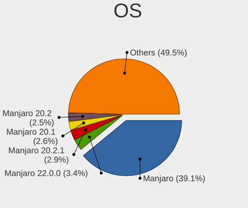

| Name           | Notebooks | Percent |
|----------------|-----------|---------|
| Manjaro        | 2167      | 39.05%  |
| Manjaro 22.0.0 | 188       | 3.39%   |
| Manjaro 20.2.1 | 163       | 2.94%   |
| Manjaro 20.1   | 142       | 2.56%   |
| Manjaro 20.2   | 140       | 2.52%   |
| Manjaro 20.0.3 | 125       | 2.25%   |
| Manjaro 21.2.6 | 113       | 2.04%   |
| Manjaro 23.0.0 | 104       | 1.87%   |
| Manjaro 21.1.0 | 89        | 1.6%    |
| Manjaro 23.1.3 | 86        | 1.55%   |
| Manjaro 18.1.5 | 83        | 1.5%    |
| Manjaro 21.2.0 | 72        | 1.3%    |
| Manjaro 21.0.7 | 70        | 1.26%   |
| Manjaro 21.2.5 | 65        | 1.17%   |
| Manjaro 21.1.6 | 63        | 1.14%   |
| Manjaro 19.0.2 | 55        | 0.99%   |
| Manjaro 25.0.0 | 54        | 0.97%   |
| Manjaro 20.0   | 52        | 0.94%   |
| Manjaro 24.2.1 | 51        | 0.92%   |
| Manjaro 23.1.0 | 49        | 0.88%   |
| Manjaro 21.2.1 | 48        | 0.87%   |
| Manjaro 18.0.4 | 47        | 0.85%   |
| Manjaro 21.0   | 46        | 0.83%   |
| Manjaro 21.0.5 | 44        | 0.79%   |
| Manjaro 22.1.0 | 41        | 0.74%   |
| Manjaro 20.1.1 | 41        | 0.74%   |
| Manjaro 20.1.2 | 40        | 0.72%   |
| Manjaro 23.1.4 | 39        | 0.7%    |
| Manjaro 22.0.4 | 37        | 0.67%   |
| Manjaro 21.2.3 | 37        | 0.67%   |
| Manjaro 20.0.1 | 36        | 0.65%   |
| Manjaro 21.3.7 | 34        | 0.61%   |
| Manjaro 25.0.3 | 33        | 0.59%   |
| Manjaro 21.2.2 | 31        | 0.56%   |
| Manjaro 21.0.4 | 31        | 0.56%   |
| Manjaro 25.0.6 | 29        | 0.52%   |
| Manjaro 21.3.6 | 29        | 0.52%   |
| Manjaro 21.2.4 | 29        | 0.52%   |
| Manjaro 24.0.8 | 28        | 0.5%    |
| Manjaro 23.0.4 | 27        | 0.49%   |

OS Family
---------

OS without a version

| Name    | Notebooks | Percent |
|---------|-----------|---------|
| Manjaro | 5079      | 100%    |

Kernel
------

Version of the Linux kernel

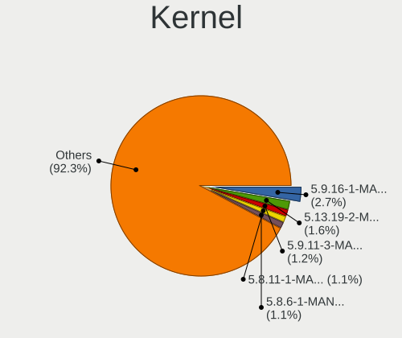

| Version           | Notebooks | Percent |
|-------------------|-----------|---------|
| 5.9.16-1-MANJARO  | 161       | 2.67%   |
| 5.13.19-2-MANJARO | 96        | 1.59%   |
| 5.9.11-3-MANJARO  | 73        | 1.21%   |
| 5.8.11-1-MANJARO  | 69        | 1.14%   |
| 5.8.6-1-MANJARO   | 68        | 1.13%   |
| 5.15.32-1-MANJARO | 63        | 1.04%   |
| 5.15.28-1-MANJARO | 61        | 1.01%   |
| 5.10.42-1-MANJARO | 57        | 0.94%   |
| 5.8.18-1-MANJARO  | 55        | 0.91%   |
| 6.12.4-1-MANJARO  | 54        | 0.89%   |
| 6.9.12-3-MANJARO  | 53        | 0.88%   |
| 5.15.12-1-MANJARO | 52        | 0.86%   |
| 6.1.1-1-MANJARO   | 50        | 0.83%   |
| 6.12.48-1-MANJARO | 49        | 0.81%   |
| 6.1.12-1-MANJARO  | 49        | 0.81%   |
| 6.6.10-1-MANJARO  | 48        | 0.8%    |
| 6.1.31-2-MANJARO  | 48        | 0.8%    |
| 6.10.13-3-MANJARO | 45        | 0.75%   |
| 5.8.16-2-MANJARO  | 41        | 0.68%   |
| 5.15.65-1-MANJARO | 40        | 0.66%   |
| 5.10.2-2-MANJARO  | 40        | 0.66%   |
| 5.6.16-1-MANJARO  | 39        | 0.65%   |
| 5.15.60-1-MANJARO | 39        | 0.65%   |
| 6.5.5-1-MANJARO   | 38        | 0.63%   |
| 5.10.7-3-MANJARO  | 38        | 0.63%   |
| 5.12.9-1-MANJARO  | 36        | 0.6%    |
| 6.6.8-2-MANJARO   | 35        | 0.58%   |
| 6.6.19-1-MANJARO  | 34        | 0.56%   |
| 6.12.28-1-MANJARO | 33        | 0.55%   |
| 5.6.19-2-MANJARO  | 33        | 0.55%   |
| 6.5.3-1-MANJARO   | 31        | 0.51%   |
| 5.15.74-3-MANJARO | 31        | 0.51%   |
| 5.15.7-1-MANJARO  | 31        | 0.51%   |
| 5.7.9-1-MANJARO   | 30        | 0.5%    |
| 5.6.15-1-MANJARO  | 30        | 0.5%    |
| 5.15.81-1-MANJARO | 30        | 0.5%    |
| 5.15.78-1-MANJARO | 30        | 0.5%    |
| 5.15.41-1-MANJARO | 30        | 0.5%    |
| 5.10.36-2-MANJARO | 30        | 0.5%    |
| 6.6.26-1-MANJARO  | 29        | 0.48%   |

Kernel Family
-------------

Linux kernel without a distro release

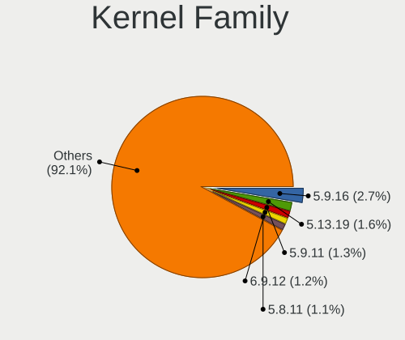

| Version | Notebooks | Percent |
|---------|-----------|---------|
| 5.9.16  | 161       | 2.67%   |
| 5.13.19 | 97        | 1.61%   |
| 5.9.11  | 77        | 1.28%   |
| 6.9.12  | 70        | 1.16%   |
| 5.8.11  | 69        | 1.14%   |
| 5.8.6   | 68        | 1.13%   |
| 5.15.32 | 64        | 1.06%   |
| 5.15.28 | 61        | 1.01%   |
| 5.10.42 | 57        | 0.94%   |
| 5.8.18  | 55        | 0.91%   |
| 6.12.4  | 54        | 0.9%    |
| 6.1.31  | 53        | 0.88%   |
| 5.15.12 | 52        | 0.86%   |
| 6.1.1   | 50        | 0.83%   |
| 6.12.48 | 49        | 0.81%   |
| 6.1.12  | 49        | 0.81%   |
| 6.6.10  | 48        | 0.8%    |
| 6.10.13 | 45        | 0.75%   |
| 5.8.16  | 42        | 0.7%    |
| 5.15.65 | 40        | 0.66%   |
| 5.10.2  | 40        | 0.66%   |
| 5.6.16  | 39        | 0.65%   |
| 5.15.60 | 39        | 0.65%   |
| 5.10.7  | 39        | 0.65%   |
| 6.5.5   | 38        | 0.63%   |
| 6.5.13  | 37        | 0.61%   |
| 5.7.0   | 36        | 0.6%    |
| 5.12.9  | 36        | 0.6%    |
| 6.6.8   | 35        | 0.58%   |
| 5.6.19  | 35        | 0.58%   |
| 6.6.19  | 34        | 0.56%   |
| 6.12.28 | 33        | 0.55%   |
| 5.9.1   | 33        | 0.55%   |
| 5.15.74 | 32        | 0.53%   |
| 5.15.7  | 32        | 0.53%   |
| 6.5.3   | 31        | 0.51%   |
| 5.17.1  | 31        | 0.51%   |
| 6.9.3   | 30        | 0.5%    |
| 5.7.9   | 30        | 0.5%    |
| 5.6.15  | 30        | 0.5%    |

Kernel Major Ver.
-----------------

Linux kernel major version

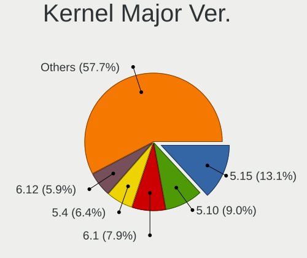

| Version | Notebooks | Percent |
|---------|-----------|---------|
| 5.15    | 745       | 13.13%  |
| 5.10    | 511       | 9.01%   |
| 6.1     | 451       | 7.95%   |
| 5.4     | 362       | 6.38%   |
| 6.12    | 333       | 5.87%   |
| 5.9     | 322       | 5.68%   |
| 6.6     | 318       | 5.6%    |
| 5.8     | 291       | 5.13%   |
| 5.13    | 205       | 3.61%   |
| 5.6     | 199       | 3.51%   |
| 6.9     | 169       | 2.98%   |
| 6.5     | 156       | 2.75%   |
| 5.7     | 137       | 2.41%   |
| 4.19    | 122       | 2.15%   |
| 5.16    | 101       | 1.78%   |
| 5.12    | 94        | 1.66%   |
| 6.10    | 90        | 1.59%   |
| 6.0     | 82        | 1.45%   |
| 5.11    | 81        | 1.43%   |
| 5.14    | 77        | 1.36%   |
| 5.19    | 74        | 1.3%    |
| 5.17    | 71        | 1.25%   |
| 5.18    | 70        | 1.23%   |
| 5.3     | 64        | 1.13%   |
| 5.5     | 62        | 1.09%   |
| 6.11    | 57        | 1%      |
| 6.4     | 47        | 0.83%   |
| 6.2     | 47        | 0.83%   |
| 6.3     | 46        | 0.81%   |
| 6.15    | 40        | 0.7%    |
| 6.7     | 38        | 0.67%   |
| 6.8     | 32        | 0.56%   |
| 6.14    | 26        | 0.46%   |
| 4.14    | 25        | 0.44%   |
| 5.2     | 23        | 0.41%   |
| 6.13    | 19        | 0.33%   |
| 5.0     | 17        | 0.3%    |
| 6.16    | 16        | 0.28%   |
| 5.1     | 13        | 0.23%   |
| 6.17    | 12        | 0.21%   |

Arch
----

OS architecture (x86_64, i586, etc.)

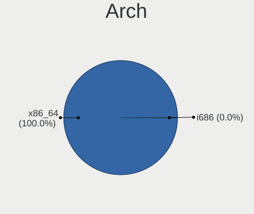

| Name   | Notebooks | Percent |
|--------|-----------|---------|
| x86_64 | 5077      | 99.96%  |
| i686   | 2         | 0.04%   |

DE
--

Desktop Environment

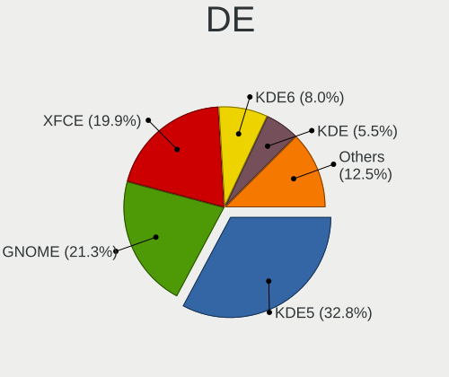

| Name                 | Notebooks | Percent |
|----------------------|-----------|---------|
| KDE5                 | 1724      | 32.81%  |
| GNOME                | 1121      | 21.33%  |
| XFCE                 | 1046      | 19.9%   |
| KDE6                 | 418       | 7.95%   |
| KDE                  | 290       | 5.52%   |
| Unknown              | 223       | 4.24%   |
| X-Cinnamon           | 128       | 2.44%   |
| i3                   | 110       | 2.09%   |
| MATE                 | 44        | 0.84%   |
| Cinnamon             | 34        | 0.65%   |
| Deepin               | 26        | 0.49%   |
| sway                 | 16        | 0.3%    |
| Budgie               | 16        | 0.3%    |
| Awesome              | 11        | 0.21%   |
| LXQt                 | 9         | 0.17%   |
| Hyprland             | 7         | 0.13%   |
| LXDE                 | 6         | 0.11%   |
| qtile                | 4         | 0.08%   |
| i3-with-shmlog       | 3         | 0.06%   |
| dwm                  | 3         | 0.06%   |
| leftwm               | 2         | 0.04%   |
| GNOME Flashback      | 2         | 0.04%   |
| COSMIC               | 2         | 0.04%   |
| bspwm                | 2         | 0.04%   |
| Yaru:ubuntu:GNOME    | 1         | 0.02%   |
| xinitrc              | 1         | 0.02%   |
| Unity                | 1         | 0.02%   |
| swayLANG=en_CA.UTF-8 | 1         | 0.02%   |
| herbstluftwm         | 1         | 0.02%   |
| GNOME Classic        | 1         | 0.02%   |
| gamescope            | 1         | 0.02%   |
| Enlightenment        | 1         | 0.02%   |

Display Server
--------------

X11 or Wayland

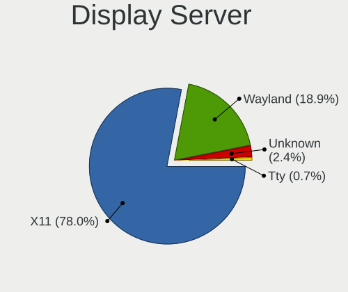

| Name    | Notebooks | Percent |
|---------|-----------|---------|
| X11     | 4046      | 77.97%  |
| Wayland | 980       | 18.89%  |
| Unknown | 125       | 2.41%   |
| Tty     | 38        | 0.73%   |

Display Manager
---------------

SDDM, LightDM, etc.

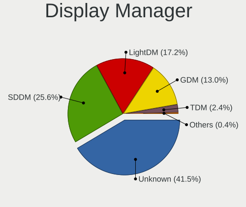

| Name    | Notebooks | Percent |
|---------|-----------|---------|
| Unknown | 2155      | 41.46%  |
| SDDM    | 1332      | 25.63%  |
| LightDM | 893       | 17.18%  |
| GDM     | 675       | 12.99%  |
| TDM     | 123       | 2.37%   |
| GREETD  | 10        | 0.19%   |
| LXDM    | 5         | 0.1%    |
| Ly      | 2         | 0.04%   |
| XDM     | 1         | 0.02%   |
| SLiM    | 1         | 0.02%   |
| CDM     | 1         | 0.02%   |

OS Lang
-------

Language

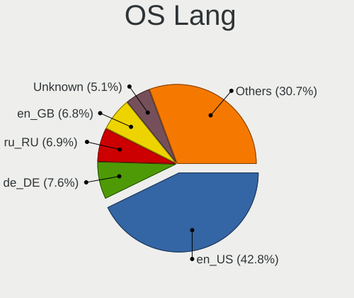

| Lang    | Notebooks | Percent |
|---------|-----------|---------|
| en_US   | 2200      | 42.82%  |
| de_DE   | 392       | 7.63%   |
| ru_RU   | 356       | 6.93%   |
| en_GB   | 349       | 6.79%   |
| Unknown | 264       | 5.14%   |
| pt_BR   | 199       | 3.87%   |
| it_IT   | 139       | 2.71%   |
| fr_FR   | 127       | 2.47%   |
| es_ES   | 102       | 1.99%   |
| pl_PL   | 100       | 1.95%   |
| en_CA   | 95        | 1.85%   |
| en_IN   | 78        | 1.52%   |
| es_MX   | 68        | 1.32%   |
| zh_CN   | 52        | 1.01%   |
| en_AU   | 51        | 0.99%   |
| de_AT   | 34        | 0.66%   |
| es_AR   | 27        | 0.53%   |
| nl_NL   | 22        | 0.43%   |
| tr_TR   | 20        | 0.39%   |
| ru_UA   | 20        | 0.39%   |
| pt_PT   | 20        | 0.39%   |
| sv_SE   | 19        | 0.37%   |
| en_IE   | 19        | 0.37%   |
| C       | 19        | 0.37%   |
| cs_CZ   | 18        | 0.35%   |
| hu_HU   | 17        | 0.33%   |
| es_CO   | 16        | 0.31%   |
| es_CL   | 16        | 0.31%   |
| en_DK   | 15        | 0.29%   |
| fi_FI   | 14        | 0.27%   |
| en_ZA   | 14        | 0.27%   |
| de_CH   | 14        | 0.27%   |
| uk_UA   | 13        | 0.25%   |
| nl_BE   | 12        | 0.23%   |
| en_NZ   | 12        | 0.23%   |
| en_IL   | 12        | 0.23%   |
| el_GR   | 12        | 0.23%   |
| zh_TW   | 9         | 0.18%   |
| ja_JP   | 9         | 0.18%   |
| nb_NO   | 8         | 0.16%   |

Boot Mode
---------

EFI or BIOS

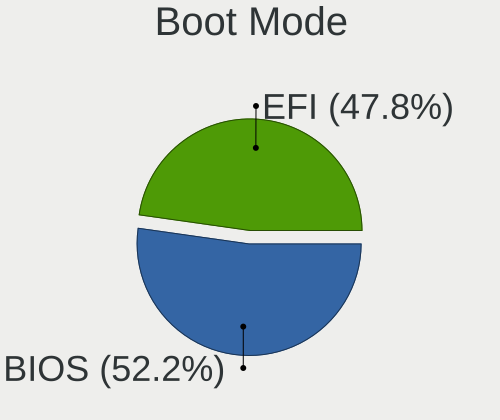

| Mode | Notebooks | Percent |
|------|-----------|---------|
| BIOS | 2697      | 52.24%  |
| EFI  | 2466      | 47.76%  |

Filesystem
----------

Type of filesystem

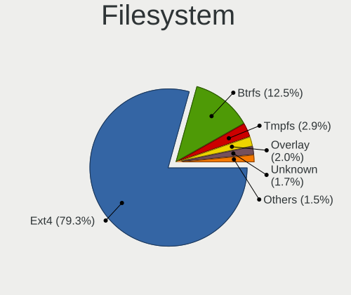

| Type     | Notebooks | Percent |
|----------|-----------|---------|
| Ext4     | 4073      | 79.32%  |
| Btrfs    | 642       | 12.5%   |
| Tmpfs    | 149       | 2.9%    |
| Overlay  | 103       | 2.01%   |
| Unknown  | 89        | 1.73%   |
| Xfs      | 50        | 0.97%   |
| F2fs     | 15        | 0.29%   |
| Ext3     | 5         | 0.1%    |
| Reiserfs | 3         | 0.06%   |
| Zfs      | 2         | 0.04%   |
| Ext2     | 2         | 0.04%   |
| XXXfs    | 1         | 0.02%   |
| Jfs      | 1         | 0.02%   |

Part. scheme
------------

Scheme of partitioning

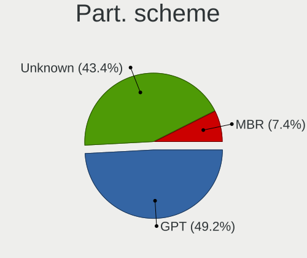

| Type    | Notebooks | Percent |
|---------|-----------|---------|
| GPT     | 2543      | 49.16%  |
| Unknown | 2246      | 43.42%  |
| MBR     | 384       | 7.42%   |

Dual Boot with Linux/BSD
------------------------

Hosting more than one Linux/BSD

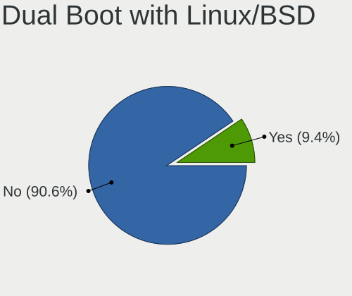

| Dual boot | Notebooks | Percent |
|-----------|-----------|---------|
| No        | 4654      | 90.6%   |
| Yes       | 483       | 9.4%    |

Dual Boot (Win)
---------------

Hosting Linux and Windows

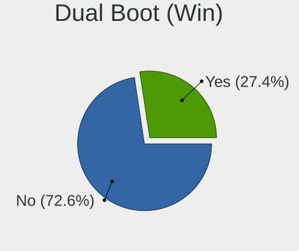

| Dual boot | Notebooks | Percent |
|-----------|-----------|---------|
| No        | 3743      | 72.62%  |
| Yes       | 1411      | 27.38%  |

Board
-----

Vendor
------

Motherboard manufacturer

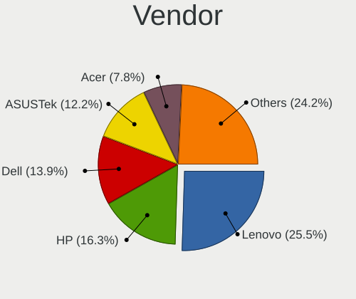

| Name                | Notebooks | Percent |
|---------------------|-----------|---------|
| Lenovo              | 1295      | 25.5%   |
| Hewlett-Packard     | 830       | 16.34%  |
| Dell                | 707       | 13.92%  |
| ASUSTek Computer    | 619       | 12.19%  |
| Acer                | 397       | 7.82%   |
| MSI                 | 152       | 2.99%   |
| Apple               | 147       | 2.89%   |
| HUAWEI              | 97        | 1.91%   |
| Samsung Electronics | 79        | 1.56%   |
| Toshiba             | 74        | 1.46%   |
| Timi                | 47        | 0.93%   |
| Sony                | 41        | 0.81%   |
| Notebook            | 41        | 0.81%   |
| Google              | 41        | 0.81%   |
| TUXEDO              | 34        | 0.67%   |
| Fujitsu             | 34        | 0.67%   |
| Unknown             | 30        | 0.59%   |
| Alienware           | 25        | 0.49%   |
| Framework           | 21        | 0.41%   |
| HONOR               | 20        | 0.39%   |
| Schenker            | 18        | 0.35%   |
| Razer               | 18        | 0.35%   |
| Gigabyte Technology | 17        | 0.33%   |
| Chuwi               | 15        | 0.3%    |
| Packard Bell        | 13        | 0.26%   |
| Medion              | 13        | 0.26%   |
| LG Electronics      | 13        | 0.26%   |
| System76            | 11        | 0.22%   |
| Positivo            | 11        | 0.22%   |
| Panasonic           | 11        | 0.22%   |
| PC Specialist       | 10        | 0.2%    |
| GPD                 | 8         | 0.16%   |
| Clevo               | 8         | 0.16%   |
| Monster             | 6         | 0.12%   |
| MECHREVO            | 6         | 0.12%   |
| GPU Company         | 6         | 0.12%   |
| Star Labs           | 5         | 0.1%    |
| Multilaser          | 5         | 0.1%    |
| Valve               | 4         | 0.08%   |
| Teclast             | 4         | 0.08%   |

Model
-----

Motherboard model

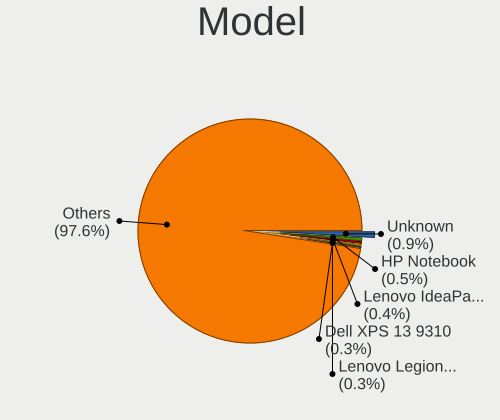

| Name                                 | Notebooks | Percent |
|--------------------------------------|-----------|---------|
| Unknown                              | 47        | 0.93%   |
| HP Notebook                          | 27        | 0.53%   |
| Lenovo IdeaPad 5 15ARE05 81YQ        | 20        | 0.39%   |
| Dell XPS 13 9310                     | 16        | 0.32%   |
| Lenovo Legion 5 15ARH05 82B5         | 14        | 0.28%   |
| Dell XPS 15 9500                     | 13        | 0.26%   |
| Apple MacBookPro9,2                  | 13        | 0.26%   |
| Apple MacBookAir7,2                  | 13        | 0.26%   |
| HP Pavilion Notebook                 | 12        | 0.24%   |
| HP Pavilion Gaming Laptop 15-ec1xxx  | 12        | 0.24%   |
| HP Pavilion 15                       | 12        | 0.24%   |
| HP OMEN by Laptop                    | 12        | 0.24%   |
| Dell Inspiron 3542                   | 12        | 0.24%   |
| Apple MacBookPro8,1                  | 12        | 0.24%   |
| Apple MacBookPro14,1                 | 12        | 0.24%   |
| HP Pavilion g6                       | 11        | 0.22%   |
| HP Pavilion dv7                      | 11        | 0.22%   |
| HP Pavilion dv6                      | 11        | 0.22%   |
| HP 15                                | 11        | 0.22%   |
| Dell XPS 15 9570                     | 11        | 0.22%   |
| Dell XPS 15 7590                     | 11        | 0.22%   |
| Lenovo Z50-70 20354                  | 10        | 0.2%    |
| HP Laptop 15-bs0xx                   | 10        | 0.2%    |
| HP EliteBook 840 G6                  | 10        | 0.2%    |
| HP 250 G7 Notebook PC                | 10        | 0.2%    |
| Lenovo Y520-15IKBN 80WK              | 9         | 0.18%   |
| Lenovo Legion 5 15ARH05H 82B1        | 9         | 0.18%   |
| Lenovo IdeaPad Gaming 3 15ARH05 82EY | 9         | 0.18%   |
| HUAWEI KLVL-WXX9                     | 9         | 0.18%   |
| Dell XPS 15 9560                     | 9         | 0.18%   |
| Dell XPS 13 7390                     | 9         | 0.18%   |
| Dell Latitude E6430                  | 9         | 0.18%   |
| Dell Latitude 7490                   | 9         | 0.18%   |
| Dell Inspiron N5110                  | 9         | 0.18%   |
| Timi TM1701                          | 8         | 0.16%   |
| Lenovo Yoga Slim 7 14ARE05 82A2      | 8         | 0.16%   |
| HUAWEI NBLK-WAX9X                    | 8         | 0.16%   |
| HUAWEI NBLB-WAX9N                    | 8         | 0.16%   |
| HP Laptop 15s-eq2xxx                 | 8         | 0.16%   |
| HP EliteBook 8470p                   | 8         | 0.16%   |

Model Family
------------

Motherboard model prefix

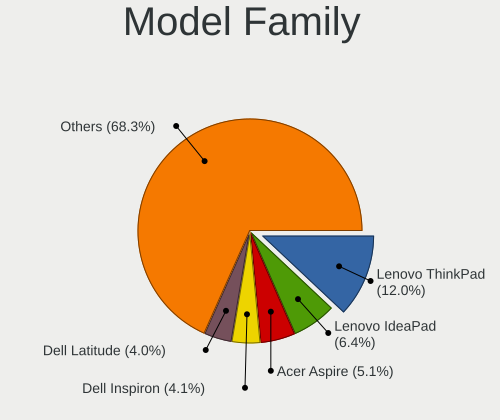

| Name               | Notebooks | Percent |
|--------------------|-----------|---------|
| Lenovo ThinkPad    | 610       | 12.01%  |
| Lenovo IdeaPad     | 327       | 6.44%   |
| Acer Aspire        | 257       | 5.06%   |
| Dell Inspiron      | 210       | 4.13%   |
| Dell Latitude      | 204       | 4.02%   |
| HP Pavilion        | 173       | 3.41%   |
| ASUS VivoBook      | 140       | 2.76%   |
| Dell XPS           | 134       | 2.64%   |
| HP EliteBook       | 132       | 2.6%    |
| HP ProBook         | 131       | 2.58%   |
| HP Laptop          | 129       | 2.54%   |
| Lenovo Legion      | 109       | 2.15%   |
| ASUS ROG           | 76        | 1.5%    |
| Toshiba Satellite  | 67        | 1.32%   |
| Dell Precision     | 59        | 1.16%   |
| ASUS ASUS          | 52        | 1.02%   |
| Dell Vostro        | 48        | 0.95%   |
| Lenovo ThinkBook   | 47        | 0.93%   |
| Unknown            | 47        | 0.93%   |
| ASUS Zenbook       | 45        | 0.89%   |
| Acer Swift         | 43        | 0.85%   |
| Acer Nitro         | 41        | 0.81%   |
| HP OMEN            | 38        | 0.75%   |
| Lenovo Yoga        | 36        | 0.71%   |
| ASUS TUF           | 32        | 0.63%   |
| HP ENVY            | 29        | 0.57%   |
| Fujitsu LIFEBOOK   | 29        | 0.57%   |
| HP ZBook           | 28        | 0.55%   |
| HP Notebook        | 27        | 0.53%   |
| HP 250             | 25        | 0.49%   |
| Framework Laptop   | 21        | 0.41%   |
| Apple MacBookPro11 | 21        | 0.41%   |
| Acer Predator      | 21        | 0.41%   |
| Timi RedmiBook     | 17        | 0.33%   |
| Razer Blade        | 17        | 0.33%   |
| HP Victus          | 17        | 0.33%   |
| HP Compaq          | 17        | 0.33%   |
| HP 15              | 17        | 0.33%   |
| Apple MacBookPro9  | 17        | 0.33%   |
| Acer TravelMate    | 17        | 0.33%   |

MFG Year
--------

Motherboard manufacture year

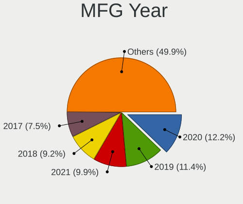

| Year    | Notebooks | Percent |
|---------|-----------|---------|
| 2020    | 619       | 12.19%  |
| 2019    | 578       | 11.38%  |
| 2021    | 501       | 9.86%   |
| 2018    | 466       | 9.18%   |
| 2017    | 381       | 7.5%    |
| 2012    | 342       | 6.73%   |
| 2013    | 275       | 5.41%   |
| 2016    | 261       | 5.14%   |
| 2014    | 256       | 5.04%   |
| 2022    | 255       | 5.02%   |
| 2011    | 252       | 4.96%   |
| 2015    | 235       | 4.63%   |
| 2023    | 175       | 3.45%   |
| 2010    | 133       | 2.62%   |
| 2008    | 102       | 2.01%   |
| 2024    | 90        | 1.77%   |
| 2009    | 70        | 1.38%   |
| 2007    | 34        | 0.67%   |
| 2025    | 26        | 0.51%   |
| 2006    | 23        | 0.45%   |
| Unknown | 4         | 0.08%   |
| 2005    | 1         | 0.02%   |

Form Factor
-----------

Physical design of the computer

| Name     | Notebooks | Percent |
|----------|-----------|---------|
| Notebook | 5079      | 100%    |

Secure Boot
-----------

Enabled or disabled

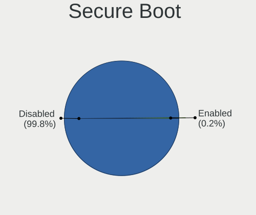

| State    | Notebooks | Percent |
|----------|-----------|---------|
| Disabled | 5074      | 99.82%  |
| Enabled  | 9         | 0.18%   |

Coreboot
--------

Have coreboot on board

| Used | Notebooks | Percent |
|------|-----------|---------|
| No   | 5015      | 98.74%  |
| Yes  | 64        | 1.26%   |

RAM Size
--------

Total RAM memory

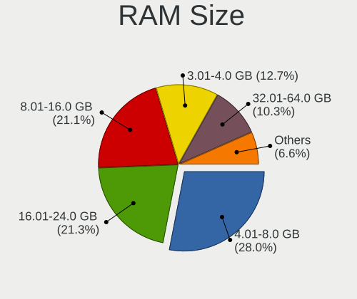

| Size in GB  | Notebooks | Percent |
|-------------|-----------|---------|
| 4.01-8.0    | 1442      | 28.04%  |
| 16.01-24.0  | 1095      | 21.3%   |
| 8.01-16.0   | 1085      | 21.1%   |
| 3.01-4.0    | 651       | 12.66%  |
| 32.01-64.0  | 528       | 10.27%  |
| 24.01-32.0  | 141       | 2.74%   |
| 64.01-256.0 | 90        | 1.75%   |
| 1.01-2.0    | 76        | 1.48%   |
| 2.01-3.0    | 33        | 0.64%   |
| 0.51-1.0    | 1         | 0.02%   |

RAM Used
--------

Used RAM memory

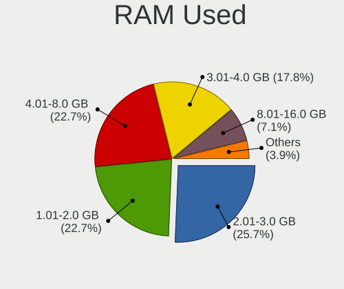

| Used GB    | Notebooks | Percent |
|------------|-----------|---------|
| 2.01-3.0   | 1446      | 25.65%  |
| 1.01-2.0   | 1282      | 22.74%  |
| 4.01-8.0   | 1281      | 22.72%  |
| 3.01-4.0   | 1006      | 17.85%  |
| 8.01-16.0  | 403       | 7.15%   |
| 0.51-1.0   | 157       | 2.79%   |
| 16.01-24.0 | 36        | 0.64%   |
| 24.01-32.0 | 13        | 0.23%   |
| 0.01-0.5   | 7         | 0.12%   |
| 32.01-64.0 | 5         | 0.09%   |
| 0          | 1         | 0.02%   |

Total Drives
------------

Number of drives on board

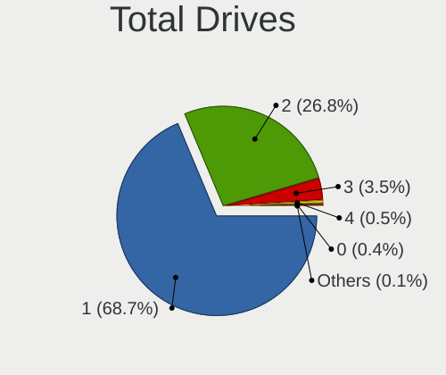

| Drives | Notebooks | Percent |
|--------|-----------|---------|
| 1      | 3556      | 68.68%  |
| 2      | 1386      | 26.77%  |
| 3      | 183       | 3.53%   |
| 4      | 28        | 0.54%   |
| 0      | 20        | 0.39%   |
| 7      | 2         | 0.04%   |
| 6      | 2         | 0.04%   |
| 5      | 1         | 0.02%   |

Has CD-ROM
----------

Has CD-ROM on board

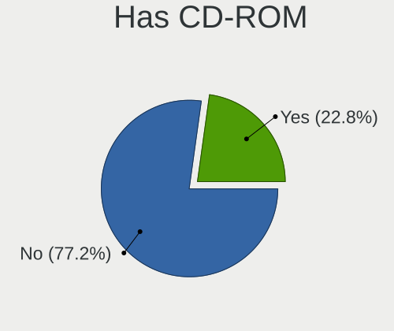

| Presented | Notebooks | Percent |
|-----------|-----------|---------|
| No        | 3937      | 77.2%   |
| Yes       | 1163      | 22.8%   |

Has Ethernet
------------

Has Ethernet on board

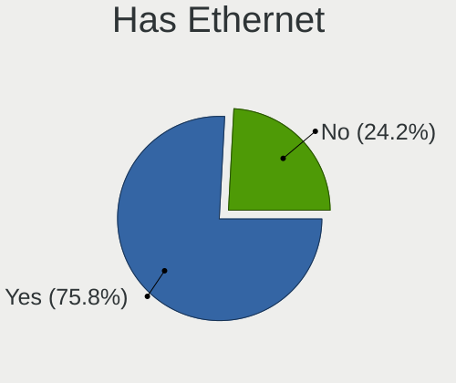

| Presented | Notebooks | Percent |
|-----------|-----------|---------|
| Yes       | 3866      | 75.85%  |
| No        | 1231      | 24.15%  |

Has WiFi
--------

Has WiFi module

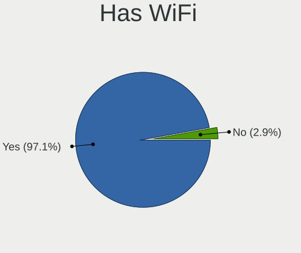

| Presented | Notebooks | Percent |
|-----------|-----------|---------|
| Yes       | 4940      | 97.15%  |
| No        | 145       | 2.85%   |

Has Bluetooth
-------------

Has Bluetooth module

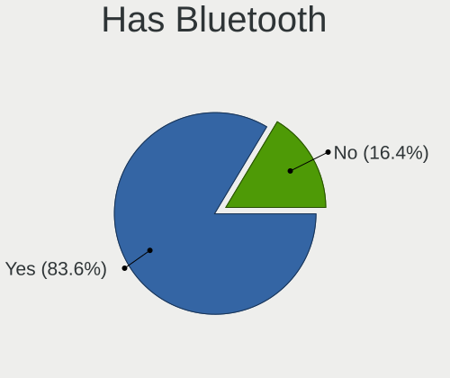

| Presented | Notebooks | Percent |
|-----------|-----------|---------|
| Yes       | 4279      | 83.61%  |
| No        | 839       | 16.39%  |

Location
--------

Country
-------

Geographic location (country)

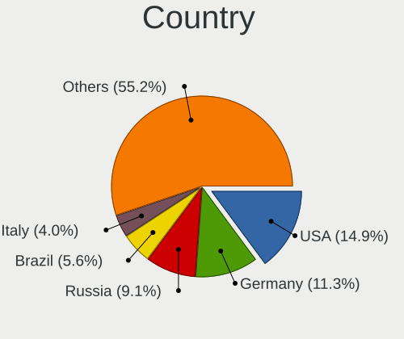

| Country     | Notebooks | Percent |
|-------------|-----------|---------|
| USA         | 763       | 14.88%  |
| Germany     | 578       | 11.27%  |
| Russia      | 465       | 9.07%   |
| Brazil      | 285       | 5.56%   |
| Italy       | 206       | 4.02%   |
| France      | 196       | 3.82%   |
| UK          | 173       | 3.37%   |
| Poland      | 158       | 3.08%   |
| Spain       | 141       | 2.75%   |
| Canada      | 139       | 2.71%   |
| India       | 122       | 2.38%   |
| Netherlands | 112       | 2.18%   |
| Ukraine     | 92        | 1.79%   |
| Mexico      | 90        | 1.76%   |
| Austria     | 76        | 1.48%   |
| China       | 70        | 1.37%   |
| Sweden      | 66        | 1.29%   |
| Australia   | 63        | 1.23%   |
| Turkey      | 60        | 1.17%   |
| Switzerland | 56        | 1.09%   |
| Indonesia   | 51        | 0.99%   |
| Romania     | 48        | 0.94%   |
| Czechia     | 46        | 0.9%    |
| Belgium     | 45        | 0.88%   |
| Portugal    | 44        | 0.86%   |
| Hungary     | 41        | 0.8%    |
| Greece      | 41        | 0.8%    |
| Colombia    | 39        | 0.76%   |
| Belarus     | 39        | 0.76%   |
| Argentina   | 39        | 0.76%   |
| Finland     | 37        | 0.72%   |
| Bulgaria    | 37        | 0.72%   |
| Norway      | 31        | 0.6%    |
| Denmark     | 27        | 0.53%   |
| Japan       | 24        | 0.47%   |
| Iran        | 24        | 0.47%   |
| Chile       | 24        | 0.47%   |
| Bangladesh  | 24        | 0.47%   |
| Taiwan      | 23        | 0.45%   |
| Israel      | 21        | 0.41%   |

City
----

Geographic location (city)

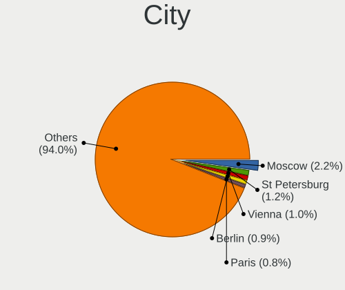

| City              | Notebooks | Percent |
|-------------------|-----------|---------|
| Moscow            | 119       | 2.19%   |
| St Petersburg     | 63        | 1.16%   |
| Vienna            | 52        | 0.96%   |
| Berlin            | 49        | 0.9%    |
| Paris             | 42        | 0.77%   |
| Sao Paulo         | 34        | 0.63%   |
| Warsaw            | 33        | 0.61%   |
| Frankfurt am Main | 30        | 0.55%   |
| Amsterdam         | 29        | 0.53%   |
| Milan             | 27        | 0.5%    |
| Kyiv              | 27        | 0.5%    |
| Munich            | 25        | 0.46%   |
| Istanbul          | 24        | 0.44%   |
| Minsk             | 23        | 0.42%   |
| Madrid            | 23        | 0.42%   |
| Prague            | 22        | 0.41%   |
| Bengaluru         | 22        | 0.41%   |
| Helsinki          | 21        | 0.39%   |
| Bogotá           | 21        | 0.39%   |
| Toronto           | 20        | 0.37%   |
| Novosibirsk       | 20        | 0.37%   |
| Seattle           | 19        | 0.35%   |
| Hamburg           | 19        | 0.35%   |
| Budapest          | 19        | 0.35%   |
| Melbourne         | 18        | 0.33%   |
| Stockholm         | 17        | 0.31%   |
| Rome              | 17        | 0.31%   |
| Mexico City       | 17        | 0.31%   |
| Dhaka             | 17        | 0.31%   |
| Bucharest         | 17        | 0.31%   |
| Barcelona         | 17        | 0.31%   |
| San Jose          | 16        | 0.29%   |
| London            | 16        | 0.29%   |
| Athens            | 16        | 0.29%   |
| Zurich            | 15        | 0.28%   |
| Sofia             | 15        | 0.28%   |
| Krasnodar         | 15        | 0.28%   |
| Sydney            | 14        | 0.26%   |
| Rostov-on-Don     | 14        | 0.26%   |
| Los Angeles       | 14        | 0.26%   |

Drives
------

Drive Vendor
------------

Hard drive vendors

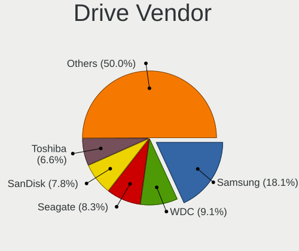

| Vendor                         | Notebooks | Drives | Percent |
|--------------------------------|-----------|--------|---------|
| Samsung Electronics            | 1213      | 1629   | 18.14%  |
| WDC                            | 607       | 734    | 9.08%   |
| Seagate                        | 556       | 713    | 8.32%   |
| SanDisk                        | 522       | 671    | 7.81%   |
| Toshiba                        | 442       | 526    | 6.61%   |
| Kingston                       | 348       | 412    | 5.2%    |
| SK hynix                       | 345       | 423    | 5.16%   |
| Unknown                        | 334       | 415    | 5%      |
| Intel                          | 224       | 285    | 3.35%   |
| Crucial                        | 220       | 280    | 3.29%   |
| Micron Technology              | 216       | 272    | 3.23%   |
| HGST                           | 167       | 198    | 2.5%    |
| KIOXIA                         | 105       | 127    | 1.57%   |
| Hitachi                        | 105       | 120    | 1.57%   |
| Apple                          | 87        | 111    | 1.3%    |
| A-DATA Technology              | 72        | 90     | 1.08%   |
| Phison Electronics             | 61        | 76     | 0.91%   |
| China                          | 60        | 68     | 0.9%    |
| Micron/Crucial Technology      | 58        | 76     | 0.87%   |
| Phison                         | 50        | 73     | 0.75%   |
| Kingston Technology Company    | 48        | 59     | 0.72%   |
| Silicon Motion                 | 42        | 48     | 0.63%   |
| Transcend                      | 39        | 45     | 0.58%   |
| LITEON                         | 38        | 44     | 0.57%   |
| GOODRAM                        | 33        | 56     | 0.49%   |
| MAXIO Technology (Hangzhou)    | 31        | 33     | 0.46%   |
| LITEONIT                       | 30        | 36     | 0.45%   |
| ADATA Technology               | 25        | 27     | 0.37%   |
| Union Memory (Shenzhen)        | 23        | 26     | 0.34%   |
| JMicron Technology             | 23        | 25     | 0.34%   |
| Solid State Storage Technology | 21        | 31     | 0.31%   |
| Unknown                        | 21        | 24     | 0.31%   |
| Intenso                        | 20        | 24     | 0.3%    |
| SPCC                           | 19        | 22     | 0.28%   |
| Realtek Semiconductor          | 19        | 22     | 0.28%   |
| Shenzhen Longsys Electronics   | 17        | 24     | 0.25%   |
| Plextor                        | 15        | 23     | 0.22%   |
| Patriot                        | 15        | 15     | 0.22%   |
| PNY                            | 14        | 18     | 0.21%   |
| Netac                          | 12        | 18     | 0.18%   |

Drive Model
-----------

Hard drive models

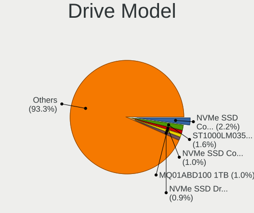

| Model                                                | Notebooks | Percent |
|------------------------------------------------------|-----------|---------|
| Samsung NVMe SSD Controller SM981/PM981/PM983 1TB    | 151       | 2.16%   |
| Seagate ST1000LM035-1RK172 1TB                       | 110       | 1.58%   |
| Samsung NVMe SSD Controller PM9A1/PM9A3/980PRO 1TB   | 72        | 1.03%   |
| Toshiba MQ01ABD100 1TB                               | 67        | 0.96%   |
| Samsung NVMe SSD Drive 512GB                         | 65        | 0.93%   |
| HGST HTS721010A9E630 1TB                             | 63        | 0.9%    |
| Toshiba MQ04ABF100 1TB                               | 62        | 0.89%   |
| Unknown MMC Card  64GB                               | 53        | 0.76%   |
| Kingston SA400S37240G 240GB SSD                      | 50        | 0.72%   |
| Unknown MMC Card  32GB                               | 48        | 0.69%   |
| Seagate ST1000LM024 HN-M101MBB 1TB                   | 48        | 0.69%   |
| SK hynix NVMe SSD Drive 512GB                        | 46        | 0.66%   |
| Kingston SA400S37480G 480GB SSD                      | 44        | 0.63%   |
| SanDisk NVMe SSD Drive 512GB                         | 43        | 0.62%   |
| Samsung NVMe SSD Drive 256GB                         | 43        | 0.62%   |
| Sandisk WD Black SN750 / PC SN730 NVMe SSD 500GB     | 41        | 0.59%   |
| Toshiba MQ01ABF050 500GB                             | 40        | 0.57%   |
| Unknown SD/MMC/MS PRO 2GB                            | 38        | 0.54%   |
| Crucial CT500MX500SSD1 500GB                         | 36        | 0.52%   |
| Unknown MMC Card  128GB                              | 35        | 0.5%    |
| Seagate ST500LT012-1DG142 500GB                      | 34        | 0.49%   |
| Sandisk WD Blue SN550 NVMe SSD 1024GB                | 34        | 0.49%   |
| Crucial CT1000MX500SSD1 1TB                          | 33        | 0.47%   |
| Intel NVMe SSD Drive 512GB                           | 30        | 0.43%   |
| Samsung NVMe SSD Drive 1TB                           | 29        | 0.42%   |
| Seagate ST1000LM049-2GH172 1TB                       | 28        | 0.4%    |
| Samsung NVMe SSD Controller SM961/PM961/SM963 1024GB | 28        | 0.4%    |
| Kingston SA400S37120G 120GB SSD                      | 28        | 0.4%    |
| Samsung SSD 850 EVO 500GB                            | 27        | 0.39%   |
| Intel SSD 660P Series 512GB                          | 27        | 0.39%   |
| SanDisk NVMe SSD Drive 256GB                         | 26        | 0.37%   |
| Samsung SSD 860 EVO 500GB                            | 26        | 0.37%   |
| HGST HTS545050A7E680 500GB                           | 25        | 0.36%   |
| WDC WD10SPZX-24Z10 1TB                               | 24        | 0.34%   |
| Micron/Crucial P2 NVMe PCIe SSD 2TB                  | 24        | 0.34%   |
| Samsung NVMe SSD Drive 1024GB                        | 23        | 0.33%   |
| MAXIO (Hangzhou) NVMe SSD Controller MAP1202 2TB     | 23        | 0.33%   |
| WDC WD10SPZX-21Z10T0 1TB                             | 22        | 0.32%   |
| Toshiba XG6 NVMe SSD Controller 1024GB               | 22        | 0.32%   |
| SK hynix NVMe SSD Drive 256GB                        | 22        | 0.32%   |

HDD Vendor
----------

Hard disk drive vendors

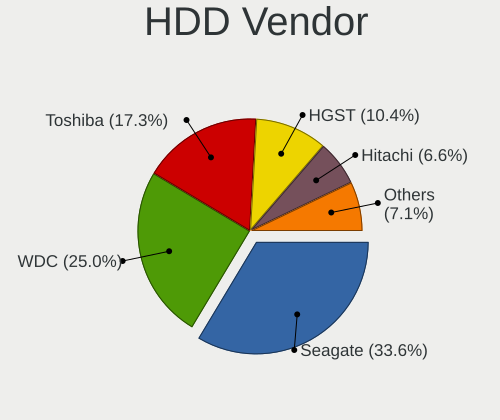

| Vendor              | Notebooks | Drives | Percent |
|---------------------|-----------|--------|---------|
| Seagate             | 538       | 686    | 33.6%   |
| WDC                 | 400       | 478    | 24.98%  |
| Toshiba             | 277       | 327    | 17.3%   |
| HGST                | 167       | 198    | 10.43%  |
| Hitachi             | 105       | 120    | 6.56%   |
| Unknown             | 40        | 46     | 2.5%    |
| Samsung Electronics | 16        | 18     | 1%      |
| JMicron Technology  | 11        | 11     | 0.69%   |
| Fujitsu             | 10        | 10     | 0.62%   |
| Apple               | 6         | 7      | 0.37%   |
| TO Exter            | 4         | 5      | 0.25%   |
| SSK                 | 3         | 4      | 0.19%   |
| USB3.0              | 2         | 2      | 0.12%   |
| USB                 | 2         | 3      | 0.12%   |
| Intenso             | 2         | 2      | 0.12%   |
| External            | 2         | 2      | 0.12%   |
| T-FORCE             | 1         | 1      | 0.06%   |
| SABRENT             | 1         | 1      | 0.06%   |
| QNAP                | 1         | 1      | 0.06%   |
| Maxtor              | 1         | 1      | 0.06%   |
| MARSHAL             | 1         | 1      | 0.06%   |
| KESU                | 1         | 1      | 0.06%   |
| Inateck             | 1         | 1      | 0.06%   |
| HGST HTS            | 1         | 1      | 0.06%   |
| Hewlett-Packard     | 1         | 1      | 0.06%   |
| BR                  | 1         | 1      | 0.06%   |
| ASMT109x            | 1         | 1      | 0.06%   |
| ASMT                | 1         | 1      | 0.06%   |
| ASMedia             | 1         | 1      | 0.06%   |
| Apricorn            | 1         | 1      | 0.06%   |
| ACASIS              | 1         | 1      | 0.06%   |
| Unknown             | 1         | 1      | 0.06%   |

SSD Vendor
----------

Solid state drive vendors

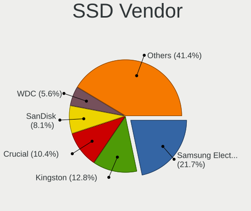

| Vendor              | Notebooks | Drives | Percent |
|---------------------|-----------|--------|---------|
| Samsung Electronics | 431       | 547    | 21.71%  |
| Kingston            | 254       | 297    | 12.8%   |
| Crucial             | 207       | 267    | 10.43%  |
| SanDisk             | 160       | 213    | 8.06%   |
| WDC                 | 111       | 132    | 5.59%   |
| China               | 60        | 68     | 3.02%   |
| Apple               | 59        | 66     | 2.97%   |
| Micron Technology   | 57        | 78     | 2.87%   |
| A-DATA Technology   | 57        | 70     | 2.87%   |
| SK hynix            | 53        | 65     | 2.67%   |
| Intel               | 42        | 50     | 2.12%   |
| Toshiba             | 41        | 47     | 2.07%   |
| Transcend           | 37        | 42     | 1.86%   |
| LITEON              | 35        | 41     | 1.76%   |
| GOODRAM             | 32        | 55     | 1.61%   |
| LITEONIT            | 30        | 36     | 1.51%   |
| Intenso             | 18        | 22     | 0.91%   |
| SPCC                | 14        | 16     | 0.71%   |
| Plextor             | 14        | 22     | 0.71%   |
| Patriot             | 14        | 14     | 0.71%   |
| Unknown             | 14        | 17     | 0.71%   |
| PNY                 | 13        | 17     | 0.65%   |
| KingSpec            | 12        | 13     | 0.6%    |
| OCZ                 | 11        | 12     | 0.55%   |
| Netac               | 11        | 17     | 0.55%   |
| Team                | 8         | 11     | 0.4%    |
| Seagate             | 7         | 11     | 0.35%   |
| Gigabyte Technology | 7         | 8      | 0.35%   |
| Apacer              | 7         | 7      | 0.35%   |
| Lexar               | 6         | 6      | 0.3%    |
| Hewlett-Packard     | 6         | 9      | 0.3%    |
| Corsair             | 6         | 6      | 0.3%    |
| Mushkin             | 5         | 8      | 0.25%   |
| FORESEE             | 5         | 5      | 0.25%   |
| Emtec               | 5         | 5      | 0.25%   |
| Unknown             | 4         | 5      | 0.2%    |
| SABRENT             | 4         | 4      | 0.2%    |
| KingFast            | 4         | 5      | 0.2%    |
| BHT                 | 4         | 5      | 0.2%    |
| ASMT                | 4         | 4      | 0.2%    |

Drive Kind
----------

HDD or SSD

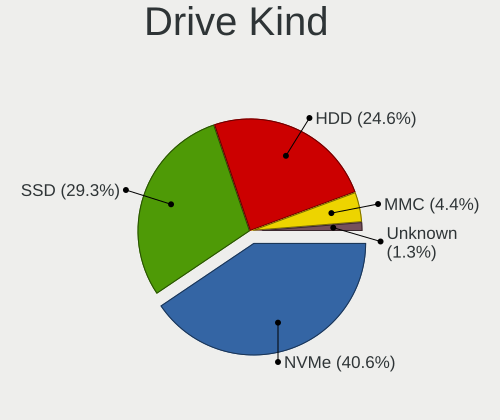

| Kind    | Notebooks | Drives | Percent |
|---------|-----------|--------|---------|
| NVMe    | 2536      | 3538   | 40.56%  |
| SSD     | 1829      | 2481   | 29.25%  |
| HDD     | 1535      | 1935   | 24.55%  |
| MMC     | 273       | 342    | 4.37%   |
| Unknown | 79        | 95     | 1.26%   |

Drive Connector
---------------

SATA, SAS, NVMe, etc.

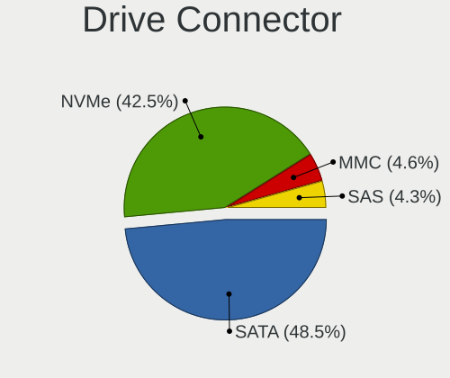

| Type | Notebooks | Drives | Percent |
|------|-----------|--------|---------|
| SATA | 2890      | 4197   | 48.52%  |
| NVMe | 2534      | 3510   | 42.55%  |
| MMC  | 273       | 342    | 4.58%   |
| SAS  | 259       | 342    | 4.35%   |

Drive Size
----------

Size of hard drive

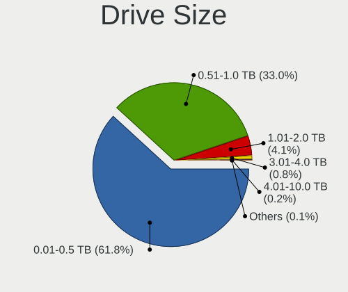

| Size in TB | Notebooks | Drives | Percent |
|------------|-----------|--------|---------|
| 0.01-0.5   | 2058      | 2768   | 61.82%  |
| 0.51-1.0   | 1099      | 1399   | 33.01%  |
| 1.01-2.0   | 136       | 186    | 4.09%   |
| 3.01-4.0   | 26        | 51     | 0.78%   |
| 4.01-10.0  | 8         | 10     | 0.24%   |
| 2.01-3.0   | 1         | 1      | 0.03%   |
| 10.01-20.0 | 1         | 1      | 0.03%   |

Space Total
-----------

Amount of disk space available on the file system

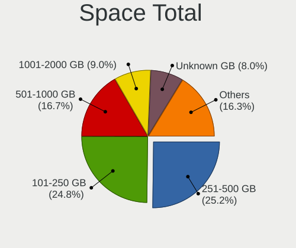

| Size in GB     | Notebooks | Percent |
|----------------|-----------|---------|
| 251-500        | 1334      | 25.19%  |
| 101-250        | 1315      | 24.83%  |
| 501-1000       | 882       | 16.66%  |
| 1001-2000      | 475       | 8.97%   |
| Unknown        | 426       | 8.05%   |
| 51-100         | 292       | 5.51%   |
| 1-20           | 188       | 3.55%   |
| More than 3000 | 137       | 2.59%   |
| 21-50          | 132       | 2.49%   |
| 2001-3000      | 114       | 2.15%   |

Space Used
----------

Amount of used disk space

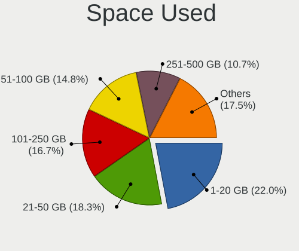

| Used GB        | Notebooks | Percent |
|----------------|-----------|---------|
| 1-20           | 1222      | 22.03%  |
| 21-50          | 1015      | 18.3%   |
| 101-250        | 926       | 16.69%  |
| 51-100         | 820       | 14.78%  |
| 251-500        | 594       | 10.71%  |
| Unknown        | 426       | 7.68%   |
| 501-1000       | 348       | 6.27%   |
| 1001-2000      | 128       | 2.31%   |
| 2001-3000      | 38        | 0.69%   |
| More than 3000 | 25        | 0.45%   |
| 0              | 5         | 0.09%   |

Malfunc. Drives
---------------

Drive models with a malfunction

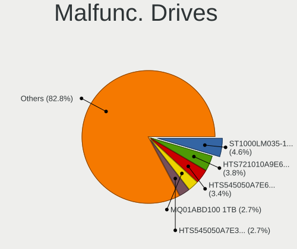

| Model                                               | Notebooks | Drives | Percent |
|-----------------------------------------------------|-----------|--------|---------|
| Seagate ST1000LM035-1RK172 1TB                      | 12        | 13     | 4.6%    |
| HGST HTS721010A9E630 1TB                            | 10        | 10     | 3.83%   |
| HGST HTS545050A7E680 500GB                          | 9         | 9      | 3.45%   |
| Toshiba MQ01ABD100 1TB                              | 7         | 9      | 2.68%   |
| HGST HTS545050A7E380 500GB                          | 7         | 7      | 2.68%   |
| Seagate ST500LT012-9WS142 500GB                     | 6         | 23     | 2.3%    |
| Seagate ST1000LM024 HN-M101MBB 1TB                  | 5         | 5      | 1.92%   |
| HGST HTS725050A7E630 500GB                          | 5         | 5      | 1.92%   |
| Toshiba MQ01ABF050 500GB                            | 4         | 4      | 1.53%   |
| Seagate ST9320325AS 320GB                           | 4         | 5      | 1.53%   |
| WDC WD10JPVX-75JC3T0 1TB                            | 3         | 4      | 1.15%   |
| Toshiba MQ01ABD050 500GB                            | 3         | 3      | 1.15%   |
| Seagate ST9500325AS 500GB                           | 3         | 4      | 1.15%   |
| Seagate ST500LM021-1KJ152 500GB                     | 3         | 4      | 1.15%   |
| Samsung Electronics SSD 870 EVO 1TB                 | 3         | 3      | 1.15%   |
| LITEON CV8-8E128-HP 128GB SSD                       | 3         | 3      | 1.15%   |
| Hitachi HTS723232A7A364 320GB                       | 3         | 3      | 1.15%   |
| Hitachi HTS545050A7E380 500GB                       | 3         | 3      | 1.15%   |
| WDC WD10JPVX-22JC3T0 1TB                            | 2         | 3      | 0.77%   |
| Toshiba THNSNK128GVN8 M.2 2280 128GB SSD            | 2         | 2      | 0.77%   |
| Seagate ST9750420AS 752GB                           | 2         | 2      | 0.77%   |
| Seagate ST9500423AS 500GB                           | 2         | 2      | 0.77%   |
| Seagate ST500LM012 HN-M500MBB 500GB                 | 2         | 2      | 0.77%   |
| Seagate ST2000LM007-1R8174 2TB                      | 2         | 3      | 0.77%   |
| Seagate ST1000LX015-1U7172 1TB                      | 2         | 5      | 0.77%   |
| Seagate ST1000LM049-2GH172 1TB                      | 2         | 3      | 0.77%   |
| Samsung Electronics SSD 870 EVO 500GB               | 2         | 2      | 0.77%   |
| Micron Technology MTFDDAV256TDL-1AW1ZABHA 256GB SSD | 2         | 2      | 0.77%   |
| Kingston SUV400S37240G 240GB SSD                    | 2         | 2      | 0.77%   |
| HGST HTS541010A9E680 1TB                            | 2         | 2      | 0.77%   |
| Crucial CT525MX300SSD1 528GB                        | 2         | 2      | 0.77%   |
| Unknown                                             | 2         | 2      | 0.77%   |
| WDC WDS480G2G0B-00EPW0 480GB SSD                    | 1         | 1      | 0.38%   |
| WDC WDS480G2G0A-00JH30 480GB SSD                    | 1         | 1      | 0.38%   |
| WDC WDS240G2G0B-00EPW0 240GB SSD                    | 1         | 1      | 0.38%   |
| WDC WD800BEVS-22RST0 80GB                           | 1         | 1      | 0.38%   |
| WDC WD7500BPVX-60JC3T0 752GB                        | 1         | 1      | 0.38%   |
| WDC WD5000LPVX-08V0TT5 500GB                        | 1         | 1      | 0.38%   |
| WDC WD5000LPLX-00ZNTT0 500GB                        | 1         | 1      | 0.38%   |
| WDC WD5000LPCX-22VHAT0 500GB                        | 1         | 1      | 0.38%   |

Malfunc. Drive Vendor
---------------------

Vendors of faulty drives

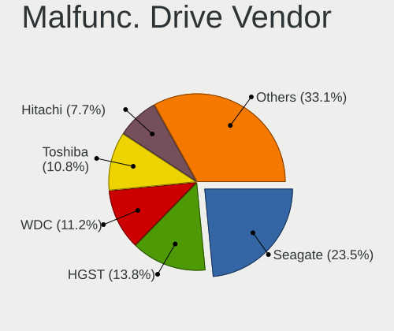

| Vendor                         | Notebooks | Drives | Percent |
|--------------------------------|-----------|--------|---------|
| Seagate                        | 61        | 90     | 23.46%  |
| HGST                           | 36        | 36     | 13.85%  |
| WDC                            | 29        | 32     | 11.15%  |
| Toshiba                        | 28        | 32     | 10.77%  |
| Hitachi                        | 20        | 21     | 7.69%   |
| Samsung Electronics            | 15        | 16     | 5.77%   |
| Crucial                        | 11        | 15     | 4.23%   |
| SK hynix                       | 8         | 12     | 3.08%   |
| SanDisk                        | 6         | 6      | 2.31%   |
| Intel                          | 6         | 7      | 2.31%   |
| Kingston                       | 5         | 5      | 1.92%   |
| Micron Technology              | 4         | 6      | 1.54%   |
| LITEON                         | 3         | 3      | 1.15%   |
| A-DATA Technology              | 3         | 4      | 1.15%   |
| ADATA Technology               | 2         | 2      | 0.77%   |
| Unknown                        | 2         | 2      | 0.77%   |
| TwinMOS                        | 1         | 1      | 0.38%   |
| Solid State Storage Technology | 1         | 1      | 0.38%   |
| Shenzhen TIGO Semiconductor    | 1         | 1      | 0.38%   |
| Shenzhen Longsys Electronics   | 1         | 1      | 0.38%   |
| Realtek Semiconductor          | 1         | 1      | 0.38%   |
| Realtek                        | 1         | 1      | 0.38%   |
| Netac                          | 1         | 1      | 0.38%   |
| Mushkin                        | 1         | 1      | 0.38%   |
| MAXIO Technology (Hangzhou)    | 1         | 1      | 0.38%   |
| MARSHAL                        | 1         | 1      | 0.38%   |
| LITEONIT                       | 1         | 1      | 0.38%   |
| Kingston Technology Company    | 1         | 1      | 0.38%   |
| KingSpec                       | 1         | 1      | 0.38%   |
| KingFast                       | 1         | 1      | 0.38%   |
| IM3D                           | 1         | 1      | 0.38%   |
| Faspeed                        | 1         | 1      | 0.38%   |
| Corsair                        | 1         | 1      | 0.38%   |
| China                          | 1         | 3      | 0.38%   |
| ASMT                           | 1         | 1      | 0.38%   |
| Apple                          | 1         | 1      | 0.38%   |
| Apacer                         | 1         | 1      | 0.38%   |

Malfunc. HDD Vendor
-------------------

Vendors of faulty HDD drives

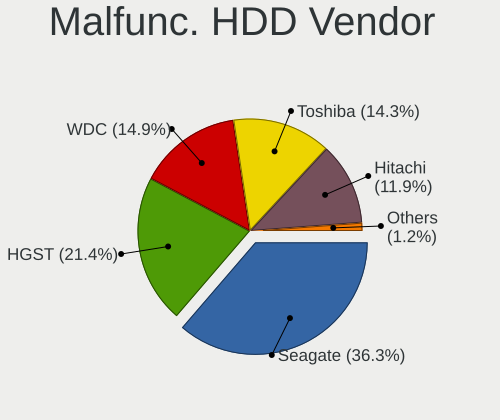

| Vendor              | Notebooks | Drives | Percent |
|---------------------|-----------|--------|---------|
| Seagate             | 61        | 90     | 36.31%  |
| HGST                | 36        | 36     | 21.43%  |
| WDC                 | 25        | 28     | 14.88%  |
| Toshiba             | 24        | 28     | 14.29%  |
| Hitachi             | 20        | 21     | 11.9%   |
| Samsung Electronics | 1         | 1      | 0.6%    |
| MARSHAL             | 1         | 1      | 0.6%    |

Malfunc. Drive Kind
-------------------

Kinds of faulty drives

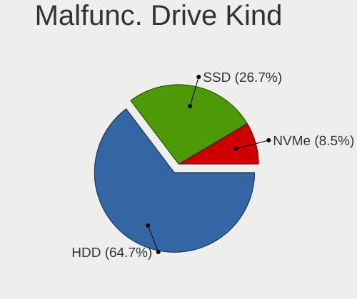

| Kind | Notebooks | Drives | Percent |
|------|-----------|--------|---------|
| HDD  | 167       | 205    | 64.73%  |
| SSD  | 69        | 84     | 26.74%  |
| NVMe | 22        | 23     | 8.53%   |

Failed Drives
-------------

Failed drive models

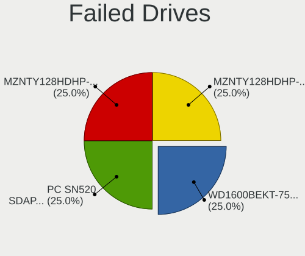

| Model                                            | Notebooks | Drives | Percent |
|--------------------------------------------------|-----------|--------|---------|
| WDC WD1600BEKT-75PVMT0 160GB                     | 1         | 1      | 25%     |
| WDC PC SN520 SDAPNUW-256G-1102 256GB             | 1         | 1      | 25%     |
| Samsung Electronics MZNTY128HDHP-000H1 128GB SSD | 1         | 1      | 25%     |
| Samsung Electronics MZNTY128HDHP-00000 128GB SSD | 1         | 1      | 25%     |

Failed Drive Vendor
-------------------

Failed drive vendors

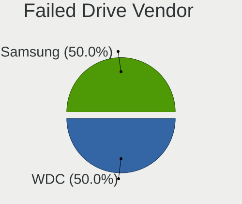

| Vendor              | Notebooks | Drives | Percent |
|---------------------|-----------|--------|---------|
| WDC                 | 2         | 2      | 50%     |
| Samsung Electronics | 2         | 2      | 50%     |

Drive Status
------------

Number of failed and malfunc. drives

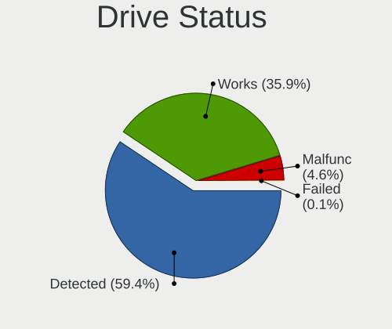

| Status   | Notebooks | Drives | Percent |
|----------|-----------|--------|---------|
| Detected | 3239      | 5177   | 59.4%   |
| Works    | 1959      | 2898   | 35.93%  |
| Malfunc  | 251       | 312    | 4.6%    |
| Failed   | 4         | 4      | 0.07%   |

Storage controller
------------------

Storage Vendor
--------------

Storage controller vendors

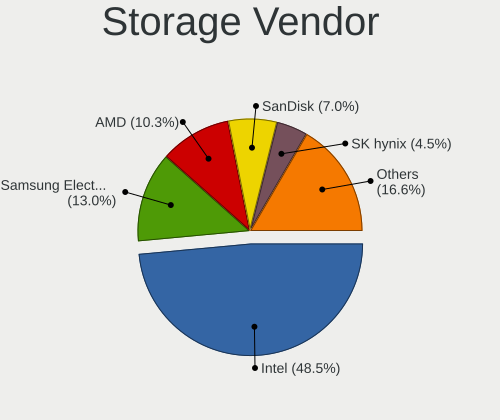

| Vendor                                  | Notebooks | Percent |
|-----------------------------------------|-----------|---------|
| Intel                                   | 3129      | 48.53%  |
| Samsung Electronics                     | 840       | 13.03%  |
| AMD                                     | 665       | 10.31%  |
| SanDisk                                 | 453       | 7.03%   |
| SK hynix                                | 291       | 4.51%   |
| Micron Technology                       | 159       | 2.47%   |
| Kingston Technology Company             | 142       | 2.2%    |
| Toshiba America Info Systems            | 120       | 1.86%   |
| Phison Electronics                      | 113       | 1.75%   |
| KIOXIA                                  | 111       | 1.72%   |
| Micron/Crucial Technology               | 70        | 1.09%   |
| Silicon Motion                          | 44        | 0.68%   |
| ADATA Technology                        | 43        | 0.67%   |
| Union Memory (Shenzhen)                 | 33        | 0.51%   |
| Solid State Storage Technology          | 31        | 0.48%   |
| MAXIO Technology (Hangzhou)             | 31        | 0.48%   |
| Shenzhen Longsys Electronics            | 24        | 0.37%   |
| Nvidia                                  | 23        | 0.36%   |
| Realtek Semiconductor                   | 22        | 0.34%   |
| Apple                                   | 21        | 0.33%   |
| Lite-On Technology                      | 12        | 0.19%   |
| Yangtze Memory Technologies             | 10        | 0.16%   |
| Marvell Technology Group                | 10        | 0.16%   |
| Shenzhen Unionmemory Information System | 8         | 0.12%   |
| Seagate Technology                      | 6         | 0.09%   |
| Biwin Storage Technology                | 5         | 0.08%   |
| Solidigm                                | 4         | 0.06%   |
| Lenovo                                  | 4         | 0.06%   |
| JMicron Technology                      | 4         | 0.06%   |
| Unknown                                 | 4         | 0.06%   |
| INNOGRIT                                | 3         | 0.05%   |
| ASMedia Technology                      | 3         | 0.05%   |
| Transcend                               | 2         | 0.03%   |
| Netac Technology                        | 2         | 0.03%   |
| TenaFe                                  | 1         | 0.02%   |
| Silicon Integrated Systems [SiS]        | 1         | 0.02%   |
| Silicon Image                           | 1         | 0.02%   |
| ShenZhen TIGO Semiconductor             | 1         | 0.02%   |
| Shenzhen Shichuangyi Electronics        | 1         | 0.02%   |
| Ramaxel Technology(Shenzhen) Limited    | 1         | 0.02%   |

Storage Model
-------------

Storage controller models

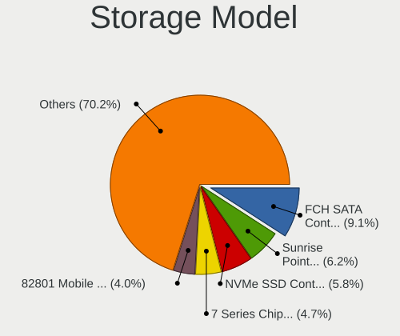

| Model                                                                            | Notebooks | Percent |
|----------------------------------------------------------------------------------|-----------|---------|
| AMD FCH SATA Controller [AHCI mode]                                              | 615       | 9.12%   |
| Intel Sunrise Point-LP SATA Controller [AHCI mode]                               | 418       | 6.2%    |
| Samsung NVMe SSD Controller SM981/PM981/PM983                                    | 390       | 5.79%   |
| Intel 7 Series Chipset Family 6-port SATA Controller [AHCI mode]                 | 320       | 4.75%   |
| Intel 82801 Mobile SATA Controller [RAID mode]                                   | 268       | 3.98%   |
| Intel 6 Series/C200 Series Chipset Family 6 port Mobile SATA AHCI Controller     | 198       | 2.94%   |
| Intel Cannon Lake Mobile PCH SATA AHCI Controller                                | 190       | 2.82%   |
| Intel 8 Series SATA Controller 1 [AHCI mode]                                     | 175       | 2.6%    |
| Samsung NVMe SSD Controller 980 (DRAM-less)                                      | 174       | 2.58%   |
| Intel Volume Management Device NVMe RAID Controller                              | 174       | 2.58%   |
| Intel HM170/QM170 Chipset SATA Controller [AHCI Mode]                            | 158       | 2.34%   |
| Intel Wildcat Point-LP SATA Controller [AHCI Mode]                               | 143       | 2.12%   |
| Intel 8 Series/C220 Series Chipset Family 6-port SATA Controller 1 [AHCI mode]   | 132       | 1.96%   |
| SanDisk Extreme Pro / WD Black SN750 / PC SN730 / Red SN700 NVMe SSD             | 114       | 1.69%   |
| Samsung NVMe SSD Controller PM9A1/PM9A3/980PRO                                   | 100       | 1.48%   |
| SK hynix Gold P31/BC711/PC711 NVMe Solid State Drive                             | 95        | 1.41%   |
| Intel SSD 660P Series                                                            | 86        | 1.28%   |
| Intel 82801IBM/IEM (ICH9M/ICH9M-E) 4 port SATA Controller [AHCI mode]            | 79        | 1.17%   |
| Samsung NVMe SSD Controller SM961/PM961/SM963                                    | 77        | 1.14%   |
| Intel Cannon Point-LP SATA Controller [AHCI Mode]                                | 77        | 1.14%   |
| KIOXIA NVMe SSD Controller BG4 (DRAM-less)                                       | 75        | 1.11%   |
| SanDisk Ultra 3D / WD PC SN530, IX SN530, Blue SN550 NVMe SSD (DRAM-less)        | 72        | 1.07%   |
| Intel 5 Series/3400 Series Chipset 4 port SATA AHCI Controller                   | 72        | 1.07%   |
| Intel Celeron/Pentium Silver Processor SATA Controller                           | 70        | 1.04%   |
| Intel Comet Lake SATA AHCI Controller                                            | 60        | 0.89%   |
| Toshiba America Info Systems XG6 NVMe SSD Controller                             | 53        | 0.79%   |
| SK hynix BC511 NVMe SSD                                                          | 53        | 0.79%   |
| Intel Tiger Lake-LP SATA Controller                                              | 53        | 0.79%   |
| SanDisk WD SN560/SN740/SN770/SN5000 NVMe SSD                                     | 51        | 0.76%   |
| Intel 400 Series Chipset Family SATA AHCI Controller                             | 50        | 0.74%   |
| Intel 5 Series/3400 Series Chipset 6 port SATA AHCI Controller                   | 48        | 0.71%   |
| SanDisk WD Blue SN500 / PC SN520 x2 M.2 2280 NVMe SSD                            | 47        | 0.7%    |
| Intel Ice Lake-LP SATA Controller [AHCI mode]                                    | 45        | 0.67%   |
| SK hynix BC501 NVMe Solid State Drive                                            | 44        | 0.65%   |
| Intel Alder Lake-P SATA AHCI Controller                                          | 43        | 0.64%   |
| Intel SSD 670p Series [Keystone Harbor]                                          | 42        | 0.62%   |
| Intel Atom Processor E3800 Series SATA AHCI Controller                           | 41        | 0.61%   |
| Phison E12 NVMe Controller                                                       | 40        | 0.59%   |
| Intel Q170/Q150/B150/H170/H110/Z170/CM236 Chipset SATA Controller [AHCI Mode]    | 37        | 0.55%   |
| Intel Atom/Celeron/Pentium Processor x5-E8000/J3xxx/N3xxx Series SATA Controller | 37        | 0.55%   |

Storage Kind
------------

Kind of storage controller (IDE, SATA, NVMe, SAS, ...)

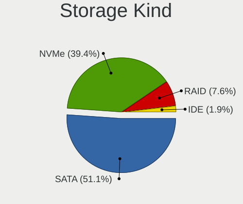

| Kind | Notebooks | Percent |
|------|-----------|---------|
| SATA | 3288      | 51.11%  |
| NVMe | 2536      | 39.42%  |
| RAID | 487       | 7.57%   |
| IDE  | 122       | 1.9%    |

Processor
---------

CPU Vendor
----------

Processor vendors

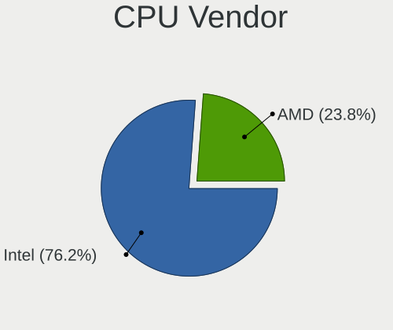

| Vendor | Notebooks | Percent |
|--------|-----------|---------|
| Intel  | 3869      | 76.18%  |
| AMD    | 1210      | 23.82%  |

CPU Model
---------

Processor models

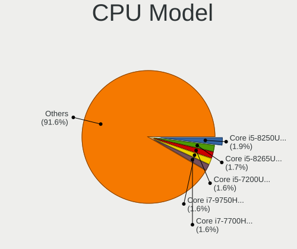

| Model                                         | Notebooks | Percent |
|-----------------------------------------------|-----------|---------|
| Intel Core i5-8250U CPU @ 1.60GHz             | 98        | 1.93%   |
| Intel Core i5-8265U CPU @ 1.60GHz             | 85        | 1.67%   |
| Intel Core i5-7200U CPU @ 2.50GHz             | 82        | 1.61%   |
| Intel Core i7-9750H CPU @ 2.60GHz             | 81        | 1.59%   |
| Intel Core i7-7700HQ CPU @ 2.80GHz            | 81        | 1.59%   |
| AMD Ryzen 5 3500U with Radeon Vega Mobile Gfx | 78        | 1.53%   |
| Intel Core i7-8550U CPU @ 1.80GHz             | 77        | 1.51%   |
| Intel Core i7-8565U CPU @ 1.80GHz             | 75        | 1.47%   |
| Intel Core i7-8750H CPU @ 2.20GHz             | 72        | 1.42%   |
| Intel 11th Gen Core i5-1135G7 @ 2.40GHz       | 71        | 1.4%    |
| AMD Ryzen 7 5800H with Radeon Graphics        | 68        | 1.34%   |
| Intel 11th Gen Core i7-1165G7 @ 2.80GHz       | 67        | 1.32%   |
| AMD Ryzen 7 4800H with Radeon Graphics        | 63        | 1.24%   |
| Intel Core i7-6700HQ CPU @ 2.60GHz            | 58        | 1.14%   |
| Intel Core i7-10750H CPU @ 2.60GHz            | 55        | 1.08%   |
| Intel Core i5-6200U CPU @ 2.30GHz             | 55        | 1.08%   |
| Intel Core i5-5200U CPU @ 2.20GHz             | 52        | 1.02%   |
| AMD Ryzen 7 5700U with Radeon Graphics        | 51        | 1%      |
| Intel Core i5-3320M CPU @ 2.60GHz             | 50        | 0.98%   |
| Intel Core i7-10510U CPU @ 1.80GHz            | 49        | 0.96%   |
| AMD Ryzen 5 5500U with Radeon Graphics        | 45        | 0.88%   |
| Intel Core i7-7500U CPU @ 2.70GHz             | 43        | 0.85%   |
| Intel Core i5-3230M CPU @ 2.60GHz             | 42        | 0.83%   |
| Intel Core i5-10210U CPU @ 1.60GHz            | 42        | 0.83%   |
| Intel 11th Gen Core i7-11800H @ 2.30GHz       | 41        | 0.81%   |
| AMD Ryzen 5 4500U with Radeon Graphics        | 41        | 0.81%   |
| AMD Ryzen 7 4700U with Radeon Graphics        | 40        | 0.79%   |
| AMD Ryzen 5 4600H with Radeon Graphics        | 38        | 0.75%   |
| Intel 12th Gen Core i7-12700H                 | 37        | 0.73%   |
| Intel Core i5-4210U CPU @ 1.70GHz             | 36        | 0.71%   |
| Intel Core i5-1035G1 CPU @ 1.00GHz            | 35        | 0.69%   |
| Intel Core i5-3210M CPU @ 2.50GHz             | 34        | 0.67%   |
| Intel Core i5-9300H CPU @ 2.40GHz             | 33        | 0.65%   |
| AMD Ryzen 7 3700U with Radeon Vega Mobile Gfx | 32        | 0.63%   |
| Intel Core i5-8300H CPU @ 2.30GHz             | 31        | 0.61%   |
| Intel Core i5-6300U CPU @ 2.40GHz             | 31        | 0.61%   |
| AMD Ryzen 5 5600H with Radeon Graphics        | 31        | 0.61%   |
| Intel Core i5-4200U CPU @ 1.60GHz             | 30        | 0.59%   |
| Intel Core i7-6500U CPU @ 2.50GHz             | 29        | 0.57%   |
| Intel Core i5-2410M CPU @ 2.30GHz             | 28        | 0.55%   |

CPU Model Family
----------------

Processor model prefix

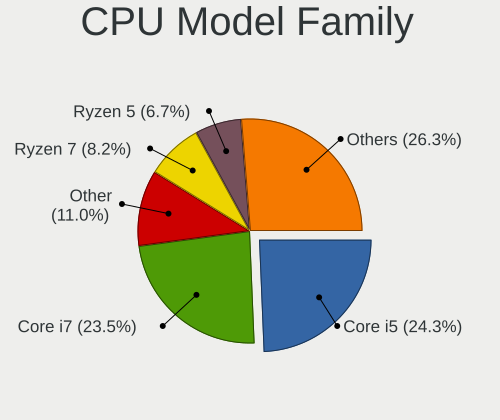

| Model                   | Notebooks | Percent |
|-------------------------|-----------|---------|
| Intel Core i5           | 1238      | 24.35%  |
| Intel Core i7           | 1196      | 23.52%  |
| Other                   | 557       | 10.95%  |
| AMD Ryzen 7             | 418       | 8.22%   |
| AMD Ryzen 5             | 340       | 6.69%   |
| Intel Core i3           | 296       | 5.82%   |
| Intel Celeron           | 196       | 3.85%   |
| Intel Core 2 Duo        | 114       | 2.24%   |
| Intel Pentium           | 102       | 2.01%   |
| AMD Ryzen 3             | 70        | 1.38%   |
| AMD Ryzen 9             | 57        | 1.12%   |
| AMD Ryzen 7 PRO         | 57        | 1.12%   |
| Intel Core              | 50        | 0.98%   |
| AMD A6                  | 33        | 0.65%   |
| AMD A8                  | 31        | 0.61%   |
| Intel Core i9           | 30        | 0.59%   |
| AMD A10                 | 29        | 0.57%   |
| Intel Atom              | 27        | 0.53%   |
| Intel Pentium Silver    | 24        | 0.47%   |
| AMD A4                  | 24        | 0.47%   |
| Intel Pentium Dual-Core | 23        | 0.45%   |
| AMD E1                  | 22        | 0.43%   |
| AMD E                   | 20        | 0.39%   |
| Intel Core 2            | 13        | 0.26%   |
| AMD Ryzen 5 PRO         | 12        | 0.24%   |
| AMD E2                  | 11        | 0.22%   |
| AMD Athlon              | 10        | 0.2%    |
| Intel Core m3           | 8         | 0.16%   |
| Intel Genuine           | 7         | 0.14%   |
| AMD Turion 64 X2 Mobile | 7         | 0.14%   |
| AMD A12                 | 6         | 0.12%   |
| Intel Xeon              | 5         | 0.1%    |
| AMD FX                  | 5         | 0.1%    |
| Intel Pentium Dual      | 4         | 0.08%   |
| Intel Core m7           | 4         | 0.08%   |
| Intel Core m5           | 3         | 0.06%   |
| Intel Core 2 Quad       | 3         | 0.06%   |
| Intel Celeron Dual-Core | 3         | 0.06%   |
| AMD Phenom II           | 3         | 0.06%   |
| AMD C-60                | 3         | 0.06%   |

CPU Cores
---------

Number of processor cores

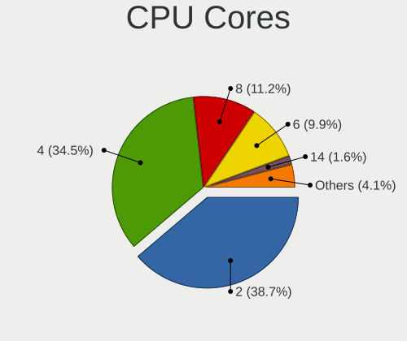

| Number  | Notebooks | Percent |
|---------|-----------|---------|
| 2       | 1969      | 38.74%  |
| 4       | 1753      | 34.49%  |
| 8       | 567       | 11.16%  |
| 6       | 504       | 9.92%   |
| 14      | 80        | 1.57%   |
| 10      | 69        | 1.36%   |
| 12      | 60        | 1.18%   |
| 16      | 42        | 0.83%   |
| 1       | 20        | 0.39%   |
| 24      | 13        | 0.26%   |
| 3       | 3         | 0.06%   |
| 5       | 1         | 0.02%   |
| Unknown | 1         | 0.02%   |

CPU Sockets
-----------

Number of sockets

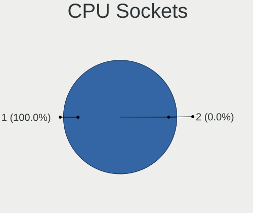

| Number | Notebooks | Percent |
|--------|-----------|---------|
| 1      | 5077      | 99.96%  |
| 2      | 2         | 0.04%   |

CPU Threads
-----------

Threads per core (Hyper-Threading)

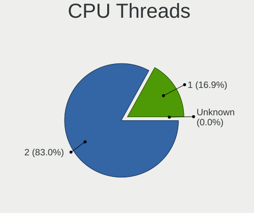

| Number  | Notebooks | Percent |
|---------|-----------|---------|
| 2       | 4221      | 83.04%  |
| 1       | 861       | 16.94%  |
| Unknown | 1         | 0.02%   |

CPU Op-Modes
------------

CPU Operation Modes (32-bit, 64-bit)

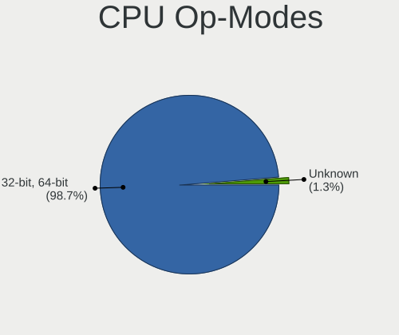

| Op mode        | Notebooks | Percent |
|----------------|-----------|---------|
| 32-bit, 64-bit | 5016      | 98.72%  |
| Unknown        | 65        | 1.28%   |

CPU Microcode
-------------

Microcode number

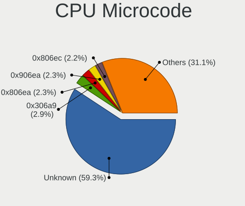

| Number     | Notebooks | Percent |
|------------|-----------|---------|
| Unknown    | 3100      | 59.25%  |
| 0x306a9    | 151       | 2.89%   |
| 0x806ea    | 122       | 2.33%   |
| 0x906ea    | 119       | 2.27%   |
| 0x806ec    | 113       | 2.16%   |
| 0x806c1    | 102       | 1.95%   |
| 0x806e9    | 81        | 1.55%   |
| 0x206a7    | 81        | 1.55%   |
| 0x40651    | 77        | 1.47%   |
| 0x406e3    | 76        | 1.45%   |
| 0x0a50000c | 68        | 1.3%    |
| 0x08108102 | 67        | 1.28%   |
| 0x306c3    | 62        | 1.19%   |
| 0x08600106 | 62        | 1.19%   |
| 0x306d4    | 59        | 1.13%   |
| 0x906e9    | 54        | 1.03%   |
| 0xa0652    | 49        | 0.94%   |
| 0x08108109 | 49        | 0.94%   |
| 0x08600103 | 48        | 0.92%   |
| 0x806eb    | 42        | 0.8%    |
| 0x706e5    | 41        | 0.78%   |
| 0x08600104 | 41        | 0.78%   |
| 0x08608103 | 40        | 0.76%   |
| 0x506e3    | 33        | 0.63%   |
| 0x1067a    | 32        | 0.61%   |
| 0x20655    | 31        | 0.59%   |
| 0x906a3    | 28        | 0.54%   |
| 0x806d1    | 21        | 0.4%    |
| 0x30678    | 18        | 0.34%   |
| 0x506c9    | 16        | 0.31%   |
| 0x0a404102 | 16        | 0.31%   |
| 0x0810100b | 16        | 0.31%   |
| 0x406c4    | 15        | 0.29%   |
| 0x0a50000d | 15        | 0.29%   |
| 0x06006705 | 15        | 0.29%   |
| 0x706a1    | 14        | 0.27%   |
| 0x0600611a | 12        | 0.23%   |
| 0x906ed    | 11        | 0.21%   |
| 0x0a50000b | 11        | 0.21%   |
| 0x08600102 | 11        | 0.21%   |

CPU Microarch
-------------

Microarchitecture

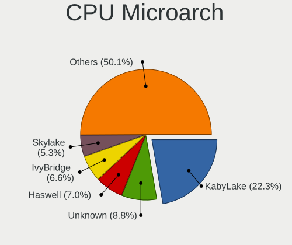

| Name               | Notebooks | Percent |
|--------------------|-----------|---------|
| KabyLake           | 1135      | 22.29%  |
| Unknown            | 447       | 8.78%   |
| Haswell            | 355       | 6.97%   |
| IvyBridge          | 335       | 6.58%   |
| Skylake            | 269       | 5.28%   |
| Zen 2              | 257       | 5.05%   |
| SandyBridge        | 250       | 4.91%   |
| TigerLake          | 237       | 4.65%   |
| Zen 3              | 211       | 4.14%   |
| Zen+               | 207       | 4.07%   |
| Broadwell          | 177       | 3.48%   |
| CometLake          | 126       | 2.47%   |
| Westmere           | 122       | 2.4%    |
| Penryn             | 121       | 2.38%   |
| Icelake            | 120       | 2.36%   |
| Alderlake Hybrid   | 116       | 2.28%   |
| Silvermont         | 112       | 2.2%    |
| Goldmont plus      | 78        | 1.53%   |
| Excavator          | 68        | 1.34%   |
| Zen                | 46        | 0.9%    |
| Core               | 45        | 0.88%   |
| Goldmont           | 39        | 0.77%   |
| Puma               | 36        | 0.71%   |
| Bobcat             | 32        | 0.63%   |
| Piledriver         | 27        | 0.53%   |
| Jaguar             | 23        | 0.45%   |
| Meteorlake Hybrid  | 19        | 0.37%   |
| Nehalem            | 12        | 0.24%   |
| K10 Llano          | 11        | 0.22%   |
| K10                | 10        | 0.2%    |
| Lunarlake Hybrid   | 9         | 0.18%   |
| K8 Hammer          | 9         | 0.18%   |
| Tremont            | 8         | 0.16%   |
| Steamroller        | 7         | 0.14%   |
| K8 & K10 hybrid    | 5         | 0.1%    |
| Gracemont          | 5         | 0.1%    |
| Bonnell            | 5         | 0.1%    |
| ArrowLake-H Hybrid | 1         | 0.02%   |

Graphics
--------

GPU Vendor
----------

Vendors of graphics cards

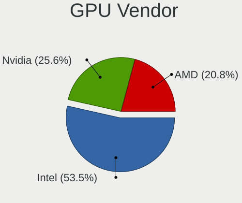

| Vendor | Notebooks | Percent |
|--------|-----------|---------|
| Intel  | 3610      | 53.51%  |
| Nvidia | 1730      | 25.64%  |
| AMD    | 1406      | 20.84%  |

GPU Model
---------

Graphics card models

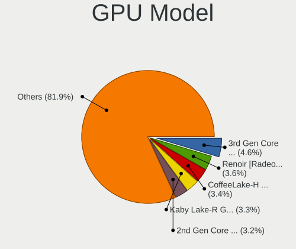

| Model                                                                                    | Notebooks | Percent |
|------------------------------------------------------------------------------------------|-----------|---------|
| Intel 3rd Gen Core processor Graphics Controller                                         | 319       | 4.64%   |
| AMD Renoir [Radeon Vega Series / Radeon Vega Mobile Series]                              | 246       | 3.58%   |
| Intel CoffeeLake-H GT2 [UHD Graphics 630]                                                | 233       | 3.39%   |
| Intel Kaby Lake-R GT2 [UHD Graphics 620]                                                 | 229       | 3.33%   |
| Intel 2nd Generation Core Processor Family Integrated Graphics Controller                | 221       | 3.21%   |
| AMD Picasso/Raven 2 [Radeon Vega Series / Radeon Vega Mobile Series]                     | 210       | 3.05%   |
| Intel TigerLake-LP GT2 [Iris Xe Graphics]                                                | 203       | 2.95%   |
| Intel Haswell-ULT Integrated Graphics Controller                                         | 191       | 2.78%   |
| Intel WhiskeyLake-U GT2 [UHD Graphics 620]                                               | 189       | 2.75%   |
| Intel Kaby Lake-U GT2 [HD Graphics 620]                                                  | 167       | 2.43%   |
| AMD Cezanne [Radeon Vega Series / Radeon Vega Mobile Series]                             | 157       | 2.28%   |
| Intel Skylake-U GT2 [HD Graphics 520]                                                    | 151       | 2.2%    |
| Intel Broadwell-U GT2 [HD Graphics 5500]                                                 | 148       | 2.15%   |
| Nvidia TU117M [GeForce GTX 1650 Mobile / Max-Q]                                          | 133       | 1.93%   |
| Intel 4th Gen Core Processor Integrated Graphics Controller                              | 124       | 1.8%    |
| Intel CometLake-U GT2 [UHD Graphics]                                                     | 115       | 1.67%   |
| Intel Kaby Lake-H GT2 [HD Graphics 630]                                                  | 108       | 1.57%   |
| AMD Lucienne                                                                             | 105       | 1.53%   |
| Intel CometLake-H GT2 [UHD Graphics]                                                     | 98        | 1.42%   |
| Intel Core Processor Integrated Graphics Controller                                      | 86        | 1.25%   |
| Intel Alder Lake-P GT2 [Iris Xe Graphics]                                                | 79        | 1.15%   |
| Nvidia GP107M [GeForce GTX 1050 Mobile]                                                  | 78        | 1.13%   |
| Intel Skylake-H GT2 [HD Graphics 530]                                                    | 78        | 1.13%   |
| Nvidia GA106M [GeForce RTX 3060 Mobile / Max-Q]                                          | 73        | 1.06%   |
| Nvidia GP107M [GeForce GTX 1050 Ti Mobile]                                               | 67        | 0.97%   |
| Intel Mobile 4 Series Chipset Integrated Graphics Controller                             | 67        | 0.97%   |
| AMD Rembrandt [Radeon 680M]                                                              | 64        | 0.93%   |
| Intel Atom/Celeron/Pentium Processor x5-E8000/J3xxx/N3xxx Integrated Graphics Controller | 62        | 0.9%    |
| Intel TigerLake-H GT1 [UHD Graphics]                                                     | 60        | 0.87%   |
| Intel GeminiLake [UHD Graphics 600]                                                      | 60        | 0.87%   |
| Nvidia TU116M [GeForce GTX 1660 Ti Mobile]                                               | 59        | 0.86%   |
| Nvidia TU106M [GeForce RTX 2060 Mobile]                                                  | 54        | 0.78%   |
| Intel Atom Processor Z36xxx/Z37xxx Series Graphics & Display                             | 50        | 0.73%   |
| Intel Iris Plus Graphics G1 (Ice Lake)                                                   | 49        | 0.71%   |
| Nvidia GA107M [GeForce RTX 3050 Mobile]                                                  | 48        | 0.7%    |
| Nvidia GP108M [GeForce MX150]                                                            | 47        | 0.68%   |
| AMD Topaz XT [Radeon R7 M260/M265 / M340/M360 / M440/M445 / 530/535 / 620/625 Mobile]    | 46        | 0.67%   |
| Nvidia GF117M [GeForce 610M/710M/810M/820M / GT 620M/625M/630M/720M]                     | 44        | 0.64%   |
| Nvidia GM107M [GeForce GTX 960M]                                                         | 43        | 0.63%   |
| Intel Raptor Lake-P [Iris Xe Graphics]                                                   | 43        | 0.63%   |

GPU Combo
---------

Combinations of graphics cards

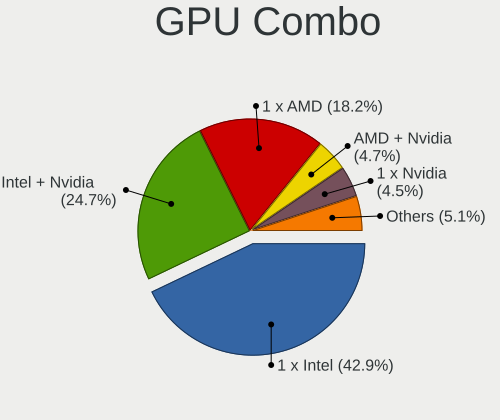

| Name               | Notebooks | Percent |
|--------------------|-----------|---------|
| 1 x Intel          | 2186      | 42.9%   |
| Intel + Nvidia     | 1260      | 24.73%  |
| 1 x AMD            | 926       | 18.17%  |
| AMD + Nvidia       | 238       | 4.67%   |
| 1 x Nvidia         | 227       | 4.46%   |
| Intel + AMD        | 152       | 2.98%   |
| 2 x AMD            | 92        | 1.81%   |
| 2 x Intel          | 6         | 0.12%   |
| 2 x Nvidia         | 4         | 0.08%   |
| Other              | 3         | 0.06%   |
| Intel + 2 x Nvidia | 1         | 0.02%   |

GPU Driver
----------

Free vs proprietary

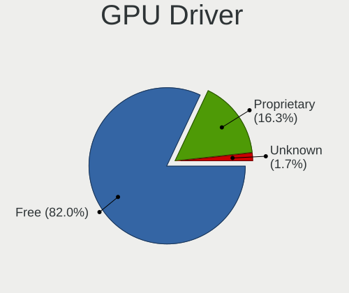

| Driver      | Notebooks | Percent |
|-------------|-----------|---------|
| Free        | 4213      | 82.01%  |
| Proprietary | 835       | 16.25%  |
| Unknown     | 89        | 1.73%   |

GPU Memory
----------

Total video memory

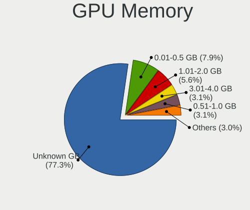

| Size in GB | Notebooks | Percent |
|------------|-----------|---------|
| Unknown    | 3982      | 77.29%  |
| 0.01-0.5   | 405       | 7.86%   |
| 1.01-2.0   | 288       | 5.59%   |
| 3.01-4.0   | 162       | 3.14%   |
| 0.51-1.0   | 160       | 3.11%   |
| 5.01-6.0   | 74        | 1.44%   |
| 7.01-8.0   | 55        | 1.07%   |
| 2.01-3.0   | 13        | 0.25%   |
| 8.01-16.0  | 12        | 0.23%   |
| 16.01-24.0 | 1         | 0.02%   |

Monitor
-------

Monitor Vendor
--------------

Monitor vendors

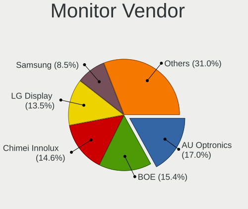

| Vendor                  | Notebooks | Percent |
|-------------------------|-----------|---------|
| AU Optronics            | 1026      | 16.96%  |
| BOE                     | 933       | 15.42%  |
| Chimei Innolux          | 885       | 14.63%  |
| LG Display              | 818       | 13.52%  |
| Samsung Electronics     | 515       | 8.51%   |
| Sharp                   | 169       | 2.79%   |
| Dell                    | 160       | 2.64%   |
| Apple                   | 151       | 2.5%    |
| Goldstar                | 149       | 2.46%   |
| PANDA                   | 122       | 2.02%   |
| Lenovo                  | 110       | 1.82%   |
| Chi Mei Optoelectronics | 96        | 1.59%   |
| Hewlett-Packard         | 78        | 1.29%   |
| Philips                 | 60        | 0.99%   |
| Acer                    | 55        | 0.91%   |
| AOC                     | 49        | 0.81%   |
| InfoVision              | 48        | 0.79%   |
| CSO                     | 46        | 0.76%   |
| BenQ                    | 45        | 0.74%   |
| Ancor Communications    | 41        | 0.68%   |
| ViewSonic               | 32        | 0.53%   |
| TMX                     | 30        | 0.5%    |
| Iiyama                  | 23        | 0.38%   |
| ASUSTek Computer        | 22        | 0.36%   |
| LG Philips              | 19        | 0.31%   |
| Sony                    | 18        | 0.3%    |
| LGD                     | 18        | 0.3%    |
| Panasonic               | 16        | 0.26%   |
| Unknown                 | 14        | 0.23%   |
| MSI                     | 13        | 0.21%   |
| CPT                     | 13        | 0.21%   |
| HKC                     | 12        | 0.2%    |
| CSOT                    | 12        | 0.2%    |
| NEC Computers           | 10        | 0.17%   |
| Unknown                 | 9         | 0.15%   |
| Toshiba                 | 9         | 0.15%   |
| Insignia                | 8         | 0.13%   |
| Mi                      | 7         | 0.12%   |
| LG Electronics          | 7         | 0.12%   |
| JDI                     | 7         | 0.12%   |

Monitor Model
-------------

Monitor models

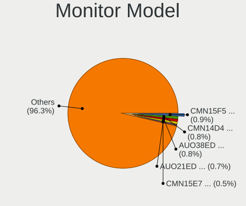

| Model                                                                    | Notebooks | Percent |
|--------------------------------------------------------------------------|-----------|---------|
| Chimei Innolux LCD Monitor CMN15F5 1920x1080 344x193mm 15.5-inch         | 54        | 0.88%   |
| Chimei Innolux LCD Monitor CMN14D4 1920x1080 309x173mm 13.9-inch         | 51        | 0.83%   |
| AU Optronics LCD Monitor AUO38ED 1920x1080 344x193mm 15.5-inch           | 47        | 0.77%   |
| AU Optronics LCD Monitor AUO21ED 1920x1080 344x193mm 15.5-inch           | 42        | 0.68%   |
| Chimei Innolux LCD Monitor CMN15E7 1920x1080 344x193mm 15.5-inch         | 33        | 0.54%   |
| AU Optronics LCD Monitor AUO403D 1920x1080 309x174mm 14.0-inch           | 26        | 0.42%   |
| PANDA LCD Monitor NCP004D 1920x1080 344x194mm 15.5-inch                  | 24        | 0.39%   |
| LG Display LCD Monitor LGD046F 1920x1080 344x194mm 15.5-inch             | 24        | 0.39%   |
| Chimei Innolux LCD Monitor CMN14D5 1920x1080 309x173mm 13.9-inch         | 24        | 0.39%   |
| Samsung Electronics LCD Monitor SEC5441 1280x800 331x207mm 15.4-inch     | 23        | 0.38%   |
| Chimei Innolux LCD Monitor CMN1521 1920x1080 344x193mm 15.5-inch         | 23        | 0.38%   |
| Chimei Innolux LCD Monitor CMN15E8 1920x1080 344x193mm 15.5-inch         | 21        | 0.34%   |
| AU Optronics LCD Monitor AUO71EC 1366x768 344x193mm 15.5-inch            | 21        | 0.34%   |
| Chimei Innolux LCD Monitor CMN14C3 1366x768 309x173mm 13.9-inch          | 20        | 0.33%   |
| BOE LCD Monitor BOE0700 1920x1080 344x194mm 15.5-inch                    | 19        | 0.31%   |
| BOE LCD Monitor BOE0687 1920x1080 344x193mm 15.5-inch                    | 19        | 0.31%   |
| LG Display LCD Monitor LGD033A 1366x768 344x194mm 15.5-inch              | 18        | 0.29%   |
| LG Display LCD Monitor LGD02DC 1366x768 344x194mm 15.5-inch              | 18        | 0.29%   |
| Chimei Innolux LCD Monitor CMN15DB 1366x768 344x193mm 15.5-inch          | 18        | 0.29%   |
| Chimei Innolux LCD Monitor CMN14C9 1920x1080 309x173mm 13.9-inch         | 17        | 0.28%   |
| LG Display LCD Monitor LGD0521 1920x1080 309x174mm 14.0-inch             | 16        | 0.26%   |
| Chimei Innolux LCD Monitor CMN15D5 1920x1080 344x193mm 15.5-inch         | 16        | 0.26%   |
| LG Display LCD Monitor LGD053F 1920x1080 344x194mm 15.5-inch             | 15        | 0.24%   |
| Chimei Innolux LCD Monitor CMN15E6 1366x768 344x193mm 15.5-inch          | 15        | 0.24%   |
| BOE LCD Monitor BOE0877 1920x1080 309x173mm 13.9-inch                    | 15        | 0.24%   |
| AU Optronics LCD Monitor AUOE48D 1920x1080 344x194mm 15.5-inch           | 15        | 0.24%   |
| AU Optronics LCD Monitor AUO22EC 1366x768 344x193mm 15.5-inch            | 15        | 0.24%   |
| Goldstar LG ULTRAWIDE GSM59F1 2560x1080 670x280mm 28.6-inch              | 14        | 0.23%   |
| Chimei Innolux LCD Monitor CMN15C4 1920x1080 344x193mm 15.5-inch         | 14        | 0.23%   |
| BOE LCD Monitor BOE08E8 1920x1080 344x194mm 15.5-inch                    | 14        | 0.23%   |
| BOE LCD Monitor BOE06A4 1366x768 344x194mm 15.5-inch                     | 14        | 0.23%   |
| AU Optronics LCD Monitor AUOD1ED 1920x1080 344x193mm 15.5-inch           | 14        | 0.23%   |
| Unknown                                                                  | 14        | 0.23%   |
| LG Display LCD Monitor LGD062E 1920x1080 344x194mm 15.5-inch             | 13        | 0.21%   |
| LG Display LCD Monitor LGD04E8 1920x1080 382x215mm 17.3-inch             | 13        | 0.21%   |
| LG Display LCD Monitor LGD0456 1366x768 344x194mm 15.5-inch              | 13        | 0.21%   |
| Chimei Innolux LCD Monitor CMN1738 1920x1080 381x214mm 17.2-inch         | 13        | 0.21%   |
| Chi Mei Optoelectronics LCD Monitor CMO15A7 1366x768 344x193mm 15.5-inch | 13        | 0.21%   |
| BOE LCD Monitor BOE08D7 1920x1080 309x174mm 14.0-inch                    | 13        | 0.21%   |
| BOE LCD Monitor BOE0872 1920x1080 344x194mm 15.5-inch                    | 13        | 0.21%   |

Monitor Resolution
------------------

Monitor screen resolution

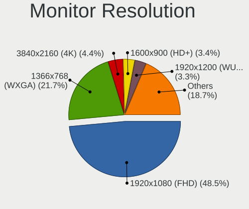

| Resolution         | Notebooks | Percent |
|--------------------|-----------|---------|
| 1920x1080 (FHD)    | 2741      | 48.54%  |
| 1366x768 (WXGA)    | 1225      | 21.69%  |
| 3840x2160 (4K)     | 247       | 4.37%   |
| 1600x900 (HD+)     | 191       | 3.38%   |
| 1920x1200 (WUXGA)  | 189       | 3.35%   |
| 2560x1440 (QHD)    | 182       | 3.22%   |
| 1280x800 (WXGA)    | 117       | 2.07%   |
| 2560x1600          | 115       | 2.04%   |
| 2880x1800          | 110       | 1.95%   |
| 1440x900 (WXGA+)   | 78        | 1.38%   |
| 1680x1050 (WSXGA+) | 47        | 0.83%   |
| Unknown            | 40        | 0.71%   |
| 2560x1080          | 38        | 0.67%   |
| 3840x2400          | 33        | 0.58%   |
| 2160x1440          | 29        | 0.51%   |
| 3440x1440          | 24        | 0.43%   |
| 1280x1024 (SXGA)   | 20        | 0.35%   |
| 3200x2000          | 19        | 0.34%   |
| 2256x1504          | 18        | 0.32%   |
| 3200x1800 (QHD+)   | 16        | 0.28%   |
| 3840x1080          | 14        | 0.25%   |
| 3456x2160          | 14        | 0.25%   |
| 1360x768           | 14        | 0.25%   |
| 2880x1620          | 12        | 0.21%   |
| 2880x1920          | 9         | 0.16%   |
| 2520x1680          | 9         | 0.16%   |
| 3000x2000          | 8         | 0.14%   |
| 3840x1600          | 7         | 0.12%   |
| 3072x1920          | 7         | 0.12%   |
| 1920x540           | 7         | 0.12%   |
| 1920x1280          | 7         | 0.12%   |
| 2240x1400          | 5         | 0.09%   |
| 800x1280           | 4         | 0.07%   |
| 3840x1200          | 4         | 0.07%   |
| 3286x1080          | 4         | 0.07%   |
| 1600x1200          | 4         | 0.07%   |
| 3840x1100          | 3         | 0.05%   |
| 1600x2560          | 3         | 0.05%   |
| 1024x600           | 3         | 0.05%   |
| 4480x1600          | 2         | 0.04%   |

Monitor Diagonal
----------------

Diagonal size in inches

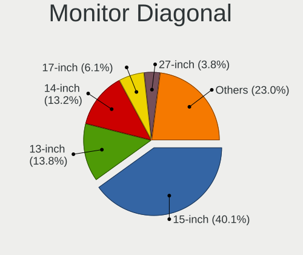

| Inches  | Notebooks | Percent |
|---------|-----------|---------|
| 15      | 2412      | 40.09%  |
| 13      | 833       | 13.85%  |
| 14      | 793       | 13.18%  |
| 17      | 368       | 6.12%   |
| 27      | 228       | 3.79%   |
| 24      | 202       | 3.36%   |
| 16      | 181       | 3.01%   |
| 23      | 162       | 2.69%   |
| 21      | 130       | 2.16%   |
| 12      | 123       | 2.04%   |
| Unknown | 108       | 1.8%    |
| 31      | 93        | 1.55%   |
| 11      | 65        | 1.08%   |
| 34      | 49        | 0.81%   |
| 18      | 33        | 0.55%   |
| 22      | 31        | 0.52%   |
| 19      | 26        | 0.43%   |
| 40      | 20        | 0.33%   |
| 84      | 16        | 0.27%   |
| 20      | 14        | 0.23%   |
| 32      | 12        | 0.2%    |
| 63      | 10        | 0.17%   |
| 72      | 9         | 0.15%   |
| 54      | 9         | 0.15%   |
| 26      | 9         | 0.15%   |
| 37      | 8         | 0.13%   |
| 28      | 8         | 0.13%   |
| 10      | 7         | 0.12%   |
| 52      | 6         | 0.1%    |
| 74      | 5         | 0.08%   |
| 25      | 5         | 0.08%   |
| 86      | 4         | 0.07%   |
| 29      | 4         | 0.07%   |
| 8       | 4         | 0.07%   |
| 7       | 4         | 0.07%   |
| 65      | 3         | 0.05%   |
| 49      | 3         | 0.05%   |
| 48      | 3         | 0.05%   |
| 33      | 3         | 0.05%   |
| 43      | 2         | 0.03%   |

Monitor Width
-------------

Physical width

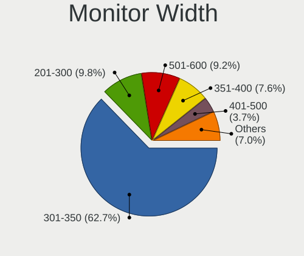

| Width in mm    | Notebooks | Percent |
|----------------|-----------|---------|
| 301-350        | 3738      | 62.71%  |
| 201-300        | 584       | 9.8%    |
| 501-600        | 547       | 9.18%   |
| 351-400        | 454       | 7.62%   |
| 401-500        | 218       | 3.66%   |
| 601-700        | 132       | 2.21%   |
| Unknown        | 108       | 1.81%   |
| 701-800        | 65        | 1.09%   |
| 1001-1500      | 41        | 0.69%   |
| 1501-2000      | 32        | 0.54%   |
| 801-900        | 30        | 0.5%    |
| 101-200        | 4         | 0.07%   |
| 1-100          | 4         | 0.07%   |
| 901-1000       | 3         | 0.05%   |
| More than 2000 | 1         | 0.02%   |

Aspect Ratio
------------

Proportional relationship between the width and the height

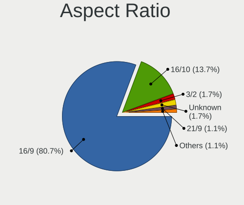

| Ratio   | Notebooks | Percent |
|---------|-----------|---------|
| 16/9    | 4250      | 80.69%  |
| 16/10   | 719       | 13.65%  |
| 3/2     | 91        | 1.73%   |
| Unknown | 90        | 1.71%   |
| 21/9    | 59        | 1.12%   |
| 5/4     | 18        | 0.34%   |
| 4/3     | 10        | 0.19%   |
| 32/9    | 9         | 0.17%   |
| 0.56    | 4         | 0.08%   |
| 3.40    | 3         | 0.06%   |
| 0.67    | 3         | 0.06%   |
| 0.62    | 3         | 0.06%   |
| 6/5     | 2         | 0.04%   |
| 1.00    | 2         | 0.04%   |
| 0.63    | 2         | 0.04%   |
| 3.20    | 1         | 0.02%   |
| 0.89    | 1         | 0.02%   |

Monitor Area
------------

Area in inch²

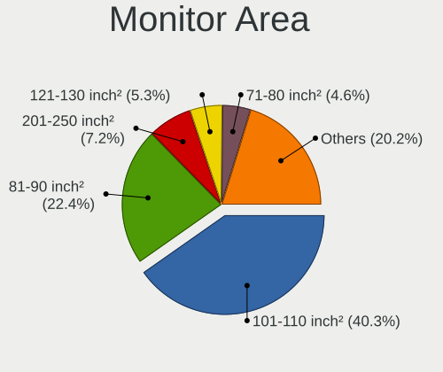

| Area in inch² | Notebooks | Percent |
|----------------|-----------|---------|
| 101-110        | 2412      | 40.26%  |
| 81-90          | 1341      | 22.38%  |
| 201-250        | 431       | 7.19%   |
| 121-130        | 318       | 5.31%   |
| 71-80          | 276       | 4.61%   |
| 301-350        | 234       | 3.91%   |
| 351-500        | 165       | 2.75%   |
| 111-120        | 164       | 2.74%   |
| 61-70          | 114       | 1.9%    |
| Unknown        | 108       | 1.8%    |
| 51-60          | 68        | 1.14%   |
| More than 1000 | 67        | 1.12%   |
| 151-200        | 63        | 1.05%   |
| 251-300        | 61        | 1.02%   |
| 131-140        | 47        | 0.78%   |
| 501-1000       | 41        | 0.68%   |
| 141-150        | 37        | 0.62%   |
| 91-100         | 29        | 0.48%   |
| 1-40           | 8         | 0.13%   |
| 41-50          | 7         | 0.12%   |

Pixel Density
-------------

Pixels per inch

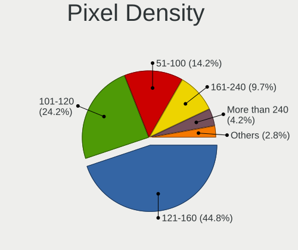

| Density       | Notebooks | Percent |
|---------------|-----------|---------|
| 121-160       | 2647      | 44.85%  |
| 101-120       | 1427      | 24.18%  |
| 51-100        | 841       | 14.25%  |
| 161-240       | 572       | 9.69%   |
| More than 240 | 248       | 4.2%    |
| Unknown       | 108       | 1.83%   |
| 1-50          | 59        | 1%      |

Multiple Monitors
-----------------

Total monitors connected

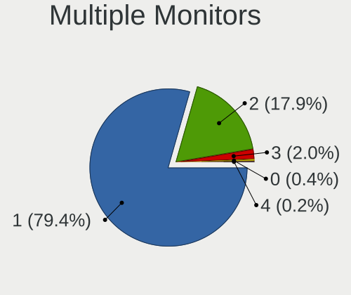

| Total | Notebooks | Percent |
|-------|-----------|---------|
| 1     | 4126      | 79.42%  |
| 2     | 930       | 17.9%   |
| 3     | 105       | 2.02%   |
| 0     | 22        | 0.42%   |
| 4     | 12        | 0.23%   |

Network
-------

Net Controller Vendor
---------------------

Controller vendors

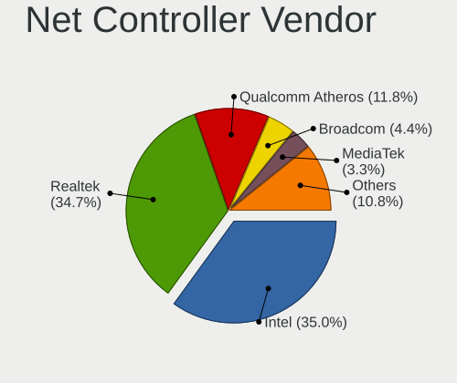

| Vendor                                 | Notebooks | Percent |
|----------------------------------------|-----------|---------|
| Intel                                  | 2805      | 34.98%  |
| Realtek Semiconductor                  | 2781      | 34.68%  |
| Qualcomm Atheros                       | 944       | 11.77%  |
| Broadcom                               | 356       | 4.44%   |
| MediaTek                               | 267       | 3.33%   |
| Broadcom Limited                       | 98        | 1.22%   |
| ASIX Electronics                       | 66        | 0.82%   |
| Shenzhen Goodix Technology             | 58        | 0.72%   |
| Ralink                                 | 57        | 0.71%   |
| TP-Link                                | 55        | 0.69%   |
| Ralink Technology                      | 42        | 0.52%   |
| Qualcomm                               | 41        | 0.51%   |
| Xiaomi                                 | 38        | 0.47%   |
| Sierra Wireless                        | 37        | 0.46%   |
| Marvell Technology Group               | 35        | 0.44%   |
| Lenovo                                 | 35        | 0.44%   |
| DisplayLink                            | 29        | 0.36%   |
| Dell                                   | 28        | 0.35%   |
| Samsung Electronics                    | 22        | 0.27%   |
| Huawei Technologies                    | 19        | 0.24%   |
| Ericsson Business Mobile Networks      | 19        | 0.24%   |
| Hewlett-Packard                        | 18        | 0.22%   |
| JMicron Technology                     | 15        | 0.19%   |
| Fibocom                                | 14        | 0.17%   |
| ASUSTek Computer                       | 14        | 0.17%   |
| Nvidia                                 | 12        | 0.15%   |
| Qualcomm Atheros Communications        | 9         | 0.11%   |
| NetGear                                | 9         | 0.11%   |
| Linksys                                | 7         | 0.09%   |
| Google                                 | 7         | 0.09%   |
| D-Link                                 | 7         | 0.09%   |
| OnePlus Technology (Shenzhen)          | 5         | 0.06%   |
| Edimax Technology                      | 5         | 0.06%   |
| ZTE WCDMA Technologies MSM             | 4         | 0.05%   |
| Suzhou Motorcomm Electronic Technology | 4         | 0.05%   |
| Quectel Wireless Solutions             | 4         | 0.05%   |
| Motorola PCS                           | 4         | 0.05%   |
| Microsoft                              | 4         | 0.05%   |
| Apple                                  | 4         | 0.05%   |
| Sony Ericsson Mobile Communications AB | 3         | 0.04%   |

Net Controller Model
--------------------

Controller models

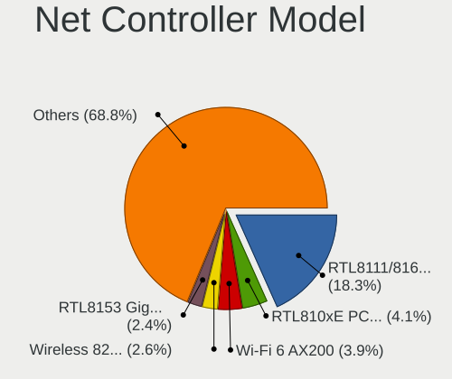

| Model                                                                  | Notebooks | Percent |
|------------------------------------------------------------------------|-----------|---------|
| Realtek RTL8111/8168/8211/8411 PCI Express Gigabit Ethernet Controller | 1745      | 18.32%  |
| Realtek RTL810xE PCI Express Fast Ethernet controller                  | 390       | 4.09%   |
| Intel Wi-Fi 6 AX200                                                    | 369       | 3.87%   |
| Intel Wireless 8265 / 8275                                             | 243       | 2.55%   |
| Realtek RTL8153 Gigabit Ethernet Adapter                               | 226       | 2.37%   |
| Qualcomm Atheros QCA9377 802.11ac Wireless Network Adapter             | 226       | 2.37%   |
| Realtek RTL8822CE 802.11ac PCIe Wireless Network Adapter               | 203       | 2.13%   |
| Intel Wireless 7265                                                    | 170       | 1.78%   |
| Intel Wi-Fi 6 AX201                                                    | 170       | 1.78%   |
| Intel Wireless 7260                                                    | 165       | 1.73%   |
| Realtek RTL8821CE 802.11ac PCIe Wireless Network Adapter               | 158       | 1.66%   |
| Intel 82579LM Gigabit Network Connection (Lewisville)                  | 149       | 1.56%   |
| Qualcomm Atheros QCA9565 / AR9565 Wireless Network Adapter             | 146       | 1.53%   |
| Intel Cannon Lake PCH CNVi WiFi                                        | 142       | 1.49%   |
| Qualcomm Atheros QCA6174 802.11ac Wireless Network Adapter             | 133       | 1.4%    |
| Intel Wireless 8260                                                    | 117       | 1.23%   |
| MediaTek MT7921 802.11ax PCIe Wireless Network Adapter [Filogic 330]   | 113       | 1.19%   |
| Intel Cannon Point-LP CNVi [Wireless-AC]                               | 112       | 1.18%   |
| Qualcomm Atheros AR9485 Wireless Network Adapter                       | 106       | 1.11%   |
| Intel Centrino Advanced-N 6205 [Taylor Peak]                           | 106       | 1.11%   |
| Qualcomm Atheros AR9285 Wireless Network Adapter (PCI-Express)         | 105       | 1.1%    |
| Intel Alder Lake-P PCH CNVi WiFi                                       | 105       | 1.1%    |
| Intel Comet Lake PCH-LP CNVi WiFi                                      | 94        | 0.99%   |
| Intel Comet Lake PCH CNVi WiFi                                         | 92        | 0.97%   |
| Realtek RTL8723BE PCIe Wireless Network Adapter                        | 88        | 0.92%   |
| Intel Wi-Fi 6E(802.11ax) AX210/AX1675* 2x2 [Typhoon Peak]              | 88        | 0.92%   |
| MediaTek MT7922 802.11ax PCI Express Wireless Network Adapter          | 83        | 0.87%   |
| Intel Ethernet Connection (4) I219-LM                                  | 78        | 0.82%   |
| Intel Wireless 3165                                                    | 76        | 0.8%    |
| Realtek RTL8822BE 802.11a/b/g/n/ac WiFi adapter                        | 67        | 0.7%    |
| ASIX AX88179 Gigabit Ethernet                                          | 60        | 0.63%   |
| Shenzhen Goodix Fingerprint Reader                                     | 58        | 0.61%   |
| Intel Ethernet Connection (3) I218-LM                                  | 54        | 0.57%   |
| Intel Wireless 3160                                                    | 51        | 0.54%   |
| Broadcom BCM4313 802.11bgn Wireless Network Adapter                    | 51        | 0.54%   |
| Intel Dual Band Wireless-AC 3165 Plus Bluetooth                        | 50        | 0.52%   |
| Realtek RTL8852AE 802.11ax PCIe Wireless Network Adapter               | 49        | 0.51%   |
| Intel Dual Band Wireless-AC 3168NGW [Stone Peak]                       | 49        | 0.51%   |
| Realtek RTL8125 2.5GbE Controller                                      | 48        | 0.5%    |
| Intel Ethernet Connection (4) I219-V                                   | 48        | 0.5%    |

Wireless Vendor
---------------

Wireless vendors

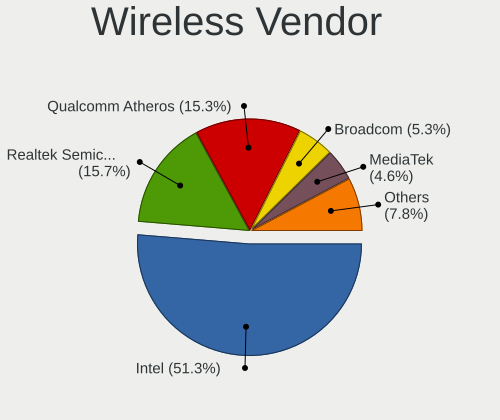

| Vendor                                | Notebooks | Percent |
|---------------------------------------|-----------|---------|
| Intel                                 | 2679      | 51.31%  |
| Realtek Semiconductor                 | 822       | 15.74%  |
| Qualcomm Atheros                      | 799       | 15.3%   |
| Broadcom                              | 276       | 5.29%   |
| MediaTek                              | 240       | 4.6%    |
| Broadcom Limited                      | 79        | 1.51%   |
| Ralink                                | 57        | 1.09%   |
| TP-Link                               | 46        | 0.88%   |
| Ralink Technology                     | 42        | 0.8%    |
| Sierra Wireless                       | 37        | 0.71%   |
| Qualcomm                              | 31        | 0.59%   |
| Dell                                  | 22        | 0.42%   |
| Fibocom                               | 14        | 0.27%   |
| ASUSTek Computer                      | 12        | 0.23%   |
| Qualcomm Atheros Communications       | 9         | 0.17%   |
| NetGear                               | 9         | 0.17%   |
| Linksys                               | 7         | 0.13%   |
| D-Link                                | 7         | 0.13%   |
| Hewlett-Packard                       | 6         | 0.11%   |
| Edimax Technology                     | 5         | 0.1%    |
| Quectel Wireless Solutions            | 4         | 0.08%   |
| Microsoft                             | 3         | 0.06%   |
| ZyXEL Communications                  | 2         | 0.04%   |
| Realtek                               | 2         | 0.04%   |
| ZyDAS                                 | 1         | 0.02%   |
| ZTopInc                               | 1         | 0.02%   |
| Samsung Electronics                   | 1         | 0.02%   |
| Qualcomm Technologies                 | 1         | 0.02%   |
| Mercucys                              | 1         | 0.02%   |
| D-Link System                         | 1         | 0.02%   |
| Belkin Components                     | 1         | 0.02%   |
| Apple                                 | 1         | 0.02%   |
| Accton Technology                     | 1         | 0.02%   |
| 802.11g Adapter [Linksys WUSB54GC v3] | 1         | 0.02%   |
| Unknown                               | 1         | 0.02%   |

Wireless Model
--------------

Wireless models

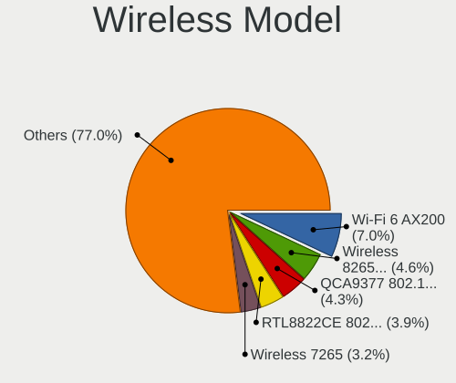

| Model                                                                | Notebooks | Percent |
|----------------------------------------------------------------------|-----------|---------|
| Intel Wi-Fi 6 AX200                                                  | 369       | 7.01%   |
| Intel Wireless 8265 / 8275                                           | 243       | 4.62%   |
| Qualcomm Atheros QCA9377 802.11ac Wireless Network Adapter           | 226       | 4.3%    |
| Realtek RTL8822CE 802.11ac PCIe Wireless Network Adapter             | 203       | 3.86%   |
| Intel Wireless 7265                                                  | 170       | 3.23%   |
| Intel Wi-Fi 6 AX201                                                  | 170       | 3.23%   |
| Intel Wireless 7260                                                  | 165       | 3.14%   |
| Realtek RTL8821CE 802.11ac PCIe Wireless Network Adapter             | 158       | 3%      |
| Qualcomm Atheros QCA9565 / AR9565 Wireless Network Adapter           | 146       | 2.78%   |
| Intel Cannon Lake PCH CNVi WiFi                                      | 142       | 2.7%    |
| Qualcomm Atheros QCA6174 802.11ac Wireless Network Adapter           | 133       | 2.53%   |
| Intel Wireless 8260                                                  | 117       | 2.22%   |
| MediaTek MT7921 802.11ax PCIe Wireless Network Adapter [Filogic 330] | 113       | 2.15%   |
| Intel Cannon Point-LP CNVi [Wireless-AC]                             | 112       | 2.13%   |
| Qualcomm Atheros AR9485 Wireless Network Adapter                     | 106       | 2.01%   |
| Intel Centrino Advanced-N 6205 [Taylor Peak]                         | 106       | 2.01%   |
| Qualcomm Atheros AR9285 Wireless Network Adapter (PCI-Express)       | 105       | 2%      |
| Intel Comet Lake PCH-LP CNVi WiFi                                    | 94        | 1.79%   |
| Intel Comet Lake PCH CNVi WiFi                                       | 92        | 1.75%   |
| Realtek RTL8723BE PCIe Wireless Network Adapter                      | 88        | 1.67%   |
| Intel Wi-Fi 6E(802.11ax) AX210/AX1675* 2x2 [Typhoon Peak]            | 88        | 1.67%   |
| Intel Wireless 3165                                                  | 76        | 1.44%   |
| Realtek RTL8822BE 802.11a/b/g/n/ac WiFi adapter                      | 67        | 1.27%   |
| MediaTek MT7922 802.11ax PCI Express Wireless Network Adapter        | 67        | 1.27%   |
| Intel Alder Lake-P PCH CNVi WiFi                                     | 63        | 1.2%    |
| Intel Wireless 3160                                                  | 51        | 0.97%   |
| Broadcom BCM4313 802.11bgn Wireless Network Adapter                  | 51        | 0.97%   |
| Intel Dual Band Wireless-AC 3165 Plus Bluetooth                      | 50        | 0.95%   |
| Realtek RTL8852AE 802.11ax PCIe Wireless Network Adapter             | 49        | 0.93%   |
| Intel Dual Band Wireless-AC 3168NGW [Stone Peak]                     | 49        | 0.93%   |
| Intel Wi-Fi 5(802.11ac) Wireless-AC 9x6x [Thunder Peak]              | 47        | 0.89%   |
| Intel Ice Lake-LP PCH CNVi WiFi                                      | 47        | 0.89%   |
| Broadcom BCM43142 802.11b/g/n                                        | 43        | 0.82%   |
| Intel Tiger Lake PCH CNVi WiFi                                       | 40        | 0.76%   |
| Intel Raptor Lake PCH CNVi WiFi                                      | 40        | 0.76%   |
| Intel Centrino Wireless-N 2230                                       | 40        | 0.76%   |
| Qualcomm Atheros AR9462 Wireless Network Adapter                     | 39        | 0.74%   |
| Intel Centrino Advanced-N 6235                                       | 38        | 0.72%   |
| Intel Centrino Ultimate-N 6300                                       | 37        | 0.7%    |
| Broadcom BCM4331 802.11a/b/g/n                                       | 34        | 0.65%   |

Ethernet Vendor
---------------

Ethernet vendors

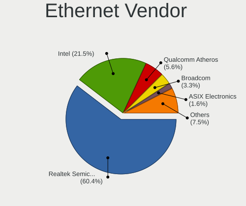

| Vendor                                 | Notebooks | Percent |
|----------------------------------------|-----------|---------|
| Realtek Semiconductor                  | 2456      | 60.42%  |
| Intel                                  | 872       | 21.45%  |
| Qualcomm Atheros                       | 229       | 5.63%   |
| Broadcom                               | 136       | 3.35%   |
| ASIX Electronics                       | 66        | 1.62%   |
| Xiaomi                                 | 37        | 0.91%   |
| Marvell Technology Group               | 35        | 0.86%   |
| Lenovo                                 | 34        | 0.84%   |
| DisplayLink                            | 29        | 0.71%   |
| MediaTek                               | 24        | 0.59%   |
| Broadcom Limited                       | 22        | 0.54%   |
| Samsung Electronics                    | 21        | 0.52%   |
| JMicron Technology                     | 15        | 0.37%   |
| Nvidia                                 | 12        | 0.3%    |
| Qualcomm                               | 10        | 0.25%   |
| Huawei Technologies                    | 10        | 0.25%   |
| TP-Link                                | 9         | 0.22%   |
| Google                                 | 6         | 0.15%   |
| Suzhou Motorcomm Electronic Technology | 4         | 0.1%    |
| OnePlus Technology (Shenzhen)          | 4         | 0.1%    |
| Motorola PCS                           | 4         | 0.1%    |
| OPPO Electronics                       | 3         | 0.07%   |
| ICS Advent                             | 3         | 0.07%   |
| Hewlett-Packard                        | 3         | 0.07%   |
| Apple                                  | 3         | 0.07%   |
| Spreadtrum Communications              | 2         | 0.05%   |
| Sony Ericsson Mobile Communications AB | 2         | 0.05%   |
| Motorcomm Microelectronics.            | 2         | 0.05%   |
| Attansic Technology                    | 2         | 0.05%   |
| ASUSTek Computer                       | 2         | 0.05%   |
| Vimtron Electronics                    | 1         | 0.02%   |
| T & A Mobile Phones                    | 1         | 0.02%   |
| Rivet                                  | 1         | 0.02%   |
| Microsoft                              | 1         | 0.02%   |
| Microchip Technology                   | 1         | 0.02%   |
| HTC (High Tech Computer)               | 1         | 0.02%   |
| Foxconn / Hon Hai                      | 1         | 0.02%   |
| Aquantia                               | 1         | 0.02%   |

Ethernet Model
--------------

Ethernet models

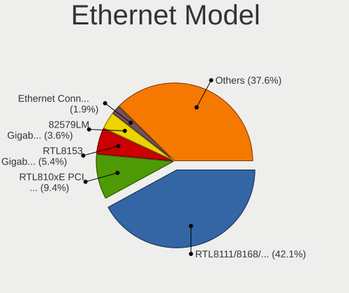

| Model                                                                  | Notebooks | Percent |
|------------------------------------------------------------------------|-----------|---------|
| Realtek RTL8111/8168/8211/8411 PCI Express Gigabit Ethernet Controller | 1745      | 42.07%  |
| Realtek RTL810xE PCI Express Fast Ethernet controller                  | 390       | 9.4%    |
| Realtek RTL8153 Gigabit Ethernet Adapter                               | 226       | 5.45%   |
| Intel 82579LM Gigabit Network Connection (Lewisville)                  | 149       | 3.59%   |
| Intel Ethernet Connection (4) I219-LM                                  | 78        | 1.88%   |
| ASIX AX88179 Gigabit Ethernet                                          | 60        | 1.45%   |
| Intel Ethernet Connection (3) I218-LM                                  | 54        | 1.3%    |
| Realtek RTL8125 2.5GbE Controller                                      | 48        | 1.16%   |
| Intel Ethernet Connection (4) I219-V                                   | 48        | 1.16%   |
| Intel Ethernet Connection I217-LM                                      | 47        | 1.13%   |
| Intel Ethernet Connection I218-LM                                      | 43        | 1.04%   |
| Intel Alder Lake-P PCH CNVi WiFi                                       | 42        | 1.01%   |
| Intel Ethernet Connection I219-LM                                      | 40        | 0.96%   |
| Qualcomm Atheros AR8151 v2.0 Gigabit Ethernet                          | 39        | 0.94%   |
| Realtek Killer E2600 GbE Controller                                    | 37        | 0.89%   |
| Intel 82577LM Gigabit Network Connection                               | 34        | 0.82%   |
| Intel Ethernet Connection (6) I219-V                                   | 33        | 0.8%    |
| Broadcom NetXtreme BCM57765 Gigabit Ethernet PCIe                      | 32        | 0.77%   |
| Qualcomm Atheros QCA8171 Gigabit Ethernet                              | 30        | 0.72%   |
| Realtek RTL8152 Fast Ethernet Adapter                                  | 28        | 0.68%   |
| Intel Ethernet Connection (7) I219-LM                                  | 28        | 0.68%   |
| Xiaomi Mi/Redmi series (RNDIS)                                         | 26        | 0.63%   |
| Intel Ethernet Connection (6) I219-LM                                  | 26        | 0.63%   |
| Qualcomm Atheros Killer E2500 Gigabit Ethernet Controller              | 25        | 0.6%    |
| Qualcomm Atheros Killer E2400 Gigabit Ethernet Controller              | 25        | 0.6%    |
| Broadcom NetLink BCM57785 Gigabit Ethernet PCIe                        | 24        | 0.58%   |
| Intel Ethernet Connection I219-V                                       | 23        | 0.55%   |
| Qualcomm Atheros AR8161 Gigabit Ethernet                               | 21        | 0.51%   |
| Intel 82567LM Gigabit Network Connection                               | 20        | 0.48%   |
| Qualcomm Atheros AR8162 Fast Ethernet                                  | 19        | 0.46%   |
| Broadcom NetLink BCM57780 Gigabit Ethernet PCIe                        | 19        | 0.46%   |
| Marvell Group 88E8040 PCI-E Fast Ethernet Controller                   | 18        | 0.43%   |
| Intel Ethernet Connection (13) I219-V                                  | 18        | 0.43%   |
| Realtek Killer E3000 2.5GbE Controller                                 | 17        | 0.41%   |
| Intel Ethernet Connection (10) I219-V                                  | 17        | 0.41%   |
| MediaTek MT7922 802.11ax PCI Express Wireless Network Adapter          | 16        | 0.39%   |
| Samsung Galaxy series, misc. (tethering mode)                          | 15        | 0.36%   |
| JMicron JMC250 PCI Express Gigabit Ethernet Controller                 | 15        | 0.36%   |
| Intel Ethernet Connection (2) I219-LM                                  | 15        | 0.36%   |
| Qualcomm Atheros Killer E220x Gigabit Ethernet Controller              | 14        | 0.34%   |

Net Controller Kind
-------------------

Ethernet, WiFi or modem

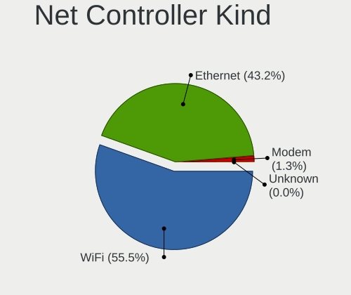

| Kind     | Notebooks | Percent |
|----------|-----------|---------|
| WiFi     | 4942      | 55.47%  |
| Ethernet | 3851      | 43.22%  |
| Modem    | 113       | 1.27%   |
| Unknown  | 4         | 0.04%   |

Used Controller
---------------

Currently used network controller

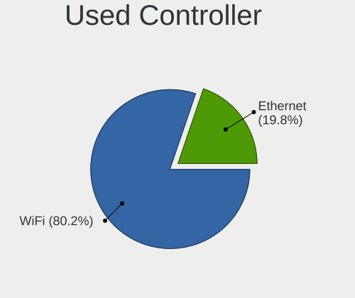

| Kind     | Notebooks | Percent |
|----------|-----------|---------|
| WiFi     | 4283      | 80.22%  |
| Ethernet | 1056      | 19.78%  |

NICs
----

Total network controllers on board

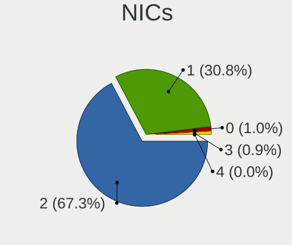

| Total | Notebooks | Percent |
|-------|-----------|---------|
| 2     | 3421      | 67.28%  |
| 1     | 1564      | 30.76%  |
| 0     | 53        | 1.04%   |
| 3     | 46        | 0.9%    |
| 4     | 1         | 0.02%   |

IPv6
----

IPv6 vs IPv4

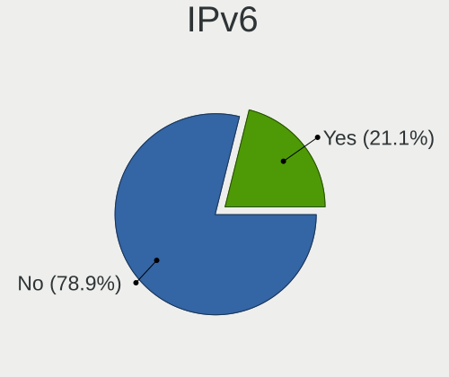

| Used | Notebooks | Percent |
|------|-----------|---------|
| No   | 4080      | 78.87%  |
| Yes  | 1093      | 21.13%  |

Bluetooth
---------

Bluetooth Vendor
----------------

Controller vendors

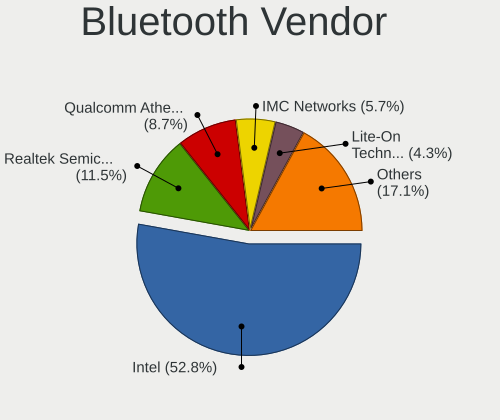

| Vendor                          | Notebooks | Percent |
|---------------------------------|-----------|---------|
| Intel                           | 2283      | 52.82%  |
| Realtek Semiconductor           | 496       | 11.48%  |
| Qualcomm Atheros Communications | 375       | 8.68%   |
| IMC Networks                    | 246       | 5.69%   |
| Lite-On Technology              | 185       | 4.28%   |
| Foxconn / Hon Hai               | 176       | 4.07%   |
| Broadcom                        | 130       | 3.01%   |
| Apple                           | 119       | 2.75%   |
| Realtek                         | 53        | 1.23%   |
| Cambridge Silicon Radio         | 46        | 1.06%   |
| MediaTek                        | 33        | 0.76%   |
| Ralink                          | 29        | 0.67%   |
| Dell                            | 29        | 0.67%   |
| Hewlett-Packard                 | 28        | 0.65%   |
| Toshiba                         | 18        | 0.42%   |
| USI                             | 14        | 0.32%   |
| ASUSTek Computer                | 13        | 0.3%    |
| Opticis                         | 10        | 0.23%   |
| Foxconn International           | 9         | 0.21%   |
| Ralink Technology               | 6         | 0.14%   |
| Alps Electric                   | 6         | 0.14%   |
| Askey Computer                  | 4         | 0.09%   |
| TP-Link                         | 3         | 0.07%   |
| Fujitsu                         | 2         | 0.05%   |
| Chicony Electronics             | 2         | 0.05%   |
| Belkin Components               | 2         | 0.05%   |
| SiW                             | 1         | 0.02%   |
| SINO WEALTH                     | 1         | 0.02%   |
| Qcom                            | 1         | 0.02%   |
| Integrated System Solution      | 1         | 0.02%   |
| Dynex                           | 1         | 0.02%   |

Bluetooth Model
---------------

Controller models

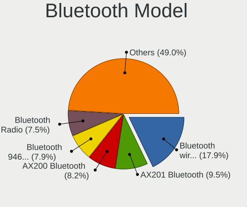

| Model                                               | Notebooks | Percent |
|-----------------------------------------------------|-----------|---------|
| Intel Bluetooth wireless interface                  | 773       | 17.86%  |
| Intel AX201 Bluetooth                               | 413       | 9.54%   |
| Intel AX200 Bluetooth                               | 357       | 8.25%   |
| Intel Bluetooth 9460/9560 Jefferson Peak (JfP)      | 340       | 7.86%   |
| Realtek Bluetooth Radio                             | 324       | 7.49%   |
| Qualcomm Atheros  Bluetooth Device                  | 194       | 4.48%   |
| Intel Bluetooth Device                              | 144       | 3.33%   |
| Realtek  Bluetooth 4.2 Adapter                      | 108       | 2.5%    |
| IMC Networks Wireless_Device                        | 92        | 2.13%   |
| Intel AX210 Bluetooth                               | 84        | 1.94%   |
| IMC Networks Bluetooth Radio                        | 74        | 1.71%   |
| Intel Centrino Bluetooth Wireless Transceiver       | 68        | 1.57%   |
| Lite-On Qualcomm Atheros QCA9377 Bluetooth          | 64        | 1.48%   |
| Apple Bluetooth Host Controller                     | 63        | 1.46%   |
| Foxconn / Hon Hai Wireless_Device                   | 56        | 1.29%   |
| Realtek Bluetooth Radio                             | 53        | 1.22%   |
| Qualcomm Atheros AR3012 Bluetooth 4.0               | 52        | 1.2%    |
| IMC Networks Bluetooth Device                       | 48        | 1.11%   |
| Apple Bluetooth USB Host Controller                 | 47        | 1.09%   |
| Qualcomm Atheros QCA61x4 Bluetooth 4.0              | 46        | 1.06%   |
| Lite-On Bluetooth Device                            | 46        | 1.06%   |
| Intel Wireless-AC 3168 Bluetooth                    | 46        | 1.06%   |
| Foxconn / Hon Hai Bluetooth Device                  | 46        | 1.06%   |
| Cambridge Silicon Radio Bluetooth Dongle (HCI mode) | 46        | 1.06%   |
| Intel Wireless-AC 9260 Bluetooth Adapter            | 41        | 0.95%   |
| Qualcomm Atheros AR3011 Bluetooth                   | 40        | 0.92%   |
| Lite-On Wireless_Device                             | 33        | 0.76%   |
| Foxconn / Hon Hai MediaTek Bluetooth Adapter        | 33        | 0.76%   |
| MediaTek Wireless_Device                            | 30        | 0.69%   |
| Ralink RT3290 Bluetooth                             | 29        | 0.67%   |
| Broadcom BCM20702 Bluetooth 4.0 [ThinkPad]          | 25        | 0.58%   |
| Qualcomm Atheros AR9462 Bluetooth                   | 24        | 0.55%   |
| Realtek RTL8821A Bluetooth                          | 22        | 0.51%   |
| Intel Centrino Advanced-N 6230 Bluetooth adapter    | 21        | 0.49%   |
| Realtek RTL8822BE Bluetooth 4.2 Adapter             | 20        | 0.46%   |
| HP Broadcom 2070 Bluetooth Combo                    | 19        | 0.44%   |
| Realtek RTL8723B Bluetooth                          | 18        | 0.42%   |
| Lite-On Atheros AR3012 Bluetooth                    | 17        | 0.39%   |
| Broadcom BCM2045B (BDC-2.1)                         | 17        | 0.39%   |
| Broadcom HP Portable SoftSailing                    | 16        | 0.37%   |

Sound
-----

Sound Vendor
------------

Sound card vendors

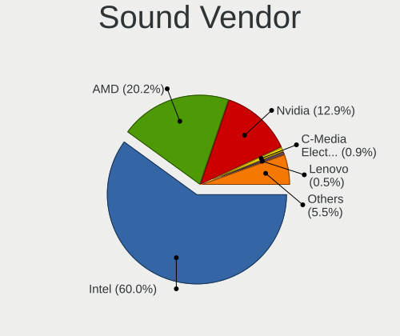

| Vendor                               | Notebooks | Percent |
|--------------------------------------|-----------|---------|
| Intel                                | 3817      | 60%     |
| AMD                                  | 1286      | 20.21%  |
| Nvidia                               | 820       | 12.89%  |
| C-Media Electronics                  | 56        | 0.88%   |
| Lenovo                               | 34        | 0.53%   |
| Realtek Semiconductor                | 32        | 0.5%    |
| Logitech                             | 29        | 0.46%   |
| GN Netcom                            | 25        | 0.39%   |
| JMTek                                | 22        | 0.35%   |
| Kingston Technology                  | 18        | 0.28%   |
| Texas Instruments                    | 13        | 0.2%    |
| Plantronics                          | 13        | 0.2%    |
| Generalplus Technology               | 13        | 0.2%    |
| Focusrite-Novation                   | 12        | 0.19%   |
| SteelSeries ApS                      | 11        | 0.17%   |
| Razer USA                            | 9         | 0.14%   |
| Apple                                | 8         | 0.13%   |
| Huawei Technologies                  | 7         | 0.11%   |
| ASUSTek Computer                     | 7         | 0.11%   |
| Sony                                 | 6         | 0.09%   |
| Hewlett-Packard                      | 6         | 0.09%   |
| DSEA A/S                             | 6         | 0.09%   |
| Creative Technology                  | 6         | 0.09%   |
| Samson Technologies                  | 5         | 0.08%   |
| GYROCOM C&C                          | 5         | 0.08%   |
| KTMicro                              | 4         | 0.06%   |
| Corsair                              | 4         | 0.06%   |
| Audio-Technica                       | 4         | 0.06%   |
| Thesycon Systemsoftware & Consulting | 3         | 0.05%   |
| RODE Microphones                     | 3         | 0.05%   |
| Jieli Technology                     | 3         | 0.05%   |
| JBL                                  | 3         | 0.05%   |
| Cambridge Silicon Radio              | 3         | 0.05%   |
| Blue Microphones                     | 3         | 0.05%   |
| Yamaha                               | 2         | 0.03%   |
| Turtle Beach                         | 2         | 0.03%   |
| Samsung Electronics                  | 2         | 0.03%   |
| Other World Computing                | 2         | 0.03%   |
| No brand                             | 2         | 0.03%   |
| Medeli Electronics                   | 2         | 0.03%   |

Sound Model
-----------

Sound card models

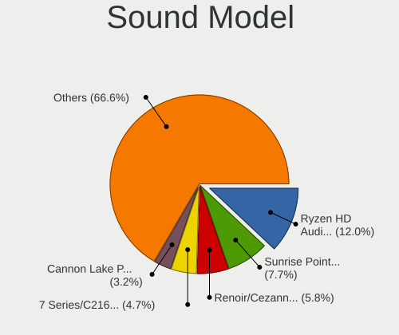

| Model                                                                                             | Notebooks | Percent |
|---------------------------------------------------------------------------------------------------|-----------|---------|
| AMD Ryzen HD Audio Controller                                                                     | 950       | 12.01%  |
| Intel Sunrise Point-LP HD Audio                                                                   | 609       | 7.7%    |
| AMD Renoir/Cezanne HDMI/DP Audio Controller                                                       | 458       | 5.79%   |
| Intel 7 Series/C216 Chipset Family High Definition Audio Controller                               | 371       | 4.69%   |
| Intel Cannon Lake PCH cAVS                                                                        | 255       | 3.22%   |
| Intel Tiger Lake-LP Smart Sound Technology Audio Controller                                       | 237       | 3%      |
| AMD Raven/Raven2/Fenghuang HDMI/DP Audio Controller                                               | 227       | 2.87%   |
| Intel 6 Series/C200 Series Chipset Family High Definition Audio Controller                        | 214       | 2.71%   |
| Intel Cannon Point-LP High Definition Audio Controller                                            | 196       | 2.48%   |
| Intel 8 Series HD Audio Controller                                                                | 196       | 2.48%   |
| Intel Haswell-ULT HD Audio Controller                                                             | 195       | 2.46%   |
| Intel Broadwell-U Audio Controller                                                                | 177       | 2.24%   |
| Intel Wildcat Point-LP High Definition Audio Controller                                           | 175       | 2.21%   |
| Intel 8 Series/C220 Series Chipset High Definition Audio Controller                               | 158       | 2%      |
| Intel Alder Lake PCH-P High Definition Audio Controller                                           | 141       | 1.78%   |
| AMD Radeon High Definition Audio Controller                                                       | 141       | 1.78%   |
| Intel 5 Series/3400 Series Chipset High Definition Audio                                          | 134       | 1.69%   |
| Intel Comet Lake PCH-LP cAVS                                                                      | 130       | 1.64%   |
| Intel CM238 HD Audio Controller                                                                   | 121       | 1.53%   |
| Intel Xeon E3-1200 v3/4th Gen Core Processor HD Audio Controller                                  | 117       | 1.48%   |
| AMD FCH Azalia Controller                                                                         | 114       | 1.44%   |
| Intel Comet Lake PCH cAVS                                                                         | 113       | 1.43%   |
| Intel 82801I (ICH9 Family) HD Audio Controller                                                    | 95        | 1.2%    |
| Intel 100 Series/C230 Series Chipset Family HD Audio Controller                                   | 92        | 1.16%   |
| Nvidia TU107 GeForce GTX 1650 High Definition Audio Controller                                    | 90        | 1.14%   |
| AMD Kabini HDMI/DP Audio                                                                          | 87        | 1.1%    |
| Intel Ice Lake-LP Smart Sound Technology Audio Controller                                         | 85        | 1.07%   |
| Intel Celeron/Pentium Silver Processor High Definition Audio                                      | 77        | 0.97%   |
| Nvidia GA106 High Definition Audio Controller                                                     | 69        | 0.87%   |
| Nvidia TU106 High Definition Audio Controller                                                     | 68        | 0.86%   |
| AMD Family 15h (Models 60h-6fh) Audio Controller                                                  | 67        | 0.85%   |
| Nvidia GF108 High Definition Audio Controller                                                     | 66        | 0.83%   |
| Intel Tiger Lake-H HD Audio Controller                                                            | 63        | 0.8%    |
| Intel Raptor Lake-P/U/H cAVS                                                                      | 60        | 0.76%   |
| Nvidia GA104 High Definition Audio Controller                                                     | 59        | 0.75%   |
| Nvidia GP107GL High Definition Audio Controller                                                   | 52        | 0.66%   |
| Nvidia GA107 High Definition Audio Controller                                                     | 50        | 0.63%   |
| Intel Atom/Celeron/Pentium Processor x5-E8000/J3xxx/N3xxx Series High Definition Audio Controller | 48        | 0.61%   |
| Nvidia TU116 High Definition Audio Controller                                                     | 47        | 0.59%   |
| Intel Atom Processor Z36xxx/Z37xxx Series High Definition Audio Controller                        | 45        | 0.57%   |

Memory
------

Memory Vendor
-------------

Memory module vendors

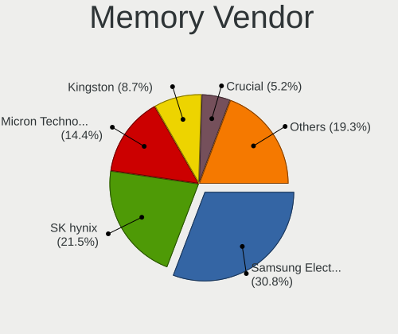

| Vendor              | Notebooks | Percent |
|---------------------|-----------|---------|
| Samsung Electronics | 1113      | 30.79%  |
| SK hynix            | 778       | 21.52%  |
| Micron Technology   | 522       | 14.44%  |
| Kingston            | 316       | 8.74%   |
| Crucial             | 188       | 5.2%    |
| Unknown             | 123       | 3.4%    |
| A-DATA Technology   | 83        | 2.3%    |
| Ramaxel Technology  | 77        | 2.13%   |
| Corsair             | 53        | 1.47%   |
| Elpida              | 48        | 1.33%   |
| Unknown             | 41        | 1.13%   |
| Nanya Technology    | 34        | 0.94%   |
| G.Skill             | 31        | 0.86%   |
| GOODRAM             | 20        | 0.55%   |
| Unknown (ABCD)      | 19        | 0.53%   |
| Smart               | 18        | 0.5%    |
| Transcend           | 16        | 0.44%   |
| Patriot             | 16        | 0.44%   |
| Team                | 12        | 0.33%   |
| Apacer              | 9         | 0.25%   |
| AMD                 | 8         | 0.22%   |
| Teikon              | 6         | 0.17%   |
| ASint Technology    | 6         | 0.17%   |
| Timetec             | 5         | 0.14%   |
| Goldkey             | 5         | 0.14%   |
| Smart Brazil        | 4         | 0.11%   |
| Silicon Power       | 3         | 0.08%   |
| SHARETRONIC         | 3         | 0.08%   |
| Lexar Co Limited    | 3         | 0.08%   |
| Kllisre             | 3         | 0.08%   |
| Avant               | 3         | 0.08%   |
| Atermiter           | 3         | 0.08%   |
| Teclast             | 2         | 0.06%   |
| Qumo                | 2         | 0.06%   |
| Qimonda             | 2         | 0.06%   |
| PUSKILL             | 2         | 0.06%   |
| Lexar               | 2         | 0.06%   |
| High Bridge         | 2         | 0.06%   |
| ff                  | 2         | 0.06%   |
| fef5                | 2         | 0.06%   |

Memory Model
------------

Memory module models

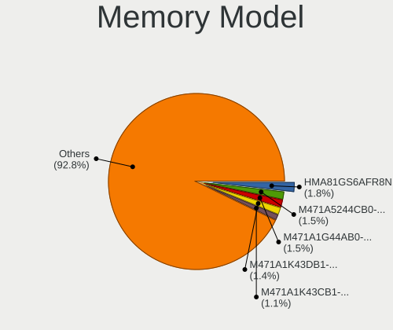

| Model                                                            | Notebooks | Percent |
|------------------------------------------------------------------|-----------|---------|
| SK hynix RAM HMA81GS6AFR8N-UH 8GB SODIMM DDR4 2667MT/s           | 69        | 1.81%   |
| Samsung RAM M471A5244CB0-CTD 4GB SODIMM DDR4 3266MT/s            | 57        | 1.49%   |
| Samsung RAM M471A1G44AB0-CWE 8GiB SODIMM DDR4 3200MT/s           | 56        | 1.47%   |
| Samsung RAM M471A1K43DB1-CWE 8GB SODIMM DDR4 3200MT/s            | 52        | 1.36%   |
| Samsung RAM M471A1K43CB1-CTD 8GB SODIMM DDR4 3200MT/s            | 41        | 1.07%   |
| Samsung RAM M471A1K43CB1-CRC 8GB SODIMM DDR4 8400MT/s            | 41        | 1.07%   |
| Unknown                                                          | 41        | 1.07%   |
| Samsung RAM M471A1G44AB0-CWE 8GB Row Of Chips DDR4 3200MT/s      | 38        | 1%      |
| Samsung RAM M471B5173QH0-YK0 4GB SODIMM DDR3 1600MT/s            | 35        | 0.92%   |
| Samsung RAM M471A5244CB0-CRC 4GB SODIMM DDR4 2667MT/s            | 35        | 0.92%   |
| Micron RAM 8ATF1G64HZ-3G2J1 8GB SODIMM DDR4 3200MT/s             | 34        | 0.89%   |
| SK hynix RAM HMT451S6BFR8A-PB 4GB SODIMM DDR3 1600MT/s           | 30        | 0.79%   |
| Samsung RAM M471A1K43EB1-CWE 8GB SODIMM DDR4 3200MT/s            | 30        | 0.79%   |
| Micron RAM 4ATF51264HZ-2G6E1 4GB SODIMM DDR4 2667MT/s            | 30        | 0.79%   |
| Samsung RAM M471A1K43BB1-CRC 8GB SODIMM DDR4 2667MT/s            | 29        | 0.76%   |
| SK hynix RAM HMAA1GS6CJR6N-XN 8GB SODIMM DDR4 3200MT/s           | 27        | 0.71%   |
| SK hynix RAM HMA81GS6JJR8N-VK 8GB SODIMM DDR4 2667MT/s           | 26        | 0.68%   |
| SK hynix RAM HMA81GS6CJR8N-VK 8GB SODIMM DDR4 2667MT/s           | 26        | 0.68%   |
| Samsung RAM M471B5173DB0-YK0 4GB SODIMM DDR3 1600MT/s            | 25        | 0.66%   |
| Samsung RAM M471A1G44BB0-CWE 8GB SODIMM DDR4 3200MT/s            | 25        | 0.66%   |
| SK hynix RAM HMA81GS6DJR8N-XN 8GB SODIMM DDR4 3200MT/s           | 24        | 0.63%   |
| SK hynix RAM HMA851S6AFR6N-UH 4GB SODIMM DDR4 2667MT/s           | 22        | 0.58%   |
| Samsung RAM M471B5273DH0-CH9 4GB SODIMM DDR3 1600MT/s            | 22        | 0.58%   |
| Samsung RAM M471A2K43DB1-CWE 16GB SODIMM DDR4 3200MT/s           | 22        | 0.58%   |
| Samsung RAM M471B1G73QH0-YK0 8GB SODIMM DDR3 1600MT/s            | 21        | 0.55%   |
| Samsung RAM M471B1G73DB0-YK0 8GB SODIMM DDR3 1600MT/s            | 21        | 0.55%   |
| Micron RAM 4ATF1G64HZ-3G2E1 8GB SODIMM DDR4 3200MT/s             | 21        | 0.55%   |
| Micron RAM 4ATF1G64HZ-3G2E1 8GB Row Of Chips DDR4 3200MT/s       | 21        | 0.55%   |
| Samsung RAM M471B5173EB0-YK0 4GB SODIMM DDR3 1600MT/s            | 20        | 0.52%   |
| SK hynix RAM HMT451S6AFR8A-PB 4GB SODIMM DDR3 1600MT/s           | 19        | 0.5%    |
| SK hynix RAM HMA851S6CJR6N-VK 4GB SODIMM DDR4 2667MT/s           | 19        | 0.5%    |
| Samsung RAM M471A1K43DB1-CTD 8GB SODIMM DDR4 2667MT/s            | 19        | 0.5%    |
| SK hynix RAM HMT41GS6BFR8A-PB 8GB SODIMM DDR3 2667MT/s           | 18        | 0.47%   |
| Unknown (ABCD) RAM 123456789012345678 2GB SODIMM LPDDR4 2400MT/s | 17        | 0.45%   |
| SK hynix RAM HMA82GS6JJR8N-VK 16GB SODIMM DDR4 2667MT/s          | 17        | 0.45%   |
| Samsung RAM M471A5244CB0-CWE 4GB SODIMM DDR4 3200MT/s            | 16        | 0.42%   |
| Micron RAM 4ATF51264HZ-3G2J1 4GB SODIMM DDR4 3200MT/s            | 16        | 0.42%   |
| SK hynix RAM HMT351S6CFR8C-PB 4GB SODIMM DDR3 1600MT/s           | 14        | 0.37%   |
| Samsung RAM M471B1G73EB0-YK0 8192MB SODIMM DDR3 1600MT/s         | 14        | 0.37%   |
| Micron RAM 8ATF1G64HZ-2G6E1 8GB SODIMM DDR4 2667MT/s             | 14        | 0.37%   |

Memory Kind
-----------

Memory module kinds

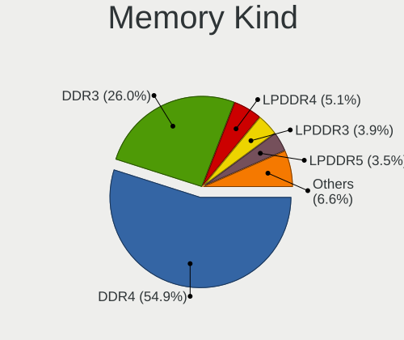

| Kind    | Notebooks | Percent |
|---------|-----------|---------|
| DDR4    | 1664      | 54.9%   |
| DDR3    | 787       | 25.97%  |
| LPDDR4  | 156       | 5.15%   |
| LPDDR3  | 118       | 3.89%   |
| LPDDR5  | 107       | 3.53%   |
| DDR5    | 106       | 3.5%    |
| SDRAM   | 45        | 1.48%   |
| DDR2    | 38        | 1.25%   |
| Unknown | 6         | 0.2%    |
| DRAM    | 2         | 0.07%   |
| DDR     | 2         | 0.07%   |

Memory Form Factor
------------------

Physical design of the memory module

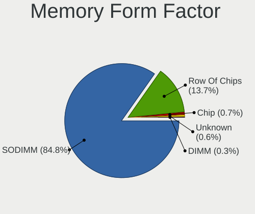

| Name         | Notebooks | Percent |
|--------------|-----------|---------|
| SODIMM       | 2576      | 84.76%  |
| Row Of Chips | 415       | 13.66%  |
| Chip         | 22        | 0.72%   |
| Unknown      | 18        | 0.59%   |
| DIMM         | 8         | 0.26%   |

Memory Size
-----------

Memory module size

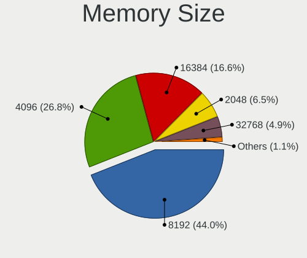

| Size  | Notebooks | Percent |
|-------|-----------|---------|
| 8192  | 1467      | 44%     |
| 4096  | 894       | 26.81%  |
| 16384 | 555       | 16.65%  |
| 2048  | 218       | 6.54%   |
| 32768 | 162       | 4.86%   |
| 1024  | 33        | 0.99%   |
| 49152 | 2         | 0.06%   |
| 3072  | 2         | 0.06%   |
| 512   | 1         | 0.03%   |

Memory Speed
------------

Memory module speed

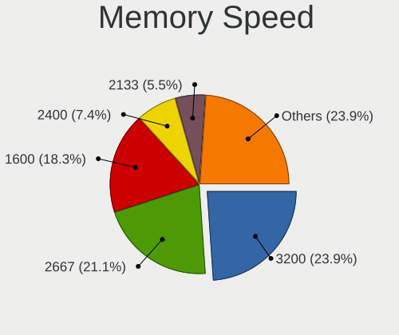

| Speed   | Notebooks | Percent |
|---------|-----------|---------|
| 3200    | 790       | 23.9%   |
| 2667    | 696       | 21.06%  |
| 1600    | 604       | 18.28%  |
| 2400    | 244       | 7.38%   |
| 2133    | 181       | 5.48%   |
| 1334    | 90        | 2.72%   |
| 1333    | 68        | 2.06%   |
| 4267    | 67        | 2.03%   |
| 4800    | 61        | 1.85%   |
| 3266    | 57        | 1.72%   |
| 6400    | 51        | 1.54%   |
| 8400    | 49        | 1.48%   |
| 5600    | 44        | 1.33%   |
| 1867    | 39        | 1.18%   |
| 4199    | 34        | 1.03%   |
| 7500    | 30        | 0.91%   |
| 1067    | 30        | 0.91%   |
| 4266    | 26        | 0.79%   |
| 667     | 23        | 0.7%    |
| Unknown | 23        | 0.7%    |
| 8533    | 12        | 0.36%   |
| 800     | 12        | 0.36%   |
| 975     | 11        | 0.33%   |
| 3733    | 9         | 0.27%   |
| 2048    | 9         | 0.27%   |
| 7467    | 8         | 0.24%   |
| 1066    | 8         | 0.24%   |
| 2933    | 5         | 0.15%   |
| 5500    | 3         | 0.09%   |
| 1200    | 3         | 0.09%   |
| 3000    | 2         | 0.06%   |
| 1866    | 2         | 0.06%   |
| 333     | 2         | 0.06%   |
| 65535   | 1         | 0.03%   |
| 8000    | 1         | 0.03%   |
| 5200    | 1         | 0.03%   |
| 3800    | 1         | 0.03%   |
| 3600    | 1         | 0.03%   |
| 2800    | 1         | 0.03%   |
| 2267    | 1         | 0.03%   |

Printers & scanners
-------------------

Printer Vendor
--------------

Printer device vendors

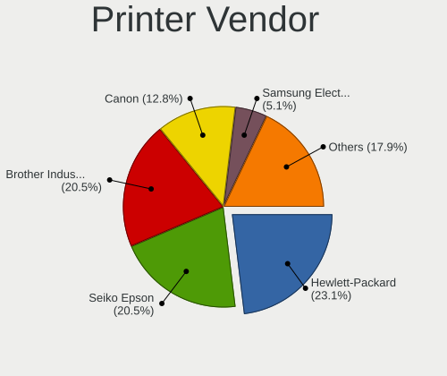

| Vendor                | Notebooks | Percent |
|-----------------------|-----------|---------|
| Hewlett-Packard       | 9         | 23.08%  |
| Seiko Epson           | 8         | 20.51%  |
| Brother Industries    | 8         | 20.51%  |
| Canon                 | 5         | 12.82%  |
| Samsung Electronics   | 2         | 5.13%   |
| Xiaomi                | 1         | 2.56%   |
| STMicroelectronics    | 1         | 2.56%   |
| Sagem                 | 1         | 2.56%   |
| Pantum                | 1         | 2.56%   |
| Lexmark International | 1         | 2.56%   |
| Kyocera               | 1         | 2.56%   |
| Dymo-CoStar           | 1         | 2.56%   |

Printer Model
-------------

Printer device models

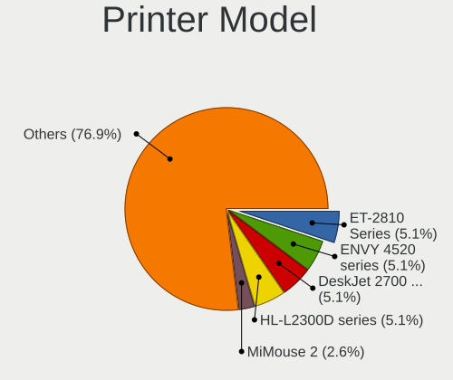

| Model                                                     | Notebooks | Percent |
|-----------------------------------------------------------|-----------|---------|
| Seiko Epson ET-2810 Series                                | 2         | 5.13%   |
| HP ENVY 4520 series                                       | 2         | 5.13%   |
| HP DeskJet 2700 series                                    | 2         | 5.13%   |
| Brother HL-L2300D series                                  | 2         | 5.13%   |
| Xiaomi MiMouse 2                                          | 1         | 2.56%   |
| STMicroelectronics LED badge -- mini LED display -- 11x44 | 1         | 2.56%   |
| Seiko Epson Printer                                       | 1         | 2.56%   |
| Seiko Epson ME Office 600F/Stylus Office BX300F/TX300F    | 1         | 2.56%   |
| Seiko Epson L365 Series                                   | 1         | 2.56%   |
| Seiko Epson L355 Series                                   | 1         | 2.56%   |
| Seiko Epson ET-2850 Series                                | 1         | 2.56%   |
| Seiko Epson ET-2710 Series                                | 1         | 2.56%   |
| Samsung ML-1865                                           | 1         | 2.56%   |
| Samsung CLX-3180 Series                                   | 1         | 2.56%   |
| Sagem Laser Pro LL                                        | 1         | 2.56%   |
| Pantum P2200W-series                                      | 1         | 2.56%   |
| Lexmark International InkJet Color Printer                | 1         | 2.56%   |
| Kyocera FS-1030D printer                                  | 1         | 2.56%   |
| HP Officejet 4500 G510g-m                                 | 1         | 2.56%   |
| HP LaserJet P1102                                         | 1         | 2.56%   |
| HP Ink Tank Wireless 410 series                           | 1         | 2.56%   |
| HP Ink Tank 310 series                                    | 1         | 2.56%   |
| HP DeskJet 1110 series                                    | 1         | 2.56%   |
| Dymo-CoStar DYMO LabelWriter 450 Twin Turbo               | 1         | 2.56%   |
| Canon TS300 series                                        | 1         | 2.56%   |
| Canon TR4500 series                                       | 1         | 2.56%   |
| Canon PIXMA MG3600 Series                                 | 1         | 2.56%   |
| Canon MF3010                                              | 1         | 2.56%   |
| Canon G4010 series                                        | 1         | 2.56%   |
| Brother QL-500 label printer                              | 1         | 2.56%   |
| Brother MFC-L2710DW series                                | 1         | 2.56%   |
| Brother HL-L2320D series                                  | 1         | 2.56%   |
| Brother HL-1210W series                                   | 1         | 2.56%   |
| Brother HL-1110 series                                    | 1         | 2.56%   |
| Brother DCP-1600                                          | 1         | 2.56%   |

Scanner Vendor
--------------

Scanner device vendors

| Vendor          | Notebooks | Percent |
|-----------------|-----------|---------|
| Canon           | 7         | 87.5%   |
| Hewlett-Packard | 1         | 12.5%   |

Scanner Model
-------------

Scanner device models

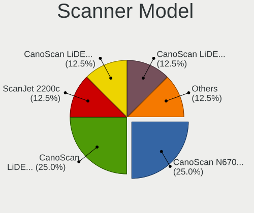

| Model                                  | Notebooks | Percent |
|----------------------------------------|-----------|---------|
| Canon CanoScan N670U/N676U/LiDE 20     | 2         | 25%     |
| Canon CanoScan LiDE 220                | 2         | 25%     |
| HP ScanJet 2200c                       | 1         | 12.5%   |
| Canon CanoScan LiDE 500F               | 1         | 12.5%   |
| Canon CanoScan LiDE 50/LiDE 35/LiDE 40 | 1         | 12.5%   |
| Canon CanoScan LiDE 110                | 1         | 12.5%   |

Camera
------

Camera Vendor
-------------

Camera device vendors

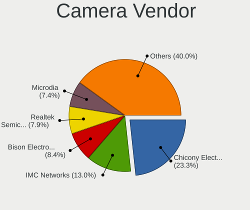

| Vendor                                 | Notebooks | Percent |
|----------------------------------------|-----------|---------|
| Chicony Electronics                    | 1088      | 23.3%   |
| IMC Networks                           | 609       | 13.04%  |
| Bison Electronics                      | 391       | 8.37%   |
| Realtek Semiconductor                  | 368       | 7.88%   |
| Microdia                               | 345       | 7.39%   |
| Quanta                                 | 301       | 6.45%   |
| Sunplus Innovation Technology          | 223       | 4.78%   |
| Cheng Uei Precision Industry (Foxlink) | 168       | 3.6%    |
| Syntek                                 | 155       | 3.32%   |
| Lite-On Technology                     | 127       | 2.72%   |
| Luxvisions Innotech Limited            | 112       | 2.4%    |
| Suyin                                  | 101       | 2.16%   |
| Apple                                  | 100       | 2.14%   |
| Logitech                               | 83        | 1.78%   |
| Silicon Motion                         | 67        | 1.43%   |
| Alcor Micro                            | 44        | 0.94%   |
| Sonix Technology                       | 40        | 0.86%   |
| Samsung Electronics                    | 32        | 0.69%   |
| Shinetech                              | 28        | 0.6%    |
| Ricoh                                  | 26        | 0.56%   |
| Acer                                   | 21        | 0.45%   |
| SunplusIT                              | 20        | 0.43%   |
| Lenovo                                 | 19        | 0.41%   |
| Microsoft                              | 15        | 0.32%   |
| Primax Electronics                     | 14        | 0.3%    |
| Importek                               | 13        | 0.28%   |
| kingcome                               | 10        | 0.21%   |
| icSpring                               | 9         | 0.19%   |
| DigiTech                               | 9         | 0.19%   |
| ALi                                    | 9         | 0.19%   |
| Z-Star Microelectronics                | 6         | 0.13%   |
| OmniVision Technologies                | 6         | 0.13%   |
| Intel                                  | 6         | 0.13%   |
| MacroSilicon                           | 5         | 0.11%   |
| Genesys Logic                          | 5         | 0.11%   |
| Denron                                 | 5         | 0.11%   |
| Y Media                                | 4         | 0.09%   |
| GEMBIRD                                | 4         | 0.09%   |
| USB Camera CS                          | 3         | 0.06%   |
| Tobii Technology AB                    | 3         | 0.06%   |

Camera Model
------------

Camera device models

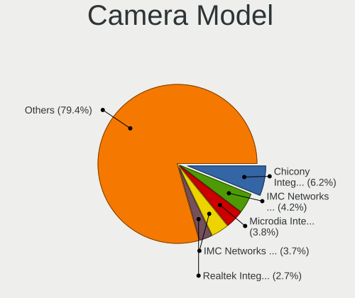

| Model                                               | Notebooks | Percent |
|-----------------------------------------------------|-----------|---------|
| Chicony Integrated Camera                           | 290       | 6.18%   |
| IMC Networks Integrated Camera                      | 196       | 4.17%   |
| Microdia Integrated_Webcam_HD                       | 178       | 3.79%   |
| IMC Networks USB2.0 HD UVC WebCam                   | 174       | 3.71%   |
| Realtek Integrated_Webcam_HD                        | 127       | 2.71%   |
| Syntek Integrated Camera                            | 111       | 2.36%   |
| Bison Integrated Camera                             | 108       | 2.3%    |
| Chicony HD WebCam                                   | 105       | 2.24%   |
| Sunplus Integrated_Webcam_HD                        | 75        | 1.6%    |
| Quanta HD User Facing                               | 51        | 1.09%   |
| IMC Networks USB2.0 VGA UVC WebCam                  | 50        | 1.06%   |
| Lite-On Integrated Camera                           | 46        | 0.98%   |
| Bison HD Webcam                                     | 45        | 0.96%   |
| Chicony HP HD Camera                                | 43        | 0.92%   |
| Quanta HP TrueVision HD Camera                      | 40        | 0.85%   |
| Quanta HD Webcam                                    | 38        | 0.81%   |
| Bison Lenovo EasyCamera                             | 37        | 0.79%   |
| Luxvisions Innotech Limited HP TrueVision HD Camera | 35        | 0.75%   |
| IMC Networks HD Camera                              | 35        | 0.75%   |
| Chicony Integrated Camera (1280x720@30)             | 34        | 0.72%   |
| Chicony HD User Facing                              | 34        | 0.72%   |
| Bison SunplusIT Integrated Camera                   | 34        | 0.72%   |
| Chicony Chicony USB2.0 Camera                       | 33        | 0.7%    |
| Samsung Galaxy series, misc. (MTP mode)             | 32        | 0.68%   |
| Lite-On HP HD Camera                                | 32        | 0.68%   |
| Apple FaceTime HD Camera                            | 32        | 0.68%   |
| Apple iPhone 5/5C/5S/6/SE/7/8/X                     | 30        | 0.64%   |
| Luxvisions Innotech Limited Integrated Camera       | 29        | 0.62%   |
| Chicony HP Truevision HD                            | 29        | 0.62%   |
| Chicony HP Wide Vision HD Camera                    | 28        | 0.6%    |
| Chicony HP TrueVision HD Camera                     | 28        | 0.6%    |
| Chicony EasyCamera                                  | 28        | 0.6%    |
| Microdia Integrated Webcam                          | 27        | 0.58%   |
| Chicony USB2.0 VGA UVC WebCam                       | 27        | 0.58%   |
| Chicony USB2.0 HD UVC WebCam                        | 27        | 0.58%   |
| Bison BisonCam,NB Pro                               | 27        | 0.58%   |
| Realtek USB Camera                                  | 26        | 0.55%   |
| Quanta HP HD Camera                                 | 26        | 0.55%   |
| Chicony Integrated IR Camera                        | 26        | 0.55%   |
| Syntek Lenovo EasyCamera                            | 25        | 0.53%   |

Security
--------

Fingerprint Vendor
------------------

Fingerprint sensor vendors

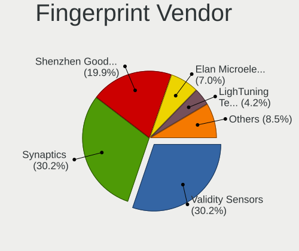

| Vendor                             | Notebooks | Percent |
|------------------------------------|-----------|---------|
| Validity Sensors                   | 302       | 30.2%   |
| Synaptics                          | 302       | 30.2%   |
| Shenzhen Goodix Technology         | 199       | 19.9%   |
| Elan Microelectronics              | 70        | 7%      |
| LighTuning Technology              | 42        | 4.2%    |
| Upek                               | 33        | 3.3%    |
| AuthenTec                          | 23        | 2.3%    |
| STMicroelectronics                 | 7         | 0.7%    |
| Focal-systems.Corp                 | 7         | 0.7%    |
| Realtek USB2.0 Finger Print Bridge | 5         | 0.5%    |
| HOLTEK                             | 4         | 0.4%    |
| Samsung Electronics                | 3         | 0.3%    |
| DigitalPersona                     | 3         | 0.3%    |

Fingerprint Model
-----------------

Fingerprint sensor models

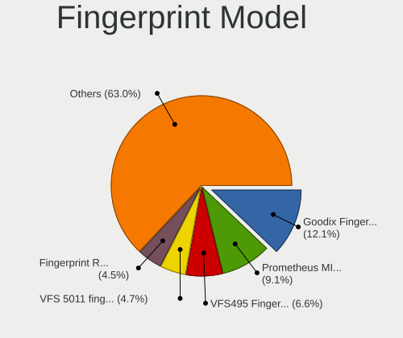

| Model                                                                      | Notebooks | Percent |
|----------------------------------------------------------------------------|-----------|---------|
| Shenzhen Goodix  Fingerprint Device                                        | 121       | 12.1%   |
| Synaptics Prometheus MIS Touch Fingerprint Reader                          | 91        | 9.1%    |
| Validity Sensors VFS495 Fingerprint Reader                                 | 66        | 6.6%    |
| Validity Sensors VFS 5011 fingerprint sensor                               | 47        | 4.7%    |
| Shenzhen Goodix Fingerprint Reader                                         | 45        | 4.5%    |
| Elan ELAN:Fingerprint                                                      | 44        | 4.4%    |
| Synaptics Metallica MIS Touch Fingerprint Reader                           | 42        | 4.2%    |
| Shenzhen Goodix FingerPrint                                                | 33        | 3.3%    |
| Validity Sensors Synaptics WBDI                                            | 32        | 3.2%    |
| Upek Biometric Touchchip/Touchstrip Fingerprint Sensor                     | 29        | 2.9%    |
| Synaptics Fingerprint reader [HP G6]                                       | 28        | 2.8%    |
| LighTuning EgisTec Touch Fingerprint Sensor                                | 25        | 2.5%    |
| Elan ELAN:ARM-M4                                                           | 25        | 2.5%    |
| Validity Sensors VFS491                                                    | 23        | 2.3%    |
| Validity Sensors VFS5011 Fingerprint Reader                                | 20        | 2%      |
| Synaptics WBDI Fingerprint Reader USB 086                                  | 20        | 2%      |
| Synaptics  FS7604 Touch Fingerprint Sensor with PurePrint                  | 18        | 1.8%    |
| Synaptics UWP WBDI Device                                                  | 17        | 1.7%    |
| Validity Sensors VFS471 Fingerprint Reader                                 | 16        | 1.6%    |
| Validity Sensors VFS451 Fingerprint Reader                                 | 16        | 1.6%    |
| Validity Sensors Swipe Fingerprint Sensor                                  | 16        | 1.6%    |
| Validity Sensors Synaptics VFS7552 Touch Fingerprint Sensor with PurePrint | 15        | 1.5%    |
| Validity Sensors Fingerprint scanner                                       | 15        | 1.5%    |
| Validity Sensors VFS7500 Touch Fingerprint Sensor                          | 14        | 1.4%    |
| Synaptics Metallica MOH Touch Fingerprint Reader                           | 14        | 1.4%    |
| Synaptics FS7604 Touch Fingerprint Sensor with PurePrint                   | 14        | 1.4%    |
| LighTuning ES603 Swipe Fingerprint Sensor                                  | 13        | 1.3%    |
| Synaptics WBDI                                                             | 12        | 1.2%    |
| Synaptics  WBDI                                                            | 12        | 1.2%    |
| Synaptics Prometheus Fingerprint Reader                                    | 11        | 1.1%    |
| AuthenTec Fingerprint Sensor                                               | 8         | 0.8%    |
| STMicroelectronics Fingerprint Reader                                      | 7         | 0.7%    |
| Focal-systems.Corp FT9201Fingerprint.                                      | 7         | 0.7%    |
| Validity Sensors VFS101 Fingerprint Reader                                 | 6         | 0.6%    |
| Synaptics WBDI Device                                                      | 6         | 0.6%    |
| Synaptics UWP WBDI                                                         | 6         | 0.6%    |
| AuthenTec AES2810                                                          | 6         | 0.6%    |
| Unknown                                                                    | 6         | 0.6%    |
| Validity Sensors VFS7552 Touch Fingerprint Sensor                          | 5         | 0.5%    |
| Synaptics TouchPad                                                         | 5         | 0.5%    |

Chipcard Vendor
---------------

Chipcard module vendors

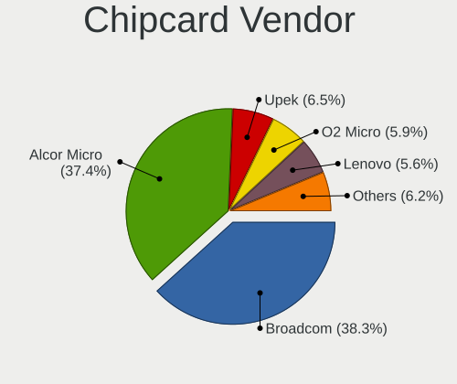

| Vendor                    | Notebooks | Percent |
|---------------------------|-----------|---------|
| Broadcom                  | 129       | 38.28%  |
| Alcor Micro               | 126       | 37.39%  |
| Upek                      | 22        | 6.53%   |
| O2 Micro                  | 20        | 5.93%   |
| Lenovo                    | 19        | 5.64%   |
| Yubico.com                | 8         | 2.37%   |
| Gemalto (was Gemplus)     | 5         | 1.48%   |
| Reiner SCT Kartensysteme  | 1         | 0.3%    |
| Realtek Semiconductor     | 1         | 0.3%    |
| OmniKey                   | 1         | 0.3%    |
| Hewlett-Packard           | 1         | 0.3%    |
| Clay Logic                | 1         | 0.3%    |
| C3PO                      | 1         | 0.3%    |
| Aladdin Knowledge Systems | 1         | 0.3%    |
| Advanced Card Systems     | 1         | 0.3%    |

Chipcard Model
--------------

Chipcard module models

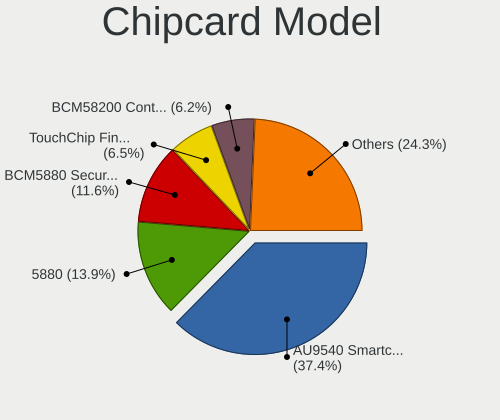

| Model                                                                        | Notebooks | Percent |
|------------------------------------------------------------------------------|-----------|---------|
| Alcor Micro AU9540 Smartcard Reader                                          | 126       | 37.39%  |
| Broadcom 5880                                                                | 47        | 13.95%  |
| Broadcom BCM5880 Secure Applications Processor                               | 39        | 11.57%  |
| Upek TouchChip Fingerprint Coprocessor (WBF advanced mode)                   | 22        | 6.53%   |
| Broadcom BCM58200 ControlVault 3 (FingerPrint sensor + Contacted SmartCard)  | 21        | 6.23%   |
| O2 Micro OZ776 CCID Smartcard Reader                                         | 19        | 5.64%   |
| Lenovo Integrated Smart Card Reader                                          | 19        | 5.64%   |
| Broadcom BCM5880 Secure Applications Processor with fingerprint swipe sensor | 16        | 4.75%   |
| Yubico.com Yubikey NEO(-N) OTP+CCID                                          | 7         | 2.08%   |
| Broadcom 58200                                                               | 6         | 1.78%   |
| Gemalto (was Gemplus) Compact Smart Card Reader Writer                       | 3         | 0.89%   |
| Yubico.com Yubikey 4/5 U2F+CCID                                              | 1         | 0.3%    |
| Reiner SCT Kartensysteme cyberJack RFID basis contactless smartcard reader   | 1         | 0.3%    |
| Realtek Semiconductor Smart Card Reader Interface                            | 1         | 0.3%    |
| OmniKey 3x21 Smart Card Reader                                               | 1         | 0.3%    |
| O2 Micro Oz776 SmartCard Reader                                              | 1         | 0.3%    |
| Hewlett-Packard SC Keyboard - Apollo (Liteon)                                | 1         | 0.3%    |
| Gemalto (was Gemplus) Prox SU USB PC Link Reader                             | 1         | 0.3%    |
| Gemalto (was Gemplus) GemPC Twin SmartCard Reader                            | 1         | 0.3%    |
| Clay Logic Nitrokey Pro                                                      | 1         | 0.3%    |
| C3PO USB SMART CARD READER                                                   | 1         | 0.3%    |
| Aladdin Knowledge Systems Token JC                                           | 1         | 0.3%    |
| Advanced Card Systems ACR122U                                                | 1         | 0.3%    |

Unsupported
-----------

Unsupported Devices
-------------------

Total unsupported devices on board

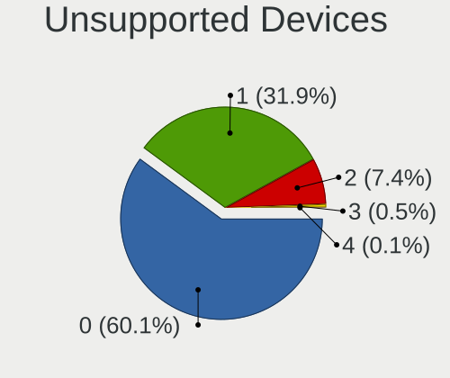

| Total | Notebooks | Percent |
|-------|-----------|---------|
| 0     | 3121      | 60.1%   |
| 1     | 1657      | 31.91%  |
| 2     | 383       | 7.38%   |
| 3     | 28        | 0.54%   |
| 4     | 4         | 0.08%   |

Unsupported Device Types
------------------------

Types of unsupported devices

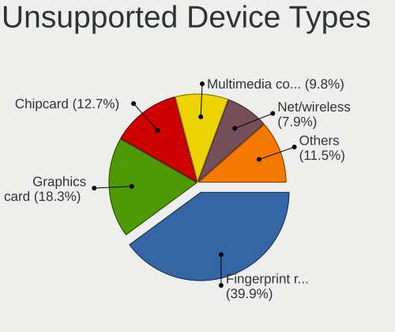

| Type                     | Notebooks | Percent |
|--------------------------|-----------|---------|
| Fingerprint reader       | 981       | 39.91%  |
| Graphics card            | 451       | 18.35%  |
| Chipcard                 | 311       | 12.65%  |
| Multimedia controller    | 240       | 9.76%   |
| Net/wireless             | 193       | 7.85%   |
| Camera                   | 78        | 3.17%   |
| Net/ethernet             | 61        | 2.48%   |
| Bluetooth                | 47        | 1.91%   |
| Storage                  | 23        | 0.94%   |
| Card reader              | 23        | 0.94%   |
| Communication controller | 18        | 0.73%   |
| Sound                    | 14        | 0.57%   |
| Network                  | 7         | 0.28%   |
| Modem                    | 4         | 0.16%   |
| Dvb card                 | 4         | 0.16%   |
| Storage/nvme             | 3         | 0.12%   |

