Manjaro - Tested Hardware & Statistics (Notebooks)
--------------------------------------------------

A project to collect tested hardware configurations for Manjaro.

Anyone can contribute to this report by the [hw-probe](https://github.com/linuxhw/hw-probe) tool:

    sudo -E hw-probe -all -upload

Please contribute! Especially if your hardware is rare.

Contents
--------

* [ Test Cases ](#test-cases)

* [ System ](#system)
  - [ OS                       ](#os)
  - [ OS Family                ](#os-family)
  - [ Kernel                   ](#kernel)
  - [ Kernel Family            ](#kernel-family)
  - [ Kernel Major Ver.        ](#kernel-major-ver)
  - [ Arch                     ](#arch)
  - [ DE                       ](#de)
  - [ Display Server           ](#display-server)
  - [ Display Manager          ](#display-manager)
  - [ OS Lang                  ](#os-lang)
  - [ Boot Mode                ](#boot-mode)
  - [ Filesystem               ](#filesystem)
  - [ Part. scheme             ](#part-scheme)
  - [ Dual Boot with Linux/BSD ](#dual-boot-with-linuxbsd)
  - [ Dual Boot (Win)          ](#dual-boot-win)

* [ Board ](#board)
  - [ Vendor                   ](#vendor)
  - [ Model                    ](#model)
  - [ Model Family             ](#model-family)
  - [ MFG Year                 ](#mfg-year)
  - [ Form Factor              ](#form-factor)
  - [ Secure Boot              ](#secure-boot)
  - [ Coreboot                 ](#coreboot)
  - [ RAM Size                 ](#ram-size)
  - [ RAM Used                 ](#ram-used)
  - [ Total Drives             ](#total-drives)
  - [ Has CD-ROM               ](#has-cd-rom)
  - [ Has Ethernet             ](#has-ethernet)
  - [ Has WiFi                 ](#has-wifi)
  - [ Has Bluetooth            ](#has-bluetooth)

* [ Location ](#location)
  - [ Country                  ](#country)
  - [ City                     ](#city)

* [ Drives ](#drives)
  - [ Drive Vendor             ](#drive-vendor)
  - [ Drive Model              ](#drive-model)
  - [ HDD Vendor               ](#hdd-vendor)
  - [ SSD Vendor               ](#ssd-vendor)
  - [ Drive Kind               ](#drive-kind)
  - [ Drive Connector          ](#drive-connector)
  - [ Drive Size               ](#drive-size)
  - [ Space Total              ](#space-total)
  - [ Space Used               ](#space-used)
  - [ Malfunc. Drives          ](#malfunc-drives)
  - [ Malfunc. Drive Vendor    ](#malfunc-drive-vendor)
  - [ Malfunc. HDD Vendor      ](#malfunc-hdd-vendor)
  - [ Malfunc. Drive Kind      ](#malfunc-drive-kind)
  - [ Failed Drives            ](#failed-drives)
  - [ Failed Drive Vendor      ](#failed-drive-vendor)
  - [ Drive Status             ](#drive-status)

* [ Storage controller ](#storage-controller)
  - [ Storage Vendor           ](#storage-vendor)
  - [ Storage Model            ](#storage-model)
  - [ Storage Kind             ](#storage-kind)

* [ Processor ](#processor)
  - [ CPU Vendor               ](#cpu-vendor)
  - [ CPU Model                ](#cpu-model)
  - [ CPU Model Family         ](#cpu-model-family)
  - [ CPU Cores                ](#cpu-cores)
  - [ CPU Sockets              ](#cpu-sockets)
  - [ CPU Threads              ](#cpu-threads)
  - [ CPU Op-Modes             ](#cpu-op-modes)
  - [ CPU Microcode            ](#cpu-microcode)
  - [ CPU Microarch            ](#cpu-microarch)

* [ Graphics ](#graphics)
  - [ GPU Vendor               ](#gpu-vendor)
  - [ GPU Model                ](#gpu-model)
  - [ GPU Combo                ](#gpu-combo)
  - [ GPU Driver               ](#gpu-driver)
  - [ GPU Memory               ](#gpu-memory)

* [ Monitor ](#monitor)
  - [ Monitor Vendor           ](#monitor-vendor)
  - [ Monitor Model            ](#monitor-model)
  - [ Monitor Resolution       ](#monitor-resolution)
  - [ Monitor Diagonal         ](#monitor-diagonal)
  - [ Monitor Width            ](#monitor-width)
  - [ Aspect Ratio             ](#aspect-ratio)
  - [ Monitor Area             ](#monitor-area)
  - [ Pixel Density            ](#pixel-density)
  - [ Multiple Monitors        ](#multiple-monitors)

* [ Network ](#network)
  - [ Net Controller Vendor    ](#net-controller-vendor)
  - [ Net Controller Model     ](#net-controller-model)
  - [ Wireless Vendor          ](#wireless-vendor)
  - [ Wireless Model           ](#wireless-model)
  - [ Ethernet Vendor          ](#ethernet-vendor)
  - [ Ethernet Model           ](#ethernet-model)
  - [ Net Controller Kind      ](#net-controller-kind)
  - [ Used Controller          ](#used-controller)
  - [ NICs                     ](#nics)
  - [ IPv6                     ](#ipv6)

* [ Bluetooth ](#bluetooth)
  - [ Bluetooth Vendor         ](#bluetooth-vendor)
  - [ Bluetooth Model          ](#bluetooth-model)

* [ Sound ](#sound)
  - [ Sound Vendor             ](#sound-vendor)
  - [ Sound Model              ](#sound-model)

* [ Memory ](#memory)
  - [ Memory Vendor            ](#memory-vendor)
  - [ Memory Model             ](#memory-model)
  - [ Memory Kind              ](#memory-kind)
  - [ Memory Form Factor       ](#memory-form-factor)
  - [ Memory Size              ](#memory-size)
  - [ Memory Speed             ](#memory-speed)

* [ Printers & scanners ](#printers--scanners)
  - [ Printer Vendor           ](#printer-vendor)
  - [ Printer Model            ](#printer-model)
  - [ Scanner Vendor           ](#scanner-vendor)
  - [ Scanner Model            ](#scanner-model)

* [ Camera ](#camera)
  - [ Camera Vendor            ](#camera-vendor)
  - [ Camera Model             ](#camera-model)

* [ Security ](#security)
  - [ Fingerprint Vendor       ](#fingerprint-vendor)
  - [ Fingerprint Model        ](#fingerprint-model)
  - [ Chipcard Vendor          ](#chipcard-vendor)
  - [ Chipcard Model           ](#chipcard-model)

* [ Unsupported ](#unsupported)
  - [ Unsupported Devices      ](#unsupported-devices)
  - [ Unsupported Device Types ](#unsupported-device-types)

Test Cases
----------

Total: 4365

| Vendor        | Model                       | Probe                                                      | Date         |
|---------------|-----------------------------|------------------------------------------------------------|--------------|
| Digma         | EVE 15 C407 ES5054EW        | [7b597ebcc8](https://linux-hardware.org/?probe=7b597ebcc8) | Aug 01, 2022 |
| ASUSTek       | ROG Strix G513QY_G513QY     | [370b872aa5](https://linux-hardware.org/?probe=370b872aa5) | Aug 01, 2022 |
| Dell          | G15 Special Edition 5521    | [c680e6f144](https://linux-hardware.org/?probe=c680e6f144) | Aug 01, 2022 |
| Dell          | Latitude 5290 2-in-1        | [838be3a87a](https://linux-hardware.org/?probe=838be3a87a) | Jul 31, 2022 |
| ASUSTek       | ASUS TUF Gaming A17 FA70... | [249d407b66](https://linux-hardware.org/?probe=249d407b66) | Jul 30, 2022 |
| Dell          | Inspiron 5520               | [a4baade53f](https://linux-hardware.org/?probe=a4baade53f) | Jul 30, 2022 |
| Dell          | Inspiron 7577               | [a2909a87b1](https://linux-hardware.org/?probe=a2909a87b1) | Jul 30, 2022 |
| Schenker      | VISION 15 (SVS15E21)        | [aa446a0409](https://linux-hardware.org/?probe=aa446a0409) | Jul 29, 2022 |
| Dell          | Latitude 5290 2-in-1        | [8d93753bc7](https://linux-hardware.org/?probe=8d93753bc7) | Jul 29, 2022 |
| Dell          | Latitude 5290 2-in-1        | [910241c92e](https://linux-hardware.org/?probe=910241c92e) | Jul 29, 2022 |
| Samsung       | 340XAA/350XAA/550XAA        | [fdb481a551](https://linux-hardware.org/?probe=fdb481a551) | Jul 28, 2022 |
| Acer          | Aspire A515-43              | [230cf1bf3d](https://linux-hardware.org/?probe=230cf1bf3d) | Jul 28, 2022 |
| Lenovo        | IdeaPad U430 Touch 20270    | [d73469794d](https://linux-hardware.org/?probe=d73469794d) | Jul 28, 2022 |
| Alienware     | 17                          | [6a4212d19d](https://linux-hardware.org/?probe=6a4212d19d) | Jul 27, 2022 |
| Dell          | Inspiron 5502               | [f84c29c4b6](https://linux-hardware.org/?probe=f84c29c4b6) | Jul 27, 2022 |
| Lenovo        | ThinkPad T480s 20L8S31T0... | [60449c872b](https://linux-hardware.org/?probe=60449c872b) | Jul 27, 2022 |
| HP            | Pavilion Gaming Laptop 1... | [f4f4bdfefd](https://linux-hardware.org/?probe=f4f4bdfefd) | Jul 27, 2022 |
| MSI           | GF63 Thin 9SC               | [6d42baa166](https://linux-hardware.org/?probe=6d42baa166) | Jul 26, 2022 |
| Lenovo        | ThinkPad E585 20KV000YUS    | [0c8cde264e](https://linux-hardware.org/?probe=0c8cde264e) | Jul 26, 2022 |
| Acer          | Aspire A315-42              | [78415dc6be](https://linux-hardware.org/?probe=78415dc6be) | Jul 25, 2022 |
| Acer          | Predator PH315-52           | [a1346acc8a](https://linux-hardware.org/?probe=a1346acc8a) | Jul 25, 2022 |
| Dell          | Inspiron 15-5578            | [7621729bff](https://linux-hardware.org/?probe=7621729bff) | Jul 25, 2022 |
| ASUSTek       | VivoBook_ASUSLaptop X435... | [123fc55893](https://linux-hardware.org/?probe=123fc55893) | Jul 24, 2022 |
| MSI           | GF63 Thin 9SC               | [1a2403b95a](https://linux-hardware.org/?probe=1a2403b95a) | Jul 24, 2022 |
| ASUSTek       | ROG Zephyrus G14 GA402RK... | [83e5824a05](https://linux-hardware.org/?probe=83e5824a05) | Jul 24, 2022 |
| ASUSTek       | Q504UA                      | [373dce5a6f](https://linux-hardware.org/?probe=373dce5a6f) | Jul 24, 2022 |
| System76      | Serval WS                   | [18259132ff](https://linux-hardware.org/?probe=18259132ff) | Jul 22, 2022 |
| MSI           | GS66 Stealth 10SGS          | [8d7172fe7e](https://linux-hardware.org/?probe=8d7172fe7e) | Jul 22, 2022 |
| ASUSTek       | X450LCP                     | [0617861116](https://linux-hardware.org/?probe=0617861116) | Jul 22, 2022 |
| Lenovo        | IdeaPad S145-14IIL 81W6     | [4e47525879](https://linux-hardware.org/?probe=4e47525879) | Jul 22, 2022 |
| Lenovo        | IdeaPad U330p 20267         | [1775f75940](https://linux-hardware.org/?probe=1775f75940) | Jul 22, 2022 |
| HP            | ZBook 15 G5                 | [771428353e](https://linux-hardware.org/?probe=771428353e) | Jul 21, 2022 |
| Lenovo        | IdeaPad Z510 20287          | [e632ef83da](https://linux-hardware.org/?probe=e632ef83da) | Jul 20, 2022 |
| HP            | EliteBook 840 G5            | [03afe0a303](https://linux-hardware.org/?probe=03afe0a303) | Jul 20, 2022 |
| Lenovo        | IdeaPad 120S-14IAP 81A5     | [5859932a73](https://linux-hardware.org/?probe=5859932a73) | Jul 20, 2022 |
| Dell          | Vostro 15 3510              | [8327d57f7b](https://linux-hardware.org/?probe=8327d57f7b) | Jul 20, 2022 |
| Notebook      | W350STQ/W370ST              | [613b1f9d19](https://linux-hardware.org/?probe=613b1f9d19) | Jul 20, 2022 |
| HP            | Pavilion Laptop 14-ce0xx... | [29847a6864](https://linux-hardware.org/?probe=29847a6864) | Jul 20, 2022 |
| Lenovo        | ThinkPad E585 20KVCTO1WW    | [0602b2d850](https://linux-hardware.org/?probe=0602b2d850) | Jul 19, 2022 |
| Dell          | Latitude E5530 non-vPro     | [27a607d6ba](https://linux-hardware.org/?probe=27a607d6ba) | Jul 19, 2022 |
| HP            | EliteBook 850 G1            | [383ec7a7fd](https://linux-hardware.org/?probe=383ec7a7fd) | Jul 18, 2022 |
| Apple         | MacBookPro14,2              | [4f1ce227b5](https://linux-hardware.org/?probe=4f1ce227b5) | Jul 18, 2022 |
| Dell          | Inspiron 3421               | [d4c15eb5fd](https://linux-hardware.org/?probe=d4c15eb5fd) | Jul 18, 2022 |
| Lenovo        | ThinkPad SL510 28479XU      | [092a752a62](https://linux-hardware.org/?probe=092a752a62) | Jul 18, 2022 |
| Lenovo        | ThinkPad SL510 28479XU      | [5eea2f8d37](https://linux-hardware.org/?probe=5eea2f8d37) | Jul 18, 2022 |
| Lenovo        | ThinkPad Edge E430 32543... | [75cfb6ffa8](https://linux-hardware.org/?probe=75cfb6ffa8) | Jul 17, 2022 |
| Dell          | Latitude 7490               | [bed5644964](https://linux-hardware.org/?probe=bed5644964) | Jul 17, 2022 |
| HP            | Laptop 15-dy0xxx            | [cfd2b5a69c](https://linux-hardware.org/?probe=cfd2b5a69c) | Jul 17, 2022 |
| Schenker      | XMG PRO (Late 2021)         | [a59796b464](https://linux-hardware.org/?probe=a59796b464) | Jul 17, 2022 |
| Schenker      | XMG PRO (Late 2021)         | [d739731ef5](https://linux-hardware.org/?probe=d739731ef5) | Jul 17, 2022 |
| Google        | Coral                       | [ebf34e57e6](https://linux-hardware.org/?probe=ebf34e57e6) | Jul 17, 2022 |
| HP            | ProBook 4520s               | [580f66ae82](https://linux-hardware.org/?probe=580f66ae82) | Jul 16, 2022 |
| Lenovo        | Legion S7 15ACH6 82K8       | [1bb517b788](https://linux-hardware.org/?probe=1bb517b788) | Jul 16, 2022 |
| ASUSTek       | N552VW                      | [b29b2f27df](https://linux-hardware.org/?probe=b29b2f27df) | Jul 16, 2022 |
| ASUSTek       | ASUS EXPERTBOOK B9450FA_... | [aa025d852d](https://linux-hardware.org/?probe=aa025d852d) | Jul 16, 2022 |
| Lenovo        | IdeaPad 120S-14IAP 81A5     | [27f6399025](https://linux-hardware.org/?probe=27f6399025) | Jul 16, 2022 |
| ASUSTek       | X555LN                      | [0d6d6728ba](https://linux-hardware.org/?probe=0d6d6728ba) | Jul 15, 2022 |
| Chuwi         | HeroBook Air                | [8f50476a9d](https://linux-hardware.org/?probe=8f50476a9d) | Jul 15, 2022 |
| HP            | Laptop 17-cp0xxx            | [476ab880f4](https://linux-hardware.org/?probe=476ab880f4) | Jul 15, 2022 |
| Notebook      | W350STQ/W370ST              | [86daf7b30d](https://linux-hardware.org/?probe=86daf7b30d) | Jul 15, 2022 |
| Lenovo        | G580 20150                  | [d6b737940e](https://linux-hardware.org/?probe=d6b737940e) | Jul 15, 2022 |
| Apple         | MacBookAir6,2               | [fe231e27cf](https://linux-hardware.org/?probe=fe231e27cf) | Jul 14, 2022 |
| Lenovo        | IdeaPad 5 14ALC05 82LM      | [367adf8f50](https://linux-hardware.org/?probe=367adf8f50) | Jul 14, 2022 |
| HP            | Laptop 15-dy0xxx            | [a7eb387b79](https://linux-hardware.org/?probe=a7eb387b79) | Jul 14, 2022 |
| Chuwi         | HeroBook Air                | [d76b0db2ca](https://linux-hardware.org/?probe=d76b0db2ca) | Jul 13, 2022 |
| HUAWEI        | CREM-WXX9                   | [f764827707](https://linux-hardware.org/?probe=f764827707) | Jul 13, 2022 |
| Dell          | Inspiron 7460               | [316285fb12](https://linux-hardware.org/?probe=316285fb12) | Jul 13, 2022 |
| Dell          | XPS 15 9510                 | [3207d8f9e9](https://linux-hardware.org/?probe=3207d8f9e9) | Jul 12, 2022 |
| Dell          | XPS 15 9510                 | [0f3d24f508](https://linux-hardware.org/?probe=0f3d24f508) | Jul 12, 2022 |
| HUAWEI        | KLVL-WXXW                   | [ded0cc5604](https://linux-hardware.org/?probe=ded0cc5604) | Jul 12, 2022 |
| Acer          | Aspire ES1-523              | [109bec9fa8](https://linux-hardware.org/?probe=109bec9fa8) | Jul 12, 2022 |
| Lenovo        | ThinkPad P15v Gen 1 20TQ... | [4d9388058d](https://linux-hardware.org/?probe=4d9388058d) | Jul 12, 2022 |
| Lenovo        | ThinkPad L470 20J5S01L00    | [401e13e2a6](https://linux-hardware.org/?probe=401e13e2a6) | Jul 12, 2022 |
| ASUSTek       | X202E                       | [102f50d1a3](https://linux-hardware.org/?probe=102f50d1a3) | Jul 12, 2022 |
| Apple         | MacBookPro14,1              | [32cbf49371](https://linux-hardware.org/?probe=32cbf49371) | Jul 11, 2022 |
| ASUSTek       | VivoBook_ASUSLaptop X571... | [98d0043f0e](https://linux-hardware.org/?probe=98d0043f0e) | Jul 10, 2022 |
| Lenovo        | ThinkPad L13 Gen 2 20VH0... | [b0f6891a0b](https://linux-hardware.org/?probe=b0f6891a0b) | Jul 10, 2022 |
| Lenovo        | ThinkPad L13 Gen 2 20VH0... | [5d31b181fd](https://linux-hardware.org/?probe=5d31b181fd) | Jul 10, 2022 |
| Timi          | TM1701                      | [8786fe1e91](https://linux-hardware.org/?probe=8786fe1e91) | Jul 10, 2022 |
| ASUSTek       | VivoBook 15_ASUS Laptop ... | [ec2174a329](https://linux-hardware.org/?probe=ec2174a329) | Jul 10, 2022 |
| HP            | EliteBook 8540p             | [b161f9e458](https://linux-hardware.org/?probe=b161f9e458) | Jul 10, 2022 |
| Lenovo        | IdeaPad Gaming 3 15ARH05... | [567077c28d](https://linux-hardware.org/?probe=567077c28d) | Jul 08, 2022 |
| Dell          | XPS 13 9333                 | [e464cd5823](https://linux-hardware.org/?probe=e464cd5823) | Jul 08, 2022 |
| Lenovo        | ThinkBook 14 G2 ITL 20VD    | [5fa7449343](https://linux-hardware.org/?probe=5fa7449343) | Jul 08, 2022 |
| HP            | ProBook 4540s               | [6b67ccac52](https://linux-hardware.org/?probe=6b67ccac52) | Jul 08, 2022 |
| Lenovo        | ThinkPad X230 2325TXB       | [1bf8e19c53](https://linux-hardware.org/?probe=1bf8e19c53) | Jul 08, 2022 |
| HP            | ProBook 4540s               | [e209d1f716](https://linux-hardware.org/?probe=e209d1f716) | Jul 08, 2022 |
| Dell          | Latitude E6430              | [9375063ae6](https://linux-hardware.org/?probe=9375063ae6) | Jul 08, 2022 |
| Acer          | Swift SF514-54GT            | [554171275d](https://linux-hardware.org/?probe=554171275d) | Jul 07, 2022 |
| ASUSTek       | TUF Gaming FX505DV_FX505... | [c9eb8f9a5f](https://linux-hardware.org/?probe=c9eb8f9a5f) | Jul 07, 2022 |
| Dell          | Inspiron 7572               | [e249d01b2b](https://linux-hardware.org/?probe=e249d01b2b) | Jul 06, 2022 |
| HUAWEI        | VLT-WX0                     | [9467db0d89](https://linux-hardware.org/?probe=9467db0d89) | Jul 06, 2022 |
| Toshiba       | Satellite A100              | [460363ac20](https://linux-hardware.org/?probe=460363ac20) | Jul 06, 2022 |
| Lenovo        | Legion 5 15ACH6H 82JU       | [d58dd09f25](https://linux-hardware.org/?probe=d58dd09f25) | Jul 06, 2022 |
| Lenovo        | Legion 5 17ACH6 82K0        | [53417c8761](https://linux-hardware.org/?probe=53417c8761) | Jul 06, 2022 |
| Toshiba       | Satellite A100              | [2b25713a3d](https://linux-hardware.org/?probe=2b25713a3d) | Jul 05, 2022 |
| HP            | ProBook 430 G6              | [4281fab7fd](https://linux-hardware.org/?probe=4281fab7fd) | Jul 05, 2022 |
| Lenovo        | IdeaPad 700-15ISK 80RU      | [61d8d4b071](https://linux-hardware.org/?probe=61d8d4b071) | Jul 05, 2022 |
| HP            | Pavilion g6                 | [0cd693879d](https://linux-hardware.org/?probe=0cd693879d) | Jul 05, 2022 |
| Dell          | Latitude E6410              | [51fa58eb7d](https://linux-hardware.org/?probe=51fa58eb7d) | Jul 05, 2022 |
| Dell          | Inspiron 1764               | [3fa5f4d0a8](https://linux-hardware.org/?probe=3fa5f4d0a8) | Jul 05, 2022 |
| HP            | Pavilion Gaming Laptop 1... | [d285ee1f39](https://linux-hardware.org/?probe=d285ee1f39) | Jul 05, 2022 |
| Sony          | VJF153                      | [a1efa9107c](https://linux-hardware.org/?probe=a1efa9107c) | Jul 05, 2022 |
| ASUSTek       | ASUS TUF Gaming A17 FA70... | [7d1eafc534](https://linux-hardware.org/?probe=7d1eafc534) | Jul 04, 2022 |
| ASUSTek       | ASUS TUF Gaming A17 FA70... | [341512bec5](https://linux-hardware.org/?probe=341512bec5) | Jul 04, 2022 |
| LG Electro... | 17Z90N-V.AA55A1             | [272164819f](https://linux-hardware.org/?probe=272164819f) | Jul 04, 2022 |
| ASUSTek       | X55U                        | [ed55b4ef39](https://linux-hardware.org/?probe=ed55b4ef39) | Jul 03, 2022 |
| Dell          | XPS 15 9570                 | [f5b850a82c](https://linux-hardware.org/?probe=f5b850a82c) | Jul 03, 2022 |
| ASUSTek       | ZenBook UX435EG_UX435EG     | [9e7e4a5d8d](https://linux-hardware.org/?probe=9e7e4a5d8d) | Jul 03, 2022 |
| Timi          | Mi NoteBook Pro             | [046a18dc14](https://linux-hardware.org/?probe=046a18dc14) | Jul 03, 2022 |
| Lenovo        | Legion 5 17ACH6 82K0        | [c55ade019d](https://linux-hardware.org/?probe=c55ade019d) | Jul 02, 2022 |
| Lenovo        | ThinkPad X240 20AMS1JQ11    | [d90a910042](https://linux-hardware.org/?probe=d90a910042) | Jul 02, 2022 |
| Dell          | Latitude E6410              | [325a691029](https://linux-hardware.org/?probe=325a691029) | Jul 02, 2022 |
| TENKU         | SB14                        | [cbe2900f4f](https://linux-hardware.org/?probe=cbe2900f4f) | Jul 02, 2022 |
| HP            | ProBook 440 G4              | [ffaa37530b](https://linux-hardware.org/?probe=ffaa37530b) | Jul 02, 2022 |
| HP            | ProBook 4540s               | [c47e971697](https://linux-hardware.org/?probe=c47e971697) | Jul 01, 2022 |
| ASUSTek       | TUF Gaming FX505DT_FX505... | [9034bf7260](https://linux-hardware.org/?probe=9034bf7260) | Jul 01, 2022 |
| Dell          | Inspiron 1764               | [dd5c77d711](https://linux-hardware.org/?probe=dd5c77d711) | Jul 01, 2022 |
| Chuwi         | HeroBook Air                | [217dcb770c](https://linux-hardware.org/?probe=217dcb770c) | Jul 01, 2022 |
| Dell          | Inspiron 5520               | [15b5edddd3](https://linux-hardware.org/?probe=15b5edddd3) | Jun 30, 2022 |
| Lenovo        | G580 20150                  | [dbe5fe496a](https://linux-hardware.org/?probe=dbe5fe496a) | Jun 29, 2022 |
| HP            | OMEN Laptop 15-en0xxx       | [53842b1b7d](https://linux-hardware.org/?probe=53842b1b7d) | Jun 29, 2022 |
| Dell          | Latitude 3590               | [b5d4509068](https://linux-hardware.org/?probe=b5d4509068) | Jun 29, 2022 |
| Dell          | Inspiron 3593               | [5b091180ec](https://linux-hardware.org/?probe=5b091180ec) | Jun 28, 2022 |
| SLIMBOOK      | PROX14-AMD                  | [1b58bbb69c](https://linux-hardware.org/?probe=1b58bbb69c) | Jun 28, 2022 |
| ASUSTek       | X507UB                      | [0ba0fc4089](https://linux-hardware.org/?probe=0ba0fc4089) | Jun 28, 2022 |
| Lenovo        | ThinkPad E14 Gen 3 20YDS... | [ec155fca3f](https://linux-hardware.org/?probe=ec155fca3f) | Jun 28, 2022 |
| Lenovo        | ThinkPad E14 Gen 3 20YDS... | [016ee6ec73](https://linux-hardware.org/?probe=016ee6ec73) | Jun 28, 2022 |
| HP            | Laptop 14s-fq0xxx           | [c442dd3af1](https://linux-hardware.org/?probe=c442dd3af1) | Jun 28, 2022 |
| Lenovo        | ThinkBook 15-IIL 20SM       | [95db2f9536](https://linux-hardware.org/?probe=95db2f9536) | Jun 27, 2022 |
| Lenovo        | IdeaPad 320-14AST 80XU      | [78eaeff700](https://linux-hardware.org/?probe=78eaeff700) | Jun 27, 2022 |
| Fujitsu       | LIFEBOOK A512               | [8fb8607282](https://linux-hardware.org/?probe=8fb8607282) | Jun 27, 2022 |
| Lenovo        | ThinkPad E15 Gen 4 21EES... | [2595b295a9](https://linux-hardware.org/?probe=2595b295a9) | Jun 27, 2022 |
| Intel Clie... | LAPKC71F                    | [1a50f7c080](https://linux-hardware.org/?probe=1a50f7c080) | Jun 27, 2022 |
| Lenovo        | Legion 5 Pro 16ACH6H 82J... | [8a6b59bd5d](https://linux-hardware.org/?probe=8a6b59bd5d) | Jun 25, 2022 |
| Lenovo        | Legion 5 Pro 16ACH6H 82J... | [9d53805c9a](https://linux-hardware.org/?probe=9d53805c9a) | Jun 25, 2022 |
| Sony          | VPCF236FM                   | [b2af243689](https://linux-hardware.org/?probe=b2af243689) | Jun 25, 2022 |
| Lenovo        | IdeaPad Gaming 3 15IMH05... | [072acf05a0](https://linux-hardware.org/?probe=072acf05a0) | Jun 24, 2022 |
| Lenovo        | Legion 5 82B5               | [f0b00bb55e](https://linux-hardware.org/?probe=f0b00bb55e) | Jun 24, 2022 |
| Lenovo        | ThinkPad S2 20GJA00S00      | [44eb58334d](https://linux-hardware.org/?probe=44eb58334d) | Jun 24, 2022 |
| LG Electro... | 14Z90N-VA76K                | [9e606a176f](https://linux-hardware.org/?probe=9e606a176f) | Jun 24, 2022 |
| ASUSTek       | X751LK                      | [d7f4b1678b](https://linux-hardware.org/?probe=d7f4b1678b) | Jun 24, 2022 |
| ASUSTek       | X751LK                      | [09dfab066c](https://linux-hardware.org/?probe=09dfab066c) | Jun 24, 2022 |
| Lenovo        | IdeaPad 5 15ARE05 81YQ      | [97222f18a0](https://linux-hardware.org/?probe=97222f18a0) | Jun 23, 2022 |
| HP            | EliteBook 8470p             | [2ba22aa099](https://linux-hardware.org/?probe=2ba22aa099) | Jun 22, 2022 |
| HP            | EliteBook 8470p             | [eea8da46bd](https://linux-hardware.org/?probe=eea8da46bd) | Jun 22, 2022 |
| Dell          | Vostro 5470                 | [9a5e42fa6f](https://linux-hardware.org/?probe=9a5e42fa6f) | Jun 22, 2022 |
| Lenovo        | ThinkPad T420 4177Q5U       | [cf27027c76](https://linux-hardware.org/?probe=cf27027c76) | Jun 22, 2022 |
| HP            | Laptop 15-dy0xxx            | [b124bc6727](https://linux-hardware.org/?probe=b124bc6727) | Jun 22, 2022 |
| Lenovo        | ThinkPad T14s Gen 1 20T0... | [887fcf4e6d](https://linux-hardware.org/?probe=887fcf4e6d) | Jun 21, 2022 |
| Lenovo        | ThinkPad T14s Gen 1 20T0... | [9715c826f4](https://linux-hardware.org/?probe=9715c826f4) | Jun 21, 2022 |
| HP            | Laptop 15-bs0xx             | [30befabf68](https://linux-hardware.org/?probe=30befabf68) | Jun 21, 2022 |
| ASUSTek       | VivoBook_ASUSLaptop M340... | [f3ebefa03f](https://linux-hardware.org/?probe=f3ebefa03f) | Jun 21, 2022 |
| Dell          | Latitude 3590               | [fdfd4be1e2](https://linux-hardware.org/?probe=fdfd4be1e2) | Jun 21, 2022 |
| Lenovo        | ThinkPad E14 Gen 3 20Y7C... | [fd65aaa4b3](https://linux-hardware.org/?probe=fd65aaa4b3) | Jun 21, 2022 |
| System76      | Lemur Pro                   | [81f0e790fd](https://linux-hardware.org/?probe=81f0e790fd) | Jun 20, 2022 |
| ASUSTek       | ROG Zephyrus G14 GA401IU... | [87abe6b88c](https://linux-hardware.org/?probe=87abe6b88c) | Jun 20, 2022 |
| Razer         | Blade 15 Advanced Model ... | [de5d975c12](https://linux-hardware.org/?probe=de5d975c12) | Jun 20, 2022 |
| Lenovo        | ThinkPad T14 Gen 1 20UDC... | [fd1361c7b9](https://linux-hardware.org/?probe=fd1361c7b9) | Jun 20, 2022 |
| ASUSTek       | VivoBook_ASUSLaptop M350... | [b3da04a3af](https://linux-hardware.org/?probe=b3da04a3af) | Jun 20, 2022 |
| Lenovo        | Legion S7 15IMH5 82BC       | [6ed235813a](https://linux-hardware.org/?probe=6ed235813a) | Jun 19, 2022 |
| ASUSTek       | Zenbook UM5302TA_UM5302T... | [385b65c320](https://linux-hardware.org/?probe=385b65c320) | Jun 19, 2022 |
| Lenovo        | Legion S7 15IMH5 82BC       | [af51b1d9da](https://linux-hardware.org/?probe=af51b1d9da) | Jun 19, 2022 |
| MSI           | GE75 Raider 10SF            | [eee0889229](https://linux-hardware.org/?probe=eee0889229) | Jun 19, 2022 |
| Samsung       | 300E5M/300E5L               | [9191469ae0](https://linux-hardware.org/?probe=9191469ae0) | Jun 19, 2022 |
| ASUSTek       | TUF Gaming FX504GD_FX80G... | [4e35a154b5](https://linux-hardware.org/?probe=4e35a154b5) | Jun 18, 2022 |
| Dell          | Inspiron 7437               | [2ac68c5d39](https://linux-hardware.org/?probe=2ac68c5d39) | Jun 18, 2022 |
| Lenovo        | ThinkPad P15v Gen 1 20TQ... | [6dfa236f76](https://linux-hardware.org/?probe=6dfa236f76) | Jun 18, 2022 |
| HP            | 255 G8 Notebook PC          | [cae0332804](https://linux-hardware.org/?probe=cae0332804) | Jun 17, 2022 |
| HP            | 255 G8 Notebook PC          | [e65ead281f](https://linux-hardware.org/?probe=e65ead281f) | Jun 17, 2022 |
| Dell          | Latitude E7440              | [41acc5e2ba](https://linux-hardware.org/?probe=41acc5e2ba) | Jun 17, 2022 |
| ASUSTek       | VivoBook_ASUS Laptop E51... | [6941a8232a](https://linux-hardware.org/?probe=6941a8232a) | Jun 17, 2022 |
| HP            | EliteBook 8470p             | [f72ab26d6f](https://linux-hardware.org/?probe=f72ab26d6f) | Jun 17, 2022 |
| ASUSTek       | K46CB                       | [fe4f649d9b](https://linux-hardware.org/?probe=fe4f649d9b) | Jun 17, 2022 |
| HP            | Pavilion Notebook           | [06c982ad14](https://linux-hardware.org/?probe=06c982ad14) | Jun 16, 2022 |
| HONOR         | BMH-WCX9                    | [0ddbf275c2](https://linux-hardware.org/?probe=0ddbf275c2) | Jun 16, 2022 |
| Dell          | Latitude E7440              | [612f30d834](https://linux-hardware.org/?probe=612f30d834) | Jun 16, 2022 |
| Lenovo        | ThinkPad X230 23252EG       | [8e0da08d4d](https://linux-hardware.org/?probe=8e0da08d4d) | Jun 15, 2022 |
| Lenovo        | ThinkPad X230 23252EG       | [cf4df37657](https://linux-hardware.org/?probe=cf4df37657) | Jun 15, 2022 |
| HP            | EliteBook 840 G5            | [33f68db1fa](https://linux-hardware.org/?probe=33f68db1fa) | Jun 15, 2022 |
| ASUSTek       | VivoBook_ASUSLaptop X340... | [32adc7acf9](https://linux-hardware.org/?probe=32adc7acf9) | Jun 15, 2022 |
| HP            | Laptop 15-dy0xxx            | [35b5b0d570](https://linux-hardware.org/?probe=35b5b0d570) | Jun 15, 2022 |
| MSI           | GP60 2OD                    | [6edff2c2ad](https://linux-hardware.org/?probe=6edff2c2ad) | Jun 14, 2022 |
| Lenovo        | ThinkPad T550 20CK003HMD    | [ea8155f580](https://linux-hardware.org/?probe=ea8155f580) | Jun 14, 2022 |
| Lenovo        | ThinkBook 14 G4+ ARA 21D... | [f4c7f13ff8](https://linux-hardware.org/?probe=f4c7f13ff8) | Jun 14, 2022 |
| HP            | Laptop 15-dy0xxx            | [d63a037918](https://linux-hardware.org/?probe=d63a037918) | Jun 14, 2022 |
| ASUSTek       | G751JT                      | [208fe1ea69](https://linux-hardware.org/?probe=208fe1ea69) | Jun 14, 2022 |
| HP            | EliteBook 850 G2            | [10b796ad9c](https://linux-hardware.org/?probe=10b796ad9c) | Jun 13, 2022 |
| Lenovo        | ThinkPad T14 Gen 1 20UD0... | [e26e612120](https://linux-hardware.org/?probe=e26e612120) | Jun 13, 2022 |
| Lenovo        | ThinkPad X1 Carbon 7th 2... | [cbf5603095](https://linux-hardware.org/?probe=cbf5603095) | Jun 13, 2022 |
| Dell          | XPS 15 9500                 | [197482fd83](https://linux-hardware.org/?probe=197482fd83) | Jun 13, 2022 |
| HP            | ProBook 455 G8 Notebook ... | [5c07fd1664](https://linux-hardware.org/?probe=5c07fd1664) | Jun 12, 2022 |
| HP            | ProBook 455 G8 Notebook ... | [44704fc87d](https://linux-hardware.org/?probe=44704fc87d) | Jun 12, 2022 |
| HP            | ProBook 455 G7              | [60bf6f8388](https://linux-hardware.org/?probe=60bf6f8388) | Jun 12, 2022 |
| Dell          | Latitude E7440              | [d2861687ff](https://linux-hardware.org/?probe=d2861687ff) | Jun 12, 2022 |
| Dell          | Latitude E6410              | [005799b9bf](https://linux-hardware.org/?probe=005799b9bf) | Jun 12, 2022 |
| Lenovo        | IdeaPad Slim 7 Carbon 14... | [9382b4e2c0](https://linux-hardware.org/?probe=9382b4e2c0) | Jun 12, 2022 |
| Lenovo        | IdeaPad Slim 7 Carbon 14... | [06526726ca](https://linux-hardware.org/?probe=06526726ca) | Jun 11, 2022 |
| ASUSTek       | TUF Gaming FX504GD_FX80G... | [82258ff9e9](https://linux-hardware.org/?probe=82258ff9e9) | Jun 11, 2022 |
| HP            | Laptop 17-cn0xxx            | [f1791f8dd5](https://linux-hardware.org/?probe=f1791f8dd5) | Jun 11, 2022 |
| Samsung       | 355V4C/355V4X/355V5C/355... | [29bf5546d5](https://linux-hardware.org/?probe=29bf5546d5) | Jun 10, 2022 |
| HP            | Laptop 15s-fq3xxx           | [d3a75d599a](https://linux-hardware.org/?probe=d3a75d599a) | Jun 10, 2022 |
| Dell          | Latitude E6420              | [a92cd16ef7](https://linux-hardware.org/?probe=a92cd16ef7) | Jun 10, 2022 |
| Lenovo        | ThinkPad X250 20CLS06L00    | [11202fb63f](https://linux-hardware.org/?probe=11202fb63f) | Jun 09, 2022 |
| ASUSTek       | X550VXK                     | [5820774a86](https://linux-hardware.org/?probe=5820774a86) | Jun 08, 2022 |
| Dell          | Vostro 3560                 | [4faa4230bd](https://linux-hardware.org/?probe=4faa4230bd) | Jun 08, 2022 |
| Dell          | Vostro 3560                 | [9eb42db4b8](https://linux-hardware.org/?probe=9eb42db4b8) | Jun 08, 2022 |
| HP            | ProBook 455 G7              | [81335c6978](https://linux-hardware.org/?probe=81335c6978) | Jun 08, 2022 |
| HP            | ProBook 455 G7              | [62d39f4677](https://linux-hardware.org/?probe=62d39f4677) | Jun 08, 2022 |
| HP            | Laptop 15s-fq3xxx           | [2646216b05](https://linux-hardware.org/?probe=2646216b05) | Jun 07, 2022 |
| ASUSTek       | ROG Strix G513QM_G513QM     | [fdda1deb12](https://linux-hardware.org/?probe=fdda1deb12) | Jun 07, 2022 |
| Lenovo        | ThinkBook 15 G3 ACL 21A4    | [24da0cf09c](https://linux-hardware.org/?probe=24da0cf09c) | Jun 06, 2022 |
| MSI           | Bravo 15 A4DDR              | [3281dce7d5](https://linux-hardware.org/?probe=3281dce7d5) | Jun 06, 2022 |
| HP            | Laptop 15s-fq3xxx           | [fca50a2737](https://linux-hardware.org/?probe=fca50a2737) | Jun 06, 2022 |
| MSI           | Bravo 15 A4DDR              | [f1bad1050e](https://linux-hardware.org/?probe=f1bad1050e) | Jun 06, 2022 |
| Lenovo        | ThinkPad T470s 20HGS2KW1... | [686fcbebd3](https://linux-hardware.org/?probe=686fcbebd3) | Jun 06, 2022 |
| HP            | Laptop 15-dy2xxx            | [ecc580e75f](https://linux-hardware.org/?probe=ecc580e75f) | Jun 06, 2022 |
| HP            | Laptop 15-dy2xxx            | [e737d522f2](https://linux-hardware.org/?probe=e737d522f2) | Jun 06, 2022 |
| Lenovo        | ThinkPad X61 Tablet 7762... | [d2efe762b7](https://linux-hardware.org/?probe=d2efe762b7) | Jun 06, 2022 |
| ASUSTek       | ASUS TUF Gaming A15 FA50... | [f5ca696120](https://linux-hardware.org/?probe=f5ca696120) | Jun 04, 2022 |
| Purism        | Librem 14                   | [6dad17c85e](https://linux-hardware.org/?probe=6dad17c85e) | Jun 04, 2022 |
| Lenovo        | ThinkPad P15v Gen 1 20TQ... | [d16eb6886f](https://linux-hardware.org/?probe=d16eb6886f) | Jun 04, 2022 |
| Dell          | Latitude E6400              | [67a5bdc1aa](https://linux-hardware.org/?probe=67a5bdc1aa) | Jun 04, 2022 |
| HP            | ProBook 6550b               | [005fa13ca2](https://linux-hardware.org/?probe=005fa13ca2) | Jun 04, 2022 |
| ASUSTek       | ROG Strix G531GT_G531GT     | [7583c09b9d](https://linux-hardware.org/?probe=7583c09b9d) | Jun 04, 2022 |
| HP            | Laptop 15s-fq2xxx           | [5bcb742cbe](https://linux-hardware.org/?probe=5bcb742cbe) | Jun 04, 2022 |
| HP            | ProBook 455 G7              | [0f2ae8ff19](https://linux-hardware.org/?probe=0f2ae8ff19) | Jun 03, 2022 |
| Lenovo        | ThinkPad T450 20BV0005US    | [a795ed872f](https://linux-hardware.org/?probe=a795ed872f) | Jun 03, 2022 |
| Acer          | Nitro AN517-52              | [fff36b3fae](https://linux-hardware.org/?probe=fff36b3fae) | Jun 03, 2022 |
| Lenovo        | G580 20150                  | [ca44145e04](https://linux-hardware.org/?probe=ca44145e04) | Jun 03, 2022 |
| Dell          | Latitude 5480               | [e78587e156](https://linux-hardware.org/?probe=e78587e156) | Jun 03, 2022 |
| HP            | Pavilion Laptop 15-cs1xx... | [09ccc0899e](https://linux-hardware.org/?probe=09ccc0899e) | Jun 03, 2022 |
| Dell          | XPS 15 9500                 | [00e3c7f3c6](https://linux-hardware.org/?probe=00e3c7f3c6) | Jun 03, 2022 |
| HP            | ProBook 430 G2              | [97edec8a04](https://linux-hardware.org/?probe=97edec8a04) | Jun 02, 2022 |
| HP            | ProBook 455 G7              | [658e8ce62f](https://linux-hardware.org/?probe=658e8ce62f) | Jun 02, 2022 |
| Acer          | Aspire E5-475G              | [4692c93a71](https://linux-hardware.org/?probe=4692c93a71) | Jun 02, 2022 |
| ASUSTek       | ROG Strix G713QM_G713QM     | [185587d5e1](https://linux-hardware.org/?probe=185587d5e1) | Jun 01, 2022 |
| Samsung       | RC420/RC520/RC720           | [0a87c33624](https://linux-hardware.org/?probe=0a87c33624) | Jun 01, 2022 |
| HP            | Laptop 15s-fq3xxx           | [b089cb1095](https://linux-hardware.org/?probe=b089cb1095) | Jun 01, 2022 |
| ASUSTek       | VivoBook_ASUSLaptop X509... | [164d02e437](https://linux-hardware.org/?probe=164d02e437) | Jun 01, 2022 |
| ASUSTek       | VivoBook_ASUSLaptop X515... | [a3e63f04e7](https://linux-hardware.org/?probe=a3e63f04e7) | May 31, 2022 |
| HP            | ProBook 455 G7              | [d95897f938](https://linux-hardware.org/?probe=d95897f938) | May 31, 2022 |
| HP            | EliteBook 850 G8 Noteboo... | [a08d3e5d4b](https://linux-hardware.org/?probe=a08d3e5d4b) | May 31, 2022 |
| Notebook      | Multicom Xishan NL50        | [9ffa89c7a9](https://linux-hardware.org/?probe=9ffa89c7a9) | May 31, 2022 |
| Razer         | Blade                       | [d7271bb7c4](https://linux-hardware.org/?probe=d7271bb7c4) | May 30, 2022 |
| Acer          | Aspire E5-573               | [467494fb1a](https://linux-hardware.org/?probe=467494fb1a) | May 30, 2022 |
| Notebook      | Multicom Xishan NL50        | [0c45263f11](https://linux-hardware.org/?probe=0c45263f11) | May 30, 2022 |
| Toshiba       | Satellite L10W-B-101        | [4fadee73e4](https://linux-hardware.org/?probe=4fadee73e4) | May 29, 2022 |
| Lenovo        | ThinkPad T14 Gen 2i 20W0... | [5e77f9d2f9](https://linux-hardware.org/?probe=5e77f9d2f9) | May 29, 2022 |
| ASUSTek       | N53SM                       | [83209051cb](https://linux-hardware.org/?probe=83209051cb) | May 29, 2022 |
| Dell          | XPS 15 9500                 | [ec336b7bfb](https://linux-hardware.org/?probe=ec336b7bfb) | May 28, 2022 |
| Acer          | Aspire A715-75G             | [30fc2ddbf0](https://linux-hardware.org/?probe=30fc2ddbf0) | May 28, 2022 |
| Schenker      | XMG_APEX15_XAP15E20         | [475315dc10](https://linux-hardware.org/?probe=475315dc10) | May 28, 2022 |
| Toshiba       | Satellite L10W-B-101        | [774d5a9eae](https://linux-hardware.org/?probe=774d5a9eae) | May 28, 2022 |
| Lenovo        | ThinkPad P15v Gen 1 20TQ... | [a53ea69c8e](https://linux-hardware.org/?probe=a53ea69c8e) | May 27, 2022 |
| Lenovo        | ThinkPad L490 20Q50021MX    | [018e2a8bff](https://linux-hardware.org/?probe=018e2a8bff) | May 26, 2022 |
| Lenovo        | ThinkPad L490 20Q50021MX    | [6d4ab67cb8](https://linux-hardware.org/?probe=6d4ab67cb8) | May 26, 2022 |
| HUAWEI        | BOHK-WAX9X                  | [3a8329a411](https://linux-hardware.org/?probe=3a8329a411) | May 26, 2022 |
| Acer          | Aspire A517-51G             | [ad47cf8631](https://linux-hardware.org/?probe=ad47cf8631) | May 26, 2022 |
| Lenovo        | IdeaPad 5 15ITL05 82FG      | [110903519d](https://linux-hardware.org/?probe=110903519d) | May 26, 2022 |
| ASUSTek       | N552VW                      | [1bc0990250](https://linux-hardware.org/?probe=1bc0990250) | May 25, 2022 |
| HONOR         | NMH-WCX9                    | [afdda4edc0](https://linux-hardware.org/?probe=afdda4edc0) | May 25, 2022 |
| HONOR         | NMH-WCX9                    | [222e1d3dd4](https://linux-hardware.org/?probe=222e1d3dd4) | May 25, 2022 |
| Packard Be... | EasyNote LM98               | [0024e410e9](https://linux-hardware.org/?probe=0024e410e9) | May 25, 2022 |
| Lenovo        | ThinkPad P14s Gen 1 20Y1... | [0a468b99d2](https://linux-hardware.org/?probe=0a468b99d2) | May 25, 2022 |
| HP            | EliteBook 2560p             | [00b2e6d758](https://linux-hardware.org/?probe=00b2e6d758) | May 24, 2022 |
| ASUSTek       | TUF Gaming X570-PRO         | [a6626edfaa](https://linux-hardware.org/?probe=a6626edfaa) | May 24, 2022 |
| ASUSTek       | TUF Gaming X570-PRO         | [fca93c5473](https://linux-hardware.org/?probe=fca93c5473) | May 24, 2022 |
| Lenovo        | ThinkPad P14s Gen 1 20Y1... | [8b214b9114](https://linux-hardware.org/?probe=8b214b9114) | May 24, 2022 |
| ASUSTek       | N53SM                       | [3115570400](https://linux-hardware.org/?probe=3115570400) | May 24, 2022 |
| Acer          | Aspire A715-42G             | [2979dfecb7](https://linux-hardware.org/?probe=2979dfecb7) | May 24, 2022 |
| Toshiba       | Satellite L10W-B-101        | [bb4ce9afdd](https://linux-hardware.org/?probe=bb4ce9afdd) | May 24, 2022 |
| Schenker      | VISION 15 (SVS15E21)        | [eb3ad5999e](https://linux-hardware.org/?probe=eb3ad5999e) | May 24, 2022 |
| Dell          | XPS 15 9500                 | [4f2f7e71db](https://linux-hardware.org/?probe=4f2f7e71db) | May 24, 2022 |
| HP            | OMEN by Laptop 16-b0xxx     | [9eef1e277c](https://linux-hardware.org/?probe=9eef1e277c) | May 23, 2022 |
| Packard Be... | EasyNote LM98               | [5730a17a5e](https://linux-hardware.org/?probe=5730a17a5e) | May 23, 2022 |
| Fujitsu       | CELSIUS H7510               | [5380d9bfca](https://linux-hardware.org/?probe=5380d9bfca) | May 23, 2022 |
| Dell          | XPS 13 9310                 | [c7cf536a61](https://linux-hardware.org/?probe=c7cf536a61) | May 23, 2022 |
| ASUSTek       | ROG Zephyrus G14 GA401IV    | [50a0ed5e81](https://linux-hardware.org/?probe=50a0ed5e81) | May 22, 2022 |
| Lenovo        | Yoga Slim 7 14ARE05 82A2    | [952fd6afe9](https://linux-hardware.org/?probe=952fd6afe9) | May 22, 2022 |
| ASUSTek       | G752VL                      | [6cb02316f1](https://linux-hardware.org/?probe=6cb02316f1) | May 22, 2022 |
| Apple         | MacBookPro8,1               | [1af89e5ffb](https://linux-hardware.org/?probe=1af89e5ffb) | May 22, 2022 |
| Standard      | B14HM21                     | [cc85dd7b32](https://linux-hardware.org/?probe=cc85dd7b32) | May 21, 2022 |
| Dell          | Inspiron 3542               | [949f8f3e50](https://linux-hardware.org/?probe=949f8f3e50) | May 20, 2022 |
| HP            | ProBook 470 G2              | [9d14cc23ca](https://linux-hardware.org/?probe=9d14cc23ca) | May 20, 2022 |
| ASUSTek       | ASUS TUF Gaming A15 FA50... | [d226cdf436](https://linux-hardware.org/?probe=d226cdf436) | May 20, 2022 |
| Lenovo        | B590 20208                  | [04c26fdb1b](https://linux-hardware.org/?probe=04c26fdb1b) | May 19, 2022 |
| Lenovo        | V145-15AST 81MT             | [ab767eaa59](https://linux-hardware.org/?probe=ab767eaa59) | May 19, 2022 |
| Dell          | XPS 17 9720                 | [4481be171e](https://linux-hardware.org/?probe=4481be171e) | May 19, 2022 |
| Apple         | MacBookPro16,1              | [a60048a58a](https://linux-hardware.org/?probe=a60048a58a) | May 19, 2022 |
| ASUSTek       | VivoBook 14_ASUS Laptop ... | [b85af00b16](https://linux-hardware.org/?probe=b85af00b16) | May 18, 2022 |
| Lenovo        | ThinkPad X1 Carbon 6th 2... | [1e61b49f67](https://linux-hardware.org/?probe=1e61b49f67) | May 18, 2022 |
| Acer          | Aspire A315-42              | [cd2a742b8c](https://linux-hardware.org/?probe=cd2a742b8c) | May 18, 2022 |
| Dell          | XPS 15 9500                 | [671279f960](https://linux-hardware.org/?probe=671279f960) | May 18, 2022 |
| Apple         | MacBookPro16,1              | [e5c6c46d14](https://linux-hardware.org/?probe=e5c6c46d14) | May 18, 2022 |
| Sony          | SVS1512U1RW                 | [491818d2e0](https://linux-hardware.org/?probe=491818d2e0) | May 18, 2022 |
| ASUSTek       | ROG Strix G513QY_G513QY     | [716443586f](https://linux-hardware.org/?probe=716443586f) | May 18, 2022 |
| Lenovo        | Legion 5 82B5               | [40b039a144](https://linux-hardware.org/?probe=40b039a144) | May 17, 2022 |
| Lenovo        | IdeaPad S540-14API 81NH     | [5e0b60c547](https://linux-hardware.org/?probe=5e0b60c547) | May 17, 2022 |
| Chuwi         | HeroBook Air                | [7d96e10672](https://linux-hardware.org/?probe=7d96e10672) | May 17, 2022 |
| Lenovo        | Legion 5 Pro 16ACH6H 82J... | [1ccddf153e](https://linux-hardware.org/?probe=1ccddf153e) | May 17, 2022 |
| Razer         | Blade 15 Advanced Model ... | [9ee25daa97](https://linux-hardware.org/?probe=9ee25daa97) | May 17, 2022 |
| HP            | ProBook 455 G7              | [95daa19596](https://linux-hardware.org/?probe=95daa19596) | May 17, 2022 |
| HP            | ProBook 455 G7              | [a96c7163a5](https://linux-hardware.org/?probe=a96c7163a5) | May 17, 2022 |
| Lenovo        | IdeaPad 330S-15IKB 81F5     | [39581d3868](https://linux-hardware.org/?probe=39581d3868) | May 17, 2022 |
| Lenovo        | IdeaPad 330S-15IKB 81F5     | [dd2fb5f70b](https://linux-hardware.org/?probe=dd2fb5f70b) | May 17, 2022 |
| ASUSTek       | G752VL                      | [8295577f79](https://linux-hardware.org/?probe=8295577f79) | May 17, 2022 |
| Lenovo        | IdeaPad Y700-17ISK 80Q0     | [cee7de1ac8](https://linux-hardware.org/?probe=cee7de1ac8) | May 16, 2022 |
| Lenovo        | ThinkPad E14 Gen 3 20YDS... | [09c8ff393f](https://linux-hardware.org/?probe=09c8ff393f) | May 16, 2022 |
| Lenovo        | ThinkPad P15s Gen 2i 20W... | [a32c82c654](https://linux-hardware.org/?probe=a32c82c654) | May 16, 2022 |
| Apple         | MacBookAir7,1               | [fb9fa22053](https://linux-hardware.org/?probe=fb9fa22053) | May 16, 2022 |
| Samsung       | 530XBB                      | [97c9209a74](https://linux-hardware.org/?probe=97c9209a74) | May 16, 2022 |
| Dell          | Inspiron 7559               | [90bfbc9f6b](https://linux-hardware.org/?probe=90bfbc9f6b) | May 16, 2022 |
| Lenovo        | IdeaPad 3 15ITL6 82H8       | [71e5fcaa52](https://linux-hardware.org/?probe=71e5fcaa52) | May 15, 2022 |
| ASUSTek       | X555LB                      | [2c2e8fcf67](https://linux-hardware.org/?probe=2c2e8fcf67) | May 15, 2022 |
| Dell          | Inspiron 5505               | [c1353ba170](https://linux-hardware.org/?probe=c1353ba170) | May 15, 2022 |
| Lenovo        | ThinkBook 16p Gen 2 20YM    | [286db103cd](https://linux-hardware.org/?probe=286db103cd) | May 15, 2022 |
| Dell          | Inspiron 5557               | [b0f50a8bcb](https://linux-hardware.org/?probe=b0f50a8bcb) | May 15, 2022 |
| ASUSTek       | N53SM                       | [7781811703](https://linux-hardware.org/?probe=7781811703) | May 14, 2022 |
| ASUSTek       | N53SM                       | [6846e2d548](https://linux-hardware.org/?probe=6846e2d548) | May 14, 2022 |
| Notebook      | NLx0MU                      | [b46632bd9a](https://linux-hardware.org/?probe=b46632bd9a) | May 14, 2022 |
| Acer          | Aspire E5-575G              | [55a5fb9d6e](https://linux-hardware.org/?probe=55a5fb9d6e) | May 14, 2022 |
| Toshiba       | Satellite C850-D1W          | [7d7d976bad](https://linux-hardware.org/?probe=7d7d976bad) | May 13, 2022 |
| ASUSTek       | VivoBook_ASUSLaptop X570... | [b6cb96e1d0](https://linux-hardware.org/?probe=b6cb96e1d0) | May 13, 2022 |
| HP            | Pavilion dm1                | [7acb944db2](https://linux-hardware.org/?probe=7acb944db2) | May 13, 2022 |
| Pegatron      | H36ST                       | [7795d9059b](https://linux-hardware.org/?probe=7795d9059b) | May 13, 2022 |
| Star Labs     | Lite                        | [dbe031aada](https://linux-hardware.org/?probe=dbe031aada) | May 13, 2022 |
| Lenovo        | ThinkBook 16p Gen 2 20YM    | [7e1a423d8b](https://linux-hardware.org/?probe=7e1a423d8b) | May 13, 2022 |
| Dell          | Inspiron 3542               | [550824d592](https://linux-hardware.org/?probe=550824d592) | May 12, 2022 |
| Packard Be... | EasyNote TE69CXP            | [de4486e0e1](https://linux-hardware.org/?probe=de4486e0e1) | May 12, 2022 |
| HP            | EliteBook 840 G1            | [a57e3f28c2](https://linux-hardware.org/?probe=a57e3f28c2) | May 12, 2022 |
| Fujitsu       | LIFEBOOK E756               | [5cda1364ad](https://linux-hardware.org/?probe=5cda1364ad) | May 12, 2022 |
| Lenovo        | ThinkPad T14s Gen 1 20T1... | [d3d6871bf7](https://linux-hardware.org/?probe=d3d6871bf7) | May 12, 2022 |
| ICL           | Unknown                     | [858558d9fe](https://linux-hardware.org/?probe=858558d9fe) | May 12, 2022 |
| HP            | Pavilion g6                 | [5662b515c3](https://linux-hardware.org/?probe=5662b515c3) | May 12, 2022 |
| HP            | Laptop 15s-fq3xxx           | [d01456558c](https://linux-hardware.org/?probe=d01456558c) | May 12, 2022 |
| HP            | ENVY dv6                    | [81f03e297f](https://linux-hardware.org/?probe=81f03e297f) | May 10, 2022 |
| Sony          | SVS13137PGB                 | [6dd2b49c52](https://linux-hardware.org/?probe=6dd2b49c52) | May 10, 2022 |
| Lenovo        | ThinkBook 14 G2 ITL 20VD    | [52fa4973d5](https://linux-hardware.org/?probe=52fa4973d5) | May 10, 2022 |
| MSI           | Modern 14 B11MO             | [75bc7c18db](https://linux-hardware.org/?probe=75bc7c18db) | May 10, 2022 |
| Positivo B... | VJFE43F11X-XXXXXX           | [6b22a6e3db](https://linux-hardware.org/?probe=6b22a6e3db) | May 10, 2022 |
| Lenovo        | ThinkBook 15-IIL 20SM       | [25787f8eb3](https://linux-hardware.org/?probe=25787f8eb3) | May 10, 2022 |
| Lenovo        | Legion S7 15ACH6 82K8       | [7d146e5dec](https://linux-hardware.org/?probe=7d146e5dec) | May 10, 2022 |
| HP            | 255 G8 Notebook PC          | [d45bb1569a](https://linux-hardware.org/?probe=d45bb1569a) | May 10, 2022 |
| HP            | Laptop 15s-fq3xxx           | [b016f7ad1e](https://linux-hardware.org/?probe=b016f7ad1e) | May 10, 2022 |
| ASUSTek       | ROG Strix G513QY_G513QY     | [48678afa40](https://linux-hardware.org/?probe=48678afa40) | May 09, 2022 |
| HP            | Laptop 15s-eq2xxx           | [427af3e3a0](https://linux-hardware.org/?probe=427af3e3a0) | May 09, 2022 |
| Dell          | XPS 15 9570                 | [43760b2df8](https://linux-hardware.org/?probe=43760b2df8) | May 09, 2022 |
| Dell          | Inspiron 3542               | [324d1abe3b](https://linux-hardware.org/?probe=324d1abe3b) | May 08, 2022 |
| Lenovo        | ThinkPad X230 2325SU3       | [b6d1786548](https://linux-hardware.org/?probe=b6d1786548) | May 08, 2022 |
| Dell          | XPS 15 9570                 | [8e6eed83cb](https://linux-hardware.org/?probe=8e6eed83cb) | May 08, 2022 |
| TUXEDO        | InfinityBook Pro 14 Gen6    | [36ac7ebe13](https://linux-hardware.org/?probe=36ac7ebe13) | May 08, 2022 |
| Lenovo        | Y40-70 20347                | [3c9abd80e9](https://linux-hardware.org/?probe=3c9abd80e9) | May 08, 2022 |
| Lenovo        | IdeaPad S145-15API 81V7     | [89ecde894a](https://linux-hardware.org/?probe=89ecde894a) | May 07, 2022 |
| ASUSTek       | N552VW                      | [ee99a66c19](https://linux-hardware.org/?probe=ee99a66c19) | May 07, 2022 |
| Samsung       | 550XDA                      | [271c745a5a](https://linux-hardware.org/?probe=271c745a5a) | May 07, 2022 |
| Chuwi         | HeroBook Air                | [255ff705ac](https://linux-hardware.org/?probe=255ff705ac) | May 07, 2022 |
| MSI           | Modern 14 B10MW             | [0f0a3c0728](https://linux-hardware.org/?probe=0f0a3c0728) | May 07, 2022 |
| Samsung       | 750XDA                      | [466689475e](https://linux-hardware.org/?probe=466689475e) | May 07, 2022 |
| HP            | ProBook 645 G1              | [c8bd8caf2f](https://linux-hardware.org/?probe=c8bd8caf2f) | May 07, 2022 |
| Acer          | Nitro AN515-45              | [6ae88a39dd](https://linux-hardware.org/?probe=6ae88a39dd) | May 06, 2022 |
| Lenovo        | ThinkPad T460s 20FAS0F40... | [9d6a8926ec](https://linux-hardware.org/?probe=9d6a8926ec) | May 06, 2022 |
| Avell High... | G1713/C55 Fox               | [3967b8c677](https://linux-hardware.org/?probe=3967b8c677) | May 06, 2022 |
| TUXEDO        | Pulse 14 Gen1               | [ca9c5a57a8](https://linux-hardware.org/?probe=ca9c5a57a8) | May 06, 2022 |
| ASUSTek       | GL552VW                     | [e1ece84cc1](https://linux-hardware.org/?probe=e1ece84cc1) | May 05, 2022 |
| Lenovo        | IdeaPad Gaming 3 15ACH6 ... | [b6dc8a3fc8](https://linux-hardware.org/?probe=b6dc8a3fc8) | May 05, 2022 |
| HP            | Notebook                    | [e72ad22650](https://linux-hardware.org/?probe=e72ad22650) | May 05, 2022 |
| Dell          | Inspiron 3580               | [51d4e9a2e2](https://linux-hardware.org/?probe=51d4e9a2e2) | May 05, 2022 |
| HP            | Notebook                    | [db14ab3fc7](https://linux-hardware.org/?probe=db14ab3fc7) | May 05, 2022 |
| Lenovo        | IdeaPad L340-15API 81LW     | [7c8dbdcffc](https://linux-hardware.org/?probe=7c8dbdcffc) | May 05, 2022 |
| Panasonic     | CF-19THRAXF9                | [3e2d64f517](https://linux-hardware.org/?probe=3e2d64f517) | May 04, 2022 |
| Lenovo        | ThinkBook 16p Gen 2 20YM    | [ccb21427bf](https://linux-hardware.org/?probe=ccb21427bf) | May 04, 2022 |
| ASUSTek       | ASUS TUF Gaming F15 FX50... | [bb2ffeb78a](https://linux-hardware.org/?probe=bb2ffeb78a) | May 04, 2022 |
| ASUSTek       | ASUS TUF Gaming F15 FX50... | [bb73f6aa37](https://linux-hardware.org/?probe=bb73f6aa37) | May 04, 2022 |
| Apple         | MacBookPro11,3              | [21f611f3c7](https://linux-hardware.org/?probe=21f611f3c7) | May 03, 2022 |
| Dell          | Vostro 3500                 | [00add28269](https://linux-hardware.org/?probe=00add28269) | May 03, 2022 |
| HP            | Laptop 15-bs1xx             | [aa3fb50ed5](https://linux-hardware.org/?probe=aa3fb50ed5) | May 03, 2022 |
| Lenovo        | ThinkPad X1 Carbon 6th 2... | [26cfc77ab9](https://linux-hardware.org/?probe=26cfc77ab9) | May 02, 2022 |
| MSI           | MS-16Y1                     | [7a8ff17e6c](https://linux-hardware.org/?probe=7a8ff17e6c) | May 02, 2022 |
| ASUSTek       | TUF Gaming FX505GE_FX505... | [ec5dbcb034](https://linux-hardware.org/?probe=ec5dbcb034) | May 02, 2022 |
| Sony          | VPCF236FM                   | [ec0af02205](https://linux-hardware.org/?probe=ec0af02205) | May 02, 2022 |
| Acer          | Aspire A315-41              | [1bd7f7cd93](https://linux-hardware.org/?probe=1bd7f7cd93) | May 02, 2022 |
| Apple         | MacBookAir5,2               | [7bee091d47](https://linux-hardware.org/?probe=7bee091d47) | May 02, 2022 |
| Lenovo        | ThinkPad X250 20CMCTO1WW    | [6a9dfa32d3](https://linux-hardware.org/?probe=6a9dfa32d3) | May 02, 2022 |
| Acer          | Aspire V5-561               | [e9dfda82d4](https://linux-hardware.org/?probe=e9dfda82d4) | May 02, 2022 |
| ASUSTek       | UX310UA                     | [80fce5caed](https://linux-hardware.org/?probe=80fce5caed) | May 01, 2022 |
| Dell          | Latitude E6540              | [ad5bf6fab1](https://linux-hardware.org/?probe=ad5bf6fab1) | May 01, 2022 |
| HUAWEI        | KLVL-WXX9                   | [b152a1215a](https://linux-hardware.org/?probe=b152a1215a) | Apr 30, 2022 |
| Lenovo        | ThinkPad E15 Gen 3 20YG0... | [6710b89c52](https://linux-hardware.org/?probe=6710b89c52) | Apr 30, 2022 |
| Lenovo        | ThinkPad P15v Gen 1 20TQ... | [ac5b1123ad](https://linux-hardware.org/?probe=ac5b1123ad) | Apr 30, 2022 |
| HP            | ZBook 15 G5                 | [133b6e19a9](https://linux-hardware.org/?probe=133b6e19a9) | Apr 30, 2022 |
| HP            | ZBook 15 G5                 | [ce42a9f877](https://linux-hardware.org/?probe=ce42a9f877) | Apr 30, 2022 |
| Lenovo        | IdeaPad 100-15IBD 80QQ      | [4af637024a](https://linux-hardware.org/?probe=4af637024a) | Apr 29, 2022 |
| Acer          | Nitro AN515-45              | [aee7cca97f](https://linux-hardware.org/?probe=aee7cca97f) | Apr 28, 2022 |
| Dell          | Inspiron 3580               | [794ab7ba41](https://linux-hardware.org/?probe=794ab7ba41) | Apr 28, 2022 |
| Dell          | XPS 13 7390                 | [37b195945a](https://linux-hardware.org/?probe=37b195945a) | Apr 28, 2022 |
| Dell          | Inspiron 3543               | [6165b0554d](https://linux-hardware.org/?probe=6165b0554d) | Apr 28, 2022 |
| Sony          | VPCF120FL                   | [1636c68c92](https://linux-hardware.org/?probe=1636c68c92) | Apr 27, 2022 |
| Timi          | A35S                        | [8a3195e10c](https://linux-hardware.org/?probe=8a3195e10c) | Apr 27, 2022 |
| ASUSTek       | X550VX                      | [b72fe24642](https://linux-hardware.org/?probe=b72fe24642) | Apr 27, 2022 |
| ASUSTek       | X550VX                      | [4dc675b81c](https://linux-hardware.org/?probe=4dc675b81c) | Apr 27, 2022 |
| Lenovo        | IdeaPad S340-15API 81NC     | [1a773927c4](https://linux-hardware.org/?probe=1a773927c4) | Apr 27, 2022 |
| ASUSTek       | ZenBook UX450FDX_UX450FD... | [afe44fa080](https://linux-hardware.org/?probe=afe44fa080) | Apr 27, 2022 |
| Lenovo        | IdeaPadFlex 15 20309        | [d23e7110f6](https://linux-hardware.org/?probe=d23e7110f6) | Apr 27, 2022 |
| Lenovo        | IdeaPadFlex 15 20309        | [3390e01a9c](https://linux-hardware.org/?probe=3390e01a9c) | Apr 27, 2022 |
| Timi          | RedmiBook Pro 15S           | [d060ed71c3](https://linux-hardware.org/?probe=d060ed71c3) | Apr 26, 2022 |
| Lenovo        | ThinkPad T440p 20AWS1EH0... | [fae5ee6551](https://linux-hardware.org/?probe=fae5ee6551) | Apr 26, 2022 |
| Acer          | Aspire E1-571               | [009a9c8ce0](https://linux-hardware.org/?probe=009a9c8ce0) | Apr 25, 2022 |
| ASUSTek       | ASUS TUF Gaming F15 FX50... | [8104edaf22](https://linux-hardware.org/?probe=8104edaf22) | Apr 24, 2022 |
| ASUSTek       | X550VX                      | [2e5a3b2158](https://linux-hardware.org/?probe=2e5a3b2158) | Apr 24, 2022 |
| Dell          | XPS 12-9Q33                 | [5cbe457f54](https://linux-hardware.org/?probe=5cbe457f54) | Apr 24, 2022 |
| Dell          | Vostro 3500                 | [33a9b533e8](https://linux-hardware.org/?probe=33a9b533e8) | Apr 23, 2022 |
| Dell          | Vostro 3500                 | [ffb0508bd2](https://linux-hardware.org/?probe=ffb0508bd2) | Apr 23, 2022 |
| Acer          | Aspire E1-571               | [4a76d57188](https://linux-hardware.org/?probe=4a76d57188) | Apr 23, 2022 |
| Acer          | Aspire E1-571               | [ee546b53aa](https://linux-hardware.org/?probe=ee546b53aa) | Apr 23, 2022 |
| ASUSTek       | ZenBook UX433FA_UX433FA     | [0ca0b999d6](https://linux-hardware.org/?probe=0ca0b999d6) | Apr 23, 2022 |
| Lenovo        | Yoga 300-11IBY 80M0         | [998ea03b05](https://linux-hardware.org/?probe=998ea03b05) | Apr 22, 2022 |
| Apple         | MacBookPro9,2               | [2ceab75e03](https://linux-hardware.org/?probe=2ceab75e03) | Apr 22, 2022 |
| HP            | Notebook                    | [e6099e9fd5](https://linux-hardware.org/?probe=e6099e9fd5) | Apr 22, 2022 |
| A-DATA Tec... | XENIAXe15TI7G11GXELX        | [a1e3d6d19a](https://linux-hardware.org/?probe=a1e3d6d19a) | Apr 22, 2022 |
| HP            | Laptop 15-bs0xx             | [a1636896d9](https://linux-hardware.org/?probe=a1636896d9) | Apr 22, 2022 |
| HP            | Laptop 15-bs0xx             | [03481a94b3](https://linux-hardware.org/?probe=03481a94b3) | Apr 22, 2022 |
| Dell          | Inspiron 1764               | [4c6e3f36dd](https://linux-hardware.org/?probe=4c6e3f36dd) | Apr 21, 2022 |
| HP            | Pavilion Laptop 14-dv0xx... | [aa08ee444f](https://linux-hardware.org/?probe=aa08ee444f) | Apr 21, 2022 |
| Lenovo        | ThinkBook 16p Gen 2 20YM    | [e0d5f104b9](https://linux-hardware.org/?probe=e0d5f104b9) | Apr 21, 2022 |
| HP            | Laptop 15-bw0xx             | [bf030ccfa0](https://linux-hardware.org/?probe=bf030ccfa0) | Apr 21, 2022 |
| MSI           | Modern 15 A11MU             | [9fc8be1cac](https://linux-hardware.org/?probe=9fc8be1cac) | Apr 21, 2022 |
| HP            | ZBook 15 G3                 | [3b23a0c003](https://linux-hardware.org/?probe=3b23a0c003) | Apr 20, 2022 |
| Dell          | XPS 13 9333                 | [e3fcba68df](https://linux-hardware.org/?probe=e3fcba68df) | Apr 20, 2022 |
| Lenovo        | IdeaPad C340-14API 81N6     | [0ebad8c6f7](https://linux-hardware.org/?probe=0ebad8c6f7) | Apr 20, 2022 |
| Dell          | Latitude 5480               | [811930e65e](https://linux-hardware.org/?probe=811930e65e) | Apr 20, 2022 |
| HP            | Laptop 15-bw0xx             | [790b162fa0](https://linux-hardware.org/?probe=790b162fa0) | Apr 20, 2022 |
| Toshiba       | Satellite L50-C             | [9e2b287533](https://linux-hardware.org/?probe=9e2b287533) | Apr 20, 2022 |
| HP            | Laptop 17-cn0xxx            | [2851261ddb](https://linux-hardware.org/?probe=2851261ddb) | Apr 20, 2022 |
| MSI           | GS60 2PE Ghost Pro          | [89a2ef83fd](https://linux-hardware.org/?probe=89a2ef83fd) | Apr 20, 2022 |
| Lenovo        | ThinkPad T400 6474WBN       | [8bac0a70d6](https://linux-hardware.org/?probe=8bac0a70d6) | Apr 20, 2022 |
| Lenovo        | ThinkPad T400 6474WBN       | [b7f4f882f3](https://linux-hardware.org/?probe=b7f4f882f3) | Apr 19, 2022 |
| Lenovo        | 3000 N100 076835U           | [31a5dc6cf6](https://linux-hardware.org/?probe=31a5dc6cf6) | Apr 19, 2022 |
| Lenovo        | ThinkPad T440p 20AWS03H0... | [0458ae6c71](https://linux-hardware.org/?probe=0458ae6c71) | Apr 19, 2022 |
| Timi          | A35S                        | [e7d8adf61f](https://linux-hardware.org/?probe=e7d8adf61f) | Apr 19, 2022 |
| Apple         | MacBookPro11,1              | [a010271a3d](https://linux-hardware.org/?probe=a010271a3d) | Apr 19, 2022 |
| Dell          | Inspiron 5558               | [51a3d5d920](https://linux-hardware.org/?probe=51a3d5d920) | Apr 19, 2022 |
| HP            | Pavilion Laptop 15-cw1xx... | [a33d067e62](https://linux-hardware.org/?probe=a33d067e62) | Apr 18, 2022 |
| Dell          | Latitude E7440              | [8609968661](https://linux-hardware.org/?probe=8609968661) | Apr 18, 2022 |
| MSI           | Modern 14 B10MW             | [3ad8717f9a](https://linux-hardware.org/?probe=3ad8717f9a) | Apr 18, 2022 |
| Apple         | MacBookAir5,2               | [2cca37f312](https://linux-hardware.org/?probe=2cca37f312) | Apr 18, 2022 |
| Dell          | Inspiron 5567               | [e9f6594677](https://linux-hardware.org/?probe=e9f6594677) | Apr 18, 2022 |
| Dell          | Inspiron 5567               | [d6b72a0160](https://linux-hardware.org/?probe=d6b72a0160) | Apr 18, 2022 |
| HP            | ProBook 4535s               | [23ab986b5e](https://linux-hardware.org/?probe=23ab986b5e) | Apr 18, 2022 |
| Apple         | MacBookPro11,1              | [c9e6f401ab](https://linux-hardware.org/?probe=c9e6f401ab) | Apr 18, 2022 |
| Lenovo        | ThinkPad X230 23202DG       | [c7f2c2e71c](https://linux-hardware.org/?probe=c7f2c2e71c) | Apr 18, 2022 |
| Acer          | Aspire A515-43              | [c661d7a105](https://linux-hardware.org/?probe=c661d7a105) | Apr 18, 2022 |
| Acer          | Aspire V3-571               | [b1ea72b76e](https://linux-hardware.org/?probe=b1ea72b76e) | Apr 18, 2022 |
| Dell          | Latitude E7440              | [bd010335eb](https://linux-hardware.org/?probe=bd010335eb) | Apr 17, 2022 |
| HP            | Laptop 17-cn0xxx            | [abdd8db787](https://linux-hardware.org/?probe=abdd8db787) | Apr 17, 2022 |
| HP            | OMEN by Laptop 15-dc0xxx    | [49f90b075b](https://linux-hardware.org/?probe=49f90b075b) | Apr 17, 2022 |
| HP            | Laptop 15s-fq3xxx           | [1fef674c68](https://linux-hardware.org/?probe=1fef674c68) | Apr 17, 2022 |
| Lenovo        | IdeaPad 5 Pro 16ACH6 82L... | [a37c8a7b48](https://linux-hardware.org/?probe=a37c8a7b48) | Apr 16, 2022 |
| Lenovo        | IdeaPad 5 Pro 16ACH6 82L... | [0d918922ac](https://linux-hardware.org/?probe=0d918922ac) | Apr 16, 2022 |
| Toshiba       | Satellite L775-151          | [957020b872](https://linux-hardware.org/?probe=957020b872) | Apr 16, 2022 |
| Toshiba       | Satellite L775-151          | [706f14a3e6](https://linux-hardware.org/?probe=706f14a3e6) | Apr 16, 2022 |
| Lenovo        | ThinkPad X230 2325YGM       | [3606442649](https://linux-hardware.org/?probe=3606442649) | Apr 16, 2022 |
| ASUSTek       | X510UAR                     | [b39b237ff0](https://linux-hardware.org/?probe=b39b237ff0) | Apr 16, 2022 |
| Lenovo        | ThinkPad L440 20ASA02800    | [697a90ffa2](https://linux-hardware.org/?probe=697a90ffa2) | Apr 16, 2022 |
| Apple         | MacBookPro9,2               | [144971e364](https://linux-hardware.org/?probe=144971e364) | Apr 16, 2022 |
| Timi          | RedmiBook Pro 15S           | [e29970db9c](https://linux-hardware.org/?probe=e29970db9c) | Apr 16, 2022 |
| Lenovo        | ThinkPad T440p 20AWS03H0... | [64fb4146d0](https://linux-hardware.org/?probe=64fb4146d0) | Apr 16, 2022 |
| Lenovo        | Legion 5 15ARH05H 82B1      | [c6f1d1b99b](https://linux-hardware.org/?probe=c6f1d1b99b) | Apr 16, 2022 |
| Lenovo        | ThinkBook 14 G2 ARE 20VF    | [6d63a9c8bc](https://linux-hardware.org/?probe=6d63a9c8bc) | Apr 15, 2022 |
| Schenker      | VISION 15 (SVS15E21)        | [48e04dd798](https://linux-hardware.org/?probe=48e04dd798) | Apr 15, 2022 |
| HP            | Laptop 15s-fq3xxx           | [1488e2a91f](https://linux-hardware.org/?probe=1488e2a91f) | Apr 15, 2022 |
| Lenovo        | IdeaPad 3 14ALC6 82KT       | [1877553731](https://linux-hardware.org/?probe=1877553731) | Apr 15, 2022 |
| Dell          | XPS 13 9333                 | [0d1712dd76](https://linux-hardware.org/?probe=0d1712dd76) | Apr 14, 2022 |
| Lenovo        | IdeaPad 530S-14ARR 81H1     | [13bfd82a49](https://linux-hardware.org/?probe=13bfd82a49) | Apr 14, 2022 |
| Lenovo        | ThinkPad X1 Extreme 2nd ... | [8b693a6221](https://linux-hardware.org/?probe=8b693a6221) | Apr 14, 2022 |
| TUXEDO        | PA70ES                      | [aa3ae14c59](https://linux-hardware.org/?probe=aa3ae14c59) | Apr 14, 2022 |
| Lenovo        | Legion 5 15ACH6H 82JU       | [154eb4b040](https://linux-hardware.org/?probe=154eb4b040) | Apr 14, 2022 |
| Framework     | Laptop                      | [2550bb5cd7](https://linux-hardware.org/?probe=2550bb5cd7) | Apr 14, 2022 |
| Dell          | Latitude 5480               | [41b0487e91](https://linux-hardware.org/?probe=41b0487e91) | Apr 14, 2022 |
| Dell          | XPS 15 9510                 | [ff5563e261](https://linux-hardware.org/?probe=ff5563e261) | Apr 14, 2022 |
| Lenovo        | ThinkPad T495s 20QKS01E0... | [4035ec75ce](https://linux-hardware.org/?probe=4035ec75ce) | Apr 14, 2022 |
| Acer          | Aspire F5-573G              | [26ac9971a3](https://linux-hardware.org/?probe=26ac9971a3) | Apr 13, 2022 |
| Toshiba       | Satellite C855D             | [aada4d4d5e](https://linux-hardware.org/?probe=aada4d4d5e) | Apr 13, 2022 |
| Lenovo        | ThinkPad T460s 20F90044M... | [47498ed4aa](https://linux-hardware.org/?probe=47498ed4aa) | Apr 13, 2022 |
| ASUSTek       | ROG Strix G733QS_G733QS     | [95ddaa1dae](https://linux-hardware.org/?probe=95ddaa1dae) | Apr 13, 2022 |
| Avell High... | B.ON                        | [0e81f76e2b](https://linux-hardware.org/?probe=0e81f76e2b) | Apr 13, 2022 |
| HP            | ProBook 4535s               | [1aa29ed37f](https://linux-hardware.org/?probe=1aa29ed37f) | Apr 13, 2022 |
| ASUSTek       | X550VX                      | [be27a452e2](https://linux-hardware.org/?probe=be27a452e2) | Apr 13, 2022 |
| ASUSTek       | X550VX                      | [19bfd91984](https://linux-hardware.org/?probe=19bfd91984) | Apr 13, 2022 |
| ASUSTek       | G752VL                      | [910e126de2](https://linux-hardware.org/?probe=910e126de2) | Apr 13, 2022 |
| Dell          | Inspiron 17 7000 Series ... | [c8abf66820](https://linux-hardware.org/?probe=c8abf66820) | Apr 12, 2022 |
| Lenovo        | ThinkPad X131e 33672T5      | [64e00f7a40](https://linux-hardware.org/?probe=64e00f7a40) | Apr 12, 2022 |
| HP            | ZBook 15                    | [c8c2248854](https://linux-hardware.org/?probe=c8c2248854) | Apr 11, 2022 |
| HP            | ProBook 445 G8 Notebook ... | [17f7c92cc6](https://linux-hardware.org/?probe=17f7c92cc6) | Apr 11, 2022 |
| ASUSTek       | G752VL                      | [ee065014a8](https://linux-hardware.org/?probe=ee065014a8) | Apr 11, 2022 |
| HONOR         | BMH-WCX9                    | [7bc4dfd917](https://linux-hardware.org/?probe=7bc4dfd917) | Apr 10, 2022 |
| HP            | Notebook                    | [24faf4835d](https://linux-hardware.org/?probe=24faf4835d) | Apr 10, 2022 |
| ASUSTek       | ASUS TUF Gaming A15 FA50... | [2fa2ca8320](https://linux-hardware.org/?probe=2fa2ca8320) | Apr 10, 2022 |
| Monster       | ABRA A5 V12.1               | [4b45daf3b2](https://linux-hardware.org/?probe=4b45daf3b2) | Apr 10, 2022 |
| Lenovo        | B560                        | [276b375e4a](https://linux-hardware.org/?probe=276b375e4a) | Apr 09, 2022 |
| ASUSTek       | UX310UA                     | [732364c253](https://linux-hardware.org/?probe=732364c253) | Apr 09, 2022 |
| Lenovo        | IdeaPad Gaming 3 15ARH05... | [6099079c27](https://linux-hardware.org/?probe=6099079c27) | Apr 09, 2022 |
| Timi          | A35                         | [d7e8ca818b](https://linux-hardware.org/?probe=d7e8ca818b) | Apr 09, 2022 |
| HP            | 250 G4 Notebook PC          | [7f35e9e656](https://linux-hardware.org/?probe=7f35e9e656) | Apr 09, 2022 |
| HP            | ZBook 15                    | [ee70932ef2](https://linux-hardware.org/?probe=ee70932ef2) | Apr 09, 2022 |
| Acer          | Aspire A315-21              | [163d8c26a5](https://linux-hardware.org/?probe=163d8c26a5) | Apr 09, 2022 |
| MSI           | GS70 6QE                    | [8e387655c0](https://linux-hardware.org/?probe=8e387655c0) | Apr 08, 2022 |
| Lenovo        | Z51-70 80K6                 | [dc1db2125f](https://linux-hardware.org/?probe=dc1db2125f) | Apr 08, 2022 |
| Lenovo        | IdeaPad S540-14API 81NH     | [414464db43](https://linux-hardware.org/?probe=414464db43) | Apr 08, 2022 |
| Lenovo        | IdeaPad 320-15IAP 81A3      | [ca8d7c1137](https://linux-hardware.org/?probe=ca8d7c1137) | Apr 08, 2022 |
| Dell          | Inspiron N5110              | [993ad2218a](https://linux-hardware.org/?probe=993ad2218a) | Apr 07, 2022 |
| Dell          | Latitude 5480               | [82b5d0a46e](https://linux-hardware.org/?probe=82b5d0a46e) | Apr 07, 2022 |
| Lenovo        | ThinkPad E485 20KUCTO1WW    | [8dae5ce312](https://linux-hardware.org/?probe=8dae5ce312) | Apr 07, 2022 |
| HP            | ProBook 445 G7              | [ce5b95cf78](https://linux-hardware.org/?probe=ce5b95cf78) | Apr 07, 2022 |
| ASUSTek       | ROG Zephyrus G14 GA401IH... | [2f09a13f44](https://linux-hardware.org/?probe=2f09a13f44) | Apr 07, 2022 |
| Lenovo        | ThinkPad T15 Gen 2i 20W4... | [bb750c0f56](https://linux-hardware.org/?probe=bb750c0f56) | Apr 06, 2022 |
| Dell          | Latitude E7250              | [a39d4e32a0](https://linux-hardware.org/?probe=a39d4e32a0) | Apr 06, 2022 |
| HP            | Pavilion Gaming Laptop 1... | [73a02fadb2](https://linux-hardware.org/?probe=73a02fadb2) | Apr 06, 2022 |
| ASUSTek       | VivoBook_ASUSLaptop X412... | [9b7950cd38](https://linux-hardware.org/?probe=9b7950cd38) | Apr 05, 2022 |
| Lenovo        | ThinkPad T15 Gen 2i 20W4... | [943191da55](https://linux-hardware.org/?probe=943191da55) | Apr 05, 2022 |
| Lenovo        | ThinkPad T460 20FMS66R00    | [9a0f2c7fe7](https://linux-hardware.org/?probe=9a0f2c7fe7) | Apr 05, 2022 |
| Lenovo        | IdeaPad S540-14API 81NH     | [81165aa277](https://linux-hardware.org/?probe=81165aa277) | Apr 05, 2022 |
| HP            | Pavilion g6                 | [a2d8dcb1bf](https://linux-hardware.org/?probe=a2d8dcb1bf) | Apr 05, 2022 |
| Gigabyte      | AERO 15 YD                  | [bac9bb4c7e](https://linux-hardware.org/?probe=bac9bb4c7e) | Apr 05, 2022 |
| Gigabyte      | AERO 15 YD                  | [55de739c49](https://linux-hardware.org/?probe=55de739c49) | Apr 05, 2022 |
| HP            | Victus by Laptop 16         | [62650f5d20](https://linux-hardware.org/?probe=62650f5d20) | Apr 04, 2022 |
| Timi          | RedmiBook Pro 15S           | [9c1fd6c304](https://linux-hardware.org/?probe=9c1fd6c304) | Apr 04, 2022 |
| Apple         | MacBookPro12,1              | [44a524bb2f](https://linux-hardware.org/?probe=44a524bb2f) | Apr 03, 2022 |
| HP            | Unknown                     | [e33741c278](https://linux-hardware.org/?probe=e33741c278) | Apr 03, 2022 |
| Dell          | Inspiron 5559               | [ba24b37041](https://linux-hardware.org/?probe=ba24b37041) | Apr 03, 2022 |
| Dell          | Inspiron 5559               | [57a0d73ab9](https://linux-hardware.org/?probe=57a0d73ab9) | Apr 02, 2022 |
| HP            | ProBook 445 G8 Notebook ... | [736e44b59d](https://linux-hardware.org/?probe=736e44b59d) | Apr 02, 2022 |
| Acer          | Swift SF314-43              | [752a6415ff](https://linux-hardware.org/?probe=752a6415ff) | Apr 02, 2022 |
| HP            | Unknown                     | [761f0c08b2](https://linux-hardware.org/?probe=761f0c08b2) | Apr 02, 2022 |
| HP            | Pavilion dv6                | [bacb1d04de](https://linux-hardware.org/?probe=bacb1d04de) | Apr 02, 2022 |
| MSI           | MS-7816                     | [5641d3418b](https://linux-hardware.org/?probe=5641d3418b) | Apr 01, 2022 |
| HP            | Laptop 14-dk1xxx            | [4fb10b4b1b](https://linux-hardware.org/?probe=4fb10b4b1b) | Apr 01, 2022 |
| Lenovo        | ThinkPad T420 41786KG       | [00630dc1b2](https://linux-hardware.org/?probe=00630dc1b2) | Apr 01, 2022 |
| Lenovo        | ThinkPad T420 41786KG       | [373ac41605](https://linux-hardware.org/?probe=373ac41605) | Apr 01, 2022 |
| Dell          | Inspiron 5515               | [224f954e8f](https://linux-hardware.org/?probe=224f954e8f) | Apr 01, 2022 |
| Lenovo        | ThinkPad E14 Gen 3 20YDC... | [39b70e2f99](https://linux-hardware.org/?probe=39b70e2f99) | Apr 01, 2022 |
| Lenovo        | ThinkPad L512 2598AM7       | [92d91f4fb8](https://linux-hardware.org/?probe=92d91f4fb8) | Mar 31, 2022 |
| Gateway       | NV57H                       | [ce2e78a407](https://linux-hardware.org/?probe=ce2e78a407) | Mar 31, 2022 |
| HP            | ZBook 17 G6                 | [a18aa9fa7e](https://linux-hardware.org/?probe=a18aa9fa7e) | Mar 31, 2022 |
| HP            | Pavilion g6                 | [a9a0826520](https://linux-hardware.org/?probe=a9a0826520) | Mar 31, 2022 |
| Lenovo        | ThinkPad L512 2598AM7       | [661c16a667](https://linux-hardware.org/?probe=661c16a667) | Mar 31, 2022 |
| Lenovo        | IdeaPad S540-14API 81NH     | [eeb03a5d88](https://linux-hardware.org/?probe=eeb03a5d88) | Mar 31, 2022 |
| Lenovo        | ThinkPad X230 23202DG       | [10fe068865](https://linux-hardware.org/?probe=10fe068865) | Mar 30, 2022 |
| Lenovo        | Legion 5 15ITH6 82JK        | [85f1411d0e](https://linux-hardware.org/?probe=85f1411d0e) | Mar 30, 2022 |
| Lenovo        | Legion 5 15ITH6 82JK        | [f8edce28d5](https://linux-hardware.org/?probe=f8edce28d5) | Mar 30, 2022 |
| Samsung       | 530XBB                      | [cf7f06b3fe](https://linux-hardware.org/?probe=cf7f06b3fe) | Mar 30, 2022 |
| HP            | ProBook 430 G3              | [8623b2ac51](https://linux-hardware.org/?probe=8623b2ac51) | Mar 30, 2022 |
| Acer          | Aspire P3-171               | [972861cbcc](https://linux-hardware.org/?probe=972861cbcc) | Mar 30, 2022 |
| HP            | ProBook 455 G7              | [60fa1992d1](https://linux-hardware.org/?probe=60fa1992d1) | Mar 30, 2022 |
| Dell          | Vostro 5402                 | [9fde02b49a](https://linux-hardware.org/?probe=9fde02b49a) | Mar 30, 2022 |
| ASUSTek       | G751JT                      | [c247b0bad3](https://linux-hardware.org/?probe=c247b0bad3) | Mar 30, 2022 |
| Dell          | XPS 15 9500                 | [8cf6c58236](https://linux-hardware.org/?probe=8cf6c58236) | Mar 29, 2022 |
| Lenovo        | IdeaPad S540-14API 81NH     | [ab2bed88a7](https://linux-hardware.org/?probe=ab2bed88a7) | Mar 29, 2022 |
| ASUSTek       | X580VD                      | [192125a71f](https://linux-hardware.org/?probe=192125a71f) | Mar 29, 2022 |
| HP            | ZHAN 66 Pro A 14 G4 Note... | [8199781e64](https://linux-hardware.org/?probe=8199781e64) | Mar 28, 2022 |
| HONOR         | HGE-WX6                     | [d59a8be353](https://linux-hardware.org/?probe=d59a8be353) | Mar 28, 2022 |
| Dell          | Latitude E6400              | [b431dc3d73](https://linux-hardware.org/?probe=b431dc3d73) | Mar 28, 2022 |
| Acer          | Aspire 5560                 | [6c3b8c6e6c](https://linux-hardware.org/?probe=6c3b8c6e6c) | Mar 28, 2022 |
| HP            | ProBook 4340s               | [787443949a](https://linux-hardware.org/?probe=787443949a) | Mar 27, 2022 |
| Dell          | XPS 15 9500                 | [26c61ab42f](https://linux-hardware.org/?probe=26c61ab42f) | Mar 27, 2022 |
| ASUSTek       | GL502VT                     | [6e19fc670b](https://linux-hardware.org/?probe=6e19fc670b) | Mar 27, 2022 |
| ASUSTek       | GL502VT                     | [c4ce562b21](https://linux-hardware.org/?probe=c4ce562b21) | Mar 27, 2022 |
| HP            | Laptop 15-bs0xx             | [bd875807ce](https://linux-hardware.org/?probe=bd875807ce) | Mar 26, 2022 |
| Lenovo        | ThinkPad X131e 33672T5      | [277143e66b](https://linux-hardware.org/?probe=277143e66b) | Mar 26, 2022 |
| Dell          | Vostro 7590                 | [1a15d49b97](https://linux-hardware.org/?probe=1a15d49b97) | Mar 25, 2022 |
| Dell          | Latitude E7240              | [02c34ca310](https://linux-hardware.org/?probe=02c34ca310) | Mar 25, 2022 |
| Lenovo        | ThinkPad W540 20BHS04T0P    | [d5b5eeffc8](https://linux-hardware.org/?probe=d5b5eeffc8) | Mar 25, 2022 |
| HP            | Laptop 15-bs0xx             | [96f9ba743f](https://linux-hardware.org/?probe=96f9ba743f) | Mar 25, 2022 |
| Apple         | MacBookPro14,1              | [f453ee2c77](https://linux-hardware.org/?probe=f453ee2c77) | Mar 25, 2022 |
| Dell          | XPS 17 9710                 | [4f862c8b5e](https://linux-hardware.org/?probe=4f862c8b5e) | Mar 25, 2022 |
| MSI           | GS60 2PE Ghost Pro          | [7700fa2b69](https://linux-hardware.org/?probe=7700fa2b69) | Mar 24, 2022 |
| Dell          | Vostro 5515                 | [b3f93f17bb](https://linux-hardware.org/?probe=b3f93f17bb) | Mar 24, 2022 |
| Dell          | Latitude E5530 non-vPro     | [80a259fdac](https://linux-hardware.org/?probe=80a259fdac) | Mar 24, 2022 |
| ASUSTek       | N56VZ                       | [7ad46659a5](https://linux-hardware.org/?probe=7ad46659a5) | Mar 24, 2022 |
| Lenovo        | ThinkBook 15 G2 ITL 20VE    | [8533e3cf0d](https://linux-hardware.org/?probe=8533e3cf0d) | Mar 23, 2022 |
| HP            | Laptop 15s-fq1xxx           | [d081c85de2](https://linux-hardware.org/?probe=d081c85de2) | Mar 23, 2022 |
| Acer          | Nitro AN515-54              | [4bb7650e38](https://linux-hardware.org/?probe=4bb7650e38) | Mar 23, 2022 |
| Dell          | Vostro 5481                 | [82934a5fbf](https://linux-hardware.org/?probe=82934a5fbf) | Mar 23, 2022 |
| HP            | Pavilion Notebook           | [e02916c256](https://linux-hardware.org/?probe=e02916c256) | Mar 22, 2022 |
| MSI           | GE62 6QF                    | [4596b4e280](https://linux-hardware.org/?probe=4596b4e280) | Mar 22, 2022 |
| HP            | Pavilion g7                 | [9d4d9b0c34](https://linux-hardware.org/?probe=9d4d9b0c34) | Mar 22, 2022 |
| Dell          | Latitude 7420               | [d9f1365e01](https://linux-hardware.org/?probe=d9f1365e01) | Mar 22, 2022 |
| Apple         | MacBookAir3,1               | [482fbd3456](https://linux-hardware.org/?probe=482fbd3456) | Mar 21, 2022 |
| HP            | 255 G7 Notebook PC          | [ce0d6584b2](https://linux-hardware.org/?probe=ce0d6584b2) | Mar 21, 2022 |
| Timi          | RedmiBook 16                | [0d8a2d4ea4](https://linux-hardware.org/?probe=0d8a2d4ea4) | Mar 21, 2022 |
| Casper        | EXCALIBUR G900              | [d4902562f0](https://linux-hardware.org/?probe=d4902562f0) | Mar 21, 2022 |
| Lenovo        | ThinkBook 15 G3 ACL 21A4    | [490b0d88b3](https://linux-hardware.org/?probe=490b0d88b3) | Mar 20, 2022 |
| Acer          | Aspire A515-43              | [48816e7394](https://linux-hardware.org/?probe=48816e7394) | Mar 20, 2022 |
| Lenovo        | Legion 5 17ACH6H 82JY       | [8e148f567b](https://linux-hardware.org/?probe=8e148f567b) | Mar 19, 2022 |
| Lenovo        | Legion 5 17ACH6H 82JY       | [52558a7cc2](https://linux-hardware.org/?probe=52558a7cc2) | Mar 19, 2022 |
| Lenovo        | ThinkPad X13 Gen 2i 20WK... | [ee813d0051](https://linux-hardware.org/?probe=ee813d0051) | Mar 19, 2022 |
| Lenovo        | ThinkPad X13 Gen 2i 20WK... | [6adea9d280](https://linux-hardware.org/?probe=6adea9d280) | Mar 19, 2022 |
| Dell          | Latitude 5285               | [662d409a76](https://linux-hardware.org/?probe=662d409a76) | Mar 18, 2022 |
| Dell          | Latitude 5285               | [fb9225d49b](https://linux-hardware.org/?probe=fb9225d49b) | Mar 18, 2022 |
| Dell          | XPS 13 9360                 | [962a1f764e](https://linux-hardware.org/?probe=962a1f764e) | Mar 18, 2022 |
| Lenovo        | Legion 5-15IMH05H 81Y6      | [0cd9c29dd0](https://linux-hardware.org/?probe=0cd9c29dd0) | Mar 18, 2022 |
| HP            | Victus by Laptop 16         | [cbf47a2c89](https://linux-hardware.org/?probe=cbf47a2c89) | Mar 18, 2022 |
| Fujitsu       | LIFEBOOK U748               | [7451bcb3ef](https://linux-hardware.org/?probe=7451bcb3ef) | Mar 17, 2022 |
| Lenovo        | Legion 5-15IMH05H 81Y6      | [b8fa124867](https://linux-hardware.org/?probe=b8fa124867) | Mar 17, 2022 |
| Lenovo        | IdeaPad 320-15IKB 81G3      | [75909ee2fc](https://linux-hardware.org/?probe=75909ee2fc) | Mar 17, 2022 |
| Lenovo        | ThinkBook 15 G2 ARE 20VG    | [b289d3d5b9](https://linux-hardware.org/?probe=b289d3d5b9) | Mar 17, 2022 |
| Google        | Nightfury                   | [33c6929b2c](https://linux-hardware.org/?probe=33c6929b2c) | Mar 16, 2022 |
| Lenovo        | ThinkPad E485 20KUCTO1WW    | [d49f3c26e1](https://linux-hardware.org/?probe=d49f3c26e1) | Mar 16, 2022 |
| HP            | 250 G8 Notebook PC          | [90bbda2f8c](https://linux-hardware.org/?probe=90bbda2f8c) | Mar 16, 2022 |
| MSI           | Alpha 15 B5EEK              | [f4c72eaa35](https://linux-hardware.org/?probe=f4c72eaa35) | Mar 15, 2022 |
| Dell          | XPS 15 9560                 | [25c3d1bf8e](https://linux-hardware.org/?probe=25c3d1bf8e) | Mar 15, 2022 |
| HP            | Laptop 14-fq1xxx            | [de6a7f79dc](https://linux-hardware.org/?probe=de6a7f79dc) | Mar 15, 2022 |
| Fujitsu       | LIFEBOOK T901               | [fcb0dd110e](https://linux-hardware.org/?probe=fcb0dd110e) | Mar 15, 2022 |
| HP            | Laptop 14-fq1xxx            | [8116dd6dc0](https://linux-hardware.org/?probe=8116dd6dc0) | Mar 14, 2022 |
| Acer          | Aspire E5-553G              | [ebeea29eda](https://linux-hardware.org/?probe=ebeea29eda) | Mar 14, 2022 |
| ASUSTek       | ZenBook UX325UAZ_UM325UA... | [d627d6a6a0](https://linux-hardware.org/?probe=d627d6a6a0) | Mar 14, 2022 |
| Dell          | Inspiron 1545               | [461f90d3a5](https://linux-hardware.org/?probe=461f90d3a5) | Mar 14, 2022 |
| Dell          | XPS 15 7590                 | [527b0d7066](https://linux-hardware.org/?probe=527b0d7066) | Mar 14, 2022 |
| Dell          | Latitude 5400               | [e23429d8ea](https://linux-hardware.org/?probe=e23429d8ea) | Mar 13, 2022 |
| Acer          | Swift SF514-54GT            | [a170593a67](https://linux-hardware.org/?probe=a170593a67) | Mar 13, 2022 |
| HP            | ProBook 4340s               | [01af2dee98](https://linux-hardware.org/?probe=01af2dee98) | Mar 13, 2022 |
| MSI           | Alpha 15 B5EEK              | [8859888f0c](https://linux-hardware.org/?probe=8859888f0c) | Mar 12, 2022 |
| Lenovo        | G580 20150                  | [1eeedb6d3e](https://linux-hardware.org/?probe=1eeedb6d3e) | Mar 12, 2022 |
| HP            | Pavilion dm1                | [d65e1a184d](https://linux-hardware.org/?probe=d65e1a184d) | Mar 12, 2022 |
| Intel Clie... | LAPQC71A                    | [14108beccf](https://linux-hardware.org/?probe=14108beccf) | Mar 12, 2022 |
| Intel Clie... | LAPQC71A                    | [ee7f4f0b82](https://linux-hardware.org/?probe=ee7f4f0b82) | Mar 12, 2022 |
| Apple         | MacBookPro14,1              | [cef0b5d08f](https://linux-hardware.org/?probe=cef0b5d08f) | Mar 12, 2022 |
| Lenovo        | ThinkPad T450s 20BWS4Q20... | [4d9c3fdcc5](https://linux-hardware.org/?probe=4d9c3fdcc5) | Mar 12, 2022 |
| ASUSTek       | GL553VD                     | [5e43e1dd7b](https://linux-hardware.org/?probe=5e43e1dd7b) | Mar 11, 2022 |
| Dell          | Vostro 5471                 | [8248b17f01](https://linux-hardware.org/?probe=8248b17f01) | Mar 11, 2022 |
| Apple         | MacBookPro14,1              | [5be1842448](https://linux-hardware.org/?probe=5be1842448) | Mar 11, 2022 |
| ASUSTek       | G73Jh                       | [4f1cae64b4](https://linux-hardware.org/?probe=4f1cae64b4) | Mar 11, 2022 |
| MSI           | GF65 Thin 9SEXR             | [14747d7263](https://linux-hardware.org/?probe=14747d7263) | Mar 11, 2022 |
| Dell          | Latitude 5480               | [817e973e9d](https://linux-hardware.org/?probe=817e973e9d) | Mar 11, 2022 |
| HP            | OMEN by Laptop 15-dc0xxx    | [e7c5306c00](https://linux-hardware.org/?probe=e7c5306c00) | Mar 10, 2022 |
| Lenovo        | Legion 5 15ARH05H 82B1      | [8469a31d58](https://linux-hardware.org/?probe=8469a31d58) | Mar 10, 2022 |
| Apple         | MacBookAir6,2               | [92f34786b4](https://linux-hardware.org/?probe=92f34786b4) | Mar 10, 2022 |
| Acer          | Swift SF314-42              | [160a8dd021](https://linux-hardware.org/?probe=160a8dd021) | Mar 10, 2022 |
| HP            | ProBook 455 G1              | [c6ad6edf70](https://linux-hardware.org/?probe=c6ad6edf70) | Mar 10, 2022 |
| Lenovo        | ThinkPad E15 Gen 2 20T80... | [4b0c952d9b](https://linux-hardware.org/?probe=4b0c952d9b) | Mar 09, 2022 |
| Acer          | Swift SF314-42              | [e323bc4a41](https://linux-hardware.org/?probe=e323bc4a41) | Mar 09, 2022 |
| HONOR         | NMH-WCX9                    | [fab21c122b](https://linux-hardware.org/?probe=fab21c122b) | Mar 09, 2022 |
| Dell          | Vostro 5471                 | [6e46455791](https://linux-hardware.org/?probe=6e46455791) | Mar 09, 2022 |
| Dell          | G7 7588                     | [6a2247e8e1](https://linux-hardware.org/?probe=6a2247e8e1) | Mar 09, 2022 |
| Toshiba       | Satellite L10W-B-101        | [4425801f5c](https://linux-hardware.org/?probe=4425801f5c) | Mar 09, 2022 |
| HONOR         | NMH-WCX9                    | [9bd4914d8e](https://linux-hardware.org/?probe=9bd4914d8e) | Mar 08, 2022 |
| Acer          | Swift SF314-42              | [321af0eb17](https://linux-hardware.org/?probe=321af0eb17) | Mar 08, 2022 |
| HP            | EliteBook 850 G1            | [b2aeea55e5](https://linux-hardware.org/?probe=b2aeea55e5) | Mar 07, 2022 |
| HP            | Laptop 14 14s-dq1008ni      | [8184627283](https://linux-hardware.org/?probe=8184627283) | Mar 07, 2022 |
| ASUSTek       | ASUS TUF Dash F15 FX516P... | [ea52efd6b6](https://linux-hardware.org/?probe=ea52efd6b6) | Mar 07, 2022 |
| Lenovo        | ThinkPad X250 20CLS06L00    | [e6d00b85ed](https://linux-hardware.org/?probe=e6d00b85ed) | Mar 06, 2022 |
| Lenovo        | G580 20150                  | [a75c798641](https://linux-hardware.org/?probe=a75c798641) | Mar 06, 2022 |
| Acer          | Swift SF314-42              | [31f37e7748](https://linux-hardware.org/?probe=31f37e7748) | Mar 05, 2022 |
| Chuwi         | HeroBook Air                | [77ffb9a5a6](https://linux-hardware.org/?probe=77ffb9a5a6) | Mar 05, 2022 |
| ASUSTek       | ZenBook UX425QA_UM425QA     | [7e97d74a65](https://linux-hardware.org/?probe=7e97d74a65) | Mar 05, 2022 |
| HP            | ProBook 455 G7              | [311c6da8e0](https://linux-hardware.org/?probe=311c6da8e0) | Mar 05, 2022 |
| Chuwi         | HeroBook Air                | [167b8de1e1](https://linux-hardware.org/?probe=167b8de1e1) | Mar 05, 2022 |
| Dell          | Inspiron 5735               | [cc6ad48a04](https://linux-hardware.org/?probe=cc6ad48a04) | Mar 05, 2022 |
| Samsung       | 530U3BI/530U4BI/530U4BH     | [61191e0c42](https://linux-hardware.org/?probe=61191e0c42) | Mar 04, 2022 |
| ASUSTek       | ROG Strix G513QY_G513QY     | [3a12accc7d](https://linux-hardware.org/?probe=3a12accc7d) | Mar 03, 2022 |
| Lenovo        | ThinkBook 16p Gen 2 20YM    | [89e8399104](https://linux-hardware.org/?probe=89e8399104) | Mar 03, 2022 |
| Apple         | MacBookPro12,1              | [29053388a7](https://linux-hardware.org/?probe=29053388a7) | Mar 03, 2022 |
| Clevo         | E512xQ/E4129                | [7aff97f14f](https://linux-hardware.org/?probe=7aff97f14f) | Mar 02, 2022 |
| ASUSTek       | ZenBook UX325UAZ_UM325UA... | [6d96f7e645](https://linux-hardware.org/?probe=6d96f7e645) | Mar 02, 2022 |
| UNOWHY        | Y14G101S2E                  | [1c7bb4416a](https://linux-hardware.org/?probe=1c7bb4416a) | Mar 02, 2022 |
| ASUSTek       | ROG Flow X13 GV301QH_GV3... | [c697a91a8e](https://linux-hardware.org/?probe=c697a91a8e) | Mar 02, 2022 |
| UNOWHY        | Y14G101S2E                  | [1b4f96aec6](https://linux-hardware.org/?probe=1b4f96aec6) | Mar 02, 2022 |
| Dell          | XPS 13 9333                 | [93ec468fa7](https://linux-hardware.org/?probe=93ec468fa7) | Mar 02, 2022 |
| ASUSTek       | X555LAB                     | [0a0e3feff6](https://linux-hardware.org/?probe=0a0e3feff6) | Mar 01, 2022 |
| ASUSTek       | X555LAB                     | [2b791434ce](https://linux-hardware.org/?probe=2b791434ce) | Feb 28, 2022 |
| ASUSTek       | ASUS TUF Gaming A15 FA50... | [60d1c44981](https://linux-hardware.org/?probe=60d1c44981) | Feb 28, 2022 |
| Toshiba       | Satellite C655D             | [10f38d005e](https://linux-hardware.org/?probe=10f38d005e) | Feb 28, 2022 |
| Lenovo        | IdeaPad 320-15ISK 80XH      | [58d47eab9c](https://linux-hardware.org/?probe=58d47eab9c) | Feb 28, 2022 |
| HP            | Pavilion g7                 | [c9fa0137bd](https://linux-hardware.org/?probe=c9fa0137bd) | Feb 27, 2022 |
| Dell          | Latitude 5420               | [8f9eabc64b](https://linux-hardware.org/?probe=8f9eabc64b) | Feb 27, 2022 |
| HUAWEI        | HVY-WXX9                    | [c1bee41eec](https://linux-hardware.org/?probe=c1bee41eec) | Feb 27, 2022 |
| Packard Be... | EasyNote TK85               | [97ab51b64a](https://linux-hardware.org/?probe=97ab51b64a) | Feb 26, 2022 |
| HP            | Notebook                    | [51dbbe9d8d](https://linux-hardware.org/?probe=51dbbe9d8d) | Feb 26, 2022 |
| Lenovo        | IdeaPad 5 15IIL05 81YK      | [42cbfe4ee6](https://linux-hardware.org/?probe=42cbfe4ee6) | Feb 26, 2022 |
| Dell          | Latitude E6420              | [97ebb25b17](https://linux-hardware.org/?probe=97ebb25b17) | Feb 26, 2022 |
| ASUSTek       | ROG Strix G513QY_G513QY     | [16281a52e8](https://linux-hardware.org/?probe=16281a52e8) | Feb 26, 2022 |
| HP            | Pavilion g7                 | [66d6050018](https://linux-hardware.org/?probe=66d6050018) | Feb 25, 2022 |
| Timi          | RedmiBook 13 R              | [a74bea030c](https://linux-hardware.org/?probe=a74bea030c) | Feb 25, 2022 |
| Timi          | RedmiBook 13 R              | [318a4d1d35](https://linux-hardware.org/?probe=318a4d1d35) | Feb 25, 2022 |
| Dell          | Inspiron 5505               | [42117b7c9e](https://linux-hardware.org/?probe=42117b7c9e) | Feb 25, 2022 |
| MSI           | P65 Creator 9SD             | [093c9b9f41](https://linux-hardware.org/?probe=093c9b9f41) | Feb 24, 2022 |
| MSI           | GS60 2PE Ghost Pro          | [2a0cbe38d7](https://linux-hardware.org/?probe=2a0cbe38d7) | Feb 24, 2022 |
| Toshiba       | Satellite L300              | [9f42d69f9f](https://linux-hardware.org/?probe=9f42d69f9f) | Feb 24, 2022 |
| Lenovo        | IdeaPad S340-15API 81NC     | [9a94ad6810](https://linux-hardware.org/?probe=9a94ad6810) | Feb 23, 2022 |
| MSI           | GT72 6QD                    | [7f4b5361a7](https://linux-hardware.org/?probe=7f4b5361a7) | Feb 23, 2022 |
| MSI           | P65 Creator 9SD             | [2782f833c9](https://linux-hardware.org/?probe=2782f833c9) | Feb 23, 2022 |
| Lenovo        | ThinkPad P51 20HHCTO1WW     | [742af9249b](https://linux-hardware.org/?probe=742af9249b) | Feb 23, 2022 |
| HP            | EliteBook 850 G7 Noteboo... | [0a9140ff8f](https://linux-hardware.org/?probe=0a9140ff8f) | Feb 22, 2022 |
| HP            | ENVY Laptop 13-ba1xxx       | [63fe1b47e9](https://linux-hardware.org/?probe=63fe1b47e9) | Feb 22, 2022 |
| Lenovo        | IdeaPad 5 Pro 16ACH6 82L... | [3886078240](https://linux-hardware.org/?probe=3886078240) | Feb 22, 2022 |
| ASUSTek       | ZenBook UX425QA_UM425QA     | [78e355e895](https://linux-hardware.org/?probe=78e355e895) | Feb 21, 2022 |
| ASUSTek       | ZenBook UX425QA_UM425QA     | [1adb30dfb2](https://linux-hardware.org/?probe=1adb30dfb2) | Feb 21, 2022 |
| Dell          | Latitude 7490               | [003b6b4a95](https://linux-hardware.org/?probe=003b6b4a95) | Feb 21, 2022 |
| HP            | Notebook                    | [d734cd43d3](https://linux-hardware.org/?probe=d734cd43d3) | Feb 21, 2022 |
| Dell          | Inspiron 5558               | [6888384b59](https://linux-hardware.org/?probe=6888384b59) | Feb 21, 2022 |
| Dell          | Inspiron 15 7000 Gaming     | [b4979c164c](https://linux-hardware.org/?probe=b4979c164c) | Feb 20, 2022 |
| Lenovo        | ThinkPad ThinkPad L14 20... | [369c625e43](https://linux-hardware.org/?probe=369c625e43) | Feb 20, 2022 |
| Lenovo        | XiaoXinPro 16ACH 2021 82... | [215889b22b](https://linux-hardware.org/?probe=215889b22b) | Feb 19, 2022 |
| Lenovo        | Legion R9000P2021H 82JQ     | [b91f497b74](https://linux-hardware.org/?probe=b91f497b74) | Feb 19, 2022 |
| Lenovo        | V330-15IKB 81AX             | [3bc582ad91](https://linux-hardware.org/?probe=3bc582ad91) | Feb 19, 2022 |
| HP            | Notebook                    | [1e57c317b4](https://linux-hardware.org/?probe=1e57c317b4) | Feb 19, 2022 |
| HP            | Notebook                    | [583b61ead6](https://linux-hardware.org/?probe=583b61ead6) | Feb 19, 2022 |
| HP            | 250 G8 Notebook PC          | [f7adb86dce](https://linux-hardware.org/?probe=f7adb86dce) | Feb 18, 2022 |
| Dell          | Inspiron 5548               | [862a31fa80](https://linux-hardware.org/?probe=862a31fa80) | Feb 18, 2022 |
| ASUSTek       | ROG Strix G512LU_G512LU     | [3c30a8c6a1](https://linux-hardware.org/?probe=3c30a8c6a1) | Feb 18, 2022 |
| ASUSTek       | ROG Strix G513QY_G513QY     | [4fba279b51](https://linux-hardware.org/?probe=4fba279b51) | Feb 18, 2022 |
| ASUSTek       | ROG Strix G512LU_G512LU     | [42cf76ea1b](https://linux-hardware.org/?probe=42cf76ea1b) | Feb 18, 2022 |
| Samsung       | 300E5EV/300E4EV/270E5EV/... | [91540e8aa6](https://linux-hardware.org/?probe=91540e8aa6) | Feb 18, 2022 |
| Acer          | Aspire 5750G                | [3bb86aa608](https://linux-hardware.org/?probe=3bb86aa608) | Feb 17, 2022 |
| Dell          | Inspiron 5505               | [ac3f9fa03e](https://linux-hardware.org/?probe=ac3f9fa03e) | Feb 17, 2022 |
| Lenovo        | IdeaPad S145-15IWL 81MV     | [1e700d65ea](https://linux-hardware.org/?probe=1e700d65ea) | Feb 17, 2022 |
| Apple         | MacBookAir3,2               | [2e812a8de9](https://linux-hardware.org/?probe=2e812a8de9) | Feb 17, 2022 |
| Dell          | Inspiron 5567               | [00fa8d31f3](https://linux-hardware.org/?probe=00fa8d31f3) | Feb 17, 2022 |
| Acer          | TravelMate P214-53          | [4d1c34fef7](https://linux-hardware.org/?probe=4d1c34fef7) | Feb 17, 2022 |
| ASUSTek       | X55A                        | [1ed422d0e2](https://linux-hardware.org/?probe=1ed422d0e2) | Feb 16, 2022 |
| HP            | EliteBook Folio 1040 G2     | [5f3cd9e8d5](https://linux-hardware.org/?probe=5f3cd9e8d5) | Feb 16, 2022 |
| Google        | Chell                       | [a7795e2fb9](https://linux-hardware.org/?probe=a7795e2fb9) | Feb 15, 2022 |
| Google        | Chell                       | [9ec35bc2d1](https://linux-hardware.org/?probe=9ec35bc2d1) | Feb 15, 2022 |
| ASUSTek       | UX303UB                     | [ef498b262a](https://linux-hardware.org/?probe=ef498b262a) | Feb 15, 2022 |
| Lenovo        | ThinkPad T450s 20BWS06K0... | [60cf03acd8](https://linux-hardware.org/?probe=60cf03acd8) | Feb 15, 2022 |
| Lenovo        | ThinkPad T450s 20BWS06K0... | [8305aa0d2e](https://linux-hardware.org/?probe=8305aa0d2e) | Feb 15, 2022 |
| Toshiba       | Satellite C870D-11F         | [eaac3ab809](https://linux-hardware.org/?probe=eaac3ab809) | Feb 14, 2022 |
| Acer          | Swift SF114-32              | [92d9e3e1eb](https://linux-hardware.org/?probe=92d9e3e1eb) | Feb 14, 2022 |
| Acer          | Swift SF114-32              | [031e61417a](https://linux-hardware.org/?probe=031e61417a) | Feb 14, 2022 |
| Google        | Celes                       | [93a2853671](https://linux-hardware.org/?probe=93a2853671) | Feb 13, 2022 |
| Lenovo        | IdeaPad 730S-13IWL 81JB     | [98d7355c52](https://linux-hardware.org/?probe=98d7355c52) | Feb 13, 2022 |
| Acer          | Swift SF315-51G             | [5e25ecab1f](https://linux-hardware.org/?probe=5e25ecab1f) | Feb 13, 2022 |
| Dell          | Inspiron 15 7000 Gaming     | [25027ae3f1](https://linux-hardware.org/?probe=25027ae3f1) | Feb 13, 2022 |
| Acer          | Aspire A315-23              | [2e9d58f492](https://linux-hardware.org/?probe=2e9d58f492) | Feb 13, 2022 |
| ASUSTek       | G74Sx                       | [a3709f6df1](https://linux-hardware.org/?probe=a3709f6df1) | Feb 12, 2022 |
| HP            | EliteBook 745 G3            | [a84f254fbc](https://linux-hardware.org/?probe=a84f254fbc) | Feb 12, 2022 |
| HP            | EliteBook 745 G3            | [26ed6eddae](https://linux-hardware.org/?probe=26ed6eddae) | Feb 12, 2022 |
| HP            | Pavilion g6                 | [da04806287](https://linux-hardware.org/?probe=da04806287) | Feb 11, 2022 |
| HP            | Laptop 15s-dr1xxx           | [8abd201999](https://linux-hardware.org/?probe=8abd201999) | Feb 11, 2022 |
| Dell          | Inspiron 5548               | [112bf24036](https://linux-hardware.org/?probe=112bf24036) | Feb 11, 2022 |
| HP            | Laptop 15s-dr1xxx           | [a84b20f4fd](https://linux-hardware.org/?probe=a84b20f4fd) | Feb 11, 2022 |
| ASUSTek       | VivoBook_ASUSLaptop X509... | [6df20f0f72](https://linux-hardware.org/?probe=6df20f0f72) | Feb 11, 2022 |
| MSI           | GP66 Leopard 11UG           | [3ac8f883ab](https://linux-hardware.org/?probe=3ac8f883ab) | Feb 11, 2022 |
| Samsung       | 300E4A/300E5A/300E7A/343... | [0f65488b54](https://linux-hardware.org/?probe=0f65488b54) | Feb 11, 2022 |
| HP            | EliteBook 745 G3            | [21d3c81852](https://linux-hardware.org/?probe=21d3c81852) | Feb 10, 2022 |
| PC Special... | NH5x_7xRCx,RDx              | [3fad293703](https://linux-hardware.org/?probe=3fad293703) | Feb 10, 2022 |
| Gateway       | NV57H                       | [9d59228f90](https://linux-hardware.org/?probe=9d59228f90) | Feb 09, 2022 |
| HONOR         | BMH-WCX9                    | [ee510b7924](https://linux-hardware.org/?probe=ee510b7924) | Feb 09, 2022 |
| HP            | Notebook                    | [7900320935](https://linux-hardware.org/?probe=7900320935) | Feb 09, 2022 |
| Acer          | Nitro AN515-51              | [1308425490](https://linux-hardware.org/?probe=1308425490) | Feb 08, 2022 |
| Toshiba       | Satellite U900              | [de937d0299](https://linux-hardware.org/?probe=de937d0299) | Feb 07, 2022 |
| Toshiba       | Satellite U900              | [2c06fc7359](https://linux-hardware.org/?probe=2c06fc7359) | Feb 07, 2022 |
| Lenovo        | ThinkPad E495 20NES01600    | [c40a0c5222](https://linux-hardware.org/?probe=c40a0c5222) | Feb 07, 2022 |
| MSI           | GE76 Raider 11UH            | [092c3d1877](https://linux-hardware.org/?probe=092c3d1877) | Feb 07, 2022 |
| Samsung       | 550XDA                      | [9c9b8d6672](https://linux-hardware.org/?probe=9c9b8d6672) | Feb 06, 2022 |
| ASUSTek       | ASUS TUF Dash F15 FX516P... | [c1fe9c81a0](https://linux-hardware.org/?probe=c1fe9c81a0) | Feb 06, 2022 |
| ASUSTek       | ASUS TUF Dash F15 FX516P... | [f92b5e4b44](https://linux-hardware.org/?probe=f92b5e4b44) | Feb 06, 2022 |
| Lenovo        | ThinkPad E490 20N80029GE    | [463f54f91a](https://linux-hardware.org/?probe=463f54f91a) | Feb 05, 2022 |
| Lenovo        | IdeaPad 330-15ARR 81D2      | [dc86c1f5d5](https://linux-hardware.org/?probe=dc86c1f5d5) | Feb 05, 2022 |
| Toshiba       | Satellite L300              | [24713a7953](https://linux-hardware.org/?probe=24713a7953) | Feb 05, 2022 |
| ASUSTek       | VivoBook_ASUSLaptop X521... | [23c6243856](https://linux-hardware.org/?probe=23c6243856) | Feb 05, 2022 |
| Acer          | Aspire SW7-272              | [920f676336](https://linux-hardware.org/?probe=920f676336) | Feb 04, 2022 |
| Dell          | Latitude 9420               | [987feed95d](https://linux-hardware.org/?probe=987feed95d) | Feb 04, 2022 |
| Lenovo        | Yoga Slim 7 Carbon 14ACN... | [5828b467b9](https://linux-hardware.org/?probe=5828b467b9) | Feb 04, 2022 |
| Dell          | XPS 15 9500                 | [748e3fae6c](https://linux-hardware.org/?probe=748e3fae6c) | Feb 04, 2022 |
| Dell          | Latitude 9420               | [8ba5ead5e5](https://linux-hardware.org/?probe=8ba5ead5e5) | Feb 03, 2022 |
| MSI           | GT680R/GX680R/GT683R/GT6... | [15419beff9](https://linux-hardware.org/?probe=15419beff9) | Feb 02, 2022 |
| Intel Clie... | LAPBC710                    | [76dff27038](https://linux-hardware.org/?probe=76dff27038) | Feb 02, 2022 |
| Intel Clie... | LAPBC710                    | [a4c71279a4](https://linux-hardware.org/?probe=a4c71279a4) | Feb 02, 2022 |
| Lenovo        | IdeaPad S145-15IIL 81W8     | [a6bc5bb673](https://linux-hardware.org/?probe=a6bc5bb673) | Feb 01, 2022 |
| HP            | OMEN by Laptop              | [196508f0aa](https://linux-hardware.org/?probe=196508f0aa) | Feb 01, 2022 |
| Lenovo        | ThinkPad W520 427637U       | [f9eb52038d](https://linux-hardware.org/?probe=f9eb52038d) | Feb 01, 2022 |
| Dell          | Latitude E5530 non-vPro     | [8583114e36](https://linux-hardware.org/?probe=8583114e36) | Feb 01, 2022 |
| Dell          | Latitude E5530 non-vPro     | [8d0b4e7b64](https://linux-hardware.org/?probe=8d0b4e7b64) | Feb 01, 2022 |
| HP            | Grunt                       | [315d957271](https://linux-hardware.org/?probe=315d957271) | Feb 01, 2022 |
| HP            | Grunt                       | [e95882e549](https://linux-hardware.org/?probe=e95882e549) | Jan 31, 2022 |
| HP            | Pavilion Laptop 15-eh0xx... | [dccef6f0ca](https://linux-hardware.org/?probe=dccef6f0ca) | Jan 30, 2022 |
| Lenovo        | Legion 5 15ARH05H 82B1      | [e41e701a15](https://linux-hardware.org/?probe=e41e701a15) | Jan 30, 2022 |
| HP            | ZBook Studio G7 Mobile W... | [2248ba47d2](https://linux-hardware.org/?probe=2248ba47d2) | Jan 30, 2022 |
| HP            | ZBook Studio G7 Mobile W... | [74eb47cb2f](https://linux-hardware.org/?probe=74eb47cb2f) | Jan 30, 2022 |
| HP            | OMEN by Laptop              | [67f194f1e2](https://linux-hardware.org/?probe=67f194f1e2) | Jan 29, 2022 |
| Apple         | MacBook3,1                  | [a59b4aa98d](https://linux-hardware.org/?probe=a59b4aa98d) | Jan 29, 2022 |
| Schenker      | VISION 15 (SVS15E21)        | [7697915441](https://linux-hardware.org/?probe=7697915441) | Jan 29, 2022 |
| HP            | ProBook 4720s               | [c17f5dcf26](https://linux-hardware.org/?probe=c17f5dcf26) | Jan 29, 2022 |
| GPD           | G1621-02                    | [7bc0adb6d3](https://linux-hardware.org/?probe=7bc0adb6d3) | Jan 28, 2022 |
| ASUSTek       | ASUS TUF Dash F15 FX516P... | [f653016830](https://linux-hardware.org/?probe=f653016830) | Jan 28, 2022 |
| TUXEDO        | Book XP1511                 | [12a1ab9ddb](https://linux-hardware.org/?probe=12a1ab9ddb) | Jan 27, 2022 |
| Fujitsu       | LIFEBOOK A530               | [bda3f36826](https://linux-hardware.org/?probe=bda3f36826) | Jan 27, 2022 |
| HP            | Pavilion dv5                | [1fbb598e3a](https://linux-hardware.org/?probe=1fbb598e3a) | Jan 27, 2022 |
| Positivo B... | VJFE43F11X-XXXXXX           | [ef86245dd3](https://linux-hardware.org/?probe=ef86245dd3) | Jan 26, 2022 |
| Lenovo        | IdeaPad Gaming 3 15ACH6 ... | [56ce398ad8](https://linux-hardware.org/?probe=56ce398ad8) | Jan 25, 2022 |
| Lenovo        | V14 G2 ITL 82NM             | [1816cd81d3](https://linux-hardware.org/?probe=1816cd81d3) | Jan 25, 2022 |
| TUXEDO        | Pulse 15 Gen1               | [510e973c9d](https://linux-hardware.org/?probe=510e973c9d) | Jan 25, 2022 |
| Lenovo        | ThinkPad T15 Gen 2i 20W4... | [f4ad8a6220](https://linux-hardware.org/?probe=f4ad8a6220) | Jan 25, 2022 |
| ASUSTek       | ASUS TUF Dash F15 FX516P... | [40d8a83107](https://linux-hardware.org/?probe=40d8a83107) | Jan 25, 2022 |
| HP            | Split 13 x2 PC              | [386f52f504](https://linux-hardware.org/?probe=386f52f504) | Jan 25, 2022 |
| ASUSTek       | N61Vn                       | [7cffc1095f](https://linux-hardware.org/?probe=7cffc1095f) | Jan 25, 2022 |
| Dell          | Inspiron 7437               | [eb390d4f76](https://linux-hardware.org/?probe=eb390d4f76) | Jan 25, 2022 |
| Lenovo        | V15 G2 ALC 82KD             | [245774979e](https://linux-hardware.org/?probe=245774979e) | Jan 25, 2022 |
| HONOR         | NMH-WCX9                    | [09346f1d27](https://linux-hardware.org/?probe=09346f1d27) | Jan 24, 2022 |
| Lenovo        | IdeaPad 320-14AST 80XU      | [774625ff90](https://linux-hardware.org/?probe=774625ff90) | Jan 24, 2022 |
| Lenovo        | IdeaPad 320-14AST 80XU      | [e7c5bda932](https://linux-hardware.org/?probe=e7c5bda932) | Jan 24, 2022 |
| Lenovo        | Y520-15IKBN 80WK            | [ab4eb272cb](https://linux-hardware.org/?probe=ab4eb272cb) | Jan 24, 2022 |
| Fujitsu       | LIFEBOOK U758               | [c386ed263b](https://linux-hardware.org/?probe=c386ed263b) | Jan 24, 2022 |
| Lenovo        | ThinkPad E560 20EV002UIX    | [5df655624a](https://linux-hardware.org/?probe=5df655624a) | Jan 24, 2022 |
| Apple         | MacBookPro12,1              | [36709c59ac](https://linux-hardware.org/?probe=36709c59ac) | Jan 24, 2022 |
| Acer          | Aspire V3-571G              | [77e433fe30](https://linux-hardware.org/?probe=77e433fe30) | Jan 23, 2022 |
| Dell          | Latitude E7440              | [74aa958191](https://linux-hardware.org/?probe=74aa958191) | Jan 23, 2022 |
| Lenovo        | ThinkPad X230 2324A82       | [be92c29259](https://linux-hardware.org/?probe=be92c29259) | Jan 23, 2022 |
| HP            | Laptop 14s-fq0xxx           | [05d9d96be4](https://linux-hardware.org/?probe=05d9d96be4) | Jan 23, 2022 |
| Lenovo        | ThinkBook 15 G2 ARE 20VG    | [92418aeb06](https://linux-hardware.org/?probe=92418aeb06) | Jan 22, 2022 |
| HP            | EliteBook 840 G3            | [82cce77f87](https://linux-hardware.org/?probe=82cce77f87) | Jan 22, 2022 |
| HUAWEI        | KLVL-WXX9                   | [fb18e68215](https://linux-hardware.org/?probe=fb18e68215) | Jan 22, 2022 |
| Acer          | Predator PH315-51           | [1df9cf7c06](https://linux-hardware.org/?probe=1df9cf7c06) | Jan 22, 2022 |
| AZW           | SEi                         | [71b530bc33](https://linux-hardware.org/?probe=71b530bc33) | Jan 22, 2022 |
| Dell          | Latitude E5440              | [ebbb8ee138](https://linux-hardware.org/?probe=ebbb8ee138) | Jan 22, 2022 |
| Google        | Candy                       | [f050105bbf](https://linux-hardware.org/?probe=f050105bbf) | Jan 21, 2022 |
| MSI           | GS66 Stealth 10SGS          | [664826a715](https://linux-hardware.org/?probe=664826a715) | Jan 21, 2022 |
| Apple         | MacBookPro5,5               | [11d1870f98](https://linux-hardware.org/?probe=11d1870f98) | Jan 21, 2022 |
| Razer         | Blade Stealth 13 Late 20... | [e19ee364b0](https://linux-hardware.org/?probe=e19ee364b0) | Jan 21, 2022 |
| HP            | ZBook 14                    | [b64ef7e687](https://linux-hardware.org/?probe=b64ef7e687) | Jan 21, 2022 |
| Lenovo        | ThinkPad X220 4291B60       | [94a949025b](https://linux-hardware.org/?probe=94a949025b) | Jan 21, 2022 |
| ASUSTek       | X556UJ                      | [e45ce2cdc0](https://linux-hardware.org/?probe=e45ce2cdc0) | Jan 21, 2022 |
| Lenovo        | ThinkPad T400 2768WGB       | [88150d957e](https://linux-hardware.org/?probe=88150d957e) | Jan 20, 2022 |
| Dell          | Latitude E5470              | [c97c4b19b1](https://linux-hardware.org/?probe=c97c4b19b1) | Jan 20, 2022 |
| Lenovo        | Legion 5 15IMH05 82AU       | [e97b90d14b](https://linux-hardware.org/?probe=e97b90d14b) | Jan 20, 2022 |
| Lenovo        | ThinkPad L14 Gen 1 20U50... | [cf4e41b312](https://linux-hardware.org/?probe=cf4e41b312) | Jan 19, 2022 |
| HP            | OMEN by Laptop 16-b0xxx     | [9307ab1c57](https://linux-hardware.org/?probe=9307ab1c57) | Jan 19, 2022 |
| HP            | Split 13 x2 PC              | [5bb3f2a066](https://linux-hardware.org/?probe=5bb3f2a066) | Jan 18, 2022 |
| MSI           | GP66 Leopard 11UH           | [bc394cac32](https://linux-hardware.org/?probe=bc394cac32) | Jan 17, 2022 |
| Lenovo        | G50-30 80G0                 | [5a609ef492](https://linux-hardware.org/?probe=5a609ef492) | Jan 16, 2022 |
| Lenovo        | IdeaPad 3 14ADA05 81W0      | [8a9370c34f](https://linux-hardware.org/?probe=8a9370c34f) | Jan 16, 2022 |
| HP            | EliteBook 745 G3            | [7e44b8f1f8](https://linux-hardware.org/?probe=7e44b8f1f8) | Jan 16, 2022 |
| Dell          | Vostro 15 7510              | [8d4c65829a](https://linux-hardware.org/?probe=8d4c65829a) | Jan 15, 2022 |
| Lenovo        | G580 20157                  | [67c671c04f](https://linux-hardware.org/?probe=67c671c04f) | Jan 15, 2022 |
| Dell          | XPS 15 9570                 | [eb68d3d4dd](https://linux-hardware.org/?probe=eb68d3d4dd) | Jan 15, 2022 |
| Google        | Falco                       | [f6669b14c1](https://linux-hardware.org/?probe=f6669b14c1) | Jan 15, 2022 |
| Lenovo        | ThinkPad T400 2768WGB       | [0d267e1823](https://linux-hardware.org/?probe=0d267e1823) | Jan 15, 2022 |
| Lenovo        | ThinkPad T470 W10DG 20JN... | [a9f451830b](https://linux-hardware.org/?probe=a9f451830b) | Jan 14, 2022 |
| Lenovo        | IdeaPad Y580                | [327b6c6601](https://linux-hardware.org/?probe=327b6c6601) | Jan 13, 2022 |
| Lenovo        | ThinkPad T440p 20AWS17N0... | [43f8f76683](https://linux-hardware.org/?probe=43f8f76683) | Jan 13, 2022 |
| Lenovo        | ThinkPad T440p 20AWS17N0... | [328af2e60a](https://linux-hardware.org/?probe=328af2e60a) | Jan 13, 2022 |
| Sony          | SVF13N2J4RS                 | [e0501f4bf8](https://linux-hardware.org/?probe=e0501f4bf8) | Jan 12, 2022 |
| Dell          | Inspiron 3505               | [e01d513669](https://linux-hardware.org/?probe=e01d513669) | Jan 12, 2022 |
| HP            | ProBook 6470b               | [1d463f955b](https://linux-hardware.org/?probe=1d463f955b) | Jan 12, 2022 |
| Lenovo        | IdeaPad S145-14IGM 81MW     | [b5437027b1](https://linux-hardware.org/?probe=b5437027b1) | Jan 12, 2022 |
| Lenovo        | ThinkPad L14 Gen 1 20U50... | [729fd5a406](https://linux-hardware.org/?probe=729fd5a406) | Jan 12, 2022 |
| Dell          | Inspiron 7348               | [acd1da8f35](https://linux-hardware.org/?probe=acd1da8f35) | Jan 12, 2022 |
| Lenovo        | ThinkPad T430 2344BZU       | [9b830c06c5](https://linux-hardware.org/?probe=9b830c06c5) | Jan 11, 2022 |
| Dell          | Precision M4700             | [8cb828d48a](https://linux-hardware.org/?probe=8cb828d48a) | Jan 11, 2022 |
| Star Labs     | LabTop                      | [c7cc8bae59](https://linux-hardware.org/?probe=c7cc8bae59) | Jan 11, 2022 |
| Lenovo        | IdeaPad 120S-14IAP 81A5     | [45e02e5604](https://linux-hardware.org/?probe=45e02e5604) | Jan 11, 2022 |
| HP            | Notebook                    | [0667124a5f](https://linux-hardware.org/?probe=0667124a5f) | Jan 10, 2022 |
| Dell          | Inspiron 7577               | [6875440733](https://linux-hardware.org/?probe=6875440733) | Jan 10, 2022 |
| Lenovo        | ThinkPad T15 Gen 2i 20W4... | [bb8e7fc409](https://linux-hardware.org/?probe=bb8e7fc409) | Jan 10, 2022 |
| HP            | Laptop 15-dw3xxx            | [d6a720b87c](https://linux-hardware.org/?probe=d6a720b87c) | Jan 10, 2022 |
| Google        | Falco                       | [94a0bc1e5f](https://linux-hardware.org/?probe=94a0bc1e5f) | Jan 10, 2022 |
| HP            | Laptop 15-dw3xxx            | [8abb20fa3a](https://linux-hardware.org/?probe=8abb20fa3a) | Jan 09, 2022 |
| Lenovo        | IdeaPad Gaming 3 15ACH6 ... | [0127739070](https://linux-hardware.org/?probe=0127739070) | Jan 09, 2022 |
| Acer          | Aspire S7-391               | [1c31255215](https://linux-hardware.org/?probe=1c31255215) | Jan 08, 2022 |
| HP            | EliteBook 745 G3            | [5300368575](https://linux-hardware.org/?probe=5300368575) | Jan 08, 2022 |
| Lenovo        | G460 20041                  | [feff8775da](https://linux-hardware.org/?probe=feff8775da) | Jan 08, 2022 |
| Schenker      | N24_25JU                    | [b847cd914a](https://linux-hardware.org/?probe=b847cd914a) | Jan 08, 2022 |
| Lenovo        | ThinkBook 15-IIL 20SM       | [e6501cd7df](https://linux-hardware.org/?probe=e6501cd7df) | Jan 08, 2022 |
| Dell          | Latitude E6230              | [a46f46da47](https://linux-hardware.org/?probe=a46f46da47) | Jan 08, 2022 |
| Lenovo        | ThinkPad T15g Gen 1 20UR... | [e3d4c84cce](https://linux-hardware.org/?probe=e3d4c84cce) | Jan 08, 2022 |
| Sony          | VPCEB2Z1E                   | [40bc339ad3](https://linux-hardware.org/?probe=40bc339ad3) | Jan 07, 2022 |
| Sony          | VPCEB2Z1E                   | [4e59f301b2](https://linux-hardware.org/?probe=4e59f301b2) | Jan 07, 2022 |
| HP            | ProBook 450 G3              | [1644301279](https://linux-hardware.org/?probe=1644301279) | Jan 07, 2022 |
| Lenovo        | Legion Y530-15ICH 81FV      | [8a3b6c72a9](https://linux-hardware.org/?probe=8a3b6c72a9) | Jan 06, 2022 |
| Lenovo        | IdeaPad 530S-15IKB 81EV     | [96dd604fa9](https://linux-hardware.org/?probe=96dd604fa9) | Jan 06, 2022 |
| Dell          | Latitude E6520              | [8c59662d46](https://linux-hardware.org/?probe=8c59662d46) | Jan 06, 2022 |
| Dell          | Latitude E6520              | [6065957c5e](https://linux-hardware.org/?probe=6065957c5e) | Jan 05, 2022 |
| HP            | Pavilion Gaming Laptop 1... | [14039ef983](https://linux-hardware.org/?probe=14039ef983) | Jan 05, 2022 |
| Fujitsu       | LIFEBOOK U7510              | [6e5d25e99f](https://linux-hardware.org/?probe=6e5d25e99f) | Jan 05, 2022 |
| Apple         | MacBookPro14,3              | [96b76bc44b](https://linux-hardware.org/?probe=96b76bc44b) | Jan 05, 2022 |
| HP            | EliteBook 8440p             | [b70942532f](https://linux-hardware.org/?probe=b70942532f) | Jan 04, 2022 |
| Acer          | TravelMate P253             | [90c92c4f35](https://linux-hardware.org/?probe=90c92c4f35) | Jan 04, 2022 |
| Lenovo        | ThinkPad T430s 2356BQ5      | [217fe39d3f](https://linux-hardware.org/?probe=217fe39d3f) | Jan 04, 2022 |
| HP            | ProBook 430 G2              | [513ea3a232](https://linux-hardware.org/?probe=513ea3a232) | Jan 04, 2022 |
| MSI           | Prestige 15 A10SC           | [0132076c85](https://linux-hardware.org/?probe=0132076c85) | Jan 04, 2022 |
| Lenovo        | ThinkBook 15-IIL 20SM       | [c1f08a0773](https://linux-hardware.org/?probe=c1f08a0773) | Jan 04, 2022 |
| ilife         | S806                        | [72d842b86c](https://linux-hardware.org/?probe=72d842b86c) | Jan 04, 2022 |
| ASUSTek       | TP300LD                     | [2048e4ff56](https://linux-hardware.org/?probe=2048e4ff56) | Jan 04, 2022 |
| Lenovo        | ThinkBook 15-IIL 20SM       | [c52ca0986f](https://linux-hardware.org/?probe=c52ca0986f) | Jan 04, 2022 |
| Lenovo        | IdeaPad S540-14API 81NH     | [6ae5ab676d](https://linux-hardware.org/?probe=6ae5ab676d) | Jan 03, 2022 |
| HONOR         | BMH-WCX9                    | [7c5499f8b4](https://linux-hardware.org/?probe=7c5499f8b4) | Jan 03, 2022 |
| AZW           | SEi                         | [99d54c937c](https://linux-hardware.org/?probe=99d54c937c) | Jan 02, 2022 |
| HP            | Pavilion Gaming Laptop 1... | [f6c8e7bdf4](https://linux-hardware.org/?probe=f6c8e7bdf4) | Jan 02, 2022 |
| HONOR         | BMH-WCX9                    | [e99913f33f](https://linux-hardware.org/?probe=e99913f33f) | Jan 02, 2022 |
| Google        | Rammus                      | [aa3b26a209](https://linux-hardware.org/?probe=aa3b26a209) | Jan 02, 2022 |
| ASUSTek       | VivoBook_ASUSLaptop X509... | [0d6aab7930](https://linux-hardware.org/?probe=0d6aab7930) | Jan 01, 2022 |
| HP            | Pavilion Gaming Laptop 1... | [fbc9c7ad1a](https://linux-hardware.org/?probe=fbc9c7ad1a) | Jan 01, 2022 |
| Dell          | XPS 13 7390                 | [036e5ba88c](https://linux-hardware.org/?probe=036e5ba88c) | Jan 01, 2022 |
| HP            | OMEN Laptop 15-en0xxx       | [206e0d977a](https://linux-hardware.org/?probe=206e0d977a) | Dec 31, 2021 |
| Lenovo        | IdeaPad S145-15IIL 82DJ     | [2ddd424f94](https://linux-hardware.org/?probe=2ddd424f94) | Dec 31, 2021 |
| Lenovo        | G460 20041                  | [65aab50b2c](https://linux-hardware.org/?probe=65aab50b2c) | Dec 31, 2021 |
| Samsung       | 270E5G/270E5U               | [0f92fab3db](https://linux-hardware.org/?probe=0f92fab3db) | Dec 31, 2021 |
| Toshiba       | Satellite P850              | [757fbcaab1](https://linux-hardware.org/?probe=757fbcaab1) | Dec 31, 2021 |
| Dell          | Inspiron 5557               | [53d769eaf7](https://linux-hardware.org/?probe=53d769eaf7) | Dec 31, 2021 |
| Lenovo        | ThinkPad X1 Nano Gen 1 2... | [c63ae72882](https://linux-hardware.org/?probe=c63ae72882) | Dec 30, 2021 |
| Dell          | XPS 13 7390                 | [36a412db42](https://linux-hardware.org/?probe=36a412db42) | Dec 29, 2021 |
| Alienware     | M17xR3                      | [be8fd9059b](https://linux-hardware.org/?probe=be8fd9059b) | Dec 29, 2021 |
| HP            | EliteBook 8440p             | [bda1b240c9](https://linux-hardware.org/?probe=bda1b240c9) | Dec 28, 2021 |
| Schenker      | XMG CORE (REN/E21)          | [850f9a55d7](https://linux-hardware.org/?probe=850f9a55d7) | Dec 28, 2021 |
| Lenovo        | Legion 5 Pro 16ACH6H 82J... | [a210566e0d](https://linux-hardware.org/?probe=a210566e0d) | Dec 27, 2021 |
| HP            | OMEN Laptop 15-ek0xxx       | [e3a30bf51f](https://linux-hardware.org/?probe=e3a30bf51f) | Dec 27, 2021 |
| Samsung       | 900X3G                      | [2fb7be579f](https://linux-hardware.org/?probe=2fb7be579f) | Dec 27, 2021 |
| Acer          | Aspire A315-34              | [feb833c87a](https://linux-hardware.org/?probe=feb833c87a) | Dec 27, 2021 |
| HP            | ZBook 14                    | [456906dfff](https://linux-hardware.org/?probe=456906dfff) | Dec 27, 2021 |
| Toshiba       | Satellite L50-B             | [7ee7295f4e](https://linux-hardware.org/?probe=7ee7295f4e) | Dec 26, 2021 |
| Dell          | Inspiron 7572               | [661d4c5b99](https://linux-hardware.org/?probe=661d4c5b99) | Dec 26, 2021 |
| Apple         | MacBook3,1                  | [705810cc40](https://linux-hardware.org/?probe=705810cc40) | Dec 25, 2021 |
| HP            | Compaq 6730b (NB021EA#AB... | [25fb717971](https://linux-hardware.org/?probe=25fb717971) | Dec 25, 2021 |
| Dell          | Precision M4700             | [82ba56cc90](https://linux-hardware.org/?probe=82ba56cc90) | Dec 24, 2021 |
| Toshiba       | PORTEGE Z30-A               | [b47d00c36a](https://linux-hardware.org/?probe=b47d00c36a) | Dec 24, 2021 |
| Toshiba       | PORTEGE Z30-A               | [35af56c083](https://linux-hardware.org/?probe=35af56c083) | Dec 24, 2021 |
| Lenovo        | IdeaPad 5 Pro 14ACN6 82L... | [b690600862](https://linux-hardware.org/?probe=b690600862) | Dec 24, 2021 |
| HP            | ZBook 15                    | [57cb28cc81](https://linux-hardware.org/?probe=57cb28cc81) | Dec 24, 2021 |
| Acer          | Aspire 5740                 | [baf5d23f31](https://linux-hardware.org/?probe=baf5d23f31) | Dec 24, 2021 |
| Dell          | Latitude E7470              | [e712cd258c](https://linux-hardware.org/?probe=e712cd258c) | Dec 24, 2021 |
| ASUSTek       | VivoBook_ASUSLaptop X570... | [9f22de7369](https://linux-hardware.org/?probe=9f22de7369) | Dec 24, 2021 |
| Timi          | RedmiBook 16                | [c9cd395256](https://linux-hardware.org/?probe=c9cd395256) | Dec 23, 2021 |
| Schenker      | VIA13                       | [30bd5ce366](https://linux-hardware.org/?probe=30bd5ce366) | Dec 22, 2021 |
| Dell          | Vostro 3480                 | [99e4c4339b](https://linux-hardware.org/?probe=99e4c4339b) | Dec 22, 2021 |
| MSI           | GE76 Raider 10UE            | [84342785a9](https://linux-hardware.org/?probe=84342785a9) | Dec 22, 2021 |
| ASUSTek       | ROG Zephyrus G15 GA502IV... | [352c2b8493](https://linux-hardware.org/?probe=352c2b8493) | Dec 22, 2021 |
| Dell          | Precision M3800             | [3f67f81b54](https://linux-hardware.org/?probe=3f67f81b54) | Dec 21, 2021 |
| Packard Be... | EasyNote TE69HW             | [c6876b9023](https://linux-hardware.org/?probe=c6876b9023) | Dec 20, 2021 |
| HP            | Laptop 15s-eq2xxx           | [3d5585257e](https://linux-hardware.org/?probe=3d5585257e) | Dec 20, 2021 |
| Google        | Edgar                       | [dc1b8b8c81](https://linux-hardware.org/?probe=dc1b8b8c81) | Dec 20, 2021 |
| Google        | Edgar                       | [96597eb5fd](https://linux-hardware.org/?probe=96597eb5fd) | Dec 20, 2021 |
| MSI           | GS70 6QE                    | [7b24bd01d3](https://linux-hardware.org/?probe=7b24bd01d3) | Dec 20, 2021 |
| Fujitsu       | LIFEBOOK U7510              | [8b7026e04a](https://linux-hardware.org/?probe=8b7026e04a) | Dec 20, 2021 |
| UNIQCELL      | Q15.6                       | [d21e7048e1](https://linux-hardware.org/?probe=d21e7048e1) | Dec 20, 2021 |
| Dell          | Latitude XT3                | [8db51f70a2](https://linux-hardware.org/?probe=8db51f70a2) | Dec 19, 2021 |
| Acer          | Aspire A715-75G             | [f33ca54f97](https://linux-hardware.org/?probe=f33ca54f97) | Dec 19, 2021 |
| Dell          | Precision M4700             | [cb8274d390](https://linux-hardware.org/?probe=cb8274d390) | Dec 19, 2021 |
| Acer          | Unknown                     | [21b566f81d](https://linux-hardware.org/?probe=21b566f81d) | Dec 19, 2021 |
| Dell          | Latitude D630               | [ef872c1744](https://linux-hardware.org/?probe=ef872c1744) | Dec 18, 2021 |
| HP            | Pavilion Gaming Laptop 1... | [2268e18a25](https://linux-hardware.org/?probe=2268e18a25) | Dec 18, 2021 |
| Lenovo        | G50-80 80E5                 | [2f8a6719a1](https://linux-hardware.org/?probe=2f8a6719a1) | Dec 18, 2021 |
| ASUSTek       | ROG Zephyrus G15 GA503QS... | [5d09272eb0](https://linux-hardware.org/?probe=5d09272eb0) | Dec 17, 2021 |
| Dell          | XPS 13 9310                 | [01b4efe7c0](https://linux-hardware.org/?probe=01b4efe7c0) | Dec 17, 2021 |
| Acer          | Aspire A515-44              | [66a87b529d](https://linux-hardware.org/?probe=66a87b529d) | Dec 17, 2021 |
| Acer          | Swift SF114-32              | [87041f9c2d](https://linux-hardware.org/?probe=87041f9c2d) | Dec 16, 2021 |
| Dell          | XPS 13 9343                 | [7331c7f2ee](https://linux-hardware.org/?probe=7331c7f2ee) | Dec 16, 2021 |
| Dell          | Latitude D830               | [5c79754a4d](https://linux-hardware.org/?probe=5c79754a4d) | Dec 15, 2021 |
| Fujitsu       | LIFEBOOK NH532              | [84be255271](https://linux-hardware.org/?probe=84be255271) | Dec 15, 2021 |
| AMI           | Intel                       | [5d6b643426](https://linux-hardware.org/?probe=5d6b643426) | Dec 15, 2021 |
| Dell          | Vostro 5402                 | [e57dc7794c](https://linux-hardware.org/?probe=e57dc7794c) | Dec 15, 2021 |
| Schenker      | XMG CORE 15(M20, RTX 206... | [abe037b9c1](https://linux-hardware.org/?probe=abe037b9c1) | Dec 15, 2021 |
| Lenovo        | G50-80 80E5                 | [349550727a](https://linux-hardware.org/?probe=349550727a) | Dec 14, 2021 |
| Acer          | Aspire 4752                 | [e3c15cfedb](https://linux-hardware.org/?probe=e3c15cfedb) | Dec 14, 2021 |
| Sony          | SVS131290S                  | [9dffd4b7f9](https://linux-hardware.org/?probe=9dffd4b7f9) | Dec 14, 2021 |
| Acer          | Aspire 4752                 | [5559a99303](https://linux-hardware.org/?probe=5559a99303) | Dec 14, 2021 |
| ASUSTek       | ROG Flow X13 GV301QH_GV3... | [c029d9c42b](https://linux-hardware.org/?probe=c029d9c42b) | Dec 14, 2021 |
| Lenovo        | G50-80 80E5                 | [f7678361d9](https://linux-hardware.org/?probe=f7678361d9) | Dec 14, 2021 |
| Acer          | Aspire 4352                 | [f87ff266d6](https://linux-hardware.org/?probe=f87ff266d6) | Dec 13, 2021 |
| Acer          | Aspire 4352                 | [38f2bc6cc7](https://linux-hardware.org/?probe=38f2bc6cc7) | Dec 13, 2021 |
| Lenovo        | ThinkPad L512 44444WG       | [711aa97225](https://linux-hardware.org/?probe=711aa97225) | Dec 13, 2021 |
| Lenovo        | ThinkPad E15 Gen 2 20T9S... | [6df961216e](https://linux-hardware.org/?probe=6df961216e) | Dec 12, 2021 |
| MSI           | GE66 Raider 10SGS           | [f8dff3c5c7](https://linux-hardware.org/?probe=f8dff3c5c7) | Dec 12, 2021 |
| MSI           | GE66 Raider 10SGS           | [abbd7d0c07](https://linux-hardware.org/?probe=abbd7d0c07) | Dec 12, 2021 |
| ASUSTek       | N551JW                      | [95f2828cd6](https://linux-hardware.org/?probe=95f2828cd6) | Dec 12, 2021 |
| Lenovo        | IdeaPad 5 15ITL05 82FG      | [3b60828a9a](https://linux-hardware.org/?probe=3b60828a9a) | Dec 11, 2021 |
| ASUSTek       | ASUS TUF Gaming A15 FA50... | [020b7460a1](https://linux-hardware.org/?probe=020b7460a1) | Dec 11, 2021 |
| HP            | ZBook 15                    | [cb2487cb67](https://linux-hardware.org/?probe=cb2487cb67) | Dec 11, 2021 |
| HP            | Pavilion g6                 | [a50dca2bf2](https://linux-hardware.org/?probe=a50dca2bf2) | Dec 10, 2021 |
| ASUSTek       | ROG Zephyrus G15 GA502IV... | [4afc969d1d](https://linux-hardware.org/?probe=4afc969d1d) | Dec 10, 2021 |
| Acer          | Aspire A315-23              | [ed02327600](https://linux-hardware.org/?probe=ed02327600) | Dec 10, 2021 |
| HP            | ZBook 15                    | [c0d2e24505](https://linux-hardware.org/?probe=c0d2e24505) | Dec 10, 2021 |
| Acer          | Aspire A315-55G             | [e45d70e70f](https://linux-hardware.org/?probe=e45d70e70f) | Dec 08, 2021 |
| Lenovo        | ThinkPad T490s 20NYS1XK0... | [738c57ae47](https://linux-hardware.org/?probe=738c57ae47) | Dec 08, 2021 |
| Acer          | Aspire A514-54              | [3c204fb3ad](https://linux-hardware.org/?probe=3c204fb3ad) | Dec 08, 2021 |
| Toshiba       | Satellite C855D             | [1ee3f1b59d](https://linux-hardware.org/?probe=1ee3f1b59d) | Dec 08, 2021 |
| Acer          | Aspire E1-530               | [e3ece66b6e](https://linux-hardware.org/?probe=e3ece66b6e) | Dec 08, 2021 |
| Acer          | Nitro AN515-41              | [f23b6c43d7](https://linux-hardware.org/?probe=f23b6c43d7) | Dec 07, 2021 |
| Acer          | Nitro AN515-41              | [5e621815cc](https://linux-hardware.org/?probe=5e621815cc) | Dec 07, 2021 |
| Acer          | Nitro AN515-41              | [21c3c1ac8c](https://linux-hardware.org/?probe=21c3c1ac8c) | Dec 07, 2021 |
| Dell          | Inspiron 5402               | [7378f60dce](https://linux-hardware.org/?probe=7378f60dce) | Dec 07, 2021 |
| ASUSTek       | VivoBook_ASUSLaptop X415... | [04fc6209b4](https://linux-hardware.org/?probe=04fc6209b4) | Dec 07, 2021 |
| Toshiba       | Satellite P850              | [e9d0c6b6fa](https://linux-hardware.org/?probe=e9d0c6b6fa) | Dec 06, 2021 |
| Lenovo        | ThinkPad T14 Gen 1 20S0S... | [027f8c5de6](https://linux-hardware.org/?probe=027f8c5de6) | Dec 06, 2021 |
| Lenovo        | ThinkPad L390 20NR0013SP    | [493a0cc63e](https://linux-hardware.org/?probe=493a0cc63e) | Dec 06, 2021 |
| Dell          | Vostro 5471                 | [0d989a4f1f](https://linux-hardware.org/?probe=0d989a4f1f) | Dec 05, 2021 |
| Lenovo        | V15 G2 ALC 82KD             | [f9ceff4572](https://linux-hardware.org/?probe=f9ceff4572) | Dec 04, 2021 |
| Lenovo        | V15 G2 ALC 82KD             | [3e9bd01c9e](https://linux-hardware.org/?probe=3e9bd01c9e) | Dec 04, 2021 |
| Lenovo        | ThinkBook 15-IIL 20SM       | [126b0a6c4c](https://linux-hardware.org/?probe=126b0a6c4c) | Dec 04, 2021 |
| Apple         | MacBook8,1                  | [8cc90173e7](https://linux-hardware.org/?probe=8cc90173e7) | Dec 03, 2021 |
| MSI           | GL65 Leopard 9SCXR          | [53bdcf665a](https://linux-hardware.org/?probe=53bdcf665a) | Dec 03, 2021 |
| Dell          | Inspiron 11-3168            | [cbffb1c69a](https://linux-hardware.org/?probe=cbffb1c69a) | Dec 03, 2021 |
| Lenovo        | IdeaPad 3 15ITL05 81X8      | [c9d1041224](https://linux-hardware.org/?probe=c9d1041224) | Dec 03, 2021 |
| HP            | EliteBook 8560p             | [54f7f8dbfa](https://linux-hardware.org/?probe=54f7f8dbfa) | Dec 03, 2021 |
| HP            | Notebook                    | [0582d239e9](https://linux-hardware.org/?probe=0582d239e9) | Dec 03, 2021 |
| Lenovo        | ThinkPad T580 20LAS2BH00    | [e85a481d36](https://linux-hardware.org/?probe=e85a481d36) | Dec 02, 2021 |
| Timi          | RedmiBook Pro 15            | [501235754e](https://linux-hardware.org/?probe=501235754e) | Dec 02, 2021 |
| Timi          | RedmiBook Pro 15            | [ce5fda447e](https://linux-hardware.org/?probe=ce5fda447e) | Dec 02, 2021 |
| ASUSTek       | ZenBook UX425QA_UM425QA     | [e3acd70236](https://linux-hardware.org/?probe=e3acd70236) | Dec 02, 2021 |
| Dell          | Inspiron 5402               | [cd99bbcc4d](https://linux-hardware.org/?probe=cd99bbcc4d) | Dec 02, 2021 |
| Dell          | Inspiron 5502               | [6522739036](https://linux-hardware.org/?probe=6522739036) | Dec 01, 2021 |
| Dell          | Inspiron 5502               | [3438f86ded](https://linux-hardware.org/?probe=3438f86ded) | Dec 01, 2021 |
| ASUSTek       | VivoBook_ASUSLaptop X515... | [4855fe75cb](https://linux-hardware.org/?probe=4855fe75cb) | Dec 01, 2021 |
| ASUSTek       | ASUS Gaming FX570UD         | [bf860936aa](https://linux-hardware.org/?probe=bf860936aa) | Nov 30, 2021 |
| Dell          | Latitude 5285               | [39706b5a48](https://linux-hardware.org/?probe=39706b5a48) | Nov 30, 2021 |
| HP            | 2000                        | [e9ba2ea37c](https://linux-hardware.org/?probe=e9ba2ea37c) | Nov 30, 2021 |
| Lenovo        | G70-35 80Q5                 | [a53168ca9d](https://linux-hardware.org/?probe=a53168ca9d) | Nov 30, 2021 |
| Lenovo        | IdeaPad 320S-14IKB 80X4     | [2dbb4db154](https://linux-hardware.org/?probe=2dbb4db154) | Nov 29, 2021 |
| Lenovo        | ThinkBook 13s G2 ITL 20V... | [c81c74d820](https://linux-hardware.org/?probe=c81c74d820) | Nov 29, 2021 |
| Acer          | Predator PT315-51           | [b37881e828](https://linux-hardware.org/?probe=b37881e828) | Nov 29, 2021 |
| Toshiba       | Satellite C50-A             | [9b0318cb9b](https://linux-hardware.org/?probe=9b0318cb9b) | Nov 29, 2021 |
| LG Electro... | R510                        | [13f4496897](https://linux-hardware.org/?probe=13f4496897) | Nov 28, 2021 |
| HP            | Pavilion 15                 | [0e07acbea7](https://linux-hardware.org/?probe=0e07acbea7) | Nov 28, 2021 |
| HP            | Stream Laptop 14-ax0XX      | [a664218f29](https://linux-hardware.org/?probe=a664218f29) | Nov 28, 2021 |
| Dell          | Vostro 5402                 | [aa9b2c7788](https://linux-hardware.org/?probe=aa9b2c7788) | Nov 28, 2021 |
| Dell          | XPS 15 7590                 | [6b4fb72d69](https://linux-hardware.org/?probe=6b4fb72d69) | Nov 28, 2021 |
| Acer          | Aspire A315-34              | [01c7adcf94](https://linux-hardware.org/?probe=01c7adcf94) | Nov 28, 2021 |
| Lenovo        | ThinkPad T470s 20HF003QU... | [891d5afaba](https://linux-hardware.org/?probe=891d5afaba) | Nov 28, 2021 |
| Dell          | XPS 15 9510                 | [0d716e0681](https://linux-hardware.org/?probe=0d716e0681) | Nov 28, 2021 |
| HUAWEI        | HVY-WXX9                    | [af5cb748c4](https://linux-hardware.org/?probe=af5cb748c4) | Nov 27, 2021 |
| Lenovo        | ThinkPad T460s 20F9S08Y0... | [c2437b4887](https://linux-hardware.org/?probe=c2437b4887) | Nov 27, 2021 |
| Lenovo        | ThinkPad T460s 20F9S08Y0... | [a339e0ba96](https://linux-hardware.org/?probe=a339e0ba96) | Nov 27, 2021 |
| Schenker      | XMG CORE 15(M20, RTX 206... | [390eb51b5f](https://linux-hardware.org/?probe=390eb51b5f) | Nov 27, 2021 |
| Schenker      | XMG CORE 15(M20, RTX 206... | [42e34578e5](https://linux-hardware.org/?probe=42e34578e5) | Nov 27, 2021 |
| Lenovo        | IdeaPad 320-15ISK 80XH      | [5410966f9e](https://linux-hardware.org/?probe=5410966f9e) | Nov 27, 2021 |
| Acer          | Aspire A515-51              | [942114b7ed](https://linux-hardware.org/?probe=942114b7ed) | Nov 27, 2021 |
| Lenovo        | ThinkPad T450s 20BWS3MG0... | [06841abc04](https://linux-hardware.org/?probe=06841abc04) | Nov 27, 2021 |
| Lenovo        | ThinkBook 14 G2 ARE 20VF    | [ab87a28736](https://linux-hardware.org/?probe=ab87a28736) | Nov 26, 2021 |
| Lenovo        | IdeaPad 5 14ITL05 82FE      | [df4d55c39b](https://linux-hardware.org/?probe=df4d55c39b) | Nov 26, 2021 |
| MSI           | GP66 Leopard 10UG           | [abcb0a70cd](https://linux-hardware.org/?probe=abcb0a70cd) | Nov 25, 2021 |
| MSI           | GP66 Leopard 10UG           | [6443905b94](https://linux-hardware.org/?probe=6443905b94) | Nov 25, 2021 |
| Fujitsu       | LIFEBOOK U7511              | [0bf1567918](https://linux-hardware.org/?probe=0bf1567918) | Nov 25, 2021 |
| Acer          | Aspire 4732Z                | [7376dc0d58](https://linux-hardware.org/?probe=7376dc0d58) | Nov 25, 2021 |
| Acer          | Aspire 4732Z                | [d020b5f5c5](https://linux-hardware.org/?probe=d020b5f5c5) | Nov 25, 2021 |
| Lenovo        | IdeaPad 320S-14IKB 80X4     | [4d074b886e](https://linux-hardware.org/?probe=4d074b886e) | Nov 25, 2021 |
| HP            | ZBook Studio G5             | [1fbb0d4bba](https://linux-hardware.org/?probe=1fbb0d4bba) | Nov 25, 2021 |
| MSI           | GE66 Raider 11UG            | [389f917041](https://linux-hardware.org/?probe=389f917041) | Nov 24, 2021 |
| Dell          | Inspiron 3521               | [3e75772394](https://linux-hardware.org/?probe=3e75772394) | Nov 24, 2021 |
| Clevo         | W240EU/W250EUQ/W270EUQ      | [2ee3a41100](https://linux-hardware.org/?probe=2ee3a41100) | Nov 24, 2021 |
| Lenovo        | ThinkPad T440s 20AQ004UR... | [06d4eedaae](https://linux-hardware.org/?probe=06d4eedaae) | Nov 23, 2021 |
| Lenovo        | IdeaPad 100-15IBD 80QQ      | [7e3d18d75e](https://linux-hardware.org/?probe=7e3d18d75e) | Nov 23, 2021 |
| Lenovo        | ThinkBook 15-IIL 20SM       | [b8d8d8e85e](https://linux-hardware.org/?probe=b8d8d8e85e) | Nov 23, 2021 |
| ASUSTek       | TP300LJ                     | [f685935861](https://linux-hardware.org/?probe=f685935861) | Nov 22, 2021 |
| Acer          | Aspire E1-531               | [9a83e53e34](https://linux-hardware.org/?probe=9a83e53e34) | Nov 22, 2021 |
| HP            | Pavilion Laptop 14-ce3xx... | [a108397b13](https://linux-hardware.org/?probe=a108397b13) | Nov 22, 2021 |
| Lenovo        | ThinkPad X1 Carbon Gen 8... | [54f954491a](https://linux-hardware.org/?probe=54f954491a) | Nov 21, 2021 |
| HP            | ProBook 450 G6              | [549ab62c90](https://linux-hardware.org/?probe=549ab62c90) | Nov 21, 2021 |
| ASUSTek       | VivoBook_ASUSLaptop X412... | [c9ecfca27b](https://linux-hardware.org/?probe=c9ecfca27b) | Nov 21, 2021 |
| Toshiba       | Satellite NB10t-A-102       | [cc3c046ba9](https://linux-hardware.org/?probe=cc3c046ba9) | Nov 21, 2021 |
| Lenovo        | IdeaPad 120S-14IAP 81A5     | [09569b7a42](https://linux-hardware.org/?probe=09569b7a42) | Nov 21, 2021 |
| HP            | Pavilion dv6                | [2f83ccbc4f](https://linux-hardware.org/?probe=2f83ccbc4f) | Nov 21, 2021 |
| HP            | Pavilion dv6                | [a492e3e1ff](https://linux-hardware.org/?probe=a492e3e1ff) | Nov 21, 2021 |
| Lenovo        | IdeaPad 120S-14IAP 81A5     | [059be1d157](https://linux-hardware.org/?probe=059be1d157) | Nov 20, 2021 |
| Dell          | Inspiron 5520               | [6c6e631ffc](https://linux-hardware.org/?probe=6c6e631ffc) | Nov 20, 2021 |
| Dell          | Inspiron 1525               | [15bcf4b84f](https://linux-hardware.org/?probe=15bcf4b84f) | Nov 20, 2021 |
| Sony          | VPCEB2Z1E                   | [95014a6fcd](https://linux-hardware.org/?probe=95014a6fcd) | Nov 18, 2021 |
| Lenovo        | ThinkPad E15 Gen 3 20YHS... | [dceb2debdb](https://linux-hardware.org/?probe=dceb2debdb) | Nov 18, 2021 |
| HP            | 250 G5 Notebook PC          | [befb5b9afe](https://linux-hardware.org/?probe=befb5b9afe) | Nov 18, 2021 |
| Dell          | XPS 13 9310                 | [2b0946038d](https://linux-hardware.org/?probe=2b0946038d) | Nov 18, 2021 |
| ASUSTek       | X550LA                      | [678826613e](https://linux-hardware.org/?probe=678826613e) | Nov 18, 2021 |
| Notebook      | NH5xAx                      | [c7712aabce](https://linux-hardware.org/?probe=c7712aabce) | Nov 18, 2021 |
| Dell          | Vostro 2520                 | [b4ab72ffc4](https://linux-hardware.org/?probe=b4ab72ffc4) | Nov 18, 2021 |
| Sony          | VPCEB2Z1E                   | [634e6f2784](https://linux-hardware.org/?probe=634e6f2784) | Nov 17, 2021 |
| Lenovo        | ThinkPad X230 2324FV6       | [92c4db6150](https://linux-hardware.org/?probe=92c4db6150) | Nov 17, 2021 |
| Acer          | Swift SF314-56              | [facd9bfb3a](https://linux-hardware.org/?probe=facd9bfb3a) | Nov 17, 2021 |
| ASUSTek       | TUF Gaming FX705GM_FX705... | [dfdeaca88b](https://linux-hardware.org/?probe=dfdeaca88b) | Nov 16, 2021 |
| Dell          | XPS 13 9310                 | [e1597401db](https://linux-hardware.org/?probe=e1597401db) | Nov 16, 2021 |
| Dell          | Inspiron 11-3168            | [cb2fba28ed](https://linux-hardware.org/?probe=cb2fba28ed) | Nov 16, 2021 |
| Dell          | Inspiron 11-3168            | [85c3572da6](https://linux-hardware.org/?probe=85c3572da6) | Nov 16, 2021 |
| Acer          | Aspire 7750G                | [79eb5a8344](https://linux-hardware.org/?probe=79eb5a8344) | Nov 16, 2021 |
| HP            | 250 G3                      | [8d370cbb27](https://linux-hardware.org/?probe=8d370cbb27) | Nov 16, 2021 |
| Dell          | Vostro 5471                 | [348b6bc909](https://linux-hardware.org/?probe=348b6bc909) | Nov 16, 2021 |
| ASUSTek       | GL753VD                     | [8109914a61](https://linux-hardware.org/?probe=8109914a61) | Nov 16, 2021 |
| HP            | 250 G3                      | [fb9fe2f3fb](https://linux-hardware.org/?probe=fb9fe2f3fb) | Nov 16, 2021 |
| Dell          | Latitude D630               | [1494826be4](https://linux-hardware.org/?probe=1494826be4) | Nov 15, 2021 |
| Samsung       | Q430/Q530                   | [521c5d5ad1](https://linux-hardware.org/?probe=521c5d5ad1) | Nov 15, 2021 |
| Samsung       | Q430/Q530                   | [46694a7063](https://linux-hardware.org/?probe=46694a7063) | Nov 15, 2021 |
| Lenovo        | V330-15IKB 81AX             | [9d8a722c70](https://linux-hardware.org/?probe=9d8a722c70) | Nov 15, 2021 |
| HP            | Laptop 15-dy2xxx            | [e322467b68](https://linux-hardware.org/?probe=e322467b68) | Nov 15, 2021 |
| Acer          | Aspire A514-54              | [11bbaa8e59](https://linux-hardware.org/?probe=11bbaa8e59) | Nov 15, 2021 |
| Toshiba       | Satellite NB10t-A-102       | [81b679850b](https://linux-hardware.org/?probe=81b679850b) | Nov 15, 2021 |
| Acer          | Aspire A517-52              | [b384c8f995](https://linux-hardware.org/?probe=b384c8f995) | Nov 15, 2021 |
| Acer          | Aspire A517-52              | [92fe187f42](https://linux-hardware.org/?probe=92fe187f42) | Nov 15, 2021 |
| HP            | Laptop 15-db1xxx            | [3346838ebf](https://linux-hardware.org/?probe=3346838ebf) | Nov 14, 2021 |
| Acer          | Aspire A515-52              | [3c66d8c5e4](https://linux-hardware.org/?probe=3c66d8c5e4) | Nov 14, 2021 |
| Lenovo        | G50-80 80E5                 | [25ce89b0fe](https://linux-hardware.org/?probe=25ce89b0fe) | Nov 14, 2021 |
| Login Info... | LOG-MB47II7                 | [4a568a9bdf](https://linux-hardware.org/?probe=4a568a9bdf) | Nov 13, 2021 |
| Acer          | Aspire VN7-593G             | [9d5442fe37](https://linux-hardware.org/?probe=9d5442fe37) | Nov 13, 2021 |
| Sony          | SVF14N1E2ES                 | [a04441e5cd](https://linux-hardware.org/?probe=a04441e5cd) | Nov 13, 2021 |
| ASUSTek       | X541UAK                     | [7d4b51e485](https://linux-hardware.org/?probe=7d4b51e485) | Nov 12, 2021 |
| ASUSTek       | ASUS TUF Gaming F15 FX50... | [655b92ca25](https://linux-hardware.org/?probe=655b92ca25) | Nov 12, 2021 |
| HUAWEI        | WRT-WX9                     | [6c0ee3ae74](https://linux-hardware.org/?probe=6c0ee3ae74) | Nov 12, 2021 |
| Acer          | Aspire 5742                 | [4c0a93b88d](https://linux-hardware.org/?probe=4c0a93b88d) | Nov 12, 2021 |
| Lenovo        | ThinkPad T430 2349G4G       | [33c3ae53dc](https://linux-hardware.org/?probe=33c3ae53dc) | Nov 11, 2021 |
| Lenovo        | ThinkPad X1 Carbon Gen 9... | [99637e8ed3](https://linux-hardware.org/?probe=99637e8ed3) | Nov 11, 2021 |
| Toshiba       | Satellite NB10t-A-102       | [1e07fc1b9d](https://linux-hardware.org/?probe=1e07fc1b9d) | Nov 10, 2021 |
| ASUSTek       | ROG Strix G731GU_G731GU     | [86ba55d67a](https://linux-hardware.org/?probe=86ba55d67a) | Nov 09, 2021 |
| Lenovo        | ThinkPad X250 20CLS7R400    | [55f197a179](https://linux-hardware.org/?probe=55f197a179) | Nov 09, 2021 |
| Acer          | Swift SF114-32              | [9ebb713a28](https://linux-hardware.org/?probe=9ebb713a28) | Nov 09, 2021 |
| Dell          | XPS 15 9500                 | [90ae0f9fe2](https://linux-hardware.org/?probe=90ae0f9fe2) | Nov 09, 2021 |
| HUAWEI        | NBLB-WAX9N                  | [dc9fcc92be](https://linux-hardware.org/?probe=dc9fcc92be) | Nov 08, 2021 |
| Lenovo        | ThinkPad T430 2349Y3D       | [6ce1ddef22](https://linux-hardware.org/?probe=6ce1ddef22) | Nov 08, 2021 |
| Dell          | Latitude E6400              | [8256fe7e99](https://linux-hardware.org/?probe=8256fe7e99) | Nov 08, 2021 |
| Lenovo        | Z50-70 20354                | [304acea090](https://linux-hardware.org/?probe=304acea090) | Nov 07, 2021 |
| HP            | Pavilion Gaming Laptop 1... | [3f7d56c8c6](https://linux-hardware.org/?probe=3f7d56c8c6) | Nov 07, 2021 |
| ASUSTek       | VivoBook_ASUSLaptop X509... | [28df5fd3c6](https://linux-hardware.org/?probe=28df5fd3c6) | Nov 06, 2021 |
| Dell          | Latitude 5490               | [f74abc0174](https://linux-hardware.org/?probe=f74abc0174) | Nov 06, 2021 |
| HP            | EliteBook 850 G7 Noteboo... | [f4273d4dc1](https://linux-hardware.org/?probe=f4273d4dc1) | Nov 06, 2021 |
| HP            | EliteBook 850 G7 Noteboo... | [86f7bd9873](https://linux-hardware.org/?probe=86f7bd9873) | Nov 06, 2021 |
| Lenovo        | Z50-70 20354                | [9245f5eda7](https://linux-hardware.org/?probe=9245f5eda7) | Nov 06, 2021 |
| Lenovo        | Z50-70 20354                | [d0d01dbadf](https://linux-hardware.org/?probe=d0d01dbadf) | Nov 06, 2021 |
| ASUSTek       | VivoBook_ASUSLaptop X430... | [8cb9402546](https://linux-hardware.org/?probe=8cb9402546) | Nov 06, 2021 |
| Lenovo        | ThinkPad X1 Extreme 2nd ... | [1ce772933a](https://linux-hardware.org/?probe=1ce772933a) | Nov 05, 2021 |
| HUAWEI        | BOHK-WAX9X                  | [06c80b3339](https://linux-hardware.org/?probe=06c80b3339) | Nov 05, 2021 |
| MSI           | Prestige 15 A11SCX          | [357d456473](https://linux-hardware.org/?probe=357d456473) | Nov 04, 2021 |
| MSI           | GP66 Leopard 11UG           | [aea87680f8](https://linux-hardware.org/?probe=aea87680f8) | Nov 04, 2021 |
| Google        | Nami                        | [236ff0e1dc](https://linux-hardware.org/?probe=236ff0e1dc) | Nov 04, 2021 |
| HP            | Pavilion g6                 | [c289308c14](https://linux-hardware.org/?probe=c289308c14) | Nov 04, 2021 |
| HP            | 250 G5 Notebook PC          | [d6eff141a3](https://linux-hardware.org/?probe=d6eff141a3) | Nov 04, 2021 |
| Timi          | RedmiBook Pro 14S           | [470204d924](https://linux-hardware.org/?probe=470204d924) | Nov 03, 2021 |
| PC Special... | NH5x_7xRCx,RDx              | [8686d92d45](https://linux-hardware.org/?probe=8686d92d45) | Nov 03, 2021 |
| MSI           | GP66 Leopard 11UG           | [8fb2fb886c](https://linux-hardware.org/?probe=8fb2fb886c) | Nov 03, 2021 |
| Timi          | TM1701                      | [350200ef11](https://linux-hardware.org/?probe=350200ef11) | Nov 03, 2021 |
| HP            | EliteBook 840 G6            | [7293ff9be8](https://linux-hardware.org/?probe=7293ff9be8) | Nov 02, 2021 |
| HP            | ProBook 450 G5              | [f63e8beb3b](https://linux-hardware.org/?probe=f63e8beb3b) | Nov 02, 2021 |
| Dell          | Vostro 5402                 | [dd56ae94d2](https://linux-hardware.org/?probe=dd56ae94d2) | Nov 02, 2021 |
| Lenovo        | ThinkPad E14 Gen 2 20TA0... | [c911492ba6](https://linux-hardware.org/?probe=c911492ba6) | Nov 01, 2021 |
| Dell          | Latitude E6430              | [d35b1ab829](https://linux-hardware.org/?probe=d35b1ab829) | Nov 01, 2021 |
| Lenovo        | ThinkPad E15 Gen 3 20YHS... | [0f08b62632](https://linux-hardware.org/?probe=0f08b62632) | Nov 01, 2021 |
| Lenovo        | ThinkPad X1 Extreme Gen ... | [8506f2e02d](https://linux-hardware.org/?probe=8506f2e02d) | Nov 01, 2021 |
| Dell          | Inspiron 5502               | [da5e2f59cc](https://linux-hardware.org/?probe=da5e2f59cc) | Nov 01, 2021 |
| Lenovo        | IdeaPad 320-15IKB 80XL      | [4eb6b00cac](https://linux-hardware.org/?probe=4eb6b00cac) | Oct 31, 2021 |
| Lenovo        | IdeaPad 320-15IKB 80XL      | [c9153e029e](https://linux-hardware.org/?probe=c9153e029e) | Oct 31, 2021 |
| Lenovo        | IdeaPad 320-15ISK 80XH      | [2bf6813ad9](https://linux-hardware.org/?probe=2bf6813ad9) | Oct 31, 2021 |
| ASUSTek       | ROG Zephyrus G15 GA503QS... | [3f7a2585fe](https://linux-hardware.org/?probe=3f7a2585fe) | Oct 31, 2021 |
| Lenovo        | IdeaPad Y700 Touch-15ISK... | [2fca11cf26](https://linux-hardware.org/?probe=2fca11cf26) | Oct 31, 2021 |
| ASUSTek       | ROG Zephyrus G15 GA503QS... | [e6958a71d6](https://linux-hardware.org/?probe=e6958a71d6) | Oct 31, 2021 |
| Lenovo        | ThinkPad E14 Gen 3 20Y7C... | [8d45d9544e](https://linux-hardware.org/?probe=8d45d9544e) | Oct 31, 2021 |
| Dell          | Inspiron 5421               | [d70e2b74d0](https://linux-hardware.org/?probe=d70e2b74d0) | Oct 30, 2021 |
| Dell          | Inspiron 5421               | [d4d3ebf711](https://linux-hardware.org/?probe=d4d3ebf711) | Oct 30, 2021 |
| Fujitsu Si... | AMILO Xi 2428               | [3332a4c510](https://linux-hardware.org/?probe=3332a4c510) | Oct 30, 2021 |
| Acer          | TravelMate P259-MG          | [aa4e0fdcd6](https://linux-hardware.org/?probe=aa4e0fdcd6) | Oct 30, 2021 |
| Notebook      | P95_96_97Ex,Rx              | [5630d736dd](https://linux-hardware.org/?probe=5630d736dd) | Oct 30, 2021 |
| Lenovo        | IdeaPad 330-15IGM 81D1      | [973ddbdc04](https://linux-hardware.org/?probe=973ddbdc04) | Oct 30, 2021 |
| Lenovo        | IdeaPad S145-15IWL 81S9     | [f1941a09e5](https://linux-hardware.org/?probe=f1941a09e5) | Oct 28, 2021 |
| HP            | Laptop 15-db0xxx            | [f4d2f1104e](https://linux-hardware.org/?probe=f4d2f1104e) | Oct 28, 2021 |
| Lenovo        | IdeaPad 330-15IGM 81D1      | [6cb570a67e](https://linux-hardware.org/?probe=6cb570a67e) | Oct 28, 2021 |
| ASUSTek       | GL753VD                     | [8a5f05e4c1](https://linux-hardware.org/?probe=8a5f05e4c1) | Oct 28, 2021 |
| Lenovo        | ThinkBook 15-IIL 20SM       | [20f75f2d4c](https://linux-hardware.org/?probe=20f75f2d4c) | Oct 28, 2021 |
| HP            | ProBook 430 G1              | [85a8dff4da](https://linux-hardware.org/?probe=85a8dff4da) | Oct 28, 2021 |
| HP            | ProBook 430 G1              | [3432e77d5e](https://linux-hardware.org/?probe=3432e77d5e) | Oct 27, 2021 |
| Sony          | VPCEB2Z1E                   | [7c20abcead](https://linux-hardware.org/?probe=7c20abcead) | Oct 27, 2021 |
| HP            | Pavilion Power Laptop 15... | [c1f75f6249](https://linux-hardware.org/?probe=c1f75f6249) | Oct 27, 2021 |
| MSI           | GV72 7RD                    | [cf85648f3a](https://linux-hardware.org/?probe=cf85648f3a) | Oct 27, 2021 |
| Acer          | TravelMate 5320             | [8592f1650f](https://linux-hardware.org/?probe=8592f1650f) | Oct 27, 2021 |
| Acer          | TravelMate 5320             | [a9113c440d](https://linux-hardware.org/?probe=a9113c440d) | Oct 27, 2021 |
| HUAWEI        | NBLB-WAX9N                  | [325f630dff](https://linux-hardware.org/?probe=325f630dff) | Oct 26, 2021 |
| Acer          | AS1830                      | [bcef8c44a6](https://linux-hardware.org/?probe=bcef8c44a6) | Oct 26, 2021 |
| Lenovo        | V15 G2 ALC 82KD             | [c5a4238477](https://linux-hardware.org/?probe=c5a4238477) | Oct 25, 2021 |
| Dell          | G5 5500                     | [cf10cd5b99](https://linux-hardware.org/?probe=cf10cd5b99) | Oct 25, 2021 |
| Lenovo        | ThinkPad X250 20CLS7R400    | [22a87cb141](https://linux-hardware.org/?probe=22a87cb141) | Oct 25, 2021 |
| ASUSTek       | X540LJ                      | [a5f750922a](https://linux-hardware.org/?probe=a5f750922a) | Oct 25, 2021 |
| Lenovo        | IdeaPad S145-15AST 81N3     | [567f0f4a13](https://linux-hardware.org/?probe=567f0f4a13) | Oct 25, 2021 |
| Lenovo        | ThinkPad X230 2325SWF       | [64f9882936](https://linux-hardware.org/?probe=64f9882936) | Oct 25, 2021 |
| Dell          | Latitude E5400              | [7049bbe182](https://linux-hardware.org/?probe=7049bbe182) | Oct 24, 2021 |
| Dell          | Inspiron 5570               | [702bdda3bf](https://linux-hardware.org/?probe=702bdda3bf) | Oct 24, 2021 |
| Lenovo        | IdeaPad 5 15IIL05 81YK      | [4e5da9e4d3](https://linux-hardware.org/?probe=4e5da9e4d3) | Oct 24, 2021 |
| HP            | Laptop 15-ef2xxx            | [199b9bc400](https://linux-hardware.org/?probe=199b9bc400) | Oct 22, 2021 |
| ASUSTek       | ZenBook UX391FA_UX391FA     | [4a5f986165](https://linux-hardware.org/?probe=4a5f986165) | Oct 22, 2021 |
| ASUSTek       | ZenBook UX391FA_UX391FA     | [ba47e47b91](https://linux-hardware.org/?probe=ba47e47b91) | Oct 22, 2021 |
| HP            | Pavilion x2 Detachable      | [0a44b96544](https://linux-hardware.org/?probe=0a44b96544) | Oct 20, 2021 |
| HP            | Dratini                     | [fe5d417b15](https://linux-hardware.org/?probe=fe5d417b15) | Oct 20, 2021 |
| Acer          | Aspire ES1-531              | [dc6378e76b](https://linux-hardware.org/?probe=dc6378e76b) | Oct 20, 2021 |
| HP            | Dratini                     | [059b121b4a](https://linux-hardware.org/?probe=059b121b4a) | Oct 20, 2021 |
| HUAWEI        | HLYL-WXX9                   | [9f2d69e4c4](https://linux-hardware.org/?probe=9f2d69e4c4) | Oct 20, 2021 |
| HP            | OMEN Laptop 15-ek0xxx       | [8a587aa0a7](https://linux-hardware.org/?probe=8a587aa0a7) | Oct 20, 2021 |
| ASUSTek       | ZenBook UX325EA_UX325EA     | [3d61b5412d](https://linux-hardware.org/?probe=3d61b5412d) | Oct 19, 2021 |
| HP            | OMEN Laptop 15-ek0xxx       | [43a0eecb3a](https://linux-hardware.org/?probe=43a0eecb3a) | Oct 19, 2021 |
| ASUSTek       | ROG Zephyrus G15 GA503QS... | [d8302cc197](https://linux-hardware.org/?probe=d8302cc197) | Oct 19, 2021 |
| ASUSTek       | X556UJ                      | [a68861943e](https://linux-hardware.org/?probe=a68861943e) | Oct 18, 2021 |
| LG Electro... | A410-K.BE43P1               | [a4bb8bffd7](https://linux-hardware.org/?probe=a4bb8bffd7) | Oct 18, 2021 |
| Lenovo        | IdeaPad S540-14API 81NH     | [1a4aebd85f](https://linux-hardware.org/?probe=1a4aebd85f) | Oct 18, 2021 |
| Lenovo        | IdeaPad 3 15IIL05 81WE      | [90aa462368](https://linux-hardware.org/?probe=90aa462368) | Oct 18, 2021 |
| TUXEDO        | Aura 15 Gen1                | [57260c1999](https://linux-hardware.org/?probe=57260c1999) | Oct 18, 2021 |
| Lenovo        | Legion S7 15ACH6 82K8       | [b41d10be8d](https://linux-hardware.org/?probe=b41d10be8d) | Oct 18, 2021 |
| ASUSTek       | ROG Zephyrus G15 GA503QS... | [dda062734d](https://linux-hardware.org/?probe=dda062734d) | Oct 17, 2021 |
| HP            | Laptop 15s-eq2xxx           | [2e7ac4731f](https://linux-hardware.org/?probe=2e7ac4731f) | Oct 16, 2021 |
| Lenovo        | IdeaPad 330-17IKB 81DM      | [b8d00b123f](https://linux-hardware.org/?probe=b8d00b123f) | Oct 16, 2021 |
| Samsung       | RC410/RC510/RC710           | [fe5a6d9ad6](https://linux-hardware.org/?probe=fe5a6d9ad6) | Oct 15, 2021 |
| Alienware     | M17xR4                      | [98464fe67b](https://linux-hardware.org/?probe=98464fe67b) | Oct 15, 2021 |
| Alienware     | M17xR4                      | [ea79d2496d](https://linux-hardware.org/?probe=ea79d2496d) | Oct 15, 2021 |
| Lenovo        | ThinkPad P51 20HH000TUS     | [ae9be8f492](https://linux-hardware.org/?probe=ae9be8f492) | Oct 15, 2021 |
| Dell          | G5 5590                     | [556c4afa17](https://linux-hardware.org/?probe=556c4afa17) | Oct 14, 2021 |
| Dell          | Inspiron 11-3168            | [db073988d6](https://linux-hardware.org/?probe=db073988d6) | Oct 14, 2021 |
| ASUSTek       | G751JT                      | [072dab3e8c](https://linux-hardware.org/?probe=072dab3e8c) | Oct 14, 2021 |
| Dell          | Inspiron 5570               | [bd90c00536](https://linux-hardware.org/?probe=bd90c00536) | Oct 14, 2021 |
| HUAWEI        | NBLB-WAX9N                  | [7ba2477e56](https://linux-hardware.org/?probe=7ba2477e56) | Oct 13, 2021 |
| Acer          | Predator G9-793             | [427117b3e7](https://linux-hardware.org/?probe=427117b3e7) | Oct 13, 2021 |
| ASUSTek       | X555DA                      | [a08da25590](https://linux-hardware.org/?probe=a08da25590) | Oct 13, 2021 |
| Lenovo        | IdeaPad S340-14API 81NB     | [139f682d03](https://linux-hardware.org/?probe=139f682d03) | Oct 12, 2021 |
| Lenovo        | ThinkPad T14s Gen 1 20UJ... | [f4cfafc886](https://linux-hardware.org/?probe=f4cfafc886) | Oct 11, 2021 |
| Lenovo        | IdeaPad Gaming 3 15ARH05... | [d36b70e744](https://linux-hardware.org/?probe=d36b70e744) | Oct 09, 2021 |
| Lenovo        | ThinkPad W550s 20E2CTO1W... | [5629f05c6b](https://linux-hardware.org/?probe=5629f05c6b) | Oct 09, 2021 |
| HP            | ENVY Laptop 13-ba1xxx       | [ab4e6ed1fb](https://linux-hardware.org/?probe=ab4e6ed1fb) | Oct 09, 2021 |
| Lenovo        | IdeaPad 310-15ABR 80ST      | [b2d192f2f2](https://linux-hardware.org/?probe=b2d192f2f2) | Oct 08, 2021 |
| Lenovo        | IdeaPad 100S-14IBR 80R9     | [5678c0e0be](https://linux-hardware.org/?probe=5678c0e0be) | Oct 08, 2021 |
| Lenovo        | IdeaPad 100S-14IBR 80R9     | [38623b5e33](https://linux-hardware.org/?probe=38623b5e33) | Oct 08, 2021 |
| Unknown       | Unknown                     | [b9aad755ee](https://linux-hardware.org/?probe=b9aad755ee) | Oct 08, 2021 |
| ASUSTek       | VivoBook_ASUSLaptop X421... | [b77373d120](https://linux-hardware.org/?probe=b77373d120) | Oct 08, 2021 |
| HUAWEI        | NBLK-WAX9X                  | [330659159b](https://linux-hardware.org/?probe=330659159b) | Oct 07, 2021 |
| HUAWEI        | NBLK-WAX9X                  | [14d286f67e](https://linux-hardware.org/?probe=14d286f67e) | Oct 07, 2021 |
| Lenovo        | B320-14IKB 81CC             | [d2b36ea612](https://linux-hardware.org/?probe=d2b36ea612) | Oct 07, 2021 |
| Dell          | Latitude E6430              | [c9b6be5ccb](https://linux-hardware.org/?probe=c9b6be5ccb) | Oct 07, 2021 |
| HP            | ProBook 455R G6             | [9cfde72e18](https://linux-hardware.org/?probe=9cfde72e18) | Oct 07, 2021 |
| HP            | ProBook 450 G7              | [b4488791d9](https://linux-hardware.org/?probe=b4488791d9) | Oct 07, 2021 |
| Dell          | Latitude E5440              | [30a45fe2ee](https://linux-hardware.org/?probe=30a45fe2ee) | Oct 07, 2021 |
| Lenovo        | ThinkPad P51 20HH000TUS     | [c6b9f35202](https://linux-hardware.org/?probe=c6b9f35202) | Oct 06, 2021 |
| Dell          | Inspiron 5567               | [1f6982c7e0](https://linux-hardware.org/?probe=1f6982c7e0) | Oct 06, 2021 |
| Lenovo        | ThinkPad E15 Gen 2 20T9S... | [c111f21064](https://linux-hardware.org/?probe=c111f21064) | Oct 05, 2021 |
| Lenovo        | ThinkPad T480s 20L8S4T80... | [85a242883c](https://linux-hardware.org/?probe=85a242883c) | Oct 05, 2021 |
| ASUSTek       | U36SD                       | [0702bea744](https://linux-hardware.org/?probe=0702bea744) | Oct 04, 2021 |
| HP            | ProBook 5320m               | [8ca90ebadb](https://linux-hardware.org/?probe=8ca90ebadb) | Oct 04, 2021 |
| Dell          | Inspiron 7558               | [f81bc6aa70](https://linux-hardware.org/?probe=f81bc6aa70) | Oct 04, 2021 |
| ASUSTek       | ZenBook UX425UG_Q408UG      | [9d8a13ff43](https://linux-hardware.org/?probe=9d8a13ff43) | Oct 03, 2021 |
| Dell          | XPS 15 7590                 | [c40c540510](https://linux-hardware.org/?probe=c40c540510) | Oct 03, 2021 |
| Dell          | XPS 15 7590                 | [5a9aedea87](https://linux-hardware.org/?probe=5a9aedea87) | Oct 03, 2021 |
| Lenovo        | IdeaPad 5 15ARE05 81YQ      | [0540c800c7](https://linux-hardware.org/?probe=0540c800c7) | Oct 02, 2021 |
| Lenovo        | IdeaPad 5 15ARE05 81YQ      | [a508d7f60d](https://linux-hardware.org/?probe=a508d7f60d) | Oct 02, 2021 |
| Alienware     | m17 R4                      | [0665c5359b](https://linux-hardware.org/?probe=0665c5359b) | Oct 01, 2021 |
| Lenovo        | ThinkPad T480s 20L8SB9Y0... | [75356ac5ee](https://linux-hardware.org/?probe=75356ac5ee) | Oct 01, 2021 |
| Lenovo        | G580 20150                  | [b421c07e30](https://linux-hardware.org/?probe=b421c07e30) | Oct 01, 2021 |
| Lenovo        | IdeaPad 320-17AST 80XW      | [5dee3aa26b](https://linux-hardware.org/?probe=5dee3aa26b) | Oct 01, 2021 |
| HP            | ENVY dv6                    | [fb70536639](https://linux-hardware.org/?probe=fb70536639) | Sep 30, 2021 |
| ASUSTek       | G751JT                      | [ba4f1bda7d](https://linux-hardware.org/?probe=ba4f1bda7d) | Sep 30, 2021 |
| Dell          | XPS 15 9560                 | [bb6272e86b](https://linux-hardware.org/?probe=bb6272e86b) | Sep 29, 2021 |
| Alienware     | m17 R4                      | [42b7c51236](https://linux-hardware.org/?probe=42b7c51236) | Sep 29, 2021 |
| MSI           | MS-168A                     | [8f867d43d5](https://linux-hardware.org/?probe=8f867d43d5) | Sep 29, 2021 |
| Lenovo        | IdeaPad Gaming 3 15IMH05... | [7bd5717e4d](https://linux-hardware.org/?probe=7bd5717e4d) | Sep 29, 2021 |
| Lenovo        | IdeaPad 5 Pro 14ACN6 82L... | [37106dbfa3](https://linux-hardware.org/?probe=37106dbfa3) | Sep 28, 2021 |
| Acer          | Aspire A515-52G             | [5627f9a45d](https://linux-hardware.org/?probe=5627f9a45d) | Sep 28, 2021 |
| HP            | 250 G6 Notebook PC          | [03981fc11c](https://linux-hardware.org/?probe=03981fc11c) | Sep 28, 2021 |
| ASUSTek       | VivoBook_ASUSLaptop X421... | [ec7578e1e4](https://linux-hardware.org/?probe=ec7578e1e4) | Sep 27, 2021 |
| Lenovo        | ThinkPad T14 Gen 2a 20XK... | [32ddd5fb97](https://linux-hardware.org/?probe=32ddd5fb97) | Sep 26, 2021 |
| ASUSTek       | ROG Strix G512LU_G512LU     | [23dbed3ab1](https://linux-hardware.org/?probe=23dbed3ab1) | Sep 26, 2021 |
| ASUSTek       | ROG Zephyrus M15 GU502LV... | [a620803ef3](https://linux-hardware.org/?probe=a620803ef3) | Sep 26, 2021 |
| HP            | 250 G7 Notebook PC          | [5fbac554c3](https://linux-hardware.org/?probe=5fbac554c3) | Sep 25, 2021 |
| Acer          | Swift SFX14-41G             | [cb763824f9](https://linux-hardware.org/?probe=cb763824f9) | Sep 25, 2021 |
| HP            | 250 G5 Notebook PC          | [cc28e09d3f](https://linux-hardware.org/?probe=cc28e09d3f) | Sep 25, 2021 |
| Lenovo        | IdeaPad 330-17IKB 81DM      | [ab36263477](https://linux-hardware.org/?probe=ab36263477) | Sep 25, 2021 |
| Acer          | Swift SF114-32              | [60ee9cd152](https://linux-hardware.org/?probe=60ee9cd152) | Sep 25, 2021 |
| Toshiba       | Satellite NB10t-A-102       | [fb0850ebcd](https://linux-hardware.org/?probe=fb0850ebcd) | Sep 25, 2021 |
| Lenovo        | IdeaPad Gaming 3 15ARH05... | [4ec1d30e28](https://linux-hardware.org/?probe=4ec1d30e28) | Sep 24, 2021 |
| Dell          | XPS 15 9500                 | [04d40a1180](https://linux-hardware.org/?probe=04d40a1180) | Sep 24, 2021 |
| Lenovo        | IdeaPad Gaming 3 15ARH05... | [61079f0319](https://linux-hardware.org/?probe=61079f0319) | Sep 23, 2021 |
| Acer          | Aspire ES1-111M             | [d71a8b92c0](https://linux-hardware.org/?probe=d71a8b92c0) | Sep 23, 2021 |
| HP            | G72                         | [5e97b4aba2](https://linux-hardware.org/?probe=5e97b4aba2) | Sep 23, 2021 |
| ASUSTek       | G751JT                      | [c79b739932](https://linux-hardware.org/?probe=c79b739932) | Sep 22, 2021 |
| HP            | Laptop 15-bs0xx             | [6a1f29d17c](https://linux-hardware.org/?probe=6a1f29d17c) | Sep 22, 2021 |
| HP            | ZBook Studio G5             | [0f2ad22f4c](https://linux-hardware.org/?probe=0f2ad22f4c) | Sep 22, 2021 |
| Lenovo        | IdeaPad 5 14ALC05 82LM      | [b504ad8727](https://linux-hardware.org/?probe=b504ad8727) | Sep 21, 2021 |
| Dell          | Latitude E5450              | [88b334f9f9](https://linux-hardware.org/?probe=88b334f9f9) | Sep 21, 2021 |
| Samsung       | 730QCJ/730QCR               | [54cd6887df](https://linux-hardware.org/?probe=54cd6887df) | Sep 21, 2021 |
| HP            | 255 G4                      | [3385bd5e87](https://linux-hardware.org/?probe=3385bd5e87) | Sep 20, 2021 |
| UNOWHY        | Y13G010S4EI                 | [ac834bec82](https://linux-hardware.org/?probe=ac834bec82) | Sep 20, 2021 |
| Dell          | Inspiron 1564               | [3a0a2208fb](https://linux-hardware.org/?probe=3a0a2208fb) | Sep 20, 2021 |
| ASUSTek       | X540LA                      | [6e80efd4f4](https://linux-hardware.org/?probe=6e80efd4f4) | Sep 19, 2021 |
| Toshiba       | Satellite NB10t-A-102       | [5182b3bdc4](https://linux-hardware.org/?probe=5182b3bdc4) | Sep 18, 2021 |
| Toshiba       | Satellite NB10t-A-102       | [a26998d493](https://linux-hardware.org/?probe=a26998d493) | Sep 18, 2021 |
| Notebook      | W65_W67RN,RC1,RCY           | [c3f2419a83](https://linux-hardware.org/?probe=c3f2419a83) | Sep 18, 2021 |
| ASUSTek       | UX303UB                     | [8cfb61f7ff](https://linux-hardware.org/?probe=8cfb61f7ff) | Sep 18, 2021 |
| Notebook      | W65_W67RN,RC1,RCY           | [63dde78ef0](https://linux-hardware.org/?probe=63dde78ef0) | Sep 18, 2021 |
| ASUSTek       | UX303UB                     | [bcfcb824b7](https://linux-hardware.org/?probe=bcfcb824b7) | Sep 18, 2021 |
| HP            | ProBook 440 G6              | [89c9c70286](https://linux-hardware.org/?probe=89c9c70286) | Sep 18, 2021 |
| MSI           | GS76 Stealth 11UH           | [0589c1c238](https://linux-hardware.org/?probe=0589c1c238) | Sep 18, 2021 |
| Lenovo        | ThinkPad X230 2324CD1       | [348eb8e841](https://linux-hardware.org/?probe=348eb8e841) | Sep 18, 2021 |
| Apple         | MacBookPro9,2               | [66acff21b7](https://linux-hardware.org/?probe=66acff21b7) | Sep 18, 2021 |
| Lenovo        | ThinkPad X200 74574AC       | [18cbc8a35f](https://linux-hardware.org/?probe=18cbc8a35f) | Sep 18, 2021 |
| Samsung       | 300E5EV/300E4EV/270E5EV/... | [318f8d1653](https://linux-hardware.org/?probe=318f8d1653) | Sep 18, 2021 |
| HP            | Laptop 15-bs0xx             | [81c906621e](https://linux-hardware.org/?probe=81c906621e) | Sep 17, 2021 |
| HP            | Pro Tablet 608 G1           | [0e503aaa16](https://linux-hardware.org/?probe=0e503aaa16) | Sep 17, 2021 |
| Dell          | Inspiron 1564               | [252914c6d3](https://linux-hardware.org/?probe=252914c6d3) | Sep 16, 2021 |
| HP            | Laptop 15s-eq2xxx           | [0d59451bad](https://linux-hardware.org/?probe=0d59451bad) | Sep 16, 2021 |
| HP            | Pavilion dv6500             | [acbb9cba5f](https://linux-hardware.org/?probe=acbb9cba5f) | Sep 16, 2021 |
| HP            | Pavilion dv6500             | [2281c359fc](https://linux-hardware.org/?probe=2281c359fc) | Sep 16, 2021 |
| HP            | ZBook 17 G6                 | [dbebd11a10](https://linux-hardware.org/?probe=dbebd11a10) | Sep 16, 2021 |
| Google        | Delbin                      | [aba9776f35](https://linux-hardware.org/?probe=aba9776f35) | Sep 16, 2021 |
| Dell          | Vostro 5471                 | [d2d796ebc7](https://linux-hardware.org/?probe=d2d796ebc7) | Sep 15, 2021 |
| TUXEDO        | Unknown                     | [33d9922ddc](https://linux-hardware.org/?probe=33d9922ddc) | Sep 15, 2021 |
| HP            | Laptop 17-ak0xx             | [ae684abd8c](https://linux-hardware.org/?probe=ae684abd8c) | Sep 14, 2021 |
| HUAWEI        | BOHK-WAX9X                  | [f55a8d5ce5](https://linux-hardware.org/?probe=f55a8d5ce5) | Sep 14, 2021 |
| Acer          | Swift SF514-55TA            | [b4ff244fa1](https://linux-hardware.org/?probe=b4ff244fa1) | Sep 14, 2021 |
| Acer          | Swift SF514-55TA            | [ca370567d0](https://linux-hardware.org/?probe=ca370567d0) | Sep 14, 2021 |
| ASUSTek       | F5VL                        | [cd0276a1e8](https://linux-hardware.org/?probe=cd0276a1e8) | Sep 14, 2021 |
| Lenovo        | IdeaPad 5 15ARE05 81YQ      | [6aeae42410](https://linux-hardware.org/?probe=6aeae42410) | Sep 14, 2021 |
| Lenovo        | IdeaPad 5 15ARE05 81YQ      | [320f66acb3](https://linux-hardware.org/?probe=320f66acb3) | Sep 14, 2021 |
| Lenovo        | Legion 5 15ACH6H 82JU       | [c8e465fcb0](https://linux-hardware.org/?probe=c8e465fcb0) | Sep 14, 2021 |
| Dell          | System XPS L502X            | [78c56851dc](https://linux-hardware.org/?probe=78c56851dc) | Sep 14, 2021 |
| Lenovo        | G50-80 80L0                 | [eee9e1661b](https://linux-hardware.org/?probe=eee9e1661b) | Sep 13, 2021 |
| Dell          | XPS 13 9300                 | [789f34e59b](https://linux-hardware.org/?probe=789f34e59b) | Sep 13, 2021 |
| ASUSTek       | X751LD                      | [19db16c9df](https://linux-hardware.org/?probe=19db16c9df) | Sep 13, 2021 |
| Acer          | Swift SF514-55TA            | [c3a4ff2798](https://linux-hardware.org/?probe=c3a4ff2798) | Sep 12, 2021 |
| Lenovo        | IdeaPad 100-14IBD 80RK      | [69338ada32](https://linux-hardware.org/?probe=69338ada32) | Sep 12, 2021 |
| Lenovo        | IdeaPad 100-14IBD 80RK      | [57f772fc9f](https://linux-hardware.org/?probe=57f772fc9f) | Sep 12, 2021 |
| ASUSTek       | G73Jh                       | [2fa5cc10d9](https://linux-hardware.org/?probe=2fa5cc10d9) | Sep 12, 2021 |
| ASUSTek       | G73Jh                       | [480926c7be](https://linux-hardware.org/?probe=480926c7be) | Sep 12, 2021 |
| HP            | EliteBook 840 G2            | [ec0cd5d69b](https://linux-hardware.org/?probe=ec0cd5d69b) | Sep 12, 2021 |
| HP            | EliteBook 840 G2            | [7797008e19](https://linux-hardware.org/?probe=7797008e19) | Sep 12, 2021 |
| Dell          | Latitude 5420               | [fe7a0defea](https://linux-hardware.org/?probe=fe7a0defea) | Sep 12, 2021 |
| Dell          | Latitude 5420               | [e0b391ba90](https://linux-hardware.org/?probe=e0b391ba90) | Sep 12, 2021 |
| HP            | Laptop 15s-eq2xxx           | [1fbb778cec](https://linux-hardware.org/?probe=1fbb778cec) | Sep 12, 2021 |
| Monster       | TULPAR T7 V24.1             | [7489a1a6c9](https://linux-hardware.org/?probe=7489a1a6c9) | Sep 12, 2021 |
| Monster       | TULPAR T7 V24.1             | [5eef50e997](https://linux-hardware.org/?probe=5eef50e997) | Sep 11, 2021 |
| HP            | Pavilion Gaming Laptop 1... | [02a95fadba](https://linux-hardware.org/?probe=02a95fadba) | Sep 11, 2021 |
| Lenovo        | ThinkPad X1 Carbon 5th 2... | [ddde472ce9](https://linux-hardware.org/?probe=ddde472ce9) | Sep 11, 2021 |
| HUAWEI        | MACH-WX9                    | [1698c9e06f](https://linux-hardware.org/?probe=1698c9e06f) | Sep 11, 2021 |
| HP            | 240 G7 Notebook PC          | [ed4c6315e5](https://linux-hardware.org/?probe=ed4c6315e5) | Sep 10, 2021 |
| ASUSTek       | X45U                        | [ebb2079624](https://linux-hardware.org/?probe=ebb2079624) | Sep 10, 2021 |
| Dell          | Vostro 5402                 | [ea7cb94a03](https://linux-hardware.org/?probe=ea7cb94a03) | Sep 10, 2021 |
| Gigabyte      | Sabre 17KV8                 | [c6c64577d9](https://linux-hardware.org/?probe=c6c64577d9) | Sep 10, 2021 |
| Dell          | XPS 13 7390                 | [b8fecfa6b6](https://linux-hardware.org/?probe=b8fecfa6b6) | Sep 09, 2021 |
| Lenovo        | IdeaPad S340-15IML 81NA     | [82826e5cce](https://linux-hardware.org/?probe=82826e5cce) | Sep 09, 2021 |
| Dell          | XPS 13 7390                 | [5f255ee421](https://linux-hardware.org/?probe=5f255ee421) | Sep 08, 2021 |
| Lenovo        | ThinkPad E460 20ET0014LM    | [e8fd1e538b](https://linux-hardware.org/?probe=e8fd1e538b) | Sep 08, 2021 |
| Dell          | XPS 13 9310                 | [1ee958abc3](https://linux-hardware.org/?probe=1ee958abc3) | Sep 08, 2021 |
| HP            | 250 G7 Notebook PC          | [2327ab2724](https://linux-hardware.org/?probe=2327ab2724) | Sep 07, 2021 |
| HP            | 250 G7 Notebook PC          | [52b780559c](https://linux-hardware.org/?probe=52b780559c) | Sep 07, 2021 |
| Acer          | Aspire E1-571               | [6eb800a8c2](https://linux-hardware.org/?probe=6eb800a8c2) | Sep 07, 2021 |
| HP            | Pavilion dv6                | [5038083b91](https://linux-hardware.org/?probe=5038083b91) | Sep 07, 2021 |
| ASUSTek       | G751JT                      | [8e5bd209fa](https://linux-hardware.org/?probe=8e5bd209fa) | Sep 07, 2021 |
| Dell          | Inspiron 5520               | [f6272b3785](https://linux-hardware.org/?probe=f6272b3785) | Sep 07, 2021 |
| Dell          | Precision 5540              | [b3e3027549](https://linux-hardware.org/?probe=b3e3027549) | Sep 06, 2021 |
| Dell          | Precision 7550              | [d5d4d4b217](https://linux-hardware.org/?probe=d5d4d4b217) | Sep 06, 2021 |
| Google        | Akemi                       | [b6b750e871](https://linux-hardware.org/?probe=b6b750e871) | Sep 06, 2021 |
| Lenovo        | ThinkPad T430s 2356GPU      | [6a9842e166](https://linux-hardware.org/?probe=6a9842e166) | Sep 06, 2021 |
| ASUSTek       | ROG Zephyrus G14 GA401IU... | [18ac8d8acd](https://linux-hardware.org/?probe=18ac8d8acd) | Sep 06, 2021 |
| HP            | EliteBook 8470p             | [9c46f65e1d](https://linux-hardware.org/?probe=9c46f65e1d) | Sep 06, 2021 |
| Google        | Akemi                       | [6616d48ea1](https://linux-hardware.org/?probe=6616d48ea1) | Sep 06, 2021 |
| Dell          | Inspiron N4050              | [486c5704ac](https://linux-hardware.org/?probe=486c5704ac) | Sep 05, 2021 |
| Acer          | Aspire 6935                 | [6380b270a4](https://linux-hardware.org/?probe=6380b270a4) | Sep 05, 2021 |
| HP            | Pavilion Gaming Laptop 1... | [6ce77afdbf](https://linux-hardware.org/?probe=6ce77afdbf) | Sep 05, 2021 |
| HP            | Notebook                    | [ee056678db](https://linux-hardware.org/?probe=ee056678db) | Sep 05, 2021 |
| Lenovo        | B570e HuronRiver Platfor... | [f941092135](https://linux-hardware.org/?probe=f941092135) | Sep 05, 2021 |
| Eii           | WSA116                      | [c3a328b794](https://linux-hardware.org/?probe=c3a328b794) | Sep 04, 2021 |
| Eii           | WSA116                      | [bad23ad0a0](https://linux-hardware.org/?probe=bad23ad0a0) | Sep 04, 2021 |
| Dell          | Latitude E6520              | [49385b6000](https://linux-hardware.org/?probe=49385b6000) | Sep 04, 2021 |
| Lenovo        | ThinkPad E14 Gen 3 20Y70... | [2bcaee9bfb](https://linux-hardware.org/?probe=2bcaee9bfb) | Sep 04, 2021 |
| Dell          | Latitude E5400              | [3840dd9a96](https://linux-hardware.org/?probe=3840dd9a96) | Sep 04, 2021 |
| Dell          | Latitude E5400              | [d568753381](https://linux-hardware.org/?probe=d568753381) | Sep 04, 2021 |
| HP            | Pavilion 15                 | [bef47b45ee](https://linux-hardware.org/?probe=bef47b45ee) | Sep 03, 2021 |
| Dell          | XPS 15 9510                 | [d606dd2010](https://linux-hardware.org/?probe=d606dd2010) | Sep 03, 2021 |
| Samsung       | RV420/RV520/RV720/E3530/... | [dc3749d5f0](https://linux-hardware.org/?probe=dc3749d5f0) | Sep 02, 2021 |
| Lenovo        | IdeaPad 5 14IIL05 81YH      | [52f22a89b7](https://linux-hardware.org/?probe=52f22a89b7) | Sep 02, 2021 |
| HP            | EliteBook 840 G3            | [5b03ee6ff2](https://linux-hardware.org/?probe=5b03ee6ff2) | Sep 02, 2021 |
| Lenovo        | V130-15IKB 81HN             | [557a0d5396](https://linux-hardware.org/?probe=557a0d5396) | Sep 02, 2021 |
| Dell          | XPS 15 9500                 | [bf06fd5933](https://linux-hardware.org/?probe=bf06fd5933) | Sep 02, 2021 |
| Dell          | XPS 15 9500                 | [740118101a](https://linux-hardware.org/?probe=740118101a) | Sep 02, 2021 |
| Toshiba       | IS 1412                     | [ae90a1e459](https://linux-hardware.org/?probe=ae90a1e459) | Sep 02, 2021 |
| Unknown       | Unknown                     | [42c8988de1](https://linux-hardware.org/?probe=42c8988de1) | Sep 01, 2021 |
| Lenovo        | ThinkPad T470 W10DG 20JN... | [05d2b6e067](https://linux-hardware.org/?probe=05d2b6e067) | Sep 01, 2021 |
| Dell          | Inspiron 5370               | [b92f2ddb11](https://linux-hardware.org/?probe=b92f2ddb11) | Sep 01, 2021 |
| Acer          | Predator G9-793             | [43e3d39bf8](https://linux-hardware.org/?probe=43e3d39bf8) | Sep 01, 2021 |
| ASUSTek       | UX430UQ                     | [2bd5adb706](https://linux-hardware.org/?probe=2bd5adb706) | Aug 31, 2021 |
| Lenovo        | ThinkPad X1 Carbon Gen 9... | [7f11ebf1f0](https://linux-hardware.org/?probe=7f11ebf1f0) | Aug 31, 2021 |
| Lenovo        | IdeaPad Y510P 20217         | [858de30180](https://linux-hardware.org/?probe=858de30180) | Aug 31, 2021 |
| Acer          | Aspire A715-71G             | [0b8018e28d](https://linux-hardware.org/?probe=0b8018e28d) | Aug 30, 2021 |
| Dell          | XPS 15 9560                 | [497eefad0b](https://linux-hardware.org/?probe=497eefad0b) | Aug 30, 2021 |
| Lenovo        | ThinkPad X1 Carbon 4th 2... | [b7c59b9453](https://linux-hardware.org/?probe=b7c59b9453) | Aug 30, 2021 |
| Dell          | Latitude E5530 non-vPro     | [875e21217a](https://linux-hardware.org/?probe=875e21217a) | Aug 30, 2021 |
| Lenovo        | IdeaPad 530S-14ARR 81H1     | [93d5d9545d](https://linux-hardware.org/?probe=93d5d9545d) | Aug 30, 2021 |
| ASUSTek       | VivoBook_ASUSLaptop X421... | [a21f02142b](https://linux-hardware.org/?probe=a21f02142b) | Aug 30, 2021 |
| ASUSTek       | ZenBook UX431FLC_UX431FL    | [e188b2bd24](https://linux-hardware.org/?probe=e188b2bd24) | Aug 30, 2021 |
| Acer          | Predator G9-793             | [7cf631ac92](https://linux-hardware.org/?probe=7cf631ac92) | Aug 30, 2021 |
| Acer          | Predator G9-793             | [3f04db011d](https://linux-hardware.org/?probe=3f04db011d) | Aug 29, 2021 |
| HP            | Laptop 15-ef1xxx            | [6df437488d](https://linux-hardware.org/?probe=6df437488d) | Aug 29, 2021 |
| HP            | Pavilion dv7                | [d9d4f6bc02](https://linux-hardware.org/?probe=d9d4f6bc02) | Aug 28, 2021 |
| ASUSTek       | ROG Zephyrus G14 GA401IV    | [72466f351b](https://linux-hardware.org/?probe=72466f351b) | Aug 28, 2021 |
| Apple         | MacBookAir3,1               | [c431035e14](https://linux-hardware.org/?probe=c431035e14) | Aug 28, 2021 |
| Lenovo        | ThinkPad T590 20N4002WGE    | [8eac55bc7a](https://linux-hardware.org/?probe=8eac55bc7a) | Aug 28, 2021 |
| Lenovo        | ThinkPad T480 20L6S69B00    | [af0a8038bf](https://linux-hardware.org/?probe=af0a8038bf) | Aug 28, 2021 |
| Lenovo        | ThinkPad E14 Gen 3 20YDC... | [7ca800480b](https://linux-hardware.org/?probe=7ca800480b) | Aug 28, 2021 |
| Lenovo        | ThinkPad P51 20HH000TUS     | [b632928916](https://linux-hardware.org/?probe=b632928916) | Aug 28, 2021 |
| HP            | Pavilion Sleekbook 15 PC    | [96188348ae](https://linux-hardware.org/?probe=96188348ae) | Aug 27, 2021 |
| Lenovo        | ThinkPad T480 20L6S69B00    | [740276670a](https://linux-hardware.org/?probe=740276670a) | Aug 27, 2021 |
| Dell          | XPS 13 9305                 | [08b5160307](https://linux-hardware.org/?probe=08b5160307) | Aug 27, 2021 |
| Acer          | Aspire A315-42              | [6e6129ddbe](https://linux-hardware.org/?probe=6e6129ddbe) | Aug 26, 2021 |
| HP            | EliteBook 850 G6            | [e9fbc2c540](https://linux-hardware.org/?probe=e9fbc2c540) | Aug 25, 2021 |
| HP            | Presario CQ57               | [4b863ffc87](https://linux-hardware.org/?probe=4b863ffc87) | Aug 25, 2021 |
| Lenovo        | ThinkPad T410 2537NP8       | [e17d2f91ab](https://linux-hardware.org/?probe=e17d2f91ab) | Aug 24, 2021 |
| HP            | Pavilion Gaming Laptop 1... | [e5f2d0e3db](https://linux-hardware.org/?probe=e5f2d0e3db) | Aug 24, 2021 |
| HP            | Pavilion Gaming Laptop 1... | [13c65ae775](https://linux-hardware.org/?probe=13c65ae775) | Aug 24, 2021 |
| Lenovo        | ThinkPad Edge 01962AS       | [8ccb24d0d8](https://linux-hardware.org/?probe=8ccb24d0d8) | Aug 24, 2021 |
| Lenovo        | ThinkPad E15 Gen 2 20T9S... | [be114a1393](https://linux-hardware.org/?probe=be114a1393) | Aug 23, 2021 |
| Acer          | Aspire V3-551               | [9fd29f4a13](https://linux-hardware.org/?probe=9fd29f4a13) | Aug 23, 2021 |
| Dell          | Vostro 5471                 | [4e6b4d3b69](https://linux-hardware.org/?probe=4e6b4d3b69) | Aug 23, 2021 |
| Acer          | Aspire V3-551               | [7952925c50](https://linux-hardware.org/?probe=7952925c50) | Aug 23, 2021 |
| HP            | EliteBook 845 G8 Noteboo... | [1674818018](https://linux-hardware.org/?probe=1674818018) | Aug 23, 2021 |
| Dell          | G3 3579                     | [6042d3630a](https://linux-hardware.org/?probe=6042d3630a) | Aug 22, 2021 |
| Dell          | G3 3579                     | [902b56f744](https://linux-hardware.org/?probe=902b56f744) | Aug 22, 2021 |
| Acer          | Extensa 2511G               | [d74e3d1835](https://linux-hardware.org/?probe=d74e3d1835) | Aug 22, 2021 |
| ASUSTek       | ROG Zephyrus G14 GA401II... | [ff1e83e570](https://linux-hardware.org/?probe=ff1e83e570) | Aug 22, 2021 |
| ASUSTek       | ROG Zephyrus G14 GA401II... | [4128c360ba](https://linux-hardware.org/?probe=4128c360ba) | Aug 22, 2021 |
| HP            | Presario CQ57               | [a45389ec74](https://linux-hardware.org/?probe=a45389ec74) | Aug 21, 2021 |
| Dell          | Studio 1537                 | [b3d049b276](https://linux-hardware.org/?probe=b3d049b276) | Aug 21, 2021 |
| Toshiba       | Satellite L855              | [9eb1fd9b8f](https://linux-hardware.org/?probe=9eb1fd9b8f) | Aug 21, 2021 |
| Lenovo        | ThinkPad P52s 20LB0009FR    | [d2c417c68b](https://linux-hardware.org/?probe=d2c417c68b) | Aug 21, 2021 |
| Lenovo        | IdeaPad 3 14IIL05 81WD      | [92137cbbc7](https://linux-hardware.org/?probe=92137cbbc7) | Aug 21, 2021 |
| Lenovo        | IdeaPad 3 14IIL05 81WD      | [a33b940821](https://linux-hardware.org/?probe=a33b940821) | Aug 21, 2021 |
| ONE-NETBOO... | ONE XPLAYER 1002-C          | [bc2c7ba0ca](https://linux-hardware.org/?probe=bc2c7ba0ca) | Aug 20, 2021 |
| HP            | Pavilion Gaming Laptop 1... | [d4cdb976c2](https://linux-hardware.org/?probe=d4cdb976c2) | Aug 20, 2021 |
| HP            | Pavilion Gaming Laptop 1... | [633e5a9649](https://linux-hardware.org/?probe=633e5a9649) | Aug 20, 2021 |
| HP            | EliteBook 8440p             | [447b6e0cd4](https://linux-hardware.org/?probe=447b6e0cd4) | Aug 20, 2021 |
| Lenovo        | IdeaPad S145-15IIL 82DJ     | [b5ff89deed](https://linux-hardware.org/?probe=b5ff89deed) | Aug 20, 2021 |
| Lenovo        | V145-15AST 81MT             | [28d8feb60d](https://linux-hardware.org/?probe=28d8feb60d) | Aug 20, 2021 |
| Lenovo        | V145-15AST 81MT             | [f207dc8e9a](https://linux-hardware.org/?probe=f207dc8e9a) | Aug 20, 2021 |
| Dell          | Latitude 7285               | [67c03244dc](https://linux-hardware.org/?probe=67c03244dc) | Aug 19, 2021 |
| Samsung       | RC410/RC510/RC710           | [fb76d1eaf9](https://linux-hardware.org/?probe=fb76d1eaf9) | Aug 19, 2021 |
| HP            | Laptop 14-dk0xxx            | [1a23a6605b](https://linux-hardware.org/?probe=1a23a6605b) | Aug 19, 2021 |
| Dell          | XPS 15 9500                 | [1216df6214](https://linux-hardware.org/?probe=1216df6214) | Aug 19, 2021 |
| Lenovo        | ThinkPad T480 20L6S69B00    | [b7f2d9b7f5](https://linux-hardware.org/?probe=b7f2d9b7f5) | Aug 19, 2021 |
| Notebook      | N85_N870HL                  | [76e346d6a9](https://linux-hardware.org/?probe=76e346d6a9) | Aug 18, 2021 |
| Lenovo        | Legion 5 15ARH05 82B5       | [6bcc5abfa7](https://linux-hardware.org/?probe=6bcc5abfa7) | Aug 18, 2021 |
| Google        | Enguarde                    | [c33f348fa9](https://linux-hardware.org/?probe=c33f348fa9) | Aug 18, 2021 |
| Unknown       | Unknown                     | [bb476838d6](https://linux-hardware.org/?probe=bb476838d6) | Aug 17, 2021 |
| Lenovo        | ThinkPad T430 2349Y3D       | [f44d1fb51f](https://linux-hardware.org/?probe=f44d1fb51f) | Aug 17, 2021 |
| Lenovo        | ThinkPad T430 2349Y3D       | [11a610ae94](https://linux-hardware.org/?probe=11a610ae94) | Aug 17, 2021 |
| Samsung       | RC410/RC510/RC710           | [9398b33192](https://linux-hardware.org/?probe=9398b33192) | Aug 17, 2021 |
| HP            | EliteBook 8460p             | [0ce69e02fa](https://linux-hardware.org/?probe=0ce69e02fa) | Aug 17, 2021 |
| Timi          | A35S                        | [1f0e95ee1d](https://linux-hardware.org/?probe=1f0e95ee1d) | Aug 17, 2021 |
| Acer          | TravelMate P633-M           | [0eabc60188](https://linux-hardware.org/?probe=0eabc60188) | Aug 17, 2021 |
| Acer          | TravelMate P633-M           | [46ece2a35a](https://linux-hardware.org/?probe=46ece2a35a) | Aug 17, 2021 |
| ASUSTek       | UX305CA                     | [9b7ea1199f](https://linux-hardware.org/?probe=9b7ea1199f) | Aug 16, 2021 |
| HP            | Laptop 15-dy2xxx            | [2e73a852fb](https://linux-hardware.org/?probe=2e73a852fb) | Aug 16, 2021 |
| MSI           | GF75 Thin 10SC              | [3d501c56aa](https://linux-hardware.org/?probe=3d501c56aa) | Aug 16, 2021 |
| Acer          | Aspire A315-42              | [d94f741f99](https://linux-hardware.org/?probe=d94f741f99) | Aug 16, 2021 |
| PC Special... | NH5x_7xRCx,RDx              | [d628c6c320](https://linux-hardware.org/?probe=d628c6c320) | Aug 16, 2021 |
| HP            | ProBook 6470b               | [4d338e7f16](https://linux-hardware.org/?probe=4d338e7f16) | Aug 15, 2021 |
| Dell          | System XPS L321X            | [f3a39bfac9](https://linux-hardware.org/?probe=f3a39bfac9) | Aug 15, 2021 |
| Samsung       | 550XCJ/550XCR               | [a0310af3b9](https://linux-hardware.org/?probe=a0310af3b9) | Aug 14, 2021 |
| Dell          | Inspiron 3537               | [6ea89661ff](https://linux-hardware.org/?probe=6ea89661ff) | Aug 14, 2021 |
| LG Electro... | 17Z90P-K.AAC8U1             | [cb96359874](https://linux-hardware.org/?probe=cb96359874) | Aug 14, 2021 |
| Samsung       | 550XCJ/550XCR               | [7645f25b97](https://linux-hardware.org/?probe=7645f25b97) | Aug 13, 2021 |
| PC Special... | NH5x_7xRCx,RDx              | [4b51090679](https://linux-hardware.org/?probe=4b51090679) | Aug 13, 2021 |
| MSI           | GF75 Thin 10SC              | [b8041fbc03](https://linux-hardware.org/?probe=b8041fbc03) | Aug 13, 2021 |
| Lenovo        | ThinkPad T510 4484A63       | [9453b06bd3](https://linux-hardware.org/?probe=9453b06bd3) | Aug 13, 2021 |
| Apple         | MacBookPro6,1               | [00c2cb427f](https://linux-hardware.org/?probe=00c2cb427f) | Aug 12, 2021 |
| Apple         | MacBookPro6,1               | [f24034c81e](https://linux-hardware.org/?probe=f24034c81e) | Aug 12, 2021 |
| HP            | Laptop 15-dy2xxx            | [2c199b0c50](https://linux-hardware.org/?probe=2c199b0c50) | Aug 12, 2021 |
| ASUSTek       | X541UV                      | [3f45acb762](https://linux-hardware.org/?probe=3f45acb762) | Aug 11, 2021 |
| HP            | ProBook 6460b               | [83029580f3](https://linux-hardware.org/?probe=83029580f3) | Aug 11, 2021 |
| HP            | ENVY Laptop 13-ah0xxx       | [1be38e6e19](https://linux-hardware.org/?probe=1be38e6e19) | Aug 11, 2021 |
| Clevo         | W240EU/W250EUQ/W270EUQ      | [1536f481a9](https://linux-hardware.org/?probe=1536f481a9) | Aug 11, 2021 |
| Dell          | Inspiron 3521               | [8ec2e186a0](https://linux-hardware.org/?probe=8ec2e186a0) | Aug 11, 2021 |
| Lenovo        | ThinkPad W550s 20E2CTO1W... | [d36f5a6f5e](https://linux-hardware.org/?probe=d36f5a6f5e) | Aug 10, 2021 |
| ASUSTek       | ROG Flow X13 GV301QE_GV3... | [ed626be34e](https://linux-hardware.org/?probe=ed626be34e) | Aug 10, 2021 |
| ASUSTek       | ZenBook UX425EA_UX425EA     | [61781b1ca9](https://linux-hardware.org/?probe=61781b1ca9) | Aug 10, 2021 |
| Dell          | Inspiron 3521               | [bb91bab85b](https://linux-hardware.org/?probe=bb91bab85b) | Aug 09, 2021 |
| HP            | ProBook 6550b               | [748ed5112b](https://linux-hardware.org/?probe=748ed5112b) | Aug 09, 2021 |
| Lenovo        | IdeaPad 110-15ISK 80UD      | [457acf4b11](https://linux-hardware.org/?probe=457acf4b11) | Aug 09, 2021 |
| HP            | Pavilion TS 11              | [77619b573f](https://linux-hardware.org/?probe=77619b573f) | Aug 09, 2021 |
| HUAWEI        | BOHK-WAX9X                  | [1a27b7d75c](https://linux-hardware.org/?probe=1a27b7d75c) | Aug 09, 2021 |
| Acer          | Nitro AN515-56              | [867c7e2bb4](https://linux-hardware.org/?probe=867c7e2bb4) | Aug 09, 2021 |
| HP            | Pavilion TS 11              | [6a56825e93](https://linux-hardware.org/?probe=6a56825e93) | Aug 09, 2021 |
| Apple         | MacBookPro10,1              | [e658937af2](https://linux-hardware.org/?probe=e658937af2) | Aug 09, 2021 |
| Lenovo        | ThinkPad T480 20L5CTO1WW    | [3f30f452cf](https://linux-hardware.org/?probe=3f30f452cf) | Aug 09, 2021 |
| Lenovo        | IdeaPad 100-15IBD 80QQ      | [2c47def4c0](https://linux-hardware.org/?probe=2c47def4c0) | Aug 08, 2021 |
| Lenovo        | G40-45 80E1                 | [a9947e6264](https://linux-hardware.org/?probe=a9947e6264) | Aug 08, 2021 |
| Notebook      | NH5xAx                      | [aa49e75b2a](https://linux-hardware.org/?probe=aa49e75b2a) | Aug 08, 2021 |
| Lenovo        | IdeaPad 5 14ALC05 82LM      | [6f30dc0462](https://linux-hardware.org/?probe=6f30dc0462) | Aug 08, 2021 |
| HP            | Pavilion Laptop 15-eh0xx... | [08589f5190](https://linux-hardware.org/?probe=08589f5190) | Aug 08, 2021 |
| Dell          | Latitude E6530              | [52a24657c0](https://linux-hardware.org/?probe=52a24657c0) | Aug 08, 2021 |
| Dell          | Latitude E6530              | [8dd6d1b3f0](https://linux-hardware.org/?probe=8dd6d1b3f0) | Aug 08, 2021 |
| TUXEDO        | Unknown                     | [15b26f4936](https://linux-hardware.org/?probe=15b26f4936) | Aug 07, 2021 |
| HP            | Pavilion Laptop 15-eh0xx... | [30f57a6cdf](https://linux-hardware.org/?probe=30f57a6cdf) | Aug 07, 2021 |
| Lenovo        | ThinkPad T470s 20HGS2PL0... | [dd4f65c66d](https://linux-hardware.org/?probe=dd4f65c66d) | Aug 06, 2021 |
| Lenovo        | Legion 5 15ACH6H 82JU       | [7a8625559f](https://linux-hardware.org/?probe=7a8625559f) | Aug 06, 2021 |
| Dell          | Inspiron 5558               | [d0439be169](https://linux-hardware.org/?probe=d0439be169) | Aug 06, 2021 |
| Lenovo        | G40-45 80E1                 | [346da0d23a](https://linux-hardware.org/?probe=346da0d23a) | Aug 06, 2021 |
| HP            | Pavilion dv6500             | [983611f01f](https://linux-hardware.org/?probe=983611f01f) | Aug 05, 2021 |
| HP            | Pavilion dv6500             | [5e399cedc5](https://linux-hardware.org/?probe=5e399cedc5) | Aug 05, 2021 |
| Notebook      | NH5xAx                      | [ad0495c9d1](https://linux-hardware.org/?probe=ad0495c9d1) | Aug 05, 2021 |
| Lenovo        | ThinkPad X1 Carbon Gen 9... | [0db1faaeaf](https://linux-hardware.org/?probe=0db1faaeaf) | Aug 05, 2021 |
| Timi          | TM1612                      | [9c80791f81](https://linux-hardware.org/?probe=9c80791f81) | Aug 04, 2021 |
| Lenovo        | IdeaPad 110-15ISK 80UD      | [854fc93a51](https://linux-hardware.org/?probe=854fc93a51) | Aug 04, 2021 |
| Lenovo        | Z50-70 20354                | [94d76843e6](https://linux-hardware.org/?probe=94d76843e6) | Aug 03, 2021 |
| Lenovo        | G40-45 80E1                 | [26d0a4788c](https://linux-hardware.org/?probe=26d0a4788c) | Aug 03, 2021 |
| Lenovo        | ThinkPad T580 20L9CTO1WW    | [26c16d2362](https://linux-hardware.org/?probe=26c16d2362) | Aug 03, 2021 |
| Lenovo        | ThinkPad E15 Gen 2 20T8C... | [b83cac3113](https://linux-hardware.org/?probe=b83cac3113) | Aug 03, 2021 |
| Lenovo        | ThinkPad T440s 20ARS2V90... | [aa03bf0e42](https://linux-hardware.org/?probe=aa03bf0e42) | Aug 03, 2021 |
| Lenovo        | ThinkPad X140e 20BLS0030... | [c4db4594bf](https://linux-hardware.org/?probe=c4db4594bf) | Aug 03, 2021 |
| HP            | EliteBook 850 G6            | [70e98e9b9e](https://linux-hardware.org/?probe=70e98e9b9e) | Aug 02, 2021 |
| ASUSTek       | GL553VD                     | [67a5dfd8d6](https://linux-hardware.org/?probe=67a5dfd8d6) | Aug 02, 2021 |
| HP            | Presario CQ57               | [e0ccead71b](https://linux-hardware.org/?probe=e0ccead71b) | Aug 02, 2021 |
| HP            | Pavilion Gaming Laptop 1... | [58fb87de66](https://linux-hardware.org/?probe=58fb87de66) | Aug 02, 2021 |
| HP            | Pavilion Gaming Laptop 1... | [8d891b7431](https://linux-hardware.org/?probe=8d891b7431) | Aug 02, 2021 |
| Dell          | XPS 13 9310                 | [20eabf2484](https://linux-hardware.org/?probe=20eabf2484) | Aug 02, 2021 |
| HP            | Elite x2 1012 G1            | [7c2abb5f03](https://linux-hardware.org/?probe=7c2abb5f03) | Aug 02, 2021 |
| HUAWEI        | BOHK-WAX9X                  | [1a72340ff4](https://linux-hardware.org/?probe=1a72340ff4) | Aug 01, 2021 |
| Lenovo        | V15-IIL 82C5                | [20007580cb](https://linux-hardware.org/?probe=20007580cb) | Aug 01, 2021 |
| Lenovo        | V15-IIL 82C5                | [359e3c40ca](https://linux-hardware.org/?probe=359e3c40ca) | Aug 01, 2021 |
| HP            | ENVY Laptop 13-aq0xxx       | [490fa4535e](https://linux-hardware.org/?probe=490fa4535e) | Aug 01, 2021 |
| Lenovo        | ThinkPad W550s 20E2CTO1W... | [41bc897e5b](https://linux-hardware.org/?probe=41bc897e5b) | Aug 01, 2021 |
| ASUSTek       | ZenBook UX325EA_UX325EA     | [f1e1a28585](https://linux-hardware.org/?probe=f1e1a28585) | Jul 31, 2021 |
| HP            | 255 G7 Notebook PC          | [49e2ef564c](https://linux-hardware.org/?probe=49e2ef564c) | Jul 31, 2021 |
| Samsung       | 350V5C/351V5C/3540VC/344... | [7c60081cf9](https://linux-hardware.org/?probe=7c60081cf9) | Jul 30, 2021 |
| Lenovo        | ThinkPad T420 423663G       | [5432482018](https://linux-hardware.org/?probe=5432482018) | Jul 30, 2021 |
| Acer          | Aspire F5-573               | [8ca138437d](https://linux-hardware.org/?probe=8ca138437d) | Jul 30, 2021 |
| MSI           | Prestige 14 A10SC           | [fb4032692a](https://linux-hardware.org/?probe=fb4032692a) | Jul 30, 2021 |
| Notebook      | NV4XMB,ME,MZ                | [f29d9ce9e4](https://linux-hardware.org/?probe=f29d9ce9e4) | Jul 30, 2021 |
| Lenovo        | ThinkPad X1 Carbon Gen 8... | [e07e2a7ec0](https://linux-hardware.org/?probe=e07e2a7ec0) | Jul 30, 2021 |
| Lenovo        | IdeaPad 120S-14IAP 81A5     | [4c6cb12482](https://linux-hardware.org/?probe=4c6cb12482) | Jul 30, 2021 |
| Lenovo        | G770 1037                   | [dcc0bc28c6](https://linux-hardware.org/?probe=dcc0bc28c6) | Jul 30, 2021 |
| Lenovo        | IdeaPad S540-15IWL GTX 8... | [ba1ddda65a](https://linux-hardware.org/?probe=ba1ddda65a) | Jul 29, 2021 |
| Acer          | Aspire F5-573               | [b9659974d6](https://linux-hardware.org/?probe=b9659974d6) | Jul 29, 2021 |
| Dell          | Inspiron 3542               | [323bd4a7d0](https://linux-hardware.org/?probe=323bd4a7d0) | Jul 29, 2021 |
| Dell          | Inspiron 5402               | [88a300abb6](https://linux-hardware.org/?probe=88a300abb6) | Jul 29, 2021 |
| Dell          | Inspiron 1525               | [20c7598430](https://linux-hardware.org/?probe=20c7598430) | Jul 29, 2021 |
| HP            | Laptop 15-da2xxx            | [b90f06f2eb](https://linux-hardware.org/?probe=b90f06f2eb) | Jul 28, 2021 |
| Lenovo        | IdeaPad Gaming 3 15ARH05... | [2e753f12ce](https://linux-hardware.org/?probe=2e753f12ce) | Jul 28, 2021 |
| Acer          | Aspire V3-551               | [3d4f4e38ce](https://linux-hardware.org/?probe=3d4f4e38ce) | Jul 27, 2021 |
| Dell          | Inspiron 3542               | [4cc3e84ee3](https://linux-hardware.org/?probe=4cc3e84ee3) | Jul 27, 2021 |
| Acer          | Aspire V3-551               | [a86f57cf53](https://linux-hardware.org/?probe=a86f57cf53) | Jul 27, 2021 |
| ASUSTek       | VivoBook_ASUSLaptop X512... | [0d0411116a](https://linux-hardware.org/?probe=0d0411116a) | Jul 26, 2021 |
| Dell          | Inspiron 3542               | [45f00bac70](https://linux-hardware.org/?probe=45f00bac70) | Jul 26, 2021 |
| Packard Be... | EasyNote TV11HC             | [6e255437ad](https://linux-hardware.org/?probe=6e255437ad) | Jul 26, 2021 |
| ASUSTek       | K73BY                       | [b884d58259](https://linux-hardware.org/?probe=b884d58259) | Jul 26, 2021 |
| HP            | 255 G3                      | [cd8de84d34](https://linux-hardware.org/?probe=cd8de84d34) | Jul 26, 2021 |
| Lenovo        | ThinkPad E14 Gen 3 20Y70... | [d9f533bc60](https://linux-hardware.org/?probe=d9f533bc60) | Jul 25, 2021 |
| Acer          | Aspire A315-42              | [d59705a499](https://linux-hardware.org/?probe=d59705a499) | Jul 25, 2021 |
| Lenovo        | ThinkPad E15 Gen 2 20T8C... | [d1e3a988b1](https://linux-hardware.org/?probe=d1e3a988b1) | Jul 25, 2021 |
| Unknown       | Unknown                     | [8fc32673b3](https://linux-hardware.org/?probe=8fc32673b3) | Jul 25, 2021 |
| Acer          | Aspire 4830TG               | [f3c5c8d207](https://linux-hardware.org/?probe=f3c5c8d207) | Jul 25, 2021 |
| Dell          | XPS 15 9560                 | [94bac3c66f](https://linux-hardware.org/?probe=94bac3c66f) | Jul 24, 2021 |
| Lenovo        | ThinkPad P53 20QQS0LW00     | [5a3284cdb5](https://linux-hardware.org/?probe=5a3284cdb5) | Jul 24, 2021 |
| Lenovo        | ThinkPad E15 Gen 2 20T9S... | [bd29e505b9](https://linux-hardware.org/?probe=bd29e505b9) | Jul 24, 2021 |
| Acer          | Swift SF314-42              | [f8812e14cb](https://linux-hardware.org/?probe=f8812e14cb) | Jul 23, 2021 |
| HP            | Notebook                    | [458741e8e2](https://linux-hardware.org/?probe=458741e8e2) | Jul 23, 2021 |
| ASUSTek       | G751JT                      | [2c81844355](https://linux-hardware.org/?probe=2c81844355) | Jul 23, 2021 |
| Lenovo        | ThinkPad E14 Gen 2 20T7S... | [c627d4fe6d](https://linux-hardware.org/?probe=c627d4fe6d) | Jul 23, 2021 |
| HP            | EliteBook 8470p             | [fe43d29e0e](https://linux-hardware.org/?probe=fe43d29e0e) | Jul 22, 2021 |
| Lenovo        | G40-45 80E1                 | [c6b76cb1f9](https://linux-hardware.org/?probe=c6b76cb1f9) | Jul 21, 2021 |
| Timi          | A35S                        | [203b3229da](https://linux-hardware.org/?probe=203b3229da) | Jul 20, 2021 |
| Lenovo        | Legion 5 15ACH6H 82JU       | [1046a771fd](https://linux-hardware.org/?probe=1046a771fd) | Jul 19, 2021 |
| ASUSTek       | VivoBook_ASUSLaptop X512... | [8fc400a46a](https://linux-hardware.org/?probe=8fc400a46a) | Jul 18, 2021 |
| HONOR         | NBD-WXX9                    | [1becd520d5](https://linux-hardware.org/?probe=1becd520d5) | Jul 18, 2021 |
| Google        | Kindred                     | [b05d56c825](https://linux-hardware.org/?probe=b05d56c825) | Jul 18, 2021 |
| MSI           | GF65 Thin 9SEXR             | [a5c0c36d23](https://linux-hardware.org/?probe=a5c0c36d23) | Jul 18, 2021 |
| Dell          | Inspiron 3780               | [b3bd1dbe25](https://linux-hardware.org/?probe=b3bd1dbe25) | Jul 18, 2021 |
| Dell          | Inspiron 3780               | [fba70c883f](https://linux-hardware.org/?probe=fba70c883f) | Jul 18, 2021 |
| Timi          | RedmiBook 13 R              | [e5d91fa975](https://linux-hardware.org/?probe=e5d91fa975) | Jul 17, 2021 |
| HP            | ENVY 15                     | [d2a3149a9a](https://linux-hardware.org/?probe=d2a3149a9a) | Jul 17, 2021 |
| HP            | Laptop 14s-dk0xxx           | [6cc56f596f](https://linux-hardware.org/?probe=6cc56f596f) | Jul 17, 2021 |
| Lenovo        | IdeaPad 5 15ARE05 81YQ      | [7f39dd8a29](https://linux-hardware.org/?probe=7f39dd8a29) | Jul 16, 2021 |
| Acer          | TravelMate P2410-G2-M       | [7088129430](https://linux-hardware.org/?probe=7088129430) | Jul 16, 2021 |
| Toshiba       | Satellite C50-B             | [288b6b0769](https://linux-hardware.org/?probe=288b6b0769) | Jul 16, 2021 |
| Lenovo        | IdeaPad 5 15ARE05 81YQ      | [47397fcb5b](https://linux-hardware.org/?probe=47397fcb5b) | Jul 16, 2021 |
| Lenovo        | IdeaPad 330S-15IKB 81F5     | [84c1debfb0](https://linux-hardware.org/?probe=84c1debfb0) | Jul 16, 2021 |
| Lenovo        | Legion 5 15ACH6H 82JU       | [1c12640b47](https://linux-hardware.org/?probe=1c12640b47) | Jul 15, 2021 |
| HP            | ProBook 440 G7              | [3e04f9763c](https://linux-hardware.org/?probe=3e04f9763c) | Jul 15, 2021 |
| HP            | EliteBook 8470p             | [9ffbb5bc79](https://linux-hardware.org/?probe=9ffbb5bc79) | Jul 15, 2021 |
| Dell          | XPS 15 9500                 | [610bb918de](https://linux-hardware.org/?probe=610bb918de) | Jul 14, 2021 |
| Acer          | Aspire E5-532               | [eecd3e1764](https://linux-hardware.org/?probe=eecd3e1764) | Jul 14, 2021 |
| Lenovo        | ThinkPad T470 20HES0FX00    | [be6eee6fb4](https://linux-hardware.org/?probe=be6eee6fb4) | Jul 14, 2021 |
| Lenovo        | ThinkPad T470 20HES0FX00    | [dc49775174](https://linux-hardware.org/?probe=dc49775174) | Jul 14, 2021 |
| Teclast       | TbooK 10 S                  | [096daaa093](https://linux-hardware.org/?probe=096daaa093) | Jul 14, 2021 |
| ASUSTek       | G751JT                      | [532e266dcb](https://linux-hardware.org/?probe=532e266dcb) | Jul 13, 2021 |
| HONOR         | NBD-WXX9                    | [038b75ac47](https://linux-hardware.org/?probe=038b75ac47) | Jul 13, 2021 |
| Lenovo        | Legion 5 82B5               | [2e706cd74a](https://linux-hardware.org/?probe=2e706cd74a) | Jul 13, 2021 |
| Lenovo        | G50-80 80E5                 | [176c1d695d](https://linux-hardware.org/?probe=176c1d695d) | Jul 13, 2021 |
| Lenovo        | IdeaPad 5 14ARE05 81YM      | [300cd4ff38](https://linux-hardware.org/?probe=300cd4ff38) | Jul 13, 2021 |
| Apple         | MacBookAir5,2               | [282dc998b0](https://linux-hardware.org/?probe=282dc998b0) | Jul 13, 2021 |
| ASUSTek       | TUF Gaming FX505DT_FX505... | [c6b9d9da5c](https://linux-hardware.org/?probe=c6b9d9da5c) | Jul 13, 2021 |
| ASUSTek       | ROG Zephyrus G15 GA503QS... | [427828621f](https://linux-hardware.org/?probe=427828621f) | Jul 12, 2021 |
| HP            | Pavilion Gaming Laptop 1... | [50f500af5b](https://linux-hardware.org/?probe=50f500af5b) | Jul 12, 2021 |
| TUXEDO        | Pulse 14 Gen1               | [422410f18b](https://linux-hardware.org/?probe=422410f18b) | Jul 12, 2021 |
| TUXEDO        | Pulse 14 Gen1               | [5301fe2213](https://linux-hardware.org/?probe=5301fe2213) | Jul 12, 2021 |
| Star Labs     | LabTop                      | [66b11f0101](https://linux-hardware.org/?probe=66b11f0101) | Jul 12, 2021 |
| Lenovo        | IdeaPad 3 15IIL05 81WE      | [88e83727c2](https://linux-hardware.org/?probe=88e83727c2) | Jul 12, 2021 |
| ASUSTek       | ROG Zephyrus G15 GA503QS... | [04163e3fa8](https://linux-hardware.org/?probe=04163e3fa8) | Jul 12, 2021 |
| ASUSTek       | ZenBook UX333FA_UX333FA     | [35eef02824](https://linux-hardware.org/?probe=35eef02824) | Jul 11, 2021 |
| Lenovo        | ThinkPad E15 20RD0086UE     | [6d44a79029](https://linux-hardware.org/?probe=6d44a79029) | Jul 11, 2021 |
| Sony          | VGN-SR11MR                  | [b2c0a09286](https://linux-hardware.org/?probe=b2c0a09286) | Jul 11, 2021 |
| HP            | Pavilion Gaming Laptop 1... | [7a7638e735](https://linux-hardware.org/?probe=7a7638e735) | Jul 11, 2021 |
| Samsung       | R530/R730                   | [103edb36d2](https://linux-hardware.org/?probe=103edb36d2) | Jul 11, 2021 |
| HP            | Notebook                    | [2f040042a3](https://linux-hardware.org/?probe=2f040042a3) | Jul 10, 2021 |
| Dell          | Vostro 3500                 | [ff5e8e2016](https://linux-hardware.org/?probe=ff5e8e2016) | Jul 10, 2021 |
| Lenovo        | IdeaPad 5 15ARE05 81YQ      | [025340fa5f](https://linux-hardware.org/?probe=025340fa5f) | Jul 10, 2021 |
| Dell          | Latitude 5480               | [a0d1904129](https://linux-hardware.org/?probe=a0d1904129) | Jul 09, 2021 |
| HP            | ProBook 440 G7              | [23105ea565](https://linux-hardware.org/?probe=23105ea565) | Jul 09, 2021 |
| Gigabyte      | AERO 15 KB                  | [e689bf94fe](https://linux-hardware.org/?probe=e689bf94fe) | Jul 09, 2021 |
| Samsung       | 520U4C/520U4X               | [356e4d7151](https://linux-hardware.org/?probe=356e4d7151) | Jul 09, 2021 |
| Lenovo        | IdeaPad 3 15IIL05 81WE      | [4e446a2f6a](https://linux-hardware.org/?probe=4e446a2f6a) | Jul 09, 2021 |
| Lenovo        | IdeaPad S510p 20298         | [1d9cf03bf3](https://linux-hardware.org/?probe=1d9cf03bf3) | Jul 09, 2021 |
| Lenovo        | IdeaPad L340-15IRH Gamin... | [d52206ed3d](https://linux-hardware.org/?probe=d52206ed3d) | Jul 08, 2021 |
| Dell          | Inspiron 7472               | [6f6b7cbdf5](https://linux-hardware.org/?probe=6f6b7cbdf5) | Jul 08, 2021 |
| Acer          | Aspire A515-54G             | [bcc1877c20](https://linux-hardware.org/?probe=bcc1877c20) | Jul 08, 2021 |
| ASUSTek       | X540LA                      | [95b6f836aa](https://linux-hardware.org/?probe=95b6f836aa) | Jul 08, 2021 |
| Toshiba       | IS 1412                     | [dca13f88c7](https://linux-hardware.org/?probe=dca13f88c7) | Jul 08, 2021 |
| HP            | Elite x2 1012 G1            | [4d5cea91ad](https://linux-hardware.org/?probe=4d5cea91ad) | Jul 07, 2021 |
| Dell          | XPS 13 9300                 | [12ffb2db61](https://linux-hardware.org/?probe=12ffb2db61) | Jul 07, 2021 |
| Apple         | MacBookAir7,2               | [a88a1df2f5](https://linux-hardware.org/?probe=a88a1df2f5) | Jul 07, 2021 |
| Apple         | MacBookAir7,2               | [77f6869d84](https://linux-hardware.org/?probe=77f6869d84) | Jul 07, 2021 |
| Dell          | Precision 5530              | [a2698d4e69](https://linux-hardware.org/?probe=a2698d4e69) | Jul 07, 2021 |
| Lenovo        | Legion 5 15ARH05 82B5       | [a9b1ac4bdb](https://linux-hardware.org/?probe=a9b1ac4bdb) | Jul 07, 2021 |
| Lenovo        | ThinkBook 14-IML 20RV       | [d230beaf72](https://linux-hardware.org/?probe=d230beaf72) | Jul 07, 2021 |
| Lenovo        | G580 20150                  | [bf1d5b8d96](https://linux-hardware.org/?probe=bf1d5b8d96) | Jul 06, 2021 |
| Lenovo        | Yoga Slim 7 14ARE05 82A2    | [9b525f7832](https://linux-hardware.org/?probe=9b525f7832) | Jul 06, 2021 |
| HP            | EliteBook Folio 1040 G3     | [8c12c26efd](https://linux-hardware.org/?probe=8c12c26efd) | Jul 06, 2021 |
| Lenovo        | ThinkPad T14s Gen 1 20T1... | [ec562cbbed](https://linux-hardware.org/?probe=ec562cbbed) | Jul 06, 2021 |
| Lenovo        | ThinkPad T14s Gen 1 20T1... | [e449104cb1](https://linux-hardware.org/?probe=e449104cb1) | Jul 06, 2021 |
| Toshiba       | IS 1412                     | [914f5ee7dd](https://linux-hardware.org/?probe=914f5ee7dd) | Jul 06, 2021 |
| Lenovo        | ThinkPad T410 2537KR6       | [8226c09c23](https://linux-hardware.org/?probe=8226c09c23) | Jul 05, 2021 |
| Toshiba       | Satellite C50-B             | [0bdc8750c3](https://linux-hardware.org/?probe=0bdc8750c3) | Jul 05, 2021 |
| ASUSTek       | K401UQ                      | [9f9a853e03](https://linux-hardware.org/?probe=9f9a853e03) | Jul 05, 2021 |
| Google        | Ekko                        | [05351ac012](https://linux-hardware.org/?probe=05351ac012) | Jul 05, 2021 |
| Dell          | Inspiron M5040              | [9078ad4c9f](https://linux-hardware.org/?probe=9078ad4c9f) | Jul 04, 2021 |
| Acer          | Swift SF314-42              | [d90c6cbf04](https://linux-hardware.org/?probe=d90c6cbf04) | Jul 04, 2021 |
| Lenovo        | XiaoXinAir 14+ ACN 2021 ... | [e1a02c3dcb](https://linux-hardware.org/?probe=e1a02c3dcb) | Jul 04, 2021 |
| Dell          | Latitude 7370               | [4fc6100966](https://linux-hardware.org/?probe=4fc6100966) | Jul 03, 2021 |
| Dell          | Latitude 7370               | [2acd089f78](https://linux-hardware.org/?probe=2acd089f78) | Jul 03, 2021 |
| Lenovo        | IdeaPad 330-15IKB 81FE      | [e735a4421a](https://linux-hardware.org/?probe=e735a4421a) | Jul 02, 2021 |
| Acer          | Aspire E5-571G              | [6c3da4947f](https://linux-hardware.org/?probe=6c3da4947f) | Jul 02, 2021 |
| Lenovo        | IdeaPad S340-14IIL 81VV     | [def9f42f6c](https://linux-hardware.org/?probe=def9f42f6c) | Jul 02, 2021 |
| Acer          | Aspire E5-571G              | [5497b79433](https://linux-hardware.org/?probe=5497b79433) | Jul 02, 2021 |
| MSI           | PS42 8RB                    | [f14eb40c10](https://linux-hardware.org/?probe=f14eb40c10) | Jul 02, 2021 |
| MSI           | GL63 8RD                    | [87b563bdd7](https://linux-hardware.org/?probe=87b563bdd7) | Jul 01, 2021 |
| Dell          | Inspiron 5720               | [c9e2af3662](https://linux-hardware.org/?probe=c9e2af3662) | Jun 30, 2021 |
| Toshiba       | Satellite L10W-B-101        | [d7662e3ec4](https://linux-hardware.org/?probe=d7662e3ec4) | Jun 30, 2021 |
| Lenovo        | IdeaPad 110-15IBR 80T7      | [a9d39196ef](https://linux-hardware.org/?probe=a9d39196ef) | Jun 30, 2021 |
| Timi          | RedmiBook 16                | [50b2bd63ee](https://linux-hardware.org/?probe=50b2bd63ee) | Jun 30, 2021 |
| Lenovo        | IdeaPad 1 11ADA05 82GV      | [ef66765380](https://linux-hardware.org/?probe=ef66765380) | Jun 30, 2021 |
| Lenovo        | ThinkPad T490 20N3S2NJ00    | [e2743844ad](https://linux-hardware.org/?probe=e2743844ad) | Jun 29, 2021 |
| Acer          | Aspire ES1-531              | [ee9a33e3d6](https://linux-hardware.org/?probe=ee9a33e3d6) | Jun 29, 2021 |
| HP            | Pavilion Laptop 15z-cw10... | [9baddf5afd](https://linux-hardware.org/?probe=9baddf5afd) | Jun 29, 2021 |
| Samsung       | RF712                       | [535f6d5c8b](https://linux-hardware.org/?probe=535f6d5c8b) | Jun 28, 2021 |
| Schenker      | SLIM14_SSL14L19             | [f3011454f5](https://linux-hardware.org/?probe=f3011454f5) | Jun 28, 2021 |
| Schenker      | SLIM14_SSL14L19             | [5d23cf78e1](https://linux-hardware.org/?probe=5d23cf78e1) | Jun 28, 2021 |
| Dell          | XPS 13 7390                 | [0cc4327df6](https://linux-hardware.org/?probe=0cc4327df6) | Jun 28, 2021 |
| Dell          | Latitude E7470              | [09cc29de1a](https://linux-hardware.org/?probe=09cc29de1a) | Jun 27, 2021 |
| Lenovo        | Legion 5 15ARH05 82B5       | [a6a1935419](https://linux-hardware.org/?probe=a6a1935419) | Jun 27, 2021 |
| Lenovo        | ThinkPad T14 Gen 1 20UES... | [af518ffcbd](https://linux-hardware.org/?probe=af518ffcbd) | Jun 27, 2021 |
| Multilaser    | PC301                       | [55b685927b](https://linux-hardware.org/?probe=55b685927b) | Jun 27, 2021 |
| Lenovo        | ThinkPad E15 Gen 2 20T9S... | [795eda0f4c](https://linux-hardware.org/?probe=795eda0f4c) | Jun 27, 2021 |
| HP            | ProBook 650 G5              | [00c095bc61](https://linux-hardware.org/?probe=00c095bc61) | Jun 27, 2021 |
| ASUSTek       | VivoBook_ASUSLaptop X512... | [75e20e29df](https://linux-hardware.org/?probe=75e20e29df) | Jun 26, 2021 |
| Lenovo        | ThinkPad Edge E330 3354A... | [6947fe0c62](https://linux-hardware.org/?probe=6947fe0c62) | Jun 26, 2021 |
| Acer          | Swift SF114-32              | [016ae4ca5b](https://linux-hardware.org/?probe=016ae4ca5b) | Jun 26, 2021 |
| Timi          | RedmiBook 14 II             | [21f95ca802](https://linux-hardware.org/?probe=21f95ca802) | Jun 26, 2021 |
| HUAWEI        | KLVL-WXX9                   | [e64ce85717](https://linux-hardware.org/?probe=e64ce85717) | Jun 26, 2021 |
| HUAWEI        | KLVL-WXX9                   | [1104a3ca5a](https://linux-hardware.org/?probe=1104a3ca5a) | Jun 26, 2021 |
| Dell          | Inspiron 1545               | [0f2110892b](https://linux-hardware.org/?probe=0f2110892b) | Jun 26, 2021 |
| ASUSTek       | U36SD                       | [b7ccbbbdac](https://linux-hardware.org/?probe=b7ccbbbdac) | Jun 25, 2021 |
| Lenovo        | IdeaPad 3 15ADA05 81W1      | [f1088ef024](https://linux-hardware.org/?probe=f1088ef024) | Jun 25, 2021 |
| HP            | Pavilion 15                 | [425cadcae4](https://linux-hardware.org/?probe=425cadcae4) | Jun 25, 2021 |
| HP            | 250 G7 Notebook PC          | [13b457a4c9](https://linux-hardware.org/?probe=13b457a4c9) | Jun 25, 2021 |
| Lenovo        | Legion 5 82B5               | [59f098366f](https://linux-hardware.org/?probe=59f098366f) | Jun 24, 2021 |
| Lenovo        | ThinkPad T450s 20BWS2YL0... | [338c2a41b3](https://linux-hardware.org/?probe=338c2a41b3) | Jun 24, 2021 |
| Lenovo        | Legion 5 17IMH05H 81Y8      | [6995133402](https://linux-hardware.org/?probe=6995133402) | Jun 24, 2021 |
| HP            | EliteBook 850 G6            | [e38bee4588](https://linux-hardware.org/?probe=e38bee4588) | Jun 24, 2021 |
| Razer         | Blade 14 - RZ09-0370        | [e3bdba9944](https://linux-hardware.org/?probe=e3bdba9944) | Jun 24, 2021 |
| Lenovo        | IdeaPad Gaming 3 15ARH05... | [edbc0b05ab](https://linux-hardware.org/?probe=edbc0b05ab) | Jun 23, 2021 |
| HP            | EliteBook 845 G7 Noteboo... | [7767a1cde7](https://linux-hardware.org/?probe=7767a1cde7) | Jun 23, 2021 |
| Razer         | Blade 14 - RZ09-0370        | [54311d58e1](https://linux-hardware.org/?probe=54311d58e1) | Jun 23, 2021 |
| Acer          | Swift SF514-52T             | [9e0f7fa4a4](https://linux-hardware.org/?probe=9e0f7fa4a4) | Jun 22, 2021 |
| Lenovo        | ThinkPad T14 Gen 1 20UDC... | [c68f31590c](https://linux-hardware.org/?probe=c68f31590c) | Jun 22, 2021 |
| ASUSTek       | VivoBook_ASUSLaptop X512... | [6fc5273b4b](https://linux-hardware.org/?probe=6fc5273b4b) | Jun 22, 2021 |
| Multilaser    | PC301                       | [71d16b6679](https://linux-hardware.org/?probe=71d16b6679) | Jun 21, 2021 |
| Google        | Peppy                       | [2e7909a66d](https://linux-hardware.org/?probe=2e7909a66d) | Jun 21, 2021 |
| Google        | Peppy                       | [a97829b01e](https://linux-hardware.org/?probe=a97829b01e) | Jun 21, 2021 |
| Lenovo        | ThinkPad X201 Tablet 298... | [d04705eaef](https://linux-hardware.org/?probe=d04705eaef) | Jun 20, 2021 |
| Notebook      | W740SU                      | [874b5c706a](https://linux-hardware.org/?probe=874b5c706a) | Jun 20, 2021 |
| Lenovo        | IdeaPad 110-15IBR 80T7      | [f099f238fd](https://linux-hardware.org/?probe=f099f238fd) | Jun 19, 2021 |
| Lenovo        | IdeaPad 330-17IKB 81DM      | [79f64eaadf](https://linux-hardware.org/?probe=79f64eaadf) | Jun 19, 2021 |
| HUAWEI        | KLVL-WXX9                   | [43ef80b625](https://linux-hardware.org/?probe=43ef80b625) | Jun 19, 2021 |
| Lenovo        | ThinkBook 15-IIL 20SM       | [439593d28e](https://linux-hardware.org/?probe=439593d28e) | Jun 19, 2021 |
| Lenovo        | ThinkPad X240 20AMS26F00    | [f74e9b1255](https://linux-hardware.org/?probe=f74e9b1255) | Jun 19, 2021 |
| Lenovo        | ThinkPad X240 20AMS26F00    | [68fd6d65fe](https://linux-hardware.org/?probe=68fd6d65fe) | Jun 19, 2021 |
| HP            | Laptop 15-da0xxx            | [50a09c8dbd](https://linux-hardware.org/?probe=50a09c8dbd) | Jun 19, 2021 |
| Lenovo        | ThinkPad T450 20BV000DUS    | [04a4305735](https://linux-hardware.org/?probe=04a4305735) | Jun 19, 2021 |
| HP            | OMEN by Laptop              | [4833388359](https://linux-hardware.org/?probe=4833388359) | Jun 18, 2021 |
| Lenovo        | ThinkPad P53 20QNS00X00     | [7ae699d160](https://linux-hardware.org/?probe=7ae699d160) | Jun 18, 2021 |
| HUAWEI        | MACHC-WAX9                  | [6f461f3c1e](https://linux-hardware.org/?probe=6f461f3c1e) | Jun 18, 2021 |
| HUAWEI        | MACHC-WAX9                  | [f8c3eb2017](https://linux-hardware.org/?probe=f8c3eb2017) | Jun 18, 2021 |
| HP            | EliteBook 845 G7 Noteboo... | [e8a5139869](https://linux-hardware.org/?probe=e8a5139869) | Jun 18, 2021 |
| Lenovo        | ThinkPad T450 20BV000DUS    | [fc1f25158e](https://linux-hardware.org/?probe=fc1f25158e) | Jun 18, 2021 |
| Notebook      | W65_W67RZ1                  | [2a40ac68da](https://linux-hardware.org/?probe=2a40ac68da) | Jun 18, 2021 |
| HP            | Laptop 15-bw0xx             | [e9d94e06f1](https://linux-hardware.org/?probe=e9d94e06f1) | Jun 18, 2021 |
| Lenovo        | IdeaPad 3 14IML05 81WA      | [6eb1b5cb5d](https://linux-hardware.org/?probe=6eb1b5cb5d) | Jun 17, 2021 |
| HP            | Pavilion Laptop 15-cw1xx... | [a5b1129bb5](https://linux-hardware.org/?probe=a5b1129bb5) | Jun 16, 2021 |
| HP            | 255 G7 Notebook PC          | [22c9d6c7de](https://linux-hardware.org/?probe=22c9d6c7de) | Jun 16, 2021 |
| HP            | ProBook 430 G1              | [8489c2150d](https://linux-hardware.org/?probe=8489c2150d) | Jun 16, 2021 |
| Lenovo        | IdeaPad 3 14IML05 81WA      | [cb71a2d937](https://linux-hardware.org/?probe=cb71a2d937) | Jun 16, 2021 |
| Dell          | Latitude E5450              | [81ae47e8e5](https://linux-hardware.org/?probe=81ae47e8e5) | Jun 16, 2021 |
| Toshiba       | Satellite C55-B             | [55619bf1dc](https://linux-hardware.org/?probe=55619bf1dc) | Jun 16, 2021 |
| Dell          | Vostro 3500                 | [51a5eb8469](https://linux-hardware.org/?probe=51a5eb8469) | Jun 15, 2021 |
| Lenovo        | Yoga S730-13IML 81U4        | [a357c549d3](https://linux-hardware.org/?probe=a357c549d3) | Jun 15, 2021 |
| Lenovo        | ThinkPad T470s 20HF0000R... | [67e31eddda](https://linux-hardware.org/?probe=67e31eddda) | Jun 15, 2021 |
| Lenovo        | ThinkPad T14 Gen 1 20UDC... | [cb4242a344](https://linux-hardware.org/?probe=cb4242a344) | Jun 15, 2021 |
| HP            | ProBook 650 G5              | [9a8312032f](https://linux-hardware.org/?probe=9a8312032f) | Jun 15, 2021 |
| ASUSTek       | ASUS TUF Dash F15 FX516P... | [2f73140174](https://linux-hardware.org/?probe=2f73140174) | Jun 14, 2021 |
| Sony          | VGN-SR11MR                  | [e950efc058](https://linux-hardware.org/?probe=e950efc058) | Jun 14, 2021 |
| Dell          | Latitude 5590               | [7426bd2bfa](https://linux-hardware.org/?probe=7426bd2bfa) | Jun 14, 2021 |
| SANTECH       | PCX0DX                      | [d900b00344](https://linux-hardware.org/?probe=d900b00344) | Jun 13, 2021 |
| Lenovo        | G575 20081                  | [9ff42cacec](https://linux-hardware.org/?probe=9ff42cacec) | Jun 13, 2021 |
| Lenovo        | G575 20081                  | [7c640d46ae](https://linux-hardware.org/?probe=7c640d46ae) | Jun 13, 2021 |
| HP            | EliteBook 8460p             | [7bf0e678ea](https://linux-hardware.org/?probe=7bf0e678ea) | Jun 13, 2021 |
| Dell          | Latitude E5550              | [d76e5c2a03](https://linux-hardware.org/?probe=d76e5c2a03) | Jun 12, 2021 |
| Acer          | Swift SF313-52G             | [d6ca3a26d9](https://linux-hardware.org/?probe=d6ca3a26d9) | Jun 10, 2021 |
| Lenovo        | Legion 5 15ARH05H 82B1      | [a0ddd8a58c](https://linux-hardware.org/?probe=a0ddd8a58c) | Jun 10, 2021 |
| Dell          | Inspiron 7560               | [e0d6a428c2](https://linux-hardware.org/?probe=e0d6a428c2) | Jun 09, 2021 |
| ASUSTek       | K53U                        | [3acb45024a](https://linux-hardware.org/?probe=3acb45024a) | Jun 08, 2021 |
| Lenovo        | IdeaPad 3 15IIL05 81WE      | [ce1e41c6b2](https://linux-hardware.org/?probe=ce1e41c6b2) | Jun 08, 2021 |
| Lenovo        | IdeaPad 3 15IIL05 81WE      | [f081686c26](https://linux-hardware.org/?probe=f081686c26) | Jun 08, 2021 |
| Timi          | RedmiBook Pro 14S           | [c23781809b](https://linux-hardware.org/?probe=c23781809b) | Jun 08, 2021 |
| MSI           | GS66 Stealth 10SGS          | [73ed42ce55](https://linux-hardware.org/?probe=73ed42ce55) | Jun 08, 2021 |
| MSI           | GP63 Leopard 8RF            | [d9f35040b9](https://linux-hardware.org/?probe=d9f35040b9) | Jun 08, 2021 |
| HP            | ENVY 15                     | [8d7a772e05](https://linux-hardware.org/?probe=8d7a772e05) | Jun 07, 2021 |
| Dell          | Inspiron 3542               | [ee3eb77530](https://linux-hardware.org/?probe=ee3eb77530) | Jun 07, 2021 |
| Lenovo        | ThinkPad T460 20FMS2D600    | [2150a97717](https://linux-hardware.org/?probe=2150a97717) | Jun 06, 2021 |
| HP            | EliteBook 8460p             | [6a7fe6469a](https://linux-hardware.org/?probe=6a7fe6469a) | Jun 06, 2021 |
| ASUSTek       | ROG Zephyrus G14 GA401IU... | [53b3f56f7e](https://linux-hardware.org/?probe=53b3f56f7e) | Jun 06, 2021 |
| Acer          | Aspire E5-771G              | [deb578adc9](https://linux-hardware.org/?probe=deb578adc9) | Jun 06, 2021 |
| MECHREVO      | X3 Series GK7CP6R           | [22f5d8b296](https://linux-hardware.org/?probe=22f5d8b296) | Jun 06, 2021 |
| Lenovo        | ThinkPad T450s 20BWS0WL0... | [396c8bd5a4](https://linux-hardware.org/?probe=396c8bd5a4) | Jun 06, 2021 |
| Lenovo        | XiaoXin-15ARE 2020 81YR     | [efb0b681f0](https://linux-hardware.org/?probe=efb0b681f0) | Jun 05, 2021 |
| HP            | OMEN by Laptop              | [d69e4bf972](https://linux-hardware.org/?probe=d69e4bf972) | Jun 04, 2021 |
| Dell          | Precision M4600             | [b1bc313622](https://linux-hardware.org/?probe=b1bc313622) | Jun 04, 2021 |
| Acer          | Nitro AN515-54              | [a5f9991c55](https://linux-hardware.org/?probe=a5f9991c55) | Jun 04, 2021 |
| Apple         | MacBookPro7,1               | [dcea776f2d](https://linux-hardware.org/?probe=dcea776f2d) | Jun 03, 2021 |
| Apple         | MacBookPro7,1               | [0d8f86bc6f](https://linux-hardware.org/?probe=0d8f86bc6f) | Jun 03, 2021 |
| ASUSTek       | UX310UAK                    | [4a79148721](https://linux-hardware.org/?probe=4a79148721) | Jun 03, 2021 |
| Lenovo        | ThinkPad L490 20Q6S08600    | [43487c60b3](https://linux-hardware.org/?probe=43487c60b3) | Jun 02, 2021 |
| Lenovo        | ThinkPad L490 20Q6S08600    | [0264f97240](https://linux-hardware.org/?probe=0264f97240) | Jun 02, 2021 |
| Toshiba       | Satellite C660              | [60d052c05d](https://linux-hardware.org/?probe=60d052c05d) | Jun 02, 2021 |
| Razer         | Blade 15 Mid 2019-Base      | [b21d98595a](https://linux-hardware.org/?probe=b21d98595a) | Jun 02, 2021 |
| Lenovo        | ThinkPad E475 20H4CTO1WW    | [7d45268487](https://linux-hardware.org/?probe=7d45268487) | Jun 02, 2021 |
| Lenovo        | IdeaPad 110-15IBR 80T7      | [ca13ed3341](https://linux-hardware.org/?probe=ca13ed3341) | Jun 02, 2021 |
| HP            | ZBook Studio G5             | [72c6428c32](https://linux-hardware.org/?probe=72c6428c32) | Jun 01, 2021 |
| Acer          | Aspire A315-41              | [15de6a42cc](https://linux-hardware.org/?probe=15de6a42cc) | Jun 01, 2021 |
| Lenovo        | ThinkPad T450s 20BWS2US0... | [c685658547](https://linux-hardware.org/?probe=c685658547) | Jun 01, 2021 |
| ASUSTek       | VivoBook_ASUSLaptop X512... | [f504e72617](https://linux-hardware.org/?probe=f504e72617) | Jun 01, 2021 |
| Dell          | XPS MXC062                  | [cde37c331e](https://linux-hardware.org/?probe=cde37c331e) | May 31, 2021 |
| Lenovo        | ThinkPad E490 20N8000YGE    | [62c94909c7](https://linux-hardware.org/?probe=62c94909c7) | May 31, 2021 |
| Lenovo        | ZHAOYANG K29 20186          | [f02d15e805](https://linux-hardware.org/?probe=f02d15e805) | May 31, 2021 |
| Dell          | Inspiron 5548               | [49a2755ccd](https://linux-hardware.org/?probe=49a2755ccd) | May 31, 2021 |
| HP            | 15 Notebook PC              | [4957caa987](https://linux-hardware.org/?probe=4957caa987) | May 31, 2021 |
| HP            | Compaq 6530b (NB005EA#AK... | [65fbd3def4](https://linux-hardware.org/?probe=65fbd3def4) | May 30, 2021 |
| HP            | 15 Notebook PC              | [eae7be56e8](https://linux-hardware.org/?probe=eae7be56e8) | May 30, 2021 |
| HP            | Pavilion x2 Detachable      | [49a6d8dec1](https://linux-hardware.org/?probe=49a6d8dec1) | May 30, 2021 |
| Lenovo        | IdeaPad 330-15AST 81D6      | [e57c2fb16d](https://linux-hardware.org/?probe=e57c2fb16d) | May 30, 2021 |
| Lenovo        | IdeaPad 330-15AST 81D6      | [976e39384a](https://linux-hardware.org/?probe=976e39384a) | May 30, 2021 |
| HP            | EliteBook 8560p             | [ea1bd5e314](https://linux-hardware.org/?probe=ea1bd5e314) | May 30, 2021 |
| Dell          | XPS 17 9700                 | [3b1546b203](https://linux-hardware.org/?probe=3b1546b203) | May 30, 2021 |
| Acer          | Aspire E5-575G              | [e79f44c522](https://linux-hardware.org/?probe=e79f44c522) | May 30, 2021 |
| Samsung       | 750XDA                      | [63a21f6d55](https://linux-hardware.org/?probe=63a21f6d55) | May 30, 2021 |
| Lenovo        | IdeaPad Gaming 3 15IMH05... | [1697ac5b27](https://linux-hardware.org/?probe=1697ac5b27) | May 29, 2021 |
| Lenovo        | ThinkPad X250 20CLCTO1WW    | [a5d677976f](https://linux-hardware.org/?probe=a5d677976f) | May 29, 2021 |
| Lenovo        | IdeaPad Gaming 3 15IMH05... | [9fd8771a18](https://linux-hardware.org/?probe=9fd8771a18) | May 29, 2021 |
| HUAWEI        | MACH-WX9                    | [7fd687d091](https://linux-hardware.org/?probe=7fd687d091) | May 29, 2021 |
| Samsung       | 550XBE/350XBE               | [6d896a2155](https://linux-hardware.org/?probe=6d896a2155) | May 29, 2021 |
| HP            | Pavilion Laptop 15-cs0xx... | [07aa6c505d](https://linux-hardware.org/?probe=07aa6c505d) | May 29, 2021 |
| Dell          | System XPS L502X            | [2d234eb9fb](https://linux-hardware.org/?probe=2d234eb9fb) | May 29, 2021 |
| Lenovo        | Y520-15IKBN 80WK            | [c45342870c](https://linux-hardware.org/?probe=c45342870c) | May 28, 2021 |
| HP            | ProBook 455 G7              | [fc1870a101](https://linux-hardware.org/?probe=fc1870a101) | May 28, 2021 |
| HP            | ProBook 455 G7              | [75f763a124](https://linux-hardware.org/?probe=75f763a124) | May 28, 2021 |
| HP            | Pavilion g6                 | [1dbb8065d8](https://linux-hardware.org/?probe=1dbb8065d8) | May 28, 2021 |
| ASUSTek       | K501UQ                      | [ea9385ec68](https://linux-hardware.org/?probe=ea9385ec68) | May 28, 2021 |
| Lenovo        | ThinkPad L390 20NR0013SP    | [b45633d7f6](https://linux-hardware.org/?probe=b45633d7f6) | May 27, 2021 |
| ONE-NETBOO... | One-Mix3 Pro                | [02f641ea60](https://linux-hardware.org/?probe=02f641ea60) | May 27, 2021 |
| Notebook      | NH5xAx                      | [b34a66fe8d](https://linux-hardware.org/?probe=b34a66fe8d) | May 26, 2021 |
| Acer          | Aspire A515-44              | [dfc512f53c](https://linux-hardware.org/?probe=dfc512f53c) | May 26, 2021 |
| Multilaser    | PC301                       | [041c47a5f0](https://linux-hardware.org/?probe=041c47a5f0) | May 25, 2021 |
| Acer          | AOD255E                     | [ff209e1d5d](https://linux-hardware.org/?probe=ff209e1d5d) | May 25, 2021 |
| Lenovo        | IdeaPad Z580                | [466576f64f](https://linux-hardware.org/?probe=466576f64f) | May 25, 2021 |
| Acer          | Nitro AN517-52              | [821afb2d5f](https://linux-hardware.org/?probe=821afb2d5f) | May 25, 2021 |
| ASUSTek       | K53Z                        | [2dd5a159d0](https://linux-hardware.org/?probe=2dd5a159d0) | May 25, 2021 |
| Lenovo        | V310-14ISK 80UF0004BR       | [834dfabed8](https://linux-hardware.org/?probe=834dfabed8) | May 25, 2021 |
| Lenovo        | V310-14ISK 80UF0004BR       | [ce7b65f353](https://linux-hardware.org/?probe=ce7b65f353) | May 25, 2021 |
| HP            | EliteBook 840 G6            | [0e0a4691f5](https://linux-hardware.org/?probe=0e0a4691f5) | May 25, 2021 |
| Multilaser    | PC301                       | [84be1288f4](https://linux-hardware.org/?probe=84be1288f4) | May 25, 2021 |
| ASUSTek       | UX430UAR                    | [9f332f4fec](https://linux-hardware.org/?probe=9f332f4fec) | May 25, 2021 |
| Lenovo        | Legion 5 82B5               | [ea8b53c3dc](https://linux-hardware.org/?probe=ea8b53c3dc) | May 24, 2021 |
| Dell          | Latitude E6400              | [128169dd93](https://linux-hardware.org/?probe=128169dd93) | May 24, 2021 |
| Dell          | Latitude E6400              | [2d31bca830](https://linux-hardware.org/?probe=2d31bca830) | May 24, 2021 |
| Dell          | XPS 15 9500                 | [8c072ea1c4](https://linux-hardware.org/?probe=8c072ea1c4) | May 24, 2021 |
| HUAWEI        | KLVL-WXX9                   | [3f2aa0eb97](https://linux-hardware.org/?probe=3f2aa0eb97) | May 24, 2021 |
| HP            | Pavilion Notebook           | [bb6ab823e7](https://linux-hardware.org/?probe=bb6ab823e7) | May 23, 2021 |
| Dell          | Inspiron 7472               | [cb2e47587e](https://linux-hardware.org/?probe=cb2e47587e) | May 23, 2021 |
| Dell          | Latitude 5480               | [c0b53e96ba](https://linux-hardware.org/?probe=c0b53e96ba) | May 22, 2021 |
| Dell          | Latitude 5480               | [d55095b7a4](https://linux-hardware.org/?probe=d55095b7a4) | May 22, 2021 |
| HP            | ProBook 440 G7              | [b249a9a615](https://linux-hardware.org/?probe=b249a9a615) | May 22, 2021 |
| Chuwi         | GemiBook                    | [710c08259c](https://linux-hardware.org/?probe=710c08259c) | May 22, 2021 |
| ASUSTek       | N550JK                      | [f6fcdde3e1](https://linux-hardware.org/?probe=f6fcdde3e1) | May 22, 2021 |
| Lenovo        | ThinkPad T520 42406EG       | [c40baa791f](https://linux-hardware.org/?probe=c40baa791f) | May 22, 2021 |
| HP            | ENVY 15                     | [286d5773a8](https://linux-hardware.org/?probe=286d5773a8) | May 22, 2021 |
| Dell          | Inspiron 3583               | [0d671acb94](https://linux-hardware.org/?probe=0d671acb94) | May 22, 2021 |
| Multilaser    | PC301                       | [c68bb3678d](https://linux-hardware.org/?probe=c68bb3678d) | May 22, 2021 |
| Lenovo        | IdeaPad 3 15IIL05 81WE      | [5756ecab4b](https://linux-hardware.org/?probe=5756ecab4b) | May 22, 2021 |
| Dell          | Vostro 3500                 | [83a315e28f](https://linux-hardware.org/?probe=83a315e28f) | May 21, 2021 |
| Lenovo        | Legion R9000P2021H 82JQ     | [c9e7ae41ba](https://linux-hardware.org/?probe=c9e7ae41ba) | May 21, 2021 |
| HP            | 250 G7 Notebook PC          | [92d97521bc](https://linux-hardware.org/?probe=92d97521bc) | May 21, 2021 |
| Lenovo        | ThinkPad T60 2007VW1        | [4918b498c1](https://linux-hardware.org/?probe=4918b498c1) | May 21, 2021 |
| Dell          | Latitude E6430              | [b489ee68c9](https://linux-hardware.org/?probe=b489ee68c9) | May 21, 2021 |
| ASUSTek       | K53SM                       | [f0199bc53d](https://linux-hardware.org/?probe=f0199bc53d) | May 20, 2021 |
| Toshiba       | Satellite C50D-B            | [7ae2644ef1](https://linux-hardware.org/?probe=7ae2644ef1) | May 20, 2021 |
| Toshiba       | Satellite C50D-B            | [599106595e](https://linux-hardware.org/?probe=599106595e) | May 20, 2021 |
| HP            | ProBook 450 G5              | [7799e3d32a](https://linux-hardware.org/?probe=7799e3d32a) | May 20, 2021 |
| HP            | 250 G7 Notebook PC          | [76598a468f](https://linux-hardware.org/?probe=76598a468f) | May 20, 2021 |
| ASUSTek       | ROG Zephyrus G14 GA401IU... | [28e93c07f9](https://linux-hardware.org/?probe=28e93c07f9) | May 20, 2021 |
| MSI           | PS42 8RB                    | [453b4a46dc](https://linux-hardware.org/?probe=453b4a46dc) | May 19, 2021 |
| MSI           | GE60 2OC\2OD\2OE            | [ba8d4405be](https://linux-hardware.org/?probe=ba8d4405be) | May 19, 2021 |
| Lenovo        | ThinkPad X250 20CLS1V210    | [3731af09ec](https://linux-hardware.org/?probe=3731af09ec) | May 19, 2021 |
| Lenovo        | G580 20150                  | [5e30bc589e](https://linux-hardware.org/?probe=5e30bc589e) | May 19, 2021 |
| Dell          | Inspiron 15 7000 Gaming     | [122ed0bba8](https://linux-hardware.org/?probe=122ed0bba8) | May 19, 2021 |
| Lenovo        | ThinkPad L390 20NR0013SP    | [8890f7793c](https://linux-hardware.org/?probe=8890f7793c) | May 19, 2021 |
| MSI           | GE60 2OC\2OD\2OE            | [9ec7a6436d](https://linux-hardware.org/?probe=9ec7a6436d) | May 19, 2021 |
| Lenovo        | ThinkPad T460 20FN003NUK    | [a07e4b12f8](https://linux-hardware.org/?probe=a07e4b12f8) | May 19, 2021 |
| ASUSTek       | K54C                        | [4ebc51e5a7](https://linux-hardware.org/?probe=4ebc51e5a7) | May 19, 2021 |
| Lenovo        | ThinkPad P14s Gen 1 20Y1... | [901f37d11b](https://linux-hardware.org/?probe=901f37d11b) | May 19, 2021 |
| ASUSTek       | X550VX                      | [6b634edf3a](https://linux-hardware.org/?probe=6b634edf3a) | May 19, 2021 |
| Lenovo        | ThinkPad P14s Gen 1 20Y1... | [39f2002b6b](https://linux-hardware.org/?probe=39f2002b6b) | May 19, 2021 |
| Medion        | S15450                      | [4d709dc08c](https://linux-hardware.org/?probe=4d709dc08c) | May 19, 2021 |
| Sony          | VPCYB35AB                   | [2b76ee0822](https://linux-hardware.org/?probe=2b76ee0822) | May 18, 2021 |
| Lenovo        | IdeaPad Slim 1-14AST-05 ... | [d090eaf727](https://linux-hardware.org/?probe=d090eaf727) | May 18, 2021 |
| Lenovo        | ThinkPad T430s 2356GPU      | [8f1510061b](https://linux-hardware.org/?probe=8f1510061b) | May 18, 2021 |
| Lenovo        | ThinkPad T430s 2356GPU      | [e78b76fcf3](https://linux-hardware.org/?probe=e78b76fcf3) | May 18, 2021 |
| ASUSTek       | TUF Gaming FX505DT_FX505... | [332c7b4313](https://linux-hardware.org/?probe=332c7b4313) | May 18, 2021 |
| ASUSTek       | ROG Zephyrus G15 GA503QM... | [32546ecaa0](https://linux-hardware.org/?probe=32546ecaa0) | May 17, 2021 |
| Lenovo        | Legion 5 82B5               | [1b6ff89b42](https://linux-hardware.org/?probe=1b6ff89b42) | May 17, 2021 |
| Multilaser    | PC301                       | [b7adb90c84](https://linux-hardware.org/?probe=b7adb90c84) | May 17, 2021 |
| MSI           | GF63 Thin 9SC               | [54a4075ac5](https://linux-hardware.org/?probe=54a4075ac5) | May 16, 2021 |
| Apple         | MacBookPro12,1              | [d0f7cef5fe](https://linux-hardware.org/?probe=d0f7cef5fe) | May 16, 2021 |
| Dell          | Inspiron 1545               | [e1f7cfefe3](https://linux-hardware.org/?probe=e1f7cfefe3) | May 16, 2021 |
| HP            | Pavilion Notebook 15-dp0... | [e44093c222](https://linux-hardware.org/?probe=e44093c222) | May 16, 2021 |
| HP            | Pavilion Gaming Laptop 1... | [e74c6f6436](https://linux-hardware.org/?probe=e74c6f6436) | May 16, 2021 |
| HP            | EliteBook 850 G2            | [c9e0f74234](https://linux-hardware.org/?probe=c9e0f74234) | May 16, 2021 |
| HP            | EliteBook 2540p             | [86286fad9c](https://linux-hardware.org/?probe=86286fad9c) | May 16, 2021 |
| Timi          | TM1703                      | [a8c47ad7f6](https://linux-hardware.org/?probe=a8c47ad7f6) | May 15, 2021 |
| Dell          | G3 3779                     | [b6bc261100](https://linux-hardware.org/?probe=b6bc261100) | May 14, 2021 |
| Lenovo        | Legion Y540-15IRH 81RJ      | [0f6653a472](https://linux-hardware.org/?probe=0f6653a472) | May 14, 2021 |
| HP            | ProBook 6550b               | [47bcdf1bc3](https://linux-hardware.org/?probe=47bcdf1bc3) | May 13, 2021 |
| ASUSTek       | T100HAN                     | [7195f02080](https://linux-hardware.org/?probe=7195f02080) | May 13, 2021 |
| HP            | EliteBook 855 G7 Noteboo... | [36ade7dd15](https://linux-hardware.org/?probe=36ade7dd15) | May 13, 2021 |
| HP            | EliteBook 855 G7 Noteboo... | [06c1bbc65e](https://linux-hardware.org/?probe=06c1bbc65e) | May 13, 2021 |
| HP            | 255 G7 Notebook PC          | [1ed3419726](https://linux-hardware.org/?probe=1ed3419726) | May 13, 2021 |
| Multilaser    | PC301                       | [9d6cce1dd7](https://linux-hardware.org/?probe=9d6cce1dd7) | May 13, 2021 |
| Gigabyte      | AERO 15 KB                  | [dceb3210ff](https://linux-hardware.org/?probe=dceb3210ff) | May 12, 2021 |
| Sony          | VPCEH2D0E                   | [3c201a9337](https://linux-hardware.org/?probe=3c201a9337) | May 11, 2021 |
| HP            | EliteBook 820 G3            | [58581a5843](https://linux-hardware.org/?probe=58581a5843) | May 11, 2021 |
| Dell          | Latitude E7450              | [5f0ce579ec](https://linux-hardware.org/?probe=5f0ce579ec) | May 11, 2021 |
| Lenovo        | Legion 5 82B5               | [d30533fffe](https://linux-hardware.org/?probe=d30533fffe) | May 10, 2021 |
| Lenovo        | V14-ADA 82C6                | [176f12e2f9](https://linux-hardware.org/?probe=176f12e2f9) | May 10, 2021 |
| ASUSTek       | X705UDR                     | [172dc45c89](https://linux-hardware.org/?probe=172dc45c89) | May 10, 2021 |
| HP            | Laptop 17z-ca100            | [7623ef5f0e](https://linux-hardware.org/?probe=7623ef5f0e) | May 10, 2021 |
| ASUSTek       | K52Jr                       | [5484537afd](https://linux-hardware.org/?probe=5484537afd) | May 09, 2021 |
| HP            | Laptop 15-db1xxx            | [d03bdbf1da](https://linux-hardware.org/?probe=d03bdbf1da) | May 09, 2021 |
| Google        | Edgar                       | [5757463a4d](https://linux-hardware.org/?probe=5757463a4d) | May 09, 2021 |
| Medion        | S15450                      | [c63ba2a1c0](https://linux-hardware.org/?probe=c63ba2a1c0) | May 08, 2021 |
| Apple         | MacBookPro10,1              | [5372b6674e](https://linux-hardware.org/?probe=5372b6674e) | May 08, 2021 |
| Lenovo        | IdeaPad 330-17IKB 81DM      | [8bf60ca353](https://linux-hardware.org/?probe=8bf60ca353) | May 08, 2021 |
| HP            | Pavilion dv7                | [727672085e](https://linux-hardware.org/?probe=727672085e) | May 08, 2021 |
| Dell          | Latitude E7240              | [f1b2530633](https://linux-hardware.org/?probe=f1b2530633) | May 08, 2021 |
| Lenovo        | ThinkPad T61 765912G        | [998d8e53db](https://linux-hardware.org/?probe=998d8e53db) | May 07, 2021 |
| Dell          | Inspiron 5758               | [d3b1df1e3a](https://linux-hardware.org/?probe=d3b1df1e3a) | May 07, 2021 |
| Apple         | MacBookAir7,2               | [ccaf1e5387](https://linux-hardware.org/?probe=ccaf1e5387) | May 07, 2021 |
| Lenovo        | ThinkPad S1 Yoga 20CDS02... | [e2c28f7c2d](https://linux-hardware.org/?probe=e2c28f7c2d) | May 07, 2021 |
| Notebook      | W65_67SF                    | [89628bc0a5](https://linux-hardware.org/?probe=89628bc0a5) | May 07, 2021 |
| Lenovo        | Z50-70 20354                | [06558373ef](https://linux-hardware.org/?probe=06558373ef) | May 07, 2021 |
| HP            | ENVY 15                     | [16d03ed296](https://linux-hardware.org/?probe=16d03ed296) | May 06, 2021 |
| Multilaser    | PC301                       | [e8c1f6996f](https://linux-hardware.org/?probe=e8c1f6996f) | May 06, 2021 |
| Acer          | Swift SF314-42              | [31dd47cfcb](https://linux-hardware.org/?probe=31dd47cfcb) | May 06, 2021 |
| Toshiba       | SATEGO P100                 | [5b05669f7f](https://linux-hardware.org/?probe=5b05669f7f) | May 06, 2021 |
| MSI           | GS66 Stealth 10SGS          | [53fe7a4a32](https://linux-hardware.org/?probe=53fe7a4a32) | May 06, 2021 |
| ASUSTek       | ZenBook UX393EA_UX393EA     | [da6991dcc3](https://linux-hardware.org/?probe=da6991dcc3) | May 06, 2021 |
| Dell          | Precision 5530              | [ec979f10db](https://linux-hardware.org/?probe=ec979f10db) | May 06, 2021 |
| Apple         | MacBookAir7,2               | [ca992302b8](https://linux-hardware.org/?probe=ca992302b8) | May 06, 2021 |
| HP            | ProBook 450 G8 Notebook ... | [bf89b64c2b](https://linux-hardware.org/?probe=bf89b64c2b) | May 05, 2021 |
| Apple         | MacBookAir7,2               | [47978d7f33](https://linux-hardware.org/?probe=47978d7f33) | May 05, 2021 |
| Lenovo        | ThinkPad X1 Carbon 3rd 2... | [0d732d9421](https://linux-hardware.org/?probe=0d732d9421) | May 05, 2021 |
| Lenovo        | ThinkPad T61 766512G        | [8f0e1224e3](https://linux-hardware.org/?probe=8f0e1224e3) | May 05, 2021 |
| HP            | 15                          | [fd4d562cd2](https://linux-hardware.org/?probe=fd4d562cd2) | May 04, 2021 |
| Dell          | Inspiron 5570               | [3c5ffb0a02](https://linux-hardware.org/?probe=3c5ffb0a02) | May 04, 2021 |
| MSI           | GS66 Stealth 10SGS          | [4aac1d085d](https://linux-hardware.org/?probe=4aac1d085d) | May 04, 2021 |
| Lenovo        | IdeaPad 1 14ADA05 82GW      | [b11a2922f2](https://linux-hardware.org/?probe=b11a2922f2) | May 04, 2021 |
| HP            | Notebook                    | [342db0e97a](https://linux-hardware.org/?probe=342db0e97a) | May 03, 2021 |
| HP            | Notebook                    | [419a488779](https://linux-hardware.org/?probe=419a488779) | May 03, 2021 |
| Lenovo        | ThinkPad X200T 7449FWG      | [2d8d1beca4](https://linux-hardware.org/?probe=2d8d1beca4) | May 03, 2021 |
| Apple         | MacBookAir3,1               | [2c20bea856](https://linux-hardware.org/?probe=2c20bea856) | May 03, 2021 |
| MSI           | GE76 Raider 10UE            | [3d5116ec46](https://linux-hardware.org/?probe=3d5116ec46) | May 02, 2021 |
| Toshiba       | Satellite L510              | [01753d1f93](https://linux-hardware.org/?probe=01753d1f93) | May 02, 2021 |
| Lenovo        | Legion 5 82B5               | [522b9403fb](https://linux-hardware.org/?probe=522b9403fb) | May 02, 2021 |
| MSI           | GE76 Raider 10UE            | [382904ecd6](https://linux-hardware.org/?probe=382904ecd6) | May 02, 2021 |
| ASUSTek       | N56VB                       | [aac6964149](https://linux-hardware.org/?probe=aac6964149) | May 02, 2021 |
| Acer          | Aspire E5-575               | [b319f99046](https://linux-hardware.org/?probe=b319f99046) | May 02, 2021 |
| Dell          | Precision 5530              | [0fe92c8a70](https://linux-hardware.org/?probe=0fe92c8a70) | May 02, 2021 |
| HP            | Compaq CQ58                 | [d1bde8c0f4](https://linux-hardware.org/?probe=d1bde8c0f4) | May 02, 2021 |
| HP            | Compaq CQ58                 | [e6efc8f997](https://linux-hardware.org/?probe=e6efc8f997) | May 02, 2021 |
| HP            | Laptop 15-bs0xx             | [8f0e9df209](https://linux-hardware.org/?probe=8f0e9df209) | May 01, 2021 |
| Apple         | MacBookPro8,1               | [60ed580134](https://linux-hardware.org/?probe=60ed580134) | May 01, 2021 |
| Acer          | Nitro AN515-55              | [092736d168](https://linux-hardware.org/?probe=092736d168) | May 01, 2021 |
| Lenovo        | ThinkPad L15 Gen 1 20U30... | [3d6450f98b](https://linux-hardware.org/?probe=3d6450f98b) | May 01, 2021 |
| Dell          | G7 7700                     | [05da8e61d2](https://linux-hardware.org/?probe=05da8e61d2) | May 01, 2021 |
| Apple         | MacBookPro11,4              | [6d514e1b5f](https://linux-hardware.org/?probe=6d514e1b5f) | May 01, 2021 |
| Lenovo        | IdeaPad 110-15ISK 80UD      | [c2441cb2d5](https://linux-hardware.org/?probe=c2441cb2d5) | Apr 30, 2021 |
| Dell          | Inspiron 15-3567            | [85bfb2950b](https://linux-hardware.org/?probe=85bfb2950b) | Apr 30, 2021 |
| Gigabyte      | M2432                       | [354e017032](https://linux-hardware.org/?probe=354e017032) | Apr 30, 2021 |
| Gigabyte      | M2432                       | [59243622d0](https://linux-hardware.org/?probe=59243622d0) | Apr 30, 2021 |
| HUAWEI        | NBLK-WAX9X                  | [cc6bef7fe5](https://linux-hardware.org/?probe=cc6bef7fe5) | Apr 30, 2021 |
| Lenovo        | IdeaPad L340-15API 81LW     | [fcc7840d63](https://linux-hardware.org/?probe=fcc7840d63) | Apr 29, 2021 |
| Lenovo        | ThinkPad T540p 20BE003AU... | [5d86d2bd4a](https://linux-hardware.org/?probe=5d86d2bd4a) | Apr 29, 2021 |
| Maibenben     | S431                        | [a4db49a83f](https://linux-hardware.org/?probe=a4db49a83f) | Apr 29, 2021 |
| MSI           | GF63 Thin 9SC               | [cd6a799646](https://linux-hardware.org/?probe=cd6a799646) | Apr 29, 2021 |
| Lenovo        | Yoga 2 13 20344             | [2388eeb59b](https://linux-hardware.org/?probe=2388eeb59b) | Apr 28, 2021 |
| Lenovo        | ThinkPad X1 Carbon 2nd 2... | [cbbdd343bd](https://linux-hardware.org/?probe=cbbdd343bd) | Apr 28, 2021 |
| Lenovo        | G40-45 80E1                 | [3aa335d3bb](https://linux-hardware.org/?probe=3aa335d3bb) | Apr 28, 2021 |
| HP            | Laptop 14-cm0xxx            | [220e290fcb](https://linux-hardware.org/?probe=220e290fcb) | Apr 28, 2021 |
| Toshiba       | Satellite C55-A             | [6d5f7aacc2](https://linux-hardware.org/?probe=6d5f7aacc2) | Apr 28, 2021 |
| Multilaser    | PC132                       | [f3844ad90d](https://linux-hardware.org/?probe=f3844ad90d) | Apr 27, 2021 |
| Lenovo        | G40-45 80E1                 | [489e368d37](https://linux-hardware.org/?probe=489e368d37) | Apr 27, 2021 |
| MSI           | Prestige 14 A11SCX          | [3a4d940472](https://linux-hardware.org/?probe=3a4d940472) | Apr 27, 2021 |
| Sony          | VPCYB35AB                   | [cdaa0ecd8d](https://linux-hardware.org/?probe=cdaa0ecd8d) | Apr 27, 2021 |
| Sony          | VPCYB35AB                   | [727ae4ccc1](https://linux-hardware.org/?probe=727ae4ccc1) | Apr 27, 2021 |
| Standard      | SF20BA2                     | [d51e9f653f](https://linux-hardware.org/?probe=d51e9f653f) | Apr 26, 2021 |
| Dell          | Inspiron 7537               | [e471fd0bf4](https://linux-hardware.org/?probe=e471fd0bf4) | Apr 26, 2021 |
| HP            | ProBook 455 G7              | [9b73c538df](https://linux-hardware.org/?probe=9b73c538df) | Apr 26, 2021 |
| HP            | Laptop 15-bw0xx             | [e660235017](https://linux-hardware.org/?probe=e660235017) | Apr 26, 2021 |
| Lenovo        | Legion 5 82B5               | [36b99221bf](https://linux-hardware.org/?probe=36b99221bf) | Apr 26, 2021 |
| Lenovo        | ThinkPad X230 232502S       | [0ee18bf1ae](https://linux-hardware.org/?probe=0ee18bf1ae) | Apr 25, 2021 |
| ASUSTek       | G751JT                      | [93eb4a6a39](https://linux-hardware.org/?probe=93eb4a6a39) | Apr 24, 2021 |
| Lenovo        | ThinkPad T480 20L5CTO1WW    | [3b9a379994](https://linux-hardware.org/?probe=3b9a379994) | Apr 23, 2021 |
| Lenovo        | Legion 5 82B5               | [6db79f659d](https://linux-hardware.org/?probe=6db79f659d) | Apr 23, 2021 |
| Lenovo        | ThinkPad X250 20CLS02000    | [c2afb61dd0](https://linux-hardware.org/?probe=c2afb61dd0) | Apr 23, 2021 |
| Standard      | SF20BA2                     | [a568b21782](https://linux-hardware.org/?probe=a568b21782) | Apr 23, 2021 |
| Standard      | SF20BA2                     | [e454415213](https://linux-hardware.org/?probe=e454415213) | Apr 23, 2021 |
| Apple         | MacBookAir7,1               | [9d1694385f](https://linux-hardware.org/?probe=9d1694385f) | Apr 22, 2021 |
| Google        | Samus                       | [8962398d10](https://linux-hardware.org/?probe=8962398d10) | Apr 22, 2021 |
| Acer          | Nitro AN515-43              | [cf7ab2ca73](https://linux-hardware.org/?probe=cf7ab2ca73) | Apr 22, 2021 |
| MSI           | CX61 2PC                    | [5430109f6d](https://linux-hardware.org/?probe=5430109f6d) | Apr 22, 2021 |
| Lenovo        | ThinkPad T420s 4173A57      | [01060ed632](https://linux-hardware.org/?probe=01060ed632) | Apr 22, 2021 |
| Dell          | XPS 13 9310                 | [3d4e2aaf41](https://linux-hardware.org/?probe=3d4e2aaf41) | Apr 22, 2021 |
| HP            | ProBook 430 G2              | [03a0b4cf9d](https://linux-hardware.org/?probe=03a0b4cf9d) | Apr 22, 2021 |
| HP            | ProBook 430 G2              | [9f9065affa](https://linux-hardware.org/?probe=9f9065affa) | Apr 22, 2021 |
| Lenovo        | Yoga Slim 7 15ITL05 82AC    | [f4ffa2fa57](https://linux-hardware.org/?probe=f4ffa2fa57) | Apr 21, 2021 |
| Lenovo        | Legion 5 15ARH05 82B5       | [39b121f107](https://linux-hardware.org/?probe=39b121f107) | Apr 21, 2021 |
| MSI           | CX61 2PC                    | [a109904ae8](https://linux-hardware.org/?probe=a109904ae8) | Apr 21, 2021 |
| MSI           | GS66 Stealth 10SGS          | [d8777edc9a](https://linux-hardware.org/?probe=d8777edc9a) | Apr 21, 2021 |
| MSI           | GL65 Leopard 9SCXR          | [795030a489](https://linux-hardware.org/?probe=795030a489) | Apr 21, 2021 |
| Intel Clie... | LAPQC71B                    | [0ddadcba51](https://linux-hardware.org/?probe=0ddadcba51) | Apr 20, 2021 |
| Lenovo        | Legion 5 82B5               | [da2135f7c0](https://linux-hardware.org/?probe=da2135f7c0) | Apr 20, 2021 |
| Jumper        | EZpad6                      | [fc951e523c](https://linux-hardware.org/?probe=fc951e523c) | Apr 20, 2021 |
| Lenovo        | IdeaPad Gaming 3 15ARH05... | [3feeb55814](https://linux-hardware.org/?probe=3feeb55814) | Apr 20, 2021 |
| MECHREVO      | X3 Series GK7CP6R           | [ae668f7b16](https://linux-hardware.org/?probe=ae668f7b16) | Apr 20, 2021 |
| Lenovo        | ThinkPad E495 20NEA001GE    | [d7fed90840](https://linux-hardware.org/?probe=d7fed90840) | Apr 19, 2021 |
| Dell          | Vostro 3580                 | [8123f6484e](https://linux-hardware.org/?probe=8123f6484e) | Apr 18, 2021 |
| Lenovo        | ThinkPad T540p 20BE003AU... | [cbc2a9d820](https://linux-hardware.org/?probe=cbc2a9d820) | Apr 18, 2021 |
| Lenovo        | IdeaPadFlex 14 20308        | [07736896f9](https://linux-hardware.org/?probe=07736896f9) | Apr 18, 2021 |
| ASUSTek       | X550VX                      | [030fd49808](https://linux-hardware.org/?probe=030fd49808) | Apr 17, 2021 |
| Lenovo        | ThinkPad T540p 20BE003AU... | [61b12483e7](https://linux-hardware.org/?probe=61b12483e7) | Apr 17, 2021 |
| HP            | EliteBook 8770w             | [9b49622881](https://linux-hardware.org/?probe=9b49622881) | Apr 17, 2021 |
| HP            | Pavilion Gaming Laptop 1... | [5ea126f6da](https://linux-hardware.org/?probe=5ea126f6da) | Apr 16, 2021 |
| Acer          | Predator G3-572             | [a1de054bbb](https://linux-hardware.org/?probe=a1de054bbb) | Apr 16, 2021 |
| HP            | EliteBook 850 G6            | [7dbeb6844a](https://linux-hardware.org/?probe=7dbeb6844a) | Apr 16, 2021 |
| Lenovo        | ThinkPad T14s Gen 1 20T0... | [868df33c64](https://linux-hardware.org/?probe=868df33c64) | Apr 16, 2021 |
| MSI           | Bravo 15 A4DDR              | [1698adec47](https://linux-hardware.org/?probe=1698adec47) | Apr 16, 2021 |
| Lenovo        | IdeaPad S940-14IWL 81R0     | [3128e2e0b9](https://linux-hardware.org/?probe=3128e2e0b9) | Apr 16, 2021 |
| Lenovo        | IdeaPad S940-14IWL 81R0     | [ee18a65cf2](https://linux-hardware.org/?probe=ee18a65cf2) | Apr 15, 2021 |
| ASUSTek       | G751JT                      | [7ca0cd3696](https://linux-hardware.org/?probe=7ca0cd3696) | Apr 15, 2021 |
| Lenovo        | IdeaPad 330s-15ARR 81FB     | [cade005acb](https://linux-hardware.org/?probe=cade005acb) | Apr 15, 2021 |
| HP            | Pavilion Gaming Laptop 1... | [7d989ef8e0](https://linux-hardware.org/?probe=7d989ef8e0) | Apr 14, 2021 |
| HP            | Pavilion Gaming Laptop 1... | [29b3051b39](https://linux-hardware.org/?probe=29b3051b39) | Apr 14, 2021 |
| ASUSTek       | VivoBook 15_ASUS Laptop ... | [d5239cd417](https://linux-hardware.org/?probe=d5239cd417) | Apr 14, 2021 |
| Google        | Falco                       | [595d810b0c](https://linux-hardware.org/?probe=595d810b0c) | Apr 14, 2021 |
| Dell          | Vostro 3500                 | [a0d23769ed](https://linux-hardware.org/?probe=a0d23769ed) | Apr 14, 2021 |
| Lenovo        | IdeaPad 5 14ARE05 81YM      | [513ef9e574](https://linux-hardware.org/?probe=513ef9e574) | Apr 13, 2021 |
| Dell          | XPS 13 9343                 | [3f67213f5a](https://linux-hardware.org/?probe=3f67213f5a) | Apr 13, 2021 |
| Dell          | Inspiron 7537               | [d4872b050f](https://linux-hardware.org/?probe=d4872b050f) | Apr 13, 2021 |
| Dell          | Inspiron 7537               | [dd6f0b870d](https://linux-hardware.org/?probe=dd6f0b870d) | Apr 13, 2021 |
| Jumper        | EZbook                      | [9fea6dbc67](https://linux-hardware.org/?probe=9fea6dbc67) | Apr 13, 2021 |
| Medion        | P6815                       | [684ff8cd10](https://linux-hardware.org/?probe=684ff8cd10) | Apr 13, 2021 |
| Acer          | Aspire M5-582PT             | [8abc23484b](https://linux-hardware.org/?probe=8abc23484b) | Apr 13, 2021 |
| ASUSTek       | ROG Zephyrus GX550LXS_GX... | [8eeff8c77c](https://linux-hardware.org/?probe=8eeff8c77c) | Apr 13, 2021 |
| Lenovo        | ThinkPad E475 20H4CTO1WW    | [24617db921](https://linux-hardware.org/?probe=24617db921) | Apr 12, 2021 |
| Dell          | G7 7700                     | [ed08aa72d5](https://linux-hardware.org/?probe=ed08aa72d5) | Apr 11, 2021 |
| Apple         | MacBookPro10,1              | [d9208393d8](https://linux-hardware.org/?probe=d9208393d8) | Apr 11, 2021 |
| Lenovo        | IdeaPad S340-15API 81NC     | [e990abe7f1](https://linux-hardware.org/?probe=e990abe7f1) | Apr 11, 2021 |
| Lenovo        | IdeaPad S340-15API 81NC     | [41c14db0ef](https://linux-hardware.org/?probe=41c14db0ef) | Apr 11, 2021 |
| ASUSTek       | VivoBook_ASUSLaptop X509... | [bd3b984190](https://linux-hardware.org/?probe=bd3b984190) | Apr 11, 2021 |
| HP            | EliteBook Folio 9480m       | [99148cfb9b](https://linux-hardware.org/?probe=99148cfb9b) | Apr 11, 2021 |
| HP            | EliteBook Folio 9480m       | [5bc6fd52c0](https://linux-hardware.org/?probe=5bc6fd52c0) | Apr 11, 2021 |
| Apple         | MacBookPro11,2              | [c7fff34e01](https://linux-hardware.org/?probe=c7fff34e01) | Apr 10, 2021 |
| Lenovo        | ThinkPad X250 20CLS0000C    | [a8a416edc3](https://linux-hardware.org/?probe=a8a416edc3) | Apr 10, 2021 |
| ASUSTek       | ROG Zephyrus G14 GA401QM... | [684b345e67](https://linux-hardware.org/?probe=684b345e67) | Apr 10, 2021 |
| Dell          | Inspiron 5720               | [2bff145cfe](https://linux-hardware.org/?probe=2bff145cfe) | Apr 10, 2021 |
| Dell          | XPS M1530                   | [7489c1df44](https://linux-hardware.org/?probe=7489c1df44) | Apr 10, 2021 |
| Dell          | XPS M1530                   | [bcdeb89a81](https://linux-hardware.org/?probe=bcdeb89a81) | Apr 10, 2021 |
| ASUSTek       | VivoBook_ASUSLaptop X580... | [cf28fcf422](https://linux-hardware.org/?probe=cf28fcf422) | Apr 09, 2021 |
| Timi          | TM1701                      | [10d53f1271](https://linux-hardware.org/?probe=10d53f1271) | Apr 09, 2021 |
| Samsung       | 350V5C/351V5C/3540VC/344... | [ff08d60192](https://linux-hardware.org/?probe=ff08d60192) | Apr 09, 2021 |
| Lenovo        | ThinkPad T470s 20HGS0DP0... | [8bca9f26df](https://linux-hardware.org/?probe=8bca9f26df) | Apr 09, 2021 |
| Lenovo        | ThinkPad T470s 20HGS0DP0... | [f04bf70e2c](https://linux-hardware.org/?probe=f04bf70e2c) | Apr 09, 2021 |
| Toshiba       | Satellite L650              | [5652130b72](https://linux-hardware.org/?probe=5652130b72) | Apr 09, 2021 |
| ASUSTek       | ROG Zephyrus G14 GA401IH... | [d4efc2912b](https://linux-hardware.org/?probe=d4efc2912b) | Apr 08, 2021 |
| ASUSTek       | Zephyrus M GM501GM          | [f7937503ac](https://linux-hardware.org/?probe=f7937503ac) | Apr 08, 2021 |
| Fujitsu       | LIFEBOOK T730               | [8e6ce923e0](https://linux-hardware.org/?probe=8e6ce923e0) | Apr 08, 2021 |
| Fujitsu       | LIFEBOOK T730               | [532d4b0dc9](https://linux-hardware.org/?probe=532d4b0dc9) | Apr 08, 2021 |
| HP            | Pavilion g6                 | [651c2af060](https://linux-hardware.org/?probe=651c2af060) | Apr 08, 2021 |
| Lenovo        | IdeaPadFlex 14 20308        | [698d0ca8cc](https://linux-hardware.org/?probe=698d0ca8cc) | Apr 08, 2021 |
| HP            | Compaq Presario C700        | [729d5f3ee4](https://linux-hardware.org/?probe=729d5f3ee4) | Apr 07, 2021 |
| Acer          | Aspire V3-771               | [545ff758cc](https://linux-hardware.org/?probe=545ff758cc) | Apr 07, 2021 |
| Lenovo        | IdeaPad 320-14IKB 80YD      | [2870ee333f](https://linux-hardware.org/?probe=2870ee333f) | Apr 07, 2021 |
| Lenovo        | IdeaPad 320-14IKB 80YD      | [43b581a270](https://linux-hardware.org/?probe=43b581a270) | Apr 07, 2021 |
| Lenovo        | Legion Y540-17IRH 81Q4      | [949f9eb773](https://linux-hardware.org/?probe=949f9eb773) | Apr 06, 2021 |
| ASUSTek       | VivoBook S15 X510UF         | [23b2480603](https://linux-hardware.org/?probe=23b2480603) | Apr 06, 2021 |
| ASUSTek       | Zephyrus M GM501GM          | [99d71b6ea5](https://linux-hardware.org/?probe=99d71b6ea5) | Apr 06, 2021 |
| HP            | EliteBook 840 G6            | [e1d7c76ce5](https://linux-hardware.org/?probe=e1d7c76ce5) | Apr 06, 2021 |
| Acer          | Aspire 4935                 | [cbe6a288f1](https://linux-hardware.org/?probe=cbe6a288f1) | Apr 06, 2021 |
| HP            | 15                          | [3930e9bfe0](https://linux-hardware.org/?probe=3930e9bfe0) | Apr 06, 2021 |
| HP            | 15                          | [27863560dd](https://linux-hardware.org/?probe=27863560dd) | Apr 06, 2021 |
| Teclast       | TbooK 10 S                  | [3cc0bec344](https://linux-hardware.org/?probe=3cc0bec344) | Apr 06, 2021 |
| HP            | EliteBook 8460p             | [a03ddac4a4](https://linux-hardware.org/?probe=a03ddac4a4) | Apr 05, 2021 |
| Apple         | MacBookPro15,1              | [9d73fab087](https://linux-hardware.org/?probe=9d73fab087) | Apr 04, 2021 |
| HP            | Pavilion dv7                | [95653d2231](https://linux-hardware.org/?probe=95653d2231) | Apr 04, 2021 |
| Acer          | Aspire E5-576               | [b588f3472b](https://linux-hardware.org/?probe=b588f3472b) | Apr 03, 2021 |
| Acer          | Aspire E5-576               | [aaa6ce1ac8](https://linux-hardware.org/?probe=aaa6ce1ac8) | Apr 03, 2021 |
| HP            | ZBook 15 G6                 | [5e5dd9bc6e](https://linux-hardware.org/?probe=5e5dd9bc6e) | Apr 03, 2021 |
| Dell          | Precision 7540              | [9ad15db73f](https://linux-hardware.org/?probe=9ad15db73f) | Apr 02, 2021 |
| HP            | Laptop 14s-cf2xxx           | [cdfe8eefc3](https://linux-hardware.org/?probe=cdfe8eefc3) | Apr 02, 2021 |
| Lenovo        | ThinkPad X1 Carbon 7th 2... | [0362943e9e](https://linux-hardware.org/?probe=0362943e9e) | Apr 02, 2021 |
| Dell          | Vostro 5470                 | [64737f3e6a](https://linux-hardware.org/?probe=64737f3e6a) | Apr 02, 2021 |
| HP            | OMEN by Laptop              | [8e26fa7c4b](https://linux-hardware.org/?probe=8e26fa7c4b) | Apr 02, 2021 |
| HP            | ProBook 455 G7              | [af6077e6df](https://linux-hardware.org/?probe=af6077e6df) | Apr 01, 2021 |
| Lenovo        | ThinkPad X230 232502S       | [7ceb54831a](https://linux-hardware.org/?probe=7ceb54831a) | Apr 01, 2021 |
| Lenovo        | ThinkPad X230 232502S       | [88e24d97fe](https://linux-hardware.org/?probe=88e24d97fe) | Apr 01, 2021 |
| Packard Be... | EasyNote TS11HR             | [8a4c419da7](https://linux-hardware.org/?probe=8a4c419da7) | Apr 01, 2021 |
| ASUSTek       | X441BA                      | [f5b758dd07](https://linux-hardware.org/?probe=f5b758dd07) | Apr 01, 2021 |
| Dell          | Latitude D630               | [0f25d6dee3](https://linux-hardware.org/?probe=0f25d6dee3) | Mar 31, 2021 |
| HP            | ENVY 15                     | [31c601923e](https://linux-hardware.org/?probe=31c601923e) | Mar 31, 2021 |
| HP            | ENVY 15                     | [3628d88bc1](https://linux-hardware.org/?probe=3628d88bc1) | Mar 31, 2021 |
| Lenovo        | Legion 5 82B5               | [d80f0aa107](https://linux-hardware.org/?probe=d80f0aa107) | Mar 31, 2021 |
| Lenovo        | ThinkPad T490 20N3S8HL00    | [98fc16d6ee](https://linux-hardware.org/?probe=98fc16d6ee) | Mar 31, 2021 |
| Dell          | XPS 15 9550                 | [dbea4f6b5f](https://linux-hardware.org/?probe=dbea4f6b5f) | Mar 30, 2021 |
| eMachines     | eMD732                      | [840d1dbe79](https://linux-hardware.org/?probe=840d1dbe79) | Mar 30, 2021 |
| Notebook      | N7x0WU                      | [b67aa0cc8a](https://linux-hardware.org/?probe=b67aa0cc8a) | Mar 30, 2021 |
| HP            | 625                         | [6c6c0f0a77](https://linux-hardware.org/?probe=6c6c0f0a77) | Mar 30, 2021 |
| Acer          | Aspire A315-51              | [a6ad1251de](https://linux-hardware.org/?probe=a6ad1251de) | Mar 30, 2021 |
| HP            | Pavilion Laptop 15-cw1xx... | [c3ddcbbe38](https://linux-hardware.org/?probe=c3ddcbbe38) | Mar 30, 2021 |
| HP            | Pavilion Laptop 15-cw1xx... | [ef6ea8ba6b](https://linux-hardware.org/?probe=ef6ea8ba6b) | Mar 30, 2021 |
| MSI           | GV62 8RD                    | [e7e94fe74c](https://linux-hardware.org/?probe=e7e94fe74c) | Mar 29, 2021 |
| Lenovo        | ThinkPad E14 Gen 2 20T7S... | [3e1f5137fd](https://linux-hardware.org/?probe=3e1f5137fd) | Mar 29, 2021 |
| Lenovo        | ThinkPad X140e 20BL000BU... | [ea20528cde](https://linux-hardware.org/?probe=ea20528cde) | Mar 29, 2021 |
| HP            | 14                          | [30716355c8](https://linux-hardware.org/?probe=30716355c8) | Mar 29, 2021 |
| HP            | ProBook 440 G5              | [fb586a1304](https://linux-hardware.org/?probe=fb586a1304) | Mar 28, 2021 |
| Login Info... | LOG-QAL30                   | [2301592792](https://linux-hardware.org/?probe=2301592792) | Mar 28, 2021 |
| Notebook      | PA70ES                      | [5a940104c5](https://linux-hardware.org/?probe=5a940104c5) | Mar 28, 2021 |
| Notebook      | PA70ES                      | [99e83feaa6](https://linux-hardware.org/?probe=99e83feaa6) | Mar 28, 2021 |
| Samsung       | 340XAA/350XAA/550XAA        | [f2425dbc58](https://linux-hardware.org/?probe=f2425dbc58) | Mar 28, 2021 |
| Acer          | Swift SF314-42              | [c4abeb6400](https://linux-hardware.org/?probe=c4abeb6400) | Mar 27, 2021 |
| Lenovo        | IdeaPad L340-17IRH Gamin... | [073a1d8989](https://linux-hardware.org/?probe=073a1d8989) | Mar 27, 2021 |
| ASUSTek       | TUF Gaming FX505DY_FX505... | [be7b667e75](https://linux-hardware.org/?probe=be7b667e75) | Mar 27, 2021 |
| Lenovo        | IdeaPad L340-17IRH Gamin... | [643f2edf04](https://linux-hardware.org/?probe=643f2edf04) | Mar 27, 2021 |
| MSI           | GS63 7RD                    | [c24792bd77](https://linux-hardware.org/?probe=c24792bd77) | Mar 27, 2021 |
| Lenovo        | ThinkPad E475 20H4CTO1WW    | [1403fb5cd1](https://linux-hardware.org/?probe=1403fb5cd1) | Mar 27, 2021 |
| HP            | EliteBook 840 G6            | [997171f6b0](https://linux-hardware.org/?probe=997171f6b0) | Mar 27, 2021 |
| HP            | EliteBook 840 G6            | [2bba6c2f13](https://linux-hardware.org/?probe=2bba6c2f13) | Mar 27, 2021 |
| Lenovo        | IdeaPad 330-17IKB 81DM      | [a371d72a63](https://linux-hardware.org/?probe=a371d72a63) | Mar 26, 2021 |
| ASUSTek       | X510UAR                     | [68d0c46992](https://linux-hardware.org/?probe=68d0c46992) | Mar 26, 2021 |
| Unknown       | SCHNEIDER                   | [46235a948f](https://linux-hardware.org/?probe=46235a948f) | Mar 26, 2021 |
| Unknown       | SCHNEIDER                   | [fcb2d2b787](https://linux-hardware.org/?probe=fcb2d2b787) | Mar 26, 2021 |
| Toshiba       | QOSMIO X775                 | [d8f82a3984](https://linux-hardware.org/?probe=d8f82a3984) | Mar 26, 2021 |
| Lenovo        | Legion 5 15ARH05 82B5       | [02a403c967](https://linux-hardware.org/?probe=02a403c967) | Mar 24, 2021 |
| Dell          | Latitude E7450              | [e8152a0d94](https://linux-hardware.org/?probe=e8152a0d94) | Mar 24, 2021 |
| Dell          | Inspiron 7537               | [8e7b12d367](https://linux-hardware.org/?probe=8e7b12d367) | Mar 23, 2021 |
| Dell          | Inspiron 7537               | [67329d1278](https://linux-hardware.org/?probe=67329d1278) | Mar 23, 2021 |
| Lenovo        | ThinkPad X201 4492A23       | [0cace83a52](https://linux-hardware.org/?probe=0cace83a52) | Mar 23, 2021 |
| Lenovo        | ThinkPad E15 Gen 2 20TD0... | [6e56b0e48b](https://linux-hardware.org/?probe=6e56b0e48b) | Mar 23, 2021 |
| Acer          | Aspire V3-571G              | [1560dd50dd](https://linux-hardware.org/?probe=1560dd50dd) | Mar 22, 2021 |
| HP            | 15                          | [7f4dcdb2ce](https://linux-hardware.org/?probe=7f4dcdb2ce) | Mar 22, 2021 |
| HP            | 15                          | [fa37f3d92d](https://linux-hardware.org/?probe=fa37f3d92d) | Mar 22, 2021 |
| Alienware     | m15 R2                      | [78d083f161](https://linux-hardware.org/?probe=78d083f161) | Mar 22, 2021 |
| Lenovo        | IdeaPad 3 15ADA05 81W1      | [7a306bc31d](https://linux-hardware.org/?probe=7a306bc31d) | Mar 22, 2021 |
| Dell          | Latitude E4300              | [2ccfcf6a1b](https://linux-hardware.org/?probe=2ccfcf6a1b) | Mar 22, 2021 |
| Acer          | Aspire A114-31              | [faf8bff3bc](https://linux-hardware.org/?probe=faf8bff3bc) | Mar 22, 2021 |
| Lenovo        | ThinkPad X1 Carbon 7th 2... | [d8a6b0098f](https://linux-hardware.org/?probe=d8a6b0098f) | Mar 21, 2021 |
| Dell          | Precision 7540              | [b5273482f4](https://linux-hardware.org/?probe=b5273482f4) | Mar 21, 2021 |
| Pegatron      | A35                         | [e473085513](https://linux-hardware.org/?probe=e473085513) | Mar 21, 2021 |
| Lenovo        | ThinkPad E475 20H4CTO1WW    | [3ed897ba73](https://linux-hardware.org/?probe=3ed897ba73) | Mar 21, 2021 |
| HP            | ProBook 640 G8 Notebook ... | [5272b184ca](https://linux-hardware.org/?probe=5272b184ca) | Mar 21, 2021 |
| HP            | EliteBook Folio G1          | [583e644baf](https://linux-hardware.org/?probe=583e644baf) | Mar 20, 2021 |
| Dell          | Inspiron 5551               | [3b91b6e49f](https://linux-hardware.org/?probe=3b91b6e49f) | Mar 20, 2021 |
| MSI           | GS63 7RD                    | [5a79fc947c](https://linux-hardware.org/?probe=5a79fc947c) | Mar 20, 2021 |
| Unknown       | Unknown                     | [613460da7b](https://linux-hardware.org/?probe=613460da7b) | Mar 20, 2021 |
| HP            | 15                          | [860412bddc](https://linux-hardware.org/?probe=860412bddc) | Mar 20, 2021 |
| Samsung       | 340XAA/350XAA/550XAA        | [e36efae80f](https://linux-hardware.org/?probe=e36efae80f) | Mar 20, 2021 |
| Acer          | Aspire E5-574               | [84d96dd092](https://linux-hardware.org/?probe=84d96dd092) | Mar 19, 2021 |
| Lenovo        | Legion 5 82B5               | [ead44f445b](https://linux-hardware.org/?probe=ead44f445b) | Mar 19, 2021 |
| ASUSTek       | UX331UN                     | [e029b15d1f](https://linux-hardware.org/?probe=e029b15d1f) | Mar 19, 2021 |
| Google        | Link                        | [4032c4b9ec](https://linux-hardware.org/?probe=4032c4b9ec) | Mar 19, 2021 |
| Acer          | Aspire 5551G                | [1002c3efd0](https://linux-hardware.org/?probe=1002c3efd0) | Mar 19, 2021 |
| Lenovo        | ThinkPad X1 Carbon 7th 2... | [25c699acde](https://linux-hardware.org/?probe=25c699acde) | Mar 19, 2021 |
| MSI           | GX60 1AC/GX60 3AE/GX60 3... | [a5e109fcf0](https://linux-hardware.org/?probe=a5e109fcf0) | Mar 19, 2021 |
| ASUSTek       | ZenBook UX434DA_UM433DA     | [edf6ab636e](https://linux-hardware.org/?probe=edf6ab636e) | Mar 19, 2021 |
| Lenovo        | IdeaPad 330-17IKB 81DM      | [d9dfa8d380](https://linux-hardware.org/?probe=d9dfa8d380) | Mar 18, 2021 |
| HP            | Laptop 15-db0xxx            | [ea6c518be0](https://linux-hardware.org/?probe=ea6c518be0) | Mar 18, 2021 |
| HP            | Laptop 15-db0xxx            | [400f160fd9](https://linux-hardware.org/?probe=400f160fd9) | Mar 18, 2021 |
| Acer          | Aspire one 1-431            | [ed6f77168b](https://linux-hardware.org/?probe=ed6f77168b) | Mar 18, 2021 |
| Lenovo        | Legion Y530-15ICH 81FV      | [f991500c35](https://linux-hardware.org/?probe=f991500c35) | Mar 18, 2021 |
| HP            | Laptop 15-da0xxx            | [7517f8093f](https://linux-hardware.org/?probe=7517f8093f) | Mar 18, 2021 |
| Lenovo        | IdeaPad 3 15IIL05 81WE      | [cfb4dd3632](https://linux-hardware.org/?probe=cfb4dd3632) | Mar 18, 2021 |
| Lenovo        | IdeaPad 3 15IIL05 81WE      | [3296223d36](https://linux-hardware.org/?probe=3296223d36) | Mar 17, 2021 |
| Lenovo        | ThinkPad E15 Gen 2 20T80... | [3c98763834](https://linux-hardware.org/?probe=3c98763834) | Mar 17, 2021 |
| ASUSTek       | X75A1                       | [af2c8a87c0](https://linux-hardware.org/?probe=af2c8a87c0) | Mar 17, 2021 |
| HP            | ProBook 450 G6              | [9340a19a92](https://linux-hardware.org/?probe=9340a19a92) | Mar 17, 2021 |
| Lenovo        | IdeaPad 3 15IIL05 81WE      | [da25493017](https://linux-hardware.org/?probe=da25493017) | Mar 17, 2021 |
| HP            | 15                          | [62447250f9](https://linux-hardware.org/?probe=62447250f9) | Mar 17, 2021 |
| Lenovo        | ThinkPad T460s 20F9003RR... | [b8a2f61888](https://linux-hardware.org/?probe=b8a2f61888) | Mar 17, 2021 |
| ASUSTek       | GL502VSK                    | [90f97500b8](https://linux-hardware.org/?probe=90f97500b8) | Mar 17, 2021 |
| ASUSTek       | GL502VSK                    | [9932790579](https://linux-hardware.org/?probe=9932790579) | Mar 17, 2021 |
| Lenovo        | ThinkPad W500 4061AZ8       | [6aa8e126af](https://linux-hardware.org/?probe=6aa8e126af) | Mar 17, 2021 |
| Lenovo        | ThinkPad E475 20H4CTO1WW    | [20eff34518](https://linux-hardware.org/?probe=20eff34518) | Mar 17, 2021 |
| Lenovo        | ThinkPad T14 Gen 1 20S00... | [f22a26509b](https://linux-hardware.org/?probe=f22a26509b) | Mar 17, 2021 |
| HP            | ZBook 15u G3                | [68d75a89f3](https://linux-hardware.org/?probe=68d75a89f3) | Mar 17, 2021 |
| Lenovo        | ThinkPad T430 2349GZG       | [592556c996](https://linux-hardware.org/?probe=592556c996) | Mar 17, 2021 |
| HP            | 255 G7 Notebook PC          | [54c388f031](https://linux-hardware.org/?probe=54c388f031) | Mar 17, 2021 |
| Dell          | Latitude E5530 non-vPro     | [530ac66726](https://linux-hardware.org/?probe=530ac66726) | Mar 17, 2021 |
| Lenovo        | ThinkPad T14 Gen 1 20S00... | [0bf3e77975](https://linux-hardware.org/?probe=0bf3e77975) | Mar 17, 2021 |
| Dell          | Inspiron 5548               | [7a17fa61d9](https://linux-hardware.org/?probe=7a17fa61d9) | Mar 17, 2021 |
| Notebook      | N14xWU                      | [f73917f429](https://linux-hardware.org/?probe=f73917f429) | Mar 16, 2021 |
| Acer          | Aspire E5-576               | [5471da975b](https://linux-hardware.org/?probe=5471da975b) | Mar 16, 2021 |
| Samsung       | R530/R730/R540              | [470f7d39f1](https://linux-hardware.org/?probe=470f7d39f1) | Mar 16, 2021 |
| Lenovo        | ThinkPad T480s 20L8S4T80... | [1b8a078a19](https://linux-hardware.org/?probe=1b8a078a19) | Mar 16, 2021 |
| Acer          | Nitro AN515-51              | [79b5d4aed8](https://linux-hardware.org/?probe=79b5d4aed8) | Mar 16, 2021 |
| Lenovo        | G580 20150                  | [0f7da5e2c9](https://linux-hardware.org/?probe=0f7da5e2c9) | Mar 16, 2021 |
| Dell          | Latitude 7390               | [7a1bac9b74](https://linux-hardware.org/?probe=7a1bac9b74) | Mar 15, 2021 |
| Dell          | Latitude 7390               | [d44b21fd50](https://linux-hardware.org/?probe=d44b21fd50) | Mar 15, 2021 |
| Lenovo        | IdeaPad 5 15IIL05 81YK      | [352ea8eb69](https://linux-hardware.org/?probe=352ea8eb69) | Mar 14, 2021 |
| Acer          | Aspire E5-575               | [64ad1fc632](https://linux-hardware.org/?probe=64ad1fc632) | Mar 14, 2021 |
| Wortmann      | TERRA Mobile 1748           | [1a3040469a](https://linux-hardware.org/?probe=1a3040469a) | Mar 13, 2021 |
| Lenovo        | ThinkPad L420 7829BH2       | [db0c1fe4c4](https://linux-hardware.org/?probe=db0c1fe4c4) | Mar 13, 2021 |
| Lenovo        | IdeaPad L340-15IRH Gamin... | [f09d3e7eb2](https://linux-hardware.org/?probe=f09d3e7eb2) | Mar 13, 2021 |
| HP            | Pavilion Laptop 15-cc0xx    | [4b98fb1e80](https://linux-hardware.org/?probe=4b98fb1e80) | Mar 13, 2021 |
| Lenovo        | Z50-70 20354                | [2b6bf47548](https://linux-hardware.org/?probe=2b6bf47548) | Mar 12, 2021 |
| Wortmann      | TERRA Mobile 1748           | [b755a179ae](https://linux-hardware.org/?probe=b755a179ae) | Mar 12, 2021 |
| ASUSTek       | K52F                        | [b1669197d5](https://linux-hardware.org/?probe=b1669197d5) | Mar 12, 2021 |
| Dell          | Inspiron 3541               | [40b603ca3d](https://linux-hardware.org/?probe=40b603ca3d) | Mar 12, 2021 |
| Lenovo        | ThinkPad X250 20CM003WMS    | [9dbe8f6250](https://linux-hardware.org/?probe=9dbe8f6250) | Mar 12, 2021 |
| Toshiba       | Satellite L855              | [3d8c77f6fc](https://linux-hardware.org/?probe=3d8c77f6fc) | Mar 12, 2021 |
| Lenovo        | IdeaPad 5 14ARE05 81YM      | [8f1d03a8c7](https://linux-hardware.org/?probe=8f1d03a8c7) | Mar 12, 2021 |
| Lenovo        | IdeaPad 110-15IBR 80T7      | [6a088879c4](https://linux-hardware.org/?probe=6a088879c4) | Mar 12, 2021 |
| Lenovo        | IdeaPad 5 14ARE05 81YM      | [30cda8c21c](https://linux-hardware.org/?probe=30cda8c21c) | Mar 12, 2021 |
| Dell          | Inspiron 7537               | [d15ee7e96c](https://linux-hardware.org/?probe=d15ee7e96c) | Mar 12, 2021 |
| Acer          | Aspire ES1-572              | [39e0c53043](https://linux-hardware.org/?probe=39e0c53043) | Mar 12, 2021 |
| HP            | Laptop 15s-gr0xxx           | [e06c6b44d4](https://linux-hardware.org/?probe=e06c6b44d4) | Mar 11, 2021 |
| HP            | Laptop 15s-gr0xxx           | [7b9c56a2d1](https://linux-hardware.org/?probe=7b9c56a2d1) | Mar 11, 2021 |
| Lenovo        | IdeaPad S540-15IWL 81NE     | [642a7a47ed](https://linux-hardware.org/?probe=642a7a47ed) | Mar 11, 2021 |
| Toshiba       | Satellite M300              | [57854a39e9](https://linux-hardware.org/?probe=57854a39e9) | Mar 11, 2021 |
| Acer          | Aspire E5-576               | [1ffcd1a451](https://linux-hardware.org/?probe=1ffcd1a451) | Mar 11, 2021 |
| Dell          | Latitude E7240              | [274f3e7c79](https://linux-hardware.org/?probe=274f3e7c79) | Mar 10, 2021 |
| Dell          | Inspiron 15-5578            | [2fc3cacc51](https://linux-hardware.org/?probe=2fc3cacc51) | Mar 10, 2021 |
| Lenovo        | IdeaPad S540-15IWL GTX 8... | [4abe657fe6](https://linux-hardware.org/?probe=4abe657fe6) | Mar 10, 2021 |
| ASUSTek       | TUF Gaming FX505DT_FX505... | [42dd14b17d](https://linux-hardware.org/?probe=42dd14b17d) | Mar 09, 2021 |
| TrekStor      | Surfbook W2                 | [782f2fd908](https://linux-hardware.org/?probe=782f2fd908) | Mar 09, 2021 |
| Chuwi         | GemiBook                    | [2a1b4d6135](https://linux-hardware.org/?probe=2a1b4d6135) | Mar 09, 2021 |
| MSI           | MS-16GH                     | [a62bd059f9](https://linux-hardware.org/?probe=a62bd059f9) | Mar 09, 2021 |
| HP            | Pavilion 13 x360 PC         | [98448b61f2](https://linux-hardware.org/?probe=98448b61f2) | Mar 08, 2021 |
| ASUSTek       | TUF Gaming FA706IU_FA706... | [0ad603d9f2](https://linux-hardware.org/?probe=0ad603d9f2) | Mar 08, 2021 |
| ASUSTek       | TUF Gaming FA706IU_FA706... | [bcad9623a6](https://linux-hardware.org/?probe=bcad9623a6) | Mar 08, 2021 |
| HP            | Pavilion Notebook           | [ba162821ea](https://linux-hardware.org/?probe=ba162821ea) | Mar 08, 2021 |
| Dell          | Precision 7750              | [2e6b2e4785](https://linux-hardware.org/?probe=2e6b2e4785) | Mar 07, 2021 |
| Dell          | Precision 7750              | [27fb881e1e](https://linux-hardware.org/?probe=27fb881e1e) | Mar 07, 2021 |
| Dell          | Inspiron 7537               | [36507cd814](https://linux-hardware.org/?probe=36507cd814) | Mar 07, 2021 |
| Lenovo        | ThinkPad SL 2746AGG         | [e6e9c572a0](https://linux-hardware.org/?probe=e6e9c572a0) | Mar 07, 2021 |
| HP            | EliteBook 8770w             | [9a1304bb7b](https://linux-hardware.org/?probe=9a1304bb7b) | Mar 07, 2021 |
| Lenovo        | ThinkPad SL 2746AGG         | [44fb17633a](https://linux-hardware.org/?probe=44fb17633a) | Mar 06, 2021 |
| HP            | Laptop 15-db1xxx            | [0cb5471898](https://linux-hardware.org/?probe=0cb5471898) | Mar 06, 2021 |
| Acer          | Aspire A515-55G             | [ffbb1ede83](https://linux-hardware.org/?probe=ffbb1ede83) | Mar 06, 2021 |
| HP            | 350 G2                      | [326e571559](https://linux-hardware.org/?probe=326e571559) | Mar 06, 2021 |
| Acer          | Aspire A515-55G             | [2b1b50dd4b](https://linux-hardware.org/?probe=2b1b50dd4b) | Mar 06, 2021 |
| Dell          | Inspiron 7560               | [8a4a8c1f75](https://linux-hardware.org/?probe=8a4a8c1f75) | Mar 06, 2021 |
| Lenovo        | ThinkPad P53 20QQS2KB00     | [cb038c74a8](https://linux-hardware.org/?probe=cb038c74a8) | Mar 06, 2021 |
| Dell          | Latitude 3460               | [df5b680e59](https://linux-hardware.org/?probe=df5b680e59) | Mar 06, 2021 |
| ASUSTek       | VivoBook 14_ASUS Laptop ... | [cb688e237f](https://linux-hardware.org/?probe=cb688e237f) | Mar 06, 2021 |
| Acer          | Aspire E5-575G              | [18240d24d8](https://linux-hardware.org/?probe=18240d24d8) | Mar 06, 2021 |
| Unknown       | Unknown                     | [110a0b4cae](https://linux-hardware.org/?probe=110a0b4cae) | Mar 05, 2021 |
| Samsung       | 340XAA/350XAA/550XAA        | [d85dff1aa1](https://linux-hardware.org/?probe=d85dff1aa1) | Mar 05, 2021 |
| HP            | Stream Laptop 14-ds0xxx     | [9f62224228](https://linux-hardware.org/?probe=9f62224228) | Mar 05, 2021 |
| HP            | Notebook                    | [e992f2beef](https://linux-hardware.org/?probe=e992f2beef) | Mar 05, 2021 |
| HP            | Notebook                    | [b75908a327](https://linux-hardware.org/?probe=b75908a327) | Mar 05, 2021 |
| ASUSTek       | VivoBook 14_ASUS Laptop ... | [68d0129e2d](https://linux-hardware.org/?probe=68d0129e2d) | Mar 05, 2021 |
| ASUSTek       | VivoBook_ASUSLaptop X509... | [b7a83e1d4a](https://linux-hardware.org/?probe=b7a83e1d4a) | Mar 05, 2021 |
| Lenovo        | Flex 2 Pro-15 80FL          | [8e5ead087c](https://linux-hardware.org/?probe=8e5ead087c) | Mar 04, 2021 |
| Dell          | Inspiron 5590               | [94e3d38a99](https://linux-hardware.org/?probe=94e3d38a99) | Mar 04, 2021 |
| ASUSTek       | TUF Gaming FX505DT_FX505... | [ec866fbb40](https://linux-hardware.org/?probe=ec866fbb40) | Mar 04, 2021 |
| Sony          | VPCF23P1E                   | [5a1b84993b](https://linux-hardware.org/?probe=5a1b84993b) | Mar 03, 2021 |
| HUAWEI        | HN-WX9X                     | [fb3d2fc3e9](https://linux-hardware.org/?probe=fb3d2fc3e9) | Mar 03, 2021 |
| Alienware     | M17x                        | [7d4bc0763f](https://linux-hardware.org/?probe=7d4bc0763f) | Mar 03, 2021 |
| HP            | ProBook 455R G6             | [40ce048fd9](https://linux-hardware.org/?probe=40ce048fd9) | Mar 02, 2021 |
| Dell          | XPS 13 9310                 | [5754ce9311](https://linux-hardware.org/?probe=5754ce9311) | Mar 02, 2021 |
| Lenovo        | Legion 5 82B5               | [8d8e17d95e](https://linux-hardware.org/?probe=8d8e17d95e) | Mar 02, 2021 |
| Acer          | Aspire A515-44              | [cf4328d220](https://linux-hardware.org/?probe=cf4328d220) | Mar 01, 2021 |
| HP            | ProBook 470 G3              | [395ee9975c](https://linux-hardware.org/?probe=395ee9975c) | Mar 01, 2021 |
| AZW           | GTi                         | [70d9659a3c](https://linux-hardware.org/?probe=70d9659a3c) | Mar 01, 2021 |
| ASUSTek       | K53Z                        | [def00c8fa9](https://linux-hardware.org/?probe=def00c8fa9) | Mar 01, 2021 |
| Dell          | Latitude E6400              | [ebe53e8b99](https://linux-hardware.org/?probe=ebe53e8b99) | Feb 28, 2021 |
| Lenovo        | Legion 5 15IMH05 82AU       | [2ee3ffab14](https://linux-hardware.org/?probe=2ee3ffab14) | Feb 28, 2021 |
| HUAWEI        | NBLK-WAX9X                  | [278d0e98b2](https://linux-hardware.org/?probe=278d0e98b2) | Feb 28, 2021 |
| Lenovo        | IdeaPad L340-15IRH Gamin... | [ef05ce5d40](https://linux-hardware.org/?probe=ef05ce5d40) | Feb 27, 2021 |
| Lenovo        | Legion 5 15IMH05 82AU       | [db77b48c76](https://linux-hardware.org/?probe=db77b48c76) | Feb 27, 2021 |
| HP            | EliteBook 8770w             | [d4dc6881a3](https://linux-hardware.org/?probe=d4dc6881a3) | Feb 27, 2021 |
| HP            | 15                          | [e74fa488e9](https://linux-hardware.org/?probe=e74fa488e9) | Feb 27, 2021 |
| Fujitsu       | STYLISTIC Q702              | [0d54edbfb3](https://linux-hardware.org/?probe=0d54edbfb3) | Feb 27, 2021 |
| HP            | ProBook 450 G5              | [7eb28a4732](https://linux-hardware.org/?probe=7eb28a4732) | Feb 26, 2021 |
| HP            | ZBook 14                    | [042b4b4a48](https://linux-hardware.org/?probe=042b4b4a48) | Feb 26, 2021 |
| HP            | Pavilion dv6700             | [82efd891da](https://linux-hardware.org/?probe=82efd891da) | Feb 25, 2021 |
| HP            | OMEN by Laptop 15-dc0xxx    | [c584e27b6c](https://linux-hardware.org/?probe=c584e27b6c) | Feb 25, 2021 |
| ASUSTek       | TUF Gaming FX505DT_FX505... | [c92bd4b301](https://linux-hardware.org/?probe=c92bd4b301) | Feb 24, 2021 |
| Dell          | Latitude E5530 non-vPro     | [433c3b7405](https://linux-hardware.org/?probe=433c3b7405) | Feb 24, 2021 |
| Dell          | XPS 15 9550                 | [7d1c10bc9a](https://linux-hardware.org/?probe=7d1c10bc9a) | Feb 23, 2021 |
| Apple         | MacBookAir7,2               | [f6c5f8682e](https://linux-hardware.org/?probe=f6c5f8682e) | Feb 22, 2021 |
| Dell          | Latitude E6400              | [256426a815](https://linux-hardware.org/?probe=256426a815) | Feb 22, 2021 |
| Lenovo        | G580 20150                  | [8f5eff7906](https://linux-hardware.org/?probe=8f5eff7906) | Feb 22, 2021 |
| Lenovo        | IdeaPad S145-15API 81V7     | [e31abab308](https://linux-hardware.org/?probe=e31abab308) | Feb 22, 2021 |
| Lenovo        | G580 20150                  | [b040deb387](https://linux-hardware.org/?probe=b040deb387) | Feb 22, 2021 |
| Acer          | TravelMate P643-M           | [096216b249](https://linux-hardware.org/?probe=096216b249) | Feb 22, 2021 |
| HP            | Laptop 15-dy1xxx            | [675b51fdaf](https://linux-hardware.org/?probe=675b51fdaf) | Feb 22, 2021 |
| HP            | Laptop 15-dy1xxx            | [ec25acf485](https://linux-hardware.org/?probe=ec25acf485) | Feb 22, 2021 |
| ASUSTek       | TUF Gaming FA506IV_TUF50... | [f87ce2abce](https://linux-hardware.org/?probe=f87ce2abce) | Feb 21, 2021 |
| Lenovo        | ThinkPad T460 20FMS2D600    | [0e941158ea](https://linux-hardware.org/?probe=0e941158ea) | Feb 21, 2021 |
| Lenovo        | ThinkPad E14 20RA001LMC     | [db101fb87e](https://linux-hardware.org/?probe=db101fb87e) | Feb 21, 2021 |
| HP            | Laptop 15-bw0xx             | [b7d8a7a660](https://linux-hardware.org/?probe=b7d8a7a660) | Feb 21, 2021 |
| HP            | ProBook 450 G1              | [43d8a7e9cd](https://linux-hardware.org/?probe=43d8a7e9cd) | Feb 20, 2021 |
| Samsung       | 340XAA/350XAA/550XAA        | [2c27e4d735](https://linux-hardware.org/?probe=2c27e4d735) | Feb 19, 2021 |
| Lenovo        | ThinkPad S1 Yoga 20CD00A... | [0f4f85b4c1](https://linux-hardware.org/?probe=0f4f85b4c1) | Feb 19, 2021 |
| Lenovo        | ThinkBook 15-IIL 20SM       | [7ce0cf2ddb](https://linux-hardware.org/?probe=7ce0cf2ddb) | Feb 19, 2021 |
| HP            | Compaq nx7300 (RH687EA#A... | [488003e0f2](https://linux-hardware.org/?probe=488003e0f2) | Feb 18, 2021 |
| HP            | Compaq nx7300 (RH687EA#A... | [2bf074b7fa](https://linux-hardware.org/?probe=2bf074b7fa) | Feb 18, 2021 |
| Dell          | Inspiron 3542               | [d77d8a8749](https://linux-hardware.org/?probe=d77d8a8749) | Feb 18, 2021 |
| Lenovo        | ThinkPad T440p 20ANCTO1W... | [bbace409ed](https://linux-hardware.org/?probe=bbace409ed) | Feb 18, 2021 |
| Lenovo        | ThinkPad T440p 20ANCTO1W... | [94362e140c](https://linux-hardware.org/?probe=94362e140c) | Feb 18, 2021 |
| HP            | ProBook 650 G1              | [239d40566e](https://linux-hardware.org/?probe=239d40566e) | Feb 18, 2021 |
| MSI           | GS66 Stealth 10SGS          | [af45bf1e22](https://linux-hardware.org/?probe=af45bf1e22) | Feb 17, 2021 |
| Lenovo        | Legion 5 15ARH05 82B5       | [78f566cd0e](https://linux-hardware.org/?probe=78f566cd0e) | Feb 17, 2021 |
| Lenovo        | Legion 5 15ARH05 82B5       | [4672390950](https://linux-hardware.org/?probe=4672390950) | Feb 17, 2021 |
| Notebook      | N85_N87,HJ,HJ1,HK1          | [8fd2d8bfcc](https://linux-hardware.org/?probe=8fd2d8bfcc) | Feb 17, 2021 |
| Notebook      | N85_N87,HJ,HJ1,HK1          | [f9891df090](https://linux-hardware.org/?probe=f9891df090) | Feb 17, 2021 |
| HP            | ENVY Laptop 13-aq0xxx       | [742519612d](https://linux-hardware.org/?probe=742519612d) | Feb 16, 2021 |
| HUAWEI        | HN-WX9X                     | [2b4a74a520](https://linux-hardware.org/?probe=2b4a74a520) | Feb 16, 2021 |
| HUAWEI        | HN-WX9X                     | [f4c77fc7dc](https://linux-hardware.org/?probe=f4c77fc7dc) | Feb 16, 2021 |
| Acer          | Aspire A515-51              | [18bc549843](https://linux-hardware.org/?probe=18bc549843) | Feb 16, 2021 |
| ASUSTek       | VivoBook_ASUSLaptop X510... | [997708c72d](https://linux-hardware.org/?probe=997708c72d) | Feb 16, 2021 |
| Lenovo        | IdeaPad Z510 20287          | [3b3bdd82c1](https://linux-hardware.org/?probe=3b3bdd82c1) | Feb 16, 2021 |
| Google        | Coral                       | [37dc306d3f](https://linux-hardware.org/?probe=37dc306d3f) | Feb 15, 2021 |
| Google        | Coral                       | [5de43c542c](https://linux-hardware.org/?probe=5de43c542c) | Feb 15, 2021 |
| Lenovo        | ZHAOYANG E49L 20178         | [61e1955967](https://linux-hardware.org/?probe=61e1955967) | Feb 15, 2021 |
| ASUSTek       | VivoBook_ASUSLaptop X509... | [4dd2d0ba4d](https://linux-hardware.org/?probe=4dd2d0ba4d) | Feb 15, 2021 |
| Dell          | Latitude 5400               | [0dc2ffda7a](https://linux-hardware.org/?probe=0dc2ffda7a) | Feb 15, 2021 |
| ASUSTek       | VivoBook_ASUSLaptop X509... | [9d43f3047b](https://linux-hardware.org/?probe=9d43f3047b) | Feb 15, 2021 |
| ASUSTek       | ZenBook UX434DA_UM433DA     | [c5877ecd52](https://linux-hardware.org/?probe=c5877ecd52) | Feb 14, 2021 |
| Acer          | TravelMate B117-M           | [9f49e6f639](https://linux-hardware.org/?probe=9f49e6f639) | Feb 14, 2021 |
| HP            | 350 G2                      | [3a7b2a1f61](https://linux-hardware.org/?probe=3a7b2a1f61) | Feb 14, 2021 |
| ASUSTek       | TUF Gaming FX505DT_FX505... | [4a5d56dd61](https://linux-hardware.org/?probe=4a5d56dd61) | Feb 14, 2021 |
| HP            | EliteBook 845 G7 Noteboo... | [5e9fed3347](https://linux-hardware.org/?probe=5e9fed3347) | Feb 14, 2021 |
| Lenovo        | ThinkPad T430 2349D17       | [9f61915994](https://linux-hardware.org/?probe=9f61915994) | Feb 13, 2021 |
| Dell          | Latitude E6540              | [7ff83e40b4](https://linux-hardware.org/?probe=7ff83e40b4) | Feb 13, 2021 |
| Dell          | Latitude E6540              | [6f8c915a41](https://linux-hardware.org/?probe=6f8c915a41) | Feb 13, 2021 |
| Lenovo        | ThinkPad T440p 20AWS1XV0... | [154ba4022c](https://linux-hardware.org/?probe=154ba4022c) | Feb 13, 2021 |
| Dell          | Latitude 5290               | [b4114d74e2](https://linux-hardware.org/?probe=b4114d74e2) | Feb 13, 2021 |
| Dell          | XPS 13 9333                 | [36304b11e5](https://linux-hardware.org/?probe=36304b11e5) | Feb 13, 2021 |
| Dell          | XPS 13 9333                 | [671970d2d6](https://linux-hardware.org/?probe=671970d2d6) | Feb 13, 2021 |
| Dell          | Latitude 5290               | [baa7099a44](https://linux-hardware.org/?probe=baa7099a44) | Feb 13, 2021 |
| Lenovo        | ThinkBook 14-IML 20RV       | [654141e59d](https://linux-hardware.org/?probe=654141e59d) | Feb 13, 2021 |
| ASUSTek       | GL753VE                     | [458124e7a8](https://linux-hardware.org/?probe=458124e7a8) | Feb 13, 2021 |
| MSI           | GS66 Stealth 10SGS          | [bf7ea642fd](https://linux-hardware.org/?probe=bf7ea642fd) | Feb 13, 2021 |
| HUAWEI        | NBLK-WAX9X                  | [40a0deaf2d](https://linux-hardware.org/?probe=40a0deaf2d) | Feb 13, 2021 |
| ASUSTek       | K53BR                       | [316b808f51](https://linux-hardware.org/?probe=316b808f51) | Feb 13, 2021 |
| Acer          | Aspire A515-43              | [d866c0bfbf](https://linux-hardware.org/?probe=d866c0bfbf) | Feb 12, 2021 |
| Acer          | Aspire A515-43              | [03f5604ea1](https://linux-hardware.org/?probe=03f5604ea1) | Feb 12, 2021 |
| ASUSTek       | ZenBook UX333FA_UX333FA     | [454ea43e4a](https://linux-hardware.org/?probe=454ea43e4a) | Feb 11, 2021 |
| Lenovo        | IdeaPad 3 15IIL05 81WE      | [e0e0f96ce4](https://linux-hardware.org/?probe=e0e0f96ce4) | Feb 11, 2021 |
| Samsung       | 750XBE/730XBE               | [44534ee472](https://linux-hardware.org/?probe=44534ee472) | Feb 11, 2021 |
| Dell          | Inspiron 3420               | [e823c18d6b](https://linux-hardware.org/?probe=e823c18d6b) | Feb 11, 2021 |
| Lenovo        | IdeaPad 3 14ADA05 81W0      | [8f7b8ab812](https://linux-hardware.org/?probe=8f7b8ab812) | Feb 11, 2021 |
| HP            | Laptop 15-da0xxx            | [81eeb4d558](https://linux-hardware.org/?probe=81eeb4d558) | Feb 11, 2021 |
| Dell          | Vostro 3580                 | [b3a0df6f88](https://linux-hardware.org/?probe=b3a0df6f88) | Feb 10, 2021 |
| HP            | 255 G4                      | [993fde7e08](https://linux-hardware.org/?probe=993fde7e08) | Feb 10, 2021 |
| MSI           | GL63 8RC                    | [b368b719f4](https://linux-hardware.org/?probe=b368b719f4) | Feb 10, 2021 |
| Samsung       | 750XBE/730XBE               | [9bc1614378](https://linux-hardware.org/?probe=9bc1614378) | Feb 10, 2021 |
| HP            | EliteBook 2540p             | [05decd70ef](https://linux-hardware.org/?probe=05decd70ef) | Feb 10, 2021 |
| Samsung       | 850XBC                      | [6d3aee665e](https://linux-hardware.org/?probe=6d3aee665e) | Feb 09, 2021 |
| Lenovo        | ThinkPad Edge E540 20C60... | [c1cb3944aa](https://linux-hardware.org/?probe=c1cb3944aa) | Feb 09, 2021 |
| Dell          | Inspiron 3583               | [3a685ecb48](https://linux-hardware.org/?probe=3a685ecb48) | Feb 09, 2021 |
| Dell          | Inspiron 5566               | [4301713487](https://linux-hardware.org/?probe=4301713487) | Feb 08, 2021 |
| Samsung       | 300V3A/300V4A/300V5A/200... | [81ed0795f1](https://linux-hardware.org/?probe=81ed0795f1) | Feb 08, 2021 |
| HP            | EliteBook 2540p             | [833c1e8751](https://linux-hardware.org/?probe=833c1e8751) | Feb 08, 2021 |
| HP            | EliteBook 2540p             | [3ea6f66338](https://linux-hardware.org/?probe=3ea6f66338) | Feb 08, 2021 |
| Alienware     | 15                          | [4c25029b9b](https://linux-hardware.org/?probe=4c25029b9b) | Feb 08, 2021 |
| ASUSTek       | VivoBook_ASUSLaptop X580... | [a3f75ddc17](https://linux-hardware.org/?probe=a3f75ddc17) | Feb 08, 2021 |
| Lenovo        | Legion 5 15ARH05 82B5       | [8c35b025b2](https://linux-hardware.org/?probe=8c35b025b2) | Feb 08, 2021 |
| Lenovo        | IdeaPad 110-15ISK 80UD      | [cfc0721a89](https://linux-hardware.org/?probe=cfc0721a89) | Feb 08, 2021 |
| Dell          | XPS 13 7390                 | [4dcc12e0de](https://linux-hardware.org/?probe=4dcc12e0de) | Feb 08, 2021 |
| ASUSTek       | VivoBook_ASUSLaptop X430... | [1272e2327a](https://linux-hardware.org/?probe=1272e2327a) | Feb 07, 2021 |
| Acer          | Aspire A315-41              | [d0648fe1f7](https://linux-hardware.org/?probe=d0648fe1f7) | Feb 07, 2021 |
| Lenovo        | ThinkPad X1 Carbon 6th 2... | [ea7df9c5e5](https://linux-hardware.org/?probe=ea7df9c5e5) | Feb 07, 2021 |
| ASUSTek       | X541UA                      | [195a92067a](https://linux-hardware.org/?probe=195a92067a) | Feb 07, 2021 |
| Acer          | Swift SF314-56              | [6c5412fae2](https://linux-hardware.org/?probe=6c5412fae2) | Feb 07, 2021 |
| Toshiba       | Satellite S50-B             | [0603c22e84](https://linux-hardware.org/?probe=0603c22e84) | Feb 07, 2021 |
| Lenovo        | IdeaPad 5 14ARE05 81YM      | [fc50e7350b](https://linux-hardware.org/?probe=fc50e7350b) | Feb 07, 2021 |
| Dell          | XPS 17 9700                 | [ef32b5cf79](https://linux-hardware.org/?probe=ef32b5cf79) | Feb 07, 2021 |
| Lenovo        | Z50-70 20354                | [ab4bc22a87](https://linux-hardware.org/?probe=ab4bc22a87) | Feb 06, 2021 |
| Fujitsu       | LIFEBOOK E459               | [e7485a598a](https://linux-hardware.org/?probe=e7485a598a) | Feb 06, 2021 |
| Toshiba       | Satellite L775D             | [09f1b07109](https://linux-hardware.org/?probe=09f1b07109) | Feb 06, 2021 |
| HP            | Laptop 15-bw0xx             | [5cf5836b76](https://linux-hardware.org/?probe=5cf5836b76) | Feb 05, 2021 |
| ASUSTek       | X456URK                     | [6c3b5bdfb1](https://linux-hardware.org/?probe=6c3b5bdfb1) | Feb 05, 2021 |
| HP            | Laptop 15-dw0xxx            | [63105bc7fb](https://linux-hardware.org/?probe=63105bc7fb) | Feb 05, 2021 |
| HP            | Laptop 15-dw0xxx            | [a1d0d6ffcf](https://linux-hardware.org/?probe=a1d0d6ffcf) | Feb 05, 2021 |
| Lenovo        | ThinkPad W530 2447H21       | [9a62d43629](https://linux-hardware.org/?probe=9a62d43629) | Feb 05, 2021 |
| Dell          | XPS 13 9310                 | [948271ba61](https://linux-hardware.org/?probe=948271ba61) | Feb 05, 2021 |
| Dell          | Inspiron N4010              | [d383b4a5e7](https://linux-hardware.org/?probe=d383b4a5e7) | Feb 05, 2021 |
| Lenovo        | IdeaPad L340-15IRH Gamin... | [df25c5cae5](https://linux-hardware.org/?probe=df25c5cae5) | Feb 04, 2021 |
| Lenovo        | Legion 5 82B5               | [fbcb409c56](https://linux-hardware.org/?probe=fbcb409c56) | Feb 04, 2021 |
| Packard Be... | EasyNote_ST85-M-001SPD      | [5a6abbd8f4](https://linux-hardware.org/?probe=5a6abbd8f4) | Feb 04, 2021 |
| ASUSTek       | VivoBook_ASUSLaptop X509... | [43384d51bb](https://linux-hardware.org/?probe=43384d51bb) | Feb 04, 2021 |
| ASUSTek       | X542UQ                      | [5341852f57](https://linux-hardware.org/?probe=5341852f57) | Feb 03, 2021 |
| ASUSTek       | X542UQ                      | [2ff3e32bc8](https://linux-hardware.org/?probe=2ff3e32bc8) | Feb 03, 2021 |
| Samsung       | 300V3A/300V4A/300V5A/200... | [0d70488bf3](https://linux-hardware.org/?probe=0d70488bf3) | Feb 03, 2021 |
| Dell          | Vostro 1000                 | [6d6b004b73](https://linux-hardware.org/?probe=6d6b004b73) | Feb 03, 2021 |
| Dell          | Inspiron 7560               | [d698776c19](https://linux-hardware.org/?probe=d698776c19) | Feb 03, 2021 |
| Acer          | Aspire A515-44              | [7399203e0b](https://linux-hardware.org/?probe=7399203e0b) | Feb 03, 2021 |
| ASUSTek       | ASUS EXPERTBOOK B9450FA_... | [4fdd364ab8](https://linux-hardware.org/?probe=4fdd364ab8) | Feb 02, 2021 |
| Lenovo        | IdeaPad 3 15IIL05 81WE      | [a6879fb982](https://linux-hardware.org/?probe=a6879fb982) | Feb 02, 2021 |
| Lenovo        | IdeaPad 1 14ADA05 82GW      | [09c6fe7f12](https://linux-hardware.org/?probe=09c6fe7f12) | Feb 02, 2021 |
| Acer          | Aspire 5551G                | [811535132b](https://linux-hardware.org/?probe=811535132b) | Feb 02, 2021 |
| Razer         | Blade 15 Advanced Model ... | [761241a5d5](https://linux-hardware.org/?probe=761241a5d5) | Feb 02, 2021 |
| Dell          | Latitude D620               | [8f4c2819b9](https://linux-hardware.org/?probe=8f4c2819b9) | Feb 01, 2021 |
| Acer          | Aspire A515-54              | [9bf8eff259](https://linux-hardware.org/?probe=9bf8eff259) | Feb 01, 2021 |
| Acer          | Aspire M3-581TG             | [f87979122a](https://linux-hardware.org/?probe=f87979122a) | Jan 31, 2021 |
| Lenovo        | ThinkPad E14 Gen 2 20T7S... | [c71286b553](https://linux-hardware.org/?probe=c71286b553) | Jan 31, 2021 |
| Positivo      | Mobile                      | [4825d5d0e1](https://linux-hardware.org/?probe=4825d5d0e1) | Jan 31, 2021 |
| Positivo      | Mobile                      | [cd54e59b9d](https://linux-hardware.org/?probe=cd54e59b9d) | Jan 31, 2021 |
| Lenovo        | ThinkPad T440p 20AWS4XN0... | [f25ec6b2f3](https://linux-hardware.org/?probe=f25ec6b2f3) | Jan 31, 2021 |
| HP            | Laptop 14-cm0xxx            | [2365556c9d](https://linux-hardware.org/?probe=2365556c9d) | Jan 31, 2021 |
| ASUSTek       | S400CA                      | [9749eb6d22](https://linux-hardware.org/?probe=9749eb6d22) | Jan 31, 2021 |
| Timi          | TM1703                      | [1ffae854e8](https://linux-hardware.org/?probe=1ffae854e8) | Jan 29, 2021 |
| ASUSTek       | UX305UA                     | [b1dc433a09](https://linux-hardware.org/?probe=b1dc433a09) | Jan 28, 2021 |
| Lenovo        | Yoga Slim 7 14ARE05 82A2    | [022d239b62](https://linux-hardware.org/?probe=022d239b62) | Jan 28, 2021 |
| Lenovo        | IdeaPad L340-15IRH Gamin... | [f32975549c](https://linux-hardware.org/?probe=f32975549c) | Jan 28, 2021 |
| Toshiba       | Satellite P755              | [78236e0e8c](https://linux-hardware.org/?probe=78236e0e8c) | Jan 28, 2021 |
| Toshiba       | Satellite P755              | [2d0b3d1145](https://linux-hardware.org/?probe=2d0b3d1145) | Jan 28, 2021 |
| Lenovo        | ThinkPad T450s 20BWS3MG0... | [c8df50c9cc](https://linux-hardware.org/?probe=c8df50c9cc) | Jan 28, 2021 |
| EVGA          | Unknown                     | [689abbaa3d](https://linux-hardware.org/?probe=689abbaa3d) | Jan 27, 2021 |
| Lenovo        | Y520-15IKBN 80WK            | [a2b88b8f9d](https://linux-hardware.org/?probe=a2b88b8f9d) | Jan 27, 2021 |
| Lenovo        | Y520-15IKBN 80WK            | [29f9f04453](https://linux-hardware.org/?probe=29f9f04453) | Jan 27, 2021 |
| Lenovo        | Y520-15IKBM 80YY            | [59a1df6c23](https://linux-hardware.org/?probe=59a1df6c23) | Jan 27, 2021 |
| ASUSTek       | X45C                        | [349beec2d5](https://linux-hardware.org/?probe=349beec2d5) | Jan 27, 2021 |
| Lenovo        | ThinkPad T480 20L6002DMX    | [5dd69602d6](https://linux-hardware.org/?probe=5dd69602d6) | Jan 27, 2021 |
| Lenovo        | IdeaPad 320-14IKB 80YD      | [4c9b44d2d4](https://linux-hardware.org/?probe=4c9b44d2d4) | Jan 26, 2021 |
| MSI           | GT72 6QD                    | [5617340ad0](https://linux-hardware.org/?probe=5617340ad0) | Jan 26, 2021 |
| Chuwi         | GemiBook                    | [36cbee6c3b](https://linux-hardware.org/?probe=36cbee6c3b) | Jan 26, 2021 |
| Lenovo        | IdeaPad 1 14ADA05 82GW      | [433fb6f82f](https://linux-hardware.org/?probe=433fb6f82f) | Jan 25, 2021 |
| Acer          | Swift SF114-32              | [455c2c8c60](https://linux-hardware.org/?probe=455c2c8c60) | Jan 25, 2021 |
| Lenovo        | Legion 5 15ARH05 82B5       | [bb4a56b0b4](https://linux-hardware.org/?probe=bb4a56b0b4) | Jan 25, 2021 |
| ASUSTek       | G501VW                      | [46e09f1ac0](https://linux-hardware.org/?probe=46e09f1ac0) | Jan 25, 2021 |
| MSI           | GV62 8RD                    | [1a2ca1e654](https://linux-hardware.org/?probe=1a2ca1e654) | Jan 25, 2021 |
| Lenovo        | IdeaPad 320-15ABR 80XS      | [8062e05461](https://linux-hardware.org/?probe=8062e05461) | Jan 24, 2021 |
| HP            | Laptop 15-da0xxx            | [2fef9954bb](https://linux-hardware.org/?probe=2fef9954bb) | Jan 24, 2021 |
| Dell          | Inspiron 5584               | [738e03e488](https://linux-hardware.org/?probe=738e03e488) | Jan 23, 2021 |
| HP            | ProBook 650 G5              | [314a05c196](https://linux-hardware.org/?probe=314a05c196) | Jan 23, 2021 |
| Timi          | RedmiBook 14 II             | [f888388942](https://linux-hardware.org/?probe=f888388942) | Jan 23, 2021 |
| Lenovo        | ThinkPad T410 2537V28       | [126c75190e](https://linux-hardware.org/?probe=126c75190e) | Jan 22, 2021 |
| HP            | 255 G7 Notebook PC          | [5630bd1d55](https://linux-hardware.org/?probe=5630bd1d55) | Jan 22, 2021 |
| Notebook      | NB50TZ                      | [da1670fb0f](https://linux-hardware.org/?probe=da1670fb0f) | Jan 22, 2021 |
| Dell          | Inspiron 1525               | [186fec6676](https://linux-hardware.org/?probe=186fec6676) | Jan 22, 2021 |
| Lenovo        | ThinkBook 13s G2 ITL 20V... | [b772faf6b4](https://linux-hardware.org/?probe=b772faf6b4) | Jan 22, 2021 |
| Lenovo        | ThinkPad W520 4282A23       | [9e36d3d338](https://linux-hardware.org/?probe=9e36d3d338) | Jan 21, 2021 |
| Dell          | Inspiron 1525               | [afd0175d7a](https://linux-hardware.org/?probe=afd0175d7a) | Jan 21, 2021 |
| HUAWEI        | HN-WX9X                     | [dbe96c19b7](https://linux-hardware.org/?probe=dbe96c19b7) | Jan 21, 2021 |
| ASUSTek       | K73E                        | [3f1329f84e](https://linux-hardware.org/?probe=3f1329f84e) | Jan 21, 2021 |
| Dell          | XPS 13 9360                 | [43158c6397](https://linux-hardware.org/?probe=43158c6397) | Jan 21, 2021 |
| Dell          | XPS M1330                   | [0ca44be105](https://linux-hardware.org/?probe=0ca44be105) | Jan 20, 2021 |
| Dell          | Latitude D630               | [3bf087d496](https://linux-hardware.org/?probe=3bf087d496) | Jan 20, 2021 |
| Lenovo        | IdeaPad 310-15ISK 80SM      | [a7b0f81a4a](https://linux-hardware.org/?probe=a7b0f81a4a) | Jan 20, 2021 |
| Lenovo        | ThinkPad T430 2349G5G       | [f552a37632](https://linux-hardware.org/?probe=f552a37632) | Jan 20, 2021 |
| Apple         | MacBookPro9,2               | [25244fe913](https://linux-hardware.org/?probe=25244fe913) | Jan 19, 2021 |
| Dell          | Vostro 5470                 | [2fa2f12de6](https://linux-hardware.org/?probe=2fa2f12de6) | Jan 19, 2021 |
| Acer          | Nitro AN515-41              | [9d57a4252a](https://linux-hardware.org/?probe=9d57a4252a) | Jan 19, 2021 |
| HP            | EliteBook 2760p             | [2a62910fae](https://linux-hardware.org/?probe=2a62910fae) | Jan 19, 2021 |
| Lenovo        | Legion 5 82B5               | [2cbe1b4a73](https://linux-hardware.org/?probe=2cbe1b4a73) | Jan 19, 2021 |
| HP            | EliteBook 8770w             | [2e875a4b42](https://linux-hardware.org/?probe=2e875a4b42) | Jan 19, 2021 |
| HP            | Laptop 14-bp0xx             | [4badbab2db](https://linux-hardware.org/?probe=4badbab2db) | Jan 19, 2021 |
| Acer          | Nitro AN515-41              | [0127fa68bf](https://linux-hardware.org/?probe=0127fa68bf) | Jan 18, 2021 |
| Lenovo        | ThinkPad E14 Gen 2 20T6S... | [291b259728](https://linux-hardware.org/?probe=291b259728) | Jan 18, 2021 |
| Dell          | Inspiron 5584               | [1a731e13e0](https://linux-hardware.org/?probe=1a731e13e0) | Jan 18, 2021 |
| HUAWEI        | KPRC-WX0                    | [fe7d03f093](https://linux-hardware.org/?probe=fe7d03f093) | Jan 18, 2021 |
| Login Info... | LOG-QAL30                   | [7e101fefe6](https://linux-hardware.org/?probe=7e101fefe6) | Jan 17, 2021 |
| Sony          | VGN-TZ170N                  | [9872da34af](https://linux-hardware.org/?probe=9872da34af) | Jan 17, 2021 |
| Lenovo        | IdeaPad 5 14ARE05 81YM      | [b2114fe904](https://linux-hardware.org/?probe=b2114fe904) | Jan 17, 2021 |
| Fujitsu       | LIFEBOOK A530               | [5d2f2486eb](https://linux-hardware.org/?probe=5d2f2486eb) | Jan 17, 2021 |
| Lenovo        | ThinkPad T570 20HAS01E00    | [6b456b21e4](https://linux-hardware.org/?probe=6b456b21e4) | Jan 17, 2021 |
| TUXEDO        | Book XP1511                 | [924d255d97](https://linux-hardware.org/?probe=924d255d97) | Jan 17, 2021 |
| Samsung       | 340XAA/350XAA/550XAA        | [c83d08647e](https://linux-hardware.org/?probe=c83d08647e) | Jan 17, 2021 |
| Lenovo        | Z51-70 80K6                 | [6a5c291ed6](https://linux-hardware.org/?probe=6a5c291ed6) | Jan 17, 2021 |
| HP            | Pavilion TS 15              | [ea17df3430](https://linux-hardware.org/?probe=ea17df3430) | Jan 17, 2021 |
| Lenovo        | V330-15IKB 81AX             | [4d7a05196d](https://linux-hardware.org/?probe=4d7a05196d) | Jan 16, 2021 |
| TUXEDO        | Book XP1511                 | [ede887b9ad](https://linux-hardware.org/?probe=ede887b9ad) | Jan 16, 2021 |
| Acer          | Aspire V3-551               | [a275465a82](https://linux-hardware.org/?probe=a275465a82) | Jan 15, 2021 |
| ASUSTek       | U36SD                       | [a800666f6a](https://linux-hardware.org/?probe=a800666f6a) | Jan 15, 2021 |
| Acer          | Aspire V3-372               | [83188bd797](https://linux-hardware.org/?probe=83188bd797) | Jan 15, 2021 |
| Lenovo        | ThinkBook 13s G2 ITL 20V... | [436ec1413b](https://linux-hardware.org/?probe=436ec1413b) | Jan 15, 2021 |
| Samsung       | RF511/RF411/RF711           | [1cbf6f9501](https://linux-hardware.org/?probe=1cbf6f9501) | Jan 15, 2021 |
| Lenovo        | ThinkBook 13s G2 ITL 20V... | [c4521d7cbc](https://linux-hardware.org/?probe=c4521d7cbc) | Jan 15, 2021 |
| Acer          | Aspire A315-42G             | [485066a6f5](https://linux-hardware.org/?probe=485066a6f5) | Jan 14, 2021 |
| Samsung       | 550XCJ/550XCR               | [1ef1596dc6](https://linux-hardware.org/?probe=1ef1596dc6) | Jan 14, 2021 |
| MSI           | GE72VR 7RF                  | [1dfd19668d](https://linux-hardware.org/?probe=1dfd19668d) | Jan 14, 2021 |
| ASUSTek       | ZenBook UX333FA_UX333FA     | [a2da0e78db](https://linux-hardware.org/?probe=a2da0e78db) | Jan 14, 2021 |
| ASUSTek       | ZenBook UX333FA_UX333FA     | [84f50057c5](https://linux-hardware.org/?probe=84f50057c5) | Jan 14, 2021 |
| ASUSTek       | ZenBook UX333FA_UX333FA     | [c3b5acb8ff](https://linux-hardware.org/?probe=c3b5acb8ff) | Jan 14, 2021 |
| Lenovo        | ThinkPad L15 Gen 1 20U70... | [17f2fe84cb](https://linux-hardware.org/?probe=17f2fe84cb) | Jan 14, 2021 |
| Apple         | MacBookAir5,2               | [39cd3c295b](https://linux-hardware.org/?probe=39cd3c295b) | Jan 14, 2021 |
| Apple         | MacBookPro12,1              | [c9dcf7bedd](https://linux-hardware.org/?probe=c9dcf7bedd) | Jan 14, 2021 |
| HP            | EliteBook 8440p             | [ca52ea4135](https://linux-hardware.org/?probe=ca52ea4135) | Jan 14, 2021 |
| HP            | EliteBook Folio 9470m       | [b6ee2e6c0c](https://linux-hardware.org/?probe=b6ee2e6c0c) | Jan 14, 2021 |
| Dell          | Inspiron 5584               | [76fe08b67a](https://linux-hardware.org/?probe=76fe08b67a) | Jan 14, 2021 |
| MSI           | GL63 9SEK                   | [054df8bc6d](https://linux-hardware.org/?probe=054df8bc6d) | Jan 13, 2021 |
| Dell          | System XPS L502X            | [8b67c2132b](https://linux-hardware.org/?probe=8b67c2132b) | Jan 13, 2021 |
| ASUSTek       | TUF Gaming FA706IU_FA706... | [3c4dec3b5d](https://linux-hardware.org/?probe=3c4dec3b5d) | Jan 13, 2021 |
| Dell          | Inspiron N5110              | [431d19947f](https://linux-hardware.org/?probe=431d19947f) | Jan 12, 2021 |
| Razer         | Blade                       | [66ae9034b5](https://linux-hardware.org/?probe=66ae9034b5) | Jan 12, 2021 |
| HUAWEI        | HLY-WX9XX                   | [52e789047c](https://linux-hardware.org/?probe=52e789047c) | Jan 12, 2021 |
| Gigabyte      | B450M DS3H                  | [fe317c4264](https://linux-hardware.org/?probe=fe317c4264) | Jan 12, 2021 |
| MSI           | PE72 7RE                    | [5f77b9fb75](https://linux-hardware.org/?probe=5f77b9fb75) | Jan 11, 2021 |
| Lenovo        | Yoga Slim 7 14ARE05 82A2    | [d292578866](https://linux-hardware.org/?probe=d292578866) | Jan 11, 2021 |
| Dell          | Inspiron 3593               | [6cf05043a2](https://linux-hardware.org/?probe=6cf05043a2) | Jan 11, 2021 |
| ASUSTek       | G751JT                      | [4b8c49c0dd](https://linux-hardware.org/?probe=4b8c49c0dd) | Jan 10, 2021 |
| Toshiba       | Satellite L855              | [5574d95dd5](https://linux-hardware.org/?probe=5574d95dd5) | Jan 10, 2021 |
| Lenovo        | IdeaPad S340-14IIL 81VV     | [e833b83bbf](https://linux-hardware.org/?probe=e833b83bbf) | Jan 10, 2021 |
| Lenovo        | IdeaPad S145-15IIL 81W8     | [b3bfbdace0](https://linux-hardware.org/?probe=b3bfbdace0) | Jan 10, 2021 |
| Dell          | Inspiron 3593               | [82aba65015](https://linux-hardware.org/?probe=82aba65015) | Jan 10, 2021 |
| ASUSTek       | N550JK                      | [f12a646f8b](https://linux-hardware.org/?probe=f12a646f8b) | Jan 09, 2021 |
| Lenovo        | IdeaPad S340-14IIL 81VV     | [cfc53fc935](https://linux-hardware.org/?probe=cfc53fc935) | Jan 09, 2021 |
| ASUSTek       | A7U                         | [31dd762f09](https://linux-hardware.org/?probe=31dd762f09) | Jan 09, 2021 |
| Dell          | System XPS L702X            | [1db4d77ce2](https://linux-hardware.org/?probe=1db4d77ce2) | Jan 09, 2021 |
| Dell          | Inspiron 1501               | [73260fec7b](https://linux-hardware.org/?probe=73260fec7b) | Jan 08, 2021 |
| Dell          | System XPS L702X            | [e158604634](https://linux-hardware.org/?probe=e158604634) | Jan 08, 2021 |
| Positivo      | CHT14B                      | [e368155d09](https://linux-hardware.org/?probe=e368155d09) | Jan 08, 2021 |
| Positivo      | CHT14B                      | [470afd0d3c](https://linux-hardware.org/?probe=470afd0d3c) | Jan 08, 2021 |
| ASUSTek       | TUF Gaming FX705GM_FX705... | [61f2500518](https://linux-hardware.org/?probe=61f2500518) | Jan 08, 2021 |
| Samsung       | 340XAA/350XAA/550XAA        | [b40146a9b8](https://linux-hardware.org/?probe=b40146a9b8) | Jan 08, 2021 |
| HP            | Laptop 15s-fq2xxx           | [1872b29010](https://linux-hardware.org/?probe=1872b29010) | Jan 08, 2021 |
| HP            | 625                         | [6a26c9c0e0](https://linux-hardware.org/?probe=6a26c9c0e0) | Jan 08, 2021 |
| Samsung       | QX311/QX411/QX412/QX511     | [a4f0ef0a52](https://linux-hardware.org/?probe=a4f0ef0a52) | Jan 08, 2021 |
| Lenovo        | IdeaPad Gaming3 15ARH05D... | [5a2511d845](https://linux-hardware.org/?probe=5a2511d845) | Jan 08, 2021 |
| Lenovo        | Y720-15IKB 80VR             | [0d58fd33df](https://linux-hardware.org/?probe=0d58fd33df) | Jan 07, 2021 |
| Lenovo        | Y720-15IKB 80VR             | [d1947d8c18](https://linux-hardware.org/?probe=d1947d8c18) | Jan 07, 2021 |
| Lenovo        | IdeaPad 330s-15ARR 81FB     | [c68dc144eb](https://linux-hardware.org/?probe=c68dc144eb) | Jan 07, 2021 |
| Lenovo        | ThinkPad X1 Carbon 6th 2... | [409e3b530b](https://linux-hardware.org/?probe=409e3b530b) | Jan 07, 2021 |
| HP            | Pavilion dv7                | [7591424ea2](https://linux-hardware.org/?probe=7591424ea2) | Jan 06, 2021 |
| ASUSTek       | ZenBook UX431FLC_UX431FL    | [f8f47a0033](https://linux-hardware.org/?probe=f8f47a0033) | Jan 06, 2021 |
| Samsung       | 340XAA/350XAA/550XAA        | [7bcb9d0a4a](https://linux-hardware.org/?probe=7bcb9d0a4a) | Jan 06, 2021 |
| HP            | EliteBook 855 G7 Noteboo... | [9f70a6e397](https://linux-hardware.org/?probe=9f70a6e397) | Jan 06, 2021 |
| HP            | 15                          | [1b3597829c](https://linux-hardware.org/?probe=1b3597829c) | Jan 05, 2021 |
| Acer          | Aspire ES1-572              | [d4a7c035c0](https://linux-hardware.org/?probe=d4a7c035c0) | Jan 05, 2021 |
| Sony          | SVF13N2J4RS                 | [6e38c0ea77](https://linux-hardware.org/?probe=6e38c0ea77) | Jan 05, 2021 |
| HP            | Pavilion dv5                | [cd2ef33093](https://linux-hardware.org/?probe=cd2ef33093) | Jan 05, 2021 |
| Samsung       | 340XAA/350XAA/550XAA        | [a93c6fa488](https://linux-hardware.org/?probe=a93c6fa488) | Jan 04, 2021 |
| Star Labs     | LabTop                      | [75a10cdfd7](https://linux-hardware.org/?probe=75a10cdfd7) | Jan 04, 2021 |
| ASUSTek       | G751JT                      | [ed6d998571](https://linux-hardware.org/?probe=ed6d998571) | Jan 04, 2021 |
| Dell          | Latitude E5430 non-vPro     | [b4580a507f](https://linux-hardware.org/?probe=b4580a507f) | Jan 04, 2021 |
| Acer          | Aspire ES1-572              | [112cd63618](https://linux-hardware.org/?probe=112cd63618) | Jan 04, 2021 |
| Lenovo        | Z51-70 80K6                 | [0e98c81768](https://linux-hardware.org/?probe=0e98c81768) | Jan 04, 2021 |
| Apple         | MacBookPro12,1              | [b3f161737e](https://linux-hardware.org/?probe=b3f161737e) | Jan 04, 2021 |
| Dell          | Inspiron 1501               | [36b75ca6dc](https://linux-hardware.org/?probe=36b75ca6dc) | Jan 04, 2021 |
| HP            | Pavilion dv6                | [6f5046b1ce](https://linux-hardware.org/?probe=6f5046b1ce) | Jan 04, 2021 |
| HP            | OMEN by Laptop              | [19cc5a2add](https://linux-hardware.org/?probe=19cc5a2add) | Jan 04, 2021 |
| HP            | 350 G2                      | [d50ea703b1](https://linux-hardware.org/?probe=d50ea703b1) | Jan 03, 2021 |
| Lenovo        | ThinkPad X230 2325AC7       | [3acfdf2ef1](https://linux-hardware.org/?probe=3acfdf2ef1) | Jan 03, 2021 |
| Lenovo        | Flex 2 Pro-15 80FL          | [f037d4e568](https://linux-hardware.org/?probe=f037d4e568) | Jan 03, 2021 |
| Alienware     | m15                         | [914cac3841](https://linux-hardware.org/?probe=914cac3841) | Jan 03, 2021 |
| Lenovo        | IdeaPad L340-15API 81LW     | [efc897224f](https://linux-hardware.org/?probe=efc897224f) | Jan 03, 2021 |
| Fujitsu       | LIFEBOOK U939               | [b799038c77](https://linux-hardware.org/?probe=b799038c77) | Jan 03, 2021 |
| HP            | Pavilion Gaming Laptop 1... | [61e05937a7](https://linux-hardware.org/?probe=61e05937a7) | Jan 03, 2021 |
| Lenovo        | ThinkPad T410 2522B32       | [46a759eae1](https://linux-hardware.org/?probe=46a759eae1) | Jan 03, 2021 |
| HP            | EliteBook 850 G1            | [60b89588c9](https://linux-hardware.org/?probe=60b89588c9) | Jan 03, 2021 |
| HP            | EliteBook 850 G1            | [eafc5693d2](https://linux-hardware.org/?probe=eafc5693d2) | Jan 03, 2021 |
| HP            | 350 G2                      | [01757993bf](https://linux-hardware.org/?probe=01757993bf) | Jan 02, 2021 |
| Lenovo        | Legion 5 82B5               | [f12035e3f3](https://linux-hardware.org/?probe=f12035e3f3) | Jan 02, 2021 |
| Dell          | Inspiron 13-5378            | [e17bb90447](https://linux-hardware.org/?probe=e17bb90447) | Jan 02, 2021 |
| Lenovo        | Yoga Slim 7 14ITL05 82A3    | [513e374f33](https://linux-hardware.org/?probe=513e374f33) | Jan 01, 2021 |
| Dell          | Precision 5540              | [caa7032dda](https://linux-hardware.org/?probe=caa7032dda) | Jan 01, 2021 |
| Samsung       | 340XAA/350XAA/550XAA        | [7cecd3d908](https://linux-hardware.org/?probe=7cecd3d908) | Dec 31, 2020 |
| TUXEDO        | Pulse 15 Gen1               | [b34a40d6b3](https://linux-hardware.org/?probe=b34a40d6b3) | Dec 31, 2020 |
| Lenovo        | IdeaPad 330-17IKB 81DM      | [8d338ea73c](https://linux-hardware.org/?probe=8d338ea73c) | Dec 31, 2020 |
| Lenovo        | ThinkPad T470s 20HGS11D0... | [490b6ea634](https://linux-hardware.org/?probe=490b6ea634) | Dec 31, 2020 |
| HP            | Pavilion g4                 | [704323b941](https://linux-hardware.org/?probe=704323b941) | Dec 31, 2020 |
| Lenovo        | IdeaPad 330-17IKB 81DM      | [ef84edb346](https://linux-hardware.org/?probe=ef84edb346) | Dec 31, 2020 |
| HP            | EliteBook 8770w             | [78273c7ce4](https://linux-hardware.org/?probe=78273c7ce4) | Dec 30, 2020 |
| Sony          | VGN-CR11S_W                 | [e7b02a15dc](https://linux-hardware.org/?probe=e7b02a15dc) | Dec 30, 2020 |
| Lenovo        | V330-15IKB 81AX             | [198f958ead](https://linux-hardware.org/?probe=198f958ead) | Dec 30, 2020 |
| Lenovo        | ThinkPad X1 Carbon Gen 8... | [c0c38c5aee](https://linux-hardware.org/?probe=c0c38c5aee) | Dec 30, 2020 |
| Lenovo        | IdeaPad Slim 1-14AST-05 ... | [6f68829fd9](https://linux-hardware.org/?probe=6f68829fd9) | Dec 30, 2020 |
| ASUSTek       | ROG Strix G531GW_G531GW     | [9448ec4439](https://linux-hardware.org/?probe=9448ec4439) | Dec 30, 2020 |
| ASUSTek       | ROG Strix G531GW_G531GW     | [7cd92f4564](https://linux-hardware.org/?probe=7cd92f4564) | Dec 30, 2020 |
| Clevo         | W860CU                      | [5a38cbdd84](https://linux-hardware.org/?probe=5a38cbdd84) | Dec 30, 2020 |
| Dell          | Inspiron 1564               | [0561beb40e](https://linux-hardware.org/?probe=0561beb40e) | Dec 30, 2020 |
| Lenovo        | ThinkPad Edge E145 20BC0... | [b700d75669](https://linux-hardware.org/?probe=b700d75669) | Dec 30, 2020 |
| Lenovo        | ThinkPad Edge E145 20BC0... | [4d1212ba8e](https://linux-hardware.org/?probe=4d1212ba8e) | Dec 30, 2020 |
| Dell          | Latitude E5530 non-vPro     | [ded5232894](https://linux-hardware.org/?probe=ded5232894) | Dec 30, 2020 |
| Dell          | Latitude E5530 non-vPro     | [4212d82aac](https://linux-hardware.org/?probe=4212d82aac) | Dec 30, 2020 |
| Lenovo        | IdeaPad Slim 1-14AST-05 ... | [a8b3676fdc](https://linux-hardware.org/?probe=a8b3676fdc) | Dec 29, 2020 |
| HP            | Laptop 15-db0xxx            | [f430118e5a](https://linux-hardware.org/?probe=f430118e5a) | Dec 29, 2020 |
| ASUSTek       | X550LD                      | [c5a3f68e07](https://linux-hardware.org/?probe=c5a3f68e07) | Dec 29, 2020 |
| HP            | ProBook 650 G1              | [e7b3276777](https://linux-hardware.org/?probe=e7b3276777) | Dec 28, 2020 |
| Dell          | Latitude E5530 non-vPro     | [0a877e86b8](https://linux-hardware.org/?probe=0a877e86b8) | Dec 28, 2020 |
| Lenovo        | ThinkPad E14 Gen 2 20T60... | [26fc43d559](https://linux-hardware.org/?probe=26fc43d559) | Dec 28, 2020 |
| Lenovo        | Legion R7000 2020 82B6      | [dc8521e74c](https://linux-hardware.org/?probe=dc8521e74c) | Dec 28, 2020 |
| Lenovo        | IdeaPad 5 14IIL05 81YH      | [0566fe029e](https://linux-hardware.org/?probe=0566fe029e) | Dec 28, 2020 |
| Dell          | Latitude 7480               | [e9088ad16f](https://linux-hardware.org/?probe=e9088ad16f) | Dec 28, 2020 |
| Lenovo        | IdeaPad 5 14IIL05 81YH      | [ff668fef04](https://linux-hardware.org/?probe=ff668fef04) | Dec 28, 2020 |
| HP            | ProBook 4330s               | [d6c9d261b3](https://linux-hardware.org/?probe=d6c9d261b3) | Dec 28, 2020 |
| MSI           | Alpha 15 A3DDK              | [8116af43b2](https://linux-hardware.org/?probe=8116af43b2) | Dec 28, 2020 |
| Unknown       | T3 MRD                      | [1f8c41ce40](https://linux-hardware.org/?probe=1f8c41ce40) | Dec 28, 2020 |
| HP            | Laptop 15-da0xxx            | [55bd66c418](https://linux-hardware.org/?probe=55bd66c418) | Dec 27, 2020 |
| Lenovo        | IdeaPad 5 15ARE05 81YQ      | [07946399bf](https://linux-hardware.org/?probe=07946399bf) | Dec 27, 2020 |
| HP            | Pavilion g4                 | [753e9881d6](https://linux-hardware.org/?probe=753e9881d6) | Dec 27, 2020 |
| ASUSTek       | X541UAK                     | [e77cde62a0](https://linux-hardware.org/?probe=e77cde62a0) | Dec 27, 2020 |
| HP            | ProBook 4540s               | [7a93e1b05a](https://linux-hardware.org/?probe=7a93e1b05a) | Dec 27, 2020 |
| HP            | Pavilion Laptop 15-cw1xx... | [894846f2cb](https://linux-hardware.org/?probe=894846f2cb) | Dec 27, 2020 |
| Lenovo        | ThinkPad P52s 20LBCTO1WW    | [dbcfa65875](https://linux-hardware.org/?probe=dbcfa65875) | Dec 26, 2020 |
| Acer          | Swift SF314-42              | [da43bbbf1c](https://linux-hardware.org/?probe=da43bbbf1c) | Dec 26, 2020 |
| Lenovo        | Legion 5 15IMH05H 81Y6      | [459afa05c1](https://linux-hardware.org/?probe=459afa05c1) | Dec 26, 2020 |
| Acer          | Aspire E5-575               | [dbb2fb0ab2](https://linux-hardware.org/?probe=dbb2fb0ab2) | Dec 25, 2020 |
| Dell          | Inspiron 15-3565            | [26524bc478](https://linux-hardware.org/?probe=26524bc478) | Dec 25, 2020 |
| ASUSTek       | X751LAB                     | [d7b2ff4ed6](https://linux-hardware.org/?probe=d7b2ff4ed6) | Dec 24, 2020 |
| Samsung       | 340XAA/350XAA/550XAA        | [1779e20536](https://linux-hardware.org/?probe=1779e20536) | Dec 23, 2020 |
| Lenovo        | Legion 5 15ARH05H 82B1      | [8d9b8c8c9c](https://linux-hardware.org/?probe=8d9b8c8c9c) | Dec 23, 2020 |
| Lenovo        | ThinkPad P1 Gen 3 20THS0... | [8ff388292b](https://linux-hardware.org/?probe=8ff388292b) | Dec 23, 2020 |
| Samsung       | 340XAA/350XAA/550XAA        | [e88d9f3a06](https://linux-hardware.org/?probe=e88d9f3a06) | Dec 23, 2020 |
| Lenovo        | G580 20150                  | [e0cfafff92](https://linux-hardware.org/?probe=e0cfafff92) | Dec 23, 2020 |
| Acer          | Aspire 5755G                | [67034fc7e5](https://linux-hardware.org/?probe=67034fc7e5) | Dec 22, 2020 |
| Medion        | S15450                      | [03d1a089dc](https://linux-hardware.org/?probe=03d1a089dc) | Dec 22, 2020 |
| Medion        | S15450                      | [85e7adbece](https://linux-hardware.org/?probe=85e7adbece) | Dec 22, 2020 |
| Lenovo        | ThinkPad E14 Gen 2 20T60... | [d886327463](https://linux-hardware.org/?probe=d886327463) | Dec 22, 2020 |
| HP            | Pavilion 13 x360 PC         | [121c54c536](https://linux-hardware.org/?probe=121c54c536) | Dec 22, 2020 |
| Dell          | Inspiron 3543               | [aae61a1ca3](https://linux-hardware.org/?probe=aae61a1ca3) | Dec 22, 2020 |
| Lenovo        | ThinkPad P14s Gen 1 20Y1... | [9736b48f8d](https://linux-hardware.org/?probe=9736b48f8d) | Dec 22, 2020 |
| MSI           | GE60 2PC                    | [46af0a2d84](https://linux-hardware.org/?probe=46af0a2d84) | Dec 22, 2020 |
| HP            | Pavilion Gaming Laptop 1... | [e7b0791c39](https://linux-hardware.org/?probe=e7b0791c39) | Dec 22, 2020 |
| Dell          | Inspiron 3543               | [ce37e65007](https://linux-hardware.org/?probe=ce37e65007) | Dec 21, 2020 |
| ASUSTek       | U38N                        | [dfae9a7b50](https://linux-hardware.org/?probe=dfae9a7b50) | Dec 21, 2020 |
| Lenovo        | Z70-80 80FG                 | [380ed00e48](https://linux-hardware.org/?probe=380ed00e48) | Dec 21, 2020 |
| MSI           | GE60 2PC                    | [c659f6a910](https://linux-hardware.org/?probe=c659f6a910) | Dec 21, 2020 |
| HP            | EliteBook 855 G7 Noteboo... | [049fa926a1](https://linux-hardware.org/?probe=049fa926a1) | Dec 21, 2020 |
| HP            | Pavilion 15                 | [9a8eb48c47](https://linux-hardware.org/?probe=9a8eb48c47) | Dec 21, 2020 |
| Dell          | Inspiron 11-3168            | [270f202242](https://linux-hardware.org/?probe=270f202242) | Dec 21, 2020 |
| Apple         | MacBookPro11,1              | [e395d72cbb](https://linux-hardware.org/?probe=e395d72cbb) | Dec 21, 2020 |
| HP            | ENVY Spectre XT Ultraboo... | [fb90fb35ab](https://linux-hardware.org/?probe=fb90fb35ab) | Dec 21, 2020 |
| HP            | Pavilion Laptop 15-cw1xx... | [ce577a721c](https://linux-hardware.org/?probe=ce577a721c) | Dec 20, 2020 |
| HP            | Pavilion Gaming Laptop 1... | [526e732960](https://linux-hardware.org/?probe=526e732960) | Dec 20, 2020 |
| Dell          | System XPS L502X            | [dda884ab5b](https://linux-hardware.org/?probe=dda884ab5b) | Dec 20, 2020 |
| Lenovo        | B50-70 80EU                 | [7311a56554](https://linux-hardware.org/?probe=7311a56554) | Dec 20, 2020 |
| Lenovo        | Legion 5 15ARH05H 82B1      | [5ebe49d13c](https://linux-hardware.org/?probe=5ebe49d13c) | Dec 20, 2020 |
| HP            | Pavilion TS 15              | [863ed66224](https://linux-hardware.org/?probe=863ed66224) | Dec 20, 2020 |
| HP            | Pavilion dv4                | [0f86ea7cab](https://linux-hardware.org/?probe=0f86ea7cab) | Dec 20, 2020 |
| Dell          | Inspiron 5558               | [ae944c1b37](https://linux-hardware.org/?probe=ae944c1b37) | Dec 19, 2020 |
| Lenovo        | IdeaPad 330-15ICH 81FK      | [b689620726](https://linux-hardware.org/?probe=b689620726) | Dec 19, 2020 |
| Dell          | Latitude E7240              | [78eea57382](https://linux-hardware.org/?probe=78eea57382) | Dec 19, 2020 |
| Lenovo        | ThinkPad X201 3680U18       | [ad31517eff](https://linux-hardware.org/?probe=ad31517eff) | Dec 18, 2020 |
| Acer          | Aspire V3-771               | [6ec9609964](https://linux-hardware.org/?probe=6ec9609964) | Dec 18, 2020 |
| HUAWEI        | BOHK-WAX9X                  | [0f2bbece14](https://linux-hardware.org/?probe=0f2bbece14) | Dec 18, 2020 |
| Lenovo        | IdeaPad 330-15ICH 81FK      | [a701e011d4](https://linux-hardware.org/?probe=a701e011d4) | Dec 17, 2020 |
| Panasonic     | CF-C1BD06EFG                | [218b258843](https://linux-hardware.org/?probe=218b258843) | Dec 17, 2020 |
| Samsung       | 340XAA/350XAA/550XAA        | [a6849dfbdb](https://linux-hardware.org/?probe=a6849dfbdb) | Dec 17, 2020 |
| HP            | Laptop 15-dw1xxx            | [04766051e4](https://linux-hardware.org/?probe=04766051e4) | Dec 17, 2020 |
| Lenovo        | Legion 5 82B5               | [3f173733ef](https://linux-hardware.org/?probe=3f173733ef) | Dec 17, 2020 |
| Apple         | MacBookPro11,3              | [9ca53a84dd](https://linux-hardware.org/?probe=9ca53a84dd) | Dec 17, 2020 |
| HP            | ZBook 14u G6                | [0959a689b7](https://linux-hardware.org/?probe=0959a689b7) | Dec 17, 2020 |
| Apple         | MacBookPro11,3              | [85628a2681](https://linux-hardware.org/?probe=85628a2681) | Dec 17, 2020 |
| HP            | Pavilion TS 15              | [97cfa52044](https://linux-hardware.org/?probe=97cfa52044) | Dec 16, 2020 |
| ASUSTek       | VivoBook_ASUSLaptop X509... | [dbc4f5698b](https://linux-hardware.org/?probe=dbc4f5698b) | Dec 16, 2020 |
| ASUSTek       | VivoBook_ASUSLaptop X509... | [94adbeda3f](https://linux-hardware.org/?probe=94adbeda3f) | Dec 16, 2020 |
| MSI           | Prestige 14Evo A11M         | [1fd68e5ae9](https://linux-hardware.org/?probe=1fd68e5ae9) | Dec 16, 2020 |
| HP            | Laptop 14-bp0xx             | [a481e8e9c0](https://linux-hardware.org/?probe=a481e8e9c0) | Dec 16, 2020 |
| HP            | Laptop 14-bp0xx             | [266b8d7543](https://linux-hardware.org/?probe=266b8d7543) | Dec 16, 2020 |
| Dell          | Vostro 7590                 | [d71985d7a7](https://linux-hardware.org/?probe=d71985d7a7) | Dec 16, 2020 |
| ASUSTek       | K55DR                       | [86bca93d29](https://linux-hardware.org/?probe=86bca93d29) | Dec 16, 2020 |
| ASUSTek       | K55DR                       | [300d21973e](https://linux-hardware.org/?probe=300d21973e) | Dec 16, 2020 |
| HP            | EliteBook 845 G7 Noteboo... | [582887507f](https://linux-hardware.org/?probe=582887507f) | Dec 16, 2020 |
| HP            | ProBook 640 G4              | [84de886ebd](https://linux-hardware.org/?probe=84de886ebd) | Dec 15, 2020 |
| Fujitsu       | CELSIUS H760                | [bf6b408b8a](https://linux-hardware.org/?probe=bf6b408b8a) | Dec 15, 2020 |
| Lenovo        | ThinkPad X240 20AMA1W5PB    | [3f0fe1cdfc](https://linux-hardware.org/?probe=3f0fe1cdfc) | Dec 15, 2020 |
| ASUSTek       | 1015BX                      | [5cb5d5f2a8](https://linux-hardware.org/?probe=5cb5d5f2a8) | Dec 15, 2020 |
| Dell          | Vostro 1000                 | [0a34efeb2c](https://linux-hardware.org/?probe=0a34efeb2c) | Dec 15, 2020 |
| Dell          | XPS 13 9310                 | [92e3de3eda](https://linux-hardware.org/?probe=92e3de3eda) | Dec 15, 2020 |
| Dell          | Latitude E5530 non-vPro     | [90a678a823](https://linux-hardware.org/?probe=90a678a823) | Dec 14, 2020 |
| Dell          | Latitude E5530 non-vPro     | [e3db03e908](https://linux-hardware.org/?probe=e3db03e908) | Dec 14, 2020 |
| ASUSTek       | G751JT                      | [dc87c4f0ee](https://linux-hardware.org/?probe=dc87c4f0ee) | Dec 14, 2020 |
| Lenovo        | IdeaPad Y700-15ISK 80NV     | [d51865bb97](https://linux-hardware.org/?probe=d51865bb97) | Dec 14, 2020 |
| Lenovo        | Legion Y9000X 2020 81TH     | [eed822c284](https://linux-hardware.org/?probe=eed822c284) | Dec 14, 2020 |
| Lenovo        | Y520-15IKBN 80WK            | [df6ba67bd1](https://linux-hardware.org/?probe=df6ba67bd1) | Dec 14, 2020 |
| Lenovo        | Y520-15IKBN 80WK            | [af6beda37a](https://linux-hardware.org/?probe=af6beda37a) | Dec 14, 2020 |
| Lenovo        | IdeaPad Gaming 3 15ARH05... | [cd5bccf387](https://linux-hardware.org/?probe=cd5bccf387) | Dec 13, 2020 |
| Lenovo        | IdeaPad Gaming 3 15ARH05... | [f6edf147c0](https://linux-hardware.org/?probe=f6edf147c0) | Dec 13, 2020 |
| Lenovo        | IdeaPad 3 14IIL05 81WD      | [406d93673b](https://linux-hardware.org/?probe=406d93673b) | Dec 13, 2020 |
| Lenovo        | IdeaPad 3 14IIL05 81WD      | [785196a6d7](https://linux-hardware.org/?probe=785196a6d7) | Dec 13, 2020 |
| HP            | OMEN by Laptop              | [15781aa494](https://linux-hardware.org/?probe=15781aa494) | Dec 13, 2020 |
| Lenovo        | Legion 5 82B5               | [ab45cda17e](https://linux-hardware.org/?probe=ab45cda17e) | Dec 13, 2020 |
| Lenovo        | ThinkPad W540 20BG0015US    | [764c8fc3ba](https://linux-hardware.org/?probe=764c8fc3ba) | Dec 12, 2020 |
| ASUSTek       | ZenBook UX433FA_UX433FA     | [ab7df41631](https://linux-hardware.org/?probe=ab7df41631) | Dec 12, 2020 |
| Lenovo        | Legion 5 15ARH05H 82B1      | [4778451442](https://linux-hardware.org/?probe=4778451442) | Dec 12, 2020 |
| Teclast       | F7 Plus                     | [69914f54bf](https://linux-hardware.org/?probe=69914f54bf) | Dec 12, 2020 |
| Lenovo        | Legion 5 15ARH05 82B5       | [7bb31280c7](https://linux-hardware.org/?probe=7bb31280c7) | Dec 12, 2020 |
| Acer          | Aspire ES1-523              | [5faae95890](https://linux-hardware.org/?probe=5faae95890) | Dec 12, 2020 |
| Lenovo        | ThinkPad T420 4180C31       | [53a4841f43](https://linux-hardware.org/?probe=53a4841f43) | Dec 11, 2020 |
| ASUSTek       | TUF Gaming FA506II_FA506... | [fa10ea29e8](https://linux-hardware.org/?probe=fa10ea29e8) | Dec 11, 2020 |
| Dell          | Precision M6800             | [7e61661249](https://linux-hardware.org/?probe=7e61661249) | Dec 11, 2020 |
| Sony          | VGN-CR11S_W                 | [9f07e6181c](https://linux-hardware.org/?probe=9f07e6181c) | Dec 10, 2020 |
| Toshiba       | Satellite C660              | [c456e45b0a](https://linux-hardware.org/?probe=c456e45b0a) | Dec 10, 2020 |
| Notebook      | N150ZU                      | [e285f2f669](https://linux-hardware.org/?probe=e285f2f669) | Dec 10, 2020 |
| Lenovo        | G580 20150                  | [25fc89d9d5](https://linux-hardware.org/?probe=25fc89d9d5) | Dec 09, 2020 |
| Lenovo        | ThinkPad X240 20AMA1W5PB    | [369e282fbb](https://linux-hardware.org/?probe=369e282fbb) | Dec 09, 2020 |
| ASUSTek       | N552VX                      | [55d1ab0e2d](https://linux-hardware.org/?probe=55d1ab0e2d) | Dec 09, 2020 |
| Dell          | Latitude E7240              | [fffc355794](https://linux-hardware.org/?probe=fffc355794) | Dec 09, 2020 |
| HP            | Pavilion TS 15              | [c02efeb18b](https://linux-hardware.org/?probe=c02efeb18b) | Dec 09, 2020 |
| Lenovo        | ThinkPad E14 20RA005CTX     | [00c2a08167](https://linux-hardware.org/?probe=00c2a08167) | Dec 09, 2020 |
| Lenovo        | IdeaPad Slim 1-11AST-05 ... | [3d980ecbc4](https://linux-hardware.org/?probe=3d980ecbc4) | Dec 09, 2020 |
| Acer          | Predator PH315-51           | [c9539f5932](https://linux-hardware.org/?probe=c9539f5932) | Dec 09, 2020 |
| HP            | Pavilion dv7                | [bc97af07ae](https://linux-hardware.org/?probe=bc97af07ae) | Dec 09, 2020 |
| HP            | Pavilion dv7                | [a15a1ec23d](https://linux-hardware.org/?probe=a15a1ec23d) | Dec 08, 2020 |
| ASUSTek       | G771JW                      | [0ebe86b001](https://linux-hardware.org/?probe=0ebe86b001) | Dec 08, 2020 |
| HUAWEI        | HN-WX9X                     | [5c1982b26c](https://linux-hardware.org/?probe=5c1982b26c) | Dec 08, 2020 |
| HUAWEI        | HN-WX9X                     | [5b58c4ff46](https://linux-hardware.org/?probe=5b58c4ff46) | Dec 08, 2020 |
| HP            | Pavilion TS 15              | [70061b423e](https://linux-hardware.org/?probe=70061b423e) | Dec 07, 2020 |
| HP            | Pavilion Notebook           | [033a1ff3cd](https://linux-hardware.org/?probe=033a1ff3cd) | Dec 07, 2020 |
| Lenovo        | Y50-70 20378                | [fde8d806bb](https://linux-hardware.org/?probe=fde8d806bb) | Dec 06, 2020 |
| ASUSTek       | TUF Gaming FX505DY_FX505... | [fe692a31bf](https://linux-hardware.org/?probe=fe692a31bf) | Dec 06, 2020 |
| Razer         | Blade 15 Advanced Model ... | [23b74765a0](https://linux-hardware.org/?probe=23b74765a0) | Dec 05, 2020 |
| Lenovo        | Unknown                     | [e666a13302](https://linux-hardware.org/?probe=e666a13302) | Dec 04, 2020 |
| Lenovo        | ThinkPad E15 20RD0011SC     | [e2ffbd65b4](https://linux-hardware.org/?probe=e2ffbd65b4) | Dec 04, 2020 |
| ASUSTek       | UX310UQK                    | [bb566782bc](https://linux-hardware.org/?probe=bb566782bc) | Dec 04, 2020 |
| Acer          | Aspire V3-551               | [31c0d6fe3b](https://linux-hardware.org/?probe=31c0d6fe3b) | Dec 03, 2020 |
| Lenovo        | Legion 5 82B5               | [feaf48cb82](https://linux-hardware.org/?probe=feaf48cb82) | Dec 03, 2020 |
| Dell          | Vostro 1000                 | [d45aab0e54](https://linux-hardware.org/?probe=d45aab0e54) | Dec 02, 2020 |
| Lenovo        | ThinkPad T430 2349A17       | [4e39668b71](https://linux-hardware.org/?probe=4e39668b71) | Dec 02, 2020 |
| Lenovo        | ThinkPad T430 2349A17       | [dbff453f7e](https://linux-hardware.org/?probe=dbff453f7e) | Dec 02, 2020 |
| Lenovo        | ThinkPad P71 20HK0003GE     | [a1f7f2797f](https://linux-hardware.org/?probe=a1f7f2797f) | Dec 02, 2020 |
| Samsung       | 535U4C                      | [d008ad3d79](https://linux-hardware.org/?probe=d008ad3d79) | Dec 02, 2020 |
| ASUSTek       | GL552VX                     | [c93b1307eb](https://linux-hardware.org/?probe=c93b1307eb) | Dec 01, 2020 |
| Dell          | Precision 5530              | [7067683c8a](https://linux-hardware.org/?probe=7067683c8a) | Dec 01, 2020 |
| HP            | EliteBook 840 G5            | [ed44b243ca](https://linux-hardware.org/?probe=ed44b243ca) | Dec 01, 2020 |
| HP            | 15                          | [41d03f4883](https://linux-hardware.org/?probe=41d03f4883) | Dec 01, 2020 |
| Dell          | Vostro 3580                 | [a3342731b8](https://linux-hardware.org/?probe=a3342731b8) | Dec 01, 2020 |
| HP            | EliteBook 850 G2            | [096ea70918](https://linux-hardware.org/?probe=096ea70918) | Dec 01, 2020 |
| Lenovo        | Y520-15IKBN 80WK            | [fbe653ec84](https://linux-hardware.org/?probe=fbe653ec84) | Nov 30, 2020 |
| Lenovo        | IdeaPad 100-15IBD 80QQ      | [acb73f4082](https://linux-hardware.org/?probe=acb73f4082) | Nov 29, 2020 |
| Lenovo        | ThinkPad SL510 28479XU      | [a93d503753](https://linux-hardware.org/?probe=a93d503753) | Nov 29, 2020 |
| Lenovo        | Z710 20250                  | [700c65c16f](https://linux-hardware.org/?probe=700c65c16f) | Nov 29, 2020 |
| Toshiba       | Satellite C655              | [ec1b23c72a](https://linux-hardware.org/?probe=ec1b23c72a) | Nov 29, 2020 |
| System76      | Serval WS                   | [9a77bf63c8](https://linux-hardware.org/?probe=9a77bf63c8) | Nov 29, 2020 |
| Lenovo        | ThinkPad X1 Extreme 2nd ... | [64160c0dc6](https://linux-hardware.org/?probe=64160c0dc6) | Nov 29, 2020 |
| HP            | 350 G2                      | [00cc9f996d](https://linux-hardware.org/?probe=00cc9f996d) | Nov 29, 2020 |
| Lenovo        | Y520-15IKBN 80WK            | [ff604472e2](https://linux-hardware.org/?probe=ff604472e2) | Nov 28, 2020 |
| Lenovo        | Y520-15IKBN 80WK            | [86cee675ba](https://linux-hardware.org/?probe=86cee675ba) | Nov 28, 2020 |
| Lenovo        | ThinkPad P51 20HHCTO1WW     | [608c875e5f](https://linux-hardware.org/?probe=608c875e5f) | Nov 28, 2020 |
| HP            | EliteBook 2760p             | [feeb3e440b](https://linux-hardware.org/?probe=feeb3e440b) | Nov 28, 2020 |
| Lenovo        | G580 20150                  | [7e0837d851](https://linux-hardware.org/?probe=7e0837d851) | Nov 28, 2020 |
| Dream Mach... | N85_N87,HJ,HJ1,HK1          | [2920e04db9](https://linux-hardware.org/?probe=2920e04db9) | Nov 28, 2020 |
| Lenovo        | G580 20150                  | [acb854e8f2](https://linux-hardware.org/?probe=acb854e8f2) | Nov 27, 2020 |
| HP            | Pavilion Gaming Laptop 1... | [c058dd447a](https://linux-hardware.org/?probe=c058dd447a) | Nov 27, 2020 |
| HP            | Compaq 615                  | [fbd2b1449a](https://linux-hardware.org/?probe=fbd2b1449a) | Nov 27, 2020 |
| Aftershock    | N15_N17RF1                  | [09b42b449a](https://linux-hardware.org/?probe=09b42b449a) | Nov 27, 2020 |
| ASUSTek       | X550CC                      | [cbb06a1983](https://linux-hardware.org/?probe=cbb06a1983) | Nov 27, 2020 |
| ASUSTek       | X550CC                      | [f1cfc6f31e](https://linux-hardware.org/?probe=f1cfc6f31e) | Nov 27, 2020 |
| Apple         | MacBookAir4,1               | [e47484f098](https://linux-hardware.org/?probe=e47484f098) | Nov 26, 2020 |
| Lenovo        | G50-30 80G0                 | [1530aaf2b2](https://linux-hardware.org/?probe=1530aaf2b2) | Nov 26, 2020 |
| ASUSTek       | GL552VX                     | [f325deb3a0](https://linux-hardware.org/?probe=f325deb3a0) | Nov 26, 2020 |
| Lenovo        | ThinkPad E14 Gen 2 20T60... | [24fe3f5f2f](https://linux-hardware.org/?probe=24fe3f5f2f) | Nov 25, 2020 |
| Gigabyte      | AERO 15-WA                  | [a585508ab8](https://linux-hardware.org/?probe=a585508ab8) | Nov 25, 2020 |
| Apple         | MacBookPro15,1              | [9cedfc4727](https://linux-hardware.org/?probe=9cedfc4727) | Nov 25, 2020 |
| Lenovo        | IdeaPad 330-15IKB 81DE      | [063886a25c](https://linux-hardware.org/?probe=063886a25c) | Nov 25, 2020 |
| Acer          | Swift SF314-54              | [2d13c8333d](https://linux-hardware.org/?probe=2d13c8333d) | Nov 24, 2020 |
| Acer          | Swift SF314-54              | [a2c678b71f](https://linux-hardware.org/?probe=a2c678b71f) | Nov 24, 2020 |
| HP            | Pavilion 15                 | [6c9637fd97](https://linux-hardware.org/?probe=6c9637fd97) | Nov 24, 2020 |
| Apple         | MacBookPro8,2               | [f5b03a2fd9](https://linux-hardware.org/?probe=f5b03a2fd9) | Nov 24, 2020 |
| HP            | ProBook 6460b               | [c335ab826e](https://linux-hardware.org/?probe=c335ab826e) | Nov 24, 2020 |
| Lenovo        | Legion 5 15ARH05 82B5       | [e64ebc64a2](https://linux-hardware.org/?probe=e64ebc64a2) | Nov 23, 2020 |
| Dell          | Precision 3530              | [aad2ab09b7](https://linux-hardware.org/?probe=aad2ab09b7) | Nov 23, 2020 |
| Acer          | Aspire A515-44              | [41dc3b37a4](https://linux-hardware.org/?probe=41dc3b37a4) | Nov 22, 2020 |
| HP            | 250 G7 Notebook PC          | [bc3c7d8910](https://linux-hardware.org/?probe=bc3c7d8910) | Nov 22, 2020 |
| HP            | 250 G7 Notebook PC          | [db1f0e1247](https://linux-hardware.org/?probe=db1f0e1247) | Nov 22, 2020 |
| HP            | Pavilion Laptop 15-cw0xx... | [1362b028d7](https://linux-hardware.org/?probe=1362b028d7) | Nov 22, 2020 |
| HP            | Pavilion 13 x360 PC         | [e53e871091](https://linux-hardware.org/?probe=e53e871091) | Nov 22, 2020 |
| ASUSTek       | Zephyrus G GU502DU_GA502... | [beb14f88d8](https://linux-hardware.org/?probe=beb14f88d8) | Nov 22, 2020 |
| Dell          | Inspiron 5593               | [a8b03e137d](https://linux-hardware.org/?probe=a8b03e137d) | Nov 21, 2020 |
| Lenovo        | ThinkPad L440 20ASS0QF00    | [7e1a07a5ce](https://linux-hardware.org/?probe=7e1a07a5ce) | Nov 21, 2020 |
| ASUSTek       | N56VZ                       | [fb3694b0fb](https://linux-hardware.org/?probe=fb3694b0fb) | Nov 21, 2020 |
| Lenovo        | ThinkPad X140e 20BL000BU... | [7ec6142f74](https://linux-hardware.org/?probe=7ec6142f74) | Nov 21, 2020 |
| Lenovo        | IdeaPad 320-14AST 80XU      | [b17dd2d085](https://linux-hardware.org/?probe=b17dd2d085) | Nov 21, 2020 |
| Lenovo        | IdeaPad Z570 HuronRiver ... | [00c9bbbec5](https://linux-hardware.org/?probe=00c9bbbec5) | Nov 20, 2020 |
| Samsung       | 300E5EV/300E4EV/270E5EV/... | [1310e54c33](https://linux-hardware.org/?probe=1310e54c33) | Nov 20, 2020 |
| Apple         | MacBookPro9,1               | [1769f91f11](https://linux-hardware.org/?probe=1769f91f11) | Nov 20, 2020 |
| Lenovo        | ThinkPad X1 Carbon 4th 2... | [50d7c09035](https://linux-hardware.org/?probe=50d7c09035) | Nov 20, 2020 |
| HP            | 625                         | [272dc11a9b](https://linux-hardware.org/?probe=272dc11a9b) | Nov 20, 2020 |
| HP            | 14                          | [99583d854a](https://linux-hardware.org/?probe=99583d854a) | Nov 20, 2020 |
| Lenovo        | Z50-70 20354                | [0a78f3cb4f](https://linux-hardware.org/?probe=0a78f3cb4f) | Nov 20, 2020 |
| Dell          | G3 3590                     | [6271cfefc6](https://linux-hardware.org/?probe=6271cfefc6) | Nov 20, 2020 |
| Lenovo        | Z50-70 20354                | [438fd3ebfe](https://linux-hardware.org/?probe=438fd3ebfe) | Nov 20, 2020 |
| HP            | Pavilion Gaming Laptop 1... | [fdf88803ba](https://linux-hardware.org/?probe=fdf88803ba) | Nov 20, 2020 |
| Lenovo        | ThinkPad E590 20NB005MUS    | [f0cd774edb](https://linux-hardware.org/?probe=f0cd774edb) | Nov 19, 2020 |
| Notebook      | N24_25BU                    | [710a1acf0f](https://linux-hardware.org/?probe=710a1acf0f) | Nov 18, 2020 |
| MSI           | GS65 Stealth Thin 8RF       | [b4c7410d62](https://linux-hardware.org/?probe=b4c7410d62) | Nov 18, 2020 |
| System76      | Oryx Pro                    | [63a644b858](https://linux-hardware.org/?probe=63a644b858) | Nov 18, 2020 |
| Lenovo        | ThinkPad L480 20LTS6VS00    | [c1376469ef](https://linux-hardware.org/?probe=c1376469ef) | Nov 18, 2020 |
| Apple         | MacBookPro11,5              | [cd449ff1f0](https://linux-hardware.org/?probe=cd449ff1f0) | Nov 18, 2020 |
| Acer          | Aspire A315-55G             | [2faf707e94](https://linux-hardware.org/?probe=2faf707e94) | Nov 18, 2020 |
| Dell          | XPS 15 7590                 | [e9b53cc836](https://linux-hardware.org/?probe=e9b53cc836) | Nov 18, 2020 |
| Dell          | Latitude E6420              | [c8b3a755f1](https://linux-hardware.org/?probe=c8b3a755f1) | Nov 18, 2020 |
| Acer          | Aspire A315-42G             | [3947419401](https://linux-hardware.org/?probe=3947419401) | Nov 17, 2020 |
| Lenovo        | IdeaPad 330S-15ARR 81FB     | [ecacd814f6](https://linux-hardware.org/?probe=ecacd814f6) | Nov 17, 2020 |
| ASUSTek       | ZenBook UX450FDX_UX480FD    | [db0b86122e](https://linux-hardware.org/?probe=db0b86122e) | Nov 16, 2020 |
| Dell          | XPS 13 9310                 | [1e89c57bd3](https://linux-hardware.org/?probe=1e89c57bd3) | Nov 16, 2020 |
| ASUSTek       | VivoBook 15_ASUS Laptop ... | [78bb618578](https://linux-hardware.org/?probe=78bb618578) | Nov 16, 2020 |
| Dell          | Inspiron 5537               | [ba291cc9a2](https://linux-hardware.org/?probe=ba291cc9a2) | Nov 15, 2020 |
| Dell          | G3 3579                     | [03fb178689](https://linux-hardware.org/?probe=03fb178689) | Nov 15, 2020 |
| Dell          | Studio 1535                 | [0e61bdb7b8](https://linux-hardware.org/?probe=0e61bdb7b8) | Nov 15, 2020 |
| HP            | Compaq Presario CQ40        | [1b5109e4b6](https://linux-hardware.org/?probe=1b5109e4b6) | Nov 15, 2020 |
| Acer          | Aspire V3-771               | [706101337f](https://linux-hardware.org/?probe=706101337f) | Nov 15, 2020 |
| Lenovo        | ThinkPad T430s 23563F0      | [90579f68ce](https://linux-hardware.org/?probe=90579f68ce) | Nov 14, 2020 |
| Acer          | Swift SF514-54GT            | [3301702747](https://linux-hardware.org/?probe=3301702747) | Nov 14, 2020 |
| Acer          | Swift SF514-54GT            | [70015c39cf](https://linux-hardware.org/?probe=70015c39cf) | Nov 14, 2020 |
| Apple         | MacBookPro15,1              | [1ebfd7c5b6](https://linux-hardware.org/?probe=1ebfd7c5b6) | Nov 14, 2020 |
| Apple         | MacBookPro15,1              | [8bc8600e93](https://linux-hardware.org/?probe=8bc8600e93) | Nov 14, 2020 |
| Clevo         | W150HRM                     | [504b81e5a0](https://linux-hardware.org/?probe=504b81e5a0) | Nov 14, 2020 |
| Clevo         | W150HRM                     | [af78b7b895](https://linux-hardware.org/?probe=af78b7b895) | Nov 14, 2020 |
| Acer          | Aspire E5-576G              | [327b6da968](https://linux-hardware.org/?probe=327b6da968) | Nov 14, 2020 |
| Sony          | VPCEH38FN_W                 | [25765f74a8](https://linux-hardware.org/?probe=25765f74a8) | Nov 13, 2020 |
| Lenovo        | ThinkPad T460p 20FWA023C... | [3ffb0e062e](https://linux-hardware.org/?probe=3ffb0e062e) | Nov 13, 2020 |
| HASEE Comp... | QTH6                        | [a2a60413b1](https://linux-hardware.org/?probe=a2a60413b1) | Nov 13, 2020 |
| TUXEDO        | N7x0WU                      | [74583d4abb](https://linux-hardware.org/?probe=74583d4abb) | Nov 13, 2020 |
| Toshiba       | PORTEGE Z20t-B              | [6dbb8b1101](https://linux-hardware.org/?probe=6dbb8b1101) | Nov 13, 2020 |
| Acer          | Aspire 5755G                | [b028a13a67](https://linux-hardware.org/?probe=b028a13a67) | Nov 12, 2020 |
| Google        | Ekko                        | [8c808aa210](https://linux-hardware.org/?probe=8c808aa210) | Nov 12, 2020 |
| HP            | ZBook Studio G5             | [5dfa83d621](https://linux-hardware.org/?probe=5dfa83d621) | Nov 12, 2020 |
| ASUSTek       | ZenBook UX431FLC_UX431FL    | [f8b7202114](https://linux-hardware.org/?probe=f8b7202114) | Nov 12, 2020 |
| Lenovo        | IdeaPad S540-14API 81NH     | [f617d36143](https://linux-hardware.org/?probe=f617d36143) | Nov 12, 2020 |
| ASUSTek       | K61IC                       | [43c2ce50c9](https://linux-hardware.org/?probe=43c2ce50c9) | Nov 12, 2020 |
| HP            | EliteBook 855 G7 Noteboo... | [069182cff6](https://linux-hardware.org/?probe=069182cff6) | Nov 12, 2020 |
| HP            | 14                          | [f82f19273c](https://linux-hardware.org/?probe=f82f19273c) | Nov 12, 2020 |
| Lenovo        | IdeaPad 320-14AST 80XU      | [0b2411ab89](https://linux-hardware.org/?probe=0b2411ab89) | Nov 12, 2020 |
| Lenovo        | IdeaPad 520-15IKB 81BF      | [9c165b5f59](https://linux-hardware.org/?probe=9c165b5f59) | Nov 11, 2020 |
| MSI           | Modern 14 A10RAS            | [73a0872d81](https://linux-hardware.org/?probe=73a0872d81) | Nov 11, 2020 |
| Dell          | XPS 13 9310                 | [80343cf550](https://linux-hardware.org/?probe=80343cf550) | Nov 11, 2020 |
| ASUSTek       | ROG Strix G731GV_G731GV     | [80bf800c38](https://linux-hardware.org/?probe=80bf800c38) | Nov 11, 2020 |
| Lenovo        | Legion 5 15ARH05 82B5       | [5f1e34f7e0](https://linux-hardware.org/?probe=5f1e34f7e0) | Nov 10, 2020 |
| Lenovo        | IdeaPad 330-15AST 81D6      | [004f786e71](https://linux-hardware.org/?probe=004f786e71) | Nov 10, 2020 |
| Lenovo        | ThinkPad E15 20RD003HMZ     | [3895f41e90](https://linux-hardware.org/?probe=3895f41e90) | Nov 10, 2020 |
| Lenovo        | ThinkPad W541 20EFS01B09    | [ee5da1d9b0](https://linux-hardware.org/?probe=ee5da1d9b0) | Nov 10, 2020 |
| Dell          | XPS 13 9310                 | [04a3b5be42](https://linux-hardware.org/?probe=04a3b5be42) | Nov 10, 2020 |
| ASUSTek       | X555LJ                      | [6ce554a7a2](https://linux-hardware.org/?probe=6ce554a7a2) | Nov 09, 2020 |
| HP            | EliteBook 855 G7 Noteboo... | [69e21f1387](https://linux-hardware.org/?probe=69e21f1387) | Nov 09, 2020 |
| Lenovo        | ThinkPad E14 Gen 2 20T7S... | [2e9f72c30c](https://linux-hardware.org/?probe=2e9f72c30c) | Nov 09, 2020 |
| Dell          | Inspiron N4050              | [d929247a3a](https://linux-hardware.org/?probe=d929247a3a) | Nov 09, 2020 |
| ASUSTek       | GL502VT                     | [9bdf60a66a](https://linux-hardware.org/?probe=9bdf60a66a) | Nov 08, 2020 |
| Unknown       | Unknown                     | [091af6961a](https://linux-hardware.org/?probe=091af6961a) | Nov 08, 2020 |
| MSI           | GL63 8RC                    | [6773ef989c](https://linux-hardware.org/?probe=6773ef989c) | Nov 08, 2020 |
| Dell          | Latitude E6430              | [937ea2cb74](https://linux-hardware.org/?probe=937ea2cb74) | Nov 07, 2020 |
| Apple         | MacBookPro5,1               | [6007cdffc4](https://linux-hardware.org/?probe=6007cdffc4) | Nov 07, 2020 |
| Lenovo        | E5                          | [3b7111b4a2](https://linux-hardware.org/?probe=3b7111b4a2) | Nov 07, 2020 |
| Lenovo        | E5                          | [cb3bf5a3df](https://linux-hardware.org/?probe=cb3bf5a3df) | Nov 07, 2020 |
| Lenovo        | ThinkPad T460p 20FWA023C... | [c4d3f6f37d](https://linux-hardware.org/?probe=c4d3f6f37d) | Nov 07, 2020 |
| MSI           | GF65 Thin 9SE               | [053ce2ec26](https://linux-hardware.org/?probe=053ce2ec26) | Nov 07, 2020 |
| MouseCompu... | N252JU                      | [32a742ccd5](https://linux-hardware.org/?probe=32a742ccd5) | Nov 07, 2020 |
| MouseCompu... | N252JU                      | [497c61e3d1](https://linux-hardware.org/?probe=497c61e3d1) | Nov 07, 2020 |
| Dell          | Precision 5530              | [686daa4167](https://linux-hardware.org/?probe=686daa4167) | Nov 07, 2020 |
| HP            | EliteBook 855 G7 Noteboo... | [8725886c61](https://linux-hardware.org/?probe=8725886c61) | Nov 06, 2020 |
| Panasonic     | CF-SX1GDHYS                 | [e8f3a6867e](https://linux-hardware.org/?probe=e8f3a6867e) | Nov 06, 2020 |
| Acer          | Nitro AN515-43              | [14beb0faf1](https://linux-hardware.org/?probe=14beb0faf1) | Nov 06, 2020 |
| Dell          | Precision 5530              | [5142d09d47](https://linux-hardware.org/?probe=5142d09d47) | Nov 06, 2020 |
| Lenovo        | G580 20150                  | [25688ab76b](https://linux-hardware.org/?probe=25688ab76b) | Nov 06, 2020 |
| ASUSTek       | TUF Gaming FX705DT_FX705... | [74246df900](https://linux-hardware.org/?probe=74246df900) | Nov 06, 2020 |
| ASUSTek       | M50Vm                       | [1093e5ed1a](https://linux-hardware.org/?probe=1093e5ed1a) | Nov 06, 2020 |
| ASUSTek       | TUF Gaming FX705DT_FX705... | [b6b573d599](https://linux-hardware.org/?probe=b6b573d599) | Nov 06, 2020 |
| HP            | Pavilion Gaming Laptop 1... | [dbde49f332](https://linux-hardware.org/?probe=dbde49f332) | Nov 06, 2020 |
| HP            | Pavilion dv6                | [3ccd03fd61](https://linux-hardware.org/?probe=3ccd03fd61) | Nov 06, 2020 |
| ASUSTek       | Strix 17 GL703GE            | [6e4daa0a3c](https://linux-hardware.org/?probe=6e4daa0a3c) | Nov 05, 2020 |
| ASUSTek       | TUF Gaming FX505GE_FX505... | [cf2cbcbe72](https://linux-hardware.org/?probe=cf2cbcbe72) | Nov 05, 2020 |
| Dell          | XPS 15 9570                 | [bb40872a6b](https://linux-hardware.org/?probe=bb40872a6b) | Nov 05, 2020 |
| Dell          | XPS 13 9310                 | [307e64c6c3](https://linux-hardware.org/?probe=307e64c6c3) | Nov 05, 2020 |
| ASUSTek       | Strix 17 GL703GE            | [3a9f43c320](https://linux-hardware.org/?probe=3a9f43c320) | Nov 04, 2020 |
| Dell          | Inspiron 15 7000 Gaming     | [cd0a2f828c](https://linux-hardware.org/?probe=cd0a2f828c) | Nov 04, 2020 |
| Lenovo        | ThinkPad T460p 20FWA023C... | [841d75822e](https://linux-hardware.org/?probe=841d75822e) | Nov 04, 2020 |
| Toshiba       | Satellite C55D-B            | [c960ada55d](https://linux-hardware.org/?probe=c960ada55d) | Nov 04, 2020 |
| HP            | 15                          | [751dbba280](https://linux-hardware.org/?probe=751dbba280) | Nov 04, 2020 |
| ASUSTek       | X580VD                      | [e41cbb9fa8](https://linux-hardware.org/?probe=e41cbb9fa8) | Nov 03, 2020 |
| ASUSTek       | G750JH                      | [b082440933](https://linux-hardware.org/?probe=b082440933) | Nov 03, 2020 |
| Lenovo        | ThinkPad P51 20HHS1D000     | [20a177a23f](https://linux-hardware.org/?probe=20a177a23f) | Nov 03, 2020 |
| ASUSTek       | VivoBook_ASUSLaptop X512... | [b6fadec1e2](https://linux-hardware.org/?probe=b6fadec1e2) | Nov 03, 2020 |
| Monster       | ABRA A5 V1                  | [b1262a3ea1](https://linux-hardware.org/?probe=b1262a3ea1) | Nov 03, 2020 |
| Dell          | Inspiron 5565               | [d9e2c35dda](https://linux-hardware.org/?probe=d9e2c35dda) | Nov 02, 2020 |
| Dell          | Precision M3800             | [e82f53b892](https://linux-hardware.org/?probe=e82f53b892) | Nov 02, 2020 |
| Dell          | Precision M3800             | [53903b39c4](https://linux-hardware.org/?probe=53903b39c4) | Nov 02, 2020 |
| HP            | Laptop 15-da0xxx            | [4cfd6b02fc](https://linux-hardware.org/?probe=4cfd6b02fc) | Nov 02, 2020 |
| HP            | Laptop 15-da0xxx            | [d39b8abd00](https://linux-hardware.org/?probe=d39b8abd00) | Nov 02, 2020 |
| MSI           | GS66 Stealth 10SE           | [ed3ea3bd00](https://linux-hardware.org/?probe=ed3ea3bd00) | Nov 02, 2020 |
| Dell          | Latitude E6500              | [165f3ba757](https://linux-hardware.org/?probe=165f3ba757) | Nov 02, 2020 |
| Lenovo        | IdeaPad 330S-15ARR 81FB     | [aca27c7601](https://linux-hardware.org/?probe=aca27c7601) | Nov 02, 2020 |
| Dell          | Vostro 1000                 | [b74c00ae4c](https://linux-hardware.org/?probe=b74c00ae4c) | Nov 01, 2020 |
| Lenovo        | ThinkPad E15 Gen 2 20T80... | [d533c9d712](https://linux-hardware.org/?probe=d533c9d712) | Nov 01, 2020 |
| Fujitsu       | LIFEBOOK E734               | [bc1061f502](https://linux-hardware.org/?probe=bc1061f502) | Nov 01, 2020 |
| ASUSTek       | N501VW                      | [8cc4e7b652](https://linux-hardware.org/?probe=8cc4e7b652) | Nov 01, 2020 |
| Alienware     | M17xR4                      | [da1ffb98cb](https://linux-hardware.org/?probe=da1ffb98cb) | Nov 01, 2020 |
| HP            | Pavilion dm4                | [c1919d2f30](https://linux-hardware.org/?probe=c1919d2f30) | Nov 01, 2020 |
| Dell          | G7 7588                     | [2ec9509b50](https://linux-hardware.org/?probe=2ec9509b50) | Nov 01, 2020 |
| HP            | ProBook 470 G5              | [c56e22d90c](https://linux-hardware.org/?probe=c56e22d90c) | Nov 01, 2020 |
| HP            | 255 G4                      | [e841543a23](https://linux-hardware.org/?probe=e841543a23) | Oct 31, 2020 |
| HP            | 255 G4                      | [79d387d0ab](https://linux-hardware.org/?probe=79d387d0ab) | Oct 31, 2020 |
| ASUSTek       | E402NA                      | [eebf21091f](https://linux-hardware.org/?probe=eebf21091f) | Oct 31, 2020 |
| Apple         | MacBookPro9,2               | [4aaf74d94f](https://linux-hardware.org/?probe=4aaf74d94f) | Oct 31, 2020 |
| Dell          | Vostro 1000                 | [d416eac1e6](https://linux-hardware.org/?probe=d416eac1e6) | Oct 30, 2020 |
| Dell          | Vostro 1000                 | [259b37c74a](https://linux-hardware.org/?probe=259b37c74a) | Oct 30, 2020 |
| ASUSTek       | VivoBook_ASUSLaptop X412... | [5a78c67deb](https://linux-hardware.org/?probe=5a78c67deb) | Oct 30, 2020 |
| Lenovo        | IdeaPad 5 14ARE05 81YM      | [560dfacda1](https://linux-hardware.org/?probe=560dfacda1) | Oct 30, 2020 |
| Acer          | Aspire E5-575T              | [02315d15e0](https://linux-hardware.org/?probe=02315d15e0) | Oct 30, 2020 |
| Acer          | Aspire E5-575T              | [6707c24f89](https://linux-hardware.org/?probe=6707c24f89) | Oct 30, 2020 |
| ASUSTek       | VivoBook_ASUSLaptop X509... | [3a4bb17b13](https://linux-hardware.org/?probe=3a4bb17b13) | Oct 29, 2020 |
| Lenovo        | IdeaPad 320-15IKB 80XL      | [20da8831d7](https://linux-hardware.org/?probe=20da8831d7) | Oct 29, 2020 |
| HP            | EliteBook 8470p             | [312b99348d](https://linux-hardware.org/?probe=312b99348d) | Oct 29, 2020 |
| Dell          | Latitude E7240              | [60701e4df3](https://linux-hardware.org/?probe=60701e4df3) | Oct 29, 2020 |
| Dell          | Inspiron 7391               | [5192c51d9e](https://linux-hardware.org/?probe=5192c51d9e) | Oct 29, 2020 |
| Apple         | MacBookPro11,5              | [7adac463ce](https://linux-hardware.org/?probe=7adac463ce) | Oct 29, 2020 |
| HP            | ENVY Sleekbook 4            | [b2377a6388](https://linux-hardware.org/?probe=b2377a6388) | Oct 29, 2020 |
| MSI           | GT70 2PC                    | [f20ee95a8b](https://linux-hardware.org/?probe=f20ee95a8b) | Oct 29, 2020 |
| HP            | Notebook                    | [e7ef3fa0c5](https://linux-hardware.org/?probe=e7ef3fa0c5) | Oct 29, 2020 |
| Dell          | Vostro 3580                 | [a0e40c6f16](https://linux-hardware.org/?probe=a0e40c6f16) | Oct 29, 2020 |
| HP            | Pavilion Gaming Laptop 1... | [7efee424a8](https://linux-hardware.org/?probe=7efee424a8) | Oct 28, 2020 |
| Dell          | Latitude E6530              | [1a16aeb4dd](https://linux-hardware.org/?probe=1a16aeb4dd) | Oct 28, 2020 |
| Toshiba       | Satellite C855              | [4dfc5ad85e](https://linux-hardware.org/?probe=4dfc5ad85e) | Oct 28, 2020 |
| HP            | EliteBook 8540w             | [22041bab6b](https://linux-hardware.org/?probe=22041bab6b) | Oct 28, 2020 |
| ASUSTek       | VivoBook_ASUSLaptop X512... | [d74b7abfd5](https://linux-hardware.org/?probe=d74b7abfd5) | Oct 27, 2020 |
| ASUSTek       | N501VW                      | [df5c2e0272](https://linux-hardware.org/?probe=df5c2e0272) | Oct 27, 2020 |
| HP            | 250 G5 Notebook PC          | [de06f8a8d1](https://linux-hardware.org/?probe=de06f8a8d1) | Oct 27, 2020 |
| Lenovo        | G580 20150                  | [9224d452ff](https://linux-hardware.org/?probe=9224d452ff) | Oct 27, 2020 |
| MSI           | GL63 8RC                    | [d3b699c66c](https://linux-hardware.org/?probe=d3b699c66c) | Oct 27, 2020 |
| Lenovo        | ThinkPad E590 20NB005MUS    | [2ba11e154a](https://linux-hardware.org/?probe=2ba11e154a) | Oct 27, 2020 |
| Lenovo        | Legion 5 15ARH05H 82B1      | [db33510786](https://linux-hardware.org/?probe=db33510786) | Oct 27, 2020 |
| HP            | ProBook 650 G1              | [9ef7c0be85](https://linux-hardware.org/?probe=9ef7c0be85) | Oct 27, 2020 |
| Lenovo        | ThinkPad P50 20EQS0VV0C     | [91fe1e2b3f](https://linux-hardware.org/?probe=91fe1e2b3f) | Oct 27, 2020 |
| Dell          | XPS 15 9550                 | [dcd8f2aa99](https://linux-hardware.org/?probe=dcd8f2aa99) | Oct 27, 2020 |
| HP            | ProBook 650 G1              | [613709ec5e](https://linux-hardware.org/?probe=613709ec5e) | Oct 26, 2020 |
| HP            | Pavilion 17                 | [955272f8f8](https://linux-hardware.org/?probe=955272f8f8) | Oct 26, 2020 |
| Dell          | Latitude 7490               | [d1f8562076](https://linux-hardware.org/?probe=d1f8562076) | Oct 26, 2020 |
| ASUSTek       | G751JT                      | [b3f953e40a](https://linux-hardware.org/?probe=b3f953e40a) | Oct 26, 2020 |
| Dell          | G3 3590                     | [8fe64b1d9c](https://linux-hardware.org/?probe=8fe64b1d9c) | Oct 26, 2020 |
| HP            | Laptop 15-bs0xx             | [57db732909](https://linux-hardware.org/?probe=57db732909) | Oct 25, 2020 |
| Lenovo        | ThinkBook 14-IIL 20SL       | [1cb4ff1b1f](https://linux-hardware.org/?probe=1cb4ff1b1f) | Oct 25, 2020 |
| Lenovo        | E41-25 81FS                 | [13aef34071](https://linux-hardware.org/?probe=13aef34071) | Oct 25, 2020 |
| Lenovo        | ThinkPad W530 24478Z5       | [de74c0e891](https://linux-hardware.org/?probe=de74c0e891) | Oct 25, 2020 |
| HP            | Laptop 14z-fq0000           | [fd75f1439d](https://linux-hardware.org/?probe=fd75f1439d) | Oct 25, 2020 |
| Lenovo        | G580 20150                  | [0542bcd9c3](https://linux-hardware.org/?probe=0542bcd9c3) | Oct 24, 2020 |
| Lenovo        | G50-30 80G0                 | [b6cf7f3ac1](https://linux-hardware.org/?probe=b6cf7f3ac1) | Oct 24, 2020 |
| Packard Be... | EasyNote LE69KB             | [c31d50e8e1](https://linux-hardware.org/?probe=c31d50e8e1) | Oct 24, 2020 |
| Lenovo        | ThinkPad S5-S540 20B3005... | [cbdcb52cbd](https://linux-hardware.org/?probe=cbdcb52cbd) | Oct 23, 2020 |
| Lenovo        | ThinkPad E590 20NB005MUS    | [ccb87bf6e4](https://linux-hardware.org/?probe=ccb87bf6e4) | Oct 23, 2020 |
| Packard Be... | EasyNote LE69KB             | [5d55b9b791](https://linux-hardware.org/?probe=5d55b9b791) | Oct 23, 2020 |
| Lenovo        | IdeaPad Z580                | [f424d17c63](https://linux-hardware.org/?probe=f424d17c63) | Oct 23, 2020 |
| Lenovo        | Legion 5 82B5               | [7f529b34cb](https://linux-hardware.org/?probe=7f529b34cb) | Oct 23, 2020 |
| Lenovo        | ThinkPad E14 Gen 2 20T7S... | [b30f7e8dc7](https://linux-hardware.org/?probe=b30f7e8dc7) | Oct 23, 2020 |
| Lenovo        | ThinkPad E14 Gen 2 20T7S... | [e9071c8350](https://linux-hardware.org/?probe=e9071c8350) | Oct 23, 2020 |
| Lenovo        | XiaoXinAir 15ARE 2021 82... | [2f285baee5](https://linux-hardware.org/?probe=2f285baee5) | Oct 23, 2020 |
| HP            | Pavilion dv6                | [4db0ceae52](https://linux-hardware.org/?probe=4db0ceae52) | Oct 23, 2020 |
| HP            | Pavilion dv6                | [9fcf882f52](https://linux-hardware.org/?probe=9fcf882f52) | Oct 23, 2020 |
| Apple         | MacBookPro8,3               | [4ff177b147](https://linux-hardware.org/?probe=4ff177b147) | Oct 23, 2020 |
| HP            | Laptop 15-dy1xxx            | [8506445704](https://linux-hardware.org/?probe=8506445704) | Oct 23, 2020 |
| HP            | Laptop 15-dy1xxx            | [7e10dc7e82](https://linux-hardware.org/?probe=7e10dc7e82) | Oct 23, 2020 |
| Lenovo        | IdeaPad 5 15ARE05 81YQ      | [be379fdbad](https://linux-hardware.org/?probe=be379fdbad) | Oct 23, 2020 |
| Sony          | SVE14A35CXH                 | [642f41aae3](https://linux-hardware.org/?probe=642f41aae3) | Oct 23, 2020 |
| Lenovo        | Legion 5 15ARH05 82B5       | [1f2752f00f](https://linux-hardware.org/?probe=1f2752f00f) | Oct 23, 2020 |
| Lenovo        | ThinkPad T14s Gen 1 20UJ... | [131d0a0802](https://linux-hardware.org/?probe=131d0a0802) | Oct 23, 2020 |
| Lenovo        | ThinkPad T14s Gen 1 20UJ... | [a319a4fd4d](https://linux-hardware.org/?probe=a319a4fd4d) | Oct 22, 2020 |
| HP            | Notebook                    | [2609b2ee57](https://linux-hardware.org/?probe=2609b2ee57) | Oct 22, 2020 |
| HP            | Notebook                    | [a2dc7c3048](https://linux-hardware.org/?probe=a2dc7c3048) | Oct 22, 2020 |
| Lenovo        | ThinkPad L15 Gen 1 20U70... | [8d0c1b4422](https://linux-hardware.org/?probe=8d0c1b4422) | Oct 22, 2020 |
| Lenovo        | IdeaPad S145-15API 81V7     | [25fbb21030](https://linux-hardware.org/?probe=25fbb21030) | Oct 22, 2020 |
| Dell          | G3 3590                     | [26424b5cc7](https://linux-hardware.org/?probe=26424b5cc7) | Oct 22, 2020 |
| Acer          | Aspire E1-572G              | [b6f5994270](https://linux-hardware.org/?probe=b6f5994270) | Oct 22, 2020 |
| HP            | EliteBook 8540w             | [d7a8999c8f](https://linux-hardware.org/?probe=d7a8999c8f) | Oct 22, 2020 |
| Lenovo        | Legion 5 15ARH05 82B5       | [080641190d](https://linux-hardware.org/?probe=080641190d) | Oct 22, 2020 |
| Lenovo        | G570 20079                  | [74b57e7887](https://linux-hardware.org/?probe=74b57e7887) | Oct 21, 2020 |
| Lenovo        | Legion 5 82B5               | [2aee975cb1](https://linux-hardware.org/?probe=2aee975cb1) | Oct 21, 2020 |
| Lenovo        | ThinkPad T14 Gen 1 20UD0... | [efcdd2238a](https://linux-hardware.org/?probe=efcdd2238a) | Oct 21, 2020 |
| Acer          | Nitro AN515-42              | [ef432e16b6](https://linux-hardware.org/?probe=ef432e16b6) | Oct 21, 2020 |
| Lenovo        | Legion 5 15ARH05 82B5       | [a0bbbfa316](https://linux-hardware.org/?probe=a0bbbfa316) | Oct 21, 2020 |
| Lenovo        | IdeaPad 330-15IKB 81DE      | [3cfdffdf61](https://linux-hardware.org/?probe=3cfdffdf61) | Oct 21, 2020 |
| Monster       | ABRA A5 V15.8               | [799afc3def](https://linux-hardware.org/?probe=799afc3def) | Oct 21, 2020 |
| Lenovo        | ThinkPad 20HMS0930E         | [7a3379980f](https://linux-hardware.org/?probe=7a3379980f) | Oct 20, 2020 |
| ASUSTek       | G751JT                      | [5dcc1e72b6](https://linux-hardware.org/?probe=5dcc1e72b6) | Oct 20, 2020 |
| HUAWEI        | WRT-WX9                     | [2d538abfb6](https://linux-hardware.org/?probe=2d538abfb6) | Oct 20, 2020 |
| Lenovo        | ThinkPad X140e 20BLS0030... | [c937f109cf](https://linux-hardware.org/?probe=c937f109cf) | Oct 19, 2020 |
| Apple         | MacBookPro8,2               | [1358957883](https://linux-hardware.org/?probe=1358957883) | Oct 19, 2020 |
| Lenovo        | ThinkPad E15 Gen 2 20T80... | [e74908fb07](https://linux-hardware.org/?probe=e74908fb07) | Oct 19, 2020 |
| HP            | G56                         | [ee28be8bc2](https://linux-hardware.org/?probe=ee28be8bc2) | Oct 19, 2020 |
| Lenovo        | IdeaPad 330-17IKB 81DM      | [e360fd1fa2](https://linux-hardware.org/?probe=e360fd1fa2) | Oct 18, 2020 |
| Lenovo        | Y520-15IKBA 80WY            | [79cf140ad0](https://linux-hardware.org/?probe=79cf140ad0) | Oct 18, 2020 |
| ASUSTek       | VivoBook_ASUSLaptop X412... | [adb3b7b623](https://linux-hardware.org/?probe=adb3b7b623) | Oct 18, 2020 |
| Lenovo        | ThinkPad SL510 28479XU      | [37cc8356bf](https://linux-hardware.org/?probe=37cc8356bf) | Oct 18, 2020 |
| Lenovo        | Legion 5 15ARH05H 82B1      | [7742ce8e3a](https://linux-hardware.org/?probe=7742ce8e3a) | Oct 18, 2020 |
| Lenovo        | ThinkBook 14-IIL 20SL       | [8b2aff2ead](https://linux-hardware.org/?probe=8b2aff2ead) | Oct 18, 2020 |
| MSI           | Modern 14 B4MW              | [465e8c12c8](https://linux-hardware.org/?probe=465e8c12c8) | Oct 17, 2020 |
| Lenovo        | IdeaPad L340-15API 81LW     | [471aabcdf8](https://linux-hardware.org/?probe=471aabcdf8) | Oct 17, 2020 |
| Dell          | Latitude E7240              | [8f2a7e25e4](https://linux-hardware.org/?probe=8f2a7e25e4) | Oct 17, 2020 |
| Lenovo        | Legion 5 15ARH05H 82B1      | [081788b6c6](https://linux-hardware.org/?probe=081788b6c6) | Oct 17, 2020 |
| HP            | Laptop 15-da1xxx            | [8e58300f1c](https://linux-hardware.org/?probe=8e58300f1c) | Oct 17, 2020 |
| Alienware     | 17 R5                       | [3bfe569edf](https://linux-hardware.org/?probe=3bfe569edf) | Oct 17, 2020 |
| Toshiba       | Satellite S70D-A            | [ba1bc39b09](https://linux-hardware.org/?probe=ba1bc39b09) | Oct 17, 2020 |
| Dell          | Inspiron 7577               | [09fbf70f49](https://linux-hardware.org/?probe=09fbf70f49) | Oct 16, 2020 |
| Apple         | MacBookPro8,2               | [a6b13c8dc4](https://linux-hardware.org/?probe=a6b13c8dc4) | Oct 16, 2020 |
| Lenovo        | XiaoXinAir 15ARE 2021 82... | [d800296611](https://linux-hardware.org/?probe=d800296611) | Oct 16, 2020 |
| ASUSTek       | TUF Gaming FX705DT_FX705... | [c57627a5e0](https://linux-hardware.org/?probe=c57627a5e0) | Oct 16, 2020 |
| Dell          | XPS 15 7590                 | [3be5b2df2c](https://linux-hardware.org/?probe=3be5b2df2c) | Oct 16, 2020 |
| Lenovo        | ThinkPad X220 42872W5       | [e8c7f417da](https://linux-hardware.org/?probe=e8c7f417da) | Oct 16, 2020 |
| Lenovo        | ThinkPad X220 42872W5       | [3ec7b8492c](https://linux-hardware.org/?probe=3ec7b8492c) | Oct 16, 2020 |
| Timi          | TM1701                      | [1a3d1c77bc](https://linux-hardware.org/?probe=1a3d1c77bc) | Oct 16, 2020 |
| HP            | ENVY Notebook               | [cadf3cc2cf](https://linux-hardware.org/?probe=cadf3cc2cf) | Oct 16, 2020 |
| ASUSTek       | TUF Gaming FA706IU_FA706... | [a883172499](https://linux-hardware.org/?probe=a883172499) | Oct 16, 2020 |
| HP            | Pavilion Gaming Laptop 1... | [310a8e04c3](https://linux-hardware.org/?probe=310a8e04c3) | Oct 16, 2020 |
| Positivo      | N1103                       | [3aef86318c](https://linux-hardware.org/?probe=3aef86318c) | Oct 16, 2020 |
| Lenovo        | ThinkPad E590 20NB005MUS    | [b9e730afa4](https://linux-hardware.org/?probe=b9e730afa4) | Oct 16, 2020 |
| Lenovo        | 3000 N200 0769BNG           | [233a47535c](https://linux-hardware.org/?probe=233a47535c) | Oct 15, 2020 |
| ASUSTek       | VivoBook 15_ASUS Laptop ... | [d68628de76](https://linux-hardware.org/?probe=d68628de76) | Oct 15, 2020 |
| ASUSTek       | VivoBook 15_ASUS Laptop ... | [dc923bef64](https://linux-hardware.org/?probe=dc923bef64) | Oct 15, 2020 |
| Toshiba       | Satellite P50-A-11J         | [720f19d566](https://linux-hardware.org/?probe=720f19d566) | Oct 15, 2020 |
| Acer          | Aspire V3-571G              | [1e49d94e94](https://linux-hardware.org/?probe=1e49d94e94) | Oct 15, 2020 |
| Lenovo        | Y720-15IKB 80VR             | [3ec85a9391](https://linux-hardware.org/?probe=3ec85a9391) | Oct 15, 2020 |
| Acer          | TravelMate X3410-MG         | [c5f12adc2b](https://linux-hardware.org/?probe=c5f12adc2b) | Oct 15, 2020 |
| ASUSTek       | 1215B                       | [cc3c34add0](https://linux-hardware.org/?probe=cc3c34add0) | Oct 14, 2020 |
| ASUSTek       | G74Sx                       | [2358a874db](https://linux-hardware.org/?probe=2358a874db) | Oct 14, 2020 |
| Dell          | XPS 13 9350                 | [f99a03a6fa](https://linux-hardware.org/?probe=f99a03a6fa) | Oct 14, 2020 |
| Gigabyte      | B450M DS3H                  | [d481dcff23](https://linux-hardware.org/?probe=d481dcff23) | Oct 14, 2020 |
| HP            | Laptop 15-db0xxx            | [79804afa01](https://linux-hardware.org/?probe=79804afa01) | Oct 14, 2020 |
| Lenovo        | Y50-70 20378                | [a7eff54695](https://linux-hardware.org/?probe=a7eff54695) | Oct 14, 2020 |
| Dell          | Inspiron 5575               | [ff5e00b4c5](https://linux-hardware.org/?probe=ff5e00b4c5) | Oct 13, 2020 |
| HP            | G56                         | [eb624ff774](https://linux-hardware.org/?probe=eb624ff774) | Oct 13, 2020 |
| Dell          | XPS 15 9560                 | [b791f93918](https://linux-hardware.org/?probe=b791f93918) | Oct 13, 2020 |
| HP            | ProBook 4530s               | [0d7669b2bf](https://linux-hardware.org/?probe=0d7669b2bf) | Oct 13, 2020 |
| HP            | Pavilion dm4                | [21a3ef42e0](https://linux-hardware.org/?probe=21a3ef42e0) | Oct 13, 2020 |
| Lenovo        | 3000 N200 0769BNG           | [8ea03b6d29](https://linux-hardware.org/?probe=8ea03b6d29) | Oct 13, 2020 |
| Dell          | Latitude E7240              | [62e2ef48ea](https://linux-hardware.org/?probe=62e2ef48ea) | Oct 13, 2020 |
| Dell          | XPS 13 7390                 | [cdb7cd1f54](https://linux-hardware.org/?probe=cdb7cd1f54) | Oct 13, 2020 |
| Toshiba       | Satellite S70D-A            | [3ba24aa8e6](https://linux-hardware.org/?probe=3ba24aa8e6) | Oct 13, 2020 |
| HP            | EliteBook 6930p             | [0d81b68976](https://linux-hardware.org/?probe=0d81b68976) | Oct 12, 2020 |
| HP            | EliteBook 6930p             | [3107bd7a9b](https://linux-hardware.org/?probe=3107bd7a9b) | Oct 12, 2020 |
| Lenovo        | G570 20079                  | [ba66ad5205](https://linux-hardware.org/?probe=ba66ad5205) | Oct 12, 2020 |
| Lenovo        | G570 20079                  | [5e14548b50](https://linux-hardware.org/?probe=5e14548b50) | Oct 12, 2020 |
| Dell          | Latitude E5530 non-vPro     | [54db35b8dc](https://linux-hardware.org/?probe=54db35b8dc) | Oct 11, 2020 |
| Dell          | Latitude E5530 non-vPro     | [60d3eabe73](https://linux-hardware.org/?probe=60d3eabe73) | Oct 11, 2020 |
| Lenovo        | IdeaPad 320-15IKB 81BT      | [9a361154cb](https://linux-hardware.org/?probe=9a361154cb) | Oct 11, 2020 |
| Monster       | ABRA A5 V12.1               | [57eb9e86e2](https://linux-hardware.org/?probe=57eb9e86e2) | Oct 11, 2020 |
| HP            | OMEN by Laptop 15-ce0xx     | [e51417f4ab](https://linux-hardware.org/?probe=e51417f4ab) | Oct 11, 2020 |
| Lenovo        | ThinkPad E15 20RD001CGE     | [4637560315](https://linux-hardware.org/?probe=4637560315) | Oct 11, 2020 |
| ASUSTek       | TUF Gaming FA706IU_FA706... | [fa480fa1ca](https://linux-hardware.org/?probe=fa480fa1ca) | Oct 11, 2020 |
| ASUSTek       | X75VD                       | [8d783b5465](https://linux-hardware.org/?probe=8d783b5465) | Oct 11, 2020 |
| Lenovo        | Y520-15IKBA 80WY            | [bc96e31769](https://linux-hardware.org/?probe=bc96e31769) | Oct 11, 2020 |
| HP            | ProBook 650 G5              | [771dba51c2](https://linux-hardware.org/?probe=771dba51c2) | Oct 10, 2020 |
| ONE-NETBOO... | One-Mix3 Pro                | [48e1984d0a](https://linux-hardware.org/?probe=48e1984d0a) | Oct 10, 2020 |
| Lenovo        | IdeaPad P400 Touch 20211    | [ebd4cc5081](https://linux-hardware.org/?probe=ebd4cc5081) | Oct 10, 2020 |
| HP            | OMEN by Laptop 15-ce0xx     | [dcffd74fa7](https://linux-hardware.org/?probe=dcffd74fa7) | Oct 10, 2020 |
| HP            | Laptop 15-bs0xx             | [eefad2dd0f](https://linux-hardware.org/?probe=eefad2dd0f) | Oct 10, 2020 |
| ASUSTek       | X580VD                      | [897f98300b](https://linux-hardware.org/?probe=897f98300b) | Oct 10, 2020 |
| Dell          | Inspiron 7559               | [c7d9fb5a31](https://linux-hardware.org/?probe=c7d9fb5a31) | Oct 10, 2020 |
| Acer          | Aspire A315-55G             | [4a62c9205b](https://linux-hardware.org/?probe=4a62c9205b) | Oct 10, 2020 |
| Lenovo        | ThinkPad L14 Gen 1 20U10... | [0036615f94](https://linux-hardware.org/?probe=0036615f94) | Oct 09, 2020 |
| Lenovo        | ThinkPad L14 Gen 1 20U10... | [d9be85bae9](https://linux-hardware.org/?probe=d9be85bae9) | Oct 09, 2020 |
| Lenovo        | IdeaPad 300-15ISK 80Q7      | [118d5ab0ca](https://linux-hardware.org/?probe=118d5ab0ca) | Oct 09, 2020 |
| MSI           | GL65 Leopard 9SCXR          | [e8748f536d](https://linux-hardware.org/?probe=e8748f536d) | Oct 08, 2020 |
| HP            | ProBook 440 G5              | [07ac3c5495](https://linux-hardware.org/?probe=07ac3c5495) | Oct 07, 2020 |
| Lenovo        | Y520-15IKBA 80WY            | [7b83e21191](https://linux-hardware.org/?probe=7b83e21191) | Oct 07, 2020 |
| Dell          | G5 5590                     | [e2c5d28c66](https://linux-hardware.org/?probe=e2c5d28c66) | Oct 07, 2020 |
| HP            | EliteBook 850 G5            | [0d11552658](https://linux-hardware.org/?probe=0d11552658) | Oct 07, 2020 |
| HP            | Pavilion dm4                | [1411241070](https://linux-hardware.org/?probe=1411241070) | Oct 06, 2020 |
| Dell          | G3 3579                     | [78f217d4ce](https://linux-hardware.org/?probe=78f217d4ce) | Oct 06, 2020 |
| Lenovo        | Legion 5 15ARH05 82B5       | [7b7c4086f5](https://linux-hardware.org/?probe=7b7c4086f5) | Oct 06, 2020 |
| Fujitsu       | FMVWW11W                    | [e1a03b47aa](https://linux-hardware.org/?probe=e1a03b47aa) | Oct 06, 2020 |
| Acer          | Aspire A515-52G             | [2af627d7bb](https://linux-hardware.org/?probe=2af627d7bb) | Oct 06, 2020 |
| HP            | ProBook 440 G5              | [123eb500e2](https://linux-hardware.org/?probe=123eb500e2) | Oct 06, 2020 |
| HP            | Laptop 15-db1xxx            | [c9cc20fb3e](https://linux-hardware.org/?probe=c9cc20fb3e) | Oct 06, 2020 |
| HP            | Laptop 14-dk1xxx            | [196c6586e6](https://linux-hardware.org/?probe=196c6586e6) | Oct 05, 2020 |
| System76      | Lemur Pro                   | [5f01c32134](https://linux-hardware.org/?probe=5f01c32134) | Oct 05, 2020 |
| Acer          | Aspire A515-55              | [d88d774f7f](https://linux-hardware.org/?probe=d88d774f7f) | Oct 05, 2020 |
| Lenovo        | Y520-15IKBA 80WY            | [4af7be07d4](https://linux-hardware.org/?probe=4af7be07d4) | Oct 05, 2020 |
| Lenovo        | IdeaPad 5 15ARE05 81YQ      | [a9ede060ef](https://linux-hardware.org/?probe=a9ede060ef) | Oct 05, 2020 |
| Lenovo        | Unknown                     | [194c3e5bad](https://linux-hardware.org/?probe=194c3e5bad) | Oct 04, 2020 |
| Lenovo        | IdeaPad 330-17IKB 81DM      | [a9d940dd83](https://linux-hardware.org/?probe=a9d940dd83) | Oct 04, 2020 |
| ASUSTek       | VivoBook_ASUSLaptop X412... | [703925da2c](https://linux-hardware.org/?probe=703925da2c) | Oct 04, 2020 |
| Acer          | Swift SF314-41              | [26350d0806](https://linux-hardware.org/?probe=26350d0806) | Oct 04, 2020 |
| Lenovo        | ThinkPad X201 3680U18       | [eb05d0f2b2](https://linux-hardware.org/?probe=eb05d0f2b2) | Oct 03, 2020 |
| Lenovo        | IdeaPad S340-15API 81NC     | [bff96085fa](https://linux-hardware.org/?probe=bff96085fa) | Oct 03, 2020 |
| Clevo         | P65_P67SE                   | [46cfc63579](https://linux-hardware.org/?probe=46cfc63579) | Oct 03, 2020 |
| Lenovo        | ThinkPad X230 23202YG       | [be4b0b4be2](https://linux-hardware.org/?probe=be4b0b4be2) | Oct 02, 2020 |
| Dell          | Latitude E6330              | [d558508b05](https://linux-hardware.org/?probe=d558508b05) | Oct 02, 2020 |
| Lenovo        | ThinkPad T480 20L5CTO1WW    | [aa41c67b3a](https://linux-hardware.org/?probe=aa41c67b3a) | Oct 02, 2020 |
| MSI           | GL63 9SDK                   | [93443330fa](https://linux-hardware.org/?probe=93443330fa) | Oct 02, 2020 |
| Acer          | Aspire VN7-571G             | [f15b662905](https://linux-hardware.org/?probe=f15b662905) | Oct 02, 2020 |
| HP            | EliteBook 8570p             | [865af51729](https://linux-hardware.org/?probe=865af51729) | Oct 01, 2020 |
| Lenovo        | IdeaPad 330-15IKB 81DE      | [ec7ec04666](https://linux-hardware.org/?probe=ec7ec04666) | Oct 01, 2020 |
| HP            | Pavilion Laptop 15-cc0xx    | [a8678813c5](https://linux-hardware.org/?probe=a8678813c5) | Oct 01, 2020 |

...

See full list of test cases in the file [Test_Cases.md](</Dist/Manjaro/Notebook/Test_Cases.md>).

System
------

OS
--

Installed operating systems

| Name              | Notebooks | Percent |
|-------------------|-----------|---------|
| Manjaro           | 1158      | 36.06%  |
| Manjaro 20.2.1    | 163       | 5.08%   |
| Manjaro 20.1      | 142       | 4.42%   |
| Manjaro 20.2      | 140       | 4.36%   |
| Manjaro 20.0.3    | 125       | 3.89%   |
| Manjaro 21.2.6    | 111       | 3.46%   |
| Manjaro 21.1.0    | 89        | 2.77%   |
| Manjaro 18.1.5    | 83        | 2.58%   |
| Manjaro 21.2.0    | 72        | 2.24%   |
| Manjaro 21.0.7    | 69        | 2.15%   |
| Manjaro 21.2.5    | 65        | 2.02%   |
| Manjaro 21.1.6    | 63        | 1.96%   |
| Manjaro 19.0.2    | 55        | 1.71%   |
| Manjaro 20.0      | 52        | 1.62%   |
| Manjaro 21.2.1    | 48        | 1.49%   |
| Manjaro 18.0.4    | 47        | 1.46%   |
| Manjaro 21.0      | 46        | 1.43%   |
| Manjaro 21.0.5    | 44        | 1.37%   |
| Manjaro 20.1.1    | 41        | 1.28%   |
| Manjaro 20.1.2    | 40        | 1.25%   |
| Manjaro 21.2.3    | 37        | 1.15%   |
| Manjaro 20.0.1    | 36        | 1.12%   |
| Manjaro 21.2.2    | 31        | 0.97%   |
| Manjaro 21.0.4    | 31        | 0.97%   |
| Manjaro 21.2.4    | 29        | 0.9%    |
| Manjaro 21.1.2    | 25        | 0.78%   |
| Manjaro 21.1.4    | 24        | 0.75%   |
| Manjaro 21.0.1    | 20        | 0.62%   |
| Manjaro 18.1.4    | 20        | 0.62%   |
| Manjaro 21.3.1    | 19        | 0.59%   |
| Manjaro 21.3.0    | 19        | 0.59%   |
| Manjaro 21.1.3    | 19        | 0.59%   |
| Manjaro 21.1.1    | 19        | 0.59%   |
| Manjaro 21.0.2    | 17        | 0.53%   |
| Manjaro 21.0.3    | 16        | 0.5%    |
| Manjaro 21.3.2    | 15        | 0.47%   |
| Manjaro 18.1.0    | 15        | 0.47%   |
| Manjaro 21.2rc    | 14        | 0.44%   |
| Manjaro 18.1.3    | 14        | 0.44%   |
| Manjaro 21.1.5    | 12        | 0.37%   |
| Manjaro 21.0.6    | 11        | 0.34%   |
| Manjaro 19.0.1    | 10        | 0.31%   |
| Manjaro 21.3.5    | 9         | 0.28%   |
| Manjaro 17.1.12   | 9         | 0.28%   |
| Manjaro 18.1.2    | 8         | 0.25%   |
| Manjaro 21.3.6    | 7         | 0.22%   |
| Manjaro 21.3.3    | 7         | 0.22%   |
| Manjaro 18.0.0-rc | 7         | 0.22%   |
| Manjaro 18.0.0    | 7         | 0.22%   |
| Manjaro 21.2pre1  | 5         | 0.16%   |
| Manjaro 20.0.2    | 5         | 0.16%   |
| Manjaro 19.0.0    | 5         | 0.16%   |
| Manjaro 19.0      | 5         | 0.16%   |
| Manjaro 18.0.2    | 5         | 0.16%   |
| Manjaro 18.1.1    | 4         | 0.12%   |
| Manjaro 21.3.4    | 3         | 0.09%   |
| Manjaro 21.2rc1   | 3         | 0.09%   |
| Manjaro 20.1-rc2  | 2         | 0.06%   |
| Manjaro 20.1-rc1  | 2         | 0.06%   |
| Manjaro 18.0.3    | 2         | 0.06%   |

OS Family
---------

OS without a version

| Name    | Notebooks | Percent |
|---------|-----------|---------|
| Manjaro | 2963      | 100%    |

Kernel
------

Version of the Linux kernel

| Version           | Notebooks | Percent |
|-------------------|-----------|---------|
| 5.9.16-1-MANJARO  | 161       | 4.69%   |
| 5.13.19-2-MANJARO | 95        | 2.77%   |
| 5.9.11-3-MANJARO  | 74        | 2.16%   |
| 5.8.11-1-MANJARO  | 69        | 2.01%   |
| 5.8.6-1-MANJARO   | 68        | 1.98%   |
| 5.15.32-1-MANJARO | 63        | 1.84%   |
| 5.15.28-1-MANJARO | 60        | 1.75%   |
| 5.10.42-1-MANJARO | 56        | 1.63%   |
| 5.8.18-1-MANJARO  | 55        | 1.6%    |
| 5.15.12-1-MANJARO | 52        | 1.52%   |
| 5.8.16-2-MANJARO  | 41        | 1.2%    |
| 5.10.2-2-MANJARO  | 40        | 1.17%   |
| 5.6.16-1-MANJARO  | 39        | 1.14%   |
| 5.10.7-3-MANJARO  | 38        | 1.11%   |
| 5.12.9-1-MANJARO  | 36        | 1.05%   |
| 5.6.19-2-MANJARO  | 33        | 0.96%   |
| 5.15.7-1-MANJARO  | 31        | 0.9%    |
| 5.7.9-1-MANJARO   | 30        | 0.87%   |
| 5.6.15-1-MANJARO  | 30        | 0.87%   |
| 5.10.36-2-MANJARO | 30        | 0.87%   |
| 5.7.17-2-MANJARO  | 29        | 0.85%   |
| 5.7.0-3-MANJARO   | 29        | 0.85%   |
| 5.8.3-2-MANJARO   | 28        | 0.82%   |
| 5.15.41-1-MANJARO | 28        | 0.82%   |
| 5.15.25-1-MANJARO | 28        | 0.82%   |
| 5.14.10-1-MANJARO | 27        | 0.79%   |
| 5.10.34-1-MANJARO | 27        | 0.79%   |
| 5.16.14-1-MANJARO | 25        | 0.73%   |
| 5.10.70-1-MANJARO | 25        | 0.73%   |
| 5.10.53-1-MANJARO | 25        | 0.73%   |
| 5.9.3-1-MANJARO   | 23        | 0.67%   |
| 5.17.1-3-MANJARO  | 23        | 0.67%   |
| 5.15.38-1-MANJARO | 23        | 0.67%   |
| 5.4.6-2-MANJARO   | 22        | 0.64%   |
| 5.15.21-1-MANJARO | 22        | 0.64%   |
| 5.11.6-1-MANJARO  | 22        | 0.64%   |
| 5.10.23-1-MANJARO | 22        | 0.64%   |
| 5.9.1-1-MANJARO   | 21        | 0.61%   |
| 5.4.15-2-MANJARO  | 21        | 0.61%   |
| 5.15.49-1-MANJARO | 21        | 0.61%   |
| 5.13.13-1-MANJARO | 21        | 0.61%   |
| 5.12.2-1-MANJARO  | 21        | 0.61%   |
| 5.7.19-2-MANJARO  | 20        | 0.58%   |
| 5.6.12-1-MANJARO  | 20        | 0.58%   |
| 5.13.12-1-MANJARO | 20        | 0.58%   |
| 5.10.56-1-MANJARO | 20        | 0.58%   |
| 5.3.12-1-MANJARO  | 19        | 0.55%   |
| 5.6.7-1-MANJARO   | 18        | 0.52%   |
| 5.4.2-1-MANJARO   | 18        | 0.52%   |
| 5.15.2-2-MANJARO  | 18        | 0.52%   |
| 5.15.16-1-MANJARO | 18        | 0.52%   |
| 5.10.30-1-MANJARO | 18        | 0.52%   |
| 5.10.15-1-MANJARO | 18        | 0.52%   |
| 5.4.23-1-MANJARO  | 17        | 0.5%    |
| 5.4.52-1-MANJARO  | 16        | 0.47%   |
| 5.10.32-1-MANJARO | 16        | 0.47%   |
| 5.10.26-1-MANJARO | 16        | 0.47%   |
| 5.4.80-2-MANJARO  | 15        | 0.44%   |
| 5.16.11-2-MANJARO | 15        | 0.44%   |
| 5.13.11-1-MANJARO | 15        | 0.44%   |

Kernel Family
-------------

Linux kernel without a distro release

| Version | Notebooks | Percent |
|---------|-----------|---------|
| 5.9.16  | 161       | 4.7%    |
| 5.13.19 | 96        | 2.8%    |
| 5.9.11  | 78        | 2.28%   |
| 5.8.11  | 69        | 2.01%   |
| 5.8.6   | 68        | 1.98%   |
| 5.15.32 | 64        | 1.87%   |
| 5.15.28 | 60        | 1.75%   |
| 5.10.42 | 56        | 1.63%   |
| 5.8.18  | 55        | 1.6%    |
| 5.15.12 | 52        | 1.52%   |
| 5.8.16  | 42        | 1.23%   |
| 5.10.2  | 40        | 1.17%   |
| 5.6.16  | 39        | 1.14%   |
| 5.10.7  | 39        | 1.14%   |
| 5.7.0   | 36        | 1.05%   |
| 5.12.9  | 36        | 1.05%   |
| 5.6.19  | 35        | 1.02%   |
| 5.9.1   | 33        | 0.96%   |
| 5.15.7  | 32        | 0.93%   |
| 5.7.9   | 30        | 0.88%   |
| 5.6.15  | 30        | 0.88%   |
| 5.17.1  | 30        | 0.88%   |
| 5.10.36 | 30        | 0.88%   |
| 5.7.17  | 29        | 0.85%   |
| 5.8.3   | 28        | 0.82%   |
| 5.15.41 | 28        | 0.82%   |
| 5.15.25 | 28        | 0.82%   |
| 5.14.10 | 27        | 0.79%   |
| 5.10.34 | 27        | 0.79%   |
| 5.16.14 | 25        | 0.73%   |
| 5.10.70 | 25        | 0.73%   |
| 5.10.53 | 25        | 0.73%   |
| 5.9.3   | 24        | 0.7%    |
| 5.15.38 | 23        | 0.67%   |
| 5.15.21 | 23        | 0.67%   |
| 5.11.6  | 23        | 0.67%   |
| 5.4.6   | 22        | 0.64%   |
| 5.10.23 | 22        | 0.64%   |
| 5.6.12  | 21        | 0.61%   |
| 5.4.15  | 21        | 0.61%   |
| 5.15.49 | 21        | 0.61%   |
| 5.15.2  | 21        | 0.61%   |
| 5.13.13 | 21        | 0.61%   |
| 5.12.2  | 21        | 0.61%   |
| 5.7.19  | 20        | 0.58%   |
| 5.13.12 | 20        | 0.58%   |
| 5.10.56 | 20        | 0.58%   |
| 5.6.7   | 19        | 0.55%   |
| 5.3.12  | 19        | 0.55%   |
| 5.8.0   | 18        | 0.53%   |
| 5.4.2   | 18        | 0.53%   |
| 5.15.16 | 18        | 0.53%   |
| 5.10.30 | 18        | 0.53%   |
| 5.10.15 | 18        | 0.53%   |
| 5.4.23  | 17        | 0.5%    |
| 5.4.13  | 17        | 0.5%    |
| 5.4.80  | 16        | 0.47%   |
| 5.4.52  | 16        | 0.47%   |
| 5.16.2  | 16        | 0.47%   |
| 5.16.11 | 16        | 0.47%   |

Kernel Major Ver.
-----------------

Linux kernel major version

| Version | Notebooks | Percent |
|---------|-----------|---------|
| 5.10    | 493       | 15.12%  |
| 5.15    | 443       | 13.59%  |
| 5.4     | 353       | 10.83%  |
| 5.9     | 323       | 9.91%   |
| 5.8     | 291       | 8.93%   |
| 5.13    | 203       | 6.23%   |
| 5.6     | 199       | 6.1%    |
| 5.7     | 137       | 4.2%    |
| 4.19    | 120       | 3.68%   |
| 5.16    | 99        | 3.04%   |
| 5.12    | 94        | 2.88%   |
| 5.11    | 80        | 2.45%   |
| 5.14    | 72        | 2.21%   |
| 5.17    | 67        | 2.06%   |
| 5.3     | 64        | 1.96%   |
| 5.5     | 62        | 1.9%    |
| 5.18    | 56        | 1.72%   |
| 4.14    | 25        | 0.77%   |
| 5.2     | 23        | 0.71%   |
| 5.0     | 17        | 0.52%   |
| 5.1     | 13        | 0.4%    |
| 4.20    | 9         | 0.28%   |
| 5.19    | 7         | 0.21%   |
| 4.18    | 7         | 0.21%   |
| 4.9     | 2         | 0.06%   |
| 4.16    | 1         | 0.03%   |

Arch
----

OS architecture (x86_64, i586, etc.)

| Name   | Notebooks | Percent |
|--------|-----------|---------|
| x86_64 | 2961      | 99.93%  |
| i686   | 2         | 0.07%   |

DE
--

Desktop Environment

| Name                 | Notebooks | Percent |
|----------------------|-----------|---------|
| KDE5                 | 943       | 30.94%  |
| XFCE                 | 722       | 23.69%  |
| GNOME                | 651       | 21.36%  |
| KDE                  | 268       | 8.79%   |
| Unknown              | 179       | 5.87%   |
| i3                   | 71        | 2.33%   |
| X-Cinnamon           | 68        | 2.23%   |
| MATE                 | 33        | 1.08%   |
| Cinnamon             | 29        | 0.95%   |
| Deepin               | 23        | 0.75%   |
| Budgie               | 13        | 0.43%   |
| Awesome              | 11        | 0.36%   |
| LXQt                 | 7         | 0.23%   |
| sway                 | 6         | 0.2%    |
| LXDE                 | 6         | 0.2%    |
| leftwm               | 2         | 0.07%   |
| i3-with-shmlog       | 2         | 0.07%   |
| GNOME Flashback      | 2         | 0.07%   |
| DWM                  | 2         | 0.07%   |
| bspwm                | 2         | 0.07%   |
| Yaru:ubuntu:GNOME    | 1         | 0.03%   |
| xinitrc              | 1         | 0.03%   |
| Unity                | 1         | 0.03%   |
| swayLANG=en_CA.UTF-8 | 1         | 0.03%   |
| qtile                | 1         | 0.03%   |
| herbstluftwm         | 1         | 0.03%   |
| GNOME Classic        | 1         | 0.03%   |
| Enlightenment        | 1         | 0.03%   |

Display Server
--------------

X11 or Wayland

| Name    | Notebooks | Percent |
|---------|-----------|---------|
| X11     | 2536      | 84.53%  |
| Wayland | 364       | 12.13%  |
| Unknown | 77        | 2.57%   |
| Tty     | 23        | 0.77%   |

Display Manager
---------------

SDDM, LightDM, etc.

| Name    | Notebooks | Percent |
|---------|-----------|---------|
| Unknown | 1147      | 37.8%   |
| SDDM    | 763       | 25.15%  |
| LightDM | 568       | 18.72%  |
| GDM     | 422       | 13.91%  |
| TDM     | 123       | 4.05%   |
| LXDM    | 5         | 0.16%   |
| Ly      | 2         | 0.07%   |
| GREETD  | 2         | 0.07%   |
| XDM     | 1         | 0.03%   |
| SLiM    | 1         | 0.03%   |

OS Lang
-------

Language

| Lang    | Notebooks | Percent |
|---------|-----------|---------|
| en_US   | 1269      | 42.31%  |
| Unknown | 232       | 7.74%   |
| de_DE   | 223       | 7.44%   |
| ru_RU   | 212       | 7.07%   |
| en_GB   | 188       | 6.27%   |
| pt_BR   | 121       | 4.03%   |
| fr_FR   | 78        | 2.6%    |
| en_CA   | 57        | 1.9%    |
| es_ES   | 54        | 1.8%    |
| pl_PL   | 52        | 1.73%   |
| it_IT   | 52        | 1.73%   |
| en_IN   | 46        | 1.53%   |
| en_AU   | 32        | 1.07%   |
| es_MX   | 28        | 0.93%   |
| zh_CN   | 23        | 0.77%   |
| ru_UA   | 19        | 0.63%   |
| de_AT   | 16        | 0.53%   |
| en_IE   | 13        | 0.43%   |
| C       | 13        | 0.43%   |
| pt_PT   | 12        | 0.4%    |
| es_AR   | 12        | 0.4%    |
| nl_NL   | 11        | 0.37%   |
| en_DK   | 11        | 0.37%   |
| uk_UA   | 10        | 0.33%   |
| tr_TR   | 10        | 0.33%   |
| en_ZA   | 10        | 0.33%   |
| cs_CZ   | 10        | 0.33%   |
| sv_SE   | 9         | 0.3%    |
| nl_BE   | 8         | 0.27%   |
| hu_HU   | 8         | 0.27%   |
| es_CO   | 8         | 0.27%   |
| es_CL   | 8         | 0.27%   |
| en_NZ   | 8         | 0.27%   |
| fi_FI   | 7         | 0.23%   |
| el_GR   | 7         | 0.23%   |
| de_CH   | 7         | 0.23%   |
| zh_TW   | 6         | 0.2%    |
| en_PH   | 6         | 0.2%    |
| en_IL   | 6         | 0.2%    |
| nb_NO   | 5         | 0.17%   |
| ja_JP   | 5         | 0.17%   |
| en_DE   | 5         | 0.17%   |
| fr_CH   | 4         | 0.13%   |
| fr_CA   | 4         | 0.13%   |
| es_PE   | 4         | 0.13%   |
| en_SG   | 4         | 0.13%   |
| sk_SK   | 3         | 0.1%    |
| ro_RO   | 3         | 0.1%    |
| id_ID   | 3         | 0.1%    |
| hr_HR   | 3         | 0.1%    |
| fr_BE   | 3         | 0.1%    |
| es_VE   | 3         | 0.1%    |
| es_EC   | 3         | 0.1%    |
| de_BE   | 3         | 0.1%    |
| da_DK   | 3         | 0.1%    |
| szl_PL  | 2         | 0.07%   |
| ko_KR   | 2         | 0.07%   |
| et_EE   | 2         | 0.07%   |
| es_UY   | 2         | 0.07%   |
| es_US   | 2         | 0.07%   |

Boot Mode
---------

EFI or BIOS

| Mode | Notebooks | Percent |
|------|-----------|---------|
| BIOS | 1513      | 50.3%   |
| EFI  | 1495      | 49.7%   |

Filesystem
----------

Type of filesystem

| Type     | Notebooks | Percent |
|----------|-----------|---------|
| Ext4     | 2532      | 84.91%  |
| Btrfs    | 234       | 7.85%   |
| Unknown  | 82        | 2.75%   |
| Overlay  | 77        | 2.58%   |
| Xfs      | 30        | 1.01%   |
| F2fs     | 10        | 0.34%   |
| Tmpfs    | 9         | 0.3%    |
| Reiserfs | 3         | 0.1%    |
| Ext3     | 3         | 0.1%    |
| Jfs      | 1         | 0.03%   |
| Ext2     | 1         | 0.03%   |

Part. scheme
------------

Scheme of partitioning

| Type    | Notebooks | Percent |
|---------|-----------|---------|
| GPT     | 1451      | 48.27%  |
| Unknown | 1276      | 42.45%  |
| MBR     | 279       | 9.28%   |

Dual Boot with Linux/BSD
------------------------

Hosting more than one Linux/BSD

| Dual boot | Notebooks | Percent |
|-----------|-----------|---------|
| No        | 2679      | 89.42%  |
| Yes       | 317       | 10.58%  |

Dual Boot (Win)
---------------

Hosting Linux and Windows

| Dual boot | Notebooks | Percent |
|-----------|-----------|---------|
| No        | 2098      | 69.77%  |
| Yes       | 909       | 30.23%  |

Board
-----

Vendor
------

Motherboard manufacturer

| Name                   | Notebooks | Percent |
|------------------------|-----------|---------|
| Lenovo                 | 754       | 25.45%  |
| Hewlett-Packard        | 504       | 17.01%  |
| Dell                   | 453       | 15.29%  |
| ASUSTek Computer       | 364       | 12.28%  |
| Acer                   | 237       | 8%      |
| MSI                    | 84        | 2.83%   |
| Apple                  | 74        | 2.5%    |
| Samsung Electronics    | 54        | 1.82%   |
| Toshiba                | 53        | 1.79%   |
| HUAWEI                 | 44        | 1.48%   |
| Timi                   | 31        | 1.05%   |
| Notebook               | 28        | 0.94%   |
| Sony                   | 26        | 0.88%   |
| Fujitsu                | 24        | 0.81%   |
| Google                 | 20        | 0.67%   |
| Unknown                | 13        | 0.44%   |
| TUXEDO                 | 11        | 0.37%   |
| Alienware              | 11        | 0.37%   |
| Schenker               | 10        | 0.34%   |
| Razer                  | 10        | 0.34%   |
| Packard Bell           | 9         | 0.3%    |
| LG Electronics         | 8         | 0.27%   |
| Panasonic              | 7         | 0.24%   |
| Gigabyte Technology    | 7         | 0.24%   |
| System76               | 6         | 0.2%    |
| Monster                | 6         | 0.2%    |
| HONOR                  | 6         | 0.2%    |
| Clevo                  | 6         | 0.2%    |
| Positivo               | 5         | 0.17%   |
| Multilaser             | 5         | 0.17%   |
| Chuwi                  | 5         | 0.17%   |
| PC Specialist          | 4         | 0.13%   |
| Medion                 | 4         | 0.13%   |
| Intel Client Systems   | 4         | 0.13%   |
| TrekStor               | 3         | 0.1%    |
| Star Labs              | 3         | 0.1%    |
| Gateway                | 3         | 0.1%    |
| Wortmann AG            | 2         | 0.07%   |
| UNOWHY                 | 2         | 0.07%   |
| Teclast                | 2         | 0.07%   |
| Standard               | 2         | 0.07%   |
| Semp Toshiba           | 2         | 0.07%   |
| Pegatron               | 2         | 0.07%   |
| ONE-NETBOOK TECHNOLOGY | 2         | 0.07%   |
| MECHREVO               | 2         | 0.07%   |
| Jumper                 | 2         | 0.07%   |
| HASEE Computer         | 2         | 0.07%   |
| GPD                    | 2         | 0.07%   |
| Fujitsu Siemens        | 2         | 0.07%   |
| Compal                 | 2         | 0.07%   |
| AZW                    | 2         | 0.07%   |
| Avell High Performance | 2         | 0.07%   |
| Aftershock             | 2         | 0.07%   |
| YJKC                   | 1         | 0.03%   |
| YEPO                   | 1         | 0.03%   |
| Vizio                  | 1         | 0.03%   |
| UNIQCELL               | 1         | 0.03%   |
| TWJ                    | 1         | 0.03%   |
| TENKU                  | 1         | 0.03%   |
| StationX               | 1         | 0.03%   |

Model
-----

Motherboard model

| Name                                  | Notebooks | Percent |
|---------------------------------------|-----------|---------|
| Unknown                               | 22        | 0.74%   |
| HP Notebook                           | 19        | 0.64%   |
| Lenovo Legion 5 15ARH05 82B5          | 13        | 0.44%   |
| Lenovo IdeaPad 5 15ARE05 81YQ         | 12        | 0.4%    |
| Dell XPS 13 9310                      | 12        | 0.4%    |
| HP Pavilion Notebook                  | 10        | 0.34%   |
| HP Pavilion Gaming Laptop 15-ec1xxx   | 10        | 0.34%   |
| HP Laptop 15-bs0xx                    | 10        | 0.34%   |
| Dell XPS 15 9500                      | 10        | 0.34%   |
| HP Pavilion dv7                       | 9         | 0.3%    |
| Dell XPS 15 9560                      | 9         | 0.3%    |
| Lenovo IdeaPad Gaming 3 15ARH05 82EY  | 8         | 0.27%   |
| HP Pavilion 15                        | 8         | 0.27%   |
| HP 15                                 | 8         | 0.27%   |
| Dell XPS 15 9570                      | 8         | 0.27%   |
| Dell Inspiron 3542                    | 8         | 0.27%   |
| Timi TM1701                           | 7         | 0.24%   |
| Lenovo Z50-70 20354                   | 7         | 0.24%   |
| Lenovo Y520-15IKBN 80WK               | 7         | 0.24%   |
| HP Pavilion g6                        | 7         | 0.24%   |
| HP Pavilion dv6                       | 7         | 0.24%   |
| HP OMEN by Laptop                     | 7         | 0.24%   |
| Dell XPS 15 7590                      | 7         | 0.24%   |
| Dell XPS 13 7390                      | 7         | 0.24%   |
| Apple MacBookPro9,2                   | 7         | 0.24%   |
| Acer Swift SF314-42                   | 7         | 0.24%   |
| Lenovo ThinkBook 15-IIL 20SM          | 6         | 0.2%    |
| Lenovo IdeaPad S540-14API 81NH        | 6         | 0.2%    |
| Lenovo IdeaPad 5 14ARE05 81YM         | 6         | 0.2%    |
| Lenovo G580 20150                     | 6         | 0.2%    |
| HUAWEI BOHK-WAX9X                     | 6         | 0.2%    |
| HP Laptop 15-bw0xx                    | 6         | 0.2%    |
| HP 250 G7 Notebook PC                 | 6         | 0.2%    |
| Dell Latitude E7240                   | 6         | 0.2%    |
| Dell Latitude E6430                   | 6         | 0.2%    |
| Dell Latitude E5530 non-vPro          | 6         | 0.2%    |
| Dell Latitude 5480                    | 6         | 0.2%    |
| Dell Inspiron N5110                   | 6         | 0.2%    |
| Dell G3 3590                          | 6         | 0.2%    |
| ASUS TUF Gaming FX505DT_FX505DT       | 6         | 0.2%    |
| Apple MacBookPro15,1                  | 6         | 0.2%    |
| Apple MacBookPro12,1                  | 6         | 0.2%    |
| Lenovo Yoga Slim 7 14ARE05 82A2       | 5         | 0.17%   |
| Lenovo Legion Y530-15ICH 81FV         | 5         | 0.17%   |
| Lenovo Legion 5 15ARH05H 82B1         | 5         | 0.17%   |
| Lenovo Legion 5 15ACH6H 82JU          | 5         | 0.17%   |
| Lenovo IdeaPad S340-15API 81NC        | 5         | 0.17%   |
| Lenovo IdeaPad L340-15IRH Gaming 81LK | 5         | 0.17%   |
| Lenovo IdeaPad 330S-15ARR 81FB        | 5         | 0.17%   |
| Lenovo IdeaPad 3 15IIL05 81WE         | 5         | 0.17%   |
| Lenovo IdeaPad 100-15IBD 80QQ         | 5         | 0.17%   |
| HUAWEI NBLK-WAX9X                     | 5         | 0.17%   |
| HUAWEI KPRC-WX0                       | 5         | 0.17%   |
| HUAWEI KLVL-WXX9                      | 5         | 0.17%   |
| HP ProBook 650 G1                     | 5         | 0.17%   |
| HP ProBook 455 G7                     | 5         | 0.17%   |
| HP ProBook 450 G5                     | 5         | 0.17%   |
| HP Pavilion Laptop 15-cw1xxx          | 5         | 0.17%   |
| HP Laptop 15-da0xxx                   | 5         | 0.17%   |
| HP EliteBook 8470p                    | 5         | 0.17%   |

Model Family
------------

Motherboard model prefix

| Name                  | Notebooks | Percent |
|-----------------------|-----------|---------|
| Lenovo ThinkPad       | 342       | 11.54%  |
| Lenovo IdeaPad        | 208       | 7.02%   |
| Dell Inspiron         | 156       | 5.26%   |
| Acer Aspire           | 155       | 5.23%   |
| HP Pavilion           | 119       | 4.02%   |
| Dell Latitude         | 118       | 3.98%   |
| Dell XPS              | 82        | 2.77%   |
| HP ProBook            | 78        | 2.63%   |
| HP Laptop             | 76        | 2.56%   |
| HP EliteBook          | 73        | 2.46%   |
| Lenovo Legion         | 54        | 1.82%   |
| ASUS VivoBook         | 52        | 1.75%   |
| Toshiba Satellite     | 49        | 1.65%   |
| ASUS ROG              | 35        | 1.18%   |
| Dell Precision        | 32        | 1.08%   |
| Dell Vostro           | 30        | 1.01%   |
| ASUS TUF              | 30        | 1.01%   |
| Acer Swift            | 30        | 1.01%   |
| ASUS ZenBook          | 25        | 0.84%   |
| Lenovo ThinkBook      | 23        | 0.78%   |
| Unknown               | 22        | 0.74%   |
| Acer Nitro            | 21        | 0.71%   |
| HP OMEN               | 20        | 0.67%   |
| HP ENVY               | 20        | 0.67%   |
| Fujitsu LIFEBOOK      | 20        | 0.67%   |
| HP Notebook           | 19        | 0.64%   |
| HP ZBook              | 18        | 0.61%   |
| ASUS ASUS             | 16        | 0.54%   |
| HP 250                | 15        | 0.51%   |
| Lenovo Yoga           | 14        | 0.47%   |
| Dell G3               | 14        | 0.47%   |
| Timi RedmiBook        | 13        | 0.44%   |
| HP Compaq             | 12        | 0.4%    |
| HP 15                 | 12        | 0.4%    |
| Acer TravelMate       | 11        | 0.37%   |
| Razer Blade           | 10        | 0.34%   |
| HP 255                | 10        | 0.34%   |
| Apple MacBookPro11    | 10        | 0.34%   |
| Packard Bell EasyNote | 9         | 0.3%    |
| Apple MacBookPro9     | 8         | 0.27%   |
| Apple MacBookPro8     | 8         | 0.27%   |
| Acer Predator         | 8         | 0.27%   |
| Timi TM1701           | 7         | 0.24%   |
| MSI GL63              | 7         | 0.24%   |
| Lenovo Z50-70         | 7         | 0.24%   |
| Lenovo Y520-15IKBN    | 7         | 0.24%   |
| Lenovo G580           | 7         | 0.24%   |
| MSI Modern            | 6         | 0.2%    |
| HUAWEI BOHK-WAX9X     | 6         | 0.2%    |
| Dell System           | 6         | 0.2%    |
| Apple MacBookPro15    | 6         | 0.2%    |
| Apple MacBookPro12    | 6         | 0.2%    |
| Apple MacBookAir7     | 6         | 0.2%    |
| Samsung 300E5EV       | 5         | 0.17%   |
| MSI Prestige          | 5         | 0.17%   |
| Lenovo G50-80         | 5         | 0.17%   |
| HUAWEI NBLK-WAX9X     | 5         | 0.17%   |
| HUAWEI KPRC-WX0       | 5         | 0.17%   |
| HUAWEI KLVL-WXX9      | 5         | 0.17%   |
| HP Stream             | 5         | 0.17%   |

MFG Year
--------

Motherboard manufacture year

| Year    | Notebooks | Percent |
|---------|-----------|---------|
| 2019    | 418       | 14.11%  |
| 2020    | 403       | 13.6%   |
| 2018    | 342       | 11.54%  |
| 2017    | 249       | 8.4%    |
| 2012    | 230       | 7.76%   |
| 2021    | 200       | 6.75%   |
| 2015    | 184       | 6.21%   |
| 2014    | 180       | 6.07%   |
| 2013    | 173       | 5.84%   |
| 2016    | 167       | 5.64%   |
| 2011    | 167       | 5.64%   |
| 2010    | 98        | 3.31%   |
| 2008    | 61        | 2.06%   |
| 2009    | 46        | 1.55%   |
| 2007    | 26        | 0.88%   |
| 2022    | 9         | 0.3%    |
| 2006    | 7         | 0.24%   |
| Unknown | 3         | 0.1%    |

Form Factor
-----------

Physical design of the computer

| Name     | Notebooks | Percent |
|----------|-----------|---------|
| Notebook | 2963      | 100%    |

Secure Boot
-----------

Enabled or disabled

| State    | Notebooks | Percent |
|----------|-----------|---------|
| Disabled | 2961      | 99.87%  |
| Enabled  | 4         | 0.13%   |

Coreboot
--------

Have coreboot on board

| Used | Notebooks | Percent |
|------|-----------|---------|
| No   | 2927      | 98.79%  |
| Yes  | 36        | 1.21%   |

RAM Size
--------

Total RAM memory

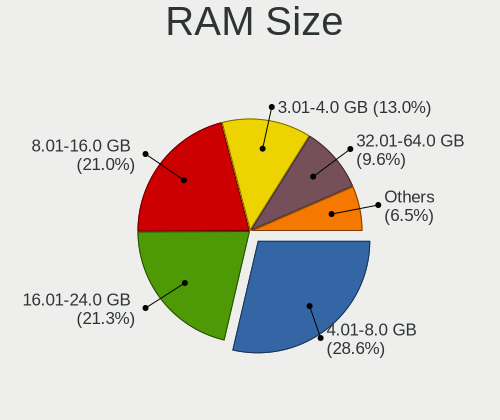

| Size in GB  | Notebooks | Percent |
|-------------|-----------|---------|
| 4.01-8.0    | 920       | 30.7%   |
| 16.01-24.0  | 646       | 21.55%  |
| 8.01-16.0   | 611       | 20.39%  |
| 3.01-4.0    | 448       | 14.95%  |
| 32.01-64.0  | 205       | 6.84%   |
| 1.01-2.0    | 65        | 2.17%   |
| 24.01-32.0  | 46        | 1.53%   |
| 64.01-256.0 | 30        | 1%      |
| 2.01-3.0    | 25        | 0.83%   |
| 0.51-1.0    | 1         | 0.03%   |

RAM Used
--------

Used RAM memory

| Used GB    | Notebooks | Percent |
|------------|-----------|---------|
| 2.01-3.0   | 906       | 27.94%  |
| 1.01-2.0   | 904       | 27.88%  |
| 4.01-8.0   | 591       | 18.22%  |
| 3.01-4.0   | 547       | 16.87%  |
| 8.01-16.0  | 152       | 4.69%   |
| 0.51-1.0   | 123       | 3.79%   |
| 16.01-24.0 | 11        | 0.34%   |
| 0.01-0.5   | 6         | 0.19%   |
| 24.01-32.0 | 3         | 0.09%   |

Total Drives
------------

Number of drives on board

| Drives | Notebooks | Percent |
|--------|-----------|---------|
| 1      | 2018      | 66.93%  |
| 2      | 859       | 28.49%  |
| 3      | 108       | 3.58%   |
| 0      | 18        | 0.6%    |
| 4      | 10        | 0.33%   |
| 7      | 1         | 0.03%   |
| 6      | 1         | 0.03%   |

Has CD-ROM
----------

Has CD-ROM on board

| Presented | Notebooks | Percent |
|-----------|-----------|---------|
| No        | 2154      | 72.31%  |
| Yes       | 825       | 27.69%  |

Has Ethernet
------------

Has Ethernet on board

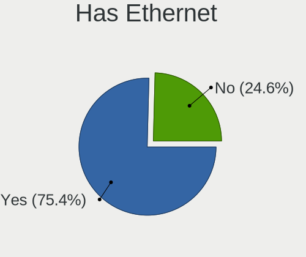

| Presented | Notebooks | Percent |
|-----------|-----------|---------|
| Yes       | 2317      | 77.96%  |
| No        | 655       | 22.04%  |

Has WiFi
--------

Has WiFi module

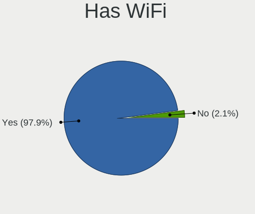

| Presented | Notebooks | Percent |
|-----------|-----------|---------|
| Yes       | 2929      | 98.75%  |
| No        | 37        | 1.25%   |

Has Bluetooth
-------------

Has Bluetooth module

| Presented | Notebooks | Percent |
|-----------|-----------|---------|
| Yes       | 2403      | 80.64%  |
| No        | 577       | 19.36%  |

Location
--------

Country
-------

Geographic location (country)

| Country      | Notebooks | Percent |
|--------------|-----------|---------|
| USA          | 421       | 14.14%  |
| Germany      | 325       | 10.91%  |
| Russia       | 281       | 9.44%   |
| Brazil       | 183       | 6.15%   |
| France       | 113       | 3.79%   |
| UK           | 106       | 3.56%   |
| Poland       | 91        | 3.06%   |
| Ukraine      | 87        | 2.92%   |
| Canada       | 86        | 2.89%   |
| Italy        | 85        | 2.85%   |
| Spain        | 76        | 2.55%   |
| India        | 76        | 2.55%   |
| Netherlands  | 65        | 2.18%   |
| Mexico       | 50        | 1.68%   |
| China        | 42        | 1.41%   |
| Austria      | 42        | 1.41%   |
| Australia    | 38        | 1.28%   |
| Turkey       | 37        | 1.24%   |
| Sweden       | 33        | 1.11%   |
| Indonesia    | 32        | 1.07%   |
| Romania      | 31        | 1.04%   |
| Belgium      | 29        | 0.97%   |
| Portugal     | 28        | 0.94%   |
| Switzerland  | 27        | 0.91%   |
| Czechia      | 26        | 0.87%   |
| Belarus      | 24        | 0.81%   |
| Norway       | 23        | 0.77%   |
| Finland      | 21        | 0.71%   |
| Hungary      | 20        | 0.67%   |
| Greece       | 20        | 0.67%   |
| Taiwan       | 19        | 0.64%   |
| Colombia     | 19        | 0.64%   |
| Denmark      | 17        | 0.57%   |
| Bulgaria     | 17        | 0.57%   |
| Bangladesh   | 17        | 0.57%   |
| Iran         | 16        | 0.54%   |
| Argentina    | 16        | 0.54%   |
| South Africa | 13        | 0.44%   |
| Serbia       | 12        | 0.4%    |
| Japan        | 12        | 0.4%    |
| Croatia      | 12        | 0.4%    |
| Vietnam      | 11        | 0.37%   |
| Ireland      | 11        | 0.37%   |
| Peru         | 10        | 0.34%   |
| Lithuania    | 10        | 0.34%   |
| Israel       | 10        | 0.34%   |
| Chile        | 10        | 0.34%   |
| Philippines  | 9         | 0.3%    |
| New Zealand  | 9         | 0.3%    |
| Egypt        | 9         | 0.3%    |
| South Korea  | 8         | 0.27%   |
| Slovakia     | 8         | 0.27%   |
| Malaysia     | 8         | 0.27%   |
| Slovenia     | 7         | 0.24%   |
| Latvia       | 7         | 0.24%   |
| Estonia      | 7         | 0.24%   |
| Venezuela    | 6         | 0.2%    |
| Moldova      | 6         | 0.2%    |
| Kenya        | 6         | 0.2%    |
| Kazakhstan   | 6         | 0.2%    |

City
----

Geographic location (city)

| City              | Notebooks | Percent |
|-------------------|-----------|---------|
| Moscow            | 64        | 2.05%   |
| St Petersburg     | 39        | 1.25%   |
| Vienna            | 29        | 0.93%   |
| Paris             | 26        | 0.83%   |
| Kyiv              | 24        | 0.77%   |
| Berlin            | 24        | 0.77%   |
| Sao Paulo         | 23        | 0.74%   |
| Warsaw            | 17        | 0.55%   |
| Munich            | 17        | 0.55%   |
| Amsterdam         | 16        | 0.51%   |
| Minsk             | 15        | 0.48%   |
| Novosibirsk       | 14        | 0.45%   |
| Toronto           | 13        | 0.42%   |
| Frankfurt am Main | 13        | 0.42%   |
| Bengaluru         | 13        | 0.42%   |
| Rome              | 12        | 0.39%   |
| Prague            | 12        | 0.39%   |
| Istanbul          | 12        | 0.39%   |
| Helsinki          | 12        | 0.39%   |
| Hamburg           | 12        | 0.39%   |
| Milan             | 11        | 0.35%   |
| London            | 11        | 0.35%   |
| Dhaka             | 11        | 0.35%   |
| Bucharest         | 11        | 0.35%   |
| Barcelona         | 11        | 0.35%   |
| Yekaterinburg     | 10        | 0.32%   |
| Madrid            | 10        | 0.32%   |
| Krakow            | 10        | 0.32%   |
| Belo Horizonte    | 10        | 0.32%   |
| The Hague         | 9         | 0.29%   |
| Sydney            | 9         | 0.29%   |
| Stockholm         | 9         | 0.29%   |
| Sofia             | 9         | 0.29%   |
| Mexico City       | 9         | 0.29%   |
| Melbourne         | 9         | 0.29%   |
| Cologne           | 9         | 0.29%   |
| Budapest          | 9         | 0.29%   |
| Belgrade          | 9         | 0.29%   |
| Athens            | 9         | 0.29%   |
| Zagreb            | 8         | 0.26%   |
| Seattle           | 8         | 0.26%   |
| San Jos         | 8         | 0.26%   |
| Rostov-on-Don     | 8         | 0.26%   |
| Montreal          | 8         | 0.26%   |
| Lviv              | 8         | 0.26%   |
| Krasnodar         | 8         | 0.26%   |
| Denver            | 8         | 0.26%   |
| Braslia         | 8         | 0.26%   |
| Bogot           | 8         | 0.26%   |
| Beijing           | 8         | 0.26%   |
| Ankara            | 8         | 0.26%   |
| Tehran            | 7         | 0.22%   |
| Rio de Janeiro    | 7         | 0.22%   |
| Riga              | 7         | 0.22%   |
| Portland          | 7         | 0.22%   |
| Perth             | 7         | 0.22%   |
| Los Angeles       | 7         | 0.22%   |
| Lima              | 7         | 0.22%   |
| Karlsruhe         | 7         | 0.22%   |
| Ingolstadt        | 7         | 0.22%   |

Drives
------

Drive Vendor
------------

Hard drive vendors

| Vendor                         | Notebooks | Drives | Percent |
|--------------------------------|-----------|--------|---------|
| Samsung Electronics            | 673       | 882    | 17.28%  |
| WDC                            | 453       | 541    | 11.63%  |
| Seagate                        | 418       | 537    | 10.73%  |
| Toshiba                        | 313       | 360    | 8.04%   |
| SanDisk                        | 234       | 296    | 6.01%   |
| Kingston                       | 225       | 255    | 5.78%   |
| Unknown                        | 193       | 229    | 4.96%   |
| SK hynix                       | 192       | 227    | 4.93%   |
| Crucial                        | 137       | 168    | 3.52%   |
| Intel                          | 134       | 167    | 3.44%   |
| HGST                           | 129       | 154    | 3.31%   |
| Micron Technology              | 86        | 108    | 2.21%   |
| Hitachi                        | 83        | 96     | 2.13%   |
| A-DATA Technology              | 51        | 59     | 1.31%   |
| Apple                          | 45        | 52     | 1.16%   |
| Phison                         | 41        | 59     | 1.05%   |
| KIOXIA                         | 40        | 45     | 1.03%   |
| Transcend                      | 28        | 32     | 0.72%   |
| China                          | 28        | 31     | 0.72%   |
| LITEONIT                       | 25        | 28     | 0.64%   |
| LITEON                         | 21        | 24     | 0.54%   |
| GOODRAM                        | 21        | 35     | 0.54%   |
| Silicon Motion                 | 16        | 19     | 0.41%   |
| JMicron Technology             | 16        | 16     | 0.41%   |
| Plextor                        | 13        | 20     | 0.33%   |
| Micron/Crucial Technology      | 12        | 12     | 0.31%   |
| Patriot                        | 11        | 11     | 0.28%   |
| XPG                            | 9         | 14     | 0.23%   |
| Union Memory (Shenzhen)        | 9         | 9      | 0.23%   |
| SPCC                           | 9         | 11     | 0.23%   |
| Intenso                        | 9         | 9      | 0.23%   |
| Fujitsu                        | 9         | 9      | 0.23%   |
| Solid State Storage Technology | 8         | 15     | 0.21%   |
| Hewlett-Packard                | 8         | 11     | 0.21%   |
| Corsair                        | 8         | 8      | 0.21%   |
| PNY                            | 7         | 10     | 0.18%   |
| OCZ                            | 7         | 8      | 0.18%   |
| KingSpec                       | 7         | 7      | 0.18%   |
| Lite-On                        | 6         | 6      | 0.15%   |
| ADATA Technology               | 6         | 7      | 0.15%   |
| Lenovo                         | 5         | 7      | 0.13%   |
| FORESEE                        | 5         | 7      | 0.13%   |
| Apacer                         | 5         | 5      | 0.13%   |
| Union Memory                   | 4         | 4      | 0.1%    |
| UMIS                           | 4         | 6      | 0.1%    |
| TO Exter                       | 4         | 4      | 0.1%    |
| BIWIN                          | 4         | 4      | 0.1%    |
| Team                           | 3         | 4      | 0.08%   |
| Solid State Storage            | 3         | 3      | 0.08%   |
| Realtek Semiconductor          | 3         | 3      | 0.08%   |
| OWC                            | 3         | 5      | 0.08%   |
| Netac                          | 3         | 5      | 0.08%   |
| Lexar                          | 3         | 3      | 0.08%   |
| HS-SSD-C100                    | 3         | 4      | 0.08%   |
| Gigabyte Technology            | 3         | 4      | 0.08%   |
| Unknown                        | 3         | 3      | 0.08%   |
| XrayDisk                       | 2         | 2      | 0.05%   |
| Vaseky                         | 2         | 2      | 0.05%   |
| TwinMOS                        | 2         | 2      | 0.05%   |
| SSSTC                          | 2         | 2      | 0.05%   |

Drive Model
-----------

Hard drive models

| Model                               | Notebooks | Percent |
|-------------------------------------|-----------|---------|
| Seagate ST1000LM035-1RK172 1TB      | 84        | 2.08%   |
| Samsung NVMe SSD Drive 512GB        | 62        | 1.53%   |
| SK hynix NVMe SSD Drive 512GB       | 46        | 1.14%   |
| Toshiba MQ01ABD100 1TB              | 45        | 1.11%   |
| HGST HTS721010A9E630 1TB            | 44        | 1.09%   |
| SanDisk NVMe SSD Drive 512GB        | 43        | 1.06%   |
| Toshiba MQ04ABF100 1TB              | 42        | 1.04%   |
| Samsung NVMe SSD Drive 256GB        | 41        | 1.01%   |
| Seagate ST1000LM024 HN-M101MBB 1TB  | 38        | 0.94%   |
| Kingston SA400S37240G 240GB SSD     | 36        | 0.89%   |
| Toshiba MQ01ABF050 500GB            | 35        | 0.86%   |
| Samsung NVMe SSD Drive 1TB          | 29        | 0.72%   |
| Intel NVMe SSD Drive 512GB          | 27        | 0.67%   |
| Unknown SD/MMC/MS PRO 64GB          | 26        | 0.64%   |
| Unknown MMC Card  32GB              | 23        | 0.57%   |
| Seagate ST500LT012-1DG142 500GB     | 23        | 0.57%   |
| Samsung NVMe SSD Drive 1024GB       | 23        | 0.57%   |
| Kingston SA400S37120G 120GB SSD     | 23        | 0.57%   |
| Crucial CT500MX500SSD1 500GB        | 23        | 0.57%   |
| SanDisk NVMe SSD Drive 256GB        | 22        | 0.54%   |
| Samsung SSD 860 EVO 500GB           | 22        | 0.54%   |
| HGST HTS545050A7E680 500GB          | 22        | 0.54%   |
| SK hynix NVMe SSD Drive 256GB       | 21        | 0.52%   |
| Seagate ST1000LM049-2GH172 1TB      | 21        | 0.52%   |
| Samsung SSD 850 EVO 500GB           | 21        | 0.52%   |
| Unknown MMC Card  64GB              | 19        | 0.47%   |
| Seagate Expansion 1TB               | 19        | 0.47%   |
| SanDisk NVMe SSD Drive 1TB          | 19        | 0.47%   |
| Toshiba NVMe SSD Drive 512GB        | 18        | 0.44%   |
| Seagate ST500LM012 HN-M500MBB 500GB | 18        | 0.44%   |
| Kingston NVMe SSD Drive 512GB       | 18        | 0.44%   |
| Intel SSDPEKNW512G8 512GB           | 18        | 0.44%   |
| WDC WD10SPZX-24Z10 1TB              | 17        | 0.42%   |
| WDC WD10SPZX-21Z10T0 1TB            | 17        | 0.42%   |
| Samsung NVMe SSD Drive 500GB        | 17        | 0.42%   |
| Kingston SA400S37480G 480GB SSD     | 17        | 0.42%   |
| Toshiba NVMe SSD Drive 256GB        | 16        | 0.4%    |
| Samsung SSD 860 EVO 250GB           | 16        | 0.4%    |
| Crucial CT240BX500SSD1 240GB        | 16        | 0.4%    |
| Crucial CT1000MX500SSD1 1TB         | 16        | 0.4%    |
| WDC WD10JPVX-22JC3T0 1TB            | 15        | 0.37%   |
| Micron NVMe SSD Drive 512GB         | 15        | 0.37%   |
| HGST HTS541010A9E680 1TB            | 15        | 0.37%   |
| Seagate ST9500325AS 500GB           | 14        | 0.35%   |
| Samsung SSD 850 EVO 250GB           | 14        | 0.35%   |
| Unknown MMC Card  128GB             | 13        | 0.32%   |
| SanDisk NVMe SSD Drive 500GB        | 13        | 0.32%   |
| SanDisk NVMe SSD Drive 1024GB       | 13        | 0.32%   |
| Samsung SSD 970 EVO Plus 500GB      | 13        | 0.32%   |
| Samsung MZVLB512HBJQ-000L2 512GB    | 13        | 0.32%   |
| Micron 1100_MTFDDAV256TBN 256GB SSD | 13        | 0.32%   |
| KIOXIA NVMe SSD Drive 512GB         | 13        | 0.32%   |
| HGST HTS725050A7E630 500GB          | 13        | 0.32%   |
| HGST HTS545050A7E380 500GB          | 13        | 0.32%   |
| Seagate ST1000LM048-2E7172 1TB      | 12        | 0.3%    |
| Samsung SSD 860 EVO 1TB             | 12        | 0.3%    |
| Kingston SV300S37A240G 240GB SSD    | 12        | 0.3%    |
| Hitachi HTS545050A7E380 500GB       | 12        | 0.3%    |
| WDC WD10SPZX-60Z10T0 1TB            | 11        | 0.27%   |
| WDC WD10JPVX-75JC3T0 1TB            | 11        | 0.27%   |

HDD Vendor
----------

Hard disk drive vendors

| Vendor              | Notebooks | Drives | Percent |
|---------------------|-----------|--------|---------|
| Seagate             | 409       | 520    | 34.75%  |
| WDC                 | 286       | 332    | 24.3%   |
| Toshiba             | 203       | 231    | 17.25%  |
| HGST                | 129       | 154    | 10.96%  |
| Hitachi             | 83        | 96     | 7.05%   |
| Unknown             | 27        | 30     | 2.29%   |
| Samsung Electronics | 13        | 15     | 1.1%    |
| Fujitsu             | 9         | 9      | 0.76%   |
| Apple               | 5         | 6      | 0.42%   |
| SABRENT             | 2         | 2      | 0.17%   |
| Intenso             | 2         | 2      | 0.17%   |
| USB3.0              | 1         | 1      | 0.08%   |
| QNAP                | 1         | 1      | 0.08%   |
| PHD 3.0             | 1         | 1      | 0.08%   |
| KESU                | 1         | 1      | 0.08%   |
| Hewlett-Packard     | 1         | 1      | 0.08%   |
| ASMT                | 1         | 1      | 0.08%   |
| ASMedia             | 1         | 3      | 0.08%   |
| Apricorn            | 1         | 1      | 0.08%   |
| ACASIS              | 1         | 1      | 0.08%   |

SSD Vendor
----------

Solid state drive vendors

| Vendor              | Notebooks | Drives | Percent |
|---------------------|-----------|--------|---------|
| Samsung Electronics | 296       | 372    | 23.64%  |
| Kingston            | 169       | 189    | 13.5%   |
| Crucial             | 124       | 155    | 9.9%    |
| SanDisk             | 108       | 141    | 8.63%   |
| WDC                 | 77        | 93     | 6.15%   |
| Micron Technology   | 46        | 57     | 3.67%   |
| A-DATA Technology   | 36        | 39     | 2.88%   |
| Intel               | 35        | 41     | 2.8%    |
| SK hynix            | 34        | 42     | 2.72%   |
| Apple               | 29        | 33     | 2.32%   |
| China               | 28        | 31     | 2.24%   |
| Transcend           | 27        | 30     | 2.16%   |
| Toshiba             | 26        | 26     | 2.08%   |
| LITEONIT            | 25        | 28     | 2%      |
| GOODRAM             | 20        | 34     | 1.6%    |
| LITEON              | 18        | 21     | 1.44%   |
| Plextor             | 12        | 19     | 0.96%   |
| Patriot             | 10        | 10     | 0.8%    |
| OCZ                 | 7         | 8      | 0.56%   |
| KingSpec            | 7         | 7      | 0.56%   |
| Intenso             | 7         | 7      | 0.56%   |
| Seagate             | 6         | 10     | 0.48%   |
| PNY                 | 6         | 9      | 0.48%   |
| Hewlett-Packard     | 5         | 7      | 0.4%    |
| Corsair             | 5         | 5      | 0.4%    |
| TO Exter            | 4         | 4      | 0.32%   |
| SPCC                | 4         | 5      | 0.32%   |
| Apacer              | 4         | 4      | 0.32%   |
| Team                | 3         | 4      | 0.24%   |
| Netac               | 3         | 5      | 0.24%   |
| FORESEE             | 3         | 3      | 0.24%   |
| Vaseky              | 2         | 2      | 0.16%   |
| Unknown             | 2         | 3      | 0.16%   |
| TwinMOS             | 2         | 2      | 0.16%   |
| OWC                 | 2         | 4      | 0.16%   |
| NGFF                | 2         | 2      | 0.16%   |
| Mushkin             | 2         | 3      | 0.16%   |
| Londisk             | 2         | 2      | 0.16%   |
| Lexar               | 2         | 2      | 0.16%   |
| Leven               | 2         | 3      | 0.16%   |
| Gigabyte Technology | 2         | 3      | 0.16%   |
| EMTEC               | 2         | 2      | 0.16%   |
| BIWIN               | 2         | 2      | 0.16%   |
| BHT                 | 2         | 2      | 0.16%   |
| Zheino              | 1         | 1      | 0.08%   |
| XrayDisk            | 1         | 1      | 0.08%   |
| Win Memory          | 1         | 1      | 0.08%   |
| WDC WDS5            | 1         | 1      | 0.08%   |
| Union Memory        | 1         | 1      | 0.08%   |
| TSA                 | 1         | 1      | 0.08%   |
| TEAM L3             | 1         | 2      | 0.08%   |
| TCSUNBOW            | 1         | 1      | 0.08%   |
| Star                | 1         | 1      | 0.08%   |
| SOLIDATA            | 1         | 3      | 0.08%   |
| Solid               | 1         | 1      | 0.08%   |
| Reeinno             | 1         | 3      | 0.08%   |
| Ramsta              | 1         | 1      | 0.08%   |
| Pioneer             | 1         | 3      | 0.08%   |
| Palit               | 1         | 1      | 0.08%   |
| OCZ-VERTEX3         | 1         | 1      | 0.08%   |

Drive Kind
----------

HDD or SSD

| Kind    | Notebooks | Drives | Percent |
|---------|-----------|--------|---------|
| NVMe    | 1196      | 1594   | 32.25%  |
| SSD     | 1181      | 1523   | 31.84%  |
| HDD     | 1128      | 1408   | 30.41%  |
| MMC     | 157       | 195    | 4.23%   |
| Unknown | 47        | 50     | 1.27%   |

Drive Connector
---------------

SATA, SAS, NVMe, etc.

| Type | Notebooks | Drives | Percent |
|------|-----------|--------|---------|
| SATA | 1975      | 2804   | 56.79%  |
| NVMe | 1194      | 1583   | 34.33%  |
| MMC  | 157       | 195    | 4.51%   |
| SAS  | 152       | 188    | 4.37%   |

Drive Size
----------

Size of hard drive

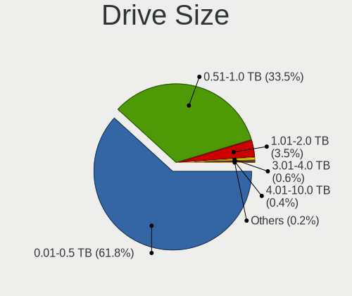

| Size in TB | Notebooks | Drives | Percent |
|------------|-----------|--------|---------|
| 0.01-0.5   | 1403      | 1845   | 62%     |
| 0.51-1.0   | 783       | 976    | 34.6%   |
| 1.01-2.0   | 59        | 74     | 2.61%   |
| 3.01-4.0   | 16        | 34     | 0.71%   |
| 4.01-10.0  | 2         | 2      | 0.09%   |

Space Total
-----------

Amount of disk space available on the file system

| Size in GB     | Notebooks | Percent |
|----------------|-----------|---------|
| 101-250        | 856       | 27.96%  |
| 251-500        | 776       | 25.34%  |
| 501-1000       | 482       | 15.74%  |
| 1001-2000      | 236       | 7.71%   |
| 51-100         | 200       | 6.53%   |
| Unknown        | 199       | 6.5%    |
| 1-20           | 115       | 3.76%   |
| 21-50          | 102       | 3.33%   |
| More than 3000 | 48        | 1.57%   |
| 2001-3000      | 48        | 1.57%   |

Space Used
----------

Amount of used disk space

| Used GB        | Notebooks | Percent |
|----------------|-----------|---------|
| 1-20           | 780       | 24.51%  |
| 21-50          | 603       | 18.95%  |
| 101-250        | 535       | 16.81%  |
| 51-100         | 487       | 15.3%   |
| 251-500        | 324       | 10.18%  |
| Unknown        | 199       | 6.25%   |
| 501-1000       | 175       | 5.5%    |
| 1001-2000      | 54        | 1.7%    |
| More than 3000 | 13        | 0.41%   |
| 2001-3000      | 11        | 0.35%   |
| 0              | 1         | 0.03%   |

Malfunc. Drives
---------------

Drive models with a malfunction

| Model                                               | Notebooks | Drives | Percent |
|-----------------------------------------------------|-----------|--------|---------|
| Seagate ST1000LM035-1RK172 1TB                      | 10        | 11     | 5.18%   |
| HGST HTS545050A7E680 500GB                          | 8         | 8      | 4.15%   |
| HGST HTS721010A9E630 1TB                            | 7         | 7      | 3.63%   |
| HGST HTS545050A7E380 500GB                          | 6         | 6      | 3.11%   |
| Toshiba MQ01ABD100 1TB                              | 5         | 7      | 2.59%   |
| Seagate ST500LT012-9WS142 500GB                     | 5         | 18     | 2.59%   |
| Seagate ST1000LM024 HN-M101MBB 1TB                  | 5         | 5      | 2.59%   |
| HGST HTS725050A7E630 500GB                          | 4         | 4      | 2.07%   |
| WDC WD10JPVX-75JC3T0 1TB                            | 3         | 4      | 1.55%   |
| Toshiba MQ01ABD050 500GB                            | 3         | 3      | 1.55%   |
| Seagate ST9320325AS 320GB                           | 3         | 4      | 1.55%   |
| Seagate ST500LM021-1KJ152 500GB                     | 3         | 4      | 1.55%   |
| LITEON CV8-8E128-HP 128GB SSD                       | 3         | 3      | 1.55%   |
| Hitachi HTS723232A7A364 320GB                       | 3         | 3      | 1.55%   |
| Hitachi HTS545050A7E380 500GB                       | 3         | 3      | 1.55%   |
| WDC WD10JPVX-22JC3T0 1TB                            | 2         | 3      | 1.04%   |
| Toshiba THNSNK128GVN8 M.2 2280 128GB SSD            | 2         | 2      | 1.04%   |
| Toshiba MQ01ABF050 500GB                            | 2         | 2      | 1.04%   |
| Seagate ST9750420AS 752GB                           | 2         | 2      | 1.04%   |
| Seagate ST9500325AS 500GB                           | 2         | 3      | 1.04%   |
| Seagate ST500LM012 HN-M500MBB 500GB                 | 2         | 2      | 1.04%   |
| Seagate ST1000LX015-1U7172 1TB                      | 2         | 5      | 1.04%   |
| Seagate ST1000LM049-2GH172 1TB                      | 2         | 2      | 1.04%   |
| Samsung Electronics SSD 870 EVO 1TB                 | 2         | 2      | 1.04%   |
| Micron Technology MTFDDAV256TDL-1AW1ZABHA 256GB SSD | 2         | 2      | 1.04%   |
| HGST HTS541010A9E680 1TB                            | 2         | 2      | 1.04%   |
| Crucial CT525MX300SSD1 528GB                        | 2         | 2      | 1.04%   |
| WDC WDS240G2G0B-00EPW0 240GB SSD                    | 1         | 1      | 0.52%   |
| WDC WD800BEVS-22RST0 80GB                           | 1         | 1      | 0.52%   |
| WDC WD7500BPVX-60JC3T0 752GB                        | 1         | 1      | 0.52%   |
| WDC WD5000LPVX-08V0TT5 500GB                        | 1         | 1      | 0.52%   |
| WDC WD5000LPLX-00ZNTT0 500GB                        | 1         | 1      | 0.52%   |
| WDC WD5000LPCX-22VHAT0 500GB                        | 1         | 1      | 0.52%   |
| WDC WD5000LPCX-21VHAT0 500GB                        | 1         | 1      | 0.52%   |
| WDC WD5000BPVT-60HXZT3 500GB                        | 1         | 1      | 0.52%   |
| WDC WD5000BPVT-22HXZT3 500GB                        | 1         | 1      | 0.52%   |
| WDC WD5000BEVT-75A0RT0 500GB                        | 1         | 1      | 0.52%   |
| WDC WD3200BPVT-22JJ5T0 320GB                        | 1         | 1      | 0.52%   |
| WDC WD3200BEVT-60ZCT1 320GB                         | 1         | 1      | 0.52%   |
| WDC WD2500LPCX-24C6HT0 250GB                        | 1         | 1      | 0.52%   |
| WDC WD2500BPVT-75JJ5T0 250GB                        | 1         | 1      | 0.52%   |
| WDC WD2500BEVT-24A23T0 250GB                        | 1         | 1      | 0.52%   |
| WDC WD10JPVX-60JC3T0 1TB                            | 1         | 1      | 0.52%   |
| WDC WD10JPVT-75A1YT0 1TB                            | 1         | 1      | 0.52%   |
| WDC WD10JPCX-24UE4T0 1TB                            | 1         | 1      | 0.52%   |
| Toshiba THNSNK256GVN8 M.2 2280 256GB SSD            | 1         | 1      | 0.52%   |
| Toshiba MQ01ABD032 320GB                            | 1         | 1      | 0.52%   |
| Toshiba MK7559GSXP 752GB                            | 1         | 1      | 0.52%   |
| Toshiba MK6459GSXP 640GB                            | 1         | 1      | 0.52%   |
| Toshiba MK5075GSX 500GB                             | 1         | 1      | 0.52%   |
| Toshiba MK3259GSXP 320GB                            | 1         | 1      | 0.52%   |
| Toshiba MK1665GSX 160GB                             | 1         | 1      | 0.52%   |
| Toshiba MK1637GSX 160GB                             | 1         | 1      | 0.52%   |
| Toshiba MK1234GSX 120GB                             | 1         | 1      | 0.52%   |
| Toshiba KSG60ZSE512G SATA 512GB SSD                 | 1         | 1      | 0.52%   |
| SK hynix SH920 mSATA 256GB SSD                      | 1         | 1      | 0.52%   |
| SK hynix PC711 HFS512GDE9X073N 512GB                | 1         | 1      | 0.52%   |
| SK hynix HFS256G3BTND-N210A 256GB SSD               | 1         | 5      | 0.52%   |
| SK hynix HFS256G39TND-N210A 256GB SSD               | 1         | 1      | 0.52%   |
| SK hynix BC511 HFM256GDJTNI-82A0A 256GB             | 1         | 1      | 0.52%   |

Malfunc. Drive Vendor
---------------------

Vendors of faulty drives

| Vendor              | Notebooks | Drives | Percent |
|---------------------|-----------|--------|---------|
| Seagate             | 52        | 76     | 26.94%  |
| HGST                | 29        | 29     | 15.03%  |
| WDC                 | 23        | 25     | 11.92%  |
| Toshiba             | 22        | 24     | 11.4%   |
| Hitachi             | 19        | 20     | 9.84%   |
| Crucial             | 8         | 11     | 4.15%   |
| Samsung Electronics | 6         | 6      | 3.11%   |
| SK hynix            | 5         | 9      | 2.59%   |
| SanDisk             | 5         | 5      | 2.59%   |
| Micron Technology   | 4         | 6      | 2.07%   |
| LITEON              | 3         | 3      | 1.55%   |
| Kingston            | 3         | 3      | 1.55%   |
| Intel               | 3         | 4      | 1.55%   |
| A-DATA Technology   | 3         | 4      | 1.55%   |
| LITEONIT            | 1         | 1      | 0.52%   |
| KingSpec            | 1         | 1      | 0.52%   |
| IM3D                | 1         | 1      | 0.52%   |
| Faspeed             | 1         | 1      | 0.52%   |
| Corsair             | 1         | 1      | 0.52%   |
| ASMT                | 1         | 1      | 0.52%   |
| Apple               | 1         | 1      | 0.52%   |
| Unknown             | 1         | 1      | 0.52%   |

Malfunc. HDD Vendor
-------------------

Vendors of faulty HDD drives

| Vendor              | Notebooks | Drives | Percent |
|---------------------|-----------|--------|---------|
| Seagate             | 52        | 76     | 36.62%  |
| HGST                | 29        | 29     | 20.42%  |
| WDC                 | 22        | 24     | 15.49%  |
| Hitachi             | 19        | 20     | 13.38%  |
| Toshiba             | 18        | 20     | 12.68%  |
| Samsung Electronics | 1         | 1      | 0.7%    |
| ASMT                | 1         | 1      | 0.7%    |

Malfunc. Drive Kind
-------------------

Kinds of faulty drives

| Kind | Notebooks | Drives | Percent |
|------|-----------|--------|---------|
| HDD  | 141       | 171    | 73.82%  |
| SSD  | 44        | 55     | 23.04%  |
| NVMe | 6         | 7      | 3.14%   |

Failed Drives
-------------

Failed drive models

| Model                                            | Notebooks | Drives | Percent |
|--------------------------------------------------|-----------|--------|---------|
| WDC WD1600BEKT-75PVMT0 160GB                     | 1         | 1      | 33.33%  |
| WDC PC SN520 SDAPNUW-256G-1102 256GB             | 1         | 1      | 33.33%  |
| Samsung Electronics MZNTY128HDHP-000H1 128GB SSD | 1         | 1      | 33.33%  |

Failed Drive Vendor
-------------------

Failed drive vendors

| Vendor              | Notebooks | Drives | Percent |
|---------------------|-----------|--------|---------|
| WDC                 | 2         | 2      | 66.67%  |
| Samsung Electronics | 1         | 1      | 33.33%  |

Drive Status
------------

Number of failed and malfunc. drives

| Status   | Notebooks | Drives | Percent |
|----------|-----------|--------|---------|
| Detected | 1820      | 2788   | 56.89%  |
| Works    | 1189      | 1746   | 37.17%  |
| Malfunc  | 187       | 233    | 5.85%   |
| Failed   | 3         | 3      | 0.09%   |

Storage controller
------------------

Storage Vendor
--------------

Storage controller vendors

| Vendor                           | Notebooks | Percent |
|----------------------------------|-----------|---------|
| Intel                            | 2007      | 54.84%  |
| AMD                              | 429       | 11.72%  |
| Samsung Electronics              | 414       | 11.31%  |
| SanDisk                          | 214       | 5.85%   |
| SK hynix                         | 156       | 4.26%   |
| Toshiba America Info Systems     | 79        | 2.16%   |
| Kingston Technology Company      | 56        | 1.53%   |
| Phison Electronics               | 50        | 1.37%   |
| KIOXIA                           | 48        | 1.31%   |
| Micron Technology                | 39        | 1.07%   |
| ADATA Technology                 | 25        | 0.68%   |
| Micron/Crucial Technology        | 24        | 0.66%   |
| Union Memory (Shenzhen)          | 22        | 0.6%    |
| Silicon Motion                   | 18        | 0.49%   |
| Nvidia                           | 17        | 0.46%   |
| Solid State Storage Technology   | 14        | 0.38%   |
| Lite-On Technology               | 10        | 0.27%   |
| Apple                            | 10        | 0.27%   |
| Realtek Semiconductor            | 7         | 0.19%   |
| Shenzhen Longsys Electronics     | 4         | 0.11%   |
| Lenovo                           | 4         | 0.11%   |
| Marvell Technology Group         | 3         | 0.08%   |
| JMicron Technology               | 3         | 0.08%   |
| Yangtze Memory Technologies      | 2         | 0.05%   |
| Seagate Technology               | 2         | 0.05%   |
| Silicon Integrated Systems [SiS] | 1         | 0.03%   |
| Silicon Image                    | 1         | 0.03%   |
| Biwin Storage Technology         | 1         | 0.03%   |

Storage Model
-------------

Storage controller models

| Model                                                                            | Notebooks | Percent |
|----------------------------------------------------------------------------------|-----------|---------|
| AMD FCH SATA Controller [AHCI mode]                                              | 393       | 10.31%  |
| Intel Sunrise Point-LP SATA Controller [AHCI mode]                               | 286       | 7.51%   |
| Samsung NVMe SSD Controller SM981/PM981/PM983                                    | 235       | 6.17%   |
| Intel 7 Series Chipset Family 6-port SATA Controller [AHCI mode]                 | 225       | 5.91%   |
| Intel 82801 Mobile SATA Controller [RAID mode]                                   | 181       | 4.75%   |
| Intel Cannon Lake Mobile PCH SATA AHCI Controller                                | 140       | 3.67%   |
| Intel 6 Series/C200 Series Chipset Family 6 port Mobile SATA AHCI Controller     | 140       | 3.67%   |
| Intel 8 Series SATA Controller 1 [AHCI mode]                                     | 134       | 3.52%   |
| Intel HM170/QM170 Chipset SATA Controller [AHCI Mode]                            | 121       | 3.18%   |
| Intel Wildcat Point-LP SATA Controller [AHCI Mode]                               | 107       | 2.81%   |
| Intel 8 Series/C220 Series Chipset Family 6-port SATA Controller 1 [AHCI mode]   | 93        | 2.44%   |
| Samsung NVMe SSD Controller 980                                                  | 77        | 2.02%   |
| SanDisk WD Black SN750 / PC SN730 NVMe SSD                                       | 71        | 1.86%   |
| Intel SSD 660P Series                                                            | 57        | 1.5%    |
| Intel Cannon Point-LP SATA Controller [AHCI Mode]                                | 55        | 1.44%   |
| Samsung NVMe SSD Controller SM961/PM961/SM963                                    | 51        | 1.34%   |
| Intel Volume Management Device NVMe RAID Controller                              | 49        | 1.29%   |
| Intel 82801IBM/IEM (ICH9M/ICH9M-E) 4 port SATA Controller [AHCI mode]            | 48        | 1.26%   |
| Intel 5 Series/3400 Series Chipset 4 port SATA AHCI Controller                   | 48        | 1.26%   |
| KIOXIA NVMe SSD Controller BG4                                                   | 46        | 1.21%   |
| SK hynix BC511                                                                   | 40        | 1.05%   |
| SK hynix Gold P31 SSD                                                            | 39        | 1.02%   |
| Micron Non-Volatile memory controller                                            | 39        | 1.02%   |
| SK hynix BC501 NVMe Solid State Drive                                            | 37        | 0.97%   |
| SanDisk WD Blue SN500 / PC SN520 NVMe SSD                                        | 36        | 0.94%   |
| SanDisk WD Blue SN550 NVMe SSD                                                   | 34        | 0.89%   |
| Intel Comet Lake SATA AHCI Controller                                            | 33        | 0.87%   |
| Toshiba America Info Systems XG6 NVMe SSD Controller                             | 32        | 0.84%   |
| Intel Ice Lake-LP SATA Controller [AHCI mode]                                    | 32        | 0.84%   |
| Intel 5 Series/3400 Series Chipset 6 port SATA AHCI Controller                   | 32        | 0.84%   |
| Intel Celeron/Pentium Silver Processor SATA Controller                           | 30        | 0.79%   |
| Phison E12 NVMe Controller                                                       | 27        | 0.71%   |
| SanDisk WD Black 2018/SN750 / PC SN720 NVMe SSD                                  | 26        | 0.68%   |
| Intel Atom Processor E3800 Series SATA AHCI Controller                           | 26        | 0.68%   |
| Intel 400 Series Chipset Family SATA AHCI Controller                             | 26        | 0.68%   |
| SanDisk Non-Volatile memory controller                                           | 25        | 0.66%   |
| Samsung NVMe SSD Controller PM9A1/PM9A3/980PRO                                   | 25        | 0.66%   |
| Intel Celeron N3350/Pentium N4200/Atom E3900 Series SATA AHCI Controller         | 25        | 0.66%   |
| AMD SB7x0/SB8x0/SB9x0 SATA Controller [AHCI mode]                                | 24        | 0.63%   |
| SK hynix Non-Volatile memory controller                                          | 23        | 0.6%    |
| Intel Atom/Celeron/Pentium Processor x5-E8000/J3xxx/N3xxx Series SATA Controller | 22        | 0.58%   |
| Intel 82801HM/HEM (ICH8M/ICH8M-E) IDE Controller                                 | 22        | 0.58%   |
| Union Memory (Shenzhen) Non-Volatile memory controller                           | 21        | 0.55%   |
| SanDisk PC SN520 NVMe SSD                                                        | 21        | 0.55%   |
| Intel Tiger Lake-LP SATA Controller                                              | 21        | 0.55%   |
| Intel 82801HM/HEM (ICH8M/ICH8M-E) SATA Controller [AHCI mode]                    | 21        | 0.55%   |
| Toshiba America Info Systems Toshiba America Info Non-Volatile memory controller | 19        | 0.5%    |
| Toshiba America Info Systems BG3 NVMe SSD Controller                             | 18        | 0.47%   |
| Kingston Company U-SNS8154P3 NVMe SSD                                            | 17        | 0.45%   |
| Intel Q170/Q150/B150/H170/H110/Z170/CM236 Chipset SATA Controller [AHCI Mode]    | 17        | 0.45%   |
| Intel Non-Volatile memory controller                                             | 17        | 0.45%   |
| Kingston Company Company Non-Volatile memory controller                          | 16        | 0.42%   |
| Intel SSD Pro 7600p/760p/E 6100p Series                                          | 16        | 0.42%   |
| Solid State Storage Non-Volatile memory controller                               | 14        | 0.37%   |
| ADATA XPG SX8200 Pro PCIe Gen3x4 M.2 2280 Solid State Drive                      | 14        | 0.37%   |
| Kingston Company A2000 NVMe SSD                                                  | 13        | 0.34%   |
| SK hynix PC401 NVMe Solid State Drive 256GB                                      | 12        | 0.31%   |
| Samsung NVMe SSD Controller SM951/PM951                                          | 11        | 0.29%   |
| Intel 7 Series Chipset Family 4-port SATA Controller [IDE mode]                  | 11        | 0.29%   |
| Intel 7 Series Chipset Family 2-port SATA Controller [IDE mode]                  | 11        | 0.29%   |

Storage Kind
------------

Kind of storage controller (IDE, SATA, NVMe, SAS, ...)

| Kind | Notebooks | Percent |
|------|-----------|---------|
| SATA | 2158      | 58.58%  |
| NVMe | 1202      | 32.63%  |
| RAID | 231       | 6.27%   |
| IDE  | 93        | 2.52%   |

Processor
---------

CPU Vendor
----------

Processor vendors

| Vendor | Notebooks | Percent |
|--------|-----------|---------|
| Intel  | 2338      | 78.91%  |
| AMD    | 625       | 21.09%  |

CPU Model
---------

Processor models

| Model                                         | Notebooks | Percent |
|-----------------------------------------------|-----------|---------|
| Intel Core i5-8250U CPU @ 1.60GHz             | 71        | 2.39%   |
| Intel Core i7-7700HQ CPU @ 2.80GHz            | 63        | 2.12%   |
| Intel Core i7-8565U CPU @ 1.80GHz             | 60        | 2.02%   |
| Intel Core i7-8550U CPU @ 1.80GHz             | 58        | 1.95%   |
| Intel Core i5-7200U CPU @ 2.50GHz             | 58        | 1.95%   |
| AMD Ryzen 5 3500U with Radeon Vega Mobile Gfx | 58        | 1.95%   |
| Intel Core i7-9750H CPU @ 2.60GHz             | 57        | 1.92%   |
| Intel Core i5-8265U CPU @ 1.60GHz             | 57        | 1.92%   |
| Intel Core i7-8750H CPU @ 2.20GHz             | 52        | 1.75%   |
| Intel Core i7-6700HQ CPU @ 2.60GHz            | 44        | 1.48%   |
| AMD Ryzen 7 4800H with Radeon Graphics        | 41        | 1.38%   |
| Intel Core i5-3320M CPU @ 2.60GHz             | 39        | 1.31%   |
| Intel 11th Gen Core i5-1135G7 @ 2.40GHz       | 39        | 1.31%   |
| Intel Core i5-6200U CPU @ 2.30GHz             | 38        | 1.28%   |
| Intel 11th Gen Core i7-1165G7 @ 2.80GHz       | 36        | 1.21%   |
| Intel Core i7-10510U CPU @ 1.80GHz            | 35        | 1.18%   |
| Intel Core i5-5200U CPU @ 2.20GHz             | 35        | 1.18%   |
| AMD Ryzen 5 4500U with Radeon Graphics        | 34        | 1.15%   |
| Intel Core i5-4210U CPU @ 1.70GHz             | 33        | 1.11%   |
| Intel Core i7-10750H CPU @ 2.60GHz            | 32        | 1.08%   |
| Intel Core i7-7500U CPU @ 2.70GHz             | 30        | 1.01%   |
| AMD Ryzen 5 4600H with Radeon Graphics        | 30        | 1.01%   |
| Intel Core i5-3230M CPU @ 2.60GHz             | 27        | 0.91%   |
| AMD Ryzen 7 5800H with Radeon Graphics        | 27        | 0.91%   |
| Intel Core i5-8300H CPU @ 2.30GHz             | 26        | 0.88%   |
| Intel Core i5-4200U CPU @ 1.60GHz             | 26        | 0.88%   |
| Intel Core i5-1035G1 CPU @ 1.00GHz            | 26        | 0.88%   |
| AMD Ryzen 7 4700U with Radeon Graphics        | 26        | 0.88%   |
| Intel Core i3-5005U CPU @ 2.00GHz             | 24        | 0.81%   |
| Intel Core i5-9300H CPU @ 2.40GHz             | 23        | 0.77%   |
| AMD Ryzen 7 3700U with Radeon Vega Mobile Gfx | 23        | 0.77%   |
| Intel Core i5-10210U CPU @ 1.60GHz            | 22        | 0.74%   |
| Intel Core i5-3210M CPU @ 2.50GHz             | 21        | 0.71%   |
| Intel Core i5-2410M CPU @ 2.30GHz             | 21        | 0.71%   |
| AMD Ryzen 7 PRO 4750U with Radeon Graphics    | 21        | 0.71%   |
| Intel Core i7-1065G7 CPU @ 1.30GHz            | 18        | 0.61%   |
| AMD Ryzen 3 3200U with Radeon Vega Mobile Gfx | 18        | 0.61%   |
| Intel Core i7-3630QM CPU @ 2.40GHz            | 17        | 0.57%   |
| Intel Core i5-7300HQ CPU @ 2.50GHz            | 17        | 0.57%   |
| Intel Core i3-6006U CPU @ 2.00GHz             | 17        | 0.57%   |
| AMD Ryzen 7 5700U with Radeon Graphics        | 17        | 0.57%   |
| AMD Ryzen 5 2500U with Radeon Vega Mobile Gfx | 17        | 0.57%   |
| Intel Core i7-6500U CPU @ 2.50GHz             | 16        | 0.54%   |
| Intel Core i5-2520M CPU @ 2.50GHz             | 16        | 0.54%   |
| AMD Ryzen 5 5500U with Radeon Graphics        | 16        | 0.54%   |
| AMD Ryzen 5 3550H with Radeon Vega Mobile Gfx | 16        | 0.54%   |
| Intel Core i7-4500U CPU @ 1.80GHz             | 15        | 0.51%   |
| Intel Core i7-2670QM CPU @ 2.20GHz            | 15        | 0.51%   |
| Intel Core i5 CPU M 520 @ 2.40GHz             | 15        | 0.51%   |
| Intel Core i7-5600U CPU @ 2.60GHz             | 14        | 0.47%   |
| Intel Core i5-5300U CPU @ 2.30GHz             | 14        | 0.47%   |
| Intel Core i5-2450M CPU @ 2.50GHz             | 14        | 0.47%   |
| Intel Core i3-3120M CPU @ 2.50GHz             | 14        | 0.47%   |
| Intel Core i3 CPU M 370 @ 2.40GHz             | 14        | 0.47%   |
| Intel Celeron CPU N3350 @ 1.10GHz             | 14        | 0.47%   |
| Intel 11th Gen Core i7-11800H @ 2.30GHz       | 14        | 0.47%   |
| Intel Core i7-4720HQ CPU @ 2.60GHz            | 13        | 0.44%   |
| Intel Core i7-4600U CPU @ 2.10GHz             | 13        | 0.44%   |
| Intel Celeron CPU N2840 @ 2.16GHz             | 13        | 0.44%   |
| Intel Core i7-8850H CPU @ 2.60GHz             | 12        | 0.4%    |

CPU Model Family
----------------

Processor model prefix

| Model                          | Notebooks | Percent |
|--------------------------------|-----------|---------|
| Intel Core i7                  | 828       | 27.9%   |
| Intel Core i5                  | 813       | 27.39%  |
| Intel Core i3                  | 212       | 7.14%   |
| AMD Ryzen 5                    | 193       | 6.5%    |
| AMD Ryzen 7                    | 179       | 6.03%   |
| Other                          | 142       | 4.78%   |
| Intel Celeron                  | 109       | 3.67%   |
| Intel Core 2 Duo               | 80        | 2.7%    |
| Intel Pentium                  | 73        | 2.46%   |
| AMD Ryzen 3                    | 41        | 1.38%   |
| AMD Ryzen 7 PRO                | 26        | 0.88%   |
| AMD A6                         | 25        | 0.84%   |
| AMD Ryzen 9                    | 22        | 0.74%   |
| Intel Atom                     | 20        | 0.67%   |
| Intel Core i9                  | 18        | 0.61%   |
| AMD A8                         | 18        | 0.61%   |
| Intel Pentium Dual-Core        | 17        | 0.57%   |
| AMD A4                         | 17        | 0.57%   |
| AMD A10                        | 17        | 0.57%   |
| AMD E1                         | 14        | 0.47%   |
| AMD E                          | 14        | 0.47%   |
| Intel Pentium Silver           | 11        | 0.37%   |
| Intel Core 2                   | 9         | 0.3%    |
| AMD E2                         | 7         | 0.24%   |
| Intel Core m3                  | 6         | 0.2%    |
| AMD Turion 64 X2 Mobile        | 6         | 0.2%    |
| AMD Athlon                     | 5         | 0.17%   |
| AMD A12                        | 5         | 0.17%   |
| Intel Genuine                  | 4         | 0.13%   |
| Intel Xeon                     | 3         | 0.1%    |
| Intel Core m5                  | 3         | 0.1%    |
| AMD Athlon X2                  | 3         | 0.1%    |
| Intel Core m7                  | 2         | 0.07%   |
| Intel Core M                   | 2         | 0.07%   |
| Intel Core 2 Quad              | 2         | 0.07%   |
| AMD Turion X2 Dual-Core Mobile | 2         | 0.07%   |
| AMD Turion II                  | 2         | 0.07%   |
| AMD Ryzen 5 PRO                | 2         | 0.07%   |
| AMD Phenom II                  | 2         | 0.07%   |
| AMD C-60                       | 2         | 0.07%   |
| AMD Athlon II Dual-Core        | 2         | 0.07%   |
| Intel Pentium Gold             | 1         | 0.03%   |
| Intel Celeron Dual-Core        | 1         | 0.03%   |
| AMD V120                       | 1         | 0.03%   |
| AMD Turion 64 Mobile           | 1         | 0.03%   |
| AMD PRO A10                    | 1         | 0.03%   |
| AMD FX                         | 1         | 0.03%   |
| AMD C-70                       | 1         | 0.03%   |
| AMD C-50                       | 1         | 0.03%   |
| AMD Athlon II                  | 1         | 0.03%   |
| AMD Athlon 64 X2               | 1         | 0.03%   |

CPU Cores
---------

Number of processor cores

| Number  | Notebooks | Percent |
|---------|-----------|---------|
| 2       | 1316      | 44.4%   |
| 4       | 1121      | 37.82%  |
| 6       | 282       | 9.51%   |
| 8       | 222       | 7.49%   |
| 1       | 15        | 0.51%   |
| 14      | 2         | 0.07%   |
| 12      | 2         | 0.07%   |
| 3       | 2         | 0.07%   |
| 16      | 1         | 0.03%   |
| Unknown | 1         | 0.03%   |

CPU Sockets
-----------

Number of sockets

| Number | Notebooks | Percent |
|--------|-----------|---------|
| 1      | 2963      | 100%    |

CPU Threads
-----------

Threads per core (Hyper-Threading)

| Number  | Notebooks | Percent |
|---------|-----------|---------|
| 2       | 2431      | 81.99%  |
| 1       | 533       | 17.98%  |
| Unknown | 1         | 0.03%   |

CPU Op-Modes
------------

CPU Operation Modes (32-bit, 64-bit)

| Op mode        | Notebooks | Percent |
|----------------|-----------|---------|
| 32-bit, 64-bit | 2900      | 97.81%  |
| Unknown        | 65        | 2.19%   |

CPU Microcode
-------------

Microcode number

| Number     | Notebooks | Percent |
|------------|-----------|---------|
| Unknown    | 1419      | 46.39%  |
| 0x306a9    | 130       | 4.25%   |
| 0x906ea    | 108       | 3.53%   |
| 0x806ea    | 103       | 3.37%   |
| 0x806ec    | 87        | 2.84%   |
| 0x806e9    | 72        | 2.35%   |
| 0x206a7    | 71        | 2.32%   |
| 0x806c1    | 68        | 2.22%   |
| 0x40651    | 68        | 2.22%   |
| 0x406e3    | 64        | 2.09%   |
| 0x08108102 | 59        | 1.93%   |
| 0x306d4    | 55        | 1.8%    |
| 0x306c3    | 52        | 1.7%    |
| 0x906e9    | 50        | 1.63%   |
| 0x08600106 | 42        | 1.37%   |
| 0x08600103 | 41        | 1.34%   |
| 0xa0652    | 39        | 1.27%   |
| 0x806eb    | 39        | 1.27%   |
| 0x706e5    | 35        | 1.14%   |
| 0x08108109 | 34        | 1.11%   |
| 0x08600104 | 32        | 1.05%   |
| 0x0a50000c | 27        | 0.88%   |
| 0x506e3    | 26        | 0.85%   |
| 0x1067a    | 26        | 0.85%   |
| 0x20655    | 25        | 0.82%   |
| 0x08608103 | 18        | 0.59%   |
| 0x30678    | 16        | 0.52%   |
| 0x0810100b | 16        | 0.52%   |
| 0x506c9    | 14        | 0.46%   |
| 0x06006705 | 14        | 0.46%   |
| 0x406c4    | 13        | 0.42%   |
| 0x706a1    | 12        | 0.39%   |
| 0x806d1    | 11        | 0.36%   |
| 0x08600102 | 11        | 0.36%   |
| 0x06001119 | 10        | 0.33%   |
| 0x906ed    | 9         | 0.29%   |
| 0x0a50000b | 9         | 0.29%   |
| 0x0600611a | 9         | 0.29%   |
| 0x10676    | 8         | 0.26%   |
| 0xa0660    | 7         | 0.23%   |
| 0x20652    | 7         | 0.23%   |
| 0x07030105 | 7         | 0.23%   |
| 0x0700010f | 7         | 0.23%   |
| 0x05000119 | 7         | 0.23%   |
| 0x406c3    | 6         | 0.2%    |
| 0x106e5    | 6         | 0.2%    |
| 0x6fd      | 5         | 0.16%   |
| 0x40661    | 5         | 0.16%   |
| 0x6f6      | 4         | 0.13%   |
| 0x106ca    | 4         | 0.13%   |
| 0x010000c8 | 4         | 0.13%   |
| 0x6f2      | 3         | 0.1%    |
| 0x30673    | 3         | 0.1%    |
| 0x08101007 | 3         | 0.1%    |
| 0x07000110 | 3         | 0.1%    |
| 0x06006704 | 3         | 0.1%    |
| 0x06006110 | 3         | 0.1%    |
| 0x05000029 | 3         | 0.1%    |
| 0x706a8    | 2         | 0.07%   |
| 0x6fb      | 2         | 0.07%   |

CPU Microarch
-------------

Microarchitecture

| Name             | Notebooks | Percent |
|------------------|-----------|---------|
| KabyLake         | 770       | 25.99%  |
| Haswell          | 252       | 8.5%    |
| IvyBridge        | 232       | 7.83%   |
| Zen 2            | 183       | 6.18%   |
| SandyBridge      | 178       | 6.01%   |
| Skylake          | 174       | 5.87%   |
| Zen+             | 145       | 4.89%   |
| Broadwell        | 126       | 4.25%   |
| TigerLake        | 107       | 3.61%   |
| Westmere         | 83        | 2.8%    |
| Penryn           | 80        | 2.7%    |
| CometLake        | 77        | 2.6%    |
| Silvermont       | 74        | 2.5%    |
| Zen 3            | 68        | 2.29%   |
| IceLake          | 66        | 2.23%   |
| Unknown          | 49        | 1.65%   |
| Excavator        | 47        | 1.59%   |
| Zen              | 35        | 1.18%   |
| Core             | 33        | 1.11%   |
| Goldmont plus    | 32        | 1.08%   |
| Goldmont         | 27        | 0.91%   |
| Bobcat           | 24        | 0.81%   |
| Piledriver       | 22        | 0.74%   |
| Puma             | 17        | 0.57%   |
| Jaguar           | 16        | 0.54%   |
| Nehalem          | 10        | 0.34%   |
| K8 Hammer        | 8         | 0.27%   |
| K10 Llano        | 8         | 0.27%   |
| K10              | 7         | 0.24%   |
| K8 & K10 hybrid  | 5         | 0.17%   |
| Bonnell          | 5         | 0.17%   |
| Steamroller      | 2         | 0.07%   |
| Alderlake Hybrid | 1         | 0.03%   |

Graphics
--------

GPU Vendor
----------

Vendors of graphics cards

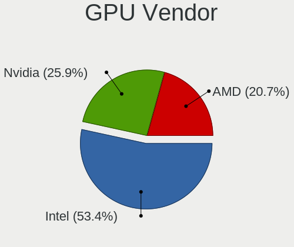

| Vendor | Notebooks | Percent |
|--------|-----------|---------|
| Intel  | 2168      | 54.36%  |
| Nvidia | 1055      | 26.45%  |
| AMD    | 765       | 19.18%  |

GPU Model
---------

Graphics card models

| Model                                                                                    | Notebooks | Percent |
|------------------------------------------------------------------------------------------|-----------|---------|
| Intel 3rd Gen Core processor Graphics Controller                                         | 220       | 5.41%   |
| Intel CoffeeLake-H GT2 [UHD Graphics 630]                                                | 173       | 4.25%   |
| AMD Renoir                                                                               | 173       | 4.25%   |
| Intel 2nd Generation Core Processor Family Integrated Graphics Controller                | 157       | 3.86%   |
| Intel UHD Graphics 620                                                                   | 153       | 3.76%   |
| AMD Picasso/Raven 2 [Radeon Vega Series / Radeon Vega Mobile Series]                     | 147       | 3.61%   |
| Intel Haswell-ULT Integrated Graphics Controller                                         | 145       | 3.57%   |
| Intel WhiskeyLake-U GT2 [UHD Graphics 620]                                               | 133       | 3.27%   |
| Intel HD Graphics 620                                                                    | 108       | 2.66%   |
| Intel HD Graphics 5500                                                                   | 108       | 2.66%   |
| Intel TigerLake-LP GT2 [Iris Xe Graphics]                                                | 95        | 2.34%   |
| Intel Skylake GT2 [HD Graphics 520]                                                      | 93        | 2.29%   |
| Intel 4th Gen Core Processor Integrated Graphics Controller                              | 82        | 2.02%   |
| Intel HD Graphics 630                                                                    | 80        | 1.97%   |
| Intel CometLake-U GT2 [UHD Graphics]                                                     | 69        | 1.7%    |
| Intel Core Processor Integrated Graphics Controller                                      | 62        | 1.52%   |
| Nvidia GP107M [GeForce GTX 1050 Mobile]                                                  | 60        | 1.48%   |
| AMD Cezanne                                                                              | 58        | 1.43%   |
| Intel CometLake-H GT2 [UHD Graphics]                                                     | 57        | 1.4%    |
| Intel HD Graphics 530                                                                    | 55        | 1.35%   |
| Nvidia TU117M [GeForce GTX 1650 Mobile / Max-Q]                                          | 54        | 1.33%   |
| Nvidia GP107M [GeForce GTX 1050 Ti Mobile]                                               | 54        | 1.33%   |
| Intel Mobile 4 Series Chipset Integrated Graphics Controller                             | 43        | 1.06%   |
| Intel Atom/Celeron/Pentium Processor x5-E8000/J3xxx/N3xxx Integrated Graphics Controller | 43        | 1.06%   |
| Nvidia GP108M [GeForce MX150]                                                            | 39        | 0.96%   |
| Nvidia TU116M [GeForce GTX 1660 Ti Mobile]                                               | 38        | 0.93%   |
| Nvidia TU106M [GeForce RTX 2060 Mobile]                                                  | 38        | 0.93%   |
| Nvidia GF117M [GeForce 610M/710M/810M/820M / GT 620M/625M/630M/720M]                     | 38        | 0.93%   |
| AMD Lucienne                                                                             | 36        | 0.89%   |
| Nvidia TU117M                                                                            | 33        | 0.81%   |
| AMD Raven Ridge [Radeon Vega Series / Radeon Vega Mobile Series]                         | 32        | 0.79%   |
| Nvidia TU117M [GeForce GTX 1650 Ti Mobile]                                               | 31        | 0.76%   |
| Nvidia GM107M [GeForce GTX 960M]                                                         | 31        | 0.76%   |
| Intel Atom Processor Z36xxx/Z37xxx Series Graphics & Display                             | 31        | 0.76%   |
| Intel Iris Plus Graphics G1 (Ice Lake)                                                   | 30        | 0.74%   |
| Nvidia GP106M [GeForce GTX 1060 Mobile]                                                  | 29        | 0.71%   |
| AMD Stoney [Radeon R2/R3/R4/R5 Graphics]                                                 | 29        | 0.71%   |
| AMD Sun XT [Radeon HD 8670A/8670M/8690M / R5 M330 / M430 / Radeon 520 Mobile]            | 28        | 0.69%   |
| AMD Topaz XT [Radeon R7 M260/M265 / M340/M360 / M440/M445 / 530/535 / 620/625 Mobile]    | 27        | 0.66%   |
| Nvidia GA106M [GeForce RTX 3060 Mobile / Max-Q]                                          | 26        | 0.64%   |
| Nvidia GM107M [GeForce GTX 950M]                                                         | 24        | 0.59%   |
| Nvidia GM108M [GeForce 940MX]                                                            | 22        | 0.54%   |
| Intel GeminiLake [UHD Graphics 600]                                                      | 22        | 0.54%   |
| Nvidia GM108M [GeForce MX130]                                                            | 21        | 0.52%   |
| Nvidia GM108M [GeForce 840M]                                                             | 20        | 0.49%   |
| Intel Mobile GM965/GL960 Integrated Graphics Controller (secondary)                      | 20        | 0.49%   |
| Intel Mobile GM965/GL960 Integrated Graphics Controller (primary)                        | 20        | 0.49%   |
| Intel Iris Plus Graphics G7                                                              | 19        | 0.47%   |
| Intel HD Graphics 500                                                                    | 19        | 0.47%   |
| AMD Wani [Radeon R5/R6/R7 Graphics]                                                      | 18        | 0.44%   |
| Intel TigerLake-H GT1 [UHD Graphics]                                                     | 17        | 0.42%   |
| Nvidia GK208M [GeForce GT 740M]                                                          | 16        | 0.39%   |
| Nvidia GF108M [GeForce GT 540M]                                                          | 16        | 0.39%   |
| AMD Baffin [Radeon RX 460/560D / Pro 450/455/460/555/555X/560/560X]                      | 16        | 0.39%   |
| Nvidia GP108M [GeForce MX250]                                                            | 15        | 0.37%   |
| Nvidia GM204M [GeForce GTX 970M]                                                         | 15        | 0.37%   |
| Nvidia GF108M [GeForce GT 620M/630M/635M/640M LE]                                        | 15        | 0.37%   |
| Intel Comet Lake UHD Graphics                                                            | 15        | 0.37%   |
| Nvidia GM108M [GeForce 920MX]                                                            | 13        | 0.32%   |
| Nvidia GM108M [GeForce 930MX]                                                            | 12        | 0.3%    |

GPU Combo
---------

Combinations of graphics cards

| Name               | Notebooks | Percent |
|--------------------|-----------|---------|
| 1 x Intel          | 1258      | 42.37%  |
| Intel + Nvidia     | 803       | 27.05%  |
| 1 x AMD            | 501       | 16.87%  |
| 1 x Nvidia         | 139       | 4.68%   |
| AMD + Nvidia       | 108       | 3.64%   |
| Intel + AMD        | 106       | 3.57%   |
| 2 x AMD            | 50        | 1.68%   |
| 2 x Nvidia         | 3         | 0.1%    |
| Intel + 2 x Nvidia | 1         | 0.03%   |

GPU Driver
----------

Free vs proprietary

| Driver      | Notebooks | Percent |
|-------------|-----------|---------|
| Free        | 2400      | 80.24%  |
| Proprietary | 590       | 19.73%  |
| Unknown     | 1         | 0.03%   |

GPU Memory
----------

Total video memory

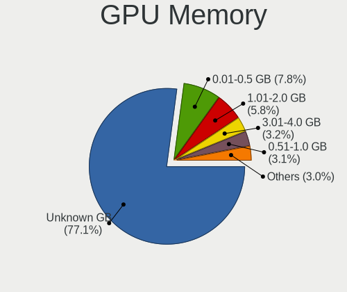

| Size in GB | Notebooks | Percent |
|------------|-----------|---------|
| Unknown    | 2286      | 76.07%  |
| 0.01-0.5   | 240       | 7.99%   |
| 1.01-2.0   | 199       | 6.62%   |
| 0.51-1.0   | 97        | 3.23%   |
| 3.01-4.0   | 96        | 3.19%   |
| 5.01-6.0   | 48        | 1.6%    |
| 7.01-8.0   | 22        | 0.73%   |
| 2.01-3.0   | 11        | 0.37%   |
| 8.01-16.0  | 6         | 0.2%    |

Monitor
-------

Monitor Vendor
--------------

Monitor vendors

| Vendor                  | Notebooks | Percent |
|-------------------------|-----------|---------|
| AU Optronics            | 629       | 17.96%  |
| LG Display              | 552       | 15.76%  |
| Chimei Innolux          | 515       | 14.71%  |
| BOE                     | 487       | 13.91%  |
| Samsung Electronics     | 281       | 8.02%   |
| Sharp                   | 113       | 3.23%   |
| Dell                    | 97        | 2.77%   |
| Goldstar                | 83        | 2.37%   |
| PANDA                   | 77        | 2.2%    |
| Apple                   | 75        | 2.14%   |
| Chi Mei Optoelectronics | 70        | 2%      |
| Lenovo                  | 59        | 1.68%   |
| Hewlett-Packard         | 37        | 1.06%   |
| Philips                 | 36        | 1.03%   |
| Ancor Communications    | 31        | 0.89%   |
| Acer                    | 31        | 0.89%   |
| BenQ                    | 29        | 0.83%   |
| AOC                     | 29        | 0.83%   |
| InfoVision              | 23        | 0.66%   |
| LGD                     | 17        | 0.49%   |
| CSO                     | 16        | 0.46%   |
| ViewSonic               | 15        | 0.43%   |
| Iiyama                  | 15        | 0.43%   |
| LG Philips              | 13        | 0.37%   |
| Sony                    | 12        | 0.34%   |
| Panasonic               | 10        | 0.29%   |
| CPT                     | 10        | 0.29%   |
| ASUSTek Computer        | 10        | 0.29%   |
| TMX                     | 9         | 0.26%   |
| Unknown                 | 5         | 0.14%   |
| Toshiba                 | 5         | 0.14%   |
| NEC Computers           | 5         | 0.14%   |
| Insignia                | 5         | 0.14%   |
| HannStar                | 5         | 0.14%   |
| JDI                     | 4         | 0.11%   |
| InnoLux Display         | 4         | 0.11%   |
| Fujitsu Siemens         | 4         | 0.11%   |
| CMN                     | 4         | 0.11%   |
| Sceptre Tech            | 3         | 0.09%   |
| LG Electronics          | 3         | 0.09%   |
| KDC                     | 3         | 0.09%   |
| IBM                     | 3         | 0.09%   |
| Eizo                    | 3         | 0.09%   |
| BOE Technology Group    | 3         | 0.09%   |
| Unknown                 | 3         | 0.09%   |
| Vizio                   | 2         | 0.06%   |
| MStar                   | 2         | 0.06%   |
| MSI                     | 2         | 0.06%   |
| Lenovo Group Limited    | 2         | 0.06%   |
| KTC                     | 2         | 0.06%   |
| HKC                     | 2         | 0.06%   |
| Gateway                 | 2         | 0.06%   |
| Zoran                   | 1         | 0.03%   |
| XKX                     | 1         | 0.03%   |
| VMO                     | 1         | 0.03%   |
| VFV                     | 1         | 0.03%   |
| Vestel Elektronik       | 1         | 0.03%   |
| Tianma XM               | 1         | 0.03%   |
| TCL                     | 1         | 0.03%   |
| STD                     | 1         | 0.03%   |

Monitor Model
-------------

Monitor models

| Model                                                                    | Notebooks | Percent |
|--------------------------------------------------------------------------|-----------|---------|
| AU Optronics LCD Monitor AUO38ED 1920x1080 344x193mm 15.5-inch           | 38        | 1.07%   |
| Chimei Innolux LCD Monitor CMN14D4 1920x1080 309x173mm 13.9-inch         | 34        | 0.96%   |
| Chimei Innolux LCD Monitor CMN15F5 1920x1080 344x193mm 15.5-inch         | 32        | 0.9%    |
| AU Optronics LCD Monitor AUO61ED 1920x1080 344x193mm 15.5-inch           | 27        | 0.76%   |
| AU Optronics LCD Monitor AUO21ED 1920x1080 344x194mm 15.5-inch           | 26        | 0.73%   |
| LG Display LCD Monitor LGD046F 1920x1080 345x194mm 15.6-inch             | 19        | 0.54%   |
| Chimei Innolux LCD Monitor CMN14D5 1920x1080 309x173mm 13.9-inch         | 19        | 0.54%   |
| AU Optronics LCD Monitor AUO403D 1920x1080 309x174mm 14.0-inch           | 19        | 0.54%   |
| Chimei Innolux LCD Monitor CMN15E7 1920x1080 344x193mm 15.5-inch         | 16        | 0.45%   |
| BOE LCD Monitor BOE0687 1920x1080 344x193mm 15.5-inch                    | 16        | 0.45%   |
| LG Display LCD Monitor LGD02DC 1366x768 344x194mm 15.5-inch              | 15        | 0.42%   |
| AU Optronics LCD Monitor AUO71EC 1366x768 344x193mm 15.5-inch            | 15        | 0.42%   |
| LG Display LCD Monitor LGD033A 1366x768 344x194mm 15.5-inch              | 14        | 0.4%    |
| PANDA LCD Monitor NCP004D 1920x1080 344x194mm 15.5-inch                  | 13        | 0.37%   |
| LG Display LCD Monitor LGD053F 1920x1080 344x194mm 15.5-inch             | 13        | 0.37%   |
| Samsung Electronics LCD Monitor SEC5441 1366x768 344x194mm 15.5-inch     | 12        | 0.34%   |
| LG Display LCD Monitor LGD0456 1366x768 344x194mm 15.5-inch              | 12        | 0.34%   |
| Chimei Innolux LCD Monitor CMN15C4 1920x1080 344x193mm 15.5-inch         | 12        | 0.34%   |
| Chimei Innolux LCD Monitor CMN14C9 1920x1080 309x173mm 13.9-inch         | 12        | 0.34%   |
| Chi Mei Optoelectronics LCD Monitor CMO15A7 1366x768 344x193mm 15.5-inch | 12        | 0.34%   |
| BOE LCD Monitor BOE0700 1920x1080 344x194mm 15.5-inch                    | 12        | 0.34%   |
| BOE LCD Monitor BOE06A4 1366x768 344x194mm 15.5-inch                     | 12        | 0.34%   |
| AU Optronics LCD Monitor AUO22EC 1366x768 344x193mm 15.5-inch            | 12        | 0.34%   |
| LG Display LCD Monitor LGD05E5 1920x1080 344x194mm 15.5-inch             | 11        | 0.31%   |
| Chimei Innolux LCD Monitor CMN15E8 1920x1080 344x193mm 15.5-inch         | 11        | 0.31%   |
| Chimei Innolux LCD Monitor CMN15D5 1920x1080 344x193mm 15.5-inch         | 11        | 0.31%   |
| BOE LCD Monitor BOE08D7 1920x1080 309x174mm 14.0-inch                    | 11        | 0.31%   |
| Chimei Innolux LCD Monitor CMN1738 1920x1080 381x214mm 17.2-inch         | 10        | 0.28%   |
| Chimei Innolux LCD Monitor CMN15DB 1366x768 344x193mm 15.5-inch          | 10        | 0.28%   |
| BOE LCD Monitor BOE08E8 1920x1080 344x194mm 15.5-inch                    | 10        | 0.28%   |
| AU Optronics LCD Monitor AUO123D 1920x1080 309x173mm 13.9-inch           | 10        | 0.28%   |
| AU Optronics LCD Monitor AUO10EC 1366x768 344x193mm 15.5-inch            | 10        | 0.28%   |
| AU Optronics LCD Monitor 1920x1080                                       | 10        | 0.28%   |
| Samsung Electronics LCD Monitor SEC544B 1600x900 310x174mm 14.0-inch     | 9         | 0.25%   |
| LG Display LCD Monitor LGD05EC 1920x1080 309x174mm 14.0-inch             | 9         | 0.25%   |
| LG Display LCD Monitor LGD0533 1920x1080 344x194mm 15.5-inch             | 9         | 0.25%   |
| Goldstar ULTRAWIDE GSM59F1 2560x1080 673x284mm 28.8-inch                 | 9         | 0.25%   |
| Chimei Innolux LCD Monitor CMN1735 1920x1080 381x214mm 17.2-inch         | 9         | 0.25%   |
| Chimei Innolux LCD Monitor CMN1728 1600x900 382x215mm 17.3-inch          | 9         | 0.25%   |
| Chimei Innolux LCD Monitor CMN15CA 1366x768 344x193mm 15.5-inch          | 9         | 0.25%   |
| Chimei Innolux LCD Monitor CMN1521 1920x1080 344x193mm 15.5-inch         | 9         | 0.25%   |
| BOE LCD Monitor BOE0747 1920x1080 344x194mm 15.5-inch                    | 9         | 0.25%   |
| BOE LCD Monitor BOE06BA 1920x1080 344x193mm 15.5-inch                    | 9         | 0.25%   |
| BOE LCD Monitor BOE0696 1366x768 309x173mm 13.9-inch                     | 9         | 0.25%   |
| AU Optronics LCD Monitor AUO573D 1920x1080 309x174mm 14.0-inch           | 9         | 0.25%   |
| AU Optronics LCD Monitor AUO213E 1600x900 309x174mm 14.0-inch            | 9         | 0.25%   |
| Sharp LCD Monitor SHP14D0 3840x2400 336x210mm 15.6-inch                  | 8         | 0.23%   |
| Samsung Electronics LCD Monitor SDCA029 3840x2160 344x194mm 15.5-inch    | 8         | 0.23%   |
| LGD LCD Monitor 1920x1080                                                | 8         | 0.23%   |
| LG Display LCD Monitor LGD062E 1920x1080 344x194mm 15.5-inch             | 8         | 0.23%   |
| Lenovo LCD Monitor LEN40BA 1920x1080 344x194mm 15.5-inch                 | 8         | 0.23%   |
| Chimei Innolux LCD Monitor CMN15E6 1366x768 344x193mm 15.5-inch          | 8         | 0.23%   |
| Chimei Innolux LCD Monitor CMN15B1 1920x1080 344x194mm 15.5-inch         | 8         | 0.23%   |
| Chimei Innolux LCD Monitor CMN14D2 1920x1080 309x173mm 13.9-inch         | 8         | 0.23%   |
| Chimei Innolux LCD Monitor CMN14C3 1366x768 309x173mm 13.9-inch          | 8         | 0.23%   |
| Chi Mei Optoelectronics LCD Monitor CMO1592 1366x768 344x193mm 15.5-inch | 8         | 0.23%   |
| BOE LCD Monitor BOE0675 1366x768 344x194mm 15.5-inch                     | 8         | 0.23%   |
| AU Optronics LCD Monitor AUOD1ED 1920x1080 344x193mm 15.5-inch           | 8         | 0.23%   |
| AU Optronics LCD Monitor AUO70EC 1366x768 344x193mm 15.5-inch            | 8         | 0.23%   |
| AU Optronics LCD Monitor AUO2E3C 1366x768 309x173mm 13.9-inch            | 8         | 0.23%   |

Monitor Resolution
------------------

Monitor screen resolution

| Resolution         | Notebooks | Percent |
|--------------------|-----------|---------|
| 1920x1080 (FHD)    | 1624      | 49.68%  |
| 1366x768 (WXGA)    | 838       | 25.63%  |
| 3840x2160 (4K)     | 138       | 4.22%   |
| 1600x900 (HD+)     | 131       | 4.01%   |
| 2560x1440 (QHD)    | 87        | 2.66%   |
| 1280x800 (WXGA)    | 73        | 2.23%   |
| 1440x900 (WXGA+)   | 49        | 1.5%    |
| 1920x1200 (WUXGA)  | 42        | 1.28%   |
| 1680x1050 (WSXGA+) | 31        | 0.95%   |
| 2560x1600          | 29        | 0.89%   |
| 2880x1800          | 24        | 0.73%   |
| 2560x1080          | 23        | 0.7%    |
| Unknown            | 18        | 0.55%   |
| 3840x2400          | 17        | 0.52%   |
| 1280x1024 (SXGA)   | 15        | 0.46%   |
| 2160x1440          | 14        | 0.43%   |
| 1360x768           | 14        | 0.43%   |
| 3840x1080          | 11        | 0.34%   |
| 3200x1800 (QHD+)   | 11        | 0.34%   |
| 3456x2160          | 9         | 0.28%   |
| 3440x1440          | 9         | 0.28%   |
| 3200x2000          | 5         | 0.15%   |
| 1920x540           | 5         | 0.15%   |
| 1920x1280          | 5         | 0.15%   |
| 3286x1080          | 4         | 0.12%   |
| 3000x2000          | 4         | 0.12%   |
| 3840x1600          | 3         | 0.09%   |
| 2880x1920          | 3         | 0.09%   |
| 2256x1504          | 3         | 0.09%   |
| 2240x1400          | 3         | 0.09%   |
| 1600x1200          | 3         | 0.09%   |
| 1024x600           | 3         | 0.09%   |
| 2560x1700          | 2         | 0.06%   |
| 2520x1680          | 2         | 0.06%   |
| 1280x720 (HD)      | 2         | 0.06%   |
| 7680x1080          | 1         | 0.03%   |
| 720x1280           | 1         | 0.03%   |
| 5760x2160          | 1         | 0.03%   |
| 4480x1600          | 1         | 0.03%   |
| 4480x1440          | 1         | 0.03%   |
| 3840x1100          | 1         | 0.03%   |
| 3300x2200          | 1         | 0.03%   |
| 3072x1920          | 1         | 0.03%   |
| 2726x768           | 1         | 0.03%   |
| 2304x1440          | 1         | 0.03%   |
| 2160x1350          | 1         | 0.03%   |
| 1600x2560          | 1         | 0.03%   |
| 1400x1050          | 1         | 0.03%   |
| 11520x2400         | 1         | 0.03%   |
| 1024x768 (XGA)     | 1         | 0.03%   |

Monitor Diagonal
----------------

Diagonal size in inches

| Inches  | Notebooks | Percent |
|---------|-----------|---------|
| 15      | 1531      | 43.98%  |
| 13      | 503       | 14.45%  |
| 14      | 425       | 12.21%  |
| 17      | 223       | 6.41%   |
| 27      | 117       | 3.36%   |
| 24      | 113       | 3.25%   |
| 23      | 89        | 2.56%   |
| 12      | 78        | 2.24%   |
| 21      | 71        | 2.04%   |
| Unknown | 63        | 1.81%   |
| 11      | 47        | 1.35%   |
| 31      | 35        | 1.01%   |
| 34      | 29        | 0.83%   |
| 16      | 23        | 0.66%   |
| 18      | 18        | 0.52%   |
| 22      | 15        | 0.43%   |
| 19      | 15        | 0.43%   |
| 20      | 12        | 0.34%   |
| 84      | 9         | 0.26%   |
| 32      | 7         | 0.2%    |
| 72      | 6         | 0.17%   |
| 54      | 4         | 0.11%   |
| 49      | 4         | 0.11%   |
| 48      | 4         | 0.11%   |
| 37      | 4         | 0.11%   |
| 26      | 4         | 0.11%   |
| 25      | 4         | 0.11%   |
| 10      | 4         | 0.11%   |
| 74      | 3         | 0.09%   |
| 52      | 3         | 0.09%   |
| 28      | 3         | 0.09%   |
| 42      | 2         | 0.06%   |
| 40      | 2         | 0.06%   |
| 33      | 2         | 0.06%   |
| 8       | 2         | 0.06%   |
| 86      | 1         | 0.03%   |
| 75      | 1         | 0.03%   |
| 60      | 1         | 0.03%   |
| 43      | 1         | 0.03%   |
| 39      | 1         | 0.03%   |
| 35      | 1         | 0.03%   |
| 29      | 1         | 0.03%   |

Monitor Width
-------------

Physical width

| Width in mm | Notebooks | Percent |
|-------------|-----------|---------|
| 301-350     | 2226      | 64.48%  |
| 201-300     | 347       | 10.05%  |
| 501-600     | 292       | 8.46%   |
| 351-400     | 257       | 7.44%   |
| 401-500     | 126       | 3.65%   |
| Unknown     | 63        | 1.83%   |
| 601-700     | 54        | 1.56%   |
| 701-800     | 38        | 1.1%    |
| 1501-2000   | 20        | 0.58%   |
| 1001-1500   | 16        | 0.46%   |
| 801-900     | 8         | 0.23%   |
| 901-1000    | 3         | 0.09%   |
| 101-200     | 2         | 0.06%   |

Aspect Ratio
------------

Proportional relationship between the width and the height

| Ratio   | Notebooks | Percent |
|---------|-----------|---------|
| 16/9    | 2616      | 85.52%  |
| 16/10   | 284       | 9.28%   |
| Unknown | 52        | 1.7%    |
| 3/2     | 40        | 1.31%   |
| 21/9    | 34        | 1.11%   |
| 5/4     | 12        | 0.39%   |
| 4/3     | 9         | 0.29%   |
| 32/9    | 7         | 0.23%   |
| 0.62    | 2         | 0.07%   |
| 6/5     | 1         | 0.03%   |
| 3.40    | 1         | 0.03%   |
| 0.56    | 1         | 0.03%   |

Monitor Area
------------

Area in inch

| Area in inch | Notebooks | Percent |
|----------------|-----------|---------|
| 101-110        | 1533      | 44.17%  |
| 81-90          | 748       | 21.55%  |
| 201-250        | 236       | 6.8%    |
| 121-130        | 187       | 5.39%   |
| 71-80          | 182       | 5.24%   |
| 301-350        | 119       | 3.43%   |
| 351-500        | 77        | 2.22%   |
| 61-70          | 73        | 2.1%    |
| Unknown        | 63        | 1.82%   |
| 51-60          | 48        | 1.38%   |
| 151-200        | 42        | 1.21%   |
| 251-300        | 35        | 1.01%   |
| More than 1000 | 32        | 0.92%   |
| 131-140        | 29        | 0.84%   |
| 141-150        | 23        | 0.66%   |
| 111-120        | 15        | 0.43%   |
| 501-1000       | 13        | 0.37%   |
| 91-100         | 10        | 0.29%   |
| 41-50          | 4         | 0.12%   |
| 1-40           | 2         | 0.06%   |

Pixel Density
-------------

Pixels per inch

| Density       | Notebooks | Percent |
|---------------|-----------|---------|
| 121-160       | 1559      | 45.66%  |
| 101-120       | 913       | 26.74%  |
| 51-100        | 486       | 14.24%  |
| 161-240       | 233       | 6.82%   |
| More than 240 | 130       | 3.81%   |
| Unknown       | 63        | 1.85%   |
| 1-50          | 30        | 0.88%   |

Multiple Monitors
-----------------

Total monitors connected

| Total | Notebooks | Percent |
|-------|-----------|---------|
| 1     | 2421      | 80.35%  |
| 2     | 523       | 17.36%  |
| 3     | 50        | 1.66%   |
| 0     | 15        | 0.5%    |
| 4     | 4         | 0.13%   |

Network
-------

Net Controller Vendor
---------------------

Controller vendors

| Vendor                                 | Notebooks | Percent |
|----------------------------------------|-----------|---------|
| Intel                                  | 1657      | 35.47%  |
| Realtek Semiconductor                  | 1640      | 35.1%   |
| Qualcomm Atheros                       | 661       | 14.15%  |
| Broadcom                               | 238       | 5.09%   |
| Broadcom Limited                       | 62        | 1.33%   |
| Ralink                                 | 40        | 0.86%   |
| MediaTek                               | 37        | 0.79%   |
| TP-Link                                | 31        | 0.66%   |
| Ralink Technology                      | 28        | 0.6%    |
| Marvell Technology Group               | 23        | 0.49%   |
| Xiaomi                                 | 21        | 0.45%   |
| Sierra Wireless                        | 20        | 0.43%   |
| Dell                                   | 19        | 0.41%   |
| ASIX Electronics                       | 17        | 0.36%   |
| Lenovo                                 | 16        | 0.34%   |
| DisplayLink                            | 14        | 0.3%    |
| Hewlett-Packard                        | 13        | 0.28%   |
| Huawei Technologies                    | 12        | 0.26%   |
| JMicron Technology                     | 11        | 0.24%   |
| Samsung Electronics                    | 10        | 0.21%   |
| Ericsson Business Mobile Networks      | 10        | 0.21%   |
| Nvidia                                 | 9         | 0.19%   |
| Qualcomm                               | 7         | 0.15%   |
| Linksys                                | 7         | 0.15%   |
| NetGear                                | 6         | 0.13%   |
| D-Link                                 | 6         | 0.13%   |
| ASUSTek Computer                       | 6         | 0.13%   |
| Qualcomm Atheros Communications        | 5         | 0.11%   |
| OnePlus Technology (Shenzhen)          | 5         | 0.11%   |
| Fibocom                                | 5         | 0.11%   |
| Edimax Technology                      | 4         | 0.09%   |
| ZTE WCDMA Technologies MSM             | 3         | 0.06%   |
| Apple                                  | 3         | 0.06%   |
| ZyXEL Communications                   | 2         | 0.04%   |
| Spreadtrum Communications              | 2         | 0.04%   |
| Quectel Wireless Solutions             | 2         | 0.04%   |
| ICS Advent                             | 2         | 0.04%   |
| Google                                 | 2         | 0.04%   |
| Attansic Technology                    | 2         | 0.04%   |
| T & A Mobile Phones                    | 1         | 0.02%   |
| Sony Ericsson Mobile Communications AB | 1         | 0.02%   |
| SEGGER                                 | 1         | 0.02%   |
| Motorola PCS                           | 1         | 0.02%   |
| Microsoft                              | 1         | 0.02%   |
| Microchip Technology                   | 1         | 0.02%   |
| Mercucys                               | 1         | 0.02%   |
| Meizu                                  | 1         | 0.02%   |
| HTC (High Tech Computer)               | 1         | 0.02%   |
| Foxconn / Hon Hai                      | 1         | 0.02%   |
| D-Link System                          | 1         | 0.02%   |
| Bose                                   | 1         | 0.02%   |
| Belkin Components                      | 1         | 0.02%   |
| 802.11g Adapter [Linksys WUSB54GC v3]  | 1         | 0.02%   |

Net Controller Model
--------------------

Controller models

| Model                                                             | Notebooks | Percent |
|-------------------------------------------------------------------|-----------|---------|
| Realtek RTL8111/8168/8411 PCI Express Gigabit Ethernet Controller | 1084      | 19.46%  |
| Realtek RTL810xE PCI Express Fast Ethernet controller             | 281       | 5.04%   |
| Intel Wi-Fi 6 AX200                                               | 233       | 4.18%   |
| Intel Wireless 8265 / 8275                                        | 154       | 2.76%   |
| Qualcomm Atheros QCA9377 802.11ac Wireless Network Adapter        | 147       | 2.64%   |
| Intel Wireless 7265                                               | 113       | 2.03%   |
| Intel Wireless 7260                                               | 113       | 2.03%   |
| Realtek RTL8822CE 802.11ac PCIe Wireless Network Adapter          | 110       | 1.97%   |
| Realtek RTL8153 Gigabit Ethernet Adapter                          | 108       | 1.94%   |
| Intel 82579LM Gigabit Network Connection (Lewisville)             | 108       | 1.94%   |
| Intel Cannon Lake PCH CNVi WiFi                                   | 106       | 1.9%    |
| Qualcomm Atheros QCA9565 / AR9565 Wireless Network Adapter        | 100       | 1.8%    |
| Realtek RTL8821CE 802.11ac PCIe Wireless Network Adapter          | 95        | 1.71%   |
| Qualcomm Atheros QCA6174 802.11ac Wireless Network Adapter        | 91        | 1.63%   |
| Intel Cannon Point-LP CNVi [Wireless-AC]                          | 84        | 1.51%   |
| Intel Wi-Fi 6 AX201                                               | 82        | 1.47%   |
| Qualcomm Atheros AR9485 Wireless Network Adapter                  | 76        | 1.36%   |
| Qualcomm Atheros AR9285 Wireless Network Adapter (PCI-Express)    | 75        | 1.35%   |
| Intel Centrino Advanced-N 6205 [Taylor Peak]                      | 73        | 1.31%   |
| Intel Wireless 8260                                               | 67        | 1.2%    |
| Intel Wireless 3165                                               | 59        | 1.06%   |
| Realtek RTL8723BE PCIe Wireless Network Adapter                   | 58        | 1.04%   |
| Intel Comet Lake PCH-LP CNVi WiFi                                 | 57        | 1.02%   |
| Intel Comet Lake PCH CNVi WiFi                                    | 52        | 0.93%   |
| Realtek RTL8822BE 802.11a/b/g/n/ac WiFi adapter                   | 49        | 0.88%   |
| Intel Wireless 3160                                               | 39        | 0.7%    |
| Intel Dual Band Wireless-AC 3168NGW [Stone Peak]                  | 38        | 0.68%   |
| Broadcom BCM4313 802.11bgn Wireless Network Adapter               | 38        | 0.68%   |
| Intel Ice Lake-LP PCH CNVi WiFi                                   | 35        | 0.63%   |
| Intel Wireless-AC 9260                                            | 34        | 0.61%   |
| Intel Ethernet Connection (3) I218-LM                             | 34        | 0.61%   |
| Intel Dual Band Wireless-AC 3165 Plus Bluetooth                   | 34        | 0.61%   |
| Intel Ethernet Connection (4) I219-LM                             | 33        | 0.59%   |
| Intel Centrino Wireless-N 2230                                    | 33        | 0.59%   |
| Intel Ethernet Connection I218-LM                                 | 32        | 0.57%   |
| Intel Ethernet Connection (4) I219-V                              | 32        | 0.57%   |
| Broadcom BCM43142 802.11b/g/n                                     | 32        | 0.57%   |
| Qualcomm Atheros AR9462 Wireless Network Adapter                  | 31        | 0.56%   |
| Qualcomm Atheros AR8151 v2.0 Gigabit Ethernet                     | 31        | 0.56%   |
| Intel Ethernet Connection I217-LM                                 | 27        | 0.48%   |
| Intel Centrino Advanced-N 6235                                    | 25        | 0.45%   |
| Qualcomm Atheros QCA8171 Gigabit Ethernet                         | 24        | 0.43%   |
| MediaTek MT7921 802.11ax PCI Express Wireless Network Adapter     | 24        | 0.43%   |
| Intel Wi-Fi 6 AX210/AX211/AX411 160MHz                            | 24        | 0.43%   |
| Intel 82577LM Gigabit Network Connection                          | 24        | 0.43%   |
| Intel Centrino Ultimate-N 6300                                    | 23        | 0.41%   |
| Realtek RTL8852AE 802.11ax PCIe Wireless Network Adapter          | 21        | 0.38%   |
| Intel Ethernet Connection (6) I219-V                              | 21        | 0.38%   |
| Broadcom NetLink BCM57785 Gigabit Ethernet PCIe                   | 21        | 0.38%   |
| Realtek RTL8188EE Wireless Network Adapter                        | 20        | 0.36%   |
| Ralink RT3290 Wireless 802.11n 1T/1R PCIe                         | 20        | 0.36%   |
| Realtek RTL8821AE 802.11ac PCIe Wireless Network Adapter          | 19        | 0.34%   |
| Realtek RTL8723DE Wireless Network Adapter                        | 19        | 0.34%   |
| Qualcomm Atheros AR9287 Wireless Network Adapter (PCI-Express)    | 18        | 0.32%   |
| Intel Ethernet Connection (7) I219-LM                             | 18        | 0.32%   |
| Realtek RTL8188CE 802.11b/g/n WiFi Adapter                        | 17        | 0.31%   |
| Intel Ethernet Connection I219-LM                                 | 17        | 0.31%   |
| Intel Centrino Advanced-N 6200                                    | 17        | 0.31%   |
| Broadcom BCM4331 802.11a/b/g/n                                    | 17        | 0.31%   |
| Qualcomm Atheros Killer E2400 Gigabit Ethernet Controller         | 16        | 0.29%   |

Wireless Vendor
---------------

Wireless vendors

| Vendor                                | Notebooks | Percent |
|---------------------------------------|-----------|---------|
| Intel                                 | 1612      | 52.17%  |
| Qualcomm Atheros                      | 554       | 17.93%  |
| Realtek Semiconductor                 | 477       | 15.44%  |
| Broadcom                              | 182       | 5.89%   |
| Broadcom Limited                      | 49        | 1.59%   |
| Ralink                                | 40        | 1.29%   |
| MediaTek                              | 33        | 1.07%   |
| Ralink Technology                     | 28        | 0.91%   |
| TP-Link                               | 26        | 0.84%   |
| Sierra Wireless                       | 20        | 0.65%   |
| Dell                                  | 14        | 0.45%   |
| Linksys                               | 7         | 0.23%   |
| NetGear                               | 6         | 0.19%   |
| D-Link                                | 6         | 0.19%   |
| Qualcomm Atheros Communications       | 5         | 0.16%   |
| ASUSTek Computer                      | 5         | 0.16%   |
| Hewlett-Packard                       | 4         | 0.13%   |
| Fibocom                               | 4         | 0.13%   |
| Edimax Technology                     | 4         | 0.13%   |
| Qualcomm                              | 3         | 0.1%    |
| ZyXEL Communications                  | 2         | 0.06%   |
| Quectel Wireless Solutions            | 2         | 0.06%   |
| Samsung Electronics                   | 1         | 0.03%   |
| Microsoft                             | 1         | 0.03%   |
| Mercucys                              | 1         | 0.03%   |
| D-Link System                         | 1         | 0.03%   |
| Belkin Components                     | 1         | 0.03%   |
| Apple                                 | 1         | 0.03%   |
| 802.11g Adapter [Linksys WUSB54GC v3] | 1         | 0.03%   |

Wireless Model
--------------

Wireless models

| Model                                                          | Notebooks | Percent |
|----------------------------------------------------------------|-----------|---------|
| Intel Wi-Fi 6 AX200                                            | 233       | 7.48%   |
| Intel Wireless 8265 / 8275                                     | 154       | 4.94%   |
| Qualcomm Atheros QCA9377 802.11ac Wireless Network Adapter     | 147       | 4.72%   |
| Intel Wireless 7265                                            | 113       | 3.63%   |
| Intel Wireless 7260                                            | 113       | 3.63%   |
| Realtek RTL8822CE 802.11ac PCIe Wireless Network Adapter       | 110       | 3.53%   |
| Intel Cannon Lake PCH CNVi WiFi                                | 106       | 3.4%    |
| Qualcomm Atheros QCA9565 / AR9565 Wireless Network Adapter     | 100       | 3.21%   |
| Realtek RTL8821CE 802.11ac PCIe Wireless Network Adapter       | 95        | 3.05%   |
| Qualcomm Atheros QCA6174 802.11ac Wireless Network Adapter     | 91        | 2.92%   |
| Intel Cannon Point-LP CNVi [Wireless-AC]                       | 84        | 2.7%    |
| Intel Wi-Fi 6 AX201                                            | 82        | 2.63%   |
| Qualcomm Atheros AR9485 Wireless Network Adapter               | 76        | 2.44%   |
| Qualcomm Atheros AR9285 Wireless Network Adapter (PCI-Express) | 75        | 2.41%   |
| Intel Centrino Advanced-N 6205 [Taylor Peak]                   | 73        | 2.34%   |
| Intel Wireless 8260                                            | 67        | 2.15%   |
| Intel Wireless 3165                                            | 59        | 1.89%   |
| Realtek RTL8723BE PCIe Wireless Network Adapter                | 58        | 1.86%   |
| Intel Comet Lake PCH-LP CNVi WiFi                              | 57        | 1.83%   |
| Intel Comet Lake PCH CNVi WiFi                                 | 52        | 1.67%   |
| Realtek RTL8822BE 802.11a/b/g/n/ac WiFi adapter                | 49        | 1.57%   |
| Intel Wireless 3160                                            | 39        | 1.25%   |
| Intel Dual Band Wireless-AC 3168NGW [Stone Peak]               | 38        | 1.22%   |
| Broadcom BCM4313 802.11bgn Wireless Network Adapter            | 38        | 1.22%   |
| Intel Ice Lake-LP PCH CNVi WiFi                                | 35        | 1.12%   |
| Intel Wireless-AC 9260                                         | 34        | 1.09%   |
| Intel Dual Band Wireless-AC 3165 Plus Bluetooth                | 34        | 1.09%   |
| Intel Centrino Wireless-N 2230                                 | 33        | 1.06%   |
| Broadcom BCM43142 802.11b/g/n                                  | 32        | 1.03%   |
| Qualcomm Atheros AR9462 Wireless Network Adapter               | 31        | 1%      |
| Intel Centrino Advanced-N 6235                                 | 25        | 0.8%    |
| MediaTek MT7921 802.11ax PCI Express Wireless Network Adapter  | 24        | 0.77%   |
| Intel Wi-Fi 6 AX210/AX211/AX411 160MHz                         | 24        | 0.77%   |
| Intel Centrino Ultimate-N 6300                                 | 23        | 0.74%   |
| Realtek RTL8852AE 802.11ax PCIe Wireless Network Adapter       | 21        | 0.67%   |
| Realtek RTL8188EE Wireless Network Adapter                     | 20        | 0.64%   |
| Ralink RT3290 Wireless 802.11n 1T/1R PCIe                      | 20        | 0.64%   |
| Realtek RTL8821AE 802.11ac PCIe Wireless Network Adapter       | 19        | 0.61%   |
| Realtek RTL8723DE Wireless Network Adapter                     | 19        | 0.61%   |
| Qualcomm Atheros AR9287 Wireless Network Adapter (PCI-Express) | 18        | 0.58%   |
| Realtek RTL8188CE 802.11b/g/n WiFi Adapter                     | 17        | 0.55%   |
| Intel Centrino Advanced-N 6200                                 | 17        | 0.55%   |
| Broadcom BCM4331 802.11a/b/g/n                                 | 17        | 0.55%   |
| Intel WiFi Link 5100                                           | 14        | 0.45%   |
| Broadcom BCM43224 802.11a/b/g/n                                | 14        | 0.45%   |
| Intel PRO/Wireless 3945ABG [Golan] Network Connection          | 13        | 0.42%   |
| Broadcom Limited BCM4360 802.11ac Wireless Network Adapter     | 13        | 0.42%   |
| Broadcom BCM43228 802.11a/b/g/n                                | 13        | 0.42%   |
| Intel Tiger Lake PCH CNVi WiFi                                 | 12        | 0.39%   |
| Intel Centrino Wireless-N 1000 [Condor Peak]                   | 12        | 0.39%   |
| Intel PRO/Wireless 5100 AGN [Shiloh] Network Connection        | 11        | 0.35%   |
| Broadcom BCM43602 802.11ac Wireless LAN SoC                    | 11        | 0.35%   |
| Broadcom BCM4322 802.11a/b/g/n Wireless LAN Controller         | 11        | 0.35%   |
| Broadcom BCM4312 802.11b/g LP-PHY                              | 11        | 0.35%   |
| Realtek RTL8188EUS 802.11n Wireless Network Adapter            | 10        | 0.32%   |
| Realtek 802.11ac NIC                                           | 10        | 0.32%   |
| Intel PRO/Wireless 4965 AG or AGN [Kedron] Network Connection  | 10        | 0.32%   |
| Realtek RTL8723AE PCIe Wireless Network Adapter                | 9         | 0.29%   |
| Ralink MT7601U Wireless Adapter                                | 9         | 0.29%   |
| Ralink RT3090 Wireless 802.11n 1T/1R PCIe                      | 9         | 0.29%   |

Ethernet Vendor
---------------

Ethernet vendors

| Vendor                                 | Notebooks | Percent |
|----------------------------------------|-----------|---------|
| Realtek Semiconductor                  | 1480      | 61.9%   |
| Intel                                  | 481       | 20.12%  |
| Qualcomm Atheros                       | 164       | 6.86%   |
| Broadcom                               | 86        | 3.6%    |
| Marvell Technology Group               | 23        | 0.96%   |
| Xiaomi                                 | 20        | 0.84%   |
| ASIX Electronics                       | 17        | 0.71%   |
| Lenovo                                 | 16        | 0.67%   |
| Broadcom Limited                       | 16        | 0.67%   |
| DisplayLink                            | 14        | 0.59%   |
| JMicron Technology                     | 11        | 0.46%   |
| Samsung Electronics                    | 9         | 0.38%   |
| Nvidia                                 | 9         | 0.38%   |
| TP-Link                                | 5         | 0.21%   |
| Huawei Technologies                    | 5         | 0.21%   |
| Qualcomm                               | 4         | 0.17%   |
| OnePlus Technology (Shenzhen)          | 4         | 0.17%   |
| MediaTek                               | 4         | 0.17%   |
| ZTE WCDMA Technologies MSM             | 3         | 0.13%   |
| Hewlett-Packard                        | 3         | 0.13%   |
| Spreadtrum Communications              | 2         | 0.08%   |
| ICS Advent                             | 2         | 0.08%   |
| Google                                 | 2         | 0.08%   |
| Attansic Technology                    | 2         | 0.08%   |
| Apple                                  | 2         | 0.08%   |
| T & A Mobile Phones                    | 1         | 0.04%   |
| Sony Ericsson Mobile Communications AB | 1         | 0.04%   |
| Motorola PCS                           | 1         | 0.04%   |
| Microchip Technology                   | 1         | 0.04%   |
| HTC (High Tech Computer)               | 1         | 0.04%   |
| Foxconn / Hon Hai                      | 1         | 0.04%   |
| ASUSTek Computer                       | 1         | 0.04%   |

Ethernet Model
--------------

Ethernet models

| Model                                                             | Notebooks | Percent |
|-------------------------------------------------------------------|-----------|---------|
| Realtek RTL8111/8168/8411 PCI Express Gigabit Ethernet Controller | 1084      | 44.77%  |
| Realtek RTL810xE PCI Express Fast Ethernet controller             | 281       | 11.61%  |
| Realtek RTL8153 Gigabit Ethernet Adapter                          | 108       | 4.46%   |
| Intel 82579LM Gigabit Network Connection (Lewisville)             | 108       | 4.46%   |
| Intel Ethernet Connection (3) I218-LM                             | 34        | 1.4%    |
| Intel Ethernet Connection (4) I219-LM                             | 33        | 1.36%   |
| Intel Ethernet Connection I218-LM                                 | 32        | 1.32%   |
| Intel Ethernet Connection (4) I219-V                              | 32        | 1.32%   |
| Qualcomm Atheros AR8151 v2.0 Gigabit Ethernet                     | 31        | 1.28%   |
| Intel Ethernet Connection I217-LM                                 | 27        | 1.12%   |
| Qualcomm Atheros QCA8171 Gigabit Ethernet                         | 24        | 0.99%   |
| Intel 82577LM Gigabit Network Connection                          | 24        | 0.99%   |
| Intel Ethernet Connection (6) I219-V                              | 21        | 0.87%   |
| Broadcom NetLink BCM57785 Gigabit Ethernet PCIe                   | 21        | 0.87%   |
| Intel Ethernet Connection (7) I219-LM                             | 18        | 0.74%   |
| Intel Ethernet Connection I219-LM                                 | 17        | 0.7%    |
| Qualcomm Atheros Killer E2400 Gigabit Ethernet Controller         | 16        | 0.66%   |
| Qualcomm Atheros AR8162 Fast Ethernet                             | 16        | 0.66%   |
| Broadcom NetXtreme BCM57765 Gigabit Ethernet PCIe                 | 16        | 0.66%   |
| Xiaomi Mi/Redmi series (RNDIS)                                    | 15        | 0.62%   |
| Qualcomm Atheros Killer E2500 Gigabit Ethernet Controller         | 14        | 0.58%   |
| Qualcomm Atheros AR8161 Gigabit Ethernet                          | 14        | 0.58%   |
| Intel Ethernet Connection (6) I219-LM                             | 14        | 0.58%   |
| Intel Ethernet Connection (10) I219-V                             | 14        | 0.58%   |
| Intel 82567LM Gigabit Network Connection                          | 14        | 0.58%   |
| ASIX AX88179 Gigabit Ethernet                                     | 14        | 0.58%   |
| Intel Ethernet Connection I219-V                                  | 13        | 0.54%   |
| Broadcom NetLink BCM57780 Gigabit Ethernet PCIe                   | 13        | 0.54%   |
| Realtek Killer E2600 Gigabit Ethernet Controller                  | 12        | 0.5%    |
| Marvell Group 88E8040 PCI-E Fast Ethernet Controller              | 12        | 0.5%    |
| JMicron JMC250 PCI Express Gigabit Ethernet Controller            | 11        | 0.45%   |
| Qualcomm Atheros Killer E220x Gigabit Ethernet Controller         | 10        | 0.41%   |
| Qualcomm Atheros QCA8172 Fast Ethernet                            | 9         | 0.37%   |
| Qualcomm Atheros AR8131 Gigabit Ethernet                          | 8         | 0.33%   |
| Intel Ethernet Connection (13) I219-V                             | 8         | 0.33%   |
| Intel 82579V Gigabit Network Connection                           | 8         | 0.33%   |
| Broadcom NetXtreme BCM57786 Gigabit Ethernet PCIe                 | 8         | 0.33%   |
| Qualcomm Atheros AR8152 v2.0 Fast Ethernet                        | 7         | 0.29%   |
| Intel Ethernet Connection I217-V                                  | 7         | 0.29%   |
| Intel Ethernet Connection (2) I219-LM                             | 7         | 0.29%   |
| Realtek RTL8152 Fast Ethernet Adapter                             | 6         | 0.25%   |
| Qualcomm Atheros AR8152 v1.1 Fast Ethernet                        | 6         | 0.25%   |
| Nvidia MCP79 Ethernet                                             | 6         | 0.25%   |
| Lenovo USB-C Dock Ethernet                                        | 6         | 0.25%   |
| Broadcom NetXtreme BCM5761 Gigabit Ethernet PCIe                  | 6         | 0.25%   |
| Broadcom NetLink BCM5784M Gigabit Ethernet PCIe                   | 6         | 0.25%   |
| Xiaomi Mi/Redmi series (RNDIS + ADB)                              | 5         | 0.21%   |
| Samsung Galaxy series, misc. (tethering mode)                     | 5         | 0.21%   |
| Realtek RTL8125 2.5GbE Controller                                 | 5         | 0.21%   |
| Intel Ethernet controller                                         | 5         | 0.21%   |
| Intel Ethernet Connection (10) I219-LM                            | 5         | 0.21%   |
| Intel 82566MM Gigabit Network Connection                          | 5         | 0.21%   |
| Samsung GT-I9070 (network tethering, USB debugging enabled)       | 4         | 0.17%   |
| Realtek Killer E3000 2.5GbE Controller                            | 4         | 0.17%   |
| OnePlus (Shenzhen) OnePlus                                        | 4         | 0.17%   |
| Lenovo ThinkPad TBT 3 Dock                                        | 4         | 0.17%   |
| Intel Ethernet Connection (3) I218-V                              | 4         | 0.17%   |
| Intel Ethernet Connection (11) I219-LM                            | 4         | 0.17%   |
| Huawei LYA-L09                                                    | 4         | 0.17%   |
| DisplayLink Dell Universal Dock D6000                             | 4         | 0.17%   |

Net Controller Kind
-------------------

Ethernet, WiFi or modem

| Kind     | Notebooks | Percent |
|----------|-----------|---------|
| WiFi     | 2930      | 55.58%  |
| Ethernet | 2308      | 43.78%  |
| Modem    | 31        | 0.59%   |
| Unknown  | 3         | 0.06%   |

Used Controller
---------------

Currently used network controller

| Kind     | Notebooks | Percent |
|----------|-----------|---------|
| WiFi     | 2535      | 81.33%  |
| Ethernet | 582       | 18.67%  |

NICs
----

Total network controllers on board

| Total | Notebooks | Percent |
|-------|-----------|---------|
| 2     | 2117      | 71.38%  |
| 1     | 802       | 27.04%  |
| 0     | 25        | 0.84%   |
| 3     | 22        | 0.74%   |

IPv6
----

IPv6 vs IPv4

| Used | Notebooks | Percent |
|------|-----------|---------|
| No   | 2602      | 86.82%  |
| Yes  | 395       | 13.18%  |

Bluetooth
---------

Bluetooth Vendor
----------------

Controller vendors

| Vendor                          | Notebooks | Percent |
|---------------------------------|-----------|---------|
| Intel                           | 1298      | 53.64%  |
| Realtek Semiconductor           | 267       | 11.03%  |
| Qualcomm Atheros Communications | 260       | 10.74%  |
| IMC Networks                    | 123       | 5.08%   |
| Lite-On Technology              | 111       | 4.59%   |
| Broadcom                        | 85        | 3.51%   |
| Apple                           | 61        | 2.52%   |
| Foxconn / Hon Hai               | 48        | 1.98%   |
| Realtek                         | 31        | 1.28%   |
| Cambridge Silicon Radio         | 26        | 1.07%   |
| Dell                            | 21        | 0.87%   |
| Ralink                          | 20        | 0.83%   |
| Hewlett-Packard                 | 14        | 0.58%   |
| Toshiba                         | 11        | 0.45%   |
| Foxconn International           | 9         | 0.37%   |
| Ralink Technology               | 6         | 0.25%   |
| ASUSTek Computer                | 5         | 0.21%   |
| Alps Electric                   | 5         | 0.21%   |
| Opticis                         | 4         | 0.17%   |
| Askey Computer                  | 4         | 0.17%   |
| MediaTek                        | 2         | 0.08%   |
| Fujitsu                         | 2         | 0.08%   |
| Belkin Components               | 2         | 0.08%   |
| TP-Link                         | 1         | 0.04%   |
| SINO WEALTH                     | 1         | 0.04%   |
| Qcom                            | 1         | 0.04%   |
| Dynex                           | 1         | 0.04%   |
| Chicony Electronics             | 1         | 0.04%   |

Bluetooth Model
---------------

Controller models

| Model                                               | Notebooks | Percent |
|-----------------------------------------------------|-----------|---------|
| Intel Bluetooth wireless interface                  | 505       | 20.85%  |
| Intel Bluetooth 9460/9560 Jefferson Peak (JfP)      | 235       | 9.7%    |
| Intel AX200 Bluetooth                               | 224       | 9.25%   |
| Intel AX201 Bluetooth                               | 181       | 7.47%   |
| Qualcomm Atheros  Bluetooth Device                  | 159       | 6.56%   |
| Realtek Bluetooth Radio                             | 154       | 6.36%   |
| Realtek  Bluetooth 4.2 Adapter                      | 74        | 3.06%   |
| IMC Networks Bluetooth Radio                        | 53        | 2.19%   |
| Intel Centrino Bluetooth Wireless Transceiver       | 50        | 2.06%   |
| Intel Bluetooth Device                              | 47        | 1.94%   |
| Lite-On Qualcomm Atheros QCA9377 Bluetooth          | 41        | 1.69%   |
| Qualcomm Atheros AR3012 Bluetooth 4.0               | 38        | 1.57%   |
| Lite-On Bluetooth Device                            | 35        | 1.45%   |
| Intel Wireless-AC 3168 Bluetooth                    | 35        | 1.45%   |
| Apple Bluetooth Host Controller                     | 32        | 1.32%   |
| Realtek Bluetooth Radio                             | 31        | 1.28%   |
| IMC Networks Bluetooth Device                       | 29        | 1.2%    |
| Qualcomm Atheros AR3011 Bluetooth                   | 27        | 1.11%   |
| Cambridge Silicon Radio Bluetooth Dongle (HCI mode) | 26        | 1.07%   |
| Foxconn / Hon Hai Bluetooth Device                  | 24        | 0.99%   |
| Intel AX210 Bluetooth                               | 23        | 0.95%   |
| Apple Bluetooth USB Host Controller                 | 23        | 0.95%   |
| Ralink RT3290 Bluetooth                             | 20        | 0.83%   |
| Qualcomm Atheros AR9462 Bluetooth                   | 18        | 0.74%   |
| IMC Networks Wireless_Device                        | 16        | 0.66%   |
| Realtek RTL8822BE Bluetooth 4.2 Adapter             | 14        | 0.58%   |
| Broadcom BCM20702 Bluetooth 4.0 [ThinkPad]          | 14        | 0.58%   |
| Realtek RTL8821A Bluetooth                          | 13        | 0.54%   |
| Lite-On Atheros AR3012 Bluetooth                    | 13        | 0.54%   |
| Broadcom HP Portable SoftSailing                    | 11        | 0.45%   |
| Realtek RTL8723B Bluetooth                          | 10        | 0.41%   |
| Broadcom BCM2045B (BDC-2.1)                         | 10        | 0.41%   |
| Foxconn International BCM43142A0 Bluetooth module   | 9         | 0.37%   |
| Qualcomm Atheros Bluetooth USB Host Controller      | 8         | 0.33%   |
| IMC Networks Atheros AR3012 Bluetooth 4.0 Adapter   | 8         | 0.33%   |
| Dell BCM20702A0 Bluetooth Module                    | 8         | 0.33%   |
| Lite-On Broadcom BCM43142A0 Bluetooth Device        | 7         | 0.29%   |
| HP Broadcom 2070 Bluetooth Combo                    | 7         | 0.29%   |
| HP Bluetooth 2.0 Interface [Broadcom BCM2045]       | 7         | 0.29%   |
| Broadcom BCM43142 Bluetooth 4.0                     | 7         | 0.29%   |
| Toshiba Bluetooth Device                            | 6         | 0.25%   |
| Lite-On Qualcomm Atheros Bluetooth                  | 6         | 0.25%   |
| Foxconn / Hon Hai BCM20702A0                        | 6         | 0.25%   |
| Dell DW375 Bluetooth Module                         | 6         | 0.25%   |
| Broadcom BCM2070 Bluetooth 2.1 + EDR                | 6         | 0.25%   |
| Ralink Motorola BC4 Bluetooth 3.0+HS Adapter        | 5         | 0.21%   |
| Qualcomm Atheros AR3012 Bluetooth                   | 5         | 0.21%   |
| Lite-On Wireless_Device                             | 5         | 0.21%   |
| IMC Networks Bluetooth USB Host Controller          | 5         | 0.21%   |
| Broadcom BCM2070 Bluetooth Device                   | 5         | 0.21%   |
| Apple Built-in Bluetooth 2.0+EDR HCI                | 5         | 0.21%   |
| Opticis Bluetooth Radio                             | 4         | 0.17%   |
| IMC Networks Bluetooth                              | 4         | 0.17%   |
| Foxconn / Hon Hai BT                                | 4         | 0.17%   |
| Broadcom HP Portable Bumble Bee                     | 4         | 0.17%   |
| Askey Bluetooth Device                              | 4         | 0.17%   |
| IMC Networks BCM20702A0                             | 3         | 0.12%   |
| Foxconn / Hon Hai Wireless_Device                   | 3         | 0.12%   |
| Foxconn / Hon Hai Broadcom BCM20702 Bluetooth       | 3         | 0.12%   |
| Foxconn / Hon Hai BCM43142A0                        | 3         | 0.12%   |

Sound
-----

Sound Vendor
------------

Sound card vendors

| Vendor                               | Notebooks | Percent |
|--------------------------------------|-----------|---------|
| Intel                                | 2300      | 63.66%  |
| AMD                                  | 680       | 18.82%  |
| Nvidia                               | 397       | 10.99%  |
| C-Media Electronics                  | 29        | 0.8%    |
| Realtek Semiconductor                | 22        | 0.61%   |
| Logitech                             | 21        | 0.58%   |
| Lenovo                               | 17        | 0.47%   |
| GN Netcom                            | 15        | 0.42%   |
| Kingston Technology                  | 12        | 0.33%   |
| JMTek                                | 10        | 0.28%   |
| SteelSeries ApS                      | 8         | 0.22%   |
| Plantronics                          | 8         | 0.22%   |
| Generalplus Technology               | 8         | 0.22%   |
| Texas Instruments                    | 7         | 0.19%   |
| Apple                                | 7         | 0.19%   |
| Focusrite-Novation                   | 5         | 0.14%   |
| Samson Technologies                  | 4         | 0.11%   |
| GYROCOM C&C                          | 4         | 0.11%   |
| Thesycon Systemsoftware & Consulting | 3         | 0.08%   |
| Sennheiser Communications            | 3         | 0.08%   |
| Razer USA                            | 3         | 0.08%   |
| Huawei Technologies                  | 3         | 0.08%   |
| RODE Microphones                     | 2         | 0.06%   |
| Hewlett-Packard                      | 2         | 0.06%   |
| Creative Technology                  | 2         | 0.06%   |
| Corsair                              | 2         | 0.06%   |
| Cambridge Silicon Radio              | 2         | 0.06%   |
| Blue Microphones                     | 2         | 0.06%   |
| Astro Gaming                         | 2         | 0.06%   |
| Alesis                               | 2         | 0.06%   |
| Yamaha                               | 1         | 0.03%   |
| VIA Technologies                     | 1         | 0.03%   |
| Trust                                | 1         | 0.03%   |
| TC Electronic                        | 1         | 0.03%   |
| Syntek                               | 1         | 0.03%   |
| Sony                                 | 1         | 0.03%   |
| SlrTek                               | 1         | 0.03%   |
| Silicon Integrated Systems [SiS]     | 1         | 0.03%   |
| SAVITECH                             | 1         | 0.03%   |
| Samsung Electronics                  | 1         | 0.03%   |
| Roland                               | 1         | 0.03%   |
| Plugable                             | 1         | 0.03%   |
| Pioneer DJ                           | 1         | 0.03%   |
| Other World Computing                | 1         | 0.03%   |
| No brand                             | 1         | 0.03%   |
| Microsoft                            | 1         | 0.03%   |
| Microchip Technology                 | 1         | 0.03%   |
| Mark of the Unicorn                  | 1         | 0.03%   |
| M-Audio                              | 1         | 0.03%   |
| JBL                                  | 1         | 0.03%   |
| Google                               | 1         | 0.03%   |
| FiiO Electronics Technology          | 1         | 0.03%   |
| Elite Silicon                        | 1         | 0.03%   |
| DCMT Technology                      | 1         | 0.03%   |
| BY EDIFIER                           | 1         | 0.03%   |
| BEHRINGER International              | 1         | 0.03%   |
| AudioQuest                           | 1         | 0.03%   |
| Audio-Technica                       | 1         | 0.03%   |
| Asahi Kasei Microsystems             | 1         | 0.03%   |
| AKAI Professional M.I.               | 1         | 0.03%   |

Sound Model
-----------

Sound card models

| Model                                                                                             | Notebooks | Percent |
|---------------------------------------------------------------------------------------------------|-----------|---------|
| AMD Family 17h/19h HD Audio Controller                                                            | 460       | 10.22%  |
| Intel Sunrise Point-LP HD Audio                                                                   | 388       | 8.62%   |
| Intel 7 Series/C216 Chipset Family High Definition Audio Controller                               | 262       | 5.82%   |
| AMD Renoir Radeon High Definition Audio Controller                                                | 213       | 4.73%   |
| Intel Cannon Lake PCH cAVS                                                                        | 187       | 4.15%   |
| AMD Raven/Raven2/Fenghuang HDMI/DP Audio Controller                                               | 161       | 3.58%   |
| Intel 6 Series/C200 Series Chipset Family High Definition Audio Controller                        | 148       | 3.29%   |
| Intel 8 Series HD Audio Controller                                                                | 147       | 3.27%   |
| Intel Haswell-ULT HD Audio Controller                                                             | 146       | 3.24%   |
| Intel Cannon Point-LP High Definition Audio Controller                                            | 136       | 3.02%   |
| Intel Broadwell-U Audio Controller                                                                | 126       | 2.8%    |
| Intel Wildcat Point-LP High Definition Audio Controller                                           | 125       | 2.78%   |
| Intel Tiger Lake-LP Smart Sound Technology Audio Controller                                       | 107       | 2.38%   |
| Intel 8 Series/C220 Series Chipset High Definition Audio Controller                               | 104       | 2.31%   |
| Intel 5 Series/3400 Series Chipset High Definition Audio                                          | 93        | 2.07%   |
| Intel CM238 HD Audio Controller                                                                   | 86        | 1.91%   |
| Intel Comet Lake PCH-LP cAVS                                                                      | 84        | 1.87%   |
| Intel Xeon E3-1200 v3/4th Gen Core Processor HD Audio Controller                                  | 80        | 1.78%   |
| AMD FCH Azalia Controller                                                                         | 74        | 1.64%   |
| Intel Comet Lake PCH cAVS                                                                         | 65        | 1.44%   |
| Intel 100 Series/C230 Series Chipset Family HD Audio Controller                                   | 65        | 1.44%   |
| Intel 82801I (ICH9 Family) HD Audio Controller                                                    | 60        | 1.33%   |
| Nvidia TU107 GeForce GTX 1650 High Definition Audio Controller                                    | 55        | 1.22%   |
| Intel Ice Lake-LP Smart Sound Technology Audio Controller                                         | 55        | 1.22%   |
| AMD Kabini HDMI/DP Audio                                                                          | 51        | 1.13%   |
| Nvidia GF108 High Definition Audio Controller                                                     | 46        | 1.02%   |
| AMD Family 15h (Models 60h-6fh) Audio Controller                                                  | 46        | 1.02%   |
| Nvidia TU106 High Definition Audio Controller                                                     | 39        | 0.87%   |
| Nvidia GP107GL High Definition Audio Controller                                                   | 35        | 0.78%   |
| Intel Celeron/Pentium Silver Processor High Definition Audio                                      | 32        | 0.71%   |
| Intel Atom/Celeron/Pentium Processor x5-E8000/J3xxx/N3xxx Series High Definition Audio Controller | 32        | 0.71%   |
| AMD SBx00 Azalia (Intel HDA)                                                                      | 32        | 0.71%   |
| Intel Atom Processor Z36xxx/Z37xxx Series High Definition Audio Controller                        | 29        | 0.64%   |
| Intel 82801H (ICH8 Family) HD Audio Controller                                                    | 29        | 0.64%   |
| AMD High Definition Audio Controller                                                              | 29        | 0.64%   |
| Intel Celeron N3350/Pentium N4200/Atom E3900 Series Audio Cluster                                 | 27        | 0.6%    |
| Nvidia TU116 High Definition Audio Controller                                                     | 25        | 0.56%   |
| Nvidia GA106 High Definition Audio Controller                                                     | 24        | 0.53%   |
| AMD Trinity HDMI Audio Controller                                                                 | 22        | 0.49%   |
| Realtek Semiconductor USB Audio                                                                   | 21        | 0.47%   |
| Nvidia GK107 HDMI Audio Controller                                                                | 20        | 0.44%   |
| Nvidia GA104 High Definition Audio Controller                                                     | 20        | 0.44%   |
| Intel Tiger Lake-H HD Audio Controller                                                            | 19        | 0.42%   |
| Nvidia GM107 High Definition Audio Controller [GeForce 940MX]                                     | 16        | 0.36%   |
| AMD Wrestler HDMI Audio                                                                           | 16        | 0.36%   |
| Nvidia GP106 High Definition Audio Controller                                                     | 15        | 0.33%   |
| Intel NM10/ICH7 Family High Definition Audio Controller                                           | 14        | 0.31%   |
| AMD RV710/730 HDMI Audio [Radeon HD 4000 series]                                                  | 14        | 0.31%   |
| Nvidia GM204 High Definition Audio Controller                                                     | 13        | 0.29%   |
| Nvidia GK208 HDMI/DP Audio Controller                                                             | 11        | 0.24%   |
| Nvidia GT216 HDMI Audio Controller                                                                | 10        | 0.22%   |
| AMD Oland/Hainan/Cape Verde/Pitcairn HDMI Audio [Radeon HD 7000 Series]                           | 10        | 0.22%   |
| Nvidia MCP79 High Definition Audio                                                                | 9         | 0.2%    |
| Nvidia GP104 High Definition Audio Controller                                                     | 9         | 0.2%    |
| AMD Turks HDMI Audio [Radeon HD 6500/6600 / 6700M Series]                                         | 9         | 0.2%    |
| Lenovo ThinkPad USB-C Dock Gen2 USB Audio                                                         | 8         | 0.18%   |
| Generalplus Technology USB Audio Device                                                           | 8         | 0.18%   |
| AMD Cedar HDMI Audio [Radeon HD 5400/6300/7300 Series]                                            | 8         | 0.18%   |
| AMD BeaverCreek HDMI Audio [Radeon HD 6500D and 6400G-6600G series]                               | 8         | 0.18%   |
| AMD Baffin HDMI/DP Audio [Radeon RX 550 640SP / RX 560/560X]                                      | 8         | 0.18%   |

Memory
------

Memory Vendor
-------------

Memory module vendors

| Vendor              | Notebooks | Percent |
|---------------------|-----------|---------|
| Samsung Electronics | 728       | 31.86%  |
| SK hynix            | 494       | 21.62%  |
| Micron Technology   | 299       | 13.09%  |
| Kingston            | 213       | 9.32%   |
| Crucial             | 100       | 4.38%   |
| Unknown             | 87        | 3.81%   |
| Ramaxel Technology  | 59        | 2.58%   |
| A-DATA Technology   | 56        | 2.45%   |
| Elpida              | 41        | 1.79%   |
| Nanya Technology    | 29        | 1.27%   |
| Corsair             | 29        | 1.27%   |
| G.Skill             | 19        | 0.83%   |
| Smart               | 16        | 0.7%    |
| Goodram             | 13        | 0.57%   |
| Unknown (ABCD)      | 12        | 0.53%   |
| Transcend           | 12        | 0.53%   |
| Patriot             | 11        | 0.48%   |
| Team                | 7         | 0.31%   |
| ASint Technology    | 6         | 0.26%   |
| Apacer              | 6         | 0.26%   |
| AMD                 | 5         | 0.22%   |
| Teikon              | 4         | 0.18%   |
| Unknown             | 4         | 0.18%   |
| Smart Brazil        | 3         | 0.13%   |
| SHARETRONIC         | 3         | 0.13%   |
| Goldkey             | 3         | 0.13%   |
| Avant               | 3         | 0.13%   |
| Silicon Power       | 2         | 0.09%   |
| Qumo                | 2         | 0.09%   |
| Qimonda             | 2         | 0.09%   |
| Kllisre             | 2         | 0.09%   |
| Atermiter           | 2         | 0.09%   |
| V-Color             | 1         | 0.04%   |
| Unknown (768A)      | 1         | 0.04%   |
| Unknown (0x02BA)    | 1         | 0.04%   |
| Unknown (08B5)      | 1         | 0.04%   |
| Unknown (08AE)      | 1         | 0.04%   |
| Unifosa             | 1         | 0.04%   |
| TwinMOS             | 1         | 0.04%   |
| Smart Modular       | 1         | 0.04%   |
| PUSKILL             | 1         | 0.04%   |
| Neo Forza           | 1         | 0.04%   |
| Multilaser          | 1         | 0.04%   |
| High Bridge         | 1         | 0.04%   |
| Apogee              | 1         | 0.04%   |

Memory Model
------------

Memory module models

| Model                                                               | Notebooks | Percent |
|---------------------------------------------------------------------|-----------|---------|
| SK hynix RAM HMA81GS6AFR8N-UH 8GB SODIMM DDR4 2667MT/s              | 55        | 2.28%   |
| Samsung RAM M471A5244CB0-CTD 4096MB SODIMM DDR4 3266MT/s            | 48        | 1.99%   |
| Samsung RAM M471A1K43DB1-CWE 8GB SODIMM DDR4 3200MT/s               | 38        | 1.58%   |
| Samsung RAM M471A1G44AB0-CWE 8192MB SODIMM DDR4 3200MT/s            | 38        | 1.58%   |
| Samsung RAM M471A1K43CB1-CTD 8GB SODIMM DDR4 2667MT/s               | 33        | 1.37%   |
| Samsung RAM M471A1K43CB1-CRC 8GB SODIMM DDR4 2667MT/s               | 31        | 1.29%   |
| Samsung RAM M471A5244CB0-CRC 4GB SODIMM DDR4 2667MT/s               | 29        | 1.2%    |
| Samsung RAM M471B5173QH0-YK0 4GB SODIMM DDR3 1600MT/s               | 26        | 1.08%   |
| Micron RAM 4ATF51264HZ-2G6E1 4GB SODIMM DDR4 2667MT/s               | 25        | 1.04%   |
| SK hynix RAM HMT41GS6BFR8A-PB 8GB SODIMM DDR3 1600MT/s              | 24        | 1%      |
| Samsung RAM M471A1K43BB1-CRC 8GB SODIMM DDR4 2667MT/s               | 24        | 1%      |
| SK hynix RAM HMT451S6BFR8A-PB 4GB SODIMM DDR3 1600MT/s              | 23        | 0.96%   |
| Samsung RAM M471B5173DB0-YK0 4GB SODIMM DDR3 1600MT/s               | 22        | 0.91%   |
| Samsung RAM M471A1G44AB0-CWE 8GB Row Of Chips DDR4 3200MT/s         | 22        | 0.91%   |
| SK hynix RAM HMA81GS6JJR8N-VK 8GB SODIMM DDR4 2667MT/s              | 21        | 0.87%   |
| Micron RAM 8ATF1G64HZ-3G2J1 8GB SODIMM DDR4 3200MT/s                | 21        | 0.87%   |
| Samsung RAM M471B1G73QH0-YK0 8GB SODIMM DDR3 1600MT/s               | 19        | 0.79%   |
| SK hynix RAM HMA81GS6CJR8N-VK 8GB SODIMM DDR4 2667MT/s              | 18        | 0.75%   |
| Samsung RAM M471B5273DH0-CH9 4GB SODIMM DDR3 1334MT/s               | 16        | 0.66%   |
| Samsung RAM M471B5173EB0-YK0 4GB SODIMM DDR3 1600MT/s               | 16        | 0.66%   |
| SK hynix RAM HMA851S6AFR6N-UH 4GB SODIMM DDR4 2667MT/s              | 15        | 0.62%   |
| SK hynix RAM HMA81GS6DJR8N-XN 8GB SODIMM DDR4 3200MT/s              | 15        | 0.62%   |
| Samsung RAM M471B1G73DB0-YK0 8GB SODIMM DDR3 1600MT/s               | 15        | 0.62%   |
| Samsung RAM M471A1K43DB1-CTD 8192MB SODIMM DDR4 2667MT/s            | 15        | 0.62%   |
| SK hynix RAM HMT351S6CFR8C-PB 4GB SODIMM DDR3 1600MT/s              | 14        | 0.58%   |
| Samsung RAM M471A2K43DB1-CWE 16GB SODIMM DDR4 3200MT/s              | 13        | 0.54%   |
| Micron RAM 4ATF1G64HZ-3G2E1 8GB SODIMM DDR4 3200MT/s                | 13        | 0.54%   |
| SK hynix RAM HMA851S6CJR6N-VK 4GB SODIMM DDR4 2667MT/s              | 12        | 0.5%    |
| Micron RAM 8ATF1G64HZ-2G6E1 8GB SODIMM DDR4 2667MT/s                | 12        | 0.5%    |
| Micron RAM 4ATF51264HZ-2G3B1 4GB SODIMM DDR4 2400MT/s               | 12        | 0.5%    |
| SK hynix RAM HMA851S6JJR6N-VK 4GB SODIMM DDR4 2667MT/s              | 11        | 0.46%   |
| Samsung RAM M471B5273DH0-CK0 4GB SODIMM DDR3 1600MT/s               | 11        | 0.46%   |
| Micron RAM 8KTF51264HZ-1G6E1 4GB SODIMM DDR3 1600MT/s               | 11        | 0.46%   |
| Unknown (ABCD) RAM 123456789012345678 4GB SODIMM LPDDR4 2400MT/s    | 10        | 0.42%   |
| SK hynix RAM HMA82GS6CJR8N-VK 16384MB SODIMM DDR4 2667MT/s          | 10        | 0.42%   |
| Samsung RAM M471B5273CH0-CH9 4GB SODIMM DDR3 1334MT/s               | 10        | 0.42%   |
| Samsung RAM M471A5244CB0-CTD 4096MB Row Of Chips DDR4 2667MT/s      | 10        | 0.42%   |
| Samsung RAM M471A4G43MB1-CTD 32GB SODIMM DDR4 2667MT/s              | 10        | 0.42%   |
| Samsung RAM M471A1K43BB0-CPB 8GB SODIMM DDR4 2133MT/s               | 10        | 0.42%   |
| Micron RAM 4ATF1G64HZ-3G2E1 8GB Row Of Chips DDR4 3200MT/s          | 10        | 0.42%   |
| SK hynix RAM HMT425S6AFR6A-PB 2GB SODIMM DDR3 1600MT/s              | 9         | 0.37%   |
| SK hynix RAM HMA851S6CJR6N-VK 4GB Row Of Chips DDR4 2667MT/s        | 9         | 0.37%   |
| SK hynix RAM HMA82GS6JJR8N-VK 16GB SODIMM DDR4 2667MT/s             | 9         | 0.37%   |
| Samsung RAM M471B1G73EB0-YK0 8GB SODIMM DDR3 1600MT/s               | 9         | 0.37%   |
| Samsung RAM M471A5244CB0-CWE 4GB SODIMM DDR4 3200MT/s               | 9         | 0.37%   |
| Micron RAM 4ATF51264HZ-3G2J1 4GB SODIMM DDR4 3200MT/s               | 9         | 0.37%   |
| Elpida RAM EBJ41UF8BCS0-DJ-F 4GB SODIMM DDR3 1334MT/s               | 9         | 0.37%   |
| Crucial RAM CT102464BF160B.C16 8GB SODIMM DDR3 1600MT/s             | 9         | 0.37%   |
| SK hynix RAM HMT451S6AFR8A-PB 4096MB SODIMM DDR3 1600MT/s           | 8         | 0.33%   |
| SK hynix RAM HMT351S6EFR8A-PB 4GB SODIMM DDR3 1600MT/s              | 8         | 0.33%   |
| SK hynix RAM H9CCNNNCLGALAR-NVD 8192MB Row Of Chips LPDDR3 2133MT/s | 8         | 0.33%   |
| Samsung RAM M471B5773CHS-CH9 2GB SODIMM DDR3 4199MT/s               | 8         | 0.33%   |
| Samsung RAM M471B5273EB0-CK0 4GB SODIMM DDR3 4199MT/s               | 8         | 0.33%   |
| Samsung RAM K4E6E304EC-EGCG 4GB Row Of Chips LPDDR3 2133MT/s        | 8         | 0.33%   |
| Ramaxel RAM RMSA3260ME78HAF-2666 8GB SODIMM DDR4 2667MT/s           | 8         | 0.33%   |
| Micron RAM 4ATF51264HZ-3G2J1 4GB Row Of Chips DDR4 3200MT/s         | 8         | 0.33%   |
| Micron RAM 16KTF51264HZ-1G6M1 4GB SODIMM DDR3 1600MT/s              | 8         | 0.33%   |
| Kingston RAM LV32D4S2S8HD-8 8GB SODIMM DDR4 3200MT/s                | 8         | 0.33%   |
| Kingston RAM KHX1600C9S3L/8G 8GB SODIMM DDR3 1600MT/s               | 8         | 0.33%   |
| Samsung RAM Module 8GB SODIMM DDR4 2667MT/s                         | 7         | 0.29%   |

Memory Kind
-----------

Memory module kinds

| Kind    | Notebooks | Percent |
|---------|-----------|---------|
| DDR4    | 1039      | 54.57%  |
| DDR3    | 616       | 32.35%  |
| LPDDR4  | 89        | 4.67%   |
| LPDDR3  | 87        | 4.57%   |
| SDRAM   | 31        | 1.63%   |
| DDR2    | 31        | 1.63%   |
| Unknown | 6         | 0.32%   |
| DRAM    | 2         | 0.11%   |
| DDR     | 2         | 0.11%   |
| DDR5    | 1         | 0.05%   |

Memory Form Factor
------------------

Physical design of the memory module

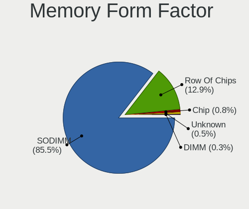

| Name         | Notebooks | Percent |
|--------------|-----------|---------|
| SODIMM       | 1669      | 87.75%  |
| Row Of Chips | 207       | 10.88%  |
| Chip         | 13        | 0.68%   |
| Unknown      | 7         | 0.37%   |
| DIMM         | 6         | 0.32%   |

Memory Size
-----------

Memory module size

| Size  | Notebooks | Percent |
|-------|-----------|---------|
| 8192  | 883       | 42.33%  |
| 4096  | 717       | 34.37%  |
| 16384 | 238       | 11.41%  |
| 2048  | 179       | 8.58%   |
| 32768 | 43        | 2.06%   |
| 1024  | 25        | 1.2%    |
| 512   | 1         | 0.05%   |

Memory Speed
------------

Memory module speed

| Speed   | Notebooks | Percent |
|---------|-----------|---------|
| 2667    | 557       | 26.71%  |
| 1600    | 470       | 22.54%  |
| 3200    | 325       | 15.59%  |
| 2400    | 188       | 9.02%   |
| 2133    | 138       | 6.62%   |
| 1334    | 87        | 4.17%   |
| 1333    | 51        | 2.45%   |
| 3266    | 48        | 2.3%    |
| 4267    | 38        | 1.82%   |
| 1867    | 28        | 1.34%   |
| 4199    | 23        | 1.1%    |
| 1067    | 23        | 1.1%    |
| 667     | 19        | 0.91%   |
| Unknown | 18        | 0.86%   |
| 800     | 12        | 0.58%   |
| 4266    | 10        | 0.48%   |
| 975     | 9         | 0.43%   |
| 3733    | 6         | 0.29%   |
| 2048    | 6         | 0.29%   |
| 1066    | 6         | 0.29%   |
| 8400    | 5         | 0.24%   |
| 1866    | 4         | 0.19%   |
| 4800    | 3         | 0.14%   |
| 333     | 2         | 0.1%    |
| 65535   | 1         | 0.05%   |
| 6400    | 1         | 0.05%   |
| 3600    | 1         | 0.05%   |
| 2134    | 1         | 0.05%   |
| 1639    | 1         | 0.05%   |
| 1200    | 1         | 0.05%   |
| 933     | 1         | 0.05%   |
| 888     | 1         | 0.05%   |
| 666     | 1         | 0.05%   |

Printers & scanners
-------------------

Printer Vendor
--------------

Printer device vendors

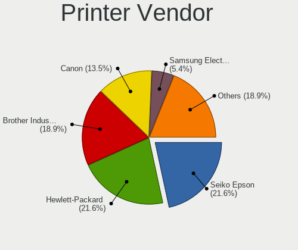

| Vendor              | Notebooks | Percent |
|---------------------|-----------|---------|
| Hewlett-Packard     | 7         | 29.17%  |
| Seiko Epson         | 5         | 20.83%  |
| Brother Industries  | 4         | 16.67%  |
| Samsung Electronics | 2         | 8.33%   |
| Canon               | 2         | 8.33%   |
| Xiaomi              | 1         | 4.17%   |
| Sagem               | 1         | 4.17%   |
| Kyocera             | 1         | 4.17%   |
| Dymo-CoStar         | 1         | 4.17%   |

Printer Model
-------------

Printer device models

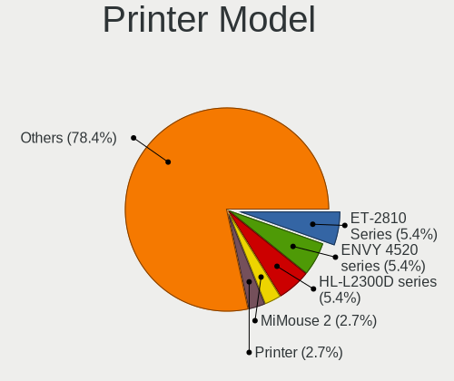

| Model                                                  | Notebooks | Percent |
|--------------------------------------------------------|-----------|---------|
| HP ENVY 4520 series                                    | 2         | 8.33%   |
| Brother HL-L2300D series                               | 2         | 8.33%   |
| Xiaomi MiMouse 2                                       | 1         | 4.17%   |
| Seiko Epson Printer                                    | 1         | 4.17%   |
| Seiko Epson ME Office 600F/Stylus Office BX300F/TX300F | 1         | 4.17%   |
| Seiko Epson L365 Series                                | 1         | 4.17%   |
| Seiko Epson L355 Series                                | 1         | 4.17%   |
| Seiko Epson L3150 Series                               | 1         | 4.17%   |
| Samsung ML-1865                                        | 1         | 4.17%   |
| Samsung CLX-3180 Series                                | 1         | 4.17%   |
| Sagem Laser Pro LL                                     | 1         | 4.17%   |
| Kyocera FS-1030D printer                               | 1         | 4.17%   |
| HP Officejet 4500 G510g-m                              | 1         | 4.17%   |
| HP LaserJet P1102                                      | 1         | 4.17%   |
| HP Ink Tank Wireless 410 series                        | 1         | 4.17%   |
| HP Ink Tank 310 series                                 | 1         | 4.17%   |
| HP DeskJet 2700 series                                 | 1         | 4.17%   |
| Dymo-CoStar DYMO LabelWriter 450 Twin Turbo            | 1         | 4.17%   |
| Canon TS300 series                                     | 1         | 4.17%   |
| Canon TR4500 series                                    | 1         | 4.17%   |
| Brother QL-500 label printer                           | 1         | 4.17%   |
| Brother MFC-L2710DW series                             | 1         | 4.17%   |

Scanner Vendor
--------------

Scanner device vendors

| Vendor | Notebooks | Percent |
|--------|-----------|---------|
| Canon  | 7         | 100%    |

Scanner Model
-------------

Scanner device models

| Model                                  | Notebooks | Percent |
|----------------------------------------|-----------|---------|
| Canon CanoScan N670U/N676U/LiDE 20     | 2         | 28.57%  |
| Canon CanoScan LiDE 220                | 2         | 28.57%  |
| Canon CanoScan LiDE 500F               | 1         | 14.29%  |
| Canon CanoScan LiDE 50/LiDE 35/LiDE 40 | 1         | 14.29%  |
| Canon CanoScan LiDE 110                | 1         | 14.29%  |

Camera
------

Camera Vendor
-------------

Camera device vendors

| Vendor                                 | Notebooks | Percent |
|----------------------------------------|-----------|---------|
| Chicony Electronics                    | 653       | 24.09%  |
| IMC Networks                           | 379       | 13.98%  |
| Realtek Semiconductor                  | 238       | 8.78%   |
| Acer                                   | 233       | 8.59%   |
| Microdia                               | 210       | 7.75%   |
| Sunplus Innovation Technology          | 147       | 5.42%   |
| Quanta                                 | 141       | 5.2%    |
| Cheng Uei Precision Industry (Foxlink) | 112       | 4.13%   |
| Syntek                                 | 86        | 3.17%   |
| Lite-On Technology                     | 85        | 3.14%   |
| Suyin                                  | 77        | 2.84%   |
| Apple                                  | 53        | 1.95%   |
| Silicon Motion                         | 50        | 1.84%   |
| Logitech                               | 37        | 1.36%   |
| Alcor Micro                            | 29        | 1.07%   |
| Luxvisions Innotech Limited            | 26        | 0.96%   |
| Samsung Electronics                    | 18        | 0.66%   |
| Ricoh                                  | 17        | 0.63%   |
| Lenovo                                 | 13        | 0.48%   |
| Primax Electronics                     | 9         | 0.33%   |
| Microsoft                              | 9         | 0.33%   |
| Importek                               | 9         | 0.33%   |
| DigiTech                               | 6         | 0.22%   |
| Sonix Technology                       | 5         | 0.18%   |
| Denron                                 | 5         | 0.18%   |
| ALi                                    | 5         | 0.18%   |
| Z-Star Microelectronics                | 4         | 0.15%   |
| OmniVision Technologies                | 4         | 0.15%   |
| Intel                                  | 4         | 0.15%   |
| Genesys Logic                          | 4         | 0.15%   |
| GEMBIRD                                | 3         | 0.11%   |
| Creative Technology                    | 3         | 0.11%   |
| ARC International                      | 3         | 0.11%   |
| Unknown                                | 2         | 0.07%   |
| MacroSilicon                           | 2         | 0.07%   |
| LG Electronics                         | 2         | 0.07%   |
| KYE Systems (Mouse Systems)            | 2         | 0.07%   |
| icSpring                               | 2         | 0.07%   |
| Holitech                               | 2         | 0.07%   |
| Google                                 | 2         | 0.07%   |
| DJJHNA29IE70D3                         | 2         | 0.07%   |
| 2M UVC CAMERA                          | 2         | 0.07%   |
| USB Camera CS                          | 1         | 0.04%   |
| Tobii Technology AB                    | 1         | 0.04%   |
| SunplusIT                              | 1         | 0.04%   |
| Sunplus Technology                     | 1         | 0.04%   |
| Solid Year                             | 1         | 0.04%   |
| ShineTech                              | 1         | 0.04%   |
| SHENZHEN EMEET TECHNOLOGY              | 1         | 0.04%   |
| Pixart Imaging                         | 1         | 0.04%   |
| Panasonic (Matsushita)                 | 1         | 0.04%   |
| Novatel Wireless                       | 1         | 0.04%   |
| kingcome                               | 1         | 0.04%   |
| JMicron Technology                     | 1         | 0.04%   |
| Goodong Industry                       | 1         | 0.04%   |
| globaloptics                           | 1         | 0.04%   |
| Foxconn / Hon Hai                      | 1         | 0.04%   |
| Arkmicro Technologies                  | 1         | 0.04%   |

Camera Model
------------

Camera device models

| Model                                                   | Notebooks | Percent |
|---------------------------------------------------------|-----------|---------|
| Chicony Integrated Camera                               | 162       | 5.94%   |
| IMC Networks Integrated Camera                          | 123       | 4.51%   |
| Microdia Integrated_Webcam_HD                           | 106       | 3.89%   |
| IMC Networks USB2.0 HD UVC WebCam                       | 90        | 3.3%    |
| Realtek Integrated_Webcam_HD                            | 82        | 3.01%   |
| Chicony HD WebCam                                       | 76        | 2.79%   |
| Acer Integrated Camera                                  | 69        | 2.53%   |
| Syntek Integrated Camera                                | 56        | 2.06%   |
| Sunplus Integrated_Webcam_HD                            | 51        | 1.87%   |
| IMC Networks USB2.0 VGA UVC WebCam                      | 37        | 1.36%   |
| Lite-On Integrated Camera                               | 33        | 1.21%   |
| Acer HD Webcam                                          | 28        | 1.03%   |
| Chicony USB2.0 Camera                                   | 26        | 0.95%   |
| Chicony HP HD Camera                                    | 26        | 0.95%   |
| Acer Lenovo EasyCamera                                  | 26        | 0.95%   |
| Quanta HP TrueVision HD Camera                          | 25        | 0.92%   |
| Quanta HD User Facing                                   | 23        | 0.84%   |
| Lite-On HP HD Camera                                    | 23        | 0.84%   |
| Quanta HD Webcam                                        | 21        | 0.77%   |
| Chicony USB2.0 HD UVC WebCam                            | 21        | 0.77%   |
| Chicony Lenovo EasyCamera                               | 21        | 0.77%   |
| Acer SunplusIT Integrated Camera                        | 21        | 0.77%   |
| Realtek USB2.0 HD UVC WebCam                            | 20        | 0.73%   |
| Sunplus HD WebCam                                       | 19        | 0.7%    |
| Microdia Integrated Webcam                              | 19        | 0.7%    |
| Chicony EasyCamera                                      | 19        | 0.7%    |
| Samsung Galaxy A5 (MTP)                                 | 18        | 0.66%   |
| Microdia Laptop_Integrated_Webcam_HD                    | 18        | 0.66%   |
| Acer BisonCam, NB Pro                                   | 18        | 0.66%   |
| Syntek Lenovo EasyCamera                                | 17        | 0.62%   |
| Luxvisions Innotech Limited HP TrueVision HD Camera     | 17        | 0.62%   |
| Chicony Integrated Camera (1280x720@30)                 | 17        | 0.62%   |
| Chicony HP Truevision HD                                | 17        | 0.62%   |
| Chicony HD User Facing                                  | 17        | 0.62%   |
| Cheng Uei Precision Industry (Foxlink) HP TrueVision HD | 17        | 0.62%   |
| Acer EasyCamera                                         | 17        | 0.62%   |
| Realtek Integrated Webcam                               | 16        | 0.59%   |
| Apple iPhone 5/5C/5S/6/SE                               | 16        | 0.59%   |
| Apple FaceTime HD Camera                                | 16        | 0.59%   |
| Realtek USB Camera                                      | 15        | 0.55%   |
| Realtek HD WebCam                                       | 15        | 0.55%   |
| IMC Networks ov9734_azurewave_camera                    | 15        | 0.55%   |
| IMC Networks HP TrueVision HD Camera                    | 15        | 0.55%   |
| Chicony HP TrueVision HD Camera                         | 15        | 0.55%   |
| Chicony HP HD Webcam                                    | 15        | 0.55%   |
| Chicony FJ Camera                                       | 15        | 0.55%   |
| Cheng Uei Precision Industry (Foxlink) Webcam           | 15        | 0.55%   |
| IMC Networks EasyCamera                                 | 14        | 0.51%   |
| Chicony TOSHIBA Web Camera - HD                         | 14        | 0.51%   |
| Chicony HP Wide Vision HD Camera                        | 14        | 0.51%   |
| Suyin HP TrueVision HD                                  | 13        | 0.48%   |
| Silicon Motion Web Camera                               | 13        | 0.48%   |
| IMC Networks HD Camera                                  | 13        | 0.48%   |
| Realtek USB2.0 VGA UVC WebCam                           | 12        | 0.44%   |
| Realtek Lenovo EasyCamera                               | 12        | 0.44%   |
| IMC Networks USB2.0 UVC HD Webcam                       | 12        | 0.44%   |
| IMC Networks USB2.0 HD IR UVC WebCam                    | 12        | 0.44%   |
| Chicony HP Webcam                                       | 12        | 0.44%   |
| Acer Lenovo Integrated Webcam                           | 12        | 0.44%   |
| Realtek Integrated Webcam HD                            | 11        | 0.4%    |

Security
--------

Fingerprint Vendor
------------------

Fingerprint sensor vendors

| Vendor                     | Notebooks | Percent |
|----------------------------|-----------|---------|
| Validity Sensors           | 195       | 32.02%  |
| Synaptics                  | 158       | 25.94%  |
| Shenzhen Goodix Technology | 122       | 20.03%  |
| Elan Microelectronics      | 48        | 7.88%   |
| LighTuning Technology      | 29        | 4.76%   |
| Upek                       | 26        | 4.27%   |
| AuthenTec                  | 16        | 2.63%   |
| STMicroelectronics         | 7         | 1.15%   |
| Samsung Electronics        | 3         | 0.49%   |
| Focal-systems.Corp         | 2         | 0.33%   |
| DigitalPersona             | 2         | 0.33%   |
| HOLTEK                     | 1         | 0.16%   |

Fingerprint Model
-----------------

Fingerprint sensor models

| Model                                                                      | Notebooks | Percent |
|----------------------------------------------------------------------------|-----------|---------|
| Shenzhen Goodix  FingerPrint Device                                        | 61        | 10.02%  |
| Synaptics Prometheus MIS Touch Fingerprint Reader                          | 50        | 8.21%   |
| Validity Sensors VFS495 Fingerprint Reader                                 | 45        | 7.39%   |
| Shenzhen Goodix Fingerprint Reader                                         | 37        | 6.08%   |
| Unknown                                                                    | 37        | 6.08%   |
| Elan ELAN:Fingerprint                                                      | 35        | 5.75%   |
| Validity Sensors VFS 5011 fingerprint sensor                               | 29        | 4.76%   |
| Upek Biometric Touchchip/Touchstrip Fingerprint Sensor                     | 24        | 3.94%   |
| Shenzhen Goodix FingerPrint                                                | 24        | 3.94%   |
| Synaptics  VFS7552 Touch Fingerprint Sensor with PurePrint                 | 19        | 3.12%   |
| LighTuning EgisTec Touch Fingerprint Sensor                                | 19        | 3.12%   |
| Synaptics Metallica MIS Touch Fingerprint Reader                           | 18        | 2.96%   |
| Validity Sensors Synaptics WBDI                                            | 15        | 2.46%   |
| Synaptics  FS7604 Touch Fingerprint Sensor with PurePrint                  | 15        | 2.46%   |
| Validity Sensors VFS5011 Fingerprint Reader                                | 14        | 2.3%    |
| Validity Sensors Fingerprint scanner                                       | 13        | 2.13%   |
| Elan ELAN:ARM-M4                                                           | 13        | 2.13%   |
| Validity Sensors VFS7500 Touch Fingerprint Sensor                          | 12        | 1.97%   |
| Validity Sensors VFS491                                                    | 12        | 1.97%   |
| Validity Sensors VFS451 Fingerprint Reader                                 | 11        | 1.81%   |
| Validity Sensors VFS471 Fingerprint Reader                                 | 10        | 1.64%   |
| Validity Sensors Swipe Fingerprint Sensor                                  | 10        | 1.64%   |
| Synaptics  WBDI                                                            | 8         | 1.31%   |
| Validity Sensors Synaptics VFS7552 Touch Fingerprint Sensor with PurePrint | 7         | 1.15%   |
| Synaptics Metallica MOH Touch Fingerprint Reader                           | 7         | 1.15%   |
| STMicroelectronics Fingerprint Reader                                      | 7         | 1.15%   |
| LighTuning ES603 Swipe Fingerprint Sensor                                  | 7         | 1.15%   |
| AuthenTec Fingerprint Sensor                                               | 6         | 0.99%   |
| Validity Sensors VFS101 Fingerprint Reader                                 | 5         | 0.82%   |
| Validity Sensors VFS7552 Touch Fingerprint Sensor                          | 4         | 0.66%   |
| Synaptics WBDI Device                                                      | 4         | 0.66%   |
| AuthenTec AES2810                                                          | 4         | 0.66%   |
| Validity Sensors VFS301 Fingerprint Reader                                 | 3         | 0.49%   |
| Validity Sensors VFS Fingerprint sensor                                    | 3         | 0.49%   |
| AuthenTec AES2501 Fingerprint Sensor                                       | 3         | 0.49%   |
| Validity Sensors Synaptics VFS7552 Touch Fingerprint Sensor                | 2         | 0.33%   |
| Upek TCS5B Fingerprint sensor                                              | 2         | 0.33%   |
| Samsung Fingerprint Device                                                 | 2         | 0.33%   |
| LighTuning Fingerprint Reader                                              | 2         | 0.33%   |
| Focal-systems.Corp FT9201Fingerprint.                                      | 2         | 0.33%   |
| DigitalPersona Fingerprint Reader                                          | 2         | 0.33%   |
| AuthenTec AES1600                                                          | 2         | 0.33%   |
| Samsung Fingerprint Sensor Device - 730B                                   | 1         | 0.16%   |
| LighTuning Fingerprint Sensor                                              | 1         | 0.16%   |
| HOLTEK FocalTech Fingerprint Device                                        | 1         | 0.16%   |
| AuthenTec AES2550 Fingerprint Sensor                                       | 1         | 0.16%   |

Chipcard Vendor
---------------

Chipcard module vendors

| Vendor                   | Notebooks | Percent |
|--------------------------|-----------|---------|
| Broadcom                 | 69        | 35.75%  |
| Alcor Micro              | 65        | 33.68%  |
| O2 Micro                 | 15        | 7.77%   |
| Lenovo                   | 15        | 7.77%   |
| Upek                     | 14        | 7.25%   |
| Yubico.com               | 7         | 3.63%   |
| Gemalto (was Gemplus)    | 3         | 1.55%   |
| Reiner SCT Kartensysteme | 1         | 0.52%   |
| OmniKey                  | 1         | 0.52%   |
| Hewlett-Packard          | 1         | 0.52%   |
| Clay Logic               | 1         | 0.52%   |
| C3PO                     | 1         | 0.52%   |

Chipcard Model
--------------

Chipcard module models

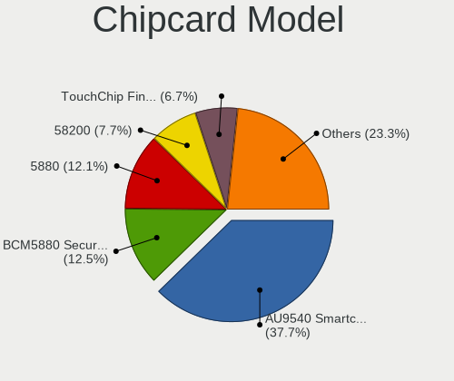

| Model                                                                        | Notebooks | Percent |
|------------------------------------------------------------------------------|-----------|---------|
| Alcor Micro AU9540 Smartcard Reader                                          | 65        | 33.68%  |
| Broadcom BCM5880 Secure Applications Processor                               | 28        | 14.51%  |
| Broadcom 5880                                                                | 20        | 10.36%  |
| Lenovo Integrated Smart Card Reader                                          | 15        | 7.77%   |
| Upek TouchChip Fingerprint Coprocessor (WBF advanced mode)                   | 14        | 7.25%   |
| O2 Micro OZ776 CCID Smartcard Reader                                         | 14        | 7.25%   |
| Broadcom BCM5880 Secure Applications Processor with fingerprint swipe sensor | 12        | 6.22%   |
| Broadcom 58200                                                               | 9         | 4.66%   |
| Yubico.com Yubikey NEO(-N) OTP+CCID                                          | 7         | 3.63%   |
| Gemalto (was Gemplus) Compact Smart Card Reader Writer                       | 2         | 1.04%   |
| Reiner SCT Kartensysteme cyberJack RFID basis contactless smartcard reader   | 1         | 0.52%   |
| OmniKey 3x21 Smart Card Reader                                               | 1         | 0.52%   |
| O2 Micro Oz776 SmartCard Reader                                              | 1         | 0.52%   |
| Hewlett-Packard SC Keyboard - Apollo (Liteon)                                | 1         | 0.52%   |
| Gemalto (was Gemplus) Prox SU USB PC Link Reader                             | 1         | 0.52%   |
| Clay Logic Nitrokey Pro                                                      | 1         | 0.52%   |
| C3PO USB SMART CARD READER                                                   | 1         | 0.52%   |

Unsupported
-----------

Unsupported Devices
-------------------

Total unsupported devices on board

| Total | Notebooks | Percent |
|-------|-----------|---------|
| 0     | 1796      | 59.53%  |
| 1     | 974       | 32.28%  |
| 2     | 225       | 7.46%   |
| 3     | 20        | 0.66%   |
| 4     | 2         | 0.07%   |

Unsupported Device Types
------------------------

Types of unsupported devices

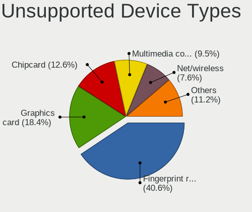

| Type                     | Notebooks | Percent |
|--------------------------|-----------|---------|
| Fingerprint reader       | 598       | 41.41%  |
| Graphics card            | 284       | 19.67%  |
| Chipcard                 | 172       | 11.91%  |
| Net/wireless             | 115       | 7.96%   |
| Multimedia controller    | 109       | 7.55%   |
| Camera                   | 45        | 3.12%   |
| Net/ethernet             | 41        | 2.84%   |
| Bluetooth                | 30        | 2.08%   |
| Storage                  | 16        | 1.11%   |
| Card reader              | 10        | 0.69%   |
| Sound                    | 8         | 0.55%   |
| Communication controller | 6         | 0.42%   |
| Modem                    | 4         | 0.28%   |
| Network                  | 3         | 0.21%   |
| Dvb card                 | 2         | 0.14%   |
| Storage/nvme             | 1         | 0.07%   |

