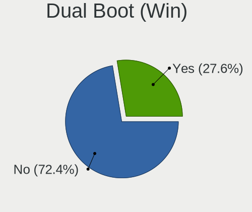

Manjaro - Tested Hardware & Statistics (Notebooks)
--------------------------------------------------

A project to collect tested hardware configurations for Manjaro.

Anyone can contribute to this report by the [hw-probe](https://github.com/linuxhw/hw-probe) tool:

    sudo -E hw-probe -all -upload

Please contribute! Especially if your hardware is rare.

Contents
--------

* [ Test Cases ](#test-cases)

* [ System ](#system)
  - [ OS                       ](#os)
  - [ OS Family                ](#os-family)
  - [ Kernel                   ](#kernel)
  - [ Kernel Family            ](#kernel-family)
  - [ Kernel Major Ver.        ](#kernel-major-ver)
  - [ Arch                     ](#arch)
  - [ DE                       ](#de)
  - [ Display Server           ](#display-server)
  - [ Display Manager          ](#display-manager)
  - [ OS Lang                  ](#os-lang)
  - [ Boot Mode                ](#boot-mode)
  - [ Filesystem               ](#filesystem)
  - [ Part. scheme             ](#part-scheme)
  - [ Dual Boot with Linux/BSD ](#dual-boot-with-linuxbsd)
  - [ Dual Boot (Win)          ](#dual-boot-win)

* [ Board ](#board)
  - [ Vendor                   ](#vendor)
  - [ Model                    ](#model)
  - [ Model Family             ](#model-family)
  - [ MFG Year                 ](#mfg-year)
  - [ Form Factor              ](#form-factor)
  - [ Secure Boot              ](#secure-boot)
  - [ Coreboot                 ](#coreboot)
  - [ RAM Size                 ](#ram-size)
  - [ RAM Used                 ](#ram-used)
  - [ Total Drives             ](#total-drives)
  - [ Has CD-ROM               ](#has-cd-rom)
  - [ Has Ethernet             ](#has-ethernet)
  - [ Has WiFi                 ](#has-wifi)
  - [ Has Bluetooth            ](#has-bluetooth)

* [ Location ](#location)
  - [ Country                  ](#country)
  - [ City                     ](#city)

* [ Drives ](#drives)
  - [ Drive Vendor             ](#drive-vendor)
  - [ Drive Model              ](#drive-model)
  - [ HDD Vendor               ](#hdd-vendor)
  - [ SSD Vendor               ](#ssd-vendor)
  - [ Drive Kind               ](#drive-kind)
  - [ Drive Connector          ](#drive-connector)
  - [ Drive Size               ](#drive-size)
  - [ Space Total              ](#space-total)
  - [ Space Used               ](#space-used)
  - [ Malfunc. Drives          ](#malfunc-drives)
  - [ Malfunc. Drive Vendor    ](#malfunc-drive-vendor)
  - [ Malfunc. HDD Vendor      ](#malfunc-hdd-vendor)
  - [ Malfunc. Drive Kind      ](#malfunc-drive-kind)
  - [ Failed Drives            ](#failed-drives)
  - [ Failed Drive Vendor      ](#failed-drive-vendor)
  - [ Drive Status             ](#drive-status)

* [ Storage controller ](#storage-controller)
  - [ Storage Vendor           ](#storage-vendor)
  - [ Storage Model            ](#storage-model)
  - [ Storage Kind             ](#storage-kind)

* [ Processor ](#processor)
  - [ CPU Vendor               ](#cpu-vendor)
  - [ CPU Model                ](#cpu-model)
  - [ CPU Model Family         ](#cpu-model-family)
  - [ CPU Cores                ](#cpu-cores)
  - [ CPU Sockets              ](#cpu-sockets)
  - [ CPU Threads              ](#cpu-threads)
  - [ CPU Op-Modes             ](#cpu-op-modes)
  - [ CPU Microcode            ](#cpu-microcode)
  - [ CPU Microarch            ](#cpu-microarch)

* [ Graphics ](#graphics)
  - [ GPU Vendor               ](#gpu-vendor)
  - [ GPU Model                ](#gpu-model)
  - [ GPU Combo                ](#gpu-combo)
  - [ GPU Driver               ](#gpu-driver)
  - [ GPU Memory               ](#gpu-memory)

* [ Monitor ](#monitor)
  - [ Monitor Vendor           ](#monitor-vendor)
  - [ Monitor Model            ](#monitor-model)
  - [ Monitor Resolution       ](#monitor-resolution)
  - [ Monitor Diagonal         ](#monitor-diagonal)
  - [ Monitor Width            ](#monitor-width)
  - [ Aspect Ratio             ](#aspect-ratio)
  - [ Monitor Area             ](#monitor-area)
  - [ Pixel Density            ](#pixel-density)
  - [ Multiple Monitors        ](#multiple-monitors)

* [ Network ](#network)
  - [ Net Controller Vendor    ](#net-controller-vendor)
  - [ Net Controller Model     ](#net-controller-model)
  - [ Wireless Vendor          ](#wireless-vendor)
  - [ Wireless Model           ](#wireless-model)
  - [ Ethernet Vendor          ](#ethernet-vendor)
  - [ Ethernet Model           ](#ethernet-model)
  - [ Net Controller Kind      ](#net-controller-kind)
  - [ Used Controller          ](#used-controller)
  - [ NICs                     ](#nics)
  - [ IPv6                     ](#ipv6)

* [ Bluetooth ](#bluetooth)
  - [ Bluetooth Vendor         ](#bluetooth-vendor)
  - [ Bluetooth Model          ](#bluetooth-model)

* [ Sound ](#sound)
  - [ Sound Vendor             ](#sound-vendor)
  - [ Sound Model              ](#sound-model)

* [ Memory ](#memory)
  - [ Memory Vendor            ](#memory-vendor)
  - [ Memory Model             ](#memory-model)
  - [ Memory Kind              ](#memory-kind)
  - [ Memory Form Factor       ](#memory-form-factor)
  - [ Memory Size              ](#memory-size)
  - [ Memory Speed             ](#memory-speed)

* [ Printers & scanners ](#printers--scanners)
  - [ Printer Vendor           ](#printer-vendor)
  - [ Printer Model            ](#printer-model)
  - [ Scanner Vendor           ](#scanner-vendor)
  - [ Scanner Model            ](#scanner-model)

* [ Camera ](#camera)
  - [ Camera Vendor            ](#camera-vendor)
  - [ Camera Model             ](#camera-model)

* [ Security ](#security)
  - [ Fingerprint Vendor       ](#fingerprint-vendor)
  - [ Fingerprint Model        ](#fingerprint-model)
  - [ Chipcard Vendor          ](#chipcard-vendor)
  - [ Chipcard Model           ](#chipcard-model)

* [ Unsupported ](#unsupported)
  - [ Unsupported Devices      ](#unsupported-devices)
  - [ Unsupported Device Types ](#unsupported-device-types)

Test Cases
----------

Total: 5884

| Vendor        | Model                       | Probe                                                      | Date         |
|---------------|-----------------------------|------------------------------------------------------------|--------------|
| Acer          | Aspire A515-51              | [5fafb134cf](https://linux-hardware.org/?probe=5fafb134cf) | Nov 06, 2023 |
| Dell          | Precision M4800             | [e67352eb0f](https://linux-hardware.org/?probe=e67352eb0f) | Nov 06, 2023 |
| ASUSTek       | VivoBook_ASUSLaptop X515... | [8e3e7668cf](https://linux-hardware.org/?probe=8e3e7668cf) | Nov 05, 2023 |
| HP            | 530                         | [710ba89827](https://linux-hardware.org/?probe=710ba89827) | Nov 05, 2023 |
| Framework     | Laptop 13 (AMD Ryzen 704... | [3f295082ce](https://linux-hardware.org/?probe=3f295082ce) | Nov 05, 2023 |
| HP            | 255 G7 Notebook PC          | [bdd24f60d2](https://linux-hardware.org/?probe=bdd24f60d2) | Nov 05, 2023 |
| Apple         | MacBookPro10,1              | [8efb96e5d7](https://linux-hardware.org/?probe=8efb96e5d7) | Nov 04, 2023 |
| Apple         | MacBookPro10,1              | [e6459bb42f](https://linux-hardware.org/?probe=e6459bb42f) | Nov 04, 2023 |
| Dell          | XPS 13 9310                 | [5ff7f9b284](https://linux-hardware.org/?probe=5ff7f9b284) | Nov 04, 2023 |
| ASUSTek       | ROG Strix G513RM_G513RM     | [ded1d73643](https://linux-hardware.org/?probe=ded1d73643) | Nov 03, 2023 |
| Lenovo        | ThinkPad T440 20B7A0CYMH    | [4d3101d9f8](https://linux-hardware.org/?probe=4d3101d9f8) | Nov 02, 2023 |
| Acer          | Predator PH315-53           | [476a922e2f](https://linux-hardware.org/?probe=476a922e2f) | Nov 02, 2023 |
| Lenovo        | ThinkPad T480 20L60017UK    | [e8b030e97f](https://linux-hardware.org/?probe=e8b030e97f) | Nov 02, 2023 |
| Gigabyte      | AORUS 17G KD                | [ac471f8580](https://linux-hardware.org/?probe=ac471f8580) | Nov 02, 2023 |
| Lenovo        | G40-45 80E1                 | [fffa5fb420](https://linux-hardware.org/?probe=fffa5fb420) | Nov 02, 2023 |
| Lenovo        | ThinkPad L460 20FVS12A00    | [fab360eece](https://linux-hardware.org/?probe=fab360eece) | Nov 02, 2023 |
| Panasonic     | CF-54-1                     | [b7d7cde99a](https://linux-hardware.org/?probe=b7d7cde99a) | Nov 01, 2023 |
| ASUSTek       | VivoBook E14 E402YA_E402... | [a7f47546e5](https://linux-hardware.org/?probe=a7f47546e5) | Nov 01, 2023 |
| ASUSTek       | Zenbook UM3402YA_UM3402Y... | [d64009bcc1](https://linux-hardware.org/?probe=d64009bcc1) | Nov 01, 2023 |
| ASUSTek       | VivoBook E14 E402YA_E402... | [8901bca741](https://linux-hardware.org/?probe=8901bca741) | Nov 01, 2023 |
| ASUSTek       | Zenbook UM3402YA_UM3402Y... | [f5d0c4d34a](https://linux-hardware.org/?probe=f5d0c4d34a) | Nov 01, 2023 |
| ASUSTek       | VivoBook_ASUSLaptop M140... | [0a7341e5e0](https://linux-hardware.org/?probe=0a7341e5e0) | Nov 01, 2023 |
| Dell          | Precision 5550              | [87a9861125](https://linux-hardware.org/?probe=87a9861125) | Nov 01, 2023 |
| Lenovo        | ThinkPad L460 20FVS12A00    | [a2273dea0e](https://linux-hardware.org/?probe=a2273dea0e) | Nov 01, 2023 |
| ASUSTek       | N56VB                       | [9775caad00](https://linux-hardware.org/?probe=9775caad00) | Oct 31, 2023 |
| ASUSTek       | N56VB                       | [45280b44d0](https://linux-hardware.org/?probe=45280b44d0) | Oct 31, 2023 |
| Dell          | XPS 15 9510                 | [d370c488e4](https://linux-hardware.org/?probe=d370c488e4) | Oct 31, 2023 |
| Acer          | Aspire A315-35              | [c26ec81fab](https://linux-hardware.org/?probe=c26ec81fab) | Oct 31, 2023 |
| Lenovo        | ThinkPad P14s Gen 2a 21A... | [ed27ef3491](https://linux-hardware.org/?probe=ed27ef3491) | Oct 31, 2023 |
| Lenovo        | IdeaPad S145-15IIL 81W8     | [9dd62a1bb2](https://linux-hardware.org/?probe=9dd62a1bb2) | Oct 31, 2023 |
| TECNO         | MEGABOOK T1                 | [2bab6515f4](https://linux-hardware.org/?probe=2bab6515f4) | Oct 30, 2023 |
| Dell          | Latitude 7370               | [f47b42c0b0](https://linux-hardware.org/?probe=f47b42c0b0) | Oct 30, 2023 |
| Sony          | SVE1511B1RB                 | [74651497a9](https://linux-hardware.org/?probe=74651497a9) | Oct 30, 2023 |
| ASUSTek       | K84L                        | [e6d103b3e4](https://linux-hardware.org/?probe=e6d103b3e4) | Oct 29, 2023 |
| Dell          | Latitude E5400              | [169d73bee0](https://linux-hardware.org/?probe=169d73bee0) | Oct 28, 2023 |
| HUAWEI        | MACHD-WXX9                  | [551a5c8aa2](https://linux-hardware.org/?probe=551a5c8aa2) | Oct 28, 2023 |
| HP            | Notebook                    | [715435e533](https://linux-hardware.org/?probe=715435e533) | Oct 28, 2023 |
| Framework     | Laptop 13 (AMD Ryzen 704... | [b7f872ea23](https://linux-hardware.org/?probe=b7f872ea23) | Oct 27, 2023 |
| Lenovo        | IdeaPad 3 15IGL05 81WQ      | [755d25d933](https://linux-hardware.org/?probe=755d25d933) | Oct 26, 2023 |
| Gigabyte      | AERO 17 XE5                 | [47d1cb500e](https://linux-hardware.org/?probe=47d1cb500e) | Oct 25, 2023 |
| Acer          | Aspire A515-57G             | [d61428d56d](https://linux-hardware.org/?probe=d61428d56d) | Oct 25, 2023 |
| ASUSTek       | VivoBook_ASUSLaptop X150... | [1bd81ebf81](https://linux-hardware.org/?probe=1bd81ebf81) | Oct 24, 2023 |
| Lenovo        | ThinkPad T480s 20L8S4M20... | [799084c1a9](https://linux-hardware.org/?probe=799084c1a9) | Oct 23, 2023 |
| HP            | Laptop 17-cp0xxx            | [1a97d77c76](https://linux-hardware.org/?probe=1a97d77c76) | Oct 23, 2023 |
| Lenovo        | IdeaPad 3 14ARE05 81W3      | [bd89e392d1](https://linux-hardware.org/?probe=bd89e392d1) | Oct 23, 2023 |
| HP            | EliteBook 8470p             | [c927a93a85](https://linux-hardware.org/?probe=c927a93a85) | Oct 23, 2023 |
| Google        | Gandof                      | [7a07edf626](https://linux-hardware.org/?probe=7a07edf626) | Oct 23, 2023 |
| HP            | EliteBook 8470p             | [bebe071d7c](https://linux-hardware.org/?probe=bebe071d7c) | Oct 23, 2023 |
| Lenovo        | V15 G2 ALC 82KD             | [93043f297f](https://linux-hardware.org/?probe=93043f297f) | Oct 22, 2023 |
| Acer          | Aspire A315-35              | [ee15c1dbea](https://linux-hardware.org/?probe=ee15c1dbea) | Oct 22, 2023 |
| Apple         | MacBookPro8,1               | [fde726622c](https://linux-hardware.org/?probe=fde726622c) | Oct 22, 2023 |
| Apple         | MacBookPro8,1               | [116946c81c](https://linux-hardware.org/?probe=116946c81c) | Oct 22, 2023 |
| ASUSTek       | ASUS TUF Dash F15 FX516P... | [43f9375597](https://linux-hardware.org/?probe=43f9375597) | Oct 21, 2023 |
| MSI           | GL62VR 7RFX                 | [0d88fb381c](https://linux-hardware.org/?probe=0d88fb381c) | Oct 21, 2023 |
| ASUSTek       | ASUS EXPERTBOOK B9403CVA... | [eaffd30f59](https://linux-hardware.org/?probe=eaffd30f59) | Oct 21, 2023 |
| ASUSTek       | ASUS EXPERTBOOK B9403CVA... | [aafd893b0d](https://linux-hardware.org/?probe=aafd893b0d) | Oct 21, 2023 |
| HP            | Laptop 14-ck0xxx            | [8ef0f47332](https://linux-hardware.org/?probe=8ef0f47332) | Oct 20, 2023 |
| Eluktronic... | MECH-15 G3                  | [1b63389cc6](https://linux-hardware.org/?probe=1b63389cc6) | Oct 20, 2023 |
| Lenovo        | Legion 5 Pro 16ITH6H 82J... | [79a2d6de1a](https://linux-hardware.org/?probe=79a2d6de1a) | Oct 19, 2023 |
| Lenovo        | Legion R7000P APH8 82Y9     | [9c6fb34bab](https://linux-hardware.org/?probe=9c6fb34bab) | Oct 18, 2023 |
| Lenovo        | Legion 5 82B5               | [fecce40ebb](https://linux-hardware.org/?probe=fecce40ebb) | Oct 18, 2023 |
| ASUSTek       | ROG Strix G713QM_G713QM     | [9729d18e10](https://linux-hardware.org/?probe=9729d18e10) | Oct 16, 2023 |
| Acer          | Aspire ES1-523              | [6f80d0517c](https://linux-hardware.org/?probe=6f80d0517c) | Oct 16, 2023 |
| Lenovo        | ThinkPad E15 Gen 3 20YG0... | [0504910ad7](https://linux-hardware.org/?probe=0504910ad7) | Oct 16, 2023 |
| Acer          | Aspire ES1-523              | [2dfea2666c](https://linux-hardware.org/?probe=2dfea2666c) | Oct 15, 2023 |
| Clevo         | W150ER                      | [e119814a32](https://linux-hardware.org/?probe=e119814a32) | Oct 14, 2023 |
| HP            | 15                          | [f5392b4484](https://linux-hardware.org/?probe=f5392b4484) | Oct 14, 2023 |
| HP            | Pavilion dv7                | [ae2789f31f](https://linux-hardware.org/?probe=ae2789f31f) | Oct 14, 2023 |
| HP            | Pavilion dv7                | [de47e931a1](https://linux-hardware.org/?probe=de47e931a1) | Oct 14, 2023 |
| Lenovo        | Legion Y7000 2019 PG0 81... | [39e3632f1f](https://linux-hardware.org/?probe=39e3632f1f) | Oct 11, 2023 |
| Lenovo        | Legion Y7000 2019 PG0 81... | [b1b0f03790](https://linux-hardware.org/?probe=b1b0f03790) | Oct 11, 2023 |
| HP            | EliteBook 8560w             | [00580f0c7d](https://linux-hardware.org/?probe=00580f0c7d) | Oct 10, 2023 |
| HP            | EliteBook 8560w             | [6e046b22c3](https://linux-hardware.org/?probe=6e046b22c3) | Oct 10, 2023 |
| Lenovo        | G40-45 80E1                 | [1bb42f8755](https://linux-hardware.org/?probe=1bb42f8755) | Oct 09, 2023 |
| Gateway       | NV57H                       | [141355e1e3](https://linux-hardware.org/?probe=141355e1e3) | Oct 09, 2023 |
| HUAWEI        | HN-WX9X                     | [a46f5ac57a](https://linux-hardware.org/?probe=a46f5ac57a) | Oct 09, 2023 |
| Dell          | Vostro 7590                 | [d7188e68cb](https://linux-hardware.org/?probe=d7188e68cb) | Oct 08, 2023 |
| Dell          | Precision 7710              | [6dcd757659](https://linux-hardware.org/?probe=6dcd757659) | Oct 07, 2023 |
| ASUSTek       | ZenBook UX425EA_UX425EA     | [da6b1b88e6](https://linux-hardware.org/?probe=da6b1b88e6) | Oct 06, 2023 |
| Acer          | Aspire ES1-732              | [9f011f4756](https://linux-hardware.org/?probe=9f011f4756) | Oct 04, 2023 |
| Acer          | Nitro AN515-44              | [faf6d73cad](https://linux-hardware.org/?probe=faf6d73cad) | Oct 04, 2023 |
| HP            | Laptop 14-ck0xxx            | [c41cd8be8e](https://linux-hardware.org/?probe=c41cd8be8e) | Oct 03, 2023 |
| Lenovo        | ThinkPad L430 24662W2       | [21ee2a6e8f](https://linux-hardware.org/?probe=21ee2a6e8f) | Oct 03, 2023 |
| Lenovo        | ThinkPad L460 20FVS12A00    | [ad3d8f3522](https://linux-hardware.org/?probe=ad3d8f3522) | Oct 02, 2023 |
| Lenovo        | ThinkPad T420s 4170CTO      | [f141fc2bd7](https://linux-hardware.org/?probe=f141fc2bd7) | Oct 02, 2023 |
| Dell          | Precision 5480              | [21bd104767](https://linux-hardware.org/?probe=21bd104767) | Oct 02, 2023 |
| HP            | Laptop 15s-eq2xxx           | [4e0bb2d740](https://linux-hardware.org/?probe=4e0bb2d740) | Oct 01, 2023 |
| HP            | Laptop 15s-eq2xxx           | [840bfbb2cb](https://linux-hardware.org/?probe=840bfbb2cb) | Oct 01, 2023 |
| HUAWEI        | VLT-WX0                     | [6778af4012](https://linux-hardware.org/?probe=6778af4012) | Oct 01, 2023 |
| Dell          | G7 7700                     | [62bd529b36](https://linux-hardware.org/?probe=62bd529b36) | Oct 01, 2023 |
| HUAWEI        | MateBook X                  | [5479e52948](https://linux-hardware.org/?probe=5479e52948) | Oct 01, 2023 |
| Lenovo        | ThinkPad T14 Gen 1 20UES... | [2d1ada9dbe](https://linux-hardware.org/?probe=2d1ada9dbe) | Sep 30, 2023 |
| Dell          | Precision 7710              | [89731f9b0e](https://linux-hardware.org/?probe=89731f9b0e) | Sep 29, 2023 |
| Acer          | Nitro AN515-43              | [e55a394d41](https://linux-hardware.org/?probe=e55a394d41) | Sep 29, 2023 |
| Lenovo        | ThinkPad X260 20F60097US    | [607d788fde](https://linux-hardware.org/?probe=607d788fde) | Sep 28, 2023 |
| Acer          | Aspire ES1-732              | [f30d62d67b](https://linux-hardware.org/?probe=f30d62d67b) | Sep 28, 2023 |
| HP            | Laptop 15s-fq0xxx           | [4c1a2e1e21](https://linux-hardware.org/?probe=4c1a2e1e21) | Sep 28, 2023 |
| Lenovo        | ThinkPad W540 20BG0016US    | [3ee705f2f3](https://linux-hardware.org/?probe=3ee705f2f3) | Sep 28, 2023 |
| Lenovo        | ThinkPad W540 20BG0016US    | [2b86c9fac4](https://linux-hardware.org/?probe=2b86c9fac4) | Sep 28, 2023 |
| TUXEDO        | Stellaris Intel Gen4        | [0dcef3e6c3](https://linux-hardware.org/?probe=0dcef3e6c3) | Sep 27, 2023 |
| Dell          | Inspiron N5040              | [c48d158b62](https://linux-hardware.org/?probe=c48d158b62) | Sep 27, 2023 |
| Lenovo        | IdeaPad 5 15ARE05 81YQ      | [84ad07c3f9](https://linux-hardware.org/?probe=84ad07c3f9) | Sep 27, 2023 |
| Packard Be... | EasyNote TK85               | [79e6dd1302](https://linux-hardware.org/?probe=79e6dd1302) | Sep 27, 2023 |
| Google        | Blorb                       | [efa4ad9e2c](https://linux-hardware.org/?probe=efa4ad9e2c) | Sep 26, 2023 |
| Lenovo        | V15 G2 IJL 82QY             | [3b76e2cd65](https://linux-hardware.org/?probe=3b76e2cd65) | Sep 26, 2023 |
| Lenovo        | ThinkPad P15 Gen 1 20STS... | [124f7a0f29](https://linux-hardware.org/?probe=124f7a0f29) | Sep 26, 2023 |
| HP            | EliteBook 840 G7 Noteboo... | [381be3d212](https://linux-hardware.org/?probe=381be3d212) | Sep 25, 2023 |
| HP            | 250 15.6 inch G9 Noteboo... | [508cf38973](https://linux-hardware.org/?probe=508cf38973) | Sep 24, 2023 |
| HP            | ENVY m4                     | [8d7da36940](https://linux-hardware.org/?probe=8d7da36940) | Sep 24, 2023 |
| HP            | Laptop 15-ef2xxx            | [4fb741bdb3](https://linux-hardware.org/?probe=4fb741bdb3) | Sep 23, 2023 |
| Packard Be... | EasyNote TK85               | [c970ee5a12](https://linux-hardware.org/?probe=c970ee5a12) | Sep 23, 2023 |
| Lenovo        | IdeaPad S340-14API 81NB     | [14d87bfb5d](https://linux-hardware.org/?probe=14d87bfb5d) | Sep 22, 2023 |
| Fujitsu       | LIFEBOOK E752               | [c2d2a28c33](https://linux-hardware.org/?probe=c2d2a28c33) | Sep 21, 2023 |
| Dell          | XPS 15 9520                 | [ae7455bac3](https://linux-hardware.org/?probe=ae7455bac3) | Sep 21, 2023 |
| Dell          | Precision 7520              | [2fd68ca236](https://linux-hardware.org/?probe=2fd68ca236) | Sep 21, 2023 |
| Dell          | Inspiron 3542               | [b449a82c4f](https://linux-hardware.org/?probe=b449a82c4f) | Sep 21, 2023 |
| Dell          | Latitude E5430 non-vPro     | [192f065f70](https://linux-hardware.org/?probe=192f065f70) | Sep 21, 2023 |
| Lenovo        | ThinkPad E560 20EV002FUS    | [063f211c4d](https://linux-hardware.org/?probe=063f211c4d) | Sep 21, 2023 |
| Dell          | XPS 15 9520                 | [6337af2f4c](https://linux-hardware.org/?probe=6337af2f4c) | Sep 20, 2023 |
| ASUSTek       | Z450UA                      | [60d85e59da](https://linux-hardware.org/?probe=60d85e59da) | Sep 20, 2023 |
| Lenovo        | IdeaPad 330-15IKB 81DE      | [00c6b8cced](https://linux-hardware.org/?probe=00c6b8cced) | Sep 20, 2023 |
| Chuwi         | GemiBook Pro                | [d8305c7c45](https://linux-hardware.org/?probe=d8305c7c45) | Sep 20, 2023 |
| Lenovo        | ThinkPad T450 20BUS0H200    | [c38151f281](https://linux-hardware.org/?probe=c38151f281) | Sep 20, 2023 |
| Chuwi         | GemiBook Pro                | [7ff48f538f](https://linux-hardware.org/?probe=7ff48f538f) | Sep 19, 2023 |
| HUAWEI        | BOM-WXX9                    | [286398db3c](https://linux-hardware.org/?probe=286398db3c) | Sep 19, 2023 |
| HUAWEI        | BOM-WXX9                    | [ad024119be](https://linux-hardware.org/?probe=ad024119be) | Sep 19, 2023 |
| HP            | 255 G8 Notebook PC          | [c2cd300139](https://linux-hardware.org/?probe=c2cd300139) | Sep 19, 2023 |
| Acer          | Aspire E5-774G              | [19e013b8e8](https://linux-hardware.org/?probe=19e013b8e8) | Sep 18, 2023 |
| Lenovo        | G40-45 80E1                 | [417ad95c4c](https://linux-hardware.org/?probe=417ad95c4c) | Sep 18, 2023 |
| Razer         | Blade 15 Base Model (Lat... | [15dd923faa](https://linux-hardware.org/?probe=15dd923faa) | Sep 17, 2023 |
| ASUSTek       | ROG Strix G713QM_G713QM     | [10709d2c51](https://linux-hardware.org/?probe=10709d2c51) | Sep 17, 2023 |
| Acer          | Nitro AN515-44              | [a25ee31882](https://linux-hardware.org/?probe=a25ee31882) | Sep 17, 2023 |
| Apple         | MacBookPro9,2               | [b8459514db](https://linux-hardware.org/?probe=b8459514db) | Sep 17, 2023 |
| Lenovo        | G40-45 80E1                 | [c27b81ea3e](https://linux-hardware.org/?probe=c27b81ea3e) | Sep 17, 2023 |
| Razer         | Blade 15 Base Model (Lat... | [2e5c8bb8ed](https://linux-hardware.org/?probe=2e5c8bb8ed) | Sep 17, 2023 |
| Timi          | Redmi Book Pro 14 2022      | [0ebcb848ff](https://linux-hardware.org/?probe=0ebcb848ff) | Sep 16, 2023 |
| Acer          | Aspire E1-522               | [cbc5e29bf6](https://linux-hardware.org/?probe=cbc5e29bf6) | Sep 16, 2023 |
| ASUSTek       | VivoBook_ASUSLaptop M650... | [567443136d](https://linux-hardware.org/?probe=567443136d) | Sep 15, 2023 |
| MSI           | Modern 15 B7M               | [4d35879250](https://linux-hardware.org/?probe=4d35879250) | Sep 15, 2023 |
| HP            | Laptop 15-dw1xxx            | [2073aca95d](https://linux-hardware.org/?probe=2073aca95d) | Sep 15, 2023 |
| HP            | Laptop 15-dw1xxx            | [fa484cf261](https://linux-hardware.org/?probe=fa484cf261) | Sep 15, 2023 |
| HUAWEI        | HKD-WXX                     | [4d0eb9b8d2](https://linux-hardware.org/?probe=4d0eb9b8d2) | Sep 15, 2023 |
| ASUSTek       | Zenbook UX5401ZAS_UX5401... | [bc597f4c0c](https://linux-hardware.org/?probe=bc597f4c0c) | Sep 14, 2023 |
| HP            | ENVY Laptop 13-ba1xxx       | [5d79965e45](https://linux-hardware.org/?probe=5d79965e45) | Sep 14, 2023 |
| Lenovo        | IdeaPad 330-15IKB 81DE      | [1703cfdd5e](https://linux-hardware.org/?probe=1703cfdd5e) | Sep 13, 2023 |
| Dell          | Latitude 7410               | [59abc2d869](https://linux-hardware.org/?probe=59abc2d869) | Sep 12, 2023 |
| HP            | Pavilion Aero Laptop 13-... | [d4e392a0ad](https://linux-hardware.org/?probe=d4e392a0ad) | Sep 12, 2023 |
| ASUSTek       | ASUSPRO P3540FA_P3540FA     | [9506117d6f](https://linux-hardware.org/?probe=9506117d6f) | Sep 12, 2023 |
| HP            | 620                         | [59577ac122](https://linux-hardware.org/?probe=59577ac122) | Sep 12, 2023 |
| HP            | 250 G7 Notebook PC          | [6a7ee91a3f](https://linux-hardware.org/?probe=6a7ee91a3f) | Sep 11, 2023 |
| ASUSTek       | GL553VW                     | [3859055e8d](https://linux-hardware.org/?probe=3859055e8d) | Sep 11, 2023 |
| HP            | EliteBook 845 G8 Noteboo... | [667560b69c](https://linux-hardware.org/?probe=667560b69c) | Sep 11, 2023 |
| Toshiba       | Satellite M645              | [40c02e9bc9](https://linux-hardware.org/?probe=40c02e9bc9) | Sep 10, 2023 |
| Lenovo        | Yoga Slim 7 14ITL05 82A3    | [6b9804a536](https://linux-hardware.org/?probe=6b9804a536) | Sep 10, 2023 |
| Lenovo        | Yoga Slim 7 14ITL05 82A3    | [d824341957](https://linux-hardware.org/?probe=d824341957) | Sep 10, 2023 |
| Lenovo        | IdeaPad 5 14IIL05 81YH      | [3021f551f4](https://linux-hardware.org/?probe=3021f551f4) | Sep 09, 2023 |
| HUAWEI        | HKD-WXX                     | [524bbba65a](https://linux-hardware.org/?probe=524bbba65a) | Sep 09, 2023 |
| MSI           | GP75 Leopard 10SEK          | [11e5581873](https://linux-hardware.org/?probe=11e5581873) | Sep 08, 2023 |
| Lenovo        | Slim Pro 7 14ARP8 83AX      | [650c9dbdd3](https://linux-hardware.org/?probe=650c9dbdd3) | Sep 07, 2023 |
| ASUSTek       | VivoBook_ASUSLaptop M760... | [699fb7e97e](https://linux-hardware.org/?probe=699fb7e97e) | Sep 07, 2023 |
| Lenovo        | Legion 5 15ARH05H 82B1      | [84368e642c](https://linux-hardware.org/?probe=84368e642c) | Sep 06, 2023 |
| HP            | EliteBook 845 14 inch G9... | [6c4c9936b0](https://linux-hardware.org/?probe=6c4c9936b0) | Sep 06, 2023 |
| HP            | EliteBook 855 G7 Noteboo... | [89ce951011](https://linux-hardware.org/?probe=89ce951011) | Sep 05, 2023 |
| Lenovo        | V15 G2 IJL 82QY             | [ca342c2a7e](https://linux-hardware.org/?probe=ca342c2a7e) | Sep 05, 2023 |
| Lenovo        | ThinkPad T430 2349KQ3       | [287ea35176](https://linux-hardware.org/?probe=287ea35176) | Sep 05, 2023 |
| Lenovo        | Legion 5 Pro 16ACH6H 82J... | [945acb9ea2](https://linux-hardware.org/?probe=945acb9ea2) | Sep 04, 2023 |
| Lenovo        | IdeaPad 3 15ITL6 82H8       | [24a7c8a496](https://linux-hardware.org/?probe=24a7c8a496) | Sep 04, 2023 |
| MSI           | Prestige 14Evo A12M         | [d7b4b0f2f1](https://linux-hardware.org/?probe=d7b4b0f2f1) | Sep 04, 2023 |
| HP            | Stream Laptop 14-cb0XX      | [8146fce36b](https://linux-hardware.org/?probe=8146fce36b) | Sep 03, 2023 |
| HP            | Stream Laptop 14-cb0XX      | [7ebd20a049](https://linux-hardware.org/?probe=7ebd20a049) | Sep 03, 2023 |
| Notebook      | NK50S5_SZ                   | [f0718be353](https://linux-hardware.org/?probe=f0718be353) | Sep 03, 2023 |
| Google        | Galtic                      | [e9ccd3a286](https://linux-hardware.org/?probe=e9ccd3a286) | Sep 01, 2023 |
| Acer          | Aspire 5715Z                | [1cb91dff9e](https://linux-hardware.org/?probe=1cb91dff9e) | Sep 01, 2023 |
| HONOR         | HYM-WXX                     | [e9f211faf1](https://linux-hardware.org/?probe=e9f211faf1) | Sep 01, 2023 |
| HONOR         | HYM-WXX                     | [b1a3900bdd](https://linux-hardware.org/?probe=b1a3900bdd) | Sep 01, 2023 |
| BANGHO        | GM-15Z12 RTX3060 i7         | [4e77460452](https://linux-hardware.org/?probe=4e77460452) | Aug 31, 2023 |
| Acer          | Aspire E5-774G              | [0e6c0b300b](https://linux-hardware.org/?probe=0e6c0b300b) | Aug 31, 2023 |
| Lenovo        | V17 G4 IRU 83A2             | [a5fd9c62e8](https://linux-hardware.org/?probe=a5fd9c62e8) | Aug 30, 2023 |
| ASUSTek       | P552LA                      | [6eca0a231c](https://linux-hardware.org/?probe=6eca0a231c) | Aug 30, 2023 |
| HP            | Pavilion Gaming Laptop      | [c9fa671277](https://linux-hardware.org/?probe=c9fa671277) | Aug 29, 2023 |
| GPU Compan... | GWNC21524                   | [4a38e28073](https://linux-hardware.org/?probe=4a38e28073) | Aug 29, 2023 |
| GPD           | G1619-01                    | [0e12028a4d](https://linux-hardware.org/?probe=0e12028a4d) | Aug 28, 2023 |
| HP            | Laptop 15s-fq0xxx           | [d0453c59f5](https://linux-hardware.org/?probe=d0453c59f5) | Aug 28, 2023 |
| ASUSTek       | ASUS TUF Gaming A17 FA70... | [efc8be8369](https://linux-hardware.org/?probe=efc8be8369) | Aug 28, 2023 |
| HUAWEI        | CREF-XX                     | [2d9703804d](https://linux-hardware.org/?probe=2d9703804d) | Aug 27, 2023 |
| Lenovo        | Legion 5 82B5               | [c154878ecd](https://linux-hardware.org/?probe=c154878ecd) | Aug 26, 2023 |
| HP            | ProBook 450 15.6 inch G1... | [973d7867a4](https://linux-hardware.org/?probe=973d7867a4) | Aug 26, 2023 |
| Lenovo        | ThinkPad T430 2349KAG       | [f2348b8eee](https://linux-hardware.org/?probe=f2348b8eee) | Aug 25, 2023 |
| Lenovo        | ThinkPad L15 Gen 1 20U30... | [24c8bedd43](https://linux-hardware.org/?probe=24c8bedd43) | Aug 24, 2023 |
| HP            | Victus by Laptop 16-e1xx... | [d31df9053b](https://linux-hardware.org/?probe=d31df9053b) | Aug 23, 2023 |
| Gigabyte      | G5 MD                       | [74fe0374b3](https://linux-hardware.org/?probe=74fe0374b3) | Aug 23, 2023 |
| Dell          | XPS 15 9550                 | [3c5cdd0318](https://linux-hardware.org/?probe=3c5cdd0318) | Aug 23, 2023 |
| Dell          | Inspiron 3583               | [69d3db7d28](https://linux-hardware.org/?probe=69d3db7d28) | Aug 23, 2023 |
| Lenovo        | IdeaPad Pro 5 16ARP8 83A... | [3231dcefb4](https://linux-hardware.org/?probe=3231dcefb4) | Aug 22, 2023 |
| Dell          | Latitude E6430              | [839ae55173](https://linux-hardware.org/?probe=839ae55173) | Aug 21, 2023 |
| Lenovo        | ThinkPad L430 24662W2       | [10b7d76c38](https://linux-hardware.org/?probe=10b7d76c38) | Aug 20, 2023 |
| Dell          | Latitude E6430              | [4fc5a7442a](https://linux-hardware.org/?probe=4fc5a7442a) | Aug 20, 2023 |
| HP            | Dragonfly 13.5 inch G4 N... | [f8c85e442f](https://linux-hardware.org/?probe=f8c85e442f) | Aug 19, 2023 |
| Lenovo        | Legion R9000P ARX8 82WM     | [47b747684d](https://linux-hardware.org/?probe=47b747684d) | Aug 18, 2023 |
| HP            | ProBook 445 G8 Notebook ... | [540a2db767](https://linux-hardware.org/?probe=540a2db767) | Aug 18, 2023 |
| HP            | ProBook 445 G8 Notebook ... | [99b060481a](https://linux-hardware.org/?probe=99b060481a) | Aug 18, 2023 |
| Lenovo        | Legion R9000P ARX8 82WM     | [753e0098e5](https://linux-hardware.org/?probe=753e0098e5) | Aug 17, 2023 |
| Lenovo        | ThinkPad L15 Gen 1 20U70... | [3b6cc87ac7](https://linux-hardware.org/?probe=3b6cc87ac7) | Aug 17, 2023 |
| HP            | ProBook 4540s               | [c965074769](https://linux-hardware.org/?probe=c965074769) | Aug 17, 2023 |
| Packard Be... | EasyNote ENTG81BA           | [086cffe9b9](https://linux-hardware.org/?probe=086cffe9b9) | Aug 16, 2023 |
| ASUSTek       | ROG STRIX X470-I GAMING     | [e9690dda8e](https://linux-hardware.org/?probe=e9690dda8e) | Aug 16, 2023 |
| MSI           | GS60 6QE                    | [3372d46d8c](https://linux-hardware.org/?probe=3372d46d8c) | Aug 16, 2023 |
| HP            | 15                          | [9b9e2459a8](https://linux-hardware.org/?probe=9b9e2459a8) | Aug 15, 2023 |
| Packard Be... | EasyNote TK85               | [214e2092c6](https://linux-hardware.org/?probe=214e2092c6) | Aug 15, 2023 |
| ASUSTek       | N76VZ                       | [639ec473a1](https://linux-hardware.org/?probe=639ec473a1) | Aug 15, 2023 |
| Razer         | Blade 17 (Mid 2021) - RZ... | [a14844e2b4](https://linux-hardware.org/?probe=a14844e2b4) | Aug 14, 2023 |
| Lenovo        | Legion 5 15IAH7H 82RB       | [076c807d2d](https://linux-hardware.org/?probe=076c807d2d) | Aug 14, 2023 |
| HP            | OMEN by Laptop              | [e0e2f927ae](https://linux-hardware.org/?probe=e0e2f927ae) | Aug 13, 2023 |
| Lenovo        | ThinkPad T470 20HES0MV00    | [f709dd85f7](https://linux-hardware.org/?probe=f709dd85f7) | Aug 13, 2023 |
| ASUSTek       | ASUS TUF Gaming A17 FA70... | [fe5f1d5c1b](https://linux-hardware.org/?probe=fe5f1d5c1b) | Aug 12, 2023 |
| ASUSTek       | ASUS TUF Gaming A17 FA70... | [1d5206dc94](https://linux-hardware.org/?probe=1d5206dc94) | Aug 12, 2023 |
| Lenovo        | Legion 5 15ACH6 82JW        | [79cc445925](https://linux-hardware.org/?probe=79cc445925) | Aug 12, 2023 |
| Lenovo        | Legion 5 15ACH6 82JW        | [b9d1b6d44a](https://linux-hardware.org/?probe=b9d1b6d44a) | Aug 12, 2023 |
| HP            | Laptop 14-dq1xxx            | [6f5a32d65f](https://linux-hardware.org/?probe=6f5a32d65f) | Aug 11, 2023 |
| Acer          | TMP255-M                    | [0b1adaea4e](https://linux-hardware.org/?probe=0b1adaea4e) | Aug 11, 2023 |
| Lenovo        | G40-45 80E1                 | [49a3480efb](https://linux-hardware.org/?probe=49a3480efb) | Aug 11, 2023 |
| Positivo      | Presley 3                   | [16ddbd1a75](https://linux-hardware.org/?probe=16ddbd1a75) | Aug 10, 2023 |
| Positivo      | Presley 3                   | [9edde2ea30](https://linux-hardware.org/?probe=9edde2ea30) | Aug 09, 2023 |
| Chuwi         | GemiBook Pro                | [3702186068](https://linux-hardware.org/?probe=3702186068) | Aug 08, 2023 |
| Lenovo        | ThinkPad T440 20B7S4NV07    | [af7992a11e](https://linux-hardware.org/?probe=af7992a11e) | Aug 08, 2023 |
| ARDOR GAMI... | V15x_V17xPNKPNJPNH          | [77f61b77f5](https://linux-hardware.org/?probe=77f61b77f5) | Aug 08, 2023 |
| Lenovo        | ThinkPad X230 2324BV7       | [e1f092d38b](https://linux-hardware.org/?probe=e1f092d38b) | Aug 08, 2023 |
| ARDOR GAMI... | V15x_V17xPNKPNJPNH          | [fa4f74161f](https://linux-hardware.org/?probe=fa4f74161f) | Aug 08, 2023 |
| ASUSTek       | N550LF                      | [57f7da9570](https://linux-hardware.org/?probe=57f7da9570) | Aug 08, 2023 |
| Jumper        | QCYL-200                    | [24da6190dc](https://linux-hardware.org/?probe=24da6190dc) | Aug 08, 2023 |
| HP            | Victus by Laptop 16-e0xx... | [b73a01acaf](https://linux-hardware.org/?probe=b73a01acaf) | Aug 07, 2023 |
| Dell          | Venue 11 Pro 7130 vPro      | [9094c29548](https://linux-hardware.org/?probe=9094c29548) | Aug 07, 2023 |
| Dell          | Vostro 3480                 | [78fbe42595](https://linux-hardware.org/?probe=78fbe42595) | Aug 07, 2023 |
| Acer          | Aspire E5-553G              | [f7845429c8](https://linux-hardware.org/?probe=f7845429c8) | Aug 07, 2023 |
| Dell          | Latitude 5480               | [f3f7a29ca0](https://linux-hardware.org/?probe=f3f7a29ca0) | Aug 07, 2023 |
| Dell          | Inspiron 15 3525            | [36a20bb009](https://linux-hardware.org/?probe=36a20bb009) | Aug 07, 2023 |
| HUAWEI        | KPRC-WX0                    | [f84c568d4b](https://linux-hardware.org/?probe=f84c568d4b) | Aug 07, 2023 |
| Lenovo        | IdeaPad Gaming 3 15ACH6 ... | [f2d72fe710](https://linux-hardware.org/?probe=f2d72fe710) | Aug 07, 2023 |
| Acer          | Aspire A514-54              | [e9dfd6bbb6](https://linux-hardware.org/?probe=e9dfd6bbb6) | Aug 06, 2023 |
| Acer          | Aspire A514-54              | [0a7dc12f31](https://linux-hardware.org/?probe=0a7dc12f31) | Aug 06, 2023 |
| HP            | 250 G6 Notebook PC          | [c130dece41](https://linux-hardware.org/?probe=c130dece41) | Aug 06, 2023 |
| MSI           | Bravo 15 C7VE               | [a58ca66b2f](https://linux-hardware.org/?probe=a58ca66b2f) | Aug 06, 2023 |
| Dell          | XPS 15 7590                 | [6a53759849](https://linux-hardware.org/?probe=6a53759849) | Aug 06, 2023 |
| MSI           | Bravo 15 C7VE               | [52bf9ffa35](https://linux-hardware.org/?probe=52bf9ffa35) | Aug 06, 2023 |
| Acer          | Aspire A317-53              | [5bb0feab0c](https://linux-hardware.org/?probe=5bb0feab0c) | Aug 06, 2023 |
| Lenovo        | B330-15IKBR 81M1            | [f03fa524d7](https://linux-hardware.org/?probe=f03fa524d7) | Aug 05, 2023 |
| Lenovo        | IdeaPad 320-17IKB 80XM      | [5e28b5b07a](https://linux-hardware.org/?probe=5e28b5b07a) | Aug 04, 2023 |
| Lenovo        | IdeaPad 3 15IGL05 81WQ      | [6fd7ffb05b](https://linux-hardware.org/?probe=6fd7ffb05b) | Aug 04, 2023 |
| SANTECH       | NL5xNU                      | [68d1f62251](https://linux-hardware.org/?probe=68d1f62251) | Aug 04, 2023 |
| Schenker      | VISION 15 (SVS15E21)        | [0f5b976e39](https://linux-hardware.org/?probe=0f5b976e39) | Aug 02, 2023 |
| Dell          | Inspiron 5566               | [c4e404738e](https://linux-hardware.org/?probe=c4e404738e) | Aug 01, 2023 |
| Apple         | MacBookPro8,1               | [56e2fa207e](https://linux-hardware.org/?probe=56e2fa207e) | Aug 01, 2023 |
| Lenovo        | B330-15IKBR 81M1            | [1f69ed5c1e](https://linux-hardware.org/?probe=1f69ed5c1e) | Aug 01, 2023 |
| TUXEDO        | N7x0WU                      | [05c525a9a7](https://linux-hardware.org/?probe=05c525a9a7) | Jul 31, 2023 |
| HP            | ProBook 4740s               | [d0aae87145](https://linux-hardware.org/?probe=d0aae87145) | Jul 31, 2023 |
| HP            | ProBook 4740s               | [985ee4b495](https://linux-hardware.org/?probe=985ee4b495) | Jul 30, 2023 |
| Lenovo        | IdeaPad 320-17IKB 80XM      | [1fe8eab1c6](https://linux-hardware.org/?probe=1fe8eab1c6) | Jul 30, 2023 |
| HP            | EliteBook 840 G5            | [c8391bd952](https://linux-hardware.org/?probe=c8391bd952) | Jul 29, 2023 |
| HP            | Laptop 17-cn0xxx            | [d23aa8f750](https://linux-hardware.org/?probe=d23aa8f750) | Jul 29, 2023 |
| Dell          | XPS 17 9720                 | [1006fe2c7b](https://linux-hardware.org/?probe=1006fe2c7b) | Jul 29, 2023 |
| Dell          | Inspiron N4050              | [701402e2a7](https://linux-hardware.org/?probe=701402e2a7) | Jul 29, 2023 |
| Dell          | XPS 15 9500                 | [151b7d8d31](https://linux-hardware.org/?probe=151b7d8d31) | Jul 29, 2023 |
| Lenovo        | ThinkPad T420 4180C31       | [7fafc1656d](https://linux-hardware.org/?probe=7fafc1656d) | Jul 28, 2023 |
| Lenovo        | ThinkPad E575 20H8S02W00    | [afde3ea804](https://linux-hardware.org/?probe=afde3ea804) | Jul 28, 2023 |
| HP            | EliteBook 2540p             | [cedff6ca6f](https://linux-hardware.org/?probe=cedff6ca6f) | Jul 28, 2023 |
| Lenovo        | IdeaPad S145-14AST 81ST     | [c51105da6a](https://linux-hardware.org/?probe=c51105da6a) | Jul 28, 2023 |
| Valve         | Jupiter                     | [b32778a4bd](https://linux-hardware.org/?probe=b32778a4bd) | Jul 28, 2023 |
| Google        | Blooglet                    | [d8c14e29b6](https://linux-hardware.org/?probe=d8c14e29b6) | Jul 27, 2023 |
| Acer          | TMP255-M                    | [25d376a674](https://linux-hardware.org/?probe=25d376a674) | Jul 26, 2023 |
| Dell          | Latitude E5430 non-vPro     | [b5b201f80a](https://linux-hardware.org/?probe=b5b201f80a) | Jul 26, 2023 |
| Lenovo        | IdeaPad 320-17IKB 80XM      | [784b86f367](https://linux-hardware.org/?probe=784b86f367) | Jul 25, 2023 |
| MSI           | Prestige 14Evo A12M         | [4872d1fdf6](https://linux-hardware.org/?probe=4872d1fdf6) | Jul 25, 2023 |
| Lenovo        | IdeaPad 320-17IKB 80XM      | [9acc2dda36](https://linux-hardware.org/?probe=9acc2dda36) | Jul 25, 2023 |
| Lenovo        | ThinkPad L470 20J5S01S00    | [346055ca33](https://linux-hardware.org/?probe=346055ca33) | Jul 25, 2023 |
| ASUSTek       | VivoBook_ASUSLaptop X740... | [5262229deb](https://linux-hardware.org/?probe=5262229deb) | Jul 25, 2023 |
| Acer          | TMP255-M                    | [c4bfc82a98](https://linux-hardware.org/?probe=c4bfc82a98) | Jul 24, 2023 |
| Acer          | TMP255-M                    | [7a57ee89af](https://linux-hardware.org/?probe=7a57ee89af) | Jul 24, 2023 |
| ASUSTek       | VivoBook_ASUSLaptop K650... | [7a6a20b8ed](https://linux-hardware.org/?probe=7a6a20b8ed) | Jul 23, 2023 |
| Medion        | E4251 MD61435               | [4cd0b97344](https://linux-hardware.org/?probe=4cd0b97344) | Jul 23, 2023 |
| Lenovo        | ThinkPad T14 Gen 3 21CGS... | [46218bae31](https://linux-hardware.org/?probe=46218bae31) | Jul 23, 2023 |
| Dell          | Vostro 3578                 | [bd32828bf5](https://linux-hardware.org/?probe=bd32828bf5) | Jul 22, 2023 |
| Lenovo        | ThinkPad T14 Gen 3 21CGS... | [7a3abd2e4d](https://linux-hardware.org/?probe=7a3abd2e4d) | Jul 22, 2023 |
| HP            | ZBook 15 G2                 | [1c164d4bc9](https://linux-hardware.org/?probe=1c164d4bc9) | Jul 21, 2023 |
| ASUSTek       | GL702VM                     | [f2a5e69f00](https://linux-hardware.org/?probe=f2a5e69f00) | Jul 20, 2023 |
| Acer          | Predator PH315-53           | [3d0b2577a1](https://linux-hardware.org/?probe=3d0b2577a1) | Jul 18, 2023 |
| HONOR         | BBR-WAX9                    | [b098dc2f61](https://linux-hardware.org/?probe=b098dc2f61) | Jul 17, 2023 |
| HP            | Laptop 17-cn0xxx            | [e2973a88aa](https://linux-hardware.org/?probe=e2973a88aa) | Jul 17, 2023 |
| HP            | Victus by Laptop 16-e0xx... | [b0c8aaef19](https://linux-hardware.org/?probe=b0c8aaef19) | Jul 16, 2023 |
| HP            | ZBook 15 G4                 | [ad6ff2b754](https://linux-hardware.org/?probe=ad6ff2b754) | Jul 16, 2023 |
| ASUSTek       | X75A1                       | [745ef2a79f](https://linux-hardware.org/?probe=745ef2a79f) | Jul 16, 2023 |
| ASUSTek       | N53SM                       | [d06ca4b9c2](https://linux-hardware.org/?probe=d06ca4b9c2) | Jul 16, 2023 |
| ASUSTek       | N53SM                       | [103e7e5196](https://linux-hardware.org/?probe=103e7e5196) | Jul 16, 2023 |
| HP            | Victus by Laptop 16-e0xx... | [5e43c9d869](https://linux-hardware.org/?probe=5e43c9d869) | Jul 15, 2023 |
| Acer          | Aspire A515-41G             | [a9cb1108f6](https://linux-hardware.org/?probe=a9cb1108f6) | Jul 15, 2023 |
| Acer          | Aspire A515-43              | [6b86cc4c89](https://linux-hardware.org/?probe=6b86cc4c89) | Jul 15, 2023 |
| HP            | Laptop 17-cn0xxx            | [479e8276b4](https://linux-hardware.org/?probe=479e8276b4) | Jul 15, 2023 |
| Lenovo        | ThinkBook 15 G2 ITL 20VE    | [567736ec02](https://linux-hardware.org/?probe=567736ec02) | Jul 14, 2023 |
| Acer          | Nitro AN515-55              | [c9a21bf55e](https://linux-hardware.org/?probe=c9a21bf55e) | Jul 14, 2023 |
| HP            | OMEN Laptop 15-en0xxx       | [be15faa71b](https://linux-hardware.org/?probe=be15faa71b) | Jul 14, 2023 |
| HP            | EliteBook 840 14 inch G9... | [4b9cba03ac](https://linux-hardware.org/?probe=4b9cba03ac) | Jul 13, 2023 |
| Acer          | Aspire E5-774G              | [7f06f99146](https://linux-hardware.org/?probe=7f06f99146) | Jul 13, 2023 |
| HP            | OMEN Laptop 15-en0xxx       | [e69bd50c8e](https://linux-hardware.org/?probe=e69bd50c8e) | Jul 13, 2023 |
| ASUSTek       | X456UV                      | [b0a9e3905f](https://linux-hardware.org/?probe=b0a9e3905f) | Jul 13, 2023 |
| Dell          | Latitude E6400              | [c8cf9bcf47](https://linux-hardware.org/?probe=c8cf9bcf47) | Jul 13, 2023 |
| HP            | Compaq Presario CQ40        | [fbc602a7b6](https://linux-hardware.org/?probe=fbc602a7b6) | Jul 12, 2023 |
| Dell          | Inspiron 5737               | [fa1cb6ffb8](https://linux-hardware.org/?probe=fa1cb6ffb8) | Jul 12, 2023 |
| Lenovo        | ThinkPad L470 20J5S01S00    | [ef1f607a84](https://linux-hardware.org/?probe=ef1f607a84) | Jul 11, 2023 |
| HP            | ProBook 470 G5              | [cb6e26bcb4](https://linux-hardware.org/?probe=cb6e26bcb4) | Jul 11, 2023 |
| HP            | ProBook 470 G5              | [37049406c3](https://linux-hardware.org/?probe=37049406c3) | Jul 11, 2023 |
| TUXEDO        | InfinityBook Pro Gen7 (M... | [8b9677cc2a](https://linux-hardware.org/?probe=8b9677cc2a) | Jul 10, 2023 |
| TUXEDO        | InfinityBook Pro Gen7 (M... | [acdd4ea952](https://linux-hardware.org/?probe=acdd4ea952) | Jul 10, 2023 |
| HP            | 255 15.6 inch G9 Noteboo... | [59b334f01a](https://linux-hardware.org/?probe=59b334f01a) | Jul 10, 2023 |
| Apple         | MacBookPro14,2              | [8f40997f5f](https://linux-hardware.org/?probe=8f40997f5f) | Jul 10, 2023 |
| Apple         | MacBookPro14,2              | [7d19e6a8f5](https://linux-hardware.org/?probe=7d19e6a8f5) | Jul 10, 2023 |
| Dell          | Latitude 3490               | [6fcb4ace67](https://linux-hardware.org/?probe=6fcb4ace67) | Jul 10, 2023 |
| Acer          | Nitro AN515-43              | [b463aaca78](https://linux-hardware.org/?probe=b463aaca78) | Jul 10, 2023 |
| Fujitsu       | LIFEBOOK LH532              | [3cad86057a](https://linux-hardware.org/?probe=3cad86057a) | Jul 09, 2023 |
| HUAWEI        | KLVL-WXX9                   | [e853f79dd4](https://linux-hardware.org/?probe=e853f79dd4) | Jul 09, 2023 |
| Acer          | TravelMate P2510-G2-M       | [c96a405528](https://linux-hardware.org/?probe=c96a405528) | Jul 09, 2023 |
| Acer          | Aspire A515-56              | [9dee0fcab9](https://linux-hardware.org/?probe=9dee0fcab9) | Jul 09, 2023 |
| Fujitsu       | LIFEBOOK S752               | [a2bd9b682d](https://linux-hardware.org/?probe=a2bd9b682d) | Jul 08, 2023 |
| Lenovo        | ThinkPad X250 20CLS21F00    | [e87ea192ea](https://linux-hardware.org/?probe=e87ea192ea) | Jul 08, 2023 |
| ASUSTek       | UX550VE                     | [b782a00935](https://linux-hardware.org/?probe=b782a00935) | Jul 08, 2023 |
| Lenovo        | ThinkPad P15v Gen 3 21EM... | [59782374c4](https://linux-hardware.org/?probe=59782374c4) | Jul 07, 2023 |
| Lenovo        | ThinkPad X250 20CLS21F00    | [4e47f48ca8](https://linux-hardware.org/?probe=4e47f48ca8) | Jul 07, 2023 |
| Framework     | Laptop                      | [ea4c4585d0](https://linux-hardware.org/?probe=ea4c4585d0) | Jul 06, 2023 |
| HP            | 255 G7 Notebook PC          | [23a6105e01](https://linux-hardware.org/?probe=23a6105e01) | Jul 06, 2023 |
| ASUSTek       | K53SV                       | [851a3a00cf](https://linux-hardware.org/?probe=851a3a00cf) | Jul 05, 2023 |
| Dell          | Latitude 3490               | [a730cef547](https://linux-hardware.org/?probe=a730cef547) | Jul 05, 2023 |
| Lenovo        | Legion Y530-15ICH 81FV      | [f3828ea18b](https://linux-hardware.org/?probe=f3828ea18b) | Jul 04, 2023 |
| MSI           | FX603                       | [8b0664bd4e](https://linux-hardware.org/?probe=8b0664bd4e) | Jul 04, 2023 |
| Packard Be... | EasyNote MH36               | [87873c1e0e](https://linux-hardware.org/?probe=87873c1e0e) | Jul 03, 2023 |
| Lenovo        | Yoga S740-14IIL 81RS        | [cc0464c9a4](https://linux-hardware.org/?probe=cc0464c9a4) | Jul 03, 2023 |
| TUXEDO        | InfinityBook Pro 14 Gen6    | [6686fca24b](https://linux-hardware.org/?probe=6686fca24b) | Jul 03, 2023 |
| TUXEDO        | InfinityBook Pro Gen7 (M... | [ccb318cd32](https://linux-hardware.org/?probe=ccb318cd32) | Jul 03, 2023 |
| HP            | EliteBook 8460p             | [40b92fc7ba](https://linux-hardware.org/?probe=40b92fc7ba) | Jul 02, 2023 |
| Dell          | Inspiron 5566               | [c0fa0d6c73](https://linux-hardware.org/?probe=c0fa0d6c73) | Jul 02, 2023 |
| Teclast       | F15Plus 2                   | [29b2c807e6](https://linux-hardware.org/?probe=29b2c807e6) | Jul 01, 2023 |
| Fujitsu       | LIFEBOOK E752               | [f182eda3d3](https://linux-hardware.org/?probe=f182eda3d3) | Jul 01, 2023 |
| Teclast       | F15Plus 2                   | [4593b411f0](https://linux-hardware.org/?probe=4593b411f0) | Jun 30, 2023 |
| ASUSTek       | VivoBook_ASUSLaptop X513... | [559c10480e](https://linux-hardware.org/?probe=559c10480e) | Jun 30, 2023 |
| HUAWEI        | NBLB-WAX9N                  | [e555922bb2](https://linux-hardware.org/?probe=e555922bb2) | Jun 30, 2023 |
| Acer          | Aspire A517-52              | [954ac9a8e4](https://linux-hardware.org/?probe=954ac9a8e4) | Jun 30, 2023 |
| LG Electro... | 16Z90P-G.AA55H              | [9d40263129](https://linux-hardware.org/?probe=9d40263129) | Jun 30, 2023 |
| LG Electro... | 16Z90P-G.AA55H              | [4e47d108a0](https://linux-hardware.org/?probe=4e47d108a0) | Jun 29, 2023 |
| Lenovo        | Y520-15IKBN 80WK            | [d058f48980](https://linux-hardware.org/?probe=d058f48980) | Jun 29, 2023 |
| Timi          | Redmi Book Pro 15 2022      | [1c349accca](https://linux-hardware.org/?probe=1c349accca) | Jun 29, 2023 |
| Alienware     | 17 R4                       | [e7f3110f1f](https://linux-hardware.org/?probe=e7f3110f1f) | Jun 29, 2023 |
| Google        | Reef                        | [221e64e148](https://linux-hardware.org/?probe=221e64e148) | Jun 29, 2023 |
| Acer          | Aspire VN7-593G             | [2302cbfba7](https://linux-hardware.org/?probe=2302cbfba7) | Jun 28, 2023 |
| Chuwi         | GemiBook                    | [90f0de1460](https://linux-hardware.org/?probe=90f0de1460) | Jun 28, 2023 |
| ASUSTek       | VivoBook_ASUS Laptop E51... | [2debd02f0c](https://linux-hardware.org/?probe=2debd02f0c) | Jun 28, 2023 |
| ASUSTek       | VivoBook_ASUS Laptop E51... | [3b775b8099](https://linux-hardware.org/?probe=3b775b8099) | Jun 28, 2023 |
| ASUSTek       | VivoBook_ASUSLaptop X415... | [0c87fda1f9](https://linux-hardware.org/?probe=0c87fda1f9) | Jun 27, 2023 |
| Acer          | Aspire A317-53              | [5e6365efcf](https://linux-hardware.org/?probe=5e6365efcf) | Jun 27, 2023 |
| Dell          | Inspiron 3442               | [6e179dbfb0](https://linux-hardware.org/?probe=6e179dbfb0) | Jun 26, 2023 |
| ASUSTek       | ROG Strix G713PI_G713PI     | [9dbf9f98a6](https://linux-hardware.org/?probe=9dbf9f98a6) | Jun 26, 2023 |
| ASUSTek       | VivoBook_ASUS Laptop E41... | [4518a77b73](https://linux-hardware.org/?probe=4518a77b73) | Jun 26, 2023 |
| Acer          | Nitro AN517-54              | [9af91d0ced](https://linux-hardware.org/?probe=9af91d0ced) | Jun 26, 2023 |
| HP            | EliteBook 8740w             | [e460d017ec](https://linux-hardware.org/?probe=e460d017ec) | Jun 25, 2023 |
| Lenovo        | IdeaPad Pro 5 16ARP8 83A... | [df9521a37d](https://linux-hardware.org/?probe=df9521a37d) | Jun 24, 2023 |
| ASUSTek       | VivoBook_ASUSLaptop X415... | [01a9e10a34](https://linux-hardware.org/?probe=01a9e10a34) | Jun 24, 2023 |
| HP            | EliteBook 850 G1            | [3e08f1644a](https://linux-hardware.org/?probe=3e08f1644a) | Jun 24, 2023 |
| HP            | EliteBook 850 G1            | [574653afac](https://linux-hardware.org/?probe=574653afac) | Jun 24, 2023 |
| HP            | EliteBook 850 G1            | [fa6b09cc1d](https://linux-hardware.org/?probe=fa6b09cc1d) | Jun 23, 2023 |
| Dell          | XPS 13 9370                 | [7ba7b1dc58](https://linux-hardware.org/?probe=7ba7b1dc58) | Jun 22, 2023 |
| Lenovo        | Legion Y740-15IRHg 81UH     | [38c278b214](https://linux-hardware.org/?probe=38c278b214) | Jun 22, 2023 |
| Lenovo        | Legion Y740-15IRHg 81UH     | [816c32de98](https://linux-hardware.org/?probe=816c32de98) | Jun 22, 2023 |
| Lenovo        | ThinkPad T440p 20AWS38H0... | [f1e506486c](https://linux-hardware.org/?probe=f1e506486c) | Jun 21, 2023 |
| Lenovo        | ThinkPad L470 20J5S01S00    | [5de086be7a](https://linux-hardware.org/?probe=5de086be7a) | Jun 21, 2023 |
| Lenovo        | IdeaPad 330-17IKB 81DM      | [8e74890c4f](https://linux-hardware.org/?probe=8e74890c4f) | Jun 19, 2023 |
| Lenovo        | IdeaPad 330-17IKB 81DM      | [98f052ad58](https://linux-hardware.org/?probe=98f052ad58) | Jun 19, 2023 |
| Framework     | Laptop                      | [7d010a367e](https://linux-hardware.org/?probe=7d010a367e) | Jun 19, 2023 |
| MSI           | GT70 2OC/2OD                | [adee2af879](https://linux-hardware.org/?probe=adee2af879) | Jun 19, 2023 |
| Dell          | Inspiron 5566               | [be5a148c53](https://linux-hardware.org/?probe=be5a148c53) | Jun 18, 2023 |
| Lenovo        | ThinkPad T480 20L6S7PE0G    | [591e97398c](https://linux-hardware.org/?probe=591e97398c) | Jun 18, 2023 |
| HP            | EliteBook 845 G7 Noteboo... | [c454cb2cf0](https://linux-hardware.org/?probe=c454cb2cf0) | Jun 18, 2023 |
| HP            | EliteBook 840 14 inch G9... | [0875b8b413](https://linux-hardware.org/?probe=0875b8b413) | Jun 18, 2023 |
| HP            | Laptop 15-dy1xxx            | [93e28671fa](https://linux-hardware.org/?probe=93e28671fa) | Jun 18, 2023 |
| Samsung       | 300E5K/300E5Q               | [a281272278](https://linux-hardware.org/?probe=a281272278) | Jun 17, 2023 |
| Lenovo        | ThinkPad T470 W10DG 20JN... | [97a4ed6110](https://linux-hardware.org/?probe=97a4ed6110) | Jun 17, 2023 |
| Dell          | Latitude 5491               | [0673ab5ff5](https://linux-hardware.org/?probe=0673ab5ff5) | Jun 17, 2023 |
| HP            | OMEN Laptop 15-en0xxx       | [5b54def91d](https://linux-hardware.org/?probe=5b54def91d) | Jun 16, 2023 |
| Dell          | Latitude E5400              | [f5d066d8fc](https://linux-hardware.org/?probe=f5d066d8fc) | Jun 16, 2023 |
| HONOR         | NMH-WCX9                    | [39b295867e](https://linux-hardware.org/?probe=39b295867e) | Jun 15, 2023 |
| HP            | EliteBook 845 G7 Noteboo... | [b1e56a3c92](https://linux-hardware.org/?probe=b1e56a3c92) | Jun 15, 2023 |
| Unknown       | Unknown                     | [3a944bbbd5](https://linux-hardware.org/?probe=3a944bbbd5) | Jun 15, 2023 |
| Unknown       | Unknown                     | [581aba0aa2](https://linux-hardware.org/?probe=581aba0aa2) | Jun 15, 2023 |
| HONOR         | NMH-WCX9                    | [8515730b56](https://linux-hardware.org/?probe=8515730b56) | Jun 15, 2023 |
| Lenovo        | IdeaPad Y700-15ISK 80NV     | [3b552a7f4a](https://linux-hardware.org/?probe=3b552a7f4a) | Jun 15, 2023 |
| Apple         | MacBookAir7,2               | [8f84dca464](https://linux-hardware.org/?probe=8f84dca464) | Jun 14, 2023 |
| Lenovo        | ThinkPad T470s 20HF005QM... | [2eed8e0355](https://linux-hardware.org/?probe=2eed8e0355) | Jun 13, 2023 |
| Google        | Atlas                       | [ecd53b626a](https://linux-hardware.org/?probe=ecd53b626a) | Jun 13, 2023 |
| Alurin        | ALU-LPT-N4020-8256-156      | [542a1217bd](https://linux-hardware.org/?probe=542a1217bd) | Jun 13, 2023 |
| ASUSTek       | UX530UQ                     | [c952ec8390](https://linux-hardware.org/?probe=c952ec8390) | Jun 13, 2023 |
| Alurin        | ALU-LPT-N4020-8256-156      | [0b717c2785](https://linux-hardware.org/?probe=0b717c2785) | Jun 13, 2023 |
| Schenker      | VIA 15 Pro                  | [311a7e116c](https://linux-hardware.org/?probe=311a7e116c) | Jun 13, 2023 |
| Acer          | Aspire A517-53G             | [a4c87fb2bc](https://linux-hardware.org/?probe=a4c87fb2bc) | Jun 12, 2023 |
| Lenovo        | Legion S7 16IAH7 82TF       | [ceae8212bf](https://linux-hardware.org/?probe=ceae8212bf) | Jun 12, 2023 |
| Acer          | Aspire A517-53G             | [2069778d1f](https://linux-hardware.org/?probe=2069778d1f) | Jun 12, 2023 |
| Acer          | Aspire A315-510P            | [705ad3c316](https://linux-hardware.org/?probe=705ad3c316) | Jun 12, 2023 |
| MSI           | Prestige 14Evo A12M         | [3e121c01dd](https://linux-hardware.org/?probe=3e121c01dd) | Jun 12, 2023 |
| Emdoor        | AG958                       | [1688cc07b6](https://linux-hardware.org/?probe=1688cc07b6) | Jun 11, 2023 |
| Dell          | Latitude 5580               | [1e37ff326f](https://linux-hardware.org/?probe=1e37ff326f) | Jun 11, 2023 |
| Sony          | VGN-FW41J_H                 | [0d419f2c9d](https://linux-hardware.org/?probe=0d419f2c9d) | Jun 11, 2023 |
| Sony          | VGN-FW41J_H                 | [afc5d143fe](https://linux-hardware.org/?probe=afc5d143fe) | Jun 11, 2023 |
| Acer          | Aspire A317-33              | [f62e645bd3](https://linux-hardware.org/?probe=f62e645bd3) | Jun 11, 2023 |
| Lenovo        | IdeaPad S145-15API 81V7     | [9747487f82](https://linux-hardware.org/?probe=9747487f82) | Jun 11, 2023 |
| HP            | ProBook 470 G0              | [d3fdf73c3e](https://linux-hardware.org/?probe=d3fdf73c3e) | Jun 10, 2023 |
| MSI           | GS60 6QE                    | [e04ff9df40](https://linux-hardware.org/?probe=e04ff9df40) | Jun 10, 2023 |
| Lenovo        | ThinkPad E15 Gen 4 21EDC... | [fa84ae9906](https://linux-hardware.org/?probe=fa84ae9906) | Jun 10, 2023 |
| ASUSTek       | UX530UQ                     | [71d0ddd2f0](https://linux-hardware.org/?probe=71d0ddd2f0) | Jun 09, 2023 |
| Fujitsu       | LIFEBOOK E734               | [3742e80123](https://linux-hardware.org/?probe=3742e80123) | Jun 09, 2023 |
| HP            | 240 G6 Notebook PC          | [f7470e08b0](https://linux-hardware.org/?probe=f7470e08b0) | Jun 08, 2023 |
| Lenovo        | ThinkPad P51 20HJS02000     | [bb571d888d](https://linux-hardware.org/?probe=bb571d888d) | Jun 08, 2023 |
| Dell          | XPS 17 9730                 | [5be9db17d1](https://linux-hardware.org/?probe=5be9db17d1) | Jun 08, 2023 |
| WOOKING       | X16                         | [aa543651fc](https://linux-hardware.org/?probe=aa543651fc) | Jun 08, 2023 |
| HUAWEI        | NBLK-WAX9X                  | [9f3038c25e](https://linux-hardware.org/?probe=9f3038c25e) | Jun 07, 2023 |
| Google        | Chell                       | [cace26f9f9](https://linux-hardware.org/?probe=cace26f9f9) | Jun 07, 2023 |
| Acer          | Aspire A315-23              | [cbb39d8d29](https://linux-hardware.org/?probe=cbb39d8d29) | Jun 07, 2023 |
| Acer          | Aspire A315-23              | [47fd407976](https://linux-hardware.org/?probe=47fd407976) | Jun 07, 2023 |
| Acer          | Aspire A314-36M             | [7cab0d1591](https://linux-hardware.org/?probe=7cab0d1591) | Jun 06, 2023 |
| Dell          | Latitude 5530               | [44aa9db289](https://linux-hardware.org/?probe=44aa9db289) | Jun 06, 2023 |
| HONOR         | HYM-WXX                     | [964cd10c8e](https://linux-hardware.org/?probe=964cd10c8e) | Jun 05, 2023 |
| Dell          | Latitude 3340               | [4ac9bd4101](https://linux-hardware.org/?probe=4ac9bd4101) | Jun 05, 2023 |
| ASUSTek       | ROG Zephyrus G14 GA401QC... | [13f3f67373](https://linux-hardware.org/?probe=13f3f67373) | Jun 04, 2023 |
| MSI           | GS60 6QE                    | [65ea70f7fa](https://linux-hardware.org/?probe=65ea70f7fa) | Jun 03, 2023 |
| HONOR         | HGF-WX6                     | [13d0d7b145](https://linux-hardware.org/?probe=13d0d7b145) | Jun 03, 2023 |
| Dell          | XPS 15 9530                 | [31400c0b8a](https://linux-hardware.org/?probe=31400c0b8a) | Jun 02, 2023 |
| Lenovo        | ThinkPad X1 Carbon 3rd 2... | [359d31bb8c](https://linux-hardware.org/?probe=359d31bb8c) | Jun 02, 2023 |
| Lenovo        | G50-45 80E3                 | [3bc50c5ccb](https://linux-hardware.org/?probe=3bc50c5ccb) | Jun 02, 2023 |
| HP            | Pavilion Gaming Laptop 1... | [b34bb8b33a](https://linux-hardware.org/?probe=b34bb8b33a) | Jun 02, 2023 |
| MSI           | U200                        | [a217267eb0](https://linux-hardware.org/?probe=a217267eb0) | Jun 01, 2023 |
| Lenovo        | ThinkPad E560 20EV002FUS    | [d25f4736b7](https://linux-hardware.org/?probe=d25f4736b7) | Jun 01, 2023 |
| Apple         | MacBookPro11,1              | [fd232702db](https://linux-hardware.org/?probe=fd232702db) | Jun 01, 2023 |
| Acer          | Aspire 3830TG               | [abd7d9a412](https://linux-hardware.org/?probe=abd7d9a412) | May 31, 2023 |
| Dell          | Precision 3550              | [bddf57400b](https://linux-hardware.org/?probe=bddf57400b) | May 31, 2023 |
| Dell          | System Vostro 3750          | [f77ea94512](https://linux-hardware.org/?probe=f77ea94512) | May 31, 2023 |
| Lenovo        | ThinkPad P51 20HJS02000     | [a5ebbfe1ef](https://linux-hardware.org/?probe=a5ebbfe1ef) | May 31, 2023 |
| HP            | Pavilion dv4                | [75797b5ec9](https://linux-hardware.org/?probe=75797b5ec9) | May 31, 2023 |
| Acer          | Aspire A315-59              | [3f08f70d3a](https://linux-hardware.org/?probe=3f08f70d3a) | May 31, 2023 |
| Lenovo        | IdeaPad L340-17IRH Gamin... | [8092b65afc](https://linux-hardware.org/?probe=8092b65afc) | May 31, 2023 |
| HP            | Laptop 15-ef2xxx            | [2139621391](https://linux-hardware.org/?probe=2139621391) | May 31, 2023 |
| HP            | Laptop 15-gw0xxx            | [ebc3d97429](https://linux-hardware.org/?probe=ebc3d97429) | May 30, 2023 |
| HP            | Laptop 15-gw0xxx            | [97382e45f8](https://linux-hardware.org/?probe=97382e45f8) | May 30, 2023 |
| ASUSTek       | TUF Gaming FX505DT_FX505... | [7fed965224](https://linux-hardware.org/?probe=7fed965224) | May 30, 2023 |
| Apple         | MacBookPro11,1              | [ac2f40b972](https://linux-hardware.org/?probe=ac2f40b972) | May 30, 2023 |
| Apple         | MacBookPro11,1              | [f45bc9a282](https://linux-hardware.org/?probe=f45bc9a282) | May 30, 2023 |
| Framework     | Laptop (12th Gen Intel C... | [c507b25480](https://linux-hardware.org/?probe=c507b25480) | May 30, 2023 |
| ASUSTek       | ROG Strix G712LW_G712LW     | [7de5857b40](https://linux-hardware.org/?probe=7de5857b40) | May 29, 2023 |
| Dell          | Vostro 1015                 | [ebb5445720](https://linux-hardware.org/?probe=ebb5445720) | May 29, 2023 |
| Apple         | MacBookPro8,1               | [d8aa236e2d](https://linux-hardware.org/?probe=d8aa236e2d) | May 28, 2023 |
| Lenovo        | ThinkPad X230 2325SV7       | [6affd0b8ee](https://linux-hardware.org/?probe=6affd0b8ee) | May 28, 2023 |
| HP            | ProBook 6560b               | [972d01f49f](https://linux-hardware.org/?probe=972d01f49f) | May 28, 2023 |
| HP            | ProBook 6560b               | [9fd712c62d](https://linux-hardware.org/?probe=9fd712c62d) | May 28, 2023 |
| Unknown       | Unknown                     | [b294c91e3a](https://linux-hardware.org/?probe=b294c91e3a) | May 28, 2023 |
| MSI           | Katana GF76 12UGSO          | [fb534d212e](https://linux-hardware.org/?probe=fb534d212e) | May 28, 2023 |
| MSI           | Katana GF76 12UGSO          | [6b753016ff](https://linux-hardware.org/?probe=6b753016ff) | May 28, 2023 |
| Lenovo        | ThinkPad W541 20EGS1AR00    | [b7f46e7180](https://linux-hardware.org/?probe=b7f46e7180) | May 27, 2023 |
| Dell          | Vostro 1015                 | [5098185f54](https://linux-hardware.org/?probe=5098185f54) | May 26, 2023 |
| Lenovo        | ThinkPad W541 20EGS1AR00    | [a5301f505d](https://linux-hardware.org/?probe=a5301f505d) | May 25, 2023 |
| ASUSTek       | ASUS TUF Gaming A15 FA50... | [1fea1a6529](https://linux-hardware.org/?probe=1fea1a6529) | May 25, 2023 |
| ASUSTek       | VivoBook_ASUSLaptop X580... | [c5baa41ff7](https://linux-hardware.org/?probe=c5baa41ff7) | May 24, 2023 |
| HP            | EliteBook 855 G8 Noteboo... | [a03284052b](https://linux-hardware.org/?probe=a03284052b) | May 24, 2023 |
| HP            | OMEN Laptop 15-en1xxx       | [f9103674dc](https://linux-hardware.org/?probe=f9103674dc) | May 22, 2023 |
| HP            | EliteBook 2570p             | [60ec2d6e04](https://linux-hardware.org/?probe=60ec2d6e04) | May 21, 2023 |
| ASUSTek       | VivoBook_ASUSLaptop X580... | [fa899a9a41](https://linux-hardware.org/?probe=fa899a9a41) | May 21, 2023 |
| HP            | OMEN Laptop 15-en1xxx       | [19416d3973](https://linux-hardware.org/?probe=19416d3973) | May 21, 2023 |
| Getac         | V110G3                      | [4a80145aac](https://linux-hardware.org/?probe=4a80145aac) | May 21, 2023 |
| HP            | Laptop 17-cn2xxx            | [953734fc80](https://linux-hardware.org/?probe=953734fc80) | May 20, 2023 |
| Lenovo        | ThinkPad T470s 20HF0000M... | [3976703e20](https://linux-hardware.org/?probe=3976703e20) | May 20, 2023 |
| Getac         | V110G3                      | [1b04290d0e](https://linux-hardware.org/?probe=1b04290d0e) | May 19, 2023 |
| Lenovo        | V15 G2 ALC 82KD             | [6c83146909](https://linux-hardware.org/?probe=6c83146909) | May 18, 2023 |
| Lenovo        | V15 G2 ALC 82KD             | [1ed7f81c69](https://linux-hardware.org/?probe=1ed7f81c69) | May 18, 2023 |
| ASUSTek       | ROG Strix G733CX_G743CX     | [744f091c75](https://linux-hardware.org/?probe=744f091c75) | May 18, 2023 |
| Dell          | Inspiron 15-7568            | [77675ecccd](https://linux-hardware.org/?probe=77675ecccd) | May 17, 2023 |
| Acer          | Swift SFA16-41              | [8b1e6a5baf](https://linux-hardware.org/?probe=8b1e6a5baf) | May 16, 2023 |
| ASUSTek       | ROG Zephyrus G14 GA401QM... | [0770462dab](https://linux-hardware.org/?probe=0770462dab) | May 15, 2023 |
| Dell          | Inspiron 3542               | [a6ffd0df31](https://linux-hardware.org/?probe=a6ffd0df31) | May 15, 2023 |
| ASUSTek       | VivoBook_ASUSLaptop X580... | [bfd8d8244b](https://linux-hardware.org/?probe=bfd8d8244b) | May 15, 2023 |
| ASUSTek       | VivoBook_ASUSLaptop X515... | [a54f1f4e15](https://linux-hardware.org/?probe=a54f1f4e15) | May 15, 2023 |
| ASUSTek       | VivoBook_ASUSLaptop X515... | [c01a4de2f3](https://linux-hardware.org/?probe=c01a4de2f3) | May 15, 2023 |
| Lenovo        | Legion 5 Pro 16ACH6H 82J... | [2df8fbd5a5](https://linux-hardware.org/?probe=2df8fbd5a5) | May 15, 2023 |
| HP            | Laptop 15-ef2xxx            | [f732fbd488](https://linux-hardware.org/?probe=f732fbd488) | May 14, 2023 |
| Dell          | XPS 15 9570                 | [59214a0e61](https://linux-hardware.org/?probe=59214a0e61) | May 14, 2023 |
| Lenovo        | ThinkPad P14s Gen 2a 21A... | [fb58a4d348](https://linux-hardware.org/?probe=fb58a4d348) | May 14, 2023 |
| Dell          | Vostro 5471                 | [745ae69749](https://linux-hardware.org/?probe=745ae69749) | May 14, 2023 |
| Lenovo        | Legion 5 Pro 16ARH7H 82R... | [acc449dad2](https://linux-hardware.org/?probe=acc449dad2) | May 14, 2023 |
| HP            | Pavilion dv6                | [c164fc1080](https://linux-hardware.org/?probe=c164fc1080) | May 14, 2023 |
| HP            | Pavilion dv6                | [b4c4fde79d](https://linux-hardware.org/?probe=b4c4fde79d) | May 14, 2023 |
| Schenker      | VISION (E22)                | [582ac3cbf5](https://linux-hardware.org/?probe=582ac3cbf5) | May 13, 2023 |
| Sony          | SVE1513Z1EB                 | [d47ba48012](https://linux-hardware.org/?probe=d47ba48012) | May 12, 2023 |
| Lenovo        | ThinkPad T470 W10DG 20JN... | [2674c1ddb6](https://linux-hardware.org/?probe=2674c1ddb6) | May 12, 2023 |
| Dell          | Inspiron 15-7568            | [bb8fe2215b](https://linux-hardware.org/?probe=bb8fe2215b) | May 12, 2023 |
| MSI           | GT70 2PC                    | [c98c889dbf](https://linux-hardware.org/?probe=c98c889dbf) | May 11, 2023 |
| Lenovo        | Legion 5 Pro 16ARH7H 82R... | [e855bafa57](https://linux-hardware.org/?probe=e855bafa57) | May 11, 2023 |
| Dell          | Precision 7520              | [184802dbab](https://linux-hardware.org/?probe=184802dbab) | May 11, 2023 |
| Itautec       | Infoway w7440               | [41eee30825](https://linux-hardware.org/?probe=41eee30825) | May 11, 2023 |
| Dell          | Latitude E6440              | [ea902a82a4](https://linux-hardware.org/?probe=ea902a82a4) | May 10, 2023 |
| Lenovo        | IdeaPad 5 15ARE05 81YQ      | [57a74239f8](https://linux-hardware.org/?probe=57a74239f8) | May 10, 2023 |
| Lenovo        | ThinkPad L470 20J5S01S00    | [8886b2b825](https://linux-hardware.org/?probe=8886b2b825) | May 10, 2023 |
| Lenovo        | IdeaPad 5 15ARE05 81YQ      | [962ca6e507](https://linux-hardware.org/?probe=962ca6e507) | May 10, 2023 |
| Acer          | TravelMate P653-M           | [a0f805c8ca](https://linux-hardware.org/?probe=a0f805c8ca) | May 10, 2023 |
| Lenovo        | ThinkPad P14s Gen 3 21AK... | [0b797e8428](https://linux-hardware.org/?probe=0b797e8428) | May 10, 2023 |
| Lenovo        | V15 G2 ITL 82KB             | [69f4dd51d9](https://linux-hardware.org/?probe=69f4dd51d9) | May 10, 2023 |
| Lenovo        | ThinkPad T14 Gen 3 21AJS... | [fa734dc49a](https://linux-hardware.org/?probe=fa734dc49a) | May 09, 2023 |
| Dell          | XPS 15 9520                 | [86136dd98f](https://linux-hardware.org/?probe=86136dd98f) | May 09, 2023 |
| Lenovo        | IdeaPad Gaming 3 15IHU6 ... | [503204d798](https://linux-hardware.org/?probe=503204d798) | May 09, 2023 |
| ASUSTek       | VivoBook_ASUSLaptop X515... | [e0fc6f7617](https://linux-hardware.org/?probe=e0fc6f7617) | May 08, 2023 |
| Lenovo        | IdeaPad 330-15ICH 81FK      | [7b102d2ecc](https://linux-hardware.org/?probe=7b102d2ecc) | May 08, 2023 |
| Toshiba       | Satellite L855              | [5e78ff90cc](https://linux-hardware.org/?probe=5e78ff90cc) | May 08, 2023 |
| TUXEDO        | N24_25BU                    | [9cd4e499ae](https://linux-hardware.org/?probe=9cd4e499ae) | May 07, 2023 |
| Lenovo        | IdeaPad 720S-13ARR 81BR     | [a9fe0fdf88](https://linux-hardware.org/?probe=a9fe0fdf88) | May 07, 2023 |
| Dell          | Inspiron 5585               | [f838e48bd3](https://linux-hardware.org/?probe=f838e48bd3) | May 07, 2023 |
| HP            | 250 G5 Notebook PC          | [c1a5a5b4d9](https://linux-hardware.org/?probe=c1a5a5b4d9) | May 07, 2023 |
| HP            | EliteBook 840 G6            | [a86bd404e0](https://linux-hardware.org/?probe=a86bd404e0) | May 07, 2023 |
| Gigabyte      | G5 MD                       | [7ad914a8a9](https://linux-hardware.org/?probe=7ad914a8a9) | May 06, 2023 |
| Acer          | Nitro AN517-54              | [0a66f5d4e4](https://linux-hardware.org/?probe=0a66f5d4e4) | May 06, 2023 |
| HP            | ENVY Laptop 17-cr0xxx       | [9b843f40a1](https://linux-hardware.org/?probe=9b843f40a1) | May 05, 2023 |
| HP            | Laptop 15-db1xxx            | [dd6f6a940f](https://linux-hardware.org/?probe=dd6f6a940f) | May 05, 2023 |
| HP            | Laptop 15-db1xxx            | [c7b66fbdc3](https://linux-hardware.org/?probe=c7b66fbdc3) | May 05, 2023 |
| HP            | Laptop 15-dy1xxx            | [dd238f7e60](https://linux-hardware.org/?probe=dd238f7e60) | May 04, 2023 |
| HP            | Pavilion Laptop 15-eg0xx... | [51ae873492](https://linux-hardware.org/?probe=51ae873492) | May 04, 2023 |
| Dell          | XPS 15 9510                 | [ce70c65f11](https://linux-hardware.org/?probe=ce70c65f11) | May 03, 2023 |
| ASUSTek       | ROG Strix G713QM_G713QM     | [6a70490cd6](https://linux-hardware.org/?probe=6a70490cd6) | May 03, 2023 |
| HP            | Compaq Presario C700        | [8c62d76e28](https://linux-hardware.org/?probe=8c62d76e28) | May 03, 2023 |
| Acer          | Swift SF114-32              | [19a489c33e](https://linux-hardware.org/?probe=19a489c33e) | May 03, 2023 |
| Acer          | Nitro AN517-54              | [c26b48854d](https://linux-hardware.org/?probe=c26b48854d) | May 03, 2023 |
| MECHREVO      | WUJIE16 Pro                 | [c19e8370e5](https://linux-hardware.org/?probe=c19e8370e5) | May 02, 2023 |
| HP            | EliteBook 840 G2            | [9cee4296b5](https://linux-hardware.org/?probe=9cee4296b5) | May 02, 2023 |
| HP            | EliteBook 840 G2            | [a9406a1851](https://linux-hardware.org/?probe=a9406a1851) | May 02, 2023 |
| ASUSTek       | VivoBook_ASUSLaptop X509... | [558cde0a43](https://linux-hardware.org/?probe=558cde0a43) | Apr 30, 2023 |
| HP            | ProBook 450 G7              | [a1c1008bf1](https://linux-hardware.org/?probe=a1c1008bf1) | Apr 29, 2023 |
| Acer          | Swift SF114-32              | [f4eea7ce60](https://linux-hardware.org/?probe=f4eea7ce60) | Apr 29, 2023 |
| Sony          | VPCSB2A7R                   | [f089770d02](https://linux-hardware.org/?probe=f089770d02) | Apr 28, 2023 |
| Sony          | VPCSB2A7R                   | [89f52ca147](https://linux-hardware.org/?probe=89f52ca147) | Apr 28, 2023 |
| HP            | ENVY Notebook               | [89e8149d6e](https://linux-hardware.org/?probe=89e8149d6e) | Apr 28, 2023 |
| HP            | EliteBook 8540p             | [d4bb8a135d](https://linux-hardware.org/?probe=d4bb8a135d) | Apr 28, 2023 |
| Acer          | Aspire VX5-591G             | [2461a8058f](https://linux-hardware.org/?probe=2461a8058f) | Apr 28, 2023 |
| Lenovo        | ThinkPad T470 W10DG 20JN... | [fe959d51ab](https://linux-hardware.org/?probe=fe959d51ab) | Apr 27, 2023 |
| MECHREVO      | X3 Series GK7CP6R           | [c764a98c9d](https://linux-hardware.org/?probe=c764a98c9d) | Apr 27, 2023 |
| ASUSTek       | ROG Flow X13 GV301QH_GV3... | [4fb9a937f3](https://linux-hardware.org/?probe=4fb9a937f3) | Apr 27, 2023 |
| ASUSTek       | ROG Zephyrus G14 GA402RK... | [f810923e5f](https://linux-hardware.org/?probe=f810923e5f) | Apr 27, 2023 |
| ASUSTek       | VivoBook_ASUSLaptop X160... | [d470349226](https://linux-hardware.org/?probe=d470349226) | Apr 26, 2023 |
| Dell          | Inspiron N4030              | [a0f1823b8e](https://linux-hardware.org/?probe=a0f1823b8e) | Apr 26, 2023 |
| Lenovo        | IdeaPad 5 15ITL05 82FG      | [20bf63821f](https://linux-hardware.org/?probe=20bf63821f) | Apr 25, 2023 |
| Dell          | XPS 15 9500                 | [861431db35](https://linux-hardware.org/?probe=861431db35) | Apr 25, 2023 |
| Emdoor        | AG958                       | [a925cf244e](https://linux-hardware.org/?probe=a925cf244e) | Apr 24, 2023 |
| Lenovo        | IdeaPad S540-15IWL GTX 8... | [112a18b586](https://linux-hardware.org/?probe=112a18b586) | Apr 22, 2023 |
| Medion        | E4251                       | [76820d982c](https://linux-hardware.org/?probe=76820d982c) | Apr 22, 2023 |
| Dell          | XPS 17 9720                 | [d7ad0ed423](https://linux-hardware.org/?probe=d7ad0ed423) | Apr 22, 2023 |
| Google        | Fleex                       | [19603bb256](https://linux-hardware.org/?probe=19603bb256) | Apr 22, 2023 |
| Lenovo        | IdeaPad 1 15ALC7 82R4       | [6e1df0f6ee](https://linux-hardware.org/?probe=6e1df0f6ee) | Apr 21, 2023 |
| Emdoor        | AG958                       | [f7408488b4](https://linux-hardware.org/?probe=f7408488b4) | Apr 21, 2023 |
| ASUSTek       | TUF Gaming FX505DT_FX505... | [888b7bed45](https://linux-hardware.org/?probe=888b7bed45) | Apr 21, 2023 |
| HP            | ENVY Laptop 13-ba1xxx       | [84a6fd49fa](https://linux-hardware.org/?probe=84a6fd49fa) | Apr 21, 2023 |
| Dell          | Inspiron MM061              | [aaecae8f5a](https://linux-hardware.org/?probe=aaecae8f5a) | Apr 20, 2023 |
| ASUSTek       | ROG Zephyrus M16 GU603ZW... | [87538ce2ba](https://linux-hardware.org/?probe=87538ce2ba) | Apr 20, 2023 |
| Apple         | MacBookAir7,2               | [8c9f6ec7ef](https://linux-hardware.org/?probe=8c9f6ec7ef) | Apr 20, 2023 |
| HP            | Laptop 15-dw3xxx            | [648c4c3622](https://linux-hardware.org/?probe=648c4c3622) | Apr 20, 2023 |
| HP            | ProBook 4540s               | [1bf512ee24](https://linux-hardware.org/?probe=1bf512ee24) | Apr 19, 2023 |
| Dell          | Precision 3550              | [2f1a7d66f4](https://linux-hardware.org/?probe=2f1a7d66f4) | Apr 19, 2023 |
| HUAWEI        | BOM-WXX9                    | [cb5a9be901](https://linux-hardware.org/?probe=cb5a9be901) | Apr 19, 2023 |
| ASUSTek       | VivoBook_ASUSLaptop E510... | [3d2366f479](https://linux-hardware.org/?probe=3d2366f479) | Apr 18, 2023 |
| HONOR         | HYM-WXX                     | [49d7cdd068](https://linux-hardware.org/?probe=49d7cdd068) | Apr 18, 2023 |
| HP            | 250 G7 Notebook PC          | [6696ce8fd6](https://linux-hardware.org/?probe=6696ce8fd6) | Apr 17, 2023 |
| Dell          | Precision 3571              | [d1fcff8b8f](https://linux-hardware.org/?probe=d1fcff8b8f) | Apr 17, 2023 |
| Dell          | Latitude 5500               | [f4ac637463](https://linux-hardware.org/?probe=f4ac637463) | Apr 16, 2023 |
| Samsung       | 300E4A/300E5A/300E7A/343... | [3e9d210a94](https://linux-hardware.org/?probe=3e9d210a94) | Apr 16, 2023 |
| Positivo      | C14CR01                     | [a5fc85315a](https://linux-hardware.org/?probe=a5fc85315a) | Apr 16, 2023 |
| Acer          | Nitro AN515-46              | [502263c435](https://linux-hardware.org/?probe=502263c435) | Apr 15, 2023 |
| HP            | Laptop 15-ef1xxx            | [33c25e0c22](https://linux-hardware.org/?probe=33c25e0c22) | Apr 15, 2023 |
| HP            | Laptop 15-ef1xxx            | [33936188c8](https://linux-hardware.org/?probe=33936188c8) | Apr 15, 2023 |
| HP            | ProBook 455 G7              | [b6615d2b7b](https://linux-hardware.org/?probe=b6615d2b7b) | Apr 15, 2023 |
| AZW           | GT-R                        | [c37dabb7a7](https://linux-hardware.org/?probe=c37dabb7a7) | Apr 15, 2023 |
| HP            | ProBook 640 G1              | [2b7836fd04](https://linux-hardware.org/?probe=2b7836fd04) | Apr 14, 2023 |
| Chuwi         | LapBook Pro                 | [3c8bbf6ec3](https://linux-hardware.org/?probe=3c8bbf6ec3) | Apr 14, 2023 |
| Unknown       | Unknown                     | [cfe1766d1a](https://linux-hardware.org/?probe=cfe1766d1a) | Apr 13, 2023 |
| Unknown       | Unknown                     | [7ff7c0642f](https://linux-hardware.org/?probe=7ff7c0642f) | Apr 13, 2023 |
| Samsung       | 270E5G/270E5U               | [ea58c893c1](https://linux-hardware.org/?probe=ea58c893c1) | Apr 13, 2023 |
| Unknown       | Unknown                     | [3637a41ac7](https://linux-hardware.org/?probe=3637a41ac7) | Apr 13, 2023 |
| Apple         | MacBookPro7,1               | [7c28a5666c](https://linux-hardware.org/?probe=7c28a5666c) | Apr 12, 2023 |
| Apple         | MacBookPro7,1               | [d1ecfaf06b](https://linux-hardware.org/?probe=d1ecfaf06b) | Apr 12, 2023 |
| Lenovo        | ThinkPad P51 20HJS02000     | [426140ece2](https://linux-hardware.org/?probe=426140ece2) | Apr 12, 2023 |
| Acer          | Aspire A515-57              | [16ce6e54e0](https://linux-hardware.org/?probe=16ce6e54e0) | Apr 12, 2023 |
| Dell          | Precision 5520              | [32eb960b25](https://linux-hardware.org/?probe=32eb960b25) | Apr 12, 2023 |
| Sony          | VPCSB2A7R                   | [1620c38937](https://linux-hardware.org/?probe=1620c38937) | Apr 11, 2023 |
| Lenovo        | ThinkPad T480 20L5S12H00    | [c550410c5b](https://linux-hardware.org/?probe=c550410c5b) | Apr 11, 2023 |
| Lenovo        | ThinkPad T480 20L50000UK    | [9f2644807d](https://linux-hardware.org/?probe=9f2644807d) | Apr 09, 2023 |
| ASUSTek       | ROG Zephyrus G14 GA401IH... | [bf531c6e34](https://linux-hardware.org/?probe=bf531c6e34) | Apr 09, 2023 |
| ASUSTek       | VivoBook_ASUSLaptop X740... | [5a4d307476](https://linux-hardware.org/?probe=5a4d307476) | Apr 09, 2023 |
| MACHENIKE     | T58-V                       | [9a70cca135](https://linux-hardware.org/?probe=9a70cca135) | Apr 08, 2023 |
| Fujitsu       | LIFEBOOK E746               | [11cc5eca09](https://linux-hardware.org/?probe=11cc5eca09) | Apr 06, 2023 |
| Lenovo        | V15 G2 ALC 82KD             | [c2195f003d](https://linux-hardware.org/?probe=c2195f003d) | Apr 06, 2023 |
| Lenovo        | IdeaPad 330-15ICH 81FK      | [62b5ed7cdf](https://linux-hardware.org/?probe=62b5ed7cdf) | Apr 06, 2023 |
| Acer          | Nitro AN515-46              | [6611343c84](https://linux-hardware.org/?probe=6611343c84) | Apr 05, 2023 |
| Acer          | Nitro AN515-46              | [1dcee27dff](https://linux-hardware.org/?probe=1dcee27dff) | Apr 05, 2023 |
| HUAWEI        | NBLK-WAX9X                  | [770d8a9253](https://linux-hardware.org/?probe=770d8a9253) | Apr 05, 2023 |
| Lenovo        | ThinkPad P14s Gen 3 21AK... | [8c29713fe9](https://linux-hardware.org/?probe=8c29713fe9) | Apr 05, 2023 |
| LG Electro... | Kabylake Platform           | [8b66f7c170](https://linux-hardware.org/?probe=8b66f7c170) | Apr 05, 2023 |
| Dell          | Latitude 5320               | [5549de9c5c](https://linux-hardware.org/?probe=5549de9c5c) | Apr 05, 2023 |
| Dell          | Latitude 5320               | [69e3bad969](https://linux-hardware.org/?probe=69e3bad969) | Apr 05, 2023 |
| Toshiba       | QOSMIO F750                 | [695bc9e499](https://linux-hardware.org/?probe=695bc9e499) | Apr 05, 2023 |
| Lenovo        | Legion 5 Pro 16ACH6 82JS    | [56119c4c93](https://linux-hardware.org/?probe=56119c4c93) | Apr 05, 2023 |
| Dell          | XPS 13 7390                 | [73056011a2](https://linux-hardware.org/?probe=73056011a2) | Apr 04, 2023 |
| Dell          | XPS 13 7390                 | [906d900083](https://linux-hardware.org/?probe=906d900083) | Apr 04, 2023 |
| HP            | EliteBook 850 G6            | [303d201aa6](https://linux-hardware.org/?probe=303d201aa6) | Apr 04, 2023 |
| Lenovo        | Legion 5 Pro 16ACH6 82JS    | [04afa2e378](https://linux-hardware.org/?probe=04afa2e378) | Apr 04, 2023 |
| Timi          | RedmiBook 16                | [681c9f1403](https://linux-hardware.org/?probe=681c9f1403) | Apr 03, 2023 |
| ASUSTek       | ROG Strix G513QY_G513QY     | [fc6e550ca1](https://linux-hardware.org/?probe=fc6e550ca1) | Apr 03, 2023 |
| Sony          | VPCF236FM                   | [d02623453c](https://linux-hardware.org/?probe=d02623453c) | Apr 03, 2023 |
| Lenovo        | ThinkPad X1 Carbon 7th 2... | [ed69a3bba9](https://linux-hardware.org/?probe=ed69a3bba9) | Apr 02, 2023 |
| Star Labs     | StarBook                    | [8712994e3c](https://linux-hardware.org/?probe=8712994e3c) | Apr 01, 2023 |
| Dell          | XPS 13 9380                 | [47557561a9](https://linux-hardware.org/?probe=47557561a9) | Mar 31, 2023 |
| Lenovo        | ThinkPad P15s Gen 2i 20W... | [d35ddee3e1](https://linux-hardware.org/?probe=d35ddee3e1) | Mar 31, 2023 |
| Lenovo        | ThinkPad T430 2349A17       | [40489044a0](https://linux-hardware.org/?probe=40489044a0) | Mar 31, 2023 |
| HP            | 250 G3                      | [519b0e31a8](https://linux-hardware.org/?probe=519b0e31a8) | Mar 30, 2023 |
| Lenovo        | ThinkPad T430 2349A17       | [1b3629b77e](https://linux-hardware.org/?probe=1b3629b77e) | Mar 30, 2023 |
| Dell          | Precision M6400             | [293957e2c0](https://linux-hardware.org/?probe=293957e2c0) | Mar 30, 2023 |
| HP            | OMEN by Laptop              | [c6e4da00ac](https://linux-hardware.org/?probe=c6e4da00ac) | Mar 30, 2023 |
| Framework     | Laptop                      | [ef17714efa](https://linux-hardware.org/?probe=ef17714efa) | Mar 30, 2023 |
| Lenovo        | XiaoXinPro-13ARE 2020 82... | [eb153b5f5d](https://linux-hardware.org/?probe=eb153b5f5d) | Mar 29, 2023 |
| HP            | Notebook                    | [ea7c0e1a2c](https://linux-hardware.org/?probe=ea7c0e1a2c) | Mar 29, 2023 |
| HUAWEI        | NBLB-WAX9N                  | [c393e49ce3](https://linux-hardware.org/?probe=c393e49ce3) | Mar 28, 2023 |
| HUAWEI        | NBLB-WAX9N                  | [e7608e5c20](https://linux-hardware.org/?probe=e7608e5c20) | Mar 28, 2023 |
| Acer          | Swift SFX14-41G             | [20df1488bd](https://linux-hardware.org/?probe=20df1488bd) | Mar 28, 2023 |
| Samsung       | 530U3BI/530U4BI/530U4BH     | [384f58a6b1](https://linux-hardware.org/?probe=384f58a6b1) | Mar 27, 2023 |
| Lenovo        | IdeaPad 330-15ICH 81FK      | [66a10dc91a](https://linux-hardware.org/?probe=66a10dc91a) | Mar 27, 2023 |
| Lenovo        | IdeaPad 330-15ICH 81FK      | [ef962f373f](https://linux-hardware.org/?probe=ef962f373f) | Mar 27, 2023 |
| Lenovo        | IdeaPad S340-15API 81NC     | [01a09bc2c7](https://linux-hardware.org/?probe=01a09bc2c7) | Mar 27, 2023 |
| Dell          | Precision 3571              | [13d1ce389d](https://linux-hardware.org/?probe=13d1ce389d) | Mar 27, 2023 |
| Toshiba       | QOSMIO F750                 | [b52a3268f6](https://linux-hardware.org/?probe=b52a3268f6) | Mar 27, 2023 |
| Lenovo        | ThinkPad E14 Gen 3 20YDS... | [a438a0c994](https://linux-hardware.org/?probe=a438a0c994) | Mar 27, 2023 |
| Dell          | G15 5515                    | [9c13066534](https://linux-hardware.org/?probe=9c13066534) | Mar 27, 2023 |
| MSI           | GT70 2PE                    | [be727f6f39](https://linux-hardware.org/?probe=be727f6f39) | Mar 27, 2023 |
| Lenovo        | IdeaPad 1 14IGL7 82V6       | [eef16c5e09](https://linux-hardware.org/?probe=eef16c5e09) | Mar 27, 2023 |
| TUXEDO        | InfinityBook S 15/17 Gen... | [91e01e5646](https://linux-hardware.org/?probe=91e01e5646) | Mar 26, 2023 |
| Lenovo        | ThinkPad T580 20LAS1KA0R    | [db00c2ed37](https://linux-hardware.org/?probe=db00c2ed37) | Mar 26, 2023 |
| Lenovo        | ThinkPad P14s Gen 3 21AK... | [13e0523db8](https://linux-hardware.org/?probe=13e0523db8) | Mar 26, 2023 |
| Sony          | SVE1713X1EB                 | [cf11e69c46](https://linux-hardware.org/?probe=cf11e69c46) | Mar 26, 2023 |
| Dell          | Vostro 15-3568              | [bc2447e1e5](https://linux-hardware.org/?probe=bc2447e1e5) | Mar 25, 2023 |
| Apple         | MacBookPro11,3              | [f027c9ca09](https://linux-hardware.org/?probe=f027c9ca09) | Mar 25, 2023 |
| Dell          | Vostro 15-3568              | [e6ee9fc566](https://linux-hardware.org/?probe=e6ee9fc566) | Mar 25, 2023 |
| HP            | Pavilion Laptop 15-eh2xx... | [5377aa4b23](https://linux-hardware.org/?probe=5377aa4b23) | Mar 24, 2023 |
| realme        | CloudProXXXX                | [aaafa41631](https://linux-hardware.org/?probe=aaafa41631) | Mar 23, 2023 |
| Dell          | XPS 9315                    | [b082aa6edf](https://linux-hardware.org/?probe=b082aa6edf) | Mar 22, 2023 |
| Dell          | XPS 9315                    | [9a14590477](https://linux-hardware.org/?probe=9a14590477) | Mar 22, 2023 |
| Acer          | Swift SF314-43              | [90ef1729ef](https://linux-hardware.org/?probe=90ef1729ef) | Mar 22, 2023 |
| Acer          | Swift SF314-43              | [48f86bde7c](https://linux-hardware.org/?probe=48f86bde7c) | Mar 22, 2023 |
| Lenovo        | IdeaPad 5 14ARE05 81YM      | [88d49f423d](https://linux-hardware.org/?probe=88d49f423d) | Mar 22, 2023 |
| Dell          | XPS 15 9500                 | [893f51c005](https://linux-hardware.org/?probe=893f51c005) | Mar 21, 2023 |
| Samsung       | 530U3BI/530U4BI/530U4BH     | [1400f9afc9](https://linux-hardware.org/?probe=1400f9afc9) | Mar 20, 2023 |
| ASUSTek       | TP500LB                     | [20b2caf568](https://linux-hardware.org/?probe=20b2caf568) | Mar 20, 2023 |
| Lenovo        | ThinkBook 13s G2 ITL 20V... | [0a71696d3b](https://linux-hardware.org/?probe=0a71696d3b) | Mar 20, 2023 |
| Lenovo        | IdeaPad 330S-15IKB 81F5     | [3f233b6f9d](https://linux-hardware.org/?probe=3f233b6f9d) | Mar 20, 2023 |
| Dell          | XPS 15 9520                 | [b6ffb56057](https://linux-hardware.org/?probe=b6ffb56057) | Mar 20, 2023 |
| Acer          | Aspire E5-573G              | [e1c4772d0d](https://linux-hardware.org/?probe=e1c4772d0d) | Mar 19, 2023 |
| Acer          | Aspire E5-573G              | [68cf28bafe](https://linux-hardware.org/?probe=68cf28bafe) | Mar 19, 2023 |
| Lenovo        | ThinkPad T480 20L6S64C00    | [d91384b02c](https://linux-hardware.org/?probe=d91384b02c) | Mar 19, 2023 |
| HP            | Laptop 15-rb0xx             | [d7ed5ce80d](https://linux-hardware.org/?probe=d7ed5ce80d) | Mar 19, 2023 |
| HP            | 245 G8                      | [5b1606146f](https://linux-hardware.org/?probe=5b1606146f) | Mar 19, 2023 |
| Sony          | SVZ1311C5E                  | [e433359eb9](https://linux-hardware.org/?probe=e433359eb9) | Mar 18, 2023 |
| Dell          | Latitude E5470              | [6565aa43e3](https://linux-hardware.org/?probe=6565aa43e3) | Mar 18, 2023 |
| Itautec       | Infoway w7440               | [c1e90dd1a3](https://linux-hardware.org/?probe=c1e90dd1a3) | Mar 18, 2023 |
| ASUSTek       | VivoBook_ASUSLaptop M650... | [ecc76a5003](https://linux-hardware.org/?probe=ecc76a5003) | Mar 17, 2023 |
| Lenovo        | ThinkPad P14s Gen 3 21AK... | [4ff2145364](https://linux-hardware.org/?probe=4ff2145364) | Mar 17, 2023 |
| Dell          | Latitude E5530 non-vPro     | [dd58f68013](https://linux-hardware.org/?probe=dd58f68013) | Mar 17, 2023 |
| Lenovo        | Legion 5 Pro 16ACH6 82JS    | [728c9ad9f5](https://linux-hardware.org/?probe=728c9ad9f5) | Mar 17, 2023 |
| Sony          | SVF1521Q1EW                 | [8ab2befd31](https://linux-hardware.org/?probe=8ab2befd31) | Mar 16, 2023 |
| HP            | Laptop 15s-du0xxx           | [2eff18f570](https://linux-hardware.org/?probe=2eff18f570) | Mar 16, 2023 |
| HP            | Laptop 15s-du0xxx           | [2c0d31ff9e](https://linux-hardware.org/?probe=2c0d31ff9e) | Mar 16, 2023 |
| ASUSTek       | VivoBook_ASUSLaptop M150... | [a99c892744](https://linux-hardware.org/?probe=a99c892744) | Mar 16, 2023 |
| HP            | Laptop 15-db0xxx            | [56b19568ce](https://linux-hardware.org/?probe=56b19568ce) | Mar 16, 2023 |
| HP            | Pavilion Notebook           | [40c232c45d](https://linux-hardware.org/?probe=40c232c45d) | Mar 16, 2023 |
| Lenovo        | ThinkPad T470s 20HGS1C20... | [4853be01f6](https://linux-hardware.org/?probe=4853be01f6) | Mar 14, 2023 |
| Sony          | VPCEB4L1E                   | [d91d243c75](https://linux-hardware.org/?probe=d91d243c75) | Mar 14, 2023 |
| Dell          | G5 5587                     | [4ff3c98faf](https://linux-hardware.org/?probe=4ff3c98faf) | Mar 14, 2023 |
| Dell          | XPS 15 7590                 | [5997bff822](https://linux-hardware.org/?probe=5997bff822) | Mar 14, 2023 |
| Lenovo        | IdeaPad 700-15ISK 80RU      | [b4f32e23c4](https://linux-hardware.org/?probe=b4f32e23c4) | Mar 14, 2023 |
| HONOR         | BMH-WCX9                    | [d53fa296bf](https://linux-hardware.org/?probe=d53fa296bf) | Mar 14, 2023 |
| Dell          | XPS 13 9360                 | [954055245e](https://linux-hardware.org/?probe=954055245e) | Mar 14, 2023 |
| ASUSTek       | ASUS EXPERTBOOK L1500CDA... | [3dc28679cc](https://linux-hardware.org/?probe=3dc28679cc) | Mar 14, 2023 |
| Positivo      | Q464B                       | [5bd9649f43](https://linux-hardware.org/?probe=5bd9649f43) | Mar 14, 2023 |
| Toshiba       | Satellite P300              | [1872bc8b57](https://linux-hardware.org/?probe=1872bc8b57) | Mar 14, 2023 |
| Lenovo        | ThinkPad E15 Gen 2 20TDS... | [9f6119111f](https://linux-hardware.org/?probe=9f6119111f) | Mar 13, 2023 |
| Lenovo        | ThinkPad T470s 20HGS1C20... | [41cee24fa8](https://linux-hardware.org/?probe=41cee24fa8) | Mar 13, 2023 |
| HP            | Pavilion dv7                | [b0834fe20e](https://linux-hardware.org/?probe=b0834fe20e) | Mar 13, 2023 |
| Lenovo        | ThinkPad E15 Gen 2 20TDS... | [5329567562](https://linux-hardware.org/?probe=5329567562) | Mar 13, 2023 |
| Lenovo        | ThinkPad T15 Gen 2i 20W4... | [4c890ba150](https://linux-hardware.org/?probe=4c890ba150) | Mar 13, 2023 |
| Apple         | MacBookPro14,1              | [999c455869](https://linux-hardware.org/?probe=999c455869) | Mar 12, 2023 |
| Lenovo        | ThinkPad X1 Carbon 6th 2... | [ad61830c15](https://linux-hardware.org/?probe=ad61830c15) | Mar 12, 2023 |
| GPD           | G1621-02                    | [21394d0975](https://linux-hardware.org/?probe=21394d0975) | Mar 12, 2023 |
| Medion        | E4251                       | [8b057f3a15](https://linux-hardware.org/?probe=8b057f3a15) | Mar 12, 2023 |
| Lenovo        | ThinkPad T420s 4174CN5      | [2fde637fe7](https://linux-hardware.org/?probe=2fde637fe7) | Mar 12, 2023 |
| Apple         | MacBookPro14,1              | [593c3e084d](https://linux-hardware.org/?probe=593c3e084d) | Mar 12, 2023 |
| HP            | Laptop 15-dw3xxx            | [cc73320a47](https://linux-hardware.org/?probe=cc73320a47) | Mar 12, 2023 |
| HP            | Laptop 15-dy1xxx            | [ac6452184d](https://linux-hardware.org/?probe=ac6452184d) | Mar 11, 2023 |
| Sony          | SVE1713X1EB                 | [2a7d9091ff](https://linux-hardware.org/?probe=2a7d9091ff) | Mar 11, 2023 |
| HP            | EliteBook 845 14 inch G9... | [5dfc4ceb2a](https://linux-hardware.org/?probe=5dfc4ceb2a) | Mar 11, 2023 |
| ASUSTek       | ROG Zephyrus G14 GA402RK... | [e5f5d4a3d5](https://linux-hardware.org/?probe=e5f5d4a3d5) | Mar 11, 2023 |
| Unknown       | Unknown                     | [5d585fb91b](https://linux-hardware.org/?probe=5d585fb91b) | Mar 11, 2023 |
| SLIMBOOK      | PROX-AMD5                   | [4492e72dd8](https://linux-hardware.org/?probe=4492e72dd8) | Mar 10, 2023 |
| Medion        | Akoya E6412T                | [d8941697fd](https://linux-hardware.org/?probe=d8941697fd) | Mar 09, 2023 |
| Dell          | Latitude 5590               | [d7d667d45f](https://linux-hardware.org/?probe=d7d667d45f) | Mar 09, 2023 |
| HP            | Laptop 15s-fq4xxx           | [e8e1e04dbd](https://linux-hardware.org/?probe=e8e1e04dbd) | Mar 08, 2023 |
| Itautec       | Infoway w7440               | [3f6f0bc1a2](https://linux-hardware.org/?probe=3f6f0bc1a2) | Mar 08, 2023 |
| Itautec       | Infoway w7440               | [04d6eb5847](https://linux-hardware.org/?probe=04d6eb5847) | Mar 08, 2023 |
| HP            | Laptop 15s-fq4xxx           | [2dd91e2cd2](https://linux-hardware.org/?probe=2dd91e2cd2) | Mar 08, 2023 |
| Apple         | MacBookPro14,1              | [141222a198](https://linux-hardware.org/?probe=141222a198) | Mar 08, 2023 |
| Apple         | MacBookPro14,1              | [2f2541bbf1](https://linux-hardware.org/?probe=2f2541bbf1) | Mar 08, 2023 |
| Samsung       | 530U3C/530U4C/532U3C        | [4b82b56d82](https://linux-hardware.org/?probe=4b82b56d82) | Mar 08, 2023 |
| Infinix       | INBOOK X2 GEN11             | [3d14886d4c](https://linux-hardware.org/?probe=3d14886d4c) | Mar 07, 2023 |
| Infinix       | INBOOK X2 GEN11             | [124b1af920](https://linux-hardware.org/?probe=124b1af920) | Mar 07, 2023 |
| Dell          | Latitude 5330               | [c99cbe9970](https://linux-hardware.org/?probe=c99cbe9970) | Mar 07, 2023 |
| HP            | ProBook 455 G7              | [0faa2cd96c](https://linux-hardware.org/?probe=0faa2cd96c) | Mar 06, 2023 |
| Razer         | Blade 15 Base Model (Ear... | [d62df340f9](https://linux-hardware.org/?probe=d62df340f9) | Mar 06, 2023 |
| Acer          | Predator PH315-55           | [8465c0241c](https://linux-hardware.org/?probe=8465c0241c) | Mar 06, 2023 |
| Alienware     | Area-51m R2                 | [5726561947](https://linux-hardware.org/?probe=5726561947) | Mar 06, 2023 |
| Unknown       | Unknown                     | [8b7f7b9440](https://linux-hardware.org/?probe=8b7f7b9440) | Mar 05, 2023 |
| Dell          | Inspiron 17-7779            | [24b5bddf1d](https://linux-hardware.org/?probe=24b5bddf1d) | Mar 05, 2023 |
| Google        | Delbin                      | [3817b0d62d](https://linux-hardware.org/?probe=3817b0d62d) | Mar 05, 2023 |
| Dell          | XPS 15 9500                 | [47df9846bb](https://linux-hardware.org/?probe=47df9846bb) | Mar 04, 2023 |
| HP            | Pavilion 15                 | [50a27abb52](https://linux-hardware.org/?probe=50a27abb52) | Mar 04, 2023 |
| Lenovo        | ThinkPad X1 Carbon 5th 2... | [645b47cfa2](https://linux-hardware.org/?probe=645b47cfa2) | Mar 04, 2023 |
| Lenovo        | ThinkPad L15 Gen 3 21C30... | [1fb81359e0](https://linux-hardware.org/?probe=1fb81359e0) | Mar 03, 2023 |
| Acer          | Nitro AN515-45              | [c3043c0cba](https://linux-hardware.org/?probe=c3043c0cba) | Mar 03, 2023 |
| ASUSTek       | ROG Strix G733QS_G733QS     | [4a80c78c43](https://linux-hardware.org/?probe=4a80c78c43) | Mar 03, 2023 |
| Dell          | Latitude 5421               | [16d34b8b56](https://linux-hardware.org/?probe=16d34b8b56) | Mar 03, 2023 |
| Sony          | SVF1521Q1EW                 | [3c74542aad](https://linux-hardware.org/?probe=3c74542aad) | Mar 02, 2023 |
| Sony          | SVF1521Q1EW                 | [7b7db7c319](https://linux-hardware.org/?probe=7b7db7c319) | Mar 02, 2023 |
| Dell          | Vostro 3500                 | [4e540e33b1](https://linux-hardware.org/?probe=4e540e33b1) | Mar 01, 2023 |
| Positivo      | C14CR21                     | [d0041f93e1](https://linux-hardware.org/?probe=d0041f93e1) | Mar 01, 2023 |
| HP            | EliteBook 755 G5            | [4ce3aba673](https://linux-hardware.org/?probe=4ce3aba673) | Feb 28, 2023 |
| Dell          | Latitude E7450              | [0e5fe9d2a7](https://linux-hardware.org/?probe=0e5fe9d2a7) | Feb 28, 2023 |
| ASUSTek       | X550JD                      | [6804351029](https://linux-hardware.org/?probe=6804351029) | Feb 28, 2023 |
| Lenovo        | ThinkPad X1 Extreme Gen ... | [3ab9ad10d8](https://linux-hardware.org/?probe=3ab9ad10d8) | Feb 28, 2023 |
| Dell          | XPS 13 9380                 | [e888e1330d](https://linux-hardware.org/?probe=e888e1330d) | Feb 27, 2023 |
| Dell          | XPS 13 9380                 | [18fdb45ec1](https://linux-hardware.org/?probe=18fdb45ec1) | Feb 27, 2023 |
| ASUSTek       | VivoBook E14 E402YA_E402... | [169d8ef4a8](https://linux-hardware.org/?probe=169d8ef4a8) | Feb 26, 2023 |
| Lenovo        | ThinkPad T530 2392AQU       | [da19f23a14](https://linux-hardware.org/?probe=da19f23a14) | Feb 26, 2023 |
| Acer          | Nitro AN517-54              | [d3d04b2a1e](https://linux-hardware.org/?probe=d3d04b2a1e) | Feb 26, 2023 |
| HP            | Pavilion g6                 | [556c1057a8](https://linux-hardware.org/?probe=556c1057a8) | Feb 26, 2023 |
| System76      | Serval WS                   | [1b136ec80d](https://linux-hardware.org/?probe=1b136ec80d) | Feb 25, 2023 |
| ASUSTek       | X541UV                      | [6765309d07](https://linux-hardware.org/?probe=6765309d07) | Feb 25, 2023 |
| HP            | Pavilion Gaming Laptop 1... | [562517eab4](https://linux-hardware.org/?probe=562517eab4) | Feb 25, 2023 |
| HP            | G60                         | [6e4b159708](https://linux-hardware.org/?probe=6e4b159708) | Feb 25, 2023 |
| ASUSTek       | TP500LB                     | [63f7dd2e91](https://linux-hardware.org/?probe=63f7dd2e91) | Feb 24, 2023 |
| ASUSTek       | VivoBook E14 E402YA_E402... | [2ea850fc7e](https://linux-hardware.org/?probe=2ea850fc7e) | Feb 24, 2023 |
| HP            | ZBook 17 G2                 | [408bb96959](https://linux-hardware.org/?probe=408bb96959) | Feb 24, 2023 |
| HP            | EliteBook 8470p             | [6d36ab1fcf](https://linux-hardware.org/?probe=6d36ab1fcf) | Feb 24, 2023 |
| Lenovo        | Legion 5 15IMH05 82AU       | [93dfbdd8cd](https://linux-hardware.org/?probe=93dfbdd8cd) | Feb 24, 2023 |
| Lenovo        | IdeaPad 1 15ALC7 82R4       | [aef7584b8c](https://linux-hardware.org/?probe=aef7584b8c) | Feb 24, 2023 |
| ASUSTek       | VivoBook_ASUSLaptop X340... | [a0bf98bcab](https://linux-hardware.org/?probe=a0bf98bcab) | Feb 23, 2023 |
| Fujitsu       | LIFEBOOK E754               | [b2ae4d0b42](https://linux-hardware.org/?probe=b2ae4d0b42) | Feb 23, 2023 |
| Lenovo        | Legion Y540-15IRH 81SX      | [ead0af8ae4](https://linux-hardware.org/?probe=ead0af8ae4) | Feb 23, 2023 |
| Lenovo        | ThinkPad L15 Gen1 20U700... | [6829c25808](https://linux-hardware.org/?probe=6829c25808) | Feb 23, 2023 |
| Lenovo        | ThinkPad L15 Gen1 20U700... | [ca9a037662](https://linux-hardware.org/?probe=ca9a037662) | Feb 23, 2023 |
| Dell          | Latitude E5470              | [12a8a55fca](https://linux-hardware.org/?probe=12a8a55fca) | Feb 23, 2023 |
| HP            | EliteBook 8470p             | [0a1b4d8122](https://linux-hardware.org/?probe=0a1b4d8122) | Feb 23, 2023 |
| ASUSTek       | ZenBook UX534FTC_UX534FT    | [55c6dbae70](https://linux-hardware.org/?probe=55c6dbae70) | Feb 23, 2023 |
| HP            | Pavilion Notebook           | [f0cb288b9f](https://linux-hardware.org/?probe=f0cb288b9f) | Feb 23, 2023 |
| Dell          | Latitude 7410               | [dfa449b870](https://linux-hardware.org/?probe=dfa449b870) | Feb 23, 2023 |
| Samsung       | 530U3BI/530U4BI/530U4BH     | [2c74210fed](https://linux-hardware.org/?probe=2c74210fed) | Feb 23, 2023 |
| MSI           | GF63 Thin 9RCX              | [87a9510543](https://linux-hardware.org/?probe=87a9510543) | Feb 22, 2023 |
| HP            | Pavilion Notebook           | [63636ce164](https://linux-hardware.org/?probe=63636ce164) | Feb 22, 2023 |
| Apple         | MacBookPro14,1              | [f98cec9924](https://linux-hardware.org/?probe=f98cec9924) | Feb 22, 2023 |
| Schenker      | VISION 15 (SVS15E21)        | [8be573974d](https://linux-hardware.org/?probe=8be573974d) | Feb 22, 2023 |
| Lenovo        | ThinkPad T460 20FMS06V00    | [d2aa21118e](https://linux-hardware.org/?probe=d2aa21118e) | Feb 21, 2023 |
| Gigabyte      | AORUS 17 XE4                | [b674e3e1e0](https://linux-hardware.org/?probe=b674e3e1e0) | Feb 21, 2023 |
| Apple         | MacBookAir7,2               | [97b147476a](https://linux-hardware.org/?probe=97b147476a) | Feb 20, 2023 |
| Dell          | Latitude E6430              | [42750c43b5](https://linux-hardware.org/?probe=42750c43b5) | Feb 20, 2023 |
| Dell          | Vostro 7590                 | [d8afec7717](https://linux-hardware.org/?probe=d8afec7717) | Feb 20, 2023 |
| Dell          | Vostro 7590                 | [a3f369f79b](https://linux-hardware.org/?probe=a3f369f79b) | Feb 20, 2023 |
| Dell          | Inspiron N5110              | [4a77848908](https://linux-hardware.org/?probe=4a77848908) | Feb 20, 2023 |
| ASUSTek       | VivoBook_ASUSLaptop X509... | [cc447f6c07](https://linux-hardware.org/?probe=cc447f6c07) | Feb 19, 2023 |
| HUAWEI        | BOD-WXX9                    | [f8e02626c5](https://linux-hardware.org/?probe=f8e02626c5) | Feb 19, 2023 |
| Timi          | Xiaomi Book Pro 14 2022     | [28e6263489](https://linux-hardware.org/?probe=28e6263489) | Feb 19, 2023 |
| HP            | Notebook                    | [2c17c1256f](https://linux-hardware.org/?probe=2c17c1256f) | Feb 19, 2023 |
| Unknown       | Unknown                     | [f73ae7038f](https://linux-hardware.org/?probe=f73ae7038f) | Feb 19, 2023 |
| Lenovo        | Legion 5 Pro 16ACH6 82JS    | [5ff3cab69f](https://linux-hardware.org/?probe=5ff3cab69f) | Feb 19, 2023 |
| MSI           | Summit E13FlipEvo A11MT     | [df01e5357c](https://linux-hardware.org/?probe=df01e5357c) | Feb 18, 2023 |
| Dell          | G3 3590                     | [a8a3df007f](https://linux-hardware.org/?probe=a8a3df007f) | Feb 18, 2023 |
| Lenovo        | Legion 5 Pro 16ACH6 82JS    | [2f3a14eeaa](https://linux-hardware.org/?probe=2f3a14eeaa) | Feb 18, 2023 |
| Acer          | Aspire A515-51              | [9be992efd0](https://linux-hardware.org/?probe=9be992efd0) | Feb 17, 2023 |
| TUXEDO        | Stellaris Intel Gen4        | [5e35f0aecc](https://linux-hardware.org/?probe=5e35f0aecc) | Feb 17, 2023 |
| Jumper        | EZbook                      | [82ba62c4b0](https://linux-hardware.org/?probe=82ba62c4b0) | Feb 16, 2023 |
| HONOR         | BMH-WCX9                    | [c113bd50f3](https://linux-hardware.org/?probe=c113bd50f3) | Feb 16, 2023 |
| Jumper        | EZbook                      | [1009011b57](https://linux-hardware.org/?probe=1009011b57) | Feb 16, 2023 |
| Lenovo        | ThinkPad X1 Extreme Gen ... | [e5e721aaf2](https://linux-hardware.org/?probe=e5e721aaf2) | Feb 16, 2023 |
| Google        | Robo360                     | [744490a82c](https://linux-hardware.org/?probe=744490a82c) | Feb 16, 2023 |
| Lenovo        | Legion 5 Pro 16ACH6 82JS    | [b53cdde5a7](https://linux-hardware.org/?probe=b53cdde5a7) | Feb 15, 2023 |
| Lenovo        | ThinkPad P51 20HJS02000     | [e4ee3e1438](https://linux-hardware.org/?probe=e4ee3e1438) | Feb 15, 2023 |
| Google        | Robo360                     | [573d036948](https://linux-hardware.org/?probe=573d036948) | Feb 15, 2023 |
| HP            | Pavilion Laptop 15-eh1xx... | [6569b3d50d](https://linux-hardware.org/?probe=6569b3d50d) | Feb 14, 2023 |
| Lenovo        | Legion 5 Pro 16ACH6 82JS    | [65a5587c6d](https://linux-hardware.org/?probe=65a5587c6d) | Feb 14, 2023 |
| HP            | EliteBook 855 G8 Noteboo... | [1ebc6ae882](https://linux-hardware.org/?probe=1ebc6ae882) | Feb 14, 2023 |
| Dell          | XPS 9320                    | [10eb3017b5](https://linux-hardware.org/?probe=10eb3017b5) | Feb 13, 2023 |
| Acer          | TravelMate P215-52          | [b4ac56b67d](https://linux-hardware.org/?probe=b4ac56b67d) | Feb 13, 2023 |
| Acer          | Aspire E5-771G              | [d1abb191dd](https://linux-hardware.org/?probe=d1abb191dd) | Feb 13, 2023 |
| Dell          | Latitude 7490               | [c3f07cbb13](https://linux-hardware.org/?probe=c3f07cbb13) | Feb 13, 2023 |
| Dell          | Precision 3571              | [8f7f52dcaa](https://linux-hardware.org/?probe=8f7f52dcaa) | Feb 13, 2023 |
| Lenovo        | Legion 5 15ARH05H 82B1      | [7711c96063](https://linux-hardware.org/?probe=7711c96063) | Feb 13, 2023 |
| MSI           | GF63 Thin 11UC              | [6eb24e6e38](https://linux-hardware.org/?probe=6eb24e6e38) | Feb 13, 2023 |
| HP            | Pavilion Laptop 15-eh1xx... | [59c1fdfad6](https://linux-hardware.org/?probe=59c1fdfad6) | Feb 12, 2023 |
| ASUSTek       | X550CC                      | [769e8c51f0](https://linux-hardware.org/?probe=769e8c51f0) | Feb 12, 2023 |
| Lenovo        | ThinkPad T430s 2356BQ5      | [fb8b46669e](https://linux-hardware.org/?probe=fb8b46669e) | Feb 12, 2023 |
| MSI           | GF63 Thin 11UC              | [f12982699d](https://linux-hardware.org/?probe=f12982699d) | Feb 12, 2023 |
| ASUSTek       | ZenBook UX534FTC_UX534FT    | [0a3aa89ac9](https://linux-hardware.org/?probe=0a3aa89ac9) | Feb 12, 2023 |
| ASUSTek       | ZenBook UX534FTC_UX534FT    | [69cd397ac6](https://linux-hardware.org/?probe=69cd397ac6) | Feb 12, 2023 |
| HP            | ProBook 450 G1              | [5afe7ebf87](https://linux-hardware.org/?probe=5afe7ebf87) | Feb 11, 2023 |
| Dell          | Inspiron 13 5310            | [2e006be72e](https://linux-hardware.org/?probe=2e006be72e) | Feb 11, 2023 |
| Lenovo        | ThinkPad P51 20HJS02000     | [07eabc1dbf](https://linux-hardware.org/?probe=07eabc1dbf) | Feb 11, 2023 |
| Lenovo        | ThinkPad P51 20HJS02000     | [335f1a844e](https://linux-hardware.org/?probe=335f1a844e) | Feb 11, 2023 |
| MSI           | GE60 2QE                    | [4d8865f2bd](https://linux-hardware.org/?probe=4d8865f2bd) | Feb 10, 2023 |
| Dell          | Precision 3571              | [85985612ac](https://linux-hardware.org/?probe=85985612ac) | Feb 10, 2023 |
| Acer          | Nitro AN517-54              | [a068db4d61](https://linux-hardware.org/?probe=a068db4d61) | Feb 10, 2023 |
| Acer          | Aspire E5-553G              | [c81083cd55](https://linux-hardware.org/?probe=c81083cd55) | Feb 10, 2023 |
| ASUSTek       | ZenBook UX534FTC_UX534FT    | [f5dbc828f3](https://linux-hardware.org/?probe=f5dbc828f3) | Feb 09, 2023 |
| HUAWEI        | NBLB-WAX9N                  | [95f88cc4d8](https://linux-hardware.org/?probe=95f88cc4d8) | Feb 08, 2023 |
| HP            | ProBook 445 G8 Notebook ... | [5c86b33fdd](https://linux-hardware.org/?probe=5c86b33fdd) | Feb 08, 2023 |
| Lenovo        | IdeaPad L340-15IRH Gamin... | [3089398556](https://linux-hardware.org/?probe=3089398556) | Feb 08, 2023 |
| Lenovo        | IdeaPad L340-15IRH Gamin... | [07d8f7c1da](https://linux-hardware.org/?probe=07d8f7c1da) | Feb 08, 2023 |
| Lenovo        | Legion S7 16ARHA7 82UG      | [7a2dd12cd8](https://linux-hardware.org/?probe=7a2dd12cd8) | Feb 08, 2023 |
| HP            | 15 Notebook PC              | [df487953da](https://linux-hardware.org/?probe=df487953da) | Feb 07, 2023 |
| Lenovo        | Legion S7 15ACH6 82K8       | [a8aa5d2d58](https://linux-hardware.org/?probe=a8aa5d2d58) | Feb 07, 2023 |
| HUAWEI        | BOM-WXX9                    | [ad723064e1](https://linux-hardware.org/?probe=ad723064e1) | Feb 06, 2023 |
| ASUSTek       | X550VXK                     | [e7a0aa4ff9](https://linux-hardware.org/?probe=e7a0aa4ff9) | Feb 06, 2023 |
| Lenovo        | IdeaPad 3 15ALC6 82KU       | [66201d26d7](https://linux-hardware.org/?probe=66201d26d7) | Feb 06, 2023 |
| ASUSTek       | ROG Strix G713QM_G713QM     | [97421f92a6](https://linux-hardware.org/?probe=97421f92a6) | Feb 05, 2023 |
| Lenovo        | IdeaPad Y580                | [30d8845f10](https://linux-hardware.org/?probe=30d8845f10) | Feb 05, 2023 |
| ASUSTek       | ZenBook UX534FTC_UX534FT    | [f3cc45d12e](https://linux-hardware.org/?probe=f3cc45d12e) | Feb 05, 2023 |
| Timi          | A34S                        | [97aed45fe2](https://linux-hardware.org/?probe=97aed45fe2) | Feb 04, 2023 |
| Timi          | A34S                        | [55208c4210](https://linux-hardware.org/?probe=55208c4210) | Feb 04, 2023 |
| Lenovo        | ThinkPad L15 Gen 2 20X4S... | [a9e735ed75](https://linux-hardware.org/?probe=a9e735ed75) | Feb 03, 2023 |
| Lenovo        | ThinkBook 15 G2 ITL 20VE    | [139605fcc1](https://linux-hardware.org/?probe=139605fcc1) | Feb 03, 2023 |
| Dell          | XPS 15 7590                 | [81f824a063](https://linux-hardware.org/?probe=81f824a063) | Feb 03, 2023 |
| Unknown       | Unknown                     | [5505a27d5e](https://linux-hardware.org/?probe=5505a27d5e) | Feb 03, 2023 |
| Acer          | Predator PH315-55           | [9f90c06d52](https://linux-hardware.org/?probe=9f90c06d52) | Feb 03, 2023 |
| Lenovo        | ThinkPad X230 2324A82       | [2793159580](https://linux-hardware.org/?probe=2793159580) | Feb 03, 2023 |
| GPD           | G1619-04                    | [958fa49a0e](https://linux-hardware.org/?probe=958fa49a0e) | Feb 02, 2023 |
| Acer          | TravelMate P633-M           | [b9bb5f3746](https://linux-hardware.org/?probe=b9bb5f3746) | Feb 02, 2023 |
| Dell          | Vostro 5481                 | [40bc04540d](https://linux-hardware.org/?probe=40bc04540d) | Feb 02, 2023 |
| ASUSTek       | ZenBook UX534FTC_UX534FT    | [3a2665872a](https://linux-hardware.org/?probe=3a2665872a) | Feb 02, 2023 |
| Acer          | Predator PH315-52           | [4f59d41c11](https://linux-hardware.org/?probe=4f59d41c11) | Feb 02, 2023 |
| Dell          | Latitude 7430               | [44d6dd63ce](https://linux-hardware.org/?probe=44d6dd63ce) | Feb 01, 2023 |
| Lenovo        | Yoga Slim 7 Pro 14IAP7 8... | [b829e9afbd](https://linux-hardware.org/?probe=b829e9afbd) | Feb 01, 2023 |
| MSI           | GF63 Thin 11UC              | [4f06c55846](https://linux-hardware.org/?probe=4f06c55846) | Feb 01, 2023 |
| Acer          | Aspire A315-56              | [93f5ac8f6d](https://linux-hardware.org/?probe=93f5ac8f6d) | Jan 30, 2023 |
| Acer          | Aspire A315-56              | [bacea93055](https://linux-hardware.org/?probe=bacea93055) | Jan 30, 2023 |
| Acer          | Aspire E1-522               | [88de348bef](https://linux-hardware.org/?probe=88de348bef) | Jan 30, 2023 |
| HP            | EliteBook 850 G8 Noteboo... | [a5d6a22838](https://linux-hardware.org/?probe=a5d6a22838) | Jan 30, 2023 |
| Lenovo        | ThinkPad P15 Gen 2i 20YR... | [3c0723977c](https://linux-hardware.org/?probe=3c0723977c) | Jan 30, 2023 |
| ASUSTek       | VivoBook_ASUSLaptop M150... | [8a324e4189](https://linux-hardware.org/?probe=8a324e4189) | Jan 30, 2023 |
| HP            | OMEN by Laptop 15z-en100    | [0c91238954](https://linux-hardware.org/?probe=0c91238954) | Jan 30, 2023 |
| Lenovo        | IdeaPad 3 15ALC6 82KU       | [830de1d797](https://linux-hardware.org/?probe=830de1d797) | Jan 29, 2023 |
| Dell          | Inspiron 3542               | [42a753536d](https://linux-hardware.org/?probe=42a753536d) | Jan 29, 2023 |
| MSI           | Modern 14 A10RB             | [619a49b55d](https://linux-hardware.org/?probe=619a49b55d) | Jan 28, 2023 |
| Apple         | MacBookPro9,2               | [1aa83fb987](https://linux-hardware.org/?probe=1aa83fb987) | Jan 28, 2023 |
| Lenovo        | ThinkPad E485 20KUCTO1WW    | [49e82c2714](https://linux-hardware.org/?probe=49e82c2714) | Jan 27, 2023 |
| HP            | Compaq 6530b                | [15b987981b](https://linux-hardware.org/?probe=15b987981b) | Jan 27, 2023 |
| HUAWEI        | VLT-WX0                     | [270e8da18d](https://linux-hardware.org/?probe=270e8da18d) | Jan 27, 2023 |
| ASUSTek       | ASUS TUF Gaming A17 FA70... | [5f1e1e4d00](https://linux-hardware.org/?probe=5f1e1e4d00) | Jan 27, 2023 |
| Apple         | MacBookPro7,1               | [1ae85a6add](https://linux-hardware.org/?probe=1ae85a6add) | Jan 27, 2023 |
| Apple         | MacBookPro7,1               | [7f9b52e91c](https://linux-hardware.org/?probe=7f9b52e91c) | Jan 27, 2023 |
| Lenovo        | ThinkPad X230 23254UY       | [130aeb9cc4](https://linux-hardware.org/?probe=130aeb9cc4) | Jan 27, 2023 |
| Lenovo        | ThinkPad T490 20N20048GE    | [54915be6bc](https://linux-hardware.org/?probe=54915be6bc) | Jan 26, 2023 |
| Lenovo        | Legion 5 Pro 16ACH6 82JS    | [26f46d5b40](https://linux-hardware.org/?probe=26f46d5b40) | Jan 25, 2023 |
| Lenovo        | Legion 5 Pro 16ACH6 82JS    | [f1e6112f8c](https://linux-hardware.org/?probe=f1e6112f8c) | Jan 25, 2023 |
| Acer          | Nitro AN515-52              | [6f06d51c7a](https://linux-hardware.org/?probe=6f06d51c7a) | Jan 25, 2023 |
| realme        | CloudProXXXX                | [520d929687](https://linux-hardware.org/?probe=520d929687) | Jan 24, 2023 |
| TUXEDO        | Aura 15 Gen1                | [51d8d1eb34](https://linux-hardware.org/?probe=51d8d1eb34) | Jan 24, 2023 |
| Schenker      | VISION 15 (SVS15E21)        | [bf22d53528](https://linux-hardware.org/?probe=bf22d53528) | Jan 24, 2023 |
| HP            | Pavilion Gaming Laptop 1... | [a715541f02](https://linux-hardware.org/?probe=a715541f02) | Jan 24, 2023 |
| Dell          | XPS 9320                    | [e6a308392c](https://linux-hardware.org/?probe=e6a308392c) | Jan 23, 2023 |
| Lenovo        | ThinkPad E485 20KUCTO1WW    | [495cd98904](https://linux-hardware.org/?probe=495cd98904) | Jan 23, 2023 |
| realme        | CloudProXXXX                | [8ba70a4617](https://linux-hardware.org/?probe=8ba70a4617) | Jan 23, 2023 |
| realme        | CloudProXXXX                | [e5cbb75254](https://linux-hardware.org/?probe=e5cbb75254) | Jan 23, 2023 |
| System76      | Darter UltraThin            | [47f56a1f2d](https://linux-hardware.org/?probe=47f56a1f2d) | Jan 23, 2023 |
| Lenovo        | ThinkPad E14 Gen 3 20Y7C... | [a8ee7729d5](https://linux-hardware.org/?probe=a8ee7729d5) | Jan 23, 2023 |
| Medion        | E4251                       | [7c90da8c5f](https://linux-hardware.org/?probe=7c90da8c5f) | Jan 23, 2023 |
| Lenovo        | IdeaPad 5 14ALC05 82LM      | [75f64e4cd4](https://linux-hardware.org/?probe=75f64e4cd4) | Jan 22, 2023 |
| Lenovo        | Legion 5 Pro 16ACH6H 82J... | [348a78bb64](https://linux-hardware.org/?probe=348a78bb64) | Jan 22, 2023 |
| HP            | Laptop 15-da1xxx            | [8e4b1011d8](https://linux-hardware.org/?probe=8e4b1011d8) | Jan 22, 2023 |
| Lenovo        | Legion 5 Pro 16ACH6H 82J... | [c6a463e92f](https://linux-hardware.org/?probe=c6a463e92f) | Jan 22, 2023 |
| Toshiba       | Satellite C50-C             | [3512195f65](https://linux-hardware.org/?probe=3512195f65) | Jan 21, 2023 |
| Dell          | G7 7700                     | [427a79e665](https://linux-hardware.org/?probe=427a79e665) | Jan 21, 2023 |
| HP            | Pavilion Gaming Laptop 1... | [bc55bf24ac](https://linux-hardware.org/?probe=bc55bf24ac) | Jan 21, 2023 |
| HP            | Laptop 15-dw0xxx            | [8de3cfc52e](https://linux-hardware.org/?probe=8de3cfc52e) | Jan 21, 2023 |
| Acer          | Swift SF314-57              | [6a813e0dd0](https://linux-hardware.org/?probe=6a813e0dd0) | Jan 20, 2023 |
| Dell          | Latitude E5440              | [b1ac8af8ad](https://linux-hardware.org/?probe=b1ac8af8ad) | Jan 19, 2023 |
| Dell          | Latitude E5440              | [9b6d732a7c](https://linux-hardware.org/?probe=9b6d732a7c) | Jan 19, 2023 |
| HP            | ProBook 650 G1              | [9620f447dd](https://linux-hardware.org/?probe=9620f447dd) | Jan 19, 2023 |
| HP            | ProBook 650 G1              | [2135c30983](https://linux-hardware.org/?probe=2135c30983) | Jan 19, 2023 |
| HP            | EliteBook 840 G5            | [96e072d33f](https://linux-hardware.org/?probe=96e072d33f) | Jan 18, 2023 |
| Lenovo        | ThinkPad E480 20KN0064PB    | [a49c7ed379](https://linux-hardware.org/?probe=a49c7ed379) | Jan 17, 2023 |
| Lenovo        | ThinkPad E480 20KN0064PB    | [9d20f03ffd](https://linux-hardware.org/?probe=9d20f03ffd) | Jan 17, 2023 |
| Acer          | Predator PH315-52           | [4df4c5ecc8](https://linux-hardware.org/?probe=4df4c5ecc8) | Jan 17, 2023 |
| HP            | Pavilion Gaming Laptop 1... | [c2c13271fd](https://linux-hardware.org/?probe=c2c13271fd) | Jan 17, 2023 |
| Dell          | Inspiron 5585               | [b92481ca4e](https://linux-hardware.org/?probe=b92481ca4e) | Jan 17, 2023 |
| Lenovo        | ThinkPad T14 Gen 2i 20W0... | [6c8a25d916](https://linux-hardware.org/?probe=6c8a25d916) | Jan 16, 2023 |
| HP            | ZBook 15 G4                 | [9816a244b2](https://linux-hardware.org/?probe=9816a244b2) | Jan 16, 2023 |
| MSI           | Prestige 15 A11SCX          | [9c5bf0d05c](https://linux-hardware.org/?probe=9c5bf0d05c) | Jan 16, 2023 |
| Acer          | Aspire 8942G                | [907b837cec](https://linux-hardware.org/?probe=907b837cec) | Jan 16, 2023 |
| Lenovo        | IdeaPad 5 14ALC05 82LM      | [a159136180](https://linux-hardware.org/?probe=a159136180) | Jan 16, 2023 |
| Lenovo        | ThinkPad T480 20L50011US    | [6a0a4494d3](https://linux-hardware.org/?probe=6a0a4494d3) | Jan 16, 2023 |
| HP            | ProBook 655 G1              | [e5f3b2835d](https://linux-hardware.org/?probe=e5f3b2835d) | Jan 16, 2023 |
| HP            | Laptop 15s-eq2xxx           | [958ecc4388](https://linux-hardware.org/?probe=958ecc4388) | Jan 15, 2023 |
| Acer          | Predator PH315-53           | [436a4fc2a0](https://linux-hardware.org/?probe=436a4fc2a0) | Jan 15, 2023 |
| Acer          | Aspire A315-43              | [06dfad94f5](https://linux-hardware.org/?probe=06dfad94f5) | Jan 15, 2023 |
| LG Electro... | 17Z90N-R.AAS9U1             | [9d6736bccd](https://linux-hardware.org/?probe=9d6736bccd) | Jan 15, 2023 |
| HP            | Laptop 15s-eq2xxx           | [52b5182480](https://linux-hardware.org/?probe=52b5182480) | Jan 14, 2023 |
| Lenovo        | Yoga 900-13ISK 80MK         | [4a0fec8aef](https://linux-hardware.org/?probe=4a0fec8aef) | Jan 14, 2023 |
| ASUSTek       | ROG Zephyrus G14 GA401IV... | [699d727f84](https://linux-hardware.org/?probe=699d727f84) | Jan 14, 2023 |
| Lenovo        | ThinkPad T480 20L50000UK    | [05744a666a](https://linux-hardware.org/?probe=05744a666a) | Jan 13, 2023 |
| Dell          | XPS 15 9500                 | [00348d3769](https://linux-hardware.org/?probe=00348d3769) | Jan 13, 2023 |
| Lenovo        | ThinkPad E580 20KTS0TF00    | [7a7e087ebb](https://linux-hardware.org/?probe=7a7e087ebb) | Jan 13, 2023 |
| Lenovo        | ThinkPad T14s Gen 1 20UJ... | [73533cda86](https://linux-hardware.org/?probe=73533cda86) | Jan 13, 2023 |
| Lenovo        | ThinkPad X270 20K5S1A524    | [e4eaef80f8](https://linux-hardware.org/?probe=e4eaef80f8) | Jan 13, 2023 |
| Lenovo        | Yoga 900-13ISK 80MK         | [ff2c48315e](https://linux-hardware.org/?probe=ff2c48315e) | Jan 13, 2023 |
| realme        | CloudProXXXX                | [25d1a9b890](https://linux-hardware.org/?probe=25d1a9b890) | Jan 13, 2023 |
| HP            | Laptop 15-bs0xx             | [3cd650450c](https://linux-hardware.org/?probe=3cd650450c) | Jan 12, 2023 |
| MACHENIKE     | MACHCREATOR-16              | [fbb327effe](https://linux-hardware.org/?probe=fbb327effe) | Jan 12, 2023 |
| HP            | Pavilion 15                 | [1dc150e9db](https://linux-hardware.org/?probe=1dc150e9db) | Jan 12, 2023 |
| HP            | ProBook 6560b               | [9f06213ef6](https://linux-hardware.org/?probe=9f06213ef6) | Jan 12, 2023 |
| HP            | ProBook 6560b               | [5b71b83435](https://linux-hardware.org/?probe=5b71b83435) | Jan 12, 2023 |
| Notebook      | L14xMU                      | [48b282b529](https://linux-hardware.org/?probe=48b282b529) | Jan 12, 2023 |
| Apple         | MacBookPro11,3              | [ede9b6da76](https://linux-hardware.org/?probe=ede9b6da76) | Jan 12, 2023 |
| Lenovo        | Z50-75 80EC                 | [ac83d70d3f](https://linux-hardware.org/?probe=ac83d70d3f) | Jan 11, 2023 |
| Lenovo        | IdeaPad 330-15IGM 81D1      | [5be6eaa40c](https://linux-hardware.org/?probe=5be6eaa40c) | Jan 11, 2023 |
| HONOR         | NMH-WCX9                    | [a67f1ee7b0](https://linux-hardware.org/?probe=a67f1ee7b0) | Jan 11, 2023 |
| Dell          | Precision 7710              | [fada5459cb](https://linux-hardware.org/?probe=fada5459cb) | Jan 11, 2023 |
| HP            | ProBook 655 G1              | [f61b79535e](https://linux-hardware.org/?probe=f61b79535e) | Jan 10, 2023 |
| ASUSTek       | UX31A                       | [c618ab31a8](https://linux-hardware.org/?probe=c618ab31a8) | Jan 10, 2023 |
| HP            | Pavilion dv6                | [8f65765701](https://linux-hardware.org/?probe=8f65765701) | Jan 09, 2023 |
| HP            | 255 G7 Notebook PC          | [45e96fb346](https://linux-hardware.org/?probe=45e96fb346) | Jan 09, 2023 |
| Dell          | Precision 7710              | [0e64a34c3e](https://linux-hardware.org/?probe=0e64a34c3e) | Jan 09, 2023 |
| ASUSTek       | UX31A                       | [2eaea530ea](https://linux-hardware.org/?probe=2eaea530ea) | Jan 09, 2023 |
| HP            | ProBook 655 G1              | [91948448b6](https://linux-hardware.org/?probe=91948448b6) | Jan 09, 2023 |
| MSI           | GS63 Stealth 8RE            | [8682a08d74](https://linux-hardware.org/?probe=8682a08d74) | Jan 09, 2023 |
| HP            | OMEN Laptop 15-en0xxx       | [6af51bc93d](https://linux-hardware.org/?probe=6af51bc93d) | Jan 08, 2023 |
| ASUSTek       | UX31A                       | [5feb203761](https://linux-hardware.org/?probe=5feb203761) | Jan 08, 2023 |
| ASUSTek       | UX31A                       | [da175172b3](https://linux-hardware.org/?probe=da175172b3) | Jan 08, 2023 |
| Lenovo        | ThinkPad T14s Gen 2a 20X... | [1570ad8d8b](https://linux-hardware.org/?probe=1570ad8d8b) | Jan 07, 2023 |
| Lenovo        | ThinkPad T14s Gen 2a 20X... | [6ab7f1996a](https://linux-hardware.org/?probe=6ab7f1996a) | Jan 07, 2023 |
| Lenovo        | B50-30 20382                | [a03991ee08](https://linux-hardware.org/?probe=a03991ee08) | Jan 07, 2023 |
| ASUSTek       | VivoBook_ASUSLaptop X509... | [dc2a0809aa](https://linux-hardware.org/?probe=dc2a0809aa) | Jan 07, 2023 |
| IPASON        | MaxBook P1X                 | [b7d1ce416f](https://linux-hardware.org/?probe=b7d1ce416f) | Jan 07, 2023 |
| Sony          | SVS1512U1RW                 | [c5de402a7c](https://linux-hardware.org/?probe=c5de402a7c) | Jan 06, 2023 |
| Schenker      | XMG FUSION 15 (XFU15L19)    | [b69c9f59d5](https://linux-hardware.org/?probe=b69c9f59d5) | Jan 06, 2023 |
| Samsung       | R530/R730                   | [9a138871a6](https://linux-hardware.org/?probe=9a138871a6) | Jan 06, 2023 |
| Lenovo        | V15 G2 ITL 82KB             | [c298dd423d](https://linux-hardware.org/?probe=c298dd423d) | Jan 05, 2023 |
| Medion        | E4251 MD61435               | [7f3f24b812](https://linux-hardware.org/?probe=7f3f24b812) | Jan 05, 2023 |
| ASUSTek       | X501A1                      | [f88e88d88d](https://linux-hardware.org/?probe=f88e88d88d) | Jan 04, 2023 |
| PC Special... | NH5x_7xRCx,RDx              | [0941a9c7a2](https://linux-hardware.org/?probe=0941a9c7a2) | Jan 04, 2023 |
| Lenovo        | ThinkPad X1 Carbon 3460A... | [1872e26e1c](https://linux-hardware.org/?probe=1872e26e1c) | Jan 04, 2023 |
| HP            | Laptop 14-dk0xxx            | [47654afbbc](https://linux-hardware.org/?probe=47654afbbc) | Jan 04, 2023 |
| HP            | EliteBook 855 G8 Noteboo... | [ac3df6f289](https://linux-hardware.org/?probe=ac3df6f289) | Jan 03, 2023 |
| HP            | EliteBook 840 G5            | [f7bf32067f](https://linux-hardware.org/?probe=f7bf32067f) | Jan 03, 2023 |
| Dell          | Inspiron 7577               | [437194cbc0](https://linux-hardware.org/?probe=437194cbc0) | Jan 03, 2023 |
| ASUSTek       | UX31A                       | [c8d9352d43](https://linux-hardware.org/?probe=c8d9352d43) | Jan 03, 2023 |
| ASUSTek       | UX31A                       | [ddadb5f34d](https://linux-hardware.org/?probe=ddadb5f34d) | Jan 03, 2023 |
| Dell          | Latitude 7410               | [3dadd543f1](https://linux-hardware.org/?probe=3dadd543f1) | Jan 03, 2023 |
| Lenovo        | IdeaPad S540-14IWL 81ND     | [99ba91623a](https://linux-hardware.org/?probe=99ba91623a) | Jan 02, 2023 |
| Dell          | XPS 15 9570                 | [c5d2fc381a](https://linux-hardware.org/?probe=c5d2fc381a) | Jan 02, 2023 |
| Samsung       | 350V5C/351V5C/3540VC/344... | [7ff55c14b4](https://linux-hardware.org/?probe=7ff55c14b4) | Jan 02, 2023 |
| HP            | ZBook 15 G5                 | [04364cac9a](https://linux-hardware.org/?probe=04364cac9a) | Jan 02, 2023 |
| HP            | EliteBook 855 G8 Noteboo... | [fbf89f7693](https://linux-hardware.org/?probe=fbf89f7693) | Jan 01, 2023 |
| ASUSTek       | Zenbook UM3402YA_UM3402Y... | [70d5242ad0](https://linux-hardware.org/?probe=70d5242ad0) | Jan 01, 2023 |
| Lenovo        | ThinkPad L440 20ASEB3       | [a22f1e75b3](https://linux-hardware.org/?probe=a22f1e75b3) | Jan 01, 2023 |
| Unknown       | Unknown                     | [10496680a5](https://linux-hardware.org/?probe=10496680a5) | Dec 31, 2022 |
| Dell          | XPS 9320                    | [c98fd80f29](https://linux-hardware.org/?probe=c98fd80f29) | Dec 31, 2022 |
| ASUSTek       | X550VXK                     | [b8cd38522a](https://linux-hardware.org/?probe=b8cd38522a) | Dec 31, 2022 |
| Lenovo        | ThinkPad T14 Gen 1 20UDC... | [ac397dc318](https://linux-hardware.org/?probe=ac397dc318) | Dec 31, 2022 |
| HP            | EliteBook 845 14 inch G9... | [5b5e58e433](https://linux-hardware.org/?probe=5b5e58e433) | Dec 31, 2022 |
| HP            | Pavilion Aero Laptop 13-... | [c2a949b725](https://linux-hardware.org/?probe=c2a949b725) | Dec 31, 2022 |
| Lenovo        | ThinkPad T480 20L50000UK    | [5043868e71](https://linux-hardware.org/?probe=5043868e71) | Dec 30, 2022 |
| ASUSTek       | ASUS TUF Gaming A15 FA50... | [614187020c](https://linux-hardware.org/?probe=614187020c) | Dec 29, 2022 |
| HP            | Pavilion Sleekbook 14 PC    | [11d4e1f9a1](https://linux-hardware.org/?probe=11d4e1f9a1) | Dec 29, 2022 |
| HP            | Pavilion Sleekbook 14 PC    | [b60b954dc4](https://linux-hardware.org/?probe=b60b954dc4) | Dec 29, 2022 |
| Lenovo        | ThinkBook 13s G4 ARB 21A... | [29bca2b322](https://linux-hardware.org/?probe=29bca2b322) | Dec 29, 2022 |
| ASUSTek       | ASUS TUF Gaming F15 FX50... | [8702939897](https://linux-hardware.org/?probe=8702939897) | Dec 29, 2022 |
| GPU Compan... | GWNR71517                   | [bc9e41ea0d](https://linux-hardware.org/?probe=bc9e41ea0d) | Dec 29, 2022 |
| GPU Compan... | GWNR71517                   | [65f3d3dd65](https://linux-hardware.org/?probe=65f3d3dd65) | Dec 29, 2022 |
| Apple         | MacBookAir6,2               | [af9ab4ba4d](https://linux-hardware.org/?probe=af9ab4ba4d) | Dec 29, 2022 |
| Lenovo        | ThinkPad T480 20L50000UK    | [f5cbe897b8](https://linux-hardware.org/?probe=f5cbe897b8) | Dec 29, 2022 |
| Lenovo        | ThinkPad T480 20L50000UK    | [f19e16b1ac](https://linux-hardware.org/?probe=f19e16b1ac) | Dec 28, 2022 |
| Lenovo        | ThinkPad T480 20L50000UK    | [41f77d037b](https://linux-hardware.org/?probe=41f77d037b) | Dec 28, 2022 |
| Lenovo        | ThinkPad E14 Gen 2 20T60... | [b62b4d2134](https://linux-hardware.org/?probe=b62b4d2134) | Dec 27, 2022 |
| Dell          | XPS 9320                    | [7a2537eba2](https://linux-hardware.org/?probe=7a2537eba2) | Dec 27, 2022 |
| Lenovo        | ThinkPad X1 Carbon 6th 2... | [eb5e0b8201](https://linux-hardware.org/?probe=eb5e0b8201) | Dec 27, 2022 |
| Lenovo        | ThinkPad X1 Carbon 6th 2... | [4ea69511df](https://linux-hardware.org/?probe=4ea69511df) | Dec 27, 2022 |
| HP            | Pavilion Gaming Laptop 1... | [c8b85cb0cd](https://linux-hardware.org/?probe=c8b85cb0cd) | Dec 26, 2022 |
| Dell          | Inspiron N5010              | [69ac8a9522](https://linux-hardware.org/?probe=69ac8a9522) | Dec 26, 2022 |
| Lenovo        | IdeaPad 5 15ARE05 81YQ      | [06027a53fb](https://linux-hardware.org/?probe=06027a53fb) | Dec 26, 2022 |
| Chuwi         | HeroBook Air                | [1f96a04f20](https://linux-hardware.org/?probe=1f96a04f20) | Dec 25, 2022 |
| HUAWEI        | HVY-WXX9                    | [649291f277](https://linux-hardware.org/?probe=649291f277) | Dec 25, 2022 |
| ASUSTek       | ROG Zephyrus G14 GA402RK... | [6cc10dd6de](https://linux-hardware.org/?probe=6cc10dd6de) | Dec 25, 2022 |
| TUXEDO        | Pulse 14 Gen1               | [8d2d8be057](https://linux-hardware.org/?probe=8d2d8be057) | Dec 25, 2022 |
| MSI           | GS60 6QE                    | [aa2f6b0f24](https://linux-hardware.org/?probe=aa2f6b0f24) | Dec 24, 2022 |
| Dell          | XPS 9320                    | [f55956cac2](https://linux-hardware.org/?probe=f55956cac2) | Dec 24, 2022 |
| Lenovo        | ThinkBook 15-IIL 20SM       | [81fcc00d18](https://linux-hardware.org/?probe=81fcc00d18) | Dec 24, 2022 |

...

See full list of test cases in the file [Test_Cases.md](</Dist/Manjaro/Notebook/Test_Cases.md>).

System
------

OS
--

Installed operating systems

| Name           | Notebooks | Percent |
|----------------|-----------|---------|
| Manjaro        | 1619      | 37.8%   |
| Manjaro 22.0.0 | 188       | 4.39%   |
| Manjaro 20.2.1 | 163       | 3.81%   |
| Manjaro 20.1   | 142       | 3.32%   |
| Manjaro 20.2   | 140       | 3.27%   |
| Manjaro 20.0.3 | 125       | 2.92%   |
| Manjaro 21.2.6 | 113       | 2.64%   |
| Manjaro 23.0.0 | 104       | 2.43%   |
| Manjaro 21.1.0 | 89        | 2.08%   |
| Manjaro 18.1.5 | 83        | 1.94%   |
| Manjaro 21.2.0 | 72        | 1.68%   |
| Manjaro 21.0.7 | 70        | 1.63%   |
| Manjaro 21.2.5 | 65        | 1.52%   |
| Manjaro 21.1.6 | 63        | 1.47%   |
| Manjaro 19.0.2 | 55        | 1.28%   |
| Manjaro 20.0   | 52        | 1.21%   |
| Manjaro 21.2.1 | 48        | 1.12%   |
| Manjaro 18.0.4 | 47        | 1.1%    |
| Manjaro 21.0   | 46        | 1.07%   |
| Manjaro 21.0.5 | 44        | 1.03%   |
| Manjaro 22.1.0 | 41        | 0.96%   |
| Manjaro 20.1.1 | 41        | 0.96%   |
| Manjaro 20.1.2 | 40        | 0.93%   |
| Manjaro 22.0.4 | 37        | 0.86%   |
| Manjaro 21.2.3 | 37        | 0.86%   |
| Manjaro 20.0.1 | 36        | 0.84%   |
| Manjaro 21.3.7 | 34        | 0.79%   |
| Manjaro 21.2.2 | 31        | 0.72%   |
| Manjaro 21.0.4 | 31        | 0.72%   |
| Manjaro 21.3.6 | 29        | 0.68%   |
| Manjaro 21.2.4 | 29        | 0.68%   |
| Manjaro 23.0.4 | 25        | 0.58%   |
| Manjaro 21.1.2 | 25        | 0.58%   |
| Manjaro 21.1.4 | 24        | 0.56%   |
| Manjaro 22.0.5 | 23        | 0.54%   |
| Manjaro 23.0.2 | 22        | 0.51%   |
| Manjaro 21.0.1 | 20        | 0.47%   |
| Manjaro 18.1.4 | 20        | 0.47%   |
| Manjaro 21.3.1 | 19        | 0.44%   |
| Manjaro 21.3.0 | 19        | 0.44%   |

OS Family
---------

OS without a version

| Name    | Notebooks | Percent |
|---------|-----------|---------|
| Manjaro | 3928      | 100%    |

Kernel
------

Version of the Linux kernel

| Version           | Notebooks | Percent |
|-------------------|-----------|---------|
| 5.9.16-1-MANJARO  | 161       | 3.48%   |
| 5.13.19-2-MANJARO | 95        | 2.06%   |
| 5.9.11-3-MANJARO  | 73        | 1.58%   |
| 5.8.11-1-MANJARO  | 69        | 1.49%   |
| 5.8.6-1-MANJARO   | 68        | 1.47%   |
| 5.15.32-1-MANJARO | 63        | 1.36%   |
| 5.15.28-1-MANJARO | 61        | 1.32%   |
| 5.10.42-1-MANJARO | 57        | 1.23%   |
| 5.8.18-1-MANJARO  | 55        | 1.19%   |
| 5.15.12-1-MANJARO | 52        | 1.13%   |
| 6.1.1-1-MANJARO   | 51        | 1.1%    |
| 6.1.12-1-MANJARO  | 49        | 1.06%   |
| 6.1.31-2-MANJARO  | 48        | 1.04%   |
| 5.8.16-2-MANJARO  | 41        | 0.89%   |
| 5.15.65-1-MANJARO | 40        | 0.87%   |
| 5.10.2-2-MANJARO  | 40        | 0.87%   |
| 5.6.16-1-MANJARO  | 39        | 0.84%   |
| 5.15.60-1-MANJARO | 39        | 0.84%   |
| 5.10.7-3-MANJARO  | 38        | 0.82%   |
| 5.12.9-1-MANJARO  | 36        | 0.78%   |
| 5.6.19-2-MANJARO  | 33        | 0.71%   |
| 5.15.74-3-MANJARO | 31        | 0.67%   |
| 5.15.7-1-MANJARO  | 31        | 0.67%   |
| 6.5.5-1-MANJARO   | 30        | 0.65%   |
| 5.7.9-1-MANJARO   | 30        | 0.65%   |
| 5.6.15-1-MANJARO  | 30        | 0.65%   |
| 5.15.81-1-MANJARO | 30        | 0.65%   |
| 5.15.78-1-MANJARO | 30        | 0.65%   |
| 5.15.41-1-MANJARO | 30        | 0.65%   |
| 5.10.36-2-MANJARO | 30        | 0.65%   |
| 5.7.17-2-MANJARO  | 29        | 0.63%   |
| 5.7.0-3-MANJARO   | 29        | 0.63%   |
| 5.8.3-2-MANJARO   | 28        | 0.61%   |
| 5.15.25-1-MANJARO | 28        | 0.61%   |
| 5.14.10-1-MANJARO | 28        | 0.61%   |
| 5.10.34-1-MANJARO | 27        | 0.58%   |
| 5.16.14-1-MANJARO | 25        | 0.54%   |
| 5.15.85-1-MANJARO | 25        | 0.54%   |
| 5.10.70-1-MANJARO | 25        | 0.54%   |
| 5.10.53-1-MANJARO | 25        | 0.54%   |

Kernel Family
-------------

Linux kernel without a distro release

| Version | Notebooks | Percent |
|---------|-----------|---------|
| 5.9.16  | 161       | 3.49%   |
| 5.13.19 | 96        | 2.08%   |
| 5.9.11  | 77        | 1.67%   |
| 5.8.11  | 69        | 1.49%   |
| 5.8.6   | 68        | 1.47%   |
| 5.15.32 | 64        | 1.39%   |
| 5.15.28 | 61        | 1.32%   |
| 5.10.42 | 57        | 1.23%   |
| 5.8.18  | 55        | 1.19%   |
| 6.1.31  | 53        | 1.15%   |
| 5.15.12 | 52        | 1.13%   |
| 6.1.1   | 51        | 1.1%    |
| 6.1.12  | 49        | 1.06%   |
| 5.8.16  | 42        | 0.91%   |
| 5.15.65 | 40        | 0.87%   |
| 5.10.2  | 40        | 0.87%   |
| 5.6.16  | 39        | 0.84%   |
| 5.15.60 | 39        | 0.84%   |
| 5.10.7  | 39        | 0.84%   |
| 5.7.0   | 36        | 0.78%   |
| 5.12.9  | 36        | 0.78%   |
| 5.6.19  | 35        | 0.76%   |
| 5.9.1   | 33        | 0.71%   |
| 5.15.74 | 32        | 0.69%   |
| 5.15.7  | 32        | 0.69%   |
| 6.5.5   | 30        | 0.65%   |
| 5.7.9   | 30        | 0.65%   |
| 5.6.15  | 30        | 0.65%   |
| 5.17.1  | 30        | 0.65%   |
| 5.15.81 | 30        | 0.65%   |
| 5.15.78 | 30        | 0.65%   |
| 5.15.41 | 30        | 0.65%   |
| 5.10.36 | 30        | 0.65%   |
| 5.7.17  | 29        | 0.63%   |
| 5.8.3   | 28        | 0.61%   |
| 5.15.25 | 28        | 0.61%   |
| 5.14.10 | 28        | 0.61%   |
| 5.10.34 | 27        | 0.58%   |
| 5.19.0  | 26        | 0.56%   |
| 5.16.14 | 25        | 0.54%   |

Kernel Major Ver.
-----------------

Linux kernel major version

| Version | Notebooks | Percent |
|---------|-----------|---------|
| 5.15    | 725       | 16.67%  |
| 5.10    | 506       | 11.63%  |
| 6.1     | 397       | 9.13%   |
| 5.4     | 359       | 8.25%   |
| 5.9     | 322       | 7.4%    |
| 5.8     | 291       | 6.69%   |
| 5.13    | 204       | 4.69%   |
| 5.6     | 199       | 4.57%   |
| 5.7     | 137       | 3.15%   |
| 4.19    | 121       | 2.78%   |
| 5.16    | 100       | 2.3%    |
| 5.12    | 94        | 2.16%   |
| 6.0     | 82        | 1.89%   |
| 5.11    | 81        | 1.86%   |
| 5.14    | 77        | 1.77%   |
| 6.5     | 76        | 1.75%   |
| 5.19    | 74        | 1.7%    |
| 5.18    | 70        | 1.61%   |
| 5.17    | 70        | 1.61%   |
| 5.3     | 64        | 1.47%   |
| 5.5     | 62        | 1.43%   |
| 6.2     | 45        | 1.03%   |
| 6.4     | 44        | 1.01%   |
| 6.3     | 44        | 1.01%   |
| 4.14    | 25        | 0.57%   |
| 5.2     | 23        | 0.53%   |
| 5.0     | 17        | 0.39%   |
| 5.1     | 13        | 0.3%    |
| 6.6     | 9         | 0.21%   |
| 4.20    | 9         | 0.21%   |
| 4.18    | 7         | 0.16%   |
| 4.9     | 2         | 0.05%   |
| 4.16    | 1         | 0.02%   |

Arch
----

OS architecture (x86_64, i586, etc.)

| Name   | Notebooks | Percent |
|--------|-----------|---------|
| x86_64 | 3926      | 99.95%  |
| i686   | 2         | 0.05%   |

DE
--

Desktop Environment

| Name                 | Notebooks | Percent |
|----------------------|-----------|---------|
| KDE5                 | 1487      | 36.82%  |
| GNOME                | 874       | 21.64%  |
| XFCE                 | 855       | 21.17%  |
| KDE                  | 278       | 6.88%   |
| Unknown              | 200       | 4.95%   |
| X-Cinnamon           | 90        | 2.23%   |
| i3                   | 85        | 2.1%    |
| MATE                 | 42        | 1.04%   |
| Cinnamon             | 31        | 0.77%   |
| Deepin               | 25        | 0.62%   |
| Budgie               | 15        | 0.37%   |
| Awesome              | 11        | 0.27%   |
| Sway                 | 9         | 0.22%   |
| LXQt                 | 8         | 0.2%    |
| LXDE                 | 6         | 0.15%   |
| qtile                | 3         | 0.07%   |
| i3-with-shmlog       | 3         | 0.07%   |
| leftwm               | 2         | 0.05%   |
| Hyprland             | 2         | 0.05%   |
| GNOME Flashback      | 2         | 0.05%   |
| DWM                  | 2         | 0.05%   |
| Bspwm                | 2         | 0.05%   |
| Yaru:ubuntu:GNOME    | 1         | 0.02%   |
| xinitrc              | 1         | 0.02%   |
| Unity                | 1         | 0.02%   |
| swayLANG=en_CA.UTF-8 | 1         | 0.02%   |
| herbstluftwm         | 1         | 0.02%   |
| GNOME Classic        | 1         | 0.02%   |
| Enlightenment        | 1         | 0.02%   |

Display Server
--------------

X11 or Wayland

| Name    | Notebooks | Percent |
|---------|-----------|---------|
| X11     | 3264      | 81.83%  |
| Wayland | 596       | 14.94%  |
| Unknown | 95        | 2.38%   |
| Tty     | 34        | 0.85%   |

Display Manager
---------------

SDDM, LightDM, etc.

| Name    | Notebooks | Percent |
|---------|-----------|---------|
| Unknown | 1607      | 40%     |
| SDDM    | 1020      | 25.39%  |
| LightDM | 709       | 17.65%  |
| GDM     | 543       | 13.52%  |
| TDM     | 123       | 3.06%   |
| LXDM    | 5         | 0.12%   |
| GREETD  | 5         | 0.12%   |
| Ly      | 2         | 0.05%   |
| XDM     | 1         | 0.02%   |
| SLiM    | 1         | 0.02%   |
| CDM     | 1         | 0.02%   |

OS Lang
-------

Language

| Lang    | Notebooks | Percent |
|---------|-----------|---------|
| en_US   | 1693      | 42.61%  |
| de_DE   | 292       | 7.35%   |
| ru_RU   | 276       | 6.95%   |
| en_GB   | 268       | 6.75%   |
| Unknown | 247       | 6.22%   |
| pt_BR   | 168       | 4.23%   |
| fr_FR   | 105       | 2.64%   |
| it_IT   | 89        | 2.24%   |
| es_ES   | 76        | 1.91%   |
| pl_PL   | 68        | 1.71%   |
| en_CA   | 68        | 1.71%   |
| en_IN   | 59        | 1.49%   |
| es_MX   | 46        | 1.16%   |
| en_AU   | 43        | 1.08%   |
| zh_CN   | 36        | 0.91%   |
| de_AT   | 22        | 0.55%   |
| ru_UA   | 20        | 0.5%    |
| nl_NL   | 18        | 0.45%   |
| es_AR   | 18        | 0.45%   |
| C       | 18        | 0.45%   |
| en_IE   | 16        | 0.4%    |
| pt_PT   | 15        | 0.38%   |
| tr_TR   | 14        | 0.35%   |
| es_CL   | 14        | 0.35%   |
| sv_SE   | 13        | 0.33%   |
| en_DK   | 13        | 0.33%   |
| cs_CZ   | 13        | 0.33%   |
| uk_UA   | 12        | 0.3%    |
| es_CO   | 12        | 0.3%    |
| hu_HU   | 11        | 0.28%   |
| fi_FI   | 10        | 0.25%   |
| en_ZA   | 10        | 0.25%   |
| en_NZ   | 10        | 0.25%   |
| de_CH   | 10        | 0.25%   |
| el_GR   | 9         | 0.23%   |
| nl_BE   | 8         | 0.2%    |
| zh_TW   | 7         | 0.18%   |
| nb_NO   | 7         | 0.18%   |
| en_PH   | 7         | 0.18%   |
| en_IL   | 7         | 0.18%   |

Boot Mode
---------

EFI or BIOS

| Mode | Notebooks | Percent |
|------|-----------|---------|
| BIOS | 2059      | 51.67%  |
| EFI  | 1926      | 48.33%  |

Filesystem
----------

Type of filesystem

| Type     | Notebooks | Percent |
|----------|-----------|---------|
| Ext4     | 3294      | 83.14%  |
| Btrfs    | 388       | 9.79%   |
| Overlay  | 86        | 2.17%   |
| Unknown  | 82        | 2.07%   |
| Tmpfs    | 54        | 1.36%   |
| Xfs      | 37        | 0.93%   |
| F2fs     | 12        | 0.3%    |
| Reiserfs | 3         | 0.08%   |
| Ext3     | 3         | 0.08%   |
| Ext2     | 2         | 0.05%   |
| Jfs      | 1         | 0.03%   |

Part. scheme
------------

Scheme of partitioning

| Type    | Notebooks | Percent |
|---------|-----------|---------|
| GPT     | 1939      | 48.5%   |
| Unknown | 1728      | 43.22%  |
| MBR     | 331       | 8.28%   |

Dual Boot with Linux/BSD
------------------------

Hosting more than one Linux/BSD

| Dual boot | Notebooks | Percent |
|-----------|-----------|---------|
| No        | 3583      | 90.18%  |
| Yes       | 390       | 9.82%   |

Dual Boot (Win)
---------------

Hosting Linux and Windows

| Dual boot | Notebooks | Percent |
|-----------|-----------|---------|
| No        | 2840      | 71.25%  |
| Yes       | 1146      | 28.75%  |

Board
-----

Vendor
------

Motherboard manufacturer

| Name                 | Notebooks | Percent |
|----------------------|-----------|---------|
| Lenovo               | 973       | 24.77%  |
| Hewlett-Packard      | 673       | 17.13%  |
| Dell                 | 581       | 14.79%  |
| ASUSTek Computer     | 480       | 12.22%  |
| Acer                 | 319       | 8.12%   |
| MSI                  | 113       | 2.88%   |
| Apple                | 97        | 2.47%   |
| HUAWEI               | 71        | 1.81%   |
| Toshiba              | 64        | 1.63%   |
| Samsung Electronics  | 60        | 1.53%   |
| Timi                 | 40        | 1.02%   |
| Sony                 | 34        | 0.87%   |
| Google               | 32        | 0.81%   |
| Fujitsu              | 31        | 0.79%   |
| Notebook             | 30        | 0.76%   |
| TUXEDO               | 22        | 0.56%   |
| Unknown              | 22        | 0.56%   |
| Razer                | 16        | 0.41%   |
| Alienware            | 14        | 0.36%   |
| Schenker             | 13        | 0.33%   |
| HONOR                | 13        | 0.33%   |
| Packard Bell         | 12        | 0.31%   |
| Gigabyte Technology  | 12        | 0.31%   |
| LG Electronics       | 11        | 0.28%   |
| Chuwi                | 10        | 0.25%   |
| Positivo             | 9         | 0.23%   |
| Framework            | 9         | 0.23%   |
| System76             | 8         | 0.2%    |
| Panasonic            | 8         | 0.2%    |
| Medion               | 8         | 0.2%    |
| Clevo                | 8         | 0.2%    |
| Monster              | 6         | 0.15%   |
| GPD                  | 6         | 0.15%   |
| Multilaser           | 5         | 0.13%   |
| Star Labs            | 4         | 0.1%    |
| PC Specialist        | 4         | 0.1%    |
| MECHREVO             | 4         | 0.1%    |
| Intel Client Systems | 4         | 0.1%    |
| TrekStor             | 3         | 0.08%   |
| Teclast              | 3         | 0.08%   |

Model
-----

Motherboard model

| Name                                 | Notebooks | Percent |
|--------------------------------------|-----------|---------|
| Unknown                              | 32        | 0.81%   |
| HP Notebook                          | 23        | 0.59%   |
| Lenovo IdeaPad 5 15ARE05 81YQ        | 15        | 0.38%   |
| Dell XPS 13 9310                     | 14        | 0.36%   |
| Lenovo Legion 5 15ARH05 82B5         | 13        | 0.33%   |
| Dell XPS 15 9500                     | 13        | 0.33%   |
| HP Pavilion Notebook                 | 12        | 0.31%   |
| HP Pavilion Gaming Laptop 15-ec1xxx  | 11        | 0.28%   |
| HP Pavilion dv7                      | 11        | 0.28%   |
| Dell Inspiron 3542                   | 11        | 0.28%   |
| HP Laptop 15-bs0xx                   | 10        | 0.25%   |
| Dell XPS 15 7590                     | 10        | 0.25%   |
| HP Pavilion g6                       | 9         | 0.23%   |
| HP Pavilion dv6                      | 9         | 0.23%   |
| HP Pavilion 15                       | 9         | 0.23%   |
| HP OMEN by Laptop                    | 9         | 0.23%   |
| HP 15                                | 9         | 0.23%   |
| Dell XPS 15 9570                     | 9         | 0.23%   |
| Dell XPS 15 9560                     | 9         | 0.23%   |
| Dell XPS 13 7390                     | 9         | 0.23%   |
| Dell Latitude E6430                  | 9         | 0.23%   |
| Apple MacBookPro9,2                  | 9         | 0.23%   |
| Lenovo Y520-15IKBN 80WK              | 8         | 0.2%    |
| Lenovo IdeaPad Gaming 3 15ARH05 82EY | 8         | 0.2%    |
| HP Laptop 15s-eq2xxx                 | 8         | 0.2%    |
| HP 250 G7 Notebook PC                | 8         | 0.2%    |
| Dell Inspiron N5110                  | 8         | 0.2%    |
| ASUS TUF Gaming FX505DT_FX505DT      | 8         | 0.2%    |
| Apple MacBookPro8,1                  | 8         | 0.2%    |
| Apple MacBookAir7,2                  | 8         | 0.2%    |
| Timi TM1701                          | 7         | 0.18%   |
| Lenovo Z50-70 20354                  | 7         | 0.18%   |
| Lenovo Yoga Slim 7 14ARE05 82A2      | 7         | 0.18%   |
| Lenovo Legion 5 15ARH05H 82B1        | 7         | 0.18%   |
| Lenovo IdeaPad 5 14ARE05 81YM        | 7         | 0.18%   |
| HUAWEI NBLK-WAX9X                    | 7         | 0.18%   |
| HUAWEI KLVL-WXX9                     | 7         | 0.18%   |
| HP EliteBook 8470p                   | 7         | 0.18%   |
| Dell Latitude E6400                  | 7         | 0.18%   |
| Dell Latitude 5480                   | 7         | 0.18%   |

Model Family
------------

Motherboard model prefix

| Name                  | Notebooks | Percent |
|-----------------------|-----------|---------|
| Lenovo ThinkPad       | 450       | 11.46%  |
| Lenovo IdeaPad        | 262       | 6.67%   |
| Acer Aspire           | 205       | 5.22%   |
| Dell Inspiron         | 182       | 4.63%   |
| Dell Latitude         | 153       | 3.9%    |
| HP Pavilion           | 148       | 3.77%   |
| Dell XPS              | 111       | 2.83%   |
| HP Laptop             | 109       | 2.77%   |
| HP EliteBook          | 102       | 2.6%    |
| HP ProBook            | 100       | 2.55%   |
| ASUS VivoBook         | 85        | 2.16%   |
| Lenovo Legion         | 77        | 1.96%   |
| ASUS ROG              | 60        | 1.53%   |
| Toshiba Satellite     | 57        | 1.45%   |
| Dell Precision        | 50        | 1.27%   |
| Dell Vostro           | 41        | 1.04%   |
| Acer Swift            | 38        | 0.97%   |
| ASUS ZenBook          | 36        | 0.92%   |
| Acer Nitro            | 33        | 0.84%   |
| ASUS TUF              | 32        | 0.81%   |
| Unknown               | 32        | 0.81%   |
| HP OMEN               | 30        | 0.76%   |
| ASUS ASUS             | 28        | 0.71%   |
| Lenovo ThinkBook      | 27        | 0.69%   |
| HP ENVY               | 27        | 0.69%   |
| Fujitsu LIFEBOOK      | 27        | 0.69%   |
| HP Notebook           | 23        | 0.59%   |
| Lenovo Yoga           | 22        | 0.56%   |
| HP ZBook              | 22        | 0.56%   |
| HP 250                | 22        | 0.56%   |
| Timi RedmiBook        | 16        | 0.41%   |
| HP Compaq             | 16        | 0.41%   |
| Razer Blade           | 15        | 0.38%   |
| Dell G3               | 15        | 0.38%   |
| Acer TravelMate       | 15        | 0.38%   |
| HP 15                 | 14        | 0.36%   |
| Apple MacBookPro11    | 14        | 0.36%   |
| Acer Predator         | 14        | 0.36%   |
| HP 255                | 13        | 0.33%   |
| Packard Bell EasyNote | 12        | 0.31%   |

MFG Year
--------

Motherboard manufacture year

| Year    | Notebooks | Percent |
|---------|-----------|---------|
| 2020    | 517       | 13.16%  |
| 2019    | 510       | 12.98%  |
| 2018    | 401       | 10.21%  |
| 2021    | 380       | 9.67%   |
| 2017    | 308       | 7.84%   |
| 2012    | 285       | 7.26%   |
| 2014    | 226       | 5.75%   |
| 2013    | 220       | 5.6%    |
| 2015    | 212       | 5.4%    |
| 2011    | 206       | 5.24%   |
| 2016    | 201       | 5.12%   |
| 2022    | 141       | 3.59%   |
| 2010    | 115       | 2.93%   |
| 2008    | 77        | 1.96%   |
| 2009    | 56        | 1.43%   |
| 2023    | 31        | 0.79%   |
| 2007    | 29        | 0.74%   |
| 2006    | 8         | 0.2%    |
| Unknown | 4         | 0.1%    |
| 2005    | 1         | 0.03%   |

Form Factor
-----------

Physical design of the computer

| Name     | Notebooks | Percent |
|----------|-----------|---------|
| Notebook | 3928      | 100%    |

Secure Boot
-----------

Enabled or disabled

| State    | Notebooks | Percent |
|----------|-----------|---------|
| Disabled | 3926      | 99.9%   |
| Enabled  | 4         | 0.1%    |

Coreboot
--------

Have coreboot on board

| Used | Notebooks | Percent |
|------|-----------|---------|
| No   | 3878      | 98.73%  |
| Yes  | 50        | 1.27%   |

RAM Size
--------

Total RAM memory

| Size in GB  | Notebooks | Percent |
|-------------|-----------|---------|
| 4.01-8.0    | 1196      | 30.12%  |
| 16.01-24.0  | 846       | 21.3%   |
| 8.01-16.0   | 827       | 20.83%  |
| 3.01-4.0    | 557       | 14.03%  |
| 32.01-64.0  | 323       | 8.13%   |
| 24.01-32.0  | 76        | 1.91%   |
| 1.01-2.0    | 69        | 1.74%   |
| 64.01-256.0 | 47        | 1.18%   |
| 2.01-3.0    | 29        | 0.73%   |
| 0.51-1.0    | 1         | 0.03%   |

RAM Used
--------

Used RAM memory

| Used GB    | Notebooks | Percent |
|------------|-----------|---------|
| 2.01-3.0   | 1186      | 27.32%  |
| 1.01-2.0   | 1061      | 24.44%  |
| 4.01-8.0   | 903       | 20.8%   |
| 3.01-4.0   | 765       | 17.62%  |
| 8.01-16.0  | 253       | 5.83%   |
| 0.51-1.0   | 141       | 3.25%   |
| 16.01-24.0 | 17        | 0.39%   |
| 24.01-32.0 | 7         | 0.16%   |
| 0.01-0.5   | 7         | 0.16%   |
| 32.01-64.0 | 1         | 0.02%   |

Total Drives
------------

Number of drives on board

| Drives | Notebooks | Percent |
|--------|-----------|---------|
| 1      | 2712      | 67.78%  |
| 2      | 1110      | 27.74%  |
| 3      | 142       | 3.55%   |
| 0      | 19        | 0.47%   |
| 4      | 15        | 0.37%   |
| 7      | 2         | 0.05%   |
| 6      | 1         | 0.02%   |

Has CD-ROM
----------

Has CD-ROM on board

| Presented | Notebooks | Percent |
|-----------|-----------|---------|
| No        | 2962      | 75.04%  |
| Yes       | 985       | 24.96%  |

Has Ethernet
------------

Has Ethernet on board

| Presented | Notebooks | Percent |
|-----------|-----------|---------|
| Yes       | 2997      | 76.07%  |
| No        | 943       | 23.93%  |

Has WiFi
--------

Has WiFi module

| Presented | Notebooks | Percent |
|-----------|-----------|---------|
| Yes       | 3886      | 98.83%  |
| No        | 46        | 1.17%   |

Has Bluetooth
-------------

Has Bluetooth module

| Presented | Notebooks | Percent |
|-----------|-----------|---------|
| Yes       | 3253      | 82.19%  |
| No        | 705       | 17.81%  |

Location
--------

Country
-------

Geographic location (country)

| Country     | Notebooks | Percent |
|-------------|-----------|---------|
| USA         | 578       | 14.6%   |
| Germany     | 436       | 11.02%  |
| Russia      | 361       | 9.12%   |
| Brazil      | 243       | 6.14%   |
| France      | 150       | 3.79%   |
| Italy       | 137       | 3.46%   |
| UK          | 136       | 3.44%   |
| Poland      | 117       | 2.96%   |
| Canada      | 107       | 2.7%    |
| Spain       | 104       | 2.63%   |
| India       | 101       | 2.55%   |
| Netherlands | 98        | 2.48%   |
| Ukraine     | 89        | 2.25%   |
| Mexico      | 69        | 1.74%   |
| China       | 57        | 1.44%   |
| Austria     | 53        | 1.34%   |
| Australia   | 51        | 1.29%   |
| Turkey      | 48        | 1.21%   |
| Sweden      | 46        | 1.16%   |
| Indonesia   | 40        | 1.01%   |
| Romania     | 38        | 0.96%   |
| Switzerland | 37        | 0.93%   |
| Czechia     | 36        | 0.91%   |
| Portugal    | 35        | 0.88%   |
| Belgium     | 35        | 0.88%   |
| Hungary     | 31        | 0.78%   |
| Belarus     | 31        | 0.78%   |
| Greece      | 28        | 0.71%   |
| Finland     | 28        | 0.71%   |
| Norway      | 27        | 0.68%   |
| Bulgaria    | 27        | 0.68%   |
| Argentina   | 26        | 0.66%   |
| Colombia    | 24        | 0.61%   |
| Taiwan      | 22        | 0.56%   |
| Denmark     | 22        | 0.56%   |
| Iran        | 19        | 0.48%   |
| Chile       | 19        | 0.48%   |
| Bangladesh  | 19        | 0.48%   |
| Croatia     | 17        | 0.43%   |
| Japan       | 16        | 0.4%    |

City
----

Geographic location (city)

| City              | Notebooks | Percent |
|-------------------|-----------|---------|
| Moscow            | 88        | 2.11%   |
| St Petersburg     | 53        | 1.27%   |
| Vienna            | 37        | 0.89%   |
| Paris             | 35        | 0.84%   |
| Berlin            | 35        | 0.84%   |
| Sao Paulo         | 29        | 0.69%   |
| Kyiv              | 26        | 0.62%   |
| Amsterdam         | 26        | 0.62%   |
| Warsaw            | 21        | 0.5%    |
| Milan             | 21        | 0.5%    |
| Frankfurt am Main | 21        | 0.5%    |
| Munich            | 19        | 0.46%   |
| Bengaluru         | 19        | 0.46%   |
| Toronto           | 18        | 0.43%   |
| Novosibirsk       | 18        | 0.43%   |
| Minsk             | 18        | 0.43%   |
| Istanbul          | 18        | 0.43%   |
| Prague            | 17        | 0.41%   |
| Madrid            | 16        | 0.38%   |
| Helsinki          | 16        | 0.38%   |
| Rome              | 15        | 0.36%   |
| Mexico City       | 15        | 0.36%   |
| Melbourne         | 15        | 0.36%   |
| London            | 15        | 0.36%   |
| Hamburg           | 15        | 0.36%   |
| Budapest          | 15        | 0.36%   |
| Bucharest         | 14        | 0.34%   |
| Seattle           | 13        | 0.31%   |
| Dhaka             | 13        | 0.31%   |
| Barcelona         | 13        | 0.31%   |
| Yekaterinburg     | 12        | 0.29%   |
| Cologne           | 12        | 0.29%   |
| Braslia         | 12        | 0.29%   |
| Athens            | 12        | 0.29%   |
| Zagreb            | 11        | 0.26%   |
| The Hague         | 11        | 0.26%   |
| Sydney            | 11        | 0.26%   |
| Stockholm         | 11        | 0.26%   |
| Sofia             | 11        | 0.26%   |
| Los Angeles       | 11        | 0.26%   |

Drives
------

Drive Vendor
------------

Hard drive vendors

| Vendor                         | Notebooks | Drives | Percent |
|--------------------------------|-----------|--------|---------|
| Samsung Electronics            | 919       | 1215   | 17.77%  |
| WDC                            | 542       | 652    | 10.48%  |
| Seagate                        | 495       | 637    | 9.57%   |
| Toshiba                        | 377       | 442    | 7.29%   |
| SanDisk                        | 364       | 460    | 7.04%   |
| Kingston                       | 276       | 320    | 5.34%   |
| SK hynix                       | 262       | 320    | 5.07%   |
| Unknown                        | 261       | 316    | 5.05%   |
| Crucial                        | 180       | 226    | 3.48%   |
| Intel                          | 175       | 219    | 3.38%   |
| HGST                           | 148       | 177    | 2.86%   |
| Micron Technology              | 145       | 184    | 2.8%    |
| Hitachi                        | 91        | 106    | 1.76%   |
| KIOXIA                         | 67        | 78     | 1.3%    |
| A-DATA Technology              | 62        | 75     | 1.2%    |
| Apple                          | 60        | 73     | 1.16%   |
| China                          | 48        | 51     | 0.93%   |
| Phison                         | 46        | 67     | 0.89%   |
| Transcend                      | 33        | 39     | 0.64%   |
| Phison Electronics             | 32        | 35     | 0.62%   |
| Micron/Crucial Technology      | 31        | 39     | 0.6%    |
| Silicon Motion                 | 29        | 33     | 0.56%   |
| LITEONIT                       | 26        | 32     | 0.5%    |
| GOODRAM                        | 26        | 45     | 0.5%    |
| LITEON                         | 25        | 28     | 0.48%   |
| JMicron Technology             | 19        | 20     | 0.37%   |
| Kingston Technology Company    | 17        | 17     | 0.33%   |
| Union Memory (Shenzhen)        | 14        | 14     | 0.27%   |
| SPCC                           | 14        | 16     | 0.27%   |
| Plextor                        | 14        | 22     | 0.27%   |
| Intenso                        | 14        | 15     | 0.27%   |
| ADATA Technology               | 14        | 16     | 0.27%   |
| Unknown                        | 13        | 16     | 0.25%   |
| Solid State Storage Technology | 12        | 19     | 0.23%   |
| Patriot                        | 12        | 12     | 0.23%   |
| PNY                            | 10        | 14     | 0.19%   |
| Fujitsu                        | 10        | 10     | 0.19%   |
| XPG                            | 9         | 15     | 0.17%   |
| Solid State Storage            | 9         | 9      | 0.17%   |
| Netac                          | 9         | 15     | 0.17%   |

Drive Model
-----------

Hard drive models

| Model                                              | Notebooks | Percent |
|----------------------------------------------------|-----------|---------|
| Seagate ST1000LM035-1RK172 1TB                     | 96        | 1.78%   |
| Samsung NVMe SSD Controller SM981/PM981/PM983 1TB  | 84        | 1.56%   |
| Samsung NVMe SSD Drive 512GB                       | 65        | 1.2%    |
| Toshiba MQ01ABD100 1TB                             | 55        | 1.02%   |
| HGST HTS721010A9E630 1TB                           | 54        | 1%      |
| Toshiba MQ04ABF100 1TB                             | 52        | 0.96%   |
| SK hynix NVMe SSD Drive 512GB                      | 46        | 0.85%   |
| Seagate ST1000LM024 HN-M101MBB 1TB                 | 45        | 0.83%   |
| SanDisk NVMe SSD Drive 512GB                       | 43        | 0.8%    |
| Samsung PM963 2.5" NVMe PCIe SSD 256GB             | 43        | 0.8%    |
| Kingston SA400S37240G 240GB SSD                    | 40        | 0.74%   |
| Unknown MMC Card  32GB                             | 38        | 0.7%    |
| Toshiba MQ01ABF050 500GB                           | 37        | 0.69%   |
| Unknown MMC Card  64GB                             | 36        | 0.67%   |
| Samsung NVMe SSD Controller PM9A1/PM9A3/980PRO 1TB | 33        | 0.61%   |
| Intel NVMe SSD Drive 512GB                         | 30        | 0.56%   |
| Crucial CT500MX500SSD1 500GB                       | 30        | 0.56%   |
| Samsung NVMe SSD Drive 1TB                         | 29        | 0.54%   |
| Unknown SD/MMC/MS PRO 16GB                         | 28        | 0.52%   |
| Kingston SA400S37480G 480GB SSD                    | 28        | 0.52%   |
| Seagate ST1000LM049-2GH172 1TB                     | 26        | 0.48%   |
| SanDisk NVMe SSD Drive 256GB                       | 26        | 0.48%   |
| Seagate ST500LT012-1DG142 500GB                    | 25        | 0.46%   |
| Sandisk WD Black SN750 / PC SN730 NVMe SSD 1024GB  | 24        | 0.44%   |
| Samsung SSD 850 EVO 500GB                          | 24        | 0.44%   |
| Kingston SA400S37120G 120GB SSD                    | 24        | 0.44%   |
| HGST HTS545050A7E680 500GB                         | 24        | 0.44%   |
| Crucial CT1000MX500SSD1 1TB                        | 24        | 0.44%   |
| Samsung SSD 860 EVO 500GB                          | 23        | 0.43%   |
| Samsung NVMe SSD Drive 1024GB                      | 23        | 0.43%   |
| SK hynix NVMe SSD Drive 256GB                      | 22        | 0.41%   |
| Seagate Expansion 1TB                              | 22        | 0.41%   |
| Unknown MMC Card  128GB                            | 21        | 0.39%   |
| Seagate ST9500325AS 500GB                          | 21        | 0.39%   |
| WDC WD10SPZX-24Z10 1TB                             | 20        | 0.37%   |
| WDC WD10SPZX-21Z10T0 1TB                           | 20        | 0.37%   |
| Seagate ST500LM012 HN-M500MBB 500GB                | 19        | 0.35%   |
| Sandisk WD Blue SN550 NVMe SSD 1TB                 | 19        | 0.35%   |
| SanDisk NVMe SSD Drive 1TB                         | 19        | 0.35%   |
| Micron NVMe SSD Drive 512GB                        | 19        | 0.35%   |

HDD Vendor
----------

Hard disk drive vendors

| Vendor              | Notebooks | Drives | Percent |
|---------------------|-----------|--------|---------|
| Seagate             | 481       | 614    | 34.63%  |
| WDC                 | 353       | 416    | 25.41%  |
| Toshiba             | 238       | 276    | 17.13%  |
| HGST                | 148       | 177    | 10.66%  |
| Hitachi             | 91        | 106    | 6.55%   |
| Unknown             | 30        | 33     | 2.16%   |
| Samsung Electronics | 15        | 17     | 1.08%   |
| Fujitsu             | 10        | 10     | 0.72%   |
| Apple               | 5         | 6      | 0.36%   |
| USB3.0              | 2         | 2      | 0.14%   |
| SSK                 | 2         | 3      | 0.14%   |
| Intenso             | 2         | 2      | 0.14%   |
| USB                 | 1         | 1      | 0.07%   |
| QNAP                | 1         | 1      | 0.07%   |
| Pioneer             | 1         | 3      | 0.07%   |
| MARSHAL             | 1         | 1      | 0.07%   |
| KESU                | 1         | 1      | 0.07%   |
| JMicron Technology  | 1         | 1      | 0.07%   |
| Hewlett-Packard     | 1         | 1      | 0.07%   |
| External            | 1         | 1      | 0.07%   |
| ASMT                | 1         | 1      | 0.07%   |
| Apricorn            | 1         | 1      | 0.07%   |
| ACASIS              | 1         | 1      | 0.07%   |
| Unknown             | 1         | 1      | 0.07%   |

SSD Vendor
----------

Solid state drive vendors

| Vendor              | Notebooks | Drives | Percent |
|---------------------|-----------|--------|---------|
| Samsung Electronics | 364       | 455    | 22.85%  |
| Kingston            | 199       | 225    | 12.49%  |
| Crucial             | 167       | 213    | 10.48%  |
| SanDisk             | 137       | 184    | 8.6%    |
| WDC                 | 93        | 112    | 5.84%   |
| Micron Technology   | 55        | 71     | 3.45%   |
| China               | 48        | 51     | 3.01%   |
| A-DATA Technology   | 47        | 55     | 2.95%   |
| SK hynix            | 46        | 56     | 2.89%   |
| Apple               | 40        | 45     | 2.51%   |
| Intel               | 39        | 45     | 2.45%   |
| Toshiba             | 34        | 39     | 2.13%   |
| Transcend           | 31        | 36     | 1.95%   |
| LITEONIT            | 26        | 32     | 1.63%   |
| GOODRAM             | 25        | 44     | 1.57%   |
| LITEON              | 22        | 25     | 1.38%   |
| Plextor             | 13        | 21     | 0.82%   |
| Intenso             | 12        | 13     | 0.75%   |
| Patriot             | 11        | 11     | 0.69%   |
| SPCC                | 9         | 10     | 0.56%   |
| PNY                 | 9         | 13     | 0.56%   |
| Netac               | 9         | 15     | 0.56%   |
| OCZ                 | 8         | 9      | 0.5%    |
| KingSpec            | 8         | 9      | 0.5%    |
| Unknown             | 7         | 10     | 0.44%   |
| Seagate             | 6         | 10     | 0.38%   |
| Apacer              | 6         | 6      | 0.38%   |
| Hewlett-Packard     | 5         | 8      | 0.31%   |
| Corsair             | 5         | 5      | 0.31%   |
| TO Exter            | 4         | 5      | 0.25%   |
| SABRENT             | 4         | 4      | 0.25%   |
| Lexar               | 4         | 4      | 0.25%   |
| FORESEE             | 4         | 4      | 0.25%   |
| TwinMOS             | 3         | 5      | 0.19%   |
| Team                | 3         | 4      | 0.19%   |
| Mushkin             | 3         | 5      | 0.19%   |
| Gigabyte Technology | 3         | 4      | 0.19%   |
| Emtec               | 3         | 3      | 0.19%   |
| XrayDisk            | 2         | 2      | 0.13%   |
| Vaseky              | 2         | 2      | 0.13%   |

Drive Kind
----------

HDD or SSD

| Kind    | Notebooks | Drives | Percent |
|---------|-----------|--------|---------|
| NVMe    | 1771      | 2420   | 36.34%  |
| SSD     | 1478      | 1973   | 30.33%  |
| HDD     | 1338      | 1676   | 27.46%  |
| MMC     | 215       | 264    | 4.41%   |
| Unknown | 71        | 82     | 1.46%   |

Drive Connector
---------------

SATA, SAS, NVMe, etc.

| Type | Notebooks | Drives | Percent |
|------|-----------|--------|---------|
| SATA | 2424      | 3492   | 52.62%  |
| NVMe | 1769      | 2398   | 38.4%   |
| MMC  | 215       | 264    | 4.67%   |
| SAS  | 199       | 261    | 4.32%   |

Drive Size
----------

Size of hard drive

| Size in TB | Notebooks | Drives | Percent |
|------------|-----------|--------|---------|
| 0.01-0.5   | 1714      | 2295   | 61.74%  |
| 0.51-1.0   | 952       | 1200   | 34.29%  |
| 1.01-2.0   | 81        | 103    | 2.92%   |
| 2.01-3.0   | 12        | 17     | 0.43%   |
| 3.01-4.0   | 8         | 23     | 0.29%   |
| 4.01-10.0  | 8         | 10     | 0.29%   |
| 10.01-20.0 | 1         | 1      | 0.04%   |

Space Total
-----------

Amount of disk space available on the file system

| Size in GB     | Notebooks | Percent |
|----------------|-----------|---------|
| 101-250        | 1084      | 26.63%  |
| 251-500        | 1048      | 25.74%  |
| 501-1000       | 645       | 15.84%  |
| 1001-2000      | 338       | 8.3%    |
| Unknown        | 303       | 7.44%   |
| 51-100         | 254       | 6.24%   |
| 1-20           | 140       | 3.44%   |
| 21-50          | 117       | 2.87%   |
| More than 3000 | 77        | 1.89%   |
| 2001-3000      | 65        | 1.6%    |

Space Used
----------

Amount of used disk space

| Used GB        | Notebooks | Percent |
|----------------|-----------|---------|
| 1-20           | 977       | 22.98%  |
| 21-50          | 803       | 18.89%  |
| 101-250        | 711       | 16.72%  |
| 51-100         | 636       | 14.96%  |
| 251-500        | 451       | 10.61%  |
| Unknown        | 303       | 7.13%   |
| 501-1000       | 251       | 5.9%    |
| 1001-2000      | 82        | 1.93%   |
| More than 3000 | 18        | 0.42%   |
| 2001-3000      | 17        | 0.4%    |
| 0              | 3         | 0.07%   |

Malfunc. Drives
---------------

Drive models with a malfunction

| Model                                               | Notebooks | Drives | Percent |
|-----------------------------------------------------|-----------|--------|---------|
| Seagate ST1000LM035-1RK172 1TB                      | 10        | 11     | 4.55%   |
| HGST HTS721010A9E630 1TB                            | 9         | 9      | 4.09%   |
| HGST HTS545050A7E680 500GB                          | 9         | 9      | 4.09%   |
| Toshiba MQ01ABD100 1TB                              | 6         | 8      | 2.73%   |
| HGST HTS545050A7E380 500GB                          | 6         | 6      | 2.73%   |
| Seagate ST500LT012-9WS142 500GB                     | 5         | 22     | 2.27%   |
| Seagate ST1000LM024 HN-M101MBB 1TB                  | 5         | 5      | 2.27%   |
| HGST HTS725050A7E630 500GB                          | 5         | 5      | 2.27%   |
| Seagate ST9320325AS 320GB                           | 4         | 5      | 1.82%   |
| WDC WD10JPVX-75JC3T0 1TB                            | 3         | 4      | 1.36%   |
| Toshiba MQ01ABD050 500GB                            | 3         | 3      | 1.36%   |
| Seagate ST9500325AS 500GB                           | 3         | 4      | 1.36%   |
| Seagate ST500LM021-1KJ152 500GB                     | 3         | 4      | 1.36%   |
| LITEON CV8-8E128-HP 128GB SSD                       | 3         | 3      | 1.36%   |
| Hitachi HTS723232A7A364 320GB                       | 3         | 3      | 1.36%   |
| Hitachi HTS545050A7E380 500GB                       | 3         | 3      | 1.36%   |
| WDC WD10JPVX-22JC3T0 1TB                            | 2         | 3      | 0.91%   |
| Toshiba THNSNK128GVN8 M.2 2280 128GB SSD            | 2         | 2      | 0.91%   |
| Toshiba MQ01ABF050 500GB                            | 2         | 2      | 0.91%   |
| Seagate ST9750420AS 752GB                           | 2         | 2      | 0.91%   |
| Seagate ST9500423AS 500GB                           | 2         | 2      | 0.91%   |
| Seagate ST500LM012 HN-M500MBB 500GB                 | 2         | 2      | 0.91%   |
| Seagate ST1000LX015-1U7172 1TB                      | 2         | 5      | 0.91%   |
| Seagate ST1000LM049-2GH172 1TB                      | 2         | 2      | 0.91%   |
| Samsung Electronics SSD 870 EVO 1TB                 | 2         | 2      | 0.91%   |
| Micron Technology MTFDDAV256TDL-1AW1ZABHA 256GB SSD | 2         | 2      | 0.91%   |
| HGST HTS541010A9E680 1TB                            | 2         | 2      | 0.91%   |
| Crucial CT525MX300SSD1 528GB                        | 2         | 2      | 0.91%   |
| WDC WDS480G2G0A-00JH30 480GB SSD                    | 1         | 1      | 0.45%   |
| WDC WDS240G2G0B-00EPW0 240GB SSD                    | 1         | 1      | 0.45%   |
| WDC WD800BEVS-22RST0 80GB                           | 1         | 1      | 0.45%   |
| WDC WD7500BPVX-60JC3T0 752GB                        | 1         | 1      | 0.45%   |
| WDC WD5000LPVX-08V0TT5 500GB                        | 1         | 1      | 0.45%   |
| WDC WD5000LPLX-00ZNTT0 500GB                        | 1         | 1      | 0.45%   |
| WDC WD5000LPCX-22VHAT0 500GB                        | 1         | 1      | 0.45%   |
| WDC WD5000LPCX-21VHAT0 500GB                        | 1         | 1      | 0.45%   |
| WDC WD5000BPVT-60HXZT3 500GB                        | 1         | 1      | 0.45%   |
| WDC WD5000BPVT-22HXZT3 500GB                        | 1         | 1      | 0.45%   |
| WDC WD5000BEVT-75A0RT0 500GB                        | 1         | 1      | 0.45%   |
| WDC WD3200BPVT-22JJ5T0 320GB                        | 1         | 1      | 0.45%   |

Malfunc. Drive Vendor
---------------------

Vendors of faulty drives

| Vendor              | Notebooks | Drives | Percent |
|---------------------|-----------|--------|---------|
| Seagate             | 55        | 83     | 25.11%  |
| HGST                | 34        | 34     | 15.53%  |
| WDC                 | 25        | 28     | 11.42%  |
| Toshiba             | 24        | 28     | 10.96%  |
| Hitachi             | 19        | 20     | 8.68%   |
| Samsung Electronics | 9         | 10     | 4.11%   |
| Crucial             | 9         | 12     | 4.11%   |
| SK hynix            | 7         | 11     | 3.2%    |
| SanDisk             | 6         | 6      | 2.74%   |
| Intel               | 5         | 6      | 2.28%   |
| Micron Technology   | 4         | 6      | 1.83%   |
| LITEON              | 3         | 3      | 1.37%   |
| Kingston            | 3         | 3      | 1.37%   |
| A-DATA Technology   | 3         | 4      | 1.37%   |
| TwinMOS             | 1         | 1      | 0.46%   |
| Realtek             | 1         | 1      | 0.46%   |
| Netac               | 1         | 1      | 0.46%   |
| MARSHAL             | 1         | 1      | 0.46%   |
| LITEONIT            | 1         | 1      | 0.46%   |
| KingSpec            | 1         | 1      | 0.46%   |
| IM3D                | 1         | 1      | 0.46%   |
| Faspeed             | 1         | 1      | 0.46%   |
| Corsair             | 1         | 1      | 0.46%   |
| ASMT                | 1         | 1      | 0.46%   |
| Apple               | 1         | 1      | 0.46%   |
| Apacer              | 1         | 1      | 0.46%   |
| Unknown             | 1         | 1      | 0.46%   |

Malfunc. HDD Vendor
-------------------

Vendors of faulty HDD drives

| Vendor              | Notebooks | Drives | Percent |
|---------------------|-----------|--------|---------|
| Seagate             | 55        | 83     | 35.95%  |
| HGST                | 34        | 34     | 22.22%  |
| WDC                 | 23        | 26     | 15.03%  |
| Toshiba             | 20        | 24     | 13.07%  |
| Hitachi             | 19        | 20     | 12.42%  |
| Samsung Electronics | 1         | 1      | 0.65%   |
| MARSHAL             | 1         | 1      | 0.65%   |

Malfunc. Drive Kind
-------------------

Kinds of faulty drives

| Kind | Notebooks | Drives | Percent |
|------|-----------|--------|---------|
| HDD  | 152       | 189    | 70.05%  |
| SSD  | 56        | 68     | 25.81%  |
| NVMe | 9         | 10     | 4.15%   |

Failed Drives
-------------

Failed drive models

| Model                                            | Notebooks | Drives | Percent |
|--------------------------------------------------|-----------|--------|---------|
| WDC WD1600BEKT-75PVMT0 160GB                     | 1         | 1      | 33.33%  |
| WDC PC SN520 SDAPNUW-256G-1102 256GB             | 1         | 1      | 33.33%  |
| Samsung Electronics MZNTY128HDHP-000H1 128GB SSD | 1         | 1      | 33.33%  |

Failed Drive Vendor
-------------------

Failed drive vendors

| Vendor              | Notebooks | Drives | Percent |
|---------------------|-----------|--------|---------|
| WDC                 | 2         | 2      | 66.67%  |
| Samsung Electronics | 1         | 1      | 33.33%  |

Drive Status
------------

Number of failed and malfunc. drives

| Status   | Notebooks | Drives | Percent |
|----------|-----------|--------|---------|
| Detected | 2486      | 3889   | 58.91%  |
| Works    | 1518      | 2256   | 35.97%  |
| Malfunc  | 213       | 267    | 5.05%   |
| Failed   | 3         | 3      | 0.07%   |

Storage controller
------------------

Storage Vendor
--------------

Storage controller vendors

| Vendor                           | Notebooks | Percent |
|----------------------------------|-----------|---------|
| Intel                            | 2549      | 51.68%  |
| Samsung Electronics              | 601       | 12.19%  |
| AMD                              | 553       | 11.21%  |
| SanDisk                          | 317       | 6.43%   |
| SK hynix                         | 214       | 4.34%   |
| Toshiba America Info Systems     | 101       | 2.05%   |
| Kingston Technology Company      | 93        | 1.89%   |
| Micron Technology                | 89        | 1.8%    |
| Phison Electronics               | 82        | 1.66%   |
| KIOXIA                           | 75        | 1.52%   |
| Micron/Crucial Technology        | 43        | 0.87%   |
| ADATA Technology                 | 32        | 0.65%   |
| Silicon Motion                   | 31        | 0.63%   |
| Union Memory (Shenzhen)          | 27        | 0.55%   |
| Solid State Storage Technology   | 22        | 0.45%   |
| Nvidia                           | 19        | 0.39%   |
| Apple                            | 14        | 0.28%   |
| Realtek Semiconductor            | 11        | 0.22%   |
| Lite-On Technology               | 11        | 0.22%   |
| Shenzhen Longsys Electronics     | 10        | 0.2%    |
| Marvell Technology Group         | 6         | 0.12%   |
| Seagate Technology               | 5         | 0.1%    |
| Yangtze Memory Technologies      | 4         | 0.08%   |
| Lenovo                           | 4         | 0.08%   |
| Biwin Storage Technology         | 4         | 0.08%   |
| JMicron Technology               | 3         | 0.06%   |
| Transcend                        | 2         | 0.04%   |
| MAXIO Technology (Hangzhou)      | 2         | 0.04%   |
| ASMedia Technology               | 2         | 0.04%   |
| Unknown                          | 2         | 0.04%   |
| Silicon Integrated Systems [SiS] | 1         | 0.02%   |
| Silicon Image                    | 1         | 0.02%   |
| Netac Technology                 | 1         | 0.02%   |
| INNOGRIT                         | 1         | 0.02%   |

Storage Model
-------------

Storage controller models

| Model                                                                          | Notebooks | Percent |
|--------------------------------------------------------------------------------|-----------|---------|
| AMD FCH SATA Controller [AHCI mode]                                            | 513       | 9.97%   |
| Intel Sunrise Point-LP SATA Controller [AHCI mode]                             | 347       | 6.74%   |
| Samsung NVMe SSD Controller SM981/PM981/PM983                                  | 320       | 6.22%   |
| Intel 7 Series Chipset Family 6-port SATA Controller [AHCI mode]               | 273       | 5.3%    |
| Intel 82801 Mobile SATA Controller [RAID mode]                                 | 232       | 4.51%   |
| Intel 6 Series/C200 Series Chipset Family 6 port Mobile SATA AHCI Controller   | 173       | 3.36%   |
| Intel Cannon Lake Mobile PCH SATA AHCI Controller                              | 168       | 3.26%   |
| Intel 8 Series SATA Controller 1 [AHCI mode]                                   | 155       | 3.01%   |
| Intel HM170/QM170 Chipset SATA Controller [AHCI Mode]                          | 136       | 2.64%   |
| Intel Wildcat Point-LP SATA Controller [AHCI Mode]                             | 127       | 2.47%   |
| Samsung NVMe SSD Controller 980 (DRAM-less)                                    | 124       | 2.41%   |
| Intel 8 Series/C220 Series Chipset Family 6-port SATA Controller 1 [AHCI mode] | 115       | 2.23%   |
| Intel Volume Management Device NVMe RAID Controller                            | 105       | 2.04%   |
| SanDisk Extreme Pro / WD Black SN750 / PC SN730 / Red SN700 NVMe SSD           | 94        | 1.83%   |
| Intel SSD 660P Series                                                          | 71        | 1.38%   |
| SK hynix Gold P31/BC711/PC711 NVMe Solid State Drive                           | 66        | 1.28%   |
| Intel Cannon Point-LP SATA Controller [AHCI Mode]                              | 65        | 1.26%   |
| Intel 82801IBM/IEM (ICH9M/ICH9M-E) 4 port SATA Controller [AHCI mode]          | 64        | 1.24%   |
| KIOXIA NVMe SSD Controller BG4 (DRAM-less)                                     | 63        | 1.22%   |
| Samsung NVMe SSD Controller SM961/PM961/SM963                                  | 62        | 1.2%    |
| Samsung NVMe SSD Controller PM9A1/PM9A3/980PRO                                 | 59        | 1.15%   |
| Intel Celeron/Pentium Silver Processor SATA Controller                         | 59        | 1.15%   |
| SanDisk Ultra 3D / WD Blue SN550 NVMe SSD                                      | 58        | 1.13%   |
| Intel 5 Series/3400 Series Chipset 4 port SATA AHCI Controller                 | 53        | 1.03%   |
| Intel Comet Lake SATA AHCI Controller                                          | 49        | 0.95%   |
| SK hynix BC511 NVMe SSD                                                        | 45        | 0.87%   |
| Toshiba America Info Systems XG6 NVMe SSD Controller                           | 41        | 0.8%    |
| SK hynix BC501 NVMe Solid State Drive                                          | 41        | 0.8%    |
| SanDisk WD Blue SN500 / PC SN520 x2 M.2 2280 NVMe SSD                          | 41        | 0.8%    |
| Intel 5 Series/3400 Series Chipset 6 port SATA AHCI Controller                 | 41        | 0.8%    |
| Intel Tiger Lake-LP SATA Controller                                            | 40        | 0.78%   |
| Intel Ice Lake-LP SATA Controller [AHCI mode]                                  | 39        | 0.76%   |
| Intel 400 Series Chipset Family SATA AHCI Controller                           | 37        | 0.72%   |
| Intel Atom Processor E3800 Series SATA AHCI Controller                         | 32        | 0.62%   |
| Phison E12 NVMe Controller                                                     | 31        | 0.6%    |
| SanDisk Extreme Pro / WD Black 2018/SN750/PC SN720 NVMe SSD                    | 29        | 0.56%   |
| Intel Celeron N3350/Pentium N4200/Atom E3900 Series SATA AHCI Controller       | 29        | 0.56%   |
| Intel Q170/Q150/B150/H170/H110/Z170/CM236 Chipset SATA Controller [AHCI Mode]  | 28        | 0.54%   |
| Micron 2200S NVMe SSD [Cassandra]                                              | 27        | 0.52%   |
| AMD SB7x0/SB8x0/SB9x0 SATA Controller [AHCI mode]                              | 26        | 0.51%   |

Storage Kind
------------

Kind of storage controller (IDE, SATA, NVMe, SAS, ...)

| Kind | Notebooks | Percent |
|------|-----------|---------|
| SATA | 2726      | 55.14%  |
| NVMe | 1769      | 35.78%  |
| RAID | 343       | 6.94%   |
| IDE  | 106       | 2.14%   |

Processor
---------

CPU Vendor
----------

Processor vendors

| Vendor | Notebooks | Percent |
|--------|-----------|---------|
| Intel  | 3041      | 77.42%  |
| AMD    | 887       | 22.58%  |

CPU Model
---------

Processor models

| Model                                         | Notebooks | Percent |
|-----------------------------------------------|-----------|---------|
| Intel Core i5-8250U CPU @ 1.60GHz             | 85        | 2.16%   |
| Intel Core i7-7700HQ CPU @ 2.80GHz            | 71        | 1.8%    |
| Intel Core i7-8565U CPU @ 1.80GHz             | 70        | 1.78%   |
| Intel Core i5-7200U CPU @ 2.50GHz             | 70        | 1.78%   |
| Intel Core i7-8550U CPU @ 1.80GHz             | 69        | 1.75%   |
| Intel Core i7-9750H CPU @ 2.60GHz             | 68        | 1.73%   |
| AMD Ryzen 5 3500U with Radeon Vega Mobile Gfx | 68        | 1.73%   |
| Intel Core i5-8265U CPU @ 1.60GHz             | 65        | 1.65%   |
| Intel Core i7-8750H CPU @ 2.20GHz             | 62        | 1.58%   |
| Intel 11th Gen Core i5-1135G7 @ 2.40GHz       | 59        | 1.5%    |
| Intel 11th Gen Core i7-1165G7 @ 2.80GHz       | 56        | 1.42%   |
| AMD Ryzen 7 4800H with Radeon Graphics        | 56        | 1.42%   |
| AMD Ryzen 7 5800H with Radeon Graphics        | 55        | 1.4%    |
| Intel Core i7-6700HQ CPU @ 2.60GHz            | 50        | 1.27%   |
| Intel Core i5-6200U CPU @ 2.30GHz             | 46        | 1.17%   |
| Intel Core i5-5200U CPU @ 2.20GHz             | 46        | 1.17%   |
| Intel Core i5-3320M CPU @ 2.60GHz             | 45        | 1.14%   |
| Intel Core i7-10750H CPU @ 2.60GHz            | 44        | 1.12%   |
| Intel Core i7-10510U CPU @ 1.80GHz            | 42        | 1.07%   |
| Intel Core i5-3230M CPU @ 2.60GHz             | 37        | 0.94%   |
| AMD Ryzen 5 4500U with Radeon Graphics        | 37        | 0.94%   |
| Intel Core i5-10210U CPU @ 1.60GHz            | 36        | 0.92%   |
| AMD Ryzen 5 5500U with Radeon Graphics        | 35        | 0.89%   |
| AMD Ryzen 5 4600H with Radeon Graphics        | 35        | 0.89%   |
| Intel Core i7-7500U CPU @ 2.70GHz             | 34        | 0.86%   |
| Intel Core i5-4210U CPU @ 1.70GHz             | 33        | 0.84%   |
| AMD Ryzen 7 5700U with Radeon Graphics        | 32        | 0.81%   |
| AMD Ryzen 7 4700U with Radeon Graphics        | 32        | 0.81%   |
| Intel Core i5-9300H CPU @ 2.40GHz             | 30        | 0.76%   |
| Intel Core i5-1035G1 CPU @ 1.00GHz            | 30        | 0.76%   |
| Intel Core i5-8300H CPU @ 2.30GHz             | 29        | 0.74%   |
| Intel Core i5-4200U CPU @ 1.60GHz             | 29        | 0.74%   |
| AMD Ryzen 7 3700U with Radeon Vega Mobile Gfx | 28        | 0.71%   |
| Intel Core i3-5005U CPU @ 2.00GHz             | 27        | 0.69%   |
| Intel Core i5-3210M CPU @ 2.50GHz             | 26        | 0.66%   |
| Intel Core i5-2410M CPU @ 2.30GHz             | 26        | 0.66%   |
| Intel 12th Gen Core i7-12700H                 | 25        | 0.64%   |
| Intel 11th Gen Core i7-11800H @ 2.30GHz       | 25        | 0.64%   |
| Intel Core i7-1065G7 CPU @ 1.30GHz            | 24        | 0.61%   |
| AMD Ryzen 7 PRO 4750U with Radeon Graphics    | 24        | 0.61%   |

CPU Model Family
----------------

Processor model prefix

| Model                          | Notebooks | Percent |
|--------------------------------|-----------|---------|
| Intel Core i5                  | 1019      | 25.9%   |
| Intel Core i7                  | 1010      | 25.67%  |
| Other                          | 309       | 7.85%   |
| AMD Ryzen 7                    | 278       | 7.07%   |
| AMD Ryzen 5                    | 265       | 6.74%   |
| Intel Core i3                  | 256       | 6.51%   |
| Intel Celeron                  | 157       | 3.99%   |
| Intel Core 2 Duo               | 96        | 2.44%   |
| Intel Pentium                  | 84        | 2.14%   |
| AMD Ryzen 3                    | 54        | 1.37%   |
| AMD Ryzen 9                    | 39        | 0.99%   |
| AMD Ryzen 7 PRO                | 38        | 0.97%   |
| AMD A6                         | 27        | 0.69%   |
| AMD A10                        | 26        | 0.66%   |
| Intel Atom                     | 25        | 0.64%   |
| Intel Core i9                  | 24        | 0.61%   |
| AMD A8                         | 23        | 0.58%   |
| Intel Pentium Silver           | 21        | 0.53%   |
| Intel Pentium Dual-Core        | 20        | 0.51%   |
| AMD E1                         | 20        | 0.51%   |
| AMD A4                         | 20        | 0.51%   |
| AMD E                          | 17        | 0.43%   |
| Intel Core 2                   | 12        | 0.31%   |
| AMD Ryzen 5 PRO                | 9         | 0.23%   |
| AMD E2                         | 9         | 0.23%   |
| Intel Core m3                  | 7         | 0.18%   |
| AMD Turion 64 X2 Mobile        | 7         | 0.18%   |
| AMD Athlon                     | 7         | 0.18%   |
| AMD A12                        | 6         | 0.15%   |
| Intel Xeon                     | 4         | 0.1%    |
| Intel Genuine                  | 4         | 0.1%    |
| Intel Core m7                  | 4         | 0.1%    |
| AMD FX                         | 4         | 0.1%    |
| Intel Core m5                  | 3         | 0.08%   |
| AMD Athlon X2                  | 3         | 0.08%   |
| Intel Pentium Dual             | 2         | 0.05%   |
| Intel Core M                   | 2         | 0.05%   |
| Intel Core 2 Quad              | 2         | 0.05%   |
| Intel Celeron Dual-Core        | 2         | 0.05%   |
| AMD Turion X2 Dual-Core Mobile | 2         | 0.05%   |

CPU Cores
---------

Number of processor cores

| Number  | Notebooks | Percent |
|---------|-----------|---------|
| 2       | 1645      | 41.85%  |
| 4       | 1437      | 36.56%  |
| 6       | 389       | 9.9%    |
| 8       | 359       | 9.13%   |
| 14      | 37        | 0.94%   |
| 12      | 24        | 0.61%   |
| 1       | 17        | 0.43%   |
| 10      | 14        | 0.36%   |
| 16      | 4         | 0.1%    |
| 3       | 3         | 0.08%   |
| 5       | 1         | 0.03%   |
| Unknown | 1         | 0.03%   |

CPU Sockets
-----------

Number of sockets

| Number | Notebooks | Percent |
|--------|-----------|---------|
| 1      | 3928      | 100%    |

CPU Threads
-----------

Threads per core (Hyper-Threading)

| Number  | Notebooks | Percent |
|---------|-----------|---------|
| 2       | 3245      | 82.55%  |
| 1       | 685       | 17.43%  |
| Unknown | 1         | 0.03%   |

CPU Op-Modes
------------

CPU Operation Modes (32-bit, 64-bit)

| Op mode        | Notebooks | Percent |
|----------------|-----------|---------|
| 32-bit, 64-bit | 3865      | 98.35%  |
| Unknown        | 65        | 1.65%   |

CPU Microcode
-------------

Microcode number

| Number     | Notebooks | Percent |
|------------|-----------|---------|
| Unknown    | 2008      | 49.53%  |
| 0x306a9    | 148       | 3.65%   |
| 0x906ea    | 119       | 2.94%   |
| 0x806ea    | 119       | 2.94%   |
| 0x806ec    | 106       | 2.61%   |
| 0x806c1    | 101       | 2.49%   |
| 0x806e9    | 81        | 2%      |
| 0x206a7    | 80        | 1.97%   |
| 0x406e3    | 75        | 1.85%   |
| 0x40651    | 75        | 1.85%   |
| 0x08108102 | 66        | 1.63%   |
| 0x0a50000c | 63        | 1.55%   |
| 0x306c3    | 61        | 1.5%    |
| 0x08600106 | 60        | 1.48%   |
| 0x306d4    | 58        | 1.43%   |
| 0x906e9    | 53        | 1.31%   |
| 0xa0652    | 48        | 1.18%   |
| 0x08108109 | 46        | 1.13%   |
| 0x08600103 | 45        | 1.11%   |
| 0x806eb    | 42        | 1.04%   |
| 0x706e5    | 41        | 1.01%   |
| 0x08600104 | 38        | 0.94%   |
| 0x08608103 | 36        | 0.89%   |
| 0x1067a    | 32        | 0.79%   |
| 0x20655    | 30        | 0.74%   |
| 0x506e3    | 29        | 0.72%   |
| 0x906a3    | 27        | 0.67%   |
| 0x806d1    | 20        | 0.49%   |
| 0x30678    | 17        | 0.42%   |
| 0x506c9    | 16        | 0.39%   |
| 0x0810100b | 16        | 0.39%   |
| 0x406c4    | 15        | 0.37%   |
| 0x06006705 | 15        | 0.37%   |
| 0x706a1    | 14        | 0.35%   |
| 0x0a404102 | 13        | 0.32%   |
| 0x0600611a | 12        | 0.3%    |
| 0x906ed    | 11        | 0.27%   |
| 0x0a50000d | 11        | 0.27%   |
| 0x08600102 | 11        | 0.27%   |
| 0x706a8    | 10        | 0.25%   |

CPU Microarch
-------------

Microarchitecture

| Name             | Notebooks | Percent |
|------------------|-----------|---------|
| KabyLake         | 943       | 23.99%  |
| Haswell          | 306       | 7.78%   |
| IvyBridge        | 286       | 7.28%   |
| Zen 2            | 225       | 5.72%   |
| Skylake          | 219       | 5.57%   |
| SandyBridge      | 217       | 5.52%   |
| Zen+             | 178       | 4.53%   |
| TigerLake        | 177       | 4.5%    |
| Unknown          | 174       | 4.43%   |
| Broadwell        | 152       | 3.87%   |
| Zen 3            | 142       | 3.61%   |
| Penryn           | 100       | 2.54%   |
| CometLake        | 100       | 2.54%   |
| Westmere         | 97        | 2.47%   |
| Icelake          | 96        | 2.44%   |
| Silvermont       | 87        | 2.21%   |
| Goldmont plus    | 66        | 1.68%   |
| Excavator        | 61        | 1.55%   |
| Alderlake Hybrid | 42        | 1.07%   |
| Zen              | 39        | 0.99%   |
| Core             | 39        | 0.99%   |
| Goldmont         | 33        | 0.84%   |
| Bobcat           | 27        | 0.69%   |
| Puma             | 26        | 0.66%   |
| Piledriver       | 24        | 0.61%   |
| Jaguar           | 20        | 0.51%   |
| Nehalem          | 11        | 0.28%   |
| K8 Hammer        | 9         | 0.23%   |
| K10 Llano        | 9         | 0.23%   |
| K10              | 7         | 0.18%   |
| Steamroller      | 5         | 0.13%   |
| K8 & K10 hybrid  | 5         | 0.13%   |
| Bonnell          | 5         | 0.13%   |
| Tremont          | 4         | 0.1%    |

Graphics
--------

GPU Vendor
----------

Vendors of graphics cards

| Vendor | Notebooks | Percent |
|--------|-----------|---------|
| Intel  | 2831      | 53.82%  |
| Nvidia | 1377      | 26.18%  |
| AMD    | 1052      | 20%     |

GPU Model
---------

Graphics card models

| Model                                                                                    | Notebooks | Percent |
|------------------------------------------------------------------------------------------|-----------|---------|
| Intel 3rd Gen Core processor Graphics Controller                                         | 272       | 5.07%   |
| AMD Renoir [Radeon RX Vega 6 (Ryzen 4000/5000 Mobile Series)]                            | 215       | 4.01%   |
| Intel CoffeeLake-H GT2 [UHD Graphics 630]                                                | 203       | 3.78%   |
| Intel 2nd Generation Core Processor Family Integrated Graphics Controller                | 190       | 3.54%   |
| Intel UHD Graphics 620                                                                   | 188       | 3.5%    |
| AMD Picasso/Raven 2 [Radeon Vega Series / Radeon Vega Mobile Series]                     | 180       | 3.35%   |
| Intel Haswell-ULT Integrated Graphics Controller                                         | 168       | 3.13%   |
| Intel TigerLake-LP GT2 [Iris Xe Graphics]                                                | 156       | 2.91%   |
| Intel WhiskeyLake-U GT2 [UHD Graphics 620]                                               | 155       | 2.89%   |
| Intel HD Graphics 620                                                                    | 137       | 2.55%   |
| Intel HD Graphics 5500                                                                   | 130       | 2.42%   |
| Intel Skylake GT2 [HD Graphics 520]                                                      | 120       | 2.24%   |
| AMD Cezanne [Radeon Vega Series / Radeon Vega Mobile Series]                             | 117       | 2.18%   |
| Nvidia TU117M [GeForce GTX 1650 Mobile / Max-Q]                                          | 113       | 2.11%   |
| Intel 4th Gen Core Processor Integrated Graphics Controller                              | 107       | 1.99%   |
| Intel CometLake-U GT2 [UHD Graphics]                                                     | 99        | 1.84%   |
| Intel HD Graphics 630                                                                    | 93        | 1.73%   |
| Intel CometLake-H GT2 [UHD Graphics]                                                     | 76        | 1.42%   |
| AMD Lucienne                                                                             | 73        | 1.36%   |
| Intel Core Processor Integrated Graphics Controller                                      | 71        | 1.32%   |
| Nvidia GP107M [GeForce GTX 1050 Mobile]                                                  | 68        | 1.27%   |
| Intel HD Graphics 530                                                                    | 66        | 1.23%   |
| Nvidia GP107M [GeForce GTX 1050 Ti Mobile]                                               | 60        | 1.12%   |
| Intel Mobile 4 Series Chipset Integrated Graphics Controller                             | 56        | 1.04%   |
| Nvidia GA106M [GeForce RTX 3060 Mobile / Max-Q]                                          | 53        | 0.99%   |
| Intel GeminiLake [UHD Graphics 600]                                                      | 50        | 0.93%   |
| Nvidia TU116M [GeForce GTX 1660 Ti Mobile]                                               | 48        | 0.89%   |
| Intel Atom/Celeron/Pentium Processor x5-E8000/J3xxx/N3xxx Integrated Graphics Controller | 48        | 0.89%   |
| Intel Alder Lake-P GT2 [Iris Xe Graphics]                                                | 47        | 0.88%   |
| Nvidia TU106M [GeForce RTX 2060 Mobile]                                                  | 46        | 0.86%   |
| Nvidia GF117M [GeForce 610M/710M/810M/820M / GT 620M/625M/630M/720M]                     | 43        | 0.8%    |
| Intel Iris Plus Graphics G1 (Ice Lake)                                                   | 43        | 0.8%    |
| Nvidia GP108M [GeForce MX150]                                                            | 42        | 0.78%   |
| Intel Atom Processor Z36xxx/Z37xxx Series Graphics & Display                             | 39        | 0.73%   |
| Nvidia GM107M [GeForce GTX 960M]                                                         | 38        | 0.71%   |
| Nvidia TU117M [GeForce GTX 1650 Ti Mobile]                                               | 36        | 0.67%   |
| Nvidia GP106M [GeForce GTX 1060 Mobile]                                                  | 36        | 0.67%   |
| AMD Topaz XT [Radeon R7 M260/M265 / M340/M360 / M440/M445 / 530/535 / 620/625 Mobile]    | 36        | 0.67%   |
| AMD Raven Ridge [Radeon Vega Series / Radeon Vega Mobile Series]                         | 36        | 0.67%   |
| Intel TigerLake-H GT1 [UHD Graphics]                                                     | 35        | 0.65%   |

GPU Combo
---------

Combinations of graphics cards

| Name               | Notebooks | Percent |
|--------------------|-----------|---------|
| 1 x Intel          | 1676      | 42.55%  |
| Intel + Nvidia     | 1019      | 25.87%  |
| 1 x AMD            | 678       | 17.21%  |
| 1 x Nvidia         | 179       | 4.54%   |
| AMD + Nvidia       | 175       | 4.44%   |
| Intel + AMD        | 126       | 3.2%    |
| 2 x AMD            | 75        | 1.9%    |
| 2 x Intel          | 4         | 0.1%    |
| Other              | 3         | 0.08%   |
| 2 x Nvidia         | 3         | 0.08%   |
| Intel + 2 x Nvidia | 1         | 0.03%   |

GPU Driver
----------

Free vs proprietary

| Driver      | Notebooks | Percent |
|-------------|-----------|---------|
| Free        | 3163      | 79.63%  |
| Proprietary | 806       | 20.29%  |
| Unknown     | 3         | 0.08%   |

GPU Memory
----------

Total video memory

| Size in GB | Notebooks | Percent |
|------------|-----------|---------|
| Unknown    | 3042      | 76.3%   |
| 0.01-0.5   | 321       | 8.05%   |
| 1.01-2.0   | 253       | 6.35%   |
| 3.01-4.0   | 126       | 3.16%   |
| 0.51-1.0   | 126       | 3.16%   |
| 5.01-6.0   | 61        | 1.53%   |
| 7.01-8.0   | 37        | 0.93%   |
| 2.01-3.0   | 11        | 0.28%   |
| 8.01-16.0  | 9         | 0.23%   |
| 16.01-24.0 | 1         | 0.03%   |

Monitor
-------

Monitor Vendor
--------------

Monitor vendors

| Vendor                  | Notebooks | Percent |
|-------------------------|-----------|---------|
| AU Optronics            | 787       | 16.94%  |
| BOE                     | 701       | 15.09%  |
| Chimei Innolux          | 693       | 14.92%  |
| LG Display              | 690       | 14.85%  |
| Samsung Electronics     | 369       | 7.94%   |
| Sharp                   | 145       | 3.12%   |
| Dell                    | 130       | 2.8%    |
| Goldstar                | 113       | 2.43%   |
| PANDA                   | 99        | 2.13%   |
| Apple                   | 98        | 2.11%   |
| Chi Mei Optoelectronics | 84        | 1.81%   |
| Lenovo                  | 73        | 1.57%   |
| Hewlett-Packard         | 54        | 1.16%   |
| Philips                 | 43        | 0.93%   |
| BenQ                    | 41        | 0.88%   |
| Acer                    | 40        | 0.86%   |
| AOC                     | 39        | 0.84%   |
| Ancor Communications    | 38        | 0.82%   |
| CSO                     | 32        | 0.69%   |
| InfoVision              | 31        | 0.67%   |
| ViewSonic               | 25        | 0.54%   |
| TMX                     | 21        | 0.45%   |
| LGD                     | 18        | 0.39%   |
| LG Philips              | 18        | 0.39%   |
| Iiyama                  | 18        | 0.39%   |
| ASUSTek Computer        | 17        | 0.37%   |
| Sony                    | 15        | 0.32%   |
| Panasonic               | 12        | 0.26%   |
| CPT                     | 11        | 0.24%   |
| Unknown                 | 10        | 0.22%   |
| Toshiba                 | 9         | 0.19%   |
| NEC Computers           | 8         | 0.17%   |
| Insignia                | 7         | 0.15%   |
| Unknown                 | 6         | 0.13%   |
| MSI                     | 6         | 0.13%   |
| LG Electronics          | 6         | 0.13%   |
| HannStar                | 6         | 0.13%   |
| JDI                     | 5         | 0.11%   |
| Gigabyte Technology     | 5         | 0.11%   |
| Fujitsu Siemens         | 5         | 0.11%   |

Monitor Model
-------------

Monitor models

| Model                                                                    | Notebooks | Percent |
|--------------------------------------------------------------------------|-----------|---------|
| AU Optronics LCD Monitor AUO38ED 1920x1080 344x193mm 15.5-inch           | 46        | 0.98%   |
| Chimei Innolux LCD Monitor CMN15F5 1920x1080 344x193mm 15.5-inch         | 43        | 0.91%   |
| Chimei Innolux LCD Monitor CMN14D4 1920x1080 309x173mm 13.9-inch         | 43        | 0.91%   |
| AU Optronics LCD Monitor AUO21ED 1920x1080 344x194mm 15.5-inch           | 35        | 0.74%   |
| Chimei Innolux LCD Monitor CMN15E7 1920x1080 344x193mm 15.5-inch         | 26        | 0.55%   |
| Chimei Innolux LCD Monitor CMN14D5 1920x1080 309x173mm 13.9-inch         | 22        | 0.47%   |
| LG Display LCD Monitor LGD046F 1920x1080 345x194mm 15.6-inch             | 21        | 0.45%   |
| AU Optronics LCD Monitor AUO403D 1920x1080 309x173mm 13.9-inch           | 20        | 0.43%   |
| Samsung Electronics LCD Monitor SEC5441 1366x768 309x174mm 14.0-inch     | 18        | 0.38%   |
| PANDA LCD Monitor NCP004D 1920x1080 344x194mm 15.5-inch                  | 18        | 0.38%   |
| BOE LCD Monitor BOE0687 1920x1080 344x193mm 15.5-inch                    | 18        | 0.38%   |
| AU Optronics LCD Monitor AUO71EC 1366x768 344x193mm 15.5-inch            | 18        | 0.38%   |
| Chimei Innolux LCD Monitor CMN15E8 1920x1080 344x193mm 15.5-inch         | 17        | 0.36%   |
| LG Display LCD Monitor LGD02DC 1366x768 344x194mm 15.5-inch              | 16        | 0.34%   |
| LG Display LCD Monitor LGD053F 1920x1080 344x194mm 15.5-inch             | 15        | 0.32%   |
| LG Display LCD Monitor LGD0521 1920x1080 309x174mm 14.0-inch             | 14        | 0.3%    |
| LG Display LCD Monitor LGD033A 1366x768 344x194mm 15.5-inch              | 14        | 0.3%    |
| Chimei Innolux LCD Monitor CMN1521 1920x1080 344x193mm 15.5-inch         | 14        | 0.3%    |
| Chimei Innolux LCD Monitor CMN14C9 1920x1080 309x173mm 13.9-inch         | 14        | 0.3%    |
| Chimei Innolux LCD Monitor CMN14C3 1366x768 309x173mm 13.9-inch          | 14        | 0.3%    |
| BOE LCD Monitor BOE0700 1920x1080 344x194mm 15.5-inch                    | 14        | 0.3%    |
| Chimei Innolux LCD Monitor CMN15DB 1366x768 344x193mm 15.5-inch          | 13        | 0.28%   |
| Chi Mei Optoelectronics LCD Monitor CMO15A7 1366x768 344x193mm 15.5-inch | 13        | 0.28%   |
| BOE LCD Monitor BOE06A4 1366x768 344x194mm 15.5-inch                     | 13        | 0.28%   |
| LG Display LCD Monitor LGD05E5 1920x1080 344x194mm 15.5-inch             | 12        | 0.26%   |
| LG Display LCD Monitor LGD0456 1366x768 344x194mm 15.5-inch              | 12        | 0.26%   |
| Chimei Innolux LCD Monitor CMN1738 1920x1080 381x214mm 17.2-inch         | 12        | 0.26%   |
| Chimei Innolux LCD Monitor CMN15E6 1366x768 344x193mm 15.5-inch          | 12        | 0.26%   |
| Chimei Innolux LCD Monitor CMN15D5 1920x1080 344x193mm 15.5-inch         | 12        | 0.26%   |
| Chimei Innolux LCD Monitor CMN15CA 1366x768 344x193mm 15.5-inch          | 12        | 0.26%   |
| Chimei Innolux LCD Monitor CMN15C4 1920x1080 344x193mm 15.5-inch         | 12        | 0.26%   |
| AU Optronics LCD Monitor AUO22EC 1366x768 344x193mm 15.5-inch            | 12        | 0.26%   |
| AU Optronics LCD Monitor AUO123D 1920x1080 309x173mm 13.9-inch           | 12        | 0.26%   |
| AU Optronics LCD Monitor AUO10EC 1366x768 344x193mm 15.5-inch            | 12        | 0.26%   |
| LG Display LCD Monitor LGD062E 1920x1080 344x194mm 15.5-inch             | 11        | 0.23%   |
| Chimei Innolux LCD Monitor CMN1735 1920x1080 381x214mm 17.2-inch         | 11        | 0.23%   |
| BOE LCD Monitor BOE08E8 1920x1080 344x194mm 15.5-inch                    | 11        | 0.23%   |
| BOE LCD Monitor BOE08D7 1920x1080 309x174mm 14.0-inch                    | 11        | 0.23%   |
| BOE LCD Monitor BOE0747 1920x1080 344x194mm 15.5-inch                    | 11        | 0.23%   |
| AU Optronics LCD Monitor AUOD1ED 1920x1080 344x193mm 15.5-inch           | 11        | 0.23%   |

Monitor Resolution
------------------

Monitor screen resolution

| Resolution         | Notebooks | Percent |
|--------------------|-----------|---------|
| 1920x1080 (FHD)    | 2155      | 49.68%  |
| 1366x768 (WXGA)    | 1040      | 23.97%  |
| 3840x2160 (4K)     | 187       | 4.31%   |
| 1600x900 (HD+)     | 155       | 3.57%   |
| 2560x1440 (QHD)    | 134       | 3.09%   |
| 1280x800 (WXGA)    | 95        | 2.19%   |
| 1920x1200 (WUXGA)  | 79        | 1.82%   |
| 2560x1600          | 62        | 1.43%   |
| 1440x900 (WXGA+)   | 60        | 1.38%   |
| 2880x1800          | 44        | 1.01%   |
| 1680x1050 (WSXGA+) | 38        | 0.88%   |
| 2560x1080          | 29        | 0.67%   |
| 3840x2400          | 24        | 0.55%   |
| 2160x1440          | 24        | 0.55%   |
| Unknown            | 24        | 0.55%   |
| 3440x1440          | 18        | 0.41%   |
| 1280x1024 (SXGA)   | 18        | 0.41%   |
| 1360x768           | 15        | 0.35%   |
| 3200x1800 (QHD+)   | 14        | 0.32%   |
| 3840x1080          | 12        | 0.28%   |
| 3456x2160          | 11        | 0.25%   |
| 2256x1504          | 11        | 0.25%   |
| 3200x2000          | 10        | 0.23%   |
| 3840x1600          | 6         | 0.14%   |
| 3000x2000          | 6         | 0.14%   |
| 2520x1680          | 6         | 0.14%   |
| 1920x540           | 6         | 0.14%   |
| 1920x1280          | 6         | 0.14%   |
| 3286x1080          | 4         | 0.09%   |
| 2240x1400          | 4         | 0.09%   |
| 3840x1200          | 3         | 0.07%   |
| 2880x1920          | 3         | 0.07%   |
| 2880x1620          | 3         | 0.07%   |
| 1600x1200          | 3         | 0.07%   |
| 1024x600           | 3         | 0.07%   |
| 800x1280           | 2         | 0.05%   |
| 3840x1100          | 2         | 0.05%   |
| 3072x1920          | 2         | 0.05%   |
| 2560x1700          | 2         | 0.05%   |
| 7680x1080          | 1         | 0.02%   |

Monitor Diagonal
----------------

Diagonal size in inches

| Inches  | Notebooks | Percent |
|---------|-----------|---------|
| 15      | 1956      | 42.34%  |
| 13      | 663       | 14.35%  |
| 14      | 584       | 12.64%  |
| 17      | 296       | 6.41%   |
| 27      | 164       | 3.55%   |
| 24      | 149       | 3.23%   |
| 23      | 126       | 2.73%   |
| 12      | 94        | 2.03%   |
| 21      | 93        | 2.01%   |
| Unknown | 82        | 1.77%   |
| 16      | 66        | 1.43%   |
| 11      | 53        | 1.15%   |
| 31      | 51        | 1.1%    |
| 34      | 40        | 0.87%   |
| 18      | 26        | 0.56%   |
| 19      | 23        | 0.5%    |
| 22      | 22        | 0.48%   |
| 40      | 14        | 0.3%    |
| 20      | 13        | 0.28%   |
| 84      | 12        | 0.26%   |
| 32      | 10        | 0.22%   |
| 26      | 9         | 0.19%   |
| 72      | 8         | 0.17%   |
| 54      | 7         | 0.15%   |
| 37      | 7         | 0.15%   |
| 25      | 5         | 0.11%   |
| 86      | 4         | 0.09%   |
| 52      | 4         | 0.09%   |
| 28      | 4         | 0.09%   |
| 10      | 4         | 0.09%   |
| 74      | 3         | 0.06%   |
| 48      | 3         | 0.06%   |
| 33      | 3         | 0.06%   |
| 8       | 3         | 0.06%   |
| 65      | 2         | 0.04%   |
| 49      | 2         | 0.04%   |
| 42      | 2         | 0.04%   |
| 35      | 2         | 0.04%   |
| 29      | 2         | 0.04%   |
| 7       | 2         | 0.04%   |

Monitor Width
-------------

Physical width

| Width in mm | Notebooks | Percent |
|-------------|-----------|---------|
| 301-350     | 2910      | 63.5%   |
| 201-300     | 448       | 9.78%   |
| 501-600     | 409       | 8.92%   |
| 351-400     | 356       | 7.77%   |
| 401-500     | 166       | 3.62%   |
| Unknown     | 82        | 1.79%   |
| 601-700     | 77        | 1.68%   |
| 701-800     | 54        | 1.18%   |
| 1501-2000   | 26        | 0.57%   |
| 801-900     | 24        | 0.52%   |
| 1001-1500   | 23        | 0.5%    |
| 101-200     | 3         | 0.07%   |
| 901-1000    | 3         | 0.07%   |
| 1-100       | 2         | 0.04%   |

Aspect Ratio
------------

Proportional relationship between the width and the height

| Ratio   | Notebooks | Percent |
|---------|-----------|---------|
| 16/9    | 3393      | 83.8%   |
| 16/10   | 428       | 10.57%  |
| Unknown | 68        | 1.68%   |
| 3/2     | 66        | 1.63%   |
| 21/9    | 50        | 1.23%   |
| 5/4     | 17        | 0.42%   |
| 4/3     | 8         | 0.2%    |
| 32/9    | 7         | 0.17%   |
| 0.56    | 4         | 0.1%    |
| 3.40    | 2         | 0.05%   |
| 0.67    | 2         | 0.05%   |
| 0.62    | 2         | 0.05%   |
| 6/5     | 1         | 0.02%   |
| 0.63    | 1         | 0.02%   |

Monitor Area
------------

Area in inch

| Area in inch | Notebooks | Percent |
|----------------|-----------|---------|
| 101-110        | 1951      | 42.34%  |
| 81-90          | 1023      | 22.2%   |
| 201-250        | 323       | 7.01%   |
| 121-130        | 256       | 5.56%   |
| 71-80          | 221       | 4.8%    |
| 301-350        | 170       | 3.69%   |
| 351-500        | 111       | 2.41%   |
| 61-70          | 89        | 1.93%   |
| Unknown        | 82        | 1.78%   |
| 151-200        | 58        | 1.26%   |
| 111-120        | 56        | 1.22%   |
| 51-60          | 55        | 1.19%   |
| More than 1000 | 46        | 1%      |
| 251-300        | 43        | 0.93%   |
| 131-140        | 37        | 0.8%    |
| 141-150        | 31        | 0.67%   |
| 501-1000       | 27        | 0.59%   |
| 91-100         | 20        | 0.43%   |
| 1-40           | 5         | 0.11%   |
| 41-50          | 4         | 0.09%   |

Pixel Density
-------------

Pixels per inch

| Density       | Notebooks | Percent |
|---------------|-----------|---------|
| 121-160       | 2048      | 45.22%  |
| 101-120       | 1158      | 25.57%  |
| 51-100        | 650       | 14.35%  |
| 161-240       | 373       | 8.24%   |
| More than 240 | 174       | 3.84%   |
| Unknown       | 82        | 1.81%   |
| 1-50          | 44        | 0.97%   |

Multiple Monitors
-----------------

Total monitors connected

| Total | Notebooks | Percent |
|-------|-----------|---------|
| 1     | 3189      | 79.59%  |
| 2     | 721       | 17.99%  |
| 3     | 72        | 1.8%    |
| 0     | 17        | 0.42%   |
| 4     | 8         | 0.2%    |

Network
-------

Net Controller Vendor
---------------------

Controller vendors

| Vendor                                 | Notebooks | Percent |
|----------------------------------------|-----------|---------|
| Intel                                  | 2188      | 35.55%  |
| Realtek Semiconductor                  | 2179      | 35.41%  |
| Qualcomm Atheros                       | 802       | 13.03%  |
| Broadcom                               | 288       | 4.68%   |
| MediaTek                               | 112       | 1.82%   |
| Broadcom Limited                       | 77        | 1.25%   |
| Ralink                                 | 47        | 0.76%   |
| TP-Link                                | 37        | 0.6%    |
| Ralink Technology                      | 36        | 0.58%   |
| ASIX Electronics                       | 36        | 0.58%   |
| Sierra Wireless                        | 32        | 0.52%   |
| Marvell Technology Group               | 27        | 0.44%   |
| Xiaomi                                 | 25        | 0.41%   |
| Lenovo                                 | 24        | 0.39%   |
| Dell                                   | 22        | 0.36%   |
| DisplayLink                            | 21        | 0.34%   |
| Qualcomm                               | 19        | 0.31%   |
| Hewlett-Packard                        | 16        | 0.26%   |
| Huawei Technologies                    | 15        | 0.24%   |
| Samsung Electronics                    | 14        | 0.23%   |
| JMicron Technology                     | 14        | 0.23%   |
| Ericsson Business Mobile Networks      | 12        | 0.19%   |
| ASUSTek Computer                       | 10        | 0.16%   |
| Nvidia                                 | 9         | 0.15%   |
| Fibocom                                | 8         | 0.13%   |
| Qualcomm Atheros Communications        | 7         | 0.11%   |
| NetGear                                | 7         | 0.11%   |
| Linksys                                | 7         | 0.11%   |
| D-Link                                 | 7         | 0.11%   |
| Google                                 | 6         | 0.1%    |
| OnePlus Technology (Shenzhen)          | 5         | 0.08%   |
| Edimax Technology                      | 5         | 0.08%   |
| ZTE WCDMA Technologies MSM             | 4         | 0.06%   |
| Apple                                  | 4         | 0.06%   |
| Quectel Wireless Solutions             | 3         | 0.05%   |
| ZyXEL Communications                   | 2         | 0.03%   |
| Spreadtrum Communications              | 2         | 0.03%   |
| Sony Ericsson Mobile Communications AB | 2         | 0.03%   |
| OPPO Electronics                       | 2         | 0.03%   |
| Motorola PCS                           | 2         | 0.03%   |

Net Controller Model
--------------------

Controller models

| Model                                                             | Notebooks | Percent |
|-------------------------------------------------------------------|-----------|---------|
| Realtek RTL8111/8168/8411 PCI Express Gigabit Ethernet Controller | 1391      | 18.98%  |
| Realtek RTL810xE PCI Express Fast Ethernet controller             | 330       | 4.5%    |
| Intel Wi-Fi 6 AX200                                               | 304       | 4.15%   |
| Intel Wireless 8265 / 8275                                        | 195       | 2.66%   |
| Qualcomm Atheros QCA9377 802.11ac Wireless Network Adapter        | 188       | 2.56%   |
| Realtek RTL8153 Gigabit Ethernet Adapter                          | 165       | 2.25%   |
| Realtek RTL8822CE 802.11ac PCIe Wireless Network Adapter          | 159       | 2.17%   |
| Intel Wireless 7260                                               | 143       | 1.95%   |
| Intel Wireless 7265                                               | 138       | 1.88%   |
| Realtek RTL8821CE 802.11ac PCIe Wireless Network Adapter          | 132       | 1.8%    |
| Intel 82579LM Gigabit Network Connection (Lewisville)             | 131       | 1.79%   |
| Intel Wi-Fi 6 AX201                                               | 127       | 1.73%   |
| Intel Cannon Lake PCH CNVi WiFi                                   | 125       | 1.71%   |
| Qualcomm Atheros QCA9565 / AR9565 Wireless Network Adapter        | 121       | 1.65%   |
| Qualcomm Atheros QCA6174 802.11ac Wireless Network Adapter        | 109       | 1.49%   |
| Intel Cannon Point-LP CNVi [Wireless-AC]                          | 95        | 1.3%    |
| Qualcomm Atheros AR9485 Wireless Network Adapter                  | 94        | 1.28%   |
| Intel Centrino Advanced-N 6205 [Taylor Peak]                      | 94        | 1.28%   |
| Intel Wireless 8260                                               | 88        | 1.2%    |
| Qualcomm Atheros AR9285 Wireless Network Adapter (PCI-Express)    | 87        | 1.19%   |
| Intel Comet Lake PCH-LP CNVi WiFi                                 | 82        | 1.12%   |
| Realtek RTL8723BE PCIe Wireless Network Adapter                   | 77        | 1.05%   |
| Intel Comet Lake PCH CNVi WiFi                                    | 71        | 0.97%   |
| Intel Wireless 3165                                               | 67        | 0.91%   |
| MediaTek MT7921 802.11ax PCI Express Wireless Network Adapter     | 64        | 0.87%   |
| Realtek RTL8822BE 802.11a/b/g/n/ac WiFi adapter                   | 60        | 0.82%   |
| Intel Alder Lake-P PCH CNVi WiFi                                  | 54        | 0.74%   |
| Intel Wi-Fi 6 AX210/AX211/AX411 160MHz                            | 52        | 0.71%   |
| Intel Ethernet Connection (4) I219-LM                             | 49        | 0.67%   |
| Intel Ice Lake-LP PCH CNVi WiFi                                   | 44        | 0.6%    |
| Intel Ethernet Connection (3) I218-LM                             | 44        | 0.6%    |
| Intel Dual Band Wireless-AC 3168NGW [Stone Peak]                  | 43        | 0.59%   |
| Intel Wireless 3160                                               | 42        | 0.57%   |
| Realtek RTL8852AE 802.11ax PCIe Wireless Network Adapter          | 41        | 0.56%   |
| Broadcom BCM4313 802.11bgn Wireless Network Adapter               | 41        | 0.56%   |
| Intel Wireless-AC 9260                                            | 39        | 0.53%   |
| Intel Ethernet Connection I217-LM                                 | 39        | 0.53%   |
| Intel Ethernet Connection (4) I219-V                              | 39        | 0.53%   |
| Intel Dual Band Wireless-AC 3165 Plus Bluetooth                   | 39        | 0.53%   |
| Broadcom BCM43142 802.11b/g/n                                     | 37        | 0.5%    |

Wireless Vendor
---------------

Wireless vendors

| Vendor                                | Notebooks | Percent |
|---------------------------------------|-----------|---------|
| Intel                                 | 2131      | 51.96%  |
| Qualcomm Atheros                      | 675       | 16.46%  |
| Realtek Semiconductor                 | 662       | 16.14%  |
| Broadcom                              | 221       | 5.39%   |
| MediaTek                              | 104       | 2.54%   |
| Broadcom Limited                      | 59        | 1.44%   |
| Ralink                                | 47        | 1.15%   |
| Ralink Technology                     | 36        | 0.88%   |
| TP-Link                               | 32        | 0.78%   |
| Sierra Wireless                       | 32        | 0.78%   |
| Dell                                  | 16        | 0.39%   |
| Qualcomm                              | 13        | 0.32%   |
| Fibocom                               | 8         | 0.2%    |
| ASUSTek Computer                      | 8         | 0.2%    |
| Qualcomm Atheros Communications       | 7         | 0.17%   |
| NetGear                               | 7         | 0.17%   |
| Linksys                               | 7         | 0.17%   |
| D-Link                                | 7         | 0.17%   |
| Hewlett-Packard                       | 5         | 0.12%   |
| Ericsson Business Mobile Networks     | 5         | 0.12%   |
| Edimax Technology                     | 5         | 0.12%   |
| Quectel Wireless Solutions            | 3         | 0.07%   |
| ZyXEL Communications                  | 2         | 0.05%   |
| Microsoft                             | 2         | 0.05%   |
| ZyDAS                                 | 1         | 0.02%   |
| Samsung Electronics                   | 1         | 0.02%   |
| Mercucys                              | 1         | 0.02%   |
| D-Link System                         | 1         | 0.02%   |
| Belkin Components                     | 1         | 0.02%   |
| Apple                                 | 1         | 0.02%   |
| 802.11g Adapter [Linksys WUSB54GC v3] | 1         | 0.02%   |

Wireless Model
--------------

Wireless models

| Model                                                          | Notebooks | Percent |
|----------------------------------------------------------------|-----------|---------|
| Intel Wi-Fi 6 AX200                                            | 304       | 7.36%   |
| Intel Wireless 8265 / 8275                                     | 195       | 4.72%   |
| Qualcomm Atheros QCA9377 802.11ac Wireless Network Adapter     | 188       | 4.55%   |
| Realtek RTL8822CE 802.11ac PCIe Wireless Network Adapter       | 159       | 3.85%   |
| Intel Wireless 7260                                            | 143       | 3.46%   |
| Intel Wireless 7265                                            | 138       | 3.34%   |
| Realtek RTL8821CE 802.11ac PCIe Wireless Network Adapter       | 132       | 3.19%   |
| Intel Wi-Fi 6 AX201                                            | 127       | 3.07%   |
| Intel Cannon Lake PCH CNVi WiFi                                | 125       | 3.02%   |
| Qualcomm Atheros QCA9565 / AR9565 Wireless Network Adapter     | 121       | 2.93%   |
| Qualcomm Atheros QCA6174 802.11ac Wireless Network Adapter     | 109       | 2.64%   |
| Intel Cannon Point-LP CNVi [Wireless-AC]                       | 95        | 2.3%    |
| Qualcomm Atheros AR9485 Wireless Network Adapter               | 94        | 2.27%   |
| Intel Centrino Advanced-N 6205 [Taylor Peak]                   | 94        | 2.27%   |
| Intel Wireless 8260                                            | 88        | 2.13%   |
| Qualcomm Atheros AR9285 Wireless Network Adapter (PCI-Express) | 87        | 2.11%   |
| Intel Comet Lake PCH-LP CNVi WiFi                              | 82        | 1.98%   |
| Realtek RTL8723BE PCIe Wireless Network Adapter                | 77        | 1.86%   |
| Intel Comet Lake PCH CNVi WiFi                                 | 71        | 1.72%   |
| Intel Wireless 3165                                            | 67        | 1.62%   |
| MediaTek MT7921 802.11ax PCI Express Wireless Network Adapter  | 64        | 1.55%   |
| Realtek RTL8822BE 802.11a/b/g/n/ac WiFi adapter                | 60        | 1.45%   |
| Intel Alder Lake-P PCH CNVi WiFi                               | 54        | 1.31%   |
| Intel Wi-Fi 6 AX210/AX211/AX411 160MHz                         | 52        | 1.26%   |
| Intel Ice Lake-LP PCH CNVi WiFi                                | 44        | 1.06%   |
| Intel Dual Band Wireless-AC 3168NGW [Stone Peak]               | 43        | 1.04%   |
| Intel Wireless 3160                                            | 42        | 1.02%   |
| Realtek RTL8852AE 802.11ax PCIe Wireless Network Adapter       | 41        | 0.99%   |
| Broadcom BCM4313 802.11bgn Wireless Network Adapter            | 41        | 0.99%   |
| Intel Wireless-AC 9260                                         | 39        | 0.94%   |
| Intel Dual Band Wireless-AC 3165 Plus Bluetooth                | 39        | 0.94%   |
| Broadcom BCM43142 802.11b/g/n                                  | 37        | 0.9%    |
| Qualcomm Atheros AR9462 Wireless Network Adapter               | 36        | 0.87%   |
| Intel Centrino Wireless-N 2230                                 | 36        | 0.87%   |
| Intel Centrino Advanced-N 6235                                 | 33        | 0.8%    |
| Intel Centrino Ultimate-N 6300                                 | 31        | 0.75%   |
| Realtek RTL8723DE Wireless Network Adapter                     | 28        | 0.68%   |
| Intel Tiger Lake PCH CNVi WiFi                                 | 25        | 0.6%    |
| Ralink RT3290 Wireless 802.11n 1T/1R PCIe                      | 24        | 0.58%   |
| Realtek RTL8821AE 802.11ac PCIe Wireless Network Adapter       | 23        | 0.56%   |

Ethernet Vendor
---------------

Ethernet vendors

| Vendor                                 | Notebooks | Percent |
|----------------------------------------|-----------|---------|
| Realtek Semiconductor                  | 1924      | 61.81%  |
| Intel                                  | 634       | 20.37%  |
| Qualcomm Atheros                       | 197       | 6.33%   |
| Broadcom                               | 107       | 3.44%   |
| ASIX Electronics                       | 36        | 1.16%   |
| Marvell Technology Group               | 27        | 0.87%   |
| Xiaomi                                 | 24        | 0.77%   |
| Lenovo                                 | 24        | 0.77%   |
| DisplayLink                            | 21        | 0.67%   |
| Broadcom Limited                       | 21        | 0.67%   |
| JMicron Technology                     | 14        | 0.45%   |
| Samsung Electronics                    | 13        | 0.42%   |
| Nvidia                                 | 9         | 0.29%   |
| MediaTek                               | 7         | 0.22%   |
| Huawei Technologies                    | 7         | 0.22%   |
| Qualcomm                               | 6         | 0.19%   |
| TP-Link                                | 5         | 0.16%   |
| Google                                 | 5         | 0.16%   |
| ZTE WCDMA Technologies MSM             | 4         | 0.13%   |
| OnePlus Technology (Shenzhen)          | 4         | 0.13%   |
| Hewlett-Packard                        | 3         | 0.1%    |
| Apple                                  | 3         | 0.1%    |
| Spreadtrum Communications              | 2         | 0.06%   |
| Sony Ericsson Mobile Communications AB | 2         | 0.06%   |
| OPPO Electronics                       | 2         | 0.06%   |
| Motorola PCS                           | 2         | 0.06%   |
| ICS Advent                             | 2         | 0.06%   |
| Attansic Technology                    | 2         | 0.06%   |
| ASUSTek Computer                       | 2         | 0.06%   |
| T & A Mobile Phones                    | 1         | 0.03%   |
| Microchip Technology                   | 1         | 0.03%   |
| HTC (High Tech Computer)               | 1         | 0.03%   |
| Foxconn / Hon Hai                      | 1         | 0.03%   |

Ethernet Model
--------------

Ethernet models

| Model                                                             | Notebooks | Percent |
|-------------------------------------------------------------------|-----------|---------|
| Realtek RTL8111/8168/8411 PCI Express Gigabit Ethernet Controller | 1391      | 44.02%  |
| Realtek RTL810xE PCI Express Fast Ethernet controller             | 330       | 10.44%  |
| Realtek RTL8153 Gigabit Ethernet Adapter                          | 165       | 5.22%   |
| Intel 82579LM Gigabit Network Connection (Lewisville)             | 131       | 4.15%   |
| Intel Ethernet Connection (4) I219-LM                             | 49        | 1.55%   |
| Intel Ethernet Connection (3) I218-LM                             | 44        | 1.39%   |
| Intel Ethernet Connection I217-LM                                 | 39        | 1.23%   |
| Intel Ethernet Connection (4) I219-V                              | 39        | 1.23%   |
| Intel Ethernet Connection I218-LM                                 | 36        | 1.14%   |
| Qualcomm Atheros AR8151 v2.0 Gigabit Ethernet                     | 34        | 1.08%   |
| ASIX AX88179 Gigabit Ethernet                                     | 31        | 0.98%   |
| Intel 82577LM Gigabit Network Connection                          | 29        | 0.92%   |
| Qualcomm Atheros QCA8171 Gigabit Ethernet                         | 28        | 0.89%   |
| Intel Ethernet Connection I219-LM                                 | 27        | 0.85%   |
| Realtek Killer E2600 Gigabit Ethernet Controller                  | 25        | 0.79%   |
| Realtek RTL8125 2.5GbE Controller                                 | 24        | 0.76%   |
| Intel Ethernet Connection (6) I219-V                              | 24        | 0.76%   |
| Broadcom NetLink BCM57785 Gigabit Ethernet PCIe                   | 23        | 0.73%   |
| Intel Ethernet Connection (7) I219-LM                             | 21        | 0.66%   |
| Qualcomm Atheros Killer E2400 Gigabit Ethernet Controller         | 20        | 0.63%   |
| Broadcom NetXtreme BCM57765 Gigabit Ethernet PCIe                 | 20        | 0.63%   |
| Qualcomm Atheros Killer E2500 Gigabit Ethernet Controller         | 19        | 0.6%    |
| Qualcomm Atheros AR8161 Gigabit Ethernet                          | 19        | 0.6%    |
| Intel Ethernet Connection I219-V                                  | 18        | 0.57%   |
| Intel Ethernet Connection (6) I219-LM                             | 18        | 0.57%   |
| Xiaomi Mi/Redmi series (RNDIS)                                    | 17        | 0.54%   |
| Qualcomm Atheros AR8162 Fast Ethernet                             | 16        | 0.51%   |
| Intel 82567LM Gigabit Network Connection                          | 16        | 0.51%   |
| Realtek RTL8152 Fast Ethernet Adapter                             | 15        | 0.47%   |
| Intel Ethernet Connection (10) I219-V                             | 15        | 0.47%   |
| Broadcom NetLink BCM57780 Gigabit Ethernet PCIe                   | 15        | 0.47%   |
| Qualcomm Atheros Killer E220x Gigabit Ethernet Controller         | 14        | 0.44%   |
| JMicron JMC250 PCI Express Gigabit Ethernet Controller            | 14        | 0.44%   |
| Marvell Group 88E8040 PCI-E Fast Ethernet Controller              | 13        | 0.41%   |
| Intel Ethernet Connection I217-V                                  | 12        | 0.38%   |
| Intel Ethernet Connection (2) I219-LM                             | 12        | 0.38%   |
| Intel 82579V Gigabit Network Connection                           | 12        | 0.38%   |
| Qualcomm Atheros AR8152 v2.0 Fast Ethernet                        | 11        | 0.35%   |
| Intel Ethernet Connection (13) I219-V                             | 11        | 0.35%   |
| Broadcom NetXtreme BCM57786 Gigabit Ethernet PCIe                 | 11        | 0.35%   |

Net Controller Kind
-------------------

Ethernet, WiFi or modem

| Kind     | Notebooks | Percent |
|----------|-----------|---------|
| WiFi     | 3887      | 56.23%  |
| Ethernet | 2989      | 43.24%  |
| Modem    | 35        | 0.51%   |
| Unknown  | 2         | 0.03%   |

Used Controller
---------------

Currently used network controller

| Kind     | Notebooks | Percent |
|----------|-----------|---------|
| WiFi     | 3370      | 81.4%   |
| Ethernet | 770       | 18.6%   |

NICs
----

Total network controllers on board

| Total | Notebooks | Percent |
|-------|-----------|---------|
| 2     | 2705      | 68.79%  |
| 1     | 1149      | 29.22%  |
| 0     | 41        | 1.04%   |
| 3     | 37        | 0.94%   |

IPv6
----

IPv6 vs IPv4

| Used | Notebooks | Percent |
|------|-----------|---------|
| No   | 3297      | 82.55%  |
| Yes  | 697       | 17.45%  |

Bluetooth
---------

Bluetooth Vendor
----------------

Controller vendors

| Vendor                          | Notebooks | Percent |
|---------------------------------|-----------|---------|
| Intel                           | 1748      | 53.29%  |
| Realtek Semiconductor           | 385       | 11.74%  |
| Qualcomm Atheros Communications | 317       | 9.66%   |
| IMC Networks                    | 175       | 5.34%   |
| Lite-On Technology              | 147       | 4.48%   |
| Broadcom                        | 103       | 3.14%   |
| Foxconn / Hon Hai               | 93        | 2.84%   |
| Apple                           | 80        | 2.44%   |
| Realtek                         | 43        | 1.31%   |
| Cambridge Silicon Radio         | 38        | 1.16%   |
| Ralink                          | 24        | 0.73%   |
| Hewlett-Packard                 | 24        | 0.73%   |
| Dell                            | 24        | 0.73%   |
| Toshiba                         | 14        | 0.43%   |
| Opticis                         | 9         | 0.27%   |
| Foxconn International           | 9         | 0.27%   |
| ASUSTek Computer                | 9         | 0.27%   |
| MediaTek                        | 8         | 0.24%   |
| Ralink Technology               | 6         | 0.18%   |
| Alps Electric                   | 6         | 0.18%   |
| Askey Computer                  | 4         | 0.12%   |
| USI                             | 3         | 0.09%   |
| TP-Link                         | 2         | 0.06%   |
| Fujitsu                         | 2         | 0.06%   |
| Belkin Components               | 2         | 0.06%   |
| SINO WEALTH                     | 1         | 0.03%   |
| Qcom                            | 1         | 0.03%   |
| ISSC                            | 1         | 0.03%   |
| Dynex                           | 1         | 0.03%   |
| Chicony Electronics             | 1         | 0.03%   |

Bluetooth Model
---------------

Controller models

| Model                                               | Notebooks | Percent |
|-----------------------------------------------------|-----------|---------|
| Intel Bluetooth wireless interface                  | 626       | 19.07%  |
| Intel AX200 Bluetooth                               | 294       | 8.96%   |
| Intel Bluetooth 9460/9560 Jefferson Peak (JfP)      | 292       | 8.89%   |
| Intel AX201 Bluetooth                               | 292       | 8.89%   |
| Realtek Bluetooth Radio                             | 239       | 7.28%   |
| Qualcomm Atheros  Bluetooth Device                  | 158       | 4.81%   |
| Realtek  Bluetooth 4.2 Adapter                      | 98        | 2.99%   |
| IMC Networks Bluetooth Radio                        | 67        | 2.04%   |
| Intel Bluetooth Device                              | 63        | 1.92%   |
| Intel Centrino Bluetooth Wireless Transceiver       | 61        | 1.86%   |
| Lite-On Qualcomm Atheros QCA9377 Bluetooth          | 52        | 1.58%   |
| Intel AX210 Bluetooth                               | 49        | 1.49%   |
| Qualcomm Atheros AR3012 Bluetooth 4.0               | 47        | 1.43%   |
| Apple Bluetooth Host Controller                     | 44        | 1.34%   |
| Realtek Bluetooth Radio                             | 43        | 1.31%   |
| Intel Wireless-AC 3168 Bluetooth                    | 40        | 1.22%   |
| Lite-On Bluetooth Device                            | 39        | 1.19%   |
| IMC Networks Wireless_Device                        | 39        | 1.19%   |
| IMC Networks Bluetooth Device                       | 39        | 1.19%   |
| Cambridge Silicon Radio Bluetooth Dongle (HCI mode) | 38        | 1.16%   |
| Qualcomm Atheros QCA61x4 Bluetooth 4.0              | 36        | 1.1%    |
| Qualcomm Atheros AR3011 Bluetooth                   | 35        | 1.07%   |
| Intel Wireless-AC 9260 Bluetooth Adapter            | 34        | 1.04%   |
| Foxconn / Hon Hai Bluetooth Device                  | 34        | 1.04%   |
| Apple Bluetooth USB Host Controller                 | 30        | 0.91%   |
| Foxconn / Hon Hai Wireless_Device                   | 27        | 0.82%   |
| Ralink RT3290 Bluetooth                             | 24        | 0.73%   |
| Qualcomm Atheros AR9462 Bluetooth                   | 22        | 0.67%   |
| Broadcom BCM20702 Bluetooth 4.0 [ThinkPad]          | 21        | 0.64%   |
| Lite-On Wireless_Device                             | 19        | 0.58%   |
| Realtek RTL8822BE Bluetooth 4.2 Adapter             | 16        | 0.49%   |
| Realtek RTL8821A Bluetooth                          | 16        | 0.49%   |
| Lite-On Atheros AR3012 Bluetooth                    | 16        | 0.49%   |
| HP Broadcom 2070 Bluetooth Combo                    | 15        | 0.46%   |
| Realtek RTL8723B Bluetooth                          | 14        | 0.43%   |
| Broadcom HP Portable SoftSailing                    | 13        | 0.4%    |
| Broadcom BCM2045B (BDC-2.1)                         | 13        | 0.4%    |
| IMC Networks Atheros AR3012 Bluetooth 4.0 Adapter   | 11        | 0.34%   |
| Qualcomm Atheros Bluetooth USB Host Controller      | 9         | 0.27%   |
| Opticis Bluetooth Radio                             | 9         | 0.27%   |

Sound
-----

Sound Vendor
------------

Sound card vendors

| Vendor                               | Notebooks | Percent |
|--------------------------------------|-----------|---------|
| Intel                                | 2996      | 61.71%  |
| AMD                                  | 951       | 19.59%  |
| Nvidia                               | 585       | 12.05%  |
| C-Media Electronics                  | 41        | 0.84%   |
| Realtek Semiconductor                | 26        | 0.54%   |
| Logitech                             | 24        | 0.49%   |
| Lenovo                               | 23        | 0.47%   |
| JMTek                                | 17        | 0.35%   |
| GN Netcom                            | 17        | 0.35%   |
| Kingston Technology                  | 13        | 0.27%   |
| Texas Instruments                    | 10        | 0.21%   |
| SteelSeries ApS                      | 10        | 0.21%   |
| Plantronics                          | 10        | 0.21%   |
| Generalplus Technology               | 10        | 0.21%   |
| Apple                                | 8         | 0.16%   |
| Focusrite-Novation                   | 7         | 0.14%   |
| Razer USA                            | 6         | 0.12%   |
| Hewlett-Packard                      | 6         | 0.12%   |
| Samson Technologies                  | 5         | 0.1%    |
| GYROCOM C&C                          | 5         | 0.1%    |
| Creative Technology                  | 5         | 0.1%    |
| Sennheiser Communications            | 4         | 0.08%   |
| Thesycon Systemsoftware & Consulting | 3         | 0.06%   |
| Sony                                 | 3         | 0.06%   |
| RODE Microphones                     | 3         | 0.06%   |
| Huawei Technologies                  | 3         | 0.06%   |
| Corsair                              | 3         | 0.06%   |
| ASUSTek Computer                     | 3         | 0.06%   |
| Samsung Electronics                  | 2         | 0.04%   |
| Other World Computing                | 2         | 0.04%   |
| No brand                             | 2         | 0.04%   |
| DSEA A/S                             | 2         | 0.04%   |
| DCMT Technology                      | 2         | 0.04%   |
| Cambridge Silicon Radio              | 2         | 0.04%   |
| Blue Microphones                     | 2         | 0.04%   |
| AudioQuest                           | 2         | 0.04%   |
| Astro Gaming                         | 2         | 0.04%   |
| Alesis                               | 2         | 0.04%   |
| Yealink Network Technology           | 1         | 0.02%   |
| Yamaha                               | 1         | 0.02%   |

Sound Model
-----------

Sound card models

| Model                                                                                             | Notebooks | Percent |
|---------------------------------------------------------------------------------------------------|-----------|---------|
| AMD Family 17h/19h HD Audio Controller                                                            | 672       | 11.13%  |
| Intel Sunrise Point-LP HD Audio                                                                   | 488       | 8.08%   |
| AMD Renoir Radeon High Definition Audio Controller                                                | 341       | 5.65%   |
| Intel 7 Series/C216 Chipset Family High Definition Audio Controller                               | 320       | 5.3%    |
| Intel Cannon Lake PCH cAVS                                                                        | 220       | 3.64%   |
| AMD Raven/Raven2/Fenghuang HDMI/DP Audio Controller                                               | 195       | 3.23%   |
| Intel 6 Series/C200 Series Chipset Family High Definition Audio Controller                        | 183       | 3.03%   |
| Intel Tiger Lake-LP Smart Sound Technology Audio Controller                                       | 177       | 2.93%   |
| Intel 8 Series HD Audio Controller                                                                | 171       | 2.83%   |
| Intel Haswell-ULT HD Audio Controller                                                             | 170       | 2.82%   |
| Intel Cannon Point-LP High Definition Audio Controller                                            | 160       | 2.65%   |
| Intel Broadwell-U Audio Controller                                                                | 152       | 2.52%   |
| Intel Wildcat Point-LP High Definition Audio Controller                                           | 151       | 2.5%    |
| Intel 8 Series/C220 Series Chipset High Definition Audio Controller                               | 134       | 2.22%   |
| Intel Comet Lake PCH-LP cAVS                                                                      | 114       | 1.89%   |
| Intel 5 Series/3400 Series Chipset High Definition Audio                                          | 108       | 1.79%   |
| Intel CM238 HD Audio Controller                                                                   | 104       | 1.72%   |
| Intel Xeon E3-1200 v3/4th Gen Core Processor HD Audio Controller                                  | 101       | 1.67%   |
| AMD FCH Azalia Controller                                                                         | 94        | 1.56%   |
| Intel Comet Lake PCH cAVS                                                                         | 87        | 1.44%   |
| Intel 82801I (ICH9 Family) HD Audio Controller                                                    | 79        | 1.31%   |
| Intel Ice Lake-LP Smart Sound Technology Audio Controller                                         | 76        | 1.26%   |
| Intel 100 Series/C230 Series Chipset Family HD Audio Controller                                   | 76        | 1.26%   |
| Nvidia TU107 GeForce GTX 1650 High Definition Audio Controller                                    | 74        | 1.23%   |
| AMD Kabini HDMI/DP Audio                                                                          | 73        | 1.21%   |
| Intel Celeron/Pentium Silver Processor High Definition Audio                                      | 66        | 1.09%   |
| Intel Alder Lake PCH-P High Definition Audio Controller                                           | 64        | 1.06%   |
| Nvidia GF108 High Definition Audio Controller                                                     | 61        | 1.01%   |
| AMD Family 15h (Models 60h-6fh) Audio Controller                                                  | 60        | 0.99%   |
| Nvidia TU106 High Definition Audio Controller                                                     | 51        | 0.84%   |
| Nvidia GA106 High Definition Audio Controller                                                     | 49        | 0.81%   |
| Nvidia GP107GL High Definition Audio Controller                                                   | 43        | 0.71%   |
| Nvidia GA104 High Definition Audio Controller                                                     | 40        | 0.66%   |
| Intel Tiger Lake-H HD Audio Controller                                                            | 37        | 0.61%   |
| Intel Atom/Celeron/Pentium Processor x5-E8000/J3xxx/N3xxx Series High Definition Audio Controller | 35        | 0.58%   |
| Intel Atom Processor Z36xxx/Z37xxx Series High Definition Audio Controller                        | 35        | 0.58%   |
| AMD SBx00 Azalia (Intel HDA)                                                                      | 35        | 0.58%   |
| Nvidia TU116 High Definition Audio Controller                                                     | 34        | 0.56%   |
| AMD High Definition Audio Controller                                                              | 34        | 0.56%   |
| Intel Celeron N3350/Pentium N4200/Atom E3900 Series Audio Cluster                                 | 33        | 0.55%   |

Memory
------

Memory Vendor
-------------

Memory module vendors

| Vendor              | Notebooks | Percent |
|---------------------|-----------|---------|
| Samsung Electronics | 923       | 31.83%  |
| SK hynix            | 613       | 21.14%  |
| Micron Technology   | 404       | 13.93%  |
| Kingston            | 260       | 8.97%   |
| Crucial             | 143       | 4.93%   |
| Unknown             | 104       | 3.59%   |
| A-DATA Technology   | 67        | 2.31%   |
| Ramaxel Technology  | 66        | 2.28%   |
| Elpida              | 46        | 1.59%   |
| Corsair             | 39        | 1.34%   |
| Nanya Technology    | 32        | 1.1%    |
| G.Skill             | 26        | 0.9%    |
| Unknown (ABCD)      | 17        | 0.59%   |
| Smart               | 17        | 0.59%   |
| Transcend           | 16        | 0.55%   |
| GOODRAM             | 16        | 0.55%   |
| Patriot             | 12        | 0.41%   |
| Unknown             | 12        | 0.41%   |
| Team                | 11        | 0.38%   |
| Apacer              | 7         | 0.24%   |
| AMD                 | 7         | 0.24%   |
| ASint Technology    | 6         | 0.21%   |
| Teikon              | 4         | 0.14%   |
| Smart Brazil        | 4         | 0.14%   |
| Goldkey             | 4         | 0.14%   |
| Silicon Power       | 3         | 0.1%    |
| SHARETRONIC         | 3         | 0.1%    |
| Avant               | 3         | 0.1%    |
| Atermiter           | 3         | 0.1%    |
| Timetec             | 2         | 0.07%   |
| Qumo                | 2         | 0.07%   |
| Qimonda             | 2         | 0.07%   |
| Kllisre             | 2         | 0.07%   |
| ff                  | 2         | 0.07%   |
| 4ea5                | 2         | 0.07%   |
| V-Color             | 1         | 0.03%   |
| Unknown (768A)      | 1         | 0.03%   |
| Unknown (0x8AF1)    | 1         | 0.03%   |
| Unknown (0x0B6B)    | 1         | 0.03%   |
| Unknown (0x02BA)    | 1         | 0.03%   |

Memory Model
------------

Memory module models

| Model                                                            | Notebooks | Percent |
|------------------------------------------------------------------|-----------|---------|
| SK hynix RAM HMA81GS6AFR8N-UH 8GB SODIMM DDR4 2667MT/s           | 59        | 1.93%   |
| Samsung RAM M471A5244CB0-CTD 4GB SODIMM DDR4 3266MT/s            | 54        | 1.77%   |
| Samsung RAM M471A1G44AB0-CWE 8GB SODIMM DDR4 3200MT/s            | 49        | 1.6%    |
| Samsung RAM M471A1K43DB1-CWE 8GB SODIMM DDR4 3200MT/s            | 45        | 1.47%   |
| Samsung RAM M471A1K43CB1-CRC 8GB SODIMM DDR4 2667MT/s            | 37        | 1.21%   |
| Samsung RAM M471A1K43CB1-CTD 8GB SODIMM DDR4 2667MT/s            | 34        | 1.11%   |
| Samsung RAM M471B5173QH0-YK0 4GB SODIMM DDR3 1600MT/s            | 33        | 1.08%   |
| Samsung RAM M471A5244CB0-CRC 4GB SODIMM DDR4 2667MT/s            | 31        | 1.01%   |
| Samsung RAM M471A1G44AB0-CWE 8GB Row Of Chips DDR4 3200MT/s      | 30        | 0.98%   |
| Micron RAM 8ATF1G64HZ-3G2J1 8GB SODIMM DDR4 3200MT/s             | 27        | 0.88%   |
| Samsung RAM M471A1K43BB1-CRC 8GB SODIMM DDR4 2667MT/s            | 26        | 0.85%   |
| SK hynix RAM HMA81GS6CJR8N-VK 8GB SODIMM DDR4 2667MT/s           | 25        | 0.82%   |
| Micron RAM 4ATF51264HZ-2G6E1 4GB SODIMM DDR4 2667MT/s            | 25        | 0.82%   |
| SK hynix RAM HMT451S6BFR8A-PB 4GB SODIMM DDR3 1600MT/s           | 24        | 0.79%   |
| SK hynix RAM HMA81GS6JJR8N-VK 8GB SODIMM DDR4 2667MT/s           | 24        | 0.79%   |
| Samsung RAM M471B5173DB0-YK0 4GB SODIMM DDR3 1600MT/s            | 23        | 0.75%   |
| Samsung RAM M471A2K43DB1-CWE 16GB SODIMM DDR4 3200MT/s           | 21        | 0.69%   |
| SK hynix RAM HMT41GS6BFR8A-PB 8192MB SODIMM DDR3 1600MT/s        | 20        | 0.65%   |
| Samsung RAM M471B1G73QH0-YK0 8GB SODIMM DDR3 1867MT/s            | 20        | 0.65%   |
| SK hynix RAM HMA851S6AFR6N-UH 4GB SODIMM DDR4 2667MT/s           | 19        | 0.62%   |
| SK hynix RAM HMA81GS6DJR8N-XN 8GB SODIMM DDR4 3200MT/s           | 19        | 0.62%   |
| Samsung RAM M471B1G73DB0-YK0 8GB SODIMM DDR3 1600MT/s            | 19        | 0.62%   |
| Samsung RAM M471B5173EB0-YK0 4GB SODIMM DDR3 1600MT/s            | 18        | 0.59%   |
| Samsung RAM M471A1K43DB1-CTD 8GB SODIMM DDR4 2667MT/s            | 18        | 0.59%   |
| Samsung RAM M471B5273DH0-CH9 4GB SODIMM DDR3 1334MT/s            | 17        | 0.56%   |
| Samsung RAM M471A1K43EB1-CWE 8GB SODIMM DDR4 3200MT/s            | 17        | 0.56%   |
| SK hynix RAM HMAA1GS6CJR6N-XN 8GB SODIMM DDR4 3200MT/s           | 16        | 0.52%   |
| Micron RAM 4ATF1G64HZ-3G2E1 8GB Row Of Chips DDR4 3200MT/s       | 16        | 0.52%   |
| Unknown (ABCD) RAM 123456789012345678 2GB SODIMM LPDDR4 2400MT/s | 15        | 0.49%   |
| SK hynix RAM HMT451S6AFR8A-PB 4GB SODIMM DDR3 1600MT/s           | 15        | 0.49%   |
| SK hynix RAM HMT351S6CFR8C-PB 4GB SODIMM DDR3 1600MT/s           | 15        | 0.49%   |
| SK hynix RAM HMA851S6CJR6N-VK 4GB SODIMM DDR4 2667MT/s           | 15        | 0.49%   |
| Micron RAM 4ATF1G64HZ-3G2E1 8GB SODIMM DDR4 3200MT/s             | 15        | 0.49%   |
| Samsung RAM M471A5244CB0-CWE 4GB SODIMM DDR4 3200MT/s            | 14        | 0.46%   |
| SK hynix RAM HMA851S6JJR6N-VK 4GB SODIMM DDR4 2667MT/s           | 13        | 0.43%   |
| SK hynix RAM HMA82GS6JJR8N-VK 16GB SODIMM DDR4 2667MT/s          | 13        | 0.43%   |
| Micron RAM 8ATF1G64HZ-2G6E1 8GB SODIMM DDR4 2667MT/s             | 13        | 0.43%   |
| Micron RAM 4ATF51264HZ-3G2J1 4GB SODIMM DDR4 3200MT/s            | 13        | 0.43%   |
| Samsung RAM M471B5273DH0-CK0 4GB SODIMM DDR3 1600MT/s            | 12        | 0.39%   |
| Samsung RAM M471B5273CH0-CH9 4GB SODIMM DDR3 1334MT/s            | 12        | 0.39%   |

Memory Kind
-----------

Memory module kinds

| Kind    | Notebooks | Percent |
|---------|-----------|---------|
| DDR4    | 1340      | 55.49%  |
| DDR3    | 705       | 29.19%  |
| LPDDR4  | 130       | 5.38%   |
| LPDDR3  | 104       | 4.31%   |
| SDRAM   | 37        | 1.53%   |
| DDR2    | 35        | 1.45%   |
| DDR5    | 34        | 1.41%   |
| LPDDR5  | 21        | 0.87%   |
| Unknown | 5         | 0.21%   |
| DRAM    | 2         | 0.08%   |
| DDR     | 2         | 0.08%   |

Memory Form Factor
------------------

Physical design of the memory module

| Name         | Notebooks | Percent |
|--------------|-----------|---------|
| SODIMM       | 2083      | 85.93%  |
| Row Of Chips | 302       | 12.46%  |
| Chip         | 19        | 0.78%   |
| Unknown      | 13        | 0.54%   |
| DIMM         | 7         | 0.29%   |

Memory Size
-----------

Memory module size

| Size  | Notebooks | Percent |
|-------|-----------|---------|
| 8192  | 1178      | 44.5%   |
| 4096  | 776       | 29.32%  |
| 16384 | 384       | 14.51%  |
| 2048  | 198       | 7.48%   |
| 32768 | 79        | 2.98%   |
| 1024  | 31        | 1.17%   |
| 512   | 1         | 0.04%   |

Memory Speed
------------

Memory module speed

| Speed   | Notebooks | Percent |
|---------|-----------|---------|
| 2667    | 647       | 24.57%  |
| 1600    | 544       | 20.66%  |
| 3200    | 536       | 20.36%  |
| 2400    | 207       | 7.86%   |
| 2133    | 159       | 6.04%   |
| 1334    | 99        | 3.76%   |
| 1333    | 59        | 2.24%   |
| 3266    | 54        | 2.05%   |
| 4267    | 53        | 2.01%   |
| 1867    | 34        | 1.29%   |
| 4800    | 32        | 1.22%   |
| 4199    | 26        | 0.99%   |
| 1067    | 26        | 0.99%   |
| Unknown | 22        | 0.84%   |
| 667     | 21        | 0.8%    |
| 6400    | 20        | 0.76%   |
| 4266    | 19        | 0.72%   |
| 800     | 11        | 0.42%   |
| 975     | 10        | 0.38%   |
| 2048    | 9         | 0.34%   |
| 3733    | 8         | 0.3%    |
| 1066    | 7         | 0.27%   |
| 8400    | 6         | 0.23%   |
| 2933    | 4         | 0.15%   |
| 1866    | 3         | 0.11%   |
| 5600    | 2         | 0.08%   |
| 3000    | 2         | 0.08%   |
| 1200    | 2         | 0.08%   |
| 333     | 2         | 0.08%   |
| 65535   | 1         | 0.04%   |
| 5200    | 1         | 0.04%   |
| 3600    | 1         | 0.04%   |
| 2800    | 1         | 0.04%   |
| 2134    | 1         | 0.04%   |
| 1639    | 1         | 0.04%   |
| 933     | 1         | 0.04%   |
| 666     | 1         | 0.04%   |
| 533     | 1         | 0.04%   |

Printers & scanners
-------------------

Printer Vendor
--------------

Printer device vendors

| Vendor              | Notebooks | Percent |
|---------------------|-----------|---------|
| Hewlett-Packard     | 8         | 25.81%  |
| Seiko Epson         | 7         | 22.58%  |
| Brother Industries  | 5         | 16.13%  |
| Canon               | 4         | 12.9%   |
| Samsung Electronics | 2         | 6.45%   |
| Xiaomi              | 1         | 3.23%   |
| Sagem               | 1         | 3.23%   |
| Pantum              | 1         | 3.23%   |
| Kyocera             | 1         | 3.23%   |
| Dymo-CoStar         | 1         | 3.23%   |

Printer Model
-------------

Printer device models

| Model                                                  | Notebooks | Percent |
|--------------------------------------------------------|-----------|---------|
| HP ENVY 4520 series                                    | 2         | 6.45%   |
| Brother HL-L2300D series                               | 2         | 6.45%   |
| Xiaomi MiMouse 2                                       | 1         | 3.23%   |
| Seiko Epson Printer                                    | 1         | 3.23%   |
| Seiko Epson ME Office 600F/Stylus Office BX300F/TX300F | 1         | 3.23%   |
| Seiko Epson L365 Series                                | 1         | 3.23%   |
| Seiko Epson L355 Series                                | 1         | 3.23%   |
| Seiko Epson ET-2850 Series                             | 1         | 3.23%   |
| Seiko Epson ET-2810 Series                             | 1         | 3.23%   |
| Seiko Epson ET-2710 Series                             | 1         | 3.23%   |
| Samsung ML-1865                                        | 1         | 3.23%   |
| Samsung CLX-3180 Series                                | 1         | 3.23%   |
| Sagem Laser Pro LL                                     | 1         | 3.23%   |
| Pantum P2200W-series                                   | 1         | 3.23%   |
| Kyocera FS-1030D printer                               | 1         | 3.23%   |
| HP Officejet 4500 G510g-m                              | 1         | 3.23%   |
| HP LaserJet P1102                                      | 1         | 3.23%   |
| HP Ink Tank Wireless 410 series                        | 1         | 3.23%   |
| HP Ink Tank 310 series                                 | 1         | 3.23%   |
| HP DeskJet 2700 series                                 | 1         | 3.23%   |
| HP DeskJet 1110 series                                 | 1         | 3.23%   |
| Dymo-CoStar DYMO LabelWriter 450 Twin Turbo            | 1         | 3.23%   |
| Canon TS300 series                                     | 1         | 3.23%   |
| Canon TR4500 series                                    | 1         | 3.23%   |
| Canon PIXMA MG3600 Series                              | 1         | 3.23%   |
| Canon G4010 series                                     | 1         | 3.23%   |
| Brother QL-500 label printer                           | 1         | 3.23%   |
| Brother MFC-L2710DW series                             | 1         | 3.23%   |
| Brother HL-1110 series                                 | 1         | 3.23%   |

Scanner Vendor
--------------

Scanner device vendors

| Vendor | Notebooks | Percent |
|--------|-----------|---------|
| Canon  | 7         | 100%    |

Scanner Model
-------------

Scanner device models

| Model                                  | Notebooks | Percent |
|----------------------------------------|-----------|---------|
| Canon CanoScan N670U/N676U/LiDE 20     | 2         | 28.57%  |
| Canon CanoScan LiDE 220                | 2         | 28.57%  |
| Canon CanoScan LiDE 500F               | 1         | 14.29%  |
| Canon CanoScan LiDE 50/LiDE 35/LiDE 40 | 1         | 14.29%  |
| Canon CanoScan LiDE 110                | 1         | 14.29%  |

Camera
------

Camera Vendor
-------------

Camera device vendors

| Vendor                                 | Notebooks | Percent |
|----------------------------------------|-----------|---------|
| Chicony Electronics                    | 854       | 23.79%  |
| IMC Networks                           | 499       | 13.9%   |
| Realtek Semiconductor                  | 300       | 8.36%   |
| Microdia                               | 286       | 7.97%   |
| Bison Electronics                      | 239       | 6.66%   |
| Quanta                                 | 230       | 6.41%   |
| Sunplus Innovation Technology          | 180       | 5.01%   |
| Cheng Uei Precision Industry (Foxlink) | 136       | 3.79%   |
| Syntek                                 | 109       | 3.04%   |
| Lite-On Technology                     | 106       | 2.95%   |
| Suyin                                  | 90        | 2.51%   |
| Acer                                   | 72        | 2.01%   |
| Apple                                  | 65        | 1.81%   |
| Silicon Motion                         | 56        | 1.56%   |
| Luxvisions Innotech Limited            | 52        | 1.45%   |
| Logitech                               | 52        | 1.45%   |
| Alcor Micro                            | 39        | 1.09%   |
| Samsung Electronics                    | 24        | 0.67%   |
| Ricoh                                  | 22        | 0.61%   |
| Sonix Technology                       | 18        | 0.5%    |
| Lenovo                                 | 14        | 0.39%   |
| Microsoft                              | 11        | 0.31%   |
| Importek                               | 11        | 0.31%   |
| Primax Electronics                     | 10        | 0.28%   |
| SunplusIT                              | 7         | 0.19%   |
| DigiTech                               | 7         | 0.19%   |
| icSpring                               | 6         | 0.17%   |
| ALi                                    | 6         | 0.17%   |
| Intel                                  | 5         | 0.14%   |
| Genesys Logic                          | 5         | 0.14%   |
| Denron                                 | 5         | 0.14%   |
| Z-Star Microelectronics                | 4         | 0.11%   |
| OmniVision Technologies                | 4         | 0.11%   |
| GEMBIRD                                | 4         | 0.11%   |
| Y Media                                | 3         | 0.08%   |
| Tobii Technology AB                    | 3         | 0.08%   |
| MacroSilicon                           | 3         | 0.08%   |
| Creative Technology                    | 3         | 0.08%   |
| ARC International                      | 3         | 0.08%   |
| YGTek                                  | 2         | 0.06%   |

Camera Model
------------

Camera device models

| Model                                               | Notebooks | Percent |
|-----------------------------------------------------|-----------|---------|
| Chicony Integrated Camera                           | 222       | 6.15%   |
| IMC Networks Integrated Camera                      | 159       | 4.41%   |
| Microdia Integrated_Webcam_HD                       | 148       | 4.1%    |
| IMC Networks USB2.0 HD UVC WebCam                   | 128       | 3.55%   |
| Realtek Integrated_Webcam_HD                        | 109       | 3.02%   |
| Chicony HD Webcam                                   | 93        | 2.58%   |
| Syntek Integrated Camera                            | 72        | 2%      |
| Bison Integrated Camera                             | 64        | 1.77%   |
| Sunplus Integrated_Webcam_HD                        | 60        | 1.66%   |
| IMC Networks USB2.0 VGA UVC WebCam                  | 47        | 1.3%    |
| Quanta HD User Facing                               | 40        | 1.11%   |
| Lite-On Integrated Camera                           | 39        | 1.08%   |
| Acer Integrated Camera                              | 37        | 1.03%   |
| Quanta HP TrueVision HD Camera                      | 36        | 1%      |
| Bison HD Webcam                                     | 35        | 0.97%   |
| Chicony USB2.0 Camera                               | 32        | 0.89%   |
| Chicony HP HD Camera                                | 28        | 0.78%   |
| Microdia Integrated Webcam                          | 27        | 0.75%   |
| Luxvisions Innotech Limited HP TrueVision HD Camera | 27        | 0.75%   |
| Chicony HD User Facing                              | 27        | 0.75%   |
| Lite-On HP HD Camera                                | 26        | 0.72%   |
| Bison Lenovo EasyCamera                             | 26        | 0.72%   |
| Chicony HP TrueVision HD Camera                     | 25        | 0.69%   |
| Bison SunplusIT Integrated Camera                   | 25        | 0.69%   |
| Samsung Galaxy series, misc. (MTP mode)             | 24        | 0.67%   |
| Chicony USB2.0 HD UVC WebCam                        | 24        | 0.67%   |
| IMC Networks HD Camera                              | 23        | 0.64%   |
| Chicony Lenovo EasyCamera                           | 23        | 0.64%   |
| Chicony HP Wide Vision HD Camera                    | 23        | 0.64%   |
| Chicony HP TrueVision HD                            | 23        | 0.64%   |
| Sunplus HD WebCam                                   | 22        | 0.61%   |
| Realtek USB2.0 HD UVC WebCam                        | 22        | 0.61%   |
| Chicony EasyCamera                                  | 22        | 0.61%   |
| Realtek USB Camera                                  | 21        | 0.58%   |
| Quanta VGA WebCam                                   | 21        | 0.58%   |
| IMC Networks HP TrueVision HD Camera                | 21        | 0.58%   |
| Chicony Integrated Camera (1280x720@30)             | 21        | 0.58%   |
| Syntek Lenovo EasyCamera                            | 20        | 0.55%   |
| Quanta HP Wide Vision HD Camera                     | 20        | 0.55%   |
| Quanta HD Webcam                                    | 20        | 0.55%   |

Security
--------

Fingerprint Vendor
------------------

Fingerprint sensor vendors

| Vendor                             | Notebooks | Percent |
|------------------------------------|-----------|---------|
| Validity Sensors                   | 255       | 31.95%  |
| Synaptics                          | 211       | 26.44%  |
| Shenzhen Goodix Technology         | 168       | 21.05%  |
| Elan Microelectronics              | 60        | 7.52%   |
| LighTuning Technology              | 35        | 4.39%   |
| Upek                               | 28        | 3.51%   |
| AuthenTec                          | 22        | 2.76%   |
| STMicroelectronics                 | 7         | 0.88%   |
| Focal-systems.Corp                 | 4         | 0.5%    |
| Samsung Electronics                | 3         | 0.38%   |
| Realtek USB2.0 Finger Print Bridge | 2         | 0.25%   |
| DigitalPersona                     | 2         | 0.25%   |
| HOLTEK                             | 1         | 0.13%   |

Fingerprint Model
-----------------

Fingerprint sensor models

| Model                                                                      | Notebooks | Percent |
|----------------------------------------------------------------------------|-----------|---------|
| Shenzhen Goodix  Fingerprint Device                                        | 94        | 11.78%  |
| Synaptics Prometheus MIS Touch Fingerprint Reader                          | 67        | 8.4%    |
| Validity Sensors VFS495 Fingerprint Reader                                 | 54        | 6.77%   |
| Shenzhen Goodix Fingerprint Reader                                         | 44        | 5.51%   |
| Validity Sensors VFS 5011 fingerprint sensor                               | 39        | 4.89%   |
| Elan ELAN:Fingerprint                                                      | 38        | 4.76%   |
| Synaptics Metallica MIS Touch Fingerprint Reader                           | 30        | 3.76%   |
| Shenzhen Goodix FingerPrint                                                | 30        | 3.76%   |
| Upek Biometric Touchchip/Touchstrip Fingerprint Sensor                     | 25        | 3.13%   |
| Validity Sensors Synaptics WBDI                                            | 24        | 3.01%   |
| LighTuning EgisTec Touch Fingerprint Sensor                                | 23        | 2.88%   |
| Synaptics Fingerprint reader [HP G6]                                       | 21        | 2.63%   |
| Elan ELAN:ARM-M4                                                           | 21        | 2.63%   |
| Validity Sensors VFS5011 Fingerprint Reader                                | 19        | 2.38%   |
| Validity Sensors VFS491                                                    | 19        | 2.38%   |
| Synaptics  FS7604 Touch Fingerprint Sensor with PurePrint                  | 18        | 2.26%   |
| Validity Sensors Fingerprint scanner                                       | 15        | 1.88%   |
| Synaptics WBDI Fingerprint Reader USB 086                                  | 15        | 1.88%   |
| Validity Sensors VFS7500 Touch Fingerprint Sensor                          | 14        | 1.75%   |
| Validity Sensors VFS471 Fingerprint Reader                                 | 14        | 1.75%   |
| Validity Sensors VFS451 Fingerprint Reader                                 | 13        | 1.63%   |
| Validity Sensors Swipe Fingerprint Sensor                                  | 13        | 1.63%   |
| Synaptics WBDI                                                             | 11        | 1.38%   |
| Validity Sensors Synaptics VFS7552 Touch Fingerprint Sensor with PurePrint | 10        | 1.25%   |
| Synaptics  WBDI                                                            | 9         | 1.13%   |
| Synaptics Metallica MOH Touch Fingerprint Reader                           | 9         | 1.13%   |
| LighTuning ES603 Swipe Fingerprint Sensor                                  | 9         | 1.13%   |
| AuthenTec Fingerprint Sensor                                               | 8         | 1%      |
| STMicroelectronics Fingerprint Reader                                      | 7         | 0.88%   |
| Validity Sensors VFS101 Fingerprint Reader                                 | 6         | 0.75%   |
| Synaptics UWP WBDI Device                                                  | 6         | 0.75%   |
| Synaptics UWP WBDI                                                         | 6         | 0.75%   |
| Synaptics FS7604 Touch Fingerprint Sensor with PurePrint                   | 6         | 0.75%   |
| Validity Sensors VFS7552 Touch Fingerprint Sensor                          | 5         | 0.63%   |
| Synaptics WBDI Device                                                      | 5         | 0.63%   |
| AuthenTec AES2810                                                          | 5         | 0.63%   |
| Validity Sensors VFS301 Fingerprint Reader                                 | 4         | 0.5%    |
| Synaptics TouchPad                                                         | 4         | 0.5%    |
| Focal-systems.Corp FT9201Fingerprint.                                      | 4         | 0.5%    |
| AuthenTec AES2501 Fingerprint Sensor                                       | 4         | 0.5%    |

Chipcard Vendor
---------------

Chipcard module vendors

| Vendor                    | Notebooks | Percent |
|---------------------------|-----------|---------|
| Broadcom                  | 96        | 36.64%  |
| Alcor Micro               | 94        | 35.88%  |
| Upek                      | 18        | 6.87%   |
| O2 Micro                  | 18        | 6.87%   |
| Lenovo                    | 17        | 6.49%   |
| Yubico.com                | 8         | 3.05%   |
| Gemalto (was Gemplus)     | 4         | 1.53%   |
| Reiner SCT Kartensysteme  | 1         | 0.38%   |
| OmniKey                   | 1         | 0.38%   |
| Hewlett-Packard           | 1         | 0.38%   |
| Clay Logic                | 1         | 0.38%   |
| C3PO                      | 1         | 0.38%   |
| Aladdin Knowledge Systems | 1         | 0.38%   |
| Advanced Card Systems     | 1         | 0.38%   |

Chipcard Model
--------------

Chipcard module models

| Model                                                                        | Notebooks | Percent |
|------------------------------------------------------------------------------|-----------|---------|
| Alcor Micro AU9540 Smartcard Reader                                          | 94        | 35.88%  |
| Broadcom BCM5880 Secure Applications Processor                               | 36        | 13.74%  |
| Broadcom 5880                                                                | 29        | 11.07%  |
| Broadcom 58200                                                               | 19        | 7.25%   |
| Upek TouchChip Fingerprint Coprocessor (WBF advanced mode)                   | 18        | 6.87%   |
| O2 Micro OZ776 CCID Smartcard Reader                                         | 17        | 6.49%   |
| Lenovo Integrated Smart Card Reader                                          | 17        | 6.49%   |
| Broadcom BCM5880 Secure Applications Processor with fingerprint swipe sensor | 12        | 4.58%   |
| Yubico.com Yubikey NEO(-N) OTP+CCID                                          | 7         | 2.67%   |
| Gemalto (was Gemplus) Compact Smart Card Reader Writer                       | 2         | 0.76%   |
| Yubico.com Yubikey 4/5 U2F+CCID                                              | 1         | 0.38%   |
| Reiner SCT Kartensysteme cyberJack RFID basis contactless smartcard reader   | 1         | 0.38%   |
| OmniKey 3x21 Smart Card Reader                                               | 1         | 0.38%   |
| O2 Micro Oz776 SmartCard Reader                                              | 1         | 0.38%   |
| Hewlett-Packard SC Keyboard - Apollo (Liteon)                                | 1         | 0.38%   |
| Gemalto (was Gemplus) Prox SU USB PC Link Reader                             | 1         | 0.38%   |
| Gemalto (was Gemplus) GemPC Twin SmartCard Reader                            | 1         | 0.38%   |
| Clay Logic Nitrokey Pro                                                      | 1         | 0.38%   |
| C3PO USB SMART CARD READER                                                   | 1         | 0.38%   |
| Aladdin Knowledge Systems Token JC                                           | 1         | 0.38%   |
| Advanced Card Systems ACR122U                                                | 1         | 0.38%   |

Unsupported
-----------

Unsupported Devices
-------------------

Total unsupported devices on board

| Total | Notebooks | Percent |
|-------|-----------|---------|
| 0     | 2407      | 60.05%  |
| 1     | 1269      | 31.66%  |
| 2     | 307       | 7.66%   |
| 3     | 21        | 0.52%   |
| 4     | 4         | 0.1%    |

Unsupported Device Types
------------------------

Types of unsupported devices

| Type                     | Notebooks | Percent |
|--------------------------|-----------|---------|
| Fingerprint reader       | 783       | 41.1%   |
| Graphics card            | 362       | 19%     |
| Chipcard                 | 237       | 12.44%  |
| Multimedia controller    | 161       | 8.45%   |
| Net/wireless             | 143       | 7.51%   |
| Camera                   | 61        | 3.2%    |
| Net/ethernet             | 51        | 2.68%   |
| Bluetooth                | 39        | 2.05%   |
| Storage                  | 20        | 1.05%   |
| Card reader              | 16        | 0.84%   |
| Sound                    | 11        | 0.58%   |
| Communication controller | 7         | 0.37%   |
| Network                  | 4         | 0.21%   |
| Modem                    | 4         | 0.21%   |
| Dvb card                 | 4         | 0.21%   |
| Storage/nvme             | 2         | 0.1%    |

