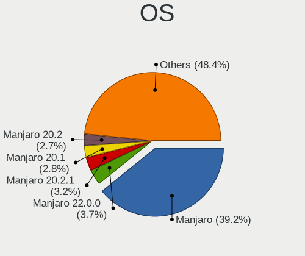
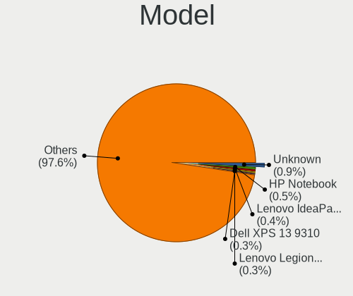
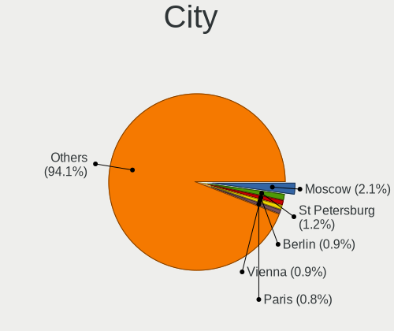
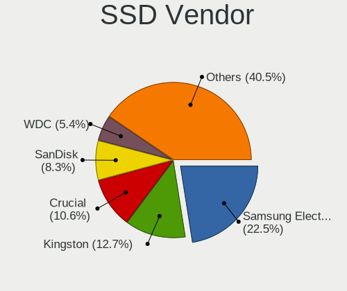
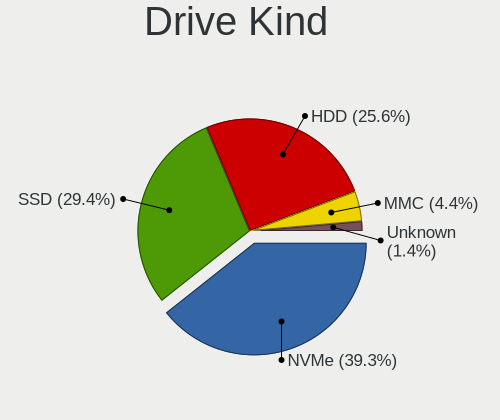
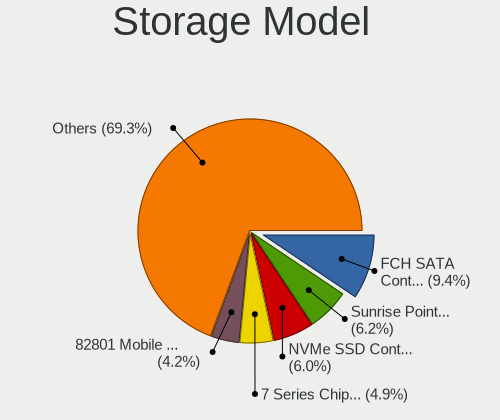
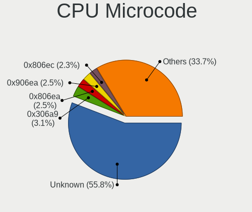
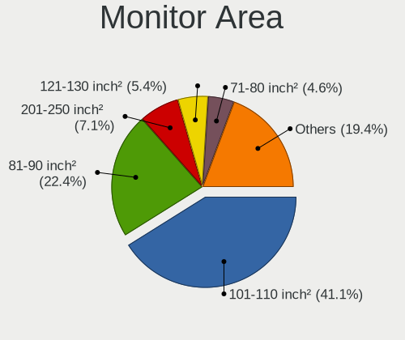
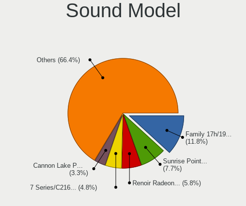

Manjaro - Tested Hardware & Statistics (Notebooks)
--------------------------------------------------

A project to collect tested hardware configurations for Manjaro.

Anyone can contribute to this report by the [hw-probe](https://github.com/linuxhw/hw-probe) tool:

    sudo -E hw-probe -all -upload

Please contribute! Especially if your hardware is rare.

Contents
--------

* [ Test Cases ](#test-cases)

* [ System ](#system)
  - [ OS                       ](#os)
  - [ OS Family                ](#os-family)
  - [ Kernel                   ](#kernel)
  - [ Kernel Family            ](#kernel-family)
  - [ Kernel Major Ver.        ](#kernel-major-ver)
  - [ Arch                     ](#arch)
  - [ DE                       ](#de)
  - [ Display Server           ](#display-server)
  - [ Display Manager          ](#display-manager)
  - [ OS Lang                  ](#os-lang)
  - [ Boot Mode                ](#boot-mode)
  - [ Filesystem               ](#filesystem)
  - [ Part. scheme             ](#part-scheme)
  - [ Dual Boot with Linux/BSD ](#dual-boot-with-linuxbsd)
  - [ Dual Boot (Win)          ](#dual-boot-win)

* [ Board ](#board)
  - [ Vendor                   ](#vendor)
  - [ Model                    ](#model)
  - [ Model Family             ](#model-family)
  - [ MFG Year                 ](#mfg-year)
  - [ Form Factor              ](#form-factor)
  - [ Secure Boot              ](#secure-boot)
  - [ Coreboot                 ](#coreboot)
  - [ RAM Size                 ](#ram-size)
  - [ RAM Used                 ](#ram-used)
  - [ Total Drives             ](#total-drives)
  - [ Has CD-ROM               ](#has-cd-rom)
  - [ Has Ethernet             ](#has-ethernet)
  - [ Has WiFi                 ](#has-wifi)
  - [ Has Bluetooth            ](#has-bluetooth)

* [ Location ](#location)
  - [ Country                  ](#country)
  - [ City                     ](#city)

* [ Drives ](#drives)
  - [ Drive Vendor             ](#drive-vendor)
  - [ Drive Model              ](#drive-model)
  - [ HDD Vendor               ](#hdd-vendor)
  - [ SSD Vendor               ](#ssd-vendor)
  - [ Drive Kind               ](#drive-kind)
  - [ Drive Connector          ](#drive-connector)
  - [ Drive Size               ](#drive-size)
  - [ Space Total              ](#space-total)
  - [ Space Used               ](#space-used)
  - [ Malfunc. Drives          ](#malfunc-drives)
  - [ Malfunc. Drive Vendor    ](#malfunc-drive-vendor)
  - [ Malfunc. HDD Vendor      ](#malfunc-hdd-vendor)
  - [ Malfunc. Drive Kind      ](#malfunc-drive-kind)
  - [ Failed Drives            ](#failed-drives)
  - [ Failed Drive Vendor      ](#failed-drive-vendor)
  - [ Drive Status             ](#drive-status)

* [ Storage controller ](#storage-controller)
  - [ Storage Vendor           ](#storage-vendor)
  - [ Storage Model            ](#storage-model)
  - [ Storage Kind             ](#storage-kind)

* [ Processor ](#processor)
  - [ CPU Vendor               ](#cpu-vendor)
  - [ CPU Model                ](#cpu-model)
  - [ CPU Model Family         ](#cpu-model-family)
  - [ CPU Cores                ](#cpu-cores)
  - [ CPU Sockets              ](#cpu-sockets)
  - [ CPU Threads              ](#cpu-threads)
  - [ CPU Op-Modes             ](#cpu-op-modes)
  - [ CPU Microcode            ](#cpu-microcode)
  - [ CPU Microarch            ](#cpu-microarch)

* [ Graphics ](#graphics)
  - [ GPU Vendor               ](#gpu-vendor)
  - [ GPU Model                ](#gpu-model)
  - [ GPU Combo                ](#gpu-combo)
  - [ GPU Driver               ](#gpu-driver)
  - [ GPU Memory               ](#gpu-memory)

* [ Monitor ](#monitor)
  - [ Monitor Vendor           ](#monitor-vendor)
  - [ Monitor Model            ](#monitor-model)
  - [ Monitor Resolution       ](#monitor-resolution)
  - [ Monitor Diagonal         ](#monitor-diagonal)
  - [ Monitor Width            ](#monitor-width)
  - [ Aspect Ratio             ](#aspect-ratio)
  - [ Monitor Area             ](#monitor-area)
  - [ Pixel Density            ](#pixel-density)
  - [ Multiple Monitors        ](#multiple-monitors)

* [ Network ](#network)
  - [ Net Controller Vendor    ](#net-controller-vendor)
  - [ Net Controller Model     ](#net-controller-model)
  - [ Wireless Vendor          ](#wireless-vendor)
  - [ Wireless Model           ](#wireless-model)
  - [ Ethernet Vendor          ](#ethernet-vendor)
  - [ Ethernet Model           ](#ethernet-model)
  - [ Net Controller Kind      ](#net-controller-kind)
  - [ Used Controller          ](#used-controller)
  - [ NICs                     ](#nics)
  - [ IPv6                     ](#ipv6)

* [ Bluetooth ](#bluetooth)
  - [ Bluetooth Vendor         ](#bluetooth-vendor)
  - [ Bluetooth Model          ](#bluetooth-model)

* [ Sound ](#sound)
  - [ Sound Vendor             ](#sound-vendor)
  - [ Sound Model              ](#sound-model)

* [ Memory ](#memory)
  - [ Memory Vendor            ](#memory-vendor)
  - [ Memory Model             ](#memory-model)
  - [ Memory Kind              ](#memory-kind)
  - [ Memory Form Factor       ](#memory-form-factor)
  - [ Memory Size              ](#memory-size)
  - [ Memory Speed             ](#memory-speed)

* [ Printers & scanners ](#printers--scanners)
  - [ Printer Vendor           ](#printer-vendor)
  - [ Printer Model            ](#printer-model)
  - [ Scanner Vendor           ](#scanner-vendor)
  - [ Scanner Model            ](#scanner-model)

* [ Camera ](#camera)
  - [ Camera Vendor            ](#camera-vendor)
  - [ Camera Model             ](#camera-model)

* [ Security ](#security)
  - [ Fingerprint Vendor       ](#fingerprint-vendor)
  - [ Fingerprint Model        ](#fingerprint-model)
  - [ Chipcard Vendor          ](#chipcard-vendor)
  - [ Chipcard Model           ](#chipcard-model)

* [ Unsupported ](#unsupported)
  - [ Unsupported Devices      ](#unsupported-devices)
  - [ Unsupported Device Types ](#unsupported-device-types)

Test Cases
----------

Total: 6401

| Vendor        | Model                       | Probe                                                      | Date         |
|---------------|-----------------------------|------------------------------------------------------------|--------------|
| LG Electro... | A410-G.BC44P1               | [e687d57757](https://linux-hardware.org/?probe=e687d57757) | May 09, 2024 |
| ASUSTek       | GL753VE                     | [17bf72a741](https://linux-hardware.org/?probe=17bf72a741) | May 08, 2024 |
| Alienware     | M17x                        | [349d219a3a](https://linux-hardware.org/?probe=349d219a3a) | May 08, 2024 |
| HP            | EliteBook 840 G6            | [504b36774f](https://linux-hardware.org/?probe=504b36774f) | May 07, 2024 |
| Lenovo        | V15 G4 IRU 83A1             | [7cd1070dc0](https://linux-hardware.org/?probe=7cd1070dc0) | May 07, 2024 |
| Unknown       | Unknown                     | [09d2748c7a](https://linux-hardware.org/?probe=09d2748c7a) | May 07, 2024 |
| Lenovo        | IdeaPad 5 15ARE05 81YQ      | [276faea129](https://linux-hardware.org/?probe=276faea129) | May 06, 2024 |
| ASUSTek       | GL753VD                     | [735ff065db](https://linux-hardware.org/?probe=735ff065db) | May 05, 2024 |
| Acer          | Aspire A315-23              | [35b8f59849](https://linux-hardware.org/?probe=35b8f59849) | May 05, 2024 |
| ASUSTek       | GR8                         | [6a8003e347](https://linux-hardware.org/?probe=6a8003e347) | May 05, 2024 |
| Dell          | Inspiron 7520               | [87c4f1733b](https://linux-hardware.org/?probe=87c4f1733b) | May 05, 2024 |
| Acer          | Aspire A315-44P             | [5c3ab00eb7](https://linux-hardware.org/?probe=5c3ab00eb7) | May 04, 2024 |
| Dell          | Latitude 7490               | [300c9cd271](https://linux-hardware.org/?probe=300c9cd271) | May 03, 2024 |
| Acer          | Aspire E1-771               | [ef44b13882](https://linux-hardware.org/?probe=ef44b13882) | May 03, 2024 |
| Lenovo        | Legion Slim 5 14APH8 82Y... | [9b8008703d](https://linux-hardware.org/?probe=9b8008703d) | May 03, 2024 |
| Dell          | Latitude E5250              | [e98282af47](https://linux-hardware.org/?probe=e98282af47) | May 02, 2024 |
| ASUSTek       | GR8                         | [ded6da2442](https://linux-hardware.org/?probe=ded6da2442) | May 02, 2024 |
| Schenker      | XMG NEO (CZN/E21)           | [c6e0886125](https://linux-hardware.org/?probe=c6e0886125) | May 02, 2024 |
| Acer          | Nitro AN515-54              | [27189a555f](https://linux-hardware.org/?probe=27189a555f) | May 02, 2024 |
| Acer          | Nitro AN515-54              | [2293918110](https://linux-hardware.org/?probe=2293918110) | May 02, 2024 |
| HP            | EliteBook 8460p             | [d5b743dc5a](https://linux-hardware.org/?probe=d5b743dc5a) | May 01, 2024 |
| Lenovo        | ThinkPad T470s 20HF005QM... | [6fc6e1fa78](https://linux-hardware.org/?probe=6fc6e1fa78) | May 01, 2024 |
| MSI           | Bravo 15 B5DD               | [c3ea06def8](https://linux-hardware.org/?probe=c3ea06def8) | May 01, 2024 |
| Lenovo        | Y50-70 20378                | [f7076c4db1](https://linux-hardware.org/?probe=f7076c4db1) | May 01, 2024 |
| Lenovo        | ThinkPad T16 Gen 1 21BWS... | [060878050f](https://linux-hardware.org/?probe=060878050f) | Apr 30, 2024 |
| ASUSTek       | ASUS TUF Gaming F15 FX50... | [52327486f3](https://linux-hardware.org/?probe=52327486f3) | Apr 30, 2024 |
| Acer          | Aspire A315-44P             | [37adfa528f](https://linux-hardware.org/?probe=37adfa528f) | Apr 30, 2024 |
| HP            | ENVY 17                     | [23518d52f8](https://linux-hardware.org/?probe=23518d52f8) | Apr 30, 2024 |
| Lenovo        | ThinkPad T14s Gen 4 21F7... | [b3d1c71cbf](https://linux-hardware.org/?probe=b3d1c71cbf) | Apr 29, 2024 |
| Apple         | MacBookPro9,2               | [3b4127bc96](https://linux-hardware.org/?probe=3b4127bc96) | Apr 29, 2024 |
| HP            | Pavilion Laptop 15-cc5xx    | [107cd303fd](https://linux-hardware.org/?probe=107cd303fd) | Apr 29, 2024 |
| Lenovo        | ThinkPad W530 24474KG       | [0019533554](https://linux-hardware.org/?probe=0019533554) | Apr 28, 2024 |
| ASUSTek       | Vivobook Go E1504FA_E150... | [831c732b79](https://linux-hardware.org/?probe=831c732b79) | Apr 27, 2024 |
| HP            | 240 G8                      | [bf5325bd89](https://linux-hardware.org/?probe=bf5325bd89) | Apr 26, 2024 |
| Dell          | Latitude 5420               | [92305ad5a6](https://linux-hardware.org/?probe=92305ad5a6) | Apr 26, 2024 |
| ASUSTek       | VivoBook_ASUSLaptop X513... | [01199d3eea](https://linux-hardware.org/?probe=01199d3eea) | Apr 26, 2024 |
| HONOR         | BMH-WCX9                    | [78d048ebdc](https://linux-hardware.org/?probe=78d048ebdc) | Apr 26, 2024 |
| Lenovo        | Legion 5 15ARH7 82RE        | [5188dec592](https://linux-hardware.org/?probe=5188dec592) | Apr 24, 2024 |
| HP            | EliteBook 845 14 inch G1... | [d1bfbd2dba](https://linux-hardware.org/?probe=d1bfbd2dba) | Apr 24, 2024 |
| Lenovo        | ThinkPad P1 Gen 4i 20Y4S... | [334a6f0385](https://linux-hardware.org/?probe=334a6f0385) | Apr 24, 2024 |
| HP            | Victus by Laptop 16-e0xx... | [74c8b80974](https://linux-hardware.org/?probe=74c8b80974) | Apr 23, 2024 |
| Lenovo        | Legion Y530-15ICH 81FV      | [01432a3384](https://linux-hardware.org/?probe=01432a3384) | Apr 23, 2024 |
| Acer          | Aspire ES1-523              | [499fa508bd](https://linux-hardware.org/?probe=499fa508bd) | Apr 23, 2024 |
| Lenovo        | ThinkPad T14s Gen 4 21F8... | [1f13f4d924](https://linux-hardware.org/?probe=1f13f4d924) | Apr 23, 2024 |
| Acer          | Swift SF314-43              | [0add5a8f6d](https://linux-hardware.org/?probe=0add5a8f6d) | Apr 23, 2024 |
| HP            | ENVY 17                     | [cefc9da64e](https://linux-hardware.org/?probe=cefc9da64e) | Apr 23, 2024 |
| HP            | Pavilion 15                 | [a0d3bcb2a0](https://linux-hardware.org/?probe=a0d3bcb2a0) | Apr 22, 2024 |
| Dell          | XPS 9320                    | [162d7ddcd3](https://linux-hardware.org/?probe=162d7ddcd3) | Apr 22, 2024 |
| Apple         | MacBookPro7,1               | [dda370ba40](https://linux-hardware.org/?probe=dda370ba40) | Apr 21, 2024 |
| Lenovo        | ThinkPad W530 24474KG       | [f5bb127a05](https://linux-hardware.org/?probe=f5bb127a05) | Apr 21, 2024 |
| Acer          | Aspire ES1-523              | [23fbbe90c4](https://linux-hardware.org/?probe=23fbbe90c4) | Apr 20, 2024 |
| Lenovo        | ThinkPad T530 2392AQU       | [6f325b5377](https://linux-hardware.org/?probe=6f325b5377) | Apr 20, 2024 |
| ASUSTek       | X540SAA                     | [17f2b9c802](https://linux-hardware.org/?probe=17f2b9c802) | Apr 20, 2024 |
| MSI           | Prestige 14 A12UC           | [82ab31e090](https://linux-hardware.org/?probe=82ab31e090) | Apr 19, 2024 |
| Dell          | Latitude 7490               | [3051df2105](https://linux-hardware.org/?probe=3051df2105) | Apr 19, 2024 |
| Lenovo        | ThinkPad P14s Gen 2i 20V... | [3c9edd18cd](https://linux-hardware.org/?probe=3c9edd18cd) | Apr 19, 2024 |
| HP            | Laptop 14-bs0xx             | [e403e1c979](https://linux-hardware.org/?probe=e403e1c979) | Apr 19, 2024 |
| HP            | ProBook 640 G2              | [76e18e23c3](https://linux-hardware.org/?probe=76e18e23c3) | Apr 19, 2024 |
| Dell          | Latitude E5570              | [3a04ef9eff](https://linux-hardware.org/?probe=3a04ef9eff) | Apr 18, 2024 |
| Dell          | Latitude E5430 non-vPro     | [d9d6b6fd6e](https://linux-hardware.org/?probe=d9d6b6fd6e) | Apr 17, 2024 |
| Lenovo        | Yoga Pro 9 16IMH9 83DN      | [dbe698ff64](https://linux-hardware.org/?probe=dbe698ff64) | Apr 17, 2024 |
| Lenovo        | ThinkPad L15 Gen 3 21C70... | [15cf4a7e8f](https://linux-hardware.org/?probe=15cf4a7e8f) | Apr 17, 2024 |
| Acer          | Aspire A515-57              | [f66938d1f9](https://linux-hardware.org/?probe=f66938d1f9) | Apr 16, 2024 |
| Lenovo        | ThinkPad T16 Gen 1 21BWS... | [d7cf8c586e](https://linux-hardware.org/?probe=d7cf8c586e) | Apr 16, 2024 |
| Dell          | Inspiron 7520               | [9f294b2198](https://linux-hardware.org/?probe=9f294b2198) | Apr 16, 2024 |
| Sony          | VGN-Z21VRN_X                | [6cc5820724](https://linux-hardware.org/?probe=6cc5820724) | Apr 16, 2024 |
| Chuwi         | MiniBook X                  | [0236998832](https://linux-hardware.org/?probe=0236998832) | Apr 15, 2024 |
| Lenovo        | IdeaPad 1 15AMN7 82VG       | [4d70d7056d](https://linux-hardware.org/?probe=4d70d7056d) | Apr 15, 2024 |
| Dell          | Inspiron 5566               | [b766f56874](https://linux-hardware.org/?probe=b766f56874) | Apr 15, 2024 |
| HP            | 255 15.6 inch G10           | [3858a294e8](https://linux-hardware.org/?probe=3858a294e8) | Apr 14, 2024 |
| HP            | Pavilion 15                 | [ba8c469ac5](https://linux-hardware.org/?probe=ba8c469ac5) | Apr 13, 2024 |
| Lenovo        | ThinkPad E14 Gen 5 21JSS... | [0ccf03f0d9](https://linux-hardware.org/?probe=0ccf03f0d9) | Apr 13, 2024 |
| Dell          | G15 5511                    | [dca2850091](https://linux-hardware.org/?probe=dca2850091) | Apr 12, 2024 |
| HONOR         | GLO-GXXX                    | [d8d90912a0](https://linux-hardware.org/?probe=d8d90912a0) | Apr 12, 2024 |
| HP            | EliteBook 840 G6            | [c9dc8fedd4](https://linux-hardware.org/?probe=c9dc8fedd4) | Apr 12, 2024 |
| Dell          | XPS 15 9520                 | [b6bd2872da](https://linux-hardware.org/?probe=b6bd2872da) | Apr 12, 2024 |
| Dell          | Inspiron 15-3567            | [ce468a8cb4](https://linux-hardware.org/?probe=ce468a8cb4) | Apr 12, 2024 |
| Lenovo        | Legion 5 17ACH6H 82JY       | [248ee4d26e](https://linux-hardware.org/?probe=248ee4d26e) | Apr 11, 2024 |
| Apple         | MacBookPro14,1              | [b824a3a76c](https://linux-hardware.org/?probe=b824a3a76c) | Apr 11, 2024 |
| Lenovo        | ThinkPad T14 Gen 4 21K3C... | [6800f41004](https://linux-hardware.org/?probe=6800f41004) | Apr 11, 2024 |
| Lenovo        | Yoga Pro 9 16IMH9 83DN      | [b3d2de9d47](https://linux-hardware.org/?probe=b3d2de9d47) | Apr 11, 2024 |
| Dell          | Inspiron 13-7378            | [6d34b93db6](https://linux-hardware.org/?probe=6d34b93db6) | Apr 09, 2024 |
| Lenovo        | ThinkPad T14s Gen 4 21F8... | [a9fbbbcdde](https://linux-hardware.org/?probe=a9fbbbcdde) | Apr 08, 2024 |
| HP            | Laptop 17-cp0xxx            | [f38bf5b9a6](https://linux-hardware.org/?probe=f38bf5b9a6) | Apr 08, 2024 |
| Chuwi         | MiniBook X                  | [9a717f509d](https://linux-hardware.org/?probe=9a717f509d) | Apr 07, 2024 |
| Lenovo        | ThinkPad X13 Gen 4 21J3C... | [1658229b9a](https://linux-hardware.org/?probe=1658229b9a) | Apr 07, 2024 |
| Chuwi         | MiniBook X                  | [b747ca2f62](https://linux-hardware.org/?probe=b747ca2f62) | Apr 07, 2024 |
| Chuwi         | MiniBook X                  | [85f4cc1804](https://linux-hardware.org/?probe=85f4cc1804) | Apr 06, 2024 |
| Apple         | MacBookPro8,1               | [fd4157e3ba](https://linux-hardware.org/?probe=fd4157e3ba) | Apr 06, 2024 |
| Apple         | MacBookPro8,1               | [0f7ad3e22a](https://linux-hardware.org/?probe=0f7ad3e22a) | Apr 06, 2024 |
| HUAWEI        | NBLK-WAX9X                  | [fb40c0b7f8](https://linux-hardware.org/?probe=fb40c0b7f8) | Apr 06, 2024 |
| Lenovo        | XiaoXinPro 14 APH8 83AM     | [3a979a2c53](https://linux-hardware.org/?probe=3a979a2c53) | Apr 05, 2024 |
| Samsung       | 530U3C/530U4C/532U3C        | [134adc8004](https://linux-hardware.org/?probe=134adc8004) | Apr 05, 2024 |
| Lenovo        | Yoga 500-15ISK 80R6         | [a3712304cd](https://linux-hardware.org/?probe=a3712304cd) | Apr 05, 2024 |
| Lenovo        | ThinkPad T480 20L6S4XW00    | [9a0997e90d](https://linux-hardware.org/?probe=9a0997e90d) | Apr 04, 2024 |
| HP            | Pavilion Gaming Laptop 1... | [6f73e98bd2](https://linux-hardware.org/?probe=6f73e98bd2) | Apr 04, 2024 |
| Toshiba       | Satellite C670-12E          | [c0b10bc723](https://linux-hardware.org/?probe=c0b10bc723) | Apr 04, 2024 |
| Lenovo        | Legion 5 15ARH05H 82B1      | [2f67dfca00](https://linux-hardware.org/?probe=2f67dfca00) | Apr 04, 2024 |
| HP            | 255 15.6 inch G10           | [b8ca6d353e](https://linux-hardware.org/?probe=b8ca6d353e) | Apr 04, 2024 |
| Dell          | Inspiron 3185               | [8fd7c48a29](https://linux-hardware.org/?probe=8fd7c48a29) | Apr 04, 2024 |
| Dell          | Inspiron 3185               | [8cb7a12f6d](https://linux-hardware.org/?probe=8cb7a12f6d) | Apr 04, 2024 |
| Lenovo        | ThinkPad X260 20F60093US    | [2965c9e0eb](https://linux-hardware.org/?probe=2965c9e0eb) | Apr 04, 2024 |
| Lenovo        | ThinkPad L15 Gen 3 21C30... | [7a09978e27](https://linux-hardware.org/?probe=7a09978e27) | Apr 03, 2024 |
| HP            | Pavilion Gaming Laptop 1... | [05b54be742](https://linux-hardware.org/?probe=05b54be742) | Apr 03, 2024 |
| Lenovo        | Legion Slim 5 14APH8 82Y... | [bb84e6292b](https://linux-hardware.org/?probe=bb84e6292b) | Apr 02, 2024 |
| Lenovo        | ThinkPad X270 20K5S1A524    | [6668d7d060](https://linux-hardware.org/?probe=6668d7d060) | Apr 02, 2024 |
| Lenovo        | ThinkPad E490 20N8002ART    | [eb49df1b97](https://linux-hardware.org/?probe=eb49df1b97) | Apr 02, 2024 |
| Lenovo        | ThinkPad L13 Gen 2 20VH0... | [e867d4d614](https://linux-hardware.org/?probe=e867d4d614) | Apr 01, 2024 |
| Timi          | Redmi Book Pro 15 2022      | [1ca1580b1d](https://linux-hardware.org/?probe=1ca1580b1d) | Mar 31, 2024 |
| Lenovo        | Legion Slim 5 16APH8 82Y... | [2eb8c19792](https://linux-hardware.org/?probe=2eb8c19792) | Mar 31, 2024 |
| Lenovo        | IdeaPad Pro 5 16APH8 83A... | [c9ece96124](https://linux-hardware.org/?probe=c9ece96124) | Mar 31, 2024 |
| Lenovo        | ThinkPad T480 20L6S29E02    | [55c9ebc175](https://linux-hardware.org/?probe=55c9ebc175) | Mar 30, 2024 |
| Lenovo        | IdeaPad Slim 5 16ABR8 82... | [396cf5fa7b](https://linux-hardware.org/?probe=396cf5fa7b) | Mar 30, 2024 |
| ASUSTek       | GR8                         | [1135229a2d](https://linux-hardware.org/?probe=1135229a2d) | Mar 30, 2024 |
| Lenovo        | Y520-15IKBN 80WK            | [9e7e9b558d](https://linux-hardware.org/?probe=9e7e9b558d) | Mar 29, 2024 |
| Lenovo        | IdeaPad S145-15API 81V7     | [7e9163e0f0](https://linux-hardware.org/?probe=7e9163e0f0) | Mar 29, 2024 |
| Positivo      | S15SL                       | [4a479bd2b9](https://linux-hardware.org/?probe=4a479bd2b9) | Mar 28, 2024 |
| ASUSTek       | Z450UA                      | [13ee658c0e](https://linux-hardware.org/?probe=13ee658c0e) | Mar 28, 2024 |
| Lenovo        | ThinkPad E490 20N8002ART    | [7ddfbb062b](https://linux-hardware.org/?probe=7ddfbb062b) | Mar 28, 2024 |
| Dell          | Inspiron 1520               | [1a4ee5c6ab](https://linux-hardware.org/?probe=1a4ee5c6ab) | Mar 27, 2024 |
| Lenovo        | ThinkPad X240 20AMS3YC00    | [570dc2f6e9](https://linux-hardware.org/?probe=570dc2f6e9) | Mar 27, 2024 |
| HP            | Laptop 15-dy2xxx            | [aacc5ca6c8](https://linux-hardware.org/?probe=aacc5ca6c8) | Mar 26, 2024 |
| Lenovo        | V330-14ARR 81B1             | [6436e7d3cc](https://linux-hardware.org/?probe=6436e7d3cc) | Mar 26, 2024 |
| HP            | 240 G8                      | [7857994d5b](https://linux-hardware.org/?probe=7857994d5b) | Mar 25, 2024 |
| Acer          | Swift SF14-71T              | [0dcdd95ff5](https://linux-hardware.org/?probe=0dcdd95ff5) | Mar 25, 2024 |
| Dell          | XPS 15 7590                 | [5f2e3e5e82](https://linux-hardware.org/?probe=5f2e3e5e82) | Mar 24, 2024 |
| Dell          | XPS 15 7590                 | [fd518a9250](https://linux-hardware.org/?probe=fd518a9250) | Mar 24, 2024 |
| HP            | OMEN by Laptop 16-c0xxx     | [e22abd24d3](https://linux-hardware.org/?probe=e22abd24d3) | Mar 24, 2024 |
| Dell          | G15 5510                    | [b89e46a4ef](https://linux-hardware.org/?probe=b89e46a4ef) | Mar 24, 2024 |
| Lenovo        | IdeaPad Y410P 20216         | [40a6b1e81c](https://linux-hardware.org/?probe=40a6b1e81c) | Mar 23, 2024 |
| Lenovo        | IdeaPad Y410P 20216         | [75974a7deb](https://linux-hardware.org/?probe=75974a7deb) | Mar 23, 2024 |
| Lenovo        | ThinkPad P14s Gen 2i 20V... | [1c71f92a5b](https://linux-hardware.org/?probe=1c71f92a5b) | Mar 22, 2024 |
| Lenovo        | ThinkPad X1 Carbon 7th 2... | [9ea82cd391](https://linux-hardware.org/?probe=9ea82cd391) | Mar 21, 2024 |
| HUAWEI        | NBLB-WAX9N                  | [3ef07aa692](https://linux-hardware.org/?probe=3ef07aa692) | Mar 21, 2024 |
| Lenovo        | Legion Slim 5 16APH8 82Y... | [b4a0f603c9](https://linux-hardware.org/?probe=b4a0f603c9) | Mar 20, 2024 |
| Acer          | Aspire 7741                 | [97c539aae7](https://linux-hardware.org/?probe=97c539aae7) | Mar 20, 2024 |
| Lenovo        | ThinkPad W500 40633FU       | [6ce965896b](https://linux-hardware.org/?probe=6ce965896b) | Mar 20, 2024 |
| Lenovo        | ThinkPad P15 Gen 2i 20YQ... | [003c2d476f](https://linux-hardware.org/?probe=003c2d476f) | Mar 20, 2024 |
| Lenovo        | ThinkPad L490 20Q6A2MYCD    | [171ff29e85](https://linux-hardware.org/?probe=171ff29e85) | Mar 19, 2024 |
| Lenovo        | ThinkPad L490 20Q6A2MYCD    | [1fe1956a79](https://linux-hardware.org/?probe=1fe1956a79) | Mar 19, 2024 |
| Acer          | Predator PH315-53           | [512ed7177b](https://linux-hardware.org/?probe=512ed7177b) | Mar 19, 2024 |
| MSI           | Unknown                     | [a975d469da](https://linux-hardware.org/?probe=a975d469da) | Mar 19, 2024 |
| Sony          | VPCF236FM                   | [82b1f5dd66](https://linux-hardware.org/?probe=82b1f5dd66) | Mar 17, 2024 |
| Lenovo        | IdeaPad 3 15IIL05 81WE      | [5499d7f4db](https://linux-hardware.org/?probe=5499d7f4db) | Mar 17, 2024 |
| Lenovo        | Legion Y540-15IRH 81SX      | [fab517699b](https://linux-hardware.org/?probe=fab517699b) | Mar 17, 2024 |
| Google        | Glimmer                     | [b5cd167129](https://linux-hardware.org/?probe=b5cd167129) | Mar 16, 2024 |
| Lenovo        | ThinkPad T430 2351BH6       | [cf3786e3ce](https://linux-hardware.org/?probe=cf3786e3ce) | Mar 16, 2024 |
| Lenovo        | ThinkPad T430 2351BH6       | [0fd149f049](https://linux-hardware.org/?probe=0fd149f049) | Mar 16, 2024 |
| Lenovo        | IdeaPad Gaming 3 15ARH7 ... | [f31c22ae3b](https://linux-hardware.org/?probe=f31c22ae3b) | Mar 16, 2024 |
| Lenovo        | ThinkBook 14s-IWL 20RM      | [597ac47473](https://linux-hardware.org/?probe=597ac47473) | Mar 15, 2024 |
| Dell          | Inspiron 14 5410 2-in-1     | [3b3380bb42](https://linux-hardware.org/?probe=3b3380bb42) | Mar 14, 2024 |
| Lenovo        | ThinkPad T480 20L6S1TV00    | [797839cace](https://linux-hardware.org/?probe=797839cace) | Mar 14, 2024 |
| PC Special... | Initia 15                   | [6aaef8dea6](https://linux-hardware.org/?probe=6aaef8dea6) | Mar 14, 2024 |
| HP            | ProBook 6470b               | [e5080a3d7d](https://linux-hardware.org/?probe=e5080a3d7d) | Mar 13, 2024 |
| Lenovo        | ThinkPad T16 Gen 1 21BWS... | [b3176660a1](https://linux-hardware.org/?probe=b3176660a1) | Mar 12, 2024 |
| Lenovo        | ThinkPad T16 Gen 1 21BWS... | [25e788b418](https://linux-hardware.org/?probe=25e788b418) | Mar 12, 2024 |
| HONOR         | GLO-GXXX                    | [459c6c6233](https://linux-hardware.org/?probe=459c6c6233) | Mar 12, 2024 |
| HONOR         | GLO-GXXX                    | [f5234b5b05](https://linux-hardware.org/?probe=f5234b5b05) | Mar 11, 2024 |
| HP            | EliteBook Folio 9470m       | [ddf5a549da](https://linux-hardware.org/?probe=ddf5a549da) | Mar 11, 2024 |
| HP            | Pavilion 15                 | [b2596c60dd](https://linux-hardware.org/?probe=b2596c60dd) | Mar 10, 2024 |
| Acer          | Aspire E5-771G              | [ca805074d2](https://linux-hardware.org/?probe=ca805074d2) | Mar 10, 2024 |
| Dell          | Latitude 5580               | [e1ad4ed6e0](https://linux-hardware.org/?probe=e1ad4ed6e0) | Mar 09, 2024 |
| Dell          | Latitude 5580               | [baa3592d98](https://linux-hardware.org/?probe=baa3592d98) | Mar 09, 2024 |
| Lenovo        | Legion 7 16ARHA7 82UH       | [229492dd1a](https://linux-hardware.org/?probe=229492dd1a) | Mar 09, 2024 |
| Dell          | Inspiron 11-3168            | [f93b50de6c](https://linux-hardware.org/?probe=f93b50de6c) | Mar 09, 2024 |
| Apple         | MacBookPro14,1              | [8afb6c7d8a](https://linux-hardware.org/?probe=8afb6c7d8a) | Mar 08, 2024 |
| Lenovo        | ThinkPad E14 Gen 5 21JSS... | [b136a57d61](https://linux-hardware.org/?probe=b136a57d61) | Mar 08, 2024 |
| Acer          | Aspire A715-75G             | [518dc5d05e](https://linux-hardware.org/?probe=518dc5d05e) | Mar 08, 2024 |
| HP            | 250 G7 Notebook PC          | [bc116e452e](https://linux-hardware.org/?probe=bc116e452e) | Mar 08, 2024 |
| Dell          | Inspiron 7520               | [7179076e03](https://linux-hardware.org/?probe=7179076e03) | Mar 08, 2024 |
| Dell          | Inspiron 7520               | [af48789c93](https://linux-hardware.org/?probe=af48789c93) | Mar 08, 2024 |
| Lenovo        | ThinkPad X270 20HMS10M00    | [68233f4f62](https://linux-hardware.org/?probe=68233f4f62) | Mar 08, 2024 |
| Lenovo        | Legion 7 16ARHA7 82UH       | [c3eba8016e](https://linux-hardware.org/?probe=c3eba8016e) | Mar 08, 2024 |
| ASUSTek       | VivoBook_ASUSLaptop X150... | [b82f1b6779](https://linux-hardware.org/?probe=b82f1b6779) | Mar 07, 2024 |
| HP            | 255 15.6 inch G10           | [64708f11a8](https://linux-hardware.org/?probe=64708f11a8) | Mar 07, 2024 |
| HP            | EliteBook 840 G8 Noteboo... | [6f0e97edef](https://linux-hardware.org/?probe=6f0e97edef) | Mar 07, 2024 |
| Dell          | Latitude E6530              | [1401c33566](https://linux-hardware.org/?probe=1401c33566) | Mar 06, 2024 |
| Dell          | Latitude E6530              | [376efca9f8](https://linux-hardware.org/?probe=376efca9f8) | Mar 06, 2024 |
| HP            | ZBook 17 G3                 | [e69ebcea87](https://linux-hardware.org/?probe=e69ebcea87) | Mar 06, 2024 |
| ASUSTek       | VivoBook_ASUSLaptop M160... | [30b8f48fa3](https://linux-hardware.org/?probe=30b8f48fa3) | Mar 05, 2024 |
| HP            | EliteBook 840 G8 Noteboo... | [746fafeef2](https://linux-hardware.org/?probe=746fafeef2) | Mar 05, 2024 |
| ASUSTek       | VivoBook_ASUSLaptop M650... | [b91c6debc9](https://linux-hardware.org/?probe=b91c6debc9) | Mar 05, 2024 |
| ASUSTek       | GL753VD                     | [10302c2e00](https://linux-hardware.org/?probe=10302c2e00) | Mar 04, 2024 |
| Dell          | Inspiron 5521               | [88afd1df62](https://linux-hardware.org/?probe=88afd1df62) | Mar 04, 2024 |
| System76      | Gazelle                     | [8268dda7cd](https://linux-hardware.org/?probe=8268dda7cd) | Mar 02, 2024 |
| System76      | Gazelle                     | [4a9c8650fd](https://linux-hardware.org/?probe=4a9c8650fd) | Mar 02, 2024 |
| Lenovo        | IdeaPad 5 15ARE05 81YQ      | [56aee13926](https://linux-hardware.org/?probe=56aee13926) | Mar 02, 2024 |
| Dell          | Inspiron 1545               | [42f3062713](https://linux-hardware.org/?probe=42f3062713) | Mar 02, 2024 |
| F-Plus Mob... | FLAPTOP r                   | [8308887cbc](https://linux-hardware.org/?probe=8308887cbc) | Mar 02, 2024 |
| HP            | ProBook 430 G3              | [b8b4c20eca](https://linux-hardware.org/?probe=b8b4c20eca) | Mar 01, 2024 |
| Acer          | Nitro AN515-57              | [e27f8a0412](https://linux-hardware.org/?probe=e27f8a0412) | Mar 01, 2024 |
| HUAWEI        | BOM-WXX9                    | [94a4405784](https://linux-hardware.org/?probe=94a4405784) | Feb 29, 2024 |
| Dell          | Vostro 14 5401              | [b827b5e796](https://linux-hardware.org/?probe=b827b5e796) | Feb 29, 2024 |
| Dell          | Vostro 14 5401              | [20be6de7bc](https://linux-hardware.org/?probe=20be6de7bc) | Feb 29, 2024 |
| Framework     | Laptop                      | [819a5185a1](https://linux-hardware.org/?probe=819a5185a1) | Feb 29, 2024 |
| TUXEDO        | Book XP15 / XP17 Gen12      | [c8ca20ec07](https://linux-hardware.org/?probe=c8ca20ec07) | Feb 29, 2024 |
| MSI           | Thin GF63 12UDX             | [648c7d0aa4](https://linux-hardware.org/?probe=648c7d0aa4) | Feb 28, 2024 |
| Notebook      | N15_17RD                    | [efc829810d](https://linux-hardware.org/?probe=efc829810d) | Feb 28, 2024 |
| Lenovo        | ThinkPad X220 42872VU       | [69ecd93d90](https://linux-hardware.org/?probe=69ecd93d90) | Feb 28, 2024 |
| ASUSTek       | VivoBook_ASUSLaptop X160... | [f03ada23b3](https://linux-hardware.org/?probe=f03ada23b3) | Feb 27, 2024 |
| Timi          | TM1703                      | [58058b47b5](https://linux-hardware.org/?probe=58058b47b5) | Feb 27, 2024 |
| Alienware     | m15 R6                      | [466ed13487](https://linux-hardware.org/?probe=466ed13487) | Feb 26, 2024 |
| Eluktronic... | MAX-15                      | [9b027e0962](https://linux-hardware.org/?probe=9b027e0962) | Feb 26, 2024 |
| Lenovo        | IdeaPad 300-15IBR 80M3      | [10a837ee0f](https://linux-hardware.org/?probe=10a837ee0f) | Feb 26, 2024 |
| Framework     | Laptop 16 (AMD Ryzen 704... | [23db04fc3b](https://linux-hardware.org/?probe=23db04fc3b) | Feb 26, 2024 |
| Acer          | Nitro AN515-57              | [ae88eb0523](https://linux-hardware.org/?probe=ae88eb0523) | Feb 26, 2024 |
| Dell          | Latitude E5450              | [c37b8a50c7](https://linux-hardware.org/?probe=c37b8a50c7) | Feb 26, 2024 |
| Dell          | Latitude E5450              | [121c48c635](https://linux-hardware.org/?probe=121c48c635) | Feb 26, 2024 |
| Lenovo        | ThinkPad X260 20F6009SMS    | [027f3ceeb3](https://linux-hardware.org/?probe=027f3ceeb3) | Feb 26, 2024 |
| Apple         | MacBookPro14,1              | [a8719d37ff](https://linux-hardware.org/?probe=a8719d37ff) | Feb 25, 2024 |
| HP            | ZBook 17 G3                 | [9b0019e8dd](https://linux-hardware.org/?probe=9b0019e8dd) | Feb 23, 2024 |
| ASUSTek       | VivoBook_ASUSLaptop X160... | [cd90e283a6](https://linux-hardware.org/?probe=cd90e283a6) | Feb 22, 2024 |
| Samsung       | R528/R728                   | [6ac6c8e9ed](https://linux-hardware.org/?probe=6ac6c8e9ed) | Feb 22, 2024 |
| Lenovo        | ThinkPad X270 20K5S1A524    | [e8d9d9d1b9](https://linux-hardware.org/?probe=e8d9d9d1b9) | Feb 21, 2024 |
| ASUSTek       | VivoBook_ASUSLaptop X431... | [de4e57858e](https://linux-hardware.org/?probe=de4e57858e) | Feb 20, 2024 |
| Lenovo        | ThinkPad P14s Gen 3 21AK... | [3a058baea1](https://linux-hardware.org/?probe=3a058baea1) | Feb 20, 2024 |
| Lenovo        | IdeaPad S145-15IIL 81W8     | [78587a5ad4](https://linux-hardware.org/?probe=78587a5ad4) | Feb 20, 2024 |
| HUAWEI        | HKD-WXX                     | [797bff6dba](https://linux-hardware.org/?probe=797bff6dba) | Feb 19, 2024 |
| Apple         | MacBookPro13,1              | [6436d22d55](https://linux-hardware.org/?probe=6436d22d55) | Feb 19, 2024 |
| Dell          | Latitude E7270              | [3018fb7a31](https://linux-hardware.org/?probe=3018fb7a31) | Feb 19, 2024 |
| Dell          | Latitude 5430               | [87697e2371](https://linux-hardware.org/?probe=87697e2371) | Feb 18, 2024 |
| ASUSTek       | VivoBook_ASUSLaptop X415... | [cd86953989](https://linux-hardware.org/?probe=cd86953989) | Feb 18, 2024 |
| Sony          | SVT11215CWB                 | [89248167bd](https://linux-hardware.org/?probe=89248167bd) | Feb 18, 2024 |
| HP            | Pavilion dv7                | [b51242ad1b](https://linux-hardware.org/?probe=b51242ad1b) | Feb 18, 2024 |
| Samsung       | RV415/RV515                 | [81e334c78b](https://linux-hardware.org/?probe=81e334c78b) | Feb 17, 2024 |
| Lenovo        | ThinkPad X1 Extreme 2nd ... | [f7fc16610a](https://linux-hardware.org/?probe=f7fc16610a) | Feb 17, 2024 |
| ASUSTek       | VivoBook 15_ASUS Laptop ... | [0fd49ab79d](https://linux-hardware.org/?probe=0fd49ab79d) | Feb 17, 2024 |
| Acer          | Aspire V5-573G              | [dc9dcb0170](https://linux-hardware.org/?probe=dc9dcb0170) | Feb 17, 2024 |
| Acer          | Extensa 215-33              | [d84724ee53](https://linux-hardware.org/?probe=d84724ee53) | Feb 16, 2024 |
| ASUSTek       | ROG Zephyrus G14 GA401IU... | [cdd51cbb3d](https://linux-hardware.org/?probe=cdd51cbb3d) | Feb 16, 2024 |
| HP            | Pavilion dv7                | [72baf3c442](https://linux-hardware.org/?probe=72baf3c442) | Feb 16, 2024 |
| Lenovo        | ThinkPad T14 Gen 1 20S0C... | [95b7d6875a](https://linux-hardware.org/?probe=95b7d6875a) | Feb 16, 2024 |
| ASUSTek       | X555YI                      | [9fcad9e566](https://linux-hardware.org/?probe=9fcad9e566) | Feb 16, 2024 |
| ASUSTek       | X555YI                      | [49d3f40a26](https://linux-hardware.org/?probe=49d3f40a26) | Feb 16, 2024 |
| GPU Compan... | GGNC51518                   | [58b57a6127](https://linux-hardware.org/?probe=58b57a6127) | Feb 16, 2024 |
| Apple         | MacBookPro14,1              | [40b22ed823](https://linux-hardware.org/?probe=40b22ed823) | Feb 16, 2024 |
| Samsung       | 270E5J/2570EJ               | [f737fa55d3](https://linux-hardware.org/?probe=f737fa55d3) | Feb 15, 2024 |
| Irbis         | NB264                       | [ca67997641](https://linux-hardware.org/?probe=ca67997641) | Feb 15, 2024 |
| Irbis         | NB264                       | [a84742fcdf](https://linux-hardware.org/?probe=a84742fcdf) | Feb 15, 2024 |
| Framework     | Laptop                      | [7c33e21137](https://linux-hardware.org/?probe=7c33e21137) | Feb 14, 2024 |
| Dell          | Vostro 5471                 | [2385def746](https://linux-hardware.org/?probe=2385def746) | Feb 14, 2024 |
| ASUSTek       | VivoBook_ASUSLaptop X150... | [0cb65112ff](https://linux-hardware.org/?probe=0cb65112ff) | Feb 13, 2024 |
| Dell          | Latitude 7490               | [db0ed78763](https://linux-hardware.org/?probe=db0ed78763) | Feb 13, 2024 |
| ASUSTek       | VivoBook_ASUSLaptop X150... | [8f47ad3e3b](https://linux-hardware.org/?probe=8f47ad3e3b) | Feb 12, 2024 |
| HP            | EliteBook 820 G2            | [bd35a80911](https://linux-hardware.org/?probe=bd35a80911) | Feb 12, 2024 |
| MSI           | Prestige 14Evo A12M         | [b5517768cb](https://linux-hardware.org/?probe=b5517768cb) | Feb 12, 2024 |
| Dell          | Inspiron 5521               | [ec2bc4253e](https://linux-hardware.org/?probe=ec2bc4253e) | Feb 10, 2024 |
| ASUSTek       | X541UJ                      | [b65b4354c0](https://linux-hardware.org/?probe=b65b4354c0) | Feb 09, 2024 |
| Acer          | Aspire V5-573G              | [207b6cf943](https://linux-hardware.org/?probe=207b6cf943) | Feb 09, 2024 |
| OrangePi      | NEO-01                      | [9999d229d6](https://linux-hardware.org/?probe=9999d229d6) | Feb 09, 2024 |
| ASUSTek       | ASUS TUF Gaming A15 FA50... | [41dcbdad69](https://linux-hardware.org/?probe=41dcbdad69) | Feb 09, 2024 |
| Lenovo        | IdeaPad 5 14ALC05 82LM      | [1c4b5365af](https://linux-hardware.org/?probe=1c4b5365af) | Feb 07, 2024 |
| Apple         | MacBookPro11,3              | [f1a82cee3d](https://linux-hardware.org/?probe=f1a82cee3d) | Feb 06, 2024 |
| Lenovo        | IdeaPad S145-15IIL 81W8     | [72e1aa0f99](https://linux-hardware.org/?probe=72e1aa0f99) | Feb 06, 2024 |
| Lenovo        | Yoga Slim 7 Carbon 14ACN... | [fdcb78e59e](https://linux-hardware.org/?probe=fdcb78e59e) | Feb 05, 2024 |
| Dell          | G15 5515                    | [0c6d85f812](https://linux-hardware.org/?probe=0c6d85f812) | Feb 05, 2024 |
| HP            | EliteBook 8440p (XA191EP... | [7cdaec1dfa](https://linux-hardware.org/?probe=7cdaec1dfa) | Feb 05, 2024 |
| Dell          | G15 5511                    | [ca77412e86](https://linux-hardware.org/?probe=ca77412e86) | Feb 04, 2024 |
| MSI           | GP66 Leopard 11UG           | [494b45b6ad](https://linux-hardware.org/?probe=494b45b6ad) | Feb 04, 2024 |
| ASUSTek       | Q551LNB                     | [eeaca76d76](https://linux-hardware.org/?probe=eeaca76d76) | Feb 04, 2024 |
| HP            | Laptop 15-fc0xxx            | [ac0def8795](https://linux-hardware.org/?probe=ac0def8795) | Feb 03, 2024 |
| Lenovo        | Legion 7 16ARHA7 82UH       | [28f2b5b1a5](https://linux-hardware.org/?probe=28f2b5b1a5) | Feb 03, 2024 |
| Lenovo        | Legion 7 16ARHA7 82UH       | [7b178df76b](https://linux-hardware.org/?probe=7b178df76b) | Feb 03, 2024 |
| Acer          | Aspire A517-51G             | [2788a21644](https://linux-hardware.org/?probe=2788a21644) | Feb 02, 2024 |
| HP            | 255 15.6 inch G10           | [86bdc742bd](https://linux-hardware.org/?probe=86bdc742bd) | Feb 01, 2024 |
| ASUSTek       | VivoBook_ASUSLaptop X160... | [6f80a7214c](https://linux-hardware.org/?probe=6f80a7214c) | Feb 01, 2024 |
| Dell          | Latitude 7490               | [f6c07c876d](https://linux-hardware.org/?probe=f6c07c876d) | Feb 01, 2024 |
| Lenovo        | ThinkPad T480 20L6S4XW00    | [a24ce87b69](https://linux-hardware.org/?probe=a24ce87b69) | Feb 01, 2024 |
| Thomson       | N15C8BK2T                   | [5de65dcec1](https://linux-hardware.org/?probe=5de65dcec1) | Jan 31, 2024 |
| ASUSTek       | PRIME X670E-PRO WIFI        | [4af4b18a2c](https://linux-hardware.org/?probe=4af4b18a2c) | Jan 31, 2024 |
| HP            | Laptop 15-fc0xxx            | [28e16f1c53](https://linux-hardware.org/?probe=28e16f1c53) | Jan 31, 2024 |
| HP            | EliteBook 855 G8 Noteboo... | [fff51c5158](https://linux-hardware.org/?probe=fff51c5158) | Jan 30, 2024 |
| ASUSTek       | VivoBook_ASUSLaptop M350... | [bc89935fa2](https://linux-hardware.org/?probe=bc89935fa2) | Jan 29, 2024 |
| Apple         | MacBookPro14,1              | [596ac6a467](https://linux-hardware.org/?probe=596ac6a467) | Jan 29, 2024 |
| HP            | Stream Laptop 14-DS0xxx     | [b2cff77c57](https://linux-hardware.org/?probe=b2cff77c57) | Jan 29, 2024 |
| Fujitsu       | LIFEBOOK E744               | [0bdbea7dcb](https://linux-hardware.org/?probe=0bdbea7dcb) | Jan 29, 2024 |
| Fujitsu       | LIFEBOOK E744               | [3e03ee6e0f](https://linux-hardware.org/?probe=3e03ee6e0f) | Jan 29, 2024 |
| HP            | EliteBook 840 g5            | [b9ca87e1e4](https://linux-hardware.org/?probe=b9ca87e1e4) | Jan 28, 2024 |
| ASUSTek       | K52JU                       | [066d333914](https://linux-hardware.org/?probe=066d333914) | Jan 28, 2024 |
| Dell          | Inspiron 15-3567            | [9ce085875f](https://linux-hardware.org/?probe=9ce085875f) | Jan 27, 2024 |
| Lenovo        | ThinkPad T495 20NKS5AU00    | [e382eee8ac](https://linux-hardware.org/?probe=e382eee8ac) | Jan 27, 2024 |
| Dell          | Latitude E7270              | [7ebc1a4cdb](https://linux-hardware.org/?probe=7ebc1a4cdb) | Jan 27, 2024 |
| ARDOR GAMI... | PD5x_7xSNC_SND_SNE          | [398529b5cb](https://linux-hardware.org/?probe=398529b5cb) | Jan 27, 2024 |
| HP            | Pavilion 14                 | [93fffe502f](https://linux-hardware.org/?probe=93fffe502f) | Jan 27, 2024 |
| Lenovo        | Legion 5 17ACH6H 82JY       | [6db5a094d7](https://linux-hardware.org/?probe=6db5a094d7) | Jan 26, 2024 |
| ASUSTek       | X550VXK                     | [4f8a5aa2c2](https://linux-hardware.org/?probe=4f8a5aa2c2) | Jan 26, 2024 |
| ASUSTek       | GR8                         | [f43a22b48b](https://linux-hardware.org/?probe=f43a22b48b) | Jan 26, 2024 |
| Acer          | Swift SF314-43              | [bfbce1457c](https://linux-hardware.org/?probe=bfbce1457c) | Jan 25, 2024 |
| Lenovo        | IdeaPad Pro 5 14IMH9 83D... | [2915b21d64](https://linux-hardware.org/?probe=2915b21d64) | Jan 25, 2024 |
| Dell          | Inspiron 5770               | [6cf464989f](https://linux-hardware.org/?probe=6cf464989f) | Jan 24, 2024 |
| Lenovo        | IdeaPad S145-15IIL 81W8     | [362ad8ae7e](https://linux-hardware.org/?probe=362ad8ae7e) | Jan 24, 2024 |
| Lenovo        | Legion 5 15ARH05 82B5       | [356b235b8b](https://linux-hardware.org/?probe=356b235b8b) | Jan 24, 2024 |
| HUAWEI        | RLEF-XX                     | [dc4ce0b71d](https://linux-hardware.org/?probe=dc4ce0b71d) | Jan 24, 2024 |
| HUAWEI        | RLEF-XX                     | [c53987023c](https://linux-hardware.org/?probe=c53987023c) | Jan 24, 2024 |
| HP            | Laptop 15-fc0xxx            | [20be72b253](https://linux-hardware.org/?probe=20be72b253) | Jan 24, 2024 |
| ASUSTek       | X541UJ                      | [e5a64b928d](https://linux-hardware.org/?probe=e5a64b928d) | Jan 23, 2024 |
| Lenovo        | Legion Y530-15ICH 81FV      | [15666b6776](https://linux-hardware.org/?probe=15666b6776) | Jan 23, 2024 |
| Dell          | Latitude E7450              | [1b19ab817a](https://linux-hardware.org/?probe=1b19ab817a) | Jan 23, 2024 |
| HP            | EliteBook 840 G8 Noteboo... | [19eaa1abc0](https://linux-hardware.org/?probe=19eaa1abc0) | Jan 22, 2024 |
| Lenovo        | ThinkPad T14 Gen 1 20S1S... | [9a1d16aad2](https://linux-hardware.org/?probe=9a1d16aad2) | Jan 21, 2024 |
| TUXEDO        | InfinityBook Pro Gen8 (M... | [379e6473d5](https://linux-hardware.org/?probe=379e6473d5) | Jan 21, 2024 |
| Lenovo        | IdeaPad 320-14IKB 80XK      | [de30e068d6](https://linux-hardware.org/?probe=de30e068d6) | Jan 21, 2024 |
| ASUSTek       | VivoBook_ASUSLaptop K650... | [52783252de](https://linux-hardware.org/?probe=52783252de) | Jan 21, 2024 |
| Lenovo        | IdeaPad 5 15ARE05 81YQ      | [a8c56ec5a7](https://linux-hardware.org/?probe=a8c56ec5a7) | Jan 21, 2024 |
| HP            | Victus by Laptop 16-d0xx... | [11e78ca269](https://linux-hardware.org/?probe=11e78ca269) | Jan 20, 2024 |
| Notebook      | W350STQ/W370ST              | [a61e368a41](https://linux-hardware.org/?probe=a61e368a41) | Jan 19, 2024 |
| Apple         | MacBookAir7,2               | [8efc1fa078](https://linux-hardware.org/?probe=8efc1fa078) | Jan 19, 2024 |
| Apple         | MacBookAir7,2               | [14a15f0dc3](https://linux-hardware.org/?probe=14a15f0dc3) | Jan 19, 2024 |
| Lenovo        | Z50-70 20354                | [fb225848f0](https://linux-hardware.org/?probe=fb225848f0) | Jan 19, 2024 |
| Razer         | Blade                       | [e99ad5cc36](https://linux-hardware.org/?probe=e99ad5cc36) | Jan 19, 2024 |
| Acer          | Aspire A315-35              | [dafaf99dd0](https://linux-hardware.org/?probe=dafaf99dd0) | Jan 19, 2024 |
| realme        | CloudProXXXX                | [a82160e17d](https://linux-hardware.org/?probe=a82160e17d) | Jan 19, 2024 |
| HP            | 255 15.6 inch G10           | [b852473447](https://linux-hardware.org/?probe=b852473447) | Jan 17, 2024 |
| Lenovo        | Z50-70 20354                | [2e0947a80d](https://linux-hardware.org/?probe=2e0947a80d) | Jan 17, 2024 |
| Lenovo        | ThinkPad T430 2344BMU       | [75e86c5b31](https://linux-hardware.org/?probe=75e86c5b31) | Jan 17, 2024 |
| Lenovo        | ThinkPad E14 Gen 3 20Y70... | [4b41c2825f](https://linux-hardware.org/?probe=4b41c2825f) | Jan 17, 2024 |
| Lenovo        | ThinkPad P14s Gen 3 21AK... | [6274216b05](https://linux-hardware.org/?probe=6274216b05) | Jan 16, 2024 |
| Medion        | Scout E10                   | [10da5c077d](https://linux-hardware.org/?probe=10da5c077d) | Jan 16, 2024 |
| Apple         | MacBookPro9,1               | [3b43ca4be8](https://linux-hardware.org/?probe=3b43ca4be8) | Jan 16, 2024 |
| Lenovo        | ThinkPad X270 20K5S1A524    | [2943099ca8](https://linux-hardware.org/?probe=2943099ca8) | Jan 15, 2024 |
| HP            | ProBook 4340s               | [45354af236](https://linux-hardware.org/?probe=45354af236) | Jan 14, 2024 |
| HP            | ProBook 4340s               | [aea3678636](https://linux-hardware.org/?probe=aea3678636) | Jan 14, 2024 |
| HUAWEI        | BOM-WXX9                    | [f15e99bc7d](https://linux-hardware.org/?probe=f15e99bc7d) | Jan 13, 2024 |
| HUAWEI        | BOD-WXX9                    | [fe4ed2794f](https://linux-hardware.org/?probe=fe4ed2794f) | Jan 13, 2024 |
| HUAWEI        | BOD-WXX9                    | [b5c9600b1e](https://linux-hardware.org/?probe=b5c9600b1e) | Jan 13, 2024 |
| Acer          | Aspire A517-51G             | [5a9f65787f](https://linux-hardware.org/?probe=5a9f65787f) | Jan 13, 2024 |
| Lenovo        | ThinkPad X1 Carbon Gen 1... | [301f2ec339](https://linux-hardware.org/?probe=301f2ec339) | Jan 12, 2024 |
| Lenovo        | ThinkPad X1 Carbon Gen 1... | [84d67dfe96](https://linux-hardware.org/?probe=84d67dfe96) | Jan 12, 2024 |
| MSI           | Katana 17 B13VFK            | [f5b006ea89](https://linux-hardware.org/?probe=f5b006ea89) | Jan 12, 2024 |
| ASUSTek       | Zenbook 15 UM3504DA_UM35... | [c913eb2c1b](https://linux-hardware.org/?probe=c913eb2c1b) | Jan 12, 2024 |
| Alienware     | 17 R5                       | [4588195d7c](https://linux-hardware.org/?probe=4588195d7c) | Jan 12, 2024 |
| MSI           | MPG X570 GAMING PLUS        | [3be44d9c7c](https://linux-hardware.org/?probe=3be44d9c7c) | Jan 12, 2024 |
| HP            | ZBook Firefly 15 inch G8... | [1601348335](https://linux-hardware.org/?probe=1601348335) | Jan 11, 2024 |
| Lenovo        | Legion Y530-15ICH 81FV      | [0d7230b853](https://linux-hardware.org/?probe=0d7230b853) | Jan 11, 2024 |
| HP            | Notebook                    | [53e2f16b51](https://linux-hardware.org/?probe=53e2f16b51) | Jan 11, 2024 |
| Dell          | Latitude E7440              | [08decb079c](https://linux-hardware.org/?probe=08decb079c) | Jan 11, 2024 |
| HP            | Victus by Gaming Laptop ... | [6394ca334a](https://linux-hardware.org/?probe=6394ca334a) | Jan 10, 2024 |
| Lenovo        | ThinkPad T430 2344BMU       | [1a57fd0154](https://linux-hardware.org/?probe=1a57fd0154) | Jan 10, 2024 |
| Lenovo        | IdeaPad 3 15ABA7 82RN       | [12b7a5f613](https://linux-hardware.org/?probe=12b7a5f613) | Jan 10, 2024 |
| HP            | Pavilion 15                 | [e719d4a0cf](https://linux-hardware.org/?probe=e719d4a0cf) | Jan 09, 2024 |
| HP            | Pavilion 15                 | [850d28e06d](https://linux-hardware.org/?probe=850d28e06d) | Jan 09, 2024 |
| Lenovo        | ThinkPad E15 Gen 2 20T80... | [b6445a9a78](https://linux-hardware.org/?probe=b6445a9a78) | Jan 09, 2024 |
| ASUSTek       | VivoBook_ASUSLaptop X150... | [158040c457](https://linux-hardware.org/?probe=158040c457) | Jan 09, 2024 |
| Dell          | Latitude 5590               | [80ab1a3a35](https://linux-hardware.org/?probe=80ab1a3a35) | Jan 08, 2024 |
| ASUSTek       | VivoBook_ASUSLaptop X150... | [eab14c8b91](https://linux-hardware.org/?probe=eab14c8b91) | Jan 08, 2024 |
| HP            | Laptop 15-fc0xxx            | [468f756c7f](https://linux-hardware.org/?probe=468f756c7f) | Jan 08, 2024 |
| Medion        | S15449                      | [89a6d2fd3f](https://linux-hardware.org/?probe=89a6d2fd3f) | Jan 07, 2024 |
| MSI           | GP75 Leopard 10SFK          | [0fe5251d6d](https://linux-hardware.org/?probe=0fe5251d6d) | Jan 07, 2024 |
| Notebook      | P7xxDM-G                    | [7213fe2836](https://linux-hardware.org/?probe=7213fe2836) | Jan 06, 2024 |
| MSI           | GP75 Leopard 10SFK          | [ad83163c98](https://linux-hardware.org/?probe=ad83163c98) | Jan 06, 2024 |
| Acer          | Predator PH717-72           | [cfa0e5b6c6](https://linux-hardware.org/?probe=cfa0e5b6c6) | Jan 05, 2024 |
| Acer          | Nitro AN515-44              | [6a2df7d4aa](https://linux-hardware.org/?probe=6a2df7d4aa) | Jan 04, 2024 |
| Dell          | Latitude E5530 non-vPro     | [219adf28d5](https://linux-hardware.org/?probe=219adf28d5) | Jan 04, 2024 |
| Dell          | XPS 15 9520                 | [5b8e6d2ed8](https://linux-hardware.org/?probe=5b8e6d2ed8) | Jan 04, 2024 |
| Dell          | XPS 15 9510                 | [7df831af81](https://linux-hardware.org/?probe=7df831af81) | Jan 04, 2024 |
| Dell          | XPS 15 9510                 | [338187cb01](https://linux-hardware.org/?probe=338187cb01) | Jan 04, 2024 |
| Dell          | XPS 15 9520                 | [c0b874f6b0](https://linux-hardware.org/?probe=c0b874f6b0) | Jan 04, 2024 |
| LG Electro... | 23V545-G.BK55P1             | [6cf752515c](https://linux-hardware.org/?probe=6cf752515c) | Jan 04, 2024 |
| Lenovo        | Legion 7 16ACHg6 82N6       | [cafe81526a](https://linux-hardware.org/?probe=cafe81526a) | Jan 04, 2024 |
| Dell          | XPS 15 9530                 | [fbd8a37b00](https://linux-hardware.org/?probe=fbd8a37b00) | Jan 04, 2024 |
| Lenovo        | IdeaPad 3 17ADA05 81W2      | [050bd9db54](https://linux-hardware.org/?probe=050bd9db54) | Jan 04, 2024 |
| Lenovo        | IdeaPad 3 17ADA05 81W2      | [2575bb7352](https://linux-hardware.org/?probe=2575bb7352) | Jan 04, 2024 |
| Irbis         | NB264                       | [c42f5880cc](https://linux-hardware.org/?probe=c42f5880cc) | Jan 03, 2024 |
| Lenovo        | ThinkPad X260 20F5A1AC00    | [b14e96fc5f](https://linux-hardware.org/?probe=b14e96fc5f) | Jan 03, 2024 |
| HP            | OMEN by Laptop              | [cb6a8b401a](https://linux-hardware.org/?probe=cb6a8b401a) | Jan 02, 2024 |
| Lenovo        | ThinkPad L460 20FU001LGE    | [37f558fd5b](https://linux-hardware.org/?probe=37f558fd5b) | Jan 02, 2024 |
| TUXEDO        | Pulse 15 Gen1               | [84278ca428](https://linux-hardware.org/?probe=84278ca428) | Jan 02, 2024 |
| Notebook      | N14xWU                      | [0460984dea](https://linux-hardware.org/?probe=0460984dea) | Jan 02, 2024 |
| Lenovo        | ThinkPad L440 20AT0030MD    | [095d9cbf7e](https://linux-hardware.org/?probe=095d9cbf7e) | Jan 01, 2024 |
| Dell          | Latitude 7490               | [efab03db5f](https://linux-hardware.org/?probe=efab03db5f) | Jan 01, 2024 |
| Lenovo        | ThinkPad X390 20Q0004VUS    | [4bd6b36cd6](https://linux-hardware.org/?probe=4bd6b36cd6) | Dec 30, 2023 |
| Lenovo        | ThinkPad T440p 20AWS4YE0... | [74d75dc18d](https://linux-hardware.org/?probe=74d75dc18d) | Dec 30, 2023 |
| Lenovo        | ThinkPad T440p 20AWS4UD0... | [0305a2f3cf](https://linux-hardware.org/?probe=0305a2f3cf) | Dec 30, 2023 |
| Dell          | Latitude E7440              | [d9fb6a9ead](https://linux-hardware.org/?probe=d9fb6a9ead) | Dec 30, 2023 |
| Lenovo        | ThinkPad E14 Gen 2 20T7S... | [394c35d74b](https://linux-hardware.org/?probe=394c35d74b) | Dec 30, 2023 |
| TUXEDO        | InfinityBook Pro Gen8 (M... | [5cfb3467bc](https://linux-hardware.org/?probe=5cfb3467bc) | Dec 29, 2023 |
| Framework     | Laptop 13 (AMD Ryzen 704... | [751429a259](https://linux-hardware.org/?probe=751429a259) | Dec 29, 2023 |
| Lenovo        | ThinkPad E14 Gen 2 20T7S... | [d5ac5fcf72](https://linux-hardware.org/?probe=d5ac5fcf72) | Dec 29, 2023 |
| HUAWEI        | NBLK-WAX9X                  | [990d141701](https://linux-hardware.org/?probe=990d141701) | Dec 28, 2023 |
| Dell          | Latitude 7490               | [7eab9f671e](https://linux-hardware.org/?probe=7eab9f671e) | Dec 28, 2023 |
| Google        | Dratini                     | [a81971bf37](https://linux-hardware.org/?probe=a81971bf37) | Dec 28, 2023 |
| HP            | ProBook 6470b               | [60858223c4](https://linux-hardware.org/?probe=60858223c4) | Dec 28, 2023 |
| HUAWEI        | HVY-WXX9                    | [313a669de8](https://linux-hardware.org/?probe=313a669de8) | Dec 27, 2023 |
| Panasonic     | FZ-M1CCA17E3                | [c55632d60a](https://linux-hardware.org/?probe=c55632d60a) | Dec 27, 2023 |
| Samsung       | 550XCJ/550XCR               | [c62c257897](https://linux-hardware.org/?probe=c62c257897) | Dec 27, 2023 |
| Apple         | MacBookPro9,2               | [99dfa98b06](https://linux-hardware.org/?probe=99dfa98b06) | Dec 27, 2023 |
| Dell          | Inspiron N5110              | [87efb02531](https://linux-hardware.org/?probe=87efb02531) | Dec 27, 2023 |
| Lenovo        | Legion Pro 7 16IRX8H 82W... | [97f532d3c8](https://linux-hardware.org/?probe=97f532d3c8) | Dec 26, 2023 |
| Dell          | Precision 7520              | [e4390e22b6](https://linux-hardware.org/?probe=e4390e22b6) | Dec 26, 2023 |
| MECHREVO      | Jiaolong16Q Series GM6BG... | [900da4b920](https://linux-hardware.org/?probe=900da4b920) | Dec 26, 2023 |
| ASUSTek       | VivoBook_ASUSLaptop X421... | [522209b304](https://linux-hardware.org/?probe=522209b304) | Dec 26, 2023 |
| Lenovo        | ThinkPad T490s 20NYS5HM0... | [79bfce6143](https://linux-hardware.org/?probe=79bfce6143) | Dec 25, 2023 |
| HP            | Pavilion Gaming Laptop 1... | [ef5699b685](https://linux-hardware.org/?probe=ef5699b685) | Dec 24, 2023 |
| Apple         | MacBookAir7,2               | [03b1209523](https://linux-hardware.org/?probe=03b1209523) | Dec 24, 2023 |
| Apple         | MacBookAir7,2               | [b7f3ca9ba4](https://linux-hardware.org/?probe=b7f3ca9ba4) | Dec 23, 2023 |
| ASUSTek       | Zenbook 15 UM3504DA_UM35... | [6cc304ea54](https://linux-hardware.org/?probe=6cc304ea54) | Dec 23, 2023 |
| ASUSTek       | Zenbook UM3402YAR_UM3402... | [a72824a48c](https://linux-hardware.org/?probe=a72824a48c) | Dec 23, 2023 |
| Dell          | Latitude 5580               | [e20360557a](https://linux-hardware.org/?probe=e20360557a) | Dec 22, 2023 |
| Acer          | Aspire A315-35              | [52af26d8a1](https://linux-hardware.org/?probe=52af26d8a1) | Dec 21, 2023 |
| TUXEDO        | Book XP15 / XP17 Gen12      | [62624ca97b](https://linux-hardware.org/?probe=62624ca97b) | Dec 21, 2023 |
| Lenovo        | ThinkPad X201 3680WXT       | [a6e0d33afd](https://linux-hardware.org/?probe=a6e0d33afd) | Dec 21, 2023 |
| Alienware     | m16 R1 AMD                  | [8fc737975c](https://linux-hardware.org/?probe=8fc737975c) | Dec 21, 2023 |
| Acer          | Nitro AN515-43              | [963de967ae](https://linux-hardware.org/?probe=963de967ae) | Dec 19, 2023 |
| Dell          | Latitude 7490               | [6fe6e99364](https://linux-hardware.org/?probe=6fe6e99364) | Dec 18, 2023 |
| Lenovo        | ThinkPad P52 20MAS19500     | [7067fb02ed](https://linux-hardware.org/?probe=7067fb02ed) | Dec 18, 2023 |
| Lenovo        | Legion 5 15ARH05H 82B1      | [7b5e55e475](https://linux-hardware.org/?probe=7b5e55e475) | Dec 18, 2023 |
| Lenovo        | ThinkPad T460 20FNS11S00    | [901a636942](https://linux-hardware.org/?probe=901a636942) | Dec 17, 2023 |
| Acer          | Aspire 1810TZ               | [b935091ecd](https://linux-hardware.org/?probe=b935091ecd) | Dec 17, 2023 |
| Acer          | Aspire 1810TZ               | [14b5a5a3ca](https://linux-hardware.org/?probe=14b5a5a3ca) | Dec 17, 2023 |
| Lenovo        | ThinkPad T460 20FNS11S00    | [34acff5fa8](https://linux-hardware.org/?probe=34acff5fa8) | Dec 17, 2023 |
| Lenovo        | ThinkPad T460 20FNS11S00    | [8a344f72ea](https://linux-hardware.org/?probe=8a344f72ea) | Dec 17, 2023 |
| HP            | Stream Laptop 14-DS0xxx     | [3e26902ac1](https://linux-hardware.org/?probe=3e26902ac1) | Dec 15, 2023 |
| HUAWEI        | CREFG-XX                    | [ee1bdd536f](https://linux-hardware.org/?probe=ee1bdd536f) | Dec 15, 2023 |
| Lenovo        | ThinkPad T16 Gen 1 21BWS... | [165e16505d](https://linux-hardware.org/?probe=165e16505d) | Dec 14, 2023 |
| Acer          | TMP645-M                    | [55c3db256a](https://linux-hardware.org/?probe=55c3db256a) | Dec 13, 2023 |
| GEO           | GEOBOOK 2E                  | [86b33e33ca](https://linux-hardware.org/?probe=86b33e33ca) | Dec 12, 2023 |
| GEO           | GEOBOOK 2E                  | [cac69d7624](https://linux-hardware.org/?probe=cac69d7624) | Dec 12, 2023 |
| ASUSTek       | X550VB                      | [cfc8172838](https://linux-hardware.org/?probe=cfc8172838) | Dec 11, 2023 |
| Lenovo        | ThinkPad T470s 20HF005NU... | [0d9a5839df](https://linux-hardware.org/?probe=0d9a5839df) | Dec 11, 2023 |
| ASUSTek       | ROG Zephyrus G14 GA401IV... | [e7febd26d4](https://linux-hardware.org/?probe=e7febd26d4) | Dec 10, 2023 |
| Lenovo        | Legion 7 16ARHA7 82UH       | [2ba6a00229](https://linux-hardware.org/?probe=2ba6a00229) | Dec 10, 2023 |
| Lenovo        | Legion 7 16ARHA7 82UH       | [d906394ed7](https://linux-hardware.org/?probe=d906394ed7) | Dec 10, 2023 |
| ASUSTek       | ROG Strix G513QR_G513QR     | [b3f7b8b30a](https://linux-hardware.org/?probe=b3f7b8b30a) | Dec 09, 2023 |
| ASUSTek       | S551LN                      | [4684efbcaa](https://linux-hardware.org/?probe=4684efbcaa) | Dec 09, 2023 |
| Samsung       | R428/P428                   | [bcfc7ba90f](https://linux-hardware.org/?probe=bcfc7ba90f) | Dec 09, 2023 |
| ASUSTek       | S551LN                      | [47aafe0845](https://linux-hardware.org/?probe=47aafe0845) | Dec 08, 2023 |
| Dell          | Latitude 7410               | [5d528f2b74](https://linux-hardware.org/?probe=5d528f2b74) | Dec 08, 2023 |
| Dell          | Latitude 7400               | [692f8c13ff](https://linux-hardware.org/?probe=692f8c13ff) | Dec 07, 2023 |
| Alienware     | m18 R1                      | [79c8580eb9](https://linux-hardware.org/?probe=79c8580eb9) | Dec 07, 2023 |
| Lenovo        | ThinkBook 13s G2 ITL 20V... | [7606deffc4](https://linux-hardware.org/?probe=7606deffc4) | Dec 07, 2023 |
| Alienware     | m18 R1                      | [4a4c2cec97](https://linux-hardware.org/?probe=4a4c2cec97) | Dec 06, 2023 |
| Lenovo        | ThinkPad X220 4290JN8       | [f9cec63bf8](https://linux-hardware.org/?probe=f9cec63bf8) | Dec 06, 2023 |
| Samsung       | RV419/RV420                 | [5f29bdfad1](https://linux-hardware.org/?probe=5f29bdfad1) | Dec 05, 2023 |
| Schenker      | XMG NEO 15(E20, RTX 20xx... | [e238c1edb9](https://linux-hardware.org/?probe=e238c1edb9) | Dec 05, 2023 |
| Dell          | XPS 13 9343                 | [d5ee40d605](https://linux-hardware.org/?probe=d5ee40d605) | Dec 05, 2023 |
| Framework     | Laptop (12th Gen Intel C... | [fe06cb32bc](https://linux-hardware.org/?probe=fe06cb32bc) | Dec 05, 2023 |
| Lenovo        | ThinkPad L590 20Q7001CGE    | [03b128fbc9](https://linux-hardware.org/?probe=03b128fbc9) | Dec 04, 2023 |
| HP            | ProBook 430 G6              | [a7dd623bb6](https://linux-hardware.org/?probe=a7dd623bb6) | Dec 04, 2023 |
| Framework     | Laptop 13 (AMD Ryzen 704... | [452f677f7f](https://linux-hardware.org/?probe=452f677f7f) | Dec 03, 2023 |
| Lenovo        | ThinkPad T480 20L5004HUS    | [e6f0d9a3ae](https://linux-hardware.org/?probe=e6f0d9a3ae) | Dec 03, 2023 |
| SLIMBOOK      | PROX-AMD5                   | [3a6eb27098](https://linux-hardware.org/?probe=3a6eb27098) | Dec 02, 2023 |
| Dell          | Precision 7520              | [3651203e23](https://linux-hardware.org/?probe=3651203e23) | Dec 01, 2023 |
| Acer          | Nitro AN515-54              | [3953185e28](https://linux-hardware.org/?probe=3953185e28) | Dec 01, 2023 |
| ASUSTek       | Zenbook UM5302TA_UM5302T... | [bd0ae5856a](https://linux-hardware.org/?probe=bd0ae5856a) | Nov 30, 2023 |
| HP            | Laptop 15-dw0xxx            | [e9e1177170](https://linux-hardware.org/?probe=e9e1177170) | Nov 30, 2023 |
| Lenovo        | ThinkPad T480 20L6S4XW00    | [13a434ff63](https://linux-hardware.org/?probe=13a434ff63) | Nov 30, 2023 |
| HP            | EliteBook 840 G1            | [da1096c1ed](https://linux-hardware.org/?probe=da1096c1ed) | Nov 29, 2023 |
| Acer          | Aspire ES1-523              | [10c0db94d1](https://linux-hardware.org/?probe=10c0db94d1) | Nov 29, 2023 |
| Lenovo        | Legion 5 Pro 16ITH6H 82J... | [d0c3893980](https://linux-hardware.org/?probe=d0c3893980) | Nov 29, 2023 |
| Notebook      | P7xxTM                      | [d1a0cf0f45](https://linux-hardware.org/?probe=d1a0cf0f45) | Nov 28, 2023 |
| Lenovo        | ThinkBook 15 G2 ARE 20VG    | [6ccad5b430](https://linux-hardware.org/?probe=6ccad5b430) | Nov 28, 2023 |
| TECNO Mobi... | MEGABOOK T14TA              | [602741eba3](https://linux-hardware.org/?probe=602741eba3) | Nov 26, 2023 |
| Fujitsu       | LIFEBOOK E4511              | [a849237ab7](https://linux-hardware.org/?probe=a849237ab7) | Nov 26, 2023 |
| Shenzhen W... | Alder Lake N                | [0cd16ad752](https://linux-hardware.org/?probe=0cd16ad752) | Nov 25, 2023 |
| Lenovo        | ThinkBook 15-IIL 20SM       | [5d6b4323e5](https://linux-hardware.org/?probe=5d6b4323e5) | Nov 24, 2023 |
| HP            | OMEN Laptop 15-ek0xxx       | [2a29f65958](https://linux-hardware.org/?probe=2a29f65958) | Nov 24, 2023 |
| Gateway       | P-6301                      | [d16a00d10d](https://linux-hardware.org/?probe=d16a00d10d) | Nov 24, 2023 |
| Gateway       | P-6301                      | [d9c74ac6f8](https://linux-hardware.org/?probe=d9c74ac6f8) | Nov 24, 2023 |
| HP            | OMEN Laptop 15-ek0xxx       | [1dea02682f](https://linux-hardware.org/?probe=1dea02682f) | Nov 24, 2023 |
| Acer          | Aspire A315-35              | [6115c9c76e](https://linux-hardware.org/?probe=6115c9c76e) | Nov 23, 2023 |
| Lenovo        | ThinkPad X260 20F5S9GM01    | [9c8590e300](https://linux-hardware.org/?probe=9c8590e300) | Nov 23, 2023 |
| Acer          | Aspire V5-573G              | [dea4d9231a](https://linux-hardware.org/?probe=dea4d9231a) | Nov 23, 2023 |
| Lenovo        | Legion Slim 5 16APH8 82Y... | [6f740bc140](https://linux-hardware.org/?probe=6f740bc140) | Nov 22, 2023 |
| Acer          | Aspire ES1-531              | [01d429e284](https://linux-hardware.org/?probe=01d429e284) | Nov 22, 2023 |
| ASUSTek       | Vivobook Go E1504FA_E150... | [6791592808](https://linux-hardware.org/?probe=6791592808) | Nov 22, 2023 |
| ASUSTek       | Vivobook Go E1504FA_E150... | [69d5dcd30b](https://linux-hardware.org/?probe=69d5dcd30b) | Nov 22, 2023 |
| HP            | EliteBook 8470p             | [40b88a9c74](https://linux-hardware.org/?probe=40b88a9c74) | Nov 21, 2023 |
| Google        | Pujjo                       | [a196388078](https://linux-hardware.org/?probe=a196388078) | Nov 21, 2023 |
| HP            | ProBook 635 Aero G8 Note... | [cb6bad64b4](https://linux-hardware.org/?probe=cb6bad64b4) | Nov 21, 2023 |
| Lenovo        | ThinkPad X280 20KFCTO1WW    | [eb4b335400](https://linux-hardware.org/?probe=eb4b335400) | Nov 21, 2023 |
| HP            | Pavilion Laptop 15-eg0xx... | [463f733cdb](https://linux-hardware.org/?probe=463f733cdb) | Nov 20, 2023 |
| MSI           | Thin GF63 12VF              | [ca1a9ef401](https://linux-hardware.org/?probe=ca1a9ef401) | Nov 20, 2023 |
| Apple         | MacBookPro9,2               | [828da99472](https://linux-hardware.org/?probe=828da99472) | Nov 20, 2023 |
| Alurin        | ALU-BAR-R555-000-156        | [ce453601f1](https://linux-hardware.org/?probe=ce453601f1) | Nov 19, 2023 |
| HP            | Pavilion dv6                | [15c38c7e03](https://linux-hardware.org/?probe=15c38c7e03) | Nov 19, 2023 |
| Acer          | Predator PH315-52           | [b53d35a567](https://linux-hardware.org/?probe=b53d35a567) | Nov 19, 2023 |
| HP            | Pavilion Laptop 15-eg0xx... | [9fd0ad28e8](https://linux-hardware.org/?probe=9fd0ad28e8) | Nov 19, 2023 |
| Acer          | Aspire A315-35              | [78dac027a1](https://linux-hardware.org/?probe=78dac027a1) | Nov 19, 2023 |
| HP            | ProBook 440 G7              | [b3b8fff6bb](https://linux-hardware.org/?probe=b3b8fff6bb) | Nov 19, 2023 |
| HP            | Laptop 15-ef3xxx            | [196040012f](https://linux-hardware.org/?probe=196040012f) | Nov 18, 2023 |
| Acer          | Aspire A515-55              | [3ce3a10b05](https://linux-hardware.org/?probe=3ce3a10b05) | Nov 18, 2023 |
| Medion        | E4251 MD61435               | [01ea5c9a87](https://linux-hardware.org/?probe=01ea5c9a87) | Nov 17, 2023 |
| HP            | EliteBook 850 G6            | [fa0b8c4a6a](https://linux-hardware.org/?probe=fa0b8c4a6a) | Nov 17, 2023 |
| Lenovo        | Yoga Slim 7 Pro 14IAH7 8... | [75009bf512](https://linux-hardware.org/?probe=75009bf512) | Nov 17, 2023 |
| Samsung       | RV411/RV511/E3511/S3511/... | [492ee4603f](https://linux-hardware.org/?probe=492ee4603f) | Nov 15, 2023 |
| HUAWEI        | BOM-WXX9                    | [c4db182f7c](https://linux-hardware.org/?probe=c4db182f7c) | Nov 15, 2023 |
| Lenovo        | Yoga Slim 7 Carbon 14ACN... | [3394acc120](https://linux-hardware.org/?probe=3394acc120) | Nov 14, 2023 |
| Thomson       | N14C4WH64                   | [79fb5c8b87](https://linux-hardware.org/?probe=79fb5c8b87) | Nov 14, 2023 |
| HP            | EliteBook 8470p             | [a5def4d720](https://linux-hardware.org/?probe=a5def4d720) | Nov 14, 2023 |
| Timi          | Mi Laptop Pro 15 2020       | [ade278e9c7](https://linux-hardware.org/?probe=ade278e9c7) | Nov 13, 2023 |
| HUAWEI        | BOM-WXX9                    | [56107ca4c0](https://linux-hardware.org/?probe=56107ca4c0) | Nov 12, 2023 |
| HP            | EliteBook 8470p             | [87ddc0384e](https://linux-hardware.org/?probe=87ddc0384e) | Nov 11, 2023 |
| Acer          | Nitro AN515-51              | [bcbad28ab7](https://linux-hardware.org/?probe=bcbad28ab7) | Nov 11, 2023 |
| HP            | ZBook 17 G6                 | [c9f63fc134](https://linux-hardware.org/?probe=c9f63fc134) | Nov 11, 2023 |
| Lenovo        | Yoga Pro 7 14APH8 82Y8      | [4c87f0ac2c](https://linux-hardware.org/?probe=4c87f0ac2c) | Nov 10, 2023 |
| ASUSTek       | N56VB                       | [2b545ce55f](https://linux-hardware.org/?probe=2b545ce55f) | Nov 10, 2023 |
| HUAWEI        | KLVD-WXX9                   | [0de73c41cd](https://linux-hardware.org/?probe=0de73c41cd) | Nov 10, 2023 |
| Dell          | Inspiron 3543               | [0be0ae7171](https://linux-hardware.org/?probe=0be0ae7171) | Nov 09, 2023 |
| Apple         | MacBookPro6,2               | [c59084f5fe](https://linux-hardware.org/?probe=c59084f5fe) | Nov 09, 2023 |
| Apple         | MacBookPro6,2               | [0cdc1967cc](https://linux-hardware.org/?probe=0cdc1967cc) | Nov 09, 2023 |
| MSI           | Prestige 14Evo A12M         | [fc8b4307d1](https://linux-hardware.org/?probe=fc8b4307d1) | Nov 09, 2023 |
| Lenovo        | ThinkPad L14 Gen 3 21C10... | [58c681b475](https://linux-hardware.org/?probe=58c681b475) | Nov 09, 2023 |
| Lenovo        | IdeaPad 320-15IAP 80XR      | [4a82e665de](https://linux-hardware.org/?probe=4a82e665de) | Nov 08, 2023 |
| Olivetti      | P55-AEU-323-4G320           | [5d53de5c7d](https://linux-hardware.org/?probe=5d53de5c7d) | Nov 08, 2023 |
| Maibenben     | MaiBook M                   | [2fb76b07c1](https://linux-hardware.org/?probe=2fb76b07c1) | Nov 08, 2023 |
| HP            | ProBook 450 15.6 inch G9... | [da358e24b6](https://linux-hardware.org/?probe=da358e24b6) | Nov 07, 2023 |
| HP            | ProBook 450 15.6 inch G9... | [895fc6adb6](https://linux-hardware.org/?probe=895fc6adb6) | Nov 07, 2023 |
| ASUSTek       | ROG Zephyrus G14 GA401IH... | [5a5dbd719b](https://linux-hardware.org/?probe=5a5dbd719b) | Nov 07, 2023 |
| Lenovo        | ThinkPad X280 20KFCTO1WW    | [d847f42603](https://linux-hardware.org/?probe=d847f42603) | Nov 07, 2023 |
| Lenovo        | ThinkPad X280 20KFCTO1WW    | [752c83c717](https://linux-hardware.org/?probe=752c83c717) | Nov 07, 2023 |
| Acer          | Aspire A315-35              | [61fdbe9ec2](https://linux-hardware.org/?probe=61fdbe9ec2) | Nov 07, 2023 |
| TUXEDO        | InfinityBook S 15/17 Gen... | [ed6ede63bc](https://linux-hardware.org/?probe=ed6ede63bc) | Nov 07, 2023 |
| ASUSTek       | VivoBook_ASUSLaptop X160... | [7433f93679](https://linux-hardware.org/?probe=7433f93679) | Nov 07, 2023 |
| HP            | EliteBook 840 14 inch G9... | [09b818e1d3](https://linux-hardware.org/?probe=09b818e1d3) | Nov 07, 2023 |
| TUXEDO        | Stellaris Intel Gen4        | [437f0962bf](https://linux-hardware.org/?probe=437f0962bf) | Nov 06, 2023 |
| ASUSTek       | VivoBook_ASUSLaptop X509... | [e149cb0865](https://linux-hardware.org/?probe=e149cb0865) | Nov 06, 2023 |
| ASUSTek       | VivoBook_ASUSLaptop K650... | [94fdbbd7bd](https://linux-hardware.org/?probe=94fdbbd7bd) | Nov 06, 2023 |
| Acer          | Aspire A515-51              | [5fafb134cf](https://linux-hardware.org/?probe=5fafb134cf) | Nov 06, 2023 |
| Dell          | Precision M4800             | [e67352eb0f](https://linux-hardware.org/?probe=e67352eb0f) | Nov 06, 2023 |
| ASUSTek       | VivoBook_ASUSLaptop X515... | [8e3e7668cf](https://linux-hardware.org/?probe=8e3e7668cf) | Nov 05, 2023 |
| HP            | 530                         | [710ba89827](https://linux-hardware.org/?probe=710ba89827) | Nov 05, 2023 |
| Framework     | Laptop 13 (AMD Ryzen 704... | [3f295082ce](https://linux-hardware.org/?probe=3f295082ce) | Nov 05, 2023 |
| HP            | 255 G7 Notebook PC          | [bdd24f60d2](https://linux-hardware.org/?probe=bdd24f60d2) | Nov 05, 2023 |
| Apple         | MacBookPro10,1              | [8efb96e5d7](https://linux-hardware.org/?probe=8efb96e5d7) | Nov 04, 2023 |
| Apple         | MacBookPro10,1              | [e6459bb42f](https://linux-hardware.org/?probe=e6459bb42f) | Nov 04, 2023 |
| Dell          | XPS 13 9310                 | [5ff7f9b284](https://linux-hardware.org/?probe=5ff7f9b284) | Nov 04, 2023 |
| ASUSTek       | ROG Strix G513RM_G513RM     | [ded1d73643](https://linux-hardware.org/?probe=ded1d73643) | Nov 03, 2023 |
| Lenovo        | ThinkPad T440 20B7A0CYMH    | [4d3101d9f8](https://linux-hardware.org/?probe=4d3101d9f8) | Nov 02, 2023 |
| Acer          | Predator PH315-53           | [476a922e2f](https://linux-hardware.org/?probe=476a922e2f) | Nov 02, 2023 |
| Lenovo        | ThinkPad T480 20L60017UK    | [e8b030e97f](https://linux-hardware.org/?probe=e8b030e97f) | Nov 02, 2023 |
| Gigabyte      | AORUS 17G KD                | [ac471f8580](https://linux-hardware.org/?probe=ac471f8580) | Nov 02, 2023 |
| Lenovo        | G40-45 80E1                 | [fffa5fb420](https://linux-hardware.org/?probe=fffa5fb420) | Nov 02, 2023 |
| Lenovo        | ThinkPad L460 20FVS12A00    | [fab360eece](https://linux-hardware.org/?probe=fab360eece) | Nov 02, 2023 |
| Panasonic     | CF-54-1                     | [b7d7cde99a](https://linux-hardware.org/?probe=b7d7cde99a) | Nov 01, 2023 |
| ASUSTek       | VivoBook E14 E402YA_E402... | [a7f47546e5](https://linux-hardware.org/?probe=a7f47546e5) | Nov 01, 2023 |
| ASUSTek       | Zenbook UM3402YA_UM3402Y... | [d64009bcc1](https://linux-hardware.org/?probe=d64009bcc1) | Nov 01, 2023 |
| ASUSTek       | VivoBook E14 E402YA_E402... | [8901bca741](https://linux-hardware.org/?probe=8901bca741) | Nov 01, 2023 |
| ASUSTek       | Zenbook UM3402YA_UM3402Y... | [f5d0c4d34a](https://linux-hardware.org/?probe=f5d0c4d34a) | Nov 01, 2023 |
| ASUSTek       | VivoBook_ASUSLaptop M140... | [0a7341e5e0](https://linux-hardware.org/?probe=0a7341e5e0) | Nov 01, 2023 |
| Dell          | Precision 5550              | [87a9861125](https://linux-hardware.org/?probe=87a9861125) | Nov 01, 2023 |
| Lenovo        | ThinkPad L460 20FVS12A00    | [a2273dea0e](https://linux-hardware.org/?probe=a2273dea0e) | Nov 01, 2023 |
| ASUSTek       | N56VB                       | [9775caad00](https://linux-hardware.org/?probe=9775caad00) | Oct 31, 2023 |
| ASUSTek       | N56VB                       | [45280b44d0](https://linux-hardware.org/?probe=45280b44d0) | Oct 31, 2023 |
| Dell          | XPS 15 9510                 | [d370c488e4](https://linux-hardware.org/?probe=d370c488e4) | Oct 31, 2023 |
| Acer          | Aspire A315-35              | [c26ec81fab](https://linux-hardware.org/?probe=c26ec81fab) | Oct 31, 2023 |
| Lenovo        | ThinkPad P14s Gen 2a 21A... | [ed27ef3491](https://linux-hardware.org/?probe=ed27ef3491) | Oct 31, 2023 |
| Lenovo        | IdeaPad S145-15IIL 81W8     | [9dd62a1bb2](https://linux-hardware.org/?probe=9dd62a1bb2) | Oct 31, 2023 |
| TECNO         | MEGABOOK T1                 | [2bab6515f4](https://linux-hardware.org/?probe=2bab6515f4) | Oct 30, 2023 |
| Dell          | Latitude 7370               | [f47b42c0b0](https://linux-hardware.org/?probe=f47b42c0b0) | Oct 30, 2023 |
| Sony          | SVE1511B1RB                 | [74651497a9](https://linux-hardware.org/?probe=74651497a9) | Oct 30, 2023 |
| ASUSTek       | K84L                        | [e6d103b3e4](https://linux-hardware.org/?probe=e6d103b3e4) | Oct 29, 2023 |
| Dell          | Latitude E5400              | [169d73bee0](https://linux-hardware.org/?probe=169d73bee0) | Oct 28, 2023 |
| HUAWEI        | MACHD-WXX9                  | [551a5c8aa2](https://linux-hardware.org/?probe=551a5c8aa2) | Oct 28, 2023 |
| HP            | Notebook                    | [715435e533](https://linux-hardware.org/?probe=715435e533) | Oct 28, 2023 |
| Framework     | Laptop 13 (AMD Ryzen 704... | [b7f872ea23](https://linux-hardware.org/?probe=b7f872ea23) | Oct 27, 2023 |
| Lenovo        | IdeaPad 3 15IGL05 81WQ      | [755d25d933](https://linux-hardware.org/?probe=755d25d933) | Oct 26, 2023 |
| Gigabyte      | AERO 17 XE5                 | [47d1cb500e](https://linux-hardware.org/?probe=47d1cb500e) | Oct 25, 2023 |
| Acer          | Aspire A515-57G             | [d61428d56d](https://linux-hardware.org/?probe=d61428d56d) | Oct 25, 2023 |
| ASUSTek       | VivoBook_ASUSLaptop X150... | [1bd81ebf81](https://linux-hardware.org/?probe=1bd81ebf81) | Oct 24, 2023 |
| Lenovo        | ThinkPad T480s 20L8S4M20... | [799084c1a9](https://linux-hardware.org/?probe=799084c1a9) | Oct 23, 2023 |
| HP            | Laptop 17-cp0xxx            | [1a97d77c76](https://linux-hardware.org/?probe=1a97d77c76) | Oct 23, 2023 |
| Lenovo        | IdeaPad 3 14ARE05 81W3      | [bd89e392d1](https://linux-hardware.org/?probe=bd89e392d1) | Oct 23, 2023 |
| HP            | EliteBook 8470p             | [c927a93a85](https://linux-hardware.org/?probe=c927a93a85) | Oct 23, 2023 |
| Google        | Gandof                      | [7a07edf626](https://linux-hardware.org/?probe=7a07edf626) | Oct 23, 2023 |
| HP            | EliteBook 8470p             | [bebe071d7c](https://linux-hardware.org/?probe=bebe071d7c) | Oct 23, 2023 |
| Lenovo        | V15 G2 ALC 82KD             | [93043f297f](https://linux-hardware.org/?probe=93043f297f) | Oct 22, 2023 |
| Acer          | Aspire A315-35              | [ee15c1dbea](https://linux-hardware.org/?probe=ee15c1dbea) | Oct 22, 2023 |
| Apple         | MacBookPro8,1               | [fde726622c](https://linux-hardware.org/?probe=fde726622c) | Oct 22, 2023 |
| Apple         | MacBookPro8,1               | [116946c81c](https://linux-hardware.org/?probe=116946c81c) | Oct 22, 2023 |
| ASUSTek       | ASUS TUF Dash F15 FX516P... | [43f9375597](https://linux-hardware.org/?probe=43f9375597) | Oct 21, 2023 |
| MSI           | GL62VR 7RFX                 | [0d88fb381c](https://linux-hardware.org/?probe=0d88fb381c) | Oct 21, 2023 |
| ASUSTek       | ASUS EXPERTBOOK B9403CVA... | [eaffd30f59](https://linux-hardware.org/?probe=eaffd30f59) | Oct 21, 2023 |
| ASUSTek       | ASUS EXPERTBOOK B9403CVA... | [aafd893b0d](https://linux-hardware.org/?probe=aafd893b0d) | Oct 21, 2023 |
| HP            | Laptop 14-ck0xxx            | [8ef0f47332](https://linux-hardware.org/?probe=8ef0f47332) | Oct 20, 2023 |
| Eluktronic... | MECH-15 G3                  | [1b63389cc6](https://linux-hardware.org/?probe=1b63389cc6) | Oct 20, 2023 |
| Lenovo        | Legion 5 Pro 16ITH6H 82J... | [79a2d6de1a](https://linux-hardware.org/?probe=79a2d6de1a) | Oct 19, 2023 |
| Lenovo        | Legion R7000P APH8 82Y9     | [9c6fb34bab](https://linux-hardware.org/?probe=9c6fb34bab) | Oct 18, 2023 |
| Lenovo        | Legion 5 82B5               | [fecce40ebb](https://linux-hardware.org/?probe=fecce40ebb) | Oct 18, 2023 |
| ASUSTek       | ROG Strix G713QM_G713QM     | [9729d18e10](https://linux-hardware.org/?probe=9729d18e10) | Oct 16, 2023 |
| Acer          | Aspire ES1-523              | [6f80d0517c](https://linux-hardware.org/?probe=6f80d0517c) | Oct 16, 2023 |
| Lenovo        | ThinkPad E15 Gen 3 20YG0... | [0504910ad7](https://linux-hardware.org/?probe=0504910ad7) | Oct 16, 2023 |
| Acer          | Aspire ES1-523              | [2dfea2666c](https://linux-hardware.org/?probe=2dfea2666c) | Oct 15, 2023 |
| Clevo         | W150ER                      | [e119814a32](https://linux-hardware.org/?probe=e119814a32) | Oct 14, 2023 |
| HP            | 15                          | [f5392b4484](https://linux-hardware.org/?probe=f5392b4484) | Oct 14, 2023 |
| HP            | Pavilion dv7                | [ae2789f31f](https://linux-hardware.org/?probe=ae2789f31f) | Oct 14, 2023 |
| HP            | Pavilion dv7                | [de47e931a1](https://linux-hardware.org/?probe=de47e931a1) | Oct 14, 2023 |
| Lenovo        | Legion Y7000 2019 PG0 81... | [39e3632f1f](https://linux-hardware.org/?probe=39e3632f1f) | Oct 11, 2023 |
| Lenovo        | Legion Y7000 2019 PG0 81... | [b1b0f03790](https://linux-hardware.org/?probe=b1b0f03790) | Oct 11, 2023 |
| HP            | EliteBook 8560w             | [00580f0c7d](https://linux-hardware.org/?probe=00580f0c7d) | Oct 10, 2023 |
| HP            | EliteBook 8560w             | [6e046b22c3](https://linux-hardware.org/?probe=6e046b22c3) | Oct 10, 2023 |
| Lenovo        | G40-45 80E1                 | [1bb42f8755](https://linux-hardware.org/?probe=1bb42f8755) | Oct 09, 2023 |
| Gateway       | NV57H                       | [141355e1e3](https://linux-hardware.org/?probe=141355e1e3) | Oct 09, 2023 |
| HUAWEI        | HN-WX9X                     | [a46f5ac57a](https://linux-hardware.org/?probe=a46f5ac57a) | Oct 09, 2023 |
| Dell          | Vostro 7590                 | [d7188e68cb](https://linux-hardware.org/?probe=d7188e68cb) | Oct 08, 2023 |
| Dell          | Precision 7710              | [6dcd757659](https://linux-hardware.org/?probe=6dcd757659) | Oct 07, 2023 |
| ASUSTek       | ZenBook UX425EA_UX425EA     | [da6b1b88e6](https://linux-hardware.org/?probe=da6b1b88e6) | Oct 06, 2023 |
| Acer          | Aspire ES1-732              | [9f011f4756](https://linux-hardware.org/?probe=9f011f4756) | Oct 04, 2023 |
| Acer          | Nitro AN515-44              | [faf6d73cad](https://linux-hardware.org/?probe=faf6d73cad) | Oct 04, 2023 |
| HP            | Laptop 14-ck0xxx            | [c41cd8be8e](https://linux-hardware.org/?probe=c41cd8be8e) | Oct 03, 2023 |
| Lenovo        | ThinkPad L430 24662W2       | [21ee2a6e8f](https://linux-hardware.org/?probe=21ee2a6e8f) | Oct 03, 2023 |
| Lenovo        | ThinkPad L460 20FVS12A00    | [ad3d8f3522](https://linux-hardware.org/?probe=ad3d8f3522) | Oct 02, 2023 |
| Lenovo        | ThinkPad T420s 4170CTO      | [f141fc2bd7](https://linux-hardware.org/?probe=f141fc2bd7) | Oct 02, 2023 |
| Dell          | Precision 5480              | [21bd104767](https://linux-hardware.org/?probe=21bd104767) | Oct 02, 2023 |
| HP            | Laptop 15s-eq2xxx           | [4e0bb2d740](https://linux-hardware.org/?probe=4e0bb2d740) | Oct 01, 2023 |
| HP            | Laptop 15s-eq2xxx           | [840bfbb2cb](https://linux-hardware.org/?probe=840bfbb2cb) | Oct 01, 2023 |
| HUAWEI        | VLT-WX0                     | [6778af4012](https://linux-hardware.org/?probe=6778af4012) | Oct 01, 2023 |
| Dell          | G7 7700                     | [62bd529b36](https://linux-hardware.org/?probe=62bd529b36) | Oct 01, 2023 |
| HUAWEI        | MateBook X                  | [5479e52948](https://linux-hardware.org/?probe=5479e52948) | Oct 01, 2023 |
| Lenovo        | ThinkPad T14 Gen 1 20UES... | [2d1ada9dbe](https://linux-hardware.org/?probe=2d1ada9dbe) | Sep 30, 2023 |
| Dell          | Precision 7710              | [89731f9b0e](https://linux-hardware.org/?probe=89731f9b0e) | Sep 29, 2023 |
| Acer          | Nitro AN515-43              | [e55a394d41](https://linux-hardware.org/?probe=e55a394d41) | Sep 29, 2023 |
| Lenovo        | ThinkPad X260 20F60097US    | [607d788fde](https://linux-hardware.org/?probe=607d788fde) | Sep 28, 2023 |
| Acer          | Aspire ES1-732              | [f30d62d67b](https://linux-hardware.org/?probe=f30d62d67b) | Sep 28, 2023 |
| HP            | Laptop 15s-fq0xxx           | [4c1a2e1e21](https://linux-hardware.org/?probe=4c1a2e1e21) | Sep 28, 2023 |
| Lenovo        | ThinkPad W540 20BG0016US    | [3ee705f2f3](https://linux-hardware.org/?probe=3ee705f2f3) | Sep 28, 2023 |
| Lenovo        | ThinkPad W540 20BG0016US    | [2b86c9fac4](https://linux-hardware.org/?probe=2b86c9fac4) | Sep 28, 2023 |
| TUXEDO        | Stellaris Intel Gen4        | [0dcef3e6c3](https://linux-hardware.org/?probe=0dcef3e6c3) | Sep 27, 2023 |
| Dell          | Inspiron N5040              | [c48d158b62](https://linux-hardware.org/?probe=c48d158b62) | Sep 27, 2023 |
| Lenovo        | IdeaPad 5 15ARE05 81YQ      | [84ad07c3f9](https://linux-hardware.org/?probe=84ad07c3f9) | Sep 27, 2023 |
| Packard Be... | EasyNote TK85               | [79e6dd1302](https://linux-hardware.org/?probe=79e6dd1302) | Sep 27, 2023 |
| Google        | Blorb                       | [efa4ad9e2c](https://linux-hardware.org/?probe=efa4ad9e2c) | Sep 26, 2023 |
| Lenovo        | V15 G2 IJL 82QY             | [3b76e2cd65](https://linux-hardware.org/?probe=3b76e2cd65) | Sep 26, 2023 |
| Lenovo        | ThinkPad P15 Gen 1 20STS... | [124f7a0f29](https://linux-hardware.org/?probe=124f7a0f29) | Sep 26, 2023 |
| HP            | EliteBook 840 G7 Noteboo... | [381be3d212](https://linux-hardware.org/?probe=381be3d212) | Sep 25, 2023 |
| HP            | 250 15.6 inch G9 Noteboo... | [508cf38973](https://linux-hardware.org/?probe=508cf38973) | Sep 24, 2023 |
| HP            | ENVY m4                     | [8d7da36940](https://linux-hardware.org/?probe=8d7da36940) | Sep 24, 2023 |
| HP            | Laptop 15-ef2xxx            | [4fb741bdb3](https://linux-hardware.org/?probe=4fb741bdb3) | Sep 23, 2023 |
| Packard Be... | EasyNote TK85               | [c970ee5a12](https://linux-hardware.org/?probe=c970ee5a12) | Sep 23, 2023 |
| Lenovo        | IdeaPad S340-14API 81NB     | [14d87bfb5d](https://linux-hardware.org/?probe=14d87bfb5d) | Sep 22, 2023 |
| Fujitsu       | LIFEBOOK E752               | [c2d2a28c33](https://linux-hardware.org/?probe=c2d2a28c33) | Sep 21, 2023 |
| Dell          | XPS 15 9520                 | [ae7455bac3](https://linux-hardware.org/?probe=ae7455bac3) | Sep 21, 2023 |
| Dell          | Precision 7520              | [2fd68ca236](https://linux-hardware.org/?probe=2fd68ca236) | Sep 21, 2023 |
| Dell          | Inspiron 3542               | [b449a82c4f](https://linux-hardware.org/?probe=b449a82c4f) | Sep 21, 2023 |
| Dell          | Latitude E5430 non-vPro     | [192f065f70](https://linux-hardware.org/?probe=192f065f70) | Sep 21, 2023 |
| Lenovo        | ThinkPad E560 20EV002FUS    | [063f211c4d](https://linux-hardware.org/?probe=063f211c4d) | Sep 21, 2023 |
| Dell          | XPS 15 9520                 | [6337af2f4c](https://linux-hardware.org/?probe=6337af2f4c) | Sep 20, 2023 |
| ASUSTek       | Z450UA                      | [60d85e59da](https://linux-hardware.org/?probe=60d85e59da) | Sep 20, 2023 |
| Lenovo        | IdeaPad 330-15IKB 81DE      | [00c6b8cced](https://linux-hardware.org/?probe=00c6b8cced) | Sep 20, 2023 |
| Chuwi         | GemiBook Pro                | [d8305c7c45](https://linux-hardware.org/?probe=d8305c7c45) | Sep 20, 2023 |
| Lenovo        | ThinkPad T450 20BUS0H200    | [c38151f281](https://linux-hardware.org/?probe=c38151f281) | Sep 20, 2023 |
| Chuwi         | GemiBook Pro                | [7ff48f538f](https://linux-hardware.org/?probe=7ff48f538f) | Sep 19, 2023 |
| HUAWEI        | BOM-WXX9                    | [286398db3c](https://linux-hardware.org/?probe=286398db3c) | Sep 19, 2023 |
| HUAWEI        | BOM-WXX9                    | [ad024119be](https://linux-hardware.org/?probe=ad024119be) | Sep 19, 2023 |
| HP            | 255 G8 Notebook PC          | [c2cd300139](https://linux-hardware.org/?probe=c2cd300139) | Sep 19, 2023 |
| Acer          | Aspire E5-774G              | [19e013b8e8](https://linux-hardware.org/?probe=19e013b8e8) | Sep 18, 2023 |
| Lenovo        | G40-45 80E1                 | [417ad95c4c](https://linux-hardware.org/?probe=417ad95c4c) | Sep 18, 2023 |
| Razer         | Blade 15 Base Model (Lat... | [15dd923faa](https://linux-hardware.org/?probe=15dd923faa) | Sep 17, 2023 |
| ASUSTek       | ROG Strix G713QM_G713QM     | [10709d2c51](https://linux-hardware.org/?probe=10709d2c51) | Sep 17, 2023 |
| Acer          | Nitro AN515-44              | [a25ee31882](https://linux-hardware.org/?probe=a25ee31882) | Sep 17, 2023 |
| Apple         | MacBookPro9,2               | [b8459514db](https://linux-hardware.org/?probe=b8459514db) | Sep 17, 2023 |
| Lenovo        | G40-45 80E1                 | [c27b81ea3e](https://linux-hardware.org/?probe=c27b81ea3e) | Sep 17, 2023 |
| Razer         | Blade 15 Base Model (Lat... | [2e5c8bb8ed](https://linux-hardware.org/?probe=2e5c8bb8ed) | Sep 17, 2023 |
| Timi          | Redmi Book Pro 14 2022      | [0ebcb848ff](https://linux-hardware.org/?probe=0ebcb848ff) | Sep 16, 2023 |
| Acer          | Aspire E1-522               | [cbc5e29bf6](https://linux-hardware.org/?probe=cbc5e29bf6) | Sep 16, 2023 |
| ASUSTek       | VivoBook_ASUSLaptop M650... | [567443136d](https://linux-hardware.org/?probe=567443136d) | Sep 15, 2023 |
| MSI           | Modern 15 B7M               | [4d35879250](https://linux-hardware.org/?probe=4d35879250) | Sep 15, 2023 |
| HP            | Laptop 15-dw1xxx            | [2073aca95d](https://linux-hardware.org/?probe=2073aca95d) | Sep 15, 2023 |
| HP            | Laptop 15-dw1xxx            | [fa484cf261](https://linux-hardware.org/?probe=fa484cf261) | Sep 15, 2023 |
| HUAWEI        | HKD-WXX                     | [4d0eb9b8d2](https://linux-hardware.org/?probe=4d0eb9b8d2) | Sep 15, 2023 |
| ASUSTek       | Zenbook UX5401ZAS_UX5401... | [bc597f4c0c](https://linux-hardware.org/?probe=bc597f4c0c) | Sep 14, 2023 |
| HP            | ENVY Laptop 13-ba1xxx       | [5d79965e45](https://linux-hardware.org/?probe=5d79965e45) | Sep 14, 2023 |
| Lenovo        | IdeaPad 330-15IKB 81DE      | [1703cfdd5e](https://linux-hardware.org/?probe=1703cfdd5e) | Sep 13, 2023 |
| Dell          | Latitude 7410               | [59abc2d869](https://linux-hardware.org/?probe=59abc2d869) | Sep 12, 2023 |
| HP            | Pavilion Aero Laptop 13-... | [d4e392a0ad](https://linux-hardware.org/?probe=d4e392a0ad) | Sep 12, 2023 |
| ASUSTek       | ASUSPRO P3540FA_P3540FA     | [9506117d6f](https://linux-hardware.org/?probe=9506117d6f) | Sep 12, 2023 |
| HP            | 620                         | [59577ac122](https://linux-hardware.org/?probe=59577ac122) | Sep 12, 2023 |
| HP            | 250 G7 Notebook PC          | [6a7ee91a3f](https://linux-hardware.org/?probe=6a7ee91a3f) | Sep 11, 2023 |
| ASUSTek       | GL553VW                     | [3859055e8d](https://linux-hardware.org/?probe=3859055e8d) | Sep 11, 2023 |
| HP            | EliteBook 845 G8 Noteboo... | [667560b69c](https://linux-hardware.org/?probe=667560b69c) | Sep 11, 2023 |
| Toshiba       | Satellite M645              | [40c02e9bc9](https://linux-hardware.org/?probe=40c02e9bc9) | Sep 10, 2023 |
| Lenovo        | Yoga Slim 7 14ITL05 82A3    | [6b9804a536](https://linux-hardware.org/?probe=6b9804a536) | Sep 10, 2023 |
| Lenovo        | Yoga Slim 7 14ITL05 82A3    | [d824341957](https://linux-hardware.org/?probe=d824341957) | Sep 10, 2023 |
| Lenovo        | IdeaPad 5 14IIL05 81YH      | [3021f551f4](https://linux-hardware.org/?probe=3021f551f4) | Sep 09, 2023 |
| HUAWEI        | HKD-WXX                     | [524bbba65a](https://linux-hardware.org/?probe=524bbba65a) | Sep 09, 2023 |
| MSI           | GP75 Leopard 10SEK          | [11e5581873](https://linux-hardware.org/?probe=11e5581873) | Sep 08, 2023 |
| Lenovo        | Slim Pro 7 14ARP8 83AX      | [650c9dbdd3](https://linux-hardware.org/?probe=650c9dbdd3) | Sep 07, 2023 |
| ASUSTek       | VivoBook_ASUSLaptop M760... | [699fb7e97e](https://linux-hardware.org/?probe=699fb7e97e) | Sep 07, 2023 |
| Lenovo        | Legion 5 15ARH05H 82B1      | [84368e642c](https://linux-hardware.org/?probe=84368e642c) | Sep 06, 2023 |
| HP            | EliteBook 845 14 inch G9... | [6c4c9936b0](https://linux-hardware.org/?probe=6c4c9936b0) | Sep 06, 2023 |
| HP            | EliteBook 855 G7 Noteboo... | [89ce951011](https://linux-hardware.org/?probe=89ce951011) | Sep 05, 2023 |
| Lenovo        | V15 G2 IJL 82QY             | [ca342c2a7e](https://linux-hardware.org/?probe=ca342c2a7e) | Sep 05, 2023 |
| Lenovo        | ThinkPad T430 2349KQ3       | [287ea35176](https://linux-hardware.org/?probe=287ea35176) | Sep 05, 2023 |
| Lenovo        | Legion 5 Pro 16ACH6H 82J... | [945acb9ea2](https://linux-hardware.org/?probe=945acb9ea2) | Sep 04, 2023 |
| Lenovo        | IdeaPad 3 15ITL6 82H8       | [24a7c8a496](https://linux-hardware.org/?probe=24a7c8a496) | Sep 04, 2023 |
| MSI           | Prestige 14Evo A12M         | [d7b4b0f2f1](https://linux-hardware.org/?probe=d7b4b0f2f1) | Sep 04, 2023 |
| HP            | Stream Laptop 14-cb0XX      | [8146fce36b](https://linux-hardware.org/?probe=8146fce36b) | Sep 03, 2023 |
| HP            | Stream Laptop 14-cb0XX      | [7ebd20a049](https://linux-hardware.org/?probe=7ebd20a049) | Sep 03, 2023 |
| Notebook      | NK50S5_SZ                   | [f0718be353](https://linux-hardware.org/?probe=f0718be353) | Sep 03, 2023 |
| Google        | Galtic                      | [e9ccd3a286](https://linux-hardware.org/?probe=e9ccd3a286) | Sep 01, 2023 |
| Acer          | Aspire 5715Z                | [1cb91dff9e](https://linux-hardware.org/?probe=1cb91dff9e) | Sep 01, 2023 |
| HONOR         | HYM-WXX                     | [e9f211faf1](https://linux-hardware.org/?probe=e9f211faf1) | Sep 01, 2023 |
| HONOR         | HYM-WXX                     | [b1a3900bdd](https://linux-hardware.org/?probe=b1a3900bdd) | Sep 01, 2023 |
| BANGHO        | GM-15Z12 RTX3060 i7         | [4e77460452](https://linux-hardware.org/?probe=4e77460452) | Aug 31, 2023 |
| Acer          | Aspire E5-774G              | [0e6c0b300b](https://linux-hardware.org/?probe=0e6c0b300b) | Aug 31, 2023 |
| Lenovo        | V17 G4 IRU 83A2             | [a5fd9c62e8](https://linux-hardware.org/?probe=a5fd9c62e8) | Aug 30, 2023 |
| ASUSTek       | P552LA                      | [6eca0a231c](https://linux-hardware.org/?probe=6eca0a231c) | Aug 30, 2023 |
| HP            | Pavilion Gaming Laptop      | [c9fa671277](https://linux-hardware.org/?probe=c9fa671277) | Aug 29, 2023 |
| GPU Compan... | GWNC21524                   | [4a38e28073](https://linux-hardware.org/?probe=4a38e28073) | Aug 29, 2023 |
| GPD           | G1619-01                    | [0e12028a4d](https://linux-hardware.org/?probe=0e12028a4d) | Aug 28, 2023 |
| HP            | Laptop 15s-fq0xxx           | [d0453c59f5](https://linux-hardware.org/?probe=d0453c59f5) | Aug 28, 2023 |
| ASUSTek       | ASUS TUF Gaming A17 FA70... | [efc8be8369](https://linux-hardware.org/?probe=efc8be8369) | Aug 28, 2023 |
| HUAWEI        | CREF-XX                     | [2d9703804d](https://linux-hardware.org/?probe=2d9703804d) | Aug 27, 2023 |
| Lenovo        | Legion 5 82B5               | [c154878ecd](https://linux-hardware.org/?probe=c154878ecd) | Aug 26, 2023 |
| HP            | ProBook 450 15.6 inch G1... | [973d7867a4](https://linux-hardware.org/?probe=973d7867a4) | Aug 26, 2023 |
| Lenovo        | ThinkPad T430 2349KAG       | [f2348b8eee](https://linux-hardware.org/?probe=f2348b8eee) | Aug 25, 2023 |
| Lenovo        | ThinkPad L15 Gen 1 20U30... | [24c8bedd43](https://linux-hardware.org/?probe=24c8bedd43) | Aug 24, 2023 |
| HP            | Victus by Laptop 16-e1xx... | [d31df9053b](https://linux-hardware.org/?probe=d31df9053b) | Aug 23, 2023 |
| Gigabyte      | G5 MD                       | [74fe0374b3](https://linux-hardware.org/?probe=74fe0374b3) | Aug 23, 2023 |
| Dell          | XPS 15 9550                 | [3c5cdd0318](https://linux-hardware.org/?probe=3c5cdd0318) | Aug 23, 2023 |
| Dell          | Inspiron 3583               | [69d3db7d28](https://linux-hardware.org/?probe=69d3db7d28) | Aug 23, 2023 |
| Lenovo        | IdeaPad Pro 5 16ARP8 83A... | [3231dcefb4](https://linux-hardware.org/?probe=3231dcefb4) | Aug 22, 2023 |
| Dell          | Latitude E6430              | [839ae55173](https://linux-hardware.org/?probe=839ae55173) | Aug 21, 2023 |
| Lenovo        | ThinkPad L430 24662W2       | [10b7d76c38](https://linux-hardware.org/?probe=10b7d76c38) | Aug 20, 2023 |
| Dell          | Latitude E6430              | [4fc5a7442a](https://linux-hardware.org/?probe=4fc5a7442a) | Aug 20, 2023 |
| HP            | Dragonfly 13.5 inch G4 N... | [f8c85e442f](https://linux-hardware.org/?probe=f8c85e442f) | Aug 19, 2023 |
| Lenovo        | Legion R9000P ARX8 82WM     | [47b747684d](https://linux-hardware.org/?probe=47b747684d) | Aug 18, 2023 |
| HP            | ProBook 445 G8 Notebook ... | [540a2db767](https://linux-hardware.org/?probe=540a2db767) | Aug 18, 2023 |
| HP            | ProBook 445 G8 Notebook ... | [99b060481a](https://linux-hardware.org/?probe=99b060481a) | Aug 18, 2023 |
| Lenovo        | Legion R9000P ARX8 82WM     | [753e0098e5](https://linux-hardware.org/?probe=753e0098e5) | Aug 17, 2023 |
| Lenovo        | ThinkPad L15 Gen 1 20U70... | [3b6cc87ac7](https://linux-hardware.org/?probe=3b6cc87ac7) | Aug 17, 2023 |
| HP            | ProBook 4540s               | [c965074769](https://linux-hardware.org/?probe=c965074769) | Aug 17, 2023 |
| Packard Be... | EasyNote ENTG81BA           | [086cffe9b9](https://linux-hardware.org/?probe=086cffe9b9) | Aug 16, 2023 |
| ASUSTek       | ROG STRIX X470-I GAMING     | [e9690dda8e](https://linux-hardware.org/?probe=e9690dda8e) | Aug 16, 2023 |
| MSI           | GS60 6QE                    | [3372d46d8c](https://linux-hardware.org/?probe=3372d46d8c) | Aug 16, 2023 |
| HP            | 15                          | [9b9e2459a8](https://linux-hardware.org/?probe=9b9e2459a8) | Aug 15, 2023 |
| Packard Be... | EasyNote TK85               | [214e2092c6](https://linux-hardware.org/?probe=214e2092c6) | Aug 15, 2023 |
| ASUSTek       | N76VZ                       | [639ec473a1](https://linux-hardware.org/?probe=639ec473a1) | Aug 15, 2023 |
| Razer         | Blade 17 (Mid 2021) - RZ... | [a14844e2b4](https://linux-hardware.org/?probe=a14844e2b4) | Aug 14, 2023 |
| Lenovo        | Legion 5 15IAH7H 82RB       | [076c807d2d](https://linux-hardware.org/?probe=076c807d2d) | Aug 14, 2023 |
| HP            | OMEN by Laptop              | [e0e2f927ae](https://linux-hardware.org/?probe=e0e2f927ae) | Aug 13, 2023 |
| Lenovo        | ThinkPad T470 20HES0MV00    | [f709dd85f7](https://linux-hardware.org/?probe=f709dd85f7) | Aug 13, 2023 |
| ASUSTek       | ASUS TUF Gaming A17 FA70... | [fe5f1d5c1b](https://linux-hardware.org/?probe=fe5f1d5c1b) | Aug 12, 2023 |
| ASUSTek       | ASUS TUF Gaming A17 FA70... | [1d5206dc94](https://linux-hardware.org/?probe=1d5206dc94) | Aug 12, 2023 |
| Lenovo        | Legion 5 15ACH6 82JW        | [79cc445925](https://linux-hardware.org/?probe=79cc445925) | Aug 12, 2023 |
| Lenovo        | Legion 5 15ACH6 82JW        | [b9d1b6d44a](https://linux-hardware.org/?probe=b9d1b6d44a) | Aug 12, 2023 |
| HP            | Laptop 14-dq1xxx            | [6f5a32d65f](https://linux-hardware.org/?probe=6f5a32d65f) | Aug 11, 2023 |
| Acer          | TMP255-M                    | [0b1adaea4e](https://linux-hardware.org/?probe=0b1adaea4e) | Aug 11, 2023 |
| Lenovo        | G40-45 80E1                 | [49a3480efb](https://linux-hardware.org/?probe=49a3480efb) | Aug 11, 2023 |
| Positivo      | Presley 3                   | [16ddbd1a75](https://linux-hardware.org/?probe=16ddbd1a75) | Aug 10, 2023 |
| Positivo      | Presley 3                   | [9edde2ea30](https://linux-hardware.org/?probe=9edde2ea30) | Aug 09, 2023 |
| Chuwi         | GemiBook Pro                | [3702186068](https://linux-hardware.org/?probe=3702186068) | Aug 08, 2023 |
| Lenovo        | ThinkPad T440 20B7S4NV07    | [af7992a11e](https://linux-hardware.org/?probe=af7992a11e) | Aug 08, 2023 |
| ARDOR GAMI... | V15x_V17xPNKPNJPNH          | [77f61b77f5](https://linux-hardware.org/?probe=77f61b77f5) | Aug 08, 2023 |
| Lenovo        | ThinkPad X230 2324BV7       | [e1f092d38b](https://linux-hardware.org/?probe=e1f092d38b) | Aug 08, 2023 |
| ARDOR GAMI... | V15x_V17xPNKPNJPNH          | [fa4f74161f](https://linux-hardware.org/?probe=fa4f74161f) | Aug 08, 2023 |
| ASUSTek       | N550LF                      | [57f7da9570](https://linux-hardware.org/?probe=57f7da9570) | Aug 08, 2023 |
| Jumper        | QCYL-200                    | [24da6190dc](https://linux-hardware.org/?probe=24da6190dc) | Aug 08, 2023 |
| HP            | Victus by Laptop 16-e0xx... | [b73a01acaf](https://linux-hardware.org/?probe=b73a01acaf) | Aug 07, 2023 |
| Dell          | Venue 11 Pro 7130 vPro      | [9094c29548](https://linux-hardware.org/?probe=9094c29548) | Aug 07, 2023 |
| Dell          | Vostro 3480                 | [78fbe42595](https://linux-hardware.org/?probe=78fbe42595) | Aug 07, 2023 |
| Acer          | Aspire E5-553G              | [f7845429c8](https://linux-hardware.org/?probe=f7845429c8) | Aug 07, 2023 |
| Dell          | Latitude 5480               | [f3f7a29ca0](https://linux-hardware.org/?probe=f3f7a29ca0) | Aug 07, 2023 |
| Dell          | Inspiron 15 3525            | [36a20bb009](https://linux-hardware.org/?probe=36a20bb009) | Aug 07, 2023 |
| HUAWEI        | KPRC-WX0                    | [f84c568d4b](https://linux-hardware.org/?probe=f84c568d4b) | Aug 07, 2023 |
| Lenovo        | IdeaPad Gaming 3 15ACH6 ... | [f2d72fe710](https://linux-hardware.org/?probe=f2d72fe710) | Aug 07, 2023 |
| Acer          | Aspire A514-54              | [e9dfd6bbb6](https://linux-hardware.org/?probe=e9dfd6bbb6) | Aug 06, 2023 |
| Acer          | Aspire A514-54              | [0a7dc12f31](https://linux-hardware.org/?probe=0a7dc12f31) | Aug 06, 2023 |
| HP            | 250 G6 Notebook PC          | [c130dece41](https://linux-hardware.org/?probe=c130dece41) | Aug 06, 2023 |
| MSI           | Bravo 15 C7VE               | [a58ca66b2f](https://linux-hardware.org/?probe=a58ca66b2f) | Aug 06, 2023 |
| Dell          | XPS 15 7590                 | [6a53759849](https://linux-hardware.org/?probe=6a53759849) | Aug 06, 2023 |
| MSI           | Bravo 15 C7VE               | [52bf9ffa35](https://linux-hardware.org/?probe=52bf9ffa35) | Aug 06, 2023 |
| Acer          | Aspire A317-53              | [5bb0feab0c](https://linux-hardware.org/?probe=5bb0feab0c) | Aug 06, 2023 |
| Lenovo        | B330-15IKBR 81M1            | [f03fa524d7](https://linux-hardware.org/?probe=f03fa524d7) | Aug 05, 2023 |
| Lenovo        | IdeaPad 320-17IKB 80XM      | [5e28b5b07a](https://linux-hardware.org/?probe=5e28b5b07a) | Aug 04, 2023 |
| Lenovo        | IdeaPad 3 15IGL05 81WQ      | [6fd7ffb05b](https://linux-hardware.org/?probe=6fd7ffb05b) | Aug 04, 2023 |
| SANTECH       | NL5xNU                      | [68d1f62251](https://linux-hardware.org/?probe=68d1f62251) | Aug 04, 2023 |
| Schenker      | VISION 15 (SVS15E21)        | [0f5b976e39](https://linux-hardware.org/?probe=0f5b976e39) | Aug 02, 2023 |
| Dell          | Inspiron 5566               | [c4e404738e](https://linux-hardware.org/?probe=c4e404738e) | Aug 01, 2023 |
| Apple         | MacBookPro8,1               | [56e2fa207e](https://linux-hardware.org/?probe=56e2fa207e) | Aug 01, 2023 |
| Lenovo        | B330-15IKBR 81M1            | [1f69ed5c1e](https://linux-hardware.org/?probe=1f69ed5c1e) | Aug 01, 2023 |
| TUXEDO        | N7x0WU                      | [05c525a9a7](https://linux-hardware.org/?probe=05c525a9a7) | Jul 31, 2023 |
| HP            | ProBook 4740s               | [d0aae87145](https://linux-hardware.org/?probe=d0aae87145) | Jul 31, 2023 |
| HP            | ProBook 4740s               | [985ee4b495](https://linux-hardware.org/?probe=985ee4b495) | Jul 30, 2023 |
| Lenovo        | IdeaPad 320-17IKB 80XM      | [1fe8eab1c6](https://linux-hardware.org/?probe=1fe8eab1c6) | Jul 30, 2023 |
| HP            | EliteBook 840 G5            | [c8391bd952](https://linux-hardware.org/?probe=c8391bd952) | Jul 29, 2023 |
| HP            | Laptop 17-cn0xxx            | [d23aa8f750](https://linux-hardware.org/?probe=d23aa8f750) | Jul 29, 2023 |
| Dell          | XPS 17 9720                 | [1006fe2c7b](https://linux-hardware.org/?probe=1006fe2c7b) | Jul 29, 2023 |
| Dell          | Inspiron N4050              | [701402e2a7](https://linux-hardware.org/?probe=701402e2a7) | Jul 29, 2023 |
| Dell          | XPS 15 9500                 | [151b7d8d31](https://linux-hardware.org/?probe=151b7d8d31) | Jul 29, 2023 |
| Lenovo        | ThinkPad T420 4180C31       | [7fafc1656d](https://linux-hardware.org/?probe=7fafc1656d) | Jul 28, 2023 |
| Lenovo        | ThinkPad E575 20H8S02W00    | [afde3ea804](https://linux-hardware.org/?probe=afde3ea804) | Jul 28, 2023 |
| HP            | EliteBook 2540p             | [cedff6ca6f](https://linux-hardware.org/?probe=cedff6ca6f) | Jul 28, 2023 |
| Lenovo        | IdeaPad S145-14AST 81ST     | [c51105da6a](https://linux-hardware.org/?probe=c51105da6a) | Jul 28, 2023 |
| Valve         | Jupiter                     | [b32778a4bd](https://linux-hardware.org/?probe=b32778a4bd) | Jul 28, 2023 |
| Google        | Blooglet                    | [d8c14e29b6](https://linux-hardware.org/?probe=d8c14e29b6) | Jul 27, 2023 |
| Acer          | TMP255-M                    | [25d376a674](https://linux-hardware.org/?probe=25d376a674) | Jul 26, 2023 |
| Dell          | Latitude E5430 non-vPro     | [b5b201f80a](https://linux-hardware.org/?probe=b5b201f80a) | Jul 26, 2023 |
| Lenovo        | IdeaPad 320-17IKB 80XM      | [784b86f367](https://linux-hardware.org/?probe=784b86f367) | Jul 25, 2023 |
| MSI           | Prestige 14Evo A12M         | [4872d1fdf6](https://linux-hardware.org/?probe=4872d1fdf6) | Jul 25, 2023 |
| Lenovo        | IdeaPad 320-17IKB 80XM      | [9acc2dda36](https://linux-hardware.org/?probe=9acc2dda36) | Jul 25, 2023 |
| Lenovo        | ThinkPad L470 20J5S01S00    | [346055ca33](https://linux-hardware.org/?probe=346055ca33) | Jul 25, 2023 |
| ASUSTek       | VivoBook_ASUSLaptop X740... | [5262229deb](https://linux-hardware.org/?probe=5262229deb) | Jul 25, 2023 |
| Acer          | TMP255-M                    | [c4bfc82a98](https://linux-hardware.org/?probe=c4bfc82a98) | Jul 24, 2023 |
| Acer          | TMP255-M                    | [7a57ee89af](https://linux-hardware.org/?probe=7a57ee89af) | Jul 24, 2023 |
| ASUSTek       | VivoBook_ASUSLaptop K650... | [7a6a20b8ed](https://linux-hardware.org/?probe=7a6a20b8ed) | Jul 23, 2023 |
| Medion        | E4251 MD61435               | [4cd0b97344](https://linux-hardware.org/?probe=4cd0b97344) | Jul 23, 2023 |
| Lenovo        | ThinkPad T14 Gen 3 21CGS... | [46218bae31](https://linux-hardware.org/?probe=46218bae31) | Jul 23, 2023 |
| Dell          | Vostro 3578                 | [bd32828bf5](https://linux-hardware.org/?probe=bd32828bf5) | Jul 22, 2023 |
| Lenovo        | ThinkPad T14 Gen 3 21CGS... | [7a3abd2e4d](https://linux-hardware.org/?probe=7a3abd2e4d) | Jul 22, 2023 |
| HP            | ZBook 15 G2                 | [1c164d4bc9](https://linux-hardware.org/?probe=1c164d4bc9) | Jul 21, 2023 |
| ASUSTek       | GL702VM                     | [f2a5e69f00](https://linux-hardware.org/?probe=f2a5e69f00) | Jul 20, 2023 |
| Acer          | Predator PH315-53           | [3d0b2577a1](https://linux-hardware.org/?probe=3d0b2577a1) | Jul 18, 2023 |
| HONOR         | BBR-WAX9                    | [b098dc2f61](https://linux-hardware.org/?probe=b098dc2f61) | Jul 17, 2023 |
| HP            | Laptop 17-cn0xxx            | [e2973a88aa](https://linux-hardware.org/?probe=e2973a88aa) | Jul 17, 2023 |
| HP            | Victus by Laptop 16-e0xx... | [b0c8aaef19](https://linux-hardware.org/?probe=b0c8aaef19) | Jul 16, 2023 |
| HP            | ZBook 15 G4                 | [ad6ff2b754](https://linux-hardware.org/?probe=ad6ff2b754) | Jul 16, 2023 |
| ASUSTek       | X75A1                       | [745ef2a79f](https://linux-hardware.org/?probe=745ef2a79f) | Jul 16, 2023 |
| ASUSTek       | N53SM                       | [d06ca4b9c2](https://linux-hardware.org/?probe=d06ca4b9c2) | Jul 16, 2023 |
| ASUSTek       | N53SM                       | [103e7e5196](https://linux-hardware.org/?probe=103e7e5196) | Jul 16, 2023 |
| HP            | Victus by Laptop 16-e0xx... | [5e43c9d869](https://linux-hardware.org/?probe=5e43c9d869) | Jul 15, 2023 |
| Acer          | Aspire A515-41G             | [a9cb1108f6](https://linux-hardware.org/?probe=a9cb1108f6) | Jul 15, 2023 |
| Acer          | Aspire A515-43              | [6b86cc4c89](https://linux-hardware.org/?probe=6b86cc4c89) | Jul 15, 2023 |
| HP            | Laptop 17-cn0xxx            | [479e8276b4](https://linux-hardware.org/?probe=479e8276b4) | Jul 15, 2023 |
| Lenovo        | ThinkBook 15 G2 ITL 20VE    | [567736ec02](https://linux-hardware.org/?probe=567736ec02) | Jul 14, 2023 |
| Acer          | Nitro AN515-55              | [c9a21bf55e](https://linux-hardware.org/?probe=c9a21bf55e) | Jul 14, 2023 |
| HP            | OMEN Laptop 15-en0xxx       | [be15faa71b](https://linux-hardware.org/?probe=be15faa71b) | Jul 14, 2023 |
| HP            | EliteBook 840 14 inch G9... | [4b9cba03ac](https://linux-hardware.org/?probe=4b9cba03ac) | Jul 13, 2023 |
| Acer          | Aspire E5-774G              | [7f06f99146](https://linux-hardware.org/?probe=7f06f99146) | Jul 13, 2023 |
| HP            | OMEN Laptop 15-en0xxx       | [e69bd50c8e](https://linux-hardware.org/?probe=e69bd50c8e) | Jul 13, 2023 |
| ASUSTek       | X456UV                      | [b0a9e3905f](https://linux-hardware.org/?probe=b0a9e3905f) | Jul 13, 2023 |
| Dell          | Latitude E6400              | [c8cf9bcf47](https://linux-hardware.org/?probe=c8cf9bcf47) | Jul 13, 2023 |
| HP            | Compaq Presario CQ40        | [fbc602a7b6](https://linux-hardware.org/?probe=fbc602a7b6) | Jul 12, 2023 |
| Dell          | Inspiron 5737               | [fa1cb6ffb8](https://linux-hardware.org/?probe=fa1cb6ffb8) | Jul 12, 2023 |
| Lenovo        | ThinkPad L470 20J5S01S00    | [ef1f607a84](https://linux-hardware.org/?probe=ef1f607a84) | Jul 11, 2023 |
| HP            | ProBook 470 G5              | [cb6e26bcb4](https://linux-hardware.org/?probe=cb6e26bcb4) | Jul 11, 2023 |
| HP            | ProBook 470 G5              | [37049406c3](https://linux-hardware.org/?probe=37049406c3) | Jul 11, 2023 |
| TUXEDO        | InfinityBook Pro Gen7 (M... | [8b9677cc2a](https://linux-hardware.org/?probe=8b9677cc2a) | Jul 10, 2023 |
| TUXEDO        | InfinityBook Pro Gen7 (M... | [acdd4ea952](https://linux-hardware.org/?probe=acdd4ea952) | Jul 10, 2023 |
| HP            | 255 15.6 inch G9 Noteboo... | [59b334f01a](https://linux-hardware.org/?probe=59b334f01a) | Jul 10, 2023 |
| Apple         | MacBookPro14,2              | [8f40997f5f](https://linux-hardware.org/?probe=8f40997f5f) | Jul 10, 2023 |
| Apple         | MacBookPro14,2              | [7d19e6a8f5](https://linux-hardware.org/?probe=7d19e6a8f5) | Jul 10, 2023 |
| Dell          | Latitude 3490               | [6fcb4ace67](https://linux-hardware.org/?probe=6fcb4ace67) | Jul 10, 2023 |
| Acer          | Nitro AN515-43              | [b463aaca78](https://linux-hardware.org/?probe=b463aaca78) | Jul 10, 2023 |
| Fujitsu       | LIFEBOOK LH532              | [3cad86057a](https://linux-hardware.org/?probe=3cad86057a) | Jul 09, 2023 |
| HUAWEI        | KLVL-WXX9                   | [e853f79dd4](https://linux-hardware.org/?probe=e853f79dd4) | Jul 09, 2023 |
| Acer          | TravelMate P2510-G2-M       | [c96a405528](https://linux-hardware.org/?probe=c96a405528) | Jul 09, 2023 |
| Acer          | Aspire A515-56              | [9dee0fcab9](https://linux-hardware.org/?probe=9dee0fcab9) | Jul 09, 2023 |
| Fujitsu       | LIFEBOOK S752               | [a2bd9b682d](https://linux-hardware.org/?probe=a2bd9b682d) | Jul 08, 2023 |
| Lenovo        | ThinkPad X250 20CLS21F00    | [e87ea192ea](https://linux-hardware.org/?probe=e87ea192ea) | Jul 08, 2023 |
| ASUSTek       | UX550VE                     | [b782a00935](https://linux-hardware.org/?probe=b782a00935) | Jul 08, 2023 |
| Lenovo        | ThinkPad P15v Gen 3 21EM... | [59782374c4](https://linux-hardware.org/?probe=59782374c4) | Jul 07, 2023 |
| Lenovo        | ThinkPad X250 20CLS21F00    | [4e47f48ca8](https://linux-hardware.org/?probe=4e47f48ca8) | Jul 07, 2023 |
| Framework     | Laptop                      | [ea4c4585d0](https://linux-hardware.org/?probe=ea4c4585d0) | Jul 06, 2023 |
| HP            | 255 G7 Notebook PC          | [23a6105e01](https://linux-hardware.org/?probe=23a6105e01) | Jul 06, 2023 |
| ASUSTek       | K53SV                       | [851a3a00cf](https://linux-hardware.org/?probe=851a3a00cf) | Jul 05, 2023 |
| Dell          | Latitude 3490               | [a730cef547](https://linux-hardware.org/?probe=a730cef547) | Jul 05, 2023 |
| Lenovo        | Legion Y530-15ICH 81FV      | [f3828ea18b](https://linux-hardware.org/?probe=f3828ea18b) | Jul 04, 2023 |
| MSI           | FX603                       | [8b0664bd4e](https://linux-hardware.org/?probe=8b0664bd4e) | Jul 04, 2023 |
| Packard Be... | EasyNote MH36               | [87873c1e0e](https://linux-hardware.org/?probe=87873c1e0e) | Jul 03, 2023 |
| Lenovo        | Yoga S740-14IIL 81RS        | [cc0464c9a4](https://linux-hardware.org/?probe=cc0464c9a4) | Jul 03, 2023 |
| TUXEDO        | InfinityBook Pro 14 Gen6    | [6686fca24b](https://linux-hardware.org/?probe=6686fca24b) | Jul 03, 2023 |
| TUXEDO        | InfinityBook Pro Gen7 (M... | [ccb318cd32](https://linux-hardware.org/?probe=ccb318cd32) | Jul 03, 2023 |
| HP            | EliteBook 8460p             | [40b92fc7ba](https://linux-hardware.org/?probe=40b92fc7ba) | Jul 02, 2023 |
| Dell          | Inspiron 5566               | [c0fa0d6c73](https://linux-hardware.org/?probe=c0fa0d6c73) | Jul 02, 2023 |
| Teclast       | F15Plus 2                   | [29b2c807e6](https://linux-hardware.org/?probe=29b2c807e6) | Jul 01, 2023 |
| Fujitsu       | LIFEBOOK E752               | [f182eda3d3](https://linux-hardware.org/?probe=f182eda3d3) | Jul 01, 2023 |
| Teclast       | F15Plus 2                   | [4593b411f0](https://linux-hardware.org/?probe=4593b411f0) | Jun 30, 2023 |
| ASUSTek       | VivoBook_ASUSLaptop X513... | [559c10480e](https://linux-hardware.org/?probe=559c10480e) | Jun 30, 2023 |
| HUAWEI        | NBLB-WAX9N                  | [e555922bb2](https://linux-hardware.org/?probe=e555922bb2) | Jun 30, 2023 |
| Acer          | Aspire A517-52              | [954ac9a8e4](https://linux-hardware.org/?probe=954ac9a8e4) | Jun 30, 2023 |
| LG Electro... | 16Z90P-G.AA55H              | [9d40263129](https://linux-hardware.org/?probe=9d40263129) | Jun 30, 2023 |
| LG Electro... | 16Z90P-G.AA55H              | [4e47d108a0](https://linux-hardware.org/?probe=4e47d108a0) | Jun 29, 2023 |
| Lenovo        | Y520-15IKBN 80WK            | [d058f48980](https://linux-hardware.org/?probe=d058f48980) | Jun 29, 2023 |
| Timi          | Redmi Book Pro 15 2022      | [1c349accca](https://linux-hardware.org/?probe=1c349accca) | Jun 29, 2023 |
| Alienware     | 17 R4                       | [e7f3110f1f](https://linux-hardware.org/?probe=e7f3110f1f) | Jun 29, 2023 |
| Google        | Reef                        | [221e64e148](https://linux-hardware.org/?probe=221e64e148) | Jun 29, 2023 |
| Acer          | Aspire VN7-593G             | [2302cbfba7](https://linux-hardware.org/?probe=2302cbfba7) | Jun 28, 2023 |
| Chuwi         | GemiBook                    | [90f0de1460](https://linux-hardware.org/?probe=90f0de1460) | Jun 28, 2023 |
| ASUSTek       | VivoBook_ASUS Laptop E51... | [2debd02f0c](https://linux-hardware.org/?probe=2debd02f0c) | Jun 28, 2023 |
| ASUSTek       | VivoBook_ASUS Laptop E51... | [3b775b8099](https://linux-hardware.org/?probe=3b775b8099) | Jun 28, 2023 |
| ASUSTek       | VivoBook_ASUSLaptop X415... | [0c87fda1f9](https://linux-hardware.org/?probe=0c87fda1f9) | Jun 27, 2023 |
| Acer          | Aspire A317-53              | [5e6365efcf](https://linux-hardware.org/?probe=5e6365efcf) | Jun 27, 2023 |
| Dell          | Inspiron 3442               | [6e179dbfb0](https://linux-hardware.org/?probe=6e179dbfb0) | Jun 26, 2023 |
| ASUSTek       | ROG Strix G713PI_G713PI     | [9dbf9f98a6](https://linux-hardware.org/?probe=9dbf9f98a6) | Jun 26, 2023 |
| ASUSTek       | VivoBook_ASUS Laptop E41... | [4518a77b73](https://linux-hardware.org/?probe=4518a77b73) | Jun 26, 2023 |
| Acer          | Nitro AN517-54              | [9af91d0ced](https://linux-hardware.org/?probe=9af91d0ced) | Jun 26, 2023 |
| HP            | EliteBook 8740w             | [e460d017ec](https://linux-hardware.org/?probe=e460d017ec) | Jun 25, 2023 |
| Lenovo        | IdeaPad Pro 5 16ARP8 83A... | [df9521a37d](https://linux-hardware.org/?probe=df9521a37d) | Jun 24, 2023 |
| ASUSTek       | VivoBook_ASUSLaptop X415... | [01a9e10a34](https://linux-hardware.org/?probe=01a9e10a34) | Jun 24, 2023 |
| HP            | EliteBook 850 G1            | [3e08f1644a](https://linux-hardware.org/?probe=3e08f1644a) | Jun 24, 2023 |
| HP            | EliteBook 850 G1            | [574653afac](https://linux-hardware.org/?probe=574653afac) | Jun 24, 2023 |
| HP            | EliteBook 850 G1            | [fa6b09cc1d](https://linux-hardware.org/?probe=fa6b09cc1d) | Jun 23, 2023 |
| Dell          | XPS 13 9370                 | [7ba7b1dc58](https://linux-hardware.org/?probe=7ba7b1dc58) | Jun 22, 2023 |
| Lenovo        | Legion Y740-15IRHg 81UH     | [38c278b214](https://linux-hardware.org/?probe=38c278b214) | Jun 22, 2023 |
| Lenovo        | Legion Y740-15IRHg 81UH     | [816c32de98](https://linux-hardware.org/?probe=816c32de98) | Jun 22, 2023 |
| Lenovo        | ThinkPad T440p 20AWS38H0... | [f1e506486c](https://linux-hardware.org/?probe=f1e506486c) | Jun 21, 2023 |
| Lenovo        | ThinkPad L470 20J5S01S00    | [5de086be7a](https://linux-hardware.org/?probe=5de086be7a) | Jun 21, 2023 |
| Lenovo        | IdeaPad 330-17IKB 81DM      | [8e74890c4f](https://linux-hardware.org/?probe=8e74890c4f) | Jun 19, 2023 |
| Lenovo        | IdeaPad 330-17IKB 81DM      | [98f052ad58](https://linux-hardware.org/?probe=98f052ad58) | Jun 19, 2023 |
| Framework     | Laptop                      | [7d010a367e](https://linux-hardware.org/?probe=7d010a367e) | Jun 19, 2023 |
| MSI           | GT70 2OC/2OD                | [adee2af879](https://linux-hardware.org/?probe=adee2af879) | Jun 19, 2023 |
| Dell          | Inspiron 5566               | [be5a148c53](https://linux-hardware.org/?probe=be5a148c53) | Jun 18, 2023 |
| Lenovo        | ThinkPad T480 20L6S7PE0G    | [591e97398c](https://linux-hardware.org/?probe=591e97398c) | Jun 18, 2023 |
| HP            | EliteBook 845 G7 Noteboo... | [c454cb2cf0](https://linux-hardware.org/?probe=c454cb2cf0) | Jun 18, 2023 |
| HP            | EliteBook 840 14 inch G9... | [0875b8b413](https://linux-hardware.org/?probe=0875b8b413) | Jun 18, 2023 |
| HP            | Laptop 15-dy1xxx            | [93e28671fa](https://linux-hardware.org/?probe=93e28671fa) | Jun 18, 2023 |
| Samsung       | 300E5K/300E5Q               | [a281272278](https://linux-hardware.org/?probe=a281272278) | Jun 17, 2023 |
| Lenovo        | ThinkPad T470 W10DG 20JN... | [97a4ed6110](https://linux-hardware.org/?probe=97a4ed6110) | Jun 17, 2023 |
| Dell          | Latitude 5491               | [0673ab5ff5](https://linux-hardware.org/?probe=0673ab5ff5) | Jun 17, 2023 |
| HP            | OMEN Laptop 15-en0xxx       | [5b54def91d](https://linux-hardware.org/?probe=5b54def91d) | Jun 16, 2023 |
| Dell          | Latitude E5400              | [f5d066d8fc](https://linux-hardware.org/?probe=f5d066d8fc) | Jun 16, 2023 |
| HONOR         | NMH-WCX9                    | [39b295867e](https://linux-hardware.org/?probe=39b295867e) | Jun 15, 2023 |
| HP            | EliteBook 845 G7 Noteboo... | [b1e56a3c92](https://linux-hardware.org/?probe=b1e56a3c92) | Jun 15, 2023 |
| Unknown       | Unknown                     | [3a944bbbd5](https://linux-hardware.org/?probe=3a944bbbd5) | Jun 15, 2023 |
| Unknown       | Unknown                     | [581aba0aa2](https://linux-hardware.org/?probe=581aba0aa2) | Jun 15, 2023 |
| HONOR         | NMH-WCX9                    | [8515730b56](https://linux-hardware.org/?probe=8515730b56) | Jun 15, 2023 |
| Lenovo        | IdeaPad Y700-15ISK 80NV     | [3b552a7f4a](https://linux-hardware.org/?probe=3b552a7f4a) | Jun 15, 2023 |
| Apple         | MacBookAir7,2               | [8f84dca464](https://linux-hardware.org/?probe=8f84dca464) | Jun 14, 2023 |
| Lenovo        | ThinkPad T470s 20HF005QM... | [2eed8e0355](https://linux-hardware.org/?probe=2eed8e0355) | Jun 13, 2023 |
| Google        | Atlas                       | [ecd53b626a](https://linux-hardware.org/?probe=ecd53b626a) | Jun 13, 2023 |
| Alurin        | ALU-LPT-N4020-8256-156      | [542a1217bd](https://linux-hardware.org/?probe=542a1217bd) | Jun 13, 2023 |
| ASUSTek       | UX530UQ                     | [c952ec8390](https://linux-hardware.org/?probe=c952ec8390) | Jun 13, 2023 |
| Alurin        | ALU-LPT-N4020-8256-156      | [0b717c2785](https://linux-hardware.org/?probe=0b717c2785) | Jun 13, 2023 |
| Schenker      | VIA 15 Pro                  | [311a7e116c](https://linux-hardware.org/?probe=311a7e116c) | Jun 13, 2023 |
| Acer          | Aspire A517-53G             | [a4c87fb2bc](https://linux-hardware.org/?probe=a4c87fb2bc) | Jun 12, 2023 |
| Lenovo        | Legion S7 16IAH7 82TF       | [ceae8212bf](https://linux-hardware.org/?probe=ceae8212bf) | Jun 12, 2023 |
| Acer          | Aspire A517-53G             | [2069778d1f](https://linux-hardware.org/?probe=2069778d1f) | Jun 12, 2023 |
| Acer          | Aspire A315-510P            | [705ad3c316](https://linux-hardware.org/?probe=705ad3c316) | Jun 12, 2023 |
| MSI           | Prestige 14Evo A12M         | [3e121c01dd](https://linux-hardware.org/?probe=3e121c01dd) | Jun 12, 2023 |
| Emdoor        | AG958                       | [1688cc07b6](https://linux-hardware.org/?probe=1688cc07b6) | Jun 11, 2023 |
| Dell          | Latitude 5580               | [1e37ff326f](https://linux-hardware.org/?probe=1e37ff326f) | Jun 11, 2023 |
| Sony          | VGN-FW41J_H                 | [0d419f2c9d](https://linux-hardware.org/?probe=0d419f2c9d) | Jun 11, 2023 |
| Sony          | VGN-FW41J_H                 | [afc5d143fe](https://linux-hardware.org/?probe=afc5d143fe) | Jun 11, 2023 |
| Acer          | Aspire A317-33              | [f62e645bd3](https://linux-hardware.org/?probe=f62e645bd3) | Jun 11, 2023 |
| Lenovo        | IdeaPad S145-15API 81V7     | [9747487f82](https://linux-hardware.org/?probe=9747487f82) | Jun 11, 2023 |
| HP            | ProBook 470 G0              | [d3fdf73c3e](https://linux-hardware.org/?probe=d3fdf73c3e) | Jun 10, 2023 |
| MSI           | GS60 6QE                    | [e04ff9df40](https://linux-hardware.org/?probe=e04ff9df40) | Jun 10, 2023 |
| Lenovo        | ThinkPad E15 Gen 4 21EDC... | [fa84ae9906](https://linux-hardware.org/?probe=fa84ae9906) | Jun 10, 2023 |
| ASUSTek       | UX530UQ                     | [71d0ddd2f0](https://linux-hardware.org/?probe=71d0ddd2f0) | Jun 09, 2023 |
| Fujitsu       | LIFEBOOK E734               | [3742e80123](https://linux-hardware.org/?probe=3742e80123) | Jun 09, 2023 |
| HP            | 240 G6 Notebook PC          | [f7470e08b0](https://linux-hardware.org/?probe=f7470e08b0) | Jun 08, 2023 |
| Lenovo        | ThinkPad P51 20HJS02000     | [bb571d888d](https://linux-hardware.org/?probe=bb571d888d) | Jun 08, 2023 |
| Dell          | XPS 17 9730                 | [5be9db17d1](https://linux-hardware.org/?probe=5be9db17d1) | Jun 08, 2023 |
| WOOKING       | X16                         | [aa543651fc](https://linux-hardware.org/?probe=aa543651fc) | Jun 08, 2023 |
| HUAWEI        | NBLK-WAX9X                  | [9f3038c25e](https://linux-hardware.org/?probe=9f3038c25e) | Jun 07, 2023 |
| Google        | Chell                       | [cace26f9f9](https://linux-hardware.org/?probe=cace26f9f9) | Jun 07, 2023 |
| Acer          | Aspire A315-23              | [cbb39d8d29](https://linux-hardware.org/?probe=cbb39d8d29) | Jun 07, 2023 |
| Acer          | Aspire A315-23              | [47fd407976](https://linux-hardware.org/?probe=47fd407976) | Jun 07, 2023 |
| Acer          | Aspire A314-36M             | [7cab0d1591](https://linux-hardware.org/?probe=7cab0d1591) | Jun 06, 2023 |
| Dell          | Latitude 5530               | [44aa9db289](https://linux-hardware.org/?probe=44aa9db289) | Jun 06, 2023 |
| HONOR         | HYM-WXX                     | [964cd10c8e](https://linux-hardware.org/?probe=964cd10c8e) | Jun 05, 2023 |
| Dell          | Latitude 3340               | [4ac9bd4101](https://linux-hardware.org/?probe=4ac9bd4101) | Jun 05, 2023 |
| ASUSTek       | ROG Zephyrus G14 GA401QC... | [13f3f67373](https://linux-hardware.org/?probe=13f3f67373) | Jun 04, 2023 |
| MSI           | GS60 6QE                    | [65ea70f7fa](https://linux-hardware.org/?probe=65ea70f7fa) | Jun 03, 2023 |
| HONOR         | HGF-WX6                     | [13d0d7b145](https://linux-hardware.org/?probe=13d0d7b145) | Jun 03, 2023 |
| Dell          | XPS 15 9530                 | [31400c0b8a](https://linux-hardware.org/?probe=31400c0b8a) | Jun 02, 2023 |
| Lenovo        | ThinkPad X1 Carbon 3rd 2... | [359d31bb8c](https://linux-hardware.org/?probe=359d31bb8c) | Jun 02, 2023 |
| Lenovo        | G50-45 80E3                 | [3bc50c5ccb](https://linux-hardware.org/?probe=3bc50c5ccb) | Jun 02, 2023 |
| HP            | Pavilion Gaming Laptop 1... | [b34bb8b33a](https://linux-hardware.org/?probe=b34bb8b33a) | Jun 02, 2023 |
| MSI           | U200                        | [a217267eb0](https://linux-hardware.org/?probe=a217267eb0) | Jun 01, 2023 |
| Lenovo        | ThinkPad E560 20EV002FUS    | [d25f4736b7](https://linux-hardware.org/?probe=d25f4736b7) | Jun 01, 2023 |
| Apple         | MacBookPro11,1              | [fd232702db](https://linux-hardware.org/?probe=fd232702db) | Jun 01, 2023 |
| Acer          | Aspire 3830TG               | [abd7d9a412](https://linux-hardware.org/?probe=abd7d9a412) | May 31, 2023 |
| Dell          | Precision 3550              | [bddf57400b](https://linux-hardware.org/?probe=bddf57400b) | May 31, 2023 |
| Dell          | System Vostro 3750          | [f77ea94512](https://linux-hardware.org/?probe=f77ea94512) | May 31, 2023 |
| Lenovo        | ThinkPad P51 20HJS02000     | [a5ebbfe1ef](https://linux-hardware.org/?probe=a5ebbfe1ef) | May 31, 2023 |
| HP            | Pavilion dv4                | [75797b5ec9](https://linux-hardware.org/?probe=75797b5ec9) | May 31, 2023 |
| Acer          | Aspire A315-59              | [3f08f70d3a](https://linux-hardware.org/?probe=3f08f70d3a) | May 31, 2023 |
| Lenovo        | IdeaPad L340-17IRH Gamin... | [8092b65afc](https://linux-hardware.org/?probe=8092b65afc) | May 31, 2023 |
| HP            | Laptop 15-ef2xxx            | [2139621391](https://linux-hardware.org/?probe=2139621391) | May 31, 2023 |
| HP            | Laptop 15-gw0xxx            | [ebc3d97429](https://linux-hardware.org/?probe=ebc3d97429) | May 30, 2023 |
| HP            | Laptop 15-gw0xxx            | [97382e45f8](https://linux-hardware.org/?probe=97382e45f8) | May 30, 2023 |
| ASUSTek       | TUF Gaming FX505DT_FX505... | [7fed965224](https://linux-hardware.org/?probe=7fed965224) | May 30, 2023 |
| Apple         | MacBookPro11,1              | [ac2f40b972](https://linux-hardware.org/?probe=ac2f40b972) | May 30, 2023 |
| Apple         | MacBookPro11,1              | [f45bc9a282](https://linux-hardware.org/?probe=f45bc9a282) | May 30, 2023 |
| Framework     | Laptop (12th Gen Intel C... | [c507b25480](https://linux-hardware.org/?probe=c507b25480) | May 30, 2023 |
| ASUSTek       | ROG Strix G712LW_G712LW     | [7de5857b40](https://linux-hardware.org/?probe=7de5857b40) | May 29, 2023 |
| Dell          | Vostro 1015                 | [ebb5445720](https://linux-hardware.org/?probe=ebb5445720) | May 29, 2023 |
| Apple         | MacBookPro8,1               | [d8aa236e2d](https://linux-hardware.org/?probe=d8aa236e2d) | May 28, 2023 |
| Lenovo        | ThinkPad X230 2325SV7       | [6affd0b8ee](https://linux-hardware.org/?probe=6affd0b8ee) | May 28, 2023 |
| HP            | ProBook 6560b               | [972d01f49f](https://linux-hardware.org/?probe=972d01f49f) | May 28, 2023 |
| HP            | ProBook 6560b               | [9fd712c62d](https://linux-hardware.org/?probe=9fd712c62d) | May 28, 2023 |
| Unknown       | Unknown                     | [b294c91e3a](https://linux-hardware.org/?probe=b294c91e3a) | May 28, 2023 |
| MSI           | Katana GF76 12UGSO          | [fb534d212e](https://linux-hardware.org/?probe=fb534d212e) | May 28, 2023 |
| MSI           | Katana GF76 12UGSO          | [6b753016ff](https://linux-hardware.org/?probe=6b753016ff) | May 28, 2023 |
| Lenovo        | ThinkPad W541 20EGS1AR00    | [b7f46e7180](https://linux-hardware.org/?probe=b7f46e7180) | May 27, 2023 |
| Dell          | Vostro 1015                 | [5098185f54](https://linux-hardware.org/?probe=5098185f54) | May 26, 2023 |
| Lenovo        | ThinkPad W541 20EGS1AR00    | [a5301f505d](https://linux-hardware.org/?probe=a5301f505d) | May 25, 2023 |
| ASUSTek       | ASUS TUF Gaming A15 FA50... | [1fea1a6529](https://linux-hardware.org/?probe=1fea1a6529) | May 25, 2023 |
| ASUSTek       | VivoBook_ASUSLaptop X580... | [c5baa41ff7](https://linux-hardware.org/?probe=c5baa41ff7) | May 24, 2023 |
| HP            | EliteBook 855 G8 Noteboo... | [a03284052b](https://linux-hardware.org/?probe=a03284052b) | May 24, 2023 |
| HP            | OMEN Laptop 15-en1xxx       | [f9103674dc](https://linux-hardware.org/?probe=f9103674dc) | May 22, 2023 |
| HP            | EliteBook 2570p             | [60ec2d6e04](https://linux-hardware.org/?probe=60ec2d6e04) | May 21, 2023 |
| ASUSTek       | VivoBook_ASUSLaptop X580... | [fa899a9a41](https://linux-hardware.org/?probe=fa899a9a41) | May 21, 2023 |
| HP            | OMEN Laptop 15-en1xxx       | [19416d3973](https://linux-hardware.org/?probe=19416d3973) | May 21, 2023 |
| Getac         | V110G3                      | [4a80145aac](https://linux-hardware.org/?probe=4a80145aac) | May 21, 2023 |
| HP            | Laptop 17-cn2xxx            | [953734fc80](https://linux-hardware.org/?probe=953734fc80) | May 20, 2023 |
| Lenovo        | ThinkPad T470s 20HF0000M... | [3976703e20](https://linux-hardware.org/?probe=3976703e20) | May 20, 2023 |
| Getac         | V110G3                      | [1b04290d0e](https://linux-hardware.org/?probe=1b04290d0e) | May 19, 2023 |
| Lenovo        | V15 G2 ALC 82KD             | [6c83146909](https://linux-hardware.org/?probe=6c83146909) | May 18, 2023 |
| Lenovo        | V15 G2 ALC 82KD             | [1ed7f81c69](https://linux-hardware.org/?probe=1ed7f81c69) | May 18, 2023 |
| ASUSTek       | ROG Strix G733CX_G743CX     | [744f091c75](https://linux-hardware.org/?probe=744f091c75) | May 18, 2023 |
| Dell          | Inspiron 15-7568            | [77675ecccd](https://linux-hardware.org/?probe=77675ecccd) | May 17, 2023 |
| Acer          | Swift SFA16-41              | [8b1e6a5baf](https://linux-hardware.org/?probe=8b1e6a5baf) | May 16, 2023 |
| ASUSTek       | ROG Zephyrus G14 GA401QM... | [0770462dab](https://linux-hardware.org/?probe=0770462dab) | May 15, 2023 |
| Dell          | Inspiron 3542               | [a6ffd0df31](https://linux-hardware.org/?probe=a6ffd0df31) | May 15, 2023 |
| ASUSTek       | VivoBook_ASUSLaptop X580... | [bfd8d8244b](https://linux-hardware.org/?probe=bfd8d8244b) | May 15, 2023 |
| ASUSTek       | VivoBook_ASUSLaptop X515... | [a54f1f4e15](https://linux-hardware.org/?probe=a54f1f4e15) | May 15, 2023 |
| ASUSTek       | VivoBook_ASUSLaptop X515... | [c01a4de2f3](https://linux-hardware.org/?probe=c01a4de2f3) | May 15, 2023 |
| Lenovo        | Legion 5 Pro 16ACH6H 82J... | [2df8fbd5a5](https://linux-hardware.org/?probe=2df8fbd5a5) | May 15, 2023 |
| HP            | Laptop 15-ef2xxx            | [f732fbd488](https://linux-hardware.org/?probe=f732fbd488) | May 14, 2023 |

...

See full list of test cases in the file [Test_Cases.md](</Dist/Manjaro/Notebook/Test_Cases.md>).

System
------

OS
--

Installed operating systems

| Name           | Notebooks | Percent |
|----------------|-----------|---------|
| Manjaro        | 1786      | 38.38%  |
| Manjaro 22.0.0 | 188       | 4.04%   |
| Manjaro 20.2.1 | 163       | 3.5%    |
| Manjaro 20.1   | 142       | 3.05%   |
| Manjaro 20.2   | 140       | 3.01%   |
| Manjaro 20.0.3 | 125       | 2.69%   |
| Manjaro 21.2.6 | 113       | 2.43%   |
| Manjaro 23.0.0 | 104       | 2.23%   |
| Manjaro 21.1.0 | 89        | 1.91%   |
| Manjaro 23.1.3 | 85        | 1.83%   |
| Manjaro 18.1.5 | 83        | 1.78%   |
| Manjaro 21.2.0 | 72        | 1.55%   |
| Manjaro 21.0.7 | 70        | 1.5%    |
| Manjaro 21.2.5 | 65        | 1.4%    |
| Manjaro 21.1.6 | 63        | 1.35%   |
| Manjaro 19.0.2 | 55        | 1.18%   |
| Manjaro 20.0   | 52        | 1.12%   |
| Manjaro 23.1.0 | 49        | 1.05%   |
| Manjaro 21.2.1 | 48        | 1.03%   |
| Manjaro 18.0.4 | 47        | 1.01%   |
| Manjaro 21.0   | 46        | 0.99%   |
| Manjaro 21.0.5 | 44        | 0.95%   |
| Manjaro 22.1.0 | 41        | 0.88%   |
| Manjaro 20.1.1 | 41        | 0.88%   |
| Manjaro 20.1.2 | 40        | 0.86%   |
| Manjaro 23.1.4 | 37        | 0.8%    |
| Manjaro 22.0.4 | 37        | 0.8%    |
| Manjaro 21.2.3 | 37        | 0.8%    |
| Manjaro 20.0.1 | 36        | 0.77%   |
| Manjaro 21.3.7 | 34        | 0.73%   |
| Manjaro 21.2.2 | 31        | 0.67%   |
| Manjaro 21.0.4 | 31        | 0.67%   |
| Manjaro 21.3.6 | 29        | 0.62%   |
| Manjaro 21.2.4 | 29        | 0.62%   |
| Manjaro 23.0.4 | 27        | 0.58%   |
| Manjaro 21.1.2 | 25        | 0.54%   |
| Manjaro 21.1.4 | 24        | 0.52%   |
| Manjaro 23.0.2 | 23        | 0.49%   |
| Manjaro 22.0.5 | 23        | 0.49%   |
| Manjaro 21.0.1 | 20        | 0.43%   |

OS Family
---------

OS without a version

| Name    | Notebooks | Percent |
|---------|-----------|---------|
| Manjaro | 4272      | 100%    |

Kernel
------

Version of the Linux kernel

| Version           | Notebooks | Percent |
|-------------------|-----------|---------|
| 5.9.16-1-MANJARO  | 161       | 3.19%   |
| 5.13.19-2-MANJARO | 96        | 1.9%    |
| 5.9.11-3-MANJARO  | 73        | 1.45%   |
| 5.8.11-1-MANJARO  | 69        | 1.37%   |
| 5.8.6-1-MANJARO   | 68        | 1.35%   |
| 5.15.32-1-MANJARO | 63        | 1.25%   |
| 5.15.28-1-MANJARO | 61        | 1.21%   |
| 5.10.42-1-MANJARO | 57        | 1.13%   |
| 5.8.18-1-MANJARO  | 55        | 1.09%   |
| 5.15.12-1-MANJARO | 52        | 1.03%   |
| 6.1.1-1-MANJARO   | 50        | 0.99%   |
| 6.1.12-1-MANJARO  | 49        | 0.97%   |
| 6.6.10-1-MANJARO  | 48        | 0.95%   |
| 6.1.31-2-MANJARO  | 48        | 0.95%   |
| 5.8.16-2-MANJARO  | 41        | 0.81%   |
| 5.15.65-1-MANJARO | 40        | 0.79%   |
| 5.10.2-2-MANJARO  | 40        | 0.79%   |
| 5.6.16-1-MANJARO  | 39        | 0.77%   |
| 5.15.60-1-MANJARO | 39        | 0.77%   |
| 5.10.7-3-MANJARO  | 38        | 0.75%   |
| 6.5.5-1-MANJARO   | 37        | 0.73%   |
| 5.12.9-1-MANJARO  | 36        | 0.71%   |
| 6.6.19-1-MANJARO  | 34        | 0.67%   |
| 6.6.8-2-MANJARO   | 33        | 0.65%   |
| 5.6.19-2-MANJARO  | 33        | 0.65%   |
| 5.15.74-3-MANJARO | 31        | 0.61%   |
| 5.15.7-1-MANJARO  | 31        | 0.61%   |
| 5.7.9-1-MANJARO   | 30        | 0.6%    |
| 5.6.15-1-MANJARO  | 30        | 0.6%    |
| 5.15.81-1-MANJARO | 30        | 0.6%    |
| 5.15.78-1-MANJARO | 30        | 0.6%    |
| 5.15.41-1-MANJARO | 30        | 0.6%    |
| 5.10.36-2-MANJARO | 30        | 0.6%    |
| 6.5.3-1-MANJARO   | 29        | 0.58%   |
| 5.7.17-2-MANJARO  | 29        | 0.58%   |
| 5.7.0-3-MANJARO   | 29        | 0.58%   |
| 5.15.25-1-MANJARO | 29        | 0.58%   |
| 5.8.3-2-MANJARO   | 28        | 0.56%   |
| 5.14.10-1-MANJARO | 28        | 0.56%   |
| 5.10.34-1-MANJARO | 27        | 0.54%   |

Kernel Family
-------------

Linux kernel without a distro release

| Version | Notebooks | Percent |
|---------|-----------|---------|
| 5.9.16  | 161       | 3.2%    |
| 5.13.19 | 97        | 1.92%   |
| 5.9.11  | 77        | 1.53%   |
| 5.8.11  | 69        | 1.37%   |
| 5.8.6   | 68        | 1.35%   |
| 5.15.32 | 64        | 1.27%   |
| 5.15.28 | 61        | 1.21%   |
| 5.10.42 | 57        | 1.13%   |
| 5.8.18  | 55        | 1.09%   |
| 6.1.31  | 53        | 1.05%   |
| 5.15.12 | 52        | 1.03%   |
| 6.1.1   | 50        | 0.99%   |
| 6.1.12  | 49        | 0.97%   |
| 6.6.10  | 48        | 0.95%   |
| 5.8.16  | 42        | 0.83%   |
| 5.15.65 | 40        | 0.79%   |
| 5.10.2  | 40        | 0.79%   |
| 5.6.16  | 39        | 0.77%   |
| 5.15.60 | 39        | 0.77%   |
| 5.10.7  | 39        | 0.77%   |
| 6.5.5   | 37        | 0.73%   |
| 5.7.0   | 36        | 0.71%   |
| 5.12.9  | 36        | 0.71%   |
| 5.6.19  | 35        | 0.69%   |
| 6.6.19  | 34        | 0.67%   |
| 6.6.8   | 33        | 0.65%   |
| 5.9.1   | 33        | 0.65%   |
| 5.15.74 | 32        | 0.64%   |
| 5.15.7  | 32        | 0.64%   |
| 6.5.13  | 30        | 0.6%    |
| 5.7.9   | 30        | 0.6%    |
| 5.6.15  | 30        | 0.6%    |
| 5.17.1  | 30        | 0.6%    |
| 5.15.81 | 30        | 0.6%    |
| 5.15.78 | 30        | 0.6%    |
| 5.15.41 | 30        | 0.6%    |
| 5.10.36 | 30        | 0.6%    |
| 6.5.3   | 29        | 0.58%   |
| 5.7.17  | 29        | 0.58%   |
| 5.15.25 | 29        | 0.58%   |

Kernel Major Ver.
-----------------

Linux kernel major version

| Version | Notebooks | Percent |
|---------|-----------|---------|
| 5.15    | 733       | 15.44%  |
| 5.10    | 509       | 10.72%  |
| 6.1     | 437       | 9.21%   |
| 5.4     | 360       | 7.59%   |
| 5.9     | 322       | 6.78%   |
| 5.8     | 291       | 6.13%   |
| 6.6     | 213       | 4.49%   |
| 5.13    | 205       | 4.32%   |
| 5.6     | 199       | 4.19%   |
| 6.5     | 145       | 3.06%   |
| 5.7     | 137       | 2.89%   |
| 4.19    | 122       | 2.57%   |
| 5.16    | 101       | 2.13%   |
| 5.12    | 94        | 1.98%   |
| 6.0     | 82        | 1.73%   |
| 5.11    | 81        | 1.71%   |
| 5.14    | 77        | 1.62%   |
| 5.19    | 74        | 1.56%   |
| 5.18    | 70        | 1.47%   |
| 5.17    | 70        | 1.47%   |
| 5.3     | 64        | 1.35%   |
| 5.5     | 62        | 1.31%   |
| 6.4     | 47        | 0.99%   |
| 6.2     | 46        | 0.97%   |
| 6.3     | 44        | 0.93%   |
| 6.7     | 35        | 0.74%   |
| 6.8     | 29        | 0.61%   |
| 4.14    | 25        | 0.53%   |
| 5.2     | 23        | 0.48%   |
| 5.0     | 17        | 0.36%   |
| 5.1     | 13        | 0.27%   |
| 4.20    | 9         | 0.19%   |
| 4.18    | 7         | 0.15%   |
| 4.9     | 2         | 0.04%   |
| 4.16    | 1         | 0.02%   |

Arch
----

OS architecture (x86_64, i586, etc.)

| Name   | Notebooks | Percent |
|--------|-----------|---------|
| x86_64 | 4270      | 99.95%  |
| i686   | 2         | 0.05%   |

DE
--

Desktop Environment

| Name                 | Notebooks | Percent |
|----------------------|-----------|---------|
| KDE5                 | 1662      | 37.83%  |
| GNOME                | 952       | 21.67%  |
| XFCE                 | 911       | 20.74%  |
| KDE                  | 281       | 6.4%    |
| Unknown              | 208       | 4.73%   |
| X-Cinnamon           | 106       | 2.41%   |
| i3                   | 94        | 2.14%   |
| MATE                 | 43        | 0.98%   |
| Cinnamon             | 31        | 0.71%   |
| Deepin               | 25        | 0.57%   |
| Budgie               | 16        | 0.36%   |
| Awesome              | 11        | 0.25%   |
| sway                 | 10        | 0.23%   |
| LXQt                 | 9         | 0.2%    |
| LXDE                 | 6         | 0.14%   |
| Hyprland             | 4         | 0.09%   |
| qtile                | 3         | 0.07%   |
| KDE6                 | 3         | 0.07%   |
| i3-with-shmlog       | 3         | 0.07%   |
| leftwm               | 2         | 0.05%   |
| GNOME Flashback      | 2         | 0.05%   |
| DWM                  | 2         | 0.05%   |
| bspwm                | 2         | 0.05%   |
| Yaru:ubuntu:GNOME    | 1         | 0.02%   |
| xinitrc              | 1         | 0.02%   |
| Unity                | 1         | 0.02%   |
| swayLANG=en_CA.UTF-8 | 1         | 0.02%   |
| herbstluftwm         | 1         | 0.02%   |
| GNOME Classic        | 1         | 0.02%   |
| Enlightenment        | 1         | 0.02%   |

Display Server
--------------

X11 or Wayland

| Name    | Notebooks | Percent |
|---------|-----------|---------|
| X11     | 3497      | 80.46%  |
| Wayland | 712       | 16.38%  |
| Unknown | 101       | 2.32%   |
| Tty     | 36        | 0.83%   |

Display Manager
---------------

SDDM, LightDM, etc.

| Name    | Notebooks | Percent |
|---------|-----------|---------|
| Unknown | 1775      | 40.61%  |
| SDDM    | 1111      | 25.42%  |
| LightDM | 768       | 17.57%  |
| GDM     | 579       | 13.25%  |
| TDM     | 123       | 2.81%   |
| LXDM    | 5         | 0.11%   |
| GREETD  | 5         | 0.11%   |
| Ly      | 2         | 0.05%   |
| XDM     | 1         | 0.02%   |
| SLiM    | 1         | 0.02%   |
| CDM     | 1         | 0.02%   |

OS Lang
-------

Language

| Lang    | Notebooks | Percent |
|---------|-----------|---------|
| en_US   | 1847      | 42.76%  |
| de_DE   | 316       | 7.32%   |
| ru_RU   | 299       | 6.92%   |
| en_GB   | 288       | 6.67%   |
| Unknown | 254       | 5.88%   |
| pt_BR   | 184       | 4.26%   |
| fr_FR   | 113       | 2.62%   |
| it_IT   | 101       | 2.34%   |
| es_ES   | 83        | 1.92%   |
| en_CA   | 81        | 1.88%   |
| pl_PL   | 78        | 1.81%   |
| en_IN   | 64        | 1.48%   |
| es_MX   | 52        | 1.2%    |
| en_AU   | 44        | 1.02%   |
| zh_CN   | 41        | 0.95%   |
| de_AT   | 25        | 0.58%   |
| ru_UA   | 20        | 0.46%   |
| nl_NL   | 20        | 0.46%   |
| es_AR   | 19        | 0.44%   |
| en_IE   | 19        | 0.44%   |
| C       | 19        | 0.44%   |
| pt_PT   | 16        | 0.37%   |
| tr_TR   | 15        | 0.35%   |
| cs_CZ   | 15        | 0.35%   |
| sv_SE   | 14        | 0.32%   |
| es_CL   | 14        | 0.32%   |
| uk_UA   | 13        | 0.3%    |
| en_DK   | 13        | 0.3%    |
| de_CH   | 13        | 0.3%    |
| hu_HU   | 12        | 0.28%   |
| es_CO   | 12        | 0.28%   |
| en_ZA   | 11        | 0.25%   |
| en_NZ   | 11        | 0.25%   |
| el_GR   | 11        | 0.25%   |
| nl_BE   | 10        | 0.23%   |
| fi_FI   | 10        | 0.23%   |
| en_IL   | 9         | 0.21%   |
| zh_TW   | 8         | 0.19%   |
| ro_RO   | 7         | 0.16%   |
| nb_NO   | 7         | 0.16%   |

Boot Mode
---------

EFI or BIOS

| Mode | Notebooks | Percent |
|------|-----------|---------|
| BIOS | 2250      | 51.9%   |
| EFI  | 2085      | 48.1%   |

Filesystem
----------

Type of filesystem

| Type     | Notebooks | Percent |
|----------|-----------|---------|
| Ext4     | 3550      | 82.29%  |
| Btrfs    | 437       | 10.13%  |
| Overlay  | 92        | 2.13%   |
| Tmpfs    | 87        | 2.02%   |
| Unknown  | 83        | 1.92%   |
| Xfs      | 40        | 0.93%   |
| F2fs     | 13        | 0.3%    |
| Ext3     | 5         | 0.12%   |
| Reiserfs | 3         | 0.07%   |
| Ext2     | 2         | 0.05%   |
| Zfs      | 1         | 0.02%   |
| Jfs      | 1         | 0.02%   |

Part. scheme
------------

Scheme of partitioning

| Type    | Notebooks | Percent |
|---------|-----------|---------|
| GPT     | 2117      | 48.68%  |
| Unknown | 1884      | 43.32%  |
| MBR     | 348       | 8%      |

Dual Boot with Linux/BSD
------------------------

Hosting more than one Linux/BSD

| Dual boot | Notebooks | Percent |
|-----------|-----------|---------|
| No        | 3901      | 90.3%   |
| Yes       | 419       | 9.7%    |

Dual Boot (Win)
---------------

Hosting Linux and Windows

| Dual boot | Notebooks | Percent |
|-----------|-----------|---------|
| No        | 3115      | 71.84%  |
| Yes       | 1221      | 28.16%  |

Board
-----

Vendor
------

Motherboard manufacturer

| Name                 | Notebooks | Percent |
|----------------------|-----------|---------|
| Lenovo               | 1067      | 24.98%  |
| Hewlett-Packard      | 722       | 16.9%   |
| Dell                 | 622       | 14.56%  |
| ASUSTek Computer     | 519       | 12.15%  |
| Acer                 | 344       | 8.05%   |
| MSI                  | 121       | 2.83%   |
| Apple                | 110       | 2.57%   |
| HUAWEI               | 81        | 1.9%    |
| Samsung Electronics  | 67        | 1.57%   |
| Toshiba              | 64        | 1.5%    |
| Timi                 | 43        | 1.01%   |
| Sony                 | 36        | 0.84%   |
| Google               | 35        | 0.82%   |
| Notebook             | 34        | 0.8%    |
| Fujitsu              | 33        | 0.77%   |
| TUXEDO               | 26        | 0.61%   |
| Unknown              | 23        | 0.54%   |
| Alienware            | 19        | 0.44%   |
| Razer                | 17        | 0.4%    |
| Schenker             | 15        | 0.35%   |
| HONOR                | 14        | 0.33%   |
| LG Electronics       | 13        | 0.3%    |
| Framework            | 13        | 0.3%    |
| Packard Bell         | 12        | 0.28%   |
| Gigabyte Technology  | 12        | 0.28%   |
| Chuwi                | 12        | 0.28%   |
| Positivo             | 10        | 0.23%   |
| System76             | 9         | 0.21%   |
| Panasonic            | 9         | 0.21%   |
| Medion               | 9         | 0.21%   |
| Clevo                | 8         | 0.19%   |
| Monster              | 6         | 0.14%   |
| GPD                  | 6         | 0.14%   |
| PC Specialist        | 5         | 0.12%   |
| Multilaser           | 5         | 0.12%   |
| MECHREVO             | 5         | 0.12%   |
| Star Labs            | 4         | 0.09%   |
| Intel Client Systems | 4         | 0.09%   |
| GPU Company          | 4         | 0.09%   |
| Gateway              | 4         | 0.09%   |

Model
-----

Motherboard model

| Name                                 | Notebooks | Percent |
|--------------------------------------|-----------|---------|
| Unknown                              | 34        | 0.8%    |
| HP Notebook                          | 24        | 0.56%   |
| Lenovo IdeaPad 5 15ARE05 81YQ        | 18        | 0.42%   |
| Lenovo Legion 5 15ARH05 82B5         | 14        | 0.33%   |
| Dell XPS 13 9310                     | 14        | 0.33%   |
| Dell XPS 15 9500                     | 13        | 0.3%    |
| HP Pavilion Notebook                 | 12        | 0.28%   |
| Apple MacBookPro9,2                  | 12        | 0.28%   |
| HP Pavilion Gaming Laptop 15-ec1xxx  | 11        | 0.26%   |
| HP Pavilion dv7                      | 11        | 0.26%   |
| HP Pavilion 15                       | 11        | 0.26%   |
| Dell XPS 15 7590                     | 11        | 0.26%   |
| Dell Inspiron 3542                   | 11        | 0.26%   |
| HP Pavilion dv6                      | 10        | 0.23%   |
| HP OMEN by Laptop                    | 10        | 0.23%   |
| HP Laptop 15-bs0xx                   | 10        | 0.23%   |
| Apple MacBookAir7,2                  | 10        | 0.23%   |
| Lenovo Y520-15IKBN 80WK              | 9         | 0.21%   |
| HP Pavilion g6                       | 9         | 0.21%   |
| HP 250 G7 Notebook PC                | 9         | 0.21%   |
| HP 15                                | 9         | 0.21%   |
| Dell XPS 15 9570                     | 9         | 0.21%   |
| Dell XPS 15 9560                     | 9         | 0.21%   |
| Dell XPS 13 7390                     | 9         | 0.21%   |
| Dell Latitude E6430                  | 9         | 0.21%   |
| Apple MacBookPro8,1                  | 9         | 0.21%   |
| Apple MacBookPro14,1                 | 9         | 0.21%   |
| Lenovo Z50-70 20354                  | 8         | 0.19%   |
| Lenovo Legion 5 15ARH05H 82B1        | 8         | 0.19%   |
| Lenovo IdeaPad Gaming 3 15ARH05 82EY | 8         | 0.19%   |
| HUAWEI NBLK-WAX9X                    | 8         | 0.19%   |
| HP Laptop 15s-eq2xxx                 | 8         | 0.19%   |
| HP EliteBook 840 G6                  | 8         | 0.19%   |
| Dell Inspiron N5110                  | 8         | 0.19%   |
| ASUS TUF Gaming FX505DT_FX505DT      | 8         | 0.19%   |
| Timi TM1701                          | 7         | 0.16%   |
| Lenovo Yoga Slim 7 14ARE05 82A2      | 7         | 0.16%   |
| Lenovo Legion Y530-15ICH 81FV        | 7         | 0.16%   |
| Lenovo IdeaPad 5 14ARE05 81YM        | 7         | 0.16%   |
| HUAWEI NBLB-WAX9N                    | 7         | 0.16%   |

Model Family
------------

Motherboard model prefix

| Name               | Notebooks | Percent |
|--------------------|-----------|---------|
| Lenovo ThinkPad    | 502       | 11.75%  |
| Lenovo IdeaPad     | 279       | 6.53%   |
| Acer Aspire        | 219       | 5.13%   |
| Dell Inspiron      | 193       | 4.52%   |
| Dell Latitude      | 170       | 3.98%   |
| HP Pavilion        | 157       | 3.68%   |
| Dell XPS           | 117       | 2.74%   |
| HP Laptop          | 116       | 2.72%   |
| HP EliteBook       | 114       | 2.67%   |
| HP ProBook         | 106       | 2.48%   |
| ASUS VivoBook      | 103       | 2.41%   |
| Lenovo Legion      | 90        | 2.11%   |
| ASUS ROG           | 64        | 1.5%    |
| Toshiba Satellite  | 57        | 1.33%   |
| Dell Precision     | 51        | 1.19%   |
| Dell Vostro        | 43        | 1.01%   |
| Acer Swift         | 41        | 0.96%   |
| ASUS Zenbook       | 40        | 0.94%   |
| Acer Nitro         | 37        | 0.87%   |
| Unknown            | 34        | 0.8%    |
| HP OMEN            | 33        | 0.77%   |
| ASUS TUF           | 32        | 0.75%   |
| ASUS ASUS          | 30        | 0.7%    |
| Lenovo ThinkBook   | 29        | 0.68%   |
| Fujitsu LIFEBOOK   | 29        | 0.68%   |
| HP ENVY            | 28        | 0.66%   |
| Lenovo Yoga        | 27        | 0.63%   |
| HP ZBook           | 24        | 0.56%   |
| HP Notebook        | 24        | 0.56%   |
| HP 250             | 23        | 0.54%   |
| Timi RedmiBook     | 16        | 0.37%   |
| Razer Blade        | 16        | 0.37%   |
| HP Compaq          | 16        | 0.37%   |
| Acer Predator      | 16        | 0.37%   |
| Dell G3            | 15        | 0.35%   |
| Apple MacBookPro11 | 15        | 0.35%   |
| Acer TravelMate    | 15        | 0.35%   |
| HP 255             | 14        | 0.33%   |
| HP 15              | 14        | 0.33%   |
| Apple MacBookPro9  | 14        | 0.33%   |

MFG Year
--------

Motherboard manufacture year

| Year    | Notebooks | Percent |
|---------|-----------|---------|
| 2020    | 560       | 13.11%  |
| 2019    | 519       | 12.15%  |
| 2021    | 421       | 9.85%   |
| 2018    | 419       | 9.81%   |
| 2017    | 332       | 7.77%   |
| 2012    | 306       | 7.16%   |
| 2014    | 239       | 5.59%   |
| 2013    | 238       | 5.57%   |
| 2015    | 215       | 5.03%   |
| 2016    | 214       | 5.01%   |
| 2011    | 213       | 4.99%   |
| 2022    | 181       | 4.24%   |
| 2010    | 122       | 2.86%   |
| 2008    | 94        | 2.2%    |
| 2023    | 79        | 1.85%   |
| 2009    | 61        | 1.43%   |
| 2007    | 41        | 0.96%   |
| 2006    | 8         | 0.19%   |
| 2024    | 5         | 0.12%   |
| Unknown | 4         | 0.09%   |
| 2005    | 1         | 0.02%   |

Form Factor
-----------

Physical design of the computer

| Name     | Notebooks | Percent |
|----------|-----------|---------|
| Notebook | 4272      | 100%    |

Secure Boot
-----------

Enabled or disabled

| State    | Notebooks | Percent |
|----------|-----------|---------|
| Disabled | 4269      | 99.88%  |
| Enabled  | 5         | 0.12%   |

Coreboot
--------

Have coreboot on board

| Used | Notebooks | Percent |
|------|-----------|---------|
| No   | 4218      | 98.74%  |
| Yes  | 54        | 1.26%   |

RAM Size
--------

Total RAM memory

| Size in GB  | Notebooks | Percent |
|-------------|-----------|---------|
| 4.01-8.0    | 1263      | 29.24%  |
| 16.01-24.0  | 922       | 21.34%  |
| 8.01-16.0   | 907       | 21%     |
| 3.01-4.0    | 592       | 13.7%   |
| 32.01-64.0  | 376       | 8.7%    |
| 24.01-32.0  | 93        | 2.15%   |
| 1.01-2.0    | 70        | 1.62%   |
| 64.01-256.0 | 65        | 1.5%    |
| 2.01-3.0    | 31        | 0.72%   |
| 0.51-1.0    | 1         | 0.02%   |

RAM Used
--------

Used RAM memory

| Used GB    | Notebooks | Percent |
|------------|-----------|---------|
| 2.01-3.0   | 1252      | 26.46%  |
| 1.01-2.0   | 1132      | 23.92%  |
| 4.01-8.0   | 1032      | 21.81%  |
| 3.01-4.0   | 832       | 17.58%  |
| 8.01-16.0  | 297       | 6.28%   |
| 0.51-1.0   | 146       | 3.09%   |
| 16.01-24.0 | 21        | 0.44%   |
| 24.01-32.0 | 9         | 0.19%   |
| 0.01-0.5   | 7         | 0.15%   |
| 32.01-64.0 | 3         | 0.06%   |
| 0          | 1         | 0.02%   |

Total Drives
------------

Number of drives on board

| Drives | Notebooks | Percent |
|--------|-----------|---------|
| 1      | 2957      | 67.95%  |
| 2      | 1192      | 27.39%  |
| 3      | 161       | 3.7%    |
| 0      | 19        | 0.44%   |
| 4      | 18        | 0.41%   |
| 7      | 2         | 0.05%   |
| 6      | 2         | 0.05%   |
| 5      | 1         | 0.02%   |

Has CD-ROM
----------

Has CD-ROM on board

| Presented | Notebooks | Percent |
|-----------|-----------|---------|
| No        | 3250      | 75.7%   |
| Yes       | 1043      | 24.3%   |

Has Ethernet
------------

Has Ethernet on board

| Presented | Notebooks | Percent |
|-----------|-----------|---------|
| Yes       | 3240      | 75.58%  |
| No        | 1047      | 24.42%  |

Has WiFi
--------

Has WiFi module

| Presented | Notebooks | Percent |
|-----------|-----------|---------|
| Yes       | 4229      | 98.88%  |
| No        | 48        | 1.12%   |

Has Bluetooth
-------------

Has Bluetooth module

| Presented | Notebooks | Percent |
|-----------|-----------|---------|
| Yes       | 3562      | 82.76%  |
| No        | 742       | 17.24%  |

Location
--------

Country
-------

Geographic location (country)

| Country     | Notebooks | Percent |
|-------------|-----------|---------|
| USA         | 630       | 14.63%  |
| Germany     | 474       | 11.01%  |
| Russia      | 398       | 9.25%   |
| Brazil      | 262       | 6.09%   |
| France      | 163       | 3.79%   |
| Italy       | 156       | 3.62%   |
| UK          | 146       | 3.39%   |
| Poland      | 130       | 3.02%   |
| Canada      | 121       | 2.81%   |
| Spain       | 113       | 2.62%   |
| India       | 108       | 2.51%   |
| Netherlands | 103       | 2.39%   |
| Ukraine     | 89        | 2.07%   |
| Mexico      | 76        | 1.77%   |
| China       | 62        | 1.44%   |
| Austria     | 60        | 1.39%   |
| Sweden      | 52        | 1.21%   |
| Australia   | 52        | 1.21%   |
| Turkey      | 51        | 1.18%   |
| Switzerland | 44        | 1.02%   |
| Romania     | 43        | 1%      |
| Indonesia   | 40        | 0.93%   |
| Czechia     | 39        | 0.91%   |
| Belgium     | 39        | 0.91%   |
| Portugal    | 37        | 0.86%   |
| Greece      | 36        | 0.84%   |
| Belarus     | 35        | 0.81%   |
| Hungary     | 33        | 0.77%   |
| Bulgaria    | 31        | 0.72%   |
| Norway      | 28        | 0.65%   |
| Finland     | 28        | 0.65%   |
| Colombia    | 28        | 0.65%   |
| Argentina   | 28        | 0.65%   |
| Denmark     | 24        | 0.56%   |
| Taiwan      | 23        | 0.53%   |
| Iran        | 22        | 0.51%   |
| Chile       | 21        | 0.49%   |
| Bangladesh  | 19        | 0.44%   |
| Japan       | 18        | 0.42%   |
| Israel      | 18        | 0.42%   |

City
----

Geographic location (city)

| City              | Notebooks | Percent |
|-------------------|-----------|---------|
| Moscow            | 100       | 2.2%    |
| St Petersburg     | 57        | 1.25%   |
| Vienna            | 39        | 0.86%   |
| Berlin            | 38        | 0.84%   |
| Paris             | 37        | 0.81%   |
| Sao Paulo         | 31        | 0.68%   |
| Warsaw            | 27        | 0.59%   |
| Kyiv              | 26        | 0.57%   |
| Amsterdam         | 26        | 0.57%   |
| Frankfurt am Main | 25        | 0.55%   |
| Milan             | 23        | 0.51%   |
| Munich            | 21        | 0.46%   |
| Minsk             | 21        | 0.46%   |
| Istanbul          | 20        | 0.44%   |
| Bengaluru         | 20        | 0.44%   |
| Prague            | 19        | 0.42%   |
| Toronto           | 18        | 0.4%    |
| Novosibirsk       | 18        | 0.4%    |
| Madrid            | 18        | 0.4%    |
| Helsinki          | 17        | 0.37%   |
| Hamburg           | 16        | 0.35%   |
| Budapest          | 16        | 0.35%   |
| Bucharest         | 16        | 0.35%   |
| Rome              | 15        | 0.33%   |
| Mexico City       | 15        | 0.33%   |
| Melbourne         | 15        | 0.33%   |
| London            | 15        | 0.33%   |
| Yekaterinburg     | 13        | 0.29%   |
| The Hague         | 13        | 0.29%   |
| Seattle           | 13        | 0.29%   |
| Dhaka             | 13        | 0.29%   |
| Braslia         | 13        | 0.29%   |
| Bogot           | 13        | 0.29%   |
| Barcelona         | 13        | 0.29%   |
| Athens            | 13        | 0.29%   |
| Sofia             | 12        | 0.26%   |
| San Jose          | 12        | 0.26%   |
| Krasnodar         | 12        | 0.26%   |
| Cologne           | 12        | 0.26%   |
| Belgrade          | 12        | 0.26%   |

Drives
------

Drive Vendor
------------

Hard drive vendors

| Vendor                         | Notebooks | Drives | Percent |
|--------------------------------|-----------|--------|---------|
| Samsung Electronics            | 1010      | 1344   | 17.91%  |
| WDC                            | 562       | 679    | 9.97%   |
| Seagate                        | 511       | 660    | 9.06%   |
| SanDisk                        | 410       | 525    | 7.27%   |
| Toshiba                        | 399       | 471    | 7.08%   |
| Kingston                       | 306       | 357    | 5.43%   |
| SK hynix                       | 293       | 359    | 5.2%    |
| Unknown                        | 283       | 346    | 5.02%   |
| Crucial                        | 200       | 250    | 3.55%   |
| Intel                          | 191       | 238    | 3.39%   |
| Micron Technology              | 161       | 207    | 2.86%   |
| HGST                           | 152       | 181    | 2.7%    |
| Hitachi                        | 97        | 112    | 1.72%   |
| KIOXIA                         | 77        | 90     | 1.37%   |
| Apple                          | 67        | 85     | 1.19%   |
| A-DATA Technology              | 66        | 81     | 1.17%   |
| China                          | 51        | 54     | 0.9%    |
| Phison                         | 49        | 71     | 0.87%   |
| Phison Electronics             | 39        | 43     | 0.69%   |
| Micron/Crucial Technology      | 39        | 49     | 0.69%   |
| Silicon Motion                 | 36        | 41     | 0.64%   |
| Transcend                      | 34        | 40     | 0.6%    |
| LITEON                         | 29        | 32     | 0.51%   |
| LITEONIT                       | 28        | 34     | 0.5%    |
| GOODRAM                        | 28        | 47     | 0.5%    |
| Kingston Technology Company    | 24        | 25     | 0.43%   |
| JMicron Technology             | 22        | 24     | 0.39%   |
| Union Memory (Shenzhen)        | 18        | 18     | 0.32%   |
| ADATA Technology               | 16        | 18     | 0.28%   |
| Unknown                        | 16        | 19     | 0.28%   |
| SPCC                           | 15        | 17     | 0.27%   |
| Solid State Storage Technology | 14        | 23     | 0.25%   |
| Plextor                        | 14        | 22     | 0.25%   |
| Intenso                        | 14        | 15     | 0.25%   |
| Patriot                        | 12        | 12     | 0.21%   |
| PNY                            | 11        | 15     | 0.2%    |
| MAXIO Technology (Hangzhou)    | 11        | 11     | 0.2%    |
| Shenzhen Longsys Electronics   | 10        | 11     | 0.18%   |
| OCZ                            | 10        | 11     | 0.18%   |
| Hewlett-Packard                | 10        | 14     | 0.18%   |

Drive Model
-----------

Hard drive models

| Model                                              | Notebooks | Percent |
|----------------------------------------------------|-----------|---------|
| Samsung NVMe SSD Controller SM981/PM981/PM983 1TB  | 109       | 1.85%   |
| Seagate ST1000LM035-1RK172 1TB                     | 99        | 1.68%   |
| Samsung NVMe SSD Drive 512GB                       | 65        | 1.11%   |
| Toshiba MQ01ABD100 1TB                             | 61        | 1.04%   |
| HGST HTS721010A9E630 1TB                           | 57        | 0.97%   |
| Toshiba MQ04ABF100 1TB                             | 54        | 0.92%   |
| Seagate ST1000LM024 HN-M101MBB 1TB                 | 47        | 0.8%    |
| Kingston SA400S37240G 240GB SSD                    | 47        | 0.8%    |
| SK hynix NVMe SSD Drive 512GB                      | 46        | 0.78%   |
| Samsung NVMe SSD Controller PM9A1/PM9A3/980PRO 1TB | 46        | 0.78%   |
| Unknown MMC Card  64GB                             | 43        | 0.73%   |
| SanDisk NVMe SSD Drive 512GB                       | 43        | 0.73%   |
| Samsung PM963 2.5" NVMe PCIe SSD 256GB             | 43        | 0.73%   |
| Unknown MMC Card  32GB                             | 39        | 0.66%   |
| Toshiba MQ01ABF050 500GB                           | 38        | 0.65%   |
| Kingston SA400S37480G 480GB SSD                    | 38        | 0.65%   |
| Sandisk WD Black SN750 / PC SN730 NVMe SSD 512GB   | 33        | 0.56%   |
| Crucial CT500MX500SSD1 500GB                       | 33        | 0.56%   |
| Crucial CT1000MX500SSD1 1TB                        | 31        | 0.53%   |
| Unknown SD/MMC/MS PRO 128GB                        | 30        | 0.51%   |
| Intel NVMe SSD Drive 512GB                         | 30        | 0.51%   |
| Samsung NVMe SSD Drive 1TB                         | 29        | 0.49%   |
| Seagate ST1000LM049-2GH172 1TB                     | 27        | 0.46%   |
| SanDisk NVMe SSD Drive 256GB                       | 26        | 0.44%   |
| Unknown MMC Card  128GB                            | 25        | 0.43%   |
| Seagate ST500LT012-1DG142 500GB                    | 25        | 0.43%   |
| Samsung SSD 850 EVO 500GB                          | 25        | 0.43%   |
| Sandisk WD Blue SN550 NVMe SSD 2TB                 | 24        | 0.41%   |
| Samsung SSD 860 EVO 500GB                          | 24        | 0.41%   |
| Kingston SA400S37120G 120GB SSD                    | 24        | 0.41%   |
| HGST HTS545050A7E680 500GB                         | 24        | 0.41%   |
| Samsung NVMe SSD Drive 1024GB                      | 23        | 0.39%   |
| SK hynix NVMe SSD Drive 256GB                      | 22        | 0.37%   |
| Seagate ST9500325AS 500GB                          | 22        | 0.37%   |
| Seagate Expansion 2TB                              | 22        | 0.37%   |
| WDC WD10SPZX-24Z10 1TB                             | 21        | 0.36%   |
| Intel SSD 660P Series 1024GB                       | 21        | 0.36%   |
| WDC WD10SPZX-21Z10T0 1TB                           | 20        | 0.34%   |
| WDC WD10JPVX-22JC3T0 1TB                           | 20        | 0.34%   |
| Seagate ST500LM012 HN-M500MBB 500GB                | 19        | 0.32%   |

HDD Vendor
----------

Hard disk drive vendors

| Vendor              | Notebooks | Drives | Percent |
|---------------------|-----------|--------|---------|
| Seagate             | 496       | 636    | 33.95%  |
| WDC                 | 369       | 437    | 25.26%  |
| Toshiba             | 252       | 296    | 17.25%  |
| HGST                | 152       | 181    | 10.4%   |
| Hitachi             | 97        | 112    | 6.64%   |
| Unknown             | 32        | 36     | 2.19%   |
| Samsung Electronics | 15        | 17     | 1.03%   |
| JMicron Technology  | 11        | 11     | 0.75%   |
| Fujitsu             | 10        | 10     | 0.68%   |
| Apple               | 6         | 7      | 0.41%   |
| TO Exter            | 4         | 5      | 0.27%   |
| SABRENT             | 4         | 4      | 0.27%   |
| Intenso             | 2         | 2      | 0.14%   |
| USB3.0              | 1         | 1      | 0.07%   |
| QNAP                | 1         | 1      | 0.07%   |
| MARSHAL             | 1         | 1      | 0.07%   |
| KESU                | 1         | 1      | 0.07%   |
| Inateck             | 1         | 1      | 0.07%   |
| Hewlett-Packard     | 1         | 1      | 0.07%   |
| ASMT                | 1         | 1      | 0.07%   |
| ASMedia             | 1         | 1      | 0.07%   |
| Apricorn            | 1         | 1      | 0.07%   |
| ACASIS              | 1         | 1      | 0.07%   |
| Unknown             | 1         | 1      | 0.07%   |

SSD Vendor
----------

Solid state drive vendors

| Vendor              | Notebooks | Drives | Percent |
|---------------------|-----------|--------|---------|
| Samsung Electronics | 386       | 484    | 22.3%   |
| Kingston            | 223       | 254    | 12.88%  |
| Crucial             | 187       | 237    | 10.8%   |
| SanDisk             | 146       | 196    | 8.43%   |
| WDC                 | 97        | 118    | 5.6%    |
| Micron Technology   | 56        | 74     | 3.24%   |
| SK hynix            | 51        | 63     | 2.95%   |
| China               | 51        | 54     | 2.95%   |
| A-DATA Technology   | 51        | 61     | 2.95%   |
| Apple               | 43        | 48     | 2.48%   |
| Intel               | 40        | 46     | 2.31%   |
| Toshiba             | 37        | 43     | 2.14%   |
| Transcend           | 32        | 37     | 1.85%   |
| LITEONIT            | 28        | 34     | 1.62%   |
| GOODRAM             | 27        | 46     | 1.56%   |
| LITEON              | 26        | 29     | 1.5%    |
| Plextor             | 13        | 21     | 0.75%   |
| Intenso             | 12        | 13     | 0.69%   |
| Patriot             | 11        | 11     | 0.64%   |
| SPCC                | 10        | 11     | 0.58%   |
| PNY                 | 10        | 14     | 0.58%   |
| OCZ                 | 10        | 11     | 0.58%   |
| Unknown             | 10        | 13     | 0.58%   |
| Netac               | 9         | 15     | 0.52%   |
| KingSpec            | 8         | 9      | 0.46%   |
| Team                | 6         | 8      | 0.35%   |
| Seagate             | 6         | 10     | 0.35%   |
| Hewlett-Packard     | 6         | 9      | 0.35%   |
| Apacer              | 6         | 6      | 0.35%   |
| Lexar               | 5         | 5      | 0.29%   |
| Corsair             | 5         | 5      | 0.29%   |
| Mushkin             | 4         | 7      | 0.23%   |
| FORESEE             | 4         | 4      | 0.23%   |
| Emtec               | 4         | 4      | 0.23%   |
| BHT                 | 4         | 5      | 0.23%   |
| XrayDisk            | 3         | 3      | 0.17%   |
| Unknown             | 3         | 4      | 0.17%   |
| TwinMOS             | 3         | 5      | 0.17%   |
| Gigabyte Technology | 3         | 4      | 0.17%   |
| Vaseky              | 2         | 2      | 0.12%   |

Drive Kind
----------

HDD or SSD

| Kind    | Notebooks | Drives | Percent |
|---------|-----------|--------|---------|
| NVMe    | 1992      | 2738   | 37.67%  |
| SSD     | 1593      | 2145   | 30.12%  |
| HDD     | 1400      | 1765   | 26.48%  |
| MMC     | 232       | 287    | 4.39%   |
| Unknown | 71        | 86     | 1.34%   |

Drive Connector
---------------

SATA, SAS, NVMe, etc.

| Type | Notebooks | Drives | Percent |
|------|-----------|--------|---------|
| SATA | 2570      | 3719   | 51.26%  |
| NVMe | 1992      | 2722   | 39.73%  |
| MMC  | 232       | 287    | 4.63%   |
| SAS  | 220       | 293    | 4.39%   |

Drive Size
----------

Size of hard drive

| Size in TB | Notebooks | Drives | Percent |
|------------|-----------|--------|---------|
| 0.01-0.5   | 1834      | 2463   | 61.9%   |
| 0.51-1.0   | 984       | 1247   | 33.21%  |
| 1.01-2.0   | 110       | 143    | 3.71%   |
| 3.01-4.0   | 20        | 39     | 0.67%   |
| 4.01-10.0  | 8         | 10     | 0.27%   |
| 10.01-20.0 | 5         | 6      | 0.17%   |
| 2.01-3.0   | 2         | 2      | 0.07%   |

Space Total
-----------

Amount of disk space available on the file system

| Size in GB     | Notebooks | Percent |
|----------------|-----------|---------|
| 101-250        | 1154      | 26.02%  |
| 251-500        | 1146      | 25.84%  |
| 501-1000       | 708       | 15.96%  |
| 1001-2000      | 369       | 8.32%   |
| Unknown        | 343       | 7.73%   |
| 51-100         | 268       | 6.04%   |
| 1-20           | 155       | 3.49%   |
| 21-50          | 122       | 2.75%   |
| More than 3000 | 94        | 2.12%   |
| 2001-3000      | 76        | 1.71%   |

Space Used
----------

Amount of used disk space

| Used GB        | Notebooks | Percent |
|----------------|-----------|---------|
| 1-20           | 1067      | 23.04%  |
| 21-50          | 858       | 18.52%  |
| 101-250        | 764       | 16.49%  |
| 51-100         | 691       | 14.92%  |
| 251-500        | 495       | 10.69%  |
| Unknown        | 343       | 7.41%   |
| 501-1000       | 277       | 5.98%   |
| 1001-2000      | 91        | 1.96%   |
| 2001-3000      | 23        | 0.5%    |
| More than 3000 | 19        | 0.41%   |
| 0              | 4         | 0.09%   |

Malfunc. Drives
---------------

Drive models with a malfunction

| Model                                               | Notebooks | Drives | Percent |
|-----------------------------------------------------|-----------|--------|---------|
| Seagate ST1000LM035-1RK172 1TB                      | 10        | 11     | 4.37%   |
| HGST HTS721010A9E630 1TB                            | 9         | 9      | 3.93%   |
| HGST HTS545050A7E680 500GB                          | 9         | 9      | 3.93%   |
| HGST HTS545050A7E380 500GB                          | 7         | 7      | 3.06%   |
| Toshiba MQ01ABD100 1TB                              | 6         | 8      | 2.62%   |
| Seagate ST500LT012-9WS142 500GB                     | 5         | 22     | 2.18%   |
| Seagate ST1000LM024 HN-M101MBB 1TB                  | 5         | 5      | 2.18%   |
| HGST HTS725050A7E630 500GB                          | 5         | 5      | 2.18%   |
| Seagate ST9320325AS 320GB                           | 4         | 5      | 1.75%   |
| WDC WD10JPVX-75JC3T0 1TB                            | 3         | 4      | 1.31%   |
| Toshiba MQ01ABD050 500GB                            | 3         | 3      | 1.31%   |
| Seagate ST9500325AS 500GB                           | 3         | 4      | 1.31%   |
| Seagate ST500LM021-1KJ152 500GB                     | 3         | 4      | 1.31%   |
| Samsung Electronics SSD 870 EVO 1TB                 | 3         | 3      | 1.31%   |
| LITEON CV8-8E128-HP 128GB SSD                       | 3         | 3      | 1.31%   |
| Hitachi HTS723232A7A364 320GB                       | 3         | 3      | 1.31%   |
| Hitachi HTS545050A7E380 500GB                       | 3         | 3      | 1.31%   |
| WDC WD10JPVX-22JC3T0 1TB                            | 2         | 3      | 0.87%   |
| Toshiba THNSNK128GVN8 M.2 2280 128GB SSD            | 2         | 2      | 0.87%   |
| Toshiba MQ01ABF050 500GB                            | 2         | 2      | 0.87%   |
| Seagate ST9750420AS 752GB                           | 2         | 2      | 0.87%   |
| Seagate ST9500423AS 500GB                           | 2         | 2      | 0.87%   |
| Seagate ST500LM012 HN-M500MBB 500GB                 | 2         | 2      | 0.87%   |
| Seagate ST1000LX015-1U7172 1TB                      | 2         | 5      | 0.87%   |
| Seagate ST1000LM049-2GH172 1TB                      | 2         | 3      | 0.87%   |
| Micron Technology MTFDDAV256TDL-1AW1ZABHA 256GB SSD | 2         | 2      | 0.87%   |
| HGST HTS541010A9E680 1TB                            | 2         | 2      | 0.87%   |
| Crucial CT525MX300SSD1 528GB                        | 2         | 2      | 0.87%   |
| WDC WDS480G2G0A-00JH30 480GB SSD                    | 1         | 1      | 0.44%   |
| WDC WDS240G2G0B-00EPW0 240GB SSD                    | 1         | 1      | 0.44%   |
| WDC WD800BEVS-22RST0 80GB                           | 1         | 1      | 0.44%   |
| WDC WD7500BPVX-60JC3T0 752GB                        | 1         | 1      | 0.44%   |
| WDC WD5000LPVX-08V0TT5 500GB                        | 1         | 1      | 0.44%   |
| WDC WD5000LPLX-00ZNTT0 500GB                        | 1         | 1      | 0.44%   |
| WDC WD5000LPCX-22VHAT0 500GB                        | 1         | 1      | 0.44%   |
| WDC WD5000LPCX-21VHAT0 500GB                        | 1         | 1      | 0.44%   |
| WDC WD5000BPVT-60HXZT3 500GB                        | 1         | 1      | 0.44%   |
| WDC WD5000BPVT-22HXZT3 500GB                        | 1         | 1      | 0.44%   |
| WDC WD5000BEVT-75A0RT0 500GB                        | 1         | 1      | 0.44%   |
| WDC WD3200BPVT-22ZEST0 320GB                        | 1         | 1      | 0.44%   |

Malfunc. Drive Vendor
---------------------

Vendors of faulty drives

| Vendor                      | Notebooks | Drives | Percent |
|-----------------------------|-----------|--------|---------|
| Seagate                     | 55        | 84     | 24.12%  |
| HGST                        | 35        | 35     | 15.35%  |
| WDC                         | 27        | 30     | 11.84%  |
| Toshiba                     | 25        | 29     | 10.96%  |
| Hitachi                     | 20        | 21     | 8.77%   |
| Samsung Electronics         | 10        | 11     | 4.39%   |
| Crucial                     | 9         | 12     | 3.95%   |
| SK hynix                    | 7         | 11     | 3.07%   |
| SanDisk                     | 6         | 6      | 2.63%   |
| Intel                       | 5         | 6      | 2.19%   |
| Micron Technology           | 4         | 6      | 1.75%   |
| Kingston                    | 4         | 4      | 1.75%   |
| LITEON                      | 3         | 3      | 1.32%   |
| A-DATA Technology           | 3         | 4      | 1.32%   |
| TwinMOS                     | 1         | 1      | 0.44%   |
| Realtek                     | 1         | 1      | 0.44%   |
| Netac                       | 1         | 1      | 0.44%   |
| MARSHAL                     | 1         | 1      | 0.44%   |
| LITEONIT                    | 1         | 1      | 0.44%   |
| Kingston Technology Company | 1         | 1      | 0.44%   |
| KingSpec                    | 1         | 1      | 0.44%   |
| IM3D                        | 1         | 1      | 0.44%   |
| Faspeed                     | 1         | 1      | 0.44%   |
| Corsair                     | 1         | 1      | 0.44%   |
| ASMT                        | 1         | 1      | 0.44%   |
| Apple                       | 1         | 1      | 0.44%   |
| Apacer                      | 1         | 1      | 0.44%   |
| ADATA Technology            | 1         | 1      | 0.44%   |
| Unknown                     | 1         | 1      | 0.44%   |

Malfunc. HDD Vendor
-------------------

Vendors of faulty HDD drives

| Vendor              | Notebooks | Drives | Percent |
|---------------------|-----------|--------|---------|
| Seagate             | 55        | 84     | 35.03%  |
| HGST                | 35        | 35     | 22.29%  |
| WDC                 | 24        | 27     | 15.29%  |
| Toshiba             | 21        | 25     | 13.38%  |
| Hitachi             | 20        | 21     | 12.74%  |
| Samsung Electronics | 1         | 1      | 0.64%   |
| MARSHAL             | 1         | 1      | 0.64%   |

Malfunc. Drive Kind
-------------------

Kinds of faulty drives

| Kind | Notebooks | Drives | Percent |
|------|-----------|--------|---------|
| HDD  | 156       | 194    | 69.03%  |
| SSD  | 59        | 71     | 26.11%  |
| NVMe | 11        | 12     | 4.87%   |

Failed Drives
-------------

Failed drive models

| Model                                            | Notebooks | Drives | Percent |
|--------------------------------------------------|-----------|--------|---------|
| WDC WD1600BEKT-75PVMT0 160GB                     | 1         | 1      | 33.33%  |
| WDC PC SN520 SDAPNUW-256G-1102 256GB             | 1         | 1      | 33.33%  |
| Samsung Electronics MZNTY128HDHP-000H1 128GB SSD | 1         | 1      | 33.33%  |

Failed Drive Vendor
-------------------

Failed drive vendors

| Vendor              | Notebooks | Drives | Percent |
|---------------------|-----------|--------|---------|
| WDC                 | 2         | 2      | 66.67%  |
| Samsung Electronics | 1         | 1      | 33.33%  |

Drive Status
------------

Number of failed and malfunc. drives

| Status   | Notebooks | Drives | Percent |
|----------|-----------|--------|---------|
| Detected | 2723      | 4301   | 59.35%  |
| Works    | 1641      | 2440   | 35.77%  |
| Malfunc  | 221       | 277    | 4.82%   |
| Failed   | 3         | 3      | 0.07%   |

Storage controller
------------------

Storage Vendor
--------------

Storage controller vendors

| Vendor                                  | Notebooks | Percent |
|-----------------------------------------|-----------|---------|
| Intel                                   | 2729      | 50.62%  |
| Samsung Electronics                     | 674       | 12.5%   |
| AMD                                     | 590       | 10.94%  |
| SanDisk                                 | 355       | 6.59%   |
| SK hynix                                | 241       | 4.47%   |
| Kingston Technology Company             | 107       | 1.98%   |
| Toshiba America Info Systems            | 106       | 1.97%   |
| Micron Technology                       | 105       | 1.95%   |
| Phison Electronics                      | 91        | 1.69%   |
| KIOXIA                                  | 86        | 1.6%    |
| Micron/Crucial Technology               | 51        | 0.95%   |
| Silicon Motion                          | 38        | 0.7%    |
| ADATA Technology                        | 34        | 0.63%   |
| Union Memory (Shenzhen)                 | 29        | 0.54%   |
| Solid State Storage Technology          | 24        | 0.45%   |
| Nvidia                                  | 21        | 0.39%   |
| Apple                                   | 17        | 0.32%   |
| Shenzhen Longsys Electronics            | 14        | 0.26%   |
| Realtek Semiconductor                   | 12        | 0.22%   |
| Lite-On Technology                      | 12        | 0.22%   |
| MAXIO Technology (Hangzhou)             | 11        | 0.2%    |
| Marvell Technology Group                | 6         | 0.11%   |
| Yangtze Memory Technologies             | 5         | 0.09%   |
| Seagate Technology                      | 5         | 0.09%   |
| Lenovo                                  | 4         | 0.07%   |
| Biwin Storage Technology                | 4         | 0.07%   |
| JMicron Technology                      | 3         | 0.06%   |
| ASMedia Technology                      | 3         | 0.06%   |
| Unknown                                 | 3         | 0.06%   |
| Transcend                               | 2         | 0.04%   |
| Shenzhen Unionmemory Information System | 2         | 0.04%   |
| INNOGRIT                                | 2         | 0.04%   |
| Solidigm                                | 1         | 0.02%   |
| Silicon Integrated Systems [SiS]        | 1         | 0.02%   |
| Silicon Image                           | 1         | 0.02%   |
| Ramaxel Technology(Shenzhen) Limited    | 1         | 0.02%   |
| Netac Technology                        | 1         | 0.02%   |

Storage Model
-------------

Storage controller models

| Model                                                                          | Notebooks | Percent |
|--------------------------------------------------------------------------------|-----------|---------|
| AMD FCH SATA Controller [AHCI mode]                                            | 548       | 9.73%   |
| Intel Sunrise Point-LP SATA Controller [AHCI mode]                             | 367       | 6.52%   |
| Samsung NVMe SSD Controller SM981/PM981/PM983                                  | 346       | 6.14%   |
| Intel 7 Series Chipset Family 6-port SATA Controller [AHCI mode]               | 289       | 5.13%   |
| Intel 82801 Mobile SATA Controller [RAID mode]                                 | 250       | 4.44%   |
| Intel 6 Series/C200 Series Chipset Family 6 port Mobile SATA AHCI Controller   | 177       | 3.14%   |
| Intel Cannon Lake Mobile PCH SATA AHCI Controller                              | 174       | 3.09%   |
| Intel 8 Series SATA Controller 1 [AHCI mode]                                   | 168       | 2.98%   |
| Intel HM170/QM170 Chipset SATA Controller [AHCI Mode]                          | 145       | 2.58%   |
| Samsung NVMe SSD Controller 980 (DRAM-less)                                    | 141       | 2.5%    |
| Intel Wildcat Point-LP SATA Controller [AHCI Mode]                             | 131       | 2.33%   |
| Intel Volume Management Device NVMe RAID Controller                            | 124       | 2.2%    |
| Intel 8 Series/C220 Series Chipset Family 6-port SATA Controller 1 [AHCI mode] | 121       | 2.15%   |
| SanDisk Extreme Pro / WD Black SN750 / PC SN730 / Red SN700 NVMe SSD           | 103       | 1.83%   |
| Intel SSD 660P Series                                                          | 79        | 1.4%    |
| SK hynix Gold P31/BC711/PC711 NVMe Solid State Drive                           | 76        | 1.35%   |
| Samsung NVMe SSD Controller PM9A1/PM9A3/980PRO                                 | 74        | 1.31%   |
| Intel 82801IBM/IEM (ICH9M/ICH9M-E) 4 port SATA Controller [AHCI mode]          | 70        | 1.24%   |
| Samsung NVMe SSD Controller SM961/PM961/SM963                                  | 67        | 1.19%   |
| KIOXIA NVMe SSD Controller BG4 (DRAM-less)                                     | 67        | 1.19%   |
| Intel Cannon Point-LP SATA Controller [AHCI Mode]                              | 67        | 1.19%   |
| SanDisk Ultra 3D / WD Blue SN550 NVMe SSD                                      | 63        | 1.12%   |
| Intel Celeron/Pentium Silver Processor SATA Controller                         | 61        | 1.08%   |
| Intel 5 Series/3400 Series Chipset 4 port SATA AHCI Controller                 | 58        | 1.03%   |
| Intel Comet Lake SATA AHCI Controller                                          | 51        | 0.91%   |
| SK hynix BC511 NVMe SSD                                                        | 49        | 0.87%   |
| Toshiba America Info Systems XG6 NVMe SSD Controller                           | 45        | 0.8%    |
| Intel Tiger Lake-LP SATA Controller                                            | 45        | 0.8%    |
| SanDisk WD Blue SN500 / PC SN520 x2 M.2 2280 NVMe SSD                          | 43        | 0.76%   |
| Intel 5 Series/3400 Series Chipset 6 port SATA AHCI Controller                 | 43        | 0.76%   |
| SK hynix BC501 NVMe Solid State Drive                                          | 41        | 0.73%   |
| Intel Ice Lake-LP SATA Controller [AHCI mode]                                  | 41        | 0.73%   |
| Intel 400 Series Chipset Family SATA AHCI Controller                           | 41        | 0.73%   |
| Phison E12 NVMe Controller                                                     | 33        | 0.59%   |
| Intel Celeron N3350/Pentium N4200/Atom E3900 Series SATA AHCI Controller       | 32        | 0.57%   |
| Intel Atom Processor E3800 Series SATA AHCI Controller                         | 32        | 0.57%   |
| Intel Q170/Q150/B150/H170/H110/Z170/CM236 Chipset SATA Controller [AHCI Mode]  | 31        | 0.55%   |
| Micron 2200S NVMe SSD [Cassandra]                                              | 30        | 0.53%   |
| SanDisk Extreme Pro / WD Black 2018/SN750/PC SN720 NVMe SSD                    | 29        | 0.52%   |
| Intel SSD 670p Series [Keystone Harbor]                                        | 29        | 0.52%   |

Storage Kind
------------

Kind of storage controller (IDE, SATA, NVMe, SAS, ...)

| Kind | Notebooks | Percent |
|------|-----------|---------|
| SATA | 2899      | 53.73%  |
| NVMe | 1996      | 37%     |
| RAID | 390       | 7.23%   |
| IDE  | 110       | 2.04%   |

Processor
---------

CPU Vendor
----------

Processor vendors

| Vendor | Notebooks | Percent |
|--------|-----------|---------|
| Intel  | 3288      | 76.97%  |
| AMD    | 984       | 23.03%  |

CPU Model
---------

Processor models

| Model                                         | Notebooks | Percent |
|-----------------------------------------------|-----------|---------|
| Intel Core i5-8250U CPU @ 1.60GHz             | 89        | 2.08%   |
| Intel Core i7-7700HQ CPU @ 2.80GHz            | 77        | 1.8%    |
| Intel Core i5-7200U CPU @ 2.50GHz             | 74        | 1.73%   |
| Intel Core i7-9750H CPU @ 2.60GHz             | 72        | 1.68%   |
| Intel Core i7-8565U CPU @ 1.80GHz             | 72        | 1.68%   |
| Intel Core i7-8550U CPU @ 1.80GHz             | 72        | 1.68%   |
| Intel Core i5-8265U CPU @ 1.60GHz             | 72        | 1.68%   |
| AMD Ryzen 5 3500U with Radeon Vega Mobile Gfx | 70        | 1.64%   |
| Intel Core i7-8750H CPU @ 2.20GHz             | 63        | 1.47%   |
| Intel 11th Gen Core i5-1135G7 @ 2.40GHz       | 63        | 1.47%   |
| AMD Ryzen 7 5800H with Radeon Graphics        | 61        | 1.43%   |
| Intel 11th Gen Core i7-1165G7 @ 2.80GHz       | 60        | 1.4%    |
| AMD Ryzen 7 4800H with Radeon Graphics        | 59        | 1.38%   |
| Intel Core i7-6700HQ CPU @ 2.60GHz            | 53        | 1.24%   |
| Intel Core i5-6200U CPU @ 2.30GHz             | 48        | 1.12%   |
| Intel Core i5-3320M CPU @ 2.60GHz             | 48        | 1.12%   |
| Intel Core i7-10750H CPU @ 2.60GHz            | 47        | 1.1%    |
| Intel Core i5-5200U CPU @ 2.20GHz             | 47        | 1.1%    |
| Intel Core i7-10510U CPU @ 1.80GHz            | 45        | 1.05%   |
| Intel Core i5-3230M CPU @ 2.60GHz             | 39        | 0.91%   |
| AMD Ryzen 5 5500U with Radeon Graphics        | 39        | 0.91%   |
| AMD Ryzen 5 4500U with Radeon Graphics        | 39        | 0.91%   |
| AMD Ryzen 7 5700U with Radeon Graphics        | 38        | 0.89%   |
| Intel Core i5-10210U CPU @ 1.60GHz            | 37        | 0.86%   |
| AMD Ryzen 7 4700U with Radeon Graphics        | 37        | 0.86%   |
| AMD Ryzen 5 4600H with Radeon Graphics        | 36        | 0.84%   |
| Intel Core i7-7500U CPU @ 2.70GHz             | 35        | 0.82%   |
| Intel Core i5-4210U CPU @ 1.70GHz             | 35        | 0.82%   |
| Intel Core i5-1035G1 CPU @ 1.00GHz            | 32        | 0.75%   |
| Intel Core i5-9300H CPU @ 2.40GHz             | 31        | 0.72%   |
| Intel Core i5-3210M CPU @ 2.50GHz             | 31        | 0.72%   |
| Intel Core i5-8300H CPU @ 2.30GHz             | 30        | 0.7%    |
| Intel 11th Gen Core i7-11800H @ 2.30GHz       | 30        | 0.7%    |
| Intel Core i5-4200U CPU @ 1.60GHz             | 29        | 0.68%   |
| AMD Ryzen 7 3700U with Radeon Vega Mobile Gfx | 29        | 0.68%   |
| Intel Core i3-5005U CPU @ 2.00GHz             | 28        | 0.65%   |
| Intel Core i5-6300U CPU @ 2.40GHz             | 27        | 0.63%   |
| Intel Core i5-2410M CPU @ 2.30GHz             | 27        | 0.63%   |
| Intel 12th Gen Core i7-12700H                 | 27        | 0.63%   |
| AMD Ryzen 5 5600H with Radeon Graphics        | 26        | 0.61%   |

CPU Model Family
----------------

Processor model prefix

| Model                   | Notebooks | Percent |
|-------------------------|-----------|---------|
| Intel Core i5           | 1099      | 25.69%  |
| Intel Core i7           | 1068      | 24.96%  |
| Other                   | 380       | 8.88%   |
| AMD Ryzen 7             | 326       | 7.62%   |
| AMD Ryzen 5             | 290       | 6.78%   |
| Intel Core i3           | 268       | 6.26%   |
| Intel Celeron           | 168       | 3.93%   |
| Intel Core 2 Duo        | 100       | 2.34%   |
| Intel Pentium           | 87        | 2.03%   |
| AMD Ryzen 3             | 57        | 1.33%   |
| AMD Ryzen 9             | 44        | 1.03%   |
| AMD Ryzen 7 PRO         | 43        | 1.01%   |
| AMD A6                  | 29        | 0.68%   |
| AMD A8                  | 26        | 0.61%   |
| AMD A10                 | 26        | 0.61%   |
| Intel Atom              | 25        | 0.58%   |
| Intel Core i9           | 24        | 0.56%   |
| Intel Pentium Dual-Core | 22        | 0.51%   |
| Intel Pentium Silver    | 21        | 0.49%   |
| AMD E1                  | 21        | 0.49%   |
| AMD A4                  | 21        | 0.49%   |
| AMD E                   | 18        | 0.42%   |
| Intel Core 2            | 12        | 0.28%   |
| AMD Ryzen 5 PRO         | 10        | 0.23%   |
| AMD E2                  | 10        | 0.23%   |
| AMD Athlon              | 8         | 0.19%   |
| Intel Core m3           | 7         | 0.16%   |
| AMD Turion 64 X2 Mobile | 7         | 0.16%   |
| AMD A12                 | 6         | 0.14%   |
| Intel Genuine           | 5         | 0.12%   |
| Intel Xeon              | 4         | 0.09%   |
| Intel Core m7           | 4         | 0.09%   |
| AMD FX                  | 4         | 0.09%   |
| Intel Pentium Dual      | 3         | 0.07%   |
| Intel Core m5           | 3         | 0.07%   |
| Intel Core 2 Quad       | 3         | 0.07%   |
| Intel Celeron Dual-Core | 3         | 0.07%   |
| AMD Athlon X2           | 3         | 0.07%   |
| Intel Core M            | 2         | 0.05%   |
| Intel Core              | 2         | 0.05%   |

CPU Cores
---------

Number of processor cores

| Number  | Notebooks | Percent |
|---------|-----------|---------|
| 2       | 1747      | 40.87%  |
| 4       | 1537      | 35.95%  |
| 6       | 426       | 9.96%   |
| 8       | 425       | 9.94%   |
| 14      | 51        | 1.19%   |
| 12      | 32        | 0.75%   |
| 10      | 25        | 0.58%   |
| 1       | 18        | 0.42%   |
| 16      | 8         | 0.19%   |
| 3       | 3         | 0.07%   |
| 24      | 1         | 0.02%   |
| 5       | 1         | 0.02%   |
| Unknown | 1         | 0.02%   |

CPU Sockets
-----------

Number of sockets

| Number | Notebooks | Percent |
|--------|-----------|---------|
| 1      | 4272      | 100%    |

CPU Threads
-----------

Threads per core (Hyper-Threading)

| Number  | Notebooks | Percent |
|---------|-----------|---------|
| 2       | 3539      | 82.76%  |
| 1       | 736       | 17.21%  |
| Unknown | 1         | 0.02%   |

CPU Op-Modes
------------

CPU Operation Modes (32-bit, 64-bit)

| Op mode        | Notebooks | Percent |
|----------------|-----------|---------|
| 32-bit, 64-bit | 4209      | 98.48%  |
| Unknown        | 65        | 1.52%   |

CPU Microcode
-------------

Microcode number

| Number     | Notebooks | Percent |
|------------|-----------|---------|
| Unknown    | 2303      | 52.22%  |
| 0x306a9    | 150       | 3.4%    |
| 0x806ea    | 121       | 2.74%   |
| 0x906ea    | 119       | 2.7%    |
| 0x806ec    | 112       | 2.54%   |
| 0x806c1    | 101       | 2.29%   |
| 0x806e9    | 81        | 1.84%   |
| 0x206a7    | 80        | 1.81%   |
| 0x406e3    | 76        | 1.72%   |
| 0x40651    | 76        | 1.72%   |
| 0x08108102 | 67        | 1.52%   |
| 0x0a50000c | 65        | 1.47%   |
| 0x306c3    | 62        | 1.41%   |
| 0x08600106 | 61        | 1.38%   |
| 0x306d4    | 59        | 1.34%   |
| 0x906e9    | 54        | 1.22%   |
| 0x08108109 | 49        | 1.11%   |
| 0xa0652    | 48        | 1.09%   |
| 0x08600103 | 48        | 1.09%   |
| 0x806eb    | 42        | 0.95%   |
| 0x706e5    | 41        | 0.93%   |
| 0x08600104 | 41        | 0.93%   |
| 0x08608103 | 38        | 0.86%   |
| 0x1067a    | 32        | 0.73%   |
| 0x506e3    | 31        | 0.7%    |
| 0x20655    | 31        | 0.7%    |
| 0x906a3    | 28        | 0.63%   |
| 0x806d1    | 21        | 0.48%   |
| 0x30678    | 17        | 0.39%   |
| 0x506c9    | 16        | 0.36%   |
| 0x0a404102 | 16        | 0.36%   |
| 0x0810100b | 16        | 0.36%   |
| 0x406c4    | 15        | 0.34%   |
| 0x06006705 | 15        | 0.34%   |
| 0x706a1    | 14        | 0.32%   |
| 0x0a50000d | 14        | 0.32%   |
| 0x0600611a | 12        | 0.27%   |
| 0x906ed    | 11        | 0.25%   |
| 0x0a50000b | 11        | 0.25%   |
| 0x08600102 | 11        | 0.25%   |

CPU Microarch
-------------

Microarchitecture

| Name              | Notebooks | Percent |
|-------------------|-----------|---------|
| KabyLake          | 1006      | 23.53%  |
| Haswell           | 327       | 7.65%   |
| IvyBridge         | 304       | 7.11%   |
| Zen 2             | 240       | 5.61%   |
| Skylake           | 236       | 5.52%   |
| Unknown           | 236       | 5.52%   |
| SandyBridge       | 222       | 5.19%   |
| TigerLake         | 196       | 4.58%   |
| Zen+              | 185       | 4.33%   |
| Zen 3             | 167       | 3.91%   |
| Broadwell         | 161       | 3.77%   |
| Penryn            | 108       | 2.53%   |
| IceLake           | 107       | 2.5%    |
| CometLake         | 107       | 2.5%    |
| Westmere          | 104       | 2.43%   |
| Silvermont        | 93        | 2.17%   |
| Goldmont plus     | 68        | 1.59%   |
| Alderlake Hybrid  | 68        | 1.59%   |
| Excavator         | 63        | 1.47%   |
| Core              | 41        | 0.96%   |
| Zen               | 40        | 0.94%   |
| Goldmont          | 36        | 0.84%   |
| Puma              | 31        | 0.72%   |
| Bobcat            | 28        | 0.65%   |
| Piledriver        | 24        | 0.56%   |
| Jaguar            | 20        | 0.47%   |
| Nehalem           | 11        | 0.26%   |
| K10 Llano         | 10        | 0.23%   |
| K8 Hammer         | 9         | 0.21%   |
| K10               | 7         | 0.16%   |
| Steamroller       | 5         | 0.12%   |
| K8 & K10 hybrid   | 5         | 0.12%   |
| Bonnell           | 5         | 0.12%   |
| Tremont           | 4         | 0.09%   |
| Meteorlake Hybrid | 1         | 0.02%   |
| Gracemont         | 1         | 0.02%   |

Graphics
--------

GPU Vendor
----------

Vendors of graphics cards

| Vendor | Notebooks | Percent |
|--------|-----------|---------|
| Intel  | 3060      | 53.66%  |
| Nvidia | 1485      | 26.04%  |
| AMD    | 1158      | 20.31%  |

GPU Model
---------

Graphics card models

| Model                                                                                    | Notebooks | Percent |
|------------------------------------------------------------------------------------------|-----------|---------|
| Intel 3rd Gen Core processor Graphics Controller                                         | 290       | 4.98%   |
| AMD Renoir [Radeon RX Vega 6 (Ryzen 4000/5000 Mobile Series)]                            | 230       | 3.95%   |
| Intel CoffeeLake-H GT2 [UHD Graphics 630]                                                | 211       | 3.63%   |
| Intel UHD Graphics 620                                                                   | 202       | 3.47%   |
| Intel 2nd Generation Core Processor Family Integrated Graphics Controller                | 195       | 3.35%   |
| AMD Picasso/Raven 2 [Radeon Vega Series / Radeon Vega Mobile Series]                     | 187       | 3.21%   |
| Intel Haswell-ULT Integrated Graphics Controller                                         | 180       | 3.09%   |
| Intel TigerLake-LP GT2 [Iris Xe Graphics]                                                | 172       | 2.96%   |
| Intel WhiskeyLake-U GT2 [UHD Graphics 620]                                               | 169       | 2.9%    |
| Intel HD Graphics 620                                                                    | 145       | 2.49%   |
| Intel HD Graphics 5500                                                                   | 137       | 2.35%   |
| AMD Cezanne [Radeon Vega Series / Radeon Vega Mobile Series]                             | 133       | 2.29%   |
| Intel Skylake GT2 [HD Graphics 520]                                                      | 131       | 2.25%   |
| Nvidia TU117M [GeForce GTX 1650 Mobile / Max-Q]                                          | 121       | 2.08%   |
| Intel 4th Gen Core Processor Integrated Graphics Controller                              | 113       | 1.94%   |
| Intel CometLake-U GT2 [UHD Graphics]                                                     | 105       | 1.8%    |
| Intel HD Graphics 630                                                                    | 100       | 1.72%   |
| AMD Lucienne                                                                             | 83        | 1.43%   |
| Intel CometLake-H GT2 [UHD Graphics]                                                     | 81        | 1.39%   |
| Intel Core Processor Integrated Graphics Controller                                      | 74        | 1.27%   |
| Nvidia GP107M [GeForce GTX 1050 Mobile]                                                  | 72        | 1.24%   |
| Intel HD Graphics 530                                                                    | 71        | 1.22%   |
| Nvidia GP107M [GeForce GTX 1050 Ti Mobile]                                               | 62        | 1.07%   |
| Intel Mobile 4 Series Chipset Integrated Graphics Controller                             | 60        | 1.03%   |
| Nvidia GA106M [GeForce RTX 3060 Mobile / Max-Q]                                          | 58        | 1%      |
| Intel Alder Lake-P GT2 [Iris Xe Graphics]                                                | 57        | 0.98%   |
| Intel Atom/Celeron/Pentium Processor x5-E8000/J3xxx/N3xxx Integrated Graphics Controller | 53        | 0.91%   |
| Nvidia TU116M [GeForce GTX 1660 Ti Mobile]                                               | 52        | 0.89%   |
| Intel GeminiLake [UHD Graphics 600]                                                      | 52        | 0.89%   |
| Nvidia TU106M [GeForce RTX 2060 Mobile]                                                  | 47        | 0.81%   |
| Intel Iris Plus Graphics G1 (Ice Lake)                                                   | 46        | 0.79%   |
| Nvidia GP108M [GeForce MX150]                                                            | 44        | 0.76%   |
| Intel TigerLake-H GT1 [UHD Graphics]                                                     | 44        | 0.76%   |
| Nvidia GF117M [GeForce 610M/710M/810M/820M / GT 620M/625M/630M/720M]                     | 43        | 0.74%   |
| Intel Atom Processor Z36xxx/Z37xxx Series Graphics & Display                             | 40        | 0.69%   |
| AMD Rembrandt [Radeon 680M]                                                              | 40        | 0.69%   |
| Nvidia GM107M [GeForce GTX 960M]                                                         | 39        | 0.67%   |
| AMD Topaz XT [Radeon R7 M260/M265 / M340/M360 / M440/M445 / 530/535 / 620/625 Mobile]    | 39        | 0.67%   |
| AMD Sun XT [Radeon HD 8670A/8670M/8690M / R5 M330 / M430 / Radeon 520 Mobile]            | 38        | 0.65%   |
| Nvidia TU117M [GeForce GTX 1650 Ti Mobile]                                               | 37        | 0.64%   |

GPU Combo
---------

Combinations of graphics cards

| Name               | Notebooks | Percent |
|--------------------|-----------|---------|
| 1 x Intel          | 1830      | 42.72%  |
| Intel + Nvidia     | 1086      | 25.35%  |
| 1 x AMD            | 747       | 17.44%  |
| 1 x Nvidia         | 197       | 4.6%    |
| AMD + Nvidia       | 197       | 4.6%    |
| Intel + AMD        | 134       | 3.13%   |
| 2 x AMD            | 81        | 1.89%   |
| 2 x Nvidia         | 4         | 0.09%   |
| 2 x Intel          | 4         | 0.09%   |
| Other              | 3         | 0.07%   |
| Intel + 2 x Nvidia | 1         | 0.02%   |

GPU Driver
----------

Free vs proprietary

| Driver      | Notebooks | Percent |
|-------------|-----------|---------|
| Free        | 3438      | 79.58%  |
| Proprietary | 877       | 20.3%   |
| Unknown     | 5         | 0.12%   |

GPU Memory
----------

Total video memory

| Size in GB | Notebooks | Percent |
|------------|-----------|---------|
| Unknown    | 3324      | 76.66%  |
| 0.01-0.5   | 342       | 7.89%   |
| 1.01-2.0   | 262       | 6.04%   |
| 3.01-4.0   | 141       | 3.25%   |
| 0.51-1.0   | 136       | 3.14%   |
| 5.01-6.0   | 65        | 1.5%    |
| 7.01-8.0   | 42        | 0.97%   |
| 8.01-16.0  | 12        | 0.28%   |
| 2.01-3.0   | 11        | 0.25%   |
| 16.01-24.0 | 1         | 0.02%   |

Monitor
-------

Monitor Vendor
--------------

Monitor vendors

| Vendor                  | Notebooks | Percent |
|-------------------------|-----------|---------|
| AU Optronics            | 868       | 17.13%  |
| BOE                     | 768       | 15.15%  |
| Chimei Innolux          | 751       | 14.82%  |
| LG Display              | 724       | 14.29%  |
| Samsung Electronics     | 407       | 8.03%   |
| Sharp                   | 153       | 3.02%   |
| Dell                    | 140       | 2.76%   |
| Goldstar                | 127       | 2.51%   |
| Apple                   | 113       | 2.23%   |
| PANDA                   | 110       | 2.17%   |
| Chi Mei Optoelectronics | 87        | 1.72%   |
| Lenovo                  | 81        | 1.6%    |
| Hewlett-Packard         | 64        | 1.26%   |
| Philips                 | 49        | 0.97%   |
| BenQ                    | 43        | 0.85%   |
| AOC                     | 43        | 0.85%   |
| Acer                    | 42        | 0.83%   |
| Ancor Communications    | 40        | 0.79%   |
| CSO                     | 39        | 0.77%   |
| InfoVision              | 37        | 0.73%   |
| ViewSonic               | 27        | 0.53%   |
| TMX                     | 23        | 0.45%   |
| Iiyama                  | 22        | 0.43%   |
| ASUSTek Computer        | 20        | 0.39%   |
| LG Philips              | 19        | 0.37%   |
| LGD                     | 18        | 0.36%   |
| Sony                    | 15        | 0.3%    |
| Panasonic               | 13        | 0.26%   |
| CPT                     | 12        | 0.24%   |
| Unknown                 | 11        | 0.22%   |
| MSI                     | 10        | 0.2%    |
| Toshiba                 | 9         | 0.18%   |
| NEC Computers           | 9         | 0.18%   |
| Unknown                 | 8         | 0.16%   |
| Insignia                | 8         | 0.16%   |
| LG Electronics          | 6         | 0.12%   |
| HKC                     | 6         | 0.12%   |
| HannStar                | 6         | 0.12%   |
| Eizo                    | 6         | 0.12%   |
| JDI                     | 5         | 0.1%    |

Monitor Model
-------------

Monitor models

| Model                                                                    | Notebooks | Percent |
|--------------------------------------------------------------------------|-----------|---------|
| Chimei Innolux LCD Monitor CMN15F5 1920x1080 344x193mm 15.5-inch         | 47        | 0.91%   |
| Chimei Innolux LCD Monitor CMN14D4 1920x1080 309x173mm 13.9-inch         | 46        | 0.9%    |
| AU Optronics LCD Monitor AUO38ED 1920x1080 344x193mm 15.5-inch           | 46        | 0.9%    |
| AU Optronics LCD Monitor AUO21ED 1920x1080 344x193mm 15.5-inch           | 38        | 0.74%   |
| Chimei Innolux LCD Monitor CMN15E7 1920x1080 344x193mm 15.5-inch         | 28        | 0.55%   |
| AU Optronics LCD Monitor AUO403D 1920x1080 309x174mm 14.0-inch           | 24        | 0.47%   |
| Chimei Innolux LCD Monitor CMN14D5 1920x1080 309x173mm 13.9-inch         | 23        | 0.45%   |
| LG Display LCD Monitor LGD046F 1920x1080 340x190mm 15.3-inch             | 22        | 0.43%   |
| PANDA LCD Monitor NCP004D 1920x1080 344x194mm 15.5-inch                  | 21        | 0.41%   |
| Samsung Electronics LCD Monitor SEC5441 1366x768 344x194mm 15.5-inch     | 19        | 0.37%   |
| Chimei Innolux LCD Monitor CMN15E8 1920x1080 344x193mm 15.5-inch         | 19        | 0.37%   |
| AU Optronics LCD Monitor AUO71EC 1366x768 344x193mm 15.5-inch            | 19        | 0.37%   |
| BOE LCD Monitor BOE0687 1920x1080 344x193mm 15.5-inch                    | 18        | 0.35%   |
| Chimei Innolux LCD Monitor CMN1521 1920x1080 344x193mm 15.5-inch         | 17        | 0.33%   |
| LG Display LCD Monitor LGD02DC 1366x768 344x194mm 15.5-inch              | 16        | 0.31%   |
| Chimei Innolux LCD Monitor CMN14C3 1366x768 309x173mm 13.9-inch          | 16        | 0.31%   |
| BOE LCD Monitor BOE0700 1920x1080 344x194mm 15.5-inch                    | 16        | 0.31%   |
| LG Display LCD Monitor LGD053F 1920x1080 344x194mm 15.5-inch             | 15        | 0.29%   |
| LG Display LCD Monitor LGD033A 1366x768 344x194mm 15.5-inch              | 15        | 0.29%   |
| Chimei Innolux LCD Monitor CMN15DB 1366x768 344x193mm 15.5-inch          | 15        | 0.29%   |
| Chimei Innolux LCD Monitor CMN14C9 1920x1080 309x173mm 13.9-inch         | 15        | 0.29%   |
| LG Display LCD Monitor LGD0521 1920x1080 309x174mm 14.0-inch             | 14        | 0.27%   |
| Chimei Innolux LCD Monitor CMN1738 1920x1080 381x214mm 17.2-inch         | 13        | 0.25%   |
| Chi Mei Optoelectronics LCD Monitor CMO15A7 1366x768 344x193mm 15.5-inch | 13        | 0.25%   |
| BOE LCD Monitor BOE06A4 1366x768 344x194mm 15.5-inch                     | 13        | 0.25%   |
| AU Optronics LCD Monitor AUOD1ED 1920x1080 344x193mm 15.5-inch           | 13        | 0.25%   |
| AU Optronics LCD Monitor AUO22EC 1366x768 344x193mm 15.5-inch            | 13        | 0.25%   |
| LG Display LCD Monitor LGD062E 1920x1080 344x194mm 15.5-inch             | 12        | 0.23%   |
| LG Display LCD Monitor LGD05E5 1920x1080 344x194mm 15.5-inch             | 12        | 0.23%   |
| LG Display LCD Monitor LGD04E8 1920x1080 382x215mm 17.3-inch             | 12        | 0.23%   |
| LG Display LCD Monitor LGD0456 1366x768 344x194mm 15.5-inch              | 12        | 0.23%   |
| Chimei Innolux LCD Monitor CMN15E6 1366x768 344x193mm 15.5-inch          | 12        | 0.23%   |
| Chimei Innolux LCD Monitor CMN15D5 1920x1080 344x193mm 15.5-inch         | 12        | 0.23%   |
| Chimei Innolux LCD Monitor CMN15CA 1366x768 344x193mm 15.5-inch          | 12        | 0.23%   |
| Chimei Innolux LCD Monitor CMN15C4 1920x1080 344x193mm 15.5-inch         | 12        | 0.23%   |
| BOE LCD Monitor BOE08E8 1920x1080 344x194mm 15.5-inch                    | 12        | 0.23%   |
| BOE LCD Monitor BOE08D7 1920x1080 309x174mm 14.0-inch                    | 12        | 0.23%   |
| BOE LCD Monitor BOE0877 1920x1080 309x173mm 13.9-inch                    | 12        | 0.23%   |
| BOE LCD Monitor BOE0747 1920x1080 344x194mm 15.5-inch                    | 12        | 0.23%   |
| AU Optronics LCD Monitor AUO573D 1920x1080 309x174mm 14.0-inch           | 12        | 0.23%   |

Monitor Resolution
------------------

Monitor screen resolution

| Resolution         | Notebooks | Percent |
|--------------------|-----------|---------|
| 1920x1080 (FHD)    | 2343      | 49.61%  |
| 1366x768 (WXGA)    | 1101      | 23.31%  |
| 3840x2160 (4K)     | 201       | 4.26%   |
| 1600x900 (HD+)     | 166       | 3.51%   |
| 2560x1440 (QHD)    | 148       | 3.13%   |
| 1920x1200 (WUXGA)  | 104       | 2.2%    |
| 1280x800 (WXGA)    | 102       | 2.16%   |
| 2560x1600          | 77        | 1.63%   |
| 1440x900 (WXGA+)   | 67        | 1.42%   |
| 2880x1800          | 58        | 1.23%   |
| 1680x1050 (WSXGA+) | 42        | 0.89%   |
| 2560x1080          | 30        | 0.64%   |
| 3840x2400          | 25        | 0.53%   |
| 2160x1440          | 25        | 0.53%   |
| Unknown            | 25        | 0.53%   |
| 3440x1440          | 20        | 0.42%   |
| 1280x1024 (SXGA)   | 18        | 0.38%   |
| 3200x1800 (QHD+)   | 15        | 0.32%   |
| 1360x768           | 15        | 0.32%   |
| 2256x1504          | 14        | 0.3%    |
| 3840x1080          | 12        | 0.25%   |
| 3456x2160          | 12        | 0.25%   |
| 3200x2000          | 12        | 0.25%   |
| 2520x1680          | 9         | 0.19%   |
| 2880x1620          | 7         | 0.15%   |
| 3840x1600          | 6         | 0.13%   |
| 3000x2000          | 6         | 0.13%   |
| 1920x540           | 6         | 0.13%   |
| 1920x1280          | 6         | 0.13%   |
| 3286x1080          | 4         | 0.08%   |
| 2240x1400          | 4         | 0.08%   |
| 3840x1200          | 3         | 0.06%   |
| 2880x1920          | 3         | 0.06%   |
| 1600x2560          | 3         | 0.06%   |
| 1600x1200          | 3         | 0.06%   |
| 1024x600           | 3         | 0.06%   |
| 800x1280           | 2         | 0.04%   |
| 3840x1100          | 2         | 0.04%   |
| 3072x1920          | 2         | 0.04%   |
| 2560x1700          | 2         | 0.04%   |

Monitor Diagonal
----------------

Diagonal size in inches

| Inches  | Notebooks | Percent |
|---------|-----------|---------|
| 15      | 2099      | 41.63%  |
| 13      | 714       | 14.16%  |
| 14      | 651       | 12.91%  |
| 17      | 322       | 6.39%   |
| 27      | 180       | 3.57%   |
| 24      | 175       | 3.47%   |
| 23      | 141       | 2.8%    |
| 12      | 110       | 2.18%   |
| 21      | 99        | 1.96%   |
| 16      | 89        | 1.77%   |
| Unknown | 88        | 1.75%   |
| 31      | 58        | 1.15%   |
| 11      | 56        | 1.11%   |
| 34      | 43        | 0.85%   |
| 18      | 27        | 0.54%   |
| 19      | 25        | 0.5%    |
| 22      | 24        | 0.48%   |
| 40      | 15        | 0.3%    |
| 84      | 13        | 0.26%   |
| 20      | 13        | 0.26%   |
| 32      | 10        | 0.2%    |
| 54      | 9         | 0.18%   |
| 26      | 9         | 0.18%   |
| 72      | 8         | 0.16%   |
| 37      | 7         | 0.14%   |
| 52      | 5         | 0.1%    |
| 25      | 5         | 0.1%    |
| 86      | 4         | 0.08%   |
| 28      | 4         | 0.08%   |
| 10      | 4         | 0.08%   |
| 74      | 3         | 0.06%   |
| 65      | 3         | 0.06%   |
| 48      | 3         | 0.06%   |
| 33      | 3         | 0.06%   |
| 29      | 3         | 0.06%   |
| 8       | 3         | 0.06%   |
| 49      | 2         | 0.04%   |
| 42      | 2         | 0.04%   |
| 35      | 2         | 0.04%   |
| 7       | 2         | 0.04%   |

Monitor Width
-------------

Physical width

| Width in mm    | Notebooks | Percent |
|----------------|-----------|---------|
| 301-350        | 3157      | 63.15%  |
| 201-300        | 495       | 9.9%    |
| 501-600        | 460       | 9.2%    |
| 351-400        | 390       | 7.8%    |
| 401-500        | 177       | 3.54%   |
| Unknown        | 88        | 1.76%   |
| 601-700        | 86        | 1.72%   |
| 701-800        | 57        | 1.14%   |
| 1001-1500      | 28        | 0.56%   |
| 1501-2000      | 27        | 0.54%   |
| 801-900        | 25        | 0.5%    |
| 101-200        | 3         | 0.06%   |
| 901-1000       | 3         | 0.06%   |
| 1-100          | 2         | 0.04%   |
| More than 2000 | 1         | 0.02%   |

Aspect Ratio
------------

Proportional relationship between the width and the height

| Ratio   | Notebooks | Percent |
|---------|-----------|---------|
| 16/9    | 3667      | 83.08%  |
| 16/10   | 499       | 11.3%   |
| 3/2     | 75        | 1.7%    |
| Unknown | 72        | 1.63%   |
| 21/9    | 53        | 1.2%    |
| 5/4     | 17        | 0.39%   |
| 4/3     | 9         | 0.2%    |
| 32/9    | 7         | 0.16%   |
| 0.56    | 4         | 0.09%   |
| 3.40    | 2         | 0.05%   |
| 1.00    | 2         | 0.05%   |
| 0.67    | 2         | 0.05%   |
| 0.62    | 2         | 0.05%   |
| 6/5     | 1         | 0.02%   |
| 0.89    | 1         | 0.02%   |
| 0.63    | 1         | 0.02%   |

Monitor Area
------------

Area in inch

| Area in inch | Notebooks | Percent |
|----------------|-----------|---------|
| 101-110        | 2095      | 41.69%  |
| 81-90          | 1126      | 22.41%  |
| 201-250        | 361       | 7.18%   |
| 121-130        | 279       | 5.55%   |
| 71-80          | 233       | 4.64%   |
| 301-350        | 185       | 3.68%   |
| 351-500        | 121       | 2.41%   |
| 61-70          | 104       | 2.07%   |
| Unknown        | 88        | 1.75%   |
| 111-120        | 78        | 1.55%   |
| 51-60          | 58        | 1.15%   |
| 151-200        | 58        | 1.15%   |
| More than 1000 | 52        | 1.03%   |
| 251-300        | 52        | 1.03%   |
| 131-140        | 40        | 0.8%    |
| 141-150        | 32        | 0.64%   |
| 501-1000       | 31        | 0.62%   |
| 91-100         | 23        | 0.46%   |
| 1-40           | 5         | 0.1%    |
| 41-50          | 4         | 0.08%   |

Pixel Density
-------------

Pixels per inch

| Density       | Notebooks | Percent |
|---------------|-----------|---------|
| 121-160       | 2239      | 45.26%  |
| 101-120       | 1235      | 24.96%  |
| 51-100        | 716       | 14.47%  |
| 161-240       | 429       | 8.67%   |
| More than 240 | 192       | 3.88%   |
| Unknown       | 88        | 1.78%   |
| 1-50          | 48        | 0.97%   |

Multiple Monitors
-----------------

Total monitors connected

| Total | Notebooks | Percent |
|-------|-----------|---------|
| 1     | 3466      | 79.44%  |
| 2     | 787       | 18.04%  |
| 3     | 81        | 1.86%   |
| 0     | 19        | 0.44%   |
| 4     | 10        | 0.23%   |

Network
-------

Net Controller Vendor
---------------------

Controller vendors

| Vendor                                 | Notebooks | Percent |
|----------------------------------------|-----------|---------|
| Intel                                  | 2381      | 35.61%  |
| Realtek Semiconductor                  | 2347      | 35.1%   |
| Qualcomm Atheros                       | 842       | 12.59%  |
| Broadcom                               | 307       | 4.59%   |
| MediaTek                               | 155       | 2.32%   |
| Broadcom Limited                       | 82        | 1.23%   |
| Ralink                                 | 51        | 0.76%   |
| ASIX Electronics                       | 49        | 0.73%   |
| TP-Link                                | 43        | 0.64%   |
| Ralink Technology                      | 38        | 0.57%   |
| Sierra Wireless                        | 33        | 0.49%   |
| Xiaomi                                 | 30        | 0.45%   |
| Marvell Technology Group               | 30        | 0.45%   |
| Lenovo                                 | 30        | 0.45%   |
| DisplayLink                            | 26        | 0.39%   |
| Dell                                   | 24        | 0.36%   |
| Qualcomm                               | 22        | 0.33%   |
| Samsung Electronics                    | 16        | 0.24%   |
| Hewlett-Packard                        | 16        | 0.24%   |
| JMicron Technology                     | 15        | 0.22%   |
| Huawei Technologies                    | 15        | 0.22%   |
| Ericsson Business Mobile Networks      | 15        | 0.22%   |
| FIBOCOM                                | 11        | 0.16%   |
| ASUSTek Computer                       | 11        | 0.16%   |
| Nvidia                                 | 10        | 0.15%   |
| Qualcomm Atheros Communications        | 7         | 0.1%    |
| NetGear                                | 7         | 0.1%    |
| Linksys                                | 7         | 0.1%    |
| D-Link                                 | 7         | 0.1%    |
| Google                                 | 6         | 0.09%   |
| OnePlus Technology (Shenzhen)          | 5         | 0.07%   |
| Edimax Technology                      | 5         | 0.07%   |
| ZTE WCDMA Technologies MSM             | 4         | 0.06%   |
| Apple                                  | 4         | 0.06%   |
| Quectel Wireless Solutions             | 3         | 0.04%   |
| Motorola PCS                           | 3         | 0.04%   |
| Microsoft                              | 3         | 0.04%   |
| ZyXEL Communications                   | 2         | 0.03%   |
| Spreadtrum Communications              | 2         | 0.03%   |
| Sony Ericsson Mobile Communications AB | 2         | 0.03%   |

Net Controller Model
--------------------

Controller models

| Model                                                                  | Notebooks | Percent |
|------------------------------------------------------------------------|-----------|---------|
| Realtek RTL8111/8168/8211/8411 PCI Express Gigabit Ethernet Controller | 1486      | 18.65%  |
| Realtek RTL810xE PCI Express Fast Ethernet controller                  | 343       | 4.3%    |
| Intel Wi-Fi 6 AX200                                                    | 331       | 4.15%   |
| Intel Wireless 8265 / 8275                                             | 207       | 2.6%    |
| Qualcomm Atheros QCA9377 802.11ac Wireless Network Adapter             | 198       | 2.48%   |
| Realtek RTL8153 Gigabit Ethernet Adapter                               | 178       | 2.23%   |
| Realtek RTL8822CE 802.11ac PCIe Wireless Network Adapter               | 174       | 2.18%   |
| Intel Wireless 7260                                                    | 157       | 1.97%   |
| Intel Wireless 7265                                                    | 149       | 1.87%   |
| Realtek RTL8821CE 802.11ac PCIe Wireless Network Adapter               | 141       | 1.77%   |
| Intel Wi-Fi 6 AX201                                                    | 140       | 1.76%   |
| Intel 82579LM Gigabit Network Connection (Lewisville)                  | 138       | 1.73%   |
| Qualcomm Atheros QCA9565 / AR9565 Wireless Network Adapter             | 129       | 1.62%   |
| Intel Cannon Lake PCH CNVi WiFi                                        | 128       | 1.61%   |
| Qualcomm Atheros QCA6174 802.11ac Wireless Network Adapter             | 114       | 1.43%   |
| Intel Cannon Point-LP CNVi [Wireless-AC]                               | 102       | 1.28%   |
| Intel Wireless 8260                                                    | 99        | 1.24%   |
| Intel Centrino Advanced-N 6205 [Taylor Peak]                           | 99        | 1.24%   |
| Qualcomm Atheros AR9485 Wireless Network Adapter                       | 97        | 1.22%   |
| Qualcomm Atheros AR9285 Wireless Network Adapter (PCI-Express)         | 92        | 1.15%   |
| Intel Comet Lake PCH-LP CNVi WiFi                                      | 88        | 1.1%    |
| Realtek RTL8723BE PCIe Wireless Network Adapter                        | 80        | 1%      |
| MediaTek MT7921 802.11ax PCI Express Wireless Network Adapter          | 76        | 0.95%   |
| Intel Comet Lake PCH CNVi WiFi                                         | 76        | 0.95%   |
| Intel Wireless 3165                                                    | 70        | 0.88%   |
| Intel Alder Lake-P PCH CNVi WiFi                                       | 68        | 0.85%   |
| Intel Wi-Fi 6E(802.11ax) AX210/AX1675* 2x2 [Typhoon Peak]              | 62        | 0.78%   |
| Realtek RTL8822BE 802.11a/b/g/n/ac WiFi adapter                        | 61        | 0.77%   |
| Intel Ethernet Connection (4) I219-LM                                  | 59        | 0.74%   |
| Intel Ethernet Connection (3) I218-LM                                  | 48        | 0.6%    |
| Intel Ice Lake-LP PCH CNVi WiFi                                        | 46        | 0.58%   |
| Realtek RTL8852AE 802.11ax PCIe Wireless Network Adapter               | 45        | 0.56%   |
| Intel Dual Band Wireless-AC 3168NGW [Stone Peak]                       | 45        | 0.56%   |
| Intel Wireless 3160                                                    | 44        | 0.55%   |
| Intel Wi-Fi 5(802.11ac) Wireless-AC 9x6x [Thunder Peak]                | 44        | 0.55%   |
| ASIX AX88179 Gigabit Ethernet                                          | 44        | 0.55%   |
| MediaTek MT7922 802.11ax PCI Express Wireless Network Adapter          | 43        | 0.54%   |
| Broadcom BCM4313 802.11bgn Wireless Network Adapter                    | 43        | 0.54%   |
| Intel Ethernet Connection I218-LM                                      | 41        | 0.51%   |
| Intel Ethernet Connection I217-LM                                      | 41        | 0.51%   |

Wireless Vendor
---------------

Wireless vendors

| Vendor                                | Notebooks | Percent |
|---------------------------------------|-----------|---------|
| Intel                                 | 2321      | 52.02%  |
| Realtek Semiconductor                 | 717       | 16.07%  |
| Qualcomm Atheros                      | 708       | 15.87%  |
| Broadcom                              | 237       | 5.31%   |
| MediaTek                              | 147       | 3.29%   |
| Broadcom Limited                      | 64        | 1.43%   |
| Ralink                                | 51        | 1.14%   |
| Ralink Technology                     | 38        | 0.85%   |
| TP-Link                               | 37        | 0.83%   |
| Sierra Wireless                       | 33        | 0.74%   |
| Dell                                  | 18        | 0.4%    |
| Qualcomm                              | 16        | 0.36%   |
| Fibocom                               | 11        | 0.25%   |
| ASUSTek Computer                      | 9         | 0.2%    |
| Qualcomm Atheros Communications       | 7         | 0.16%   |
| NetGear                               | 7         | 0.16%   |
| Linksys                               | 7         | 0.16%   |
| D-Link                                | 7         | 0.16%   |
| Hewlett-Packard                       | 5         | 0.11%   |
| Edimax Technology                     | 5         | 0.11%   |
| Quectel Wireless Solutions            | 3         | 0.07%   |
| Microsoft                             | 3         | 0.07%   |
| ZyXEL Communications                  | 2         | 0.04%   |
| ZyDAS                                 | 1         | 0.02%   |
| Samsung Electronics                   | 1         | 0.02%   |
| Qualcomm Technologies                 | 1         | 0.02%   |
| Mercucys                              | 1         | 0.02%   |
| D-Link System                         | 1         | 0.02%   |
| Belkin Components                     | 1         | 0.02%   |
| Apple                                 | 1         | 0.02%   |
| Accton Technology                     | 1         | 0.02%   |
| 802.11g Adapter [Linksys WUSB54GC v3] | 1         | 0.02%   |

Wireless Model
--------------

Wireless models

| Model                                                          | Notebooks | Percent |
|----------------------------------------------------------------|-----------|---------|
| Intel Wi-Fi 6 AX200                                            | 331       | 7.36%   |
| Intel Wireless 8265 / 8275                                     | 207       | 4.6%    |
| Qualcomm Atheros QCA9377 802.11ac Wireless Network Adapter     | 198       | 4.4%    |
| Realtek RTL8822CE 802.11ac PCIe Wireless Network Adapter       | 174       | 3.87%   |
| Intel Wireless 7260                                            | 157       | 3.49%   |
| Intel Wireless 7265                                            | 149       | 3.31%   |
| Realtek RTL8821CE 802.11ac PCIe Wireless Network Adapter       | 141       | 3.14%   |
| Intel Wi-Fi 6 AX201                                            | 140       | 3.11%   |
| Qualcomm Atheros QCA9565 / AR9565 Wireless Network Adapter     | 129       | 2.87%   |
| Intel Cannon Lake PCH CNVi WiFi                                | 128       | 2.85%   |
| Qualcomm Atheros QCA6174 802.11ac Wireless Network Adapter     | 114       | 2.54%   |
| Intel Cannon Point-LP CNVi [Wireless-AC]                       | 102       | 2.27%   |
| Intel Wireless 8260                                            | 99        | 2.2%    |
| Intel Centrino Advanced-N 6205 [Taylor Peak]                   | 99        | 2.2%    |
| Qualcomm Atheros AR9485 Wireless Network Adapter               | 97        | 2.16%   |
| Qualcomm Atheros AR9285 Wireless Network Adapter (PCI-Express) | 92        | 2.05%   |
| Intel Comet Lake PCH-LP CNVi WiFi                              | 88        | 1.96%   |
| Realtek RTL8723BE PCIe Wireless Network Adapter                | 80        | 1.78%   |
| MediaTek MT7921 802.11ax PCI Express Wireless Network Adapter  | 76        | 1.69%   |
| Intel Comet Lake PCH CNVi WiFi                                 | 76        | 1.69%   |
| Intel Wireless 3165                                            | 70        | 1.56%   |
| Intel Alder Lake-P PCH CNVi WiFi                               | 68        | 1.51%   |
| Intel Wi-Fi 6E(802.11ax) AX210/AX1675* 2x2 [Typhoon Peak]      | 62        | 1.38%   |
| Realtek RTL8822BE 802.11a/b/g/n/ac WiFi adapter                | 61        | 1.36%   |
| Intel Ice Lake-LP PCH CNVi WiFi                                | 46        | 1.02%   |
| Realtek RTL8852AE 802.11ax PCIe Wireless Network Adapter       | 45        | 1%      |
| Intel Dual Band Wireless-AC 3168NGW [Stone Peak]               | 45        | 1%      |
| Intel Wireless 3160                                            | 44        | 0.98%   |
| Intel Wi-Fi 5(802.11ac) Wireless-AC 9x6x [Thunder Peak]        | 44        | 0.98%   |
| MediaTek MT7922 802.11ax PCI Express Wireless Network Adapter  | 43        | 0.96%   |
| Broadcom BCM4313 802.11bgn Wireless Network Adapter            | 43        | 0.96%   |
| Intel Dual Band Wireless-AC 3165 Plus Bluetooth                | 41        | 0.91%   |
| Broadcom BCM43142 802.11b/g/n                                  | 38        | 0.85%   |
| Qualcomm Atheros AR9462 Wireless Network Adapter               | 37        | 0.82%   |
| Intel Centrino Wireless-N 2230                                 | 37        | 0.82%   |
| Intel Centrino Advanced-N 6235                                 | 35        | 0.78%   |
| Intel Tiger Lake PCH CNVi WiFi                                 | 32        | 0.71%   |
| Intel Centrino Ultimate-N 6300                                 | 32        | 0.71%   |
| Realtek RTL8723DE Wireless Network Adapter                     | 28        | 0.62%   |
| Broadcom BCM4331 802.11a/b/g/n                                 | 28        | 0.62%   |

Ethernet Vendor
---------------

Ethernet vendors

| Vendor                                 | Notebooks | Percent |
|----------------------------------------|-----------|---------|
| Realtek Semiconductor                  | 2064      | 61.08%  |
| Intel                                  | 704       | 20.83%  |
| Qualcomm Atheros                       | 205       | 6.07%   |
| Broadcom                               | 118       | 3.49%   |
| ASIX Electronics                       | 49        | 1.45%   |
| Marvell Technology Group               | 30        | 0.89%   |
| Xiaomi                                 | 29        | 0.86%   |
| Lenovo                                 | 29        | 0.86%   |
| DisplayLink                            | 26        | 0.77%   |
| Broadcom Limited                       | 21        | 0.62%   |
| Samsung Electronics                    | 15        | 0.44%   |
| JMicron Technology                     | 15        | 0.44%   |
| Nvidia                                 | 10        | 0.3%    |
| MediaTek                               | 7         | 0.21%   |
| Huawei Technologies                    | 7         | 0.21%   |
| TP-Link                                | 6         | 0.18%   |
| Qualcomm                               | 6         | 0.18%   |
| Google                                 | 5         | 0.15%   |
| ZTE WCDMA Technologies MSM             | 4         | 0.12%   |
| OnePlus Technology (Shenzhen)          | 4         | 0.12%   |
| Motorola PCS                           | 3         | 0.09%   |
| Hewlett-Packard                        | 3         | 0.09%   |
| Apple                                  | 3         | 0.09%   |
| Spreadtrum Communications              | 2         | 0.06%   |
| Sony Ericsson Mobile Communications AB | 2         | 0.06%   |
| OPPO Electronics                       | 2         | 0.06%   |
| ICS Advent                             | 2         | 0.06%   |
| Attansic Technology                    | 2         | 0.06%   |
| ASUSTek Computer                       | 2         | 0.06%   |
| T & A Mobile Phones                    | 1         | 0.03%   |
| Microchip Technology                   | 1         | 0.03%   |
| HTC (High Tech Computer)               | 1         | 0.03%   |
| Foxconn / Hon Hai                      | 1         | 0.03%   |

Ethernet Model
--------------

Ethernet models

| Model                                                                  | Notebooks | Percent |
|------------------------------------------------------------------------|-----------|---------|
| Realtek RTL8111/8168/8211/8411 PCI Express Gigabit Ethernet Controller | 1486      | 43.37%  |
| Realtek RTL810xE PCI Express Fast Ethernet controller                  | 343       | 10.01%  |
| Realtek RTL8153 Gigabit Ethernet Adapter                               | 178       | 5.2%    |
| Intel 82579LM Gigabit Network Connection (Lewisville)                  | 138       | 4.03%   |
| Intel Ethernet Connection (4) I219-LM                                  | 59        | 1.72%   |
| Intel Ethernet Connection (3) I218-LM                                  | 48        | 1.4%    |
| ASIX AX88179 Gigabit Ethernet                                          | 44        | 1.28%   |
| Intel Ethernet Connection I218-LM                                      | 41        | 1.2%    |
| Intel Ethernet Connection I217-LM                                      | 41        | 1.2%    |
| Intel Ethernet Connection (4) I219-V                                   | 40        | 1.17%   |
| Qualcomm Atheros AR8151 v2.0 Gigabit Ethernet                          | 35        | 1.02%   |
| Intel Ethernet Connection I219-LM                                      | 33        | 0.96%   |
| Realtek RTL8125 2.5GbE Controller                                      | 32        | 0.93%   |
| Intel 82577LM Gigabit Network Connection                               | 31        | 0.9%    |
| Realtek Killer E2600 GbE Controller                                    | 30        | 0.88%   |
| Qualcomm Atheros QCA8171 Gigabit Ethernet                              | 29        | 0.85%   |
| Intel Ethernet Connection (6) I219-V                                   | 28        | 0.82%   |
| Broadcom NetXtreme BCM57765 Gigabit Ethernet PCIe                      | 25        | 0.73%   |
| Qualcomm Atheros Killer E2500 Gigabit Ethernet Controller              | 23        | 0.67%   |
| Broadcom NetLink BCM57785 Gigabit Ethernet PCIe                        | 23        | 0.67%   |
| Intel Ethernet Connection (7) I219-LM                                  | 22        | 0.64%   |
| Intel Ethernet Connection (6) I219-LM                                  | 22        | 0.64%   |
| Xiaomi Mi/Redmi series (RNDIS)                                         | 21        | 0.61%   |
| Qualcomm Atheros Killer E2400 Gigabit Ethernet Controller              | 21        | 0.61%   |
| Intel Ethernet Connection I219-V                                       | 20        | 0.58%   |
| Qualcomm Atheros AR8161 Gigabit Ethernet                               | 19        | 0.55%   |
| Realtek RTL8152 Fast Ethernet Adapter                                  | 18        | 0.53%   |
| Intel 82567LM Gigabit Network Connection                               | 18        | 0.53%   |
| Qualcomm Atheros AR8162 Fast Ethernet                                  | 16        | 0.47%   |
| Marvell Group 88E8040 PCI-E Fast Ethernet Controller                   | 16        | 0.47%   |
| Intel Ethernet Connection (10) I219-V                                  | 16        | 0.47%   |
| Broadcom NetLink BCM57780 Gigabit Ethernet PCIe                        | 16        | 0.47%   |
| JMicron JMC250 PCI Express Gigabit Ethernet Controller                 | 15        | 0.44%   |
| Qualcomm Atheros Killer E220x Gigabit Ethernet Controller              | 14        | 0.41%   |
| Intel Ethernet Connection (13) I219-V                                  | 14        | 0.41%   |
| Intel Ethernet Connection I217-V                                       | 13        | 0.38%   |
| Intel Ethernet Connection (2) I219-LM                                  | 13        | 0.38%   |
| Intel 82579V Gigabit Network Connection                                | 13        | 0.38%   |
| Samsung Galaxy series, misc. (tethering mode)                          | 11        | 0.32%   |
| Qualcomm Atheros AR8152 v2.0 Fast Ethernet                             | 11        | 0.32%   |

Net Controller Kind
-------------------

Ethernet, WiFi or modem

| Kind     | Notebooks | Percent |
|----------|-----------|---------|
| WiFi     | 4231      | 56.34%  |
| Ethernet | 3233      | 43.05%  |
| Modem    | 44        | 0.59%   |
| Unknown  | 2         | 0.03%   |

Used Controller
---------------

Currently used network controller

| Kind     | Notebooks | Percent |
|----------|-----------|---------|
| WiFi     | 3674      | 81.45%  |
| Ethernet | 837       | 18.55%  |

NICs
----

Total network controllers on board

| Total | Notebooks | Percent |
|-------|-----------|---------|
| 2     | 2917      | 68.19%  |
| 1     | 1276      | 29.83%  |
| 0     | 45        | 1.05%   |
| 3     | 40        | 0.94%   |

IPv6
----

IPv6 vs IPv4

| Used | Notebooks | Percent |
|------|-----------|---------|
| No   | 3533      | 81.22%  |
| Yes  | 817       | 18.78%  |

Bluetooth
---------

Bluetooth Vendor
----------------

Controller vendors

| Vendor                          | Notebooks | Percent |
|---------------------------------|-----------|---------|
| Intel                           | 1916      | 53.28%  |
| Realtek Semiconductor           | 425       | 11.82%  |
| Qualcomm Atheros Communications | 331       | 9.2%    |
| IMC Networks                    | 197       | 5.48%   |
| Lite-On Technology              | 157       | 4.37%   |
| Broadcom                        | 113       | 3.14%   |
| Foxconn / Hon Hai               | 112       | 3.11%   |
| Apple                           | 90        | 2.5%    |
| Realtek                         | 46        | 1.28%   |
| Cambridge Silicon Radio         | 41        | 1.14%   |
| Ralink                          | 27        | 0.75%   |
| Dell                            | 27        | 0.75%   |
| Hewlett-Packard                 | 25        | 0.7%    |
| Toshiba                         | 14        | 0.39%   |
| MediaTek                        | 13        | 0.36%   |
| Opticis                         | 10        | 0.28%   |
| Foxconn International           | 9         | 0.25%   |
| ASUSTek Computer                | 9         | 0.25%   |
| USI                             | 6         | 0.17%   |
| Ralink Technology               | 6         | 0.17%   |
| Alps Electric                   | 6         | 0.17%   |
| Askey Computer                  | 4         | 0.11%   |
| TP-Link                         | 3         | 0.08%   |
| Fujitsu                         | 2         | 0.06%   |
| Belkin Components               | 2         | 0.06%   |
| SiW                             | 1         | 0.03%   |
| SINO WEALTH                     | 1         | 0.03%   |
| Qcom                            | 1         | 0.03%   |
| Dynex                           | 1         | 0.03%   |
| Chicony Electronics             | 1         | 0.03%   |

Bluetooth Model
---------------

Controller models

| Model                                               | Notebooks | Percent |
|-----------------------------------------------------|-----------|---------|
| Intel Bluetooth wireless interface                  | 416       | 11.55%  |
| Intel AX201 Bluetooth                               | 333       | 9.25%   |
| Intel AX200 Bluetooth                               | 321       | 8.91%   |
| Intel Bluetooth 9460/9560 Jefferson Peak (JfP)      | 303       | 8.41%   |
| Intel Bluetooth Device                              | 262       | 7.28%   |
| Realtek Bluetooth Radio                             | 241       | 6.69%   |
| Qualcomm Atheros  Bluetooth Device                  | 168       | 4.67%   |
| Realtek  Bluetooth 4.2 Adapter                      | 74        | 2.05%   |
| IMC Networks Bluetooth Radio                        | 69        | 1.92%   |
| Intel Centrino Bluetooth Wireless Transceiver       | 64        | 1.78%   |
| Intel AX211 Bluetooth                               | 63        | 1.75%   |
| Intel AX210 Bluetooth                               | 59        | 1.64%   |
| Lite-On Qualcomm Atheros QCA9377 Bluetooth          | 57        | 1.58%   |
| Realtek 802.11ac WLAN Adapter                       | 56        | 1.56%   |
| IMC Networks Wireless_Device                        | 56        | 1.56%   |
| Qualcomm Atheros AR3012 Bluetooth 4.0               | 48        | 1.33%   |
| Apple Bluetooth Host Controller                     | 48        | 1.33%   |
| Realtek Bluetooth Radio                             | 46        | 1.28%   |
| Intel Wireless-AC 3168 Bluetooth                    | 42        | 1.17%   |
| Cambridge Silicon Radio Bluetooth Dongle (HCI mode) | 41        | 1.14%   |
| Lite-On Bluetooth Device                            | 40        | 1.11%   |
| IMC Networks Bluetooth Device                       | 40        | 1.11%   |
| Qualcomm Atheros QCA61x4 Bluetooth 4.0              | 39        | 1.08%   |
| Intel Wireless-AC 9260 Bluetooth Adapter            | 39        | 1.08%   |
| Apple Bluetooth USB Host Controller                 | 36        | 1%      |
| Qualcomm Atheros AR3011 Bluetooth                   | 35        | 0.97%   |
| Foxconn / Hon Hai Bluetooth Device                  | 35        | 0.97%   |
| Foxconn / Hon Hai Wireless_Device                   | 28        | 0.78%   |
| Ralink RT3290 Bluetooth                             | 27        | 0.75%   |
| Broadcom BCM20702 Bluetooth 4.0 [ThinkPad]          | 24        | 0.67%   |
| Qualcomm Atheros AR9462 Bluetooth                   | 22        | 0.61%   |
| Lite-On Wireless_Device                             | 22        | 0.61%   |
| Realtek RTL8821A Bluetooth                          | 20        | 0.56%   |
| Intel Centrino Advanced-N 6230 Bluetooth adapter    | 19        | 0.53%   |
| Realtek RTL8822BE Bluetooth 4.2 Adapter             | 17        | 0.47%   |
| Lite-On Atheros AR3012 Bluetooth                    | 17        | 0.47%   |
| Foxconn / Hon Hai MediaTek Bluetooth Adapter        | 17        | 0.47%   |
| HP Broadcom 2070 Bluetooth Combo                    | 16        | 0.44%   |
| Realtek RTL8723B Bluetooth                          | 15        | 0.42%   |
| Broadcom BCM2045B (BDC-2.1)                         | 15        | 0.42%   |

Sound
-----

Sound Vendor
------------

Sound card vendors

| Vendor                               | Notebooks | Percent |
|--------------------------------------|-----------|---------|
| Intel                                | 3241      | 61%     |
| AMD                                  | 1052      | 19.8%   |
| Nvidia                               | 656       | 12.35%  |
| C-Media Electronics                  | 48        | 0.9%    |
| Realtek Semiconductor                | 30        | 0.56%   |
| Lenovo                               | 28        | 0.53%   |
| Logitech                             | 25        | 0.47%   |
| JMTek                                | 19        | 0.36%   |
| GN Netcom                            | 18        | 0.34%   |
| Kingston Technology                  | 13        | 0.24%   |
| Texas Instruments                    | 12        | 0.23%   |
| Generalplus Technology               | 12        | 0.23%   |
| Plantronics                          | 11        | 0.21%   |
| SteelSeries ApS                      | 10        | 0.19%   |
| Focusrite-Novation                   | 8         | 0.15%   |
| Apple                                | 8         | 0.15%   |
| Razer USA                            | 7         | 0.13%   |
| Hewlett-Packard                      | 6         | 0.11%   |
| Creative Technology                  | 6         | 0.11%   |
| Sony                                 | 5         | 0.09%   |
| Samson Technologies                  | 5         | 0.09%   |
| GYROCOM C&C                          | 5         | 0.09%   |
| DSEA A/S                             | 5         | 0.09%   |
| Thesycon Systemsoftware & Consulting | 3         | 0.06%   |
| RODE Microphones                     | 3         | 0.06%   |
| Huawei Technologies                  | 3         | 0.06%   |
| DCMT Technology                      | 3         | 0.06%   |
| Corsair                              | 3         | 0.06%   |
| Cambridge Silicon Radio              | 3         | 0.06%   |
| Audio-Technica                       | 3         | 0.06%   |
| ASUSTek Computer                     | 3         | 0.06%   |
| Yamaha                               | 2         | 0.04%   |
| Samsung Electronics                  | 2         | 0.04%   |
| Other World Computing                | 2         | 0.04%   |
| No brand                             | 2         | 0.04%   |
| M-Audio                              | 2         | 0.04%   |
| JBL                                  | 2         | 0.04%   |
| Blue Microphones                     | 2         | 0.04%   |
| AudioQuest                           | 2         | 0.04%   |
| Astro Gaming                         | 2         | 0.04%   |

Sound Model
-----------

Sound card models

| Model                                                                                             | Notebooks | Percent |
|---------------------------------------------------------------------------------------------------|-----------|---------|
| AMD Family 17h/19h HD Audio Controller                                                            | 757       | 11.45%  |
| Intel Sunrise Point-LP HD Audio                                                                   | 525       | 7.94%   |
| AMD Renoir Radeon High Definition Audio Controller                                                | 383       | 5.79%   |
| Intel 7 Series/C216 Chipset Family High Definition Audio Controller                               | 339       | 5.13%   |
| Intel Cannon Lake PCH cAVS                                                                        | 229       | 3.46%   |
| AMD Raven/Raven2/Fenghuang HDMI/DP Audio Controller                                               | 202       | 3.06%   |
| Intel Tiger Lake-LP Smart Sound Technology Audio Controller                                       | 196       | 2.96%   |
| Intel 6 Series/C200 Series Chipset Family High Definition Audio Controller                        | 187       | 2.83%   |
| Intel 8 Series HD Audio Controller                                                                | 185       | 2.8%    |
| Intel Haswell-ULT HD Audio Controller                                                             | 184       | 2.78%   |
| Intel Cannon Point-LP High Definition Audio Controller                                            | 174       | 2.63%   |
| Intel Broadwell-U Audio Controller                                                                | 161       | 2.43%   |
| Intel Wildcat Point-LP High Definition Audio Controller                                           | 159       | 2.4%    |
| Intel 8 Series/C220 Series Chipset High Definition Audio Controller                               | 141       | 2.13%   |
| Intel Comet Lake PCH-LP cAVS                                                                      | 120       | 1.81%   |
| Intel 5 Series/3400 Series Chipset High Definition Audio                                          | 115       | 1.74%   |
| Intel CM238 HD Audio Controller                                                                   | 112       | 1.69%   |
| Intel Xeon E3-1200 v3/4th Gen Core Processor HD Audio Controller                                  | 107       | 1.62%   |
| AMD FCH Azalia Controller                                                                         | 100       | 1.51%   |
| Intel Comet Lake PCH cAVS                                                                         | 94        | 1.42%   |
| Intel 82801I (ICH9 Family) HD Audio Controller                                                    | 85        | 1.29%   |
| Intel Alder Lake PCH-P High Definition Audio Controller                                           | 83        | 1.26%   |
| Nvidia TU107 GeForce GTX 1650 High Definition Audio Controller                                    | 82        | 1.24%   |
| Intel 100 Series/C230 Series Chipset Family HD Audio Controller                                   | 81        | 1.23%   |
| Intel Ice Lake-LP Smart Sound Technology Audio Controller                                         | 80        | 1.21%   |
| AMD Kabini HDMI/DP Audio                                                                          | 78        | 1.18%   |
| Intel Celeron/Pentium Silver Processor High Definition Audio                                      | 68        | 1.03%   |
| Nvidia GF108 High Definition Audio Controller                                                     | 62        | 0.94%   |
| AMD Family 15h (Models 60h-6fh) Audio Controller                                                  | 62        | 0.94%   |
| AMD Rembrandt Radeon High Definition Audio Controller                                             | 58        | 0.88%   |
| Nvidia TU106 High Definition Audio Controller                                                     | 55        | 0.83%   |
| Nvidia GA106 High Definition Audio Controller                                                     | 54        | 0.82%   |
| Nvidia Audio device                                                                               | 49        | 0.74%   |
| Intel Tiger Lake-H HD Audio Controller                                                            | 47        | 0.71%   |
| Nvidia GA104 High Definition Audio Controller                                                     | 46        | 0.7%    |
| Nvidia GP107GL High Definition Audio Controller                                                   | 45        | 0.68%   |
| Intel Atom/Celeron/Pentium Processor x5-E8000/J3xxx/N3xxx Series High Definition Audio Controller | 40        | 0.6%    |
| Nvidia TU116 High Definition Audio Controller                                                     | 38        | 0.57%   |
| Intel Celeron N3350/Pentium N4200/Atom E3900 Series Audio Cluster                                 | 36        | 0.54%   |
| Intel Atom Processor Z36xxx/Z37xxx Series High Definition Audio Controller                        | 36        | 0.54%   |

Memory
------

Memory Vendor
-------------

Memory module vendors

| Vendor              | Notebooks | Percent |
|---------------------|-----------|---------|
| Samsung Electronics | 977       | 31.42%  |
| SK hynix            | 661       | 21.26%  |
| Micron Technology   | 438       | 14.09%  |
| Kingston            | 283       | 9.1%    |
| Crucial             | 157       | 5.05%   |
| Unknown             | 110       | 3.54%   |
| A-DATA Technology   | 72        | 2.32%   |
| Ramaxel Technology  | 68        | 2.19%   |
| Elpida              | 46        | 1.48%   |
| Corsair             | 42        | 1.35%   |
| Nanya Technology    | 32        | 1.03%   |
| G.Skill             | 27        | 0.87%   |
| GOODRAM             | 20        | 0.64%   |
| Smart               | 18        | 0.58%   |
| Unknown (ABCD)      | 17        | 0.55%   |
| Transcend           | 16        | 0.51%   |
| Unknown             | 15        | 0.48%   |
| Patriot             | 12        | 0.39%   |
| Team                | 11        | 0.35%   |
| Apacer              | 9         | 0.29%   |
| AMD                 | 8         | 0.26%   |
| Teikon              | 6         | 0.19%   |
| ASint Technology    | 6         | 0.19%   |
| Smart Brazil        | 4         | 0.13%   |
| Goldkey             | 4         | 0.13%   |
| Timetec             | 3         | 0.1%    |
| Silicon Power       | 3         | 0.1%    |
| SHARETRONIC         | 3         | 0.1%    |
| Avant               | 3         | 0.1%    |
| Atermiter           | 3         | 0.1%    |
| Qumo                | 2         | 0.06%   |
| Qimonda             | 2         | 0.06%   |
| PUSKILL             | 2         | 0.06%   |
| Kllisre             | 2         | 0.06%   |
| High Bridge         | 2         | 0.06%   |
| ff                  | 2         | 0.06%   |
| 4ea5                | 2         | 0.06%   |
| V-Color             | 1         | 0.03%   |
| Unknown (768A)      | 1         | 0.03%   |
| Unknown (0x8AF1)    | 1         | 0.03%   |

Memory Model
------------

Memory module models

| Model                                                            | Notebooks | Percent |
|------------------------------------------------------------------|-----------|---------|
| SK hynix RAM HMA81GS6AFR8N-UH 8GB SODIMM DDR4 2667MT/s           | 60        | 1.83%   |
| Samsung RAM M471A5244CB0-CTD 4GB SODIMM DDR4 3266MT/s            | 55        | 1.68%   |
| Samsung RAM M471A1G44AB0-CWE 8192MB SODIMM DDR4 3200MT/s         | 51        | 1.55%   |
| Samsung RAM M471A1K43DB1-CWE 8GB SODIMM DDR4 3200MT/s            | 47        | 1.43%   |
| Samsung RAM M471A1K43CB1-CRC 8GB SODIMM DDR4 2667MT/s            | 38        | 1.16%   |
| Samsung RAM M471A1K43CB1-CTD 8GB SODIMM DDR4 2667MT/s            | 36        | 1.1%    |
| Samsung RAM M471B5173QH0-YK0 4GB SODIMM DDR3 1600MT/s            | 33        | 1.01%   |
| Samsung RAM M471A5244CB0-CRC 4GB SODIMM DDR4 2667MT/s            | 31        | 0.94%   |
| Samsung RAM M471A1G44AB0-CWE 8GB Row Of Chips DDR4 3200MT/s      | 31        | 0.94%   |
| SK hynix RAM HMT451S6BFR8A-PB 4GB SODIMM DDR3 1600MT/s           | 29        | 0.88%   |
| Micron RAM 8ATF1G64HZ-3G2J1 8GB SODIMM DDR4 3200MT/s             | 29        | 0.88%   |
| Samsung RAM M471A1K43BB1-CRC 8192MB SODIMM DDR4 2667MT/s         | 27        | 0.82%   |
| SK hynix RAM HMT41GS6BFR8A-PB 8GB SODIMM DDR3 1600MT/s           | 26        | 0.79%   |
| SK hynix RAM HMA81GS6JJR8N-VK 8GB SODIMM DDR4 2667MT/s           | 26        | 0.79%   |
| SK hynix RAM HMA81GS6CJR8N-VK 8GB SODIMM DDR4 2667MT/s           | 26        | 0.79%   |
| Micron RAM 4ATF51264HZ-2G6E1 4GB SODIMM DDR4 2667MT/s            | 25        | 0.76%   |
| Samsung RAM M471B5173DB0-YK0 4GB SODIMM DDR3 1600MT/s            | 23        | 0.7%    |
| Samsung RAM M471B1G73QH0-YK0 8GB SODIMM DDR3 1600MT/s            | 21        | 0.64%   |
| Samsung RAM M471A2K43DB1-CWE 16GB SODIMM DDR4 3200MT/s           | 21        | 0.64%   |
| SK hynix RAM HMAA1GS6CJR6N-XN 8GB SODIMM DDR4 3200MT/s           | 20        | 0.61%   |
| SK hynix RAM HMA851S6AFR6N-UH 4GB SODIMM DDR4 2667MT/s           | 20        | 0.61%   |
| Samsung RAM M471B1G73DB0-YK0 8GB SODIMM DDR3 1600MT/s            | 20        | 0.61%   |
| Samsung RAM M471A1K43EB1-CWE 8GB SODIMM DDR4 3200MT/s            | 20        | 0.61%   |
| Samsung RAM M471B5173EB0-YK0 4GB SODIMM DDR3 1600MT/s            | 19        | 0.58%   |
| Micron RAM 4ATF1G64HZ-3G2E1 8GB Row Of Chips DDR4 3200MT/s       | 19        | 0.58%   |
| Samsung RAM M471B5273DH0-CH9 4GB SODIMM DDR3 1334MT/s            | 18        | 0.55%   |
| Samsung RAM M471A1K43DB1-CTD 8GB SODIMM DDR4 2667MT/s            | 18        | 0.55%   |
| Micron RAM 4ATF1G64HZ-3G2E1 8GB SODIMM DDR4 3200MT/s             | 17        | 0.52%   |
| Unknown (ABCD) RAM 123456789012345678 2GB SODIMM LPDDR4 2400MT/s | 15        | 0.46%   |
| SK hynix RAM HMT351S6CFR8C-PB 4GB SODIMM DDR3 1600MT/s           | 15        | 0.46%   |
| Unknown                                                          | 15        | 0.46%   |
| SK hynix RAM HMA82GS6JJR8N-VK 16GB SODIMM DDR4 2667MT/s          | 14        | 0.43%   |
| Samsung RAM M471A5244CB0-CWE 4GB SODIMM DDR4 3200MT/s            | 14        | 0.43%   |
| Micron RAM 4ATF51264HZ-3G2J1 4GB SODIMM DDR4 3200MT/s            | 14        | 0.43%   |
| SK hynix RAM HMA851S6JJR6N-VK 4GB SODIMM DDR4 2667MT/s           | 13        | 0.4%    |
| Samsung RAM M471A1K43BB0-CPB 8GB SODIMM DDR4 2133MT/s            | 13        | 0.4%    |
| Samsung RAM M471A1G44BB0-CWE 8GB SODIMM DDR4 3200MT/s            | 13        | 0.4%    |
| Micron RAM 8ATF1G64HZ-2G6E1 8GB SODIMM DDR4 2667MT/s             | 13        | 0.4%    |
| SK hynix RAM HMA81GS6DJR8N-XN 8192MB SODIMM DDR4 3200MT/s        | 12        | 0.37%   |
| Samsung RAM M471B5273DH0-CK0 4096MB SODIMM DDR3 1600MT/s         | 12        | 0.37%   |

Memory Kind
-----------

Memory module kinds

| Kind    | Notebooks | Percent |
|---------|-----------|---------|
| DDR4    | 1442      | 55.55%  |
| DDR3    | 739       | 28.47%  |
| LPDDR4  | 138       | 5.32%   |
| LPDDR3  | 107       | 4.12%   |
| DDR5    | 48        | 1.85%   |
| LPDDR5  | 39        | 1.5%    |
| SDRAM   | 38        | 1.46%   |
| DDR2    | 36        | 1.39%   |
| Unknown | 5         | 0.19%   |
| DRAM    | 2         | 0.08%   |
| DDR     | 2         | 0.08%   |

Memory Form Factor
------------------

Physical design of the memory module

| Name         | Notebooks | Percent |
|--------------|-----------|---------|
| SODIMM       | 2232      | 85.71%  |
| Row Of Chips | 328       | 12.6%   |
| Chip         | 21        | 0.81%   |
| Unknown      | 15        | 0.58%   |
| DIMM         | 8         | 0.31%   |

Memory Size
-----------

Memory module size

| Size  | Notebooks | Percent |
|-------|-----------|---------|
| 8192  | 1269      | 44.57%  |
| 4096  | 806       | 28.31%  |
| 16384 | 441       | 15.49%  |
| 2048  | 206       | 7.24%   |
| 32768 | 91        | 3.2%    |
| 1024  | 32        | 1.12%   |
| 3072  | 1         | 0.04%   |
| 512   | 1         | 0.04%   |

Memory Speed
------------

Memory module speed

| Speed   | Notebooks | Percent |
|---------|-----------|---------|
| 2667    | 671       | 23.75%  |
| 3200    | 607       | 21.49%  |
| 1600    | 572       | 20.25%  |
| 2400    | 216       | 7.65%   |
| 2133    | 168       | 5.95%   |
| 1334    | 101       | 3.58%   |
| 1333    | 61        | 2.16%   |
| 4267    | 57        | 2.02%   |
| 3266    | 55        | 1.95%   |
| 4800    | 40        | 1.42%   |
| 1867    | 34        | 1.2%    |
| 6400    | 32        | 1.13%   |
| 1067    | 28        | 0.99%   |
| 4199    | 27        | 0.96%   |
| Unknown | 23        | 0.81%   |
| 4266    | 21        | 0.74%   |
| 667     | 21        | 0.74%   |
| 975     | 11        | 0.39%   |
| 800     | 11        | 0.39%   |
| 3733    | 9         | 0.32%   |
| 2048    | 9         | 0.32%   |
| 5600    | 8         | 0.28%   |
| 8400    | 7         | 0.25%   |
| 1066    | 7         | 0.25%   |
| 2933    | 4         | 0.14%   |
| 7500    | 3         | 0.11%   |
| 1866    | 3         | 0.11%   |
| 7467    | 2         | 0.07%   |
| 3000    | 2         | 0.07%   |
| 1200    | 2         | 0.07%   |
| 333     | 2         | 0.07%   |
| 65535   | 1         | 0.04%   |
| 5500    | 1         | 0.04%   |
| 5200    | 1         | 0.04%   |
| 3800    | 1         | 0.04%   |
| 3600    | 1         | 0.04%   |
| 2800    | 1         | 0.04%   |
| 2134    | 1         | 0.04%   |
| 1639    | 1         | 0.04%   |
| 933     | 1         | 0.04%   |

Printers & scanners
-------------------

Printer Vendor
--------------

Printer device vendors

| Vendor              | Notebooks | Percent |
|---------------------|-----------|---------|
| Hewlett-Packard     | 8         | 24.24%  |
| Seiko Epson         | 7         | 21.21%  |
| Brother Industries  | 6         | 18.18%  |
| Canon               | 4         | 12.12%  |
| Samsung Electronics | 2         | 6.06%   |
| Xiaomi              | 1         | 3.03%   |
| STMicroelectronics  | 1         | 3.03%   |
| Sagem               | 1         | 3.03%   |
| Pantum              | 1         | 3.03%   |
| Kyocera             | 1         | 3.03%   |
| Dymo-CoStar         | 1         | 3.03%   |

Printer Model
-------------

Printer device models

| Model                                                     | Notebooks | Percent |
|-----------------------------------------------------------|-----------|---------|
| HP ENVY 4520 series                                       | 2         | 6.06%   |
| Brother HL-L2300D series                                  | 2         | 6.06%   |
| Xiaomi MiMouse 2                                          | 1         | 3.03%   |
| STMicroelectronics LED badge -- mini LED display -- 11x44 | 1         | 3.03%   |
| Seiko Epson Printer                                       | 1         | 3.03%   |
| Seiko Epson ME Office 600F/Stylus Office BX300F/TX300F    | 1         | 3.03%   |
| Seiko Epson L365 Series                                   | 1         | 3.03%   |
| Seiko Epson L355 Series                                   | 1         | 3.03%   |
| Seiko Epson L3250 Series                                  | 1         | 3.03%   |
| Seiko Epson ET-2850 Series                                | 1         | 3.03%   |
| Seiko Epson ET-2710 Series                                | 1         | 3.03%   |
| Samsung ML-1865                                           | 1         | 3.03%   |
| Samsung CLX-3180 Series                                   | 1         | 3.03%   |
| Sagem Laser Pro LL                                        | 1         | 3.03%   |
| Pantum P2200W-series                                      | 1         | 3.03%   |
| Kyocera FS-1030D printer                                  | 1         | 3.03%   |
| HP Officejet 4500 G510g-m                                 | 1         | 3.03%   |
| HP LaserJet P1102                                         | 1         | 3.03%   |
| HP Ink Tank Wireless 410 series                           | 1         | 3.03%   |
| HP Ink Tank 310 series                                    | 1         | 3.03%   |
| HP DeskJet 2700 series                                    | 1         | 3.03%   |
| HP DeskJet 1110 series                                    | 1         | 3.03%   |
| Dymo-CoStar DYMO LabelWriter 450 Twin Turbo               | 1         | 3.03%   |
| Canon TS300 series                                        | 1         | 3.03%   |
| Canon TR4500 series                                       | 1         | 3.03%   |
| Canon PIXMA MG3600 Series                                 | 1         | 3.03%   |
| Canon G4010 series                                        | 1         | 3.03%   |
| Brother QL-500 label printer                              | 1         | 3.03%   |
| Brother MFC-L2710DW series                                | 1         | 3.03%   |
| Brother HL-1110 series                                    | 1         | 3.03%   |
| Brother DCP-1600                                          | 1         | 3.03%   |

Scanner Vendor
--------------

Scanner device vendors

| Vendor | Notebooks | Percent |
|--------|-----------|---------|
| Canon  | 7         | 100%    |

Scanner Model
-------------

Scanner device models

| Model                                  | Notebooks | Percent |
|----------------------------------------|-----------|---------|
| Canon CanoScan N670U/N676U/LiDE 20     | 2         | 28.57%  |
| Canon CanoScan LiDE 220                | 2         | 28.57%  |
| Canon CanoScan LiDE 500F               | 1         | 14.29%  |
| Canon CanoScan LiDE 50/LiDE 35/LiDE 40 | 1         | 14.29%  |
| Canon CanoScan LiDE 110                | 1         | 14.29%  |

Camera
------

Camera Vendor
-------------

Camera device vendors

| Vendor                                 | Notebooks | Percent |
|----------------------------------------|-----------|---------|
| Chicony Electronics                    | 920       | 23.51%  |
| IMC Networks                           | 535       | 13.67%  |
| Realtek Semiconductor                  | 322       | 8.23%   |
| Microdia                               | 308       | 7.87%   |
| Quanta                                 | 258       | 6.59%   |
| Bison Electronics                      | 236       | 6.03%   |
| Sunplus Innovation Technology          | 191       | 4.88%   |
| Cheng Uei Precision Industry (Foxlink) | 147       | 3.76%   |
| Syntek                                 | 124       | 3.17%   |
| Lite-On Technology                     | 112       | 2.86%   |
| Acer                                   | 104       | 2.66%   |
| Suyin                                  | 94        | 2.4%    |
| Luxvisions Innotech Limited            | 73        | 1.87%   |
| Apple                                  | 73        | 1.87%   |
| Logitech                               | 62        | 1.58%   |
| Silicon Motion                         | 61        | 1.56%   |
| Alcor Micro                            | 39        | 1%      |
| Sonix Technology                       | 26        | 0.66%   |
| Samsung Electronics                    | 25        | 0.64%   |
| Ricoh                                  | 23        | 0.59%   |
| Lenovo                                 | 15        | 0.38%   |
| Microsoft                              | 13        | 0.33%   |
| SunplusIT                              | 12        | 0.31%   |
| Importek                               | 11        | 0.28%   |
| Primax Electronics                     | 10        | 0.26%   |
| DigiTech                               | 8         | 0.2%    |
| ShineTech                              | 7         | 0.18%   |
| icSpring                               | 7         | 0.18%   |
| ALi                                    | 6         | 0.15%   |
| Z-Star Microelectronics                | 5         | 0.13%   |
| OmniVision Technologies                | 5         | 0.13%   |
| Intel                                  | 5         | 0.13%   |
| Genesys Logic                          | 5         | 0.13%   |
| Denron                                 | 5         | 0.13%   |
| Y Media                                | 4         | 0.1%    |
| GEMBIRD                                | 4         | 0.1%    |
| USB Camera CS                          | 3         | 0.08%   |
| Tobii Technology AB                    | 3         | 0.08%   |
| MacroSilicon                           | 3         | 0.08%   |
| Creative Technology                    | 3         | 0.08%   |

Camera Model
------------

Camera device models

| Model                                               | Notebooks | Percent |
|-----------------------------------------------------|-----------|---------|
| Chicony Integrated Camera                           | 241       | 6.13%   |
| IMC Networks Integrated Camera                      | 173       | 4.4%    |
| Microdia Integrated_Webcam_HD                       | 156       | 3.97%   |
| IMC Networks USB2.0 HD UVC WebCam                   | 142       | 3.61%   |
| Realtek Integrated_Webcam_HD                        | 116       | 2.95%   |
| Chicony HD WebCam                                   | 94        | 2.39%   |
| Syntek Integrated Camera                            | 85        | 2.16%   |
| Bison Integrated Camera                             | 71        | 1.81%   |
| Sunplus Integrated_Webcam_HD                        | 67        | 1.7%    |
| IMC Networks USB2.0 VGA UVC WebCam                  | 48        | 1.22%   |
| Quanta HD User Facing                               | 46        | 1.17%   |
| Lite-On Integrated Camera                           | 42        | 1.07%   |
| Acer Integrated Camera                              | 41        | 1.04%   |
| Quanta HP TrueVision HD Camera                      | 38        | 0.97%   |
| Bison HD Webcam                                     | 38        | 0.97%   |
| IMC Networks HD Camera                              | 31        | 0.79%   |
| Chicony HP HD Camera                                | 31        | 0.79%   |
| Luxvisions Innotech Limited HP TrueVision HD Camera | 28        | 0.71%   |
| Lite-On HP HD Camera                                | 28        | 0.71%   |
| Chicony USB2.0 Camera                               | 28        | 0.71%   |
| Chicony HD User Facing                              | 28        | 0.71%   |
| Microdia Integrated Webcam                          | 27        | 0.69%   |
| Bison SunplusIT Integrated Camera                   | 27        | 0.69%   |
| Realtek USB Camera                                  | 26        | 0.66%   |
| Chicony HP Wide Vision HD Camera                    | 26        | 0.66%   |
| Chicony HP Truevision HD camera                     | 26        | 0.66%   |
| Samsung Galaxy series, misc. (MTP mode)             | 25        | 0.64%   |
| Chicony USB2.0 HD UVC WebCam                        | 25        | 0.64%   |
| Chicony Integrated Camera (1280x720@30)             | 25        | 0.64%   |
| Apple FaceTime HD Camera                            | 25        | 0.64%   |
| Chicony HP TrueVision HD                            | 24        | 0.61%   |
| Quanta HP Wide Vision HD Camera                     | 23        | 0.58%   |
| Chicony Lenovo EasyCamera                           | 23        | 0.58%   |
| Chicony EasyCamera                                  | 23        | 0.58%   |
| Syntek Lenovo EasyCamera                            | 22        | 0.56%   |
| Sunplus HD WebCam                                   | 22        | 0.56%   |
| Realtek USB2.0 HD UVC WebCam                        | 22        | 0.56%   |
| Quanta VGA WebCam                                   | 22        | 0.56%   |
| Microdia Laptop_Integrated_Webcam_HD                | 22        | 0.56%   |
| Realtek Integrated Webcam                           | 21        | 0.53%   |

Security
--------

Fingerprint Vendor
------------------

Fingerprint sensor vendors

| Vendor                             | Notebooks | Percent |
|------------------------------------|-----------|---------|
| Validity Sensors                   | 268       | 30.77%  |
| Synaptics                          | 240       | 27.55%  |
| Shenzhen Goodix Technology         | 181       | 20.78%  |
| Elan Microelectronics              | 66        | 7.58%   |
| LighTuning Technology              | 38        | 4.36%   |
| Upek                               | 30        | 3.44%   |
| AuthenTec                          | 23        | 2.64%   |
| STMicroelectronics                 | 7         | 0.8%    |
| Focal-systems.Corp                 | 6         | 0.69%   |
| Realtek USB2.0 Finger Print Bridge | 5         | 0.57%   |
| Samsung Electronics                | 3         | 0.34%   |
| DigitalPersona                     | 3         | 0.34%   |
| HOLTEK                             | 1         | 0.11%   |

Fingerprint Model
-----------------

Fingerprint sensor models

| Model                                                                      | Notebooks | Percent |
|----------------------------------------------------------------------------|-----------|---------|
| Shenzhen Goodix  FingerPrint Device                                        | 106       | 12.17%  |
| Synaptics Prometheus MIS Touch Fingerprint Reader                          | 77        | 8.84%   |
| Validity Sensors VFS495 Fingerprint Reader                                 | 56        | 6.43%   |
| Shenzhen Goodix Fingerprint Reader                                         | 45        | 5.17%   |
| Validity Sensors VFS 5011 fingerprint sensor                               | 43        | 4.94%   |
| Elan ELAN:Fingerprint                                                      | 41        | 4.71%   |
| Synaptics Metallica MIS Touch Fingerprint Reader                           | 33        | 3.79%   |
| Shenzhen Goodix FingerPrint                                                | 30        | 3.44%   |
| Upek Biometric Touchchip/Touchstrip Fingerprint Sensor                     | 27        | 3.1%    |
| Validity Sensors Synaptics WBDI                                            | 25        | 2.87%   |
| Synaptics Fingerprint reader [HP G6]                                       | 24        | 2.76%   |
| Elan ELAN:ARM-M4                                                           | 24        | 2.76%   |
| LighTuning EgisTec Touch Fingerprint Sensor                                | 23        | 2.64%   |
| Validity Sensors VFS491                                                    | 21        | 2.41%   |
| Validity Sensors VFS5011 Fingerprint Reader                                | 20        | 2.3%    |
| Synaptics  FS7604 Touch Fingerprint Sensor with PurePrint                  | 18        | 2.07%   |
| Synaptics WBDI Fingerprint Reader USB 086                                  | 17        | 1.95%   |
| Validity Sensors Fingerprint scanner                                       | 15        | 1.72%   |
| Validity Sensors VFS7500 Touch Fingerprint Sensor                          | 14        | 1.61%   |
| Validity Sensors VFS471 Fingerprint Reader                                 | 14        | 1.61%   |
| Validity Sensors VFS451 Fingerprint Reader                                 | 14        | 1.61%   |
| Validity Sensors Swipe Fingerprint Sensor                                  | 14        | 1.61%   |
| LighTuning ES603 Swipe Fingerprint Sensor                                  | 12        | 1.38%   |
| Validity Sensors Synaptics VFS7552 Touch Fingerprint Sensor with PurePrint | 11        | 1.26%   |
| Synaptics WBDI                                                             | 11        | 1.26%   |
| Synaptics  WBDI                                                            | 10        | 1.15%   |
| Synaptics Metallica MOH Touch Fingerprint Reader                           | 10        | 1.15%   |
| Synaptics FS7604 Touch Fingerprint Sensor with PurePrint                   | 10        | 1.15%   |
| Synaptics UWP WBDI Device                                                  | 9         | 1.03%   |
| AuthenTec Fingerprint Sensor                                               | 8         | 0.92%   |
| STMicroelectronics Fingerprint Reader                                      | 7         | 0.8%    |
| Validity Sensors VFS101 Fingerprint Reader                                 | 6         | 0.69%   |
| Synaptics WBDI Device                                                      | 6         | 0.69%   |
| Synaptics UWP WBDI                                                         | 6         | 0.69%   |
| Focal-systems.Corp FT9201Fingerprint.                                      | 6         | 0.69%   |
| AuthenTec AES2810                                                          | 6         | 0.69%   |
| Validity Sensors VFS7552 Touch Fingerprint Sensor                          | 5         | 0.57%   |
| Realtek USB2.0 Finger Print Bridge FocalTech Fingerprint Device            | 5         | 0.57%   |
| Unknown                                                                    | 5         | 0.57%   |
| Validity Sensors VFS301 Fingerprint Reader                                 | 4         | 0.46%   |

Chipcard Vendor
---------------

Chipcard module vendors

| Vendor                    | Notebooks | Percent |
|---------------------------|-----------|---------|
| Alcor Micro               | 110       | 37.16%  |
| Broadcom                  | 108       | 36.49%  |
| Upek                      | 21        | 7.09%   |
| O2 Micro                  | 19        | 6.42%   |
| Lenovo                    | 17        | 5.74%   |
| Yubico.com                | 8         | 2.7%    |
| Gemalto (was Gemplus)     | 5         | 1.69%   |
| Reiner SCT Kartensysteme  | 1         | 0.34%   |
| Realtek Semiconductor     | 1         | 0.34%   |
| OmniKey                   | 1         | 0.34%   |
| Hewlett-Packard           | 1         | 0.34%   |
| Clay Logic                | 1         | 0.34%   |
| C3PO                      | 1         | 0.34%   |
| Aladdin Knowledge Systems | 1         | 0.34%   |
| Advanced Card Systems     | 1         | 0.34%   |

Chipcard Model
--------------

Chipcard module models

| Model                                                                        | Notebooks | Percent |
|------------------------------------------------------------------------------|-----------|---------|
| Alcor Micro AU9540 Smartcard Reader                                          | 110       | 37.16%  |
| Broadcom BCM5880 Secure Applications Processor                               | 37        | 12.5%   |
| Broadcom 5880                                                                | 34        | 11.49%  |
| Broadcom 58200                                                               | 22        | 7.43%   |
| Upek TouchChip Fingerprint Coprocessor (WBF advanced mode)                   | 21        | 7.09%   |
| O2 Micro OZ776 CCID Smartcard Reader                                         | 18        | 6.08%   |
| Lenovo Integrated Smart Card Reader                                          | 17        | 5.74%   |
| Broadcom BCM5880 Secure Applications Processor with fingerprint swipe sensor | 15        | 5.07%   |
| Yubico.com Yubikey NEO(-N) OTP+CCID                                          | 7         | 2.36%   |
| Gemalto (was Gemplus) Compact Smart Card Reader Writer                       | 3         | 1.01%   |
| Yubico.com Yubikey 4/5 U2F+CCID                                              | 1         | 0.34%   |
| Reiner SCT Kartensysteme cyberJack RFID basis contactless smartcard reader   | 1         | 0.34%   |
| Realtek Semiconductor Smart Card Reader Interface                            | 1         | 0.34%   |
| OmniKey 3x21 Smart Card Reader                                               | 1         | 0.34%   |
| O2 Micro Oz776 SmartCard Reader                                              | 1         | 0.34%   |
| Hewlett-Packard SC Keyboard - Apollo (Liteon)                                | 1         | 0.34%   |
| Gemalto (was Gemplus) Prox SU USB PC Link Reader                             | 1         | 0.34%   |
| Gemalto (was Gemplus) GemPC Twin SmartCard Reader                            | 1         | 0.34%   |
| Clay Logic Nitrokey Pro                                                      | 1         | 0.34%   |
| C3PO USB SMART CARD READER                                                   | 1         | 0.34%   |
| Aladdin Knowledge Systems Token JC                                           | 1         | 0.34%   |
| Advanced Card Systems ACR122U                                                | 1         | 0.34%   |

Unsupported
-----------

Unsupported Devices
-------------------

Total unsupported devices on board

| Total | Notebooks | Percent |
|-------|-----------|---------|
| 0     | 2608      | 59.78%  |
| 1     | 1396      | 32%     |
| 2     | 330       | 7.56%   |
| 3     | 25        | 0.57%   |
| 4     | 4         | 0.09%   |

Unsupported Device Types
------------------------

Types of unsupported devices

| Type                     | Notebooks | Percent |
|--------------------------|-----------|---------|
| Fingerprint reader       | 856       | 41.02%  |
| Graphics card            | 383       | 18.35%  |
| Chipcard                 | 270       | 12.94%  |
| Multimedia controller    | 186       | 8.91%   |
| Net/wireless             | 160       | 7.67%   |
| Camera                   | 66        | 3.16%   |
| Net/ethernet             | 53        | 2.54%   |
| Bluetooth                | 41        | 1.96%   |
| Storage                  | 20        | 0.96%   |
| Card reader              | 18        | 0.86%   |
| Sound                    | 11        | 0.53%   |
| Communication controller | 8         | 0.38%   |
| Network                  | 5         | 0.24%   |
| Modem                    | 4         | 0.19%   |
| Dvb card                 | 4         | 0.19%   |
| Storage/nvme             | 2         | 0.1%    |

