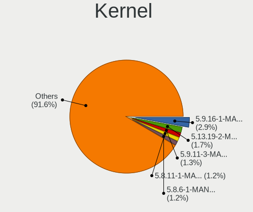
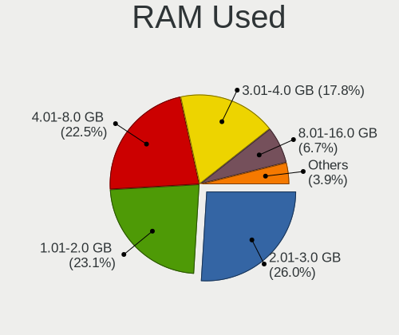
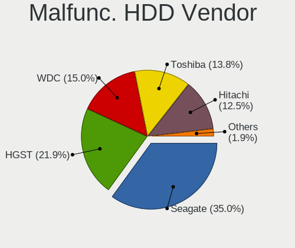
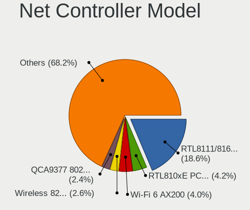
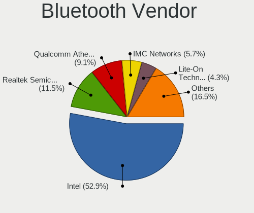
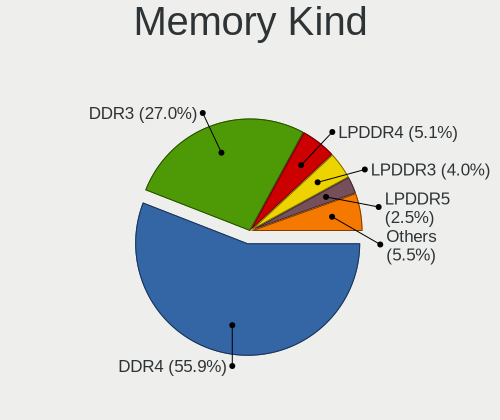
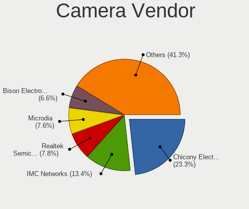
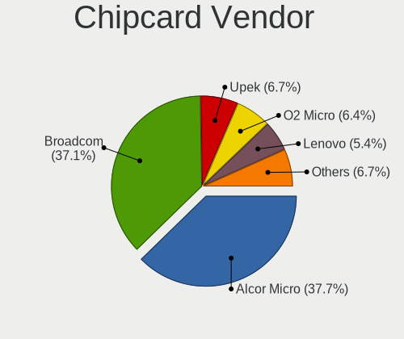

Manjaro - Tested Hardware & Statistics (Notebooks)
--------------------------------------------------

A project to collect tested hardware configurations for Manjaro.

Anyone can contribute to this report by the [hw-probe](https://github.com/linuxhw/hw-probe) tool:

    sudo -E hw-probe -all -upload

Please contribute! Especially if your hardware is rare.

Contents
--------

* [ Test Cases ](#test-cases)

* [ System ](#system)
  - [ OS                       ](#os)
  - [ OS Family                ](#os-family)
  - [ Kernel                   ](#kernel)
  - [ Kernel Family            ](#kernel-family)
  - [ Kernel Major Ver.        ](#kernel-major-ver)
  - [ Arch                     ](#arch)
  - [ DE                       ](#de)
  - [ Display Server           ](#display-server)
  - [ Display Manager          ](#display-manager)
  - [ OS Lang                  ](#os-lang)
  - [ Boot Mode                ](#boot-mode)
  - [ Filesystem               ](#filesystem)
  - [ Part. scheme             ](#part-scheme)
  - [ Dual Boot with Linux/BSD ](#dual-boot-with-linuxbsd)
  - [ Dual Boot (Win)          ](#dual-boot-win)

* [ Board ](#board)
  - [ Vendor                   ](#vendor)
  - [ Model                    ](#model)
  - [ Model Family             ](#model-family)
  - [ MFG Year                 ](#mfg-year)
  - [ Form Factor              ](#form-factor)
  - [ Secure Boot              ](#secure-boot)
  - [ Coreboot                 ](#coreboot)
  - [ RAM Size                 ](#ram-size)
  - [ RAM Used                 ](#ram-used)
  - [ Total Drives             ](#total-drives)
  - [ Has CD-ROM               ](#has-cd-rom)
  - [ Has Ethernet             ](#has-ethernet)
  - [ Has WiFi                 ](#has-wifi)
  - [ Has Bluetooth            ](#has-bluetooth)

* [ Location ](#location)
  - [ Country                  ](#country)
  - [ City                     ](#city)

* [ Drives ](#drives)
  - [ Drive Vendor             ](#drive-vendor)
  - [ Drive Model              ](#drive-model)
  - [ HDD Vendor               ](#hdd-vendor)
  - [ SSD Vendor               ](#ssd-vendor)
  - [ Drive Kind               ](#drive-kind)
  - [ Drive Connector          ](#drive-connector)
  - [ Drive Size               ](#drive-size)
  - [ Space Total              ](#space-total)
  - [ Space Used               ](#space-used)
  - [ Malfunc. Drives          ](#malfunc-drives)
  - [ Malfunc. Drive Vendor    ](#malfunc-drive-vendor)
  - [ Malfunc. HDD Vendor      ](#malfunc-hdd-vendor)
  - [ Malfunc. Drive Kind      ](#malfunc-drive-kind)
  - [ Failed Drives            ](#failed-drives)
  - [ Failed Drive Vendor      ](#failed-drive-vendor)
  - [ Drive Status             ](#drive-status)

* [ Storage controller ](#storage-controller)
  - [ Storage Vendor           ](#storage-vendor)
  - [ Storage Model            ](#storage-model)
  - [ Storage Kind             ](#storage-kind)

* [ Processor ](#processor)
  - [ CPU Vendor               ](#cpu-vendor)
  - [ CPU Model                ](#cpu-model)
  - [ CPU Model Family         ](#cpu-model-family)
  - [ CPU Cores                ](#cpu-cores)
  - [ CPU Sockets              ](#cpu-sockets)
  - [ CPU Threads              ](#cpu-threads)
  - [ CPU Op-Modes             ](#cpu-op-modes)
  - [ CPU Microcode            ](#cpu-microcode)
  - [ CPU Microarch            ](#cpu-microarch)

* [ Graphics ](#graphics)
  - [ GPU Vendor               ](#gpu-vendor)
  - [ GPU Model                ](#gpu-model)
  - [ GPU Combo                ](#gpu-combo)
  - [ GPU Driver               ](#gpu-driver)
  - [ GPU Memory               ](#gpu-memory)

* [ Monitor ](#monitor)
  - [ Monitor Vendor           ](#monitor-vendor)
  - [ Monitor Model            ](#monitor-model)
  - [ Monitor Resolution       ](#monitor-resolution)
  - [ Monitor Diagonal         ](#monitor-diagonal)
  - [ Monitor Width            ](#monitor-width)
  - [ Aspect Ratio             ](#aspect-ratio)
  - [ Monitor Area             ](#monitor-area)
  - [ Pixel Density            ](#pixel-density)
  - [ Multiple Monitors        ](#multiple-monitors)

* [ Network ](#network)
  - [ Net Controller Vendor    ](#net-controller-vendor)
  - [ Net Controller Model     ](#net-controller-model)
  - [ Wireless Vendor          ](#wireless-vendor)
  - [ Wireless Model           ](#wireless-model)
  - [ Ethernet Vendor          ](#ethernet-vendor)
  - [ Ethernet Model           ](#ethernet-model)
  - [ Net Controller Kind      ](#net-controller-kind)
  - [ Used Controller          ](#used-controller)
  - [ NICs                     ](#nics)
  - [ IPv6                     ](#ipv6)

* [ Bluetooth ](#bluetooth)
  - [ Bluetooth Vendor         ](#bluetooth-vendor)
  - [ Bluetooth Model          ](#bluetooth-model)

* [ Sound ](#sound)
  - [ Sound Vendor             ](#sound-vendor)
  - [ Sound Model              ](#sound-model)

* [ Memory ](#memory)
  - [ Memory Vendor            ](#memory-vendor)
  - [ Memory Model             ](#memory-model)
  - [ Memory Kind              ](#memory-kind)
  - [ Memory Form Factor       ](#memory-form-factor)
  - [ Memory Size              ](#memory-size)
  - [ Memory Speed             ](#memory-speed)

* [ Printers & scanners ](#printers--scanners)
  - [ Printer Vendor           ](#printer-vendor)
  - [ Printer Model            ](#printer-model)
  - [ Scanner Vendor           ](#scanner-vendor)
  - [ Scanner Model            ](#scanner-model)

* [ Camera ](#camera)
  - [ Camera Vendor            ](#camera-vendor)
  - [ Camera Model             ](#camera-model)

* [ Security ](#security)
  - [ Fingerprint Vendor       ](#fingerprint-vendor)
  - [ Fingerprint Model        ](#fingerprint-model)
  - [ Chipcard Vendor          ](#chipcard-vendor)
  - [ Chipcard Model           ](#chipcard-model)

* [ Unsupported ](#unsupported)
  - [ Unsupported Devices      ](#unsupported-devices)
  - [ Unsupported Device Types ](#unsupported-device-types)

Test Cases
----------

Total: 6997

| Vendor        | Model                       | Probe                                                      | Date         |
|---------------|-----------------------------|------------------------------------------------------------|--------------|
| Lenovo        | ThinkPad Z13 Gen 1 21D2C... | [a8fdf278ff](https://linux-hardware.org/?probe=a8fdf278ff) | Jan 06, 2025 |
| Lenovo        | G40-45 80E1                 | [ac16ada090](https://linux-hardware.org/?probe=ac16ada090) | Jan 06, 2025 |
| Apple         | MacBookAir4,1               | [705713446f](https://linux-hardware.org/?probe=705713446f) | Jan 05, 2025 |
| ASUSTek       | VivoBook_ASUSLaptop M160... | [2be9a5ca1c](https://linux-hardware.org/?probe=2be9a5ca1c) | Jan 05, 2025 |
| HP            | ProBook 450 G3              | [a1f8c7d33c](https://linux-hardware.org/?probe=a1f8c7d33c) | Jan 05, 2025 |
| Lenovo        | IdeaPad Y700-15ISK 80NV     | [5534263506](https://linux-hardware.org/?probe=5534263506) | Jan 04, 2025 |
| Lenovo        | ThinkPad T480 20L6SA5R0U    | [a73526a4ad](https://linux-hardware.org/?probe=a73526a4ad) | Jan 04, 2025 |
| Lenovo        | IdeaPad 3 15ADA05 81W1      | [e8a17155a5](https://linux-hardware.org/?probe=e8a17155a5) | Jan 03, 2025 |
| Lenovo        | V110-14IAP 80TF             | [5fbac9f592](https://linux-hardware.org/?probe=5fbac9f592) | Jan 03, 2025 |
| HP            | 15                          | [6f317ce763](https://linux-hardware.org/?probe=6f317ce763) | Jan 03, 2025 |
| Razer         | Blade 15 Base Model (Lat... | [762cb6b3dd](https://linux-hardware.org/?probe=762cb6b3dd) | Jan 02, 2025 |
| MSI           | Katana GF76 12UC            | [f0ab62b277](https://linux-hardware.org/?probe=f0ab62b277) | Jan 01, 2025 |
| Lenovo        | ThinkBook 14 G7+ ASP 21Q... | [20a618d664](https://linux-hardware.org/?probe=20a618d664) | Jan 01, 2025 |
| Lenovo        | ThinkPad X270 20K5S1A524    | [e45e264430](https://linux-hardware.org/?probe=e45e264430) | Dec 31, 2024 |
| Acer          | Aspire A315-44P             | [52b26cac3f](https://linux-hardware.org/?probe=52b26cac3f) | Dec 31, 2024 |
| Lenovo        | ThinkPad E15 Gen 4 21ED0... | [1a707fd487](https://linux-hardware.org/?probe=1a707fd487) | Dec 31, 2024 |
| Unknown       | N20 Pro                     | [4ac833b77e](https://linux-hardware.org/?probe=4ac833b77e) | Dec 30, 2024 |
| ASUSTek       | ASUS Zenbook S 14 UX5406... | [250896c182](https://linux-hardware.org/?probe=250896c182) | Dec 30, 2024 |
| Dell          | Inspiron 11 - 3147          | [3dbf865efb](https://linux-hardware.org/?probe=3dbf865efb) | Dec 30, 2024 |
| Google        | Akemi                       | [ed96f41d09](https://linux-hardware.org/?probe=ed96f41d09) | Dec 29, 2024 |
| Lenovo        | ThinkBook 14 G5+ APO 21J... | [1ee446218a](https://linux-hardware.org/?probe=1ee446218a) | Dec 29, 2024 |
| MSI           | Katana GF76 12UC            | [81deda659f](https://linux-hardware.org/?probe=81deda659f) | Dec 29, 2024 |
| Apple         | MacBookPro14,3              | [1e7c1552f8](https://linux-hardware.org/?probe=1e7c1552f8) | Dec 29, 2024 |
| Dell          | Precision M6600             | [071a23fb58](https://linux-hardware.org/?probe=071a23fb58) | Dec 29, 2024 |
| Dell          | Precision M6600             | [43ff956e50](https://linux-hardware.org/?probe=43ff956e50) | Dec 29, 2024 |
| Lenovo        | ThinkPad T470 W10DG 20JN... | [ddbec2ef79](https://linux-hardware.org/?probe=ddbec2ef79) | Dec 27, 2024 |
| Eluktronic... | MAG-15 2070                 | [c25d963a38](https://linux-hardware.org/?probe=c25d963a38) | Dec 27, 2024 |
| HUAWEI        | KLVL-WXX9                   | [ace84142e7](https://linux-hardware.org/?probe=ace84142e7) | Dec 26, 2024 |
| Dell          | Latitude E5540              | [0f0b366b45](https://linux-hardware.org/?probe=0f0b366b45) | Dec 26, 2024 |
| Lenovo        | G500 20236                  | [8dbe192f7f](https://linux-hardware.org/?probe=8dbe192f7f) | Dec 26, 2024 |
| Lenovo        | G500 20236                  | [717bada61c](https://linux-hardware.org/?probe=717bada61c) | Dec 26, 2024 |
| Lenovo        | Legion 5 Pro 16ARH7H 82R... | [10501c1c92](https://linux-hardware.org/?probe=10501c1c92) | Dec 26, 2024 |
| Lenovo        | ThinkBook 14 G6 ABP 21KJ    | [7657538670](https://linux-hardware.org/?probe=7657538670) | Dec 26, 2024 |
| Lenovo        | Slim 7 14IMH9 83D8          | [fd059b501d](https://linux-hardware.org/?probe=fd059b501d) | Dec 26, 2024 |
| Lenovo        | IdeaPad 330-15ARR 81D2      | [306fb82bd7](https://linux-hardware.org/?probe=306fb82bd7) | Dec 26, 2024 |
| HP            | 630                         | [eb7ed9bf39](https://linux-hardware.org/?probe=eb7ed9bf39) | Dec 25, 2024 |
| ASUSTek       | ProArt P16 H7606WI_H7606... | [3fbdcb99b5](https://linux-hardware.org/?probe=3fbdcb99b5) | Dec 25, 2024 |
| Acer          | Aspire Lite AL15-41         | [3eb84ee7c8](https://linux-hardware.org/?probe=3eb84ee7c8) | Dec 23, 2024 |
| TongFang      | GX5HRXL                     | [c16d33a7aa](https://linux-hardware.org/?probe=c16d33a7aa) | Dec 23, 2024 |
| Notebook      | NH5xAx                      | [4127c6e729](https://linux-hardware.org/?probe=4127c6e729) | Dec 22, 2024 |
| Panasonic     | CFLX6-2                     | [62025e0467](https://linux-hardware.org/?probe=62025e0467) | Dec 22, 2024 |
| ASUSTek       | Zenbook 15 UM3504DA_UM35... | [12dfa44bee](https://linux-hardware.org/?probe=12dfa44bee) | Dec 22, 2024 |
| Lunnen        | LL5FAW                      | [7b0a53a2fe](https://linux-hardware.org/?probe=7b0a53a2fe) | Dec 22, 2024 |
| Lenovo        | ThinkBook 14 G6 ABP 21KJ    | [fc617a056e](https://linux-hardware.org/?probe=fc617a056e) | Dec 21, 2024 |
| Lenovo        | ThinkPad T400 6475WKP       | [6d42ae475b](https://linux-hardware.org/?probe=6d42ae475b) | Dec 20, 2024 |
| Lenovo        | ThinkPad T400 6475WKP       | [8d02891009](https://linux-hardware.org/?probe=8d02891009) | Dec 20, 2024 |
| Lenovo        | IdeaPad Y700-15ISK 80NV     | [6748714931](https://linux-hardware.org/?probe=6748714931) | Dec 19, 2024 |
| TongFang      | GX5HRXL                     | [27406f56fd](https://linux-hardware.org/?probe=27406f56fd) | Dec 18, 2024 |
| Lenovo        | IdeaPad Y700-15ISK 80NV     | [85385e1ab5](https://linux-hardware.org/?probe=85385e1ab5) | Dec 17, 2024 |
| Samsung       | 800G5M/800G5W               | [f721641c6c](https://linux-hardware.org/?probe=f721641c6c) | Dec 17, 2024 |
| MSI           | Stealth 16 AI Studio A1V... | [ab7f87b6f5](https://linux-hardware.org/?probe=ab7f87b6f5) | Dec 16, 2024 |
| ASUSTek       | ROG Zephyrus G15 GA503RW... | [20bb7981c5](https://linux-hardware.org/?probe=20bb7981c5) | Dec 16, 2024 |
| ASUSTek       | ROG Zephyrus G15 GA503RW... | [5211e1329e](https://linux-hardware.org/?probe=5211e1329e) | Dec 16, 2024 |
| Lenovo        | ThinkPad T480 20L6S0RK00    | [16e67c3401](https://linux-hardware.org/?probe=16e67c3401) | Dec 16, 2024 |
| Dell          | Latitude 5401               | [873e661b3c](https://linux-hardware.org/?probe=873e661b3c) | Dec 15, 2024 |
| Medion        | E15410                      | [f980cd1638](https://linux-hardware.org/?probe=f980cd1638) | Dec 15, 2024 |
| MSI           | GP75 Leopard 10SFK          | [d3a7a79583](https://linux-hardware.org/?probe=d3a7a79583) | Dec 15, 2024 |
| Unknown       | Unknown                     | [7b1d93f1d8](https://linux-hardware.org/?probe=7b1d93f1d8) | Dec 14, 2024 |
| HP            | Victus by Gaming Laptop ... | [9e6b6fc501](https://linux-hardware.org/?probe=9e6b6fc501) | Dec 14, 2024 |
| Fujitsu       | CELSIUS H970                | [998d6eca38](https://linux-hardware.org/?probe=998d6eca38) | Dec 13, 2024 |
| Dell          | XPS 15 9570                 | [4780fbff59](https://linux-hardware.org/?probe=4780fbff59) | Dec 13, 2024 |
| Dell          | Vostro 14 5401              | [f4068911f7](https://linux-hardware.org/?probe=f4068911f7) | Dec 11, 2024 |
| Dell          | Vostro 14 5401              | [8b0aec2d81](https://linux-hardware.org/?probe=8b0aec2d81) | Dec 11, 2024 |
| HUAWEI        | HVY-WXX9                    | [7dec2ab649](https://linux-hardware.org/?probe=7dec2ab649) | Dec 11, 2024 |
| HP            | EliteBook 8740w             | [70d44e5e32](https://linux-hardware.org/?probe=70d44e5e32) | Dec 10, 2024 |
| HP            | EliteBook 8740w             | [88b25b7b18](https://linux-hardware.org/?probe=88b25b7b18) | Dec 10, 2024 |
| HP            | 250 G7 Notebook PC          | [ecad464cdd](https://linux-hardware.org/?probe=ecad464cdd) | Dec 09, 2024 |
| Dell          | Vostro 14 5401              | [7c77f0a04f](https://linux-hardware.org/?probe=7c77f0a04f) | Dec 09, 2024 |
| Panasonic     | CFLX6-2                     | [192859505f](https://linux-hardware.org/?probe=192859505f) | Dec 09, 2024 |
| Lenovo        | Legion 5 15IMH05H 81Y6      | [6a8446aa46](https://linux-hardware.org/?probe=6a8446aa46) | Dec 08, 2024 |
| ASUSTek       | ASUS TUF Gaming A15 FA50... | [31a8469396](https://linux-hardware.org/?probe=31a8469396) | Dec 08, 2024 |
| ASUSTek       | Zenbook UX5401ZA_UX5401Z... | [54fbaf65c6](https://linux-hardware.org/?probe=54fbaf65c6) | Dec 08, 2024 |
| Medion        | E15410                      | [cf490cd2d6](https://linux-hardware.org/?probe=cf490cd2d6) | Dec 07, 2024 |
| Dell          | Precision 3560              | [d30964e712](https://linux-hardware.org/?probe=d30964e712) | Dec 06, 2024 |
| Dell          | XPS 13 9340                 | [14b4ca4b2c](https://linux-hardware.org/?probe=14b4ca4b2c) | Dec 05, 2024 |
| Apple         | MacBookPro9,1               | [9ff091de62](https://linux-hardware.org/?probe=9ff091de62) | Dec 05, 2024 |
| HP            | ProBook 455R G6             | [49edf98bbc](https://linux-hardware.org/?probe=49edf98bbc) | Dec 05, 2024 |
| Samsung       | 300V3A/300V4A/300V5A/200... | [6806bb33b6](https://linux-hardware.org/?probe=6806bb33b6) | Dec 04, 2024 |
| Lenovo        | ThinkPad L470 20J40010GE    | [34628845b7](https://linux-hardware.org/?probe=34628845b7) | Dec 04, 2024 |
| Lenovo        | Legion Slim 5 16APH8 82Y... | [261c6cc077](https://linux-hardware.org/?probe=261c6cc077) | Dec 03, 2024 |
| ASUSTek       | VivoBook_ASUSLaptop K660... | [37cc7decbf](https://linux-hardware.org/?probe=37cc7decbf) | Dec 03, 2024 |
| ASUSTek       | P552SA                      | [ef552aa919](https://linux-hardware.org/?probe=ef552aa919) | Dec 03, 2024 |
| ASUSTek       | Strix GL704GM_GL704GM       | [620d235bf6](https://linux-hardware.org/?probe=620d235bf6) | Dec 03, 2024 |
| Apple         | MacBookAir7,2               | [cb4b4d37ef](https://linux-hardware.org/?probe=cb4b4d37ef) | Dec 02, 2024 |
| HP            | EliteBook 735 G6            | [5074de8248](https://linux-hardware.org/?probe=5074de8248) | Dec 02, 2024 |
| Timi          | TM1701                      | [6806471079](https://linux-hardware.org/?probe=6806471079) | Dec 01, 2024 |
| Lenovo        | Legion 5 82B5               | [db7e4e989a](https://linux-hardware.org/?probe=db7e4e989a) | Dec 01, 2024 |
| Samsung       | 300V3A/300V4A/300V5A/200... | [d8e8d7035d](https://linux-hardware.org/?probe=d8e8d7035d) | Dec 01, 2024 |
| Lenovo        | ThinkPad T470 20HD000WUS    | [cc7c458456](https://linux-hardware.org/?probe=cc7c458456) | Dec 01, 2024 |
| Toshiba       | Satellite L500              | [27aa2e62cd](https://linux-hardware.org/?probe=27aa2e62cd) | Dec 01, 2024 |
| HUAWEI        | VGHH-XX                     | [3bee5be2fa](https://linux-hardware.org/?probe=3bee5be2fa) | Dec 01, 2024 |
| ASUSTek       | VivoBook_ASUSLaptop X412... | [456d3c7b2d](https://linux-hardware.org/?probe=456d3c7b2d) | Nov 30, 2024 |
| Lenovo        | ThinkPad T480 20L6SA5R0U    | [a176cb1cfa](https://linux-hardware.org/?probe=a176cb1cfa) | Nov 30, 2024 |
| Lenovo        | Legion 5 82B5               | [3e5cfb2a18](https://linux-hardware.org/?probe=3e5cfb2a18) | Nov 30, 2024 |
| Framework     | Laptop 13 (AMD Ryzen 704... | [a4a7031be1](https://linux-hardware.org/?probe=a4a7031be1) | Nov 29, 2024 |
| Lenovo        | V15 G4 ABP 83CR             | [7a69ccba2a](https://linux-hardware.org/?probe=7a69ccba2a) | Nov 29, 2024 |
| Lenovo        | ThinkBook 14 G5+ ARP 21H... | [82f7faf590](https://linux-hardware.org/?probe=82f7faf590) | Nov 29, 2024 |
| Notebook      | NH5xAx                      | [5a2f59ea4e](https://linux-hardware.org/?probe=5a2f59ea4e) | Nov 26, 2024 |
| Lenovo        | ThinkPad T480 20L6SA5R0U    | [616dd41a0d](https://linux-hardware.org/?probe=616dd41a0d) | Nov 25, 2024 |
| Alienware     | 17 R4                       | [892ac0bb13](https://linux-hardware.org/?probe=892ac0bb13) | Nov 25, 2024 |
| MSI           | Bravo 15 C7UDX              | [0711ea8cc7](https://linux-hardware.org/?probe=0711ea8cc7) | Nov 24, 2024 |
| Apple         | MacBookPro9,1               | [63a95fc1b1](https://linux-hardware.org/?probe=63a95fc1b1) | Nov 24, 2024 |
| Acer          | TravelMate P216-51          | [b2a10de376](https://linux-hardware.org/?probe=b2a10de376) | Nov 24, 2024 |
| Acer          | Aspire 7551                 | [f3fcee96ea](https://linux-hardware.org/?probe=f3fcee96ea) | Nov 23, 2024 |
| Lenovo        | ThinkPad X1 Carbon 6th 2... | [0ff652bb11](https://linux-hardware.org/?probe=0ff652bb11) | Nov 23, 2024 |
| HP            | ZBook 15                    | [9cc46c9e48](https://linux-hardware.org/?probe=9cc46c9e48) | Nov 23, 2024 |
| HP            | Pavilion Gaming Laptop 1... | [e8943b173d](https://linux-hardware.org/?probe=e8943b173d) | Nov 22, 2024 |
| Chuwi         | CoreBook X                  | [78090333b2](https://linux-hardware.org/?probe=78090333b2) | Nov 22, 2024 |
| Chuwi         | CoreBook X                  | [1cb80b3cf1](https://linux-hardware.org/?probe=1cb80b3cf1) | Nov 22, 2024 |
| Acer          | Nitro ANV15-51              | [0ddea80a32](https://linux-hardware.org/?probe=0ddea80a32) | Nov 22, 2024 |
| System76      | Gazelle                     | [ea1858e078](https://linux-hardware.org/?probe=ea1858e078) | Nov 22, 2024 |
| System76      | Gazelle                     | [ef1ee90c75](https://linux-hardware.org/?probe=ef1ee90c75) | Nov 22, 2024 |
| Lenovo        | ThinkPad T480 20L6SA5R0U    | [f3bc755a64](https://linux-hardware.org/?probe=f3bc755a64) | Nov 21, 2024 |
| Lenovo        | ThinkPad T450 20BV0003US    | [bf57991489](https://linux-hardware.org/?probe=bf57991489) | Nov 21, 2024 |
| Unknown       | Unknown                     | [e54677c7eb](https://linux-hardware.org/?probe=e54677c7eb) | Nov 20, 2024 |
| Lenovo        | ThinkPad T560 20FJS1WT00    | [7fdf94b06e](https://linux-hardware.org/?probe=7fdf94b06e) | Nov 19, 2024 |
| Lenovo        | Legion 5 Pro 16ARH7H 82R... | [91797321da](https://linux-hardware.org/?probe=91797321da) | Nov 18, 2024 |
| Toshiba       | Satellite C660              | [f7e1b632b9](https://linux-hardware.org/?probe=f7e1b632b9) | Nov 18, 2024 |
| Lenovo        | IdeaPad 110-17ACL 80UM      | [1a183ef048](https://linux-hardware.org/?probe=1a183ef048) | Nov 18, 2024 |
| Acer          | Aspire S3-391               | [5c084381e2](https://linux-hardware.org/?probe=5c084381e2) | Nov 17, 2024 |
| Acer          | Aspire S3-391               | [1ca39c5a91](https://linux-hardware.org/?probe=1ca39c5a91) | Nov 17, 2024 |
| HUAWEI        | BOHK-WAX9X                  | [b617d5b76c](https://linux-hardware.org/?probe=b617d5b76c) | Nov 16, 2024 |
| ASUSTek       | Zenbook UM3402YAR_UM3402... | [b3e2e79950](https://linux-hardware.org/?probe=b3e2e79950) | Nov 15, 2024 |
| ASUSTek       | Vivobook Go E1504FA_E150... | [3439677f78](https://linux-hardware.org/?probe=3439677f78) | Nov 14, 2024 |
| HP            | 630                         | [0103a33e55](https://linux-hardware.org/?probe=0103a33e55) | Nov 13, 2024 |
| ASUSTek       | F3JP                        | [cd8a9b0278](https://linux-hardware.org/?probe=cd8a9b0278) | Nov 12, 2024 |
| Lenovo        | V15 G2 ALC 82KD             | [d523323bd5](https://linux-hardware.org/?probe=d523323bd5) | Nov 12, 2024 |
| ASUSTek       | Vivobook Go E1504FA_E150... | [5d1b0d2964](https://linux-hardware.org/?probe=5d1b0d2964) | Nov 12, 2024 |
| Lenovo        | V15 G2 ALC 82KD             | [a74cceeb11](https://linux-hardware.org/?probe=a74cceeb11) | Nov 12, 2024 |
| Lenovo        | ThinkPad X1 Extreme 20MF... | [838f0bf19c](https://linux-hardware.org/?probe=838f0bf19c) | Nov 11, 2024 |
| HP            | ZBook 15                    | [7de81b42b8](https://linux-hardware.org/?probe=7de81b42b8) | Nov 10, 2024 |
| ASUSTek       | X555LNB                     | [779d09dbb2](https://linux-hardware.org/?probe=779d09dbb2) | Nov 08, 2024 |
| Lenovo        | ThinkBook 15 G3 ITL 21A5    | [6fe15c72ff](https://linux-hardware.org/?probe=6fe15c72ff) | Nov 08, 2024 |
| ASUSTek       | ROG Zephyrus G14 GA402XV... | [6e7f58990a](https://linux-hardware.org/?probe=6e7f58990a) | Nov 08, 2024 |
| Intel Clie... | LAPQC71A                    | [f25cf6f8a6](https://linux-hardware.org/?probe=f25cf6f8a6) | Nov 08, 2024 |
| Gigabyte      | G5 KC                       | [7b3851c610](https://linux-hardware.org/?probe=7b3851c610) | Nov 07, 2024 |
| Gigabyte      | G5 KC                       | [ec7e56ec6b](https://linux-hardware.org/?probe=ec7e56ec6b) | Nov 07, 2024 |
| Intel Clie... | LAPQC71A                    | [f349a34202](https://linux-hardware.org/?probe=f349a34202) | Nov 06, 2024 |
| Lenovo        | ThinkPad X13 Gen 4 21J3C... | [53ee3f9101](https://linux-hardware.org/?probe=53ee3f9101) | Nov 06, 2024 |
| MSI           | P75 Creator 9SE             | [f37da1e270](https://linux-hardware.org/?probe=f37da1e270) | Nov 06, 2024 |
| Dell          | Latitude E5570              | [060f4b10c6](https://linux-hardware.org/?probe=060f4b10c6) | Nov 05, 2024 |
| Dell          | Latitude 5480               | [050c59108b](https://linux-hardware.org/?probe=050c59108b) | Nov 04, 2024 |
| Acer          | Aspire A315-44P             | [2bffbcc4e0](https://linux-hardware.org/?probe=2bffbcc4e0) | Nov 04, 2024 |
| ASUSTek       | VivoBook_ASUSLaptop M350... | [afa4d2407a](https://linux-hardware.org/?probe=afa4d2407a) | Nov 03, 2024 |
| Lenovo        | IdeaPad 110-15ACL 80TJ      | [89e824991d](https://linux-hardware.org/?probe=89e824991d) | Nov 03, 2024 |
| Apple         | MacBookPro11,4              | [eb4be42b97](https://linux-hardware.org/?probe=eb4be42b97) | Nov 03, 2024 |
| Mediacom      | WinPad 11,6 FullHD- WPU1... | [d6c08eda47](https://linux-hardware.org/?probe=d6c08eda47) | Nov 03, 2024 |
| Acer          | Aspire 5742Z                | [7aebc2b3c4](https://linux-hardware.org/?probe=7aebc2b3c4) | Nov 02, 2024 |
| Apple         | MacBookPro11,4              | [cb30874017](https://linux-hardware.org/?probe=cb30874017) | Oct 30, 2024 |
| Lenovo        | ThinkBook 14 G5+ ARP 21H... | [0ac4e2ac76](https://linux-hardware.org/?probe=0ac4e2ac76) | Oct 30, 2024 |
| Apple         | MacBookAir7,2               | [ed7617cf02](https://linux-hardware.org/?probe=ed7617cf02) | Oct 30, 2024 |
| Lenovo        | ThinkPad P16s Gen 2 21K9... | [fad0d1d4fb](https://linux-hardware.org/?probe=fad0d1d4fb) | Oct 29, 2024 |
| Lenovo        | ThinkPad X1 Carbon Gen 1... | [28050417e4](https://linux-hardware.org/?probe=28050417e4) | Oct 29, 2024 |
| Apple         | MacBook4,1                  | [f5d92bfff9](https://linux-hardware.org/?probe=f5d92bfff9) | Oct 29, 2024 |
| Apple         | MacBook4,1                  | [f2f8a94047](https://linux-hardware.org/?probe=f2f8a94047) | Oct 29, 2024 |
| Lenovo        | Legion 5 15ACH6 82JW        | [000b306e8d](https://linux-hardware.org/?probe=000b306e8d) | Oct 28, 2024 |
| Google        | Magolor                     | [948d5ce4be](https://linux-hardware.org/?probe=948d5ce4be) | Oct 27, 2024 |
| Lenovo        | Legion Y740-15IRHg 81UH     | [e489d3c5f1](https://linux-hardware.org/?probe=e489d3c5f1) | Oct 27, 2024 |
| System76      | Oryx Pro                    | [2d9db3e5ee](https://linux-hardware.org/?probe=2d9db3e5ee) | Oct 27, 2024 |
| TUXEDO        | InfinityBook Pro Gen8 (M... | [e9d44b2dd7](https://linux-hardware.org/?probe=e9d44b2dd7) | Oct 26, 2024 |
| Lenovo        | ThinkPad E16 Gen 2 21MA0... | [0fad6195b2](https://linux-hardware.org/?probe=0fad6195b2) | Oct 26, 2024 |
| Acer          | Aspire A515-57              | [1eb6d26665](https://linux-hardware.org/?probe=1eb6d26665) | Oct 25, 2024 |
| TUXEDO        | InfinityBook Pro AMD Gen... | [6bf81ae3aa](https://linux-hardware.org/?probe=6bf81ae3aa) | Oct 24, 2024 |
| Acer          | Aspire A515-57              | [fcfd360705](https://linux-hardware.org/?probe=fcfd360705) | Oct 24, 2024 |
| Acer          | Aspire A515-57T             | [9e0a4df6e8](https://linux-hardware.org/?probe=9e0a4df6e8) | Oct 24, 2024 |
| HP            | EliteBook 855 G8 Noteboo... | [140fff3e9a](https://linux-hardware.org/?probe=140fff3e9a) | Oct 23, 2024 |
| Apple         | MacBookPro11,2              | [20b9bf9240](https://linux-hardware.org/?probe=20b9bf9240) | Oct 23, 2024 |
| Lenovo        | ThinkBook 14 G4 ABA 21DK    | [149f81439f](https://linux-hardware.org/?probe=149f81439f) | Oct 23, 2024 |
| Lenovo        | IdeaPad 110-15ACL 80TJ      | [00ece3282c](https://linux-hardware.org/?probe=00ece3282c) | Oct 22, 2024 |
| Lenovo        | ThinkPad T490 20N2005TMX    | [ae1d5a2073](https://linux-hardware.org/?probe=ae1d5a2073) | Oct 21, 2024 |
| TUXEDO        | InfinityBook Pro AMD Gen... | [065d923ad7](https://linux-hardware.org/?probe=065d923ad7) | Oct 21, 2024 |
| Acer          | Nitro AN515-54              | [761319f117](https://linux-hardware.org/?probe=761319f117) | Oct 20, 2024 |
| Acer          | Aspire VN7-593G             | [c90ad8b9c3](https://linux-hardware.org/?probe=c90ad8b9c3) | Oct 20, 2024 |
| HP            | 255 15.6 inch G10           | [c7ebf1f8fa](https://linux-hardware.org/?probe=c7ebf1f8fa) | Oct 19, 2024 |
| ASUSTek       | ASUS TUF Dash F15 FX516P... | [b6f1b28d75](https://linux-hardware.org/?probe=b6f1b28d75) | Oct 19, 2024 |
| ASUSTek       | ASUS TUF Dash F15 FX516P... | [199c2dfc7d](https://linux-hardware.org/?probe=199c2dfc7d) | Oct 19, 2024 |
| ASUSTek       | K55VD                       | [567ffca615](https://linux-hardware.org/?probe=567ffca615) | Oct 18, 2024 |
| HP            | ProBook 430 G6              | [6f11803bb9](https://linux-hardware.org/?probe=6f11803bb9) | Oct 17, 2024 |
| HP            | ProBook 430 G6              | [8cc1bdc540](https://linux-hardware.org/?probe=8cc1bdc540) | Oct 17, 2024 |
| HP            | Pavilion g7                 | [8c30f86bd7](https://linux-hardware.org/?probe=8c30f86bd7) | Oct 16, 2024 |
| Lenovo        | Yoga Pro 7 14APH8 82Y8      | [e33213cb2f](https://linux-hardware.org/?probe=e33213cb2f) | Oct 15, 2024 |
| Lenovo        | ThinkPad T480 20L6SA5R0U    | [fe47439b78](https://linux-hardware.org/?probe=fe47439b78) | Oct 15, 2024 |
| Acer          | Aspire V3-571G              | [ce40034c8d](https://linux-hardware.org/?probe=ce40034c8d) | Oct 15, 2024 |
| HP            | EliteBook 850 G6            | [8218398648](https://linux-hardware.org/?probe=8218398648) | Oct 15, 2024 |
| ASUSTek       | GL553VD                     | [0f03ed9d24](https://linux-hardware.org/?probe=0f03ed9d24) | Oct 15, 2024 |
| ASUSTek       | GL553VD                     | [99e248b1b3](https://linux-hardware.org/?probe=99e248b1b3) | Oct 15, 2024 |
| ASUSTek       | T100TAM                     | [29be05b6a3](https://linux-hardware.org/?probe=29be05b6a3) | Oct 15, 2024 |
| Lenovo        | IdeaPad 320-15AST 80XV      | [77c3dd7351](https://linux-hardware.org/?probe=77c3dd7351) | Oct 14, 2024 |
| Lenovo        | ThinkPad T470 20HES18R2G    | [f1a9251053](https://linux-hardware.org/?probe=f1a9251053) | Oct 14, 2024 |
| Lenovo        | IdeaPad 110-17ACL 80UM      | [34b33e69cc](https://linux-hardware.org/?probe=34b33e69cc) | Oct 14, 2024 |
| HUAWEI        | KPL-W0X                     | [bf9c1c8578](https://linux-hardware.org/?probe=bf9c1c8578) | Oct 14, 2024 |
| Apple         | MacBookAir7,2               | [cdac18ce01](https://linux-hardware.org/?probe=cdac18ce01) | Oct 13, 2024 |
| Lenovo        | IdeaPad 5 Pro 14ACN6 82L... | [6e3db1b3a0](https://linux-hardware.org/?probe=6e3db1b3a0) | Oct 13, 2024 |
| Dell          | Inspiron 3580               | [f9d97279aa](https://linux-hardware.org/?probe=f9d97279aa) | Oct 13, 2024 |
| Dell          | Inspiron 3580               | [0900d30a08](https://linux-hardware.org/?probe=0900d30a08) | Oct 13, 2024 |
| Dell          | Vostro 3578                 | [d523995b93](https://linux-hardware.org/?probe=d523995b93) | Oct 12, 2024 |
| Lenovo        | ThinkPad T540p 20BFS3H00... | [9e26809480](https://linux-hardware.org/?probe=9e26809480) | Oct 12, 2024 |
| Lenovo        | ThinkPad X270 20HN0012MX    | [19933f2d66](https://linux-hardware.org/?probe=19933f2d66) | Oct 12, 2024 |
| ASUSTek       | VivoBook_ASUSLaptop K370... | [fe8096e733](https://linux-hardware.org/?probe=fe8096e733) | Oct 11, 2024 |
| Lenovo        | ThinkBook 14 G4 ABA 21DK    | [706fb2d670](https://linux-hardware.org/?probe=706fb2d670) | Oct 10, 2024 |
| HP            | 255 15.6 inch G10           | [240eae9964](https://linux-hardware.org/?probe=240eae9964) | Oct 09, 2024 |
| MSI           | Prestige 15 A12SC           | [273add1839](https://linux-hardware.org/?probe=273add1839) | Oct 09, 2024 |
| Lenovo        | ThinkPad L380 20M50013MH    | [99c134d982](https://linux-hardware.org/?probe=99c134d982) | Oct 09, 2024 |
| HP            | Victus by Gaming Laptop ... | [87bf2493d7](https://linux-hardware.org/?probe=87bf2493d7) | Oct 09, 2024 |
| Lenovo        | ThinkPad T480 20L6S4XW00    | [82dbb610f3](https://linux-hardware.org/?probe=82dbb610f3) | Oct 09, 2024 |
| Dell          | XPS 16 9640                 | [a48ce20cb0](https://linux-hardware.org/?probe=a48ce20cb0) | Oct 08, 2024 |
| MSI           | GF63 Thin 9RCX              | [86c0301daa](https://linux-hardware.org/?probe=86c0301daa) | Oct 08, 2024 |
| Lenovo        | IdeaPad Gaming 3 15IMH05... | [3b75796061](https://linux-hardware.org/?probe=3b75796061) | Oct 07, 2024 |
| ASUSTek       | VivoBook_ASUSLaptop X160... | [b2173cbe0c](https://linux-hardware.org/?probe=b2173cbe0c) | Oct 07, 2024 |
| Samsung       | 300E5EV/300E4EV/270E5EV/... | [afaa828667](https://linux-hardware.org/?probe=afaa828667) | Oct 07, 2024 |
| Lenovo        | Yoga 500-15ISK 80R6         | [8fadc9f74b](https://linux-hardware.org/?probe=8fadc9f74b) | Oct 07, 2024 |
| ASUSTek       | K56CB                       | [3208886d82](https://linux-hardware.org/?probe=3208886d82) | Oct 06, 2024 |
| ASUSTek       | VivoBook_ASUSLaptop M160... | [12798a0ecf](https://linux-hardware.org/?probe=12798a0ecf) | Oct 06, 2024 |
| HP            | Pavilion Gaming Laptop 1... | [7680b9d567](https://linux-hardware.org/?probe=7680b9d567) | Oct 05, 2024 |
| Lenovo        | ThinkPad W530 24474KG       | [69fb6e0d4b](https://linux-hardware.org/?probe=69fb6e0d4b) | Oct 05, 2024 |
| Lenovo        | ThinkPad E15 Gen 4 21ED0... | [64a85cae55](https://linux-hardware.org/?probe=64a85cae55) | Oct 05, 2024 |
| Google        | Lillipup                    | [be3dffcd6d](https://linux-hardware.org/?probe=be3dffcd6d) | Oct 04, 2024 |
| Dell          | Precision 3480              | [eb91e596d6](https://linux-hardware.org/?probe=eb91e596d6) | Oct 04, 2024 |
| Dell          | Precision 3480              | [725a1d0129](https://linux-hardware.org/?probe=725a1d0129) | Oct 04, 2024 |
| ASUSTek       | ROG Zephyrus G16 GU603ZU... | [12400a6356](https://linux-hardware.org/?probe=12400a6356) | Oct 04, 2024 |
| Acer          | Aspire AV15-51              | [3a848af557](https://linux-hardware.org/?probe=3a848af557) | Oct 03, 2024 |
| Dell          | Latitude 7490               | [771a8d0734](https://linux-hardware.org/?probe=771a8d0734) | Oct 02, 2024 |
| MSI           | GT72 6QD                    | [cbf72c4243](https://linux-hardware.org/?probe=cbf72c4243) | Oct 02, 2024 |
| ASUSTek       | VivoBook_ASUSLaptop M160... | [bcf10922f9](https://linux-hardware.org/?probe=bcf10922f9) | Oct 02, 2024 |
| MSI           | Pulse GL66 11UGKV           | [b0878cbdd9](https://linux-hardware.org/?probe=b0878cbdd9) | Oct 02, 2024 |
| Lenovo        | ThinkPad X1 Carbon Gen 1... | [0126b569bf](https://linux-hardware.org/?probe=0126b569bf) | Oct 01, 2024 |
| HP            | Pavilion Laptop 15-cs0xx... | [3c60d6f467](https://linux-hardware.org/?probe=3c60d6f467) | Oct 01, 2024 |
| HP            | Pavilion Laptop 15-cs0xx... | [56094b5341](https://linux-hardware.org/?probe=56094b5341) | Oct 01, 2024 |
| Thomson       | N14C4WH64                   | [8959ef684f](https://linux-hardware.org/?probe=8959ef684f) | Oct 01, 2024 |
| XIAOMI        | Redmi Book Pro 16 2024      | [0566eccc4c](https://linux-hardware.org/?probe=0566eccc4c) | Sep 29, 2024 |
| Lenovo        | ThinkPad E15 Gen 4 21EES... | [21d67ddd5c](https://linux-hardware.org/?probe=21d67ddd5c) | Sep 29, 2024 |
| Lenovo        | ThinkPad E15 Gen 4 21EES... | [73bf6f28fc](https://linux-hardware.org/?probe=73bf6f28fc) | Sep 29, 2024 |
| Lenovo        | IdeaPad Gaming 3 15ACH6 ... | [572b0d51d4](https://linux-hardware.org/?probe=572b0d51d4) | Sep 29, 2024 |
| Apple         | MacBookPro11,5              | [7680c404f8](https://linux-hardware.org/?probe=7680c404f8) | Sep 29, 2024 |
| Lenovo        | IdeaPad Gaming 3 15ACH6 ... | [124dadea40](https://linux-hardware.org/?probe=124dadea40) | Sep 29, 2024 |
| Lenovo        | Y70-70 Touch 80DU           | [0e831fd296](https://linux-hardware.org/?probe=0e831fd296) | Sep 29, 2024 |
| Lenovo        | ThinkPad T440p 20AWS1KU0... | [d0b1697878](https://linux-hardware.org/?probe=d0b1697878) | Sep 29, 2024 |
| Lenovo        | ThinkPad T440p 20AWS1KU0... | [4c259e45af](https://linux-hardware.org/?probe=4c259e45af) | Sep 29, 2024 |
| ASUSTek       | ASUS TUF Gaming A16 FA61... | [017b57caa2](https://linux-hardware.org/?probe=017b57caa2) | Sep 28, 2024 |
| HP            | Laptop 15s-fq5xxx           | [8f2374a56a](https://linux-hardware.org/?probe=8f2374a56a) | Sep 28, 2024 |
| HP            | EliteBook 830 G6            | [2aadc44c1e](https://linux-hardware.org/?probe=2aadc44c1e) | Sep 28, 2024 |
| Lenovo        | IdeaPad 3 15ALC6 82KU       | [eb128112b1](https://linux-hardware.org/?probe=eb128112b1) | Sep 27, 2024 |
| Acer          | Aspire A314-22              | [83988eaa09](https://linux-hardware.org/?probe=83988eaa09) | Sep 27, 2024 |
| XIAOMI        | Redmi Book Pro 16 2024      | [6a52ea0ebd](https://linux-hardware.org/?probe=6a52ea0ebd) | Sep 25, 2024 |
| Samsung       | RF511/RF411/RF711           | [da831230cc](https://linux-hardware.org/?probe=da831230cc) | Sep 25, 2024 |
| Lenovo        | IdeaPad Flex-14API 81SS     | [6b555953d1](https://linux-hardware.org/?probe=6b555953d1) | Sep 25, 2024 |
| Lenovo        | IdeaPad Pro 5 14APH8 83A... | [2bc87cf95d](https://linux-hardware.org/?probe=2bc87cf95d) | Sep 25, 2024 |
| Apple         | MacBookPro8,2               | [69e5d056e0](https://linux-hardware.org/?probe=69e5d056e0) | Sep 25, 2024 |
| Lenovo        | ThinkPad X390 20Q0002WUS    | [95dccbca28](https://linux-hardware.org/?probe=95dccbca28) | Sep 25, 2024 |
| Lenovo        | ThinkPad X260 20F5S0WT00    | [9db454dd4c](https://linux-hardware.org/?probe=9db454dd4c) | Sep 24, 2024 |
| Lenovo        | ThinkPad X1 Carbon Gen 1... | [95bc0c90e1](https://linux-hardware.org/?probe=95bc0c90e1) | Sep 23, 2024 |
| HP            | Victus by Laptop 16-d0xx... | [0ce1882d68](https://linux-hardware.org/?probe=0ce1882d68) | Sep 23, 2024 |
| Lenovo        | IdeaPad 330-15IKB 81DE      | [0ceeb6e2c9](https://linux-hardware.org/?probe=0ceeb6e2c9) | Sep 23, 2024 |
| Lenovo        | ThinkPad L430 24662W2       | [a44f25c4d7](https://linux-hardware.org/?probe=a44f25c4d7) | Sep 22, 2024 |
| HP            | Victus by Laptop 16-d0xx... | [9da183dfe9](https://linux-hardware.org/?probe=9da183dfe9) | Sep 22, 2024 |
| Lenovo        | IdeaPad 3 15IIL05 81WE      | [6491d85b51](https://linux-hardware.org/?probe=6491d85b51) | Sep 22, 2024 |
| Lenovo        | ThinkPad W530 24474KG       | [055722e30c](https://linux-hardware.org/?probe=055722e30c) | Sep 21, 2024 |
| Lenovo        | 330S-15ARR 81FB             | [628384fefd](https://linux-hardware.org/?probe=628384fefd) | Sep 21, 2024 |
| Lenovo        | XiaoXinPro 14 AHP9 83D3     | [65eff7628e](https://linux-hardware.org/?probe=65eff7628e) | Sep 20, 2024 |
| ASUSTek       | VivoBook_ASUSLaptop M650... | [de074e2a7c](https://linux-hardware.org/?probe=de074e2a7c) | Sep 19, 2024 |
| HP            | ProBook 4420s               | [1534b9f6b5](https://linux-hardware.org/?probe=1534b9f6b5) | Sep 19, 2024 |
| MSI           | Bravo 15 B5DD               | [513ec12448](https://linux-hardware.org/?probe=513ec12448) | Sep 19, 2024 |
| ASUSTek       | ASUS Zenbook S 16 UM5606... | [6bfffaa5fb](https://linux-hardware.org/?probe=6bfffaa5fb) | Sep 16, 2024 |
| Lenovo        | Legion 5 82B5               | [2e3b7f87d3](https://linux-hardware.org/?probe=2e3b7f87d3) | Sep 16, 2024 |
| Acer          | Aspire A315-44P             | [a60bab1d76](https://linux-hardware.org/?probe=a60bab1d76) | Sep 16, 2024 |
| Lenovo        | G40-45 80E1                 | [5e7135c91f](https://linux-hardware.org/?probe=5e7135c91f) | Sep 16, 2024 |
| Framework     | Laptop                      | [ac09197e5d](https://linux-hardware.org/?probe=ac09197e5d) | Sep 16, 2024 |
| Acer          | Aspire A315-44P             | [a2e4ae9bf4](https://linux-hardware.org/?probe=a2e4ae9bf4) | Sep 16, 2024 |
| Lenovo        | IdeaPad 5 14ITL05 82FE      | [3e1b0ac9d1](https://linux-hardware.org/?probe=3e1b0ac9d1) | Sep 16, 2024 |
| Schenker      | XMG PRO 16 Studio (M24)     | [e85cafa493](https://linux-hardware.org/?probe=e85cafa493) | Sep 15, 2024 |
| Schenker      | XMG PRO 16 Studio (M24)     | [33570a61a7](https://linux-hardware.org/?probe=33570a61a7) | Sep 15, 2024 |
| Alienware     | x17 R1                      | [855d54b62f](https://linux-hardware.org/?probe=855d54b62f) | Sep 15, 2024 |
| HP            | Laptop 15-dy2xxx            | [31fa0b3835](https://linux-hardware.org/?probe=31fa0b3835) | Sep 14, 2024 |
| Lenovo        | ThinkPad X1 Carbon Gen 9... | [a540039848](https://linux-hardware.org/?probe=a540039848) | Sep 13, 2024 |
| Lenovo        | Legion 7 16ARHA7 82UH       | [1aab46c335](https://linux-hardware.org/?probe=1aab46c335) | Sep 13, 2024 |
| Lenovo        | IdeaPad Z400 Touch VIWZ1    | [a0d1a43f2a](https://linux-hardware.org/?probe=a0d1a43f2a) | Sep 13, 2024 |
| HP            | EliteBook 645 14 inch G9... | [b0539ad03b](https://linux-hardware.org/?probe=b0539ad03b) | Sep 13, 2024 |
| MSI           | Cyborg 15 A13VE             | [19e101b9fc](https://linux-hardware.org/?probe=19e101b9fc) | Sep 12, 2024 |
| ASUSTek       | ASUS Vivobook S 16 M5606... | [b1b505acdd](https://linux-hardware.org/?probe=b1b505acdd) | Sep 12, 2024 |
| Dell          | Latitude 7490               | [780c8caa2e](https://linux-hardware.org/?probe=780c8caa2e) | Sep 12, 2024 |
| ASUSTek       | ROG Zephyrus G16 GU603ZU    | [a6bec0ee58](https://linux-hardware.org/?probe=a6bec0ee58) | Sep 11, 2024 |
| Apple         | MacBookPro8,1               | [6d4697db22](https://linux-hardware.org/?probe=6d4697db22) | Sep 11, 2024 |
| Apple         | MacBookPro8,1               | [75b4cf0028](https://linux-hardware.org/?probe=75b4cf0028) | Sep 11, 2024 |
| Apple         | MacBookPro8,1               | [0e0c21021d](https://linux-hardware.org/?probe=0e0c21021d) | Sep 11, 2024 |
| MSI           | GT72 6QD                    | [a3ff95a324](https://linux-hardware.org/?probe=a3ff95a324) | Sep 11, 2024 |
| Lenovo        | IdeaPad 100-14IBY 80MH      | [c0dea95134](https://linux-hardware.org/?probe=c0dea95134) | Sep 10, 2024 |
| Lenovo        | Yoga Pro 9 16IMH9 83DN      | [838bef4d33](https://linux-hardware.org/?probe=838bef4d33) | Sep 10, 2024 |
| HP            | Victus by Laptop 16-d1xx... | [8238a64ba2](https://linux-hardware.org/?probe=8238a64ba2) | Sep 10, 2024 |
| Framework     | Laptop 16 (AMD Ryzen 704... | [05cddef41c](https://linux-hardware.org/?probe=05cddef41c) | Sep 10, 2024 |
| HUAWEI        | NBM-WXX9                    | [e87357ed5c](https://linux-hardware.org/?probe=e87357ed5c) | Sep 08, 2024 |
| HUAWEI        | NBM-WXX9                    | [d3b7a18859](https://linux-hardware.org/?probe=d3b7a18859) | Sep 08, 2024 |
| Samsung       | RF511/RF411/RF711           | [ebf317a332](https://linux-hardware.org/?probe=ebf317a332) | Sep 07, 2024 |
| MSI           | Raider GE68 HX 14VGG        | [9d645a4177](https://linux-hardware.org/?probe=9d645a4177) | Sep 07, 2024 |
| Alienware     | m15 R6                      | [728b8106d8](https://linux-hardware.org/?probe=728b8106d8) | Sep 07, 2024 |
| Lenovo        | Legion Slim 5 16IRH8 82Y... | [7551201f10](https://linux-hardware.org/?probe=7551201f10) | Sep 07, 2024 |
| Framework     | Laptop 16 (AMD Ryzen 704... | [b99ec51df9](https://linux-hardware.org/?probe=b99ec51df9) | Sep 07, 2024 |
| Lenovo        | ThinkPad X1C 5th W10DG 2... | [1577804f18](https://linux-hardware.org/?probe=1577804f18) | Sep 06, 2024 |
| Dell          | G15 5511                    | [14ab99a609](https://linux-hardware.org/?probe=14ab99a609) | Sep 06, 2024 |
| HUAWEI        | KLVL-WXX9                   | [309e86e09f](https://linux-hardware.org/?probe=309e86e09f) | Sep 06, 2024 |
| PC Special... | Elimina V 17                | [4138c639f6](https://linux-hardware.org/?probe=4138c639f6) | Sep 06, 2024 |
| Lenovo        | ThinkPad E14 Gen 5 21JSS... | [1f4d390929](https://linux-hardware.org/?probe=1f4d390929) | Sep 06, 2024 |
| Dell          | Inspiron N5110              | [5fd9fab550](https://linux-hardware.org/?probe=5fd9fab550) | Sep 05, 2024 |
| Lenovo        | IdeaPad 5 15ARE05 81YQ      | [6a3666d125](https://linux-hardware.org/?probe=6a3666d125) | Sep 04, 2024 |
| Lenovo        | ThinkBook 14 G5+ ARP 21H... | [2bf6c6f2fc](https://linux-hardware.org/?probe=2bf6c6f2fc) | Sep 03, 2024 |
| Alienware     | x15 R1                      | [9e78f76596](https://linux-hardware.org/?probe=9e78f76596) | Sep 03, 2024 |
| Acer          | Aspire Lite AL15-41         | [0395ce1bce](https://linux-hardware.org/?probe=0395ce1bce) | Sep 03, 2024 |
| ASUSTek       | VivoBook_ASUSLaptop X150... | [60a1900f85](https://linux-hardware.org/?probe=60a1900f85) | Sep 03, 2024 |
| Lenovo        | ThinkPad X1 Carbon Gen 9... | [472ba394b6](https://linux-hardware.org/?probe=472ba394b6) | Sep 02, 2024 |
| realme        | CloudProXXXX                | [c7ec54a2d9](https://linux-hardware.org/?probe=c7ec54a2d9) | Sep 02, 2024 |
| Standard      | Unknown                     | [58848a383a](https://linux-hardware.org/?probe=58848a383a) | Sep 02, 2024 |
| Lenovo        | ThinkPad P1 Gen 4i 20Y30... | [f4ec0f82c2](https://linux-hardware.org/?probe=f4ec0f82c2) | Sep 02, 2024 |
| Medion        | E15410                      | [679507d02d](https://linux-hardware.org/?probe=679507d02d) | Sep 01, 2024 |
| Gigabyte      | G5 GD                       | [f727965fd4](https://linux-hardware.org/?probe=f727965fd4) | Sep 01, 2024 |
| XIAOMI        | Redmi Book Pro 15 2023      | [42ff24f8f6](https://linux-hardware.org/?probe=42ff24f8f6) | Aug 31, 2024 |
| Dell          | Latitude 7490               | [a62cdb91e1](https://linux-hardware.org/?probe=a62cdb91e1) | Aug 31, 2024 |
| HP            | Laptop 15-bs0xx             | [2cf4bab4cf](https://linux-hardware.org/?probe=2cf4bab4cf) | Aug 31, 2024 |
| Lenovo        | Legion 5 15IMH05H 81Y6      | [b4854a24dd](https://linux-hardware.org/?probe=b4854a24dd) | Aug 30, 2024 |
| ASUSTek       | GL553VD                     | [0e7c60fcdd](https://linux-hardware.org/?probe=0e7c60fcdd) | Aug 30, 2024 |
| Apple         | MacBookPro8,1               | [82a4d362fd](https://linux-hardware.org/?probe=82a4d362fd) | Aug 29, 2024 |
| ASUSTek       | ROG Zephyrus G16 GU605MY... | [57cfa11e6c](https://linux-hardware.org/?probe=57cfa11e6c) | Aug 29, 2024 |
| HP            | 250 15.6 inch G9 Noteboo... | [bbc2c88e11](https://linux-hardware.org/?probe=bbc2c88e11) | Aug 27, 2024 |
| Lenovo        | ThinkPad E490 20N8S0WH00    | [2bd95848ec](https://linux-hardware.org/?probe=2bd95848ec) | Aug 27, 2024 |
| HP            | EliteBook 850 G8 Noteboo... | [a84e7f8ba3](https://linux-hardware.org/?probe=a84e7f8ba3) | Aug 26, 2024 |
| Lenovo        | ThinkPad X1 Carbon Gen 1... | [b92c75fb55](https://linux-hardware.org/?probe=b92c75fb55) | Aug 26, 2024 |
| ASUSTek       | VivoBook_ASUSLaptop X540... | [87322caba9](https://linux-hardware.org/?probe=87322caba9) | Aug 25, 2024 |
| ASUSTek       | ROG Zephyrus G14 GA401II... | [d81b3ada45](https://linux-hardware.org/?probe=d81b3ada45) | Aug 25, 2024 |
| Toshiba       | Satellite L755              | [87f617e4d9](https://linux-hardware.org/?probe=87f617e4d9) | Aug 25, 2024 |
| Acer          | Aspire E5-575               | [5cbe05723a](https://linux-hardware.org/?probe=5cbe05723a) | Aug 25, 2024 |
| Dell          | Latitude E5570              | [25d2622065](https://linux-hardware.org/?probe=25d2622065) | Aug 23, 2024 |
| Dell          | Inspiron 15-7568            | [4adc5e488f](https://linux-hardware.org/?probe=4adc5e488f) | Aug 22, 2024 |
| ASUSTek       | S551LB                      | [549ea43b67](https://linux-hardware.org/?probe=549ea43b67) | Aug 22, 2024 |
| Apple         | MacBookAir6,2               | [fbb610d9a9](https://linux-hardware.org/?probe=fbb610d9a9) | Aug 22, 2024 |
| Lenovo        | ThinkPad E485 20KUCTO1WW    | [ba82974d7b](https://linux-hardware.org/?probe=ba82974d7b) | Aug 22, 2024 |
| Lenovo        | ThinkPad E15 Gen 2 20T80... | [0228165319](https://linux-hardware.org/?probe=0228165319) | Aug 21, 2024 |
| Acer          | Predator PH315-53           | [4672e75f16](https://linux-hardware.org/?probe=4672e75f16) | Aug 21, 2024 |
| Acer          | Aspire A515-57T             | [1d210c07bc](https://linux-hardware.org/?probe=1d210c07bc) | Aug 21, 2024 |
| Lenovo        | ThinkPad E560 20EV000HAD    | [c2cec2c63e](https://linux-hardware.org/?probe=c2cec2c63e) | Aug 21, 2024 |
| Lenovo        | ThinkPad P52 20MAS1720G     | [f24bfa57c9](https://linux-hardware.org/?probe=f24bfa57c9) | Aug 21, 2024 |
| Lenovo        | ThinkPad E485 20KUCTO1WW    | [0dbe202d46](https://linux-hardware.org/?probe=0dbe202d46) | Aug 20, 2024 |
| ASUSTek       | ASUS TUF Gaming F15 FX50... | [2b6bf26d9c](https://linux-hardware.org/?probe=2b6bf26d9c) | Aug 19, 2024 |
| Toshiba       | Satellite C50D-A-12V        | [d9a8616b27](https://linux-hardware.org/?probe=d9a8616b27) | Aug 18, 2024 |
| Lenovo        | V14-ADA 82C6                | [5ad0b4dc50](https://linux-hardware.org/?probe=5ad0b4dc50) | Aug 18, 2024 |
| HP            | Laptop 15s-fq5xxx           | [e98e4930d3](https://linux-hardware.org/?probe=e98e4930d3) | Aug 17, 2024 |
| HUAWEI        | MACH-WX9                    | [7fec60751f](https://linux-hardware.org/?probe=7fec60751f) | Aug 17, 2024 |
| ASUSTek       | VivoBook_ASUSLaptop M160... | [097b659dbb](https://linux-hardware.org/?probe=097b659dbb) | Aug 17, 2024 |
| HP            | OMEN Laptop 15-en1xxx       | [c349c2ef99](https://linux-hardware.org/?probe=c349c2ef99) | Aug 17, 2024 |
| Lenovo        | ThinkPad T490 20N2000BRT    | [ed2c883149](https://linux-hardware.org/?probe=ed2c883149) | Aug 17, 2024 |
| HP            | Pavilion g6                 | [e3bdaf36c1](https://linux-hardware.org/?probe=e3bdaf36c1) | Aug 17, 2024 |
| Lenovo        | XiaoXinPro 14 APH8 83AM     | [1b73b99a29](https://linux-hardware.org/?probe=1b73b99a29) | Aug 17, 2024 |
| Lenovo        | ThinkPad P14s Gen 3 21AK... | [6777bda7d7](https://linux-hardware.org/?probe=6777bda7d7) | Aug 16, 2024 |
| Dell          | Inspiron 15-7568            | [ebea08c4a3](https://linux-hardware.org/?probe=ebea08c4a3) | Aug 16, 2024 |
| ASUSTek       | ASUS TUF Gaming F15 FX50... | [106986db58](https://linux-hardware.org/?probe=106986db58) | Aug 16, 2024 |
| ASUSTek       | VivoBook_ASUSLaptop M150... | [85ca0418bb](https://linux-hardware.org/?probe=85ca0418bb) | Aug 15, 2024 |
| Lenovo        | ThinkPad E16 Gen 2 21MA0... | [a6baeb51f1](https://linux-hardware.org/?probe=a6baeb51f1) | Aug 14, 2024 |
| Google        | Akemi                       | [551ba7fcff](https://linux-hardware.org/?probe=551ba7fcff) | Aug 14, 2024 |
| Medion        | E15410                      | [ead7eef365](https://linux-hardware.org/?probe=ead7eef365) | Aug 13, 2024 |
| HP            | ENVY Notebook               | [c9177b9aca](https://linux-hardware.org/?probe=c9177b9aca) | Aug 13, 2024 |
| HP            | Laptop 15s-fq5xxx           | [a1b22392bd](https://linux-hardware.org/?probe=a1b22392bd) | Aug 13, 2024 |
| Gigabyte      | G5 MF                       | [21d2d89bae](https://linux-hardware.org/?probe=21d2d89bae) | Aug 12, 2024 |
| Dell          | Inspiron 15-7568            | [d3c0650acc](https://linux-hardware.org/?probe=d3c0650acc) | Aug 11, 2024 |
| ASUSTek       | Zenbook UX425QA             | [c50c8e6f61](https://linux-hardware.org/?probe=c50c8e6f61) | Aug 11, 2024 |
| ASUSTek       | Zenbook UX425QA             | [6bd3b3175b](https://linux-hardware.org/?probe=6bd3b3175b) | Aug 11, 2024 |
| Lenovo        | IdeaPad Pro 5 14APH8 83A... | [daf1440f7d](https://linux-hardware.org/?probe=daf1440f7d) | Aug 10, 2024 |
| ASUSTek       | ASUS TUF Gaming F15 FX50... | [6bbd81c97b](https://linux-hardware.org/?probe=6bbd81c97b) | Aug 10, 2024 |
| MSI           | GF65 Thin 9SEXR             | [12330418c8](https://linux-hardware.org/?probe=12330418c8) | Aug 10, 2024 |
| MSI           | GF65 Thin 9SEXR             | [1e8f5a0507](https://linux-hardware.org/?probe=1e8f5a0507) | Aug 10, 2024 |
| Unchartevi... | 3310                        | [c7d537cb30](https://linux-hardware.org/?probe=c7d537cb30) | Aug 09, 2024 |
| ASUSTek       | VivoBook_ASUSLaptop K360... | [639d113f31](https://linux-hardware.org/?probe=639d113f31) | Aug 09, 2024 |
| Lenovo        | IdeaPad Pro 5 14APH8 83A... | [aa74817177](https://linux-hardware.org/?probe=aa74817177) | Aug 08, 2024 |
| HP            | 255 15.6 inch G10           | [b99eb48271](https://linux-hardware.org/?probe=b99eb48271) | Aug 08, 2024 |
| Fujitsu       | CELSIUS H970                | [535a28b689](https://linux-hardware.org/?probe=535a28b689) | Aug 07, 2024 |
| HP            | Pavilion Gaming Laptop 1... | [b9e30bddce](https://linux-hardware.org/?probe=b9e30bddce) | Aug 06, 2024 |
| Lenovo        | ThinkBook 14 G2 ITL 20VD    | [f4270196ed](https://linux-hardware.org/?probe=f4270196ed) | Aug 05, 2024 |
| Dell          | Latitude 3340               | [533fe2ea9d](https://linux-hardware.org/?probe=533fe2ea9d) | Aug 04, 2024 |
| HP            | Laptop 14-fq1xxx            | [718ac5e26d](https://linux-hardware.org/?probe=718ac5e26d) | Aug 03, 2024 |
| Dell          | Inspiron 15-7568            | [200385a65c](https://linux-hardware.org/?probe=200385a65c) | Aug 02, 2024 |
| MSI           | GT72                        | [221780c0b9](https://linux-hardware.org/?probe=221780c0b9) | Aug 02, 2024 |
| Framework     | Laptop 16 (AMD Ryzen 704... | [acad03452f](https://linux-hardware.org/?probe=acad03452f) | Aug 01, 2024 |
| ASUSTek       | ROG Zephyrus G16 GU603ZU    | [8cb2853380](https://linux-hardware.org/?probe=8cb2853380) | Aug 01, 2024 |
| ASUSTek       | VivoBook_ASUSLaptop X515... | [57fa1f74eb](https://linux-hardware.org/?probe=57fa1f74eb) | Aug 01, 2024 |
| HP            | Pavilion Plus Laptop 14-... | [e1fbcd82c0](https://linux-hardware.org/?probe=e1fbcd82c0) | Aug 01, 2024 |
| ASUSTek       | VivoBook_ASUSLaptop X140... | [1bae3fe2d4](https://linux-hardware.org/?probe=1bae3fe2d4) | Aug 01, 2024 |
| ASUSTek       | VivoBook_ASUSLaptop X140... | [058fa0e4aa](https://linux-hardware.org/?probe=058fa0e4aa) | Aug 01, 2024 |
| Lenovo        | ThinkPad T480 20L6S8LU1W    | [d31d188729](https://linux-hardware.org/?probe=d31d188729) | Jul 31, 2024 |
| ASUSTek       | VivoBook_ASUSLaptop X515... | [d78eda12a3](https://linux-hardware.org/?probe=d78eda12a3) | Jul 31, 2024 |
| Acer          | Aspire A315-59              | [f92297890e](https://linux-hardware.org/?probe=f92297890e) | Jul 31, 2024 |
| HP            | 635                         | [1e9f3213c9](https://linux-hardware.org/?probe=1e9f3213c9) | Jul 31, 2024 |
| Acer          | Aspire A715-42G             | [33af187487](https://linux-hardware.org/?probe=33af187487) | Jul 31, 2024 |
| Lenovo        | ThinkPad T420 4236MBG       | [81a1db1fa1](https://linux-hardware.org/?probe=81a1db1fa1) | Jul 30, 2024 |
| Lenovo        | IdeaPad Gaming 3 15ACH6 ... | [781641a5c9](https://linux-hardware.org/?probe=781641a5c9) | Jul 30, 2024 |
| Lenovo        | ThinkPad R500 2716W2K       | [3056e9ba61](https://linux-hardware.org/?probe=3056e9ba61) | Jul 30, 2024 |
| ASUSTek       | VivoBook_ASUSLaptop X350... | [4211b324e7](https://linux-hardware.org/?probe=4211b324e7) | Jul 30, 2024 |
| Apple         | MacBookPro11,3              | [2cb98cd569](https://linux-hardware.org/?probe=2cb98cd569) | Jul 27, 2024 |
| Google        | Akemi                       | [170890dd58](https://linux-hardware.org/?probe=170890dd58) | Jul 26, 2024 |
| Apple         | MacBookPro13,1              | [f5b3a5f6d2](https://linux-hardware.org/?probe=f5b3a5f6d2) | Jul 26, 2024 |
| Lenovo        | ThinkPad L15 Gen 3 21C70... | [78770d0283](https://linux-hardware.org/?probe=78770d0283) | Jul 25, 2024 |
| Valve         | Galileo                     | [59f3bcd858](https://linux-hardware.org/?probe=59f3bcd858) | Jul 24, 2024 |
| ASUSTek       | ASUS TUF Gaming A15 FA50... | [25baca373b](https://linux-hardware.org/?probe=25baca373b) | Jul 24, 2024 |
| Lenovo        | ThinkPad T490 20N20048GE    | [3c41625078](https://linux-hardware.org/?probe=3c41625078) | Jul 24, 2024 |
| Lenovo        | ThinkPad X1 Extreme Gen ... | [a0ab3c0a36](https://linux-hardware.org/?probe=a0ab3c0a36) | Jul 24, 2024 |
| Lenovo        | ThinkPad T430 2349KQ3       | [369bb13951](https://linux-hardware.org/?probe=369bb13951) | Jul 24, 2024 |
| Dell          | Latitude 7440               | [4acc1b7796](https://linux-hardware.org/?probe=4acc1b7796) | Jul 24, 2024 |
| Jumper        | EZbook                      | [e7f9b4d4a1](https://linux-hardware.org/?probe=e7f9b4d4a1) | Jul 24, 2024 |
| Framework     | Laptop                      | [440a2a3004](https://linux-hardware.org/?probe=440a2a3004) | Jul 23, 2024 |
| HP            | Laptop 14-dq2xxx            | [a10b0859cc](https://linux-hardware.org/?probe=a10b0859cc) | Jul 23, 2024 |
| Lenovo        | ThinkPad X13 Gen 4 21J3C... | [9ee15286f8](https://linux-hardware.org/?probe=9ee15286f8) | Jul 23, 2024 |
| ASUSTek       | ASUS TUF Dash F15 FX517Z... | [20979aae2c](https://linux-hardware.org/?probe=20979aae2c) | Jul 23, 2024 |
| Lenovo        | ThinkPad P16s Gen 1 21CK... | [bac233244f](https://linux-hardware.org/?probe=bac233244f) | Jul 22, 2024 |
| Sony          | VPCEH29FJ                   | [5ddbf63438](https://linux-hardware.org/?probe=5ddbf63438) | Jul 22, 2024 |
| Dell          | Latitude E6420              | [cdf6713823](https://linux-hardware.org/?probe=cdf6713823) | Jul 21, 2024 |
| MSI           | Prestige 14Evo A12M         | [8f2d110b9f](https://linux-hardware.org/?probe=8f2d110b9f) | Jul 21, 2024 |
| Lenovo        | ThinkPad E14 Gen 4 21EB0... | [acda2e99a1](https://linux-hardware.org/?probe=acda2e99a1) | Jul 20, 2024 |
| MSI           | MS-168A                     | [63b021f82b](https://linux-hardware.org/?probe=63b021f82b) | Jul 19, 2024 |
| Acer          | Aspire ES1-711              | [e4ff3c6be6](https://linux-hardware.org/?probe=e4ff3c6be6) | Jul 19, 2024 |
| TUXEDO        | InfinityBook Pro 14 Gen6    | [34f9adbd72](https://linux-hardware.org/?probe=34f9adbd72) | Jul 18, 2024 |
| ASUSTek       | VivoBook_ASUSLaptop M160... | [fd407cb5b9](https://linux-hardware.org/?probe=fd407cb5b9) | Jul 18, 2024 |
| Lenovo        | Legion 5 17ACH6H 82JY       | [a8e84205e5](https://linux-hardware.org/?probe=a8e84205e5) | Jul 18, 2024 |
| Lenovo        | Legion 5 17ACH6H 82JY       | [f3825f13c3](https://linux-hardware.org/?probe=f3825f13c3) | Jul 17, 2024 |
| HP            | ZBook 17 G5                 | [58e72f0a27](https://linux-hardware.org/?probe=58e72f0a27) | Jul 17, 2024 |
| MSI           | Bravo 17 C7VFKP             | [dd2fe09896](https://linux-hardware.org/?probe=dd2fe09896) | Jul 17, 2024 |
| Dell          | Latitude E6420              | [b89a494c69](https://linux-hardware.org/?probe=b89a494c69) | Jul 16, 2024 |
| HP            | 255 15.6 inch G10           | [cde8ebf031](https://linux-hardware.org/?probe=cde8ebf031) | Jul 16, 2024 |
| Lenovo        | Legion Y540-15IRH-PG0 81... | [3cdace374a](https://linux-hardware.org/?probe=3cdace374a) | Jul 16, 2024 |
| HP            | Pavilion g6                 | [f1972295b2](https://linux-hardware.org/?probe=f1972295b2) | Jul 15, 2024 |
| Chuwi         | GemiBook                    | [9abe995d47](https://linux-hardware.org/?probe=9abe995d47) | Jul 14, 2024 |
| ASUSTek       | VivoBook E14 E402YA_E402... | [8e7672b34e](https://linux-hardware.org/?probe=8e7672b34e) | Jul 14, 2024 |
| HUAWEI        | NBLB-WAX9N                  | [1ede86a24c](https://linux-hardware.org/?probe=1ede86a24c) | Jul 13, 2024 |
| Apple         | MacBookPro14,1              | [669f32ac83](https://linux-hardware.org/?probe=669f32ac83) | Jul 13, 2024 |
| PC Special... | Initia Ii 15                | [e027b0a5a9](https://linux-hardware.org/?probe=e027b0a5a9) | Jul 13, 2024 |
| Lenovo        | ThinkPad X1 Carbon 5th 2... | [394e728670](https://linux-hardware.org/?probe=394e728670) | Jul 13, 2024 |
| ASUSTek       | VivoBook_ASUSLaptop X515... | [9b562493dc](https://linux-hardware.org/?probe=9b562493dc) | Jul 13, 2024 |
| Lenovo        | ThinkPad X1 Extreme Gen ... | [17276b657e](https://linux-hardware.org/?probe=17276b657e) | Jul 13, 2024 |
| ASUSTek       | VivoBook_ASUSLaptop X515... | [6cdf08f304](https://linux-hardware.org/?probe=6cdf08f304) | Jul 13, 2024 |
| Lenovo        | IdeaPad Slim 3 15IAH8 83... | [6e6ba41a40](https://linux-hardware.org/?probe=6e6ba41a40) | Jul 12, 2024 |
| Lenovo        | ThinkPad T480 20L6S8LU1W    | [54085073a4](https://linux-hardware.org/?probe=54085073a4) | Jul 12, 2024 |
| ASUSTek       | X540SA                      | [e33107d544](https://linux-hardware.org/?probe=e33107d544) | Jul 12, 2024 |
| OrangePi      | NEO-01                      | [bf07a0e349](https://linux-hardware.org/?probe=bf07a0e349) | Jul 12, 2024 |
| Notebook      | NH5xAx                      | [3fb3554b89](https://linux-hardware.org/?probe=3fb3554b89) | Jul 12, 2024 |
| Sony          | VPCEA2S1E                   | [2d8e49299f](https://linux-hardware.org/?probe=2d8e49299f) | Jul 11, 2024 |
| Lenovo        | Y50-70 20378                | [5c1b56a4d6](https://linux-hardware.org/?probe=5c1b56a4d6) | Jul 11, 2024 |
| HP            | ProBook 450 G4              | [1791490c5b](https://linux-hardware.org/?probe=1791490c5b) | Jul 11, 2024 |
| Framework     | Laptop                      | [fee2ad4939](https://linux-hardware.org/?probe=fee2ad4939) | Jul 10, 2024 |
| Acer          | Aspire A315-54              | [3353572987](https://linux-hardware.org/?probe=3353572987) | Jul 10, 2024 |
| Lenovo        | ThinkBook 14 G4+ IAP 21C... | [abca4ba4dc](https://linux-hardware.org/?probe=abca4ba4dc) | Jul 10, 2024 |
| Apple         | MacBookPro8,1               | [7489761307](https://linux-hardware.org/?probe=7489761307) | Jul 10, 2024 |
| Lenovo        | ThinkPad E14 Gen 3 20Y70... | [cedb497258](https://linux-hardware.org/?probe=cedb497258) | Jul 10, 2024 |
| Lenovo        | G40-45 80E1                 | [c5a2c8ebb0](https://linux-hardware.org/?probe=c5a2c8ebb0) | Jul 09, 2024 |
| Lenovo        | ThinkPad X1 Carbon Gen 1... | [55e5f78afd](https://linux-hardware.org/?probe=55e5f78afd) | Jul 09, 2024 |
| Chuwi         | Hi10 Go                     | [4dfad59980](https://linux-hardware.org/?probe=4dfad59980) | Jul 08, 2024 |
| HP            | ProBook 445 G7              | [f9181c939f](https://linux-hardware.org/?probe=f9181c939f) | Jul 08, 2024 |
| HP            | EliteBook 840 14 inch G9... | [42b084da67](https://linux-hardware.org/?probe=42b084da67) | Jul 08, 2024 |
| Chuwi         | Hi10 Go                     | [65608880cf](https://linux-hardware.org/?probe=65608880cf) | Jul 07, 2024 |
| Dell          | XPS 13 9310                 | [2e29dd878c](https://linux-hardware.org/?probe=2e29dd878c) | Jul 07, 2024 |
| Lenovo        | IdeaPad Gaming 3 15ARH7 ... | [a6b49da204](https://linux-hardware.org/?probe=a6b49da204) | Jul 06, 2024 |
| Lenovo        | ThinkPad T480 20L6S8LU1W    | [3b082a9e88](https://linux-hardware.org/?probe=3b082a9e88) | Jul 06, 2024 |
| HP            | EliteBook 840 G5            | [7568f8cdb3](https://linux-hardware.org/?probe=7568f8cdb3) | Jul 06, 2024 |
| ASUSTek       | VivoBook_ASUSLaptop K660... | [0020efc5fc](https://linux-hardware.org/?probe=0020efc5fc) | Jul 05, 2024 |
| Chuwi         | Hi10 Go                     | [5afa0c118b](https://linux-hardware.org/?probe=5afa0c118b) | Jul 05, 2024 |
| Lenovo        | XiaoXinPro 14 AHP9 83D3     | [7821d5d50f](https://linux-hardware.org/?probe=7821d5d50f) | Jul 05, 2024 |
| Lenovo        | Slim 7 ProX 14ARH7 82V2     | [366772e08f](https://linux-hardware.org/?probe=366772e08f) | Jul 05, 2024 |
| HONOR         | HYM-WXX                     | [ed3de23258](https://linux-hardware.org/?probe=ed3de23258) | Jul 04, 2024 |
| HONOR         | HYM-WXX                     | [351857a4f4](https://linux-hardware.org/?probe=351857a4f4) | Jul 04, 2024 |
| ECS           | H61H2-M3                    | [4aa17f39e1](https://linux-hardware.org/?probe=4aa17f39e1) | Jul 04, 2024 |
| Lenovo        | IdeaPad Slim 3 15IAH8 83... | [7ede8c3d44](https://linux-hardware.org/?probe=7ede8c3d44) | Jul 04, 2024 |
| ECS           | H61H2-M3                    | [105e00636c](https://linux-hardware.org/?probe=105e00636c) | Jul 03, 2024 |
| Lenovo        | ThinkPad T480 20L6S8LU1W    | [2dc1bda0f1](https://linux-hardware.org/?probe=2dc1bda0f1) | Jul 02, 2024 |
| Lenovo        | ThinkPad P14s Gen 5 AMD ... | [1c547a828f](https://linux-hardware.org/?probe=1c547a828f) | Jul 02, 2024 |
| Lenovo        | IdeaPad Slim 3 15IAH8 83... | [c9e7579303](https://linux-hardware.org/?probe=c9e7579303) | Jul 01, 2024 |
| Notebook      | V5xTNC_TND_TNE              | [182500e77a](https://linux-hardware.org/?probe=182500e77a) | Jun 29, 2024 |
| Dell          | Latitude 5420               | [c0d1bcc7ea](https://linux-hardware.org/?probe=c0d1bcc7ea) | Jun 29, 2024 |
| ASUSTek       | VivoBook_ASUSLaptop M160... | [bbc05d366e](https://linux-hardware.org/?probe=bbc05d366e) | Jun 29, 2024 |
| Acer          | Aspire VN7-572G             | [25af1d5937](https://linux-hardware.org/?probe=25af1d5937) | Jun 29, 2024 |
| ASUSTek       | ROG Zephyrus G15 GA503RM... | [25500401de](https://linux-hardware.org/?probe=25500401de) | Jun 28, 2024 |
| Dell          | Inspiron 14-3452            | [6d0fd62ea1](https://linux-hardware.org/?probe=6d0fd62ea1) | Jun 28, 2024 |
| Lenovo        | ThinkPad X1 Carbon Gen 1... | [2d6c568d03](https://linux-hardware.org/?probe=2d6c568d03) | Jun 27, 2024 |
| Dell          | Latitude 5420               | [5e7ac312be](https://linux-hardware.org/?probe=5e7ac312be) | Jun 27, 2024 |
| Apple         | MacBookPro11,3              | [6aa7f99b04](https://linux-hardware.org/?probe=6aa7f99b04) | Jun 26, 2024 |
| Lenovo        | IdeaPad 110-17ACL 80UM      | [3210912c87](https://linux-hardware.org/?probe=3210912c87) | Jun 26, 2024 |
| ASUSTek       | ASUS TUF Dash F15 FX517Z... | [764347185c](https://linux-hardware.org/?probe=764347185c) | Jun 25, 2024 |
| HUAWEI        | NBD-WXX9                    | [807f39f5e7](https://linux-hardware.org/?probe=807f39f5e7) | Jun 25, 2024 |
| HUAWEI        | NBD-WXX9                    | [92a44a9afa](https://linux-hardware.org/?probe=92a44a9afa) | Jun 25, 2024 |
| Fujitsu       | LIFEBOOK E744               | [f02af6aec4](https://linux-hardware.org/?probe=f02af6aec4) | Jun 24, 2024 |
| ASUSTek       | K55VD                       | [85d2722c81](https://linux-hardware.org/?probe=85d2722c81) | Jun 24, 2024 |
| Dell          | XPS 15 9510                 | [b40878b68f](https://linux-hardware.org/?probe=b40878b68f) | Jun 24, 2024 |
| OrangePi      | NEO-01                      | [da69fb6377](https://linux-hardware.org/?probe=da69fb6377) | Jun 23, 2024 |
| Lenovo        | IdeaPad S145-15API 81UT     | [40e4f9249c](https://linux-hardware.org/?probe=40e4f9249c) | Jun 23, 2024 |
| Apple         | MacBookPro9,2               | [1bc56ab0b3](https://linux-hardware.org/?probe=1bc56ab0b3) | Jun 22, 2024 |
| Chuwi         | GemiBook                    | [baa0bf9309](https://linux-hardware.org/?probe=baa0bf9309) | Jun 22, 2024 |
| Lenovo        | RESCUER R720-15IKBN 80WW    | [5f12698f4b](https://linux-hardware.org/?probe=5f12698f4b) | Jun 21, 2024 |
| Lenovo        | ThinkPad T430 2344BMU       | [5aaa8dc3da](https://linux-hardware.org/?probe=5aaa8dc3da) | Jun 21, 2024 |
| HP            | EliteBook 8740w             | [6bcb30794d](https://linux-hardware.org/?probe=6bcb30794d) | Jun 20, 2024 |
| ASUSTek       | VivoBook_ASUSLaptop K650... | [3f4695b0bc](https://linux-hardware.org/?probe=3f4695b0bc) | Jun 20, 2024 |
| Lenovo        | ThinkPad P52 20MAS44K00     | [52dff9e3b0](https://linux-hardware.org/?probe=52dff9e3b0) | Jun 20, 2024 |
| ASUSTek       | VivoBook_ASUSLaptop K360... | [c8aa97be1e](https://linux-hardware.org/?probe=c8aa97be1e) | Jun 20, 2024 |
| HP            | EliteBook 745 G2            | [ba647a0782](https://linux-hardware.org/?probe=ba647a0782) | Jun 19, 2024 |
| HP            | ProBook 640 G2              | [f6ab7b098f](https://linux-hardware.org/?probe=f6ab7b098f) | Jun 19, 2024 |
| OrangePi      | NEO-01                      | [4341aee209](https://linux-hardware.org/?probe=4341aee209) | Jun 19, 2024 |
| Dell          | Latitude 7390               | [70d8ffeb78](https://linux-hardware.org/?probe=70d8ffeb78) | Jun 19, 2024 |
| Lenovo        | ThinkPad E14 Gen 5 21JSS... | [f8e42da2f1](https://linux-hardware.org/?probe=f8e42da2f1) | Jun 19, 2024 |
| Lenovo        | ThinkPad E14 Gen 5 21JSS... | [049863bd33](https://linux-hardware.org/?probe=049863bd33) | Jun 19, 2024 |
| HP            | Pavilion Gaming Laptop 1... | [50693910fa](https://linux-hardware.org/?probe=50693910fa) | Jun 18, 2024 |
| HP            | Unknown                     | [3396e424fd](https://linux-hardware.org/?probe=3396e424fd) | Jun 18, 2024 |
| HP            | ProBook 640 G2              | [641728fe6f](https://linux-hardware.org/?probe=641728fe6f) | Jun 17, 2024 |
| Alienware     | 17 R3                       | [9a75cb7bb8](https://linux-hardware.org/?probe=9a75cb7bb8) | Jun 17, 2024 |
| ASUSTek       | ASUS TUF Gaming A15 FA50... | [cb5593ed57](https://linux-hardware.org/?probe=cb5593ed57) | Jun 17, 2024 |
| Lenovo        | ThinkPad P52 20MAS44K00     | [189a96bf28](https://linux-hardware.org/?probe=189a96bf28) | Jun 17, 2024 |
| ASUSTek       | VivoBook_ASUSLaptop M160... | [49c785957e](https://linux-hardware.org/?probe=49c785957e) | Jun 17, 2024 |
| MSI           | GS76 Stealth 11UG           | [c43817e442](https://linux-hardware.org/?probe=c43817e442) | Jun 17, 2024 |
| Lenovo        | ThinkPad E16 Gen 2 21M5C... | [49d80d594c](https://linux-hardware.org/?probe=49d80d594c) | Jun 17, 2024 |
| Packard Be... | EasyNote LM98               | [c4a27402aa](https://linux-hardware.org/?probe=c4a27402aa) | Jun 16, 2024 |
| Dell          | Latitude 7650               | [7a87417585](https://linux-hardware.org/?probe=7a87417585) | Jun 16, 2024 |
| Dell          | Latitude 7650               | [defa9881c3](https://linux-hardware.org/?probe=defa9881c3) | Jun 16, 2024 |
| Acer          | Aspire A315-44P             | [b38280e5a6](https://linux-hardware.org/?probe=b38280e5a6) | Jun 16, 2024 |
| Lenovo        | Legion Slim 7 16APH8 82Y... | [6b0cc29b90](https://linux-hardware.org/?probe=6b0cc29b90) | Jun 15, 2024 |
| Samsung       | 950XED                      | [5cb02bc95d](https://linux-hardware.org/?probe=5cb02bc95d) | Jun 15, 2024 |
| Acer          | Predator PH315-55           | [06cc12dda2](https://linux-hardware.org/?probe=06cc12dda2) | Jun 15, 2024 |
| Lenovo        | IdeaPad Gaming 3 15ARH05... | [5222c9c609](https://linux-hardware.org/?probe=5222c9c609) | Jun 14, 2024 |
| HUAWEI        | VLT-WX0                     | [c3390806ec](https://linux-hardware.org/?probe=c3390806ec) | Jun 14, 2024 |
| Google        | Auron_Yuna                  | [50c565d132](https://linux-hardware.org/?probe=50c565d132) | Jun 13, 2024 |
| Dell          | Inspiron 15 3520            | [9e7407cc22](https://linux-hardware.org/?probe=9e7407cc22) | Jun 13, 2024 |
| ASUSTek       | Vivobook Go E1504FA_E150... | [bde1d0fcea](https://linux-hardware.org/?probe=bde1d0fcea) | Jun 13, 2024 |
| HP            | Pavilion Laptop 15-cc5xx    | [140ec0a630](https://linux-hardware.org/?probe=140ec0a630) | Jun 12, 2024 |
| TUXEDO        | InfinityBook S Gen8         | [49152fb2ad](https://linux-hardware.org/?probe=49152fb2ad) | Jun 12, 2024 |
| Dell          | XPS 13 9343                 | [e0dbc0f209](https://linux-hardware.org/?probe=e0dbc0f209) | Jun 12, 2024 |
| HP            | EliteBook 645 14 inch G1... | [ac3ad62f59](https://linux-hardware.org/?probe=ac3ad62f59) | Jun 12, 2024 |
| ASUSTek       | Vivobook Go E1504FA_E150... | [6619966a0a](https://linux-hardware.org/?probe=6619966a0a) | Jun 12, 2024 |
| Lenovo        | Z710 20250                  | [efb49ade5e](https://linux-hardware.org/?probe=efb49ade5e) | Jun 12, 2024 |
| Lenovo        | Yoga Pro 9 16IMH9 83DN      | [f5bf184550](https://linux-hardware.org/?probe=f5bf184550) | Jun 12, 2024 |
| Acer          | Aspire A515-43              | [4facb4ae50](https://linux-hardware.org/?probe=4facb4ae50) | Jun 10, 2024 |
| Lenovo        | G480 20156                  | [a204cf4d1e](https://linux-hardware.org/?probe=a204cf4d1e) | Jun 09, 2024 |
| Dell          | XPS 13 9343                 | [100c753034](https://linux-hardware.org/?probe=100c753034) | Jun 09, 2024 |
| Dell          | Latitude 3410               | [687126d189](https://linux-hardware.org/?probe=687126d189) | Jun 09, 2024 |
| Unknown       | AX16Pro                     | [85b1391628](https://linux-hardware.org/?probe=85b1391628) | Jun 09, 2024 |
| Google        | Akemi                       | [16a2eba118](https://linux-hardware.org/?probe=16a2eba118) | Jun 08, 2024 |
| Lenovo        | Y50-70 20378                | [e0d57ad1c6](https://linux-hardware.org/?probe=e0d57ad1c6) | Jun 08, 2024 |
| HP            | Compaq Presario CQ61        | [4a7e35bc25](https://linux-hardware.org/?probe=4a7e35bc25) | Jun 07, 2024 |
| HP            | ProBook 650 G2              | [9ffce6984c](https://linux-hardware.org/?probe=9ffce6984c) | Jun 07, 2024 |
| Acer          | Aspire A515-43              | [322ae4ba14](https://linux-hardware.org/?probe=322ae4ba14) | Jun 07, 2024 |
| Lenovo        | Legion Y9000X IAH7 82TF     | [75d409796a](https://linux-hardware.org/?probe=75d409796a) | Jun 07, 2024 |
| HP            | Compaq Presario CQ61        | [36506257c0](https://linux-hardware.org/?probe=36506257c0) | Jun 06, 2024 |
| Acer          | Aspire A715-72G             | [cf0578cfd2](https://linux-hardware.org/?probe=cf0578cfd2) | Jun 06, 2024 |
| Acer          | Aspire A515-57T             | [d5ceb8d671](https://linux-hardware.org/?probe=d5ceb8d671) | Jun 06, 2024 |
| Dell          | Vostro 14 5401              | [2662a521a5](https://linux-hardware.org/?probe=2662a521a5) | Jun 05, 2024 |
| Lenovo        | IdeaPad 120S-14IAP 81A5     | [183c7308e1](https://linux-hardware.org/?probe=183c7308e1) | Jun 04, 2024 |
| HP            | EliteBook 745 G2            | [dcb4b870bc](https://linux-hardware.org/?probe=dcb4b870bc) | Jun 04, 2024 |
| HP            | ZBook 15 G3                 | [8fdb70b324](https://linux-hardware.org/?probe=8fdb70b324) | Jun 03, 2024 |
| Lenovo        | IdeaPad S145-15IIL 81W8     | [7dffcff8f9](https://linux-hardware.org/?probe=7dffcff8f9) | Jun 03, 2024 |
| HP            | 255 15.6 inch G10           | [2d983ef555](https://linux-hardware.org/?probe=2d983ef555) | Jun 01, 2024 |
| Acer          | Aspire A317-54              | [55569a7482](https://linux-hardware.org/?probe=55569a7482) | Jun 01, 2024 |
| Lenovo        | ThinkPad L380 20M50013MH    | [1abc132fe6](https://linux-hardware.org/?probe=1abc132fe6) | Jun 01, 2024 |
| Lenovo        | ThinkPad T430 2344BMU       | [ca1b968c3d](https://linux-hardware.org/?probe=ca1b968c3d) | May 31, 2024 |
| ASUSTek       | ASUS TUF Gaming F15 FX50... | [e99d80767c](https://linux-hardware.org/?probe=e99d80767c) | May 30, 2024 |
| Eluktronic... | MAG-15 2070                 | [072d0d4218](https://linux-hardware.org/?probe=072d0d4218) | May 30, 2024 |
| Apple         | MacBookPro6,1               | [079dae5cda](https://linux-hardware.org/?probe=079dae5cda) | May 29, 2024 |
| Chuwi         | CoreBook X                  | [ec7f22edf5](https://linux-hardware.org/?probe=ec7f22edf5) | May 29, 2024 |
| Apple         | MacBookPro6,1               | [169be7eccd](https://linux-hardware.org/?probe=169be7eccd) | May 29, 2024 |
| Lenovo        | ThinkPad T470 20HES18R03    | [4d1350dfa0](https://linux-hardware.org/?probe=4d1350dfa0) | May 29, 2024 |
| Lenovo        | V15 G2 ALC 82KD             | [de7fb305f4](https://linux-hardware.org/?probe=de7fb305f4) | May 25, 2024 |
| MSI           | Prestige 15 A12SC           | [cada1598a5](https://linux-hardware.org/?probe=cada1598a5) | May 25, 2024 |
| Lenovo        | ThinkPad X270 20K5S1A524    | [e819fe705a](https://linux-hardware.org/?probe=e819fe705a) | May 24, 2024 |
| HP            | EliteBook 8470p             | [5c351566ef](https://linux-hardware.org/?probe=5c351566ef) | May 23, 2024 |
| HP            | ProBook 430 G6              | [a0f5af084f](https://linux-hardware.org/?probe=a0f5af084f) | May 23, 2024 |
| HP            | EliteBook 8440p             | [d231fac8ce](https://linux-hardware.org/?probe=d231fac8ce) | May 21, 2024 |
| Acer          | Aspire A515-57              | [72049273a4](https://linux-hardware.org/?probe=72049273a4) | May 21, 2024 |
| Lenovo        | ThinkPad X13 Gen 3 21BNC... | [b4b14ed579](https://linux-hardware.org/?probe=b4b14ed579) | May 20, 2024 |
| MSI           | Katana GF76 12UE            | [c9597611ab](https://linux-hardware.org/?probe=c9597611ab) | May 19, 2024 |
| Acer          | Aspire A315-24P             | [958b702264](https://linux-hardware.org/?probe=958b702264) | May 19, 2024 |
| ASUSTek       | VivoBook_ASUSLaptop E410... | [98e9f27a82](https://linux-hardware.org/?probe=98e9f27a82) | May 19, 2024 |
| Dell          | XPS 15 9530                 | [bc0ea2ec6b](https://linux-hardware.org/?probe=bc0ea2ec6b) | May 19, 2024 |
| Lenovo        | ThinkPad T440p              | [9d59ca4346](https://linux-hardware.org/?probe=9d59ca4346) | May 19, 2024 |
| Lenovo        | B450 1S168003680008C        | [ea93748b2f](https://linux-hardware.org/?probe=ea93748b2f) | May 18, 2024 |
| ASUSTek       | UX310UQ                     | [766c6ca45c](https://linux-hardware.org/?probe=766c6ca45c) | May 18, 2024 |
| HP            | ProBook 455 G4              | [df87c75b61](https://linux-hardware.org/?probe=df87c75b61) | May 18, 2024 |
| Lenovo        | ThinkPad T440p 20AWS2YA0... | [e0400dd876](https://linux-hardware.org/?probe=e0400dd876) | May 17, 2024 |
| Framework     | Laptop 16 (AMD Ryzen 704... | [836961a518](https://linux-hardware.org/?probe=836961a518) | May 17, 2024 |
| Framework     | Laptop 16 (AMD Ryzen 704... | [9b208d0229](https://linux-hardware.org/?probe=9b208d0229) | May 17, 2024 |
| Lenovo        | ThinkPad T14 Gen 5 21MLC... | [71a5e5d63a](https://linux-hardware.org/?probe=71a5e5d63a) | May 17, 2024 |
| HP            | Laptop 15-gw0xxx            | [9222675485](https://linux-hardware.org/?probe=9222675485) | May 16, 2024 |
| MSI           | Vector 17 HX A13VHG         | [1b8c210a6e](https://linux-hardware.org/?probe=1b8c210a6e) | May 16, 2024 |
| Toshiba       | Satellite P875              | [b08da21137](https://linux-hardware.org/?probe=b08da21137) | May 16, 2024 |
| Toshiba       | Satellite P875              | [7966516017](https://linux-hardware.org/?probe=7966516017) | May 16, 2024 |
| Samsung       | RV411/RV511/E3511/S3511/... | [60a691a363](https://linux-hardware.org/?probe=60a691a363) | May 15, 2024 |
| Framework     | Laptop 16 (AMD Ryzen 704... | [be5fb65cd7](https://linux-hardware.org/?probe=be5fb65cd7) | May 15, 2024 |
| MSI           | Katana GF76 12UE            | [4ddec0f62b](https://linux-hardware.org/?probe=4ddec0f62b) | May 15, 2024 |
| HONOR         | NMH-WCX9                    | [5b1922a2ea](https://linux-hardware.org/?probe=5b1922a2ea) | May 14, 2024 |
| HP            | 255 15.6 inch G10           | [0573ef473f](https://linux-hardware.org/?probe=0573ef473f) | May 14, 2024 |
| ASUSTek       | VivoBook_ASUSLaptop X160... | [bcb19049e8](https://linux-hardware.org/?probe=bcb19049e8) | May 14, 2024 |
| Samsung       | 550XED                      | [6c4afe8ccd](https://linux-hardware.org/?probe=6c4afe8ccd) | May 14, 2024 |
| ASUSTek       | VivoBook_ASUSLaptop X160... | [972388da07](https://linux-hardware.org/?probe=972388da07) | May 13, 2024 |
| Dell          | Inspiron 5535               | [9d93f7fd83](https://linux-hardware.org/?probe=9d93f7fd83) | May 12, 2024 |
| MSI           | Prestige 15 A12SC           | [d3d581b4b9](https://linux-hardware.org/?probe=d3d581b4b9) | May 11, 2024 |
| Lenovo        | ThinkPad E14 Gen 5 21JSS... | [a0a81ab433](https://linux-hardware.org/?probe=a0a81ab433) | May 11, 2024 |
| Acer          | Aspire 7741                 | [b8d3b08ea1](https://linux-hardware.org/?probe=b8d3b08ea1) | May 11, 2024 |
| BANGHO        | GM-15Z12 RTX3060 i7         | [219434aa06](https://linux-hardware.org/?probe=219434aa06) | May 09, 2024 |
| Dell          | Inspiron 5535               | [d23167b52c](https://linux-hardware.org/?probe=d23167b52c) | May 09, 2024 |
| LG Electro... | A410-G.BC44P1               | [e687d57757](https://linux-hardware.org/?probe=e687d57757) | May 09, 2024 |
| ASUSTek       | GL753VE                     | [17bf72a741](https://linux-hardware.org/?probe=17bf72a741) | May 08, 2024 |
| Alienware     | M17x                        | [349d219a3a](https://linux-hardware.org/?probe=349d219a3a) | May 08, 2024 |
| HP            | EliteBook 840 G6            | [504b36774f](https://linux-hardware.org/?probe=504b36774f) | May 07, 2024 |
| Lenovo        | V15 G4 IRU 83A1             | [7cd1070dc0](https://linux-hardware.org/?probe=7cd1070dc0) | May 07, 2024 |
| Unknown       | Unknown                     | [09d2748c7a](https://linux-hardware.org/?probe=09d2748c7a) | May 07, 2024 |
| Lenovo        | IdeaPad 5 15ARE05 81YQ      | [276faea129](https://linux-hardware.org/?probe=276faea129) | May 06, 2024 |
| ASUSTek       | GL753VD                     | [735ff065db](https://linux-hardware.org/?probe=735ff065db) | May 05, 2024 |
| Acer          | Aspire A315-23              | [35b8f59849](https://linux-hardware.org/?probe=35b8f59849) | May 05, 2024 |
| ASUSTek       | GR8                         | [6a8003e347](https://linux-hardware.org/?probe=6a8003e347) | May 05, 2024 |
| Dell          | Inspiron 7520               | [87c4f1733b](https://linux-hardware.org/?probe=87c4f1733b) | May 05, 2024 |
| Acer          | Aspire A315-44P             | [5c3ab00eb7](https://linux-hardware.org/?probe=5c3ab00eb7) | May 04, 2024 |
| Dell          | Latitude 7490               | [300c9cd271](https://linux-hardware.org/?probe=300c9cd271) | May 03, 2024 |
| Acer          | Aspire E1-771               | [ef44b13882](https://linux-hardware.org/?probe=ef44b13882) | May 03, 2024 |
| Lenovo        | Legion Slim 5 14APH8 82Y... | [9b8008703d](https://linux-hardware.org/?probe=9b8008703d) | May 03, 2024 |
| Dell          | Latitude E5250              | [e98282af47](https://linux-hardware.org/?probe=e98282af47) | May 02, 2024 |
| ASUSTek       | GR8                         | [ded6da2442](https://linux-hardware.org/?probe=ded6da2442) | May 02, 2024 |
| Schenker      | XMG NEO (CZN/E21)           | [c6e0886125](https://linux-hardware.org/?probe=c6e0886125) | May 02, 2024 |
| Acer          | Nitro AN515-54              | [27189a555f](https://linux-hardware.org/?probe=27189a555f) | May 02, 2024 |
| Acer          | Nitro AN515-54              | [2293918110](https://linux-hardware.org/?probe=2293918110) | May 02, 2024 |
| HP            | EliteBook 8460p             | [d5b743dc5a](https://linux-hardware.org/?probe=d5b743dc5a) | May 01, 2024 |
| Lenovo        | ThinkPad T470s 20HF005QM... | [6fc6e1fa78](https://linux-hardware.org/?probe=6fc6e1fa78) | May 01, 2024 |
| MSI           | Bravo 15 B5DD               | [c3ea06def8](https://linux-hardware.org/?probe=c3ea06def8) | May 01, 2024 |
| Lenovo        | Y50-70 20378                | [f7076c4db1](https://linux-hardware.org/?probe=f7076c4db1) | May 01, 2024 |
| Lenovo        | ThinkPad T16 Gen 1 21BWS... | [060878050f](https://linux-hardware.org/?probe=060878050f) | Apr 30, 2024 |
| ASUSTek       | ASUS TUF Gaming F15 FX50... | [52327486f3](https://linux-hardware.org/?probe=52327486f3) | Apr 30, 2024 |
| Acer          | Aspire A315-44P             | [37adfa528f](https://linux-hardware.org/?probe=37adfa528f) | Apr 30, 2024 |
| HP            | ENVY 17                     | [23518d52f8](https://linux-hardware.org/?probe=23518d52f8) | Apr 30, 2024 |
| Lenovo        | ThinkPad T14s Gen 4 21F7... | [b3d1c71cbf](https://linux-hardware.org/?probe=b3d1c71cbf) | Apr 29, 2024 |
| Apple         | MacBookPro9,2               | [3b4127bc96](https://linux-hardware.org/?probe=3b4127bc96) | Apr 29, 2024 |
| HP            | Pavilion Laptop 15-cc5xx    | [107cd303fd](https://linux-hardware.org/?probe=107cd303fd) | Apr 29, 2024 |
| Lenovo        | ThinkPad W530 24474KG       | [0019533554](https://linux-hardware.org/?probe=0019533554) | Apr 28, 2024 |
| ASUSTek       | Vivobook Go E1504FA_E150... | [831c732b79](https://linux-hardware.org/?probe=831c732b79) | Apr 27, 2024 |
| HP            | 240 G8                      | [bf5325bd89](https://linux-hardware.org/?probe=bf5325bd89) | Apr 26, 2024 |
| Dell          | Latitude 5420               | [92305ad5a6](https://linux-hardware.org/?probe=92305ad5a6) | Apr 26, 2024 |
| ASUSTek       | VivoBook_ASUSLaptop X513... | [01199d3eea](https://linux-hardware.org/?probe=01199d3eea) | Apr 26, 2024 |
| HONOR         | BMH-WCX9                    | [78d048ebdc](https://linux-hardware.org/?probe=78d048ebdc) | Apr 26, 2024 |
| Lenovo        | Legion 5 15ARH7 82RE        | [5188dec592](https://linux-hardware.org/?probe=5188dec592) | Apr 24, 2024 |
| HP            | EliteBook 845 14 inch G1... | [d1bfbd2dba](https://linux-hardware.org/?probe=d1bfbd2dba) | Apr 24, 2024 |
| Lenovo        | ThinkPad P1 Gen 4i 20Y4S... | [334a6f0385](https://linux-hardware.org/?probe=334a6f0385) | Apr 24, 2024 |
| HP            | Victus by Laptop 16-e0xx... | [74c8b80974](https://linux-hardware.org/?probe=74c8b80974) | Apr 23, 2024 |
| Lenovo        | Legion Y530-15ICH 81FV      | [01432a3384](https://linux-hardware.org/?probe=01432a3384) | Apr 23, 2024 |
| Acer          | Aspire ES1-523              | [499fa508bd](https://linux-hardware.org/?probe=499fa508bd) | Apr 23, 2024 |
| Lenovo        | ThinkPad T14s Gen 4 21F8... | [1f13f4d924](https://linux-hardware.org/?probe=1f13f4d924) | Apr 23, 2024 |
| Acer          | Swift SF314-43              | [0add5a8f6d](https://linux-hardware.org/?probe=0add5a8f6d) | Apr 23, 2024 |
| HP            | ENVY 17                     | [cefc9da64e](https://linux-hardware.org/?probe=cefc9da64e) | Apr 23, 2024 |
| HP            | Pavilion 15                 | [a0d3bcb2a0](https://linux-hardware.org/?probe=a0d3bcb2a0) | Apr 22, 2024 |
| Dell          | XPS 9320                    | [162d7ddcd3](https://linux-hardware.org/?probe=162d7ddcd3) | Apr 22, 2024 |
| Apple         | MacBookPro7,1               | [dda370ba40](https://linux-hardware.org/?probe=dda370ba40) | Apr 21, 2024 |
| Lenovo        | ThinkPad W530 24474KG       | [f5bb127a05](https://linux-hardware.org/?probe=f5bb127a05) | Apr 21, 2024 |
| Acer          | Aspire ES1-523              | [23fbbe90c4](https://linux-hardware.org/?probe=23fbbe90c4) | Apr 20, 2024 |
| Lenovo        | ThinkPad T530 2392AQU       | [6f325b5377](https://linux-hardware.org/?probe=6f325b5377) | Apr 20, 2024 |
| ASUSTek       | X540SAA                     | [17f2b9c802](https://linux-hardware.org/?probe=17f2b9c802) | Apr 20, 2024 |
| MSI           | Prestige 14 A12UC           | [82ab31e090](https://linux-hardware.org/?probe=82ab31e090) | Apr 19, 2024 |
| Dell          | Latitude 7490               | [3051df2105](https://linux-hardware.org/?probe=3051df2105) | Apr 19, 2024 |
| Lenovo        | ThinkPad P14s Gen 2i 20V... | [3c9edd18cd](https://linux-hardware.org/?probe=3c9edd18cd) | Apr 19, 2024 |
| HP            | Laptop 14-bs0xx             | [e403e1c979](https://linux-hardware.org/?probe=e403e1c979) | Apr 19, 2024 |
| HP            | ProBook 640 G2              | [76e18e23c3](https://linux-hardware.org/?probe=76e18e23c3) | Apr 19, 2024 |
| Dell          | Latitude E5570              | [3a04ef9eff](https://linux-hardware.org/?probe=3a04ef9eff) | Apr 18, 2024 |
| Dell          | Latitude E5430 non-vPro     | [d9d6b6fd6e](https://linux-hardware.org/?probe=d9d6b6fd6e) | Apr 17, 2024 |
| Lenovo        | Yoga Pro 9 16IMH9 83DN      | [dbe698ff64](https://linux-hardware.org/?probe=dbe698ff64) | Apr 17, 2024 |
| Lenovo        | ThinkPad L15 Gen 3 21C70... | [15cf4a7e8f](https://linux-hardware.org/?probe=15cf4a7e8f) | Apr 17, 2024 |
| Acer          | Aspire A515-57              | [f66938d1f9](https://linux-hardware.org/?probe=f66938d1f9) | Apr 16, 2024 |
| Lenovo        | ThinkPad T16 Gen 1 21BWS... | [d7cf8c586e](https://linux-hardware.org/?probe=d7cf8c586e) | Apr 16, 2024 |
| Dell          | Inspiron 7520               | [9f294b2198](https://linux-hardware.org/?probe=9f294b2198) | Apr 16, 2024 |
| Sony          | VGN-Z21VRN_X                | [6cc5820724](https://linux-hardware.org/?probe=6cc5820724) | Apr 16, 2024 |
| Chuwi         | MiniBook X                  | [0236998832](https://linux-hardware.org/?probe=0236998832) | Apr 15, 2024 |
| Lenovo        | IdeaPad 1 15AMN7 82VG       | [4d70d7056d](https://linux-hardware.org/?probe=4d70d7056d) | Apr 15, 2024 |
| Dell          | Inspiron 5566               | [b766f56874](https://linux-hardware.org/?probe=b766f56874) | Apr 15, 2024 |
| HP            | 255 15.6 inch G10           | [3858a294e8](https://linux-hardware.org/?probe=3858a294e8) | Apr 14, 2024 |
| HP            | Pavilion 15                 | [ba8c469ac5](https://linux-hardware.org/?probe=ba8c469ac5) | Apr 13, 2024 |
| Lenovo        | ThinkPad E14 Gen 5 21JSS... | [0ccf03f0d9](https://linux-hardware.org/?probe=0ccf03f0d9) | Apr 13, 2024 |
| Dell          | G15 5511                    | [dca2850091](https://linux-hardware.org/?probe=dca2850091) | Apr 12, 2024 |
| HONOR         | GLO-GXXX                    | [d8d90912a0](https://linux-hardware.org/?probe=d8d90912a0) | Apr 12, 2024 |
| HP            | EliteBook 840 G6            | [c9dc8fedd4](https://linux-hardware.org/?probe=c9dc8fedd4) | Apr 12, 2024 |
| Dell          | XPS 15 9520                 | [b6bd2872da](https://linux-hardware.org/?probe=b6bd2872da) | Apr 12, 2024 |
| Dell          | Inspiron 15-3567            | [ce468a8cb4](https://linux-hardware.org/?probe=ce468a8cb4) | Apr 12, 2024 |
| Lenovo        | Legion 5 17ACH6H 82JY       | [248ee4d26e](https://linux-hardware.org/?probe=248ee4d26e) | Apr 11, 2024 |
| Apple         | MacBookPro14,1              | [b824a3a76c](https://linux-hardware.org/?probe=b824a3a76c) | Apr 11, 2024 |
| Lenovo        | ThinkPad T14 Gen 4 21K3C... | [6800f41004](https://linux-hardware.org/?probe=6800f41004) | Apr 11, 2024 |
| Lenovo        | Yoga Pro 9 16IMH9 83DN      | [b3d2de9d47](https://linux-hardware.org/?probe=b3d2de9d47) | Apr 11, 2024 |
| Dell          | Inspiron 13-7378            | [6d34b93db6](https://linux-hardware.org/?probe=6d34b93db6) | Apr 09, 2024 |
| Lenovo        | ThinkPad T14s Gen 4 21F8... | [a9fbbbcdde](https://linux-hardware.org/?probe=a9fbbbcdde) | Apr 08, 2024 |
| HP            | Laptop 17-cp0xxx            | [f38bf5b9a6](https://linux-hardware.org/?probe=f38bf5b9a6) | Apr 08, 2024 |
| Chuwi         | MiniBook X                  | [9a717f509d](https://linux-hardware.org/?probe=9a717f509d) | Apr 07, 2024 |
| Lenovo        | ThinkPad X13 Gen 4 21J3C... | [1658229b9a](https://linux-hardware.org/?probe=1658229b9a) | Apr 07, 2024 |
| Chuwi         | MiniBook X                  | [b747ca2f62](https://linux-hardware.org/?probe=b747ca2f62) | Apr 07, 2024 |
| Chuwi         | MiniBook X                  | [85f4cc1804](https://linux-hardware.org/?probe=85f4cc1804) | Apr 06, 2024 |
| Apple         | MacBookPro8,1               | [fd4157e3ba](https://linux-hardware.org/?probe=fd4157e3ba) | Apr 06, 2024 |
| Apple         | MacBookPro8,1               | [0f7ad3e22a](https://linux-hardware.org/?probe=0f7ad3e22a) | Apr 06, 2024 |
| HUAWEI        | NBLK-WAX9X                  | [fb40c0b7f8](https://linux-hardware.org/?probe=fb40c0b7f8) | Apr 06, 2024 |
| Lenovo        | XiaoXinPro 14 APH8 83AM     | [3a979a2c53](https://linux-hardware.org/?probe=3a979a2c53) | Apr 05, 2024 |
| Samsung       | 530U3C/530U4C/532U3C        | [134adc8004](https://linux-hardware.org/?probe=134adc8004) | Apr 05, 2024 |
| Lenovo        | Yoga 500-15ISK 80R6         | [a3712304cd](https://linux-hardware.org/?probe=a3712304cd) | Apr 05, 2024 |
| Lenovo        | ThinkPad T480 20L6S4XW00    | [9a0997e90d](https://linux-hardware.org/?probe=9a0997e90d) | Apr 04, 2024 |
| HP            | Pavilion Gaming Laptop 1... | [6f73e98bd2](https://linux-hardware.org/?probe=6f73e98bd2) | Apr 04, 2024 |
| Toshiba       | Satellite C670-12E          | [c0b10bc723](https://linux-hardware.org/?probe=c0b10bc723) | Apr 04, 2024 |
| Lenovo        | Legion 5 15ARH05H 82B1      | [2f67dfca00](https://linux-hardware.org/?probe=2f67dfca00) | Apr 04, 2024 |
| HP            | 255 15.6 inch G10           | [b8ca6d353e](https://linux-hardware.org/?probe=b8ca6d353e) | Apr 04, 2024 |
| Dell          | Inspiron 3185               | [8fd7c48a29](https://linux-hardware.org/?probe=8fd7c48a29) | Apr 04, 2024 |
| Dell          | Inspiron 3185               | [8cb7a12f6d](https://linux-hardware.org/?probe=8cb7a12f6d) | Apr 04, 2024 |
| Lenovo        | ThinkPad X260 20F60093US    | [2965c9e0eb](https://linux-hardware.org/?probe=2965c9e0eb) | Apr 04, 2024 |
| Lenovo        | ThinkPad L15 Gen 3 21C30... | [7a09978e27](https://linux-hardware.org/?probe=7a09978e27) | Apr 03, 2024 |
| HP            | Pavilion Gaming Laptop 1... | [05b54be742](https://linux-hardware.org/?probe=05b54be742) | Apr 03, 2024 |
| Lenovo        | Legion Slim 5 14APH8 82Y... | [bb84e6292b](https://linux-hardware.org/?probe=bb84e6292b) | Apr 02, 2024 |
| Lenovo        | ThinkPad X270 20K5S1A524    | [6668d7d060](https://linux-hardware.org/?probe=6668d7d060) | Apr 02, 2024 |
| Lenovo        | ThinkPad E490 20N8002ART    | [eb49df1b97](https://linux-hardware.org/?probe=eb49df1b97) | Apr 02, 2024 |
| Lenovo        | ThinkPad L13 Gen 2 20VH0... | [e867d4d614](https://linux-hardware.org/?probe=e867d4d614) | Apr 01, 2024 |
| Timi          | Redmi Book Pro 15 2022      | [1ca1580b1d](https://linux-hardware.org/?probe=1ca1580b1d) | Mar 31, 2024 |
| Lenovo        | Legion Slim 5 16APH8 82Y... | [2eb8c19792](https://linux-hardware.org/?probe=2eb8c19792) | Mar 31, 2024 |
| Lenovo        | IdeaPad Pro 5 16APH8 83A... | [c9ece96124](https://linux-hardware.org/?probe=c9ece96124) | Mar 31, 2024 |
| Lenovo        | ThinkPad T480 20L6S29E02    | [55c9ebc175](https://linux-hardware.org/?probe=55c9ebc175) | Mar 30, 2024 |
| Lenovo        | IdeaPad Slim 5 16ABR8 82... | [396cf5fa7b](https://linux-hardware.org/?probe=396cf5fa7b) | Mar 30, 2024 |
| ASUSTek       | GR8                         | [1135229a2d](https://linux-hardware.org/?probe=1135229a2d) | Mar 30, 2024 |
| Lenovo        | Y520-15IKBN 80WK            | [9e7e9b558d](https://linux-hardware.org/?probe=9e7e9b558d) | Mar 29, 2024 |
| Lenovo        | IdeaPad S145-15API 81V7     | [7e9163e0f0](https://linux-hardware.org/?probe=7e9163e0f0) | Mar 29, 2024 |
| Positivo      | S15SL                       | [4a479bd2b9](https://linux-hardware.org/?probe=4a479bd2b9) | Mar 28, 2024 |
| ASUSTek       | Z450UA                      | [13ee658c0e](https://linux-hardware.org/?probe=13ee658c0e) | Mar 28, 2024 |
| Lenovo        | ThinkPad E490 20N8002ART    | [7ddfbb062b](https://linux-hardware.org/?probe=7ddfbb062b) | Mar 28, 2024 |
| Dell          | Inspiron 1520               | [1a4ee5c6ab](https://linux-hardware.org/?probe=1a4ee5c6ab) | Mar 27, 2024 |
| Lenovo        | ThinkPad X240 20AMS3YC00    | [570dc2f6e9](https://linux-hardware.org/?probe=570dc2f6e9) | Mar 27, 2024 |
| HP            | Laptop 15-dy2xxx            | [aacc5ca6c8](https://linux-hardware.org/?probe=aacc5ca6c8) | Mar 26, 2024 |
| Lenovo        | V330-14ARR 81B1             | [6436e7d3cc](https://linux-hardware.org/?probe=6436e7d3cc) | Mar 26, 2024 |
| HP            | 240 G8                      | [7857994d5b](https://linux-hardware.org/?probe=7857994d5b) | Mar 25, 2024 |
| Acer          | Swift SF14-71T              | [0dcdd95ff5](https://linux-hardware.org/?probe=0dcdd95ff5) | Mar 25, 2024 |
| Dell          | XPS 15 7590                 | [5f2e3e5e82](https://linux-hardware.org/?probe=5f2e3e5e82) | Mar 24, 2024 |
| Dell          | XPS 15 7590                 | [fd518a9250](https://linux-hardware.org/?probe=fd518a9250) | Mar 24, 2024 |
| HP            | OMEN by Laptop 16-c0xxx     | [e22abd24d3](https://linux-hardware.org/?probe=e22abd24d3) | Mar 24, 2024 |
| Dell          | G15 5510                    | [b89e46a4ef](https://linux-hardware.org/?probe=b89e46a4ef) | Mar 24, 2024 |
| Lenovo        | IdeaPad Y410P 20216         | [40a6b1e81c](https://linux-hardware.org/?probe=40a6b1e81c) | Mar 23, 2024 |
| Lenovo        | IdeaPad Y410P 20216         | [75974a7deb](https://linux-hardware.org/?probe=75974a7deb) | Mar 23, 2024 |
| Lenovo        | ThinkPad P14s Gen 2i 20V... | [1c71f92a5b](https://linux-hardware.org/?probe=1c71f92a5b) | Mar 22, 2024 |
| Lenovo        | ThinkPad X1 Carbon 7th 2... | [9ea82cd391](https://linux-hardware.org/?probe=9ea82cd391) | Mar 21, 2024 |
| HUAWEI        | NBLB-WAX9N                  | [3ef07aa692](https://linux-hardware.org/?probe=3ef07aa692) | Mar 21, 2024 |
| Lenovo        | Legion Slim 5 16APH8 82Y... | [b4a0f603c9](https://linux-hardware.org/?probe=b4a0f603c9) | Mar 20, 2024 |
| Acer          | Aspire 7741                 | [97c539aae7](https://linux-hardware.org/?probe=97c539aae7) | Mar 20, 2024 |
| Lenovo        | ThinkPad W500 40633FU       | [6ce965896b](https://linux-hardware.org/?probe=6ce965896b) | Mar 20, 2024 |
| Lenovo        | ThinkPad P15 Gen 2i 20YQ... | [003c2d476f](https://linux-hardware.org/?probe=003c2d476f) | Mar 20, 2024 |
| Lenovo        | ThinkPad L490 20Q6A2MYCD    | [171ff29e85](https://linux-hardware.org/?probe=171ff29e85) | Mar 19, 2024 |
| Lenovo        | ThinkPad L490 20Q6A2MYCD    | [1fe1956a79](https://linux-hardware.org/?probe=1fe1956a79) | Mar 19, 2024 |
| Acer          | Predator PH315-53           | [512ed7177b](https://linux-hardware.org/?probe=512ed7177b) | Mar 19, 2024 |
| MSI           | Unknown                     | [a975d469da](https://linux-hardware.org/?probe=a975d469da) | Mar 19, 2024 |
| Sony          | VPCF236FM                   | [82b1f5dd66](https://linux-hardware.org/?probe=82b1f5dd66) | Mar 17, 2024 |
| Lenovo        | IdeaPad 3 15IIL05 81WE      | [5499d7f4db](https://linux-hardware.org/?probe=5499d7f4db) | Mar 17, 2024 |
| Lenovo        | Legion Y540-15IRH 81SX      | [fab517699b](https://linux-hardware.org/?probe=fab517699b) | Mar 17, 2024 |
| Google        | Glimmer                     | [b5cd167129](https://linux-hardware.org/?probe=b5cd167129) | Mar 16, 2024 |
| Lenovo        | ThinkPad T430 2351BH6       | [cf3786e3ce](https://linux-hardware.org/?probe=cf3786e3ce) | Mar 16, 2024 |
| Lenovo        | ThinkPad T430 2351BH6       | [0fd149f049](https://linux-hardware.org/?probe=0fd149f049) | Mar 16, 2024 |
| Lenovo        | IdeaPad Gaming 3 15ARH7 ... | [f31c22ae3b](https://linux-hardware.org/?probe=f31c22ae3b) | Mar 16, 2024 |
| Lenovo        | ThinkBook 14s-IWL 20RM      | [597ac47473](https://linux-hardware.org/?probe=597ac47473) | Mar 15, 2024 |
| Dell          | Inspiron 14 5410 2-in-1     | [3b3380bb42](https://linux-hardware.org/?probe=3b3380bb42) | Mar 14, 2024 |
| Lenovo        | ThinkPad T480 20L6S1TV00    | [797839cace](https://linux-hardware.org/?probe=797839cace) | Mar 14, 2024 |
| PC Special... | Initia 15                   | [6aaef8dea6](https://linux-hardware.org/?probe=6aaef8dea6) | Mar 14, 2024 |
| HP            | ProBook 6470b               | [e5080a3d7d](https://linux-hardware.org/?probe=e5080a3d7d) | Mar 13, 2024 |
| Lenovo        | ThinkPad T16 Gen 1 21BWS... | [b3176660a1](https://linux-hardware.org/?probe=b3176660a1) | Mar 12, 2024 |
| Lenovo        | ThinkPad T16 Gen 1 21BWS... | [25e788b418](https://linux-hardware.org/?probe=25e788b418) | Mar 12, 2024 |
| HONOR         | GLO-GXXX                    | [459c6c6233](https://linux-hardware.org/?probe=459c6c6233) | Mar 12, 2024 |
| HONOR         | GLO-GXXX                    | [f5234b5b05](https://linux-hardware.org/?probe=f5234b5b05) | Mar 11, 2024 |
| HP            | EliteBook Folio 9470m       | [ddf5a549da](https://linux-hardware.org/?probe=ddf5a549da) | Mar 11, 2024 |
| HP            | Pavilion 15                 | [b2596c60dd](https://linux-hardware.org/?probe=b2596c60dd) | Mar 10, 2024 |
| Acer          | Aspire E5-771G              | [ca805074d2](https://linux-hardware.org/?probe=ca805074d2) | Mar 10, 2024 |
| Dell          | Latitude 5580               | [e1ad4ed6e0](https://linux-hardware.org/?probe=e1ad4ed6e0) | Mar 09, 2024 |
| Dell          | Latitude 5580               | [baa3592d98](https://linux-hardware.org/?probe=baa3592d98) | Mar 09, 2024 |
| Lenovo        | Legion 7 16ARHA7 82UH       | [229492dd1a](https://linux-hardware.org/?probe=229492dd1a) | Mar 09, 2024 |
| Dell          | Inspiron 11-3168            | [f93b50de6c](https://linux-hardware.org/?probe=f93b50de6c) | Mar 09, 2024 |
| Apple         | MacBookPro14,1              | [8afb6c7d8a](https://linux-hardware.org/?probe=8afb6c7d8a) | Mar 08, 2024 |
| Lenovo        | ThinkPad E14 Gen 5 21JSS... | [b136a57d61](https://linux-hardware.org/?probe=b136a57d61) | Mar 08, 2024 |
| Acer          | Aspire A715-75G             | [518dc5d05e](https://linux-hardware.org/?probe=518dc5d05e) | Mar 08, 2024 |
| HP            | 250 G7 Notebook PC          | [bc116e452e](https://linux-hardware.org/?probe=bc116e452e) | Mar 08, 2024 |
| Dell          | Inspiron 7520               | [7179076e03](https://linux-hardware.org/?probe=7179076e03) | Mar 08, 2024 |
| Dell          | Inspiron 7520               | [af48789c93](https://linux-hardware.org/?probe=af48789c93) | Mar 08, 2024 |
| Lenovo        | ThinkPad X270 20HMS10M00    | [68233f4f62](https://linux-hardware.org/?probe=68233f4f62) | Mar 08, 2024 |
| Lenovo        | Legion 7 16ARHA7 82UH       | [c3eba8016e](https://linux-hardware.org/?probe=c3eba8016e) | Mar 08, 2024 |
| ASUSTek       | VivoBook_ASUSLaptop X150... | [b82f1b6779](https://linux-hardware.org/?probe=b82f1b6779) | Mar 07, 2024 |
| HP            | 255 15.6 inch G10           | [64708f11a8](https://linux-hardware.org/?probe=64708f11a8) | Mar 07, 2024 |
| HP            | EliteBook 840 G8 Noteboo... | [6f0e97edef](https://linux-hardware.org/?probe=6f0e97edef) | Mar 07, 2024 |
| Dell          | Latitude E6530              | [1401c33566](https://linux-hardware.org/?probe=1401c33566) | Mar 06, 2024 |
| Dell          | Latitude E6530              | [376efca9f8](https://linux-hardware.org/?probe=376efca9f8) | Mar 06, 2024 |
| HP            | ZBook 17 G3                 | [e69ebcea87](https://linux-hardware.org/?probe=e69ebcea87) | Mar 06, 2024 |
| ASUSTek       | VivoBook_ASUSLaptop M160... | [30b8f48fa3](https://linux-hardware.org/?probe=30b8f48fa3) | Mar 05, 2024 |
| HP            | EliteBook 840 G8 Noteboo... | [746fafeef2](https://linux-hardware.org/?probe=746fafeef2) | Mar 05, 2024 |
| ASUSTek       | VivoBook_ASUSLaptop M650... | [b91c6debc9](https://linux-hardware.org/?probe=b91c6debc9) | Mar 05, 2024 |
| ASUSTek       | GL753VD                     | [10302c2e00](https://linux-hardware.org/?probe=10302c2e00) | Mar 04, 2024 |
| Dell          | Inspiron 5521               | [88afd1df62](https://linux-hardware.org/?probe=88afd1df62) | Mar 04, 2024 |
| System76      | Gazelle                     | [8268dda7cd](https://linux-hardware.org/?probe=8268dda7cd) | Mar 02, 2024 |
| System76      | Gazelle                     | [4a9c8650fd](https://linux-hardware.org/?probe=4a9c8650fd) | Mar 02, 2024 |
| Lenovo        | IdeaPad 5 15ARE05 81YQ      | [56aee13926](https://linux-hardware.org/?probe=56aee13926) | Mar 02, 2024 |
| Dell          | Inspiron 1545               | [42f3062713](https://linux-hardware.org/?probe=42f3062713) | Mar 02, 2024 |
| F-Plus Mob... | FLAPTOP r                   | [8308887cbc](https://linux-hardware.org/?probe=8308887cbc) | Mar 02, 2024 |
| HP            | ProBook 430 G3              | [b8b4c20eca](https://linux-hardware.org/?probe=b8b4c20eca) | Mar 01, 2024 |
| Acer          | Nitro AN515-57              | [e27f8a0412](https://linux-hardware.org/?probe=e27f8a0412) | Mar 01, 2024 |
| HUAWEI        | BOM-WXX9                    | [94a4405784](https://linux-hardware.org/?probe=94a4405784) | Feb 29, 2024 |
| Dell          | Vostro 14 5401              | [b827b5e796](https://linux-hardware.org/?probe=b827b5e796) | Feb 29, 2024 |
| Dell          | Vostro 14 5401              | [20be6de7bc](https://linux-hardware.org/?probe=20be6de7bc) | Feb 29, 2024 |
| Framework     | Laptop                      | [819a5185a1](https://linux-hardware.org/?probe=819a5185a1) | Feb 29, 2024 |
| TUXEDO        | Book XP15 / XP17 Gen12      | [c8ca20ec07](https://linux-hardware.org/?probe=c8ca20ec07) | Feb 29, 2024 |
| MSI           | Thin GF63 12UDX             | [648c7d0aa4](https://linux-hardware.org/?probe=648c7d0aa4) | Feb 28, 2024 |
| Notebook      | N15_17RD                    | [efc829810d](https://linux-hardware.org/?probe=efc829810d) | Feb 28, 2024 |
| Lenovo        | ThinkPad X220 42872VU       | [69ecd93d90](https://linux-hardware.org/?probe=69ecd93d90) | Feb 28, 2024 |
| ASUSTek       | VivoBook_ASUSLaptop X160... | [f03ada23b3](https://linux-hardware.org/?probe=f03ada23b3) | Feb 27, 2024 |
| Timi          | TM1703                      | [58058b47b5](https://linux-hardware.org/?probe=58058b47b5) | Feb 27, 2024 |
| Alienware     | m15 R6                      | [466ed13487](https://linux-hardware.org/?probe=466ed13487) | Feb 26, 2024 |
| Eluktronic... | MAX-15                      | [9b027e0962](https://linux-hardware.org/?probe=9b027e0962) | Feb 26, 2024 |
| Lenovo        | IdeaPad 300-15IBR 80M3      | [10a837ee0f](https://linux-hardware.org/?probe=10a837ee0f) | Feb 26, 2024 |
| Framework     | Laptop 16 (AMD Ryzen 704... | [23db04fc3b](https://linux-hardware.org/?probe=23db04fc3b) | Feb 26, 2024 |
| Acer          | Nitro AN515-57              | [ae88eb0523](https://linux-hardware.org/?probe=ae88eb0523) | Feb 26, 2024 |
| Dell          | Latitude E5450              | [c37b8a50c7](https://linux-hardware.org/?probe=c37b8a50c7) | Feb 26, 2024 |
| Dell          | Latitude E5450              | [121c48c635](https://linux-hardware.org/?probe=121c48c635) | Feb 26, 2024 |
| Lenovo        | ThinkPad X260 20F6009SMS    | [027f3ceeb3](https://linux-hardware.org/?probe=027f3ceeb3) | Feb 26, 2024 |
| Apple         | MacBookPro14,1              | [a8719d37ff](https://linux-hardware.org/?probe=a8719d37ff) | Feb 25, 2024 |
| HP            | ZBook 17 G3                 | [9b0019e8dd](https://linux-hardware.org/?probe=9b0019e8dd) | Feb 23, 2024 |
| ASUSTek       | VivoBook_ASUSLaptop X160... | [cd90e283a6](https://linux-hardware.org/?probe=cd90e283a6) | Feb 22, 2024 |
| Samsung       | R528/R728                   | [6ac6c8e9ed](https://linux-hardware.org/?probe=6ac6c8e9ed) | Feb 22, 2024 |
| Lenovo        | ThinkPad X270 20K5S1A524    | [e8d9d9d1b9](https://linux-hardware.org/?probe=e8d9d9d1b9) | Feb 21, 2024 |
| ASUSTek       | VivoBook_ASUSLaptop X431... | [de4e57858e](https://linux-hardware.org/?probe=de4e57858e) | Feb 20, 2024 |
| Lenovo        | ThinkPad P14s Gen 3 21AK... | [3a058baea1](https://linux-hardware.org/?probe=3a058baea1) | Feb 20, 2024 |
| Lenovo        | IdeaPad S145-15IIL 81W8     | [78587a5ad4](https://linux-hardware.org/?probe=78587a5ad4) | Feb 20, 2024 |
| HUAWEI        | HKD-WXX                     | [797bff6dba](https://linux-hardware.org/?probe=797bff6dba) | Feb 19, 2024 |
| Apple         | MacBookPro13,1              | [6436d22d55](https://linux-hardware.org/?probe=6436d22d55) | Feb 19, 2024 |
| Dell          | Latitude E7270              | [3018fb7a31](https://linux-hardware.org/?probe=3018fb7a31) | Feb 19, 2024 |
| Dell          | Latitude 5430               | [87697e2371](https://linux-hardware.org/?probe=87697e2371) | Feb 18, 2024 |
| ASUSTek       | VivoBook_ASUSLaptop X415... | [cd86953989](https://linux-hardware.org/?probe=cd86953989) | Feb 18, 2024 |
| Sony          | SVT11215CWB                 | [89248167bd](https://linux-hardware.org/?probe=89248167bd) | Feb 18, 2024 |
| HP            | Pavilion dv7                | [b51242ad1b](https://linux-hardware.org/?probe=b51242ad1b) | Feb 18, 2024 |
| Samsung       | RV415/RV515                 | [81e334c78b](https://linux-hardware.org/?probe=81e334c78b) | Feb 17, 2024 |
| Lenovo        | ThinkPad X1 Extreme 2nd ... | [f7fc16610a](https://linux-hardware.org/?probe=f7fc16610a) | Feb 17, 2024 |
| ASUSTek       | VivoBook 15_ASUS Laptop ... | [0fd49ab79d](https://linux-hardware.org/?probe=0fd49ab79d) | Feb 17, 2024 |
| Acer          | Aspire V5-573G              | [dc9dcb0170](https://linux-hardware.org/?probe=dc9dcb0170) | Feb 17, 2024 |
| Acer          | Extensa 215-33              | [d84724ee53](https://linux-hardware.org/?probe=d84724ee53) | Feb 16, 2024 |
| ASUSTek       | ROG Zephyrus G14 GA401IU... | [cdd51cbb3d](https://linux-hardware.org/?probe=cdd51cbb3d) | Feb 16, 2024 |
| HP            | Pavilion dv7                | [72baf3c442](https://linux-hardware.org/?probe=72baf3c442) | Feb 16, 2024 |
| Lenovo        | ThinkPad T14 Gen 1 20S0C... | [95b7d6875a](https://linux-hardware.org/?probe=95b7d6875a) | Feb 16, 2024 |
| ASUSTek       | X555YI                      | [9fcad9e566](https://linux-hardware.org/?probe=9fcad9e566) | Feb 16, 2024 |
| ASUSTek       | X555YI                      | [49d3f40a26](https://linux-hardware.org/?probe=49d3f40a26) | Feb 16, 2024 |
| GPU Compan... | GGNC51518                   | [58b57a6127](https://linux-hardware.org/?probe=58b57a6127) | Feb 16, 2024 |
| Apple         | MacBookPro14,1              | [40b22ed823](https://linux-hardware.org/?probe=40b22ed823) | Feb 16, 2024 |
| Samsung       | 270E5J/2570EJ               | [f737fa55d3](https://linux-hardware.org/?probe=f737fa55d3) | Feb 15, 2024 |
| Irbis         | NB264                       | [ca67997641](https://linux-hardware.org/?probe=ca67997641) | Feb 15, 2024 |
| Irbis         | NB264                       | [a84742fcdf](https://linux-hardware.org/?probe=a84742fcdf) | Feb 15, 2024 |
| Framework     | Laptop                      | [7c33e21137](https://linux-hardware.org/?probe=7c33e21137) | Feb 14, 2024 |
| Dell          | Vostro 5471                 | [2385def746](https://linux-hardware.org/?probe=2385def746) | Feb 14, 2024 |
| ASUSTek       | VivoBook_ASUSLaptop X150... | [0cb65112ff](https://linux-hardware.org/?probe=0cb65112ff) | Feb 13, 2024 |
| Dell          | Latitude 7490               | [db0ed78763](https://linux-hardware.org/?probe=db0ed78763) | Feb 13, 2024 |
| ASUSTek       | VivoBook_ASUSLaptop X150... | [8f47ad3e3b](https://linux-hardware.org/?probe=8f47ad3e3b) | Feb 12, 2024 |
| HP            | EliteBook 820 G2            | [bd35a80911](https://linux-hardware.org/?probe=bd35a80911) | Feb 12, 2024 |
| MSI           | Prestige 14Evo A12M         | [b5517768cb](https://linux-hardware.org/?probe=b5517768cb) | Feb 12, 2024 |
| Dell          | Inspiron 5521               | [ec2bc4253e](https://linux-hardware.org/?probe=ec2bc4253e) | Feb 10, 2024 |
| ASUSTek       | X541UJ                      | [b65b4354c0](https://linux-hardware.org/?probe=b65b4354c0) | Feb 09, 2024 |
| Acer          | Aspire V5-573G              | [207b6cf943](https://linux-hardware.org/?probe=207b6cf943) | Feb 09, 2024 |
| OrangePi      | NEO-01                      | [9999d229d6](https://linux-hardware.org/?probe=9999d229d6) | Feb 09, 2024 |
| ASUSTek       | ASUS TUF Gaming A15 FA50... | [41dcbdad69](https://linux-hardware.org/?probe=41dcbdad69) | Feb 09, 2024 |
| Lenovo        | IdeaPad 5 14ALC05 82LM      | [1c4b5365af](https://linux-hardware.org/?probe=1c4b5365af) | Feb 07, 2024 |
| Apple         | MacBookPro11,3              | [f1a82cee3d](https://linux-hardware.org/?probe=f1a82cee3d) | Feb 06, 2024 |
| Lenovo        | IdeaPad S145-15IIL 81W8     | [72e1aa0f99](https://linux-hardware.org/?probe=72e1aa0f99) | Feb 06, 2024 |
| Lenovo        | Yoga Slim 7 Carbon 14ACN... | [fdcb78e59e](https://linux-hardware.org/?probe=fdcb78e59e) | Feb 05, 2024 |
| Dell          | G15 5515                    | [0c6d85f812](https://linux-hardware.org/?probe=0c6d85f812) | Feb 05, 2024 |
| HP            | EliteBook 8440p (XA191EP... | [7cdaec1dfa](https://linux-hardware.org/?probe=7cdaec1dfa) | Feb 05, 2024 |
| Dell          | G15 5511                    | [ca77412e86](https://linux-hardware.org/?probe=ca77412e86) | Feb 04, 2024 |
| MSI           | GP66 Leopard 11UG           | [494b45b6ad](https://linux-hardware.org/?probe=494b45b6ad) | Feb 04, 2024 |
| ASUSTek       | Q551LNB                     | [eeaca76d76](https://linux-hardware.org/?probe=eeaca76d76) | Feb 04, 2024 |
| HP            | Laptop 15-fc0xxx            | [ac0def8795](https://linux-hardware.org/?probe=ac0def8795) | Feb 03, 2024 |
| Lenovo        | Legion 7 16ARHA7 82UH       | [28f2b5b1a5](https://linux-hardware.org/?probe=28f2b5b1a5) | Feb 03, 2024 |
| Lenovo        | Legion 7 16ARHA7 82UH       | [7b178df76b](https://linux-hardware.org/?probe=7b178df76b) | Feb 03, 2024 |
| Acer          | Aspire A517-51G             | [2788a21644](https://linux-hardware.org/?probe=2788a21644) | Feb 02, 2024 |
| HP            | 255 15.6 inch G10           | [86bdc742bd](https://linux-hardware.org/?probe=86bdc742bd) | Feb 01, 2024 |
| ASUSTek       | VivoBook_ASUSLaptop X160... | [6f80a7214c](https://linux-hardware.org/?probe=6f80a7214c) | Feb 01, 2024 |
| Dell          | Latitude 7490               | [f6c07c876d](https://linux-hardware.org/?probe=f6c07c876d) | Feb 01, 2024 |
| Lenovo        | ThinkPad T480 20L6S4XW00    | [a24ce87b69](https://linux-hardware.org/?probe=a24ce87b69) | Feb 01, 2024 |
| Thomson       | N15C8BK2T                   | [5de65dcec1](https://linux-hardware.org/?probe=5de65dcec1) | Jan 31, 2024 |
| ASUSTek       | PRIME X670E-PRO WIFI        | [4af4b18a2c](https://linux-hardware.org/?probe=4af4b18a2c) | Jan 31, 2024 |
| HP            | Laptop 15-fc0xxx            | [28e16f1c53](https://linux-hardware.org/?probe=28e16f1c53) | Jan 31, 2024 |
| HP            | EliteBook 855 G8 Noteboo... | [fff51c5158](https://linux-hardware.org/?probe=fff51c5158) | Jan 30, 2024 |
| ASUSTek       | VivoBook_ASUSLaptop M350... | [bc89935fa2](https://linux-hardware.org/?probe=bc89935fa2) | Jan 29, 2024 |
| Apple         | MacBookPro14,1              | [596ac6a467](https://linux-hardware.org/?probe=596ac6a467) | Jan 29, 2024 |
| HP            | Stream Laptop 14-DS0xxx     | [b2cff77c57](https://linux-hardware.org/?probe=b2cff77c57) | Jan 29, 2024 |
| Fujitsu       | LIFEBOOK E744               | [0bdbea7dcb](https://linux-hardware.org/?probe=0bdbea7dcb) | Jan 29, 2024 |
| Fujitsu       | LIFEBOOK E744               | [3e03ee6e0f](https://linux-hardware.org/?probe=3e03ee6e0f) | Jan 29, 2024 |
| HP            | EliteBook 840 g5            | [b9ca87e1e4](https://linux-hardware.org/?probe=b9ca87e1e4) | Jan 28, 2024 |
| ASUSTek       | K52JU                       | [066d333914](https://linux-hardware.org/?probe=066d333914) | Jan 28, 2024 |
| Dell          | Inspiron 15-3567            | [9ce085875f](https://linux-hardware.org/?probe=9ce085875f) | Jan 27, 2024 |
| Lenovo        | ThinkPad T495 20NKS5AU00    | [e382eee8ac](https://linux-hardware.org/?probe=e382eee8ac) | Jan 27, 2024 |
| Dell          | Latitude E7270              | [7ebc1a4cdb](https://linux-hardware.org/?probe=7ebc1a4cdb) | Jan 27, 2024 |
| ARDOR GAMI... | PD5x_7xSNC_SND_SNE          | [398529b5cb](https://linux-hardware.org/?probe=398529b5cb) | Jan 27, 2024 |
| HP            | Pavilion 14                 | [93fffe502f](https://linux-hardware.org/?probe=93fffe502f) | Jan 27, 2024 |
| Lenovo        | Legion 5 17ACH6H 82JY       | [6db5a094d7](https://linux-hardware.org/?probe=6db5a094d7) | Jan 26, 2024 |
| ASUSTek       | X550VXK                     | [4f8a5aa2c2](https://linux-hardware.org/?probe=4f8a5aa2c2) | Jan 26, 2024 |
| ASUSTek       | GR8                         | [f43a22b48b](https://linux-hardware.org/?probe=f43a22b48b) | Jan 26, 2024 |
| Acer          | Swift SF314-43              | [bfbce1457c](https://linux-hardware.org/?probe=bfbce1457c) | Jan 25, 2024 |
| Lenovo        | IdeaPad Pro 5 14IMH9 83D... | [2915b21d64](https://linux-hardware.org/?probe=2915b21d64) | Jan 25, 2024 |
| Dell          | Inspiron 5770               | [6cf464989f](https://linux-hardware.org/?probe=6cf464989f) | Jan 24, 2024 |
| Lenovo        | IdeaPad S145-15IIL 81W8     | [362ad8ae7e](https://linux-hardware.org/?probe=362ad8ae7e) | Jan 24, 2024 |
| Lenovo        | Legion 5 15ARH05 82B5       | [356b235b8b](https://linux-hardware.org/?probe=356b235b8b) | Jan 24, 2024 |
| HUAWEI        | RLEF-XX                     | [dc4ce0b71d](https://linux-hardware.org/?probe=dc4ce0b71d) | Jan 24, 2024 |
| HUAWEI        | RLEF-XX                     | [c53987023c](https://linux-hardware.org/?probe=c53987023c) | Jan 24, 2024 |
| HP            | Laptop 15-fc0xxx            | [20be72b253](https://linux-hardware.org/?probe=20be72b253) | Jan 24, 2024 |
| ASUSTek       | X541UJ                      | [e5a64b928d](https://linux-hardware.org/?probe=e5a64b928d) | Jan 23, 2024 |
| Lenovo        | Legion Y530-15ICH 81FV      | [15666b6776](https://linux-hardware.org/?probe=15666b6776) | Jan 23, 2024 |
| Dell          | Latitude E7450              | [1b19ab817a](https://linux-hardware.org/?probe=1b19ab817a) | Jan 23, 2024 |
| HP            | EliteBook 840 G8 Noteboo... | [19eaa1abc0](https://linux-hardware.org/?probe=19eaa1abc0) | Jan 22, 2024 |
| Lenovo        | ThinkPad T14 Gen 1 20S1S... | [9a1d16aad2](https://linux-hardware.org/?probe=9a1d16aad2) | Jan 21, 2024 |
| TUXEDO        | InfinityBook Pro Gen8 (M... | [379e6473d5](https://linux-hardware.org/?probe=379e6473d5) | Jan 21, 2024 |
| Lenovo        | IdeaPad 320-14IKB 80XK      | [de30e068d6](https://linux-hardware.org/?probe=de30e068d6) | Jan 21, 2024 |
| ASUSTek       | VivoBook_ASUSLaptop K650... | [52783252de](https://linux-hardware.org/?probe=52783252de) | Jan 21, 2024 |
| Lenovo        | IdeaPad 5 15ARE05 81YQ      | [a8c56ec5a7](https://linux-hardware.org/?probe=a8c56ec5a7) | Jan 21, 2024 |
| HP            | Victus by Laptop 16-d0xx... | [11e78ca269](https://linux-hardware.org/?probe=11e78ca269) | Jan 20, 2024 |
| Notebook      | W350STQ/W370ST              | [a61e368a41](https://linux-hardware.org/?probe=a61e368a41) | Jan 19, 2024 |
| Apple         | MacBookAir7,2               | [8efc1fa078](https://linux-hardware.org/?probe=8efc1fa078) | Jan 19, 2024 |
| Apple         | MacBookAir7,2               | [14a15f0dc3](https://linux-hardware.org/?probe=14a15f0dc3) | Jan 19, 2024 |
| Lenovo        | Z50-70 20354                | [fb225848f0](https://linux-hardware.org/?probe=fb225848f0) | Jan 19, 2024 |
| Razer         | Blade                       | [e99ad5cc36](https://linux-hardware.org/?probe=e99ad5cc36) | Jan 19, 2024 |
| Acer          | Aspire A315-35              | [dafaf99dd0](https://linux-hardware.org/?probe=dafaf99dd0) | Jan 19, 2024 |
| realme        | CloudProXXXX                | [a82160e17d](https://linux-hardware.org/?probe=a82160e17d) | Jan 19, 2024 |
| HP            | 255 15.6 inch G10           | [b852473447](https://linux-hardware.org/?probe=b852473447) | Jan 17, 2024 |
| Lenovo        | Z50-70 20354                | [2e0947a80d](https://linux-hardware.org/?probe=2e0947a80d) | Jan 17, 2024 |
| Lenovo        | ThinkPad T430 2344BMU       | [75e86c5b31](https://linux-hardware.org/?probe=75e86c5b31) | Jan 17, 2024 |
| Lenovo        | ThinkPad E14 Gen 3 20Y70... | [4b41c2825f](https://linux-hardware.org/?probe=4b41c2825f) | Jan 17, 2024 |
| Lenovo        | ThinkPad P14s Gen 3 21AK... | [6274216b05](https://linux-hardware.org/?probe=6274216b05) | Jan 16, 2024 |
| Medion        | Scout E10                   | [10da5c077d](https://linux-hardware.org/?probe=10da5c077d) | Jan 16, 2024 |
| Apple         | MacBookPro9,1               | [3b43ca4be8](https://linux-hardware.org/?probe=3b43ca4be8) | Jan 16, 2024 |
| Lenovo        | ThinkPad X270 20K5S1A524    | [2943099ca8](https://linux-hardware.org/?probe=2943099ca8) | Jan 15, 2024 |
| HP            | ProBook 4340s               | [45354af236](https://linux-hardware.org/?probe=45354af236) | Jan 14, 2024 |
| HP            | ProBook 4340s               | [aea3678636](https://linux-hardware.org/?probe=aea3678636) | Jan 14, 2024 |
| HUAWEI        | BOM-WXX9                    | [f15e99bc7d](https://linux-hardware.org/?probe=f15e99bc7d) | Jan 13, 2024 |
| HUAWEI        | BOD-WXX9                    | [fe4ed2794f](https://linux-hardware.org/?probe=fe4ed2794f) | Jan 13, 2024 |
| HUAWEI        | BOD-WXX9                    | [b5c9600b1e](https://linux-hardware.org/?probe=b5c9600b1e) | Jan 13, 2024 |
| Acer          | Aspire A517-51G             | [5a9f65787f](https://linux-hardware.org/?probe=5a9f65787f) | Jan 13, 2024 |
| Lenovo        | ThinkPad X1 Carbon Gen 1... | [301f2ec339](https://linux-hardware.org/?probe=301f2ec339) | Jan 12, 2024 |
| Lenovo        | ThinkPad X1 Carbon Gen 1... | [84d67dfe96](https://linux-hardware.org/?probe=84d67dfe96) | Jan 12, 2024 |
| MSI           | Katana 17 B13VFK            | [f5b006ea89](https://linux-hardware.org/?probe=f5b006ea89) | Jan 12, 2024 |
| ASUSTek       | Zenbook 15 UM3504DA_UM35... | [c913eb2c1b](https://linux-hardware.org/?probe=c913eb2c1b) | Jan 12, 2024 |
| Alienware     | 17 R5                       | [4588195d7c](https://linux-hardware.org/?probe=4588195d7c) | Jan 12, 2024 |
| MSI           | MPG X570 GAMING PLUS        | [3be44d9c7c](https://linux-hardware.org/?probe=3be44d9c7c) | Jan 12, 2024 |
| HP            | ZBook Firefly 15 inch G8... | [1601348335](https://linux-hardware.org/?probe=1601348335) | Jan 11, 2024 |
| Lenovo        | Legion Y530-15ICH 81FV      | [0d7230b853](https://linux-hardware.org/?probe=0d7230b853) | Jan 11, 2024 |
| HP            | Notebook                    | [53e2f16b51](https://linux-hardware.org/?probe=53e2f16b51) | Jan 11, 2024 |
| Dell          | Latitude E7440              | [08decb079c](https://linux-hardware.org/?probe=08decb079c) | Jan 11, 2024 |
| HP            | Victus by Gaming Laptop ... | [6394ca334a](https://linux-hardware.org/?probe=6394ca334a) | Jan 10, 2024 |
| Lenovo        | ThinkPad T430 2344BMU       | [1a57fd0154](https://linux-hardware.org/?probe=1a57fd0154) | Jan 10, 2024 |
| Lenovo        | IdeaPad 3 15ABA7 82RN       | [12b7a5f613](https://linux-hardware.org/?probe=12b7a5f613) | Jan 10, 2024 |
| HP            | Pavilion 15                 | [e719d4a0cf](https://linux-hardware.org/?probe=e719d4a0cf) | Jan 09, 2024 |
| HP            | Pavilion 15                 | [850d28e06d](https://linux-hardware.org/?probe=850d28e06d) | Jan 09, 2024 |
| Lenovo        | ThinkPad E15 Gen 2 20T80... | [b6445a9a78](https://linux-hardware.org/?probe=b6445a9a78) | Jan 09, 2024 |
| ASUSTek       | VivoBook_ASUSLaptop X150... | [158040c457](https://linux-hardware.org/?probe=158040c457) | Jan 09, 2024 |
| Dell          | Latitude 5590               | [80ab1a3a35](https://linux-hardware.org/?probe=80ab1a3a35) | Jan 08, 2024 |
| ASUSTek       | VivoBook_ASUSLaptop X150... | [eab14c8b91](https://linux-hardware.org/?probe=eab14c8b91) | Jan 08, 2024 |
| HP            | Laptop 15-fc0xxx            | [468f756c7f](https://linux-hardware.org/?probe=468f756c7f) | Jan 08, 2024 |
| Medion        | S15449                      | [89a6d2fd3f](https://linux-hardware.org/?probe=89a6d2fd3f) | Jan 07, 2024 |
| MSI           | GP75 Leopard 10SFK          | [0fe5251d6d](https://linux-hardware.org/?probe=0fe5251d6d) | Jan 07, 2024 |
| Notebook      | P7xxDM-G                    | [7213fe2836](https://linux-hardware.org/?probe=7213fe2836) | Jan 06, 2024 |
| MSI           | GP75 Leopard 10SFK          | [ad83163c98](https://linux-hardware.org/?probe=ad83163c98) | Jan 06, 2024 |
| Acer          | Predator PH717-72           | [cfa0e5b6c6](https://linux-hardware.org/?probe=cfa0e5b6c6) | Jan 05, 2024 |
| Acer          | Nitro AN515-44              | [6a2df7d4aa](https://linux-hardware.org/?probe=6a2df7d4aa) | Jan 04, 2024 |
| Dell          | Latitude E5530 non-vPro     | [219adf28d5](https://linux-hardware.org/?probe=219adf28d5) | Jan 04, 2024 |
| Dell          | XPS 15 9520                 | [5b8e6d2ed8](https://linux-hardware.org/?probe=5b8e6d2ed8) | Jan 04, 2024 |
| Dell          | XPS 15 9510                 | [7df831af81](https://linux-hardware.org/?probe=7df831af81) | Jan 04, 2024 |
| Dell          | XPS 15 9510                 | [338187cb01](https://linux-hardware.org/?probe=338187cb01) | Jan 04, 2024 |
| Dell          | XPS 15 9520                 | [c0b874f6b0](https://linux-hardware.org/?probe=c0b874f6b0) | Jan 04, 2024 |
| LG Electro... | 23V545-G.BK55P1             | [6cf752515c](https://linux-hardware.org/?probe=6cf752515c) | Jan 04, 2024 |
| Lenovo        | Legion 7 16ACHg6 82N6       | [cafe81526a](https://linux-hardware.org/?probe=cafe81526a) | Jan 04, 2024 |
| Dell          | XPS 15 9530                 | [fbd8a37b00](https://linux-hardware.org/?probe=fbd8a37b00) | Jan 04, 2024 |
| Lenovo        | IdeaPad 3 17ADA05 81W2      | [050bd9db54](https://linux-hardware.org/?probe=050bd9db54) | Jan 04, 2024 |
| Lenovo        | IdeaPad 3 17ADA05 81W2      | [2575bb7352](https://linux-hardware.org/?probe=2575bb7352) | Jan 04, 2024 |
| Irbis         | NB264                       | [c42f5880cc](https://linux-hardware.org/?probe=c42f5880cc) | Jan 03, 2024 |
| Lenovo        | ThinkPad X260 20F5A1AC00    | [b14e96fc5f](https://linux-hardware.org/?probe=b14e96fc5f) | Jan 03, 2024 |
| HP            | OMEN by Laptop              | [cb6a8b401a](https://linux-hardware.org/?probe=cb6a8b401a) | Jan 02, 2024 |
| Lenovo        | ThinkPad L460 20FU001LGE    | [37f558fd5b](https://linux-hardware.org/?probe=37f558fd5b) | Jan 02, 2024 |
| TUXEDO        | Pulse 15 Gen1               | [84278ca428](https://linux-hardware.org/?probe=84278ca428) | Jan 02, 2024 |
| Notebook      | N14xWU                      | [0460984dea](https://linux-hardware.org/?probe=0460984dea) | Jan 02, 2024 |
| Lenovo        | ThinkPad L440 20AT0030MD    | [095d9cbf7e](https://linux-hardware.org/?probe=095d9cbf7e) | Jan 01, 2024 |
| Dell          | Latitude 7490               | [efab03db5f](https://linux-hardware.org/?probe=efab03db5f) | Jan 01, 2024 |
| Lenovo        | ThinkPad X390 20Q0004VUS    | [4bd6b36cd6](https://linux-hardware.org/?probe=4bd6b36cd6) | Dec 30, 2023 |
| Lenovo        | ThinkPad T440p 20AWS4YE0... | [74d75dc18d](https://linux-hardware.org/?probe=74d75dc18d) | Dec 30, 2023 |
| Lenovo        | ThinkPad T440p 20AWS4UD0... | [0305a2f3cf](https://linux-hardware.org/?probe=0305a2f3cf) | Dec 30, 2023 |
| Dell          | Latitude E7440              | [d9fb6a9ead](https://linux-hardware.org/?probe=d9fb6a9ead) | Dec 30, 2023 |
| Lenovo        | ThinkPad E14 Gen 2 20T7S... | [394c35d74b](https://linux-hardware.org/?probe=394c35d74b) | Dec 30, 2023 |
| TUXEDO        | InfinityBook Pro Gen8 (M... | [5cfb3467bc](https://linux-hardware.org/?probe=5cfb3467bc) | Dec 29, 2023 |
| Framework     | Laptop 13 (AMD Ryzen 704... | [751429a259](https://linux-hardware.org/?probe=751429a259) | Dec 29, 2023 |
| Lenovo        | ThinkPad E14 Gen 2 20T7S... | [d5ac5fcf72](https://linux-hardware.org/?probe=d5ac5fcf72) | Dec 29, 2023 |
| HUAWEI        | NBLK-WAX9X                  | [990d141701](https://linux-hardware.org/?probe=990d141701) | Dec 28, 2023 |
| Dell          | Latitude 7490               | [7eab9f671e](https://linux-hardware.org/?probe=7eab9f671e) | Dec 28, 2023 |
| Google        | Dratini                     | [a81971bf37](https://linux-hardware.org/?probe=a81971bf37) | Dec 28, 2023 |
| HP            | ProBook 6470b               | [60858223c4](https://linux-hardware.org/?probe=60858223c4) | Dec 28, 2023 |
| HUAWEI        | HVY-WXX9                    | [313a669de8](https://linux-hardware.org/?probe=313a669de8) | Dec 27, 2023 |
| Panasonic     | FZ-M1CCA17E3                | [c55632d60a](https://linux-hardware.org/?probe=c55632d60a) | Dec 27, 2023 |
| Samsung       | 550XCJ/550XCR               | [c62c257897](https://linux-hardware.org/?probe=c62c257897) | Dec 27, 2023 |
| Apple         | MacBookPro9,2               | [99dfa98b06](https://linux-hardware.org/?probe=99dfa98b06) | Dec 27, 2023 |
| Dell          | Inspiron N5110              | [87efb02531](https://linux-hardware.org/?probe=87efb02531) | Dec 27, 2023 |
| Lenovo        | Legion Pro 7 16IRX8H 82W... | [97f532d3c8](https://linux-hardware.org/?probe=97f532d3c8) | Dec 26, 2023 |
| Dell          | Precision 7520              | [e4390e22b6](https://linux-hardware.org/?probe=e4390e22b6) | Dec 26, 2023 |
| MECHREVO      | Jiaolong16Q Series GM6BG... | [900da4b920](https://linux-hardware.org/?probe=900da4b920) | Dec 26, 2023 |
| ASUSTek       | VivoBook_ASUSLaptop X421... | [522209b304](https://linux-hardware.org/?probe=522209b304) | Dec 26, 2023 |
| Lenovo        | ThinkPad T490s 20NYS5HM0... | [79bfce6143](https://linux-hardware.org/?probe=79bfce6143) | Dec 25, 2023 |
| HP            | Pavilion Gaming Laptop 1... | [ef5699b685](https://linux-hardware.org/?probe=ef5699b685) | Dec 24, 2023 |
| Apple         | MacBookAir7,2               | [03b1209523](https://linux-hardware.org/?probe=03b1209523) | Dec 24, 2023 |
| Apple         | MacBookAir7,2               | [b7f3ca9ba4](https://linux-hardware.org/?probe=b7f3ca9ba4) | Dec 23, 2023 |
| ASUSTek       | Zenbook 15 UM3504DA_UM35... | [6cc304ea54](https://linux-hardware.org/?probe=6cc304ea54) | Dec 23, 2023 |
| ASUSTek       | Zenbook UM3402YAR_UM3402... | [a72824a48c](https://linux-hardware.org/?probe=a72824a48c) | Dec 23, 2023 |
| Dell          | Latitude 5580               | [e20360557a](https://linux-hardware.org/?probe=e20360557a) | Dec 22, 2023 |
| Acer          | Aspire A315-35              | [52af26d8a1](https://linux-hardware.org/?probe=52af26d8a1) | Dec 21, 2023 |
| TUXEDO        | Book XP15 / XP17 Gen12      | [62624ca97b](https://linux-hardware.org/?probe=62624ca97b) | Dec 21, 2023 |
| Lenovo        | ThinkPad X201 3680WXT       | [a6e0d33afd](https://linux-hardware.org/?probe=a6e0d33afd) | Dec 21, 2023 |
| Alienware     | m16 R1 AMD                  | [8fc737975c](https://linux-hardware.org/?probe=8fc737975c) | Dec 21, 2023 |
| Acer          | Nitro AN515-43              | [963de967ae](https://linux-hardware.org/?probe=963de967ae) | Dec 19, 2023 |
| Dell          | Latitude 7490               | [6fe6e99364](https://linux-hardware.org/?probe=6fe6e99364) | Dec 18, 2023 |
| Lenovo        | ThinkPad P52 20MAS19500     | [7067fb02ed](https://linux-hardware.org/?probe=7067fb02ed) | Dec 18, 2023 |
| Lenovo        | Legion 5 15ARH05H 82B1      | [7b5e55e475](https://linux-hardware.org/?probe=7b5e55e475) | Dec 18, 2023 |

...

See full list of test cases in the file [Test_Cases.md](</Dist/Manjaro/Notebook/Test_Cases.md>).

System
------

OS
--

Installed operating systems

| Name           | Notebooks | Percent |
|----------------|-----------|---------|
| Manjaro        | 1997      | 39.18%  |
| Manjaro 22.0.0 | 188       | 3.69%   |
| Manjaro 20.2.1 | 163       | 3.2%    |
| Manjaro 20.1   | 142       | 2.79%   |
| Manjaro 20.2   | 140       | 2.75%   |
| Manjaro 20.0.3 | 125       | 2.45%   |
| Manjaro 21.2.6 | 113       | 2.22%   |
| Manjaro 23.0.0 | 104       | 2.04%   |
| Manjaro 21.1.0 | 89        | 1.75%   |
| Manjaro 23.1.3 | 85        | 1.67%   |
| Manjaro 18.1.5 | 83        | 1.63%   |
| Manjaro 21.2.0 | 72        | 1.41%   |
| Manjaro 21.0.7 | 70        | 1.37%   |
| Manjaro 21.2.5 | 65        | 1.28%   |
| Manjaro 21.1.6 | 63        | 1.24%   |
| Manjaro 19.0.2 | 55        | 1.08%   |
| Manjaro 20.0   | 52        | 1.02%   |
| Manjaro 23.1.0 | 49        | 0.96%   |
| Manjaro 21.2.1 | 48        | 0.94%   |
| Manjaro 18.0.4 | 47        | 0.92%   |
| Manjaro 21.0   | 46        | 0.9%    |
| Manjaro 21.0.5 | 44        | 0.86%   |
| Manjaro 22.1.0 | 41        | 0.8%    |
| Manjaro 20.1.1 | 41        | 0.8%    |
| Manjaro 20.1.2 | 40        | 0.78%   |
| Manjaro 23.1.4 | 39        | 0.77%   |
| Manjaro 22.0.4 | 37        | 0.73%   |
| Manjaro 21.2.3 | 37        | 0.73%   |
| Manjaro 20.0.1 | 36        | 0.71%   |
| Manjaro 21.3.7 | 34        | 0.67%   |
| Manjaro 21.2.2 | 31        | 0.61%   |
| Manjaro 21.0.4 | 31        | 0.61%   |
| Manjaro 21.3.6 | 29        | 0.57%   |
| Manjaro 21.2.4 | 29        | 0.57%   |
| Manjaro 24.0.8 | 28        | 0.55%   |
| Manjaro 23.0.4 | 27        | 0.53%   |
| Manjaro 24.0.2 | 25        | 0.49%   |
| Manjaro 21.1.2 | 25        | 0.49%   |
| Manjaro 24.1.1 | 24        | 0.47%   |
| Manjaro 23.0.2 | 24        | 0.47%   |

OS Family
---------

OS without a version

| Name    | Notebooks | Percent |
|---------|-----------|---------|
| Manjaro | 4662      | 100%    |

Kernel
------

Version of the Linux kernel

| Version           | Notebooks | Percent |
|-------------------|-----------|---------|
| 5.9.16-1-MANJARO  | 161       | 2.91%   |
| 5.13.19-2-MANJARO | 96        | 1.74%   |
| 5.9.11-3-MANJARO  | 73        | 1.32%   |
| 5.8.11-1-MANJARO  | 69        | 1.25%   |
| 5.8.6-1-MANJARO   | 68        | 1.23%   |
| 5.15.32-1-MANJARO | 63        | 1.14%   |
| 5.15.28-1-MANJARO | 61        | 1.1%    |
| 5.10.42-1-MANJARO | 57        | 1.03%   |
| 5.8.18-1-MANJARO  | 55        | 0.99%   |
| 5.15.12-1-MANJARO | 52        | 0.94%   |
| 6.9.12-3-MANJARO  | 50        | 0.9%    |
| 6.1.1-1-MANJARO   | 50        | 0.9%    |
| 6.1.12-1-MANJARO  | 49        | 0.89%   |
| 6.6.10-1-MANJARO  | 48        | 0.87%   |
| 6.1.31-2-MANJARO  | 48        | 0.87%   |
| 6.10.13-3-MANJARO | 44        | 0.8%    |
| 5.8.16-2-MANJARO  | 41        | 0.74%   |
| 5.15.65-1-MANJARO | 40        | 0.72%   |
| 5.10.2-2-MANJARO  | 40        | 0.72%   |
| 5.6.16-1-MANJARO  | 39        | 0.7%    |
| 5.15.60-1-MANJARO | 39        | 0.7%    |
| 6.5.5-1-MANJARO   | 38        | 0.69%   |
| 5.10.7-3-MANJARO  | 38        | 0.69%   |
| 5.12.9-1-MANJARO  | 36        | 0.65%   |
| 6.6.8-2-MANJARO   | 34        | 0.61%   |
| 6.6.19-1-MANJARO  | 34        | 0.61%   |
| 5.6.19-2-MANJARO  | 33        | 0.6%    |
| 6.5.3-1-MANJARO   | 31        | 0.56%   |
| 5.15.74-3-MANJARO | 31        | 0.56%   |
| 5.15.7-1-MANJARO  | 31        | 0.56%   |
| 5.7.9-1-MANJARO   | 30        | 0.54%   |
| 5.6.15-1-MANJARO  | 30        | 0.54%   |
| 5.15.81-1-MANJARO | 30        | 0.54%   |
| 5.15.78-1-MANJARO | 30        | 0.54%   |
| 5.15.41-1-MANJARO | 30        | 0.54%   |
| 5.10.36-2-MANJARO | 30        | 0.54%   |
| 6.6.26-1-MANJARO  | 29        | 0.52%   |
| 5.7.17-2-MANJARO  | 29        | 0.52%   |
| 5.7.0-3-MANJARO   | 29        | 0.52%   |
| 5.15.25-1-MANJARO | 29        | 0.52%   |

Kernel Family
-------------

Linux kernel without a distro release

| Version | Notebooks | Percent |
|---------|-----------|---------|
| 5.9.16  | 161       | 2.91%   |
| 5.13.19 | 97        | 1.76%   |
| 5.9.11  | 77        | 1.39%   |
| 5.8.11  | 69        | 1.25%   |
| 5.8.6   | 68        | 1.23%   |
| 6.9.12  | 67        | 1.21%   |
| 5.15.32 | 64        | 1.16%   |
| 5.15.28 | 61        | 1.1%    |
| 5.10.42 | 57        | 1.03%   |
| 5.8.18  | 55        | 1%      |
| 6.1.31  | 53        | 0.96%   |
| 5.15.12 | 52        | 0.94%   |
| 6.1.1   | 50        | 0.9%    |
| 6.1.12  | 49        | 0.89%   |
| 6.6.10  | 48        | 0.87%   |
| 6.10.13 | 44        | 0.8%    |
| 5.8.16  | 42        | 0.76%   |
| 5.15.65 | 40        | 0.72%   |
| 5.10.2  | 40        | 0.72%   |
| 5.6.16  | 39        | 0.71%   |
| 5.15.60 | 39        | 0.71%   |
| 5.10.7  | 39        | 0.71%   |
| 6.5.5   | 38        | 0.69%   |
| 6.5.13  | 36        | 0.65%   |
| 5.7.0   | 36        | 0.65%   |
| 5.12.9  | 36        | 0.65%   |
| 5.6.19  | 35        | 0.63%   |
| 6.6.8   | 34        | 0.62%   |
| 6.6.19  | 34        | 0.62%   |
| 5.9.1   | 33        | 0.6%    |
| 5.15.74 | 32        | 0.58%   |
| 5.15.7  | 32        | 0.58%   |
| 6.5.3   | 31        | 0.56%   |
| 6.9.3   | 30        | 0.54%   |
| 5.7.9   | 30        | 0.54%   |
| 5.6.15  | 30        | 0.54%   |
| 5.17.1  | 30        | 0.54%   |
| 5.15.81 | 30        | 0.54%   |
| 5.15.78 | 30        | 0.54%   |
| 5.15.41 | 30        | 0.54%   |

Kernel Major Ver.
-----------------

Linux kernel major version

| Version | Notebooks | Percent |
|---------|-----------|---------|
| 5.15    | 741       | 14.25%  |
| 5.10    | 511       | 9.83%   |
| 6.1     | 448       | 8.62%   |
| 5.4     | 360       | 6.92%   |
| 5.9     | 322       | 6.19%   |
| 6.6     | 296       | 5.69%   |
| 5.8     | 291       | 5.6%    |
| 5.13    | 205       | 3.94%   |
| 5.6     | 199       | 3.83%   |
| 6.9     | 165       | 3.17%   |
| 6.5     | 155       | 2.98%   |
| 5.7     | 137       | 2.64%   |
| 4.19    | 122       | 2.35%   |
| 5.16    | 101       | 1.94%   |
| 5.12    | 94        | 1.81%   |
| 6.10    | 88        | 1.69%   |
| 6.0     | 82        | 1.58%   |
| 5.11    | 81        | 1.56%   |
| 5.14    | 77        | 1.48%   |
| 5.19    | 74        | 1.42%   |
| 5.18    | 70        | 1.35%   |
| 5.17    | 70        | 1.35%   |
| 5.3     | 64        | 1.23%   |
| 5.5     | 62        | 1.19%   |
| 6.4     | 47        | 0.9%    |
| 6.2     | 47        | 0.9%    |
| 6.3     | 46        | 0.88%   |
| 6.11    | 41        | 0.79%   |
| 6.7     | 38        | 0.73%   |
| 6.12    | 35        | 0.67%   |
| 6.8     | 32        | 0.62%   |
| 4.14    | 25        | 0.48%   |
| 5.2     | 23        | 0.44%   |
| 5.0     | 17        | 0.33%   |
| 5.1     | 13        | 0.25%   |
| 4.20    | 9         | 0.17%   |
| 4.18    | 7         | 0.13%   |
| 4.9     | 2         | 0.04%   |
| 6.13    | 1         | 0.02%   |
| 4.16    | 1         | 0.02%   |

Arch
----

OS architecture (x86_64, i586, etc.)

| Name   | Notebooks | Percent |
|--------|-----------|---------|
| x86_64 | 4660      | 99.96%  |
| i686   | 2         | 0.04%   |

DE
--

Desktop Environment

| Name                 | Notebooks | Percent |
|----------------------|-----------|---------|
| KDE5                 | 1693      | 35.13%  |
| GNOME                | 1041      | 21.6%   |
| XFCE                 | 962       | 19.96%  |
| KDE                  | 284       | 5.89%   |
| Unknown              | 220       | 4.57%   |
| KDE6                 | 219       | 4.54%   |
| X-Cinnamon           | 114       | 2.37%   |
| i3                   | 101       | 2.1%    |
| MATE                 | 44        | 0.91%   |
| Cinnamon             | 32        | 0.66%   |
| Deepin               | 25        | 0.52%   |
| Budgie               | 16        | 0.33%   |
| sway                 | 12        | 0.25%   |
| Awesome              | 11        | 0.23%   |
| LXQt                 | 9         | 0.19%   |
| LXDE                 | 6         | 0.12%   |
| Hyprland             | 6         | 0.12%   |
| qtile                | 3         | 0.06%   |
| i3-with-shmlog       | 3         | 0.06%   |
| DWM                  | 3         | 0.06%   |
| leftwm               | 2         | 0.04%   |
| GNOME Flashback      | 2         | 0.04%   |
| Bspwm                | 2         | 0.04%   |
| Yaru:ubuntu:GNOME    | 1         | 0.02%   |
| xinitrc              | 1         | 0.02%   |
| Unity                | 1         | 0.02%   |
| swayLANG=en_CA.UTF-8 | 1         | 0.02%   |
| herbstluftwm         | 1         | 0.02%   |
| GNOME Classic        | 1         | 0.02%   |
| gamescope            | 1         | 0.02%   |
| Enlightenment        | 1         | 0.02%   |
| COSMIC               | 1         | 0.02%   |

Display Server
--------------

X11 or Wayland

| Name    | Notebooks | Percent |
|---------|-----------|---------|
| X11     | 3763      | 79.07%  |
| Wayland | 845       | 17.76%  |
| Unknown | 113       | 2.37%   |
| Tty     | 38        | 0.8%    |

Display Manager
---------------

SDDM, LightDM, etc.

| Name    | Notebooks | Percent |
|---------|-----------|---------|
| Unknown | 1985      | 41.61%  |
| SDDM    | 1206      | 25.28%  |
| LightDM | 815       | 17.08%  |
| GDM     | 625       | 13.1%   |
| TDM     | 123       | 2.58%   |
| GREETD  | 7         | 0.15%   |
| LXDM    | 5         | 0.1%    |
| Ly      | 2         | 0.04%   |
| XDM     | 1         | 0.02%   |
| SLiM    | 1         | 0.02%   |
| CDM     | 1         | 0.02%   |

OS Lang
-------

Language

| Lang    | Notebooks | Percent |
|---------|-----------|---------|
| en_US   | 2022      | 42.87%  |
| de_DE   | 352       | 7.46%   |
| ru_RU   | 326       | 6.91%   |
| en_GB   | 312       | 6.61%   |
| Unknown | 262       | 5.55%   |
| pt_BR   | 193       | 4.09%   |
| it_IT   | 122       | 2.59%   |
| fr_FR   | 118       | 2.5%    |
| es_ES   | 90        | 1.91%   |
| pl_PL   | 89        | 1.89%   |
| en_CA   | 89        | 1.89%   |
| en_IN   | 72        | 1.53%   |
| es_MX   | 59        | 1.25%   |
| en_AU   | 49        | 1.04%   |
| zh_CN   | 48        | 1.02%   |
| de_AT   | 30        | 0.64%   |
| es_AR   | 21        | 0.45%   |
| ru_UA   | 20        | 0.42%   |
| nl_NL   | 20        | 0.42%   |
| en_IE   | 19        | 0.4%    |
| C       | 19        | 0.4%    |
| tr_TR   | 18        | 0.38%   |
| sv_SE   | 17        | 0.36%   |
| pt_PT   | 17        | 0.36%   |
| cs_CZ   | 17        | 0.36%   |
| es_CO   | 15        | 0.32%   |
| es_CL   | 15        | 0.32%   |
| en_DK   | 14        | 0.3%    |
| uk_UA   | 13        | 0.28%   |
| hu_HU   | 13        | 0.28%   |
| de_CH   | 13        | 0.28%   |
| nl_BE   | 12        | 0.25%   |
| fi_FI   | 11        | 0.23%   |
| en_ZA   | 11        | 0.23%   |
| en_NZ   | 11        | 0.23%   |
| en_IL   | 11        | 0.23%   |
| el_GR   | 11        | 0.23%   |
| zh_TW   | 8         | 0.17%   |
| nb_NO   | 8         | 0.17%   |
| ja_JP   | 8         | 0.17%   |

Boot Mode
---------

EFI or BIOS

| Mode | Notebooks | Percent |
|------|-----------|---------|
| BIOS | 2494      | 52.65%  |
| EFI  | 2243      | 47.35%  |

Filesystem
----------

Type of filesystem

| Type     | Notebooks | Percent |
|----------|-----------|---------|
| Ext4     | 3850      | 81.71%  |
| Btrfs    | 485       | 10.29%  |
| Tmpfs    | 126       | 2.67%   |
| Overlay  | 97        | 2.06%   |
| Unknown  | 83        | 1.76%   |
| Xfs      | 45        | 0.96%   |
| F2fs     | 14        | 0.3%    |
| Ext3     | 5         | 0.11%   |
| Reiserfs | 3         | 0.06%   |
| Ext2     | 2         | 0.04%   |
| Zfs      | 1         | 0.02%   |
| Jfs      | 1         | 0.02%   |

Part. scheme
------------

Scheme of partitioning

| Type    | Notebooks | Percent |
|---------|-----------|---------|
| GPT     | 2305      | 48.54%  |
| Unknown | 2081      | 43.82%  |
| MBR     | 363       | 7.64%   |

Dual Boot with Linux/BSD
------------------------

Hosting more than one Linux/BSD

| Dual boot | Notebooks | Percent |
|-----------|-----------|---------|
| No        | 4274      | 90.55%  |
| Yes       | 446       | 9.45%   |

Dual Boot (Win)
---------------

Hosting Linux and Windows

| Dual boot | Notebooks | Percent |
|-----------|-----------|---------|
| No        | 3425      | 72.39%  |
| Yes       | 1306      | 27.61%  |

Board
-----

Vendor
------

Motherboard manufacturer

| Name                 | Notebooks | Percent |
|----------------------|-----------|---------|
| Lenovo               | 1182      | 25.35%  |
| Hewlett-Packard      | 767       | 16.45%  |
| Dell                 | 654       | 14.03%  |
| ASUSTek Computer     | 577       | 12.38%  |
| Acer                 | 370       | 7.94%   |
| MSI                  | 139       | 2.98%   |
| Apple                | 128       | 2.75%   |
| HUAWEI               | 91        | 1.95%   |
| Samsung Electronics  | 74        | 1.59%   |
| Toshiba              | 69        | 1.48%   |
| Timi                 | 44        | 0.94%   |
| Google               | 39        | 0.84%   |
| Sony                 | 38        | 0.82%   |
| Notebook             | 36        | 0.77%   |
| Fujitsu              | 34        | 0.73%   |
| TUXEDO               | 30        | 0.64%   |
| Unknown              | 27        | 0.58%   |
| Alienware            | 23        | 0.49%   |
| Razer                | 18        | 0.39%   |
| Framework            | 18        | 0.39%   |
| Schenker             | 16        | 0.34%   |
| HONOR                | 16        | 0.34%   |
| Gigabyte Technology  | 15        | 0.32%   |
| Chuwi                | 14        | 0.3%    |
| Packard Bell         | 13        | 0.28%   |
| LG Electronics       | 13        | 0.28%   |
| System76             | 10        | 0.21%   |
| Positivo             | 10        | 0.21%   |
| Panasonic            | 10        | 0.21%   |
| Medion               | 10        | 0.21%   |
| Clevo                | 8         | 0.17%   |
| PC Specialist        | 7         | 0.15%   |
| Monster              | 6         | 0.13%   |
| GPD                  | 6         | 0.13%   |
| Multilaser           | 5         | 0.11%   |
| MECHREVO             | 5         | 0.11%   |
| Star Labs            | 4         | 0.09%   |
| Jumper               | 4         | 0.09%   |
| Intel Client Systems | 4         | 0.09%   |
| GPU Company          | 4         | 0.09%   |

Model
-----

Motherboard model

| Name                                 | Notebooks | Percent |
|--------------------------------------|-----------|---------|
| Unknown                              | 40        | 0.86%   |
| HP Notebook                          | 24        | 0.51%   |
| Lenovo IdeaPad 5 15ARE05 81YQ        | 19        | 0.41%   |
| Dell XPS 13 9310                     | 15        | 0.32%   |
| Lenovo Legion 5 15ARH05 82B5         | 14        | 0.3%    |
| Dell XPS 15 9500                     | 13        | 0.28%   |
| Apple MacBookAir7,2                  | 13        | 0.28%   |
| HP Pavilion Notebook                 | 12        | 0.26%   |
| HP Pavilion Gaming Laptop 15-ec1xxx  | 12        | 0.26%   |
| Apple MacBookPro9,2                  | 12        | 0.26%   |
| Apple MacBookPro8,1                  | 12        | 0.26%   |
| HP Pavilion g6                       | 11        | 0.24%   |
| HP Pavilion dv7                      | 11        | 0.24%   |
| HP Pavilion 15                       | 11        | 0.24%   |
| Dell XPS 15 7590                     | 11        | 0.24%   |
| Dell Inspiron 3542                   | 11        | 0.24%   |
| HP Pavilion dv6                      | 10        | 0.21%   |
| HP OMEN by Laptop                    | 10        | 0.21%   |
| HP Laptop 15-bs0xx                   | 10        | 0.21%   |
| HP 250 G7 Notebook PC                | 10        | 0.21%   |
| HP 15                                | 10        | 0.21%   |
| Dell XPS 15 9570                     | 10        | 0.21%   |
| Apple MacBookPro14,1                 | 10        | 0.21%   |
| Lenovo Y520-15IKBN 80WK              | 9         | 0.19%   |
| Lenovo IdeaPad Gaming 3 15ARH05 82EY | 9         | 0.19%   |
| HUAWEI KLVL-WXX9                     | 9         | 0.19%   |
| Dell XPS 15 9560                     | 9         | 0.19%   |
| Dell XPS 13 7390                     | 9         | 0.19%   |
| Dell Latitude E6430                  | 9         | 0.19%   |
| Dell Inspiron N5110                  | 9         | 0.19%   |
| Timi TM1701                          | 8         | 0.17%   |
| Lenovo Z50-70 20354                  | 8         | 0.17%   |
| Lenovo Legion 5 15ARH05H 82B1        | 8         | 0.17%   |
| HUAWEI NBLK-WAX9X                    | 8         | 0.17%   |
| HUAWEI NBLB-WAX9N                    | 8         | 0.17%   |
| HP Laptop 15s-eq2xxx                 | 8         | 0.17%   |
| HP EliteBook 8470p                   | 8         | 0.17%   |
| HP EliteBook 840 G6                  | 8         | 0.17%   |
| Dell Latitude 7490                   | 8         | 0.17%   |
| Dell Latitude 5480                   | 8         | 0.17%   |

Model Family
------------

Motherboard model prefix

| Name               | Notebooks | Percent |
|--------------------|-----------|---------|
| Lenovo ThinkPad    | 558       | 11.97%  |
| Lenovo IdeaPad     | 303       | 6.5%    |
| Acer Aspire        | 241       | 5.17%   |
| Dell Inspiron      | 199       | 4.27%   |
| Dell Latitude      | 183       | 3.93%   |
| HP Pavilion        | 164       | 3.52%   |
| ASUS VivoBook      | 127       | 2.72%   |
| HP EliteBook       | 125       | 2.68%   |
| Dell XPS           | 125       | 2.68%   |
| HP Laptop          | 121       | 2.6%    |
| HP ProBook         | 114       | 2.45%   |
| Lenovo Legion      | 100       | 2.15%   |
| ASUS ROG           | 71        | 1.52%   |
| Toshiba Satellite  | 62        | 1.33%   |
| Dell Precision     | 54        | 1.16%   |
| Dell Vostro        | 44        | 0.94%   |
| ASUS Zenbook       | 44        | 0.94%   |
| ASUS ASUS          | 41        | 0.88%   |
| Acer Swift         | 41        | 0.88%   |
| Unknown            | 40        | 0.86%   |
| Acer Nitro         | 38        | 0.82%   |
| Lenovo ThinkBook   | 37        | 0.79%   |
| HP OMEN            | 34        | 0.73%   |
| ASUS TUF           | 32        | 0.69%   |
| Lenovo Yoga        | 29        | 0.62%   |
| HP ENVY            | 29        | 0.62%   |
| Fujitsu LIFEBOOK   | 29        | 0.62%   |
| HP ZBook           | 26        | 0.56%   |
| HP 250             | 25        | 0.54%   |
| HP Notebook        | 24        | 0.51%   |
| Apple MacBookPro11 | 19        | 0.41%   |
| Framework Laptop   | 18        | 0.39%   |
| Acer Predator      | 18        | 0.39%   |
| Razer Blade        | 17        | 0.36%   |
| HP Compaq          | 17        | 0.36%   |
| Timi RedmiBook     | 16        | 0.34%   |
| Apple MacBookPro8  | 16        | 0.34%   |
| Acer TravelMate    | 16        | 0.34%   |
| HP 15              | 15        | 0.32%   |
| Dell G3            | 15        | 0.32%   |

MFG Year
--------

Motherboard manufacture year

| Year    | Notebooks | Percent |
|---------|-----------|---------|
| 2020    | 590       | 12.66%  |
| 2019    | 538       | 11.54%  |
| 2021    | 461       | 9.89%   |
| 2018    | 446       | 9.57%   |
| 2017    | 355       | 7.61%   |
| 2012    | 316       | 6.78%   |
| 2013    | 257       | 5.51%   |
| 2014    | 254       | 5.45%   |
| 2016    | 232       | 4.98%   |
| 2011    | 230       | 4.93%   |
| 2022    | 229       | 4.91%   |
| 2015    | 222       | 4.76%   |
| 2023    | 140       | 3%      |
| 2010    | 130       | 2.79%   |
| 2008    | 96        | 2.06%   |
| 2009    | 64        | 1.37%   |
| 2007    | 44        | 0.94%   |
| 2024    | 42        | 0.9%    |
| 2006    | 10        | 0.21%   |
| Unknown | 5         | 0.11%   |
| 2005    | 1         | 0.02%   |

Form Factor
-----------

Physical design of the computer

| Name     | Notebooks | Percent |
|----------|-----------|---------|
| Notebook | 4662      | 100%    |

Secure Boot
-----------

Enabled or disabled

| State    | Notebooks | Percent |
|----------|-----------|---------|
| Disabled | 4658      | 99.85%  |
| Enabled  | 7         | 0.15%   |

Coreboot
--------

Have coreboot on board

| Used | Notebooks | Percent |
|------|-----------|---------|
| No   | 4602      | 98.71%  |
| Yes  | 60        | 1.29%   |

RAM Size
--------

Total RAM memory

| Size in GB  | Notebooks | Percent |
|-------------|-----------|---------|
| 4.01-8.0    | 1351      | 28.64%  |
| 16.01-24.0  | 1004      | 21.28%  |
| 8.01-16.0   | 991       | 21.01%  |
| 3.01-4.0    | 612       | 12.97%  |
| 32.01-64.0  | 451       | 9.56%   |
| 24.01-32.0  | 122       | 2.59%   |
| 64.01-256.0 | 78        | 1.65%   |
| 1.01-2.0    | 74        | 1.57%   |
| 2.01-3.0    | 33        | 0.7%    |
| 0.51-1.0    | 1         | 0.02%   |

RAM Used
--------

Used RAM memory

| Used GB    | Notebooks | Percent |
|------------|-----------|---------|
| 2.01-3.0   | 1344      | 25.97%  |
| 1.01-2.0   | 1196      | 23.11%  |
| 4.01-8.0   | 1164      | 22.49%  |
| 3.01-4.0   | 921       | 17.8%   |
| 8.01-16.0  | 348       | 6.72%   |
| 0.51-1.0   | 152       | 2.94%   |
| 16.01-24.0 | 28        | 0.54%   |
| 24.01-32.0 | 10        | 0.19%   |
| 0.01-0.5   | 7         | 0.14%   |
| 32.01-64.0 | 4         | 0.08%   |
| 0          | 1         | 0.02%   |

Total Drives
------------

Number of drives on board

| Drives | Notebooks | Percent |
|--------|-----------|---------|
| 1      | 3243      | 68.17%  |
| 2      | 1295      | 27.22%  |
| 3      | 171       | 3.59%   |
| 4      | 24        | 0.5%    |
| 0      | 19        | 0.4%    |
| 7      | 2         | 0.04%   |
| 6      | 2         | 0.04%   |
| 5      | 1         | 0.02%   |

Has CD-ROM
----------

Has CD-ROM on board

| Presented | Notebooks | Percent |
|-----------|-----------|---------|
| No        | 3579      | 76.46%  |
| Yes       | 1102      | 23.54%  |

Has Ethernet
------------

Has Ethernet on board

| Presented | Notebooks | Percent |
|-----------|-----------|---------|
| Yes       | 3526      | 75.41%  |
| No        | 1150      | 24.59%  |

Has WiFi
--------

Has WiFi module

| Presented | Notebooks | Percent |
|-----------|-----------|---------|
| Yes       | 4569      | 97.9%   |
| No        | 98        | 2.1%    |

Has Bluetooth
-------------

Has Bluetooth module

| Presented | Notebooks | Percent |
|-----------|-----------|---------|
| Yes       | 3914      | 83.29%  |
| No        | 785       | 16.71%  |

Location
--------

Country
-------

Geographic location (country)

| Country     | Notebooks | Percent |
|-------------|-----------|---------|
| USA         | 696       | 14.8%   |
| Germany     | 530       | 11.27%  |
| Russia      | 430       | 9.14%   |
| Brazil      | 275       | 5.85%   |
| Italy       | 184       | 3.91%   |
| France      | 177       | 3.76%   |
| UK          | 157       | 3.34%   |
| Poland      | 143       | 3.04%   |
| Canada      | 131       | 2.78%   |
| Spain       | 125       | 2.66%   |
| India       | 116       | 2.47%   |
| Netherlands | 110       | 2.34%   |
| Ukraine     | 89        | 1.89%   |
| Mexico      | 81        | 1.72%   |
| China       | 68        | 1.45%   |
| Austria     | 66        | 1.4%    |
| Sweden      | 59        | 1.25%   |
| Australia   | 59        | 1.25%   |
| Turkey      | 58        | 1.23%   |
| Switzerland | 48        | 1.02%   |
| Romania     | 45        | 0.96%   |
| Indonesia   | 44        | 0.94%   |
| Czechia     | 44        | 0.94%   |
| Belgium     | 43        | 0.91%   |
| Portugal    | 38        | 0.81%   |
| Belarus     | 37        | 0.79%   |
| Greece      | 36        | 0.77%   |
| Hungary     | 35        | 0.74%   |
| Colombia    | 35        | 0.74%   |
| Bulgaria    | 35        | 0.74%   |
| Argentina   | 31        | 0.66%   |
| Finland     | 30        | 0.64%   |
| Norway      | 29        | 0.62%   |
| Iran        | 24        | 0.51%   |
| Denmark     | 24        | 0.51%   |
| Taiwan      | 23        | 0.49%   |
| Japan       | 22        | 0.47%   |
| Chile       | 22        | 0.47%   |
| Bangladesh  | 21        | 0.45%   |
| Israel      | 20        | 0.43%   |

City
----

Geographic location (city)

| City              | Notebooks | Percent |
|-------------------|-----------|---------|
| Moscow            | 107       | 2.15%   |
| St Petersburg     | 58        | 1.16%   |
| Berlin            | 45        | 0.9%    |
| Vienna            | 43        | 0.86%   |
| Paris             | 40        | 0.8%    |
| Sao Paulo         | 33        | 0.66%   |
| Warsaw            | 30        | 0.6%    |
| Frankfurt am Main | 29        | 0.58%   |
| Amsterdam         | 28        | 0.56%   |
| Kyiv              | 26        | 0.52%   |
| Milan             | 24        | 0.48%   |
| Munich            | 23        | 0.46%   |
| Istanbul          | 23        | 0.46%   |
| Minsk             | 22        | 0.44%   |
| Prague            | 20        | 0.4%    |
| Novosibirsk       | 20        | 0.4%    |
| Madrid            | 20        | 0.4%    |
| Bengaluru         | 20        | 0.4%    |
| Helsinki          | 19        | 0.38%   |
| Bogot           | 19        | 0.38%   |
| Toronto           | 18        | 0.36%   |
| Hamburg           | 18        | 0.36%   |
| Melbourne         | 17        | 0.34%   |
| Budapest          | 17        | 0.34%   |
| Bucharest         | 17        | 0.34%   |
| Mexico City       | 16        | 0.32%   |
| Sofia             | 15        | 0.3%    |
| Seattle           | 15        | 0.3%    |
| San Jose          | 15        | 0.3%    |
| Rome              | 15        | 0.3%    |
| London            | 15        | 0.3%    |
| Dhaka             | 15        | 0.3%    |
| Barcelona         | 15        | 0.3%    |
| Stockholm         | 14        | 0.28%   |
| Krasnodar         | 14        | 0.28%   |
| Yekaterinburg     | 13        | 0.26%   |
| The Hague         | 13        | 0.26%   |
| Cologne           | 13        | 0.26%   |
| Braslia         | 13        | 0.26%   |
| Athens            | 13        | 0.26%   |

Drives
------

Drive Vendor
------------

Hard drive vendors

| Vendor                         | Notebooks | Drives | Percent |
|--------------------------------|-----------|--------|---------|
| Samsung Electronics            | 1117      | 1489   | 18.15%  |
| WDC                            | 584       | 708    | 9.49%   |
| Seagate                        | 535       | 690    | 8.69%   |
| SanDisk                        | 468       | 602    | 7.61%   |
| Toshiba                        | 421       | 496    | 6.84%   |
| Kingston                       | 325       | 385    | 5.28%   |
| SK hynix                       | 316       | 390    | 5.14%   |
| Unknown                        | 307       | 377    | 4.99%   |
| Intel                          | 208       | 264    | 3.38%   |
| Crucial                        | 207       | 263    | 3.36%   |
| Micron Technology              | 191       | 245    | 3.1%    |
| HGST                           | 158       | 187    | 2.57%   |
| Hitachi                        | 101       | 116    | 1.64%   |
| KIOXIA                         | 85        | 103    | 1.38%   |
| Apple                          | 77        | 99     | 1.25%   |
| A-DATA Technology              | 71        | 88     | 1.15%   |
| China                          | 57        | 63     | 0.93%   |
| Phison Electronics             | 53        | 65     | 0.86%   |
| Micron/Crucial Technology      | 51        | 65     | 0.83%   |
| Phison                         | 49        | 71     | 0.8%    |
| Silicon Motion                 | 39        | 45     | 0.63%   |
| Transcend                      | 36        | 42     | 0.59%   |
| Kingston Technology Company    | 36        | 40     | 0.59%   |
| LITEON                         | 32        | 37     | 0.52%   |
| GOODRAM                        | 31        | 53     | 0.5%    |
| LITEONIT                       | 29        | 35     | 0.47%   |
| JMicron Technology             | 23        | 25     | 0.37%   |
| Union Memory (Shenzhen)        | 21        | 21     | 0.34%   |
| ADATA Technology               | 20        | 22     | 0.33%   |
| MAXIO Technology (Hangzhou)    | 19        | 21     | 0.31%   |
| Unknown                        | 19        | 22     | 0.31%   |
| Intenso                        | 17        | 18     | 0.28%   |
| SPCC                           | 15        | 17     | 0.24%   |
| Solid State Storage Technology | 15        | 24     | 0.24%   |
| Shenzhen Longsys Electronics   | 15        | 18     | 0.24%   |
| Plextor                        | 15        | 23     | 0.24%   |
| Patriot                        | 14        | 14     | 0.23%   |
| Realtek Semiconductor          | 12        | 13     | 0.2%    |
| PNY                            | 12        | 16     | 0.2%    |
| OCZ                            | 11        | 12     | 0.18%   |

Drive Model
-----------

Hard drive models

| Model                                                | Notebooks | Percent |
|------------------------------------------------------|-----------|---------|
| Samsung NVMe SSD Controller SM981/PM981/PM983 512GB  | 129       | 2.01%   |
| Seagate ST1000LM035-1RK172 1TB                       | 106       | 1.65%   |
| Toshiba MQ01ABD100 1TB                               | 65        | 1.01%   |
| Samsung NVMe SSD Drive 512GB                         | 65        | 1.01%   |
| Samsung NVMe SSD Controller PM9A1/PM9A3/980PRO 512GB | 60        | 0.94%   |
| HGST HTS721010A9E630 1TB                             | 59        | 0.92%   |
| Toshiba MQ04ABF100 1TB                               | 56        | 0.87%   |
| Seagate ST1000LM024 HN-M101MBB 1TB                   | 48        | 0.75%   |
| Kingston SA400S37240G 240GB SSD                      | 48        | 0.75%   |
| Unknown MMC Card  64GB                               | 47        | 0.73%   |
| SK hynix NVMe SSD Drive 512GB                        | 46        | 0.72%   |
| Unknown MMC Card  32GB                               | 44        | 0.69%   |
| SanDisk NVMe SSD Drive 512GB                         | 43        | 0.67%   |
| Samsung NVMe SSD Drive 256GB                         | 43        | 0.67%   |
| Kingston SA400S37480G 480GB SSD                      | 39        | 0.61%   |
| Toshiba MQ01ABF050 500GB                             | 38        | 0.59%   |
| Sandisk WD Black SN750 / PC SN730 NVMe SSD 512GB     | 38        | 0.59%   |
| Unknown SD/MMC/MS PRO 128GB                          | 34        | 0.53%   |
| Crucial CT500MX500SSD1 500GB                         | 33        | 0.51%   |
| Crucial CT1000MX500SSD1 1TB                          | 32        | 0.5%    |
| Sandisk WD Blue SN550 NVMe SSD 256GB                 | 31        | 0.48%   |
| Intel NVMe SSD Drive 512GB                           | 30        | 0.47%   |
| Unknown MMC Card  128GB                              | 29        | 0.45%   |
| Samsung NVMe SSD Drive 1TB                           | 29        | 0.45%   |
| Seagate ST500LT012-1DG142 500GB                      | 28        | 0.44%   |
| Seagate ST1000LM049-2GH172 1TB                       | 27        | 0.42%   |
| Samsung SSD 850 EVO 500GB                            | 27        | 0.42%   |
| SanDisk NVMe SSD Drive 256GB                         | 26        | 0.41%   |
| Kingston SA400S37120G 120GB SSD                      | 26        | 0.41%   |
| Samsung SSD 860 EVO 500GB                            | 24        | 0.37%   |
| HGST HTS545050A7E680 500GB                           | 24        | 0.37%   |
| Samsung NVMe SSD Drive 1024GB                        | 23        | 0.36%   |
| Intel SSD 660P Series 1024GB                         | 23        | 0.36%   |
| WDC WD10SPZX-24Z10 1TB                               | 22        | 0.34%   |
| WDC WD10SPZX-21Z10T0 1TB                             | 22        | 0.34%   |
| SK hynix NVMe SSD Drive 256GB                        | 22        | 0.34%   |
| Seagate ST9500325AS 500GB                            | 22        | 0.34%   |
| Seagate Expansion 1TB                                | 22        | 0.34%   |
| WDC WD10JPVX-22JC3T0 1TB                             | 21        | 0.33%   |
| Samsung NVMe SSD Controller SM961/PM961/SM963 256GB  | 21        | 0.33%   |

HDD Vendor
----------

Hard disk drive vendors

| Vendor              | Notebooks | Drives | Percent |
|---------------------|-----------|--------|---------|
| Seagate             | 518       | 664    | 33.68%  |
| WDC                 | 389       | 464    | 25.29%  |
| Toshiba             | 264       | 311    | 17.17%  |
| HGST                | 158       | 187    | 10.27%  |
| Hitachi             | 101       | 116    | 6.57%   |
| Unknown             | 35        | 40     | 2.28%   |
| Samsung Electronics | 15        | 17     | 0.98%   |
| JMicron Technology  | 12        | 12     | 0.78%   |
| Fujitsu             | 10        | 10     | 0.65%   |
| Apple               | 6         | 7      | 0.39%   |
| SABRENT             | 5         | 5      | 0.33%   |
| TO Exter            | 4         | 5      | 0.26%   |
| ASMT                | 3         | 3      | 0.2%    |
| USB                 | 2         | 3      | 0.13%   |
| Intenso             | 2         | 2      | 0.13%   |
| External            | 2         | 2      | 0.13%   |
| USB3.0              | 1         | 1      | 0.07%   |
| QNAP                | 1         | 1      | 0.07%   |
| Maxtor              | 1         | 1      | 0.07%   |
| MARSHAL             | 1         | 1      | 0.07%   |
| KESU                | 1         | 1      | 0.07%   |
| Inateck             | 1         | 1      | 0.07%   |
| HGST HTS            | 1         | 1      | 0.07%   |
| Hewlett-Packard     | 1         | 1      | 0.07%   |
| ASMedia             | 1         | 1      | 0.07%   |
| Apricorn            | 1         | 1      | 0.07%   |
| ACASIS              | 1         | 1      | 0.07%   |
| Unknown             | 1         | 1      | 0.07%   |

SSD Vendor
----------

Solid state drive vendors

| Vendor              | Notebooks | Drives | Percent |
|---------------------|-----------|--------|---------|
| Samsung Electronics | 413       | 519    | 22.52%  |
| Kingston            | 233       | 272    | 12.7%   |
| Crucial             | 194       | 250    | 10.58%  |
| SanDisk             | 152       | 205    | 8.29%   |
| WDC                 | 99        | 120    | 5.4%    |
| China               | 57        | 63     | 3.11%   |
| Micron Technology   | 56        | 77     | 3.05%   |
| A-DATA Technology   | 56        | 68     | 3.05%   |
| SK hynix            | 53        | 65     | 2.89%   |
| Apple               | 51        | 58     | 2.78%   |
| Intel               | 42        | 50     | 2.29%   |
| Toshiba             | 38        | 44     | 2.07%   |
| Transcend           | 34        | 39     | 1.85%   |
| GOODRAM             | 30        | 52     | 1.64%   |
| LITEONIT            | 29        | 35     | 1.58%   |
| LITEON              | 29        | 34     | 1.58%   |
| Intenso             | 15        | 16     | 0.82%   |
| Plextor             | 14        | 22     | 0.76%   |
| Patriot             | 13        | 13     | 0.71%   |
| PNY                 | 11        | 15     | 0.6%    |
| OCZ                 | 11        | 12     | 0.6%    |
| Unknown             | 11        | 14     | 0.6%    |
| SPCC                | 10        | 11     | 0.55%   |
| Netac               | 9         | 15     | 0.49%   |
| KingSpec            | 9         | 10     | 0.49%   |
| Team                | 8         | 11     | 0.44%   |
| Seagate             | 6         | 10     | 0.33%   |
| Hewlett-Packard     | 6         | 9      | 0.33%   |
| Apacer              | 6         | 6      | 0.33%   |
| Unknown             | 5         | 6      | 0.27%   |
| Mushkin             | 5         | 8      | 0.27%   |
| Lexar               | 5         | 5      | 0.27%   |
| Gigabyte Technology | 5         | 6      | 0.27%   |
| Corsair             | 5         | 5      | 0.27%   |
| FORESEE             | 4         | 4      | 0.22%   |
| Emtec               | 4         | 4      | 0.22%   |
| BHT                 | 4         | 5      | 0.22%   |
| XrayDisk            | 3         | 3      | 0.16%   |
| TwinMOS             | 3         | 5      | 0.16%   |
| Teclast             | 3         | 5      | 0.16%   |

Drive Kind
----------

HDD or SSD

| Kind    | Notebooks | Drives | Percent |
|---------|-----------|--------|---------|
| NVMe    | 2265      | 3142   | 39.34%  |
| SSD     | 1690      | 2298   | 29.35%  |
| HDD     | 1472      | 1860   | 25.56%  |
| MMC     | 251       | 311    | 4.36%   |
| Unknown | 80        | 96     | 1.39%   |

Drive Connector
---------------

SATA, SAS, NVMe, etc.

| Type | Notebooks | Drives | Percent |
|------|-----------|--------|---------|
| SATA | 2712      | 3950   | 49.55%  |
| NVMe | 2264      | 3119   | 41.37%  |
| MMC  | 251       | 311    | 4.59%   |
| SAS  | 246       | 327    | 4.49%   |

Drive Size
----------

Size of hard drive

| Size in TB | Notebooks | Drives | Percent |
|------------|-----------|--------|---------|
| 0.01-0.5   | 1934      | 2601   | 61.77%  |
| 0.51-1.0   | 1050      | 1346   | 33.54%  |
| 1.01-2.0   | 111       | 149    | 3.55%   |
| 3.01-4.0   | 19        | 41     | 0.61%   |
| 4.01-10.0  | 12        | 16     | 0.38%   |
| 10.01-20.0 | 5         | 5      | 0.16%   |

Space Total
-----------

Amount of disk space available on the file system

| Size in GB     | Notebooks | Percent |
|----------------|-----------|---------|
| 251-500        | 1248      | 25.71%  |
| 101-250        | 1241      | 25.56%  |
| 501-1000       | 777       | 16%     |
| 1001-2000      | 409       | 8.42%   |
| Unknown        | 391       | 8.05%   |
| 51-100         | 283       | 5.83%   |
| 1-20           | 174       | 3.58%   |
| 21-50          | 132       | 2.72%   |
| More than 3000 | 110       | 2.27%   |
| 2001-3000      | 90        | 1.85%   |

Space Used
----------

Amount of used disk space

| Used GB        | Notebooks | Percent |
|----------------|-----------|---------|
| 1-20           | 1169      | 23.03%  |
| 21-50          | 933       | 18.38%  |
| 101-250        | 835       | 16.45%  |
| 51-100         | 740       | 14.58%  |
| 251-500        | 542       | 10.68%  |
| Unknown        | 391       | 7.7%    |
| 501-1000       | 306       | 6.03%   |
| 1001-2000      | 106       | 2.09%   |
| 2001-3000      | 29        | 0.57%   |
| More than 3000 | 22        | 0.43%   |
| 0              | 4         | 0.08%   |

Malfunc. Drives
---------------

Drive models with a malfunction

| Model                                               | Notebooks | Drives | Percent |
|-----------------------------------------------------|-----------|--------|---------|
| Seagate ST1000LM035-1RK172 1TB                      | 10        | 11     | 4.22%   |
| HGST HTS721010A9E630 1TB                            | 9         | 9      | 3.8%    |
| HGST HTS545050A7E680 500GB                          | 9         | 9      | 3.8%    |
| Toshiba MQ01ABD100 1TB                              | 7         | 9      | 2.95%   |
| HGST HTS545050A7E380 500GB                          | 7         | 7      | 2.95%   |
| Seagate ST500LT012-9WS142 500GB                     | 5         | 22     | 2.11%   |
| Seagate ST1000LM024 HN-M101MBB 1TB                  | 5         | 5      | 2.11%   |
| HGST HTS725050A7E630 500GB                          | 5         | 5      | 2.11%   |
| Seagate ST9320325AS 320GB                           | 4         | 5      | 1.69%   |
| WDC WD10JPVX-75JC3T0 1TB                            | 3         | 4      | 1.27%   |
| Toshiba MQ01ABD050 500GB                            | 3         | 3      | 1.27%   |
| Seagate ST9500325AS 500GB                           | 3         | 4      | 1.27%   |
| Seagate ST500LM021-1KJ152 500GB                     | 3         | 4      | 1.27%   |
| Samsung Electronics SSD 870 EVO 1TB                 | 3         | 3      | 1.27%   |
| LITEON CV8-8E128-HP 128GB SSD                       | 3         | 3      | 1.27%   |
| Hitachi HTS723232A7A364 320GB                       | 3         | 3      | 1.27%   |
| Hitachi HTS545050A7E380 500GB                       | 3         | 3      | 1.27%   |
| WDC WD10JPVX-22JC3T0 1TB                            | 2         | 3      | 0.84%   |
| Toshiba THNSNK128GVN8 M.2 2280 128GB SSD            | 2         | 2      | 0.84%   |
| Toshiba MQ01ABF050 500GB                            | 2         | 2      | 0.84%   |
| Seagate ST9750420AS 752GB                           | 2         | 2      | 0.84%   |
| Seagate ST9500423AS 500GB                           | 2         | 2      | 0.84%   |
| Seagate ST500LM012 HN-M500MBB 500GB                 | 2         | 2      | 0.84%   |
| Seagate ST1000LX015-1U7172 1TB                      | 2         | 5      | 0.84%   |
| Seagate ST1000LM049-2GH172 1TB                      | 2         | 3      | 0.84%   |
| Micron Technology MTFDDAV256TDL-1AW1ZABHA 256GB SSD | 2         | 2      | 0.84%   |
| Kingston SUV400S37240G 240GB SSD                    | 2         | 2      | 0.84%   |
| HGST HTS541010A9E680 1TB                            | 2         | 2      | 0.84%   |
| Crucial CT525MX300SSD1 528GB                        | 2         | 2      | 0.84%   |
| WDC WDS480G2G0A-00JH30 480GB SSD                    | 1         | 1      | 0.42%   |
| WDC WDS240G2G0B-00EPW0 240GB SSD                    | 1         | 1      | 0.42%   |
| WDC WD800BEVS-22RST0 80GB                           | 1         | 1      | 0.42%   |
| WDC WD7500BPVX-60JC3T0 752GB                        | 1         | 1      | 0.42%   |
| WDC WD5000LPVX-08V0TT5 500GB                        | 1         | 1      | 0.42%   |
| WDC WD5000LPLX-00ZNTT0 500GB                        | 1         | 1      | 0.42%   |
| WDC WD5000LPCX-22VHAT0 500GB                        | 1         | 1      | 0.42%   |
| WDC WD5000LPCX-21VHAT0 500GB                        | 1         | 1      | 0.42%   |
| WDC WD5000BPVT-60HXZT3 500GB                        | 1         | 1      | 0.42%   |
| WDC WD5000BPVT-22HXZT3 500GB                        | 1         | 1      | 0.42%   |
| WDC WD5000BEVT-75A0RT0 500GB                        | 1         | 1      | 0.42%   |

Malfunc. Drive Vendor
---------------------

Vendors of faulty drives

| Vendor                       | Notebooks | Drives | Percent |
|------------------------------|-----------|--------|---------|
| Seagate                      | 56        | 85     | 23.73%  |
| HGST                         | 35        | 35     | 14.83%  |
| WDC                          | 27        | 30     | 11.44%  |
| Toshiba                      | 26        | 30     | 11.02%  |
| Hitachi                      | 20        | 21     | 8.47%   |
| Samsung Electronics          | 12        | 13     | 5.08%   |
| Crucial                      | 9         | 13     | 3.81%   |
| SK hynix                     | 7         | 11     | 2.97%   |
| SanDisk                      | 6         | 6      | 2.54%   |
| Kingston                     | 5         | 5      | 2.12%   |
| Intel                        | 5         | 6      | 2.12%   |
| Micron Technology            | 4         | 6      | 1.69%   |
| LITEON                       | 3         | 3      | 1.27%   |
| A-DATA Technology            | 3         | 4      | 1.27%   |
| TwinMOS                      | 1         | 1      | 0.42%   |
| Shenzhen Longsys Electronics | 1         | 1      | 0.42%   |
| Realtek                      | 1         | 1      | 0.42%   |
| Netac                        | 1         | 1      | 0.42%   |
| Mushkin                      | 1         | 1      | 0.42%   |
| MARSHAL                      | 1         | 1      | 0.42%   |
| LITEONIT                     | 1         | 1      | 0.42%   |
| Kingston Technology Company  | 1         | 1      | 0.42%   |
| KingSpec                     | 1         | 1      | 0.42%   |
| IM3D                         | 1         | 1      | 0.42%   |
| Faspeed                      | 1         | 1      | 0.42%   |
| Corsair                      | 1         | 1      | 0.42%   |
| China                        | 1         | 3      | 0.42%   |
| ASMT                         | 1         | 1      | 0.42%   |
| Apple                        | 1         | 1      | 0.42%   |
| Apacer                       | 1         | 1      | 0.42%   |
| ADATA Technology             | 1         | 1      | 0.42%   |
| Unknown                      | 1         | 1      | 0.42%   |

Malfunc. HDD Vendor
-------------------

Vendors of faulty HDD drives

| Vendor              | Notebooks | Drives | Percent |
|---------------------|-----------|--------|---------|
| Seagate             | 56        | 85     | 35%     |
| HGST                | 35        | 35     | 21.88%  |
| WDC                 | 24        | 27     | 15%     |
| Toshiba             | 22        | 26     | 13.75%  |
| Hitachi             | 20        | 21     | 12.5%   |
| Samsung Electronics | 1         | 1      | 0.63%   |
| MARSHAL             | 1         | 1      | 0.63%   |
| ASMT                | 1         | 1      | 0.63%   |

Malfunc. Drive Kind
-------------------

Kinds of faulty drives

| Kind | Notebooks | Drives | Percent |
|------|-----------|--------|---------|
| HDD  | 159       | 197    | 67.95%  |
| SSD  | 61        | 76     | 26.07%  |
| NVMe | 14        | 15     | 5.98%   |

Failed Drives
-------------

Failed drive models

| Model                                            | Notebooks | Drives | Percent |
|--------------------------------------------------|-----------|--------|---------|
| WDC WD1600BEKT-75PVMT0 160GB                     | 1         | 1      | 33.33%  |
| WDC PC SN520 SDAPNUW-256G-1102 256GB             | 1         | 1      | 33.33%  |
| Samsung Electronics MZNTY128HDHP-000H1 128GB SSD | 1         | 1      | 33.33%  |

Failed Drive Vendor
-------------------

Failed drive vendors

| Vendor              | Notebooks | Drives | Percent |
|---------------------|-----------|--------|---------|
| WDC                 | 2         | 2      | 66.67%  |
| Samsung Electronics | 1         | 1      | 33.33%  |

Drive Status
------------

Number of failed and malfunc. drives

| Status   | Notebooks | Drives | Percent |
|----------|-----------|--------|---------|
| Detected | 3011      | 4788   | 60.22%  |
| Works    | 1757      | 2628   | 35.14%  |
| Malfunc  | 229       | 288    | 4.58%   |
| Failed   | 3         | 3      | 0.06%   |

Storage controller
------------------

Storage Vendor
--------------

Storage controller vendors

| Vendor                                  | Notebooks | Percent |
|-----------------------------------------|-----------|---------|
| Intel                                   | 2924      | 49.41%  |
| Samsung Electronics                     | 759       | 12.83%  |
| AMD                                     | 627       | 10.59%  |
| SanDisk                                 | 407       | 6.88%   |
| SK hynix                                | 262       | 4.43%   |
| Micron Technology                       | 135       | 2.28%   |
| Kingston Technology Company             | 128       | 2.16%   |
| Toshiba America Info Systems            | 115       | 1.94%   |
| Phison Electronics                      | 105       | 1.77%   |
| KIOXIA                                  | 93        | 1.57%   |
| Micron/Crucial Technology               | 63        | 1.06%   |
| Silicon Motion                          | 41        | 0.69%   |
| ADATA Technology                        | 38        | 0.64%   |
| Union Memory (Shenzhen)                 | 33        | 0.56%   |
| Solid State Storage Technology          | 25        | 0.42%   |
| Shenzhen Longsys Electronics            | 21        | 0.35%   |
| Nvidia                                  | 21        | 0.35%   |
| MAXIO Technology (Hangzhou)             | 19        | 0.32%   |
| Apple                                   | 19        | 0.32%   |
| Realtek Semiconductor                   | 15        | 0.25%   |
| Lite-On Technology                      | 12        | 0.2%    |
| Yangtze Memory Technologies             | 7         | 0.12%   |
| Marvell Technology Group                | 7         | 0.12%   |
| Seagate Technology                      | 6         | 0.1%    |
| Shenzhen Unionmemory Information System | 5         | 0.08%   |
| Biwin Storage Technology                | 5         | 0.08%   |
| Lenovo                                  | 4         | 0.07%   |
| JMicron Technology                      | 3         | 0.05%   |
| INNOGRIT                                | 3         | 0.05%   |
| ASMedia Technology                      | 3         | 0.05%   |
| Unknown                                 | 3         | 0.05%   |
| Transcend                               | 2         | 0.03%   |
| Solidigm                                | 2         | 0.03%   |
| Netac Technology                        | 2         | 0.03%   |
| Silicon Integrated Systems [SiS]        | 1         | 0.02%   |
| Silicon Image                           | 1         | 0.02%   |
| Shenzhen Shichuangyi Electronics        | 1         | 0.02%   |
| Ramaxel Technology(Shenzhen) Limited    | 1         | 0.02%   |

Storage Model
-------------

Storage controller models

| Model                                                                          | Notebooks | Percent |
|--------------------------------------------------------------------------------|-----------|---------|
| AMD FCH SATA Controller [AHCI mode]                                            | 582       | 9.42%   |
| Intel Sunrise Point-LP SATA Controller [AHCI mode]                             | 386       | 6.25%   |
| Samsung NVMe SSD Controller SM981/PM981/PM983                                  | 368       | 5.96%   |
| Intel 7 Series Chipset Family 6-port SATA Controller [AHCI mode]               | 302       | 4.89%   |
| Intel 82801 Mobile SATA Controller [RAID mode]                                 | 257       | 4.16%   |
| Intel 6 Series/C200 Series Chipset Family 6 port Mobile SATA AHCI Controller   | 190       | 3.07%   |
| Intel Cannon Lake Mobile PCH SATA AHCI Controller                              | 183       | 2.96%   |
| Intel 8 Series SATA Controller 1 [AHCI mode]                                   | 170       | 2.75%   |
| Samsung NVMe SSD Controller 980 (DRAM-less)                                    | 160       | 2.59%   |
| Intel Volume Management Device NVMe RAID Controller                            | 151       | 2.44%   |
| Intel HM170/QM170 Chipset SATA Controller [AHCI Mode]                          | 151       | 2.44%   |
| Intel Wildcat Point-LP SATA Controller [AHCI Mode]                             | 136       | 2.2%    |
| Intel 8 Series/C220 Series Chipset Family 6-port SATA Controller 1 [AHCI mode] | 128       | 2.07%   |
| SanDisk Extreme Pro / WD Black SN750 / PC SN730 / Red SN700 NVMe SSD           | 108       | 1.75%   |
| Samsung NVMe SSD Controller PM9A1/PM9A3/980PRO                                 | 88        | 1.42%   |
| SK hynix Gold P31/BC711/PC711 NVMe Solid State Drive                           | 87        | 1.41%   |
| Intel SSD 660P Series                                                          | 82        | 1.33%   |
| Intel 82801IBM/IEM (ICH9M/ICH9M-E) 4 port SATA Controller [AHCI mode]          | 74        | 1.2%    |
| SanDisk Ultra 3D / WD PC SN530, IX SN530, Blue SN550 NVMe SSD (DRAM-less)      | 70        | 1.13%   |
| Samsung NVMe SSD Controller SM961/PM961/SM963                                  | 70        | 1.13%   |
| Intel Cannon Point-LP SATA Controller [AHCI Mode]                              | 70        | 1.13%   |
| KIOXIA NVMe SSD Controller BG4 (DRAM-less)                                     | 68        | 1.1%    |
| Intel 5 Series/3400 Series Chipset 4 port SATA AHCI Controller                 | 66        | 1.07%   |
| Intel Celeron/Pentium Silver Processor SATA Controller                         | 63        | 1.02%   |
| Intel Comet Lake SATA AHCI Controller                                          | 55        | 0.89%   |
| Toshiba America Info Systems XG6 NVMe SSD Controller                           | 50        | 0.81%   |
| SK hynix BC511 NVMe SSD                                                        | 50        | 0.81%   |
| Intel Tiger Lake-LP SATA Controller                                            | 49        | 0.79%   |
| Intel 400 Series Chipset Family SATA AHCI Controller                           | 47        | 0.76%   |
| SanDisk WD Blue SN500 / PC SN520 x2 M.2 2280 NVMe SSD                          | 46        | 0.74%   |
| Intel 5 Series/3400 Series Chipset 6 port SATA AHCI Controller                 | 46        | 0.74%   |
| Intel Ice Lake-LP SATA Controller [AHCI mode]                                  | 43        | 0.7%    |
| SK hynix BC501 NVMe Solid State Drive                                          | 42        | 0.68%   |
| Phison E12 NVMe Controller                                                     | 39        | 0.63%   |
| SanDisk WD Black SN770 / PC SN740 256GB / PC SN560 (DRAM-less) NVMe SSD        | 37        | 0.6%    |
| Intel SSD 670p Series [Keystone Harbor]                                        | 35        | 0.57%   |
| Intel Atom Processor E3800 Series SATA AHCI Controller                         | 35        | 0.57%   |
| Intel Alder Lake-P SATA AHCI Controller                                        | 35        | 0.57%   |
| Intel Q170/Q150/B150/H170/H110/Z170/CM236 Chipset SATA Controller [AHCI Mode]  | 34        | 0.55%   |
| Intel Celeron N3350/Pentium N4200/Atom E3900 Series SATA AHCI Controller       | 33        | 0.53%   |

Storage Kind
------------

Kind of storage controller (IDE, SATA, NVMe, SAS, ...)

| Kind | Notebooks | Percent |
|------|-----------|---------|
| SATA | 3085      | 52.23%  |
| NVMe | 2267      | 38.38%  |
| RAID | 441       | 7.47%   |
| IDE  | 114       | 1.93%   |

Processor
---------

CPU Vendor
----------

Processor vendors

| Vendor | Notebooks | Percent |
|--------|-----------|---------|
| Intel  | 3559      | 76.34%  |
| AMD    | 1103      | 23.66%  |

CPU Model
---------

Processor models

| Model                                         | Notebooks | Percent |
|-----------------------------------------------|-----------|---------|
| Intel Core i5-8250U CPU @ 1.60GHz             | 94        | 2.01%   |
| Intel Core i5-8265U CPU @ 1.60GHz             | 79        | 1.69%   |
| Intel Core i7-7700HQ CPU @ 2.80GHz            | 78        | 1.67%   |
| Intel Core i5-7200U CPU @ 2.50GHz             | 77        | 1.65%   |
| Intel Core i7-9750H CPU @ 2.60GHz             | 76        | 1.63%   |
| AMD Ryzen 5 3500U with Radeon Vega Mobile Gfx | 75        | 1.61%   |
| Intel Core i7-8550U CPU @ 1.80GHz             | 74        | 1.59%   |
| Intel Core i7-8565U CPU @ 1.80GHz             | 73        | 1.56%   |
| Intel Core i7-8750H CPU @ 2.20GHz             | 66        | 1.41%   |
| AMD Ryzen 7 5800H with Radeon Graphics        | 65        | 1.39%   |
| Intel 11th Gen Core i5-1135G7 @ 2.40GHz       | 64        | 1.37%   |
| Intel 11th Gen Core i7-1165G7 @ 2.80GHz       | 63        | 1.35%   |
| AMD Ryzen 7 4800H with Radeon Graphics        | 62        | 1.33%   |
| Intel Core i7-6700HQ CPU @ 2.60GHz            | 55        | 1.18%   |
| Intel Core i7-10750H CPU @ 2.60GHz            | 51        | 1.09%   |
| Intel Core i5-6200U CPU @ 2.30GHz             | 51        | 1.09%   |
| Intel Core i5-5200U CPU @ 2.20GHz             | 50        | 1.07%   |
| Intel Core i5-3320M CPU @ 2.60GHz             | 49        | 1.05%   |
| Intel Core i7-10510U CPU @ 1.80GHz            | 46        | 0.99%   |
| AMD Ryzen 7 5700U with Radeon Graphics        | 43        | 0.92%   |
| AMD Ryzen 5 5500U with Radeon Graphics        | 43        | 0.92%   |
| Intel Core i5-3230M CPU @ 2.60GHz             | 41        | 0.88%   |
| Intel Core i5-10210U CPU @ 1.60GHz            | 40        | 0.86%   |
| AMD Ryzen 7 4700U with Radeon Graphics        | 39        | 0.84%   |
| AMD Ryzen 5 4500U with Radeon Graphics        | 39        | 0.84%   |
| AMD Ryzen 5 4600H with Radeon Graphics        | 38        | 0.81%   |
| Intel 11th Gen Core i7-11800H @ 2.30GHz       | 37        | 0.79%   |
| Intel Core i7-7500U CPU @ 2.70GHz             | 36        | 0.77%   |
| Intel Core i5-4210U CPU @ 1.70GHz             | 35        | 0.75%   |
| Intel Core i5-1035G1 CPU @ 1.00GHz            | 34        | 0.73%   |
| Intel 12th Gen Core i7-12700H                 | 34        | 0.73%   |
| Intel Core i5-9300H CPU @ 2.40GHz             | 33        | 0.71%   |
| Intel Core i5-3210M CPU @ 2.50GHz             | 32        | 0.69%   |
| Intel Core i5-8300H CPU @ 2.30GHz             | 30        | 0.64%   |
| Intel Core i5-4200U CPU @ 1.60GHz             | 30        | 0.64%   |
| AMD Ryzen 7 3700U with Radeon Vega Mobile Gfx | 30        | 0.64%   |
| Intel Core i5-6300U CPU @ 2.40GHz             | 29        | 0.62%   |
| Intel Core i7-6500U CPU @ 2.50GHz             | 28        | 0.6%    |
| Intel Core i3-5005U CPU @ 2.00GHz             | 28        | 0.6%    |
| Intel Core i5-2410M CPU @ 2.30GHz             | 27        | 0.58%   |

CPU Model Family
----------------

Processor model prefix

| Model                   | Notebooks | Percent |
|-------------------------|-----------|---------|
| Intel Core i5           | 1164      | 24.94%  |
| Intel Core i7           | 1127      | 24.14%  |
| Other                   | 470       | 10.07%  |
| AMD Ryzen 7             | 376       | 8.05%   |
| AMD Ryzen 5             | 318       | 6.81%   |
| Intel Core i3           | 282       | 6.04%   |
| Intel Celeron           | 179       | 3.83%   |
| Intel Core 2 Duo        | 105       | 2.25%   |
| Intel Pentium           | 95        | 2.04%   |
| AMD Ryzen 3             | 63        | 1.35%   |
| AMD Ryzen 9             | 53        | 1.14%   |
| AMD Ryzen 7 PRO         | 49        | 1.05%   |
| AMD A6                  | 32        | 0.69%   |
| Intel Core i9           | 28        | 0.6%    |
| AMD A8                  | 28        | 0.6%    |
| Intel Atom              | 27        | 0.58%   |
| AMD A10                 | 27        | 0.58%   |
| Intel Pentium Dual-Core | 23        | 0.49%   |
| Intel Pentium Silver    | 22        | 0.47%   |
| AMD A4                  | 22        | 0.47%   |
| AMD E1                  | 21        | 0.45%   |
| AMD E                   | 19        | 0.41%   |
| Intel Core              | 17        | 0.36%   |
| Intel Core 2            | 13        | 0.28%   |
| AMD Ryzen 5 PRO         | 12        | 0.26%   |
| AMD E2                  | 11        | 0.24%   |
| AMD Athlon              | 9         | 0.19%   |
| Intel Core m3           | 7         | 0.15%   |
| AMD Turion 64 X2 Mobile | 7         | 0.15%   |
| AMD A12                 | 6         | 0.13%   |
| Intel Xeon              | 5         | 0.11%   |
| Intel Genuine           | 5         | 0.11%   |
| Intel Core m7           | 4         | 0.09%   |
| AMD FX                  | 4         | 0.09%   |
| Intel Pentium Dual      | 3         | 0.06%   |
| Intel Core m5           | 3         | 0.06%   |
| Intel Core 2 Quad       | 3         | 0.06%   |
| Intel Celeron Dual-Core | 3         | 0.06%   |
| AMD Athlon X2           | 3         | 0.06%   |
| Intel Core M            | 2         | 0.04%   |

CPU Cores
---------

Number of processor cores

| Number  | Notebooks | Percent |
|---------|-----------|---------|
| 2       | 1846      | 39.57%  |
| 4       | 1640      | 35.16%  |
| 8       | 503       | 10.78%  |
| 6       | 463       | 9.92%   |
| 14      | 70        | 1.5%    |
| 10      | 49        | 1.05%   |
| 12      | 46        | 0.99%   |
| 16      | 19        | 0.41%   |
| 1       | 19        | 0.41%   |
| 24      | 5         | 0.11%   |
| 3       | 3         | 0.06%   |
| 5       | 1         | 0.02%   |
| Unknown | 1         | 0.02%   |

CPU Sockets
-----------

Number of sockets

| Number | Notebooks | Percent |
|--------|-----------|---------|
| 1      | 4661      | 99.98%  |
| 2      | 1         | 0.02%   |

CPU Threads
-----------

Threads per core (Hyper-Threading)

| Number  | Notebooks | Percent |
|---------|-----------|---------|
| 2       | 3883      | 83.22%  |
| 1       | 782       | 16.76%  |
| Unknown | 1         | 0.02%   |

CPU Op-Modes
------------

CPU Operation Modes (32-bit, 64-bit)

| Op mode        | Notebooks | Percent |
|----------------|-----------|---------|
| 32-bit, 64-bit | 4599      | 98.61%  |
| Unknown        | 65        | 1.39%   |

CPU Microcode
-------------

Microcode number

| Number     | Notebooks | Percent |
|------------|-----------|---------|
| Unknown    | 2686      | 55.83%  |
| 0x306a9    | 150       | 3.12%   |
| 0x806ea    | 122       | 2.54%   |
| 0x906ea    | 119       | 2.47%   |
| 0x806ec    | 113       | 2.35%   |
| 0x806c1    | 101       | 2.1%    |
| 0x806e9    | 81        | 1.68%   |
| 0x206a7    | 81        | 1.68%   |
| 0x406e3    | 76        | 1.58%   |
| 0x40651    | 76        | 1.58%   |
| 0x0a50000c | 68        | 1.41%   |
| 0x08108102 | 67        | 1.39%   |
| 0x306c3    | 62        | 1.29%   |
| 0x08600106 | 62        | 1.29%   |
| 0x306d4    | 59        | 1.23%   |
| 0x906e9    | 54        | 1.12%   |
| 0xa0652    | 49        | 1.02%   |
| 0x08108109 | 49        | 1.02%   |
| 0x08600103 | 48        | 1%      |
| 0x806eb    | 42        | 0.87%   |
| 0x706e5    | 41        | 0.85%   |
| 0x08600104 | 41        | 0.85%   |
| 0x08608103 | 40        | 0.83%   |
| 0x1067a    | 32        | 0.67%   |
| 0x506e3    | 31        | 0.64%   |
| 0x20655    | 31        | 0.64%   |
| 0x906a3    | 28        | 0.58%   |
| 0x806d1    | 21        | 0.44%   |
| 0x30678    | 17        | 0.35%   |
| 0x506c9    | 16        | 0.33%   |
| 0x0a404102 | 16        | 0.33%   |
| 0x0810100b | 16        | 0.33%   |
| 0x406c4    | 15        | 0.31%   |
| 0x0a50000d | 15        | 0.31%   |
| 0x06006705 | 15        | 0.31%   |
| 0x706a1    | 14        | 0.29%   |
| 0x0600611a | 12        | 0.25%   |
| 0x906ed    | 11        | 0.23%   |
| 0x0a50000b | 11        | 0.23%   |
| 0x08600102 | 11        | 0.23%   |

CPU Microarch
-------------

Microarchitecture

| Name              | Notebooks | Percent |
|-------------------|-----------|---------|
| KabyLake          | 1059      | 22.67%  |
| Unknown           | 352       | 7.53%   |
| Haswell           | 341       | 7.3%    |
| IvyBridge         | 316       | 6.76%   |
| Skylake           | 255       | 5.46%   |
| Zen 2             | 250       | 5.35%   |
| SandyBridge       | 239       | 5.12%   |
| TigerLake         | 214       | 4.58%   |
| Zen+              | 195       | 4.17%   |
| Zen 3             | 192       | 4.11%   |
| Broadwell         | 169       | 3.62%   |
| CometLake         | 119       | 2.55%   |
| Westmere          | 114       | 2.44%   |
| Penryn            | 114       | 2.44%   |
| IceLake           | 113       | 2.42%   |
| Silvermont        | 101       | 2.16%   |
| Alderlake Hybrid  | 91        | 1.95%   |
| Goldmont plus     | 70        | 1.5%    |
| Excavator         | 65        | 1.39%   |
| Zen               | 44        | 0.94%   |
| Core              | 42        | 0.9%    |
| Goldmont          | 37        | 0.79%   |
| Puma              | 34        | 0.73%   |
| Bobcat            | 29        | 0.62%   |
| Piledriver        | 25        | 0.54%   |
| Jaguar            | 22        | 0.47%   |
| Nehalem           | 12        | 0.26%   |
| K10 Llano         | 10        | 0.21%   |
| K8 Hammer         | 9         | 0.19%   |
| K10               | 8         | 0.17%   |
| Meteorlake Hybrid | 7         | 0.15%   |
| Tremont           | 6         | 0.13%   |
| Steamroller       | 6         | 0.13%   |
| K8 & K10 hybrid   | 5         | 0.11%   |
| Bonnell           | 5         | 0.11%   |
| Lunarlake Hybrid  | 1         | 0.02%   |
| Gracemont         | 1         | 0.02%   |

Graphics
--------

GPU Vendor
----------

Vendors of graphics cards

| Vendor | Notebooks | Percent |
|--------|-----------|---------|
| Intel  | 3317      | 53.41%  |
| Nvidia | 1609      | 25.91%  |
| AMD    | 1285      | 20.69%  |

GPU Model
---------

Graphics card models

| Model                                                                                    | Notebooks | Percent |
|------------------------------------------------------------------------------------------|-----------|---------|
| Intel 3rd Gen Core processor Graphics Controller                                         | 302       | 4.77%   |
| AMD Renoir [Radeon Vega Series / Radeon Vega Mobile Series]                              | 239       | 3.77%   |
| Intel CoffeeLake-H GT2 [UHD Graphics 630]                                                | 222       | 3.5%    |
| Intel UHD Graphics 620                                                                   | 214       | 3.38%   |
| Intel 2nd Generation Core Processor Family Integrated Graphics Controller                | 211       | 3.33%   |
| AMD Picasso/Raven 2 [Radeon Vega Series / Radeon Vega Mobile Series]                     | 196       | 3.09%   |
| Intel TigerLake-LP GT2 [Iris Xe Graphics]                                                | 185       | 2.92%   |
| Intel Haswell-ULT Integrated Graphics Controller                                         | 183       | 2.89%   |
| Intel WhiskeyLake-U GT2 [UHD Graphics 620]                                               | 177       | 2.79%   |
| Intel HD Graphics 620                                                                    | 154       | 2.43%   |
| AMD Cezanne [Radeon Vega Series / Radeon Vega Mobile Series]                             | 144       | 2.27%   |
| Intel Skylake GT2 [HD Graphics 520]                                                      | 143       | 2.26%   |
| Intel HD Graphics 5500                                                                   | 141       | 2.23%   |
| Nvidia TU117M [GeForce GTX 1650 Mobile / Max-Q]                                          | 128       | 2.02%   |
| Intel 4th Gen Core Processor Integrated Graphics Controller                              | 120       | 1.89%   |
| Intel CometLake-U GT2 [UHD Graphics]                                                     | 110       | 1.74%   |
| Intel HD Graphics 630                                                                    | 104       | 1.64%   |
| AMD Lucienne                                                                             | 93        | 1.47%   |
| Intel CometLake-H GT2 [UHD Graphics]                                                     | 92        | 1.45%   |
| Intel Core Processor Integrated Graphics Controller                                      | 82        | 1.29%   |
| Nvidia GP107M [GeForce GTX 1050 Mobile]                                                  | 75        | 1.18%   |
| Intel HD Graphics 530                                                                    | 74        | 1.17%   |
| Intel Alder Lake-P GT2 [Iris Xe Graphics]                                                | 73        | 1.15%   |
| Nvidia GA106M [GeForce RTX 3060 Mobile / Max-Q]                                          | 67        | 1.06%   |
| Nvidia GP107M [GeForce GTX 1050 Ti Mobile]                                               | 64        | 1.01%   |
| Intel Mobile 4 Series Chipset Integrated Graphics Controller                             | 63        | 0.99%   |
| Intel Atom/Celeron/Pentium Processor x5-E8000/J3xxx/N3xxx Integrated Graphics Controller | 57        | 0.9%    |
| Nvidia TU116M [GeForce GTX 1660 Ti Mobile]                                               | 56        | 0.88%   |
| Intel TigerLake-H GT1 [UHD Graphics]                                                     | 54        | 0.85%   |
| Intel GeminiLake [UHD Graphics 600]                                                      | 54        | 0.85%   |
| AMD Rembrandt [Radeon 680M]                                                              | 52        | 0.82%   |
| Nvidia TU106M [GeForce RTX 2060 Mobile]                                                  | 51        | 0.81%   |
| Intel Iris Plus Graphics G1 (Ice Lake)                                                   | 48        | 0.76%   |
| Nvidia GP108M [GeForce MX150]                                                            | 47        | 0.74%   |
| Intel Atom Processor Z36xxx/Z37xxx Series Graphics & Display                             | 44        | 0.69%   |
| Nvidia GF117M [GeForce 610M/710M/810M/820M / GT 620M/625M/630M/720M]                     | 43        | 0.68%   |
| Nvidia GA107M [GeForce RTX 3050 Mobile]                                                  | 41        | 0.65%   |
| AMD Raven Ridge [Radeon Vega Series / Radeon Vega Mobile Series]                         | 41        | 0.65%   |
| Nvidia TU117M [GeForce GTX 1650 Ti Mobile]                                               | 40        | 0.63%   |
| Nvidia GM107M [GeForce GTX 960M]                                                         | 40        | 0.63%   |

GPU Combo
---------

Combinations of graphics cards

| Name               | Notebooks | Percent |
|--------------------|-----------|---------|
| 1 x Intel          | 1993      | 42.61%  |
| Intel + Nvidia     | 1174      | 25.1%   |
| 1 x AMD            | 843       | 18.02%  |
| AMD + Nvidia       | 218       | 4.66%   |
| 1 x Nvidia         | 211       | 4.51%   |
| Intel + AMD        | 141       | 3.01%   |
| 2 x AMD            | 85        | 1.82%   |
| 2 x Nvidia         | 4         | 0.09%   |
| 2 x Intel          | 4         | 0.09%   |
| Other              | 3         | 0.06%   |
| Intel + 2 x Nvidia | 1         | 0.02%   |

GPU Driver
----------

Free vs proprietary

| Driver      | Notebooks | Percent |
|-------------|-----------|---------|
| Free        | 3728      | 79.05%  |
| Proprietary | 955       | 20.25%  |
| Unknown     | 33        | 0.7%    |

GPU Memory
----------

Total video memory

| Size in GB | Notebooks | Percent |
|------------|-----------|---------|
| Unknown    | 3645      | 77.09%  |
| 0.01-0.5   | 371       | 7.85%   |
| 1.01-2.0   | 272       | 5.75%   |
| 3.01-4.0   | 149       | 3.15%   |
| 0.51-1.0   | 147       | 3.11%   |
| 5.01-6.0   | 71        | 1.5%    |
| 7.01-8.0   | 48        | 1.02%   |
| 2.01-3.0   | 12        | 0.25%   |
| 8.01-16.0  | 12        | 0.25%   |
| 16.01-24.0 | 1         | 0.02%   |

Monitor
-------

Monitor Vendor
--------------

Monitor vendors

| Vendor                  | Notebooks | Percent |
|-------------------------|-----------|---------|
| AU Optronics            | 939       | 16.92%  |
| BOE                     | 852       | 15.35%  |
| Chimei Innolux          | 816       | 14.71%  |
| LG Display              | 768       | 13.84%  |
| Samsung Electronics     | 465       | 8.38%   |
| Sharp                   | 159       | 2.87%   |
| Dell                    | 153       | 2.76%   |
| Goldstar                | 139       | 2.5%    |
| Apple                   | 131       | 2.36%   |
| PANDA                   | 120       | 2.16%   |
| Chi Mei Optoelectronics | 90        | 1.62%   |
| Lenovo                  | 89        | 1.6%    |
| Hewlett-Packard         | 71        | 1.28%   |
| Philips                 | 57        | 1.03%   |
| Acer                    | 48        | 0.87%   |
| CSO                     | 46        | 0.83%   |
| AOC                     | 46        | 0.83%   |
| BenQ                    | 45        | 0.81%   |
| InfoVision              | 43        | 0.77%   |
| Ancor Communications    | 40        | 0.72%   |
| ViewSonic               | 29        | 0.52%   |
| TMX                     | 27        | 0.49%   |
| Iiyama                  | 23        | 0.41%   |
| ASUSTek Computer        | 20        | 0.36%   |
| LG Philips              | 19        | 0.34%   |
| LGD                     | 18        | 0.32%   |
| Sony                    | 17        | 0.31%   |
| Panasonic               | 14        | 0.25%   |
| Unknown                 | 14        | 0.25%   |
| CPT                     | 13        | 0.23%   |
| MSI                     | 11        | 0.2%    |
| NEC Computers           | 10        | 0.18%   |
| Unknown                 | 9         | 0.16%   |
| Toshiba                 | 9         | 0.16%   |
| Insignia                | 8         | 0.14%   |
| HKC                     | 8         | 0.14%   |
| LG Electronics          | 7         | 0.13%   |
| Mi                      | 6         | 0.11%   |
| HannStar                | 6         | 0.11%   |
| Fujitsu Siemens         | 6         | 0.11%   |

Monitor Model
-------------

Monitor models

| Model                                                                    | Notebooks | Percent |
|--------------------------------------------------------------------------|-----------|---------|
| Chimei Innolux LCD Monitor CMN15F5 1920x1080 344x193mm 15.5-inch         | 53        | 0.94%   |
| Chimei Innolux LCD Monitor CMN14D4 1920x1080 309x173mm 13.9-inch         | 50        | 0.89%   |
| AU Optronics LCD Monitor AUO38ED 1920x1080 344x193mm 15.5-inch           | 47        | 0.84%   |
| AU Optronics LCD Monitor AUO21ED 1920x1080 344x193mm 15.5-inch           | 41        | 0.73%   |
| Chimei Innolux LCD Monitor CMN15E7 1920x1080 344x193mm 15.5-inch         | 30        | 0.53%   |
| PANDA LCD Monitor NCP004D 1920x1080 344x194mm 15.5-inch                  | 24        | 0.43%   |
| Chimei Innolux LCD Monitor CMN14D5 1920x1080 309x173mm 13.9-inch         | 24        | 0.43%   |
| AU Optronics LCD Monitor AUO403D 1920x1080 309x174mm 14.0-inch           | 24        | 0.43%   |
| LG Display LCD Monitor LGD046F 1920x1080 344x194mm 15.5-inch             | 23        | 0.41%   |
| Samsung Electronics LCD Monitor SEC5441 1280x800 286x179mm 13.3-inch     | 21        | 0.37%   |
| Chimei Innolux LCD Monitor CMN1521 1920x1080 344x193mm 15.5-inch         | 20        | 0.36%   |
| AU Optronics LCD Monitor AUO71EC 1366x768 344x193mm 15.5-inch            | 20        | 0.36%   |
| Chimei Innolux LCD Monitor CMN15E8 1920x1080 344x193mm 15.5-inch         | 19        | 0.34%   |
| BOE LCD Monitor BOE0687 1920x1080 344x193mm 15.5-inch                    | 19        | 0.34%   |
| LG Display LCD Monitor LGD02DC 1366x768 344x194mm 15.5-inch              | 18        | 0.32%   |
| Chimei Innolux LCD Monitor CMN15DB 1366x768 344x193mm 15.5-inch          | 18        | 0.32%   |
| Chimei Innolux LCD Monitor CMN14C3 1366x768 309x173mm 13.9-inch          | 18        | 0.32%   |
| LG Display LCD Monitor LGD033A 1366x768 340x190mm 15.3-inch              | 17        | 0.3%    |
| BOE LCD Monitor BOE0700 1920x1080 344x194mm 15.5-inch                    | 17        | 0.3%    |
| LG Display LCD Monitor LGD0521 1920x1080 309x174mm 14.0-inch             | 16        | 0.28%   |
| Chimei Innolux LCD Monitor CMN14C9 1920x1080 309x173mm 13.9-inch         | 16        | 0.28%   |
| LG Display LCD Monitor LGD053F 1920x1080 344x194mm 15.5-inch             | 15        | 0.27%   |
| Goldstar ULTRAWIDE GSM59F1 2560x1080 677x290mm 29.0-inch                 | 14        | 0.25%   |
| BOE LCD Monitor BOE08E8 1920x1080 344x194mm 15.5-inch                    | 14        | 0.25%   |
| BOE LCD Monitor BOE0877 1920x1080 309x173mm 13.9-inch                    | 14        | 0.25%   |
| AU Optronics LCD Monitor AUOD1ED 1920x1080 344x193mm 15.5-inch           | 14        | 0.25%   |
| AU Optronics LCD Monitor AUO22EC 1366x768 344x193mm 15.5-inch            | 14        | 0.25%   |
| Unknown                                                                  | 14        | 0.25%   |
| LG Display LCD Monitor LGD062E 1920x1080 344x194mm 15.5-inch             | 13        | 0.23%   |
| LG Display LCD Monitor LGD04E8 1920x1080 382x215mm 17.3-inch             | 13        | 0.23%   |
| Chimei Innolux LCD Monitor CMN1738 1920x1080 381x214mm 17.2-inch         | 13        | 0.23%   |
| Chimei Innolux LCD Monitor CMN15D5 1920x1080 344x193mm 15.5-inch         | 13        | 0.23%   |
| Chimei Innolux LCD Monitor CMN15C4 1920x1080 344x193mm 15.5-inch         | 13        | 0.23%   |
| Chi Mei Optoelectronics LCD Monitor CMO15A7 1366x768 344x193mm 15.5-inch | 13        | 0.23%   |
| BOE LCD Monitor BOE08D7 1920x1080 309x174mm 14.0-inch                    | 13        | 0.23%   |
| BOE LCD Monitor BOE0747 1920x1080 344x194mm 15.5-inch                    | 13        | 0.23%   |
| BOE LCD Monitor BOE06A4 1366x768 344x194mm 15.5-inch                     | 13        | 0.23%   |
| LG Display LCD Monitor LGD05E5 1920x1080 344x194mm 15.5-inch             | 12        | 0.21%   |
| LG Display LCD Monitor LGD0456 1366x768 344x194mm 15.5-inch              | 12        | 0.21%   |
| Chimei Innolux LCD Monitor CMN15E6 1366x768 344x193mm 15.5-inch          | 12        | 0.21%   |

Monitor Resolution
------------------

Monitor screen resolution

| Resolution         | Notebooks | Percent |
|--------------------|-----------|---------|
| 1920x1080 (FHD)    | 2546      | 49.26%  |
| 1366x768 (WXGA)    | 1152      | 22.29%  |
| 3840x2160 (4K)     | 225       | 4.35%   |
| 1600x900 (HD+)     | 173       | 3.35%   |
| 2560x1440 (QHD)    | 168       | 3.25%   |
| 1920x1200 (WUXGA)  | 143       | 2.77%   |
| 1280x800 (WXGA)    | 108       | 2.09%   |
| 2560x1600          | 99        | 1.92%   |
| 2880x1800          | 84        | 1.63%   |
| 1440x900 (WXGA+)   | 72        | 1.39%   |
| 1680x1050 (WSXGA+) | 44        | 0.85%   |
| 2560x1080          | 34        | 0.66%   |
| Unknown            | 32        | 0.62%   |
| 3840x2400          | 29        | 0.56%   |
| 2160x1440          | 28        | 0.54%   |
| 3440x1440          | 23        | 0.44%   |
| 1280x1024 (SXGA)   | 19        | 0.37%   |
| 3200x1800 (QHD+)   | 16        | 0.31%   |
| 3200x2000          | 15        | 0.29%   |
| 2256x1504          | 15        | 0.29%   |
| 1360x768           | 14        | 0.27%   |
| 3840x1080          | 13        | 0.25%   |
| 3456x2160          | 13        | 0.25%   |
| 2880x1620          | 9         | 0.17%   |
| 2520x1680          | 9         | 0.17%   |
| 3000x2000          | 7         | 0.14%   |
| 3840x1600          | 6         | 0.12%   |
| 1920x540           | 6         | 0.12%   |
| 1920x1280          | 6         | 0.12%   |
| 3072x1920          | 5         | 0.1%    |
| 2240x1400          | 5         | 0.1%    |
| 3286x1080          | 4         | 0.08%   |
| 1600x1200          | 4         | 0.08%   |
| 800x1280           | 3         | 0.06%   |
| 3840x1200          | 3         | 0.06%   |
| 2880x1920          | 3         | 0.06%   |
| 1600x2560          | 3         | 0.06%   |
| 1024x600           | 3         | 0.06%   |
| 4480x1600          | 2         | 0.04%   |
| 3840x1100          | 2         | 0.04%   |

Monitor Diagonal
----------------

Diagonal size in inches

| Inches  | Notebooks | Percent |
|---------|-----------|---------|
| 15      | 2256      | 40.88%  |
| 13      | 769       | 13.94%  |
| 14      | 723       | 13.1%   |
| 17      | 343       | 6.22%   |
| 27      | 205       | 3.72%   |
| 24      | 188       | 3.41%   |
| 23      | 156       | 2.83%   |
| 16      | 132       | 2.39%   |
| 12      | 112       | 2.03%   |
| 21      | 109       | 1.98%   |
| Unknown | 98        | 1.78%   |
| 31      | 86        | 1.56%   |
| 11      | 57        | 1.03%   |
| 34      | 49        | 0.89%   |
| 18      | 30        | 0.54%   |
| 22      | 26        | 0.47%   |
| 19      | 25        | 0.45%   |
| 40      | 18        | 0.33%   |
| 84      | 15        | 0.27%   |
| 20      | 13        | 0.24%   |
| 54      | 10        | 0.18%   |
| 32      | 10        | 0.18%   |
| 26      | 9         | 0.16%   |
| 72      | 8         | 0.14%   |
| 37      | 7         | 0.13%   |
| 28      | 7         | 0.13%   |
| 52      | 6         | 0.11%   |
| 25      | 5         | 0.09%   |
| 86      | 4         | 0.07%   |
| 10      | 4         | 0.07%   |
| 74      | 3         | 0.05%   |
| 65      | 3         | 0.05%   |
| 48      | 3         | 0.05%   |
| 35      | 3         | 0.05%   |
| 33      | 3         | 0.05%   |
| 29      | 3         | 0.05%   |
| 8       | 3         | 0.05%   |
| 7       | 3         | 0.05%   |
| 49      | 2         | 0.04%   |
| 42      | 2         | 0.04%   |

Monitor Width
-------------

Physical width

| Width in mm    | Notebooks | Percent |
|----------------|-----------|---------|
| 301-350        | 3443      | 62.94%  |
| 201-300        | 529       | 9.67%   |
| 501-600        | 509       | 9.31%   |
| 351-400        | 419       | 7.66%   |
| 401-500        | 191       | 3.49%   |
| 601-700        | 120       | 2.19%   |
| Unknown        | 98        | 1.79%   |
| 701-800        | 63        | 1.15%   |
| 1001-1500      | 30        | 0.55%   |
| 801-900        | 29        | 0.53%   |
| 1501-2000      | 29        | 0.53%   |
| 101-200        | 3         | 0.05%   |
| 901-1000       | 3         | 0.05%   |
| 1-100          | 3         | 0.05%   |
| More than 2000 | 1         | 0.02%   |

Aspect Ratio
------------

Proportional relationship between the width and the height

| Ratio   | Notebooks | Percent |
|---------|-----------|---------|
| 16/9    | 3951      | 81.82%  |
| 16/10   | 606       | 12.55%  |
| Unknown | 82        | 1.7%    |
| 3/2     | 80        | 1.66%   |
| 21/9    | 60        | 1.24%   |
| 5/4     | 18        | 0.37%   |
| 4/3     | 9         | 0.19%   |
| 32/9    | 7         | 0.14%   |
| 0.56    | 4         | 0.08%   |
| 0.62    | 3         | 0.06%   |
| 3.40    | 2         | 0.04%   |
| 1.00    | 2         | 0.04%   |
| 0.67    | 2         | 0.04%   |
| 6/5     | 1         | 0.02%   |
| 0.89    | 1         | 0.02%   |
| 0.63    | 1         | 0.02%   |

Monitor Area
------------

Area in inch

| Area in inch | Notebooks | Percent |
|----------------|-----------|---------|
| 101-110        | 2258      | 41.09%  |
| 81-90          | 1230      | 22.38%  |
| 201-250        | 392       | 7.13%   |
| 121-130        | 296       | 5.39%   |
| 71-80          | 255       | 4.64%   |
| 301-350        | 210       | 3.82%   |
| 351-500        | 158       | 2.88%   |
| 111-120        | 115       | 2.09%   |
| 61-70          | 105       | 1.91%   |
| Unknown        | 98        | 1.78%   |
| 151-200        | 60        | 1.09%   |
| 51-60          | 59        | 1.07%   |
| 251-300        | 56        | 1.02%   |
| More than 1000 | 55        | 1%      |
| 131-140        | 43        | 0.78%   |
| 501-1000       | 35        | 0.64%   |
| 141-150        | 34        | 0.62%   |
| 91-100         | 26        | 0.47%   |
| 1-40           | 6         | 0.11%   |
| 41-50          | 4         | 0.07%   |

Pixel Density
-------------

Pixels per inch

| Density       | Notebooks | Percent |
|---------------|-----------|---------|
| 121-160       | 2435      | 44.95%  |
| 101-120       | 1322      | 24.4%   |
| 51-100        | 792       | 14.62%  |
| 161-240       | 502       | 9.27%   |
| More than 240 | 218       | 4.02%   |
| Unknown       | 98        | 1.81%   |
| 1-50          | 50        | 0.92%   |

Multiple Monitors
-----------------

Total monitors connected

| Total | Notebooks | Percent |
|-------|-----------|---------|
| 1     | 3784      | 79.31%  |
| 2     | 863       | 18.09%  |
| 3     | 92        | 1.93%   |
| 0     | 21        | 0.44%   |
| 4     | 11        | 0.23%   |

Network
-------

Net Controller Vendor
---------------------

Controller vendors

| Vendor                                 | Notebooks | Percent |
|----------------------------------------|-----------|---------|
| Intel                                  | 2579      | 35.38%  |
| Realtek Semiconductor                  | 2550      | 34.98%  |
| Qualcomm Atheros                       | 889       | 12.2%   |
| Broadcom                               | 330       | 4.53%   |
| MediaTek                               | 212       | 2.91%   |
| Broadcom Limited                       | 90        | 1.23%   |
| Ralink                                 | 55        | 0.75%   |
| ASIX Electronics                       | 55        | 0.75%   |
| TP-Link                                | 47        | 0.64%   |
| Ralink Technology                      | 41        | 0.56%   |
| Xiaomi                                 | 36        | 0.49%   |
| Sierra Wireless                        | 35        | 0.48%   |
| Qualcomm                               | 33        | 0.45%   |
| Marvell Technology Group               | 32        | 0.44%   |
| Lenovo                                 | 31        | 0.43%   |
| DisplayLink                            | 28        | 0.38%   |
| Dell                                   | 25        | 0.34%   |
| Huawei Technologies                    | 18        | 0.25%   |
| Samsung Electronics                    | 17        | 0.23%   |
| Hewlett-Packard                        | 17        | 0.23%   |
| Ericsson Business Mobile Networks      | 17        | 0.23%   |
| JMicron Technology                     | 15        | 0.21%   |
| Fibocom                                | 13        | 0.18%   |
| ASUSTek Computer                       | 11        | 0.15%   |
| Nvidia                                 | 10        | 0.14%   |
| NetGear                                | 9         | 0.12%   |
| Qualcomm Atheros Communications        | 8         | 0.11%   |
| Linksys                                | 7         | 0.1%    |
| Google                                 | 7         | 0.1%    |
| D-Link                                 | 7         | 0.1%    |
| OnePlus Technology (Shenzhen)          | 5         | 0.07%   |
| Edimax Technology                      | 5         | 0.07%   |
| ZTE WCDMA Technologies MSM             | 4         | 0.05%   |
| Motorola PCS                           | 4         | 0.05%   |
| Microsoft                              | 4         | 0.05%   |
| Apple                                  | 4         | 0.05%   |
| Suzhou Motorcomm Electronic Technology | 3         | 0.04%   |
| Sony Ericsson Mobile Communications AB | 3         | 0.04%   |
| Quectel Wireless Solutions             | 3         | 0.04%   |
| ICS Advent                             | 3         | 0.04%   |

Net Controller Model
--------------------

Controller models

| Model                                                                  | Notebooks | Percent |
|------------------------------------------------------------------------|-----------|---------|
| Realtek RTL8111/8168/8211/8411 PCI Express Gigabit Ethernet Controller | 1615      | 18.61%  |
| Realtek RTL810xE PCI Express Fast Ethernet controller                  | 362       | 4.17%   |
| Intel Wi-Fi 6 AX200                                                    | 346       | 3.99%   |
| Intel Wireless 8265 / 8275                                             | 226       | 2.6%    |
| Qualcomm Atheros QCA9377 802.11ac Wireless Network Adapter             | 211       | 2.43%   |
| Realtek RTL8153 Gigabit Ethernet Adapter                               | 198       | 2.28%   |
| Realtek RTL8822CE 802.11ac PCIe Wireless Network Adapter               | 188       | 2.17%   |
| Intel Wireless 7260                                                    | 164       | 1.89%   |
| Intel Wi-Fi 6 AX201                                                    | 156       | 1.8%    |
| Intel Wireless 7265                                                    | 155       | 1.79%   |
| Realtek RTL8821CE 802.11ac PCIe Wireless Network Adapter               | 150       | 1.73%   |
| Intel 82579LM Gigabit Network Connection (Lewisville)                  | 142       | 1.64%   |
| Intel Cannon Lake PCH CNVi WiFi                                        | 137       | 1.58%   |
| Qualcomm Atheros QCA9565 / AR9565 Wireless Network Adapter             | 135       | 1.56%   |
| Qualcomm Atheros QCA6174 802.11ac Wireless Network Adapter             | 123       | 1.42%   |
| Intel Cannon Point-LP CNVi [Wireless-AC]                               | 108       | 1.24%   |
| Intel Wireless 8260                                                    | 107       | 1.23%   |
| Qualcomm Atheros AR9485 Wireless Network Adapter                       | 102       | 1.18%   |
| Intel Centrino Advanced-N 6205 [Taylor Peak]                           | 102       | 1.18%   |
| Qualcomm Atheros AR9285 Wireless Network Adapter (PCI-Express)         | 101       | 1.16%   |
| MediaTek MT7921 802.11ax PCI Express Wireless Network Adapter          | 95        | 1.09%   |
| Intel Comet Lake PCH-LP CNVi WiFi                                      | 92        | 1.06%   |
| Intel Alder Lake-P PCH CNVi WiFi                                       | 90        | 1.04%   |
| Intel Comet Lake PCH CNVi WiFi                                         | 86        | 0.99%   |
| Realtek RTL8723BE PCIe Wireless Network Adapter                        | 82        | 0.95%   |
| Intel Wi-Fi 6E(802.11ax) AX210/AX1675* 2x2 [Typhoon Peak]              | 79        | 0.91%   |
| Intel Wireless 3165                                                    | 71        | 0.82%   |
| Intel Ethernet Connection (4) I219-LM                                  | 68        | 0.78%   |
| Realtek RTL8822BE 802.11a/b/g/n/ac WiFi adapter                        | 65        | 0.75%   |
| MediaTek MT7922 802.11ax PCI Express Wireless Network Adapter          | 64        | 0.74%   |
| Intel Ethernet Connection (3) I218-LM                                  | 49        | 0.56%   |
| ASIX AX88179 Gigabit Ethernet                                          | 49        | 0.56%   |
| Intel Dual Band Wireless-AC 3168NGW [Stone Peak]                       | 47        | 0.54%   |
| Realtek RTL8852AE 802.11ax PCIe Wireless Network Adapter               | 46        | 0.53%   |
| Intel Ice Lake-LP PCH CNVi WiFi                                        | 46        | 0.53%   |
| Intel Ethernet Connection I217-LM                                      | 46        | 0.53%   |
| Broadcom BCM4313 802.11bgn Wireless Network Adapter                    | 46        | 0.53%   |
| Intel Wireless 3160                                                    | 45        | 0.52%   |
| Intel Wi-Fi 5(802.11ac) Wireless-AC 9x6x [Thunder Peak]                | 45        | 0.52%   |
| Intel Ethernet Connection (4) I219-V                                   | 45        | 0.52%   |

Wireless Vendor
---------------

Wireless vendors

| Vendor                                | Notebooks | Percent |
|---------------------------------------|-----------|---------|
| Intel                                 | 2510      | 52.09%  |
| Realtek Semiconductor                 | 762       | 15.81%  |
| Qualcomm Atheros                      | 753       | 15.63%  |
| Broadcom                              | 256       | 5.31%   |
| MediaTek                              | 173       | 3.59%   |
| Broadcom Limited                      | 72        | 1.49%   |
| Ralink                                | 55        | 1.14%   |
| Ralink Technology                     | 41        | 0.85%   |
| TP-Link                               | 38        | 0.79%   |
| Sierra Wireless                       | 35        | 0.73%   |
| Qualcomm                              | 25        | 0.52%   |
| Dell                                  | 19        | 0.39%   |
| Fibocom                               | 13        | 0.27%   |
| NetGear                               | 9         | 0.19%   |
| ASUSTek Computer                      | 9         | 0.19%   |
| Qualcomm Atheros Communications       | 8         | 0.17%   |
| Linksys                               | 7         | 0.15%   |
| D-Link                                | 7         | 0.15%   |
| Hewlett-Packard                       | 6         | 0.12%   |
| Edimax Technology                     | 5         | 0.1%    |
| Microsoft                             | 3         | 0.06%   |
| ZyXEL Communications                  | 2         | 0.04%   |
| Quectel Wireless Solutions            | 2         | 0.04%   |
| ZyDAS                                 | 1         | 0.02%   |
| Samsung Electronics                   | 1         | 0.02%   |
| Qualcomm Technologies                 | 1         | 0.02%   |
| Mercucys                              | 1         | 0.02%   |
| D-Link System                         | 1         | 0.02%   |
| Belkin Components                     | 1         | 0.02%   |
| Apple                                 | 1         | 0.02%   |
| Accton Technology                     | 1         | 0.02%   |
| 802.11g Adapter [Linksys WUSB54GC v3] | 1         | 0.02%   |

Wireless Model
--------------

Wireless models

| Model                                                          | Notebooks | Percent |
|----------------------------------------------------------------|-----------|---------|
| Intel Wi-Fi 6 AX200                                            | 346       | 7.13%   |
| Intel Wireless 8265 / 8275                                     | 226       | 4.65%   |
| Qualcomm Atheros QCA9377 802.11ac Wireless Network Adapter     | 211       | 4.35%   |
| Realtek RTL8822CE 802.11ac PCIe Wireless Network Adapter       | 188       | 3.87%   |
| Intel Wireless 7260                                            | 164       | 3.38%   |
| Intel Wi-Fi 6 AX201                                            | 156       | 3.21%   |
| Intel Wireless 7265                                            | 155       | 3.19%   |
| Realtek RTL8821CE 802.11ac PCIe Wireless Network Adapter       | 150       | 3.09%   |
| Intel Cannon Lake PCH CNVi WiFi                                | 137       | 2.82%   |
| Qualcomm Atheros QCA9565 / AR9565 Wireless Network Adapter     | 135       | 2.78%   |
| Qualcomm Atheros QCA6174 802.11ac Wireless Network Adapter     | 123       | 2.53%   |
| Intel Cannon Point-LP CNVi [Wireless-AC]                       | 108       | 2.22%   |
| Intel Wireless 8260                                            | 107       | 2.2%    |
| Qualcomm Atheros AR9485 Wireless Network Adapter               | 102       | 2.1%    |
| Intel Centrino Advanced-N 6205 [Taylor Peak]                   | 102       | 2.1%    |
| Qualcomm Atheros AR9285 Wireless Network Adapter (PCI-Express) | 101       | 2.08%   |
| MediaTek MT7921 802.11ax PCI Express Wireless Network Adapter  | 95        | 1.96%   |
| Intel Comet Lake PCH-LP CNVi WiFi                              | 92        | 1.89%   |
| Intel Alder Lake-P PCH CNVi WiFi                               | 88        | 1.81%   |
| Intel Comet Lake PCH CNVi WiFi                                 | 86        | 1.77%   |
| Realtek RTL8723BE PCIe Wireless Network Adapter                | 82        | 1.69%   |
| Intel Wi-Fi 6E(802.11ax) AX210/AX1675* 2x2 [Typhoon Peak]      | 79        | 1.63%   |
| Intel Wireless 3165                                            | 71        | 1.46%   |
| Realtek RTL8822BE 802.11a/b/g/n/ac WiFi adapter                | 65        | 1.34%   |
| Intel Dual Band Wireless-AC 3168NGW [Stone Peak]               | 47        | 0.97%   |
| Realtek RTL8852AE 802.11ax PCIe Wireless Network Adapter       | 46        | 0.95%   |
| Intel Ice Lake-LP PCH CNVi WiFi                                | 46        | 0.95%   |
| Broadcom BCM4313 802.11bgn Wireless Network Adapter            | 46        | 0.95%   |
| Intel Wireless 3160                                            | 45        | 0.93%   |
| Intel Wi-Fi 5(802.11ac) Wireless-AC 9x6x [Thunder Peak]        | 45        | 0.93%   |
| Intel Dual Band Wireless-AC 3165 Plus Bluetooth                | 45        | 0.93%   |
| Qualcomm Atheros AR9462 Wireless Network Adapter               | 39        | 0.8%    |
| Broadcom BCM43142 802.11b/g/n                                  | 39        | 0.8%    |
| Intel Tiger Lake PCH CNVi WiFi                                 | 38        | 0.78%   |
| Intel Centrino Wireless-N 2230                                 | 38        | 0.78%   |
| Intel Centrino Advanced-N 6235                                 | 36        | 0.74%   |
| Intel Centrino Ultimate-N 6300                                 | 34        | 0.7%    |
| MediaTek MT7922 802.11ax PCI Express Wireless Network Adapter  | 33        | 0.68%   |
| Broadcom BCM4331 802.11a/b/g/n                                 | 33        | 0.68%   |
| Intel Raptor Lake PCH CNVi WiFi                                | 30        | 0.62%   |

Ethernet Vendor
---------------

Ethernet vendors

| Vendor                                 | Notebooks | Percent |
|----------------------------------------|-----------|---------|
| Realtek Semiconductor                  | 2247      | 60.7%   |
| Intel                                  | 766       | 20.69%  |
| Qualcomm Atheros                       | 216       | 5.83%   |
| Broadcom                               | 129       | 3.48%   |
| ASIX Electronics                       | 55        | 1.49%   |
| MediaTek                               | 38        | 1.03%   |
| Xiaomi                                 | 35        | 0.95%   |
| Marvell Technology Group               | 32        | 0.86%   |
| Lenovo                                 | 30        | 0.81%   |
| DisplayLink                            | 28        | 0.76%   |
| Broadcom Limited                       | 21        | 0.57%   |
| JMicron Technology                     | 15        | 0.41%   |
| Samsung Electronics                    | 11        | 0.3%    |
| Nvidia                                 | 10        | 0.27%   |
| TP-Link                                | 9         | 0.24%   |
| Huawei Technologies                    | 9         | 0.24%   |
| Qualcomm                               | 8         | 0.22%   |
| OnePlus Technology (Shenzhen)          | 4         | 0.11%   |
| Motorola PCS                           | 4         | 0.11%   |
| Google                                 | 4         | 0.11%   |
| Suzhou Motorcomm Electronic Technology | 3         | 0.08%   |
| ICS Advent                             | 3         | 0.08%   |
| Hewlett-Packard                        | 3         | 0.08%   |
| Apple                                  | 3         | 0.08%   |
| Spreadtrum Communications              | 2         | 0.05%   |
| Sony Ericsson Mobile Communications AB | 2         | 0.05%   |
| OPPO Electronics                       | 2         | 0.05%   |
| Attansic Technology                    | 2         | 0.05%   |
| ASUSTek Computer                       | 2         | 0.05%   |
| Vimtron Electronics                    | 1         | 0.03%   |
| T & A Mobile Phones                    | 1         | 0.03%   |
| Rivet                                  | 1         | 0.03%   |
| Microsoft                              | 1         | 0.03%   |
| Microchip Technology                   | 1         | 0.03%   |
| HTC (High Tech Computer)               | 1         | 0.03%   |
| Foxconn / Hon Hai                      | 1         | 0.03%   |
| Aquantia                               | 1         | 0.03%   |
| Unknown                                | 1         | 0.03%   |

Ethernet Model
--------------

Ethernet models

| Model                                                                  | Notebooks | Percent |
|------------------------------------------------------------------------|-----------|---------|
| Realtek RTL8111/8168/8211/8411 PCI Express Gigabit Ethernet Controller | 1615      | 42.96%  |
| Realtek RTL810xE PCI Express Fast Ethernet controller                  | 362       | 9.63%   |
| Realtek RTL8153 Gigabit Ethernet Adapter                               | 198       | 5.27%   |
| Intel 82579LM Gigabit Network Connection (Lewisville)                  | 142       | 3.78%   |
| Intel Ethernet Connection (4) I219-LM                                  | 68        | 1.81%   |
| Intel Ethernet Connection (3) I218-LM                                  | 49        | 1.3%    |
| ASIX AX88179 Gigabit Ethernet                                          | 49        | 1.3%    |
| Intel Ethernet Connection I217-LM                                      | 46        | 1.22%   |
| Intel Ethernet Connection (4) I219-V                                   | 45        | 1.2%    |
| Intel Ethernet Connection I218-LM                                      | 42        | 1.12%   |
| Intel Ethernet Connection I219-LM                                      | 37        | 0.98%   |
| Realtek RTL8125 2.5GbE Controller                                      | 36        | 0.96%   |
| Qualcomm Atheros AR8151 v2.0 Gigabit Ethernet                          | 36        | 0.96%   |
| Realtek Killer E2600 GbE Controller                                    | 33        | 0.88%   |
| Intel 82577LM Gigabit Network Connection                               | 33        | 0.88%   |
| Intel Ethernet Connection (6) I219-V                                   | 32        | 0.85%   |
| MediaTek MT7922 802.11ax PCI Express Wireless Network Adapter          | 31        | 0.82%   |
| Qualcomm Atheros QCA8171 Gigabit Ethernet                              | 30        | 0.8%    |
| Broadcom NetXtreme BCM57765 Gigabit Ethernet PCIe                      | 30        | 0.8%    |
| Xiaomi Mi/Redmi series (RNDIS)                                         | 26        | 0.69%   |
| Intel Ethernet Connection (7) I219-LM                                  | 26        | 0.69%   |
| Qualcomm Atheros Killer E2400 Gigabit Ethernet Controller              | 24        | 0.64%   |
| Broadcom NetLink BCM57785 Gigabit Ethernet PCIe                        | 24        | 0.64%   |
| Qualcomm Atheros Killer E2500 Gigabit Ethernet Controller              | 23        | 0.61%   |
| Intel Ethernet Connection I219-V                                       | 23        | 0.61%   |
| Intel Ethernet Connection (6) I219-LM                                  | 22        | 0.59%   |
| Realtek RTL8152 Fast Ethernet Adapter                                  | 21        | 0.56%   |
| Qualcomm Atheros AR8161 Gigabit Ethernet                               | 19        | 0.51%   |
| Intel 82567LM Gigabit Network Connection                               | 19        | 0.51%   |
| Broadcom NetLink BCM57780 Gigabit Ethernet PCIe                        | 19        | 0.51%   |
| Qualcomm Atheros AR8162 Fast Ethernet                                  | 18        | 0.48%   |
| Marvell Group 88E8040 PCI-E Fast Ethernet Controller                   | 16        | 0.43%   |
| Intel Ethernet Connection (10) I219-V                                  | 16        | 0.43%   |
| JMicron JMC250 PCI Express Gigabit Ethernet Controller                 | 15        | 0.4%    |
| Intel Ethernet Connection (2) I219-LM                                  | 15        | 0.4%    |
| Intel Ethernet Connection (13) I219-V                                  | 15        | 0.4%    |
| Qualcomm Atheros Killer E220x Gigabit Ethernet Controller              | 14        | 0.37%   |
| Intel Ethernet Connection I217-V                                       | 13        | 0.35%   |
| Intel 82579V Gigabit Network Connection                                | 13        | 0.35%   |
| Realtek Killer E3000 2.5GbE Controller                                 | 12        | 0.32%   |

Net Controller Kind
-------------------

Ethernet, WiFi or modem

| Kind     | Notebooks | Percent |
|----------|-----------|---------|
| WiFi     | 4571      | 56.1%   |
| Ethernet | 3515      | 43.14%  |
| Modem    | 60        | 0.74%   |
| Unknown  | 2         | 0.02%   |

Used Controller
---------------

Currently used network controller

| Kind     | Notebooks | Percent |
|----------|-----------|---------|
| WiFi     | 3979      | 80.81%  |
| Ethernet | 945       | 19.19%  |

NICs
----

Total network controllers on board

| Total | Notebooks | Percent |
|-------|-----------|---------|
| 2     | 3156      | 67.61%  |
| 1     | 1424      | 30.51%  |
| 0     | 48        | 1.03%   |
| 3     | 40        | 0.86%   |

IPv6
----

IPv6 vs IPv4

| Used | Notebooks | Percent |
|------|-----------|---------|
| No   | 3795      | 79.86%  |
| Yes  | 957       | 20.14%  |

Bluetooth
---------

Bluetooth Vendor
----------------

Controller vendors

| Vendor                          | Notebooks | Percent |
|---------------------------------|-----------|---------|
| Intel                           | 2091      | 52.94%  |
| Realtek Semiconductor           | 456       | 11.54%  |
| Qualcomm Atheros Communications | 358       | 9.06%   |
| IMC Networks                    | 224       | 5.67%   |
| Lite-On Technology              | 170       | 4.3%    |
| Foxconn / Hon Hai               | 137       | 3.47%   |
| Broadcom                        | 119       | 3.01%   |
| Apple                           | 107       | 2.71%   |
| Realtek                         | 52        | 1.32%   |
| Cambridge Silicon Radio         | 45        | 1.14%   |
| Ralink                          | 28        | 0.71%   |
| Dell                            | 28        | 0.71%   |
| Hewlett-Packard                 | 27        | 0.68%   |
| MediaTek                        | 23        | 0.58%   |
| Toshiba                         | 15        | 0.38%   |
| USI                             | 11        | 0.28%   |
| ASUSTek Computer                | 11        | 0.28%   |
| Opticis                         | 10        | 0.25%   |
| Foxconn International           | 9         | 0.23%   |
| Ralink Technology               | 6         | 0.15%   |
| Alps Electric                   | 6         | 0.15%   |
| Askey Computer                  | 4         | 0.1%    |
| TP-Link                         | 3         | 0.08%   |
| Fujitsu                         | 2         | 0.05%   |
| Chicony Electronics             | 2         | 0.05%   |
| Belkin Components               | 2         | 0.05%   |
| SiW                             | 1         | 0.03%   |
| SINO WEALTH                     | 1         | 0.03%   |
| Qcom                            | 1         | 0.03%   |
| Dynex                           | 1         | 0.03%   |

Bluetooth Model
---------------

Controller models

| Model                                               | Notebooks | Percent |
|-----------------------------------------------------|-----------|---------|
| Intel Bluetooth wireless interface                  | 718       | 18.15%  |
| Intel AX201 Bluetooth                               | 373       | 9.43%   |
| Intel AX200 Bluetooth                               | 335       | 8.47%   |
| Intel Bluetooth 9460/9560 Jefferson Peak (JfP)      | 324       | 8.19%   |
| Realtek Bluetooth Radio                             | 252       | 6.37%   |
| Qualcomm Atheros  Bluetooth Device                  | 181       | 4.58%   |
| Realtek  Bluetooth 4.2 Adapter                      | 104       | 2.63%   |
| Intel AX211 Bluetooth                               | 95        | 2.4%    |
| IMC Networks Wireless_Device                        | 77        | 1.95%   |
| Intel AX210 Bluetooth                               | 75        | 1.9%    |
| IMC Networks Bluetooth Radio                        | 72        | 1.82%   |
| Intel Centrino Bluetooth Wireless Transceiver       | 65        | 1.64%   |
| Lite-On Qualcomm Atheros QCA9377 Bluetooth          | 59        | 1.49%   |
| Apple Bluetooth Host Controller                     | 57        | 1.44%   |
| Realtek Bluetooth Radio                             | 52        | 1.31%   |
| Qualcomm Atheros AR3012 Bluetooth 4.0               | 52        | 1.31%   |
| Qualcomm Atheros QCA61x4 Bluetooth 4.0              | 45        | 1.14%   |
| Cambridge Silicon Radio Bluetooth Dongle (HCI mode) | 45        | 1.14%   |
| Intel Wireless-AC 3168 Bluetooth                    | 44        | 1.11%   |
| Realtek 802.11ac WLAN Adapter                       | 43        | 1.09%   |
| IMC Networks Bluetooth Device                       | 42        | 1.06%   |
| Apple Bluetooth USB Host Controller                 | 42        | 1.06%   |
| Lite-On Bluetooth Device                            | 41        | 1.04%   |
| Foxconn / Hon Hai Bluetooth Device                  | 41        | 1.04%   |
| Intel Wireless-AC 9260 Bluetooth Adapter            | 40        | 1.01%   |
| Foxconn / Hon Hai Wireless_Device                   | 39        | 0.99%   |
| Qualcomm Atheros AR3011 Bluetooth                   | 38        | 0.96%   |
| Lite-On Wireless_Device                             | 30        | 0.76%   |
| Ralink RT3290 Bluetooth                             | 28        | 0.71%   |
| Foxconn / Hon Hai MediaTek Bluetooth Adapter        | 24        | 0.61%   |
| Broadcom BCM20702 Bluetooth 4.0 [ThinkPad]          | 24        | 0.61%   |
| Qualcomm Atheros AR9462 Bluetooth                   | 23        | 0.58%   |
| Realtek RTL8821A Bluetooth                          | 21        | 0.53%   |
| MediaTek Wireless_Device                            | 21        | 0.53%   |
| Intel Centrino Advanced-N 6230 Bluetooth adapter    | 20        | 0.51%   |
| Realtek RTL8822BE Bluetooth 4.2 Adapter             | 19        | 0.48%   |
| HP Broadcom 2070 Bluetooth Combo                    | 18        | 0.46%   |
| Lite-On Atheros AR3012 Bluetooth                    | 17        | 0.43%   |
| Realtek RTL8723B Bluetooth                          | 15        | 0.38%   |
| Broadcom HP Portable SoftSailing                    | 15        | 0.38%   |

Sound
-----

Sound Vendor
------------

Sound card vendors

| Vendor                               | Notebooks | Percent |
|--------------------------------------|-----------|---------|
| Intel                                | 3509      | 60.21%  |
| AMD                                  | 1174      | 20.14%  |
| Nvidia                               | 742       | 12.73%  |
| C-Media Electronics                  | 53        | 0.91%   |
| Realtek Semiconductor                | 31        | 0.53%   |
| Lenovo                               | 29        | 0.5%    |
| Logitech                             | 28        | 0.48%   |
| GN Netcom                            | 22        | 0.38%   |
| JMTek                                | 20        | 0.34%   |
| Kingston Technology                  | 17        | 0.29%   |
| Texas Instruments                    | 13        | 0.22%   |
| Plantronics                          | 13        | 0.22%   |
| Generalplus Technology               | 13        | 0.22%   |
| SteelSeries ApS                      | 11        | 0.19%   |
| Focusrite-Novation                   | 9         | 0.15%   |
| Razer USA                            | 8         | 0.14%   |
| Apple                                | 8         | 0.14%   |
| Huawei Technologies                  | 6         | 0.1%    |
| Hewlett-Packard                      | 6         | 0.1%    |
| Creative Technology                  | 6         | 0.1%    |
| ASUSTek Computer                     | 6         | 0.1%    |
| Sony                                 | 5         | 0.09%   |
| Samson Technologies                  | 5         | 0.09%   |
| KTMicro                              | 5         | 0.09%   |
| GYROCOM C&C                          | 5         | 0.09%   |
| DSEA A/S                             | 5         | 0.09%   |
| Corsair                              | 4         | 0.07%   |
| Thesycon Systemsoftware & Consulting | 3         | 0.05%   |
| RODE Microphones                     | 3         | 0.05%   |
| Cambridge Silicon Radio              | 3         | 0.05%   |
| Blue Microphones                     | 3         | 0.05%   |
| Audio-Technica                       | 3         | 0.05%   |
| Yamaha                               | 2         | 0.03%   |
| Samsung Electronics                  | 2         | 0.03%   |
| Other World Computing                | 2         | 0.03%   |
| No brand                             | 2         | 0.03%   |
| M-Audio                              | 2         | 0.03%   |
| Jieli Technology                     | 2         | 0.03%   |
| JBL                                  | 2         | 0.03%   |
| AudioQuest                           | 2         | 0.03%   |

Sound Model
-----------

Sound card models

| Model                                                                                             | Notebooks | Percent |
|---------------------------------------------------------------------------------------------------|-----------|---------|
| AMD Family 17h/19h/1ah HD Audio Controller                                                        | 859       | 11.84%  |
| Intel Sunrise Point-LP HD Audio                                                                   | 561       | 7.73%   |
| AMD Renoir Radeon High Definition Audio Controller                                                | 423       | 5.83%   |
| Intel 7 Series/C216 Chipset Family High Definition Audio Controller                               | 352       | 4.85%   |
| Intel Cannon Lake PCH cAVS                                                                        | 242       | 3.33%   |
| AMD Raven/Raven2/Fenghuang HDMI/DP Audio Controller                                               | 215       | 2.96%   |
| Intel Tiger Lake-LP Smart Sound Technology Audio Controller                                       | 214       | 2.95%   |
| Intel 6 Series/C200 Series Chipset Family High Definition Audio Controller                        | 203       | 2.8%    |
| Intel 8 Series HD Audio Controller                                                                | 188       | 2.59%   |
| Intel Haswell-ULT HD Audio Controller                                                             | 187       | 2.58%   |
| Intel Cannon Point-LP High Definition Audio Controller                                            | 183       | 2.52%   |
| Intel Broadwell-U Audio Controller                                                                | 169       | 2.33%   |
| Intel Wildcat Point-LP High Definition Audio Controller                                           | 167       | 2.3%    |
| Intel 8 Series/C220 Series Chipset High Definition Audio Controller                               | 152       | 2.09%   |
| Intel 5 Series/3400 Series Chipset High Definition Audio                                          | 126       | 1.74%   |
| Intel Comet Lake PCH-LP cAVS                                                                      | 125       | 1.72%   |
| Intel Alder Lake PCH-P High Definition Audio Controller                                           | 119       | 1.64%   |
| Intel CM238 HD Audio Controller                                                                   | 116       | 1.6%    |
| Intel Xeon E3-1200 v3/4th Gen Core Processor HD Audio Controller                                  | 113       | 1.56%   |
| AMD FCH Azalia Controller                                                                         | 107       | 1.47%   |
| Intel Comet Lake PCH cAVS                                                                         | 106       | 1.46%   |
| AMD Rembrandt Radeon High Definition Audio Controller                                             | 106       | 1.46%   |
| Intel 82801I (ICH9 Family) HD Audio Controller                                                    | 90        | 1.24%   |
| Nvidia TU107 GeForce GTX 1650 High Definition Audio Controller                                    | 87        | 1.2%    |
| Intel 100 Series/C230 Series Chipset Family HD Audio Controller                                   | 86        | 1.18%   |
| AMD Kabini HDMI/DP Audio                                                                          | 83        | 1.14%   |
| Intel Ice Lake-LP Smart Sound Technology Audio Controller                                         | 82        | 1.13%   |
| Intel Celeron/Pentium Silver Processor High Definition Audio                                      | 70        | 0.96%   |
| Nvidia GF108 High Definition Audio Controller                                                     | 64        | 0.88%   |
| AMD Family 15h (Models 60h-6fh) Audio Controller                                                  | 64        | 0.88%   |
| Nvidia GA106 High Definition Audio Controller                                                     | 63        | 0.87%   |
| Nvidia TU106 High Definition Audio Controller                                                     | 62        | 0.85%   |
| Intel Tiger Lake-H HD Audio Controller                                                            | 57        | 0.79%   |
| Nvidia GA104 High Definition Audio Controller                                                     | 55        | 0.76%   |
| Nvidia GP107GL High Definition Audio Controller                                                   | 47        | 0.65%   |
| Nvidia TU116 High Definition Audio Controller                                                     | 44        | 0.61%   |
| Nvidia GA107 High Definition Audio Controller                                                     | 43        | 0.59%   |
| Intel Atom/Celeron/Pentium Processor x5-E8000/J3xxx/N3xxx Series High Definition Audio Controller | 43        | 0.59%   |
| Intel Raptor Lake-P/U/H cAVS                                                                      | 42        | 0.58%   |
| Intel Atom Processor Z36xxx/Z37xxx Series High Definition Audio Controller                        | 39        | 0.54%   |

Memory
------

Memory Vendor
-------------

Memory module vendors

| Vendor              | Notebooks | Percent |
|---------------------|-----------|---------|
| Samsung Electronics | 1041      | 31.36%  |
| SK hynix            | 717       | 21.6%   |
| Micron Technology   | 467       | 14.07%  |
| Kingston            | 295       | 8.89%   |
| Crucial             | 166       | 5%      |
| Unknown             | 118       | 3.55%   |
| A-DATA Technology   | 75        | 2.26%   |
| Ramaxel Technology  | 71        | 2.14%   |
| Elpida              | 47        | 1.42%   |
| Corsair             | 46        | 1.39%   |
| Nanya Technology    | 33        | 0.99%   |
| G.Skill             | 30        | 0.9%    |
| Unknown             | 25        | 0.75%   |
| GOODRAM             | 20        | 0.6%    |
| Smart               | 18        | 0.54%   |
| Unknown (ABCD)      | 17        | 0.51%   |
| Transcend           | 16        | 0.48%   |
| Patriot             | 12        | 0.36%   |
| Team                | 11        | 0.33%   |
| Apacer              | 9         | 0.27%   |
| AMD                 | 8         | 0.24%   |
| Teikon              | 6         | 0.18%   |
| ASint Technology    | 6         | 0.18%   |
| Smart Brazil        | 4         | 0.12%   |
| Goldkey             | 4         | 0.12%   |
| Timetec             | 3         | 0.09%   |
| Silicon Power       | 3         | 0.09%   |
| SHARETRONIC         | 3         | 0.09%   |
| Kllisre             | 3         | 0.09%   |
| Avant               | 3         | 0.09%   |
| Atermiter           | 3         | 0.09%   |
| Qumo                | 2         | 0.06%   |
| Qimonda             | 2         | 0.06%   |
| PUSKILL             | 2         | 0.06%   |
| Lexar Co Limited    | 2         | 0.06%   |
| Lexar               | 2         | 0.06%   |
| High Bridge         | 2         | 0.06%   |
| ff                  | 2         | 0.06%   |
| 4ea5                | 2         | 0.06%   |
| V-Color             | 1         | 0.03%   |

Memory Model
------------

Memory module models

| Model                                                            | Notebooks | Percent |
|------------------------------------------------------------------|-----------|---------|
| SK hynix RAM HMA81GS6AFR8N-UH 8GB SODIMM DDR4 2667MT/s           | 63        | 1.8%    |
| Samsung RAM M471A5244CB0-CTD 4GB SODIMM DDR4 3266MT/s            | 56        | 1.6%    |
| Samsung RAM M471A1G44AB0-CWE 8GB SODIMM DDR4 3200MT/s            | 54        | 1.54%   |
| Samsung RAM M471A1K43DB1-CWE 8GB SODIMM DDR4 3200MT/s            | 52        | 1.48%   |
| Samsung RAM M471A1K43CB1-CRC 8GB SODIMM DDR4 2667MT/s            | 41        | 1.17%   |
| Samsung RAM M471A1K43CB1-CTD 8GB SODIMM DDR4 2667MT/s            | 39        | 1.11%   |
| Samsung RAM M471A1G44AB0-CWE 8GB Row Of Chips DDR4 3200MT/s      | 35        | 1%      |
| Samsung RAM M471B5173QH0-YK0 4GB SODIMM DDR3 1600MT/s            | 34        | 0.97%   |
| Samsung RAM M471A5244CB0-CRC 4GB SODIMM DDR4 2667MT/s            | 32        | 0.91%   |
| Micron RAM 8ATF1G64HZ-3G2J1 8GB SODIMM DDR4 3200MT/s             | 32        | 0.91%   |
| Samsung RAM M471A1K43BB1-CRC 8GB SODIMM DDR4 2667MT/s            | 27        | 0.77%   |
| Micron RAM 4ATF51264HZ-2G6E1 4GB SODIMM DDR4 2667MT/s            | 27        | 0.77%   |
| SK hynix RAM HMT41GS6BFR8A-PB 8GB SODIMM DDR3 1600MT/s           | 26        | 0.74%   |
| SK hynix RAM HMA81GS6JJR8N-VK 8GB SODIMM DDR4 2667MT/s           | 26        | 0.74%   |
| SK hynix RAM HMA81GS6CJR8N-VK 8GB SODIMM DDR4 2667MT/s           | 26        | 0.74%   |
| Samsung RAM M471A1K43EB1-CWE 8GB SODIMM DDR4 3200MT/s            | 25        | 0.71%   |
| Unknown                                                          | 25        | 0.71%   |
| SK hynix RAM HMAA1GS6CJR6N-XN 8GB SODIMM DDR4 3200MT/s           | 24        | 0.69%   |
| Samsung RAM M471B5173DB0-YK0 4GB SODIMM DDR3 1600MT/s            | 24        | 0.69%   |
| SK hynix RAM HMA81GS6DJR8N-XN 8GB SODIMM DDR4 3200MT/s           | 23        | 0.66%   |
| Samsung RAM M471A2K43DB1-CWE 16GB SODIMM DDR4 3200MT/s           | 22        | 0.63%   |
| Samsung RAM M471B1G73QH0-YK0 8GB SODIMM DDR3 1600MT/s            | 21        | 0.6%    |
| SK hynix RAM HMT451S6BFR8A-PB 4096MB SODIMM DDR3 1600MT/s        | 20        | 0.57%   |
| SK hynix RAM HMA851S6AFR6N-UH 4GB SODIMM DDR4 2667MT/s           | 20        | 0.57%   |
| Samsung RAM M471B1G73DB0-YK0 8GB SODIMM DDR3 1600MT/s            | 20        | 0.57%   |
| Samsung RAM M471A1G44BB0-CWE 8GB SODIMM DDR4 3200MT/s            | 20        | 0.57%   |
| Samsung RAM M471B5273DH0-CH9 4GB SODIMM DDR3 1334MT/s            | 19        | 0.54%   |
| Samsung RAM M471B5173EB0-YK0 4GB SODIMM DDR3 1600MT/s            | 19        | 0.54%   |
| Samsung RAM M471A1K43DB1-CTD 8GB SODIMM DDR4 2667MT/s            | 19        | 0.54%   |
| Micron RAM 4ATF1G64HZ-3G2E1 8GB Row Of Chips DDR4 3200MT/s       | 19        | 0.54%   |
| Micron RAM 4ATF1G64HZ-3G2E1 8GB SODIMM DDR4 3200MT/s             | 18        | 0.51%   |
| SK hynix RAM HMA851S6CJR6N-VK 4GB SODIMM DDR4 2667MT/s           | 17        | 0.49%   |
| Micron RAM 4ATF51264HZ-3G2J1 4GB SODIMM DDR4 3200MT/s            | 16        | 0.46%   |
| Unknown (ABCD) RAM 123456789012345678 2GB SODIMM LPDDR3 2400MT/s | 15        | 0.43%   |
| SK hynix RAM HMT451S6AFR8A-PB 4GB SODIMM DDR3 1600MT/s           | 15        | 0.43%   |
| SK hynix RAM HMT351S6CFR8C-PB 4GB SODIMM DDR3 1600MT/s           | 15        | 0.43%   |
| SK hynix RAM HMA82GS6JJR8N-VK 16GB SODIMM DDR4 2667MT/s          | 15        | 0.43%   |
| Samsung RAM M471A5244CB0-CWE 4096MB SODIMM DDR4 3200MT/s         | 15        | 0.43%   |
| SK hynix RAM HMA851S6JJR6N-VK 4GB SODIMM DDR4 2667MT/s           | 13        | 0.37%   |
| SK hynix RAM HMA82GS6CJR8N-VK 16GB SODIMM DDR4 2667MT/s          | 13        | 0.37%   |

Memory Kind
-----------

Memory module kinds

| Kind    | Notebooks | Percent |
|---------|-----------|---------|
| DDR4    | 1554      | 55.92%  |
| DDR3    | 751       | 27.02%  |
| LPDDR4  | 143       | 5.15%   |
| LPDDR3  | 110       | 3.96%   |
| LPDDR5  | 69        | 2.48%   |
| DDR5    | 68        | 2.45%   |
| SDRAM   | 39        | 1.4%    |
| DDR2    | 36        | 1.3%    |
| Unknown | 5         | 0.18%   |
| DRAM    | 2         | 0.07%   |
| DDR     | 2         | 0.07%   |

Memory Form Factor
------------------

Physical design of the memory module

| Name         | Notebooks | Percent |
|--------------|-----------|---------|
| SODIMM       | 2381      | 85.49%  |
| Row Of Chips | 360       | 12.93%  |
| Chip         | 21        | 0.75%   |
| Unknown      | 15        | 0.54%   |
| DIMM         | 8         | 0.29%   |

Memory Size
-----------

Memory module size

| Size  | Notebooks | Percent |
|-------|-----------|---------|
| 8192  | 1347      | 44.12%  |
| 4096  | 838       | 27.45%  |
| 16384 | 527       | 17.26%  |
| 2048  | 204       | 6.68%   |
| 32768 | 102       | 3.34%   |
| 1024  | 32        | 1.05%   |
| 49152 | 1         | 0.03%   |
| 3072  | 1         | 0.03%   |
| 512   | 1         | 0.03%   |

Memory Speed
------------

Memory module speed

| Speed   | Notebooks | Percent |
|---------|-----------|---------|
| 2667    | 711       | 23.54%  |
| 3200    | 672       | 22.25%  |
| 1600    | 572       | 18.94%  |
| 2400    | 236       | 7.81%   |
| 2133    | 170       | 5.63%   |
| 1334    | 105       | 3.48%   |
| 1333    | 64        | 2.12%   |
| 4267    | 61        | 2.02%   |
| 3266    | 56        | 1.85%   |
| 4800    | 48        | 1.59%   |
| 6400    | 41        | 1.36%   |
| 1867    | 37        | 1.23%   |
| 4199    | 28        | 0.93%   |
| 1067    | 27        | 0.89%   |
| 4266    | 23        | 0.76%   |
| Unknown | 23        | 0.76%   |
| 667     | 21        | 0.7%    |
| 5600    | 20        | 0.66%   |
| 7500    | 16        | 0.53%   |
| 975     | 11        | 0.36%   |
| 800     | 11        | 0.36%   |
| 8400    | 9         | 0.3%    |
| 3733    | 9         | 0.3%    |
| 2048    | 9         | 0.3%    |
| 1066    | 8         | 0.26%   |
| 7467    | 5         | 0.17%   |
| 2933    | 4         | 0.13%   |
| 8533    | 3         | 0.1%    |
| 5500    | 2         | 0.07%   |
| 3000    | 2         | 0.07%   |
| 1866    | 2         | 0.07%   |
| 1200    | 2         | 0.07%   |
| 333     | 2         | 0.07%   |
| 65535   | 1         | 0.03%   |
| 5200    | 1         | 0.03%   |
| 3800    | 1         | 0.03%   |
| 3600    | 1         | 0.03%   |
| 2800    | 1         | 0.03%   |
| 2134    | 1         | 0.03%   |
| 1639    | 1         | 0.03%   |

Printers & scanners
-------------------

Printer Vendor
--------------

Printer device vendors

| Vendor                | Notebooks | Percent |
|-----------------------|-----------|---------|
| Seiko Epson           | 8         | 21.62%  |
| Hewlett-Packard       | 8         | 21.62%  |
| Brother Industries    | 7         | 18.92%  |
| Canon                 | 5         | 13.51%  |
| Samsung Electronics   | 2         | 5.41%   |
| Xiaomi                | 1         | 2.7%    |
| STMicroelectronics    | 1         | 2.7%    |
| Sagem                 | 1         | 2.7%    |
| Pantum                | 1         | 2.7%    |
| Lexmark International | 1         | 2.7%    |
| Kyocera               | 1         | 2.7%    |
| Dymo-CoStar           | 1         | 2.7%    |

Printer Model
-------------

Printer device models

| Model                                                     | Notebooks | Percent |
|-----------------------------------------------------------|-----------|---------|
| Seiko Epson ET-2810 Series                                | 2         | 5.41%   |
| HP ENVY 4520 series                                       | 2         | 5.41%   |
| Brother HL-L2300D series                                  | 2         | 5.41%   |
| Xiaomi MiMouse 2                                          | 1         | 2.7%    |
| STMicroelectronics LED badge -- mini LED display -- 11x44 | 1         | 2.7%    |
| Seiko Epson Printer                                       | 1         | 2.7%    |
| Seiko Epson ME Office 600F/Stylus Office BX300F/TX300F    | 1         | 2.7%    |
| Seiko Epson L365 Series                                   | 1         | 2.7%    |
| Seiko Epson L355 Series                                   | 1         | 2.7%    |
| Seiko Epson L3150 Series                                  | 1         | 2.7%    |
| Seiko Epson ET-2850 Series                                | 1         | 2.7%    |
| Samsung ML-1865                                           | 1         | 2.7%    |
| Samsung CLX-3180 Series                                   | 1         | 2.7%    |
| Sagem Laser Pro LL                                        | 1         | 2.7%    |
| Pantum P2200W-series                                      | 1         | 2.7%    |
| Lexmark International InkJet Color Printer                | 1         | 2.7%    |
| Kyocera FS-1030D printer                                  | 1         | 2.7%    |
| HP Officejet 4500 G510g-m                                 | 1         | 2.7%    |
| HP LaserJet P1102                                         | 1         | 2.7%    |
| HP Ink Tank Wireless 410 series                           | 1         | 2.7%    |
| HP Ink Tank 310 series                                    | 1         | 2.7%    |
| HP DeskJet 2700 series                                    | 1         | 2.7%    |
| HP DeskJet 1110 series                                    | 1         | 2.7%    |
| Dymo-CoStar DYMO LabelWriter 450 Twin Turbo               | 1         | 2.7%    |
| Canon TS300 series                                        | 1         | 2.7%    |
| Canon TR4500 series                                       | 1         | 2.7%    |
| Canon PIXMA MG3600 Series                                 | 1         | 2.7%    |
| Canon MF3010                                              | 1         | 2.7%    |
| Canon G4010 series                                        | 1         | 2.7%    |
| Brother QL-500 label printer                              | 1         | 2.7%    |
| Brother MFC-L2710DW series                                | 1         | 2.7%    |
| Brother HL-L2320D series                                  | 1         | 2.7%    |
| Brother HL-1110 series                                    | 1         | 2.7%    |
| Brother DCP-1600                                          | 1         | 2.7%    |

Scanner Vendor
--------------

Scanner device vendors

| Vendor          | Notebooks | Percent |
|-----------------|-----------|---------|
| Canon           | 7         | 87.5%   |
| Hewlett-Packard | 1         | 12.5%   |

Scanner Model
-------------

Scanner device models

| Model                                  | Notebooks | Percent |
|----------------------------------------|-----------|---------|
| Canon CanoScan N670U/N676U/LiDE 20     | 2         | 25%     |
| Canon CanoScan LiDE 220                | 2         | 25%     |
| HP ScanJet 2200c                       | 1         | 12.5%   |
| Canon CanoScan LiDE 500F               | 1         | 12.5%   |
| Canon CanoScan LiDE 50/LiDE 35/LiDE 40 | 1         | 12.5%   |
| Canon CanoScan LiDE 110                | 1         | 12.5%   |

Camera
------

Camera Vendor
-------------

Camera device vendors

| Vendor                                 | Notebooks | Percent |
|----------------------------------------|-----------|---------|
| Chicony Electronics                    | 997       | 23.28%  |
| IMC Networks                           | 572       | 13.36%  |
| Realtek Semiconductor                  | 334       | 7.8%    |
| Microdia                               | 327       | 7.64%   |
| Bison Electronics                      | 284       | 6.63%   |
| Quanta                                 | 281       | 6.56%   |
| Sunplus Innovation Technology          | 201       | 4.69%   |
| Cheng Uei Precision Industry (Foxlink) | 158       | 3.69%   |
| Syntek                                 | 145       | 3.39%   |
| Lite-On Technology                     | 117       | 2.73%   |
| Suyin                                  | 98        | 2.29%   |
| Acer                                   | 98        | 2.29%   |
| Luxvisions Innotech Limited            | 92        | 2.15%   |
| Apple                                  | 89        | 2.08%   |
| Logitech                               | 76        | 1.77%   |
| Silicon Motion                         | 65        | 1.52%   |
| Alcor Micro                            | 43        | 1%      |
| Sonix Technology                       | 34        | 0.79%   |
| Samsung Electronics                    | 27        | 0.63%   |
| Ricoh                                  | 23        | 0.54%   |
| ShineTech                              | 21        | 0.49%   |
| SunplusIT                              | 18        | 0.42%   |
| Lenovo                                 | 16        | 0.37%   |
| Microsoft                              | 13        | 0.3%    |
| Importek                               | 12        | 0.28%   |
| Primax Electronics                     | 10        | 0.23%   |
| icSpring                               | 9         | 0.21%   |
| DigiTech                               | 8         | 0.19%   |
| ALi                                    | 8         | 0.19%   |
| Z-Star Microelectronics                | 6         | 0.14%   |
| OmniVision Technologies                | 5         | 0.12%   |
| kingcome                               | 5         | 0.12%   |
| Intel                                  | 5         | 0.12%   |
| Genesys Logic                          | 5         | 0.12%   |
| Denron                                 | 5         | 0.12%   |
| Y Media                                | 4         | 0.09%   |
| MacroSilicon                           | 4         | 0.09%   |
| GEMBIRD                                | 4         | 0.09%   |
| USB Camera CS                          | 3         | 0.07%   |
| Tobii Technology AB                    | 3         | 0.07%   |

Camera Model
------------

Camera device models

| Model                                               | Notebooks | Percent |
|-----------------------------------------------------|-----------|---------|
| Chicony Integrated Camera                           | 266       | 6.18%   |
| IMC Networks Integrated Camera                      | 182       | 4.23%   |
| Microdia Integrated_Webcam_HD                       | 167       | 3.88%   |
| IMC Networks USB2.0 HD UVC WebCam                   | 159       | 3.7%    |
| Realtek Integrated_Webcam_HD                        | 121       | 2.81%   |
| Syntek Integrated Camera                            | 101       | 2.35%   |
| Chicony HD Webcam                                   | 91        | 2.12%   |
| Bison Integrated Camera                             | 84        | 1.95%   |
| Sunplus Integrated_Webcam_HD                        | 69        | 1.6%    |
| Quanta HD User Facing                               | 50        | 1.16%   |
| IMC Networks USB2.0 VGA UVC WebCam                  | 50        | 1.16%   |
| Lite-On Integrated Camera                           | 43        | 1%      |
| Chicony HP HD Camera                                | 40        | 0.93%   |
| Quanta HP TrueVision HD Camera                      | 39        | 0.91%   |
| Bison HD Webcam                                     | 39        | 0.91%   |
| IMC Networks HD Camera                              | 35        | 0.81%   |
| Luxvisions Innotech Limited HP TrueVision HD Camera | 34        | 0.79%   |
| Chicony USB2.0 Camera                               | 33        | 0.77%   |
| Acer Integrated Camera                              | 32        | 0.74%   |
| Bison SunplusIT Integrated Camera                   | 31        | 0.72%   |
| Chicony HD User Facing                              | 30        | 0.7%    |
| Apple FaceTime HD Camera                            | 30        | 0.7%    |
| Lite-On HP HD Camera                                | 29        | 0.67%   |
| Chicony Integrated Camera (1280x720@30)             | 28        | 0.65%   |
| Apple iPhone 5/5C/5S/6/SE/7/8/X/XR                  | 28        | 0.65%   |
| Samsung Galaxy series, misc. (MTP mode)             | 27        | 0.63%   |
| Microdia Integrated Webcam                          | 27        | 0.63%   |
| Chicony HP Wide Vision HD Camera                    | 27        | 0.63%   |
| Chicony HP Truevision HD camera                     | 27        | 0.63%   |
| Sunplus HD WebCam                                   | 26        | 0.6%    |
| Quanta HD Webcam                                    | 26        | 0.6%    |
| Chicony USB2.0 HD UVC WebCam                        | 26        | 0.6%    |
| Syntek Lenovo EasyCamera                            | 25        | 0.58%   |
| Quanta HP Wide Vision HD Camera                     | 25        | 0.58%   |
| Chicony HP Truevision HD                            | 25        | 0.58%   |
| Chicony EasyCamera                                  | 25        | 0.58%   |
| Chicony USB2.0 VGA UVC WebCam                       | 24        | 0.56%   |
| Chicony Lenovo EasyCamera                           | 23        | 0.53%   |
| Chicony Integrated IR Camera                        | 23        | 0.53%   |
| Realtek USB2.0 HD UVC WebCam                        | 22        | 0.51%   |

Security
--------

Fingerprint Vendor
------------------

Fingerprint sensor vendors

| Vendor                             | Notebooks | Percent |
|------------------------------------|-----------|---------|
| Validity Sensors                   | 290       | 30.75%  |
| Synaptics                          | 273       | 28.95%  |
| Shenzhen Goodix Technology         | 194       | 20.57%  |
| Elan Microelectronics              | 69        | 7.32%   |
| LighTuning Technology              | 38        | 4.03%   |
| Upek                               | 30        | 3.18%   |
| AuthenTec                          | 23        | 2.44%   |
| STMicroelectronics                 | 7         | 0.74%   |
| Focal-systems.Corp                 | 6         | 0.64%   |
| Realtek USB2.0 Finger Print Bridge | 5         | 0.53%   |
| Samsung Electronics                | 3         | 0.32%   |
| DigitalPersona                     | 3         | 0.32%   |
| HOLTEK                             | 1         | 0.11%   |
| FocalTech                          | 1         | 0.11%   |

Fingerprint Model
-----------------

Fingerprint sensor models

| Model                                                                      | Notebooks | Percent |
|----------------------------------------------------------------------------|-----------|---------|
| Shenzhen Goodix  Fingerprint Device                                        | 118       | 12.51%  |
| Synaptics Prometheus MIS Touch Fingerprint Reader                          | 82        | 8.7%    |
| Validity Sensors VFS495 Fingerprint Reader                                 | 61        | 6.47%   |
| Validity Sensors VFS 5011 fingerprint sensor                               | 47        | 4.98%   |
| Shenzhen Goodix Fingerprint Reader                                         | 45        | 4.77%   |
| Synaptics Metallica MIS Touch Fingerprint Reader                           | 38        | 4.03%   |
| Elan ELAN:Fingerprint                                                      | 35        | 3.71%   |
| Validity Sensors Synaptics WBDI                                            | 31        | 3.29%   |
| Shenzhen Goodix FingerPrint                                                | 31        | 3.29%   |
| Upek Biometric Touchchip/Touchstrip Fingerprint Sensor                     | 27        | 2.86%   |
| Synaptics Fingerprint reader [HP G6]                                       | 26        | 2.76%   |
| Elan ELAN:ARM-M4                                                           | 25        | 2.65%   |
| LighTuning EgisTec Touch Fingerprint Sensor                                | 23        | 2.44%   |
| Validity Sensors VFS491                                                    | 21        | 2.23%   |
| Validity Sensors VFS5011 Fingerprint Reader                                | 20        | 2.12%   |
| Synaptics WBDI Fingerprint Reader USB 086                                  | 20        | 2.12%   |
| Synaptics  FS7604 Touch Fingerprint Sensor with PurePrint                  | 18        | 1.91%   |
| Validity Sensors VFS451 Fingerprint Reader                                 | 16        | 1.7%    |
| Validity Sensors Swipe Fingerprint Sensor                                  | 16        | 1.7%    |
| Validity Sensors Fingerprint scanner                                       | 15        | 1.59%   |
| Validity Sensors VFS7500 Touch Fingerprint Sensor                          | 14        | 1.48%   |
| Validity Sensors VFS471 Fingerprint Reader                                 | 14        | 1.48%   |
| Synaptics UWP WBDI Device                                                  | 14        | 1.48%   |
| Validity Sensors Synaptics VFS7552 Touch Fingerprint Sensor with PurePrint | 13        | 1.38%   |
| Synaptics WBDI                                                             | 12        | 1.27%   |
| Synaptics Metallica MOH Touch Fingerprint Reader                           | 12        | 1.27%   |
| Synaptics FS7604 Touch Fingerprint Sensor with PurePrint                   | 12        | 1.27%   |
| LighTuning ES603 Swipe Fingerprint Sensor                                  | 12        | 1.27%   |
| Synaptics  WBDI                                                            | 10        | 1.06%   |
| Synaptics Prometheus Fingerprint Reader                                    | 8         | 0.85%   |
| Elan WBF Fingerprint Sensor                                                | 8         | 0.85%   |
| AuthenTec Fingerprint Sensor                                               | 8         | 0.85%   |
| STMicroelectronics Fingerprint Reader                                      | 7         | 0.74%   |
| Validity Sensors VFS101 Fingerprint Reader                                 | 6         | 0.64%   |
| Synaptics WBDI Device                                                      | 6         | 0.64%   |
| Synaptics UWP WBDI                                                         | 6         | 0.64%   |
| Focal-systems.Corp FT9201Fingerprint.                                  | 6         | 0.64%   |
| AuthenTec AES2810                                                          | 6         | 0.64%   |
| Validity Sensors VFS7552 Touch Fingerprint Sensor                          | 5         | 0.53%   |
| Realtek USB2.0 Finger Print Bridge FocalTech Fingerprint Device            | 5         | 0.53%   |

Chipcard Vendor
---------------

Chipcard module vendors

| Vendor                    | Notebooks | Percent |
|---------------------------|-----------|---------|
| Alcor Micro               | 118       | 37.7%   |
| Broadcom                  | 116       | 37.06%  |
| Upek                      | 21        | 6.71%   |
| O2 Micro                  | 20        | 6.39%   |
| Lenovo                    | 17        | 5.43%   |
| Yubico.com                | 8         | 2.56%   |
| Gemalto (was Gemplus)     | 5         | 1.6%    |
| Reiner SCT Kartensysteme  | 1         | 0.32%   |
| Realtek Semiconductor     | 1         | 0.32%   |
| OmniKey                   | 1         | 0.32%   |
| Hewlett-Packard           | 1         | 0.32%   |
| Clay Logic                | 1         | 0.32%   |
| C3PO                      | 1         | 0.32%   |
| Aladdin Knowledge Systems | 1         | 0.32%   |
| Advanced Card Systems     | 1         | 0.32%   |

Chipcard Model
--------------

Chipcard module models

| Model                                                                        | Notebooks | Percent |
|------------------------------------------------------------------------------|-----------|---------|
| Alcor Micro AU9540 Smartcard Reader                                          | 118       | 37.7%   |
| Broadcom BCM5880 Secure Applications Processor                               | 39        | 12.46%  |
| Broadcom 5880                                                                | 38        | 12.14%  |
| Broadcom 58200                                                               | 24        | 7.67%   |
| Upek TouchChip Fingerprint Coprocessor (WBF advanced mode)                   | 21        | 6.71%   |
| O2 Micro OZ776 CCID Smartcard Reader                                         | 19        | 6.07%   |
| Lenovo Integrated Smart Card Reader                                          | 17        | 5.43%   |
| Broadcom BCM5880 Secure Applications Processor with fingerprint swipe sensor | 15        | 4.79%   |
| Yubico.com Yubikey NEO(-N) OTP+CCID                                          | 7         | 2.24%   |
| Gemalto (was Gemplus) Compact Smart Card Reader Writer                       | 3         | 0.96%   |
| Yubico.com Yubikey 4/5 U2F+CCID                                              | 1         | 0.32%   |
| Reiner SCT Kartensysteme cyberJack RFID basis contactless smartcard reader   | 1         | 0.32%   |
| Realtek Semiconductor Smart Card Reader Interface                            | 1         | 0.32%   |
| OmniKey 3x21 Smart Card Reader                                               | 1         | 0.32%   |
| O2 Micro Oz776 SmartCard Reader                                              | 1         | 0.32%   |
| Hewlett-Packard SC Keyboard - Apollo (Liteon)                                | 1         | 0.32%   |
| Gemalto (was Gemplus) Prox SU USB PC Link Reader                             | 1         | 0.32%   |
| Gemalto (was Gemplus) GemPC Twin SmartCard Reader                            | 1         | 0.32%   |
| Clay Logic Nitrokey Pro                                                      | 1         | 0.32%   |
| C3PO USB SMART CARD READER                                                   | 1         | 0.32%   |
| Aladdin Knowledge Systems Token JC                                           | 1         | 0.32%   |
| Advanced Card Systems ACR122U                                                | 1         | 0.32%   |

Unsupported
-----------

Unsupported Devices
-------------------

Total unsupported devices on board

| Total | Notebooks | Percent |
|-------|-----------|---------|
| 0     | 2850      | 59.8%   |
| 1     | 1526      | 32.02%  |
| 2     | 358       | 7.51%   |
| 3     | 28        | 0.59%   |
| 4     | 4         | 0.08%   |

Unsupported Device Types
------------------------

Types of unsupported devices

| Type                     | Notebooks | Percent |
|--------------------------|-----------|---------|
| Fingerprint reader       | 926       | 40.63%  |
| Graphics card            | 420       | 18.43%  |
| Chipcard                 | 287       | 12.59%  |
| Multimedia controller    | 216       | 9.48%   |
| Net/wireless             | 174       | 7.63%   |
| Camera                   | 74        | 3.25%   |
| Net/ethernet             | 55        | 2.41%   |
| Bluetooth                | 43        | 1.89%   |
| Storage                  | 22        | 0.97%   |
| Card reader              | 21        | 0.92%   |
| Sound                    | 13        | 0.57%   |
| Communication controller | 12        | 0.53%   |
| Network                  | 5         | 0.22%   |
| Modem                    | 4         | 0.18%   |
| Dvb card                 | 4         | 0.18%   |
| Storage/nvme             | 3         | 0.13%   |

