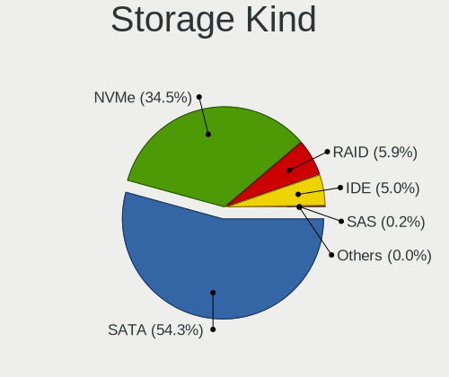
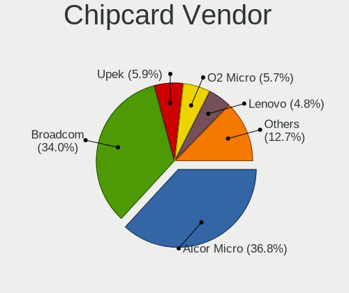

Manjaro - Tested Hardware & Statistics
--------------------------------------

A project to collect tested hardware configurations for Manjaro.

Anyone can contribute to this report by the [hw-probe](https://github.com/linuxhw/hw-probe) tool:

    sudo -E hw-probe -all -upload

Please contribute! Especially if your hardware is rare.

This is a report for all computer types. See also reports for [desktops](/Dist/Manjaro/Desktop/README.md) and [notebooks](/Dist/Manjaro/Notebook/README.md).

Contents
--------

* [ Test Cases ](#test-cases)

* [ System ](#system)
  - [ OS                       ](#os)
  - [ OS Family                ](#os-family)
  - [ Kernel                   ](#kernel)
  - [ Kernel Family            ](#kernel-family)
  - [ Kernel Major Ver.        ](#kernel-major-ver)
  - [ Arch                     ](#arch)
  - [ DE                       ](#de)
  - [ Display Server           ](#display-server)
  - [ Display Manager          ](#display-manager)
  - [ OS Lang                  ](#os-lang)
  - [ Boot Mode                ](#boot-mode)
  - [ Filesystem               ](#filesystem)
  - [ Part. scheme             ](#part-scheme)
  - [ Dual Boot with Linux/BSD ](#dual-boot-with-linuxbsd)
  - [ Dual Boot (Win)          ](#dual-boot-win)

* [ Board ](#board)
  - [ Vendor                   ](#vendor)
  - [ Model                    ](#model)
  - [ Model Family             ](#model-family)
  - [ MFG Year                 ](#mfg-year)
  - [ Form Factor              ](#form-factor)
  - [ Secure Boot              ](#secure-boot)
  - [ Coreboot                 ](#coreboot)
  - [ RAM Size                 ](#ram-size)
  - [ RAM Used                 ](#ram-used)
  - [ Total Drives             ](#total-drives)
  - [ Has CD-ROM               ](#has-cd-rom)
  - [ Has Ethernet             ](#has-ethernet)
  - [ Has WiFi                 ](#has-wifi)
  - [ Has Bluetooth            ](#has-bluetooth)

* [ Location ](#location)
  - [ Country                  ](#country)
  - [ City                     ](#city)

* [ Drives ](#drives)
  - [ Drive Vendor             ](#drive-vendor)
  - [ Drive Model              ](#drive-model)
  - [ HDD Vendor               ](#hdd-vendor)
  - [ SSD Vendor               ](#ssd-vendor)
  - [ Drive Kind               ](#drive-kind)
  - [ Drive Connector          ](#drive-connector)
  - [ Drive Size               ](#drive-size)
  - [ Space Total              ](#space-total)
  - [ Space Used               ](#space-used)
  - [ Malfunc. Drives          ](#malfunc-drives)
  - [ Malfunc. Drive Vendor    ](#malfunc-drive-vendor)
  - [ Malfunc. HDD Vendor      ](#malfunc-hdd-vendor)
  - [ Malfunc. Drive Kind      ](#malfunc-drive-kind)
  - [ Failed Drives            ](#failed-drives)
  - [ Failed Drive Vendor      ](#failed-drive-vendor)
  - [ Drive Status             ](#drive-status)

* [ Storage controller ](#storage-controller)
  - [ Storage Vendor           ](#storage-vendor)
  - [ Storage Model            ](#storage-model)
  - [ Storage Kind             ](#storage-kind)

* [ Processor ](#processor)
  - [ CPU Vendor               ](#cpu-vendor)
  - [ CPU Model                ](#cpu-model)
  - [ CPU Model Family         ](#cpu-model-family)
  - [ CPU Cores                ](#cpu-cores)
  - [ CPU Sockets              ](#cpu-sockets)
  - [ CPU Threads              ](#cpu-threads)
  - [ CPU Op-Modes             ](#cpu-op-modes)
  - [ CPU Microcode            ](#cpu-microcode)
  - [ CPU Microarch            ](#cpu-microarch)

* [ Graphics ](#graphics)
  - [ GPU Vendor               ](#gpu-vendor)
  - [ GPU Model                ](#gpu-model)
  - [ GPU Combo                ](#gpu-combo)
  - [ GPU Driver               ](#gpu-driver)
  - [ GPU Memory               ](#gpu-memory)

* [ Monitor ](#monitor)
  - [ Monitor Vendor           ](#monitor-vendor)
  - [ Monitor Model            ](#monitor-model)
  - [ Monitor Resolution       ](#monitor-resolution)
  - [ Monitor Diagonal         ](#monitor-diagonal)
  - [ Monitor Width            ](#monitor-width)
  - [ Aspect Ratio             ](#aspect-ratio)
  - [ Monitor Area             ](#monitor-area)
  - [ Pixel Density            ](#pixel-density)
  - [ Multiple Monitors        ](#multiple-monitors)

* [ Network ](#network)
  - [ Net Controller Vendor    ](#net-controller-vendor)
  - [ Net Controller Model     ](#net-controller-model)
  - [ Wireless Vendor          ](#wireless-vendor)
  - [ Wireless Model           ](#wireless-model)
  - [ Ethernet Vendor          ](#ethernet-vendor)
  - [ Ethernet Model           ](#ethernet-model)
  - [ Net Controller Kind      ](#net-controller-kind)
  - [ Used Controller          ](#used-controller)
  - [ NICs                     ](#nics)
  - [ IPv6                     ](#ipv6)

* [ Bluetooth ](#bluetooth)
  - [ Bluetooth Vendor         ](#bluetooth-vendor)
  - [ Bluetooth Model          ](#bluetooth-model)

* [ Sound ](#sound)
  - [ Sound Vendor             ](#sound-vendor)
  - [ Sound Model              ](#sound-model)

* [ Memory ](#memory)
  - [ Memory Vendor            ](#memory-vendor)
  - [ Memory Model             ](#memory-model)
  - [ Memory Kind              ](#memory-kind)
  - [ Memory Form Factor       ](#memory-form-factor)
  - [ Memory Size              ](#memory-size)
  - [ Memory Speed             ](#memory-speed)

* [ Printers & scanners ](#printers--scanners)
  - [ Printer Vendor           ](#printer-vendor)
  - [ Printer Model            ](#printer-model)
  - [ Scanner Vendor           ](#scanner-vendor)
  - [ Scanner Model            ](#scanner-model)

* [ Camera ](#camera)
  - [ Camera Vendor            ](#camera-vendor)
  - [ Camera Model             ](#camera-model)

* [ Security ](#security)
  - [ Fingerprint Vendor       ](#fingerprint-vendor)
  - [ Fingerprint Model        ](#fingerprint-model)
  - [ Chipcard Vendor          ](#chipcard-vendor)
  - [ Chipcard Model           ](#chipcard-model)

* [ Unsupported ](#unsupported)
  - [ Unsupported Devices      ](#unsupported-devices)
  - [ Unsupported Device Types ](#unsupported-device-types)

Test Cases
----------

Total: 11263

| Vendor        | Model                       | Form-Factor | Probe                                                      | Date         |
|---------------|-----------------------------|-------------|------------------------------------------------------------|--------------|
| Acer          | Aspire A517-51G             | Notebook    | [2788a21644](https://linux-hardware.org/?probe=2788a21644) | Feb 02, 2024 |
| Gigabyte      | B450 AORUS ELITE            | Desktop     | [aaebf4ea23](https://linux-hardware.org/?probe=aaebf4ea23) | Feb 02, 2024 |
| HP            | 255 15.6 inch G10           | Notebook    | [86bdc742bd](https://linux-hardware.org/?probe=86bdc742bd) | Feb 01, 2024 |
| MSI           | B450-A PRO                  | Desktop     | [10f58dc52e](https://linux-hardware.org/?probe=10f58dc52e) | Feb 01, 2024 |
| MSI           | MPG X570 GAMING PLUS        | Desktop     | [0d5790b907](https://linux-hardware.org/?probe=0d5790b907) | Feb 01, 2024 |
| MSI           | MPG X570 GAMING PLUS        | Desktop     | [5ec61e07a8](https://linux-hardware.org/?probe=5ec61e07a8) | Feb 01, 2024 |
| ASUSTek       | VivoBook_ASUSLaptop X160... | Notebook    | [6f80a7214c](https://linux-hardware.org/?probe=6f80a7214c) | Feb 01, 2024 |
| Dell          | Latitude 7490               | Notebook    | [f6c07c876d](https://linux-hardware.org/?probe=f6c07c876d) | Feb 01, 2024 |
| MSI           | B450-A PRO                  | Desktop     | [aecf5f7bf1](https://linux-hardware.org/?probe=aecf5f7bf1) | Feb 01, 2024 |
| Lenovo        | ThinkPad T480 20L6S4XW00    | Notebook    | [a24ce87b69](https://linux-hardware.org/?probe=a24ce87b69) | Feb 01, 2024 |
| Thomson       | N15C8BK2T                   | Notebook    | [5de65dcec1](https://linux-hardware.org/?probe=5de65dcec1) | Jan 31, 2024 |
| Gigabyte      | B550M K                     | Desktop     | [1ead3418ae](https://linux-hardware.org/?probe=1ead3418ae) | Jan 31, 2024 |
| ASUSTek       | PRIME X670E-PRO WIFI        | Notebook    | [4af4b18a2c](https://linux-hardware.org/?probe=4af4b18a2c) | Jan 31, 2024 |
| HP            | Laptop 15-fc0xxx            | Notebook    | [28e16f1c53](https://linux-hardware.org/?probe=28e16f1c53) | Jan 31, 2024 |
| HP            | EliteBook 855 G8 Noteboo... | Notebook    | [fff51c5158](https://linux-hardware.org/?probe=fff51c5158) | Jan 30, 2024 |
| Dell          | Latitude 7400 2-in-1        | Convertible | [bb65922479](https://linux-hardware.org/?probe=bb65922479) | Jan 30, 2024 |
| Dell          | Latitude 7400 2-in-1        | Convertible | [fe52a663b0](https://linux-hardware.org/?probe=fe52a663b0) | Jan 30, 2024 |
| Gigabyte      | B450 I AORUS PRO WIFI-CF    | Desktop     | [78b2648ff3](https://linux-hardware.org/?probe=78b2648ff3) | Jan 30, 2024 |
| ASUSTek       | PRIME X670-P WIFI           | Desktop     | [d1d5004095](https://linux-hardware.org/?probe=d1d5004095) | Jan 30, 2024 |
| HP            | ENVY x360 2-in-1 Laptop ... | Convertible | [247c47d3f0](https://linux-hardware.org/?probe=247c47d3f0) | Jan 30, 2024 |
| ASUSTek       | P8H61-MX                    | Desktop     | [1d7356527b](https://linux-hardware.org/?probe=1d7356527b) | Jan 30, 2024 |
| ASUSTek       | VivoBook_ASUSLaptop M350... | Notebook    | [bc89935fa2](https://linux-hardware.org/?probe=bc89935fa2) | Jan 29, 2024 |
| Apple         | MacBookPro14,1              | Notebook    | [596ac6a467](https://linux-hardware.org/?probe=596ac6a467) | Jan 29, 2024 |
| HP            | Stream Laptop 14-DS0xxx     | Notebook    | [b2cff77c57](https://linux-hardware.org/?probe=b2cff77c57) | Jan 29, 2024 |
| AZW           | GTR V21                     | Mini pc     | [904e422f26](https://linux-hardware.org/?probe=904e422f26) | Jan 29, 2024 |
| Fujitsu       | LIFEBOOK E744               | Notebook    | [0bdbea7dcb](https://linux-hardware.org/?probe=0bdbea7dcb) | Jan 29, 2024 |
| Fujitsu       | LIFEBOOK E744               | Notebook    | [3e03ee6e0f](https://linux-hardware.org/?probe=3e03ee6e0f) | Jan 29, 2024 |
| HP            | EliteBook 840 g5            | Notebook    | [b9ca87e1e4](https://linux-hardware.org/?probe=b9ca87e1e4) | Jan 28, 2024 |
| Lenovo        | ThinkPad X1 Yoga 1st 20F... | Convertible | [c803b3db54](https://linux-hardware.org/?probe=c803b3db54) | Jan 28, 2024 |
| MSI           | B450-A PRO                  | Desktop     | [afb7d75f84](https://linux-hardware.org/?probe=afb7d75f84) | Jan 28, 2024 |
| ASUSTek       | K52JU                       | Notebook    | [066d333914](https://linux-hardware.org/?probe=066d333914) | Jan 28, 2024 |
| Gigabyte      | A520M S2H                   | Desktop     | [960d1543c0](https://linux-hardware.org/?probe=960d1543c0) | Jan 28, 2024 |
| Dell          | Inspiron 15-3567            | Notebook    | [9ce085875f](https://linux-hardware.org/?probe=9ce085875f) | Jan 27, 2024 |
| Gigabyte      | GA-MA770T-UD3P              | Desktop     | [13d6b2dc0a](https://linux-hardware.org/?probe=13d6b2dc0a) | Jan 27, 2024 |
| Lenovo        | ThinkPad T495 20NKS5AU00    | Notebook    | [e382eee8ac](https://linux-hardware.org/?probe=e382eee8ac) | Jan 27, 2024 |
| Dell          | Latitude E7270              | Notebook    | [7ebc1a4cdb](https://linux-hardware.org/?probe=7ebc1a4cdb) | Jan 27, 2024 |
| HP            | Spectre x360 Convertible    | Convertible | [6ba1d0e853](https://linux-hardware.org/?probe=6ba1d0e853) | Jan 27, 2024 |
| MSI           | B560M PRO                   | Desktop     | [773f3d7e1c](https://linux-hardware.org/?probe=773f3d7e1c) | Jan 27, 2024 |
| ARDOR GAMI... | PD5x_7xSNC_SND_SNE          | Notebook    | [398529b5cb](https://linux-hardware.org/?probe=398529b5cb) | Jan 27, 2024 |
| ASUSTek       | M5A97 PLUS                  | Desktop     | [f06a700136](https://linux-hardware.org/?probe=f06a700136) | Jan 27, 2024 |
| Gigabyte      | B450M DS3H-CF               | Desktop     | [2d860764f7](https://linux-hardware.org/?probe=2d860764f7) | Jan 27, 2024 |
| ASRock        | AB350M Pro4                 | Desktop     | [ab39d263d5](https://linux-hardware.org/?probe=ab39d263d5) | Jan 27, 2024 |
| HP            | Pavilion 14                 | Notebook    | [93fffe502f](https://linux-hardware.org/?probe=93fffe502f) | Jan 27, 2024 |
| MSI           | MAG B550 TORPEDO            | Desktop     | [73f56ca35a](https://linux-hardware.org/?probe=73f56ca35a) | Jan 26, 2024 |
| Lenovo        | Legion 5 17ACH6H 82JY       | Notebook    | [6db5a094d7](https://linux-hardware.org/?probe=6db5a094d7) | Jan 26, 2024 |
| ASUSTek       | X550VXK                     | Notebook    | [4f8a5aa2c2](https://linux-hardware.org/?probe=4f8a5aa2c2) | Jan 26, 2024 |
| ASUSTek       | GR8                         | Notebook    | [f43a22b48b](https://linux-hardware.org/?probe=f43a22b48b) | Jan 26, 2024 |
| Acer          | Swift SF314-43              | Notebook    | [bfbce1457c](https://linux-hardware.org/?probe=bfbce1457c) | Jan 25, 2024 |
| MSI           | MS-B9181                    | Desktop     | [6575c3c5ad](https://linux-hardware.org/?probe=6575c3c5ad) | Jan 25, 2024 |
| MSI           | B560M PRO-E                 | Desktop     | [898383016a](https://linux-hardware.org/?probe=898383016a) | Jan 25, 2024 |
| Lenovo        | IdeaPad Pro 5 14IMH9 83D... | Notebook    | [2915b21d64](https://linux-hardware.org/?probe=2915b21d64) | Jan 25, 2024 |
| Dell          | Inspiron 5770               | Notebook    | [6cf464989f](https://linux-hardware.org/?probe=6cf464989f) | Jan 24, 2024 |
| Lenovo        | IdeaPad S145-15IIL 81W8     | Notebook    | [362ad8ae7e](https://linux-hardware.org/?probe=362ad8ae7e) | Jan 24, 2024 |
| ASUSTek       | PRIME A320M-K               | Desktop     | [0bdecdf839](https://linux-hardware.org/?probe=0bdecdf839) | Jan 24, 2024 |
| Lenovo        | Legion 5 15ARH05 82B5       | Notebook    | [356b235b8b](https://linux-hardware.org/?probe=356b235b8b) | Jan 24, 2024 |
| HUAWEI        | RLEF-XX                     | Notebook    | [dc4ce0b71d](https://linux-hardware.org/?probe=dc4ce0b71d) | Jan 24, 2024 |
| HUAWEI        | RLEF-XX                     | Notebook    | [c53987023c](https://linux-hardware.org/?probe=c53987023c) | Jan 24, 2024 |
| MSI           | MAG X670E TOMAHAWK WIFI     | Desktop     | [89d705627b](https://linux-hardware.org/?probe=89d705627b) | Jan 24, 2024 |
| HP            | Laptop 15-fc0xxx            | Notebook    | [20be72b253](https://linux-hardware.org/?probe=20be72b253) | Jan 24, 2024 |
| ASUSTek       | X541UJ                      | Notebook    | [e5a64b928d](https://linux-hardware.org/?probe=e5a64b928d) | Jan 23, 2024 |
| Lenovo        | Legion Y530-15ICH 81FV      | Notebook    | [15666b6776](https://linux-hardware.org/?probe=15666b6776) | Jan 23, 2024 |
| Dell          | Latitude 7400 2-in-1        | Convertible | [838933cd03](https://linux-hardware.org/?probe=838933cd03) | Jan 23, 2024 |
| Dell          | Latitude E7450              | Notebook    | [1b19ab817a](https://linux-hardware.org/?probe=1b19ab817a) | Jan 23, 2024 |
| HP            | Tablet 11m-be0xxx           | Tablet      | [1a035d1776](https://linux-hardware.org/?probe=1a035d1776) | Jan 23, 2024 |
| HP            | ENVY x360 2-in-1 Laptop ... | Convertible | [7df659bb22](https://linux-hardware.org/?probe=7df659bb22) | Jan 22, 2024 |
| ASUSTek       | A55BM-E                     | Desktop     | [3d3b63f7c5](https://linux-hardware.org/?probe=3d3b63f7c5) | Jan 22, 2024 |
| HP            | EliteBook 840 G8 Noteboo... | Notebook    | [19eaa1abc0](https://linux-hardware.org/?probe=19eaa1abc0) | Jan 22, 2024 |
| AZW           | GTR V01                     | Mini pc     | [b051db0609](https://linux-hardware.org/?probe=b051db0609) | Jan 22, 2024 |
| Gigabyte      | A520M S2H                   | Desktop     | [bbfb471169](https://linux-hardware.org/?probe=bbfb471169) | Jan 22, 2024 |
| AZW           | SER V1.0                    | Mini pc     | [880dbae087](https://linux-hardware.org/?probe=880dbae087) | Jan 22, 2024 |
| Lenovo        | ThinkPad T14 Gen 1 20S1S... | Notebook    | [9a1d16aad2](https://linux-hardware.org/?probe=9a1d16aad2) | Jan 21, 2024 |
| ASRock        | B460M Pro4                  | Desktop     | [65b69b2422](https://linux-hardware.org/?probe=65b69b2422) | Jan 21, 2024 |
| TUXEDO        | InfinityBook Pro Gen8 (M... | Notebook    | [379e6473d5](https://linux-hardware.org/?probe=379e6473d5) | Jan 21, 2024 |
| Lenovo        | IdeaPad 320-14IKB 80XK      | Notebook    | [de30e068d6](https://linux-hardware.org/?probe=de30e068d6) | Jan 21, 2024 |
| MSI           | B350M MORTAR                | Desktop     | [e65dc0f60c](https://linux-hardware.org/?probe=e65dc0f60c) | Jan 21, 2024 |
| ASUSTek       | VivoBook_ASUSLaptop K650... | Notebook    | [52783252de](https://linux-hardware.org/?probe=52783252de) | Jan 21, 2024 |
| Lenovo        | IdeaPad 5 15ARE05 81YQ      | Notebook    | [a8c56ec5a7](https://linux-hardware.org/?probe=a8c56ec5a7) | Jan 21, 2024 |
| HP            | Victus by Laptop 16-d0xx... | Notebook    | [11e78ca269](https://linux-hardware.org/?probe=11e78ca269) | Jan 20, 2024 |
| MSI           | B450-A PRO                  | Desktop     | [e11e6780da](https://linux-hardware.org/?probe=e11e6780da) | Jan 20, 2024 |
| Apple         | Mac-F221BEC8                | Desktop     | [e435385c77](https://linux-hardware.org/?probe=e435385c77) | Jan 20, 2024 |
| MSI           | H510M-A PRO                 | Desktop     | [d82c1229a9](https://linux-hardware.org/?probe=d82c1229a9) | Jan 20, 2024 |
| Gigabyte      | B450M DS3H-CF               | Desktop     | [30d4375ab2](https://linux-hardware.org/?probe=30d4375ab2) | Jan 20, 2024 |
| Notebook      | W350STQ/W370ST              | Notebook    | [a61e368a41](https://linux-hardware.org/?probe=a61e368a41) | Jan 19, 2024 |
| Apple         | MacBookAir7,2               | Notebook    | [8efc1fa078](https://linux-hardware.org/?probe=8efc1fa078) | Jan 19, 2024 |
| Apple         | MacBookAir7,2               | Notebook    | [14a15f0dc3](https://linux-hardware.org/?probe=14a15f0dc3) | Jan 19, 2024 |
| Lenovo        | Z50-70 20354                | Notebook    | [fb225848f0](https://linux-hardware.org/?probe=fb225848f0) | Jan 19, 2024 |
| Razer         | Blade                       | Notebook    | [e99ad5cc36](https://linux-hardware.org/?probe=e99ad5cc36) | Jan 19, 2024 |
| Acer          | Aspire A315-35              | Notebook    | [dafaf99dd0](https://linux-hardware.org/?probe=dafaf99dd0) | Jan 19, 2024 |
| realme        | CloudProXXXX                | Notebook    | [a82160e17d](https://linux-hardware.org/?probe=a82160e17d) | Jan 19, 2024 |
| HP            | 8298                        | Desktop     | [9702f87120](https://linux-hardware.org/?probe=9702f87120) | Jan 18, 2024 |
| HP            | Spectre x360 Convertible    | Convertible | [202947ee50](https://linux-hardware.org/?probe=202947ee50) | Jan 18, 2024 |
| HP            | 255 15.6 inch G10           | Notebook    | [b852473447](https://linux-hardware.org/?probe=b852473447) | Jan 17, 2024 |
| Lenovo        | Z50-70 20354                | Notebook    | [2e0947a80d](https://linux-hardware.org/?probe=2e0947a80d) | Jan 17, 2024 |
| Lenovo        | ThinkPad T430 2344BMU       | Notebook    | [75e86c5b31](https://linux-hardware.org/?probe=75e86c5b31) | Jan 17, 2024 |
| Lenovo        | ThinkPad E14 Gen 3 20Y70... | Notebook    | [4b41c2825f](https://linux-hardware.org/?probe=4b41c2825f) | Jan 17, 2024 |
| AZW           | SER V1.0                    | Mini pc     | [c11948d06a](https://linux-hardware.org/?probe=c11948d06a) | Jan 16, 2024 |
| Lenovo        | ThinkPad P14s Gen 3 21AK... | Notebook    | [6274216b05](https://linux-hardware.org/?probe=6274216b05) | Jan 16, 2024 |
| Medion        | Scout E10                   | Notebook    | [10da5c077d](https://linux-hardware.org/?probe=10da5c077d) | Jan 16, 2024 |
| ASUSTek       | PRIME X570-PRO              | Desktop     | [fe59a3038f](https://linux-hardware.org/?probe=fe59a3038f) | Jan 16, 2024 |
| Apple         | MacBookPro9,1               | Notebook    | [3b43ca4be8](https://linux-hardware.org/?probe=3b43ca4be8) | Jan 16, 2024 |
| ASUSTek       | Z87-PLUS                    | Desktop     | [8636e544df](https://linux-hardware.org/?probe=8636e544df) | Jan 15, 2024 |
| MSI           | Z170A PC MATE               | Desktop     | [9df326ae6f](https://linux-hardware.org/?probe=9df326ae6f) | Jan 15, 2024 |
| ASUSTek       | H81M-C                      | Desktop     | [3437acb566](https://linux-hardware.org/?probe=3437acb566) | Jan 15, 2024 |
| Lenovo        | ThinkPad X270 20K5S1A524    | Notebook    | [2943099ca8](https://linux-hardware.org/?probe=2943099ca8) | Jan 15, 2024 |
| ASRock        | X300M-STX                   | Desktop     | [2802b8b35f](https://linux-hardware.org/?probe=2802b8b35f) | Jan 14, 2024 |
| HP            | ProBook 4340s               | Notebook    | [45354af236](https://linux-hardware.org/?probe=45354af236) | Jan 14, 2024 |
| HP            | ProBook 4340s               | Notebook    | [aea3678636](https://linux-hardware.org/?probe=aea3678636) | Jan 14, 2024 |
| HUAWEI        | BOM-WXX9                    | Notebook    | [f15e99bc7d](https://linux-hardware.org/?probe=f15e99bc7d) | Jan 13, 2024 |
| HUAWEI        | BOD-WXX9                    | Notebook    | [fe4ed2794f](https://linux-hardware.org/?probe=fe4ed2794f) | Jan 13, 2024 |
| HUAWEI        | BOD-WXX9                    | Notebook    | [b5c9600b1e](https://linux-hardware.org/?probe=b5c9600b1e) | Jan 13, 2024 |
| Intel         | H81                         | Desktop     | [fee8b2f668](https://linux-hardware.org/?probe=fee8b2f668) | Jan 13, 2024 |
| Acer          | Aspire A517-51G             | Notebook    | [5a9f65787f](https://linux-hardware.org/?probe=5a9f65787f) | Jan 13, 2024 |
| Lenovo        | 3141 SDK0J40700 WIN 3258... | Desktop     | [5688ffafb8](https://linux-hardware.org/?probe=5688ffafb8) | Jan 13, 2024 |
| Lenovo        | ThinkPad X1 Carbon Gen 1... | Notebook    | [301f2ec339](https://linux-hardware.org/?probe=301f2ec339) | Jan 12, 2024 |
| Lenovo        | ThinkPad X1 Carbon Gen 1... | Notebook    | [84d67dfe96](https://linux-hardware.org/?probe=84d67dfe96) | Jan 12, 2024 |
| MSI           | Katana 17 B13VFK            | Notebook    | [f5b006ea89](https://linux-hardware.org/?probe=f5b006ea89) | Jan 12, 2024 |
| ASUSTek       | Zenbook 15 UM3504DA_UM35... | Notebook    | [c913eb2c1b](https://linux-hardware.org/?probe=c913eb2c1b) | Jan 12, 2024 |
| Alienware     | 17 R5                       | Notebook    | [4588195d7c](https://linux-hardware.org/?probe=4588195d7c) | Jan 12, 2024 |
| Dell          | 0YXT71 A00                  | Desktop     | [c82074b2f4](https://linux-hardware.org/?probe=c82074b2f4) | Jan 12, 2024 |
| MSI           | MPG X570 GAMING PLUS        | Notebook    | [3be44d9c7c](https://linux-hardware.org/?probe=3be44d9c7c) | Jan 12, 2024 |
| HP            | ZBook Firefly 15 inch G8... | Notebook    | [1601348335](https://linux-hardware.org/?probe=1601348335) | Jan 11, 2024 |
| Lenovo        | Legion Y530-15ICH 81FV      | Notebook    | [0d7230b853](https://linux-hardware.org/?probe=0d7230b853) | Jan 11, 2024 |
| ASRock        | B450M Pro4-F                | Desktop     | [99dfb1abed](https://linux-hardware.org/?probe=99dfb1abed) | Jan 11, 2024 |
| HP            | Notebook                    | Notebook    | [53e2f16b51](https://linux-hardware.org/?probe=53e2f16b51) | Jan 11, 2024 |
| Dell          | Latitude E7440              | Notebook    | [08decb079c](https://linux-hardware.org/?probe=08decb079c) | Jan 11, 2024 |
| Gigabyte      | Z790 GAMING X AX            | Desktop     | [80799f979c](https://linux-hardware.org/?probe=80799f979c) | Jan 10, 2024 |
| MSI           | B450M-A PRO MAX             | Desktop     | [09ec307e39](https://linux-hardware.org/?probe=09ec307e39) | Jan 10, 2024 |
| HP            | Victus by Gaming Laptop ... | Notebook    | [6394ca334a](https://linux-hardware.org/?probe=6394ca334a) | Jan 10, 2024 |
| ASUSTek       | H81M-C                      | Desktop     | [234e6e24b3](https://linux-hardware.org/?probe=234e6e24b3) | Jan 10, 2024 |
| ASUSTek       | SABERTOOTH X99              | Desktop     | [a8116aaf03](https://linux-hardware.org/?probe=a8116aaf03) | Jan 10, 2024 |
| Lenovo        | ThinkPad T430 2344BMU       | Notebook    | [1a57fd0154](https://linux-hardware.org/?probe=1a57fd0154) | Jan 10, 2024 |
| ASRock        | B550M Pro SE                | Desktop     | [2a7c9822b3](https://linux-hardware.org/?probe=2a7c9822b3) | Jan 10, 2024 |
| Lenovo        | IdeaPad 3 15ABA7 82RN       | Notebook    | [12b7a5f613](https://linux-hardware.org/?probe=12b7a5f613) | Jan 10, 2024 |
| HP            | Pavilion 15                 | Notebook    | [e719d4a0cf](https://linux-hardware.org/?probe=e719d4a0cf) | Jan 09, 2024 |
| HP            | Pavilion 15                 | Notebook    | [850d28e06d](https://linux-hardware.org/?probe=850d28e06d) | Jan 09, 2024 |
| MSI           | H510M-A PRO                 | Desktop     | [625e6af2b6](https://linux-hardware.org/?probe=625e6af2b6) | Jan 09, 2024 |
| Lenovo        | ThinkPad E15 Gen 2 20T80... | Notebook    | [b6445a9a78](https://linux-hardware.org/?probe=b6445a9a78) | Jan 09, 2024 |
| ASUSTek       | VivoBook_ASUSLaptop X150... | Notebook    | [158040c457](https://linux-hardware.org/?probe=158040c457) | Jan 09, 2024 |
| ASRock        | B450 Gaming K4              | Desktop     | [9446a22c53](https://linux-hardware.org/?probe=9446a22c53) | Jan 09, 2024 |
| ASUSTek       | M5A97 PLUS                  | Desktop     | [d22d465f0f](https://linux-hardware.org/?probe=d22d465f0f) | Jan 09, 2024 |
| Dell          | Latitude 5590               | Notebook    | [80ab1a3a35](https://linux-hardware.org/?probe=80ab1a3a35) | Jan 08, 2024 |
| Shenzhen M... | F7BSC                       | Mini pc     | [6dab53cdd0](https://linux-hardware.org/?probe=6dab53cdd0) | Jan 08, 2024 |
| HP            | ENVY x360 2-in-1 Laptop ... | Convertible | [d098c7af51](https://linux-hardware.org/?probe=d098c7af51) | Jan 08, 2024 |
| MSI           | 970 GAMING                  | Desktop     | [68c61980ac](https://linux-hardware.org/?probe=68c61980ac) | Jan 08, 2024 |
| ASUSTek       | Maximus V FORMULA           | Desktop     | [4380071e4e](https://linux-hardware.org/?probe=4380071e4e) | Jan 08, 2024 |
| ASUSTek       | VivoBook_ASUSLaptop X150... | Notebook    | [eab14c8b91](https://linux-hardware.org/?probe=eab14c8b91) | Jan 08, 2024 |
| HP            | Laptop 15-fc0xxx            | Notebook    | [468f756c7f](https://linux-hardware.org/?probe=468f756c7f) | Jan 08, 2024 |
| Medion        | S15449                      | Notebook    | [89a6d2fd3f](https://linux-hardware.org/?probe=89a6d2fd3f) | Jan 07, 2024 |
| MSI           | GP75 Leopard 10SFK          | Notebook    | [0fe5251d6d](https://linux-hardware.org/?probe=0fe5251d6d) | Jan 07, 2024 |
| Samsung       | Galaxy TabPro S             | Tablet      | [a1f4b9a139](https://linux-hardware.org/?probe=a1f4b9a139) | Jan 07, 2024 |
| HP            | Spectre x360 2-in-1 Lapt... | Convertible | [083aded553](https://linux-hardware.org/?probe=083aded553) | Jan 07, 2024 |
| HP            | Spectre x360 2-in-1 Lapt... | Convertible | [65cd40e96f](https://linux-hardware.org/?probe=65cd40e96f) | Jan 07, 2024 |
| Notebook      | P7xxDM-G                    | Notebook    | [7213fe2836](https://linux-hardware.org/?probe=7213fe2836) | Jan 06, 2024 |
| MSI           | GP75 Leopard 10SFK          | Notebook    | [ad83163c98](https://linux-hardware.org/?probe=ad83163c98) | Jan 06, 2024 |
| ASUSTek       | ROG STRIX B550-XE GAMING... | Desktop     | [5f59758f89](https://linux-hardware.org/?probe=5f59758f89) | Jan 05, 2024 |
| Acer          | Predator PH717-72           | Notebook    | [cfa0e5b6c6](https://linux-hardware.org/?probe=cfa0e5b6c6) | Jan 05, 2024 |
| ASUSTek       | TUF Gaming B550M-PLUS       | Desktop     | [345ae1cb3d](https://linux-hardware.org/?probe=345ae1cb3d) | Jan 05, 2024 |
| ASUSTek       | TUF Gaming B550M-PLUS       | Desktop     | [280d389295](https://linux-hardware.org/?probe=280d389295) | Jan 05, 2024 |
| ASUSTek       | B85M-E                      | Desktop     | [6207f6a6cc](https://linux-hardware.org/?probe=6207f6a6cc) | Jan 04, 2024 |
| Acer          | Nitro AN515-44              | Notebook    | [6a2df7d4aa](https://linux-hardware.org/?probe=6a2df7d4aa) | Jan 04, 2024 |
| Dell          | Latitude E5530 non-vPro     | Notebook    | [219adf28d5](https://linux-hardware.org/?probe=219adf28d5) | Jan 04, 2024 |
| Dell          | XPS 15 9520                 | Notebook    | [5b8e6d2ed8](https://linux-hardware.org/?probe=5b8e6d2ed8) | Jan 04, 2024 |
| Dell          | XPS 15 9510                 | Notebook    | [7df831af81](https://linux-hardware.org/?probe=7df831af81) | Jan 04, 2024 |
| Dell          | XPS 15 9510                 | Notebook    | [338187cb01](https://linux-hardware.org/?probe=338187cb01) | Jan 04, 2024 |
| Dell          | XPS 15 9520                 | Notebook    | [c0b874f6b0](https://linux-hardware.org/?probe=c0b874f6b0) | Jan 04, 2024 |
| LG Electro... | 23V545-G.BK55P1             | Notebook    | [6cf752515c](https://linux-hardware.org/?probe=6cf752515c) | Jan 04, 2024 |
| Lenovo        | Legion 7 16ACHg6 82N6       | Notebook    | [cafe81526a](https://linux-hardware.org/?probe=cafe81526a) | Jan 04, 2024 |
| Dell          | 0NDYHG A00                  | Desktop     | [3eb6487c6e](https://linux-hardware.org/?probe=3eb6487c6e) | Jan 04, 2024 |
| Dell          | XPS 15 9530                 | Notebook    | [fbd8a37b00](https://linux-hardware.org/?probe=fbd8a37b00) | Jan 04, 2024 |
| Lenovo        | IdeaPad 3 17ADA05 81W2      | Notebook    | [050bd9db54](https://linux-hardware.org/?probe=050bd9db54) | Jan 04, 2024 |
| Lenovo        | IdeaPad 3 17ADA05 81W2      | Notebook    | [2575bb7352](https://linux-hardware.org/?probe=2575bb7352) | Jan 04, 2024 |
| ASUSTek       | Maximus V FORMULA           | Desktop     | [6c4433d5e3](https://linux-hardware.org/?probe=6c4433d5e3) | Jan 03, 2024 |
| HP            | 2B36                        | Desktop     | [adbdd18377](https://linux-hardware.org/?probe=adbdd18377) | Jan 03, 2024 |
| Irbis         | NB264                       | Notebook    | [c42f5880cc](https://linux-hardware.org/?probe=c42f5880cc) | Jan 03, 2024 |
| HP            | 2B36                        | Desktop     | [5c8c804c7e](https://linux-hardware.org/?probe=5c8c804c7e) | Jan 03, 2024 |
| ASUSTek       | PRIME B550M-K               | Desktop     | [54c131d794](https://linux-hardware.org/?probe=54c131d794) | Jan 03, 2024 |
| Lenovo        | ThinkPad X260 20F5A1AC00    | Notebook    | [b14e96fc5f](https://linux-hardware.org/?probe=b14e96fc5f) | Jan 03, 2024 |
| Microsoft     | Surface Laptop 4            | Tablet      | [8ddde2905e](https://linux-hardware.org/?probe=8ddde2905e) | Jan 02, 2024 |
| HP            | OMEN by Laptop              | Notebook    | [cb6a8b401a](https://linux-hardware.org/?probe=cb6a8b401a) | Jan 02, 2024 |
| Lenovo        | ThinkPad L460 20FU001LGE    | Notebook    | [37f558fd5b](https://linux-hardware.org/?probe=37f558fd5b) | Jan 02, 2024 |
| ASRock        | 970 Pro3 R2.0               | Desktop     | [508424d991](https://linux-hardware.org/?probe=508424d991) | Jan 02, 2024 |
| TUXEDO        | Pulse 15 Gen1               | Notebook    | [84278ca428](https://linux-hardware.org/?probe=84278ca428) | Jan 02, 2024 |
| Notebook      | N14xWU                      | Notebook    | [0460984dea](https://linux-hardware.org/?probe=0460984dea) | Jan 02, 2024 |
| Lenovo        | ThinkPad L440 20AT0030MD    | Notebook    | [095d9cbf7e](https://linux-hardware.org/?probe=095d9cbf7e) | Jan 01, 2024 |
| Dell          | Latitude 7490               | Notebook    | [efab03db5f](https://linux-hardware.org/?probe=efab03db5f) | Jan 01, 2024 |
| ASUSTek       | ROG STRIX B650E-I GAMING... | Desktop     | [769bd9153a](https://linux-hardware.org/?probe=769bd9153a) | Jan 01, 2024 |
| ASRock        | B650E PG Riptide WiFi       | Desktop     | [9c99c1bf71](https://linux-hardware.org/?probe=9c99c1bf71) | Dec 31, 2023 |
| ASRock        | B75M-DGS                    | Desktop     | [3a2df88d60](https://linux-hardware.org/?probe=3a2df88d60) | Dec 31, 2023 |
| Lenovo        | 1046 SBB1C50523 WIN 3556... | Desktop     | [080172526c](https://linux-hardware.org/?probe=080172526c) | Dec 31, 2023 |
| Lenovo        | ThinkPad X390 20Q0004VUS    | Notebook    | [4bd6b36cd6](https://linux-hardware.org/?probe=4bd6b36cd6) | Dec 30, 2023 |
| Lenovo        | ThinkPad T440p 20AWS4YE0... | Notebook    | [74d75dc18d](https://linux-hardware.org/?probe=74d75dc18d) | Dec 30, 2023 |
| Lenovo        | ThinkPad T440p 20AWS4UD0... | Notebook    | [0305a2f3cf](https://linux-hardware.org/?probe=0305a2f3cf) | Dec 30, 2023 |
| Dell          | Latitude E7440              | Notebook    | [d9fb6a9ead](https://linux-hardware.org/?probe=d9fb6a9ead) | Dec 30, 2023 |
| Lenovo        | ThinkPad E14 Gen 2 20T7S... | Notebook    | [394c35d74b](https://linux-hardware.org/?probe=394c35d74b) | Dec 30, 2023 |
| HP            | 8949 11                     | Desktop     | [1add0bc0e2](https://linux-hardware.org/?probe=1add0bc0e2) | Dec 30, 2023 |
| TUXEDO        | InfinityBook Pro Gen8 (M... | Notebook    | [5cfb3467bc](https://linux-hardware.org/?probe=5cfb3467bc) | Dec 29, 2023 |
| ASRock        | 970 Pro3 R2.0               | Desktop     | [2f24e45b02](https://linux-hardware.org/?probe=2f24e45b02) | Dec 29, 2023 |
| MSI           | MAG Z690 TOMAHAWK WIFI D... | Desktop     | [0daa9bd3eb](https://linux-hardware.org/?probe=0daa9bd3eb) | Dec 29, 2023 |
| Framework     | Laptop 13 (AMD Ryzen 704... | Notebook    | [751429a259](https://linux-hardware.org/?probe=751429a259) | Dec 29, 2023 |
| Lenovo        | ThinkPad E14 Gen 2 20T7S... | Notebook    | [d5ac5fcf72](https://linux-hardware.org/?probe=d5ac5fcf72) | Dec 29, 2023 |
| HUAWEI        | NBLK-WAX9X                  | Notebook    | [990d141701](https://linux-hardware.org/?probe=990d141701) | Dec 28, 2023 |
| ASRock        | B650E PG Riptide WiFi       | Desktop     | [3bf93539f3](https://linux-hardware.org/?probe=3bf93539f3) | Dec 28, 2023 |
| Dell          | Latitude 7490               | Notebook    | [7eab9f671e](https://linux-hardware.org/?probe=7eab9f671e) | Dec 28, 2023 |
| Lenovo        | ThinkPad X1 Yoga Gen 6 2... | Convertible | [32ce52498b](https://linux-hardware.org/?probe=32ce52498b) | Dec 28, 2023 |
| Google        | Dratini                     | Notebook    | [a81971bf37](https://linux-hardware.org/?probe=a81971bf37) | Dec 28, 2023 |
| HP            | ProBook 6470b               | Notebook    | [60858223c4](https://linux-hardware.org/?probe=60858223c4) | Dec 28, 2023 |
| HUAWEI        | HVY-WXX9                    | Notebook    | [313a669de8](https://linux-hardware.org/?probe=313a669de8) | Dec 27, 2023 |
| Panasonic     | FZ-M1CCA17E3                | Notebook    | [c55632d60a](https://linux-hardware.org/?probe=c55632d60a) | Dec 27, 2023 |
| Samsung       | 550XCJ/550XCR               | Notebook    | [c62c257897](https://linux-hardware.org/?probe=c62c257897) | Dec 27, 2023 |
| Apple         | MacBookPro9,2               | Notebook    | [99dfa98b06](https://linux-hardware.org/?probe=99dfa98b06) | Dec 27, 2023 |
| Dell          | Inspiron N5110              | Notebook    | [87efb02531](https://linux-hardware.org/?probe=87efb02531) | Dec 27, 2023 |
| ASUSTek       | H170-PRO                    | Desktop     | [969aa3e243](https://linux-hardware.org/?probe=969aa3e243) | Dec 26, 2023 |
| MSI           | H510M-A PRO                 | Desktop     | [0260c1a342](https://linux-hardware.org/?probe=0260c1a342) | Dec 26, 2023 |
| Gigabyte      | Z370 HD3-CF                 | Desktop     | [25e443386a](https://linux-hardware.org/?probe=25e443386a) | Dec 26, 2023 |
| Lenovo        | Legion Pro 7 16IRX8H 82W... | Notebook    | [97f532d3c8](https://linux-hardware.org/?probe=97f532d3c8) | Dec 26, 2023 |
| Dell          | Precision 7520              | Notebook    | [e4390e22b6](https://linux-hardware.org/?probe=e4390e22b6) | Dec 26, 2023 |
| ASUSTek       | PRIME Z370-A II             | Desktop     | [2013c4457a](https://linux-hardware.org/?probe=2013c4457a) | Dec 26, 2023 |
| Wiltronic     | MAGNUS PLUS                 | Tablet      | [774cf36756](https://linux-hardware.org/?probe=774cf36756) | Dec 26, 2023 |
| ASRock        | X670E Taichi                | Desktop     | [281602cb0e](https://linux-hardware.org/?probe=281602cb0e) | Dec 26, 2023 |
| MECHREVO      | Jiaolong16Q Series GM6BG... | Notebook    | [900da4b920](https://linux-hardware.org/?probe=900da4b920) | Dec 26, 2023 |
| ASUSTek       | VivoBook_ASUSLaptop X421... | Notebook    | [522209b304](https://linux-hardware.org/?probe=522209b304) | Dec 26, 2023 |
| Lenovo        | ThinkPad T490s 20NYS5HM0... | Notebook    | [79bfce6143](https://linux-hardware.org/?probe=79bfce6143) | Dec 25, 2023 |
| MSI           | GF615M-P33                  | Desktop     | [9e99d63708](https://linux-hardware.org/?probe=9e99d63708) | Dec 25, 2023 |
| MSI           | H510M-A PRO                 | Desktop     | [9f369b34fa](https://linux-hardware.org/?probe=9f369b34fa) | Dec 24, 2023 |
| HP            | Pavilion Gaming Laptop 1... | Notebook    | [ef5699b685](https://linux-hardware.org/?probe=ef5699b685) | Dec 24, 2023 |
| ASUSTek       | M5A97 EVO R2.0              | Desktop     | [cccb18ead9](https://linux-hardware.org/?probe=cccb18ead9) | Dec 24, 2023 |
| MSI           | B350M PRO-VDH               | Desktop     | [d845a3492b](https://linux-hardware.org/?probe=d845a3492b) | Dec 24, 2023 |
| MSI           | B350M PRO-VDH               | Desktop     | [a6e1fc3b29](https://linux-hardware.org/?probe=a6e1fc3b29) | Dec 24, 2023 |
| MSI           | PRO B650-S WIFI             | Desktop     | [c084478d6e](https://linux-hardware.org/?probe=c084478d6e) | Dec 24, 2023 |
| Apple         | MacBookAir7,2               | Notebook    | [03b1209523](https://linux-hardware.org/?probe=03b1209523) | Dec 24, 2023 |
| Apple         | MacBookAir7,2               | Notebook    | [b7f3ca9ba4](https://linux-hardware.org/?probe=b7f3ca9ba4) | Dec 23, 2023 |
| ASUSTek       | Zenbook 15 UM3504DA_UM35... | Notebook    | [6cc304ea54](https://linux-hardware.org/?probe=6cc304ea54) | Dec 23, 2023 |
| MSI           | H510M-A PRO                 | Desktop     | [fe19f4de86](https://linux-hardware.org/?probe=fe19f4de86) | Dec 23, 2023 |
| ASUSTek       | Zenbook UM3402YAR_UM3402... | Notebook    | [a72824a48c](https://linux-hardware.org/?probe=a72824a48c) | Dec 23, 2023 |
| MSI           | B560M PRO                   | Desktop     | [3885df62ab](https://linux-hardware.org/?probe=3885df62ab) | Dec 23, 2023 |
| Gigabyte      | Z790 GAMING X AX            | Desktop     | [155e0f1c37](https://linux-hardware.org/?probe=155e0f1c37) | Dec 22, 2023 |
| ASUSTek       | Maximus VI GENE             | Desktop     | [178aab1062](https://linux-hardware.org/?probe=178aab1062) | Dec 22, 2023 |
| Dell          | Latitude 5580               | Notebook    | [e20360557a](https://linux-hardware.org/?probe=e20360557a) | Dec 22, 2023 |
| Acer          | Aspire A315-35              | Notebook    | [52af26d8a1](https://linux-hardware.org/?probe=52af26d8a1) | Dec 21, 2023 |
| TUXEDO        | Book XP15 / XP17 Gen12      | Notebook    | [62624ca97b](https://linux-hardware.org/?probe=62624ca97b) | Dec 21, 2023 |
| Lenovo        | ThinkPad X201 3680WXT       | Notebook    | [a6e0d33afd](https://linux-hardware.org/?probe=a6e0d33afd) | Dec 21, 2023 |
| Alienware     | m16 R1 AMD                  | Notebook    | [8fc737975c](https://linux-hardware.org/?probe=8fc737975c) | Dec 21, 2023 |
| ASUSTek       | ROG CROSSHAIR VIII HERO     | Desktop     | [98298e164f](https://linux-hardware.org/?probe=98298e164f) | Dec 20, 2023 |
| Acer          | Nitro AN515-43              | Notebook    | [963de967ae](https://linux-hardware.org/?probe=963de967ae) | Dec 19, 2023 |
| HP            | 83E0                        | Desktop     | [8f41483d26](https://linux-hardware.org/?probe=8f41483d26) | Dec 19, 2023 |
| MSI           | B450M PRO-VDH PLUS          | Desktop     | [df369cf5be](https://linux-hardware.org/?probe=df369cf5be) | Dec 19, 2023 |
| Lenovo        | 3704 SDK0K17763 WIN 1801... | Desktop     | [9a2472e628](https://linux-hardware.org/?probe=9a2472e628) | Dec 19, 2023 |
| Shenzhen M... | F7BSC                       | Mini pc     | [8939d0afc4](https://linux-hardware.org/?probe=8939d0afc4) | Dec 19, 2023 |
| Dell          | Latitude 7490               | Notebook    | [6fe6e99364](https://linux-hardware.org/?probe=6fe6e99364) | Dec 18, 2023 |
| Lenovo        | ThinkPad P52 20MAS19500     | Notebook    | [7067fb02ed](https://linux-hardware.org/?probe=7067fb02ed) | Dec 18, 2023 |
| Lenovo        | Legion 5 15ARH05H 82B1      | Notebook    | [7b5e55e475](https://linux-hardware.org/?probe=7b5e55e475) | Dec 18, 2023 |
| ASUSTek       | PRIME B350-PLUS             | Desktop     | [448a2dec7d](https://linux-hardware.org/?probe=448a2dec7d) | Dec 17, 2023 |
| ASUSTek       | PRIME B350-PLUS             | Desktop     | [ebfec06632](https://linux-hardware.org/?probe=ebfec06632) | Dec 17, 2023 |
| Lenovo        | ThinkPad T460 20FNS11S00    | Notebook    | [901a636942](https://linux-hardware.org/?probe=901a636942) | Dec 17, 2023 |
| Acer          | Aspire 1810TZ               | Notebook    | [b935091ecd](https://linux-hardware.org/?probe=b935091ecd) | Dec 17, 2023 |
| Acer          | Aspire 1810TZ               | Notebook    | [14b5a5a3ca](https://linux-hardware.org/?probe=14b5a5a3ca) | Dec 17, 2023 |
| ASRock        | H310CM-HG4                  | Desktop     | [4e47d91bc7](https://linux-hardware.org/?probe=4e47d91bc7) | Dec 17, 2023 |
| Lenovo        | ThinkPad T460 20FNS11S00    | Notebook    | [34acff5fa8](https://linux-hardware.org/?probe=34acff5fa8) | Dec 17, 2023 |
| Lenovo        | ThinkPad T460 20FNS11S00    | Notebook    | [8a344f72ea](https://linux-hardware.org/?probe=8a344f72ea) | Dec 17, 2023 |
| Dell          | 0VHWTR A01                  | Desktop     | [78ef6792a1](https://linux-hardware.org/?probe=78ef6792a1) | Dec 16, 2023 |
| HP            | Stream Laptop 14-DS0xxx     | Notebook    | [3e26902ac1](https://linux-hardware.org/?probe=3e26902ac1) | Dec 15, 2023 |
| ASRock        | 760GM-HDV                   | Desktop     | [c1403f5d52](https://linux-hardware.org/?probe=c1403f5d52) | Dec 15, 2023 |
| HUAWEI        | CREFG-XX                    | Notebook    | [ee1bdd536f](https://linux-hardware.org/?probe=ee1bdd536f) | Dec 15, 2023 |
| Apple         | Mac-00BE6ED71E35EB86 iMa... | All in one  | [fecb896f9f](https://linux-hardware.org/?probe=fecb896f9f) | Dec 14, 2023 |
| Lenovo        | ThinkPad T16 Gen 1 21BWS... | Notebook    | [165e16505d](https://linux-hardware.org/?probe=165e16505d) | Dec 14, 2023 |
| ASUSTek       | Pro WS X570-ACE             | Desktop     | [ebfb65701f](https://linux-hardware.org/?probe=ebfb65701f) | Dec 14, 2023 |
| Acer          | TMP645-M                    | Notebook    | [55c3db256a](https://linux-hardware.org/?probe=55c3db256a) | Dec 13, 2023 |
| GEO           | GEOBOOK 2E                  | Notebook    | [86b33e33ca](https://linux-hardware.org/?probe=86b33e33ca) | Dec 12, 2023 |
| GEO           | GEOBOOK 2E                  | Notebook    | [cac69d7624](https://linux-hardware.org/?probe=cac69d7624) | Dec 12, 2023 |
| HP            | ENVY x360 2-in-1 Laptop ... | Convertible | [38b83e3350](https://linux-hardware.org/?probe=38b83e3350) | Dec 12, 2023 |
| ASUSTek       | ROG STRIX X670E-F GAMING... | Desktop     | [25b995fdda](https://linux-hardware.org/?probe=25b995fdda) | Dec 12, 2023 |
| ASUSTek       | ROG STRIX X670E-F GAMING... | Desktop     | [52ffec69ce](https://linux-hardware.org/?probe=52ffec69ce) | Dec 12, 2023 |
| Gigabyte      | Z97N-WIFI                   | Desktop     | [514227865f](https://linux-hardware.org/?probe=514227865f) | Dec 12, 2023 |
| MSI           | MAG X570 TOMAHAWK WIFI      | Desktop     | [2cfceea8dc](https://linux-hardware.org/?probe=2cfceea8dc) | Dec 12, 2023 |
| ASUSTek       | X550VB                      | Notebook    | [cfc8172838](https://linux-hardware.org/?probe=cfc8172838) | Dec 11, 2023 |
| Apple         | Mac-F2238BAE iMac11,3       | All in one  | [f932ad9551](https://linux-hardware.org/?probe=f932ad9551) | Dec 11, 2023 |
| Lenovo        | ThinkPad T470s 20HF005NU... | Notebook    | [0d9a5839df](https://linux-hardware.org/?probe=0d9a5839df) | Dec 11, 2023 |
| Gigabyte      | Z270-Gaming K3 2017-06-1... | Desktop     | [5292573e8d](https://linux-hardware.org/?probe=5292573e8d) | Dec 11, 2023 |
| ASUSTek       | ROG Zephyrus G14 GA401IV... | Notebook    | [e7febd26d4](https://linux-hardware.org/?probe=e7febd26d4) | Dec 10, 2023 |
| Lenovo        | Legion 7 16ARHA7 82UH       | Notebook    | [2ba6a00229](https://linux-hardware.org/?probe=2ba6a00229) | Dec 10, 2023 |
| Lenovo        | Legion 7 16ARHA7 82UH       | Notebook    | [d906394ed7](https://linux-hardware.org/?probe=d906394ed7) | Dec 10, 2023 |
| ASUSTek       | TUF Gaming X570-PLUS        | Desktop     | [098d790720](https://linux-hardware.org/?probe=098d790720) | Dec 10, 2023 |
| ASUSTek       | TUF Gaming Z690-PLUS WIF... | Desktop     | [090ebbd9dd](https://linux-hardware.org/?probe=090ebbd9dd) | Dec 10, 2023 |
| ASRock        | B450 Gaming K4              | Desktop     | [581807905e](https://linux-hardware.org/?probe=581807905e) | Dec 10, 2023 |
| ASUSTek       | ROG Strix G513QR_G513QR     | Notebook    | [b3f7b8b30a](https://linux-hardware.org/?probe=b3f7b8b30a) | Dec 09, 2023 |
| ASUSTek       | S551LN                      | Notebook    | [4684efbcaa](https://linux-hardware.org/?probe=4684efbcaa) | Dec 09, 2023 |
| Samsung       | R428/P428                   | Notebook    | [bcfc7ba90f](https://linux-hardware.org/?probe=bcfc7ba90f) | Dec 09, 2023 |
| ASUSTek       | S551LN                      | Notebook    | [47aafe0845](https://linux-hardware.org/?probe=47aafe0845) | Dec 08, 2023 |
| Dell          | 0NDYHG A01                  | Desktop     | [f7f70db230](https://linux-hardware.org/?probe=f7f70db230) | Dec 08, 2023 |
| Shenzhen M... | F7BSC                       | Mini pc     | [7fd1a6be19](https://linux-hardware.org/?probe=7fd1a6be19) | Dec 08, 2023 |
| ASRock        | B550M Steel Legend          | Desktop     | [eac155f5e6](https://linux-hardware.org/?probe=eac155f5e6) | Dec 08, 2023 |
| Unknown       | Unknown                     | Desktop     | [c652e80145](https://linux-hardware.org/?probe=c652e80145) | Dec 08, 2023 |
| Dell          | Latitude 7410               | Notebook    | [5d528f2b74](https://linux-hardware.org/?probe=5d528f2b74) | Dec 08, 2023 |
| Dell          | Latitude 7400               | Notebook    | [692f8c13ff](https://linux-hardware.org/?probe=692f8c13ff) | Dec 07, 2023 |
| Alienware     | m18 R1                      | Notebook    | [79c8580eb9](https://linux-hardware.org/?probe=79c8580eb9) | Dec 07, 2023 |
| Lenovo        | ThinkBook 13s G2 ITL 20V... | Notebook    | [7606deffc4](https://linux-hardware.org/?probe=7606deffc4) | Dec 07, 2023 |
| Gigabyte      | B550M DS3H                  | Desktop     | [650771c55d](https://linux-hardware.org/?probe=650771c55d) | Dec 07, 2023 |
| Unknown       | Unknown                     | Desktop     | [1dd3b89bd1](https://linux-hardware.org/?probe=1dd3b89bd1) | Dec 07, 2023 |
| Alienware     | m18 R1                      | Notebook    | [4a4c2cec97](https://linux-hardware.org/?probe=4a4c2cec97) | Dec 06, 2023 |
| HP            | 83E0                        | Desktop     | [a4266f2a5e](https://linux-hardware.org/?probe=a4266f2a5e) | Dec 06, 2023 |
| Lenovo        | ThinkPad X220 4290JN8       | Notebook    | [f9cec63bf8](https://linux-hardware.org/?probe=f9cec63bf8) | Dec 06, 2023 |
| ASUSTek       | ROG STRIX X570-E GAMING     | Desktop     | [7d7cf8fd3d](https://linux-hardware.org/?probe=7d7cf8fd3d) | Dec 06, 2023 |
| Samsung       | RV419/RV420                 | Notebook    | [5f29bdfad1](https://linux-hardware.org/?probe=5f29bdfad1) | Dec 05, 2023 |
| Schenker      | XMG NEO 15(E20, RTX 20xx... | Notebook    | [e238c1edb9](https://linux-hardware.org/?probe=e238c1edb9) | Dec 05, 2023 |
| Dell          | XPS 13 9343                 | Notebook    | [d5ee40d605](https://linux-hardware.org/?probe=d5ee40d605) | Dec 05, 2023 |
| ASRock        | B450 Pro4                   | Desktop     | [1d99a563c9](https://linux-hardware.org/?probe=1d99a563c9) | Dec 05, 2023 |
| ASUSTek       | ROG CROSSHAIR X670E EXTR... | Desktop     | [3a8de1659a](https://linux-hardware.org/?probe=3a8de1659a) | Dec 05, 2023 |
| Framework     | Laptop (12th Gen Intel C... | Notebook    | [fe06cb32bc](https://linux-hardware.org/?probe=fe06cb32bc) | Dec 05, 2023 |
| ASUSTek       | Z97-PRO GAMER               | Desktop     | [362161fd73](https://linux-hardware.org/?probe=362161fd73) | Dec 04, 2023 |
| Lenovo        | ThinkPad L590 20Q7001CGE    | Notebook    | [03b128fbc9](https://linux-hardware.org/?probe=03b128fbc9) | Dec 04, 2023 |
| HP            | ProBook 430 G6              | Notebook    | [a7dd623bb6](https://linux-hardware.org/?probe=a7dd623bb6) | Dec 04, 2023 |
| Gigabyte      | Z97N-WIFI                   | Desktop     | [aeae361474](https://linux-hardware.org/?probe=aeae361474) | Dec 04, 2023 |
| Framework     | Laptop 13 (AMD Ryzen 704... | Notebook    | [452f677f7f](https://linux-hardware.org/?probe=452f677f7f) | Dec 03, 2023 |
| Lenovo        | ThinkPad T480 20L5004HUS    | Notebook    | [e6f0d9a3ae](https://linux-hardware.org/?probe=e6f0d9a3ae) | Dec 03, 2023 |
| ASUSTek       | PRIME Z790-P WIFI           | Desktop     | [8b11ad9f77](https://linux-hardware.org/?probe=8b11ad9f77) | Dec 02, 2023 |
| SLIMBOOK      | PROX-AMD5                   | Notebook    | [3a6eb27098](https://linux-hardware.org/?probe=3a6eb27098) | Dec 02, 2023 |
| Gigabyte      | B450M DS3H-CF               | Desktop     | [ae8ecce4bd](https://linux-hardware.org/?probe=ae8ecce4bd) | Dec 02, 2023 |
| Gigabyte      | B450M DS3H-CF               | Desktop     | [0b017377f1](https://linux-hardware.org/?probe=0b017377f1) | Dec 02, 2023 |
| ASUSTek       | ROG STRIX X670E-A GAMING... | Desktop     | [0338afa4db](https://linux-hardware.org/?probe=0338afa4db) | Dec 01, 2023 |
| ASUSTek       | Pro WS X570-ACE             | Desktop     | [940148ec06](https://linux-hardware.org/?probe=940148ec06) | Dec 01, 2023 |
| HP            | Elite x2 1012 G2            | Tablet      | [fd46463395](https://linux-hardware.org/?probe=fd46463395) | Dec 01, 2023 |
| Dell          | Precision 7520              | Notebook    | [3651203e23](https://linux-hardware.org/?probe=3651203e23) | Dec 01, 2023 |
| HP            | Elite x2 1012 G2            | Tablet      | [0a9f2b8eae](https://linux-hardware.org/?probe=0a9f2b8eae) | Dec 01, 2023 |
| HP            | ENVY x360 2-in-1 Laptop ... | Convertible | [dab90c4a4f](https://linux-hardware.org/?probe=dab90c4a4f) | Dec 01, 2023 |
| Acer          | Nitro AN515-54              | Notebook    | [3953185e28](https://linux-hardware.org/?probe=3953185e28) | Dec 01, 2023 |
| Unknown       | Unknown                     | Desktop     | [cd167c532c](https://linux-hardware.org/?probe=cd167c532c) | Dec 01, 2023 |
| ASUSTek       | ROG STRIX B550-A GAMING     | Desktop     | [bb6640572b](https://linux-hardware.org/?probe=bb6640572b) | Nov 30, 2023 |
| ASUSTek       | Zenbook UM5302TA_UM5302T... | Notebook    | [bd0ae5856a](https://linux-hardware.org/?probe=bd0ae5856a) | Nov 30, 2023 |
| HP            | Laptop 15-dw0xxx            | Notebook    | [e9e1177170](https://linux-hardware.org/?probe=e9e1177170) | Nov 30, 2023 |
| Lenovo        | ThinkPad T480 20L6S4XW00    | Notebook    | [13a434ff63](https://linux-hardware.org/?probe=13a434ff63) | Nov 30, 2023 |
| ASUSTek       | ROG Flow X13 GV301RE_GV3... | Convertible | [a12db959e6](https://linux-hardware.org/?probe=a12db959e6) | Nov 30, 2023 |
| ASUSTek       | P8Z77-I DELUXE              | Desktop     | [a139e1830c](https://linux-hardware.org/?probe=a139e1830c) | Nov 29, 2023 |
| HP            | EliteBook 840 G1            | Notebook    | [da1096c1ed](https://linux-hardware.org/?probe=da1096c1ed) | Nov 29, 2023 |
| Acer          | Aspire ES1-523              | Notebook    | [10c0db94d1](https://linux-hardware.org/?probe=10c0db94d1) | Nov 29, 2023 |
| Lenovo        | Legion 5 Pro 16ITH6H 82J... | Notebook    | [d0c3893980](https://linux-hardware.org/?probe=d0c3893980) | Nov 29, 2023 |
| Notebook      | P7xxTM                      | Notebook    | [d1a0cf0f45](https://linux-hardware.org/?probe=d1a0cf0f45) | Nov 28, 2023 |
| Lenovo        | ThinkBook 15 G2 ARE 20VG    | Notebook    | [6ccad5b430](https://linux-hardware.org/?probe=6ccad5b430) | Nov 28, 2023 |
| ASRock        | H310CM-HG4                  | Desktop     | [bd3a1b9c9a](https://linux-hardware.org/?probe=bd3a1b9c9a) | Nov 28, 2023 |
| Gigabyte      | A55M-DS2                    | Desktop     | [bb5c7bef3f](https://linux-hardware.org/?probe=bb5c7bef3f) | Nov 27, 2023 |
| MSI           | B450 TOMAHAWK MAX           | Desktop     | [77e8b3479a](https://linux-hardware.org/?probe=77e8b3479a) | Nov 27, 2023 |
| HP            | 2820h                       | Desktop     | [e9bdfab0be](https://linux-hardware.org/?probe=e9bdfab0be) | Nov 27, 2023 |
| HP            | 2B36                        | Desktop     | [3e8b681ec7](https://linux-hardware.org/?probe=3e8b681ec7) | Nov 27, 2023 |
| TECNO Mobi... | MEGABOOK T14TA              | Notebook    | [602741eba3](https://linux-hardware.org/?probe=602741eba3) | Nov 26, 2023 |
| ASUSTek       | P8Z77-I DELUXE              | Desktop     | [bb98eb3ce9](https://linux-hardware.org/?probe=bb98eb3ce9) | Nov 26, 2023 |
| Fujitsu       | LIFEBOOK E4511              | Notebook    | [a849237ab7](https://linux-hardware.org/?probe=a849237ab7) | Nov 26, 2023 |
| Apple         | Mac-A369DDC4E67F1C45 iMa... | All in one  | [8c3b31ac03](https://linux-hardware.org/?probe=8c3b31ac03) | Nov 26, 2023 |
| Apple         | Mac-A369DDC4E67F1C45 iMa... | All in one  | [9285954ed6](https://linux-hardware.org/?probe=9285954ed6) | Nov 26, 2023 |
| Shenzhen W... | Alder Lake N                | Notebook    | [0cd16ad752](https://linux-hardware.org/?probe=0cd16ad752) | Nov 25, 2023 |
| HP            | ENVY x360 2-in-1 Laptop ... | Convertible | [6448093265](https://linux-hardware.org/?probe=6448093265) | Nov 25, 2023 |
| ASRock        | N68C-S UCC                  | Desktop     | [a5b04f6fdb](https://linux-hardware.org/?probe=a5b04f6fdb) | Nov 24, 2023 |
| Apple         | Mac-F221BEC8                | Desktop     | [b11d29c96b](https://linux-hardware.org/?probe=b11d29c96b) | Nov 24, 2023 |
| MSI           | B550M PRO                   | Desktop     | [e834bc66b9](https://linux-hardware.org/?probe=e834bc66b9) | Nov 24, 2023 |
| ASUSTek       | ROG STRIX B650E-E GAMING... | Desktop     | [2a14b62cf5](https://linux-hardware.org/?probe=2a14b62cf5) | Nov 24, 2023 |
| Lenovo        | ThinkBook 15-IIL 20SM       | Notebook    | [5d6b4323e5](https://linux-hardware.org/?probe=5d6b4323e5) | Nov 24, 2023 |
| HP            | OMEN Laptop 15-ek0xxx       | Notebook    | [2a29f65958](https://linux-hardware.org/?probe=2a29f65958) | Nov 24, 2023 |
| Gateway       | P-6301                      | Notebook    | [d16a00d10d](https://linux-hardware.org/?probe=d16a00d10d) | Nov 24, 2023 |
| Gateway       | P-6301                      | Notebook    | [d9c74ac6f8](https://linux-hardware.org/?probe=d9c74ac6f8) | Nov 24, 2023 |
| HP            | OMEN Laptop 15-ek0xxx       | Notebook    | [1dea02682f](https://linux-hardware.org/?probe=1dea02682f) | Nov 24, 2023 |
| ASRock        | B450 Gaming K4              | Desktop     | [ee82d7417c](https://linux-hardware.org/?probe=ee82d7417c) | Nov 23, 2023 |
| Acer          | Aspire A315-35              | Notebook    | [6115c9c76e](https://linux-hardware.org/?probe=6115c9c76e) | Nov 23, 2023 |
| Lenovo        | ThinkPad X260 20F5S9GM01    | Notebook    | [9c8590e300](https://linux-hardware.org/?probe=9c8590e300) | Nov 23, 2023 |
| Acer          | Aspire V5-573G              | Notebook    | [dea4d9231a](https://linux-hardware.org/?probe=dea4d9231a) | Nov 23, 2023 |
| Lenovo        | Legion Slim 5 16APH8 82Y... | Notebook    | [6f740bc140](https://linux-hardware.org/?probe=6f740bc140) | Nov 22, 2023 |
| Acer          | Aspire ES1-531              | Notebook    | [01d429e284](https://linux-hardware.org/?probe=01d429e284) | Nov 22, 2023 |
| Lenovo        | SHARKBAY 31900059 STD       | Desktop     | [bc11e1264c](https://linux-hardware.org/?probe=bc11e1264c) | Nov 22, 2023 |
| ASUSTek       | Vivobook Go E1504FA_E150... | Notebook    | [6791592808](https://linux-hardware.org/?probe=6791592808) | Nov 22, 2023 |
| ASUSTek       | Vivobook Go E1504FA_E150... | Notebook    | [69d5dcd30b](https://linux-hardware.org/?probe=69d5dcd30b) | Nov 22, 2023 |
| HP            | EliteBook 8470p             | Notebook    | [40b88a9c74](https://linux-hardware.org/?probe=40b88a9c74) | Nov 21, 2023 |
| Google        | Pujjo                       | Notebook    | [a196388078](https://linux-hardware.org/?probe=a196388078) | Nov 21, 2023 |
| HP            | ProBook 635 Aero G8 Note... | Notebook    | [cb6bad64b4](https://linux-hardware.org/?probe=cb6bad64b4) | Nov 21, 2023 |
| Lenovo        | ThinkPad X280 20KFCTO1WW    | Notebook    | [eb4b335400](https://linux-hardware.org/?probe=eb4b335400) | Nov 21, 2023 |
| HP            | Pavilion Laptop 15-eg0xx... | Notebook    | [463f733cdb](https://linux-hardware.org/?probe=463f733cdb) | Nov 20, 2023 |
| GEO           | GeoFlex 110                 | Convertible | [48186c506a](https://linux-hardware.org/?probe=48186c506a) | Nov 20, 2023 |
| MSI           | Thin GF63 12VF              | Notebook    | [ca1a9ef401](https://linux-hardware.org/?probe=ca1a9ef401) | Nov 20, 2023 |
| GEO           | GeoFlex 110                 | Convertible | [cbb890150c](https://linux-hardware.org/?probe=cbb890150c) | Nov 20, 2023 |
| GEO           | GeoFlex 110                 | Convertible | [f8965dd876](https://linux-hardware.org/?probe=f8965dd876) | Nov 20, 2023 |
| Dell          | 0WPMFG A00                  | Desktop     | [9cf9520fc3](https://linux-hardware.org/?probe=9cf9520fc3) | Nov 20, 2023 |
| Apple         | MacBookPro9,2               | Notebook    | [828da99472](https://linux-hardware.org/?probe=828da99472) | Nov 20, 2023 |
| Alurin        | ALU-BAR-R555-000-156        | Notebook    | [ce453601f1](https://linux-hardware.org/?probe=ce453601f1) | Nov 19, 2023 |
| HP            | Pavilion dv6                | Notebook    | [15c38c7e03](https://linux-hardware.org/?probe=15c38c7e03) | Nov 19, 2023 |
| Acer          | Predator PH315-52           | Notebook    | [b53d35a567](https://linux-hardware.org/?probe=b53d35a567) | Nov 19, 2023 |
| HP            | Pavilion Laptop 15-eg0xx... | Notebook    | [9fd0ad28e8](https://linux-hardware.org/?probe=9fd0ad28e8) | Nov 19, 2023 |
| ASUSTek       | ROG STRIX Z590-F GAMING ... | Desktop     | [7a4e5e7709](https://linux-hardware.org/?probe=7a4e5e7709) | Nov 19, 2023 |
| Acer          | Aspire A315-35              | Notebook    | [78dac027a1](https://linux-hardware.org/?probe=78dac027a1) | Nov 19, 2023 |
| HP            | ProBook 440 G7              | Notebook    | [b3b8fff6bb](https://linux-hardware.org/?probe=b3b8fff6bb) | Nov 19, 2023 |
| Lenovo        | IdeaPadFlex 5 14ARE05 81... | Convertible | [f67560f762](https://linux-hardware.org/?probe=f67560f762) | Nov 19, 2023 |
| HP            | Laptop 15-ef3xxx            | Notebook    | [196040012f](https://linux-hardware.org/?probe=196040012f) | Nov 18, 2023 |
| Acer          | Aspire A515-55              | Notebook    | [3ce3a10b05](https://linux-hardware.org/?probe=3ce3a10b05) | Nov 18, 2023 |
| Lenovo        | SHARKBAY 31900059 STD       | Desktop     | [5368b237d8](https://linux-hardware.org/?probe=5368b237d8) | Nov 18, 2023 |
| Gigabyte      | P35-DS3                     | Desktop     | [ece45e3b1c](https://linux-hardware.org/?probe=ece45e3b1c) | Nov 18, 2023 |
| Gigabyte      | P35-DS3                     | Desktop     | [1f7e5feb84](https://linux-hardware.org/?probe=1f7e5feb84) | Nov 17, 2023 |
| Medion        | E4251 MD61435               | Notebook    | [01ea5c9a87](https://linux-hardware.org/?probe=01ea5c9a87) | Nov 17, 2023 |
| HP            | EliteBook 850 G6            | Notebook    | [fa0b8c4a6a](https://linux-hardware.org/?probe=fa0b8c4a6a) | Nov 17, 2023 |
| Lenovo        | SHARKBAY 31900059 STD       | Desktop     | [7af93dbd28](https://linux-hardware.org/?probe=7af93dbd28) | Nov 17, 2023 |
| MSI           | MPG X570 GAMING EDGE WIF... | Desktop     | [e57d2d64f5](https://linux-hardware.org/?probe=e57d2d64f5) | Nov 17, 2023 |
| Lenovo        | Yoga Slim 7 Pro 14IAH7 8... | Notebook    | [75009bf512](https://linux-hardware.org/?probe=75009bf512) | Nov 17, 2023 |
| Samsung       | 730QED                      | Convertible | [5942a94e2d](https://linux-hardware.org/?probe=5942a94e2d) | Nov 16, 2023 |
| Samsung       | RV411/RV511/E3511/S3511/... | Notebook    | [492ee4603f](https://linux-hardware.org/?probe=492ee4603f) | Nov 15, 2023 |
| HUAWEI        | BOM-WXX9                    | Notebook    | [c4db182f7c](https://linux-hardware.org/?probe=c4db182f7c) | Nov 15, 2023 |
| HP            | ENVY x360 Convertible 13... | Convertible | [1f39069a7f](https://linux-hardware.org/?probe=1f39069a7f) | Nov 15, 2023 |
| Unknown       | Unknown                     | Desktop     | [90f5f3a274](https://linux-hardware.org/?probe=90f5f3a274) | Nov 14, 2023 |
| Lenovo        | Yoga Slim 7 Carbon 14ACN... | Notebook    | [3394acc120](https://linux-hardware.org/?probe=3394acc120) | Nov 14, 2023 |
| Thomson       | N14C4WH64                   | Notebook    | [79fb5c8b87](https://linux-hardware.org/?probe=79fb5c8b87) | Nov 14, 2023 |
| ASRock        | A320M-HDV R4.0              | Desktop     | [a09eca53d5](https://linux-hardware.org/?probe=a09eca53d5) | Nov 14, 2023 |
| Gigabyte      | P35-DS3                     | Desktop     | [fac1d1b119](https://linux-hardware.org/?probe=fac1d1b119) | Nov 14, 2023 |
| HP            | EliteBook 8470p             | Notebook    | [a5def4d720](https://linux-hardware.org/?probe=a5def4d720) | Nov 14, 2023 |
| Gigabyte      | Z370 HD3-CF                 | Desktop     | [f29ef35eec](https://linux-hardware.org/?probe=f29ef35eec) | Nov 13, 2023 |
| Samsung       | 950QED                      | Convertible | [8fde5ad518](https://linux-hardware.org/?probe=8fde5ad518) | Nov 13, 2023 |
| Timi          | Mi Laptop Pro 15 2020       | Notebook    | [ade278e9c7](https://linux-hardware.org/?probe=ade278e9c7) | Nov 13, 2023 |
| Gigabyte      | H510M S2H V2                | Desktop     | [8599ff1b2c](https://linux-hardware.org/?probe=8599ff1b2c) | Nov 13, 2023 |
| ASUSTek       | Z87-A                       | Desktop     | [08f1651d1f](https://linux-hardware.org/?probe=08f1651d1f) | Nov 12, 2023 |
| HUAWEI        | BOM-WXX9                    | Notebook    | [56107ca4c0](https://linux-hardware.org/?probe=56107ca4c0) | Nov 12, 2023 |
| HP            | EliteBook 8470p             | Notebook    | [87ddc0384e](https://linux-hardware.org/?probe=87ddc0384e) | Nov 11, 2023 |
| Acer          | Spin SP314-21               | Convertible | [62418c922d](https://linux-hardware.org/?probe=62418c922d) | Nov 11, 2023 |
| Acer          | Nitro AN515-51              | Notebook    | [bcbad28ab7](https://linux-hardware.org/?probe=bcbad28ab7) | Nov 11, 2023 |
| HP            | ZBook 17 G6                 | Notebook    | [c9f63fc134](https://linux-hardware.org/?probe=c9f63fc134) | Nov 11, 2023 |
| Lenovo        | Yoga Pro 7 14APH8 82Y8      | Notebook    | [4c87f0ac2c](https://linux-hardware.org/?probe=4c87f0ac2c) | Nov 10, 2023 |
| ASUSTek       | N56VB                       | Notebook    | [2b545ce55f](https://linux-hardware.org/?probe=2b545ce55f) | Nov 10, 2023 |
| Gigabyte      | H510M S2H V2                | Desktop     | [238ea043b4](https://linux-hardware.org/?probe=238ea043b4) | Nov 10, 2023 |
| Dell          | 04YP6J A02                  | Desktop     | [b7f860630b](https://linux-hardware.org/?probe=b7f860630b) | Nov 10, 2023 |
| HUAWEI        | KLVD-WXX9                   | Notebook    | [0de73c41cd](https://linux-hardware.org/?probe=0de73c41cd) | Nov 10, 2023 |
| ASRock        | B760M PG Riptide            | Desktop     | [6c0d3672d5](https://linux-hardware.org/?probe=6c0d3672d5) | Nov 10, 2023 |
| Dell          | Inspiron 3543               | Notebook    | [0be0ae7171](https://linux-hardware.org/?probe=0be0ae7171) | Nov 09, 2023 |
| Apple         | MacBookPro6,2               | Notebook    | [c59084f5fe](https://linux-hardware.org/?probe=c59084f5fe) | Nov 09, 2023 |
| Apple         | MacBookPro6,2               | Notebook    | [0cdc1967cc](https://linux-hardware.org/?probe=0cdc1967cc) | Nov 09, 2023 |
| Microsoft     | Surface Pro 4               | Tablet      | [9bb56dd3fd](https://linux-hardware.org/?probe=9bb56dd3fd) | Nov 09, 2023 |
| Lenovo        | 3100 SDK0J40700 WIN 3258... | Desktop     | [10234424e1](https://linux-hardware.org/?probe=10234424e1) | Nov 09, 2023 |
| ASUSTek       | P8Z68-V PRO GEN3            | Desktop     | [14438106c9](https://linux-hardware.org/?probe=14438106c9) | Nov 09, 2023 |
| Microsoft     | Surface Pro 4               | Tablet      | [9f34bb8f83](https://linux-hardware.org/?probe=9f34bb8f83) | Nov 09, 2023 |
| MSI           | Prestige 14Evo A12M         | Notebook    | [fc8b4307d1](https://linux-hardware.org/?probe=fc8b4307d1) | Nov 09, 2023 |
| Lenovo        | ThinkPad L14 Gen 3 21C10... | Notebook    | [58c681b475](https://linux-hardware.org/?probe=58c681b475) | Nov 09, 2023 |
| Lenovo        | IdeaPad 320-15IAP 80XR      | Notebook    | [4a82e665de](https://linux-hardware.org/?probe=4a82e665de) | Nov 08, 2023 |
| ASRock        | A320M-HDV R4.0              | Desktop     | [8ba89e650a](https://linux-hardware.org/?probe=8ba89e650a) | Nov 08, 2023 |
| Olivetti      | P55-AEU-323-4G320           | Notebook    | [5d53de5c7d](https://linux-hardware.org/?probe=5d53de5c7d) | Nov 08, 2023 |
| Maibenben     | MaiBook M                   | Notebook    | [2fb76b07c1](https://linux-hardware.org/?probe=2fb76b07c1) | Nov 08, 2023 |
| HP            | ProBook 450 15.6 inch G9... | Notebook    | [da358e24b6](https://linux-hardware.org/?probe=da358e24b6) | Nov 07, 2023 |
| HP            | 158B                        | Desktop     | [b8bd2429fa](https://linux-hardware.org/?probe=b8bd2429fa) | Nov 07, 2023 |
| HP            | ProBook 450 15.6 inch G9... | Notebook    | [895fc6adb6](https://linux-hardware.org/?probe=895fc6adb6) | Nov 07, 2023 |
| ASUSTek       | ROG Zephyrus G14 GA401IH... | Notebook    | [5a5dbd719b](https://linux-hardware.org/?probe=5a5dbd719b) | Nov 07, 2023 |
| MSI           | MAG B550 TORPEDO            | Desktop     | [fc34295ec7](https://linux-hardware.org/?probe=fc34295ec7) | Nov 07, 2023 |
| Lenovo        | ThinkPad X280 20KFCTO1WW    | Notebook    | [d847f42603](https://linux-hardware.org/?probe=d847f42603) | Nov 07, 2023 |
| Lenovo        | ThinkPad X280 20KFCTO1WW    | Notebook    | [752c83c717](https://linux-hardware.org/?probe=752c83c717) | Nov 07, 2023 |
| Dell          | Latitude 7320 Detachable    | Tablet      | [90b1049e2a](https://linux-hardware.org/?probe=90b1049e2a) | Nov 07, 2023 |
| Acer          | Aspire A315-35              | Notebook    | [61fdbe9ec2](https://linux-hardware.org/?probe=61fdbe9ec2) | Nov 07, 2023 |
| TUXEDO        | InfinityBook S 15/17 Gen... | Notebook    | [ed6ede63bc](https://linux-hardware.org/?probe=ed6ede63bc) | Nov 07, 2023 |
| ASUSTek       | VivoBook_ASUSLaptop X160... | Notebook    | [7433f93679](https://linux-hardware.org/?probe=7433f93679) | Nov 07, 2023 |
| HP            | 8053                        | Desktop     | [c46468ecb6](https://linux-hardware.org/?probe=c46468ecb6) | Nov 07, 2023 |
| HP            | EliteBook 840 14 inch G9... | Notebook    | [09b818e1d3](https://linux-hardware.org/?probe=09b818e1d3) | Nov 07, 2023 |
| TUXEDO        | Stellaris Intel Gen4        | Notebook    | [437f0962bf](https://linux-hardware.org/?probe=437f0962bf) | Nov 06, 2023 |
| ASUSTek       | VivoBook_ASUSLaptop X509... | Notebook    | [e149cb0865](https://linux-hardware.org/?probe=e149cb0865) | Nov 06, 2023 |
| ASUSTek       | VivoBook_ASUSLaptop K650... | Notebook    | [94fdbbd7bd](https://linux-hardware.org/?probe=94fdbbd7bd) | Nov 06, 2023 |
| Acer          | Aspire A515-51              | Notebook    | [5fafb134cf](https://linux-hardware.org/?probe=5fafb134cf) | Nov 06, 2023 |
| Dell          | Precision M4800             | Notebook    | [e67352eb0f](https://linux-hardware.org/?probe=e67352eb0f) | Nov 06, 2023 |
| ASUSTek       | VivoBook_ASUSLaptop X515... | Notebook    | [8e3e7668cf](https://linux-hardware.org/?probe=8e3e7668cf) | Nov 05, 2023 |
| Lenovo        | SHARKBAY 0B98401 PRO        | Desktop     | [7152c7ed2c](https://linux-hardware.org/?probe=7152c7ed2c) | Nov 05, 2023 |
| HP            | 530                         | Notebook    | [710ba89827](https://linux-hardware.org/?probe=710ba89827) | Nov 05, 2023 |
| ASUSTek       | PRIME B460M-A               | Desktop     | [034b113ac8](https://linux-hardware.org/?probe=034b113ac8) | Nov 05, 2023 |
| Gigabyte      | B650M DS3H                  | Desktop     | [a424739d4f](https://linux-hardware.org/?probe=a424739d4f) | Nov 05, 2023 |
| Framework     | Laptop 13 (AMD Ryzen 704... | Notebook    | [3f295082ce](https://linux-hardware.org/?probe=3f295082ce) | Nov 05, 2023 |
| HP            | 1998                        | Desktop     | [d454314b77](https://linux-hardware.org/?probe=d454314b77) | Nov 05, 2023 |
| HP            | 255 G7 Notebook PC          | Notebook    | [bdd24f60d2](https://linux-hardware.org/?probe=bdd24f60d2) | Nov 05, 2023 |
| ASUSTek       | PRIME B450M-GAMING/BR       | Desktop     | [f45893cbf7](https://linux-hardware.org/?probe=f45893cbf7) | Nov 05, 2023 |
| MSI           | H110I PRO                   | Desktop     | [c335c71c4b](https://linux-hardware.org/?probe=c335c71c4b) | Nov 05, 2023 |
| Apple         | MacBookPro10,1              | Notebook    | [8efb96e5d7](https://linux-hardware.org/?probe=8efb96e5d7) | Nov 04, 2023 |
| Lenovo        | SHARKBAY 0B98401 PRO        | Desktop     | [8841ab599e](https://linux-hardware.org/?probe=8841ab599e) | Nov 04, 2023 |
| Apple         | MacBookPro10,1              | Notebook    | [e6459bb42f](https://linux-hardware.org/?probe=e6459bb42f) | Nov 04, 2023 |
| MSI           | B560M PRO                   | Desktop     | [903907b7c0](https://linux-hardware.org/?probe=903907b7c0) | Nov 04, 2023 |
| Dell          | XPS 13 9310                 | Notebook    | [5ff7f9b284](https://linux-hardware.org/?probe=5ff7f9b284) | Nov 04, 2023 |
| Lenovo        | 317E NOK                    | Desktop     | [1d038af880](https://linux-hardware.org/?probe=1d038af880) | Nov 04, 2023 |
| ASRock        | B550M Pro4                  | Desktop     | [f0354d2416](https://linux-hardware.org/?probe=f0354d2416) | Nov 04, 2023 |
| ASUSTek       | M5A97 R2.0                  | Desktop     | [798cba826c](https://linux-hardware.org/?probe=798cba826c) | Nov 04, 2023 |
| ASUSTek       | M5A97 R2.0                  | Desktop     | [2c601304f7](https://linux-hardware.org/?probe=2c601304f7) | Nov 04, 2023 |
| ASUSTek       | ROG Strix G513RM_G513RM     | Notebook    | [ded1d73643](https://linux-hardware.org/?probe=ded1d73643) | Nov 03, 2023 |
| HP            | 0B54h D                     | Desktop     | [574e5fd946](https://linux-hardware.org/?probe=574e5fd946) | Nov 03, 2023 |
| ASRock        | A320M-HDV R4.0              | Desktop     | [44890192a1](https://linux-hardware.org/?probe=44890192a1) | Nov 03, 2023 |
| ASUSTek       | TUF Gaming X570-PLUS_BR     | Desktop     | [2aa4f1a7f7](https://linux-hardware.org/?probe=2aa4f1a7f7) | Nov 03, 2023 |
| ASUSTek       | PRIME H770-PLUS D4          | Desktop     | [62645c6b56](https://linux-hardware.org/?probe=62645c6b56) | Nov 02, 2023 |
| Dell          | 0200DY A02                  | Desktop     | [f07206a75c](https://linux-hardware.org/?probe=f07206a75c) | Nov 02, 2023 |
| Lenovo        | ThinkPad T440 20B7A0CYMH    | Notebook    | [4d3101d9f8](https://linux-hardware.org/?probe=4d3101d9f8) | Nov 02, 2023 |
| Acer          | Predator PH315-53           | Notebook    | [476a922e2f](https://linux-hardware.org/?probe=476a922e2f) | Nov 02, 2023 |
| MSI           | B560M PRO                   | Desktop     | [adf6c161fa](https://linux-hardware.org/?probe=adf6c161fa) | Nov 02, 2023 |
| Fujitsu       | LIFEBOOK T937               | Convertible | [530a390355](https://linux-hardware.org/?probe=530a390355) | Nov 02, 2023 |
| Lenovo        | ThinkPad T480 20L60017UK    | Notebook    | [e8b030e97f](https://linux-hardware.org/?probe=e8b030e97f) | Nov 02, 2023 |
| Gigabyte      | AORUS 17G KD                | Notebook    | [ac471f8580](https://linux-hardware.org/?probe=ac471f8580) | Nov 02, 2023 |
| Lenovo        | G40-45 80E1                 | Notebook    | [fffa5fb420](https://linux-hardware.org/?probe=fffa5fb420) | Nov 02, 2023 |
| Lenovo        | ThinkPad L460 20FVS12A00    | Notebook    | [fab360eece](https://linux-hardware.org/?probe=fab360eece) | Nov 02, 2023 |
| Panasonic     | CF-54-1                     | Notebook    | [b7d7cde99a](https://linux-hardware.org/?probe=b7d7cde99a) | Nov 01, 2023 |
| Unknown       | 1.0                         | Desktop     | [6265787d93](https://linux-hardware.org/?probe=6265787d93) | Nov 01, 2023 |
| ASUSTek       | PRIME B450M-A II            | Desktop     | [08ee10dc83](https://linux-hardware.org/?probe=08ee10dc83) | Nov 01, 2023 |
| ASUSTek       | VivoBook E14 E402YA_E402... | Notebook    | [a7f47546e5](https://linux-hardware.org/?probe=a7f47546e5) | Nov 01, 2023 |
| ASUSTek       | Zenbook UM3402YA_UM3402Y... | Notebook    | [d64009bcc1](https://linux-hardware.org/?probe=d64009bcc1) | Nov 01, 2023 |
| ASUSTek       | VivoBook E14 E402YA_E402... | Notebook    | [8901bca741](https://linux-hardware.org/?probe=8901bca741) | Nov 01, 2023 |
| ASUSTek       | Zenbook UM3402YA_UM3402Y... | Notebook    | [f5d0c4d34a](https://linux-hardware.org/?probe=f5d0c4d34a) | Nov 01, 2023 |
| ASUSTek       | VivoBook_ASUSLaptop M140... | Notebook    | [0a7341e5e0](https://linux-hardware.org/?probe=0a7341e5e0) | Nov 01, 2023 |
| Dell          | Precision 5550              | Notebook    | [87a9861125](https://linux-hardware.org/?probe=87a9861125) | Nov 01, 2023 |
| Lenovo        | ThinkPad L460 20FVS12A00    | Notebook    | [a2273dea0e](https://linux-hardware.org/?probe=a2273dea0e) | Nov 01, 2023 |
| MSI           | PRO Z790-P WIFI DDR4        | Desktop     | [e03b553957](https://linux-hardware.org/?probe=e03b553957) | Nov 01, 2023 |
| ASUSTek       | N56VB                       | Notebook    | [9775caad00](https://linux-hardware.org/?probe=9775caad00) | Oct 31, 2023 |
| ATOPNUC       | MA90                        | Mini pc     | [f34d479454](https://linux-hardware.org/?probe=f34d479454) | Oct 31, 2023 |
| ASUSTek       | N56VB                       | Notebook    | [45280b44d0](https://linux-hardware.org/?probe=45280b44d0) | Oct 31, 2023 |
| ASUSTek       | PRIME B350-PLUS             | Desktop     | [7b71031ba1](https://linux-hardware.org/?probe=7b71031ba1) | Oct 31, 2023 |
| ASUSTek       | PRIME B350-PLUS             | Desktop     | [3ab77e3324](https://linux-hardware.org/?probe=3ab77e3324) | Oct 31, 2023 |
| Dell          | XPS 15 9510                 | Notebook    | [d370c488e4](https://linux-hardware.org/?probe=d370c488e4) | Oct 31, 2023 |
| Acer          | Aspire A315-35              | Notebook    | [c26ec81fab](https://linux-hardware.org/?probe=c26ec81fab) | Oct 31, 2023 |
| HP            | Spectre x360 2-in-1 Lapt... | Convertible | [aef5a9f17c](https://linux-hardware.org/?probe=aef5a9f17c) | Oct 31, 2023 |
| ASRock        | A320M-HDV R4.0              | Desktop     | [7941dfd8cf](https://linux-hardware.org/?probe=7941dfd8cf) | Oct 31, 2023 |
| Lenovo        | ThinkPad P14s Gen 2a 21A... | Notebook    | [ed27ef3491](https://linux-hardware.org/?probe=ed27ef3491) | Oct 31, 2023 |
| Lenovo        | IdeaPad S145-15IIL 81W8     | Notebook    | [9dd62a1bb2](https://linux-hardware.org/?probe=9dd62a1bb2) | Oct 31, 2023 |
| TECNO         | MEGABOOK T1                 | Notebook    | [2bab6515f4](https://linux-hardware.org/?probe=2bab6515f4) | Oct 30, 2023 |
| Dell          | Latitude 7370               | Notebook    | [f47b42c0b0](https://linux-hardware.org/?probe=f47b42c0b0) | Oct 30, 2023 |
| Sony          | SVE1511B1RB                 | Notebook    | [74651497a9](https://linux-hardware.org/?probe=74651497a9) | Oct 30, 2023 |
| ASRock        | B550M Steel Legend          | Desktop     | [f123c19bb4](https://linux-hardware.org/?probe=f123c19bb4) | Oct 30, 2023 |
| ASUSTek       | PRIME B450M-A II            | Desktop     | [6cafea6b4c](https://linux-hardware.org/?probe=6cafea6b4c) | Oct 30, 2023 |
| ASUSTek       | K84L                        | Notebook    | [e6d103b3e4](https://linux-hardware.org/?probe=e6d103b3e4) | Oct 29, 2023 |
| Lenovo        | ThinkPad X1 Yoga Gen 6 2... | Convertible | [923dc22e28](https://linux-hardware.org/?probe=923dc22e28) | Oct 29, 2023 |
| Lenovo        | ThinkPad X1 Yoga Gen 6 2... | Convertible | [ab6738f16c](https://linux-hardware.org/?probe=ab6738f16c) | Oct 29, 2023 |
| Apple         | Mac-CFF7D910A743CAAF iMa... | All in one  | [e2e7788338](https://linux-hardware.org/?probe=e2e7788338) | Oct 29, 2023 |
| Dell          | Latitude E5400              | Notebook    | [169d73bee0](https://linux-hardware.org/?probe=169d73bee0) | Oct 28, 2023 |
| HUAWEI        | MACHD-WXX9                  | Notebook    | [551a5c8aa2](https://linux-hardware.org/?probe=551a5c8aa2) | Oct 28, 2023 |
| HP            | Notebook                    | Notebook    | [715435e533](https://linux-hardware.org/?probe=715435e533) | Oct 28, 2023 |
| HP            | Spectre x360 Convertible... | Convertible | [e34317a76d](https://linux-hardware.org/?probe=e34317a76d) | Oct 28, 2023 |
| GEEKOM        | Mini IT12                   | Desktop     | [b9509f49f1](https://linux-hardware.org/?probe=b9509f49f1) | Oct 28, 2023 |
| MSI           | GF615M-P33                  | Desktop     | [10af2377c2](https://linux-hardware.org/?probe=10af2377c2) | Oct 28, 2023 |
| Gigabyte      | B450M DS3H-CF               | Desktop     | [80b9cb5e56](https://linux-hardware.org/?probe=80b9cb5e56) | Oct 28, 2023 |
| Lenovo        | ThinkCentre A70z 0401G6G    | Desktop     | [52e07e7ffe](https://linux-hardware.org/?probe=52e07e7ffe) | Oct 28, 2023 |
| Gigabyte      | B660M DS3H AX DDR4          | Desktop     | [7610254116](https://linux-hardware.org/?probe=7610254116) | Oct 27, 2023 |
| Framework     | Laptop 13 (AMD Ryzen 704... | Notebook    | [b7f872ea23](https://linux-hardware.org/?probe=b7f872ea23) | Oct 27, 2023 |
| ASUSTek       | M5A97 PLUS                  | Desktop     | [484d866dc6](https://linux-hardware.org/?probe=484d866dc6) | Oct 27, 2023 |
| ASUSTek       | M5A97 PLUS                  | Desktop     | [a619c8a955](https://linux-hardware.org/?probe=a619c8a955) | Oct 27, 2023 |
| Samsung       | Galaxy TabPro S             | Tablet      | [5ca426e5c3](https://linux-hardware.org/?probe=5ca426e5c3) | Oct 27, 2023 |
| ASRock        | B450 Gaming K4              | Desktop     | [15488b723a](https://linux-hardware.org/?probe=15488b723a) | Oct 27, 2023 |
| Gigabyte      | B550 AORUS PRO V2           | Desktop     | [e8432e79c8](https://linux-hardware.org/?probe=e8432e79c8) | Oct 26, 2023 |
| MSI           | B450-A PRO                  | Desktop     | [e71634ac32](https://linux-hardware.org/?probe=e71634ac32) | Oct 26, 2023 |
| MSI           | MAG B650 TOMAHAWK WIFI      | Desktop     | [3a1039b4b6](https://linux-hardware.org/?probe=3a1039b4b6) | Oct 26, 2023 |
| Lenovo        | IdeaPad 3 15IGL05 81WQ      | Notebook    | [755d25d933](https://linux-hardware.org/?probe=755d25d933) | Oct 26, 2023 |
| ASUSTek       | PRIME X370-PRO              | Desktop     | [9cb0b1ec27](https://linux-hardware.org/?probe=9cb0b1ec27) | Oct 26, 2023 |
| Gigabyte      | AERO 17 XE5                 | Notebook    | [47d1cb500e](https://linux-hardware.org/?probe=47d1cb500e) | Oct 25, 2023 |
| Acer          | Aspire A515-57G             | Notebook    | [d61428d56d](https://linux-hardware.org/?probe=d61428d56d) | Oct 25, 2023 |
| ASUSTek       | Z170-P                      | Desktop     | [62bbdaec23](https://linux-hardware.org/?probe=62bbdaec23) | Oct 24, 2023 |
| HP            | 212B                        | Desktop     | [714373878e](https://linux-hardware.org/?probe=714373878e) | Oct 24, 2023 |
| ASUSTek       | VivoBook_ASUSLaptop X150... | Notebook    | [1bd81ebf81](https://linux-hardware.org/?probe=1bd81ebf81) | Oct 24, 2023 |
| HP            | 83EF                        | Desktop     | [9953e14c0a](https://linux-hardware.org/?probe=9953e14c0a) | Oct 24, 2023 |
| ASUSTek       | Z170-P                      | Desktop     | [47b5a808aa](https://linux-hardware.org/?probe=47b5a808aa) | Oct 24, 2023 |
| MSI           | Z390-A PRO                  | Desktop     | [48233204f6](https://linux-hardware.org/?probe=48233204f6) | Oct 23, 2023 |
| ASUSTek       | PRIME H670-PLUS D4          | Desktop     | [07e8b4df09](https://linux-hardware.org/?probe=07e8b4df09) | Oct 23, 2023 |
| Lenovo        | ThinkPad T480s 20L8S4M20... | Notebook    | [799084c1a9](https://linux-hardware.org/?probe=799084c1a9) | Oct 23, 2023 |
| HP            | Laptop 17-cp0xxx            | Notebook    | [1a97d77c76](https://linux-hardware.org/?probe=1a97d77c76) | Oct 23, 2023 |
| ASRock        | B760M PG Riptide            | Desktop     | [d1f12415b9](https://linux-hardware.org/?probe=d1f12415b9) | Oct 23, 2023 |
| Lenovo        | IdeaPad 3 14ARE05 81W3      | Notebook    | [bd89e392d1](https://linux-hardware.org/?probe=bd89e392d1) | Oct 23, 2023 |
| Gigabyte      | B550 AORUS ELITE AX V2      | Desktop     | [cb6130951a](https://linux-hardware.org/?probe=cb6130951a) | Oct 23, 2023 |
| HP            | EliteBook 8470p             | Notebook    | [c927a93a85](https://linux-hardware.org/?probe=c927a93a85) | Oct 23, 2023 |
| Google        | Gandof                      | Notebook    | [7a07edf626](https://linux-hardware.org/?probe=7a07edf626) | Oct 23, 2023 |
| HP            | EliteBook 8470p             | Notebook    | [bebe071d7c](https://linux-hardware.org/?probe=bebe071d7c) | Oct 23, 2023 |
| Lenovo        | V15 G2 ALC 82KD             | Notebook    | [93043f297f](https://linux-hardware.org/?probe=93043f297f) | Oct 22, 2023 |
| Gigabyte      | B760 GAMING X DDR4          | Desktop     | [ce9770538c](https://linux-hardware.org/?probe=ce9770538c) | Oct 22, 2023 |
| Acer          | Aspire A315-35              | Notebook    | [ee15c1dbea](https://linux-hardware.org/?probe=ee15c1dbea) | Oct 22, 2023 |
| Apple         | MacBookPro8,1               | Notebook    | [fde726622c](https://linux-hardware.org/?probe=fde726622c) | Oct 22, 2023 |
| Apple         | MacBookPro8,1               | Notebook    | [116946c81c](https://linux-hardware.org/?probe=116946c81c) | Oct 22, 2023 |
| Dell          | 09WH54 A01                  | Desktop     | [4211349cc4](https://linux-hardware.org/?probe=4211349cc4) | Oct 22, 2023 |
| ASUSTek       | ASUS TUF Dash F15 FX516P... | Notebook    | [43f9375597](https://linux-hardware.org/?probe=43f9375597) | Oct 21, 2023 |
| ASUSTek       | TUF Gaming B650M-PLUS       | Desktop     | [67c6d6e482](https://linux-hardware.org/?probe=67c6d6e482) | Oct 21, 2023 |
| MSI           | GL62VR 7RFX                 | Notebook    | [0d88fb381c](https://linux-hardware.org/?probe=0d88fb381c) | Oct 21, 2023 |
| ASRock        | H97M Pro4                   | Desktop     | [04f6bc7f0c](https://linux-hardware.org/?probe=04f6bc7f0c) | Oct 21, 2023 |
| Gigabyte      | X570 AORUS PRO WIFI         | Desktop     | [1ae8f16052](https://linux-hardware.org/?probe=1ae8f16052) | Oct 21, 2023 |
| ASUSTek       | ASUS EXPERTBOOK B9403CVA... | Notebook    | [eaffd30f59](https://linux-hardware.org/?probe=eaffd30f59) | Oct 21, 2023 |
| ASUSTek       | ASUS EXPERTBOOK B9403CVA... | Notebook    | [aafd893b0d](https://linux-hardware.org/?probe=aafd893b0d) | Oct 21, 2023 |
| HP            | Laptop 14-ck0xxx            | Notebook    | [8ef0f47332](https://linux-hardware.org/?probe=8ef0f47332) | Oct 20, 2023 |
| ASUSTek       | PRIME B450M-K               | Desktop     | [a0b48d8a7e](https://linux-hardware.org/?probe=a0b48d8a7e) | Oct 20, 2023 |
| ASRock        | A320M-HDV R4.0              | Desktop     | [17f5bf3cef](https://linux-hardware.org/?probe=17f5bf3cef) | Oct 20, 2023 |
| Eluktronic... | MECH-15 G3                  | Notebook    | [1b63389cc6](https://linux-hardware.org/?probe=1b63389cc6) | Oct 20, 2023 |
| ASRock        | B450 Gaming K4              | Desktop     | [65f3d76afa](https://linux-hardware.org/?probe=65f3d76afa) | Oct 19, 2023 |
| Lenovo        | Legion 5 Pro 16ITH6H 82J... | Notebook    | [79a2d6de1a](https://linux-hardware.org/?probe=79a2d6de1a) | Oct 19, 2023 |
| MSI           | Z390-A PRO                  | Desktop     | [7fd0eeaeec](https://linux-hardware.org/?probe=7fd0eeaeec) | Oct 19, 2023 |
| Biostar       | A320MH                      | Desktop     | [e2c20a6c0c](https://linux-hardware.org/?probe=e2c20a6c0c) | Oct 19, 2023 |
| ASUSTek       | PRIME X570-PRO              | Desktop     | [84517c1f4c](https://linux-hardware.org/?probe=84517c1f4c) | Oct 19, 2023 |
| Lenovo        | Legion R7000P APH8 82Y9     | Notebook    | [9c6fb34bab](https://linux-hardware.org/?probe=9c6fb34bab) | Oct 18, 2023 |
| Biostar       | A320MH                      | Desktop     | [62a3d049b2](https://linux-hardware.org/?probe=62a3d049b2) | Oct 18, 2023 |
| Lenovo        | Legion 5 82B5               | Notebook    | [fecce40ebb](https://linux-hardware.org/?probe=fecce40ebb) | Oct 18, 2023 |
| ASRock        | AB350 Pro4                  | Desktop     | [71eba7e232](https://linux-hardware.org/?probe=71eba7e232) | Oct 18, 2023 |
| Lenovo        | ThinkPad L390 Yoga 20NT0... | Convertible | [4b1c8afb11](https://linux-hardware.org/?probe=4b1c8afb11) | Oct 17, 2023 |
| Lenovo        | 1046 SBB1C50523 WIN 3556... | Desktop     | [f824921cbb](https://linux-hardware.org/?probe=f824921cbb) | Oct 17, 2023 |
| MSI           | MAG B550 TOMAHAWK           | Desktop     | [5f780203e2](https://linux-hardware.org/?probe=5f780203e2) | Oct 17, 2023 |
| ASUSTek       | ROG Strix G713QM_G713QM     | Notebook    | [9729d18e10](https://linux-hardware.org/?probe=9729d18e10) | Oct 16, 2023 |
| Acer          | Aspire ES1-523              | Notebook    | [6f80d0517c](https://linux-hardware.org/?probe=6f80d0517c) | Oct 16, 2023 |
| Lenovo        | ThinkPad E15 Gen 3 20YG0... | Notebook    | [0504910ad7](https://linux-hardware.org/?probe=0504910ad7) | Oct 16, 2023 |
| ASUSTek       | TUF Gaming B550-PLUS WIF... | Desktop     | [9b7bc3fc9d](https://linux-hardware.org/?probe=9b7bc3fc9d) | Oct 16, 2023 |
| Gigabyte      | X570 AORUS ELITE WIFI       | Desktop     | [c976b314a2](https://linux-hardware.org/?probe=c976b314a2) | Oct 16, 2023 |
| Acer          | Aspire ES1-523              | Notebook    | [2dfea2666c](https://linux-hardware.org/?probe=2dfea2666c) | Oct 15, 2023 |
| ASUSTek       | PRIME Z790-A WIFI           | Desktop     | [af4857609e](https://linux-hardware.org/?probe=af4857609e) | Oct 15, 2023 |
| Gigabyte      | X670 AORUS ELITE AX         | Desktop     | [f71ad29f6a](https://linux-hardware.org/?probe=f71ad29f6a) | Oct 15, 2023 |
| Apple         | Mac-942B59F58194171B iMa... | All in one  | [016669d718](https://linux-hardware.org/?probe=016669d718) | Oct 14, 2023 |
| Clevo         | W150ER                      | Notebook    | [e119814a32](https://linux-hardware.org/?probe=e119814a32) | Oct 14, 2023 |
| HP            | 15                          | Notebook    | [f5392b4484](https://linux-hardware.org/?probe=f5392b4484) | Oct 14, 2023 |
| HP            | Pavilion dv7                | Notebook    | [ae2789f31f](https://linux-hardware.org/?probe=ae2789f31f) | Oct 14, 2023 |
| HP            | Pavilion dv7                | Notebook    | [de47e931a1](https://linux-hardware.org/?probe=de47e931a1) | Oct 14, 2023 |
| Samsung       | 950QDB                      | Convertible | [51ddfa2dbf](https://linux-hardware.org/?probe=51ddfa2dbf) | Oct 13, 2023 |
| Gigabyte      | A520M DS3H                  | Desktop     | [e79f4b834d](https://linux-hardware.org/?probe=e79f4b834d) | Oct 13, 2023 |
| ASRock        | B550M Pro4                  | Desktop     | [c1e1d017af](https://linux-hardware.org/?probe=c1e1d017af) | Oct 13, 2023 |
| ASUSTek       | PRIME B450M-A II            | Desktop     | [ac840f060f](https://linux-hardware.org/?probe=ac840f060f) | Oct 13, 2023 |
| ASRock        | B550M Pro4                  | Desktop     | [d1386e080d](https://linux-hardware.org/?probe=d1386e080d) | Oct 12, 2023 |
| MSI           | B560M PRO                   | Desktop     | [3ad673132a](https://linux-hardware.org/?probe=3ad673132a) | Oct 12, 2023 |
| Lenovo        | Legion Y7000 2019 PG0 81... | Notebook    | [39e3632f1f](https://linux-hardware.org/?probe=39e3632f1f) | Oct 11, 2023 |
| Gigabyte      | GA-880GMA-UD2H              | Desktop     | [17b8025f8d](https://linux-hardware.org/?probe=17b8025f8d) | Oct 11, 2023 |
| Lenovo        | 317E NOK                    | Desktop     | [618b7ebe59](https://linux-hardware.org/?probe=618b7ebe59) | Oct 11, 2023 |
| MSI           | H310M PRO-M2 PLUS           | Desktop     | [e185192929](https://linux-hardware.org/?probe=e185192929) | Oct 11, 2023 |
| Lenovo        | Legion Y7000 2019 PG0 81... | Notebook    | [b1b0f03790](https://linux-hardware.org/?probe=b1b0f03790) | Oct 11, 2023 |
| ASUSTek       | PRIME B450-PLUS             | Desktop     | [a5c5f58ddb](https://linux-hardware.org/?probe=a5c5f58ddb) | Oct 11, 2023 |
| HP            | EliteBook 8560w             | Notebook    | [00580f0c7d](https://linux-hardware.org/?probe=00580f0c7d) | Oct 10, 2023 |
| HP            | EliteBook 8560w             | Notebook    | [6e046b22c3](https://linux-hardware.org/?probe=6e046b22c3) | Oct 10, 2023 |
| ASRock        | Z390 Phantom Gaming-ITX/... | Desktop     | [2c7e31eb6f](https://linux-hardware.org/?probe=2c7e31eb6f) | Oct 09, 2023 |
| ASRock        | B760M PG Riptide            | Desktop     | [9b5474fee0](https://linux-hardware.org/?probe=9b5474fee0) | Oct 09, 2023 |
| Lenovo        | G40-45 80E1                 | Notebook    | [1bb42f8755](https://linux-hardware.org/?probe=1bb42f8755) | Oct 09, 2023 |
| MSI           | MPG X570 GAMING PRO CARB... | Desktop     | [90041fa012](https://linux-hardware.org/?probe=90041fa012) | Oct 09, 2023 |
| Gateway       | NV57H                       | Notebook    | [141355e1e3](https://linux-hardware.org/?probe=141355e1e3) | Oct 09, 2023 |
| HUAWEI        | HN-WX9X                     | Notebook    | [a46f5ac57a](https://linux-hardware.org/?probe=a46f5ac57a) | Oct 09, 2023 |
| Dell          | Vostro 7590                 | Notebook    | [d7188e68cb](https://linux-hardware.org/?probe=d7188e68cb) | Oct 08, 2023 |
| TrekStor      | YOURBOOK C11B               | Convertible | [cea0d12a81](https://linux-hardware.org/?probe=cea0d12a81) | Oct 08, 2023 |
| ASUSTek       | P8H67-M EVO                 | Desktop     | [146bc4cb2c](https://linux-hardware.org/?probe=146bc4cb2c) | Oct 08, 2023 |
| MSI           | B450M MORTAR MAX            | Desktop     | [b03eea6d75](https://linux-hardware.org/?probe=b03eea6d75) | Oct 08, 2023 |
| HP            | ProBook x360 11 G5 EE       | Convertible | [47e7797579](https://linux-hardware.org/?probe=47e7797579) | Oct 08, 2023 |
| HP            | 212B                        | Desktop     | [faa56daf1d](https://linux-hardware.org/?probe=faa56daf1d) | Oct 07, 2023 |
| HP            | 83E8                        | Desktop     | [c1028de72b](https://linux-hardware.org/?probe=c1028de72b) | Oct 07, 2023 |
| ASUSTek       | TUF Gaming X670E-PLUS WI... | Desktop     | [e401b0c370](https://linux-hardware.org/?probe=e401b0c370) | Oct 07, 2023 |
| Dell          | Precision 7710              | Notebook    | [6dcd757659](https://linux-hardware.org/?probe=6dcd757659) | Oct 07, 2023 |
| Microsoft     | Surface Laptop 3            | Tablet      | [6bc395bbda](https://linux-hardware.org/?probe=6bc395bbda) | Oct 06, 2023 |
| MSI           | B450 TOMAHAWK MAX II        | Desktop     | [ad60cd6e18](https://linux-hardware.org/?probe=ad60cd6e18) | Oct 06, 2023 |
| ASUSTek       | ZenBook UX425EA_UX425EA     | Notebook    | [da6b1b88e6](https://linux-hardware.org/?probe=da6b1b88e6) | Oct 06, 2023 |
| Lenovo        | Yoga 9 14ITL5 82BG          | Convertible | [8c4bcd5155](https://linux-hardware.org/?probe=8c4bcd5155) | Oct 06, 2023 |
| ASUSTek       | B85-PRO GAMER               | Desktop     | [10baa7a046](https://linux-hardware.org/?probe=10baa7a046) | Oct 06, 2023 |
| MSI           | MPG B760I EDGE WIFI DDR4    | Desktop     | [f68374e7cd](https://linux-hardware.org/?probe=f68374e7cd) | Oct 05, 2023 |
| Gigabyte      | B450M DS3H-CF               | Desktop     | [cbf93da8d0](https://linux-hardware.org/?probe=cbf93da8d0) | Oct 04, 2023 |
| Acer          | Aspire ES1-732              | Notebook    | [9f011f4756](https://linux-hardware.org/?probe=9f011f4756) | Oct 04, 2023 |
| Acer          | Nitro AN515-44              | Notebook    | [faf6d73cad](https://linux-hardware.org/?probe=faf6d73cad) | Oct 04, 2023 |
| ASUSTek       | PRIME X370-PRO              | Desktop     | [573f1da6a9](https://linux-hardware.org/?probe=573f1da6a9) | Oct 03, 2023 |
| HP            | Laptop 14-ck0xxx            | Notebook    | [c41cd8be8e](https://linux-hardware.org/?probe=c41cd8be8e) | Oct 03, 2023 |
| Lenovo        | ThinkPad X1 Yoga 2nd 20J... | Convertible | [e3121d6d02](https://linux-hardware.org/?probe=e3121d6d02) | Oct 03, 2023 |
| Gigabyte      | X570S UD                    | Desktop     | [5d8ef7c003](https://linux-hardware.org/?probe=5d8ef7c003) | Oct 03, 2023 |
| ASUSTek       | M5A97 R2.0                  | Desktop     | [2e1316fb48](https://linux-hardware.org/?probe=2e1316fb48) | Oct 03, 2023 |
| HP            | Spectre x360 2-in-1 Lapt... | Convertible | [83ede540d1](https://linux-hardware.org/?probe=83ede540d1) | Oct 03, 2023 |
| ASUSTek       | SABERTOOTH Z77              | Desktop     | [6a2fa93249](https://linux-hardware.org/?probe=6a2fa93249) | Oct 03, 2023 |
| Gigabyte      | B365M DS3H                  | Desktop     | [c9a7b94ace](https://linux-hardware.org/?probe=c9a7b94ace) | Oct 03, 2023 |
| Lenovo        | ThinkPad L430 24662W2       | Notebook    | [21ee2a6e8f](https://linux-hardware.org/?probe=21ee2a6e8f) | Oct 03, 2023 |
| Lenovo        | ThinkPad L460 20FVS12A00    | Notebook    | [ad3d8f3522](https://linux-hardware.org/?probe=ad3d8f3522) | Oct 02, 2023 |
| Lenovo        | ThinkPad T420s 4170CTO      | Notebook    | [f141fc2bd7](https://linux-hardware.org/?probe=f141fc2bd7) | Oct 02, 2023 |
| MSI           | B560M PRO                   | Desktop     | [1312550a66](https://linux-hardware.org/?probe=1312550a66) | Oct 02, 2023 |
| Dell          | Precision 5480              | Notebook    | [21bd104767](https://linux-hardware.org/?probe=21bd104767) | Oct 02, 2023 |
| HP            | Laptop 15s-eq2xxx           | Notebook    | [4e0bb2d740](https://linux-hardware.org/?probe=4e0bb2d740) | Oct 01, 2023 |
| HP            | Laptop 15s-eq2xxx           | Notebook    | [840bfbb2cb](https://linux-hardware.org/?probe=840bfbb2cb) | Oct 01, 2023 |
| HUAWEI        | VLT-WX0                     | Notebook    | [6778af4012](https://linux-hardware.org/?probe=6778af4012) | Oct 01, 2023 |
| ASRock        | B450 Gaming K4              | Desktop     | [8311d775a9](https://linux-hardware.org/?probe=8311d775a9) | Oct 01, 2023 |
| Dell          | G7 7700                     | Notebook    | [62bd529b36](https://linux-hardware.org/?probe=62bd529b36) | Oct 01, 2023 |
| HUAWEI        | MateBook X                  | Notebook    | [5479e52948](https://linux-hardware.org/?probe=5479e52948) | Oct 01, 2023 |
| Lenovo        | ThinkPad T14 Gen 1 20UES... | Notebook    | [2d1ada9dbe](https://linux-hardware.org/?probe=2d1ada9dbe) | Sep 30, 2023 |
| MSI           | B560M PRO                   | Desktop     | [1dc06a927c](https://linux-hardware.org/?probe=1dc06a927c) | Sep 29, 2023 |
| MSI           | H97 GAMING 3                | Desktop     | [51f3cd7354](https://linux-hardware.org/?probe=51f3cd7354) | Sep 29, 2023 |
| MSI           | B560M PRO                   | Desktop     | [ce2f5b7349](https://linux-hardware.org/?probe=ce2f5b7349) | Sep 29, 2023 |
| Dell          | Precision 7710              | Notebook    | [89731f9b0e](https://linux-hardware.org/?probe=89731f9b0e) | Sep 29, 2023 |
| Lenovo        | ThinkPad Yoga 460 20ELS0... | Convertible | [29617a5db5](https://linux-hardware.org/?probe=29617a5db5) | Sep 29, 2023 |
| Acer          | Nitro AN515-43              | Notebook    | [e55a394d41](https://linux-hardware.org/?probe=e55a394d41) | Sep 29, 2023 |
| Lenovo        | ThinkPad X260 20F60097US    | Notebook    | [607d788fde](https://linux-hardware.org/?probe=607d788fde) | Sep 28, 2023 |
| Acer          | Aspire ES1-732              | Notebook    | [f30d62d67b](https://linux-hardware.org/?probe=f30d62d67b) | Sep 28, 2023 |
| HP            | Laptop 15s-fq0xxx           | Notebook    | [4c1a2e1e21](https://linux-hardware.org/?probe=4c1a2e1e21) | Sep 28, 2023 |
| Lenovo        | ThinkPad W540 20BG0016US    | Notebook    | [3ee705f2f3](https://linux-hardware.org/?probe=3ee705f2f3) | Sep 28, 2023 |
| Lenovo        | ThinkPad W540 20BG0016US    | Notebook    | [2b86c9fac4](https://linux-hardware.org/?probe=2b86c9fac4) | Sep 28, 2023 |
| Gigabyte      | H610M S2H DDR4              | Desktop     | [9d767beb12](https://linux-hardware.org/?probe=9d767beb12) | Sep 27, 2023 |
| ASUSTek       | ROG STRIX B550-A GAMING     | Desktop     | [7ed50e5e43](https://linux-hardware.org/?probe=7ed50e5e43) | Sep 27, 2023 |
| TUXEDO        | Stellaris Intel Gen4        | Notebook    | [0dcef3e6c3](https://linux-hardware.org/?probe=0dcef3e6c3) | Sep 27, 2023 |
| Gigabyte      | B550 AORUS ELITE AX V2      | Desktop     | [7cfa1007ee](https://linux-hardware.org/?probe=7cfa1007ee) | Sep 27, 2023 |
| Dell          | Inspiron N5040              | Notebook    | [c48d158b62](https://linux-hardware.org/?probe=c48d158b62) | Sep 27, 2023 |
| Lenovo        | IdeaPad 5 15ARE05 81YQ      | Notebook    | [84ad07c3f9](https://linux-hardware.org/?probe=84ad07c3f9) | Sep 27, 2023 |
| Gigabyte      | H61MA-D3V                   | Desktop     | [a9c8158139](https://linux-hardware.org/?probe=a9c8158139) | Sep 27, 2023 |
| Packard Be... | EasyNote TK85               | Notebook    | [79e6dd1302](https://linux-hardware.org/?probe=79e6dd1302) | Sep 27, 2023 |
| Google        | Blorb                       | Notebook    | [efa4ad9e2c](https://linux-hardware.org/?probe=efa4ad9e2c) | Sep 26, 2023 |
| Lenovo        | V15 G2 IJL 82QY             | Notebook    | [3b76e2cd65](https://linux-hardware.org/?probe=3b76e2cd65) | Sep 26, 2023 |
| Lenovo        | ThinkPad P15 Gen 1 20STS... | Notebook    | [124f7a0f29](https://linux-hardware.org/?probe=124f7a0f29) | Sep 26, 2023 |
| ASUSTek       | ROG STRIX B550-A GAMING     | Desktop     | [65369ae480](https://linux-hardware.org/?probe=65369ae480) | Sep 25, 2023 |
| HP            | 8949 11                     | Desktop     | [acb62cff2b](https://linux-hardware.org/?probe=acb62cff2b) | Sep 25, 2023 |
| HP            | EliteBook 840 G7 Noteboo... | Notebook    | [381be3d212](https://linux-hardware.org/?probe=381be3d212) | Sep 25, 2023 |
| HP            | 250 15.6 inch G9 Noteboo... | Notebook    | [508cf38973](https://linux-hardware.org/?probe=508cf38973) | Sep 24, 2023 |
| HP            | ENVY m4                     | Notebook    | [8d7da36940](https://linux-hardware.org/?probe=8d7da36940) | Sep 24, 2023 |
| ASUSTek       | P5G41T-M LX3                | Desktop     | [5735f79e4f](https://linux-hardware.org/?probe=5735f79e4f) | Sep 23, 2023 |
| HP            | Laptop 15-ef2xxx            | Notebook    | [4fb741bdb3](https://linux-hardware.org/?probe=4fb741bdb3) | Sep 23, 2023 |
| Packard Be... | EasyNote TK85               | Notebook    | [c970ee5a12](https://linux-hardware.org/?probe=c970ee5a12) | Sep 23, 2023 |
| Gigabyte      | GA-880GMA-UD2H              | Desktop     | [fbeac0cab4](https://linux-hardware.org/?probe=fbeac0cab4) | Sep 23, 2023 |
| HP            | 8055                        | Desktop     | [d8ea4bc33a](https://linux-hardware.org/?probe=d8ea4bc33a) | Sep 23, 2023 |
| Gigabyte      | B450M DS3H-CF               | Desktop     | [537e551c45](https://linux-hardware.org/?probe=537e551c45) | Sep 23, 2023 |
| Lenovo        | IdeaPad S340-14API 81NB     | Notebook    | [14d87bfb5d](https://linux-hardware.org/?probe=14d87bfb5d) | Sep 22, 2023 |
| Lenovo        | IdeaPad Flex-14IWL 81SQ     | Convertible | [480d8732d2](https://linux-hardware.org/?probe=480d8732d2) | Sep 22, 2023 |
| Lenovo        | IdeaPad Flex-14IWL 81SQ     | Convertible | [28af4771b9](https://linux-hardware.org/?probe=28af4771b9) | Sep 22, 2023 |
| ASUSTek       | TUF Gaming X670E-PLUS WI... | Desktop     | [a9f9ccb4f9](https://linux-hardware.org/?probe=a9f9ccb4f9) | Sep 22, 2023 |
| MSI           | B550M PRO-VDH WIFI          | Desktop     | [c2c49834e5](https://linux-hardware.org/?probe=c2c49834e5) | Sep 21, 2023 |
| Gigabyte      | B550 AORUS ELITE            | Desktop     | [8b39e51416](https://linux-hardware.org/?probe=8b39e51416) | Sep 21, 2023 |
| Fujitsu       | LIFEBOOK E752               | Notebook    | [c2d2a28c33](https://linux-hardware.org/?probe=c2d2a28c33) | Sep 21, 2023 |
| Dell          | XPS 15 9520                 | Notebook    | [ae7455bac3](https://linux-hardware.org/?probe=ae7455bac3) | Sep 21, 2023 |
| Dell          | Precision 7520              | Notebook    | [2fd68ca236](https://linux-hardware.org/?probe=2fd68ca236) | Sep 21, 2023 |
| ASUSTek       | ROG STRIX B650E-I GAMING... | Desktop     | [816502caea](https://linux-hardware.org/?probe=816502caea) | Sep 21, 2023 |
| Dell          | Inspiron 3542               | Notebook    | [b449a82c4f](https://linux-hardware.org/?probe=b449a82c4f) | Sep 21, 2023 |
| Dell          | 00V62H A00                  | Desktop     | [66262df4c4](https://linux-hardware.org/?probe=66262df4c4) | Sep 21, 2023 |
| Dell          | Latitude E5430 non-vPro     | Notebook    | [192f065f70](https://linux-hardware.org/?probe=192f065f70) | Sep 21, 2023 |
| Lenovo        | ThinkPad E560 20EV002FUS    | Notebook    | [063f211c4d](https://linux-hardware.org/?probe=063f211c4d) | Sep 21, 2023 |
| Dell          | XPS 15 9520                 | Notebook    | [6337af2f4c](https://linux-hardware.org/?probe=6337af2f4c) | Sep 20, 2023 |
| HP            | Spectre x360 2-in-1 Lapt... | Convertible | [dde4d0b10f](https://linux-hardware.org/?probe=dde4d0b10f) | Sep 20, 2023 |
| ASUSTek       | Z450UA                      | Notebook    | [60d85e59da](https://linux-hardware.org/?probe=60d85e59da) | Sep 20, 2023 |
| Lenovo        | IdeaPad 330-15IKB 81DE      | Notebook    | [00c6b8cced](https://linux-hardware.org/?probe=00c6b8cced) | Sep 20, 2023 |
| ASRock        | A320M-HD                    | Desktop     | [01d8f27500](https://linux-hardware.org/?probe=01d8f27500) | Sep 20, 2023 |
| Chuwi         | GemiBook Pro                | Notebook    | [d8305c7c45](https://linux-hardware.org/?probe=d8305c7c45) | Sep 20, 2023 |
| Lenovo        | ThinkPad T450 20BUS0H200    | Notebook    | [c38151f281](https://linux-hardware.org/?probe=c38151f281) | Sep 20, 2023 |
| Chuwi         | GemiBook Pro                | Notebook    | [7ff48f538f](https://linux-hardware.org/?probe=7ff48f538f) | Sep 19, 2023 |
| HP            | 212B                        | Desktop     | [1d71ef5e64](https://linux-hardware.org/?probe=1d71ef5e64) | Sep 19, 2023 |
| Lenovo        | 3141 SDK0J40700 WIN 3258... | Desktop     | [6088e9b2fa](https://linux-hardware.org/?probe=6088e9b2fa) | Sep 19, 2023 |
| HP            | 3047h                       | Desktop     | [f684816e88](https://linux-hardware.org/?probe=f684816e88) | Sep 19, 2023 |
| HUAWEI        | BOM-WXX9                    | Notebook    | [286398db3c](https://linux-hardware.org/?probe=286398db3c) | Sep 19, 2023 |
| HUAWEI        | BOM-WXX9                    | Notebook    | [ad024119be](https://linux-hardware.org/?probe=ad024119be) | Sep 19, 2023 |
| HP            | 255 G8 Notebook PC          | Notebook    | [c2cd300139](https://linux-hardware.org/?probe=c2cd300139) | Sep 19, 2023 |
| Microsoft     | Surface Pro 2               | Tablet      | [6b14cbf5b9](https://linux-hardware.org/?probe=6b14cbf5b9) | Sep 18, 2023 |
| Acer          | Aspire E5-774G              | Notebook    | [19e013b8e8](https://linux-hardware.org/?probe=19e013b8e8) | Sep 18, 2023 |
| Lenovo        | G40-45 80E1                 | Notebook    | [417ad95c4c](https://linux-hardware.org/?probe=417ad95c4c) | Sep 18, 2023 |
| Gigabyte      | B450M S2H                   | Desktop     | [75f2d2b31d](https://linux-hardware.org/?probe=75f2d2b31d) | Sep 18, 2023 |
| Lenovo        | 3135 SDK0J40697 WIN 3305... | Mini pc     | [7b293fe65e](https://linux-hardware.org/?probe=7b293fe65e) | Sep 18, 2023 |
| ASRock        | B450M-HDV R4.0              | Desktop     | [e517de2d8f](https://linux-hardware.org/?probe=e517de2d8f) | Sep 18, 2023 |
| Lenovo        | SHARKBAY SDK0E50510 WIN     | Desktop     | [78535377d6](https://linux-hardware.org/?probe=78535377d6) | Sep 18, 2023 |
| Razer         | Blade 15 Base Model (Lat... | Notebook    | [15dd923faa](https://linux-hardware.org/?probe=15dd923faa) | Sep 17, 2023 |
| HP            | 212B                        | Desktop     | [a041c8b5a9](https://linux-hardware.org/?probe=a041c8b5a9) | Sep 17, 2023 |
| ASUSTek       | ROG Strix G713QM_G713QM     | Notebook    | [10709d2c51](https://linux-hardware.org/?probe=10709d2c51) | Sep 17, 2023 |
| ASRock        | B450 Gaming K4              | Desktop     | [ad66bafcae](https://linux-hardware.org/?probe=ad66bafcae) | Sep 17, 2023 |
| Acer          | Nitro AN515-44              | Notebook    | [a25ee31882](https://linux-hardware.org/?probe=a25ee31882) | Sep 17, 2023 |
| Lenovo        | 3181 NO DPK                 | Mini pc     | [53531ff3b6](https://linux-hardware.org/?probe=53531ff3b6) | Sep 17, 2023 |
| ASUSTek       | B85M-G                      | Desktop     | [1398fa87b2](https://linux-hardware.org/?probe=1398fa87b2) | Sep 17, 2023 |
| Apple         | MacBookPro9,2               | Notebook    | [b8459514db](https://linux-hardware.org/?probe=b8459514db) | Sep 17, 2023 |
| Lenovo        | G40-45 80E1                 | Notebook    | [c27b81ea3e](https://linux-hardware.org/?probe=c27b81ea3e) | Sep 17, 2023 |
| ASRock        | A320M-HD                    | Desktop     | [8db77afc82](https://linux-hardware.org/?probe=8db77afc82) | Sep 17, 2023 |
| Razer         | Blade 15 Base Model (Lat... | Notebook    | [2e5c8bb8ed](https://linux-hardware.org/?probe=2e5c8bb8ed) | Sep 17, 2023 |
| Timi          | Redmi Book Pro 14 2022      | Notebook    | [0ebcb848ff](https://linux-hardware.org/?probe=0ebcb848ff) | Sep 16, 2023 |
| HP            | 3647h                       | Desktop     | [89c406366a](https://linux-hardware.org/?probe=89c406366a) | Sep 16, 2023 |
| Gigabyte      | 990FXA-UD3                  | Desktop     | [b7ff5a9cf2](https://linux-hardware.org/?probe=b7ff5a9cf2) | Sep 16, 2023 |
| Shenzhen M... | F7BSC                       | Desktop     | [a6d51b9c90](https://linux-hardware.org/?probe=a6d51b9c90) | Sep 16, 2023 |
| Gigabyte      | 990FXA-UD3                  | Desktop     | [c40357b67a](https://linux-hardware.org/?probe=c40357b67a) | Sep 16, 2023 |
| Acer          | Aspire E1-522               | Notebook    | [cbc5e29bf6](https://linux-hardware.org/?probe=cbc5e29bf6) | Sep 16, 2023 |
| Biostar       | X370GTN                     | Desktop     | [1ac44acadd](https://linux-hardware.org/?probe=1ac44acadd) | Sep 16, 2023 |
| ASUSTek       | VivoBook_ASUSLaptop M650... | Notebook    | [567443136d](https://linux-hardware.org/?probe=567443136d) | Sep 15, 2023 |
| MSI           | Modern 15 B7M               | Notebook    | [4d35879250](https://linux-hardware.org/?probe=4d35879250) | Sep 15, 2023 |
| HP            | Laptop 15-dw1xxx            | Notebook    | [2073aca95d](https://linux-hardware.org/?probe=2073aca95d) | Sep 15, 2023 |
| HP            | Laptop 15-dw1xxx            | Notebook    | [fa484cf261](https://linux-hardware.org/?probe=fa484cf261) | Sep 15, 2023 |
| HUAWEI        | HKD-WXX                     | Notebook    | [4d0eb9b8d2](https://linux-hardware.org/?probe=4d0eb9b8d2) | Sep 15, 2023 |
| MSI           | PRO B660M-B DDR4            | Desktop     | [9463a6f106](https://linux-hardware.org/?probe=9463a6f106) | Sep 14, 2023 |
| Dell          | 0VHWTR A01                  | Desktop     | [43f6a3bfc1](https://linux-hardware.org/?probe=43f6a3bfc1) | Sep 14, 2023 |
| Dell          | 0VHWTR A01                  | Desktop     | [dcd2b90824](https://linux-hardware.org/?probe=dcd2b90824) | Sep 14, 2023 |
| ASUSTek       | Zenbook UX5401ZAS_UX5401... | Notebook    | [bc597f4c0c](https://linux-hardware.org/?probe=bc597f4c0c) | Sep 14, 2023 |
| Gigabyte      | 990FXA-UD3                  | Desktop     | [ba15fb6ed7](https://linux-hardware.org/?probe=ba15fb6ed7) | Sep 14, 2023 |
| HP            | ENVY Laptop 13-ba1xxx       | Notebook    | [5d79965e45](https://linux-hardware.org/?probe=5d79965e45) | Sep 14, 2023 |
| Lenovo        | IdeaPad 330-15IKB 81DE      | Notebook    | [1703cfdd5e](https://linux-hardware.org/?probe=1703cfdd5e) | Sep 13, 2023 |
| Gigabyte      | X570 AORUS ELITE            | Desktop     | [7769de42b0](https://linux-hardware.org/?probe=7769de42b0) | Sep 13, 2023 |
| HP            | 0A60h                       | Desktop     | [107f849e6b](https://linux-hardware.org/?probe=107f849e6b) | Sep 13, 2023 |
| Dell          | Latitude 7410               | Notebook    | [59abc2d869](https://linux-hardware.org/?probe=59abc2d869) | Sep 12, 2023 |
| HP            | Pavilion Aero Laptop 13-... | Notebook    | [d4e392a0ad](https://linux-hardware.org/?probe=d4e392a0ad) | Sep 12, 2023 |
| ASUSTek       | ASUSPRO P3540FA_P3540FA     | Notebook    | [9506117d6f](https://linux-hardware.org/?probe=9506117d6f) | Sep 12, 2023 |
| ASUSTek       | PRIME X570-P                | Desktop     | [c6f2b822c7](https://linux-hardware.org/?probe=c6f2b822c7) | Sep 12, 2023 |
| HP            | 870C                        | Desktop     | [3de222afdb](https://linux-hardware.org/?probe=3de222afdb) | Sep 12, 2023 |
| HP            | 620                         | Notebook    | [59577ac122](https://linux-hardware.org/?probe=59577ac122) | Sep 12, 2023 |
| HP            | 250 G7 Notebook PC          | Notebook    | [6a7ee91a3f](https://linux-hardware.org/?probe=6a7ee91a3f) | Sep 11, 2023 |
| ASUSTek       | GL553VW                     | Notebook    | [3859055e8d](https://linux-hardware.org/?probe=3859055e8d) | Sep 11, 2023 |
| ASUSTek       | ROG STRIX B550-F GAMING     | Desktop     | [0ac203a0c5](https://linux-hardware.org/?probe=0ac203a0c5) | Sep 11, 2023 |
| HP            | EliteBook 845 G8 Noteboo... | Notebook    | [667560b69c](https://linux-hardware.org/?probe=667560b69c) | Sep 11, 2023 |
| ASUSTek       | ROG STRIX B550-F GAMING     | Desktop     | [793d3e47ff](https://linux-hardware.org/?probe=793d3e47ff) | Sep 10, 2023 |
| Toshiba       | Satellite M645              | Notebook    | [40c02e9bc9](https://linux-hardware.org/?probe=40c02e9bc9) | Sep 10, 2023 |
| Lenovo        | Yoga Slim 7 14ITL05 82A3    | Notebook    | [6b9804a536](https://linux-hardware.org/?probe=6b9804a536) | Sep 10, 2023 |
| Lenovo        | Yoga Slim 7 14ITL05 82A3    | Notebook    | [d824341957](https://linux-hardware.org/?probe=d824341957) | Sep 10, 2023 |
| Lenovo        | IdeaPad 5 14IIL05 81YH      | Notebook    | [3021f551f4](https://linux-hardware.org/?probe=3021f551f4) | Sep 09, 2023 |
| Foxconn       | G41MXE/G41MXE-K             | Desktop     | [6e5224fa1d](https://linux-hardware.org/?probe=6e5224fa1d) | Sep 09, 2023 |
| ASUSTek       | ROG STRIX B550-F GAMING     | Desktop     | [3f937bad2e](https://linux-hardware.org/?probe=3f937bad2e) | Sep 09, 2023 |
| Dell          | 00V62H A00                  | Desktop     | [1474c70336](https://linux-hardware.org/?probe=1474c70336) | Sep 09, 2023 |
| HUAWEI        | HKD-WXX                     | Notebook    | [524bbba65a](https://linux-hardware.org/?probe=524bbba65a) | Sep 09, 2023 |
| MSI           | GP75 Leopard 10SEK          | Notebook    | [11e5581873](https://linux-hardware.org/?probe=11e5581873) | Sep 08, 2023 |
| HP            | 2B36                        | Desktop     | [20552523c6](https://linux-hardware.org/?probe=20552523c6) | Sep 08, 2023 |
| HP            | 339A                        | Desktop     | [4ba272aaf9](https://linux-hardware.org/?probe=4ba272aaf9) | Sep 08, 2023 |
| HP            | 2B36                        | Desktop     | [7697b6ff27](https://linux-hardware.org/?probe=7697b6ff27) | Sep 08, 2023 |
| Microsoft     | Surface Pro 4               | Tablet      | [480df18bcb](https://linux-hardware.org/?probe=480df18bcb) | Sep 08, 2023 |
| MSI           | MAG B550 TOMAHAWK           | Desktop     | [b5ea617856](https://linux-hardware.org/?probe=b5ea617856) | Sep 08, 2023 |
| Microsoft     | Surface Pro 4               | Tablet      | [d35d89339d](https://linux-hardware.org/?probe=d35d89339d) | Sep 08, 2023 |
| Lenovo        | Slim Pro 7 14ARP8 83AX      | Notebook    | [650c9dbdd3](https://linux-hardware.org/?probe=650c9dbdd3) | Sep 07, 2023 |
| MSI           | MAG B550M MORTAR WIFI       | Desktop     | [7cbd11709c](https://linux-hardware.org/?probe=7cbd11709c) | Sep 07, 2023 |
| MSI           | B360M GAMING PLUS           | Desktop     | [1faaa87b61](https://linux-hardware.org/?probe=1faaa87b61) | Sep 07, 2023 |
| ASUSTek       | VivoBook_ASUSLaptop M760... | Notebook    | [699fb7e97e](https://linux-hardware.org/?probe=699fb7e97e) | Sep 07, 2023 |
| Lenovo        | Legion 5 15ARH05H 82B1      | Notebook    | [84368e642c](https://linux-hardware.org/?probe=84368e642c) | Sep 06, 2023 |
| MSI           | B450 TOMAHAWK MAX           | Desktop     | [9e7c97275d](https://linux-hardware.org/?probe=9e7c97275d) | Sep 06, 2023 |
| ASUSTek       | PRIME A320M-K               | Desktop     | [04d60f1b2d](https://linux-hardware.org/?probe=04d60f1b2d) | Sep 06, 2023 |
| MSI           | 2A9Ch                       | Desktop     | [68fe74d684](https://linux-hardware.org/?probe=68fe74d684) | Sep 06, 2023 |
| HP            | 1905                        | Desktop     | [e0da3a1a45](https://linux-hardware.org/?probe=e0da3a1a45) | Sep 06, 2023 |
| HP            | EliteBook 845 14 inch G9... | Notebook    | [6c4c9936b0](https://linux-hardware.org/?probe=6c4c9936b0) | Sep 06, 2023 |
| MSI           | B550-A PRO                  | Desktop     | [4a5a98638e](https://linux-hardware.org/?probe=4a5a98638e) | Sep 06, 2023 |
| ASRock        | Z690 PG Velocita            | Desktop     | [0064d9d9e2](https://linux-hardware.org/?probe=0064d9d9e2) | Sep 06, 2023 |
| HP            | EliteBook 855 G7 Noteboo... | Notebook    | [89ce951011](https://linux-hardware.org/?probe=89ce951011) | Sep 05, 2023 |
| ASRock        | A320M-HDV R4.0              | Desktop     | [0f5597eb7e](https://linux-hardware.org/?probe=0f5597eb7e) | Sep 05, 2023 |
| MSI           | MS-B0A81                    | Desktop     | [2c4cc9e78f](https://linux-hardware.org/?probe=2c4cc9e78f) | Sep 05, 2023 |
| Lenovo        | V15 G2 IJL 82QY             | Notebook    | [ca342c2a7e](https://linux-hardware.org/?probe=ca342c2a7e) | Sep 05, 2023 |
| Lenovo        | ThinkPad T430 2349KQ3       | Notebook    | [287ea35176](https://linux-hardware.org/?probe=287ea35176) | Sep 05, 2023 |
| Lenovo        | Legion 5 Pro 16ACH6H 82J... | Notebook    | [945acb9ea2](https://linux-hardware.org/?probe=945acb9ea2) | Sep 04, 2023 |
| Lenovo        | IdeaPad 3 15ITL6 82H8       | Notebook    | [24a7c8a496](https://linux-hardware.org/?probe=24a7c8a496) | Sep 04, 2023 |
| Chuwi         | MiniBook X                  | Convertible | [a298625ea9](https://linux-hardware.org/?probe=a298625ea9) | Sep 04, 2023 |
| MSI           | Prestige 14Evo A12M         | Notebook    | [d7b4b0f2f1](https://linux-hardware.org/?probe=d7b4b0f2f1) | Sep 04, 2023 |
| ASRock        | 970 Pro3 R2.0               | Desktop     | [590b5224d9](https://linux-hardware.org/?probe=590b5224d9) | Sep 04, 2023 |
| ASRock        | Z790 Taichi Carrara         | Desktop     | [80f9f3915b](https://linux-hardware.org/?probe=80f9f3915b) | Sep 04, 2023 |
| Lenovo        | ThinkCentre M58e 7303AZ2    | Desktop     | [908a64b09a](https://linux-hardware.org/?probe=908a64b09a) | Sep 04, 2023 |
| HP            | Stream Laptop 14-cb0XX      | Notebook    | [8146fce36b](https://linux-hardware.org/?probe=8146fce36b) | Sep 03, 2023 |
| HP            | Stream Laptop 14-cb0XX      | Notebook    | [7ebd20a049](https://linux-hardware.org/?probe=7ebd20a049) | Sep 03, 2023 |
| MSI           | B350M PRO-VDH               | Desktop     | [4ee783a52f](https://linux-hardware.org/?probe=4ee783a52f) | Sep 03, 2023 |
| Notebook      | NK50S5_SZ                   | Notebook    | [f0718be353](https://linux-hardware.org/?probe=f0718be353) | Sep 03, 2023 |
| Gigabyte      | B460M AORUS PRO             | Desktop     | [49101faf53](https://linux-hardware.org/?probe=49101faf53) | Sep 02, 2023 |
| Lenovo        | Yoga 7 16ARP8 83BS          | Convertible | [e446721809](https://linux-hardware.org/?probe=e446721809) | Sep 02, 2023 |
| Biostar       | A320MH                      | Desktop     | [8791e4dd20](https://linux-hardware.org/?probe=8791e4dd20) | Sep 02, 2023 |
| Google        | Galtic                      | Notebook    | [e9ccd3a286](https://linux-hardware.org/?probe=e9ccd3a286) | Sep 01, 2023 |
| ASUSTek       | ROG Maximus XI HERO         | Desktop     | [a19ece12f0](https://linux-hardware.org/?probe=a19ece12f0) | Sep 01, 2023 |
| HP            | 82F1                        | Desktop     | [6fca2da71a](https://linux-hardware.org/?probe=6fca2da71a) | Sep 01, 2023 |
| Acer          | Aspire 5715Z                | Notebook    | [1cb91dff9e](https://linux-hardware.org/?probe=1cb91dff9e) | Sep 01, 2023 |
| HONOR         | HYM-WXX                     | Notebook    | [e9f211faf1](https://linux-hardware.org/?probe=e9f211faf1) | Sep 01, 2023 |
| HONOR         | HYM-WXX                     | Notebook    | [b1a3900bdd](https://linux-hardware.org/?probe=b1a3900bdd) | Sep 01, 2023 |
| ASRock        | B550M-ITX/ac                | Desktop     | [42eb5f3ad4](https://linux-hardware.org/?probe=42eb5f3ad4) | Aug 31, 2023 |
| BANGHO        | GM-15Z12 RTX3060 i7         | Notebook    | [4e77460452](https://linux-hardware.org/?probe=4e77460452) | Aug 31, 2023 |
| Acer          | Aspire E5-774G              | Notebook    | [0e6c0b300b](https://linux-hardware.org/?probe=0e6c0b300b) | Aug 31, 2023 |
| ASUSTek       | TUF Gaming B550-PLUS        | Desktop     | [88b6c0365c](https://linux-hardware.org/?probe=88b6c0365c) | Aug 31, 2023 |
| Lenovo        | V17 G4 IRU 83A2             | Notebook    | [a5fd9c62e8](https://linux-hardware.org/?probe=a5fd9c62e8) | Aug 30, 2023 |
| ASUSTek       | P552LA                      | Notebook    | [6eca0a231c](https://linux-hardware.org/?probe=6eca0a231c) | Aug 30, 2023 |
| ASUSTek       | PRIME B450M-A II            | Desktop     | [bec8171350](https://linux-hardware.org/?probe=bec8171350) | Aug 30, 2023 |
| Dell          | 07KY25 A00                  | Desktop     | [9346896df5](https://linux-hardware.org/?probe=9346896df5) | Aug 30, 2023 |
| HP            | Pavilion Gaming Laptop      | Notebook    | [c9fa671277](https://linux-hardware.org/?probe=c9fa671277) | Aug 29, 2023 |
| Gigabyte      | P55-UD4                     | Desktop     | [071fa35482](https://linux-hardware.org/?probe=071fa35482) | Aug 29, 2023 |
| GPU Compan... | GWNC21524                   | Notebook    | [4a38e28073](https://linux-hardware.org/?probe=4a38e28073) | Aug 29, 2023 |
| GPD           | G1619-01                    | Notebook    | [0e12028a4d](https://linux-hardware.org/?probe=0e12028a4d) | Aug 28, 2023 |
| Intel         | DH61CR AAG14064-204         | Desktop     | [2fa0bbc7ec](https://linux-hardware.org/?probe=2fa0bbc7ec) | Aug 28, 2023 |
| HP            | Laptop 15s-fq0xxx           | Notebook    | [d0453c59f5](https://linux-hardware.org/?probe=d0453c59f5) | Aug 28, 2023 |
| ASUSTek       | ASUS TUF Gaming A17 FA70... | Notebook    | [efc8be8369](https://linux-hardware.org/?probe=efc8be8369) | Aug 28, 2023 |
| Gigabyte      | B450 AORUS ELITE            | Desktop     | [85640356ad](https://linux-hardware.org/?probe=85640356ad) | Aug 28, 2023 |
| MSI           | 970A-G46                    | Desktop     | [5b4c3411dc](https://linux-hardware.org/?probe=5b4c3411dc) | Aug 28, 2023 |
| Gigabyte      | P55-UD4                     | Desktop     | [db36b0429d](https://linux-hardware.org/?probe=db36b0429d) | Aug 27, 2023 |
| HUAWEI        | CREF-XX                     | Notebook    | [2d9703804d](https://linux-hardware.org/?probe=2d9703804d) | Aug 27, 2023 |
| ASRock        | B450 Gaming K4              | Desktop     | [569d6b6121](https://linux-hardware.org/?probe=569d6b6121) | Aug 27, 2023 |
| ASRock        | B450 Gaming K4              | Desktop     | [a0c3124b6a](https://linux-hardware.org/?probe=a0c3124b6a) | Aug 27, 2023 |
| ASRock        | X670E Steel Legend          | Desktop     | [c675cc9767](https://linux-hardware.org/?probe=c675cc9767) | Aug 27, 2023 |
| ASUSTek       | H61M-K                      | Desktop     | [9c34344e6d](https://linux-hardware.org/?probe=9c34344e6d) | Aug 26, 2023 |
| Lenovo        | ThinkCentre M58e 7303AZ2    | Desktop     | [2eb35196a6](https://linux-hardware.org/?probe=2eb35196a6) | Aug 26, 2023 |
| Lenovo        | Legion 5 82B5               | Notebook    | [c154878ecd](https://linux-hardware.org/?probe=c154878ecd) | Aug 26, 2023 |
| HP            | ProBook 450 15.6 inch G1... | Notebook    | [973d7867a4](https://linux-hardware.org/?probe=973d7867a4) | Aug 26, 2023 |
| Lenovo        | ThinkPad T430 2349KAG       | Notebook    | [f2348b8eee](https://linux-hardware.org/?probe=f2348b8eee) | Aug 25, 2023 |
| Lenovo        | ThinkPad L15 Gen 1 20U30... | Notebook    | [24c8bedd43](https://linux-hardware.org/?probe=24c8bedd43) | Aug 24, 2023 |
| HP            | Victus by Laptop 16-e1xx... | Notebook    | [d31df9053b](https://linux-hardware.org/?probe=d31df9053b) | Aug 23, 2023 |
| Gigabyte      | G5 MD                       | Notebook    | [74fe0374b3](https://linux-hardware.org/?probe=74fe0374b3) | Aug 23, 2023 |
| Dell          | XPS 15 9550                 | Notebook    | [3c5cdd0318](https://linux-hardware.org/?probe=3c5cdd0318) | Aug 23, 2023 |
| Dell          | Inspiron 3583               | Notebook    | [69d3db7d28](https://linux-hardware.org/?probe=69d3db7d28) | Aug 23, 2023 |
| Lenovo        | IdeaPad Pro 5 16ARP8 83A... | Notebook    | [3231dcefb4](https://linux-hardware.org/?probe=3231dcefb4) | Aug 22, 2023 |
| ASUSTek       | ROG STRIX B550-F GAMING     | Desktop     | [99448eedb6](https://linux-hardware.org/?probe=99448eedb6) | Aug 21, 2023 |
| Dell          | Latitude E6430              | Notebook    | [839ae55173](https://linux-hardware.org/?probe=839ae55173) | Aug 21, 2023 |
| Timi          | Xiaomi Book Air 13 2022     | Convertible | [e4c7b8207c](https://linux-hardware.org/?probe=e4c7b8207c) | Aug 20, 2023 |
| Lenovo        | ThinkPad L430 24662W2       | Notebook    | [10b7d76c38](https://linux-hardware.org/?probe=10b7d76c38) | Aug 20, 2023 |
| Dell          | Latitude E6430              | Notebook    | [4fc5a7442a](https://linux-hardware.org/?probe=4fc5a7442a) | Aug 20, 2023 |
| ASUSTek       | ROG STRIX X670E-F GAMING... | Desktop     | [50af29acb9](https://linux-hardware.org/?probe=50af29acb9) | Aug 19, 2023 |
| HP            | Dragonfly 13.5 inch G4 N... | Notebook    | [f8c85e442f](https://linux-hardware.org/?probe=f8c85e442f) | Aug 19, 2023 |
| Lenovo        | Legion R9000P ARX8 82WM     | Notebook    | [47b747684d](https://linux-hardware.org/?probe=47b747684d) | Aug 18, 2023 |
| HP            | ProBook 445 G8 Notebook ... | Notebook    | [540a2db767](https://linux-hardware.org/?probe=540a2db767) | Aug 18, 2023 |
| Gigabyte      | B550 AORUS ELITE            | Desktop     | [28b621194b](https://linux-hardware.org/?probe=28b621194b) | Aug 18, 2023 |
| HP            | ProBook 445 G8 Notebook ... | Notebook    | [99b060481a](https://linux-hardware.org/?probe=99b060481a) | Aug 18, 2023 |
| Lenovo        | Legion R9000P ARX8 82WM     | Notebook    | [753e0098e5](https://linux-hardware.org/?probe=753e0098e5) | Aug 17, 2023 |
| ASRock        | H61M-HG4                    | Desktop     | [6fbc46fea9](https://linux-hardware.org/?probe=6fbc46fea9) | Aug 17, 2023 |
| ASRock        | 970 Pro3 R2.0               | Desktop     | [54a5786749](https://linux-hardware.org/?probe=54a5786749) | Aug 17, 2023 |
| Gigabyte      | GA-78LMT-S2P                | Desktop     | [b63e7d3466](https://linux-hardware.org/?probe=b63e7d3466) | Aug 17, 2023 |
| Gigabyte      | B450 AORUS ELITE            | Desktop     | [c093ae6eb5](https://linux-hardware.org/?probe=c093ae6eb5) | Aug 17, 2023 |
| Lenovo        | ThinkPad L15 Gen 1 20U70... | Notebook    | [3b6cc87ac7](https://linux-hardware.org/?probe=3b6cc87ac7) | Aug 17, 2023 |
| HP            | ProBook 4540s               | Notebook    | [c965074769](https://linux-hardware.org/?probe=c965074769) | Aug 17, 2023 |
| Packard Be... | EasyNote ENTG81BA           | Notebook    | [086cffe9b9](https://linux-hardware.org/?probe=086cffe9b9) | Aug 16, 2023 |
| BESSTAR Te... | VB9                         | Mini pc     | [f4f73b1d87](https://linux-hardware.org/?probe=f4f73b1d87) | Aug 16, 2023 |
| ASUSTek       | ROG STRIX X470-I GAMING     | Notebook    | [e9690dda8e](https://linux-hardware.org/?probe=e9690dda8e) | Aug 16, 2023 |
| MSI           | GS60 6QE                    | Notebook    | [3372d46d8c](https://linux-hardware.org/?probe=3372d46d8c) | Aug 16, 2023 |
| HP            | 15                          | Notebook    | [9b9e2459a8](https://linux-hardware.org/?probe=9b9e2459a8) | Aug 15, 2023 |
| Packard Be... | EasyNote TK85               | Notebook    | [214e2092c6](https://linux-hardware.org/?probe=214e2092c6) | Aug 15, 2023 |
| Gigabyte      | X570 AORUS ELITE            | Desktop     | [4907b10657](https://linux-hardware.org/?probe=4907b10657) | Aug 15, 2023 |
| ASUSTek       | N76VZ                       | Notebook    | [639ec473a1](https://linux-hardware.org/?probe=639ec473a1) | Aug 15, 2023 |
| ASRock        | B760M PG Riptide            | Desktop     | [0d11484b59](https://linux-hardware.org/?probe=0d11484b59) | Aug 15, 2023 |
| Razer         | Blade 17 (Mid 2021) - RZ... | Notebook    | [a14844e2b4](https://linux-hardware.org/?probe=a14844e2b4) | Aug 14, 2023 |
| Lenovo        | Legion 5 15IAH7H 82RB       | Notebook    | [076c807d2d](https://linux-hardware.org/?probe=076c807d2d) | Aug 14, 2023 |
| ASUSTek       | PRIME X570-PRO              | Desktop     | [f4bcea527c](https://linux-hardware.org/?probe=f4bcea527c) | Aug 14, 2023 |
| ASUSTek       | G15CE                       | Desktop     | [a9ac3a3ce4](https://linux-hardware.org/?probe=a9ac3a3ce4) | Aug 13, 2023 |
| Dell          | 0TTDMJ A00                  | Desktop     | [e0c6e5b185](https://linux-hardware.org/?probe=e0c6e5b185) | Aug 13, 2023 |
| ASRock        | B550M Pro4                  | Desktop     | [182445f47d](https://linux-hardware.org/?probe=182445f47d) | Aug 13, 2023 |
| HP            | OMEN by Laptop              | Notebook    | [e0e2f927ae](https://linux-hardware.org/?probe=e0e2f927ae) | Aug 13, 2023 |
| HP            | ENVY x360 2-in-1 Laptop ... | Convertible | [3be73537be](https://linux-hardware.org/?probe=3be73537be) | Aug 13, 2023 |
| Lenovo        | ThinkPad T470 20HES0MV00    | Notebook    | [f709dd85f7](https://linux-hardware.org/?probe=f709dd85f7) | Aug 13, 2023 |
| ASUSTek       | ASUS TUF Gaming A17 FA70... | Notebook    | [fe5f1d5c1b](https://linux-hardware.org/?probe=fe5f1d5c1b) | Aug 12, 2023 |
| Dell          | 0NC2VH A01                  | Desktop     | [e39fddb92c](https://linux-hardware.org/?probe=e39fddb92c) | Aug 12, 2023 |
| ASUSTek       | ASUS TUF Gaming A17 FA70... | Notebook    | [1d5206dc94](https://linux-hardware.org/?probe=1d5206dc94) | Aug 12, 2023 |
| Gigabyte      | B550 GAMING X V2            | Desktop     | [1f4aa5bf97](https://linux-hardware.org/?probe=1f4aa5bf97) | Aug 12, 2023 |
| Lenovo        | Yoga 7 14ITL5 82BH          | Convertible | [4fe6eb4d59](https://linux-hardware.org/?probe=4fe6eb4d59) | Aug 12, 2023 |
| Lenovo        | Legion 5 15ACH6 82JW        | Notebook    | [79cc445925](https://linux-hardware.org/?probe=79cc445925) | Aug 12, 2023 |
| Lenovo        | Legion 5 15ACH6 82JW        | Notebook    | [b9d1b6d44a](https://linux-hardware.org/?probe=b9d1b6d44a) | Aug 12, 2023 |
| HP            | Laptop 14-dq1xxx            | Notebook    | [6f5a32d65f](https://linux-hardware.org/?probe=6f5a32d65f) | Aug 11, 2023 |
| Gigabyte      | M720-US3                    | Desktop     | [222bc02e4f](https://linux-hardware.org/?probe=222bc02e4f) | Aug 11, 2023 |
| Acer          | TMP255-M                    | Notebook    | [0b1adaea4e](https://linux-hardware.org/?probe=0b1adaea4e) | Aug 11, 2023 |
| Lenovo        | G40-45 80E1                 | Notebook    | [49a3480efb](https://linux-hardware.org/?probe=49a3480efb) | Aug 11, 2023 |
| HP            | 83E8                        | Desktop     | [a782638343](https://linux-hardware.org/?probe=a782638343) | Aug 11, 2023 |
| Gigabyte      | X570S AERO G                | Desktop     | [22916d4c12](https://linux-hardware.org/?probe=22916d4c12) | Aug 10, 2023 |
| HP            | 872E                        | Mini pc     | [0318907909](https://linux-hardware.org/?probe=0318907909) | Aug 10, 2023 |
| MSI           | MPG X570 GAMING PRO CARB... | Desktop     | [0521e62bf9](https://linux-hardware.org/?probe=0521e62bf9) | Aug 10, 2023 |
| MSI           | MPG X570 GAMING PRO CARB... | Desktop     | [198fcb1fc2](https://linux-hardware.org/?probe=198fcb1fc2) | Aug 10, 2023 |
| Positivo      | Presley 3                   | Notebook    | [16ddbd1a75](https://linux-hardware.org/?probe=16ddbd1a75) | Aug 10, 2023 |
| MSI           | X370 GAMING M7 ACK          | Desktop     | [00bb870b78](https://linux-hardware.org/?probe=00bb870b78) | Aug 09, 2023 |
| ASUSTek       | TUF Gaming X570-PLUS        | Desktop     | [4a7cc2835f](https://linux-hardware.org/?probe=4a7cc2835f) | Aug 09, 2023 |
| MSI           | PRO B660M-A WIFI DDR4       | Desktop     | [f50b51555f](https://linux-hardware.org/?probe=f50b51555f) | Aug 09, 2023 |
| Positivo      | Presley 3                   | Notebook    | [9edde2ea30](https://linux-hardware.org/?probe=9edde2ea30) | Aug 09, 2023 |
| ASUSTek       | M5A97 PLUS                  | Desktop     | [0c755e3349](https://linux-hardware.org/?probe=0c755e3349) | Aug 09, 2023 |
| Chuwi         | GemiBook Pro                | Notebook    | [3702186068](https://linux-hardware.org/?probe=3702186068) | Aug 08, 2023 |
| Lenovo        | ThinkPad T440 20B7S4NV07    | Notebook    | [af7992a11e](https://linux-hardware.org/?probe=af7992a11e) | Aug 08, 2023 |
| ARDOR GAMI... | V15x_V17xPNKPNJPNH          | Notebook    | [77f61b77f5](https://linux-hardware.org/?probe=77f61b77f5) | Aug 08, 2023 |
| Gigabyte      | B550M DS3H                  | Desktop     | [7889f62638](https://linux-hardware.org/?probe=7889f62638) | Aug 08, 2023 |
| Lenovo        | ThinkPad X230 2324BV7       | Notebook    | [e1f092d38b](https://linux-hardware.org/?probe=e1f092d38b) | Aug 08, 2023 |
| ARDOR GAMI... | V15x_V17xPNKPNJPNH          | Notebook    | [fa4f74161f](https://linux-hardware.org/?probe=fa4f74161f) | Aug 08, 2023 |
| Dell          | Inspiron 7306 2n1           | Convertible | [d2e707746f](https://linux-hardware.org/?probe=d2e707746f) | Aug 08, 2023 |
| ASUSTek       | N550LF                      | Notebook    | [57f7da9570](https://linux-hardware.org/?probe=57f7da9570) | Aug 08, 2023 |
| MSI           | MAG B550 TOMAHAWK           | Desktop     | [121b892fa8](https://linux-hardware.org/?probe=121b892fa8) | Aug 08, 2023 |
| MSI           | B550-A PRO                  | Desktop     | [61c59e48d2](https://linux-hardware.org/?probe=61c59e48d2) | Aug 08, 2023 |
| Jumper        | QCYL-200                    | Notebook    | [24da6190dc](https://linux-hardware.org/?probe=24da6190dc) | Aug 08, 2023 |
| HP            | Victus by Laptop 16-e0xx... | Notebook    | [b73a01acaf](https://linux-hardware.org/?probe=b73a01acaf) | Aug 07, 2023 |
| AZW           | U59                         | Desktop     | [d7b7b7641b](https://linux-hardware.org/?probe=d7b7b7641b) | Aug 07, 2023 |
| Dell          | Venue 11 Pro 7130 vPro      | Notebook    | [9094c29548](https://linux-hardware.org/?probe=9094c29548) | Aug 07, 2023 |
| Dell          | Vostro 3480                 | Notebook    | [78fbe42595](https://linux-hardware.org/?probe=78fbe42595) | Aug 07, 2023 |
| Acer          | Aspire E5-553G              | Notebook    | [f7845429c8](https://linux-hardware.org/?probe=f7845429c8) | Aug 07, 2023 |
| Dell          | Latitude 5480               | Notebook    | [f3f7a29ca0](https://linux-hardware.org/?probe=f3f7a29ca0) | Aug 07, 2023 |
| Dell          | Inspiron 15 3525            | Notebook    | [36a20bb009](https://linux-hardware.org/?probe=36a20bb009) | Aug 07, 2023 |
| HUAWEI        | KPRC-WX0                    | Notebook    | [f84c568d4b](https://linux-hardware.org/?probe=f84c568d4b) | Aug 07, 2023 |
| Lenovo        | IdeaPad Gaming 3 15ACH6 ... | Notebook    | [f2d72fe710](https://linux-hardware.org/?probe=f2d72fe710) | Aug 07, 2023 |
| Gigabyte      | F2A68HM-H                   | Desktop     | [4323af2ade](https://linux-hardware.org/?probe=4323af2ade) | Aug 07, 2023 |
| Acer          | Aspire A514-54              | Notebook    | [e9dfd6bbb6](https://linux-hardware.org/?probe=e9dfd6bbb6) | Aug 06, 2023 |
| Acer          | Aspire A514-54              | Notebook    | [0a7dc12f31](https://linux-hardware.org/?probe=0a7dc12f31) | Aug 06, 2023 |
| HP            | 250 G6 Notebook PC          | Notebook    | [c130dece41](https://linux-hardware.org/?probe=c130dece41) | Aug 06, 2023 |
| MSI           | Bravo 15 C7VE               | Notebook    | [a58ca66b2f](https://linux-hardware.org/?probe=a58ca66b2f) | Aug 06, 2023 |
| Dell          | XPS 15 7590                 | Notebook    | [6a53759849](https://linux-hardware.org/?probe=6a53759849) | Aug 06, 2023 |
| MSI           | Bravo 15 C7VE               | Notebook    | [52bf9ffa35](https://linux-hardware.org/?probe=52bf9ffa35) | Aug 06, 2023 |
| ASUSTek       | ROG STRIX B550-A GAMING     | Desktop     | [164e109040](https://linux-hardware.org/?probe=164e109040) | Aug 06, 2023 |
| Gigabyte      | B450 AORUS ELITE            | Desktop     | [230032816b](https://linux-hardware.org/?probe=230032816b) | Aug 06, 2023 |
| Gigabyte      | Z370 HD3-CF                 | Desktop     | [97505d521e](https://linux-hardware.org/?probe=97505d521e) | Aug 06, 2023 |
| Gigabyte      | X570 GAMING X               | Desktop     | [34dc1bc754](https://linux-hardware.org/?probe=34dc1bc754) | Aug 06, 2023 |
| Acer          | Aspire A317-53              | Notebook    | [5bb0feab0c](https://linux-hardware.org/?probe=5bb0feab0c) | Aug 06, 2023 |
| Lenovo        | B330-15IKBR 81M1            | Notebook    | [f03fa524d7](https://linux-hardware.org/?probe=f03fa524d7) | Aug 05, 2023 |
| Gigabyte      | X470 AORUS ULTRA GAMING-... | Desktop     | [66d6565a06](https://linux-hardware.org/?probe=66d6565a06) | Aug 05, 2023 |
| Gigabyte      | X470 AORUS ULTRA GAMING-... | Desktop     | [70aa79986f](https://linux-hardware.org/?probe=70aa79986f) | Aug 05, 2023 |
| Lenovo        | IdeaPad 320-17IKB 80XM      | Notebook    | [5e28b5b07a](https://linux-hardware.org/?probe=5e28b5b07a) | Aug 04, 2023 |
| Lenovo        | IdeaPad 3 15IGL05 81WQ      | Notebook    | [6fd7ffb05b](https://linux-hardware.org/?probe=6fd7ffb05b) | Aug 04, 2023 |
| SANTECH       | NL5xNU                      | Notebook    | [68d1f62251](https://linux-hardware.org/?probe=68d1f62251) | Aug 04, 2023 |
| HP            | 8055                        | Desktop     | [21c8e1fdc2](https://linux-hardware.org/?probe=21c8e1fdc2) | Aug 03, 2023 |
| ASRock        | B650M PG Riptide            | Desktop     | [2e309e76d7](https://linux-hardware.org/?probe=2e309e76d7) | Aug 03, 2023 |
| HP            | 2215                        | Desktop     | [f0589325fc](https://linux-hardware.org/?probe=f0589325fc) | Aug 03, 2023 |
| Schenker      | VISION 15 (SVS15E21)        | Notebook    | [0f5b976e39](https://linux-hardware.org/?probe=0f5b976e39) | Aug 02, 2023 |
| Unknown       | Unknown                     | Desktop     | [92f3b39535](https://linux-hardware.org/?probe=92f3b39535) | Aug 02, 2023 |
| MSI           | X570-A PRO                  | Desktop     | [1acfa69d70](https://linux-hardware.org/?probe=1acfa69d70) | Aug 02, 2023 |
| Dell          | Inspiron 5566               | Notebook    | [c4e404738e](https://linux-hardware.org/?probe=c4e404738e) | Aug 01, 2023 |
| Apple         | MacBookPro8,1               | Notebook    | [56e2fa207e](https://linux-hardware.org/?probe=56e2fa207e) | Aug 01, 2023 |
| Lenovo        | B330-15IKBR 81M1            | Notebook    | [1f69ed5c1e](https://linux-hardware.org/?probe=1f69ed5c1e) | Aug 01, 2023 |
| TUXEDO        | N7x0WU                      | Notebook    | [05c525a9a7](https://linux-hardware.org/?probe=05c525a9a7) | Jul 31, 2023 |
| HP            | ProBook 4740s               | Notebook    | [d0aae87145](https://linux-hardware.org/?probe=d0aae87145) | Jul 31, 2023 |
| ASUSTek       | P8Z77-V                     | Desktop     | [65dcccd422](https://linux-hardware.org/?probe=65dcccd422) | Jul 30, 2023 |
| HP            | ProBook 4740s               | Notebook    | [985ee4b495](https://linux-hardware.org/?probe=985ee4b495) | Jul 30, 2023 |
| MSI           | PRO X670-P WIFI             | Desktop     | [19b97459c1](https://linux-hardware.org/?probe=19b97459c1) | Jul 30, 2023 |
| Lenovo        | IdeaPad 320-17IKB 80XM      | Notebook    | [1fe8eab1c6](https://linux-hardware.org/?probe=1fe8eab1c6) | Jul 30, 2023 |
| ASUSTek       | TP410UA                     | Convertible | [5319374e1d](https://linux-hardware.org/?probe=5319374e1d) | Jul 30, 2023 |
| Lenovo        | IdeaPadFlex 5 14ALC7 82R... | Convertible | [8672df49e2](https://linux-hardware.org/?probe=8672df49e2) | Jul 30, 2023 |
| ASUSTek       | UX461UN                     | Convertible | [8f48f3562c](https://linux-hardware.org/?probe=8f48f3562c) | Jul 30, 2023 |
| HP            | EliteBook 840 G5            | Notebook    | [c8391bd952](https://linux-hardware.org/?probe=c8391bd952) | Jul 29, 2023 |
| ASUSTek       | ROG STRIX Z690-E GAMING ... | Desktop     | [c8116c748a](https://linux-hardware.org/?probe=c8116c748a) | Jul 29, 2023 |
| HP            | Laptop 17-cn0xxx            | Notebook    | [d23aa8f750](https://linux-hardware.org/?probe=d23aa8f750) | Jul 29, 2023 |
| Dell          | XPS 17 9720                 | Notebook    | [1006fe2c7b](https://linux-hardware.org/?probe=1006fe2c7b) | Jul 29, 2023 |
| Dell          | Inspiron N4050              | Notebook    | [701402e2a7](https://linux-hardware.org/?probe=701402e2a7) | Jul 29, 2023 |
| Dell          | XPS 15 9500                 | Notebook    | [151b7d8d31](https://linux-hardware.org/?probe=151b7d8d31) | Jul 29, 2023 |
| Lenovo        | ThinkPad T420 4180C31       | Notebook    | [7fafc1656d](https://linux-hardware.org/?probe=7fafc1656d) | Jul 28, 2023 |
| Lenovo        | ThinkPad E575 20H8S02W00    | Notebook    | [afde3ea804](https://linux-hardware.org/?probe=afde3ea804) | Jul 28, 2023 |
| Dell          | 0PU052                      | Desktop     | [f51bdc3bf5](https://linux-hardware.org/?probe=f51bdc3bf5) | Jul 28, 2023 |
| ASUSTek       | ROG STRIX B450-F GAMING ... | Desktop     | [06731541dd](https://linux-hardware.org/?probe=06731541dd) | Jul 28, 2023 |
| HP            | EliteBook 2540p             | Notebook    | [cedff6ca6f](https://linux-hardware.org/?probe=cedff6ca6f) | Jul 28, 2023 |
| Lenovo        | IdeaPad S145-14AST 81ST     | Notebook    | [c51105da6a](https://linux-hardware.org/?probe=c51105da6a) | Jul 28, 2023 |
| Valve         | Jupiter                     | Notebook    | [b32778a4bd](https://linux-hardware.org/?probe=b32778a4bd) | Jul 28, 2023 |
| ASUSTek       | PRIME X570-P                | Desktop     | [fd41467554](https://linux-hardware.org/?probe=fd41467554) | Jul 28, 2023 |
| Google        | Blooglet                    | Notebook    | [d8c14e29b6](https://linux-hardware.org/?probe=d8c14e29b6) | Jul 27, 2023 |
| ASUSTek       | P8Z77-V                     | Desktop     | [e550626a11](https://linux-hardware.org/?probe=e550626a11) | Jul 27, 2023 |
| Gigabyte      | B360M HD3                   | Desktop     | [900f299e10](https://linux-hardware.org/?probe=900f299e10) | Jul 26, 2023 |
| Acer          | TMP255-M                    | Notebook    | [25d376a674](https://linux-hardware.org/?probe=25d376a674) | Jul 26, 2023 |
| ASRock        | X570 Pro4                   | Desktop     | [96dcaad094](https://linux-hardware.org/?probe=96dcaad094) | Jul 26, 2023 |
| Dell          | Latitude E5430 non-vPro     | Notebook    | [b5b201f80a](https://linux-hardware.org/?probe=b5b201f80a) | Jul 26, 2023 |
| Lenovo        | IdeaPad 320-17IKB 80XM      | Notebook    | [784b86f367](https://linux-hardware.org/?probe=784b86f367) | Jul 25, 2023 |
| MSI           | Prestige 14Evo A12M         | Notebook    | [4872d1fdf6](https://linux-hardware.org/?probe=4872d1fdf6) | Jul 25, 2023 |
| Lenovo        | IdeaPad 320-17IKB 80XM      | Notebook    | [9acc2dda36](https://linux-hardware.org/?probe=9acc2dda36) | Jul 25, 2023 |
| Lenovo        | ThinkPad L470 20J5S01S00    | Notebook    | [346055ca33](https://linux-hardware.org/?probe=346055ca33) | Jul 25, 2023 |
| ASUSTek       | M5A97 LE R2.0               | Desktop     | [cfdb26e14f](https://linux-hardware.org/?probe=cfdb26e14f) | Jul 25, 2023 |
| ASUSTek       | VivoBook_ASUSLaptop X740... | Notebook    | [5262229deb](https://linux-hardware.org/?probe=5262229deb) | Jul 25, 2023 |
| MSI           | ZH77A-G41                   | Desktop     | [8528da5360](https://linux-hardware.org/?probe=8528da5360) | Jul 24, 2023 |
| Dell          | Latitude 9330               | Convertible | [715c703b85](https://linux-hardware.org/?probe=715c703b85) | Jul 24, 2023 |
| Acer          | TMP255-M                    | Notebook    | [c4bfc82a98](https://linux-hardware.org/?probe=c4bfc82a98) | Jul 24, 2023 |
| Acer          | TMP255-M                    | Notebook    | [7a57ee89af](https://linux-hardware.org/?probe=7a57ee89af) | Jul 24, 2023 |
| MSI           | PRO Z690-A WIFI             | Desktop     | [8f3dc1cb65](https://linux-hardware.org/?probe=8f3dc1cb65) | Jul 24, 2023 |
| ASUSTek       | P8Z77-V                     | Desktop     | [a8f7397fcf](https://linux-hardware.org/?probe=a8f7397fcf) | Jul 23, 2023 |
| ASUSTek       | VivoBook_ASUSLaptop K650... | Notebook    | [7a6a20b8ed](https://linux-hardware.org/?probe=7a6a20b8ed) | Jul 23, 2023 |
| Medion        | E4251 MD61435               | Notebook    | [4cd0b97344](https://linux-hardware.org/?probe=4cd0b97344) | Jul 23, 2023 |
| ASUSTek       | TUF Gaming B550-PLUS WIF... | Desktop     | [6094ce5501](https://linux-hardware.org/?probe=6094ce5501) | Jul 23, 2023 |
| Gigabyte      | X570 GAMING X               | Desktop     | [b0e064a98a](https://linux-hardware.org/?probe=b0e064a98a) | Jul 23, 2023 |
| Lenovo        | ThinkPad T14 Gen 3 21CGS... | Notebook    | [46218bae31](https://linux-hardware.org/?probe=46218bae31) | Jul 23, 2023 |
| MSI           | B450 TOMAHAWK               | Desktop     | [bda4392623](https://linux-hardware.org/?probe=bda4392623) | Jul 22, 2023 |

...

See full list of test cases in the file [Test_Cases.md](</Dist/Manjaro/All/Test_Cases.md>).

System
------

OS
--

Installed operating systems

| Name           | Computers | Percent |
|----------------|-----------|---------|
| Manjaro        | 3217      | 39.85%  |
| Manjaro 22.0.0 | 323       | 4%      |
| Manjaro 20.1   | 291       | 3.6%    |
| Manjaro 20.2.1 | 283       | 3.51%   |
| Manjaro 20.2   | 243       | 3.01%   |
| Manjaro 20.0.3 | 223       | 2.76%   |
| Manjaro 21.2.6 | 176       | 2.18%   |
| Manjaro 23.0.0 | 171       | 2.12%   |
| Manjaro 21.1.0 | 149       | 1.85%   |
| Manjaro 18.1.5 | 143       | 1.77%   |
| Manjaro 21.2.0 | 127       | 1.57%   |
| Manjaro 21.2.5 | 126       | 1.56%   |
| Manjaro 21.1.6 | 114       | 1.41%   |
| Manjaro 21.0.7 | 113       | 1.4%    |
| Manjaro 20.0   | 101       | 1.25%   |
| Manjaro 19.0.2 | 97        | 1.2%    |
| Manjaro 18.0.4 | 96        | 1.19%   |
| Manjaro 23.1.0 | 88        | 1.09%   |
| Manjaro 21.0   | 87        | 1.08%   |
| Manjaro 21.0.5 | 80        | 0.99%   |
| Manjaro 20.1.2 | 80        | 0.99%   |
| Manjaro 21.2.3 | 74        | 0.92%   |
| Manjaro 21.2.1 | 73        | 0.9%    |
| Manjaro 22.1.0 | 72        | 0.89%   |
| Manjaro 20.1.1 | 71        | 0.88%   |
| Manjaro 20.0.1 | 69        | 0.85%   |
| Manjaro 22.0.4 | 56        | 0.69%   |
| Manjaro 21.3.7 | 56        | 0.69%   |
| Manjaro 21.3.6 | 50        | 0.62%   |
| Manjaro 21.0.4 | 50        | 0.62%   |
| Manjaro 23.0.4 | 47        | 0.58%   |
| Manjaro 21.2.2 | 46        | 0.57%   |
| Manjaro 21.2.4 | 45        | 0.56%   |
| Manjaro 21.1.2 | 41        | 0.51%   |
| Manjaro 21.1.4 | 37        | 0.46%   |
| Manjaro 21.0.1 | 36        | 0.45%   |
| Manjaro 23.1.3 | 35        | 0.43%   |
| Manjaro 22.0.5 | 35        | 0.43%   |
| Manjaro 21.0.2 | 34        | 0.42%   |
| Manjaro 23.0.2 | 33        | 0.41%   |

OS Family
---------

OS without a version

| Name    | Computers | Percent |
|---------|-----------|---------|
| Manjaro | 7402      | 100%    |

Kernel
------

Version of the Linux kernel

| Version           | Computers | Percent |
|-------------------|-----------|---------|
| 5.9.16-1-MANJARO  | 295       | 3.33%   |
| 5.13.19-2-MANJARO | 181       | 2.04%   |
| 5.8.6-1-MANJARO   | 140       | 1.58%   |
| 5.9.11-3-MANJARO  | 129       | 1.46%   |
| 5.8.11-1-MANJARO  | 122       | 1.38%   |
| 5.15.28-1-MANJARO | 118       | 1.33%   |
| 5.10.42-1-MANJARO | 102       | 1.15%   |
| 6.1.1-1-MANJARO   | 101       | 1.14%   |
| 5.8.18-1-MANJARO  | 101       | 1.14%   |
| 5.15.32-1-MANJARO | 100       | 1.13%   |
| 6.1.12-1-MANJARO  | 86        | 0.97%   |
| 6.1.31-2-MANJARO  | 82        | 0.93%   |
| 5.15.12-1-MANJARO | 82        | 0.93%   |
| 6.5.5-1-MANJARO   | 75        | 0.85%   |
| 5.6.16-1-MANJARO  | 74        | 0.84%   |
| 5.15.60-1-MANJARO | 74        | 0.84%   |
| 5.8.16-2-MANJARO  | 73        | 0.82%   |
| 5.10.2-2-MANJARO  | 65        | 0.73%   |
| 5.15.65-1-MANJARO | 62        | 0.7%    |
| 5.7.9-1-MANJARO   | 61        | 0.69%   |
| 5.10.36-2-MANJARO | 61        | 0.69%   |
| 5.6.19-2-MANJARO  | 60        | 0.68%   |
| 5.10.7-3-MANJARO  | 60        | 0.68%   |
| 5.7.0-3-MANJARO   | 58        | 0.66%   |
| 5.8.3-2-MANJARO   | 57        | 0.64%   |
| 5.6.15-1-MANJARO  | 57        | 0.64%   |
| 5.12.9-1-MANJARO  | 54        | 0.61%   |
| 6.6.8-2-MANJARO   | 52        | 0.59%   |
| 5.7.17-2-MANJARO  | 52        | 0.59%   |
| 5.15.78-1-MANJARO | 51        | 0.58%   |
| 5.15.41-1-MANJARO | 51        | 0.58%   |
| 5.14.10-1-MANJARO | 51        | 0.58%   |
| 5.9.1-1-MANJARO   | 50        | 0.56%   |
| 5.17.1-3-MANJARO  | 49        | 0.55%   |
| 5.16.14-1-MANJARO | 49        | 0.55%   |
| 5.10.23-1-MANJARO | 49        | 0.55%   |
| 5.15.74-3-MANJARO | 48        | 0.54%   |
| 5.15.7-1-MANJARO  | 48        | 0.54%   |
| 5.11.6-1-MANJARO  | 47        | 0.53%   |
| 5.15.85-1-MANJARO | 45        | 0.51%   |

Kernel Family
-------------

Linux kernel without a distro release

| Version | Computers | Percent |
|---------|-----------|---------|
| 5.9.16  | 295       | 3.33%   |
| 5.13.19 | 182       | 2.06%   |
| 5.8.6   | 140       | 1.58%   |
| 5.9.11  | 136       | 1.54%   |
| 5.8.11  | 123       | 1.39%   |
| 5.15.28 | 118       | 1.33%   |
| 5.10.42 | 102       | 1.15%   |
| 6.1.1   | 101       | 1.14%   |
| 5.8.18  | 101       | 1.14%   |
| 5.15.32 | 101       | 1.14%   |
| 6.1.31  | 88        | 0.99%   |
| 6.1.12  | 86        | 0.97%   |
| 5.15.12 | 82        | 0.93%   |
| 6.5.5   | 76        | 0.86%   |
| 5.8.16  | 74        | 0.84%   |
| 5.6.16  | 74        | 0.84%   |
| 5.15.60 | 74        | 0.84%   |
| 5.7.0   | 73        | 0.83%   |
| 5.9.1   | 69        | 0.78%   |
| 5.6.19  | 66        | 0.75%   |
| 5.10.2  | 65        | 0.73%   |
| 5.15.65 | 62        | 0.7%    |
| 5.10.7  | 62        | 0.7%    |
| 5.7.9   | 61        | 0.69%   |
| 5.17.1  | 61        | 0.69%   |
| 5.10.36 | 61        | 0.69%   |
| 5.8.3   | 58        | 0.66%   |
| 5.6.15  | 57        | 0.64%   |
| 5.12.9  | 54        | 0.61%   |
| 6.6.8   | 53        | 0.6%    |
| 5.7.17  | 53        | 0.6%    |
| 5.15.78 | 51        | 0.58%   |
| 5.15.41 | 51        | 0.58%   |
| 5.14.10 | 51        | 0.58%   |
| 5.15.7  | 50        | 0.57%   |
| 5.16.14 | 49        | 0.55%   |
| 5.15.74 | 49        | 0.55%   |
| 5.10.23 | 49        | 0.55%   |
| 5.11.6  | 48        | 0.54%   |
| 5.6.12  | 46        | 0.52%   |

Kernel Major Ver.
-----------------

Linux kernel major version

| Version | Computers | Percent |
|---------|-----------|---------|
| 5.15    | 1284      | 15.47%  |
| 5.10    | 926       | 11.16%  |
| 6.1     | 752       | 9.06%   |
| 5.4     | 632       | 7.61%   |
| 5.9     | 591       | 7.12%   |
| 5.8     | 553       | 6.66%   |
| 5.6     | 393       | 4.73%   |
| 5.13    | 359       | 4.32%   |
| 5.7     | 264       | 3.18%   |
| 6.5     | 251       | 3.02%   |
| 4.19    | 200       | 2.41%   |
| 5.11    | 185       | 2.23%   |
| 5.16    | 177       | 2.13%   |
| 6.6     | 175       | 2.11%   |
| 5.12    | 157       | 1.89%   |
| 5.14    | 153       | 1.84%   |
| 6.0     | 152       | 1.83%   |
| 5.17    | 142       | 1.71%   |
| 5.19    | 139       | 1.67%   |
| 5.18    | 131       | 1.58%   |
| 5.5     | 109       | 1.31%   |
| 5.3     | 92        | 1.11%   |
| 6.3     | 91        | 1.1%    |
| 6.2     | 91        | 1.1%    |
| 6.4     | 77        | 0.93%   |
| 4.14    | 60        | 0.72%   |
| 5.2     | 41        | 0.49%   |
| 5.0     | 30        | 0.36%   |
| 6.7     | 27        | 0.33%   |
| 5.1     | 26        | 0.31%   |
| 4.20    | 14        | 0.17%   |
| 4.18    | 12        | 0.14%   |
| 4.9     | 4         | 0.05%   |
| 4.16    | 4         | 0.05%   |
| 4.17    | 3         | 0.04%   |
| 4.7     | 2         | 0.02%   |
| 4.4     | 2         | 0.02%   |

Arch
----

OS architecture (x86_64, i586, etc.)

| Name    | Computers | Percent |
|---------|-----------|---------|
| x86_64  | 7399      | 99.96%  |
| i686    | 2         | 0.03%   |
| aarch64 | 1         | 0.01%   |

DE
--

Desktop Environment

| Name                     | Computers | Percent |
|--------------------------|-----------|---------|
| KDE5                     | 2927      | 38.24%  |
| GNOME                    | 1610      | 21.03%  |
| XFCE                     | 1578      | 20.62%  |
| KDE                      | 570       | 7.45%   |
| Unknown                  | 327       | 4.27%   |
| X-Cinnamon               | 196       | 2.56%   |
| i3                       | 140       | 1.83%   |
| MATE                     | 73        | 0.95%   |
| Cinnamon                 | 57        | 0.74%   |
| Deepin                   | 50        | 0.65%   |
| Budgie                   | 32        | 0.42%   |
| Awesome                  | 18        | 0.24%   |
| LXQt                     | 17        | 0.22%   |
| sway                     | 14        | 0.18%   |
| LXDE                     | 7         | 0.09%   |
| bspwm                    | 5         | 0.07%   |
| qtile                    | 4         | 0.05%   |
| i3-with-shmlog           | 4         | 0.05%   |
| Hyprland                 | 3         | 0.04%   |
| GNOME Classic            | 3         | 0.04%   |
| DWM                      | 3         | 0.04%   |
| Yaru:ubuntu:GNOME        | 2         | 0.03%   |
| leftwm                   | 2         | 0.03%   |
| ICEWM                    | 2         | 0.03%   |
| GNOME Flashback          | 2         | 0.03%   |
| Enlightenment            | 2         | 0.03%   |
| xinitrc                  | 1         | 0.01%   |
| Unity                    | 1         | 0.01%   |
| swayLANG=en_CA.UTF-8     | 1         | 0.01%   |
| openbox                  | 1         | 0.01%   |
| herbstluftwm             | 1         | 0.01%   |
| /usr/bin/openbox-session | 1         | 0.01%   |

Display Server
--------------

X11 or Wayland

| Name    | Computers | Percent |
|---------|-----------|---------|
| X11     | 6319      | 83.75%  |
| Wayland | 1007      | 13.35%  |
| Unknown | 148       | 1.96%   |
| Tty     | 71        | 0.94%   |

Display Manager
---------------

SDDM, LightDM, etc.

| Name    | Computers | Percent |
|---------|-----------|---------|
| Unknown | 3198      | 42.12%  |
| SDDM    | 1914      | 25.21%  |
| LightDM | 1279      | 16.85%  |
| GDM     | 956       | 12.59%  |
| TDM     | 218       | 2.87%   |
| LXDM    | 10        | 0.13%   |
| GREETD  | 8         | 0.11%   |
| SLiM    | 3         | 0.04%   |
| XDM     | 2         | 0.03%   |
| Ly      | 2         | 0.03%   |
| LYNDE   | 1         | 0.01%   |
| CDM     | 1         | 0.01%   |

OS Lang
-------

Language

| Lang    | Computers | Percent |
|---------|-----------|---------|
| en_US   | 3104      | 41.38%  |
| de_DE   | 610       | 8.13%   |
| ru_RU   | 526       | 7.01%   |
| en_GB   | 517       | 6.89%   |
| Unknown | 428       | 5.71%   |
| pt_BR   | 315       | 4.2%    |
| fr_FR   | 209       | 2.79%   |
| it_IT   | 173       | 2.31%   |
| en_CA   | 164       | 2.19%   |
| es_ES   | 161       | 2.15%   |
| pl_PL   | 133       | 1.77%   |
| en_AU   | 96        | 1.28%   |
| en_IN   | 88        | 1.17%   |
| es_MX   | 70        | 0.93%   |
| zh_CN   | 58        | 0.77%   |
| de_AT   | 48        | 0.64%   |
| nl_NL   | 43        | 0.57%   |
| ru_UA   | 39        | 0.52%   |
| es_AR   | 39        | 0.52%   |
| en_IE   | 31        | 0.41%   |
| sv_SE   | 29        | 0.39%   |
| de_CH   | 28        | 0.37%   |
| fi_FI   | 26        | 0.35%   |
| cs_CZ   | 26        | 0.35%   |
| hu_HU   | 25        | 0.33%   |
| es_CL   | 25        | 0.33%   |
| tr_TR   | 23        | 0.31%   |
| pt_PT   | 23        | 0.31%   |
| C       | 22        | 0.29%   |
| en_NZ   | 20        | 0.27%   |
| en_DK   | 20        | 0.27%   |
| es_CO   | 19        | 0.25%   |
| en_ZA   | 19        | 0.25%   |
| en_PH   | 19        | 0.25%   |
| uk_UA   | 18        | 0.24%   |
| fr_CA   | 17        | 0.23%   |
| el_GR   | 16        | 0.21%   |
| nl_BE   | 13        | 0.17%   |
| ja_JP   | 13        | 0.17%   |
| en_IL   | 13        | 0.17%   |

Boot Mode
---------

EFI or BIOS

| Mode | Computers | Percent |
|------|-----------|---------|
| BIOS | 4209      | 55.86%  |
| EFI  | 3326      | 44.14%  |

Filesystem
----------

Type of filesystem

| Type     | Computers | Percent |
|----------|-----------|---------|
| Ext4     | 6180      | 82.39%  |
| Btrfs    | 779       | 10.39%  |
| Overlay  | 145       | 1.93%   |
| Tmpfs    | 130       | 1.73%   |
| Unknown  | 130       | 1.73%   |
| Xfs      | 88        | 1.17%   |
| F2fs     | 27        | 0.36%   |
| Ext3     | 6         | 0.08%   |
| Ext2     | 5         | 0.07%   |
| Zfs      | 4         | 0.05%   |
| Reiserfs | 4         | 0.05%   |
| XXXX     | 1         | 0.01%   |
| XXXfs    | 1         | 0.01%   |
| Jfs      | 1         | 0.01%   |

Part. scheme
------------

Scheme of partitioning

| Type    | Computers | Percent |
|---------|-----------|---------|
| GPT     | 3499      | 46.29%  |
| Unknown | 3422      | 45.27%  |
| MBR     | 638       | 8.44%   |

Dual Boot with Linux/BSD
------------------------

Hosting more than one Linux/BSD

| Dual boot | Computers | Percent |
|-----------|-----------|---------|
| No        | 6592      | 87.72%  |
| Yes       | 923       | 12.28%  |

Dual Boot (Win)
---------------

Hosting Linux and Windows

| Dual boot | Computers | Percent |
|-----------|-----------|---------|
| No        | 5174      | 68.76%  |
| Yes       | 2351      | 31.24%  |

Board
-----

Vendor
------

Motherboard manufacturer

| Name                | Computers | Percent |
|---------------------|-----------|---------|
| ASUSTek Computer    | 1357      | 18.33%  |
| Lenovo              | 1188      | 16.05%  |
| Hewlett-Packard     | 963       | 13.01%  |
| Dell                | 776       | 10.48%  |
| Gigabyte Technology | 585       | 7.9%    |
| MSI                 | 581       | 7.85%   |
| Acer                | 370       | 5%      |
| ASRock              | 313       | 4.23%   |
| Apple               | 152       | 2.05%   |
| Intel               | 96        | 1.3%    |
| HUAWEI              | 78        | 1.05%   |
| Samsung Electronics | 73        | 0.99%   |
| Toshiba             | 66        | 0.89%   |
| Unknown             | 49        | 0.66%   |
| Fujitsu             | 43        | 0.58%   |
| Timi                | 42        | 0.57%   |
| Google              | 37        | 0.5%    |
| Sony                | 34        | 0.46%   |
| Notebook            | 33        | 0.45%   |
| TUXEDO              | 26        | 0.35%   |
| Microsoft           | 25        | 0.34%   |
| Biostar             | 23        | 0.31%   |
| AZW                 | 21        | 0.28%   |
| Alienware           | 21        | 0.28%   |
| Medion              | 19        | 0.26%   |
| Pegatron            | 18        | 0.24%   |
| Razer               | 17        | 0.23%   |
| Positivo            | 16        | 0.22%   |
| Schenker            | 14        | 0.19%   |
| Packard Bell        | 13        | 0.18%   |
| LG Electronics      | 13        | 0.18%   |
| Huanan              | 13        | 0.18%   |
| HONOR               | 13        | 0.18%   |
| Framework           | 12        | 0.16%   |
| Foxconn             | 12        | 0.16%   |
| Chuwi               | 11        | 0.15%   |
| BESSTAR Tech        | 10        | 0.14%   |
| System76            | 9         | 0.12%   |
| Panasonic           | 9         | 0.12%   |
| Clevo               | 8         | 0.11%   |

Model
-----

Motherboard model

| Name                                | Computers | Percent |
|-------------------------------------|-----------|---------|
| ASUS All Series                     | 80        | 1.08%   |
| Unknown                             | 61        | 0.82%   |
| MSI MS-7C37                         | 34        | 0.46%   |
| Gigabyte B450M DS3H                 | 31        | 0.42%   |
| MSI MS-7C02                         | 30        | 0.41%   |
| ASUS TUF Gaming X570-PLUS           | 25        | 0.34%   |
| HP Notebook                         | 24        | 0.32%   |
| MSI MS-7C91                         | 21        | 0.28%   |
| ASUS PRIME A320M-K                  | 21        | 0.28%   |
| MSI MS-7B86                         | 18        | 0.24%   |
| Lenovo IdeaPad 5 15ARE05 81YQ       | 16        | 0.22%   |
| Gigabyte X570 AORUS ELITE           | 16        | 0.22%   |
| ASRock B450M Pro4                   | 16        | 0.22%   |
| MSI MS-7B79                         | 15        | 0.2%    |
| MSI MS-7A38                         | 15        | 0.2%    |
| ASUS ROG STRIX B450-F GAMING        | 15        | 0.2%    |
| Lenovo Legion 5 15ARH05 82B5        | 14        | 0.19%   |
| Dell XPS 13 9310                    | 14        | 0.19%   |
| ASUS ROG STRIX B550-F GAMING        | 14        | 0.19%   |
| Lenovo IdeaPadFlex 5 14ARE05 81X2   | 13        | 0.18%   |
| Dell XPS 15 9500                    | 13        | 0.18%   |
| Dell OptiPlex 9020                  | 13        | 0.18%   |
| ASUS TUF Gaming B550M-PLUS          | 13        | 0.18%   |
| HP Pavilion Notebook                | 12        | 0.16%   |
| Dell OptiPlex 7010                  | 12        | 0.16%   |
| ASUS PRIME B450M-A                  | 12        | 0.16%   |
| ASUS PRIME B350-PLUS                | 12        | 0.16%   |
| MSI MS-7B89                         | 11        | 0.15%   |
| MSI MS-7693                         | 11        | 0.15%   |
| HP Pavilion Gaming Laptop 15-ec1xxx | 11        | 0.15%   |
| HP Pavilion dv7                     | 11        | 0.15%   |
| Gigabyte B450 AORUS M               | 11        | 0.15%   |
| Gigabyte B450 AORUS ELITE           | 11        | 0.15%   |
| Gigabyte 970A-DS3P                  | 11        | 0.15%   |
| Dell Inspiron 3542                  | 11        | 0.15%   |
| Apple MacBookPro9,2                 | 11        | 0.15%   |
| HP Pavilion dv6                     | 10        | 0.14%   |
| HP Pavilion 15                      | 10        | 0.14%   |
| HP OMEN by Laptop                   | 10        | 0.14%   |
| HP Laptop 15-bs0xx                  | 10        | 0.14%   |

Model Family
------------

Motherboard model prefix

| Name               | Computers | Percent |
|--------------------|-----------|---------|
| Lenovo ThinkPad    | 503       | 6.8%    |
| Lenovo IdeaPad     | 276       | 3.73%   |
| ASUS ROG           | 232       | 3.13%   |
| Acer Aspire        | 230       | 3.11%   |
| Dell Inspiron      | 214       | 2.89%   |
| ASUS PRIME         | 186       | 2.51%   |
| HP Pavilion        | 177       | 2.39%   |
| Dell Latitude      | 169       | 2.28%   |
| Dell XPS           | 127       | 1.72%   |
| ASUS TUF           | 123       | 1.66%   |
| HP Laptop          | 113       | 1.53%   |
| HP EliteBook       | 113       | 1.53%   |
| HP ProBook         | 111       | 1.5%    |
| ASUS VivoBook      | 96        | 1.3%    |
| Dell OptiPlex      | 92        | 1.24%   |
| Lenovo Legion      | 88        | 1.19%   |
| ASUS All           | 80        | 1.08%   |
| HP ENVY            | 76        | 1.03%   |
| Dell Precision     | 76        | 1.03%   |
| Unknown            | 61        | 0.82%   |
| Lenovo Yoga        | 60        | 0.81%   |
| HP Compaq          | 58        | 0.78%   |
| Toshiba Satellite  | 57        | 0.77%   |
| Gigabyte X570      | 53        | 0.72%   |
| Gigabyte B450M     | 48        | 0.65%   |
| Dell Vostro        | 46        | 0.62%   |
| ASUS ZenBook       | 44        | 0.59%   |
| HP OMEN            | 41        | 0.55%   |
| Acer Swift         | 39        | 0.53%   |
| Gigabyte B450      | 37        | 0.5%    |
| Acer Nitro         | 37        | 0.5%    |
| MSI MS-7C37        | 34        | 0.46%   |
| Lenovo ThinkCentre | 32        | 0.43%   |
| Fujitsu LIFEBOOK   | 31        | 0.42%   |
| MSI MS-7C02        | 30        | 0.41%   |
| ASUS ASUS          | 29        | 0.39%   |
| Lenovo ThinkBook   | 28        | 0.38%   |
| ASRock B450M       | 27        | 0.36%   |
| Microsoft Surface  | 25        | 0.34%   |
| HP Spectre         | 25        | 0.34%   |

MFG Year
--------

Motherboard manufacture year

| Year    | Computers | Percent |
|---------|-----------|---------|
| 2020    | 947       | 12.79%  |
| 2019    | 939       | 12.69%  |
| 2018    | 910       | 12.29%  |
| 2017    | 607       | 8.2%    |
| 2021    | 577       | 7.8%    |
| 2012    | 524       | 7.08%   |
| 2013    | 429       | 5.8%    |
| 2014    | 411       | 5.55%   |
| 2011    | 365       | 4.93%   |
| 2016    | 352       | 4.76%   |
| 2015    | 350       | 4.73%   |
| 2022    | 278       | 3.76%   |
| 2010    | 220       | 2.97%   |
| 2008    | 145       | 1.96%   |
| 2009    | 144       | 1.95%   |
| 2007    | 88        | 1.19%   |
| 2023    | 85        | 1.15%   |
| 2006    | 21        | 0.28%   |
| 2005    | 5         | 0.07%   |
| Unknown | 5         | 0.07%   |

Form Factor
-----------

Physical design of the computer

| Name        | Computers | Percent |
|-------------|-----------|---------|
| Notebook    | 4101      | 55.4%   |
| Desktop     | 2818      | 38.07%  |
| Convertible | 274       | 3.7%    |
| Mini pc     | 91        | 1.23%   |
| All in one  | 56        | 0.76%   |
| Tablet      | 53        | 0.72%   |
| Server      | 8         | 0.11%   |
| Phone       | 1         | 0.01%   |

Secure Boot
-----------

Enabled or disabled

| State    | Computers | Percent |
|----------|-----------|---------|
| Disabled | 7398      | 99.91%  |
| Enabled  | 7         | 0.09%   |

Coreboot
--------

Have coreboot on board

| Used | Computers | Percent |
|------|-----------|---------|
| No   | 7347      | 99.26%  |
| Yes  | 55        | 0.74%   |

RAM Size
--------

Total RAM memory

| Size in GB      | Computers | Percent |
|-----------------|-----------|---------|
| 16.01-24.0      | 2015      | 26.84%  |
| 4.01-8.0        | 1617      | 21.54%  |
| 8.01-16.0       | 1484      | 19.77%  |
| 32.01-64.0      | 1001      | 13.33%  |
| 3.01-4.0        | 824       | 10.98%  |
| 64.01-256.0     | 228       | 3.04%   |
| 24.01-32.0      | 189       | 2.52%   |
| 1.01-2.0        | 108       | 1.44%   |
| 2.01-3.0        | 38        | 0.51%   |
| More than 256.0 | 2         | 0.03%   |
| 0.51-1.0        | 1         | 0.01%   |

RAM Used
--------

Used RAM memory

| Used GB         | Computers | Percent |
|-----------------|-----------|---------|
| 2.01-3.0        | 2069      | 24.98%  |
| 4.01-8.0        | 1953      | 23.58%  |
| 1.01-2.0        | 1895      | 22.88%  |
| 3.01-4.0        | 1421      | 17.16%  |
| 8.01-16.0       | 580       | 7%      |
| 0.51-1.0        | 226       | 2.73%   |
| 16.01-24.0      | 76        | 0.92%   |
| 24.01-32.0      | 24        | 0.29%   |
| 0.01-0.5        | 20        | 0.24%   |
| 32.01-64.0      | 15        | 0.18%   |
| More than 256.0 | 1         | 0.01%   |
| 64.01-256.0     | 1         | 0.01%   |

Total Drives
------------

Number of drives on board

| Drives | Computers | Percent |
|--------|-----------|---------|
| 1      | 3881      | 50.81%  |
| 2      | 2161      | 28.29%  |
| 3      | 769       | 10.07%  |
| 4      | 413       | 5.41%   |
| 5      | 219       | 2.87%   |
| 6      | 85        | 1.11%   |
| 7      | 41        | 0.54%   |
| 0      | 31        | 0.41%   |
| 8      | 17        | 0.22%   |
| 9      | 11        | 0.14%   |
| 11     | 5         | 0.07%   |
| 10     | 3         | 0.04%   |
| 12     | 2         | 0.03%   |
| 20     | 1         | 0.01%   |

Has CD-ROM
----------

Has CD-ROM on board

| Presented | Computers | Percent |
|-----------|-----------|---------|
| No        | 5465      | 73.19%  |
| Yes       | 2002      | 26.81%  |

Has Ethernet
------------

Has Ethernet on board

| Presented | Computers | Percent |
|-----------|-----------|---------|
| Yes       | 6153      | 82.94%  |
| No        | 1266      | 17.06%  |

Has WiFi
--------

Has WiFi module

| Presented | Computers | Percent |
|-----------|-----------|---------|
| Yes       | 5870      | 78.77%  |
| No        | 1582      | 21.23%  |

Has Bluetooth
-------------

Has Bluetooth module

| Presented | Computers | Percent |
|-----------|-----------|---------|
| Yes       | 5032      | 67.23%  |
| No        | 2453      | 32.77%  |

Location
--------

Country
-------

Geographic location (country)

| Country      | Computers | Percent |
|--------------|-----------|---------|
| USA          | 1256      | 16.85%  |
| Germany      | 891       | 11.95%  |
| Russia       | 665       | 8.92%   |
| Brazil       | 435       | 5.84%   |
| France       | 286       | 3.84%   |
| UK           | 263       | 3.53%   |
| Italy        | 255       | 3.42%   |
| Canada       | 240       | 3.22%   |
| Spain        | 215       | 2.88%   |
| Poland       | 214       | 2.87%   |
| Netherlands  | 167       | 2.24%   |
| Ukraine      | 147       | 1.97%   |
| India        | 137       | 1.84%   |
| Australia    | 108       | 1.45%   |
| Sweden       | 104       | 1.4%    |
| Mexico       | 104       | 1.4%    |
| Austria      | 100       | 1.34%   |
| Switzerland  | 81        | 1.09%   |
| China        | 76        | 1.02%   |
| Turkey       | 67        | 0.9%    |
| Romania      | 66        | 0.89%   |
| Finland      | 65        | 0.87%   |
| Belgium      | 64        | 0.86%   |
| Czechia      | 61        | 0.82%   |
| Hungary      | 59        | 0.79%   |
| Argentina    | 59        | 0.79%   |
| Greece       | 58        | 0.78%   |
| Portugal     | 56        | 0.75%   |
| Norway       | 52        | 0.7%    |
| Bulgaria     | 52        | 0.7%    |
| Indonesia    | 51        | 0.68%   |
| Belarus      | 48        | 0.64%   |
| Denmark      | 43        | 0.58%   |
| Colombia     | 35        | 0.47%   |
| Chile        | 35        | 0.47%   |
| Taiwan       | 31        | 0.42%   |
| Bangladesh   | 31        | 0.42%   |
| Iran         | 30        | 0.4%    |
| South Africa | 29        | 0.39%   |
| Israel       | 28        | 0.38%   |

City
----

Geographic location (city)

| City              | Computers | Percent |
|-------------------|-----------|---------|
| Moscow            | 160       | 2.03%   |
| St Petersburg     | 88        | 1.12%   |
| Berlin            | 64        | 0.81%   |
| Vienna            | 58        | 0.74%   |
| Paris             | 55        | 0.7%    |
| Sao Paulo         | 50        | 0.63%   |
| Warsaw            | 48        | 0.61%   |
| Amsterdam         | 44        | 0.56%   |
| Kyiv              | 43        | 0.55%   |
| Frankfurt am Main | 40        | 0.51%   |
| Toronto           | 35        | 0.44%   |
| Milan             | 34        | 0.43%   |
| Madrid            | 34        | 0.43%   |
| Hamburg           | 34        | 0.43%   |
| Munich            | 33        | 0.42%   |
| Rome              | 30        | 0.38%   |
| Stockholm         | 29        | 0.37%   |
| Minsk             | 29        | 0.37%   |
| Helsinki          | 29        | 0.37%   |
| Melbourne         | 28        | 0.36%   |
| Athens            | 28        | 0.36%   |
| Sydney            | 26        | 0.33%   |
| Istanbul          | 26        | 0.33%   |
| Novosibirsk       | 25        | 0.32%   |
| Bucharest         | 25        | 0.32%   |
| Bengaluru         | 25        | 0.32%   |
| Rio de Janeiro    | 24        | 0.3%    |
| London            | 24        | 0.3%    |
| Barcelona         | 24        | 0.3%    |
| Sofia             | 23        | 0.29%   |
| Seattle           | 23        | 0.29%   |
| Yekaterinburg     | 22        | 0.28%   |
| Prague            | 22        | 0.28%   |
| Mexico City       | 22        | 0.28%   |
| Cologne           | 22        | 0.28%   |
| Budapest          | 22        | 0.28%   |
| Krakow            | 21        | 0.27%   |
| Dhaka             | 21        | 0.27%   |
| Stuttgart         | 19        | 0.24%   |
| Portland          | 19        | 0.24%   |

Drives
------

Drive Vendor
------------

Hard drive vendors

| Vendor                      | Computers | Drives | Percent |
|-----------------------------|-----------|--------|---------|
| Samsung Electronics         | 2145      | 3313   | 17.54%  |
| WDC                         | 1672      | 2548   | 13.67%  |
| Seagate                     | 1590      | 2429   | 13%     |
| SanDisk                     | 761       | 1006   | 6.22%   |
| Toshiba                     | 755       | 950    | 6.17%   |
| Kingston                    | 705       | 924    | 5.76%   |
| Crucial                     | 529       | 740    | 4.32%   |
| Unknown                     | 374       | 513    | 3.06%   |
| SK hynix                    | 349       | 421    | 2.85%   |
| Intel                       | 342       | 451    | 2.8%    |
| Hitachi                     | 246       | 324    | 2.01%   |
| HGST                        | 224       | 290    | 1.83%   |
| Micron Technology           | 195       | 246    | 1.59%   |
| A-DATA Technology           | 163       | 223    | 1.33%   |
| Phison                      | 134       | 184    | 1.1%    |
| China                       | 119       | 154    | 0.97%   |
| Micron/Crucial Technology   | 96        | 118    | 0.78%   |
| Silicon Motion              | 93        | 121    | 0.76%   |
| Phison Electronics          | 91        | 106    | 0.74%   |
| Apple                       | 89        | 110    | 0.73%   |
| KIOXIA                      | 88        | 104    | 0.72%   |
| Transcend                   | 62        | 69     | 0.51%   |
| PNY                         | 59        | 89     | 0.48%   |
| SPCC                        | 57        | 67     | 0.47%   |
| Intenso                     | 53        | 73     | 0.43%   |
| Patriot                     | 50        | 66     | 0.41%   |
| OCZ                         | 50        | 70     | 0.41%   |
| GOODRAM                     | 49        | 80     | 0.4%    |
| JMicron Technology          | 48        | 56     | 0.39%   |
| Kingston Technology Company | 47        | 50     | 0.38%   |
| XPG                         | 43        | 54     | 0.35%   |
| LITEON                      | 37        | 44     | 0.3%    |
| Realtek Semiconductor       | 36        | 44     | 0.29%   |
| Plextor                     | 36        | 48     | 0.29%   |
| Corsair                     | 36        | 47     | 0.29%   |
| LITEONIT                    | 35        | 44     | 0.29%   |
| ADATA Technology            | 33        | 42     | 0.27%   |
| Unknown                     | 27        | 30     | 0.22%   |
| Lexar                       | 26        | 31     | 0.21%   |
| Team                        | 25        | 32     | 0.2%    |

Drive Model
-----------

Hard drive models

| Model                                              | Computers | Percent |
|----------------------------------------------------|-----------|---------|
| Samsung NVMe SSD Controller SM981/PM981/PM983 1TB  | 175       | 1.28%   |
| Kingston SA400S37240G 240GB SSD                    | 142       | 1.03%   |
| Samsung SSD 860 EVO 500GB                          | 123       | 0.9%    |
| Seagate ST1000LM035-1RK172 1TB                     | 113       | 0.82%   |
| Samsung NVMe SSD Controller PM9A1/PM9A3/980PRO 2TB | 102       | 0.74%   |
| Samsung SSD 850 EVO 500GB                          | 94        | 0.68%   |
| Crucial CT500MX500SSD1 500GB                       | 90        | 0.66%   |
| Samsung NVMe SSD Drive 512GB                       | 86        | 0.63%   |
| Seagate ST1000DM010-2EP102 1TB                     | 85        | 0.62%   |
| Samsung SSD 850 EVO 250GB                          | 85        | 0.62%   |
| Seagate ST2000DM008-2FR102 2TB                     | 84        | 0.61%   |
| Kingston SA400S37120G 120GB SSD                    | 84        | 0.61%   |
| Samsung NVMe SSD Drive 500GB                       | 83        | 0.6%    |
| Samsung NVMe SSD Drive 1TB                         | 82        | 0.6%    |
| Kingston SA400S37480G 480GB SSD                    | 80        | 0.58%   |
| Crucial CT1000MX500SSD1 1TB                        | 79        | 0.58%   |
| Seagate ST1000LM024 HN-M101MBB 1TB                 | 73        | 0.53%   |
| Toshiba MQ01ABD100 1TB                             | 71        | 0.52%   |
| Samsung SSD 860 EVO 1TB                            | 70        | 0.51%   |
| HGST HTS721010A9E630 1TB                           | 67        | 0.49%   |
| WDC WD10EZEX-08WN4A0 1TB                           | 63        | 0.46%   |
| Toshiba DT01ACA100 1TB                             | 63        | 0.46%   |
| Crucial CT240BX500SSD1 240GB                       | 62        | 0.45%   |
| Samsung PM963 2.5" NVMe PCIe SSD 256GB             | 61        | 0.44%   |
| Unknown MMC Card  64GB                             | 60        | 0.44%   |
| Toshiba MQ04ABF100 1TB                             | 60        | 0.44%   |
| Samsung SSD 860 EVO 250GB                          | 60        | 0.44%   |
| SK hynix NVMe SSD Drive 512GB                      | 55        | 0.4%    |
| Seagate Expansion 1TB                              | 55        | 0.4%    |
| SanDisk NVMe SSD Drive 512GB                       | 52        | 0.38%   |
| Samsung SSD 980 1TB                                | 50        | 0.36%   |
| Unknown SD/MMC/MS PRO 256GB                        | 49        | 0.36%   |
| Toshiba MQ01ABF050 500GB                           | 47        | 0.34%   |
| Seagate ST500DM002-1BD142 500GB                    | 47        | 0.34%   |
| Seagate ST1000DM003-1ER162 1TB                     | 46        | 0.34%   |
| Sandisk WD Black SN750 / PC SN730 NVMe SSD 512GB   | 46        | 0.34%   |
| SanDisk NVMe SSD Drive 500GB                       | 45        | 0.33%   |
| Unknown MMC Card  32GB                             | 44        | 0.32%   |
| Intel NVMe SSD Drive 512GB                         | 44        | 0.32%   |
| Toshiba HDWD110 1TB                                | 43        | 0.31%   |

HDD Vendor
----------

Hard disk drive vendors

| Vendor              | Computers | Drives | Percent |
|---------------------|-----------|--------|---------|
| Seagate             | 1550      | 2352   | 36.24%  |
| WDC                 | 1341      | 2032   | 31.35%  |
| Toshiba             | 555       | 700    | 12.98%  |
| Hitachi             | 246       | 324    | 5.75%   |
| HGST                | 222       | 288    | 5.19%   |
| Samsung Electronics | 161       | 245    | 3.76%   |
| Unknown             | 55        | 68     | 1.29%   |
| JMicron Technology  | 28        | 33     | 0.65%   |
| Fujitsu             | 20        | 30     | 0.47%   |
| Apple               | 20        | 25     | 0.47%   |
| Maxtor              | 15        | 17     | 0.35%   |
| TO Exter            | 9         | 12     | 0.21%   |
| Intenso             | 9         | 14     | 0.21%   |
| External            | 6         | 8      | 0.14%   |
| ASMT                | 6         | 12     | 0.14%   |
| Hewlett-Packard     | 4         | 4      | 0.09%   |
| MaxDigital          | 3         | 3      | 0.07%   |
| HGST HTS            | 3         | 3      | 0.07%   |
| USB3.0              | 2         | 2      | 0.05%   |
| USB                 | 2         | 2      | 0.05%   |
| SSK                 | 2         | 3      | 0.05%   |
| Maxone              | 2         | 3      | 0.05%   |
| Apricorn            | 2         | 2      | 0.05%   |
| Unknown             | 2         | 2      | 0.05%   |
| StoreJet            | 1         | 1      | 0.02%   |
| SABRENT             | 1         | 1      | 0.02%   |
| QNAP                | 1         | 1      | 0.02%   |
| MARSHAL             | 1         | 1      | 0.02%   |
| Lenovo              | 1         | 1      | 0.02%   |
| KESU                | 1         | 1      | 0.02%   |
| Initio              | 1         | 1      | 0.02%   |
| Inateck             | 1         | 1      | 0.02%   |
| IBM/Hitachi         | 1         | 1      | 0.02%   |
| IB-377U3            | 1         | 1      | 0.02%   |
| HPE                 | 1         | 1      | 0.02%   |
| ACASIS              | 1         | 1      | 0.02%   |

SSD Vendor
----------

Solid state drive vendors

| Vendor              | Computers | Drives | Percent |
|---------------------|-----------|--------|---------|
| Samsung Electronics | 1023      | 1457   | 24.71%  |
| Kingston            | 557       | 716    | 13.45%  |
| Crucial             | 488       | 690    | 11.79%  |
| SanDisk             | 341       | 449    | 8.24%   |
| WDC                 | 249       | 326    | 6.01%   |
| A-DATA Technology   | 134       | 184    | 3.24%   |
| China               | 119       | 154    | 2.87%   |
| Intel               | 103       | 129    | 2.49%   |
| Micron Technology   | 74        | 94     | 1.79%   |
| SK hynix            | 67        | 79     | 1.62%   |
| Toshiba             | 57        | 74     | 1.38%   |
| Transcend           | 55        | 61     | 1.33%   |
| PNY                 | 53        | 83     | 1.28%   |
| OCZ                 | 50        | 70     | 1.21%   |
| Apple               | 49        | 55     | 1.18%   |
| Patriot             | 47        | 63     | 1.14%   |
| GOODRAM             | 47        | 78     | 1.14%   |
| SPCC                | 46        | 55     | 1.11%   |
| LITEONIT            | 35        | 44     | 0.85%   |
| Intenso             | 35        | 48     | 0.85%   |
| Plextor             | 33        | 45     | 0.8%    |
| LITEON              | 31        | 38     | 0.75%   |
| Lexar               | 25        | 30     | 0.6%    |
| Corsair             | 25        | 34     | 0.6%    |
| Apacer              | 23        | 25     | 0.56%   |
| Team                | 21        | 28     | 0.51%   |
| Seagate             | 18        | 25     | 0.43%   |
| KingSpec            | 17        | 20     | 0.41%   |
| Gigabyte Technology | 17        | 24     | 0.41%   |
| Netac               | 14        | 21     | 0.34%   |
| SABRENT             | 13        | 13     | 0.31%   |
| Leven               | 12        | 13     | 0.29%   |
| KingDian            | 12        | 12     | 0.29%   |
| Unknown             | 12        | 15     | 0.29%   |
| ASMT                | 10        | 14     | 0.24%   |
| Hewlett-Packard     | 9         | 13     | 0.22%   |
| Mushkin             | 8         | 10     | 0.19%   |
| NGFF                | 7         | 7      | 0.17%   |
| USB3.0              | 6         | 6      | 0.14%   |
| Unknown             | 6         | 7      | 0.14%   |

Drive Kind
----------

HDD or SSD

| Kind    | Computers | Drives | Percent |
|---------|-----------|--------|---------|
| HDD     | 3468      | 6196   | 32.46%  |
| SSD     | 3467      | 5561   | 32.45%  |
| NVMe    | 3286      | 4761   | 30.75%  |
| MMC     | 291       | 372    | 2.72%   |
| Unknown | 173       | 249    | 1.62%   |

Drive Connector
---------------

SATA, SAS, NVMe, etc.

| Type | Computers | Drives | Percent |
|------|-----------|--------|---------|
| SATA | 5242      | 11255  | 56.24%  |
| NVMe | 3284      | 4742   | 35.23%  |
| SAS  | 504       | 770    | 5.41%   |
| MMC  | 291       | 372    | 3.12%   |

Drive Size
----------

Size of hard drive

| Size in TB | Computers | Drives | Percent |
|------------|-----------|--------|---------|
| 0.01-0.5   | 3802      | 6299   | 51.28%  |
| 0.51-1.0   | 2397      | 3559   | 32.33%  |
| 1.01-2.0   | 686       | 1006   | 9.25%   |
| 3.01-4.0   | 194       | 320    | 2.62%   |
| 4.01-10.0  | 160       | 291    | 2.16%   |
| 2.01-3.0   | 151       | 240    | 2.04%   |
| 10.01-20.0 | 24        | 42     | 0.32%   |

Space Total
-----------

Amount of disk space available on the file system

| Size in GB     | Computers | Percent |
|----------------|-----------|---------|
| 101-250        | 1756      | 22.61%  |
| 251-500        | 1724      | 22.19%  |
| 501-1000       | 1261      | 16.23%  |
| 1001-2000      | 888       | 11.43%  |
| More than 3000 | 543       | 6.99%   |
| Unknown        | 468       | 6.02%   |
| 51-100         | 398       | 5.12%   |
| 2001-3000      | 343       | 4.42%   |
| 1-20           | 216       | 2.78%   |
| 21-50          | 171       | 2.2%    |

Space Used
----------

Amount of used disk space

| Used GB        | Computers | Percent |
|----------------|-----------|---------|
| 1-20           | 1592      | 19.61%  |
| 101-250        | 1320      | 16.26%  |
| 21-50          | 1306      | 16.09%  |
| 51-100         | 1088      | 13.4%   |
| 251-500        | 898       | 11.06%  |
| 501-1000       | 696       | 8.57%   |
| Unknown        | 468       | 5.76%   |
| 1001-2000      | 403       | 4.96%   |
| More than 3000 | 199       | 2.45%   |
| 2001-3000      | 144       | 1.77%   |
| 0              | 5         | 0.06%   |

Malfunc. Drives
---------------

Drive models with a malfunction

| Model                                 | Computers | Drives | Percent |
|---------------------------------------|-----------|--------|---------|
| Seagate ST1000LM035-1RK172 1TB        | 11        | 12     | 1.81%   |
| HGST HTS721010A9E630 1TB              | 10        | 10     | 1.65%   |
| HGST HTS545050A7E680 500GB            | 10        | 10     | 1.65%   |
| Seagate ST1000LM024 HN-M101MBB 1TB    | 9         | 9      | 1.48%   |
| Seagate ST500DM002-1BD142 500GB       | 8         | 11     | 1.32%   |
| Toshiba MQ01ABD100 1TB                | 7         | 9      | 1.15%   |
| HGST HTS545050A7E380 500GB            | 7         | 7      | 1.15%   |
| WDC WD5000AAKX-001CA0 500GB           | 6         | 8      | 0.99%   |
| Toshiba MQ01ABD050 500GB              | 6         | 6      | 0.99%   |
| Seagate ST500LT012-9WS142 500GB       | 6         | 24     | 0.99%   |
| Crucial CT525MX300SSD1 528GB          | 6         | 6      | 0.99%   |
| WDC WD10EARS-00Y5B1 1TB               | 5         | 5      | 0.82%   |
| Seagate ST9320325AS 320GB             | 5         | 6      | 0.82%   |
| Samsung Electronics SSD 870 EVO 1TB   | 5         | 5      | 0.82%   |
| Samsung Electronics HD103SJ 1TB       | 5         | 5      | 0.82%   |
| Hitachi HDS721010CLA332 1TB           | 5         | 5      | 0.82%   |
| HGST HTS725050A7E630 500GB            | 5         | 5      | 0.82%   |
| WDC WD1002FAEX-00Z3A0 1TB             | 4         | 4      | 0.66%   |
| Toshiba MQ01ABF050 500GB              | 4         | 4      | 0.66%   |
| Seagate ST9500325AS 500GB             | 4         | 5      | 0.66%   |
| Seagate ST3500413AS 500GB             | 4         | 5      | 0.66%   |
| Seagate ST2000DM008-2FR102 2TB        | 4         | 4      | 0.66%   |
| Seagate ST1000DX001-1CM162 1TB        | 4         | 6      | 0.66%   |
| Seagate ST1000DM003-9YN162 1TB        | 4         | 6      | 0.66%   |
| Samsung Electronics SSD 960 EVO 250GB | 4         | 5      | 0.66%   |
| Samsung Electronics HD103UJ 1TB       | 4         | 6      | 0.66%   |
| Kingston SV300S37A120G 120GB SSD      | 4         | 4      | 0.66%   |
| Hitachi HTS723232A7A364 320GB         | 4         | 4      | 0.66%   |
| HGST HTS541010A9E680 1TB              | 4         | 4      | 0.66%   |
| WDC WD20EARS-00MVWB0 2TB              | 3         | 3      | 0.49%   |
| WDC WD15EARS-00MVWB0 1TB              | 3         | 3      | 0.49%   |
| WDC WD10JPVX-75JC3T0 1TB              | 3         | 4      | 0.49%   |
| WDC WD10EZEX-00RKKA0 1TB              | 3         | 3      | 0.49%   |
| WDC WD10EZEX-00BN5A0 1TB              | 3         | 3      | 0.49%   |
| WDC WD10EARX-00N0YB0 1TB              | 3         | 4      | 0.49%   |
| Seagate ST9750420AS 752GB             | 3         | 3      | 0.49%   |
| Seagate ST500LM021-1KJ152 500GB       | 3         | 4      | 0.49%   |
| Seagate ST4000DM000-1F2168 4TB        | 3         | 13     | 0.49%   |
| Seagate ST3250318AS 250GB             | 3         | 3      | 0.49%   |
| Seagate ST31000524AS 1TB              | 3         | 5      | 0.49%   |

Malfunc. Drive Vendor
---------------------

Vendors of faulty drives

| Vendor                      | Computers | Drives | Percent |
|-----------------------------|-----------|--------|---------|
| Seagate                     | 159       | 234    | 26.9%   |
| WDC                         | 136       | 158    | 23.01%  |
| HGST                        | 43        | 43     | 7.28%   |
| Samsung Electronics         | 42        | 49     | 7.11%   |
| Hitachi                     | 39        | 42     | 6.6%    |
| Toshiba                     | 38        | 45     | 6.43%   |
| Crucial                     | 18        | 21     | 3.05%   |
| Kingston                    | 17        | 17     | 2.88%   |
| Intel                       | 16        | 18     | 2.71%   |
| SanDisk                     | 15        | 18     | 2.54%   |
| SK hynix                    | 12        | 17     | 2.03%   |
| A-DATA Technology           | 8         | 9      | 1.35%   |
| Micron Technology           | 7         | 9      | 1.18%   |
| LITEON                      | 3         | 3      | 0.51%   |
| Apacer                      | 3         | 3      | 0.51%   |
| Unknown                     | 3         | 3      | 0.51%   |
| Transcend                   | 2         | 2      | 0.34%   |
| OCZ                         | 2         | 2      | 0.34%   |
| KingSpec                    | 2         | 3      | 0.34%   |
| Corsair                     | 2         | 6      | 0.34%   |
| ASMT                        | 2         | 6      | 0.34%   |
| TwinMOS                     | 1         | 1      | 0.17%   |
| SPCC                        | 1         | 1      | 0.17%   |
| Realtek Semiconductor       | 1         | 1      | 0.17%   |
| Realtek                     | 1         | 1      | 0.17%   |
| Phison                      | 1         | 2      | 0.17%   |
| Patriot                     | 1         | 1      | 0.17%   |
| Netac                       | 1         | 1      | 0.17%   |
| Maxtor                      | 1         | 1      | 0.17%   |
| MaxDigital                  | 1         | 1      | 0.17%   |
| MARSHAL                     | 1         | 1      | 0.17%   |
| LITEONIT                    | 1         | 1      | 0.17%   |
| Kingston Technology Company | 1         | 1      | 0.17%   |
| JMicron Technology          | 1         | 1      | 0.17%   |
| Intenso                     | 1         | 4      | 0.17%   |
| IM3D                        | 1         | 1      | 0.17%   |
| Hewlett-Packard             | 1         | 1      | 0.17%   |
| Fujitsu                     | 1         | 1      | 0.17%   |
| Faspeed                     | 1         | 1      | 0.17%   |
| Drevo                       | 1         | 1      | 0.17%   |

Malfunc. HDD Vendor
-------------------

Vendors of faulty HDD drives

| Vendor              | Computers | Drives | Percent |
|---------------------|-----------|--------|---------|
| Seagate             | 158       | 231    | 36.49%  |
| WDC                 | 133       | 155    | 30.72%  |
| HGST                | 43        | 43     | 9.93%   |
| Hitachi             | 39        | 42     | 9.01%   |
| Toshiba             | 34        | 41     | 7.85%   |
| Samsung Electronics | 20        | 25     | 4.62%   |
| Maxtor              | 1         | 1      | 0.23%   |
| MaxDigital          | 1         | 1      | 0.23%   |
| MARSHAL             | 1         | 1      | 0.23%   |
| JMicron Technology  | 1         | 1      | 0.23%   |
| Fujitsu             | 1         | 1      | 0.23%   |
| Unknown             | 1         | 1      | 0.23%   |

Malfunc. Drive Kind
-------------------

Kinds of faulty drives

| Kind | Computers | Drives | Percent |
|------|-----------|--------|---------|
| HDD  | 410       | 543    | 72.57%  |
| SSD  | 126       | 159    | 22.3%   |
| NVMe | 29        | 32     | 5.13%   |

Failed Drives
-------------

Failed drive models

| Model                                            | Computers | Drives | Percent |
|--------------------------------------------------|-----------|--------|---------|
| WDC WDS256G1X0C-00ENX0 256GB                     | 1         | 1      | 6.67%   |
| WDC WD3200BPVT-24ZEST0 320GB                     | 1         | 1      | 6.67%   |
| WDC WD1600BEKT-75PVMT0 160GB                     | 1         | 1      | 6.67%   |
| WDC WD1600AAJS-65WAA0 160GB                      | 1         | 1      | 6.67%   |
| WDC PC SN520 SDAPNUW-256G-1102 256GB             | 1         | 1      | 6.67%   |
| Toshiba MQ01ABF050 500GB                         | 1         | 1      | 6.67%   |
| Toshiba MK1059GSM 1TB                            | 1         | 1      | 6.67%   |
| Seagate ST9640320AS 640GB                        | 1         | 1      | 6.67%   |
| Seagate ST3500418AS 500GB                        | 1         | 1      | 6.67%   |
| Seagate ST3250318AS 250GB                        | 1         | 1      | 6.67%   |
| Seagate ST31000524AS 1TB                         | 1         | 2      | 6.67%   |
| Samsung Electronics MZNTY128HDHP-000H1 128GB SSD | 1         | 1      | 6.67%   |
| Samsung Electronics HD321HJ 320GB                | 1         | 1      | 6.67%   |
| Kingston SV300S37A120G 120GB SSD                 | 1         | 1      | 6.67%   |
| Hitachi HDS721010CLA332 1TB                      | 1         | 1      | 6.67%   |

Failed Drive Vendor
-------------------

Failed drive vendors

| Vendor              | Computers | Drives | Percent |
|---------------------|-----------|--------|---------|
| WDC                 | 5         | 5      | 33.33%  |
| Seagate             | 4         | 5      | 26.67%  |
| Toshiba             | 2         | 2      | 13.33%  |
| Samsung Electronics | 2         | 2      | 13.33%  |
| Kingston            | 1         | 1      | 6.67%   |
| Hitachi             | 1         | 1      | 6.67%   |

Drive Status
------------

Number of failed and malfunc. drives

| Status   | Computers | Drives | Percent |
|----------|-----------|--------|---------|
| Detected | 4812      | 10745  | 58.74%  |
| Works    | 2821      | 5644   | 34.44%  |
| Malfunc  | 544       | 734    | 6.64%   |
| Failed   | 15        | 16     | 0.18%   |

Storage controller
------------------

Storage Vendor
--------------

Storage controller vendors

| Vendor                           | Computers | Percent |
|----------------------------------|-----------|---------|
| Intel                            | 4345      | 42.69%  |
| AMD                              | 1967      | 19.32%  |
| Samsung Electronics              | 1212      | 11.91%  |
| SanDisk                          | 559       | 5.49%   |
| SK hynix                         | 279       | 2.74%   |
| Phison Electronics               | 238       | 2.34%   |
| Kingston Technology Company      | 203       | 1.99%   |
| ASMedia Technology               | 189       | 1.86%   |
| Toshiba America Info Systems     | 140       | 1.38%   |
| Micron/Crucial Technology        | 138       | 1.36%   |
| Micron Technology                | 120       | 1.18%   |
| Silicon Motion                   | 111       | 1.09%   |
| KIOXIA                           | 101       | 0.99%   |
| ADATA Technology                 | 86        | 0.84%   |
| Marvell Technology Group         | 82        | 0.81%   |
| JMicron Technology               | 69        | 0.68%   |
| Nvidia                           | 63        | 0.62%   |
| Realtek Semiconductor            | 50        | 0.49%   |
| Union Memory (Shenzhen)          | 35        | 0.34%   |
| Solid State Storage Technology   | 22        | 0.22%   |
| Lite-On Technology               | 20        | 0.2%    |
| Apple                            | 20        | 0.2%    |
| Shenzhen Longsys Electronics     | 18        | 0.18%   |
| Seagate Technology               | 16        | 0.16%   |
| MAXIO Technology (Hangzhou)      | 15        | 0.15%   |
| LSI Logic / Symbios Logic        | 10        | 0.1%    |
| VIA Technologies                 | 8         | 0.08%   |
| Lenovo                           | 7         | 0.07%   |
| Broadcom / LSI                   | 7         | 0.07%   |
| Yangtze Memory Technologies      | 6         | 0.06%   |
| Silicon Image                    | 6         | 0.06%   |
| Biwin Storage Technology         | 5         | 0.05%   |
| INNOGRIT                         | 4         | 0.04%   |
| Adaptec                          | 4         | 0.04%   |
| Transcend                        | 3         | 0.03%   |
| Netac Technology                 | 3         | 0.03%   |
| Integrated Technology Express    | 3         | 0.03%   |
| Unknown                          | 3         | 0.03%   |
| Silicon Integrated Systems [SiS] | 2         | 0.02%   |
| HighPoint Technologies           | 2         | 0.02%   |

Storage Model
-------------

Storage controller models

| Model                                                                          | Computers | Percent |
|--------------------------------------------------------------------------------|-----------|---------|
| AMD FCH SATA Controller [AHCI mode]                                            | 1425      | 12.41%  |
| Samsung NVMe SSD Controller SM981/PM981/PM983                                  | 642       | 5.59%   |
| Intel Sunrise Point-LP SATA Controller [AHCI mode]                             | 402       | 3.5%    |
| AMD 400 Series Chipset SATA Controller                                         | 372       | 3.24%   |
| Intel 8 Series/C220 Series Chipset Family 6-port SATA Controller 1 [AHCI mode] | 300       | 2.61%   |
| Intel 7 Series Chipset Family 6-port SATA Controller [AHCI mode]               | 289       | 2.52%   |
| Intel 82801 Mobile SATA Controller [RAID mode]                                 | 260       | 2.26%   |
| Samsung NVMe SSD Controller 980 (DRAM-less)                                    | 210       | 1.83%   |
| AMD 500 Series Chipset SATA Controller                                         | 187       | 1.63%   |
| ASMedia ASM1061/ASM1062 Serial ATA Controller                                  | 185       | 1.61%   |
| Intel 6 Series/C200 Series Chipset Family 6 port Mobile SATA AHCI Controller   | 180       | 1.57%   |
| Intel 8 Series SATA Controller 1 [AHCI mode]                                   | 176       | 1.53%   |
| Intel Cannon Lake Mobile PCH SATA AHCI Controller                              | 170       | 1.48%   |
| Samsung NVMe SSD Controller PM9A1/PM9A3/980PRO                                 | 163       | 1.42%   |
| Samsung NVMe SSD Controller SM961/PM961/SM963                                  | 158       | 1.38%   |
| Intel Q170/Q150/B150/H170/H110/Z170/CM236 Chipset SATA Controller [AHCI Mode]  | 154       | 1.34%   |
| AMD SB7x0/SB8x0/SB9x0 SATA Controller [AHCI mode]                              | 149       | 1.3%    |
| SanDisk Extreme Pro / WD Black SN750 / PC SN730 / Red SN700 NVMe SSD           | 147       | 1.28%   |
| Intel 200 Series PCH SATA controller [AHCI mode]                               | 145       | 1.26%   |
| Intel Volume Management Device NVMe RAID Controller                            | 144       | 1.25%   |
| Intel Wildcat Point-LP SATA Controller [AHCI Mode]                             | 140       | 1.22%   |
| Intel HM170/QM170 Chipset SATA Controller [AHCI Mode]                          | 139       | 1.21%   |
| Intel SSD 660P Series                                                          | 130       | 1.13%   |
| Intel 6 Series/C200 Series Chipset Family 6 port Desktop SATA AHCI Controller  | 124       | 1.08%   |
| Intel 7 Series/C210 Series Chipset Family 6-port SATA Controller [AHCI mode]   | 115       | 1%      |
| AMD SB7x0/SB8x0/SB9x0 IDE Controller                                           | 115       | 1%      |
| Intel SATA Controller [RAID mode]                                              | 113       | 0.98%   |
| SanDisk Ultra 3D / WD Blue SN550 NVMe SSD                                      | 105       | 0.91%   |
| Phison E12 NVMe Controller                                                     | 105       | 0.91%   |
| Intel Cannon Lake PCH SATA AHCI Controller                                     | 99        | 0.86%   |
| AMD 300 Series Chipset SATA Controller                                         | 94        | 0.82%   |
| Intel Comet Lake SATA AHCI Controller                                          | 89        | 0.77%   |
| Intel Celeron/Pentium Silver Processor SATA Controller                         | 89        | 0.77%   |
| SK hynix Gold P31/BC711/PC711 NVMe Solid State Drive                           | 83        | 0.72%   |
| KIOXIA NVMe SSD Controller BG4 (DRAM-less)                                     | 78        | 0.68%   |
| Intel Cannon Point-LP SATA Controller [AHCI Mode]                              | 72        | 0.63%   |
| AMD SB7x0/SB8x0/SB9x0 SATA Controller [IDE mode]                               | 72        | 0.63%   |
| Silicon Motion SM2263EN/SM2263XT (DRAM-less) NVMe SSD Controllers              | 69        | 0.6%    |
| Intel 82801IBM/IEM (ICH9M/ICH9M-E) 4 port SATA Controller [AHCI mode]          | 67        | 0.58%   |
| Micron/Crucial P2 [Nick P2] / P3 / P3 Plus NVMe PCIe SSD (DRAM-less)           | 65        | 0.57%   |

Storage Kind
------------

Kind of storage controller (IDE, SATA, NVMe, SAS, ...)

| Kind | Computers | Percent |
|------|-----------|---------|
| SATA | 5561      | 55.77%  |
| NVMe | 3294      | 33.03%  |
| RAID | 569       | 5.71%   |
| IDE  | 523       | 5.24%   |
| SAS  | 22        | 0.22%   |
| SCSI | 3         | 0.03%   |

Processor
---------

CPU Vendor
----------

Processor vendors

| Vendor | Computers | Percent |
|--------|-----------|---------|
| Intel  | 4979      | 67.26%  |
| AMD    | 2423      | 32.73%  |
| ARM    | 1         | 0.01%   |

CPU Model
---------

Processor models

| Model                                         | Computers | Percent |
|-----------------------------------------------|-----------|---------|
| AMD Ryzen 5 3600 6-Core Processor             | 142       | 1.91%   |
| Intel Core i5-8250U CPU @ 1.60GHz             | 102       | 1.37%   |
| AMD Ryzen 7 3700X 8-Core Processor            | 87        | 1.17%   |
| Intel Core i7-8550U CPU @ 1.80GHz             | 84        | 1.13%   |
| Intel Core i5-7200U CPU @ 2.50GHz             | 81        | 1.09%   |
| Intel Core i7-8565U CPU @ 1.80GHz             | 80        | 1.08%   |
| AMD Ryzen 5 3500U with Radeon Vega Mobile Gfx | 76        | 1.02%   |
| Intel Core i5-8265U CPU @ 1.60GHz             | 75        | 1.01%   |
| Intel 11th Gen Core i5-1135G7 @ 2.40GHz       | 74        | 1%      |
| Intel Core i7-9750H CPU @ 2.60GHz             | 73        | 0.98%   |
| Intel Core i7-7700HQ CPU @ 2.80GHz            | 73        | 0.98%   |
| Intel 11th Gen Core i7-1165G7 @ 2.80GHz       | 71        | 0.96%   |
| AMD Ryzen 7 2700X Eight-Core Processor        | 66        | 0.89%   |
| AMD Ryzen 5 2600 Six-Core Processor           | 66        | 0.89%   |
| Intel Core i7-8750H CPU @ 2.20GHz             | 63        | 0.85%   |
| AMD Ryzen 7 4800H with Radeon Graphics        | 59        | 0.79%   |
| AMD Ryzen 5 4500U with Radeon Graphics        | 59        | 0.79%   |
| Intel Core i7-10510U CPU @ 1.80GHz            | 58        | 0.78%   |
| AMD Ryzen 7 5800H with Radeon Graphics        | 57        | 0.77%   |
| Intel Core i7-6700HQ CPU @ 2.60GHz            | 52        | 0.7%    |
| Intel Core i5-6200U CPU @ 2.30GHz             | 51        | 0.69%   |
| Intel Core i5-5200U CPU @ 2.20GHz             | 49        | 0.66%   |
| AMD Ryzen 7 4700U with Radeon Graphics        | 48        | 0.65%   |
| AMD Ryzen 5 5600X 6-Core Processor            | 48        | 0.65%   |
| Intel Core i5-3320M CPU @ 2.60GHz             | 47        | 0.63%   |
| AMD Ryzen 9 3900X 12-Core Processor           | 47        | 0.63%   |
| Intel Core i7-10750H CPU @ 2.60GHz            | 46        | 0.62%   |
| AMD Ryzen 7 5700U with Radeon Graphics        | 46        | 0.62%   |
| AMD Ryzen 5 5500U with Radeon Graphics        | 44        | 0.59%   |
| Intel Core i5-10210U CPU @ 1.60GHz            | 43        | 0.58%   |
| Intel Core i7-7500U CPU @ 2.70GHz             | 40        | 0.54%   |
| Intel Core i5-3230M CPU @ 2.60GHz             | 39        | 0.53%   |
| AMD Ryzen 5 1600 Six-Core Processor           | 38        | 0.51%   |
| Intel Core i7-1065G7 CPU @ 1.30GHz            | 37        | 0.5%    |
| AMD Ryzen 5 4600H with Radeon Graphics        | 37        | 0.5%    |
| Intel Core i5-4210U CPU @ 1.70GHz             | 35        | 0.47%   |
| AMD Ryzen 7 5800X 8-Core Processor            | 34        | 0.46%   |
| Intel Core i5-6300U CPU @ 2.40GHz             | 33        | 0.44%   |
| Intel Core i5-3210M CPU @ 2.50GHz             | 33        | 0.44%   |
| AMD Ryzen 7 3700U with Radeon Vega Mobile Gfx | 33        | 0.44%   |

CPU Model Family
----------------

Processor model prefix

| Model                   | Computers | Percent |
|-------------------------|-----------|---------|
| Intel Core i5           | 1629      | 21.96%  |
| Intel Core i7           | 1523      | 20.53%  |
| AMD Ryzen 5             | 804       | 10.84%  |
| AMD Ryzen 7             | 674       | 9.08%   |
| Other                   | 487       | 6.56%   |
| Intel Core i3           | 427       | 5.76%   |
| Intel Celeron           | 244       | 3.29%   |
| AMD Ryzen 9             | 199       | 2.68%   |
| Intel Core 2 Duo        | 150       | 2.02%   |
| Intel Xeon              | 139       | 1.87%   |
| Intel Pentium           | 129       | 1.74%   |
| AMD FX                  | 127       | 1.71%   |
| AMD Ryzen 3             | 114       | 1.54%   |
| Intel Core i9           | 50        | 0.67%   |
| Intel Atom              | 49        | 0.66%   |
| AMD Ryzen 7 PRO         | 48        | 0.65%   |
| Intel Pentium Dual-Core | 45        | 0.61%   |
| AMD A10                 | 45        | 0.61%   |
| AMD A8                  | 42        | 0.57%   |
| AMD A4                  | 39        | 0.53%   |
| Intel Core 2 Quad       | 32        | 0.43%   |
| AMD Ryzen Threadripper  | 31        | 0.42%   |
| AMD A6                  | 31        | 0.42%   |
| AMD Phenom II X4        | 29        | 0.39%   |
| Intel Pentium Silver    | 27        | 0.36%   |
| Intel Core 2            | 24        | 0.32%   |
| AMD E1                  | 24        | 0.32%   |
| AMD Athlon              | 22        | 0.3%    |
| AMD Athlon II X2        | 21        | 0.28%   |
| AMD E                   | 19        | 0.26%   |
| AMD Ryzen 5 PRO         | 18        | 0.24%   |
| AMD Phenom II X6        | 14        | 0.19%   |
| AMD Athlon 64 X2        | 13        | 0.18%   |
| AMD E2                  | 11        | 0.15%   |
| Intel Pentium Gold      | 10        | 0.13%   |
| Intel Pentium Dual      | 10        | 0.13%   |
| Intel Genuine           | 10        | 0.13%   |
| AMD Athlon X4           | 9         | 0.12%   |
| AMD Athlon II X4        | 9         | 0.12%   |
| Intel Core m3           | 8         | 0.11%   |

CPU Cores
---------

Number of processor cores

| Number  | Computers | Percent |
|---------|-----------|---------|
| 4       | 2669      | 35.98%  |
| 2       | 2248      | 30.31%  |
| 6       | 1131      | 15.25%  |
| 8       | 879       | 11.85%  |
| 12      | 171       | 2.31%   |
| 16      | 95        | 1.28%   |
| 14      | 54        | 0.73%   |
| 3       | 53        | 0.71%   |
| 1       | 48        | 0.65%   |
| 10      | 47        | 0.63%   |
| 24      | 10        | 0.13%   |
| 32      | 5         | 0.07%   |
| Unknown | 3         | 0.04%   |
| 20      | 2         | 0.03%   |
| 22      | 1         | 0.01%   |
| 5       | 1         | 0.01%   |

CPU Sockets
-----------

Number of sockets

| Number | Computers | Percent |
|--------|-----------|---------|
| 1      | 7376      | 99.65%  |
| 2      | 25        | 0.34%   |
| 4      | 1         | 0.01%   |

CPU Threads
-----------

Threads per core (Hyper-Threading)

| Number  | Computers | Percent |
|---------|-----------|---------|
| 2       | 5679      | 76.59%  |
| 1       | 1733      | 23.37%  |
| Unknown | 3         | 0.04%   |

CPU Op-Modes
------------

CPU Operation Modes (32-bit, 64-bit)

| Op mode        | Computers | Percent |
|----------------|-----------|---------|
| 32-bit, 64-bit | 7306      | 98.61%  |
| Unknown        | 102       | 1.38%   |
| 64-bit         | 1         | 0.01%   |

CPU Microcode
-------------

Microcode number

| Number     | Computers | Percent |
|------------|-----------|---------|
| Unknown    | 3927      | 51.25%  |
| 0x306a9    | 221       | 2.88%   |
| 0x906ea    | 186       | 2.43%   |
| 0x306c3    | 172       | 2.24%   |
| 0x206a7    | 147       | 1.92%   |
| 0x08701021 | 146       | 1.91%   |
| 0x806ea    | 137       | 1.79%   |
| 0x806ec    | 132       | 1.72%   |
| 0x806c1    | 119       | 1.55%   |
| 0x0800820d | 107       | 1.4%    |
| 0x806e9    | 100       | 1.3%    |
| 0x906e9    | 87        | 1.14%   |
| 0x406e3    | 86        | 1.12%   |
| 0x506e3    | 85        | 1.11%   |
| 0x0a50000c | 81        | 1.06%   |
| 0x40651    | 80        | 1.04%   |
| 0x08701013 | 78        | 1.02%   |
| 0x08600106 | 76        | 0.99%   |
| 0x08108102 | 73        | 0.95%   |
| 0x08108109 | 72        | 0.94%   |
| 0x1067a    | 69        | 0.9%    |
| 0x306d4    | 64        | 0.84%   |
| 0x06000852 | 54        | 0.7%    |
| 0x706e5    | 51        | 0.67%   |
| 0x08600103 | 51        | 0.67%   |
| 0x08600104 | 49        | 0.64%   |
| 0xa0652    | 48        | 0.63%   |
| 0x08608103 | 48        | 0.63%   |
| 0x806eb    | 46        | 0.6%    |
| 0x20655    | 35        | 0.46%   |
| 0x906a3    | 34        | 0.44%   |
| 0x08001138 | 33        | 0.43%   |
| 0x0a50000d | 28        | 0.37%   |
| 0x010000c8 | 28        | 0.37%   |
| 0x0a201016 | 27        | 0.35%   |
| 0x0810100b | 27        | 0.35%   |
| 0x906ed    | 24        | 0.31%   |
| 0x406c4    | 24        | 0.31%   |
| 0x08600102 | 24        | 0.31%   |
| 0x506c9    | 23        | 0.3%    |

CPU Microarch
-------------

Microarchitecture

| Name             | Computers | Percent |
|------------------|-----------|---------|
| KabyLake         | 1395      | 18.8%   |
| Zen 2            | 662       | 8.92%   |
| Haswell          | 626       | 8.43%   |
| IvyBridge        | 472       | 6.36%   |
| Zen+             | 451       | 6.08%   |
| SandyBridge      | 398       | 5.36%   |
| Skylake          | 382       | 5.15%   |
| Zen 3            | 374       | 5.04%   |
| Unknown          | 346       | 4.66%   |
| Zen              | 228       | 3.07%   |
| TigerLake        | 222       | 2.99%   |
| Penryn           | 207       | 2.79%   |
| Broadwell        | 185       | 2.49%   |
| CometLake        | 174       | 2.34%   |
| Piledriver       | 160       | 2.16%   |
| Westmere         | 139       | 1.87%   |
| IceLake          | 125       | 1.68%   |
| Silvermont       | 121       | 1.63%   |
| Goldmont plus    | 97        | 1.31%   |
| K10              | 96        | 1.29%   |
| Alderlake Hybrid | 96        | 1.29%   |
| Core             | 84        | 1.13%   |
| Excavator        | 73        | 0.98%   |
| Goldmont         | 52        | 0.7%    |
| Nehalem          | 47        | 0.63%   |
| Steamroller      | 32        | 0.43%   |
| Bobcat           | 32        | 0.43%   |
| Puma             | 30        | 0.4%    |
| K8 Hammer        | 24        | 0.32%   |
| Jaguar           | 24        | 0.32%   |
| Bulldozer        | 19        | 0.26%   |
| K10 Llano        | 16        | 0.22%   |
| Bonnell          | 13        | 0.18%   |
| Tremont          | 7         | 0.09%   |
| NetBurst         | 6         | 0.08%   |
| K8 & K10 hybrid  | 5         | 0.07%   |
| Gracemont        | 2         | 0.03%   |

Graphics
--------

GPU Vendor
----------

Vendors of graphics cards

| Vendor                     | Computers | Percent |
|----------------------------|-----------|---------|
| Intel                      | 3823      | 42.17%  |
| Nvidia                     | 2900      | 31.99%  |
| AMD                        | 2333      | 25.74%  |
| ASPEED Technology          | 5         | 0.06%   |
| ATI Technologies           | 3         | 0.03%   |
| Matrox Electronics Systems | 1         | 0.01%   |

GPU Model
---------

Graphics card models

| Model                                                                                    | Computers | Percent |
|------------------------------------------------------------------------------------------|-----------|---------|
| Intel 3rd Gen Core processor Graphics Controller                                         | 287       | 3.09%   |
| AMD Renoir [Radeon RX Vega 6 (Ryzen 4000/5000 Mobile Series)]                            | 281       | 3.03%   |
| AMD Ellesmere [Radeon RX 470/480/570/570X/580/580X/590]                                  | 261       | 2.81%   |
| Intel 2nd Generation Core Processor Family Integrated Graphics Controller                | 245       | 2.64%   |
| Intel UHD Graphics 620                                                                   | 232       | 2.5%    |
| AMD Picasso/Raven 2 [Radeon Vega Series / Radeon Vega Mobile Series]                     | 232       | 2.5%    |
| Intel CoffeeLake-H GT2 [UHD Graphics 630]                                                | 215       | 2.32%   |
| Intel TigerLake-LP GT2 [Iris Xe Graphics]                                                | 196       | 2.11%   |
| Intel Haswell-ULT Integrated Graphics Controller                                         | 188       | 2.02%   |
| Intel WhiskeyLake-U GT2 [UHD Graphics 620]                                               | 187       | 2.01%   |
| AMD Cezanne [Radeon Vega Series / Radeon Vega Mobile Series]                             | 170       | 1.83%   |
| Intel HD Graphics 620                                                                    | 168       | 1.81%   |
| Intel Skylake GT2 [HD Graphics 520]                                                      | 145       | 1.56%   |
| Intel HD Graphics 5500                                                                   | 141       | 1.52%   |
| Intel CometLake-U GT2 [UHD Graphics]                                                     | 130       | 1.4%    |
| Intel HD Graphics 630                                                                    | 128       | 1.38%   |
| Nvidia TU117M [GeForce GTX 1650 Mobile / Max-Q]                                          | 119       | 1.28%   |
| Intel 4th Gen Core Processor Integrated Graphics Controller                              | 112       | 1.21%   |
| Intel HD Graphics 530                                                                    | 107       | 1.15%   |
| AMD Navi 10 [Radeon RX 5600 OEM/5600 XT / 5700/5700 XT]                                  | 102       | 1.1%    |
| Intel Xeon E3-1200 v3/4th Gen Core Processor Integrated Graphics Controller              | 100       | 1.08%   |
| Nvidia GP107 [GeForce GTX 1050 Ti]                                                       | 97        | 1.04%   |
| AMD Lucienne                                                                             | 96        | 1.03%   |
| Nvidia GP106 [GeForce GTX 1060 6GB]                                                      | 94        | 1.01%   |
| Intel Core Processor Integrated Graphics Controller                                      | 79        | 0.85%   |
| Intel CometLake-H GT2 [UHD Graphics]                                                     | 79        | 0.85%   |
| Intel GeminiLake [UHD Graphics 600]                                                      | 77        | 0.83%   |
| AMD Raven Ridge [Radeon Vega Series / Radeon Vega Mobile Series]                         | 76        | 0.82%   |
| Intel Atom/Celeron/Pentium Processor x5-E8000/J3xxx/N3xxx Integrated Graphics Controller | 72        | 0.78%   |
| Nvidia GP107M [GeForce GTX 1050 Mobile]                                                  | 71        | 0.76%   |
| Nvidia GP104 [GeForce GTX 1070]                                                          | 68        | 0.73%   |
| Intel CoffeeLake-S GT2 [UHD Graphics 630]                                                | 65        | 0.7%    |
| Intel Alder Lake-P GT2 [Iris Xe Graphics]                                                | 62        | 0.67%   |
| Nvidia GP107M [GeForce GTX 1050 Ti Mobile]                                               | 61        | 0.66%   |
| Intel Mobile 4 Series Chipset Integrated Graphics Controller                             | 59        | 0.64%   |
| Nvidia GM204 [GeForce GTX 970]                                                           | 55        | 0.59%   |
| Nvidia GK208B [GeForce GT 710]                                                           | 55        | 0.59%   |
| Nvidia GA106M [GeForce RTX 3060 Mobile / Max-Q]                                          | 54        | 0.58%   |
| Intel Xeon E3-1200 v2/3rd Gen Core processor Graphics Controller                         | 51        | 0.55%   |
| Nvidia TU116M [GeForce GTX 1660 Ti Mobile]                                               | 50        | 0.54%   |

GPU Combo
---------

Combinations of graphics cards

| Name               | Computers | Percent |
|--------------------|-----------|---------|
| 1 x Intel          | 2444      | 32.74%  |
| 1 x AMD            | 1813      | 24.29%  |
| 1 x Nvidia         | 1486      | 19.91%  |
| Intel + Nvidia     | 1139      | 15.26%  |
| AMD + Nvidia       | 243       | 3.26%   |
| Intel + AMD        | 158       | 2.12%   |
| 2 x AMD            | 129       | 1.73%   |
| 2 x Nvidia         | 32        | 0.43%   |
| 2 x Intel          | 7         | 0.09%   |
| Other              | 4         | 0.05%   |
| 1 x ASPEED         | 4         | 0.05%   |
| Intel + 2 x Nvidia | 2         | 0.03%   |
| Nvidia + ASPEED    | 1         | 0.01%   |
| 1 x Matrox         | 1         | 0.01%   |
| Intel + 2 x AMD    | 1         | 0.01%   |

GPU Driver
----------

Free vs proprietary

| Driver      | Computers | Percent |
|-------------|-----------|---------|
| Free        | 5430      | 72.49%  |
| Proprietary | 2043      | 27.27%  |
| Unknown     | 18        | 0.24%   |

GPU Memory
----------

Total video memory

| Size in GB | Computers | Percent |
|------------|-----------|---------|
| Unknown    | 4749      | 62.78%  |
| 1.01-2.0   | 612       | 8.09%   |
| 7.01-8.0   | 485       | 6.41%   |
| 0.01-0.5   | 480       | 6.35%   |
| 3.01-4.0   | 437       | 5.78%   |
| 0.51-1.0   | 295       | 3.9%    |
| 5.01-6.0   | 257       | 3.4%    |
| 8.01-16.0  | 157       | 2.08%   |
| 2.01-3.0   | 65        | 0.86%   |
| 16.01-24.0 | 26        | 0.34%   |
| 4.01-5.0   | 2         | 0.03%   |

Monitor
-------

Monitor Vendor
--------------

Monitor vendors

| Vendor                  | Computers | Percent |
|-------------------------|-----------|---------|
| Samsung Electronics     | 992       | 11.32%  |
| AU Optronics            | 899       | 10.26%  |
| BOE                     | 804       | 9.17%   |
| Chimei Innolux          | 764       | 8.72%   |
| LG Display              | 745       | 8.5%    |
| Goldstar                | 503       | 5.74%   |
| Dell                    | 471       | 5.37%   |
| Acer                    | 326       | 3.72%   |
| AOC                     | 259       | 2.96%   |
| BenQ                    | 248       | 2.83%   |
| Hewlett-Packard         | 240       | 2.74%   |
| Ancor Communications    | 231       | 2.64%   |
| Philips                 | 190       | 2.17%   |
| Sharp                   | 183       | 2.09%   |
| Lenovo                  | 136       | 1.55%   |
| Apple                   | 136       | 1.55%   |
| LG Electronics          | 123       | 1.4%    |
| PANDA                   | 106       | 1.21%   |
| ViewSonic               | 105       | 1.2%    |
| ASUSTek Computer        | 98        | 1.12%   |
| Chi Mei Optoelectronics | 86        | 0.98%   |
| Iiyama                  | 71        | 0.81%   |
| Unknown                 | 59        | 0.67%   |
| Unknown                 | 54        | 0.62%   |
| InfoVision              | 51        | 0.58%   |
| Sony                    | 45        | 0.51%   |
| CSO                     | 37        | 0.42%   |
| MSI                     | 31        | 0.35%   |
| Panasonic               | 29        | 0.33%   |
| Eizo                    | 27        | 0.31%   |
| Vizio                   | 26        | 0.3%    |
| Gigabyte Technology     | 26        | 0.3%    |
| Fujitsu Siemens         | 25        | 0.29%   |
| NEC Computers           | 24        | 0.27%   |
| TMX                     | 22        | 0.25%   |
| Sceptre Tech            | 22        | 0.25%   |
| Toshiba                 | 18        | 0.21%   |
| LGD                     | 18        | 0.21%   |
| LG Philips              | 18        | 0.21%   |
| AUS                     | 17        | 0.19%   |

Monitor Model
-------------

Monitor models

| Model                                                                    | Computers | Percent |
|--------------------------------------------------------------------------|-----------|---------|
| Unknown                                                                  | 54        | 0.59%   |
| Chimei Innolux LCD Monitor CMN14D4 1920x1080 309x173mm 13.9-inch         | 49        | 0.54%   |
| AU Optronics LCD Monitor AUO38ED 1920x1080 344x193mm 15.5-inch           | 46        | 0.5%    |
| Chimei Innolux LCD Monitor CMN15F5 1920x1080 344x193mm 15.5-inch         | 45        | 0.49%   |
| AU Optronics LCD Monitor AUO21ED 1920x1080 344x193mm 15.5-inch           | 37        | 0.4%    |
| Goldstar FULL HD GSM5B55 1920x1080 480x270mm 21.7-inch                   | 32        | 0.35%   |
| Goldstar ULTRAWIDE GSM59F1 2560x1080 673x284mm 28.8-inch                 | 30        | 0.33%   |
| Chimei Innolux LCD Monitor CMN15E7 1920x1080 344x193mm 15.5-inch         | 28        | 0.31%   |
| Samsung Electronics C24F390 SAM0D2C 1920x1080 521x293mm 23.5-inch        | 24        | 0.26%   |
| AU Optronics LCD Monitor AUO403D 1920x1080 309x174mm 14.0-inch           | 24        | 0.26%   |
| Goldstar IPS FULLHD GSM5AB8 1920x1080 480x270mm 21.7-inch                | 23        | 0.25%   |
| Chimei Innolux LCD Monitor CMN15E8 1920x1080 344x193mm 15.5-inch         | 23        | 0.25%   |
| Chimei Innolux LCD Monitor CMN14D5 1920x1080 309x173mm 13.9-inch         | 23        | 0.25%   |
| LG Display LCD Monitor LGD046F 1920x1080 345x194mm 15.6-inch             | 22        | 0.24%   |
| Samsung Electronics C27F390 SAM0D32 1920x1080 598x336mm 27.0-inch        | 21        | 0.23%   |
| Samsung Electronics S24F350 SAM0D20 1920x1080 521x293mm 23.5-inch        | 19        | 0.21%   |
| Samsung Electronics LCD Monitor SEC5441 1366x768 344x194mm 15.5-inch     | 19        | 0.21%   |
| PANDA LCD Monitor NCP004D 1920x1080 344x194mm 15.5-inch                  | 19        | 0.21%   |
| BOE LCD Monitor BOE0687 1920x1080 344x193mm 15.5-inch                    | 18        | 0.2%    |
| AU Optronics LCD Monitor AUO71EC 1366x768 344x193mm 15.5-inch            | 18        | 0.2%    |
| Chimei Innolux LCD Monitor CMN14C3 1366x768 309x173mm 13.9-inch          | 17        | 0.19%   |
| LG Display LCD Monitor LGD02DC 1366x768 344x194mm 15.5-inch              | 16        | 0.17%   |
| BOE LCD Monitor BOE0700 1920x1080 344x194mm 15.5-inch                    | 16        | 0.17%   |
| LG Display LCD Monitor LGD053F 1920x1080 344x194mm 15.5-inch             | 15        | 0.16%   |
| Chimei Innolux LCD Monitor CMN15DB 1366x768 344x193mm 15.5-inch          | 15        | 0.16%   |
| Chimei Innolux LCD Monitor CMN1521 1920x1080 344x193mm 15.5-inch         | 15        | 0.16%   |
| Chimei Innolux LCD Monitor CMN14D6 1366x768 309x173mm 13.9-inch          | 15        | 0.16%   |
| Chimei Innolux LCD Monitor CMN14C9 1920x1080 309x173mm 13.9-inch         | 15        | 0.16%   |
| AOC 27G2G8 AOC2702 1920x1080 598x336mm 27.0-inch                         | 15        | 0.16%   |
| LG Display LCD Monitor LGD0521 1920x1080 309x174mm 14.0-inch             | 14        | 0.15%   |
| LG Display LCD Monitor LGD033A 1366x768 344x194mm 15.5-inch              | 14        | 0.15%   |
| Dell U2412M DELA07A 1920x1200 518x324mm 24.1-inch                        | 14        | 0.15%   |
| Philips PHL 243V7 PHLC155 1920x1080 527x296mm 23.8-inch                  | 13        | 0.14%   |
| Panasonic VVX14P048M00 MEI96A2 3000x2000 285x190mm 13.5-inch             | 13        | 0.14%   |
| Goldstar ULTRAWIDE GSM76F9 2560x1080 531x298mm 24.0-inch                 | 13        | 0.14%   |
| Goldstar HDR WFHD GSM7714 2560x1080 798x334mm 34.1-inch                  | 13        | 0.14%   |
| Chi Mei Optoelectronics LCD Monitor CMO15A7 1366x768 344x193mm 15.5-inch | 13        | 0.14%   |
| BOE LCD Monitor BOE06A4 1366x768 344x194mm 15.5-inch                     | 13        | 0.14%   |
| AU Optronics LCD Monitor AUO22EC 1366x768 344x193mm 15.5-inch            | 13        | 0.14%   |
| Vestel Elektronik 32FHD_LCD_TV VES3700 1920x1080 700x400mm 31.7-inch     | 12        | 0.13%   |

Monitor Resolution
------------------

Monitor screen resolution

| Resolution         | Computers | Percent |
|--------------------|-----------|---------|
| 1920x1080 (FHD)    | 3927      | 47.15%  |
| 1366x768 (WXGA)    | 1180      | 14.17%  |
| 3840x2160 (4K)     | 577       | 6.93%   |
| 2560x1440 (QHD)    | 507       | 6.09%   |
| 1600x900 (HD+)     | 228       | 2.74%   |
| Unknown            | 217       | 2.61%   |
| 1920x1200 (WUXGA)  | 197       | 2.37%   |
| 1680x1050 (WSXGA+) | 172       | 2.07%   |
| 1280x1024 (SXGA)   | 155       | 1.86%   |
| 1440x900 (WXGA+)   | 149       | 1.79%   |
| 3440x1440          | 116       | 1.39%   |
| 2560x1080          | 108       | 1.3%    |
| 1280x800 (WXGA)    | 99        | 1.19%   |
| 3840x1080          | 86        | 1.03%   |
| 2560x1600          | 85        | 1.02%   |
| 2880x1800          | 55        | 0.66%   |
| 1360x768           | 44        | 0.53%   |
| 2160x1440          | 30        | 0.36%   |
| 3840x2400          | 28        | 0.34%   |
| 2256x1504          | 18        | 0.22%   |
| 1920x540           | 18        | 0.22%   |
| 5120x1440          | 15        | 0.18%   |
| 4480x1440          | 15        | 0.18%   |
| 3200x1800 (QHD+)   | 15        | 0.18%   |
| 3840x1600          | 13        | 0.16%   |
| 3456x2160          | 12        | 0.14%   |
| 1280x720 (HD)      | 12        | 0.14%   |
| 1024x768 (XGA)     | 12        | 0.14%   |
| 2736x1824          | 11        | 0.13%   |
| 5760x1080          | 10        | 0.12%   |
| 3200x2000          | 10        | 0.12%   |
| 1920x1280          | 9         | 0.11%   |
| 1600x1200          | 9         | 0.11%   |
| 5760x2160          | 8         | 0.1%    |
| 3600x1080          | 8         | 0.1%    |
| 3840x1200          | 7         | 0.08%   |
| 3286x1080          | 7         | 0.08%   |
| 3000x2000          | 7         | 0.08%   |
| 2880x1620          | 7         | 0.08%   |
| 2520x1680          | 7         | 0.08%   |

Monitor Diagonal
----------------

Diagonal size in inches

| Inches  | Computers | Percent |
|---------|-----------|---------|
| 15      | 2111      | 24.53%  |
| 13      | 821       | 9.54%   |
| 14      | 691       | 8.03%   |
| Unknown | 686       | 7.97%   |
| 27      | 673       | 7.82%   |
| 24      | 648       | 7.53%   |
| 23      | 522       | 6.06%   |
| 21      | 436       | 5.07%   |
| 17      | 379       | 4.4%    |
| 31      | 213       | 2.47%   |
| 34      | 176       | 2.04%   |
| 19      | 169       | 1.96%   |
| 12      | 124       | 1.44%   |
| 22      | 117       | 1.36%   |
| 18      | 107       | 1.24%   |
| 20      | 88        | 1.02%   |
| 16      | 88        | 1.02%   |
| 11      | 67        | 0.78%   |
| 84      | 57        | 0.66%   |
| 40      | 48        | 0.56%   |
| 54      | 38        | 0.44%   |
| 32      | 36        | 0.42%   |
| 72      | 32        | 0.37%   |
| 25      | 27        | 0.31%   |
| 26      | 23        | 0.27%   |
| 28      | 22        | 0.26%   |
| 48      | 18        | 0.21%   |
| 65      | 17        | 0.2%    |
| 37      | 16        | 0.19%   |
| 33      | 14        | 0.16%   |
| 42      | 13        | 0.15%   |
| 29      | 12        | 0.14%   |
| 49      | 10        | 0.12%   |
| 43      | 9         | 0.1%    |
| 35      | 9         | 0.1%    |
| 52      | 8         | 0.09%   |
| 46      | 7         | 0.08%   |
| 39      | 7         | 0.08%   |
| 36      | 7         | 0.08%   |
| 10      | 7         | 0.08%   |

Monitor Width
-------------

Physical width

| Width in mm    | Computers | Percent |
|----------------|-----------|---------|
| 301-350        | 3282      | 38.96%  |
| 501-600        | 1674      | 19.87%  |
| 401-500        | 811       | 9.63%   |
| Unknown        | 686       | 8.14%   |
| 201-300        | 612       | 7.26%   |
| 351-400        | 475       | 5.64%   |
| 601-700        | 313       | 3.72%   |
| 701-800        | 232       | 2.75%   |
| 1001-1500      | 115       | 1.36%   |
| 1501-2000      | 104       | 1.23%   |
| 801-900        | 86        | 1.02%   |
| 901-1000       | 23        | 0.27%   |
| More than 2000 | 5         | 0.06%   |
| 101-200        | 5         | 0.06%   |
| 1-100          | 2         | 0.02%   |

Aspect Ratio
------------

Proportional relationship between the width and the height

| Ratio   | Computers | Percent |
|---------|-----------|---------|
| 16/9    | 5661      | 73.94%  |
| 16/10   | 800       | 10.45%  |
| Unknown | 633       | 8.27%   |
| 21/9    | 201       | 2.63%   |
| 5/4     | 145       | 1.89%   |
| 3/2     | 120       | 1.57%   |
| 4/3     | 42        | 0.55%   |
| 32/9    | 22        | 0.29%   |
| 1.00    | 7         | 0.09%   |
| 6/5     | 6         | 0.08%   |
| 0.56    | 5         | 0.07%   |
| 0.62    | 3         | 0.04%   |
| 3.40    | 2         | 0.03%   |
| 1.96    | 2         | 0.03%   |
| 0.67    | 2         | 0.03%   |
| 3.20    | 1         | 0.01%   |
| 1.03    | 1         | 0.01%   |
| 0.80    | 1         | 0.01%   |
| 0.63    | 1         | 0.01%   |
| 0.58    | 1         | 0.01%   |

Monitor Area
------------

Area in inch

| Area in inch | Computers | Percent |
|----------------|-----------|---------|
| 101-110        | 2109      | 24.76%  |
| 201-250        | 1394      | 16.37%  |
| 81-90          | 1187      | 13.94%  |
| 301-350        | 687       | 8.07%   |
| Unknown        | 686       | 8.05%   |
| 351-500        | 470       | 5.52%   |
| 151-200        | 349       | 4.1%    |
| 71-80          | 325       | 3.82%   |
| 121-130        | 278       | 3.26%   |
| 251-300        | 218       | 2.56%   |
| More than 1000 | 197       | 2.31%   |
| 141-150        | 146       | 1.71%   |
| 501-1000       | 133       | 1.56%   |
| 61-70          | 107       | 1.26%   |
| 111-120        | 76        | 0.89%   |
| 51-60          | 70        | 0.82%   |
| 131-140        | 47        | 0.55%   |
| 91-100         | 25        | 0.29%   |
| 1-40           | 7         | 0.08%   |
| 41-50          | 6         | 0.07%   |

Pixel Density
-------------

Pixels per inch

| Density       | Computers | Percent |
|---------------|-----------|---------|
| 121-160       | 2400      | 29.06%  |
| 51-100        | 2384      | 28.87%  |
| 101-120       | 1826      | 22.11%  |
| Unknown       | 686       | 8.31%   |
| 161-240       | 567       | 6.87%   |
| More than 240 | 237       | 2.87%   |
| 1-50          | 159       | 1.93%   |

Multiple Monitors
-----------------

Total monitors connected

| Total | Computers | Percent |
|-------|-----------|---------|
| 1     | 5822      | 76.94%  |
| 2     | 1478      | 19.53%  |
| 3     | 187       | 2.47%   |
| 0     | 61        | 0.81%   |
| 4     | 19        | 0.25%   |

Network
-------

Net Controller Vendor
---------------------

Controller vendors

| Vendor                            | Computers | Percent |
|-----------------------------------|-----------|---------|
| Realtek Semiconductor             | 4187      | 37.65%  |
| Intel                             | 3835      | 34.48%  |
| Qualcomm Atheros                  | 1066      | 9.58%   |
| Broadcom                          | 446       | 4.01%   |
| MediaTek                          | 214       | 1.92%   |
| TP-Link                           | 146       | 1.31%   |
| Ralink Technology                 | 139       | 1.25%   |
| Broadcom Limited                  | 103       | 0.93%   |
| Ralink                            | 80        | 0.72%   |
| Marvell Technology Group          | 63        | 0.57%   |
| ASIX Electronics                  | 53        | 0.48%   |
| Microsoft                         | 51        | 0.46%   |
| Xiaomi                            | 50        | 0.45%   |
| Samsung Electronics               | 49        | 0.44%   |
| Nvidia                            | 45        | 0.4%    |
| Sierra Wireless                   | 38        | 0.34%   |
| Qualcomm Atheros Communications   | 34        | 0.31%   |
| Aquantia                          | 34        | 0.31%   |
| Lenovo                            | 32        | 0.29%   |
| DisplayLink                       | 32        | 0.29%   |
| Huawei Technologies               | 29        | 0.26%   |
| ASUSTek Computer                  | 29        | 0.26%   |
| Qualcomm                          | 26        | 0.23%   |
| NetGear                           | 25        | 0.22%   |
| D-Link                            | 24        | 0.22%   |
| Dell                              | 23        | 0.21%   |
| Linksys                           | 19        | 0.17%   |
| JMicron Technology                | 18        | 0.16%   |
| Hewlett-Packard                   | 16        | 0.14%   |
| Ericsson Business Mobile Networks | 14        | 0.13%   |
| Edimax Technology                 | 14        | 0.13%   |
| Google                            | 11        | 0.1%    |
| D-Link System                     | 10        | 0.09%   |
| OnePlus Technology (Shenzhen)     | 9         | 0.08%   |
| Microchip Technology              | 9         | 0.08%   |
| Fibocom                           | 9         | 0.08%   |
| Motorola PCS                      | 8         | 0.07%   |
| Mellanox Technologies             | 8         | 0.07%   |
| Apple                             | 8         | 0.07%   |
| ZyXEL Communications              | 7         | 0.06%   |

Net Controller Model
--------------------

Controller models

| Model                                                                  | Computers | Percent |
|------------------------------------------------------------------------|-----------|---------|
| Realtek RTL8111/8168/8211/8411 PCI Express Gigabit Ethernet Controller | 2900      | 22.2%   |
| Intel Wi-Fi 6 AX200                                                    | 559       | 4.28%   |
| Realtek RTL810xE PCI Express Fast Ethernet controller                  | 372       | 2.85%   |
| Intel I211 Gigabit Network Connection                                  | 302       | 2.31%   |
| Intel Wireless 8265 / 8275                                             | 261       | 2%      |
| Realtek RTL8125 2.5GbE Controller                                      | 228       | 1.74%   |
| Realtek RTL8153 Gigabit Ethernet Adapter                               | 225       | 1.72%   |
| Intel 82579LM Gigabit Network Connection (Lewisville)                  | 218       | 1.67%   |
| Qualcomm Atheros QCA9377 802.11ac Wireless Network Adapter             | 207       | 1.58%   |
| Realtek RTL8822CE 802.11ac PCIe Wireless Network Adapter               | 202       | 1.55%   |
| Intel Wireless 7265                                                    | 182       | 1.39%   |
| Realtek RTL8821CE 802.11ac PCIe Wireless Network Adapter               | 165       | 1.26%   |
| Intel Wireless 7260                                                    | 163       | 1.25%   |
| Intel Cannon Lake PCH CNVi WiFi                                        | 161       | 1.23%   |
| Intel Wi-Fi 6 AX201                                                    | 160       | 1.22%   |
| Qualcomm Atheros QCA6174 802.11ac Wireless Network Adapter             | 136       | 1.04%   |
| Intel Ethernet Connection (2) I219-V                                   | 131       | 1%      |
| Qualcomm Atheros QCA9565 / AR9565 Wireless Network Adapter             | 130       | 0.99%   |
| Intel Dual Band Wireless-AC 3168NGW [Stone Peak]                       | 120       | 0.92%   |
| Qualcomm Atheros AR9485 Wireless Network Adapter                       | 116       | 0.89%   |
| Intel Wireless 8260                                                    | 116       | 0.89%   |
| Intel Cannon Point-LP CNVi [Wireless-AC]                               | 115       | 0.88%   |
| Intel Ethernet Controller I225-V                                       | 112       | 0.86%   |
| Intel Comet Lake PCH-LP CNVi WiFi                                      | 109       | 0.83%   |
| Realtek RTL8822BE 802.11a/b/g/n/ac WiFi adapter                        | 107       | 0.82%   |
| Intel Wi-Fi 5(802.11ac) Wireless-AC 9x6x [Thunder Peak]                | 102       | 0.78%   |
| Intel Wireless 3165                                                    | 101       | 0.77%   |
| Qualcomm Atheros AR9285 Wireless Network Adapter (PCI-Express)         | 99        | 0.76%   |
| Intel Centrino Advanced-N 6205 [Taylor Peak]                           | 96        | 0.73%   |
| Intel Wi-Fi 6E(802.11ax) AX210/AX1675* 2x2 [Typhoon Peak]              | 94        | 0.72%   |
| Intel Ethernet Connection I217-LM                                      | 87        | 0.67%   |
| Intel Comet Lake PCH CNVi WiFi                                         | 85        | 0.65%   |
| Realtek RTL8723BE PCIe Wireless Network Adapter                        | 80        | 0.61%   |
| Intel Alder Lake-P PCH CNVi WiFi                                       | 79        | 0.6%    |
| MediaTek MT7921 802.11ax PCI Express Wireless Network Adapter          | 78        | 0.6%    |
| MediaTek MT7922 802.11ax PCI Express Wireless Network Adapter          | 66        | 0.51%   |
| Intel Ethernet Connection (7) I219-V                                   | 66        | 0.51%   |
| Intel 82579V Gigabit Network Connection                                | 66        | 0.51%   |
| Intel Ethernet Connection (4) I219-LM                                  | 63        | 0.48%   |
| Intel Ice Lake-LP PCH CNVi WiFi                                        | 61        | 0.47%   |

Wireless Vendor
---------------

Wireless vendors

| Vendor                                | Computers | Percent |
|---------------------------------------|-----------|---------|
| Intel                                 | 3018      | 48.49%  |
| Realtek Semiconductor                 | 1066      | 17.13%  |
| Qualcomm Atheros                      | 833       | 13.38%  |
| Broadcom                              | 326       | 5.24%   |
| MediaTek                              | 200       | 3.21%   |
| TP-Link                               | 139       | 2.23%   |
| Ralink Technology                     | 139       | 2.23%   |
| Ralink                                | 80        | 1.29%   |
| Broadcom Limited                      | 77        | 1.24%   |
| Microsoft                             | 48        | 0.77%   |
| Sierra Wireless                       | 38        | 0.61%   |
| Qualcomm Atheros Communications       | 34        | 0.55%   |
| ASUSTek Computer                      | 27        | 0.43%   |
| NetGear                               | 25        | 0.4%    |
| D-Link                                | 24        | 0.39%   |
| Linksys                               | 18        | 0.29%   |
| Dell                                  | 17        | 0.27%   |
| Marvell Technology Group              | 16        | 0.26%   |
| Qualcomm                              | 14        | 0.22%   |
| Edimax Technology                     | 14        | 0.22%   |
| Fibocom                               | 9         | 0.14%   |
| ZyXEL Communications                  | 7         | 0.11%   |
| Ericsson Business Mobile Networks     | 7         | 0.11%   |
| D-Link System                         | 7         | 0.11%   |
| Hewlett-Packard                       | 5         | 0.08%   |
| Belkin Components                     | 4         | 0.06%   |
| 802.11g Adapter [Linksys WUSB54GC v3] | 4         | 0.06%   |
| ZyDAS                                 | 3         | 0.05%   |
| Quectel Wireless Solutions            | 3         | 0.05%   |
| Mercucys                              | 3         | 0.05%   |
| IMC Networks                          | 3         | 0.05%   |
| AVM                                   | 3         | 0.05%   |
| Xiaomi                                | 2         | 0.03%   |
| Tenda                                 | 2         | 0.03%   |
| Samsung Electronics                   | 2         | 0.03%   |
| Wacom                                 | 1         | 0.02%   |
| Senao                                 | 1         | 0.02%   |
| Qualcomm Technologies                 | 1         | 0.02%   |
| Philips (or NXP)                      | 1         | 0.02%   |
| Fujitsu Siemens Computers             | 1         | 0.02%   |

Wireless Model
--------------

Wireless models

| Model                                                          | Computers | Percent |
|----------------------------------------------------------------|-----------|---------|
| Intel Wi-Fi 6 AX200                                            | 559       | 8.91%   |
| Intel Wireless 8265 / 8275                                     | 261       | 4.16%   |
| Qualcomm Atheros QCA9377 802.11ac Wireless Network Adapter     | 207       | 3.3%    |
| Realtek RTL8822CE 802.11ac PCIe Wireless Network Adapter       | 202       | 3.22%   |
| Intel Wireless 7265                                            | 182       | 2.9%    |
| Realtek RTL8821CE 802.11ac PCIe Wireless Network Adapter       | 165       | 2.63%   |
| Intel Wireless 7260                                            | 163       | 2.6%    |
| Intel Cannon Lake PCH CNVi WiFi                                | 161       | 2.57%   |
| Intel Wi-Fi 6 AX201                                            | 160       | 2.55%   |
| Qualcomm Atheros QCA6174 802.11ac Wireless Network Adapter     | 136       | 2.17%   |
| Qualcomm Atheros QCA9565 / AR9565 Wireless Network Adapter     | 130       | 2.07%   |
| Intel Dual Band Wireless-AC 3168NGW [Stone Peak]               | 120       | 1.91%   |
| Qualcomm Atheros AR9485 Wireless Network Adapter               | 116       | 1.85%   |
| Intel Wireless 8260                                            | 116       | 1.85%   |
| Intel Cannon Point-LP CNVi [Wireless-AC]                       | 115       | 1.83%   |
| Intel Comet Lake PCH-LP CNVi WiFi                              | 109       | 1.74%   |
| Realtek RTL8822BE 802.11a/b/g/n/ac WiFi adapter                | 107       | 1.7%    |
| Intel Wi-Fi 5(802.11ac) Wireless-AC 9x6x [Thunder Peak]        | 102       | 1.63%   |
| Intel Wireless 3165                                            | 101       | 1.61%   |
| Qualcomm Atheros AR9285 Wireless Network Adapter (PCI-Express) | 99        | 1.58%   |
| Intel Centrino Advanced-N 6205 [Taylor Peak]                   | 96        | 1.53%   |
| Intel Wi-Fi 6E(802.11ax) AX210/AX1675* 2x2 [Typhoon Peak]      | 94        | 1.5%    |
| Intel Comet Lake PCH CNVi WiFi                                 | 85        | 1.35%   |
| Realtek RTL8723BE PCIe Wireless Network Adapter                | 80        | 1.27%   |
| Intel Alder Lake-P PCH CNVi WiFi                               | 79        | 1.26%   |
| MediaTek MT7921 802.11ax PCI Express Wireless Network Adapter  | 78        | 1.24%   |
| MediaTek MT7922 802.11ax PCI Express Wireless Network Adapter  | 66        | 1.05%   |
| Intel Ice Lake-LP PCH CNVi WiFi                                | 61        | 0.97%   |
| Realtek RTL8852AE 802.11ax PCIe Wireless Network Adapter       | 52        | 0.83%   |
| Intel Wireless 3160                                            | 51        | 0.81%   |
| Realtek RTL88x2bu [AC1200 Techkey]                             | 47        | 0.75%   |
| Realtek 802.11ac NIC                                           | 47        | 0.75%   |
| Ralink MT7601U Wireless Adapter                                | 47        | 0.75%   |
| Intel Dual Band Wireless-AC 3165 Plus Bluetooth                | 47        | 0.75%   |
| Realtek RTL8188EUS 802.11n Wireless Network Adapter            | 45        | 0.72%   |
| Qualcomm Atheros AR9462 Wireless Network Adapter               | 44        | 0.7%    |
| Broadcom BCM4360 802.11ac Dual Band Wireless Network Adapter   | 44        | 0.7%    |
| Broadcom BCM4313 802.11bgn Wireless Network Adapter            | 44        | 0.7%    |
| Broadcom BCM43142 802.11b/g/n                                  | 41        | 0.65%   |
| Intel Centrino Wireless-N 2230                                 | 39        | 0.62%   |

Ethernet Vendor
---------------

Ethernet vendors

| Vendor                                 | Computers | Percent |
|----------------------------------------|-----------|---------|
| Realtek Semiconductor                  | 3748      | 57.27%  |
| Intel                                  | 1767      | 27%     |
| Qualcomm Atheros                       | 320       | 4.89%   |
| Broadcom                               | 184       | 2.81%   |
| ASIX Electronics                       | 53        | 0.81%   |
| Xiaomi                                 | 47        | 0.72%   |
| Samsung Electronics                    | 47        | 0.72%   |
| Marvell Technology Group               | 47        | 0.72%   |
| Nvidia                                 | 45        | 0.69%   |
| Aquantia                               | 34        | 0.52%   |
| Lenovo                                 | 32        | 0.49%   |
| DisplayLink                            | 32        | 0.49%   |
| Broadcom Limited                       | 29        | 0.44%   |
| Huawei Technologies                    | 19        | 0.29%   |
| JMicron Technology                     | 18        | 0.28%   |
| Qualcomm                               | 11        | 0.17%   |
| MediaTek                               | 11        | 0.17%   |
| Google                                 | 10        | 0.15%   |
| Mellanox Technologies                  | 8         | 0.12%   |
| TP-Link                                | 7         | 0.11%   |
| Apple                                  | 7         | 0.11%   |
| OPPO Electronics                       | 6         | 0.09%   |
| OnePlus Technology (Shenzhen)          | 6         | 0.09%   |
| ZTE WCDMA Technologies MSM             | 5         | 0.08%   |
| Sony Ericsson Mobile Communications AB | 5         | 0.08%   |
| Motorola PCS                           | 5         | 0.08%   |
| ICS Advent                             | 4         | 0.06%   |
| T & A Mobile Phones                    | 3         | 0.05%   |
| Microsoft                              | 3         | 0.05%   |
| HMD Global                             | 3         | 0.05%   |
| Hewlett-Packard                        | 3         | 0.05%   |
| D-Link System                          | 3         | 0.05%   |
| Sundance Technology Inc / IC Plus      | 2         | 0.03%   |
| Spreadtrum Communications              | 2         | 0.03%   |
| National Semiconductor                 | 2         | 0.03%   |
| Foxconn / Hon Hai                      | 2         | 0.03%   |
| Attansic Technology                    | 2         | 0.03%   |
| ASUSTek Computer                       | 2         | 0.03%   |
| VIA Technologies                       | 1         | 0.02%   |
| Silicon Integrated Systems [SiS]       | 1         | 0.02%   |

Ethernet Model
--------------

Ethernet models

| Model                                                                  | Computers | Percent |
|------------------------------------------------------------------------|-----------|---------|
| Realtek RTL8111/8168/8211/8411 PCI Express Gigabit Ethernet Controller | 2900      | 43.26%  |
| Realtek RTL810xE PCI Express Fast Ethernet controller                  | 372       | 5.55%   |
| Intel I211 Gigabit Network Connection                                  | 302       | 4.5%    |
| Realtek RTL8125 2.5GbE Controller                                      | 228       | 3.4%    |
| Realtek RTL8153 Gigabit Ethernet Adapter                               | 225       | 3.36%   |
| Intel 82579LM Gigabit Network Connection (Lewisville)                  | 218       | 3.25%   |
| Intel Ethernet Connection (2) I219-V                                   | 131       | 1.95%   |
| Intel Ethernet Controller I225-V                                       | 112       | 1.67%   |
| Intel Ethernet Connection I217-LM                                      | 87        | 1.3%    |
| Intel Ethernet Connection (7) I219-V                                   | 66        | 0.98%   |
| Intel 82579V Gigabit Network Connection                                | 66        | 0.98%   |
| Intel Ethernet Connection (4) I219-LM                                  | 63        | 0.94%   |
| Intel Ethernet Connection I217-V                                       | 55        | 0.82%   |
| Qualcomm Atheros AR8151 v2.0 Gigabit Ethernet                          | 53        | 0.79%   |
| Intel Ethernet Connection (4) I219-V                                   | 48        | 0.72%   |
| Intel Ethernet Connection (3) I218-LM                                  | 46        | 0.69%   |
| Intel Ethernet Connection (2) I218-V                                   | 46        | 0.69%   |
| Qualcomm Atheros Killer E220x Gigabit Ethernet Controller              | 43        | 0.64%   |
| ASIX AX88179 Gigabit Ethernet                                          | 43        | 0.64%   |
| Qualcomm Atheros Killer E2500 Gigabit Ethernet Controller              | 41        | 0.61%   |
| Intel Ethernet Connection I218-LM                                      | 40        | 0.6%    |
| Intel Ethernet Connection (7) I219-LM                                  | 38        | 0.57%   |
| Xiaomi Mi/Redmi series (RNDIS)                                         | 36        | 0.54%   |
| Qualcomm Atheros Killer E2400 Gigabit Ethernet Controller              | 35        | 0.52%   |
| Intel Ethernet Connection I219-LM                                      | 34        | 0.51%   |
| Intel Ethernet Connection (2) I219-LM                                  | 34        | 0.51%   |
| Qualcomm Atheros QCA8171 Gigabit Ethernet                              | 32        | 0.48%   |
| Realtek Killer E2600 GbE Controller                                    | 31        | 0.46%   |
| Intel Ethernet Connection (6) I219-V                                   | 31        | 0.46%   |
| Qualcomm Atheros AR8161 Gigabit Ethernet                               | 30        | 0.45%   |
| Intel Ethernet Connection (10) I219-V                                  | 30        | 0.45%   |
| Intel 82577LM Gigabit Network Connection                               | 30        | 0.45%   |
| Broadcom NetXtreme BCM57765 Gigabit Ethernet PCIe                      | 30        | 0.45%   |
| Samsung Galaxy series, misc. (tethering mode)                          | 28        | 0.42%   |
| Intel 82574L Gigabit Network Connection                                | 26        | 0.39%   |
| Intel I210 Gigabit Network Connection                                  | 23        | 0.34%   |
| Intel Ethernet Connection I219-V                                       | 23        | 0.34%   |
| Intel Ethernet Connection (6) I219-LM                                  | 23        | 0.34%   |
| Broadcom NetXtreme BCM57766 Gigabit Ethernet PCIe                      | 23        | 0.34%   |
| Broadcom NetLink BCM57785 Gigabit Ethernet PCIe                        | 23        | 0.34%   |

Net Controller Kind
-------------------

Ethernet, WiFi or modem

| Kind     | Computers | Percent |
|----------|-----------|---------|
| Ethernet | 6140      | 50.77%  |
| WiFi     | 5870      | 48.54%  |
| Modem    | 71        | 0.59%   |
| Unknown  | 12        | 0.1%    |

Used Controller
---------------

Currently used network controller

| Kind     | Computers | Percent |
|----------|-----------|---------|
| WiFi     | 4601      | 59.25%  |
| Ethernet | 3163      | 40.73%  |
| Modem    | 1         | 0.01%   |

NICs
----

Total network controllers on board

| Total | Computers | Percent |
|-------|-----------|---------|
| 2     | 3880      | 52.19%  |
| 1     | 3277      | 44.08%  |
| 3     | 178       | 2.39%   |
| 0     | 80        | 1.08%   |
| 4     | 10        | 0.13%   |
| 5     | 8         | 0.11%   |
| 8     | 1         | 0.01%   |
| 7     | 1         | 0.01%   |

IPv6
----

IPv6 vs IPv4

| Used | Computers | Percent |
|------|-----------|---------|
| No   | 6134      | 81.34%  |
| Yes  | 1407      | 18.66%  |

Bluetooth
---------

Bluetooth Vendor
----------------

Controller vendors

| Vendor                          | Computers | Percent |
|---------------------------------|-----------|---------|
| Intel                           | 2585      | 50.59%  |
| Realtek Semiconductor           | 558       | 10.92%  |
| Cambridge Silicon Radio         | 383       | 7.5%    |
| Qualcomm Atheros Communications | 355       | 6.95%   |
| IMC Networks                    | 220       | 4.31%   |
| Broadcom                        | 168       | 3.29%   |
| Lite-On Technology              | 162       | 3.17%   |
| Apple                           | 132       | 2.58%   |
| Foxconn / Hon Hai               | 122       | 2.39%   |
| ASUSTek Computer                | 120       | 2.35%   |
| Realtek                         | 50        | 0.98%   |
| MediaTek                        | 43        | 0.84%   |
| Ralink                          | 28        | 0.55%   |
| TP-Link                         | 24        | 0.47%   |
| Hewlett-Packard                 | 24        | 0.47%   |
| Dell                            | 24        | 0.47%   |
| Toshiba                         | 15        | 0.29%   |
| Marvell Semiconductor           | 12        | 0.23%   |
| Edimax Technology               | 11        | 0.22%   |
| Opticis                         | 9         | 0.18%   |
| Foxconn International           | 9         | 0.18%   |
| Dynex                           | 7         | 0.14%   |
| Ralink Technology               | 6         | 0.12%   |
| Belkin Components               | 6         | 0.12%   |
| Alps Electric                   | 6         | 0.12%   |
| HTC (High Tech Computer)        | 5         | 0.1%    |
| SINO WEALTH                     | 4         | 0.08%   |
| Integrated System Solution      | 4         | 0.08%   |
| Conwise Technology              | 4         | 0.08%   |
| Askey Computer                  | 4         | 0.08%   |
| USI                             | 3         | 0.06%   |
| Fujitsu                         | 2         | 0.04%   |
| Sitecom Europe                  | 1         | 0.02%   |
| Qcom                            | 1         | 0.02%   |
| Micro Star International        | 1         | 0.02%   |
| D-Link                          | 1         | 0.02%   |
| Chicony Electronics             | 1         | 0.02%   |

Bluetooth Model
---------------

Controller models

| Model                                               | Computers | Percent |
|-----------------------------------------------------|-----------|---------|
| Intel Bluetooth wireless interface                  | 822       | 16.06%  |
| Intel AX200 Bluetooth                               | 532       | 10.39%  |
| Intel AX201 Bluetooth                               | 402       | 7.85%   |
| Realtek Bluetooth Radio                             | 388       | 7.58%   |
| Cambridge Silicon Radio Bluetooth Dongle (HCI mode) | 383       | 7.48%   |
| Intel Bluetooth 9460/9560 Jefferson Peak (JfP)      | 366       | 7.15%   |
| Qualcomm Atheros  Bluetooth Device                  | 179       | 3.5%    |
| Realtek  Bluetooth 4.2 Adapter                      | 135       | 2.64%   |
| Intel Wireless-AC 3168 Bluetooth                    | 116       | 2.27%   |
| Intel Bluetooth Device                              | 106       | 2.07%   |
| Intel Wireless-AC 9260 Bluetooth Adapter            | 96        | 1.88%   |
| Intel AX210 Bluetooth                               | 88        | 1.72%   |
| IMC Networks Bluetooth Radio                        | 83        | 1.62%   |
| Intel Centrino Bluetooth Wireless Transceiver       | 65        | 1.27%   |
| Apple Bluetooth Host Controller                     | 60        | 1.17%   |
| IMC Networks Wireless_Device                        | 57        | 1.11%   |
| Lite-On Qualcomm Atheros QCA9377 Bluetooth          | 55        | 1.07%   |
| Realtek Bluetooth Radio                             | 50        | 0.98%   |
| Foxconn / Hon Hai Wireless_Device                   | 49        | 0.96%   |
| Qualcomm Atheros AR3012 Bluetooth 4.0               | 48        | 0.94%   |
| Apple Bluetooth USB Host Controller                 | 48        | 0.94%   |
| Lite-On Bluetooth Device                            | 46        | 0.9%    |
| IMC Networks Bluetooth Device                       | 46        | 0.9%    |
| Qualcomm Atheros QCA61x4 Bluetooth 4.0              | 45        | 0.88%   |
| MediaTek Wireless_Device                            | 41        | 0.8%    |
| Broadcom BCM20702A0 Bluetooth 4.0                   | 41        | 0.8%    |
| Foxconn / Hon Hai Bluetooth Device                  | 40        | 0.78%   |
| ASUS Broadcom BCM20702A0 Bluetooth                  | 40        | 0.78%   |
| Qualcomm Atheros AR3011 Bluetooth                   | 39        | 0.76%   |
| Ralink RT3290 Bluetooth                             | 28        | 0.55%   |
| TP-Link UB500 Adapter                               | 24        | 0.47%   |
| Qualcomm Atheros AR9462 Bluetooth                   | 23        | 0.45%   |
| Broadcom BCM20702 Bluetooth 4.0 [ThinkPad]          | 22        | 0.43%   |
| ASUS ASUS USB-BT500                                 | 21        | 0.41%   |
| Lite-On Wireless_Device                             | 20        | 0.39%   |
| Lite-On Atheros AR3012 Bluetooth                    | 18        | 0.35%   |
| ASUS Bluetooth Radio                                | 18        | 0.35%   |
| Realtek RTL8822BE Bluetooth 4.2 Adapter             | 17        | 0.33%   |
| Apple Built-in Bluetooth 2.0+EDR HCI                | 17        | 0.33%   |
| Realtek RTL8723B Bluetooth                          | 16        | 0.31%   |

Sound
-----

Sound Vendor
------------

Sound card vendors

| Vendor                               | Computers | Percent |
|--------------------------------------|-----------|---------|
| Intel                                | 4866      | 43.57%  |
| AMD                                  | 2752      | 24.64%  |
| Nvidia                               | 2008      | 17.98%  |
| C-Media Electronics                  | 249       | 2.23%   |
| Logitech                             | 106       | 0.95%   |
| Creative Labs                        | 72        | 0.64%   |
| Kingston Technology                  | 67        | 0.6%    |
| JMTek                                | 64        | 0.57%   |
| Texas Instruments                    | 53        | 0.47%   |
| Focusrite-Novation                   | 45        | 0.4%    |
| SteelSeries ApS                      | 43        | 0.39%   |
| Realtek Semiconductor                | 43        | 0.39%   |
| ASUSTek Computer                     | 41        | 0.37%   |
| Generalplus Technology               | 40        | 0.36%   |
| Razer USA                            | 39        | 0.35%   |
| Creative Technology                  | 39        | 0.35%   |
| Corsair                              | 39        | 0.35%   |
| Lenovo                               | 33        | 0.3%    |
| GN Netcom                            | 31        | 0.28%   |
| Blue Microphones                     | 29        | 0.26%   |
| Plantronics                          | 27        | 0.24%   |
| BEHRINGER International              | 24        | 0.21%   |
| Sony                                 | 19        | 0.17%   |
| GYROCOM C&C                          | 17        | 0.15%   |
| Apple                                | 15        | 0.13%   |
| Samson Technologies                  | 14        | 0.13%   |
| M-Audio                              | 12        | 0.11%   |
| KTMicro                              | 12        | 0.11%   |
| Audio-Technica                       | 12        | 0.11%   |
| RODE Microphones                     | 11        | 0.1%    |
| Micro Star International             | 11        | 0.1%    |
| Yamaha                               | 10        | 0.09%   |
| VIA Technologies                     | 10        | 0.09%   |
| Thesycon Systemsoftware & Consulting | 10        | 0.09%   |
| Sennheiser Communications            | 10        | 0.09%   |
| Hewlett-Packard                      | 10        | 0.09%   |
| XMOS                                 | 9         | 0.08%   |
| Turtle Beach                         | 9         | 0.08%   |
| SAVITECH                             | 9         | 0.08%   |
| Microsoft                            | 9         | 0.08%   |

Sound Model
-----------

Sound card models

| Model                                                                      | Computers | Percent |
|----------------------------------------------------------------------------|-----------|---------|
| AMD Family 17h/19h HD Audio Controller                                     | 1024      | 7.58%   |
| Intel Sunrise Point-LP HD Audio                                            | 604       | 4.47%   |
| AMD Renoir Radeon High Definition Audio Controller                         | 506       | 3.75%   |
| AMD Starship/Matisse HD Audio Controller                                   | 503       | 3.72%   |
| Intel 7 Series/C216 Chipset Family High Definition Audio Controller        | 461       | 3.41%   |
| Intel 6 Series/C200 Series Chipset Family High Definition Audio Controller | 359       | 2.66%   |
| Intel Cannon Lake PCH cAVS                                                 | 347       | 2.57%   |
| Intel 8 Series/C220 Series Chipset High Definition Audio Controller        | 327       | 2.42%   |
| AMD Family 17h (Models 00h-0fh) HD Audio Controller                        | 323       | 2.39%   |
| AMD Raven/Raven2/Fenghuang HDMI/DP Audio Controller                        | 287       | 2.12%   |
| AMD Ellesmere HDMI Audio [Radeon RX 470/480 / 570/580/590]                 | 265       | 1.96%   |
| Intel Tiger Lake-LP Smart Sound Technology Audio Controller                | 222       | 1.64%   |
| AMD SBx00 Azalia (Intel HDA)                                               | 219       | 1.62%   |
| Intel Xeon E3-1200 v3/4th Gen Core Processor HD Audio Controller           | 215       | 1.59%   |
| Intel 100 Series/C230 Series Chipset Family HD Audio Controller            | 208       | 1.54%   |
| Intel Cannon Point-LP High Definition Audio Controller                     | 194       | 1.44%   |
| Intel 8 Series HD Audio Controller                                         | 194       | 1.44%   |
| Intel Haswell-ULT HD Audio Controller                                      | 193       | 1.43%   |
| AMD FCH Azalia Controller                                                  | 169       | 1.25%   |
| Intel Broadwell-U Audio Controller                                         | 168       | 1.24%   |
| Nvidia GP107GL High Definition Audio Controller                            | 167       | 1.24%   |
| Intel Wildcat Point-LP High Definition Audio Controller                    | 166       | 1.23%   |
| Nvidia GP106 High Definition Audio Controller                              | 161       | 1.19%   |
| Nvidia GP104 High Definition Audio Controller                              | 153       | 1.13%   |
| Intel 200 Series PCH HD Audio                                              | 153       | 1.13%   |
| Intel 5 Series/3400 Series Chipset High Definition Audio                   | 151       | 1.12%   |
| Intel Comet Lake PCH-LP cAVS                                               | 149       | 1.1%    |
| AMD Navi 10 HDMI Audio                                                     | 131       | 0.97%   |
| AMD Navi 21/23 HDMI/DP Audio Controller                                    | 124       | 0.92%   |
| Nvidia TU106 High Definition Audio Controller                              | 120       | 0.89%   |
| Intel Comet Lake PCH cAVS                                                  | 117       | 0.87%   |
| Nvidia TU116 High Definition Audio Controller                              | 115       | 0.85%   |
| Nvidia TU107 GeForce GTX 1650 High Definition Audio Controller             | 114       | 0.84%   |
| Intel CM238 HD Audio Controller                                            | 111       | 0.82%   |
| Intel 82801I (ICH9 Family) HD Audio Controller                             | 107       | 0.79%   |
| Nvidia GA104 High Definition Audio Controller                              | 105       | 0.78%   |
| Nvidia GK208 HDMI/DP Audio Controller                                      | 97        | 0.72%   |
| Intel Celeron/Pentium Silver Processor High Definition Audio               | 97        | 0.72%   |
| Nvidia GF108 High Definition Audio Controller                              | 94        | 0.7%    |
| Nvidia GM107 High Definition Audio Controller [GeForce 940MX]              | 93        | 0.69%   |

Memory
------

Memory Vendor
-------------

Memory module vendors

| Vendor                       | Computers | Percent |
|------------------------------|-----------|---------|
| Samsung Electronics          | 1152      | 22.77%  |
| SK hynix                     | 760       | 15.02%  |
| Kingston                     | 620       | 12.26%  |
| Micron Technology            | 521       | 10.3%   |
| Corsair                      | 374       | 7.39%   |
| Crucial                      | 326       | 6.44%   |
| Unknown                      | 317       | 6.27%   |
| G.Skill                      | 277       | 5.48%   |
| A-DATA Technology            | 116       | 2.29%   |
| Ramaxel Technology           | 77        | 1.52%   |
| Elpida                       | 63        | 1.25%   |
| Team                         | 59        | 1.17%   |
| Patriot                      | 47        | 0.93%   |
| Nanya Technology             | 44        | 0.87%   |
| Unknown (ABCD)               | 34        | 0.67%   |
| GOODRAM                      | 31        | 0.61%   |
| Unknown                      | 26        | 0.51%   |
| Smart                        | 23        | 0.45%   |
| Transcend                    | 20        | 0.4%    |
| AMD                          | 13        | 0.26%   |
| Apacer                       | 10        | 0.2%    |
| Silicon Power                | 7         | 0.14%   |
| Kllisre                      | 7         | 0.14%   |
| ASint Technology             | 7         | 0.14%   |
| Teikon                       | 5         | 0.1%    |
| PNY                          | 5         | 0.1%    |
| Patriot Memory (PDP Systems) | 5         | 0.1%    |
| Neo Forza                    | 5         | 0.1%    |
| Kingmax                      | 5         | 0.1%    |
| GeIL                         | 5         | 0.1%    |
| Timetec                      | 4         | 0.08%   |
| Smart Brazil                 | 4         | 0.08%   |
| Qumo                         | 4         | 0.08%   |
| Goldkey                      | 4         | 0.08%   |
| Avant                        | 4         | 0.08%   |
| Atermiter                    | 4         | 0.08%   |
| SHARETRONIC                  | 3         | 0.06%   |
| CSX                          | 3         | 0.06%   |
| Unknown (08C8)               | 2         | 0.04%   |
| TwinMOS                      | 2         | 0.04%   |

Memory Model
------------

Memory module models

| Model                                                               | Computers | Percent |
|---------------------------------------------------------------------|-----------|---------|
| SK hynix RAM HMA81GS6AFR8N-UH 8GB SODIMM DDR4 2667MT/s              | 61        | 1.12%   |
| Samsung RAM M471A5244CB0-CTD 4096MB SODIMM DDR4 3266MT/s            | 60        | 1.11%   |
| Samsung RAM M471A1G44AB0-CWE 8GB SODIMM DDR4 3200MT/s               | 51        | 0.94%   |
| Samsung RAM M471A1K43DB1-CWE 8GB SODIMM DDR4 3200MT/s               | 48        | 0.88%   |
| Corsair RAM CMK16GX4M2B3200C16 8GB DIMM DDR4 3600MT/s               | 46        | 0.85%   |
| Samsung RAM M471A1G44AB0-CWE 8GB Row Of Chips DDR4 3200MT/s         | 43        | 0.79%   |
| Samsung RAM M471A1K43CB1-CTD 8GB SODIMM DDR4 2667MT/s               | 37        | 0.68%   |
| Samsung RAM M471A1K43CB1-CRC 8GB SODIMM DDR4 2667MT/s               | 37        | 0.68%   |
| Samsung RAM M471B5173QH0-YK0 4096MB SODIMM DDR3 1600MT/s            | 34        | 0.63%   |
| Samsung RAM M471A5244CB0-CRC 4GB SODIMM DDR4 2667MT/s               | 34        | 0.63%   |
| Corsair RAM CMK16GX4M2B3000C15 8GB DIMM DDR4 3533MT/s               | 34        | 0.63%   |
| Samsung RAM M471A1K43BB1-CRC 8GB SODIMM DDR4 2667MT/s               | 30        | 0.55%   |
| SK hynix RAM HMT451S6BFR8A-PB 4GB SODIMM DDR3 1600MT/s              | 29        | 0.53%   |
| Micron RAM 8ATF1G64HZ-3G2J1 8GB SODIMM DDR4 3200MT/s                | 29        | 0.53%   |
| SK hynix RAM HMT41GS6BFR8A-PB 8GB SODIMM DDR3 1600MT/s              | 27        | 0.5%    |
| SK hynix RAM HMA81GS6JJR8N-VK 8GB SODIMM DDR4 2667MT/s              | 27        | 0.5%    |
| SK hynix RAM HMA81GS6CJR8N-VK 8GB SODIMM DDR4 2667MT/s              | 26        | 0.48%   |
| Micron RAM 4ATF51264HZ-2G6E1 4GB SODIMM DDR4 2667MT/s               | 26        | 0.48%   |
| Unknown                                                             | 26        | 0.48%   |
| Samsung RAM M471B5173DB0-YK0 4GB SODIMM DDR3 1600MT/s               | 24        | 0.44%   |
| Unknown (ABCD) RAM 123456789012345678 2048MB SODIMM LPDDR4 2400MT/s | 22        | 0.41%   |
| SK hynix RAM HMA81GS6DJR8N-XN 8GB SODIMM DDR4 3200MT/s              | 22        | 0.41%   |
| G.Skill RAM F4-3200C16-8GVKB 8GB DIMM DDR4 3866MT/s                 | 22        | 0.41%   |
| Samsung RAM M471B1G73QH0-YK0 8GB SODIMM DDR3 1600MT/s               | 21        | 0.39%   |
| Samsung RAM M471B1G73DB0-YK0 8GB SODIMM DDR3 1600MT/s               | 21        | 0.39%   |
| Samsung RAM M471A2K43DB1-CWE 16GB SODIMM DDR4 3200MT/s              | 21        | 0.39%   |
| Kingston RAM KHX2666C16/8G 8GB DIMM DDR4 3466MT/s                   | 21        | 0.39%   |
| SK hynix RAM HMA851S6AFR6N-UH 4GB SODIMM DDR4 2667MT/s              | 20        | 0.37%   |
| Samsung RAM M471A1K43EB1-CWE 8GB SODIMM DDR4 3200MT/s               | 20        | 0.37%   |
| Samsung RAM M471A1K43DB1-CTD 8GB SODIMM DDR4 2667MT/s               | 20        | 0.37%   |
| SK hynix RAM HMAA1GS6CJR6N-XN 8GB SODIMM DDR4 3200MT/s              | 19        | 0.35%   |
| Samsung RAM M471B5173EB0-YK0 4GB SODIMM DDR3 1600MT/s               | 19        | 0.35%   |
| Samsung RAM M471B5273DH0-CH9 4GB SODIMM DDR3 1334MT/s               | 18        | 0.33%   |
| Samsung RAM M471A5244CB0-CWE 4GB SODIMM DDR4 3200MT/s               | 18        | 0.33%   |
| Micron RAM 4ATF1G64HZ-3G2E1 8GB Row Of Chips DDR4 3200MT/s          | 18        | 0.33%   |
| Kingston RAM KHX1600C10D3/8G 8GB DIMM DDR3 1648MT/s                 | 18        | 0.33%   |
| SK hynix RAM HMT351S6CFR8C-PB 4GB SODIMM DDR3 1600MT/s              | 17        | 0.31%   |
| Micron RAM 8ATF1G64HZ-2G6E1 8GB SODIMM DDR4 2667MT/s                | 17        | 0.31%   |
| Micron RAM 4ATF1G64HZ-3G2E1 8GB SODIMM DDR4 3200MT/s                | 17        | 0.31%   |
| G.Skill RAM F4-3200C16-16GVK 16GB DIMM DDR4 3600MT/s                | 17        | 0.31%   |

Memory Kind
-----------

Memory module kinds

| Kind    | Computers | Percent |
|---------|-----------|---------|
| DDR4    | 2470      | 56.48%  |
| DDR3    | 1199      | 27.42%  |
| LPDDR4  | 187       | 4.28%   |
| LPDDR3  | 132       | 3.02%   |
| Unknown | 87        | 1.99%   |
| DDR5    | 86        | 1.97%   |
| DDR2    | 79        | 1.81%   |
| SDRAM   | 78        | 1.78%   |
| LPDDR5  | 37        | 0.85%   |
| DDR     | 13        | 0.3%    |
| DRAM    | 5         | 0.11%   |

Memory Form Factor
------------------

Physical design of the memory module

| Name         | Computers | Percent |
|--------------|-----------|---------|
| SODIMM       | 2381      | 54.54%  |
| DIMM         | 1537      | 35.2%   |
| Row Of Chips | 403       | 9.23%   |
| Chip         | 24        | 0.55%   |
| Unknown      | 15        | 0.34%   |
| RIMM         | 3         | 0.07%   |
| FB-DIMM      | 3         | 0.07%   |

Memory Size
-----------

Memory module size

| Size  | Computers | Percent |
|-------|-----------|---------|
| 8192  | 2124      | 44.69%  |
| 4096  | 1196      | 25.16%  |
| 16384 | 785       | 16.52%  |
| 2048  | 372       | 7.83%   |
| 32768 | 193       | 4.06%   |
| 1024  | 73        | 1.54%   |
| 512   | 5         | 0.11%   |
| 3072  | 2         | 0.04%   |
| 65536 | 1         | 0.02%   |
| 49152 | 1         | 0.02%   |
| 12288 | 1         | 0.02%   |

Memory Speed
------------

Memory module speed

| Speed   | Computers | Percent |
|---------|-----------|---------|
| 3200    | 853       | 17.83%  |
| 1600    | 830       | 17.35%  |
| 2667    | 785       | 16.41%  |
| 2400    | 347       | 7.25%   |
| 2133    | 249       | 5.2%    |
| 1333    | 212       | 4.43%   |
| 3600    | 189       | 3.95%   |
| 1867    | 109       | 2.28%   |
| 1334    | 108       | 2.26%   |
| 4267    | 81        | 1.69%   |
| 3266    | 66        | 1.38%   |
| 3733    | 60        | 1.25%   |
| 800     | 59        | 1.23%   |
| 3800    | 53        | 1.11%   |
| 4800    | 51        | 1.07%   |
| 3400    | 50        | 1.05%   |
| 667     | 50        | 1.05%   |
| 3000    | 49        | 1.02%   |
| 6400    | 39        | 0.82%   |
| Unknown | 39        | 0.82%   |
| 1866    | 37        | 0.77%   |
| 3533    | 35        | 0.73%   |
| 1067    | 34        | 0.71%   |
| 3866    | 29        | 0.61%   |
| 3466    | 27        | 0.56%   |
| 1800    | 27        | 0.56%   |
| 4199    | 26        | 0.54%   |
| 2933    | 25        | 0.52%   |
| 4266    | 22        | 0.46%   |
| 2666    | 22        | 0.46%   |
| 1066    | 22        | 0.46%   |
| 2800    | 14        | 0.29%   |
| 2048    | 13        | 0.27%   |
| 5600    | 12        | 0.25%   |
| 3666    | 12        | 0.25%   |
| 6000    | 10        | 0.21%   |
| 975     | 10        | 0.21%   |
| 5200    | 8         | 0.17%   |
| 3534    | 8         | 0.17%   |
| 3066    | 8         | 0.17%   |

Printers & scanners
-------------------

Printer Vendor
--------------

Printer device vendors

| Vendor                | Computers | Percent |
|-----------------------|-----------|---------|
| Hewlett-Packard       | 60        | 36.81%  |
| Brother Industries    | 29        | 17.79%  |
| Canon                 | 23        | 14.11%  |
| Seiko Epson           | 16        | 9.82%   |
| Samsung Electronics   | 10        | 6.13%   |
| Pantum                | 4         | 2.45%   |
| Apple                 | 3         | 1.84%   |
| Xerox                 | 2         | 1.23%   |
| STMicroelectronics    | 2         | 1.23%   |
| Ricoh                 | 2         | 1.23%   |
| Prolific Technology   | 2         | 1.23%   |
| Dymo-CoStar           | 2         | 1.23%   |
| Zebra                 | 1         | 0.61%   |
| Xiaomi                | 1         | 0.61%   |
| Sagem                 | 1         | 0.61%   |
| QinHeng Electronics   | 1         | 0.61%   |
| Oki Data              | 1         | 0.61%   |
| Lexmark International | 1         | 0.61%   |
| Kyocera               | 1         | 0.61%   |
| Graphtec America      | 1         | 0.61%   |

Printer Model
-------------

Printer device models

| Model                                                     | Computers | Percent |
|-----------------------------------------------------------|-----------|---------|
| HP OfficeJet 5200 series                                  | 4         | 2.44%   |
| HP LaserJet 1300                                          | 3         | 1.83%   |
| HP ENVY 4520 series                                       | 3         | 1.83%   |
| Apple Gamesir-T1s 2.0b                                    | 3         | 1.83%   |
| Xerox Phaser 3020                                         | 2         | 1.22%   |
| STMicroelectronics LED badge -- mini LED display -- 11x44 | 2         | 1.22%   |
| Seiko Epson L3150 Series                                  | 2         | 1.22%   |
| Seiko Epson L120 Series                                   | 2         | 1.22%   |
| Samsung ML-1640 Series Laser Printer                      | 2         | 1.22%   |
| Samsung M2020 Series                                      | 2         | 1.22%   |
| Prolific PL2305 Parallel Port                             | 2         | 1.22%   |
| HP Officejet 2620 series                                  | 2         | 1.22%   |
| HP LaserJet 3020                                          | 2         | 1.22%   |
| HP DeskJet 4530 series                                    | 2         | 1.22%   |
| HP DeskJet 3630 series                                    | 2         | 1.22%   |
| HP DeskJet 2700 series                                    | 2         | 1.22%   |
| HP DeskJet 2600 series                                    | 2         | 1.22%   |
| HP DeskJet 2130 series                                    | 2         | 1.22%   |
| HP Color LaserJet Pro M453-4                              | 2         | 1.22%   |
| Canon PIXMA MX340                                         | 2         | 1.22%   |
| Canon PIXMA MP250                                         | 2         | 1.22%   |
| Canon PIXMA MG2500 Series                                 | 2         | 1.22%   |
| Canon MG5700 series                                       | 2         | 1.22%   |
| Canon LiDE 400                                            | 2         | 1.22%   |
| Canon G3010 series                                        | 2         | 1.22%   |
| Brother MFC-L2710DW series                                | 2         | 1.22%   |
| Brother HL-L2300D series                                  | 2         | 1.22%   |
| Brother HL-5370DW series                                  | 2         | 1.22%   |
| Brother HL-1110 series                                    | 2         | 1.22%   |
| Brother DCP-7040                                          | 2         | 1.22%   |
| Zebra ZTC ZC100                                           | 1         | 0.61%   |
| Xiaomi MiMouse 2                                          | 1         | 0.61%   |
| Seiko Epson XP-4100 Series                                | 1         | 0.61%   |
| Seiko Epson XP-3100 Series                                | 1         | 0.61%   |
| Seiko Epson Stylus NX230/SX235W Series                    | 1         | 0.61%   |
| Seiko Epson Printer                                       | 1         | 0.61%   |
| Seiko Epson ME Office 600F/Stylus Office BX300F/TX300F    | 1         | 0.61%   |
| Seiko Epson ME 320/330 Series [Stylus SX125]              | 1         | 0.61%   |
| Seiko Epson L805 Series                                   | 1         | 0.61%   |
| Seiko Epson L6270 Series                                  | 1         | 0.61%   |

Scanner Vendor
--------------

Scanner device vendors

| Vendor             | Computers | Percent |
|--------------------|-----------|---------|
| Canon              | 24        | 66.67%  |
| Seiko Epson        | 6         | 16.67%  |
| Hewlett-Packard    | 2         | 5.56%   |
| Visioneer          | 1         | 2.78%   |
| Ultima Electronics | 1         | 2.78%   |
| Mustek Systems     | 1         | 2.78%   |
| AGFA-Gevaert NV    | 1         | 2.78%   |

Scanner Model
-------------

Scanner device models

| Model                                                                                 | Computers | Percent |
|---------------------------------------------------------------------------------------|-----------|---------|
| Canon CanoScan LiDE 220                                                               | 5         | 13.89%  |
| Canon CanoScan LiDE 110                                                               | 5         | 13.89%  |
| Canon CanoScan N670U/N676U/LiDE 20                                                    | 3         | 8.33%   |
| Canon CanoScan LiDE 210                                                               | 3         | 8.33%   |
| Seiko Epson GT-X770 [Perfection V500]                                                 | 2         | 5.56%   |
| Canon CanoScan LIDE 25                                                                | 2         | 5.56%   |
| Visioneer OneTouch 5300 USB                                                           | 1         | 2.78%   |
| Ultima Artec Ultima 2000 (GT6801 based)/Lifetec LT9385/ScanMagic 1200 UB Plus Scanner | 1         | 2.78%   |
| Seiko Epson GT-X750 [Perfection 4490 Photo]                                           | 1         | 2.78%   |
| Seiko Epson GT-F730 [GT-S630/Perfection V33/V330 Photo]                               | 1         | 2.78%   |
| Seiko Epson GT-9700F [Perfection 2450 PHOTO]                                          | 1         | 2.78%   |
| Seiko Epson GT-7200U [Perfection 1250/1250 PHOTO]                                     | 1         | 2.78%   |
| Mustek Systems ScanExpress A3 USB 1200 PRO                                            | 1         | 2.78%   |
| HP ScanJet 3500c                                                                      | 1         | 2.78%   |
| HP ScanJet 3400cse                                                                    | 1         | 2.78%   |
| Canon CanoScan LiDE 90                                                                | 1         | 2.78%   |
| Canon CanoScan LiDE 500F                                                              | 1         | 2.78%   |
| Canon CanoScan LiDE 50/LiDE 35/LiDE 40                                                | 1         | 2.78%   |
| Canon CanoScan LiDE 200                                                               | 1         | 2.78%   |
| Canon CanoScan LiDE 120                                                               | 1         | 2.78%   |
| Canon CanoScan                                                                        | 1         | 2.78%   |
| AGFA-Gevaert NV SnapScan e26                                                          | 1         | 2.78%   |

Camera
------

Camera Vendor
-------------

Camera device vendors

| Vendor                                 | Computers | Percent |
|----------------------------------------|-----------|---------|
| Chicony Electronics                    | 959       | 20%     |
| IMC Networks                           | 554       | 11.56%  |
| Microdia                               | 365       | 7.61%   |
| Logitech                               | 348       | 7.26%   |
| Realtek Semiconductor                  | 346       | 7.22%   |
| Quanta                                 | 273       | 5.69%   |
| Bison Electronics                      | 254       | 5.3%    |
| Sunplus Innovation Technology          | 212       | 4.42%   |
| Cheng Uei Precision Industry (Foxlink) | 158       | 3.3%    |
| Syntek                                 | 133       | 2.77%   |
| Lite-On Technology                     | 126       | 2.63%   |
| Apple                                  | 111       | 2.32%   |
| Acer                                   | 100       | 2.09%   |
| Suyin                                  | 98        | 2.04%   |
| Microsoft                              | 75        | 1.56%   |
| Luxvisions Innotech Limited            | 69        | 1.44%   |
| Silicon Motion                         | 62        | 1.29%   |
| Samsung Electronics                    | 55        | 1.15%   |
| Alcor Micro                            | 53        | 1.11%   |
| Sonix Technology                       | 28        | 0.58%   |
| Z-Star Microelectronics                | 27        | 0.56%   |
| Ricoh                                  | 22        | 0.46%   |
| Creative Technology                    | 16        | 0.33%   |
| SunplusIT                              | 15        | 0.31%   |
| MacroSilicon                           | 15        | 0.31%   |
| Lenovo                                 | 15        | 0.31%   |
| GEMBIRD                                | 14        | 0.29%   |
| Importek                               | 13        | 0.27%   |
| Genesys Logic                          | 11        | 0.23%   |
| Generalplus Technology                 | 11        | 0.23%   |
| Cubeternet                             | 11        | 0.23%   |
| Primax Electronics                     | 10        | 0.21%   |
| ARC International                      | 10        | 0.21%   |
| LG Electronics                         | 9         | 0.19%   |
| KYE Systems (Mouse Systems)            | 9         | 0.19%   |
| Google                                 | 8         | 0.17%   |
| webcamvendor                           | 7         | 0.15%   |
| USB Camera                             | 7         | 0.15%   |
| DigiTech                               | 7         | 0.15%   |
| ALi                                    | 7         | 0.15%   |

Camera Model
------------

Camera device models

| Model                                               | Computers | Percent |
|-----------------------------------------------------|-----------|---------|
| Chicony Integrated Camera                           | 245       | 5.08%   |
| IMC Networks Integrated Camera                      | 189       | 3.92%   |
| Microdia Integrated_Webcam_HD                       | 155       | 3.21%   |
| IMC Networks USB2.0 HD UVC WebCam                   | 143       | 2.96%   |
| Realtek Integrated_Webcam_HD                        | 137       | 2.84%   |
| Chicony HD WebCam                                   | 109       | 2.26%   |
| Syntek Integrated Camera                            | 92        | 1.91%   |
| Bison Integrated Camera                             | 91        | 1.89%   |
| Logitech Webcam C270                                | 76        | 1.57%   |
| Sunplus Integrated_Webcam_HD                        | 64        | 1.33%   |
| Logitech HD Pro Webcam C920                         | 62        | 1.28%   |
| Samsung Galaxy series, misc. (MTP mode)             | 55        | 1.14%   |
| IMC Networks USB2.0 VGA UVC WebCam                  | 51        | 1.06%   |
| Quanta HD User Facing                               | 44        | 0.91%   |
| Lite-On Integrated Camera                           | 44        | 0.91%   |
| Chicony HP Wide Vision HD Camera                    | 42        | 0.87%   |
| Quanta HP TrueVision HD Camera                      | 37        | 0.77%   |
| Apple iPhone 5/5C/5S/6/SE/7/8/X/XR                  | 35        | 0.73%   |
| Chicony HP HD Camera                                | 33        | 0.68%   |
| Microdia USB 2.0 Camera                             | 32        | 0.66%   |
| Realtek USB Camera                                  | 31        | 0.64%   |
| Logitech C922 Pro Stream Webcam                     | 31        | 0.64%   |
| Chicony HD User Facing                              | 30        | 0.62%   |
| Microdia Webcam Vitade AF                           | 28        | 0.58%   |
| Bison Lenovo EasyCamera                             | 28        | 0.58%   |
| Quanta HP Wide Vision HD Camera                     | 27        | 0.56%   |
| Microsoft LifeCam HD-3000                           | 27        | 0.56%   |
| Microdia Integrated Webcam                          | 27        | 0.56%   |
| Luxvisions Innotech Limited HP TrueVision HD Camera | 27        | 0.56%   |
| Lite-On HP HD Camera                                | 27        | 0.56%   |
| Chicony USB2.0 HD UVC WebCam                        | 26        | 0.54%   |
| Chicony USB2.0 Camera                               | 26        | 0.54%   |
| Chicony HP Truevision HD camera                     | 26        | 0.54%   |
| Chicony EasyCamera                                  | 26        | 0.54%   |
| Apple FaceTime HD Camera (Built-in)                 | 26        | 0.54%   |
| Acer SunplusIT Integrated Camera                    | 26        | 0.54%   |
| Quanta HD Webcam                                    | 25        | 0.52%   |
| Chicony HP TrueVision HD                            | 25        | 0.52%   |
| Chicony Lenovo EasyCamera                           | 24        | 0.5%    |
| Alcor Micro USB 2.0 Camera                          | 24        | 0.5%    |

Security
--------

Fingerprint Vendor
------------------

Fingerprint sensor vendors

| Vendor                             | Computers | Percent |
|------------------------------------|-----------|---------|
| Synaptics                          | 305       | 31.31%  |
| Validity Sensors                   | 278       | 28.54%  |
| Shenzhen Goodix Technology         | 198       | 20.33%  |
| Elan Microelectronics              | 73        | 7.49%   |
| LighTuning Technology              | 41        | 4.21%   |
| Upek                               | 28        | 2.87%   |
| AuthenTec                          | 23        | 2.36%   |
| STMicroelectronics                 | 8         | 0.82%   |
| Samsung Electronics                | 6         | 0.62%   |
| Focal-systems.Corp                 | 5         | 0.51%   |
| Realtek USB2.0 Finger Print Bridge | 4         | 0.41%   |
| DigitalPersona                     | 2         | 0.21%   |
| HOLTEK                             | 1         | 0.1%    |
| Futronic Technology                | 1         | 0.1%    |
| Dell                               | 1         | 0.1%    |

Fingerprint Model
-----------------

Fingerprint sensor models

| Model                                                                      | Computers | Percent |
|----------------------------------------------------------------------------|-----------|---------|
| Shenzhen Goodix  FingerPrint Device                                        | 99        | 10.16%  |
| Synaptics Prometheus MIS Touch Fingerprint Reader                          | 74        | 7.6%    |
| Shenzhen Goodix Fingerprint Reader                                         | 69        | 7.08%   |
| Validity Sensors VFS495 Fingerprint Reader                                 | 55        | 5.65%   |
| Elan ELAN:Fingerprint                                                      | 44        | 4.52%   |
| Validity Sensors VFS 5011 fingerprint sensor                               | 42        | 4.31%   |
| Synaptics UWP WBDI                                                         | 35        | 3.59%   |
| Validity Sensors Synaptics WBDI                                            | 34        | 3.49%   |
| Synaptics Metallica MIS Touch Fingerprint Reader                           | 32        | 3.29%   |
| Synaptics WBDI                                                             | 31        | 3.18%   |
| Shenzhen Goodix FingerPrint                                                | 30        | 3.08%   |
| Upek Biometric Touchchip/Touchstrip Fingerprint Sensor                     | 25        | 2.57%   |
| Synaptics Fingerprint reader [HP G6]                                       | 25        | 2.57%   |
| Elan ELAN:ARM-M4                                                           | 25        | 2.57%   |
| Synaptics  WBDI                                                            | 23        | 2.36%   |
| LighTuning EgisTec Touch Fingerprint Sensor                                | 23        | 2.36%   |
| Validity Sensors VFS5011 Fingerprint Reader                                | 20        | 2.05%   |
| Validity Sensors VFS491                                                    | 20        | 2.05%   |
| Synaptics  FS7604 Touch Fingerprint Sensor with PurePrint                  | 19        | 1.95%   |
| Validity Sensors VFS7500 Touch Fingerprint Sensor                          | 18        | 1.85%   |
| Validity Sensors Fingerprint scanner                                       | 15        | 1.54%   |
| Synaptics WBDI Fingerprint Reader USB 086                                  | 15        | 1.54%   |
| Validity Sensors VFS471 Fingerprint Reader                                 | 14        | 1.44%   |
| Validity Sensors VFS451 Fingerprint Reader                                 | 13        | 1.33%   |
| Validity Sensors Swipe Fingerprint Sensor                                  | 13        | 1.33%   |
| Synaptics Metallica MOH Touch Fingerprint Reader                           | 12        | 1.23%   |
| Validity Sensors Synaptics VFS7552 Touch Fingerprint Sensor with PurePrint | 11        | 1.13%   |
| LighTuning ES603 Swipe Fingerprint Sensor                                  | 11        | 1.13%   |
| Synaptics UWP WBDI Device                                                  | 8         | 0.82%   |
| Synaptics FS7604 Touch Fingerprint Sensor with PurePrint                   | 8         | 0.82%   |
| STMicroelectronics Fingerprint Reader                                      | 8         | 0.82%   |
| AuthenTec Fingerprint Sensor                                               | 8         | 0.82%   |
| Validity Sensors VFS101 Fingerprint Reader                                 | 6         | 0.62%   |
| Synaptics WBDI Device                                                      | 6         | 0.62%   |
| Validity Sensors VFS7552 Touch Fingerprint Sensor                          | 5         | 0.51%   |
| Validity Sensors Synaptics VFS7552 Touch Fingerprint Sensor                | 5         | 0.51%   |
| Synaptics WBDI Fingerprint Reader USB 102                                  | 5         | 0.51%   |
| LighTuning Fingerprint Sensor                                              | 5         | 0.51%   |
| Focal-systems.Corp FT9201Fingerprint.                                  | 5         | 0.51%   |
| AuthenTec AES2810                                                          | 5         | 0.51%   |

Chipcard Vendor
---------------

Chipcard module vendors

| Vendor                            | Computers | Percent |
|-----------------------------------|-----------|---------|
| Alcor Micro                       | 109       | 34.94%  |
| Broadcom                          | 107       | 34.29%  |
| Upek                              | 19        | 6.09%   |
| O2 Micro                          | 19        | 6.09%   |
| Lenovo                            | 17        | 5.45%   |
| Gemalto (was Gemplus)             | 11        | 3.53%   |
| Yubico.com                        | 9         | 2.88%   |
| Realtek Semiconductor             | 5         | 1.6%    |
| VASCO Data Security International | 4         | 1.28%   |
| OmniKey                           | 3         | 0.96%   |
| SCM Microsystems                  | 1         | 0.32%   |
| Reiner SCT Kartensysteme          | 1         | 0.32%   |
| Hewlett-Packard                   | 1         | 0.32%   |
| Clay Logic                        | 1         | 0.32%   |
| Cherry                            | 1         | 0.32%   |
| C3PO                              | 1         | 0.32%   |
| Bit4id                            | 1         | 0.32%   |
| Aladdin Knowledge Systems         | 1         | 0.32%   |
| Advanced Card Systems             | 1         | 0.32%   |

Chipcard Model
--------------

Chipcard module models

| Model                                                                        | Computers | Percent |
|------------------------------------------------------------------------------|-----------|---------|
| Alcor Micro AU9540 Smartcard Reader                                          | 108       | 34.62%  |
| Broadcom BCM5880 Secure Applications Processor                               | 37        | 11.86%  |
| Broadcom 5880                                                                | 32        | 10.26%  |
| Broadcom 58200                                                               | 24        | 7.69%   |
| Upek TouchChip Fingerprint Coprocessor (WBF advanced mode)                   | 19        | 6.09%   |
| O2 Micro OZ776 CCID Smartcard Reader                                         | 18        | 5.77%   |
| Lenovo Integrated Smart Card Reader                                          | 17        | 5.45%   |
| Broadcom BCM5880 Secure Applications Processor with fingerprint swipe sensor | 14        | 4.49%   |
| Yubico.com Yubikey NEO(-N) OTP+CCID                                          | 7         | 2.24%   |
| Gemalto (was Gemplus) GemPC Twin SmartCard Reader                            | 6         | 1.92%   |
| Realtek Semiconductor Smart Card Reader Interface                            | 5         | 1.6%    |
| OmniKey 3x21 Smart Card Reader                                               | 3         | 0.96%   |
| Gemalto (was Gemplus) Compact Smart Card Reader Writer                       | 3         | 0.96%   |
| Yubico.com Yubikey 4/5 U2F+CCID                                              | 2         | 0.64%   |
| VASCO Data Security International Digipass 905 SmartCard Reader              | 2         | 0.64%   |
| VASCO Data Security International DIGIPASS 920                               | 1         | 0.32%   |
| VASCO Data Security International DIGIPASS 870                               | 1         | 0.32%   |
| SCM Microsystems SCR331 SmartCard Reader                                     | 1         | 0.32%   |
| Reiner SCT Kartensysteme cyberJack RFID basis contactless smartcard reader   | 1         | 0.32%   |
| O2 Micro Oz776 SmartCard Reader                                              | 1         | 0.32%   |
| Hewlett-Packard SC Keyboard - Apollo (Liteon)                                | 1         | 0.32%   |
| Gemalto (was Gemplus) Prox SU USB PC Link Reader                             | 1         | 0.32%   |
| Gemalto (was Gemplus) GemPC Key SmartCard Reader                             | 1         | 0.32%   |
| Clay Logic Nitrokey Pro                                                      | 1         | 0.32%   |
| Cherry SmartCard Reader Keyboard KC 1000 SC                                  | 1         | 0.32%   |
| C3PO USB SMART CARD READER                                                   | 1         | 0.32%   |
| Bit4id miniLector EVO                                                        | 1         | 0.32%   |
| Alcor Micro Watchdata W 1981                                                 | 1         | 0.32%   |
| Aladdin Knowledge Systems Token JC                                           | 1         | 0.32%   |
| Advanced Card Systems ACR122U                                                | 1         | 0.32%   |

Unsupported
-----------

Unsupported Devices
-------------------

Total unsupported devices on board

| Total | Computers | Percent |
|-------|-----------|---------|
| 0     | 5266      | 69.76%  |
| 1     | 1870      | 24.77%  |
| 2     | 380       | 5.03%   |
| 3     | 28        | 0.37%   |
| 4     | 4         | 0.05%   |
| 5     | 1         | 0.01%   |

Unsupported Device Types
------------------------

Types of unsupported devices

| Type                     | Computers | Percent |
|--------------------------|-----------|---------|
| Fingerprint reader       | 957       | 36.15%  |
| Graphics card            | 436       | 16.47%  |
| Net/wireless             | 342       | 12.92%  |
| Chipcard                 | 276       | 10.43%  |
| Multimedia controller    | 225       | 8.5%    |
| Camera                   | 91        | 3.44%   |
| Net/ethernet             | 67        | 2.53%   |
| Unassigned class         | 60        | 2.27%   |
| Bluetooth                | 52        | 1.96%   |
| Sound                    | 29        | 1.1%    |
| Communication controller | 27        | 1.02%   |
| Storage                  | 21        | 0.79%   |
| Card reader              | 18        | 0.68%   |
| Dvb card                 | 15        | 0.57%   |
| Network                  | 10        | 0.38%   |
| Storage/raid             | 8         | 0.3%    |
| Modem                    | 5         | 0.19%   |
| Video                    | 2         | 0.08%   |
| Storage/nvme             | 2         | 0.08%   |
| Storage/ide              | 2         | 0.08%   |
| Tv card                  | 1         | 0.04%   |
| Storage/ata              | 1         | 0.04%   |

