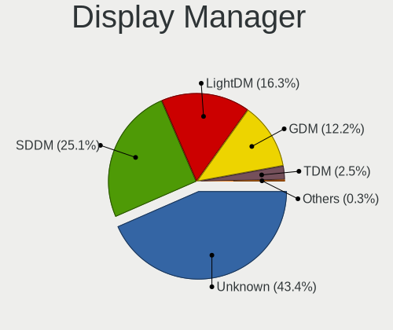
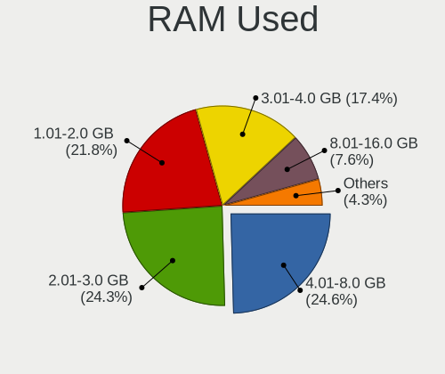
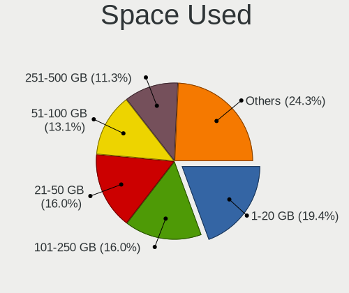
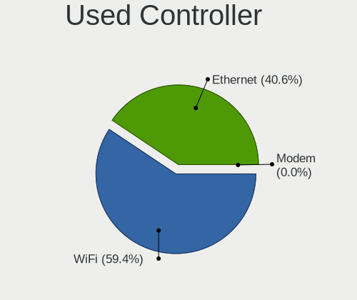
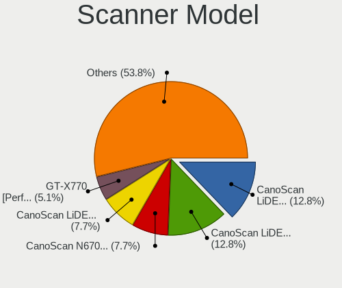
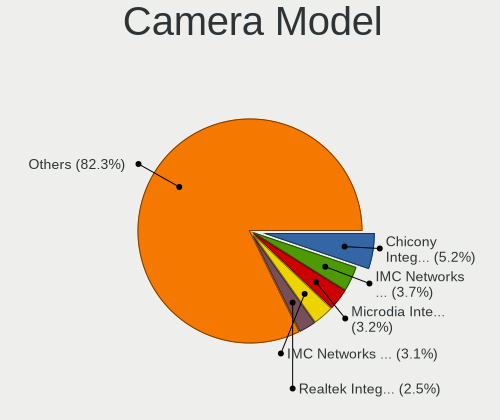

Manjaro - Tested Hardware & Statistics
--------------------------------------

A project to collect tested hardware configurations for Manjaro.

Anyone can contribute to this report by the [hw-probe](https://github.com/linuxhw/hw-probe) tool:

    sudo -E hw-probe -all -upload

Please contribute! Especially if your hardware is rare.

This is a report for all computer types. See also reports for [desktops](/Dist/Manjaro/Desktop/README.md) and [notebooks](/Dist/Manjaro/Notebook/README.md).

Contents
--------

* [ Test Cases ](#test-cases)

* [ System ](#system)
  - [ OS                       ](#os)
  - [ OS Family                ](#os-family)
  - [ Kernel                   ](#kernel)
  - [ Kernel Family            ](#kernel-family)
  - [ Kernel Major Ver.        ](#kernel-major-ver)
  - [ Arch                     ](#arch)
  - [ DE                       ](#de)
  - [ Display Server           ](#display-server)
  - [ Display Manager          ](#display-manager)
  - [ OS Lang                  ](#os-lang)
  - [ Boot Mode                ](#boot-mode)
  - [ Filesystem               ](#filesystem)
  - [ Part. scheme             ](#part-scheme)
  - [ Dual Boot with Linux/BSD ](#dual-boot-with-linuxbsd)
  - [ Dual Boot (Win)          ](#dual-boot-win)

* [ Board ](#board)
  - [ Vendor                   ](#vendor)
  - [ Model                    ](#model)
  - [ Model Family             ](#model-family)
  - [ MFG Year                 ](#mfg-year)
  - [ Form Factor              ](#form-factor)
  - [ Secure Boot              ](#secure-boot)
  - [ Coreboot                 ](#coreboot)
  - [ RAM Size                 ](#ram-size)
  - [ RAM Used                 ](#ram-used)
  - [ Total Drives             ](#total-drives)
  - [ Has CD-ROM               ](#has-cd-rom)
  - [ Has Ethernet             ](#has-ethernet)
  - [ Has WiFi                 ](#has-wifi)
  - [ Has Bluetooth            ](#has-bluetooth)

* [ Location ](#location)
  - [ Country                  ](#country)
  - [ City                     ](#city)

* [ Drives ](#drives)
  - [ Drive Vendor             ](#drive-vendor)
  - [ Drive Model              ](#drive-model)
  - [ HDD Vendor               ](#hdd-vendor)
  - [ SSD Vendor               ](#ssd-vendor)
  - [ Drive Kind               ](#drive-kind)
  - [ Drive Connector          ](#drive-connector)
  - [ Drive Size               ](#drive-size)
  - [ Space Total              ](#space-total)
  - [ Space Used               ](#space-used)
  - [ Malfunc. Drives          ](#malfunc-drives)
  - [ Malfunc. Drive Vendor    ](#malfunc-drive-vendor)
  - [ Malfunc. HDD Vendor      ](#malfunc-hdd-vendor)
  - [ Malfunc. Drive Kind      ](#malfunc-drive-kind)
  - [ Failed Drives            ](#failed-drives)
  - [ Failed Drive Vendor      ](#failed-drive-vendor)
  - [ Drive Status             ](#drive-status)

* [ Storage controller ](#storage-controller)
  - [ Storage Vendor           ](#storage-vendor)
  - [ Storage Model            ](#storage-model)
  - [ Storage Kind             ](#storage-kind)

* [ Processor ](#processor)
  - [ CPU Vendor               ](#cpu-vendor)
  - [ CPU Model                ](#cpu-model)
  - [ CPU Model Family         ](#cpu-model-family)
  - [ CPU Cores                ](#cpu-cores)
  - [ CPU Sockets              ](#cpu-sockets)
  - [ CPU Threads              ](#cpu-threads)
  - [ CPU Op-Modes             ](#cpu-op-modes)
  - [ CPU Microcode            ](#cpu-microcode)
  - [ CPU Microarch            ](#cpu-microarch)

* [ Graphics ](#graphics)
  - [ GPU Vendor               ](#gpu-vendor)
  - [ GPU Model                ](#gpu-model)
  - [ GPU Combo                ](#gpu-combo)
  - [ GPU Driver               ](#gpu-driver)
  - [ GPU Memory               ](#gpu-memory)

* [ Monitor ](#monitor)
  - [ Monitor Vendor           ](#monitor-vendor)
  - [ Monitor Model            ](#monitor-model)
  - [ Monitor Resolution       ](#monitor-resolution)
  - [ Monitor Diagonal         ](#monitor-diagonal)
  - [ Monitor Width            ](#monitor-width)
  - [ Aspect Ratio             ](#aspect-ratio)
  - [ Monitor Area             ](#monitor-area)
  - [ Pixel Density            ](#pixel-density)
  - [ Multiple Monitors        ](#multiple-monitors)

* [ Network ](#network)
  - [ Net Controller Vendor    ](#net-controller-vendor)
  - [ Net Controller Model     ](#net-controller-model)
  - [ Wireless Vendor          ](#wireless-vendor)
  - [ Wireless Model           ](#wireless-model)
  - [ Ethernet Vendor          ](#ethernet-vendor)
  - [ Ethernet Model           ](#ethernet-model)
  - [ Net Controller Kind      ](#net-controller-kind)
  - [ Used Controller          ](#used-controller)
  - [ NICs                     ](#nics)
  - [ IPv6                     ](#ipv6)

* [ Bluetooth ](#bluetooth)
  - [ Bluetooth Vendor         ](#bluetooth-vendor)
  - [ Bluetooth Model          ](#bluetooth-model)

* [ Sound ](#sound)
  - [ Sound Vendor             ](#sound-vendor)
  - [ Sound Model              ](#sound-model)

* [ Memory ](#memory)
  - [ Memory Vendor            ](#memory-vendor)
  - [ Memory Model             ](#memory-model)
  - [ Memory Kind              ](#memory-kind)
  - [ Memory Form Factor       ](#memory-form-factor)
  - [ Memory Size              ](#memory-size)
  - [ Memory Speed             ](#memory-speed)

* [ Printers & scanners ](#printers--scanners)
  - [ Printer Vendor           ](#printer-vendor)
  - [ Printer Model            ](#printer-model)
  - [ Scanner Vendor           ](#scanner-vendor)
  - [ Scanner Model            ](#scanner-model)

* [ Camera ](#camera)
  - [ Camera Vendor            ](#camera-vendor)
  - [ Camera Model             ](#camera-model)

* [ Security ](#security)
  - [ Fingerprint Vendor       ](#fingerprint-vendor)
  - [ Fingerprint Model        ](#fingerprint-model)
  - [ Chipcard Vendor          ](#chipcard-vendor)
  - [ Chipcard Model           ](#chipcard-model)

* [ Unsupported ](#unsupported)
  - [ Unsupported Devices      ](#unsupported-devices)
  - [ Unsupported Device Types ](#unsupported-device-types)

Test Cases
----------

Total: 8952

| Vendor        | Model                       | Form-Factor | Probe                                                      | Date         |
|---------------|-----------------------------|-------------|------------------------------------------------------------|--------------|
| ASUSTek       | ROG STRIX X570-F GAMING     | Desktop     | [7e22db9b23](https://linux-hardware.org/?probe=7e22db9b23) | Dec 31, 2022 |
| Unknown       | Unknown                     | Notebook    | [10496680a5](https://linux-hardware.org/?probe=10496680a5) | Dec 31, 2022 |
| Dell          | XPS 9320                    | Notebook    | [c98fd80f29](https://linux-hardware.org/?probe=c98fd80f29) | Dec 31, 2022 |
| ASUSTek       | X550VXK                     | Notebook    | [b8cd38522a](https://linux-hardware.org/?probe=b8cd38522a) | Dec 31, 2022 |
| Lenovo        | ThinkPad T14 Gen 1 20UDC... | Notebook    | [ac397dc318](https://linux-hardware.org/?probe=ac397dc318) | Dec 31, 2022 |
| ASRock        | B550 Steel Legend           | Desktop     | [8705e10ac6](https://linux-hardware.org/?probe=8705e10ac6) | Dec 31, 2022 |
| HP            | EliteBook 845 14 inch G9... | Notebook    | [5b5e58e433](https://linux-hardware.org/?probe=5b5e58e433) | Dec 31, 2022 |
| HP            | Pavilion Aero Laptop 13-... | Notebook    | [c2a949b725](https://linux-hardware.org/?probe=c2a949b725) | Dec 31, 2022 |
| Lenovo        | ThinkPad T480 20L50000UK    | Notebook    | [5043868e71](https://linux-hardware.org/?probe=5043868e71) | Dec 30, 2022 |
| ASUSTek       | PRIME X670-P WIFI           | Desktop     | [cecef0575d](https://linux-hardware.org/?probe=cecef0575d) | Dec 30, 2022 |
| HP            | Pavilion x360 Convertibl... | Convertible | [7be9115c85](https://linux-hardware.org/?probe=7be9115c85) | Dec 30, 2022 |
| Google        | Nautilus                    | Convertible | [8d1977d0ae](https://linux-hardware.org/?probe=8d1977d0ae) | Dec 30, 2022 |
| Gigabyte      | Z87-HD3                     | Desktop     | [97f08bd689](https://linux-hardware.org/?probe=97f08bd689) | Dec 30, 2022 |
| ASUSTek       | ASUS TUF Gaming A15 FA50... | Notebook    | [614187020c](https://linux-hardware.org/?probe=614187020c) | Dec 29, 2022 |
| Gigabyte      | H510M H                     | Desktop     | [24574296e5](https://linux-hardware.org/?probe=24574296e5) | Dec 29, 2022 |
| HP            | Pavilion Sleekbook 14 PC    | Notebook    | [11d4e1f9a1](https://linux-hardware.org/?probe=11d4e1f9a1) | Dec 29, 2022 |
| HP            | Pavilion Sleekbook 14 PC    | Notebook    | [b60b954dc4](https://linux-hardware.org/?probe=b60b954dc4) | Dec 29, 2022 |
| Gigabyte      | B550 AORUS PRO V2           | Desktop     | [7a7f335c4a](https://linux-hardware.org/?probe=7a7f335c4a) | Dec 29, 2022 |
| Lenovo        | ThinkBook 13s G4 ARB 21A... | Notebook    | [29bca2b322](https://linux-hardware.org/?probe=29bca2b322) | Dec 29, 2022 |
| ASUSTek       | ASUS TUF Gaming F15 FX50... | Notebook    | [8702939897](https://linux-hardware.org/?probe=8702939897) | Dec 29, 2022 |
| GPU Compan... | GWNR71517                   | Notebook    | [bc9e41ea0d](https://linux-hardware.org/?probe=bc9e41ea0d) | Dec 29, 2022 |
| GPU Compan... | GWNR71517                   | Notebook    | [65f3d3dd65](https://linux-hardware.org/?probe=65f3d3dd65) | Dec 29, 2022 |
| MSI           | X370 GAMING M7 ACK          | Desktop     | [60fe0d0b31](https://linux-hardware.org/?probe=60fe0d0b31) | Dec 29, 2022 |
| Apple         | MacBookAir6,2               | Notebook    | [af9ab4ba4d](https://linux-hardware.org/?probe=af9ab4ba4d) | Dec 29, 2022 |
| Lenovo        | ThinkPad T480 20L50000UK    | Notebook    | [f5cbe897b8](https://linux-hardware.org/?probe=f5cbe897b8) | Dec 29, 2022 |
| MSI           | PRO B660M-A DDR4            | Desktop     | [dbc37ff826](https://linux-hardware.org/?probe=dbc37ff826) | Dec 29, 2022 |
| HP            | ENVY x360 Convertible 15... | Convertible | [599c42b4e6](https://linux-hardware.org/?probe=599c42b4e6) | Dec 28, 2022 |
| Lenovo        | ThinkPad T480 20L50000UK    | Notebook    | [f19e16b1ac](https://linux-hardware.org/?probe=f19e16b1ac) | Dec 28, 2022 |
| Lenovo        | ThinkPad T480 20L50000UK    | Notebook    | [41f77d037b](https://linux-hardware.org/?probe=41f77d037b) | Dec 28, 2022 |
| Dell          | 0TTDMJ A00                  | Desktop     | [198e723dc2](https://linux-hardware.org/?probe=198e723dc2) | Dec 28, 2022 |
| Lenovo        | ThinkPad X1 Yoga 2nd 20J... | Convertible | [0e619635fe](https://linux-hardware.org/?probe=0e619635fe) | Dec 28, 2022 |
| HP            | ENVY x360 Convertible 15... | Convertible | [c42c0afa9b](https://linux-hardware.org/?probe=c42c0afa9b) | Dec 28, 2022 |
| Gigabyte      | B550 AORUS PRO V2           | Desktop     | [6d56c4c392](https://linux-hardware.org/?probe=6d56c4c392) | Dec 27, 2022 |
| Gigabyte      | B550 AORUS PRO V2           | Desktop     | [d6a12148ec](https://linux-hardware.org/?probe=d6a12148ec) | Dec 27, 2022 |
| Lenovo        | ThinkPad E14 Gen 2 20T60... | Notebook    | [b62b4d2134](https://linux-hardware.org/?probe=b62b4d2134) | Dec 27, 2022 |
| Gigabyte      | B550M AORUS PRO-P           | Desktop     | [bd232cd937](https://linux-hardware.org/?probe=bd232cd937) | Dec 27, 2022 |
| Gigabyte      | Z370 HD3-CF                 | Desktop     | [ac6571db76](https://linux-hardware.org/?probe=ac6571db76) | Dec 27, 2022 |
| Dell          | XPS 9320                    | Notebook    | [7a2537eba2](https://linux-hardware.org/?probe=7a2537eba2) | Dec 27, 2022 |
| Lenovo        | ThinkPad X1 Carbon 6th 2... | Notebook    | [eb5e0b8201](https://linux-hardware.org/?probe=eb5e0b8201) | Dec 27, 2022 |
| Lenovo        | ThinkPad X1 Carbon 6th 2... | Notebook    | [4ea69511df](https://linux-hardware.org/?probe=4ea69511df) | Dec 27, 2022 |
| ASRock        | Z690 Taichi                 | Desktop     | [4a4e2975d2](https://linux-hardware.org/?probe=4a4e2975d2) | Dec 27, 2022 |
| ASUSTek       | M5A78L-M LX3                | Desktop     | [a6c0667059](https://linux-hardware.org/?probe=a6c0667059) | Dec 27, 2022 |
| ASUSTek       | M5A78L-M LX3                | Desktop     | [ad94a727ab](https://linux-hardware.org/?probe=ad94a727ab) | Dec 27, 2022 |
| HP            | Pavilion Gaming Laptop 1... | Notebook    | [c8b85cb0cd](https://linux-hardware.org/?probe=c8b85cb0cd) | Dec 26, 2022 |
| ASRock        | AB350M-HDV                  | Desktop     | [666ea6d820](https://linux-hardware.org/?probe=666ea6d820) | Dec 26, 2022 |
| Dell          | Inspiron N5010              | Notebook    | [69ac8a9522](https://linux-hardware.org/?probe=69ac8a9522) | Dec 26, 2022 |
| ASUSTek       | M5A97 R2.0                  | Desktop     | [be1ace7f20](https://linux-hardware.org/?probe=be1ace7f20) | Dec 26, 2022 |
| Lenovo        | IdeaPad 5 15ARE05 81YQ      | Notebook    | [06027a53fb](https://linux-hardware.org/?probe=06027a53fb) | Dec 26, 2022 |
| Chuwi         | HeroBook Air                | Notebook    | [1f96a04f20](https://linux-hardware.org/?probe=1f96a04f20) | Dec 25, 2022 |
| HUAWEI        | HVY-WXX9                    | Notebook    | [649291f277](https://linux-hardware.org/?probe=649291f277) | Dec 25, 2022 |
| ASUSTek       | ROG Zephyrus G14 GA402RK... | Notebook    | [6cc10dd6de](https://linux-hardware.org/?probe=6cc10dd6de) | Dec 25, 2022 |
| TUXEDO        | Pulse 14 Gen1               | Notebook    | [8d2d8be057](https://linux-hardware.org/?probe=8d2d8be057) | Dec 25, 2022 |
| MSI           | B450 GAMING PRO CARBON A... | Desktop     | [82de75771e](https://linux-hardware.org/?probe=82de75771e) | Dec 25, 2022 |
| HP            | Spectre x360 2-in-1 Lapt... | Convertible | [a986dd2bf4](https://linux-hardware.org/?probe=a986dd2bf4) | Dec 25, 2022 |
| MSI           | GS60 6QE                    | Notebook    | [aa2f6b0f24](https://linux-hardware.org/?probe=aa2f6b0f24) | Dec 24, 2022 |
| Dell          | XPS 9320                    | Notebook    | [f55956cac2](https://linux-hardware.org/?probe=f55956cac2) | Dec 24, 2022 |
| Lenovo        | ThinkBook 15-IIL 20SM       | Notebook    | [81fcc00d18](https://linux-hardware.org/?probe=81fcc00d18) | Dec 24, 2022 |
| ASRock        | X670E Pro RS                | Desktop     | [b7a0a3d703](https://linux-hardware.org/?probe=b7a0a3d703) | Dec 24, 2022 |
| ASUSTek       | PRIME B450-PLUS             | Desktop     | [e3e2773bde](https://linux-hardware.org/?probe=e3e2773bde) | Dec 24, 2022 |
| HP            | ProBook 6470b               | Notebook    | [880f8d51d3](https://linux-hardware.org/?probe=880f8d51d3) | Dec 24, 2022 |
| HP            | ProBook 6470b               | Notebook    | [315e362044](https://linux-hardware.org/?probe=315e362044) | Dec 24, 2022 |
| Medion        | E4251 MD61435               | Notebook    | [0ef8f76193](https://linux-hardware.org/?probe=0ef8f76193) | Dec 23, 2022 |
| HP            | Laptop 15-bs0xx             | Notebook    | [3d50b74a6b](https://linux-hardware.org/?probe=3d50b74a6b) | Dec 23, 2022 |
| HUAWEI        | KPR-WX9                     | Notebook    | [e2b01c4a0f](https://linux-hardware.org/?probe=e2b01c4a0f) | Dec 23, 2022 |
| ZOTAC         | ZBOX-MI640/MI660/MI620NA... | Mini pc     | [c36792aeaa](https://linux-hardware.org/?probe=c36792aeaa) | Dec 23, 2022 |
| Acer          | Aspire A515-52G             | Notebook    | [586dd36eed](https://linux-hardware.org/?probe=586dd36eed) | Dec 23, 2022 |
| Framework     | Laptop (12th Gen Intel C... | Notebook    | [e2e9b14a43](https://linux-hardware.org/?probe=e2e9b14a43) | Dec 23, 2022 |
| Dell          | Inspiron 16 7620 2-in-1     | Convertible | [434eb9ba86](https://linux-hardware.org/?probe=434eb9ba86) | Dec 23, 2022 |
| Dell          | Precision M6600             | Notebook    | [00840d085c](https://linux-hardware.org/?probe=00840d085c) | Dec 23, 2022 |
| Dell          | Inspiron 15 7000 Gaming     | Notebook    | [668dac3d4c](https://linux-hardware.org/?probe=668dac3d4c) | Dec 23, 2022 |
| Gigabyte      | H510M H                     | Desktop     | [d592546f0a](https://linux-hardware.org/?probe=d592546f0a) | Dec 23, 2022 |
| Dell          | XPS 9320                    | Notebook    | [7bb7ba7202](https://linux-hardware.org/?probe=7bb7ba7202) | Dec 23, 2022 |
| Gigabyte      | H510M H                     | Desktop     | [52f1e32fc8](https://linux-hardware.org/?probe=52f1e32fc8) | Dec 23, 2022 |
| Lenovo        | ThinkPad T470s 20HF005QM... | Notebook    | [b934598049](https://linux-hardware.org/?probe=b934598049) | Dec 22, 2022 |
| MSI           | Katana GF66 11UE            | Notebook    | [b993283081](https://linux-hardware.org/?probe=b993283081) | Dec 22, 2022 |
| Dell          | 0GY6Y8 A02                  | Desktop     | [1044231936](https://linux-hardware.org/?probe=1044231936) | Dec 22, 2022 |
| HUAWEI        | VLT-WX0                     | Notebook    | [6f2d542a6e](https://linux-hardware.org/?probe=6f2d542a6e) | Dec 22, 2022 |
| ASUSTek       | K45VM                       | Notebook    | [ee344993aa](https://linux-hardware.org/?probe=ee344993aa) | Dec 22, 2022 |
| ASUSTek       | K45VM                       | Notebook    | [cc9fb3fd05](https://linux-hardware.org/?probe=cc9fb3fd05) | Dec 22, 2022 |
| Lenovo        | ThinkPad T540p 20BFS0MQ0... | Notebook    | [94e5bdb2cb](https://linux-hardware.org/?probe=94e5bdb2cb) | Dec 22, 2022 |
| HP            | 8053                        | Desktop     | [38b3012a7c](https://linux-hardware.org/?probe=38b3012a7c) | Dec 22, 2022 |
| HP            | Laptop 15-dy2xxx            | Notebook    | [482001243a](https://linux-hardware.org/?probe=482001243a) | Dec 22, 2022 |
| HP            | Laptop 15-dy2xxx            | Notebook    | [95a82bb7e0](https://linux-hardware.org/?probe=95a82bb7e0) | Dec 22, 2022 |
| Acer          | Spin SP314-21               | Convertible | [3f7986b3c2](https://linux-hardware.org/?probe=3f7986b3c2) | Dec 22, 2022 |
| Lenovo        | ThinkPad X1 Carbon 4th 2... | Notebook    | [214d584e36](https://linux-hardware.org/?probe=214d584e36) | Dec 21, 2022 |
| HP            | Pavilion Laptop 15-cs2xx... | Notebook    | [c4f6f99d36](https://linux-hardware.org/?probe=c4f6f99d36) | Dec 21, 2022 |
| Lenovo        | ThinkPad X1 Yoga 2nd 20J... | Convertible | [59f4b3b5b4](https://linux-hardware.org/?probe=59f4b3b5b4) | Dec 21, 2022 |
| ASRock        | X670E Taichi                | Desktop     | [e1b13226a4](https://linux-hardware.org/?probe=e1b13226a4) | Dec 21, 2022 |
| HP            | ENVY Laptop 16-h0xxx        | Notebook    | [4e38f93dd3](https://linux-hardware.org/?probe=4e38f93dd3) | Dec 21, 2022 |
| Lenovo        | ThinkPad T490 20N20048GE    | Notebook    | [629a725afa](https://linux-hardware.org/?probe=629a725afa) | Dec 21, 2022 |
| Acer          | Aspire E5-575G              | Notebook    | [56a3b5ff2b](https://linux-hardware.org/?probe=56a3b5ff2b) | Dec 21, 2022 |
| ASRock        | AB350 Pro4                  | Desktop     | [c7005e1e89](https://linux-hardware.org/?probe=c7005e1e89) | Dec 21, 2022 |
| IP3 Tech      | GB3B                        | Mini pc     | [1498d2b037](https://linux-hardware.org/?probe=1498d2b037) | Dec 21, 2022 |
| Lenovo        | Yoga Slim 7 Pro 16ACH6 8... | Notebook    | [b6252c3e0e](https://linux-hardware.org/?probe=b6252c3e0e) | Dec 20, 2022 |
| Lenovo        | ThinkPad P73 20QR0028GE     | Notebook    | [9e860431a0](https://linux-hardware.org/?probe=9e860431a0) | Dec 20, 2022 |
| Apple         | Mac-7BA5B2DFE22DDD8C Mac... | Mini pc     | [36ac1009a7](https://linux-hardware.org/?probe=36ac1009a7) | Dec 20, 2022 |
| ASUSTek       | ROG Zephyrus M16 GU603HE... | Notebook    | [bdb2887598](https://linux-hardware.org/?probe=bdb2887598) | Dec 20, 2022 |
| Lenovo        | ThinkPad T480 20L50004GE    | Notebook    | [90d1d153a4](https://linux-hardware.org/?probe=90d1d153a4) | Dec 20, 2022 |
| Acer          | Aspire A715-51G             | Notebook    | [93eff781da](https://linux-hardware.org/?probe=93eff781da) | Dec 20, 2022 |
| Acer          | Aspire A715-51G             | Notebook    | [0b7352a343](https://linux-hardware.org/?probe=0b7352a343) | Dec 20, 2022 |
| Samsung       | 355V4C/355V4X/355V5C/355... | Notebook    | [654a04cdc4](https://linux-hardware.org/?probe=654a04cdc4) | Dec 20, 2022 |
| ATOPNUC       | MA90                        | Mini pc     | [441c2c54c5](https://linux-hardware.org/?probe=441c2c54c5) | Dec 19, 2022 |
| Gigabyte      | Z690 AORUS PRO              | Desktop     | [dbefd12c1c](https://linux-hardware.org/?probe=dbefd12c1c) | Dec 19, 2022 |
| Toshiba       | Satellite L10W-B-101        | Notebook    | [94e7515168](https://linux-hardware.org/?probe=94e7515168) | Dec 19, 2022 |
| HUAWEI        | HVY-WXX9                    | Notebook    | [ebf2594631](https://linux-hardware.org/?probe=ebf2594631) | Dec 19, 2022 |
| HP            | EliteBook x360 1040 G6      | Convertible | [6ab908c6b2](https://linux-hardware.org/?probe=6ab908c6b2) | Dec 19, 2022 |
| K.A.Techno... | TM1                         | Notebook    | [88e36a5d00](https://linux-hardware.org/?probe=88e36a5d00) | Dec 19, 2022 |
| Chuwi         | GemiBook Pro                | Notebook    | [aaaf436994](https://linux-hardware.org/?probe=aaaf436994) | Dec 19, 2022 |
| ASUSTek       | ROG STRIX B650-A GAMING ... | Desktop     | [9fb0357e3e](https://linux-hardware.org/?probe=9fb0357e3e) | Dec 19, 2022 |
| ASRock        | Z390 Pro4                   | Desktop     | [478165e478](https://linux-hardware.org/?probe=478165e478) | Dec 18, 2022 |
| Dell          | XPS 13 9350                 | Notebook    | [d414748117](https://linux-hardware.org/?probe=d414748117) | Dec 18, 2022 |
| ASUSTek       | Zenbook Flip UP5302ZA_UP... | Convertible | [a9925bf157](https://linux-hardware.org/?probe=a9925bf157) | Dec 18, 2022 |
| Gigabyte      | B550M DS3H                  | Desktop     | [d868b73cfb](https://linux-hardware.org/?probe=d868b73cfb) | Dec 18, 2022 |
| Lenovo        | IdeaPad 3 15ALC6 82MF       | Notebook    | [c45ca502c5](https://linux-hardware.org/?probe=c45ca502c5) | Dec 18, 2022 |
| Lenovo        | ThinkPad E15 Gen 4 21EDC... | Notebook    | [2d6dff8209](https://linux-hardware.org/?probe=2d6dff8209) | Dec 18, 2022 |
| Lenovo        | IdeaPad 3 15ALC6 82MF       | Notebook    | [0d67c53553](https://linux-hardware.org/?probe=0d67c53553) | Dec 18, 2022 |
| HP            | 2000                        | Notebook    | [6273a792ae](https://linux-hardware.org/?probe=6273a792ae) | Dec 18, 2022 |
| Acer          | Aspire A515-46              | Notebook    | [fab35bfa42](https://linux-hardware.org/?probe=fab35bfa42) | Dec 18, 2022 |
| Dell          | Inspiron N5110              | Notebook    | [9b8756cdd0](https://linux-hardware.org/?probe=9b8756cdd0) | Dec 17, 2022 |
| Lenovo        | ThinkPad X1 Extreme 2nd ... | Notebook    | [86fbbf1bc2](https://linux-hardware.org/?probe=86fbbf1bc2) | Dec 17, 2022 |
| Gigabyte      | B460M AORUS PRO             | Desktop     | [6deb38fb48](https://linux-hardware.org/?probe=6deb38fb48) | Dec 17, 2022 |
| MSI           | X370 GAMING M7 ACK          | Desktop     | [71dabd9e44](https://linux-hardware.org/?probe=71dabd9e44) | Dec 17, 2022 |
| MSI           | A68HM-E33                   | Desktop     | [0df6f80110](https://linux-hardware.org/?probe=0df6f80110) | Dec 17, 2022 |
| MSI           | X370 GAMING M7 ACK          | Desktop     | [3b245437e5](https://linux-hardware.org/?probe=3b245437e5) | Dec 17, 2022 |
| Lenovo        | ThinkPad P73 20QR0028GE     | Notebook    | [8e689417f3](https://linux-hardware.org/?probe=8e689417f3) | Dec 16, 2022 |
| Alienware     | 15                          | Notebook    | [6da8e1748a](https://linux-hardware.org/?probe=6da8e1748a) | Dec 16, 2022 |
| Gigabyte      | X570 AORUS ELITE            | Desktop     | [d2dce9cbfd](https://linux-hardware.org/?probe=d2dce9cbfd) | Dec 16, 2022 |
| Lenovo        | ThinkPad T14 Gen 1 20UD0... | Notebook    | [8f50c0d881](https://linux-hardware.org/?probe=8f50c0d881) | Dec 15, 2022 |
| Dell          | Vostro 7590                 | Notebook    | [c758af3223](https://linux-hardware.org/?probe=c758af3223) | Dec 15, 2022 |
| Gigabyte      | H510M H                     | Desktop     | [ccb746cd73](https://linux-hardware.org/?probe=ccb746cd73) | Dec 15, 2022 |
| HP            | OMEN Laptop 15-ek0xxx       | Notebook    | [4f63e7b8d1](https://linux-hardware.org/?probe=4f63e7b8d1) | Dec 15, 2022 |
| ZOTAC         | ION                         | Desktop     | [f02f6b8382](https://linux-hardware.org/?probe=f02f6b8382) | Dec 15, 2022 |
| HUAWEI        | BOM-WXX9                    | Notebook    | [ca39e55353](https://linux-hardware.org/?probe=ca39e55353) | Dec 15, 2022 |
| Dell          | Latitude 5420               | Notebook    | [5fa4cbba73](https://linux-hardware.org/?probe=5fa4cbba73) | Dec 15, 2022 |
| Dell          | 0D6H9T A02                  | Desktop     | [6266999282](https://linux-hardware.org/?probe=6266999282) | Dec 15, 2022 |
| Gigabyte      | B450M H                     | Desktop     | [c888c743e3](https://linux-hardware.org/?probe=c888c743e3) | Dec 15, 2022 |
| ASUSTek       | TUF Gaming X570-PLUS        | Desktop     | [7d15ecff86](https://linux-hardware.org/?probe=7d15ecff86) | Dec 15, 2022 |
| Dell          | Inspiron 5370               | Notebook    | [dd8f3feae5](https://linux-hardware.org/?probe=dd8f3feae5) | Dec 15, 2022 |
| Lenovo        | ThinkPad E15 Gen 2 20TDS... | Notebook    | [9495189605](https://linux-hardware.org/?probe=9495189605) | Dec 15, 2022 |
| ASUSTek       | TUF Gaming B650-PLUS WIF... | Desktop     | [72175490ae](https://linux-hardware.org/?probe=72175490ae) | Dec 15, 2022 |
| Razer         | Blade 15 (2022) - RZ09-0... | Notebook    | [3878d884cb](https://linux-hardware.org/?probe=3878d884cb) | Dec 15, 2022 |
| HP            | ENVY x360 Convertible 13... | Convertible | [a0d408fecd](https://linux-hardware.org/?probe=a0d408fecd) | Dec 15, 2022 |
| Razer         | Blade 15 (2022) - RZ09-0... | Notebook    | [98f6e27cac](https://linux-hardware.org/?probe=98f6e27cac) | Dec 14, 2022 |
| Toshiba       | Satellite Pro L300          | Notebook    | [6db5b50a6b](https://linux-hardware.org/?probe=6db5b50a6b) | Dec 14, 2022 |
| HP            | ENVY x360 Convertible 13... | Convertible | [6b47a036ab](https://linux-hardware.org/?probe=6b47a036ab) | Dec 14, 2022 |
| HP            | EliteBook 850 G8 Noteboo... | Notebook    | [db7a82e46c](https://linux-hardware.org/?probe=db7a82e46c) | Dec 14, 2022 |
| MSI           | B250 GAMING M3              | Desktop     | [cf050915a5](https://linux-hardware.org/?probe=cf050915a5) | Dec 14, 2022 |
| Dell          | XPS L501X                   | Notebook    | [f540185d6c](https://linux-hardware.org/?probe=f540185d6c) | Dec 14, 2022 |
| K.A.Techno... | TM1                         | Notebook    | [a27835f164](https://linux-hardware.org/?probe=a27835f164) | Dec 14, 2022 |
| Dell          | XPS L501X                   | Notebook    | [32e195f4c6](https://linux-hardware.org/?probe=32e195f4c6) | Dec 14, 2022 |
| MSI           | MAG X570S TORPEDO MAX       | Desktop     | [39d58ec9aa](https://linux-hardware.org/?probe=39d58ec9aa) | Dec 13, 2022 |
| ASUSTek       | X99-A II                    | Desktop     | [a6e0258bbe](https://linux-hardware.org/?probe=a6e0258bbe) | Dec 13, 2022 |
| ASUSTek       | ROG STRIX X670E-I GAMING... | Desktop     | [8fd3c60681](https://linux-hardware.org/?probe=8fd3c60681) | Dec 13, 2022 |
| Acer          | Aspire ES1-111M             | Notebook    | [0d527c1b1d](https://linux-hardware.org/?probe=0d527c1b1d) | Dec 13, 2022 |
| Intel         | Eaglelake Fab D             | Desktop     | [ed5c44a200](https://linux-hardware.org/?probe=ed5c44a200) | Dec 13, 2022 |
| Dell          | XPS 17 9700                 | Notebook    | [46c656a547](https://linux-hardware.org/?probe=46c656a547) | Dec 13, 2022 |
| MSI           | B450I GAMING PLUS MAX WI... | Desktop     | [0973466d88](https://linux-hardware.org/?probe=0973466d88) | Dec 13, 2022 |
| MSI           | B450I GAMING PLUS MAX WI... | Desktop     | [9d2ef8adf1](https://linux-hardware.org/?probe=9d2ef8adf1) | Dec 13, 2022 |
| HP            | Tablet 11m-be0xxx           | Tablet      | [5b4983c74e](https://linux-hardware.org/?probe=5b4983c74e) | Dec 13, 2022 |
| ASUSTek       | Zenbook UX3402ZA_UX3402Z... | Convertible | [221e900b1c](https://linux-hardware.org/?probe=221e900b1c) | Dec 13, 2022 |
| ASUSTek       | Zenbook UX3402ZA_UX3402Z... | Convertible | [4be6aa4b7a](https://linux-hardware.org/?probe=4be6aa4b7a) | Dec 13, 2022 |
| Acer          | Nitro AN517-41              | Notebook    | [468d665801](https://linux-hardware.org/?probe=468d665801) | Dec 12, 2022 |
| HP            | OMEN by Gaming Laptop 16... | Notebook    | [559c3f32f8](https://linux-hardware.org/?probe=559c3f32f8) | Dec 12, 2022 |
| HP            | OMEN by Gaming Laptop 16... | Notebook    | [eb0d410f64](https://linux-hardware.org/?probe=eb0d410f64) | Dec 12, 2022 |
| Apple         | MacBookPro11,2              | Notebook    | [6048cffe66](https://linux-hardware.org/?probe=6048cffe66) | Dec 12, 2022 |
| Unknown       | X133                        | Notebook    | [694e264bcf](https://linux-hardware.org/?probe=694e264bcf) | Dec 12, 2022 |
| MSI           | Prestige 14 A11SC           | Notebook    | [7fa118f812](https://linux-hardware.org/?probe=7fa118f812) | Dec 11, 2022 |
| Medion        | E4251                       | Notebook    | [f7303bf4c9](https://linux-hardware.org/?probe=f7303bf4c9) | Dec 11, 2022 |
| Apple         | MacBookPro11,1              | Notebook    | [492b382af1](https://linux-hardware.org/?probe=492b382af1) | Dec 11, 2022 |
| MSI           | MAG X570S TORPEDO MAX       | Desktop     | [c5501c208c](https://linux-hardware.org/?probe=c5501c208c) | Dec 11, 2022 |
| Gigabyte      | B550M AORUS PRO-P           | Desktop     | [6964e348d6](https://linux-hardware.org/?probe=6964e348d6) | Dec 11, 2022 |
| ASUSTek       | X99-A II                    | Desktop     | [09f8da551c](https://linux-hardware.org/?probe=09f8da551c) | Dec 11, 2022 |
| Acer          | Aspire E5-571G              | Notebook    | [5ddea1e0e0](https://linux-hardware.org/?probe=5ddea1e0e0) | Dec 11, 2022 |
| ASUSTek       | ROG STRIX B550-F GAMING     | Desktop     | [23be4288bb](https://linux-hardware.org/?probe=23be4288bb) | Dec 11, 2022 |
| ASUSTek       | ROG STRIX B550-F GAMING     | Desktop     | [121359234c](https://linux-hardware.org/?probe=121359234c) | Dec 11, 2022 |
| Teclast       | F5                          | Convertible | [02e54783b6](https://linux-hardware.org/?probe=02e54783b6) | Dec 11, 2022 |
| Lenovo        | ThinkPad T470s 20HF005QM... | Notebook    | [32ce05790e](https://linux-hardware.org/?probe=32ce05790e) | Dec 11, 2022 |
| Intel         | NUC5i5MYBE H47797-205       | Mini pc     | [20a5e76a25](https://linux-hardware.org/?probe=20a5e76a25) | Dec 10, 2022 |
| HUAWEI        | CREM-WXX9                   | Notebook    | [1b6dee1e4a](https://linux-hardware.org/?probe=1b6dee1e4a) | Dec 10, 2022 |
| HUAWEI        | NBLB-WAX9N                  | Notebook    | [61b2bab886](https://linux-hardware.org/?probe=61b2bab886) | Dec 10, 2022 |
| ASUSTek       | PRIME X570-P                | Desktop     | [6b00f35a38](https://linux-hardware.org/?probe=6b00f35a38) | Dec 10, 2022 |
| Medion        | E4251                       | Notebook    | [a16b01515b](https://linux-hardware.org/?probe=a16b01515b) | Dec 10, 2022 |
| Lenovo        | IdeaPad 5 15ARE05 81YQ      | Notebook    | [173f4b722f](https://linux-hardware.org/?probe=173f4b722f) | Dec 10, 2022 |
| HUAWEI        | CREM-WXX9                   | Notebook    | [fdda7ba30e](https://linux-hardware.org/?probe=fdda7ba30e) | Dec 10, 2022 |
| Lenovo        | IdeaPad Slim 7 14ITL05 8... | Notebook    | [16232a46ed](https://linux-hardware.org/?probe=16232a46ed) | Dec 10, 2022 |
| MSI           | MAG B550 TOMAHAWK           | Desktop     | [deab1a46db](https://linux-hardware.org/?probe=deab1a46db) | Dec 10, 2022 |
| ASUSTek       | PRIME B550M-A               | Desktop     | [e843a9c61d](https://linux-hardware.org/?probe=e843a9c61d) | Dec 10, 2022 |
| Lenovo        | ThinkPad L14 Gen 3 21C5S... | Notebook    | [7772d8b9f8](https://linux-hardware.org/?probe=7772d8b9f8) | Dec 10, 2022 |
| Gigabyte      | Z170-HD3P-CF                | Desktop     | [27fdfb657e](https://linux-hardware.org/?probe=27fdfb657e) | Dec 09, 2022 |
| GPU Compan... | GWNR71517                   | Notebook    | [148040d1fd](https://linux-hardware.org/?probe=148040d1fd) | Dec 09, 2022 |
| Lenovo        | IdeaPad 5 Pro 16ACH6 82L... | Notebook    | [9d240437ee](https://linux-hardware.org/?probe=9d240437ee) | Dec 08, 2022 |
| Gigabyte      | B550M S2H                   | Desktop     | [5e56097f25](https://linux-hardware.org/?probe=5e56097f25) | Dec 08, 2022 |
| MSI           | PRO B650-P WIFI             | Desktop     | [b74866314e](https://linux-hardware.org/?probe=b74866314e) | Dec 08, 2022 |
| IPASON        | MaxBook P1X                 | Notebook    | [c699081c87](https://linux-hardware.org/?probe=c699081c87) | Dec 08, 2022 |
| Gigabyte      | X570 AORUS ELITE            | Desktop     | [d6666dccec](https://linux-hardware.org/?probe=d6666dccec) | Dec 08, 2022 |
| Lenovo        | 3717 SDK0J40700 WIN 3258... | Desktop     | [c6895362e6](https://linux-hardware.org/?probe=c6895362e6) | Dec 07, 2022 |
| Lenovo        | ThinkStation S20 4157DT6    | Desktop     | [7c45cf5115](https://linux-hardware.org/?probe=7c45cf5115) | Dec 07, 2022 |
| Lenovo        | ThinkPad L13 Yoga 20R6S0... | Convertible | [be3a0b7c33](https://linux-hardware.org/?probe=be3a0b7c33) | Dec 07, 2022 |
| BESSTAR Te... | U820                        | Notebook    | [ea466e46b1](https://linux-hardware.org/?probe=ea466e46b1) | Dec 07, 2022 |
| Lenovo        | ThinkPad L13 Yoga 20R6S0... | Convertible | [3a8a41be2a](https://linux-hardware.org/?probe=3a8a41be2a) | Dec 07, 2022 |
| HP            | 245 G8                      | Notebook    | [2fbc616550](https://linux-hardware.org/?probe=2fbc616550) | Dec 07, 2022 |
| Clevo         | P150HMx                     | Notebook    | [f1500b1665](https://linux-hardware.org/?probe=f1500b1665) | Dec 06, 2022 |
| Gigabyte      | B450 AORUS PRO-CF           | Desktop     | [037c8e9cbc](https://linux-hardware.org/?probe=037c8e9cbc) | Dec 06, 2022 |
| Dell          | Inspiron N5110              | Notebook    | [9815b67f0b](https://linux-hardware.org/?probe=9815b67f0b) | Dec 06, 2022 |
| Dell          | G15 5515                    | Notebook    | [63fed6d448](https://linux-hardware.org/?probe=63fed6d448) | Dec 06, 2022 |
| Schenker      | VISION 15 (SVS15E21)        | Notebook    | [3e1e88ac7a](https://linux-hardware.org/?probe=3e1e88ac7a) | Dec 06, 2022 |
| Lenovo        | ThinkPad T450s 20BWS2KM0... | Notebook    | [792c537a38](https://linux-hardware.org/?probe=792c537a38) | Dec 06, 2022 |
| Gigabyte      | F2A58M-HD2                  | Desktop     | [61c23e2501](https://linux-hardware.org/?probe=61c23e2501) | Dec 06, 2022 |
| HP            | ProBook 440 G5              | Notebook    | [7f9c0a0974](https://linux-hardware.org/?probe=7f9c0a0974) | Dec 06, 2022 |
| Dell          | G5 5505                     | Notebook    | [c36399d764](https://linux-hardware.org/?probe=c36399d764) | Dec 06, 2022 |
| ASUSTek       | TUF Gaming B660-PLUS WIF... | Desktop     | [689479ce87](https://linux-hardware.org/?probe=689479ce87) | Dec 06, 2022 |
| Medion        | E4251                       | Notebook    | [a515c5c071](https://linux-hardware.org/?probe=a515c5c071) | Dec 05, 2022 |
| MSI           | B450 TOMAHAWK MAX           | Desktop     | [f11d4ebe40](https://linux-hardware.org/?probe=f11d4ebe40) | Dec 05, 2022 |
| Apple         | MacBookPro11,1              | Notebook    | [5b0565920f](https://linux-hardware.org/?probe=5b0565920f) | Dec 05, 2022 |
| Lenovo        | ThinkPad E15 Gen 2 20TD0... | Notebook    | [05f6a48b4a](https://linux-hardware.org/?probe=05f6a48b4a) | Dec 05, 2022 |
| Lenovo        | ThinkPad X1 Yoga 4th 20Q... | Convertible | [6c726b6eb7](https://linux-hardware.org/?probe=6c726b6eb7) | Dec 05, 2022 |
| Lenovo        | ThinkPad X1 Yoga 4th 20Q... | Convertible | [99b35ee6a3](https://linux-hardware.org/?probe=99b35ee6a3) | Dec 05, 2022 |
| ASUSTek       | VivoBook_ASUS Laptop E40... | Notebook    | [504a0286fb](https://linux-hardware.org/?probe=504a0286fb) | Dec 05, 2022 |
| Lenovo        | IdeaPad 3 15ITL05 81X8      | Notebook    | [8a91af8c9d](https://linux-hardware.org/?probe=8a91af8c9d) | Dec 05, 2022 |
| ASUSTek       | ROG STRIX Z690-A GAMING ... | Desktop     | [ddd1487d81](https://linux-hardware.org/?probe=ddd1487d81) | Dec 05, 2022 |
| Toshiba       | Satellite C650D             | Notebook    | [694d2c9099](https://linux-hardware.org/?probe=694d2c9099) | Dec 05, 2022 |
| HP            | 8053                        | Desktop     | [5fad592ef3](https://linux-hardware.org/?probe=5fad592ef3) | Dec 05, 2022 |
| Gigabyte      | B550M S2H                   | Desktop     | [dd012c9f92](https://linux-hardware.org/?probe=dd012c9f92) | Dec 04, 2022 |
| Medion        | E4251 MD61435               | Notebook    | [481a9c958a](https://linux-hardware.org/?probe=481a9c958a) | Dec 04, 2022 |
| HP            | EliteBook 855 G8 Noteboo... | Notebook    | [3ee55cc441](https://linux-hardware.org/?probe=3ee55cc441) | Dec 04, 2022 |
| ASUSTek       | VivoBook_ASUS Laptop E40... | Notebook    | [4a2e796be8](https://linux-hardware.org/?probe=4a2e796be8) | Dec 04, 2022 |
| HP            | ProBook 440 G5              | Notebook    | [a8e17ad39c](https://linux-hardware.org/?probe=a8e17ad39c) | Dec 04, 2022 |
| MECHREVO      | X3 Series GK7CP6R           | Notebook    | [7990b26bbf](https://linux-hardware.org/?probe=7990b26bbf) | Dec 04, 2022 |
| MSI           | MAG B550 TOMAHAWK           | Desktop     | [9eb248d38e](https://linux-hardware.org/?probe=9eb248d38e) | Dec 04, 2022 |
| Acer          | Aspire 4736Z                | Notebook    | [05ae64c1b8](https://linux-hardware.org/?probe=05ae64c1b8) | Dec 04, 2022 |
| Acer          | Aspire 4736Z                | Notebook    | [ae6745045a](https://linux-hardware.org/?probe=ae6745045a) | Dec 04, 2022 |
| ASUSTek       | M5A97 R2.0                  | Desktop     | [b3b5eb90e5](https://linux-hardware.org/?probe=b3b5eb90e5) | Dec 03, 2022 |
| HP            | ZBook 15 G4                 | Notebook    | [9950cb061d](https://linux-hardware.org/?probe=9950cb061d) | Dec 03, 2022 |
| HP            | Pavilion Laptop 15-cw1xx... | Notebook    | [2cf560b162](https://linux-hardware.org/?probe=2cf560b162) | Dec 03, 2022 |
| Medion        | E4251 MD61435               | Notebook    | [c3f4fd226e](https://linux-hardware.org/?probe=c3f4fd226e) | Dec 03, 2022 |
| Medion        | E4251                       | Notebook    | [3167cbece1](https://linux-hardware.org/?probe=3167cbece1) | Dec 03, 2022 |
| HP            | Pavilion Laptop             | Notebook    | [2e2f1d44c1](https://linux-hardware.org/?probe=2e2f1d44c1) | Dec 03, 2022 |
| ASRock        | Z87 Extreme4                | Desktop     | [422dde5ae5](https://linux-hardware.org/?probe=422dde5ae5) | Dec 03, 2022 |
| MSI           | B450I GAMING PLUS AC        | Desktop     | [366f9ae2aa](https://linux-hardware.org/?probe=366f9ae2aa) | Dec 03, 2022 |
| Gigabyte      | B550M AORUS PRO-P           | Desktop     | [ec36ceb3fd](https://linux-hardware.org/?probe=ec36ceb3fd) | Dec 02, 2022 |
| MSI           | A68HM-E33                   | Desktop     | [4e2313d8b7](https://linux-hardware.org/?probe=4e2313d8b7) | Dec 02, 2022 |
| HP            | ENVY x360 Convertible 15... | Convertible | [04e81bb56a](https://linux-hardware.org/?probe=04e81bb56a) | Dec 02, 2022 |
| Lenovo        | ThinkPad L15 Gen 2 20X4S... | Notebook    | [3b87d266c2](https://linux-hardware.org/?probe=3b87d266c2) | Dec 02, 2022 |
| Valve         | Jupiter                     | Notebook    | [1fdf6ffce7](https://linux-hardware.org/?probe=1fdf6ffce7) | Dec 01, 2022 |
| Apple         | Mac-35C5E08120C7EEAF Mac... | Mini pc     | [a203c920d4](https://linux-hardware.org/?probe=a203c920d4) | Dec 01, 2022 |
| Dell          | Precision 5540              | Notebook    | [030dbd45f0](https://linux-hardware.org/?probe=030dbd45f0) | Dec 01, 2022 |
| Lenovo        | ThinkPad X1 Yoga 4th 20Q... | Convertible | [72ab240431](https://linux-hardware.org/?probe=72ab240431) | Dec 01, 2022 |
| ASUSTek       | ROG STRIX Z690-A GAMING ... | Desktop     | [8cf4925f08](https://linux-hardware.org/?probe=8cf4925f08) | Dec 01, 2022 |
| Acer          | TravelMate P614-51T-G2      | Notebook    | [952e89e25d](https://linux-hardware.org/?probe=952e89e25d) | Dec 01, 2022 |
| ASRock        | X300M-STX                   | Desktop     | [97ceee65f3](https://linux-hardware.org/?probe=97ceee65f3) | Dec 01, 2022 |
| ASRock        | X300M-STX                   | Desktop     | [5b7f983a24](https://linux-hardware.org/?probe=5b7f983a24) | Dec 01, 2022 |
| ASRock        | X300M-STX                   | Desktop     | [42ddb2463e](https://linux-hardware.org/?probe=42ddb2463e) | Dec 01, 2022 |
| Lenovo        | ThinkPad E15 Gen 2 20TDS... | Notebook    | [9bd70d2025](https://linux-hardware.org/?probe=9bd70d2025) | Nov 30, 2022 |
| Lenovo        | ThinkPad E15 Gen 2 20TDS... | Notebook    | [bd0ca3e793](https://linux-hardware.org/?probe=bd0ca3e793) | Nov 30, 2022 |
| Toshiba       | TECRA S11                   | Notebook    | [3d2414e47b](https://linux-hardware.org/?probe=3d2414e47b) | Nov 30, 2022 |
| Gigabyte      | Z370 HD3-CF                 | Desktop     | [ece7618688](https://linux-hardware.org/?probe=ece7618688) | Nov 30, 2022 |
| Lenovo        | Legion 5 17ACH6H 82JY       | Notebook    | [f5f86becf7](https://linux-hardware.org/?probe=f5f86becf7) | Nov 30, 2022 |
| ASUSTek       | ASUS TUF Gaming F15 FX50... | Notebook    | [f4de100586](https://linux-hardware.org/?probe=f4de100586) | Nov 29, 2022 |
| Dell          | Precision 7520              | Notebook    | [2c0cb92f23](https://linux-hardware.org/?probe=2c0cb92f23) | Nov 29, 2022 |
| Dell          | Inspiron 16 7620 2-in-1     | Convertible | [b34e3370f4](https://linux-hardware.org/?probe=b34e3370f4) | Nov 29, 2022 |
| Samsung       | 730QED                      | Convertible | [5d62977479](https://linux-hardware.org/?probe=5d62977479) | Nov 29, 2022 |
| ASRock        | B550M Pro4                  | Desktop     | [f48969af69](https://linux-hardware.org/?probe=f48969af69) | Nov 29, 2022 |
| HP            | ProBook 440 G5              | Notebook    | [45097ff070](https://linux-hardware.org/?probe=45097ff070) | Nov 29, 2022 |
| HP            | Notebook                    | Notebook    | [79929c5c49](https://linux-hardware.org/?probe=79929c5c49) | Nov 29, 2022 |
| Lenovo        | ThinkPad T460s 20FAS16J0... | Notebook    | [142a1e8a94](https://linux-hardware.org/?probe=142a1e8a94) | Nov 29, 2022 |
| Samsung       | 350V5C/351V5C/3540VC/344... | Notebook    | [e0bdd2fbd2](https://linux-hardware.org/?probe=e0bdd2fbd2) | Nov 29, 2022 |
| Lenovo        | ThinkPad X1 Carbon 3rd 2... | Notebook    | [69a6535286](https://linux-hardware.org/?probe=69a6535286) | Nov 28, 2022 |
| Razer         | Blade                       | Notebook    | [de6f0ebcad](https://linux-hardware.org/?probe=de6f0ebcad) | Nov 28, 2022 |
| HP            | EliteBook 8460p             | Notebook    | [6f3bf3fe46](https://linux-hardware.org/?probe=6f3bf3fe46) | Nov 28, 2022 |
| HP            | Laptop 15-dy2xxx            | Notebook    | [a1c088bc35](https://linux-hardware.org/?probe=a1c088bc35) | Nov 28, 2022 |
| Dell          | 09WH54 A00                  | Desktop     | [2700be5b4a](https://linux-hardware.org/?probe=2700be5b4a) | Nov 28, 2022 |
| Lenovo        | ThinkPad T430 2344BZU       | Notebook    | [0dcd2bdc50](https://linux-hardware.org/?probe=0dcd2bdc50) | Nov 28, 2022 |
| Gigabyte      | M61PME-S2P                  | Desktop     | [4aa3d8ee32](https://linux-hardware.org/?probe=4aa3d8ee32) | Nov 27, 2022 |
| Lenovo        | ThinkPad T14 Gen 2i 20W1... | Notebook    | [620cab185f](https://linux-hardware.org/?probe=620cab185f) | Nov 27, 2022 |
| Lenovo        | IdeaPad 320-15AST 80XV      | Notebook    | [76087ad674](https://linux-hardware.org/?probe=76087ad674) | Nov 27, 2022 |
| HP            | 3397                        | Desktop     | [e264b68f30](https://linux-hardware.org/?probe=e264b68f30) | Nov 27, 2022 |
| HUAWEI        | KLVL-WXXW                   | Notebook    | [7e65f428cc](https://linux-hardware.org/?probe=7e65f428cc) | Nov 27, 2022 |
| MSI           | GL62 7QF                    | Notebook    | [abd74be332](https://linux-hardware.org/?probe=abd74be332) | Nov 27, 2022 |
| Gigabyte      | 970A-DS3P FX                | Desktop     | [4ded1fb943](https://linux-hardware.org/?probe=4ded1fb943) | Nov 26, 2022 |
| Gigabyte      | GA-78LMT-USB3               | Desktop     | [bb0d4b34af](https://linux-hardware.org/?probe=bb0d4b34af) | Nov 26, 2022 |
| Gigabyte      | A320M-H-CF                  | Desktop     | [5f1188d448](https://linux-hardware.org/?probe=5f1188d448) | Nov 26, 2022 |
| ASRock        | B550M Pro4                  | Desktop     | [0828e5929e](https://linux-hardware.org/?probe=0828e5929e) | Nov 26, 2022 |
| HP            | OMEN by Laptop 16-c0xxx     | Notebook    | [5bd5bcabdb](https://linux-hardware.org/?probe=5bd5bcabdb) | Nov 26, 2022 |
| Gigabyte      | A320M-H-CF                  | Desktop     | [771019bcc6](https://linux-hardware.org/?probe=771019bcc6) | Nov 26, 2022 |
| Dell          | Latitude E6420              | Notebook    | [c3e8903f19](https://linux-hardware.org/?probe=c3e8903f19) | Nov 25, 2022 |
| ASUSTek       | X555YI                      | Notebook    | [2626d57c13](https://linux-hardware.org/?probe=2626d57c13) | Nov 25, 2022 |
| MSI           | GS60 6QE                    | Notebook    | [80d61ee685](https://linux-hardware.org/?probe=80d61ee685) | Nov 25, 2022 |
| Alienware     | 15                          | Notebook    | [3423725ae2](https://linux-hardware.org/?probe=3423725ae2) | Nov 24, 2022 |
| Intel         | NUC7JYB J67967-404          | Mini pc     | [b4c105c294](https://linux-hardware.org/?probe=b4c105c294) | Nov 24, 2022 |
| MSI           | GP63 Leopard 8RE            | Notebook    | [f8bb75758e](https://linux-hardware.org/?probe=f8bb75758e) | Nov 24, 2022 |
| Chuwi         | LarkBox Pro                 | Mini pc     | [6b71a5917c](https://linux-hardware.org/?probe=6b71a5917c) | Nov 24, 2022 |
| Gigabyte      | B550M S2H                   | Desktop     | [8ea3c120c6](https://linux-hardware.org/?probe=8ea3c120c6) | Nov 23, 2022 |
| Lenovo        | ThinkPad X1 Carbon 2nd 2... | Notebook    | [c799c028af](https://linux-hardware.org/?probe=c799c028af) | Nov 23, 2022 |
| ASUSTek       | ROG Maximus XI HERO         | Desktop     | [6cd720c62c](https://linux-hardware.org/?probe=6cd720c62c) | Nov 23, 2022 |
| MSI           | PRO Z690-A DDR4             | Desktop     | [fc53a66047](https://linux-hardware.org/?probe=fc53a66047) | Nov 22, 2022 |
| Lenovo        | ThinkPad P14s Gen 3 21AK... | Notebook    | [96205eb8d4](https://linux-hardware.org/?probe=96205eb8d4) | Nov 22, 2022 |
| Lenovo        | ThinkPad P14s Gen 3 21AK... | Notebook    | [97571585cd](https://linux-hardware.org/?probe=97571585cd) | Nov 22, 2022 |
| TUXEDO        | Pulse 15 Gen1               | Notebook    | [e9ba2ff234](https://linux-hardware.org/?probe=e9ba2ff234) | Nov 22, 2022 |
| ASUSTek       | PRIME Z690-P                | Notebook    | [436bd74a38](https://linux-hardware.org/?probe=436bd74a38) | Nov 22, 2022 |
| ASUSTek       | Maximus VI GENE             | Desktop     | [62b0cb4c94](https://linux-hardware.org/?probe=62b0cb4c94) | Nov 22, 2022 |
| Lenovo        | Legion 5 Pro 16ARH7H 82R... | Notebook    | [bdf1794487](https://linux-hardware.org/?probe=bdf1794487) | Nov 22, 2022 |
| ASUSTek       | Maximus VI GENE             | Desktop     | [26e7d04331](https://linux-hardware.org/?probe=26e7d04331) | Nov 22, 2022 |
| Acer          | Aspire A715-74G             | Notebook    | [7e8b56ff73](https://linux-hardware.org/?probe=7e8b56ff73) | Nov 21, 2022 |
| Lenovo        | ThinkPad P14s Gen 1 20Y1... | Notebook    | [54d3eed278](https://linux-hardware.org/?probe=54d3eed278) | Nov 21, 2022 |
| Gigabyte      | B550M AORUS PRO-P           | Desktop     | [a22e271ac2](https://linux-hardware.org/?probe=a22e271ac2) | Nov 21, 2022 |
| ASUSTek       | VivoBook_ASUSLaptop X509... | Notebook    | [437c6e491d](https://linux-hardware.org/?probe=437c6e491d) | Nov 21, 2022 |
| ASUSTek       | ROG STRIX X670E-F GAMING... | Desktop     | [64cff39a82](https://linux-hardware.org/?probe=64cff39a82) | Nov 21, 2022 |
| HP            | EliteBook 855 G8 Noteboo... | Notebook    | [60c1698203](https://linux-hardware.org/?probe=60c1698203) | Nov 21, 2022 |
| ASUSTek       | VivoBook_ASUSLaptop X512... | Notebook    | [6722142846](https://linux-hardware.org/?probe=6722142846) | Nov 20, 2022 |
| Lenovo        | IdeaPadFlex 5 14ALC05 82... | Convertible | [bb043b7575](https://linux-hardware.org/?probe=bb043b7575) | Nov 20, 2022 |
| Lenovo        | IdeaPadFlex 5 14ALC05 82... | Convertible | [ec1395a487](https://linux-hardware.org/?probe=ec1395a487) | Nov 20, 2022 |
| ASRock        | B550M Pro4                  | Desktop     | [7d1d0390ba](https://linux-hardware.org/?probe=7d1d0390ba) | Nov 20, 2022 |
| MSI           | 970A-G43                    | Desktop     | [6c04d813ff](https://linux-hardware.org/?probe=6c04d813ff) | Nov 20, 2022 |
| Lenovo        | ThinkPad T490 20N3S7BC02    | Notebook    | [76a37f4e66](https://linux-hardware.org/?probe=76a37f4e66) | Nov 19, 2022 |
| ASUSTek       | TUF Gaming Z690-PLUS WIF... | Desktop     | [d40491a06a](https://linux-hardware.org/?probe=d40491a06a) | Nov 19, 2022 |
| Lenovo        | 13w Yoga 82S1               | Convertible | [95686093ce](https://linux-hardware.org/?probe=95686093ce) | Nov 19, 2022 |
| Intel         | DH55PJ AAE93812-303         | Desktop     | [bebe890c96](https://linux-hardware.org/?probe=bebe890c96) | Nov 19, 2022 |
| ASUSTek       | PRIME A320M-K               | Desktop     | [6d02e2a960](https://linux-hardware.org/?probe=6d02e2a960) | Nov 19, 2022 |
| ASUSTek       | ROG STRIX X670E-F GAMING... | Desktop     | [598f8e7c34](https://linux-hardware.org/?probe=598f8e7c34) | Nov 19, 2022 |
| Lenovo        | IdeaPad 720S-13IKB 81BV     | Notebook    | [b39151a5a7](https://linux-hardware.org/?probe=b39151a5a7) | Nov 19, 2022 |
| Lenovo        | 3717 SDK0J40700 WIN 3258... | Desktop     | [c8fc039301](https://linux-hardware.org/?probe=c8fc039301) | Nov 19, 2022 |
| Lenovo        | IdeaPad 720S-13IKB 81BV     | Notebook    | [b0babeaa2b](https://linux-hardware.org/?probe=b0babeaa2b) | Nov 19, 2022 |
| Lenovo        | 3717 SDK0J40700 WIN 3258... | Desktop     | [1ffee02fee](https://linux-hardware.org/?probe=1ffee02fee) | Nov 19, 2022 |
| Lenovo        | ThinkPad E14 Gen 3 20YDS... | Notebook    | [ebceee7ddf](https://linux-hardware.org/?probe=ebceee7ddf) | Nov 18, 2022 |
| Fujitsu       | LIFEBOOK E756               | Notebook    | [144470ec16](https://linux-hardware.org/?probe=144470ec16) | Nov 18, 2022 |
| ASUSTek       | ZenBook UX450FDX_UX450FD... | Notebook    | [27084d9125](https://linux-hardware.org/?probe=27084d9125) | Nov 17, 2022 |
| Gigabyte      | B550M AORUS PRO-P           | Desktop     | [312da35b57](https://linux-hardware.org/?probe=312da35b57) | Nov 17, 2022 |
| ASUSTek       | Maximus VIII GENE           | Desktop     | [8b542ffc42](https://linux-hardware.org/?probe=8b542ffc42) | Nov 17, 2022 |
| Lenovo        | ThinkPad T430 2349KQ3       | Notebook    | [aacdefc31b](https://linux-hardware.org/?probe=aacdefc31b) | Nov 17, 2022 |
| Timi          | Xiaomi Book Pro 16 2022     | Notebook    | [08db92bff6](https://linux-hardware.org/?probe=08db92bff6) | Nov 17, 2022 |
| MSI           | X79A-GD45                   | Desktop     | [7f7b7354b8](https://linux-hardware.org/?probe=7f7b7354b8) | Nov 17, 2022 |
| MSI           | X79A-GD45                   | Desktop     | [42d08e1136](https://linux-hardware.org/?probe=42d08e1136) | Nov 17, 2022 |
| HP            | Compaq 15                   | Notebook    | [d437023699](https://linux-hardware.org/?probe=d437023699) | Nov 16, 2022 |
| Lenovo        | ThinkBook 13s G2 ITL 20V... | Notebook    | [922ce95539](https://linux-hardware.org/?probe=922ce95539) | Nov 16, 2022 |
| ASUSTek       | ROG STRIX B550-F GAMING     | Desktop     | [f5fd3e9e4b](https://linux-hardware.org/?probe=f5fd3e9e4b) | Nov 16, 2022 |
| Gigabyte      | X570 AORUS ULTRA            | Desktop     | [07d80f1783](https://linux-hardware.org/?probe=07d80f1783) | Nov 16, 2022 |
| Google        | Boten                       | Notebook    | [105e91dd04](https://linux-hardware.org/?probe=105e91dd04) | Nov 16, 2022 |
| HP            | EliteBook x360 830 G6       | Convertible | [d4b09c09f0](https://linux-hardware.org/?probe=d4b09c09f0) | Nov 15, 2022 |
| Gigabyte      | GA-A75M-UD2H                | Desktop     | [4da8ff348a](https://linux-hardware.org/?probe=4da8ff348a) | Nov 15, 2022 |
| ASRock        | A320M-HDV R4.0              | Desktop     | [7764c0fea2](https://linux-hardware.org/?probe=7764c0fea2) | Nov 15, 2022 |
| ASUSTek       | ROG STRIX B550-F GAMING     | Desktop     | [c8c74ea1ec](https://linux-hardware.org/?probe=c8c74ea1ec) | Nov 15, 2022 |
| Lenovo        | ThinkBook 15-IIL 20SM       | Notebook    | [3e46bbaa1b](https://linux-hardware.org/?probe=3e46bbaa1b) | Nov 15, 2022 |
| Lenovo        | ThinkBook 15-IIL 20SM       | Notebook    | [cf97226a28](https://linux-hardware.org/?probe=cf97226a28) | Nov 15, 2022 |
| HP            | ProBook 450 G7              | Notebook    | [612006bada](https://linux-hardware.org/?probe=612006bada) | Nov 15, 2022 |
| Dell          | Latitude E6220              | Notebook    | [b1270460e6](https://linux-hardware.org/?probe=b1270460e6) | Nov 15, 2022 |
| HP            | ProBook 450 G7              | Notebook    | [2e122b28c4](https://linux-hardware.org/?probe=2e122b28c4) | Nov 15, 2022 |
| Gigabyte      | X570 AORUS ULTRA            | Desktop     | [567b81705d](https://linux-hardware.org/?probe=567b81705d) | Nov 15, 2022 |
| Gigabyte      | X570 AORUS ULTRA            | Desktop     | [389d8cf0e0](https://linux-hardware.org/?probe=389d8cf0e0) | Nov 15, 2022 |
| ASUSTek       | PRIME B350M-A               | Desktop     | [aabc2148da](https://linux-hardware.org/?probe=aabc2148da) | Nov 15, 2022 |
| Schenker      | VISION 15 (SVS15E21)        | Notebook    | [dcffe478fe](https://linux-hardware.org/?probe=dcffe478fe) | Nov 14, 2022 |
| HP            | EliteBook 855 G8 Noteboo... | Notebook    | [e6ef3b56eb](https://linux-hardware.org/?probe=e6ef3b56eb) | Nov 14, 2022 |
| Lenovo        | ThinkPad T450s 20BW000DH... | Notebook    | [b9913c760a](https://linux-hardware.org/?probe=b9913c760a) | Nov 14, 2022 |
| Lenovo        | ThinkPad Yoga 370 20JJS1... | Convertible | [e53d77c404](https://linux-hardware.org/?probe=e53d77c404) | Nov 14, 2022 |
| Schenker      | VISION 15 (SVS15E21)        | Notebook    | [41dbab85c0](https://linux-hardware.org/?probe=41dbab85c0) | Nov 13, 2022 |
| ASUSTek       | VivoBook_ASUSLaptop X509... | Notebook    | [b3473a1862](https://linux-hardware.org/?probe=b3473a1862) | Nov 13, 2022 |
| HP            | Tablet 11m-be0xxx           | Tablet      | [65526a6a14](https://linux-hardware.org/?probe=65526a6a14) | Nov 13, 2022 |
| Lenovo        | ThinkPad X13 Gen 2a 20XH... | Notebook    | [ca85c59fad](https://linux-hardware.org/?probe=ca85c59fad) | Nov 13, 2022 |
| MSI           | Z97A GAMING 7               | Desktop     | [275a1c28dd](https://linux-hardware.org/?probe=275a1c28dd) | Nov 13, 2022 |
| Acer          | TravelMate 5730             | Notebook    | [cee6d10d17](https://linux-hardware.org/?probe=cee6d10d17) | Nov 13, 2022 |
| ASUSTek       | PRIME X470-PRO              | Desktop     | [370fb87faa](https://linux-hardware.org/?probe=370fb87faa) | Nov 13, 2022 |
| Lenovo        | G580 20150                  | Notebook    | [7a628290f2](https://linux-hardware.org/?probe=7a628290f2) | Nov 13, 2022 |
| Dell          | G15 5510                    | Notebook    | [641a09f9cc](https://linux-hardware.org/?probe=641a09f9cc) | Nov 13, 2022 |
| MSI           | B85M-P33 V2                 | Desktop     | [d633461307](https://linux-hardware.org/?probe=d633461307) | Nov 13, 2022 |
| ASRock        | X300M-STX                   | Desktop     | [6b2e935e07](https://linux-hardware.org/?probe=6b2e935e07) | Nov 12, 2022 |
| ASRock        | X300M-STX                   | Desktop     | [b071af765d](https://linux-hardware.org/?probe=b071af765d) | Nov 12, 2022 |
| Lenovo        | G500 20236                  | Notebook    | [b156c32896](https://linux-hardware.org/?probe=b156c32896) | Nov 12, 2022 |
| AZW           | SER V01                     | Mini pc     | [5123518533](https://linux-hardware.org/?probe=5123518533) | Nov 12, 2022 |
| ASUSTek       | TUF Gaming Z690-PLUS WIF... | Desktop     | [87b7416681](https://linux-hardware.org/?probe=87b7416681) | Nov 12, 2022 |
| ASUSTek       | PRIME A320M-K               | Desktop     | [f4ed581802](https://linux-hardware.org/?probe=f4ed581802) | Nov 11, 2022 |
| ASUSTek       | PRIME A320M-K               | Desktop     | [e06ab9c0b9](https://linux-hardware.org/?probe=e06ab9c0b9) | Nov 11, 2022 |
| Gigabyte      | H410M S2H V3                | Desktop     | [2172ca7325](https://linux-hardware.org/?probe=2172ca7325) | Nov 11, 2022 |
| MSI           | GS60 6QE                    | Notebook    | [a571dc503c](https://linux-hardware.org/?probe=a571dc503c) | Nov 11, 2022 |
| Lenovo        | G580 20150                  | Notebook    | [11344e1661](https://linux-hardware.org/?probe=11344e1661) | Nov 11, 2022 |
| HP            | EliteBook 855 G8 Noteboo... | Notebook    | [7827dd0f86](https://linux-hardware.org/?probe=7827dd0f86) | Nov 11, 2022 |
| HP            | EliteBook 855 G8 Noteboo... | Notebook    | [64d896b971](https://linux-hardware.org/?probe=64d896b971) | Nov 11, 2022 |
| MSI           | X79A-GD45                   | Desktop     | [cb82895374](https://linux-hardware.org/?probe=cb82895374) | Nov 11, 2022 |
| HP            | Victus by Laptop 16-e0xx... | Notebook    | [c3612a66aa](https://linux-hardware.org/?probe=c3612a66aa) | Nov 10, 2022 |
| HP            | EliteBook 840 14 inch G9... | Notebook    | [950c263b8a](https://linux-hardware.org/?probe=950c263b8a) | Nov 10, 2022 |
| Dell          | Latitude E6330              | Notebook    | [04113ad3de](https://linux-hardware.org/?probe=04113ad3de) | Nov 10, 2022 |
| Gigabyte      | Z690 AORUS PRO              | Desktop     | [8dcd548e89](https://linux-hardware.org/?probe=8dcd548e89) | Nov 10, 2022 |
| Gigabyte      | Z690 AORUS PRO              | Desktop     | [e95608162f](https://linux-hardware.org/?probe=e95608162f) | Nov 10, 2022 |
| ASUSTek       | H110M-A                     | Desktop     | [4868cf87f5](https://linux-hardware.org/?probe=4868cf87f5) | Nov 09, 2022 |
| Acer          | Aspire V5-123               | Notebook    | [7e9ca0bb77](https://linux-hardware.org/?probe=7e9ca0bb77) | Nov 09, 2022 |
| HP            | ENVY 15                     | Notebook    | [716fe10a4a](https://linux-hardware.org/?probe=716fe10a4a) | Nov 09, 2022 |
| MSI           | MAG B550 TOMAHAWK           | Desktop     | [9571026291](https://linux-hardware.org/?probe=9571026291) | Nov 08, 2022 |
| MSI           | GS60 6QE                    | Notebook    | [c843b1ff5e](https://linux-hardware.org/?probe=c843b1ff5e) | Nov 08, 2022 |
| HP            | ENVY x360 Convertible 15... | Convertible | [d93bdbd43a](https://linux-hardware.org/?probe=d93bdbd43a) | Nov 07, 2022 |
| Lenovo        | V15-IIL 82C5                | Notebook    | [7f372be9dc](https://linux-hardware.org/?probe=7f372be9dc) | Nov 07, 2022 |
| ASRock        | X300M-STX                   | Desktop     | [1fee3f08a9](https://linux-hardware.org/?probe=1fee3f08a9) | Nov 07, 2022 |
| MSI           | B550-A PRO                  | Desktop     | [6c4ff211d1](https://linux-hardware.org/?probe=6c4ff211d1) | Nov 07, 2022 |
| HP            | 844C                        | Desktop     | [5b8b05d13d](https://linux-hardware.org/?probe=5b8b05d13d) | Nov 07, 2022 |
| ASRock        | AB350M                      | Desktop     | [fae0de4ece](https://linux-hardware.org/?probe=fae0de4ece) | Nov 07, 2022 |
| Pegatron      | 2AB6                        | Desktop     | [c55efc41db](https://linux-hardware.org/?probe=c55efc41db) | Nov 06, 2022 |
| HP            | 828A                        | Desktop     | [42d15a94b0](https://linux-hardware.org/?probe=42d15a94b0) | Nov 06, 2022 |
| Dell          | Inspiron 5379               | Notebook    | [f18d0b8b8a](https://linux-hardware.org/?probe=f18d0b8b8a) | Nov 06, 2022 |
| Dell          | Inspiron 5379               | Notebook    | [141de7e9a7](https://linux-hardware.org/?probe=141de7e9a7) | Nov 06, 2022 |
| Lenovo        | IdeaPad 5 15ARE05 81YQ      | Notebook    | [3d53b3616f](https://linux-hardware.org/?probe=3d53b3616f) | Nov 06, 2022 |
| HP            | ProBook 455 G7              | Notebook    | [4432a70f95](https://linux-hardware.org/?probe=4432a70f95) | Nov 06, 2022 |
| Lenovo        | Legion R9000P2021H 82JQ     | Notebook    | [e5abd4f928](https://linux-hardware.org/?probe=e5abd4f928) | Nov 06, 2022 |
| Dell          | Latitude E6430              | Notebook    | [fcd82d5966](https://linux-hardware.org/?probe=fcd82d5966) | Nov 06, 2022 |
| ASRock        | H310CM-HDV                  | Desktop     | [cb1cecc5e1](https://linux-hardware.org/?probe=cb1cecc5e1) | Nov 05, 2022 |
| ASUSTek       | P8H61-M LE/CSM              | Desktop     | [fb29e83d2d](https://linux-hardware.org/?probe=fb29e83d2d) | Nov 05, 2022 |
| ASUSTek       | P8H67                       | Desktop     | [0d98e4b3b3](https://linux-hardware.org/?probe=0d98e4b3b3) | Nov 05, 2022 |
| Dell          | Inspiron 5502               | Notebook    | [204c296466](https://linux-hardware.org/?probe=204c296466) | Nov 04, 2022 |
| HP            | Spectre x360 Conv 15        | Convertible | [f1d5f7705f](https://linux-hardware.org/?probe=f1d5f7705f) | Nov 04, 2022 |
| ASUSTek       | X553MA                      | Notebook    | [d70f962654](https://linux-hardware.org/?probe=d70f962654) | Nov 04, 2022 |
| HP            | Spectre x360 Convertible... | Convertible | [3428f76054](https://linux-hardware.org/?probe=3428f76054) | Nov 04, 2022 |
| Lenovo        | 3728 SDK0J40700 WIN 3258... | Desktop     | [6700909ef7](https://linux-hardware.org/?probe=6700909ef7) | Nov 03, 2022 |
| ASUSTek       | ROG Strix G512LW_G512LW     | Notebook    | [ca5335acd5](https://linux-hardware.org/?probe=ca5335acd5) | Nov 03, 2022 |
| Dell          | Latitude 7280               | Notebook    | [ec1ac4ec28](https://linux-hardware.org/?probe=ec1ac4ec28) | Nov 03, 2022 |
| Acer          | Swift SF314-57              | Notebook    | [8ab3b70362](https://linux-hardware.org/?probe=8ab3b70362) | Nov 03, 2022 |
| ASUSTek       | M5A97 R2.0                  | Desktop     | [fecd8f06dd](https://linux-hardware.org/?probe=fecd8f06dd) | Nov 02, 2022 |
| Schenker      | VISION 15 (SVS15E21)        | Notebook    | [2b5c165e30](https://linux-hardware.org/?probe=2b5c165e30) | Nov 02, 2022 |
| HP            | 8054                        | Desktop     | [0f866b3605](https://linux-hardware.org/?probe=0f866b3605) | Nov 02, 2022 |
| Dell          | XPS 13 9305                 | Notebook    | [4ffebc50a0](https://linux-hardware.org/?probe=4ffebc50a0) | Nov 02, 2022 |
| ASUSTek       | P5K-E                       | Desktop     | [6b48759d1d](https://linux-hardware.org/?probe=6b48759d1d) | Nov 02, 2022 |
| Dell          | Precision 7530              | Notebook    | [b1b5f7678c](https://linux-hardware.org/?probe=b1b5f7678c) | Nov 01, 2022 |
| MSI           | Z370 GAMING PLUS            | Desktop     | [527c779cfb](https://linux-hardware.org/?probe=527c779cfb) | Nov 01, 2022 |
| MSI           | MAG B550 TOMAHAWK           | Desktop     | [8ce0b9271b](https://linux-hardware.org/?probe=8ce0b9271b) | Nov 01, 2022 |
| Apple         | MacBookAir6,2               | Notebook    | [053e74af53](https://linux-hardware.org/?probe=053e74af53) | Nov 01, 2022 |
| Acer          | Aspire A515-46              | Notebook    | [ef6bcab217](https://linux-hardware.org/?probe=ef6bcab217) | Nov 01, 2022 |
| MSI           | MAG B660M MORTAR WIFI DD... | Desktop     | [115e9027d0](https://linux-hardware.org/?probe=115e9027d0) | Nov 01, 2022 |
| Acer          | H410H6-M17 P21-A1           | Desktop     | [9333be5120](https://linux-hardware.org/?probe=9333be5120) | Nov 01, 2022 |
| ASUSTek       | TUF Gaming X570-PLUS        | Desktop     | [6e577f6de5](https://linux-hardware.org/?probe=6e577f6de5) | Nov 01, 2022 |
| Lenovo        | ThinkPad L460 20FVS1Y500    | Notebook    | [5fc669ddbe](https://linux-hardware.org/?probe=5fc669ddbe) | Nov 01, 2022 |
| SANTECH       | NL5xRU                      | Notebook    | [63e1b4298d](https://linux-hardware.org/?probe=63e1b4298d) | Oct 31, 2022 |
| ASUSTek       | X510UNR                     | Notebook    | [6a28e2929d](https://linux-hardware.org/?probe=6a28e2929d) | Oct 31, 2022 |
| HP            | 3397                        | Desktop     | [942cfa2a25](https://linux-hardware.org/?probe=942cfa2a25) | Oct 31, 2022 |
| Gigabyte      | X570 AORUS ELITE            | Desktop     | [f497e98b58](https://linux-hardware.org/?probe=f497e98b58) | Oct 31, 2022 |
| Lenovo        | ThinkPad T440p 20AW005BG... | Notebook    | [b25134edde](https://linux-hardware.org/?probe=b25134edde) | Oct 31, 2022 |
| ASUSTek       | ROG Strix G713RW_G713RW     | Notebook    | [5355a5547a](https://linux-hardware.org/?probe=5355a5547a) | Oct 31, 2022 |
| Alienware     | 15 R3                       | Notebook    | [4659975000](https://linux-hardware.org/?probe=4659975000) | Oct 31, 2022 |
| Lenovo        | ThinkPad S1 Yoga 20CD00B... | Notebook    | [0e06dcc642](https://linux-hardware.org/?probe=0e06dcc642) | Oct 31, 2022 |
| Gigabyte      | Z77M-D3H                    | Desktop     | [83cd207e4e](https://linux-hardware.org/?probe=83cd207e4e) | Oct 30, 2022 |
| ASRock        | X570 Pro4                   | Desktop     | [d2407c253b](https://linux-hardware.org/?probe=d2407c253b) | Oct 30, 2022 |
| ASUSTek       | X510UNR                     | Notebook    | [41a0a441d3](https://linux-hardware.org/?probe=41a0a441d3) | Oct 30, 2022 |
| Lenovo        | IdeaPad 320-15IAP 80XR      | Notebook    | [c49a76df2a](https://linux-hardware.org/?probe=c49a76df2a) | Oct 30, 2022 |
| ASUSTek       | X550JX                      | Notebook    | [56e2dbb09b](https://linux-hardware.org/?probe=56e2dbb09b) | Oct 30, 2022 |
| ASUSTek       | ROG CROSSHAIR VIII HERO     | Desktop     | [7d6c392e74](https://linux-hardware.org/?probe=7d6c392e74) | Oct 29, 2022 |
| Gigabyte      | Z370 HD3-CF                 | Desktop     | [06cb3f01ba](https://linux-hardware.org/?probe=06cb3f01ba) | Oct 29, 2022 |
| Lenovo        | MAHOBAY Win8 STD EM DPK ... | All in one  | [4b37b09299](https://linux-hardware.org/?probe=4b37b09299) | Oct 29, 2022 |
| ASUSTek       | PRIME A320M-K               | Desktop     | [25caeb6d9e](https://linux-hardware.org/?probe=25caeb6d9e) | Oct 29, 2022 |
| Lenovo        | IdeaPad Y700-15ISK 80NV     | Notebook    | [eb22113dae](https://linux-hardware.org/?probe=eb22113dae) | Oct 29, 2022 |
| ASUSTek       | PRIME B365M-C               | Desktop     | [ccf9650f9a](https://linux-hardware.org/?probe=ccf9650f9a) | Oct 29, 2022 |
| HP            | InsydeH2O EFI BIOS          | Notebook    | [d157bdbc2b](https://linux-hardware.org/?probe=d157bdbc2b) | Oct 29, 2022 |
| ASUSTek       | X541UV                      | Notebook    | [cef88d9d62](https://linux-hardware.org/?probe=cef88d9d62) | Oct 29, 2022 |
| Acer          | Aspire TC-885 V:1.1         | Desktop     | [81ccab7297](https://linux-hardware.org/?probe=81ccab7297) | Oct 29, 2022 |
| Acer          | Aspire 4745Z                | Notebook    | [baf4fe6e63](https://linux-hardware.org/?probe=baf4fe6e63) | Oct 29, 2022 |
| Chuwi         | LapBook Pro                 | Notebook    | [d362ed14bf](https://linux-hardware.org/?probe=d362ed14bf) | Oct 28, 2022 |
| ASUSTek       | PRIME A320M-K               | Desktop     | [5876a2f3d6](https://linux-hardware.org/?probe=5876a2f3d6) | Oct 28, 2022 |
| Lenovo        | ThinkBook 14p Gen 2 20YN    | Notebook    | [806e4d754d](https://linux-hardware.org/?probe=806e4d754d) | Oct 28, 2022 |
| Lenovo        | ThinkBook 14p Gen 2 20YN    | Notebook    | [d6ccf0a2d8](https://linux-hardware.org/?probe=d6ccf0a2d8) | Oct 28, 2022 |
| Lenovo        | IdeaPad Slim 7 14ITL05 8... | Notebook    | [d5c2f29c22](https://linux-hardware.org/?probe=d5c2f29c22) | Oct 28, 2022 |
| ASUSTek       | P9X79-WS-SYS                | Desktop     | [8b10d380a5](https://linux-hardware.org/?probe=8b10d380a5) | Oct 28, 2022 |
| MSI           | GP66 Leopard 11UG           | Notebook    | [aec6edc8a0](https://linux-hardware.org/?probe=aec6edc8a0) | Oct 28, 2022 |
| Dell          | Inspiron 11 - 3147          | Notebook    | [58d46fb47f](https://linux-hardware.org/?probe=58d46fb47f) | Oct 28, 2022 |
| Acer          | Aspire E5-573G              | Notebook    | [f575803f23](https://linux-hardware.org/?probe=f575803f23) | Oct 28, 2022 |
| Lenovo        | G470 20078                  | Notebook    | [c923b6d506](https://linux-hardware.org/?probe=c923b6d506) | Oct 27, 2022 |
| HP            | ProBook 450 G5              | Notebook    | [664bf1184f](https://linux-hardware.org/?probe=664bf1184f) | Oct 27, 2022 |
| HP            | Laptop 15s-eq2xxx           | Notebook    | [0e69671817](https://linux-hardware.org/?probe=0e69671817) | Oct 27, 2022 |
| HUAWEI        | BOM-WXX9                    | Notebook    | [5548027da3](https://linux-hardware.org/?probe=5548027da3) | Oct 27, 2022 |
| HP            | EliteBook 855 G8 Noteboo... | Notebook    | [b9c616b406](https://linux-hardware.org/?probe=b9c616b406) | Oct 27, 2022 |
| ASRock        | B550M Pro4                  | Desktop     | [b21b6b2908](https://linux-hardware.org/?probe=b21b6b2908) | Oct 27, 2022 |
| HP            | Laptop 15-dy2xxx            | Notebook    | [16b3338525](https://linux-hardware.org/?probe=16b3338525) | Oct 27, 2022 |
| HP            | ProBook 445 G7              | Notebook    | [d9f63cbff8](https://linux-hardware.org/?probe=d9f63cbff8) | Oct 26, 2022 |
| HP            | ENVY x360 Convertible 13... | Convertible | [26d539c606](https://linux-hardware.org/?probe=26d539c606) | Oct 26, 2022 |
| HP            | EliteBook 855 G8 Noteboo... | Notebook    | [ffa2d93859](https://linux-hardware.org/?probe=ffa2d93859) | Oct 26, 2022 |
| RuggedPC      | RuggedBookJ87               | Tablet      | [74d39d268f](https://linux-hardware.org/?probe=74d39d268f) | Oct 26, 2022 |
| HP            | EliteBook 855 G8 Noteboo... | Notebook    | [642cfbc2d7](https://linux-hardware.org/?probe=642cfbc2d7) | Oct 26, 2022 |
| Lenovo        | ThinkPad R500 2716W2K       | Notebook    | [c9a59d0ee9](https://linux-hardware.org/?probe=c9a59d0ee9) | Oct 26, 2022 |
| Dell          | Inspiron 16 7620 2-in-1     | Convertible | [300126736b](https://linux-hardware.org/?probe=300126736b) | Oct 26, 2022 |
| HP            | Spectre Laptop 13-af0xx     | Notebook    | [1ded224c69](https://linux-hardware.org/?probe=1ded224c69) | Oct 26, 2022 |
| ASUSTek       | ROG STRIX B550-F GAMING     | Desktop     | [2227bb9824](https://linux-hardware.org/?probe=2227bb9824) | Oct 25, 2022 |
| Gigabyte      | H370 AORUS GAMING 3 WIFI... | Desktop     | [1f3561258a](https://linux-hardware.org/?probe=1f3561258a) | Oct 25, 2022 |
| Acer          | Swift SFX14-41G             | Notebook    | [a490ccddeb](https://linux-hardware.org/?probe=a490ccddeb) | Oct 25, 2022 |
| Unknown       | 1.0                         | Desktop     | [cf3a9de207](https://linux-hardware.org/?probe=cf3a9de207) | Oct 25, 2022 |
| Lenovo        | ThinkPad T440p 20AN0069U... | Notebook    | [bb90eb1ad1](https://linux-hardware.org/?probe=bb90eb1ad1) | Oct 25, 2022 |
| ASUSTek       | VivoBook_ASUSLaptop X512... | Notebook    | [b2bb88f27f](https://linux-hardware.org/?probe=b2bb88f27f) | Oct 25, 2022 |
| MSI           | H97 PC Mate                 | Desktop     | [1916f5c048](https://linux-hardware.org/?probe=1916f5c048) | Oct 25, 2022 |
| Lenovo        | ThinkBook 15-IIL 20SM       | Notebook    | [e5d5599bc7](https://linux-hardware.org/?probe=e5d5599bc7) | Oct 25, 2022 |
| Lenovo        | ThinkBook 15-IIL 20SM       | Notebook    | [9cc8a69671](https://linux-hardware.org/?probe=9cc8a69671) | Oct 25, 2022 |
| HP            | Spectre Laptop 13-af0xx     | Notebook    | [7e6d814d87](https://linux-hardware.org/?probe=7e6d814d87) | Oct 25, 2022 |
| HP            | Pavilion Gaming Laptop 1... | Notebook    | [15ced71b20](https://linux-hardware.org/?probe=15ced71b20) | Oct 24, 2022 |
| HUAWEI        | KLVL-WXX9                   | Notebook    | [8994af98ff](https://linux-hardware.org/?probe=8994af98ff) | Oct 24, 2022 |
| HUAWEI        | KLVL-WXX9                   | Notebook    | [fc7326f81b](https://linux-hardware.org/?probe=fc7326f81b) | Oct 24, 2022 |
| Acer          | Aspire MC605 v1.0           | Desktop     | [9544ff7787](https://linux-hardware.org/?probe=9544ff7787) | Oct 24, 2022 |
| Gigabyte      | B550M AORUS PRO-P           | Desktop     | [4b88876126](https://linux-hardware.org/?probe=4b88876126) | Oct 24, 2022 |
| Lenovo        | ThinkPad T440p 20AN0069U... | Notebook    | [37028111aa](https://linux-hardware.org/?probe=37028111aa) | Oct 24, 2022 |
| HONOR         | BBR-WAX9                    | Notebook    | [bc30c6555a](https://linux-hardware.org/?probe=bc30c6555a) | Oct 24, 2022 |
| HONOR         | BBR-WAX9                    | Notebook    | [667d235a8f](https://linux-hardware.org/?probe=667d235a8f) | Oct 24, 2022 |
| MSI           | Pulse GL76 12UEK            | Notebook    | [bb06dc4756](https://linux-hardware.org/?probe=bb06dc4756) | Oct 24, 2022 |
| HP            | 828A                        | Desktop     | [2123f2610c](https://linux-hardware.org/?probe=2123f2610c) | Oct 24, 2022 |
| Tactus        | GeoBook_240                 | Notebook    | [5331bf15bd](https://linux-hardware.org/?probe=5331bf15bd) | Oct 23, 2022 |
| MSI           | Z68MA-G45                   | Desktop     | [3f398756eb](https://linux-hardware.org/?probe=3f398756eb) | Oct 23, 2022 |
| MSI           | Z68MA-G45                   | Desktop     | [d96627943d](https://linux-hardware.org/?probe=d96627943d) | Oct 23, 2022 |
| Lenovo        | ThinkPad T410s 2912AJ7      | Notebook    | [efb2913d22](https://linux-hardware.org/?probe=efb2913d22) | Oct 23, 2022 |
| HP            | ZBook 17 G6                 | Notebook    | [d28d720a26](https://linux-hardware.org/?probe=d28d720a26) | Oct 23, 2022 |
| Lenovo        | ThinkCentre A57 9851CDF     | Desktop     | [8910fecc7d](https://linux-hardware.org/?probe=8910fecc7d) | Oct 23, 2022 |
| HP            | ENVY x360 2-in-1 Laptop ... | Convertible | [c75d0e252d](https://linux-hardware.org/?probe=c75d0e252d) | Oct 23, 2022 |
| HP            | 1489                        | All in one  | [3b3379c0e2](https://linux-hardware.org/?probe=3b3379c0e2) | Oct 23, 2022 |
| Gigabyte      | Z690 AORUS PRO              | Desktop     | [7cb3500943](https://linux-hardware.org/?probe=7cb3500943) | Oct 22, 2022 |
| ASUSTek       | VivoBook_ASUSLaptop X512... | Notebook    | [7cafd024ea](https://linux-hardware.org/?probe=7cafd024ea) | Oct 22, 2022 |
| Gigabyte      | B365M DS3H                  | Desktop     | [d5f16dde87](https://linux-hardware.org/?probe=d5f16dde87) | Oct 22, 2022 |
| Global Dis... | W11651                      | Notebook    | [9cf1e2df07](https://linux-hardware.org/?probe=9cf1e2df07) | Oct 22, 2022 |
| Lenovo        | ThinkPad E14 Gen 3 20YDS... | Notebook    | [9f16b5a7e2](https://linux-hardware.org/?probe=9f16b5a7e2) | Oct 22, 2022 |
| ASUSTek       | P8Z68-V GEN3                | Desktop     | [e1dedae10a](https://linux-hardware.org/?probe=e1dedae10a) | Oct 22, 2022 |
| Lenovo        | IdeaPad Y700-15ISK 80NV     | Notebook    | [025f4fa8ab](https://linux-hardware.org/?probe=025f4fa8ab) | Oct 22, 2022 |
| Lenovo        | Legion 5 82B5               | Notebook    | [3d67f01531](https://linux-hardware.org/?probe=3d67f01531) | Oct 22, 2022 |
| HP            | ProBook 6550b               | Notebook    | [cc300bedc8](https://linux-hardware.org/?probe=cc300bedc8) | Oct 21, 2022 |
| MSI           | Katana GF76 11UG            | Notebook    | [ab90111e61](https://linux-hardware.org/?probe=ab90111e61) | Oct 21, 2022 |
| Dell          | Latitude E6400              | Notebook    | [d899ab2ef4](https://linux-hardware.org/?probe=d899ab2ef4) | Oct 21, 2022 |
| ASRock        | H310CM-HDV                  | Desktop     | [afe54b52c9](https://linux-hardware.org/?probe=afe54b52c9) | Oct 21, 2022 |
| Medion        | S15449                      | Notebook    | [c737a8be4a](https://linux-hardware.org/?probe=c737a8be4a) | Oct 20, 2022 |
| ASUSTek       | ROG STRIX B360-G GAMING     | Desktop     | [eaad7f0757](https://linux-hardware.org/?probe=eaad7f0757) | Oct 20, 2022 |
| ASUSTek       | VivoBook_ASUSLaptop M350... | Notebook    | [669c715fa8](https://linux-hardware.org/?probe=669c715fa8) | Oct 20, 2022 |
| HP            | ProBook 6550b               | Notebook    | [176fc347d2](https://linux-hardware.org/?probe=176fc347d2) | Oct 20, 2022 |
| Acer          | Aspire E5-553G              | Notebook    | [8e75bbadf5](https://linux-hardware.org/?probe=8e75bbadf5) | Oct 20, 2022 |
| Gigabyte      | H61M-S2V-B3                 | Desktop     | [9e7b79bfbb](https://linux-hardware.org/?probe=9e7b79bfbb) | Oct 20, 2022 |
| ASUSTek       | Pro WS X570-ACE             | Desktop     | [7f069e1021](https://linux-hardware.org/?probe=7f069e1021) | Oct 20, 2022 |
| HP            | Pavilion Laptop 15-cs3xx... | Notebook    | [30bf540299](https://linux-hardware.org/?probe=30bf540299) | Oct 19, 2022 |
| MSI           | Modern 15 A11MU             | Notebook    | [2413dd813b](https://linux-hardware.org/?probe=2413dd813b) | Oct 19, 2022 |
| ASUSTek       | ZenBook UX325EA_UX325EA     | Notebook    | [56089b3625](https://linux-hardware.org/?probe=56089b3625) | Oct 19, 2022 |
| Acer          | Aspire 4750                 | Notebook    | [e07159c158](https://linux-hardware.org/?probe=e07159c158) | Oct 19, 2022 |
| ASUSTek       | H110M-K                     | Desktop     | [a43f7f6601](https://linux-hardware.org/?probe=a43f7f6601) | Oct 19, 2022 |
| Tactus        | GeoFlex 110                 | Convertible | [f329d7485d](https://linux-hardware.org/?probe=f329d7485d) | Oct 19, 2022 |
| Dell          | Latitude E6220              | Notebook    | [66badd4e9a](https://linux-hardware.org/?probe=66badd4e9a) | Oct 18, 2022 |
| ASUSTek       | H170 PRO GAMING             | Desktop     | [cb86d1ba99](https://linux-hardware.org/?probe=cb86d1ba99) | Oct 18, 2022 |
| Tactus        | GeoFlex 110                 | Convertible | [419bdfa23d](https://linux-hardware.org/?probe=419bdfa23d) | Oct 18, 2022 |
| ASRock        | X670E PG Lightning          | Desktop     | [c3ce6dce01](https://linux-hardware.org/?probe=c3ce6dce01) | Oct 18, 2022 |
| Acer          | Aspire 4750                 | Notebook    | [0910d29ded](https://linux-hardware.org/?probe=0910d29ded) | Oct 18, 2022 |
| Foxconn       | 2ABF                        | Desktop     | [ac2c9383c0](https://linux-hardware.org/?probe=ac2c9383c0) | Oct 18, 2022 |
| Lenovo        | ThinkPad T410s 2912AJ7      | Notebook    | [8c97c331b9](https://linux-hardware.org/?probe=8c97c331b9) | Oct 18, 2022 |
| Lenovo        | G580 20150                  | Notebook    | [7639ea3b73](https://linux-hardware.org/?probe=7639ea3b73) | Oct 18, 2022 |
| ASRock        | H310CM-HDV                  | Desktop     | [2426012acb](https://linux-hardware.org/?probe=2426012acb) | Oct 18, 2022 |
| Lenovo        | IdeaPad 110-15ACL 80TJ      | Notebook    | [469118097a](https://linux-hardware.org/?probe=469118097a) | Oct 18, 2022 |
| HP            | ZBook 17 G6                 | Notebook    | [2f27f08ce8](https://linux-hardware.org/?probe=2f27f08ce8) | Oct 17, 2022 |
| Chuwi         | HeroBook Air                | Notebook    | [21c0a75b93](https://linux-hardware.org/?probe=21c0a75b93) | Oct 17, 2022 |
| ASRock        | X570 Phantom Gaming 4       | Desktop     | [98024d1066](https://linux-hardware.org/?probe=98024d1066) | Oct 17, 2022 |
| Acer          | Aspire V3-771               | Notebook    | [91e4682f34](https://linux-hardware.org/?probe=91e4682f34) | Oct 17, 2022 |
| Dell          | Inspiron 7520               | Notebook    | [732f4ea8fe](https://linux-hardware.org/?probe=732f4ea8fe) | Oct 17, 2022 |
| HP            | ENVY 15                     | Notebook    | [17681478e1](https://linux-hardware.org/?probe=17681478e1) | Oct 17, 2022 |
| MACHINIST     | X79 V2.82H                  | Desktop     | [5d99fbefc1](https://linux-hardware.org/?probe=5d99fbefc1) | Oct 17, 2022 |
| Dell          | Inspiron 3542               | Notebook    | [55f7f983c4](https://linux-hardware.org/?probe=55f7f983c4) | Oct 17, 2022 |
| ASUSTek       | ROG Maximus XI HERO         | Desktop     | [7de3eff9df](https://linux-hardware.org/?probe=7de3eff9df) | Oct 16, 2022 |
| Lenovo        | Y50-70 20378                | Notebook    | [fa5c67a5b1](https://linux-hardware.org/?probe=fa5c67a5b1) | Oct 16, 2022 |
| Lenovo        | Y50-70 20378                | Notebook    | [a17c987ea8](https://linux-hardware.org/?probe=a17c987ea8) | Oct 16, 2022 |
| MSI           | Katana GF76 11UG            | Notebook    | [460ceb1307](https://linux-hardware.org/?probe=460ceb1307) | Oct 16, 2022 |
| Gigabyte      | X399 AORUS PRO-CF           | Desktop     | [93e82a30ac](https://linux-hardware.org/?probe=93e82a30ac) | Oct 16, 2022 |
| Gigabyte      | X399 AORUS PRO-CF           | Desktop     | [eb9b7e329b](https://linux-hardware.org/?probe=eb9b7e329b) | Oct 16, 2022 |
| ASUSTek       | VivoBook 14_ASUS Laptop ... | Notebook    | [e515cd0e66](https://linux-hardware.org/?probe=e515cd0e66) | Oct 15, 2022 |
| HP            | ProBook 455 G7              | Notebook    | [bb58a322f3](https://linux-hardware.org/?probe=bb58a322f3) | Oct 14, 2022 |
| ASUSTek       | P8H77-V                     | Desktop     | [d6af5204e6](https://linux-hardware.org/?probe=d6af5204e6) | Oct 14, 2022 |
| ASUSTek       | ROG Zephyrus G14 GA401QM... | Notebook    | [89b3dc8edd](https://linux-hardware.org/?probe=89b3dc8edd) | Oct 14, 2022 |
| Gigabyte      | H510M H                     | Desktop     | [28a0b7d55f](https://linux-hardware.org/?probe=28a0b7d55f) | Oct 14, 2022 |
| HP            | 802E                        | Desktop     | [6231a344aa](https://linux-hardware.org/?probe=6231a344aa) | Oct 14, 2022 |
| Dell          | 0HN7XN A01                  | Desktop     | [a71fb08b36](https://linux-hardware.org/?probe=a71fb08b36) | Oct 14, 2022 |
| Acer          | Aspire E5-553G              | Notebook    | [fcf93f53f4](https://linux-hardware.org/?probe=fcf93f53f4) | Oct 13, 2022 |
| Tactus        | GeoFlex 110                 | Convertible | [2188336cf7](https://linux-hardware.org/?probe=2188336cf7) | Oct 13, 2022 |
| HP            | ENVY x360 Convertible 13... | Convertible | [7a1b08d912](https://linux-hardware.org/?probe=7a1b08d912) | Oct 13, 2022 |
| ASUSTek       | ROG Flow X13 GV301RE_GV3... | Convertible | [8990bf0049](https://linux-hardware.org/?probe=8990bf0049) | Oct 13, 2022 |
| Dell          | 0HN7XN A01                  | Desktop     | [abf7c780d2](https://linux-hardware.org/?probe=abf7c780d2) | Oct 13, 2022 |
| ASUSTek       | M5A78L-M PLUS/USB3          | Desktop     | [f55bb836c3](https://linux-hardware.org/?probe=f55bb836c3) | Oct 13, 2022 |
| ASUSTek       | ROG STRIX X570-E GAMING ... | Desktop     | [8e2b577a03](https://linux-hardware.org/?probe=8e2b577a03) | Oct 13, 2022 |
| HP            | ENVY x360 Convertible 13... | Convertible | [3f808f36a0](https://linux-hardware.org/?probe=3f808f36a0) | Oct 13, 2022 |
| Lenovo        | G580 20150                  | Notebook    | [8e564b93cb](https://linux-hardware.org/?probe=8e564b93cb) | Oct 13, 2022 |
| Schenker      | VISION 15 (SVS15E21)        | Notebook    | [705931711b](https://linux-hardware.org/?probe=705931711b) | Oct 13, 2022 |
| Dell          | Latitude E7250              | Notebook    | [f397f81353](https://linux-hardware.org/?probe=f397f81353) | Oct 12, 2022 |
| Lenovo        | IdeaPad Y700-15ISK 80NV     | Notebook    | [5074f8e471](https://linux-hardware.org/?probe=5074f8e471) | Oct 12, 2022 |
| ASUSTek       | VivoBook_ASUSLaptop X512... | Notebook    | [318b3ef82b](https://linux-hardware.org/?probe=318b3ef82b) | Oct 12, 2022 |
| Lenovo        | Yoga Slim 7 ProX 14ARH7 ... | Notebook    | [cbc3888844](https://linux-hardware.org/?probe=cbc3888844) | Oct 12, 2022 |
| Lenovo        | IdeaPad Y700-15ISK 80NV     | Notebook    | [fb97ad01eb](https://linux-hardware.org/?probe=fb97ad01eb) | Oct 12, 2022 |
| Lenovo        | ThinkPad E14 Gen 3 20YDS... | Notebook    | [17feafd680](https://linux-hardware.org/?probe=17feafd680) | Oct 12, 2022 |
| ASUSTek       | ASUS TUF Dash F15 FX516P... | Notebook    | [e940ddf8a7](https://linux-hardware.org/?probe=e940ddf8a7) | Oct 12, 2022 |
| ASUSTek       | VivoBook_ASUSLaptop E410... | Notebook    | [1bbc611d89](https://linux-hardware.org/?probe=1bbc611d89) | Oct 12, 2022 |
| AVITA         | NS14A6                      | Notebook    | [0ed9ac0a2b](https://linux-hardware.org/?probe=0ed9ac0a2b) | Oct 11, 2022 |
| AVITA         | NS14A6                      | Notebook    | [27412eff74](https://linux-hardware.org/?probe=27412eff74) | Oct 11, 2022 |
| Dell          | Vostro 5490                 | Notebook    | [8263bf7d5b](https://linux-hardware.org/?probe=8263bf7d5b) | Oct 11, 2022 |
| Gigabyte      | X470 AORUS ULTRA GAMING-... | Desktop     | [dd9695948c](https://linux-hardware.org/?probe=dd9695948c) | Oct 11, 2022 |
| ASUSTek       | ROG STRIX X570-E GAMING     | Desktop     | [d006fa9a19](https://linux-hardware.org/?probe=d006fa9a19) | Oct 11, 2022 |
| HUAWEI        | HVY-WXX9                    | Notebook    | [10ab944320](https://linux-hardware.org/?probe=10ab944320) | Oct 11, 2022 |
| Gigabyte      | B450M H                     | Desktop     | [36fc5f2c90](https://linux-hardware.org/?probe=36fc5f2c90) | Oct 10, 2022 |
| Gigabyte      | B450M H                     | Desktop     | [c3dc2e33df](https://linux-hardware.org/?probe=c3dc2e33df) | Oct 10, 2022 |
| HP            | Pavilion g6                 | Notebook    | [943ee204e0](https://linux-hardware.org/?probe=943ee204e0) | Oct 10, 2022 |
| Lenovo        | Z50-75 80EC                 | Notebook    | [3837291e33](https://linux-hardware.org/?probe=3837291e33) | Oct 10, 2022 |
| Lenovo        | Yoga Slim 7 Pro 14IAP7 8... | Notebook    | [cc663da2bc](https://linux-hardware.org/?probe=cc663da2bc) | Oct 10, 2022 |
| Dell          | Inspiron 7520               | Notebook    | [05e8d3583c](https://linux-hardware.org/?probe=05e8d3583c) | Oct 10, 2022 |
| HP            | 8460                        | Desktop     | [08601807cc](https://linux-hardware.org/?probe=08601807cc) | Oct 10, 2022 |
| HP            | 8460                        | Desktop     | [5be586f271](https://linux-hardware.org/?probe=5be586f271) | Oct 10, 2022 |
| Acer          | Aspire 5750                 | Notebook    | [f335fc684d](https://linux-hardware.org/?probe=f335fc684d) | Oct 09, 2022 |
| Apple         | MacBookPro10,2              | Notebook    | [379590d053](https://linux-hardware.org/?probe=379590d053) | Oct 09, 2022 |
| Dell          | XPS 13 9310 2-in-1          | Convertible | [09ba76a57e](https://linux-hardware.org/?probe=09ba76a57e) | Oct 09, 2022 |
| ASUSTek       | P6X58-E-WS                  | Desktop     | [786a8ba316](https://linux-hardware.org/?probe=786a8ba316) | Oct 09, 2022 |
| Gigabyte      | MC62-G40-00 01000100        | Server      | [a4d3ab40a5](https://linux-hardware.org/?probe=a4d3ab40a5) | Oct 09, 2022 |
| Dell          | Precision 5560              | Notebook    | [001c5b0c94](https://linux-hardware.org/?probe=001c5b0c94) | Oct 09, 2022 |
| Dell          | 0TTDMJ A00                  | Desktop     | [656b9369be](https://linux-hardware.org/?probe=656b9369be) | Oct 09, 2022 |
| Dell          | Latitude 5310               | Notebook    | [f694e6b10e](https://linux-hardware.org/?probe=f694e6b10e) | Oct 09, 2022 |
| ASRock        | B550M Steel Legend          | Desktop     | [740a5f78d8](https://linux-hardware.org/?probe=740a5f78d8) | Oct 09, 2022 |
| Gigabyte      | B450 GAMING X               | Desktop     | [a297c351ed](https://linux-hardware.org/?probe=a297c351ed) | Oct 09, 2022 |
| Chuwi         | HeroBook Air                | Notebook    | [4b263aaaae](https://linux-hardware.org/?probe=4b263aaaae) | Oct 09, 2022 |
| Acer          | Extensa 215-32              | Notebook    | [3e6ce67bb5](https://linux-hardware.org/?probe=3e6ce67bb5) | Oct 08, 2022 |
| ASUSTek       | VivoBook_ASUSLaptop E410... | Notebook    | [49802b54cd](https://linux-hardware.org/?probe=49802b54cd) | Oct 08, 2022 |
| Acer          | Extensa 215-32              | Notebook    | [366f0e7930](https://linux-hardware.org/?probe=366f0e7930) | Oct 08, 2022 |
| ASUSTek       | X550CL                      | Notebook    | [4afa1df235](https://linux-hardware.org/?probe=4afa1df235) | Oct 08, 2022 |
| ASUSTek       | X550CL                      | Notebook    | [d0584d3672](https://linux-hardware.org/?probe=d0584d3672) | Oct 08, 2022 |
| Dell          | 0NW73C A00                  | Desktop     | [2b0a3f91ea](https://linux-hardware.org/?probe=2b0a3f91ea) | Oct 08, 2022 |
| HP            | Pavilion dv6                | Notebook    | [0c2329c8d6](https://linux-hardware.org/?probe=0c2329c8d6) | Oct 07, 2022 |
| Dell          | 0M9KCM A01                  | Desktop     | [6fa93f6da5](https://linux-hardware.org/?probe=6fa93f6da5) | Oct 07, 2022 |
| HP            | Pavilion Gaming Laptop 1... | Notebook    | [2e020fe882](https://linux-hardware.org/?probe=2e020fe882) | Oct 07, 2022 |
| Gigabyte      | P55M-UD2                    | Desktop     | [e9627c4c34](https://linux-hardware.org/?probe=e9627c4c34) | Oct 07, 2022 |
| Lenovo        | ThinkPad X380 Yoga 20LJS... | Convertible | [829a14598f](https://linux-hardware.org/?probe=829a14598f) | Oct 07, 2022 |
| Dell          | 0D24M8 A00                  | Desktop     | [8130af2fab](https://linux-hardware.org/?probe=8130af2fab) | Oct 06, 2022 |
| Toshiba       | Satellite P755              | Notebook    | [9b8147c1f7](https://linux-hardware.org/?probe=9b8147c1f7) | Oct 05, 2022 |
| MSI           | Raider GE76 12UGS           | Notebook    | [4586e7ece8](https://linux-hardware.org/?probe=4586e7ece8) | Oct 05, 2022 |
| HP            | 87D6 SMVB                   | Desktop     | [03cf885086](https://linux-hardware.org/?probe=03cf885086) | Oct 05, 2022 |
| Toshiba       | Encore                      | Notebook    | [a11bf538ec](https://linux-hardware.org/?probe=a11bf538ec) | Oct 05, 2022 |
| CyberPower... | FANG Pro                    | Notebook    | [e8734135b0](https://linux-hardware.org/?probe=e8734135b0) | Oct 05, 2022 |
| Lenovo        | N23 80UR                    | Convertible | [f6bf19c41a](https://linux-hardware.org/?probe=f6bf19c41a) | Oct 05, 2022 |
| Lenovo        | Yoga Slim 7 14ARE05 82A2    | Notebook    | [4ba2e11c73](https://linux-hardware.org/?probe=4ba2e11c73) | Oct 05, 2022 |
| Gigabyte      | H510M H                     | Desktop     | [a4c0e2324f](https://linux-hardware.org/?probe=a4c0e2324f) | Oct 04, 2022 |
| Lenovo        | Legion 5 15ACH6H 82JU       | Notebook    | [8d863ae2d8](https://linux-hardware.org/?probe=8d863ae2d8) | Oct 04, 2022 |
| Jumper        | Ezpad                       | Tablet      | [20a54bbe35](https://linux-hardware.org/?probe=20a54bbe35) | Oct 04, 2022 |
| Jumper        | Ezpad                       | Tablet      | [a887c036ac](https://linux-hardware.org/?probe=a887c036ac) | Oct 04, 2022 |
| Lenovo        | ThinkPad T14 Gen 3 21CFC... | Notebook    | [f913d9cde2](https://linux-hardware.org/?probe=f913d9cde2) | Oct 04, 2022 |
| HP            | 21D0                        | Desktop     | [6815e2bba2](https://linux-hardware.org/?probe=6815e2bba2) | Oct 04, 2022 |
| Lenovo        | ThinkPad T490 20RYS07R00    | Notebook    | [d6be1b9cf9](https://linux-hardware.org/?probe=d6be1b9cf9) | Oct 04, 2022 |
| ASUSTek       | ROG Strix G713RW_G713RW     | Notebook    | [ca89628082](https://linux-hardware.org/?probe=ca89628082) | Oct 03, 2022 |
| Dell          | 0HN7XN A00                  | Desktop     | [77776da6f7](https://linux-hardware.org/?probe=77776da6f7) | Oct 03, 2022 |
| Dell          | 0HN7XN A00                  | Desktop     | [84d4748b3e](https://linux-hardware.org/?probe=84d4748b3e) | Oct 03, 2022 |
| GPD           | G1621-02                    | Notebook    | [1f88eb2bec](https://linux-hardware.org/?probe=1f88eb2bec) | Oct 03, 2022 |
| ASUSTek       | ROG Strix G713RW_G713RW     | Notebook    | [9c3f9bb60e](https://linux-hardware.org/?probe=9c3f9bb60e) | Oct 03, 2022 |
| MSI           | Katana GF76 11UG            | Notebook    | [d433417836](https://linux-hardware.org/?probe=d433417836) | Oct 03, 2022 |
| Lenovo        | Yoga Slim 7 Pro 14IAP7 8... | Notebook    | [0d67980efe](https://linux-hardware.org/?probe=0d67980efe) | Oct 03, 2022 |
| Acer          | Aspire F5-573G              | Notebook    | [a9f0d894af](https://linux-hardware.org/?probe=a9f0d894af) | Oct 03, 2022 |
| Dell          | XPS 13 9310                 | Notebook    | [f58849d2c7](https://linux-hardware.org/?probe=f58849d2c7) | Oct 03, 2022 |
| HP            | Laptop 14-dk0xxx            | Notebook    | [4283f9a4bd](https://linux-hardware.org/?probe=4283f9a4bd) | Oct 02, 2022 |
| HP            | Laptop 15-da0xxx            | Notebook    | [831cd8e80f](https://linux-hardware.org/?probe=831cd8e80f) | Oct 02, 2022 |
| ASUSTek       | TUF Gaming X570-PLUS        | Desktop     | [668ad3e30a](https://linux-hardware.org/?probe=668ad3e30a) | Oct 02, 2022 |
| HP            | ProBook 6470b               | Notebook    | [10438199c4](https://linux-hardware.org/?probe=10438199c4) | Oct 02, 2022 |
| ASRock        | B450 Pro4                   | Desktop     | [402a7995c4](https://linux-hardware.org/?probe=402a7995c4) | Oct 02, 2022 |
| Chuwi         | HeroBook Air                | Notebook    | [8de9e9df4a](https://linux-hardware.org/?probe=8de9e9df4a) | Oct 01, 2022 |
| HP            | 250 G3                      | Notebook    | [753ef53a5a](https://linux-hardware.org/?probe=753ef53a5a) | Oct 01, 2022 |
| Lenovo        | IdeaPad 3 17IML05 81WC      | Notebook    | [e722d17a52](https://linux-hardware.org/?probe=e722d17a52) | Oct 01, 2022 |
| ASUSTek       | TUF Gaming B550M-PLUS       | Desktop     | [15a068e26b](https://linux-hardware.org/?probe=15a068e26b) | Oct 01, 2022 |
| ASUSTek       | TUF Gaming B550M-PLUS       | Desktop     | [3a9d882d91](https://linux-hardware.org/?probe=3a9d882d91) | Oct 01, 2022 |
| Gigabyte      | B450 AORUS ELITE            | Desktop     | [dda857d7e6](https://linux-hardware.org/?probe=dda857d7e6) | Oct 01, 2022 |
| Lenovo        | ThinkPad X270 W10DG 20K5... | Notebook    | [012add7349](https://linux-hardware.org/?probe=012add7349) | Oct 01, 2022 |
| Gigabyte      | Z170X-Gaming GT             | Desktop     | [991ea6c93f](https://linux-hardware.org/?probe=991ea6c93f) | Oct 01, 2022 |
| Sony          | SVF15N17CXB                 | Notebook    | [5082dde27d](https://linux-hardware.org/?probe=5082dde27d) | Oct 01, 2022 |
| ASUSTek       | ROG Maximus XI HERO         | Desktop     | [32a742b50d](https://linux-hardware.org/?probe=32a742b50d) | Oct 01, 2022 |
| Irbis         | NB121                       | Notebook    | [a2eb8c8af1](https://linux-hardware.org/?probe=a2eb8c8af1) | Sep 30, 2022 |
| Dell          | 07PR60 A01                  | Desktop     | [812cb18129](https://linux-hardware.org/?probe=812cb18129) | Sep 30, 2022 |
| HP            | EliteBook 850 G1            | Notebook    | [9667dac801](https://linux-hardware.org/?probe=9667dac801) | Sep 30, 2022 |
| Irbis         | NB121                       | Notebook    | [90a0ae1cf9](https://linux-hardware.org/?probe=90a0ae1cf9) | Sep 30, 2022 |
| Lenovo        | ThinkPad X1 Extreme 20MF... | Notebook    | [3ad60e2d21](https://linux-hardware.org/?probe=3ad60e2d21) | Sep 30, 2022 |
| Toshiba       | Satellite NB10t-A-102       | Notebook    | [5a8032ee05](https://linux-hardware.org/?probe=5a8032ee05) | Sep 30, 2022 |
| Intel Clie... | LAPQC71A                    | Notebook    | [6d7beecaf6](https://linux-hardware.org/?probe=6d7beecaf6) | Sep 30, 2022 |
| HP            | Notebook                    | Notebook    | [e172f83238](https://linux-hardware.org/?probe=e172f83238) | Sep 30, 2022 |
| Toshiba       | Satellite NB10t-A-102       | Notebook    | [4e9248b1eb](https://linux-hardware.org/?probe=4e9248b1eb) | Sep 30, 2022 |
| ASUSTek       | ROG Zephyrus G15 GA503QR... | Notebook    | [353324cbfd](https://linux-hardware.org/?probe=353324cbfd) | Sep 30, 2022 |
| Dell          | 0HN7XN A00                  | Desktop     | [c9126cd382](https://linux-hardware.org/?probe=c9126cd382) | Sep 30, 2022 |
| Lenovo        | ThinkPad X1 Carbon 5th 2... | Notebook    | [a1bee52021](https://linux-hardware.org/?probe=a1bee52021) | Sep 29, 2022 |
| ASRock        | X399M Taichi                | Desktop     | [b7943d1645](https://linux-hardware.org/?probe=b7943d1645) | Sep 29, 2022 |
| Gigabyte      | Z690 GAMING X DDR4          | Desktop     | [b372f8126f](https://linux-hardware.org/?probe=b372f8126f) | Sep 29, 2022 |
| HP            | Victus by Laptop 16-e0xx... | Notebook    | [85b6d03edb](https://linux-hardware.org/?probe=85b6d03edb) | Sep 29, 2022 |
| Lenovo        | IdeaPad Gaming 3 15ARH05... | Notebook    | [dfea1c9f70](https://linux-hardware.org/?probe=dfea1c9f70) | Sep 29, 2022 |
| ASUSTek       | ROG Zephyrus G15 GA503QR... | Notebook    | [25d3fc37f5](https://linux-hardware.org/?probe=25d3fc37f5) | Sep 29, 2022 |
| ASUSTek       | ROG Strix G713RW_G713RW     | Notebook    | [f5ddf4a2b4](https://linux-hardware.org/?probe=f5ddf4a2b4) | Sep 29, 2022 |
| ASRock        | J3160DC-ITX                 | Desktop     | [7e1818288f](https://linux-hardware.org/?probe=7e1818288f) | Sep 29, 2022 |
| HP            | ProBook 430 G6              | Notebook    | [5c133ac35b](https://linux-hardware.org/?probe=5c133ac35b) | Sep 29, 2022 |
| MSI           | B450 TOMAHAWK MAX           | Desktop     | [c83049a0f6](https://linux-hardware.org/?probe=c83049a0f6) | Sep 29, 2022 |
| HUAWEI        | KLVD-WXX9                   | Notebook    | [72d80e02c9](https://linux-hardware.org/?probe=72d80e02c9) | Sep 29, 2022 |
| HUAWEI        | KLVD-WXX9                   | Notebook    | [47b22afda2](https://linux-hardware.org/?probe=47b22afda2) | Sep 29, 2022 |
| ASRock        | Z97 Pro3                    | Desktop     | [7b34a50df8](https://linux-hardware.org/?probe=7b34a50df8) | Sep 28, 2022 |
| ASRock        | B450 Pro4                   | Desktop     | [6a9066019c](https://linux-hardware.org/?probe=6a9066019c) | Sep 28, 2022 |
| Toshiba       | Satellite C650D             | Notebook    | [0fce536c7d](https://linux-hardware.org/?probe=0fce536c7d) | Sep 28, 2022 |
| ASUSTek       | ROG CROSSHAIR VIII HERO     | Desktop     | [76aac25208](https://linux-hardware.org/?probe=76aac25208) | Sep 28, 2022 |
| Gigabyte      | B450 AORUS PRO WIFI-CF      | Desktop     | [27ce89f701](https://linux-hardware.org/?probe=27ce89f701) | Sep 28, 2022 |
| HP            | Laptop 14-dq1xxx            | Notebook    | [9b3a3858bc](https://linux-hardware.org/?probe=9b3a3858bc) | Sep 28, 2022 |
| Samsung       | RV420/RV520/RV720/E3530/... | Notebook    | [9a1e3a98ab](https://linux-hardware.org/?probe=9a1e3a98ab) | Sep 28, 2022 |
| ASUSTek       | VivoBook_ASUSLaptop E410... | Notebook    | [ebfbdd37b8](https://linux-hardware.org/?probe=ebfbdd37b8) | Sep 27, 2022 |
| MSI           | MPG X570 GAMING EDGE WIF... | Desktop     | [30507c8461](https://linux-hardware.org/?probe=30507c8461) | Sep 27, 2022 |
| ASUSTek       | ROG Zephyrus G15 GA503QR... | Notebook    | [09d154c2f2](https://linux-hardware.org/?probe=09d154c2f2) | Sep 27, 2022 |
| HP            | Pavilion Laptop 15-cc1xx    | Notebook    | [e27e7bfd76](https://linux-hardware.org/?probe=e27e7bfd76) | Sep 27, 2022 |
| Dell          | Latitude E7440              | Notebook    | [d211ff97c6](https://linux-hardware.org/?probe=d211ff97c6) | Sep 27, 2022 |
| Lenovo        | IdeaPad 5 Pro 14ARH7 82S... | Notebook    | [a31db51878](https://linux-hardware.org/?probe=a31db51878) | Sep 26, 2022 |
| Dell          | Latitude E6400              | Notebook    | [c1190109d0](https://linux-hardware.org/?probe=c1190109d0) | Sep 26, 2022 |
| Lenovo        | ThinkPad T460p 20FW000EG... | Notebook    | [60138ee2f9](https://linux-hardware.org/?probe=60138ee2f9) | Sep 26, 2022 |
| Timi          | RedmiBook Pro 15S           | Notebook    | [533cc3b3ae](https://linux-hardware.org/?probe=533cc3b3ae) | Sep 26, 2022 |
| Gigabyte      | B550M AORUS ELITE           | Desktop     | [e5b4fe8914](https://linux-hardware.org/?probe=e5b4fe8914) | Sep 25, 2022 |
| HP            | ENVY x360 Convertible 15... | Convertible | [4b6ce98f70](https://linux-hardware.org/?probe=4b6ce98f70) | Sep 25, 2022 |
| ASUSTek       | Rampage V EDITION 10        | Desktop     | [c65cbf84dc](https://linux-hardware.org/?probe=c65cbf84dc) | Sep 25, 2022 |
| ASUSTek       | N45SF                       | Notebook    | [7461bd2562](https://linux-hardware.org/?probe=7461bd2562) | Sep 25, 2022 |
| Apple         | MacBookAir7,2               | Notebook    | [0d1b8fe301](https://linux-hardware.org/?probe=0d1b8fe301) | Sep 25, 2022 |
| HP            | ENVY x360 2-in-1 Laptop ... | Convertible | [2fa3578315](https://linux-hardware.org/?probe=2fa3578315) | Sep 24, 2022 |
| ASUSTek       | ROG Strix G713QM_G713QM     | Notebook    | [786063cdde](https://linux-hardware.org/?probe=786063cdde) | Sep 24, 2022 |
| Lenovo        | Yoga Slim 7 Pro 14IAP7 8... | Notebook    | [ccba8f6c1a](https://linux-hardware.org/?probe=ccba8f6c1a) | Sep 24, 2022 |
| MSI           | MPG B550 GAMING EDGE WIF... | Desktop     | [e47b2b85dc](https://linux-hardware.org/?probe=e47b2b85dc) | Sep 24, 2022 |
| MSI           | MPG B550 GAMING EDGE WIF... | Desktop     | [719b20fd4e](https://linux-hardware.org/?probe=719b20fd4e) | Sep 24, 2022 |
| HP            | ENVY x360 Convert13-ay00... | Convertible | [41abb17737](https://linux-hardware.org/?probe=41abb17737) | Sep 23, 2022 |
| ASUSTek       | X556UF                      | Notebook    | [47f145c034](https://linux-hardware.org/?probe=47f145c034) | Sep 23, 2022 |
| Lenovo        | ThinkPad X1 Carbon 4th 2... | Convertible | [f9c071cdd8](https://linux-hardware.org/?probe=f9c071cdd8) | Sep 23, 2022 |
| Acer          | Swift SF314-71              | Notebook    | [321edce78d](https://linux-hardware.org/?probe=321edce78d) | Sep 23, 2022 |
| Huanan        | X99-TF                      | Desktop     | [1361d73bcd](https://linux-hardware.org/?probe=1361d73bcd) | Sep 22, 2022 |
| Lenovo        | ThinkPad Edge E531 68852... | Notebook    | [5e91cc6f07](https://linux-hardware.org/?probe=5e91cc6f07) | Sep 21, 2022 |
| Unknown       | Unknown                     | Notebook    | [af65739ccc](https://linux-hardware.org/?probe=af65739ccc) | Sep 21, 2022 |
| HP            | ENVY x360 2-in-1 Laptop ... | Convertible | [6b012b0a87](https://linux-hardware.org/?probe=6b012b0a87) | Sep 21, 2022 |
| ASUSTek       | ASUS TUF Gaming A15 FA50... | Notebook    | [2f16f0177f](https://linux-hardware.org/?probe=2f16f0177f) | Sep 21, 2022 |
| ASUSTek       | ROG Zephyrus G14 GA402RJ... | Notebook    | [967110ef60](https://linux-hardware.org/?probe=967110ef60) | Sep 21, 2022 |
| Lenovo        | ThinkPad T430 2349A17       | Notebook    | [ba2eadfd53](https://linux-hardware.org/?probe=ba2eadfd53) | Sep 21, 2022 |
| HP            | Laptop                      | Notebook    | [0cbc7e4f5a](https://linux-hardware.org/?probe=0cbc7e4f5a) | Sep 21, 2022 |
| ASUSTek       | ROG STRIX Z390-E GAMING     | Desktop     | [1faf714086](https://linux-hardware.org/?probe=1faf714086) | Sep 21, 2022 |
| HP            | ENVY 15                     | Notebook    | [388547d18c](https://linux-hardware.org/?probe=388547d18c) | Sep 21, 2022 |
| Lenovo        | ThinkPad E560 20EV002FUS    | Notebook    | [6ffce551a0](https://linux-hardware.org/?probe=6ffce551a0) | Sep 21, 2022 |
| HP            | ProBook 4520s               | Notebook    | [af4a575c52](https://linux-hardware.org/?probe=af4a575c52) | Sep 20, 2022 |
| Minix         | NEO G41V-4 Max              | Desktop     | [a1640603ca](https://linux-hardware.org/?probe=a1640603ca) | Sep 20, 2022 |
| Apple         | MacBookAir7,2               | Notebook    | [f9f1973349](https://linux-hardware.org/?probe=f9f1973349) | Sep 20, 2022 |
| Gigabyte      | GA-78LMT-USB3 R2 sex        | Desktop     | [6c7d6ef178](https://linux-hardware.org/?probe=6c7d6ef178) | Sep 20, 2022 |
| Dell          | 040DDP A01                  | Desktop     | [635c6895e1](https://linux-hardware.org/?probe=635c6895e1) | Sep 20, 2022 |
| Gateway       | NV57H                       | Notebook    | [8fb75d738c](https://linux-hardware.org/?probe=8fb75d738c) | Sep 20, 2022 |
| Intel         | X99 V1.0                    | Desktop     | [02bfe94d24](https://linux-hardware.org/?probe=02bfe94d24) | Sep 19, 2022 |
| Gigabyte      | B550M AORUS PRO-P           | Desktop     | [25d7dc8f0d](https://linux-hardware.org/?probe=25d7dc8f0d) | Sep 19, 2022 |
| Gigabyte      | A320M-H-CF                  | Desktop     | [a3e30957c7](https://linux-hardware.org/?probe=a3e30957c7) | Sep 19, 2022 |
| ASUSTek       | ROG Zephyrus G14 GA402RK... | Notebook    | [82fc38716c](https://linux-hardware.org/?probe=82fc38716c) | Sep 19, 2022 |
| Lenovo        | ThinkPad E14 Gen 3 20Y70... | Notebook    | [75cc4fa084](https://linux-hardware.org/?probe=75cc4fa084) | Sep 19, 2022 |
| Acer          | Nitro AN515-42              | Notebook    | [97e2956728](https://linux-hardware.org/?probe=97e2956728) | Sep 19, 2022 |
| Timi          | Redmi Book Pro 15 2022      | Notebook    | [1cbec0f70e](https://linux-hardware.org/?probe=1cbec0f70e) | Sep 19, 2022 |
| HP            | 212B                        | Desktop     | [c823e0060e](https://linux-hardware.org/?probe=c823e0060e) | Sep 19, 2022 |
| Lenovo        | B580 20144                  | Notebook    | [093692b5ab](https://linux-hardware.org/?probe=093692b5ab) | Sep 19, 2022 |
| Lenovo        | Legion 5 15ACH6 82QJ        | Notebook    | [e2c5e4775c](https://linux-hardware.org/?probe=e2c5e4775c) | Sep 19, 2022 |
| Apple         | MacBookPro15,1              | Notebook    | [b0e746792f](https://linux-hardware.org/?probe=b0e746792f) | Sep 19, 2022 |
| Sony          | VPCF236FM                   | Notebook    | [397f485cfc](https://linux-hardware.org/?probe=397f485cfc) | Sep 19, 2022 |
| Dell          | Precision M4800             | Notebook    | [73d00fe344](https://linux-hardware.org/?probe=73d00fe344) | Sep 19, 2022 |
| MSI           | B250M PRO-VDH               | Desktop     | [b0836f0c26](https://linux-hardware.org/?probe=b0836f0c26) | Sep 19, 2022 |
| ASRock        | X399 Phantom Gaming 6       | Desktop     | [a28b408f4a](https://linux-hardware.org/?probe=a28b408f4a) | Sep 19, 2022 |
| ASUSTek       | G752VT                      | Notebook    | [bbd1eb7810](https://linux-hardware.org/?probe=bbd1eb7810) | Sep 18, 2022 |
| MSI           | B250M PRO-VDH               | Desktop     | [3b6b90fee6](https://linux-hardware.org/?probe=3b6b90fee6) | Sep 18, 2022 |
| ASUSTek       | VivoBook_ASUS Laptop E41... | Notebook    | [13b23fabb7](https://linux-hardware.org/?probe=13b23fabb7) | Sep 18, 2022 |
| Gigabyte      | B550M AORUS PRO-P           | Desktop     | [d11c4e27df](https://linux-hardware.org/?probe=d11c4e27df) | Sep 18, 2022 |
| Chuwi         | HeroBook Air                | Notebook    | [26967f1d9e](https://linux-hardware.org/?probe=26967f1d9e) | Sep 17, 2022 |
| Samsung       | 950QCG                      | Convertible | [92aaede7a0](https://linux-hardware.org/?probe=92aaede7a0) | Sep 17, 2022 |
| HP            | ProBook 450 G1              | Notebook    | [b4b9ca9ae4](https://linux-hardware.org/?probe=b4b9ca9ae4) | Sep 17, 2022 |
| HP            | ProBook 450 G1              | Notebook    | [bb2c7c1b05](https://linux-hardware.org/?probe=bb2c7c1b05) | Sep 17, 2022 |
| HP            | ProBook 450 G1              | Notebook    | [a6082da5f7](https://linux-hardware.org/?probe=a6082da5f7) | Sep 17, 2022 |
| HP            | ENVY Laptop 13-ad1xx        | Notebook    | [59369fa3fb](https://linux-hardware.org/?probe=59369fa3fb) | Sep 17, 2022 |
| Dell          | Inspiron MP061              | Notebook    | [f045e1f138](https://linux-hardware.org/?probe=f045e1f138) | Sep 17, 2022 |
| Intel         | X99 V1.0                    | Desktop     | [735c794db9](https://linux-hardware.org/?probe=735c794db9) | Sep 17, 2022 |
| Foxconn       | 2ADA                        | Desktop     | [b136916fb3](https://linux-hardware.org/?probe=b136916fb3) | Sep 16, 2022 |
| Apple         | Mac-F2268CC8                | All in one  | [8d9f049d7e](https://linux-hardware.org/?probe=8d9f049d7e) | Sep 16, 2022 |
| Lenovo        | Yoga C740-15IML 81TD        | Convertible | [05b029f919](https://linux-hardware.org/?probe=05b029f919) | Sep 16, 2022 |
| BESSTAR Te... | UM700                       | Desktop     | [f6ccaeed5e](https://linux-hardware.org/?probe=f6ccaeed5e) | Sep 16, 2022 |
| ASRock        | B450M Pro4                  | Desktop     | [19a46a2f8e](https://linux-hardware.org/?probe=19a46a2f8e) | Sep 16, 2022 |
| AXDIA Inte... | WINPAD V10                  | Notebook    | [ef71c6cd50](https://linux-hardware.org/?probe=ef71c6cd50) | Sep 15, 2022 |
| Lenovo        | ThinkPad X270 W10DG 20K5... | Notebook    | [31c810e744](https://linux-hardware.org/?probe=31c810e744) | Sep 15, 2022 |
| Lenovo        | ThinkPad T430 2347G4U       | Notebook    | [8e62e03e0b](https://linux-hardware.org/?probe=8e62e03e0b) | Sep 15, 2022 |
| Lenovo        | IdeaPad 700-15ISK 80RU      | Notebook    | [00bcfb51bd](https://linux-hardware.org/?probe=00bcfb51bd) | Sep 15, 2022 |
| ASUSTek       | ROG Strix G513QY_G513QY     | Notebook    | [45309244c3](https://linux-hardware.org/?probe=45309244c3) | Sep 15, 2022 |
| Chuwi         | HeroBook Air                | Notebook    | [fdf38c7fb0](https://linux-hardware.org/?probe=fdf38c7fb0) | Sep 14, 2022 |
| ASUSTek       | PRIME H410M-E               | Desktop     | [91f1fdc978](https://linux-hardware.org/?probe=91f1fdc978) | Sep 14, 2022 |
| Exo           | H310CH5-M2                  | Desktop     | [9154b5149b](https://linux-hardware.org/?probe=9154b5149b) | Sep 14, 2022 |
| Lenovo        | V310-15ISK 80SY             | Notebook    | [fbd66d36f4](https://linux-hardware.org/?probe=fbd66d36f4) | Sep 14, 2022 |
| ASUSTek       | PRIME B450-PLUS             | Desktop     | [4a436fb179](https://linux-hardware.org/?probe=4a436fb179) | Sep 14, 2022 |
| ASUSTek       | X550VXK                     | Notebook    | [df5d5b4f0d](https://linux-hardware.org/?probe=df5d5b4f0d) | Sep 13, 2022 |
| Lenovo        | Legion 5 15ACH6 82JW        | Notebook    | [c9df1f2514](https://linux-hardware.org/?probe=c9df1f2514) | Sep 13, 2022 |
| Lenovo        | Legion 5 15ACH6 82JW        | Notebook    | [b62bd233c2](https://linux-hardware.org/?probe=b62bd233c2) | Sep 13, 2022 |
| ASUSTek       | X99-DELUXE II               | Desktop     | [8c9013ec12](https://linux-hardware.org/?probe=8c9013ec12) | Sep 13, 2022 |
| Schenker      | VISION 15 (SVS15E21)        | Notebook    | [dee9d6b81f](https://linux-hardware.org/?probe=dee9d6b81f) | Sep 13, 2022 |
| ASUSTek       | X541UJ                      | Notebook    | [9745e99a08](https://linux-hardware.org/?probe=9745e99a08) | Sep 13, 2022 |
| ASUSTek       | ROG Zephyrus G15 GA503RM... | Notebook    | [82b9d1247e](https://linux-hardware.org/?probe=82b9d1247e) | Sep 13, 2022 |
| Dell          | 04YP6J A00                  | Desktop     | [ef4ae2baac](https://linux-hardware.org/?probe=ef4ae2baac) | Sep 13, 2022 |
| Lenovo        | Yoga Slim 7 Pro 14IAP7 8... | Notebook    | [b7eb07ec8d](https://linux-hardware.org/?probe=b7eb07ec8d) | Sep 12, 2022 |
| HP            | Pavilion dm1                | Notebook    | [eec30e7c48](https://linux-hardware.org/?probe=eec30e7c48) | Sep 12, 2022 |
| HP            | ENVY 15                     | Notebook    | [97caacee16](https://linux-hardware.org/?probe=97caacee16) | Sep 12, 2022 |
| Gigabyte      | H77M-D3H                    | Desktop     | [3767b84078](https://linux-hardware.org/?probe=3767b84078) | Sep 12, 2022 |
| ASUSTek       | ROG Zephyrus G15 GA503RM... | Notebook    | [3d1d8301c3](https://linux-hardware.org/?probe=3d1d8301c3) | Sep 12, 2022 |
| HP            | EliteBook 840 G5            | Notebook    | [4083f9d2c9](https://linux-hardware.org/?probe=4083f9d2c9) | Sep 11, 2022 |
| Foxconn       | 2ADA                        | Desktop     | [1b43b0d291](https://linux-hardware.org/?probe=1b43b0d291) | Sep 11, 2022 |
| Timi          | RedmiBook Pro 15S           | Notebook    | [20b9167fee](https://linux-hardware.org/?probe=20b9167fee) | Sep 11, 2022 |
| ASUSTek       | TUF Gaming FX504GM_FX80G... | Notebook    | [0d1c08d02b](https://linux-hardware.org/?probe=0d1c08d02b) | Sep 11, 2022 |
| HP            | Pavilion Gaming Laptop 1... | Notebook    | [1ecadc5740](https://linux-hardware.org/?probe=1ecadc5740) | Sep 11, 2022 |
| Intel         | NUC7JYB J67967-404          | Mini pc     | [c3ceb9c38b](https://linux-hardware.org/?probe=c3ceb9c38b) | Sep 11, 2022 |
| MSI           | B350M BAZOOKA               | Desktop     | [ff7d2e74a5](https://linux-hardware.org/?probe=ff7d2e74a5) | Sep 11, 2022 |
| ASRock        | J3160DC-ITX                 | Desktop     | [e854b82ab9](https://linux-hardware.org/?probe=e854b82ab9) | Sep 10, 2022 |
| ASUSTek       | ROG Zephyrus G15 GA503RM... | Notebook    | [8df1767beb](https://linux-hardware.org/?probe=8df1767beb) | Sep 10, 2022 |
| Lenovo        | Legion S7 15ACH6 82K8       | Notebook    | [d477c1084d](https://linux-hardware.org/?probe=d477c1084d) | Sep 10, 2022 |
| ASUSTek       | ZenBook UX325EA_UX325EA     | Notebook    | [f145a7915c](https://linux-hardware.org/?probe=f145a7915c) | Sep 10, 2022 |
| Gigabyte      | B450M DS3H-CF               | Desktop     | [6248f4732d](https://linux-hardware.org/?probe=6248f4732d) | Sep 10, 2022 |
| Dell          | Latitude E6430              | Notebook    | [323203ec1c](https://linux-hardware.org/?probe=323203ec1c) | Sep 09, 2022 |
| ASUSTek       | P9D-M Series                | Server      | [209be79723](https://linux-hardware.org/?probe=209be79723) | Sep 09, 2022 |
| Lenovo        | ThinkPad T540p 20BFA05FU... | Notebook    | [e953e3c331](https://linux-hardware.org/?probe=e953e3c331) | Sep 09, 2022 |
| ASUSTek       | ZenBook UX325JA_UX325JA     | Notebook    | [2f23958df0](https://linux-hardware.org/?probe=2f23958df0) | Sep 09, 2022 |
| ASUSTek       | ASUS TUF Gaming A15 FA50... | Notebook    | [f752846656](https://linux-hardware.org/?probe=f752846656) | Sep 09, 2022 |
| Gigabyte      | B550M AORUS PRO-P           | Desktop     | [70f5e3d77c](https://linux-hardware.org/?probe=70f5e3d77c) | Sep 08, 2022 |
| Dell          | Inspiron 7415 2-in-1        | Convertible | [408b0d3fd7](https://linux-hardware.org/?probe=408b0d3fd7) | Sep 07, 2022 |
| HP            | 3397                        | Desktop     | [0ebeef29bf](https://linux-hardware.org/?probe=0ebeef29bf) | Sep 07, 2022 |
| CyberPower... | FANG Pro                    | Notebook    | [4bb2815c31](https://linux-hardware.org/?probe=4bb2815c31) | Sep 07, 2022 |
| ASUSTek       | X541UJ                      | Notebook    | [84b26ca406](https://linux-hardware.org/?probe=84b26ca406) | Sep 07, 2022 |
| Intel         | Unknown                     | Desktop     | [2758407d23](https://linux-hardware.org/?probe=2758407d23) | Sep 07, 2022 |
| HP            | EliteBook 840 G5            | Notebook    | [bd15d55792](https://linux-hardware.org/?probe=bd15d55792) | Sep 07, 2022 |
| ASUSTek       | PRIME B360-PLUS             | Desktop     | [d35810173c](https://linux-hardware.org/?probe=d35810173c) | Sep 07, 2022 |
| ASUSTek       | ROG STRIX X470-F GAMING     | Desktop     | [038f57c2d8](https://linux-hardware.org/?probe=038f57c2d8) | Sep 06, 2022 |
| ASUSTek       | P9D-M Series                | Server      | [04faeec9ab](https://linux-hardware.org/?probe=04faeec9ab) | Sep 06, 2022 |
| ASUSTek       | ASUS EXPERTBOOK L1500CDA... | Notebook    | [58e55d314a](https://linux-hardware.org/?probe=58e55d314a) | Sep 06, 2022 |
| MSI           | Z87-G41 PC Mate             | Desktop     | [775e007fc8](https://linux-hardware.org/?probe=775e007fc8) | Sep 05, 2022 |
| Lenovo        | G580 20150                  | Notebook    | [e0bb6ae251](https://linux-hardware.org/?probe=e0bb6ae251) | Sep 05, 2022 |
| Intel         | B75                         | Desktop     | [eca0b46101](https://linux-hardware.org/?probe=eca0b46101) | Sep 05, 2022 |
| Lenovo        | Yoga Slim 7 14ARE05 82A2    | Notebook    | [11bdade1e5](https://linux-hardware.org/?probe=11bdade1e5) | Sep 05, 2022 |
| Acer          | Nitro AN515-54              | Notebook    | [5b76bade7e](https://linux-hardware.org/?probe=5b76bade7e) | Sep 05, 2022 |
| ASUSTek       | TUF B450M-PLUS GAMING       | Desktop     | [43267285d4](https://linux-hardware.org/?probe=43267285d4) | Sep 04, 2022 |
| Gigabyte      | X570 AORUS ULTRA            | Desktop     | [518aa50eb0](https://linux-hardware.org/?probe=518aa50eb0) | Sep 04, 2022 |
| Lenovo        | IdeaPad 3 14ADA05 81W0      | Notebook    | [cc43cdda9a](https://linux-hardware.org/?probe=cc43cdda9a) | Sep 04, 2022 |
| Gigabyte      | B360 AORUS GAMING 3 WIFI... | Desktop     | [4a27f8b033](https://linux-hardware.org/?probe=4a27f8b033) | Sep 04, 2022 |
| HP            | 8054                        | Desktop     | [878115f808](https://linux-hardware.org/?probe=878115f808) | Sep 04, 2022 |
| Lenovo        | IdeaPad Slim 1-14AST-05 ... | Notebook    | [8d611bed12](https://linux-hardware.org/?probe=8d611bed12) | Sep 04, 2022 |
| HUAWEI        | VLT-WX0                     | Notebook    | [f9881e0b9b](https://linux-hardware.org/?probe=f9881e0b9b) | Sep 03, 2022 |
| Dell          | XPS 15 9510                 | Notebook    | [3e057c7bbb](https://linux-hardware.org/?probe=3e057c7bbb) | Sep 03, 2022 |
| Gigabyte      | B360 AORUS GAMING 3 WIFI... | Desktop     | [65562b09e0](https://linux-hardware.org/?probe=65562b09e0) | Sep 03, 2022 |
| Acer          | Nitro AN515-54              | Notebook    | [5b5cc6b013](https://linux-hardware.org/?probe=5b5cc6b013) | Sep 03, 2022 |
| ASUSTek       | X510UNR                     | Notebook    | [ca761f1ee7](https://linux-hardware.org/?probe=ca761f1ee7) | Sep 03, 2022 |
| Acer          | Nitro AN515-42              | Notebook    | [74cdbd53f7](https://linux-hardware.org/?probe=74cdbd53f7) | Sep 03, 2022 |
| BESSTAR Te... | UM700                       | Desktop     | [f1198508de](https://linux-hardware.org/?probe=f1198508de) | Sep 03, 2022 |
| Dell          | Inspiron 5566               | Notebook    | [3c2359f16d](https://linux-hardware.org/?probe=3c2359f16d) | Sep 03, 2022 |
| Dell          | 07PR60 A01                  | Desktop     | [d37a4374eb](https://linux-hardware.org/?probe=d37a4374eb) | Sep 02, 2022 |
| ASUSTek       | P6X58D-E                    | Desktop     | [cf774b3e03](https://linux-hardware.org/?probe=cf774b3e03) | Sep 02, 2022 |
| Intel Clie... | LAPQC71A                    | Notebook    | [9bc39724f8](https://linux-hardware.org/?probe=9bc39724f8) | Sep 02, 2022 |
| MSI           | Delta 15 A5EFK              | Notebook    | [b7de6bff83](https://linux-hardware.org/?probe=b7de6bff83) | Sep 02, 2022 |
| HP            | 8054                        | Desktop     | [1586ce33d1](https://linux-hardware.org/?probe=1586ce33d1) | Sep 02, 2022 |
| ASRock        | N68-S                       | Desktop     | [df5d34428a](https://linux-hardware.org/?probe=df5d34428a) | Sep 01, 2022 |
| ASUSTek       | M5A78L-M LX3                | Desktop     | [5ba264dfb2](https://linux-hardware.org/?probe=5ba264dfb2) | Sep 01, 2022 |
| ASUSTek       | M5A78L-M LX3                | Desktop     | [169c9af937](https://linux-hardware.org/?probe=169c9af937) | Sep 01, 2022 |
| ASUSTek       | TUF Gaming FX505DY_FX505... | Notebook    | [9cabeefea8](https://linux-hardware.org/?probe=9cabeefea8) | Sep 01, 2022 |
| Lenovo        | SHARKBAY NO DPK             | Desktop     | [f872d36cd5](https://linux-hardware.org/?probe=f872d36cd5) | Sep 01, 2022 |
| Gigabyte      | B450 AORUS PRO-CF           | Desktop     | [37695eb7e5](https://linux-hardware.org/?probe=37695eb7e5) | Aug 31, 2022 |
| Unknown       | Unknown                     | Notebook    | [cba954794c](https://linux-hardware.org/?probe=cba954794c) | Aug 31, 2022 |
| ASUSTek       | TUF Gaming X570-PLUS        | Desktop     | [d816d2ade0](https://linux-hardware.org/?probe=d816d2ade0) | Aug 30, 2022 |
| ASRock        | N68-S                       | Desktop     | [6aabf89438](https://linux-hardware.org/?probe=6aabf89438) | Aug 30, 2022 |
| TUXEDO        | Polaris AMD Gen2 (REN)      | Notebook    | [df1e70349c](https://linux-hardware.org/?probe=df1e70349c) | Aug 29, 2022 |
| ASUSTek       | PRIME Z590-P                | Desktop     | [e05dcd4a08](https://linux-hardware.org/?probe=e05dcd4a08) | Aug 29, 2022 |
| ASRock        | FM2A58M-VG3+ R2.0           | Desktop     | [422af9d6b5](https://linux-hardware.org/?probe=422af9d6b5) | Aug 29, 2022 |
| Lenovo        | IdeaPad Gaming 3 15ACH6 ... | Notebook    | [6f169db96b](https://linux-hardware.org/?probe=6f169db96b) | Aug 29, 2022 |
| ASRock        | N68-S                       | Desktop     | [4fff0a6104](https://linux-hardware.org/?probe=4fff0a6104) | Aug 29, 2022 |
| ASUSTek       | ProArt B550-CREATOR         | Desktop     | [ec9f8ea30e](https://linux-hardware.org/?probe=ec9f8ea30e) | Aug 28, 2022 |
| Lenovo        | V14-ADA 82C6                | Notebook    | [1d3dfbba56](https://linux-hardware.org/?probe=1d3dfbba56) | Aug 27, 2022 |
| ASRock        | B550M Pro4                  | Desktop     | [8c6b85a46c](https://linux-hardware.org/?probe=8c6b85a46c) | Aug 27, 2022 |
| ASRock        | B450M Pro4                  | Desktop     | [f4fe5fd168](https://linux-hardware.org/?probe=f4fe5fd168) | Aug 27, 2022 |
| Gigabyte      | B550 GAMING X V2            | Desktop     | [94e2f7cedc](https://linux-hardware.org/?probe=94e2f7cedc) | Aug 27, 2022 |
| ASUSTek       | ROG Strix G733ZW_G733ZW     | Notebook    | [4384be22c4](https://linux-hardware.org/?probe=4384be22c4) | Aug 27, 2022 |
| Dell          | 0KWVT8 A02                  | Desktop     | [3f9c00b0da](https://linux-hardware.org/?probe=3f9c00b0da) | Aug 27, 2022 |
| Lenovo        | IdeaPad Flex-14API 81SS     | Notebook    | [85e0bc5d57](https://linux-hardware.org/?probe=85e0bc5d57) | Aug 27, 2022 |
| Lenovo        | G580 20150                  | Notebook    | [1813b94682](https://linux-hardware.org/?probe=1813b94682) | Aug 27, 2022 |
| Dell          | Vostro 5625                 | Notebook    | [741abbfe3d](https://linux-hardware.org/?probe=741abbfe3d) | Aug 26, 2022 |
| Lenovo        | ThinkPad E580 20KS003GMH    | Notebook    | [5cadf3c5d2](https://linux-hardware.org/?probe=5cadf3c5d2) | Aug 26, 2022 |
| ASRock        | X99 WS                      | Desktop     | [d16d59fab2](https://linux-hardware.org/?probe=d16d59fab2) | Aug 26, 2022 |
| Lenovo        | IdeaPad 5 15ALC05 82LN      | Notebook    | [d988e1aeb9](https://linux-hardware.org/?probe=d988e1aeb9) | Aug 25, 2022 |
| ASUSTek       | ROG Strix G513QY_G513QY     | Notebook    | [9e3b6f2140](https://linux-hardware.org/?probe=9e3b6f2140) | Aug 24, 2022 |
| Dell          | Inspiron 5505               | Notebook    | [4ea2e79611](https://linux-hardware.org/?probe=4ea2e79611) | Aug 24, 2022 |
| ASUSTek       | ROG Strix G513QY_G513QY     | Notebook    | [15960dc164](https://linux-hardware.org/?probe=15960dc164) | Aug 24, 2022 |
| Lenovo        | IdeaPad 5 Pro 14ACN6 82L... | Notebook    | [eed44ba087](https://linux-hardware.org/?probe=eed44ba087) | Aug 24, 2022 |
| ASUSTek       | Z170-P                      | Desktop     | [0bd08aee88](https://linux-hardware.org/?probe=0bd08aee88) | Aug 24, 2022 |
| ASUSTek       | X202E                       | Notebook    | [b814b9f427](https://linux-hardware.org/?probe=b814b9f427) | Aug 24, 2022 |
| Dell          | XPS 15 9520                 | Notebook    | [e4f7ce1ec7](https://linux-hardware.org/?probe=e4f7ce1ec7) | Aug 23, 2022 |
| ASUSTek       | VivoBook_ASUSLaptop X515... | Notebook    | [beb772b7f1](https://linux-hardware.org/?probe=beb772b7f1) | Aug 23, 2022 |
| Gigabyte      | B550M S2H                   | Desktop     | [8b5fe2494e](https://linux-hardware.org/?probe=8b5fe2494e) | Aug 23, 2022 |
| HUAWEI        | NBD-WXX9                    | Notebook    | [254b378771](https://linux-hardware.org/?probe=254b378771) | Aug 23, 2022 |
| Dell          | Latitude 5300 2-in-1        | Convertible | [79169c7ab4](https://linux-hardware.org/?probe=79169c7ab4) | Aug 23, 2022 |
| HP            | Laptop 14-dq1xxx            | Notebook    | [975461703e](https://linux-hardware.org/?probe=975461703e) | Aug 23, 2022 |
| ASUSTek       | PRIME B450M-A               | Desktop     | [bfdd1ab294](https://linux-hardware.org/?probe=bfdd1ab294) | Aug 23, 2022 |
| Acer          | Aspire A515-43              | Notebook    | [bc23fbec2a](https://linux-hardware.org/?probe=bc23fbec2a) | Aug 22, 2022 |
| Lenovo        | ThinkPad T14 Gen 2a 20XL... | Notebook    | [47cae9ef99](https://linux-hardware.org/?probe=47cae9ef99) | Aug 22, 2022 |
| MSI           | PS63 Modern 8RC             | Notebook    | [ae3bcc6b88](https://linux-hardware.org/?probe=ae3bcc6b88) | Aug 22, 2022 |
| MSI           | PS63 Modern 8RC             | Notebook    | [b45c0fb9fa](https://linux-hardware.org/?probe=b45c0fb9fa) | Aug 22, 2022 |
| Dell          | Vostro 3550                 | Notebook    | [230033da23](https://linux-hardware.org/?probe=230033da23) | Aug 22, 2022 |
| ASUSTek       | TUF Gaming X570-PLUS        | Desktop     | [0dbe2c5dfd](https://linux-hardware.org/?probe=0dbe2c5dfd) | Aug 22, 2022 |
| HP            | ENVY m6 Notebook            | Notebook    | [c51af546e7](https://linux-hardware.org/?probe=c51af546e7) | Aug 22, 2022 |
| Lenovo        | IdeaPad S145-15IIL 82DJ     | Notebook    | [64b9832653](https://linux-hardware.org/?probe=64b9832653) | Aug 22, 2022 |
| MACHINIST     | H81M-PRO S1 V2.0            | Desktop     | [12be75fa90](https://linux-hardware.org/?probe=12be75fa90) | Aug 21, 2022 |
| ASUSTek       | ROG STRIX Z390-E GAMING     | Desktop     | [3b799e56c6](https://linux-hardware.org/?probe=3b799e56c6) | Aug 21, 2022 |
| ASUSTek       | VivoBook_ASUSLaptop X521... | Notebook    | [77a2156c5a](https://linux-hardware.org/?probe=77a2156c5a) | Aug 21, 2022 |
| MSI           | P55-GD55                    | Desktop     | [89f2c92fa1](https://linux-hardware.org/?probe=89f2c92fa1) | Aug 21, 2022 |
| HP            | Pavilion Laptop 14-ec0xx... | Notebook    | [32e59cda1c](https://linux-hardware.org/?probe=32e59cda1c) | Aug 20, 2022 |
| Acer          | Aspire R3-131T              | Notebook    | [3f6370f978](https://linux-hardware.org/?probe=3f6370f978) | Aug 20, 2022 |
| Dell          | Latitude 5290 2-in-1        | Notebook    | [bafc4d3392](https://linux-hardware.org/?probe=bafc4d3392) | Aug 20, 2022 |
| ASUSTek       | ROG Flow Z13 GZ301ZE_GZ3... | Tablet      | [7a8fee05aa](https://linux-hardware.org/?probe=7a8fee05aa) | Aug 20, 2022 |
| ASUSTek       | PRIME B365M-C               | Desktop     | [8ae386a7a0](https://linux-hardware.org/?probe=8ae386a7a0) | Aug 20, 2022 |
| Dell          | OptiPlex 9020 AIO           | All in one  | [1679336e66](https://linux-hardware.org/?probe=1679336e66) | Aug 19, 2022 |
| Dell          | OptiPlex 9020 AIO           | All in one  | [1e9f4acc7b](https://linux-hardware.org/?probe=1e9f4acc7b) | Aug 19, 2022 |
| ASUSTek       | ROG STRIX Z390-E GAMING     | Desktop     | [1d1f39fd1b](https://linux-hardware.org/?probe=1d1f39fd1b) | Aug 19, 2022 |
| ASUSTek       | ROG STRIX X570-F GAMING     | Desktop     | [d59342b7a4](https://linux-hardware.org/?probe=d59342b7a4) | Aug 19, 2022 |
| HP            | ProBook 450 G7              | Notebook    | [c636c0401e](https://linux-hardware.org/?probe=c636c0401e) | Aug 18, 2022 |
| HP            | ZBook 17 G6                 | Notebook    | [fdcb40d147](https://linux-hardware.org/?probe=fdcb40d147) | Aug 18, 2022 |
| HP            | ZBook 17 G6                 | Notebook    | [cf5500d7b1](https://linux-hardware.org/?probe=cf5500d7b1) | Aug 18, 2022 |
| HUAWEI        | MACHC-WAX9                  | Notebook    | [95a5dd6af3](https://linux-hardware.org/?probe=95a5dd6af3) | Aug 18, 2022 |
| HUAWEI        | MACHC-WAX9                  | Notebook    | [0a9d130f45](https://linux-hardware.org/?probe=0a9d130f45) | Aug 18, 2022 |
| Chuwi         | HeroBook Air                | Notebook    | [6e13e6abe8](https://linux-hardware.org/?probe=6e13e6abe8) | Aug 18, 2022 |
| ASUSTek       | ROG Maximus XI HERO         | Desktop     | [e61c3cee8a](https://linux-hardware.org/?probe=e61c3cee8a) | Aug 18, 2022 |
| ASRock        | B550M Pro4                  | Desktop     | [41b271c4e7](https://linux-hardware.org/?probe=41b271c4e7) | Aug 17, 2022 |
| Gigabyte      | H61M-S2P                    | Desktop     | [49aedf1cf8](https://linux-hardware.org/?probe=49aedf1cf8) | Aug 17, 2022 |
| HP            | Pavilion x360 m3 Convert... | Convertible | [bde621edc4](https://linux-hardware.org/?probe=bde621edc4) | Aug 17, 2022 |
| Gigabyte      | B550M S2H                   | Desktop     | [e04617befa](https://linux-hardware.org/?probe=e04617befa) | Aug 17, 2022 |
| MSI           | Z87-G41 PC Mate             | Desktop     | [08e79a0a1c](https://linux-hardware.org/?probe=08e79a0a1c) | Aug 16, 2022 |
| HP            | Dratini                     | Notebook    | [134a2600be](https://linux-hardware.org/?probe=134a2600be) | Aug 16, 2022 |
| MSI           | X470 GAMING PRO             | Desktop     | [52b08fd4ba](https://linux-hardware.org/?probe=52b08fd4ba) | Aug 16, 2022 |
| ASRock        | Z77 Extreme4                | Desktop     | [07e825ed5b](https://linux-hardware.org/?probe=07e825ed5b) | Aug 16, 2022 |
| Samsung       | 950QDA                      | Convertible | [e03a1c1a0d](https://linux-hardware.org/?probe=e03a1c1a0d) | Aug 16, 2022 |
| VS Company    | H61H2                       | Desktop     | [a0b88242a4](https://linux-hardware.org/?probe=a0b88242a4) | Aug 16, 2022 |
| HP            | EliteBook 755 G5            | Notebook    | [795c2046ba](https://linux-hardware.org/?probe=795c2046ba) | Aug 16, 2022 |
| Gigabyte      | B450 AORUS M                | Desktop     | [bdf5ba285f](https://linux-hardware.org/?probe=bdf5ba285f) | Aug 15, 2022 |
| Gigabyte      | B550M S2H                   | Desktop     | [db7b7b3126](https://linux-hardware.org/?probe=db7b7b3126) | Aug 15, 2022 |
| ASUSTek       | ROG Maximus Z690 HERO       | Desktop     | [2fb0eea98c](https://linux-hardware.org/?probe=2fb0eea98c) | Aug 15, 2022 |
| ASUSTek       | TUF Gaming X570-PLUS        | Desktop     | [76e185a2e5](https://linux-hardware.org/?probe=76e185a2e5) | Aug 15, 2022 |
| ASUSTek       | ROG STRIX B550-I GAMING     | Desktop     | [59b6bdadd3](https://linux-hardware.org/?probe=59b6bdadd3) | Aug 14, 2022 |
| ASUSTek       | ProArt X570-CREATOR WIFI    | Desktop     | [45ddbf814d](https://linux-hardware.org/?probe=45ddbf814d) | Aug 14, 2022 |
| ASUSTek       | TUF Gaming X570-PLUS        | Desktop     | [e63db5769a](https://linux-hardware.org/?probe=e63db5769a) | Aug 14, 2022 |
| ASUSTek       | ZenBook UX435EG_UX435EG     | Notebook    | [c3fee5819a](https://linux-hardware.org/?probe=c3fee5819a) | Aug 14, 2022 |
| ASRock        | 990FX Extreme3              | Desktop     | [646169ae62](https://linux-hardware.org/?probe=646169ae62) | Aug 14, 2022 |
| HP            | EliteBook 2760p             | Notebook    | [bb4c1e4c3a](https://linux-hardware.org/?probe=bb4c1e4c3a) | Aug 13, 2022 |
| HP            | 82A2                        | Desktop     | [bc3d667d42](https://linux-hardware.org/?probe=bc3d667d42) | Aug 13, 2022 |
| Lenovo        | IdeaPad 3 15IML05 D1 81W... | Notebook    | [59b3324e73](https://linux-hardware.org/?probe=59b3324e73) | Aug 13, 2022 |
| Lenovo        | IdeaPad 5 15ITL05 82FG      | Notebook    | [6b83355dfa](https://linux-hardware.org/?probe=6b83355dfa) | Aug 13, 2022 |
| MSI           | GE75 Raider 10SF            | Notebook    | [0fafeaaa76](https://linux-hardware.org/?probe=0fafeaaa76) | Aug 13, 2022 |
| HP            | EliteBook 8460p             | Notebook    | [b7418c601b](https://linux-hardware.org/?probe=b7418c601b) | Aug 13, 2022 |
| MSI           | B350M PRO-VD PLUS           | Desktop     | [ba65d9b67e](https://linux-hardware.org/?probe=ba65d9b67e) | Aug 13, 2022 |
| MSI           | 970A SLI Krait Edition      | Desktop     | [a94fe940b1](https://linux-hardware.org/?probe=a94fe940b1) | Aug 13, 2022 |
| ASUSTek       | ROG Zephyrus G15 GA503QR... | Notebook    | [601732f75e](https://linux-hardware.org/?probe=601732f75e) | Aug 13, 2022 |
| Dell          | Precision M6600             | Notebook    | [9c860085a8](https://linux-hardware.org/?probe=9c860085a8) | Aug 12, 2022 |
| ASUSTek       | ROG STRIX Z490-E GAMING     | Desktop     | [41560e8e13](https://linux-hardware.org/?probe=41560e8e13) | Aug 12, 2022 |
| ASUSTek       | ROG Zephyrus G15 GA503QR... | Notebook    | [59892dec35](https://linux-hardware.org/?probe=59892dec35) | Aug 12, 2022 |
| MSI           | MPG X570 GAMING PLUS        | Desktop     | [f82761570b](https://linux-hardware.org/?probe=f82761570b) | Aug 12, 2022 |
| Chuwi         | HeroBook Air                | Notebook    | [5640964630](https://linux-hardware.org/?probe=5640964630) | Aug 12, 2022 |
| ASUSTek       | ROG Strix G733ZW_G733ZW     | Notebook    | [2f45536688](https://linux-hardware.org/?probe=2f45536688) | Aug 12, 2022 |
| AZW           | U59                         | Desktop     | [344d4587f6](https://linux-hardware.org/?probe=344d4587f6) | Aug 12, 2022 |
| Lenovo        | Z710 20250                  | Notebook    | [8c7b1d0773](https://linux-hardware.org/?probe=8c7b1d0773) | Aug 11, 2022 |
| ASRock        | 990FX Extreme3              | Desktop     | [e3006f6ca1](https://linux-hardware.org/?probe=e3006f6ca1) | Aug 11, 2022 |
| Lenovo        | G580 20150                  | Notebook    | [6a07e79eb7](https://linux-hardware.org/?probe=6a07e79eb7) | Aug 11, 2022 |
| Lenovo        | G580 20150                  | Notebook    | [7e83b07cca](https://linux-hardware.org/?probe=7e83b07cca) | Aug 11, 2022 |
| ASUSTek       | Z87-PRO                     | Desktop     | [f8a688c41e](https://linux-hardware.org/?probe=f8a688c41e) | Aug 11, 2022 |
| HP            | 255 G4                      | Notebook    | [3ed3978b93](https://linux-hardware.org/?probe=3ed3978b93) | Aug 11, 2022 |
| MSI           | B450 TOMAHAWK MAX           | Desktop     | [3219cc3946](https://linux-hardware.org/?probe=3219cc3946) | Aug 10, 2022 |
| Dell          | Latitude 5421               | Notebook    | [b088f6b599](https://linux-hardware.org/?probe=b088f6b599) | Aug 10, 2022 |
| HP            | 8053                        | Desktop     | [db80dc0ee1](https://linux-hardware.org/?probe=db80dc0ee1) | Aug 10, 2022 |
| Lenovo        | 3141 SDK0J40700 WIN 3258... | Desktop     | [48b0dfdee0](https://linux-hardware.org/?probe=48b0dfdee0) | Aug 10, 2022 |
| ASUSTek       | ROG Strix G513QR            | Notebook    | [3b19026468](https://linux-hardware.org/?probe=3b19026468) | Aug 09, 2022 |
| Acer          | Aspire 5732Z                | Notebook    | [20746ad23d](https://linux-hardware.org/?probe=20746ad23d) | Aug 09, 2022 |
| Unknown       | Unknown                     | Desktop     | [e4c7906333](https://linux-hardware.org/?probe=e4c7906333) | Aug 09, 2022 |
| Lenovo        | Bantry CRB NOK              | Desktop     | [fbeb21c99a](https://linux-hardware.org/?probe=fbeb21c99a) | Aug 09, 2022 |
| ASUSTek       | ZenBook Pro Duo UX582LR_... | Notebook    | [7dab66307c](https://linux-hardware.org/?probe=7dab66307c) | Aug 09, 2022 |
| Lenovo        | ThinkPad T450s 20BXCTO1W... | Notebook    | [49f045d747](https://linux-hardware.org/?probe=49f045d747) | Aug 09, 2022 |
| ASUSTek       | ROG Strix G513QR            | Notebook    | [7aa074e467](https://linux-hardware.org/?probe=7aa074e467) | Aug 08, 2022 |
| HP            | Laptop 15-dw3xxx            | Notebook    | [e7a185eb28](https://linux-hardware.org/?probe=e7a185eb28) | Aug 08, 2022 |
| Razer         | Blade                       | Notebook    | [e2d9f80c98](https://linux-hardware.org/?probe=e2d9f80c98) | Aug 08, 2022 |
| HP            | Laptop 15-dw3xxx            | Notebook    | [7d20ee4549](https://linux-hardware.org/?probe=7d20ee4549) | Aug 08, 2022 |
| Framework     | Laptop                      | Notebook    | [da39a41b6b](https://linux-hardware.org/?probe=da39a41b6b) | Aug 08, 2022 |
| Framework     | Laptop                      | Notebook    | [f754ffd1d1](https://linux-hardware.org/?probe=f754ffd1d1) | Aug 08, 2022 |
| ASUSTek       | G10DK                       | Desktop     | [2401d4af44](https://linux-hardware.org/?probe=2401d4af44) | Aug 08, 2022 |
| MSI           | MAG B550M MORTAR            | Desktop     | [7cf010b820](https://linux-hardware.org/?probe=7cf010b820) | Aug 08, 2022 |
| ASRock        | B450 Pro4                   | Desktop     | [b87492e7c7](https://linux-hardware.org/?probe=b87492e7c7) | Aug 08, 2022 |
| Dell          | XPS 15 9500                 | Notebook    | [d8486d3371](https://linux-hardware.org/?probe=d8486d3371) | Aug 07, 2022 |
| Gigabyte      | B150M-D3H-CF                | Desktop     | [5235533a87](https://linux-hardware.org/?probe=5235533a87) | Aug 07, 2022 |
| Razer         | Book 13 - RZ09-0357         | Notebook    | [c4a323d350](https://linux-hardware.org/?probe=c4a323d350) | Aug 06, 2022 |
| MSI           | GS66 Stealth 10SGS          | Notebook    | [24fbb2877c](https://linux-hardware.org/?probe=24fbb2877c) | Aug 06, 2022 |
| Lenovo        | ThinkPad X250 20CLS3UW00    | Notebook    | [ddefadf8f1](https://linux-hardware.org/?probe=ddefadf8f1) | Aug 06, 2022 |
| Google        | Blorb                       | Notebook    | [b893b34702](https://linux-hardware.org/?probe=b893b34702) | Aug 06, 2022 |
| Lenovo        | Legion 5 15ARH05H 82B1      | Notebook    | [7151e1746a](https://linux-hardware.org/?probe=7151e1746a) | Aug 05, 2022 |
| MSI           | B550-A PRO                  | Desktop     | [a3aa8d0879](https://linux-hardware.org/?probe=a3aa8d0879) | Aug 05, 2022 |
| ASUSTek       | ROG Strix G513RM_G513RM     | Notebook    | [a2733a0f87](https://linux-hardware.org/?probe=a2733a0f87) | Aug 05, 2022 |
| ASUSTek       | ASUS TUF Gaming A15 FA50... | Notebook    | [66c9a8d0f6](https://linux-hardware.org/?probe=66c9a8d0f6) | Aug 05, 2022 |
| ASUSTek       | ASUS TUF Gaming A15 FA50... | Notebook    | [417c72557c](https://linux-hardware.org/?probe=417c72557c) | Aug 05, 2022 |
| GPD           | G1621-02                    | Notebook    | [58586a10a3](https://linux-hardware.org/?probe=58586a10a3) | Aug 04, 2022 |
| Dell          | 0XR1GT A00                  | Desktop     | [2e069ba5c2](https://linux-hardware.org/?probe=2e069ba5c2) | Aug 04, 2022 |
| Apple         | Mac-FC02E91DDD3FA6A4 iMa... | All in one  | [bce50a8d8b](https://linux-hardware.org/?probe=bce50a8d8b) | Aug 04, 2022 |
| Gigabyte      | X570 AORUS ELITE            | Desktop     | [e963ce265b](https://linux-hardware.org/?probe=e963ce265b) | Aug 04, 2022 |
| Lenovo        | IdeaPad S145-15API 81V7     | Notebook    | [0ef9fef16d](https://linux-hardware.org/?probe=0ef9fef16d) | Aug 04, 2022 |
| ASUSTek       | ROG STRIX Z490-E GAMING     | Desktop     | [22b43d3149](https://linux-hardware.org/?probe=22b43d3149) | Aug 04, 2022 |
| Dell          | XPS 15 9500                 | Notebook    | [840cb1763f](https://linux-hardware.org/?probe=840cb1763f) | Aug 04, 2022 |
| HP            | Pavilion Gaming Laptop 1... | Notebook    | [ed6b6ce93e](https://linux-hardware.org/?probe=ed6b6ce93e) | Aug 03, 2022 |
| ASUSTek       | VivoBook_ASUSLaptop X712... | Notebook    | [8f15b50066](https://linux-hardware.org/?probe=8f15b50066) | Aug 03, 2022 |
| ASUSTek       | ROG Zephyrus G14 GA402RK... | Notebook    | [41189cd175](https://linux-hardware.org/?probe=41189cd175) | Aug 03, 2022 |
| Daten Tecn... | DT02-M4                     | Notebook    | [1dfd4fe5ba](https://linux-hardware.org/?probe=1dfd4fe5ba) | Aug 03, 2022 |
| Dell          | XPS 13 7390                 | Notebook    | [05e8b8d782](https://linux-hardware.org/?probe=05e8b8d782) | Aug 03, 2022 |
| Dell          | Latitude 7490               | Notebook    | [0df5a838bf](https://linux-hardware.org/?probe=0df5a838bf) | Aug 03, 2022 |
| Timi          | RedmiBook 14                | Notebook    | [10c33f11cf](https://linux-hardware.org/?probe=10c33f11cf) | Aug 02, 2022 |
| ECS           | H61H2-MV                    | Desktop     | [6b2a77a281](https://linux-hardware.org/?probe=6b2a77a281) | Aug 02, 2022 |
| MSI           | B450 GAMING PRO CARBON M... | Desktop     | [5951f66289](https://linux-hardware.org/?probe=5951f66289) | Aug 02, 2022 |
| Lenovo        | IdeaPad 1 15ALC7 82R4       | Notebook    | [c2520e642a](https://linux-hardware.org/?probe=c2520e642a) | Aug 02, 2022 |
| HP            | Unknown                     | Notebook    | [bd6c9221e7](https://linux-hardware.org/?probe=bd6c9221e7) | Aug 02, 2022 |
| ASUSTek       | TUF Gaming B550-PLUS        | Desktop     | [30e0a23365](https://linux-hardware.org/?probe=30e0a23365) | Aug 01, 2022 |
| Digma         | EVE 15 C407 ES5054EW        | Notebook    | [7b597ebcc8](https://linux-hardware.org/?probe=7b597ebcc8) | Aug 01, 2022 |
| ASUSTek       | ROG Strix G513QY_G513QY     | Notebook    | [370b872aa5](https://linux-hardware.org/?probe=370b872aa5) | Aug 01, 2022 |
| ASUSTek       | F2A55-M LK2                 | Desktop     | [97a5e9c390](https://linux-hardware.org/?probe=97a5e9c390) | Aug 01, 2022 |
| Dell          | G15 Special Edition 5521    | Notebook    | [c680e6f144](https://linux-hardware.org/?probe=c680e6f144) | Aug 01, 2022 |
| Dell          | Inspiron 16 7620 2-in-1     | Convertible | [83a5caa66d](https://linux-hardware.org/?probe=83a5caa66d) | Jul 31, 2022 |
| Dell          | Latitude 5290 2-in-1        | Notebook    | [838be3a87a](https://linux-hardware.org/?probe=838be3a87a) | Jul 31, 2022 |
| Dell          | 0D24M8 A00                  | Desktop     | [6367e245e6](https://linux-hardware.org/?probe=6367e245e6) | Jul 31, 2022 |
| Apple         | Mac-7BA5B2DFE22DDD8C Mac... | Mini pc     | [3061a63de7](https://linux-hardware.org/?probe=3061a63de7) | Jul 31, 2022 |
| Lenovo        | Yoga 530-14IKB 81EK         | Convertible | [8693dca4f6](https://linux-hardware.org/?probe=8693dca4f6) | Jul 30, 2022 |
| ASUSTek       | ASUS TUF Gaming A17 FA70... | Notebook    | [249d407b66](https://linux-hardware.org/?probe=249d407b66) | Jul 30, 2022 |
| Apple         | Mac-FC02E91DDD3FA6A4 iMa... | All in one  | [c08016125d](https://linux-hardware.org/?probe=c08016125d) | Jul 30, 2022 |
| ASUSTek       | TUF Gaming X570-PLUS        | Desktop     | [9ea9e6f737](https://linux-hardware.org/?probe=9ea9e6f737) | Jul 30, 2022 |
| Dell          | Inspiron 5520               | Notebook    | [a4baade53f](https://linux-hardware.org/?probe=a4baade53f) | Jul 30, 2022 |
| MSI           | X470 GAMING PRO MAX         | Desktop     | [5651db0a63](https://linux-hardware.org/?probe=5651db0a63) | Jul 30, 2022 |
| Dell          | Inspiron 7577               | Notebook    | [a2909a87b1](https://linux-hardware.org/?probe=a2909a87b1) | Jul 30, 2022 |
| ASRock        | H81M-VG4                    | Desktop     | [1fd9e0ca3a](https://linux-hardware.org/?probe=1fd9e0ca3a) | Jul 30, 2022 |

...

See full list of test cases in the file [Test_Cases.md](</Dist/Manjaro/All/Test_Cases.md>).

System
------

OS
--

Installed operating systems

| Name           | Computers | Percent |
|----------------|-----------|---------|
| Manjaro        | 2447      | 37.74%  |
| Manjaro 20.1   | 291       | 4.49%   |
| Manjaro 20.2.1 | 283       | 4.36%   |
| Manjaro 22.0.0 | 278       | 4.29%   |
| Manjaro 20.2   | 243       | 3.75%   |
| Manjaro 20.0.3 | 223       | 3.44%   |
| Manjaro 21.2.6 | 176       | 2.71%   |
| Manjaro 21.1.0 | 149       | 2.3%    |
| Manjaro 18.1.5 | 143       | 2.21%   |
| Manjaro 21.2.0 | 127       | 1.96%   |
| Manjaro 21.2.5 | 126       | 1.94%   |
| Manjaro 21.1.6 | 114       | 1.76%   |
| Manjaro 21.0.7 | 112       | 1.73%   |
| Manjaro 20.0   | 101       | 1.56%   |
| Manjaro 19.0.2 | 97        | 1.5%    |
| Manjaro 18.0.4 | 96        | 1.48%   |
| Manjaro 21.0   | 87        | 1.34%   |
| Manjaro 21.0.5 | 80        | 1.23%   |
| Manjaro 20.1.2 | 80        | 1.23%   |
| Manjaro 21.2.3 | 74        | 1.14%   |
| Manjaro 21.2.1 | 73        | 1.13%   |
| Manjaro 20.1.1 | 71        | 1.1%    |
| Manjaro 20.0.1 | 69        | 1.06%   |
| Manjaro 21.3.7 | 56        | 0.86%   |
| Manjaro 21.0.4 | 50        | 0.77%   |
| Manjaro 21.3.6 | 49        | 0.76%   |
| Manjaro 21.2.2 | 46        | 0.71%   |
| Manjaro 21.2.4 | 45        | 0.69%   |
| Manjaro 21.1.2 | 41        | 0.63%   |
| Manjaro 21.1.4 | 37        | 0.57%   |
| Manjaro 21.0.1 | 36        | 0.56%   |
| Manjaro 21.0.2 | 34        | 0.52%   |
| Manjaro 21.3.1 | 32        | 0.49%   |
| Manjaro 21.3.0 | 31        | 0.48%   |
| Manjaro 21.0.3 | 31        | 0.48%   |
| Manjaro 21.1.1 | 30        | 0.46%   |
| Manjaro 21.1.3 | 29        | 0.45%   |
| Manjaro 21.2rc | 28        | 0.43%   |
| Manjaro 18.1.4 | 27        | 0.42%   |
| Manjaro 21.1.5 | 25        | 0.39%   |

OS Family
---------

OS without a version

| Name    | Computers | Percent |
|---------|-----------|---------|
| Manjaro | 5956      | 100%    |

Kernel
------

Version of the Linux kernel

| Version           | Computers | Percent |
|-------------------|-----------|---------|
| 5.9.16-1-MANJARO  | 293       | 4.16%   |
| 5.13.19-2-MANJARO | 179       | 2.54%   |
| 5.8.6-1-MANJARO   | 140       | 1.99%   |
| 5.9.11-3-MANJARO  | 128       | 1.82%   |
| 5.8.11-1-MANJARO  | 122       | 1.73%   |
| 5.15.28-1-MANJARO | 118       | 1.68%   |
| 5.8.18-1-MANJARO  | 101       | 1.43%   |
| 5.10.42-1-MANJARO | 101       | 1.43%   |
| 5.15.32-1-MANJARO | 100       | 1.42%   |
| 5.15.12-1-MANJARO | 82        | 1.16%   |
| 5.6.16-1-MANJARO  | 74        | 1.05%   |
| 5.15.60-1-MANJARO | 74        | 1.05%   |
| 5.8.16-2-MANJARO  | 73        | 1.04%   |
| 5.10.2-2-MANJARO  | 65        | 0.92%   |
| 5.7.9-1-MANJARO   | 61        | 0.87%   |
| 5.15.65-1-MANJARO | 61        | 0.87%   |
| 5.10.36-2-MANJARO | 61        | 0.87%   |
| 5.6.19-2-MANJARO  | 60        | 0.85%   |
| 5.10.7-3-MANJARO  | 60        | 0.85%   |
| 5.7.0-3-MANJARO   | 58        | 0.82%   |
| 5.8.3-2-MANJARO   | 57        | 0.81%   |
| 5.6.15-1-MANJARO  | 57        | 0.81%   |
| 5.12.9-1-MANJARO  | 54        | 0.77%   |
| 5.7.17-2-MANJARO  | 52        | 0.74%   |
| 5.15.78-1-MANJARO | 51        | 0.72%   |
| 5.15.41-1-MANJARO | 51        | 0.72%   |
| 5.14.10-1-MANJARO | 51        | 0.72%   |
| 5.9.1-1-MANJARO   | 50        | 0.71%   |
| 5.17.1-3-MANJARO  | 49        | 0.7%    |
| 5.10.23-1-MANJARO | 49        | 0.7%    |
| 5.16.14-1-MANJARO | 48        | 0.68%   |
| 5.15.7-1-MANJARO  | 48        | 0.68%   |
| 5.15.74-3-MANJARO | 47        | 0.67%   |
| 5.11.6-1-MANJARO  | 47        | 0.67%   |
| 5.15.25-1-MANJARO | 45        | 0.64%   |
| 5.10.34-1-MANJARO | 45        | 0.64%   |
| 5.6.12-1-MANJARO  | 44        | 0.63%   |
| 5.6.7-1-MANJARO   | 43        | 0.61%   |
| 5.4.6-2-MANJARO   | 43        | 0.61%   |
| 5.10.53-1-MANJARO | 43        | 0.61%   |

Kernel Family
-------------

Linux kernel without a distro release

| Version | Computers | Percent |
|---------|-----------|---------|
| 5.9.16  | 293       | 4.16%   |
| 5.13.19 | 180       | 2.56%   |
| 5.8.6   | 140       | 1.99%   |
| 5.9.11  | 135       | 1.92%   |
| 5.8.11  | 123       | 1.75%   |
| 5.15.28 | 118       | 1.68%   |
| 5.8.18  | 101       | 1.44%   |
| 5.15.32 | 101       | 1.44%   |
| 5.10.42 | 101       | 1.44%   |
| 5.15.12 | 82        | 1.17%   |
| 5.8.16  | 74        | 1.05%   |
| 5.6.16  | 74        | 1.05%   |
| 5.15.60 | 74        | 1.05%   |
| 5.7.0   | 73        | 1.04%   |
| 5.9.1   | 69        | 0.98%   |
| 5.6.19  | 66        | 0.94%   |
| 5.10.2  | 65        | 0.92%   |
| 5.10.7  | 62        | 0.88%   |
| 5.7.9   | 61        | 0.87%   |
| 5.17.1  | 61        | 0.87%   |
| 5.15.65 | 61        | 0.87%   |
| 5.10.36 | 61        | 0.87%   |
| 5.8.3   | 58        | 0.82%   |
| 5.6.15  | 57        | 0.81%   |
| 5.12.9  | 54        | 0.77%   |
| 5.7.17  | 53        | 0.75%   |
| 5.15.78 | 51        | 0.72%   |
| 5.15.41 | 51        | 0.72%   |
| 5.14.10 | 51        | 0.72%   |
| 5.15.7  | 50        | 0.71%   |
| 5.10.23 | 49        | 0.7%    |
| 5.16.14 | 48        | 0.68%   |
| 5.11.6  | 48        | 0.68%   |
| 5.15.74 | 47        | 0.67%   |
| 5.6.12  | 46        | 0.65%   |
| 5.15.2  | 46        | 0.65%   |
| 5.15.25 | 45        | 0.64%   |
| 5.10.34 | 45        | 0.64%   |
| 5.6.7   | 44        | 0.63%   |
| 5.4.6   | 43        | 0.61%   |

Kernel Major Ver.
-----------------

Linux kernel major version

| Version | Computers | Percent |
|---------|-----------|---------|
| 5.15    | 1114      | 16.77%  |
| 5.10    | 905       | 13.62%  |
| 5.4     | 627       | 9.44%   |
| 5.9     | 588       | 8.85%   |
| 5.8     | 553       | 8.32%   |
| 5.6     | 393       | 5.92%   |
| 5.13    | 357       | 5.37%   |
| 5.7     | 264       | 3.97%   |
| 4.19    | 198       | 2.98%   |
| 5.11    | 185       | 2.78%   |
| 5.16    | 174       | 2.62%   |
| 5.12    | 157       | 2.36%   |
| 5.14    | 151       | 2.27%   |
| 5.17    | 142       | 2.14%   |
| 5.19    | 132       | 1.99%   |
| 5.18    | 128       | 1.93%   |
| 6.0     | 125       | 1.88%   |
| 5.5     | 109       | 1.64%   |
| 5.3     | 92        | 1.38%   |
| 4.14    | 60        | 0.9%    |
| 6.1     | 52        | 0.78%   |
| 5.2     | 41        | 0.62%   |
| 5.0     | 30        | 0.45%   |
| 5.1     | 26        | 0.39%   |
| 4.20    | 14        | 0.21%   |
| 4.18    | 12        | 0.18%   |
| 4.9     | 4         | 0.06%   |
| 4.16    | 4         | 0.06%   |
| 4.17    | 3         | 0.05%   |
| 4.7     | 2         | 0.03%   |
| 4.4     | 2         | 0.03%   |

Arch
----

OS architecture (x86_64, i586, etc.)

| Name    | Computers | Percent |
|---------|-----------|---------|
| x86_64  | 5953      | 99.95%  |
| i686    | 2         | 0.03%   |
| aarch64 | 1         | 0.02%   |

DE
--

Desktop Environment

| Name                     | Computers | Percent |
|--------------------------|-----------|---------|
| KDE5                     | 2092      | 33.9%   |
| XFCE                     | 1372      | 22.23%  |
| GNOME                    | 1305      | 21.14%  |
| KDE                      | 553       | 8.96%   |
| Unknown                  | 300       | 4.86%   |
| X-Cinnamon               | 156       | 2.53%   |
| i3                       | 124       | 2.01%   |
| MATE                     | 58        | 0.94%   |
| Cinnamon                 | 56        | 0.91%   |
| Deepin                   | 49        | 0.79%   |
| Budgie                   | 29        | 0.47%   |
| Awesome                  | 16        | 0.26%   |
| LXQt                     | 15        | 0.24%   |
| sway                     | 9         | 0.15%   |
| LXDE                     | 7         | 0.11%   |
| Bspwm                    | 5         | 0.08%   |
| i3-with-shmlog           | 4         | 0.06%   |
| GNOME Classic            | 3         | 0.05%   |
| DWM                      | 3         | 0.05%   |
| leftwm                   | 2         | 0.03%   |
| ICEWM                    | 2         | 0.03%   |
| GNOME Flashback          | 2         | 0.03%   |
| Enlightenment            | 2         | 0.03%   |
| Yaru:ubuntu:GNOME        | 1         | 0.02%   |
| xinitrc                  | 1         | 0.02%   |
| Unity                    | 1         | 0.02%   |
| swayLANG=en_CA.UTF-8     | 1         | 0.02%   |
| qtile                    | 1         | 0.02%   |
| openbox                  | 1         | 0.02%   |
| herbstluftwm             | 1         | 0.02%   |
| /usr/bin/openbox-session | 1         | 0.02%   |

Display Server
--------------

X11 or Wayland

| Name    | Computers | Percent |
|---------|-----------|---------|
| X11     | 5162      | 85.29%  |
| Wayland | 704       | 11.63%  |
| Unknown | 128       | 2.12%   |
| Tty     | 58        | 0.96%   |

Display Manager
---------------

SDDM, LightDM, etc.

| Name    | Computers | Percent |
|---------|-----------|---------|
| Unknown | 2425      | 39.65%  |
| SDDM    | 1564      | 25.57%  |
| LightDM | 1085      | 17.74%  |
| GDM     | 803       | 13.13%  |
| TDM     | 218       | 3.56%   |
| LXDM    | 9         | 0.15%   |
| GREETD  | 4         | 0.07%   |
| SLiM    | 3         | 0.05%   |
| XDM     | 2         | 0.03%   |
| Ly      | 2         | 0.03%   |
| CDM     | 1         | 0.02%   |

OS Lang
-------

Language

| Lang    | Computers | Percent |
|---------|-----------|---------|
| en_US   | 2514      | 41.62%  |
| de_DE   | 472       | 7.81%   |
| ru_RU   | 432       | 7.15%   |
| Unknown | 405       | 6.7%    |
| en_GB   | 389       | 6.44%   |
| pt_BR   | 236       | 3.91%   |
| fr_FR   | 157       | 2.6%    |
| en_CA   | 132       | 2.19%   |
| es_ES   | 130       | 2.15%   |
| it_IT   | 125       | 2.07%   |
| pl_PL   | 109       | 1.8%    |
| en_AU   | 78        | 1.29%   |
| en_IN   | 73        | 1.21%   |
| es_MX   | 46        | 0.76%   |
| zh_CN   | 45        | 0.74%   |
| ru_UA   | 39        | 0.65%   |
| de_AT   | 39        | 0.65%   |
| nl_NL   | 34        | 0.56%   |
| es_AR   | 30        | 0.5%    |
| en_IE   | 28        | 0.46%   |
| sv_SE   | 25        | 0.41%   |
| fi_FI   | 21        | 0.35%   |
| pt_PT   | 20        | 0.33%   |
| es_CL   | 20        | 0.33%   |
| cs_CZ   | 20        | 0.33%   |
| en_ZA   | 19        | 0.31%   |
| en_DK   | 19        | 0.31%   |
| C       | 19        | 0.31%   |
| tr_TR   | 18        | 0.3%    |
| hu_HU   | 18        | 0.3%    |
| en_NZ   | 18        | 0.3%    |
| de_CH   | 17        | 0.28%   |
| uk_UA   | 15        | 0.25%   |
| es_CO   | 15        | 0.25%   |
| en_PH   | 14        | 0.23%   |
| fr_CA   | 13        | 0.22%   |
| nl_BE   | 12        | 0.2%    |
| en_IL   | 12        | 0.2%    |
| en_DE   | 11        | 0.18%   |
| el_GR   | 11        | 0.18%   |

Boot Mode
---------

EFI or BIOS

| Mode | Computers | Percent |
|------|-----------|---------|
| BIOS | 3332      | 54.93%  |
| EFI  | 2734      | 45.07%  |

Filesystem
----------

Type of filesystem

| Type     | Computers | Percent |
|----------|-----------|---------|
| Ext4     | 5090      | 84.52%  |
| Btrfs    | 530       | 8.8%    |
| Overlay  | 134       | 2.23%   |
| Unknown  | 129       | 2.14%   |
| Xfs      | 73        | 1.21%   |
| F2fs     | 26        | 0.43%   |
| Tmpfs    | 21        | 0.35%   |
| Ext3     | 5         | 0.08%   |
| Zfs      | 4         | 0.07%   |
| Ext2     | 4         | 0.07%   |
| Reiserfs | 3         | 0.05%   |
| XXXX     | 1         | 0.02%   |
| XXXfs    | 1         | 0.02%   |
| Jfs      | 1         | 0.02%   |

Part. scheme
------------

Scheme of partitioning

| Type    | Computers | Percent |
|---------|-----------|---------|
| GPT     | 2819      | 46.42%  |
| Unknown | 2690      | 44.29%  |
| MBR     | 564       | 9.29%   |

Dual Boot with Linux/BSD
------------------------

Hosting more than one Linux/BSD

| Dual boot | Computers | Percent |
|-----------|-----------|---------|
| No        | 5272      | 87.17%  |
| Yes       | 776       | 12.83%  |

Dual Boot (Win)
---------------

Hosting Linux and Windows

| Dual boot | Computers | Percent |
|-----------|-----------|---------|
| No        | 4044      | 66.75%  |
| Yes       | 2014      | 33.25%  |

Board
-----

Vendor
------

Motherboard manufacturer

| Name                | Computers | Percent |
|---------------------|-----------|---------|
| ASUSTek Computer    | 1103      | 18.52%  |
| Lenovo              | 975       | 16.37%  |
| Hewlett-Packard     | 767       | 12.88%  |
| Dell                | 633       | 10.63%  |
| Gigabyte Technology | 487       | 8.18%   |
| MSI                 | 462       | 7.76%   |
| Acer                | 301       | 5.05%   |
| ASRock              | 253       | 4.25%   |
| Apple               | 117       | 1.96%   |
| Intel               | 80        | 1.34%   |
| Toshiba             | 61        | 1.02%   |
| Samsung Electronics | 61        | 1.02%   |
| HUAWEI              | 55        | 0.92%   |
| Timi                | 36        | 0.6%    |
| Unknown             | 35        | 0.59%   |
| Fujitsu             | 33        | 0.55%   |
| Notebook            | 28        | 0.47%   |
| Sony                | 27        | 0.45%   |
| Google              | 25        | 0.42%   |
| Pegatron            | 17        | 0.29%   |
| Microsoft           | 17        | 0.29%   |
| Medion              | 17        | 0.29%   |
| Biostar             | 17        | 0.29%   |
| Alienware           | 16        | 0.27%   |
| TUXEDO              | 14        | 0.24%   |
| Razer               | 14        | 0.24%   |
| Huanan              | 12        | 0.2%    |
| AZW                 | 12        | 0.2%    |
| Schenker            | 10        | 0.17%   |
| Positivo            | 10        | 0.17%   |
| Packard Bell        | 10        | 0.17%   |
| Foxconn             | 10        | 0.17%   |
| BESSTAR Tech        | 9         | 0.15%   |
| LG Electronics      | 8         | 0.13%   |
| ZOTAC               | 7         | 0.12%   |
| TrekStor            | 7         | 0.12%   |
| System76            | 7         | 0.12%   |
| Panasonic           | 7         | 0.12%   |
| HONOR               | 7         | 0.12%   |
| ECS                 | 7         | 0.12%   |

Model
-----

Motherboard model

| Name                                | Computers | Percent |
|-------------------------------------|-----------|---------|
| ASUS All Series                     | 65        | 1.09%   |
| Unknown                             | 47        | 0.79%   |
| Gigabyte B450M DS3H                 | 26        | 0.44%   |
| MSI MS-7C02                         | 22        | 0.37%   |
| MSI MS-7C37                         | 21        | 0.35%   |
| HP Notebook                         | 20        | 0.34%   |
| ASUS TUF Gaming X570-PLUS           | 19        | 0.32%   |
| ASUS PRIME A320M-K                  | 18        | 0.3%    |
| MSI MS-7C91                         | 15        | 0.25%   |
| MSI MS-7B79                         | 15        | 0.25%   |
| ASRock B450M Pro4                   | 15        | 0.25%   |
| MSI MS-7B86                         | 13        | 0.22%   |
| Lenovo Legion 5 15ARH05 82B5        | 13        | 0.22%   |
| Lenovo IdeaPad 5 15ARE05 81YQ       | 13        | 0.22%   |
| Dell XPS 13 9310                    | 13        | 0.22%   |
| ASUS ROG STRIX B450-F GAMING        | 13        | 0.22%   |
| MSI MS-7A38                         | 12        | 0.2%    |
| Lenovo IdeaPadFlex 5 14ARE05 81X2   | 12        | 0.2%    |
| Gigabyte X570 AORUS ELITE           | 12        | 0.2%    |
| ASUS TUF Gaming B550M-PLUS          | 12        | 0.2%    |
| HP Pavilion Gaming Laptop 15-ec1xxx | 11        | 0.18%   |
| Dell XPS 15 9500                    | 11        | 0.18%   |
| ASUS ROG STRIX B550-F GAMING        | 11        | 0.18%   |
| ASUS PRIME B450M-A                  | 11        | 0.18%   |
| ASUS PRIME B350-PLUS                | 11        | 0.18%   |
| HP Pavilion Notebook                | 10        | 0.17%   |
| HP Laptop 15-bs0xx                  | 10        | 0.17%   |
| Gigabyte X570 AORUS MASTER          | 10        | 0.17%   |
| Gigabyte X470 AORUS ULTRA GAMING    | 10        | 0.17%   |
| Gigabyte B450 AORUS M               | 10        | 0.17%   |
| Gigabyte 970A-DS3P                  | 10        | 0.17%   |
| Dell OptiPlex 9020                  | 10        | 0.17%   |
| MSI MS-7B89                         | 9         | 0.15%   |
| MSI MS-7693                         | 9         | 0.15%   |
| HP Pavilion dv7                     | 9         | 0.15%   |
| Dell XPS 15 9560                    | 9         | 0.15%   |
| Dell OptiPlex 7010                  | 9         | 0.15%   |
| Dell Inspiron 3542                  | 9         | 0.15%   |
| ASUS ROG STRIX X570-E GAMING        | 9         | 0.15%   |
| ASUS ROG CROSSHAIR VIII HERO        | 9         | 0.15%   |

Model Family
------------

Motherboard model prefix

| Name               | Computers | Percent |
|--------------------|-----------|---------|
| Lenovo ThinkPad    | 407       | 6.83%   |
| Lenovo IdeaPad     | 236       | 3.96%   |
| Acer Aspire        | 191       | 3.21%   |
| Dell Inspiron      | 189       | 3.17%   |
| ASUS ROG           | 173       | 2.9%    |
| HP Pavilion        | 156       | 2.62%   |
| ASUS PRIME         | 140       | 2.35%   |
| Dell Latitude      | 133       | 2.23%   |
| Dell XPS           | 104       | 1.75%   |
| ASUS TUF           | 100       | 1.68%   |
| HP ProBook         | 92        | 1.54%   |
| HP EliteBook       | 85        | 1.43%   |
| HP Laptop          | 83        | 1.39%   |
| Dell OptiPlex      | 69        | 1.16%   |
| HP ENVY            | 68        | 1.14%   |
| ASUS VivoBook      | 67        | 1.12%   |
| ASUS All           | 65        | 1.09%   |
| Lenovo Legion      | 63        | 1.06%   |
| Dell Precision     | 55        | 0.92%   |
| Toshiba Satellite  | 53        | 0.89%   |
| Lenovo Yoga        | 47        | 0.79%   |
| HP Compaq          | 47        | 0.79%   |
| Unknown            | 47        | 0.79%   |
| Gigabyte X570      | 46        | 0.77%   |
| Gigabyte B450M     | 42        | 0.71%   |
| Dell Vostro        | 39        | 0.65%   |
| ASUS ZenBook       | 35        | 0.59%   |
| Acer Swift         | 33        | 0.55%   |
| Gigabyte B450      | 31        | 0.52%   |
| HP OMEN            | 26        | 0.44%   |
| Acer Nitro         | 26        | 0.44%   |
| Lenovo ThinkBook   | 25        | 0.42%   |
| Lenovo ThinkCentre | 23        | 0.39%   |
| ASRock B450M       | 23        | 0.39%   |
| MSI MS-7C02        | 22        | 0.37%   |
| Fujitsu LIFEBOOK   | 22        | 0.37%   |
| ASUS ASUS          | 22        | 0.37%   |
| MSI MS-7C37        | 21        | 0.35%   |
| Lenovo IdeaPadFlex | 21        | 0.35%   |
| HP Spectre         | 20        | 0.34%   |

MFG Year
--------

Motherboard manufacture year

| Year    | Computers | Percent |
|---------|-----------|---------|
| 2019    | 819       | 13.75%  |
| 2018    | 774       | 13%     |
| 2020    | 760       | 12.76%  |
| 2017    | 515       | 8.65%   |
| 2012    | 447       | 7.51%   |
| 2021    | 404       | 6.78%   |
| 2013    | 362       | 6.08%   |
| 2014    | 331       | 5.56%   |
| 2015    | 314       | 5.27%   |
| 2016    | 313       | 5.26%   |
| 2011    | 313       | 5.26%   |
| 2010    | 192       | 3.22%   |
| 2009    | 121       | 2.03%   |
| 2008    | 114       | 1.91%   |
| 2022    | 83        | 1.39%   |
| 2007    | 65        | 1.09%   |
| 2006    | 19        | 0.32%   |
| 2005    | 5         | 0.08%   |
| Unknown | 5         | 0.08%   |

Form Factor
-----------

Physical design of the computer

| Name        | Computers | Percent |
|-------------|-----------|---------|
| Notebook    | 3313      | 55.62%  |
| Desktop     | 2272      | 38.15%  |
| Convertible | 216       | 3.63%   |
| Mini pc     | 67        | 1.12%   |
| All in one  | 40        | 0.67%   |
| Tablet      | 39        | 0.65%   |
| Server      | 8         | 0.13%   |
| Phone       | 1         | 0.02%   |

Secure Boot
-----------

Enabled or disabled

| State    | Computers | Percent |
|----------|-----------|---------|
| Disabled | 5953      | 99.9%   |
| Enabled  | 6         | 0.1%    |

Coreboot
--------

Have coreboot on board

| Used | Computers | Percent |
|------|-----------|---------|
| No   | 5914      | 99.29%  |
| Yes  | 42        | 0.71%   |

RAM Size
--------

Total RAM memory

| Size in GB      | Computers | Percent |
|-----------------|-----------|---------|
| 16.01-24.0      | 1648      | 27.29%  |
| 4.01-8.0        | 1344      | 22.26%  |
| 8.01-16.0       | 1215      | 20.12%  |
| 32.01-64.0      | 713       | 11.81%  |
| 3.01-4.0        | 710       | 11.76%  |
| 64.01-256.0     | 148       | 2.45%   |
| 24.01-32.0      | 122       | 2.02%   |
| 1.01-2.0        | 103       | 1.71%   |
| 2.01-3.0        | 32        | 0.53%   |
| More than 256.0 | 2         | 0.03%   |
| 0.51-1.0        | 1         | 0.02%   |

RAM Used
--------

Used RAM memory

| Used GB         | Computers | Percent |
|-----------------|-----------|---------|
| 2.01-3.0        | 1722      | 26.05%  |
| 1.01-2.0        | 1656      | 25.05%  |
| 4.01-8.0        | 1412      | 21.36%  |
| 3.01-4.0        | 1103      | 16.69%  |
| 8.01-16.0       | 414       | 6.26%   |
| 0.51-1.0        | 207       | 3.13%   |
| 16.01-24.0      | 50        | 0.76%   |
| 0.01-0.5        | 19        | 0.29%   |
| 24.01-32.0      | 14        | 0.21%   |
| 32.01-64.0      | 11        | 0.17%   |
| More than 256.0 | 1         | 0.02%   |
| 64.01-256.0     | 1         | 0.02%   |

Total Drives
------------

Number of drives on board

| Drives | Computers | Percent |
|--------|-----------|---------|
| 1      | 3114      | 50.72%  |
| 2      | 1748      | 28.47%  |
| 3      | 617       | 10.05%  |
| 4      | 323       | 5.26%   |
| 5      | 179       | 2.92%   |
| 6      | 68        | 1.11%   |
| 7      | 36        | 0.59%   |
| 0      | 28        | 0.46%   |
| 8      | 11        | 0.18%   |
| 9      | 7         | 0.11%   |
| 11     | 4         | 0.07%   |
| 12     | 2         | 0.03%   |
| 10     | 2         | 0.03%   |
| 20     | 1         | 0.02%   |

Has CD-ROM
----------

Has CD-ROM on board

| Presented | Computers | Percent |
|-----------|-----------|---------|
| No        | 4308      | 71.69%  |
| Yes       | 1701      | 28.31%  |

Has Ethernet
------------

Has Ethernet on board

| Presented | Computers | Percent |
|-----------|-----------|---------|
| Yes       | 4986      | 83.53%  |
| No        | 983       | 16.47%  |

Has WiFi
--------

Has WiFi module

| Presented | Computers | Percent |
|-----------|-----------|---------|
| Yes       | 4691      | 78.33%  |
| No        | 1298      | 21.67%  |

Has Bluetooth
-------------

Has Bluetooth module

| Presented | Computers | Percent |
|-----------|-----------|---------|
| Yes       | 3945      | 65.6%   |
| No        | 2069      | 34.4%   |

Location
--------

Country
-------

Geographic location (country)

| Country      | Computers | Percent |
|--------------|-----------|---------|
| USA          | 996       | 16.63%  |
| Germany      | 693       | 11.57%  |
| Russia       | 543       | 9.07%   |
| Brazil       | 340       | 5.68%   |
| France       | 219       | 3.66%   |
| UK           | 212       | 3.54%   |
| Italy        | 195       | 3.26%   |
| Canada       | 195       | 3.26%   |
| Spain        | 177       | 2.95%   |
| Poland       | 177       | 2.95%   |
| Ukraine      | 143       | 2.39%   |
| Netherlands  | 130       | 2.17%   |
| India        | 113       | 1.89%   |
| Australia    | 87        | 1.45%   |
| Mexico       | 86        | 1.44%   |
| Austria      | 86        | 1.44%   |
| Sweden       | 84        | 1.4%    |
| China        | 63        | 1.05%   |
| Belgium      | 59        | 0.98%   |
| Switzerland  | 57        | 0.95%   |
| Finland      | 56        | 0.93%   |
| Turkey       | 55        | 0.92%   |
| Romania      | 54        | 0.9%    |
| Portugal     | 48        | 0.8%    |
| Czechia      | 47        | 0.78%   |
| Argentina    | 46        | 0.77%   |
| Greece       | 45        | 0.75%   |
| Norway       | 43        | 0.72%   |
| Indonesia    | 43        | 0.72%   |
| Hungary      | 43        | 0.72%   |
| Bulgaria     | 40        | 0.67%   |
| Belarus      | 40        | 0.67%   |
| Denmark      | 35        | 0.58%   |
| Bangladesh   | 27        | 0.45%   |
| South Africa | 26        | 0.43%   |
| Colombia     | 26        | 0.43%   |
| Taiwan       | 25        | 0.42%   |
| Chile        | 25        | 0.42%   |
| Ireland      | 24        | 0.4%    |
| Israel       | 23        | 0.38%   |

City
----

Geographic location (city)

| City              | Computers | Percent |
|-------------------|-----------|---------|
| Moscow            | 123       | 1.95%   |
| St Petersburg     | 71        | 1.13%   |
| Vienna            | 53        | 0.84%   |
| Paris             | 46        | 0.73%   |
| Berlin            | 44        | 0.7%    |
| Kyiv              | 42        | 0.67%   |
| Warsaw            | 38        | 0.6%    |
| Sao Paulo         | 38        | 0.6%    |
| Amsterdam         | 33        | 0.52%   |
| Toronto           | 30        | 0.48%   |
| Milan             | 30        | 0.48%   |
| Madrid            | 28        | 0.44%   |
| Frankfurt am Main | 27        | 0.43%   |
| Stockholm         | 26        | 0.41%   |
| Helsinki          | 26        | 0.41%   |
| Hamburg           | 26        | 0.41%   |
| Rome              | 25        | 0.4%    |
| Munich            | 25        | 0.4%    |
| Athens            | 25        | 0.4%    |
| Minsk             | 23        | 0.36%   |
| Barcelona         | 22        | 0.35%   |
| Novosibirsk       | 21        | 0.33%   |
| Istanbul          | 21        | 0.33%   |
| Bengaluru         | 21        | 0.33%   |
| Sofia             | 20        | 0.32%   |
| Melbourne         | 20        | 0.32%   |
| Krakow            | 20        | 0.32%   |
| Cologne           | 20        | 0.32%   |
| Bucharest         | 20        | 0.32%   |
| Sydney            | 18        | 0.29%   |
| London            | 18        | 0.29%   |
| Dhaka             | 18        | 0.29%   |
| Yekaterinburg     | 17        | 0.27%   |
| Rio de Janeiro    | 17        | 0.27%   |
| Prague            | 17        | 0.27%   |
| Montreal          | 17        | 0.27%   |
| Mexico City       | 17        | 0.27%   |
| Budapest          | 17        | 0.27%   |
| Atlanta           | 17        | 0.27%   |
| Portland          | 16        | 0.25%   |

Drives
------

Drive Vendor
------------

Hard drive vendors

| Vendor                    | Computers | Drives | Percent |
|---------------------------|-----------|--------|---------|
| Samsung Electronics       | 1696      | 2578   | 17.28%  |
| WDC                       | 1427      | 2141   | 14.54%  |
| Seagate                   | 1360      | 2038   | 13.86%  |
| Toshiba                   | 645       | 780    | 6.57%   |
| Kingston                  | 581       | 756    | 5.92%   |
| SanDisk                   | 556       | 713    | 5.67%   |
| Crucial                   | 426       | 601    | 4.34%   |
| Unknown                   | 305       | 397    | 3.11%   |
| Intel                     | 274       | 363    | 2.79%   |
| SK hynix                  | 270       | 324    | 2.75%   |
| Hitachi                   | 217       | 288    | 2.21%   |
| HGST                      | 194       | 255    | 1.98%   |
| Micron Technology         | 148       | 182    | 1.51%   |
| A-DATA Technology         | 135       | 174    | 1.38%   |
| Phison                    | 127       | 173    | 1.29%   |
| China                     | 80        | 103    | 0.82%   |
| Apple                     | 70        | 84     | 0.71%   |
| KIOXIA                    | 67        | 77     | 0.68%   |
| Silicon Motion            | 60        | 77     | 0.61%   |
| Transcend                 | 54        | 60     | 0.55%   |
| PNY                       | 50        | 73     | 0.51%   |
| Micron/Crucial Technology | 48        | 58     | 0.49%   |
| OCZ                       | 46        | 58     | 0.47%   |
| SPCC                      | 45        | 54     | 0.46%   |
| Patriot                   | 44        | 50     | 0.45%   |
| XPG                       | 43        | 54     | 0.44%   |
| Intenso                   | 43        | 59     | 0.44%   |
| GOODRAM                   | 41        | 61     | 0.42%   |
| JMicron Technology        | 38        | 46     | 0.39%   |
| Plextor                   | 34        | 45     | 0.35%   |
| Corsair                   | 34        | 45     | 0.35%   |
| LITEONIT                  | 32        | 38     | 0.33%   |
| LITEON                    | 31        | 34     | 0.32%   |
| Phison Electronics        | 22        | 24     | 0.22%   |
| Lexar                     | 22        | 24     | 0.22%   |
| Team                      | 21        | 27     | 0.21%   |
| Realtek Semiconductor     | 20        | 27     | 0.2%    |
| Apacer                    | 20        | 22     | 0.2%    |
| Hewlett-Packard           | 19        | 26     | 0.19%   |
| Fujitsu                   | 16        | 16     | 0.16%   |

Drive Model
-----------

Hard drive models

| Model                                               | Computers | Percent |
|-----------------------------------------------------|-----------|---------|
| Kingston SA400S37240G 240GB SSD                     | 120       | 1.09%   |
| Seagate ST1000LM035-1RK172 1TB                      | 99        | 0.9%    |
| Samsung SSD 860 EVO 500GB                           | 99        | 0.9%    |
| Samsung NVMe SSD Drive 512GB                        | 85        | 0.77%   |
| Samsung SSD 850 EVO 500GB                           | 83        | 0.76%   |
| Samsung NVMe SSD Drive 500GB                        | 83        | 0.76%   |
| Samsung NVMe SSD Drive 1TB                          | 82        | 0.75%   |
| Kingston SA400S37120G 120GB SSD                     | 76        | 0.69%   |
| Samsung SSD 850 EVO 250GB                           | 75        | 0.68%   |
| Seagate ST1000DM010-2EP102 1TB                      | 73        | 0.66%   |
| Crucial CT500MX500SSD1 500GB                        | 71        | 0.65%   |
| Seagate ST2000DM008-2FR102 2TB                      | 68        | 0.62%   |
| Seagate ST1000LM024 HN-M101MBB 1TB                  | 63        | 0.57%   |
| Samsung SM963 2.5" NVMe PCIe SSD 256GB              | 61        | 0.55%   |
| Samsung SSD 860 EVO 1TB                             | 60        | 0.55%   |
| Toshiba MQ01ABD100 1TB                              | 58        | 0.53%   |
| Kingston SA400S37480G 480GB SSD                     | 58        | 0.53%   |
| Samsung SSD 860 EVO 250GB                           | 56        | 0.51%   |
| HGST HTS721010A9E630 1TB                            | 56        | 0.51%   |
| SK hynix NVMe SSD Drive 512GB                       | 55        | 0.5%    |
| Crucial CT1000MX500SSD1 1TB                         | 55        | 0.5%    |
| Crucial CT240BX500SSD1 240GB                        | 53        | 0.48%   |
| Toshiba MQ04ABF100 1TB                              | 52        | 0.47%   |
| Toshiba DT01ACA100 1TB                              | 52        | 0.47%   |
| SanDisk NVMe SSD Drive 512GB                        | 52        | 0.47%   |
| Seagate Expansion 4TB                               | 51        | 0.46%   |
| Samsung NVMe SSD Controller SM981/PM981/PM983 500GB | 50        | 0.45%   |
| WDC WD10EZEX-08WN4A0 1TB                            | 49        | 0.45%   |
| Unknown SD/MMC/MS PRO 64GB                          | 46        | 0.42%   |
| Toshiba MQ01ABF050 500GB                            | 45        | 0.41%   |
| SanDisk NVMe SSD Drive 500GB                        | 45        | 0.41%   |
| Intel NVMe SSD Drive 512GB                          | 44        | 0.4%    |
| SanDisk NVMe SSD Drive 1TB                          | 42        | 0.38%   |
| Unknown MMC Card  64GB                              | 39        | 0.35%   |
| Seagate ST2000DM006-2DM164 2TB                      | 39        | 0.35%   |
| Seagate ST1000DM003-1ER162 1TB                      | 39        | 0.35%   |
| Kingston SV300S37A120G 120GB SSD                    | 39        | 0.35%   |
| Seagate ST500DM002-1BD142 500GB                     | 38        | 0.35%   |
| Samsung SSD 970 EVO Plus 500GB                      | 38        | 0.35%   |
| WDC WD10EZEX-00BN5A0 1TB                            | 36        | 0.33%   |

HDD Vendor
----------

Hard disk drive vendors

| Vendor              | Computers | Drives | Percent |
|---------------------|-----------|--------|---------|
| Seagate             | 1332      | 1987   | 36.61%  |
| WDC                 | 1127      | 1679   | 30.98%  |
| Toshiba             | 471       | 570    | 12.95%  |
| Hitachi             | 217       | 288    | 5.96%   |
| HGST                | 193       | 254    | 5.31%   |
| Samsung Electronics | 144       | 215    | 3.96%   |
| Unknown             | 52        | 63     | 1.43%   |
| Apple               | 17        | 22     | 0.47%   |
| Fujitsu             | 16        | 16     | 0.44%   |
| Maxtor              | 12        | 14     | 0.33%   |
| ASMT                | 11        | 17     | 0.3%    |
| USB3.0              | 7         | 7      | 0.19%   |
| Intenso             | 7         | 10     | 0.19%   |
| ASMedia             | 5         | 5      | 0.14%   |
| JMicron Technology  | 4         | 7      | 0.11%   |
| HGST HTS            | 3         | 3      | 0.08%   |
| Hewlett-Packard     | 3         | 3      | 0.08%   |
| USB                 | 2         | 2      | 0.05%   |
| Maxone              | 2         | 2      | 0.05%   |
| Apricorn            | 2         | 2      | 0.05%   |
| SABRENT             | 1         | 1      | 0.03%   |
| QNAP                | 1         | 1      | 0.03%   |
| Pioneer             | 1         | 3      | 0.03%   |
| PHD 3.0             | 1         | 1      | 0.03%   |
| MaxDigital          | 1         | 1      | 0.03%   |
| Lenovo              | 1         | 1      | 0.03%   |
| KESU                | 1         | 1      | 0.03%   |
| Inateck             | 1         | 1      | 0.03%   |
| IBM/Hitachi         | 1         | 1      | 0.03%   |
| ACASIS              | 1         | 1      | 0.03%   |
| Unknown             | 1         | 1      | 0.03%   |

SSD Vendor
----------

Solid state drive vendors

| Vendor              | Computers | Drives | Percent |
|---------------------|-----------|--------|---------|
| Samsung Electronics | 840       | 1186   | 24.98%  |
| Kingston            | 470       | 606    | 13.98%  |
| Crucial             | 385       | 551    | 11.45%  |
| SanDisk             | 280       | 364    | 8.33%   |
| WDC                 | 208       | 274    | 6.18%   |
| A-DATA Technology   | 106       | 135    | 3.15%   |
| Intel               | 90        | 114    | 2.68%   |
| China               | 79        | 102    | 2.35%   |
| Micron Technology   | 67        | 81     | 1.99%   |
| Toshiba             | 52        | 63     | 1.55%   |
| SK hynix            | 48        | 57     | 1.43%   |
| Transcend           | 47        | 52     | 1.4%    |
| OCZ                 | 46        | 58     | 1.37%   |
| PNY                 | 44        | 67     | 1.31%   |
| Patriot             | 41        | 47     | 1.22%   |
| GOODRAM             | 39        | 59     | 1.16%   |
| Apple               | 38        | 43     | 1.13%   |
| SPCC                | 34        | 42     | 1.01%   |
| LITEONIT            | 32        | 38     | 0.95%   |
| Plextor             | 31        | 42     | 0.92%   |
| Intenso             | 29        | 40     | 0.86%   |
| LITEON              | 25        | 28     | 0.74%   |
| Corsair             | 23        | 32     | 0.68%   |
| Lexar               | 21        | 23     | 0.62%   |
| Apacer              | 19        | 21     | 0.56%   |
| Team                | 17        | 23     | 0.51%   |
| Seagate             | 15        | 22     | 0.45%   |
| JMicron Technology  | 15        | 16     | 0.45%   |
| KingSpec            | 13        | 14     | 0.39%   |
| Netac               | 12        | 18     | 0.36%   |
| KingDian            | 11        | 11     | 0.33%   |
| Gigabyte Technology | 10        | 14     | 0.3%    |
| TO Exter            | 8         | 10     | 0.24%   |
| Leven               | 8         | 9      | 0.24%   |
| Hewlett-Packard     | 8         | 11     | 0.24%   |
| Unknown             | 8         | 8      | 0.24%   |
| Mushkin             | 7         | 8      | 0.21%   |
| NGFF                | 6         | 6      | 0.18%   |
| Hoodisk             | 6         | 6      | 0.18%   |
| Unknown             | 5         | 6      | 0.15%   |

Drive Kind
----------

HDD or SSD

| Kind    | Computers | Drives | Percent |
|---------|-----------|--------|---------|
| HDD     | 2947      | 5179   | 34.29%  |
| SSD     | 2844      | 4467   | 33.09%  |
| NVMe    | 2431      | 3439   | 28.28%  |
| MMC     | 235       | 304    | 2.73%   |
| Unknown | 138       | 170    | 1.61%   |

Drive Connector
---------------

SATA, SAS, NVMe, etc.

| Type | Computers | Drives | Percent |
|------|-----------|--------|---------|
| SATA | 4380      | 9252   | 58.83%  |
| NVMe | 2422      | 3413   | 32.53%  |
| SAS  | 408       | 590    | 5.48%   |
| MMC  | 235       | 304    | 3.16%   |

Drive Size
----------

Size of hard drive

| Size in TB | Computers | Drives | Percent |
|------------|-----------|--------|---------|
| 0.01-0.5   | 3216      | 5226   | 51.77%  |
| 0.51-1.0   | 1964      | 2842   | 31.62%  |
| 1.01-2.0   | 565       | 827    | 9.1%    |
| 3.01-4.0   | 211       | 324    | 3.4%    |
| 4.01-10.0  | 129       | 229    | 2.08%   |
| 2.01-3.0   | 113       | 174    | 1.82%   |
| 10.01-20.0 | 13        | 23     | 0.21%   |
| 20.01-50.0 | 1         | 1      | 0.02%   |

Space Total
-----------

Amount of disk space available on the file system

| Size in GB     | Computers | Percent |
|----------------|-----------|---------|
| 101-250        | 1475      | 23.63%  |
| 251-500        | 1383      | 22.16%  |
| 501-1000       | 988       | 15.83%  |
| 1001-2000      | 698       | 11.18%  |
| More than 3000 | 407       | 6.52%   |
| Unknown        | 347       | 5.56%   |
| 51-100         | 336       | 5.38%   |
| 2001-3000      | 265       | 4.25%   |
| 1-20           | 184       | 2.95%   |
| 21-50          | 158       | 2.53%   |

Space Used
----------

Amount of used disk space

| Used GB        | Computers | Percent |
|----------------|-----------|---------|
| 1-20           | 1325      | 20.38%  |
| 101-250        | 1069      | 16.44%  |
| 21-50          | 1060      | 16.3%   |
| 51-100         | 880       | 13.53%  |
| 251-500        | 688       | 10.58%  |
| 501-1000       | 537       | 8.26%   |
| Unknown        | 347       | 5.34%   |
| 1001-2000      | 316       | 4.86%   |
| More than 3000 | 162       | 2.49%   |
| 2001-3000      | 115       | 1.77%   |
| 0              | 4         | 0.06%   |

Malfunc. Drives
---------------

Drive models with a malfunction

| Model                                               | Computers | Drives | Percent |
|-----------------------------------------------------|-----------|--------|---------|
| Seagate ST1000LM035-1RK172 1TB                      | 11        | 12     | 2.12%   |
| HGST HTS545050A7E680 500GB                          | 9         | 9      | 1.73%   |
| Seagate ST1000LM024 HN-M101MBB 1TB                  | 8         | 8      | 1.54%   |
| HGST HTS721010A9E630 1TB                            | 8         | 8      | 1.54%   |
| Seagate ST500DM002-1BD142 500GB                     | 7         | 9      | 1.35%   |
| HGST HTS545050A7E380 500GB                          | 7         | 7      | 1.35%   |
| Toshiba MQ01ABD100 1TB                              | 6         | 8      | 1.16%   |
| Toshiba MQ01ABD050 500GB                            | 6         | 6      | 1.16%   |
| WDC WD5000AAKX-001CA0 500GB                         | 5         | 7      | 0.96%   |
| WDC WD10EARS-00Y5B1 1TB                             | 5         | 5      | 0.96%   |
| Seagate ST500LT012-9WS142 500GB                     | 5         | 22     | 0.96%   |
| Samsung Electronics HD103SJ 1TB                     | 5         | 5      | 0.96%   |
| Hitachi HDS721010CLA332 1TB                         | 5         | 5      | 0.96%   |
| Seagate ST9500325AS 500GB                           | 4         | 5      | 0.77%   |
| Seagate ST9320325AS 320GB                           | 4         | 5      | 0.77%   |
| Seagate ST3500413AS 500GB                           | 4         | 5      | 0.77%   |
| Seagate ST1000DX001-1CM162 1TB                      | 4         | 6      | 0.77%   |
| Samsung Electronics SSD 960 EVO 250GB               | 4         | 5      | 0.77%   |
| Samsung Electronics HD103UJ 1TB                     | 4         | 6      | 0.77%   |
| Hitachi HTS723232A7A364 320GB                       | 4         | 4      | 0.77%   |
| HGST HTS725050A7E630 500GB                          | 4         | 4      | 0.77%   |
| HGST HTS541010A9E680 1TB                            | 4         | 4      | 0.77%   |
| Crucial CT525MX300SSD1 528GB                        | 4         | 4      | 0.77%   |
| WDC WD15EARS-00MVWB0 1TB                            | 3         | 3      | 0.58%   |
| WDC WD10JPVX-75JC3T0 1TB                            | 3         | 4      | 0.58%   |
| WDC WD10EZEX-00RKKA0 1TB                            | 3         | 3      | 0.58%   |
| WDC WD10EZEX-00BN5A0 1TB                            | 3         | 3      | 0.58%   |
| WDC WD10EARX-00N0YB0 1TB                            | 3         | 4      | 0.58%   |
| WDC WD1002FAEX-00Z3A0 1TB                           | 3         | 3      | 0.58%   |
| Toshiba MQ01ABF050 500GB                            | 3         | 3      | 0.58%   |
| Seagate ST9750420AS 752GB                           | 3         | 3      | 0.58%   |
| Seagate ST500LM021-1KJ152 500GB                     | 3         | 4      | 0.58%   |
| Seagate ST4000DM000-1F2168 4TB                      | 3         | 8      | 0.58%   |
| Seagate ST2000DM001-1CH164 2TB                      | 3         | 3      | 0.58%   |
| Samsung Electronics SSD 870 EVO 1TB                 | 3         | 3      | 0.58%   |
| Micron Technology MTFDDAV256TDL-1AW1ZABHA 256GB SSD | 3         | 3      | 0.58%   |
| LITEON CV8-8E128-HP 128GB SSD                       | 3         | 3      | 0.58%   |
| Kingston SV300S37A120G 120GB SSD                    | 3         | 3      | 0.58%   |
| Kingston SA400S37480G 480GB SSD                     | 3         | 3      | 0.58%   |
| Hitachi HTS545050A7E380 500GB                       | 3         | 3      | 0.58%   |

Malfunc. Drive Vendor
---------------------

Vendors of faulty drives

| Vendor              | Computers | Drives | Percent |
|---------------------|-----------|--------|---------|
| Seagate             | 135       | 199    | 26.73%  |
| WDC                 | 120       | 138    | 23.76%  |
| Hitachi             | 38        | 41     | 7.52%   |
| HGST                | 38        | 38     | 7.52%   |
| Samsung Electronics | 36        | 43     | 7.13%   |
| Toshiba             | 34        | 40     | 6.73%   |
| Intel               | 15        | 17     | 2.97%   |
| Crucial             | 15        | 18     | 2.97%   |
| Kingston            | 14        | 14     | 2.77%   |
| SanDisk             | 13        | 16     | 2.57%   |
| SK hynix            | 7         | 12     | 1.39%   |
| A-DATA Technology   | 7         | 8      | 1.39%   |
| Micron Technology   | 5         | 7      | 0.99%   |
| LITEON              | 3         | 3      | 0.59%   |
| Transcend           | 2         | 2      | 0.4%    |
| OCZ                 | 2         | 2      | 0.4%    |
| Corsair             | 2         | 6      | 0.4%    |
| ASMT                | 2         | 6      | 0.4%    |
| Apacer              | 2         | 2      | 0.4%    |
| SPCC                | 1         | 1      | 0.2%    |
| Phison              | 1         | 2      | 0.2%    |
| Patriot             | 1         | 1      | 0.2%    |
| Maxtor              | 1         | 1      | 0.2%    |
| MaxDigital          | 1         | 1      | 0.2%    |
| LITEONIT            | 1         | 1      | 0.2%    |
| KingSpec            | 1         | 1      | 0.2%    |
| Intenso             | 1         | 4      | 0.2%    |
| IM3D                | 1         | 1      | 0.2%    |
| Hewlett-Packard     | 1         | 1      | 0.2%    |
| Fujitsu             | 1         | 1      | 0.2%    |
| Faspeed             | 1         | 1      | 0.2%    |
| Drevo               | 1         | 1      | 0.2%    |
| Apple               | 1         | 1      | 0.2%    |
| Unknown             | 1         | 1      | 0.2%    |

Malfunc. HDD Vendor
-------------------

Vendors of faulty HDD drives

| Vendor              | Computers | Drives | Percent |
|---------------------|-----------|--------|---------|
| Seagate             | 134       | 196    | 35.08%  |
| WDC                 | 118       | 136    | 30.89%  |
| Hitachi             | 38        | 41     | 9.95%   |
| HGST                | 38        | 38     | 9.95%   |
| Toshiba             | 30        | 36     | 7.85%   |
| Samsung Electronics | 20        | 25     | 5.24%   |
| Maxtor              | 1         | 1      | 0.26%   |
| MaxDigital          | 1         | 1      | 0.26%   |
| Fujitsu             | 1         | 1      | 0.26%   |
| ASMT                | 1         | 1      | 0.26%   |

Malfunc. Drive Kind
-------------------

Kinds of faulty drives

| Kind | Computers | Drives | Percent |
|------|-----------|--------|---------|
| HDD  | 362       | 476    | 75.1%   |
| SSD  | 100       | 132    | 20.75%  |
| NVMe | 20        | 23     | 4.15%   |

Failed Drives
-------------

Failed drive models

| Model                                            | Computers | Drives | Percent |
|--------------------------------------------------|-----------|--------|---------|
| WDC WDS256G1X0C-00ENX0 256GB                     | 1         | 1      | 6.67%   |
| WDC WD3200BPVT-24ZEST0 320GB                     | 1         | 1      | 6.67%   |
| WDC WD1600BEKT-75PVMT0 160GB                     | 1         | 1      | 6.67%   |
| WDC WD1600AAJS-65WAA0 160GB                      | 1         | 1      | 6.67%   |
| WDC PC SN520 SDAPNUW-256G-1102 256GB             | 1         | 1      | 6.67%   |
| Toshiba MQ01ABF050 500GB                         | 1         | 1      | 6.67%   |
| Toshiba MK1059GSM 1TB                            | 1         | 1      | 6.67%   |
| Seagate ST9640320AS 640GB                        | 1         | 1      | 6.67%   |
| Seagate ST3500418AS 500GB                        | 1         | 1      | 6.67%   |
| Seagate ST3250318AS 250GB                        | 1         | 1      | 6.67%   |
| Seagate ST31000524AS 1TB                         | 1         | 2      | 6.67%   |
| Samsung Electronics MZNTY128HDHP-000H1 128GB SSD | 1         | 1      | 6.67%   |
| Samsung Electronics HD321HJ 320GB                | 1         | 1      | 6.67%   |
| Kingston SV300S37A120G 120GB SSD                 | 1         | 1      | 6.67%   |
| Hitachi HDS721010CLA332 1TB                      | 1         | 1      | 6.67%   |

Failed Drive Vendor
-------------------

Failed drive vendors

| Vendor              | Computers | Drives | Percent |
|---------------------|-----------|--------|---------|
| WDC                 | 5         | 5      | 33.33%  |
| Seagate             | 4         | 5      | 26.67%  |
| Toshiba             | 2         | 2      | 13.33%  |
| Samsung Electronics | 2         | 2      | 13.33%  |
| Kingston            | 1         | 1      | 6.67%   |
| Hitachi             | 1         | 1      | 6.67%   |

Drive Status
------------

Number of failed and malfunc. drives

| Status   | Computers | Drives | Percent |
|----------|-----------|--------|---------|
| Detected | 3784      | 8217   | 57.17%  |
| Works    | 2356      | 4695   | 35.59%  |
| Malfunc  | 464       | 631    | 7.01%   |
| Failed   | 15        | 16     | 0.23%   |

Storage controller
------------------

Storage Vendor
--------------

Storage controller vendors

| Vendor                           | Computers | Percent |
|----------------------------------|-----------|---------|
| Intel                            | 3583      | 44.63%  |
| AMD                              | 1591      | 19.82%  |
| Samsung Electronics              | 910       | 11.33%  |
| SanDisk                          | 410       | 5.11%   |
| SK hynix                         | 219       | 2.73%   |
| Phison Electronics               | 169       | 2.1%    |
| ASMedia Technology               | 148       | 1.84%   |
| Kingston Technology Company      | 129       | 1.61%   |
| Toshiba America Info Systems     | 116       | 1.44%   |
| Micron/Crucial Technology        | 90        | 1.12%   |
| Micron Technology                | 80        | 1%      |
| KIOXIA                           | 79        | 0.98%   |
| Silicon Motion                   | 78        | 0.97%   |
| Marvell Technology Group         | 70        | 0.87%   |
| ADATA Technology                 | 69        | 0.86%   |
| Nvidia                           | 56        | 0.7%    |
| JMicron Technology               | 56        | 0.7%    |
| Realtek Semiconductor            | 35        | 0.44%   |
| Union Memory (Shenzhen)          | 26        | 0.32%   |
| Solid State Storage Technology   | 16        | 0.2%    |
| Lite-On Technology               | 16        | 0.2%    |
| Apple                            | 15        | 0.19%   |
| Shenzhen Longsys Electronics     | 8         | 0.1%    |
| Seagate Technology               | 8         | 0.1%    |
| LSI Logic / Symbios Logic        | 8         | 0.1%    |
| VIA Technologies                 | 7         | 0.09%   |
| Silicon Image                    | 6         | 0.07%   |
| Lenovo                           | 5         | 0.06%   |
| Broadcom / LSI                   | 4         | 0.05%   |
| Adaptec                          | 4         | 0.05%   |
| Integrated Technology Express    | 3         | 0.04%   |
| Biwin Storage Technology         | 3         | 0.04%   |
| Yangtze Memory Technologies      | 2         | 0.02%   |
| Transcend                        | 2         | 0.02%   |
| Silicon Integrated Systems [SiS] | 2         | 0.02%   |
| PMC-Sierra                       | 1         | 0.01%   |
| OCZ Technology Group             | 1         | 0.01%   |
| MAXIO Technology (Hangzhou)      | 1         | 0.01%   |
| INNOGRIT                         | 1         | 0.01%   |
| HighPoint Technologies           | 1         | 0.01%   |

Storage Model
-------------

Storage controller models

| Model                                                                          | Computers | Percent |
|--------------------------------------------------------------------------------|-----------|---------|
| AMD FCH SATA Controller [AHCI mode]                                            | 1201      | 13.19%  |
| Samsung NVMe SSD Controller SM981/PM981/PM983                                  | 524       | 5.76%   |
| Intel Sunrise Point-LP SATA Controller [AHCI mode]                             | 350       | 3.84%   |
| AMD 400 Series Chipset SATA Controller                                         | 320       | 3.52%   |
| Intel 8 Series/C220 Series Chipset Family 6-port SATA Controller 1 [AHCI mode] | 252       | 2.77%   |
| Intel 7 Series Chipset Family 6-port SATA Controller [AHCI mode]               | 241       | 2.65%   |
| Intel 82801 Mobile SATA Controller [RAID mode]                                 | 221       | 2.43%   |
| Intel 6 Series/C200 Series Chipset Family 6 port Mobile SATA AHCI Controller   | 156       | 1.71%   |
| Intel 8 Series SATA Controller 1 [AHCI mode]                                   | 151       | 1.66%   |
| Intel Cannon Lake Mobile PCH SATA AHCI Controller                              | 150       | 1.65%   |
| ASMedia ASM1062 Serial ATA Controller                                          | 145       | 1.59%   |
| Samsung NVMe SSD Controller 980                                                | 136       | 1.49%   |
| Samsung NVMe SSD Controller SM961/PM961/SM963                                  | 135       | 1.48%   |
| AMD SB7x0/SB8x0/SB9x0 SATA Controller [AHCI mode]                              | 130       | 1.43%   |
| Intel Q170/Q150/B150/H170/H110/Z170/CM236 Chipset SATA Controller [AHCI Mode]  | 129       | 1.42%   |
| AMD 500 Series Chipset SATA Controller                                         | 128       | 1.41%   |
| Intel HM170/QM170 Chipset SATA Controller [AHCI Mode]                          | 126       | 1.38%   |
| Intel Wildcat Point-LP SATA Controller [AHCI Mode]                             | 121       | 1.33%   |
| Intel 200 Series PCH SATA controller [AHCI mode]                               | 118       | 1.3%    |
| SanDisk WD Black SN750 / PC SN730 NVMe SSD                                     | 115       | 1.26%   |
| Intel SSD 660P Series                                                          | 104       | 1.14%   |
| Intel 6 Series/C200 Series Chipset Family 6 port Desktop SATA AHCI Controller  | 103       | 1.13%   |
| Intel 7 Series/C210 Series Chipset Family 6-port SATA Controller [AHCI mode]   | 101       | 1.11%   |
| AMD SB7x0/SB8x0/SB9x0 IDE Controller                                           | 99        | 1.09%   |
| Intel Volume Management Device NVMe RAID Controller                            | 86        | 0.94%   |
| Phison E12 NVMe Controller                                                     | 85        | 0.93%   |
| AMD 300 Series Chipset SATA Controller                                         | 84        | 0.92%   |
| Samsung NVMe SSD Controller PM9A1/PM9A3/980PRO                                 | 80        | 0.88%   |
| Micron Non-Volatile memory controller                                          | 80        | 0.88%   |
| Intel Cannon Lake PCH SATA AHCI Controller                                     | 80        | 0.88%   |
| Intel Comet Lake SATA AHCI Controller                                          | 79        | 0.87%   |
| Intel SATA Controller [RAID mode]                                              | 78        | 0.86%   |
| SanDisk WD Blue SN550 NVMe SSD                                                 | 77        | 0.85%   |
| Intel Celeron/Pentium Silver Processor SATA Controller                         | 67        | 0.74%   |
| KIOXIA NVMe SSD Controller BG4                                                 | 66        | 0.73%   |
| Intel Cannon Point-LP SATA Controller [AHCI Mode]                              | 66        | 0.73%   |
| AMD SB7x0/SB8x0/SB9x0 SATA Controller [IDE mode]                               | 62        | 0.68%   |
| SK hynix Gold P31/PC711 NVMe Solid State Drive                                 | 61        | 0.67%   |
| SanDisk WD Black 2018/SN750 / PC SN720 NVMe SSD                                | 58        | 0.64%   |
| ADATA XPG SX8200 Pro PCIe Gen3x4 M.2 2280 Solid State Drive                    | 58        | 0.64%   |

Storage Kind
------------

Kind of storage controller (IDE, SATA, NVMe, SAS, ...)

| Kind | Computers | Percent |
|------|-----------|---------|
| SATA | 4567      | 57.86%  |
| NVMe | 2434      | 30.84%  |
| IDE  | 451       | 5.71%   |
| RAID | 422       | 5.35%   |
| SAS  | 16        | 0.2%    |
| SCSI | 3         | 0.04%   |

Processor
---------

CPU Vendor
----------

Processor vendors

| Vendor | Computers | Percent |
|--------|-----------|---------|
| Intel  | 4049      | 67.97%  |
| AMD    | 1907      | 32.01%  |
| ARM    | 1         | 0.02%   |

CPU Model
---------

Processor models

| Model                                         | Computers | Percent |
|-----------------------------------------------|-----------|---------|
| AMD Ryzen 5 3600 6-Core Processor             | 119       | 1.99%   |
| Intel Core i5-8250U CPU @ 1.60GHz             | 91        | 1.52%   |
| Intel Core i7-8550U CPU @ 1.80GHz             | 76        | 1.27%   |
| Intel Core i7-8565U CPU @ 1.80GHz             | 73        | 1.22%   |
| AMD Ryzen 7 3700X 8-Core Processor            | 73        | 1.22%   |
| AMD Ryzen 5 3500U with Radeon Vega Mobile Gfx | 69        | 1.16%   |
| Intel Core i7-7700HQ CPU @ 2.80GHz            | 68        | 1.14%   |
| Intel Core i5-8265U CPU @ 1.60GHz             | 67        | 1.12%   |
| Intel Core i5-7200U CPU @ 2.50GHz             | 67        | 1.12%   |
| Intel Core i7-9750H CPU @ 2.60GHz             | 65        | 1.09%   |
| AMD Ryzen 7 2700X Eight-Core Processor        | 61        | 1.02%   |
| AMD Ryzen 5 2600 Six-Core Processor           | 58        | 0.97%   |
| Intel Core i7-8750H CPU @ 2.20GHz             | 55        | 0.92%   |
| Intel 11th Gen Core i7-1165G7 @ 2.80GHz       | 55        | 0.92%   |
| Intel 11th Gen Core i5-1135G7 @ 2.40GHz       | 52        | 0.87%   |
| AMD Ryzen 5 4500U with Radeon Graphics        | 52        | 0.87%   |
| Intel Core i7-10510U CPU @ 1.80GHz            | 51        | 0.85%   |
| AMD Ryzen 7 4800H with Radeon Graphics        | 48        | 0.8%    |
| Intel Core i7-6700HQ CPU @ 2.60GHz            | 46        | 0.77%   |
| Intel Core i5-6200U CPU @ 2.30GHz             | 45        | 0.75%   |
| AMD Ryzen 9 3900X 12-Core Processor           | 44        | 0.74%   |
| AMD Ryzen 7 4700U with Radeon Graphics        | 42        | 0.7%    |
| Intel Core i5-3320M CPU @ 2.60GHz             | 41        | 0.69%   |
| AMD Ryzen 7 5800H with Radeon Graphics        | 40        | 0.67%   |
| Intel Core i5-5200U CPU @ 2.20GHz             | 39        | 0.65%   |
| Intel Core i7-7500U CPU @ 2.70GHz             | 37        | 0.62%   |
| Intel Core i5-10210U CPU @ 1.60GHz            | 36        | 0.6%    |
| Intel Core i7-10750H CPU @ 2.60GHz            | 34        | 0.57%   |
| Intel Core i5-4210U CPU @ 1.70GHz             | 33        | 0.55%   |
| AMD Ryzen 5 4600H with Radeon Graphics        | 33        | 0.55%   |
| Intel Core i7-1065G7 CPU @ 1.30GHz            | 30        | 0.5%    |
| Intel Core i5-3230M CPU @ 2.60GHz             | 30        | 0.5%    |
| AMD Ryzen 7 3700U with Radeon Vega Mobile Gfx | 30        | 0.5%    |
| AMD Ryzen 5 5500U with Radeon Graphics        | 29        | 0.49%   |
| AMD Ryzen 5 1600 Six-Core Processor           | 29        | 0.49%   |
| AMD Ryzen 7 5700U with Radeon Graphics        | 28        | 0.47%   |
| AMD Ryzen 5 5600X 6-Core Processor            | 28        | 0.47%   |
| Intel Core i5-8300H CPU @ 2.30GHz             | 27        | 0.45%   |
| Intel Core i5-4200U CPU @ 1.60GHz             | 27        | 0.45%   |
| Intel Core i5-1035G1 CPU @ 1.00GHz            | 27        | 0.45%   |

CPU Model Family
----------------

Processor model prefix

| Model                   | Computers | Percent |
|-------------------------|-----------|---------|
| Intel Core i5           | 1377      | 23.08%  |
| Intel Core i7           | 1285      | 21.54%  |
| AMD Ryzen 5             | 633       | 10.61%  |
| AMD Ryzen 7             | 508       | 8.51%   |
| Intel Core i3           | 368       | 6.17%   |
| Other                   | 259       | 4.34%   |
| Intel Celeron           | 197       | 3.3%    |
| AMD Ryzen 9             | 133       | 2.23%   |
| Intel Core 2 Duo        | 131       | 2.2%    |
| Intel Xeon              | 114       | 1.91%   |
| Intel Pentium           | 114       | 1.91%   |
| AMD FX                  | 104       | 1.74%   |
| AMD Ryzen 3             | 92        | 1.54%   |
| Intel Atom              | 46        | 0.77%   |
| Intel Pentium Dual-Core | 41        | 0.69%   |
| AMD Ryzen 7 PRO         | 40        | 0.67%   |
| Intel Core i9           | 38        | 0.64%   |
| AMD A8                  | 37        | 0.62%   |
| AMD A10                 | 37        | 0.62%   |
| AMD A4                  | 34        | 0.57%   |
| AMD A6                  | 29        | 0.49%   |
| AMD Ryzen Threadripper  | 27        | 0.45%   |
| AMD Phenom II X4        | 25        | 0.42%   |
| Intel Core 2 Quad       | 24        | 0.4%    |
| Intel Core 2            | 20        | 0.34%   |
| AMD E                   | 19        | 0.32%   |
| AMD E1                  | 18        | 0.3%    |
| AMD Athlon II X2        | 18        | 0.3%    |
| AMD Athlon              | 18        | 0.3%    |
| Intel Pentium Silver    | 17        | 0.28%   |
| AMD Ryzen 5 PRO         | 12        | 0.2%    |
| AMD Athlon 64 X2        | 12        | 0.2%    |
| AMD Phenom II X6        | 11        | 0.18%   |
| Intel Pentium Gold      | 9         | 0.15%   |
| Intel Genuine           | 9         | 0.15%   |
| AMD Athlon II X4        | 9         | 0.15%   |
| AMD E2                  | 8         | 0.13%   |
| AMD Athlon X4           | 8         | 0.13%   |
| Intel Pentium Dual      | 7         | 0.12%   |
| AMD Turion 64 X2 Mobile | 7         | 0.12%   |

CPU Cores
---------

Number of processor cores

| Number  | Computers | Percent |
|---------|-----------|---------|
| 4       | 2236      | 37.5%   |
| 2       | 1899      | 31.85%  |
| 6       | 885       | 14.84%  |
| 8       | 651       | 10.92%  |
| 12      | 105       | 1.76%   |
| 16      | 59        | 0.99%   |
| 3       | 42        | 0.7%    |
| 1       | 41        | 0.69%   |
| 10      | 21        | 0.35%   |
| 14      | 11        | 0.18%   |
| 32      | 5         | 0.08%   |
| 24      | 4         | 0.07%   |
| Unknown | 3         | 0.05%   |
| 20      | 1         | 0.02%   |

CPU Sockets
-----------

Number of sockets

| Number | Computers | Percent |
|--------|-----------|---------|
| 1      | 5936      | 99.66%  |
| 2      | 19        | 0.32%   |
| 4      | 1         | 0.02%   |

CPU Threads
-----------

Threads per core (Hyper-Threading)

| Number  | Computers | Percent |
|---------|-----------|---------|
| 2       | 4484      | 75.17%  |
| 1       | 1478      | 24.78%  |
| Unknown | 3         | 0.05%   |

CPU Op-Modes
------------

CPU Operation Modes (32-bit, 64-bit)

| Op mode        | Computers | Percent |
|----------------|-----------|---------|
| 32-bit, 64-bit | 5860      | 98.27%  |
| Unknown        | 102       | 1.71%   |
| 64-bit         | 1         | 0.02%   |

CPU Microcode
-------------

Microcode number

| Number     | Computers | Percent |
|------------|-----------|---------|
| Unknown    | 2944      | 47.75%  |
| 0x306a9    | 202       | 3.28%   |
| 0x906ea    | 172       | 2.79%   |
| 0x306c3    | 157       | 2.55%   |
| 0x206a7    | 138       | 2.24%   |
| 0x08701021 | 127       | 2.06%   |
| 0x806ea    | 123       | 1.99%   |
| 0x806ec    | 121       | 1.96%   |
| 0x0800820d | 98        | 1.59%   |
| 0x806c1    | 95        | 1.54%   |
| 0x806e9    | 91        | 1.48%   |
| 0x906e9    | 85        | 1.38%   |
| 0x506e3    | 80        | 1.3%    |
| 0x406e3    | 78        | 1.27%   |
| 0x08701013 | 76        | 1.23%   |
| 0x40651    | 75        | 1.22%   |
| 0x08108102 | 67        | 1.09%   |
| 0x1067a    | 63        | 1.02%   |
| 0x08600106 | 61        | 0.99%   |
| 0x08108109 | 60        | 0.97%   |
| 0x306d4    | 59        | 0.96%   |
| 0x0a50000c | 58        | 0.94%   |
| 0x706e5    | 46        | 0.75%   |
| 0x08600103 | 46        | 0.75%   |
| 0x06000852 | 45        | 0.73%   |
| 0x806eb    | 43        | 0.7%    |
| 0x08600104 | 43        | 0.7%    |
| 0xa0652    | 41        | 0.66%   |
| 0x20655    | 32        | 0.52%   |
| 0x08608103 | 31        | 0.5%    |
| 0x08001138 | 30        | 0.49%   |
| 0x0810100b | 26        | 0.42%   |
| 0x010000c8 | 26        | 0.42%   |
| 0x406c4    | 23        | 0.37%   |
| 0x08600102 | 23        | 0.37%   |
| 0x306f2    | 22        | 0.36%   |
| 0x06001119 | 22        | 0.36%   |
| 0x506c9    | 21        | 0.34%   |
| 0x0a201009 | 21        | 0.34%   |
| 0x906ed    | 20        | 0.32%   |

CPU Microarch
-------------

Microarchitecture

| Name             | Computers | Percent |
|------------------|-----------|---------|
| KabyLake         | 1187      | 19.9%   |
| Zen 2            | 567       | 9.51%   |
| Haswell          | 527       | 8.83%   |
| IvyBridge        | 394       | 6.61%   |
| Zen+             | 393       | 6.59%   |
| SandyBridge      | 348       | 5.83%   |
| Skylake          | 318       | 5.33%   |
| Zen 3            | 226       | 3.79%   |
| Zen              | 198       | 3.32%   |
| Penryn           | 178       | 2.98%   |
| TigerLake        | 156       | 2.62%   |
| Broadwell        | 154       | 2.58%   |
| Unknown          | 143       | 2.4%    |
| CometLake        | 139       | 2.33%   |
| Piledriver       | 135       | 2.26%   |
| Westmere         | 119       | 1.99%   |
| Silvermont       | 111       | 1.86%   |
| IceLake          | 94        | 1.58%   |
| K10              | 85        | 1.42%   |
| Goldmont plus    | 71        | 1.19%   |
| Core             | 70        | 1.17%   |
| Excavator        | 62        | 1.04%   |
| Goldmont         | 44        | 0.74%   |
| Nehalem          | 42        | 0.7%    |
| Bobcat           | 32        | 0.54%   |
| Steamroller      | 25        | 0.42%   |
| K8 Hammer        | 23        | 0.39%   |
| Puma             | 22        | 0.37%   |
| Jaguar           | 22        | 0.37%   |
| Alderlake Hybrid | 22        | 0.37%   |
| Bulldozer        | 17        | 0.28%   |
| K10 Llano        | 14        | 0.23%   |
| Bonnell          | 13        | 0.22%   |
| NetBurst         | 6         | 0.1%    |
| K8 & K10 hybrid  | 5         | 0.08%   |
| Tremont          | 3         | 0.05%   |

Graphics
--------

GPU Vendor
----------

Vendors of graphics cards

| Vendor                     | Computers | Percent |
|----------------------------|-----------|---------|
| Intel                      | 3087      | 42.26%  |
| Nvidia                     | 2368      | 32.42%  |
| AMD                        | 1841      | 25.2%   |
| ASPEED Technology          | 5         | 0.07%   |
| ATI Technologies           | 3         | 0.04%   |
| Matrox Electronics Systems | 1         | 0.01%   |

GPU Model
---------

Graphics card models

| Model                                                                                    | Computers | Percent |
|------------------------------------------------------------------------------------------|-----------|---------|
| Intel 3rd Gen Core processor Graphics Controller                                         | 239       | 3.2%    |
| AMD Renoir                                                                               | 239       | 3.2%    |
| AMD Ellesmere [Radeon RX 470/480/570/570X/580/580X/590]                                  | 225       | 3.01%   |
| Intel 2nd Generation Core Processor Family Integrated Graphics Controller                | 209       | 2.8%    |
| AMD Picasso/Raven 2 [Radeon Vega Series / Radeon Vega Mobile Series]                     | 202       | 2.71%   |
| Intel UHD Graphics 620                                                                   | 196       | 2.63%   |
| Intel CoffeeLake-H GT2 [UHD Graphics 630]                                                | 193       | 2.59%   |
| Intel WhiskeyLake-U GT2 [UHD Graphics 620]                                               | 164       | 2.2%    |
| Intel Haswell-ULT Integrated Graphics Controller                                         | 163       | 2.18%   |
| Intel HD Graphics 620                                                                    | 141       | 1.89%   |
| Intel TigerLake-LP GT2 [Iris Xe Graphics]                                                | 137       | 1.83%   |
| Intel HD Graphics 5500                                                                   | 121       | 1.62%   |
| Intel Skylake GT2 [HD Graphics 520]                                                      | 120       | 1.61%   |
| Intel HD Graphics 630                                                                    | 114       | 1.53%   |
| AMD Cezanne [Radeon Vega Series / Radeon Vega Mobile Series]                             | 114       | 1.53%   |
| Intel CometLake-U GT2 [UHD Graphics]                                                     | 107       | 1.43%   |
| Intel 4th Gen Core Processor Integrated Graphics Controller                              | 92        | 1.23%   |
| AMD Navi 10 [Radeon RX 5600 OEM/5600 XT / 5700/5700 XT]                                  | 90        | 1.21%   |
| Nvidia GP106 [GeForce GTX 1060 6GB]                                                      | 84        | 1.13%   |
| Intel HD Graphics 530                                                                    | 84        | 1.13%   |
| Intel Xeon E3-1200 v3/4th Gen Core Processor Integrated Graphics Controller              | 80        | 1.07%   |
| Nvidia GP107 [GeForce GTX 1050 Ti]                                                       | 77        | 1.03%   |
| Intel Core Processor Integrated Graphics Controller                                      | 71        | 0.95%   |
| AMD Raven Ridge [Radeon Vega Series / Radeon Vega Mobile Series]                         | 69        | 0.92%   |
| Nvidia GP107M [GeForce GTX 1050 Mobile]                                                  | 66        | 0.88%   |
| Intel Atom/Celeron/Pentium Processor x5-E8000/J3xxx/N3xxx Integrated Graphics Controller | 66        | 0.88%   |
| Nvidia TU117M [GeForce GTX 1650 Mobile / Max-Q]                                          | 62        | 0.83%   |
| Intel CometLake-H GT2 [UHD Graphics]                                                     | 62        | 0.83%   |
| AMD Lucienne                                                                             | 61        | 0.82%   |
| Nvidia GP104 [GeForce GTX 1070]                                                          | 60        | 0.8%    |
| Intel GeminiLake [UHD Graphics 600]                                                      | 57        | 0.76%   |
| Nvidia GP107M [GeForce GTX 1050 Ti Mobile]                                               | 56        | 0.75%   |
| Intel CoffeeLake-S GT2 [UHD Graphics 630]                                                | 55        | 0.74%   |
| Nvidia GM204 [GeForce GTX 970]                                                           | 52        | 0.7%    |
| Intel Mobile 4 Series Chipset Integrated Graphics Controller                             | 48        | 0.64%   |
| Nvidia GK208B [GeForce GT 710]                                                           | 47        | 0.63%   |
| Intel Xeon E3-1200 v2/3rd Gen Core processor Graphics Controller                         | 46        | 0.62%   |
| Nvidia GP108M [GeForce MX150]                                                            | 44        | 0.59%   |
| Intel Atom Processor Z36xxx/Z37xxx Series Graphics & Display                             | 44        | 0.59%   |
| Nvidia TU116M [GeForce GTX 1660 Ti Mobile]                                               | 41        | 0.55%   |

GPU Combo
---------

Combinations of graphics cards

| Name               | Computers | Percent |
|--------------------|-----------|---------|
| 1 x Intel          | 1945      | 32.42%  |
| 1 x AMD            | 1452      | 24.2%   |
| 1 x Nvidia         | 1221      | 20.35%  |
| Intel + Nvidia     | 947       | 15.78%  |
| AMD + Nvidia       | 171       | 2.85%   |
| Intel + AMD        | 131       | 2.18%   |
| 2 x AMD            | 95        | 1.58%   |
| 2 x Nvidia         | 27        | 0.45%   |
| 1 x ASPEED         | 4         | 0.07%   |
| Other              | 2         | 0.03%   |
| Intel + 2 x Nvidia | 2         | 0.03%   |
| Nvidia + ASPEED    | 1         | 0.02%   |
| 1 x Matrox         | 1         | 0.02%   |
| Intel + 2 x AMD    | 1         | 0.02%   |

GPU Driver
----------

Free vs proprietary

| Driver      | Computers | Percent |
|-------------|-----------|---------|
| Free        | 4369      | 72.54%  |
| Proprietary | 1642      | 27.26%  |
| Unknown     | 12        | 0.2%    |

GPU Memory
----------

Total video memory

| Size in GB | Computers | Percent |
|------------|-----------|---------|
| Unknown    | 3770      | 62.06%  |
| 1.01-2.0   | 533       | 8.77%   |
| 7.01-8.0   | 392       | 6.45%   |
| 0.01-0.5   | 391       | 6.44%   |
| 3.01-4.0   | 357       | 5.88%   |
| 0.51-1.0   | 253       | 4.16%   |
| 5.01-6.0   | 224       | 3.69%   |
| 8.01-16.0  | 91        | 1.5%    |
| 2.01-3.0   | 52        | 0.86%   |
| 16.01-24.0 | 10        | 0.16%   |
| 4.01-5.0   | 2         | 0.03%   |

Monitor
-------

Monitor Vendor
--------------

Monitor vendors

| Vendor                  | Computers | Percent |
|-------------------------|-----------|---------|
| Samsung Electronics     | 769       | 10.9%   |
| AU Optronics            | 750       | 10.64%  |
| LG Display              | 638       | 9.05%   |
| BOE                     | 627       | 8.89%   |
| Chimei Innolux          | 608       | 8.62%   |
| Goldstar                | 421       | 5.97%   |
| Dell                    | 381       | 5.4%    |
| Acer                    | 265       | 3.76%   |
| BenQ                    | 210       | 2.98%   |
| AOC                     | 210       | 2.98%   |
| Ancor Communications    | 207       | 2.94%   |
| Hewlett-Packard         | 176       | 2.5%    |
| Philips                 | 158       | 2.24%   |
| Sharp                   | 147       | 2.08%   |
| Lenovo                  | 114       | 1.62%   |
| Apple                   | 104       | 1.47%   |
| LG Electronics          | 96        | 1.36%   |
| PANDA                   | 91        | 1.29%   |
| ViewSonic               | 84        | 1.19%   |
| Chi Mei Optoelectronics | 76        | 1.08%   |
| ASUSTek Computer        | 73        | 1.04%   |
| Iiyama                  | 55        | 0.78%   |
| Unknown                 | 43        | 0.61%   |
| InfoVision              | 39        | 0.55%   |
| Sony                    | 37        | 0.52%   |
| Vizio                   | 24        | 0.34%   |
| CSO                     | 24        | 0.34%   |
| Panasonic               | 23        | 0.33%   |
| MSI                     | 21        | 0.3%    |
| Eizo                    | 21        | 0.3%    |
| Unknown                 | 21        | 0.3%    |
| Fujitsu Siemens         | 20        | 0.28%   |
| NEC Computers           | 19        | 0.27%   |
| LGD                     | 17        | 0.24%   |
| AUS                     | 17        | 0.24%   |
| TMX                     | 16        | 0.23%   |
| Sceptre Tech            | 16        | 0.23%   |
| Toshiba                 | 15        | 0.21%   |
| LG Philips              | 14        | 0.2%    |
| Medion                  | 13        | 0.18%   |

Monitor Model
-------------

Monitor models

| Model                                                                    | Computers | Percent |
|--------------------------------------------------------------------------|-----------|---------|
| Chimei Innolux LCD Monitor CMN14D4 1920x1080 309x173mm 13.9-inch         | 42        | 0.57%   |
| AU Optronics LCD Monitor AUO38ED 1920x1080 344x193mm 15.5-inch           | 42        | 0.57%   |
| Chimei Innolux LCD Monitor CMN15F5 1920x1080 344x193mm 15.5-inch         | 35        | 0.48%   |
| AU Optronics LCD Monitor AUO21ED 1920x1080 344x193mm 15.5-inch           | 30        | 0.41%   |
| AU Optronics LCD Monitor AUO61ED 1920x1080 344x194mm 15.5-inch           | 28        | 0.38%   |
| Goldstar ULTRAWIDE GSM59F1 2560x1080 798x334mm 34.1-inch                 | 27        | 0.37%   |
| Goldstar FULL HD GSM5B55 1920x1080 480x270mm 21.7-inch                   | 25        | 0.34%   |
| AU Optronics LCD Monitor AUO403D 1920x1080 309x173mm 13.9-inch           | 21        | 0.29%   |
| Unknown                                                                  | 21        | 0.29%   |
| LG Display LCD Monitor LGD046F 1920x1080 344x194mm 15.5-inch             | 20        | 0.27%   |
| Chimei Innolux LCD Monitor CMN14D5 1920x1080 309x173mm 13.9-inch         | 20        | 0.27%   |
| Goldstar IPS FULLHD GSM5AB8 1920x1080 480x270mm 21.7-inch                | 19        | 0.26%   |
| Samsung Electronics C24F390 SAM0D2C 1920x1080 521x293mm 23.5-inch        | 17        | 0.23%   |
| Chimei Innolux LCD Monitor CMN15E8 1920x1080 344x193mm 15.5-inch         | 17        | 0.23%   |
| Chimei Innolux LCD Monitor CMN15E7 1920x1080 344x193mm 15.5-inch         | 17        | 0.23%   |
| BOE LCD Monitor BOE0687 1920x1080 344x193mm 15.5-inch                    | 17        | 0.23%   |
| PANDA LCD Monitor NCP004D 1920x1080 344x194mm 15.5-inch                  | 16        | 0.22%   |
| LG Display LCD Monitor LGD02DC 1366x768 344x194mm 15.5-inch              | 15        | 0.2%    |
| AU Optronics LCD Monitor AUO71EC 1366x768 344x193mm 15.5-inch            | 15        | 0.2%    |
| Samsung Electronics S24F350 SAM0D20 1920x1080 520x290mm 23.4-inch        | 14        | 0.19%   |
| Samsung Electronics LCD Monitor SEC5441 1366x768 344x194mm 15.5-inch     | 14        | 0.19%   |
| LG Display LCD Monitor LGD053F 1920x1080 344x194mm 15.5-inch             | 14        | 0.19%   |
| LG Display LCD Monitor LGD033A 1366x768 344x194mm 15.5-inch              | 14        | 0.19%   |
| Chimei Innolux LCD Monitor CMN14C9 1920x1080 309x173mm 13.9-inch         | 14        | 0.19%   |
| BOE LCD Monitor BOE0700 1920x1080 344x194mm 15.5-inch                    | 14        | 0.19%   |
| Chi Mei Optoelectronics LCD Monitor CMO15A7 1366x768 344x193mm 15.5-inch | 13        | 0.18%   |
| LG Display LCD Monitor LGD0456 1366x768 344x194mm 15.5-inch              | 12        | 0.16%   |
| Goldstar ULTRAWIDE GSM76F9 2560x1080 531x298mm 24.0-inch                 | 12        | 0.16%   |
| Chimei Innolux LCD Monitor CMN15C4 1920x1080 344x193mm 15.5-inch         | 12        | 0.16%   |
| BOE LCD Monitor BOE06A4 1366x768 344x194mm 15.5-inch                     | 12        | 0.16%   |
| AU Optronics LCD Monitor AUO22EC 1366x768 344x193mm 15.5-inch            | 12        | 0.16%   |
| Samsung Electronics C27F390 SAM0D32 1920x1080 598x336mm 27.0-inch        | 11        | 0.15%   |
| LG Display LCD Monitor LGD05E5 1920x1080 340x190mm 15.3-inch             | 11        | 0.15%   |
| Goldstar HDR 4K GSM7706 3840x2160 600x340mm 27.2-inch                    | 11        | 0.15%   |
| Dell U2412M DELA07A 1920x1200 518x324mm 24.1-inch                        | 11        | 0.15%   |
| Chimei Innolux LCD Monitor CMN15D5 1920x1080 344x193mm 15.5-inch         | 11        | 0.15%   |
| Chimei Innolux LCD Monitor CMN14D6 1366x768 309x173mm 13.9-inch          | 11        | 0.15%   |
| BOE LCD Monitor BOE08E8 1920x1080 344x194mm 15.5-inch                    | 11        | 0.15%   |
| BOE LCD Monitor BOE08D7 1920x1080 309x174mm 14.0-inch                    | 11        | 0.15%   |
| BenQ GL2450H BNQ78A7 1920x1080 531x298mm 24.0-inch                       | 11        | 0.15%   |

Monitor Resolution
------------------

Monitor screen resolution

| Resolution         | Computers | Percent |
|--------------------|-----------|---------|
| 1920x1080 (FHD)    | 3222      | 48.08%  |
| 1366x768 (WXGA)    | 1004      | 14.98%  |
| 3840x2160 (4K)     | 448       | 6.69%   |
| 2560x1440 (QHD)    | 366       | 5.46%   |
| 1600x900 (HD+)     | 191       | 2.85%   |
| Unknown            | 165       | 2.46%   |
| 1680x1050 (WSXGA+) | 150       | 2.24%   |
| 1920x1200 (WUXGA)  | 146       | 2.18%   |
| 1280x1024 (SXGA)   | 127       | 1.9%    |
| 1440x900 (WXGA+)   | 120       | 1.79%   |
| 2560x1080          | 92        | 1.37%   |
| 3440x1440          | 86        | 1.28%   |
| 3840x1080          | 79        | 1.18%   |
| 1280x800 (WXGA)    | 78        | 1.16%   |
| 2560x1600          | 45        | 0.67%   |
| 1360x768           | 40        | 0.6%    |
| 2880x1800          | 32        | 0.48%   |
| 2160x1440          | 23        | 0.34%   |
| 3840x2400          | 21        | 0.31%   |
| 1920x540           | 16        | 0.24%   |
| 4480x1440          | 11        | 0.16%   |
| 3840x1600          | 11        | 0.16%   |
| 3200x1800 (QHD+)   | 11        | 0.16%   |
| 1280x720 (HD)      | 10        | 0.15%   |
| 1024x768 (XGA)     | 10        | 0.15%   |
| 5120x1440          | 9         | 0.13%   |
| 3456x2160          | 9         | 0.13%   |
| 3200x2000          | 9         | 0.13%   |
| 5760x1080          | 8         | 0.12%   |
| 2736x1824          | 8         | 0.12%   |
| 5760x2160          | 7         | 0.1%    |
| 3286x1080          | 7         | 0.1%    |
| 2256x1504          | 7         | 0.1%    |
| 1600x1200          | 7         | 0.1%    |
| 3600x1080          | 6         | 0.09%   |
| 3000x2000          | 6         | 0.09%   |
| 1920x1280          | 6         | 0.09%   |
| 3200x1080          | 5         | 0.07%   |
| 6400x2160          | 4         | 0.06%   |
| 3840x1200          | 4         | 0.06%   |

Monitor Diagonal
----------------

Diagonal size in inches

| Inches  | Computers | Percent |
|---------|-----------|---------|
| 15      | 1772      | 25.56%  |
| 13      | 668       | 9.64%   |
| 14      | 545       | 7.86%   |
| 27      | 543       | 7.83%   |
| 24      | 538       | 7.76%   |
| Unknown | 516       | 7.44%   |
| 23      | 437       | 6.3%    |
| 21      | 360       | 5.19%   |
| 17      | 286       | 4.13%   |
| 31      | 154       | 2.22%   |
| 19      | 144       | 2.08%   |
| 34      | 141       | 2.03%   |
| 12      | 101       | 1.46%   |
| 22      | 98        | 1.41%   |
| 18      | 88        | 1.27%   |
| 20      | 75        | 1.08%   |
| 11      | 61        | 0.88%   |
| 84      | 47        | 0.68%   |
| 16      | 43        | 0.62%   |
| 32      | 31        | 0.45%   |
| 72      | 28        | 0.4%    |
| 54      | 27        | 0.39%   |
| 25      | 25        | 0.36%   |
| 48      | 18        | 0.26%   |
| 40      | 15        | 0.22%   |
| 26      | 15        | 0.22%   |
| 49      | 14        | 0.2%    |
| 37      | 14        | 0.2%    |
| 28      | 14        | 0.2%    |
| 65      | 11        | 0.16%   |
| 33      | 10        | 0.14%   |
| 43      | 9         | 0.13%   |
| 46      | 7         | 0.1%    |
| 42      | 7         | 0.1%    |
| 35      | 7         | 0.1%    |
| 52      | 6         | 0.09%   |
| 39      | 6         | 0.09%   |
| 29      | 6         | 0.09%   |
| 60      | 5         | 0.07%   |
| 36      | 5         | 0.07%   |

Monitor Width
-------------

Physical width

| Width in mm | Computers | Percent |
|-------------|-----------|---------|
| 301-350     | 2687      | 39.69%  |
| 501-600     | 1368      | 20.21%  |
| 401-500     | 674       | 9.96%   |
| Unknown     | 516       | 7.62%   |
| 201-300     | 496       | 7.33%   |
| 351-400     | 369       | 5.45%   |
| 601-700     | 227       | 3.35%   |
| 701-800     | 186       | 2.75%   |
| 1001-1500   | 96        | 1.42%   |
| 1501-2000   | 84        | 1.24%   |
| 801-900     | 47        | 0.69%   |
| 901-1000    | 16        | 0.24%   |
| 101-200     | 3         | 0.04%   |
| 1-100       | 1         | 0.01%   |

Aspect Ratio
------------

Proportional relationship between the width and the height

| Ratio   | Computers | Percent |
|---------|-----------|---------|
| 16/9    | 4649      | 75.34%  |
| 16/10   | 602       | 9.76%   |
| Unknown | 472       | 7.65%   |
| 21/9    | 160       | 2.59%   |
| 5/4     | 119       | 1.93%   |
| 3/2     | 84        | 1.36%   |
| 4/3     | 39        | 0.63%   |
| 32/9    | 27        | 0.44%   |
| 6/5     | 6         | 0.1%    |
| 0.62    | 3         | 0.05%   |
| 3.40    | 2         | 0.03%   |
| 0.56    | 2         | 0.03%   |
| 3.20    | 1         | 0.02%   |
| 1.96    | 1         | 0.02%   |
| 1.03    | 1         | 0.02%   |
| 0.80    | 1         | 0.02%   |
| 0.67    | 1         | 0.02%   |
| 0.58    | 1         | 0.02%   |

Monitor Area
------------

Area in inch

| Area in inch | Computers | Percent |
|----------------|-----------|---------|
| 101-110        | 1778      | 25.9%   |
| 201-250        | 1156      | 16.84%  |
| 81-90          | 937       | 13.65%  |
| 301-350        | 552       | 8.04%   |
| Unknown        | 516       | 7.52%   |
| 351-500        | 358       | 5.21%   |
| 151-200        | 301       | 4.38%   |
| 71-80          | 279       | 4.06%   |
| 121-130        | 208       | 3.03%   |
| 251-300        | 188       | 2.74%   |
| More than 1000 | 150       | 2.18%   |
| 141-150        | 113       | 1.65%   |
| 501-1000       | 89        | 1.3%    |
| 61-70          | 87        | 1.27%   |
| 51-60          | 63        | 0.92%   |
| 131-140        | 36        | 0.52%   |
| 111-120        | 28        | 0.41%   |
| 91-100         | 18        | 0.26%   |
| 41-50          | 5         | 0.07%   |
| 1-40           | 4         | 0.06%   |

Pixel Density
-------------

Pixels per inch

| Density       | Computers | Percent |
|---------------|-----------|---------|
| 51-100        | 1960      | 29.44%  |
| 121-160       | 1959      | 29.43%  |
| 101-120       | 1498      | 22.5%   |
| Unknown       | 516       | 7.75%   |
| 161-240       | 422       | 6.34%   |
| More than 240 | 178       | 2.67%   |
| 1-50          | 124       | 1.86%   |

Multiple Monitors
-----------------

Total monitors connected

| Total | Computers | Percent |
|-------|-----------|---------|
| 1     | 4708      | 77.46%  |
| 2     | 1165      | 19.17%  |
| 3     | 141       | 2.32%   |
| 0     | 54        | 0.89%   |
| 4     | 10        | 0.16%   |

Network
-------

Net Controller Vendor
---------------------

Controller vendors

| Vendor                            | Computers | Percent |
|-----------------------------------|-----------|---------|
| Realtek Semiconductor             | 3357      | 37.57%  |
| Intel                             | 3074      | 34.4%   |
| Qualcomm Atheros                  | 923       | 10.33%  |
| Broadcom                          | 370       | 4.14%   |
| Ralink Technology                 | 117       | 1.31%   |
| TP-Link                           | 111       | 1.24%   |
| MediaTek                          | 92        | 1.03%   |
| Broadcom Limited                  | 88        | 0.98%   |
| Ralink                            | 69        | 0.77%   |
| Marvell Technology Group          | 54        | 0.6%    |
| Microsoft                         | 49        | 0.55%   |
| Nvidia                            | 43        | 0.48%   |
| Xiaomi                            | 41        | 0.46%   |
| Samsung Electronics               | 32        | 0.36%   |
| ASIX Electronics                  | 32        | 0.36%   |
| Qualcomm Atheros Communications   | 29        | 0.32%   |
| Aquantia                          | 29        | 0.32%   |
| Sierra Wireless                   | 27        | 0.3%    |
| ASUSTek Computer                  | 27        | 0.3%    |
| Huawei Technologies               | 26        | 0.29%   |
| Lenovo                            | 24        | 0.27%   |
| DisplayLink                       | 21        | 0.24%   |
| Dell                              | 21        | 0.24%   |
| NetGear                           | 20        | 0.22%   |
| Linksys                           | 20        | 0.22%   |
| D-Link                            | 20        | 0.22%   |
| Qualcomm                          | 16        | 0.18%   |
| JMicron Technology                | 15        | 0.17%   |
| Hewlett-Packard                   | 14        | 0.16%   |
| Edimax Technology                 | 13        | 0.15%   |
| Ericsson Business Mobile Networks | 10        | 0.11%   |
| OnePlus Technology (Shenzhen)     | 9         | 0.1%    |
| D-Link System                     | 9         | 0.1%    |
| Microchip Technology              | 8         | 0.09%   |
| Motorola PCS                      | 7         | 0.08%   |
| Google                            | 7         | 0.08%   |
| Apple                             | 7         | 0.08%   |
| ZyXEL Communications              | 6         | 0.07%   |
| Mellanox Technologies             | 6         | 0.07%   |
| Fibocom                           | 6         | 0.07%   |

Net Controller Model
--------------------

Controller models

| Model                                                             | Computers | Percent |
|-------------------------------------------------------------------|-----------|---------|
| Realtek RTL8111/8168/8411 PCI Express Gigabit Ethernet Controller | 2386      | 22.73%  |
| Intel Wi-Fi 6 AX200                                               | 459       | 4.37%   |
| Realtek RTL810xE PCI Express Fast Ethernet controller             | 330       | 3.14%   |
| Intel I211 Gigabit Network Connection                             | 264       | 2.52%   |
| Intel Wireless 8265 / 8275                                        | 211       | 2.01%   |
| Intel 82579LM Gigabit Network Connection (Lewisville)             | 186       | 1.77%   |
| Qualcomm Atheros QCA9377 802.11ac Wireless Network Adapter        | 171       | 1.63%   |
| Realtek RTL8153 Gigabit Ethernet Adapter                          | 164       | 1.56%   |
| Realtek RTL8822CE 802.11ac PCIe Wireless Network Adapter          | 156       | 1.49%   |
| Intel Wireless 7265                                               | 156       | 1.49%   |
| Intel Cannon Lake PCH CNVi WiFi                                   | 142       | 1.35%   |
| Realtek RTL8125 2.5GbE Controller                                 | 139       | 1.32%   |
| Intel Wireless 7260                                               | 134       | 1.28%   |
| Realtek RTL8821CE 802.11ac PCIe Wireless Network Adapter          | 127       | 1.21%   |
| Qualcomm Atheros QCA6174 802.11ac Wireless Network Adapter        | 120       | 1.14%   |
| Intel Wi-Fi 6 AX201                                               | 118       | 1.12%   |
| Intel Ethernet Connection (2) I219-V                              | 118       | 1.12%   |
| Qualcomm Atheros QCA9565 / AR9565 Wireless Network Adapter        | 116       | 1.11%   |
| Intel Dual Band Wireless-AC 3168NGW [Stone Peak]                  | 108       | 1.03%   |
| Intel Cannon Point-LP CNVi [Wireless-AC]                          | 106       | 1.01%   |
| Qualcomm Atheros AR9485 Wireless Network Adapter                  | 102       | 0.97%   |
| Realtek RTL8822BE 802.11a/b/g/n/ac WiFi adapter                   | 93        | 0.89%   |
| Intel Wireless 8260                                               | 92        | 0.88%   |
| Intel Wireless 3165                                               | 92        | 0.88%   |
| Intel Comet Lake PCH-LP CNVi WiFi                                 | 91        | 0.87%   |
| Intel Wireless-AC 9260                                            | 87        | 0.83%   |
| Qualcomm Atheros AR9285 Wireless Network Adapter (PCI-Express)    | 86        | 0.82%   |
| Intel Centrino Advanced-N 6205 [Taylor Peak]                      | 77        | 0.73%   |
| Intel Ethernet Controller I225-V                                  | 68        | 0.65%   |
| Realtek RTL8723BE PCIe Wireless Network Adapter                   | 67        | 0.64%   |
| Intel Ethernet Connection I217-LM                                 | 67        | 0.64%   |
| Intel Comet Lake PCH CNVi WiFi                                    | 67        | 0.64%   |
| Intel Ethernet Connection (7) I219-V                              | 56        | 0.53%   |
| Intel 82579V Gigabit Network Connection                           | 56        | 0.53%   |
| Qualcomm Atheros AR8151 v2.0 Gigabit Ethernet                     | 52        | 0.5%    |
| Intel Wi-Fi 6 AX210/AX211/AX411 160MHz                            | 52        | 0.5%    |
| Intel Ice Lake-LP PCH CNVi WiFi                                   | 52        | 0.5%    |
| Intel Wireless 3160                                               | 45        | 0.43%   |
| Intel Ethernet Connection (4) I219-V                              | 43        | 0.41%   |
| MediaTek MT7921 802.11ax PCI Express Wireless Network Adapter     | 42        | 0.4%    |

Wireless Vendor
---------------

Wireless vendors

| Vendor                                | Computers | Percent |
|---------------------------------------|-----------|---------|
| Intel                                 | 2408      | 48.43%  |
| Realtek Semiconductor                 | 848       | 17.06%  |
| Qualcomm Atheros                      | 725       | 14.58%  |
| Broadcom                              | 269       | 5.41%   |
| Ralink Technology                     | 117       | 2.35%   |
| TP-Link                               | 104       | 2.09%   |
| MediaTek                              | 82        | 1.65%   |
| Ralink                                | 69        | 1.39%   |
| Broadcom Limited                      | 66        | 1.33%   |
| Microsoft                             | 46        | 0.93%   |
| Qualcomm Atheros Communications       | 29        | 0.58%   |
| Sierra Wireless                       | 27        | 0.54%   |
| ASUSTek Computer                      | 25        | 0.5%    |
| NetGear                               | 20        | 0.4%    |
| D-Link                                | 20        | 0.4%    |
| Linksys                               | 19        | 0.38%   |
| Dell                                  | 15        | 0.3%    |
| Marvell Technology Group              | 14        | 0.28%   |
| Edimax Technology                     | 13        | 0.26%   |
| ZyXEL Communications                  | 6         | 0.12%   |
| D-Link System                         | 6         | 0.12%   |
| Qualcomm                              | 5         | 0.1%    |
| Fibocom                               | 5         | 0.1%    |
| Hewlett-Packard                       | 4         | 0.08%   |
| Belkin Components                     | 4         | 0.08%   |
| Quectel Wireless Solutions            | 3         | 0.06%   |
| Mercucys                              | 3         | 0.06%   |
| IMC Networks                          | 3         | 0.06%   |
| 802.11g Adapter [Linksys WUSB54GC v3] | 3         | 0.06%   |
| ZyDAS                                 | 2         | 0.04%   |
| Tenda                                 | 2         | 0.04%   |
| AVM                                   | 2         | 0.04%   |
| Xiaomi                                | 1         | 0.02%   |
| Wacom                                 | 1         | 0.02%   |
| Senao                                 | 1         | 0.02%   |
| Samsung Electronics                   | 1         | 0.02%   |
| Philips (or NXP)                      | 1         | 0.02%   |
| Fujitsu Siemens Computers             | 1         | 0.02%   |
| Encore Electronics                    | 1         | 0.02%   |
| Apple                                 | 1         | 0.02%   |

Wireless Model
--------------

Wireless models

| Model                                                          | Computers | Percent |
|----------------------------------------------------------------|-----------|---------|
| Intel Wi-Fi 6 AX200                                            | 459       | 9.16%   |
| Intel Wireless 8265 / 8275                                     | 211       | 4.21%   |
| Qualcomm Atheros QCA9377 802.11ac Wireless Network Adapter     | 171       | 3.41%   |
| Realtek RTL8822CE 802.11ac PCIe Wireless Network Adapter       | 156       | 3.11%   |
| Intel Wireless 7265                                            | 156       | 3.11%   |
| Intel Cannon Lake PCH CNVi WiFi                                | 142       | 2.83%   |
| Intel Wireless 7260                                            | 134       | 2.67%   |
| Realtek RTL8821CE 802.11ac PCIe Wireless Network Adapter       | 127       | 2.53%   |
| Qualcomm Atheros QCA6174 802.11ac Wireless Network Adapter     | 120       | 2.39%   |
| Intel Wi-Fi 6 AX201                                            | 118       | 2.35%   |
| Qualcomm Atheros QCA9565 / AR9565 Wireless Network Adapter     | 116       | 2.31%   |
| Intel Dual Band Wireless-AC 3168NGW [Stone Peak]               | 108       | 2.15%   |
| Intel Cannon Point-LP CNVi [Wireless-AC]                       | 106       | 2.11%   |
| Qualcomm Atheros AR9485 Wireless Network Adapter               | 102       | 2.03%   |
| Realtek RTL8822BE 802.11a/b/g/n/ac WiFi adapter                | 93        | 1.86%   |
| Intel Wireless 8260                                            | 92        | 1.84%   |
| Intel Wireless 3165                                            | 92        | 1.84%   |
| Intel Comet Lake PCH-LP CNVi WiFi                              | 91        | 1.82%   |
| Intel Wireless-AC 9260                                         | 87        | 1.74%   |
| Qualcomm Atheros AR9285 Wireless Network Adapter (PCI-Express) | 86        | 1.72%   |
| Intel Centrino Advanced-N 6205 [Taylor Peak]                   | 77        | 1.54%   |
| Realtek RTL8723BE PCIe Wireless Network Adapter                | 67        | 1.34%   |
| Intel Comet Lake PCH CNVi WiFi                                 | 67        | 1.34%   |
| Intel Wi-Fi 6 AX210/AX211/AX411 160MHz                         | 52        | 1.04%   |
| Intel Ice Lake-LP PCH CNVi WiFi                                | 52        | 1.04%   |
| Intel Wireless 3160                                            | 45        | 0.9%    |
| MediaTek MT7921 802.11ax PCI Express Wireless Network Adapter  | 42        | 0.84%   |
| Intel Dual Band Wireless-AC 3165 Plus Bluetooth                | 42        | 0.84%   |
| Broadcom BCM4313 802.11bgn Wireless Network Adapter            | 41        | 0.82%   |
| Realtek RTL8188EUS 802.11n Wireless Network Adapter            | 40        | 0.8%    |
| Qualcomm Atheros AR9462 Wireless Network Adapter               | 40        | 0.8%    |
| Realtek RTL8852AE 802.11ax PCIe Wireless Network Adapter       | 39        | 0.78%   |
| Realtek RTL88x2bu [AC1200 Techkey]                             | 38        | 0.76%   |
| Realtek 802.11ac NIC                                           | 37        | 0.74%   |
| Ralink MT7601U Wireless Adapter                                | 37        | 0.74%   |
| Broadcom BCM43142 802.11b/g/n                                  | 37        | 0.74%   |
| Intel Centrino Wireless-N 2230                                 | 36        | 0.72%   |
| Qualcomm Atheros AR9287 Wireless Network Adapter (PCI-Express) | 35        | 0.7%    |
| Broadcom BCM4360 802.11ac Wireless Network Adapter             | 34        | 0.68%   |
| Realtek RTL8821AE 802.11ac PCIe Wireless Network Adapter       | 29        | 0.58%   |

Ethernet Vendor
---------------

Ethernet vendors

| Vendor                                 | Computers | Percent |
|----------------------------------------|-----------|---------|
| Realtek Semiconductor                  | 3026      | 57.25%  |
| Intel                                  | 1415      | 26.77%  |
| Qualcomm Atheros                       | 279       | 5.28%   |
| Broadcom                               | 148       | 2.8%    |
| Nvidia                                 | 43        | 0.81%   |
| Marvell Technology Group               | 40        | 0.76%   |
| Xiaomi                                 | 39        | 0.74%   |
| ASIX Electronics                       | 32        | 0.61%   |
| Samsung Electronics                    | 31        | 0.59%   |
| Aquantia                               | 29        | 0.55%   |
| Broadcom Limited                       | 25        | 0.47%   |
| Lenovo                                 | 24        | 0.45%   |
| DisplayLink                            | 21        | 0.4%    |
| Huawei Technologies                    | 17        | 0.32%   |
| JMicron Technology                     | 15        | 0.28%   |
| Qualcomm                               | 10        | 0.19%   |
| MediaTek                               | 9         | 0.17%   |
| TP-Link                                | 7         | 0.13%   |
| Google                                 | 7         | 0.13%   |
| OnePlus Technology (Shenzhen)          | 6         | 0.11%   |
| Mellanox Technologies                  | 6         | 0.11%   |
| Apple                                  | 6         | 0.11%   |
| ZTE WCDMA Technologies MSM             | 4         | 0.08%   |
| Sony Ericsson Mobile Communications AB | 4         | 0.08%   |
| Motorola PCS                           | 4         | 0.08%   |
| T & A Mobile Phones                    | 3         | 0.06%   |
| OPPO Electronics                       | 3         | 0.06%   |
| Microsoft                              | 3         | 0.06%   |
| Hewlett-Packard                        | 3         | 0.06%   |
| D-Link System                          | 3         | 0.06%   |
| Spreadtrum Communications              | 2         | 0.04%   |
| National Semiconductor                 | 2         | 0.04%   |
| ICS Advent                             | 2         | 0.04%   |
| HMD Global                             | 2         | 0.04%   |
| Foxconn / Hon Hai                      | 2         | 0.04%   |
| Attansic Technology                    | 2         | 0.04%   |
| ASUSTek Computer                       | 2         | 0.04%   |
| VIA Technologies                       | 1         | 0.02%   |
| Sundance Technology Inc / IC Plus      | 1         | 0.02%   |
| Silicon Integrated Systems [SiS]       | 1         | 0.02%   |

Ethernet Model
--------------

Ethernet models

| Model                                                             | Computers | Percent |
|-------------------------------------------------------------------|-----------|---------|
| Realtek RTL8111/8168/8411 PCI Express Gigabit Ethernet Controller | 2386      | 44.11%  |
| Realtek RTL810xE PCI Express Fast Ethernet controller             | 330       | 6.1%    |
| Intel I211 Gigabit Network Connection                             | 264       | 4.88%   |
| Intel 82579LM Gigabit Network Connection (Lewisville)             | 186       | 3.44%   |
| Realtek RTL8153 Gigabit Ethernet Adapter                          | 164       | 3.03%   |
| Realtek RTL8125 2.5GbE Controller                                 | 139       | 2.57%   |
| Intel Ethernet Connection (2) I219-V                              | 118       | 2.18%   |
| Intel Ethernet Controller I225-V                                  | 68        | 1.26%   |
| Intel Ethernet Connection I217-LM                                 | 67        | 1.24%   |
| Intel Ethernet Connection (7) I219-V                              | 56        | 1.04%   |
| Intel 82579V Gigabit Network Connection                           | 56        | 1.04%   |
| Qualcomm Atheros AR8151 v2.0 Gigabit Ethernet                     | 52        | 0.96%   |
| Intel Ethernet Connection (4) I219-V                              | 43        | 0.79%   |
| Intel Ethernet Connection I217-V                                  | 41        | 0.76%   |
| Intel Ethernet Connection (2) I218-V                              | 41        | 0.76%   |
| Intel Ethernet Connection (4) I219-LM                             | 40        | 0.74%   |
| Intel Ethernet Connection (3) I218-LM                             | 39        | 0.72%   |
| Qualcomm Atheros Killer E220x Gigabit Ethernet Controller         | 33        | 0.61%   |
| Intel Ethernet Connection I218-LM                                 | 33        | 0.61%   |
| Qualcomm Atheros Killer E2500 Gigabit Ethernet Controller         | 31        | 0.57%   |
| Qualcomm Atheros Killer E2400 Gigabit Ethernet Controller         | 31        | 0.57%   |
| Xiaomi Mi/Redmi series (RNDIS)                                    | 30        | 0.55%   |
| Qualcomm Atheros QCA8171 Gigabit Ethernet                         | 30        | 0.55%   |
| Intel Ethernet Connection (7) I219-LM                             | 29        | 0.54%   |
| Intel Ethernet Connection (6) I219-V                              | 26        | 0.48%   |
| Intel Ethernet Connection (10) I219-V                             | 26        | 0.48%   |
| Intel 82577LM Gigabit Network Connection                          | 26        | 0.48%   |
| Intel Ethernet Connection I219-LM                                 | 23        | 0.43%   |
| Broadcom NetLink BCM57785 Gigabit Ethernet PCIe                   | 23        | 0.43%   |
| Intel Ethernet Connection (2) I219-LM                             | 22        | 0.41%   |
| ASIX AX88179 Gigabit Ethernet                                     | 22        | 0.41%   |
| Qualcomm Atheros AR8161 Gigabit Ethernet                          | 21        | 0.39%   |
| Broadcom NetXtreme BCM57765 Gigabit Ethernet PCIe                 | 21        | 0.39%   |
| Intel 82574L Gigabit Network Connection                           | 20        | 0.37%   |
| Realtek RTL-8100/8101L/8139 PCI Fast Ethernet Adapter             | 19        | 0.35%   |
| Nvidia MCP61 Ethernet                                             | 19        | 0.35%   |
| Intel Ethernet Connection I219-V                                  | 19        | 0.35%   |
| Intel Ethernet Connection (6) I219-LM                             | 19        | 0.35%   |
| Aquantia AQC107 NBase-T/IEEE 802.3bz Ethernet Controller [AQtion] | 19        | 0.35%   |
| Realtek Killer E2600 Gigabit Ethernet Controller                  | 18        | 0.33%   |

Net Controller Kind
-------------------

Ethernet, WiFi or modem

| Kind     | Computers | Percent |
|----------|-----------|---------|
| Ethernet | 4973      | 51.07%  |
| WiFi     | 4691      | 48.18%  |
| Modem    | 62        | 0.64%   |
| Unknown  | 11        | 0.11%   |

Used Controller
---------------

Currently used network controller

| Kind     | Computers | Percent |
|----------|-----------|---------|
| WiFi     | 3691      | 59.28%  |
| Ethernet | 2535      | 40.72%  |

NICs
----

Total network controllers on board

| Total | Computers | Percent |
|-------|-----------|---------|
| 2     | 3148      | 52.64%  |
| 1     | 2615      | 43.73%  |
| 3     | 136       | 2.27%   |
| 0     | 65        | 1.09%   |
| 4     | 9         | 0.15%   |
| 5     | 5         | 0.08%   |
| 8     | 1         | 0.02%   |
| 7     | 1         | 0.02%   |

IPv6
----

IPv6 vs IPv4

| Used | Computers | Percent |
|------|-----------|---------|
| No   | 5129      | 84.8%   |
| Yes  | 919       | 15.2%   |

Bluetooth
---------

Bluetooth Vendor
----------------

Controller vendors

| Vendor                          | Computers | Percent |
|---------------------------------|-----------|---------|
| Intel                           | 2041      | 51.05%  |
| Realtek Semiconductor           | 429       | 10.73%  |
| Qualcomm Atheros Communications | 311       | 7.78%   |
| Cambridge Silicon Radio         | 299       | 7.48%   |
| IMC Networks                    | 161       | 4.03%   |
| Broadcom                        | 143       | 3.58%   |
| Lite-On Technology              | 132       | 3.3%    |
| Apple                           | 102       | 2.55%   |
| ASUSTek Computer                | 95        | 2.38%   |
| Foxconn / Hon Hai               | 72        | 1.8%    |
| Realtek                         | 37        | 0.93%   |
| Ralink                          | 24        | 0.6%    |
| Dell                            | 23        | 0.58%   |
| Hewlett-Packard                 | 16        | 0.4%    |
| Toshiba                         | 13        | 0.33%   |
| MediaTek                        | 13        | 0.33%   |
| Marvell Semiconductor           | 11        | 0.28%   |
| Foxconn International           | 9         | 0.23%   |
| Dynex                           | 7         | 0.18%   |
| TP-Link                         | 6         | 0.15%   |
| Ralink Technology               | 6         | 0.15%   |
| Opticis                         | 5         | 0.13%   |
| HTC (High Tech Computer)        | 5         | 0.13%   |
| Edimax Technology               | 5         | 0.13%   |
| Belkin Components               | 5         | 0.13%   |
| Alps Electric                   | 5         | 0.13%   |
| SINO WEALTH                     | 4         | 0.1%    |
| Conwise Technology              | 4         | 0.1%    |
| Askey Computer                  | 4         | 0.1%    |
| Integrated System Solution      | 3         | 0.08%   |
| Fujitsu                         | 2         | 0.05%   |
| USI                             | 1         | 0.03%   |
| Sitecom Europe                  | 1         | 0.03%   |
| Qcom                            | 1         | 0.03%   |
| Micro Star International        | 1         | 0.03%   |
| D-Link                          | 1         | 0.03%   |
| Chicony Electronics             | 1         | 0.03%   |

Bluetooth Model
---------------

Controller models

| Model                                               | Computers | Percent |
|-----------------------------------------------------|-----------|---------|
| Intel Bluetooth wireless interface                  | 682       | 17.04%  |
| Intel AX200 Bluetooth                               | 433       | 10.82%  |
| Intel Bluetooth 9460/9560 Jefferson Peak (JfP)      | 320       | 7.99%   |
| Cambridge Silicon Radio Bluetooth Dongle (HCI mode) | 299       | 7.47%   |
| Realtek Bluetooth Radio                             | 285       | 7.12%   |
| Intel AX201 Bluetooth                               | 284       | 7.09%   |
| Qualcomm Atheros  Bluetooth Device                  | 153       | 3.82%   |
| Realtek  Bluetooth 4.2 Adapter                      | 113       | 2.82%   |
| Intel Wireless-AC 3168 Bluetooth                    | 104       | 2.6%    |
| Intel Wireless-AC 9260 Bluetooth Adapter            | 82        | 2.05%   |
| IMC Networks Bluetooth Radio                        | 68        | 1.7%    |
| Intel Centrino Bluetooth Wireless Transceiver       | 55        | 1.37%   |
| Intel AX210 Bluetooth                               | 49        | 1.22%   |
| Lite-On Qualcomm Atheros QCA9377 Bluetooth          | 45        | 1.12%   |
| Qualcomm Atheros AR3012 Bluetooth 4.0               | 43        | 1.07%   |
| Lite-On Bluetooth Device                            | 43        | 1.07%   |
| Apple Bluetooth USB Host Controller                 | 43        | 1.07%   |
| IMC Networks Bluetooth Device                       | 40        | 1%      |
| Apple Bluetooth Host Controller                     | 40        | 1%      |
| Broadcom BCM20702A0 Bluetooth 4.0                   | 39        | 0.97%   |
| Qualcomm Atheros QCA61x4 Bluetooth 4.0              | 38        | 0.95%   |
| Realtek Bluetooth Radio                             | 37        | 0.92%   |
| ASUS Broadcom BCM20702A0 Bluetooth                  | 37        | 0.92%   |
| Qualcomm Atheros AR3011 Bluetooth                   | 35        | 0.87%   |
| Foxconn / Hon Hai Bluetooth Device                  | 31        | 0.77%   |
| IMC Networks Wireless_Device                        | 26        | 0.65%   |
| Ralink RT3290 Bluetooth                             | 24        | 0.6%    |
| Qualcomm Atheros AR9462 Bluetooth                   | 21        | 0.52%   |
| Intel Bluetooth Device                              | 20        | 0.5%    |
| Foxconn / Hon Hai Wireless_Device                   | 18        | 0.45%   |
| Realtek RTL8821A Bluetooth                          | 16        | 0.4%    |
| Intel Centrino Advanced-N 6230 Bluetooth adapter    | 16        | 0.4%    |
| Broadcom BCM20702 Bluetooth 4.0 [ThinkPad]          | 16        | 0.4%    |
| Lite-On Atheros AR3012 Bluetooth                    | 15        | 0.37%   |
| ASUS Bluetooth Radio                                | 13        | 0.32%   |
| ASUS Bluetooth Adapter                              | 13        | 0.32%   |
| Broadcom HP Portable SoftSailing                    | 12        | 0.3%    |
| ASUS Bluetooth Device                               | 12        | 0.3%    |
| Apple Built-in Bluetooth 2.0+EDR HCI                | 12        | 0.3%    |
| Realtek RTL8723B Bluetooth                          | 11        | 0.27%   |

Sound
-----

Sound Vendor
------------

Sound card vendors

| Vendor                               | Computers | Percent |
|--------------------------------------|-----------|---------|
| Intel                                | 3942      | 44.31%  |
| AMD                                  | 2170      | 24.39%  |
| Nvidia                               | 1580      | 17.76%  |
| C-Media Electronics                  | 201       | 2.26%   |
| Logitech                             | 86        | 0.97%   |
| Creative Labs                        | 66        | 0.74%   |
| Kingston Technology                  | 56        | 0.63%   |
| JMTek                                | 49        | 0.55%   |
| Texas Instruments                    | 43        | 0.48%   |
| SteelSeries ApS                      | 38        | 0.43%   |
| Realtek Semiconductor                | 35        | 0.39%   |
| Corsair                              | 35        | 0.39%   |
| Focusrite-Novation                   | 33        | 0.37%   |
| Creative Technology                  | 31        | 0.35%   |
| Generalplus Technology               | 30        | 0.34%   |
| Razer USA                            | 29        | 0.33%   |
| Blue Microphones                     | 27        | 0.3%    |
| Plantronics                          | 25        | 0.28%   |
| Lenovo                               | 24        | 0.27%   |
| GN Netcom                            | 24        | 0.27%   |
| ASUSTek Computer                     | 23        | 0.26%   |
| BEHRINGER International              | 21        | 0.24%   |
| GYROCOM C&C                          | 16        | 0.18%   |
| Sony                                 | 15        | 0.17%   |
| Apple                                | 14        | 0.16%   |
| Samson Technologies                  | 11        | 0.12%   |
| M-Audio                              | 11        | 0.12%   |
| VIA Technologies                     | 10        | 0.11%   |
| RODE Microphones                     | 10        | 0.11%   |
| SAVITECH                             | 9         | 0.1%    |
| Giga-Byte Technology                 | 8         | 0.09%   |
| Yamaha                               | 7         | 0.08%   |
| Turtle Beach                         | 7         | 0.08%   |
| Thesycon Systemsoftware & Consulting | 7         | 0.08%   |
| DSEA A/S                             | 7         | 0.08%   |
| Sennheiser Communications            | 6         | 0.07%   |
| KTMicro                              | 6         | 0.07%   |
| Elgato Systems                       | 6         | 0.07%   |
| Astro Gaming                         | 6         | 0.07%   |
| Alesis                               | 6         | 0.07%   |

Sound Model
-----------

Sound card models

| Model                                                                      | Computers | Percent |
|----------------------------------------------------------------------------|-----------|---------|
| AMD Family 17h/19h HD Audio Controller                                     | 751       | 6.99%   |
| Intel Sunrise Point-LP HD Audio                                            | 503       | 4.68%   |
| AMD Starship/Matisse HD Audio Controller                                   | 397       | 3.69%   |
| Intel 7 Series/C216 Chipset Family High Definition Audio Controller        | 389       | 3.62%   |
| AMD Renoir Radeon High Definition Audio Controller                         | 366       | 3.41%   |
| Intel 6 Series/C200 Series Chipset Family High Definition Audio Controller | 311       | 2.89%   |
| Intel Cannon Lake PCH cAVS                                                 | 299       | 2.78%   |
| AMD Family 17h (Models 00h-0fh) HD Audio Controller                        | 285       | 2.65%   |
| Intel 8 Series/C220 Series Chipset High Definition Audio Controller        | 273       | 2.54%   |
| AMD Raven/Raven2/Fenghuang HDMI/DP Audio Controller                        | 253       | 2.35%   |
| AMD Ellesmere HDMI Audio [Radeon RX 470/480 / 570/580/590]                 | 225       | 2.09%   |
| AMD SBx00 Azalia (Intel HDA)                                               | 190       | 1.77%   |
| Intel Xeon E3-1200 v3/4th Gen Core Processor HD Audio Controller           | 176       | 1.64%   |
| Intel 100 Series/C230 Series Chipset Family HD Audio Controller            | 176       | 1.64%   |
| Intel Cannon Point-LP High Definition Audio Controller                     | 169       | 1.57%   |
| Intel 8 Series HD Audio Controller                                         | 167       | 1.55%   |
| Intel Haswell-ULT HD Audio Controller                                      | 166       | 1.54%   |
| Intel Tiger Lake-LP Smart Sound Technology Audio Controller                | 156       | 1.45%   |
| AMD FCH Azalia Controller                                                  | 145       | 1.35%   |
| Intel Broadwell-U Audio Controller                                         | 142       | 1.32%   |
| Intel Wildcat Point-LP High Definition Audio Controller                    | 141       | 1.31%   |
| Nvidia GP107GL High Definition Audio Controller                            | 138       | 1.28%   |
| Nvidia GP106 High Definition Audio Controller                              | 136       | 1.27%   |
| Nvidia GP104 High Definition Audio Controller                              | 132       | 1.23%   |
| Intel 5 Series/3400 Series Chipset High Definition Audio                   | 131       | 1.22%   |
| Intel Comet Lake PCH-LP cAVS                                               | 126       | 1.17%   |
| Intel 200 Series PCH HD Audio                                              | 125       | 1.16%   |
| AMD Navi 10 HDMI Audio                                                     | 111       | 1.03%   |
| Intel CM238 HD Audio Controller                                            | 97        | 0.9%    |
| Intel Comet Lake PCH cAVS                                                  | 92        | 0.86%   |
| Nvidia TU116 High Definition Audio Controller                              | 91        | 0.85%   |
| Nvidia TU106 High Definition Audio Controller                              | 91        | 0.85%   |
| Nvidia TU107 GeForce GTX 1650 High Definition Audio Controller             | 87        | 0.81%   |
| Intel 82801I (ICH9 Family) HD Audio Controller                             | 87        | 0.81%   |
| Nvidia GK208 HDMI/DP Audio Controller                                      | 81        | 0.75%   |
| Nvidia GF108 High Definition Audio Controller                              | 77        | 0.72%   |
| Intel Ice Lake-LP Smart Sound Technology Audio Controller                  | 76        | 0.71%   |
| AMD Oland/Hainan/Cape Verde/Pitcairn HDMI Audio [Radeon HD 7000 Series]    | 76        | 0.71%   |
| Nvidia GM204 High Definition Audio Controller                              | 75        | 0.7%    |
| Nvidia GM107 High Definition Audio Controller [GeForce 940MX]              | 75        | 0.7%    |

Memory
------

Memory Vendor
-------------

Memory module vendors

| Vendor              | Computers | Percent |
|---------------------|-----------|---------|
| Samsung Electronics | 976       | 22.88%  |
| SK hynix            | 651       | 15.26%  |
| Kingston            | 508       | 11.91%  |
| Micron Technology   | 424       | 9.94%   |
| Corsair             | 318       | 7.45%   |
| Unknown             | 292       | 6.84%   |
| Crucial             | 272       | 6.38%   |
| G.Skill             | 236       | 5.53%   |
| A-DATA Technology   | 100       | 2.34%   |
| Ramaxel Technology  | 68        | 1.59%   |
| Elpida              | 50        | 1.17%   |
| Team                | 48        | 1.13%   |
| Patriot             | 44        | 1.03%   |
| Nanya Technology    | 39        | 0.91%   |
| Unknown (ABCD)      | 31        | 0.73%   |
| GOODRAM             | 23        | 0.54%   |
| Smart               | 22        | 0.52%   |
| Transcend           | 17        | 0.4%    |
| Unknown             | 14        | 0.33%   |
| Apacer              | 10        | 0.23%   |
| AMD                 | 9         | 0.21%   |
| Kllisre             | 7         | 0.16%   |
| ASint Technology    | 7         | 0.16%   |
| Silicon Power       | 6         | 0.14%   |
| GeIL                | 5         | 0.12%   |
| Teikon              | 4         | 0.09%   |
| Qumo                | 4         | 0.09%   |
| PNY                 | 4         | 0.09%   |
| Goldkey             | 4         | 0.09%   |
| Atermiter           | 4         | 0.09%   |
| Smart Brazil        | 3         | 0.07%   |
| SHARETRONIC         | 3         | 0.07%   |
| Neo Forza           | 3         | 0.07%   |
| Kingmax             | 3         | 0.07%   |
| CSX                 | 3         | 0.07%   |
| Avant               | 3         | 0.07%   |
| Unknown (08C8)      | 2         | 0.05%   |
| TwinMOS             | 2         | 0.05%   |
| Timetec             | 2         | 0.05%   |
| Qimonda             | 2         | 0.05%   |

Memory Model
------------

Memory module models

| Model                                                            | Computers | Percent |
|------------------------------------------------------------------|-----------|---------|
| SK hynix RAM HMA81GS6AFR8N-UH 8GB SODIMM DDR4 2667MT/s           | 56        | 1.23%   |
| Samsung RAM M471A5244CB0-CTD 4GB SODIMM DDR4 3266MT/s            | 54        | 1.18%   |
| Samsung RAM M471A1G44AB0-CWE 8GB SODIMM DDR4 3200MT/s            | 44        | 0.96%   |
| Samsung RAM M471A1K43DB1-CWE 8GB SODIMM DDR4 3200MT/s            | 41        | 0.9%    |
| Corsair RAM CMK16GX4M2B3200C16 8GB DIMM DDR4 3600MT/s            | 39        | 0.85%   |
| Samsung RAM M471A1G44AB0-CWE 8GB Row Of Chips DDR4 3200MT/s      | 38        | 0.83%   |
| Samsung RAM M471A1K43CB1-CTD 8GB SODIMM DDR4 2667MT/s            | 35        | 0.77%   |
| Samsung RAM M471A1K43CB1-CRC 8GB SODIMM DDR4 2667MT/s            | 34        | 0.74%   |
| Samsung RAM M471A5244CB0-CRC 4GB SODIMM DDR4 2667MT/s            | 32        | 0.7%    |
| Corsair RAM CMK16GX4M2B3000C15 8GB DIMM DDR4 3200MT/s            | 31        | 0.68%   |
| Samsung RAM M471B5173QH0-YK0 4GB SODIMM DDR3 1600MT/s            | 30        | 0.66%   |
| SK hynix RAM HMT41GS6BFR8A-PB 8GB SODIMM DDR3 1600MT/s           | 27        | 0.59%   |
| Samsung RAM M471A1K43BB1-CRC 8192MB SODIMM DDR4 2667MT/s         | 27        | 0.59%   |
| SK hynix RAM HMT451S6BFR8A-PB 4GB SODIMM DDR3 1600MT/s           | 25        | 0.55%   |
| SK hynix RAM HMA81GS6CJR8N-VK 8GB SODIMM DDR4 2667MT/s           | 25        | 0.55%   |
| Micron RAM 4ATF51264HZ-2G6E1 4GB SODIMM DDR4 2667MT/s            | 25        | 0.55%   |
| Micron RAM 8ATF1G64HZ-3G2J1 8GB SODIMM DDR4 3200MT/s             | 24        | 0.53%   |
| SK hynix RAM HMA81GS6JJR8N-VK 8GB SODIMM DDR4 2667MT/s           | 23        | 0.5%    |
| Samsung RAM M471B5173DB0-YK0 4GB SODIMM DDR3 1600MT/s            | 23        | 0.5%    |
| Samsung RAM M471B1G73QH0-YK0 8192MB SODIMM DDR3 1600MT/s         | 20        | 0.44%   |
| Kingston RAM KHX2666C16/8G 8GB DIMM DDR4 3466MT/s                | 20        | 0.44%   |
| G.Skill RAM F4-3200C16-8GVKB 8GB DIMM DDR4 3866MT/s              | 20        | 0.44%   |
| Unknown (ABCD) RAM 123456789012345678 2GB SODIMM LPDDR4 2400MT/s | 19        | 0.42%   |
| SK hynix RAM HMA851S6AFR6N-UH 2GB SODIMM LPDDR4 2667MT/s         | 18        | 0.39%   |
| Samsung RAM M471B1G73DB0-YK0 8GB SODIMM DDR3 1600MT/s            | 18        | 0.39%   |
| Samsung RAM M471A1K43DB1-CTD 8GB SODIMM DDR4 2667MT/s            | 18        | 0.39%   |
| SK hynix RAM HMT351S6CFR8C-PB 4GB SODIMM DDR3 1600MT/s           | 17        | 0.37%   |
| SK hynix RAM HMA81GS6DJR8N-XN 8GB SODIMM DDR4 3200MT/s           | 17        | 0.37%   |
| Samsung RAM M471B5173EB0-YK0 4GB SODIMM DDR3 1600MT/s            | 17        | 0.37%   |
| Kingston RAM KHX1600C10D3/8G 8192MB DIMM DDR3 1600MT/s           | 17        | 0.37%   |
| Samsung RAM M471B5273DH0-CH9 4096MB SODIMM DDR3 1334MT/s         | 16        | 0.35%   |
| Samsung RAM M471A2K43DB1-CWE 16GB SODIMM DDR4 3200MT/s           | 16        | 0.35%   |
| Micron RAM 8ATF1G64HZ-2G6E1 8GB SODIMM DDR4 2667MT/s             | 16        | 0.35%   |
| Samsung RAM M471A5244CB0-CWE 4GB SODIMM DDR4 3200MT/s            | 15        | 0.33%   |
| G.Skill RAM F4-3200C16-16GVK 16GB DIMM DDR4 3600MT/s             | 15        | 0.33%   |
| G.Skill RAM F4-3000C16-8GISB 8GB DIMM DDR4 3200MT/s              | 15        | 0.33%   |
| SK hynix RAM HMT451S6AFR8A-PB 4GB SODIMM DDR3 1600MT/s           | 14        | 0.31%   |
| SK hynix RAM HMA851S6CJR6N-VK 4GB SODIMM DDR4 2667MT/s           | 14        | 0.31%   |
| Micron RAM 4ATF1G64HZ-3G2E1 8GB SODIMM DDR4 3200MT/s             | 14        | 0.31%   |
| Micron RAM 4ATF1G64HZ-3G2E1 8GB Row Of Chips DDR4 3200MT/s       | 14        | 0.31%   |

Memory Kind
-----------

Memory module kinds

| Kind    | Computers | Percent |
|---------|-----------|---------|
| DDR4    | 2081      | 56.41%  |
| DDR3    | 1068      | 28.95%  |
| LPDDR4  | 149       | 4.04%   |
| LPDDR3  | 119       | 3.23%   |
| Unknown | 81        | 2.2%    |
| DDR2    | 72        | 1.95%   |
| SDRAM   | 71        | 1.92%   |
| DDR5    | 20        | 0.54%   |
| DDR     | 14        | 0.38%   |
| LPDDR5  | 11        | 0.3%    |
| DRAM    | 3         | 0.08%   |

Memory Form Factor
------------------

Physical design of the memory module

| Name         | Computers | Percent |
|--------------|-----------|---------|
| SODIMM       | 1995      | 54.24%  |
| DIMM         | 1330      | 36.16%  |
| Row Of Chips | 321       | 8.73%   |
| Chip         | 19        | 0.52%   |
| Unknown      | 9         | 0.24%   |
| FB-DIMM      | 3         | 0.08%   |
| RIMM         | 1         | 0.03%   |

Memory Size
-----------

Memory module size

| Size  | Computers | Percent |
|-------|-----------|---------|
| 8192  | 1779      | 44.44%  |
| 4096  | 1099      | 27.45%  |
| 16384 | 584       | 14.59%  |
| 2048  | 346       | 8.64%   |
| 32768 | 122       | 3.05%   |
| 1024  | 66        | 1.65%   |
| 512   | 5         | 0.12%   |
| 65536 | 1         | 0.02%   |
| 3072  | 1         | 0.02%   |

Memory Speed
------------

Memory module speed

| Speed   | Computers | Percent |
|---------|-----------|---------|
| 1600    | 742       | 18.35%  |
| 2667    | 705       | 17.44%  |
| 3200    | 674       | 16.67%  |
| 2400    | 333       | 8.24%   |
| 2133    | 224       | 5.54%   |
| 1333    | 197       | 4.87%   |
| 3600    | 156       | 3.86%   |
| 1867    | 96        | 2.37%   |
| 1334    | 95        | 2.35%   |
| 4267    | 65        | 1.61%   |
| 800     | 56        | 1.39%   |
| 3466    | 55        | 1.36%   |
| 3266    | 55        | 1.36%   |
| 3000    | 49        | 1.21%   |
| 3400    | 48        | 1.19%   |
| 667     | 46        | 1.14%   |
| Unknown | 34        | 0.84%   |
| 1866    | 32        | 0.79%   |
| 1067    | 31        | 0.77%   |
| 3733    | 30        | 0.74%   |
| 3800    | 27        | 0.67%   |
| 4199    | 25        | 0.62%   |
| 3866    | 25        | 0.62%   |
| 4800    | 21        | 0.52%   |
| 2933    | 21        | 0.52%   |
| 1066    | 21        | 0.52%   |
| 4266    | 15        | 0.37%   |
| 2666    | 15        | 0.37%   |
| 2800    | 11        | 0.27%   |
| 1800    | 11        | 0.27%   |
| 6400    | 10        | 0.25%   |
| 2048    | 10        | 0.25%   |
| 975     | 9         | 0.22%   |
| 8400    | 7         | 0.17%   |
| 333     | 7         | 0.17%   |
| 3666    | 6         | 0.15%   |
| 3334    | 6         | 0.15%   |
| 3500    | 4         | 0.1%    |
| 3100    | 4         | 0.1%    |
| 2448    | 4         | 0.1%    |

Printers & scanners
-------------------

Printer Vendor
--------------

Printer device vendors

| Vendor                | Computers | Percent |
|-----------------------|-----------|---------|
| Hewlett-Packard       | 50        | 40%     |
| Brother Industries    | 23        | 18.4%   |
| Canon                 | 14        | 11.2%   |
| Seiko Epson           | 11        | 8.8%    |
| Samsung Electronics   | 8         | 6.4%    |
| Pantum                | 3         | 2.4%    |
| Xerox                 | 2         | 1.6%    |
| Prolific Technology   | 2         | 1.6%    |
| Dymo-CoStar           | 2         | 1.6%    |
| Apple                 | 2         | 1.6%    |
| Xiaomi                | 1         | 0.8%    |
| Sagem                 | 1         | 0.8%    |
| Ricoh                 | 1         | 0.8%    |
| QinHeng Electronics   | 1         | 0.8%    |
| Oki Data              | 1         | 0.8%    |
| Lexmark International | 1         | 0.8%    |
| Kyocera               | 1         | 0.8%    |
| Graphtec America      | 1         | 0.8%    |

Printer Model
-------------

Printer device models

| Model                                                  | Computers | Percent |
|--------------------------------------------------------|-----------|---------|
| HP OfficeJet 5200 series                               | 3         | 2.38%   |
| HP LaserJet 1300                                       | 3         | 2.38%   |
| HP ENVY 4520 series                                    | 3         | 2.38%   |
| Xerox Phaser 3020                                      | 2         | 1.59%   |
| Seiko Epson L120 Series                                | 2         | 1.59%   |
| Prolific PL2305 Parallel Port                          | 2         | 1.59%   |
| HP Officejet 2620 series                               | 2         | 1.59%   |
| HP DeskJet 2700 series                                 | 2         | 1.59%   |
| HP DeskJet 2130 series                                 | 2         | 1.59%   |
| HP Color LaserJet Pro M453-4                           | 2         | 1.59%   |
| Canon MG5700 series                                    | 2         | 1.59%   |
| Brother MFC-L2710DW series                             | 2         | 1.59%   |
| Brother HL-L2300D series                               | 2         | 1.59%   |
| Brother HL-5370DW series                               | 2         | 1.59%   |
| Brother DCP-7040                                       | 2         | 1.59%   |
| Apple Gamesir-G3s 2.15                                 | 2         | 1.59%   |
| Xiaomi MiMouse 2                                       | 1         | 0.79%   |
| Seiko Epson Stylus NX230/SX235W Series                 | 1         | 0.79%   |
| Seiko Epson Printer                                    | 1         | 0.79%   |
| Seiko Epson ME Office 600F/Stylus Office BX300F/TX300F | 1         | 0.79%   |
| Seiko Epson ME 320/330 Series [Stylus SX125]           | 1         | 0.79%   |
| Seiko Epson L805 Series                                | 1         | 0.79%   |
| Seiko Epson L365 Series                                | 1         | 0.79%   |
| Seiko Epson L355 Series                                | 1         | 0.79%   |
| Seiko Epson L3150 Series                               | 1         | 0.79%   |
| Seiko Epson ET-4760 Series                             | 1         | 0.79%   |
| Seiko Epson ET-3850 Series                             | 1         | 0.79%   |
| Samsung ML-216x Series Laser Printer                   | 1         | 0.79%   |
| Samsung ML-1865                                        | 1         | 0.79%   |
| Samsung ML-1660 Series                                 | 1         | 0.79%   |
| Samsung ML-1640 Series Laser Printer                   | 1         | 0.79%   |
| Samsung M2020 Series                                   | 1         | 0.79%   |
| Samsung CLX-3300 Series                                | 1         | 0.79%   |
| Samsung CLX-3180 Series                                | 1         | 0.79%   |
| Samsung CLP-310 Color Laser Printer                    | 1         | 0.79%   |
| Sagem Laser Pro LL                                     | 1         | 0.79%   |
| Ricoh SP 112SU                                         | 1         | 0.79%   |
| QinHeng CH340S                                         | 1         | 0.79%   |
| Pantum P2500W series                                   | 1         | 0.79%   |
| Pantum P2200 series                                    | 1         | 0.79%   |

Scanner Vendor
--------------

Scanner device vendors

| Vendor             | Computers | Percent |
|--------------------|-----------|---------|
| Canon              | 19        | 63.33%  |
| Seiko Epson        | 5         | 16.67%  |
| Hewlett-Packard    | 2         | 6.67%   |
| Visioneer          | 1         | 3.33%   |
| Ultima Electronics | 1         | 3.33%   |
| Mustek Systems     | 1         | 3.33%   |
| AGFA-Gevaert NV    | 1         | 3.33%   |

Scanner Model
-------------

Scanner device models

| Model                                                                                 | Computers | Percent |
|---------------------------------------------------------------------------------------|-----------|---------|
| Canon CanoScan LiDE 220                                                               | 5         | 16.67%  |
| Canon CanoScan LiDE 110                                                               | 5         | 16.67%  |
| Seiko Epson GT-X770 [Perfection V500]                                                 | 2         | 6.67%   |
| Canon CanoScan N670U/N676U/LiDE 20                                                    | 2         | 6.67%   |
| Canon CanoScan LIDE 25                                                                | 2         | 6.67%   |
| Visioneer OneTouch 5300 USB                                                           | 1         | 3.33%   |
| Ultima Artec Ultima 2000 (GT6801 based)/Lifetec LT9385/ScanMagic 1200 UB Plus Scanner | 1         | 3.33%   |
| Seiko Epson GT-F730 [GT-S630/Perfection V33/V330 Photo]                               | 1         | 3.33%   |
| Seiko Epson GT-9700F [Perfection 2450 PHOTO]                                          | 1         | 3.33%   |
| Seiko Epson GT-7200U [Perfection 1250/1250 PHOTO]                                     | 1         | 3.33%   |
| Mustek Systems ScanExpress A3 USB 1200 PRO                                            | 1         | 3.33%   |
| HP ScanJet 3500c                                                                      | 1         | 3.33%   |
| HP ScanJet 3400cse                                                                    | 1         | 3.33%   |
| Canon CanoScan LiDE 90                                                                | 1         | 3.33%   |
| Canon CanoScan LiDE 500F                                                              | 1         | 3.33%   |
| Canon CanoScan LiDE 50/LiDE 35/LiDE 40                                                | 1         | 3.33%   |
| Canon CanoScan LiDE 200                                                               | 1         | 3.33%   |
| Canon CanoScan LiDE 120                                                               | 1         | 3.33%   |
| AGFA-Gevaert NV SnapScan e26                                                          | 1         | 3.33%   |

Camera
------

Camera Vendor
-------------

Camera device vendors

| Vendor                                 | Computers | Percent |
|----------------------------------------|-----------|---------|
| Chicony Electronics                    | 783       | 20.5%   |
| IMC Networks                           | 458       | 11.99%  |
| Acer                                   | 286       | 7.49%   |
| Realtek Semiconductor                  | 285       | 7.46%   |
| Microdia                               | 283       | 7.41%   |
| Logitech                               | 265       | 6.94%   |
| Quanta                                 | 186       | 4.87%   |
| Sunplus Innovation Technology          | 173       | 4.53%   |
| Cheng Uei Precision Industry (Foxlink) | 135       | 3.53%   |
| Lite-On Technology                     | 111       | 2.91%   |
| Syntek                                 | 109       | 2.85%   |
| Apple                                  | 88        | 2.3%    |
| Suyin                                  | 87        | 2.28%   |
| Microsoft                              | 64        | 1.68%   |
| Silicon Motion                         | 53        | 1.39%   |
| Alcor Micro                            | 51        | 1.34%   |
| Samsung Electronics                    | 41        | 1.07%   |
| Luxvisions Innotech Limited            | 39        | 1.02%   |
| Z-Star Microelectronics                | 23        | 0.6%    |
| Ricoh                                  | 18        | 0.47%   |
| Lenovo                                 | 14        | 0.37%   |
| Creative Technology                    | 14        | 0.37%   |
| Sonix Technology                       | 13        | 0.34%   |
| Importek                               | 12        | 0.31%   |
| GEMBIRD                                | 11        | 0.29%   |
| MacroSilicon                           | 10        | 0.26%   |
| Primax Electronics                     | 9         | 0.24%   |
| ARC International                      | 9         | 0.24%   |
| LG Electronics                         | 8         | 0.21%   |
| Google                                 | 8         | 0.21%   |
| Genesys Logic                          | 8         | 0.21%   |
| KYE Systems (Mouse Systems)            | 7         | 0.18%   |
| Generalplus Technology                 | 7         | 0.18%   |
| Cubeternet                             | 7         | 0.18%   |
| Unknown                                | 6         | 0.16%   |
| SunplusIT                              | 6         | 0.16%   |
| DJJHFA1BIF5595                         | 6         | 0.16%   |
| DigiTech                               | 6         | 0.16%   |
| ALi                                    | 6         | 0.16%   |
| Valve Software                         | 5         | 0.13%   |

Camera Model
------------

Camera device models

| Model                              | Computers | Percent |
|------------------------------------|-----------|---------|
| Chicony Integrated Camera          | 200       | 5.19%   |
| IMC Networks Integrated Camera     | 151       | 3.92%   |
| Microdia Integrated_Webcam_HD      | 129       | 3.35%   |
| IMC Networks USB2.0 HD UVC WebCam  | 114       | 2.96%   |
| Realtek Integrated_Webcam_HD       | 110       | 2.86%   |
| Acer Integrated Camera             | 101       | 2.62%   |
| Chicony HD Webcam                  | 91        | 2.36%   |
| Syntek Integrated Camera           | 73        | 1.9%    |
| Logitech Webcam C270               | 66        | 1.71%   |
| Sunplus Integrated_Webcam_HD       | 49        | 1.27%   |
| Logitech HD Pro Webcam C920        | 44        | 1.14%   |
| IMC Networks USB2.0 VGA UVC WebCam | 42        | 1.09%   |
| Samsung Galaxy A5 (MTP)            | 41        | 1.06%   |
| Lite-On Integrated Camera          | 38        | 0.99%   |
| Chicony HP Wide Vision HD Camera   | 34        | 0.88%   |
| Acer HD Webcam                     | 32        | 0.83%   |
| Chicony HP HD Camera               | 31        | 0.8%    |
| Apple iPhone5/5C/5S/6              | 30        | 0.78%   |
| Quanta HP TrueVision HD Camera     | 28        | 0.73%   |
| Quanta HD User Facing              | 27        | 0.7%    |
| Acer Lenovo EasyCamera             | 27        | 0.7%    |
| Lite-On HP HD Camera               | 26        | 0.68%   |
| Chicony USB2.0 Camera              | 26        | 0.68%   |
| Realtek USB Camera                 | 25        | 0.65%   |
| Microsoft LifeCam HD-3000          | 24        | 0.62%   |
| Chicony EasyCamera                 | 24        | 0.62%   |
| Acer EasyCamera                    | 24        | 0.62%   |
| Acer BisonCam, NB Pro              | 24        | 0.62%   |
| Quanta HP Wide Vision HD Camera    | 23        | 0.6%    |
| Quanta HD Webcam                   | 23        | 0.6%    |
| Microdia Integrated Webcam         | 23        | 0.6%    |
| Chicony USB2.0 HD UVC WebCam       | 23        | 0.6%    |
| Chicony Lenovo EasyCamera          | 23        | 0.6%    |
| Acer SunplusIT Integrated Camera   | 23        | 0.6%    |
| Microdia USB 2.0 Camera            | 22        | 0.57%   |
| Chicony HD User Facing             | 22        | 0.57%   |
| Syntek Lenovo EasyCamera           | 21        | 0.55%   |
| Sunplus HD WebCam                  | 21        | 0.55%   |
| IMC Networks HD Camera             | 21        | 0.55%   |
| Alcor Micro USB 2.0 Camera         | 20        | 0.52%   |

Security
--------

Fingerprint Vendor
------------------

Fingerprint sensor vendors

| Vendor                     | Computers | Percent |
|----------------------------|-----------|---------|
| Synaptics                  | 248       | 31.19%  |
| Validity Sensors           | 225       | 28.3%   |
| Shenzhen Goodix Technology | 163       | 20.5%   |
| Elan Microelectronics      | 60        | 7.55%   |
| LighTuning Technology      | 32        | 4.03%   |
| Upek                       | 27        | 3.4%    |
| AuthenTec                  | 19        | 2.39%   |
| STMicroelectronics         | 8         | 1.01%   |
| Samsung Electronics        | 5         | 0.63%   |
| Focal-systems.Corp         | 4         | 0.5%    |
| DigitalPersona             | 2         | 0.25%   |
| HOLTEK                     | 1         | 0.13%   |
| Futronic Technology        | 1         | 0.13%   |

Fingerprint Model
-----------------

Fingerprint sensor models

| Model                                                                      | Computers | Percent |
|----------------------------------------------------------------------------|-----------|---------|
| Unknown                                                                    | 89        | 11.19%  |
| Shenzhen Goodix  FingerPrint Device                                        | 79        | 9.94%   |
| Synaptics Prometheus MIS Touch Fingerprint Reader                          | 61        | 7.67%   |
| Shenzhen Goodix Fingerprint Reader                                         | 57        | 7.17%   |
| Validity Sensors VFS495 Fingerprint Reader                                 | 48        | 6.04%   |
| Elan ELAN:Fingerprint                                                      | 39        | 4.91%   |
| Validity Sensors VFS 5011 fingerprint sensor                               | 33        | 4.15%   |
| Shenzhen Goodix FingerPrint                                                | 27        | 3.4%    |
| Validity Sensors Synaptics WBDI                                            | 24        | 3.02%   |
| Upek Biometric Touchchip/Touchstrip Fingerprint Sensor                     | 24        | 3.02%   |
| Synaptics  WBDI                                                            | 23        | 2.89%   |
| Synaptics Metallica MIS Touch Fingerprint Reader                           | 23        | 2.89%   |
| Synaptics  VFS7552 Touch Fingerprint Sensor with PurePrint                 | 22        | 2.77%   |
| LighTuning EgisTec Touch Fingerprint Sensor                                | 21        | 2.64%   |
| Validity Sensors VFS7500 Touch Fingerprint Sensor                          | 17        | 2.14%   |
| Synaptics  FS7604 Touch Fingerprint Sensor with PurePrint                  | 17        | 2.14%   |
| Elan ELAN:ARM-M4                                                           | 17        | 2.14%   |
| Validity Sensors VFS5011 Fingerprint Reader                                | 15        | 1.89%   |
| Validity Sensors Fingerprint scanner                                       | 14        | 1.76%   |
| Validity Sensors VFS491                                                    | 13        | 1.64%   |
| Validity Sensors VFS471 Fingerprint Reader                                 | 12        | 1.51%   |
| Validity Sensors Swipe Fingerprint Sensor                                  | 12        | 1.51%   |
| Validity Sensors VFS451 Fingerprint Reader                                 | 11        | 1.38%   |
| Synaptics Metallica MOH Touch Fingerprint Reader                           | 9         | 1.13%   |
| Validity Sensors Synaptics VFS7552 Touch Fingerprint Sensor with PurePrint | 8         | 1.01%   |
| STMicroelectronics Fingerprint Reader                                      | 8         | 1.01%   |
| LighTuning ES603 Swipe Fingerprint Sensor                                  | 7         | 0.88%   |
| AuthenTec Fingerprint Sensor                                               | 7         | 0.88%   |
| Validity Sensors VFS101 Fingerprint Reader                                 | 5         | 0.63%   |
| Validity Sensors VFS7552 Touch Fingerprint Sensor                          | 4         | 0.5%    |
| Synaptics WBDI Device                                                      | 4         | 0.5%    |
| Focal-systems.Corp FT9201Fingerprint.                                      | 4         | 0.5%    |
| Elan fingerprint sensor [FeinTech FPS00200]                                | 4         | 0.5%    |
| AuthenTec AES2810                                                          | 4         | 0.5%    |
| AuthenTec AES2501 Fingerprint Sensor                                       | 4         | 0.5%    |
| Validity Sensors VFS301 Fingerprint Reader                                 | 3         | 0.38%   |
| Validity Sensors VFS Fingerprint sensor                                    | 3         | 0.38%   |
| Validity Sensors Synaptics VFS7552 Touch Fingerprint Sensor                | 3         | 0.38%   |
| Upek TCS5B Fingerprint sensor                                              | 3         | 0.38%   |
| Samsung Fingerprint Sensor Device - 730B                                   | 3         | 0.38%   |

Chipcard Vendor
---------------

Chipcard module vendors

| Vendor                            | Computers | Percent |
|-----------------------------------|-----------|---------|
| Alcor Micro                       | 85        | 34.55%  |
| Broadcom                          | 81        | 32.93%  |
| O2 Micro                          | 16        | 6.5%    |
| Lenovo                            | 16        | 6.5%    |
| Upek                              | 14        | 5.69%   |
| Yubico.com                        | 8         | 3.25%   |
| Gemalto (was Gemplus)             | 8         | 3.25%   |
| Realtek Semiconductor             | 4         | 1.63%   |
| VASCO Data Security International | 3         | 1.22%   |
| OmniKey                           | 3         | 1.22%   |
| SCM Microsystems                  | 1         | 0.41%   |
| Reiner SCT Kartensysteme          | 1         | 0.41%   |
| Hewlett-Packard                   | 1         | 0.41%   |
| Clay Logic                        | 1         | 0.41%   |
| Cherry                            | 1         | 0.41%   |
| C3PO                              | 1         | 0.41%   |
| BIT4ID                            | 1         | 0.41%   |
| Aladdin Knowledge Systems         | 1         | 0.41%   |

Chipcard Model
--------------

Chipcard module models

| Model                                                                        | Computers | Percent |
|------------------------------------------------------------------------------|-----------|---------|
| Alcor Micro AU9540 Smartcard Reader                                          | 84        | 34.15%  |
| Broadcom BCM5880 Secure Applications Processor                               | 34        | 13.82%  |
| Broadcom 5880                                                                | 22        | 8.94%   |
| Lenovo Integrated Smart Card Reader                                          | 16        | 6.5%    |
| O2 Micro OZ776 CCID Smartcard Reader                                         | 15        | 6.1%    |
| Upek TouchChip Fingerprint Coprocessor (WBF advanced mode)                   | 14        | 5.69%   |
| Broadcom 58200                                                               | 13        | 5.28%   |
| Broadcom BCM5880 Secure Applications Processor with fingerprint swipe sensor | 12        | 4.88%   |
| Yubico.com Yubikey NEO(-N) OTP+CCID                                          | 7         | 2.85%   |
| Gemalto (was Gemplus) GemPC Twin SmartCard Reader                            | 5         | 2.03%   |
| Realtek Semiconductor Smart Card Reader Interface                            | 4         | 1.63%   |
| OmniKey 3x21 Smart Card Reader                                               | 3         | 1.22%   |
| Gemalto (was Gemplus) Compact Smart Card Reader Writer                       | 2         | 0.81%   |
| Yubico.com Yubikey 4/5 U2F+CCID                                              | 1         | 0.41%   |
| VASCO Data Security International DIGIPASS 920                               | 1         | 0.41%   |
| VASCO Data Security International Digipass 905 SmartCard Reader              | 1         | 0.41%   |
| VASCO Data Security International DIGIPASS 870                               | 1         | 0.41%   |
| SCM Microsystems SCR331 SmartCard Reader                                     | 1         | 0.41%   |
| Reiner SCT Kartensysteme cyberJack RFID basis contactless smartcard reader   | 1         | 0.41%   |
| O2 Micro Oz776 SmartCard Reader                                              | 1         | 0.41%   |
| Hewlett-Packard SC Keyboard - Apollo (Liteon)                                | 1         | 0.41%   |
| Gemalto (was Gemplus) Prox SU USB PC Link Reader                             | 1         | 0.41%   |
| Clay Logic Nitrokey Pro                                                      | 1         | 0.41%   |
| Cherry SmartCard Reader Keyboard KC 1000 SC                                  | 1         | 0.41%   |
| C3PO USB SMART CARD READER                                                   | 1         | 0.41%   |
| BIT4ID miniLector EVO                                                        | 1         | 0.41%   |
| Alcor Micro Watchdata W 1981                                                 | 1         | 0.41%   |
| Aladdin Knowledge Systems Token JC                                           | 1         | 0.41%   |

Unsupported
-----------

Unsupported Devices
-------------------

Total unsupported devices on board

| Total | Computers | Percent |
|-------|-----------|---------|
| 0     | 4222      | 69.58%  |
| 1     | 1509      | 24.87%  |
| 2     | 309       | 5.09%   |
| 3     | 26        | 0.43%   |
| 4     | 2         | 0.03%   |

Unsupported Device Types
------------------------

Types of unsupported devices

| Type                     | Computers | Percent |
|--------------------------|-----------|---------|
| Fingerprint reader       | 779       | 36.49%  |
| Graphics card            | 366       | 17.14%  |
| Net/wireless             | 275       | 12.88%  |
| Chipcard                 | 214       | 10.02%  |
| Multimedia controller    | 157       | 7.35%   |
| Camera                   | 78        | 3.65%   |
| Net/ethernet             | 58        | 2.72%   |
| Unassigned class         | 47        | 2.2%    |
| Bluetooth                | 44        | 2.06%   |
| Sound                    | 24        | 1.12%   |
| Communication controller | 22        | 1.03%   |
| Storage                  | 20        | 0.94%   |
| Card reader              | 16        | 0.75%   |
| Dvb card                 | 12        | 0.56%   |
| Network                  | 7         | 0.33%   |
| Storage/raid             | 5         | 0.23%   |
| Modem                    | 4         | 0.19%   |
| Video                    | 2         | 0.09%   |
| Storage/nvme             | 2         | 0.09%   |
| Storage/ide              | 2         | 0.09%   |
| Storage/ata              | 1         | 0.05%   |

